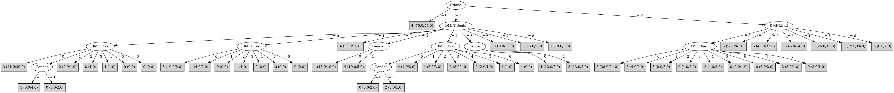

# J48

# SimpleCart Decision Tree

Ethnic=(2)

* DMFT.Begin=(8)|(5)|(7)|(4)|(1)|(3)|(6)|(0)

*   * DMFT.End=(5)|(6)|(3)|(2)|(4)|(1): 5(35.0/135.0)

*   * DMFT.End!=(5)|(6)|(3)|(2)|(4)|(1)

*   *   * Gender=(1): 3(11.0/13.0)

*   *   * Gender!=(1): 0(9.0/28.0)

* DMFT.Begin!=(8)|(5)|(7)|(4)|(1)|(3)|(6)|(0)

*   * DMFT.End=(4)|(3): 1(4.0/6.0)

*   * DMFT.End!=(4)|(3)

*   *   * Gender=(1): 5(9.0/6.0)

*   *   * Gender!=(1): 2(3.0/8.0)

Ethnic!=(2)

* Ethnic=(1)|(2)

*   * DMFT.End=(5)|(6)|(3)|(2)|(4)

*   *   * DMFT.Begin=(8): 1(5.0/5.0)

*   *   * DMFT.Begin!=(8)

*   *   *   * DMFT.Begin=(0)|(5)|(7)

*   *   *   *   * Gender=(1): 3(7.0/12.0)

*   *   *   *   * Gender!=(1): 3(5.0/11.0)

*   *   *   * DMFT.Begin!=(0)|(5)|(7)

*   *   *   *   * DMFT.End=(4)|(3)

*   *   *   *   *   * DMFT.Begin=(1)|(3)|(6)|(0)|(5)|(7)|(8): 1(6.0/9.0)

*   *   *   *   *   * DMFT.Begin!=(1)|(3)|(6)|(0)|(5)|(7)|(8): 3(5.0/6.0)

*   *   *   *   * DMFT.End!=(4)|(3): 4(14.0/19.0)

*   * DMFT.End!=(5)|(6)|(3)|(2)|(4)

*   *   * DMFT.Begin=(0)|(5)|(7)|(1)|(3)|(6)|(8): 0(22.0/68.0)

*   *   * DMFT.Begin!=(0)|(5)|(7)|(1)|(3)|(6)|(8)

*   *   *   * Gender=(1): 4(7.0/4.0)

*   *   *   * Gender!=(1): 3(3.0/7.0)

* Ethnic!=(1)|(2)

*   * DMFT.Begin=(8)|(5)|(7)|(4)

*   *   * DMFT.Begin=(8)|(5)|(0)|(1)|(2)|(3)|(6): 3(5.0/10.0)

*   *   * DMFT.Begin!=(8)|(5)|(0)|(1)|(2)|(3)|(6): 4(7.0/4.0)

*   * DMFT.Begin!=(8)|(5)|(7)|(4)

*   *   * DMFT.Begin=(0)|(1)|(4)|(5)|(7)|(8)

*   *   *   * DMFT.End=(2)|(1): 1(5.0/5.0)

*   *   *   * DMFT.End!=(2)|(1): 3(5.0/13.0)

*   *   * DMFT.Begin!=(0)|(1)|(4)|(5)|(7)|(8)

*   *   *   * Gender=(1): 2(7.0/4.0)

*   *   *   * Gender!=(1): 2(3.0/7.0)

# PART

Decision list:

conditions|predicted class
---|---
Ethnic = 0| 4 (75.0/54.0)
DMFT.End = 5 AND DMFT.Begin = 7| 3 (12.0/8.0)
DMFT.End = 0 AND DMFT.Begin = 0| 3 (79.0/54.0)
DMFT.End = 3| 1 (71.0/51.0)
DMFT.End = 5| 1 (21.0/15.0)
DMFT.End = 4 AND DMFT.Begin = 5| 3 (12.0/8.0)
DMFT.End = 4| 1 (38.0/29.0)
DMFT.Begin = 2 AND Ethnic = 2| 5 (26.0/14.0)
DMFT.End = 2 AND DMFT.Begin = 3| 4 (15.0/10.0)
DMFT.End = 0 AND DMFT.Begin = 1| 5 (14.0/8.0)
DMFT.End = 0| 0 (37.0/28.0)
DMFT.End = 2 AND DMFT.Begin = 6| 5 (12.0/7.0)
DMFT.End = 2| 1 (46.0/36.0)
| 4 (99.0/79.0)

JRIP rules:
===========

 => target=3 (557.0/444.0)

Number of Rules : 1

# Decision Table

Non matches covered by IB1

dmft.begin|ethnic|target
---|---|---
1|2|3
7|2|2
3|2|0
2|2|5
6|2|5
0|2|3
8|2|2
5|2|1
4|2|2
6|1|1
1|1|0
8|1|1
3|1|1
4|1|3
0|1|0
2|1|4
7|1|3
5|1|3
6|0|2
7|0|4
4|0|4
2|0|2
5|0|2
0|0|3
8|0|3
1|0|1
3|0|2

