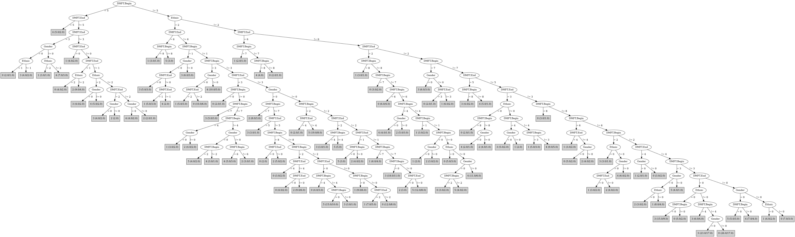

# J48

# SimpleCart Decision Tree

DMFT.End=(6)|(3)|(5)|(2)|(4): 4(68.0/217.0)

DMFT.End!=(6)|(3)|(5)|(2)|(4): 0(58.0/214.0)

# PART

Decision list:

conditions|predicted class
---|---
DMFT.End = 6| 4 (15.0/9.0)
DMFT.Begin = 8 AND Ethnic = 2| 2 (15.0/9.0)
DMFT.Begin = 5 AND DMFT.End = 3| 4 (16.0/10.0)
DMFT.Begin = 5 AND DMFT.End = 1| 2 (13.0/8.0)
DMFT.Begin = 5 AND DMFT.End = 4| 3 (12.0/8.0)
DMFT.Begin = 8| 1 (14.0/10.0)
DMFT.Begin = 5 AND Gender = 0| 1 (9.0/6.0)
DMFT.Begin = 0 AND DMFT.End = 1 AND Ethnic = 2| 5 (11.0/6.0)
DMFT.Begin = 0 AND DMFT.End = 0 AND Ethnic = 2 AND Gender = 1| 3 (18.0/11.0)
DMFT.Begin = 0 AND DMFT.End = 0 AND Ethnic = 1 AND Gender = 1| 0 (20.0/13.0)
Ethnic = 1 AND DMFT.Begin = 7| 3 (13.0/8.0)
DMFT.Begin = 7 AND Gender = 0| 2 (12.0/6.0)
DMFT.End = 5| 4 (23.0/14.0)
DMFT.Begin = 0 AND DMFT.End = 0 AND Ethnic = 1| 0 (18.0/14.0)
DMFT.Begin = 0 AND Gender = 1 AND Ethnic = 0| 0 (10.0/7.0)
DMFT.Begin = 0 AND Gender = 0 AND Ethnic = 2| 5 (17.0/12.0)
DMFT.Begin = 0 AND Gender = 0| 3 (13.0/9.0)
DMFT.Begin = 1 AND DMFT.End = 0 AND Gender = 0| 3 (12.0/8.0)
DMFT.Begin = 1 AND Ethnic = 1| 0 (14.0/10.0)
DMFT.Begin = 1 AND Gender = 0| 4 (12.0/8.0)
DMFT.Begin = 2 AND Ethnic = 2 AND DMFT.End = 1| 5 (11.0/4.0)
DMFT.Begin = 3 AND DMFT.End = 2| 4 (16.0/11.0)
DMFT.Begin = 0| 0 (9.0/4.0)
DMFT.Begin = 1| 3 (9.0/5.0)
DMFT.Begin = 3 AND Ethnic = 2 AND Gender = 0| 0 (9.0/5.0)
DMFT.Begin = 3 AND Ethnic = 1 AND Gender = 0| 1 (9.0/4.0)
DMFT.End = 3 AND Ethnic = 1| 1 (15.0/10.0)
DMFT.Begin = 3| 0 (17.0/13.0)
Ethnic = 0 AND DMFT.Begin = 4| 4 (10.0/6.0)
Ethnic = 0 AND Gender = 0| 0 (8.0/5.0)
Ethnic = 2 AND DMFT.End = 0 AND Gender = 0| 0 (11.0/7.0)
Ethnic = 2 AND DMFT.Begin = 2 AND Gender = 0| 5 (13.0/9.0)
DMFT.Begin = 2 AND Ethnic = 2| 5 (13.0/8.0)
DMFT.Begin = 2 AND DMFT.End = 2| 4 (11.0/7.0)
DMFT.Begin = 2| 4 (15.0/10.0)
DMFT.Begin = 4 AND Gender = 1 AND Ethnic = 2| 2 (15.0/9.0)
DMFT.End = 2 AND Ethnic = 2| 5 (14.0/7.0)
DMFT.Begin = 6 AND DMFT.End = 3| 4 (8.0/4.0)
DMFT.Begin = 6 AND Gender = 1| 2 (12.0/7.0)
DMFT.Begin = 4 AND Gender = 0 AND Ethnic = 2| 3 (10.0/7.0)
DMFT.End = 2| 4 (11.0/6.0)
DMFT.Begin = 4| 3 (11.0/8.0)
| 0 (13.0/8.0)

JRIP rules:
===========

 => target=3 (557.0/450.0)

Number of Rules : 1

# Decision Table

Non matches covered by Majority class

dmft.begin|gender|target
---|---|---
2|1|5
6|1|5
3|1|4
8|1|4
5|1|4
0|1|0
7|1|1
4|1|2
1|1|3
6|0|3
7|0|3
8|0|2
5|0|3
0|0|1
2|0|0
1|0|5
4|0|3
3|0|0

