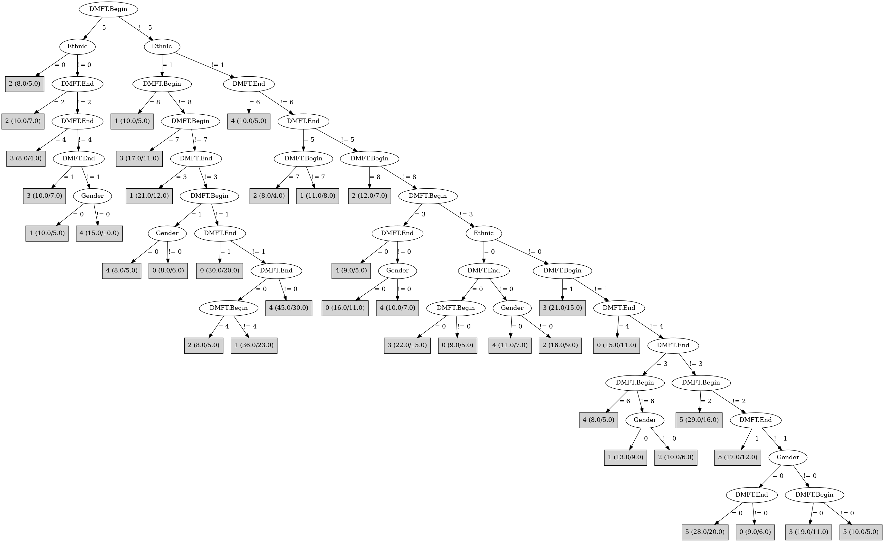

# J48

# SimpleCart Decision Tree

Ethnic=(1)

* DMFT.Begin=(7)

*   * DMFT.End=(5)|(2): 0(4.0/3.0)

*   * DMFT.End!=(5)|(2)

*   *   * DMFT.End=(4)|(3)|(0)|(2)|(5): 3(2.0/3.0)

*   *   * DMFT.End!=(4)|(3)|(0)|(2)|(5): 1(2.0/3.0)

* DMFT.Begin!=(7)

*   * DMFT.End=(6)|(5)|(3)

*   *   * DMFT.Begin=(6)|(5)|(1)

*   *   *   * DMFT.End=(6)|(5): 4(4.0/2.0)

*   *   *   * DMFT.End!=(6)|(5)

*   *   *   *   * DMFT.Begin=(5)|(0)|(2)|(3)|(4)|(7)|(8): 4(4.0/3.0)

*   *   *   *   * DMFT.Begin!=(5)|(0)|(2)|(3)|(4)|(7)|(8): 1(3.0/3.0)

*   *   * DMFT.Begin!=(6)|(5)|(1): 1(10.0/12.0)

*   * DMFT.End!=(6)|(5)|(3)

*   *   * DMFT.Begin=(5)|(4)|(3)|(2)|(1)|(7)

*   *   *   * DMFT.Begin=(5)

*   *   *   *   * Gender=(1): 2(4.0/4.0)

*   *   *   *   * Gender!=(1): 3(3.0/5.0)

*   *   *   * DMFT.Begin!=(5)

*   *   *   *   * DMFT.End=(2)

*   *   *   *   *   * Gender=(1)

*   *   *   *   *   *   * DMFT.Begin=(4): 1(2.0/2.0)

*   *   *   *   *   *   * DMFT.Begin!=(4): 1(3.0/5.0)

*   *   *   *   *   * Gender!=(1): 4(4.0/4.0)

*   *   *   *   * DMFT.End!=(2)

*   *   *   *   *   * DMFT.Begin=(4)

*   *   *   *   *   *   * Gender=(1)

*   *   *   *   *   *   *   * DMFT.End=(4)|(1): 4(3.0/1.0)

*   *   *   *   *   *   *   * DMFT.End!=(4)|(1): 2(3.0/2.0)

*   *   *   *   *   *   * Gender!=(1): 5(2.0/2.0)

*   *   *   *   *   * DMFT.Begin!=(4)

*   *   *   *   *   *   * DMFT.End=(4)|(1)|(2)|(3)|(5)|(6)

*   *   *   *   *   *   *   * DMFT.Begin=(3)|(2)|(0)|(4)|(5)|(6)|(7)|(8)

*   *   *   *   *   *   *   *   * Gender=(1): 3(2.0/4.0)

*   *   *   *   *   *   *   *   * Gender!=(1): 0(4.0/6.0)

*   *   *   *   *   *   *   * DMFT.Begin!=(3)|(2)|(0)|(4)|(5)|(6)|(7)|(8): 0(2.0/4.0)

*   *   *   *   *   *   * DMFT.End!=(4)|(1)|(2)|(3)|(5)|(6)

*   *   *   *   *   *   *   * DMFT.Begin=(3)|(2): 1(2.0/3.0)

*   *   *   *   *   *   *   * DMFT.Begin!=(3)|(2)

*   *   *   *   *   *   *   *   * Gender=(1): 5(2.0/3.0)

*   *   *   *   *   *   *   *   * Gender!=(1): 3(2.0/3.0)

*   *   * DMFT.Begin!=(5)|(4)|(3)|(2)|(1)|(7)

*   *   *   * DMFT.End=(2)|(1): 0(8.0/17.0)

*   *   *   * DMFT.End!=(2)|(1): 1(14.0/24.0)

Ethnic!=(1)

* DMFT.End=(6)|(5)|(4)|(3)|(2)|(1)

*   * DMFT.Begin=(8)|(7)|(6)|(5)|(4)|(1)

*   *   * DMFT.End=(6)

*   *   *   * Gender=(1): 4(4.0/1.0)

*   *   *   * Gender!=(1): 5(4.0/3.0)

*   *   * DMFT.End!=(6)

*   *   *   * DMFT.Begin=(8)|(5)

*   *   *   *   * DMFT.End=(5)|(3)

*   *   *   *   *   * Ethnic=(2)|(1)

*   *   *   *   *   *   * Gender=(1)

*   *   *   *   *   *   *   * DMFT.End=(5): 3(2.0/2.0)

*   *   *   *   *   *   *   * DMFT.End!=(5): 1(2.0/3.0)

*   *   *   *   *   *   * Gender!=(1): 1(4.0/3.0)

*   *   *   *   *   * Ethnic!=(2)|(1): 4(2.0/3.0)

*   *   *   *   * DMFT.End!=(5)|(3)

*   *   *   *   *   * Ethnic=(2)|(1)

*   *   *   *   *   *   * DMFT.Begin=(8): 2(2.0/2.0)

*   *   *   *   *   *   * DMFT.Begin!=(8)

*   *   *   *   *   *   *   * Gender=(1): 4(2.0/3.0)

*   *   *   *   *   *   *   * Gender!=(1): 3(4.0/4.0)

*   *   *   *   *   * Ethnic!=(2)|(1): 2(3.0/4.0)

*   *   *   * DMFT.Begin!=(8)|(5)

*   *   *   *   * DMFT.End=(5): 2(5.0/9.0)

*   *   *   *   * DMFT.End!=(5)

*   *   *   *   *   * Gender=(1)

*   *   *   *   *   *   * DMFT.Begin=(7): 5(4.0/3.0)

*   *   *   *   *   *   * DMFT.Begin!=(7)

*   *   *   *   *   *   *   * Ethnic=(2)|(1)

*   *   *   *   *   *   *   *   * DMFT.End=(2): 5(4.0/3.0)

*   *   *   *   *   *   *   *   * DMFT.End!=(2)

*   *   *   *   *   *   *   *   *   * DMFT.Begin=(6)|(4)|(0)|(2)|(3)|(5)|(7)|(8): 2(7.0/12.0)

*   *   *   *   *   *   *   *   *   * DMFT.Begin!=(6)|(4)|(0)|(2)|(3)|(5)|(7)|(8): 3(2.0/4.0)

*   *   *   *   *   *   *   * Ethnic!=(2)|(1): 2(6.0/2.0)

*   *   *   *   *   * Gender!=(1)

*   *   *   *   *   *   * DMFT.Begin=(7)|(6)

*   *   *   *   *   *   *   * DMFT.End=(4)|(3)|(2)|(0)|(5)|(6)

*   *   *   *   *   *   *   *   * DMFT.Begin=(7): 2(3.0/2.0)

*   *   *   *   *   *   *   *   * DMFT.Begin!=(7): 0(2.0/5.0)

*   *   *   *   *   *   *   * DMFT.End!=(4)|(3)|(2)|(0)|(5)|(6): 3(2.0/2.0)

*   *   *   *   *   *   * DMFT.Begin!=(7)|(6)

*   *   *   *   *   *   *   * DMFT.End=(4)|(3): 1(4.0/5.0)

*   *   *   *   *   *   *   * DMFT.End!=(4)|(3)

*   *   *   *   *   *   *   *   * DMFT.Begin=(4): 1(2.0/5.0)

*   *   *   *   *   *   *   *   * DMFT.Begin!=(4)

*   *   *   *   *   *   *   *   *   * DMFT.End=(2): 1(2.0/4.0)

*   *   *   *   *   *   *   *   *   * DMFT.End!=(2): 3(2.0/5.0)

*   * DMFT.Begin!=(8)|(7)|(6)|(5)|(4)|(1)

*   *   * DMFT.End=(3)

*   *   *   * Gender=(1): 2(4.0/2.0)

*   *   *   * Gender!=(1): 1(2.0/5.0)

*   *   * DMFT.End!=(3)

*   *   *   * Gender=(1)

*   *   *   *   * DMFT.End=(2): 5(5.0/1.0)

*   *   *   *   * DMFT.End!=(2)

*   *   *   *   *   * DMFT.Begin=(3)|(2)|(1)|(4)|(5)|(6)|(7)|(8)

*   *   *   *   *   *   * Ethnic=(2)|(1)

*   *   *   *   *   *   *   * DMFT.End=(4): 0(2.0/2.0)

*   *   *   *   *   *   *   * DMFT.End!=(4): 5(4.0/5.0)

*   *   *   *   *   *   * Ethnic!=(2)|(1): 0(1.0/3.0)

*   *   *   *   *   * DMFT.Begin!=(3)|(2)|(1)|(4)|(5)|(6)|(7)|(8): 5(3.0/1.0)

*   *   *   * Gender!=(1): 2(9.0/27.0)

* DMFT.End!=(6)|(5)|(4)|(3)|(2)|(1)

*   * DMFT.Begin=(8)|(4)|(3)|(2)

*   *   * DMFT.Begin=(3): 4(4.0/5.0)

*   *   * DMFT.Begin!=(3)

*   *   *   * Gender=(1)

*   *   *   *   * DMFT.Begin=(8)|(4)|(0)|(1)|(3)|(5)|(6)|(7): 2(4.0/1.0)

*   *   *   *   * DMFT.Begin!=(8)|(4)|(0)|(1)|(3)|(5)|(6)|(7): 5(2.0/3.0)

*   *   *   * Gender!=(1): 0(5.0/6.0)

*   * DMFT.Begin!=(8)|(4)|(3)|(2)

*   *   * Ethnic=(2)|(1)

*   *   *   * Gender=(1): 3(10.0/13.0)

*   *   *   * Gender!=(1): 5(9.0/20.0)

*   *   * Ethnic!=(2)|(1)

*   *   *   * DMFT.Begin=(6)|(1): 0(3.0/4.0)

*   *   *   * DMFT.Begin!=(6)|(1)

*   *   *   *   * Gender=(1): 0(4.0/8.0)

*   *   *   *   * Gender!=(1): 3(3.0/7.0)

# PART

Decision list:

conditions|predicted class
---|---
DMFT.Begin = 5 AND Ethnic != 0 AND DMFT.End != 2 AND DMFT.End != 4| 1 (35.0/24.0)
DMFT.Begin != 5 AND Ethnic = 1 AND DMFT.Begin != 8 AND DMFT.Begin != 7 AND DMFT.End != 3 AND DMFT.Begin != 1 AND DMFT.End != 1 AND DMFT.End = 0 AND DMFT.Begin != 4| 1 (36.0/23.0)
DMFT.Begin = 5| 3 (26.0/16.0)
DMFT.End = 6| 4 (15.0/8.0)
DMFT.Begin = 8 AND Ethnic != 2| 1 (13.0/7.0)
DMFT.End = 0 AND DMFT.Begin != 3 AND Ethnic = 0| 0 (31.0/21.0)
Ethnic = 1 AND DMFT.Begin != 7 AND DMFT.End != 3 AND DMFT.End != 0 AND DMFT.Begin != 4 AND DMFT.End != 4 AND DMFT.Begin != 6 AND DMFT.End = 1| 0 (31.0/21.0)
Ethnic = 1 AND DMFT.Begin != 7 AND DMFT.End != 0 AND DMFT.End != 3| 4 (49.0/33.0)
DMFT.Begin != 8 AND DMFT.Begin = 1| 3 (39.0/29.0)
DMFT.Begin != 8 AND Ethnic = 1 AND DMFT.Begin != 7 AND DMFT.End != 0| 1 (19.0/11.0)
DMFT.Begin != 8 AND DMFT.Begin = 3 AND DMFT.End != 0| 5 (27.0/20.0)
DMFT.Begin != 3 AND DMFT.Begin != 8 AND DMFT.End != 5 AND Ethnic = 0| 2 (21.0/15.0)
DMFT.Begin != 3 AND DMFT.Begin != 8 AND DMFT.End = 5| 2 (18.0/13.0)
DMFT.Begin != 3 AND DMFT.Begin = 8| 2 (12.0/7.0)
DMFT.Begin != 3 AND DMFT.Begin = 2 AND DMFT.End != 2 AND DMFT.End = 1| 5 (10.0/5.0)
DMFT.Begin != 3 AND DMFT.End = 1 AND Gender = 0| 1 (11.0/8.0)
DMFT.Begin != 3 AND DMFT.End != 1 AND DMFT.Begin != 7 AND DMFT.End != 3 AND DMFT.End != 4 AND DMFT.Begin != 2 AND DMFT.Begin != 4 AND DMFT.End = 0| 3 (43.0/29.0)
DMFT.Begin != 3 AND DMFT.End != 1 AND DMFT.Begin != 7 AND DMFT.End = 2| 5 (23.0/13.0)
DMFT.Begin != 3 AND DMFT.End != 1 AND DMFT.Begin = 7| 3 (18.0/12.0)
DMFT.Begin != 3 AND DMFT.End != 1 AND DMFT.End = 0 AND Gender = 0| 0 (12.0/8.0)
DMFT.Begin != 3 AND DMFT.End != 1 AND Gender != 0| 2 (31.0/19.0)
DMFT.Begin != 3| 1 (28.0/20.0)
| 4 (9.0/5.0)

# JRip

Decision list:

conditions|predicted class
---|---
(Ethnic = 2) and (DMFT.End = 2) and (Gender = 1)|5 (16.0/7.0)
|3 (541.0/443.0)

# Decision Table

Non matches covered by Majority class

dmft.end|ethnic|target
---|---|---
5|2|1
6|2|4
4|2|0
1|2|5
2|2|5
0|2|3
3|2|2
6|1|1
3|1|1
4|1|3
1|1|0
0|1|1
5|1|4
2|1|4
3|0|2
2|0|2
5|0|4
6|0|0
0|0|0
1|0|3
4|0|1

