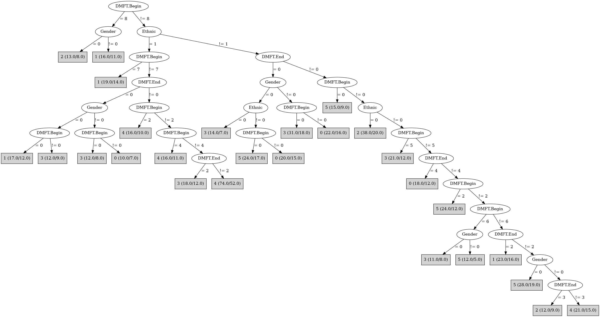

# J48

# SimpleCart Decision Tree

Ethnic=(1)

* DMFT.Begin=(6)|(5)|(4)|(3)|(2)

*   * DMFT.End=(6)|(5): 4(4.0/4.0)

*   * DMFT.End!=(6)|(5)

*   *   * DMFT.Begin=(6)|(5)|(4)|(3)|(0)|(1)|(7)|(8)

*   *   *   * DMFT.End=(4)|(3)|(2)|(5)|(6)

*   *   *   *   * Gender=(1)

*   *   *   *   *   * DMFT.End=(4)|(3)|(0)|(1)|(5)|(6)

*   *   *   *   *   *   * DMFT.Begin=(6)

*   *   *   *   *   *   *   * DMFT.End=(4)|(0)|(1)|(2)|(5)|(6): 1(2.0/2.0)

*   *   *   *   *   *   *   * DMFT.End!=(4)|(0)|(1)|(2)|(5)|(6): 1(1.0/1.0)

*   *   *   *   *   *   * DMFT.Begin!=(6)

*   *   *   *   *   *   *   * DMFT.End=(4): 2(2.0/3.0)

*   *   *   *   *   *   *   * DMFT.End!=(4)

*   *   *   *   *   *   *   *   * DMFT.Begin=(5): 1(1.0/3.0)

*   *   *   *   *   *   *   *   * DMFT.Begin!=(5): 3(3.0/2.0)

*   *   *   *   *   * DMFT.End!=(4)|(3)|(0)|(1)|(5)|(6)

*   *   *   *   *   *   * DMFT.Begin=(6)|(5)|(4)|(0)|(1)|(2)|(7)|(8)

*   *   *   *   *   *   *   * DMFT.Begin=(6): 0(1.0/1.0)

*   *   *   *   *   *   *   * DMFT.Begin!=(6)

*   *   *   *   *   *   *   *   * DMFT.Begin=(5): 1(1.0/1.0)

*   *   *   *   *   *   *   *   * DMFT.Begin!=(5): 1(2.0/1.0)

*   *   *   *   *   *   * DMFT.Begin!=(6)|(5)|(4)|(0)|(1)|(2)|(7)|(8): 4(3.0/1.0)

*   *   *   *   * Gender!=(1)

*   *   *   *   *   * DMFT.End=(4)

*   *   *   *   *   *   * DMFT.Begin=(5): 4(3.0/0.0)

*   *   *   *   *   *   * DMFT.Begin!=(5): 1(1.0/3.0)

*   *   *   *   *   * DMFT.End!=(4)

*   *   *   *   *   *   * DMFT.End=(3)|(0)|(1)|(4)|(5)|(6)

*   *   *   *   *   *   *   * DMFT.Begin=(5): 0(1.0/1.0)

*   *   *   *   *   *   *   * DMFT.Begin!=(5): 1(3.0/5.0)

*   *   *   *   *   *   * DMFT.End!=(3)|(0)|(1)|(4)|(5)|(6)

*   *   *   *   *   *   *   * DMFT.Begin=(4): 4(2.0/0.0)

*   *   *   *   *   *   *   * DMFT.Begin!=(4)

*   *   *   *   *   *   *   *   * DMFT.Begin=(5): 3(3.0/0.0)

*   *   *   *   *   *   *   *   * DMFT.Begin!=(5)

*   *   *   *   *   *   *   *   *   * DMFT.Begin=(6)|(0)|(1)|(2)|(4)|(5)|(7)|(8): 0(1.0/2.0)

*   *   *   *   *   *   *   *   *   * DMFT.Begin!=(6)|(0)|(1)|(2)|(4)|(5)|(7)|(8): 0(1.0/1.0)

*   *   *   * DMFT.End!=(4)|(3)|(2)|(5)|(6)

*   *   *   *   * DMFT.Begin=(6)|(5)

*   *   *   *   *   * Gender=(1)

*   *   *   *   *   *   * DMFT.Begin=(6): 0(1.0/1.0)

*   *   *   *   *   *   * DMFT.Begin!=(6): 2(2.0/3.0)

*   *   *   *   *   * Gender!=(1): 2(1.0/2.0)

*   *   *   *   * DMFT.Begin!=(6)|(5)

*   *   *   *   *   * Gender=(1)

*   *   *   *   *   *   * DMFT.End=(1)|(2)|(3)|(4)|(5)|(6)

*   *   *   *   *   *   *   * DMFT.Begin=(4)|(0)|(1)|(2)|(5)|(6)|(7)|(8): 4(2.0/1.0)

*   *   *   *   *   *   *   * DMFT.Begin!=(4)|(0)|(1)|(2)|(5)|(6)|(7)|(8): 3(1.0/2.0)

*   *   *   *   *   *   * DMFT.End!=(1)|(2)|(3)|(4)|(5)|(6): 2(2.0/1.0)

*   *   *   *   *   * Gender!=(1)

*   *   *   *   *   *   * DMFT.Begin=(4): 5(2.0/2.0)

*   *   *   *   *   *   * DMFT.Begin!=(4)

*   *   *   *   *   *   *   * DMFT.End=(1)|(2)|(3)|(4)|(5)|(6): 0(2.0/2.0)

*   *   *   *   *   *   *   * DMFT.End!=(1)|(2)|(3)|(4)|(5)|(6): 1(1.0/1.0)

*   *   * DMFT.Begin!=(6)|(5)|(4)|(3)|(0)|(1)|(7)|(8)

*   *   *   * Gender=(1)

*   *   *   *   * DMFT.End=(2)|(3)|(4)|(5)|(6): 4(2.0/3.0)

*   *   *   *   * DMFT.End!=(2)|(3)|(4)|(5)|(6): 4(3.0/1.0)

*   *   *   * Gender!=(1)

*   *   *   *   * DMFT.End=(1): 0(2.0/1.0)

*   *   *   *   * DMFT.End!=(1)

*   *   *   *   *   * DMFT.End=(2)|(1)|(3)|(4)|(5)|(6): 4(2.0/3.0)

*   *   *   *   *   * DMFT.End!=(2)|(1)|(3)|(4)|(5)|(6): 0(1.0/3.0)

* DMFT.Begin!=(6)|(5)|(4)|(3)|(2)

*   * DMFT.End=(6)|(3)|(1)

*   *   * DMFT.Begin=(7)

*   *   *   * DMFT.End=(6): 1(1.0/1.0)

*   *   *   * DMFT.End!=(6)

*   *   *   *   * DMFT.End=(3)|(0)|(2)|(4)|(5)|(6): 3(1.0/1.0)

*   *   *   *   * DMFT.End!=(3)|(0)|(2)|(4)|(5)|(6): 1(1.0/1.0)

*   *   * DMFT.Begin!=(7)

*   *   *   * DMFT.End=(3)

*   *   *   *   * DMFT.Begin=(8)|(0)|(2)|(3)|(4)|(5)|(6)|(7): 1(2.0/0.0)

*   *   *   *   * DMFT.Begin!=(8)|(0)|(2)|(3)|(4)|(5)|(6)|(7): 1(1.0/1.0)

*   *   *   * DMFT.End!=(3)

*   *   *   *   * DMFT.Begin=(8): 2(1.0/1.0)

*   *   *   *   * DMFT.Begin!=(8)

*   *   *   *   *   * Gender=(1)

*   *   *   *   *   *   * DMFT.Begin=(1): 1(1.0/1.0)

*   *   *   *   *   *   * DMFT.Begin!=(1): 0(3.0/3.0)

*   *   *   *   *   * Gender!=(1)

*   *   *   *   *   *   * DMFT.Begin=(1)|(2)|(3)|(4)|(5)|(6)|(7)|(8): 4(2.0/2.0)

*   *   *   *   *   *   * DMFT.Begin!=(1)|(2)|(3)|(4)|(5)|(6)|(7)|(8): 1(1.0/2.0)

*   * DMFT.End!=(6)|(3)|(1)

*   *   * Gender=(1)

*   *   *   * DMFT.Begin=(8)|(7)|(1)|(2)|(3)|(4)|(5)|(6)

*   *   *   *   * DMFT.End=(5): 0(1.0/3.0)

*   *   *   *   * DMFT.End!=(5)

*   *   *   *   *   * DMFT.End=(4)|(2): 0(4.0/2.0)

*   *   *   *   *   * DMFT.End!=(4)|(2): 0(3.0/4.0)

*   *   *   * DMFT.Begin!=(8)|(7)|(1)|(2)|(3)|(4)|(5)|(6)

*   *   *   *   * DMFT.End=(2): 2(1.0/1.0)

*   *   *   *   * DMFT.End!=(2): 3(4.0/8.0)

*   *   * Gender!=(1)

*   *   *   * DMFT.Begin=(7)|(1)

*   *   *   *   * DMFT.End=(5): 0(1.0/1.0)

*   *   *   *   * DMFT.End!=(5)

*   *   *   *   *   * DMFT.End=(4): 3(1.0/2.0)

*   *   *   *   *   * DMFT.End!=(4): 3(3.0/1.0)

*   *   *   * DMFT.Begin!=(7)|(1)

*   *   *   *   * DMFT.End=(5)|(4)

*   *   *   *   *   * DMFT.Begin=(8)|(1)|(2)|(3)|(4)|(5)|(6)|(7): 1(1.0/1.0)

*   *   *   *   *   * DMFT.Begin!=(8)|(1)|(2)|(3)|(4)|(5)|(6)|(7): 1(2.0/0.0)

*   *   *   *   * DMFT.End!=(5)|(4)

*   *   *   *   *   * DMFT.Begin=(8): 2(1.0/1.0)

*   *   *   *   *   * DMFT.Begin!=(8): 1(5.0/12.0)

Ethnic!=(1)

* DMFT.End=(6)|(5)|(3)|(2)|(1)

*   * Ethnic=(2)|(1)

*   *   * DMFT.Begin=(8)|(7)|(5)|(4)|(3)|(1)

*   *   *   * DMFT.Begin=(7)|(4)|(3)|(0)|(2)|(6)

*   *   *   *   * DMFT.End=(6)|(5)|(2)

*   *   *   *   *   * DMFT.Begin=(7)

*   *   *   *   *   *   * DMFT.End=(6): 4(1.0/1.0)

*   *   *   *   *   *   * DMFT.End!=(6)

*   *   *   *   *   *   *   * Gender=(1)

*   *   *   *   *   *   *   *   * DMFT.End=(5)|(0)|(1)|(3)|(4)|(6): 1(2.0/4.0)

*   *   *   *   *   *   *   *   * DMFT.End!=(5)|(0)|(1)|(3)|(4)|(6): 1(1.0/2.0)

*   *   *   *   *   *   *   * Gender!=(1): 2(2.0/0.0)

*   *   *   *   *   * DMFT.Begin!=(7)

*   *   *   *   *   *   * Gender=(1): 3(3.0/5.0)

*   *   *   *   *   *   * Gender!=(1): 1(3.0/5.0)

*   *   *   *   * DMFT.End!=(6)|(5)|(2)

*   *   *   *   *   * Gender=(1)

*   *   *   *   *   *   * DMFT.Begin=(7)

*   *   *   *   *   *   *   * DMFT.End=(3)|(0)|(2)|(4)|(5)|(6): 1(1.0/1.0)

*   *   *   *   *   *   *   * DMFT.End!=(3)|(0)|(2)|(4)|(5)|(6): 5(2.0/0.0)

*   *   *   *   *   *   * DMFT.Begin!=(7)

*   *   *   *   *   *   *   * DMFT.Begin=(4)|(0)|(1)|(2)|(5)|(6)|(7)|(8)

*   *   *   *   *   *   *   *   * DMFT.End=(3)|(0)|(2)|(4)|(5)|(6): 2(3.0/4.0)

*   *   *   *   *   *   *   *   * DMFT.End!=(3)|(0)|(2)|(4)|(5)|(6): 2(2.0/3.0)

*   *   *   *   *   *   *   * DMFT.Begin!=(4)|(0)|(1)|(2)|(5)|(6)|(7)|(8): 4(2.0/1.0)

*   *   *   *   *   * Gender!=(1)

*   *   *   *   *   *   * DMFT.Begin=(7): 0(1.0/2.0)

*   *   *   *   *   *   * DMFT.Begin!=(7)

*   *   *   *   *   *   *   * DMFT.End=(3): 5(2.0/1.0)

*   *   *   *   *   *   *   * DMFT.End!=(3)

*   *   *   *   *   *   *   *   * DMFT.Begin=(4): 0(1.0/3.0)

*   *   *   *   *   *   *   *   * DMFT.Begin!=(4): 2(2.0/4.0)

*   *   *   * DMFT.Begin!=(7)|(4)|(3)|(0)|(2)|(6)

*   *   *   *   * DMFT.End=(6): 5(2.0/1.0)

*   *   *   *   * DMFT.End!=(6)

*   *   *   *   *   * DMFT.End=(5)

*   *   *   *   *   *   * DMFT.Begin=(8): 1(1.0/1.0)

*   *   *   *   *   *   * DMFT.Begin!=(8): 1(1.0/2.0)

*   *   *   *   *   * DMFT.End!=(5)

*   *   *   *   *   *   * DMFT.Begin=(8)

*   *   *   *   *   *   *   * DMFT.End=(3): 2(1.0/1.0)

*   *   *   *   *   *   *   * DMFT.End!=(3): 3(2.0/1.0)

*   *   *   *   *   *   * DMFT.Begin!=(8)

*   *   *   *   *   *   *   * DMFT.Begin=(5)

*   *   *   *   *   *   *   *   * DMFT.End=(3)

*   *   *   *   *   *   *   *   *   * Gender=(1): 0(1.0/3.0)

*   *   *   *   *   *   *   *   *   * Gender!=(1): 1(1.0/1.0)

*   *   *   *   *   *   *   *   * DMFT.End!=(3)

*   *   *   *   *   *   *   *   *   * DMFT.End=(2): 3(1.0/2.0)

*   *   *   *   *   *   *   *   *   * DMFT.End!=(2): 3(2.0/2.0)

*   *   *   *   *   *   *   * DMFT.Begin!=(5)

*   *   *   *   *   *   *   *   * Gender=(1)

*   *   *   *   *   *   *   *   *   * DMFT.End=(3): 3(1.0/1.0)

*   *   *   *   *   *   *   *   *   * DMFT.End!=(3)

*   *   *   *   *   *   *   *   *   *   * DMFT.End=(2): 1(1.0/1.0)

*   *   *   *   *   *   *   *   *   *   * DMFT.End!=(2): 3(2.0/3.0)

*   *   *   *   *   *   *   *   * Gender!=(1)

*   *   *   *   *   *   *   *   *   * DMFT.End=(3)|(2): 4(2.0/2.0)

*   *   *   *   *   *   *   *   *   * DMFT.End!=(3)|(2): 4(2.0/4.0)

*   *   * DMFT.Begin!=(8)|(7)|(5)|(4)|(3)|(1)

*   *   *   * Gender=(1)

*   *   *   *   * DMFT.End=(3): 2(2.0/5.0)

*   *   *   *   * DMFT.End!=(3)

*   *   *   *   *   * DMFT.End=(5): 5(2.0/1.0)

*   *   *   *   *   * DMFT.End!=(5)

*   *   *   *   *   *   * DMFT.Begin=(2)|(1)|(3)|(4)|(5)|(7)|(8)

*   *   *   *   *   *   *   * DMFT.End=(2): 5(2.0/0.0)

*   *   *   *   *   *   *   * DMFT.End!=(2): 5(6.0/1.0)

*   *   *   *   *   *   * DMFT.Begin!=(2)|(1)|(3)|(4)|(5)|(7)|(8): 5(6.0/0.0)

*   *   *   * Gender!=(1)

*   *   *   *   * DMFT.End=(3): 1(4.0/5.0)

*   *   *   *   * DMFT.End!=(3)

*   *   *   *   *   * DMFT.Begin=(6)|(2)|(1)|(3)|(4)|(5)|(7)|(8)

*   *   *   *   *   *   * DMFT.End=(2)|(0)|(3)|(4)|(6)

*   *   *   *   *   *   *   * DMFT.Begin=(6): 0(1.0/4.0)

*   *   *   *   *   *   *   * DMFT.Begin!=(6): 2(3.0/4.0)

*   *   *   *   *   *   * DMFT.End!=(2)|(0)|(3)|(4)|(6)

*   *   *   *   *   *   *   * DMFT.Begin=(6): 3(2.0/0.0)

*   *   *   *   *   *   *   * DMFT.Begin!=(6): 2(1.0/2.0)

*   *   *   *   *   * DMFT.Begin!=(6)|(2)|(1)|(3)|(4)|(5)|(7)|(8)

*   *   *   *   *   *   * DMFT.End=(2): 0(2.0/0.0)

*   *   *   *   *   *   * DMFT.End!=(2): 5(2.0/4.0)

*   * Ethnic!=(2)|(1)

*   *   * DMFT.Begin=(6)|(5)|(4)|(3)

*   *   *   * DMFT.End=(3)|(2)|(0)|(4)

*   *   *   *   * DMFT.Begin=(5)|(4)|(0)|(1)|(2)|(7)|(8)

*   *   *   *   *   * DMFT.End=(3): 2(3.0/0.0)

*   *   *   *   *   * DMFT.End!=(3)

*   *   *   *   *   *   * Gender=(1): 2(1.0/1.0)

*   *   *   *   *   *   * Gender!=(1): 2(2.0/0.0)

*   *   *   *   * DMFT.Begin!=(5)|(4)|(0)|(1)|(2)|(7)|(8)

*   *   *   *   *   * Gender=(1): 2(3.0/1.0)

*   *   *   *   *   * Gender!=(1): 0(1.0/1.0)

*   *   *   * DMFT.End!=(3)|(2)|(0)|(4)

*   *   *   *   * DMFT.Begin=(5)|(0)|(1)|(2)|(3)|(7)|(8): 2(2.0/2.0)

*   *   *   *   * DMFT.Begin!=(5)|(0)|(1)|(2)|(3)|(7)|(8): 0(2.0/2.0)

*   *   * DMFT.Begin!=(6)|(5)|(4)|(3)

*   *   *   * DMFT.Begin=(7)|(2)|(1)|(3)|(4)|(5)|(6)

*   *   *   *   * DMFT.End=(2)|(0)|(4)|(5)

*   *   *   *   *   * DMFT.Begin=(7)|(2)|(0)|(3)|(4)|(5)|(6)|(8)

*   *   *   *   *   *   * DMFT.Begin=(7): 4(1.0/1.0)

*   *   *   *   *   *   * DMFT.Begin!=(7): 4(2.0/1.0)

*   *   *   *   *   * DMFT.Begin!=(7)|(2)|(0)|(3)|(4)|(5)|(6)|(8): 1(1.0/2.0)

*   *   *   *   * DMFT.End!=(2)|(0)|(4)|(5)

*   *   *   *   *   * Gender=(1): 2(2.0/0.0)

*   *   *   *   *   * Gender!=(1): 4(2.0/2.0)

*   *   *   * DMFT.Begin!=(7)|(2)|(1)|(3)|(4)|(5)|(6): 1(3.0/4.0)

* DMFT.End!=(6)|(5)|(3)|(2)|(1)

*   * DMFT.Begin=(8)|(7)|(6)

*   *   * DMFT.End=(4)

*   *   *   * DMFT.Begin=(8)|(7): 4(2.0/1.0)

*   *   *   * DMFT.Begin!=(8)|(7)

*   *   *   *   * Gender=(1): 2(3.0/1.0)

*   *   *   *   * Gender!=(1): 0(1.0/1.0)

*   *   * DMFT.End!=(4)

*   *   *   * Ethnic=(2)|(1)

*   *   *   *   * Gender=(1)

*   *   *   *   *   * DMFT.Begin=(8)|(0)|(1)|(2)|(3)|(4)|(5)|(6): 2(2.0/0.0)

*   *   *   *   *   * DMFT.Begin!=(8)|(0)|(1)|(2)|(3)|(4)|(5)|(6): 2(1.0/1.0)

*   *   *   *   * Gender!=(1): 3(3.0/2.0)

*   *   *   * Ethnic!=(2)|(1): 0(1.0/1.0)

*   * DMFT.Begin!=(8)|(7)|(6)

*   *   * DMFT.Begin=(3)|(2)

*   *   *   * Ethnic=(2)|(1)

*   *   *   *   * Gender=(1)

*   *   *   *   *   * DMFT.Begin=(3)|(0)|(1)|(4)|(5)|(6)|(7)|(8)

*   *   *   *   *   *   * DMFT.End=(4): 0(2.0/1.0)

*   *   *   *   *   *   * DMFT.End!=(4): 0(2.0/2.0)

*   *   *   *   *   * DMFT.Begin!=(3)|(0)|(1)|(4)|(5)|(6)|(7)|(8): 5(3.0/4.0)

*   *   *   *   * Gender!=(1)

*   *   *   *   *   * DMFT.Begin=(3): 0(1.0/2.0)

*   *   *   *   *   * DMFT.Begin!=(3)

*   *   *   *   *   *   * DMFT.End=(4): 0(1.0/1.0)

*   *   *   *   *   *   * DMFT.End!=(4): 0(2.0/2.0)

*   *   *   * Ethnic!=(2)|(1)

*   *   *   *   * Gender=(1): 1(1.0/1.0)

*   *   *   *   * Gender!=(1): 3(2.0/0.0)

*   *   * DMFT.Begin!=(3)|(2)

*   *   *   * Gender=(1)

*   *   *   *   * DMFT.Begin=(5): 3(2.0/0.0)

*   *   *   *   * DMFT.Begin!=(5)

*   *   *   *   *   * DMFT.Begin=(1): 0(1.0/4.0)

*   *   *   *   *   * DMFT.Begin!=(1)

*   *   *   *   *   *   * Ethnic=(2)|(1)

*   *   *   *   *   *   *   * DMFT.Begin=(4): 3(2.0/1.0)

*   *   *   *   *   *   *   * DMFT.Begin!=(4): 3(9.0/10.0)

*   *   *   *   *   *   * Ethnic!=(2)|(1)

*   *   *   *   *   *   *   * DMFT.Begin=(4): 0(1.0/1.0)

*   *   *   *   *   *   *   * DMFT.Begin!=(4): 0(4.0/8.0)

*   *   *   * Gender!=(1)

*   *   *   *   * DMFT.Begin=(5)|(1)

*   *   *   *   *   * DMFT.End=(4): 3(2.0/2.0)

*   *   *   *   *   * DMFT.End!=(4)

*   *   *   *   *   *   * DMFT.Begin=(5): 0(1.0/1.0)

*   *   *   *   *   *   * DMFT.Begin!=(5)

*   *   *   *   *   *   *   * Ethnic=(2)|(1): 3(2.0/2.0)

*   *   *   *   *   *   *   * Ethnic!=(2)|(1): 0(1.0/2.0)

*   *   *   *   * DMFT.Begin!=(5)|(1)

*   *   *   *   *   * Ethnic=(2)|(1)

*   *   *   *   *   *   * DMFT.End=(4): 0(1.0/1.0)

*   *   *   *   *   *   * DMFT.End!=(4)

*   *   *   *   *   *   *   * DMFT.Begin=(4): 5(2.0/2.0)

*   *   *   *   *   *   *   * DMFT.Begin!=(4): 5(7.0/17.0)

*   *   *   *   *   * Ethnic!=(2)|(1): 3(3.0/5.0)

# PART

Decision list:

conditions|predicted class
---|---
Ethnic = 0 AND DMFT.End = 0| 3 (29.0/18.0)
Ethnic = 0 AND DMFT.Begin = 2| 4 (7.0/4.0)
Ethnic = 0 AND DMFT.Begin = 4| 2 (6.0/3.0)
Ethnic = 0 AND DMFT.Begin = 5| 2 (5.0/1.0)
DMFT.End = 3| 1 (65.0/50.0)
DMFT.Begin = 5| 3 (31.0/20.0)
Ethnic = 2 AND DMFT.Begin = 0 AND DMFT.End = 0| 3 (40.0/26.0)
Ethnic = 2 AND DMFT.Begin = 2| 5 (28.0/14.0)
DMFT.Begin = 0 AND DMFT.End = 0| 0 (27.0/20.0)
DMFT.Begin = 8| 2 (23.0/16.0)
Ethnic = 1| 4 (107.0/81.0)
DMFT.Begin = 6| 5 (25.0/17.0)
DMFT.Begin = 7| 2 (21.0/14.0)
DMFT.End = 1| 5 (29.0/21.0)
DMFT.End = 0| 0 (11.0/7.0)
DMFT.End = 4| 3 (7.0/4.0)
Gender = 0 AND DMFT.Begin = 1| 1 (6.0/4.0)
DMFT.Begin = 3| 1 (9.0/6.0)
Gender = 1| 3 (7.0/5.0)
| 1 (5.0/3.0)

# JRip

Decision list:

conditions|predicted class
---|---
(Ethnic = 2) and (DMFT.Begin = 2) and (Gender = 1)|5 (17.0/6.0)
(Ethnic = 2) and (DMFT.Begin = 6) and (Gender = 1)|5 (15.0/7.0)
(DMFT.Begin = 4) and (Gender = 1)|2 (40.0/25.0)
(DMFT.End = 3)|4 (62.0/47.0)
|3 (423.0/332.0)

# Decision Table

Non matches covered by Majority class

dmft.begin|ethnic|target
---|---|---
3|2|0
7|2|2
8|2|2
5|2|3
6|2|5
4|2|2
2|2|5
0|2|3
1|2|3
8|1|1
2|1|4
4|1|3
7|1|3
0|1|0
5|1|3
1|1|0
6|1|4
3|1|4
7|0|2
4|0|2
0|0|3
2|0|4
6|0|0
5|0|2
1|0|0
3|0|2
8|0|1

