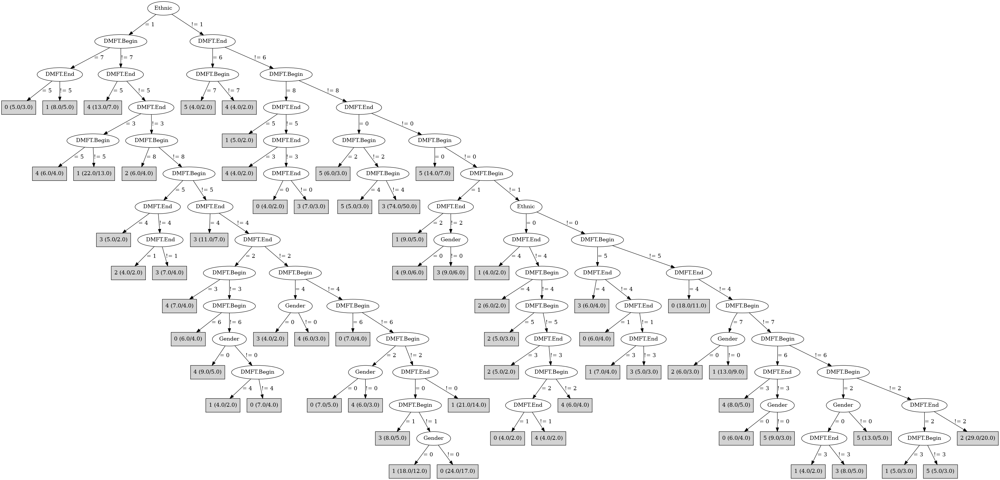

# J48

# SimpleCart Decision Tree

: 3(107.0/450.0)

# PART

Decision list:

conditions|predicted class
---|---
Ethnic = 1 AND DMFT.End = 4 AND Gender = 1| 3 (10.0/6.0)
Ethnic = 1 AND DMFT.End = 3 AND DMFT.Begin = 4| 1 (10.0/6.0)
Ethnic = 1 AND DMFT.End = 3 AND Gender = 1| 1 (13.0/9.0)
DMFT.End = 6 AND DMFT.Begin = 7| 5 (7.0/4.0)
DMFT.End = 5 AND DMFT.Begin = 7| 0 (13.0/10.0)
DMFT.End = 5 AND DMFT.Begin = 6| 4 (10.0/6.0)
DMFT.End = 5 AND Ethnic = 1| 1 (8.0/5.0)
DMFT.End = 0 AND DMFT.Begin = 0 AND Ethnic = 1 AND Gender = 1| 0 (23.0/16.0)
DMFT.End = 0 AND DMFT.Begin = 0 AND Ethnic = 2 AND Gender = 0| 3 (20.0/14.0)
DMFT.End = 0 AND DMFT.Begin = 0 AND Ethnic = 2| 3 (17.0/10.0)
DMFT.End = 0 AND DMFT.Begin = 1| 5 (16.0/10.0)
DMFT.End = 4 AND DMFT.Begin = 5| 4 (11.0/6.0)
DMFT.End = 4 AND Ethnic = 2 AND Gender = 0| 0 (11.0/7.0)
DMFT.End = 5| 1 (10.0/6.0)
DMFT.Begin = 8 AND Gender = 1| 4 (12.0/7.0)
Ethnic = 1 AND DMFT.Begin = 3 AND Gender = 0| 1 (12.0/7.0)
Ethnic = 1 AND DMFT.Begin = 5| 1 (13.0/10.0)
Ethnic = 1 AND DMFT.Begin = 6 AND Gender = 0| 3 (12.0/8.0)
DMFT.Begin = 8| 2 (11.0/8.0)
Ethnic = 1 AND DMFT.Begin = 4 AND Gender = 1| 4 (10.0/7.0)
Ethnic = 1 AND DMFT.Begin = 0 AND DMFT.End = 0| 0 (14.0/10.0)
Ethnic = 1 AND DMFT.End = 2 AND Gender = 1| 4 (14.0/8.0)
DMFT.Begin = 0 AND DMFT.End = 0| 3 (11.0/7.0)
DMFT.Begin = 0 AND Ethnic = 1| 1 (11.0/7.0)
DMFT.Begin = 0 AND Gender = 0| 0 (7.0/5.0)
DMFT.Begin = 1 AND Ethnic = 2 AND Gender = 0| 4 (10.0/6.0)
DMFT.Begin = 1 AND Ethnic = 2| 3 (10.0/6.0)
DMFT.Begin = 1 AND Ethnic = 1| 1 (9.0/5.0)
DMFT.Begin = 2 AND DMFT.End = 1 AND Ethnic = 1| 4 (10.0/7.0)
DMFT.Begin = 2 AND Ethnic = 0| 0 (10.0/7.0)
DMFT.Begin = 2 AND Gender = 1| 5 (15.0/5.0)
DMFT.End = 4| 0 (11.0/8.0)
DMFT.Begin = 4 AND Ethnic = 2 AND Gender = 0| 5 (13.0/9.0)
DMFT.Begin = 4 AND Ethnic = 2| 2 (12.0/7.0)
DMFT.Begin = 0| 5 (7.0/2.0)
Ethnic = 0 AND DMFT.Begin = 1| 1 (7.0/4.0)
Ethnic = 0 AND DMFT.Begin = 4| 2 (7.0/2.0)
Ethnic = 0 AND DMFT.Begin = 3| 2 (6.0/4.0)
DMFT.End = 0 AND DMFT.Begin = 3| 0 (7.0/4.0)
DMFT.End = 0 AND DMFT.Begin = 2| 0 (6.0/3.0)
DMFT.End = 0 AND Gender = 0| 0 (7.0/4.0)
Ethnic = 0| 2 (12.0/7.0)
DMFT.End = 3 AND DMFT.Begin = 7| 2 (9.0/7.0)
DMFT.End = 3 AND DMFT.Begin = 6| 4 (8.0/5.0)
DMFT.Begin = 6 AND Gender = 1| 5 (7.0/3.0)
DMFT.Begin = 5 AND DMFT.End = 3| 1 (7.0/4.0)
DMFT.Begin = 2| 1 (16.0/13.0)
DMFT.Begin = 3 AND Gender = 0| 2 (11.0/8.0)
DMFT.Begin = 5| 3 (10.0/7.0)
DMFT.Begin = 3| 1 (8.0/6.0)
Ethnic = 2| 3 (10.0/7.0)
| 4 (6.0/3.0)

# JRip

Decision list:

conditions|predicted class
---|---
(DMFT.Begin = 4) and (Ethnic = 0)|2 (8.0/3.0)
(Ethnic = 2) and (DMFT.Begin = 2) and (Gender = 1)|5 (16.0/6.0)
(Ethnic = 2) and (DMFT.Begin = 6) and (Gender = 1)|5 (16.0/8.0)
(Ethnic = 1) and (DMFT.End = 2)|4 (40.0/29.0)
(Ethnic = 1) and (DMFT.End = 3)|1 (30.0/20.0)
(Ethnic = 1) and (DMFT.Begin = 0)|1 (47.0/33.0)
|3 (400.0/317.0)

# Decision Table

Non matches covered by IB1

ethnic|target
---|---
1|1
0|2
2|5

