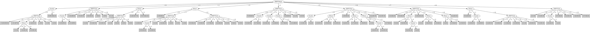

# J48

# SimpleCart Decision Tree

DMFT.End=(6)|(5)|(3)|(2)

* DMFT.End=(6)

*   * DMFT.Begin=(8)

*   *   * Ethnic=(2): 1(2.0/2.0)

*   *   * Ethnic!=(2): 4(3.0/0.0)

*   * DMFT.Begin!=(8): 5(6.0/4.0)

* DMFT.End!=(6)

*   * Ethnic=(1)

*   *   * DMFT.Begin=(8)|(6)|(5)|(4)|(3)|(2)|(1)

*   *   *   * Gender=(1)

*   *   *   *   * DMFT.Begin=(8)|(4)|(3)

*   *   *   *   *   * DMFT.End=(5)|(3)|(0)|(1)|(4)|(6)

*   *   *   *   *   *   * DMFT.End=(5): 3(1.0/1.0)

*   *   *   *   *   *   * DMFT.End!=(5)

*   *   *   *   *   *   *   * DMFT.Begin=(8)|(4)|(0)|(1)|(2)|(5)|(6)|(7)

*   *   *   *   *   *   *   *   * DMFT.Begin=(8): 1(2.0/1.0)

*   *   *   *   *   *   *   *   * DMFT.Begin!=(8): 1(2.0/3.0)

*   *   *   *   *   *   *   * DMFT.Begin!=(8)|(4)|(0)|(1)|(2)|(5)|(6)|(7): 3(2.0/2.0)

*   *   *   *   *   * DMFT.End!=(5)|(3)|(0)|(1)|(4)|(6)

*   *   *   *   *   *   * DMFT.Begin=(4)|(0)|(1)|(2)|(5)|(6)|(7): 1(2.0/1.0)

*   *   *   *   *   *   * DMFT.Begin!=(4)|(0)|(1)|(2)|(5)|(6)|(7): 1(3.0/0.0)

*   *   *   *   * DMFT.Begin!=(8)|(4)|(3)

*   *   *   *   *   * DMFT.End=(5)|(3): 4(7.0/6.0)

*   *   *   *   *   * DMFT.End!=(5)|(3)

*   *   *   *   *   *   * DMFT.Begin=(6)|(5)

*   *   *   *   *   *   *   * DMFT.Begin=(6)|(0)|(1)|(2)|(3)|(4)|(7)|(8): 0(2.0/2.0)

*   *   *   *   *   *   *   * DMFT.Begin!=(6)|(0)|(1)|(2)|(3)|(4)|(7)|(8): 2(2.0/1.0)

*   *   *   *   *   *   * DMFT.Begin!=(6)|(5): 4(3.0/5.0)

*   *   *   * Gender!=(1)

*   *   *   *   * DMFT.Begin=(8)|(6)|(5)|(0)|(3)|(7)

*   *   *   *   *   * DMFT.End=(5): 2(1.0/1.0)

*   *   *   *   *   * DMFT.End!=(5)

*   *   *   *   *   *   * DMFT.Begin=(8): 2(1.0/1.0)

*   *   *   *   *   *   * DMFT.Begin!=(8)

*   *   *   *   *   *   *   * DMFT.End=(3): 0(1.0/1.0)

*   *   *   *   *   *   *   * DMFT.End!=(3)

*   *   *   *   *   *   *   *   * DMFT.Begin=(6): 0(1.0/1.0)

*   *   *   *   *   *   *   *   * DMFT.Begin!=(6): 3(2.0/1.0)

*   *   *   *   * DMFT.Begin!=(8)|(6)|(5)|(0)|(3)|(7)

*   *   *   *   *   * DMFT.End=(3): 1(2.0/3.0)

*   *   *   *   *   * DMFT.End!=(3)

*   *   *   *   *   *   * DMFT.Begin=(4)|(0)|(1)|(3)|(5)|(6)|(7)|(8): 4(3.0/0.0)

*   *   *   *   *   *   * DMFT.Begin!=(4)|(0)|(1)|(3)|(5)|(6)|(7)|(8): 1(1.0/2.0)

*   *   * DMFT.Begin!=(8)|(6)|(5)|(4)|(3)|(2)|(1)

*   *   *   * DMFT.End=(5)

*   *   *   *   * Gender=(1): 1(2.0/1.0)

*   *   *   *   * Gender!=(1): 0(1.0/2.0)

*   *   *   * DMFT.End!=(5)

*   *   *   *   * Gender=(1)

*   *   *   *   *   * DMFT.Begin=(7): 0(1.0/1.0)

*   *   *   *   *   * DMFT.Begin!=(7): 0(2.0/1.0)

*   *   *   *   * Gender!=(1): 3(2.0/2.0)

*   * Ethnic!=(1)

*   *   * DMFT.Begin=(6)|(5)|(2)|(1)

*   *   *   * Ethnic=(2)|(1)

*   *   *   *   * DMFT.End=(5)|(3)|(0)|(1)|(4)|(6)

*   *   *   *   *   * DMFT.Begin=(5)|(2)

*   *   *   *   *   *   * Gender=(1)

*   *   *   *   *   *   *   * DMFT.Begin=(5)|(0)|(1)|(3)|(4)|(6)|(7)|(8): 1(3.0/4.0)

*   *   *   *   *   *   *   * DMFT.Begin!=(5)|(0)|(1)|(3)|(4)|(6)|(7)|(8): 1(1.0/1.0)

*   *   *   *   *   *   * Gender!=(1)

*   *   *   *   *   *   *   * DMFT.Begin=(5): 1(1.0/2.0)

*   *   *   *   *   *   *   * DMFT.Begin!=(5): 5(2.0/2.0)

*   *   *   *   *   * DMFT.Begin!=(5)|(2)

*   *   *   *   *   *   * DMFT.End=(5): 3(2.0/3.0)

*   *   *   *   *   *   * DMFT.End!=(5)

*   *   *   *   *   *   *   * Gender=(1)

*   *   *   *   *   *   *   *   * DMFT.Begin=(6)|(0)|(2)|(3)|(4)|(5)|(7)|(8): 3(2.0/5.0)

*   *   *   *   *   *   *   *   * DMFT.Begin!=(6)|(0)|(2)|(3)|(4)|(5)|(7)|(8): 3(1.0/1.0)

*   *   *   *   *   *   *   * Gender!=(1): 4(2.0/3.0)

*   *   *   *   * DMFT.End!=(5)|(3)|(0)|(1)|(4)|(6)

*   *   *   *   *   * DMFT.Begin=(6)|(2)|(0)|(3)|(4)|(7)|(8)

*   *   *   *   *   *   * Gender=(1)

*   *   *   *   *   *   *   * DMFT.Begin=(6): 5(2.0/0.0)

*   *   *   *   *   *   *   * DMFT.Begin!=(6): 5(3.0/2.0)

*   *   *   *   *   *   * Gender!=(1)

*   *   *   *   *   *   *   * DMFT.Begin=(6): 0(1.0/1.0)

*   *   *   *   *   *   *   * DMFT.Begin!=(6): 2(2.0/3.0)

*   *   *   *   *   * DMFT.Begin!=(6)|(2)|(0)|(3)|(4)|(7)|(8)

*   *   *   *   *   *   * DMFT.Begin=(5)|(0)|(2)|(3)|(4)|(6)|(7)|(8): 4(1.0/1.0)

*   *   *   *   *   *   * DMFT.Begin!=(5)|(0)|(2)|(3)|(4)|(6)|(7)|(8): 1(1.0/1.0)

*   *   *   * Ethnic!=(2)|(1)

*   *   *   *   * DMFT.End=(3): 2(2.0/4.0)

*   *   *   *   * DMFT.End!=(3)

*   *   *   *   *   * Gender=(1): 4(2.0/0.0)

*   *   *   *   *   * Gender!=(1)

*   *   *   *   *   *   * DMFT.Begin=(2): 0(1.0/1.0)

*   *   *   *   *   *   * DMFT.Begin!=(2): 2(2.0/2.0)

*   *   * DMFT.Begin!=(6)|(5)|(2)|(1)

*   *   *   * DMFT.Begin=(4)

*   *   *   *   * DMFT.End=(3)|(0)|(1)|(4)|(6)

*   *   *   *   *   * Gender=(1)

*   *   *   *   *   *   * Ethnic=(2)|(1): 2(3.0/2.0)

*   *   *   *   *   *   * Ethnic!=(2)|(1): 2(2.0/1.0)

*   *   *   *   *   * Gender!=(1): 0(1.0/2.0)

*   *   *   *   * DMFT.End!=(3)|(0)|(1)|(4)|(6): 4(3.0/3.0)

*   *   *   * DMFT.Begin!=(4)

*   *   *   *   * DMFT.End=(5)

*   *   *   *   *   * DMFT.Begin=(8)

*   *   *   *   *   *   * Ethnic=(2)|(1): 1(1.0/1.0)

*   *   *   *   *   *   * Ethnic!=(2)|(1): 1(2.0/0.0)

*   *   *   *   *   * DMFT.Begin!=(8)

*   *   *   *   *   *   * Gender=(1): 1(2.0/4.0)

*   *   *   *   *   *   * Gender!=(1): 2(2.0/0.0)

*   *   *   *   * DMFT.End!=(5)

*   *   *   *   *   * DMFT.Begin=(8)

*   *   *   *   *   *   * DMFT.End=(3)|(0)|(1)|(4)|(5)|(6)

*   *   *   *   *   *   *   * Ethnic=(2)|(1): 2(1.0/1.0)

*   *   *   *   *   *   *   * Ethnic!=(2)|(1): 0(1.0/1.0)

*   *   *   *   *   *   * DMFT.End!=(3)|(0)|(1)|(4)|(5)|(6): 2(1.0/1.0)

*   *   *   *   *   * DMFT.Begin!=(8)

*   *   *   *   *   *   * DMFT.End=(3)

*   *   *   *   *   *   *   * DMFT.Begin=(3)

*   *   *   *   *   *   *   *   * Gender=(1): 2(2.0/0.0)

*   *   *   *   *   *   *   *   * Gender!=(1): 0(1.0/2.0)

*   *   *   *   *   *   *   * DMFT.Begin!=(3)

*   *   *   *   *   *   *   *   * Gender=(1): 0(2.0/3.0)

*   *   *   *   *   *   *   *   * Gender!=(1)

*   *   *   *   *   *   *   *   *   * DMFT.Begin=(7)|(1)|(2)|(3)|(4)|(5)|(6)|(8): 2(1.0/1.0)

*   *   *   *   *   *   *   *   *   * DMFT.Begin!=(7)|(1)|(2)|(3)|(4)|(5)|(6)|(8): 1(1.0/1.0)

*   *   *   *   *   *   * DMFT.End!=(3)

*   *   *   *   *   *   *   * Gender=(1): 5(3.0/5.0)

*   *   *   *   *   *   *   * Gender!=(1)

*   *   *   *   *   *   *   *   * DMFT.Begin=(3)|(1)|(2)|(4)|(5)|(6)|(7)|(8)

*   *   *   *   *   *   *   *   *   * Ethnic=(2)|(1): 1(2.0/2.0)

*   *   *   *   *   *   *   *   *   * Ethnic!=(2)|(1): 0(1.0/1.0)

*   *   *   *   *   *   *   *   * DMFT.Begin!=(3)|(1)|(2)|(4)|(5)|(6)|(7)|(8): 0(2.0/2.0)

DMFT.End!=(6)|(5)|(3)|(2)

* DMFT.Begin=(7)|(6)|(5)

*   * Ethnic=(2)|(1)

*   *   * DMFT.Begin=(6)

*   *   *   * Ethnic=(2)|(0)

*   *   *   *   * Gender=(1): 2(2.0/1.0)

*   *   *   *   * Gender!=(1)

*   *   *   *   *   * DMFT.End=(4): 0(1.0/1.0)

*   *   *   *   *   * DMFT.End!=(4)

*   *   *   *   *   *   * DMFT.End=(1): 0(1.0/1.0)

*   *   *   *   *   *   * DMFT.End!=(1): 0(1.0/2.0)

*   *   *   * Ethnic!=(2)|(0)

*   *   *   *   * DMFT.End=(4)|(0)|(2)|(3)|(5)|(6)

*   *   *   *   *   * Gender=(1): 3(2.0/1.0)

*   *   *   *   *   * Gender!=(1): 1(1.0/2.0)

*   *   *   *   * DMFT.End!=(4)|(0)|(2)|(3)|(5)|(6): 0(1.0/1.0)

*   *   * DMFT.Begin!=(6)

*   *   *   * DMFT.End=(4)

*   *   *   *   * DMFT.Begin=(7): 1(1.0/2.0)

*   *   *   *   * DMFT.Begin!=(7)

*   *   *   *   *   * Gender=(1)

*   *   *   *   *   *   * Ethnic=(2)|(0): 2(1.0/2.0)

*   *   *   *   *   *   * Ethnic!=(2)|(0): 2(1.0/1.0)

*   *   *   *   *   * Gender!=(1)

*   *   *   *   *   *   * Ethnic=(2)|(0): 3(2.0/2.0)

*   *   *   *   *   *   * Ethnic!=(2)|(0): 4(3.0/1.0)

*   *   *   * DMFT.End!=(4)

*   *   *   *   * Ethnic=(2)|(0)

*   *   *   *   *   * DMFT.Begin=(7)|(0)|(1)|(2)|(3)|(4)|(6)|(8)

*   *   *   *   *   *   * DMFT.End=(1)|(2)|(3)|(4)|(5)|(6): 5(2.0/2.0)

*   *   *   *   *   *   * DMFT.End!=(1)|(2)|(3)|(4)|(5)|(6): 2(1.0/1.0)

*   *   *   *   *   * DMFT.Begin!=(7)|(0)|(1)|(2)|(3)|(4)|(6)|(8)

*   *   *   *   *   *   * DMFT.End=(1)|(2)|(3)|(4)|(5)|(6): 0(2.0/1.0)

*   *   *   *   *   *   * DMFT.End!=(1)|(2)|(3)|(4)|(5)|(6): 0(1.0/2.0)

*   *   *   *   * Ethnic!=(2)|(0)

*   *   *   *   *   * DMFT.End=(1)|(2)|(3)|(4)|(5)|(6)

*   *   *   *   *   *   * Gender=(1): 1(2.0/2.0)

*   *   *   *   *   *   * Gender!=(1): 2(1.0/2.0)

*   *   *   *   *   * DMFT.End!=(1)|(2)|(3)|(4)|(5)|(6): 1(1.0/1.0)

*   * Ethnic!=(2)|(1)

*   *   * Gender=(1): 2(4.0/0.0)

*   *   * Gender!=(1): 0(1.0/3.0)

* DMFT.Begin!=(7)|(6)|(5)

*   * DMFT.Begin=(4)|(2)

*   *   * Ethnic=(2)

*   *   *   * DMFT.End=(1)

*   *   *   *   * DMFT.Begin=(4)

*   *   *   *   *   * Gender=(1): 1(1.0/2.0)

*   *   *   *   *   * Gender!=(1): 0(1.0/2.0)

*   *   *   *   * DMFT.Begin!=(4)

*   *   *   *   *   * Gender=(1): 5(5.0/2.0)

*   *   *   *   *   * Gender!=(1): 2(2.0/2.0)

*   *   *   * DMFT.End!=(1)

*   *   *   *   * Gender=(1)

*   *   *   *   *   * DMFT.End=(4): 0(2.0/1.0)

*   *   *   *   *   * DMFT.End!=(4): 5(2.0/2.0)

*   *   *   *   * Gender!=(1)

*   *   *   *   *   * DMFT.Begin=(4)|(0)|(1)|(3)|(5)|(6)|(7)|(8)

*   *   *   *   *   *   * DMFT.End=(4): 0(1.0/2.0)

*   *   *   *   *   *   * DMFT.End!=(4): 5(2.0/3.0)

*   *   *   *   *   * DMFT.Begin!=(4)|(0)|(1)|(3)|(5)|(6)|(7)|(8): 0(2.0/3.0)

*   *   * Ethnic!=(2)

*   *   *   * Gender=(1)

*   *   *   *   * Ethnic=(1)|(2)

*   *   *   *   *   * DMFT.End=(1)|(2)|(3)|(5)|(6)

*   *   *   *   *   *   * DMFT.Begin=(4): 0(1.0/1.0)

*   *   *   *   *   *   * DMFT.Begin!=(4): 4(3.0/2.0)

*   *   *   *   *   * DMFT.End!=(1)|(2)|(3)|(5)|(6): 2(2.0/2.0)

*   *   *   *   * Ethnic!=(1)|(2)

*   *   *   *   *   * DMFT.Begin=(4)|(0)|(1)|(3)|(5)|(6)|(7)|(8): 0(1.0/2.0)

*   *   *   *   *   * DMFT.Begin!=(4)|(0)|(1)|(3)|(5)|(6)|(7)|(8): 0(1.0/1.0)

*   *   *   * Gender!=(1)

*   *   *   *   * DMFT.Begin=(4): 5(3.0/2.0)

*   *   *   *   * DMFT.Begin!=(4)

*   *   *   *   *   * DMFT.End=(1): 0(3.0/2.0)

*   *   *   *   *   * DMFT.End!=(1): 3(2.0/4.0)

*   * DMFT.Begin!=(4)|(2)

*   *   * Gender=(1)

*   *   *   * DMFT.End=(1)

*   *   *   *   * DMFT.Begin=(3)|(1)

*   *   *   *   *   * DMFT.Begin=(3)|(0)|(2)|(4)|(5)|(6)|(7)|(8)

*   *   *   *   *   *   * Ethnic=(1): 3(1.0/2.0)

*   *   *   *   *   *   * Ethnic!=(1): 4(2.0/1.0)

*   *   *   *   *   * DMFT.Begin!=(3)|(0)|(2)|(4)|(5)|(6)|(7)|(8): 1(2.0/2.0)

*   *   *   *   * DMFT.Begin!=(3)|(1)

*   *   *   *   *   * Ethnic=(1): 0(4.0/3.0)

*   *   *   *   *   * Ethnic!=(1)

*   *   *   *   *   *   * DMFT.Begin=(8): 0(1.0/1.0)

*   *   *   *   *   *   * DMFT.Begin!=(8)

*   *   *   *   *   *   *   * Ethnic=(2)|(1): 5(3.0/0.0)

*   *   *   *   *   *   *   * Ethnic!=(2)|(1): 1(1.0/1.0)

*   *   *   * DMFT.End!=(1)

*   *   *   *   * DMFT.Begin=(8)|(3)

*   *   *   *   *   * Ethnic=(2)|(1)

*   *   *   *   *   *   * Ethnic=(2)|(0)

*   *   *   *   *   *   *   * DMFT.Begin=(8): 2(1.0/1.0)

*   *   *   *   *   *   *   * DMFT.Begin!=(8)

*   *   *   *   *   *   *   *   * DMFT.End=(4): 0(2.0/0.0)

*   *   *   *   *   *   *   *   * DMFT.End!=(4): 0(3.0/1.0)

*   *   *   *   *   *   * Ethnic!=(2)|(0): 0(2.0/1.0)

*   *   *   *   *   * Ethnic!=(2)|(1): 1(1.0/1.0)

*   *   *   *   * DMFT.Begin!=(8)|(3)

*   *   *   *   *   * Ethnic=(1)

*   *   *   *   *   *   * DMFT.Begin=(1): 0(3.0/5.0)

*   *   *   *   *   *   * DMFT.Begin!=(1): 0(6.0/14.0)

*   *   *   *   *   * Ethnic!=(1)

*   *   *   *   *   *   * DMFT.Begin=(1): 0(1.0/4.0)

*   *   *   *   *   *   * DMFT.Begin!=(1)

*   *   *   *   *   *   *   * Ethnic=(2)|(1): 3(8.0/13.0)

*   *   *   *   *   *   *   * Ethnic!=(2)|(1): 0(3.0/4.0)

*   *   * Gender!=(1)

*   *   *   * DMFT.Begin=(8)|(1)

*   *   *   *   * Ethnic=(2)|(1)

*   *   *   *   *   * DMFT.End=(1)|(2)|(3)|(4)|(5)|(6)

*   *   *   *   *   *   * Ethnic=(2)|(0): 3(3.0/4.0)

*   *   *   *   *   *   * Ethnic!=(2)|(0): 0(2.0/1.0)

*   *   *   *   *   * DMFT.End!=(1)|(2)|(3)|(4)|(5)|(6)

*   *   *   *   *   *   * Ethnic=(2): 3(2.0/2.0)

*   *   *   *   *   *   * Ethnic!=(2): 3(2.0/3.0)

*   *   *   *   * Ethnic!=(2)|(1): 3(2.0/0.0)

*   *   *   * DMFT.Begin!=(8)|(1)

*   *   *   *   * Ethnic=(2)|(1): 1(15.0/45.0)

*   *   *   *   * Ethnic!=(2)|(1): 2(3.0/7.0)

# PART

Decision list:

conditions|predicted class
---|---
DMFT.End = 5| 4 (22.0/14.0)
DMFT.Begin = 7 AND Ethnic = 2| 5 (13.0/7.0)
DMFT.Begin = 5| 3 (44.0/32.0)
DMFT.Begin = 8| 4 (19.0/12.0)
DMFT.End = 4 AND Ethnic = 2| 0 (13.0/7.0)
DMFT.End = 3| 2 (45.0/33.0)
DMFT.Begin = 6 AND Ethnic = 1| 3 (11.0/7.0)
DMFT.Begin = 1 AND DMFT.End = 1| 1 (11.0/6.0)
DMFT.Begin = 3| 0 (33.0/25.0)
DMFT.Begin = 4| 4 (27.0/20.0)
DMFT.Begin = 1| 3 (22.0/16.0)
Ethnic = 2 AND DMFT.Begin = 0 AND DMFT.End = 0| 3 (30.0/22.0)
Ethnic = 2 AND Gender = 1| 5 (14.0/5.0)
Ethnic = 2 AND DMFT.Begin = 2| 2 (11.0/7.0)
Ethnic = 1 AND Gender = 1| 0 (38.0/27.0)
Ethnic = 1 AND DMFT.Begin = 0| 1 (16.0/11.0)
| 0 (49.0/36.0)

# JRip

Decision list:

conditions|predicted class
---|---
(Ethnic = 2) and (DMFT.Begin = 2)|5 (37.0/21.0)
(DMFT.Begin = 0) and (Gender = 1)|0 (65.0/42.0)
(Ethnic = 1) and (DMFT.End = 3)|1 (30.0/21.0)
(DMFT.End = 6)|4 (17.0/9.0)
(DMFT.Begin = 4)|4 (53.0/39.0)
|3 (355.0/281.0)

# Decision Table

Non matches covered by IB1

dmft.begin|ethnic|target
---|---|---
8|2|4
4|2|2
7|2|2
2|2|5
3|2|0
5|2|3
1|2|4
0|2|3
6|2|2
8|1|1
7|1|3
3|1|1
4|1|4
1|1|0
6|1|3
2|1|4
5|1|4
0|1|0
7|0|0
5|0|2
2|0|0
4|0|2
3|0|2
8|0|1
1|0|2
0|0|0
6|0|2

