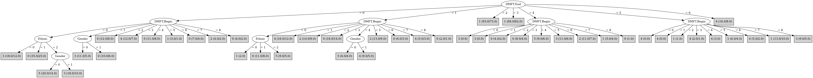

# J48

# SimpleCart Decision Tree

DMFT.End=(6)|(3)|(5)|(2): 1(54.0/178.0)

DMFT.End!=(6)|(3)|(5)|(2): 0(73.0/252.0)

# PART

Decision list:

conditions|predicted class
---|---
DMFT.End = 6 AND Gender = 1| 4 (9.0/3.0)
DMFT.End = 5 AND DMFT.Begin = 7| 1 (13.0/10.0)
DMFT.End = 5 AND DMFT.Begin = 8| 3 (9.0/5.0)
DMFT.End = 5| 4 (17.0/8.0)
DMFT.End = 3 AND DMFT.Begin = 6| 4 (14.0/9.0)
DMFT.End = 3 AND DMFT.Begin = 5| 1 (13.0/9.0)
DMFT.End = 3 AND Ethnic = 2| 2 (27.0/19.0)
DMFT.End = 3 AND Ethnic = 1| 1 (21.0/12.0)
DMFT.End = 0 AND DMFT.Begin = 1 AND Gender = 0| 3 (11.0/5.0)
DMFT.End = 0 AND DMFT.Begin = 0 AND Ethnic = 2 AND Gender = 0| 5 (20.0/14.0)
DMFT.End = 0 AND DMFT.Begin = 0 AND Ethnic = 1| 0 (35.0/25.0)
DMFT.End = 0 AND DMFT.Begin = 0| 3 (36.0/22.0)
DMFT.End = 0| 0 (63.0/44.0)
Ethnic = 0 AND DMFT.Begin = 4| 2 (10.0/6.0)
DMFT.End = 4 AND DMFT.Begin = 5| 3 (11.0/6.0)
DMFT.End = 4 AND DMFT.Begin = 6| 2 (11.0/7.0)
DMFT.End = 2 AND Ethnic = 2| 2 (39.0/30.0)
DMFT.End = 4| 0 (26.0/18.0)
DMFT.End = 2 AND DMFT.Begin = 2| 4 (12.0/8.0)
DMFT.End = 2 AND DMFT.Begin = 0| 1 (7.0/4.0)
DMFT.End = 2 AND DMFT.Begin = 3| 0 (6.0/4.0)
DMFT.End = 2 AND Ethnic = 1 AND Gender = 1| 1 (12.0/7.0)
DMFT.End = 2 AND Ethnic = 1| 3 (9.0/5.0)
DMFT.End = 1 AND DMFT.Begin = 2| 2 (14.0/9.0)
DMFT.End = 1 AND DMFT.Begin = 5| 2 (13.0/9.0)
DMFT.End = 1 AND DMFT.Begin = 0 AND Ethnic = 1| 0 (11.0/8.0)
DMFT.End = 1 AND DMFT.Begin = 1| 4 (16.0/12.0)
DMFT.End = 1 AND DMFT.Begin = 0| 1 (11.0/7.0)
DMFT.End = 1 AND DMFT.Begin = 4 AND Gender = 1| 4 (7.0/4.0)
DMFT.End = 1| 0 (37.0/28.0)
DMFT.End = 2| 2 (6.0/3.0)
| 4 (11.0/7.0)

JRIP rules:
===========

 => target=3 (557.0/451.0)

Number of Rules : 1

# Decision Table

Non matches covered by Majority class

dmft.end|target
---|---
4|3
3|1
5|1
2|1
6|4
1|0
0|0

