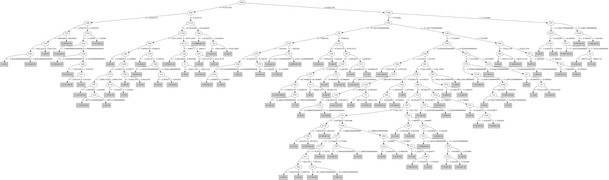

# J48

# SimpleCart Decision Tree

V69 < 9.6431765

* V86 < -3.8737545

*   * V106 < 7.1890455

*   *   * V14 < -29.642421: 2(5.0/0.0)

*   *   * V14 >= -29.642421: 1(1213.0/2.0)

*   * V106 >= 7.1890455: 2(76.0/0.0)

* V86 >= -3.8737545

*   * V105 < 3345.8629

*   *   * V68 < 2.920127

*   *   *   * V118 < -1.2407314999999999

*   *   *   *   * V106 < 4.0327285

*   *   *   *   *   * V84 < 2.7485615: 1(4.0/4.0)

*   *   *   *   *   * V84 >= 2.7485615: 1(299.0/3.0)

*   *   *   *   * V106 >= 4.0327285: 2(11.0/0.0)

*   *   *   * V118 >= -1.2407314999999999

*   *   *   *   * V33 < 801.1444

*   *   *   *   *   * V114 < 1.477131

*   *   *   *   *   *   * V11 < 1.7407475

*   *   *   *   *   *   *   * V14 < -0.0986855

*   *   *   *   *   *   *   *   * V6 < -0.398663: 4(5.0/1.0)

*   *   *   *   *   *   *   *   * V6 >= -0.398663: 2(7.0/0.0)

*   *   *   *   *   *   *   * V14 >= -0.0986855: 0(9.0/0.0)

*   *   *   *   *   *   * V11 >= 1.7407475: 5(26.0/0.0)

*   *   *   *   *   * V114 >= 1.477131

*   *   *   *   *   *   * V1 < 10462.739: 1(131.0/0.0)

*   *   *   *   *   *   * V1 >= 10462.739: 0(3.0/3.0)

*   *   *   *   * V33 >= 801.1444

*   *   *   *   *   * V40 < -0.7659475: 2(156.0/5.0)

*   *   *   *   *   * V40 >= -0.7659475: 1(8.0/2.0)

*   *   * V68 >= 2.920127

*   *   *   * V10 < 3.3879295000000003

*   *   *   *   * V82 < 1.1006875: 5(41.0/1.0)

*   *   *   *   * V82 >= 1.1006875

*   *   *   *   *   * V3 < 2.772335

*   *   *   *   *   *   * V33 < 1492.238: 3(125.0/1.0)

*   *   *   *   *   *   * V33 >= 1492.238: 5(2.0/3.0)

*   *   *   *   *   * V3 >= 2.772335

*   *   *   *   *   *   * V32 < -3.624605: 4(9.0/4.0)

*   *   *   *   *   *   * V32 >= -3.624605: 0(37.0/0.0)

*   *   *   * V10 >= 3.3879295000000003

*   *   *   *   * V82 < 2.3294145

*   *   *   *   *   * V75 < 2.9640335: 5(137.0/0.0)

*   *   *   *   *   * V75 >= 2.9640335: 3(5.0/2.0)

*   *   *   *   * V82 >= 2.3294145

*   *   *   *   *   * V17 < 8084.42835

*   *   *   *   *   *   * V9 < 27335.9035: 0(11.0/1.0)

*   *   *   *   *   *   * V9 >= 27335.9035: 4(3.0/2.0)

*   *   *   *   *   * V17 >= 8084.42835: 1(23.0/0.0)

*   * V105 >= 3345.8629

*   *   * V15 < -1.025503: 2(846.0/24.0)

*   *   * V15 >= -1.025503: 1(7.0/2.0)

V69 >= 9.6431765

* V16 < -89.122747

*   * V9 < 72258.07750000001

*   *   * V10 < 3.738099

*   *   *   * V5 < 21.308793: 3(8.0/1.0)

*   *   *   * V5 >= 21.308793: 0(68.0/0.0)

*   *   * V10 >= 3.738099

*   *   *   * V18 < 4.923097

*   *   *   *   * V1 < 29294.018: 4(4.0/2.0)

*   *   *   *   * V1 >= 29294.018: 5(18.0/0.0)

*   *   *   * V18 >= 4.923097: 1(25.0/0.0)

*   * V9 >= 72258.07750000001

*   *   * V108 < 8.5419605: 4(1410.0/28.0)

*   *   * V108 >= 8.5419605: 0(8.0/3.0)

* V16 >= -89.122747

*   * V101 < 8.555649500000001

*   *   * V36 < 1.2388895

*   *   *   * V25 < 2860.9873500000003

*   *   *   *   * V11 < 2.723235: 3(21.0/1.0)

*   *   *   *   * V11 >= 2.723235: 5(32.0/1.0)

*   *   *   * V25 >= 2860.9873500000003

*   *   *   *   * V12 < 31.736232

*   *   *   *   *   * V72 < -14.071939: 4(420.0/4.0)

*   *   *   *   *   * V72 >= -14.071939

*   *   *   *   *   *   * V1 < 33403.281: 4(9.0/1.0)

*   *   *   *   *   *   * V1 >= 33403.281: 0(10.0/0.0)

*   *   *   *   * V12 >= 31.736232: 5(19.0/1.0)

*   *   * V36 >= 1.2388895

*   *   *   * V36 < 2.523308

*   *   *   *   * V12 < 14.034684

*   *   *   *   *   * V81 < 5145.79285

*   *   *   *   *   *   * V12 < 8.385682

*   *   *   *   *   *   *   * V124 < 5.777082

*   *   *   *   *   *   *   *   * V20 < 1.36707: 5(9.0/0.0)

*   *   *   *   *   *   *   *   * V20 >= 1.36707: 3(76.0/3.0)

*   *   *   *   *   *   *   * V124 >= 5.777082: 0(21.0/0.0)

*   *   *   *   *   *   * V12 >= 8.385682

*   *   *   *   *   *   *   * V76 < 6.106775: 5(134.0/0.0)

*   *   *   *   *   *   *   * V76 >= 6.106775

*   *   *   *   *   *   *   *   * V2 < 3.6090590000000002: 0(11.0/1.0)

*   *   *   *   *   *   *   *   * V2 >= 3.6090590000000002: 3(26.0/0.0)

*   *   *   *   *   * V81 >= 5145.79285

*   *   *   *   *   *   * V34 < 2.7980815000000003: 3(201.0/6.0)

*   *   *   *   *   *   * V34 >= 2.7980815000000003: 1(16.0/4.0)

*   *   *   *   * V12 >= 14.034684

*   *   *   *   *   * V79 < -5.7525755

*   *   *   *   *   *   * V78 < -8.132053

*   *   *   *   *   *   *   * V19 < 1.7864315: 5(24.0/0.0)

*   *   *   *   *   *   *   * V19 >= 1.7864315

*   *   *   *   *   *   *   *   * V16 < -32.3184985: 3(6.0/1.0)

*   *   *   *   *   *   *   *   * V16 >= -32.3184985: 0(28.0/0.0)

*   *   *   *   *   *   * V78 >= -8.132053

*   *   *   *   *   *   *   * V9 < 38285.115: 3(18.0/0.0)

*   *   *   *   *   *   *   * V9 >= 38285.115

*   *   *   *   *   *   *   *   * V98 < 3.286956

*   *   *   *   *   *   *   *   *   * V8 < -2.429793: 4(146.0/8.0)

*   *   *   *   *   *   *   *   *   * V8 >= -2.429793: 2(4.0/2.0)

*   *   *   *   *   *   *   *   * V98 >= 3.286956: 1(3.0/2.0)

*   *   *   *   *   * V79 >= -5.7525755

*   *   *   *   *   *   * V8 < -3.370511

*   *   *   *   *   *   *   * V68 < 10.54277

*   *   *   *   *   *   *   *   * V17 < 6286.83265: 5(150.0/0.0)

*   *   *   *   *   *   *   *   * V17 >= 6286.83265

*   *   *   *   *   *   *   *   *   * V9 < 40880.7245: 3(10.0/2.0)

*   *   *   *   *   *   *   *   *   * V9 >= 40880.7245: 4(17.0/0.0)

*   *   *   *   *   *   *   * V68 >= 10.54277: 5(497.0/1.0)

*   *   *   *   *   *   * V8 >= -3.370511

*   *   *   *   *   *   *   * V2 < 2.2456305: 3(3.0/2.0)

*   *   *   *   *   *   *   * V2 >= 2.2456305: 4(11.0/0.0)

*   *   *   * V36 >= 2.523308

*   *   *   *   * V28 < 11.641805000000002

*   *   *   *   *   * V77 < 26.301644500000002

*   *   *   *   *   *   * V124 < 6.574816

*   *   *   *   *   *   *   * V98 < 3.109076: 3(11.0/1.0)

*   *   *   *   *   *   *   * V98 >= 3.109076: 5(87.0/1.0)

*   *   *   *   *   *   * V124 >= 6.574816

*   *   *   *   *   *   *   * V105 < 2005.469: 0(38.0/1.0)

*   *   *   *   *   *   *   * V105 >= 2005.469

*   *   *   *   *   *   *   *   * V10 < 14.043429

*   *   *   *   *   *   *   *   *   * V26 < 7.5076184999999995

*   *   *   *   *   *   *   *   *   *   * V13 < 46.314171

*   *   *   *   *   *   *   *   *   *   *   * V78 < -2.409128

*   *   *   *   *   *   *   *   *   *   *   *   * V73 < 63156.5: 3(665.0/28.0)

*   *   *   *   *   *   *   *   *   *   *   *   * V73 >= 63156.5: 0(8.0/0.0)

*   *   *   *   *   *   *   *   *   *   *   * V78 >= -2.409128: 5(9.0/1.0)

*   *   *   *   *   *   *   *   *   *   * V13 >= 46.314171

*   *   *   *   *   *   *   *   *   *   *   * V10 < 6.069570000000001: 3(7.0/2.0)

*   *   *   *   *   *   *   *   *   *   *   * V10 >= 6.069570000000001: 5(15.0/0.0)

*   *   *   *   *   *   *   *   *   * V26 >= 7.5076184999999995: 1(12.0/4.0)

*   *   *   *   *   *   *   *   * V10 >= 14.043429: 5(20.0/4.0)

*   *   *   *   *   * V77 >= 26.301644500000002

*   *   *   *   *   *   * V13 < 66.1114915

*   *   *   *   *   *   *   * V38 < -0.302243

*   *   *   *   *   *   *   *   * V20 < 8.6654625: 0(132.0/4.0)

*   *   *   *   *   *   *   *   * V20 >= 8.6654625: 3(6.0/2.0)

*   *   *   *   *   *   *   * V38 >= -0.302243: 4(9.0/3.0)

*   *   *   *   *   *   * V13 >= 66.1114915: 4(16.0/2.0)

*   *   *   *   * V28 >= 11.641805000000002

*   *   *   *   *   * V105 < 8316.50475: 1(115.0/1.0)

*   *   *   *   *   * V105 >= 8316.50475: 2(18.0/0.0)

*   * V101 >= 8.555649500000001

*   *   * V20 < 24.2692585

*   *   *   * V70 < -1.184208

*   *   *   *   * V101 < 11.474276499999998

*   *   *   *   *   * V25 < 19519.896999999997

*   *   *   *   *   *   * V100 < 4.683763

*   *   *   *   *   *   *   * V5 < 34.559811: 3(18.0/2.0)

*   *   *   *   *   *   *   * V5 >= 34.559811: 0(14.0/1.0)

*   *   *   *   *   *   * V100 >= 4.683763: 0(337.0/5.0)

*   *   *   *   *   * V25 >= 19519.896999999997

*   *   *   *   *   *   * V84 < 16.332535999999998

*   *   *   *   *   *   *   * V33 < 6469.83825: 3(86.0/5.0)

*   *   *   *   *   *   *   * V33 >= 6469.83825

*   *   *   *   *   *   *   *   * V1 < 96439.1995: 2(8.0/0.0)

*   *   *   *   *   *   *   *   * V1 >= 96439.1995: 0(8.0/0.0)

*   *   *   *   *   *   * V84 >= 16.332535999999998: 1(43.0/0.0)

*   *   *   *   * V101 >= 11.474276499999998

*   *   *   *   *   * V117 < 24.331809999999997: 0(2.0/5.0)

*   *   *   *   *   * V117 >= 24.331809999999997

*   *   *   *   *   *   * V125 < 24.734229499999998: 0(47.0/4.0)

*   *   *   *   *   *   * V125 >= 24.734229499999998

*   *   *   *   *   *   *   * V109 < 11.089903499999998: 0(57.0/1.0)

*   *   *   *   *   *   *   * V109 >= 11.089903499999998: 0(874.0/0.0)

*   *   *   * V70 >= -1.184208

*   *   *   *   * V1 < 25400.9505: 2(8.0/0.0)

*   *   *   *   * V1 >= 25400.9505: 4(45.0/0.0)

*   *   * V20 >= 24.2692585

*   *   *   * V2 < 15.208972500000002

*   *   *   *   * V1 < 113563.185: 1(116.0/0.0)

*   *   *   *   * V1 >= 113563.185: 4(5.0/0.0)

*   *   *   * V2 >= 15.208972500000002: 0(28.0/0.0)

# PART

Decision list:

conditions|predicted class
---|---
V69 <= 9.641835 AND V26 > 2.233252 AND V116 > 24.411184 AND V35 <= 2.99873 AND V6 > -4.461739| 1 (1050.0)
V69 <= 7.178615 AND V89 > 522.9555 AND V105 > 4008.1553 AND V114 > 11.793729 AND V2 <= 1.967405| 1 (30.0)
V69 <= 7.178615 AND V89 > 522.9555 AND V105 > 4008.1553 AND V61 <= 37.451885 AND V113 <= 19201.635 AND V35 > 0.629789 AND V65 > 1576.7566| 2 (679.0)
V9 > 105445.72 AND V41 > 2599.6199 AND V74 <= 16.441648 AND V16 <= -100.5339 AND V75 <= 60.148254 AND V33 > 3557.891 AND V108 <= 7.420924 AND V14 <= -19.505499 AND V5 <= 247.81284| 4 (1121.0)
V68 <= 3.583659 AND V89 > 539.3461 AND V106 > 4.062754 AND V65 <= 7852.2085 AND V77 > 4.220273 AND V66 <= 1.874167| 2 (145.0)
V68 <= 2.887823 AND V34 > 1.158458 AND V84 > 3.459116 AND V35 <= 1.378952 AND V1 > 400.3338 AND V18 > 3.186377 AND V69 <= 6.713953| 1 (261.0)
V101 > 8.554985 AND V13 > 78.46018 AND V77 > 34.920364 AND V89 > 23450.281 AND V36 > 5.481567| 4 (76.0)
V101 > 8.554985 AND V28 > 24.105484 AND V15 > -22.570923 AND V15 <= -3.366951| 1 (134.0)
V101 > 8.554985 AND V68 > 6.464347 AND V13 <= 61.390514 AND V26 <= 10.016013 AND V125 > 23.801336 AND V101 > 11.242981 AND V109 > 11.083953| 0 (866.0)
V68 <= 2.108052 AND V9 > 144.9769 AND V41 <= 672.72 AND V1 > 447.5284| 1 (118.0)
V68 <= 2.29684 AND V9 > 144.9769 AND V114 <= 2.825822 AND V43 > 0.194888 AND V68 <= 2.100304 AND V19 > 0.41739| 2 (178.0)
V106 > 3.980022 AND V65 <= 48772.76 AND V19 > 2.011882 AND V105 <= 7320.887 AND V113 > 11287.642 AND V22 <= -3.211298 AND V66 > 2.249227| 1 (234.0)
V101 > 7.893801 AND V68 > 6.574858 AND V13 <= 57.281628 AND V23 > -6.999754 AND V125 > 15.941296 AND V36 > 2.87145 AND V19 <= 5.595039 AND V18 > 2.032402 AND V100 > 4.869822| 0 (423.0)
V106 > 4.546185 AND V73 > 69477.484 AND V9 <= 174874.19 AND V70 <= -15.594201| 0 (138.0)
V68 > 3.609733 AND V36 <= 1.253736 AND V106 > 1.50216 AND V74 <= 6.18872 AND V81 > 2926.8086 AND V16 <= -21.016287 AND V9 > 26567.723 AND V21 > 1.666315 AND V88 > -8.934059| 4 (421.0)
V16 <= -61.569958 AND V10 > 3.545224 AND V113 <= 9717.235 AND V2 > 5.793108 AND V10 > 7.414148| 5 (43.0)
V16 <= -64.087845 AND V10 > 3.545224 AND V27 <= 9.351637 AND V66 > 2.857919 AND V11 > 10.361644 AND V80 <= -17.970592 AND V2 <= 14.269767 AND V6 <= -0.025869 AND V21 <= 20.180155 AND V17 > 9707.514 AND V104 > -5.656636 AND V34 > 1.968456 AND V2 > 1.963765| 4 (305.0)
V67 <= 1.156922 AND V25 > 1394.1488 AND V33 > 1596.5897 AND V3 <= 1.06568| 2 (33.0)
V68 > 3.656524 AND V25 <= 12461.978 AND V77 <= 17.23845 AND V71 > -0.993347 AND V6 <= -0.19299 AND V1 > 3688.473| 0 (22.0)
V68 > 3.656524 AND V25 <= 12461.978 AND V46 <= -0.846842 AND V1 <= 82408.73| 0 (36.0)
V69 > 7.04295 AND V25 <= 12434.0205 AND V26 <= 5.463614 AND V69 <= 29.10695 AND V104 <= -1.892094 AND V13 > 30.750069 AND V79 > -5.76422 AND V46 <= -0.412164| 5 (477.0)
V25 > 7181.9634 AND V67 <= 4.494908 AND V97 <= 3570.7825 AND V50 > 3.089688 AND V5 > 2.840959 AND V68 > 2.117295| 1 (62.0)
V68 <= 2.270468 AND V70 <= -0.07294 AND V81 > 1895.7798 AND V9 <= 14361.423 AND V25 <= 8540.562| 1 (92.0)
V25 > 7181.9634 AND V65 <= 20328.736 AND V82 > 2.780891 AND V81 <= 31483.686 AND V33 > 2502.5288 AND V77 > 5.619065 AND V105 > 4594.0635| 2 (67.0)
V25 > 7181.9634 AND V27 > 9.11763 AND V30 > -4.923787| 2 (18.0)
V25 > 7124.1245 AND V27 > 9.244622 AND V18 > 8.800704| 1 (23.0)
V25 > 7124.1245 AND V100 > 2.267341 AND V69 <= 41.43169 AND V69 > 8.38227 AND V125 <= 24.12007 AND V16 > -55.140724 AND V73 <= 70240.74 AND V38 <= -0.421623 AND V26 <= 7.953109 AND V80 > -42.473927 AND V42 <= 3.391424 AND V17 <= 24636.447 AND V53 <= 22.372616 AND V13 <= 45.141163| 3 (692.0)
V77 <= 11.028119 AND V82 > 4.505386 AND V3 > 1.790674 AND V34 <= 3.920486| 1 (26.0)
V77 <= 11.028119 AND V68 > 2.236553 AND V125 <= 15.218673 AND V112 > -1.782047 AND V34 <= 2.085112| 0 (9.0/3.0)
V77 <= 11.028119 AND V68 > 2.236553 AND V125 <= 15.218673 AND V25 <= 7664.4536 AND V11 > 5.508664 AND V112 <= -2.247685 AND V12 > 10.49029 AND V15 > -12.857626 AND V81 <= 8210.261| 5 (411.0)
V82 <= 1.091224 AND V3 > 0.075174| 5 (88.0)
V68 <= 2.533647 AND V70 <= -0.07294 AND V18 > 2.029066 AND V113 <= 11125.939 AND V77 > 4.651096| 2 (14.0)
V72 > -4.766222 AND V73 > 12717.628 AND V6 > -0.734076| 4 (38.0)
V16 > -56.37856 AND V69 > 6.013914 AND V20 <= 2.551683 AND V11 <= 3.79623 AND V101 > 3.546195 AND V3 <= 2.620492| 3 (84.0)
V28 <= 2.470495 AND V72 > -7.303594 AND V24 > -1.663256| 0 (11.0)
V28 <= 2.470495 AND V79 <= -0.89698 AND V12 > 5.503728 AND V81 <= 3042.1604 AND V1 <= 42860.453| 5 (88.0)
V68 <= 2.739358 AND V53 <= 10.620521 AND V7 <= -2.086879| 4 (14.0/1.0)
V105 <= 535.3444 AND V1 > 3235.3574| 0 (37.0)
V16 > -61.569958 AND V69 > 7.119646 AND V36 > 1.5099 AND V77 <= 16.927969 AND V12 <= 15.921491 AND V92 <= 5.388288 AND V9 > 4008.0527 AND V24 <= -2.502786 AND V107 <= 1.325424 AND V10 <= 9.239594 AND V100 <= 3.599954 AND V20 > 2.27894 AND V96 > -5.781572 AND V17 > 1939.0453| 3 (246.0)
V10 > 7.477152 AND V84 <= 3.223479 AND V17 <= 6286.9834| 5 (47.0)
V10 > 8.165302 AND V49 <= 33794.973 AND V66 <= 6.000407 AND V2 > 7.681084| 5 (22.0)
V10 > 8.165302 AND V49 <= 33794.973 AND V99 <= 3.290632 AND V44 > 2.095403 AND V76 > 8.91348 AND V72 <= -21.523031 AND V106 <= 4.452561| 3 (175.0)
V36 > 2.254385 AND V9 > 87210.89 AND V93 > 6.652117 AND V42 > 2.49245 AND V8 <= -115.751205| 4 (20.0)
V36 > 2.254385 AND V77 > 24.753166 AND V70 > -30.137377 AND V15 > -33.80095 AND V17 > 3438.9795 AND V12 <= 44.430435 AND V34 <= 4.070981 AND V3 > 8.200124 AND V1 <= 99089.64| 0 (123.0)
V69 <= 6.036659 AND V120 <= -6.695043| 1 (17.0/9.0)
V16 <= -47.720753 AND V39 > -1.57507 AND V120 <= -6.616541 AND V97 <= 4159.58 AND V11 > 9.781322 AND V13 > 31.489838| 4 (64.0)
V5 <= 4.559447 AND V18 <= 2.024145| 5 (16.0/1.0)
V5 <= 4.474476 AND V50 <= 4.372647 AND V42 > 2.221841| 2 (13.0)
V27 <= 6.635243 AND V77 <= 6.057149 AND V1 > 9231.077| 5 (17.0/3.0)
V27 <= 6.635243 AND V67 <= 2.455846 AND V17 <= 1846.6101| 3 (13.0)
V69 <= 8.276378 AND V25 <= 6972.307| 0 (10.0/3.0)
V27 <= 6.635243 AND V86 <= -4.901584 AND V2 <= 17.987585| 3 (26.0)
V19 <= 5.660286 AND V35 <= 0.333314 AND V22 <= -0.490275| 4 (13.0/1.0)
V19 <= 5.660286 AND V29 > 1.37974 AND V96 > -2.386593 AND V1 <= 63019.543| 0 (21.0)
V28 <= 9.48634 AND V88 > -2.561368 AND V7 <= -17.226494| 5 (10.0)
V28 <= 9.48634 AND V108 > 1.99144 AND V13 <= 32.314827 AND V11 <= 10.29061 AND V22 <= -1.214368 AND V125 <= 14.586665 AND V1 > 20866.281| 3 (25.0)
V28 <= 9.48634 AND V75 <= 2.491989 AND V5 <= 8.715166| 2 (9.0/5.0)
V28 <= 9.48634 AND V108 <= 1.99144 AND V66 > 2.183724 AND V104 <= -2.03389 AND V109 <= 4.449299| 4 (30.0)
V25 <= 15822.444 AND V16 <= -49.28433 AND V31 <= -4.265832| 3 (17.0/2.0)
V25 <= 11401.096 AND V16 > -44.834225 AND V116 <= 5.734544 AND V1 <= 25521.172| 3 (25.0)
V11 <= 6.250657 AND V2 <= 2.392846| 0 (26.0)
V25 <= 11283.995 AND V46 > -0.269796 AND V1 <= 37000.574| 4 (9.0)
V25 <= 11401.096 AND V80 > -41.0577 AND V9 > 21361.086 AND V66 <= 9.550667 AND V114 > 2.587618 AND V76 <= 8.072832 AND V1 > 18860.77| 5 (20.0)
V25 <= 11401.096 AND V38 <= -0.281824 AND V72 > -19.939798 AND V1 > 18666.322| 0 (17.0)
V25 <= 11283.995 AND V125 > 13.380587 AND V8 > -18.70204| 0 (10.0)
V17 <= 10634.592 AND V125 <= 13.302994 AND V107 > 1.326743| 5 (10.0)
V84 <= 3.860297 AND V18 <= 2.855971| 5 (9.0/2.0)
V25 <= 11283.995 AND V125 <= 13.494443 AND V41 > 2082.1692| 3 (17.0/3.0)
V63 <= -3.388606 AND V65 <= 147984.36 AND V116 > 7.998025 AND V42 > 2.617956 AND V70 <= -13.303041| 0 (16.0)
V10 > 2.568823 AND V59 > 3.842444 AND V42 <= 2.641363 AND V35 <= 1.338765| 4 (15.0/5.0)
V18 <= 5.511431 AND V17 <= 19369.37 AND V10 > 2.568823| 3 (13.0/2.0)
V34 <= 2.751864 AND V2 <= 4.662228| 0 (10.0/1.0)
V34 > 2.751864 AND V108 <= 4.298492 AND V9 <= 109579.7| 1 (11.0/1.0)
V10 > 7.362634 AND V108 <= 4.298492| 4 (11.0)
V2 <= 10.651616| 2 (10.0/1.0)
| 3 (10.0/3.0)

# JRip

Decision list:

conditions|predicted class
---|---
(V69 <= 7.697741) and (V116 <= 21.099306) and (V105 >= 3787.3572) and (V113 <= 19011.639) and (V35 >= 0.533938) and (V65 >= 1593.5791)|2 (716.0/0.0)
(V66 <= 1.654319) and (V42 >= 2.833661) and (V77 >= 4.206459) and (V10 >= 1.700544)|2 (152.0/0.0)
(V66 <= 1.404631) and (V41 >= 684.2062) and (V114 <= 2.723831) and (V1 <= 1654.4843)|2 (133.0/0.0)
(V42 >= 6.013617) and (V114 <= 11.739659) and (V2 <= 3.870881)|2 (76.0/0.0)
(V124 <= 1.899152) and (V27 >= 1.003375) and (V1 <= 6900.815)|2 (18.0/0.0)
(V69 <= 9.942803) and (V117 <= 12.678543) and (V97 >= 2999.0364) and (V38 <= -0.349969)|2 (28.0/0.0)
(V2 <= 1.826204) and (V42 >= 2.016042) and (V118 >= -1.06958) and (V1 >= 1296.4814)|2 (14.0/0.0)
(V17 <= 9777.547) and (V10 >= 3.31517) and (V28 <= 4.290496) and (V99 >= 0.968347) and (V96 <= -5.091557) and (V46 <= -0.408695)|5 (358.0/0.0)
(V17 <= 11871.937) and (V10 >= 3.310898) and (V18 <= 2.54646) and (V75 <= 3.280252) and (V9 >= 18124.11) and (V36 >= 1.256753)|5 (230.0/0.0)
(V17 <= 11898.051) and (V10 >= 6.409152) and (V36 <= 2.64811) and (V53 >= 11.935166) and (V68 >= 11.148576)|5 (163.0/0.0)
(V17 <= 7007.816) and (V11 >= 9.849496) and (V75 <= 6.014891) and (V68 >= 8.945337) and (V35 >= 0.509065)|5 (144.0/0.0)
(V20 <= 2.330235) and (V100 >= 1.378839) and (V12 >= 5.70003) and (V82 <= 2.43334) and (V84 <= 2.14126)|5 (113.0/0.0)
(V57 <= 8245.55) and (V82 <= 1.088186) and (V9 >= 1147.9248)|5 (66.0/0.0)
(V17 <= 12645.612) and (V12 >= 27.586336) and (V33 <= 3439.558) and (V10 >= 7.127854) and (V14 >= -25.56948)|5 (60.0/0.0)
(V82 <= 2.751315) and (V90 >= 2.72914) and (V9 >= 30582.3) and (V18 <= 2.873322)|5 (50.0/0.0)
(V26 <= 1.669924) and (V14 <= -1.636785) and (V70 >= -1.821059) and (V1 <= 13815.986)|5 (32.0/0.0)
(V82 <= 4.509787) and (V90 >= 4.45186) and (V47 <= -0.926) and (V2 <= 11.452429)|5 (13.0/0.0)
(V26 <= 3.216334) and (V10 >= 3.993558) and (V38 >= -0.290876) and (V13 >= 18.945131)|5 (8.0/0.0)
(V117 <= 21.09269) and (V16 >= -56.352802) and (V36 >= 1.48965) and (V16 <= -16.774267) and (V77 <= 21.837742) and (V15 <= -7.661172) and (V45 >= 4.857026) and (V27 >= 3.432518)|3 (301.0/0.0)
(V116 <= 11.76742) and (V101 >= 4.204153) and (V13 <= 28.525171) and (V12 >= 7.135917) and (V19 >= 1.731587) and (V58 <= 5.462624) and (V92 <= 5.397026) and (V36 >= 1.669838)|3 (419.0/0.0)
(V113 <= 6006.4023) and (V36 >= 1.021043) and (V4 <= 4.734457) and (V11 <= 3.799037) and (V11 >= 1.231303)|3 (171.0/0.0)
(V125 <= 20.10295) and (V10 >= 7.470788) and (V37 >= 6.114628) and (V88 <= -8.361674) and (V1 <= 108278.93)|3 (113.0/0.0)
(V82 <= 4.438083) and (V36 >= 1.578462) and (V123 <= 2.843041) and (V10 >= 1.703096) and (V73 <= 29400.748) and (V60 >= 4.243044) and (V105 <= 2222.6323)|3 (119.0/0.0)
(V117 <= 26.439178) and (V10 >= 10.701922) and (V73 <= 52530.98) and (V9 >= 49059.74) and (V101 >= 5.932784)|3 (48.0/0.0)
(V116 <= 17.300953) and (V40 <= -4.777144) and (V9 <= 52776) and (V121 >= 17012.78) and (V1 >= 7229.6665)|3 (59.0/0.0)
(V117 <= 17.676468) and (V100 >= 2.406495) and (V13 <= 34.742283) and (V64 <= -7.596282) and (V98 <= 2.10105) and (V10 <= 3.376998)|3 (24.0/0.0)
(V117 <= 18.133333) and (V74 >= 5.603111) and (V73 <= 47227) and (V77 >= 13.546921)|3 (17.0/0.0)
(V125 <= 15.473025) and (V36 >= 2.6787) and (V75 <= 8.897458) and (V15 <= -10.021304) and (V1 <= 49155.727)|3 (16.0/0.0)
(V93 <= 8.138061) and (V66 >= 8.878396) and (V70 <= -23.8353) and (V1 <= 386463.03) and (V6 <= -31.048862)|3 (13.0/0.0)
(V10 <= 1.747194) and (V69 >= 8.898877) and (V93 <= 5.380672) and (V12 <= 8.970293)|3 (19.0/0.0)
(V2 >= 8.868025) and (V16 >= -87.86917) and (V78 <= -5.507465) and (V109 >= 11.095854) and (V17 <= 41850.934)|0 (863.0/0.0)
(V83 <= 6.299027) and (V36 >= 2.887885) and (V12 <= 33.171833) and (V68 >= 5.187583) and (V101 >= 8.350722)|0 (473.0/0.0)
(V24 >= -6.514899) and (V100 >= 2.589676) and (V72 <= -4.602897) and (V40 >= -2.941848)|0 (111.0/0.0)
(V4 >= 6.072782) and (V16 >= -58.762657) and (V79 <= -11.315201) and (V48 <= -3.042812)|0 (117.0/0.0)
(V81 <= 13779.856) and (V100 >= 2.340783) and (V79 <= -8.220124) and (V12 <= 29.674004)|0 (61.0/0.0)
(V64 >= -5.980347) and (V26 <= 1.365964) and (V19 <= 3.122681)|0 (30.0/0.0)
(V96 >= -3.052329) and (V2 >= 2.871828) and (V72 >= -17.156555) and (V17 >= 2328.977)|0 (24.0/0.0)
(V37 >= 5.90667) and (V25 <= 19490.62) and (V102 <= -1.213381) and (V127 >= -14.974345)|0 (43.0/0.0)
(V25 <= 5052.3325) and (V110 <= -0.310812) and (V20 >= 4.496341)|0 (17.0/0.0)
(V100 >= 9.483589) and (V18 <= 9.8751) and (V25 >= 22487.76)|0 (14.0/0.0)
(V37 <= 0.880474) and (V8 >= -9.731486) and (V18 <= 3.416385)|0 (9.0/0.0)
(V9 <= 35443.043) and (V90 >= 3.979276) and (V48 >= -5.121807)|1 (1562.0/0.0)
(V69 <= 16.834131) and (V73 <= 5834.915) and (V86 <= -0.436968) and (V8 <= -2.879811)|1 (188.0/0.0)
(V69 <= 16.834131) and (V50 >= 4.163605) and (V86 <= -5.94851)|1 (110.0/0.0)
(V9 <= 71975.96) and (V18 >= 5.151517) and (V97 <= 6018.386) and (V96 <= -8.020789)|1 (96.0/0.0)
(V73 <= 6152.7246) and (V82 >= 2.091615) and (V17 <= 7054.5723)|1 (64.0/0.0)
(V28 >= 14.168826) and (V97 <= 7414.0747) and (V1 <= 107573.305)|1 (19.0/0.0)
|4 (2243.0/104.0)

# Decision Table

Non matches covered by IB1

v9|v67|v82|target
---|---|---|---
(40524.548-45042.586]|(48.300795-inf)|(23.822799-inf)|0
(176400.39-inf)|(48.300795-inf)|(23.822799-inf)|4
(25319.978-34342.4765]|(35.572582-48.300795]|(23.822799-inf)|0
(103457.493-112259.933]|(31.897353-35.572582]|(23.822799-inf)|0
(176400.39-inf)|(48.300795-inf)|(15.996621-23.822799]|4
(19101.3125-25319.978]|(35.572582-48.300795]|(15.996621-23.822799]|0
(176400.39-inf)|(35.572582-48.300795]|(15.996621-23.822799]|4
(19101.3125-25319.978]|(31.897353-35.572582]|(15.996621-23.822799]|0
(112259.933-176400.39]|(48.300795-inf)|(10.853238-15.996621]|0
(176400.39-inf)|(31.897353-35.572582]|(15.996621-23.822799]|4
(176400.39-inf)|(48.300795-inf)|(10.853238-15.996621]|4
(112259.933-176400.39]|(35.572582-48.300795]|(10.853238-15.996621]|0
(176400.39-inf)|(35.572582-48.300795]|(10.853238-15.996621]|4
(103457.493-112259.933]|(31.897353-35.572582]|(10.853238-15.996621]|0
(176400.39-inf)|(31.897353-35.572582]|(10.853238-15.996621]|0
(84851.667-101184.607]|(31.897353-35.572582]|(10.853238-15.996621]|0
(112259.933-176400.39]|(31.897353-35.572582]|(10.853238-15.996621]|0
(176400.39-inf)|(48.300795-inf)|(8.153249-10.853238]|4
(9676.062-11946.293]|(27.017502-30.719224]|(15.996621-23.822799]|0
(112259.933-176400.39]|(27.017502-30.719224]|(15.996621-23.822799]|0
(112259.933-176400.39]|(31.510566-31.897353]|(10.853238-15.996621]|0
(101184.607-103457.493]|(31.510566-31.897353]|(10.853238-15.996621]|0
(103457.493-112259.933]|(31.510566-31.897353]|(10.853238-15.996621]|0
(176400.39-inf)|(35.572582-48.300795]|(8.153249-10.853238]|4
(101184.607-103457.493]|(27.017502-30.719224]|(15.996621-23.822799]|0
(112259.933-176400.39]|(35.572582-48.300795]|(8.153249-10.853238]|4
(176400.39-inf)|(31.897353-35.572582]|(8.153249-10.853238]|0
(112259.933-176400.39]|(30.719224-31.510566]|(10.853238-15.996621]|0
(76594.34-84851.667]|(21.654234-24.307695]|(23.822799-inf)|0
(103457.493-112259.933]|(30.719224-31.510566]|(10.853238-15.996621]|0
(176400.39-inf)|(48.300795-inf)|(7.564716-8.153249]|4
(103457.493-112259.933]|(31.897353-35.572582]|(8.153249-10.853238]|0
(112259.933-176400.39]|(31.897353-35.572582]|(8.153249-10.853238]|0
(176400.39-inf)|(27.017502-30.719224]|(10.853238-15.996621]|0
(101184.607-103457.493]|(31.510566-31.897353]|(8.153249-10.853238]|0
(176400.39-inf)|(35.572582-48.300795]|(7.564716-8.153249]|4
(84851.667-101184.607]|(27.017502-30.719224]|(10.853238-15.996621]|0
(112259.933-176400.39]|(35.572582-48.300795]|(7.564716-8.153249]|4
(112259.933-176400.39]|(27.017502-30.719224]|(10.853238-15.996621]|0
(103457.493-112259.933]|(27.017502-30.719224]|(10.853238-15.996621]|0
(101184.607-103457.493]|(27.017502-30.719224]|(10.853238-15.996621]|0
(103457.493-112259.933]|(31.510566-31.897353]|(8.153249-10.853238]|0
(103457.493-112259.933]|(30.719224-31.510566]|(8.153249-10.853238]|0
(176400.39-inf)|(31.897353-35.572582]|(7.564716-8.153249]|0
(76594.34-84851.667]|(21.654234-24.307695]|(15.996621-23.822799]|0
(112259.933-176400.39]|(30.719224-31.510566]|(8.153249-10.853238]|4
(84851.667-101184.607]|(24.772768-27.017502]|(10.853238-15.996621]|0
(75422.265-76594.34]|(24.772768-27.017502]|(10.853238-15.996621]|0
(112259.933-176400.39]|(24.772768-27.017502]|(10.853238-15.996621]|0
(76594.34-84851.667]|(24.772768-27.017502]|(10.853238-15.996621]|0
(176400.39-inf)|(48.300795-inf)|(6.207633-7.564716]|4
(84851.667-101184.607]|(24.307695-24.772768]|(10.853238-15.996621]|0
(103457.493-112259.933]|(27.017502-30.719224]|(8.153249-10.853238]|0
(112259.933-176400.39]|(35.572582-48.300795]|(6.207633-7.564716]|3
(176400.39-inf)|(35.572582-48.300795]|(6.207633-7.564716]|4
(112259.933-176400.39]|(27.017502-30.719224]|(8.153249-10.853238]|4
(84851.667-101184.607]|(27.017502-30.719224]|(8.153249-10.853238]|0
(101184.607-103457.493]|(24.772768-27.017502]|(8.153249-10.853238]|0
(84851.667-101184.607]|(21.142356-21.465422]|(15.996621-23.822799]|0
(75012.75-75422.265]|(24.772768-27.017502]|(8.153249-10.853238]|0
(76594.34-84851.667]|(16.133175-20.650016]|(23.822799-inf)|0
(58776.277-68047.845]|(16.133175-20.650016]|(23.822799-inf)|0
(76594.34-84851.667]|(21.654234-24.307695]|(10.853238-15.996621]|1
(103457.493-112259.933]|(24.772768-27.017502]|(8.153249-10.853238]|0
(112259.933-176400.39]|(31.897353-35.572582]|(6.207633-7.564716]|0
(68047.845-75012.75]|(24.772768-27.017502]|(8.153249-10.853238]|0
(75422.265-76594.34]|(24.772768-27.017502]|(8.153249-10.853238]|0
(112259.933-176400.39]|(21.654234-24.307695]|(10.853238-15.996621]|0
(112259.933-176400.39]|(24.772768-27.017502]|(8.153249-10.853238]|4
(176400.39-inf)|(31.897353-35.572582]|(6.207633-7.564716]|4
(76594.34-84851.667]|(24.772768-27.017502]|(8.153249-10.853238]|0
(58776.277-68047.845]|(24.772768-27.017502]|(8.153249-10.853238]|0
(84851.667-101184.607]|(24.772768-27.017502]|(8.153249-10.853238]|0
(75422.265-76594.34]|(21.465422-21.654234]|(10.853238-15.996621]|0
(75422.265-76594.34]|(24.307695-24.772768]|(8.153249-10.853238]|0
(84851.667-101184.607]|(27.017502-30.719224]|(7.564716-8.153249]|0
(76594.34-84851.667]|(27.017502-30.719224]|(7.564716-8.153249]|0
(68047.845-75012.75]|(24.307695-24.772768]|(8.153249-10.853238]|0
(76594.34-84851.667]|(24.307695-24.772768]|(8.153249-10.853238]|0
(176400.39-inf)|(35.572582-48.300795]|(5.875479-6.207633]|4
(112259.933-176400.39]|(24.307695-24.772768]|(8.153249-10.853238]|4
(19101.3125-25319.978]|(16.133175-20.650016]|(15.996621-23.822799]|0
(176400.39-inf)|(31.897353-35.572582]|(5.875479-6.207633]|0
(25319.978-34342.4765]|(16.133175-20.650016]|(15.996621-23.822799]|0
(76594.34-84851.667]|(21.142356-21.465422]|(10.853238-15.996621]|0
(103457.493-112259.933]|(21.654234-24.307695]|(8.153249-10.853238]|0
(84851.667-101184.607]|(21.654234-24.307695]|(8.153249-10.853238]|0
(68047.845-75012.75]|(21.654234-24.307695]|(8.153249-10.853238]|0
(75012.75-75422.265]|(21.654234-24.307695]|(8.153249-10.853238]|0
(176400.39-inf)|(30.719224-31.510566]|(6.207633-7.564716]|0
(76594.34-84851.667]|(21.654234-24.307695]|(8.153249-10.853238]|0
(75422.265-76594.34]|(24.772768-27.017502]|(7.564716-8.153249]|0
(112259.933-176400.39]|(30.719224-31.510566]|(6.207633-7.564716]|0
(112259.933-176400.39]|(24.772768-27.017502]|(7.564716-8.153249]|4
(76594.34-84851.667]|(24.772768-27.017502]|(7.564716-8.153249]|0
(58776.277-68047.845]|(21.654234-24.307695]|(8.153249-10.853238]|0
(112259.933-176400.39]|(21.654234-24.307695]|(8.153249-10.853238]|4
(58776.277-68047.845]|(24.772768-27.017502]|(7.564716-8.153249]|0
(84851.667-101184.607]|(24.772768-27.017502]|(7.564716-8.153249]|0
(25319.978-34342.4765]|(14.855622-16.133175]|(15.996621-23.822799]|0
(112259.933-176400.39]|(35.572582-48.300795]|(5.546874-5.875479]|0
(176400.39-inf)|(27.017502-30.719224]|(6.207633-7.564716]|4
(112259.933-176400.39]|(24.307695-24.772768]|(7.564716-8.153249]|4
(19101.3125-25319.978]|(14.855622-16.133175]|(15.996621-23.822799]|1
(112259.933-176400.39]|(27.017502-30.719224]|(6.207633-7.564716]|4
(84851.667-101184.607]|(24.307695-24.772768]|(7.564716-8.153249]|0
(176400.39-inf)|(35.572582-48.300795]|(5.546874-5.875479]|4
(84851.667-101184.607]|(27.017502-30.719224]|(6.207633-7.564716]|0
(101184.607-103457.493]|(24.307695-24.772768]|(7.564716-8.153249]|3
(76594.34-84851.667]|(27.017502-30.719224]|(6.207633-7.564716]|0
(84851.667-101184.607]|(16.133175-20.650016]|(10.853238-15.996621]|0
(75422.265-76594.34]|(21.654234-24.307695]|(7.564716-8.153249]|0
(75012.75-75422.265]|(24.772768-27.017502]|(6.207633-7.564716]|0
(76594.34-84851.667]|(21.654234-24.307695]|(7.564716-8.153249]|0
(76594.34-84851.667]|(21.142356-21.465422]|(8.153249-10.853238]|0
(84851.667-101184.607]|(21.654234-24.307695]|(7.564716-8.153249]|0
(112259.933-176400.39]|(21.654234-24.307695]|(7.564716-8.153249]|4
(58776.277-68047.845]|(16.133175-20.650016]|(10.853238-15.996621]|0
(112259.933-176400.39]|(30.719224-31.510566]|(5.875479-6.207633]|4
(76594.34-84851.667]|(16.133175-20.650016]|(10.853238-15.996621]|3
(68047.845-75012.75]|(21.142356-21.465422]|(8.153249-10.853238]|0
(112259.933-176400.39]|(14.290163-14.855622]|(15.996621-23.822799]|0
(112259.933-176400.39]|(24.772768-27.017502]|(6.207633-7.564716]|4
(103457.493-112259.933]|(24.772768-27.017502]|(6.207633-7.564716]|0
(68047.845-75012.75]|(24.772768-27.017502]|(6.207633-7.564716]|0
(68047.845-75012.75]|(21.654234-24.307695]|(7.564716-8.153249]|0
(84851.667-101184.607]|(24.772768-27.017502]|(6.207633-7.564716]|0
(17843.742-18605.9345]|(16.133175-20.650016]|(10.853238-15.996621]|0
(58776.277-68047.845]|(24.772768-27.017502]|(6.207633-7.564716]|0
(19101.3125-25319.978]|(14.290163-14.855622]|(15.996621-23.822799]|0
(112259.933-176400.39]|(31.897353-35.572582]|(5.546874-5.875479]|0
(176400.39-inf)|(31.897353-35.572582]|(5.546874-5.875479]|4
(76594.34-84851.667]|(24.772768-27.017502]|(6.207633-7.564716]|0
(58776.277-68047.845]|(21.654234-24.307695]|(7.564716-8.153249]|0
(19101.3125-25319.978]|(11.895808-14.290163]|(15.996621-23.822799]|0
(68047.845-75012.75]|(20.650016-21.142356]|(8.153249-10.853238]|0
(76594.34-84851.667]|(27.017502-30.719224]|(5.875479-6.207633]|0
(84851.667-101184.607]|(24.307695-24.772768]|(6.207633-7.564716]|0
(112259.933-176400.39]|(27.017502-30.719224]|(5.875479-6.207633]|4
(57523.2285-58776.277]|(14.855622-16.133175]|(10.853238-15.996621]|0
(25319.978-34342.4765]|(10.357672-11.547213]|(23.822799-inf)|0
(112259.933-176400.39]|(35.572582-48.300795]|(5.315246-5.546874]|5
(58776.277-68047.845]|(24.307695-24.772768]|(6.207633-7.564716]|0
(112259.933-176400.39]|(31.510566-31.897353]|(5.546874-5.875479]|0
(68047.845-75012.75]|(24.307695-24.772768]|(6.207633-7.564716]|0
(14400.3435-17843.742]|(11.895808-14.290163]|(15.996621-23.822799]|0
(58776.277-68047.845]|(21.465422-21.654234]|(7.564716-8.153249]|0
(58776.277-68047.845]|(14.855622-16.133175]|(10.853238-15.996621]|1
(176400.39-inf)|(35.572582-48.300795]|(5.315246-5.546874]|4
(112259.933-176400.39]|(24.307695-24.772768]|(6.207633-7.564716]|4
(84851.667-101184.607]|(27.017502-30.719224]|(5.875479-6.207633]|0
(25319.978-34342.4765]|(48.300795-inf)|(4.626216-5.315246]|0
(84851.667-101184.607]|(21.142356-21.465422]|(7.564716-8.153249]|0
(58776.277-68047.845]|(14.290163-14.855622]|(10.853238-15.996621]|0
(58776.277-68047.845]|(16.133175-20.650016]|(8.153249-10.853238]|0
(68047.845-75012.75]|(21.142356-21.465422]|(7.564716-8.153249]|0
(112259.933-176400.39]|(24.772768-27.017502]|(5.875479-6.207633]|4
(176400.39-inf)|(30.719224-31.510566]|(5.546874-5.875479]|0
(84851.667-101184.607]|(16.133175-20.650016]|(8.153249-10.853238]|0
(84851.667-101184.607]|(21.654234-24.307695]|(6.207633-7.564716]|0
(68047.845-75012.75]|(16.133175-20.650016]|(8.153249-10.853238]|3
(112259.933-176400.39]|(30.719224-31.510566]|(5.546874-5.875479]|4
(58776.277-68047.845]|(21.142356-21.465422]|(7.564716-8.153249]|0
(112259.933-176400.39]|(16.133175-20.650016]|(8.153249-10.853238]|4
(176400.39-inf)|(31.897353-35.572582]|(5.315246-5.546874]|4
(112259.933-176400.39]|(31.897353-35.572582]|(5.315246-5.546874]|3
(75422.265-76594.34]|(21.654234-24.307695]|(6.207633-7.564716]|0
(76594.34-84851.667]|(16.133175-20.650016]|(8.153249-10.853238]|3
(58776.277-68047.845]|(21.654234-24.307695]|(6.207633-7.564716]|0
(76594.34-84851.667]|(21.654234-24.307695]|(6.207633-7.564716]|0
(75422.265-76594.34]|(16.133175-20.650016]|(8.153249-10.853238]|3
(76594.34-84851.667]|(24.772768-27.017502]|(5.875479-6.207633]|0
(68047.845-75012.75]|(21.654234-24.307695]|(6.207633-7.564716]|0
(112259.933-176400.39]|(21.654234-24.307695]|(6.207633-7.564716]|4
(58776.277-68047.845]|(14.855622-16.133175]|(8.153249-10.853238]|0
(84851.667-101184.607]|(27.017502-30.719224]|(5.546874-5.875479]|0
(45042.586-53217.2625]|(11.895808-14.290163]|(10.853238-15.996621]|0
(53217.2625-57523.2285]|(11.895808-14.290163]|(10.853238-15.996621]|1
(112259.933-176400.39]|(27.017502-30.719224]|(5.546874-5.875479]|4
(57523.2285-58776.277]|(11.895808-14.290163]|(10.853238-15.996621]|0
(58776.277-68047.845]|(21.465422-21.654234]|(6.207633-7.564716]|0
(58776.277-68047.845]|(11.895808-14.290163]|(10.853238-15.996621]|0
(112259.933-176400.39]|(35.572582-48.300795]|(4.626216-5.315246]|5
(68047.845-75012.75]|(14.855622-16.133175]|(8.153249-10.853238]|3
(176400.39-inf)|(35.572582-48.300795]|(4.626216-5.315246]|4
(112259.933-176400.39]|(24.307695-24.772768]|(5.875479-6.207633]|4
(176400.39-inf)|(24.307695-24.772768]|(5.875479-6.207633]|0
(84851.667-101184.607]|(21.465422-21.654234]|(6.207633-7.564716]|3
(58776.277-68047.845]|(21.142356-21.465422]|(6.207633-7.564716]|0
(75422.265-76594.34]|(21.654234-24.307695]|(5.875479-6.207633]|0
(76594.34-84851.667]|(21.654234-24.307695]|(5.875479-6.207633]|0
(112259.933-176400.39]|(21.142356-21.465422]|(6.207633-7.564716]|4
(76594.34-84851.667]|(21.142356-21.465422]|(6.207633-7.564716]|0
(68047.845-75012.75]|(21.654234-24.307695]|(5.875479-6.207633]|0
(112259.933-176400.39]|(21.654234-24.307695]|(5.875479-6.207633]|4
(76594.34-84851.667]|(24.772768-27.017502]|(5.546874-5.875479]|0
(84851.667-101184.607]|(16.133175-20.650016]|(7.564716-8.153249]|0
(112259.933-176400.39]|(24.772768-27.017502]|(5.546874-5.875479]|4
(68047.845-75012.75]|(16.133175-20.650016]|(7.564716-8.153249]|0
(68047.845-75012.75]|(24.772768-27.017502]|(5.546874-5.875479]|0
(58776.277-68047.845]|(16.133175-20.650016]|(7.564716-8.153249]|0
(58776.277-68047.845]|(21.654234-24.307695]|(5.875479-6.207633]|0
(76594.34-84851.667]|(16.133175-20.650016]|(7.564716-8.153249]|3
(112259.933-176400.39]|(24.307695-24.772768]|(5.546874-5.875479]|4
(53217.2625-57523.2285]|(10.357672-11.547213]|(10.853238-15.996621]|1
(112259.933-176400.39]|(21.465422-21.654234]|(5.875479-6.207633]|0
(58776.277-68047.845]|(11.895808-14.290163]|(8.153249-10.853238]|3
(68047.845-75012.75]|(14.855622-16.133175]|(7.564716-8.153249]|3
(112259.933-176400.39]|(20.650016-21.142356]|(6.207633-7.564716]|4
(112259.933-176400.39]|(27.017502-30.719224]|(5.315246-5.546874]|4
(45042.586-53217.2625]|(11.895808-14.290163]|(8.153249-10.853238]|0
(76594.34-84851.667]|(24.307695-24.772768]|(5.546874-5.875479]|0
(68047.845-75012.75]|(20.650016-21.142356]|(6.207633-7.564716]|0
(76594.34-84851.667]|(10.357672-11.547213]|(10.853238-15.996621]|0
(103457.493-112259.933]|(20.650016-21.142356]|(6.207633-7.564716]|0
(112259.933-176400.39]|(35.572582-48.300795]|(4.454693-4.626216]|5
(176400.39-inf)|(31.897353-35.572582]|(4.454693-4.626216]|0
(57523.2285-58776.277]|(21.142356-21.465422]|(5.875479-6.207633]|0
(19101.3125-25319.978]|(16.133175-20.650016]|(6.207633-7.564716]|0
(68047.845-75012.75]|(24.772768-27.017502]|(5.315246-5.546874]|0
(76594.34-84851.667]|(21.654234-24.307695]|(5.546874-5.875479]|0
(112259.933-176400.39]|(21.142356-21.465422]|(5.875479-6.207633]|4
(58776.277-68047.845]|(14.290163-14.855622]|(7.564716-8.153249]|0
(75422.265-76594.34]|(16.133175-20.650016]|(6.207633-7.564716]|0
(103457.493-112259.933]|(31.897353-35.572582]|(4.454693-4.626216]|0
(14400.3435-17843.742]|(7.232465-9.660799]|(15.996621-23.822799]|0
(103457.493-112259.933]|(16.133175-20.650016]|(6.207633-7.564716]|4
(53217.2625-57523.2285]|(21.142356-21.465422]|(5.875479-6.207633]|0
(101184.607-103457.493]|(16.133175-20.650016]|(6.207633-7.564716]|0
(58776.277-68047.845]|(21.654234-24.307695]|(5.546874-5.875479]|0
(84851.667-101184.607]|(16.133175-20.650016]|(6.207633-7.564716]|0
(57523.2285-58776.277]|(16.133175-20.650016]|(6.207633-7.564716]|0
(112259.933-176400.39]|(24.772768-27.017502]|(5.315246-5.546874]|4
(58776.277-68047.845]|(16.133175-20.650016]|(6.207633-7.564716]|0
(68047.845-75012.75]|(21.654234-24.307695]|(5.546874-5.875479]|0
(176400.39-inf)|(30.719224-31.510566]|(4.626216-5.315246]|4
(53217.2625-57523.2285]|(16.133175-20.650016]|(6.207633-7.564716]|0
(112259.933-176400.39]|(16.133175-20.650016]|(6.207633-7.564716]|4
(112259.933-176400.39]|(21.654234-24.307695]|(5.546874-5.875479]|4
(76594.34-84851.667]|(16.133175-20.650016]|(6.207633-7.564716]|3
(75012.75-75422.265]|(16.133175-20.650016]|(6.207633-7.564716]|3
(68047.845-75012.75]|(16.133175-20.650016]|(6.207633-7.564716]|0
(58776.277-68047.845]|(11.547213-11.895808]|(8.153249-10.853238]|0
(58776.277-68047.845]|(24.307695-24.772768]|(5.315246-5.546874]|0
(45042.586-53217.2625]|(9.660799-9.943628]|(10.853238-15.996621]|0
(112259.933-176400.39]|(35.572582-48.300795]|(3.749876-4.454693]|0
(176400.39-inf)|(27.017502-30.719224]|(4.626216-5.315246]|0
(112259.933-176400.39]|(20.650016-21.142356]|(5.875479-6.207633]|4
(45042.586-53217.2625]|(10.357672-11.547213]|(8.153249-10.853238]|0
(112259.933-176400.39]|(27.017502-30.719224]|(4.626216-5.315246]|4
(58776.277-68047.845]|(21.465422-21.654234]|(5.546874-5.875479]|0
(14400.3435-17843.742]|(5.964466-7.232465]|(15.996621-23.822799]|0
(112259.933-176400.39]|(24.307695-24.772768]|(5.315246-5.546874]|4
(58776.277-68047.845]|(11.895808-14.290163]|(7.564716-8.153249]|3
(58776.277-68047.845]|(14.855622-16.133175]|(6.207633-7.564716]|3
(68047.845-75012.75]|(14.855622-16.133175]|(6.207633-7.564716]|3
(68047.845-75012.75]|(10.357672-11.547213]|(8.153249-10.853238]|1
(112259.933-176400.39]|(21.465422-21.654234]|(5.546874-5.875479]|4
(76594.34-84851.667]|(21.654234-24.307695]|(5.315246-5.546874]|0
(58776.277-68047.845]|(14.290163-14.855622]|(6.207633-7.564716]|0
(84851.667-101184.607]|(16.133175-20.650016]|(5.875479-6.207633]|4
(58776.277-68047.845]|(9.943628-10.357672]|(8.153249-10.853238]|1
(45042.586-53217.2625]|(16.133175-20.650016]|(5.875479-6.207633]|0
(68047.845-75012.75]|(7.232465-9.660799]|(10.853238-15.996621]|1
(68047.845-75012.75]|(16.133175-20.650016]|(5.875479-6.207633]|3
(112259.933-176400.39]|(21.142356-21.465422]|(5.546874-5.875479]|4
(53217.2625-57523.2285]|(16.133175-20.650016]|(5.875479-6.207633]|0
(53217.2625-57523.2285]|(9.943628-10.357672]|(8.153249-10.853238]|0
(25319.978-34342.4765]|(7.232465-9.660799]|(10.853238-15.996621]|0
(58776.277-68047.845]|(21.142356-21.465422]|(5.546874-5.875479]|0
(68047.845-75012.75]|(24.772768-27.017502]|(4.626216-5.315246]|0
(76594.34-84851.667]|(16.133175-20.650016]|(5.875479-6.207633]|3
(45042.586-53217.2625]|(7.232465-9.660799]|(10.853238-15.996621]|1
(68047.845-75012.75]|(21.142356-21.465422]|(5.546874-5.875479]|0
(68047.845-75012.75]|(14.290163-14.855622]|(6.207633-7.564716]|0
(37409.662-38220.6085]|(7.232465-9.660799]|(10.853238-15.996621]|1
(103457.493-112259.933]|(31.897353-35.572582]|(3.749876-4.454693]|0
(112259.933-176400.39]|(24.772768-27.017502]|(4.626216-5.315246]|4
(14400.3435-17843.742]|(5.261934-5.964466]|(15.996621-23.822799]|0
(112259.933-176400.39]|(16.133175-20.650016]|(5.875479-6.207633]|4
(38220.6085-40524.548]|(7.232465-9.660799]|(10.853238-15.996621]|1
(68047.845-75012.75]|(21.654234-24.307695]|(5.315246-5.546874]|0
(57523.2285-58776.277]|(16.133175-20.650016]|(5.875479-6.207633]|0
(40524.548-45042.586]|(7.232465-9.660799]|(10.853238-15.996621]|1
(112259.933-176400.39]|(31.897353-35.572582]|(3.749876-4.454693]|5
(103457.493-112259.933]|(16.133175-20.650016]|(5.875479-6.207633]|0
(34342.4765-37409.662]|(7.232465-9.660799]|(10.853238-15.996621]|1
(112259.933-176400.39]|(21.654234-24.307695]|(5.315246-5.546874]|4
(58776.277-68047.845]|(16.133175-20.650016]|(5.875479-6.207633]|0
(58776.277-68047.845]|(21.654234-24.307695]|(5.315246-5.546874]|0
(176400.39-inf)|(30.719224-31.510566]|(4.454693-4.626216]|4
(112259.933-176400.39]|(14.855622-16.133175]|(5.875479-6.207633]|0
(112259.933-176400.39]|(20.650016-21.142356]|(5.546874-5.875479]|4
(58776.277-68047.845]|(9.660799-9.943628]|(8.153249-10.853238]|0
(68047.845-75012.75]|(14.855622-16.133175]|(5.875479-6.207633]|0
(103457.493-112259.933]|(11.895808-14.290163]|(6.207633-7.564716]|0
(57523.2285-58776.277]|(20.650016-21.142356]|(5.546874-5.875479]|0
(103457.493-112259.933]|(27.017502-30.719224]|(4.454693-4.626216]|0
(58776.277-68047.845]|(14.855622-16.133175]|(5.875479-6.207633]|0
(112259.933-176400.39]|(21.465422-21.654234]|(5.315246-5.546874]|0
(14400.3435-17843.742]|(4.970039-5.261934]|(15.996621-23.822799]|1
(84851.667-101184.607]|(11.895808-14.290163]|(6.207633-7.564716]|0
(112259.933-176400.39]|(24.307695-24.772768]|(4.626216-5.315246]|4
(34342.4765-37409.662]|(5.964466-7.232465]|(10.853238-15.996621]|1
(17843.742-18605.9345]|(5.964466-7.232465]|(10.853238-15.996621]|0
(37409.662-38220.6085]|(5.964466-7.232465]|(10.853238-15.996621]|0
(58776.277-68047.845]|(20.650016-21.142356]|(5.546874-5.875479]|0
(57523.2285-58776.277]|(11.895808-14.290163]|(6.207633-7.564716]|3
(112259.933-176400.39]|(27.017502-30.719224]|(4.454693-4.626216]|4
(58776.277-68047.845]|(11.895808-14.290163]|(6.207633-7.564716]|3
(176400.39-inf)|(27.017502-30.719224]|(4.454693-4.626216]|4
(25319.978-34342.4765]|(5.964466-7.232465]|(10.853238-15.996621]|1
(68047.845-75012.75]|(16.133175-20.650016]|(5.546874-5.875479]|0
(45042.586-53217.2625]|(14.290163-14.855622]|(5.875479-6.207633]|0
(176400.39-inf)|(21.654234-24.307695]|(4.626216-5.315246]|0
(58776.277-68047.845]|(11.547213-11.895808]|(6.207633-7.564716]|0
(58776.277-68047.845]|(14.290163-14.855622]|(5.875479-6.207633]|0
(101184.607-103457.493]|(16.133175-20.650016]|(5.546874-5.875479]|0
(68047.845-75012.75]|(7.232465-9.660799]|(8.153249-10.853238]|0
(19101.3125-25319.978]|(5.261934-5.964466]|(10.853238-15.996621]|0
(19101.3125-25319.978]|(7.232465-9.660799]|(8.153249-10.853238]|0
(112259.933-176400.39]|(24.772768-27.017502]|(4.454693-4.626216]|4
(25319.978-34342.4765]|(7.232465-9.660799]|(8.153249-10.853238]|0
(103457.493-112259.933]|(21.654234-24.307695]|(4.626216-5.315246]|4
(45042.586-53217.2625]|(7.232465-9.660799]|(8.153249-10.853238]|1
(57523.2285-58776.277]|(16.133175-20.650016]|(5.546874-5.875479]|0
(38220.6085-40524.548]|(7.232465-9.660799]|(8.153249-10.853238]|0
(57523.2285-58776.277]|(7.232465-9.660799]|(8.153249-10.853238]|1
(53217.2625-57523.2285]|(7.232465-9.660799]|(8.153249-10.853238]|1
(19101.3125-25319.978]|(4.657087-4.970039]|(15.996621-23.822799]|1
(58776.277-68047.845]|(16.133175-20.650016]|(5.546874-5.875479]|0
(112259.933-176400.39]|(16.133175-20.650016]|(5.546874-5.875479]|4
(103457.493-112259.933]|(16.133175-20.650016]|(5.546874-5.875479]|4
(68047.845-75012.75]|(11.547213-11.895808]|(6.207633-7.564716]|0
(58776.277-68047.845]|(21.654234-24.307695]|(4.626216-5.315246]|0
(25319.978-34342.4765]|(5.261934-5.964466]|(10.853238-15.996621]|1
(68047.845-75012.75]|(21.654234-24.307695]|(4.626216-5.315246]|0
(103457.493-112259.933]|(24.772768-27.017502]|(4.454693-4.626216]|4
(84851.667-101184.607]|(16.133175-20.650016]|(5.546874-5.875479]|4
(58776.277-68047.845]|(7.232465-9.660799]|(8.153249-10.853238]|1
(112259.933-176400.39]|(21.654234-24.307695]|(4.626216-5.315246]|4
(58776.277-68047.845]|(10.357672-11.547213]|(6.207633-7.564716]|0
(38220.6085-40524.548]|(5.964466-7.232465]|(8.153249-10.853238]|0
(112259.933-176400.39]|(20.650016-21.142356]|(5.315246-5.546874]|0
(45042.586-53217.2625]|(11.895808-14.290163]|(5.875479-6.207633]|0
(58776.277-68047.845]|(20.650016-21.142356]|(5.315246-5.546874]|0
(18605.9345-19101.3125]|(4.39808-4.657087]|(15.996621-23.822799]|0
(68047.845-75012.75]|(11.895808-14.290163]|(5.875479-6.207633]|3
(53217.2625-57523.2285]|(5.964466-7.232465]|(8.153249-10.853238]|1
(84851.667-101184.607]|(11.895808-14.290163]|(5.875479-6.207633]|4
(14400.3435-17843.742]|(4.39808-4.657087]|(15.996621-23.822799]|0
(40524.548-45042.586]|(5.964466-7.232465]|(8.153249-10.853238]|1
(34342.4765-37409.662]|(5.964466-7.232465]|(8.153249-10.853238]|0
(112259.933-176400.39]|(27.017502-30.719224]|(3.749876-4.454693]|4
(101184.607-103457.493]|(11.895808-14.290163]|(5.875479-6.207633]|4
(19101.3125-25319.978]|(4.970039-5.261934]|(10.853238-15.996621]|1
(45042.586-53217.2625]|(5.964466-7.232465]|(8.153249-10.853238]|1
(25319.978-34342.4765]|(5.964466-7.232465]|(8.153249-10.853238]|1
(53217.2625-57523.2285]|(10.357672-11.547213]|(6.207633-7.564716]|3
(176400.39-inf)|(27.017502-30.719224]|(3.749876-4.454693]|4
(25319.978-34342.4765]|(4.970039-5.261934]|(10.853238-15.996621]|1
(112259.933-176400.39]|(24.307695-24.772768]|(4.454693-4.626216]|4
(58776.277-68047.845]|(11.895808-14.290163]|(5.875479-6.207633]|3
(68047.845-75012.75]|(14.855622-16.133175]|(5.546874-5.875479]|3
(58776.277-68047.845]|(21.654234-24.307695]|(4.454693-4.626216]|0
(38220.6085-40524.548]|(11.547213-11.895808]|(5.875479-6.207633]|0
(34342.4765-37409.662]|(7.232465-9.660799]|(7.564716-8.153249]|0
(17843.742-18605.9345]|(3.130569-4.39808]|(15.996621-23.822799]|0
(45042.586-53217.2625]|(16.133175-20.650016]|(5.315246-5.546874]|0
(84851.667-101184.607]|(11.547213-11.895808]|(5.875479-6.207633]|0
(58776.277-68047.845]|(11.547213-11.895808]|(5.875479-6.207633]|0
(45042.586-53217.2625]|(9.943628-10.357672]|(6.207633-7.564716]|3
(13055.4245-13819.193]|(3.130569-4.39808]|(15.996621-23.822799]|0
(34342.4765-37409.662]|(5.261934-5.964466]|(8.153249-10.853238]|0
(103457.493-112259.933]|(24.772768-27.017502]|(3.749876-4.454693]|4
(40524.548-45042.586]|(7.232465-9.660799]|(7.564716-8.153249]|1
(45042.586-53217.2625]|(5.261934-5.964466]|(8.153249-10.853238]|1
(45042.586-53217.2625]|(7.232465-9.660799]|(7.564716-8.153249]|0
(19101.3125-25319.978]|(7.232465-9.660799]|(7.564716-8.153249]|0
(40524.548-45042.586]|(5.261934-5.964466]|(8.153249-10.853238]|1
(103457.493-112259.933]|(16.133175-20.650016]|(5.315246-5.546874]|4
(84851.667-101184.607]|(14.290163-14.855622]|(5.546874-5.875479]|4
(19101.3125-25319.978]|(4.657087-4.970039]|(10.853238-15.996621]|1
(19101.3125-25319.978]|(5.261934-5.964466]|(8.153249-10.853238]|0
(14400.3435-17843.742]|(4.657087-4.970039]|(10.853238-15.996621]|0
(112259.933-176400.39]|(16.133175-20.650016]|(5.315246-5.546874]|4
(112259.933-176400.39]|(24.772768-27.017502]|(3.749876-4.454693]|4
(68047.845-75012.75]|(21.654234-24.307695]|(4.454693-4.626216]|0
(57523.2285-58776.277]|(16.133175-20.650016]|(5.315246-5.546874]|0
(25319.978-34342.4765]|(4.657087-4.970039]|(10.853238-15.996621]|1
(13819.193-14400.3435]|(3.130569-4.39808]|(15.996621-23.822799]|1
(14400.3435-17843.742]|(2.685007-3.08871]|(23.822799-inf)|0
(14400.3435-17843.742]|(3.130569-4.39808]|(15.996621-23.822799]|1
(45042.586-53217.2625]|(14.290163-14.855622]|(5.546874-5.875479]|0
(58776.277-68047.845]|(16.133175-20.650016]|(5.315246-5.546874]|0
(25319.978-34342.4765]|(5.261934-5.964466]|(8.153249-10.853238]|1
(112259.933-176400.39]|(21.142356-21.465422]|(4.626216-5.315246]|4
(19101.3125-25319.978]|(3.130569-4.39808]|(15.996621-23.822799]|1
(19101.3125-25319.978]|(4.970039-5.261934]|(8.153249-10.853238]|0
(103457.493-112259.933]|(14.855622-16.133175]|(5.315246-5.546874]|0
(68047.845-75012.75]|(14.855622-16.133175]|(5.315246-5.546874]|0
(76594.34-84851.667]|(10.357672-11.547213]|(5.875479-6.207633]|0
(58776.277-68047.845]|(14.855622-16.133175]|(5.315246-5.546874]|0
(37409.662-38220.6085]|(5.964466-7.232465]|(7.564716-8.153249]|0
(84851.667-101184.607]|(14.855622-16.133175]|(5.315246-5.546874]|0
(38220.6085-40524.548]|(11.895808-14.290163]|(5.546874-5.875479]|3
(84851.667-101184.607]|(11.895808-14.290163]|(5.546874-5.875479]|4
(19101.3125-25319.978]|(3.08871-3.130569]|(15.996621-23.822799]|0
(101184.607-103457.493]|(27.017502-30.719224]|(3.573224-3.749876]|0
(38220.6085-40524.548]|(5.964466-7.232465]|(7.564716-8.153249]|1
(25319.978-34342.4765]|(5.964466-7.232465]|(7.564716-8.153249]|0
(34342.4765-37409.662]|(5.964466-7.232465]|(7.564716-8.153249]|1
(45042.586-53217.2625]|(14.855622-16.133175]|(5.315246-5.546874]|0
(45042.586-53217.2625]|(11.895808-14.290163]|(5.546874-5.875479]|0
(38220.6085-40524.548]|(10.357672-11.547213]|(5.875479-6.207633]|3
(58776.277-68047.845]|(20.650016-21.142356]|(4.626216-5.315246]|0
(25319.978-34342.4765]|(4.970039-5.261934]|(8.153249-10.853238]|1
(38220.6085-40524.548]|(4.39808-4.657087]|(10.853238-15.996621]|0
(112259.933-176400.39]|(20.650016-21.142356]|(4.626216-5.315246]|4
(53217.2625-57523.2285]|(10.357672-11.547213]|(5.875479-6.207633]|3
(58776.277-68047.845]|(11.895808-14.290163]|(5.546874-5.875479]|3
(25319.978-34342.4765]|(4.39808-4.657087]|(10.853238-15.996621]|1
(19101.3125-25319.978]|(4.39808-4.657087]|(10.853238-15.996621]|1
(40524.548-45042.586]|(5.261934-5.964466]|(7.564716-8.153249]|0
(76594.34-84851.667]|(14.290163-14.855622]|(5.315246-5.546874]|0
(103457.493-112259.933]|(21.654234-24.307695]|(3.749876-4.454693]|0
(25319.978-34342.4765]|(3.130569-4.39808]|(10.853238-15.996621]|1
(84851.667-101184.607]|(14.290163-14.855622]|(5.315246-5.546874]|4
(40524.548-45042.586]|(3.130569-4.39808]|(10.853238-15.996621]|0
(40524.548-45042.586]|(11.547213-11.895808]|(5.546874-5.875479]|0
(57523.2285-58776.277]|(11.547213-11.895808]|(5.546874-5.875479]|0
(40524.548-45042.586]|(4.657087-4.970039]|(8.153249-10.853238]|0
(40524.548-45042.586]|(7.232465-9.660799]|(6.207633-7.564716]|0
(13819.193-14400.3435]|(3.130569-4.39808]|(10.853238-15.996621]|0
(45042.586-53217.2625]|(14.290163-14.855622]|(5.315246-5.546874]|0
(18605.9345-19101.3125]|(2.685007-3.08871]|(15.996621-23.822799]|0
(34342.4765-37409.662]|(5.261934-5.964466]|(7.564716-8.153249]|1
(176400.39-inf)|(21.654234-24.307695]|(3.749876-4.454693]|0
(34342.4765-37409.662]|(4.657087-4.970039]|(8.153249-10.853238]|0
(19101.3125-25319.978]|(5.261934-5.964466]|(7.564716-8.153249]|1
(45042.586-53217.2625]|(3.130569-4.39808]|(10.853238-15.996621]|0
(58776.277-68047.845]|(21.142356-21.465422]|(4.454693-4.626216]|0
(13055.4245-13819.193]|(2.685007-3.08871]|(15.996621-23.822799]|0
(25319.978-34342.4765]|(4.657087-4.970039]|(8.153249-10.853238]|1
(19101.3125-25319.978]|(2.685007-3.08871]|(15.996621-23.822799]|1
(38220.6085-40524.548]|(3.130569-4.39808]|(10.853238-15.996621]|2
(38220.6085-40524.548]|(11.547213-11.895808]|(5.546874-5.875479]|0
(112259.933-176400.39]|(16.133175-20.650016]|(4.626216-5.315246]|4
(13055.4245-13819.193]|(3.130569-4.39808]|(10.853238-15.996621]|1
(18605.9345-19101.3125]|(3.130569-4.39808]|(10.853238-15.996621]|1
(14400.3435-17843.742]|(3.130569-4.39808]|(10.853238-15.996621]|1
(112259.933-176400.39]|(21.142356-21.465422]|(4.454693-4.626216]|4
(14400.3435-17843.742]|(2.685007-3.08871]|(15.996621-23.822799]|1
(19101.3125-25319.978]|(7.232465-9.660799]|(6.207633-7.564716]|2
(57523.2285-58776.277]|(16.133175-20.650016]|(4.626216-5.315246]|0
(17843.742-18605.9345]|(3.130569-4.39808]|(10.853238-15.996621]|0
(84851.667-101184.607]|(21.654234-24.307695]|(3.749876-4.454693]|0
(34342.4765-37409.662]|(3.130569-4.39808]|(10.853238-15.996621]|2
(45042.586-53217.2625]|(7.232465-9.660799]|(6.207633-7.564716]|1
(112259.933-176400.39]|(11.547213-11.895808]|(5.546874-5.875479]|0
(112259.933-176400.39]|(21.654234-24.307695]|(3.749876-4.454693]|4
(45042.586-53217.2625]|(16.133175-20.650016]|(4.626216-5.315246]|0
(103457.493-112259.933]|(16.133175-20.650016]|(4.626216-5.315246]|4
(53217.2625-57523.2285]|(16.133175-20.650016]|(4.626216-5.315246]|0
(25319.978-34342.4765]|(5.261934-5.964466]|(7.564716-8.153249]|1
(58776.277-68047.845]|(16.133175-20.650016]|(4.626216-5.315246]|0
(13819.193-14400.3435]|(2.685007-3.08871]|(15.996621-23.822799]|1
(19101.3125-25319.978]|(3.130569-4.39808]|(10.853238-15.996621]|1
(103457.493-112259.933]|(14.855622-16.133175]|(4.626216-5.315246]|0
(19101.3125-25319.978]|(4.39808-4.657087]|(8.153249-10.853238]|0
(25319.978-34342.4765]|(3.08871-3.130569]|(10.853238-15.996621]|0
(37409.662-38220.6085]|(10.357672-11.547213]|(5.546874-5.875479]|3
(57523.2285-58776.277]|(14.855622-16.133175]|(4.626216-5.315246]|0
(25319.978-34342.4765]|(5.964466-7.232465]|(6.207633-7.564716]|0
(17843.742-18605.9345]|(5.964466-7.232465]|(6.207633-7.564716]|2
(53217.2625-57523.2285]|(11.895808-14.290163]|(5.315246-5.546874]|0
(34342.4765-37409.662]|(10.357672-11.547213]|(5.546874-5.875479]|3
(40524.548-45042.586]|(5.964466-7.232465]|(6.207633-7.564716]|0
(38220.6085-40524.548]|(11.895808-14.290163]|(5.315246-5.546874]|3
(38220.6085-40524.548]|(10.357672-11.547213]|(5.546874-5.875479]|0
(68047.845-75012.75]|(11.895808-14.290163]|(5.315246-5.546874]|5
(40524.548-45042.586]|(11.895808-14.290163]|(5.315246-5.546874]|0
(45042.586-53217.2625]|(14.855622-16.133175]|(4.626216-5.315246]|0
(25319.978-34342.4765]|(4.39808-4.657087]|(8.153249-10.853238]|1
(25319.978-34342.4765]|(14.855622-16.133175]|(4.626216-5.315246]|0
(58776.277-68047.845]|(11.895808-14.290163]|(5.315246-5.546874]|3
(68047.845-75012.75]|(14.855622-16.133175]|(4.626216-5.315246]|3
(76594.34-84851.667]|(11.895808-14.290163]|(5.315246-5.546874]|4
(13055.4245-13819.193]|(2.618845-2.685007]|(15.996621-23.822799]|0
(53217.2625-57523.2285]|(10.357672-11.547213]|(5.546874-5.875479]|3
(14400.3435-17843.742]|(3.08871-3.130569]|(10.853238-15.996621]|0
(75422.265-76594.34]|(11.895808-14.290163]|(5.315246-5.546874]|5
(84851.667-101184.607]|(11.895808-14.290163]|(5.315246-5.546874]|4
(75012.75-75422.265]|(11.895808-14.290163]|(5.315246-5.546874]|5
(112259.933-176400.39]|(24.772768-27.017502]|(3.403855-3.573224]|0
(101184.607-103457.493]|(16.133175-20.650016]|(4.454693-4.626216]|0
(19101.3125-25319.978]|(1.988663-2.618845]|(15.996621-23.822799]|0
(25319.978-34342.4765]|(2.685007-3.08871]|(10.853238-15.996621]|0
(2090.8054-4250.3942]|(0.121991-1.038558]|(23.822799-inf)|0
(18605.9345-19101.3125]|(1.988663-2.618845]|(15.996621-23.822799]|0
(14400.3435-17843.742]|(5.261934-5.964466]|(6.207633-7.564716]|2
(176400.39-inf)|(21.142356-21.465422]|(3.749876-4.454693]|0
(19101.3125-25319.978]|(2.685007-3.08871]|(10.853238-15.996621]|0
(18605.9345-19101.3125]|(3.130569-4.39808]|(8.153249-10.853238]|0
(25319.978-34342.4765]|(4.657087-4.970039]|(7.564716-8.153249]|1
(19101.3125-25319.978]|(4.657087-4.970039]|(7.564716-8.153249]|0
(14400.3435-17843.742]|(1.988663-2.618845]|(15.996621-23.822799]|1
(112259.933-176400.39]|(16.133175-20.650016]|(4.454693-4.626216]|4
(9676.062-11946.293]|(2.685007-3.08871]|(10.853238-15.996621]|1
(25319.978-34342.4765]|(5.261934-5.964466]|(6.207633-7.564716]|0
(17843.742-18605.9345]|(1.988663-2.618845]|(15.996621-23.822799]|1
(45042.586-53217.2625]|(9.943628-10.357672]|(5.546874-5.875479]|3
(38220.6085-40524.548]|(5.261934-5.964466]|(6.207633-7.564716]|0
(84851.667-101184.607]|(16.133175-20.650016]|(4.454693-4.626216]|0
(14400.3435-17843.742]|(2.685007-3.08871]|(10.853238-15.996621]|0
(17843.742-18605.9345]|(3.130569-4.39808]|(8.153249-10.853238]|1
(53217.2625-57523.2285]|(16.133175-20.650016]|(4.454693-4.626216]|0
(9676.062-11946.293]|(1.988663-2.618845]|(15.996621-23.822799]|1
(14400.3435-17843.742]|(3.130569-4.39808]|(8.153249-10.853238]|1
(38220.6085-40524.548]|(11.547213-11.895808]|(5.315246-5.546874]|0
(4250.3942-7605.6418]|(0.121991-1.038558]|(23.822799-inf)|1
(40524.548-45042.586]|(7.232465-9.660799]|(5.875479-6.207633]|0
(13055.4245-13819.193]|(1.988663-2.618845]|(15.996621-23.822799]|1
(57523.2285-58776.277]|(21.142356-21.465422]|(3.749876-4.454693]|0
(58776.277-68047.845]|(16.133175-20.650016]|(4.454693-4.626216]|0
(11946.293-13055.4245]|(1.988663-2.618845]|(15.996621-23.822799]|1
(45042.586-53217.2625]|(16.133175-20.650016]|(4.454693-4.626216]|0
(84851.667-101184.607]|(14.290163-14.855622]|(4.626216-5.315246]|4
(58776.277-68047.845]|(21.142356-21.465422]|(3.749876-4.454693]|0
(103457.493-112259.933]|(16.133175-20.650016]|(4.454693-4.626216]|4
(53217.2625-57523.2285]|(9.943628-10.357672]|(5.546874-5.875479]|3
(19101.3125-25319.978]|(3.130569-4.39808]|(8.153249-10.853238]|1
(45042.586-53217.2625]|(14.290163-14.855622]|(4.626216-5.315246]|0
(25319.978-34342.4765]|(3.130569-4.39808]|(8.153249-10.853238]|1
(45042.586-53217.2625]|(10.357672-11.547213]|(5.315246-5.546874]|0
(13819.193-14400.3435]|(1.038558-1.988663]|(15.996621-23.822799]|0
(19101.3125-25319.978]|(3.08871-3.130569]|(8.153249-10.853238]|0
(176400.39-inf)|(20.650016-21.142356]|(3.749876-4.454693]|0
(68047.845-75012.75]|(11.895808-14.290163]|(4.626216-5.315246]|0
(53217.2625-57523.2285]|(14.855622-16.133175]|(4.454693-4.626216]|3
(34342.4765-37409.662]|(10.357672-11.547213]|(5.315246-5.546874]|3
(13819.193-14400.3435]|(4.970039-5.261934]|(6.207633-7.564716]|0
(13055.4245-13819.193]|(2.618845-2.685007]|(10.853238-15.996621]|0
(11946.293-13055.4245]|(1.038558-1.988663]|(15.996621-23.822799]|1
(25319.978-34342.4765]|(4.970039-5.261934]|(6.207633-7.564716]|0
(101184.607-103457.493]|(27.017502-30.719224]|(3.140655-3.403855]|0
(18605.9345-19101.3125]|(1.038558-1.988663]|(15.996621-23.822799]|0
(14400.3435-17843.742]|(3.08871-3.130569]|(8.153249-10.853238]|0
(40524.548-45042.586]|(10.357672-11.547213]|(5.315246-5.546874]|0
(13055.4245-13819.193]|(1.038558-1.988663]|(15.996621-23.822799]|0
(57523.2285-58776.277]|(20.650016-21.142356]|(3.749876-4.454693]|0
(45042.586-53217.2625]|(9.660799-9.943628]|(5.546874-5.875479]|0
(84851.667-101184.607]|(11.895808-14.290163]|(4.626216-5.315246]|4
(76594.34-84851.667]|(11.895808-14.290163]|(4.626216-5.315246]|4
(40524.548-45042.586]|(11.895808-14.290163]|(4.626216-5.315246]|0
(53217.2625-57523.2285]|(10.357672-11.547213]|(5.315246-5.546874]|0
(14400.3435-17843.742]|(1.038558-1.988663]|(15.996621-23.822799]|1
(58776.277-68047.845]|(11.895808-14.290163]|(4.626216-5.315246]|3
(38220.6085-40524.548]|(11.895808-14.290163]|(4.626216-5.315246]|0
(57523.2285-58776.277]|(11.895808-14.290163]|(4.626216-5.315246]|3
(9676.062-11946.293]|(1.038558-1.988663]|(15.996621-23.822799]|1
(53217.2625-57523.2285]|(11.895808-14.290163]|(4.626216-5.315246]|3
(25319.978-34342.4765]|(4.39808-4.657087]|(7.564716-8.153249]|1
(45042.586-53217.2625]|(11.895808-14.290163]|(4.626216-5.315246]|0
(57523.2285-58776.277]|(16.133175-20.650016]|(3.749876-4.454693]|0
(103457.493-112259.933]|(24.772768-27.017502]|(3.140655-3.403855]|0
(84851.667-101184.607]|(24.772768-27.017502]|(3.140655-3.403855]|0
(176400.39-inf)|(16.133175-20.650016]|(3.749876-4.454693]|0
(25319.978-34342.4765]|(11.547213-11.895808]|(4.626216-5.315246]|0
(112259.933-176400.39]|(24.772768-27.017502]|(3.140655-3.403855]|0
(53217.2625-57523.2285]|(16.133175-20.650016]|(3.749876-4.454693]|0
(45042.586-53217.2625]|(9.943628-10.357672]|(5.315246-5.546874]|0
(13055.4245-13819.193]|(2.685007-3.08871]|(8.153249-10.853238]|0
(9676.062-11946.293]|(1.988663-2.618845]|(10.853238-15.996621]|1
(25319.978-34342.4765]|(3.130569-4.39808]|(7.564716-8.153249]|1
(14400.3435-17843.742]|(2.685007-3.08871]|(8.153249-10.853238]|1
(34342.4765-37409.662]|(11.547213-11.895808]|(4.626216-5.315246]|0
(45042.586-53217.2625]|(11.547213-11.895808]|(4.626216-5.315246]|3
(68047.845-75012.75]|(11.547213-11.895808]|(4.626216-5.315246]|0
(57523.2285-58776.277]|(11.547213-11.895808]|(4.626216-5.315246]|3
(14400.3435-17843.742]|(1.988663-2.618845]|(10.853238-15.996621]|1
(9676.062-11946.293]|(0.121991-1.038558]|(15.996621-23.822799]|1
(25319.978-34342.4765]|(2.685007-3.08871]|(8.153249-10.853238]|2
(76594.34-84851.667]|(11.547213-11.895808]|(4.626216-5.315246]|0
(58776.277-68047.845]|(11.547213-11.895808]|(4.626216-5.315246]|3
(17843.742-18605.9345]|(2.685007-3.08871]|(8.153249-10.853238]|0
(11946.293-13055.4245]|(0.121991-1.038558]|(15.996621-23.822799]|0
(84851.667-101184.607]|(16.133175-20.650016]|(3.749876-4.454693]|4
(13819.193-14400.3435]|(4.657087-4.970039]|(6.207633-7.564716]|0
(11946.293-13055.4245]|(1.988663-2.618845]|(10.853238-15.996621]|1
(19101.3125-25319.978]|(2.685007-3.08871]|(8.153249-10.853238]|1
(19101.3125-25319.978]|(1.988663-2.618845]|(10.853238-15.996621]|2
(19101.3125-25319.978]|(3.130569-4.39808]|(7.564716-8.153249]|1
(4250.3942-7605.6418]|(0.121991-1.038558]|(15.996621-23.822799]|1
(53217.2625-57523.2285]|(11.547213-11.895808]|(4.626216-5.315246]|0
(13055.4245-13819.193]|(1.988663-2.618845]|(10.853238-15.996621]|1
(58776.277-68047.845]|(16.133175-20.650016]|(3.749876-4.454693]|0
(101184.607-103457.493]|(16.133175-20.650016]|(3.749876-4.454693]|4
(8400.353-9676.062]|(0.121991-1.038558]|(15.996621-23.822799]|1
(2090.8054-4250.3942]|(0.121991-1.038558]|(15.996621-23.822799]|1
(103457.493-112259.933]|(16.133175-20.650016]|(3.749876-4.454693]|4
(112259.933-176400.39]|(16.133175-20.650016]|(3.749876-4.454693]|4
(38220.6085-40524.548]|(11.547213-11.895808]|(4.626216-5.315246]|0
(45042.586-53217.2625]|(16.133175-20.650016]|(3.749876-4.454693]|0
(37409.662-38220.6085]|(11.547213-11.895808]|(4.626216-5.315246]|0
(75012.75-75422.265]|(11.895808-14.290163]|(4.454693-4.626216]|4
(53217.2625-57523.2285]|(14.855622-16.133175]|(3.749876-4.454693]|0
(76594.34-84851.667]|(11.895808-14.290163]|(4.454693-4.626216]|0
(37409.662-38220.6085]|(14.855622-16.133175]|(3.749876-4.454693]|0
(45042.586-53217.2625]|(9.660799-9.943628]|(5.315246-5.546874]|0
(4250.3942-7605.6418]|(1.038558-1.988663]|(10.853238-15.996621]|0
(40524.548-45042.586]|(11.895808-14.290163]|(4.454693-4.626216]|0
(9676.062-11946.293]|(4.39808-4.657087]|(6.207633-7.564716]|0
(53217.2625-57523.2285]|(11.895808-14.290163]|(4.454693-4.626216]|0
(38220.6085-40524.548]|(11.895808-14.290163]|(4.454693-4.626216]|0
(34342.4765-37409.662]|(11.895808-14.290163]|(4.454693-4.626216]|0
(38220.6085-40524.548]|(10.357672-11.547213]|(4.626216-5.315246]|0
(13055.4245-13819.193]|(1.038558-1.988663]|(10.853238-15.996621]|1
(38220.6085-40524.548]|(5.964466-7.232465]|(5.546874-5.875479]|0
(75422.265-76594.34]|(11.895808-14.290163]|(4.454693-4.626216]|4
(8400.353-9676.062]|(1.038558-1.988663]|(10.853238-15.996621]|1
(84851.667-101184.607]|(14.855622-16.133175]|(3.749876-4.454693]|4
(40524.548-45042.586]|(10.357672-11.547213]|(4.626216-5.315246]|3
(11946.293-13055.4245]|(1.038558-1.988663]|(10.853238-15.996621]|1
(75422.265-76594.34]|(10.357672-11.547213]|(4.626216-5.315246]|0
(7605.6418-8400.353]|(1.038558-1.988663]|(10.853238-15.996621]|1
(34342.4765-37409.662]|(10.357672-11.547213]|(4.626216-5.315246]|3
(9676.062-11946.293]|(1.038558-1.988663]|(10.853238-15.996621]|1
(57523.2285-58776.277]|(10.357672-11.547213]|(4.626216-5.315246]|3
(34342.4765-37409.662]|(14.855622-16.133175]|(3.749876-4.454693]|0
(45042.586-53217.2625]|(10.357672-11.547213]|(4.626216-5.315246]|3
(45042.586-53217.2625]|(11.895808-14.290163]|(4.454693-4.626216]|0
(37409.662-38220.6085]|(10.357672-11.547213]|(4.626216-5.315246]|0
(68047.845-75012.75]|(11.895808-14.290163]|(4.454693-4.626216]|4
(13819.193-14400.3435]|(1.038558-1.988663]|(10.853238-15.996621]|1
(45042.586-53217.2625]|(14.855622-16.133175]|(3.749876-4.454693]|0
(53217.2625-57523.2285]|(10.357672-11.547213]|(4.626216-5.315246]|3
(14400.3435-17843.742]|(1.038558-1.988663]|(10.853238-15.996621]|1
(19101.3125-25319.978]|(2.618845-2.685007]|(8.153249-10.853238]|0
(84851.667-101184.607]|(11.895808-14.290163]|(4.454693-4.626216]|4
(25319.978-34342.4765]|(9.943628-10.357672]|(4.626216-5.315246]|0
(11946.293-13055.4245]|(3.130569-4.39808]|(6.207633-7.564716]|0
(101184.607-103457.493]|(21.654234-24.307695]|(3.140655-3.403855]|5
(76594.34-84851.667]|(14.290163-14.855622]|(3.749876-4.454693]|0
(84851.667-101184.607]|(31.897353-35.572582]|(2.489199-2.647482]|0
(34342.4765-37409.662]|(14.290163-14.855622]|(3.749876-4.454693]|0
(9676.062-11946.293]|(1.988663-2.618845]|(8.153249-10.853238]|1
(17843.742-18605.9345]|(3.130569-4.39808]|(6.207633-7.564716]|0
(17843.742-18605.9345]|(2.685007-3.08871]|(7.564716-8.153249]|0
(2090.8054-4250.3942]|(0.121991-1.038558]|(10.853238-15.996621]|0
(14400.3435-17843.742]|(5.261934-5.964466]|(5.546874-5.875479]|0
(45042.586-53217.2625]|(16.133175-20.650016]|(3.573224-3.749876]|0
(84851.667-101184.607]|(11.547213-11.895808]|(4.454693-4.626216]|0
(45042.586-53217.2625]|(7.232465-9.660799]|(5.315246-5.546874]|0
(84851.667-101184.607]|(14.290163-14.855622]|(3.749876-4.454693]|4
(9676.062-11946.293]|(3.130569-4.39808]|(6.207633-7.564716]|1
(25319.978-34342.4765]|(3.130569-4.39808]|(6.207633-7.564716]|1
(101184.607-103457.493]|(14.290163-14.855622]|(3.749876-4.454693]|4
(19101.3125-25319.978]|(2.685007-3.08871]|(7.564716-8.153249]|1
(112259.933-176400.39]|(14.290163-14.855622]|(3.749876-4.454693]|0
(37409.662-38220.6085]|(11.547213-11.895808]|(4.454693-4.626216]|0
(57523.2285-58776.277]|(16.133175-20.650016]|(3.573224-3.749876]|0
(13819.193-14400.3435]|(1.988663-2.618845]|(8.153249-10.853238]|1
(19101.3125-25319.978]|(1.988663-2.618845]|(8.153249-10.853238]|1
(14400.3435-17843.742]|(3.130569-4.39808]|(6.207633-7.564716]|1
(17843.742-18605.9345]|(1.988663-2.618845]|(8.153249-10.853238]|1
(13055.4245-13819.193]|(1.988663-2.618845]|(8.153249-10.853238]|0
(45042.586-53217.2625]|(14.290163-14.855622]|(3.749876-4.454693]|0
(45042.586-53217.2625]|(9.943628-10.357672]|(4.626216-5.315246]|5
(25319.978-34342.4765]|(1.988663-2.618845]|(8.153249-10.853238]|2
(4250.3942-7605.6418]|(0.121991-1.038558]|(10.853238-15.996621]|1
(9676.062-11946.293]|(0.121991-1.038558]|(10.853238-15.996621]|1
(8400.353-9676.062]|(0.121991-1.038558]|(10.853238-15.996621]|1
(19101.3125-25319.978]|(3.130569-4.39808]|(6.207633-7.564716]|1
(14400.3435-17843.742]|(1.988663-2.618845]|(8.153249-10.853238]|1
(7605.6418-8400.353]|(0.121991-1.038558]|(10.853238-15.996621]|1
(11946.293-13055.4245]|(0.121991-1.038558]|(10.853238-15.996621]|1
(75012.75-75422.265]|(11.895808-14.290163]|(3.749876-4.454693]|0
(13819.193-14400.3435]|(1.038558-1.988663]|(8.153249-10.853238]|2
(45042.586-53217.2625]|(14.855622-16.133175]|(3.573224-3.749876]|0
(38220.6085-40524.548]|(11.895808-14.290163]|(3.749876-4.454693]|0
(17843.742-18605.9345]|(1.038558-1.988663]|(8.153249-10.853238]|2
(84851.667-101184.607]|(10.357672-11.547213]|(4.454693-4.626216]|0
(37409.662-38220.6085]|(9.660799-9.943628]|(4.626216-5.315246]|0
(18605.9345-19101.3125]|(3.08871-3.130569]|(6.207633-7.564716]|0
(11946.293-13055.4245]|(1.038558-1.988663]|(8.153249-10.853238]|2
(45042.586-53217.2625]|(10.357672-11.547213]|(4.454693-4.626216]|3
(76594.34-84851.667]|(11.895808-14.290163]|(3.749876-4.454693]|4
(34342.4765-37409.662]|(11.895808-14.290163]|(3.749876-4.454693]|0
(68047.845-75012.75]|(11.895808-14.290163]|(3.749876-4.454693]|5
(18605.9345-19101.3125]|(1.038558-1.988663]|(8.153249-10.853238]|2
(76594.34-84851.667]|(14.855622-16.133175]|(3.573224-3.749876]|4
(7605.6418-8400.353]|(1.038558-1.988663]|(8.153249-10.853238]|1
(14400.3435-17843.742]|(4.970039-5.261934]|(5.546874-5.875479]|0
(34342.4765-37409.662]|(10.357672-11.547213]|(4.454693-4.626216]|0
(75422.265-76594.34]|(11.895808-14.290163]|(3.749876-4.454693]|4
(14400.3435-17843.742]|(1.038558-1.988663]|(8.153249-10.853238]|2
(13055.4245-13819.193]|(1.038558-1.988663]|(8.153249-10.853238]|2
(8400.353-9676.062]|(1.038558-1.988663]|(8.153249-10.853238]|2
(58776.277-68047.845]|(11.895808-14.290163]|(3.749876-4.454693]|5
(84851.667-101184.607]|(11.895808-14.290163]|(3.749876-4.454693]|4
(84851.667-101184.607]|(14.855622-16.133175]|(3.573224-3.749876]|4
(19101.3125-25319.978]|(1.038558-1.988663]|(8.153249-10.853238]|2
(40524.548-45042.586]|(11.895808-14.290163]|(3.749876-4.454693]|3
(45042.586-53217.2625]|(11.895808-14.290163]|(3.749876-4.454693]|3
(4250.3942-7605.6418]|(1.038558-1.988663]|(8.153249-10.853238]|1
(53217.2625-57523.2285]|(10.357672-11.547213]|(4.454693-4.626216]|3
(9676.062-11946.293]|(1.038558-1.988663]|(8.153249-10.853238]|2
(45042.586-53217.2625]|(9.943628-10.357672]|(4.454693-4.626216]|0
(25319.978-34342.4765]|(1.988663-2.618845]|(7.564716-8.153249]|0
(38220.6085-40524.548]|(9.943628-10.357672]|(4.454693-4.626216]|0
(40524.548-45042.586]|(9.943628-10.357672]|(4.454693-4.626216]|0
(17843.742-18605.9345]|(3.130569-4.39808]|(5.875479-6.207633]|0
(25319.978-34342.4765]|(3.130569-4.39808]|(5.875479-6.207633]|0
(25319.978-34342.4765]|(7.232465-9.660799]|(4.626216-5.315246]|0
(57523.2285-58776.277]|(16.133175-20.650016]|(3.403855-3.573224]|0
(13055.4245-13819.193]|(1.988663-2.618845]|(7.564716-8.153249]|0
(68047.845-75012.75]|(11.547213-11.895808]|(3.749876-4.454693]|0
(58776.277-68047.845]|(16.133175-20.650016]|(3.403855-3.573224]|0
(45042.586-53217.2625]|(7.232465-9.660799]|(4.626216-5.315246]|0
(9676.062-11946.293]|(3.130569-4.39808]|(5.875479-6.207633]|0
(13819.193-14400.3435]|(1.988663-2.618845]|(7.564716-8.153249]|1
(17843.742-18605.9345]|(2.685007-3.08871]|(6.207633-7.564716]|0
(40524.548-45042.586]|(11.547213-11.895808]|(3.749876-4.454693]|3
(45042.586-53217.2625]|(16.133175-20.650016]|(3.403855-3.573224]|0
(58776.277-68047.845]|(11.547213-11.895808]|(3.749876-4.454693]|5
(9676.062-11946.293]|(1.988663-2.618845]|(7.564716-8.153249]|0
(19101.3125-25319.978]|(1.988663-2.618845]|(7.564716-8.153249]|1
(112259.933-176400.39]|(21.142356-21.465422]|(3.140655-3.403855]|4
(101184.607-103457.493]|(21.654234-24.307695]|(2.974557-3.140655]|5
(45042.586-53217.2625]|(11.547213-11.895808]|(3.749876-4.454693]|3
(11946.293-13055.4245]|(0.121991-1.038558]|(8.153249-10.853238]|0
(53217.2625-57523.2285]|(11.547213-11.895808]|(3.749876-4.454693]|5
(17843.742-18605.9345]|(1.988663-2.618845]|(7.564716-8.153249]|1
(76594.34-84851.667]|(11.547213-11.895808]|(3.749876-4.454693]|4
(37409.662-38220.6085]|(14.290163-14.855622]|(3.573224-3.749876]|0
(45042.586-53217.2625]|(14.290163-14.855622]|(3.573224-3.749876]|0
(2090.8054-4250.3942]|(0.121991-1.038558]|(8.153249-10.853238]|1
(18605.9345-19101.3125]|(2.685007-3.08871]|(6.207633-7.564716]|1
(19101.3125-25319.978]|(3.130569-4.39808]|(5.875479-6.207633]|1
(76594.34-84851.667]|(14.290163-14.855622]|(3.573224-3.749876]|4
(84851.667-101184.607]|(16.133175-20.650016]|(3.403855-3.573224]|0
(14400.3435-17843.742]|(1.988663-2.618845]|(7.564716-8.153249]|1
(8400.353-9676.062]|(0.121991-1.038558]|(8.153249-10.853238]|1
(84851.667-101184.607]|(11.547213-11.895808]|(3.749876-4.454693]|2
(19101.3125-25319.978]|(2.685007-3.08871]|(6.207633-7.564716]|1
(7605.6418-8400.353]|(0.121991-1.038558]|(8.153249-10.853238]|1
(9676.062-11946.293]|(0.121991-1.038558]|(8.153249-10.853238]|2
(112259.933-176400.39]|(16.133175-20.650016]|(3.403855-3.573224]|4
(40524.548-45042.586]|(7.232465-9.660799]|(4.626216-5.315246]|3
(4250.3942-7605.6418]|(0.121991-1.038558]|(8.153249-10.853238]|1
(38220.6085-40524.548]|(11.547213-11.895808]|(3.749876-4.454693]|0
(53217.2625-57523.2285]|(9.943628-10.357672]|(4.454693-4.626216]|0
(76594.34-84851.667]|(11.895808-14.290163]|(3.573224-3.749876]|0
(75422.265-76594.34]|(10.357672-11.547213]|(3.749876-4.454693]|0
(9676.062-11946.293]|(1.038558-1.988663]|(7.564716-8.153249]|1
(45042.586-53217.2625]|(9.660799-9.943628]|(4.454693-4.626216]|0
(45042.586-53217.2625]|(11.895808-14.290163]|(3.573224-3.749876]|3
(112259.933-176400.39]|(11.895808-14.290163]|(3.573224-3.749876]|0
(68047.845-75012.75]|(10.357672-11.547213]|(3.749876-4.454693]|0
(68047.845-75012.75]|(11.895808-14.290163]|(3.573224-3.749876]|0
(13819.193-14400.3435]|(2.618845-2.685007]|(6.207633-7.564716]|0
(14400.3435-17843.742]|(2.618845-2.685007]|(6.207633-7.564716]|1
(38220.6085-40524.548]|(10.357672-11.547213]|(3.749876-4.454693]|3
(40524.548-45042.586]|(11.895808-14.290163]|(3.573224-3.749876]|0
(84851.667-101184.607]|(10.357672-11.547213]|(3.749876-4.454693]|4
(34342.4765-37409.662]|(10.357672-11.547213]|(3.749876-4.454693]|0
(14400.3435-17843.742]|(1.038558-1.988663]|(7.564716-8.153249]|2
(45042.586-53217.2625]|(10.357672-11.547213]|(3.749876-4.454693]|3
(40524.548-45042.586]|(10.357672-11.547213]|(3.749876-4.454693]|3
(8400.353-9676.062]|(1.038558-1.988663]|(7.564716-8.153249]|0
(58776.277-68047.845]|(11.895808-14.290163]|(3.573224-3.749876]|5
(112259.933-176400.39]|(20.650016-21.142356]|(3.140655-3.403855]|4
(84851.667-101184.607]|(11.895808-14.290163]|(3.573224-3.749876]|4
(34342.4765-37409.662]|(11.895808-14.290163]|(3.573224-3.749876]|0
(58776.277-68047.845]|(10.357672-11.547213]|(3.749876-4.454693]|5
(76594.34-84851.667]|(10.357672-11.547213]|(3.749876-4.454693]|4
(4250.3942-7605.6418]|(1.038558-1.988663]|(7.564716-8.153249]|1
(34342.4765-37409.662]|(3.130569-4.39808]|(5.546874-5.875479]|0
(13055.4245-13819.193]|(3.130569-4.39808]|(5.546874-5.875479]|0
(8400.353-9676.062]|(1.988663-2.618845]|(6.207633-7.564716]|0
(84851.667-101184.607]|(11.547213-11.895808]|(3.573224-3.749876]|0
(34342.4765-37409.662]|(7.232465-9.660799]|(4.454693-4.626216]|0
(25319.978-34342.4765]|(9.943628-10.357672]|(3.749876-4.454693]|0
(8400.353-9676.062]|(0.121991-1.038558]|(7.564716-8.153249]|2
(57523.2285-58776.277]|(9.943628-10.357672]|(3.749876-4.454693]|5
(38220.6085-40524.548]|(9.943628-10.357672]|(3.749876-4.454693]|0
(25319.978-34342.4765]|(5.261934-5.964466]|(4.626216-5.315246]|3
(13819.193-14400.3435]|(1.988663-2.618845]|(6.207633-7.564716]|1
(38220.6085-40524.548]|(14.290163-14.855622]|(3.403855-3.573224]|0
(58776.277-68047.845]|(11.547213-11.895808]|(3.573224-3.749876]|5
(13055.4245-13819.193]|(1.988663-2.618845]|(6.207633-7.564716]|0
(76594.34-84851.667]|(9.943628-10.357672]|(3.749876-4.454693]|0
(58776.277-68047.845]|(16.133175-20.650016]|(3.140655-3.403855]|3
(40524.548-45042.586]|(9.943628-10.357672]|(3.749876-4.454693]|3
(17843.742-18605.9345]|(1.988663-2.618845]|(6.207633-7.564716]|1
(9676.062-11946.293]|(3.130569-4.39808]|(5.546874-5.875479]|2
(19101.3125-25319.978]|(1.988663-2.618845]|(6.207633-7.564716]|1
(40524.548-45042.586]|(7.232465-9.660799]|(4.454693-4.626216]|0
(11946.293-13055.4245]|(1.988663-2.618845]|(6.207633-7.564716]|0
(58776.277-68047.845]|(9.943628-10.357672]|(3.749876-4.454693]|5
(2090.8054-4250.3942]|(0.121991-1.038558]|(7.564716-8.153249]|1
(19101.3125-25319.978]|(2.685007-3.08871]|(5.875479-6.207633]|1
(112259.933-176400.39]|(16.133175-20.650016]|(3.140655-3.403855]|4
(14400.3435-17843.742]|(1.988663-2.618845]|(6.207633-7.564716]|1
(7605.6418-8400.353]|(0.121991-1.038558]|(7.564716-8.153249]|2
(45042.586-53217.2625]|(9.943628-10.357672]|(3.749876-4.454693]|3
(25319.978-34342.4765]|(1.988663-2.618845]|(6.207633-7.564716]|0
(4250.3942-7605.6418]|(0.121991-1.038558]|(7.564716-8.153249]|1
(9676.062-11946.293]|(0.121991-1.038558]|(7.564716-8.153249]|2
(68047.845-75012.75]|(10.357672-11.547213]|(3.573224-3.749876]|0
(17843.742-18605.9345]|(1.038558-1.988663]|(6.207633-7.564716]|0
(112259.933-176400.39]|(14.855622-16.133175]|(3.140655-3.403855]|0
(34342.4765-37409.662]|(10.357672-11.547213]|(3.573224-3.749876]|0
(68047.845-75012.75]|(11.895808-14.290163]|(3.403855-3.573224]|0
(7605.6418-8400.353]|(1.038558-1.988663]|(6.207633-7.564716]|0
(34342.4765-37409.662]|(11.895808-14.290163]|(3.403855-3.573224]|0
(76594.34-84851.667]|(11.895808-14.290163]|(3.403855-3.573224]|0
(8400.353-9676.062]|(1.038558-1.988663]|(6.207633-7.564716]|1
(76594.34-84851.667]|(9.660799-9.943628]|(3.749876-4.454693]|4
(25319.978-34342.4765]|(4.970039-5.261934]|(4.626216-5.315246]|0
(34342.4765-37409.662]|(9.660799-9.943628]|(3.749876-4.454693]|0
(58776.277-68047.845]|(10.357672-11.547213]|(3.573224-3.749876]|5
(40524.548-45042.586]|(11.895808-14.290163]|(3.403855-3.573224]|0
(14400.3435-17843.742]|(1.038558-1.988663]|(6.207633-7.564716]|2
(9676.062-11946.293]|(1.038558-1.988663]|(6.207633-7.564716]|1
(45042.586-53217.2625]|(10.357672-11.547213]|(3.573224-3.749876]|5
(45042.586-53217.2625]|(11.895808-14.290163]|(3.403855-3.573224]|3
(25319.978-34342.4765]|(9.660799-9.943628]|(3.749876-4.454693]|0
(4250.3942-7605.6418]|(1.038558-1.988663]|(6.207633-7.564716]|1
(19101.3125-25319.978]|(1.038558-1.988663]|(6.207633-7.564716]|1
(68047.845-75012.75]|(9.660799-9.943628]|(3.749876-4.454693]|0
(13055.4245-13819.193]|(1.038558-1.988663]|(6.207633-7.564716]|1
(34342.4765-37409.662]|(5.964466-7.232465]|(4.454693-4.626216]|0
(38220.6085-40524.548]|(10.357672-11.547213]|(3.573224-3.749876]|3
(13819.193-14400.3435]|(1.038558-1.988663]|(6.207633-7.564716]|1
(53217.2625-57523.2285]|(9.660799-9.943628]|(3.749876-4.454693]|0
(11946.293-13055.4245]|(1.038558-1.988663]|(6.207633-7.564716]|1
(57523.2285-58776.277]|(10.357672-11.547213]|(3.573224-3.749876]|0
(58776.277-68047.845]|(11.895808-14.290163]|(3.403855-3.573224]|5
(45042.586-53217.2625]|(9.660799-9.943628]|(3.749876-4.454693]|3
(9676.062-11946.293]|(3.130569-4.39808]|(5.315246-5.546874]|0
(11946.293-13055.4245]|(3.130569-4.39808]|(5.315246-5.546874]|0
(19101.3125-25319.978]|(1.988663-2.618845]|(5.875479-6.207633]|1
(13055.4245-13819.193]|(0.121991-1.038558]|(6.207633-7.564716]|2
(103457.493-112259.933]|(14.290163-14.855622]|(3.140655-3.403855]|0
(58776.277-68047.845]|(9.943628-10.357672]|(3.573224-3.749876]|5
(13819.193-14400.3435]|(1.988663-2.618845]|(5.875479-6.207633]|0
(38220.6085-40524.548]|(14.290163-14.855622]|(3.140655-3.403855]|0
(40524.548-45042.586]|(9.943628-10.357672]|(3.573224-3.749876]|0
(25319.978-34342.4765]|(4.657087-4.970039]|(4.626216-5.315246]|0
(45042.586-53217.2625]|(16.133175-20.650016]|(2.974557-3.140655]|0
(68047.845-75012.75]|(7.232465-9.660799]|(3.749876-4.454693]|4
(34342.4765-37409.662]|(9.943628-10.357672]|(3.573224-3.749876]|0
(17843.742-18605.9345]|(1.988663-2.618845]|(5.875479-6.207633]|1
(14400.3435-17843.742]|(1.988663-2.618845]|(5.875479-6.207633]|1
(58776.277-68047.845]|(11.547213-11.895808]|(3.403855-3.573224]|5
(58776.277-68047.845]|(7.232465-9.660799]|(3.749876-4.454693]|4
(34342.4765-37409.662]|(7.232465-9.660799]|(3.749876-4.454693]|3
(112259.933-176400.39]|(16.133175-20.650016]|(2.974557-3.140655]|0
(9676.062-11946.293]|(0.121991-1.038558]|(6.207633-7.564716]|2
(38220.6085-40524.548]|(7.232465-9.660799]|(3.749876-4.454693]|3
(13055.4245-13819.193]|(1.988663-2.618845]|(5.875479-6.207633]|0
(8400.353-9676.062]|(0.121991-1.038558]|(6.207633-7.564716]|2
(7605.6418-8400.353]|(0.121991-1.038558]|(6.207633-7.564716]|2
(45042.586-53217.2625]|(7.232465-9.660799]|(3.749876-4.454693]|3
(2090.8054-4250.3942]|(0.121991-1.038558]|(6.207633-7.564716]|1
(9676.062-11946.293]|(1.988663-2.618845]|(5.875479-6.207633]|1
(57523.2285-58776.277]|(9.943628-10.357672]|(3.573224-3.749876]|5
(4250.3942-7605.6418]|(0.121991-1.038558]|(6.207633-7.564716]|1
(37409.662-38220.6085]|(7.232465-9.660799]|(3.749876-4.454693]|0
(40524.548-45042.586]|(7.232465-9.660799]|(3.749876-4.454693]|3
(25319.978-34342.4765]|(7.232465-9.660799]|(3.749876-4.454693]|3
(45042.586-53217.2625]|(9.660799-9.943628]|(3.573224-3.749876]|0
(112259.933-176400.39]|(20.650016-21.142356]|(2.647482-2.974557]|0
(68047.845-75012.75]|(9.660799-9.943628]|(3.573224-3.749876]|4
(17843.742-18605.9345]|(1.038558-1.988663]|(5.875479-6.207633]|0
(13055.4245-13819.193]|(1.038558-1.988663]|(5.875479-6.207633]|0
(402.66505-2090.8054]|(5.964466-7.232465]|(3.749876-4.454693]|0
(34342.4765-37409.662]|(9.660799-9.943628]|(3.573224-3.749876]|0
(19101.3125-25319.978]|(1.038558-1.988663]|(5.875479-6.207633]|0
(19101.3125-25319.978]|(5.964466-7.232465]|(3.749876-4.454693]|3
(76594.34-84851.667]|(9.660799-9.943628]|(3.573224-3.749876]|0
(37409.662-38220.6085]|(11.895808-14.290163]|(3.140655-3.403855]|0
(76594.34-84851.667]|(11.895808-14.290163]|(3.140655-3.403855]|0
(45042.586-53217.2625]|(10.357672-11.547213]|(3.403855-3.573224]|0
(4250.3942-7605.6418]|(5.964466-7.232465]|(3.749876-4.454693]|0
(38220.6085-40524.548]|(11.895808-14.290163]|(3.140655-3.403855]|0
(13819.193-14400.3435]|(1.038558-1.988663]|(5.875479-6.207633]|1
(58776.277-68047.845]|(10.357672-11.547213]|(3.403855-3.573224]|5
(-inf-402.66505]|(5.964466-7.232465]|(3.749876-4.454693]|3
(34342.4765-37409.662]|(11.895808-14.290163]|(3.140655-3.403855]|0
(58776.277-68047.845]|(9.660799-9.943628]|(3.573224-3.749876]|5
(40524.548-45042.586]|(9.660799-9.943628]|(3.573224-3.749876]|3
(45042.586-53217.2625]|(11.895808-14.290163]|(3.140655-3.403855]|3
(9676.062-11946.293]|(1.038558-1.988663]|(5.875479-6.207633]|1
(76594.34-84851.667]|(10.357672-11.547213]|(3.403855-3.573224]|0
(57523.2285-58776.277]|(10.357672-11.547213]|(3.403855-3.573224]|5
(37409.662-38220.6085]|(5.964466-7.232465]|(3.749876-4.454693]|3
(14400.3435-17843.742]|(1.038558-1.988663]|(5.875479-6.207633]|1
(11946.293-13055.4245]|(1.038558-1.988663]|(5.875479-6.207633]|1
(8400.353-9676.062]|(1.038558-1.988663]|(5.875479-6.207633]|1
(25319.978-34342.4765]|(5.964466-7.232465]|(3.749876-4.454693]|3
(4250.3942-7605.6418]|(1.038558-1.988663]|(5.875479-6.207633]|1
(34342.4765-37409.662]|(5.964466-7.232465]|(3.749876-4.454693]|3
(7605.6418-8400.353]|(1.038558-1.988663]|(5.875479-6.207633]|1
(25319.978-34342.4765]|(4.657087-4.970039]|(4.454693-4.626216]|0
(34342.4765-37409.662]|(9.943628-10.357672]|(3.403855-3.573224]|0
(68047.845-75012.75]|(11.547213-11.895808]|(3.140655-3.403855]|0
(76594.34-84851.667]|(7.232465-9.660799]|(3.573224-3.749876]|0
(57523.2285-58776.277]|(7.232465-9.660799]|(3.573224-3.749876]|0
(8400.353-9676.062]|(2.685007-3.08871]|(5.315246-5.546874]|0
(37409.662-38220.6085]|(7.232465-9.660799]|(3.573224-3.749876]|0
(19101.3125-25319.978]|(1.988663-2.618845]|(5.546874-5.875479]|0
(53217.2625-57523.2285]|(7.232465-9.660799]|(3.573224-3.749876]|0
(25319.978-34342.4765]|(5.261934-5.964466]|(3.749876-4.454693]|0
(68047.845-75012.75]|(7.232465-9.660799]|(3.573224-3.749876]|4
(76594.34-84851.667]|(9.943628-10.357672]|(3.403855-3.573224]|4
(34342.4765-37409.662]|(7.232465-9.660799]|(3.573224-3.749876]|0
(58776.277-68047.845]|(7.232465-9.660799]|(3.573224-3.749876]|4
(58776.277-68047.845]|(9.943628-10.357672]|(3.403855-3.573224]|0
(76594.34-84851.667]|(11.547213-11.895808]|(3.140655-3.403855]|4
(40524.548-45042.586]|(7.232465-9.660799]|(3.573224-3.749876]|5
(7605.6418-8400.353]|(0.121991-1.038558]|(5.875479-6.207633]|1
(45042.586-53217.2625]|(7.232465-9.660799]|(3.573224-3.749876]|5
(25319.978-34342.4765]|(3.130569-4.39808]|(4.626216-5.315246]|1
(53217.2625-57523.2285]|(9.943628-10.357672]|(3.403855-3.573224]|0
(9676.062-11946.293]|(3.130569-4.39808]|(4.626216-5.315246]|2
(38220.6085-40524.548]|(7.232465-9.660799]|(3.573224-3.749876]|3
(40524.548-45042.586]|(11.547213-11.895808]|(3.140655-3.403855]|3
(103457.493-112259.933]|(7.232465-9.660799]|(3.573224-3.749876]|0
(84851.667-101184.607]|(16.133175-20.650016]|(2.647482-2.974557]|0
(25319.978-34342.4765]|(7.232465-9.660799]|(3.573224-3.749876]|3
(58776.277-68047.845]|(11.547213-11.895808]|(3.140655-3.403855]|0
(4250.3942-7605.6418]|(0.121991-1.038558]|(5.875479-6.207633]|1
(57523.2285-58776.277]|(9.943628-10.357672]|(3.403855-3.573224]|5
(2090.8054-4250.3942]|(0.121991-1.038558]|(5.875479-6.207633]|1
(34342.4765-37409.662]|(9.660799-9.943628]|(3.403855-3.573224]|0
(45042.586-53217.2625]|(9.660799-9.943628]|(3.403855-3.573224]|0
(25319.978-34342.4765]|(4.970039-5.261934]|(3.749876-4.454693]|0
(40524.548-45042.586]|(11.895808-14.290163]|(2.974557-3.140655]|3
(53217.2625-57523.2285]|(9.660799-9.943628]|(3.403855-3.573224]|0
(11946.293-13055.4245]|(1.038558-1.988663]|(5.546874-5.875479]|1
(57523.2285-58776.277]|(10.357672-11.547213]|(3.140655-3.403855]|5
(45042.586-53217.2625]|(11.895808-14.290163]|(2.974557-3.140655]|3
(7605.6418-8400.353]|(1.038558-1.988663]|(5.546874-5.875479]|0
(19101.3125-25319.978]|(1.038558-1.988663]|(5.546874-5.875479]|0
(40524.548-45042.586]|(10.357672-11.547213]|(3.140655-3.403855]|3
(38220.6085-40524.548]|(5.964466-7.232465]|(3.573224-3.749876]|0
(112259.933-176400.39]|(11.895808-14.290163]|(2.974557-3.140655]|4
(57523.2285-58776.277]|(9.660799-9.943628]|(3.403855-3.573224]|5
(34342.4765-37409.662]|(11.895808-14.290163]|(2.974557-3.140655]|0
(37409.662-38220.6085]|(5.964466-7.232465]|(3.573224-3.749876]|3
(25319.978-34342.4765]|(5.964466-7.232465]|(3.573224-3.749876]|3
(75422.265-76594.34]|(10.357672-11.547213]|(3.140655-3.403855]|4
(76594.34-84851.667]|(10.357672-11.547213]|(3.140655-3.403855]|4
(4250.3942-7605.6418]|(1.038558-1.988663]|(5.546874-5.875479]|0
(112259.933-176400.39]|(10.357672-11.547213]|(3.140655-3.403855]|0
(68047.845-75012.75]|(10.357672-11.547213]|(3.140655-3.403855]|4
(45042.586-53217.2625]|(10.357672-11.547213]|(3.140655-3.403855]|5
(8400.353-9676.062]|(1.038558-1.988663]|(5.546874-5.875479]|1
(45042.586-53217.2625]|(14.855622-16.133175]|(2.647482-2.974557]|3
(9676.062-11946.293]|(1.038558-1.988663]|(5.546874-5.875479]|1
(13055.4245-13819.193]|(1.038558-1.988663]|(5.546874-5.875479]|0
(53217.2625-57523.2285]|(10.357672-11.547213]|(3.140655-3.403855]|0
(58776.277-68047.845]|(9.660799-9.943628]|(3.403855-3.573224]|0
(14400.3435-17843.742]|(1.038558-1.988663]|(5.546874-5.875479]|1
(37409.662-38220.6085]|(11.895808-14.290163]|(2.974557-3.140655]|0
(58776.277-68047.845]|(10.357672-11.547213]|(3.140655-3.403855]|5
(68047.845-75012.75]|(7.232465-9.660799]|(3.403855-3.573224]|0
(103457.493-112259.933]|(7.232465-9.660799]|(3.403855-3.573224]|0
(8400.353-9676.062]|(2.685007-3.08871]|(4.626216-5.315246]|0
(25319.978-34342.4765]|(4.657087-4.970039]|(3.749876-4.454693]|0
(58776.277-68047.845]|(9.943628-10.357672]|(3.140655-3.403855]|0
(76594.34-84851.667]|(7.232465-9.660799]|(3.403855-3.573224]|0
(45042.586-53217.2625]|(9.943628-10.357672]|(3.140655-3.403855]|0
(38220.6085-40524.548]|(7.232465-9.660799]|(3.403855-3.573224]|0
(9676.062-11946.293]|(3.130569-4.39808]|(4.454693-4.626216]|2
(9676.062-11946.293]|(2.685007-3.08871]|(4.626216-5.315246]|2
(14400.3435-17843.742]|(0.121991-1.038558]|(5.546874-5.875479]|0
(45042.586-53217.2625]|(7.232465-9.660799]|(3.403855-3.573224]|5
(53217.2625-57523.2285]|(7.232465-9.660799]|(3.403855-3.573224]|0
(53217.2625-57523.2285]|(9.943628-10.357672]|(3.140655-3.403855]|5
(25319.978-34342.4765]|(5.261934-5.964466]|(3.573224-3.749876]|3
(18605.9345-19101.3125]|(2.685007-3.08871]|(4.626216-5.315246]|0
(68047.845-75012.75]|(11.547213-11.895808]|(2.974557-3.140655]|0
(8400.353-9676.062]|(0.121991-1.038558]|(5.546874-5.875479]|2
(2090.8054-4250.3942]|(0.121991-1.038558]|(5.546874-5.875479]|1
(7605.6418-8400.353]|(0.121991-1.038558]|(5.546874-5.875479]|0
(45042.586-53217.2625]|(14.290163-14.855622]|(2.647482-2.974557]|0
(14400.3435-17843.742]|(1.988663-2.618845]|(5.315246-5.546874]|1
(4250.3942-7605.6418]|(0.121991-1.038558]|(5.546874-5.875479]|2
(40524.548-45042.586]|(7.232465-9.660799]|(3.403855-3.573224]|5
(34342.4765-37409.662]|(7.232465-9.660799]|(3.403855-3.573224]|3
(57523.2285-58776.277]|(9.943628-10.357672]|(3.140655-3.403855]|5
(19101.3125-25319.978]|(1.988663-2.618845]|(5.315246-5.546874]|1
(25319.978-34342.4765]|(7.232465-9.660799]|(3.403855-3.573224]|0
(4250.3942-7605.6418]|(1.038558-1.988663]|(5.315246-5.546874]|0
(58776.277-68047.845]|(10.357672-11.547213]|(2.974557-3.140655]|0
(13055.4245-13819.193]|(1.038558-1.988663]|(5.315246-5.546874]|1
(37409.662-38220.6085]|(5.964466-7.232465]|(3.403855-3.573224]|0
(19101.3125-25319.978]|(5.964466-7.232465]|(3.403855-3.573224]|3
(40524.548-45042.586]|(10.357672-11.547213]|(2.974557-3.140655]|5
(25319.978-34342.4765]|(5.964466-7.232465]|(3.403855-3.573224]|0
(8400.353-9676.062]|(1.038558-1.988663]|(5.315246-5.546874]|0
(68047.845-75012.75]|(11.895808-14.290163]|(2.647482-2.974557]|0
(14400.3435-17843.742]|(1.038558-1.988663]|(5.315246-5.546874]|1
(9676.062-11946.293]|(1.038558-1.988663]|(5.315246-5.546874]|1
(45042.586-53217.2625]|(10.357672-11.547213]|(2.974557-3.140655]|5
(4250.3942-7605.6418]|(0.05859-0.121991]|(5.546874-5.875479]|0
(75012.75-75422.265]|(10.357672-11.547213]|(2.974557-3.140655]|0
(53217.2625-57523.2285]|(9.660799-9.943628]|(3.140655-3.403855]|5
(11946.293-13055.4245]|(1.038558-1.988663]|(5.315246-5.546874]|1
(38220.6085-40524.548]|(11.895808-14.290163]|(2.647482-2.974557]|0
(68047.845-75012.75]|(14.290163-14.855622]|(2.489199-2.647482]|0
(53217.2625-57523.2285]|(9.943628-10.357672]|(2.974557-3.140655]|0
(45042.586-53217.2625]|(7.232465-9.660799]|(3.140655-3.403855]|0
(8400.353-9676.062]|(1.988663-2.618845]|(4.626216-5.315246]|0
(2090.8054-4250.3942]|(0.121991-1.038558]|(5.315246-5.546874]|1
(14400.3435-17843.742]|(0.121991-1.038558]|(5.315246-5.546874]|2
(57523.2285-58776.277]|(7.232465-9.660799]|(3.140655-3.403855]|0
(11946.293-13055.4245]|(1.988663-2.618845]|(4.626216-5.315246]|0
(57523.2285-58776.277]|(9.943628-10.357672]|(2.974557-3.140655]|0
(45042.586-53217.2625]|(9.943628-10.357672]|(2.974557-3.140655]|5
(13055.4245-13819.193]|(1.988663-2.618845]|(4.626216-5.315246]|0
(19101.3125-25319.978]|(1.988663-2.618845]|(4.626216-5.315246]|1
(76594.34-84851.667]|(9.943628-10.357672]|(2.974557-3.140655]|0
(9676.062-11946.293]|(2.685007-3.08871]|(4.454693-4.626216]|0
(7605.6418-8400.353]|(0.121991-1.038558]|(5.315246-5.546874]|2
(7605.6418-8400.353]|(1.988663-2.618845]|(4.626216-5.315246]|2
(25319.978-34342.4765]|(5.261934-5.964466]|(3.403855-3.573224]|0
(40524.548-45042.586]|(9.943628-10.357672]|(2.974557-3.140655]|0
(9676.062-11946.293]|(3.130569-4.39808]|(3.749876-4.454693]|2
(34342.4765-37409.662]|(7.232465-9.660799]|(3.140655-3.403855]|3
(14400.3435-17843.742]|(1.988663-2.618845]|(4.626216-5.315246]|1
(19101.3125-25319.978]|(3.130569-4.39808]|(3.749876-4.454693]|2
(38220.6085-40524.548]|(7.232465-9.660799]|(3.140655-3.403855]|3
(17843.742-18605.9345]|(1.988663-2.618845]|(4.626216-5.315246]|0
(4250.3942-7605.6418]|(0.121991-1.038558]|(5.315246-5.546874]|2
(40524.548-45042.586]|(7.232465-9.660799]|(3.140655-3.403855]|5
(25319.978-34342.4765]|(7.232465-9.660799]|(3.140655-3.403855]|0
(53217.2625-57523.2285]|(7.232465-9.660799]|(3.140655-3.403855]|4
(58776.277-68047.845]|(7.232465-9.660799]|(3.140655-3.403855]|0
(40524.548-45042.586]|(5.964466-7.232465]|(3.140655-3.403855]|0
(75422.265-76594.34]|(9.660799-9.943628]|(2.974557-3.140655]|0
(57523.2285-58776.277]|(5.964466-7.232465]|(3.140655-3.403855]|0
(53217.2625-57523.2285]|(9.660799-9.943628]|(2.974557-3.140655]|0
(25319.978-34342.4765]|(4.970039-5.261934]|(3.403855-3.573224]|0
(25319.978-34342.4765]|(5.964466-7.232465]|(3.140655-3.403855]|0
(7605.6418-8400.353]|(1.038558-1.988663]|(4.626216-5.315246]|0
(58776.277-68047.845]|(10.357672-11.547213]|(2.647482-2.974557]|0
(9676.062-11946.293]|(3.08871-3.130569]|(3.749876-4.454693]|0
(4250.3942-7605.6418]|(0.05859-0.121991]|(5.315246-5.546874]|2
(40524.548-45042.586]|(11.895808-14.290163]|(2.489199-2.647482]|0
(19101.3125-25319.978]|(5.964466-7.232465]|(3.140655-3.403855]|3
(76594.34-84851.667]|(9.660799-9.943628]|(2.974557-3.140655]|4
(11946.293-13055.4245]|(1.038558-1.988663]|(4.626216-5.315246]|1
(45042.586-53217.2625]|(10.357672-11.547213]|(2.647482-2.974557]|5
(18605.9345-19101.3125]|(1.038558-1.988663]|(4.626216-5.315246]|2
(68047.845-75012.75]|(10.357672-11.547213]|(2.647482-2.974557]|4
(68047.845-75012.75]|(5.964466-7.232465]|(3.140655-3.403855]|4
(25319.978-34342.4765]|(4.39808-4.657087]|(3.573224-3.749876]|0
(9676.062-11946.293]|(1.038558-1.988663]|(4.626216-5.315246]|1
(13819.193-14400.3435]|(1.038558-1.988663]|(4.626216-5.315246]|1
(40524.548-45042.586]|(10.357672-11.547213]|(2.647482-2.974557]|3
(17843.742-18605.9345]|(1.038558-1.988663]|(4.626216-5.315246]|0
(4250.3942-7605.6418]|(1.038558-1.988663]|(4.626216-5.315246]|1
(13055.4245-13819.193]|(1.038558-1.988663]|(4.626216-5.315246]|1
(37409.662-38220.6085]|(11.895808-14.290163]|(2.489199-2.647482]|0
(38220.6085-40524.548]|(10.357672-11.547213]|(2.647482-2.974557]|3
(45042.586-53217.2625]|(11.895808-14.290163]|(2.489199-2.647482]|0
(8400.353-9676.062]|(1.038558-1.988663]|(4.626216-5.315246]|1
(84851.667-101184.607]|(11.895808-14.290163]|(2.489199-2.647482]|4
(38220.6085-40524.548]|(5.964466-7.232465]|(3.140655-3.403855]|3
(14400.3435-17843.742]|(1.038558-1.988663]|(4.626216-5.315246]|1
(68047.845-75012.75]|(9.660799-9.943628]|(2.974557-3.140655]|0
(25319.978-34342.4765]|(4.657087-4.970039]|(3.403855-3.573224]|0
(19101.3125-25319.978]|(1.988663-2.618845]|(4.454693-4.626216]|0
(402.66505-2090.8054]|(7.232465-9.660799]|(2.974557-3.140655]|0
(9676.062-11946.293]|(2.685007-3.08871]|(3.749876-4.454693]|0
(19101.3125-25319.978]|(3.130569-4.39808]|(3.573224-3.749876]|2
(11946.293-13055.4245]|(0.121991-1.038558]|(4.626216-5.315246]|0
(14400.3435-17843.742]|(2.685007-3.08871]|(3.749876-4.454693]|0
(25319.978-34342.4765]|(9.943628-10.357672]|(2.647482-2.974557]|0
(14400.3435-17843.742]|(1.988663-2.618845]|(4.454693-4.626216]|1
(68047.845-75012.75]|(14.290163-14.855622]|(2.303454-2.489199]|0
(40524.548-45042.586]|(7.232465-9.660799]|(2.974557-3.140655]|5
(8400.353-9676.062]|(2.685007-3.08871]|(3.749876-4.454693]|0
(13819.193-14400.3435]|(0.121991-1.038558]|(4.626216-5.315246]|0
(68047.845-75012.75]|(7.232465-9.660799]|(2.974557-3.140655]|4
(38220.6085-40524.548]|(7.232465-9.660799]|(2.974557-3.140655]|3
(402.66505-2090.8054]|(0.121991-1.038558]|(4.626216-5.315246]|0
(13055.4245-13819.193]|(0.121991-1.038558]|(4.626216-5.315246]|2
(14400.3435-17843.742]|(0.121991-1.038558]|(4.626216-5.315246]|2
(2090.8054-4250.3942]|(0.121991-1.038558]|(4.626216-5.315246]|2
(25319.978-34342.4765]|(5.261934-5.964466]|(3.140655-3.403855]|3
(25319.978-34342.4765]|(7.232465-9.660799]|(2.974557-3.140655]|3
(68047.845-75012.75]|(9.943628-10.357672]|(2.647482-2.974557]|4
(58776.277-68047.845]|(7.232465-9.660799]|(2.974557-3.140655]|4
(7605.6418-8400.353]|(0.121991-1.038558]|(4.626216-5.315246]|2
(19101.3125-25319.978]|(7.232465-9.660799]|(2.974557-3.140655]|0
(40524.548-45042.586]|(9.943628-10.357672]|(2.647482-2.974557]|5
(4250.3942-7605.6418]|(0.121991-1.038558]|(4.626216-5.315246]|2
(8400.353-9676.062]|(0.121991-1.038558]|(4.626216-5.315246]|2
(34342.4765-37409.662]|(7.232465-9.660799]|(2.974557-3.140655]|0
(9676.062-11946.293]|(0.121991-1.038558]|(4.626216-5.315246]|2
(45042.586-53217.2625]|(7.232465-9.660799]|(2.974557-3.140655]|5
(45042.586-53217.2625]|(11.895808-14.290163]|(2.303454-2.489199]|0
(38220.6085-40524.548]|(10.357672-11.547213]|(2.489199-2.647482]|0
(4250.3942-7605.6418]|(0.05859-0.121991]|(4.626216-5.315246]|2
(13819.193-14400.3435]|(1.038558-1.988663]|(4.454693-4.626216]|0
(45042.586-53217.2625]|(9.660799-9.943628]|(2.647482-2.974557]|5
(13055.4245-13819.193]|(1.038558-1.988663]|(4.454693-4.626216]|1
(58776.277-68047.845]|(9.660799-9.943628]|(2.647482-2.974557]|0
(53217.2625-57523.2285]|(9.660799-9.943628]|(2.647482-2.974557]|5
(34342.4765-37409.662]|(5.964466-7.232465]|(2.974557-3.140655]|3
(40524.548-45042.586]|(9.660799-9.943628]|(2.647482-2.974557]|0
(25319.978-34342.4765]|(4.970039-5.261934]|(3.140655-3.403855]|3
(68047.845-75012.75]|(9.660799-9.943628]|(2.647482-2.974557]|0
(40524.548-45042.586]|(11.895808-14.290163]|(2.303454-2.489199]|4
(19101.3125-25319.978]|(4.39808-4.657087]|(3.403855-3.573224]|0
(25319.978-34342.4765]|(5.964466-7.232465]|(2.974557-3.140655]|3
(4250.3942-7605.6418]|(1.038558-1.988663]|(4.454693-4.626216]|1
(19101.3125-25319.978]|(5.964466-7.232465]|(2.974557-3.140655]|0
(45042.586-53217.2625]|(10.357672-11.547213]|(2.489199-2.647482]|5
(53217.2625-57523.2285]|(5.964466-7.232465]|(2.974557-3.140655]|0
(9676.062-11946.293]|(1.038558-1.988663]|(4.454693-4.626216]|1
(11946.293-13055.4245]|(1.038558-1.988663]|(4.454693-4.626216]|1
(38220.6085-40524.548]|(9.660799-9.943628]|(2.647482-2.974557]|3
(14400.3435-17843.742]|(1.038558-1.988663]|(4.454693-4.626216]|1
(7605.6418-8400.353]|(0.121991-1.038558]|(4.454693-4.626216]|0
(58776.277-68047.845]|(7.232465-9.660799]|(2.647482-2.974557]|4
(68047.845-75012.75]|(14.290163-14.855622]|(2.212209-2.303454]|0
(14400.3435-17843.742]|(1.988663-2.618845]|(3.749876-4.454693]|0
(19101.3125-25319.978]|(1.988663-2.618845]|(3.749876-4.454693]|0
(18605.9345-19101.3125]|(7.232465-9.660799]|(2.647482-2.974557]|0
(68047.845-75012.75]|(7.232465-9.660799]|(2.647482-2.974557]|4
(38220.6085-40524.548]|(7.232465-9.660799]|(2.647482-2.974557]|3
(25319.978-34342.4765]|(3.130569-4.39808]|(3.403855-3.573224]|0
(45042.586-53217.2625]|(9.943628-10.357672]|(2.489199-2.647482]|0
(57523.2285-58776.277]|(7.232465-9.660799]|(2.647482-2.974557]|0
(34342.4765-37409.662]|(7.232465-9.660799]|(2.647482-2.974557]|3
(40524.548-45042.586]|(11.547213-11.895808]|(2.303454-2.489199]|0
(18605.9345-19101.3125]|(5.261934-5.964466]|(2.974557-3.140655]|0
(19101.3125-25319.978]|(3.130569-4.39808]|(3.403855-3.573224]|0
(4250.3942-7605.6418]|(0.121991-1.038558]|(4.454693-4.626216]|1
(7605.6418-8400.353]|(1.988663-2.618845]|(3.749876-4.454693]|2
(2090.8054-4250.3942]|(0.121991-1.038558]|(4.454693-4.626216]|1
(25319.978-34342.4765]|(5.261934-5.964466]|(2.974557-3.140655]|3
(19101.3125-25319.978]|(5.261934-5.964466]|(2.974557-3.140655]|3
(19101.3125-25319.978]|(7.232465-9.660799]|(2.647482-2.974557]|3
(45042.586-53217.2625]|(7.232465-9.660799]|(2.647482-2.974557]|5
(18605.9345-19101.3125]|(3.130569-4.39808]|(3.403855-3.573224]|0
(25319.978-34342.4765]|(7.232465-9.660799]|(2.647482-2.974557]|3
(37409.662-38220.6085]|(7.232465-9.660799]|(2.647482-2.974557]|3
(40524.548-45042.586]|(7.232465-9.660799]|(2.647482-2.974557]|5
(53217.2625-57523.2285]|(7.232465-9.660799]|(2.647482-2.974557]|4
(45042.586-53217.2625]|(11.895808-14.290163]|(2.212209-2.303454]|0
(45042.586-53217.2625]|(5.964466-7.232465]|(2.647482-2.974557]|0
(37409.662-38220.6085]|(5.964466-7.232465]|(2.647482-2.974557]|0
(13055.4245-13819.193]|(1.038558-1.988663]|(3.749876-4.454693]|0
(40524.548-45042.586]|(9.660799-9.943628]|(2.489199-2.647482]|0
(4250.3942-7605.6418]|(0.05859-0.121991]|(4.454693-4.626216]|2
(45042.586-53217.2625]|(9.660799-9.943628]|(2.489199-2.647482]|5
(11946.293-13055.4245]|(1.038558-1.988663]|(3.749876-4.454693]|0
(40524.548-45042.586]|(5.964466-7.232465]|(2.647482-2.974557]|4
(7605.6418-8400.353]|(1.038558-1.988663]|(3.749876-4.454693]|0
(40524.548-45042.586]|(14.855622-16.133175]|(2.144872-2.212209]|0
(8400.353-9676.062]|(1.038558-1.988663]|(3.749876-4.454693]|1
(45042.586-53217.2625]|(10.357672-11.547213]|(2.303454-2.489199]|5
(40524.548-45042.586]|(10.357672-11.547213]|(2.303454-2.489199]|4
(9676.062-11946.293]|(1.038558-1.988663]|(3.749876-4.454693]|1
(4250.3942-7605.6418]|(1.038558-1.988663]|(3.749876-4.454693]|2
(38220.6085-40524.548]|(5.964466-7.232465]|(2.647482-2.974557]|5
(25319.978-34342.4765]|(5.964466-7.232465]|(2.647482-2.974557]|3
(34342.4765-37409.662]|(5.964466-7.232465]|(2.647482-2.974557]|5
(19101.3125-25319.978]|(5.964466-7.232465]|(2.647482-2.974557]|3
(14400.3435-17843.742]|(1.038558-1.988663]|(3.749876-4.454693]|1
(45042.586-53217.2625]|(5.261934-5.964466]|(2.647482-2.974557]|0
(40524.548-45042.586]|(9.943628-10.357672]|(2.303454-2.489199]|4
(34342.4765-37409.662]|(16.133175-20.650016]|(1.768388-2.144872]|0
(19101.3125-25319.978]|(2.685007-3.08871]|(3.403855-3.573224]|0
(34342.4765-37409.662]|(5.261934-5.964466]|(2.647482-2.974557]|5
(4250.3942-7605.6418]|(1.988663-2.618845]|(3.573224-3.749876]|0
(7605.6418-8400.353]|(0.121991-1.038558]|(3.749876-4.454693]|1
(45042.586-53217.2625]|(9.943628-10.357672]|(2.303454-2.489199]|0
(19101.3125-25319.978]|(5.261934-5.964466]|(2.647482-2.974557]|3
(4250.3942-7605.6418]|(5.261934-5.964466]|(2.647482-2.974557]|0
(18605.9345-19101.3125]|(3.130569-4.39808]|(3.140655-3.403855]|2
(14400.3435-17843.742]|(7.232465-9.660799]|(2.489199-2.647482]|0
(25319.978-34342.4765]|(5.261934-5.964466]|(2.647482-2.974557]|5
(19101.3125-25319.978]|(7.232465-9.660799]|(2.489199-2.647482]|0
(17843.742-18605.9345]|(7.232465-9.660799]|(2.489199-2.647482]|3
(18605.9345-19101.3125]|(5.261934-5.964466]|(2.647482-2.974557]|0
(14400.3435-17843.742]|(3.130569-4.39808]|(3.140655-3.403855]|0
(17843.742-18605.9345]|(5.261934-5.964466]|(2.647482-2.974557]|0
(38220.6085-40524.548]|(7.232465-9.660799]|(2.489199-2.647482]|5
(14400.3435-17843.742]|(1.988663-2.618845]|(3.573224-3.749876]|0
(-inf-402.66505]|(1.988663-2.618845]|(3.573224-3.749876]|0
(40524.548-45042.586]|(16.133175-20.650016]|(1.768388-2.144872]|4
(9676.062-11946.293]|(0.121991-1.038558]|(3.749876-4.454693]|2
(8400.353-9676.062]|(0.121991-1.038558]|(3.749876-4.454693]|2
(34342.4765-37409.662]|(7.232465-9.660799]|(2.489199-2.647482]|3
(40524.548-45042.586]|(7.232465-9.660799]|(2.489199-2.647482]|5
(25319.978-34342.4765]|(4.657087-4.970039]|(2.974557-3.140655]|3
(402.66505-2090.8054]|(0.121991-1.038558]|(3.749876-4.454693]|1
(25319.978-34342.4765]|(7.232465-9.660799]|(2.489199-2.647482]|3
(38220.6085-40524.548]|(16.133175-20.650016]|(1.768388-2.144872]|4
(2090.8054-4250.3942]|(0.121991-1.038558]|(3.749876-4.454693]|1
(4250.3942-7605.6418]|(0.121991-1.038558]|(3.749876-4.454693]|1
(40524.548-45042.586]|(5.261934-5.964466]|(2.647482-2.974557]|4
(17843.742-18605.9345]|(3.130569-4.39808]|(3.140655-3.403855]|2
(19101.3125-25319.978]|(3.130569-4.39808]|(3.140655-3.403855]|2
(45042.586-53217.2625]|(7.232465-9.660799]|(2.489199-2.647482]|5
(34342.4765-37409.662]|(10.357672-11.547213]|(2.212209-2.303454]|0
(37409.662-38220.6085]|(4.970039-5.261934]|(2.647482-2.974557]|0
(45042.586-53217.2625]|(4.970039-5.261934]|(2.647482-2.974557]|4
(2090.8054-4250.3942]|(4.970039-5.261934]|(2.647482-2.974557]|0
(25319.978-34342.4765]|(5.964466-7.232465]|(2.489199-2.647482]|3
(40524.548-45042.586]|(9.660799-9.943628]|(2.303454-2.489199]|5
(25319.978-34342.4765]|(4.970039-5.261934]|(2.647482-2.974557]|4
(4250.3942-7605.6418]|(1.038558-1.988663]|(3.573224-3.749876]|2
(68047.845-75012.75]|(4.970039-5.261934]|(2.647482-2.974557]|0
(34342.4765-37409.662]|(14.855622-16.133175]|(1.768388-2.144872]|0
(4250.3942-7605.6418]|(4.970039-5.261934]|(2.647482-2.974557]|0
(40524.548-45042.586]|(4.970039-5.261934]|(2.647482-2.974557]|4
(17843.742-18605.9345]|(4.970039-5.261934]|(2.647482-2.974557]|3
(4250.3942-7605.6418]|(0.05859-0.121991]|(3.749876-4.454693]|2
(25319.978-34342.4765]|(4.39808-4.657087]|(2.974557-3.140655]|3
(19101.3125-25319.978]|(9.660799-9.943628]|(2.303454-2.489199]|0
(402.66505-2090.8054]|(4.970039-5.261934]|(2.647482-2.974557]|0
(53217.2625-57523.2285]|(5.964466-7.232465]|(2.489199-2.647482]|4
(38220.6085-40524.548]|(4.970039-5.261934]|(2.647482-2.974557]|4
(19101.3125-25319.978]|(4.970039-5.261934]|(2.647482-2.974557]|3
(14400.3435-17843.742]|(4.970039-5.261934]|(2.647482-2.974557]|0
(34342.4765-37409.662]|(5.964466-7.232465]|(2.489199-2.647482]|5
(14400.3435-17843.742]|(3.08871-3.130569]|(3.140655-3.403855]|0
(40524.548-45042.586]|(5.964466-7.232465]|(2.489199-2.647482]|4
(17843.742-18605.9345]|(2.685007-3.08871]|(3.140655-3.403855]|2
(2090.8054-4250.3942]|(0.121991-1.038558]|(3.573224-3.749876]|0
(34342.4765-37409.662]|(4.657087-4.970039]|(2.647482-2.974557]|0
(-inf-402.66505]|(4.657087-4.970039]|(2.647482-2.974557]|4
(19101.3125-25319.978]|(1.988663-2.618845]|(3.403855-3.573224]|0
(38220.6085-40524.548]|(5.261934-5.964466]|(2.489199-2.647482]|4
(8400.353-9676.062]|(0.121991-1.038558]|(3.573224-3.749876]|1
(53217.2625-57523.2285]|(7.232465-9.660799]|(2.303454-2.489199]|3
(14400.3435-17843.742]|(5.261934-5.964466]|(2.489199-2.647482]|0
(57523.2285-58776.277]|(7.232465-9.660799]|(2.303454-2.489199]|0
(25319.978-34342.4765]|(4.657087-4.970039]|(2.647482-2.974557]|2
(7605.6418-8400.353]|(1.988663-2.618845]|(3.403855-3.573224]|0
(19101.3125-25319.978]|(5.261934-5.964466]|(2.489199-2.647482]|0
(45042.586-53217.2625]|(4.657087-4.970039]|(2.647482-2.974557]|0
(25319.978-34342.4765]|(7.232465-9.660799]|(2.303454-2.489199]|3
(25319.978-34342.4765]|(5.261934-5.964466]|(2.489199-2.647482]|5
(19101.3125-25319.978]|(7.232465-9.660799]|(2.303454-2.489199]|0
(14400.3435-17843.742]|(4.657087-4.970039]|(2.647482-2.974557]|0
(402.66505-2090.8054]|(0.121991-1.038558]|(3.573224-3.749876]|1
(4250.3942-7605.6418]|(0.121991-1.038558]|(3.573224-3.749876]|1
(34342.4765-37409.662]|(7.232465-9.660799]|(2.303454-2.489199]|5
(14400.3435-17843.742]|(2.685007-3.08871]|(3.140655-3.403855]|2
(17843.742-18605.9345]|(3.130569-4.39808]|(2.974557-3.140655]|2
(17843.742-18605.9345]|(4.657087-4.970039]|(2.647482-2.974557]|0
(7605.6418-8400.353]|(0.121991-1.038558]|(3.573224-3.749876]|1
(45042.586-53217.2625]|(7.232465-9.660799]|(2.303454-2.489199]|5
(18605.9345-19101.3125]|(7.232465-9.660799]|(2.303454-2.489199]|0
(40524.548-45042.586]|(4.657087-4.970039]|(2.647482-2.974557]|4
(19101.3125-25319.978]|(2.685007-3.08871]|(3.140655-3.403855]|0
(18605.9345-19101.3125]|(5.261934-5.964466]|(2.489199-2.647482]|0
(40524.548-45042.586]|(5.261934-5.964466]|(2.489199-2.647482]|4
(40524.548-45042.586]|(7.232465-9.660799]|(2.303454-2.489199]|5
(17843.742-18605.9345]|(5.261934-5.964466]|(2.489199-2.647482]|0
(38220.6085-40524.548]|(4.657087-4.970039]|(2.647482-2.974557]|4
(34342.4765-37409.662]|(5.261934-5.964466]|(2.489199-2.647482]|5
(13055.4245-13819.193]|(4.970039-5.261934]|(2.489199-2.647482]|0
(-inf-402.66505]|(4.39808-4.657087]|(2.647482-2.974557]|0
(14400.3435-17843.742]|(4.970039-5.261934]|(2.489199-2.647482]|0
(13055.4245-13819.193]|(5.964466-7.232465]|(2.303454-2.489199]|0
(14400.3435-17843.742]|(5.964466-7.232465]|(2.303454-2.489199]|3
(19101.3125-25319.978]|(4.970039-5.261934]|(2.489199-2.647482]|3
(9676.062-11946.293]|(1.038558-1.988663]|(3.403855-3.573224]|1
(4250.3942-7605.6418]|(0.05859-0.121991]|(3.573224-3.749876]|0
(19101.3125-25319.978]|(4.39808-4.657087]|(2.647482-2.974557]|0
(45042.586-53217.2625]|(5.964466-7.232465]|(2.303454-2.489199]|0
(34342.4765-37409.662]|(5.964466-7.232465]|(2.303454-2.489199]|5
(40524.548-45042.586]|(4.39808-4.657087]|(2.647482-2.974557]|4
(38220.6085-40524.548]|(4.970039-5.261934]|(2.489199-2.647482]|4
(34342.4765-37409.662]|(10.357672-11.547213]|(2.144872-2.212209]|3
(13819.193-14400.3435]|(4.39808-4.657087]|(2.647482-2.974557]|0
(38220.6085-40524.548]|(4.39808-4.657087]|(2.647482-2.974557]|0
(25319.978-34342.4765]|(5.964466-7.232465]|(2.303454-2.489199]|3
(34342.4765-37409.662]|(4.970039-5.261934]|(2.489199-2.647482]|0
(13055.4245-13819.193]|(4.39808-4.657087]|(2.647482-2.974557]|0
(14400.3435-17843.742]|(4.39808-4.657087]|(2.647482-2.974557]|0
(25319.978-34342.4765]|(4.970039-5.261934]|(2.489199-2.647482]|5
(40524.548-45042.586]|(5.964466-7.232465]|(2.303454-2.489199]|5
(37409.662-38220.6085]|(4.970039-5.261934]|(2.489199-2.647482]|4
(14400.3435-17843.742]|(3.08871-3.130569]|(2.974557-3.140655]|2
(17843.742-18605.9345]|(7.232465-9.660799]|(2.212209-2.303454]|0
(13819.193-14400.3435]|(1.988663-2.618845]|(3.140655-3.403855]|0
(14400.3435-17843.742]|(2.685007-3.08871]|(2.974557-3.140655]|0
(14400.3435-17843.742]|(1.988663-2.618845]|(3.140655-3.403855]|2
(38220.6085-40524.548]|(4.657087-4.970039]|(2.489199-2.647482]|0
(-inf-402.66505]|(0.121991-1.038558]|(3.403855-3.573224]|0
(13819.193-14400.3435]|(3.130569-4.39808]|(2.647482-2.974557]|0
(13055.4245-13819.193]|(1.988663-2.618845]|(3.140655-3.403855]|0
(34342.4765-37409.662]|(4.657087-4.970039]|(2.489199-2.647482]|0
(40524.548-45042.586]|(5.261934-5.964466]|(2.303454-2.489199]|0
(402.66505-2090.8054]|(0.121991-1.038558]|(3.403855-3.573224]|1
(11946.293-13055.4245]|(5.261934-5.964466]|(2.303454-2.489199]|0
(19101.3125-25319.978]|(1.988663-2.618845]|(3.140655-3.403855]|0
(19101.3125-25319.978]|(7.232465-9.660799]|(2.212209-2.303454]|0
(4250.3942-7605.6418]|(0.121991-1.038558]|(3.403855-3.573224]|1
(37409.662-38220.6085]|(4.657087-4.970039]|(2.489199-2.647482]|0
(14400.3435-17843.742]|(3.130569-4.39808]|(2.647482-2.974557]|2
(2090.8054-4250.3942]|(0.121991-1.038558]|(3.403855-3.573224]|1
(34342.4765-37409.662]|(7.232465-9.660799]|(2.212209-2.303454]|0
(18605.9345-19101.3125]|(4.657087-4.970039]|(2.489199-2.647482]|0
(34342.4765-37409.662]|(5.261934-5.964466]|(2.303454-2.489199]|0
(84851.667-101184.607]|(3.130569-4.39808]|(2.647482-2.974557]|0
(17843.742-18605.9345]|(5.261934-5.964466]|(2.303454-2.489199]|0
(13055.4245-13819.193]|(3.130569-4.39808]|(2.647482-2.974557]|0
(19101.3125-25319.978]|(5.261934-5.964466]|(2.303454-2.489199]|3
(40524.548-45042.586]|(7.232465-9.660799]|(2.212209-2.303454]|5
(19101.3125-25319.978]|(3.130569-4.39808]|(2.647482-2.974557]|2
(25319.978-34342.4765]|(7.232465-9.660799]|(2.212209-2.303454]|3
(53217.2625-57523.2285]|(5.261934-5.964466]|(2.303454-2.489199]|4
(13055.4245-13819.193]|(5.261934-5.964466]|(2.303454-2.489199]|0
(17843.742-18605.9345]|(3.130569-4.39808]|(2.647482-2.974557]|2
(25319.978-34342.4765]|(5.261934-5.964466]|(2.303454-2.489199]|5
(37409.662-38220.6085]|(5.964466-7.232465]|(2.212209-2.303454]|0
(18605.9345-19101.3125]|(5.964466-7.232465]|(2.212209-2.303454]|0
(34342.4765-37409.662]|(5.964466-7.232465]|(2.212209-2.303454]|5
(9676.062-11946.293]|(1.038558-1.988663]|(3.140655-3.403855]|0
(45042.586-53217.2625]|(4.39808-4.657087]|(2.489199-2.647482]|0
(19101.3125-25319.978]|(4.970039-5.261934]|(2.303454-2.489199]|3
(25319.978-34342.4765]|(5.964466-7.232465]|(2.212209-2.303454]|3
(18605.9345-19101.3125]|(4.970039-5.261934]|(2.303454-2.489199]|0
(4250.3942-7605.6418]|(1.038558-1.988663]|(3.140655-3.403855]|2
(19101.3125-25319.978]|(1.038558-1.988663]|(3.140655-3.403855]|2
(14400.3435-17843.742]|(1.038558-1.988663]|(3.140655-3.403855]|0
(17843.742-18605.9345]|(5.964466-7.232465]|(2.212209-2.303454]|0
(11946.293-13055.4245]|(4.970039-5.261934]|(2.303454-2.489199]|0
(14400.3435-17843.742]|(4.39808-4.657087]|(2.489199-2.647482]|0
(14400.3435-17843.742]|(3.08871-3.130569]|(2.647482-2.974557]|0
(17843.742-18605.9345]|(1.038558-1.988663]|(3.140655-3.403855]|0
(25319.978-34342.4765]|(4.970039-5.261934]|(2.303454-2.489199]|5
(8400.353-9676.062]|(1.038558-1.988663]|(3.140655-3.403855]|1
(13055.4245-13819.193]|(4.970039-5.261934]|(2.303454-2.489199]|0
(34342.4765-37409.662]|(10.357672-11.547213]|(1.768388-2.144872]|0
(-inf-402.66505]|(2.685007-3.08871]|(2.647482-2.974557]|0
(19101.3125-25319.978]|(3.130569-4.39808]|(2.489199-2.647482]|0
(13819.193-14400.3435]|(1.988663-2.618845]|(2.974557-3.140655]|0
(40524.548-45042.586]|(5.261934-5.964466]|(2.212209-2.303454]|0
(402.66505-2090.8054]|(0.121991-1.038558]|(3.140655-3.403855]|0
(25319.978-34342.4765]|(1.988663-2.618845]|(2.974557-3.140655]|0
(8400.353-9676.062]|(0.121991-1.038558]|(3.140655-3.403855]|0
(25319.978-34342.4765]|(7.232465-9.660799]|(2.144872-2.212209]|0
(14400.3435-17843.742]|(5.261934-5.964466]|(2.212209-2.303454]|3
(11946.293-13055.4245]|(1.988663-2.618845]|(2.974557-3.140655]|2
(11946.293-13055.4245]|(4.657087-4.970039]|(2.303454-2.489199]|0
(57523.2285-58776.277]|(5.261934-5.964466]|(2.212209-2.303454]|4
(14400.3435-17843.742]|(2.685007-3.08871]|(2.647482-2.974557]|0
(402.66505-2090.8054]|(3.130569-4.39808]|(2.489199-2.647482]|0
(2090.8054-4250.3942]|(0.121991-1.038558]|(3.140655-3.403855]|1
(9676.062-11946.293]|(0.121991-1.038558]|(3.140655-3.403855]|1
(13055.4245-13819.193]|(1.988663-2.618845]|(2.974557-3.140655]|2
(45042.586-53217.2625]|(5.261934-5.964466]|(2.212209-2.303454]|4
(7605.6418-8400.353]|(0.121991-1.038558]|(3.140655-3.403855]|1
(4250.3942-7605.6418]|(3.130569-4.39808]|(2.489199-2.647482]|0
(19101.3125-25319.978]|(7.232465-9.660799]|(2.144872-2.212209]|0
(25319.978-34342.4765]|(3.130569-4.39808]|(2.489199-2.647482]|0
(38220.6085-40524.548]|(7.232465-9.660799]|(2.144872-2.212209]|0
(14400.3435-17843.742]|(3.130569-4.39808]|(2.489199-2.647482]|0
(19101.3125-25319.978]|(5.261934-5.964466]|(2.212209-2.303454]|3
(25319.978-34342.4765]|(4.657087-4.970039]|(2.303454-2.489199]|0
(25319.978-34342.4765]|(5.261934-5.964466]|(2.212209-2.303454]|5
(17843.742-18605.9345]|(4.657087-4.970039]|(2.303454-2.489199]|0
(40524.548-45042.586]|(7.232465-9.660799]|(2.144872-2.212209]|5
(19101.3125-25319.978]|(4.657087-4.970039]|(2.303454-2.489199]|3
(4250.3942-7605.6418]|(0.121991-1.038558]|(3.140655-3.403855]|1
(53217.2625-57523.2285]|(5.261934-5.964466]|(2.212209-2.303454]|4
(13819.193-14400.3435]|(1.038558-1.988663]|(2.974557-3.140655]|0
(9676.062-11946.293]|(1.038558-1.988663]|(2.974557-3.140655]|0
(4250.3942-7605.6418]|(1.038558-1.988663]|(2.974557-3.140655]|0
(8400.353-9676.062]|(1.038558-1.988663]|(2.974557-3.140655]|0
(14400.3435-17843.742]|(1.038558-1.988663]|(2.974557-3.140655]|2
(19101.3125-25319.978]|(4.970039-5.261934]|(2.212209-2.303454]|0
(45042.586-53217.2625]|(4.970039-5.261934]|(2.212209-2.303454]|4
(45042.586-53217.2625]|(5.964466-7.232465]|(2.144872-2.212209]|4
(18605.9345-19101.3125]|(1.038558-1.988663]|(2.974557-3.140655]|0
(19101.3125-25319.978]|(4.39808-4.657087]|(2.303454-2.489199]|3
(76594.34-84851.667]|(9.660799-9.943628]|(1.768388-2.144872]|4
(11946.293-13055.4245]|(1.038558-1.988663]|(2.974557-3.140655]|0
(14400.3435-17843.742]|(3.08871-3.130569]|(2.489199-2.647482]|2
(2090.8054-4250.3942]|(0.05859-0.121991]|(3.140655-3.403855]|0
(25319.978-34342.4765]|(4.970039-5.261934]|(2.212209-2.303454]|5
(17843.742-18605.9345]|(4.39808-4.657087]|(2.303454-2.489199]|0
(25319.978-34342.4765]|(5.964466-7.232465]|(2.144872-2.212209]|3
(19101.3125-25319.978]|(1.038558-1.988663]|(2.974557-3.140655]|2
(40524.548-45042.586]|(5.964466-7.232465]|(2.144872-2.212209]|0
(14400.3435-17843.742]|(4.39808-4.657087]|(2.303454-2.489199]|3
(37409.662-38220.6085]|(5.964466-7.232465]|(2.144872-2.212209]|5
(34342.4765-37409.662]|(5.964466-7.232465]|(2.144872-2.212209]|5
(13055.4245-13819.193]|(1.988663-2.618845]|(2.647482-2.974557]|0
(75422.265-76594.34]|(7.232465-9.660799]|(1.768388-2.144872]|0
(7605.6418-8400.353]|(0.121991-1.038558]|(2.974557-3.140655]|0
(45042.586-53217.2625]|(5.261934-5.964466]|(2.144872-2.212209]|0
(19101.3125-25319.978]|(3.130569-4.39808]|(2.303454-2.489199]|0
(8400.353-9676.062]|(0.121991-1.038558]|(2.974557-3.140655]|1
(17843.742-18605.9345]|(3.130569-4.39808]|(2.303454-2.489199]|3
(17843.742-18605.9345]|(7.232465-9.660799]|(1.768388-2.144872]|0
(18605.9345-19101.3125]|(3.130569-4.39808]|(2.303454-2.489199]|0
(34342.4765-37409.662]|(7.232465-9.660799]|(1.768388-2.144872]|5
(40524.548-45042.586]|(7.232465-9.660799]|(1.768388-2.144872]|5
(40524.548-45042.586]|(5.261934-5.964466]|(2.144872-2.212209]|4
(14400.3435-17843.742]|(2.685007-3.08871]|(2.489199-2.647482]|2
(25319.978-34342.4765]|(5.261934-5.964466]|(2.144872-2.212209]|0
(25319.978-34342.4765]|(4.657087-4.970039]|(2.212209-2.303454]|0
(13055.4245-13819.193]|(5.261934-5.964466]|(2.144872-2.212209]|0
(402.66505-2090.8054]|(0.121991-1.038558]|(2.974557-3.140655]|2
(11946.293-13055.4245]|(1.988663-2.618845]|(2.647482-2.974557]|2
(76594.34-84851.667]|(7.232465-9.660799]|(1.768388-2.144872]|4
(14400.3435-17843.742]|(3.130569-4.39808]|(2.303454-2.489199]|3
(57523.2285-58776.277]|(7.232465-9.660799]|(1.768388-2.144872]|4
(53217.2625-57523.2285]|(7.232465-9.660799]|(1.768388-2.144872]|4
(11946.293-13055.4245]|(4.657087-4.970039]|(2.212209-2.303454]|0
(4250.3942-7605.6418]|(3.130569-4.39808]|(2.303454-2.489199]|0
(4250.3942-7605.6418]|(0.121991-1.038558]|(2.974557-3.140655]|1
(14400.3435-17843.742]|(1.988663-2.618845]|(2.647482-2.974557]|2
(25319.978-34342.4765]|(16.133175-20.650016]|(1.43384-1.522684]|0
(38220.6085-40524.548]|(7.232465-9.660799]|(1.768388-2.144872]|5
(53217.2625-57523.2285]|(5.261934-5.964466]|(2.144872-2.212209]|4
(19101.3125-25319.978]|(7.232465-9.660799]|(1.768388-2.144872]|0
(25319.978-34342.4765]|(7.232465-9.660799]|(1.768388-2.144872]|0
(40524.548-45042.586]|(5.964466-7.232465]|(1.768388-2.144872]|0
(19101.3125-25319.978]|(1.038558-1.988663]|(2.647482-2.974557]|0
(13055.4245-13819.193]|(1.038558-1.988663]|(2.647482-2.974557]|0
(37409.662-38220.6085]|(5.964466-7.232465]|(1.768388-2.144872]|5
(14400.3435-17843.742]|(4.39808-4.657087]|(2.212209-2.303454]|0
(13055.4245-13819.193]|(4.970039-5.261934]|(2.144872-2.212209]|0
(14400.3435-17843.742]|(1.038558-1.988663]|(2.647482-2.974557]|2
(45042.586-53217.2625]|(4.970039-5.261934]|(2.144872-2.212209]|4
(2090.8054-4250.3942]|(1.038558-1.988663]|(2.647482-2.974557]|0
(13819.193-14400.3435]|(1.038558-1.988663]|(2.647482-2.974557]|2
(11946.293-13055.4245]|(1.038558-1.988663]|(2.647482-2.974557]|2
(38220.6085-40524.548]|(5.964466-7.232465]|(1.768388-2.144872]|4
(45042.586-53217.2625]|(5.964466-7.232465]|(1.768388-2.144872]|4
(17843.742-18605.9345]|(1.038558-1.988663]|(2.647482-2.974557]|0
(8400.353-9676.062]|(1.038558-1.988663]|(2.647482-2.974557]|2
(19101.3125-25319.978]|(5.964466-7.232465]|(1.768388-2.144872]|5
(4250.3942-7605.6418]|(1.038558-1.988663]|(2.647482-2.974557]|2
(34342.4765-37409.662]|(5.964466-7.232465]|(1.768388-2.144872]|5
(25319.978-34342.4765]|(4.970039-5.261934]|(2.144872-2.212209]|5
(25319.978-34342.4765]|(5.964466-7.232465]|(1.768388-2.144872]|5
(9676.062-11946.293]|(1.038558-1.988663]|(2.647482-2.974557]|2
(9676.062-11946.293]|(1.988663-2.618845]|(2.489199-2.647482]|0
(14400.3435-17843.742]|(0.121991-1.038558]|(2.647482-2.974557]|0
(17843.742-18605.9345]|(1.988663-2.618845]|(2.489199-2.647482]|0
(45042.586-53217.2625]|(5.261934-5.964466]|(1.768388-2.144872]|0
(25319.978-34342.4765]|(4.657087-4.970039]|(2.144872-2.212209]|0
(14400.3435-17843.742]|(3.130569-4.39808]|(2.212209-2.303454]|3
(13819.193-14400.3435]|(0.121991-1.038558]|(2.647482-2.974557]|2
(38220.6085-40524.548]|(5.261934-5.964466]|(1.768388-2.144872]|4
(53217.2625-57523.2285]|(5.261934-5.964466]|(1.768388-2.144872]|4
(14400.3435-17843.742]|(1.988663-2.618845]|(2.489199-2.647482]|2
(40524.548-45042.586]|(7.232465-9.660799]|(1.657036-1.768388]|0
(19101.3125-25319.978]|(5.261934-5.964466]|(1.768388-2.144872]|3
(2090.8054-4250.3942]|(0.121991-1.038558]|(2.647482-2.974557]|1
(45042.586-53217.2625]|(4.657087-4.970039]|(2.144872-2.212209]|4
(8400.353-9676.062]|(0.121991-1.038558]|(2.647482-2.974557]|2
(25319.978-34342.4765]|(2.685007-3.08871]|(2.303454-2.489199]|0
(37409.662-38220.6085]|(5.261934-5.964466]|(1.768388-2.144872]|0
(4250.3942-7605.6418]|(2.685007-3.08871]|(2.303454-2.489199]|0
(25319.978-34342.4765]|(5.261934-5.964466]|(1.768388-2.144872]|5
(13055.4245-13819.193]|(0.121991-1.038558]|(2.647482-2.974557]|2
(19101.3125-25319.978]|(3.130569-4.39808]|(2.212209-2.303454]|5
(19101.3125-25319.978]|(7.232465-9.660799]|(1.657036-1.768388]|0
(7605.6418-8400.353]|(0.121991-1.038558]|(2.647482-2.974557]|2
(9676.062-11946.293]|(0.121991-1.038558]|(2.647482-2.974557]|2
(34342.4765-37409.662]|(5.261934-5.964466]|(1.768388-2.144872]|4
(11946.293-13055.4245]|(0.121991-1.038558]|(2.647482-2.974557]|2
(4250.3942-7605.6418]|(0.121991-1.038558]|(2.647482-2.974557]|2
(37409.662-38220.6085]|(4.970039-5.261934]|(1.768388-2.144872]|0
(8400.353-9676.062]|(1.038558-1.988663]|(2.489199-2.647482]|0
(2090.8054-4250.3942]|(1.038558-1.988663]|(2.489199-2.647482]|0
(13055.4245-13819.193]|(1.038558-1.988663]|(2.489199-2.647482]|0
(25319.978-34342.4765]|(4.39808-4.657087]|(2.144872-2.212209]|0
(14400.3435-17843.742]|(1.038558-1.988663]|(2.489199-2.647482]|4
(9676.062-11946.293]|(1.038558-1.988663]|(2.489199-2.647482]|2
(45042.586-53217.2625]|(4.39808-4.657087]|(2.144872-2.212209]|4
(34342.4765-37409.662]|(4.970039-5.261934]|(1.768388-2.144872]|4
(25319.978-34342.4765]|(5.964466-7.232465]|(1.657036-1.768388]|5
(19101.3125-25319.978]|(4.970039-5.261934]|(1.768388-2.144872]|5
(25319.978-34342.4765]|(4.970039-5.261934]|(1.768388-2.144872]|5
(19101.3125-25319.978]|(5.964466-7.232465]|(1.657036-1.768388]|3
(11946.293-13055.4245]|(1.038558-1.988663]|(2.489199-2.647482]|2
(11946.293-13055.4245]|(1.988663-2.618845]|(2.303454-2.489199]|0
(38220.6085-40524.548]|(3.130569-4.39808]|(2.144872-2.212209]|0
(19101.3125-25319.978]|(16.133175-20.650016]|(1.200209-1.378904]|0
(9676.062-11946.293]|(3.130569-4.39808]|(2.144872-2.212209]|0
(4250.3942-7605.6418]|(2.685007-3.08871]|(2.212209-2.303454]|0
(18605.9345-19101.3125]|(4.657087-4.970039]|(1.768388-2.144872]|0
(14400.3435-17843.742]|(1.988663-2.618845]|(2.303454-2.489199]|0
(34342.4765-37409.662]|(4.657087-4.970039]|(1.768388-2.144872]|4
(19101.3125-25319.978]|(4.657087-4.970039]|(1.768388-2.144872]|5
(7605.6418-8400.353]|(0.121991-1.038558]|(2.489199-2.647482]|2
(19101.3125-25319.978]|(5.261934-5.964466]|(1.657036-1.768388]|3
(25319.978-34342.4765]|(5.261934-5.964466]|(1.657036-1.768388]|5
(19101.3125-25319.978]|(3.130569-4.39808]|(2.144872-2.212209]|5
(40524.548-45042.586]|(7.232465-9.660799]|(1.618869-1.657036]|0
(40524.548-45042.586]|(3.130569-4.39808]|(2.144872-2.212209]|4
(9676.062-11946.293]|(0.121991-1.038558]|(2.489199-2.647482]|2
(8400.353-9676.062]|(0.121991-1.038558]|(2.489199-2.647482]|2
(25319.978-34342.4765]|(4.657087-4.970039]|(1.768388-2.144872]|4
(402.66505-2090.8054]|(0.121991-1.038558]|(2.489199-2.647482]|0
(4250.3942-7605.6418]|(0.121991-1.038558]|(2.489199-2.647482]|2
(13819.193-14400.3435]|(1.988663-2.618845]|(2.303454-2.489199]|2
(19101.3125-25319.978]|(4.970039-5.261934]|(1.657036-1.768388]|3
(11946.293-13055.4245]|(1.038558-1.988663]|(2.303454-2.489199]|2
(2090.8054-4250.3942]|(1.038558-1.988663]|(2.303454-2.489199]|0
(11946.293-13055.4245]|(4.39808-4.657087]|(1.768388-2.144872]|0
(25319.978-34342.4765]|(4.39808-4.657087]|(1.768388-2.144872]|5
(19101.3125-25319.978]|(3.08871-3.130569]|(2.144872-2.212209]|5
(34342.4765-37409.662]|(4.39808-4.657087]|(1.768388-2.144872]|4
(25319.978-34342.4765]|(4.970039-5.261934]|(1.657036-1.768388]|5
(9676.062-11946.293]|(1.038558-1.988663]|(2.303454-2.489199]|2
(402.66505-2090.8054]|(3.130569-4.39808]|(1.768388-2.144872]|0
(18605.9345-19101.3125]|(4.657087-4.970039]|(1.657036-1.768388]|0
(17843.742-18605.9345]|(2.685007-3.08871]|(2.144872-2.212209]|0
(13055.4245-13819.193]|(1.988663-2.618845]|(2.212209-2.303454]|0
(40524.548-45042.586]|(3.130569-4.39808]|(1.768388-2.144872]|0
(19101.3125-25319.978]|(3.130569-4.39808]|(1.768388-2.144872]|5
(19101.3125-25319.978]|(5.261934-5.964466]|(1.618869-1.657036]|0
(4250.3942-7605.6418]|(3.130569-4.39808]|(1.768388-2.144872]|0
(13055.4245-13819.193]|(3.130569-4.39808]|(1.768388-2.144872]|3
(8400.353-9676.062]|(0.121991-1.038558]|(2.303454-2.489199]|2
(17843.742-18605.9345]|(3.130569-4.39808]|(1.768388-2.144872]|3
(7605.6418-8400.353]|(0.121991-1.038558]|(2.303454-2.489199]|2
(9676.062-11946.293]|(0.121991-1.038558]|(2.303454-2.489199]|0
(11946.293-13055.4245]|(1.988663-2.618845]|(2.212209-2.303454]|2
(19101.3125-25319.978]|(4.657087-4.970039]|(1.657036-1.768388]|3
(2090.8054-4250.3942]|(3.130569-4.39808]|(1.768388-2.144872]|0
(38220.6085-40524.548]|(3.130569-4.39808]|(1.768388-2.144872]|4
(11946.293-13055.4245]|(3.130569-4.39808]|(1.768388-2.144872]|0
(2090.8054-4250.3942]|(0.121991-1.038558]|(2.303454-2.489199]|1
(18605.9345-19101.3125]|(2.685007-3.08871]|(2.144872-2.212209]|5
(9676.062-11946.293]|(3.130569-4.39808]|(1.768388-2.144872]|3
(34342.4765-37409.662]|(3.130569-4.39808]|(1.768388-2.144872]|4
(4250.3942-7605.6418]|(0.121991-1.038558]|(2.303454-2.489199]|2
(402.66505-2090.8054]|(0.121991-1.038558]|(2.303454-2.489199]|1
(14400.3435-17843.742]|(2.685007-3.08871]|(2.144872-2.212209]|5
(25319.978-34342.4765]|(3.130569-4.39808]|(1.768388-2.144872]|5
(13819.193-14400.3435]|(3.130569-4.39808]|(1.768388-2.144872]|0
(19101.3125-25319.978]|(2.685007-3.08871]|(2.144872-2.212209]|5
(17843.742-18605.9345]|(4.39808-4.657087]|(1.657036-1.768388]|0
(9676.062-11946.293]|(1.038558-1.988663]|(2.212209-2.303454]|0
(9676.062-11946.293]|(3.08871-3.130569]|(1.768388-2.144872]|0
(19101.3125-25319.978]|(4.970039-5.261934]|(1.618869-1.657036]|5
(18605.9345-19101.3125]|(4.39808-4.657087]|(1.657036-1.768388]|0
(14400.3435-17843.742]|(4.39808-4.657087]|(1.657036-1.768388]|0
(13055.4245-13819.193]|(0.121991-1.038558]|(2.212209-2.303454]|0
(7605.6418-8400.353]|(0.121991-1.038558]|(2.212209-2.303454]|0
(34342.4765-37409.662]|(2.685007-3.08871]|(1.768388-2.144872]|0
(17843.742-18605.9345]|(2.685007-3.08871]|(1.768388-2.144872]|0
(9676.062-11946.293]|(0.121991-1.038558]|(2.212209-2.303454]|2
(402.66505-2090.8054]|(3.130569-4.39808]|(1.657036-1.768388]|0
(19101.3125-25319.978]|(4.657087-4.970039]|(1.618869-1.657036]|0
(4250.3942-7605.6418]|(1.988663-2.618845]|(2.144872-2.212209]|0
(8400.353-9676.062]|(3.130569-4.39808]|(1.657036-1.768388]|0
(25319.978-34342.4765]|(3.130569-4.39808]|(1.657036-1.768388]|0
(4250.3942-7605.6418]|(0.121991-1.038558]|(2.212209-2.303454]|2
(19101.3125-25319.978]|(3.130569-4.39808]|(1.657036-1.768388]|5
(25319.978-34342.4765]|(2.685007-3.08871]|(1.768388-2.144872]|4
(17843.742-18605.9345]|(3.130569-4.39808]|(1.657036-1.768388]|0
(14400.3435-17843.742]|(3.130569-4.39808]|(1.657036-1.768388]|3
(402.66505-2090.8054]|(0.121991-1.038558]|(2.212209-2.303454]|1
(9676.062-11946.293]|(2.685007-3.08871]|(1.768388-2.144872]|3
(18605.9345-19101.3125]|(4.657087-4.970039]|(1.618869-1.657036]|0
(-inf-402.66505]|(0.006574-0.05859]|(2.303454-2.489199]|1
(8400.353-9676.062]|(2.685007-3.08871]|(1.768388-2.144872]|3
(2090.8054-4250.3942]|(0.121991-1.038558]|(2.212209-2.303454]|1
(13055.4245-13819.193]|(2.685007-3.08871]|(1.768388-2.144872]|3
(13055.4245-13819.193]|(2.618845-2.685007]|(1.768388-2.144872]|0
(7605.6418-8400.353]|(2.618845-2.685007]|(1.768388-2.144872]|0
(11946.293-13055.4245]|(2.618845-2.685007]|(1.768388-2.144872]|0
(14400.3435-17843.742]|(4.39808-4.657087]|(1.618869-1.657036]|0
(25319.978-34342.4765]|(2.618845-2.685007]|(1.768388-2.144872]|4
(4250.3942-7605.6418]|(1.038558-1.988663]|(2.144872-2.212209]|2
(19101.3125-25319.978]|(4.970039-5.261934]|(1.522684-1.618869]|5
(9676.062-11946.293]|(1.038558-1.988663]|(2.144872-2.212209]|2
(25319.978-34342.4765]|(4.970039-5.261934]|(1.522684-1.618869]|5
(8400.353-9676.062]|(2.618845-2.685007]|(1.768388-2.144872]|3
(8400.353-9676.062]|(2.685007-3.08871]|(1.657036-1.768388]|0
(7605.6418-8400.353]|(1.988663-2.618845]|(1.768388-2.144872]|0
(8400.353-9676.062]|(0.121991-1.038558]|(2.144872-2.212209]|0
(-inf-402.66505]|(0.006574-0.05859]|(2.212209-2.303454]|0
(4250.3942-7605.6418]|(1.988663-2.618845]|(1.768388-2.144872]|0
(7605.6418-8400.353]|(2.685007-3.08871]|(1.657036-1.768388]|3
(4250.3942-7605.6418]|(0.121991-1.038558]|(2.144872-2.212209]|2
(8400.353-9676.062]|(1.988663-2.618845]|(1.768388-2.144872]|3
(19101.3125-25319.978]|(4.657087-4.970039]|(1.522684-1.618869]|5
(402.66505-2090.8054]|(0.121991-1.038558]|(2.144872-2.212209]|1
(14400.3435-17843.742]|(2.685007-3.08871]|(1.657036-1.768388]|0
(2090.8054-4250.3942]|(0.121991-1.038558]|(2.144872-2.212209]|1
(25319.978-34342.4765]|(1.988663-2.618845]|(1.768388-2.144872]|4
(7605.6418-8400.353]|(2.618845-2.685007]|(1.657036-1.768388]|0
(25319.978-34342.4765]|(1.038558-1.988663]|(1.768388-2.144872]|0
(8400.353-9676.062]|(2.618845-2.685007]|(1.657036-1.768388]|0
(2090.8054-4250.3942]|(1.038558-1.988663]|(1.768388-2.144872]|0
(25319.978-34342.4765]|(2.618845-2.685007]|(1.657036-1.768388]|0
(8400.353-9676.062]|(1.038558-1.988663]|(1.768388-2.144872]|2
(7605.6418-8400.353]|(1.038558-1.988663]|(1.768388-2.144872]|0
(19101.3125-25319.978]|(4.970039-5.261934]|(1.43384-1.522684]|5
(25319.978-34342.4765]|(4.39808-4.657087]|(1.522684-1.618869]|0
(9676.062-11946.293]|(1.038558-1.988663]|(1.768388-2.144872]|2
(19101.3125-25319.978]|(1.038558-1.988663]|(1.768388-2.144872]|4
(19101.3125-25319.978]|(4.39808-4.657087]|(1.522684-1.618869]|5
(4250.3942-7605.6418]|(1.988663-2.618845]|(1.657036-1.768388]|0
(19101.3125-25319.978]|(4.657087-4.970039]|(1.43384-1.522684]|0
(19101.3125-25319.978]|(3.130569-4.39808]|(1.522684-1.618869]|5
(7605.6418-8400.353]|(0.121991-1.038558]|(1.768388-2.144872]|2
(8400.353-9676.062]|(0.121991-1.038558]|(1.768388-2.144872]|2
(14400.3435-17843.742]|(3.130569-4.39808]|(1.522684-1.618869]|5
(2090.8054-4250.3942]|(0.121991-1.038558]|(1.768388-2.144872]|2
(7605.6418-8400.353]|(1.988663-2.618845]|(1.657036-1.768388]|3
(-inf-402.66505]|(0.006574-0.05859]|(2.144872-2.212209]|1
(25319.978-34342.4765]|(3.130569-4.39808]|(1.522684-1.618869]|5
(8400.353-9676.062]|(1.988663-2.618845]|(1.657036-1.768388]|3
(402.66505-2090.8054]|(0.121991-1.038558]|(1.768388-2.144872]|2
(4250.3942-7605.6418]|(0.121991-1.038558]|(1.768388-2.144872]|2
(2090.8054-4250.3942]|(0.05859-0.121991]|(1.768388-2.144872]|0
(19101.3125-25319.978]|(1.038558-1.988663]|(1.657036-1.768388]|0
(19101.3125-25319.978]|(4.39808-4.657087]|(1.43384-1.522684]|5
(402.66505-2090.8054]|(0.05859-0.121991]|(1.768388-2.144872]|2
(25319.978-34342.4765]|(3.130569-4.39808]|(1.43384-1.522684]|0
(2090.8054-4250.3942]|(0.006574-0.05859]|(1.768388-2.144872]|0
(13819.193-14400.3435]|(3.130569-4.39808]|(1.43384-1.522684]|0
(402.66505-2090.8054]|(0.006574-0.05859]|(1.768388-2.144872]|2
(402.66505-2090.8054]|(0.121991-1.038558]|(1.657036-1.768388]|0
(2090.8054-4250.3942]|(0.121991-1.038558]|(1.657036-1.768388]|2
(14400.3435-17843.742]|(2.685007-3.08871]|(1.522684-1.618869]|5
(2090.8054-4250.3942]|(5.261934-5.964466]|(1.200209-1.378904]|0
(4250.3942-7605.6418]|(0.121991-1.038558]|(1.657036-1.768388]|2
(7605.6418-8400.353]|(1.988663-2.618845]|(1.618869-1.657036]|3
(14400.3435-17843.742]|(3.130569-4.39808]|(1.43384-1.522684]|5
(14400.3435-17843.742]|(2.618845-2.685007]|(1.522684-1.618869]|0
(2090.8054-4250.3942]|(4.970039-5.261934]|(1.200209-1.378904]|0
(7605.6418-8400.353]|(1.038558-1.988663]|(1.618869-1.657036]|2
(8400.353-9676.062]|(1.038558-1.988663]|(1.618869-1.657036]|2
(7605.6418-8400.353]|(3.130569-4.39808]|(1.378904-1.43384]|0
(25319.978-34342.4765]|(1.988663-2.618845]|(1.522684-1.618869]|0
(14400.3435-17843.742]|(2.685007-3.08871]|(1.43384-1.522684]|5
(14400.3435-17843.742]|(3.130569-4.39808]|(1.378904-1.43384]|5
(2090.8054-4250.3942]|(3.130569-4.39808]|(1.378904-1.43384]|0
(402.66505-2090.8054]|(0.121991-1.038558]|(1.618869-1.657036]|2
(2090.8054-4250.3942]|(0.121991-1.038558]|(1.618869-1.657036]|2
(4250.3942-7605.6418]|(4.970039-5.261934]|(1.098405-1.200209]|0
(14400.3435-17843.742]|(2.618845-2.685007]|(1.43384-1.522684]|5
(17843.742-18605.9345]|(3.130569-4.39808]|(1.200209-1.378904]|0
(2090.8054-4250.3942]|(0.121991-1.038558]|(1.522684-1.618869]|0
(4250.3942-7605.6418]|(0.121991-1.038558]|(1.522684-1.618869]|2
(14400.3435-17843.742]|(3.130569-4.39808]|(1.200209-1.378904]|5
(402.66505-2090.8054]|(0.121991-1.038558]|(1.522684-1.618869]|0
(-inf-402.66505]|(0.121991-1.038558]|(1.522684-1.618869]|0
(2090.8054-4250.3942]|(4.657087-4.970039]|(1.098405-1.200209]|0
(14400.3435-17843.742]|(1.988663-2.618845]|(1.43384-1.522684]|5
(9676.062-11946.293]|(3.130569-4.39808]|(1.200209-1.378904]|5
(402.66505-2090.8054]|(3.130569-4.39808]|(1.200209-1.378904]|0
(2090.8054-4250.3942]|(3.130569-4.39808]|(1.200209-1.378904]|0
(14400.3435-17843.742]|(2.618845-2.685007]|(1.378904-1.43384]|0
(402.66505-2090.8054]|(2.685007-3.08871]|(1.200209-1.378904]|0
(402.66505-2090.8054]|(0.121991-1.038558]|(1.43384-1.522684]|2
(14400.3435-17843.742]|(1.988663-2.618845]|(1.378904-1.43384]|5
(4250.3942-7605.6418]|(1.988663-2.618845]|(1.378904-1.43384]|3
(2090.8054-4250.3942]|(1.988663-2.618845]|(1.378904-1.43384]|3
(7605.6418-8400.353]|(2.685007-3.08871]|(1.200209-1.378904]|0
(2090.8054-4250.3942]|(3.130569-4.39808]|(1.098405-1.200209]|0
(4250.3942-7605.6418]|(0.121991-1.038558]|(1.43384-1.522684]|1
(4250.3942-7605.6418]|(3.130569-4.39808]|(1.098405-1.200209]|3
(2090.8054-4250.3942]|(0.121991-1.038558]|(1.43384-1.522684]|1
(4250.3942-7605.6418]|(3.08871-3.130569]|(1.098405-1.200209]|0
(-inf-402.66505]|(3.130569-4.39808]|(1.028677-1.098405]|0
(4250.3942-7605.6418]|(1.988663-2.618845]|(1.200209-1.378904]|3
(2090.8054-4250.3942]|(0.121991-1.038558]|(1.378904-1.43384]|2
(402.66505-2090.8054]|(2.685007-3.08871]|(1.098405-1.200209]|0
(4250.3942-7605.6418]|(2.685007-3.08871]|(1.098405-1.200209]|3
(2090.8054-4250.3942]|(1.038558-1.988663]|(1.200209-1.378904]|0
(4250.3942-7605.6418]|(2.618845-2.685007]|(1.098405-1.200209]|3
(4250.3942-7605.6418]|(0.121991-1.038558]|(1.200209-1.378904]|0
(4250.3942-7605.6418]|(2.685007-3.08871]|(1.028677-1.098405]|0
(4250.3942-7605.6418]|(1.988663-2.618845]|(1.098405-1.200209]|3
(402.66505-2090.8054]|(0.121991-1.038558]|(1.200209-1.378904]|2
(2090.8054-4250.3942]|(0.121991-1.038558]|(1.200209-1.378904]|2
(2090.8054-4250.3942]|(2.685007-3.08871]|(1.028677-1.098405]|5
(2090.8054-4250.3942]|(1.038558-1.988663]|(1.098405-1.200209]|3
(-inf-402.66505]|(1.038558-1.988663]|(1.098405-1.200209]|3
(4250.3942-7605.6418]|(1.038558-1.988663]|(1.098405-1.200209]|3
(2090.8054-4250.3942]|(2.685007-3.08871]|(0.979934-1.028677]|0
(402.66505-2090.8054]|(0.121991-1.038558]|(1.098405-1.200209]|2
(4250.3942-7605.6418]|(1.988663-2.618845]|(1.028677-1.098405]|5
(4250.3942-7605.6418]|(1.038558-1.988663]|(1.028677-1.098405]|5
(2090.8054-4250.3942]|(1.038558-1.988663]|(1.028677-1.098405]|0
(2090.8054-4250.3942]|(2.685007-3.08871]|(-inf-0.979934]|5
(2090.8054-4250.3942]|(2.618845-2.685007]|(-inf-0.979934]|0
(2090.8054-4250.3942]|(1.038558-1.988663]|(0.979934-1.028677]|5
(402.66505-2090.8054]|(1.988663-2.618845]|(-inf-0.979934]|5
(2090.8054-4250.3942]|(1.988663-2.618845]|(-inf-0.979934]|5
(2090.8054-4250.3942]|(1.038558-1.988663]|(-inf-0.979934]|5
(402.66505-2090.8054]|(1.038558-1.988663]|(-inf-0.979934]|5
(-inf-402.66505]|(0.006574-0.05859]|(0.979934-1.028677]|0
(-inf-402.66505]|(-inf-0.006574]|(0.979934-1.028677]|4

