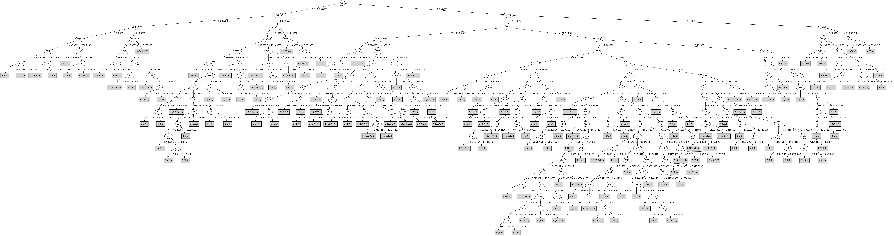

# J48

# SimpleCart Decision Tree

V69 < 9.227174

* V116 < 24.1554285

*   * V105 < 4012.70755

*   *   * V82 < 2.231763

*   *   *   * V67 < 1.239535

*   *   *   *   * V33 < 674.0573999999999

*   *   *   *   *   * V13 < 3.4985105

*   *   *   *   *   *   * V6 < -0.104447

*   *   *   *   *   *   *   * V1 < -43.84824999999999: 4(4.0/0.0)

*   *   *   *   *   *   *   * V1 >= -43.84824999999999: 2(2.0/0.0)

*   *   *   *   *   *   * V6 >= -0.104447: 0(10.0/0.0)

*   *   *   *   *   * V13 >= 3.4985105: 1(79.0/1.0)

*   *   *   *   * V33 >= 674.0573999999999

*   *   *   *   *   * V49 < 2311.45505: 1(1.0/1.0)

*   *   *   *   *   * V49 >= 2311.45505

*   *   *   *   *   *   * V23 < -0.43929850000000004: 2(166.0/0.0)

*   *   *   *   *   *   * V23 >= -0.43929850000000004: 2(2.0/1.0)

*   *   *   * V67 >= 1.239535

*   *   *   *   * V38 < -0.3024945

*   *   *   *   *   * V73 < 12896.003: 5(117.0/0.0)

*   *   *   *   *   * V73 >= 12896.003: 3(2.0/0.0)

*   *   *   *   * V38 >= -0.3024945

*   *   *   *   *   * V18 < 1.0925509999999998

*   *   *   *   *   *   * V19 < 1.135173: 5(58.0/0.0)

*   *   *   *   *   *   * V19 >= 1.135173: 0(1.0/1.0)

*   *   *   *   *   * V18 >= 1.0925509999999998

*   *   *   *   *   *   * V3 < 2.942462

*   *   *   *   *   *   *   * V11 < 5.0785815: 3(110.0/0.0)

*   *   *   *   *   *   *   * V11 >= 5.0785815: 5(2.0/0.0)

*   *   *   *   *   *   * V3 >= 2.942462

*   *   *   *   *   *   *   * V16 < -13.571926

*   *   *   *   *   *   *   *   * V13 < 13.663884: 3(2.0/1.0)

*   *   *   *   *   *   *   *   * V13 >= 13.663884: 4(12.0/0.0)

*   *   *   *   *   *   *   * V16 >= -13.571926: 0(24.0/0.0)

*   *   * V82 >= 2.231763

*   *   *   * V106 < 4.078077

*   *   *   *   * V76 < 3.7497865

*   *   *   *   *   * V86 < -1.2964995

*   *   *   *   *   *   * V11 < 7.1194985: 1(333.0/4.0)

*   *   *   *   *   *   * V11 >= 7.1194985: 5(2.0/0.0)

*   *   *   *   *   * V86 >= -1.2964995

*   *   *   *   *   *   * V34 < 2.0268635

*   *   *   *   *   *   *   * V9 < 14264.515: 1(97.0/1.0)

*   *   *   *   *   *   *   * V9 >= 14264.515

*   *   *   *   *   *   *   *   * V9 < 18059.487: 3(3.0/0.0)

*   *   *   *   *   *   *   *   * V9 >= 18059.487: 0(1.0/1.0)

*   *   *   *   *   *   * V34 >= 2.0268635

*   *   *   *   *   *   *   * V82 < 5.1517254999999995: 2(38.0/0.0)

*   *   *   *   *   *   *   * V82 >= 5.1517254999999995: 1(2.0/0.0)

*   *   *   *   * V76 >= 3.7497865

*   *   *   *   *   * V22 < -1.1933034999999999

*   *   *   *   *   *   * V1 < 22459.4245: 1(1.0/1.0)

*   *   *   *   *   *   * V1 >= 22459.4245: 3(3.0/0.0)

*   *   *   *   *   * V22 >= -1.1933034999999999

*   *   *   *   *   *   * V1 < 53425.9625: 0(16.0/0.0)

*   *   *   *   *   *   * V1 >= 53425.9625: 4(2.0/0.0)

*   *   *   * V106 >= 4.078077

*   *   *   *   * V1 < 8565.4262: 2(45.0/0.0)

*   *   *   *   * V1 >= 8565.4262: 1(10.0/0.0)

*   * V105 >= 4012.70755

*   *   * V81 < 19312.457

*   *   *   * V35 < 0.598479: 4(5.0/1.0)

*   *   *   * V35 >= 0.598479

*   *   *   *   * V81 < 18775.628: 2(765.0/1.0)

*   *   *   *   * V81 >= 18775.628

*   *   *   *   *   * V1 < 9743.5185: 2(14.0/0.0)

*   *   *   *   *   * V1 >= 9743.5185: 1(5.0/0.0)

*   *   * V81 >= 19312.457

*   *   *   * V41 < 5999.2837: 1(82.0/0.0)

*   *   *   * V41 >= 5999.2837: 2(35.0/0.0)

* V116 >= 24.1554285

*   * V98 < 7.7439915

*   *   * V8 < -217.6645575: 0(3.0/0.0)

*   *   * V8 >= -217.6645575: 1(1039.0/1.0)

*   * V98 >= 7.7439915: 2(14.0/0.0)

V69 >= 9.227174

* V16 < -91.30183

*   * V9 < 79801.705

*   *   * V100 < 3.608644

*   *   *   * V18 < 4.8584575

*   *   *   *   * V1 < 24050.081000000002: 4(2.0/0.0)

*   *   *   *   * V1 >= 24050.081000000002: 5(17.0/0.0)

*   *   *   * V18 >= 4.8584575: 1(26.0/0.0)

*   *   * V100 >= 3.608644

*   *   *   * V6 < -5.534012000000001: 0(73.0/0.0)

*   *   *   * V6 >= -5.534012000000001: 3(7.0/0.0)

*   * V9 >= 79801.705

*   *   * V108 < 8.8316215

*   *   *   * V75 < 60.1518935

*   *   *   *   * V22 < -1.336395: 4(1364.0/10.0)

*   *   *   *   * V22 >= -1.336395: 3(1.0/1.0)

*   *   *   * V75 >= 60.1518935

*   *   *   *   * V1 < 399109.88: 3(8.0/1.0)

*   *   *   *   * V1 >= 399109.88: 4(23.0/0.0)

*   *   * V108 >= 8.8316215

*   *   *   * V5 < 85.250212: 0(5.0/0.0)

*   *   *   * V5 >= 85.250212: 4(1.0/1.0)

* V16 >= -91.30183

*   * V101 < 8.669140500000001

*   *   * V36 < 1.2388895

*   *   *   * V17 < 2689.5057500000003

*   *   *   *   * V11 < 2.480733

*   *   *   *   *   * V2 < 1.474497: 3(26.0/0.0)

*   *   *   *   *   * V2 >= 1.474497: 1(2.0/0.0)

*   *   *   *   * V11 >= 2.480733: 5(43.0/0.0)

*   *   *   * V17 >= 2689.5057500000003

*   *   *   *   * V74 < 5.986532499999999

*   *   *   *   *   * V122 < 5.356218999999999

*   *   *   *   *   *   * V65 < 14470.393: 1(2.0/0.0)

*   *   *   *   *   *   * V65 >= 14470.393

*   *   *   *   *   *   *   * V10 < 2.0285805000000003: 3(1.0/1.0)

*   *   *   *   *   *   *   * V10 >= 2.0285805000000003

*   *   *   *   *   *   *   *   * V32 < -2.0575215

*   *   *   *   *   *   *   *   *   * V88 < -8.9691915: 4(10.0/1.0)

*   *   *   *   *   *   *   *   *   * V88 >= -8.9691915: 4(421.0/0.0)

*   *   *   *   *   *   *   *   * V32 >= -2.0575215

*   *   *   *   *   *   *   *   *   * V1 < 91243.07699999999

*   *   *   *   *   *   *   *   *   *   * V1 < 48752.515499999994: 0(2.0/0.0)

*   *   *   *   *   *   *   *   *   *   * V1 >= 48752.515499999994: 3(2.0/0.0)

*   *   *   *   *   *   *   *   *   * V1 >= 91243.07699999999: 4(6.0/0.0)

*   *   *   *   *   * V122 >= 5.356218999999999

*   *   *   *   *   *   * V2 < 6.2694485: 0(11.0/0.0)

*   *   *   *   *   *   * V2 >= 6.2694485: 4(3.0/0.0)

*   *   *   *   * V74 >= 5.986532499999999

*   *   *   *   *   * V66 < 7.8704325: 3(4.0/0.0)

*   *   *   *   *   * V66 >= 7.8704325: 5(26.0/1.0)

*   *   * V36 >= 1.2388895

*   *   *   * V78 < -3.9162999999999997

*   *   *   *   * V79 < -14.301744

*   *   *   *   *   * V52 < 5.280913

*   *   *   *   *   *   * V17 < 7118.79185: 5(30.0/0.0)

*   *   *   *   *   *   * V17 >= 7118.79185: 3(6.0/0.0)

*   *   *   *   *   * V52 >= 5.280913

*   *   *   *   *   *   * V1 < 183029.87

*   *   *   *   *   *   *   * V19 < 6.588748000000001: 0(131.0/0.0)

*   *   *   *   *   *   *   * V19 >= 6.588748000000001: 3(3.0/0.0)

*   *   *   *   *   *   * V1 >= 183029.87: 3(3.0/0.0)

*   *   *   *   * V79 >= -14.301744

*   *   *   *   *   * V16 < -61.532844

*   *   *   *   *   *   * V104 < -4.56958

*   *   *   *   *   *   *   * V18 < 3.452608

*   *   *   *   *   *   *   *   * V2 < 2.9150840000000002: 0(6.0/0.0)

*   *   *   *   *   *   *   *   * V2 >= 2.9150840000000002

*   *   *   *   *   *   *   *   *   * V1 < 35860.812999999995: 5(4.0/0.0)

*   *   *   *   *   *   *   *   *   * V1 >= 35860.812999999995: 4(2.0/0.0)

*   *   *   *   *   *   *   * V18 >= 3.452608

*   *   *   *   *   *   *   *   * V18 < 5.954345: 3(13.0/0.0)

*   *   *   *   *   *   *   *   * V18 >= 5.954345: 1(6.0/0.0)

*   *   *   *   *   *   * V104 >= -4.56958

*   *   *   *   *   *   *   * V6 < -0.0239645: 4(122.0/2.0)

*   *   *   *   *   *   *   * V6 >= -0.0239645: 2(2.0/0.0)

*   *   *   *   *   * V16 >= -61.532844

*   *   *   *   *   *   * V76 < 5.9812095: 5(42.0/1.0)

*   *   *   *   *   *   * V76 >= 5.9812095

*   *   *   *   *   *   *   * V30 < -1.285874

*   *   *   *   *   *   *   *   * V28 < 11.642158

*   *   *   *   *   *   *   *   *   * V36 < 1.801265

*   *   *   *   *   *   *   *   *   *   * V16 < -31.2901445: 4(12.0/0.0)

*   *   *   *   *   *   *   *   *   *   * V16 >= -31.2901445: 0(3.0/0.0)

*   *   *   *   *   *   *   *   *   * V36 >= 1.801265

*   *   *   *   *   *   *   *   *   *   * V80 < -38.409349500000005

*   *   *   *   *   *   *   *   *   *   *   * V78 < -7.725422

*   *   *   *   *   *   *   *   *   *   *   *   * V1 < 60436.365000000005: 0(16.0/0.0)

*   *   *   *   *   *   *   *   *   *   *   *   * V1 >= 60436.365000000005: 3(2.0/0.0)

*   *   *   *   *   *   *   *   *   *   *   * V78 >= -7.725422: 3(31.0/1.0)

*   *   *   *   *   *   *   *   *   *   * V80 >= -38.409349500000005

*   *   *   *   *   *   *   *   *   *   *   * V13 < 46.365835000000004

*   *   *   *   *   *   *   *   *   *   *   *   * V34 < 4.092435999999999: 3(553.0/5.0)

*   *   *   *   *   *   *   *   *   *   *   *   * V34 >= 4.092435999999999: 1(3.0/0.0)

*   *   *   *   *   *   *   *   *   *   *   * V13 >= 46.365835000000004

*   *   *   *   *   *   *   *   *   *   *   *   * V17 < 14756.696: 5(9.0/0.0)

*   *   *   *   *   *   *   *   *   *   *   *   * V17 >= 14756.696: 3(7.0/0.0)

*   *   *   *   *   *   *   *   * V28 >= 11.642158

*   *   *   *   *   *   *   *   *   * V97 < 7261.6377: 1(21.0/0.0)

*   *   *   *   *   *   *   *   *   * V97 >= 7261.6377: 2(16.0/0.0)

*   *   *   *   *   *   *   * V30 >= -1.285874

*   *   *   *   *   *   *   *   * V78 < -4.6835065

*   *   *   *   *   *   *   *   *   * V10 < 8.492589: 0(43.0/0.0)

*   *   *   *   *   *   *   *   *   * V10 >= 8.492589: 3(2.0/0.0)

*   *   *   *   *   *   *   *   * V78 >= -4.6835065

*   *   *   *   *   *   *   *   *   * V22 < -0.7596255000000001

*   *   *   *   *   *   *   *   *   *   * V52 < 7.3850495

*   *   *   *   *   *   *   *   *   *   *   * V1 < 39432.319: 3(17.0/0.0)

*   *   *   *   *   *   *   *   *   *   *   * V1 >= 39432.319: 5(2.0/0.0)

*   *   *   *   *   *   *   *   *   *   * V52 >= 7.3850495: 0(4.0/0.0)

*   *   *   *   *   *   *   *   *   * V22 >= -0.7596255000000001: 4(8.0/0.0)

*   *   *   * V78 >= -3.9162999999999997

*   *   *   *   * V12 < 17.753665

*   *   *   *   *   * V18 < 5.7913095000000006

*   *   *   *   *   *   * V25 < 6183.717500000001

*   *   *   *   *   *   *   * V11 < 5.607468

*   *   *   *   *   *   *   *   * V124 < 5.8680345

*   *   *   *   *   *   *   *   *   * V81 < 314.02525: 5(15.0/0.0)

*   *   *   *   *   *   *   *   *   * V81 >= 314.02525

*   *   *   *   *   *   *   *   *   *   * V10 < 5.966952

*   *   *   *   *   *   *   *   *   *   *   * V20 < 1.5171234999999998: 5(2.0/1.0)

*   *   *   *   *   *   *   *   *   *   *   * V20 >= 1.5171234999999998: 3(139.0/4.0)

*   *   *   *   *   *   *   *   *   *   * V10 >= 5.966952: 5(2.0/0.0)

*   *   *   *   *   *   *   *   * V124 >= 5.8680345: 0(47.0/0.0)

*   *   *   *   *   *   *   * V11 >= 5.607468

*   *   *   *   *   *   *   *   * V76 < 6.7794075

*   *   *   *   *   *   *   *   *   * V36 < 3.93289

*   *   *   *   *   *   *   *   *   *   * V12 < 10.532750499999999

*   *   *   *   *   *   *   *   *   *   *   * V124 < 4.8165075: 5(33.0/1.0)

*   *   *   *   *   *   *   *   *   *   *   * V124 >= 4.8165075: 3(9.0/1.0)

*   *   *   *   *   *   *   *   *   *   * V12 >= 10.532750499999999: 5(288.0/0.0)

*   *   *   *   *   *   *   *   *   * V36 >= 3.93289: 0(15.0/1.0)

*   *   *   *   *   *   *   *   * V76 >= 6.7794075

*   *   *   *   *   *   *   *   *   * V13 < 20.0216185: 3(28.0/0.0)

*   *   *   *   *   *   *   *   *   * V13 >= 20.0216185

*   *   *   *   *   *   *   *   *   *   * V2 < 2.0773235000000003: 0(7.0/0.0)

*   *   *   *   *   *   *   *   *   *   * V2 >= 2.0773235000000003

*   *   *   *   *   *   *   *   *   *   *   * V3 < 7.2376485: 4(5.0/0.0)

*   *   *   *   *   *   *   *   *   *   *   * V3 >= 7.2376485: 5(3.0/1.0)

*   *   *   *   *   *   * V25 >= 6183.717500000001

*   *   *   *   *   *   *   * V36 < 1.523237: 4(12.0/0.0)

*   *   *   *   *   *   *   * V36 >= 1.523237

*   *   *   *   *   *   *   *   * V98 < 3.3514195

*   *   *   *   *   *   *   *   *   * V117 < 17.632737: 3(224.0/0.0)

*   *   *   *   *   *   *   *   *   * V117 >= 17.632737

*   *   *   *   *   *   *   *   *   *   * V1 < 41118.455: 1(2.0/0.0)

*   *   *   *   *   *   *   *   *   *   * V1 >= 41118.455: 0(5.0/0.0)

*   *   *   *   *   *   *   *   * V98 >= 3.3514195

*   *   *   *   *   *   *   *   *   * V19 < 2.261593: 5(11.0/0.0)

*   *   *   *   *   *   *   *   *   * V19 >= 2.261593

*   *   *   *   *   *   *   *   *   *   * V9 < 35168.5685: 2(6.0/0.0)

*   *   *   *   *   *   *   *   *   *   * V9 >= 35168.5685: 3(9.0/0.0)

*   *   *   *   *   * V18 >= 5.7913095000000006

*   *   *   *   *   *   * V1 < 7921.1765: 2(2.0/0.0)

*   *   *   *   *   *   * V1 >= 7921.1765: 1(112.0/0.0)

*   *   *   *   * V12 >= 17.753665

*   *   *   *   *   * V75 < 8.376112

*   *   *   *   *   *   * V31 < -5.671771

*   *   *   *   *   *   *   * V6 < -4.7889295: 3(2.0/1.0)

*   *   *   *   *   *   *   * V6 >= -4.7889295: 1(16.0/0.0)

*   *   *   *   *   *   * V31 >= -5.671771

*   *   *   *   *   *   *   * V46 < -0.4015055

*   *   *   *   *   *   *   *   * V1 < 1164.37355

*   *   *   *   *   *   *   *   *   * V1 < 8.55585: 2(2.0/0.0)

*   *   *   *   *   *   *   *   *   * V1 >= 8.55585: 3(3.0/0.0)

*   *   *   *   *   *   *   *   * V1 >= 1164.37355

*   *   *   *   *   *   *   *   *   * V12 < 18.1923

*   *   *   *   *   *   *   *   *   *   * V14 < -8.138804: 3(5.0/0.0)

*   *   *   *   *   *   *   *   *   *   * V14 >= -8.138804: 5(17.0/0.0)

*   *   *   *   *   *   *   *   *   * V12 >= 18.1923

*   *   *   *   *   *   *   *   *   *   * V46 < -0.41210800000000003: 5(562.0/0.0)

*   *   *   *   *   *   *   *   *   *   * V46 >= -0.41210800000000003: 5(2.0/1.0)

*   *   *   *   *   *   *   * V46 >= -0.4015055

*   *   *   *   *   *   *   *   * V17 < 7877.287: 5(15.0/0.0)

*   *   *   *   *   *   *   *   * V17 >= 7877.287: 4(12.0/0.0)

*   *   *   *   *   * V75 >= 8.376112

*   *   *   *   *   *   * V12 < 28.191596

*   *   *   *   *   *   *   * V1 < 58299.315

*   *   *   *   *   *   *   *   * V3 < 13.5023375

*   *   *   *   *   *   *   *   *   * V1 < 30308.0375: 4(2.0/0.0)

*   *   *   *   *   *   *   *   *   * V1 >= 30308.0375: 3(3.0/0.0)

*   *   *   *   *   *   *   *   * V3 >= 13.5023375: 1(5.0/0.0)

*   *   *   *   *   *   *   * V1 >= 58299.315: 0(6.0/0.0)

*   *   *   *   *   *   * V12 >= 28.191596: 4(28.0/1.0)

*   * V101 >= 8.669140500000001

*   *   * V20 < 24.2705715

*   *   *   * V70 < -1.3319415000000001

*   *   *   *   * V101 < 11.46652

*   *   *   *   *   * V25 < 21011.1125

*   *   *   *   *   *   * V124 < 10.3580985

*   *   *   *   *   *   *   * V18 < 4.955905: 3(14.0/1.0)

*   *   *   *   *   *   *   * V18 >= 4.955905: 0(1.0/1.0)

*   *   *   *   *   *   * V124 >= 10.3580985

*   *   *   *   *   *   *   * V13 < 70.4078525

*   *   *   *   *   *   *   *   * V40 < -6.2539575: 3(3.0/0.0)

*   *   *   *   *   *   *   *   * V40 >= -6.2539575

*   *   *   *   *   *   *   *   *   * V125 < 15.185868: 3(2.0/0.0)

*   *   *   *   *   *   *   *   *   * V125 >= 15.185868

*   *   *   *   *   *   *   *   *   *   * V112 < -6.920441: 3(2.0/1.0)

*   *   *   *   *   *   *   *   *   *   * V112 >= -6.920441

*   *   *   *   *   *   *   *   *   *   *   * V100 < 4.683763

*   *   *   *   *   *   *   *   *   *   *   *   * V2 < 6.6336985: 0(13.0/0.0)

*   *   *   *   *   *   *   *   *   *   *   *   * V2 >= 6.6336985: 3(3.0/0.0)

*   *   *   *   *   *   *   *   *   *   *   * V100 >= 4.683763

*   *   *   *   *   *   *   *   *   *   *   *   * V19 < 6.381499: 0(315.0/0.0)

*   *   *   *   *   *   *   *   *   *   *   *   * V19 >= 6.381499: 0(2.0/1.0)

*   *   *   *   *   *   *   * V13 >= 70.4078525: 4(3.0/0.0)

*   *   *   *   *   * V25 >= 21011.1125

*   *   *   *   *   *   * V2 < 10.704137500000002

*   *   *   *   *   *   *   * V85 < 18.8205055

*   *   *   *   *   *   *   *   * V1 < 66155.7145: 2(6.0/0.0)

*   *   *   *   *   *   *   *   * V1 >= 66155.7145: 4(2.0/0.0)

*   *   *   *   *   *   *   * V85 >= 18.8205055: 1(29.0/1.0)

*   *   *   *   *   *   * V2 >= 10.704137500000002

*   *   *   *   *   *   *   * V5 < 61.0423525: 3(77.0/0.0)

*   *   *   *   *   *   *   * V5 >= 61.0423525: 0(7.0/1.0)

*   *   *   *   * V101 >= 11.46652

*   *   *   *   *   * V117 < 25.0656055

*   *   *   *   *   *   * V23 < -4.3911035

*   *   *   *   *   *   *   * V2 < 15.532153000000001: 2(1.0/1.0)

*   *   *   *   *   *   *   * V2 >= 15.532153000000001: 3(3.0/0.0)

*   *   *   *   *   *   * V23 >= -4.3911035: 0(7.0/0.0)

*   *   *   *   *   * V117 >= 25.0656055

*   *   *   *   *   *   * V117 < 26.267219

*   *   *   *   *   *   *   * V17 < 23437.905: 0(28.0/0.0)

*   *   *   *   *   *   *   * V17 >= 23437.905: 3(3.0/0.0)

*   *   *   *   *   *   * V117 >= 26.267219

*   *   *   *   *   *   *   * V117 < 27.306715: 0(30.0/1.0)

*   *   *   *   *   *   *   * V117 >= 27.306715: 0(950.0/0.0)

*   *   *   * V70 >= -1.3319415000000001

*   *   *   *   * V1 < 26770.308

*   *   *   *   *   * V16 < -4.2329545: 2(13.0/0.0)

*   *   *   *   *   * V16 >= -4.2329545: 0(2.0/1.0)

*   *   *   *   * V1 >= 26770.308: 4(41.0/0.0)

*   *   * V20 >= 24.2705715

*   *   *   * V9 < 77984.31: 1(121.0/0.0)

*   *   *   * V9 >= 77984.31

*   *   *   *   * V2 < 15.208972500000002: 4(8.0/0.0)

*   *   *   *   * V2 >= 15.208972500000002: 0(22.0/0.0)

# PART

Decision list:

conditions|predicted class
---|---
V69 <= 9.644309 AND V26 > 2.233252 AND V116 > 24.146755 AND V35 <= 3.009959| 1 (1053.0)
V69 <= 9.220727 AND V26 > 2.222829 AND V105 > 4042.3557 AND V81 <= 18774.953 AND V38 <= -0.413551| 2 (743.0/1.0)
V108 > 7.768515 AND V71 <= -7.248131 AND V13 <= 77.505684 AND V125 > 24.73443| 0 (935.0)
V68 <= 3.583522 AND V89 > 613.9468 AND V94 > -0.207786 AND V103 <= -0.428966| 2 (60.0)
V16 <= -56.986458 AND V10 > 2.690869 AND V57 > 8580.116 AND V80 <= -18.505985 AND V73 > 22941.764 AND V9 > 84250.37 AND V16 <= -75.23049 AND V75 <= 58.342686 AND V11 > 20.192957 AND V33 > 3143.209 AND V37 <= 7.189758| 4 (1089.0)
V69 <= 7.112737 AND V89 > 569.5879 AND V1 > 18377.35 AND V75 <= 3.668537| 4 (9.0/1.0)
V69 <= 7.112737 AND V89 > 569.5879 AND V75 <= 3.294241 AND V42 <= 6.177284 AND V84 > 3.255187 AND V11 <= 5.151094 AND V105 <= 5678.5215 AND V99 > 0.58836| 1 (329.0)
V68 <= 2.746911 AND V89 > 613.9468 AND V105 > 2114.8384 AND V81 <= 20608.852 AND V65 <= 6956.736| 2 (203.0)
V13 > 70.20413 AND V93 > 6.84844 AND V66 <= 16.569311 AND V12 > 45.34446 AND V9 > 102270.7 AND V34 > 2.60813 AND V29 <= 40.33723| 4 (279.0/1.0)
V29 > 17.577932 AND V91 > 5.502295 AND V33 <= 6480.6416 AND V1 <= 95985.38 AND V78 > -8.588305 AND V93 > 14.453006| 1 (234.0)
V68 <= 2.113803 AND V78 <= -0.085282 AND V114 > 1.503658 AND V9 > 935.1699 AND V118 <= -0.295977 AND V19 <= 2.478912 AND V98 <= 2.032608| 1 (171.0)
V106 > 3.980022 AND V65 > 47950.652 AND V11 <= 51.424816 AND V114 > 5.888059 AND V121 <= 31479.34 AND V78 <= -7.457709 AND V19 <= 6.469807 AND V43 > 1.216674| 0 (222.0)
V106 > 4.287348 AND V74 <= 7.555828 AND V97 <= 5659.0415 AND V1 <= 49148.703| 1 (113.0)
V100 <= 1.690305 AND V9 > 25096.246 AND V120 <= -3.736481 AND V58 <= 5.091531 AND V66 <= 5.140096 AND V82 > 1.812696 AND V112 > -4.752141| 4 (453.0/1.0)
V101 > 7.668294 AND V17 <= 17882.375 AND V11 <= 20.377373 AND V20 > 3.421321 AND V125 > 15.507205 AND V81 <= 20755.73 AND V74 <= 5.83223 AND V26 > 2.131696| 0 (315.0)
V16 > -61.30176 AND V42 > 4.762931 AND V1 <= 76174.805 AND V66 <= 3.34195| 2 (71.0)
V68 <= 2.244899 AND V14 <= -0.135535 AND V82 <= 4.742107 AND V41 > 444.2864 AND V41 > 831.5577 AND V107 <= 0.547404| 2 (31.0)
V16 > -61.40329 AND V17 > 12213.978 AND V70 <= -4.336143 AND V79 > -17.965158 AND V38 <= -0.645253 AND V53 <= 25.596022 AND V27 <= 8.333718 AND V42 <= 3.654103| 3 (462.0)
V26 <= 5.473814 AND V25 > 12461.978 AND V10 <= 3.626203 AND V71 > -15.819249| 3 (14.0/1.0)
V26 <= 5.473814 AND V25 > 12461.978 AND V78 <= -4.29308 AND V114 <= 6.133111 AND V10 > 3.626203 AND V20 <= 12.306175 AND V2 > 1.955125| 4 (104.0/3.0)
V26 <= 5.473814 AND V68 > 2.244899 AND V100 > 5.211135 AND V9 <= 85145.74 AND V37 > 5.123863 AND V40 > -5.453307| 0 (68.0)
V26 <= 5.473814 AND V68 > 2.244899 AND V13 > 33.595135 AND V39 > -1.500671 AND V15 <= -10.433024 AND V4 <= 0.510264 AND V38 > -0.589075| 4 (18.0)
V26 <= 5.473814 AND V68 > 2.244899 AND V13 > 33.595135 AND V39 > -1.500671 AND V15 <= -10.433024 AND V80 > -17.91013 AND V46 <= -0.412164| 5 (489.0/1.0)
V18 <= 4.809033 AND V9 <= 53433.477 AND V68 > 2.244899 AND V69 <= 28.247747 AND V112 > -1.564672 AND V17 > 3626.5576| 0 (26.0)
V18 <= 4.809033 AND V125 <= 12.827671 AND V68 > 2.244899 AND V17 > 7213.9287 AND V9 <= 52312.332 AND V36 > 1.553674 AND V106 <= 3.083518 AND V38 <= -0.418422| 3 (284.0/1.0)
V18 <= 4.809033 AND V68 > 2.244899 AND V17 <= 8223.159 AND V10 > 3.291719 AND V76 <= 7.811267 AND V101 > 4.032017 AND V12 > 11.203166 AND V104 <= -2.74964| 5 (413.0/1.0)
V26 <= 5.491689 AND V16 > -45.215874 AND V68 > 2.244899 AND V82 <= 1.094953| 5 (91.0/1.0)
V26 <= 5.491689 AND V68 > 2.600153 AND V16 > -45.215874 AND V9 <= 4260.525 AND V11 > 2.570476| 0 (72.0)
V26 <= 4.618565 AND V16 > -45.215874 AND V68 > 2.225607 AND V124 > 8.996452 AND V66 > 3.605535| 3 (63.0)
V17 <= 7025.1196 AND V76 > 2.050491 AND V125 <= 12.559676 AND V15 > -2.491352 AND V34 <= 1.562| 3 (133.0)
V26 > 5.464598 AND V1 <= 57211.254 AND V82 > 5.891101 AND V45 <= 5.835721| 1 (56.0)
V72 <= -6.886023 AND V84 <= 2.892136 AND V10 <= 1.825979 AND V5 > 4.125173| 3 (89.0/3.0)
V68 <= 3.4212 AND V15 <= -0.397704 AND V9 > 236.4942 AND V114 > 1.892459 AND V108 <= 1.270504| 1 (26.0/1.0)
V28 <= 2.873007 AND V72 <= -6.84591 AND V15 > -34.940834 AND V99 > 0.443215 AND V100 > 1.462327 AND V104 > -5.055237 AND V20 <= 2.581341 AND V84 <= 2.541279| 5 (172.0/1.0)
V125 > 13.522671 AND V13 <= 55.638733 AND V10 > 9.506439 AND V13 <= 42.46831| 3 (27.0)
V125 > 13.522671 AND V19 <= 7.754875 AND V12 <= 28.794432 AND V68 > 10.871371| 0 (82.0)
V28 <= 11.336045 AND V76 <= 1.638042 AND V3 <= 0.125703| 0 (15.0/5.0)
V28 <= 11.336045 AND V68 <= 3.10515 AND V5 <= 5.419892| 2 (15.0/1.0)
V28 <= 11.336045 AND V16 <= -44.546688 AND V10 > 8.121206 AND V41 <= 3091.9492| 5 (25.0/1.0)
V21 <= 12.401069 AND V16 <= -44.546688 AND V108 <= 4.295311 AND V9 > 37064.383 AND V39 <= -0.528494 AND V10 <= 8.695664 AND V93 <= 8.062586 AND V4 > 0.246664 AND V56 <= -4.969103 AND V36 <= 2.06027| 4 (81.0)
V21 <= 12.401069 AND V16 <= -61.76808 AND V47 <= -1.314019 AND V1 <= 312561.1| 3 (13.0)
V29 <= 11.592482 AND V16 <= -61.76808 AND V2 <= 7.547605 AND V33 <= 2950.5005 AND V1 > 28839.223| 4 (14.0)
V29 <= 11.592482 AND V32 > -11.267357 AND V84 > 2.652219 AND V16 <= -6.645973 AND V80 <= -6.022161 AND V79 > -8.751322 AND V13 <= 24.768997 AND V116 <= 9.678738 AND V77 > 7.070599 AND V84 > 2.810391 AND V1 <= 41255.797| 3 (162.0/1.0)
V29 <= 11.592482 AND V49 > 16272.506 AND V10 > 10.285341| 3 (12.0)
V25 <= 12250.678 AND V15 > -3.386354 AND V1 > 3784.8281| 4 (15.0/2.0)
V25 <= 12250.678 AND V50 > 5.99421 AND V16 > -25.080355| 0 (23.0/1.0)
V17 <= 12310.083 AND V70 <= -1.193216 AND V10 > 3.696252 AND V85 <= 8.512049 AND V16 <= -10.716241 AND V82 <= 4.565521 AND V104 <= -1.180736 AND V17 <= 5942.129 AND V11 > 5.572333| 5 (85.0/1.0)
V17 <= 12310.083 AND V7 > -3.739201 AND V16 <= -34.01882 AND V47 <= -0.916306| 5 (9.0)
V89 <= 11628.006 AND V26 <= 1.674444 AND V89 > 1047.6123 AND V1 <= 13644.843| 5 (17.0)
V89 <= 11628.006 AND V20 > 0.662624 AND V7 > -3.325404 AND V36 > 1.621945| 3 (36.0)
V89 <= 11605.993 AND V2 > 8.204443 AND V89 <= 7438.1123 AND V1 <= 50577.562| 3 (12.0)
V89 <= 11605.993 AND V65 > 4744.376 AND V46 > -0.284034 AND V30 <= -0.279246 AND V18 <= 2.309191| 4 (16.0)
V89 <= 11605.993 AND V67 > 2.748202 AND V10 <= 1.752336| 0 (18.0)
V81 <= 13442.677 AND V69 > 7.64929 AND V16 <= -58.958885| 4 (11.0/3.0)
V89 <= 11605.993 AND V20 > 0.662624 AND V107 <= 0.550704| 3 (12.0/4.0)
V89 <= 11605.993 AND V29 > 1.904466 AND V72 <= -13.350632 AND V99 <= 0.950282| 3 (16.0/4.0)
V89 <= 11605.993 AND V86 <= -1.916884| 3 (14.0/3.0)
V22 > -1.917235 AND V29 > 1.904466 AND V89 <= 7173.2783 AND V10 <= 3.405679| 0 (12.0)
V17 <= 10277.746 AND V1 <= 70903.24 AND V72 <= -18.54684| 5 (10.0)
V10 > 12.1442| 0 (16.0/4.0)
V22 > -1.849538 AND V28 > 1.447447| 0 (11.0/4.0)
V124 > 22.338675 AND V101 <= 14.968288| 1 (14.0/2.0)
V65 > 39165.82 AND V17 > 8189.1865 AND V47 <= -1.930745| 4 (13.0)
V33 > 3059.6846 AND V34 <= 2.686063| 2 (11.0)
V18 <= 4.606576 AND V40 > -4.667493| 5 (11.0/5.0)
V15 <= -18.815117| 4 (10.0/2.0)
| 2 (9.0/4.0)

# JRip

Decision list:

conditions|predicted class
---|---
(V69 <= 7.725095) and (V113 <= 18143.61) and (V105 >= 3347.8022) and (V110 <= -0.87026)|2 (570.0/0.0)
(V66 <= 1.658406) and (V42 >= 1.925706) and (V77 >= 3.089267) and (V118 >= -3.213975) and (V13 >= 3.251021)|2 (245.0/0.0)
(V65 <= 10664.738) and (V42 >= 5.343794) and (V8 <= -3.037692)|2 (86.0/0.0)
(V124 <= 3.225277) and (V13 <= 5.714781) and (V82 <= 2.097301) and (V33 >= 711.2629) and (V126 <= -0.201653)|2 (111.0/0.0)
(V69 <= 9.942803) and (V125 <= 15.867241) and (V105 >= 3787.3572) and (V97 >= 4391.655) and (V1 <= 26855.404)|2 (43.0/0.0)
(V66 <= 1.417657) and (V33 >= 1231.1313) and (V116 <= 3.755892) and (V50 <= 5.09885)|2 (33.0/0.0)
(V46 <= -3.156305)|2 (10.0/0.0)
(V66 <= 2.290203) and (V34 >= 3.428157) and (V82 <= 6.55283)|2 (15.0/0.0)
(V17 <= 9777.547) and (V10 >= 3.31517) and (V28 <= 4.290496) and (V101 >= 4.462544) and (V13 >= 18.324825) and (V75 <= 6.797688)|5 (484.0/0.0)
(V17 <= 11871.937) and (V36 <= 2.662756) and (V10 >= 8.492421) and (V74 <= 5.702164) and (V2 >= 5.129771)|5 (190.0/0.0)
(V17 <= 7007.816) and (V89 >= 6398.8887) and (V73 <= 21425.344) and (V25 <= 6775.2495) and (V11 <= 15.129651)|5 (124.0/0.0)
(V20 <= 2.41618) and (V100 >= 1.383267) and (V84 <= 1.57754) and (V10 >= 1.326146)|5 (145.0/0.0)
(V17 <= 11784.844) and (V12 >= 22.741476) and (V79 >= -5.784659) and (V95 <= -2.475984) and (V2 >= 1.720233)|5 (102.0/0.0)
(V81 <= 7872.7065) and (V10 >= 5.904824) and (V124 <= 5.992926) and (V20 <= 2.384954) and (V104 <= -1.172109)|5 (87.0/0.0)
(V81 <= 5573.19) and (V12 >= 10.188053) and (V5 <= 10.878782) and (V73 <= 20473.207)|5 (73.0/0.0)
(V19 <= 1.166272) and (V27 <= 0.388904) and (V99 >= 0.31567)|5 (28.0/0.0)
(V66 >= 3.262639) and (V83 <= 1.141934) and (V18 <= 2.22431) and (V20 <= 2.547511)|5 (23.0/0.0)
(V86 >= -3.480829) and (V10 >= 8.991453) and (V73 <= 28244.709) and (V9 >= 35943.227) and (V1 >= 26818.006)|5 (28.0/0.0)
(V20 <= 2.512887) and (V44 >= 0.954748) and (V65 >= 122218.48) and (V1 <= 192564.58)|5 (8.0/0.0)
(V117 <= 21.074911) and (V16 >= -56.352802) and (V14 <= -5.652918) and (V75 <= 8.897557) and (V36 >= 2.4897) and (V35 <= 1.40838)|3 (361.0/0.0)
(V117 <= 21.657627) and (V16 >= -56.230198) and (V36 >= 1.563447) and (V124 <= 7.449261) and (V73 <= 27855.75) and (V9 >= 3971.2642) and (V96 >= -5.814301) and (V21 >= 4.900935)|3 (280.0/0.0)
(V117 <= 22.290869) and (V10 >= 8.706956) and (V9 <= 85613.42) and (V128 <= -8.11536) and (V106 <= 3.902422) and (V73 >= 33569.633)|3 (243.0/0.0)
(V117 <= 20.603777) and (V101 >= 4.10763) and (V16 >= -60.994385) and (V40 <= -4.565499) and (V23 <= -3.169011) and (V10 <= 3.036668) and (V1 <= 56248.594)|3 (78.0/0.0)
(V117 <= 20.603777) and (V16 >= -57.056324) and (V77 >= 8.32022) and (V11 <= 5.60229) and (V116 <= 5.524978) and (V14 <= -0.777996) and (V36 >= 1.038371)|3 (87.0/0.0)
(V117 <= 26.439178) and (V2 >= 10.666181) and (V60 >= 17.910456) and (V35 >= 2.246982) and (V1 <= 108278.93)|3 (63.0/0.0)
(V125 <= 19.960932) and (V101 >= 4.046137) and (V71 >= -15.572689) and (V15 <= -8.278722) and (V47 <= -1.3357) and (V41 <= 3294.9338)|3 (58.0/0.0)
(V117 <= 14.236102) and (V101 >= 4.163928) and (V13 <= 28.96837) and (V73 >= 14823.551) and (V55 <= -3.965522) and (V26 <= 4.590584)|3 (48.0/0.0)
(V64 >= -6.369771) and (V114 <= 1.274751) and (V18 >= 1.117287) and (V3 <= 2.424399)|3 (25.0/0.0)
(V56 >= -7.23712) and (V66 >= 4.026973) and (V86 >= -1.104396) and (V72 <= -10.585625) and (V24 <= -1.726433)|3 (21.0/0.0)
(V125 <= 18.707455) and (V10 >= 6.659207) and (V36 >= 2.728269) and (V72 <= -35.226074) and (V65 <= 82457.76) and (V18 <= 10.701318)|3 (18.0/0.0)
(V93 <= 7.983527) and (V74 >= 7.874528) and (V70 <= -23.356129) and (V1 <= 390137.6) and (V6 <= -30.369709)|3 (15.0/0.0)
(V56 >= -7.667674) and (V108 >= 1.531978) and (V116 <= 5.750736) and (V66 <= 2.67455) and (V93 <= 5.048823) and (V19 >= 0.691917)|3 (15.0/0.0)
(V101 >= 11.665514) and (V117 <= 51.938786) and (V10 >= 6.571598) and (V82 <= 8.934049)|0 (796.0/0.0)
(V37 >= 5.934832) and (V91 <= 5.510648) and (V13 <= 53.01135) and (V100 >= 4.186383) and (V101 >= 7.924145) and (V1 >= 1564.6575)|0 (422.0/0.0)
(V66 >= 16.568499) and (V44 >= 5.275737) and (V5 <= 95.72465)|0 (183.0/0.0)
(V32 >= -8.767064) and (V100 >= 2.574775) and (V72 <= -4.375679) and (V12 <= 22.013063) and (V10 <= 4.513141) and (V48 >= -4.929722)|0 (174.0/0.0)
(V24 >= -4.640324) and (V74 >= 3.216137) and (V124 >= 3.801489) and (V42 >= 3.248525)|0 (49.0/0.0)
(V76 >= 5.57362) and (V9 <= 69623.4) and (V73 >= 38239.22) and (V10 <= 3.602266)|0 (62.0/0.0)
(V128 >= -3.216056) and (V75 >= 3.898243) and (V1 <= 50813.28)|0 (25.0/0.0)
(V2 >= 7.139531) and (V16 >= -95.87631) and (V79 <= -17.428347) and (V17 >= 8189.1865)|0 (48.0/0.0)
(V25 <= 914.823) and (V79 >= -0.424957)|0 (11.0/0.0)
(V81 <= 1025.7305) and (V1 >= 5140.414)|0 (8.0/0.0)
(V101 >= 10.904646) and (V18 <= 5.997744) and (V98 >= 2.909667) and (V82 <= 5.715844)|0 (12.0/0.0)
(V9 <= 35559.957) and (V82 >= 4.481035) and (V76 <= 4.27449)|1 (1411.0/0.0)
(V9 <= 37502.824) and (V82 >= 2.982094) and (V86 <= -3.361205) and (V19 <= 22.014246)|1 (218.0/0.0)
(V75 <= 1.090456) and (V1 >= 335.5723) and (V72 >= -6.713415)|1 (207.0/0.0)
(V28 >= 14.168826) and (V97 <= 7244.4614) and (V15 >= -27.309467)|1 (114.0/0.0)
(V13 <= 15.040976) and (V88 <= -5.280932) and (V32 >= -8.65998) and (V82 >= 2.214136) and (V1 <= 24356.02)|1 (26.0/0.0)
(V13 <= 34.404465) and (V85 >= 9.68711) and (V108 <= 3.580349)|1 (21.0/0.0)
|4 (2233.0/117.0)

# Decision Table

Non matches covered by Majority class

v9|v76|v122|target
---|---|---|---
(40524.548-45088.1675]|(80.215037-inf)|(24.075449-inf)|0
(176400.39-inf)|(80.215037-inf)|(24.075449-inf)|4
(176400.39-inf)|(62.934694-80.215037]|(24.075449-inf)|4
(176400.39-inf)|(50.331401-62.934694]|(24.075449-inf)|0
(176400.39-inf)|(80.215037-inf)|(18.506763-24.075449]|4
(26598.711-28856.4755]|(30.93713-50.331401]|(24.075449-inf)|0
(112133.2075-176400.39]|(62.934694-80.215037]|(18.506763-24.075449]|0
(86207.3395-112133.2075]|(30.93713-50.331401]|(24.075449-inf)|0
(176400.39-inf)|(62.934694-80.215037]|(18.506763-24.075449]|4
(112133.2075-176400.39]|(80.215037-inf)|(11.333713-18.506763]|0
(176400.39-inf)|(50.331401-62.934694]|(18.506763-24.075449]|4
(176400.39-inf)|(80.215037-inf)|(11.333713-18.506763]|4
(112133.2075-176400.39]|(50.331401-62.934694]|(18.506763-24.075449]|0
(18718.008-26096.4835]|(62.934694-80.215037]|(11.333713-18.506763]|0
(86207.3395-112133.2075]|(30.93713-50.331401]|(18.506763-24.075449]|0
(176400.39-inf)|(30.93713-50.331401]|(18.506763-24.075449]|4
(112133.2075-176400.39]|(30.93713-50.331401]|(18.506763-24.075449]|0
(76596.855-86207.3395]|(23.313601-30.295403]|(24.075449-inf)|0
(176400.39-inf)|(62.934694-80.215037]|(11.333713-18.506763]|4
(18718.008-26096.4835]|(30.93713-50.331401]|(18.506763-24.075449]|0
(112133.2075-176400.39]|(62.934694-80.215037]|(11.333713-18.506763]|0
(68324.475-75474.705]|(23.313601-30.295403]|(24.075449-inf)|0
(176400.39-inf)|(80.215037-inf)|(11.063691-11.333713]|4
(176400.39-inf)|(50.331401-62.934694]|(11.333713-18.506763]|4
(112133.2075-176400.39]|(50.331401-62.934694]|(11.333713-18.506763]|0
(76596.855-86207.3395]|(30.93713-50.331401]|(11.333713-18.506763]|0
(176400.39-inf)|(30.93713-50.331401]|(11.333713-18.506763]|4
(86207.3395-112133.2075]|(30.93713-50.331401]|(11.333713-18.506763]|0
(112133.2075-176400.39]|(30.93713-50.331401]|(11.333713-18.506763]|0
(176400.39-inf)|(80.215037-inf)|(8.856298-11.063691]|4
(176400.39-inf)|(23.313601-30.295403]|(11.333713-18.506763]|0
(17845.1355-18718.008]|(23.313601-30.295403]|(11.333713-18.506763]|0
(112133.2075-176400.39]|(23.313601-30.295403]|(11.333713-18.506763]|0
(176400.39-inf)|(62.934694-80.215037]|(8.856298-11.063691]|4
(86207.3395-112133.2075]|(23.313601-30.295403]|(11.333713-18.506763]|0
(18718.008-26096.4835]|(21.596889-22.378556]|(24.075449-inf)|0
(68324.475-75474.705]|(23.313601-30.295403]|(11.333713-18.506763]|0
(75474.705-76596.855]|(23.313601-30.295403]|(11.333713-18.506763]|0
(76596.855-86207.3395]|(23.313601-30.295403]|(11.333713-18.506763]|0
(86207.3395-112133.2075]|(30.93713-50.331401]|(11.063691-11.333713]|0
(112133.2075-176400.39]|(50.331401-62.934694]|(8.856298-11.063691]|0
(176400.39-inf)|(80.215037-inf)|(7.893361-8.856298]|4
(176400.39-inf)|(50.331401-62.934694]|(8.856298-11.063691]|4
(68324.475-75474.705]|(23.313601-30.295403]|(11.063691-11.333713]|0
(112133.2075-176400.39]|(23.313601-30.295403]|(11.063691-11.333713]|0
(176400.39-inf)|(62.934694-80.215037]|(7.893361-8.856298]|4
(86207.3395-112133.2075]|(23.313601-30.295403]|(11.063691-11.333713]|0
(76596.855-86207.3395]|(30.93713-50.331401]|(8.856298-11.063691]|0
(58753.617-68324.475]|(30.93713-50.331401]|(8.856298-11.063691]|0
(176400.39-inf)|(30.93713-50.331401]|(8.856298-11.063691]|4
(112133.2075-176400.39]|(30.93713-50.331401]|(8.856298-11.063691]|4
(86207.3395-112133.2075]|(30.93713-50.331401]|(8.856298-11.063691]|0
(176400.39-inf)|(50.331401-62.934694]|(7.893361-8.856298]|0
(86207.3395-112133.2075]|(30.295403-30.93713]|(8.856298-11.063691]|0
(76596.855-86207.3395]|(22.378556-22.737527]|(11.333713-18.506763]|1
(112133.2075-176400.39]|(50.331401-62.934694]|(7.893361-8.856298]|3
(75474.705-76596.855]|(12.864986-19.114577]|(24.075449-inf)|0
(30623.864-37509.9805]|(12.864986-19.114577]|(24.075449-inf)|0
(58753.617-68324.475]|(12.864986-19.114577]|(24.075449-inf)|0
(75474.705-76596.855]|(22.737527-23.139173]|(11.063691-11.333713]|0
(18718.008-26096.4835]|(12.864986-19.114577]|(24.075449-inf)|1
(86207.3395-112133.2075]|(30.93713-50.331401]|(7.893361-8.856298]|3
(176400.39-inf)|(62.934694-80.215037]|(7.39577-7.893361]|4
(176400.39-inf)|(30.93713-50.331401]|(7.893361-8.856298]|4
(112133.2075-176400.39]|(23.313601-30.295403]|(8.856298-11.063691]|4
(112133.2075-176400.39]|(30.93713-50.331401]|(7.893361-8.856298]|4
(58753.617-68324.475]|(23.313601-30.295403]|(8.856298-11.063691]|0
(86207.3395-112133.2075]|(23.313601-30.295403]|(8.856298-11.063691]|0
(75474.705-76596.855]|(23.313601-30.295403]|(8.856298-11.063691]|0
(76596.855-86207.3395]|(30.93713-50.331401]|(7.893361-8.856298]|0
(76596.855-86207.3395]|(23.313601-30.295403]|(8.856298-11.063691]|0
(68324.475-75474.705]|(23.313601-30.295403]|(8.856298-11.063691]|0
(112133.2075-176400.39]|(50.331401-62.934694]|(7.39577-7.893361]|4
(112133.2075-176400.39]|(23.139173-23.313601]|(8.856298-11.063691]|4
(176400.39-inf)|(50.331401-62.934694]|(7.39577-7.893361]|4
(86207.3395-112133.2075]|(30.295403-30.93713]|(7.893361-8.856298]|3
(68324.475-75474.705]|(23.139173-23.313601]|(8.856298-11.063691]|0
(112133.2075-176400.39]|(12.864986-19.114577]|(18.506763-24.075449]|0
(18718.008-26096.4835]|(9.305302-11.287916]|(24.075449-inf)|0
(18718.008-26096.4835]|(23.313601-30.295403]|(7.893361-8.856298]|0
(76596.855-86207.3395]|(22.737527-23.139173]|(8.856298-11.063691]|3
(112133.2075-176400.39]|(20.429555-21.379386]|(11.333713-18.506763]|0
(112133.2075-176400.39]|(22.737527-23.139173]|(8.856298-11.063691]|4
(15197.3515-17845.1355]|(12.864986-19.114577]|(18.506763-24.075449]|0
(58753.617-68324.475]|(23.313601-30.295403]|(7.893361-8.856298]|0
(68324.475-75474.705]|(30.93713-50.331401]|(7.39577-7.893361]|0
(176400.39-inf)|(23.313601-30.295403]|(7.893361-8.856298]|0
(112133.2075-176400.39]|(30.93713-50.331401]|(7.39577-7.893361]|0
(176400.39-inf)|(62.934694-80.215037]|(6.978586-7.39577]|4
(86207.3395-112133.2075]|(30.93713-50.331401]|(7.39577-7.893361]|0
(112133.2075-176400.39]|(23.313601-30.295403]|(7.893361-8.856298]|4
(76596.855-86207.3395]|(20.429555-21.379386]|(11.333713-18.506763]|0
(58753.617-68324.475]|(22.737527-23.139173]|(8.856298-11.063691]|0
(76596.855-86207.3395]|(23.313601-30.295403]|(7.893361-8.856298]|0
(86207.3395-112133.2075]|(23.313601-30.295403]|(7.893361-8.856298]|0
(68324.475-75474.705]|(23.313601-30.295403]|(7.893361-8.856298]|0
(68324.475-75474.705]|(22.378556-22.737527]|(8.856298-11.063691]|0
(58753.617-68324.475]|(30.295403-30.93713]|(7.39577-7.893361]|0
(112133.2075-176400.39]|(30.295403-30.93713]|(7.39577-7.893361]|0
(112133.2075-176400.39]|(23.139173-23.313601]|(7.893361-8.856298]|4
(112133.2075-176400.39]|(50.331401-62.934694]|(6.978586-7.39577]|5
(12635.5875-15197.3515]|(11.287916-12.864986]|(18.506763-24.075449]|0
(112133.2075-176400.39]|(22.378556-22.737527]|(8.856298-11.063691]|0
(176400.39-inf)|(50.331401-62.934694]|(6.978586-7.39577]|4
(53614.9125-57533.582]|(12.864986-19.114577]|(11.333713-18.506763]|0
(68324.475-75474.705]|(30.93713-50.331401]|(6.978586-7.39577]|0
(10406.537-12635.5875]|(23.313601-30.295403]|(7.39577-7.893361]|0
(176400.39-inf)|(30.93713-50.331401]|(6.978586-7.39577]|4
(57533.582-58753.617]|(12.864986-19.114577]|(11.333713-18.506763]|0
(68324.475-75474.705]|(21.596889-22.378556]|(8.856298-11.063691]|0
(58753.617-68324.475]|(22.737527-23.139173]|(7.893361-8.856298]|0
(112133.2075-176400.39]|(22.737527-23.139173]|(7.893361-8.856298]|4
(53614.9125-57533.582]|(22.737527-23.139173]|(7.893361-8.856298]|0
(112133.2075-176400.39]|(23.313601-30.295403]|(7.39577-7.893361]|4
(86207.3395-112133.2075]|(23.313601-30.295403]|(7.39577-7.893361]|3
(76596.855-86207.3395]|(22.737527-23.139173]|(7.893361-8.856298]|3
(76596.855-86207.3395]|(12.864986-19.114577]|(11.333713-18.506763]|0
(58753.617-68324.475]|(12.864986-19.114577]|(11.333713-18.506763]|1
(58753.617-68324.475]|(23.313601-30.295403]|(7.39577-7.893361]|0
(68324.475-75474.705]|(23.313601-30.295403]|(7.39577-7.893361]|0
(76596.855-86207.3395]|(23.313601-30.295403]|(7.39577-7.893361]|0
(68324.475-75474.705]|(23.139173-23.313601]|(7.39577-7.893361]|0
(112133.2075-176400.39]|(22.378556-22.737527]|(7.893361-8.856298]|4
(112133.2075-176400.39]|(21.379386-21.596889]|(8.856298-11.063691]|0
(15197.3515-17845.1355]|(5.643216-8.631509]|(24.075449-inf)|0
(112133.2075-176400.39]|(50.331401-62.934694]|(6.635774-6.978586]|5
(176400.39-inf)|(50.331401-62.934694]|(6.635774-6.978586]|4
(112133.2075-176400.39]|(23.139173-23.313601]|(7.39577-7.893361]|4
(86207.3395-112133.2075]|(23.313601-30.295403]|(6.978586-7.39577]|0
(57533.582-58753.617]|(23.313601-30.295403]|(6.978586-7.39577]|0
(76596.855-86207.3395]|(20.429555-21.379386]|(8.856298-11.063691]|0
(68324.475-75474.705]|(21.596889-22.378556]|(7.893361-8.856298]|0
(112133.2075-176400.39]|(21.596889-22.378556]|(7.893361-8.856298]|4
(176400.39-inf)|(23.313601-30.295403]|(6.978586-7.39577]|0
(68324.475-75474.705]|(30.93713-50.331401]|(6.635774-6.978586]|0
(112133.2075-176400.39]|(20.429555-21.379386]|(8.856298-11.063691]|4
(18718.008-26096.4835]|(5.405914-5.643216]|(24.075449-inf)|0
(53614.9125-57533.582]|(23.313601-30.295403]|(6.978586-7.39577]|0
(76596.855-86207.3395]|(23.313601-30.295403]|(6.978586-7.39577]|0
(112133.2075-176400.39]|(30.93713-50.331401]|(6.635774-6.978586]|3
(112133.2075-176400.39]|(23.313601-30.295403]|(6.978586-7.39577]|4
(176400.39-inf)|(62.934694-80.215037]|(6.470645-6.635774]|0
(176400.39-inf)|(30.93713-50.331401]|(6.635774-6.978586]|4
(58753.617-68324.475]|(23.313601-30.295403]|(6.978586-7.39577]|0
(68324.475-75474.705]|(22.737527-23.139173]|(7.39577-7.893361]|0
(58753.617-68324.475]|(30.93713-50.331401]|(6.635774-6.978586]|0
(112133.2075-176400.39]|(22.378556-22.737527]|(7.39577-7.893361]|0
(76596.855-86207.3395]|(22.378556-22.737527]|(7.39577-7.893361]|0
(112133.2075-176400.39]|(21.379386-21.596889]|(7.893361-8.856298]|0
(112133.2075-176400.39]|(23.139173-23.313601]|(6.978586-7.39577]|0
(75474.705-76596.855]|(22.378556-22.737527]|(7.39577-7.893361]|0
(58753.617-68324.475]|(21.379386-21.596889]|(7.893361-8.856298]|0
(18718.008-26096.4835]|(4.919776-5.405914]|(24.075449-inf)|0
(15197.3515-17845.1355]|(4.919776-5.405914]|(24.075449-inf)|1
(15197.3515-17845.1355]|(5.643216-8.631509]|(18.506763-24.075449]|0
(45088.1675-52925.2475]|(8.956503-9.305302]|(11.333713-18.506763]|1
(58753.617-68324.475]|(19.114577-20.429555]|(8.856298-11.063691]|0
(112133.2075-176400.39]|(50.331401-62.934694]|(6.470645-6.635774]|5
(176400.39-inf)|(50.331401-62.934694]|(6.470645-6.635774]|4
(76596.855-86207.3395]|(19.114577-20.429555]|(8.856298-11.063691]|3
(76596.855-86207.3395]|(21.379386-21.596889]|(7.893361-8.856298]|3
(68324.475-75474.705]|(22.378556-22.737527]|(7.39577-7.893361]|0
(45088.1675-52925.2475]|(12.864986-19.114577]|(8.856298-11.063691]|0
(76596.855-86207.3395]|(20.429555-21.379386]|(7.893361-8.856298]|0
(58753.617-68324.475]|(20.429555-21.379386]|(7.893361-8.856298]|0
(75474.705-76596.855]|(12.864986-19.114577]|(8.856298-11.063691]|3
(53614.9125-57533.582]|(12.864986-19.114577]|(8.856298-11.063691]|0
(15197.3515-17845.1355]|(3.974502-4.919776]|(24.075449-inf)|1
(76596.855-86207.3395]|(23.313601-30.295403]|(6.635774-6.978586]|0
(68324.475-75474.705]|(30.93713-50.331401]|(6.470645-6.635774]|0
(68324.475-75474.705]|(21.596889-22.378556]|(7.39577-7.893361]|0
(112133.2075-176400.39]|(20.429555-21.379386]|(7.893361-8.856298]|4
(112133.2075-176400.39]|(23.313601-30.295403]|(6.635774-6.978586]|4
(52925.2475-53614.9125]|(12.864986-19.114577]|(8.856298-11.063691]|0
(58753.617-68324.475]|(12.864986-19.114577]|(8.856298-11.063691]|1
(112133.2075-176400.39]|(30.93713-50.331401]|(6.470645-6.635774]|5
(176400.39-inf)|(62.934694-80.215037]|(6.049967-6.470645]|0
(176400.39-inf)|(30.93713-50.331401]|(6.470645-6.635774]|4
(76596.855-86207.3395]|(12.864986-19.114577]|(8.856298-11.063691]|3
(68324.475-75474.705]|(12.864986-19.114577]|(8.856298-11.063691]|3
(68324.475-75474.705]|(20.429555-21.379386]|(7.893361-8.856298]|0
(58753.617-68324.475]|(23.313601-30.295403]|(6.635774-6.978586]|0
(75474.705-76596.855]|(21.596889-22.378556]|(7.39577-7.893361]|0
(12635.5875-15197.3515]|(4.919776-5.405914]|(18.506763-24.075449]|0
(45088.1675-52925.2475]|(11.287916-12.864986]|(8.856298-11.063691]|0
(15197.3515-17845.1355]|(4.919776-5.405914]|(18.506763-24.075449]|0
(40524.548-45088.1675]|(5.643216-8.631509]|(11.333713-18.506763]|1
(45088.1675-52925.2475]|(5.643216-8.631509]|(11.333713-18.506763]|1
(38070.5365-40524.548]|(5.643216-8.631509]|(11.333713-18.506763]|1
(176400.39-inf)|(50.331401-62.934694]|(6.049967-6.470645]|4
(76596.855-86207.3395]|(22.378556-22.737527]|(6.978586-7.39577]|0
(112133.2075-176400.39]|(19.114577-20.429555]|(7.893361-8.856298]|4
(86207.3395-112133.2075]|(11.287916-12.864986]|(8.856298-11.063691]|0
(15197.3515-17845.1355]|(3.415442-3.974502]|(24.075449-inf)|0
(58753.617-68324.475]|(11.287916-12.864986]|(8.856298-11.063691]|0
(30623.864-37509.9805]|(5.643216-8.631509]|(11.333713-18.506763]|1
(17845.1355-18718.008]|(5.643216-8.631509]|(11.333713-18.506763]|0
(58753.617-68324.475]|(22.378556-22.737527]|(6.978586-7.39577]|0
(53614.9125-57533.582]|(19.114577-20.429555]|(7.893361-8.856298]|0
(58753.617-68324.475]|(19.114577-20.429555]|(7.893361-8.856298]|0
(57533.582-58753.617]|(19.114577-20.429555]|(7.893361-8.856298]|0
(76596.855-86207.3395]|(9.305302-11.287916]|(8.856298-11.063691]|0
(12635.5875-15197.3515]|(2.563394-3.415442]|(24.075449-inf)|0
(76596.855-86207.3395]|(21.596889-22.378556]|(6.978586-7.39577]|0
(12635.5875-15197.3515]|(3.974502-4.919776]|(18.506763-24.075449]|0
(68324.475-75474.705]|(21.596889-22.378556]|(6.978586-7.39577]|0
(53614.9125-57533.582]|(30.93713-50.331401]|(6.049967-6.470645]|0
(75474.705-76596.855]|(12.864986-19.114577]|(7.893361-8.856298]|0
(112133.2075-176400.39]|(23.313601-30.295403]|(6.470645-6.635774]|4
(86207.3395-112133.2075]|(23.313601-30.295403]|(6.470645-6.635774]|3
(68324.475-75474.705]|(30.93713-50.331401]|(6.049967-6.470645]|0
(112133.2075-176400.39]|(30.93713-50.331401]|(6.049967-6.470645]|5
(176400.39-inf)|(30.93713-50.331401]|(6.049967-6.470645]|4
(58753.617-68324.475]|(12.864986-19.114577]|(7.893361-8.856298]|0
(58753.617-68324.475]|(9.305302-11.287916]|(8.856298-11.063691]|0
(58753.617-68324.475]|(20.429555-21.379386]|(7.39577-7.893361]|0
(68324.475-75474.705]|(20.429555-21.379386]|(7.39577-7.893361]|0
(45088.1675-52925.2475]|(9.305302-11.287916]|(8.856298-11.063691]|0
(86207.3395-112133.2075]|(30.93713-50.331401]|(6.049967-6.470645]|5
(176400.39-inf)|(22.737527-23.139173]|(6.635774-6.978586]|0
(112133.2075-176400.39]|(20.429555-21.379386]|(7.39577-7.893361]|4
(112133.2075-176400.39]|(12.864986-19.114577]|(7.893361-8.856298]|4
(76596.855-86207.3395]|(12.864986-19.114577]|(7.893361-8.856298]|3
(76596.855-86207.3395]|(22.737527-23.139173]|(6.635774-6.978586]|3
(68324.475-75474.705]|(12.864986-19.114577]|(7.893361-8.856298]|3
(15197.3515-17845.1355]|(3.974502-4.919776]|(18.506763-24.075449]|1
(45088.1675-52925.2475]|(12.864986-19.114577]|(7.893361-8.856298]|0
(53614.9125-57533.582]|(12.864986-19.114577]|(7.893361-8.856298]|0
(45088.1675-52925.2475]|(8.956503-9.305302]|(8.856298-11.063691]|0
(76596.855-86207.3395]|(22.378556-22.737527]|(6.635774-6.978586]|0
(76596.855-86207.3395]|(21.379386-21.596889]|(6.978586-7.39577]|0
(112133.2075-176400.39]|(50.331401-62.934694]|(5.729285-6.049967]|0
(37509.9805-38070.5365]|(5.643216-8.631509]|(11.063691-11.333713]|0
(15197.3515-17845.1355]|(3.415442-3.974502]|(18.506763-24.075449]|1
(45088.1675-52925.2475]|(11.287916-12.864986]|(7.893361-8.856298]|1
(68324.475-75474.705]|(21.379386-21.596889]|(6.978586-7.39577]|0
(17845.1355-18718.008]|(3.415442-3.974502]|(18.506763-24.075449]|0
(12635.5875-15197.3515]|(3.415442-3.974502]|(18.506763-24.075449]|0
(18718.008-26096.4835]|(11.287916-12.864986]|(7.893361-8.856298]|0
(45088.1675-52925.2475]|(19.114577-20.429555]|(7.39577-7.893361]|0
(112133.2075-176400.39]|(22.378556-22.737527]|(6.635774-6.978586]|0
(30623.864-37509.9805]|(5.643216-8.631509]|(11.063691-11.333713]|1
(53614.9125-57533.582]|(19.114577-20.429555]|(7.39577-7.893361]|0
(68324.475-75474.705]|(19.114577-20.429555]|(7.39577-7.893361]|0
(112133.2075-176400.39]|(19.114577-20.429555]|(7.39577-7.893361]|4
(68324.475-75474.705]|(8.956503-9.305302]|(8.856298-11.063691]|0
(26598.711-28856.4755]|(4.919776-5.405914]|(11.333713-18.506763]|0
(58753.617-68324.475]|(19.114577-20.429555]|(7.39577-7.893361]|0
(57533.582-58753.617]|(19.114577-20.429555]|(7.39577-7.893361]|0
(76596.855-86207.3395]|(21.596889-22.378556]|(6.635774-6.978586]|0
(17845.1355-18718.008]|(2.563394-3.415442]|(18.506763-24.075449]|0
(12635.5875-15197.3515]|(3.974502-4.919776]|(11.333713-18.506763]|0
(58753.617-68324.475]|(9.305302-11.287916]|(7.893361-8.856298]|0
(45088.1675-52925.2475]|(9.305302-11.287916]|(7.893361-8.856298]|1
(57533.582-58753.617]|(12.864986-19.114577]|(7.39577-7.893361]|0
(76596.855-86207.3395]|(12.864986-19.114577]|(7.39577-7.893361]|0
(26598.711-28856.4755]|(3.974502-4.919776]|(11.333713-18.506763]|1
(45088.1675-52925.2475]|(23.313601-30.295403]|(6.049967-6.470645]|0
(58753.617-68324.475]|(20.429555-21.379386]|(6.978586-7.39577]|0
(112133.2075-176400.39]|(30.93713-50.331401]|(5.729285-6.049967]|4
(112133.2075-176400.39]|(20.429555-21.379386]|(6.978586-7.39577]|0
(15197.3515-17845.1355]|(2.563394-3.415442]|(18.506763-24.075449]|1
(18718.008-26096.4835]|(2.563394-3.415442]|(18.506763-24.075449]|1
(45088.1675-52925.2475]|(12.864986-19.114577]|(7.39577-7.893361]|0
(76596.855-86207.3395]|(23.313601-30.295403]|(6.049967-6.470645]|0
(176400.39-inf)|(30.93713-50.331401]|(5.729285-6.049967]|4
(112133.2075-176400.39]|(23.313601-30.295403]|(6.049967-6.470645]|4
(112133.2075-176400.39]|(21.596889-22.378556]|(6.635774-6.978586]|4
(112133.2075-176400.39]|(12.864986-19.114577]|(7.39577-7.893361]|4
(75474.705-76596.855]|(12.864986-19.114577]|(7.39577-7.893361]|0
(68324.475-75474.705]|(12.864986-19.114577]|(7.39577-7.893361]|3
(58753.617-68324.475]|(12.864986-19.114577]|(7.39577-7.893361]|0
(18718.008-26096.4835]|(3.974502-4.919776]|(11.333713-18.506763]|1
(12635.5875-15197.3515]|(2.563394-3.415442]|(18.506763-24.075449]|1
(15197.3515-17845.1355]|(3.974502-4.919776]|(11.333713-18.506763]|1
(58753.617-68324.475]|(23.313601-30.295403]|(6.049967-6.470645]|0
(58753.617-68324.475]|(30.93713-50.331401]|(5.729285-6.049967]|0
(68324.475-75474.705]|(23.313601-30.295403]|(6.049967-6.470645]|0
(53614.9125-57533.582]|(12.864986-19.114577]|(7.39577-7.893361]|0
(68324.475-75474.705]|(21.596889-22.378556]|(6.635774-6.978586]|0
(57533.582-58753.617]|(23.313601-30.295403]|(6.049967-6.470645]|0
(37509.9805-38070.5365]|(5.643216-8.631509]|(8.856298-11.063691]|0
(112133.2075-176400.39]|(21.379386-21.596889]|(6.635774-6.978586]|4
(8398.731-9674.953]|(0.94542-1.338386]|(24.075449-inf)|0
(58753.617-68324.475]|(11.287916-12.864986]|(7.39577-7.893361]|3
(15197.3515-17845.1355]|(1.878032-2.563394]|(18.506763-24.075449]|1
(17845.1355-18718.008]|(1.878032-2.563394]|(18.506763-24.075449]|0
(58753.617-68324.475]|(8.956503-9.305302]|(7.893361-8.856298]|0
(112133.2075-176400.39]|(19.114577-20.429555]|(6.978586-7.39577]|0
(26598.711-28856.4755]|(5.643216-8.631509]|(8.856298-11.063691]|1
(38070.5365-40524.548]|(5.643216-8.631509]|(8.856298-11.063691]|2
(40524.548-45088.1675]|(5.643216-8.631509]|(8.856298-11.063691]|0
(53614.9125-57533.582]|(5.643216-8.631509]|(8.856298-11.063691]|0
(15197.3515-17845.1355]|(3.415442-3.974502]|(11.333713-18.506763]|1
(28856.4755-30623.864]|(5.643216-8.631509]|(8.856298-11.063691]|1
(18718.008-26096.4835]|(5.643216-8.631509]|(8.856298-11.063691]|1
(12635.5875-15197.3515]|(1.878032-2.563394]|(18.506763-24.075449]|1
(45088.1675-52925.2475]|(5.643216-8.631509]|(8.856298-11.063691]|1
(68324.475-75474.705]|(19.114577-20.429555]|(6.978586-7.39577]|0
(112133.2075-176400.39]|(23.139173-23.313601]|(6.049967-6.470645]|0
(18718.008-26096.4835]|(3.415442-3.974502]|(11.333713-18.506763]|1
(57533.582-58753.617]|(5.643216-8.631509]|(8.856298-11.063691]|0
(10406.537-12635.5875]|(1.878032-2.563394]|(18.506763-24.075449]|1
(18718.008-26096.4835]|(1.878032-2.563394]|(18.506763-24.075449]|0
(68324.475-75474.705]|(5.643216-8.631509]|(8.856298-11.063691]|1
(58753.617-68324.475]|(5.643216-8.631509]|(8.856298-11.063691]|1
(12635.5875-15197.3515]|(3.415442-3.974502]|(11.333713-18.506763]|1
(30623.864-37509.9805]|(5.643216-8.631509]|(8.856298-11.063691]|1
(58753.617-68324.475]|(19.114577-20.429555]|(6.978586-7.39577]|0
(1647.64675-4250.3942]|(0.434833-0.94542]|(24.075449-inf)|0
(15197.3515-17845.1355]|(1.338386-1.878032]|(18.506763-24.075449]|0
(28856.4755-30623.864]|(5.405914-5.643216]|(8.856298-11.063691]|1
(18718.008-26096.4835]|(5.405914-5.643216]|(8.856298-11.063691]|0
(58753.617-68324.475]|(20.429555-21.379386]|(6.635774-6.978586]|0
(45088.1675-52925.2475]|(23.313601-30.295403]|(5.729285-6.049967]|0
(26598.711-28856.4755]|(5.405914-5.643216]|(8.856298-11.063691]|1
(18718.008-26096.4835]|(2.563394-3.415442]|(11.333713-18.506763]|0
(18718.008-26096.4835]|(3.974502-4.919776]|(11.063691-11.333713]|0
(53614.9125-57533.582]|(5.405914-5.643216]|(8.856298-11.063691]|1
(9674.953-10364.5975]|(2.563394-3.415442]|(11.333713-18.506763]|0
(57533.582-58753.617]|(23.313601-30.295403]|(5.729285-6.049967]|0
(112133.2075-176400.39]|(21.596889-22.378556]|(6.470645-6.635774]|0
(112133.2075-176400.39]|(23.313601-30.295403]|(5.729285-6.049967]|4
(12635.5875-15197.3515]|(1.338386-1.878032]|(18.506763-24.075449]|1
(30623.864-37509.9805]|(5.405914-5.643216]|(8.856298-11.063691]|1
(15197.3515-17845.1355]|(2.563394-3.415442]|(11.333713-18.506763]|1
(57533.582-58753.617]|(22.737527-23.139173]|(6.049967-6.470645]|0
(45088.1675-52925.2475]|(12.864986-19.114577]|(6.978586-7.39577]|0
(112133.2075-176400.39]|(30.93713-50.331401]|(5.6021-5.729285]|0
(112133.2075-176400.39]|(20.429555-21.379386]|(6.635774-6.978586]|4
(112133.2075-176400.39]|(12.864986-19.114577]|(6.978586-7.39577]|4
(176400.39-inf)|(30.93713-50.331401]|(5.6021-5.729285]|4
(58753.617-68324.475]|(12.864986-19.114577]|(6.978586-7.39577]|3
(17845.1355-18718.008]|(1.338386-1.878032]|(18.506763-24.075449]|0
(10406.537-12635.5875]|(2.563394-3.415442]|(11.333713-18.506763]|1
(4250.3942-7743.926]|(0.434833-0.94542]|(24.075449-inf)|1
(12635.5875-15197.3515]|(2.563394-3.415442]|(11.333713-18.506763]|1
(10406.537-12635.5875]|(1.338386-1.878032]|(18.506763-24.075449]|1
(57533.582-58753.617]|(12.864986-19.114577]|(6.978586-7.39577]|0
(68324.475-75474.705]|(20.429555-21.379386]|(6.635774-6.978586]|0
(58753.617-68324.475]|(23.313601-30.295403]|(5.729285-6.049967]|0
(28856.4755-30623.864]|(4.919776-5.405914]|(8.856298-11.063691]|0
(112133.2075-176400.39]|(30.295403-30.93713]|(5.6021-5.729285]|4
(30623.864-37509.9805]|(4.919776-5.405914]|(8.856298-11.063691]|1
(53614.9125-57533.582]|(4.919776-5.405914]|(8.856298-11.063691]|1
(28856.4755-30623.864]|(5.643216-8.631509]|(7.893361-8.856298]|0
(10406.537-12635.5875]|(1.878032-2.563394]|(11.333713-18.506763]|1
(15197.3515-17845.1355]|(0.94542-1.338386]|(18.506763-24.075449]|1
(30623.864-37509.9805]|(5.643216-8.631509]|(7.893361-8.856298]|1
(9674.953-10364.5975]|(1.878032-2.563394]|(11.333713-18.506763]|1
(68324.475-75474.705]|(19.114577-20.429555]|(6.635774-6.978586]|0
(58753.617-68324.475]|(11.287916-12.864986]|(6.978586-7.39577]|3
(40524.548-45088.1675]|(5.643216-8.631509]|(7.893361-8.856298]|0
(18718.008-26096.4835]|(4.919776-5.405914]|(8.856298-11.063691]|1
(58753.617-68324.475]|(5.643216-8.631509]|(7.893361-8.856298]|1
(15197.3515-17845.1355]|(1.878032-2.563394]|(11.333713-18.506763]|1
(26598.711-28856.4755]|(4.919776-5.405914]|(8.856298-11.063691]|1
(57533.582-58753.617]|(5.643216-8.631509]|(7.893361-8.856298]|1
(53614.9125-57533.582]|(5.643216-8.631509]|(7.893361-8.856298]|1
(45088.1675-52925.2475]|(5.643216-8.631509]|(7.893361-8.856298]|1
(68324.475-75474.705]|(5.643216-8.631509]|(7.893361-8.856298]|1
(12635.5875-15197.3515]|(1.878032-2.563394]|(11.333713-18.506763]|1
(45088.1675-52925.2475]|(22.378556-22.737527]|(6.049967-6.470645]|0
(58753.617-68324.475]|(19.114577-20.429555]|(6.635774-6.978586]|0
(112133.2075-176400.39]|(21.596889-22.378556]|(6.049967-6.470645]|0
(28856.4755-30623.864]|(5.405914-5.643216]|(7.893361-8.856298]|0
(1647.64675-4250.3942]|(0.434833-0.94542]|(18.506763-24.075449]|0
(58753.617-68324.475]|(21.596889-22.378556]|(6.049967-6.470645]|0
(68324.475-75474.705]|(30.93713-50.331401]|(5.378775-5.6021]|0
(68324.475-75474.705]|(12.864986-19.114577]|(6.635774-6.978586]|0
(26096.4835-26598.711]|(3.974502-4.919776]|(8.856298-11.063691]|1
(68324.475-75474.705]|(21.596889-22.378556]|(6.049967-6.470645]|0
(112133.2075-176400.39]|(12.864986-19.114577]|(6.635774-6.978586]|4
(112133.2075-176400.39]|(23.313601-30.295403]|(5.6021-5.729285]|4
(45088.1675-52925.2475]|(9.305302-11.287916]|(6.978586-7.39577]|0
(9674.953-10364.5975]|(0.434833-0.94542]|(18.506763-24.075449]|0
(9674.953-10364.5975]|(1.338386-1.878032]|(11.333713-18.506763]|1
(58753.617-68324.475]|(23.313601-30.295403]|(5.6021-5.729285]|0
(176400.39-inf)|(30.93713-50.331401]|(5.378775-5.6021]|4
(112133.2075-176400.39]|(22.737527-23.139173]|(5.729285-6.049967]|0
(28856.4755-30623.864]|(3.974502-4.919776]|(8.856298-11.063691]|1
(53614.9125-57533.582]|(12.864986-19.114577]|(6.635774-6.978586]|0
(112133.2075-176400.39]|(30.93713-50.331401]|(5.378775-5.6021]|4
(86207.3395-112133.2075]|(12.864986-19.114577]|(6.635774-6.978586]|4
(26598.711-28856.4755]|(3.974502-4.919776]|(8.856298-11.063691]|1
(12635.5875-15197.3515]|(1.338386-1.878032]|(11.333713-18.506763]|1
(10364.5975-10406.537]|(1.338386-1.878032]|(11.333713-18.506763]|0
(53614.9125-57533.582]|(9.305302-11.287916]|(6.978586-7.39577]|0
(10406.537-12635.5875]|(0.434833-0.94542]|(18.506763-24.075449]|1
(8398.731-9674.953]|(1.338386-1.878032]|(11.333713-18.506763]|1
(45088.1675-52925.2475]|(5.405914-5.643216]|(7.893361-8.856298]|1
(15197.3515-17845.1355]|(1.338386-1.878032]|(11.333713-18.506763]|1
(30623.864-37509.9805]|(3.974502-4.919776]|(8.856298-11.063691]|1
(18718.008-26096.4835]|(3.974502-4.919776]|(8.856298-11.063691]|1
(10406.537-12635.5875]|(1.338386-1.878032]|(11.333713-18.506763]|1
(58753.617-68324.475]|(12.864986-19.114577]|(6.635774-6.978586]|0
(45088.1675-52925.2475]|(12.864986-19.114577]|(6.635774-6.978586]|0
(45088.1675-52925.2475]|(5.643216-8.631509]|(7.39577-7.893361]|0
(18718.008-26096.4835]|(4.919776-5.405914]|(7.893361-8.856298]|0
(26598.711-28856.4755]|(4.919776-5.405914]|(7.893361-8.856298]|0
(58753.617-68324.475]|(11.287916-12.864986]|(6.635774-6.978586]|0
(40524.548-45088.1675]|(4.919776-5.405914]|(7.893361-8.856298]|1
(112133.2075-176400.39]|(30.295403-30.93713]|(5.378775-5.6021]|4
(75474.705-76596.855]|(11.287916-12.864986]|(6.635774-6.978586]|5
(112133.2075-176400.39]|(22.378556-22.737527]|(5.729285-6.049967]|0
(4250.3942-7743.926]|(3.415442-3.974502]|(8.856298-11.063691]|0
(28856.4755-30623.864]|(4.919776-5.405914]|(7.893361-8.856298]|0
(30623.864-37509.9805]|(3.415442-3.974502]|(8.856298-11.063691]|0
(58753.617-68324.475]|(19.114577-20.429555]|(6.470645-6.635774]|0
(53614.9125-57533.582]|(4.919776-5.405914]|(7.893361-8.856298]|0
(9674.953-10364.5975]|(0.94542-1.338386]|(11.333713-18.506763]|1
(17845.1355-18718.008]|(3.415442-3.974502]|(8.856298-11.063691]|1
(15197.3515-17845.1355]|(3.415442-3.974502]|(8.856298-11.063691]|1
(52925.2475-53614.9125]|(4.919776-5.405914]|(7.893361-8.856298]|0
(45088.1675-52925.2475]|(4.919776-5.405914]|(7.893361-8.856298]|1
(30623.864-37509.9805]|(5.643216-8.631509]|(7.39577-7.893361]|0
(12635.5875-15197.3515]|(0.94542-1.338386]|(11.333713-18.506763]|1
(4250.3942-7743.926]|(0.94542-1.338386]|(11.333713-18.506763]|1
(8398.731-9674.953]|(0.94542-1.338386]|(11.333713-18.506763]|1
(18718.008-26096.4835]|(3.415442-3.974502]|(8.856298-11.063691]|1
(7743.926-8398.731]|(0.94542-1.338386]|(11.333713-18.506763]|1
(10406.537-12635.5875]|(0.94542-1.338386]|(11.333713-18.506763]|1
(12635.5875-15197.3515]|(3.415442-3.974502]|(8.856298-11.063691]|0
(15197.3515-17845.1355]|(0.94542-1.338386]|(11.333713-18.506763]|1
(68324.475-75474.705]|(12.864986-19.114577]|(6.470645-6.635774]|0
(8398.731-9674.953]|(2.563394-3.415442]|(8.856298-11.063691]|0
(15197.3515-17845.1355]|(2.563394-3.415442]|(8.856298-11.063691]|0
(40524.548-45088.1675]|(3.974502-4.919776]|(7.893361-8.856298]|0
(112133.2075-176400.39]|(9.305302-11.287916]|(6.635774-6.978586]|0
(12635.5875-15197.3515]|(0.434833-0.94542]|(11.333713-18.506763]|0
(57533.582-58753.617]|(12.864986-19.114577]|(6.470645-6.635774]|0
(112133.2075-176400.39]|(12.864986-19.114577]|(6.470645-6.635774]|4
(176400.39-inf)|(23.313601-30.295403]|(5.378775-5.6021]|0
(28856.4755-30623.864]|(5.405914-5.643216]|(7.39577-7.893361]|0
(58753.617-68324.475]|(23.313601-30.295403]|(5.378775-5.6021]|0
(112133.2075-176400.39]|(20.429555-21.379386]|(6.049967-6.470645]|4
(17845.1355-18718.008]|(2.563394-3.415442]|(8.856298-11.063691]|0
(45088.1675-52925.2475]|(23.313601-30.295403]|(5.378775-5.6021]|0
(112133.2075-176400.39]|(30.93713-50.331401]|(4.656305-5.378775]|4
(26598.711-28856.4755]|(3.974502-4.919776]|(7.893361-8.856298]|0
(68324.475-75474.705]|(30.93713-50.331401]|(4.656305-5.378775]|0
(58753.617-68324.475]|(12.864986-19.114577]|(6.470645-6.635774]|0
(112133.2075-176400.39]|(23.313601-30.295403]|(5.378775-5.6021]|4
(18718.008-26096.4835]|(3.974502-4.919776]|(7.893361-8.856298]|1
(10406.537-12635.5875]|(3.974502-4.919776]|(7.893361-8.856298]|0
(86207.3395-112133.2075]|(30.93713-50.331401]|(4.656305-5.378775]|4
(176400.39-inf)|(30.93713-50.331401]|(4.656305-5.378775]|4
(9674.953-10364.5975]|(0.434833-0.94542]|(11.333713-18.506763]|1
(7743.926-8398.731]|(0.434833-0.94542]|(11.333713-18.506763]|1
(4250.3942-7743.926]|(0.434833-0.94542]|(11.333713-18.506763]|1
(10406.537-12635.5875]|(0.434833-0.94542]|(11.333713-18.506763]|1
(45088.1675-52925.2475]|(3.974502-4.919776]|(7.893361-8.856298]|1
(28856.4755-30623.864]|(3.974502-4.919776]|(7.893361-8.856298]|2
(8398.731-9674.953]|(0.434833-0.94542]|(11.333713-18.506763]|1
(18718.008-26096.4835]|(2.563394-3.415442]|(8.856298-11.063691]|1
(45088.1675-52925.2475]|(12.864986-19.114577]|(6.470645-6.635774]|0
(112133.2075-176400.39]|(23.139173-23.313601]|(5.378775-5.6021]|0
(8398.731-9674.953]|(1.878032-2.563394]|(8.856298-11.063691]|0
(30623.864-37509.9805]|(3.415442-3.974502]|(7.893361-8.856298]|0
(30623.864-37509.9805]|(4.919776-5.405914]|(7.39577-7.893361]|0
(38070.5365-40524.548]|(5.643216-8.631509]|(6.978586-7.39577]|0
(10406.537-12635.5875]|(1.878032-2.563394]|(8.856298-11.063691]|1
(26598.711-28856.4755]|(3.415442-3.974502]|(7.893361-8.856298]|0
(28856.4755-30623.864]|(80.215037-inf)|(4.154657-4.441173]|0
(4250.3942-7743.926]|(1.878032-2.563394]|(8.856298-11.063691]|1
(17845.1355-18718.008]|(3.415442-3.974502]|(7.893361-8.856298]|0
(40524.548-45088.1675]|(4.919776-5.405914]|(7.39577-7.893361]|0
(68324.475-75474.705]|(11.287916-12.864986]|(6.470645-6.635774]|5
(58753.617-68324.475]|(11.287916-12.864986]|(6.470645-6.635774]|3
(30623.864-37509.9805]|(5.643216-8.631509]|(6.978586-7.39577]|1
(15197.3515-17845.1355]|(1.878032-2.563394]|(8.856298-11.063691]|2
(75474.705-76596.855]|(11.287916-12.864986]|(6.470645-6.635774]|5
(176400.39-inf)|(30.295403-30.93713]|(4.656305-5.378775]|4
(26598.711-28856.4755]|(4.919776-5.405914]|(7.39577-7.893361]|0
(7743.926-8398.731]|(1.878032-2.563394]|(8.856298-11.063691]|1
(28856.4755-30623.864]|(1.878032-2.563394]|(8.856298-11.063691]|0
(12635.5875-15197.3515]|(1.878032-2.563394]|(8.856298-11.063691]|2
(18718.008-26096.4835]|(3.415442-3.974502]|(7.893361-8.856298]|1
(68324.475-75474.705]|(19.114577-20.429555]|(6.049967-6.470645]|0
(38070.5365-40524.548]|(11.287916-12.864986]|(6.470645-6.635774]|0
(30623.864-37509.9805]|(5.405914-5.643216]|(6.978586-7.39577]|0
(53614.9125-57533.582]|(23.313601-30.295403]|(4.656305-5.378775]|0
(112133.2075-176400.39]|(22.737527-23.139173]|(5.378775-5.6021]|0
(8398.731-9674.953]|(1.338386-1.878032]|(8.856298-11.063691]|0
(4250.3942-7743.926]|(1.338386-1.878032]|(8.856298-11.063691]|0
(15197.3515-17845.1355]|(1.338386-1.878032]|(8.856298-11.063691]|0
(17845.1355-18718.008]|(9.305302-11.287916]|(6.470645-6.635774]|0
(68324.475-75474.705]|(12.864986-19.114577]|(6.049967-6.470645]|0
(26598.711-28856.4755]|(5.405914-5.643216]|(6.978586-7.39577]|0
(7743.926-8398.731]|(1.338386-1.878032]|(8.856298-11.063691]|1
(28856.4755-30623.864]|(3.974502-4.919776]|(7.39577-7.893361]|0
(53614.9125-57533.582]|(21.596889-22.378556]|(5.6021-5.729285]|0
(86207.3395-112133.2075]|(23.313601-30.295403]|(4.656305-5.378775]|3
(17845.1355-18718.008]|(2.563394-3.415442]|(7.893361-8.856298]|0
(40524.548-45088.1675]|(9.305302-11.287916]|(6.470645-6.635774]|0
(112133.2075-176400.39]|(20.429555-21.379386]|(5.729285-6.049967]|0
(176400.39-inf)|(23.313601-30.295403]|(4.656305-5.378775]|4
(53614.9125-57533.582]|(12.864986-19.114577]|(6.049967-6.470645]|3
(38070.5365-40524.548]|(5.405914-5.643216]|(6.978586-7.39577]|0
(40524.548-45088.1675]|(3.974502-4.919776]|(7.39577-7.893361]|0
(76596.855-86207.3395]|(12.864986-19.114577]|(6.049967-6.470645]|0
(45088.1675-52925.2475]|(23.313601-30.295403]|(4.656305-5.378775]|0
(68324.475-75474.705]|(23.313601-30.295403]|(4.656305-5.378775]|0
(112133.2075-176400.39]|(30.93713-50.331401]|(4.441173-4.656305]|0
(86207.3395-112133.2075]|(12.864986-19.114577]|(6.049967-6.470645]|4
(12635.5875-15197.3515]|(1.338386-1.878032]|(8.856298-11.063691]|1
(57533.582-58753.617]|(23.313601-30.295403]|(4.656305-5.378775]|0
(40524.548-45088.1675]|(12.864986-19.114577]|(6.049967-6.470645]|0
(45088.1675-52925.2475]|(12.864986-19.114577]|(6.049967-6.470645]|0
(86207.3395-112133.2075]|(30.93713-50.331401]|(4.441173-4.656305]|4
(112133.2075-176400.39]|(23.313601-30.295403]|(4.656305-5.378775]|4
(112133.2075-176400.39]|(12.864986-19.114577]|(6.049967-6.470645]|4
(58753.617-68324.475]|(9.305302-11.287916]|(6.470645-6.635774]|3
(10406.537-12635.5875]|(0.434833-0.94542]|(11.063691-11.333713]|0
(8398.731-9674.953]|(0.434833-0.94542]|(11.063691-11.333713]|1
(18718.008-26096.4835]|(2.563394-3.415442]|(7.893361-8.856298]|1
(30623.864-37509.9805]|(2.563394-3.415442]|(7.893361-8.856298]|0
(12635.5875-15197.3515]|(2.563394-3.415442]|(7.893361-8.856298]|2
(15197.3515-17845.1355]|(2.563394-3.415442]|(7.893361-8.856298]|1
(9674.953-10364.5975]|(1.338386-1.878032]|(8.856298-11.063691]|2
(10406.537-12635.5875]|(1.338386-1.878032]|(8.856298-11.063691]|2
(58753.617-68324.475]|(23.313601-30.295403]|(4.656305-5.378775]|0
(57533.582-58753.617]|(12.864986-19.114577]|(6.049967-6.470645]|0
(58753.617-68324.475]|(12.864986-19.114577]|(6.049967-6.470645]|3
(30623.864-37509.9805]|(5.643216-8.631509]|(6.635774-6.978586]|0
(18718.008-26096.4835]|(11.287916-12.864986]|(6.049967-6.470645]|0
(53614.9125-57533.582]|(11.287916-12.864986]|(6.049967-6.470645]|0
(8398.731-9674.953]|(0.94542-1.338386]|(8.856298-11.063691]|1
(45088.1675-52925.2475]|(23.139173-23.313601]|(4.656305-5.378775]|0
(57533.582-58753.617]|(11.287916-12.864986]|(6.049967-6.470645]|0
(45088.1675-52925.2475]|(5.643216-8.631509]|(6.635774-6.978586]|0
(86207.3395-112133.2075]|(30.295403-30.93713]|(4.441173-4.656305]|0
(86207.3395-112133.2075]|(11.287916-12.864986]|(6.049967-6.470645]|0
(40524.548-45088.1675]|(5.643216-8.631509]|(6.635774-6.978586]|0
(112133.2075-176400.39]|(22.378556-22.737527]|(5.378775-5.6021]|4
(9674.953-10364.5975]|(0.94542-1.338386]|(8.856298-11.063691]|0
(12635.5875-15197.3515]|(1.878032-2.563394]|(7.893361-8.856298]|1
(7743.926-8398.731]|(0.94542-1.338386]|(8.856298-11.063691]|0
(10406.537-12635.5875]|(1.878032-2.563394]|(7.893361-8.856298]|2
(68324.475-75474.705]|(11.287916-12.864986]|(6.049967-6.470645]|5
(112133.2075-176400.39]|(23.139173-23.313601]|(4.656305-5.378775]|0
(18718.008-26096.4835]|(3.415442-3.974502]|(7.39577-7.893361]|1
(15197.3515-17845.1355]|(1.878032-2.563394]|(7.893361-8.856298]|1
(112133.2075-176400.39]|(19.114577-20.429555]|(5.729285-6.049967]|4
(58753.617-68324.475]|(11.287916-12.864986]|(6.049967-6.470645]|3
(4250.3942-7743.926]|(0.94542-1.338386]|(8.856298-11.063691]|1
(12635.5875-15197.3515]|(0.94542-1.338386]|(8.856298-11.063691]|1
(10406.537-12635.5875]|(0.94542-1.338386]|(8.856298-11.063691]|1
(4250.3942-7743.926]|(1.878032-2.563394]|(7.893361-8.856298]|1
(15197.3515-17845.1355]|(5.643216-8.631509]|(6.635774-6.978586]|2
(40524.548-45088.1675]|(11.287916-12.864986]|(6.049967-6.470645]|0
(40524.548-45088.1675]|(12.864986-19.114577]|(5.729285-6.049967]|0
(86207.3395-112133.2075]|(30.93713-50.331401]|(4.154657-4.441173]|4
(57533.582-58753.617]|(9.305302-11.287916]|(6.049967-6.470645]|0
(8398.731-9674.953]|(1.338386-1.878032]|(7.893361-8.856298]|0
(10364.5975-10406.537]|(0.434833-0.94542]|(8.856298-11.063691]|0
(58753.617-68324.475]|(23.313601-30.295403]|(4.441173-4.656305]|0
(45088.1675-52925.2475]|(23.313601-30.295403]|(4.441173-4.656305]|0
(45088.1675-52925.2475]|(9.305302-11.287916]|(6.049967-6.470645]|3
(26598.711-28856.4755]|(2.563394-3.415442]|(7.39577-7.893361]|0
(30623.864-37509.9805]|(22.737527-23.139173]|(4.656305-5.378775]|0
(17845.1355-18718.008]|(2.563394-3.415442]|(7.39577-7.893361]|0
(112133.2075-176400.39]|(22.737527-23.139173]|(4.656305-5.378775]|4
(28856.4755-30623.864]|(3.974502-4.919776]|(6.978586-7.39577]|1
(45088.1675-52925.2475]|(22.737527-23.139173]|(4.656305-5.378775]|0
(30623.864-37509.9805]|(12.864986-19.114577]|(5.729285-6.049967]|0
(53614.9125-57533.582]|(21.596889-22.378556]|(5.378775-5.6021]|0
(112133.2075-176400.39]|(20.429555-21.379386]|(5.6021-5.729285]|4
(4250.3942-7743.926]|(1.338386-1.878032]|(7.893361-8.856298]|1
(9674.953-10364.5975]|(0.434833-0.94542]|(8.856298-11.063691]|0
(57533.582-58753.617]|(12.864986-19.114577]|(5.729285-6.049967]|0
(86207.3395-112133.2075]|(12.864986-19.114577]|(5.729285-6.049967]|4
(53614.9125-57533.582]|(9.305302-11.287916]|(6.049967-6.470645]|3
(30623.864-37509.9805]|(3.974502-4.919776]|(6.978586-7.39577]|1
(7743.926-8398.731]|(0.434833-0.94542]|(8.856298-11.063691]|1
(12635.5875-15197.3515]|(2.563394-3.415442]|(7.39577-7.893361]|2
(18718.008-26096.4835]|(9.305302-11.287916]|(6.049967-6.470645]|0
(9674.953-10364.5975]|(1.338386-1.878032]|(7.893361-8.856298]|2
(53614.9125-57533.582]|(12.864986-19.114577]|(5.729285-6.049967]|0
(112133.2075-176400.39]|(21.596889-22.378556]|(5.378775-5.6021]|4
(86207.3395-112133.2075]|(23.313601-30.295403]|(4.441173-4.656305]|5
(112133.2075-176400.39]|(12.864986-19.114577]|(5.729285-6.049967]|4
(58753.617-68324.475]|(9.305302-11.287916]|(6.049967-6.470645]|3
(18718.008-26096.4835]|(3.974502-4.919776]|(6.978586-7.39577]|1
(8398.731-9674.953]|(0.434833-0.94542]|(8.856298-11.063691]|1
(15197.3515-17845.1355]|(2.563394-3.415442]|(7.39577-7.893361]|1
(4250.3942-7743.926]|(0.434833-0.94542]|(8.856298-11.063691]|1
(10406.537-12635.5875]|(0.434833-0.94542]|(8.856298-11.063691]|1
(26598.711-28856.4755]|(3.974502-4.919776]|(6.978586-7.39577]|1
(10406.537-12635.5875]|(1.338386-1.878032]|(7.893361-8.856298]|2
(18718.008-26096.4835]|(2.563394-3.415442]|(7.39577-7.893361]|1
(45088.1675-52925.2475]|(12.864986-19.114577]|(5.729285-6.049967]|0
(58753.617-68324.475]|(12.864986-19.114577]|(5.729285-6.049967]|0
(18718.008-26096.4835]|(1.878032-2.563394]|(7.39577-7.893361]|0
(12635.5875-15197.3515]|(1.878032-2.563394]|(7.39577-7.893361]|0
(112133.2075-176400.39]|(21.379386-21.596889]|(5.378775-5.6021]|0
(58753.617-68324.475]|(11.287916-12.864986]|(5.729285-6.049967]|3
(26598.711-28856.4755]|(3.415442-3.974502]|(6.978586-7.39577]|1
(12635.5875-15197.3515]|(5.643216-8.631509]|(6.470645-6.635774]|0
(86207.3395-112133.2075]|(11.287916-12.864986]|(5.729285-6.049967]|0
(1647.64675-4250.3942]|(0.94542-1.338386]|(7.893361-8.856298]|0
(4250.3942-7743.926]|(0.195359-0.434833]|(8.856298-11.063691]|1
(10406.537-12635.5875]|(0.94542-1.338386]|(7.893361-8.856298]|1
(9674.953-10364.5975]|(1.878032-2.563394]|(7.39577-7.893361]|2
(57533.582-58753.617]|(11.287916-12.864986]|(5.729285-6.049967]|3
(53614.9125-57533.582]|(8.956503-9.305302]|(6.049967-6.470645]|3
(28856.4755-30623.864]|(4.919776-5.405914]|(6.635774-6.978586]|0
(4250.3942-7743.926]|(0.94542-1.338386]|(7.893361-8.856298]|0
(1647.64675-4250.3942]|(0.195359-0.434833]|(8.856298-11.063691]|1
(45088.1675-52925.2475]|(22.378556-22.737527]|(4.656305-5.378775]|0
(18718.008-26096.4835]|(3.415442-3.974502]|(6.978586-7.39577]|1
(8398.731-9674.953]|(0.94542-1.338386]|(7.893361-8.856298]|1
(112133.2075-176400.39]|(22.378556-22.737527]|(4.656305-5.378775]|4
(8398.731-9674.953]|(1.878032-2.563394]|(7.39577-7.893361]|0
(10406.537-12635.5875]|(1.878032-2.563394]|(7.39577-7.893361]|2
(15197.3515-17845.1355]|(1.878032-2.563394]|(7.39577-7.893361]|1
(30623.864-37509.9805]|(11.287916-12.864986]|(5.729285-6.049967]|0
(40524.548-45088.1675]|(11.287916-12.864986]|(5.729285-6.049967]|0
(45088.1675-52925.2475]|(11.287916-12.864986]|(5.729285-6.049967]|0
(38070.5365-40524.548]|(11.287916-12.864986]|(5.729285-6.049967]|0
(53614.9125-57533.582]|(9.305302-11.287916]|(5.729285-6.049967]|0
(40524.548-45088.1675]|(12.864986-19.114577]|(5.6021-5.729285]|0
(86207.3395-112133.2075]|(9.305302-11.287916]|(5.729285-6.049967]|0
(86207.3395-112133.2075]|(12.864986-19.114577]|(5.6021-5.729285]|0
(45088.1675-52925.2475]|(12.864986-19.114577]|(5.6021-5.729285]|0
(26096.4835-26598.711]|(3.974502-4.919776]|(6.635774-6.978586]|0
(17845.1355-18718.008]|(2.563394-3.415442]|(6.978586-7.39577]|1
(176400.39-inf)|(23.313601-30.295403]|(4.154657-4.441173]|0
(52925.2475-53614.9125]|(12.864986-19.114577]|(5.6021-5.729285]|3
(28856.4755-30623.864]|(3.974502-4.919776]|(6.635774-6.978586]|1
(45088.1675-52925.2475]|(21.596889-22.378556]|(4.656305-5.378775]|0
(53614.9125-57533.582]|(8.631509-8.956503]|(6.049967-6.470645]|0
(1647.64675-4250.3942]|(0.434833-0.94542]|(7.893361-8.856298]|1
(9674.953-10364.5975]|(0.434833-0.94542]|(7.893361-8.856298]|1
(38070.5365-40524.548]|(9.305302-11.287916]|(5.729285-6.049967]|0
(58753.617-68324.475]|(23.313601-30.295403]|(4.154657-4.441173]|0
(45088.1675-52925.2475]|(8.631509-8.956503]|(6.049967-6.470645]|0
(52925.2475-53614.9125]|(8.631509-8.956503]|(6.049967-6.470645]|0
(112133.2075-176400.39]|(20.429555-21.379386]|(5.378775-5.6021]|4
(112133.2075-176400.39]|(12.864986-19.114577]|(5.6021-5.729285]|4
(112133.2075-176400.39]|(21.596889-22.378556]|(4.656305-5.378775]|4
(58753.617-68324.475]|(9.305302-11.287916]|(5.729285-6.049967]|3
(68324.475-75474.705]|(12.864986-19.114577]|(5.6021-5.729285]|3
(18718.008-26096.4835]|(3.974502-4.919776]|(6.635774-6.978586]|0
(26598.711-28856.4755]|(3.974502-4.919776]|(6.635774-6.978586]|1
(7743.926-8398.731]|(0.434833-0.94542]|(7.893361-8.856298]|1
(18718.008-26096.4835]|(2.563394-3.415442]|(6.978586-7.39577]|1
(4250.3942-7743.926]|(0.434833-0.94542]|(7.893361-8.856298]|1
(15197.3515-17845.1355]|(2.563394-3.415442]|(6.978586-7.39577]|1
(9674.953-10364.5975]|(1.338386-1.878032]|(7.39577-7.893361]|2
(45088.1675-52925.2475]|(9.305302-11.287916]|(5.729285-6.049967]|3
(57533.582-58753.617]|(23.313601-30.295403]|(4.154657-4.441173]|0
(58753.617-68324.475]|(12.864986-19.114577]|(5.6021-5.729285]|0
(57533.582-58753.617]|(12.864986-19.114577]|(5.6021-5.729285]|0
(45088.1675-52925.2475]|(23.313601-30.295403]|(4.154657-4.441173]|0
(45088.1675-52925.2475]|(5.643216-8.631509]|(6.049967-6.470645]|5
(7743.926-8398.731]|(1.878032-2.563394]|(6.978586-7.39577]|0
(112133.2075-176400.39]|(19.114577-20.429555]|(5.378775-5.6021]|4
(30623.864-37509.9805]|(5.643216-8.631509]|(6.049967-6.470645]|1
(17845.1355-18718.008]|(1.878032-2.563394]|(6.978586-7.39577]|0
(9674.953-10364.5975]|(0.94542-1.338386]|(7.39577-7.893361]|0
(40524.548-45088.1675]|(11.287916-12.864986]|(5.6021-5.729285]|0
(4250.3942-7743.926]|(0.94542-1.338386]|(7.39577-7.893361]|0
(7743.926-8398.731]|(0.94542-1.338386]|(7.39577-7.893361]|2
(10406.537-12635.5875]|(1.878032-2.563394]|(6.978586-7.39577]|2
(8398.731-9674.953]|(1.878032-2.563394]|(6.978586-7.39577]|0
(58753.617-68324.475]|(11.287916-12.864986]|(5.6021-5.729285]|0
(15197.3515-17845.1355]|(1.878032-2.563394]|(6.978586-7.39577]|1
(4250.3942-7743.926]|(0.195359-0.434833]|(7.893361-8.856298]|0
(15197.3515-17845.1355]|(5.643216-8.631509]|(6.049967-6.470645]|0
(86207.3395-112133.2075]|(11.287916-12.864986]|(5.6021-5.729285]|0
(57533.582-58753.617]|(11.287916-12.864986]|(5.6021-5.729285]|3
(53614.9125-57533.582]|(11.287916-12.864986]|(5.6021-5.729285]|3
(1647.64675-4250.3942]|(0.195359-0.434833]|(7.893361-8.856298]|1
(18718.008-26096.4835]|(3.415442-3.974502]|(6.635774-6.978586]|1
(12635.5875-15197.3515]|(1.878032-2.563394]|(6.978586-7.39577]|1
(18718.008-26096.4835]|(1.878032-2.563394]|(6.978586-7.39577]|1
(9674.953-10364.5975]|(1.878032-2.563394]|(6.978586-7.39577]|2
(38070.5365-40524.548]|(11.287916-12.864986]|(5.6021-5.729285]|3
(37509.9805-38070.5365]|(11.287916-12.864986]|(5.6021-5.729285]|0
(30623.864-37509.9805]|(11.287916-12.864986]|(5.6021-5.729285]|0
(86207.3395-112133.2075]|(8.631509-8.956503]|(5.729285-6.049967]|0
(17845.1355-18718.008]|(2.563394-3.415442]|(6.635774-6.978586]|0
(17845.1355-18718.008]|(8.631509-8.956503]|(5.729285-6.049967]|0
(8398.731-9674.953]|(1.338386-1.878032]|(6.978586-7.39577]|0
(86207.3395-112133.2075]|(30.93713-50.331401]|(3.613176-4.070119]|5
(53614.9125-57533.582]|(8.631509-8.956503]|(5.729285-6.049967]|0
(38070.5365-40524.548]|(12.864986-19.114577]|(5.378775-5.6021]|0
(68324.475-75474.705]|(9.305302-11.287916]|(5.6021-5.729285]|0
(4250.3942-7743.926]|(1.338386-1.878032]|(6.978586-7.39577]|0
(15197.3515-17845.1355]|(2.563394-3.415442]|(6.635774-6.978586]|2
(52925.2475-53614.9125]|(12.864986-19.114577]|(5.378775-5.6021]|0
(40524.548-45088.1675]|(12.864986-19.114577]|(5.378775-5.6021]|0
(38070.5365-40524.548]|(9.305302-11.287916]|(5.6021-5.729285]|0
(86207.3395-112133.2075]|(12.864986-19.114577]|(5.378775-5.6021]|4
(176400.39-inf)|(23.313601-30.295403]|(4.070119-4.154657]|0
(10406.537-12635.5875]|(1.338386-1.878032]|(6.978586-7.39577]|2
(18718.008-26096.4835]|(1.338386-1.878032]|(6.978586-7.39577]|0
(40524.548-45088.1675]|(9.305302-11.287916]|(5.6021-5.729285]|0
(45088.1675-52925.2475]|(8.631509-8.956503]|(5.729285-6.049967]|5
(76596.855-86207.3395]|(9.305302-11.287916]|(5.6021-5.729285]|0
(86207.3395-112133.2075]|(9.305302-11.287916]|(5.6021-5.729285]|4
(45088.1675-52925.2475]|(9.305302-11.287916]|(5.6021-5.729285]|0
(52925.2475-53614.9125]|(8.631509-8.956503]|(5.729285-6.049967]|3
(58753.617-68324.475]|(12.864986-19.114577]|(5.378775-5.6021]|0
(112133.2075-176400.39]|(20.429555-21.379386]|(4.656305-5.378775]|4
(112133.2075-176400.39]|(12.864986-19.114577]|(5.378775-5.6021]|4
(18718.008-26096.4835]|(2.563394-3.415442]|(6.635774-6.978586]|1
(1647.64675-4250.3942]|(0.434833-0.94542]|(7.39577-7.893361]|1
(12635.5875-15197.3515]|(1.338386-1.878032]|(6.978586-7.39577]|1
(4250.3942-7743.926]|(0.434833-0.94542]|(7.39577-7.893361]|1
(17845.1355-18718.008]|(1.338386-1.878032]|(6.978586-7.39577]|0
(15197.3515-17845.1355]|(1.338386-1.878032]|(6.978586-7.39577]|1
(45088.1675-52925.2475]|(12.864986-19.114577]|(5.378775-5.6021]|0
(53614.9125-57533.582]|(12.864986-19.114577]|(5.378775-5.6021]|0
(86207.3395-112133.2075]|(8.956503-9.305302]|(5.6021-5.729285]|0
(26598.711-28856.4755]|(4.919776-5.405914]|(6.049967-6.470645]|0
(7743.926-8398.731]|(0.94542-1.338386]|(6.978586-7.39577]|0
(37509.9805-38070.5365]|(19.114577-20.429555]|(4.656305-5.378775]|0
(40524.548-45088.1675]|(5.643216-8.631509]|(5.729285-6.049967]|0
(8398.731-9674.953]|(0.94542-1.338386]|(6.978586-7.39577]|0
(15197.3515-17845.1355]|(5.643216-8.631509]|(5.729285-6.049967]|0
(68324.475-75474.705]|(11.287916-12.864986]|(5.378775-5.6021]|0
(176400.39-inf)|(22.378556-22.737527]|(4.154657-4.441173]|0
(30623.864-37509.9805]|(11.287916-12.864986]|(5.378775-5.6021]|0
(112133.2075-176400.39]|(11.287916-12.864986]|(5.378775-5.6021]|4
(53614.9125-57533.582]|(11.287916-12.864986]|(5.378775-5.6021]|3
(17845.1355-18718.008]|(1.878032-2.563394]|(6.635774-6.978586]|1
(10406.537-12635.5875]|(3.415442-3.974502]|(6.470645-6.635774]|0
(30623.864-37509.9805]|(19.114577-20.429555]|(4.656305-5.378775]|0
(4250.3942-7743.926]|(0.94542-1.338386]|(6.978586-7.39577]|0
(28856.4755-30623.864]|(4.919776-5.405914]|(6.049967-6.470645]|0
(18718.008-26096.4835]|(1.878032-2.563394]|(6.635774-6.978586]|1
(4250.3942-7743.926]|(0.195359-0.434833]|(7.39577-7.893361]|1
(12635.5875-15197.3515]|(1.878032-2.563394]|(6.635774-6.978586]|2
(45088.1675-52925.2475]|(22.378556-22.737527]|(4.154657-4.441173]|0
(45088.1675-52925.2475]|(5.643216-8.631509]|(5.729285-6.049967]|5
(112133.2075-176400.39]|(19.114577-20.429555]|(4.656305-5.378775]|4
(86207.3395-112133.2075]|(19.114577-20.429555]|(4.656305-5.378775]|0
(86207.3395-112133.2075]|(11.287916-12.864986]|(5.378775-5.6021]|4
(52925.2475-53614.9125]|(5.643216-8.631509]|(5.729285-6.049967]|3
(18718.008-26096.4835]|(3.415442-3.974502]|(6.470645-6.635774]|1
(1647.64675-4250.3942]|(0.195359-0.434833]|(7.39577-7.893361]|1
(15197.3515-17845.1355]|(1.878032-2.563394]|(6.635774-6.978586]|1
(10406.537-12635.5875]|(1.878032-2.563394]|(6.635774-6.978586]|2
(9674.953-10364.5975]|(1.878032-2.563394]|(6.635774-6.978586]|2
(37509.9805-38070.5365]|(11.287916-12.864986]|(5.378775-5.6021]|0
(38070.5365-40524.548]|(11.287916-12.864986]|(5.378775-5.6021]|0
(45088.1675-52925.2475]|(19.114577-20.429555]|(4.656305-5.378775]|0
(76596.855-86207.3395]|(9.305302-11.287916]|(5.378775-5.6021]|0
(40524.548-45088.1675]|(12.864986-19.114577]|(4.656305-5.378775]|0
(10406.537-12635.5875]|(1.338386-1.878032]|(6.635774-6.978586]|0
(45088.1675-52925.2475]|(8.631509-8.956503]|(5.6021-5.729285]|5
(58753.617-68324.475]|(20.429555-21.379386]|(4.441173-4.656305]|0
(52925.2475-53614.9125]|(12.864986-19.114577]|(4.656305-5.378775]|0
(15197.3515-17845.1355]|(1.338386-1.878032]|(6.635774-6.978586]|0
(9674.953-10364.5975]|(1.338386-1.878032]|(6.635774-6.978586]|0
(10406.537-12635.5875]|(3.974502-4.919776]|(6.049967-6.470645]|0
(86207.3395-112133.2075]|(23.313601-30.295403]|(3.613176-4.070119]|5
(1647.64675-4250.3942]|(0.434833-0.94542]|(6.978586-7.39577]|0
(18718.008-26096.4835]|(2.563394-3.415442]|(6.470645-6.635774]|0
(7743.926-8398.731]|(0.434833-0.94542]|(6.978586-7.39577]|0
(58753.617-68324.475]|(12.864986-19.114577]|(4.656305-5.378775]|0
(38070.5365-40524.548]|(9.305302-11.287916]|(5.378775-5.6021]|0
(30623.864-37509.9805]|(12.864986-19.114577]|(4.656305-5.378775]|0
(86207.3395-112133.2075]|(9.305302-11.287916]|(5.378775-5.6021]|4
(86207.3395-112133.2075]|(12.864986-19.114577]|(4.656305-5.378775]|4
(58753.617-68324.475]|(21.596889-22.378556]|(4.154657-4.441173]|0
(15197.3515-17845.1355]|(2.563394-3.415442]|(6.470645-6.635774]|1
(28856.4755-30623.864]|(12.864986-19.114577]|(4.656305-5.378775]|0
(112133.2075-176400.39]|(12.864986-19.114577]|(4.656305-5.378775]|4
(58753.617-68324.475]|(9.305302-11.287916]|(5.378775-5.6021]|3
(57533.582-58753.617]|(9.305302-11.287916]|(5.378775-5.6021]|3
(30623.864-37509.9805]|(3.974502-4.919776]|(6.049967-6.470645]|0
(4250.3942-7743.926]|(0.434833-0.94542]|(6.978586-7.39577]|1
(12635.5875-15197.3515]|(1.338386-1.878032]|(6.635774-6.978586]|1
(40524.548-45088.1675]|(9.305302-11.287916]|(5.378775-5.6021]|0
(30623.864-37509.9805]|(9.305302-11.287916]|(5.378775-5.6021]|3
(45088.1675-52925.2475]|(22.737527-23.139173]|(4.070119-4.154657]|0
(45088.1675-52925.2475]|(12.864986-19.114577]|(4.656305-5.378775]|0
(75474.705-76596.855]|(11.287916-12.864986]|(4.656305-5.378775]|0
(12635.5875-15197.3515]|(4.919776-5.405914]|(5.729285-6.049967]|0
(9674.953-10364.5975]|(1.878032-2.563394]|(6.470645-6.635774]|0
(26598.711-28856.4755]|(3.415442-3.974502]|(6.049967-6.470645]|0
(8398.731-9674.953]|(0.94542-1.338386]|(6.635774-6.978586]|0
(4250.3942-7743.926]|(0.94542-1.338386]|(6.635774-6.978586]|1
(76596.855-86207.3395]|(11.287916-12.864986]|(4.656305-5.378775]|0
(53614.9125-57533.582]|(11.287916-12.864986]|(4.656305-5.378775]|0
(15197.3515-17845.1355]|(1.878032-2.563394]|(6.470645-6.635774]|1
(7743.926-8398.731]|(0.94542-1.338386]|(6.635774-6.978586]|0
(9674.953-10364.5975]|(0.94542-1.338386]|(6.635774-6.978586]|0
(86207.3395-112133.2075]|(11.287916-12.864986]|(4.656305-5.378775]|0
(68324.475-75474.705]|(11.287916-12.864986]|(4.656305-5.378775]|5
(40524.548-45088.1675]|(11.287916-12.864986]|(4.656305-5.378775]|3
(18718.008-26096.4835]|(3.415442-3.974502]|(6.049967-6.470645]|1
(12635.5875-15197.3515]|(1.878032-2.563394]|(6.470645-6.635774]|1
(45088.1675-52925.2475]|(22.378556-22.737527]|(4.070119-4.154657]|0
(45088.1675-52925.2475]|(5.643216-8.631509]|(5.6021-5.729285]|5
(38070.5365-40524.548]|(11.287916-12.864986]|(4.656305-5.378775]|3
(4250.3942-7743.926]|(0.195359-0.434833]|(6.978586-7.39577]|1
(1647.64675-4250.3942]|(0.195359-0.434833]|(6.978586-7.39577]|1
(10406.537-12635.5875]|(1.878032-2.563394]|(6.470645-6.635774]|0
(30623.864-37509.9805]|(19.114577-20.429555]|(4.441173-4.656305]|0
(37509.9805-38070.5365]|(11.287916-12.864986]|(4.656305-5.378775]|0
(58753.617-68324.475]|(19.114577-20.429555]|(4.441173-4.656305]|0
(45088.1675-52925.2475]|(11.287916-12.864986]|(4.656305-5.378775]|0
(10406.537-12635.5875]|(3.974502-4.919776]|(5.729285-6.049967]|0
(37509.9805-38070.5365]|(9.305302-11.287916]|(4.656305-5.378775]|0
(26096.4835-26598.711]|(2.563394-3.415442]|(6.049967-6.470645]|0
(17845.1355-18718.008]|(3.974502-4.919776]|(5.729285-6.049967]|0
(4250.3942-7743.926]|(0.434833-0.94542]|(6.635774-6.978586]|0
(10406.537-12635.5875]|(2.563394-3.415442]|(6.049967-6.470645]|0
(37509.9805-38070.5365]|(8.631509-8.956503]|(5.378775-5.6021]|0
(75474.705-76596.855]|(9.305302-11.287916]|(4.656305-5.378775]|0
(45088.1675-52925.2475]|(12.864986-19.114577]|(4.441173-4.656305]|3
(9674.953-10364.5975]|(3.974502-4.919776]|(5.729285-6.049967]|0
(38070.5365-40524.548]|(9.305302-11.287916]|(4.656305-5.378775]|0
(86207.3395-112133.2075]|(30.93713-50.331401]|(2.984852-3.489079]|4
(58753.617-68324.475]|(20.429555-21.379386]|(4.154657-4.441173]|3
(57533.582-58753.617]|(20.429555-21.379386]|(4.154657-4.441173]|0
(1647.64675-4250.3942]|(0.434833-0.94542]|(6.635774-6.978586]|0
(53614.9125-57533.582]|(12.864986-19.114577]|(4.441173-4.656305]|0
(68324.475-75474.705]|(9.305302-11.287916]|(4.656305-5.378775]|5
(58753.617-68324.475]|(9.305302-11.287916]|(4.656305-5.378775]|5
(112133.2075-176400.39]|(21.596889-22.378556]|(4.070119-4.154657]|4
(86207.3395-112133.2075]|(12.864986-19.114577]|(4.441173-4.656305]|4
(112133.2075-176400.39]|(12.864986-19.114577]|(4.441173-4.656305]|4
(76596.855-86207.3395]|(9.305302-11.287916]|(4.656305-5.378775]|4
(86207.3395-112133.2075]|(9.305302-11.287916]|(4.656305-5.378775]|4
(76596.855-86207.3395]|(20.429555-21.379386]|(4.154657-4.441173]|0
(57533.582-58753.617]|(9.305302-11.287916]|(4.656305-5.378775]|3
(45088.1675-52925.2475]|(9.305302-11.287916]|(4.656305-5.378775]|3
(40524.548-45088.1675]|(9.305302-11.287916]|(4.656305-5.378775]|3
(18718.008-26096.4835]|(2.563394-3.415442]|(6.049967-6.470645]|1
(76596.855-86207.3395]|(8.631509-8.956503]|(5.378775-5.6021]|0
(45088.1675-52925.2475]|(20.429555-21.379386]|(4.154657-4.441173]|0
(30623.864-37509.9805]|(9.305302-11.287916]|(4.656305-5.378775]|0
(76596.855-86207.3395]|(8.956503-9.305302]|(4.656305-5.378775]|0
(30623.864-37509.9805]|(3.415442-3.974502]|(5.729285-6.049967]|0
(12635.5875-15197.3515]|(5.643216-8.631509]|(5.378775-5.6021]|0
(40524.548-45088.1675]|(8.956503-9.305302]|(4.656305-5.378775]|0
(8398.731-9674.953]|(1.878032-2.563394]|(6.049967-6.470645]|2
(4250.3942-7743.926]|(0.94542-1.338386]|(6.470645-6.635774]|0
(112133.2075-176400.39]|(19.114577-20.429555]|(4.154657-4.441173]|0
(75474.705-76596.855]|(11.287916-12.864986]|(4.441173-4.656305]|4
(40524.548-45088.1675]|(5.643216-8.631509]|(5.378775-5.6021]|0
(17845.1355-18718.008]|(1.878032-2.563394]|(6.049967-6.470645]|1
(38070.5365-40524.548]|(11.287916-12.864986]|(4.441173-4.656305]|0
(15197.3515-17845.1355]|(1.878032-2.563394]|(6.049967-6.470645]|2
(18718.008-26096.4835]|(1.878032-2.563394]|(6.049967-6.470645]|1
(57533.582-58753.617]|(11.287916-12.864986]|(4.441173-4.656305]|0
(8398.731-9674.953]|(0.94542-1.338386]|(6.470645-6.635774]|1
(58753.617-68324.475]|(11.287916-12.864986]|(4.441173-4.656305]|0
(53614.9125-57533.582]|(11.287916-12.864986]|(4.441173-4.656305]|0
(40524.548-45088.1675]|(11.287916-12.864986]|(4.441173-4.656305]|3
(12635.5875-15197.3515]|(1.878032-2.563394]|(6.049967-6.470645]|1
(30623.864-37509.9805]|(8.956503-9.305302]|(4.656305-5.378775]|0
(45088.1675-52925.2475]|(8.956503-9.305302]|(4.656305-5.378775]|5
(45088.1675-52925.2475]|(5.643216-8.631509]|(5.378775-5.6021]|5
(68324.475-75474.705]|(11.287916-12.864986]|(4.441173-4.656305]|4
(45088.1675-52925.2475]|(11.287916-12.864986]|(4.441173-4.656305]|3
(18718.008-26096.4835]|(3.415442-3.974502]|(5.729285-6.049967]|0
(1647.64675-4250.3942]|(0.195359-0.434833]|(6.635774-6.978586]|1
(26598.711-28856.4755]|(19.114577-20.429555]|(4.154657-4.441173]|0
(10406.537-12635.5875]|(1.878032-2.563394]|(6.049967-6.470645]|2
(86207.3395-112133.2075]|(12.864986-19.114577]|(4.154657-4.441173]|4
(4250.3942-7743.926]|(1.338386-1.878032]|(6.049967-6.470645]|2
(9674.953-10364.5975]|(1.338386-1.878032]|(6.049967-6.470645]|2
(30623.864-37509.9805]|(3.974502-4.919776]|(5.6021-5.729285]|0
(17845.1355-18718.008]|(2.563394-3.415442]|(5.729285-6.049967]|1
(4250.3942-7743.926]|(8.631509-8.956503]|(4.656305-5.378775]|0
(76596.855-86207.3395]|(9.305302-11.287916]|(4.441173-4.656305]|4
(112133.2075-176400.39]|(21.596889-22.378556]|(3.613176-4.070119]|4
(45088.1675-52925.2475]|(12.864986-19.114577]|(4.154657-4.441173]|0
(58753.617-68324.475]|(8.631509-8.956503]|(4.656305-5.378775]|5
(76596.855-86207.3395]|(8.631509-8.956503]|(4.656305-5.378775]|4
(75474.705-76596.855]|(8.631509-8.956503]|(4.656305-5.378775]|0
(52925.2475-53614.9125]|(8.631509-8.956503]|(4.656305-5.378775]|0
(38070.5365-40524.548]|(9.305302-11.287916]|(4.441173-4.656305]|0
(40524.548-45088.1675]|(12.864986-19.114577]|(4.154657-4.441173]|0
(45088.1675-52925.2475]|(9.305302-11.287916]|(4.441173-4.656305]|3
(30623.864-37509.9805]|(9.305302-11.287916]|(4.441173-4.656305]|0
(40524.548-45088.1675]|(9.305302-11.287916]|(4.441173-4.656305]|0
(45088.1675-52925.2475]|(8.631509-8.956503]|(4.656305-5.378775]|5
(58753.617-68324.475]|(9.305302-11.287916]|(4.441173-4.656305]|5
(112133.2075-176400.39]|(12.864986-19.114577]|(4.154657-4.441173]|4
(53614.9125-57533.582]|(8.631509-8.956503]|(4.656305-5.378775]|0
(18718.008-26096.4835]|(1.338386-1.878032]|(6.049967-6.470645]|0
(18718.008-26096.4835]|(2.563394-3.415442]|(5.729285-6.049967]|1
(1647.64675-4250.3942]|(0.434833-0.94542]|(6.470645-6.635774]|1
(10364.5975-10406.537]|(1.338386-1.878032]|(6.049967-6.470645]|0
(7743.926-8398.731]|(1.338386-1.878032]|(6.049967-6.470645]|2
(30623.864-37509.9805]|(12.864986-19.114577]|(4.154657-4.441173]|0
(57533.582-58753.617]|(8.956503-9.305302]|(4.441173-4.656305]|0
(86207.3395-112133.2075]|(11.287916-12.864986]|(4.154657-4.441173]|4
(38070.5365-40524.548]|(5.643216-8.631509]|(4.656305-5.378775]|0
(86207.3395-112133.2075]|(5.643216-8.631509]|(4.656305-5.378775]|0
(38070.5365-40524.548]|(11.287916-12.864986]|(4.154657-4.441173]|0
(9674.953-10364.5975]|(0.94542-1.338386]|(6.049967-6.470645]|0
(8398.731-9674.953]|(1.878032-2.563394]|(5.729285-6.049967]|0
(30623.864-37509.9805]|(5.643216-8.631509]|(4.656305-5.378775]|3
(58753.617-68324.475]|(8.956503-9.305302]|(4.441173-4.656305]|5
(38070.5365-40524.548]|(8.956503-9.305302]|(4.441173-4.656305]|0
(18718.008-26096.4835]|(1.878032-2.563394]|(5.729285-6.049967]|1
(4250.3942-7743.926]|(0.94542-1.338386]|(6.049967-6.470645]|0
(30623.864-37509.9805]|(8.956503-9.305302]|(4.441173-4.656305]|3
(28856.4755-30623.864]|(8.956503-9.305302]|(4.441173-4.656305]|0
(45088.1675-52925.2475]|(8.956503-9.305302]|(4.441173-4.656305]|3
(4250.3942-7743.926]|(0.195359-0.434833]|(6.470645-6.635774]|1
(1647.64675-4250.3942]|(0.195359-0.434833]|(6.470645-6.635774]|1
(7743.926-8398.731]|(0.94542-1.338386]|(6.049967-6.470645]|2
(10406.537-12635.5875]|(0.94542-1.338386]|(6.049967-6.470645]|0
(45088.1675-52925.2475]|(5.643216-8.631509]|(4.656305-5.378775]|5
(112133.2075-176400.39]|(22.378556-22.737527]|(3.489079-3.613176]|0
(52925.2475-53614.9125]|(5.643216-8.631509]|(4.656305-5.378775]|3
(40524.548-45088.1675]|(11.287916-12.864986]|(4.154657-4.441173]|3
(45088.1675-52925.2475]|(11.287916-12.864986]|(4.154657-4.441173]|3
(40524.548-45088.1675]|(5.643216-8.631509]|(4.656305-5.378775]|5
(53614.9125-57533.582]|(5.643216-8.631509]|(4.656305-5.378775]|3
(12635.5875-15197.3515]|(1.878032-2.563394]|(5.729285-6.049967]|1
(15197.3515-17845.1355]|(1.878032-2.563394]|(5.729285-6.049967]|1
(8398.731-9674.953]|(0.94542-1.338386]|(6.049967-6.470645]|2
(28856.4755-30623.864]|(5.643216-8.631509]|(4.656305-5.378775]|0
(30623.864-37509.9805]|(11.287916-12.864986]|(4.154657-4.441173]|0
(28856.4755-30623.864]|(3.974502-4.919776]|(5.378775-5.6021]|0
(86207.3395-112133.2075]|(9.305302-11.287916]|(4.154657-4.441173]|0
(4250.3942-7743.926]|(12.864986-19.114577]|(4.070119-4.154657]|0
(45088.1675-52925.2475]|(20.429555-21.379386]|(3.613176-4.070119]|0
(53614.9125-57533.582]|(8.631509-8.956503]|(4.441173-4.656305]|0
(68324.475-75474.705]|(9.305302-11.287916]|(4.154657-4.441173]|0
(7743.926-8398.731]|(0.434833-0.94542]|(6.049967-6.470645]|0
(28856.4755-30623.864]|(8.631509-8.956503]|(4.441173-4.656305]|0
(30623.864-37509.9805]|(8.631509-8.956503]|(4.441173-4.656305]|0
(28856.4755-30623.864]|(9.305302-11.287916]|(4.154657-4.441173]|0
(57533.582-58753.617]|(8.631509-8.956503]|(4.441173-4.656305]|5
(4250.3942-7743.926]|(1.338386-1.878032]|(5.729285-6.049967]|0
(38070.5365-40524.548]|(9.305302-11.287916]|(4.154657-4.441173]|0
(58753.617-68324.475]|(8.631509-8.956503]|(4.441173-4.656305]|5
(45088.1675-52925.2475]|(9.305302-11.287916]|(4.154657-4.441173]|3
(40524.548-45088.1675]|(9.305302-11.287916]|(4.154657-4.441173]|0
(10406.537-12635.5875]|(1.338386-1.878032]|(5.729285-6.049967]|1
(12635.5875-15197.3515]|(1.338386-1.878032]|(5.729285-6.049967]|1
(7743.926-8398.731]|(1.338386-1.878032]|(5.729285-6.049967]|2
(40524.548-45088.1675]|(5.405914-5.643216]|(4.656305-5.378775]|5
(58753.617-68324.475]|(9.305302-11.287916]|(4.154657-4.441173]|5
(86207.3395-112133.2075]|(12.864986-19.114577]|(4.070119-4.154657]|4
(112133.2075-176400.39]|(21.596889-22.378556]|(3.489079-3.613176]|4
(112133.2075-176400.39]|(12.864986-19.114577]|(4.070119-4.154657]|4
(38070.5365-40524.548]|(8.631509-8.956503]|(4.441173-4.656305]|0
(30623.864-37509.9805]|(9.305302-11.287916]|(4.154657-4.441173]|3
(30623.864-37509.9805]|(3.974502-4.919776]|(5.378775-5.6021]|1
(18718.008-26096.4835]|(2.563394-3.415442]|(5.6021-5.729285]|1
(1647.64675-4250.3942]|(0.434833-0.94542]|(6.049967-6.470645]|0
(9674.953-10364.5975]|(1.338386-1.878032]|(5.729285-6.049967]|1
(8398.731-9674.953]|(1.338386-1.878032]|(5.729285-6.049967]|1
(4250.3942-7743.926]|(0.434833-0.94542]|(6.049967-6.470645]|1
(30623.864-37509.9805]|(12.864986-19.114577]|(4.070119-4.154657]|0
(53614.9125-57533.582]|(5.643216-8.631509]|(4.441173-4.656305]|0
(10406.537-12635.5875]|(1.878032-2.563394]|(5.6021-5.729285]|0
(28856.4755-30623.864]|(8.956503-9.305302]|(4.154657-4.441173]|0
(40524.548-45088.1675]|(8.956503-9.305302]|(4.154657-4.441173]|0
(40524.548-45088.1675]|(4.919776-5.405914]|(4.656305-5.378775]|5
(18718.008-26096.4835]|(1.878032-2.563394]|(5.6021-5.729285]|1
(10406.537-12635.5875]|(0.94542-1.338386]|(5.729285-6.049967]|0
(4250.3942-7743.926]|(0.94542-1.338386]|(5.729285-6.049967]|1
(86207.3395-112133.2075]|(8.956503-9.305302]|(4.154657-4.441173]|0
(12635.5875-15197.3515]|(1.878032-2.563394]|(5.6021-5.729285]|1
(58753.617-68324.475]|(8.956503-9.305302]|(4.154657-4.441173]|5
(57533.582-58753.617]|(8.956503-9.305302]|(4.154657-4.441173]|5
(58753.617-68324.475]|(5.643216-8.631509]|(4.441173-4.656305]|0
(86207.3395-112133.2075]|(11.287916-12.864986]|(4.070119-4.154657]|0
(76596.855-86207.3395]|(5.643216-8.631509]|(4.441173-4.656305]|4
(40524.548-45088.1675]|(5.643216-8.631509]|(4.441173-4.656305]|5
(45088.1675-52925.2475]|(5.643216-8.631509]|(4.441173-4.656305]|3
(30623.864-37509.9805]|(8.956503-9.305302]|(4.154657-4.441173]|0
(9674.953-10364.5975]|(0.94542-1.338386]|(5.729285-6.049967]|1
(1647.64675-4250.3942]|(0.195359-0.434833]|(6.049967-6.470645]|1
(8398.731-9674.953]|(0.94542-1.338386]|(5.729285-6.049967]|1
(7743.926-8398.731]|(0.94542-1.338386]|(5.729285-6.049967]|1
(4250.3942-7743.926]|(0.195359-0.434833]|(6.049967-6.470645]|1
(26598.711-28856.4755]|(4.919776-5.405914]|(4.656305-5.378775]|0
(68324.475-75474.705]|(12.864986-19.114577]|(3.613176-4.070119]|0
(45088.1675-52925.2475]|(8.631509-8.956503]|(4.154657-4.441173]|0
(30623.864-37509.9805]|(5.405914-5.643216]|(4.441173-4.656305]|0
(30623.864-37509.9805]|(9.305302-11.287916]|(4.070119-4.154657]|0
(8398.731-9674.953]|(2.563394-3.415442]|(5.378775-5.6021]|0
(112133.2075-176400.39]|(21.596889-22.378556]|(2.984852-3.489079]|0
(86207.3395-112133.2075]|(8.631509-8.956503]|(4.154657-4.441173]|0
(4250.3942-7743.926]|(12.864986-19.114577]|(3.613176-4.070119]|0
(15197.3515-17845.1355]|(2.563394-3.415442]|(5.378775-5.6021]|0
(12635.5875-15197.3515]|(2.563394-3.415442]|(5.378775-5.6021]|0
(17845.1355-18718.008]|(2.563394-3.415442]|(5.378775-5.6021]|1
(76596.855-86207.3395]|(12.864986-19.114577]|(3.613176-4.070119]|4
(38070.5365-40524.548]|(9.305302-11.287916]|(4.070119-4.154657]|3
(26598.711-28856.4755]|(3.974502-4.919776]|(4.656305-5.378775]|0
(30623.864-37509.9805]|(12.864986-19.114577]|(3.613176-4.070119]|0
(28856.4755-30623.864]|(8.631509-8.956503]|(4.154657-4.441173]|0
(58753.617-68324.475]|(9.305302-11.287916]|(4.070119-4.154657]|5
(58753.617-68324.475]|(8.631509-8.956503]|(4.154657-4.441173]|5
(112133.2075-176400.39]|(20.429555-21.379386]|(3.489079-3.613176]|4
(40524.548-45088.1675]|(9.305302-11.287916]|(4.070119-4.154657]|3
(40524.548-45088.1675]|(8.631509-8.956503]|(4.154657-4.441173]|0
(10364.5975-10406.537]|(1.338386-1.878032]|(5.6021-5.729285]|0
(10406.537-12635.5875]|(1.338386-1.878032]|(5.6021-5.729285]|1
(53614.9125-57533.582]|(8.631509-8.956503]|(4.154657-4.441173]|5
(40524.548-45088.1675]|(5.405914-5.643216]|(4.441173-4.656305]|5
(57533.582-58753.617]|(8.631509-8.956503]|(4.154657-4.441173]|5
(86207.3395-112133.2075]|(12.864986-19.114577]|(3.613176-4.070119]|4
(45088.1675-52925.2475]|(9.305302-11.287916]|(4.070119-4.154657]|3
(1647.64675-4250.3942]|(0.434833-0.94542]|(5.729285-6.049967]|1
(18718.008-26096.4835]|(2.563394-3.415442]|(5.378775-5.6021]|1
(4250.3942-7743.926]|(0.434833-0.94542]|(5.729285-6.049967]|1
(10406.537-12635.5875]|(3.974502-4.919776]|(4.656305-5.378775]|2
(18718.008-26096.4835]|(3.974502-4.919776]|(4.656305-5.378775]|2
(45088.1675-52925.2475]|(12.864986-19.114577]|(3.613176-4.070119]|3
(30623.864-37509.9805]|(8.631509-8.956503]|(4.154657-4.441173]|0
(37509.9805-38070.5365]|(12.864986-19.114577]|(3.613176-4.070119]|0
(38070.5365-40524.548]|(12.864986-19.114577]|(3.613176-4.070119]|0
(38070.5365-40524.548]|(5.643216-8.631509]|(4.154657-4.441173]|0
(28856.4755-30623.864]|(8.956503-9.305302]|(4.070119-4.154657]|0
(76596.855-86207.3395]|(11.287916-12.864986]|(3.613176-4.070119]|0
(76596.855-86207.3395]|(5.643216-8.631509]|(4.154657-4.441173]|0
(18718.008-26096.4835]|(1.878032-2.563394]|(5.378775-5.6021]|1
(68324.475-75474.705]|(5.643216-8.631509]|(4.154657-4.441173]|0
(10406.537-12635.5875]|(4.919776-5.405914]|(4.441173-4.656305]|0
(58753.617-68324.475]|(8.956503-9.305302]|(4.070119-4.154657]|0
(8398.731-9674.953]|(1.878032-2.563394]|(5.378775-5.6021]|0
(1647.64675-4250.3942]|(5.643216-8.631509]|(4.154657-4.441173]|0
(52925.2475-53614.9125]|(5.643216-8.631509]|(4.154657-4.441173]|5
(57533.582-58753.617]|(8.956503-9.305302]|(4.070119-4.154657]|5
(112133.2075-176400.39]|(19.114577-20.429555]|(3.489079-3.613176]|0
(45088.1675-52925.2475]|(5.643216-8.631509]|(4.154657-4.441173]|5
(38070.5365-40524.548]|(11.287916-12.864986]|(3.613176-4.070119]|3
(8398.731-9674.953]|(0.94542-1.338386]|(5.6021-5.729285]|1
(17845.1355-18718.008]|(1.878032-2.563394]|(5.378775-5.6021]|0
(9674.953-10364.5975]|(0.94542-1.338386]|(5.6021-5.729285]|1
(7743.926-8398.731]|(0.94542-1.338386]|(5.6021-5.729285]|1
(10406.537-12635.5875]|(3.415442-3.974502]|(4.656305-5.378775]|0
(53614.9125-57533.582]|(5.643216-8.631509]|(4.154657-4.441173]|5
(86207.3395-112133.2075]|(11.287916-12.864986]|(3.613176-4.070119]|4
(30623.864-37509.9805]|(5.643216-8.631509]|(4.154657-4.441173]|3
(28856.4755-30623.864]|(5.643216-8.631509]|(4.154657-4.441173]|0
(40524.548-45088.1675]|(11.287916-12.864986]|(3.613176-4.070119]|3
(40524.548-45088.1675]|(5.643216-8.631509]|(4.154657-4.441173]|3
(10406.537-12635.5875]|(1.878032-2.563394]|(5.378775-5.6021]|0
(26598.711-28856.4755]|(3.415442-3.974502]|(4.656305-5.378775]|0
(18718.008-26096.4835]|(3.415442-3.974502]|(4.656305-5.378775]|1
(12635.5875-15197.3515]|(1.878032-2.563394]|(5.378775-5.6021]|1
(4250.3942-7743.926]|(0.94542-1.338386]|(5.6021-5.729285]|1
(15197.3515-17845.1355]|(1.878032-2.563394]|(5.378775-5.6021]|1
(1647.64675-4250.3942]|(0.195359-0.434833]|(5.729285-6.049967]|1
(30623.864-37509.9805]|(8.956503-9.305302]|(4.070119-4.154657]|0
(4250.3942-7743.926]|(11.287916-12.864986]|(3.613176-4.070119]|0
(37509.9805-38070.5365]|(9.305302-11.287916]|(3.613176-4.070119]|0
(18718.008-26096.4835]|(5.405914-5.643216]|(4.154657-4.441173]|0
(12635.5875-15197.3515]|(2.563394-3.415442]|(4.656305-5.378775]|0
(30623.864-37509.9805]|(8.631509-8.956503]|(4.070119-4.154657]|0
(68324.475-75474.705]|(9.305302-11.287916]|(3.613176-4.070119]|0
(52925.2475-53614.9125]|(9.305302-11.287916]|(3.613176-4.070119]|0
(40524.548-45088.1675]|(9.305302-11.287916]|(3.613176-4.070119]|3
(30623.864-37509.9805]|(3.974502-4.919776]|(4.441173-4.656305]|0
(7743.926-8398.731]|(1.338386-1.878032]|(5.378775-5.6021]|2
(4250.3942-7743.926]|(9.305302-11.287916]|(3.613176-4.070119]|0
(28856.4755-30623.864]|(5.405914-5.643216]|(4.154657-4.441173]|3
(10406.537-12635.5875]|(1.338386-1.878032]|(5.378775-5.6021]|1
(15197.3515-17845.1355]|(1.338386-1.878032]|(5.378775-5.6021]|1
(8398.731-9674.953]|(1.338386-1.878032]|(5.378775-5.6021]|2
(8398.731-9674.953]|(2.563394-3.415442]|(4.656305-5.378775]|2
(9674.953-10364.5975]|(1.338386-1.878032]|(5.378775-5.6021]|2
(45088.1675-52925.2475]|(20.429555-21.379386]|(2.984852-3.489079]|0
(53614.9125-57533.582]|(8.631509-8.956503]|(4.070119-4.154657]|5
(45088.1675-52925.2475]|(9.305302-11.287916]|(3.613176-4.070119]|3
(76596.855-86207.3395]|(9.305302-11.287916]|(3.613176-4.070119]|0
(45088.1675-52925.2475]|(12.864986-19.114577]|(3.489079-3.613176]|3
(9674.953-10364.5975]|(3.974502-4.919776]|(4.441173-4.656305]|2
(86207.3395-112133.2075]|(9.305302-11.287916]|(3.613176-4.070119]|4
(18718.008-26096.4835]|(2.563394-3.415442]|(4.656305-5.378775]|1
(28856.4755-30623.864]|(8.631509-8.956503]|(4.070119-4.154657]|0
(40524.548-45088.1675]|(5.405914-5.643216]|(4.154657-4.441173]|5
(57533.582-58753.617]|(8.631509-8.956503]|(4.070119-4.154657]|5
(30623.864-37509.9805]|(9.305302-11.287916]|(3.613176-4.070119]|3
(30623.864-37509.9805]|(5.405914-5.643216]|(4.154657-4.441173]|3
(38070.5365-40524.548]|(9.305302-11.287916]|(3.613176-4.070119]|3
(30623.864-37509.9805]|(2.563394-3.415442]|(4.656305-5.378775]|0
(4250.3942-7743.926]|(0.434833-0.94542]|(5.6021-5.729285]|1
(38070.5365-40524.548]|(12.864986-19.114577]|(3.489079-3.613176]|0
(37509.9805-38070.5365]|(12.864986-19.114577]|(3.489079-3.613176]|0
(52925.2475-53614.9125]|(5.643216-8.631509]|(4.070119-4.154657]|0
(53614.9125-57533.582]|(5.643216-8.631509]|(4.070119-4.154657]|5
(45088.1675-52925.2475]|(8.956503-9.305302]|(3.613176-4.070119]|0
(38070.5365-40524.548]|(11.287916-12.864986]|(3.489079-3.613176]|0
(26598.711-28856.4755]|(4.919776-5.405914]|(4.154657-4.441173]|0
(18718.008-26096.4835]|(4.919776-5.405914]|(4.154657-4.441173]|0
(40524.548-45088.1675]|(8.956503-9.305302]|(3.613176-4.070119]|3
(8398.731-9674.953]|(0.94542-1.338386]|(5.378775-5.6021]|0
(7743.926-8398.731]|(1.878032-2.563394]|(4.656305-5.378775]|2
(10406.537-12635.5875]|(1.878032-2.563394]|(4.656305-5.378775]|0
(38070.5365-40524.548]|(8.956503-9.305302]|(3.613176-4.070119]|0
(28856.4755-30623.864]|(5.643216-8.631509]|(4.070119-4.154657]|0
(30623.864-37509.9805]|(8.956503-9.305302]|(3.613176-4.070119]|3
(30623.864-37509.9805]|(5.643216-8.631509]|(4.070119-4.154657]|0
(18718.008-26096.4835]|(1.878032-2.563394]|(4.656305-5.378775]|1
(17845.1355-18718.008]|(1.878032-2.563394]|(4.656305-5.378775]|0
(30623.864-37509.9805]|(19.114577-20.429555]|(2.984852-3.489079]|0
(45088.1675-52925.2475]|(5.643216-8.631509]|(4.070119-4.154657]|3
(28856.4755-30623.864]|(4.919776-5.405914]|(4.154657-4.441173]|3
(38070.5365-40524.548]|(5.643216-8.631509]|(4.070119-4.154657]|3
(15197.3515-17845.1355]|(1.878032-2.563394]|(4.656305-5.378775]|1
(10406.537-12635.5875]|(4.919776-5.405914]|(4.154657-4.441173]|2
(12635.5875-15197.3515]|(1.878032-2.563394]|(4.656305-5.378775]|2
(40524.548-45088.1675]|(4.919776-5.405914]|(4.154657-4.441173]|5
(40524.548-45088.1675]|(5.643216-8.631509]|(4.070119-4.154657]|3
(1647.64675-4250.3942]|(0.195359-0.434833]|(5.6021-5.729285]|1
(4250.3942-7743.926]|(0.94542-1.338386]|(5.378775-5.6021]|1
(15197.3515-17845.1355]|(2.563394-3.415442]|(4.441173-4.656305]|0
(37509.9805-38070.5365]|(12.864986-19.114577]|(2.984852-3.489079]|0
(40524.548-45088.1675]|(5.405914-5.643216]|(4.070119-4.154657]|0
(40524.548-45088.1675]|(12.864986-19.114577]|(2.984852-3.489079]|0
(8398.731-9674.953]|(1.338386-1.878032]|(4.656305-5.378775]|1
(86207.3395-112133.2075]|(12.864986-19.114577]|(2.984852-3.489079]|0
(112133.2075-176400.39]|(9.305302-11.287916]|(3.489079-3.613176]|0
(68324.475-75474.705]|(12.864986-19.114577]|(2.984852-3.489079]|5
(30623.864-37509.9805]|(9.305302-11.287916]|(3.489079-3.613176]|3
(1647.64675-4250.3942]|(0.434833-0.94542]|(5.378775-5.6021]|1
(15197.3515-17845.1355]|(1.338386-1.878032]|(4.656305-5.378775]|1
(7743.926-8398.731]|(1.338386-1.878032]|(4.656305-5.378775]|2
(8398.731-9674.953]|(2.563394-3.415442]|(4.441173-4.656305]|0
(38070.5365-40524.548]|(12.864986-19.114577]|(2.984852-3.489079]|0
(45088.1675-52925.2475]|(12.864986-19.114577]|(2.984852-3.489079]|3
(30623.864-37509.9805]|(8.631509-8.956503]|(3.613176-4.070119]|0
(4250.3942-7743.926]|(0.434833-0.94542]|(5.378775-5.6021]|1
(9674.953-10364.5975]|(3.974502-4.919776]|(4.154657-4.441173]|2
(4250.3942-7743.926]|(9.305302-11.287916]|(3.489079-3.613176]|0
(52925.2475-53614.9125]|(9.305302-11.287916]|(3.489079-3.613176]|0
(57533.582-58753.617]|(8.631509-8.956503]|(3.613176-4.070119]|5
(112133.2075-176400.39]|(12.864986-19.114577]|(2.984852-3.489079]|4
(38070.5365-40524.548]|(9.305302-11.287916]|(3.489079-3.613176]|3
(10406.537-12635.5875]|(1.338386-1.878032]|(4.656305-5.378775]|1
(12635.5875-15197.3515]|(1.338386-1.878032]|(4.656305-5.378775]|1
(4250.3942-7743.926]|(1.338386-1.878032]|(4.656305-5.378775]|2
(30623.864-37509.9805]|(12.864986-19.114577]|(2.984852-3.489079]|0
(45088.1675-52925.2475]|(8.956503-9.305302]|(3.489079-3.613176]|0
(10406.537-12635.5875]|(1.878032-2.563394]|(4.441173-4.656305]|0
(4250.3942-7743.926]|(4.919776-5.405914]|(4.070119-4.154657]|0
(9674.953-10364.5975]|(0.94542-1.338386]|(4.656305-5.378775]|0
(10406.537-12635.5875]|(0.94542-1.338386]|(4.656305-5.378775]|2
(18718.008-26096.4835]|(1.878032-2.563394]|(4.441173-4.656305]|1
(12635.5875-15197.3515]|(1.878032-2.563394]|(4.441173-4.656305]|1
(7743.926-8398.731]|(0.94542-1.338386]|(4.656305-5.378775]|0
(4250.3942-7743.926]|(0.94542-1.338386]|(4.656305-5.378775]|2
(53614.9125-57533.582]|(5.643216-8.631509]|(3.613176-4.070119]|5
(86207.3395-112133.2075]|(5.643216-8.631509]|(3.613176-4.070119]|4
(45088.1675-52925.2475]|(5.643216-8.631509]|(3.613176-4.070119]|5
(30623.864-37509.9805]|(8.956503-9.305302]|(3.489079-3.613176]|3
(1647.64675-4250.3942]|(0.195359-0.434833]|(5.378775-5.6021]|0
(10406.537-12635.5875]|(5.643216-8.631509]|(3.613176-4.070119]|0
(28856.4755-30623.864]|(5.643216-8.631509]|(3.613176-4.070119]|0
(52925.2475-53614.9125]|(5.643216-8.631509]|(3.613176-4.070119]|5
(76596.855-86207.3395]|(5.643216-8.631509]|(3.613176-4.070119]|4
(68324.475-75474.705]|(5.643216-8.631509]|(3.613176-4.070119]|4
(58753.617-68324.475]|(5.643216-8.631509]|(3.613176-4.070119]|4
(40524.548-45088.1675]|(5.643216-8.631509]|(3.613176-4.070119]|5
(38070.5365-40524.548]|(5.643216-8.631509]|(3.613176-4.070119]|3
(26598.711-28856.4755]|(5.643216-8.631509]|(3.613176-4.070119]|3
(37509.9805-38070.5365]|(5.643216-8.631509]|(3.613176-4.070119]|3
(8398.731-9674.953]|(0.94542-1.338386]|(4.656305-5.378775]|1
(15197.3515-17845.1355]|(1.878032-2.563394]|(4.441173-4.656305]|1
(30623.864-37509.9805]|(5.643216-8.631509]|(3.613176-4.070119]|3
(18718.008-26096.4835]|(5.643216-8.631509]|(3.613176-4.070119]|0
(75474.705-76596.855]|(9.305302-11.287916]|(2.984852-3.489079]|0
(30623.864-37509.9805]|(8.631509-8.956503]|(3.489079-3.613176]|0
(9674.953-10364.5975]|(1.338386-1.878032]|(4.441173-4.656305]|0
(7743.926-8398.731]|(2.563394-3.415442]|(4.154657-4.441173]|0
(40524.548-45088.1675]|(23.313601-30.295403]|(1.85241-2.233836]|0
(26598.711-28856.4755]|(8.631509-8.956503]|(3.489079-3.613176]|0
(58753.617-68324.475]|(5.405914-5.643216]|(3.613176-4.070119]|0
(18718.008-26096.4835]|(9.305302-11.287916]|(2.984852-3.489079]|0
(1647.64675-4250.3942]|(0.434833-0.94542]|(4.656305-5.378775]|0
(37509.9805-38070.5365]|(9.305302-11.287916]|(2.984852-3.489079]|0
(18718.008-26096.4835]|(1.338386-1.878032]|(4.441173-4.656305]|0
(18718.008-26096.4835]|(2.563394-3.415442]|(4.154657-4.441173]|0
(7743.926-8398.731]|(1.338386-1.878032]|(4.441173-4.656305]|0
(15197.3515-17845.1355]|(2.563394-3.415442]|(4.154657-4.441173]|0
(38070.5365-40524.548]|(5.405914-5.643216]|(3.613176-4.070119]|0
(38070.5365-40524.548]|(23.313601-30.295403]|(1.85241-2.233836]|0
(68324.475-75474.705]|(9.305302-11.287916]|(2.984852-3.489079]|4
(15197.3515-17845.1355]|(1.338386-1.878032]|(4.441173-4.656305]|0
(10406.537-12635.5875]|(1.338386-1.878032]|(4.441173-4.656305]|1
(18718.008-26096.4835]|(5.405914-5.643216]|(3.613176-4.070119]|0
(37509.9805-38070.5365]|(5.405914-5.643216]|(3.613176-4.070119]|5
(45088.1675-52925.2475]|(9.305302-11.287916]|(2.984852-3.489079]|5
(76596.855-86207.3395]|(9.305302-11.287916]|(2.984852-3.489079]|4
(30623.864-37509.9805]|(9.305302-11.287916]|(2.984852-3.489079]|3
(30623.864-37509.9805]|(5.405914-5.643216]|(3.613176-4.070119]|5
(12635.5875-15197.3515]|(1.338386-1.878032]|(4.441173-4.656305]|1
(4250.3942-7743.926]|(0.434833-0.94542]|(4.656305-5.378775]|2
(18718.008-26096.4835]|(4.919776-5.405914]|(3.613176-4.070119]|0
(1647.64675-4250.3942]|(0.94542-1.338386]|(4.441173-4.656305]|0
(38070.5365-40524.548]|(4.919776-5.405914]|(3.613176-4.070119]|0
(40524.548-45088.1675]|(23.139173-23.313601]|(1.85241-2.233836]|0
(40524.548-45088.1675]|(5.643216-8.631509]|(3.489079-3.613176]|5
(38070.5365-40524.548]|(8.956503-9.305302]|(2.984852-3.489079]|0
(18718.008-26096.4835]|(1.878032-2.563394]|(4.154657-4.441173]|1
(7743.926-8398.731]|(0.94542-1.338386]|(4.441173-4.656305]|0
(9674.953-10364.5975]|(0.94542-1.338386]|(4.441173-4.656305]|1
(10406.537-12635.5875]|(0.94542-1.338386]|(4.441173-4.656305]|1
(18718.008-26096.4835]|(11.287916-12.864986]|(2.805257-2.984852]|0
(45088.1675-52925.2475]|(8.956503-9.305302]|(2.984852-3.489079]|5
(38070.5365-40524.548]|(5.643216-8.631509]|(3.489079-3.613176]|3
(4250.3942-7743.926]|(1.878032-2.563394]|(4.154657-4.441173]|2
(4250.3942-7743.926]|(8.956503-9.305302]|(2.984852-3.489079]|0
(40524.548-45088.1675]|(11.287916-12.864986]|(2.805257-2.984852]|0
(68324.475-75474.705]|(8.956503-9.305302]|(2.984852-3.489079]|0
(26598.711-28856.4755]|(5.643216-8.631509]|(3.489079-3.613176]|3
(17845.1355-18718.008]|(1.878032-2.563394]|(4.154657-4.441173]|0
(8398.731-9674.953]|(0.94542-1.338386]|(4.441173-4.656305]|1
(10406.537-12635.5875]|(4.919776-5.405914]|(3.613176-4.070119]|0
(53614.9125-57533.582]|(5.643216-8.631509]|(3.489079-3.613176]|0
(68324.475-75474.705]|(5.643216-8.631509]|(3.489079-3.613176]|4
(58753.617-68324.475]|(5.643216-8.631509]|(3.489079-3.613176]|0
(30623.864-37509.9805]|(4.919776-5.405914]|(3.613176-4.070119]|5
(30623.864-37509.9805]|(8.956503-9.305302]|(2.984852-3.489079]|3
(18718.008-26096.4835]|(5.643216-8.631509]|(3.489079-3.613176]|3
(30623.864-37509.9805]|(5.643216-8.631509]|(3.489079-3.613176]|3
(15197.3515-17845.1355]|(1.878032-2.563394]|(4.154657-4.441173]|2
(1647.64675-4250.3942]|(0.195359-0.434833]|(4.656305-5.378775]|1
(4250.3942-7743.926]|(0.94542-1.338386]|(4.441173-4.656305]|2
(12635.5875-15197.3515]|(1.878032-2.563394]|(4.154657-4.441173]|1
(12635.5875-15197.3515]|(3.974502-4.919776]|(3.613176-4.070119]|0
(38070.5365-40524.548]|(22.737527-23.139173]|(1.85241-2.233836]|0
(76596.855-86207.3395]|(8.631509-8.956503]|(2.984852-3.489079]|0
(26096.4835-26598.711]|(5.405914-5.643216]|(3.489079-3.613176]|0
(68324.475-75474.705]|(9.305302-11.287916]|(2.805257-2.984852]|0
(52925.2475-53614.9125]|(8.631509-8.956503]|(2.984852-3.489079]|0
(30623.864-37509.9805]|(5.405914-5.643216]|(3.489079-3.613176]|0
(40524.548-45088.1675]|(12.864986-19.114577]|(2.425074-2.805257]|4
(411.05665-1647.64675]|(0.11137-0.195359]|(4.656305-5.378775]|0
(10406.537-12635.5875]|(1.338386-1.878032]|(4.154657-4.441173]|1
(9674.953-10364.5975]|(3.974502-4.919776]|(3.613176-4.070119]|2
(30623.864-37509.9805]|(23.313601-30.295403]|(1.730684-1.85241]|0
(30623.864-37509.9805]|(8.631509-8.956503]|(2.984852-3.489079]|0
(15197.3515-17845.1355]|(1.338386-1.878032]|(4.154657-4.441173]|1
(44.77785-411.05665]|(0.11137-0.195359]|(4.656305-5.378775]|0
(8398.731-9674.953]|(1.338386-1.878032]|(4.154657-4.441173]|2
(4250.3942-7743.926]|(8.631509-8.956503]|(2.984852-3.489079]|0
(45088.1675-52925.2475]|(8.631509-8.956503]|(2.984852-3.489079]|5
(30623.864-37509.9805]|(3.974502-4.919776]|(3.613176-4.070119]|5
(40524.548-45088.1675]|(8.631509-8.956503]|(2.984852-3.489079]|0
(58753.617-68324.475]|(8.631509-8.956503]|(2.984852-3.489079]|0
(40524.548-45088.1675]|(9.305302-11.287916]|(2.805257-2.984852]|0
(12635.5875-15197.3515]|(1.338386-1.878032]|(4.154657-4.441173]|1
(9674.953-10364.5975]|(1.338386-1.878032]|(4.154657-4.441173]|1
(1647.64675-4250.3942]|(0.434833-0.94542]|(4.441173-4.656305]|1
(4250.3942-7743.926]|(1.338386-1.878032]|(4.154657-4.441173]|2
(4250.3942-7743.926]|(0.434833-0.94542]|(4.441173-4.656305]|2
(18718.008-26096.4835]|(9.305302-11.287916]|(2.805257-2.984852]|3
(30623.864-37509.9805]|(12.864986-19.114577]|(2.425074-2.805257]|0
(30623.864-37509.9805]|(4.919776-5.405914]|(3.489079-3.613176]|0
(37509.9805-38070.5365]|(5.643216-8.631509]|(2.984852-3.489079]|0
(7743.926-8398.731]|(0.94542-1.338386]|(4.154657-4.441173]|0
(52925.2475-53614.9125]|(5.643216-8.631509]|(2.984852-3.489079]|5
(40524.548-45088.1675]|(22.378556-22.737527]|(1.85241-2.233836]|0
(17845.1355-18718.008]|(5.643216-8.631509]|(2.984852-3.489079]|0
(40524.548-45088.1675]|(11.287916-12.864986]|(2.425074-2.805257]|0
(30623.864-37509.9805]|(11.287916-12.864986]|(2.425074-2.805257]|3
(1647.64675-4250.3942]|(5.643216-8.631509]|(2.984852-3.489079]|0
(12635.5875-15197.3515]|(0.94542-1.338386]|(4.154657-4.441173]|1
(1647.64675-4250.3942]|(0.195359-0.434833]|(4.441173-4.656305]|1
(10406.537-12635.5875]|(0.94542-1.338386]|(4.154657-4.441173]|0
(68324.475-75474.705]|(5.643216-8.631509]|(2.984852-3.489079]|4
(57533.582-58753.617]|(5.643216-8.631509]|(2.984852-3.489079]|0
(411.05665-1647.64675]|(0.195359-0.434833]|(4.441173-4.656305]|1
(9674.953-10364.5975]|(0.94542-1.338386]|(4.154657-4.441173]|1
(18718.008-26096.4835]|(4.919776-5.405914]|(3.489079-3.613176]|2
(4250.3942-7743.926]|(5.643216-8.631509]|(2.984852-3.489079]|0
(38070.5365-40524.548]|(5.643216-8.631509]|(2.984852-3.489079]|5
(40524.548-45088.1675]|(5.643216-8.631509]|(2.984852-3.489079]|5
(45088.1675-52925.2475]|(5.643216-8.631509]|(2.984852-3.489079]|5
(68324.475-75474.705]|(8.956503-9.305302]|(2.805257-2.984852]|4
(45088.1675-52925.2475]|(3.415442-3.974502]|(3.613176-4.070119]|0
(58753.617-68324.475]|(5.643216-8.631509]|(2.984852-3.489079]|4
(53614.9125-57533.582]|(5.643216-8.631509]|(2.984852-3.489079]|4
(86207.3395-112133.2075]|(5.643216-8.631509]|(2.984852-3.489079]|0
(76596.855-86207.3395]|(5.643216-8.631509]|(2.984852-3.489079]|4
(86207.3395-112133.2075]|(11.287916-12.864986]|(2.425074-2.805257]|4
(28856.4755-30623.864]|(5.643216-8.631509]|(2.984852-3.489079]|3
(18718.008-26096.4835]|(8.956503-9.305302]|(2.805257-2.984852]|3
(26598.711-28856.4755]|(5.643216-8.631509]|(2.984852-3.489079]|3
(26096.4835-26598.711]|(5.643216-8.631509]|(2.984852-3.489079]|0
(30623.864-37509.9805]|(5.643216-8.631509]|(2.984852-3.489079]|3
(8398.731-9674.953]|(0.94542-1.338386]|(4.154657-4.441173]|1
(4250.3942-7743.926]|(0.94542-1.338386]|(4.154657-4.441173]|2
(18718.008-26096.4835]|(11.287916-12.864986]|(2.425074-2.805257]|0
(18718.008-26096.4835]|(5.643216-8.631509]|(2.984852-3.489079]|3
(1647.64675-4250.3942]|(3.974502-4.919776]|(3.489079-3.613176]|0
(40524.548-45088.1675]|(9.305302-11.287916]|(2.425074-2.805257]|4
(18718.008-26096.4835]|(3.974502-4.919776]|(3.489079-3.613176]|0
(26096.4835-26598.711]|(5.405914-5.643216]|(2.984852-3.489079]|0
(12635.5875-15197.3515]|(1.338386-1.878032]|(4.070119-4.154657]|0
(8398.731-9674.953]|(0.434833-0.94542]|(4.154657-4.441173]|0
(12635.5875-15197.3515]|(2.563394-3.415442]|(3.613176-4.070119]|0
(18718.008-26096.4835]|(2.563394-3.415442]|(3.613176-4.070119]|0
(45088.1675-52925.2475]|(12.864986-19.114577]|(2.337157-2.425074]|0
(15197.3515-17845.1355]|(1.338386-1.878032]|(4.070119-4.154657]|0
(30623.864-37509.9805]|(3.974502-4.919776]|(3.489079-3.613176]|5
(40524.548-45088.1675]|(8.631509-8.956503]|(2.805257-2.984852]|5
(68324.475-75474.705]|(8.631509-8.956503]|(2.805257-2.984852]|4
(40524.548-45088.1675]|(21.596889-22.378556]|(1.85241-2.233836]|0
(18718.008-26096.4835]|(8.631509-8.956503]|(2.805257-2.984852]|3
(30623.864-37509.9805]|(5.405914-5.643216]|(2.984852-3.489079]|5
(411.05665-1647.64675]|(0.11137-0.195359]|(4.441173-4.656305]|1
(4250.3942-7743.926]|(0.434833-0.94542]|(4.154657-4.441173]|1
(7743.926-8398.731]|(2.563394-3.415442]|(3.613176-4.070119]|2
(18718.008-26096.4835]|(9.305302-11.287916]|(2.425074-2.805257]|0
(15197.3515-17845.1355]|(5.405914-5.643216]|(2.984852-3.489079]|0
(58753.617-68324.475]|(8.631509-8.956503]|(2.805257-2.984852]|0
(18718.008-26096.4835]|(5.405914-5.643216]|(2.984852-3.489079]|3
(26598.711-28856.4755]|(5.405914-5.643216]|(2.984852-3.489079]|3
(17845.1355-18718.008]|(5.405914-5.643216]|(2.984852-3.489079]|0
(58753.617-68324.475]|(4.919776-5.405914]|(2.984852-3.489079]|0
(57533.582-58753.617]|(5.643216-8.631509]|(2.805257-2.984852]|0
(26096.4835-26598.711]|(5.643216-8.631509]|(2.805257-2.984852]|0
(411.05665-1647.64675]|(0.195359-0.434833]|(4.154657-4.441173]|0
(30623.864-37509.9805]|(5.643216-8.631509]|(2.805257-2.984852]|0
(8398.731-9674.953]|(0.94542-1.338386]|(4.070119-4.154657]|2
(18718.008-26096.4835]|(11.287916-12.864986]|(2.337157-2.425074]|0
(15197.3515-17845.1355]|(1.878032-2.563394]|(3.613176-4.070119]|1
(12635.5875-15197.3515]|(1.878032-2.563394]|(3.613176-4.070119]|1
(26096.4835-26598.711]|(4.919776-5.405914]|(2.984852-3.489079]|0
(1647.64675-4250.3942]|(0.94542-1.338386]|(4.070119-4.154657]|0
(7743.926-8398.731]|(0.94542-1.338386]|(4.070119-4.154657]|2
(15197.3515-17845.1355]|(4.919776-5.405914]|(2.984852-3.489079]|0
(40524.548-45088.1675]|(11.287916-12.864986]|(2.337157-2.425074]|4
(58753.617-68324.475]|(5.643216-8.631509]|(2.805257-2.984852]|4
(18718.008-26096.4835]|(4.919776-5.405914]|(2.984852-3.489079]|2
(4250.3942-7743.926]|(0.195359-0.434833]|(4.154657-4.441173]|0
(17845.1355-18718.008]|(4.919776-5.405914]|(2.984852-3.489079]|0
(45088.1675-52925.2475]|(5.643216-8.631509]|(2.805257-2.984852]|5
(30623.864-37509.9805]|(4.919776-5.405914]|(2.984852-3.489079]|5
(40524.548-45088.1675]|(5.643216-8.631509]|(2.805257-2.984852]|5
(68324.475-75474.705]|(4.919776-5.405914]|(2.984852-3.489079]|0
(18718.008-26096.4835]|(5.643216-8.631509]|(2.805257-2.984852]|3
(28856.4755-30623.864]|(5.643216-8.631509]|(2.805257-2.984852]|3
(26598.711-28856.4755]|(4.919776-5.405914]|(2.984852-3.489079]|5
(26598.711-28856.4755]|(5.643216-8.631509]|(2.805257-2.984852]|3
(1647.64675-4250.3942]|(0.195359-0.434833]|(4.154657-4.441173]|0
(4250.3942-7743.926]|(0.94542-1.338386]|(4.070119-4.154657]|2
(1647.64675-4250.3942]|(5.643216-8.631509]|(2.805257-2.984852]|0
(10364.5975-10406.537]|(1.338386-1.878032]|(3.613176-4.070119]|0
(45088.1675-52925.2475]|(8.631509-8.956503]|(2.425074-2.805257]|0
(12635.5875-15197.3515]|(5.405914-5.643216]|(2.805257-2.984852]|0
(9674.953-10364.5975]|(1.338386-1.878032]|(3.613176-4.070119]|0
(7743.926-8398.731]|(2.563394-3.415442]|(3.489079-3.613176]|2
(-inf-44.77785]|(3.974502-4.919776]|(2.984852-3.489079]|0
(4250.3942-7743.926]|(3.974502-4.919776]|(2.984852-3.489079]|0
(30623.864-37509.9805]|(23.313601-30.295403]|(1.561068-1.632424]|0
(26096.4835-26598.711]|(3.974502-4.919776]|(2.984852-3.489079]|3
(10406.537-12635.5875]|(1.338386-1.878032]|(3.613176-4.070119]|1
(30623.864-37509.9805]|(5.405914-5.643216]|(2.805257-2.984852]|5
(38070.5365-40524.548]|(5.405914-5.643216]|(2.805257-2.984852]|4
(53614.9125-57533.582]|(3.974502-4.919776]|(2.984852-3.489079]|0
(44.77785-411.05665]|(0.11137-0.195359]|(4.154657-4.441173]|0
(4250.3942-7743.926]|(1.338386-1.878032]|(3.613176-4.070119]|1
(18718.008-26096.4835]|(5.405914-5.643216]|(2.805257-2.984852]|0
(18718.008-26096.4835]|(12.864986-19.114577]|(2.233836-2.337157]|0
(18718.008-26096.4835]|(9.305302-11.287916]|(2.337157-2.425074]|0
(28856.4755-30623.864]|(3.974502-4.919776]|(2.984852-3.489079]|5
(40524.548-45088.1675]|(5.405914-5.643216]|(2.805257-2.984852]|4
(4250.3942-7743.926]|(0.434833-0.94542]|(4.070119-4.154657]|1
(18718.008-26096.4835]|(3.974502-4.919776]|(2.984852-3.489079]|2
(30623.864-37509.9805]|(3.974502-4.919776]|(2.984852-3.489079]|5
(26096.4835-26598.711]|(5.405914-5.643216]|(2.805257-2.984852]|5
(45088.1675-52925.2475]|(3.974502-4.919776]|(2.984852-3.489079]|0
(26598.711-28856.4755]|(3.974502-4.919776]|(2.984852-3.489079]|3
(8398.731-9674.953]|(1.338386-1.878032]|(3.613176-4.070119]|2
(18718.008-26096.4835]|(2.563394-3.415442]|(3.489079-3.613176]|0
(12635.5875-15197.3515]|(1.338386-1.878032]|(3.613176-4.070119]|1
(26598.711-28856.4755]|(5.405914-5.643216]|(2.805257-2.984852]|2
(17845.1355-18718.008]|(3.974502-4.919776]|(2.984852-3.489079]|2
(17845.1355-18718.008]|(5.405914-5.643216]|(2.805257-2.984852]|0
(18718.008-26096.4835]|(8.631509-8.956503]|(2.425074-2.805257]|0
(15197.3515-17845.1355]|(3.974502-4.919776]|(2.984852-3.489079]|0
(12635.5875-15197.3515]|(3.974502-4.919776]|(2.984852-3.489079]|0
(86207.3395-112133.2075]|(3.415442-3.974502]|(2.984852-3.489079]|0
(40524.548-45088.1675]|(19.114577-20.429555]|(1.85241-2.233836]|0
(18718.008-26096.4835]|(3.415442-3.974502]|(2.984852-3.489079]|0
(26598.711-28856.4755]|(3.415442-3.974502]|(2.984852-3.489079]|0
(38070.5365-40524.548]|(3.415442-3.974502]|(2.984852-3.489079]|0
(28856.4755-30623.864]|(5.643216-8.631509]|(2.425074-2.805257]|0
(18718.008-26096.4835]|(1.878032-2.563394]|(3.489079-3.613176]|0
(4250.3942-7743.926]|(3.415442-3.974502]|(2.984852-3.489079]|2
(57533.582-58753.617]|(5.643216-8.631509]|(2.425074-2.805257]|0
(30623.864-37509.9805]|(1.878032-2.563394]|(3.489079-3.613176]|0
(26096.4835-26598.711]|(5.643216-8.631509]|(2.425074-2.805257]|3
(12635.5875-15197.3515]|(0.94542-1.338386]|(3.613176-4.070119]|0
(45088.1675-52925.2475]|(5.643216-8.631509]|(2.425074-2.805257]|4
(1647.64675-4250.3942]|(3.415442-3.974502]|(2.984852-3.489079]|4
(15197.3515-17845.1355]|(5.643216-8.631509]|(2.425074-2.805257]|3
(9674.953-10364.5975]|(0.94542-1.338386]|(3.613176-4.070119]|0
(18718.008-26096.4835]|(4.919776-5.405914]|(2.805257-2.984852]|3
(17845.1355-18718.008]|(3.415442-3.974502]|(2.984852-3.489079]|2
(18718.008-26096.4835]|(11.287916-12.864986]|(2.233836-2.337157]|0
(15197.3515-17845.1355]|(4.919776-5.405914]|(2.805257-2.984852]|0
(30623.864-37509.9805]|(3.415442-3.974502]|(2.984852-3.489079]|5
(37509.9805-38070.5365]|(4.919776-5.405914]|(2.805257-2.984852]|4
(-inf-44.77785]|(3.415442-3.974502]|(2.984852-3.489079]|0
(17845.1355-18718.008]|(5.643216-8.631509]|(2.425074-2.805257]|0
(7743.926-8398.731]|(0.94542-1.338386]|(3.613176-4.070119]|1
(12635.5875-15197.3515]|(3.415442-3.974502]|(2.984852-3.489079]|0
(10406.537-12635.5875]|(1.878032-2.563394]|(3.489079-3.613176]|0
(37509.9805-38070.5365]|(5.643216-8.631509]|(2.425074-2.805257]|5
(30623.864-37509.9805]|(5.643216-8.631509]|(2.425074-2.805257]|5
(26096.4835-26598.711]|(4.919776-5.405914]|(2.805257-2.984852]|5
(38070.5365-40524.548]|(5.643216-8.631509]|(2.425074-2.805257]|5
(40524.548-45088.1675]|(3.415442-3.974502]|(2.984852-3.489079]|4
(53614.9125-57533.582]|(5.643216-8.631509]|(2.425074-2.805257]|0
(40524.548-45088.1675]|(4.919776-5.405914]|(2.805257-2.984852]|4
(52925.2475-53614.9125]|(5.643216-8.631509]|(2.425074-2.805257]|4
(30623.864-37509.9805]|(4.919776-5.405914]|(2.805257-2.984852]|4
(40524.548-45088.1675]|(5.643216-8.631509]|(2.425074-2.805257]|5
(38070.5365-40524.548]|(4.919776-5.405914]|(2.805257-2.984852]|4
(17845.1355-18718.008]|(4.919776-5.405914]|(2.805257-2.984852]|0
(26598.711-28856.4755]|(5.643216-8.631509]|(2.425074-2.805257]|3
(8398.731-9674.953]|(0.94542-1.338386]|(3.613176-4.070119]|1
(10406.537-12635.5875]|(0.94542-1.338386]|(3.613176-4.070119]|1
(4250.3942-7743.926]|(0.94542-1.338386]|(3.613176-4.070119]|2
(12635.5875-15197.3515]|(1.878032-2.563394]|(3.489079-3.613176]|2
(15197.3515-17845.1355]|(3.415442-3.974502]|(2.984852-3.489079]|2
(12635.5875-15197.3515]|(5.643216-8.631509]|(2.425074-2.805257]|0
(18718.008-26096.4835]|(5.643216-8.631509]|(2.425074-2.805257]|3
(17845.1355-18718.008]|(9.305302-11.287916]|(2.233836-2.337157]|0
(28856.4755-30623.864]|(23.313601-30.295403]|(1.484945-1.561068]|0
(26598.711-28856.4755]|(2.563394-3.415442]|(2.984852-3.489079]|0
(4250.3942-7743.926]|(3.974502-4.919776]|(2.805257-2.984852]|0
(30623.864-37509.9805]|(3.974502-4.919776]|(2.805257-2.984852]|0
(18718.008-26096.4835]|(3.974502-4.919776]|(2.805257-2.984852]|0
(10406.537-12635.5875]|(2.563394-3.415442]|(2.984852-3.489079]|0
(411.05665-1647.64675]|(3.974502-4.919776]|(2.805257-2.984852]|0
(18718.008-26096.4835]|(2.563394-3.415442]|(2.984852-3.489079]|2
(12635.5875-15197.3515]|(2.563394-3.415442]|(2.984852-3.489079]|2
(18718.008-26096.4835]|(12.864986-19.114577]|(1.85241-2.233836]|0
(1647.64675-4250.3942]|(2.563394-3.415442]|(2.984852-3.489079]|0
(75474.705-76596.855]|(9.305302-11.287916]|(2.233836-2.337157]|0
(38070.5365-40524.548]|(3.974502-4.919776]|(2.805257-2.984852]|4
(26096.4835-26598.711]|(5.405914-5.643216]|(2.425074-2.805257]|5
(12635.5875-15197.3515]|(1.338386-1.878032]|(3.489079-3.613176]|0
(44.77785-411.05665]|(0.11137-0.195359]|(4.070119-4.154657]|1
(7743.926-8398.731]|(2.563394-3.415442]|(2.984852-3.489079]|0
(4250.3942-7743.926]|(2.563394-3.415442]|(2.984852-3.489079]|0
(17845.1355-18718.008]|(2.563394-3.415442]|(2.984852-3.489079]|2
(15197.3515-17845.1355]|(3.974502-4.919776]|(2.805257-2.984852]|0
(12635.5875-15197.3515]|(3.974502-4.919776]|(2.805257-2.984852]|0
(53614.9125-57533.582]|(5.405914-5.643216]|(2.425074-2.805257]|4
(76596.855-86207.3395]|(9.305302-11.287916]|(2.233836-2.337157]|4
(18718.008-26096.4835]|(5.405914-5.643216]|(2.425074-2.805257]|3
(9674.953-10364.5975]|(1.338386-1.878032]|(3.489079-3.613176]|0
(4250.3942-7743.926]|(0.434833-0.94542]|(3.613176-4.070119]|1
(1647.64675-4250.3942]|(0.434833-0.94542]|(3.613176-4.070119]|1
(12635.5875-15197.3515]|(5.405914-5.643216]|(2.425074-2.805257]|0
(1647.64675-4250.3942]|(1.878032-2.563394]|(2.984852-3.489079]|0
(26598.711-28856.4755]|(3.415442-3.974502]|(2.805257-2.984852]|0
(4250.3942-7743.926]|(0.94542-1.338386]|(3.489079-3.613176]|0
(17845.1355-18718.008]|(1.878032-2.563394]|(2.984852-3.489079]|0
(53614.9125-57533.582]|(4.919776-5.405914]|(2.425074-2.805257]|0
(15197.3515-17845.1355]|(5.643216-8.631509]|(2.337157-2.425074]|0
(7743.926-8398.731]|(0.94542-1.338386]|(3.489079-3.613176]|0
(8398.731-9674.953]|(0.94542-1.338386]|(3.489079-3.613176]|1
(45088.1675-52925.2475]|(5.643216-8.631509]|(2.337157-2.425074]|0
(1647.64675-4250.3942]|(0.195359-0.434833]|(3.613176-4.070119]|0
(10406.537-12635.5875]|(1.878032-2.563394]|(2.984852-3.489079]|2
(18718.008-26096.4835]|(3.415442-3.974502]|(2.805257-2.984852]|3
(18718.008-26096.4835]|(4.919776-5.405914]|(2.425074-2.805257]|3
(26096.4835-26598.711]|(3.415442-3.974502]|(2.805257-2.984852]|0
(30623.864-37509.9805]|(4.919776-5.405914]|(2.425074-2.805257]|5
(28856.4755-30623.864]|(4.919776-5.405914]|(2.425074-2.805257]|5
(30623.864-37509.9805]|(3.415442-3.974502]|(2.805257-2.984852]|5
(26096.4835-26598.711]|(4.919776-5.405914]|(2.425074-2.805257]|5
(86207.3395-112133.2075]|(5.643216-8.631509]|(2.337157-2.425074]|0
(45088.1675-52925.2475]|(3.415442-3.974502]|(2.805257-2.984852]|4
(411.05665-1647.64675]|(0.195359-0.434833]|(3.613176-4.070119]|0
(9674.953-10364.5975]|(0.94542-1.338386]|(3.489079-3.613176]|1
(15197.3515-17845.1355]|(3.415442-3.974502]|(2.805257-2.984852]|2
(12635.5875-15197.3515]|(1.878032-2.563394]|(2.984852-3.489079]|2
(28856.4755-30623.864]|(3.415442-3.974502]|(2.805257-2.984852]|0
(30623.864-37509.9805]|(5.643216-8.631509]|(2.337157-2.425074]|5
(10364.5975-10406.537]|(3.415442-3.974502]|(2.805257-2.984852]|0
(18718.008-26096.4835]|(1.878032-2.563394]|(2.984852-3.489079]|2
(40524.548-45088.1675]|(3.415442-3.974502]|(2.805257-2.984852]|4
(15197.3515-17845.1355]|(1.878032-2.563394]|(2.984852-3.489079]|2
(4250.3942-7743.926]|(1.878032-2.563394]|(2.984852-3.489079]|2
(12635.5875-15197.3515]|(4.919776-5.405914]|(2.425074-2.805257]|0
(18718.008-26096.4835]|(11.287916-12.864986]|(1.85241-2.233836]|0
(10406.537-12635.5875]|(4.919776-5.405914]|(2.425074-2.805257]|0
(37509.9805-38070.5365]|(3.974502-4.919776]|(2.425074-2.805257]|0
(40524.548-45088.1675]|(9.305302-11.287916]|(1.85241-2.233836]|0
(30623.864-37509.9805]|(5.405914-5.643216]|(2.337157-2.425074]|0
(76596.855-86207.3395]|(9.305302-11.287916]|(1.85241-2.233836]|4
(4250.3942-7743.926]|(1.338386-1.878032]|(2.984852-3.489079]|0
(17845.1355-18718.008]|(2.563394-3.415442]|(2.805257-2.984852]|0
(18718.008-26096.4835]|(9.305302-11.287916]|(1.85241-2.233836]|0
(30623.864-37509.9805]|(3.974502-4.919776]|(2.425074-2.805257]|4
(26096.4835-26598.711]|(2.563394-3.415442]|(2.805257-2.984852]|0
(18718.008-26096.4835]|(23.313601-30.295403]|(1.313959-1.484945]|4
(44.77785-411.05665]|(0.11137-0.195359]|(3.613176-4.070119]|0
(10364.5975-10406.537]|(1.338386-1.878032]|(2.984852-3.489079]|0
(1647.64675-4250.3942]|(0.434833-0.94542]|(3.489079-3.613176]|2
(10406.537-12635.5875]|(2.563394-3.415442]|(2.805257-2.984852]|2
(30623.864-37509.9805]|(2.563394-3.415442]|(2.805257-2.984852]|0
(17845.1355-18718.008]|(3.974502-4.919776]|(2.425074-2.805257]|3
(4250.3942-7743.926]|(0.434833-0.94542]|(3.489079-3.613176]|2
(10406.537-12635.5875]|(3.974502-4.919776]|(2.425074-2.805257]|0
(26598.711-28856.4755]|(3.974502-4.919776]|(2.425074-2.805257]|0
(15197.3515-17845.1355]|(3.974502-4.919776]|(2.425074-2.805257]|3
(15197.3515-17845.1355]|(2.563394-3.415442]|(2.805257-2.984852]|2
(12635.5875-15197.3515]|(2.563394-3.415442]|(2.805257-2.984852]|2
(12635.5875-15197.3515]|(1.338386-1.878032]|(2.984852-3.489079]|2
(18718.008-26096.4835]|(3.974502-4.919776]|(2.425074-2.805257]|3
(411.05665-1647.64675]|(3.415442-3.974502]|(2.425074-2.805257]|0
(26096.4835-26598.711]|(3.415442-3.974502]|(2.425074-2.805257]|0
(86207.3395-112133.2075]|(5.643216-8.631509]|(2.233836-2.337157]|0
(53614.9125-57533.582]|(4.919776-5.405914]|(2.337157-2.425074]|0
(12635.5875-15197.3515]|(5.643216-8.631509]|(2.233836-2.337157]|0
(15197.3515-17845.1355]|(1.878032-2.563394]|(2.805257-2.984852]|2
(45088.1675-52925.2475]|(3.415442-3.974502]|(2.425074-2.805257]|0
(40524.548-45088.1675]|(8.956503-9.305302]|(1.85241-2.233836]|0
(18718.008-26096.4835]|(5.643216-8.631509]|(2.233836-2.337157]|3
(9674.953-10364.5975]|(0.94542-1.338386]|(2.984852-3.489079]|1
(7743.926-8398.731]|(0.94542-1.338386]|(2.984852-3.489079]|1
(4250.3942-7743.926]|(1.878032-2.563394]|(2.805257-2.984852]|0
(18718.008-26096.4835]|(3.415442-3.974502]|(2.425074-2.805257]|5
(18718.008-26096.4835]|(4.919776-5.405914]|(2.337157-2.425074]|3
(10364.5975-10406.537]|(0.94542-1.338386]|(2.984852-3.489079]|0
(4250.3942-7743.926]|(0.94542-1.338386]|(2.984852-3.489079]|1
(10406.537-12635.5875]|(0.94542-1.338386]|(2.984852-3.489079]|1
(1647.64675-4250.3942]|(0.94542-1.338386]|(2.984852-3.489079]|0
(30623.864-37509.9805]|(5.643216-8.631509]|(2.233836-2.337157]|5
(17845.1355-18718.008]|(3.415442-3.974502]|(2.425074-2.805257]|2
(8398.731-9674.953]|(0.94542-1.338386]|(2.984852-3.489079]|1
(12635.5875-15197.3515]|(1.878032-2.563394]|(2.805257-2.984852]|2
(15197.3515-17845.1355]|(3.415442-3.974502]|(2.425074-2.805257]|2
(4250.3942-7743.926]|(1.338386-1.878032]|(2.805257-2.984852]|0
(12635.5875-15197.3515]|(2.563394-3.415442]|(2.425074-2.805257]|0
(30623.864-37509.9805]|(5.405914-5.643216]|(2.233836-2.337157]|5
(15197.3515-17845.1355]|(3.974502-4.919776]|(2.337157-2.425074]|0
(18718.008-26096.4835]|(5.405914-5.643216]|(2.233836-2.337157]|0
(8398.731-9674.953]|(0.434833-0.94542]|(2.984852-3.489079]|0
(7743.926-8398.731]|(0.434833-0.94542]|(2.984852-3.489079]|1
(40524.548-45088.1675]|(3.974502-4.919776]|(2.337157-2.425074]|0
(18718.008-26096.4835]|(3.974502-4.919776]|(2.337157-2.425074]|3
(4250.3942-7743.926]|(2.563394-3.415442]|(2.425074-2.805257]|2
(411.05665-1647.64675]|(0.434833-0.94542]|(2.984852-3.489079]|2
(26598.711-28856.4755]|(2.563394-3.415442]|(2.425074-2.805257]|0
(18718.008-26096.4835]|(2.563394-3.415442]|(2.425074-2.805257]|5
(17845.1355-18718.008]|(2.563394-3.415442]|(2.425074-2.805257]|0
(10406.537-12635.5875]|(1.338386-1.878032]|(2.805257-2.984852]|2
(26096.4835-26598.711]|(2.563394-3.415442]|(2.425074-2.805257]|5
(53614.9125-57533.582]|(5.405914-5.643216]|(2.233836-2.337157]|4
(4250.3942-7743.926]|(0.434833-0.94542]|(2.984852-3.489079]|1
(15197.3515-17845.1355]|(2.563394-3.415442]|(2.425074-2.805257]|2
(44.77785-411.05665]|(0.434833-0.94542]|(2.984852-3.489079]|0
(1647.64675-4250.3942]|(0.434833-0.94542]|(2.984852-3.489079]|1
(10406.537-12635.5875]|(2.563394-3.415442]|(2.425074-2.805257]|2
(12635.5875-15197.3515]|(1.338386-1.878032]|(2.805257-2.984852]|2
(26598.711-28856.4755]|(1.878032-2.563394]|(2.425074-2.805257]|0
(7743.926-8398.731]|(0.94542-1.338386]|(2.805257-2.984852]|0
(18718.008-26096.4835]|(3.415442-3.974502]|(2.337157-2.425074]|0
(40524.548-45088.1675]|(3.415442-3.974502]|(2.337157-2.425074]|0
(18718.008-26096.4835]|(4.919776-5.405914]|(2.233836-2.337157]|0
(4250.3942-7743.926]|(0.94542-1.338386]|(2.805257-2.984852]|2
(40524.548-45088.1675]|(5.643216-8.631509]|(1.85241-2.233836]|0
(30623.864-37509.9805]|(4.919776-5.405914]|(2.233836-2.337157]|0
(57533.582-58753.617]|(4.919776-5.405914]|(2.233836-2.337157]|4
(8398.731-9674.953]|(0.94542-1.338386]|(2.805257-2.984852]|0
(52925.2475-53614.9125]|(4.919776-5.405914]|(2.233836-2.337157]|4
(10406.537-12635.5875]|(5.643216-8.631509]|(1.85241-2.233836]|0
(1647.64675-4250.3942]|(0.94542-1.338386]|(2.805257-2.984852]|0
(15197.3515-17845.1355]|(1.878032-2.563394]|(2.425074-2.805257]|4
(9674.953-10364.5975]|(0.94542-1.338386]|(2.805257-2.984852]|0
(28856.4755-30623.864]|(4.919776-5.405914]|(2.233836-2.337157]|0
(30623.864-37509.9805]|(5.643216-8.631509]|(1.85241-2.233836]|5
(53614.9125-57533.582]|(5.643216-8.631509]|(1.85241-2.233836]|4
(57533.582-58753.617]|(5.643216-8.631509]|(1.85241-2.233836]|4
(45088.1675-52925.2475]|(4.919776-5.405914]|(2.233836-2.337157]|0
(53614.9125-57533.582]|(4.919776-5.405914]|(2.233836-2.337157]|4
(18718.008-26096.4835]|(5.643216-8.631509]|(1.85241-2.233836]|3
(10406.537-12635.5875]|(0.94542-1.338386]|(2.805257-2.984852]|2
(12635.5875-15197.3515]|(1.878032-2.563394]|(2.425074-2.805257]|2
(8398.731-9674.953]|(1.878032-2.563394]|(2.425074-2.805257]|2
(10406.537-12635.5875]|(1.878032-2.563394]|(2.425074-2.805257]|2
(1647.64675-4250.3942]|(0.434833-0.94542]|(2.805257-2.984852]|0
(17845.1355-18718.008]|(2.563394-3.415442]|(2.337157-2.425074]|0
(40524.548-45088.1675]|(5.405914-5.643216]|(1.85241-2.233836]|4
(18718.008-26096.4835]|(5.405914-5.643216]|(1.85241-2.233836]|5
(30623.864-37509.9805]|(5.405914-5.643216]|(1.85241-2.233836]|5
(40524.548-45088.1675]|(3.974502-4.919776]|(2.233836-2.337157]|4
(53614.9125-57533.582]|(3.974502-4.919776]|(2.233836-2.337157]|4
(38070.5365-40524.548]|(5.405914-5.643216]|(1.85241-2.233836]|0
(45088.1675-52925.2475]|(5.405914-5.643216]|(1.85241-2.233836]|4
(9674.953-10364.5975]|(2.563394-3.415442]|(2.337157-2.425074]|0
(15197.3515-17845.1355]|(3.974502-4.919776]|(2.233836-2.337157]|3
(12635.5875-15197.3515]|(5.405914-5.643216]|(1.85241-2.233836]|0
(-inf-44.77785]|(2.563394-3.415442]|(2.337157-2.425074]|0
(15197.3515-17845.1355]|(2.563394-3.415442]|(2.337157-2.425074]|5
(52925.2475-53614.9125]|(3.974502-4.919776]|(2.233836-2.337157]|4
(9674.953-10364.5975]|(1.338386-1.878032]|(2.425074-2.805257]|2
(7743.926-8398.731]|(1.338386-1.878032]|(2.425074-2.805257]|2
(12635.5875-15197.3515]|(1.338386-1.878032]|(2.425074-2.805257]|0
(12635.5875-15197.3515]|(2.563394-3.415442]|(2.337157-2.425074]|5
(18718.008-26096.4835]|(2.563394-3.415442]|(2.337157-2.425074]|5
(45088.1675-52925.2475]|(3.974502-4.919776]|(2.233836-2.337157]|4
(12635.5875-15197.3515]|(3.974502-4.919776]|(2.233836-2.337157]|0
(17845.1355-18718.008]|(3.974502-4.919776]|(2.233836-2.337157]|3
(18718.008-26096.4835]|(3.974502-4.919776]|(2.233836-2.337157]|5
(4250.3942-7743.926]|(0.434833-0.94542]|(2.805257-2.984852]|1
(4250.3942-7743.926]|(1.338386-1.878032]|(2.425074-2.805257]|2
(10406.537-12635.5875]|(1.338386-1.878032]|(2.425074-2.805257]|2
(8398.731-9674.953]|(1.338386-1.878032]|(2.425074-2.805257]|2
(10406.537-12635.5875]|(3.974502-4.919776]|(2.233836-2.337157]|0
(12635.5875-15197.3515]|(1.878032-2.563394]|(2.337157-2.425074]|0
(53614.9125-57533.582]|(4.919776-5.405914]|(1.85241-2.233836]|4
(10406.537-12635.5875]|(1.878032-2.563394]|(2.337157-2.425074]|0
(45088.1675-52925.2475]|(4.919776-5.405914]|(1.85241-2.233836]|0
(9674.953-10364.5975]|(3.415442-3.974502]|(2.233836-2.337157]|0
(18718.008-26096.4835]|(4.919776-5.405914]|(1.85241-2.233836]|3
(28856.4755-30623.864]|(4.919776-5.405914]|(1.85241-2.233836]|5
(30623.864-37509.9805]|(4.919776-5.405914]|(1.85241-2.233836]|5
(38070.5365-40524.548]|(4.919776-5.405914]|(1.85241-2.233836]|4
(40524.548-45088.1675]|(4.919776-5.405914]|(1.85241-2.233836]|0
(15197.3515-17845.1355]|(3.415442-3.974502]|(2.233836-2.337157]|3
(17845.1355-18718.008]|(4.919776-5.405914]|(1.85241-2.233836]|3
(10406.537-12635.5875]|(0.94542-1.338386]|(2.425074-2.805257]|2
(7743.926-8398.731]|(0.94542-1.338386]|(2.425074-2.805257]|2
(1647.64675-4250.3942]|(0.94542-1.338386]|(2.425074-2.805257]|1
(9674.953-10364.5975]|(0.94542-1.338386]|(2.425074-2.805257]|2
(8398.731-9674.953]|(0.94542-1.338386]|(2.425074-2.805257]|2
(4250.3942-7743.926]|(0.94542-1.338386]|(2.425074-2.805257]|2
(26598.711-28856.4755]|(3.974502-4.919776]|(1.85241-2.233836]|0
(37509.9805-38070.5365]|(3.974502-4.919776]|(1.85241-2.233836]|0
(12635.5875-15197.3515]|(3.974502-4.919776]|(1.85241-2.233836]|0
(17845.1355-18718.008]|(2.563394-3.415442]|(2.233836-2.337157]|0
(18718.008-26096.4835]|(3.974502-4.919776]|(1.85241-2.233836]|5
(4250.3942-7743.926]|(1.338386-1.878032]|(2.337157-2.425074]|2
(38070.5365-40524.548]|(3.974502-4.919776]|(1.85241-2.233836]|4
(9674.953-10364.5975]|(1.338386-1.878032]|(2.337157-2.425074]|2
(30623.864-37509.9805]|(3.974502-4.919776]|(1.85241-2.233836]|5
(10406.537-12635.5875]|(1.338386-1.878032]|(2.337157-2.425074]|0
(26096.4835-26598.711]|(3.974502-4.919776]|(1.85241-2.233836]|0
(18718.008-26096.4835]|(2.563394-3.415442]|(2.233836-2.337157]|5
(45088.1675-52925.2475]|(3.974502-4.919776]|(1.85241-2.233836]|4
(28856.4755-30623.864]|(3.974502-4.919776]|(1.85241-2.233836]|5
(15197.3515-17845.1355]|(3.974502-4.919776]|(1.85241-2.233836]|3
(8398.731-9674.953]|(2.563394-3.415442]|(2.233836-2.337157]|3
(4250.3942-7743.926]|(0.434833-0.94542]|(2.425074-2.805257]|0
(8398.731-9674.953]|(1.338386-1.878032]|(2.337157-2.425074]|1
(12635.5875-15197.3515]|(2.563394-3.415442]|(2.233836-2.337157]|2
(10406.537-12635.5875]|(3.974502-4.919776]|(1.85241-2.233836]|3
(1647.64675-4250.3942]|(3.415442-3.974502]|(1.85241-2.233836]|0
(45088.1675-52925.2475]|(3.415442-3.974502]|(1.85241-2.233836]|0
(8398.731-9674.953]|(0.94542-1.338386]|(2.337157-2.425074]|0
(17845.1355-18718.008]|(3.415442-3.974502]|(1.85241-2.233836]|0
(4250.3942-7743.926]|(3.415442-3.974502]|(1.85241-2.233836]|0
(38070.5365-40524.548]|(3.415442-3.974502]|(1.85241-2.233836]|0
(7743.926-8398.731]|(0.94542-1.338386]|(2.337157-2.425074]|2
(17845.1355-18718.008]|(1.878032-2.563394]|(2.233836-2.337157]|0
(18718.008-26096.4835]|(4.919776-5.405914]|(1.730684-1.85241]|5
(411.05665-1647.64675]|(3.415442-3.974502]|(1.85241-2.233836]|5
(40524.548-45088.1675]|(3.415442-3.974502]|(1.85241-2.233836]|4
(8398.731-9674.953]|(3.415442-3.974502]|(1.85241-2.233836]|3
(9674.953-10364.5975]|(3.415442-3.974502]|(1.85241-2.233836]|3
(12635.5875-15197.3515]|(1.878032-2.563394]|(2.233836-2.337157]|0
(18718.008-26096.4835]|(3.415442-3.974502]|(1.85241-2.233836]|5
(30623.864-37509.9805]|(3.415442-3.974502]|(1.85241-2.233836]|4
(10406.537-12635.5875]|(3.415442-3.974502]|(1.85241-2.233836]|3
(4250.3942-7743.926]|(5.643216-8.631509]|(1.632424-1.730684]|3
(12635.5875-15197.3515]|(3.415442-3.974502]|(1.85241-2.233836]|3
(4250.3942-7743.926]|(0.94542-1.338386]|(2.337157-2.425074]|2
(10406.537-12635.5875]|(1.878032-2.563394]|(2.233836-2.337157]|2
(10406.537-12635.5875]|(2.563394-3.415442]|(1.85241-2.233836]|0
(4250.3942-7743.926]|(0.434833-0.94542]|(2.337157-2.425074]|0
(8398.731-9674.953]|(1.338386-1.878032]|(2.233836-2.337157]|0
(26598.711-28856.4755]|(2.563394-3.415442]|(1.85241-2.233836]|0
(28856.4755-30623.864]|(2.563394-3.415442]|(1.85241-2.233836]|4
(7743.926-8398.731]|(2.563394-3.415442]|(1.85241-2.233836]|4
(15197.3515-17845.1355]|(2.563394-3.415442]|(1.85241-2.233836]|5
(18718.008-26096.4835]|(2.563394-3.415442]|(1.85241-2.233836]|5
(12635.5875-15197.3515]|(2.563394-3.415442]|(1.85241-2.233836]|3
(4250.3942-7743.926]|(1.338386-1.878032]|(2.233836-2.337157]|0
(15197.3515-17845.1355]|(3.974502-4.919776]|(1.730684-1.85241]|0
(40524.548-45088.1675]|(2.563394-3.415442]|(1.85241-2.233836]|0
(30623.864-37509.9805]|(2.563394-3.415442]|(1.85241-2.233836]|4
(26096.4835-26598.711]|(3.974502-4.919776]|(1.730684-1.85241]|0
(18718.008-26096.4835]|(3.974502-4.919776]|(1.730684-1.85241]|5
(38070.5365-40524.548]|(2.563394-3.415442]|(1.85241-2.233836]|0
(9674.953-10364.5975]|(2.563394-3.415442]|(1.85241-2.233836]|3
(8398.731-9674.953]|(2.563394-3.415442]|(1.85241-2.233836]|3
(9674.953-10364.5975]|(1.338386-1.878032]|(2.233836-2.337157]|2
(1647.64675-4250.3942]|(0.434833-0.94542]|(2.337157-2.425074]|0
(15197.3515-17845.1355]|(3.415442-3.974502]|(1.730684-1.85241]|0
(26096.4835-26598.711]|(3.415442-3.974502]|(1.730684-1.85241]|0
(8398.731-9674.953]|(1.878032-2.563394]|(1.85241-2.233836]|0
(12635.5875-15197.3515]|(3.415442-3.974502]|(1.730684-1.85241]|0
(7743.926-8398.731]|(0.94542-1.338386]|(2.233836-2.337157]|0
(18718.008-26096.4835]|(3.415442-3.974502]|(1.730684-1.85241]|5
(26598.711-28856.4755]|(1.878032-2.563394]|(1.85241-2.233836]|4
(26096.4835-26598.711]|(1.878032-2.563394]|(1.85241-2.233836]|0
(28856.4755-30623.864]|(1.878032-2.563394]|(1.85241-2.233836]|0
(8398.731-9674.953]|(3.415442-3.974502]|(1.730684-1.85241]|3
(15197.3515-17845.1355]|(1.878032-2.563394]|(1.85241-2.233836]|5
(30623.864-37509.9805]|(1.878032-2.563394]|(1.85241-2.233836]|0
(9674.953-10364.5975]|(3.415442-3.974502]|(1.730684-1.85241]|0
(4250.3942-7743.926]|(0.94542-1.338386]|(2.233836-2.337157]|2
(10406.537-12635.5875]|(1.878032-2.563394]|(1.85241-2.233836]|2
(12635.5875-15197.3515]|(1.878032-2.563394]|(1.85241-2.233836]|2
(18718.008-26096.4835]|(3.974502-4.919776]|(1.632424-1.730684]|0
(26096.4835-26598.711]|(3.974502-4.919776]|(1.632424-1.730684]|0
(15197.3515-17845.1355]|(2.563394-3.415442]|(1.730684-1.85241]|0
(18718.008-26096.4835]|(1.338386-1.878032]|(1.85241-2.233836]|4
(4250.3942-7743.926]|(2.563394-3.415442]|(1.730684-1.85241]|3
(411.05665-1647.64675]|(0.434833-0.94542]|(2.233836-2.337157]|2
(7743.926-8398.731]|(1.338386-1.878032]|(1.85241-2.233836]|2
(1647.64675-4250.3942]|(0.434833-0.94542]|(2.233836-2.337157]|1
(26598.711-28856.4755]|(1.338386-1.878032]|(1.85241-2.233836]|0
(7743.926-8398.731]|(2.563394-3.415442]|(1.730684-1.85241]|3
(8398.731-9674.953]|(2.563394-3.415442]|(1.730684-1.85241]|3
(4250.3942-7743.926]|(0.434833-0.94542]|(2.233836-2.337157]|0
(8398.731-9674.953]|(1.338386-1.878032]|(1.85241-2.233836]|2
(4250.3942-7743.926]|(1.338386-1.878032]|(1.85241-2.233836]|2
(9674.953-10364.5975]|(1.338386-1.878032]|(1.85241-2.233836]|2
(10406.537-12635.5875]|(1.338386-1.878032]|(1.85241-2.233836]|2
(18718.008-26096.4835]|(3.415442-3.974502]|(1.632424-1.730684]|5
(26096.4835-26598.711]|(3.415442-3.974502]|(1.632424-1.730684]|5
(26598.711-28856.4755]|(1.878032-2.563394]|(1.730684-1.85241]|0
(15197.3515-17845.1355]|(1.878032-2.563394]|(1.730684-1.85241]|5
(4250.3942-7743.926]|(5.643216-8.631509]|(1.484945-1.561068]|3
(7743.926-8398.731]|(0.94542-1.338386]|(1.85241-2.233836]|2
(1647.64675-4250.3942]|(5.643216-8.631509]|(1.484945-1.561068]|0
(8398.731-9674.953]|(1.878032-2.563394]|(1.730684-1.85241]|3
(7743.926-8398.731]|(1.878032-2.563394]|(1.730684-1.85241]|3
(1647.64675-4250.3942]|(0.94542-1.338386]|(1.85241-2.233836]|2
(4250.3942-7743.926]|(0.94542-1.338386]|(1.85241-2.233836]|2
(18718.008-26096.4835]|(2.563394-3.415442]|(1.632424-1.730684]|0
(7743.926-8398.731]|(0.434833-0.94542]|(1.85241-2.233836]|0
(18718.008-26096.4835]|(1.338386-1.878032]|(1.730684-1.85241]|0
(1647.64675-4250.3942]|(9.305302-11.287916]|(1.121603-1.313959]|0
(4250.3942-7743.926]|(0.434833-0.94542]|(1.85241-2.233836]|2
(15197.3515-17845.1355]|(3.974502-4.919776]|(1.561068-1.632424]|5
(1647.64675-4250.3942]|(0.434833-0.94542]|(1.85241-2.233836]|1
(411.05665-1647.64675]|(0.434833-0.94542]|(1.85241-2.233836]|2
(1647.64675-4250.3942]|(8.631509-8.956503]|(1.313959-1.484945]|0
(12635.5875-15197.3515]|(3.415442-3.974502]|(1.561068-1.632424]|0
(1647.64675-4250.3942]|(0.94542-1.338386]|(1.730684-1.85241]|1
(4250.3942-7743.926]|(0.94542-1.338386]|(1.730684-1.85241]|2
(15197.3515-17845.1355]|(3.415442-3.974502]|(1.561068-1.632424]|5
(17845.1355-18718.008]|(3.415442-3.974502]|(1.561068-1.632424]|0
(1647.64675-4250.3942]|(4.919776-5.405914]|(1.484945-1.561068]|0
(1647.64675-4250.3942]|(5.643216-8.631509]|(1.313959-1.484945]|0
(15197.3515-17845.1355]|(2.563394-3.415442]|(1.561068-1.632424]|0
(4250.3942-7743.926]|(0.434833-0.94542]|(1.730684-1.85241]|0
(4250.3942-7743.926]|(1.338386-1.878032]|(1.632424-1.730684]|0
(1647.64675-4250.3942]|(8.631509-8.956503]|(1.121603-1.313959]|0
(1647.64675-4250.3942]|(0.434833-0.94542]|(1.730684-1.85241]|2
(4250.3942-7743.926]|(5.643216-8.631509]|(1.121603-1.313959]|0
(1647.64675-4250.3942]|(3.415442-3.974502]|(1.484945-1.561068]|0
(1647.64675-4250.3942]|(4.919776-5.405914]|(1.313959-1.484945]|0
(4250.3942-7743.926]|(0.94542-1.338386]|(1.632424-1.730684]|2
(15197.3515-17845.1355]|(3.415442-3.974502]|(1.484945-1.561068]|5
(1647.64675-4250.3942]|(0.94542-1.338386]|(1.632424-1.730684]|2
(7743.926-8398.731]|(0.94542-1.338386]|(1.632424-1.730684]|2
(8398.731-9674.953]|(0.94542-1.338386]|(1.632424-1.730684]|2
(1647.64675-4250.3942]|(5.643216-8.631509]|(1.121603-1.313959]|0
(17845.1355-18718.008]|(2.563394-3.415442]|(1.484945-1.561068]|0
(4250.3942-7743.926]|(3.974502-4.919776]|(1.313959-1.484945]|3
(15197.3515-17845.1355]|(2.563394-3.415442]|(1.484945-1.561068]|4
(9674.953-10364.5975]|(3.974502-4.919776]|(1.313959-1.484945]|5
(1647.64675-4250.3942]|(0.434833-0.94542]|(1.632424-1.730684]|2
(1647.64675-4250.3942]|(3.974502-4.919776]|(1.313959-1.484945]|0
(4250.3942-7743.926]|(0.94542-1.338386]|(1.561068-1.632424]|0
(1647.64675-4250.3942]|(0.94542-1.338386]|(1.561068-1.632424]|0
(4250.3942-7743.926]|(3.415442-3.974502]|(1.313959-1.484945]|3
(1647.64675-4250.3942]|(3.415442-3.974502]|(1.313959-1.484945]|0
(1647.64675-4250.3942]|(0.434833-0.94542]|(1.561068-1.632424]|0
(1647.64675-4250.3942]|(2.563394-3.415442]|(1.313959-1.484945]|3
(4250.3942-7743.926]|(2.563394-3.415442]|(1.313959-1.484945]|3
(4250.3942-7743.926]|(3.974502-4.919776]|(1.121603-1.313959]|3
(1647.64675-4250.3942]|(3.974502-4.919776]|(1.121603-1.313959]|0
(411.05665-1647.64675]|(3.415442-3.974502]|(1.121603-1.313959]|0
(1647.64675-4250.3942]|(3.415442-3.974502]|(1.121603-1.313959]|0
(1647.64675-4250.3942]|(1.878032-2.563394]|(1.313959-1.484945]|0
(4250.3942-7743.926]|(3.415442-3.974502]|(1.121603-1.313959]|3
(1647.64675-4250.3942]|(0.94542-1.338386]|(1.484945-1.561068]|1
(4250.3942-7743.926]|(0.94542-1.338386]|(1.484945-1.561068]|1
(4250.3942-7743.926]|(2.563394-3.415442]|(1.121603-1.313959]|3
(4250.3942-7743.926]|(0.434833-0.94542]|(1.484945-1.561068]|1
(1647.64675-4250.3942]|(0.434833-0.94542]|(1.484945-1.561068]|1
(4250.3942-7743.926]|(3.415442-3.974502]|(-inf-1.121603]|0
(4250.3942-7743.926]|(0.94542-1.338386]|(1.313959-1.484945]|0
(1647.64675-4250.3942]|(3.415442-3.974502]|(-inf-1.121603]|5
(-inf-44.77785]|(1.878032-2.563394]|(1.121603-1.313959]|3
(-inf-44.77785]|(3.415442-3.974502]|(-inf-1.121603]|0
(4250.3942-7743.926]|(1.878032-2.563394]|(1.121603-1.313959]|5
(1647.64675-4250.3942]|(1.878032-2.563394]|(1.121603-1.313959]|3
(44.77785-411.05665]|(1.878032-2.563394]|(1.121603-1.313959]|3
(1647.64675-4250.3942]|(0.94542-1.338386]|(1.313959-1.484945]|2
(44.77785-411.05665]|(1.338386-1.878032]|(1.121603-1.313959]|0
(-inf-44.77785]|(2.563394-3.415442]|(-inf-1.121603]|0
(1647.64675-4250.3942]|(0.434833-0.94542]|(1.313959-1.484945]|2
(44.77785-411.05665]|(0.434833-0.94542]|(1.313959-1.484945]|0
(-inf-44.77785]|(1.338386-1.878032]|(1.121603-1.313959]|0
(1647.64675-4250.3942]|(2.563394-3.415442]|(-inf-1.121603]|5
(411.05665-1647.64675]|(0.434833-0.94542]|(1.313959-1.484945]|2
(44.77785-411.05665]|(1.878032-2.563394]|(-inf-1.121603]|0
(4250.3942-7743.926]|(1.878032-2.563394]|(-inf-1.121603]|5
(1647.64675-4250.3942]|(1.878032-2.563394]|(-inf-1.121603]|5
(411.05665-1647.64675]|(1.338386-1.878032]|(-inf-1.121603]|0
(411.05665-1647.64675]|(0.434833-0.94542]|(1.121603-1.313959]|2
(1647.64675-4250.3942]|(1.338386-1.878032]|(-inf-1.121603]|5
(411.05665-1647.64675]|(0.94542-1.338386]|(-inf-1.121603]|0
(-inf-44.77785]|(0.434833-0.94542]|(-inf-1.121603]|0
(-inf-44.77785]|(0.195359-0.434833]|(-inf-1.121603]|0
(-inf-44.77785]|(0.11137-0.195359]|(-inf-1.121603]|0
(-inf-44.77785]|(-inf-0.11137]|(-inf-1.121603]|4

