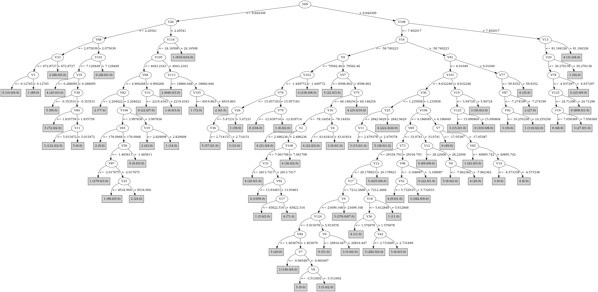

# J48

# SimpleCart Decision Tree

V69 < 9.646294000000001

* V116 < 21.1296385

*   * V105 < 3316.9498000000003

*   *   * V68 < 2.9165285

*   *   *   * V84 < 2.92388

*   *   *   *   * V97 < 803.79075

*   *   *   *   *   * V114 < 1.4968615

*   *   *   *   *   *   * V17 < -113.233: 5(30.0/0.0)

*   *   *   *   *   *   * V17 >= -113.233: 0(8.0/10.0)

*   *   *   *   *   * V114 >= 1.4968615: 1(142.0/1.0)

*   *   *   *   * V97 >= 803.79075

*   *   *   *   *   * V40 < -1.064349

*   *   *   *   *   *   * V1 < 4879.436: 2(162.0/2.0)

*   *   *   *   *   *   * V1 >= 4879.436: 1(6.0/6.0)

*   *   *   *   *   * V40 >= -1.064349: 1(20.0/5.0)

*   *   *   * V84 >= 2.92388: 1(274.0/10.0)

*   *   * V68 >= 2.9165285

*   *   *   * V2 < 2.5567035000000002

*   *   *   *   * V82 < 1.096719: 5(38.0/1.0)

*   *   *   *   * V82 >= 1.096719

*   *   *   *   *   * V84 < 3.8722505000000003: 3(138.0/7.0)

*   *   *   *   *   * V84 >= 3.8722505000000003: 0(30.0/9.0)

*   *   *   * V2 >= 2.5567035000000002

*   *   *   *   * V82 < 2.336172

*   *   *   *   *   * V66 < 2.3551875: 4(12.0/0.0)

*   *   *   *   *   * V66 >= 2.3551875: 5(138.0/9.0)

*   *   *   *   * V82 >= 2.336172

*   *   *   *   *   * V17 < 8285.3285: 0(15.0/4.0)

*   *   *   *   *   * V17 >= 8285.3285: 1(19.0/0.0)

*   * V105 >= 3316.9498000000003

*   *   * V113 < 18659.407

*   *   *   * V105 < 3718.32105

*   *   *   *   * V20 < 3.882574: 2(53.0/0.0)

*   *   *   *   * V20 >= 3.882574: 1(17.0/1.0)

*   *   *   * V105 >= 3718.32105: 2(791.0/4.0)

*   *   * V113 >= 18659.407

*   *   *   * V97 < 5638.3943500000005: 1(96.0/0.0)

*   *   *   * V97 >= 5638.3943500000005: 2(35.0/0.0)

* V116 >= 21.1296385

*   * V98 < 7.588788: 1(1119.0/11.0)

*   * V98 >= 7.588788: 2(39.0/0.0)

V69 >= 9.646294000000001

* V16 < -90.949685

*   * V9 < 75388.3725

*   *   * V100 < 3.5771005000000002

*   *   *   * V16 < -226.16466: 1(30.0/0.0)

*   *   *   * V16 >= -226.16466: 5(19.0/6.0)

*   *   * V100 >= 3.5771005000000002: 0(76.0/8.0)

*   * V9 >= 75388.3725

*   *   * V108 < 8.5419605: 4(1385.0/24.0)

*   *   * V108 >= 8.5419605: 0(7.0/4.0)

* V16 >= -90.949685

*   * V101 < 8.5548085

*   *   * V36 < 1.2385695

*   *   *   * V17 < 2689.5057500000003

*   *   *   *   * V11 < 2.480733: 3(15.0/1.0)

*   *   *   *   * V11 >= 2.480733: 5(39.0/1.0)

*   *   *   * V17 >= 2689.5057500000003

*   *   *   *   * V66 < 6.263666

*   *   *   *   *   * V122 < 5.3875765: 4(431.0/5.0)

*   *   *   *   *   * V122 >= 5.3875765: 0(11.0/2.0)

*   *   *   *   * V66 >= 6.263666: 5(23.0/5.0)

*   *   * V36 >= 1.2385695

*   *   *   * V36 < 2.5281295

*   *   *   *   * V11 < 7.744309

*   *   *   *   *   * V83 < 1.4104155

*   *   *   *   *   *   * V124 < 5.777082

*   *   *   *   *   *   *   * V12 < 8.428973500000001

*   *   *   *   *   *   *   *   * V20 < 1.4021735: 5(11.0/0.0)

*   *   *   *   *   *   *   *   * V20 >= 1.4021735: 3(84.0/3.0)

*   *   *   *   *   *   *   * V12 >= 8.428973500000001: 5(65.0/3.0)

*   *   *   *   *   *   * V124 >= 5.777082: 0(38.0/0.0)

*   *   *   *   *   * V83 >= 1.4104155

*   *   *   *   *   *   * V18 < 4.9343: 3(172.0/1.0)

*   *   *   *   *   *   * V18 >= 4.9343: 1(12.0/0.0)

*   *   *   *   * V11 >= 7.744309

*   *   *   *   *   * V79 < -5.738981

*   *   *   *   *   *   * V16 < -46.148724

*   *   *   *   *   *   *   * V78 < -8.118789: 5(17.0/5.0)

*   *   *   *   *   *   *   * V78 >= -8.118789

*   *   *   *   *   *   *   *   * V103 < -1.547156: 5(6.0/5.0)

*   *   *   *   *   *   *   *   * V103 >= -1.547156: 4(140.0/8.0)

*   *   *   *   *   *   * V16 >= -46.148724

*   *   *   *   *   *   *   * V42 < 2.756861: 3(39.0/9.0)

*   *   *   *   *   *   *   * V42 >= 2.756861

*   *   *   *   *   *   *   *   * V72 < -28.426668499999998: 5(20.0/4.0)

*   *   *   *   *   *   *   *   * V72 >= -28.426668499999998: 0(28.0/3.0)

*   *   *   *   *   * V79 >= -5.738981

*   *   *   *   *   *   * V18 < 5.9166125

*   *   *   *   *   *   *   * V1 < 995.33265: 3(6.0/6.0)

*   *   *   *   *   *   *   * V1 >= 995.33265

*   *   *   *   *   *   *   *   * V12 < 12.911623500000001

*   *   *   *   *   *   *   *   *   * V73 < 19055.881: 5(37.0/3.0)

*   *   *   *   *   *   *   *   *   * V73 >= 19055.881: 3(14.0/0.0)

*   *   *   *   *   *   *   *   * V12 >= 12.911623500000001

*   *   *   *   *   *   *   *   *   * V68 < 10.136137

*   *   *   *   *   *   *   *   *   *   * V17 < 6395.4028: 5(163.0/0.0)

*   *   *   *   *   *   *   *   *   *   * V17 >= 6395.4028

*   *   *   *   *   *   *   *   *   *   *   * V9 < 42390.365000000005: 3(12.0/2.0)

*   *   *   *   *   *   *   *   *   *   *   * V9 >= 42390.365000000005: 4(13.0/0.0)

*   *   *   *   *   *   *   *   *   * V68 >= 10.136137: 5(518.0/0.0)

*   *   *   *   *   *   * V18 >= 5.9166125

*   *   *   *   *   *   *   * V1 < 55195.935: 1(9.0/1.0)

*   *   *   *   *   *   *   * V1 >= 55195.935: 4(10.0/0.0)

*   *   *   * V36 >= 2.5281295

*   *   *   *   * V93 < 12.540641

*   *   *   *   *   * V77 < 26.1881835

*   *   *   *   *   *   * V84 < 4.218165

*   *   *   *   *   *   *   * V2 < 7.510255000000001

*   *   *   *   *   *   *   *   * V100 < 3.0654145: 3(17.0/4.0)

*   *   *   *   *   *   *   *   * V100 >= 3.0654145: 0(14.0/0.0)

*   *   *   *   *   *   *   * V2 >= 7.510255000000001: 5(90.0/0.0)

*   *   *   *   *   *   * V84 >= 4.218165

*   *   *   *   *   *   *   * V97 < 2257.9197: 0(26.0/2.0)

*   *   *   *   *   *   *   * V97 >= 2257.9197

*   *   *   *   *   *   *   *   * V10 < 13.2553745

*   *   *   *   *   *   *   *   *   * V78 < -2.409128

*   *   *   *   *   *   *   *   *   *   * V13 < 46.314171: 3(646.0/29.0)

*   *   *   *   *   *   *   *   *   *   * V13 >= 46.314171: 5(14.0/9.0)

*   *   *   *   *   *   *   *   *   * V78 >= -2.409128: 5(10.0/3.0)

*   *   *   *   *   *   *   *   * V10 >= 13.2553745

*   *   *   *   *   *   *   *   *   * V74 < 7.8225915: 5(23.0/0.0)

*   *   *   *   *   *   *   *   *   * V74 >= 7.8225915: 3(17.0/1.0)

*   *   *   *   *   * V77 >= 26.1881835

*   *   *   *   *   *   * V13 < 64.9469715: 0(144.0/22.0)

*   *   *   *   *   *   * V13 >= 64.9469715: 4(16.0/2.0)

*   *   *   *   * V93 >= 12.540641

*   *   *   *   *   * V54 < -3.8302505: 1(116.0/6.0)

*   *   *   *   *   * V54 >= -3.8302505: 2(17.0/0.0)

*   * V101 >= 8.5548085

*   *   * V20 < 24.275668

*   *   *   * V70 < -1.184208

*   *   *   *   * V101 < 11.469434

*   *   *   *   *   * V27 < 6.036811999999999

*   *   *   *   *   *   * V125 < 15.0914725: 3(17.0/3.0)

*   *   *   *   *   *   * V125 >= 15.0914725

*   *   *   *   *   *   *   * V100 < 4.871199

*   *   *   *   *   *   *   *   * V2 < 7.192146000000001: 0(19.0/2.0)

*   *   *   *   *   *   *   *   * V2 >= 7.192146000000001: 3(10.0/0.0)

*   *   *   *   *   *   *   * V100 >= 4.871199: 0(325.0/5.0)

*   *   *   *   *   * V27 >= 6.036811999999999

*   *   *   *   *   *   * V84 < 16.3232885

*   *   *   *   *   *   *   * V50 < 5.5050335: 2(7.0/6.0)

*   *   *   *   *   *   *   * V50 >= 5.5050335: 3(80.0/6.0)

*   *   *   *   *   *   * V84 >= 16.3232885: 1(36.0/0.0)

*   *   *   *   * V101 >= 11.469434: 0(990.0/11.0)

*   *   *   * V70 >= -1.184208

*   *   *   *   * V1 < 26409.6325: 2(10.0/0.0)

*   *   *   *   * V1 >= 26409.6325: 4(38.0/0.0)

*   *   * V20 >= 24.275668

*   *   *   * V65 < 75430.8085: 1(96.0/0.0)

*   *   *   * V65 >= 75430.8085: 0(22.0/5.0)

# PART

Decision list:

conditions|predicted class
---|---
V69 <= 9.644309 AND V25 > 5922.634 AND V114 <= 2.919832 AND V99 > 0.701357| 2 (496.0/1.0)
V69 <= 9.644309 AND V26 > 2.20541 AND V106 <= 6.970606 AND V117 > 17.613453 AND V22 <= -2.393766 AND V35 <= 2.440017| 1 (1211.0/1.0)
V108 > 7.768781 AND V79 <= -5.04363 AND V13 <= 79.38452 AND V125 > 24.71296| 0 (924.0)
V69 <= 7.178615 AND V89 > 525.6075 AND V97 > 3129.204 AND V84 <= 16.5685 AND V97 > 3585.5242 AND V83 > 1.801891| 2 (357.0/3.0)
V9 > 86746.06 AND V57 > 8984.568 AND V16 <= -67.755844 AND V75 <= 60.148254 AND V16 <= -99.70429 AND V108 <= 7.544255 AND V33 > 3143.209 AND V92 <= 13.93463| 4 (1142.0)
V68 <= 2.913551 AND V41 > 320.6906 AND V1 <= 13014.017 AND V65 <= 557.9981 AND V36 <= 3.42305| 2 (55.0)
V68 <= 2.913551 AND V41 > 320.6906 AND V1 <= 13151.758 AND V114 > 1.500531 AND V118 <= -0.283062 AND V106 <= 3.986814 AND V105 <= 3370.137 AND V6 <= -0.115027 AND V11 > 0.170913 AND V94 <= -0.209914 AND V112 > -3.032309| 1 (257.0/1.0)
V68 <= 2.108641 AND V35 > 0.101611 AND V105 > 789.8641 AND V84 <= 2.972326 AND V39 <= -0.352138| 2 (112.0)
V27 > 7.112432 AND V9 > 121554.43 AND V34 > 2.654901| 4 (187.0/2.0)
V21 > 18.031448 AND V87 <= -6.981364 AND V18 > 5.395991 AND V35 <= 3.250042 AND V2 <= 11.757588| 1 (227.0)
V101 > 7.674678 AND V68 <= 5.206932 AND V25 > 17355.771 AND V2 <= 3.052746| 2 (42.0)
V101 > 7.674678 AND V13 <= 66.18186 AND V25 <= 19506.033 AND V125 > 15.809986 AND V23 > -6.908136 AND V91 <= 5.579653 AND V36 > 2.783202 AND V100 > 4.85749 AND V26 > 1.934321| 0 (478.0/1.0)
V68 <= 3.583659 AND V114 > 1.81769 AND V1 <= 18398.643 AND V60 <= 21.937496 AND V105 <= 3723.4153 AND V55 <= -0.585487 AND V34 <= 3.552762 AND V112 <= -2.848281| 1 (172.0/3.0)
V36 <= 1.237185 AND V17 > 2688.8184 AND V74 <= 6.30922 AND V65 > 8760.659 AND V16 <= -18.012093 AND V97 > 1630.9244| 4 (430.0/1.0)
V26 <= 5.926232 AND V16 > -61.57836 AND V25 > 12704.548 AND V65 <= 25968.312 AND V2 <= 5.800801| 2 (21.0)
V26 <= 5.926232 AND V16 > -61.57836 AND V17 > 12501.35 AND V72 <= -10.654345 AND V65 <= 69513.18 AND V13 <= 45.43139 AND V116 <= 17.917149 AND V110 <= -0.859864| 3 (338.0/1.0)
V26 <= 5.487576 AND V9 > 67748.875 AND V2 <= 7.71034 AND V74 <= 5.623988 AND V79 > -16.791533 AND V7 <= -0.258257 AND V110 > -1.167464| 4 (193.0/2.0)
V26 <= 5.487576 AND V69 <= 30.452307 AND V104 <= -1.892094 AND V44 > 0.827118 AND V13 > 29.838385 AND V3 > 0.253165 AND V113 <= 26343.865 AND V47 <= -0.830476 AND V78 > -4.29308 AND V9 > 32115.465 AND V46 <= -0.408828| 5 (508.0)
V26 <= 5.92532 AND V125 > 13.685123 AND V11 <= 20.145905 AND V66 > 4.195134 AND V100 <= 4.833375| 3 (60.0/1.0)
V26 <= 5.92532 AND V125 > 13.685123 AND V11 <= 20.145905 AND V10 <= 2.706883 AND V86 > -3.071507| 0 (153.0)
V42 <= 3.76178 AND V26 > 5.900263 AND V76 > 11.298495 AND V33 > 4442.0967 AND V2 > 10.891566| 3 (115.0)
V26 <= 5.621175 AND V97 <= 4391.966 AND V88 <= -2.948915 AND V108 > 0.99341 AND V17 > 7381.034 AND V36 > 1.76374 AND V110 > -0.911069 AND V13 <= 31.319012 AND V34 <= 3.38363| 3 (299.0)
V25 <= 8891.392 AND V69 > 5.532554 AND V104 > -1.90243 AND V72 > -23.980015 AND V18 > 3.132714| 0 (40.0)
V25 <= 8891.392 AND V69 > 5.532554 AND V108 > 0.99341 AND V12 > 10.327914 AND V110 <= -0.286898 AND V76 <= 7.82169 AND V9 <= 51315.117 AND V100 <= 4.782408 AND V81 <= 8175.5396 AND V12 > 11.074531| 5 (422.0/1.0)
V26 <= 5.92532 AND V82 <= 1.091224 AND V37 > 2.412311| 5 (93.0)
V26 <= 5.92532 AND V105 <= 3718.8577 AND V69 > 5.902392 AND V10 > 3.721067 AND V124 <= 4.691424 AND V17 <= 7680.546 AND V104 <= -2.915592| 5 (128.0)
V26 <= 5.982348 AND V78 > -9.657213 AND V69 > 5.902392 AND V100 <= 1.120329 AND V64 <= -3.641252| 4 (30.0)
V26 <= 5.982348 AND V77 <= 21.351377 AND V69 > 5.902392 AND V66 <= 1.263056 AND V107 > 0.467327| 0 (27.0)
V26 <= 5.982348 AND V77 <= 21.351377 AND V69 > 5.902392 AND V16 > -46.901176 AND V17 <= 10210.673 AND V125 <= 14.760755 AND V107 > 1.335172 AND V13 <= 21.147636| 5 (19.0)
V26 <= 5.982348 AND V77 <= 21.351377 AND V69 > 5.902392 AND V16 > -46.901176 AND V110 > -1.258581 AND V117 <= 17.111303 AND V84 > 1.239123 AND V89 <= 8279.962 AND V36 > 1.368939 AND V13 <= 26.421513 AND V100 <= 3.535327 AND V12 <= 9.325597 AND V83 > 0.72097| 3 (290.0/1.0)
V26 > 5.982348 AND V73 <= 62438.082 AND V42 > 7.168442 AND V5 <= 11.035245| 2 (25.0)
V26 > 5.982348 AND V73 <= 62438.082 AND V82 > 5.857604 AND V66 <= 6.794113 AND V6 <= -1.295901 AND V47 > -4.832682| 1 (137.0)
V25 <= 8788.77 AND V69 <= 5.902392 AND V85 <= 3.066923 AND V8 > -5.685187| 0 (11.0)
V25 <= 8788.77 AND V69 > 5.902392 AND V13 <= 26.02801 AND V116 > 5.891027 AND V35 <= 1.333288 AND V12 > 9.418324 AND V5 <= 20.749435 AND V36 <= 3.411958| 3 (128.0)
V124 <= 7.002251 AND V46 > -0.118717 AND V5 > 4.441658| 3 (23.0)
V124 <= 7.002251 AND V67 <= 1.553674 AND V4 > 0.379744| 2 (14.0/1.0)
V124 <= 7.002251 AND V81 > 8736.803 AND V100 <= 2.306 AND V21 > 5.069517| 4 (39.0)
V116 <= 6.359311 AND V16 <= -8.756572 AND V19 <= 1.701262 AND V12 > 5.825855 AND V85 <= 4.489564 AND V104 <= -1.180736 AND V20 <= 2.19665| 5 (48.0)
V27 > 7.143006 AND V54 > -6.07314| 2 (19.0)
V77 > 21.007603 AND V61 > 4.825652 AND V78 > -4.665436 AND V9 > 31674.639| 4 (36.0/1.0)
V77 > 23.832745 AND V20 <= 2.98712| 5 (15.0/5.0)
V77 > 23.832745 AND V9 > 164969.47 AND V1 <= 397373.0| 3 (15.0)
V77 > 24.457466 AND V15 <= -38.197933 AND V1 <= 453024.97| 4 (8.0/3.0)
V77 > 24.457466 AND V1 <= 327639.94 AND V78 <= -11.673142| 0 (102.0)
V9 > 86650.19 AND V26 > 4.126174 AND V6 <= -18.985907| 4 (16.0)
V46 <= -0.733154 AND V54 > -9.91974 AND V71 > -17.16503 AND V26 <= 7.139223 AND V13 > 24.950665| 3 (34.0)
V8 <= -2.620095 AND V82 <= 8.247077 AND V11 <= 20.710945 AND V77 > 21.837742| 0 (40.0/2.0)
V6 > -0.207454| 2 (13.0/5.0)
V50 > 7.186945 AND V100 > 4.687783| 0 (11.0/6.0)
V82 <= 8.060577 AND V11 > 20.27993| 4 (14.0/3.0)
V114 <= 7.522244 AND V23 <= -4.584857 AND V14 <= -8.523018| 3 (9.0)
V114 <= 7.522244 AND V27 <= 3.786314 AND V64 > -16.610317 AND V66 > 1.708653 AND V108 > 2.190035 AND V40 <= -2.8557 AND V117 <= 13.324667 AND V100 > 2.644815| 5 (37.0/1.0)
V18 > 5.376308| 1 (13.0/3.0)
V101 <= 8.503494 AND V24 > -2.601126| 0 (10.0/4.0)
V117 <= 13.669135 AND V16 > -39.89745 AND V13 > 6.15677 AND V80 > -22.145737 AND V56 > -8.35328 AND V32 <= -3.812763| 3 (14.0/5.0)
V36 <= 2.392722 AND V32 <= -3.528085 AND V66 > 2.645495 AND V1 <= 37290.527| 4 (18.0)
V125 > 15.218673 AND V26 > 2.172194| 0 (9.0)
V64 > -16.77363 AND V96 > -5.819027 AND V21 <= 6.416053| 3 (15.0)
V36 <= 1.758454| 4 (12.0/3.0)
V87 <= -3.165162| 3 (9.0/1.0)
V40 <= -4.114387| 5 (9.0)
| 0 (8.0/4.0)

# JRip

Decision list:

conditions|predicted class
---|---
(V69 <= 7.731106) and (V116 <= 20.939034) and (V105 >= 3317.1484) and (V86 >= -3.094373)|2 (712.0/3.0)
(V66 <= 1.774456) and (V42 >= 2.919062) and (V112 <= -3.566844) and (V77 >= 4.091107)|2 (179.0/0.0)
(V124 <= 1.889181) and (V3 <= 0.210389) and (V41 >= 720.5348)|2 (86.0/0.0)
(V16 >= -12.759685) and (V111 <= -3.849546) and (V121 <= 25823.639)|2 (51.0/0.0)
(V69 <= 9.181429) and (V117 <= 16.957478) and (V97 >= 3796.3335)|2 (32.0/0.0)
(V66 <= 1.411081) and (V33 >= 711.2629) and (V118 >= -1.208194) and (V96 <= -4.034841)|2 (35.0/0.0)
(V52 <= 1.908985) and (V42 >= 1.740574) and (V1 <= 8804.448)|2 (23.0/2.0)
(V106 >= 7.10007) and (V66 <= 3.332119)|2 (18.0/0.0)
(V17 <= 8857.292) and (V10 >= 3.319148) and (V44 <= 2.342498) and (V101 >= 3.830804) and (V12 >= 14.990525)|5 (480.0/0.0)
(V17 <= 7234.132) and (V46 <= -0.348749) and (V77 <= 11.287529) and (V11 >= 6.408582) and (V38 <= -0.537985)|5 (190.0/1.0)
(V18 <= 2.541482) and (V5 <= 14.968968) and (V11 >= 5.39352) and (V84 <= 2.588743) and (V100 >= 1.573813)|5 (133.0/0.0)
(V17 <= 11947.32) and (V12 >= 24.934692) and (V89 >= 12051.908)|5 (140.0/1.0)
(V20 <= 2.326065) and (V100 >= 1.280686) and (V11 >= 3.311067) and (V17 <= 2855.2131)|5 (103.0/2.0)
(V17 <= 7403.411) and (V12 >= 19.52046) and (V36 <= 1.887536) and (V99 >= 0.76931)|5 (56.0/0.0)
(V26 <= 1.642104) and (V82 <= 1.087224) and (V37 >= 2.685631)|5 (62.0/0.0)
(V25 <= 4685.001) and (V10 >= 3.319148) and (V32 <= -6.949252)|5 (42.0/4.0)
(V82 <= 4.447225) and (V58 >= 4.713256) and (V73 <= 32578.31)|5 (29.0/1.0)
(V20 <= 2.329877) and (V2 >= 3.6445) and (V81 <= 4374.2407)|5 (23.0/2.0)
(V18 <= 3.595716) and (V12 >= 16.860016) and (V79 >= -4.857739) and (V54 <= -1.940983)|5 (17.0/1.0)
(V18 <= 1.375142) and (V65 >= 11818.439) and (V1 <= 6572.422)|5 (10.0/0.0)
(V117 <= 21.242146) and (V16 >= -55.663033) and (V36 >= 1.563447) and (V14 <= -5.451919) and (V77 <= 21.073553) and (V39 <= -1.096847) and (V106 <= 3.886417)|3 (590.0/5.0)
(V117 <= 21.943872) and (V16 >= -55.57709) and (V36 >= 1.443922) and (V124 <= 7.153789) and (V122 <= 3.629298) and (V77 <= 16.061878)|3 (356.0/2.0)
(V117 <= 22.08562) and (V10 >= 7.50594) and (V9 <= 86746.06) and (V16 <= -22.718208) and (V66 >= 6.283812) and (V66 <= 9.322291)|3 (114.0/2.0)
(V117 <= 26.439178) and (V2 >= 8.664668) and (V65 <= 83737.03) and (V123 >= 8.524018)|3 (78.0/1.0)
(V92 <= 6.366388) and (V101 >= 4.264836) and (V13 <= 27.5648) and (V71 <= -4.200351) and (V79 >= -5.858513) and (V108 >= 1.793191)|3 (54.0/3.0)
(V116 <= 17.026613) and (V10 <= 2.840208) and (V40 <= -4.8996) and (V23 <= -4.554477) and (V69 <= 41.3829)|3 (43.0/0.0)
(V101 >= 4.111948) and (V10 <= 2.617152) and (V64 <= -7.61262) and (V117 <= 11.8949)|3 (17.0/2.0)
(V116 <= 11.746863) and (V74 >= 5.478205) and (V97 <= 4031.0823) and (V48 <= -1.697269)|3 (23.0/0.0)
(V106 <= 1.627286) and (V36 >= 0.971344) and (V20 <= 2.396816)|3 (40.0/0.0)
(V78 <= -38.77614) and (V2 >= 14.658277)|3 (12.0/0.0)
(V116 <= 15.728241) and (V74 >= 7.636676) and (V34 <= 3.500724) and (V22 <= -1.52162)|3 (24.0/5.0)
(V116 <= 9.543776) and (V37 >= 4.686594) and (V13 <= 27.4875) and (V38 <= -0.550639) and (V8 <= -21.49517)|3 (8.0/0.0)
(V2 >= 9.025219) and (V16 >= -90.34621) and (V78 <= -5.375836) and (V101 >= 11.31748)|0 (935.0/2.0)
(V83 <= 6.325616) and (V44 >= 2.737565) and (V101 >= 8.712706) and (V104 >= -6.172047)|0 (353.0/4.0)
(V24 >= -8.401164) and (V100 >= 2.418314) and (V72 <= -4.385462) and (V13 <= 66.18186)|0 (274.0/14.0)
(V109 >= 11.563133) and (V26 <= 7.143252)|0 (68.0/10.0)
(V128 >= -3.539715) and (V75 >= 1.865583) and (V8 >= -16.476637)|0 (29.0/2.0)
(V46 <= -1.736542) and (V96 >= -9.173181)|0 (24.0/1.0)
(V17 <= 759.4705)|0 (20.0/7.0)
(V6 <= -10.285195) and (V9 <= 74985.26) and (V75 >= 9.905257)|0 (120.0/1.0)
(V9 <= 35534.24) and (V18 >= 4.241637)|1 (1614.0/4.0)
(V77 <= 10.971096) and (V65 <= 9782.89)|1 (255.0/4.0)
(V28 >= 14.168826) and (V113 <= 38775.88)|1 (115.0/0.0)
(V9 <= 53326.75) and (V18 >= 6.111264)|1 (21.0/0.0)
(V13 <= 34.168663) and (V18 >= 6.326333)|1 (5.0/1.0)
|4 (2124.0/44.0)

# Decision Table

Non matches covered by IB1

v9|v75|v122|target
---|---|---|---
(175429.5-inf)|(56.312929-inf)|(24.974874-inf)|4
(175429.5-inf)|(43.009867-56.312929]|(24.974874-inf)|4
(175429.5-inf)|(31.791142-43.009867]|(24.974874-inf)|0
(112333.225-175429.5]|(43.009867-56.312929]|(18.49557-24.974874]|0
(175429.5-inf)|(43.009867-56.312929]|(18.49557-24.974874]|4
(86688.837-112333.225]|(22.828391-31.791142]|(24.974874-inf)|0
(175429.5-inf)|(31.791142-43.009867]|(18.49557-24.974874]|4
(112333.225-175429.5]|(31.791142-43.009867]|(18.49557-24.974874]|0
(175429.5-inf)|(56.312929-inf)|(12.475658-18.49557]|4
(77172.265-86688.837]|(18.536751-22.828391]|(24.974874-inf)|0
(18940.632-25548.7275]|(22.828391-31.791142]|(18.49557-24.974874]|0
(18940.632-25548.7275]|(16.609372-18.536751]|(24.974874-inf)|0
(18940.632-25548.7275]|(43.009867-56.312929]|(12.475658-18.49557]|0
(9674.953-10395.8165]|(22.828391-31.791142]|(18.49557-24.974874]|0
(175429.5-inf)|(22.828391-31.791142]|(18.49557-24.974874]|4
(175429.5-inf)|(43.009867-56.312929]|(12.475658-18.49557]|4
(112333.225-175429.5]|(22.828391-31.791142]|(18.49557-24.974874]|0
(112333.225-175429.5]|(43.009867-56.312929]|(12.475658-18.49557]|0
(86688.837-112333.225]|(22.828391-31.791142]|(18.49557-24.974874]|0
(18940.632-25548.7275]|(9.48744-16.609372]|(24.974874-inf)|0
(28772.95-33074.762]|(9.48744-16.609372]|(24.974874-inf)|0
(77172.265-86688.837]|(9.48744-16.609372]|(24.974874-inf)|0
(58591.756-65373.269]|(9.48744-16.609372]|(24.974874-inf)|0
(175429.5-inf)|(31.791142-43.009867]|(12.475658-18.49557]|4
(175429.5-inf)|(56.312929-inf)|(8.855286-12.475658]|4
(86688.837-112333.225]|(31.791142-43.009867]|(12.475658-18.49557]|0
(112333.225-175429.5]|(31.791142-43.009867]|(12.475658-18.49557]|0
(75412.505-77172.265]|(9.48744-16.609372]|(24.974874-inf)|0
(175429.5-inf)|(43.009867-56.312929]|(8.855286-12.475658]|3
(175429.5-inf)|(22.828391-31.791142]|(12.475658-18.49557]|0
(77172.265-86688.837]|(22.828391-31.791142]|(12.475658-18.49557]|0
(112333.225-175429.5]|(22.828391-31.791142]|(12.475658-18.49557]|0
(86688.837-112333.225]|(22.828391-31.791142]|(12.475658-18.49557]|0
(175429.5-inf)|(18.536751-22.828391]|(12.475658-18.49557]|0
(11903.037-15197.3515]|(9.48744-16.609372]|(18.49557-24.974874]|0
(18940.632-25548.7275]|(9.48744-16.609372]|(18.49557-24.974874]|0
(112333.225-175429.5]|(18.536751-22.828391]|(12.475658-18.49557]|0
(112333.225-175429.5]|(9.48744-16.609372]|(18.49557-24.974874]|0
(25548.7275-26197.3085]|(9.48744-16.609372]|(18.49557-24.974874]|0
(28772.95-33074.762]|(9.48744-16.609372]|(18.49557-24.974874]|0
(67383.195-75412.505]|(18.536751-22.828391]|(12.475658-18.49557]|0
(175429.5-inf)|(56.312929-inf)|(7.054553-8.855286]|4
(175429.5-inf)|(31.791142-43.009867]|(8.855286-12.475658]|4
(75412.505-77172.265]|(18.536751-22.828391]|(12.475658-18.49557]|0
(77172.265-86688.837]|(18.536751-22.828391]|(12.475658-18.49557]|0
(112333.225-175429.5]|(31.791142-43.009867]|(8.855286-12.475658]|0
(86688.837-112333.225]|(31.791142-43.009867]|(8.855286-12.475658]|0
(65373.269-67383.195]|(22.828391-31.791142]|(8.855286-12.475658]|0
(175429.5-inf)|(22.828391-31.791142]|(8.855286-12.475658]|4
(112333.225-175429.5]|(22.828391-31.791142]|(8.855286-12.475658]|4
(175429.5-inf)|(43.009867-56.312929]|(7.054553-8.855286]|4
(86688.837-112333.225]|(16.609372-18.536751]|(12.475658-18.49557]|0
(77172.265-86688.837]|(16.609372-18.536751]|(12.475658-18.49557]|3
(67383.195-75412.505]|(22.828391-31.791142]|(8.855286-12.475658]|0
(77172.265-86688.837]|(22.828391-31.791142]|(8.855286-12.475658]|0
(86688.837-112333.225]|(22.828391-31.791142]|(8.855286-12.475658]|0
(18940.632-25548.7275]|(9.48744-16.609372]|(12.475658-18.49557]|0
(65373.269-67383.195]|(18.536751-22.828391]|(8.855286-12.475658]|0
(77172.265-86688.837]|(9.48744-16.609372]|(12.475658-18.49557]|3
(75412.505-77172.265]|(18.536751-22.828391]|(8.855286-12.475658]|0
(112333.225-175429.5]|(31.791142-43.009867]|(7.054553-8.855286]|5
(112333.225-175429.5]|(18.536751-22.828391]|(8.855286-12.475658]|4
(175429.5-inf)|(31.791142-43.009867]|(7.054553-8.855286]|4
(86688.837-112333.225]|(9.48744-16.609372]|(12.475658-18.49557]|0
(58591.756-65373.269]|(9.48744-16.609372]|(12.475658-18.49557]|0
(67383.195-75412.505]|(18.536751-22.828391]|(8.855286-12.475658]|0
(77172.265-86688.837]|(18.536751-22.828391]|(8.855286-12.475658]|0
(86688.837-112333.225]|(18.536751-22.828391]|(8.855286-12.475658]|0
(175429.5-inf)|(16.609372-18.536751]|(8.855286-12.475658]|0
(18940.632-25548.7275]|(6.180985-8.072651]|(24.974874-inf)|0
(86688.837-112333.225]|(16.609372-18.536751]|(8.855286-12.475658]|0
(17845.1355-18940.632]|(6.180985-8.072651]|(24.974874-inf)|0
(175429.5-inf)|(43.009867-56.312929]|(6.270778-7.054553]|4
(112333.225-175429.5]|(16.609372-18.536751]|(8.855286-12.475658]|4
(175429.5-inf)|(22.828391-31.791142]|(7.054553-8.855286]|4
(112333.225-175429.5]|(22.828391-31.791142]|(7.054553-8.855286]|4
(86688.837-112333.225]|(22.828391-31.791142]|(7.054553-8.855286]|5
(77172.265-86688.837]|(22.828391-31.791142]|(7.054553-8.855286]|0
(65373.269-67383.195]|(16.609372-18.536751]|(8.855286-12.475658]|0
(75412.505-77172.265]|(16.609372-18.536751]|(8.855286-12.475658]|0
(58591.756-65373.269]|(16.609372-18.536751]|(8.855286-12.475658]|0
(67383.195-75412.505]|(16.609372-18.536751]|(8.855286-12.475658]|0
(77172.265-86688.837]|(16.609372-18.536751]|(8.855286-12.475658]|0
(57482.672-58591.756]|(18.536751-22.828391]|(7.054553-8.855286]|0
(75412.505-77172.265]|(9.48744-16.609372]|(8.855286-12.475658]|1
(53217.2625-57482.672]|(18.536751-22.828391]|(7.054553-8.855286]|0
(112333.225-175429.5]|(31.791142-43.009867]|(6.270778-7.054553]|5
(112333.225-175429.5]|(9.48744-16.609372]|(8.855286-12.475658]|4
(112333.225-175429.5]|(18.536751-22.828391]|(7.054553-8.855286]|4
(175429.5-inf)|(31.791142-43.009867]|(6.270778-7.054553]|4
(44123.308-53217.2625]|(9.48744-16.609372]|(8.855286-12.475658]|0
(53217.2625-57482.672]|(9.48744-16.609372]|(8.855286-12.475658]|1
(58591.756-65373.269]|(9.48744-16.609372]|(8.855286-12.475658]|1
(67383.195-75412.505]|(9.48744-16.609372]|(8.855286-12.475658]|3
(58591.756-65373.269]|(18.536751-22.828391]|(7.054553-8.855286]|0
(65373.269-67383.195]|(18.536751-22.828391]|(7.054553-8.855286]|0
(67383.195-75412.505]|(18.536751-22.828391]|(7.054553-8.855286]|0
(77172.265-86688.837]|(18.536751-22.828391]|(7.054553-8.855286]|0
(77172.265-86688.837]|(9.48744-16.609372]|(8.855286-12.475658]|3
(86688.837-112333.225]|(18.536751-22.828391]|(7.054553-8.855286]|3
(86688.837-112333.225]|(22.828391-31.791142]|(6.270778-7.054553]|5
(112333.225-175429.5]|(22.828391-31.791142]|(6.270778-7.054553]|4
(67383.195-75412.505]|(9.090768-9.48744]|(8.855286-12.475658]|0
(175429.5-inf)|(22.828391-31.791142]|(6.270778-7.054553]|4
(112333.225-175429.5]|(16.609372-18.536751]|(7.054553-8.855286]|4
(15197.3515-17845.1355]|(6.180985-8.072651]|(18.49557-24.974874]|0
(75412.505-77172.265]|(16.609372-18.536751]|(7.054553-8.855286]|0
(67383.195-75412.505]|(16.609372-18.536751]|(7.054553-8.855286]|0
(58591.756-65373.269]|(16.609372-18.536751]|(7.054553-8.855286]|0
(77172.265-86688.837]|(16.609372-18.536751]|(7.054553-8.855286]|0
(18940.632-25548.7275]|(3.838668-5.749712]|(24.974874-inf)|0
(112333.225-175429.5]|(31.791142-43.009867]|(5.898843-6.270778]|5
(175429.5-inf)|(31.791142-43.009867]|(5.898843-6.270778]|4
(112333.225-175429.5]|(9.48744-16.609372]|(7.054553-8.855286]|4
(112333.225-175429.5]|(18.536751-22.828391]|(6.270778-7.054553]|4
(65373.269-67383.195]|(18.536751-22.828391]|(6.270778-7.054553]|0
(77172.265-86688.837]|(18.536751-22.828391]|(6.270778-7.054553]|0
(57482.672-58591.756]|(9.48744-16.609372]|(7.054553-8.855286]|0
(58591.756-65373.269]|(18.536751-22.828391]|(6.270778-7.054553]|0
(44123.308-53217.2625]|(9.48744-16.609372]|(7.054553-8.855286]|0
(53217.2625-57482.672]|(9.48744-16.609372]|(7.054553-8.855286]|0
(67383.195-75412.505]|(18.536751-22.828391]|(6.270778-7.054553]|0
(65373.269-67383.195]|(9.48744-16.609372]|(7.054553-8.855286]|0
(58591.756-65373.269]|(9.48744-16.609372]|(7.054553-8.855286]|0
(86688.837-112333.225]|(18.536751-22.828391]|(6.270778-7.054553]|0
(75412.505-77172.265]|(9.48744-16.609372]|(7.054553-8.855286]|0
(77172.265-86688.837]|(9.48744-16.609372]|(7.054553-8.855286]|3
(67383.195-75412.505]|(9.48744-16.609372]|(7.054553-8.855286]|3
(86688.837-112333.225]|(22.828391-31.791142]|(5.898843-6.270778]|0
(44123.308-53217.2625]|(16.609372-18.536751]|(6.270778-7.054553]|0
(175429.5-inf)|(22.828391-31.791142]|(5.898843-6.270778]|4
(112333.225-175429.5]|(16.609372-18.536751]|(6.270778-7.054553]|4
(44123.308-53217.2625]|(6.180985-8.072651]|(12.475658-18.49557]|1
(57482.672-58591.756]|(16.609372-18.536751]|(6.270778-7.054553]|0
(58591.756-65373.269]|(16.609372-18.536751]|(6.270778-7.054553]|0
(58591.756-65373.269]|(9.090768-9.48744]|(7.054553-8.855286]|3
(112333.225-175429.5]|(22.828391-31.791142]|(5.898843-6.270778]|3
(11903.037-15197.3515]|(3.838668-5.749712]|(18.49557-24.974874]|0
(18940.632-25548.7275]|(2.6835-3.595112]|(24.974874-inf)|1
(58591.756-65373.269]|(18.536751-22.828391]|(5.898843-6.270778]|0
(58591.756-65373.269]|(8.389616-9.090768]|(7.054553-8.855286]|3
(44123.308-53217.2625]|(8.389616-9.090768]|(7.054553-8.855286]|1
(112333.225-175429.5]|(18.536751-22.828391]|(5.898843-6.270778]|4
(86688.837-112333.225]|(9.48744-16.609372]|(6.270778-7.054553]|4
(112333.225-175429.5]|(9.48744-16.609372]|(6.270778-7.054553]|4
(175429.5-inf)|(31.791142-43.009867]|(5.729285-5.898843]|4
(15197.3515-17845.1355]|(3.838668-5.749712]|(18.49557-24.974874]|1
(40520.628-44123.308]|(5.95549-6.180985]|(12.475658-18.49557]|0
(15197.3515-17845.1355]|(2.6835-3.595112]|(24.974874-inf)|1
(65373.269-67383.195]|(18.536751-22.828391]|(5.898843-6.270778]|0
(67383.195-75412.505]|(18.536751-22.828391]|(5.898843-6.270778]|0
(65373.269-67383.195]|(9.48744-16.609372]|(6.270778-7.054553]|0
(57482.672-58591.756]|(9.48744-16.609372]|(6.270778-7.054553]|0
(77172.265-86688.837]|(18.536751-22.828391]|(5.898843-6.270778]|0
(44123.308-53217.2625]|(9.48744-16.609372]|(6.270778-7.054553]|0
(53217.2625-57482.672]|(9.48744-16.609372]|(6.270778-7.054553]|0
(58591.756-65373.269]|(9.48744-16.609372]|(6.270778-7.054553]|0
(67383.195-75412.505]|(9.48744-16.609372]|(6.270778-7.054553]|0
(77172.265-86688.837]|(9.48744-16.609372]|(6.270778-7.054553]|3
(53217.2625-57482.672]|(6.180985-8.072651]|(8.855286-12.475658]|0
(15197.3515-17845.1355]|(3.595112-3.838668]|(18.49557-24.974874]|1
(57482.672-58591.756]|(16.609372-18.536751]|(5.898843-6.270778]|0
(86688.837-112333.225]|(6.180985-8.072651]|(8.855286-12.475658]|0
(112333.225-175429.5]|(16.609372-18.536751]|(5.898843-6.270778]|4
(112333.225-175429.5]|(22.828391-31.791142]|(5.729285-5.898843]|4
(175429.5-inf)|(22.828391-31.791142]|(5.729285-5.898843]|4
(44123.308-53217.2625]|(6.180985-8.072651]|(8.855286-12.475658]|1
(67383.195-75412.505]|(6.180985-8.072651]|(8.855286-12.475658]|1
(58591.756-65373.269]|(16.609372-18.536751]|(5.898843-6.270778]|0
(44123.308-53217.2625]|(16.609372-18.536751]|(5.898843-6.270778]|0
(58591.756-65373.269]|(9.090768-9.48744]|(6.270778-7.054553]|3
(67383.195-75412.505]|(9.090768-9.48744]|(6.270778-7.054553]|0
(18940.632-25548.7275]|(8.072651-8.21381]|(7.054553-8.855286]|0
(112333.225-175429.5]|(8.389616-9.090768]|(6.270778-7.054553]|0
(37446.894-38070.5365]|(5.95549-6.180985]|(8.855286-12.475658]|0
(33074.762-37446.894]|(5.95549-6.180985]|(8.855286-12.475658]|0
(57482.672-58591.756]|(8.389616-9.090768]|(6.270778-7.054553]|0
(44123.308-53217.2625]|(5.95549-6.180985]|(8.855286-12.475658]|0
(112333.225-175429.5]|(18.536751-22.828391]|(5.729285-5.898843]|4
(44123.308-53217.2625]|(8.072651-8.21381]|(7.054553-8.855286]|0
(38070.5365-40520.628]|(5.95549-6.180985]|(8.855286-12.475658]|1
(67383.195-75412.505]|(18.536751-22.828391]|(5.729285-5.898843]|0
(65373.269-67383.195]|(18.536751-22.828391]|(5.729285-5.898843]|0
(112333.225-175429.5]|(9.48744-16.609372]|(5.898843-6.270778]|4
(175429.5-inf)|(31.791142-43.009867]|(5.607157-5.729285]|4
(17845.1355-18940.632]|(2.6835-3.595112]|(18.49557-24.974874]|1
(11903.037-15197.3515]|(2.6835-3.595112]|(18.49557-24.974874]|1
(18940.632-25548.7275]|(2.6835-3.595112]|(18.49557-24.974874]|0
(40520.628-44123.308]|(5.95549-6.180985]|(8.855286-12.475658]|1
(15197.3515-17845.1355]|(2.6835-3.595112]|(18.49557-24.974874]|1
(65373.269-67383.195]|(9.48744-16.609372]|(5.898843-6.270778]|0
(57482.672-58591.756]|(9.48744-16.609372]|(5.898843-6.270778]|0
(67383.195-75412.505]|(9.48744-16.609372]|(5.898843-6.270778]|0
(58591.756-65373.269]|(8.389616-9.090768]|(6.270778-7.054553]|3
(53217.2625-57482.672]|(9.48744-16.609372]|(5.898843-6.270778]|0
(67383.195-75412.505]|(8.389616-9.090768]|(6.270778-7.054553]|3
(65373.269-67383.195]|(8.389616-9.090768]|(6.270778-7.054553]|0
(58591.756-65373.269]|(9.48744-16.609372]|(5.898843-6.270778]|0
(44123.308-53217.2625]|(9.48744-16.609372]|(5.898843-6.270778]|0
(15197.3515-17845.1355]|(6.180985-8.072651]|(7.054553-8.855286]|0
(18940.632-25548.7275]|(6.180985-8.072651]|(7.054553-8.855286]|2
(8073.3803-9674.953]|(0.666064-1.352101]|(24.974874-inf)|0
(112333.225-175429.5]|(22.828391-31.791142]|(5.607157-5.729285]|5
(37446.894-38070.5365]|(5.749712-5.95549]|(8.855286-12.475658]|0
(53217.2625-57482.672]|(6.180985-8.072651]|(7.054553-8.855286]|0
(33074.762-37446.894]|(5.749712-5.95549]|(8.855286-12.475658]|0
(65373.269-67383.195]|(6.180985-8.072651]|(7.054553-8.855286]|0
(15197.3515-17845.1355]|(3.595112-3.838668]|(12.475658-18.49557]|0
(44123.308-53217.2625]|(6.180985-8.072651]|(7.054553-8.855286]|1
(58591.756-65373.269]|(5.749712-5.95549]|(8.855286-12.475658]|0
(58591.756-65373.269]|(8.21381-8.389616]|(6.270778-7.054553]|0
(58591.756-65373.269]|(9.090768-9.48744]|(5.898843-6.270778]|0
(58591.756-65373.269]|(6.180985-8.072651]|(7.054553-8.855286]|5
(75412.505-77172.265]|(8.21381-8.389616]|(6.270778-7.054553]|0
(175429.5-inf)|(22.828391-31.791142]|(5.607157-5.729285]|4
(112333.225-175429.5]|(16.609372-18.536751]|(5.729285-5.898843]|4
(18940.632-25548.7275]|(2.461336-2.6835]|(18.49557-24.974874]|0
(38070.5365-40520.628]|(5.749712-5.95549]|(8.855286-12.475658]|0
(11903.037-15197.3515]|(2.461336-2.6835]|(18.49557-24.974874]|1
(40520.628-44123.308]|(5.749712-5.95549]|(8.855286-12.475658]|0
(11903.037-15197.3515]|(3.595112-3.838668]|(12.475658-18.49557]|0
(67383.195-75412.505]|(6.180985-8.072651]|(7.054553-8.855286]|1
(65373.269-67383.195]|(9.090768-9.48744]|(5.898843-6.270778]|3
(75412.505-77172.265]|(8.072651-8.21381]|(6.270778-7.054553]|0
(18940.632-25548.7275]|(3.838668-5.749712]|(8.855286-12.475658]|0
(33074.762-37446.894]|(5.95549-6.180985]|(7.054553-8.855286]|0
(40520.628-44123.308]|(9.48744-16.609372]|(5.729285-5.898843]|0
(40520.628-44123.308]|(3.838668-5.749712]|(8.855286-12.475658]|0
(65373.269-67383.195]|(3.838668-5.749712]|(8.855286-12.475658]|0
(37446.894-38070.5365]|(3.838668-5.749712]|(8.855286-12.475658]|0
(40520.628-44123.308]|(8.389616-9.090768]|(5.898843-6.270778]|0
(58591.756-65373.269]|(8.072651-8.21381]|(6.270778-7.054553]|3
(65373.269-67383.195]|(8.389616-9.090768]|(5.898843-6.270778]|3
(38070.5365-40520.628]|(3.838668-5.749712]|(8.855286-12.475658]|1
(112333.225-175429.5]|(9.48744-16.609372]|(5.729285-5.898843]|4
(86688.837-112333.225]|(9.48744-16.609372]|(5.729285-5.898843]|4
(175429.5-inf)|(31.791142-43.009867]|(5.433844-5.607157]|4
(112333.225-175429.5]|(18.536751-22.828391]|(5.607157-5.729285]|4
(26598.711-28772.95]|(3.838668-5.749712]|(8.855286-12.475658]|1
(4249.7968-7739.1525]|(0.112557-0.666064]|(24.974874-inf)|1
(17845.1355-18940.632]|(1.352101-2.461336]|(18.49557-24.974874]|0
(10395.8165-11903.037]|(1.352101-2.461336]|(18.49557-24.974874]|1
(53217.2625-57482.672]|(3.838668-5.749712]|(8.855286-12.475658]|1
(25548.7275-26197.3085]|(3.838668-5.749712]|(8.855286-12.475658]|0
(58591.756-65373.269]|(5.95549-6.180985]|(7.054553-8.855286]|0
(15197.3515-17845.1355]|(2.6835-3.595112]|(12.475658-18.49557]|1
(58591.756-65373.269]|(3.838668-5.749712]|(8.855286-12.475658]|1
(44123.308-53217.2625]|(3.838668-5.749712]|(8.855286-12.475658]|1
(11903.037-15197.3515]|(2.6835-3.595112]|(12.475658-18.49557]|1
(33074.762-37446.894]|(3.838668-5.749712]|(8.855286-12.475658]|1
(18940.632-25548.7275]|(1.352101-2.461336]|(18.49557-24.974874]|1
(67383.195-75412.505]|(3.838668-5.749712]|(8.855286-12.475658]|1
(28772.95-33074.762]|(3.838668-5.749712]|(8.855286-12.475658]|1
(15197.3515-17845.1355]|(1.352101-2.461336]|(18.49557-24.974874]|1
(18940.632-25548.7275]|(2.6835-3.595112]|(12.475658-18.49557]|1
(57482.672-58591.756]|(9.48744-16.609372]|(5.729285-5.898843]|0
(58591.756-65373.269]|(9.48744-16.609372]|(5.729285-5.898843]|0
(53217.2625-57482.672]|(9.48744-16.609372]|(5.729285-5.898843]|3
(11903.037-15197.3515]|(1.352101-2.461336]|(18.49557-24.974874]|1
(57482.672-58591.756]|(8.389616-9.090768]|(5.898843-6.270778]|0
(58591.756-65373.269]|(8.389616-9.090768]|(5.898843-6.270778]|3
(44123.308-53217.2625]|(9.48744-16.609372]|(5.729285-5.898843]|0
(53217.2625-57482.672]|(8.389616-9.090768]|(5.898843-6.270778]|3
(175429.5-inf)|(22.828391-31.791142]|(5.433844-5.607157]|0
(33074.762-37446.894]|(3.595112-3.838668]|(8.855286-12.475658]|0
(17845.1355-18940.632]|(0.666064-1.352101]|(18.49557-24.974874]|0
(37446.894-38070.5365]|(9.090768-9.48744]|(5.729285-5.898843]|0
(44123.308-53217.2625]|(6.180985-8.072651]|(6.270778-7.054553]|1
(38070.5365-40520.628]|(3.595112-3.838668]|(8.855286-12.475658]|2
(44123.308-53217.2625]|(3.595112-3.838668]|(8.855286-12.475658]|0
(38070.5365-40520.628]|(5.749712-5.95549]|(7.054553-8.855286]|0
(38070.5365-40520.628]|(8.21381-8.389616]|(5.898843-6.270778]|0
(44123.308-53217.2625]|(9.090768-9.48744]|(5.729285-5.898843]|0
(40520.628-44123.308]|(6.180985-8.072651]|(6.270778-7.054553]|0
(53217.2625-57482.672]|(6.180985-8.072651]|(6.270778-7.054553]|3
(67383.195-75412.505]|(6.180985-8.072651]|(6.270778-7.054553]|5
(75412.505-77172.265]|(6.180985-8.072651]|(6.270778-7.054553]|5
(18940.632-25548.7275]|(6.180985-8.072651]|(6.270778-7.054553]|2
(17845.1355-18940.632]|(6.180985-8.072651]|(6.270778-7.054553]|0
(112333.225-175429.5]|(16.609372-18.536751]|(5.607157-5.729285]|4
(18940.632-25548.7275]|(3.595112-3.838668]|(8.855286-12.475658]|1
(28772.95-33074.762]|(3.595112-3.838668]|(8.855286-12.475658]|0
(58591.756-65373.269]|(5.749712-5.95549]|(7.054553-8.855286]|1
(15197.3515-17845.1355]|(0.666064-1.352101]|(18.49557-24.974874]|1
(26598.711-28772.95]|(3.595112-3.838668]|(8.855286-12.475658]|1
(11903.037-15197.3515]|(2.461336-2.6835]|(12.475658-18.49557]|1
(10395.8165-11903.037]|(0.666064-1.352101]|(18.49557-24.974874]|1
(11903.037-15197.3515]|(0.666064-1.352101]|(18.49557-24.974874]|1
(44123.308-53217.2625]|(16.609372-18.536751]|(5.607157-5.729285]|0
(58591.756-65373.269]|(8.21381-8.389616]|(5.898843-6.270778]|3
(58591.756-65373.269]|(6.180985-8.072651]|(6.270778-7.054553]|3
(11903.037-15197.3515]|(2.6835-3.595112]|(8.855286-12.475658]|0
(4249.7968-7739.1525]|(2.6835-3.595112]|(8.855286-12.475658]|0
(17845.1355-18940.632]|(1.352101-2.461336]|(12.475658-18.49557]|0
(40520.628-44123.308]|(3.838668-5.749712]|(7.054553-8.855286]|0
(2090.8054-4249.7968]|(0.112557-0.666064]|(18.49557-24.974874]|0
(40520.628-44123.308]|(9.48744-16.609372]|(5.607157-5.729285]|0
(44123.308-53217.2625]|(9.48744-16.609372]|(5.607157-5.729285]|0
(86688.837-112333.225]|(9.48744-16.609372]|(5.607157-5.729285]|0
(26197.3085-26598.711]|(2.6835-3.595112]|(8.855286-12.475658]|0
(57482.672-58591.756]|(3.838668-5.749712]|(7.054553-8.855286]|0
(9674.953-10395.8165]|(0.112557-0.666064]|(18.49557-24.974874]|0
(15197.3515-17845.1355]|(2.6835-3.595112]|(8.855286-12.475658]|1
(57482.672-58591.756]|(9.48744-16.609372]|(5.607157-5.729285]|3
(112333.225-175429.5]|(18.536751-22.828391]|(5.433844-5.607157]|4
(112333.225-175429.5]|(9.48744-16.609372]|(5.607157-5.729285]|4
(175429.5-inf)|(31.791142-43.009867]|(4.568105-5.433844]|0
(26598.711-28772.95]|(3.838668-5.749712]|(7.054553-8.855286]|1
(10395.8165-11903.037]|(1.352101-2.461336]|(12.475658-18.49557]|1
(38070.5365-40520.628]|(3.838668-5.749712]|(7.054553-8.855286]|1
(53217.2625-57482.672]|(3.838668-5.749712]|(7.054553-8.855286]|1
(15197.3515-17845.1355]|(1.352101-2.461336]|(12.475658-18.49557]|1
(9674.953-10395.8165]|(1.352101-2.461336]|(12.475658-18.49557]|1
(11903.037-15197.3515]|(1.352101-2.461336]|(12.475658-18.49557]|1
(25548.7275-26197.3085]|(2.6835-3.595112]|(8.855286-12.475658]|1
(28772.95-33074.762]|(3.838668-5.749712]|(7.054553-8.855286]|1
(28772.95-33074.762]|(2.6835-3.595112]|(8.855286-12.475658]|1
(44123.308-53217.2625]|(3.838668-5.749712]|(7.054553-8.855286]|1
(33074.762-37446.894]|(3.838668-5.749712]|(7.054553-8.855286]|1
(26598.711-28772.95]|(2.6835-3.595112]|(8.855286-12.475658]|2
(58591.756-65373.269]|(3.838668-5.749712]|(7.054553-8.855286]|1
(18940.632-25548.7275]|(2.6835-3.595112]|(8.855286-12.475658]|1
(33074.762-37446.894]|(2.6835-3.595112]|(8.855286-12.475658]|1
(44123.308-53217.2625]|(8.389616-9.090768]|(5.729285-5.898843]|0
(58591.756-65373.269]|(18.536751-22.828391]|(5.433844-5.607157]|0
(58591.756-65373.269]|(9.48744-16.609372]|(5.607157-5.729285]|0
(33074.762-37446.894]|(8.389616-9.090768]|(5.729285-5.898843]|0
(58591.756-65373.269]|(8.389616-9.090768]|(5.729285-5.898843]|3
(38070.5365-40520.628]|(8.389616-9.090768]|(5.729285-5.898843]|0
(67383.195-75412.505]|(9.48744-16.609372]|(5.607157-5.729285]|3
(53217.2625-57482.672]|(9.48744-16.609372]|(5.607157-5.729285]|0
(17845.1355-18940.632]|(2.461336-2.6835]|(8.855286-12.475658]|1
(40520.628-44123.308]|(9.090768-9.48744]|(5.607157-5.729285]|0
(44123.308-53217.2625]|(6.180985-8.072651]|(5.898843-6.270778]|3
(17845.1355-18940.632]|(6.180985-8.072651]|(5.898843-6.270778]|0
(18940.632-25548.7275]|(6.180985-8.072651]|(5.898843-6.270778]|0
(7739.1525-8073.3803]|(0.666064-1.352101]|(12.475658-18.49557]|1
(112333.225-175429.5]|(16.609372-18.536751]|(5.433844-5.607157]|4
(112333.225-175429.5]|(22.828391-31.791142]|(4.568105-5.433844]|5
(175429.5-inf)|(22.828391-31.791142]|(4.568105-5.433844]|4
(44123.308-53217.2625]|(3.595112-3.838668]|(7.054553-8.855286]|1
(4249.7968-7739.1525]|(0.666064-1.352101]|(12.475658-18.49557]|1
(26598.711-28772.95]|(3.595112-3.838668]|(7.054553-8.855286]|0
(25548.7275-26197.3085]|(2.461336-2.6835]|(8.855286-12.475658]|0
(40520.628-44123.308]|(3.595112-3.838668]|(7.054553-8.855286]|1
(11903.037-15197.3515]|(0.666064-1.352101]|(12.475658-18.49557]|1
(18940.632-25548.7275]|(2.461336-2.6835]|(8.855286-12.475658]|1
(10395.8165-11903.037]|(0.666064-1.352101]|(12.475658-18.49557]|1
(15197.3515-17845.1355]|(2.461336-2.6835]|(8.855286-12.475658]|1
(9674.953-10395.8165]|(0.666064-1.352101]|(12.475658-18.49557]|1
(15197.3515-17845.1355]|(0.666064-1.352101]|(12.475658-18.49557]|1
(8073.3803-9674.953]|(0.666064-1.352101]|(12.475658-18.49557]|1
(38070.5365-40520.628]|(6.180985-8.072651]|(5.898843-6.270778]|0
(38070.5365-40520.628]|(8.21381-8.389616]|(5.729285-5.898843]|0
(40520.628-44123.308]|(6.180985-8.072651]|(5.898843-6.270778]|0
(58591.756-65373.269]|(6.180985-8.072651]|(5.898843-6.270778]|3
(53217.2625-57482.672]|(6.180985-8.072651]|(5.898843-6.270778]|3
(11903.037-15197.3515]|(3.838668-5.749712]|(6.270778-7.054553]|2
(37446.894-38070.5365]|(3.838668-5.749712]|(6.270778-7.054553]|0
(7739.1525-8073.3803]|(1.352101-2.461336]|(8.855286-12.475658]|0
(40520.628-44123.308]|(3.838668-5.749712]|(6.270778-7.054553]|0
(28772.95-33074.762]|(3.838668-5.749712]|(6.270778-7.054553]|0
(9674.953-10395.8165]|(0.112557-0.666064]|(12.475658-18.49557]|1
(7739.1525-8073.3803]|(0.112557-0.666064]|(12.475658-18.49557]|0
(2090.8054-4249.7968]|(0.112557-0.666064]|(12.475658-18.49557]|0
(67383.195-75412.505]|(18.536751-22.828391]|(4.568105-5.433844]|0
(33074.762-37446.894]|(8.389616-9.090768]|(5.607157-5.729285]|0
(10395.8165-11903.037]|(2.6835-3.595112]|(7.054553-8.855286]|0
(38070.5365-40520.628]|(8.389616-9.090768]|(5.607157-5.729285]|0
(11903.037-15197.3515]|(2.6835-3.595112]|(7.054553-8.855286]|0
(86688.837-112333.225]|(9.48744-16.609372]|(5.433844-5.607157]|4
(28772.95-33074.762]|(1.352101-2.461336]|(8.855286-12.475658]|0
(44123.308-53217.2625]|(3.838668-5.749712]|(6.270778-7.054553]|1
(10395.8165-11903.037]|(0.112557-0.666064]|(12.475658-18.49557]|1
(58591.756-65373.269]|(8.389616-9.090768]|(5.607157-5.729285]|0
(40520.628-44123.308]|(5.95549-6.180985]|(5.898843-6.270778]|0
(15197.3515-17845.1355]|(1.352101-2.461336]|(8.855286-12.475658]|1
(15197.3515-17845.1355]|(3.838668-5.749712]|(6.270778-7.054553]|2
(25548.7275-26197.3085]|(1.352101-2.461336]|(8.855286-12.475658]|0
(175429.5-inf)|(18.536751-22.828391]|(4.568105-5.433844]|0
(112333.225-175429.5]|(9.48744-16.609372]|(5.433844-5.607157]|4
(112333.225-175429.5]|(18.536751-22.828391]|(4.568105-5.433844]|4
(33074.762-37446.894]|(2.6835-3.595112]|(7.054553-8.855286]|0
(28772.95-33074.762]|(2.6835-3.595112]|(7.054553-8.855286]|1
(26598.711-28772.95]|(2.6835-3.595112]|(7.054553-8.855286]|1
(17845.1355-18940.632]|(1.352101-2.461336]|(8.855286-12.475658]|1
(9674.953-10395.8165]|(1.352101-2.461336]|(8.855286-12.475658]|1
(33074.762-37446.894]|(3.838668-5.749712]|(6.270778-7.054553]|1
(4249.7968-7739.1525]|(0.112557-0.666064]|(12.475658-18.49557]|1
(11903.037-15197.3515]|(1.352101-2.461336]|(8.855286-12.475658]|2
(8073.3803-9674.953]|(0.112557-0.666064]|(12.475658-18.49557]|1
(18940.632-25548.7275]|(1.352101-2.461336]|(8.855286-12.475658]|1
(4249.7968-7739.1525]|(1.352101-2.461336]|(8.855286-12.475658]|1
(40520.628-44123.308]|(2.6835-3.595112]|(7.054553-8.855286]|1
(18940.632-25548.7275]|(2.6835-3.595112]|(7.054553-8.855286]|1
(44123.308-53217.2625]|(2.6835-3.595112]|(7.054553-8.855286]|1
(8073.3803-9674.953]|(1.352101-2.461336]|(8.855286-12.475658]|1
(25548.7275-26197.3085]|(2.6835-3.595112]|(7.054553-8.855286]|1
(44123.308-53217.2625]|(8.389616-9.090768]|(5.607157-5.729285]|0
(38070.5365-40520.628]|(9.48744-16.609372]|(5.433844-5.607157]|0
(58591.756-65373.269]|(18.536751-22.828391]|(4.568105-5.433844]|0
(58591.756-65373.269]|(9.48744-16.609372]|(5.433844-5.607157]|0
(40520.628-44123.308]|(9.48744-16.609372]|(5.433844-5.607157]|0
(38070.5365-40520.628]|(8.072651-8.21381]|(5.729285-5.898843]|0
(57482.672-58591.756]|(9.48744-16.609372]|(5.433844-5.607157]|0
(53217.2625-57482.672]|(9.48744-16.609372]|(5.433844-5.607157]|0
(58591.756-65373.269]|(8.072651-8.21381]|(5.729285-5.898843]|1
(44123.308-53217.2625]|(9.48744-16.609372]|(5.433844-5.607157]|0
(86688.837-112333.225]|(18.536751-22.828391]|(4.568105-5.433844]|3
(86688.837-112333.225]|(22.828391-31.791142]|(4.442693-4.568105]|5
(44123.308-53217.2625]|(6.180985-8.072651]|(5.729285-5.898843]|0
(15197.3515-17845.1355]|(5.749712-5.95549]|(5.898843-6.270778]|0
(26598.711-28772.95]|(3.595112-3.838668]|(6.270778-7.054553]|0
(17845.1355-18940.632]|(2.461336-2.6835]|(7.054553-8.855286]|1
(38070.5365-40520.628]|(9.090768-9.48744]|(5.433844-5.607157]|0
(58591.756-65373.269]|(6.180985-8.072651]|(5.729285-5.898843]|0
(44123.308-53217.2625]|(5.749712-5.95549]|(5.898843-6.270778]|5
(28772.95-33074.762]|(3.595112-3.838668]|(6.270778-7.054553]|0
(57482.672-58591.756]|(16.609372-18.536751]|(4.568105-5.433844]|0
(38070.5365-40520.628]|(8.21381-8.389616]|(5.607157-5.729285]|0
(53217.2625-57482.672]|(6.180985-8.072651]|(5.729285-5.898843]|0
(28772.95-33074.762]|(16.609372-18.536751]|(4.568105-5.433844]|0
(86688.837-112333.225]|(6.180985-8.072651]|(5.729285-5.898843]|4
(112333.225-175429.5]|(16.609372-18.536751]|(4.568105-5.433844]|4
(86688.837-112333.225]|(9.090768-9.48744]|(5.433844-5.607157]|4
(28772.95-33074.762]|(2.461336-2.6835]|(7.054553-8.855286]|1
(4249.7968-7739.1525]|(0.666064-1.352101]|(8.855286-12.475658]|1
(9674.953-10395.8165]|(0.666064-1.352101]|(8.855286-12.475658]|1
(8073.3803-9674.953]|(0.666064-1.352101]|(8.855286-12.475658]|1
(18940.632-25548.7275]|(2.461336-2.6835]|(7.054553-8.855286]|1
(10395.8165-11903.037]|(0.666064-1.352101]|(8.855286-12.475658]|2
(11903.037-15197.3515]|(0.666064-1.352101]|(8.855286-12.475658]|1
(15197.3515-17845.1355]|(0.666064-1.352101]|(8.855286-12.475658]|1
(38070.5365-40520.628]|(6.180985-8.072651]|(5.729285-5.898843]|0
(58591.756-65373.269]|(16.609372-18.536751]|(4.568105-5.433844]|0
(40520.628-44123.308]|(9.090768-9.48744]|(5.433844-5.607157]|0
(37446.894-38070.5365]|(8.21381-8.389616]|(5.607157-5.729285]|0
(53217.2625-57482.672]|(9.090768-9.48744]|(5.433844-5.607157]|3
(4249.7968-7739.1525]|(1.352101-2.461336]|(7.054553-8.855286]|1
(65373.269-67383.195]|(9.48744-16.609372]|(4.568105-5.433844]|0
(53217.2625-57482.672]|(9.48744-16.609372]|(4.568105-5.433844]|0
(44123.308-53217.2625]|(5.95549-6.180985]|(5.729285-5.898843]|0
(11903.037-15197.3515]|(3.838668-5.749712]|(5.898843-6.270778]|0
(10395.8165-11903.037]|(2.6835-3.595112]|(6.270778-7.054553]|0
(86688.837-112333.225]|(18.536751-22.828391]|(4.442693-4.568105]|4
(77172.265-86688.837]|(8.389616-9.090768]|(5.433844-5.607157]|0
(25548.7275-26197.3085]|(1.352101-2.461336]|(7.054553-8.855286]|1
(9674.953-10395.8165]|(0.112557-0.666064]|(8.855286-12.475658]|0
(2090.8054-4249.7968]|(0.112557-0.666064]|(8.855286-12.475658]|1
(26197.3085-26598.711]|(2.6835-3.595112]|(6.270778-7.054553]|0
(7739.1525-8073.3803]|(0.112557-0.666064]|(8.855286-12.475658]|1
(28772.95-33074.762]|(2.6835-3.595112]|(6.270778-7.054553]|1
(58591.756-65373.269]|(9.48744-16.609372]|(4.568105-5.433844]|0
(28772.95-33074.762]|(9.48744-16.609372]|(4.568105-5.433844]|0
(9674.953-10395.8165]|(1.352101-2.461336]|(7.054553-8.855286]|2
(8073.3803-9674.953]|(1.352101-2.461336]|(7.054553-8.855286]|1
(10395.8165-11903.037]|(1.352101-2.461336]|(7.054553-8.855286]|2
(86688.837-112333.225]|(8.389616-9.090768]|(5.433844-5.607157]|4
(86688.837-112333.225]|(9.48744-16.609372]|(4.568105-5.433844]|4
(112333.225-175429.5]|(9.48744-16.609372]|(4.568105-5.433844]|4
(33074.762-37446.894]|(2.6835-3.595112]|(6.270778-7.054553]|0
(11903.037-15197.3515]|(1.352101-2.461336]|(7.054553-8.855286]|2
(26598.711-28772.95]|(2.6835-3.595112]|(6.270778-7.054553]|1
(17845.1355-18940.632]|(1.352101-2.461336]|(7.054553-8.855286]|1
(15197.3515-17845.1355]|(1.352101-2.461336]|(7.054553-8.855286]|1
(18940.632-25548.7275]|(2.6835-3.595112]|(6.270778-7.054553]|1
(26598.711-28772.95]|(1.352101-2.461336]|(7.054553-8.855286]|1
(4249.7968-7739.1525]|(0.112557-0.666064]|(8.855286-12.475658]|1
(18940.632-25548.7275]|(1.352101-2.461336]|(7.054553-8.855286]|1
(8073.3803-9674.953]|(0.112557-0.666064]|(8.855286-12.475658]|1
(10395.8165-11903.037]|(0.112557-0.666064]|(8.855286-12.475658]|1
(67383.195-75412.505]|(9.48744-16.609372]|(4.568105-5.433844]|0
(33074.762-37446.894]|(9.48744-16.609372]|(4.568105-5.433844]|0
(37446.894-38070.5365]|(9.48744-16.609372]|(4.568105-5.433844]|0
(40520.628-44123.308]|(9.48744-16.609372]|(4.568105-5.433844]|0
(44123.308-53217.2625]|(9.48744-16.609372]|(4.568105-5.433844]|0
(86688.837-112333.225]|(6.180985-8.072651]|(5.607157-5.729285]|0
(58591.756-65373.269]|(16.609372-18.536751]|(4.442693-4.568105]|0
(86688.837-112333.225]|(8.21381-8.389616]|(5.433844-5.607157]|4
(15197.3515-17845.1355]|(0.666064-1.352101]|(7.054553-8.855286]|1
(40520.628-44123.308]|(9.090768-9.48744]|(4.568105-5.433844]|0
(44123.308-53217.2625]|(6.180985-8.072651]|(5.607157-5.729285]|3
(44123.308-53217.2625]|(5.749712-5.95549]|(5.729285-5.898843]|0
(67383.195-75412.505]|(6.180985-8.072651]|(5.607157-5.729285]|0
(9674.953-10395.8165]|(0.666064-1.352101]|(7.054553-8.855286]|2
(8073.3803-9674.953]|(0.666064-1.352101]|(7.054553-8.855286]|1
(11903.037-15197.3515]|(0.666064-1.352101]|(7.054553-8.855286]|2
(11903.037-15197.3515]|(3.595112-3.838668]|(5.898843-6.270778]|0
(86688.837-112333.225]|(9.090768-9.48744]|(4.568105-5.433844]|4
(67383.195-75412.505]|(9.090768-9.48744]|(4.568105-5.433844]|4
(10395.8165-11903.037]|(0.666064-1.352101]|(7.054553-8.855286]|2
(25548.7275-26197.3085]|(2.461336-2.6835]|(6.270778-7.054553]|2
(17845.1355-18940.632]|(0.666064-1.352101]|(7.054553-8.855286]|1
(18940.632-25548.7275]|(2.461336-2.6835]|(6.270778-7.054553]|1
(4249.7968-7739.1525]|(0.666064-1.352101]|(7.054553-8.855286]|1
(7739.1525-8073.3803]|(0.666064-1.352101]|(7.054553-8.855286]|1
(38070.5365-40520.628]|(8.21381-8.389616]|(5.433844-5.607157]|0
(37446.894-38070.5365]|(8.21381-8.389616]|(5.433844-5.607157]|0
(38070.5365-40520.628]|(9.090768-9.48744]|(4.568105-5.433844]|3
(33074.762-37446.894]|(8.21381-8.389616]|(5.433844-5.607157]|0
(40520.628-44123.308]|(5.749712-5.95549]|(5.729285-5.898843]|0
(44123.308-53217.2625]|(9.090768-9.48744]|(4.568105-5.433844]|3
(86688.837-112333.225]|(8.072651-8.21381]|(5.433844-5.607157]|0
(25548.7275-26197.3085]|(1.352101-2.461336]|(6.270778-7.054553]|0
(40520.628-44123.308]|(3.838668-5.749712]|(5.729285-5.898843]|0
(53217.2625-57482.672]|(9.48744-16.609372]|(4.442693-4.568105]|0
(10395.8165-11903.037]|(2.6835-3.595112]|(5.898843-6.270778]|0
(7739.1525-8073.3803]|(0.112557-0.666064]|(7.054553-8.855286]|2
(8073.3803-9674.953]|(0.112557-0.666064]|(7.054553-8.855286]|1
(10395.8165-11903.037]|(1.352101-2.461336]|(6.270778-7.054553]|2
(57482.672-58591.756]|(8.389616-9.090768]|(4.568105-5.433844]|0
(9674.953-10395.8165]|(1.352101-2.461336]|(6.270778-7.054553]|2
(15197.3515-17845.1355]|(3.838668-5.749712]|(5.729285-5.898843]|0
(26598.711-28772.95]|(1.352101-2.461336]|(6.270778-7.054553]|0
(28772.95-33074.762]|(2.6835-3.595112]|(5.898843-6.270778]|1
(9674.953-10395.8165]|(0.112557-0.666064]|(7.054553-8.855286]|1
(18940.632-25548.7275]|(2.6835-3.595112]|(5.898843-6.270778]|0
(-inf-694.97155]|(0.112557-0.666064]|(7.054553-8.855286]|0
(33074.762-37446.894]|(8.072651-8.21381]|(5.433844-5.607157]|0
(37446.894-38070.5365]|(8.389616-9.090768]|(4.568105-5.433844]|0
(37446.894-38070.5365]|(8.072651-8.21381]|(5.433844-5.607157]|0
(77172.265-86688.837]|(9.48744-16.609372]|(4.442693-4.568105]|0
(44123.308-53217.2625]|(3.838668-5.749712]|(5.729285-5.898843]|5
(11903.037-15197.3515]|(3.838668-5.749712]|(5.729285-5.898843]|0
(8073.3803-9674.953]|(1.352101-2.461336]|(6.270778-7.054553]|0
(112333.225-175429.5]|(9.48744-16.609372]|(4.442693-4.568105]|4
(86688.837-112333.225]|(18.536751-22.828391]|(4.154657-4.442693]|4
(175429.5-inf)|(18.536751-22.828391]|(4.154657-4.442693]|0
(77172.265-86688.837]|(8.389616-9.090768]|(4.568105-5.433844]|4
(86688.837-112333.225]|(9.48744-16.609372]|(4.442693-4.568105]|4
(86688.837-112333.225]|(8.389616-9.090768]|(4.568105-5.433844]|4
(17845.1355-18940.632]|(1.352101-2.461336]|(6.270778-7.054553]|1
(18940.632-25548.7275]|(1.352101-2.461336]|(6.270778-7.054553]|1
(2090.8054-4249.7968]|(0.112557-0.666064]|(7.054553-8.855286]|1
(15197.3515-17845.1355]|(1.352101-2.461336]|(6.270778-7.054553]|1
(4249.7968-7739.1525]|(0.112557-0.666064]|(7.054553-8.855286]|1
(11903.037-15197.3515]|(1.352101-2.461336]|(6.270778-7.054553]|2
(44123.308-53217.2625]|(9.48744-16.609372]|(4.442693-4.568105]|3
(33074.762-37446.894]|(8.389616-9.090768]|(4.568105-5.433844]|0
(38070.5365-40520.628]|(8.389616-9.090768]|(4.568105-5.433844]|3
(44123.308-53217.2625]|(8.389616-9.090768]|(4.568105-5.433844]|0
(40520.628-44123.308]|(8.389616-9.090768]|(4.568105-5.433844]|0
(53217.2625-57482.672]|(8.389616-9.090768]|(4.568105-5.433844]|0
(58591.756-65373.269]|(9.48744-16.609372]|(4.442693-4.568105]|0
(26598.711-28772.95]|(2.461336-2.6835]|(5.898843-6.270778]|0
(77172.265-86688.837]|(8.21381-8.389616]|(4.568105-5.433844]|4
(18940.632-25548.7275]|(2.461336-2.6835]|(5.898843-6.270778]|1
(77172.265-86688.837]|(6.180985-8.072651]|(5.433844-5.607157]|0
(37446.894-38070.5365]|(8.21381-8.389616]|(4.568105-5.433844]|0
(38070.5365-40520.628]|(8.21381-8.389616]|(4.568105-5.433844]|3
(10395.8165-11903.037]|(0.666064-1.352101]|(6.270778-7.054553]|2
(15197.3515-17845.1355]|(0.666064-1.352101]|(6.270778-7.054553]|1
(8073.3803-9674.953]|(0.666064-1.352101]|(6.270778-7.054553]|2
(86688.837-112333.225]|(6.180985-8.072651]|(5.433844-5.607157]|0
(75412.505-77172.265]|(9.090768-9.48744]|(4.442693-4.568105]|4
(86688.837-112333.225]|(8.21381-8.389616]|(4.568105-5.433844]|0
(67383.195-75412.505]|(9.090768-9.48744]|(4.442693-4.568105]|4
(9674.953-10395.8165]|(0.666064-1.352101]|(6.270778-7.054553]|2
(11903.037-15197.3515]|(0.666064-1.352101]|(6.270778-7.054553]|1
(4249.7968-7739.1525]|(0.666064-1.352101]|(6.270778-7.054553]|1
(58591.756-65373.269]|(16.609372-18.536751]|(4.154657-4.442693]|0
(58591.756-65373.269]|(6.180985-8.072651]|(5.433844-5.607157]|3
(33074.762-37446.894]|(6.180985-8.072651]|(5.433844-5.607157]|0
(44123.308-53217.2625]|(9.090768-9.48744]|(4.442693-4.568105]|3
(40520.628-44123.308]|(3.838668-5.749712]|(5.607157-5.729285]|0
(26197.3085-26598.711]|(1.352101-2.461336]|(5.898843-6.270778]|0
(77172.265-86688.837]|(9.48744-16.609372]|(4.154657-4.442693]|0
(33074.762-37446.894]|(8.072651-8.21381]|(4.568105-5.433844]|0
(44123.308-53217.2625]|(3.838668-5.749712]|(5.607157-5.729285]|5
(7739.1525-8073.3803]|(0.112557-0.666064]|(6.270778-7.054553]|1
(8073.3803-9674.953]|(0.112557-0.666064]|(6.270778-7.054553]|2
(175429.5-inf)|(18.536751-22.828391]|(4.064795-4.154657]|0
(86688.837-112333.225]|(9.48744-16.609372]|(4.154657-4.442693]|4
(112333.225-175429.5]|(9.48744-16.609372]|(4.154657-4.442693]|4
(10395.8165-11903.037]|(1.352101-2.461336]|(5.898843-6.270778]|0
(17845.1355-18940.632]|(1.352101-2.461336]|(5.898843-6.270778]|0
(26598.711-28772.95]|(1.352101-2.461336]|(5.898843-6.270778]|0
(4249.7968-7739.1525]|(0.112557-0.666064]|(6.270778-7.054553]|1
(18940.632-25548.7275]|(1.352101-2.461336]|(5.898843-6.270778]|1
(2090.8054-4249.7968]|(0.112557-0.666064]|(6.270778-7.054553]|1
(11903.037-15197.3515]|(1.352101-2.461336]|(5.898843-6.270778]|1
(15197.3515-17845.1355]|(1.352101-2.461336]|(5.898843-6.270778]|1
(33074.762-37446.894]|(9.48744-16.609372]|(4.154657-4.442693]|0
(58591.756-65373.269]|(9.48744-16.609372]|(4.154657-4.442693]|3
(37446.894-38070.5365]|(8.072651-8.21381]|(4.568105-5.433844]|0
(44123.308-53217.2625]|(8.072651-8.21381]|(4.568105-5.433844]|3
(38070.5365-40520.628]|(8.072651-8.21381]|(4.568105-5.433844]|0
(44123.308-53217.2625]|(8.389616-9.090768]|(4.442693-4.568105]|3
(44123.308-53217.2625]|(9.48744-16.609372]|(4.154657-4.442693]|0
(10395.8165-11903.037]|(0.666064-1.352101]|(5.898843-6.270778]|2
(7739.1525-8073.3803]|(0.666064-1.352101]|(5.898843-6.270778]|0
(37446.894-38070.5365]|(6.180985-8.072651]|(4.568105-5.433844]|0
(65373.269-67383.195]|(6.180985-8.072651]|(4.568105-5.433844]|5
(11903.037-15197.3515]|(0.666064-1.352101]|(5.898843-6.270778]|0
(75412.505-77172.265]|(6.180985-8.072651]|(4.568105-5.433844]|5
(86688.837-112333.225]|(6.180985-8.072651]|(4.568105-5.433844]|4
(86688.837-112333.225]|(22.828391-31.791142]|(3.629014-4.064795]|0
(77172.265-86688.837]|(6.180985-8.072651]|(4.568105-5.433844]|4
(112333.225-175429.5]|(16.609372-18.536751]|(4.064795-4.154657]|4
(86688.837-112333.225]|(9.090768-9.48744]|(4.154657-4.442693]|4
(67383.195-75412.505]|(6.180985-8.072651]|(4.568105-5.433844]|5
(18940.632-25548.7275]|(2.461336-2.6835]|(5.729285-5.898843]|0
(4249.7968-7739.1525]|(0.666064-1.352101]|(5.898843-6.270778]|2
(8073.3803-9674.953]|(0.666064-1.352101]|(5.898843-6.270778]|2
(28772.95-33074.762]|(6.180985-8.072651]|(4.568105-5.433844]|0
(33074.762-37446.894]|(9.090768-9.48744]|(4.154657-4.442693]|0
(38070.5365-40520.628]|(6.180985-8.072651]|(4.568105-5.433844]|0
(53217.2625-57482.672]|(6.180985-8.072651]|(4.568105-5.433844]|3
(40520.628-44123.308]|(9.090768-9.48744]|(4.154657-4.442693]|0
(44123.308-53217.2625]|(9.090768-9.48744]|(4.154657-4.442693]|0
(57482.672-58591.756]|(6.180985-8.072651]|(4.568105-5.433844]|3
(58591.756-65373.269]|(6.180985-8.072651]|(4.568105-5.433844]|5
(40520.628-44123.308]|(6.180985-8.072651]|(4.568105-5.433844]|3
(33074.762-37446.894]|(6.180985-8.072651]|(4.568105-5.433844]|0
(44123.308-53217.2625]|(6.180985-8.072651]|(4.568105-5.433844]|3
(86688.837-112333.225]|(18.536751-22.828391]|(3.629014-4.064795]|0
(57482.672-58591.756]|(5.95549-6.180985]|(4.568105-5.433844]|0
(58591.756-65373.269]|(9.48744-16.609372]|(4.064795-4.154657]|0
(38070.5365-40520.628]|(8.389616-9.090768]|(4.154657-4.442693]|0
(28772.95-33074.762]|(3.838668-5.749712]|(5.433844-5.607157]|0
(8073.3803-9674.953]|(0.112557-0.666064]|(5.898843-6.270778]|2
(37446.894-38070.5365]|(9.48744-16.609372]|(4.064795-4.154657]|0
(33074.762-37446.894]|(9.48744-16.609372]|(4.064795-4.154657]|0
(40520.628-44123.308]|(5.95549-6.180985]|(4.568105-5.433844]|0
(77172.265-86688.837]|(18.536751-22.828391]|(3.629014-4.064795]|5
(58591.756-65373.269]|(5.95549-6.180985]|(4.568105-5.433844]|5
(44123.308-53217.2625]|(5.95549-6.180985]|(4.568105-5.433844]|5
(18940.632-25548.7275]|(2.6835-3.595112]|(5.607157-5.729285]|0
(86688.837-112333.225]|(8.389616-9.090768]|(4.154657-4.442693]|4
(86688.837-112333.225]|(9.48744-16.609372]|(4.064795-4.154657]|4
(112333.225-175429.5]|(9.48744-16.609372]|(4.064795-4.154657]|4
(10395.8165-11903.037]|(1.352101-2.461336]|(5.729285-5.898843]|0
(18940.632-25548.7275]|(1.352101-2.461336]|(5.729285-5.898843]|1
(44123.308-53217.2625]|(3.838668-5.749712]|(5.433844-5.607157]|5
(11903.037-15197.3515]|(1.352101-2.461336]|(5.729285-5.898843]|1
(4249.7968-7739.1525]|(0.112557-0.666064]|(5.898843-6.270778]|1
(17845.1355-18940.632]|(1.352101-2.461336]|(5.729285-5.898843]|1
(2090.8054-4249.7968]|(0.112557-0.666064]|(5.898843-6.270778]|1
(15197.3515-17845.1355]|(1.352101-2.461336]|(5.729285-5.898843]|1
(44123.308-53217.2625]|(9.48744-16.609372]|(4.064795-4.154657]|0
(33074.762-37446.894]|(8.389616-9.090768]|(4.154657-4.442693]|0
(28772.95-33074.762]|(2.6835-3.595112]|(5.607157-5.729285]|0
(40520.628-44123.308]|(8.389616-9.090768]|(4.154657-4.442693]|0
(44123.308-53217.2625]|(8.389616-9.090768]|(4.154657-4.442693]|3
(40520.628-44123.308]|(5.749712-5.95549]|(4.568105-5.433844]|0
(58591.756-65373.269]|(5.749712-5.95549]|(4.568105-5.433844]|5
(86688.837-112333.225]|(6.180985-8.072651]|(4.442693-4.568105]|0
(18940.632-25548.7275]|(2.461336-2.6835]|(5.607157-5.729285]|0
(77172.265-86688.837]|(6.180985-8.072651]|(4.442693-4.568105]|4
(40520.628-44123.308]|(6.180985-8.072651]|(4.442693-4.568105]|0
(38070.5365-40520.628]|(6.180985-8.072651]|(4.442693-4.568105]|0
(58591.756-65373.269]|(6.180985-8.072651]|(4.442693-4.568105]|5
(44123.308-53217.2625]|(5.749712-5.95549]|(4.568105-5.433844]|5
(112333.225-175429.5]|(16.609372-18.536751]|(3.629014-4.064795]|4
(7739.1525-8073.3803]|(0.666064-1.352101]|(5.729285-5.898843]|1
(11903.037-15197.3515]|(0.666064-1.352101]|(5.729285-5.898843]|1
(9674.953-10395.8165]|(0.666064-1.352101]|(5.729285-5.898843]|1
(4249.7968-7739.1525]|(0.666064-1.352101]|(5.729285-5.898843]|1
(10395.8165-11903.037]|(0.666064-1.352101]|(5.729285-5.898843]|1
(8073.3803-9674.953]|(0.666064-1.352101]|(5.729285-5.898843]|1
(44123.308-53217.2625]|(6.180985-8.072651]|(4.442693-4.568105]|3
(28772.95-33074.762]|(6.180985-8.072651]|(4.442693-4.568105]|0
(40520.628-44123.308]|(8.21381-8.389616]|(4.154657-4.442693]|3
(44123.308-53217.2625]|(8.21381-8.389616]|(4.154657-4.442693]|3
(17845.1355-18940.632]|(1.352101-2.461336]|(5.607157-5.729285]|0
(26598.711-28772.95]|(3.838668-5.749712]|(4.568105-5.433844]|0
(112333.225-175429.5]|(9.48744-16.609372]|(3.629014-4.064795]|4
(58591.756-65373.269]|(3.838668-5.749712]|(4.568105-5.433844]|0
(67383.195-75412.505]|(5.95549-6.180985]|(4.442693-4.568105]|0
(15197.3515-17845.1355]|(1.352101-2.461336]|(5.607157-5.729285]|1
(28772.95-33074.762]|(2.6835-3.595112]|(5.433844-5.607157]|1
(40520.628-44123.308]|(8.389616-9.090768]|(4.064795-4.154657]|0
(40520.628-44123.308]|(8.072651-8.21381]|(4.154657-4.442693]|3
(58591.756-65373.269]|(5.95549-6.180985]|(4.442693-4.568105]|5
(77172.265-86688.837]|(9.48744-16.609372]|(3.629014-4.064795]|4
(86688.837-112333.225]|(9.48744-16.609372]|(3.629014-4.064795]|4
(18940.632-25548.7275]|(1.352101-2.461336]|(5.607157-5.729285]|1
(2090.8054-4249.7968]|(0.112557-0.666064]|(5.729285-5.898843]|1
(11903.037-15197.3515]|(1.352101-2.461336]|(5.607157-5.729285]|1
(4249.7968-7739.1525]|(0.112557-0.666064]|(5.729285-5.898843]|1
(38070.5365-40520.628]|(9.48744-16.609372]|(3.629014-4.064795]|0
(33074.762-37446.894]|(9.48744-16.609372]|(3.629014-4.064795]|0
(37446.894-38070.5365]|(9.48744-16.609372]|(3.629014-4.064795]|0
(44123.308-53217.2625]|(9.48744-16.609372]|(3.629014-4.064795]|0
(44123.308-53217.2625]|(8.072651-8.21381]|(4.154657-4.442693]|3
(38070.5365-40520.628]|(3.838668-5.749712]|(4.568105-5.433844]|0
(44123.308-53217.2625]|(3.838668-5.749712]|(4.568105-5.433844]|3
(44123.308-53217.2625]|(5.95549-6.180985]|(4.442693-4.568105]|3
(28772.95-33074.762]|(3.838668-5.749712]|(4.568105-5.433844]|0
(33074.762-37446.894]|(3.838668-5.749712]|(4.568105-5.433844]|0
(40520.628-44123.308]|(3.838668-5.749712]|(4.568105-5.433844]|5
(65373.269-67383.195]|(6.180985-8.072651]|(4.154657-4.442693]|0
(53217.2625-57482.672]|(5.749712-5.95549]|(4.442693-4.568105]|0
(11903.037-15197.3515]|(0.666064-1.352101]|(5.607157-5.729285]|0
(86688.837-112333.225]|(6.180985-8.072651]|(4.154657-4.442693]|2
(77172.265-86688.837]|(6.180985-8.072651]|(4.154657-4.442693]|2
(44123.308-53217.2625]|(5.749712-5.95549]|(4.442693-4.568105]|5
(58591.756-65373.269]|(5.749712-5.95549]|(4.442693-4.568105]|5
(86688.837-112333.225]|(9.090768-9.48744]|(3.629014-4.064795]|4
(8073.3803-9674.953]|(0.666064-1.352101]|(5.607157-5.729285]|1
(40520.628-44123.308]|(8.21381-8.389616]|(4.064795-4.154657]|0
(44123.308-53217.2625]|(6.180985-8.072651]|(4.154657-4.442693]|3
(58591.756-65373.269]|(6.180985-8.072651]|(4.154657-4.442693]|5
(57482.672-58591.756]|(5.749712-5.95549]|(4.442693-4.568105]|5
(11903.037-15197.3515]|(3.595112-3.838668]|(4.568105-5.433844]|0
(77172.265-86688.837]|(9.090768-9.48744]|(3.629014-4.064795]|0
(112333.225-175429.5]|(16.609372-18.536751]|(3.49263-3.629014]|4
(4249.7968-7739.1525]|(0.666064-1.352101]|(5.607157-5.729285]|1
(9674.953-10395.8165]|(0.666064-1.352101]|(5.607157-5.729285]|1
(10395.8165-11903.037]|(0.666064-1.352101]|(5.607157-5.729285]|1
(7739.1525-8073.3803]|(0.666064-1.352101]|(5.607157-5.729285]|1
(38070.5365-40520.628]|(6.180985-8.072651]|(4.154657-4.442693]|0
(40520.628-44123.308]|(9.090768-9.48744]|(3.629014-4.064795]|0
(33074.762-37446.894]|(6.180985-8.072651]|(4.154657-4.442693]|0
(28772.95-33074.762]|(6.180985-8.072651]|(4.154657-4.442693]|0
(40520.628-44123.308]|(6.180985-8.072651]|(4.154657-4.442693]|3
(8073.3803-9674.953]|(1.352101-2.461336]|(5.433844-5.607157]|0
(11903.037-15197.3515]|(2.6835-3.595112]|(4.568105-5.433844]|0
(44123.308-53217.2625]|(3.838668-5.749712]|(4.442693-4.568105]|5
(53217.2625-57482.672]|(5.95549-6.180985]|(4.154657-4.442693]|0
(86688.837-112333.225]|(18.536751-22.828391]|(2.985073-3.49263]|4
(18940.632-25548.7275]|(1.352101-2.461336]|(5.433844-5.607157]|0
(11903.037-15197.3515]|(1.352101-2.461336]|(5.433844-5.607157]|1
(18940.632-25548.7275]|(2.6835-3.595112]|(4.568105-5.433844]|2
(17845.1355-18940.632]|(1.352101-2.461336]|(5.433844-5.607157]|0
(26598.711-28772.95]|(2.6835-3.595112]|(4.568105-5.433844]|1
(28772.95-33074.762]|(5.95549-6.180985]|(4.154657-4.442693]|0
(40520.628-44123.308]|(5.95549-6.180985]|(4.154657-4.442693]|0
(40520.628-44123.308]|(3.838668-5.749712]|(4.442693-4.568105]|5
(57482.672-58591.756]|(3.838668-5.749712]|(4.442693-4.568105]|0
(57482.672-58591.756]|(5.95549-6.180985]|(4.154657-4.442693]|5
(58591.756-65373.269]|(5.95549-6.180985]|(4.154657-4.442693]|5
(10395.8165-11903.037]|(2.6835-3.595112]|(4.568105-5.433844]|2
(86688.837-112333.225]|(8.389616-9.090768]|(3.629014-4.064795]|4
(86688.837-112333.225]|(9.48744-16.609372]|(3.49263-3.629014]|0
(112333.225-175429.5]|(9.48744-16.609372]|(3.49263-3.629014]|4
(15197.3515-17845.1355]|(1.352101-2.461336]|(5.433844-5.607157]|1
(4249.7968-7739.1525]|(0.112557-0.666064]|(5.607157-5.729285]|1
(38070.5365-40520.628]|(9.48744-16.609372]|(3.49263-3.629014]|0
(37446.894-38070.5365]|(9.48744-16.609372]|(3.49263-3.629014]|0
(44123.308-53217.2625]|(9.48744-16.609372]|(3.49263-3.629014]|3
(38070.5365-40520.628]|(8.389616-9.090768]|(3.629014-4.064795]|3
(40520.628-44123.308]|(8.389616-9.090768]|(3.629014-4.064795]|3
(8073.3803-9674.953]|(0.666064-1.352101]|(5.433844-5.607157]|2
(33074.762-37446.894]|(2.461336-2.6835]|(4.568105-5.433844]|0
(86688.837-112333.225]|(8.21381-8.389616]|(3.629014-4.064795]|0
(112333.225-175429.5]|(16.609372-18.536751]|(2.985073-3.49263]|4
(4249.7968-7739.1525]|(0.666064-1.352101]|(5.433844-5.607157]|0
(44123.308-53217.2625]|(6.180985-8.072651]|(4.064795-4.154657]|3
(58591.756-65373.269]|(6.180985-8.072651]|(4.064795-4.154657]|5
(44123.308-53217.2625]|(5.749712-5.95549]|(4.154657-4.442693]|5
(58591.756-65373.269]|(5.749712-5.95549]|(4.154657-4.442693]|5
(57482.672-58591.756]|(5.749712-5.95549]|(4.154657-4.442693]|5
(7739.1525-8073.3803]|(0.666064-1.352101]|(5.433844-5.607157]|2
(10395.8165-11903.037]|(0.666064-1.352101]|(5.433844-5.607157]|2
(77172.265-86688.837]|(6.180985-8.072651]|(4.064795-4.154657]|0
(18940.632-25548.7275]|(2.461336-2.6835]|(4.568105-5.433844]|1
(9674.953-10395.8165]|(0.666064-1.352101]|(5.433844-5.607157]|0
(11903.037-15197.3515]|(0.666064-1.352101]|(5.433844-5.607157]|1
(28772.95-33074.762]|(6.180985-8.072651]|(4.064795-4.154657]|0
(38070.5365-40520.628]|(6.180985-8.072651]|(4.064795-4.154657]|3
(33074.762-37446.894]|(6.180985-8.072651]|(4.064795-4.154657]|0
(40520.628-44123.308]|(6.180985-8.072651]|(4.064795-4.154657]|3
(10395.8165-11903.037]|(2.6835-3.595112]|(4.442693-4.568105]|2
(2090.8054-4249.7968]|(1.352101-2.461336]|(4.568105-5.433844]|0
(28772.95-33074.762]|(5.95549-6.180985]|(4.064795-4.154657]|0
(67383.195-75412.505]|(9.48744-16.609372]|(2.985073-3.49263]|5
(58591.756-65373.269]|(5.95549-6.180985]|(4.064795-4.154657]|0
(8073.3803-9674.953]|(0.112557-0.666064]|(5.433844-5.607157]|0
(10395.8165-11903.037]|(1.352101-2.461336]|(4.568105-5.433844]|0
(8073.3803-9674.953]|(1.352101-2.461336]|(4.568105-5.433844]|2
(67383.195-75412.505]|(3.838668-5.749712]|(4.154657-4.442693]|0
(86688.837-112333.225]|(8.072651-8.21381]|(3.629014-4.064795]|4
(28772.95-33074.762]|(1.352101-2.461336]|(4.568105-5.433844]|0
(4249.7968-7739.1525]|(1.352101-2.461336]|(4.568105-5.433844]|0
(38070.5365-40520.628]|(8.389616-9.090768]|(3.49263-3.629014]|0
(53217.2625-57482.672]|(3.838668-5.749712]|(4.154657-4.442693]|5
(44123.308-53217.2625]|(3.838668-5.749712]|(4.154657-4.442693]|5
(40520.628-44123.308]|(3.838668-5.749712]|(4.154657-4.442693]|5
(57482.672-58591.756]|(5.95549-6.180985]|(4.064795-4.154657]|5
(112333.225-175429.5]|(9.48744-16.609372]|(2.985073-3.49263]|4
(17845.1355-18940.632]|(1.352101-2.461336]|(4.568105-5.433844]|1
(11903.037-15197.3515]|(1.352101-2.461336]|(4.568105-5.433844]|1
(18940.632-25548.7275]|(1.352101-2.461336]|(4.568105-5.433844]|1
(15197.3515-17845.1355]|(1.352101-2.461336]|(4.568105-5.433844]|1
(4249.7968-7739.1525]|(0.112557-0.666064]|(5.433844-5.607157]|1
(37446.894-38070.5365]|(9.48744-16.609372]|(2.985073-3.49263]|0
(33074.762-37446.894]|(9.48744-16.609372]|(2.985073-3.49263]|0
(38070.5365-40520.628]|(9.48744-16.609372]|(2.985073-3.49263]|0
(-inf-694.97155]|(3.838668-5.749712]|(4.154657-4.442693]|3
(33074.762-37446.894]|(3.838668-5.749712]|(4.154657-4.442693]|5
(18940.632-25548.7275]|(3.838668-5.749712]|(4.154657-4.442693]|0
(26598.711-28772.95]|(3.838668-5.749712]|(4.154657-4.442693]|3
(44123.308-53217.2625]|(9.48744-16.609372]|(2.985073-3.49263]|3
(28772.95-33074.762]|(3.838668-5.749712]|(4.154657-4.442693]|3
(40520.628-44123.308]|(8.072651-8.21381]|(3.629014-4.064795]|0
(53217.2625-57482.672]|(5.749712-5.95549]|(4.064795-4.154657]|0
(8073.3803-9674.953]|(2.461336-2.6835]|(4.442693-4.568105]|0
(40520.628-44123.308]|(5.749712-5.95549]|(4.064795-4.154657]|0
(58591.756-65373.269]|(5.749712-5.95549]|(4.064795-4.154657]|5
(57482.672-58591.756]|(5.749712-5.95549]|(4.064795-4.154657]|5
(7739.1525-8073.3803]|(0.666064-1.352101]|(4.568105-5.433844]|2
(67383.195-75412.505]|(6.180985-8.072651]|(3.629014-4.064795]|4
(86688.837-112333.225]|(9.090768-9.48744]|(2.985073-3.49263]|0
(86688.837-112333.225]|(6.180985-8.072651]|(3.629014-4.064795]|4
(77172.265-86688.837]|(6.180985-8.072651]|(3.629014-4.064795]|4
(9674.953-10395.8165]|(0.666064-1.352101]|(4.568105-5.433844]|1
(15197.3515-17845.1355]|(0.666064-1.352101]|(4.568105-5.433844]|1
(4249.7968-7739.1525]|(0.666064-1.352101]|(4.568105-5.433844]|2
(10395.8165-11903.037]|(0.666064-1.352101]|(4.568105-5.433844]|1
(11903.037-15197.3515]|(0.666064-1.352101]|(4.568105-5.433844]|1
(8073.3803-9674.953]|(0.666064-1.352101]|(4.568105-5.433844]|1
(28772.95-33074.762]|(6.180985-8.072651]|(3.629014-4.064795]|0
(26598.711-28772.95]|(6.180985-8.072651]|(3.629014-4.064795]|0
(33074.762-37446.894]|(6.180985-8.072651]|(3.629014-4.064795]|3
(37446.894-38070.5365]|(6.180985-8.072651]|(3.629014-4.064795]|0
(38070.5365-40520.628]|(6.180985-8.072651]|(3.629014-4.064795]|3
(44123.308-53217.2625]|(6.180985-8.072651]|(3.629014-4.064795]|5
(40520.628-44123.308]|(6.180985-8.072651]|(3.629014-4.064795]|3
(8073.3803-9674.953]|(0.112557-0.666064]|(4.568105-5.433844]|0
(77172.265-86688.837]|(5.95549-6.180985]|(3.629014-4.064795]|0
(28772.95-33074.762]|(5.95549-6.180985]|(3.629014-4.064795]|0
(53217.2625-57482.672]|(3.838668-5.749712]|(4.064795-4.154657]|5
(58591.756-65373.269]|(3.838668-5.749712]|(4.064795-4.154657]|0
(67383.195-75412.505]|(5.95549-6.180985]|(3.629014-4.064795]|4
(26197.3085-26598.711]|(3.838668-5.749712]|(4.064795-4.154657]|0
(4249.7968-7739.1525]|(3.838668-5.749712]|(4.064795-4.154657]|0
(26598.711-28772.95]|(3.838668-5.749712]|(4.064795-4.154657]|0
(38070.5365-40520.628]|(3.838668-5.749712]|(4.064795-4.154657]|3
(40520.628-44123.308]|(5.95549-6.180985]|(3.629014-4.064795]|0
(9674.953-10395.8165]|(2.6835-3.595112]|(4.154657-4.442693]|2
(15197.3515-17845.1355]|(2.6835-3.595112]|(4.154657-4.442693]|0
(7739.1525-8073.3803]|(0.112557-0.666064]|(4.568105-5.433844]|0
(58591.756-65373.269]|(5.95549-6.180985]|(3.629014-4.064795]|0
(18940.632-25548.7275]|(1.352101-2.461336]|(4.442693-4.568105]|1
(1644.3825-2090.8054]|(0.112557-0.666064]|(4.568105-5.433844]|0
(4249.7968-7739.1525]|(0.112557-0.666064]|(4.568105-5.433844]|2
(15197.3515-17845.1355]|(1.352101-2.461336]|(4.442693-4.568105]|1
(11903.037-15197.3515]|(1.352101-2.461336]|(4.442693-4.568105]|1
(981.97-1644.3825]|(0.112557-0.666064]|(4.568105-5.433844]|1
(2090.8054-4249.7968]|(0.112557-0.666064]|(4.568105-5.433844]|1
(28772.95-33074.762]|(3.838668-5.749712]|(4.064795-4.154657]|0
(26598.711-28772.95]|(5.95549-6.180985]|(3.629014-4.064795]|0
(40520.628-44123.308]|(3.838668-5.749712]|(4.064795-4.154657]|3
(44123.308-53217.2625]|(3.838668-5.749712]|(4.064795-4.154657]|3
(33074.762-37446.894]|(3.838668-5.749712]|(4.064795-4.154657]|3
(40520.628-44123.308]|(5.749712-5.95549]|(3.629014-4.064795]|0
(2090.8054-4249.7968]|(0.666064-1.352101]|(4.442693-4.568105]|0
(9674.953-10395.8165]|(0.666064-1.352101]|(4.442693-4.568105]|0
(25548.7275-26197.3085]|(5.749712-5.95549]|(3.629014-4.064795]|0
(7739.1525-8073.3803]|(0.666064-1.352101]|(4.442693-4.568105]|0
(15197.3515-17845.1355]|(0.666064-1.352101]|(4.442693-4.568105]|1
(75412.505-77172.265]|(5.749712-5.95549]|(3.629014-4.064795]|0
(58591.756-65373.269]|(5.749712-5.95549]|(3.629014-4.064795]|5
(28772.95-33074.762]|(5.749712-5.95549]|(3.629014-4.064795]|3
(38070.5365-40520.628]|(6.180985-8.072651]|(3.49263-3.629014]|3
(53217.2625-57482.672]|(5.749712-5.95549]|(3.629014-4.064795]|0
(57482.672-58591.756]|(5.749712-5.95549]|(3.629014-4.064795]|5
(4249.7968-7739.1525]|(0.045895-0.112557]|(4.568105-5.433844]|2
(4249.7968-7739.1525]|(0.666064-1.352101]|(4.442693-4.568105]|2
(77172.265-86688.837]|(6.180985-8.072651]|(3.49263-3.629014]|0
(67383.195-75412.505]|(5.749712-5.95549]|(3.629014-4.064795]|0
(10395.8165-11903.037]|(0.666064-1.352101]|(4.442693-4.568105]|2
(26598.711-28772.95]|(2.461336-2.6835]|(4.154657-4.442693]|0
(11903.037-15197.3515]|(0.666064-1.352101]|(4.442693-4.568105]|1
(17845.1355-18940.632]|(0.666064-1.352101]|(4.442693-4.568105]|0
(8073.3803-9674.953]|(0.666064-1.352101]|(4.442693-4.568105]|1
(33074.762-37446.894]|(6.180985-8.072651]|(3.49263-3.629014]|3
(10395.8165-11903.037]|(2.6835-3.595112]|(4.064795-4.154657]|0
(8073.3803-9674.953]|(1.352101-2.461336]|(4.154657-4.442693]|0
(2090.8054-4249.7968]|(0.112557-0.666064]|(4.442693-4.568105]|0
(1644.3825-2090.8054]|(0.112557-0.666064]|(4.442693-4.568105]|0
(7739.1525-8073.3803]|(0.112557-0.666064]|(4.442693-4.568105]|0
(65373.269-67383.195]|(3.838668-5.749712]|(3.629014-4.064795]|4
(33074.762-37446.894]|(9.48744-16.609372]|(2.807397-2.948081]|0
(53217.2625-57482.672]|(3.838668-5.749712]|(3.629014-4.064795]|5
(44123.308-53217.2625]|(5.95549-6.180985]|(3.49263-3.629014]|0
(44123.308-53217.2625]|(3.838668-5.749712]|(3.629014-4.064795]|5
(4249.7968-7739.1525]|(0.112557-0.666064]|(4.442693-4.568105]|2
(10395.8165-11903.037]|(3.838668-5.749712]|(3.629014-4.064795]|0
(4249.7968-7739.1525]|(1.352101-2.461336]|(4.154657-4.442693]|2
(9674.953-10395.8165]|(2.6835-3.595112]|(4.064795-4.154657]|0
(67383.195-75412.505]|(3.838668-5.749712]|(3.629014-4.064795]|4
(-inf-694.97155]|(0.006244-0.045895]|(4.568105-5.433844]|0
(11903.037-15197.3515]|(1.352101-2.461336]|(4.154657-4.442693]|0
(18940.632-25548.7275]|(1.352101-2.461336]|(4.154657-4.442693]|1
(981.97-1644.3825]|(0.112557-0.666064]|(4.442693-4.568105]|1
(15197.3515-17845.1355]|(1.352101-2.461336]|(4.154657-4.442693]|1
(37446.894-38070.5365]|(9.48744-16.609372]|(2.807397-2.948081]|0
(18940.632-25548.7275]|(3.838668-5.749712]|(3.629014-4.064795]|0
(4249.7968-7739.1525]|(2.6835-3.595112]|(4.064795-4.154657]|0
(25548.7275-26197.3085]|(3.838668-5.749712]|(3.629014-4.064795]|0
(26598.711-28772.95]|(5.95549-6.180985]|(3.49263-3.629014]|0
(28772.95-33074.762]|(3.838668-5.749712]|(3.629014-4.064795]|0
(37446.894-38070.5365]|(3.838668-5.749712]|(3.629014-4.064795]|3
(26598.711-28772.95]|(3.838668-5.749712]|(3.629014-4.064795]|3
(40520.628-44123.308]|(3.838668-5.749712]|(3.629014-4.064795]|5
(38070.5365-40520.628]|(3.838668-5.749712]|(3.629014-4.064795]|3
(33074.762-37446.894]|(3.838668-5.749712]|(3.629014-4.064795]|3
(58591.756-65373.269]|(6.180985-8.072651]|(2.985073-3.49263]|0
(38070.5365-40520.628]|(6.180985-8.072651]|(2.985073-3.49263]|0
(17845.1355-18940.632]|(6.180985-8.072651]|(2.985073-3.49263]|0
(26598.711-28772.95]|(6.180985-8.072651]|(2.985073-3.49263]|0
(25548.7275-26197.3085]|(6.180985-8.072651]|(2.985073-3.49263]|0
(33074.762-37446.894]|(3.595112-3.838668]|(3.629014-4.064795]|5
(44123.308-53217.2625]|(6.180985-8.072651]|(2.985073-3.49263]|5
(4249.7968-7739.1525]|(0.045895-0.112557]|(4.442693-4.568105]|2
(8073.3803-9674.953]|(0.666064-1.352101]|(4.154657-4.442693]|1
(18940.632-25548.7275]|(0.666064-1.352101]|(4.154657-4.442693]|0
(15197.3515-17845.1355]|(0.666064-1.352101]|(4.154657-4.442693]|1
(4249.7968-7739.1525]|(0.666064-1.352101]|(4.154657-4.442693]|2
(77172.265-86688.837]|(6.180985-8.072651]|(2.985073-3.49263]|4
(75412.505-77172.265]|(6.180985-8.072651]|(2.985073-3.49263]|4
(67383.195-75412.505]|(6.180985-8.072651]|(2.985073-3.49263]|4
(9674.953-10395.8165]|(0.666064-1.352101]|(4.154657-4.442693]|1
(11903.037-15197.3515]|(0.666064-1.352101]|(4.154657-4.442693]|1
(10395.8165-11903.037]|(0.666064-1.352101]|(4.154657-4.442693]|1
(17845.1355-18940.632]|(0.666064-1.352101]|(4.154657-4.442693]|0
(2090.8054-4249.7968]|(0.666064-1.352101]|(4.154657-4.442693]|0
(18940.632-25548.7275]|(6.180985-8.072651]|(2.985073-3.49263]|0
(26598.711-28772.95]|(5.749712-5.95549]|(3.49263-3.629014]|3
(28772.95-33074.762]|(6.180985-8.072651]|(2.985073-3.49263]|3
(33074.762-37446.894]|(6.180985-8.072651]|(2.985073-3.49263]|3
(28772.95-33074.762]|(3.595112-3.838668]|(3.629014-4.064795]|3
(26598.711-28772.95]|(3.838668-5.749712]|(3.49263-3.629014]|0
(33074.762-37446.894]|(9.48744-16.609372]|(2.665159-2.807397]|0
(53217.2625-57482.672]|(3.838668-5.749712]|(3.49263-3.629014]|0
(9674.953-10395.8165]|(0.112557-0.666064]|(4.154657-4.442693]|1
(11903.037-15197.3515]|(1.352101-2.461336]|(4.064795-4.154657]|0
(8073.3803-9674.953]|(0.112557-0.666064]|(4.154657-4.442693]|2
(77172.265-86688.837]|(5.95549-6.180985]|(2.985073-3.49263]|0
(40520.628-44123.308]|(5.95549-6.180985]|(2.985073-3.49263]|0
(65373.269-67383.195]|(3.838668-5.749712]|(3.49263-3.629014]|0
(67383.195-75412.505]|(5.95549-6.180985]|(2.985073-3.49263]|4
(67383.195-75412.505]|(3.838668-5.749712]|(3.49263-3.629014]|4
(28772.95-33074.762]|(5.95549-6.180985]|(2.985073-3.49263]|3
(26197.3085-26598.711]|(3.838668-5.749712]|(3.49263-3.629014]|0
(25548.7275-26197.3085]|(3.838668-5.749712]|(3.49263-3.629014]|2
(40520.628-44123.308]|(3.838668-5.749712]|(3.49263-3.629014]|5
(33074.762-37446.894]|(2.6835-3.595112]|(3.629014-4.064795]|5
(44123.308-53217.2625]|(5.95549-6.180985]|(2.985073-3.49263]|5
(44123.308-53217.2625]|(3.838668-5.749712]|(3.49263-3.629014]|0
(28772.95-33074.762]|(2.6835-3.595112]|(3.629014-4.064795]|0
(9674.953-10395.8165]|(2.6835-3.595112]|(3.629014-4.064795]|2
(4249.7968-7739.1525]|(0.112557-0.666064]|(4.154657-4.442693]|1
(86688.837-112333.225]|(9.48744-16.609372]|(2.665159-2.807397]|4
(75412.505-77172.265]|(5.95549-6.180985]|(2.985073-3.49263]|4
(58591.756-65373.269]|(3.838668-5.749712]|(3.49263-3.629014]|0
(1644.3825-2090.8054]|(0.112557-0.666064]|(4.154657-4.442693]|1
(981.97-1644.3825]|(0.112557-0.666064]|(4.154657-4.442693]|0
(4249.7968-7739.1525]|(2.6835-3.595112]|(3.629014-4.064795]|0
(33074.762-37446.894]|(3.838668-5.749712]|(3.49263-3.629014]|3
(38070.5365-40520.628]|(3.838668-5.749712]|(3.49263-3.629014]|3
(33074.762-37446.894]|(5.95549-6.180985]|(2.985073-3.49263]|3
(28772.95-33074.762]|(3.838668-5.749712]|(3.49263-3.629014]|3
(8073.3803-9674.953]|(0.666064-1.352101]|(4.064795-4.154657]|0
(67383.195-75412.505]|(6.180985-8.072651]|(2.948081-2.985073]|4
(75412.505-77172.265]|(5.749712-5.95549]|(2.985073-3.49263]|0
(28772.95-33074.762]|(6.180985-8.072651]|(2.948081-2.985073]|0
(53217.2625-57482.672]|(5.749712-5.95549]|(2.985073-3.49263]|0
(58591.756-65373.269]|(5.749712-5.95549]|(2.985073-3.49263]|4
(4249.7968-7739.1525]|(2.461336-2.6835]|(3.629014-4.064795]|0
(38070.5365-40520.628]|(5.749712-5.95549]|(2.985073-3.49263]|0
(33074.762-37446.894]|(3.595112-3.838668]|(3.49263-3.629014]|5
(44123.308-53217.2625]|(5.749712-5.95549]|(2.985073-3.49263]|5
(4249.7968-7739.1525]|(0.666064-1.352101]|(4.064795-4.154657]|0
(10395.8165-11903.037]|(0.666064-1.352101]|(4.064795-4.154657]|0
(18940.632-25548.7275]|(3.595112-3.838668]|(3.49263-3.629014]|0
(7739.1525-8073.3803]|(0.666064-1.352101]|(4.064795-4.154657]|0
(67383.195-75412.505]|(5.749712-5.95549]|(2.985073-3.49263]|4
(15197.3515-17845.1355]|(0.666064-1.352101]|(4.064795-4.154657]|1
(11903.037-15197.3515]|(2.461336-2.6835]|(3.629014-4.064795]|0
(18940.632-25548.7275]|(6.180985-8.072651]|(2.948081-2.985073]|0
(28772.95-33074.762]|(5.749712-5.95549]|(2.985073-3.49263]|3
(33074.762-37446.894]|(5.749712-5.95549]|(2.985073-3.49263]|3
(1644.3825-2090.8054]|(0.112557-0.666064]|(4.064795-4.154657]|0
(40520.628-44123.308]|(8.072651-8.21381]|(2.807397-2.948081]|0
(57482.672-58591.756]|(3.838668-5.749712]|(2.985073-3.49263]|4
(37446.894-38070.5365]|(3.838668-5.749712]|(2.985073-3.49263]|0
(-inf-694.97155]|(0.006244-0.045895]|(4.154657-4.442693]|0
(11903.037-15197.3515]|(1.352101-2.461336]|(3.629014-4.064795]|0
(18940.632-25548.7275]|(1.352101-2.461336]|(3.629014-4.064795]|2
(53217.2625-57482.672]|(8.389616-9.090768]|(2.665159-2.807397]|0
(25548.7275-26197.3085]|(3.838668-5.749712]|(2.985073-3.49263]|0
(33074.762-37446.894]|(2.6835-3.595112]|(3.49263-3.629014]|5
(38070.5365-40520.628]|(3.838668-5.749712]|(2.985073-3.49263]|5
(44123.308-53217.2625]|(3.838668-5.749712]|(2.985073-3.49263]|5
(7739.1525-8073.3803]|(1.352101-2.461336]|(3.629014-4.064795]|2
(58591.756-65373.269]|(3.838668-5.749712]|(2.985073-3.49263]|4
(67383.195-75412.505]|(3.838668-5.749712]|(2.985073-3.49263]|4
(40520.628-44123.308]|(3.838668-5.749712]|(2.985073-3.49263]|5
(53217.2625-57482.672]|(3.838668-5.749712]|(2.985073-3.49263]|4
(4249.7968-7739.1525]|(0.112557-0.666064]|(4.064795-4.154657]|2
(15197.3515-17845.1355]|(1.352101-2.461336]|(3.629014-4.064795]|0
(8073.3803-9674.953]|(0.112557-0.666064]|(4.064795-4.154657]|2
(-inf-694.97155]|(1.352101-2.461336]|(3.629014-4.064795]|0
(28772.95-33074.762]|(3.838668-5.749712]|(2.985073-3.49263]|3
(26598.711-28772.95]|(3.838668-5.749712]|(2.985073-3.49263]|3
(33074.762-37446.894]|(3.838668-5.749712]|(2.985073-3.49263]|3
(18940.632-25548.7275]|(3.838668-5.749712]|(2.985073-3.49263]|0
(28772.95-33074.762]|(3.595112-3.838668]|(2.985073-3.49263]|5
(40520.628-44123.308]|(6.180985-8.072651]|(2.807397-2.948081]|0
(7739.1525-8073.3803]|(0.666064-1.352101]|(3.629014-4.064795]|0
(15197.3515-17845.1355]|(3.595112-3.838668]|(2.985073-3.49263]|0
(2090.8054-4249.7968]|(0.666064-1.352101]|(3.629014-4.064795]|2
(33074.762-37446.894]|(3.595112-3.838668]|(2.985073-3.49263]|0
(67383.195-75412.505]|(6.180985-8.072651]|(2.807397-2.948081]|4
(26598.711-28772.95]|(3.595112-3.838668]|(2.985073-3.49263]|3
(18940.632-25548.7275]|(3.595112-3.838668]|(2.985073-3.49263]|0
(4249.7968-7739.1525]|(0.666064-1.352101]|(3.629014-4.064795]|2
(11903.037-15197.3515]|(0.666064-1.352101]|(3.629014-4.064795]|1
(10395.8165-11903.037]|(0.666064-1.352101]|(3.629014-4.064795]|1
(8073.3803-9674.953]|(0.666064-1.352101]|(3.629014-4.064795]|1
(9674.953-10395.8165]|(0.666064-1.352101]|(3.629014-4.064795]|1
(17845.1355-18940.632]|(6.180985-8.072651]|(2.807397-2.948081]|0
(17845.1355-18940.632]|(3.595112-3.838668]|(2.985073-3.49263]|0
(25548.7275-26197.3085]|(6.180985-8.072651]|(2.807397-2.948081]|3
(18940.632-25548.7275]|(6.180985-8.072651]|(2.807397-2.948081]|3
(9674.953-10395.8165]|(0.112557-0.666064]|(3.629014-4.064795]|0
(40520.628-44123.308]|(3.838668-5.749712]|(2.948081-2.985073]|0
(28772.95-33074.762]|(1.352101-2.461336]|(3.49263-3.629014]|0
(1644.3825-2090.8054]|(2.6835-3.595112]|(2.985073-3.49263]|0
(7739.1525-8073.3803]|(0.112557-0.666064]|(3.629014-4.064795]|0
(1644.3825-2090.8054]|(0.112557-0.666064]|(3.629014-4.064795]|0
(18940.632-25548.7275]|(5.95549-6.180985]|(2.807397-2.948081]|0
(26197.3085-26598.711]|(2.6835-3.595112]|(2.985073-3.49263]|0
(33074.762-37446.894]|(3.838668-5.749712]|(2.948081-2.985073]|0
(18940.632-25548.7275]|(1.352101-2.461336]|(3.49263-3.629014]|0
(7739.1525-8073.3803]|(1.352101-2.461336]|(3.49263-3.629014]|0
(11903.037-15197.3515]|(1.352101-2.461336]|(3.49263-3.629014]|0
(8073.3803-9674.953]|(0.112557-0.666064]|(3.629014-4.064795]|1
(-inf-694.97155]|(2.6835-3.595112]|(2.985073-3.49263]|0
(2090.8054-4249.7968]|(2.6835-3.595112]|(2.985073-3.49263]|0
(17845.1355-18940.632]|(1.352101-2.461336]|(3.49263-3.629014]|0
(4249.7968-7739.1525]|(1.352101-2.461336]|(3.49263-3.629014]|0
(25548.7275-26197.3085]|(3.838668-5.749712]|(2.948081-2.985073]|0
(33074.762-37446.894]|(2.6835-3.595112]|(2.985073-3.49263]|5
(44123.308-53217.2625]|(3.838668-5.749712]|(2.948081-2.985073]|5
(28772.95-33074.762]|(2.6835-3.595112]|(2.985073-3.49263]|5
(10395.8165-11903.037]|(0.112557-0.666064]|(3.629014-4.064795]|0
(17845.1355-18940.632]|(2.6835-3.595112]|(2.985073-3.49263]|2
(26598.711-28772.95]|(3.838668-5.749712]|(2.948081-2.985073]|0
(58591.756-65373.269]|(5.95549-6.180985]|(2.807397-2.948081]|0
(40520.628-44123.308]|(2.6835-3.595112]|(2.985073-3.49263]|4
(44123.308-53217.2625]|(2.6835-3.595112]|(2.985073-3.49263]|4
(4249.7968-7739.1525]|(2.6835-3.595112]|(2.985073-3.49263]|0
(4249.7968-7739.1525]|(0.112557-0.666064]|(3.629014-4.064795]|1
(2090.8054-4249.7968]|(0.112557-0.666064]|(3.629014-4.064795]|1
(15197.3515-17845.1355]|(2.6835-3.595112]|(2.985073-3.49263]|2
(11903.037-15197.3515]|(2.6835-3.595112]|(2.985073-3.49263]|0
(33074.762-37446.894]|(8.389616-9.090768]|(2.575114-2.665159]|3
(18940.632-25548.7275]|(3.838668-5.749712]|(2.948081-2.985073]|3
(25548.7275-26197.3085]|(2.6835-3.595112]|(2.985073-3.49263]|3
(18940.632-25548.7275]|(2.6835-3.595112]|(2.985073-3.49263]|2
(26598.711-28772.95]|(2.6835-3.595112]|(2.985073-3.49263]|3
(40520.628-44123.308]|(5.749712-5.95549]|(2.807397-2.948081]|0
(65373.269-67383.195]|(5.749712-5.95549]|(2.807397-2.948081]|0
(18940.632-25548.7275]|(0.666064-1.352101]|(3.49263-3.629014]|0
(40520.628-44123.308]|(6.180985-8.072651]|(2.665159-2.807397]|4
(8073.3803-9674.953]|(0.666064-1.352101]|(3.49263-3.629014]|0
(9674.953-10395.8165]|(0.666064-1.352101]|(3.49263-3.629014]|0
(11903.037-15197.3515]|(0.666064-1.352101]|(3.49263-3.629014]|0
(17845.1355-18940.632]|(2.461336-2.6835]|(2.985073-3.49263]|0
(26598.711-28772.95]|(5.749712-5.95549]|(2.807397-2.948081]|0
(4249.7968-7739.1525]|(0.045895-0.112557]|(3.629014-4.064795]|2
(4249.7968-7739.1525]|(0.666064-1.352101]|(3.49263-3.629014]|0
(11903.037-15197.3515]|(2.461336-2.6835]|(2.985073-3.49263]|0
(17845.1355-18940.632]|(3.595112-3.838668]|(2.948081-2.985073]|0
(15197.3515-17845.1355]|(2.461336-2.6835]|(2.985073-3.49263]|0
(18940.632-25548.7275]|(2.461336-2.6835]|(2.985073-3.49263]|0
(18940.632-25548.7275]|(6.180985-8.072651]|(2.665159-2.807397]|3
(26598.711-28772.95]|(6.180985-8.072651]|(2.665159-2.807397]|0
(33074.762-37446.894]|(3.838668-5.749712]|(2.807397-2.948081]|0
(7739.1525-8073.3803]|(1.352101-2.461336]|(2.985073-3.49263]|0
(44123.308-53217.2625]|(8.389616-9.090768]|(2.461194-2.575114]|0
(44123.308-53217.2625]|(5.95549-6.180985]|(2.665159-2.807397]|0
(28772.95-33074.762]|(2.6835-3.595112]|(2.948081-2.985073]|5
(67383.195-75412.505]|(3.838668-5.749712]|(2.807397-2.948081]|0
(2090.8054-4249.7968]|(0.112557-0.666064]|(3.49263-3.629014]|2
(37446.894-38070.5365]|(3.838668-5.749712]|(2.807397-2.948081]|4
(-inf-694.97155]|(0.006244-0.045895]|(3.629014-4.064795]|1
(17845.1355-18940.632]|(2.6835-3.595112]|(2.948081-2.985073]|0
(26598.711-28772.95]|(3.838668-5.749712]|(2.807397-2.948081]|3
(25548.7275-26197.3085]|(3.838668-5.749712]|(2.807397-2.948081]|0
(18940.632-25548.7275]|(5.95549-6.180985]|(2.665159-2.807397]|3
(44123.308-53217.2625]|(3.838668-5.749712]|(2.807397-2.948081]|5
(26197.3085-26598.711]|(3.838668-5.749712]|(2.807397-2.948081]|0
(26598.711-28772.95]|(1.352101-2.461336]|(2.985073-3.49263]|0
(18940.632-25548.7275]|(1.352101-2.461336]|(2.985073-3.49263]|2
(10395.8165-11903.037]|(1.352101-2.461336]|(2.985073-3.49263]|2
(17845.1355-18940.632]|(1.352101-2.461336]|(2.985073-3.49263]|0
(11903.037-15197.3515]|(1.352101-2.461336]|(2.985073-3.49263]|2
(44123.308-53217.2625]|(9.48744-16.609372]|(2.337157-2.461194]|4
(18940.632-25548.7275]|(2.6835-3.595112]|(2.948081-2.985073]|3
(38070.5365-40520.628]|(3.838668-5.749712]|(2.807397-2.948081]|4
(40520.628-44123.308]|(3.838668-5.749712]|(2.807397-2.948081]|5
(40520.628-44123.308]|(2.6835-3.595112]|(2.948081-2.985073]|4
(4249.7968-7739.1525]|(2.6835-3.595112]|(2.948081-2.985073]|0
(44123.308-53217.2625]|(2.6835-3.595112]|(2.948081-2.985073]|0
(8073.3803-9674.953]|(0.112557-0.666064]|(3.49263-3.629014]|1
(9674.953-10395.8165]|(0.112557-0.666064]|(3.49263-3.629014]|1
(4249.7968-7739.1525]|(0.112557-0.666064]|(3.49263-3.629014]|2
(11903.037-15197.3515]|(2.6835-3.595112]|(2.948081-2.985073]|0
(4249.7968-7739.1525]|(1.352101-2.461336]|(2.985073-3.49263]|2
(18940.632-25548.7275]|(3.838668-5.749712]|(2.807397-2.948081]|3
(28772.95-33074.762]|(3.838668-5.749712]|(2.807397-2.948081]|5
(4249.7968-7739.1525]|(0.045895-0.112557]|(3.49263-3.629014]|0
(38070.5365-40520.628]|(3.595112-3.838668]|(2.807397-2.948081]|4
(44123.308-53217.2625]|(9.090768-9.48744]|(2.337157-2.461194]|0
(7739.1525-8073.3803]|(0.666064-1.352101]|(2.985073-3.49263]|0
(15197.3515-17845.1355]|(0.666064-1.352101]|(2.985073-3.49263]|2
(4249.7968-7739.1525]|(0.666064-1.352101]|(2.985073-3.49263]|0
(18940.632-25548.7275]|(0.666064-1.352101]|(2.985073-3.49263]|2
(11903.037-15197.3515]|(0.666064-1.352101]|(2.985073-3.49263]|2
(9674.953-10395.8165]|(0.666064-1.352101]|(2.985073-3.49263]|1
(10395.8165-11903.037]|(0.666064-1.352101]|(2.985073-3.49263]|0
(8073.3803-9674.953]|(0.666064-1.352101]|(2.985073-3.49263]|1
(-inf-694.97155]|(2.461336-2.6835]|(2.948081-2.985073]|0
(18940.632-25548.7275]|(6.180985-8.072651]|(2.575114-2.665159]|0
(18940.632-25548.7275]|(3.595112-3.838668]|(2.807397-2.948081]|0
(18940.632-25548.7275]|(5.749712-5.95549]|(2.665159-2.807397]|0
(18940.632-25548.7275]|(2.461336-2.6835]|(2.948081-2.985073]|3
(17845.1355-18940.632]|(3.595112-3.838668]|(2.807397-2.948081]|0
(-inf-694.97155]|(0.112557-0.666064]|(2.985073-3.49263]|2
(10395.8165-11903.037]|(1.352101-2.461336]|(2.948081-2.985073]|0
(1644.3825-2090.8054]|(0.112557-0.666064]|(2.985073-3.49263]|0
(44123.308-53217.2625]|(3.838668-5.749712]|(2.665159-2.807397]|0
(28772.95-33074.762]|(3.838668-5.749712]|(2.665159-2.807397]|3
(11903.037-15197.3515]|(1.352101-2.461336]|(2.948081-2.985073]|0
(-inf-694.97155]|(2.6835-3.595112]|(2.807397-2.948081]|0
(44123.308-53217.2625]|(5.95549-6.180985]|(2.575114-2.665159]|0
(7739.1525-8073.3803]|(0.112557-0.666064]|(2.985073-3.49263]|1
(11903.037-15197.3515]|(2.6835-3.595112]|(2.807397-2.948081]|0
(4249.7968-7739.1525]|(1.352101-2.461336]|(2.948081-2.985073]|0
(28772.95-33074.762]|(2.6835-3.595112]|(2.807397-2.948081]|5
(25548.7275-26197.3085]|(2.6835-3.595112]|(2.807397-2.948081]|0
(26197.3085-26598.711]|(2.6835-3.595112]|(2.807397-2.948081]|5
(17845.1355-18940.632]|(2.6835-3.595112]|(2.807397-2.948081]|0
(694.97155-981.97]|(0.112557-0.666064]|(2.985073-3.49263]|2
(44123.308-53217.2625]|(2.6835-3.595112]|(2.807397-2.948081]|4
(40520.628-44123.308]|(3.838668-5.749712]|(2.665159-2.807397]|5
(40520.628-44123.308]|(8.389616-9.090768]|(2.337157-2.461194]|4
(40520.628-44123.308]|(2.6835-3.595112]|(2.807397-2.948081]|4
(8073.3803-9674.953]|(0.112557-0.666064]|(2.985073-3.49263]|1
(2090.8054-4249.7968]|(0.112557-0.666064]|(2.985073-3.49263]|2
(4249.7968-7739.1525]|(0.112557-0.666064]|(2.985073-3.49263]|1
(15197.3515-17845.1355]|(2.6835-3.595112]|(2.807397-2.948081]|0
(18940.632-25548.7275]|(3.838668-5.749712]|(2.665159-2.807397]|3
(26598.711-28772.95]|(3.838668-5.749712]|(2.665159-2.807397]|3
(25548.7275-26197.3085]|(3.838668-5.749712]|(2.665159-2.807397]|3
(26197.3085-26598.711]|(3.838668-5.749712]|(2.665159-2.807397]|3
(15197.3515-17845.1355]|(2.461336-2.6835]|(2.807397-2.948081]|0
(38070.5365-40520.628]|(3.595112-3.838668]|(2.665159-2.807397]|0
(40520.628-44123.308]|(6.180985-8.072651]|(2.461194-2.575114]|0
(26197.3085-26598.711]|(2.461336-2.6835]|(2.807397-2.948081]|5
(26598.711-28772.95]|(2.461336-2.6835]|(2.807397-2.948081]|0
(33074.762-37446.894]|(3.595112-3.838668]|(2.665159-2.807397]|5
(38070.5365-40520.628]|(2.461336-2.6835]|(2.807397-2.948081]|0
(18940.632-25548.7275]|(5.749712-5.95549]|(2.575114-2.665159]|3
(28772.95-33074.762]|(3.595112-3.838668]|(2.665159-2.807397]|5
(4249.7968-7739.1525]|(0.045895-0.112557]|(2.985073-3.49263]|2
(2090.8054-4249.7968]|(0.045895-0.112557]|(2.985073-3.49263]|2
(11903.037-15197.3515]|(0.666064-1.352101]|(2.948081-2.985073]|2
(37446.894-38070.5365]|(3.595112-3.838668]|(2.665159-2.807397]|5
(18940.632-25548.7275]|(6.180985-8.072651]|(2.461194-2.575114]|0
(18940.632-25548.7275]|(3.595112-3.838668]|(2.665159-2.807397]|2
(37446.894-38070.5365]|(3.838668-5.749712]|(2.575114-2.665159]|0
(28772.95-33074.762]|(1.352101-2.461336]|(2.807397-2.948081]|0
(11903.037-15197.3515]|(3.838668-5.749712]|(2.575114-2.665159]|0
(33074.762-37446.894]|(3.838668-5.749712]|(2.575114-2.665159]|0
(26197.3085-26598.711]|(2.6835-3.595112]|(2.665159-2.807397]|5
(40520.628-44123.308]|(9.48744-16.609372]|(1.828537-2.235805]|4
(-inf-694.97155]|(1.352101-2.461336]|(2.807397-2.948081]|0
(18940.632-25548.7275]|(2.6835-3.595112]|(2.665159-2.807397]|3
(28772.95-33074.762]|(2.6835-3.595112]|(2.665159-2.807397]|5
(40520.628-44123.308]|(3.838668-5.749712]|(2.575114-2.665159]|4
(38070.5365-40520.628]|(3.838668-5.749712]|(2.575114-2.665159]|5
(26598.711-28772.95]|(2.6835-3.595112]|(2.665159-2.807397]|0
(17845.1355-18940.632]|(1.352101-2.461336]|(2.807397-2.948081]|0
(4249.7968-7739.1525]|(1.352101-2.461336]|(2.807397-2.948081]|0
(15197.3515-17845.1355]|(1.352101-2.461336]|(2.807397-2.948081]|2
(17845.1355-18940.632]|(2.6835-3.595112]|(2.665159-2.807397]|2
(11903.037-15197.3515]|(1.352101-2.461336]|(2.807397-2.948081]|2
(53217.2625-57482.672]|(3.838668-5.749712]|(2.575114-2.665159]|4
(33074.762-37446.894]|(2.6835-3.595112]|(2.665159-2.807397]|0
(33074.762-37446.894]|(9.48744-16.609372]|(1.828537-2.235805]|0
(77172.265-86688.837]|(8.389616-9.090768]|(2.235805-2.337157]|4
(38070.5365-40520.628]|(9.48744-16.609372]|(1.828537-2.235805]|4
(40520.628-44123.308]|(8.072651-8.21381]|(2.337157-2.461194]|0
(18940.632-25548.7275]|(3.838668-5.749712]|(2.575114-2.665159]|0
(15197.3515-17845.1355]|(2.6835-3.595112]|(2.665159-2.807397]|3
(17845.1355-18940.632]|(3.838668-5.749712]|(2.575114-2.665159]|3
(26197.3085-26598.711]|(2.461336-2.6835]|(2.665159-2.807397]|0
(77172.265-86688.837]|(5.749712-5.95549]|(2.461194-2.575114]|0
(15197.3515-17845.1355]|(2.461336-2.6835]|(2.665159-2.807397]|0
(37446.894-38070.5365]|(3.595112-3.838668]|(2.575114-2.665159]|5
(8073.3803-9674.953]|(0.666064-1.352101]|(2.807397-2.948081]|1
(11903.037-15197.3515]|(0.666064-1.352101]|(2.807397-2.948081]|2
(10395.8165-11903.037]|(0.666064-1.352101]|(2.807397-2.948081]|2
(15197.3515-17845.1355]|(0.666064-1.352101]|(2.807397-2.948081]|2
(77172.265-86688.837]|(8.21381-8.389616]|(2.235805-2.337157]|4
(2090.8054-4249.7968]|(0.666064-1.352101]|(2.807397-2.948081]|0
(4249.7968-7739.1525]|(0.666064-1.352101]|(2.807397-2.948081]|2
(11903.037-15197.3515]|(3.595112-3.838668]|(2.575114-2.665159]|0
(18940.632-25548.7275]|(6.180985-8.072651]|(2.337157-2.461194]|0
(33074.762-37446.894]|(9.48744-16.609372]|(1.730684-1.828537]|0
(77172.265-86688.837]|(8.389616-9.090768]|(1.828537-2.235805]|0
(75412.505-77172.265]|(8.072651-8.21381]|(2.235805-2.337157]|0
(86688.837-112333.225]|(5.95549-6.180985]|(2.337157-2.461194]|0
(17845.1355-18940.632]|(3.838668-5.749712]|(2.461194-2.575114]|0
(25548.7275-26197.3085]|(2.6835-3.595112]|(2.575114-2.665159]|0
(25548.7275-26197.3085]|(1.352101-2.461336]|(2.665159-2.807397]|5
(38070.5365-40520.628]|(3.838668-5.749712]|(2.461194-2.575114]|0
(33074.762-37446.894]|(3.838668-5.749712]|(2.461194-2.575114]|0
(53217.2625-57482.672]|(3.838668-5.749712]|(2.461194-2.575114]|4
(981.97-1644.3825]|(1.352101-2.461336]|(2.665159-2.807397]|0
(17845.1355-18940.632]|(2.6835-3.595112]|(2.575114-2.665159]|2
(40520.628-44123.308]|(3.838668-5.749712]|(2.461194-2.575114]|5
(26598.711-28772.95]|(1.352101-2.461336]|(2.665159-2.807397]|5
(26197.3085-26598.711]|(1.352101-2.461336]|(2.665159-2.807397]|5
(4249.7968-7739.1525]|(1.352101-2.461336]|(2.665159-2.807397]|2
(15197.3515-17845.1355]|(2.6835-3.595112]|(2.575114-2.665159]|2
(44123.308-53217.2625]|(2.6835-3.595112]|(2.575114-2.665159]|0
(10395.8165-11903.037]|(1.352101-2.461336]|(2.665159-2.807397]|2
(11903.037-15197.3515]|(1.352101-2.461336]|(2.665159-2.807397]|2
(15197.3515-17845.1355]|(1.352101-2.461336]|(2.665159-2.807397]|0
(44123.308-53217.2625]|(3.838668-5.749712]|(2.461194-2.575114]|4
(2090.8054-4249.7968]|(0.112557-0.666064]|(2.807397-2.948081]|0
(4249.7968-7739.1525]|(0.112557-0.666064]|(2.807397-2.948081]|1
(11903.037-15197.3515]|(2.6835-3.595112]|(2.575114-2.665159]|0
(15197.3515-17845.1355]|(3.838668-5.749712]|(2.461194-2.575114]|3
(18940.632-25548.7275]|(2.6835-3.595112]|(2.575114-2.665159]|3
(18940.632-25548.7275]|(3.838668-5.749712]|(2.461194-2.575114]|3
(18940.632-25548.7275]|(2.461336-2.6835]|(2.575114-2.665159]|0
(77172.265-86688.837]|(6.180985-8.072651]|(2.235805-2.337157]|0
(28772.95-33074.762]|(16.609372-18.536751]|(1.595127-1.730684]|0
(2090.8054-4249.7968]|(0.666064-1.352101]|(2.665159-2.807397]|2
(4249.7968-7739.1525]|(0.666064-1.352101]|(2.665159-2.807397]|2
(7739.1525-8073.3803]|(0.666064-1.352101]|(2.665159-2.807397]|2
(77172.265-86688.837]|(8.21381-8.389616]|(1.828537-2.235805]|0
(53217.2625-57482.672]|(3.595112-3.838668]|(2.461194-2.575114]|0
(37446.894-38070.5365]|(3.595112-3.838668]|(2.461194-2.575114]|5
(26197.3085-26598.711]|(2.461336-2.6835]|(2.575114-2.665159]|0
(9674.953-10395.8165]|(0.666064-1.352101]|(2.665159-2.807397]|2
(10395.8165-11903.037]|(0.666064-1.352101]|(2.665159-2.807397]|2
(8073.3803-9674.953]|(0.666064-1.352101]|(2.665159-2.807397]|2
(11903.037-15197.3515]|(0.666064-1.352101]|(2.665159-2.807397]|2
(17845.1355-18940.632]|(6.180985-8.072651]|(2.235805-2.337157]|0
(18940.632-25548.7275]|(6.180985-8.072651]|(2.235805-2.337157]|0
(18940.632-25548.7275]|(3.595112-3.838668]|(2.461194-2.575114]|0
(26197.3085-26598.711]|(2.6835-3.595112]|(2.461194-2.575114]|0
(33074.762-37446.894]|(3.838668-5.749712]|(2.337157-2.461194]|0
(981.97-1644.3825]|(0.112557-0.666064]|(2.665159-2.807397]|0
(11903.037-15197.3515]|(1.352101-2.461336]|(2.575114-2.665159]|2
(40520.628-44123.308]|(3.838668-5.749712]|(2.337157-2.461194]|0
(26598.711-28772.95]|(1.352101-2.461336]|(2.575114-2.665159]|0
(1644.3825-2090.8054]|(0.112557-0.666064]|(2.665159-2.807397]|0
(18940.632-25548.7275]|(3.838668-5.749712]|(2.337157-2.461194]|3
(25548.7275-26197.3085]|(1.352101-2.461336]|(2.575114-2.665159]|5
(26598.711-28772.95]|(2.6835-3.595112]|(2.461194-2.575114]|0
(26197.3085-26598.711]|(1.352101-2.461336]|(2.575114-2.665159]|5
(18940.632-25548.7275]|(1.352101-2.461336]|(2.575114-2.665159]|0
(4249.7968-7739.1525]|(1.352101-2.461336]|(2.575114-2.665159]|0
(15197.3515-17845.1355]|(2.6835-3.595112]|(2.461194-2.575114]|2
(4249.7968-7739.1525]|(0.112557-0.666064]|(2.665159-2.807397]|1
(10395.8165-11903.037]|(1.352101-2.461336]|(2.575114-2.665159]|2
(53217.2625-57482.672]|(2.6835-3.595112]|(2.461194-2.575114]|0
(11903.037-15197.3515]|(2.6835-3.595112]|(2.461194-2.575114]|0
(18940.632-25548.7275]|(2.6835-3.595112]|(2.461194-2.575114]|3
(15197.3515-17845.1355]|(3.838668-5.749712]|(2.337157-2.461194]|3
(25548.7275-26197.3085]|(2.461336-2.6835]|(2.461194-2.575114]|5
(10395.8165-11903.037]|(0.666064-1.352101]|(2.575114-2.665159]|0
(26197.3085-26598.711]|(3.595112-3.838668]|(2.337157-2.461194]|0
(9674.953-10395.8165]|(0.666064-1.352101]|(2.575114-2.665159]|2
(58591.756-65373.269]|(6.180985-8.072651]|(1.828537-2.235805]|0
(15197.3515-17845.1355]|(2.461336-2.6835]|(2.461194-2.575114]|0
(33074.762-37446.894]|(3.595112-3.838668]|(2.337157-2.461194]|0
(40520.628-44123.308]|(6.180985-8.072651]|(1.828537-2.235805]|5
(18940.632-25548.7275]|(2.461336-2.6835]|(2.461194-2.575114]|5
(8073.3803-9674.953]|(0.666064-1.352101]|(2.575114-2.665159]|2
(11903.037-15197.3515]|(0.666064-1.352101]|(2.575114-2.665159]|0
(4249.7968-7739.1525]|(0.666064-1.352101]|(2.575114-2.665159]|2
(7739.1525-8073.3803]|(0.666064-1.352101]|(2.575114-2.665159]|0
(53217.2625-57482.672]|(6.180985-8.072651]|(1.828537-2.235805]|4
(57482.672-58591.756]|(6.180985-8.072651]|(1.828537-2.235805]|4
(18940.632-25548.7275]|(6.180985-8.072651]|(1.828537-2.235805]|0
(17845.1355-18940.632]|(3.838668-5.749712]|(2.235805-2.337157]|0
(8073.3803-9674.953]|(1.352101-2.461336]|(2.461194-2.575114]|2
(15197.3515-17845.1355]|(1.352101-2.461336]|(2.461194-2.575114]|3
(33074.762-37446.894]|(2.6835-3.595112]|(2.337157-2.461194]|5
(33074.762-37446.894]|(3.838668-5.749712]|(2.235805-2.337157]|0
(18940.632-25548.7275]|(1.352101-2.461336]|(2.461194-2.575114]|5
(25548.7275-26197.3085]|(1.352101-2.461336]|(2.461194-2.575114]|0
(10395.8165-11903.037]|(0.112557-0.666064]|(2.575114-2.665159]|0
(9674.953-10395.8165]|(1.352101-2.461336]|(2.461194-2.575114]|2
(10395.8165-11903.037]|(1.352101-2.461336]|(2.461194-2.575114]|2
(11903.037-15197.3515]|(1.352101-2.461336]|(2.461194-2.575114]|2
(17845.1355-18940.632]|(1.352101-2.461336]|(2.461194-2.575114]|3
(11903.037-15197.3515]|(3.838668-5.749712]|(2.235805-2.337157]|3
(18940.632-25548.7275]|(2.6835-3.595112]|(2.337157-2.461194]|3
(28772.95-33074.762]|(3.595112-3.838668]|(2.235805-2.337157]|0
(57482.672-58591.756]|(3.595112-3.838668]|(2.235805-2.337157]|0
(9674.953-10395.8165]|(0.666064-1.352101]|(2.461194-2.575114]|2
(33074.762-37446.894]|(3.595112-3.838668]|(2.235805-2.337157]|5
(10395.8165-11903.037]|(0.666064-1.352101]|(2.461194-2.575114]|2
(4249.7968-7739.1525]|(0.666064-1.352101]|(2.461194-2.575114]|2
(11903.037-15197.3515]|(0.666064-1.352101]|(2.461194-2.575114]|2
(8073.3803-9674.953]|(0.666064-1.352101]|(2.461194-2.575114]|2
(7739.1525-8073.3803]|(0.666064-1.352101]|(2.461194-2.575114]|2
(28772.95-33074.762]|(16.609372-18.536751]|(1.481969-1.546573]|0
(53217.2625-57482.672]|(3.595112-3.838668]|(2.235805-2.337157]|4
(15197.3515-17845.1355]|(2.461336-2.6835]|(2.337157-2.461194]|0
(18940.632-25548.7275]|(5.749712-5.95549]|(1.828537-2.235805]|0
(9674.953-10395.8165]|(0.112557-0.666064]|(2.461194-2.575114]|0
(9674.953-10395.8165]|(1.352101-2.461336]|(2.337157-2.461194]|0
(-inf-694.97155]|(1.352101-2.461336]|(2.337157-2.461194]|0
(15197.3515-17845.1355]|(2.6835-3.595112]|(2.235805-2.337157]|0
(33074.762-37446.894]|(3.838668-5.749712]|(1.828537-2.235805]|5
(17845.1355-18940.632]|(1.352101-2.461336]|(2.337157-2.461194]|0
(28772.95-33074.762]|(3.838668-5.749712]|(1.828537-2.235805]|0
(11903.037-15197.3515]|(1.352101-2.461336]|(2.337157-2.461194]|5
(18940.632-25548.7275]|(1.352101-2.461336]|(2.337157-2.461194]|5
(33074.762-37446.894]|(2.6835-3.595112]|(2.235805-2.337157]|5
(28772.95-33074.762]|(2.6835-3.595112]|(2.235805-2.337157]|0
(15197.3515-17845.1355]|(1.352101-2.461336]|(2.337157-2.461194]|5
(10395.8165-11903.037]|(0.112557-0.666064]|(2.461194-2.575114]|0
(44123.308-53217.2625]|(3.838668-5.749712]|(1.828537-2.235805]|4
(53217.2625-57482.672]|(2.6835-3.595112]|(2.235805-2.337157]|4
(40520.628-44123.308]|(1.352101-2.461336]|(2.337157-2.461194]|0
(44123.308-53217.2625]|(2.6835-3.595112]|(2.235805-2.337157]|4
(11903.037-15197.3515]|(3.838668-5.749712]|(1.828537-2.235805]|0
(18940.632-25548.7275]|(2.6835-3.595112]|(2.235805-2.337157]|5
(11903.037-15197.3515]|(2.6835-3.595112]|(2.235805-2.337157]|0
(17845.1355-18940.632]|(2.6835-3.595112]|(2.235805-2.337157]|3
(10395.8165-11903.037]|(3.838668-5.749712]|(1.828537-2.235805]|0
(18940.632-25548.7275]|(3.838668-5.749712]|(1.828537-2.235805]|3
(18940.632-25548.7275]|(2.461336-2.6835]|(2.235805-2.337157]|0
(7739.1525-8073.3803]|(0.666064-1.352101]|(2.337157-2.461194]|0
(11903.037-15197.3515]|(3.595112-3.838668]|(1.828537-2.235805]|0
(53217.2625-57482.672]|(3.595112-3.838668]|(1.828537-2.235805]|4
(10395.8165-11903.037]|(0.666064-1.352101]|(2.337157-2.461194]|2
(15197.3515-17845.1355]|(3.595112-3.838668]|(1.828537-2.235805]|3
(28772.95-33074.762]|(3.595112-3.838668]|(1.828537-2.235805]|5
(11903.037-15197.3515]|(0.666064-1.352101]|(2.337157-2.461194]|0
(9674.953-10395.8165]|(0.666064-1.352101]|(2.337157-2.461194]|2
(4249.7968-7739.1525]|(0.666064-1.352101]|(2.337157-2.461194]|2
(38070.5365-40520.628]|(3.595112-3.838668]|(1.828537-2.235805]|0
(44123.308-53217.2625]|(3.595112-3.838668]|(1.828537-2.235805]|0
(8073.3803-9674.953]|(0.666064-1.352101]|(2.337157-2.461194]|2
(11903.037-15197.3515]|(2.461336-2.6835]|(2.235805-2.337157]|3
(15197.3515-17845.1355]|(2.461336-2.6835]|(2.235805-2.337157]|3
(17845.1355-18940.632]|(3.595112-3.838668]|(1.828537-2.235805]|3
(18940.632-25548.7275]|(3.595112-3.838668]|(1.828537-2.235805]|0
(17845.1355-18940.632]|(1.352101-2.461336]|(2.235805-2.337157]|0
(25548.7275-26197.3085]|(2.6835-3.595112]|(1.828537-2.235805]|0
(2090.8054-4249.7968]|(0.112557-0.666064]|(2.337157-2.461194]|0
(18940.632-25548.7275]|(9.48744-16.609372]|(1.313959-1.481969]|0
(11903.037-15197.3515]|(2.6835-3.595112]|(1.828537-2.235805]|0
(26197.3085-26598.711]|(2.6835-3.595112]|(1.828537-2.235805]|0
(7739.1525-8073.3803]|(0.112557-0.666064]|(2.337157-2.461194]|2
(38070.5365-40520.628]|(2.6835-3.595112]|(1.828537-2.235805]|0
(40520.628-44123.308]|(2.6835-3.595112]|(1.828537-2.235805]|0
(10395.8165-11903.037]|(2.6835-3.595112]|(1.828537-2.235805]|0
(9674.953-10395.8165]|(2.6835-3.595112]|(1.828537-2.235805]|0
(8073.3803-9674.953]|(1.352101-2.461336]|(2.235805-2.337157]|3
(9674.953-10395.8165]|(1.352101-2.461336]|(2.235805-2.337157]|0
(26598.711-28772.95]|(2.6835-3.595112]|(1.828537-2.235805]|5
(18940.632-25548.7275]|(1.352101-2.461336]|(2.235805-2.337157]|5
(28772.95-33074.762]|(2.6835-3.595112]|(1.828537-2.235805]|5
(18940.632-25548.7275]|(2.6835-3.595112]|(1.828537-2.235805]|5
(8073.3803-9674.953]|(0.112557-0.666064]|(2.337157-2.461194]|2
(11903.037-15197.3515]|(1.352101-2.461336]|(2.235805-2.337157]|2
(33074.762-37446.894]|(2.6835-3.595112]|(1.828537-2.235805]|4
(37446.894-38070.5365]|(2.6835-3.595112]|(1.828537-2.235805]|4
(53217.2625-57482.672]|(2.6835-3.595112]|(1.828537-2.235805]|4
(25548.7275-26197.3085]|(9.48744-16.609372]|(1.313959-1.481969]|0
(44123.308-53217.2625]|(2.6835-3.595112]|(1.828537-2.235805]|4
(4249.7968-7739.1525]|(0.112557-0.666064]|(2.337157-2.461194]|1
(15197.3515-17845.1355]|(2.6835-3.595112]|(1.828537-2.235805]|3
(9674.953-10395.8165]|(0.666064-1.352101]|(2.235805-2.337157]|0
(10395.8165-11903.037]|(0.666064-1.352101]|(2.235805-2.337157]|0
(40520.628-44123.308]|(2.461336-2.6835]|(1.828537-2.235805]|0
(33074.762-37446.894]|(2.461336-2.6835]|(1.828537-2.235805]|4
(11903.037-15197.3515]|(2.461336-2.6835]|(1.828537-2.235805]|0
(18940.632-25548.7275]|(2.461336-2.6835]|(1.828537-2.235805]|5
(4249.7968-7739.1525]|(0.666064-1.352101]|(2.235805-2.337157]|2
(8073.3803-9674.953]|(0.666064-1.352101]|(2.235805-2.337157]|0
(26197.3085-26598.711]|(2.6835-3.595112]|(1.730684-1.828537]|0
(7739.1525-8073.3803]|(1.352101-2.461336]|(1.828537-2.235805]|4
(17845.1355-18940.632]|(1.352101-2.461336]|(1.828537-2.235805]|0
(4249.7968-7739.1525]|(1.352101-2.461336]|(1.828537-2.235805]|0
(25548.7275-26197.3085]|(1.352101-2.461336]|(1.828537-2.235805]|0
(7739.1525-8073.3803]|(0.112557-0.666064]|(2.235805-2.337157]|0
(1644.3825-2090.8054]|(0.112557-0.666064]|(2.235805-2.337157]|1
(40520.628-44123.308]|(1.352101-2.461336]|(1.828537-2.235805]|0
(38070.5365-40520.628]|(1.352101-2.461336]|(1.828537-2.235805]|0
(2090.8054-4249.7968]|(0.112557-0.666064]|(2.235805-2.337157]|1
(-inf-694.97155]|(1.352101-2.461336]|(1.828537-2.235805]|5
(18940.632-25548.7275]|(1.352101-2.461336]|(1.828537-2.235805]|5
(25548.7275-26197.3085]|(2.6835-3.595112]|(1.730684-1.828537]|0
(15197.3515-17845.1355]|(1.352101-2.461336]|(1.828537-2.235805]|5
(18940.632-25548.7275]|(2.6835-3.595112]|(1.730684-1.828537]|5
(4249.7968-7739.1525]|(0.112557-0.666064]|(2.235805-2.337157]|2
(981.97-1644.3825]|(0.112557-0.666064]|(2.235805-2.337157]|2
(28772.95-33074.762]|(1.352101-2.461336]|(1.828537-2.235805]|4
(33074.762-37446.894]|(1.352101-2.461336]|(1.828537-2.235805]|4
(26598.711-28772.95]|(1.352101-2.461336]|(1.828537-2.235805]|4
(26197.3085-26598.711]|(1.352101-2.461336]|(1.828537-2.235805]|4
(10395.8165-11903.037]|(1.352101-2.461336]|(1.828537-2.235805]|2
(9674.953-10395.8165]|(1.352101-2.461336]|(1.828537-2.235805]|3
(8073.3803-9674.953]|(1.352101-2.461336]|(1.828537-2.235805]|3
(11903.037-15197.3515]|(1.352101-2.461336]|(1.828537-2.235805]|2
(25548.7275-26197.3085]|(2.461336-2.6835]|(1.730684-1.828537]|0
(18940.632-25548.7275]|(0.666064-1.352101]|(1.828537-2.235805]|4
(26598.711-28772.95]|(0.666064-1.352101]|(1.828537-2.235805]|0
(18940.632-25548.7275]|(2.461336-2.6835]|(1.730684-1.828537]|5
(4249.7968-7739.1525]|(0.666064-1.352101]|(1.828537-2.235805]|2
(10395.8165-11903.037]|(0.666064-1.352101]|(1.828537-2.235805]|2
(981.97-1644.3825]|(0.045895-0.112557]|(2.235805-2.337157]|2
(2090.8054-4249.7968]|(0.666064-1.352101]|(1.828537-2.235805]|0
(9674.953-10395.8165]|(0.666064-1.352101]|(1.828537-2.235805]|2
(8073.3803-9674.953]|(0.666064-1.352101]|(1.828537-2.235805]|2
(7739.1525-8073.3803]|(0.666064-1.352101]|(1.828537-2.235805]|2
(11903.037-15197.3515]|(1.352101-2.461336]|(1.730684-1.828537]|0
(8073.3803-9674.953]|(2.6835-3.595112]|(1.595127-1.730684]|0
(18940.632-25548.7275]|(1.352101-2.461336]|(1.730684-1.828537]|5
(4249.7968-7739.1525]|(1.352101-2.461336]|(1.730684-1.828537]|0
(25548.7275-26197.3085]|(1.352101-2.461336]|(1.730684-1.828537]|0
(15197.3515-17845.1355]|(1.352101-2.461336]|(1.730684-1.828537]|5
(4249.7968-7739.1525]|(0.112557-0.666064]|(1.828537-2.235805]|2
(694.97155-981.97]|(0.112557-0.666064]|(1.828537-2.235805]|2
(1644.3825-2090.8054]|(0.112557-0.666064]|(1.828537-2.235805]|1
(981.97-1644.3825]|(0.112557-0.666064]|(1.828537-2.235805]|1
(2090.8054-4249.7968]|(0.112557-0.666064]|(1.828537-2.235805]|1
(7739.1525-8073.3803]|(1.352101-2.461336]|(1.730684-1.828537]|3
(9674.953-10395.8165]|(1.352101-2.461336]|(1.730684-1.828537]|0
(8073.3803-9674.953]|(1.352101-2.461336]|(1.730684-1.828537]|3
(18940.632-25548.7275]|(0.666064-1.352101]|(1.730684-1.828537]|0
(26197.3085-26598.711]|(2.461336-2.6835]|(1.595127-1.730684]|0
(1644.3825-2090.8054]|(0.045895-0.112557]|(1.828537-2.235805]|0
(18940.632-25548.7275]|(2.461336-2.6835]|(1.595127-1.730684]|5
(2090.8054-4249.7968]|(0.045895-0.112557]|(1.828537-2.235805]|2
(981.97-1644.3825]|(0.045895-0.112557]|(1.828537-2.235805]|2
(26197.3085-26598.711]|(1.352101-2.461336]|(1.595127-1.730684]|5
(17845.1355-18940.632]|(1.352101-2.461336]|(1.595127-1.730684]|5
(18940.632-25548.7275]|(1.352101-2.461336]|(1.595127-1.730684]|0
(15197.3515-17845.1355]|(1.352101-2.461336]|(1.595127-1.730684]|5
(2090.8054-4249.7968]|(0.112557-0.666064]|(1.730684-1.828537]|2
(4249.7968-7739.1525]|(0.112557-0.666064]|(1.730684-1.828537]|2
(1644.3825-2090.8054]|(0.112557-0.666064]|(1.730684-1.828537]|1
(4249.7968-7739.1525]|(1.352101-2.461336]|(1.595127-1.730684]|0
(1644.3825-2090.8054]|(0.045895-0.112557]|(1.730684-1.828537]|0
(4249.7968-7739.1525]|(0.666064-1.352101]|(1.595127-1.730684]|2
(8073.3803-9674.953]|(0.666064-1.352101]|(1.595127-1.730684]|2
(2090.8054-4249.7968]|(3.838668-5.749712]|(1.313959-1.481969]|0
(11903.037-15197.3515]|(1.352101-2.461336]|(1.546573-1.595127]|0
(15197.3515-17845.1355]|(1.352101-2.461336]|(1.546573-1.595127]|5
(2090.8054-4249.7968]|(0.112557-0.666064]|(1.595127-1.730684]|2
(4249.7968-7739.1525]|(0.112557-0.666064]|(1.595127-1.730684]|2
(1644.3825-2090.8054]|(0.112557-0.666064]|(1.595127-1.730684]|2
(2090.8054-4249.7968]|(2.6835-3.595112]|(1.481969-1.546573]|0
(17845.1355-18940.632]|(1.352101-2.461336]|(1.481969-1.546573]|0
(15197.3515-17845.1355]|(1.352101-2.461336]|(1.481969-1.546573]|5
(2090.8054-4249.7968]|(1.352101-2.461336]|(1.481969-1.546573]|0
(1644.3825-2090.8054]|(0.112557-0.666064]|(1.546573-1.595127]|0
(2090.8054-4249.7968]|(0.112557-0.666064]|(1.546573-1.595127]|0
(4249.7968-7739.1525]|(0.112557-0.666064]|(1.546573-1.595127]|1
(2090.8054-4249.7968]|(2.6835-3.595112]|(1.313959-1.481969]|0
(1644.3825-2090.8054]|(2.6835-3.595112]|(1.313959-1.481969]|0
(4249.7968-7739.1525]|(3.838668-5.749712]|(1.132737-1.313959]|0
(2090.8054-4249.7968]|(3.838668-5.749712]|(1.132737-1.313959]|0
(4249.7968-7739.1525]|(1.352101-2.461336]|(1.481969-1.546573]|3
(4249.7968-7739.1525]|(3.595112-3.838668]|(1.132737-1.313959]|0
(2090.8054-4249.7968]|(0.666064-1.352101]|(1.481969-1.546573]|0
(4249.7968-7739.1525]|(0.666064-1.352101]|(1.481969-1.546573]|3
(1644.3825-2090.8054]|(2.461336-2.6835]|(1.313959-1.481969]|0
(2090.8054-4249.7968]|(2.461336-2.6835]|(1.313959-1.481969]|0
(4249.7968-7739.1525]|(2.461336-2.6835]|(1.313959-1.481969]|0
(1644.3825-2090.8054]|(0.112557-0.666064]|(1.481969-1.546573]|2
(9674.953-10395.8165]|(1.352101-2.461336]|(1.313959-1.481969]|5
(4249.7968-7739.1525]|(0.112557-0.666064]|(1.481969-1.546573]|1
(2090.8054-4249.7968]|(0.112557-0.666064]|(1.481969-1.546573]|1
(981.97-1644.3825]|(1.352101-2.461336]|(1.313959-1.481969]|0
(2090.8054-4249.7968]|(2.6835-3.595112]|(1.132737-1.313959]|0
(4249.7968-7739.1525]|(1.352101-2.461336]|(1.313959-1.481969]|3
(2090.8054-4249.7968]|(1.352101-2.461336]|(1.313959-1.481969]|3
(4249.7968-7739.1525]|(2.6835-3.595112]|(1.132737-1.313959]|3
(2090.8054-4249.7968]|(2.461336-2.6835]|(1.132737-1.313959]|0
(2090.8054-4249.7968]|(0.666064-1.352101]|(1.313959-1.481969]|0
(-inf-694.97155]|(2.6835-3.595112]|(-inf-1.132737]|0
(4249.7968-7739.1525]|(0.112557-0.666064]|(1.313959-1.481969]|0
(2090.8054-4249.7968]|(0.112557-0.666064]|(1.313959-1.481969]|2
(1644.3825-2090.8054]|(1.352101-2.461336]|(1.132737-1.313959]|0
(2090.8054-4249.7968]|(1.352101-2.461336]|(1.132737-1.313959]|3
(981.97-1644.3825]|(0.112557-0.666064]|(1.313959-1.481969]|2
(1644.3825-2090.8054]|(0.112557-0.666064]|(1.313959-1.481969]|2
(4249.7968-7739.1525]|(1.352101-2.461336]|(1.132737-1.313959]|3
(4249.7968-7739.1525]|(0.666064-1.352101]|(1.132737-1.313959]|5
(2090.8054-4249.7968]|(0.666064-1.352101]|(1.132737-1.313959]|3
(-inf-694.97155]|(0.666064-1.352101]|(1.132737-1.313959]|3
(4249.7968-7739.1525]|(1.352101-2.461336]|(-inf-1.132737]|5
(1644.3825-2090.8054]|(1.352101-2.461336]|(-inf-1.132737]|5
(2090.8054-4249.7968]|(1.352101-2.461336]|(-inf-1.132737]|5
(981.97-1644.3825]|(0.112557-0.666064]|(1.132737-1.313959]|2
(-inf-694.97155]|(0.112557-0.666064]|(1.132737-1.313959]|0
(981.97-1644.3825]|(0.666064-1.352101]|(-inf-1.132737]|5
(4249.7968-7739.1525]|(0.666064-1.352101]|(-inf-1.132737]|5
(-inf-694.97155]|(0.666064-1.352101]|(-inf-1.132737]|5
(1644.3825-2090.8054]|(0.666064-1.352101]|(-inf-1.132737]|5
(2090.8054-4249.7968]|(0.666064-1.352101]|(-inf-1.132737]|5
(981.97-1644.3825]|(0.112557-0.666064]|(-inf-1.132737]|0
(-inf-694.97155]|(0.045895-0.112557]|(-inf-1.132737]|0
(-inf-694.97155]|(0.006244-0.045895]|(-inf-1.132737]|0
(-inf-694.97155]|(-inf-0.006244]|(-inf-1.132737]|4

