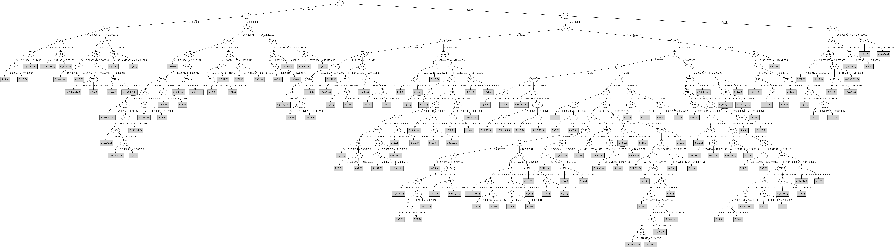

# J48

# SimpleCart Decision Tree

V69 < 9.227174

* V116 < 24.4226045

*   * V105 < 4012.70755

*   *   * V82 < 2.257616

*   *   *   * V67 < 1.2386314999999999

*   *   *   *   * V33 < 684.7661499999999

*   *   *   *   *   * V3 < 0.197461: 0(10.0/6.0)

*   *   *   *   *   * V3 >= 0.197461: 1(84.0/1.0)

*   *   *   *   * V33 >= 684.7661499999999: 2(164.0/3.0)

*   *   *   * V67 >= 1.2386314999999999

*   *   *   *   * V38 < -0.29604450000000004: 5(121.0/2.0)

*   *   *   *   * V38 >= -0.29604450000000004

*   *   *   *   *   * V82 < 1.079283: 5(56.0/0.0)

*   *   *   *   *   * V82 >= 1.079283

*   *   *   *   *   *   * V3 < 2.942462: 3(115.0/2.0)

*   *   *   *   *   *   * V3 >= 2.942462

*   *   *   *   *   *   *   * V4 < 5.9155575: 0(23.0/0.0)

*   *   *   *   *   *   *   * V4 >= 5.9155575: 4(13.0/3.0)

*   *   * V82 >= 2.257616

*   *   *   * V106 < 4.078077

*   *   *   *   * V76 < 3.7497865

*   *   *   *   *   * V87 < -2.052104: 1(325.0/4.0)

*   *   *   *   *   * V87 >= -2.052104

*   *   *   *   *   *   * V25 < 8232.553

*   *   *   *   *   *   *   * V67 < 1.6605405: 1(109.0/1.0)

*   *   *   *   *   *   *   * V67 >= 1.6605405: 0(4.0/6.0)

*   *   *   *   *   *   * V25 >= 8232.553: 2(32.0/0.0)

*   *   *   *   * V76 >= 3.7497865: 0(13.0/5.0)

*   *   *   * V106 >= 4.078077

*   *   *   *   * V1 < 8644.4728: 2(36.0/0.0)

*   *   *   *   * V1 >= 8644.4728: 1(8.0/0.0)

*   * V105 >= 4012.70755

*   *   * V113 < 18926.412: 2(755.0/4.0)

*   *   * V113 >= 18926.412

*   *   *   * V97 < 5877.84335: 1(87.0/0.0)

*   *   *   * V97 >= 5877.84335: 2(59.0/0.0)

* V116 >= 24.4226045

*   * V98 < 7.7241135: 1(1071.0/7.0)

*   * V98 >= 7.7241135: 2(13.0/0.0)

V69 >= 9.227174

* V16 < -91.01709

*   * V9 < 75388.3725

*   *   * V100 < 3.5771005000000002

*   *   *   * V16 < -226.16466: 1(26.0/0.0)

*   *   *   * V16 >= -226.16466: 5(20.0/4.0)

*   *   * V100 >= 3.5771005000000002

*   *   *   * V78 < -3.5747915: 0(79.0/1.0)

*   *   *   * V78 >= -3.5747915: 3(9.0/0.0)

*   * V9 >= 75388.3725

*   *   * V108 < 8.5689845

*   *   *   * V75 < 61.280439: 4(1379.0/13.0)

*   *   *   * V75 >= 61.280439

*   *   *   *   * V1 < 411141.0: 3(9.0/0.0)

*   *   *   *   * V1 >= 411141.0: 4(18.0/0.0)

*   *   * V108 >= 8.5689845: 0(5.0/3.0)

* V16 >= -91.01709

*   * V101 < 8.5548085

*   *   * V36 < 1.23953

*   *   *   * V113 < 8257.7

*   *   *   *   * V11 < 2.0635705: 3(23.0/3.0)

*   *   *   *   * V11 >= 2.0635705

*   *   *   *   *   * V17 < 2689.5057500000003: 5(49.0/1.0)

*   *   *   *   *   * V17 >= 2689.5057500000003

*   *   *   *   *   *   * V46 < -0.28713

*   *   *   *   *   *   *   * V16 < -11.897379999999998: 5(31.0/5.0)

*   *   *   *   *   *   *   * V16 >= -11.897379999999998: 0(8.0/0.0)

*   *   *   *   *   *   * V46 >= -0.28713: 4(56.0/1.0)

*   *   *   * V113 >= 8257.7: 4(380.0/7.0)

*   *   * V36 >= 1.23953

*   *   *   * V36 < 2.5397735

*   *   *   *   * V12 < 12.5262785

*   *   *   *   *   * V83 < 1.4592805

*   *   *   *   *   *   * V12 < 8.408117

*   *   *   *   *   *   *   * V124 < 5.799403

*   *   *   *   *   *   *   *   * V20 < 1.4021735: 5(14.0/0.0)

*   *   *   *   *   *   *   *   * V20 >= 1.4021735: 3(87.0/5.0)

*   *   *   *   *   *   *   * V124 >= 5.799403: 0(27.0/0.0)

*   *   *   *   *   *   * V12 >= 8.408117

*   *   *   *   *   *   *   * V124 < 5.2724135: 5(110.0/1.0)

*   *   *   *   *   *   *   * V124 >= 5.2724135: 0(11.0/2.0)

*   *   *   *   *   * V83 >= 1.4592805

*   *   *   *   *   *   * V34 < 2.804133: 3(191.0/2.0)

*   *   *   *   *   *   * V34 >= 2.804133

*   *   *   *   *   *   *   * V18 < 5.2616785: 0(4.0/5.0)

*   *   *   *   *   *   *   * V18 >= 5.2616785: 1(17.0/0.0)

*   *   *   *   * V12 >= 12.5262785

*   *   *   *   *   * V79 < -5.772736

*   *   *   *   *   *   * V16 < -45.9915425

*   *   *   *   *   *   *   * V78 < -8.077474500000001: 5(14.0/5.0)

*   *   *   *   *   *   *   * V78 >= -8.077474500000001

*   *   *   *   *   *   *   *   * V1 < 50.504850000000005: 2(7.0/2.0)

*   *   *   *   *   *   *   *   * V1 >= 50.504850000000005: 4(131.0/10.0)

*   *   *   *   *   *   * V16 >= -45.9915425

*   *   *   *   *   *   *   * V42 < 3.262316

*   *   *   *   *   *   *   *   * V84 < 3.3878035

*   *   *   *   *   *   *   *   *   * V2 < 3.7647705: 4(10.0/0.0)

*   *   *   *   *   *   *   *   *   * V2 >= 3.7647705: 5(13.0/0.0)

*   *   *   *   *   *   *   *   * V84 >= 3.3878035: 3(37.0/1.0)

*   *   *   *   *   *   *   * V42 >= 3.262316: 0(26.0/1.0)

*   *   *   *   *   * V79 >= -5.772736

*   *   *   *   *   *   * V7 < -0.4523955: 5(703.0/54.0)

*   *   *   *   *   *   * V7 >= -0.4523955: 4(7.0/7.0)

*   *   *   * V36 >= 2.5397735

*   *   *   *   * V93 < 12.416349

*   *   *   *   *   * V77 < 26.4612135

*   *   *   *   *   *   * V124 < 6.868611

*   *   *   *   *   *   *   * V98 < 3.006259: 3(21.0/2.0)

*   *   *   *   *   *   *   * V98 >= 3.006259: 5(93.0/4.0)

*   *   *   *   *   *   * V124 >= 6.868611

*   *   *   *   *   *   *   * V97 < 2177.57505: 0(44.0/1.0)

*   *   *   *   *   *   *   * V97 >= 2177.57505

*   *   *   *   *   *   *   *   * V13 < 46.320676500000005

*   *   *   *   *   *   *   *   *   * V78 < -2.313399: 3(662.0/45.0)

*   *   *   *   *   *   *   *   *   * V78 >= -2.313399: 5(10.0/2.0)

*   *   *   *   *   *   *   *   * V13 >= 46.320676500000005: 5(15.0/7.0)

*   *   *   *   *   * V77 >= 26.4612135

*   *   *   *   *   *   * V8 < -3.29594: 0(137.0/18.0)

*   *   *   *   *   *   * V8 >= -3.29594: 4(15.0/1.0)

*   *   *   *   * V93 >= 12.416349

*   *   *   *   *   * V54 < -4.2968285: 1(126.0/4.0)

*   *   *   *   *   * V54 >= -4.2968285: 2(25.0/6.0)

*   * V101 >= 8.5548085

*   *   * V61 < 48.784595499999995

*   *   *   * V101 < 11.469434

*   *   *   *   * V25 < 20604.02

*   *   *   *   *   * V100 < 4.997101000000001

*   *   *   *   *   *   * V10 < 5.1694125

*   *   *   *   *   *   *   * V11 < 17.1082465: 0(23.0/2.0)

*   *   *   *   *   *   *   * V11 >= 17.1082465: 4(9.0/0.0)

*   *   *   *   *   *   * V10 >= 5.1694125: 3(23.0/2.0)

*   *   *   *   *   * V100 >= 4.997101000000001: 0(326.0/5.0)

*   *   *   *   * V25 >= 20604.02

*   *   *   *   *   * V7 < -16.293716

*   *   *   *   *   *   * V80 < -43.862857: 0(8.0/3.0)

*   *   *   *   *   *   * V80 >= -43.862857: 3(84.0/3.0)

*   *   *   *   *   * V7 >= -16.293716

*   *   *   *   *   *   * V23 < -8.102785: 1(38.0/0.0)

*   *   *   *   *   *   * V23 >= -8.102785

*   *   *   *   *   *   *   * V1 < 64575.864499999996: 2(19.0/0.0)

*   *   *   *   *   *   *   * V1 >= 64575.864499999996: 4(21.0/0.0)

*   *   *   * V101 >= 11.469434

*   *   *   *   * V70 < -1.407212: 0(984.0/8.0)

*   *   *   *   * V70 >= -1.407212: 4(7.0/5.0)

*   *   * V61 >= 48.784595499999995

*   *   *   * V99 < 3.759381: 1(112.0/0.0)

*   *   *   * V99 >= 3.759381

*   *   *   *   * V11 < 37.8905265: 0(24.0/0.0)

*   *   *   *   * V11 >= 37.8905265: 4(16.0/1.0)

# PART

Decision list:

conditions|predicted class
---|---
V69 <= 9.315146 AND V26 > 2.226633 AND V116 > 24.411184 AND V35 <= 2.972491| 1 (1068.0/2.0)
V69 <= 7.947643 AND V26 > 2.020825 AND V105 > 4011.7795 AND V81 <= 18716.902 AND V35 > 0.625515| 2 (731.0)
V9 > 105445.72 AND V81 > 8762.508 AND V74 <= 16.19996 AND V75 <= 58.41081 AND V16 <= -80.009125| 4 (1301.0/5.0)
V69 <= 7.194271 AND V89 > 525.6075 AND V42 <= 6.53051 AND V84 > 3.067946 AND V50 > 2.678151 AND V79 > -3.708135| 1 (384.0/8.0)
V101 > 8.553303 AND V13 <= 81.27959 AND V106 <= 7.753565 AND V28 <= 24.31684 AND V26 <= 10.017464 AND V68 > 6.464347 AND V125 > 24.122576 AND V36 > 3.684493| 0 (947.0/3.0)
V68 <= 2.711788 AND V25 > 805.3887 AND V41 > 668.619 AND V1 <= 9755.69 AND V76 > 0.419035 AND V98 > 1.849513 AND V37 > 0.943364| 2 (250.0/6.0)
V29 > 17.524588 AND V65 <= 84998.21 AND V33 <= 6473.7017 AND V17 > 17301.64| 1 (253.0/2.0)
V68 <= 2.005474 AND V4 > 0.17145 AND V6 <= -0.118252 AND V99 <= 0.527445 AND V118 <= -0.285472| 1 (175.0/2.0)
V101 > 7.670523 AND V9 > 165441.27 AND V6 > -36.852425| 4 (49.0)
V101 > 7.670523 AND V68 <= 6.464347 AND V1 > 4502.105 AND V33 > 6189.154| 2 (47.0/1.0)
V101 > 7.670523 AND V13 > 56.833046 AND V33 > 4152.95| 0 (83.0/3.0)
V101 > 7.670523 AND V13 <= 57.281628 AND V27 <= 5.128856 AND V20 > 3.40518 AND V125 > 15.83741 AND V101 > 7.969805 AND V100 > 4.866943| 0 (362.0)
V106 <= 4.060627 AND V101 <= 4.186939 AND V69 > 5.716976 AND V18 <= 1.751935 AND V15 <= -2.532164| 5 (81.0/4.0)
V106 <= 4.060627 AND V101 <= 4.186939 AND V16 <= -23.728474 AND V66 <= 6.734981 AND V9 > 19077.428 AND V100 <= 1.821776| 4 (461.0/6.0)
V106 <= 4.067655 AND V16 > -61.59977 AND V81 > 17316.584 AND V53 <= 25.126856| 3 (367.0/5.0)
V26 <= 5.473814 AND V68 <= 2.0883 AND V45 > 2.552131| 2 (41.0/1.0)
V26 <= 5.473814 AND V57 > 20273.217 AND V103 <= -2.173552 AND V52 > 17.191427| 0 (19.0)
V26 <= 5.473814 AND V57 > 20273.217 AND V39 > -1.688472 AND V97 <= 5945.9917 AND V16 <= -63.682686| 4 (86.0/2.0)
V26 <= 5.473814 AND V69 <= 29.72105 AND V88 > -2.947732 AND V9 <= 67937.46 AND V17 > -70.1929| 0 (50.0/2.0)
V26 <= 5.473814 AND V69 <= 29.72105 AND V73 > 29880.531 AND V36 > 2.427106 AND V70 > -9.701112| 3 (175.0/2.0)
V26 <= 5.473814 AND V77 <= 17.23845 AND V73 > 29880.531 AND V1 > 103.9251| 4 (44.0/3.0)
V26 <= 5.473814 AND V77 <= 17.23845 AND V68 > 13.053351 AND V73 <= 29279.031 AND V70 > -7.222845| 5 (448.0)
V27 <= 4.555561 AND V125 > 13.376853 AND V11 > 18.77886 AND V6 > -18.945269| 4 (25.0/1.0)
V27 <= 4.555561 AND V125 > 13.376853 AND V29 > 10.930027 AND V18 > 2.020162| 3 (48.0/1.0)
V27 <= 4.097208 AND V125 > 13.376853 AND V29 <= 10.930027 AND V76 > 3.598839 AND V7 > -38.170174 AND V10 <= 4.78872| 0 (183.0/7.0)
V26 <= 5.269762 AND V97 <= 3981.6748 AND V17 > 7351.4165 AND V9 <= 45543.297 AND V35 > 0.616879 AND V12 <= 19.349998| 3 (285.0/1.0)
V25 <= 7896.9272 AND V100 > 1.223488 AND V66 > 2.196452 AND V110 <= -0.279189 AND V101 <= 7.176016 AND V75 <= 5.068752 AND V36 > 1.266225 AND V17 <= 6806.6455 AND V11 > 6.30334| 5 (459.0/3.0)
V26 <= 5.269762 AND V17 <= 7903.651 AND V10 <= 1.122077 AND V22 <= -0.224069 AND V1 > -35.6889| 0 (36.0)
V26 <= 5.269762 AND V17 <= 7903.651 AND V82 <= 1.075484 AND V3 > 0.198149| 5 (85.0)
V26 <= 5.269762 AND V17 <= 7903.651 AND V9 <= 36918.027 AND V101 > 3.507063 AND V77 <= 18.794655 AND V84 > 2.002678 AND V91 <= 2.392205 AND V36 > 1.438906 AND V116 <= 9.63764 AND V35 > 0.480203 AND V66 > 1.44463 AND V83 > 1.104705| 3 (283.0/1.0)
V26 <= 5.269762 AND V11 <= 3.800332 AND V38 > -0.887872 AND V101 > 3.507063| 3 (102.0/5.0)
V26 <= 5.269762 AND V100 <= 3.680619 AND V97 > 3951.4866 AND V97 <= 4509.3994 AND V1 > 138.787| 4 (17.0)
V26 <= 5.269762 AND V105 <= 4087.791 AND V100 > 3.680619 AND V71 <= -6.944237| 3 (35.0/4.0)
V25 <= 7808.708 AND V16 > -216.44878 AND V14 <= -1.353948 AND V10 > 3.33102 AND V1 > 2314.2578 AND V7 > -34.33182| 5 (191.0/5.0)
V38 > -0.470981 AND V18 > 1.860423 AND V18 <= 3.542668| 4 (88.0/2.0)
V65 <= 40934.363 AND V26 > 3.720826 AND V105 <= 6043.682 AND V1 > 6487.8555| 1 (144.0/2.0)
V84 <= 2.752725 AND V1 > 5.7188| 5 (29.0/3.0)
V46 > -2.445965 AND V79 <= -8.731767 AND V7 > -108.5583 AND V71 > -30.00478 AND V8 > -102.35062 AND V42 > 3.729734 AND V73 > 66869.87| 0 (84.0)
V38 <= -2.089646| 2 (27.0)
V92 > 11.208993 AND V99 <= 3.252011| 1 (9.0)
V69 <= 15.88756 AND V8 > -20.935217| 2 (29.0/3.0)
V7 <= -0.258874 AND V23 <= -1.781232 AND V52 <= 19.635626 AND V100 > 3.855409 AND V39 <= -1.413888 AND V104 > -6.219783| 3 (28.0/1.0)
V7 <= -0.258874 AND V23 <= -1.781232 AND V20 <= 12.658331 AND V104 > -2.476455 AND V1 > 90329.67| 3 (10.0)
V7 <= -0.258874 AND V23 <= -1.781232 AND V20 <= 12.658331 AND V40 <= -1.789831 AND V109 <= 5.530602| 4 (65.0/6.0)
V1 > 2744.5056 AND V9 <= 89213.31 AND V78 <= -4.498092| 0 (30.0/4.0)
V101 <= 5.669357| 2 (8.0)
V31 > -4.088322| 3 (8.0/3.0)
| 4 (7.0/1.0)

# JRip

Decision list:

conditions|predicted class
---|---
(V69 <= 8.080504) and (V116 <= 23.57304) and (V105 >= 3907.2166) and (V113 <= 18744.021) and (V35 >= 0.546915)|2 (748.0/1.0)
(V66 <= 1.654175) and (V34 >= 1.741519) and (V116 <= 4.221846) and (V109 >= 3.355947)|2 (144.0/0.0)
(V124 <= 2.667018) and (V13 <= 6.155665) and (V33 >= 784.1677) and (V1 <= 6900.815)|2 (63.0/4.0)
(V42 >= 6.746371) and (V114 <= 13.173578)|2 (102.0/2.0)
(V69 <= 10.315037) and (V33 >= 3225.661) and (V84 <= 8.786387) and (V41 >= 3017.8235)|2 (33.0/0.0)
(V1 <= 72.3032) and (V17 >= 14113.427)|2 (7.0/1.0)
(V66 <= 1.458578) and (V33 >= 711.2629) and (V86 >= -1.09572) and (V24 <= -3.593965) and (V3 <= 1.628658)|2 (17.0/1.0)
(V105 >= 6703.5186) and (V113 <= 22267.555)|2 (15.0/0.0)
(V6 >= -0.023842) and (V6 <= -0.023103)|2 (3.0/1.0)
(V45 <= 3.282638) and (V109 >= 4.667287) and (V67 <= 1.069753)|2 (4.0/0.0)
(V70 >= -0.157366) and (V70 <= -0.157065)|2 (2.0/0.0)
(V17 <= 9660.378) and (V73 <= 25921.664) and (V10 >= 8.28003)|5 (378.0/2.0)
(V17 <= 8773.214) and (V10 >= 3.335383) and (V36 <= 2.376802) and (V12 >= 14.409309) and (V101 >= 4.359117)|5 (248.0/1.0)
(V17 <= 11947.32) and (V12 >= 21.89942) and (V64 <= -13.362801) and (V72 >= -37.59997) and (V33 >= 2076.7622)|5 (149.0/1.0)
(V17 <= 5794.191) and (V28 <= 2.370105) and (V44 >= 0.948295) and (V12 >= 5.872544) and (V9 <= 36247.71)|5 (233.0/3.0)
(V25 <= 6154.03) and (V89 >= 6203.113) and (V97 <= 3044.8635)|5 (102.0/0.0)
(V84 <= 2.331979) and (V99 >= 0.741085) and (V20 <= 2.55507)|5 (27.0/0.0)
(V17 <= 7093.4307) and (V12 >= 18.854904) and (V10 >= 5.047862) and (V20 <= 4.548626)|5 (41.0/5.0)
(V26 <= 1.682066) and (V15 <= -3.35403) and (V8 >= -6.143188)|5 (29.0/0.0)
(V49 <= 377.5296) and (V1 >= 324.3453)|5 (54.0/0.0)
(V82 <= 4.509787) and (V58 >= 4.732052) and (V9 >= 61610.246)|5 (15.0/0.0)
(V81 <= 5318.133) and (V1 >= 43928.383) and (V1 <= 48303.887)|5 (6.0/0.0)
(V81 <= 4491.299) and (V33 >= 2206.3027)|5 (4.0/0.0)
(V82 <= 1.385152) and (V9 >= 9977.219)|5 (3.0/0.0)
(V25 <= 7650.488) and (V89 >= 8332.576) and (V97 <= 3557.8923)|5 (5.0/0.0)
(V83 <= 0.444677) and (V69 >= 16.491816)|5 (3.0/1.0)
(V17 <= 12175.461) and (V106 >= 3.009084) and (V75 <= 6.733272) and (V11 >= 11.575249)|5 (7.0/1.0)
(V117 <= 20.851732) and (V101 >= 4.303627) and (V16 >= -56.110435) and (V70 <= -2.671629) and (V77 <= 21.78992) and (V47 <= -0.91345) and (V106 <= 3.555621) and (V39 <= -1.097603)|3 (569.0/6.0)
(V117 <= 22.08562) and (V16 >= -58.891323) and (V36 >= 1.459948) and (V116 <= 6.941195) and (V77 <= 16.061878) and (V41 <= 1598.5463)|3 (242.0/2.0)
(V117 <= 22.08562) and (V10 >= 7.637078) and (V36 >= 2.433572) and (V106 <= 3.948235) and (V16 <= -15.226058)|3 (220.0/6.0)
(V116 <= 11.165038) and (V36 >= 2.266139) and (V5 <= 23.130299) and (V11 >= 6.246431) and (V65 <= 44132.53)|3 (108.0/3.0)
(V36 >= 1.939098) and (V117 <= 13.742556) and (V12 <= 19.958494) and (V9 >= 20474.037) and (V73 <= 28918.014)|3 (23.0/1.0)
(V117 <= 26.478342) and (V2 >= 10.8327) and (V65 <= 64715.504) and (V13 >= 29.264017)|3 (49.0/1.0)
(V125 <= 19.86596) and (V39 <= -1.649566) and (V71 >= -19.608135) and (V16 <= -32.808613) and (V64 <= -16.59048) and (V9 <= 84067.65)|3 (37.0/0.0)
(V61 <= 13.084833) and (V66 >= 8.132196) and (V10 >= 11.673029) and (V74 <= 15.415455) and (V66 <= 13.160946)|3 (15.0/0.0)
(V10 <= 1.811923) and (V69 >= 9.368586) and (V100 <= 2.273262)|3 (61.0/1.0)
(V89 <= 3374.1072) and (V79 <= -9.620484)|3 (9.0/3.0)
(V74 >= 7.514466) and (V98 <= 3.947024) and (V9 >= 79117.766) and (V1 <= 107362.914)|3 (9.0/1.0)
(V70 <= -38.21671) and (V2 >= 14.658277)|3 (9.0/2.0)
(V24 >= -3.393068) and (V11 >= 35.13861)|3 (2.0/0.0)
(V66 >= 6.824256) and (V16 >= -87.86917) and (V14 <= -5.040635) and (V100 >= 6.125658)|0 (1062.0/2.0)
(V83 <= 5.717367) and (V100 >= 3.031351) and (V44 >= 3.113804) and (V13 <= 69.089424) and (V1 >= 1766.5648) and (V3 >= 0.482389)|0 (427.0/2.0)
(V81 <= 13858.351) and (V44 >= 1.788598) and (V19 <= 2.463364) and (V12 <= 21.392138)|0 (147.0/1.0)
(V88 >= -4.901098) and (V108 >= 2.178054) and (V15 <= -2.910728)|0 (35.0/2.0)
(V88 >= -3.073671) and (V3 >= 2.745023) and (V1 <= 61094.004)|0 (24.0/1.0)
(V104 <= -6.539226) and (V10 <= 4.539205) and (V4 >= 25.101702) and (V9 <= 92631.94)|0 (31.0/0.0)
(V4 >= 25.000744) and (V9 <= 92003.8) and (V78 <= -8.201937) and (V6 <= -13.425479)|0 (19.0/0.0)
(V7 <= -14.688617) and (V16 >= -47.155254) and (V80 <= -20.958193)|0 (15.0/1.0)
(V48 <= -17.284468) and (V39 <= -2.331581)|0 (9.0/1.0)
(V49 <= 1345.4792) and (V22 >= -0.27534)|0 (12.0/0.0)
(V109 >= 11.672202) and (V18 <= 5.994463)|0 (7.0/2.0)
(V9 <= 35492.59) and (V90 >= 3.506558)|1 (1691.0/2.0)
(V69 <= 16.80353) and (V68 <= 2.003489) and (V3 >= 0.084515)|1 (193.0/0.0)
(V28 >= 15.029179) and (V49 <= 35602.004)|1 (117.0/0.0)
(V106 >= 4.458112) and (V65 <= 80234.86)|1 (18.0/2.0)
(V13 <= 22.233334) and (V83 >= 2.126243) and (V4 <= 9.544074)|1 (7.0/0.0)
|4 (2128.0/30.0)

# Decision Table

Non matches covered by Majority class

v67|v84|v107|target
---|---|---|---
(50.565506-inf)|(32.995244-inf)|(4.506407-inf)|0
(21.667097-30.59274]|(32.995244-inf)|(4.506407-inf)|0
(2.694224-3.035764]|(32.995244-inf)|(4.506407-inf)|0
(10.378049-11.238684]|(32.995244-inf)|(4.506407-inf)|0
(3.209149-4.39855]|(32.995244-inf)|(4.506407-inf)|0
(50.565506-inf)|(28.063483-32.995244]|(4.506407-inf)|4
(1.382113-1.85775]|(28.063483-32.995244]|(4.506407-inf)|0
(5.92499-8.187631]|(32.995244-inf)|(3.924234-4.506407]|0
(0.121991-1.138758]|(32.995244-inf)|(3.924234-4.506407]|0
(31.420901-35.625955]|(25.999794-28.063483]|(4.506407-inf)|0
(21.667097-30.59274]|(25.999794-28.063483]|(4.506407-inf)|0
(1.138758-1.382113]|(15.495781-25.999794]|(4.506407-inf)|0
(3.035764-3.209149]|(15.495781-25.999794]|(4.506407-inf)|0
(2.694224-3.035764]|(15.495781-25.999794]|(4.506407-inf)|0
(50.565506-inf)|(28.063483-32.995244]|(3.924234-4.506407]|4
(35.625955-50.565506]|(15.495781-25.999794]|(4.506407-inf)|0
(21.667097-30.59274]|(28.063483-32.995244]|(3.924234-4.506407]|0
(30.59274-31.420901]|(15.495781-25.999794]|(4.506407-inf)|0
(21.667097-30.59274]|(15.495781-25.999794]|(4.506407-inf)|0
(31.420901-35.625955]|(15.495781-25.999794]|(4.506407-inf)|0
(3.209149-4.39855]|(15.495781-25.999794]|(4.506407-inf)|0
(31.420901-35.625955]|(25.999794-28.063483]|(3.924234-4.506407]|0
(50.565506-inf)|(32.995244-inf)|(3.846633-3.924234]|0
(21.667097-30.59274]|(25.999794-28.063483]|(3.924234-4.506407]|0
(50.565506-inf)|(25.999794-28.063483]|(3.924234-4.506407]|0
(1.85775-2.542652]|(25.999794-28.063483]|(3.924234-4.506407]|0
(3.209149-4.39855]|(25.999794-28.063483]|(3.924234-4.506407]|0
(31.420901-35.625955]|(15.495781-25.999794]|(3.924234-4.506407]|0
(2.694224-3.035764]|(15.495781-25.999794]|(3.924234-4.506407]|0
(1.382113-1.85775]|(15.495781-25.999794]|(3.924234-4.506407]|0
(2.542652-2.694224]|(15.495781-25.999794]|(3.924234-4.506407]|0
(11.662472-11.812577]|(15.495781-25.999794]|(3.924234-4.506407]|0
(50.565506-inf)|(28.063483-32.995244]|(3.846633-3.924234]|4
(35.625955-50.565506]|(15.495781-25.999794]|(3.924234-4.506407]|0
(21.667097-30.59274]|(15.495781-25.999794]|(3.924234-4.506407]|0
(50.565506-inf)|(15.495781-25.999794]|(3.924234-4.506407]|4
(1.85775-2.542652]|(15.495781-25.999794]|(3.924234-4.506407]|2
(21.667097-30.59274]|(32.995244-inf)|(3.714063-3.846633]|0
(5.324167-5.92499]|(32.995244-inf)|(3.714063-3.846633]|0
(4.635068-4.964939]|(32.995244-inf)|(3.714063-3.846633]|0
(50.565506-inf)|(25.999794-28.063483]|(3.846633-3.924234]|4
(50.565506-inf)|(32.995244-inf)|(3.714063-3.846633]|0
(0.121991-1.138758]|(32.995244-inf)|(3.714063-3.846633]|1
(5.92499-8.187631]|(32.995244-inf)|(3.714063-3.846633]|1
(35.625955-50.565506]|(13.553912-15.495781]|(3.924234-4.506407]|0
(1.85775-2.542652]|(13.553912-15.495781]|(3.924234-4.506407]|2
(1.382113-1.85775]|(13.553912-15.495781]|(3.924234-4.506407]|2
(1.138758-1.382113]|(13.553912-15.495781]|(3.924234-4.506407]|2
(3.209149-4.39855]|(13.553912-15.495781]|(3.924234-4.506407]|0
(50.565506-inf)|(28.063483-32.995244]|(3.714063-3.846633]|4
(21.667097-30.59274]|(15.495781-25.999794]|(3.846633-3.924234]|0
(3.209149-4.39855]|(15.495781-25.999794]|(3.846633-3.924234]|0
(50.565506-inf)|(25.999794-28.063483]|(3.714063-3.846633]|0
(11.662472-11.812577]|(32.995244-inf)|(3.250081-3.714063]|0
(12.234257-13.732049]|(32.995244-inf)|(3.250081-3.714063]|0
(2.694224-3.035764]|(32.995244-inf)|(3.250081-3.714063]|0
(4.635068-4.964939]|(32.995244-inf)|(3.250081-3.714063]|1
(1.85775-2.542652]|(32.995244-inf)|(3.250081-3.714063]|0
(5.92499-8.187631]|(32.995244-inf)|(3.250081-3.714063]|1
(1.382113-1.85775]|(32.995244-inf)|(3.250081-3.714063]|1
(5.324167-5.92499]|(32.995244-inf)|(3.250081-3.714063]|1
(4.964939-5.324167]|(32.995244-inf)|(3.250081-3.714063]|1
(0.121991-1.138758]|(32.995244-inf)|(3.250081-3.714063]|1
(3.035764-3.209149]|(32.995244-inf)|(3.250081-3.714063]|1
(4.39855-4.635068]|(32.995244-inf)|(3.250081-3.714063]|1
(3.209149-4.39855]|(32.995244-inf)|(3.250081-3.714063]|1
(35.625955-50.565506]|(13.553912-15.495781]|(3.846633-3.924234]|0
(3.209149-4.39855]|(13.553912-15.495781]|(3.846633-3.924234]|0
(1.85775-2.542652]|(13.553912-15.495781]|(3.846633-3.924234]|0
(1.138758-1.382113]|(13.553912-15.495781]|(3.846633-3.924234]|2
(50.565506-inf)|(15.495781-25.999794]|(3.714063-3.846633]|0
(1.382113-1.85775]|(15.495781-25.999794]|(3.714063-3.846633]|0
(35.625955-50.565506]|(13.034389-13.553912]|(3.846633-3.924234]|0
(2.542652-2.694224]|(15.495781-25.999794]|(3.714063-3.846633]|0
(1.85775-2.542652]|(15.495781-25.999794]|(3.714063-3.846633]|0
(1.138758-1.382113]|(13.034389-13.553912]|(3.846633-3.924234]|2
(50.565506-inf)|(28.063483-32.995244]|(3.250081-3.714063]|4
(21.141624-21.444885]|(15.495781-25.999794]|(3.714063-3.846633]|0
(21.667097-30.59274]|(15.495781-25.999794]|(3.714063-3.846633]|0
(3.209149-4.39855]|(15.495781-25.999794]|(3.714063-3.846633]|0
(50.565506-inf)|(25.999794-28.063483]|(3.250081-3.714063]|0
(0.121991-1.138758]|(12.167395-13.034389]|(3.846633-3.924234]|0
(2.694224-3.035764]|(13.553912-15.495781]|(3.714063-3.846633]|0
(1.85775-2.542652]|(13.553912-15.495781]|(3.714063-3.846633]|0
(3.209149-4.39855]|(32.995244-inf)|(3.196388-3.250081]|1
(16.332358-20.736192]|(13.553912-15.495781]|(3.714063-3.846633]|0
(35.625955-50.565506]|(13.553912-15.495781]|(3.714063-3.846633]|0
(21.667097-30.59274]|(13.553912-15.495781]|(3.714063-3.846633]|0
(1.138758-1.382113]|(12.167395-13.034389]|(3.846633-3.924234]|0
(0.121991-1.138758]|(13.553912-15.495781]|(3.714063-3.846633]|2
(1.138758-1.382113]|(15.495781-25.999794]|(3.250081-3.714063]|1
(2.542652-2.694224]|(15.495781-25.999794]|(3.250081-3.714063]|0
(21.141624-21.444885]|(15.495781-25.999794]|(3.250081-3.714063]|0
(1.138758-1.382113]|(13.034389-13.553912]|(3.714063-3.846633]|0
(35.625955-50.565506]|(15.495781-25.999794]|(3.250081-3.714063]|4
(50.565506-inf)|(15.495781-25.999794]|(3.250081-3.714063]|4
(0.121991-1.138758]|(15.495781-25.999794]|(3.250081-3.714063]|1
(1.85775-2.542652]|(15.495781-25.999794]|(3.250081-3.714063]|0
(20.736192-21.141624]|(15.495781-25.999794]|(3.250081-3.714063]|0
(16.332358-20.736192]|(15.495781-25.999794]|(3.250081-3.714063]|0
(21.667097-30.59274]|(15.495781-25.999794]|(3.250081-3.714063]|0
(3.209149-4.39855]|(8.379124-12.167395]|(3.846633-3.924234]|2
(5.92499-8.187631]|(15.495781-25.999794]|(3.250081-3.714063]|2
(8.187631-9.699918]|(15.495781-25.999794]|(3.250081-3.714063]|2
(1.85775-2.542652]|(32.995244-inf)|(2.996397-3.196388]|1
(2.694224-3.035764]|(32.995244-inf)|(2.996397-3.196388]|0
(16.332358-20.736192]|(13.553912-15.495781]|(3.250081-3.714063]|0
(1.85775-2.542652]|(12.167395-13.034389]|(3.714063-3.846633]|0
(10.378049-11.238684]|(13.553912-15.495781]|(3.250081-3.714063]|2
(4.964939-5.324167]|(32.995244-inf)|(2.996397-3.196388]|1
(5.324167-5.92499]|(32.995244-inf)|(2.996397-3.196388]|1
(0.121991-1.138758]|(32.995244-inf)|(2.996397-3.196388]|1
(4.635068-4.964939]|(32.995244-inf)|(2.996397-3.196388]|1
(1.382113-1.85775]|(32.995244-inf)|(2.996397-3.196388]|1
(3.035764-3.209149]|(32.995244-inf)|(2.996397-3.196388]|1
(1.138758-1.382113]|(32.995244-inf)|(2.996397-3.196388]|1
(5.92499-8.187631]|(32.995244-inf)|(2.996397-3.196388]|1
(3.209149-4.39855]|(32.995244-inf)|(2.996397-3.196388]|1
(4.39855-4.635068]|(32.995244-inf)|(2.996397-3.196388]|1
(35.625955-50.565506]|(12.167395-13.034389]|(3.714063-3.846633]|0
(35.625955-50.565506]|(13.553912-15.495781]|(3.250081-3.714063]|0
(21.667097-30.59274]|(13.553912-15.495781]|(3.250081-3.714063]|0
(0.121991-1.138758]|(12.167395-13.034389]|(3.714063-3.846633]|0
(14.931778-16.332358]|(13.553912-15.495781]|(3.250081-3.714063]|0
(9.953845-10.378049]|(13.553912-15.495781]|(3.250081-3.714063]|0
(20.736192-21.141624]|(15.495781-25.999794]|(3.196388-3.250081]|0
(5.92499-8.187631]|(15.495781-25.999794]|(3.196388-3.250081]|0
(50.565506-inf)|(15.495781-25.999794]|(3.196388-3.250081]|4
(35.625955-50.565506]|(15.495781-25.999794]|(3.196388-3.250081]|4
(0.121991-1.138758]|(15.495781-25.999794]|(3.196388-3.250081]|0
(21.444885-21.667097]|(15.495781-25.999794]|(3.196388-3.250081]|0
(35.625955-50.565506]|(13.034389-13.553912]|(3.250081-3.714063]|0
(1.85775-2.542652]|(15.495781-25.999794]|(3.196388-3.250081]|0
(21.667097-30.59274]|(15.495781-25.999794]|(3.196388-3.250081]|0
(16.332358-20.736192]|(15.495781-25.999794]|(3.196388-3.250081]|0
(0.121991-1.138758]|(13.034389-13.553912]|(3.250081-3.714063]|0
(3.209149-4.39855]|(8.379124-12.167395]|(3.714063-3.846633]|2
(3.209149-4.39855]|(13.034389-13.553912]|(3.250081-3.714063]|0
(0.121991-1.138758]|(8.379124-12.167395]|(3.714063-3.846633]|0
(14.931778-16.332358]|(13.553912-15.495781]|(3.196388-3.250081]|0
(4.39855-4.635068]|(12.167395-13.034389]|(3.250081-3.714063]|0
(0.121991-1.138758]|(12.167395-13.034389]|(3.250081-3.714063]|2
(0.121991-1.138758]|(25.999794-28.063483]|(2.996397-3.196388]|0
(4.635068-4.964939]|(32.995244-inf)|(2.916706-2.996397]|1
(1.138758-1.382113]|(32.995244-inf)|(2.916706-2.996397]|0
(5.324167-5.92499]|(32.995244-inf)|(2.916706-2.996397]|0
(3.209149-4.39855]|(32.995244-inf)|(2.916706-2.996397]|1
(0.121991-1.138758]|(32.995244-inf)|(2.916706-2.996397]|1
(2.542652-2.694224]|(32.995244-inf)|(2.916706-2.996397]|1
(35.625955-50.565506]|(13.553912-15.495781]|(3.196388-3.250081]|0
(35.625955-50.565506]|(12.167395-13.034389]|(3.250081-3.714063]|0
(16.332358-20.736192]|(13.553912-15.495781]|(3.196388-3.250081]|3
(21.667097-30.59274]|(13.553912-15.495781]|(3.196388-3.250081]|0
(1.85775-2.542652]|(12.167395-13.034389]|(3.250081-3.714063]|0
(1.138758-1.382113]|(12.167395-13.034389]|(3.250081-3.714063]|2
(3.209149-4.39855]|(12.167395-13.034389]|(3.250081-3.714063]|2
(1.382113-1.85775]|(12.167395-13.034389]|(3.250081-3.714063]|2
(0.121991-1.138758]|(28.063483-32.995244]|(2.916706-2.996397]|0
(0.121991-1.138758]|(15.495781-25.999794]|(2.996397-3.196388]|1
(13.968118-14.931778]|(15.495781-25.999794]|(2.996397-3.196388]|0
(5.92499-8.187631]|(15.495781-25.999794]|(2.996397-3.196388]|2
(30.59274-31.420901]|(15.495781-25.999794]|(2.996397-3.196388]|0
(31.420901-35.625955]|(15.495781-25.999794]|(2.996397-3.196388]|0
(35.625955-50.565506]|(15.495781-25.999794]|(2.996397-3.196388]|4
(50.565506-inf)|(15.495781-25.999794]|(2.996397-3.196388]|4
(1.85775-2.542652]|(28.063483-32.995244]|(2.916706-2.996397]|1
(12.234257-13.732049]|(15.495781-25.999794]|(2.996397-3.196388]|0
(11.812577-12.234257]|(15.495781-25.999794]|(2.996397-3.196388]|0
(21.444885-21.667097]|(15.495781-25.999794]|(2.996397-3.196388]|0
(21.141624-21.444885]|(15.495781-25.999794]|(2.996397-3.196388]|0
(11.662472-11.812577]|(15.495781-25.999794]|(2.996397-3.196388]|0
(21.667097-30.59274]|(15.495781-25.999794]|(2.996397-3.196388]|0
(16.332358-20.736192]|(15.495781-25.999794]|(2.996397-3.196388]|0
(11.238684-11.662472]|(15.495781-25.999794]|(2.996397-3.196388]|0
(20.736192-21.141624]|(15.495781-25.999794]|(2.996397-3.196388]|0
(0.121991-1.138758]|(8.379124-12.167395]|(3.250081-3.714063]|2
(1.138758-1.382113]|(8.379124-12.167395]|(3.250081-3.714063]|2
(1.85775-2.542652]|(8.379124-12.167395]|(3.250081-3.714063]|0
(3.209149-4.39855]|(8.379124-12.167395]|(3.250081-3.714063]|2
(1.382113-1.85775]|(8.379124-12.167395]|(3.250081-3.714063]|2
(5.92499-8.187631]|(32.995244-inf)|(2.796898-2.916706]|0
(2.694224-3.035764]|(32.995244-inf)|(2.796898-2.916706]|1
(11.662472-11.812577]|(13.553912-15.495781]|(2.996397-3.196388]|0
(13.968118-14.931778]|(13.553912-15.495781]|(2.996397-3.196388]|0
(11.238684-11.662472]|(13.553912-15.495781]|(2.996397-3.196388]|0
(3.035764-3.209149]|(32.995244-inf)|(2.796898-2.916706]|0
(2.542652-2.694224]|(32.995244-inf)|(2.796898-2.916706]|1
(3.209149-4.39855]|(32.995244-inf)|(2.796898-2.916706]|1
(4.39855-4.635068]|(32.995244-inf)|(2.796898-2.916706]|0
(1.85775-2.542652]|(32.995244-inf)|(2.796898-2.916706]|1
(4.964939-5.324167]|(32.995244-inf)|(2.796898-2.916706]|0
(0.121991-1.138758]|(32.995244-inf)|(2.796898-2.916706]|1
(10.378049-11.238684]|(13.553912-15.495781]|(2.996397-3.196388]|0
(16.332358-20.736192]|(13.553912-15.495781]|(2.996397-3.196388]|3
(35.625955-50.565506]|(13.553912-15.495781]|(2.996397-3.196388]|0
(3.035764-3.209149]|(6.75816-8.379124]|(3.250081-3.714063]|2
(50.565506-inf)|(15.495781-25.999794]|(2.916706-2.996397]|4
(1.138758-1.382113]|(28.063483-32.995244]|(2.796898-2.916706]|0
(13.732049-13.968118]|(13.034389-13.553912]|(2.996397-3.196388]|0
(11.238684-11.662472]|(15.495781-25.999794]|(2.916706-2.996397]|0
(12.234257-13.732049]|(13.034389-13.553912]|(2.996397-3.196388]|0
(35.625955-50.565506]|(13.034389-13.553912]|(2.996397-3.196388]|0
(0.121991-1.138758]|(8.379124-12.167395]|(3.196388-3.250081]|0
(30.59274-31.420901]|(15.495781-25.999794]|(2.916706-2.996397]|0
(3.209149-4.39855]|(28.063483-32.995244]|(2.796898-2.916706]|0
(1.85775-2.542652]|(28.063483-32.995244]|(2.796898-2.916706]|1
(1.382113-1.85775]|(28.063483-32.995244]|(2.796898-2.916706]|0
(0.121991-1.138758]|(28.063483-32.995244]|(2.796898-2.916706]|1
(13.968118-14.931778]|(13.034389-13.553912]|(2.996397-3.196388]|0
(11.812577-12.234257]|(15.495781-25.999794]|(2.916706-2.996397]|0
(35.625955-50.565506]|(8.379124-12.167395]|(3.196388-3.250081]|0
(16.332358-20.736192]|(15.495781-25.999794]|(2.916706-2.996397]|0
(11.662472-11.812577]|(15.495781-25.999794]|(2.916706-2.996397]|0
(1.138758-1.382113]|(8.379124-12.167395]|(3.196388-3.250081]|2
(5.92499-8.187631]|(15.495781-25.999794]|(2.916706-2.996397]|2
(16.332358-20.736192]|(13.553912-15.495781]|(2.916706-2.996397]|3
(31.420901-35.625955]|(13.553912-15.495781]|(2.916706-2.996397]|0
(0.121991-1.138758]|(32.995244-inf)|(2.607476-2.796898]|0
(35.625955-50.565506]|(13.553912-15.495781]|(2.916706-2.996397]|0
(0.121991-1.138758]|(25.999794-28.063483]|(2.796898-2.916706]|0
(1.85775-2.542652]|(32.995244-inf)|(2.607476-2.796898]|1
(2.542652-2.694224]|(32.995244-inf)|(2.607476-2.796898]|0
(3.209149-4.39855]|(32.995244-inf)|(2.607476-2.796898]|1
(2.694224-3.035764]|(32.995244-inf)|(2.607476-2.796898]|1
(11.812577-12.234257]|(13.553912-15.495781]|(2.916706-2.996397]|0
(11.238684-11.662472]|(13.553912-15.495781]|(2.916706-2.996397]|0
(4.39855-4.635068]|(32.995244-inf)|(2.607476-2.796898]|0
(11.662472-11.812577]|(13.553912-15.495781]|(2.916706-2.996397]|0
(16.332358-20.736192]|(13.034389-13.553912]|(2.916706-2.996397]|0
(3.209149-4.39855]|(28.063483-32.995244]|(2.607476-2.796898]|1
(0.121991-1.138758]|(15.495781-25.999794]|(2.796898-2.916706]|0
(14.931778-16.332358]|(15.495781-25.999794]|(2.796898-2.916706]|0
(2.694224-3.035764]|(8.379124-12.167395]|(2.996397-3.196388]|0
(14.931778-16.332358]|(13.034389-13.553912]|(2.916706-2.996397]|3
(30.59274-31.420901]|(15.495781-25.999794]|(2.796898-2.916706]|0
(35.625955-50.565506]|(15.495781-25.999794]|(2.796898-2.916706]|4
(21.667097-30.59274]|(15.495781-25.999794]|(2.796898-2.916706]|4
(50.565506-inf)|(15.495781-25.999794]|(2.796898-2.916706]|4
(2.542652-2.694224]|(28.063483-32.995244]|(2.607476-2.796898]|0
(1.85775-2.542652]|(28.063483-32.995244]|(2.607476-2.796898]|0
(0.121991-1.138758]|(28.063483-32.995244]|(2.607476-2.796898]|1
(13.968118-14.931778]|(13.034389-13.553912]|(2.916706-2.996397]|0
(31.420901-35.625955]|(8.379124-12.167395]|(2.996397-3.196388]|0
(35.625955-50.565506]|(13.034389-13.553912]|(2.916706-2.996397]|0
(35.625955-50.565506]|(8.379124-12.167395]|(2.996397-3.196388]|0
(16.332358-20.736192]|(15.495781-25.999794]|(2.796898-2.916706]|0
(13.732049-13.968118]|(13.034389-13.553912]|(2.916706-2.996397]|0
(3.035764-3.209149]|(8.379124-12.167395]|(2.996397-3.196388]|0
(3.209149-4.39855]|(8.379124-12.167395]|(2.996397-3.196388]|2
(1.85775-2.542652]|(8.379124-12.167395]|(2.996397-3.196388]|2
(5.92499-8.187631]|(15.495781-25.999794]|(2.796898-2.916706]|0
(0.121991-1.138758]|(8.379124-12.167395]|(2.996397-3.196388]|2
(35.625955-50.565506]|(13.553912-15.495781]|(2.796898-2.916706]|0
(31.420901-35.625955]|(13.553912-15.495781]|(2.796898-2.916706]|4
(30.59274-31.420901]|(13.553912-15.495781]|(2.796898-2.916706]|4
(10.378049-11.238684]|(25.999794-28.063483]|(2.607476-2.796898]|0
(2.542652-2.694224]|(32.995244-inf)|(2.517508-2.607476]|0
(5.92499-8.187631]|(25.999794-28.063483]|(2.607476-2.796898]|0
(4.964939-5.324167]|(25.999794-28.063483]|(2.607476-2.796898]|0
(11.812577-12.234257]|(25.999794-28.063483]|(2.607476-2.796898]|0
(5.324167-5.92499]|(25.999794-28.063483]|(2.607476-2.796898]|0
(2.694224-3.035764]|(32.995244-inf)|(2.517508-2.607476]|0
(1.382113-1.85775]|(13.553912-15.495781]|(2.796898-2.916706]|0
(21.667097-30.59274]|(13.553912-15.495781]|(2.796898-2.916706]|4
(4.39855-4.635068]|(32.995244-inf)|(2.517508-2.607476]|0
(3.035764-3.209149]|(32.995244-inf)|(2.517508-2.607476]|0
(3.209149-4.39855]|(32.995244-inf)|(2.517508-2.607476]|1
(0.121991-1.138758]|(25.999794-28.063483]|(2.607476-2.796898]|1
(16.332358-20.736192]|(13.553912-15.495781]|(2.796898-2.916706]|0
(11.662472-11.812577]|(13.553912-15.495781]|(2.796898-2.916706]|0
(31.420901-35.625955]|(13.034389-13.553912]|(2.796898-2.916706]|0
(2.694224-3.035764]|(28.063483-32.995244]|(2.517508-2.607476]|0
(31.420901-35.625955]|(8.379124-12.167395]|(2.916706-2.996397]|0
(0.121991-1.138758]|(8.379124-12.167395]|(2.916706-2.996397]|0
(14.931778-16.332358]|(13.034389-13.553912]|(2.796898-2.916706]|3
(21.667097-30.59274]|(15.495781-25.999794]|(2.607476-2.796898]|4
(50.565506-inf)|(15.495781-25.999794]|(2.607476-2.796898]|4
(0.121991-1.138758]|(15.495781-25.999794]|(2.607476-2.796898]|1
(1.85775-2.542652]|(28.063483-32.995244]|(2.517508-2.607476]|1
(0.121991-1.138758]|(28.063483-32.995244]|(2.517508-2.607476]|1
(35.625955-50.565506]|(15.495781-25.999794]|(2.607476-2.796898]|4
(35.625955-50.565506]|(13.034389-13.553912]|(2.796898-2.916706]|0
(14.931778-16.332358]|(15.495781-25.999794]|(2.607476-2.796898]|0
(16.332358-20.736192]|(15.495781-25.999794]|(2.607476-2.796898]|0
(21.667097-30.59274]|(13.034389-13.553912]|(2.796898-2.916706]|0
(16.332358-20.736192]|(8.379124-12.167395]|(2.916706-2.996397]|0
(5.324167-5.92499]|(15.495781-25.999794]|(2.607476-2.796898]|0
(1.382113-1.85775]|(8.379124-12.167395]|(2.916706-2.996397]|2
(21.141624-21.444885]|(13.553912-15.495781]|(2.607476-2.796898]|0
(4.635068-4.964939]|(32.995244-inf)|(2.423521-2.517508]|0
(0.121991-1.138758]|(25.999794-28.063483]|(2.517508-2.607476]|1
(2.694224-3.035764]|(25.999794-28.063483]|(2.517508-2.607476]|0
(2.694224-3.035764]|(32.995244-inf)|(2.423521-2.517508]|0
(12.234257-13.732049]|(25.999794-28.063483]|(2.517508-2.607476]|0
(13.732049-13.968118]|(12.167395-13.034389]|(2.796898-2.916706]|0
(5.92499-8.187631]|(13.553912-15.495781]|(2.607476-2.796898]|0
(4.964939-5.324167]|(13.553912-15.495781]|(2.607476-2.796898]|0
(14.931778-16.332358]|(12.167395-13.034389]|(2.796898-2.916706]|0
(35.625955-50.565506]|(13.553912-15.495781]|(2.607476-2.796898]|4
(21.667097-30.59274]|(13.553912-15.495781]|(2.607476-2.796898]|4
(3.209149-4.39855]|(32.995244-inf)|(2.423521-2.517508]|1
(5.92499-8.187631]|(25.999794-28.063483]|(2.517508-2.607476]|0
(1.85775-2.542652]|(25.999794-28.063483]|(2.517508-2.607476]|1
(12.234257-13.732049]|(13.553912-15.495781]|(2.607476-2.796898]|0
(35.625955-50.565506]|(12.167395-13.034389]|(2.796898-2.916706]|0
(13.968118-14.931778]|(13.553912-15.495781]|(2.607476-2.796898]|0
(14.931778-16.332358]|(13.553912-15.495781]|(2.607476-2.796898]|0
(16.332358-20.736192]|(13.553912-15.495781]|(2.607476-2.796898]|0
(30.59274-31.420901]|(13.034389-13.553912]|(2.607476-2.796898]|0
(3.035764-3.209149]|(28.063483-32.995244]|(2.423521-2.517508]|0
(4.39855-4.635068]|(28.063483-32.995244]|(2.423521-2.517508]|1
(3.209149-4.39855]|(15.495781-25.999794]|(2.517508-2.607476]|0
(9.953845-10.378049]|(15.495781-25.999794]|(2.517508-2.607476]|0
(10.378049-11.238684]|(15.495781-25.999794]|(2.517508-2.607476]|0
(1.85775-2.542652]|(28.063483-32.995244]|(2.423521-2.517508]|0
(1.382113-1.85775]|(13.034389-13.553912]|(2.607476-2.796898]|0
(2.694224-3.035764]|(8.379124-12.167395]|(2.796898-2.916706]|0
(21.667097-30.59274]|(8.379124-12.167395]|(2.796898-2.916706]|3
(21.444885-21.667097]|(8.379124-12.167395]|(2.796898-2.916706]|3
(14.931778-16.332358]|(13.034389-13.553912]|(2.607476-2.796898]|0
(8.187631-9.699918]|(8.379124-12.167395]|(2.796898-2.916706]|0
(31.420901-35.625955]|(13.034389-13.553912]|(2.607476-2.796898]|4
(21.667097-30.59274]|(15.495781-25.999794]|(2.517508-2.607476]|4
(21.667097-30.59274]|(13.034389-13.553912]|(2.607476-2.796898]|4
(35.625955-50.565506]|(15.495781-25.999794]|(2.517508-2.607476]|4
(0.006514-0.057959]|(15.495781-25.999794]|(2.517508-2.607476]|1
(0.121991-1.138758]|(15.495781-25.999794]|(2.517508-2.607476]|1
(3.209149-4.39855]|(28.063483-32.995244]|(2.423521-2.517508]|1
(2.542652-2.694224]|(28.063483-32.995244]|(2.423521-2.517508]|1
(2.694224-3.035764]|(28.063483-32.995244]|(2.423521-2.517508]|1
(31.420901-35.625955]|(8.379124-12.167395]|(2.796898-2.916706]|0
(16.332358-20.736192]|(13.034389-13.553912]|(2.607476-2.796898]|0
(1.382113-1.85775]|(8.379124-12.167395]|(2.796898-2.916706]|0
(1.138758-1.382113]|(8.379124-12.167395]|(2.796898-2.916706]|2
(3.035764-3.209149]|(8.379124-12.167395]|(2.796898-2.916706]|2
(10.378049-11.238684]|(8.379124-12.167395]|(2.796898-2.916706]|0
(0.121991-1.138758]|(8.379124-12.167395]|(2.796898-2.916706]|0
(14.931778-16.332358]|(12.167395-13.034389]|(2.607476-2.796898]|0
(50.565506-inf)|(13.553912-15.495781]|(2.517508-2.607476]|0
(30.59274-31.420901]|(12.167395-13.034389]|(2.607476-2.796898]|4
(16.332358-20.736192]|(13.553912-15.495781]|(2.517508-2.607476]|0
(4.964939-5.324167]|(13.553912-15.495781]|(2.517508-2.607476]|0
(31.420901-35.625955]|(12.167395-13.034389]|(2.607476-2.796898]|4
(35.625955-50.565506]|(13.553912-15.495781]|(2.517508-2.607476]|4
(21.667097-30.59274]|(13.553912-15.495781]|(2.517508-2.607476]|4
(21.667097-30.59274]|(12.167395-13.034389]|(2.607476-2.796898]|4
(3.209149-4.39855]|(25.999794-28.063483]|(2.423521-2.517508]|1
(1.85775-2.542652]|(25.999794-28.063483]|(2.423521-2.517508]|1
(0.121991-1.138758]|(25.999794-28.063483]|(2.423521-2.517508]|1
(14.931778-16.332358]|(13.553912-15.495781]|(2.517508-2.607476]|0
(13.968118-14.931778]|(13.553912-15.495781]|(2.517508-2.607476]|0
(13.732049-13.968118]|(13.553912-15.495781]|(2.517508-2.607476]|0
(35.625955-50.565506]|(12.167395-13.034389]|(2.607476-2.796898]|4
(4.964939-5.324167]|(6.75816-8.379124]|(2.796898-2.916706]|2
(21.444885-21.667097]|(8.379124-12.167395]|(2.607476-2.796898]|0
(21.141624-21.444885]|(15.495781-25.999794]|(2.423521-2.517508]|0
(3.209149-4.39855]|(15.495781-25.999794]|(2.423521-2.517508]|0
(2.694224-3.035764]|(28.063483-32.995244]|(2.338084-2.423521]|1
(13.968118-14.931778]|(8.379124-12.167395]|(2.607476-2.796898]|0
(12.234257-13.732049]|(13.034389-13.553912]|(2.517508-2.607476]|0
(16.332358-20.736192]|(8.379124-12.167395]|(2.607476-2.796898]|0
(35.625955-50.565506]|(13.034389-13.553912]|(2.517508-2.607476]|0
(21.667097-30.59274]|(13.034389-13.553912]|(2.517508-2.607476]|4
(35.625955-50.565506]|(15.495781-25.999794]|(2.423521-2.517508]|4
(35.625955-50.565506]|(8.379124-12.167395]|(2.607476-2.796898]|4
(10.378049-11.238684]|(15.495781-25.999794]|(2.423521-2.517508]|1
(2.542652-2.694224]|(28.063483-32.995244]|(2.338084-2.423521]|0
(1.85775-2.542652]|(28.063483-32.995244]|(2.338084-2.423521]|1
(16.332358-20.736192]|(15.495781-25.999794]|(2.423521-2.517508]|1
(31.420901-35.625955]|(15.495781-25.999794]|(2.423521-2.517508]|0
(0.006514-0.057959]|(15.495781-25.999794]|(2.423521-2.517508]|0
(3.209149-4.39855]|(28.063483-32.995244]|(2.338084-2.423521]|1
(0.121991-1.138758]|(15.495781-25.999794]|(2.423521-2.517508]|1
(8.187631-9.699918]|(15.495781-25.999794]|(2.423521-2.517508]|1
(11.812577-12.234257]|(13.034389-13.553912]|(2.517508-2.607476]|0
(14.931778-16.332358]|(13.034389-13.553912]|(2.517508-2.607476]|0
(16.332358-20.736192]|(13.034389-13.553912]|(2.517508-2.607476]|0
(21.667097-30.59274]|(8.379124-12.167395]|(2.607476-2.796898]|0
(3.035764-3.209149]|(8.379124-12.167395]|(2.607476-2.796898]|0
(1.85775-2.542652]|(5.116272-6.75816]|(2.796898-2.916706]|2
(0.121991-1.138758]|(8.379124-12.167395]|(2.607476-2.796898]|2
(11.238684-11.662472]|(8.379124-12.167395]|(2.607476-2.796898]|0
(1.138758-1.382113]|(8.379124-12.167395]|(2.607476-2.796898]|2
(21.444885-21.667097]|(12.167395-13.034389]|(2.517508-2.607476]|0
(1.85775-2.542652]|(25.999794-28.063483]|(2.338084-2.423521]|1
(0.121991-1.138758]|(6.75816-8.379124]|(2.607476-2.796898]|0
(4.39855-4.635068]|(6.75816-8.379124]|(2.607476-2.796898]|0
(4.635068-4.964939]|(6.75816-8.379124]|(2.607476-2.796898]|2
(1.138758-1.382113]|(6.75816-8.379124]|(2.607476-2.796898]|0
(1.382113-1.85775]|(6.75816-8.379124]|(2.607476-2.796898]|0
(11.812577-12.234257]|(12.167395-13.034389]|(2.517508-2.607476]|0
(35.625955-50.565506]|(13.553912-15.495781]|(2.423521-2.517508]|4
(21.667097-30.59274]|(13.553912-15.495781]|(2.423521-2.517508]|4
(31.420901-35.625955]|(12.167395-13.034389]|(2.517508-2.607476]|0
(35.625955-50.565506]|(12.167395-13.034389]|(2.517508-2.607476]|4
(50.565506-inf)|(13.553912-15.495781]|(2.423521-2.517508]|4
(21.667097-30.59274]|(12.167395-13.034389]|(2.517508-2.607476]|4
(2.694224-3.035764]|(25.999794-28.063483]|(2.338084-2.423521]|0
(0.121991-1.138758]|(25.999794-28.063483]|(2.338084-2.423521]|1
(13.968118-14.931778]|(13.553912-15.495781]|(2.423521-2.517508]|0
(13.732049-13.968118]|(13.553912-15.495781]|(2.423521-2.517508]|0
(11.812577-12.234257]|(13.553912-15.495781]|(2.423521-2.517508]|0
(12.234257-13.732049]|(13.553912-15.495781]|(2.423521-2.517508]|0
(14.931778-16.332358]|(13.553912-15.495781]|(2.423521-2.517508]|0
(5.92499-8.187631]|(6.75816-8.379124]|(2.607476-2.796898]|0
(5.324167-5.92499]|(6.75816-8.379124]|(2.607476-2.796898]|0
(3.209149-4.39855]|(6.75816-8.379124]|(2.607476-2.796898]|2
(11.812577-12.234257]|(8.379124-12.167395]|(2.517508-2.607476]|3
(21.141624-21.444885]|(8.379124-12.167395]|(2.517508-2.607476]|0
(21.667097-30.59274]|(13.034389-13.553912]|(2.423521-2.517508]|4
(1.382113-1.85775]|(15.495781-25.999794]|(2.338084-2.423521]|0
(3.209149-4.39855]|(15.495781-25.999794]|(2.338084-2.423521]|0
(5.92499-8.187631]|(28.063483-32.995244]|(2.298208-2.338084]|0
(11.238684-11.662472]|(15.495781-25.999794]|(2.338084-2.423521]|0
(1.382113-1.85775]|(28.063483-32.995244]|(2.298208-2.338084]|1
(0.006514-0.057959]|(15.495781-25.999794]|(2.338084-2.423521]|0
(2.694224-3.035764]|(28.063483-32.995244]|(2.298208-2.338084]|0
(3.209149-4.39855]|(5.116272-6.75816]|(2.607476-2.796898]|2
(3.035764-3.209149]|(5.116272-6.75816]|(2.607476-2.796898]|0
(12.234257-13.732049]|(8.379124-12.167395]|(2.517508-2.607476]|3
(14.931778-16.332358]|(8.379124-12.167395]|(2.517508-2.607476]|0
(16.332358-20.736192]|(8.379124-12.167395]|(2.517508-2.607476]|3
(3.035764-3.209149]|(15.495781-25.999794]|(2.338084-2.423521]|0
(5.92499-8.187631]|(15.495781-25.999794]|(2.338084-2.423521]|1
(1.85775-2.542652]|(15.495781-25.999794]|(2.338084-2.423521]|1
(14.931778-16.332358]|(15.495781-25.999794]|(2.338084-2.423521]|0
(2.542652-2.694224]|(28.063483-32.995244]|(2.298208-2.338084]|1
(3.209149-4.39855]|(28.063483-32.995244]|(2.298208-2.338084]|1
(21.667097-30.59274]|(15.495781-25.999794]|(2.338084-2.423521]|0
(8.187631-9.699918]|(15.495781-25.999794]|(2.338084-2.423521]|1
(0.121991-1.138758]|(15.495781-25.999794]|(2.338084-2.423521]|1
(31.420901-35.625955]|(8.379124-12.167395]|(2.517508-2.607476]|0
(21.667097-30.59274]|(8.379124-12.167395]|(2.517508-2.607476]|4
(35.625955-50.565506]|(8.379124-12.167395]|(2.517508-2.607476]|4
(11.238684-11.662472]|(13.034389-13.553912]|(2.423521-2.517508]|0
(13.732049-13.968118]|(13.034389-13.553912]|(2.423521-2.517508]|0
(11.662472-11.812577]|(13.034389-13.553912]|(2.423521-2.517508]|0
(14.931778-16.332358]|(13.034389-13.553912]|(2.423521-2.517508]|0
(13.968118-14.931778]|(13.034389-13.553912]|(2.423521-2.517508]|0
(12.234257-13.732049]|(13.034389-13.553912]|(2.423521-2.517508]|0
(11.812577-12.234257]|(13.034389-13.553912]|(2.423521-2.517508]|0
(2.694224-3.035764]|(5.116272-6.75816]|(2.607476-2.796898]|0
(0.121991-1.138758]|(8.379124-12.167395]|(2.517508-2.607476]|2
(1.85775-2.542652]|(5.116272-6.75816]|(2.607476-2.796898]|2
(3.035764-3.209149]|(25.999794-28.063483]|(2.298208-2.338084]|0
(35.625955-50.565506]|(13.553912-15.495781]|(2.338084-2.423521]|4
(21.667097-30.59274]|(12.167395-13.034389]|(2.423521-2.517508]|4
(21.667097-30.59274]|(13.553912-15.495781]|(2.338084-2.423521]|4
(1.85775-2.542652]|(25.999794-28.063483]|(2.298208-2.338084]|0
(0.121991-1.138758]|(25.999794-28.063483]|(2.298208-2.338084]|1
(11.662472-11.812577]|(12.167395-13.034389]|(2.423521-2.517508]|0
(13.732049-13.968118]|(12.167395-13.034389]|(2.423521-2.517508]|0
(11.238684-11.662472]|(12.167395-13.034389]|(2.423521-2.517508]|0
(4.635068-4.964939]|(6.75816-8.379124]|(2.517508-2.607476]|2
(1.85775-2.542652]|(6.75816-8.379124]|(2.517508-2.607476]|2
(0.121991-1.138758]|(6.75816-8.379124]|(2.517508-2.607476]|2
(21.444885-21.667097]|(8.379124-12.167395]|(2.423521-2.517508]|0
(35.625955-50.565506]|(13.034389-13.553912]|(2.338084-2.423521]|0
(21.667097-30.59274]|(15.495781-25.999794]|(2.298208-2.338084]|0
(3.035764-3.209149]|(28.063483-32.995244]|(2.200743-2.298208]|0
(13.968118-14.931778]|(15.495781-25.999794]|(2.298208-2.338084]|0
(1.85775-2.542652]|(28.063483-32.995244]|(2.200743-2.298208]|1
(1.382113-1.85775]|(15.495781-25.999794]|(2.298208-2.338084]|0
(3.209149-4.39855]|(15.495781-25.999794]|(2.298208-2.338084]|0
(3.035764-3.209149]|(15.495781-25.999794]|(2.298208-2.338084]|0
(8.187631-9.699918]|(8.379124-12.167395]|(2.423521-2.517508]|0
(9.699918-9.953845]|(8.379124-12.167395]|(2.423521-2.517508]|0
(12.234257-13.732049]|(13.034389-13.553912]|(2.338084-2.423521]|0
(1.85775-2.542652]|(5.116272-6.75816]|(2.517508-2.607476]|0
(12.234257-13.732049]|(8.379124-12.167395]|(2.423521-2.517508]|3
(11.812577-12.234257]|(8.379124-12.167395]|(2.423521-2.517508]|3
(16.332358-20.736192]|(8.379124-12.167395]|(2.423521-2.517508]|3
(21.141624-21.444885]|(8.379124-12.167395]|(2.423521-2.517508]|0
(35.625955-50.565506]|(8.379124-12.167395]|(2.423521-2.517508]|4
(21.667097-30.59274]|(13.034389-13.553912]|(2.338084-2.423521]|0
(21.667097-30.59274]|(8.379124-12.167395]|(2.423521-2.517508]|4
(2.694224-3.035764]|(28.063483-32.995244]|(2.200743-2.298208]|1
(2.694224-3.035764]|(15.495781-25.999794]|(2.298208-2.338084]|0
(21.141624-21.444885]|(15.495781-25.999794]|(2.298208-2.338084]|0
(8.187631-9.699918]|(15.495781-25.999794]|(2.298208-2.338084]|1
(0.121991-1.138758]|(15.495781-25.999794]|(2.298208-2.338084]|1
(5.92499-8.187631]|(15.495781-25.999794]|(2.298208-2.338084]|1
(1.382113-1.85775]|(28.063483-32.995244]|(2.200743-2.298208]|1
(31.420901-35.625955]|(8.379124-12.167395]|(2.423521-2.517508]|0
(13.732049-13.968118]|(8.379124-12.167395]|(2.423521-2.517508]|0
(13.968118-14.931778]|(8.379124-12.167395]|(2.423521-2.517508]|0
(4.635068-4.964939]|(5.116272-6.75816]|(2.517508-2.607476]|2
(3.035764-3.209149]|(5.116272-6.75816]|(2.517508-2.607476]|0
(0.121991-1.138758]|(8.379124-12.167395]|(2.423521-2.517508]|2
(4.964939-5.324167]|(13.034389-13.553912]|(2.338084-2.423521]|0
(2.694224-3.035764]|(5.116272-6.75816]|(2.517508-2.607476]|2
(3.035764-3.209149]|(25.999794-28.063483]|(2.200743-2.298208]|0
(0.121991-1.138758]|(25.999794-28.063483]|(2.200743-2.298208]|1
(14.931778-16.332358]|(12.167395-13.034389]|(2.338084-2.423521]|0
(11.238684-11.662472]|(12.167395-13.034389]|(2.338084-2.423521]|0
(4.39855-4.635068]|(6.75816-8.379124]|(2.423521-2.517508]|0
(4.964939-5.324167]|(6.75816-8.379124]|(2.423521-2.517508]|0
(21.667097-30.59274]|(13.553912-15.495781]|(2.298208-2.338084]|4
(21.667097-30.59274]|(12.167395-13.034389]|(2.338084-2.423521]|4
(35.625955-50.565506]|(12.167395-13.034389]|(2.338084-2.423521]|4
(2.694224-3.035764]|(25.999794-28.063483]|(2.200743-2.298208]|1
(13.968118-14.931778]|(12.167395-13.034389]|(2.338084-2.423521]|0
(21.667097-30.59274]|(6.75816-8.379124]|(2.423521-2.517508]|0
(1.138758-1.382113]|(6.75816-8.379124]|(2.423521-2.517508]|0
(0.121991-1.138758]|(6.75816-8.379124]|(2.423521-2.517508]|2
(4.635068-4.964939]|(6.75816-8.379124]|(2.423521-2.517508]|0
(12.234257-13.732049]|(8.379124-12.167395]|(2.338084-2.423521]|0
(16.332358-20.736192]|(15.495781-25.999794]|(2.200743-2.298208]|0
(0.121991-1.138758]|(8.379124-12.167395]|(2.338084-2.423521]|0
(10.378049-11.238684]|(8.379124-12.167395]|(2.338084-2.423521]|0
(11.812577-12.234257]|(8.379124-12.167395]|(2.338084-2.423521]|0
(16.332358-20.736192]|(8.379124-12.167395]|(2.338084-2.423521]|3
(21.141624-21.444885]|(8.379124-12.167395]|(2.338084-2.423521]|0
(30.59274-31.420901]|(8.379124-12.167395]|(2.338084-2.423521]|0
(20.736192-21.141624]|(8.379124-12.167395]|(2.338084-2.423521]|4
(35.625955-50.565506]|(8.379124-12.167395]|(2.338084-2.423521]|4
(21.667097-30.59274]|(8.379124-12.167395]|(2.338084-2.423521]|4
(1.85775-2.542652]|(15.495781-25.999794]|(2.200743-2.298208]|0
(1.382113-1.85775]|(15.495781-25.999794]|(2.200743-2.298208]|1
(3.035764-3.209149]|(15.495781-25.999794]|(2.200743-2.298208]|0
(21.141624-21.444885]|(15.495781-25.999794]|(2.200743-2.298208]|0
(2.694224-3.035764]|(15.495781-25.999794]|(2.200743-2.298208]|1
(0.121991-1.138758]|(15.495781-25.999794]|(2.200743-2.298208]|1
(5.92499-8.187631]|(15.495781-25.999794]|(2.200743-2.298208]|1
(3.209149-4.39855]|(15.495781-25.999794]|(2.200743-2.298208]|1
(8.187631-9.699918]|(15.495781-25.999794]|(2.200743-2.298208]|1
(5.324167-5.92499]|(15.495781-25.999794]|(2.200743-2.298208]|0
(8.187631-9.699918]|(8.379124-12.167395]|(2.338084-2.423521]|0
(4.635068-4.964939]|(5.116272-6.75816]|(2.423521-2.517508]|2
(1.85775-2.542652]|(5.116272-6.75816]|(2.423521-2.517508]|0
(1.85775-2.542652]|(8.379124-12.167395]|(2.338084-2.423521]|0
(3.209149-4.39855]|(5.116272-6.75816]|(2.423521-2.517508]|2
(0.121991-1.138758]|(5.116272-6.75816]|(2.423521-2.517508]|2
(3.209149-4.39855]|(25.999794-28.063483]|(1.918713-2.200743]|0
(1.138758-1.382113]|(25.999794-28.063483]|(1.918713-2.200743]|1
(9.953845-10.378049]|(12.167395-13.034389]|(2.298208-2.338084]|0
(1.382113-1.85775]|(4.270383-5.116272]|(2.423521-2.517508]|0
(35.625955-50.565506]|(12.167395-13.034389]|(2.298208-2.338084]|4
(21.667097-30.59274]|(12.167395-13.034389]|(2.298208-2.338084]|4
(20.736192-21.141624]|(13.553912-15.495781]|(2.200743-2.298208]|0
(3.035764-3.209149]|(25.999794-28.063483]|(1.918713-2.200743]|1
(2.694224-3.035764]|(25.999794-28.063483]|(1.918713-2.200743]|1
(1.85775-2.542652]|(25.999794-28.063483]|(1.918713-2.200743]|1
(12.234257-13.732049]|(12.167395-13.034389]|(2.298208-2.338084]|0
(21.667097-30.59274]|(13.553912-15.495781]|(2.200743-2.298208]|0
(11.238684-11.662472]|(12.167395-13.034389]|(2.298208-2.338084]|0
(1.382113-1.85775]|(6.75816-8.379124]|(2.338084-2.423521]|2
(1.138758-1.382113]|(6.75816-8.379124]|(2.338084-2.423521]|2
(1.85775-2.542652]|(4.270383-5.116272]|(2.423521-2.517508]|2
(0.121991-1.138758]|(6.75816-8.379124]|(2.338084-2.423521]|2
(21.444885-21.667097]|(13.034389-13.553912]|(2.200743-2.298208]|0
(21.667097-30.59274]|(15.495781-25.999794]|(1.918713-2.200743]|0
(12.234257-13.732049]|(15.495781-25.999794]|(1.918713-2.200743]|0
(3.035764-3.209149]|(15.495781-25.999794]|(1.918713-2.200743]|1
(14.931778-16.332358]|(15.495781-25.999794]|(1.918713-2.200743]|1
(30.59274-31.420901]|(8.379124-12.167395]|(2.298208-2.338084]|0
(4.39855-4.635068]|(8.379124-12.167395]|(2.298208-2.338084]|0
(1.85775-2.542652]|(8.379124-12.167395]|(2.298208-2.338084]|0
(16.332358-20.736192]|(8.379124-12.167395]|(2.298208-2.338084]|3
(35.625955-50.565506]|(8.379124-12.167395]|(2.298208-2.338084]|4
(4.39855-4.635068]|(15.495781-25.999794]|(1.918713-2.200743]|1
(8.187631-9.699918]|(15.495781-25.999794]|(1.918713-2.200743]|1
(13.968118-14.931778]|(15.495781-25.999794]|(1.918713-2.200743]|0
(4.964939-5.324167]|(15.495781-25.999794]|(1.918713-2.200743]|1
(5.324167-5.92499]|(15.495781-25.999794]|(1.918713-2.200743]|1
(4.635068-4.964939]|(15.495781-25.999794]|(1.918713-2.200743]|1
(1.85775-2.542652]|(15.495781-25.999794]|(1.918713-2.200743]|1
(16.332358-20.736192]|(15.495781-25.999794]|(1.918713-2.200743]|1
(2.542652-2.694224]|(15.495781-25.999794]|(1.918713-2.200743]|1
(1.382113-1.85775]|(15.495781-25.999794]|(1.918713-2.200743]|1
(2.694224-3.035764]|(15.495781-25.999794]|(1.918713-2.200743]|1
(5.92499-8.187631]|(15.495781-25.999794]|(1.918713-2.200743]|1
(21.444885-21.667097]|(15.495781-25.999794]|(1.918713-2.200743]|0
(0.121991-1.138758]|(15.495781-25.999794]|(1.918713-2.200743]|1
(3.209149-4.39855]|(15.495781-25.999794]|(1.918713-2.200743]|1
(8.187631-9.699918]|(8.379124-12.167395]|(2.298208-2.338084]|0
(11.238684-11.662472]|(8.379124-12.167395]|(2.298208-2.338084]|0
(21.667097-30.59274]|(13.034389-13.553912]|(2.200743-2.298208]|0
(21.667097-30.59274]|(8.379124-12.167395]|(2.298208-2.338084]|4
(1.138758-1.382113]|(5.116272-6.75816]|(2.338084-2.423521]|0
(0.121991-1.138758]|(5.116272-6.75816]|(2.338084-2.423521]|2
(2.694224-3.035764]|(5.116272-6.75816]|(2.338084-2.423521]|0
(3.209149-4.39855]|(5.116272-6.75816]|(2.338084-2.423521]|2
(50.565506-inf)|(12.167395-13.034389]|(2.200743-2.298208]|4
(21.444885-21.667097]|(12.167395-13.034389]|(2.200743-2.298208]|0
(3.209149-4.39855]|(13.553912-15.495781]|(1.918713-2.200743]|1
(21.667097-30.59274]|(12.167395-13.034389]|(2.200743-2.298208]|4
(2.694224-3.035764]|(4.270383-5.116272]|(2.338084-2.423521]|0
(2.694224-3.035764]|(6.75816-8.379124]|(2.298208-2.338084]|0
(1.85775-2.542652]|(4.270383-5.116272]|(2.338084-2.423521]|2
(1.382113-1.85775]|(4.270383-5.116272]|(2.338084-2.423521]|2
(21.141624-21.444885]|(8.379124-12.167395]|(2.200743-2.298208]|0
(13.968118-14.931778]|(15.495781-25.999794]|(1.599008-1.918713]|0
(8.187631-9.699918]|(8.379124-12.167395]|(2.200743-2.298208]|0
(9.953845-10.378049]|(8.379124-12.167395]|(2.200743-2.298208]|0
(4.39855-4.635068]|(8.379124-12.167395]|(2.200743-2.298208]|0
(0.121991-1.138758]|(5.116272-6.75816]|(2.298208-2.338084]|2
(3.035764-3.209149]|(5.116272-6.75816]|(2.298208-2.338084]|0
(16.332358-20.736192]|(8.379124-12.167395]|(2.200743-2.298208]|3
(35.625955-50.565506]|(8.379124-12.167395]|(2.200743-2.298208]|4
(3.035764-3.209149]|(15.495781-25.999794]|(1.599008-1.918713]|1
(4.964939-5.324167]|(15.495781-25.999794]|(1.599008-1.918713]|1
(14.931778-16.332358]|(15.495781-25.999794]|(1.599008-1.918713]|1
(2.542652-2.694224]|(15.495781-25.999794]|(1.599008-1.918713]|1
(12.234257-13.732049]|(15.495781-25.999794]|(1.599008-1.918713]|1
(5.324167-5.92499]|(15.495781-25.999794]|(1.599008-1.918713]|1
(4.635068-4.964939]|(15.495781-25.999794]|(1.599008-1.918713]|1
(4.39855-4.635068]|(15.495781-25.999794]|(1.599008-1.918713]|1
(1.85775-2.542652]|(15.495781-25.999794]|(1.599008-1.918713]|1
(1.382113-1.85775]|(15.495781-25.999794]|(1.599008-1.918713]|1
(2.694224-3.035764]|(15.495781-25.999794]|(1.599008-1.918713]|1
(8.187631-9.699918]|(15.495781-25.999794]|(1.599008-1.918713]|1
(5.92499-8.187631]|(15.495781-25.999794]|(1.599008-1.918713]|1
(1.138758-1.382113]|(15.495781-25.999794]|(1.599008-1.918713]|1
(0.121991-1.138758]|(15.495781-25.999794]|(1.599008-1.918713]|1
(3.209149-4.39855]|(15.495781-25.999794]|(1.599008-1.918713]|1
(11.662472-11.812577]|(8.379124-12.167395]|(2.200743-2.298208]|0
(9.699918-9.953845]|(8.379124-12.167395]|(2.200743-2.298208]|0
(31.420901-35.625955]|(8.379124-12.167395]|(2.200743-2.298208]|0
(11.238684-11.662472]|(8.379124-12.167395]|(2.200743-2.298208]|0
(10.378049-11.238684]|(8.379124-12.167395]|(2.200743-2.298208]|0
(12.234257-13.732049]|(8.379124-12.167395]|(2.200743-2.298208]|0
(21.667097-30.59274]|(8.379124-12.167395]|(2.200743-2.298208]|4
(3.209149-4.39855]|(8.379124-12.167395]|(2.200743-2.298208]|0
(1.382113-1.85775]|(3.864795-4.270383]|(2.338084-2.423521]|2
(21.444885-21.667097]|(12.167395-13.034389]|(1.918713-2.200743]|0
(21.141624-21.444885]|(12.167395-13.034389]|(1.918713-2.200743]|0
(13.968118-14.931778]|(13.553912-15.495781]|(1.599008-1.918713]|1
(8.187631-9.699918]|(13.553912-15.495781]|(1.599008-1.918713]|0
(2.694224-3.035764]|(6.75816-8.379124]|(2.200743-2.298208]|0
(16.332358-20.736192]|(12.167395-13.034389]|(1.918713-2.200743]|4
(20.736192-21.141624]|(12.167395-13.034389]|(1.918713-2.200743]|0
(35.625955-50.565506]|(6.75816-8.379124]|(2.200743-2.298208]|4
(5.92499-8.187631]|(13.553912-15.495781]|(1.599008-1.918713]|1
(16.332358-20.736192]|(13.553912-15.495781]|(1.599008-1.918713]|1
(0.121991-1.138758]|(13.553912-15.495781]|(1.599008-1.918713]|1
(4.39855-4.635068]|(13.553912-15.495781]|(1.599008-1.918713]|1
(3.209149-4.39855]|(13.553912-15.495781]|(1.599008-1.918713]|1
(21.667097-30.59274]|(12.167395-13.034389]|(1.918713-2.200743]|0
(3.209149-4.39855]|(12.167395-13.034389]|(1.918713-2.200743]|0
(1.382113-1.85775]|(4.270383-5.116272]|(2.298208-2.338084]|2
(20.736192-21.141624]|(8.379124-12.167395]|(1.918713-2.200743]|4
(5.92499-8.187631]|(15.495781-25.999794]|(1.391241-1.599008]|0
(21.444885-21.667097]|(8.379124-12.167395]|(1.918713-2.200743]|0
(1.382113-1.85775]|(5.116272-6.75816]|(2.200743-2.298208]|0
(10.378049-11.238684]|(8.379124-12.167395]|(1.918713-2.200743]|3
(13.968118-14.931778]|(8.379124-12.167395]|(1.918713-2.200743]|3
(13.732049-13.968118]|(8.379124-12.167395]|(1.918713-2.200743]|3
(11.812577-12.234257]|(8.379124-12.167395]|(1.918713-2.200743]|3
(21.141624-21.444885]|(8.379124-12.167395]|(1.918713-2.200743]|4
(50.565506-inf)|(8.379124-12.167395]|(1.918713-2.200743]|4
(16.332358-20.736192]|(8.379124-12.167395]|(1.918713-2.200743]|4
(35.625955-50.565506]|(8.379124-12.167395]|(1.918713-2.200743]|4
(1.85775-2.542652]|(15.495781-25.999794]|(1.391241-1.599008]|1
(1.138758-1.382113]|(15.495781-25.999794]|(1.391241-1.599008]|1
(1.382113-1.85775]|(15.495781-25.999794]|(1.391241-1.599008]|1
(0.121991-1.138758]|(15.495781-25.999794]|(1.391241-1.599008]|1
(12.234257-13.732049]|(8.379124-12.167395]|(1.918713-2.200743]|3
(11.662472-11.812577]|(8.379124-12.167395]|(1.918713-2.200743]|0
(5.324167-5.92499]|(8.379124-12.167395]|(1.918713-2.200743]|0
(4.39855-4.635068]|(8.379124-12.167395]|(1.918713-2.200743]|0
(30.59274-31.420901]|(8.379124-12.167395]|(1.918713-2.200743]|0
(8.187631-9.699918]|(8.379124-12.167395]|(1.918713-2.200743]|0
(9.953845-10.378049]|(8.379124-12.167395]|(1.918713-2.200743]|0
(9.699918-9.953845]|(8.379124-12.167395]|(1.918713-2.200743]|0
(3.209149-4.39855]|(8.379124-12.167395]|(1.918713-2.200743]|0
(31.420901-35.625955]|(8.379124-12.167395]|(1.918713-2.200743]|4
(5.92499-8.187631]|(8.379124-12.167395]|(1.918713-2.200743]|0
(21.667097-30.59274]|(8.379124-12.167395]|(1.918713-2.200743]|0
(4.964939-5.324167]|(8.379124-12.167395]|(1.918713-2.200743]|0
(1.85775-2.542652]|(5.116272-6.75816]|(2.200743-2.298208]|0
(0.121991-1.138758]|(5.116272-6.75816]|(2.200743-2.298208]|2
(50.565506-inf)|(6.75816-8.379124]|(1.918713-2.200743]|0
(8.187631-9.699918]|(13.553912-15.495781]|(1.391241-1.599008]|0
(3.209149-4.39855]|(12.167395-13.034389]|(1.599008-1.918713]|0
(3.035764-3.209149]|(13.553912-15.495781]|(1.391241-1.599008]|0
(1.85775-2.542652]|(6.75816-8.379124]|(1.918713-2.200743]|2
(11.812577-12.234257]|(6.75816-8.379124]|(1.918713-2.200743]|5
(16.332358-20.736192]|(6.75816-8.379124]|(1.918713-2.200743]|0
(14.931778-16.332358]|(6.75816-8.379124]|(1.918713-2.200743]|3
(12.234257-13.732049]|(6.75816-8.379124]|(1.918713-2.200743]|5
(35.625955-50.565506]|(6.75816-8.379124]|(1.918713-2.200743]|4
(11.662472-11.812577]|(13.553912-15.495781]|(1.391241-1.599008]|0
(11.812577-12.234257]|(13.553912-15.495781]|(1.391241-1.599008]|0
(5.92499-8.187631]|(13.553912-15.495781]|(1.391241-1.599008]|1
(2.542652-2.694224]|(13.553912-15.495781]|(1.391241-1.599008]|1
(1.382113-1.85775]|(13.553912-15.495781]|(1.391241-1.599008]|1
(1.138758-1.382113]|(13.553912-15.495781]|(1.391241-1.599008]|1
(3.209149-4.39855]|(13.553912-15.495781]|(1.391241-1.599008]|1
(1.85775-2.542652]|(13.553912-15.495781]|(1.391241-1.599008]|1
(1.85775-2.542652]|(12.167395-13.034389]|(1.599008-1.918713]|0
(0.121991-1.138758]|(13.553912-15.495781]|(1.391241-1.599008]|1
(21.667097-30.59274]|(6.75816-8.379124]|(1.918713-2.200743]|4
(9.699918-9.953845]|(6.75816-8.379124]|(1.918713-2.200743]|0
(5.92499-8.187631]|(6.75816-8.379124]|(1.918713-2.200743]|0
(21.141624-21.444885]|(6.75816-8.379124]|(1.918713-2.200743]|0
(8.187631-9.699918]|(6.75816-8.379124]|(1.918713-2.200743]|0
(3.035764-3.209149]|(4.270383-5.116272]|(2.200743-2.298208]|2
(3.209149-4.39855]|(4.270383-5.116272]|(2.200743-2.298208]|2
(2.542652-2.694224]|(5.116272-6.75816]|(1.918713-2.200743]|0
(50.565506-inf)|(8.379124-12.167395]|(1.599008-1.918713]|0
(0.121991-1.138758]|(13.034389-13.553912]|(1.391241-1.599008]|0
(1.85775-2.542652]|(13.034389-13.553912]|(1.391241-1.599008]|0
(2.542652-2.694224]|(13.034389-13.553912]|(1.391241-1.599008]|0
(0.121991-1.138758]|(15.495781-25.999794]|(1.316921-1.391241]|1
(4.39855-4.635068]|(13.034389-13.553912]|(1.391241-1.599008]|0
(9.953845-10.378049]|(13.034389-13.553912]|(1.391241-1.599008]|0
(14.931778-16.332358]|(5.116272-6.75816]|(1.918713-2.200743]|0
(30.59274-31.420901]|(8.379124-12.167395]|(1.599008-1.918713]|0
(1.382113-1.85775]|(5.116272-6.75816]|(1.918713-2.200743]|2
(11.662472-11.812577]|(8.379124-12.167395]|(1.599008-1.918713]|3
(9.953845-10.378049]|(8.379124-12.167395]|(1.599008-1.918713]|3
(11.812577-12.234257]|(8.379124-12.167395]|(1.599008-1.918713]|3
(12.234257-13.732049]|(8.379124-12.167395]|(1.599008-1.918713]|3
(10.378049-11.238684]|(8.379124-12.167395]|(1.599008-1.918713]|3
(11.238684-11.662472]|(8.379124-12.167395]|(1.599008-1.918713]|3
(13.732049-13.968118]|(8.379124-12.167395]|(1.599008-1.918713]|0
(14.931778-16.332358]|(8.379124-12.167395]|(1.599008-1.918713]|2
(21.141624-21.444885]|(8.379124-12.167395]|(1.599008-1.918713]|0
(35.625955-50.565506]|(8.379124-12.167395]|(1.599008-1.918713]|4
(3.209149-4.39855]|(13.034389-13.553912]|(1.391241-1.599008]|1
(1.85775-2.542652]|(8.379124-12.167395]|(1.599008-1.918713]|0
(5.92499-8.187631]|(13.034389-13.553912]|(1.391241-1.599008]|1
(16.332358-20.736192]|(5.116272-6.75816]|(1.918713-2.200743]|0
(21.444885-21.667097]|(8.379124-12.167395]|(1.599008-1.918713]|0
(5.92499-8.187631]|(8.379124-12.167395]|(1.599008-1.918713]|0
(5.324167-5.92499]|(8.379124-12.167395]|(1.599008-1.918713]|0
(16.332358-20.736192]|(8.379124-12.167395]|(1.599008-1.918713]|4
(21.667097-30.59274]|(8.379124-12.167395]|(1.599008-1.918713]|0
(13.968118-14.931778]|(8.379124-12.167395]|(1.599008-1.918713]|0
(4.964939-5.324167]|(8.379124-12.167395]|(1.599008-1.918713]|0
(4.635068-4.964939]|(5.116272-6.75816]|(1.918713-2.200743]|0
(1.138758-1.382113]|(5.116272-6.75816]|(1.918713-2.200743]|2
(5.92499-8.187631]|(5.116272-6.75816]|(1.918713-2.200743]|2
(2.694224-3.035764]|(5.116272-6.75816]|(1.918713-2.200743]|0
(0.121991-1.138758]|(5.116272-6.75816]|(1.918713-2.200743]|2
(3.035764-3.209149]|(8.379124-12.167395]|(1.599008-1.918713]|2
(3.209149-4.39855]|(5.116272-6.75816]|(1.918713-2.200743]|2
(3.035764-3.209149]|(5.116272-6.75816]|(1.918713-2.200743]|2
(3.209149-4.39855]|(8.379124-12.167395]|(1.599008-1.918713]|2
(11.238684-11.662472]|(6.75816-8.379124]|(1.599008-1.918713]|0
(1.138758-1.382113]|(13.553912-15.495781]|(1.316921-1.391241]|0
(8.187631-9.699918]|(6.75816-8.379124]|(1.599008-1.918713]|3
(11.812577-12.234257]|(6.75816-8.379124]|(1.599008-1.918713]|3
(9.953845-10.378049]|(6.75816-8.379124]|(1.599008-1.918713]|3
(10.378049-11.238684]|(6.75816-8.379124]|(1.599008-1.918713]|3
(9.699918-9.953845]|(6.75816-8.379124]|(1.599008-1.918713]|3
(13.968118-14.931778]|(6.75816-8.379124]|(1.599008-1.918713]|4
(12.234257-13.732049]|(6.75816-8.379124]|(1.599008-1.918713]|3
(30.59274-31.420901]|(6.75816-8.379124]|(1.599008-1.918713]|4
(20.736192-21.141624]|(6.75816-8.379124]|(1.599008-1.918713]|4
(50.565506-inf)|(6.75816-8.379124]|(1.599008-1.918713]|3
(31.420901-35.625955]|(6.75816-8.379124]|(1.599008-1.918713]|4
(14.931778-16.332358]|(6.75816-8.379124]|(1.599008-1.918713]|4
(35.625955-50.565506]|(6.75816-8.379124]|(1.599008-1.918713]|4
(4.39855-4.635068]|(12.167395-13.034389]|(1.391241-1.599008]|0
(1.85775-2.542652]|(13.553912-15.495781]|(1.316921-1.391241]|0
(1.382113-1.85775]|(13.553912-15.495781]|(1.316921-1.391241]|1
(3.035764-3.209149]|(13.553912-15.495781]|(1.316921-1.391241]|0
(1.382113-1.85775]|(12.167395-13.034389]|(1.391241-1.599008]|0
(1.85775-2.542652]|(12.167395-13.034389]|(1.391241-1.599008]|0
(3.209149-4.39855]|(12.167395-13.034389]|(1.391241-1.599008]|1
(5.92499-8.187631]|(12.167395-13.034389]|(1.391241-1.599008]|1
(0.121991-1.138758]|(12.167395-13.034389]|(1.391241-1.599008]|1
(16.332358-20.736192]|(6.75816-8.379124]|(1.599008-1.918713]|4
(3.209149-4.39855]|(6.75816-8.379124]|(1.599008-1.918713]|0
(21.141624-21.444885]|(6.75816-8.379124]|(1.599008-1.918713]|0
(5.92499-8.187631]|(6.75816-8.379124]|(1.599008-1.918713]|3
(4.635068-4.964939]|(6.75816-8.379124]|(1.599008-1.918713]|0
(4.39855-4.635068]|(6.75816-8.379124]|(1.599008-1.918713]|0
(21.667097-30.59274]|(6.75816-8.379124]|(1.599008-1.918713]|0
(5.324167-5.92499]|(6.75816-8.379124]|(1.599008-1.918713]|0
(4.964939-5.324167]|(6.75816-8.379124]|(1.599008-1.918713]|0
(3.209149-4.39855]|(4.270383-5.116272]|(1.918713-2.200743]|0
(3.035764-3.209149]|(4.270383-5.116272]|(1.918713-2.200743]|2
(1.138758-1.382113]|(4.270383-5.116272]|(1.918713-2.200743]|2
(1.382113-1.85775]|(4.270383-5.116272]|(1.918713-2.200743]|2
(1.85775-2.542652]|(4.270383-5.116272]|(1.918713-2.200743]|2
(0.121991-1.138758]|(4.270383-5.116272]|(1.918713-2.200743]|2
(4.964939-5.324167]|(5.116272-6.75816]|(1.599008-1.918713]|0
(50.565506-inf)|(5.116272-6.75816]|(1.599008-1.918713]|0
(2.542652-2.694224]|(5.116272-6.75816]|(1.599008-1.918713]|3
(3.209149-4.39855]|(8.379124-12.167395]|(1.391241-1.599008]|1
(11.812577-12.234257]|(8.379124-12.167395]|(1.391241-1.599008]|0
(9.699918-9.953845]|(8.379124-12.167395]|(1.391241-1.599008]|3
(9.953845-10.378049]|(5.116272-6.75816]|(1.599008-1.918713]|3
(8.187631-9.699918]|(5.116272-6.75816]|(1.599008-1.918713]|0
(5.92499-8.187631]|(5.116272-6.75816]|(1.599008-1.918713]|3
(11.238684-11.662472]|(5.116272-6.75816]|(1.599008-1.918713]|0
(11.662472-11.812577]|(5.116272-6.75816]|(1.599008-1.918713]|5
(13.968118-14.931778]|(5.116272-6.75816]|(1.599008-1.918713]|0
(13.732049-13.968118]|(5.116272-6.75816]|(1.599008-1.918713]|5
(10.378049-11.238684]|(5.116272-6.75816]|(1.599008-1.918713]|5
(9.699918-9.953845]|(5.116272-6.75816]|(1.599008-1.918713]|3
(12.234257-13.732049]|(5.116272-6.75816]|(1.599008-1.918713]|5
(11.812577-12.234257]|(5.116272-6.75816]|(1.599008-1.918713]|5
(0.121991-1.138758]|(13.034389-13.553912]|(1.316921-1.391241]|0
(5.92499-8.187631]|(8.379124-12.167395]|(1.391241-1.599008]|1
(1.382113-1.85775]|(13.034389-13.553912]|(1.316921-1.391241]|1
(10.378049-11.238684]|(8.379124-12.167395]|(1.391241-1.599008]|3
(1.85775-2.542652]|(8.379124-12.167395]|(1.391241-1.599008]|1
(16.332358-20.736192]|(8.379124-12.167395]|(1.391241-1.599008]|3
(0.121991-1.138758]|(8.379124-12.167395]|(1.391241-1.599008]|1
(21.667097-30.59274]|(5.116272-6.75816]|(1.599008-1.918713]|4
(3.209149-4.39855]|(5.116272-6.75816]|(1.599008-1.918713]|0
(4.39855-4.635068]|(5.116272-6.75816]|(1.599008-1.918713]|0
(14.931778-16.332358]|(5.116272-6.75816]|(1.599008-1.918713]|0
(13.968118-14.931778]|(8.379124-12.167395]|(1.391241-1.599008]|0
(1.382113-1.85775]|(5.116272-6.75816]|(1.599008-1.918713]|2
(1.382113-1.85775]|(3.864795-4.270383]|(1.918713-2.200743]|2
(1.138758-1.382113]|(5.116272-6.75816]|(1.599008-1.918713]|2
(0.121991-1.138758]|(5.116272-6.75816]|(1.599008-1.918713]|2
(9.953845-10.378049]|(4.270383-5.116272]|(1.599008-1.918713]|0
(9.699918-9.953845]|(6.75816-8.379124]|(1.391241-1.599008]|0
(8.187631-9.699918]|(4.270383-5.116272]|(1.599008-1.918713]|0
(4.964939-5.324167]|(12.167395-13.034389]|(1.316921-1.391241]|0
(12.234257-13.732049]|(4.270383-5.116272]|(1.599008-1.918713]|0
(21.141624-21.444885]|(6.75816-8.379124]|(1.391241-1.599008]|0
(2.694224-3.035764]|(4.270383-5.116272]|(1.599008-1.918713]|0
(3.209149-4.39855]|(6.75816-8.379124]|(1.391241-1.599008]|0
(10.378049-11.238684]|(6.75816-8.379124]|(1.391241-1.599008]|3
(9.953845-10.378049]|(6.75816-8.379124]|(1.391241-1.599008]|3
(5.92499-8.187631]|(6.75816-8.379124]|(1.391241-1.599008]|3
(14.931778-16.332358]|(6.75816-8.379124]|(1.391241-1.599008]|3
(21.667097-30.59274]|(6.75816-8.379124]|(1.391241-1.599008]|4
(30.59274-31.420901]|(6.75816-8.379124]|(1.391241-1.599008]|0
(11.238684-11.662472]|(6.75816-8.379124]|(1.391241-1.599008]|3
(2.542652-2.694224]|(12.167395-13.034389]|(1.316921-1.391241]|0
(5.92499-8.187631]|(12.167395-13.034389]|(1.316921-1.391241]|1
(5.324167-5.92499]|(12.167395-13.034389]|(1.316921-1.391241]|1
(0.121991-1.138758]|(12.167395-13.034389]|(1.316921-1.391241]|0
(3.209149-4.39855]|(12.167395-13.034389]|(1.316921-1.391241]|0
(3.035764-3.209149]|(12.167395-13.034389]|(1.316921-1.391241]|1
(1.382113-1.85775]|(12.167395-13.034389]|(1.316921-1.391241]|0
(4.964939-5.324167]|(6.75816-8.379124]|(1.391241-1.599008]|0
(12.234257-13.732049]|(6.75816-8.379124]|(1.391241-1.599008]|4
(5.324167-5.92499]|(6.75816-8.379124]|(1.391241-1.599008]|0
(13.732049-13.968118]|(6.75816-8.379124]|(1.391241-1.599008]|0
(16.332358-20.736192]|(6.75816-8.379124]|(1.391241-1.599008]|0
(13.968118-14.931778]|(6.75816-8.379124]|(1.391241-1.599008]|0
(8.187631-9.699918]|(6.75816-8.379124]|(1.391241-1.599008]|3
(20.736192-21.141624]|(6.75816-8.379124]|(1.391241-1.599008]|0
(11.812577-12.234257]|(6.75816-8.379124]|(1.391241-1.599008]|3
(3.035764-3.209149]|(6.75816-8.379124]|(1.391241-1.599008]|0
(2.694224-3.035764]|(6.75816-8.379124]|(1.391241-1.599008]|2
(1.85775-2.542652]|(4.270383-5.116272]|(1.599008-1.918713]|2
(1.382113-1.85775]|(2.865843-3.864795]|(1.918713-2.200743]|2
(0.121991-1.138758]|(4.270383-5.116272]|(1.599008-1.918713]|2
(2.542652-2.694224]|(4.270383-5.116272]|(1.599008-1.918713]|0
(13.968118-14.931778]|(5.116272-6.75816]|(1.391241-1.599008]|4
(0.121991-1.138758]|(13.034389-13.553912]|(1.144065-1.316921]|0
(5.324167-5.92499]|(8.379124-12.167395]|(1.316921-1.391241]|1
(11.812577-12.234257]|(8.379124-12.167395]|(1.316921-1.391241]|0
(1.138758-1.382113]|(8.379124-12.167395]|(1.316921-1.391241]|0
(4.964939-5.324167]|(8.379124-12.167395]|(1.316921-1.391241]|1
(4.635068-4.964939]|(5.116272-6.75816]|(1.391241-1.599008]|0
(20.736192-21.141624]|(5.116272-6.75816]|(1.391241-1.599008]|0
(4.39855-4.635068]|(5.116272-6.75816]|(1.391241-1.599008]|0
(4.964939-5.324167]|(5.116272-6.75816]|(1.391241-1.599008]|0
(5.324167-5.92499]|(5.116272-6.75816]|(1.391241-1.599008]|0
(9.953845-10.378049]|(5.116272-6.75816]|(1.391241-1.599008]|3
(5.92499-8.187631]|(5.116272-6.75816]|(1.391241-1.599008]|3
(8.187631-9.699918]|(5.116272-6.75816]|(1.391241-1.599008]|5
(3.209149-4.39855]|(5.116272-6.75816]|(1.391241-1.599008]|5
(10.378049-11.238684]|(5.116272-6.75816]|(1.391241-1.599008]|5
(14.931778-16.332358]|(5.116272-6.75816]|(1.391241-1.599008]|4
(11.238684-11.662472]|(5.116272-6.75816]|(1.391241-1.599008]|5
(50.565506-inf)|(5.116272-6.75816]|(1.391241-1.599008]|3
(30.59274-31.420901]|(5.116272-6.75816]|(1.391241-1.599008]|0
(11.812577-12.234257]|(5.116272-6.75816]|(1.391241-1.599008]|5
(1.85775-2.542652]|(8.379124-12.167395]|(1.316921-1.391241]|1
(1.138758-1.382113]|(13.034389-13.553912]|(1.144065-1.316921]|0
(13.968118-14.931778]|(8.379124-12.167395]|(1.316921-1.391241]|0
(5.92499-8.187631]|(8.379124-12.167395]|(1.316921-1.391241]|1
(2.694224-3.035764]|(8.379124-12.167395]|(1.316921-1.391241]|0
(3.035764-3.209149]|(8.379124-12.167395]|(1.316921-1.391241]|0
(0.121991-1.138758]|(8.379124-12.167395]|(1.316921-1.391241]|1
(3.209149-4.39855]|(8.379124-12.167395]|(1.316921-1.391241]|1
(21.667097-30.59274]|(5.116272-6.75816]|(1.391241-1.599008]|0
(16.332358-20.736192]|(5.116272-6.75816]|(1.391241-1.599008]|0
(1.85775-2.542652]|(3.864795-4.270383]|(1.599008-1.918713]|2
(1.382113-1.85775]|(5.116272-6.75816]|(1.391241-1.599008]|0
(0.121991-1.138758]|(3.864795-4.270383]|(1.599008-1.918713]|2
(14.931778-16.332358]|(6.75816-8.379124]|(1.316921-1.391241]|0
(35.625955-50.565506]|(4.270383-5.116272]|(1.391241-1.599008]|0
(11.238684-11.662472]|(6.75816-8.379124]|(1.316921-1.391241]|0
(5.92499-8.187631]|(4.270383-5.116272]|(1.391241-1.599008]|5
(11.238684-11.662472]|(4.270383-5.116272]|(1.391241-1.599008]|0
(4.964939-5.324167]|(12.167395-13.034389]|(1.144065-1.316921]|0
(1.138758-1.382113]|(12.167395-13.034389]|(1.144065-1.316921]|0
(4.39855-4.635068]|(12.167395-13.034389]|(1.144065-1.316921]|0
(2.542652-2.694224]|(12.167395-13.034389]|(1.144065-1.316921]|0
(13.732049-13.968118]|(4.270383-5.116272]|(1.391241-1.599008]|0
(20.736192-21.141624]|(6.75816-8.379124]|(1.316921-1.391241]|0
(16.332358-20.736192]|(4.270383-5.116272]|(1.391241-1.599008]|0
(1.382113-1.85775]|(2.865843-3.864795]|(1.599008-1.918713]|0
(5.92499-8.187631]|(6.75816-8.379124]|(1.316921-1.391241]|3
(11.662472-11.812577]|(6.75816-8.379124]|(1.316921-1.391241]|0
(8.187631-9.699918]|(4.270383-5.116272]|(1.391241-1.599008]|5
(9.699918-9.953845]|(4.270383-5.116272]|(1.391241-1.599008]|5
(10.378049-11.238684]|(4.270383-5.116272]|(1.391241-1.599008]|5
(9.953845-10.378049]|(4.270383-5.116272]|(1.391241-1.599008]|5
(21.667097-30.59274]|(4.270383-5.116272]|(1.391241-1.599008]|4
(1.382113-1.85775]|(12.167395-13.034389]|(1.144065-1.316921]|0
(1.85775-2.542652]|(12.167395-13.034389]|(1.144065-1.316921]|1
(0.121991-1.138758]|(12.167395-13.034389]|(1.144065-1.316921]|0
(21.141624-21.444885]|(6.75816-8.379124]|(1.316921-1.391241]|0
(8.187631-9.699918]|(6.75816-8.379124]|(1.316921-1.391241]|0
(1.382113-1.85775]|(4.270383-5.116272]|(1.391241-1.599008]|0
(0.121991-1.138758]|(2.865843-3.864795]|(1.599008-1.918713]|2
(1.85775-2.542652]|(6.75816-8.379124]|(1.316921-1.391241]|2
(1.85775-2.542652]|(2.865843-3.864795]|(1.599008-1.918713]|2
(2.694224-3.035764]|(5.116272-6.75816]|(1.316921-1.391241]|0
(9.953845-10.378049]|(3.864795-4.270383]|(1.391241-1.599008]|0
(9.699918-9.953845]|(5.116272-6.75816]|(1.316921-1.391241]|0
(1.85775-2.542652]|(8.379124-12.167395]|(1.144065-1.316921]|0
(11.238684-11.662472]|(5.116272-6.75816]|(1.316921-1.391241]|0
(5.92499-8.187631]|(3.864795-4.270383]|(1.391241-1.599008]|0
(8.187631-9.699918]|(5.116272-6.75816]|(1.316921-1.391241]|3
(3.035764-3.209149]|(5.116272-6.75816]|(1.316921-1.391241]|5
(3.209149-4.39855]|(5.116272-6.75816]|(1.316921-1.391241]|5
(13.968118-14.931778]|(5.116272-6.75816]|(1.316921-1.391241]|3
(11.662472-11.812577]|(5.116272-6.75816]|(1.316921-1.391241]|4
(5.92499-8.187631]|(5.116272-6.75816]|(1.316921-1.391241]|3
(11.812577-12.234257]|(5.116272-6.75816]|(1.316921-1.391241]|0
(50.565506-inf)|(5.116272-6.75816]|(1.316921-1.391241]|4
(12.234257-13.732049]|(5.116272-6.75816]|(1.316921-1.391241]|4
(1.382113-1.85775]|(8.379124-12.167395]|(1.144065-1.316921]|1
(3.035764-3.209149]|(8.379124-12.167395]|(1.144065-1.316921]|1
(4.635068-4.964939]|(8.379124-12.167395]|(1.144065-1.316921]|0
(3.209149-4.39855]|(8.379124-12.167395]|(1.144065-1.316921]|1
(8.187631-9.699918]|(8.379124-12.167395]|(1.144065-1.316921]|1
(2.694224-3.035764]|(8.379124-12.167395]|(1.144065-1.316921]|1
(0.121991-1.138758]|(8.379124-12.167395]|(1.144065-1.316921]|1
(1.138758-1.382113]|(8.379124-12.167395]|(1.144065-1.316921]|1
(16.332358-20.736192]|(5.116272-6.75816]|(1.316921-1.391241]|0
(8.187631-9.699918]|(3.864795-4.270383]|(1.391241-1.599008]|0
(21.667097-30.59274]|(5.116272-6.75816]|(1.316921-1.391241]|0
(14.931778-16.332358]|(5.116272-6.75816]|(1.316921-1.391241]|3
(1.85775-2.542652]|(5.116272-6.75816]|(1.316921-1.391241]|0
(10.378049-11.238684]|(5.116272-6.75816]|(1.316921-1.391241]|3
(12.234257-13.732049]|(6.75816-8.379124]|(1.144065-1.316921]|3
(5.92499-8.187631]|(6.75816-8.379124]|(1.144065-1.316921]|0
(1.382113-1.85775]|(6.75816-8.379124]|(1.144065-1.316921]|0
(5.324167-5.92499]|(4.270383-5.116272]|(1.316921-1.391241]|3
(9.699918-9.953845]|(4.270383-5.116272]|(1.316921-1.391241]|5
(8.187631-9.699918]|(4.270383-5.116272]|(1.316921-1.391241]|0
(3.035764-3.209149]|(4.270383-5.116272]|(1.316921-1.391241]|5
(5.92499-8.187631]|(4.270383-5.116272]|(1.316921-1.391241]|5
(10.378049-11.238684]|(4.270383-5.116272]|(1.316921-1.391241]|5
(9.953845-10.378049]|(4.270383-5.116272]|(1.316921-1.391241]|5
(2.694224-3.035764]|(4.270383-5.116272]|(1.316921-1.391241]|5
(11.812577-12.234257]|(4.270383-5.116272]|(1.316921-1.391241]|0
(50.565506-inf)|(4.270383-5.116272]|(1.316921-1.391241]|0
(30.59274-31.420901]|(4.270383-5.116272]|(1.316921-1.391241]|4
(21.667097-30.59274]|(4.270383-5.116272]|(1.316921-1.391241]|4
(8.187631-9.699918]|(6.75816-8.379124]|(1.144065-1.316921]|0
(1.138758-1.382113]|(2.865843-3.864795]|(1.391241-1.599008]|2
(1.85775-2.542652]|(2.865843-3.864795]|(1.391241-1.599008]|2
(1.382113-1.85775]|(2.865843-3.864795]|(1.391241-1.599008]|2
(0.121991-1.138758]|(2.865843-3.864795]|(1.391241-1.599008]|2
(10.378049-11.238684]|(3.864795-4.270383]|(1.316921-1.391241]|0
(5.324167-5.92499]|(8.379124-12.167395]|(1.055225-1.144065]|0
(5.92499-8.187631]|(8.379124-12.167395]|(1.055225-1.144065]|1
(2.694224-3.035764]|(8.379124-12.167395]|(1.055225-1.144065]|1
(21.141624-21.444885]|(5.116272-6.75816]|(1.144065-1.316921]|0
(1.382113-1.85775]|(2.610489-2.865843]|(1.391241-1.599008]|0
(5.324167-5.92499]|(5.116272-6.75816]|(1.144065-1.316921]|3
(5.92499-8.187631]|(5.116272-6.75816]|(1.144065-1.316921]|3
(11.812577-12.234257]|(5.116272-6.75816]|(1.144065-1.316921]|3
(13.732049-13.968118]|(5.116272-6.75816]|(1.144065-1.316921]|0
(9.699918-9.953845]|(3.864795-4.270383]|(1.316921-1.391241]|5
(5.92499-8.187631]|(3.864795-4.270383]|(1.316921-1.391241]|5
(9.953845-10.378049]|(3.864795-4.270383]|(1.316921-1.391241]|5
(31.420901-35.625955]|(3.864795-4.270383]|(1.316921-1.391241]|0
(13.968118-14.931778]|(5.116272-6.75816]|(1.144065-1.316921]|3
(9.699918-9.953845]|(5.116272-6.75816]|(1.144065-1.316921]|4
(30.59274-31.420901]|(3.864795-4.270383]|(1.316921-1.391241]|0
(21.667097-30.59274]|(5.116272-6.75816]|(1.144065-1.316921]|4
(10.378049-11.238684]|(5.116272-6.75816]|(1.144065-1.316921]|3
(9.953845-10.378049]|(5.116272-6.75816]|(1.144065-1.316921]|4
(8.187631-9.699918]|(5.116272-6.75816]|(1.144065-1.316921]|3
(11.662472-11.812577]|(5.116272-6.75816]|(1.144065-1.316921]|3
(2.542652-2.694224]|(8.379124-12.167395]|(1.055225-1.144065]|1
(1.138758-1.382113]|(8.379124-12.167395]|(1.055225-1.144065]|1
(1.85775-2.542652]|(8.379124-12.167395]|(1.055225-1.144065]|1
(1.382113-1.85775]|(8.379124-12.167395]|(1.055225-1.144065]|1
(0.121991-1.138758]|(8.379124-12.167395]|(1.055225-1.144065]|1
(14.931778-16.332358]|(5.116272-6.75816]|(1.144065-1.316921]|3
(12.234257-13.732049]|(5.116272-6.75816]|(1.144065-1.316921]|0
(3.209149-4.39855]|(5.116272-6.75816]|(1.144065-1.316921]|0
(16.332358-20.736192]|(5.116272-6.75816]|(1.144065-1.316921]|0
(11.238684-11.662472]|(5.116272-6.75816]|(1.144065-1.316921]|3
(0.121991-1.138758]|(2.610489-2.865843]|(1.391241-1.599008]|0
(1.85775-2.542652]|(5.116272-6.75816]|(1.144065-1.316921]|2
(3.209149-4.39855]|(4.270383-5.116272]|(1.144065-1.316921]|5
(9.699918-9.953845]|(4.270383-5.116272]|(1.144065-1.316921]|5
(1.85775-2.542652]|(6.75816-8.379124]|(1.055225-1.144065]|0
(3.209149-4.39855]|(6.75816-8.379124]|(1.055225-1.144065]|0
(4.635068-4.964939]|(6.75816-8.379124]|(1.055225-1.144065]|1
(8.187631-9.699918]|(2.865843-3.864795]|(1.316921-1.391241]|0
(21.141624-21.444885]|(4.270383-5.116272]|(1.144065-1.316921]|0
(1.382113-1.85775]|(2.865843-3.864795]|(1.316921-1.391241]|0
(1.85775-2.542652]|(2.223237-2.610489]|(1.391241-1.599008]|0
(0.121991-1.138758]|(2.223237-2.610489]|(1.391241-1.599008]|0
(5.324167-5.92499]|(4.270383-5.116272]|(1.144065-1.316921]|3
(9.953845-10.378049]|(4.270383-5.116272]|(1.144065-1.316921]|5
(11.238684-11.662472]|(4.270383-5.116272]|(1.144065-1.316921]|2
(5.92499-8.187631]|(4.270383-5.116272]|(1.144065-1.316921]|3
(11.662472-11.812577]|(4.270383-5.116272]|(1.144065-1.316921]|3
(10.378049-11.238684]|(4.270383-5.116272]|(1.144065-1.316921]|3
(50.565506-inf)|(4.270383-5.116272]|(1.144065-1.316921]|4
(12.234257-13.732049]|(4.270383-5.116272]|(1.144065-1.316921]|4
(13.968118-14.931778]|(4.270383-5.116272]|(1.144065-1.316921]|0
(21.667097-30.59274]|(4.270383-5.116272]|(1.144065-1.316921]|4
(4.964939-5.324167]|(6.75816-8.379124]|(1.055225-1.144065]|1
(1.382113-1.85775]|(6.75816-8.379124]|(1.055225-1.144065]|0
(5.92499-8.187631]|(6.75816-8.379124]|(1.055225-1.144065]|0
(0.121991-1.138758]|(6.75816-8.379124]|(1.055225-1.144065]|1
(5.324167-5.92499]|(6.75816-8.379124]|(1.055225-1.144065]|1
(14.931778-16.332358]|(4.270383-5.116272]|(1.144065-1.316921]|4
(16.332358-20.736192]|(4.270383-5.116272]|(1.144065-1.316921]|0
(8.187631-9.699918]|(4.270383-5.116272]|(1.144065-1.316921]|5
(35.625955-50.565506]|(3.864795-4.270383]|(1.144065-1.316921]|0
(11.238684-11.662472]|(5.116272-6.75816]|(1.055225-1.144065]|3
(5.92499-8.187631]|(8.379124-12.167395]|(0.829493-1.055225]|0
(13.968118-14.931778]|(5.116272-6.75816]|(1.055225-1.144065]|0
(0.121991-1.138758]|(2.610489-2.865843]|(1.316921-1.391241]|0
(1.138758-1.382113]|(2.610489-2.865843]|(1.316921-1.391241]|0
(1.85775-2.542652]|(5.116272-6.75816]|(1.055225-1.144065]|0
(5.324167-5.92499]|(3.864795-4.270383]|(1.144065-1.316921]|5
(10.378049-11.238684]|(5.116272-6.75816]|(1.055225-1.144065]|3
(5.92499-8.187631]|(5.116272-6.75816]|(1.055225-1.144065]|3
(3.209149-4.39855]|(3.864795-4.270383]|(1.144065-1.316921]|5
(8.187631-9.699918]|(3.864795-4.270383]|(1.144065-1.316921]|5
(9.699918-9.953845]|(3.864795-4.270383]|(1.144065-1.316921]|5
(9.953845-10.378049]|(3.864795-4.270383]|(1.144065-1.316921]|5
(8.187631-9.699918]|(5.116272-6.75816]|(1.055225-1.144065]|3
(21.667097-30.59274]|(3.864795-4.270383]|(1.144065-1.316921]|4
(16.332358-20.736192]|(3.864795-4.270383]|(1.144065-1.316921]|4
(30.59274-31.420901]|(3.864795-4.270383]|(1.144065-1.316921]|4
(3.209149-4.39855]|(8.379124-12.167395]|(0.829493-1.055225]|1
(0.121991-1.138758]|(8.379124-12.167395]|(0.829493-1.055225]|1
(1.85775-2.542652]|(8.379124-12.167395]|(0.829493-1.055225]|1
(10.378049-11.238684]|(3.864795-4.270383]|(1.144065-1.316921]|0
(5.92499-8.187631]|(3.864795-4.270383]|(1.144065-1.316921]|5
(13.732049-13.968118]|(5.116272-6.75816]|(1.055225-1.144065]|0
(3.209149-4.39855]|(5.116272-6.75816]|(1.055225-1.144065]|0
(12.234257-13.732049]|(5.116272-6.75816]|(1.055225-1.144065]|0
(1.382113-1.85775]|(5.116272-6.75816]|(1.055225-1.144065]|0
(9.953845-10.378049]|(4.270383-5.116272]|(1.055225-1.144065]|0
(1.138758-1.382113]|(6.75816-8.379124]|(0.829493-1.055225]|0
(2.694224-3.035764]|(6.75816-8.379124]|(0.829493-1.055225]|0
(11.238684-11.662472]|(2.865843-3.864795]|(1.144065-1.316921]|0
(0.121991-1.138758]|(2.865843-3.864795]|(1.144065-1.316921]|2
(11.812577-12.234257]|(4.270383-5.116272]|(1.055225-1.144065]|2
(10.378049-11.238684]|(4.270383-5.116272]|(1.055225-1.144065]|3
(11.238684-11.662472]|(4.270383-5.116272]|(1.055225-1.144065]|3
(16.332358-20.736192]|(2.865843-3.864795]|(1.144065-1.316921]|3
(4.964939-5.324167]|(4.270383-5.116272]|(1.055225-1.144065]|3
(5.324167-5.92499]|(2.865843-3.864795]|(1.144065-1.316921]|5
(5.92499-8.187631]|(2.865843-3.864795]|(1.144065-1.316921]|5
(9.953845-10.378049]|(2.865843-3.864795]|(1.144065-1.316921]|5
(9.699918-9.953845]|(2.865843-3.864795]|(1.144065-1.316921]|5
(8.187631-9.699918]|(2.865843-3.864795]|(1.144065-1.316921]|5
(16.332358-20.736192]|(4.270383-5.116272]|(1.055225-1.144065]|0
(21.667097-30.59274]|(4.270383-5.116272]|(1.055225-1.144065]|4
(5.92499-8.187631]|(4.270383-5.116272]|(1.055225-1.144065]|3
(21.667097-30.59274]|(2.865843-3.864795]|(1.144065-1.316921]|4
(8.187631-9.699918]|(4.270383-5.116272]|(1.055225-1.144065]|3
(30.59274-31.420901]|(2.865843-3.864795]|(1.144065-1.316921]|4
(3.209149-4.39855]|(6.75816-8.379124]|(0.829493-1.055225]|1
(1.382113-1.85775]|(6.75816-8.379124]|(0.829493-1.055225]|1
(1.85775-2.542652]|(6.75816-8.379124]|(0.829493-1.055225]|1
(0.121991-1.138758]|(6.75816-8.379124]|(0.829493-1.055225]|1
(4.964939-5.324167]|(2.865843-3.864795]|(1.144065-1.316921]|0
(3.209149-4.39855]|(4.270383-5.116272]|(1.055225-1.144065]|0
(13.968118-14.931778]|(4.270383-5.116272]|(1.055225-1.144065]|0
(1.382113-1.85775]|(2.223237-2.610489]|(1.316921-1.391241]|0
(1.85775-2.542652]|(2.865843-3.864795]|(1.144065-1.316921]|2
(1.138758-1.382113]|(2.865843-3.864795]|(1.144065-1.316921]|0
(0.121991-1.138758]|(2.223237-2.610489]|(1.316921-1.391241]|2
(1.382113-1.85775]|(2.865843-3.864795]|(1.144065-1.316921]|2
(5.92499-8.187631]|(5.116272-6.75816]|(0.829493-1.055225]|0
(31.420901-35.625955]|(2.610489-2.865843]|(1.144065-1.316921]|5
(3.209149-4.39855]|(3.864795-4.270383]|(1.055225-1.144065]|5
(12.234257-13.732049]|(3.864795-4.270383]|(1.055225-1.144065]|0
(50.565506-inf)|(3.864795-4.270383]|(1.055225-1.144065]|0
(14.931778-16.332358]|(3.864795-4.270383]|(1.055225-1.144065]|0
(2.694224-3.035764]|(5.116272-6.75816]|(0.829493-1.055225]|0
(1.138758-1.382113]|(2.610489-2.865843]|(1.144065-1.316921]|0
(4.635068-4.964939]|(3.864795-4.270383]|(1.055225-1.144065]|3
(8.187631-9.699918]|(3.864795-4.270383]|(1.055225-1.144065]|0
(5.92499-8.187631]|(3.864795-4.270383]|(1.055225-1.144065]|0
(16.332358-20.736192]|(3.864795-4.270383]|(1.055225-1.144065]|0
(11.238684-11.662472]|(3.864795-4.270383]|(1.055225-1.144065]|4
(10.378049-11.238684]|(3.864795-4.270383]|(1.055225-1.144065]|3
(21.667097-30.59274]|(3.864795-4.270383]|(1.055225-1.144065]|4
(1.382113-1.85775]|(5.116272-6.75816]|(0.829493-1.055225]|1
(4.635068-4.964939]|(5.116272-6.75816]|(0.829493-1.055225]|0
(0.121991-1.138758]|(5.116272-6.75816]|(0.829493-1.055225]|1
(3.209149-4.39855]|(5.116272-6.75816]|(0.829493-1.055225]|1
(3.035764-3.209149]|(5.116272-6.75816]|(0.829493-1.055225]|0
(12.234257-13.732049]|(5.116272-6.75816]|(0.829493-1.055225]|0
(0.121991-1.138758]|(2.610489-2.865843]|(1.144065-1.316921]|2
(1.85775-2.542652]|(5.116272-6.75816]|(0.829493-1.055225]|0
(1.382113-1.85775]|(2.610489-2.865843]|(1.144065-1.316921]|2
(4.964939-5.324167]|(4.270383-5.116272]|(0.829493-1.055225]|3
(5.324167-5.92499]|(4.270383-5.116272]|(0.829493-1.055225]|3
(5.324167-5.92499]|(2.865843-3.864795]|(1.055225-1.144065]|0
(50.565506-inf)|(4.270383-5.116272]|(0.829493-1.055225]|0
(3.209149-4.39855]|(4.270383-5.116272]|(0.829493-1.055225]|0
(1.138758-1.382113]|(2.865843-3.864795]|(1.055225-1.144065]|0
(11.812577-12.234257]|(4.270383-5.116272]|(0.829493-1.055225]|0
(11.238684-11.662472]|(4.270383-5.116272]|(0.829493-1.055225]|3
(10.378049-11.238684]|(4.270383-5.116272]|(0.829493-1.055225]|3
(9.699918-9.953845]|(4.270383-5.116272]|(0.829493-1.055225]|3
(9.699918-9.953845]|(2.865843-3.864795]|(1.055225-1.144065]|5
(3.209149-4.39855]|(2.865843-3.864795]|(1.055225-1.144065]|5
(5.92499-8.187631]|(2.865843-3.864795]|(1.055225-1.144065]|5
(4.964939-5.324167]|(2.865843-3.864795]|(1.055225-1.144065]|5
(8.187631-9.699918]|(2.865843-3.864795]|(1.055225-1.144065]|5
(2.694224-3.035764]|(2.223237-2.610489]|(1.144065-1.316921]|0
(21.667097-30.59274]|(2.865843-3.864795]|(1.055225-1.144065]|4
(0.121991-1.138758]|(6.75816-8.379124]|(0.630748-0.829493]|0
(13.968118-14.931778]|(4.270383-5.116272]|(0.829493-1.055225]|0
(5.92499-8.187631]|(4.270383-5.116272]|(0.829493-1.055225]|0
(2.694224-3.035764]|(4.270383-5.116272]|(0.829493-1.055225]|0
(12.234257-13.732049]|(4.270383-5.116272]|(0.829493-1.055225]|0
(8.187631-9.699918]|(4.270383-5.116272]|(0.829493-1.055225]|3
(0.121991-1.138758]|(2.223237-2.610489]|(1.144065-1.316921]|2
(0.121991-1.138758]|(2.865843-3.864795]|(1.055225-1.144065]|2
(5.324167-5.92499]|(2.610489-2.865843]|(1.055225-1.144065]|0
(10.378049-11.238684]|(3.864795-4.270383]|(0.829493-1.055225]|3
(1.138758-1.382113]|(5.116272-6.75816]|(0.630748-0.829493]|0
(1.85775-2.542652]|(5.116272-6.75816]|(0.630748-0.829493]|1
(4.39855-4.635068]|(2.610489-2.865843]|(1.055225-1.144065]|0
(12.234257-13.732049]|(3.864795-4.270383]|(0.829493-1.055225]|0
(14.931778-16.332358]|(3.864795-4.270383]|(0.829493-1.055225]|0
(0.121991-1.138758]|(2.610489-2.865843]|(1.055225-1.144065]|2
(1.138758-1.382113]|(2.011218-2.223237]|(1.144065-1.316921]|0
(1.138758-1.382113]|(3.864795-4.270383]|(0.829493-1.055225]|0
(4.39855-4.635068]|(3.864795-4.270383]|(0.829493-1.055225]|0
(9.699918-9.953845]|(3.864795-4.270383]|(0.829493-1.055225]|0
(4.635068-4.964939]|(3.864795-4.270383]|(0.829493-1.055225]|3
(3.209149-4.39855]|(3.864795-4.270383]|(0.829493-1.055225]|0
(5.324167-5.92499]|(3.864795-4.270383]|(0.829493-1.055225]|3
(4.964939-5.324167]|(3.864795-4.270383]|(0.829493-1.055225]|3
(5.92499-8.187631]|(2.610489-2.865843]|(1.055225-1.144065]|5
(4.964939-5.324167]|(2.610489-2.865843]|(1.055225-1.144065]|5
(8.187631-9.699918]|(2.610489-2.865843]|(1.055225-1.144065]|5
(8.187631-9.699918]|(3.864795-4.270383]|(0.829493-1.055225]|3
(11.812577-12.234257]|(3.864795-4.270383]|(0.829493-1.055225]|0
(16.332358-20.736192]|(3.864795-4.270383]|(0.829493-1.055225]|4
(5.92499-8.187631]|(5.116272-6.75816]|(0.630748-0.829493]|1
(2.694224-3.035764]|(5.116272-6.75816]|(0.630748-0.829493]|1
(3.209149-4.39855]|(5.116272-6.75816]|(0.630748-0.829493]|1
(1.382113-1.85775]|(5.116272-6.75816]|(0.630748-0.829493]|1
(0.121991-1.138758]|(5.116272-6.75816]|(0.630748-0.829493]|1
(13.968118-14.931778]|(3.864795-4.270383]|(0.829493-1.055225]|0
(5.92499-8.187631]|(3.864795-4.270383]|(0.829493-1.055225]|3
(1.382113-1.85775]|(3.864795-4.270383]|(0.829493-1.055225]|0
(0.121991-1.138758]|(2.011218-2.223237]|(1.144065-1.316921]|2
(31.420901-35.625955]|(2.865843-3.864795]|(0.829493-1.055225]|3
(31.420901-35.625955]|(2.223237-2.610489]|(1.055225-1.144065]|0
(14.931778-16.332358]|(2.865843-3.864795]|(0.829493-1.055225]|0
(11.662472-11.812577]|(2.865843-3.864795]|(0.829493-1.055225]|0
(5.324167-5.92499]|(4.270383-5.116272]|(0.630748-0.829493]|0
(1.138758-1.382113]|(2.223237-2.610489]|(1.055225-1.144065]|0
(1.382113-1.85775]|(2.223237-2.610489]|(1.055225-1.144065]|0
(0.121991-1.138758]|(0.880103-2.011218]|(1.144065-1.316921]|0
(4.39855-4.635068]|(2.865843-3.864795]|(0.829493-1.055225]|3
(2.694224-3.035764]|(2.865843-3.864795]|(0.829493-1.055225]|0
(4.964939-5.324167]|(2.865843-3.864795]|(0.829493-1.055225]|5
(5.324167-5.92499]|(2.865843-3.864795]|(0.829493-1.055225]|3
(35.625955-50.565506]|(2.865843-3.864795]|(0.829493-1.055225]|4
(9.953845-10.378049]|(2.865843-3.864795]|(0.829493-1.055225]|4
(3.209149-4.39855]|(2.865843-3.864795]|(0.829493-1.055225]|3
(21.141624-21.444885]|(2.865843-3.864795]|(0.829493-1.055225]|4
(4.635068-4.964939]|(2.865843-3.864795]|(0.829493-1.055225]|5
(9.699918-9.953845]|(2.865843-3.864795]|(0.829493-1.055225]|4
(21.667097-30.59274]|(2.865843-3.864795]|(0.829493-1.055225]|4
(8.187631-9.699918]|(2.865843-3.864795]|(0.829493-1.055225]|3
(50.565506-inf)|(2.865843-3.864795]|(0.829493-1.055225]|4
(20.736192-21.141624]|(2.865843-3.864795]|(0.829493-1.055225]|4
(12.234257-13.732049]|(2.865843-3.864795]|(0.829493-1.055225]|4
(4.39855-4.635068]|(4.270383-5.116272]|(0.630748-0.829493]|0
(3.209149-4.39855]|(4.270383-5.116272]|(0.630748-0.829493]|1
(2.542652-2.694224]|(4.270383-5.116272]|(0.630748-0.829493]|0
(1.382113-1.85775]|(4.270383-5.116272]|(0.630748-0.829493]|1
(1.85775-2.542652]|(4.270383-5.116272]|(0.630748-0.829493]|1
(0.121991-1.138758]|(4.270383-5.116272]|(0.630748-0.829493]|1
(1.138758-1.382113]|(4.270383-5.116272]|(0.630748-0.829493]|1
(5.92499-8.187631]|(2.865843-3.864795]|(0.829493-1.055225]|3
(10.378049-11.238684]|(2.865843-3.864795]|(0.829493-1.055225]|4
(11.238684-11.662472]|(2.865843-3.864795]|(0.829493-1.055225]|4
(13.968118-14.931778]|(2.865843-3.864795]|(0.829493-1.055225]|4
(8.187631-9.699918]|(4.270383-5.116272]|(0.630748-0.829493]|0
(0.057959-0.121991]|(2.865843-3.864795]|(0.829493-1.055225]|2
(0.121991-1.138758]|(2.223237-2.610489]|(1.055225-1.144065]|2
(0.121991-1.138758]|(2.865843-3.864795]|(0.829493-1.055225]|2
(11.238684-11.662472]|(2.610489-2.865843]|(0.829493-1.055225]|0
(11.812577-12.234257]|(2.610489-2.865843]|(0.829493-1.055225]|4
(1.382113-1.85775]|(3.864795-4.270383]|(0.630748-0.829493]|0
(8.187631-9.699918]|(3.864795-4.270383]|(0.630748-0.829493]|0
(1.138758-1.382113]|(3.864795-4.270383]|(0.630748-0.829493]|0
(2.694224-3.035764]|(2.610489-2.865843]|(0.829493-1.055225]|3
(2.542652-2.694224]|(2.610489-2.865843]|(0.829493-1.055225]|3
(35.625955-50.565506]|(2.610489-2.865843]|(0.829493-1.055225]|5
(8.187631-9.699918]|(2.610489-2.865843]|(0.829493-1.055225]|5
(4.635068-4.964939]|(2.610489-2.865843]|(0.829493-1.055225]|5
(9.953845-10.378049]|(2.610489-2.865843]|(0.829493-1.055225]|5
(4.39855-4.635068]|(2.610489-2.865843]|(0.829493-1.055225]|0
(4.964939-5.324167]|(2.610489-2.865843]|(0.829493-1.055225]|5
(3.209149-4.39855]|(2.610489-2.865843]|(0.829493-1.055225]|5
(5.324167-5.92499]|(2.610489-2.865843]|(0.829493-1.055225]|5
(50.565506-inf)|(2.610489-2.865843]|(0.829493-1.055225]|0
(20.736192-21.141624]|(2.610489-2.865843]|(0.829493-1.055225]|4
(21.141624-21.444885]|(2.610489-2.865843]|(0.829493-1.055225]|4
(2.542652-2.694224]|(3.864795-4.270383]|(0.630748-0.829493]|0
(0.121991-1.138758]|(3.864795-4.270383]|(0.630748-0.829493]|1
(5.92499-8.187631]|(2.610489-2.865843]|(0.829493-1.055225]|5
(4.964939-5.324167]|(3.864795-4.270383]|(0.630748-0.829493]|0
(3.209149-4.39855]|(3.864795-4.270383]|(0.630748-0.829493]|1
(0.006514-0.057959]|(2.610489-2.865843]|(0.829493-1.055225]|0
(0.057959-0.121991]|(2.610489-2.865843]|(0.829493-1.055225]|2
(1.382113-1.85775]|(2.011218-2.223237]|(1.055225-1.144065]|2
(0.121991-1.138758]|(2.610489-2.865843]|(0.829493-1.055225]|2
(0.121991-1.138758]|(2.011218-2.223237]|(1.055225-1.144065]|2
(4.39855-4.635068]|(2.865843-3.864795]|(0.630748-0.829493]|0
(8.187631-9.699918]|(2.223237-2.610489]|(0.829493-1.055225]|5
(9.953845-10.378049]|(2.223237-2.610489]|(0.829493-1.055225]|0
(1.382113-1.85775]|(2.223237-2.610489]|(0.829493-1.055225]|0
(12.234257-13.732049]|(2.865843-3.864795]|(0.630748-0.829493]|0
(2.694224-3.035764]|(2.865843-3.864795]|(0.630748-0.829493]|0
(0.121991-1.138758]|(2.223237-2.610489]|(0.829493-1.055225]|2
(0.121991-1.138758]|(4.270383-5.116272]|(0.530592-0.630748]|1
(4.635068-4.964939]|(2.865843-3.864795]|(0.630748-0.829493]|4
(3.035764-3.209149]|(2.865843-3.864795]|(0.630748-0.829493]|3
(2.542652-2.694224]|(2.223237-2.610489]|(0.829493-1.055225]|3
(2.542652-2.694224]|(2.865843-3.864795]|(0.630748-0.829493]|3
(2.694224-3.035764]|(2.223237-2.610489]|(0.829493-1.055225]|3
(11.662472-11.812577]|(2.223237-2.610489]|(0.829493-1.055225]|0
(10.378049-11.238684]|(2.223237-2.610489]|(0.829493-1.055225]|5
(35.625955-50.565506]|(2.223237-2.610489]|(0.829493-1.055225]|5
(3.209149-4.39855]|(2.223237-2.610489]|(0.829493-1.055225]|5
(4.964939-5.324167]|(2.223237-2.610489]|(0.829493-1.055225]|5
(5.324167-5.92499]|(2.223237-2.610489]|(0.829493-1.055225]|0
(5.92499-8.187631]|(2.223237-2.610489]|(0.829493-1.055225]|5
(11.238684-11.662472]|(2.865843-3.864795]|(0.630748-0.829493]|4
(11.662472-11.812577]|(2.865843-3.864795]|(0.630748-0.829493]|0
(10.378049-11.238684]|(2.865843-3.864795]|(0.630748-0.829493]|0
(1.382113-1.85775]|(2.865843-3.864795]|(0.630748-0.829493]|1
(1.138758-1.382113]|(2.865843-3.864795]|(0.630748-0.829493]|0
(0.121991-1.138758]|(2.865843-3.864795]|(0.630748-0.829493]|1
(8.187631-9.699918]|(2.865843-3.864795]|(0.630748-0.829493]|0
(4.964939-5.324167]|(2.865843-3.864795]|(0.630748-0.829493]|0
(5.92499-8.187631]|(2.865843-3.864795]|(0.630748-0.829493]|3
(9.953845-10.378049]|(2.865843-3.864795]|(0.630748-0.829493]|4
(5.324167-5.92499]|(2.865843-3.864795]|(0.630748-0.829493]|4
(3.209149-4.39855]|(2.865843-3.864795]|(0.630748-0.829493]|3
(0.057959-0.121991]|(2.223237-2.610489]|(0.829493-1.055225]|0
(0.121991-1.138758]|(0.880103-2.011218]|(1.055225-1.144065]|2
(21.667097-30.59274]|(2.011218-2.223237]|(0.829493-1.055225]|0
(31.420901-35.625955]|(2.011218-2.223237]|(0.829493-1.055225]|0
(11.238684-11.662472]|(2.011218-2.223237]|(0.829493-1.055225]|5
(9.953845-10.378049]|(2.610489-2.865843]|(0.630748-0.829493]|0
(3.035764-3.209149]|(3.864795-4.270383]|(0.530592-0.630748]|0
(1.138758-1.382113]|(2.011218-2.223237]|(0.829493-1.055225]|0
(1.382113-1.85775]|(2.011218-2.223237]|(0.829493-1.055225]|2
(2.542652-2.694224]|(2.610489-2.865843]|(0.630748-0.829493]|3
(4.39855-4.635068]|(2.610489-2.865843]|(0.630748-0.829493]|2
(2.694224-3.035764]|(2.610489-2.865843]|(0.630748-0.829493]|3
(1.85775-2.542652]|(2.610489-2.865843]|(0.630748-0.829493]|3
(21.667097-30.59274]|(2.610489-2.865843]|(0.630748-0.829493]|0
(4.964939-5.324167]|(2.610489-2.865843]|(0.630748-0.829493]|3
(3.209149-4.39855]|(2.011218-2.223237]|(0.829493-1.055225]|5
(11.662472-11.812577]|(2.011218-2.223237]|(0.829493-1.055225]|5
(8.187631-9.699918]|(2.011218-2.223237]|(0.829493-1.055225]|5
(10.378049-11.238684]|(2.011218-2.223237]|(0.829493-1.055225]|5
(3.209149-4.39855]|(2.610489-2.865843]|(0.630748-0.829493]|3
(4.964939-5.324167]|(2.011218-2.223237]|(0.829493-1.055225]|5
(35.625955-50.565506]|(2.011218-2.223237]|(0.829493-1.055225]|5
(5.92499-8.187631]|(2.011218-2.223237]|(0.829493-1.055225]|5
(5.92499-8.187631]|(2.610489-2.865843]|(0.630748-0.829493]|3
(5.324167-5.92499]|(2.610489-2.865843]|(0.630748-0.829493]|3
(11.238684-11.662472]|(2.610489-2.865843]|(0.630748-0.829493]|0
(1.85775-2.542652]|(2.011218-2.223237]|(0.829493-1.055225]|0
(9.699918-9.953845]|(2.610489-2.865843]|(0.630748-0.829493]|0
(4.635068-4.964939]|(2.610489-2.865843]|(0.630748-0.829493]|3
(1.138758-1.382113]|(3.864795-4.270383]|(0.530592-0.630748]|1
(0.121991-1.138758]|(3.864795-4.270383]|(0.530592-0.630748]|1
(1.85775-2.542652]|(3.864795-4.270383]|(0.530592-0.630748]|1
(1.382113-1.85775]|(3.864795-4.270383]|(0.530592-0.630748]|1
(2.542652-2.694224]|(2.223237-2.610489]|(0.630748-0.829493]|0
(35.625955-50.565506]|(0.880103-2.011218]|(0.829493-1.055225]|0
(1.382113-1.85775]|(0.880103-2.011218]|(0.829493-1.055225]|0
(3.209149-4.39855]|(2.223237-2.610489]|(0.630748-0.829493]|5
(1.382113-1.85775]|(2.865843-3.864795]|(0.530592-0.630748]|0
(4.635068-4.964939]|(2.865843-3.864795]|(0.530592-0.630748]|0
(2.694224-3.035764]|(2.223237-2.610489]|(0.630748-0.829493]|3
(1.85775-2.542652]|(2.223237-2.610489]|(0.630748-0.829493]|3
(21.667097-30.59274]|(2.223237-2.610489]|(0.630748-0.829493]|0
(5.324167-5.92499]|(2.223237-2.610489]|(0.630748-0.829493]|3
(5.92499-8.187631]|(0.880103-2.011218]|(0.829493-1.055225]|5
(10.378049-11.238684]|(0.880103-2.011218]|(0.829493-1.055225]|0
(3.209149-4.39855]|(0.880103-2.011218]|(0.829493-1.055225]|5
(31.420901-35.625955]|(0.880103-2.011218]|(0.829493-1.055225]|0
(2.694224-3.035764]|(0.880103-2.011218]|(0.829493-1.055225]|5
(35.625955-50.565506]|(2.223237-2.610489]|(0.630748-0.829493]|4
(4.39855-4.635068]|(2.223237-2.610489]|(0.630748-0.829493]|3
(13.968118-14.931778]|(2.223237-2.610489]|(0.630748-0.829493]|0
(9.953845-10.378049]|(2.223237-2.610489]|(0.630748-0.829493]|0
(1.85775-2.542652]|(0.880103-2.011218]|(0.829493-1.055225]|0
(4.39855-4.635068]|(2.865843-3.864795]|(0.530592-0.630748]|0
(4.964939-5.324167]|(2.223237-2.610489]|(0.630748-0.829493]|4
(12.234257-13.732049]|(2.223237-2.610489]|(0.630748-0.829493]|4
(4.635068-4.964939]|(2.223237-2.610489]|(0.630748-0.829493]|4
(1.138758-1.382113]|(2.865843-3.864795]|(0.530592-0.630748]|1
(4.964939-5.324167]|(2.865843-3.864795]|(0.530592-0.630748]|0
(5.92499-8.187631]|(2.223237-2.610489]|(0.630748-0.829493]|5
(8.187631-9.699918]|(2.223237-2.610489]|(0.630748-0.829493]|5
(0.121991-1.138758]|(2.865843-3.864795]|(0.530592-0.630748]|1
(1.138758-1.382113]|(0.880103-2.011218]|(0.829493-1.055225]|2
(0.121991-1.138758]|(0.880103-2.011218]|(0.829493-1.055225]|2
(3.035764-3.209149]|(2.011218-2.223237]|(0.630748-0.829493]|0
(4.39855-4.635068]|(2.011218-2.223237]|(0.630748-0.829493]|0
(35.625955-50.565506]|(2.011218-2.223237]|(0.630748-0.829493]|0
(1.85775-2.542652]|(2.011218-2.223237]|(0.630748-0.829493]|3
(5.92499-8.187631]|(2.011218-2.223237]|(0.630748-0.829493]|5
(8.187631-9.699918]|(2.011218-2.223237]|(0.630748-0.829493]|5
(3.209149-4.39855]|(2.011218-2.223237]|(0.630748-0.829493]|5
(31.420901-35.625955]|(2.011218-2.223237]|(0.630748-0.829493]|0
(4.964939-5.324167]|(2.011218-2.223237]|(0.630748-0.829493]|5
(4.39855-4.635068]|(2.610489-2.865843]|(0.530592-0.630748]|4
(3.209149-4.39855]|(2.610489-2.865843]|(0.530592-0.630748]|0
(2.542652-2.694224]|(2.223237-2.610489]|(0.530592-0.630748]|0
(2.694224-3.035764]|(2.223237-2.610489]|(0.530592-0.630748]|0
(3.035764-3.209149]|(2.223237-2.610489]|(0.530592-0.630748]|3
(4.39855-4.635068]|(2.223237-2.610489]|(0.530592-0.630748]|0
(11.662472-11.812577]|(0.880103-2.011218]|(0.630748-0.829493]|0
(1.85775-2.542652]|(2.223237-2.610489]|(0.530592-0.630748]|3
(2.542652-2.694224]|(0.880103-2.011218]|(0.630748-0.829493]|5
(9.953845-10.378049]|(0.880103-2.011218]|(0.630748-0.829493]|5
(21.667097-30.59274]|(0.880103-2.011218]|(0.630748-0.829493]|5
(10.378049-11.238684]|(0.880103-2.011218]|(0.630748-0.829493]|5
(2.694224-3.035764]|(0.880103-2.011218]|(0.630748-0.829493]|5
(5.324167-5.92499]|(0.880103-2.011218]|(0.630748-0.829493]|5
(31.420901-35.625955]|(0.880103-2.011218]|(0.630748-0.829493]|5
(35.625955-50.565506]|(0.880103-2.011218]|(0.630748-0.829493]|5
(9.699918-9.953845]|(0.880103-2.011218]|(0.630748-0.829493]|5
(8.187631-9.699918]|(0.880103-2.011218]|(0.630748-0.829493]|5
(4.635068-4.964939]|(0.880103-2.011218]|(0.630748-0.829493]|5
(5.92499-8.187631]|(0.880103-2.011218]|(0.630748-0.829493]|5
(3.209149-4.39855]|(0.880103-2.011218]|(0.630748-0.829493]|5
(4.39855-4.635068]|(0.880103-2.011218]|(0.630748-0.829493]|5
(4.964939-5.324167]|(0.880103-2.011218]|(0.630748-0.829493]|5
(4.964939-5.324167]|(2.223237-2.610489]|(0.530592-0.630748]|4
(5.324167-5.92499]|(2.223237-2.610489]|(0.530592-0.630748]|4
(5.92499-8.187631]|(2.223237-2.610489]|(0.530592-0.630748]|4
(4.635068-4.964939]|(2.223237-2.610489]|(0.530592-0.630748]|4
(1.382113-1.85775]|(2.865843-3.864795]|(0.320987-0.530592]|1
(1.85775-2.542652]|(2.865843-3.864795]|(0.320987-0.530592]|1
(0.121991-1.138758]|(2.865843-3.864795]|(0.320987-0.530592]|1
(3.209149-4.39855]|(2.223237-2.610489]|(0.530592-0.630748]|0
(1.138758-1.382113]|(0.880103-2.011218]|(0.630748-0.829493]|0
(0.121991-1.138758]|(0.880103-2.011218]|(0.630748-0.829493]|2
(4.39855-4.635068]|(2.011218-2.223237]|(0.530592-0.630748]|0
(1.85775-2.542652]|(2.011218-2.223237]|(0.530592-0.630748]|3
(3.209149-4.39855]|(2.011218-2.223237]|(0.530592-0.630748]|3
(4.635068-4.964939]|(2.011218-2.223237]|(0.530592-0.630748]|4
(5.324167-5.92499]|(2.011218-2.223237]|(0.530592-0.630748]|4
(4.964939-5.324167]|(2.011218-2.223237]|(0.530592-0.630748]|4
(1.85775-2.542652]|(2.610489-2.865843]|(0.320987-0.530592]|0
(0.121991-1.138758]|(2.610489-2.865843]|(0.320987-0.530592]|1
(1.382113-1.85775]|(2.610489-2.865843]|(0.320987-0.530592]|0
(5.92499-8.187631]|(2.011218-2.223237]|(0.530592-0.630748]|4
(9.699918-9.953845]|(0.880103-2.011218]|(0.530592-0.630748]|0
(1.85775-2.542652]|(0.880103-2.011218]|(0.530592-0.630748]|5
(21.667097-30.59274]|(0.880103-2.011218]|(0.530592-0.630748]|5
(2.542652-2.694224]|(0.880103-2.011218]|(0.530592-0.630748]|5
(4.39855-4.635068]|(0.880103-2.011218]|(0.530592-0.630748]|5
(3.035764-3.209149]|(0.880103-2.011218]|(0.530592-0.630748]|0
(2.694224-3.035764]|(0.880103-2.011218]|(0.530592-0.630748]|5
(4.964939-5.324167]|(0.880103-2.011218]|(0.530592-0.630748]|5
(4.635068-4.964939]|(0.880103-2.011218]|(0.530592-0.630748]|5
(1.382113-1.85775]|(0.880103-2.011218]|(0.530592-0.630748]|5
(5.92499-8.187631]|(0.880103-2.011218]|(0.530592-0.630748]|5
(0.121991-1.138758]|(2.223237-2.610489]|(0.320987-0.530592]|1
(3.209149-4.39855]|(0.880103-2.011218]|(0.530592-0.630748]|5
(0.006514-0.057959]|(0.880103-2.011218]|(0.530592-0.630748]|0
(0.121991-1.138758]|(0.880103-2.011218]|(0.530592-0.630748]|2
(1.382113-1.85775]|(2.011218-2.223237]|(0.320987-0.530592]|0
(0.121991-1.138758]|(2.011218-2.223237]|(0.320987-0.530592]|1
(3.035764-3.209149]|(2.011218-2.223237]|(0.320987-0.530592]|3
(2.694224-3.035764]|(2.011218-2.223237]|(0.320987-0.530592]|3
(4.635068-4.964939]|(2.011218-2.223237]|(0.320987-0.530592]|0
(5.324167-5.92499]|(2.011218-2.223237]|(0.320987-0.530592]|4
(21.141624-21.444885]|(0.880103-2.011218]|(0.320987-0.530592]|0
(9.953845-10.378049]|(0.880103-2.011218]|(0.320987-0.530592]|0
(0.057959-0.121991]|(0.880103-2.011218]|(0.320987-0.530592]|2
(0.006514-0.057959]|(0.880103-2.011218]|(0.320987-0.530592]|2
(3.035764-3.209149]|(0.880103-2.011218]|(0.320987-0.530592]|3
(1.138758-1.382113]|(0.880103-2.011218]|(0.320987-0.530592]|5
(1.382113-1.85775]|(0.880103-2.011218]|(0.320987-0.530592]|5
(20.736192-21.141624]|(0.880103-2.011218]|(0.320987-0.530592]|0
(4.39855-4.635068]|(0.880103-2.011218]|(0.320987-0.530592]|5
(16.332358-20.736192]|(0.880103-2.011218]|(0.320987-0.530592]|3
(21.667097-30.59274]|(0.880103-2.011218]|(0.320987-0.530592]|4
(8.187631-9.699918]|(0.880103-2.011218]|(0.320987-0.530592]|4
(2.542652-2.694224]|(0.880103-2.011218]|(0.320987-0.530592]|4
(4.964939-5.324167]|(0.880103-2.011218]|(0.320987-0.530592]|5
(2.694224-3.035764]|(0.880103-2.011218]|(0.320987-0.530592]|3
(9.699918-9.953845]|(0.880103-2.011218]|(0.320987-0.530592]|4
(4.635068-4.964939]|(0.880103-2.011218]|(0.320987-0.530592]|5
(5.92499-8.187631]|(0.880103-2.011218]|(0.320987-0.530592]|4
(3.209149-4.39855]|(0.880103-2.011218]|(0.320987-0.530592]|5
(5.324167-5.92499]|(0.880103-2.011218]|(0.320987-0.530592]|4
(1.85775-2.542652]|(0.880103-2.011218]|(0.320987-0.530592]|5
(0.121991-1.138758]|(0.880103-2.011218]|(0.320987-0.530592]|1
(4.964939-5.324167]|(0.62652-0.880103]|(0.320987-0.530592]|0
(13.968118-14.931778]|(0.62652-0.880103]|(0.320987-0.530592]|0
(1.382113-1.85775]|(0.62652-0.880103]|(0.320987-0.530592]|0
(16.332358-20.736192]|(0.62652-0.880103]|(0.320987-0.530592]|5
(0.006514-0.057959]|(0.62652-0.880103]|(0.320987-0.530592]|2
(1.85775-2.542652]|(0.62652-0.880103]|(0.320987-0.530592]|5
(2.694224-3.035764]|(0.62652-0.880103]|(0.320987-0.530592]|5
(0.057959-0.121991]|(0.62652-0.880103]|(0.320987-0.530592]|0
(0.121991-1.138758]|(0.62652-0.880103]|(0.320987-0.530592]|2
(13.968118-14.931778]|(-inf-0.62652]|(0.320987-0.530592]|0
(4.964939-5.324167]|(0.880103-2.011218]|(0.231598-0.320987]|4
(5.92499-8.187631]|(0.880103-2.011218]|(0.231598-0.320987]|0
(1.138758-1.382113]|(0.880103-2.011218]|(0.231598-0.320987]|3
(12.234257-13.732049]|(-inf-0.62652]|(0.320987-0.530592]|0
(4.635068-4.964939]|(0.880103-2.011218]|(0.231598-0.320987]|0
(0.121991-1.138758]|(0.880103-2.011218]|(0.231598-0.320987]|1
(0.057959-0.121991]|(0.880103-2.011218]|(0.231598-0.320987]|2
(5.92499-8.187631]|(0.62652-0.880103]|(0.231598-0.320987]|0
(4.964939-5.324167]|(0.62652-0.880103]|(0.231598-0.320987]|0
(9.953845-10.378049]|(0.62652-0.880103]|(0.231598-0.320987]|0
(11.812577-12.234257]|(0.62652-0.880103]|(0.231598-0.320987]|0
(1.85775-2.542652]|(0.62652-0.880103]|(0.231598-0.320987]|5
(13.968118-14.931778]|(0.62652-0.880103]|(0.231598-0.320987]|4
(0.121991-1.138758]|(0.62652-0.880103]|(0.231598-0.320987]|2
(0.057959-0.121991]|(0.62652-0.880103]|(0.231598-0.320987]|2
(8.187631-9.699918]|(-inf-0.62652]|(0.231598-0.320987]|0
(0.121991-1.138758]|(0.880103-2.011218]|(0.111191-0.231598]|1
(1.382113-1.85775]|(0.62652-0.880103]|(0.111191-0.231598]|0
(0.121991-1.138758]|(0.62652-0.880103]|(0.111191-0.231598]|1
(1.85775-2.542652]|(0.62652-0.880103]|(0.111191-0.231598]|0
(0.121991-1.138758]|(0.880103-2.011218]|(-inf-0.111191]|0
(1.382113-1.85775]|(-inf-0.62652]|(0.111191-0.231598]|0
(12.234257-13.732049]|(-inf-0.62652]|(0.111191-0.231598]|0
(11.238684-11.662472]|(-inf-0.62652]|(0.111191-0.231598]|0
(4.964939-5.324167]|(-inf-0.62652]|(0.111191-0.231598]|0
(5.92499-8.187631]|(-inf-0.62652]|(0.111191-0.231598]|5
(1.85775-2.542652]|(-inf-0.62652]|(0.111191-0.231598]|0
(3.209149-4.39855]|(-inf-0.62652]|(-inf-0.111191]|0
(5.324167-5.92499]|(-inf-0.62652]|(-inf-0.111191]|0
(-inf-0.006514]|(-inf-0.62652]|(-inf-0.111191]|4
(0.006514-0.057959]|(-inf-0.62652]|(-inf-0.111191]|0

