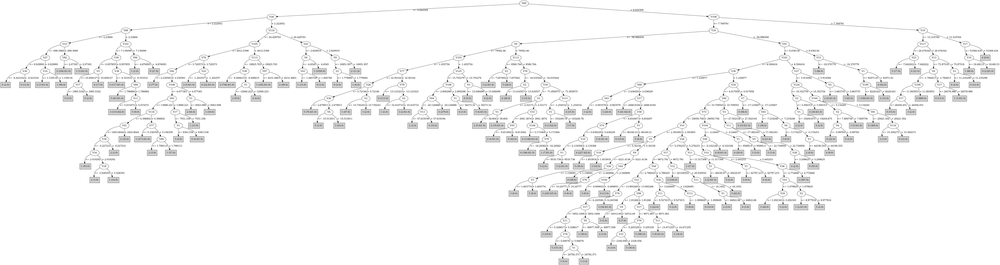

# J48

# SimpleCart Decision Tree

V69 < 9.644413499999999

* V86 < -3.8936270000000004

*   * V106 < 7.1890455

*   *   * V113 < 10955.4285: 2(8.0/1.0)

*   *   * V113 >= 10955.4285: 1(1213.0/4.0)

*   * V106 >= 7.1890455: 2(64.0/0.0)

* V86 >= -3.8936270000000004

*   * V105 < 3346.3141

*   *   * V68 < 2.9198755

*   *   *   * V84 < 2.9218915

*   *   *   *   * V97 < 801.5544

*   *   *   *   *   * V114 < 1.477131

*   *   *   *   *   *   * V17 < -113.233: 5(26.0/0.0)

*   *   *   *   *   *   * V17 >= -113.233

*   *   *   *   *   *   *   * V6 < -0.104447: 2(3.0/4.0)

*   *   *   *   *   *   *   * V6 >= -0.104447: 0(12.0/0.0)

*   *   *   *   *   * V114 >= 1.477131: 1(143.0/1.0)

*   *   *   *   * V97 >= 801.5544

*   *   *   *   *   * V40 < -1.0625689999999999

*   *   *   *   *   *   * V4 < 1.414825: 2(160.0/2.0)

*   *   *   *   *   *   * V4 >= 1.414825: 1(7.0/2.0)

*   *   *   *   *   * V40 >= -1.0625689999999999: 1(18.0/5.0)

*   *   *   * V84 >= 2.9218915: 1(284.0/8.0)

*   *   * V68 >= 2.9198755

*   *   *   * V10 < 3.3787529999999997

*   *   *   *   * V50 < 1.193559: 5(41.0/1.0)

*   *   *   *   * V50 >= 1.193559

*   *   *   *   *   * V3 < 2.772335

*   *   *   *   *   *   * V97 < 2080.66405: 3(121.0/2.0)

*   *   *   *   *   *   * V97 >= 2080.66405: 5(5.0/4.0)

*   *   *   *   *   * V3 >= 2.772335

*   *   *   *   *   *   * V32 < -3.624605: 4(15.0/4.0)

*   *   *   *   *   *   * V32 >= -3.624605: 0(34.0/0.0)

*   *   *   * V10 >= 3.3787529999999997

*   *   *   *   * V82 < 2.336172

*   *   *   *   *   * V75 < 2.8903695000000003: 5(138.0/1.0)

*   *   *   *   *   * V75 >= 2.8903695000000003: 3(10.0/3.0)

*   *   *   *   * V82 >= 2.336172

*   *   *   *   *   * V17 < 8084.42835: 0(12.0/4.0)

*   *   *   *   *   * V17 >= 8084.42835: 1(17.0/0.0)

*   * V105 >= 3346.3141

*   *   * V116 < 25.4404835

*   *   *   * V114 < 10.272036

*   *   *   *   * V105 < 3506.05515

*   *   *   *   *   * V20 < 3.7302359999999997: 2(25.0/0.0)

*   *   *   *   *   * V20 >= 3.7302359999999997: 1(9.0/1.0)

*   *   *   *   * V105 >= 3506.05515: 2(807.0/9.0)

*   *   *   * V114 >= 10.272036: 1(6.0/2.0)

*   *   * V116 >= 25.4404835: 1(6.0/4.0)

V69 >= 9.644413499999999

* V16 < -90.94385199999999

*   * V9 < 75388.3725

*   *   * V100 < 3.576415

*   *   *   * V6 < -21.932488499999998: 1(27.0/0.0)

*   *   *   * V6 >= -21.932488499999998

*   *   *   *   * V1 < 25493.625: 4(6.0/0.0)

*   *   *   *   * V1 >= 25493.625: 5(24.0/0.0)

*   *   * V100 >= 3.576415

*   *   *   * V5 < 21.308793: 3(7.0/0.0)

*   *   *   * V5 >= 21.308793: 0(74.0/0.0)

*   * V9 >= 75388.3725

*   *   * V76 < 94.116512

*   *   *   * V108 < 8.497733: 4(1358.0/14.0)

*   *   *   * V108 >= 8.497733: 0(7.0/4.0)

*   *   * V76 >= 94.116512

*   *   *   * V1 < 439886.75: 3(10.0/1.0)

*   *   *   * V1 >= 439886.75: 4(13.0/0.0)

* V16 >= -90.94385199999999

*   * V101 < 8.669140500000001

*   *   * V36 < 1.2319065

*   *   *   * V17 < 2689.5057500000003

*   *   *   *   * V11 < 2.480733: 3(25.0/1.0)

*   *   *   *   * V11 >= 2.480733: 5(39.0/1.0)

*   *   *   * V17 >= 2689.5057500000003

*   *   *   *   * V74 < 5.986532499999999

*   *   *   *   *   * V122 < 5.5172805: 4(441.0/7.0)

*   *   *   *   *   * V122 >= 5.5172805: 0(9.0/0.0)

*   *   *   *   * V74 >= 5.986532499999999: 5(28.0/3.0)

*   *   * V36 >= 1.2319065

*   *   *   * V78 < -3.968022

*   *   *   *   * V77 < 26.3564065

*   *   *   *   *   * V16 < -61.5184415

*   *   *   *   *   *   * V38 < -0.769559

*   *   *   *   *   *   *   * V2 < 5.999801: 3(9.0/0.0)

*   *   *   *   *   *   *   * V2 >= 5.999801: 5(9.0/1.0)

*   *   *   *   *   *   * V38 >= -0.769559

*   *   *   *   *   *   *   * V4 < 0.24013649999999997: 2(5.0/4.0)

*   *   *   *   *   *   *   * V4 >= 0.24013649999999997: 4(117.0/2.0)

*   *   *   *   *   * V16 >= -61.5184415

*   *   *   *   *   *   * V76 < 5.9812095: 5(40.0/1.0)

*   *   *   *   *   *   * V76 >= 5.9812095

*   *   *   *   *   *   *   * V34 < 4.1315145

*   *   *   *   *   *   *   *   * V96 < -3.1743180000000004

*   *   *   *   *   *   *   *   *   * V33 < 1955.8523

*   *   *   *   *   *   *   *   *   *   * V2 < 2.685064: 0(15.0/0.0)

*   *   *   *   *   *   *   *   *   *   * V2 >= 2.685064: 4(8.0/0.0)

*   *   *   *   *   *   *   *   *   * V33 >= 1955.8523

*   *   *   *   *   *   *   *   *   *   * V36 < 1.7798185000000002: 4(6.0/1.0)

*   *   *   *   *   *   *   *   *   *   * V36 >= 1.7798185000000002: 3(601.0/21.0)

*   *   *   *   *   *   *   *   * V96 >= -3.1743180000000004: 0(27.0/2.0)

*   *   *   *   *   *   *   * V34 >= 4.1315145

*   *   *   *   *   *   *   *   * V2 < 4.3752675: 2(14.0/0.0)

*   *   *   *   *   *   *   *   * V2 >= 4.3752675: 1(21.0/0.0)

*   *   *   *   * V77 >= 26.3564065

*   *   *   *   *   * V116 < 7.018585

*   *   *   *   *   *   * V17 < 7320.85135: 5(16.0/2.0)

*   *   *   *   *   *   * V17 >= 7320.85135: 3(6.0/2.0)

*   *   *   *   *   * V116 >= 7.018585

*   *   *   *   *   *   * V20 < 8.7600655: 0(143.0/12.0)

*   *   *   *   *   *   * V20 >= 8.7600655

*   *   *   *   *   *   *   * V18 < 10.449546000000002: 3(7.0/3.0)

*   *   *   *   *   *   *   * V18 >= 10.449546000000002: 1(9.0/0.0)

*   *   *   * V78 >= -3.968022

*   *   *   *   * V18 < 5.881755

*   *   *   *   *   * V12 < 17.625578500000003

*   *   *   *   *   *   * V81 < 6372.264300000001

*   *   *   *   *   *   *   * V11 < 5.5725305

*   *   *   *   *   *   *   *   * V124 < 5.8680345

*   *   *   *   *   *   *   *   *   * V81 < 303.9512: 5(11.0/0.0)

*   *   *   *   *   *   *   *   *   * V81 >= 303.9512: 3(106.0/5.0)

*   *   *   *   *   *   *   *   * V124 >= 5.8680345: 0(49.0/0.0)

*   *   *   *   *   *   *   * V11 >= 5.5725305

*   *   *   *   *   *   *   *   * V124 < 6.196322

*   *   *   *   *   *   *   *   *   * V73 < 25148.949999999997

*   *   *   *   *   *   *   *   *   *   * V12 < 9.1300185

*   *   *   *   *   *   *   *   *   *   *   * V28 < 2.539732: 5(13.0/0.0)

*   *   *   *   *   *   *   *   *   *   *   * V28 >= 2.539732: 3(8.0/0.0)

*   *   *   *   *   *   *   *   *   *   * V12 >= 9.1300185: 5(288.0/1.0)

*   *   *   *   *   *   *   *   *   * V73 >= 25148.949999999997: 4(6.0/4.0)

*   *   *   *   *   *   *   *   * V124 >= 6.196322

*   *   *   *   *   *   *   *   *   * V80 < -11.7879205: 3(32.0/1.0)

*   *   *   *   *   *   *   *   *   * V80 >= -11.7879205: 0(19.0/5.0)

*   *   *   *   *   *   * V81 >= 6372.264300000001

*   *   *   *   *   *   *   * V34 < 3.0993575

*   *   *   *   *   *   *   *   * V36 < 1.5440665: 4(10.0/2.0)

*   *   *   *   *   *   *   *   * V36 >= 1.5440665: 3(245.0/9.0)

*   *   *   *   *   *   *   * V34 >= 3.0993575

*   *   *   *   *   *   *   *   * V19 < 2.278292: 5(13.0/0.0)

*   *   *   *   *   *   *   *   * V19 >= 2.278292: 2(5.0/5.0)

*   *   *   *   *   * V12 >= 17.625578500000003

*   *   *   *   *   *   * V75 < 8.1222

*   *   *   *   *   *   *   * V68 < 11.30466

*   *   *   *   *   *   *   *   * V78 < -2.7601440000000004

*   *   *   *   *   *   *   *   *   * V35 < 0.7512179999999999: 4(10.0/0.0)

*   *   *   *   *   *   *   *   *   * V35 >= 0.7512179999999999: 3(9.0/3.0)

*   *   *   *   *   *   *   *   * V78 >= -2.7601440000000004: 5(48.0/2.0)

*   *   *   *   *   *   *   * V68 >= 11.30466: 5(533.0/2.0)

*   *   *   *   *   *   * V75 >= 8.1222

*   *   *   *   *   *   *   * V118 < -1.2666705

*   *   *   *   *   *   *   *   * V1 < 58299.315: 3(6.0/0.0)

*   *   *   *   *   *   *   *   * V1 >= 58299.315: 0(5.0/1.0)

*   *   *   *   *   *   *   * V118 >= -1.2666705: 4(18.0/1.0)

*   *   *   *   * V18 >= 5.881755

*   *   *   *   *   * V6 < -1.240577: 1(126.0/1.0)

*   *   *   *   *   * V6 >= -1.240577: 4(19.0/4.0)

*   * V101 >= 8.669140500000001

*   *   * V20 < 24.2705715

*   *   *   * V70 < -1.3383025000000002

*   *   *   *   * V101 < 11.41778

*   *   *   *   *   * V27 < 5.951397500000001

*   *   *   *   *   *   * V124 < 10.3580985: 3(16.0/2.0)

*   *   *   *   *   *   * V124 >= 10.3580985

*   *   *   *   *   *   *   * V16 < -60.959219: 0(4.0/6.0)

*   *   *   *   *   *   *   * V16 >= -60.959219: 0(315.0/5.0)

*   *   *   *   *   * V27 >= 5.951397500000001

*   *   *   *   *   *   * V84 < 16.3232885

*   *   *   *   *   *   *   * V42 < 4.441751999999999: 3(85.0/3.0)

*   *   *   *   *   *   *   * V42 >= 4.441751999999999: 0(5.0/6.0)

*   *   *   *   *   *   * V84 >= 16.3232885: 1(34.0/0.0)

*   *   *   *   * V101 >= 11.41778

*   *   *   *   *   * V117 < 26.4804325

*   *   *   *   *   *   * V17 < 22565.6065: 0(42.0/1.0)

*   *   *   *   *   *   * V17 >= 22565.6065: 3(10.0/2.0)

*   *   *   *   *   * V117 >= 26.4804325

*   *   *   *   *   *   * V109 < 11.089903499999998: 0(72.0/2.0)

*   *   *   *   *   *   * V109 >= 11.089903499999998: 0(870.0/0.0)

*   *   *   * V70 >= -1.3383025000000002

*   *   *   *   * V1 < 26409.6325: 2(11.0/1.0)

*   *   *   *   * V1 >= 26409.6325: 4(34.0/0.0)

*   *   * V20 >= 24.2705715

*   *   *   * V97 < 9083.2805: 1(102.0/0.0)

*   *   *   * V97 >= 9083.2805

*   *   *   *   * V2 < 15.208972500000002: 4(7.0/1.0)

*   *   *   *   * V2 >= 15.208972500000002: 0(27.0/0.0)

# PART

Decision list:

conditions|predicted class
---|---
V69 <= 9.644309 AND V26 > 2.222852 AND V116 > 24.428703 AND V43 <= 2.829919 AND V6 > -4.6545| 1 (1050.0)
V69 <= 7.178615 AND V89 > 522.5742 AND V105 > 4012.5398 AND V114 > 11.666159 AND V6 > -4.778643| 1 (43.0)
V69 <= 7.178615 AND V89 > 522.5742 AND V105 > 4012.5398 AND V84 <= 16.118742 AND V38 <= -0.401786 AND V113 <= 19265.305| 2 (726.0/1.0)
V9 > 107539.195 AND V41 > 2572.9062 AND V74 <= 16.894075 AND V75 <= 58.41081 AND V16 <= -96.1662 AND V21 <= 20.261461| 4 (1106.0)
V68 <= 3.583659 AND V89 > 569.5879 AND V94 > -0.206051 AND V39 <= -0.350667| 2 (58.0)
V68 <= 3.583659 AND V81 > 1390.5442 AND V73 <= 10750.478 AND V106 > 4.077361 AND V65 <= 7652.0483 AND V81 <= 24083.285| 2 (102.0)
V68 <= 2.884443 AND V41 > 324.7642 AND V6 > -0.130849 AND V82 <= 2.210124| 2 (53.0)
V101 > 8.500416 AND V13 > 81.80058 AND V12 <= 139.0218 AND V89 > 23455.768| 4 (182.0/1.0)
V101 > 8.500416 AND V20 <= 24.088308 AND V18 <= 10.315333 AND V125 > 24.322044 AND V79 <= -3.679728 AND V13 <= 62.520775 AND V109 > 11.083953| 0 (832.0)
V68 <= 2.884443 AND V41 > 324.7642 AND V1 <= 13151.758 AND V66 <= 2.706682 AND V84 > 3.452351 AND V44 <= 4.846018 AND V38 > -0.92209 AND V104 > -4.239151| 1 (255.0/1.0)
V68 <= 2.207299 AND V70 <= -0.094412 AND V105 <= 2061.26 AND V11 > 0.133874 AND V102 <= -0.090677 AND V80 > -5.202868| 1 (189.0)
V18 > 5.722772 AND V65 <= 44093.59 AND V82 > 5.380499 AND V98 <= 7.525444 AND V70 <= -1.196622 AND V26 > 6.266793| 1 (411.0/1.0)
V101 > 7.670523 AND V28 <= 15.798013 AND V81 <= 20771.98 AND V125 > 15.856837 AND V13 <= 65.838135 AND V91 <= 5.212412 AND V100 > 4.86185 AND V101 > 8.063326| 0 (435.0)
V106 > 4.608709 AND V9 <= 51581.125 AND V81 <= 29273.537| 2 (56.0/1.0)
V68 <= 2.409671 AND V70 <= -0.108406 AND V89 > 613.9468 AND V1 <= 15163.681 AND V41 > 671.501 AND V82 <= 5.119198 AND V52 <= 14.131865| 2 (103.0/1.0)
V101 <= 4.105489 AND V16 <= -26.96958 AND V66 <= 7.684093 AND V18 > 1.770294 AND V81 > 2823.8289 AND V100 <= 1.821776 AND V72 > -63.116505| 4 (449.0/1.0)
V106 > 4.608709 AND V9 <= 175476.48 AND V78 <= -12.69501| 0 (161.0)
V16 > -65.07192 AND V25 > 12691.58 AND V67 > 6.360666 AND V126 <= -3.754153 AND V116 <= 24.955372 AND V38 <= -0.655314 AND V72 > -47.51826 AND V106 <= 4.195125 AND V61 <= 27.56621| 3 (462.0/2.0)
V25 <= 12645.445 AND V100 > 1.215545 AND V69 <= 29.682833 AND V112 > -2.273042 AND V59 > 4.222125 AND V84 <= 6.477845| 3 (25.0)
V25 <= 12645.445 AND V100 > 1.215545 AND V69 <= 29.682833 AND V112 > -2.247744 AND V23 <= -0.546157 AND V1 <= 95651.805 AND V10 <= 10.83755| 0 (52.0/1.0)
V25 <= 12645.445 AND V100 > 1.215545 AND V69 <= 29.539057 AND V13 > 30.988771 AND V79 > -5.524643 AND V43 > 0.516775 AND V47 <= -0.835355 AND V68 > 9.96339| 5 (473.0)
V13 <= 30.957996 AND V105 <= 4356.705 AND V100 > 1.215545 AND V18 > 4.25879 AND V65 > 25075.074 AND V46 > -0.831448| 3 (66.0)
V89 <= 10840.038 AND V125 > 13.371098 AND V12 > 33.701065 AND V1 <= 99810.586| 4 (18.0)
V89 <= 10840.038 AND V125 > 12.833873 AND V66 > 3.79298 AND V104 <= -3.649763| 3 (76.0/1.0)
V125 <= 13.666332 AND V97 <= 3916.5215 AND V44 > 0.901104 AND V17 > 7407.68 AND V68 > 6.073882 AND V9 <= 51086.195 AND V10 <= 8.863896 AND V14 > -8.938599| 3 (229.0)
V25 <= 7427.182 AND V68 <= 1.984766 AND V34 > 1.35641| 1 (19.0)
V25 <= 7454.6714 AND V125 > 12.827671 AND V24 > -8.513998 AND V100 > 2.802987 AND V69 > 7.902026| 0 (83.0)
V25 <= 7454.6714 AND V44 > 0.901104 AND V12 > 10.327914 AND V110 <= -0.284022 AND V76 <= 7.760988 AND V67 > 2.762307 AND V17 <= 6789.539 AND V35 > 0.428196 AND V77 <= 11.028119| 5 (438.0/1.0)
V25 <= 7454.6714 AND V44 > 0.901104 AND V82 > 1.094953 AND V10 > 3.686431 AND V20 <= 2.655085 AND V56 <= -3.015284| 5 (157.0)
V25 <= 7454.6714 AND V82 <= 1.094953 AND V37 > 2.412311| 5 (91.0)
V25 <= 7454.6714 AND V82 > 3.935474 AND V2 > 5.58713 AND V104 <= -1.410677| 5 (20.0)
V13 <= 25.847761 AND V82 > 4.419506 AND V3 <= 10.460984 AND V7 > -38.599262 AND V40 <= -2.463139| 1 (45.0)
V13 <= 25.847761 AND V22 <= -3.095133 AND V34 <= 3.280452| 2 (24.0)
V13 <= 25.847761 AND V36 > 1.018882 AND V79 > -9.857946 AND V66 > 1.267154 AND V26 <= 3.87594 AND V36 > 1.210626 AND V35 <= 1.187256 AND V84 > 1.551495 AND V80 > -32.924915 AND V11 <= 5.572333 AND V43 <= 0.710804| 3 (265.0)
V28 > 13.467744 AND V14 > -24.089706 AND V107 <= 2.530885| 1 (25.0)
V9 > 67849.98 AND V101 <= 11.957766 AND V96 <= -4.623233 AND V66 <= 10.847048 AND V45 <= 6.827563 AND V7 <= -0.257109 AND V18 > 2.681873 AND V73 > 29423.188 AND V112 > -6.018322 AND V100 <= 5.236425| 4 (184.0/1.0)
V125 > 15.282786 AND V9 <= 84526.17 AND V36 > 3.02922 AND V10 <= 8.67523 AND V4 > 11.223953| 0 (116.0/1.0)
V66 <= 1.263056 AND V30 <= -0.229475 AND V1 > -35.6889| 0 (33.0)
V92 > 11.731769 AND V9 > 109579.7 AND V34 <= 6.883886| 4 (13.0)
V60 > 24.818417 AND V24 > -34.056927| 0 (12.0/1.0)
V4 <= 0.732449 AND V31 <= -1.711909 AND V25 <= 14102.415| 4 (14.0/1.0)
V5 <= 3.216622 AND V25 > 8018.875| 2 (10.0)
V21 <= 1.723768 AND V1 <= 39198.14 AND V29 <= 2.128537| 0 (13.0)
V36 <= 1.758454 AND V98 > 1.164475 AND V17 <= 2676.5571 AND V69 > 7.537822 AND V13 > 14.389078| 5 (38.0)
V36 <= 1.758454 AND V2 > 1.511131 AND V17 > 1776.8999 AND V112 <= -1.870396 AND V74 > 1.813524 AND V93 <= 6.010483 AND V38 > -0.390366| 4 (68.0)
V89 > 27154.299 AND V19 <= 13.02027| 4 (10.0)
V69 > 9.744154 AND V13 <= 22.383793 AND V122 <= 4.558783 AND V111 <= -0.33085 AND V77 > 7.994876 AND V8 > -18.741884| 3 (115.0/1.0)
V42 <= 1.942488 AND V39 > -1.167993 AND V17 > 1776.8999 AND V22 > -2.28697 AND V1 > 3287.3525 AND V104 <= -3.028032| 4 (38.0/1.0)
V78 > -4.23314 AND V69 <= 6.649688 AND V1 <= 13103.69| 1 (5.0)
V78 > -4.23314 AND V25 <= 16010.856 AND V109 > 3.396117 AND V9 > 49403.957 AND V22 <= -2.068483| 5 (18.0)
V17 <= 8887.3125 AND V69 <= 29.1585 AND V112 <= -1.787365 AND V76 <= 9.463565 AND V46 <= -0.430878 AND V66 > 2.413233| 5 (50.0)
V21 <= 1.692951 AND V112 <= -1.379908 AND V1 > 33240.68| 5 (6.0)
V35 > 0.739499 AND V77 <= 22.978703 AND V71 <= -4.013536 AND V1 <= 78837.59 AND V37 > 3.797414| 3 (85.0)
V75 <= 33.10398 AND V6 > -22.576235 AND V32 > -9.656554 AND V78 <= -3.379523 AND V32 <= -1.544151 AND V15 > -20.494001 AND V66 <= 8.187253| 0 (27.0/1.0)
V82 > 5.357378 AND V40 <= -4.215831 AND V17 > 12895.136| 1 (5.0)
V82 > 5.357378 AND V9 > 76963.46 AND V2 <= 22.876375 AND V104 > -5.385416| 3 (25.0)
V82 > 5.387678 AND V11 <= 23.58437| 0 (8.0)
V17 > 12820.853 AND V65 > 80090.64| 4 (10.0)
V17 > 12820.853 AND V32 <= -10.174201| 2 (9.0/1.0)
V65 <= 6549.861 AND V1 <= 2744.5056| 3 (4.0)
V2 <= 1.644067 AND V1 <= 2314.2578| 5 (3.0)
V15 > -5.550718 AND V1 > 15301.51| 4 (3.0)
V7 > -29.661362 AND V38 <= -0.180877 AND V23 <= -2.665381 AND V47 <= -0.85647| 3 (6.0)
V16 <= -58.207745| 4 (9.0/1.0)
V38 <= -0.180877 AND V16 <= -27.521496| 5 (8.0)
V38 <= -0.180877 AND V5 <= 14.968968| 3 (6.0)
V5 <= 15.358391 AND V1 <= 54950.5| 2 (2.0/1.0)
V1 > 67660.12| 4 (3.0/1.0)
| 5 (2.0)

# JRip

Decision list:

conditions|predicted class
---|---
(V69 <= 7.689031) and (V116 <= 21.074995) and (V105 >= 3787.3572) and (V113 <= 19270.8) and (V35 >= 0.597147) and (V65 >= 1595.4014)|2 (704.0/0.0)
(V66 <= 1.645832) and (V34 >= 2.986946) and (V114 <= 10.408455) and (V72 <= -3.396876)|2 (141.0/0.0)
(V124 <= 2.811198) and (V5 <= 3.065605) and (V105 >= 1226.553) and (V70 >= -0.727347)|2 (98.0/0.0)
(V66 <= 2.087819) and (V98 >= 5.29615) and (V17 <= 29684.102)|2 (46.0/0.0)
(V124 <= 1.698953) and (V94 >= -0.206932) and (V93 >= 3.919889)|2 (41.0/0.0)
(V2 <= 2.018226) and (V42 >= 1.906547) and (V124 <= 3.610163) and (V118 >= -1.370967) and (V106 >= 2.003897)|2 (30.0/0.0)
(V46 <= -2.992406) and (V7 >= -12.868593)|2 (18.0/0.0)
(V69 <= 9.028212) and (V11 >= 7.415378) and (V41 >= 3258.851) and (V81 <= 26771.4)|2 (16.0/0.0)
(V4 <= 1.406442) and (V126 >= -0.265739) and (V17 >= 2481.6125)|2 (10.0/0.0)
(V17 <= 8936.711) and (V10 >= 3.319148) and (V28 <= 4.290496) and (V12 >= 14.280306) and (V77 <= 13.580423) and (V44 >= 1.336125)|5 (475.0/0.0)
(V17 <= 11947.32) and (V10 >= 6.700687) and (V36 <= 2.604805) and (V74 <= 4.880461) and (V44 >= 1.419941) and (V38 <= -0.388554)|5 (256.0/0.0)
(V17 <= 7007.816) and (V89 >= 6398.8887) and (V113 <= 10189.882) and (V33 <= 2557.9207)|5 (101.0/0.0)
(V17 <= 7007.816) and (V84 <= 2.149532) and (V108 >= 1.188432) and (V11 >= 3.563508) and (V82 <= 2.161015) and (V29 <= 6.749009)|5 (152.0/0.0)
(V17 <= 7237.745) and (V82 <= 1.082284) and (V9 >= 185.9482)|5 (70.0/0.0)
(V17 <= 8690.801) and (V12 >= 20.478216) and (V43 <= 0.877094) and (V125 >= 8.255101)|5 (60.0/0.0)
(V25 <= 6469.0854) and (V66 >= 6.455259) and (V124 <= 6.956255) and (V13 >= 13.334386)|5 (78.0/0.0)
(V18 <= 2.541482) and (V10 >= 3.015909) and (V11 >= 15.091496) and (V3 <= 15.150329)|5 (20.0/0.0)
(V26 <= 1.85835) and (V12 >= 9.452164) and (V80 >= -13.047431) and (V10 >= 3.230007)|5 (27.0/0.0)
(V82 <= 4.351553) and (V58 >= 4.590334) and (V121 >= 19766.6)|5 (16.0/0.0)
(V28 <= 5.465192) and (V92 >= 5.101714) and (V36 <= 2.338239)|5 (9.0/0.0)
(V83 <= 2.517437) and (V2 >= 4.673428) and (V77 <= 11.003462) and (V3 >= 6.007898) and (V8 <= -11.136031)|5 (13.0/0.0)
(V26 <= 1.916465) and (V15 <= -7.309467) and (V72 >= -18.541105) and (V112 >= -3.04949)|5 (11.0/0.0)
(V117 <= 21.242146) and (V16 >= -56.3528) and (V36 >= 1.584257) and (V14 <= -5.331019) and (V77 <= 26.353146) and (V24 <= -3.647883) and (V45 >= 4.43605) and (V121 >= 12967.085) and (V17 <= 24413.014)|3 (473.0/0.0)
(V92 <= 6.111964) and (V101 >= 4.204153) and (V13 <= 28.969372) and (V70 <= -2.153067) and (V79 >= -5.868849) and (V106 <= 3.272846) and (V16 >= -32.9298) and (V77 >= 7.224572)|3 (255.0/0.0)
(V92 <= 6.111964) and (V101 >= 4.103765) and (V13 <= 28.969372) and (V100 >= 1.942734) and (V32 <= -4.461324) and (V116 <= 9.723161) and (V109 <= 5.122249) and (V36 >= 1.465496)|3 (146.0/0.0)
(V117 <= 22.290869) and (V66 >= 6.016686) and (V82 <= 4.833234) and (V16 <= -16.59625) and (V36 <= 4.229482)|3 (130.0/0.0)
(V117 <= 26.478342) and (V90 <= 1.1953) and (V49 >= 640.9546) and (V3 <= 3.082156)|3 (67.0/0.0)
(V117 <= 26.478342) and (V44 >= 5.082803) and (V19 >= 6.587475) and (V1 <= 108278.93)|3 (82.0/0.0)
(V116 <= 17.341248) and (V10 <= 2.833192) and (V39 <= -1.104593) and (V76 <= 12.965664) and (V14 <= -4.018855) and (V38 <= -0.573933)|3 (74.0/0.0)
(V125 <= 15.709651) and (V66 >= 8.125101) and (V67 >= 42.217796) and (V1 <= 390137.6)|3 (18.0/0.0)
(V90 <= 2.078728) and (V36 >= 1.021043) and (V85 <= 5.198751) and (V93 <= 4.4943)|3 (31.0/0.0)
(V125 <= 15.709651) and (V109 >= 5.171739) and (V77 <= 14.54135) and (V71 <= -7.040894) and (V14 >= -9.164059)|3 (22.0/0.0)
(V128 >= -4.23012) and (V36 >= 1.241181) and (V124 <= 5.278567) and (V21 >= 3.26854) and (V72 >= -36.149776)|3 (20.0/0.0)
(V74 >= 5.931771) and (V125 <= 21.096132) and (V65 <= 67222.414) and (V13 >= 32.056038)|3 (19.0/0.0)
(V66 >= 6.830145) and (V9 <= 112278.33) and (V101 >= 10.306337) and (V81 <= 32489.715)|0 (795.0/0.0)
(V37 >= 5.832755) and (V25 <= 17993.23) and (V11 <= 20.145905) and (V69 >= 8.638832) and (V124 >= 11.696225)|0 (394.0/0.0)
(V66 >= 13.548265) and (V9 <= 173916.14) and (V78 <= -12.487571)|0 (225.0/0.0)
(V24 >= -8.401164) and (V100 >= 2.64194) and (V115 <= 5.966785) and (V9 <= 26065.828) and (V10 <= 4.996878)|0 (129.0/0.0)
(V96 >= -3.158758) and (V110 <= -0.529323) and (V108 >= 1.559006) and (V18 <= 5.968133)|0 (36.0/0.0)
(V27 <= 5.298219) and (V44 >= 2.696617) and (V13 <= 56.248314) and (V1 >= 44102.902) and (V11 <= 25.901136)|0 (55.0/0.0)
(V85 <= 2.34365) and (V8 >= -13.448491) and (V104 <= -0.796802)|0 (25.0/0.0)
(V16 >= -90.915764) and (V47 <= -1.265465) and (V79 <= -17.544216)|0 (53.0/0.0)
(V17 <= 11650.17) and (V44 >= 1.599333) and (V102 <= -0.733558) and (V39 >= -1.541623) and (V9 <= 38568.227)|0 (17.0/0.0)
(V9 <= 34337.848) and (V82 >= 4.481035) and (V42 <= 3.471338) and (V43 >= 0.571755)|1 (1097.0/0.0)
(V9 <= 35559.957) and (V82 >= 5.940642) and (V29 <= 661.2883)|1 (473.0/0.0)
(V76 <= 1.185357) and (V1 >= 263.3377) and (V34 <= 2.032437)|1 (252.0/0.0)
(V77 <= 11.000267) and (V114 >= 3.806977) and (V20 >= 14.040763) and (V30 >= -8.865161)|1 (92.0/0.0)
(V76 <= 2.300551) and (V84 >= 2.932392) and (V10 >= 2.541911)|1 (32.0/0.0)
(V26 >= 7.99571) and (V9 <= 118157.01) and (V105 <= 7539.973)|1 (70.0/0.0)
(V68 <= 2.643688) and (V12 <= 2.200009) and (V72 >= -4.92489)|1 (19.0/0.0)
|4 (2244.0/140.0)

# Decision Table

Non matches covered by Majority class

v9|v76|v82|target
---|---|---|---
(40467.8085-45121.1035]|(92.871767-131.34123]|(23.677244-inf)|0
(174715.29-inf)|(79.904792-92.871767]|(23.677244-inf)|4
(26598.711-28634.8125]|(43.555543-79.904792]|(23.677244-inf)|0
(86001.02-112423.3225]|(43.555543-79.904792]|(23.677244-inf)|0
(174715.29-inf)|(92.871767-131.34123]|(15.996621-23.677244]|0
(174715.29-inf)|(43.555543-79.904792]|(23.677244-inf)|4
(86001.02-112423.3225]|(33.034512-43.555543]|(23.677244-inf)|0
(174715.29-inf)|(131.34123-inf)|(10.792167-15.996621]|4
(174715.29-inf)|(79.904792-92.871767]|(15.996621-23.677244]|4
(76567.4875-86001.02]|(23.246513-33.034512]|(23.677244-inf)|0
(18718.768-25319.978]|(43.555543-79.904792]|(15.996621-23.677244]|0
(67998.518-75009.85]|(23.246513-33.034512]|(23.677244-inf)|0
(174715.29-inf)|(92.871767-131.34123]|(10.792167-15.996621]|3
(174715.29-inf)|(43.555543-79.904792]|(15.996621-23.677244]|4
(86001.02-112423.3225]|(33.034512-43.555543]|(15.996621-23.677244]|0
(112423.3225-174715.29]|(79.904792-92.871767]|(10.792167-15.996621]|0
(18718.768-25319.978]|(33.034512-43.555543]|(15.996621-23.677244]|0
(174715.29-inf)|(33.034512-43.555543]|(15.996621-23.677244]|4
(112423.3225-174715.29]|(33.034512-43.555543]|(15.996621-23.677244]|0
(9674.953-11903.037]|(33.034512-43.555543]|(15.996621-23.677244]|0
(76567.4875-86001.02]|(23.246513-33.034512]|(15.996621-23.677244]|0
(86001.02-112423.3225]|(43.555543-79.904792]|(10.792167-15.996621]|0
(174715.29-inf)|(92.871767-131.34123]|(8.1188-10.792167]|4
(112423.3225-174715.29]|(43.555543-79.904792]|(10.792167-15.996621]|0
(174715.29-inf)|(43.555543-79.904792]|(10.792167-15.996621]|4
(76567.4875-86001.02]|(33.034512-43.555543]|(10.792167-15.996621]|0
(112423.3225-174715.29]|(33.034512-43.555543]|(10.792167-15.996621]|0
(174715.29-inf)|(33.034512-43.555543]|(10.792167-15.996621]|4
(174715.29-inf)|(79.904792-92.871767]|(8.1188-10.792167]|3
(86001.02-112423.3225]|(33.034512-43.555543]|(10.792167-15.996621]|0
(112423.3225-174715.29]|(23.246513-33.034512]|(10.792167-15.996621]|1
(18718.768-25319.978]|(21.630187-22.715899]|(15.996621-23.677244]|0
(76567.4875-86001.02]|(23.246513-33.034512]|(10.792167-15.996621]|0
(75422.265-76567.4875]|(23.246513-33.034512]|(10.792167-15.996621]|0
(86001.02-112423.3225]|(23.246513-33.034512]|(10.792167-15.996621]|3
(112423.3225-174715.29]|(43.555543-79.904792]|(8.1188-10.792167]|4
(174715.29-inf)|(23.246513-33.034512]|(10.792167-15.996621]|4
(76567.4875-86001.02]|(21.630187-22.715899]|(15.996621-23.677244]|0
(86001.02-112423.3225]|(43.555543-79.904792]|(8.1188-10.792167]|0
(174715.29-inf)|(43.555543-79.904792]|(8.1188-10.792167]|4
(67998.518-75009.85]|(33.034512-43.555543]|(8.1188-10.792167]|0
(174715.29-inf)|(79.904792-92.871767]|(7.614785-8.1188]|0
(75422.265-76567.4875]|(22.715899-23.246513]|(10.792167-15.996621]|0
(112423.3225-174715.29]|(22.715899-23.246513]|(10.792167-15.996621]|4
(58776.277-67998.518]|(33.034512-43.555543]|(8.1188-10.792167]|0
(112423.3225-174715.29]|(33.034512-43.555543]|(8.1188-10.792167]|4
(86001.02-112423.3225]|(33.034512-43.555543]|(8.1188-10.792167]|0
(174715.29-inf)|(33.034512-43.555543]|(8.1188-10.792167]|4
(76567.4875-86001.02]|(33.034512-43.555543]|(8.1188-10.792167]|0
(174715.29-inf)|(43.555543-79.904792]|(7.614785-8.1188]|4
(112423.3225-174715.29]|(21.630187-22.715899]|(10.792167-15.996621]|0
(76567.4875-86001.02]|(21.630187-22.715899]|(10.792167-15.996621]|1
(75422.265-76567.4875]|(12.610126-19.33927]|(23.677244-inf)|0
(86001.02-112423.3225]|(23.246513-33.034512]|(8.1188-10.792167]|0
(112423.3225-174715.29]|(43.555543-79.904792]|(7.614785-8.1188]|4
(76567.4875-86001.02]|(23.246513-33.034512]|(8.1188-10.792167]|0
(75422.265-76567.4875]|(23.246513-33.034512]|(8.1188-10.792167]|0
(58776.277-67998.518]|(23.246513-33.034512]|(8.1188-10.792167]|0
(112423.3225-174715.29]|(23.246513-33.034512]|(8.1188-10.792167]|4
(67998.518-75009.85]|(23.246513-33.034512]|(8.1188-10.792167]|0
(25319.978-26197.3085]|(19.33927-19.807991]|(15.996621-23.677244]|0
(76567.4875-86001.02]|(21.214063-21.630187]|(10.792167-15.996621]|0
(58776.277-67998.518]|(33.034512-43.555543]|(7.614785-8.1188]|0
(112423.3225-174715.29]|(22.715899-23.246513]|(8.1188-10.792167]|4
(86001.02-112423.3225]|(33.034512-43.555543]|(7.614785-8.1188]|0
(76567.4875-86001.02]|(22.715899-23.246513]|(8.1188-10.792167]|0
(174715.29-inf)|(33.034512-43.555543]|(7.614785-8.1188]|0
(76567.4875-86001.02]|(12.610126-19.33927]|(15.996621-23.677244]|0
(174715.29-inf)|(23.246513-33.034512]|(7.614785-8.1188]|0
(58776.277-67998.518]|(23.246513-33.034512]|(7.614785-8.1188]|0
(86001.02-112423.3225]|(21.630187-22.715899]|(8.1188-10.792167]|0
(18718.768-25319.978]|(12.610126-19.33927]|(15.996621-23.677244]|1
(67998.518-75009.85]|(21.630187-22.715899]|(8.1188-10.792167]|0
(14540.0495-17952.3135]|(12.610126-19.33927]|(15.996621-23.677244]|0
(86001.02-112423.3225]|(19.807991-21.214063]|(10.792167-15.996621]|0
(30456.741-37475.475]|(12.610126-19.33927]|(15.996621-23.677244]|0
(112423.3225-174715.29]|(43.555543-79.904792]|(6.224604-7.614785]|3
(112423.3225-174715.29]|(21.630187-22.715899]|(8.1188-10.792167]|4
(76567.4875-86001.02]|(23.246513-33.034512]|(7.614785-8.1188]|0
(67998.518-75009.85]|(23.246513-33.034512]|(7.614785-8.1188]|0
(112423.3225-174715.29]|(23.246513-33.034512]|(7.614785-8.1188]|4
(86001.02-112423.3225]|(23.246513-33.034512]|(7.614785-8.1188]|3
(174715.29-inf)|(43.555543-79.904792]|(6.224604-7.614785]|4
(67998.518-75009.85]|(19.33927-19.807991]|(10.792167-15.996621]|0
(18718.768-25319.978]|(9.048738-11.297193]|(23.677244-inf)|0
(76567.4875-86001.02]|(33.034512-43.555543]|(6.224604-7.614785]|0
(18718.768-25319.978]|(11.896296-12.610126]|(15.996621-23.677244]|0
(86001.02-112423.3225]|(33.034512-43.555543]|(6.224604-7.614785]|0
(112423.3225-174715.29]|(21.214063-21.630187]|(8.1188-10.792167]|4
(112423.3225-174715.29]|(22.715899-23.246513]|(7.614785-8.1188]|4
(28634.8125-30456.741]|(9.048738-11.297193]|(23.677244-inf)|0
(76567.4875-86001.02]|(22.715899-23.246513]|(7.614785-8.1188]|3
(67998.518-75009.85]|(33.034512-43.555543]|(6.224604-7.614785]|0
(174715.29-inf)|(33.034512-43.555543]|(6.224604-7.614785]|4
(58776.277-67998.518]|(22.715899-23.246513]|(7.614785-8.1188]|0
(58776.277-67998.518]|(21.630187-22.715899]|(7.614785-8.1188]|0
(18718.768-25319.978]|(23.246513-33.034512]|(6.224604-7.614785]|0
(174715.29-inf)|(19.807991-21.214063]|(8.1188-10.792167]|0
(76567.4875-86001.02]|(12.610126-19.33927]|(10.792167-15.996621]|3
(45121.1035-53196.615]|(12.610126-19.33927]|(10.792167-15.996621]|0
(58776.277-67998.518]|(12.610126-19.33927]|(10.792167-15.996621]|1
(57482.672-58776.277]|(12.610126-19.33927]|(10.792167-15.996621]|1
(75422.265-76567.4875]|(21.630187-22.715899]|(7.614785-8.1188]|0
(11903.037-14540.0495]|(11.297193-11.896296]|(15.996621-23.677244]|0
(9674.953-11903.037]|(23.246513-33.034512]|(6.224604-7.614785]|0
(67998.518-75009.85]|(19.807991-21.214063]|(8.1188-10.792167]|0
(112423.3225-174715.29]|(21.630187-22.715899]|(7.614785-8.1188]|0
(53196.615-57482.672]|(12.610126-19.33927]|(10.792167-15.996621]|1
(67998.518-75009.85]|(21.630187-22.715899]|(7.614785-8.1188]|0
(17952.3135-18718.768]|(8.650222-9.048738]|(23.677244-inf)|0
(174715.29-inf)|(23.246513-33.034512]|(6.224604-7.614785]|4
(174715.29-inf)|(43.555543-79.904792]|(5.94546-6.224604]|4
(58776.277-67998.518]|(23.246513-33.034512]|(6.224604-7.614785]|0
(112423.3225-174715.29]|(19.807991-21.214063]|(8.1188-10.792167]|4
(112423.3225-174715.29]|(23.246513-33.034512]|(6.224604-7.614785]|4
(76567.4875-86001.02]|(19.807991-21.214063]|(8.1188-10.792167]|3
(76567.4875-86001.02]|(23.246513-33.034512]|(6.224604-7.614785]|0
(86001.02-112423.3225]|(23.246513-33.034512]|(6.224604-7.614785]|3
(67998.518-75009.85]|(23.246513-33.034512]|(6.224604-7.614785]|0
(58776.277-67998.518]|(22.715899-23.246513]|(6.224604-7.614785]|0
(53196.615-57482.672]|(22.715899-23.246513]|(6.224604-7.614785]|0
(58776.277-67998.518]|(11.896296-12.610126]|(10.792167-15.996621]|0
(174715.29-inf)|(33.034512-43.555543]|(5.94546-6.224604]|4
(76567.4875-86001.02]|(21.214063-21.630187]|(7.614785-8.1188]|3
(112423.3225-174715.29]|(22.715899-23.246513]|(6.224604-7.614785]|0
(67998.518-75009.85]|(22.715899-23.246513]|(6.224604-7.614785]|0
(112423.3225-174715.29]|(19.33927-19.807991]|(8.1188-10.792167]|4
(76567.4875-86001.02]|(22.715899-23.246513]|(6.224604-7.614785]|3
(76567.4875-86001.02]|(21.630187-22.715899]|(6.224604-7.614785]|0
(67998.518-75009.85]|(23.246513-33.034512]|(5.94546-6.224604]|0
(174715.29-inf)|(23.246513-33.034512]|(5.94546-6.224604]|0
(45121.1035-53196.615]|(11.297193-11.896296]|(10.792167-15.996621]|0
(67998.518-75009.85]|(19.807991-21.214063]|(7.614785-8.1188]|0
(57482.672-58776.277]|(23.246513-33.034512]|(5.94546-6.224604]|0
(53196.615-57482.672]|(23.246513-33.034512]|(5.94546-6.224604]|0
(86001.02-112423.3225]|(23.246513-33.034512]|(5.94546-6.224604]|0
(75422.265-76567.4875]|(12.610126-19.33927]|(8.1188-10.792167]|3
(112423.3225-174715.29]|(19.807991-21.214063]|(7.614785-8.1188]|4
(76567.4875-86001.02]|(23.246513-33.034512]|(5.94546-6.224604]|0
(58776.277-67998.518]|(23.246513-33.034512]|(5.94546-6.224604]|0
(174715.29-inf)|(43.555543-79.904792]|(5.81824-5.94546]|4
(58776.277-67998.518]|(12.610126-19.33927]|(8.1188-10.792167]|3
(112423.3225-174715.29]|(12.610126-19.33927]|(8.1188-10.792167]|4
(67998.518-75009.85]|(12.610126-19.33927]|(8.1188-10.792167]|3
(112423.3225-174715.29]|(23.246513-33.034512]|(5.94546-6.224604]|4
(76567.4875-86001.02]|(12.610126-19.33927]|(8.1188-10.792167]|3
(67998.518-75009.85]|(21.630187-22.715899]|(6.224604-7.614785]|0
(112423.3225-174715.29]|(21.630187-22.715899]|(6.224604-7.614785]|4
(45121.1035-53196.615]|(11.896296-12.610126]|(8.1188-10.792167]|0
(14540.0495-17952.3135]|(5.644241-8.650222]|(15.996621-23.677244]|1
(18718.768-25319.978]|(5.644241-8.650222]|(15.996621-23.677244]|0
(76567.4875-86001.02]|(9.048738-11.297193]|(10.792167-15.996621]|0
(58776.277-67998.518]|(9.048738-11.297193]|(10.792167-15.996621]|0
(17952.3135-18718.768]|(5.644241-8.650222]|(15.996621-23.677244]|0
(112423.3225-174715.29]|(22.715899-23.246513]|(5.94546-6.224604]|0
(67998.518-75009.85]|(21.214063-21.630187]|(6.224604-7.614785]|0
(53196.615-57482.672]|(9.048738-11.297193]|(10.792167-15.996621]|1
(112423.3225-174715.29]|(21.214063-21.630187]|(6.224604-7.614785]|4
(174715.29-inf)|(33.034512-43.555543]|(5.81824-5.94546]|4
(76567.4875-86001.02]|(22.715899-23.246513]|(5.94546-6.224604]|3
(45121.1035-53196.615]|(9.048738-11.297193]|(10.792167-15.996621]|0
(58776.277-67998.518]|(19.33927-19.807991]|(7.614785-8.1188]|0
(76567.4875-86001.02]|(21.214063-21.630187]|(6.224604-7.614785]|3
(58776.277-67998.518]|(23.246513-33.034512]|(5.81824-5.94546]|0
(112423.3225-174715.29]|(43.555543-79.904792]|(5.584514-5.81824]|0
(45121.1035-53196.615]|(11.297193-11.896296]|(8.1188-10.792167]|0
(112423.3225-174715.29]|(12.610126-19.33927]|(7.614785-8.1188]|4
(45121.1035-53196.615]|(8.650222-9.048738]|(10.792167-15.996621]|0
(76567.4875-86001.02]|(23.246513-33.034512]|(5.81824-5.94546]|0
(112423.3225-174715.29]|(23.246513-33.034512]|(5.81824-5.94546]|4
(86001.02-112423.3225]|(23.246513-33.034512]|(5.81824-5.94546]|3
(67998.518-75009.85]|(23.246513-33.034512]|(5.81824-5.94546]|0
(76567.4875-86001.02]|(8.650222-9.048738]|(10.792167-15.996621]|0
(57482.672-58776.277]|(19.807991-21.214063]|(6.224604-7.614785]|0
(58776.277-67998.518]|(12.610126-19.33927]|(7.614785-8.1188]|0
(67998.518-75009.85]|(12.610126-19.33927]|(7.614785-8.1188]|3
(75422.265-76567.4875]|(21.630187-22.715899]|(5.94546-6.224604]|0
(174715.29-inf)|(23.246513-33.034512]|(5.81824-5.94546]|0
(58776.277-67998.518]|(19.807991-21.214063]|(6.224604-7.614785]|0
(86001.02-112423.3225]|(11.297193-11.896296]|(8.1188-10.792167]|0
(112423.3225-174715.29]|(19.807991-21.214063]|(6.224604-7.614785]|4
(67998.518-75009.85]|(19.807991-21.214063]|(6.224604-7.614785]|0
(67998.518-75009.85]|(19.33927-19.807991]|(6.224604-7.614785]|0
(58776.277-67998.518]|(11.896296-12.610126]|(7.614785-8.1188]|3
(86001.02-112423.3225]|(33.034512-43.555543]|(5.584514-5.81824]|0
(14540.0495-17952.3135]|(5.644241-8.650222]|(10.792167-15.996621]|0
(25319.978-26197.3085]|(5.644241-8.650222]|(10.792167-15.996621]|0
(57482.672-58776.277]|(19.33927-19.807991]|(6.224604-7.614785]|0
(45121.1035-53196.615]|(5.644241-8.650222]|(10.792167-15.996621]|1
(67998.518-75009.85]|(9.048738-11.297193]|(8.1188-10.792167]|0
(18718.768-25319.978]|(5.644241-8.650222]|(10.792167-15.996621]|2
(67998.518-75009.85]|(5.644241-8.650222]|(10.792167-15.996621]|1
(58776.277-67998.518]|(5.644241-8.650222]|(10.792167-15.996621]|0
(14540.0495-17952.3135]|(4.916257-5.406332]|(15.996621-23.677244]|1
(112423.3225-174715.29]|(19.33927-19.807991]|(6.224604-7.614785]|4
(112423.3225-174715.29]|(21.214063-21.630187]|(5.94546-6.224604]|0
(37475.475-38205.11]|(5.644241-8.650222]|(10.792167-15.996621]|1
(45121.1035-53196.615]|(9.048738-11.297193]|(8.1188-10.792167]|1
(26598.711-28634.8125]|(5.644241-8.650222]|(10.792167-15.996621]|1
(40467.8085-45121.1035]|(5.644241-8.650222]|(10.792167-15.996621]|1
(53196.615-57482.672]|(9.048738-11.297193]|(8.1188-10.792167]|0
(38205.11-40467.8085]|(5.644241-8.650222]|(10.792167-15.996621]|1
(18718.768-25319.978]|(4.916257-5.406332]|(15.996621-23.677244]|1
(53196.615-57482.672]|(19.33927-19.807991]|(6.224604-7.614785]|0
(30456.741-37475.475]|(5.644241-8.650222]|(10.792167-15.996621]|1
(174715.29-inf)|(33.034512-43.555543]|(5.584514-5.81824]|4
(58776.277-67998.518]|(19.33927-19.807991]|(6.224604-7.614785]|0
(28634.8125-30456.741]|(5.644241-8.650222]|(10.792167-15.996621]|1
(45121.1035-53196.615]|(19.807991-21.214063]|(5.94546-6.224604]|0
(45121.1035-53196.615]|(12.610126-19.33927]|(6.224604-7.614785]|0
(53196.615-57482.672]|(8.650222-9.048738]|(8.1188-10.792167]|0
(26598.711-28634.8125]|(5.406332-5.644241]|(10.792167-15.996621]|0
(28634.8125-30456.741]|(5.406332-5.644241]|(10.792167-15.996621]|1
(76567.4875-86001.02]|(23.246513-33.034512]|(5.584514-5.81824]|0
(174715.29-inf)|(23.246513-33.034512]|(5.584514-5.81824]|4
(67998.518-75009.85]|(19.807991-21.214063]|(5.94546-6.224604]|0
(58776.277-67998.518]|(19.807991-21.214063]|(5.94546-6.224604]|0
(11903.037-14540.0495]|(4.325784-4.916257]|(15.996621-23.677244]|0
(174715.29-inf)|(43.555543-79.904792]|(5.479812-5.584514]|4
(53196.615-57482.672]|(12.610126-19.33927]|(6.224604-7.614785]|0
(86001.02-112423.3225]|(12.610126-19.33927]|(6.224604-7.614785]|4
(76567.4875-86001.02]|(12.610126-19.33927]|(6.224604-7.614785]|1
(57482.672-58776.277]|(12.610126-19.33927]|(6.224604-7.614785]|0
(112423.3225-174715.29]|(19.807991-21.214063]|(5.94546-6.224604]|4
(112423.3225-174715.29]|(12.610126-19.33927]|(6.224604-7.614785]|4
(75422.265-76567.4875]|(12.610126-19.33927]|(6.224604-7.614785]|3
(76567.4875-86001.02]|(21.630187-22.715899]|(5.81824-5.94546]|0
(18718.768-25319.978]|(4.325784-4.916257]|(15.996621-23.677244]|1
(112423.3225-174715.29]|(23.246513-33.034512]|(5.584514-5.81824]|4
(14540.0495-17952.3135]|(4.325784-4.916257]|(15.996621-23.677244]|1
(58776.277-67998.518]|(23.246513-33.034512]|(5.584514-5.81824]|0
(58776.277-67998.518]|(12.610126-19.33927]|(6.224604-7.614785]|3
(75009.85-75422.265]|(12.610126-19.33927]|(6.224604-7.614785]|3
(30456.741-37475.475]|(5.406332-5.644241]|(10.792167-15.996621]|1
(67998.518-75009.85]|(12.610126-19.33927]|(6.224604-7.614785]|3
(11903.037-14540.0495]|(3.80415-4.325784]|(15.996621-23.677244]|0
(53196.615-57482.672]|(19.33927-19.807991]|(5.94546-6.224604]|0
(57482.672-58776.277]|(19.33927-19.807991]|(5.94546-6.224604]|0
(38205.11-40467.8085]|(4.916257-5.406332]|(10.792167-15.996621]|0
(28634.8125-30456.741]|(5.644241-8.650222]|(8.1188-10.792167]|0
(25319.978-26197.3085]|(4.916257-5.406332]|(10.792167-15.996621]|0
(45121.1035-53196.615]|(11.896296-12.610126]|(6.224604-7.614785]|0
(57482.672-58776.277]|(22.715899-23.246513]|(5.584514-5.81824]|0
(26598.711-28634.8125]|(4.916257-5.406332]|(10.792167-15.996621]|1
(57482.672-58776.277]|(5.644241-8.650222]|(8.1188-10.792167]|1
(18718.768-25319.978]|(3.80415-4.325784]|(15.996621-23.677244]|1
(28634.8125-30456.741]|(4.916257-5.406332]|(10.792167-15.996621]|0
(18718.768-25319.978]|(4.916257-5.406332]|(10.792167-15.996621]|1
(30456.741-37475.475]|(5.644241-8.650222]|(8.1188-10.792167]|1
(45121.1035-53196.615]|(5.644241-8.650222]|(8.1188-10.792167]|1
(30456.741-37475.475]|(4.916257-5.406332]|(10.792167-15.996621]|1
(11903.037-14540.0495]|(2.549357-3.416282]|(23.677244-inf)|0
(14540.0495-17952.3135]|(3.80415-4.325784]|(15.996621-23.677244]|1
(58776.277-67998.518]|(11.896296-12.610126]|(6.224604-7.614785]|3
(67998.518-75009.85]|(5.644241-8.650222]|(8.1188-10.792167]|1
(40467.8085-45121.1035]|(5.644241-8.650222]|(8.1188-10.792167]|0
(58776.277-67998.518]|(5.644241-8.650222]|(8.1188-10.792167]|1
(53196.615-57482.672]|(5.644241-8.650222]|(8.1188-10.792167]|1
(174715.29-inf)|(33.034512-43.555543]|(5.479812-5.584514]|4
(38205.11-40467.8085]|(5.644241-8.650222]|(8.1188-10.792167]|1
(17952.3135-18718.768]|(3.416282-3.80415]|(15.996621-23.677244]|0
(67998.518-75009.85]|(23.246513-33.034512]|(5.479812-5.584514]|0
(57482.672-58776.277]|(23.246513-33.034512]|(5.479812-5.584514]|0
(28634.8125-30456.741]|(5.406332-5.644241]|(8.1188-10.792167]|0
(67998.518-75009.85]|(21.630187-22.715899]|(5.584514-5.81824]|0
(58776.277-67998.518]|(23.246513-33.034512]|(5.479812-5.584514]|0
(58776.277-67998.518]|(21.630187-22.715899]|(5.584514-5.81824]|0
(86001.02-112423.3225]|(12.610126-19.33927]|(5.94546-6.224604]|0
(11903.037-14540.0495]|(3.416282-3.80415]|(15.996621-23.677244]|0
(174715.29-inf)|(43.555543-79.904792]|(5.315246-5.479812]|4
(112423.3225-174715.29]|(21.630187-22.715899]|(5.584514-5.81824]|4
(45121.1035-53196.615]|(8.650222-9.048738]|(7.614785-8.1188]|0
(67998.518-75009.85]|(12.610126-19.33927]|(5.94546-6.224604]|0
(112423.3225-174715.29]|(23.246513-33.034512]|(5.479812-5.584514]|4
(67998.518-75009.85]|(11.297193-11.896296]|(6.224604-7.614785]|0
(26197.3085-26598.711]|(4.325784-4.916257]|(10.792167-15.996621]|1
(38205.11-40467.8085]|(5.406332-5.644241]|(8.1188-10.792167]|0
(28634.8125-30456.741]|(4.325784-4.916257]|(10.792167-15.996621]|0
(112423.3225-174715.29]|(43.555543-79.904792]|(5.315246-5.479812]|5
(18718.768-25319.978]|(11.297193-11.896296]|(6.224604-7.614785]|2
(76567.4875-86001.02]|(21.630187-22.715899]|(5.584514-5.81824]|0
(174715.29-inf)|(23.246513-33.034512]|(5.479812-5.584514]|0
(53196.615-57482.672]|(5.406332-5.644241]|(8.1188-10.792167]|1
(25319.978-26197.3085]|(4.325784-4.916257]|(10.792167-15.996621]|1
(112423.3225-174715.29]|(19.807991-21.214063]|(5.81824-5.94546]|4
(30456.741-37475.475]|(4.325784-4.916257]|(10.792167-15.996621]|1
(58776.277-67998.518]|(19.807991-21.214063]|(5.81824-5.94546]|0
(53196.615-57482.672]|(12.610126-19.33927]|(5.94546-6.224604]|0
(14540.0495-17952.3135]|(3.416282-3.80415]|(15.996621-23.677244]|1
(58776.277-67998.518]|(11.297193-11.896296]|(6.224604-7.614785]|0
(58776.277-67998.518]|(12.610126-19.33927]|(5.94546-6.224604]|0
(26598.711-28634.8125]|(4.325784-4.916257]|(10.792167-15.996621]|1
(45121.1035-53196.615]|(5.406332-5.644241]|(8.1188-10.792167]|1
(18718.768-25319.978]|(4.325784-4.916257]|(10.792167-15.996621]|1
(112423.3225-174715.29]|(12.610126-19.33927]|(5.94546-6.224604]|4
(45121.1035-53196.615]|(12.610126-19.33927]|(5.94546-6.224604]|0
(112423.3225-174715.29]|(22.715899-23.246513]|(5.479812-5.584514]|0
(40467.8085-45121.1035]|(5.644241-8.650222]|(7.614785-8.1188]|1
(53196.615-57482.672]|(9.048738-11.297193]|(6.224604-7.614785]|0
(40467.8085-45121.1035]|(4.916257-5.406332]|(8.1188-10.792167]|1
(45121.1035-53196.615]|(9.048738-11.297193]|(6.224604-7.614785]|0
(67998.518-75009.85]|(21.214063-21.630187]|(5.584514-5.81824]|0
(58776.277-67998.518]|(9.048738-11.297193]|(6.224604-7.614785]|3
(112423.3225-174715.29]|(11.896296-12.610126]|(5.94546-6.224604]|4
(57482.672-58776.277]|(9.048738-11.297193]|(6.224604-7.614785]|0
(28634.8125-30456.741]|(79.904792-92.871767]|(4.637091-5.315246]|0
(67998.518-75009.85]|(33.034512-43.555543]|(5.315246-5.479812]|0
(11903.037-14540.0495]|(3.80415-4.325784]|(10.792167-15.996621]|1
(26598.711-28634.8125]|(3.80415-4.325784]|(10.792167-15.996621]|0
(30456.741-37475.475]|(4.916257-5.406332]|(8.1188-10.792167]|1
(18718.768-25319.978]|(9.048738-11.297193]|(6.224604-7.614785]|2
(28634.8125-30456.741]|(4.916257-5.406332]|(8.1188-10.792167]|2
(26598.711-28634.8125]|(4.916257-5.406332]|(8.1188-10.792167]|1
(18718.768-25319.978]|(4.916257-5.406332]|(8.1188-10.792167]|1
(14540.0495-17952.3135]|(3.80415-4.325784]|(10.792167-15.996621]|1
(17952.3135-18718.768]|(9.048738-11.297193]|(6.224604-7.614785]|0
(45121.1035-53196.615]|(4.916257-5.406332]|(8.1188-10.792167]|1
(17952.3135-18718.768]|(2.549357-3.416282]|(15.996621-23.677244]|0
(30456.741-37475.475]|(5.644241-8.650222]|(7.614785-8.1188]|1
(18718.768-25319.978]|(2.549357-3.416282]|(15.996621-23.677244]|1
(53196.615-57482.672]|(4.916257-5.406332]|(8.1188-10.792167]|1
(86001.02-112423.3225]|(11.896296-12.610126]|(5.94546-6.224604]|0
(14540.0495-17952.3135]|(2.549357-3.416282]|(15.996621-23.677244]|1
(174715.29-inf)|(33.034512-43.555543]|(5.315246-5.479812]|4
(11903.037-14540.0495]|(2.549357-3.416282]|(15.996621-23.677244]|1
(18718.768-25319.978]|(3.80415-4.325784]|(10.792167-15.996621]|1
(67998.518-75009.85]|(12.610126-19.33927]|(5.81824-5.94546]|0
(86001.02-112423.3225]|(12.610126-19.33927]|(5.81824-5.94546]|0
(40467.8085-45121.1035]|(4.325784-4.916257]|(8.1188-10.792167]|1
(30456.741-37475.475]|(4.325784-4.916257]|(8.1188-10.792167]|0
(174715.29-inf)|(23.246513-33.034512]|(5.315246-5.479812]|0
(14540.0495-17952.3135]|(1.974146-2.549357]|(15.996621-23.677244]|1
(67998.518-75009.85]|(21.630187-22.715899]|(5.479812-5.584514]|0
(25319.978-26197.3085]|(4.325784-4.916257]|(8.1188-10.792167]|1
(67998.518-75009.85]|(19.807991-21.214063]|(5.584514-5.81824]|0
(11903.037-14540.0495]|(3.416282-3.80415]|(10.792167-15.996621]|1
(38205.11-40467.8085]|(11.297193-11.896296]|(5.94546-6.224604]|0
(45121.1035-53196.615]|(12.610126-19.33927]|(5.81824-5.94546]|0
(14540.0495-17952.3135]|(8.650222-9.048738]|(6.224604-7.614785]|0
(8585.504-9674.953]|(0.904184-1.43171]|(23.677244-inf)|0
(112423.3225-174715.29]|(21.630187-22.715899]|(5.479812-5.584514]|4
(67998.518-75009.85]|(11.297193-11.896296]|(5.94546-6.224604]|3
(28634.8125-30456.741]|(4.325784-4.916257]|(8.1188-10.792167]|1
(26598.711-28634.8125]|(4.325784-4.916257]|(8.1188-10.792167]|1
(174715.29-inf)|(43.555543-79.904792]|(4.637091-5.315246]|5
(45121.1035-53196.615]|(23.246513-33.034512]|(5.315246-5.479812]|0
(112423.3225-174715.29]|(12.610126-19.33927]|(5.81824-5.94546]|4
(58776.277-67998.518]|(11.297193-11.896296]|(5.94546-6.224604]|3
(58776.277-67998.518]|(23.246513-33.034512]|(5.315246-5.479812]|0
(26598.711-28634.8125]|(5.406332-5.644241]|(7.614785-8.1188]|0
(11903.037-14540.0495]|(1.974146-2.549357]|(15.996621-23.677244]|1
(14540.0495-17952.3135]|(3.416282-3.80415]|(10.792167-15.996621]|1
(9674.953-11903.037]|(1.974146-2.549357]|(15.996621-23.677244]|1
(18718.768-25319.978]|(4.325784-4.916257]|(8.1188-10.792167]|1
(45121.1035-53196.615]|(4.325784-4.916257]|(8.1188-10.792167]|1
(18718.768-25319.978]|(3.416282-3.80415]|(10.792167-15.996621]|1
(112423.3225-174715.29]|(23.246513-33.034512]|(5.315246-5.479812]|4
(112423.3225-174715.29]|(19.807991-21.214063]|(5.584514-5.81824]|4
(112423.3225-174715.29]|(43.555543-79.904792]|(4.637091-5.315246]|5
(58776.277-67998.518]|(19.807991-21.214063]|(5.584514-5.81824]|0
(30456.741-37475.475]|(5.644241-8.650222]|(6.224604-7.614785]|0
(40467.8085-45121.1035]|(5.644241-8.650222]|(6.224604-7.614785]|0
(174715.29-inf)|(33.034512-43.555543]|(4.637091-5.315246]|4
(53196.615-57482.672]|(33.034512-43.555543]|(4.637091-5.315246]|0
(58776.277-67998.518]|(11.896296-12.610126]|(5.81824-5.94546]|0
(28634.8125-30456.741]|(3.80415-4.325784]|(8.1188-10.792167]|0
(11903.037-14540.0495]|(5.644241-8.650222]|(6.224604-7.614785]|0
(112423.3225-174715.29]|(22.715899-23.246513]|(5.315246-5.479812]|0
(112423.3225-174715.29]|(21.214063-21.630187]|(5.479812-5.584514]|0
(30456.741-37475.475]|(4.916257-5.406332]|(7.614785-8.1188]|1
(45121.1035-53196.615]|(5.644241-8.650222]|(6.224604-7.614785]|1
(18718.768-25319.978]|(4.916257-5.406332]|(7.614785-8.1188]|0
(53196.615-57482.672]|(9.048738-11.297193]|(5.94546-6.224604]|3
(4250.3942-7741.39875]|(0.434833-0.904184]|(23.677244-inf)|1
(14540.0495-17952.3135]|(5.644241-8.650222]|(6.224604-7.614785]|0
(17952.3135-18718.768]|(1.43171-1.974146]|(15.996621-23.677244]|0
(26598.711-28634.8125]|(3.80415-4.325784]|(8.1188-10.792167]|2
(86001.02-112423.3225]|(9.048738-11.297193]|(5.94546-6.224604]|4
(58776.277-67998.518]|(19.33927-19.807991]|(5.584514-5.81824]|0
(67998.518-75009.85]|(19.33927-19.807991]|(5.584514-5.81824]|0
(40467.8085-45121.1035]|(3.80415-4.325784]|(8.1188-10.792167]|1
(9674.953-11903.037]|(1.43171-1.974146]|(15.996621-23.677244]|1
(28634.8125-30456.741]|(4.916257-5.406332]|(7.614785-8.1188]|0
(9674.953-11903.037]|(2.549357-3.416282]|(10.792167-15.996621]|1
(2030.88915-4250.3942]|(0.434833-0.904184]|(23.677244-inf)|0
(18718.768-25319.978]|(2.549357-3.416282]|(10.792167-15.996621]|1
(11903.037-14540.0495]|(1.43171-1.974146]|(15.996621-23.677244]|1
(18718.768-25319.978]|(3.80415-4.325784]|(8.1188-10.792167]|1
(14540.0495-17952.3135]|(1.43171-1.974146]|(15.996621-23.677244]|1
(25319.978-26197.3085]|(3.80415-4.325784]|(8.1188-10.792167]|2
(11903.037-14540.0495]|(2.549357-3.416282]|(10.792167-15.996621]|1
(58776.277-67998.518]|(9.048738-11.297193]|(5.94546-6.224604]|3
(14540.0495-17952.3135]|(2.549357-3.416282]|(10.792167-15.996621]|1
(38205.11-40467.8085]|(11.896296-12.610126]|(5.81824-5.94546]|3
(40467.8085-45121.1035]|(4.325784-4.916257]|(7.614785-8.1188]|0
(18718.768-25319.978]|(4.325784-4.916257]|(7.614785-8.1188]|0
(76567.4875-86001.02]|(8.650222-9.048738]|(5.94546-6.224604]|0
(25319.978-26197.3085]|(3.416282-3.80415]|(8.1188-10.792167]|0
(67998.518-75009.85]|(21.630187-22.715899]|(5.315246-5.479812]|0
(4250.3942-7741.39875]|(3.416282-3.80415]|(8.1188-10.792167]|0
(58776.277-67998.518]|(21.630187-22.715899]|(5.315246-5.479812]|0
(28634.8125-30456.741]|(4.325784-4.916257]|(7.614785-8.1188]|0
(58776.277-67998.518]|(11.297193-11.896296]|(5.81824-5.94546]|0
(86001.02-112423.3225]|(8.650222-9.048738]|(5.94546-6.224604]|0
(67998.518-75009.85]|(23.246513-33.034512]|(4.637091-5.315246]|0
(30456.741-37475.475]|(23.246513-33.034512]|(4.637091-5.315246]|0
(38205.11-40467.8085]|(12.610126-19.33927]|(5.584514-5.81824]|0
(9674.953-11903.037]|(0.904184-1.43171]|(15.996621-23.677244]|1
(112423.3225-174715.29]|(19.807991-21.214063]|(5.479812-5.584514]|4
(57482.672-58776.277]|(23.246513-33.034512]|(4.637091-5.315246]|0
(112423.3225-174715.29]|(21.630187-22.715899]|(5.315246-5.479812]|4
(67998.518-75009.85]|(19.807991-21.214063]|(5.479812-5.584514]|0
(67998.518-75009.85]|(12.610126-19.33927]|(5.584514-5.81824]|3
(17952.3135-18718.768]|(8.650222-9.048738]|(5.94546-6.224604]|0
(58776.277-67998.518]|(12.610126-19.33927]|(5.584514-5.81824]|3
(30456.741-37475.475]|(3.416282-3.80415]|(8.1188-10.792167]|0
(53196.615-57482.672]|(8.650222-9.048738]|(5.94546-6.224604]|3
(17952.3135-18718.768]|(3.416282-3.80415]|(8.1188-10.792167]|1
(45121.1035-53196.615]|(12.610126-19.33927]|(5.584514-5.81824]|0
(28634.8125-30456.741]|(3.416282-3.80415]|(8.1188-10.792167]|0
(8585.504-9674.953]|(0.904184-1.43171]|(15.996621-23.677244]|1
(9674.953-11903.037]|(1.974146-2.549357]|(10.792167-15.996621]|1
(26598.711-28634.8125]|(3.416282-3.80415]|(8.1188-10.792167]|1
(11903.037-14540.0495]|(0.904184-1.43171]|(15.996621-23.677244]|1
(112423.3225-174715.29]|(12.610126-19.33927]|(5.584514-5.81824]|4
(14540.0495-17952.3135]|(1.974146-2.549357]|(10.792167-15.996621]|1
(174715.29-inf)|(23.246513-33.034512]|(4.637091-5.315246]|4
(18718.768-25319.978]|(3.416282-3.80415]|(8.1188-10.792167]|1
(30456.741-37475.475]|(4.325784-4.916257]|(7.614785-8.1188]|1
(112423.3225-174715.29]|(23.246513-33.034512]|(4.637091-5.315246]|4
(14540.0495-17952.3135]|(0.904184-1.43171]|(15.996621-23.677244]|1
(86001.02-112423.3225]|(12.610126-19.33927]|(5.584514-5.81824]|4
(112423.3225-174715.29]|(43.555543-79.904792]|(4.44562-4.637091]|5
(58776.277-67998.518]|(23.246513-33.034512]|(4.637091-5.315246]|0
(14540.0495-17952.3135]|(3.416282-3.80415]|(8.1188-10.792167]|1
(11903.037-14540.0495]|(1.974146-2.549357]|(10.792167-15.996621]|2
(45121.1035-53196.615]|(23.246513-33.034512]|(4.637091-5.315246]|0
(30456.741-37475.475]|(22.715899-23.246513]|(4.637091-5.315246]|0
(28634.8125-30456.741]|(4.916257-5.406332]|(6.224604-7.614785]|0
(30456.741-37475.475]|(2.549357-3.416282]|(8.1188-10.792167]|1
(8585.504-9674.953]|(0.434833-0.904184]|(15.996621-23.677244]|0
(25319.978-26197.3085]|(2.549357-3.416282]|(8.1188-10.792167]|1
(26598.711-28634.8125]|(4.916257-5.406332]|(6.224604-7.614785]|0
(11903.037-14540.0495]|(0.434833-0.904184]|(15.996621-23.677244]|0
(9674.953-11903.037]|(2.549357-3.416282]|(8.1188-10.792167]|1
(14540.0495-17952.3135]|(5.644241-8.650222]|(5.94546-6.224604]|2
(86001.02-112423.3225]|(33.034512-43.555543]|(4.44562-4.637091]|4
(86001.02-112423.3225]|(9.048738-11.297193]|(5.81824-5.94546]|4
(18718.768-25319.978]|(4.916257-5.406332]|(6.224604-7.614785]|0
(58776.277-67998.518]|(19.33927-19.807991]|(5.479812-5.584514]|0
(26598.711-28634.8125]|(2.549357-3.416282]|(8.1188-10.792167]|1
(18718.768-25319.978]|(3.80415-4.325784]|(7.614785-8.1188]|1
(112423.3225-174715.29]|(21.214063-21.630187]|(5.315246-5.479812]|0
(58776.277-67998.518]|(9.048738-11.297193]|(5.81824-5.94546]|3
(28634.8125-30456.741]|(3.80415-4.325784]|(7.614785-8.1188]|1
(8585.504-9674.953]|(1.43171-1.974146]|(10.792167-15.996621]|1
(9674.953-11903.037]|(0.434833-0.904184]|(15.996621-23.677244]|1
(112423.3225-174715.29]|(22.715899-23.246513]|(4.637091-5.315246]|4
(38205.11-40467.8085]|(11.896296-12.610126]|(5.584514-5.81824]|3
(11903.037-14540.0495]|(1.43171-1.974146]|(10.792167-15.996621]|1
(4250.3942-7741.39875]|(0.434833-0.904184]|(15.996621-23.677244]|1
(11903.037-14540.0495]|(2.549357-3.416282]|(8.1188-10.792167]|2
(26598.711-28634.8125]|(3.80415-4.325784]|(7.614785-8.1188]|1
(14540.0495-17952.3135]|(1.43171-1.974146]|(10.792167-15.996621]|1
(17952.3135-18718.768]|(2.549357-3.416282]|(8.1188-10.792167]|1
(9674.953-11903.037]|(1.43171-1.974146]|(10.792167-15.996621]|2
(174715.29-inf)|(33.034512-43.555543]|(4.44562-4.637091]|4
(14540.0495-17952.3135]|(2.549357-3.416282]|(8.1188-10.792167]|1
(18718.768-25319.978]|(2.549357-3.416282]|(8.1188-10.792167]|1
(38205.11-40467.8085]|(12.610126-19.33927]|(5.479812-5.584514]|0
(25319.978-26197.3085]|(3.416282-3.80415]|(7.614785-8.1188]|0
(57482.672-58776.277]|(21.630187-22.715899]|(4.637091-5.315246]|0
(45121.1035-53196.615]|(21.630187-22.715899]|(4.637091-5.315246]|0
(2030.88915-4250.3942]|(0.199422-0.434833]|(15.996621-23.677244]|0
(45121.1035-53196.615]|(23.246513-33.034512]|(4.44562-4.637091]|0
(57482.672-58776.277]|(11.297193-11.896296]|(5.584514-5.81824]|0
(4250.3942-7741.39875]|(1.974146-2.549357]|(8.1188-10.792167]|0
(8585.504-9674.953]|(1.974146-2.549357]|(8.1188-10.792167]|2
(9674.953-11903.037]|(4.325784-4.916257]|(6.224604-7.614785]|0
(112423.3225-174715.29]|(43.555543-79.904792]|(3.645282-4.44562]|5
(57482.672-58776.277]|(12.610126-19.33927]|(5.479812-5.584514]|0
(86001.02-112423.3225]|(23.246513-33.034512]|(4.44562-4.637091]|0
(67998.518-75009.85]|(23.246513-33.034512]|(4.44562-4.637091]|0
(30456.741-37475.475]|(4.325784-4.916257]|(6.224604-7.614785]|0
(45121.1035-53196.615]|(12.610126-19.33927]|(5.479812-5.584514]|0
(30456.741-37475.475]|(12.610126-19.33927]|(5.479812-5.584514]|0
(53196.615-57482.672]|(21.630187-22.715899]|(4.637091-5.315246]|0
(40467.8085-45121.1035]|(8.650222-9.048738]|(5.81824-5.94546]|0
(38205.11-40467.8085]|(4.325784-4.916257]|(6.224604-7.614785]|0
(53196.615-57482.672]|(8.650222-9.048738]|(5.81824-5.94546]|0
(174715.29-inf)|(23.246513-33.034512]|(4.44562-4.637091]|4
(53196.615-57482.672]|(23.246513-33.034512]|(4.44562-4.637091]|0
(4250.3942-7741.39875]|(0.904184-1.43171]|(10.792167-15.996621]|1
(18718.768-25319.978]|(3.416282-3.80415]|(7.614785-8.1188]|1
(17952.3135-18718.768]|(1.974146-2.549357]|(8.1188-10.792167]|1
(18718.768-25319.978]|(4.325784-4.916257]|(6.224604-7.614785]|0
(112423.3225-174715.29]|(23.246513-33.034512]|(4.44562-4.637091]|4
(11903.037-14540.0495]|(4.325784-4.916257]|(6.224604-7.614785]|0
(14540.0495-17952.3135]|(1.974146-2.549357]|(8.1188-10.792167]|1
(67998.518-75009.85]|(19.807991-21.214063]|(5.315246-5.479812]|0
(11903.037-14540.0495]|(1.974146-2.549357]|(8.1188-10.792167]|2
(9674.953-11903.037]|(0.904184-1.43171]|(10.792167-15.996621]|1
(8585.504-9674.953]|(0.904184-1.43171]|(10.792167-15.996621]|1
(11903.037-14540.0495]|(0.904184-1.43171]|(10.792167-15.996621]|1
(7741.39875-8585.504]|(0.904184-1.43171]|(10.792167-15.996621]|1
(112423.3225-174715.29]|(19.807991-21.214063]|(5.315246-5.479812]|4
(58776.277-67998.518]|(11.297193-11.896296]|(5.584514-5.81824]|3
(58776.277-67998.518]|(12.610126-19.33927]|(5.479812-5.584514]|0
(58776.277-67998.518]|(23.246513-33.034512]|(4.44562-4.637091]|0
(14540.0495-17952.3135]|(0.904184-1.43171]|(10.792167-15.996621]|1
(112423.3225-174715.29]|(21.630187-22.715899]|(4.637091-5.315246]|4
(58776.277-67998.518]|(19.807991-21.214063]|(5.315246-5.479812]|0
(18718.768-25319.978]|(1.974146-2.549357]|(8.1188-10.792167]|1
(9674.953-11903.037]|(1.974146-2.549357]|(8.1188-10.792167]|2
(112423.3225-174715.29]|(9.048738-11.297193]|(5.584514-5.81824]|0
(30456.741-37475.475]|(3.80415-4.325784]|(6.224604-7.614785]|0
(26598.711-28634.8125]|(3.80415-4.325784]|(6.224604-7.614785]|0
(9674.953-11903.037]|(2.549357-3.416282]|(7.614785-8.1188]|0
(112423.3225-174715.29]|(21.214063-21.630187]|(4.637091-5.315246]|0
(11903.037-14540.0495]|(0.434833-0.904184]|(10.792167-15.996621]|0
(67998.518-75009.85]|(19.33927-19.807991]|(5.315246-5.479812]|0
(28634.8125-30456.741]|(1.43171-1.974146]|(8.1188-10.792167]|0
(8585.504-9674.953]|(1.43171-1.974146]|(8.1188-10.792167]|1
(18718.768-25319.978]|(3.80415-4.325784]|(6.224604-7.614785]|0
(40467.8085-45121.1035]|(9.048738-11.297193]|(5.584514-5.81824]|0
(28634.8125-30456.741]|(3.80415-4.325784]|(6.224604-7.614785]|0
(45121.1035-53196.615]|(9.048738-11.297193]|(5.584514-5.81824]|0
(112423.3225-174715.29]|(22.715899-23.246513]|(4.44562-4.637091]|0
(17952.3135-18718.768]|(1.43171-1.974146]|(8.1188-10.792167]|1
(25319.978-26197.3085]|(3.80415-4.325784]|(6.224604-7.614785]|0
(45121.1035-53196.615]|(22.715899-23.246513]|(4.44562-4.637091]|0
(4250.3942-7741.39875]|(1.43171-1.974146]|(8.1188-10.792167]|2
(174715.29-inf)|(33.034512-43.555543]|(3.645282-4.44562]|4
(17952.3135-18718.768]|(2.549357-3.416282]|(7.614785-8.1188]|0
(30456.741-37475.475]|(9.048738-11.297193]|(5.584514-5.81824]|3
(18718.768-25319.978]|(2.549357-3.416282]|(7.614785-8.1188]|1
(58776.277-67998.518]|(9.048738-11.297193]|(5.584514-5.81824]|3
(9674.953-11903.037]|(0.434833-0.904184]|(10.792167-15.996621]|1
(11903.037-14540.0495]|(1.43171-1.974146]|(8.1188-10.792167]|1
(14540.0495-17952.3135]|(1.43171-1.974146]|(8.1188-10.792167]|1
(86001.02-112423.3225]|(9.048738-11.297193]|(5.584514-5.81824]|4
(7741.39875-8585.504]|(1.43171-1.974146]|(8.1188-10.792167]|1
(86001.02-112423.3225]|(33.034512-43.555543]|(3.645282-4.44562]|4
(112423.3225-174715.29]|(33.034512-43.555543]|(3.645282-4.44562]|5
(9674.953-11903.037]|(1.43171-1.974146]|(8.1188-10.792167]|2
(14540.0495-17952.3135]|(2.549357-3.416282]|(7.614785-8.1188]|1
(7741.39875-8585.504]|(0.434833-0.904184]|(10.792167-15.996621]|1
(4250.3942-7741.39875]|(0.434833-0.904184]|(10.792167-15.996621]|1
(8585.504-9674.953]|(0.434833-0.904184]|(10.792167-15.996621]|1
(86001.02-112423.3225]|(11.297193-11.896296]|(5.479812-5.584514]|4
(76567.4875-86001.02]|(12.610126-19.33927]|(5.315246-5.479812]|0
(40467.8085-45121.1035]|(12.610126-19.33927]|(5.315246-5.479812]|0
(11903.037-14540.0495]|(1.974146-2.549357]|(7.614785-8.1188]|0
(28634.8125-30456.741]|(12.610126-19.33927]|(5.315246-5.479812]|0
(18718.768-25319.978]|(1.974146-2.549357]|(7.614785-8.1188]|1
(30456.741-37475.475]|(3.416282-3.80415]|(6.224604-7.614785]|0
(53196.615-57482.672]|(8.650222-9.048738]|(5.584514-5.81824]|3
(53196.615-57482.672]|(12.610126-19.33927]|(5.315246-5.479812]|0
(11903.037-14540.0495]|(0.904184-1.43171]|(8.1188-10.792167]|0
(86001.02-112423.3225]|(23.246513-33.034512]|(3.645282-4.44562]|3
(45121.1035-53196.615]|(23.246513-33.034512]|(3.645282-4.44562]|0
(45121.1035-53196.615]|(19.807991-21.214063]|(4.637091-5.315246]|0
(8585.504-9674.953]|(0.904184-1.43171]|(8.1188-10.792167]|1
(58776.277-67998.518]|(11.297193-11.896296]|(5.479812-5.584514]|0
(57482.672-58776.277]|(23.246513-33.034512]|(3.645282-4.44562]|0
(26598.711-28634.8125]|(3.416282-3.80415]|(6.224604-7.614785]|0
(58776.277-67998.518]|(23.246513-33.034512]|(3.645282-4.44562]|0
(67998.518-75009.85]|(12.610126-19.33927]|(5.315246-5.479812]|0
(174715.29-inf)|(23.246513-33.034512]|(3.645282-4.44562]|4
(57482.672-58776.277]|(12.610126-19.33927]|(5.315246-5.479812]|0
(58776.277-67998.518]|(12.610126-19.33927]|(5.315246-5.479812]|0
(2030.88915-4250.3942]|(0.199422-0.434833]|(10.792167-15.996621]|1
(112423.3225-174715.29]|(23.246513-33.034512]|(3.645282-4.44562]|4
(86001.02-112423.3225]|(12.610126-19.33927]|(5.315246-5.479812]|4
(9674.953-11903.037]|(0.904184-1.43171]|(8.1188-10.792167]|1
(18718.768-25319.978]|(3.416282-3.80415]|(6.224604-7.614785]|1
(45121.1035-53196.615]|(12.610126-19.33927]|(5.315246-5.479812]|0
(67998.518-75009.85]|(19.807991-21.214063]|(4.637091-5.315246]|0
(112423.3225-174715.29]|(12.610126-19.33927]|(5.315246-5.479812]|4
(30456.741-37475.475]|(12.610126-19.33927]|(5.315246-5.479812]|0
(7741.39875-8585.504]|(0.904184-1.43171]|(8.1188-10.792167]|2
(112423.3225-174715.29]|(19.807991-21.214063]|(4.637091-5.315246]|4
(4250.3942-7741.39875]|(0.904184-1.43171]|(8.1188-10.792167]|1
(8585.504-9674.953]|(1.43171-1.974146]|(7.614785-8.1188]|0
(14540.0495-17952.3135]|(1.43171-1.974146]|(7.614785-8.1188]|0
(38205.11-40467.8085]|(11.896296-12.610126]|(5.315246-5.479812]|3
(45121.1035-53196.615]|(22.715899-23.246513]|(3.645282-4.44562]|0
(26598.711-28634.8125]|(2.549357-3.416282]|(6.224604-7.614785]|0
(112423.3225-174715.29]|(33.034512-43.555543]|(3.492613-3.645282]|5
(45121.1035-53196.615]|(5.644241-8.650222]|(5.584514-5.81824]|3
(26197.3085-26598.711]|(2.549357-3.416282]|(6.224604-7.614785]|0
(17952.3135-18718.768]|(3.80415-4.325784]|(5.94546-6.224604]|0
(86001.02-112423.3225]|(11.896296-12.610126]|(5.315246-5.479812]|0
(26598.711-28634.8125]|(3.80415-4.325784]|(5.94546-6.224604]|0
(4250.3942-7741.39875]|(1.43171-1.974146]|(7.614785-8.1188]|0
(7741.39875-8585.504]|(1.43171-1.974146]|(7.614785-8.1188]|0
(7741.39875-8585.504]|(2.549357-3.416282]|(6.224604-7.614785]|0
(40467.8085-45121.1035]|(11.896296-12.610126]|(5.315246-5.479812]|0
(14540.0495-17952.3135]|(2.549357-3.416282]|(6.224604-7.614785]|1
(9674.953-11903.037]|(2.549357-3.416282]|(6.224604-7.614785]|0
(11903.037-14540.0495]|(1.43171-1.974146]|(7.614785-8.1188]|1
(17952.3135-18718.768]|(2.549357-3.416282]|(6.224604-7.614785]|1
(17952.3135-18718.768]|(1.43171-1.974146]|(7.614785-8.1188]|1
(9674.953-11903.037]|(0.434833-0.904184]|(8.1188-10.792167]|1
(8585.504-9674.953]|(0.434833-0.904184]|(8.1188-10.792167]|1
(67998.518-75009.85]|(11.896296-12.610126]|(5.315246-5.479812]|5
(75009.85-75422.265]|(11.896296-12.610126]|(5.315246-5.479812]|5
(45121.1035-53196.615]|(19.33927-19.807991]|(4.637091-5.315246]|0
(112423.3225-174715.29]|(19.33927-19.807991]|(4.637091-5.315246]|4
(7741.39875-8585.504]|(0.434833-0.904184]|(8.1188-10.792167]|1
(58776.277-67998.518]|(9.048738-11.297193]|(5.479812-5.584514]|3
(75422.265-76567.4875]|(11.896296-12.610126]|(5.315246-5.479812]|5
(18718.768-25319.978]|(2.549357-3.416282]|(6.224604-7.614785]|1
(53196.615-57482.672]|(5.644241-8.650222]|(5.584514-5.81824]|3
(4250.3942-7741.39875]|(0.434833-0.904184]|(8.1188-10.792167]|1
(30456.741-37475.475]|(12.610126-19.33927]|(4.637091-5.315246]|0
(11903.037-14540.0495]|(0.904184-1.43171]|(7.614785-8.1188]|0
(7741.39875-8585.504]|(1.974146-2.549357]|(6.224604-7.614785]|0
(18718.768-25319.978]|(3.416282-3.80415]|(5.94546-6.224604]|1
(174715.29-inf)|(21.630187-22.715899]|(3.645282-4.44562]|0
(9674.953-11903.037]|(0.904184-1.43171]|(7.614785-8.1188]|2
(45121.1035-53196.615]|(23.246513-33.034512]|(3.492613-3.645282]|0
(4250.3942-7741.39875]|(0.904184-1.43171]|(7.614785-8.1188]|1
(53196.615-57482.672]|(11.297193-11.896296]|(5.315246-5.479812]|0
(26598.711-28634.8125]|(3.416282-3.80415]|(5.94546-6.224604]|0
(8585.504-9674.953]|(0.904184-1.43171]|(7.614785-8.1188]|2
(17952.3135-18718.768]|(1.974146-2.549357]|(6.224604-7.614785]|2
(7741.39875-8585.504]|(0.904184-1.43171]|(7.614785-8.1188]|2
(75422.265-76567.4875]|(11.297193-11.896296]|(5.315246-5.479812]|0
(67998.518-75009.85]|(12.610126-19.33927]|(4.637091-5.315246]|3
(112423.3225-174715.29]|(19.807991-21.214063]|(4.44562-4.637091]|4
(112423.3225-174715.29]|(12.610126-19.33927]|(4.637091-5.315246]|4
(11903.037-14540.0495]|(1.974146-2.549357]|(6.224604-7.614785]|1
(40467.8085-45121.1035]|(12.610126-19.33927]|(4.637091-5.315246]|0
(2030.88915-4250.3942]|(0.199422-0.434833]|(8.1188-10.792167]|1
(86001.02-112423.3225]|(11.297193-11.896296]|(5.315246-5.479812]|4
(38205.11-40467.8085]|(12.610126-19.33927]|(4.637091-5.315246]|0
(8585.504-9674.953]|(1.974146-2.549357]|(6.224604-7.614785]|0
(112423.3225-174715.29]|(21.630187-22.715899]|(3.645282-4.44562]|4
(53196.615-57482.672]|(12.610126-19.33927]|(4.637091-5.315246]|0
(57482.672-58776.277]|(12.610126-19.33927]|(4.637091-5.315246]|0
(38205.11-40467.8085]|(11.297193-11.896296]|(5.315246-5.479812]|0
(86001.02-112423.3225]|(12.610126-19.33927]|(4.637091-5.315246]|4
(45121.1035-53196.615]|(12.610126-19.33927]|(4.637091-5.315246]|0
(14540.0495-17952.3135]|(1.974146-2.549357]|(6.224604-7.614785]|1
(45121.1035-53196.615]|(21.630187-22.715899]|(3.645282-4.44562]|0
(4250.3942-7741.39875]|(0.199422-0.434833]|(8.1188-10.792167]|1
(58776.277-67998.518]|(12.610126-19.33927]|(4.637091-5.315246]|0
(18718.768-25319.978]|(1.974146-2.549357]|(6.224604-7.614785]|1
(86001.02-112423.3225]|(11.896296-12.610126]|(4.637091-5.315246]|0
(112423.3225-174715.29]|(33.034512-43.555543]|(3.399393-3.492613]|0
(26598.711-28634.8125]|(19.33927-19.807991]|(4.44562-4.637091]|0
(86001.02-112423.3225]|(9.048738-11.297193]|(5.315246-5.479812]|4
(30456.741-37475.475]|(9.048738-11.297193]|(5.315246-5.479812]|3
(45121.1035-53196.615]|(9.048738-11.297193]|(5.315246-5.479812]|0
(76567.4875-86001.02]|(9.048738-11.297193]|(5.315246-5.479812]|4
(14540.0495-17952.3135]|(1.43171-1.974146]|(6.224604-7.614785]|1
(17952.3135-18718.768]|(2.549357-3.416282]|(5.94546-6.224604]|0
(40467.8085-45121.1035]|(11.896296-12.610126]|(4.637091-5.315246]|0
(58776.277-67998.518]|(9.048738-11.297193]|(5.315246-5.479812]|0
(18718.768-25319.978]|(1.43171-1.974146]|(6.224604-7.614785]|0
(53196.615-57482.672]|(11.896296-12.610126]|(4.637091-5.315246]|3
(30456.741-37475.475]|(11.896296-12.610126]|(4.637091-5.315246]|0
(38205.11-40467.8085]|(11.896296-12.610126]|(4.637091-5.315246]|0
(4250.3942-7741.39875]|(1.43171-1.974146]|(6.224604-7.614785]|1
(45121.1035-53196.615]|(11.896296-12.610126]|(4.637091-5.315246]|0
(11903.037-14540.0495]|(4.916257-5.406332]|(5.584514-5.81824]|0
(45121.1035-53196.615]|(19.33927-19.807991]|(4.44562-4.637091]|0
(18718.768-25319.978]|(2.549357-3.416282]|(5.94546-6.224604]|1
(9674.953-11903.037]|(1.43171-1.974146]|(6.224604-7.614785]|2
(11903.037-14540.0495]|(1.43171-1.974146]|(6.224604-7.614785]|1
(4250.3942-7741.39875]|(0.434833-0.904184]|(7.614785-8.1188]|1
(7741.39875-8585.504]|(1.43171-1.974146]|(6.224604-7.614785]|2
(37475.475-38205.11]|(11.896296-12.610126]|(4.637091-5.315246]|0
(8585.504-9674.953]|(1.43171-1.974146]|(6.224604-7.614785]|2
(17952.3135-18718.768]|(1.974146-2.549357]|(5.94546-6.224604]|0
(30456.741-37475.475]|(11.297193-11.896296]|(4.637091-5.315246]|0
(2030.88915-4250.3942]|(0.904184-1.43171]|(6.224604-7.614785]|0
(45121.1035-53196.615]|(19.807991-21.214063]|(3.645282-4.44562]|0
(9674.953-11903.037]|(1.974146-2.549357]|(5.94546-6.224604]|0
(112423.3225-174715.29]|(19.807991-21.214063]|(3.645282-4.44562]|0
(67998.518-75009.85]|(11.297193-11.896296]|(4.637091-5.315246]|0
(45121.1035-53196.615]|(11.297193-11.896296]|(4.637091-5.315246]|0
(53196.615-57482.672]|(11.297193-11.896296]|(4.637091-5.315246]|0
(45121.1035-53196.615]|(8.650222-9.048738]|(5.315246-5.479812]|0
(40467.8085-45121.1035]|(11.297193-11.896296]|(4.637091-5.315246]|0
(53196.615-57482.672]|(12.610126-19.33927]|(4.44562-4.637091]|0
(2030.88915-4250.3942]|(0.199422-0.434833]|(7.614785-8.1188]|1
(4250.3942-7741.39875]|(0.904184-1.43171]|(6.224604-7.614785]|2
(112423.3225-174715.29]|(12.610126-19.33927]|(4.44562-4.637091]|4
(8585.504-9674.953]|(0.904184-1.43171]|(6.224604-7.614785]|2
(18718.768-25319.978]|(1.974146-2.549357]|(5.94546-6.224604]|1
(86001.02-112423.3225]|(12.610126-19.33927]|(4.44562-4.637091]|4
(57482.672-58776.277]|(11.297193-11.896296]|(4.637091-5.315246]|0
(58776.277-67998.518]|(11.297193-11.896296]|(4.637091-5.315246]|3
(58776.277-67998.518]|(12.610126-19.33927]|(4.44562-4.637091]|0
(37475.475-38205.11]|(11.297193-11.896296]|(4.637091-5.315246]|0
(9674.953-11903.037]|(0.904184-1.43171]|(6.224604-7.614785]|2
(14540.0495-17952.3135]|(1.974146-2.549357]|(5.94546-6.224604]|1
(30456.741-37475.475]|(19.807991-21.214063]|(3.645282-4.44562]|0
(38205.11-40467.8085]|(11.297193-11.896296]|(4.637091-5.315246]|0
(86001.02-112423.3225]|(11.297193-11.896296]|(4.637091-5.315246]|4
(45121.1035-53196.615]|(12.610126-19.33927]|(4.44562-4.637091]|0
(7741.39875-8585.504]|(0.904184-1.43171]|(6.224604-7.614785]|2
(38205.11-40467.8085]|(4.916257-5.406332]|(5.479812-5.584514]|0
(7741.39875-8585.504]|(1.43171-1.974146]|(5.94546-6.224604]|1
(67998.518-75009.85]|(9.048738-11.297193]|(4.637091-5.315246]|0
(45121.1035-53196.615]|(11.896296-12.610126]|(4.44562-4.637091]|0
(37475.475-38205.11]|(11.896296-12.610126]|(4.44562-4.637091]|0
(30456.741-37475.475]|(9.048738-11.297193]|(4.637091-5.315246]|3
(40467.8085-45121.1035]|(9.048738-11.297193]|(4.637091-5.315246]|3
(9674.953-11903.037]|(3.80415-4.325784]|(5.584514-5.81824]|0
(86001.02-112423.3225]|(9.048738-11.297193]|(4.637091-5.315246]|4
(57482.672-58776.277]|(9.048738-11.297193]|(4.637091-5.315246]|3
(112423.3225-174715.29]|(33.034512-43.555543]|(3.118369-3.399393]|0
(17952.3135-18718.768]|(1.43171-1.974146]|(5.94546-6.224604]|0
(8585.504-9674.953]|(1.43171-1.974146]|(5.94546-6.224604]|1
(86001.02-112423.3225]|(33.034512-43.555543]|(3.118369-3.399393]|4
(2030.88915-4250.3942]|(0.434833-0.904184]|(6.224604-7.614785]|1
(11903.037-14540.0495]|(1.43171-1.974146]|(5.94546-6.224604]|1
(18718.768-25319.978]|(2.549357-3.416282]|(5.81824-5.94546]|2
(9674.953-11903.037]|(1.43171-1.974146]|(5.94546-6.224604]|1
(67998.518-75009.85]|(11.896296-12.610126]|(4.44562-4.637091]|4
(38205.11-40467.8085]|(9.048738-11.297193]|(4.637091-5.315246]|0
(7741.39875-8585.504]|(0.434833-0.904184]|(6.224604-7.614785]|0
(14540.0495-17952.3135]|(1.43171-1.974146]|(5.94546-6.224604]|1
(45121.1035-53196.615]|(9.048738-11.297193]|(4.637091-5.315246]|3
(76567.4875-86001.02]|(9.048738-11.297193]|(4.637091-5.315246]|4
(4250.3942-7741.39875]|(0.434833-0.904184]|(6.224604-7.614785]|1
(58776.277-67998.518]|(9.048738-11.297193]|(4.637091-5.315246]|3
(53196.615-57482.672]|(9.048738-11.297193]|(4.637091-5.315246]|3
(76567.4875-86001.02]|(8.650222-9.048738]|(4.637091-5.315246]|0
(37475.475-38205.11]|(12.610126-19.33927]|(3.645282-4.44562]|0
(30456.741-37475.475]|(3.416282-3.80415]|(5.584514-5.81824]|0
(57482.672-58776.277]|(12.610126-19.33927]|(3.645282-4.44562]|0
(58776.277-67998.518]|(21.630187-22.715899]|(3.399393-3.492613]|0
(86001.02-112423.3225]|(23.246513-33.034512]|(3.118369-3.399393]|5
(76567.4875-86001.02]|(11.297193-11.896296]|(4.44562-4.637091]|4
(40467.8085-45121.1035]|(12.610126-19.33927]|(3.645282-4.44562]|0
(76567.4875-86001.02]|(12.610126-19.33927]|(3.645282-4.44562]|4
(2030.88915-4250.3942]|(0.199422-0.434833]|(6.224604-7.614785]|1
(40467.8085-45121.1035]|(11.297193-11.896296]|(4.44562-4.637091]|0
(53196.615-57482.672]|(12.610126-19.33927]|(3.645282-4.44562]|0
(86001.02-112423.3225]|(12.610126-19.33927]|(3.645282-4.44562]|4
(14540.0495-17952.3135]|(1.974146-2.549357]|(5.81824-5.94546]|2
(8585.504-9674.953]|(0.904184-1.43171]|(5.94546-6.224604]|1
(4250.3942-7741.39875]|(0.199422-0.434833]|(6.224604-7.614785]|1
(45121.1035-53196.615]|(12.610126-19.33927]|(3.645282-4.44562]|0
(67998.518-75009.85]|(11.297193-11.896296]|(4.44562-4.637091]|4
(75422.265-76567.4875]|(11.297193-11.896296]|(4.44562-4.637091]|4
(53196.615-57482.672]|(11.297193-11.896296]|(4.44562-4.637091]|0
(9674.953-11903.037]|(0.904184-1.43171]|(5.94546-6.224604]|1
(30456.741-37475.475]|(12.610126-19.33927]|(3.645282-4.44562]|0
(7741.39875-8585.504]|(0.904184-1.43171]|(5.94546-6.224604]|1
(4250.3942-7741.39875]|(0.904184-1.43171]|(5.94546-6.224604]|1
(112423.3225-174715.29]|(12.610126-19.33927]|(3.645282-4.44562]|4
(37475.475-38205.11]|(9.048738-11.297193]|(4.44562-4.637091]|0
(86001.02-112423.3225]|(9.048738-11.297193]|(4.44562-4.637091]|4
(9674.953-11903.037]|(1.43171-1.974146]|(5.81824-5.94546]|0
(67998.518-75009.85]|(11.896296-12.610126]|(3.645282-4.44562]|0
(11903.037-14540.0495]|(1.43171-1.974146]|(5.81824-5.94546]|1
(112423.3225-174715.29]|(22.715899-23.246513]|(3.118369-3.399393]|0
(40467.8085-45121.1035]|(11.896296-12.610126]|(3.645282-4.44562]|0
(75422.265-76567.4875]|(5.644241-8.650222]|(4.637091-5.315246]|0
(40467.8085-45121.1035]|(9.048738-11.297193]|(4.44562-4.637091]|0
(45121.1035-53196.615]|(9.048738-11.297193]|(4.44562-4.637091]|3
(2030.88915-4250.3942]|(0.434833-0.904184]|(5.94546-6.224604]|1
(40467.8085-45121.1035]|(5.644241-8.650222]|(4.637091-5.315246]|3
(45121.1035-53196.615]|(5.644241-8.650222]|(4.637091-5.315246]|0
(8585.504-9674.953]|(1.43171-1.974146]|(5.81824-5.94546]|0
(30456.741-37475.475]|(11.896296-12.610126]|(3.645282-4.44562]|0
(86001.02-112423.3225]|(11.896296-12.610126]|(3.645282-4.44562]|4
(18718.768-25319.978]|(2.549357-3.416282]|(5.584514-5.81824]|0
(30456.741-37475.475]|(9.048738-11.297193]|(4.44562-4.637091]|0
(38205.11-40467.8085]|(9.048738-11.297193]|(4.44562-4.637091]|0
(45121.1035-53196.615]|(11.896296-12.610126]|(3.645282-4.44562]|3
(4250.3942-7741.39875]|(0.434833-0.904184]|(5.94546-6.224604]|1
(9674.953-11903.037]|(4.325784-4.916257]|(5.315246-5.479812]|0
(86001.02-112423.3225]|(12.610126-19.33927]|(3.492613-3.645282]|0
(76567.4875-86001.02]|(12.610126-19.33927]|(3.492613-3.645282]|0
(11903.037-14540.0495]|(1.974146-2.549357]|(5.584514-5.81824]|0
(58776.277-67998.518]|(19.807991-21.214063]|(3.399393-3.492613]|0
(86001.02-112423.3225]|(8.650222-9.048738]|(4.44562-4.637091]|0
(4250.3942-7741.39875]|(0.904184-1.43171]|(5.81824-5.94546]|1
(30456.741-37475.475]|(5.406332-5.644241]|(4.637091-5.315246]|0
(37475.475-38205.11]|(12.610126-19.33927]|(3.492613-3.645282]|0
(38205.11-40467.8085]|(11.297193-11.896296]|(3.645282-4.44562]|3
(9674.953-11903.037]|(0.904184-1.43171]|(5.81824-5.94546]|0
(30456.741-37475.475]|(11.297193-11.896296]|(3.645282-4.44562]|0
(86001.02-112423.3225]|(23.246513-33.034512]|(2.893307-3.118369]|5
(53196.615-57482.672]|(8.650222-9.048738]|(4.44562-4.637091]|3
(14540.0495-17952.3135]|(1.974146-2.549357]|(5.584514-5.81824]|1
(86001.02-112423.3225]|(11.297193-11.896296]|(3.645282-4.44562]|4
(112423.3225-174715.29]|(19.807991-21.214063]|(3.399393-3.492613]|4
(40467.8085-45121.1035]|(11.297193-11.896296]|(3.645282-4.44562]|3
(45121.1035-53196.615]|(12.610126-19.33927]|(3.492613-3.645282]|3
(30456.741-37475.475]|(12.610126-19.33927]|(3.492613-3.645282]|0
(2030.88915-4250.3942]|(0.199422-0.434833]|(5.94546-6.224604]|1
(8585.504-9674.953]|(0.904184-1.43171]|(5.81824-5.94546]|1
(67998.518-75009.85]|(11.297193-11.896296]|(3.645282-4.44562]|4
(45121.1035-53196.615]|(11.297193-11.896296]|(3.645282-4.44562]|3
(112423.3225-174715.29]|(21.630187-22.715899]|(3.118369-3.399393]|4
(4250.3942-7741.39875]|(1.43171-1.974146]|(5.584514-5.81824]|0
(2030.88915-4250.3942]|(0.434833-0.904184]|(5.81824-5.94546]|1
(45121.1035-53196.615]|(11.896296-12.610126]|(3.492613-3.645282]|0
(86001.02-112423.3225]|(5.644241-8.650222]|(4.44562-4.637091]|0
(40467.8085-45121.1035]|(11.896296-12.610126]|(3.492613-3.645282]|0
(86001.02-112423.3225]|(9.048738-11.297193]|(3.645282-4.44562]|4
(14540.0495-17952.3135]|(1.43171-1.974146]|(5.584514-5.81824]|1
(30456.741-37475.475]|(11.896296-12.610126]|(3.492613-3.645282]|0
(11903.037-14540.0495]|(1.43171-1.974146]|(5.584514-5.81824]|1
(45121.1035-53196.615]|(5.644241-8.650222]|(4.44562-4.637091]|3
(30456.741-37475.475]|(4.916257-5.406332]|(4.637091-5.315246]|0
(30456.741-37475.475]|(5.644241-8.650222]|(4.44562-4.637091]|3
(53196.615-57482.672]|(5.644241-8.650222]|(4.44562-4.637091]|3
(40467.8085-45121.1035]|(5.644241-8.650222]|(4.44562-4.637091]|3
(9674.953-11903.037]|(1.43171-1.974146]|(5.584514-5.81824]|0
(45121.1035-53196.615]|(9.048738-11.297193]|(3.645282-4.44562]|3
(58776.277-67998.518]|(21.214063-21.630187]|(3.118369-3.399393]|3
(9674.953-11903.037]|(4.916257-5.406332]|(4.637091-5.315246]|2
(40467.8085-45121.1035]|(9.048738-11.297193]|(3.645282-4.44562]|3
(38205.11-40467.8085]|(9.048738-11.297193]|(3.645282-4.44562]|0
(76567.4875-86001.02]|(9.048738-11.297193]|(3.645282-4.44562]|4
(4250.3942-7741.39875]|(0.434833-0.904184]|(5.81824-5.94546]|1
(58776.277-67998.518]|(9.048738-11.297193]|(3.645282-4.44562]|5
(37475.475-38205.11]|(9.048738-11.297193]|(3.645282-4.44562]|0
(67998.518-75009.85]|(9.048738-11.297193]|(3.645282-4.44562]|5
(30456.741-37475.475]|(9.048738-11.297193]|(3.645282-4.44562]|3
(18718.768-25319.978]|(1.974146-2.549357]|(5.479812-5.584514]|0
(38205.11-40467.8085]|(12.610126-19.33927]|(3.399393-3.492613]|0
(9674.953-11903.037]|(0.904184-1.43171]|(5.584514-5.81824]|0
(86001.02-112423.3225]|(23.246513-33.034512]|(2.752096-2.893307]|0
(9674.953-11903.037]|(4.325784-4.916257]|(4.637091-5.315246]|2
(76567.4875-86001.02]|(8.650222-9.048738]|(3.645282-4.44562]|4
(58776.277-67998.518]|(19.807991-21.214063]|(3.118369-3.399393]|3
(75422.265-76567.4875]|(8.650222-9.048738]|(3.645282-4.44562]|0
(30456.741-37475.475]|(8.650222-9.048738]|(3.645282-4.44562]|0
(45121.1035-53196.615]|(8.650222-9.048738]|(3.645282-4.44562]|5
(86001.02-112423.3225]|(8.650222-9.048738]|(3.645282-4.44562]|2
(7741.39875-8585.504]|(0.904184-1.43171]|(5.584514-5.81824]|1
(30456.741-37475.475]|(4.325784-4.916257]|(4.637091-5.315246]|0
(40467.8085-45121.1035]|(8.650222-9.048738]|(3.645282-4.44562]|3
(28634.8125-30456.741]|(8.650222-9.048738]|(3.645282-4.44562]|0
(112423.3225-174715.29]|(19.807991-21.214063]|(3.118369-3.399393]|4
(57482.672-58776.277]|(8.650222-9.048738]|(3.645282-4.44562]|5
(53196.615-57482.672]|(8.650222-9.048738]|(3.645282-4.44562]|5
(2030.88915-4250.3942]|(0.199422-0.434833]|(5.81824-5.94546]|1
(4250.3942-7741.39875]|(0.904184-1.43171]|(5.584514-5.81824]|2
(58776.277-67998.518]|(8.650222-9.048738]|(3.645282-4.44562]|5
(76567.4875-86001.02]|(9.048738-11.297193]|(3.492613-3.645282]|0
(9674.953-11903.037]|(5.644241-8.650222]|(3.645282-4.44562]|0
(25319.978-26197.3085]|(5.644241-8.650222]|(3.645282-4.44562]|0
(28634.8125-30456.741]|(9.048738-11.297193]|(3.492613-3.645282]|0
(9674.953-11903.037]|(4.916257-5.406332]|(4.44562-4.637091]|0
(8585.504-9674.953]|(2.549357-3.416282]|(5.315246-5.479812]|0
(67998.518-75009.85]|(9.048738-11.297193]|(3.492613-3.645282]|5
(11903.037-14540.0495]|(1.43171-1.974146]|(5.479812-5.584514]|0
(321.8067-700.9467]|(5.644241-8.650222]|(3.645282-4.44562]|0
(45121.1035-53196.615]|(9.048738-11.297193]|(3.492613-3.645282]|3
(86001.02-112423.3225]|(33.034512-43.555543]|(2.534724-2.752096]|0
(58776.277-67998.518]|(5.644241-8.650222]|(3.645282-4.44562]|4
(30456.741-37475.475]|(9.048738-11.297193]|(3.492613-3.645282]|0
(26598.711-28634.8125]|(5.644241-8.650222]|(3.645282-4.44562]|3
(2030.88915-4250.3942]|(0.434833-0.904184]|(5.584514-5.81824]|1
(40467.8085-45121.1035]|(9.048738-11.297193]|(3.492613-3.645282]|0
(28634.8125-30456.741]|(5.644241-8.650222]|(3.645282-4.44562]|3
(4250.3942-7741.39875]|(0.434833-0.904184]|(5.584514-5.81824]|2
(57482.672-58776.277]|(5.644241-8.650222]|(3.645282-4.44562]|5
(67998.518-75009.85]|(5.644241-8.650222]|(3.645282-4.44562]|4
(38205.11-40467.8085]|(5.644241-8.650222]|(3.645282-4.44562]|3
(30456.741-37475.475]|(5.644241-8.650222]|(3.645282-4.44562]|3
(9674.953-11903.037]|(3.80415-4.325784]|(4.637091-5.315246]|2
(18718.768-25319.978]|(3.80415-4.325784]|(4.637091-5.315246]|0
(76567.4875-86001.02]|(5.644241-8.650222]|(3.645282-4.44562]|4
(40467.8085-45121.1035]|(5.644241-8.650222]|(3.645282-4.44562]|3
(45121.1035-53196.615]|(5.644241-8.650222]|(3.645282-4.44562]|5
(58776.277-67998.518]|(9.048738-11.297193]|(3.492613-3.645282]|5
(4250.3942-7741.39875]|(0.904184-1.43171]|(5.479812-5.584514]|0
(18718.768-25319.978]|(5.406332-5.644241]|(3.645282-4.44562]|0
(58776.277-67998.518]|(5.406332-5.644241]|(3.645282-4.44562]|0
(58776.277-67998.518]|(8.650222-9.048738]|(3.492613-3.645282]|5
(26598.711-28634.8125]|(8.650222-9.048738]|(3.492613-3.645282]|0
(45121.1035-53196.615]|(8.650222-9.048738]|(3.492613-3.645282]|5
(9674.953-11903.037]|(3.416282-3.80415]|(4.637091-5.315246]|0
(14540.0495-17952.3135]|(1.974146-2.549357]|(5.315246-5.479812]|1
(38205.11-40467.8085]|(8.650222-9.048738]|(3.492613-3.645282]|0
(86001.02-112423.3225]|(23.246513-33.034512]|(2.534724-2.752096]|0
(40467.8085-45121.1035]|(8.650222-9.048738]|(3.492613-3.645282]|0
(28634.8125-30456.741]|(5.406332-5.644241]|(3.645282-4.44562]|3
(28634.8125-30456.741]|(8.650222-9.048738]|(3.492613-3.645282]|0
(45121.1035-53196.615]|(19.807991-21.214063]|(2.893307-3.118369]|0
(26598.711-28634.8125]|(5.406332-5.644241]|(3.645282-4.44562]|0
(26598.711-28634.8125]|(3.416282-3.80415]|(4.637091-5.315246]|0
(37475.475-38205.11]|(12.610126-19.33927]|(3.118369-3.399393]|0
(86001.02-112423.3225]|(12.610126-19.33927]|(3.118369-3.399393]|0
(40467.8085-45121.1035]|(12.610126-19.33927]|(3.118369-3.399393]|3
(-inf-321.8067]|(5.406332-5.644241]|(3.645282-4.44562]|0
(53196.615-57482.672]|(8.650222-9.048738]|(3.492613-3.645282]|5
(38205.11-40467.8085]|(12.610126-19.33927]|(3.118369-3.399393]|0
(30456.741-37475.475]|(8.650222-9.048738]|(3.492613-3.645282]|0
(2030.88915-4250.3942]|(0.199422-0.434833]|(5.584514-5.81824]|1
(45121.1035-53196.615]|(12.610126-19.33927]|(3.118369-3.399393]|3
(30456.741-37475.475]|(5.406332-5.644241]|(3.645282-4.44562]|3
(57482.672-58776.277]|(8.650222-9.048738]|(3.492613-3.645282]|5
(112423.3225-174715.29]|(12.610126-19.33927]|(3.118369-3.399393]|4
(86001.02-112423.3225]|(5.644241-8.650222]|(3.492613-3.645282]|0
(4250.3942-7741.39875]|(1.43171-1.974146]|(5.315246-5.479812]|0
(18718.768-25319.978]|(5.644241-8.650222]|(3.492613-3.645282]|0
(-inf-321.8067]|(4.916257-5.406332]|(3.645282-4.44562]|0
(18718.768-25319.978]|(1.43171-1.974146]|(5.315246-5.479812]|0
(28634.8125-30456.741]|(5.644241-8.650222]|(3.492613-3.645282]|0
(9674.953-11903.037]|(3.80415-4.325784]|(4.44562-4.637091]|0
(40467.8085-45121.1035]|(11.896296-12.610126]|(3.118369-3.399393]|3
(28634.8125-30456.741]|(4.916257-5.406332]|(3.645282-4.44562]|3
(26197.3085-26598.711]|(5.644241-8.650222]|(3.492613-3.645282]|0
(57482.672-58776.277]|(5.644241-8.650222]|(3.492613-3.645282]|0
(9674.953-11903.037]|(1.43171-1.974146]|(5.315246-5.479812]|1
(40467.8085-45121.1035]|(9.048738-11.297193]|(3.399393-3.492613]|0
(57482.672-58776.277]|(9.048738-11.297193]|(3.399393-3.492613]|5
(30456.741-37475.475]|(2.549357-3.416282]|(4.637091-5.315246]|1
(37475.475-38205.11]|(5.644241-8.650222]|(3.492613-3.645282]|3
(18718.768-25319.978]|(4.916257-5.406332]|(3.645282-4.44562]|3
(8585.504-9674.953]|(2.549357-3.416282]|(4.637091-5.315246]|2
(14540.0495-17952.3135]|(2.549357-3.416282]|(4.637091-5.315246]|1
(9674.953-11903.037]|(4.916257-5.406332]|(3.645282-4.44562]|0
(45121.1035-53196.615]|(5.644241-8.650222]|(3.492613-3.645282]|5
(4250.3942-7741.39875]|(4.916257-5.406332]|(3.645282-4.44562]|0
(58776.277-67998.518]|(5.644241-8.650222]|(3.492613-3.645282]|4
(40467.8085-45121.1035]|(5.644241-8.650222]|(3.492613-3.645282]|3
(25319.978-26197.3085]|(4.916257-5.406332]|(3.645282-4.44562]|2
(58776.277-67998.518]|(9.048738-11.297193]|(3.399393-3.492613]|5
(18718.768-25319.978]|(2.549357-3.416282]|(4.637091-5.315246]|2
(26598.711-28634.8125]|(4.916257-5.406332]|(3.645282-4.44562]|2
(14540.0495-17952.3135]|(1.43171-1.974146]|(5.315246-5.479812]|1
(67998.518-75009.85]|(5.644241-8.650222]|(3.492613-3.645282]|4
(26598.711-28634.8125]|(5.644241-8.650222]|(3.492613-3.645282]|3
(30456.741-37475.475]|(4.916257-5.406332]|(3.645282-4.44562]|3
(58776.277-67998.518]|(19.33927-19.807991]|(2.893307-3.118369]|0
(11903.037-14540.0495]|(1.43171-1.974146]|(5.315246-5.479812]|1
(112423.3225-174715.29]|(9.048738-11.297193]|(3.399393-3.492613]|0
(25319.978-26197.3085]|(5.644241-8.650222]|(3.492613-3.645282]|3
(30456.741-37475.475]|(5.644241-8.650222]|(3.492613-3.645282]|3
(37475.475-38205.11]|(5.406332-5.644241]|(3.492613-3.645282]|0
(28634.8125-30456.741]|(8.650222-9.048738]|(3.399393-3.492613]|0
(45121.1035-53196.615]|(11.297193-11.896296]|(3.118369-3.399393]|0
(38205.11-40467.8085]|(12.610126-19.33927]|(2.893307-3.118369]|0
(8585.504-9674.953]|(3.416282-3.80415]|(4.44562-4.637091]|0
(40467.8085-45121.1035]|(11.297193-11.896296]|(3.118369-3.399393]|0
(9674.953-11903.037]|(4.325784-4.916257]|(3.645282-4.44562]|0
(37475.475-38205.11]|(12.610126-19.33927]|(2.893307-3.118369]|0
(40467.8085-45121.1035]|(12.610126-19.33927]|(2.893307-3.118369]|3
(40467.8085-45121.1035]|(5.406332-5.644241]|(3.492613-3.645282]|5
(112423.3225-174715.29]|(12.610126-19.33927]|(2.893307-3.118369]|4
(30456.741-37475.475]|(8.650222-9.048738]|(3.399393-3.492613]|0
(11903.037-14540.0495]|(1.974146-2.549357]|(4.637091-5.315246]|1
(4250.3942-7741.39875]|(0.904184-1.43171]|(5.315246-5.479812]|2
(112423.3225-174715.29]|(19.807991-21.214063]|(2.752096-2.893307]|0
(7741.39875-8585.504]|(1.974146-2.549357]|(4.637091-5.315246]|2
(18718.768-25319.978]|(4.325784-4.916257]|(3.645282-4.44562]|2
(14540.0495-17952.3135]|(1.974146-2.549357]|(4.637091-5.315246]|1
(30456.741-37475.475]|(12.610126-19.33927]|(2.893307-3.118369]|0
(76567.4875-86001.02]|(8.650222-9.048738]|(3.399393-3.492613]|4
(18718.768-25319.978]|(1.974146-2.549357]|(4.637091-5.315246]|1
(45121.1035-53196.615]|(12.610126-19.33927]|(2.893307-3.118369]|3
(57482.672-58776.277]|(8.650222-9.048738]|(3.399393-3.492613]|5
(45121.1035-53196.615]|(19.807991-21.214063]|(2.752096-2.893307]|0
(2030.88915-4250.3942]|(0.199422-0.434833]|(5.479812-5.584514]|1
(9674.953-11903.037]|(0.904184-1.43171]|(5.315246-5.479812]|0
(53196.615-57482.672]|(5.644241-8.650222]|(3.399393-3.492613]|0
(67998.518-75009.85]|(5.644241-8.650222]|(3.399393-3.492613]|0
(7741.39875-8585.504]|(2.549357-3.416282]|(4.44562-4.637091]|0
(28634.8125-30456.741]|(5.644241-8.650222]|(3.399393-3.492613]|0
(18718.768-25319.978]|(5.644241-8.650222]|(3.399393-3.492613]|0
(26598.711-28634.8125]|(5.644241-8.650222]|(3.399393-3.492613]|0
(18718.768-25319.978]|(4.916257-5.406332]|(3.492613-3.645282]|2
(9674.953-11903.037]|(3.80415-4.325784]|(3.645282-4.44562]|0
(30456.741-37475.475]|(9.048738-11.297193]|(3.118369-3.399393]|0
(4250.3942-7741.39875]|(1.43171-1.974146]|(4.637091-5.315246]|2
(75422.265-76567.4875]|(9.048738-11.297193]|(3.118369-3.399393]|4
(53196.615-57482.672]|(9.048738-11.297193]|(3.118369-3.399393]|0
(18718.768-25319.978]|(1.43171-1.974146]|(4.637091-5.315246]|0
(8585.504-9674.953]|(1.43171-1.974146]|(4.637091-5.315246]|1
(57482.672-58776.277]|(9.048738-11.297193]|(3.118369-3.399393]|0
(45121.1035-53196.615]|(5.644241-8.650222]|(3.399393-3.492613]|0
(17952.3135-18718.768]|(1.43171-1.974146]|(4.637091-5.315246]|0
(40467.8085-45121.1035]|(9.048738-11.297193]|(3.118369-3.399393]|3
(18718.768-25319.978]|(3.80415-4.325784]|(3.645282-4.44562]|2
(30456.741-37475.475]|(5.644241-8.650222]|(3.399393-3.492613]|3
(38205.11-40467.8085]|(9.048738-11.297193]|(3.118369-3.399393]|3
(76567.4875-86001.02]|(5.644241-8.650222]|(3.399393-3.492613]|4
(4250.3942-7741.39875]|(0.434833-0.904184]|(5.315246-5.479812]|2
(9674.953-11903.037]|(1.43171-1.974146]|(4.637091-5.315246]|2
(25319.978-26197.3085]|(5.644241-8.650222]|(3.399393-3.492613]|0
(58776.277-67998.518]|(9.048738-11.297193]|(3.118369-3.399393]|5
(40467.8085-45121.1035]|(5.644241-8.650222]|(3.399393-3.492613]|5
(14540.0495-17952.3135]|(1.43171-1.974146]|(4.637091-5.315246]|1
(76567.4875-86001.02]|(9.048738-11.297193]|(3.118369-3.399393]|4
(11903.037-14540.0495]|(1.43171-1.974146]|(4.637091-5.315246]|1
(7741.39875-8585.504]|(1.43171-1.974146]|(4.637091-5.315246]|0
(67998.518-75009.85]|(9.048738-11.297193]|(3.118369-3.399393]|4
(40467.8085-45121.1035]|(12.610126-19.33927]|(2.752096-2.893307]|0
(18718.768-25319.978]|(4.325784-4.916257]|(3.492613-3.645282]|0
(45121.1035-53196.615]|(8.650222-9.048738]|(3.118369-3.399393]|0
(38205.11-40467.8085]|(8.650222-9.048738]|(3.118369-3.399393]|0
(57482.672-58776.277]|(8.650222-9.048738]|(3.118369-3.399393]|5
(26598.711-28634.8125]|(8.650222-9.048738]|(3.118369-3.399393]|0
(4250.3942-7741.39875]|(1.974146-2.549357]|(4.44562-4.637091]|0
(76567.4875-86001.02]|(8.650222-9.048738]|(3.118369-3.399393]|0
(14540.0495-17952.3135]|(1.974146-2.549357]|(4.44562-4.637091]|1
(30456.741-37475.475]|(12.610126-19.33927]|(2.752096-2.893307]|0
(11903.037-14540.0495]|(0.904184-1.43171]|(4.637091-5.315246]|1
(2030.88915-4250.3942]|(0.199422-0.434833]|(5.315246-5.479812]|1
(4250.3942-7741.39875]|(0.904184-1.43171]|(4.637091-5.315246]|2
(2030.88915-4250.3942]|(0.904184-1.43171]|(4.637091-5.315246]|2
(18718.768-25319.978]|(3.416282-3.80415]|(3.645282-4.44562]|0
(58776.277-67998.518]|(8.650222-9.048738]|(3.118369-3.399393]|5
(7741.39875-8585.504]|(0.904184-1.43171]|(4.637091-5.315246]|2
(30456.741-37475.475]|(8.650222-9.048738]|(3.118369-3.399393]|0
(45121.1035-53196.615]|(12.610126-19.33927]|(2.752096-2.893307]|3
(8585.504-9674.953]|(0.904184-1.43171]|(4.637091-5.315246]|1
(40467.8085-45121.1035]|(5.406332-5.644241]|(3.399393-3.492613]|5
(40467.8085-45121.1035]|(11.297193-11.896296]|(2.893307-3.118369]|3
(9674.953-11903.037]|(0.904184-1.43171]|(4.637091-5.315246]|2
(53196.615-57482.672]|(8.650222-9.048738]|(3.118369-3.399393]|5
(18718.768-25319.978]|(1.43171-1.974146]|(4.44562-4.637091]|0
(18718.768-25319.978]|(2.549357-3.416282]|(3.645282-4.44562]|0
(7741.39875-8585.504]|(2.549357-3.416282]|(3.645282-4.44562]|2
(26598.711-28634.8125]|(5.644241-8.650222]|(3.118369-3.399393]|0
(2030.88915-4250.3942]|(0.434833-0.904184]|(4.637091-5.315246]|0
(40467.8085-45121.1035]|(9.048738-11.297193]|(2.893307-3.118369]|0
(76567.4875-86001.02]|(9.048738-11.297193]|(2.893307-3.118369]|0
(57482.672-58776.277]|(5.644241-8.650222]|(3.118369-3.399393]|0
(45121.1035-53196.615]|(9.048738-11.297193]|(2.893307-3.118369]|5
(40467.8085-45121.1035]|(11.896296-12.610126]|(2.752096-2.893307]|3
(8585.504-9674.953]|(1.43171-1.974146]|(4.44562-4.637091]|0
(14540.0495-17952.3135]|(1.43171-1.974146]|(4.44562-4.637091]|1
(40467.8085-45121.1035]|(4.916257-5.406332]|(3.399393-3.492613]|5
(18718.768-25319.978]|(5.644241-8.650222]|(3.118369-3.399393]|3
(11903.037-14540.0495]|(1.43171-1.974146]|(4.44562-4.637091]|1
(38205.11-40467.8085]|(9.048738-11.297193]|(2.893307-3.118369]|3
(28634.8125-30456.741]|(5.644241-8.650222]|(3.118369-3.399393]|0
(14540.0495-17952.3135]|(2.549357-3.416282]|(3.645282-4.44562]|0
(76567.4875-86001.02]|(5.644241-8.650222]|(3.118369-3.399393]|0
(4250.3942-7741.39875]|(1.43171-1.974146]|(4.44562-4.637091]|1
(25319.978-26197.3085]|(5.644241-8.650222]|(3.118369-3.399393]|0
(67998.518-75009.85]|(5.644241-8.650222]|(3.118369-3.399393]|4
(25319.978-26197.3085]|(9.048738-11.297193]|(2.893307-3.118369]|3
(30456.741-37475.475]|(5.644241-8.650222]|(3.118369-3.399393]|3
(40467.8085-45121.1035]|(5.644241-8.650222]|(3.118369-3.399393]|5
(4250.3942-7741.39875]|(0.434833-0.904184]|(4.637091-5.315246]|1
(67998.518-75009.85]|(9.048738-11.297193]|(2.893307-3.118369]|4
(9674.953-11903.037]|(1.43171-1.974146]|(4.44562-4.637091]|0
(53196.615-57482.672]|(5.644241-8.650222]|(3.118369-3.399393]|5
(18718.768-25319.978]|(9.048738-11.297193]|(2.893307-3.118369]|3
(38205.11-40467.8085]|(5.644241-8.650222]|(3.118369-3.399393]|3
(45121.1035-53196.615]|(5.644241-8.650222]|(3.118369-3.399393]|5
(17952.3135-18718.768]|(4.325784-4.916257]|(3.399393-3.492613]|0
(37475.475-38205.11]|(12.610126-19.33927]|(2.534724-2.752096]|0
(11903.037-14540.0495]|(1.974146-2.549357]|(3.645282-4.44562]|0
(53196.615-57482.672]|(8.650222-9.048738]|(2.893307-3.118369]|0
(9674.953-11903.037]|(0.904184-1.43171]|(4.44562-4.637091]|0
(40467.8085-45121.1035]|(11.297193-11.896296]|(2.752096-2.893307]|3
(4250.3942-7741.39875]|(1.974146-2.549357]|(3.645282-4.44562]|2
(18718.768-25319.978]|(5.406332-5.644241]|(3.118369-3.399393]|0
(2030.88915-4250.3942]|(0.904184-1.43171]|(4.44562-4.637091]|2
(7741.39875-8585.504]|(0.904184-1.43171]|(4.44562-4.637091]|2
(40467.8085-45121.1035]|(5.406332-5.644241]|(3.118369-3.399393]|0
(30456.741-37475.475]|(5.406332-5.644241]|(3.118369-3.399393]|0
(57482.672-58776.277]|(8.650222-9.048738]|(2.893307-3.118369]|0
(58776.277-67998.518]|(5.406332-5.644241]|(3.118369-3.399393]|0
(2030.88915-4250.3942]|(0.199422-0.434833]|(4.637091-5.315246]|1
(40467.8085-45121.1035]|(12.610126-19.33927]|(2.534724-2.752096]|0
(4250.3942-7741.39875]|(3.416282-3.80415]|(3.492613-3.645282]|0
(67998.518-75009.85]|(8.650222-9.048738]|(2.893307-3.118369]|4
(8585.504-9674.953]|(0.904184-1.43171]|(4.44562-4.637091]|0
(67998.518-75009.85]|(12.610126-19.33927]|(2.534724-2.752096]|0
(14540.0495-17952.3135]|(1.974146-2.549357]|(3.645282-4.44562]|0
(4250.3942-7741.39875]|(0.904184-1.43171]|(4.44562-4.637091]|2
(14540.0495-17952.3135]|(1.43171-1.974146]|(3.645282-4.44562]|0
(26197.3085-26598.711]|(4.916257-5.406332]|(3.118369-3.399393]|0
(28634.8125-30456.741]|(5.644241-8.650222]|(2.893307-3.118369]|0
(38205.11-40467.8085]|(11.896296-12.610126]|(2.534724-2.752096]|0
(18718.768-25319.978]|(11.896296-12.610126]|(2.534724-2.752096]|0
(4250.3942-7741.39875]|(2.549357-3.416282]|(3.492613-3.645282]|0
(18718.768-25319.978]|(4.916257-5.406332]|(3.118369-3.399393]|0
(38205.11-40467.8085]|(9.048738-11.297193]|(2.752096-2.893307]|3
(37475.475-38205.11]|(9.048738-11.297193]|(2.752096-2.893307]|3
(18718.768-25319.978]|(1.43171-1.974146]|(3.645282-4.44562]|0
(76567.4875-86001.02]|(5.644241-8.650222]|(2.893307-3.118369]|4
(4250.3942-7741.39875]|(1.43171-1.974146]|(3.645282-4.44562]|2
(86001.02-112423.3225]|(11.896296-12.610126]|(2.534724-2.752096]|4
(38205.11-40467.8085]|(4.916257-5.406332]|(3.118369-3.399393]|0
(53196.615-57482.672]|(5.644241-8.650222]|(2.893307-3.118369]|5
(67998.518-75009.85]|(9.048738-11.297193]|(2.752096-2.893307]|4
(11903.037-14540.0495]|(1.43171-1.974146]|(3.645282-4.44562]|0
(86001.02-112423.3225]|(5.644241-8.650222]|(2.893307-3.118369]|0
(18718.768-25319.978]|(2.549357-3.416282]|(3.492613-3.645282]|2
(2030.88915-4250.3942]|(0.434833-0.904184]|(4.44562-4.637091]|1
(40467.8085-45121.1035]|(5.644241-8.650222]|(2.893307-3.118369]|5
(18718.768-25319.978]|(9.048738-11.297193]|(2.752096-2.893307]|0
(18718.768-25319.978]|(5.644241-8.650222]|(2.893307-3.118369]|0
(9674.953-11903.037]|(1.43171-1.974146]|(3.645282-4.44562]|2
(4250.3942-7741.39875]|(0.434833-0.904184]|(4.44562-4.637091]|1
(67998.518-75009.85]|(5.644241-8.650222]|(2.893307-3.118369]|4
(30456.741-37475.475]|(5.644241-8.650222]|(2.893307-3.118369]|3
(26598.711-28634.8125]|(5.644241-8.650222]|(2.893307-3.118369]|3
(25319.978-26197.3085]|(5.644241-8.650222]|(2.893307-3.118369]|0
(45121.1035-53196.615]|(5.644241-8.650222]|(2.893307-3.118369]|5
(58776.277-67998.518]|(5.644241-8.650222]|(2.893307-3.118369]|4
(14540.0495-17952.3135]|(2.549357-3.416282]|(3.492613-3.645282]|0
(2030.88915-4250.3942]|(0.904184-1.43171]|(3.645282-4.44562]|0
(67998.518-75009.85]|(8.650222-9.048738]|(2.752096-2.893307]|0
(45121.1035-53196.615]|(3.416282-3.80415]|(3.399393-3.492613]|0
(4250.3942-7741.39875]|(8.650222-9.048738]|(2.752096-2.893307]|0
(53196.615-57482.672]|(4.325784-4.916257]|(3.118369-3.399393]|0
(26197.3085-26598.711]|(4.325784-4.916257]|(3.118369-3.399393]|0
(8585.504-9674.953]|(0.904184-1.43171]|(3.645282-4.44562]|1
(321.8067-700.9467]|(1.974146-2.549357]|(3.492613-3.645282]|0
(18718.768-25319.978]|(12.610126-19.33927]|(2.299713-2.534724]|0
(25319.978-26197.3085]|(5.406332-5.644241]|(2.893307-3.118369]|0
(7741.39875-8585.504]|(0.904184-1.43171]|(3.645282-4.44562]|1
(11903.037-14540.0495]|(0.904184-1.43171]|(3.645282-4.44562]|1
(26197.3085-26598.711]|(5.406332-5.644241]|(2.893307-3.118369]|2
(18718.768-25319.978]|(5.406332-5.644241]|(2.893307-3.118369]|3
(18718.768-25319.978]|(8.650222-9.048738]|(2.752096-2.893307]|3
(30456.741-37475.475]|(12.610126-19.33927]|(2.299713-2.534724]|0
(45121.1035-53196.615]|(12.610126-19.33927]|(2.299713-2.534724]|3
(38205.11-40467.8085]|(11.297193-11.896296]|(2.534724-2.752096]|3
(26598.711-28634.8125]|(5.406332-5.644241]|(2.893307-3.118369]|3
(18718.768-25319.978]|(4.325784-4.916257]|(3.118369-3.399393]|2
(9674.953-11903.037]|(0.904184-1.43171]|(3.645282-4.44562]|1
(17952.3135-18718.768]|(4.325784-4.916257]|(3.118369-3.399393]|2
(26598.711-28634.8125]|(4.325784-4.916257]|(3.118369-3.399393]|3
(25319.978-26197.3085]|(4.325784-4.916257]|(3.118369-3.399393]|0
(17952.3135-18718.768]|(5.406332-5.644241]|(2.893307-3.118369]|0
(58776.277-67998.518]|(8.650222-9.048738]|(2.752096-2.893307]|0
(4250.3942-7741.39875]|(12.610126-19.33927]|(2.299713-2.534724]|0
(40467.8085-45121.1035]|(11.297193-11.896296]|(2.534724-2.752096]|0
(2030.88915-4250.3942]|(0.199422-0.434833]|(4.44562-4.637091]|1
(4250.3942-7741.39875]|(0.904184-1.43171]|(3.645282-4.44562]|1
(40467.8085-45121.1035]|(12.610126-19.33927]|(2.299713-2.534724]|4
(18718.768-25319.978]|(11.297193-11.896296]|(2.534724-2.752096]|0
(18718.768-25319.978]|(4.916257-5.406332]|(2.893307-3.118369]|0
(25319.978-26197.3085]|(3.80415-4.325784]|(3.118369-3.399393]|0
(28634.8125-30456.741]|(5.644241-8.650222]|(2.752096-2.893307]|0
(25319.978-26197.3085]|(4.916257-5.406332]|(2.893307-3.118369]|0
(30456.741-37475.475]|(4.916257-5.406332]|(2.893307-3.118369]|0
(18718.768-25319.978]|(2.549357-3.416282]|(3.399393-3.492613]|0
(11903.037-14540.0495]|(3.80415-4.325784]|(3.118369-3.399393]|0
(1644.3825-2030.88915]|(0.434833-0.904184]|(3.645282-4.44562]|0
(37475.475-38205.11]|(9.048738-11.297193]|(2.534724-2.752096]|0
(17952.3135-18718.768]|(4.916257-5.406332]|(2.893307-3.118369]|0
(30456.741-37475.475]|(9.048738-11.297193]|(2.534724-2.752096]|0
(26598.711-28634.8125]|(9.048738-11.297193]|(2.534724-2.752096]|0
(4250.3942-7741.39875]|(11.896296-12.610126]|(2.299713-2.534724]|0
(58776.277-67998.518]|(5.644241-8.650222]|(2.752096-2.893307]|0
(18718.768-25319.978]|(11.896296-12.610126]|(2.299713-2.534724]|0
(40467.8085-45121.1035]|(11.896296-12.610126]|(2.299713-2.534724]|4
(67998.518-75009.85]|(5.644241-8.650222]|(2.752096-2.893307]|4
(26598.711-28634.8125]|(4.916257-5.406332]|(2.893307-3.118369]|3
(40467.8085-45121.1035]|(9.048738-11.297193]|(2.534724-2.752096]|4
(30456.741-37475.475]|(5.644241-8.650222]|(2.752096-2.893307]|3
(25319.978-26197.3085]|(5.644241-8.650222]|(2.752096-2.893307]|3
(53196.615-57482.672]|(5.644241-8.650222]|(2.752096-2.893307]|4
(26598.711-28634.8125]|(5.644241-8.650222]|(2.752096-2.893307]|3
(45121.1035-53196.615]|(9.048738-11.297193]|(2.534724-2.752096]|5
(18718.768-25319.978]|(5.644241-8.650222]|(2.752096-2.893307]|3
(57482.672-58776.277]|(5.644241-8.650222]|(2.752096-2.893307]|4
(4250.3942-7741.39875]|(0.434833-0.904184]|(3.645282-4.44562]|1
(40467.8085-45121.1035]|(4.916257-5.406332]|(2.893307-3.118369]|5
(40467.8085-45121.1035]|(5.644241-8.650222]|(2.752096-2.893307]|0
(86001.02-112423.3225]|(11.896296-12.610126]|(2.299713-2.534724]|4
(18718.768-25319.978]|(3.80415-4.325784]|(3.118369-3.399393]|2
(45121.1035-53196.615]|(5.644241-8.650222]|(2.752096-2.893307]|5
(14540.0495-17952.3135]|(3.80415-4.325784]|(3.118369-3.399393]|2
(38205.11-40467.8085]|(9.048738-11.297193]|(2.534724-2.752096]|0
(2030.88915-4250.3942]|(0.434833-0.904184]|(3.645282-4.44562]|1
(17952.3135-18718.768]|(3.80415-4.325784]|(3.118369-3.399393]|2
(4250.3942-7741.39875]|(1.974146-2.549357]|(3.399393-3.492613]|0
(26197.3085-26598.711]|(4.325784-4.916257]|(2.893307-3.118369]|0
(17952.3135-18718.768]|(4.325784-4.916257]|(2.893307-3.118369]|0
(45121.1035-53196.615]|(4.325784-4.916257]|(2.893307-3.118369]|0
(2030.88915-4250.3942]|(0.904184-1.43171]|(3.492613-3.645282]|0
(25319.978-26197.3085]|(4.325784-4.916257]|(2.893307-3.118369]|0
(40467.8085-45121.1035]|(19.807991-21.214063]|(2.141772-2.216917]|0
(2030.88915-4250.3942]|(0.199422-0.434833]|(3.645282-4.44562]|0
(7741.39875-8585.504]|(0.904184-1.43171]|(3.492613-3.645282]|1
(18718.768-25319.978]|(11.297193-11.896296]|(2.299713-2.534724]|0
(40467.8085-45121.1035]|(23.246513-33.034512]|(1.944679-2.098156]|4
(40467.8085-45121.1035]|(12.610126-19.33927]|(2.216917-2.299713]|0
(17952.3135-18718.768]|(5.406332-5.644241]|(2.752096-2.893307]|0
(4250.3942-7741.39875]|(0.199422-0.434833]|(3.645282-4.44562]|0
(40467.8085-45121.1035]|(5.406332-5.644241]|(2.752096-2.893307]|0
(67998.518-75009.85]|(12.610126-19.33927]|(2.216917-2.299713]|0
(18718.768-25319.978]|(8.650222-9.048738]|(2.534724-2.752096]|0
(25319.978-26197.3085]|(5.406332-5.644241]|(2.752096-2.893307]|0
(30456.741-37475.475]|(8.650222-9.048738]|(2.534724-2.752096]|3
(14540.0495-17952.3135]|(3.416282-3.80415]|(3.118369-3.399393]|2
(45121.1035-53196.615]|(8.650222-9.048738]|(2.534724-2.752096]|5
(8585.504-9674.953]|(0.904184-1.43171]|(3.492613-3.645282]|1
(700.9467-1644.3825]|(0.199422-0.434833]|(3.645282-4.44562]|1
(25319.978-26197.3085]|(8.650222-9.048738]|(2.534724-2.752096]|0
(30456.741-37475.475]|(5.406332-5.644241]|(2.752096-2.893307]|5
(38205.11-40467.8085]|(23.246513-33.034512]|(1.944679-2.098156]|0
(18718.768-25319.978]|(5.406332-5.644241]|(2.752096-2.893307]|3
(40467.8085-45121.1035]|(11.297193-11.896296]|(2.299713-2.534724]|0
(1644.3825-2030.88915]|(0.199422-0.434833]|(3.645282-4.44562]|1
(14540.0495-17952.3135]|(4.325784-4.916257]|(2.893307-3.118369]|0
(18718.768-25319.978]|(2.549357-3.416282]|(3.118369-3.399393]|0
(17952.3135-18718.768]|(3.80415-4.325784]|(2.893307-3.118369]|0
(2030.88915-4250.3942]|(0.434833-0.904184]|(3.492613-3.645282]|1
(26598.711-28634.8125]|(2.549357-3.416282]|(3.118369-3.399393]|0
(25319.978-26197.3085]|(5.644241-8.650222]|(2.534724-2.752096]|0
(14540.0495-17952.3135]|(4.916257-5.406332]|(2.752096-2.893307]|0
(26598.711-28634.8125]|(4.916257-5.406332]|(2.752096-2.893307]|0
(67998.518-75009.85]|(4.916257-5.406332]|(2.752096-2.893307]|0
(14540.0495-17952.3135]|(5.644241-8.650222]|(2.534724-2.752096]|0
(1644.3825-2030.88915]|(0.434833-0.904184]|(3.492613-3.645282]|0
(40467.8085-45121.1035]|(9.048738-11.297193]|(2.299713-2.534724]|4
(-inf-321.8067]|(0.434833-0.904184]|(3.492613-3.645282]|0
(28634.8125-30456.741]|(5.644241-8.650222]|(2.534724-2.752096]|0
(40467.8085-45121.1035]|(4.916257-5.406332]|(2.752096-2.893307]|0
(38205.11-40467.8085]|(5.644241-8.650222]|(2.534724-2.752096]|5
(14540.0495-17952.3135]|(2.549357-3.416282]|(3.118369-3.399393]|0
(17952.3135-18718.768]|(9.048738-11.297193]|(2.299713-2.534724]|0
(38205.11-40467.8085]|(22.715899-23.246513]|(1.944679-2.098156]|4
(45121.1035-53196.615]|(9.048738-11.297193]|(2.299713-2.534724]|5
(17952.3135-18718.768]|(5.644241-8.650222]|(2.534724-2.752096]|0
(26598.711-28634.8125]|(5.644241-8.650222]|(2.534724-2.752096]|3
(53196.615-57482.672]|(9.048738-11.297193]|(2.299713-2.534724]|0
(11903.037-14540.0495]|(2.549357-3.416282]|(3.118369-3.399393]|0
(700.9467-1644.3825]|(0.119-0.199422]|(3.645282-4.44562]|0
(14540.0495-17952.3135]|(3.80415-4.325784]|(2.893307-3.118369]|2
(25319.978-26197.3085]|(3.80415-4.325784]|(2.893307-3.118369]|3
(4250.3942-7741.39875]|(11.896296-12.610126]|(2.216917-2.299713]|0
(18718.768-25319.978]|(9.048738-11.297193]|(2.299713-2.534724]|0
(18718.768-25319.978]|(4.916257-5.406332]|(2.752096-2.893307]|3
(4250.3942-7741.39875]|(0.434833-0.904184]|(3.492613-3.645282]|2
(30456.741-37475.475]|(4.916257-5.406332]|(2.752096-2.893307]|0
(30456.741-37475.475]|(9.048738-11.297193]|(2.299713-2.534724]|3
(45121.1035-53196.615]|(5.644241-8.650222]|(2.534724-2.752096]|5
(40467.8085-45121.1035]|(5.644241-8.650222]|(2.534724-2.752096]|5
(30456.741-37475.475]|(5.644241-8.650222]|(2.534724-2.752096]|3
(18718.768-25319.978]|(5.644241-8.650222]|(2.534724-2.752096]|3
(17952.3135-18718.768]|(1.974146-2.549357]|(3.118369-3.399393]|0
(2030.88915-4250.3942]|(0.199422-0.434833]|(3.492613-3.645282]|0
(40467.8085-45121.1035]|(12.610126-19.33927]|(2.141772-2.216917]|0
(38205.11-40467.8085]|(23.246513-33.034512]|(1.832459-1.944679]|0
(30456.741-37475.475]|(5.406332-5.644241]|(2.534724-2.752096]|5
(30456.741-37475.475]|(11.297193-11.896296]|(2.216917-2.299713]|0
(40467.8085-45121.1035]|(19.807991-21.214063]|(2.098156-2.141772]|0
(9674.953-11903.037]|(0.904184-1.43171]|(3.399393-3.492613]|0
(8585.504-9674.953]|(0.904184-1.43171]|(3.399393-3.492613]|0
(25319.978-26197.3085]|(5.406332-5.644241]|(2.534724-2.752096]|5
(14540.0495-17952.3135]|(1.974146-2.549357]|(3.118369-3.399393]|0
(18718.768-25319.978]|(4.325784-4.916257]|(2.752096-2.893307]|2
(18718.768-25319.978]|(8.650222-9.048738]|(2.299713-2.534724]|0
(53196.615-57482.672]|(5.406332-5.644241]|(2.534724-2.752096]|0
(67998.518-75009.85]|(12.610126-19.33927]|(2.141772-2.216917]|0
(4250.3942-7741.39875]|(0.904184-1.43171]|(3.399393-3.492613]|0
(30456.741-37475.475]|(8.650222-9.048738]|(2.299713-2.534724]|3
(18718.768-25319.978]|(1.974146-2.549357]|(3.118369-3.399393]|0
(40467.8085-45121.1035]|(8.650222-9.048738]|(2.299713-2.534724]|0
(38205.11-40467.8085]|(5.406332-5.644241]|(2.534724-2.752096]|4
(38205.11-40467.8085]|(21.630187-22.715899]|(1.944679-2.098156]|4
(17952.3135-18718.768]|(5.406332-5.644241]|(2.534724-2.752096]|0
(4250.3942-7741.39875]|(1.974146-2.549357]|(3.118369-3.399393]|0
(37475.475-38205.11]|(5.406332-5.644241]|(2.534724-2.752096]|5
(40467.8085-45121.1035]|(21.630187-22.715899]|(1.944679-2.098156]|0
(14540.0495-17952.3135]|(4.325784-4.916257]|(2.752096-2.893307]|0
(18718.768-25319.978]|(5.406332-5.644241]|(2.534724-2.752096]|0
(11903.037-14540.0495]|(1.974146-2.549357]|(3.118369-3.399393]|2
(11903.037-14540.0495]|(4.325784-4.916257]|(2.752096-2.893307]|0
(40467.8085-45121.1035]|(5.406332-5.644241]|(2.534724-2.752096]|4
(45121.1035-53196.615]|(8.650222-9.048738]|(2.299713-2.534724]|5
(4250.3942-7741.39875]|(2.549357-3.416282]|(2.893307-3.118369]|0
(4250.3942-7741.39875]|(3.80415-4.325784]|(2.752096-2.893307]|0
(40467.8085-45121.1035]|(4.916257-5.406332]|(2.534724-2.752096]|4
(17952.3135-18718.768]|(4.916257-5.406332]|(2.534724-2.752096]|0
(26197.3085-26598.711]|(4.916257-5.406332]|(2.534724-2.752096]|0
(17952.3135-18718.768]|(2.549357-3.416282]|(2.893307-3.118369]|0
(4250.3942-7741.39875]|(0.434833-0.904184]|(3.399393-3.492613]|0
(18718.768-25319.978]|(4.916257-5.406332]|(2.534724-2.752096]|3
(37475.475-38205.11]|(5.644241-8.650222]|(2.299713-2.534724]|0
(18718.768-25319.978]|(9.048738-11.297193]|(2.216917-2.299713]|0
(30456.741-37475.475]|(4.916257-5.406332]|(2.534724-2.752096]|5
(18718.768-25319.978]|(11.896296-12.610126]|(2.141772-2.216917]|0
(53196.615-57482.672]|(5.644241-8.650222]|(2.299713-2.534724]|4
(38205.11-40467.8085]|(5.644241-8.650222]|(2.299713-2.534724]|5
(2030.88915-4250.3942]|(5.644241-8.650222]|(2.299713-2.534724]|0
(11903.037-14540.0495]|(3.80415-4.325784]|(2.752096-2.893307]|0
(18718.768-25319.978]|(2.549357-3.416282]|(2.893307-3.118369]|0
(86001.02-112423.3225]|(5.644241-8.650222]|(2.299713-2.534724]|0
(26598.711-28634.8125]|(5.644241-8.650222]|(2.299713-2.534724]|3
(18718.768-25319.978]|(3.80415-4.325784]|(2.752096-2.893307]|3
(14540.0495-17952.3135]|(5.644241-8.650222]|(2.299713-2.534724]|3
(38205.11-40467.8085]|(22.715899-23.246513]|(1.832459-1.944679]|0
(30456.741-37475.475]|(11.896296-12.610126]|(2.141772-2.216917]|3
(28634.8125-30456.741]|(5.644241-8.650222]|(2.299713-2.534724]|3
(37475.475-38205.11]|(4.916257-5.406332]|(2.534724-2.752096]|4
(18718.768-25319.978]|(5.644241-8.650222]|(2.299713-2.534724]|0
(45121.1035-53196.615]|(5.644241-8.650222]|(2.299713-2.534724]|5
(11903.037-14540.0495]|(5.644241-8.650222]|(2.299713-2.534724]|0
(38205.11-40467.8085]|(4.916257-5.406332]|(2.534724-2.752096]|4
(11903.037-14540.0495]|(2.549357-3.416282]|(2.893307-3.118369]|2
(40467.8085-45121.1035]|(5.644241-8.650222]|(2.299713-2.534724]|5
(9674.953-11903.037]|(2.549357-3.416282]|(2.893307-3.118369]|2
(30456.741-37475.475]|(5.644241-8.650222]|(2.299713-2.534724]|3
(38205.11-40467.8085]|(3.416282-3.80415]|(2.752096-2.893307]|0
(30456.741-37475.475]|(3.416282-3.80415]|(2.752096-2.893307]|0
(30456.741-37475.475]|(1.974146-2.549357]|(2.893307-3.118369]|0
(2030.88915-4250.3942]|(1.974146-2.549357]|(2.893307-3.118369]|0
(9674.953-11903.037]|(0.904184-1.43171]|(3.118369-3.399393]|0
(18718.768-25319.978]|(3.416282-3.80415]|(2.752096-2.893307]|0
(11903.037-14540.0495]|(1.974146-2.549357]|(2.893307-3.118369]|2
(25319.978-26197.3085]|(5.406332-5.644241]|(2.299713-2.534724]|0
(18718.768-25319.978]|(1.974146-2.549357]|(2.893307-3.118369]|2
(2030.88915-4250.3942]|(3.416282-3.80415]|(2.752096-2.893307]|4
(700.9467-1644.3825]|(0.199422-0.434833]|(3.399393-3.492613]|0
(30456.741-37475.475]|(11.297193-11.896296]|(2.141772-2.216917]|0
(11903.037-14540.0495]|(4.325784-4.916257]|(2.534724-2.752096]|0
(14540.0495-17952.3135]|(1.974146-2.549357]|(2.893307-3.118369]|2
(4250.3942-7741.39875]|(3.416282-3.80415]|(2.752096-2.893307]|0
(4250.3942-7741.39875]|(0.904184-1.43171]|(3.118369-3.399393]|1
(7741.39875-8585.504]|(0.904184-1.43171]|(3.118369-3.399393]|1
(8585.504-9674.953]|(0.904184-1.43171]|(3.118369-3.399393]|1
(38205.11-40467.8085]|(4.325784-4.916257]|(2.534724-2.752096]|4
(45121.1035-53196.615]|(3.416282-3.80415]|(2.752096-2.893307]|0
(4250.3942-7741.39875]|(1.974146-2.549357]|(2.893307-3.118369]|2
(14540.0495-17952.3135]|(4.325784-4.916257]|(2.534724-2.752096]|0
(53196.615-57482.672]|(5.406332-5.644241]|(2.299713-2.534724]|0
(26197.3085-26598.711]|(5.406332-5.644241]|(2.299713-2.534724]|5
(17952.3135-18718.768]|(5.406332-5.644241]|(2.299713-2.534724]|0
(14540.0495-17952.3135]|(5.406332-5.644241]|(2.299713-2.534724]|0
(11903.037-14540.0495]|(5.406332-5.644241]|(2.299713-2.534724]|0
(30456.741-37475.475]|(5.406332-5.644241]|(2.299713-2.534724]|5
(37475.475-38205.11]|(4.325784-4.916257]|(2.534724-2.752096]|0
(18718.768-25319.978]|(4.325784-4.916257]|(2.534724-2.752096]|3
(30456.741-37475.475]|(4.325784-4.916257]|(2.534724-2.752096]|5
(40467.8085-45121.1035]|(3.416282-3.80415]|(2.752096-2.893307]|4
(37475.475-38205.11]|(5.644241-8.650222]|(2.216917-2.299713]|0
(38205.11-40467.8085]|(5.644241-8.650222]|(2.216917-2.299713]|0
(26197.3085-26598.711]|(5.644241-8.650222]|(2.216917-2.299713]|0
(4250.3942-7741.39875]|(3.80415-4.325784]|(2.534724-2.752096]|0
(4250.3942-7741.39875]|(1.43171-1.974146]|(2.893307-3.118369]|0
(28634.8125-30456.741]|(5.644241-8.650222]|(2.216917-2.299713]|3
(25319.978-26197.3085]|(5.644241-8.650222]|(2.216917-2.299713]|0
(321.8067-700.9467]|(3.80415-4.325784]|(2.534724-2.752096]|0
(321.8067-700.9467]|(0.434833-0.904184]|(3.118369-3.399393]|2
(18718.768-25319.978]|(4.916257-5.406332]|(2.299713-2.534724]|3
(18718.768-25319.978]|(11.896296-12.610126]|(2.098156-2.141772]|0
(86001.02-112423.3225]|(5.644241-8.650222]|(2.216917-2.299713]|4
(17952.3135-18718.768]|(2.549357-3.416282]|(2.752096-2.893307]|0
(11903.037-14540.0495]|(1.43171-1.974146]|(2.893307-3.118369]|2
(28634.8125-30456.741]|(4.916257-5.406332]|(2.299713-2.534724]|5
(40467.8085-45121.1035]|(5.644241-8.650222]|(2.216917-2.299713]|5
(11903.037-14540.0495]|(2.549357-3.416282]|(2.752096-2.893307]|2
(14540.0495-17952.3135]|(1.43171-1.974146]|(2.893307-3.118369]|2
(18718.768-25319.978]|(5.644241-8.650222]|(2.216917-2.299713]|0
(9674.953-11903.037]|(2.549357-3.416282]|(2.752096-2.893307]|2
(17952.3135-18718.768]|(3.80415-4.325784]|(2.534724-2.752096]|2
(26197.3085-26598.711]|(4.916257-5.406332]|(2.299713-2.534724]|5
(14540.0495-17952.3135]|(4.916257-5.406332]|(2.299713-2.534724]|0
(17952.3135-18718.768]|(4.916257-5.406332]|(2.299713-2.534724]|0
(2030.88915-4250.3942]|(0.434833-0.904184]|(3.118369-3.399393]|1
(26598.711-28634.8125]|(5.644241-8.650222]|(2.216917-2.299713]|0
(53196.615-57482.672]|(4.916257-5.406332]|(2.299713-2.534724]|4
(4250.3942-7741.39875]|(0.434833-0.904184]|(3.118369-3.399393]|1
(11903.037-14540.0495]|(4.916257-5.406332]|(2.299713-2.534724]|0
(14540.0495-17952.3135]|(5.644241-8.650222]|(2.216917-2.299713]|3
(14540.0495-17952.3135]|(2.549357-3.416282]|(2.752096-2.893307]|2
(14540.0495-17952.3135]|(3.80415-4.325784]|(2.534724-2.752096]|0
(4250.3942-7741.39875]|(9.048738-11.297193]|(2.141772-2.216917]|0
(7741.39875-8585.504]|(0.904184-1.43171]|(2.893307-3.118369]|0
(45121.1035-53196.615]|(3.416282-3.80415]|(2.534724-2.752096]|0
(14540.0495-17952.3135]|(4.325784-4.916257]|(2.299713-2.534724]|0
(4250.3942-7741.39875]|(0.904184-1.43171]|(2.893307-3.118369]|0
(30456.741-37475.475]|(19.807991-21.214063]|(1.832459-1.944679]|0
(-inf-321.8067]|(3.416282-3.80415]|(2.534724-2.752096]|0
(700.9467-1644.3825]|(3.416282-3.80415]|(2.534724-2.752096]|0
(53196.615-57482.672]|(5.406332-5.644241]|(2.216917-2.299713]|4
(18718.768-25319.978]|(12.610126-19.33927]|(1.944679-2.098156]|0
(1644.3825-2030.88915]|(0.199422-0.434833]|(3.118369-3.399393]|0
(14540.0495-17952.3135]|(1.974146-2.549357]|(2.752096-2.893307]|2
(8585.504-9674.953]|(0.904184-1.43171]|(2.893307-3.118369]|1
(18718.768-25319.978]|(4.325784-4.916257]|(2.299713-2.534724]|3
(40467.8085-45121.1035]|(8.650222-9.048738]|(2.141772-2.216917]|0
(26598.711-28634.8125]|(4.325784-4.916257]|(2.299713-2.534724]|0
(30456.741-37475.475]|(11.297193-11.896296]|(2.098156-2.141772]|0
(30456.741-37475.475]|(5.406332-5.644241]|(2.216917-2.299713]|0
(30456.741-37475.475]|(4.325784-4.916257]|(2.299713-2.534724]|5
(14540.0495-17952.3135]|(3.416282-3.80415]|(2.534724-2.752096]|2
(9674.953-11903.037]|(1.974146-2.549357]|(2.752096-2.893307]|2
(17952.3135-18718.768]|(4.325784-4.916257]|(2.299713-2.534724]|3
(11903.037-14540.0495]|(1.974146-2.549357]|(2.752096-2.893307]|2
(40467.8085-45121.1035]|(3.416282-3.80415]|(2.534724-2.752096]|4
(38205.11-40467.8085]|(5.644241-8.650222]|(2.141772-2.216917]|0
(17952.3135-18718.768]|(2.549357-3.416282]|(2.534724-2.752096]|0
(700.9467-1644.3825]|(0.434833-0.904184]|(2.893307-3.118369]|2
(4250.3942-7741.39875]|(3.80415-4.325784]|(2.299713-2.534724]|0
(11903.037-14540.0495]|(4.916257-5.406332]|(2.216917-2.299713]|0
(30456.741-37475.475]|(5.644241-8.650222]|(2.141772-2.216917]|4
(18718.768-25319.978]|(2.549357-3.416282]|(2.534724-2.752096]|0
(9674.953-11903.037]|(1.43171-1.974146]|(2.752096-2.893307]|2
(2030.88915-4250.3942]|(0.434833-0.904184]|(2.893307-3.118369]|0
(14540.0495-17952.3135]|(2.549357-3.416282]|(2.534724-2.752096]|0
(45121.1035-53196.615]|(4.916257-5.406332]|(2.216917-2.299713]|4
(18718.768-25319.978]|(11.896296-12.610126]|(1.944679-2.098156]|0
(76567.4875-86001.02]|(9.048738-11.297193]|(2.098156-2.141772]|4
(18718.768-25319.978]|(3.80415-4.325784]|(2.299713-2.534724]|3
(37475.475-38205.11]|(5.644241-8.650222]|(2.141772-2.216917]|5
(57482.672-58776.277]|(4.916257-5.406332]|(2.216917-2.299713]|4
(11903.037-14540.0495]|(2.549357-3.416282]|(2.534724-2.752096]|2
(38205.11-40467.8085]|(2.549357-3.416282]|(2.534724-2.752096]|0
(30456.741-37475.475]|(4.916257-5.406332]|(2.216917-2.299713]|0
(4250.3942-7741.39875]|(0.434833-0.904184]|(2.893307-3.118369]|1
(30456.741-37475.475]|(3.80415-4.325784]|(2.299713-2.534724]|5
(40467.8085-45121.1035]|(5.644241-8.650222]|(2.141772-2.216917]|5
(14540.0495-17952.3135]|(1.43171-1.974146]|(2.752096-2.893307]|2
(26598.711-28634.8125]|(5.644241-8.650222]|(2.141772-2.216917]|3
(45121.1035-53196.615]|(5.644241-8.650222]|(2.141772-2.216917]|0
(25319.978-26197.3085]|(5.644241-8.650222]|(2.141772-2.216917]|0
(11903.037-14540.0495]|(1.43171-1.974146]|(2.752096-2.893307]|2
(28634.8125-30456.741]|(3.80415-4.325784]|(2.299713-2.534724]|5
(11903.037-14540.0495]|(5.644241-8.650222]|(2.141772-2.216917]|0
(14540.0495-17952.3135]|(3.80415-4.325784]|(2.299713-2.534724]|3
(53196.615-57482.672]|(4.916257-5.406332]|(2.216917-2.299713]|4
(8585.504-9674.953]|(1.43171-1.974146]|(2.752096-2.893307]|2
(45121.1035-53196.615]|(3.80415-4.325784]|(2.299713-2.534724]|0
(4250.3942-7741.39875]|(0.904184-1.43171]|(2.752096-2.893307]|0
(11903.037-14540.0495]|(4.325784-4.916257]|(2.216917-2.299713]|0
(18718.768-25319.978]|(1.974146-2.549357]|(2.534724-2.752096]|0
(-inf-321.8067]|(1.974146-2.549357]|(2.534724-2.752096]|0
(17952.3135-18718.768]|(3.416282-3.80415]|(2.299713-2.534724]|0
(30456.741-37475.475]|(4.325784-4.916257]|(2.216917-2.299713]|0
(30456.741-37475.475]|(23.246513-33.034512]|(1.615765-1.652455]|0
(11903.037-14540.0495]|(0.904184-1.43171]|(2.752096-2.893307]|2
(40467.8085-45121.1035]|(4.325784-4.916257]|(2.216917-2.299713]|4
(14540.0495-17952.3135]|(1.974146-2.549357]|(2.534724-2.752096]|0
(53196.615-57482.672]|(4.325784-4.916257]|(2.216917-2.299713]|4
(45121.1035-53196.615]|(5.406332-5.644241]|(2.141772-2.216917]|4
(14540.0495-17952.3135]|(3.416282-3.80415]|(2.299713-2.534724]|2
(7741.39875-8585.504]|(0.904184-1.43171]|(2.752096-2.893307]|2
(30456.741-37475.475]|(5.406332-5.644241]|(2.141772-2.216917]|5
(8585.504-9674.953]|(0.904184-1.43171]|(2.752096-2.893307]|2
(9674.953-11903.037]|(1.974146-2.549357]|(2.534724-2.752096]|2
(11903.037-14540.0495]|(5.406332-5.644241]|(2.141772-2.216917]|0
(45121.1035-53196.615]|(4.325784-4.916257]|(2.216917-2.299713]|4
(9674.953-11903.037]|(0.904184-1.43171]|(2.752096-2.893307]|2
(11903.037-14540.0495]|(1.974146-2.549357]|(2.534724-2.752096]|2
(8585.504-9674.953]|(1.974146-2.549357]|(2.534724-2.752096]|2
(37475.475-38205.11]|(5.644241-8.650222]|(2.098156-2.141772]|0
(14540.0495-17952.3135]|(1.43171-1.974146]|(2.534724-2.752096]|0
(17952.3135-18718.768]|(9.048738-11.297193]|(1.944679-2.098156]|0
(40467.8085-45121.1035]|(5.644241-8.650222]|(2.098156-2.141772]|0
(14540.0495-17952.3135]|(3.80415-4.325784]|(2.216917-2.299713]|3
(40467.8085-45121.1035]|(4.916257-5.406332]|(2.141772-2.216917]|0
(30456.741-37475.475]|(4.916257-5.406332]|(2.141772-2.216917]|5
(76567.4875-86001.02]|(9.048738-11.297193]|(1.944679-2.098156]|0
(4250.3942-7741.39875]|(1.43171-1.974146]|(2.534724-2.752096]|0
(4250.3942-7741.39875]|(0.434833-0.904184]|(2.752096-2.893307]|1
(18718.768-25319.978]|(11.896296-12.610126]|(1.832459-1.944679]|0
(38205.11-40467.8085]|(5.644241-8.650222]|(2.098156-2.141772]|0
(8585.504-9674.953]|(1.43171-1.974146]|(2.534724-2.752096]|2
(53196.615-57482.672]|(4.916257-5.406332]|(2.141772-2.216917]|4
(9674.953-11903.037]|(1.43171-1.974146]|(2.534724-2.752096]|2
(30456.741-37475.475]|(3.80415-4.325784]|(2.216917-2.299713]|5
(14540.0495-17952.3135]|(2.549357-3.416282]|(2.299713-2.534724]|2
(11903.037-14540.0495]|(2.549357-3.416282]|(2.299713-2.534724]|2
(40467.8085-45121.1035]|(3.416282-3.80415]|(2.216917-2.299713]|0
(45121.1035-53196.615]|(5.406332-5.644241]|(2.098156-2.141772]|0
(11903.037-14540.0495]|(0.904184-1.43171]|(2.534724-2.752096]|0
(700.9467-1644.3825]|(0.904184-1.43171]|(2.534724-2.752096]|0
(14540.0495-17952.3135]|(3.416282-3.80415]|(2.216917-2.299713]|0
(28634.8125-30456.741]|(5.406332-5.644241]|(2.098156-2.141772]|0
(30456.741-37475.475]|(3.416282-3.80415]|(2.216917-2.299713]|5
(9674.953-11903.037]|(1.974146-2.549357]|(2.299713-2.534724]|2
(40467.8085-45121.1035]|(5.406332-5.644241]|(2.098156-2.141772]|0
(2030.88915-4250.3942]|(0.904184-1.43171]|(2.534724-2.752096]|2
(7741.39875-8585.504]|(0.904184-1.43171]|(2.534724-2.752096]|2
(18718.768-25319.978]|(4.325784-4.916257]|(2.141772-2.216917]|0
(40467.8085-45121.1035]|(4.325784-4.916257]|(2.141772-2.216917]|4
(9674.953-11903.037]|(3.416282-3.80415]|(2.216917-2.299713]|0
(53196.615-57482.672]|(4.325784-4.916257]|(2.141772-2.216917]|4
(18718.768-25319.978]|(3.416282-3.80415]|(2.216917-2.299713]|5
(45121.1035-53196.615]|(4.325784-4.916257]|(2.141772-2.216917]|4
(11903.037-14540.0495]|(3.416282-3.80415]|(2.216917-2.299713]|0
(11903.037-14540.0495]|(1.974146-2.549357]|(2.299713-2.534724]|2
(4250.3942-7741.39875]|(8.650222-9.048738]|(1.944679-2.098156]|0
(30456.741-37475.475]|(23.246513-33.034512]|(1.522444-1.615765]|0
(4250.3942-7741.39875]|(0.904184-1.43171]|(2.534724-2.752096]|2
(9674.953-11903.037]|(0.904184-1.43171]|(2.534724-2.752096]|2
(8585.504-9674.953]|(0.904184-1.43171]|(2.534724-2.752096]|2
(40467.8085-45121.1035]|(4.916257-5.406332]|(2.098156-2.141772]|0
(4250.3942-7741.39875]|(1.43171-1.974146]|(2.299713-2.534724]|0
(14540.0495-17952.3135]|(3.80415-4.325784]|(2.141772-2.216917]|0
(28634.8125-30456.741]|(4.916257-5.406332]|(2.098156-2.141772]|0
(18718.768-25319.978]|(11.896296-12.610126]|(1.768408-1.832459]|0
(4250.3942-7741.39875]|(0.434833-0.904184]|(2.534724-2.752096]|0
(8585.504-9674.953]|(1.43171-1.974146]|(2.299713-2.534724]|2
(11903.037-14540.0495]|(4.916257-5.406332]|(2.098156-2.141772]|0
(38205.11-40467.8085]|(5.644241-8.650222]|(1.944679-2.098156]|5
(18718.768-25319.978]|(2.549357-3.416282]|(2.216917-2.299713]|5
(40467.8085-45121.1035]|(3.80415-4.325784]|(2.141772-2.216917]|0
(11903.037-14540.0495]|(1.43171-1.974146]|(2.299713-2.534724]|0
(45121.1035-53196.615]|(3.80415-4.325784]|(2.141772-2.216917]|4
(45121.1035-53196.615]|(5.644241-8.650222]|(1.944679-2.098156]|0
(4250.3942-7741.39875]|(5.644241-8.650222]|(1.944679-2.098156]|0
(30456.741-37475.475]|(5.644241-8.650222]|(1.944679-2.098156]|5
(9674.953-11903.037]|(1.43171-1.974146]|(2.299713-2.534724]|2
(45121.1035-53196.615]|(4.916257-5.406332]|(2.098156-2.141772]|0
(38205.11-40467.8085]|(4.916257-5.406332]|(2.098156-2.141772]|4
(40467.8085-45121.1035]|(5.644241-8.650222]|(1.944679-2.098156]|0
(30456.741-37475.475]|(3.80415-4.325784]|(2.141772-2.216917]|5
(18718.768-25319.978]|(5.644241-8.650222]|(1.944679-2.098156]|3
(37475.475-38205.11]|(4.325784-4.916257]|(2.098156-2.141772]|0
(2030.88915-4250.3942]|(0.904184-1.43171]|(2.299713-2.534724]|0
(30456.741-37475.475]|(3.416282-3.80415]|(2.141772-2.216917]|5
(11903.037-14540.0495]|(4.325784-4.916257]|(2.098156-2.141772]|0
(37475.475-38205.11]|(5.406332-5.644241]|(1.944679-2.098156]|0
(4250.3942-7741.39875]|(8.650222-9.048738]|(1.832459-1.944679]|0
(9674.953-11903.037]|(0.904184-1.43171]|(2.299713-2.534724]|1
(8585.504-9674.953]|(0.904184-1.43171]|(2.299713-2.534724]|2
(30456.741-37475.475]|(5.406332-5.644241]|(1.944679-2.098156]|5
(26197.3085-26598.711]|(3.416282-3.80415]|(2.141772-2.216917]|0
(25319.978-26197.3085]|(23.246513-33.034512]|(1.43384-1.522444]|0
(11903.037-14540.0495]|(1.974146-2.549357]|(2.216917-2.299713]|2
(4250.3942-7741.39875]|(0.904184-1.43171]|(2.299713-2.534724]|2
(7741.39875-8585.504]|(0.904184-1.43171]|(2.299713-2.534724]|2
(9674.953-11903.037]|(3.80415-4.325784]|(2.098156-2.141772]|0
(18718.768-25319.978]|(5.644241-8.650222]|(1.832459-1.944679]|3
(4250.3942-7741.39875]|(0.434833-0.904184]|(2.299713-2.534724]|0
(9674.953-11903.037]|(2.549357-3.416282]|(2.141772-2.216917]|3
(1644.3825-2030.88915]|(0.434833-0.904184]|(2.299713-2.534724]|0
(30456.741-37475.475]|(4.916257-5.406332]|(1.944679-2.098156]|5
(9674.953-11903.037]|(1.43171-1.974146]|(2.216917-2.299713]|2
(30456.741-37475.475]|(5.644241-8.650222]|(1.832459-1.944679]|5
(30456.741-37475.475]|(3.80415-4.325784]|(2.098156-2.141772]|5
(57482.672-58776.277]|(5.644241-8.650222]|(1.832459-1.944679]|4
(53196.615-57482.672]|(5.644241-8.650222]|(1.832459-1.944679]|4
(2030.88915-4250.3942]|(0.434833-0.904184]|(2.299713-2.534724]|1
(14540.0495-17952.3135]|(2.549357-3.416282]|(2.141772-2.216917]|5
(700.9467-1644.3825]|(0.434833-0.904184]|(2.299713-2.534724]|1
(18718.768-25319.978]|(2.549357-3.416282]|(2.141772-2.216917]|5
(30456.741-37475.475]|(5.406332-5.644241]|(1.832459-1.944679]|0
(30456.741-37475.475]|(3.416282-3.80415]|(2.098156-2.141772]|0
(7741.39875-8585.504]|(0.904184-1.43171]|(2.216917-2.299713]|0
(30456.741-37475.475]|(4.325784-4.916257]|(1.944679-2.098156]|4
(2030.88915-4250.3942]|(4.325784-4.916257]|(1.944679-2.098156]|0
(40467.8085-45121.1035]|(3.416282-3.80415]|(2.098156-2.141772]|0
(17952.3135-18718.768]|(4.325784-4.916257]|(1.944679-2.098156]|0
(9674.953-11903.037]|(1.974146-2.549357]|(2.141772-2.216917]|0
(11903.037-14540.0495]|(4.325784-4.916257]|(1.944679-2.098156]|0
(11903.037-14540.0495]|(0.904184-1.43171]|(2.216917-2.299713]|0
(4250.3942-7741.39875]|(0.904184-1.43171]|(2.216917-2.299713]|2
(9674.953-11903.037]|(4.325784-4.916257]|(1.944679-2.098156]|0
(7741.39875-8585.504]|(1.43171-1.974146]|(2.141772-2.216917]|0
(-inf-321.8067]|(2.549357-3.416282]|(2.098156-2.141772]|0
(2030.88915-4250.3942]|(5.644241-8.650222]|(1.768408-1.832459]|0
(9674.953-11903.037]|(2.549357-3.416282]|(2.098156-2.141772]|0
(18718.768-25319.978]|(5.644241-8.650222]|(1.768408-1.832459]|0
(37475.475-38205.11]|(3.80415-4.325784]|(1.944679-2.098156]|0
(11903.037-14540.0495]|(3.80415-4.325784]|(1.944679-2.098156]|0
(30456.741-37475.475]|(5.644241-8.650222]|(1.768408-1.832459]|5
(9674.953-11903.037]|(1.43171-1.974146]|(2.141772-2.216917]|0
(30456.741-37475.475]|(3.80415-4.325784]|(1.944679-2.098156]|4
(4250.3942-7741.39875]|(1.43171-1.974146]|(2.141772-2.216917]|2
(700.9467-1644.3825]|(0.434833-0.904184]|(2.216917-2.299713]|1
(40467.8085-45121.1035]|(9.048738-11.297193]|(1.652455-1.768408]|5
(11903.037-14540.0495]|(2.549357-3.416282]|(2.098156-2.141772]|3
(28634.8125-30456.741]|(4.916257-5.406332]|(1.832459-1.944679]|5
(-inf-321.8067]|(0.119-0.199422]|(2.299713-2.534724]|1
(1644.3825-2030.88915]|(0.434833-0.904184]|(2.216917-2.299713]|1
(40467.8085-45121.1035]|(2.549357-3.416282]|(2.098156-2.141772]|0
(38205.11-40467.8085]|(2.549357-3.416282]|(2.098156-2.141772]|0
(26598.711-28634.8125]|(3.80415-4.325784]|(1.944679-2.098156]|0
(30456.741-37475.475]|(4.916257-5.406332]|(1.832459-1.944679]|4
(2030.88915-4250.3942]|(0.434833-0.904184]|(2.216917-2.299713]|1
(11903.037-14540.0495]|(4.325784-4.916257]|(1.832459-1.944679]|0
(18718.768-25319.978]|(4.325784-4.916257]|(1.832459-1.944679]|0
(38205.11-40467.8085]|(3.416282-3.80415]|(1.944679-2.098156]|4
(26598.711-28634.8125]|(4.325784-4.916257]|(1.832459-1.944679]|0
(25319.978-26197.3085]|(5.406332-5.644241]|(1.768408-1.832459]|5
(9674.953-11903.037]|(4.325784-4.916257]|(1.832459-1.944679]|0
(18718.768-25319.978]|(5.406332-5.644241]|(1.768408-1.832459]|5
(25319.978-26197.3085]|(4.325784-4.916257]|(1.832459-1.944679]|0
(18718.768-25319.978]|(23.246513-33.034512]|(1.205624-1.383037]|0
(8585.504-9674.953]|(3.416282-3.80415]|(1.944679-2.098156]|3
(9674.953-11903.037]|(3.416282-3.80415]|(1.944679-2.098156]|3
(11903.037-14540.0495]|(3.416282-3.80415]|(1.944679-2.098156]|3
(4250.3942-7741.39875]|(0.904184-1.43171]|(2.141772-2.216917]|2
(30456.741-37475.475]|(5.406332-5.644241]|(1.768408-1.832459]|5
(30456.741-37475.475]|(4.325784-4.916257]|(1.832459-1.944679]|4
(9674.953-11903.037]|(1.974146-2.549357]|(2.098156-2.141772]|2
(18718.768-25319.978]|(3.416282-3.80415]|(1.944679-2.098156]|0
(2030.88915-4250.3942]|(0.434833-0.904184]|(2.141772-2.216917]|1
(28634.8125-30456.741]|(4.916257-5.406332]|(1.768408-1.832459]|0
(7741.39875-8585.504]|(1.43171-1.974146]|(2.098156-2.141772]|0
(9674.953-11903.037]|(5.644241-8.650222]|(1.652455-1.768408]|0
(-inf-321.8067]|(0.119-0.199422]|(2.216917-2.299713]|1
(9674.953-11903.037]|(3.80415-4.325784]|(1.832459-1.944679]|3
(30456.741-37475.475]|(2.549357-3.416282]|(1.944679-2.098156]|4
(9674.953-11903.037]|(2.549357-3.416282]|(1.944679-2.098156]|3
(30456.741-37475.475]|(5.644241-8.650222]|(1.652455-1.768408]|5
(2030.88915-4250.3942]|(5.644241-8.650222]|(1.652455-1.768408]|0
(25319.978-26197.3085]|(2.549357-3.416282]|(1.944679-2.098156]|5
(11903.037-14540.0495]|(2.549357-3.416282]|(1.944679-2.098156]|3
(1644.3825-2030.88915]|(0.434833-0.904184]|(2.141772-2.216917]|1
(30456.741-37475.475]|(4.916257-5.406332]|(1.768408-1.832459]|5
(18718.768-25319.978]|(2.549357-3.416282]|(1.944679-2.098156]|5
(26598.711-28634.8125]|(2.549357-3.416282]|(1.944679-2.098156]|5
(30456.741-37475.475]|(3.80415-4.325784]|(1.832459-1.944679]|4
(14540.0495-17952.3135]|(3.80415-4.325784]|(1.832459-1.944679]|3
(8585.504-9674.953]|(2.549357-3.416282]|(1.944679-2.098156]|3
(18718.768-25319.978]|(4.916257-5.406332]|(1.768408-1.832459]|5
(26197.3085-26598.711]|(2.549357-3.416282]|(1.944679-2.098156]|5
(18718.768-25319.978]|(5.644241-8.650222]|(1.652455-1.768408]|3
(18718.768-25319.978]|(3.416282-3.80415]|(1.832459-1.944679]|0
(30456.741-37475.475]|(1.974146-2.549357]|(1.944679-2.098156]|4
(4250.3942-7741.39875]|(0.904184-1.43171]|(2.098156-2.141772]|2
(14540.0495-17952.3135]|(4.325784-4.916257]|(1.768408-1.832459]|3
(1644.3825-2030.88915]|(0.904184-1.43171]|(2.098156-2.141772]|0
(8585.504-9674.953]|(3.416282-3.80415]|(1.832459-1.944679]|3
(321.8067-700.9467]|(3.416282-3.80415]|(1.832459-1.944679]|0
(30456.741-37475.475]|(4.325784-4.916257]|(1.768408-1.832459]|4
(9674.953-11903.037]|(1.974146-2.549357]|(1.944679-2.098156]|2
(28634.8125-30456.741]|(4.325784-4.916257]|(1.768408-1.832459]|5
(9674.953-11903.037]|(3.416282-3.80415]|(1.832459-1.944679]|3
(30456.741-37475.475]|(3.416282-3.80415]|(1.832459-1.944679]|4
(30456.741-37475.475]|(2.549357-3.416282]|(1.832459-1.944679]|0
(700.9467-1644.3825]|(0.434833-0.904184]|(2.098156-2.141772]|2
(25319.978-26197.3085]|(2.549357-3.416282]|(1.832459-1.944679]|5
(17952.3135-18718.768]|(4.916257-5.406332]|(1.652455-1.768408]|3
(7741.39875-8585.504]|(2.549357-3.416282]|(1.832459-1.944679]|4
(7741.39875-8585.504]|(1.43171-1.974146]|(1.944679-2.098156]|0
(26197.3085-26598.711]|(3.80415-4.325784]|(1.768408-1.832459]|0
(25319.978-26197.3085]|(3.80415-4.325784]|(1.768408-1.832459]|0
(8585.504-9674.953]|(1.43171-1.974146]|(1.944679-2.098156]|2
(-inf-321.8067]|(0.119-0.199422]|(2.141772-2.216917]|1
(28634.8125-30456.741]|(2.549357-3.416282]|(1.832459-1.944679]|0
(30456.741-37475.475]|(4.916257-5.406332]|(1.652455-1.768408]|5
(14540.0495-17952.3135]|(3.80415-4.325784]|(1.768408-1.832459]|0
(2030.88915-4250.3942]|(0.434833-0.904184]|(2.098156-2.141772]|2
(18718.768-25319.978]|(2.549357-3.416282]|(1.832459-1.944679]|5
(28634.8125-30456.741]|(3.80415-4.325784]|(1.768408-1.832459]|5
(14540.0495-17952.3135]|(4.916257-5.406332]|(1.652455-1.768408]|0
(26197.3085-26598.711]|(2.549357-3.416282]|(1.832459-1.944679]|5
(8585.504-9674.953]|(2.549357-3.416282]|(1.832459-1.944679]|3
(9674.953-11903.037]|(1.43171-1.974146]|(1.944679-2.098156]|2
(18718.768-25319.978]|(4.916257-5.406332]|(1.652455-1.768408]|3
(26598.711-28634.8125]|(4.325784-4.916257]|(1.652455-1.768408]|0
(1644.3825-2030.88915]|(0.904184-1.43171]|(1.944679-2.098156]|0
(7741.39875-8585.504]|(0.904184-1.43171]|(1.944679-2.098156]|2
(2030.88915-4250.3942]|(3.416282-3.80415]|(1.768408-1.832459]|0
(30456.741-37475.475]|(4.325784-4.916257]|(1.652455-1.768408]|5
(18718.768-25319.978]|(4.325784-4.916257]|(1.652455-1.768408]|0
(26197.3085-26598.711]|(4.325784-4.916257]|(1.652455-1.768408]|0
(18718.768-25319.978]|(3.416282-3.80415]|(1.768408-1.832459]|5
(14540.0495-17952.3135]|(4.325784-4.916257]|(1.652455-1.768408]|3
(4250.3942-7741.39875]|(0.904184-1.43171]|(1.944679-2.098156]|2
(2030.88915-4250.3942]|(0.904184-1.43171]|(1.944679-2.098156]|2
(700.9467-1644.3825]|(0.904184-1.43171]|(1.944679-2.098156]|0
(8585.504-9674.953]|(0.904184-1.43171]|(1.944679-2.098156]|2
(8585.504-9674.953]|(1.974146-2.549357]|(1.832459-1.944679]|0
(26598.711-28634.8125]|(1.974146-2.549357]|(1.832459-1.944679]|4
(28634.8125-30456.741]|(2.549357-3.416282]|(1.768408-1.832459]|0
(25319.978-26197.3085]|(2.549357-3.416282]|(1.768408-1.832459]|0
(26197.3085-26598.711]|(2.549357-3.416282]|(1.768408-1.832459]|4
(25319.978-26197.3085]|(3.80415-4.325784]|(1.652455-1.768408]|0
(26598.711-28634.8125]|(2.549357-3.416282]|(1.768408-1.832459]|0
(7741.39875-8585.504]|(1.43171-1.974146]|(1.832459-1.944679]|0
(18718.768-25319.978]|(3.80415-4.325784]|(1.652455-1.768408]|5
(18718.768-25319.978]|(4.916257-5.406332]|(1.615765-1.652455]|0
(7741.39875-8585.504]|(2.549357-3.416282]|(1.768408-1.832459]|0
(8585.504-9674.953]|(3.80415-4.325784]|(1.652455-1.768408]|0
(25319.978-26197.3085]|(1.43171-1.974146]|(1.832459-1.944679]|0
(14540.0495-17952.3135]|(4.916257-5.406332]|(1.615765-1.652455]|0
(18718.768-25319.978]|(1.43171-1.974146]|(1.832459-1.944679]|0
(9674.953-11903.037]|(1.43171-1.974146]|(1.832459-1.944679]|2
(8585.504-9674.953]|(2.549357-3.416282]|(1.768408-1.832459]|0
(1644.3825-2030.88915]|(0.434833-0.904184]|(1.944679-2.098156]|2
(14540.0495-17952.3135]|(3.80415-4.325784]|(1.652455-1.768408]|3
(8585.504-9674.953]|(1.43171-1.974146]|(1.832459-1.944679]|2
(18718.768-25319.978]|(2.549357-3.416282]|(1.768408-1.832459]|5
(2030.88915-4250.3942]|(0.434833-0.904184]|(1.944679-2.098156]|2
(700.9467-1644.3825]|(0.434833-0.904184]|(1.944679-2.098156]|2
(11903.037-14540.0495]|(3.416282-3.80415]|(1.652455-1.768408]|0
(4250.3942-7741.39875]|(3.416282-3.80415]|(1.652455-1.768408]|0
(321.8067-700.9467]|(3.416282-3.80415]|(1.652455-1.768408]|5
(17952.3135-18718.768]|(1.974146-2.549357]|(1.768408-1.832459]|0
(26598.711-28634.8125]|(1.974146-2.549357]|(1.768408-1.832459]|4
(7741.39875-8585.504]|(3.416282-3.80415]|(1.652455-1.768408]|0
(14540.0495-17952.3135]|(3.416282-3.80415]|(1.652455-1.768408]|0
(18718.768-25319.978]|(3.416282-3.80415]|(1.652455-1.768408]|5
(2030.88915-4250.3942]|(0.904184-1.43171]|(1.832459-1.944679]|2
(26197.3085-26598.711]|(3.416282-3.80415]|(1.652455-1.768408]|0
(9674.953-11903.037]|(3.416282-3.80415]|(1.652455-1.768408]|0
(26197.3085-26598.711]|(1.974146-2.549357]|(1.768408-1.832459]|4
(4250.3942-7741.39875]|(0.904184-1.43171]|(1.832459-1.944679]|2
(8585.504-9674.953]|(3.416282-3.80415]|(1.652455-1.768408]|0
(7741.39875-8585.504]|(0.904184-1.43171]|(1.832459-1.944679]|2
(26197.3085-26598.711]|(2.549357-3.416282]|(1.652455-1.768408]|0
(18718.768-25319.978]|(3.80415-4.325784]|(1.615765-1.652455]|5
(18718.768-25319.978]|(2.549357-3.416282]|(1.652455-1.768408]|5
(4250.3942-7741.39875]|(2.549357-3.416282]|(1.652455-1.768408]|3
(2030.88915-4250.3942]|(0.434833-0.904184]|(1.832459-1.944679]|2
(1644.3825-2030.88915]|(2.549357-3.416282]|(1.652455-1.768408]|0
(18718.768-25319.978]|(4.916257-5.406332]|(1.522444-1.615765]|5
(14540.0495-17952.3135]|(2.549357-3.416282]|(1.652455-1.768408]|0
(7741.39875-8585.504]|(2.549357-3.416282]|(1.652455-1.768408]|3
(17952.3135-18718.768]|(2.549357-3.416282]|(1.652455-1.768408]|0
(8585.504-9674.953]|(2.549357-3.416282]|(1.652455-1.768408]|3
(700.9467-1644.3825]|(0.434833-0.904184]|(1.832459-1.944679]|2
(14540.0495-17952.3135]|(4.325784-4.916257]|(1.522444-1.615765]|0
(25319.978-26197.3085]|(4.325784-4.916257]|(1.522444-1.615765]|5
(26197.3085-26598.711]|(4.325784-4.916257]|(1.522444-1.615765]|0
(26598.711-28634.8125]|(1.974146-2.549357]|(1.652455-1.768408]|0
(7741.39875-8585.504]|(1.974146-2.549357]|(1.652455-1.768408]|3
(4250.3942-7741.39875]|(0.904184-1.43171]|(1.768408-1.832459]|2
(1644.3825-2030.88915]|(0.904184-1.43171]|(1.768408-1.832459]|0
(18718.768-25319.978]|(4.325784-4.916257]|(1.522444-1.615765]|5
(4250.3942-7741.39875]|(0.434833-0.904184]|(1.768408-1.832459]|0
(26197.3085-26598.711]|(3.80415-4.325784]|(1.522444-1.615765]|5
(25319.978-26197.3085]|(3.80415-4.325784]|(1.522444-1.615765]|5
(14540.0495-17952.3135]|(3.80415-4.325784]|(1.522444-1.615765]|0
(2030.88915-4250.3942]|(0.434833-0.904184]|(1.768408-1.832459]|1
(700.9467-1644.3825]|(0.434833-0.904184]|(1.768408-1.832459]|0
(18718.768-25319.978]|(3.80415-4.325784]|(1.522444-1.615765]|5
(7741.39875-8585.504]|(0.904184-1.43171]|(1.652455-1.768408]|2
(2030.88915-4250.3942]|(8.650222-9.048738]|(1.205624-1.383037]|0
(7741.39875-8585.504]|(1.974146-2.549357]|(1.615765-1.652455]|3
(4250.3942-7741.39875]|(0.904184-1.43171]|(1.652455-1.768408]|2
(18718.768-25319.978]|(4.325784-4.916257]|(1.43384-1.522444]|5
(2030.88915-4250.3942]|(0.904184-1.43171]|(1.652455-1.768408]|2
(4250.3942-7741.39875]|(8.650222-9.048738]|(1.205624-1.383037]|0
(11903.037-14540.0495]|(3.80415-4.325784]|(1.43384-1.522444]|0
(2030.88915-4250.3942]|(9.048738-11.297193]|(1.098584-1.205624]|0
(25319.978-26197.3085]|(2.549357-3.416282]|(1.522444-1.615765]|0
(2030.88915-4250.3942]|(4.916257-5.406332]|(1.383037-1.43384]|0
(14540.0495-17952.3135]|(3.80415-4.325784]|(1.43384-1.522444]|5
(14540.0495-17952.3135]|(2.549357-3.416282]|(1.522444-1.615765]|5
(1644.3825-2030.88915]|(5.644241-8.650222]|(1.205624-1.383037]|0
(2030.88915-4250.3942]|(5.644241-8.650222]|(1.205624-1.383037]|0
(18718.768-25319.978]|(3.80415-4.325784]|(1.43384-1.522444]|5
(25319.978-26197.3085]|(3.80415-4.325784]|(1.43384-1.522444]|0
(4250.3942-7741.39875]|(5.644241-8.650222]|(1.205624-1.383037]|3
(2030.88915-4250.3942]|(0.434833-0.904184]|(1.652455-1.768408]|2
(18718.768-25319.978]|(3.416282-3.80415]|(1.43384-1.522444]|0
(14540.0495-17952.3135]|(1.974146-2.549357]|(1.522444-1.615765]|5
(1644.3825-2030.88915]|(0.904184-1.43171]|(1.615765-1.652455]|2
(2030.88915-4250.3942]|(5.406332-5.644241]|(1.205624-1.383037]|0
(7741.39875-8585.504]|(0.904184-1.43171]|(1.615765-1.652455]|2
(14540.0495-17952.3135]|(2.549357-3.416282]|(1.43384-1.522444]|4
(2030.88915-4250.3942]|(4.916257-5.406332]|(1.205624-1.383037]|0
(2030.88915-4250.3942]|(5.644241-8.650222]|(1.098584-1.205624]|0
(4250.3942-7741.39875]|(5.644241-8.650222]|(1.098584-1.205624]|0
(2030.88915-4250.3942]|(0.434833-0.904184]|(1.615765-1.652455]|2
(1644.3825-2030.88915]|(4.916257-5.406332]|(1.205624-1.383037]|0
(14540.0495-17952.3135]|(3.80415-4.325784]|(1.383037-1.43384]|5
(14540.0495-17952.3135]|(3.416282-3.80415]|(1.383037-1.43384]|5
(1644.3825-2030.88915]|(4.325784-4.916257]|(1.205624-1.383037]|0
(2030.88915-4250.3942]|(4.325784-4.916257]|(1.205624-1.383037]|0
(4250.3942-7741.39875]|(0.904184-1.43171]|(1.522444-1.615765]|2
(9674.953-11903.037]|(4.325784-4.916257]|(1.205624-1.383037]|5
(14540.0495-17952.3135]|(1.974146-2.549357]|(1.43384-1.522444]|5
(-inf-321.8067]|(0.434833-0.904184]|(1.522444-1.615765]|0
(4250.3942-7741.39875]|(1.43171-1.974146]|(1.43384-1.522444]|0
(2030.88915-4250.3942]|(0.434833-0.904184]|(1.522444-1.615765]|0
(4250.3942-7741.39875]|(2.549357-3.416282]|(1.383037-1.43384]|3
(9674.953-11903.037]|(3.80415-4.325784]|(1.205624-1.383037]|5
(2030.88915-4250.3942]|(2.549357-3.416282]|(1.383037-1.43384]|3
(2030.88915-4250.3942]|(3.80415-4.325784]|(1.205624-1.383037]|0
(14540.0495-17952.3135]|(3.80415-4.325784]|(1.205624-1.383037]|5
(1644.3825-2030.88915]|(0.904184-1.43171]|(1.43384-1.522444]|2
(2030.88915-4250.3942]|(4.325784-4.916257]|(1.098584-1.205624]|0
(14540.0495-17952.3135]|(1.974146-2.549357]|(1.383037-1.43384]|5
(9674.953-11903.037]|(4.325784-4.916257]|(1.098584-1.205624]|0
(14540.0495-17952.3135]|(3.416282-3.80415]|(1.205624-1.383037]|5
(4250.3942-7741.39875]|(4.325784-4.916257]|(1.098584-1.205624]|3
(4250.3942-7741.39875]|(0.904184-1.43171]|(1.43384-1.522444]|1
(2030.88915-4250.3942]|(0.904184-1.43171]|(1.43384-1.522444]|1
(4250.3942-7741.39875]|(2.549357-3.416282]|(1.205624-1.383037]|0
(2030.88915-4250.3942]|(3.80415-4.325784]|(1.098584-1.205624]|0
(4250.3942-7741.39875]|(0.434833-0.904184]|(1.43384-1.522444]|1
(14540.0495-17952.3135]|(2.549357-3.416282]|(1.205624-1.383037]|5
(2030.88915-4250.3942]|(0.434833-0.904184]|(1.43384-1.522444]|1
(4250.3942-7741.39875]|(3.80415-4.325784]|(1.098584-1.205624]|3
(2030.88915-4250.3942]|(1.974146-2.549357]|(1.205624-1.383037]|0
(2030.88915-4250.3942]|(3.416282-3.80415]|(1.098584-1.205624]|0
(2030.88915-4250.3942]|(0.904184-1.43171]|(1.383037-1.43384]|0
(4250.3942-7741.39875]|(0.904184-1.43171]|(1.383037-1.43384]|0
(4250.3942-7741.39875]|(3.416282-3.80415]|(1.098584-1.205624]|3
(2030.88915-4250.3942]|(3.80415-4.325784]|(1.028677-1.098584]|0
(2030.88915-4250.3942]|(0.434833-0.904184]|(1.383037-1.43384]|2
(4250.3942-7741.39875]|(2.549357-3.416282]|(1.098584-1.205624]|3
(4250.3942-7741.39875]|(1.974146-2.549357]|(1.098584-1.205624]|3
(-inf-321.8067]|(3.416282-3.80415]|(1.028677-1.098584]|0
(2030.88915-4250.3942]|(0.904184-1.43171]|(1.205624-1.383037]|0
(2030.88915-4250.3942]|(1.974146-2.549357]|(1.098584-1.205624]|3
(4250.3942-7741.39875]|(0.904184-1.43171]|(1.205624-1.383037]|0
(2030.88915-4250.3942]|(3.416282-3.80415]|(1.028677-1.098584]|5
(-inf-321.8067]|(1.974146-2.549357]|(1.098584-1.205624]|3
(700.9467-1644.3825]|(0.434833-0.904184]|(1.205624-1.383037]|2
(-inf-321.8067]|(1.43171-1.974146]|(1.098584-1.205624]|3
(2030.88915-4250.3942]|(0.434833-0.904184]|(1.205624-1.383037]|2
(1644.3825-2030.88915]|(0.434833-0.904184]|(1.205624-1.383037]|2
(4250.3942-7741.39875]|(2.549357-3.416282]|(1.028677-1.098584]|5
(2030.88915-4250.3942]|(1.974146-2.549357]|(1.028677-1.098584]|0
(4250.3942-7741.39875]|(1.974146-2.549357]|(1.028677-1.098584]|5
(2030.88915-4250.3942]|(2.549357-3.416282]|(0.979934-1.028677]|0
(2030.88915-4250.3942]|(1.43171-1.974146]|(1.028677-1.098584]|0
(700.9467-1644.3825]|(0.434833-0.904184]|(1.098584-1.205624]|2
(2030.88915-4250.3942]|(1.974146-2.549357]|(0.979934-1.028677]|0
(-inf-321.8067]|(2.549357-3.416282]|(-inf-0.979934]|0
(2030.88915-4250.3942]|(1.43171-1.974146]|(0.979934-1.028677]|5
(700.9467-1644.3825]|(2.549357-3.416282]|(-inf-0.979934]|0
(2030.88915-4250.3942]|(2.549357-3.416282]|(-inf-0.979934]|5
(-inf-321.8067]|(1.974146-2.549357]|(-inf-0.979934]|0
(1644.3825-2030.88915]|(1.974146-2.549357]|(-inf-0.979934]|0
(700.9467-1644.3825]|(0.904184-1.43171]|(0.979934-1.028677]|0
(2030.88915-4250.3942]|(1.974146-2.549357]|(-inf-0.979934]|5
(2030.88915-4250.3942]|(1.43171-1.974146]|(-inf-0.979934]|5
(700.9467-1644.3825]|(1.43171-1.974146]|(-inf-0.979934]|0
(1644.3825-2030.88915]|(1.43171-1.974146]|(-inf-0.979934]|5
(1644.3825-2030.88915]|(0.904184-1.43171]|(-inf-0.979934]|0
(-inf-321.8067]|(0.199422-0.434833]|(0.979934-1.028677]|0
(-inf-321.8067]|(0.119-0.199422]|(0.979934-1.028677]|0
(-inf-321.8067]|(0.434833-0.904184]|(-inf-0.979934]|0
(-inf-321.8067]|(-inf-0.119]|(0.979934-1.028677]|0

