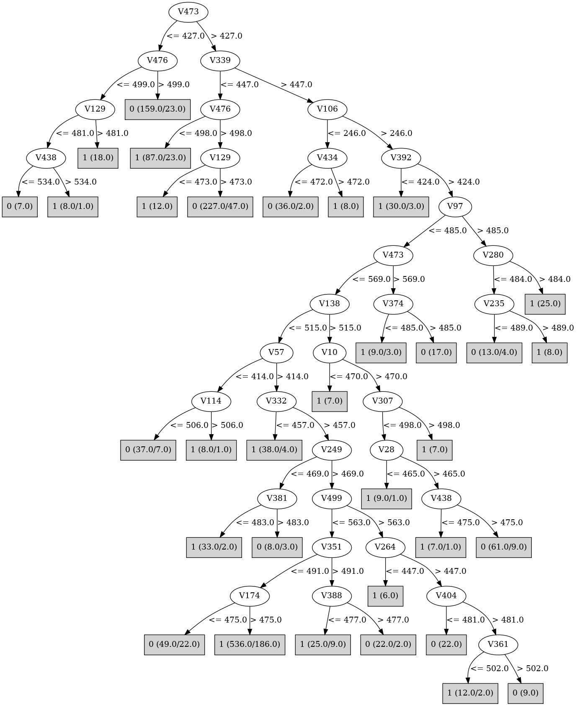

# J48

# SimpleCart Decision Tree

V476 < 500.5

* V319 < 466.5

*   * V387 < 538.5

*   *   * V56 < 500.5

*   *   *   * V431 < 524.0

*   *   *   *   * V164 < 489.5

*   *   *   *   *   * V406 < 523.5: 0(137.0/52.0)

*   *   *   *   *   * V406 >= 523.5: 1(13.0/6.0)

*   *   *   *   * V164 >= 489.5: 1(11.0/3.0)

*   *   *   * V431 >= 524.0: 1(17.0/7.0)

*   *   * V56 >= 500.5

*   *   *   * V279 < 488.5

*   *   *   *   * V120 < 466.5: 1(11.0/4.0)

*   *   *   *   * V120 >= 466.5: 0(34.0/8.0)

*   *   *   * V279 >= 488.5

*   *   *   *   * V314 < 466.5: 0(12.0/4.0)

*   *   *   *   * V314 >= 466.5: 1(66.0/19.0)

*   * V387 >= 538.5: 1(14.0/1.0)

* V319 >= 466.5

*   * V154 < 512.0

*   *   * V106 < 392.5: 1(55.0/12.0)

*   *   * V106 >= 392.5

*   *   *   * V106 < 551.0

*   *   *   *   * V29 < 479.5: 1(11.0/2.0)

*   *   *   *   * V29 >= 479.5: 0(78.0/16.0)

*   *   *   * V106 >= 551.0

*   *   *   *   * V49 < 488.0: 0(17.0/6.0)

*   *   *   *   * V49 >= 488.0: 1(61.0/8.0)

*   * V154 >= 512.0: 1(248.0/47.0)

V476 >= 500.5

* V339 < 475.5

*   * V129 < 472.5: 1(26.0/6.0)

*   * V129 >= 472.5: 0(385.0/83.0)

* V339 >= 475.5

*   * V319 < 504.5: 1(177.0/77.0)

*   * V319 >= 504.5

*   *   * V106 < 475.5: 1(24.0/8.0)

*   *   * V106 >= 475.5: 0(52.0/2.0)

# PART

Decision list:

conditions|predicted class
---|---
V106 > 698.5 AND V337 <= 485.5 AND V476 > 503.5 AND V133 > 458.5| 0 (89.0)
V443 <= 341.5 AND V242 > 482.5 AND V307 <= 503.5 AND V121 <= 479.5 AND V272 <= 570.0 AND V189 > 462.5| 0 (66.0)
V106 <= 246.5 AND V154 <= 465.5 AND V10 > 469.5| 0 (33.0)
V392 <= 418.5 AND V57 <= 496.5 AND V5 > 463.5| 1 (19.0)
V205 <= 410.5 AND V407 > 438.0 AND V11 > 455.5| 1 (20.0)
V287 > 539.5 AND V85 <= 526.5| 1 (22.0)
V460 > 544.5 AND V415 > 454.0 AND V82 <= 569.0 AND V3 <= 552.0| 1 (31.0)
V264 <= 408.5 AND V484 > 461.0 AND V1 > 476.5| 1 (16.0)
V100 <= 406.5 AND V10 <= 486.5 AND V142 > 476.5| 1 (22.0)
V443 > 691.5 AND V131 > 493.5 AND V2 > 454.5| 0 (13.0)
V29 > 505.5 AND V241 <= 531.5 AND V349 <= 510.5 AND V2 > 447.5| 1 (23.0)
V57 <= 402.0 AND V222 <= 516.5 AND V30 <= 511.0| 0 (24.0)
V242 <= 483.5 AND V330 > 589.5 AND V354 > 473.0 AND V20 <= 483.5| 0 (15.0)
V242 <= 483.5 AND V340 > 560.5 AND V133 <= 515.5 AND V2 <= 518.0| 1 (27.0)
V242 <= 483.5 AND V319 > 466.5 AND V154 > 501.0 AND V154 <= 660.5 AND V53 > 452.0 AND V82 <= 569.0 AND V58 <= 536.5 AND V414 <= 516.5 AND V349 > 452.5| 1 (132.0)
V301 <= 408.5 AND V456 <= 572.0 AND V3 > 466.0| 0 (16.0)
V72 <= 459.5 AND V496 <= 547.5 AND V10 > 471.5| 0 (19.0)
V339 <= 480.5 AND V106 <= 422.5 AND V29 <= 479.5 AND V2 <= 517.5| 1 (26.0)
V339 <= 480.5 AND V104 <= 498.5 AND V139 <= 490.5 AND V496 > 450.5 AND V236 <= 529.5 AND V476 > 490.5 AND V443 <= 555.5 AND V337 <= 491.5 AND V301 <= 536.0 AND V447 > 462.5 AND V390 <= 537.5 AND V119 > 452.5 AND V261 > 473.5 AND V384 > 462.5 AND V157 > 447.5 AND V310 > 436.5| 0 (115.0)
V337 <= 285.5 AND V325 <= 514.0 AND V2 <= 519.5| 1 (24.0)
V65 > 651.5 AND V49 > 470.0 AND V357 > 463.0| 0 (31.0)
V407 <= 412.5 AND V80 <= 481.5| 0 (19.0)
V318 <= 468.5 AND V432 > 471.5 AND V1 <= 487.0| 1 (17.0)
V261 > 521.5 AND V343 > 468.0 AND V4 > 478.5| 0 (16.0)
V456 > 607.5 AND V316 <= 521.0 AND V101 > 468.5 AND V71 > 461.0 AND V53 <= 516.5| 1 (42.0)
V482 <= 427.5 AND V108 <= 544.0 AND V19 > 461.5| 0 (17.0)
V473 <= 427.5 AND V454 > 513.0 AND V4 <= 489.5| 1 (8.0)
V473 <= 427.5 AND V128 > 468.0 AND V125 > 446.5 AND V189 <= 573.5| 0 (43.0)
V61 > 522.5 AND V291 > 450.5 AND V325 > 474.5| 1 (29.0)
V117 <= 452.5 AND V108 <= 521.5 AND V16 <= 492.5| 1 (18.0)
V185 <= 462.5 AND V46 <= 501.5 AND V81 > 458.5| 1 (21.0)
V96 <= 437.5 AND V276 <= 489.0| 1 (18.0)
V175 <= 446.5 AND V329 > 483.5 AND V4 > 480.5| 1 (17.0)
V496 <= 446.5 AND V297 > 449.0 AND V11 > 463.5| 0 (20.0)
V339 <= 367.5 AND V234 > 481.0| 1 (16.0)
V11 <= 450.5 AND V476 <= 365.0| 1 (7.0/1.0)
V11 <= 450.5 AND V205 <= 443.5 AND V2 <= 483.0| 1 (5.0)
V11 <= 450.5 AND V44 <= 508.0 AND V498 > 466.5 AND V211 <= 505.5 AND V80 > 458.5 AND V239 <= 507.5 AND V9 > 469.5| 0 (71.0)
V414 <= 453.5 AND V110 <= 483.5| 0 (18.0)
V262 > 488.5 AND V98 <= 491.0 AND V2 > 469.0| 1 (19.0)
V33 <= 441.5 AND V201 <= 500.5| 0 (15.0)
V282 > 554.5 AND V322 > 456.0 AND V2 > 464.5| 1 (15.0)
V317 > 495.5 AND V148 <= 527.0 AND V4 <= 485.5| 0 (16.0)
V202 > 521.5 AND V137 <= 513.5| 1 (21.0)
V329 > 506.5 AND V406 <= 497.5 AND V7 <= 517.0| 0 (17.0)
V494 > 686.5 AND V106 > 504.0 AND V411 <= 505.0| 0 (21.0)
V495 > 558.5 AND V87 > 473.5| 1 (18.0)
V159 <= 467.5 AND V416 > 469.0 AND V322 <= 505.0 AND V2 > 448.5| 1 (29.0)
V242 <= 435.5 AND V82 > 460.5 AND V406 > 436.0 AND V179 <= 519.5 AND V50 <= 514.5| 1 (37.0)
V123 <= 464.5 AND V148 <= 516.0| 0 (18.0)
V20 <= 464.5 AND V5 <= 557.0 AND V469 <= 491.0| 1 (28.0)
V111 > 523.5 AND V180 > 464.5 AND V265 <= 489.0 AND V57 > 417.0| 0 (31.0)
V21 <= 474.5 AND V54 <= 486.5 AND V236 <= 507.5 AND V263 <= 519.5| 1 (41.0)
V432 > 548.5 AND V48 > 498.5| 0 (14.0)
V55 <= 450.5 AND V19 <= 493.0| 1 (11.0)
V218 <= 466.5 AND V16 > 469.5| 0 (19.0)
V332 <= 453.5 AND V1 > 476.5| 1 (9.0)
V399 > 576.0 AND V19 > 476.0| 1 (8.0)
V271 > 507.5 AND V5 > 475.0| 0 (12.0)
V344 <= 455.0 AND V5 > 481.0| 0 (11.0)
V166 <= 454.5 AND V18 <= 500.0| 1 (13.0)
V412 <= 421.5 AND V1 > 481.5| 0 (6.0)
V436 > 569.5 AND V1 > 482.5| 0 (6.0)
V477 > 501.5 AND V2 <= 449.5| 0 (5.0/1.0)
V345 > 552.5 AND V6 > 477.0| 1 (9.0)
V260 > 500.5 AND V115 <= 514.0| 1 (13.0)
V170 <= 444.0| 0 (10.0)
V313 > 549.5 AND V2 <= 487.5| 1 (5.0/1.0)
V444 > 440.5 AND V165 > 548.0| 0 (9.0)
V444 <= 440.5| 1 (8.0)
V427 > 518.0 AND V1 <= 480.5| 1 (5.0/1.0)
V423 > 457.0 AND V203 > 511.5 AND V1 > 477.0| 0 (13.0)
V423 > 457.0 AND V463 > 451.5 AND V410 <= 486.5 AND V5 <= 569.5 AND V17 <= 499.0 AND V234 > 461.5 AND V96 <= 541.5 AND V421 <= 487.5 AND V126 <= 507.5 AND V6 <= 487.5| 0 (33.0)
V423 > 457.0 AND V250 > 463.5 AND V56 <= 534.0 AND V256 <= 517.5 AND V286 > 461.5| 1 (42.0)
V119 > 448.5 AND V448 > 483.5| 0 (22.0)
V111 > 462.5 AND V48 > 475.0| 1 (13.0)
V1 <= 483.5| 0 (8.0)
| 1 (5.0/2.0)

# JRip

Decision list:

conditions|predicted class
---|---
(V476 <= 497) and (V443 <= 514) and (V49 <= 475) and (V385 >= 475) and (V303 >= 475)|1 (90.0/1.0)
(V339 >= 448) and (V282 >= 446) and (V379 <= 467) and (V154 >= 490)|1 (149.0/19.0)
(V339 >= 477) and (V49 >= 489) and (V443 >= 525) and (V154 <= 479)|1 (182.0/19.0)
(V476 <= 472) and (V443 <= 518) and (V106 >= 540)|1 (106.0/11.0)
(V339 >= 480) and (V339 <= 591) and (V106 <= 500) and (V325 <= 474)|1 (64.0/12.0)
(V339 >= 476) and (V49 >= 474) and (V406 >= 490) and (V76 <= 512) and (V272 <= 500)|1 (36.0/7.0)
(V339 >= 474) and (V242 >= 501) and (V319 <= 504) and (V456 <= 464) and (V377 <= 488)|1 (39.0/2.0)
(V473 <= 492) and (V129 <= 471) and (V465 >= 480)|1 (59.0/10.0)
(V454 >= 468) and (V337 >= 504) and (V319 >= 483) and (V66 >= 502)|1 (51.0/9.0)
(V379 <= 521) and (V443 <= 470) and (V494 >= 489)|1 (73.0/26.0)
(V494 <= 335) and (V459 <= 493) and (V422 >= 482) and (V304 >= 497)|1 (17.0/1.0)
(V49 <= 508) and (V494 >= 629) and (V461 <= 480)|1 (19.0/3.0)
|0 (935.0/140.0)

# Decision Table

Non matches covered by Majority class

v1|v2|v3|v4|v5|v6|v7|v8|v9|v10|v11|v12|v13|v14|v15|v16|v17|v18|v19|v20|v21|v22|v23|v24|v25|v26|v27|v28|v29|v30|v31|v32|v33|v34|v35|v36|v37|v38|v39|v40|v41|v42|v43|v44|v45|v46|v47|v48|v49|v50|v51|v52|v53|v54|v55|v56|v57|v58|v59|v60|v61|v62|v63|v64|v65|v66|v67|v68|v69|v70|v71|v72|v73|v74|v75|v76|v77|v78|v79|v80|v81|v82|v83|v84|v85|v86|v87|v88|v89|v90|v91|v92|v93|v94|v95|v96|v97|v98|v99|v100|v101|v102|v103|v104|v105|v107|v108|v109|v110|v111|v112|v113|v114|v115|v116|v117|v118|v119|v120|v121|v122|v123|v124|v125|v126|v127|v128|v129|v130|v131|v132|v133|v134|v135|v136|v137|v138|v139|v140|v141|v142|v143|v144|v145|v146|v147|v148|v149|v150|v151|v152|v153|v154|v155|v156|v157|v158|v159|v160|v161|v162|v163|v164|v165|v166|v167|v168|v169|v170|v171|v172|v173|v174|v175|v176|v177|v178|v179|v180|v181|v182|v183|v184|v185|v186|v187|v188|v189|v190|v191|v192|v193|v194|v195|v196|v197|v198|v199|v200|v201|v202|v203|v204|v205|v206|v207|v208|v209|v210|v211|v212|v213|v214|v215|v216|v217|v218|v219|v220|v221|v222|v223|v224|v225|v226|v227|v228|v229|v230|v231|v232|v233|v234|v235|v236|v237|v238|v239|v240|v241|v242|v243|v244|v245|v246|v247|v248|v249|v250|v251|v252|v253|v254|v255|v256|v257|v258|v259|v260|v261|v262|v263|v264|v265|v266|v267|v268|v269|v270|v271|v272|v273|v274|v275|v276|v277|v278|v279|v280|v281|v282|v283|v284|v285|v286|v287|v288|v289|v290|v291|v292|v293|v294|v295|v296|v297|v298|v299|v300|v301|v302|v303|v304|v305|v306|v307|v308|v309|v310|v311|v312|v313|v314|v315|v316|v317|v318|v319|v320|v321|v322|v323|v324|v325|v326|v327|v328|v329|v330|v331|v332|v333|v334|v335|v336|v337|v338|v339|v340|v341|v342|v343|v344|v345|v346|v347|v348|v349|v350|v351|v352|v353|v354|v355|v356|v357|v358|v359|v360|v361|v362|v363|v364|v365|v366|v367|v368|v369|v370|v371|v372|v373|v374|v375|v376|v377|v378|v379|v380|v381|v382|v383|v384|v385|v386|v387|v388|v389|v390|v391|v392|v393|v394|v395|v396|v397|v398|v399|v400|v401|v402|v403|v404|v405|v406|v407|v408|v409|v410|v411|v412|v413|v414|v415|v416|v417|v418|v419|v420|v421|v422|v423|v424|v425|v426|v427|v428|v429|v430|v431|v432|v433|v434|v435|v436|v437|v438|v439|v440|v441|v442|v443|v444|v445|v446|v447|v448|v449|v450|v451|v452|v453|v454|v455|v456|v457|v458|v459|v460|v461|v462|v463|v464|v465|v466|v468|v469|v470|v471|v472|v473|v474|v475|v476|v477|v478|v479|v480|v482|v483|v484|v485|v486|v487|v488|v489|v490|v491|v492|v493|v494|v495|v496|v497|v498|v499|v500|target
---|---|---|---|---|---|---|---|---|---|---|---|---|---|---|---|---|---|---|---|---|---|---|---|---|---|---|---|---|---|---|---|---|---|---|---|---|---|---|---|---|---|---|---|---|---|---|---|---|---|---|---|---|---|---|---|---|---|---|---|---|---|---|---|---|---|---|---|---|---|---|---|---|---|---|---|---|---|---|---|---|---|---|---|---|---|---|---|---|---|---|---|---|---|---|---|---|---|---|---|---|---|---|---|---|---|---|---|---|---|---|---|---|---|---|---|---|---|---|---|---|---|---|---|---|---|---|---|---|---|---|---|---|---|---|---|---|---|---|---|---|---|---|---|---|---|---|---|---|---|---|---|---|---|---|---|---|---|---|---|---|---|---|---|---|---|---|---|---|---|---|---|---|---|---|---|---|---|---|---|---|---|---|---|---|---|---|---|---|---|---|---|---|---|---|---|---|---|---|---|---|---|---|---|---|---|---|---|---|---|---|---|---|---|---|---|---|---|---|---|---|---|---|---|---|---|---|---|---|---|---|---|---|---|---|---|---|---|---|---|---|---|---|---|---|---|---|---|---|---|---|---|---|---|---|---|---|---|---|---|---|---|---|---|---|---|---|---|---|---|---|---|---|---|---|---|---|---|---|---|---|---|---|---|---|---|---|---|---|---|---|---|---|---|---|---|---|---|---|---|---|---|---|---|---|---|---|---|---|---|---|---|---|---|---|---|---|---|---|---|---|---|---|---|---|---|---|---|---|---|---|---|---|---|---|---|---|---|---|---|---|---|---|---|---|---|---|---|---|---|---|---|---|---|---|---|---|---|---|---|---|---|---|---|---|---|---|---|---|---|---|---|---|---|---|---|---|---|---|---|---|---|---|---|---|---|---|---|---|---|---|---|---|---|---|---|---|---|---|---|---|---|---|---|---|---|---|---|---|---|---|---|---|---|---|---|---|---|---|---|---|---|---|---|---|---|---|---|---|---|---|---|---|---|---|---|---|---|---|---|---|---|---|---|---|---|---|---|---|---|---|---|---|---|---|---|---|---|---|---|---|---|---|---|---|---|---|---|---|---|---|---|---|---|---|---|---|---|---|---|---|---|---|---|---|---|---|---|---|---|---|---|---|---|---|---|---|---
all|all|all|all|all|all|all|all|all|all|all|all|all|all|all|all|all|all|all|all|all|all|all|all|all|all|all|all|all|all|all|all|all|all|all|all|all|all|all|all|all|all|all|all|all|all|all|all|(512.5-inf)|all|all|all|all|all|all|all|all|all|all|all|all|all|all|all|(-inf-545.5]|all|all|all|all|all|all|all|all|all|all|all|all|all|all|all|all|all|all|all|all|all|all|all|all|all|all|all|all|all|all|all|all|all|all|all|all|all|all|all|all|all|all|all|all|all|all|all|all|all|all|all|all|all|all|all|all|all|all|all|all|all|all|(459.5-473.5]|all|all|all|all|all|all|all|all|all|all|all|all|all|all|all|all|all|all|all|all|all|all|all|all|all|all|all|all|all|all|all|all|all|all|all|all|all|all|all|all|all|all|all|all|all|all|all|all|all|all|all|all|all|all|all|all|all|all|all|all|all|all|all|all|all|all|all|all|all|all|all|all|all|all|all|all|all|all|all|all|all|all|all|all|all|all|all|all|all|all|all|all|all|all|all|all|all|all|all|all|all|all|all|all|all|all|all|all|all|all|all|all|(491.5-inf)|all|all|all|all|all|all|all|all|all|all|all|all|all|all|all|all|all|(472.5-inf)|all|all|all|all|all|all|all|all|all|all|all|all|all|all|all|all|(474.5-inf)|all|all|all|all|all|all|all|all|all|all|all|all|all|all|all|all|all|all|all|all|all|all|all|all|all|all|all|all|all|all|all|all|all|all|all|all|all|all|all|all|all|all|all|all|all|all|all|all|all|all|all|all|all|all|all|all|all|all|all|(-inf-537.5]|all|(447.5-625.5]|all|all|all|all|all|all|all|all|all|all|all|all|all|all|all|all|all|all|all|all|all|all|all|all|all|all|all|all|all|all|all|all|all|all|all|all|all|all|all|all|all|all|all|all|all|all|all|all|all|all|all|all|all|all|all|all|all|all|all|all|all|all|all|all|all|all|all|all|all|all|all|all|all|all|all|all|all|all|all|all|all|all|all|all|all|all|all|all|all|all|all|all|all|all|all|all|all|all|all|all|all|all|all|(378.5-inf)|all|all|all|all|all|all|all|all|all|all|all|all|all|all|all|all|all|all|all|all|all|all|all|all|all|all|all|all|(427.5-inf)|all|all|(500.5-inf)|all|all|all|all|all|all|all|all|all|all|all|all|all|all|all|all|all|all|all|all|all|all|all|1
all|all|all|all|all|all|all|all|all|all|all|all|all|all|all|all|all|all|all|all|all|all|all|all|all|all|all|all|all|all|all|all|all|all|all|all|all|all|all|all|all|all|all|all|all|all|all|all|(-inf-512.5]|all|all|all|all|all|all|all|all|all|all|all|all|all|all|all|(-inf-545.5]|all|all|all|all|all|all|all|all|all|all|all|all|all|all|all|all|all|all|all|all|all|all|all|all|all|all|all|all|all|all|all|all|all|all|all|all|all|all|all|all|all|all|all|all|all|all|all|all|all|all|all|all|all|all|all|all|all|all|all|all|all|all|(473.5-495.5]|all|all|all|all|all|all|all|all|all|all|all|all|all|all|all|all|all|all|all|all|all|all|all|all|all|all|all|all|all|all|all|all|all|all|all|all|all|all|all|all|all|all|all|all|all|all|all|all|all|all|all|all|all|all|all|all|all|all|all|all|all|all|all|all|all|all|all|all|all|all|all|all|all|all|all|all|all|all|all|all|all|all|all|all|all|all|all|all|all|all|all|all|all|all|all|all|all|all|all|all|all|all|all|all|all|all|all|all|all|all|all|all|(491.5-inf)|all|all|all|all|all|all|all|all|all|all|all|all|all|all|all|all|all|(472.5-inf)|all|all|all|all|all|all|all|all|all|all|all|all|all|all|all|all|(474.5-inf)|all|all|all|all|all|all|all|all|all|all|all|all|all|all|all|all|all|all|all|all|all|all|all|all|all|all|all|all|all|all|all|all|all|all|all|all|all|all|all|all|all|all|all|all|all|all|all|all|all|all|all|all|all|all|all|all|all|all|all|(-inf-537.5]|all|(-inf-447.5]|all|all|all|all|all|all|all|all|all|all|all|all|all|all|all|all|all|all|all|all|all|all|all|all|all|all|all|all|all|all|all|all|all|all|all|all|all|all|all|all|all|all|all|all|all|all|all|all|all|all|all|all|all|all|all|all|all|all|all|all|all|all|all|all|all|all|all|all|all|all|all|all|all|all|all|all|all|all|all|all|all|all|all|all|all|all|all|all|all|all|all|all|all|all|all|all|all|all|all|all|all|all|all|(-inf-378.5]|all|all|all|all|all|all|all|all|all|all|all|all|all|all|all|all|all|all|all|all|all|all|all|all|all|all|all|all|(-inf-427.5]|all|all|(-inf-500.5]|all|all|all|all|all|all|all|all|all|all|all|all|all|all|all|all|all|all|all|all|all|all|all|0
all|all|all|all|all|all|all|all|all|all|all|all|all|all|all|all|all|all|all|all|all|all|all|all|all|all|all|all|all|all|all|all|all|all|all|all|all|all|all|all|all|all|all|all|all|all|all|all|(-inf-512.5]|all|all|all|all|all|all|all|all|all|all|all|all|all|all|all|(-inf-545.5]|all|all|all|all|all|all|all|all|all|all|all|all|all|all|all|all|all|all|all|all|all|all|all|all|all|all|all|all|all|all|all|all|all|all|all|all|all|all|all|all|all|all|all|all|all|all|all|all|all|all|all|all|all|all|all|all|all|all|all|all|all|all|(-inf-459.5]|all|all|all|all|all|all|all|all|all|all|all|all|all|all|all|all|all|all|all|all|all|all|all|all|all|all|all|all|all|all|all|all|all|all|all|all|all|all|all|all|all|all|all|all|all|all|all|all|all|all|all|all|all|all|all|all|all|all|all|all|all|all|all|all|all|all|all|all|all|all|all|all|all|all|all|all|all|all|all|all|all|all|all|all|all|all|all|all|all|all|all|all|all|all|all|all|all|all|all|all|all|all|all|all|all|all|all|all|all|all|all|all|(-inf-491.5]|all|all|all|all|all|all|all|all|all|all|all|all|all|all|all|all|all|(472.5-inf)|all|all|all|all|all|all|all|all|all|all|all|all|all|all|all|all|(474.5-inf)|all|all|all|all|all|all|all|all|all|all|all|all|all|all|all|all|all|all|all|all|all|all|all|all|all|all|all|all|all|all|all|all|all|all|all|all|all|all|all|all|all|all|all|all|all|all|all|all|all|all|all|all|all|all|all|all|all|all|all|(-inf-537.5]|all|(625.5-inf)|all|all|all|all|all|all|all|all|all|all|all|all|all|all|all|all|all|all|all|all|all|all|all|all|all|all|all|all|all|all|all|all|all|all|all|all|all|all|all|all|all|all|all|all|all|all|all|all|all|all|all|all|all|all|all|all|all|all|all|all|all|all|all|all|all|all|all|all|all|all|all|all|all|all|all|all|all|all|all|all|all|all|all|all|all|all|all|all|all|all|all|all|all|all|all|all|all|all|all|all|all|all|all|(378.5-inf)|all|all|all|all|all|all|all|all|all|all|all|all|all|all|all|all|all|all|all|all|all|all|all|all|all|all|all|all|(427.5-inf)|all|all|(-inf-500.5]|all|all|all|all|all|all|all|all|all|all|all|all|all|all|all|all|all|all|all|all|all|all|all|0
all|all|all|all|all|all|all|all|all|all|all|all|all|all|all|all|all|all|all|all|all|all|all|all|all|all|all|all|all|all|all|all|all|all|all|all|all|all|all|all|all|all|all|all|all|all|all|all|(512.5-inf)|all|all|all|all|all|all|all|all|all|all|all|all|all|all|all|(545.5-inf)|all|all|all|all|all|all|all|all|all|all|all|all|all|all|all|all|all|all|all|all|all|all|all|all|all|all|all|all|all|all|all|all|all|all|all|all|all|all|all|all|all|all|all|all|all|all|all|all|all|all|all|all|all|all|all|all|all|all|all|all|all|all|(473.5-495.5]|all|all|all|all|all|all|all|all|all|all|all|all|all|all|all|all|all|all|all|all|all|all|all|all|all|all|all|all|all|all|all|all|all|all|all|all|all|all|all|all|all|all|all|all|all|all|all|all|all|all|all|all|all|all|all|all|all|all|all|all|all|all|all|all|all|all|all|all|all|all|all|all|all|all|all|all|all|all|all|all|all|all|all|all|all|all|all|all|all|all|all|all|all|all|all|all|all|all|all|all|all|all|all|all|all|all|all|all|all|all|all|all|(-inf-491.5]|all|all|all|all|all|all|all|all|all|all|all|all|all|all|all|all|all|(472.5-inf)|all|all|all|all|all|all|all|all|all|all|all|all|all|all|all|all|(474.5-inf)|all|all|all|all|all|all|all|all|all|all|all|all|all|all|all|all|all|all|all|all|all|all|all|all|all|all|all|all|all|all|all|all|all|all|all|all|all|all|all|all|all|all|all|all|all|all|all|all|all|all|all|all|all|all|all|all|all|all|all|(537.5-inf)|all|(447.5-625.5]|all|all|all|all|all|all|all|all|all|all|all|all|all|all|all|all|all|all|all|all|all|all|all|all|all|all|all|all|all|all|all|all|all|all|all|all|all|all|all|all|all|all|all|all|all|all|all|all|all|all|all|all|all|all|all|all|all|all|all|all|all|all|all|all|all|all|all|all|all|all|all|all|all|all|all|all|all|all|all|all|all|all|all|all|all|all|all|all|all|all|all|all|all|all|all|all|all|all|all|all|all|all|all|(-inf-378.5]|all|all|all|all|all|all|all|all|all|all|all|all|all|all|all|all|all|all|all|all|all|all|all|all|all|all|all|all|(-inf-427.5]|all|all|(-inf-500.5]|all|all|all|all|all|all|all|all|all|all|all|all|all|all|all|all|all|all|all|all|all|all|all|1
all|all|all|all|all|all|all|all|all|all|all|all|all|all|all|all|all|all|all|all|all|all|all|all|all|all|all|all|all|all|all|all|all|all|all|all|all|all|all|all|all|all|all|all|all|all|all|all|(512.5-inf)|all|all|all|all|all|all|all|all|all|all|all|all|all|all|all|(-inf-545.5]|all|all|all|all|all|all|all|all|all|all|all|all|all|all|all|all|all|all|all|all|all|all|all|all|all|all|all|all|all|all|all|all|all|all|all|all|all|all|all|all|all|all|all|all|all|all|all|all|all|all|all|all|all|all|all|all|all|all|all|all|all|all|(495.5-inf)|all|all|all|all|all|all|all|all|all|all|all|all|all|all|all|all|all|all|all|all|all|all|all|all|all|all|all|all|all|all|all|all|all|all|all|all|all|all|all|all|all|all|all|all|all|all|all|all|all|all|all|all|all|all|all|all|all|all|all|all|all|all|all|all|all|all|all|all|all|all|all|all|all|all|all|all|all|all|all|all|all|all|all|all|all|all|all|all|all|all|all|all|all|all|all|all|all|all|all|all|all|all|all|all|all|all|all|all|all|all|all|all|(491.5-inf)|all|all|all|all|all|all|all|all|all|all|all|all|all|all|all|all|all|(472.5-inf)|all|all|all|all|all|all|all|all|all|all|all|all|all|all|all|all|(474.5-inf)|all|all|all|all|all|all|all|all|all|all|all|all|all|all|all|all|all|all|all|all|all|all|all|all|all|all|all|all|all|all|all|all|all|all|all|all|all|all|all|all|all|all|all|all|all|all|all|all|all|all|all|all|all|all|all|all|all|all|all|(-inf-537.5]|all|(-inf-447.5]|all|all|all|all|all|all|all|all|all|all|all|all|all|all|all|all|all|all|all|all|all|all|all|all|all|all|all|all|all|all|all|all|all|all|all|all|all|all|all|all|all|all|all|all|all|all|all|all|all|all|all|all|all|all|all|all|all|all|all|all|all|all|all|all|all|all|all|all|all|all|all|all|all|all|all|all|all|all|all|all|all|all|all|all|all|all|all|all|all|all|all|all|all|all|all|all|all|all|all|all|all|all|all|(378.5-inf)|all|all|all|all|all|all|all|all|all|all|all|all|all|all|all|all|all|all|all|all|all|all|all|all|all|all|all|all|(-inf-427.5]|all|all|(500.5-inf)|all|all|all|all|all|all|all|all|all|all|all|all|all|all|all|all|all|all|all|all|all|all|all|0
all|all|all|all|all|all|all|all|all|all|all|all|all|all|all|all|all|all|all|all|all|all|all|all|all|all|all|all|all|all|all|all|all|all|all|all|all|all|all|all|all|all|all|all|all|all|all|all|(-inf-512.5]|all|all|all|all|all|all|all|all|all|all|all|all|all|all|all|(-inf-545.5]|all|all|all|all|all|all|all|all|all|all|all|all|all|all|all|all|all|all|all|all|all|all|all|all|all|all|all|all|all|all|all|all|all|all|all|all|all|all|all|all|all|all|all|all|all|all|all|all|all|all|all|all|all|all|all|all|all|all|all|all|all|all|(473.5-495.5]|all|all|all|all|all|all|all|all|all|all|all|all|all|all|all|all|all|all|all|all|all|all|all|all|all|all|all|all|all|all|all|all|all|all|all|all|all|all|all|all|all|all|all|all|all|all|all|all|all|all|all|all|all|all|all|all|all|all|all|all|all|all|all|all|all|all|all|all|all|all|all|all|all|all|all|all|all|all|all|all|all|all|all|all|all|all|all|all|all|all|all|all|all|all|all|all|all|all|all|all|all|all|all|all|all|all|all|all|all|all|all|all|(-inf-491.5]|all|all|all|all|all|all|all|all|all|all|all|all|all|all|all|all|all|(-inf-472.5]|all|all|all|all|all|all|all|all|all|all|all|all|all|all|all|all|(474.5-inf)|all|all|all|all|all|all|all|all|all|all|all|all|all|all|all|all|all|all|all|all|all|all|all|all|all|all|all|all|all|all|all|all|all|all|all|all|all|all|all|all|all|all|all|all|all|all|all|all|all|all|all|all|all|all|all|all|all|all|all|(-inf-537.5]|all|(625.5-inf)|all|all|all|all|all|all|all|all|all|all|all|all|all|all|all|all|all|all|all|all|all|all|all|all|all|all|all|all|all|all|all|all|all|all|all|all|all|all|all|all|all|all|all|all|all|all|all|all|all|all|all|all|all|all|all|all|all|all|all|all|all|all|all|all|all|all|all|all|all|all|all|all|all|all|all|all|all|all|all|all|all|all|all|all|all|all|all|all|all|all|all|all|all|all|all|all|all|all|all|all|all|all|all|(378.5-inf)|all|all|all|all|all|all|all|all|all|all|all|all|all|all|all|all|all|all|all|all|all|all|all|all|all|all|all|all|(427.5-inf)|all|all|(-inf-500.5]|all|all|all|all|all|all|all|all|all|all|all|all|all|all|all|all|all|all|all|all|all|all|all|0
all|all|all|all|all|all|all|all|all|all|all|all|all|all|all|all|all|all|all|all|all|all|all|all|all|all|all|all|all|all|all|all|all|all|all|all|all|all|all|all|all|all|all|all|all|all|all|all|(512.5-inf)|all|all|all|all|all|all|all|all|all|all|all|all|all|all|all|(-inf-545.5]|all|all|all|all|all|all|all|all|all|all|all|all|all|all|all|all|all|all|all|all|all|all|all|all|all|all|all|all|all|all|all|all|all|all|all|all|all|all|all|all|all|all|all|all|all|all|all|all|all|all|all|all|all|all|all|all|all|all|all|all|all|all|(495.5-inf)|all|all|all|all|all|all|all|all|all|all|all|all|all|all|all|all|all|all|all|all|all|all|all|all|all|all|all|all|all|all|all|all|all|all|all|all|all|all|all|all|all|all|all|all|all|all|all|all|all|all|all|all|all|all|all|all|all|all|all|all|all|all|all|all|all|all|all|all|all|all|all|all|all|all|all|all|all|all|all|all|all|all|all|all|all|all|all|all|all|all|all|all|all|all|all|all|all|all|all|all|all|all|all|all|all|all|all|all|all|all|all|all|(491.5-inf)|all|all|all|all|all|all|all|all|all|all|all|all|all|all|all|all|all|(472.5-inf)|all|all|all|all|all|all|all|all|all|all|all|all|all|all|all|all|(474.5-inf)|all|all|all|all|all|all|all|all|all|all|all|all|all|all|all|all|all|all|all|all|all|all|all|all|all|all|all|all|all|all|all|all|all|all|all|all|all|all|all|all|all|all|all|all|all|all|all|all|all|all|all|all|all|all|all|all|all|all|all|(-inf-537.5]|all|(-inf-447.5]|all|all|all|all|all|all|all|all|all|all|all|all|all|all|all|all|all|all|all|all|all|all|all|all|all|all|all|all|all|all|all|all|all|all|all|all|all|all|all|all|all|all|all|all|all|all|all|all|all|all|all|all|all|all|all|all|all|all|all|all|all|all|all|all|all|all|all|all|all|all|all|all|all|all|all|all|all|all|all|all|all|all|all|all|all|all|all|all|all|all|all|all|all|all|all|all|all|all|all|all|all|all|all|(378.5-inf)|all|all|all|all|all|all|all|all|all|all|all|all|all|all|all|all|all|all|all|all|all|all|all|all|all|all|all|all|(427.5-inf)|all|all|(-inf-500.5]|all|all|all|all|all|all|all|all|all|all|all|all|all|all|all|all|all|all|all|all|all|all|all|0
all|all|all|all|all|all|all|all|all|all|all|all|all|all|all|all|all|all|all|all|all|all|all|all|all|all|all|all|all|all|all|all|all|all|all|all|all|all|all|all|all|all|all|all|all|all|all|all|(-inf-512.5]|all|all|all|all|all|all|all|all|all|all|all|all|all|all|all|(-inf-545.5]|all|all|all|all|all|all|all|all|all|all|all|all|all|all|all|all|all|all|all|all|all|all|all|all|all|all|all|all|all|all|all|all|all|all|all|all|all|all|all|all|all|all|all|all|all|all|all|all|all|all|all|all|all|all|all|all|all|all|all|all|all|all|(473.5-495.5]|all|all|all|all|all|all|all|all|all|all|all|all|all|all|all|all|all|all|all|all|all|all|all|all|all|all|all|all|all|all|all|all|all|all|all|all|all|all|all|all|all|all|all|all|all|all|all|all|all|all|all|all|all|all|all|all|all|all|all|all|all|all|all|all|all|all|all|all|all|all|all|all|all|all|all|all|all|all|all|all|all|all|all|all|all|all|all|all|all|all|all|all|all|all|all|all|all|all|all|all|all|all|all|all|all|all|all|all|all|all|all|all|(-inf-491.5]|all|all|all|all|all|all|all|all|all|all|all|all|all|all|all|all|all|(-inf-472.5]|all|all|all|all|all|all|all|all|all|all|all|all|all|all|all|all|(474.5-inf)|all|all|all|all|all|all|all|all|all|all|all|all|all|all|all|all|all|all|all|all|all|all|all|all|all|all|all|all|all|all|all|all|all|all|all|all|all|all|all|all|all|all|all|all|all|all|all|all|all|all|all|all|all|all|all|all|all|all|all|(537.5-inf)|all|(447.5-625.5]|all|all|all|all|all|all|all|all|all|all|all|all|all|all|all|all|all|all|all|all|all|all|all|all|all|all|all|all|all|all|all|all|all|all|all|all|all|all|all|all|all|all|all|all|all|all|all|all|all|all|all|all|all|all|all|all|all|all|all|all|all|all|all|all|all|all|all|all|all|all|all|all|all|all|all|all|all|all|all|all|all|all|all|all|all|all|all|all|all|all|all|all|all|all|all|all|all|all|all|all|all|all|all|(378.5-inf)|all|all|all|all|all|all|all|all|all|all|all|all|all|all|all|all|all|all|all|all|all|all|all|all|all|all|all|all|(427.5-inf)|all|all|(-inf-500.5]|all|all|all|all|all|all|all|all|all|all|all|all|all|all|all|all|all|all|all|all|all|all|all|0
all|all|all|all|all|all|all|all|all|all|all|all|all|all|all|all|all|all|all|all|all|all|all|all|all|all|all|all|all|all|all|all|all|all|all|all|all|all|all|all|all|all|all|all|all|all|all|all|(-inf-512.5]|all|all|all|all|all|all|all|all|all|all|all|all|all|all|all|(545.5-inf)|all|all|all|all|all|all|all|all|all|all|all|all|all|all|all|all|all|all|all|all|all|all|all|all|all|all|all|all|all|all|all|all|all|all|all|all|all|all|all|all|all|all|all|all|all|all|all|all|all|all|all|all|all|all|all|all|all|all|all|all|all|all|(473.5-495.5]|all|all|all|all|all|all|all|all|all|all|all|all|all|all|all|all|all|all|all|all|all|all|all|all|all|all|all|all|all|all|all|all|all|all|all|all|all|all|all|all|all|all|all|all|all|all|all|all|all|all|all|all|all|all|all|all|all|all|all|all|all|all|all|all|all|all|all|all|all|all|all|all|all|all|all|all|all|all|all|all|all|all|all|all|all|all|all|all|all|all|all|all|all|all|all|all|all|all|all|all|all|all|all|all|all|all|all|all|all|all|all|all|(491.5-inf)|all|all|all|all|all|all|all|all|all|all|all|all|all|all|all|all|all|(472.5-inf)|all|all|all|all|all|all|all|all|all|all|all|all|all|all|all|all|(474.5-inf)|all|all|all|all|all|all|all|all|all|all|all|all|all|all|all|all|all|all|all|all|all|all|all|all|all|all|all|all|all|all|all|all|all|all|all|all|all|all|all|all|all|all|all|all|all|all|all|all|all|all|all|all|all|all|all|all|all|all|all|(-inf-537.5]|all|(-inf-447.5]|all|all|all|all|all|all|all|all|all|all|all|all|all|all|all|all|all|all|all|all|all|all|all|all|all|all|all|all|all|all|all|all|all|all|all|all|all|all|all|all|all|all|all|all|all|all|all|all|all|all|all|all|all|all|all|all|all|all|all|all|all|all|all|all|all|all|all|all|all|all|all|all|all|all|all|all|all|all|all|all|all|all|all|all|all|all|all|all|all|all|all|all|all|all|all|all|all|all|all|all|all|all|all|(-inf-378.5]|all|all|all|all|all|all|all|all|all|all|all|all|all|all|all|all|all|all|all|all|all|all|all|all|all|all|all|all|(-inf-427.5]|all|all|(500.5-inf)|all|all|all|all|all|all|all|all|all|all|all|all|all|all|all|all|all|all|all|all|all|all|all|0
all|all|all|all|all|all|all|all|all|all|all|all|all|all|all|all|all|all|all|all|all|all|all|all|all|all|all|all|all|all|all|all|all|all|all|all|all|all|all|all|all|all|all|all|all|all|all|all|(-inf-512.5]|all|all|all|all|all|all|all|all|all|all|all|all|all|all|all|(545.5-inf)|all|all|all|all|all|all|all|all|all|all|all|all|all|all|all|all|all|all|all|all|all|all|all|all|all|all|all|all|all|all|all|all|all|all|all|all|all|all|all|all|all|all|all|all|all|all|all|all|all|all|all|all|all|all|all|all|all|all|all|all|all|all|(459.5-473.5]|all|all|all|all|all|all|all|all|all|all|all|all|all|all|all|all|all|all|all|all|all|all|all|all|all|all|all|all|all|all|all|all|all|all|all|all|all|all|all|all|all|all|all|all|all|all|all|all|all|all|all|all|all|all|all|all|all|all|all|all|all|all|all|all|all|all|all|all|all|all|all|all|all|all|all|all|all|all|all|all|all|all|all|all|all|all|all|all|all|all|all|all|all|all|all|all|all|all|all|all|all|all|all|all|all|all|all|all|all|all|all|all|(491.5-inf)|all|all|all|all|all|all|all|all|all|all|all|all|all|all|all|all|all|(472.5-inf)|all|all|all|all|all|all|all|all|all|all|all|all|all|all|all|all|(474.5-inf)|all|all|all|all|all|all|all|all|all|all|all|all|all|all|all|all|all|all|all|all|all|all|all|all|all|all|all|all|all|all|all|all|all|all|all|all|all|all|all|all|all|all|all|all|all|all|all|all|all|all|all|all|all|all|all|all|all|all|all|(537.5-inf)|all|(447.5-625.5]|all|all|all|all|all|all|all|all|all|all|all|all|all|all|all|all|all|all|all|all|all|all|all|all|all|all|all|all|all|all|all|all|all|all|all|all|all|all|all|all|all|all|all|all|all|all|all|all|all|all|all|all|all|all|all|all|all|all|all|all|all|all|all|all|all|all|all|all|all|all|all|all|all|all|all|all|all|all|all|all|all|all|all|all|all|all|all|all|all|all|all|all|all|all|all|all|all|all|all|all|all|all|all|(-inf-378.5]|all|all|all|all|all|all|all|all|all|all|all|all|all|all|all|all|all|all|all|all|all|all|all|all|all|all|all|all|(-inf-427.5]|all|all|(500.5-inf)|all|all|all|all|all|all|all|all|all|all|all|all|all|all|all|all|all|all|all|all|all|all|all|0
all|all|all|all|all|all|all|all|all|all|all|all|all|all|all|all|all|all|all|all|all|all|all|all|all|all|all|all|all|all|all|all|all|all|all|all|all|all|all|all|all|all|all|all|all|all|all|all|(-inf-512.5]|all|all|all|all|all|all|all|all|all|all|all|all|all|all|all|(545.5-inf)|all|all|all|all|all|all|all|all|all|all|all|all|all|all|all|all|all|all|all|all|all|all|all|all|all|all|all|all|all|all|all|all|all|all|all|all|all|all|all|all|all|all|all|all|all|all|all|all|all|all|all|all|all|all|all|all|all|all|all|all|all|all|(473.5-495.5]|all|all|all|all|all|all|all|all|all|all|all|all|all|all|all|all|all|all|all|all|all|all|all|all|all|all|all|all|all|all|all|all|all|all|all|all|all|all|all|all|all|all|all|all|all|all|all|all|all|all|all|all|all|all|all|all|all|all|all|all|all|all|all|all|all|all|all|all|all|all|all|all|all|all|all|all|all|all|all|all|all|all|all|all|all|all|all|all|all|all|all|all|all|all|all|all|all|all|all|all|all|all|all|all|all|all|all|all|all|all|all|all|(-inf-491.5]|all|all|all|all|all|all|all|all|all|all|all|all|all|all|all|all|all|(472.5-inf)|all|all|all|all|all|all|all|all|all|all|all|all|all|all|all|all|(474.5-inf)|all|all|all|all|all|all|all|all|all|all|all|all|all|all|all|all|all|all|all|all|all|all|all|all|all|all|all|all|all|all|all|all|all|all|all|all|all|all|all|all|all|all|all|all|all|all|all|all|all|all|all|all|all|all|all|all|all|all|all|(-inf-537.5]|all|(447.5-625.5]|all|all|all|all|all|all|all|all|all|all|all|all|all|all|all|all|all|all|all|all|all|all|all|all|all|all|all|all|all|all|all|all|all|all|all|all|all|all|all|all|all|all|all|all|all|all|all|all|all|all|all|all|all|all|all|all|all|all|all|all|all|all|all|all|all|all|all|all|all|all|all|all|all|all|all|all|all|all|all|all|all|all|all|all|all|all|all|all|all|all|all|all|all|all|all|all|all|all|all|all|all|all|all|(378.5-inf)|all|all|all|all|all|all|all|all|all|all|all|all|all|all|all|all|all|all|all|all|all|all|all|all|all|all|all|all|(427.5-inf)|all|all|(-inf-500.5]|all|all|all|all|all|all|all|all|all|all|all|all|all|all|all|all|all|all|all|all|all|all|all|1
all|all|all|all|all|all|all|all|all|all|all|all|all|all|all|all|all|all|all|all|all|all|all|all|all|all|all|all|all|all|all|all|all|all|all|all|all|all|all|all|all|all|all|all|all|all|all|all|(-inf-512.5]|all|all|all|all|all|all|all|all|all|all|all|all|all|all|all|(545.5-inf)|all|all|all|all|all|all|all|all|all|all|all|all|all|all|all|all|all|all|all|all|all|all|all|all|all|all|all|all|all|all|all|all|all|all|all|all|all|all|all|all|all|all|all|all|all|all|all|all|all|all|all|all|all|all|all|all|all|all|all|all|all|all|(459.5-473.5]|all|all|all|all|all|all|all|all|all|all|all|all|all|all|all|all|all|all|all|all|all|all|all|all|all|all|all|all|all|all|all|all|all|all|all|all|all|all|all|all|all|all|all|all|all|all|all|all|all|all|all|all|all|all|all|all|all|all|all|all|all|all|all|all|all|all|all|all|all|all|all|all|all|all|all|all|all|all|all|all|all|all|all|all|all|all|all|all|all|all|all|all|all|all|all|all|all|all|all|all|all|all|all|all|all|all|all|all|all|all|all|all|(-inf-491.5]|all|all|all|all|all|all|all|all|all|all|all|all|all|all|all|all|all|(472.5-inf)|all|all|all|all|all|all|all|all|all|all|all|all|all|all|all|all|(474.5-inf)|all|all|all|all|all|all|all|all|all|all|all|all|all|all|all|all|all|all|all|all|all|all|all|all|all|all|all|all|all|all|all|all|all|all|all|all|all|all|all|all|all|all|all|all|all|all|all|all|all|all|all|all|all|all|all|all|all|all|all|(537.5-inf)|all|(625.5-inf)|all|all|all|all|all|all|all|all|all|all|all|all|all|all|all|all|all|all|all|all|all|all|all|all|all|all|all|all|all|all|all|all|all|all|all|all|all|all|all|all|all|all|all|all|all|all|all|all|all|all|all|all|all|all|all|all|all|all|all|all|all|all|all|all|all|all|all|all|all|all|all|all|all|all|all|all|all|all|all|all|all|all|all|all|all|all|all|all|all|all|all|all|all|all|all|all|all|all|all|all|all|all|all|(378.5-inf)|all|all|all|all|all|all|all|all|all|all|all|all|all|all|all|all|all|all|all|all|all|all|all|all|all|all|all|all|(427.5-inf)|all|all|(-inf-500.5]|all|all|all|all|all|all|all|all|all|all|all|all|all|all|all|all|all|all|all|all|all|all|all|0
all|all|all|all|all|all|all|all|all|all|all|all|all|all|all|all|all|all|all|all|all|all|all|all|all|all|all|all|all|all|all|all|all|all|all|all|all|all|all|all|all|all|all|all|all|all|all|all|(512.5-inf)|all|all|all|all|all|all|all|all|all|all|all|all|all|all|all|(-inf-545.5]|all|all|all|all|all|all|all|all|all|all|all|all|all|all|all|all|all|all|all|all|all|all|all|all|all|all|all|all|all|all|all|all|all|all|all|all|all|all|all|all|all|all|all|all|all|all|all|all|all|all|all|all|all|all|all|all|all|all|all|all|all|all|(473.5-495.5]|all|all|all|all|all|all|all|all|all|all|all|all|all|all|all|all|all|all|all|all|all|all|all|all|all|all|all|all|all|all|all|all|all|all|all|all|all|all|all|all|all|all|all|all|all|all|all|all|all|all|all|all|all|all|all|all|all|all|all|all|all|all|all|all|all|all|all|all|all|all|all|all|all|all|all|all|all|all|all|all|all|all|all|all|all|all|all|all|all|all|all|all|all|all|all|all|all|all|all|all|all|all|all|all|all|all|all|all|all|all|all|all|(491.5-inf)|all|all|all|all|all|all|all|all|all|all|all|all|all|all|all|all|all|(-inf-472.5]|all|all|all|all|all|all|all|all|all|all|all|all|all|all|all|all|(474.5-inf)|all|all|all|all|all|all|all|all|all|all|all|all|all|all|all|all|all|all|all|all|all|all|all|all|all|all|all|all|all|all|all|all|all|all|all|all|all|all|all|all|all|all|all|all|all|all|all|all|all|all|all|all|all|all|all|all|all|all|all|(-inf-537.5]|all|(447.5-625.5]|all|all|all|all|all|all|all|all|all|all|all|all|all|all|all|all|all|all|all|all|all|all|all|all|all|all|all|all|all|all|all|all|all|all|all|all|all|all|all|all|all|all|all|all|all|all|all|all|all|all|all|all|all|all|all|all|all|all|all|all|all|all|all|all|all|all|all|all|all|all|all|all|all|all|all|all|all|all|all|all|all|all|all|all|all|all|all|all|all|all|all|all|all|all|all|all|all|all|all|all|all|all|all|(-inf-378.5]|all|all|all|all|all|all|all|all|all|all|all|all|all|all|all|all|all|all|all|all|all|all|all|all|all|all|all|all|(427.5-inf)|all|all|(500.5-inf)|all|all|all|all|all|all|all|all|all|all|all|all|all|all|all|all|all|all|all|all|all|all|all|0
all|all|all|all|all|all|all|all|all|all|all|all|all|all|all|all|all|all|all|all|all|all|all|all|all|all|all|all|all|all|all|all|all|all|all|all|all|all|all|all|all|all|all|all|all|all|all|all|(512.5-inf)|all|all|all|all|all|all|all|all|all|all|all|all|all|all|all|(545.5-inf)|all|all|all|all|all|all|all|all|all|all|all|all|all|all|all|all|all|all|all|all|all|all|all|all|all|all|all|all|all|all|all|all|all|all|all|all|all|all|all|all|all|all|all|all|all|all|all|all|all|all|all|all|all|all|all|all|all|all|all|all|all|all|(459.5-473.5]|all|all|all|all|all|all|all|all|all|all|all|all|all|all|all|all|all|all|all|all|all|all|all|all|all|all|all|all|all|all|all|all|all|all|all|all|all|all|all|all|all|all|all|all|all|all|all|all|all|all|all|all|all|all|all|all|all|all|all|all|all|all|all|all|all|all|all|all|all|all|all|all|all|all|all|all|all|all|all|all|all|all|all|all|all|all|all|all|all|all|all|all|all|all|all|all|all|all|all|all|all|all|all|all|all|all|all|all|all|all|all|all|(-inf-491.5]|all|all|all|all|all|all|all|all|all|all|all|all|all|all|all|all|all|(-inf-472.5]|all|all|all|all|all|all|all|all|all|all|all|all|all|all|all|all|(474.5-inf)|all|all|all|all|all|all|all|all|all|all|all|all|all|all|all|all|all|all|all|all|all|all|all|all|all|all|all|all|all|all|all|all|all|all|all|all|all|all|all|all|all|all|all|all|all|all|all|all|all|all|all|all|all|all|all|all|all|all|all|(537.5-inf)|all|(447.5-625.5]|all|all|all|all|all|all|all|all|all|all|all|all|all|all|all|all|all|all|all|all|all|all|all|all|all|all|all|all|all|all|all|all|all|all|all|all|all|all|all|all|all|all|all|all|all|all|all|all|all|all|all|all|all|all|all|all|all|all|all|all|all|all|all|all|all|all|all|all|all|all|all|all|all|all|all|all|all|all|all|all|all|all|all|all|all|all|all|all|all|all|all|all|all|all|all|all|all|all|all|all|all|all|all|(378.5-inf)|all|all|all|all|all|all|all|all|all|all|all|all|all|all|all|all|all|all|all|all|all|all|all|all|all|all|all|all|(427.5-inf)|all|all|(-inf-500.5]|all|all|all|all|all|all|all|all|all|all|all|all|all|all|all|all|all|all|all|all|all|all|all|0
all|all|all|all|all|all|all|all|all|all|all|all|all|all|all|all|all|all|all|all|all|all|all|all|all|all|all|all|all|all|all|all|all|all|all|all|all|all|all|all|all|all|all|all|all|all|all|all|(-inf-512.5]|all|all|all|all|all|all|all|all|all|all|all|all|all|all|all|(545.5-inf)|all|all|all|all|all|all|all|all|all|all|all|all|all|all|all|all|all|all|all|all|all|all|all|all|all|all|all|all|all|all|all|all|all|all|all|all|all|all|all|all|all|all|all|all|all|all|all|all|all|all|all|all|all|all|all|all|all|all|all|all|all|all|(473.5-495.5]|all|all|all|all|all|all|all|all|all|all|all|all|all|all|all|all|all|all|all|all|all|all|all|all|all|all|all|all|all|all|all|all|all|all|all|all|all|all|all|all|all|all|all|all|all|all|all|all|all|all|all|all|all|all|all|all|all|all|all|all|all|all|all|all|all|all|all|all|all|all|all|all|all|all|all|all|all|all|all|all|all|all|all|all|all|all|all|all|all|all|all|all|all|all|all|all|all|all|all|all|all|all|all|all|all|all|all|all|all|all|all|all|(-inf-491.5]|all|all|all|all|all|all|all|all|all|all|all|all|all|all|all|all|all|(472.5-inf)|all|all|all|all|all|all|all|all|all|all|all|all|all|all|all|all|(474.5-inf)|all|all|all|all|all|all|all|all|all|all|all|all|all|all|all|all|all|all|all|all|all|all|all|all|all|all|all|all|all|all|all|all|all|all|all|all|all|all|all|all|all|all|all|all|all|all|all|all|all|all|all|all|all|all|all|all|all|all|all|(537.5-inf)|all|(-inf-447.5]|all|all|all|all|all|all|all|all|all|all|all|all|all|all|all|all|all|all|all|all|all|all|all|all|all|all|all|all|all|all|all|all|all|all|all|all|all|all|all|all|all|all|all|all|all|all|all|all|all|all|all|all|all|all|all|all|all|all|all|all|all|all|all|all|all|all|all|all|all|all|all|all|all|all|all|all|all|all|all|all|all|all|all|all|all|all|all|all|all|all|all|all|all|all|all|all|all|all|all|all|all|all|all|(378.5-inf)|all|all|all|all|all|all|all|all|all|all|all|all|all|all|all|all|all|all|all|all|all|all|all|all|all|all|all|all|(427.5-inf)|all|all|(-inf-500.5]|all|all|all|all|all|all|all|all|all|all|all|all|all|all|all|all|all|all|all|all|all|all|all|1
all|all|all|all|all|all|all|all|all|all|all|all|all|all|all|all|all|all|all|all|all|all|all|all|all|all|all|all|all|all|all|all|all|all|all|all|all|all|all|all|all|all|all|all|all|all|all|all|(512.5-inf)|all|all|all|all|all|all|all|all|all|all|all|all|all|all|all|(-inf-545.5]|all|all|all|all|all|all|all|all|all|all|all|all|all|all|all|all|all|all|all|all|all|all|all|all|all|all|all|all|all|all|all|all|all|all|all|all|all|all|all|all|all|all|all|all|all|all|all|all|all|all|all|all|all|all|all|all|all|all|all|all|all|all|(473.5-495.5]|all|all|all|all|all|all|all|all|all|all|all|all|all|all|all|all|all|all|all|all|all|all|all|all|all|all|all|all|all|all|all|all|all|all|all|all|all|all|all|all|all|all|all|all|all|all|all|all|all|all|all|all|all|all|all|all|all|all|all|all|all|all|all|all|all|all|all|all|all|all|all|all|all|all|all|all|all|all|all|all|all|all|all|all|all|all|all|all|all|all|all|all|all|all|all|all|all|all|all|all|all|all|all|all|all|all|all|all|all|all|all|all|(491.5-inf)|all|all|all|all|all|all|all|all|all|all|all|all|all|all|all|all|all|(472.5-inf)|all|all|all|all|all|all|all|all|all|all|all|all|all|all|all|all|(474.5-inf)|all|all|all|all|all|all|all|all|all|all|all|all|all|all|all|all|all|all|all|all|all|all|all|all|all|all|all|all|all|all|all|all|all|all|all|all|all|all|all|all|all|all|all|all|all|all|all|all|all|all|all|all|all|all|all|all|all|all|all|(-inf-537.5]|all|(-inf-447.5]|all|all|all|all|all|all|all|all|all|all|all|all|all|all|all|all|all|all|all|all|all|all|all|all|all|all|all|all|all|all|all|all|all|all|all|all|all|all|all|all|all|all|all|all|all|all|all|all|all|all|all|all|all|all|all|all|all|all|all|all|all|all|all|all|all|all|all|all|all|all|all|all|all|all|all|all|all|all|all|all|all|all|all|all|all|all|all|all|all|all|all|all|all|all|all|all|all|all|all|all|all|all|all|(-inf-378.5]|all|all|all|all|all|all|all|all|all|all|all|all|all|all|all|all|all|all|all|all|all|all|all|all|all|all|all|all|(-inf-427.5]|all|all|(500.5-inf)|all|all|all|all|all|all|all|all|all|all|all|all|all|all|all|all|all|all|all|all|all|all|all|0
all|all|all|all|all|all|all|all|all|all|all|all|all|all|all|all|all|all|all|all|all|all|all|all|all|all|all|all|all|all|all|all|all|all|all|all|all|all|all|all|all|all|all|all|all|all|all|all|(512.5-inf)|all|all|all|all|all|all|all|all|all|all|all|all|all|all|all|(-inf-545.5]|all|all|all|all|all|all|all|all|all|all|all|all|all|all|all|all|all|all|all|all|all|all|all|all|all|all|all|all|all|all|all|all|all|all|all|all|all|all|all|all|all|all|all|all|all|all|all|all|all|all|all|all|all|all|all|all|all|all|all|all|all|all|(473.5-495.5]|all|all|all|all|all|all|all|all|all|all|all|all|all|all|all|all|all|all|all|all|all|all|all|all|all|all|all|all|all|all|all|all|all|all|all|all|all|all|all|all|all|all|all|all|all|all|all|all|all|all|all|all|all|all|all|all|all|all|all|all|all|all|all|all|all|all|all|all|all|all|all|all|all|all|all|all|all|all|all|all|all|all|all|all|all|all|all|all|all|all|all|all|all|all|all|all|all|all|all|all|all|all|all|all|all|all|all|all|all|all|all|all|(491.5-inf)|all|all|all|all|all|all|all|all|all|all|all|all|all|all|all|all|all|(472.5-inf)|all|all|all|all|all|all|all|all|all|all|all|all|all|all|all|all|(474.5-inf)|all|all|all|all|all|all|all|all|all|all|all|all|all|all|all|all|all|all|all|all|all|all|all|all|all|all|all|all|all|all|all|all|all|all|all|all|all|all|all|all|all|all|all|all|all|all|all|all|all|all|all|all|all|all|all|all|all|all|all|(-inf-537.5]|all|(-inf-447.5]|all|all|all|all|all|all|all|all|all|all|all|all|all|all|all|all|all|all|all|all|all|all|all|all|all|all|all|all|all|all|all|all|all|all|all|all|all|all|all|all|all|all|all|all|all|all|all|all|all|all|all|all|all|all|all|all|all|all|all|all|all|all|all|all|all|all|all|all|all|all|all|all|all|all|all|all|all|all|all|all|all|all|all|all|all|all|all|all|all|all|all|all|all|all|all|all|all|all|all|all|all|all|all|(-inf-378.5]|all|all|all|all|all|all|all|all|all|all|all|all|all|all|all|all|all|all|all|all|all|all|all|all|all|all|all|all|(427.5-inf)|all|all|(-inf-500.5]|all|all|all|all|all|all|all|all|all|all|all|all|all|all|all|all|all|all|all|all|all|all|all|0
all|all|all|all|all|all|all|all|all|all|all|all|all|all|all|all|all|all|all|all|all|all|all|all|all|all|all|all|all|all|all|all|all|all|all|all|all|all|all|all|all|all|all|all|all|all|all|all|(512.5-inf)|all|all|all|all|all|all|all|all|all|all|all|all|all|all|all|(-inf-545.5]|all|all|all|all|all|all|all|all|all|all|all|all|all|all|all|all|all|all|all|all|all|all|all|all|all|all|all|all|all|all|all|all|all|all|all|all|all|all|all|all|all|all|all|all|all|all|all|all|all|all|all|all|all|all|all|all|all|all|all|all|all|all|(473.5-495.5]|all|all|all|all|all|all|all|all|all|all|all|all|all|all|all|all|all|all|all|all|all|all|all|all|all|all|all|all|all|all|all|all|all|all|all|all|all|all|all|all|all|all|all|all|all|all|all|all|all|all|all|all|all|all|all|all|all|all|all|all|all|all|all|all|all|all|all|all|all|all|all|all|all|all|all|all|all|all|all|all|all|all|all|all|all|all|all|all|all|all|all|all|all|all|all|all|all|all|all|all|all|all|all|all|all|all|all|all|all|all|all|all|(-inf-491.5]|all|all|all|all|all|all|all|all|all|all|all|all|all|all|all|all|all|(472.5-inf)|all|all|all|all|all|all|all|all|all|all|all|all|all|all|all|all|(474.5-inf)|all|all|all|all|all|all|all|all|all|all|all|all|all|all|all|all|all|all|all|all|all|all|all|all|all|all|all|all|all|all|all|all|all|all|all|all|all|all|all|all|all|all|all|all|all|all|all|all|all|all|all|all|all|all|all|all|all|all|all|(-inf-537.5]|all|(447.5-625.5]|all|all|all|all|all|all|all|all|all|all|all|all|all|all|all|all|all|all|all|all|all|all|all|all|all|all|all|all|all|all|all|all|all|all|all|all|all|all|all|all|all|all|all|all|all|all|all|all|all|all|all|all|all|all|all|all|all|all|all|all|all|all|all|all|all|all|all|all|all|all|all|all|all|all|all|all|all|all|all|all|all|all|all|all|all|all|all|all|all|all|all|all|all|all|all|all|all|all|all|all|all|all|all|(378.5-inf)|all|all|all|all|all|all|all|all|all|all|all|all|all|all|all|all|all|all|all|all|all|all|all|all|all|all|all|all|(427.5-inf)|all|all|(-inf-500.5]|all|all|all|all|all|all|all|all|all|all|all|all|all|all|all|all|all|all|all|all|all|all|all|1
all|all|all|all|all|all|all|all|all|all|all|all|all|all|all|all|all|all|all|all|all|all|all|all|all|all|all|all|all|all|all|all|all|all|all|all|all|all|all|all|all|all|all|all|all|all|all|all|(-inf-512.5]|all|all|all|all|all|all|all|all|all|all|all|all|all|all|all|(545.5-inf)|all|all|all|all|all|all|all|all|all|all|all|all|all|all|all|all|all|all|all|all|all|all|all|all|all|all|all|all|all|all|all|all|all|all|all|all|all|all|all|all|all|all|all|all|all|all|all|all|all|all|all|all|all|all|all|all|all|all|all|all|all|all|(459.5-473.5]|all|all|all|all|all|all|all|all|all|all|all|all|all|all|all|all|all|all|all|all|all|all|all|all|all|all|all|all|all|all|all|all|all|all|all|all|all|all|all|all|all|all|all|all|all|all|all|all|all|all|all|all|all|all|all|all|all|all|all|all|all|all|all|all|all|all|all|all|all|all|all|all|all|all|all|all|all|all|all|all|all|all|all|all|all|all|all|all|all|all|all|all|all|all|all|all|all|all|all|all|all|all|all|all|all|all|all|all|all|all|all|all|(491.5-inf)|all|all|all|all|all|all|all|all|all|all|all|all|all|all|all|all|all|(472.5-inf)|all|all|all|all|all|all|all|all|all|all|all|all|all|all|all|all|(474.5-inf)|all|all|all|all|all|all|all|all|all|all|all|all|all|all|all|all|all|all|all|all|all|all|all|all|all|all|all|all|all|all|all|all|all|all|all|all|all|all|all|all|all|all|all|all|all|all|all|all|all|all|all|all|all|all|all|all|all|all|all|(537.5-inf)|all|(447.5-625.5]|all|all|all|all|all|all|all|all|all|all|all|all|all|all|all|all|all|all|all|all|all|all|all|all|all|all|all|all|all|all|all|all|all|all|all|all|all|all|all|all|all|all|all|all|all|all|all|all|all|all|all|all|all|all|all|all|all|all|all|all|all|all|all|all|all|all|all|all|all|all|all|all|all|all|all|all|all|all|all|all|all|all|all|all|all|all|all|all|all|all|all|all|all|all|all|all|all|all|all|all|all|all|all|(378.5-inf)|all|all|all|all|all|all|all|all|all|all|all|all|all|all|all|all|all|all|all|all|all|all|all|all|all|all|all|all|(-inf-427.5]|all|all|(-inf-500.5]|all|all|all|all|all|all|all|all|all|all|all|all|all|all|all|all|all|all|all|all|all|all|all|0
all|all|all|all|all|all|all|all|all|all|all|all|all|all|all|all|all|all|all|all|all|all|all|all|all|all|all|all|all|all|all|all|all|all|all|all|all|all|all|all|all|all|all|all|all|all|all|all|(-inf-512.5]|all|all|all|all|all|all|all|all|all|all|all|all|all|all|all|(-inf-545.5]|all|all|all|all|all|all|all|all|all|all|all|all|all|all|all|all|all|all|all|all|all|all|all|all|all|all|all|all|all|all|all|all|all|all|all|all|all|all|all|all|all|all|all|all|all|all|all|all|all|all|all|all|all|all|all|all|all|all|all|all|all|all|(459.5-473.5]|all|all|all|all|all|all|all|all|all|all|all|all|all|all|all|all|all|all|all|all|all|all|all|all|all|all|all|all|all|all|all|all|all|all|all|all|all|all|all|all|all|all|all|all|all|all|all|all|all|all|all|all|all|all|all|all|all|all|all|all|all|all|all|all|all|all|all|all|all|all|all|all|all|all|all|all|all|all|all|all|all|all|all|all|all|all|all|all|all|all|all|all|all|all|all|all|all|all|all|all|all|all|all|all|all|all|all|all|all|all|all|all|(491.5-inf)|all|all|all|all|all|all|all|all|all|all|all|all|all|all|all|all|all|(472.5-inf)|all|all|all|all|all|all|all|all|all|all|all|all|all|all|all|all|(474.5-inf)|all|all|all|all|all|all|all|all|all|all|all|all|all|all|all|all|all|all|all|all|all|all|all|all|all|all|all|all|all|all|all|all|all|all|all|all|all|all|all|all|all|all|all|all|all|all|all|all|all|all|all|all|all|all|all|all|all|all|all|(-inf-537.5]|all|(447.5-625.5]|all|all|all|all|all|all|all|all|all|all|all|all|all|all|all|all|all|all|all|all|all|all|all|all|all|all|all|all|all|all|all|all|all|all|all|all|all|all|all|all|all|all|all|all|all|all|all|all|all|all|all|all|all|all|all|all|all|all|all|all|all|all|all|all|all|all|all|all|all|all|all|all|all|all|all|all|all|all|all|all|all|all|all|all|all|all|all|all|all|all|all|all|all|all|all|all|all|all|all|all|all|all|all|(378.5-inf)|all|all|all|all|all|all|all|all|all|all|all|all|all|all|all|all|all|all|all|all|all|all|all|all|all|all|all|all|(427.5-inf)|all|all|(500.5-inf)|all|all|all|all|all|all|all|all|all|all|all|all|all|all|all|all|all|all|all|all|all|all|all|1
all|all|all|all|all|all|all|all|all|all|all|all|all|all|all|all|all|all|all|all|all|all|all|all|all|all|all|all|all|all|all|all|all|all|all|all|all|all|all|all|all|all|all|all|all|all|all|all|(-inf-512.5]|all|all|all|all|all|all|all|all|all|all|all|all|all|all|all|(545.5-inf)|all|all|all|all|all|all|all|all|all|all|all|all|all|all|all|all|all|all|all|all|all|all|all|all|all|all|all|all|all|all|all|all|all|all|all|all|all|all|all|all|all|all|all|all|all|all|all|all|all|all|all|all|all|all|all|all|all|all|all|all|all|all|(-inf-459.5]|all|all|all|all|all|all|all|all|all|all|all|all|all|all|all|all|all|all|all|all|all|all|all|all|all|all|all|all|all|all|all|all|all|all|all|all|all|all|all|all|all|all|all|all|all|all|all|all|all|all|all|all|all|all|all|all|all|all|all|all|all|all|all|all|all|all|all|all|all|all|all|all|all|all|all|all|all|all|all|all|all|all|all|all|all|all|all|all|all|all|all|all|all|all|all|all|all|all|all|all|all|all|all|all|all|all|all|all|all|all|all|all|(491.5-inf)|all|all|all|all|all|all|all|all|all|all|all|all|all|all|all|all|all|(472.5-inf)|all|all|all|all|all|all|all|all|all|all|all|all|all|all|all|all|(-inf-474.5]|all|all|all|all|all|all|all|all|all|all|all|all|all|all|all|all|all|all|all|all|all|all|all|all|all|all|all|all|all|all|all|all|all|all|all|all|all|all|all|all|all|all|all|all|all|all|all|all|all|all|all|all|all|all|all|all|all|all|all|(537.5-inf)|all|(447.5-625.5]|all|all|all|all|all|all|all|all|all|all|all|all|all|all|all|all|all|all|all|all|all|all|all|all|all|all|all|all|all|all|all|all|all|all|all|all|all|all|all|all|all|all|all|all|all|all|all|all|all|all|all|all|all|all|all|all|all|all|all|all|all|all|all|all|all|all|all|all|all|all|all|all|all|all|all|all|all|all|all|all|all|all|all|all|all|all|all|all|all|all|all|all|all|all|all|all|all|all|all|all|all|all|all|(378.5-inf)|all|all|all|all|all|all|all|all|all|all|all|all|all|all|all|all|all|all|all|all|all|all|all|all|all|all|all|all|(427.5-inf)|all|all|(500.5-inf)|all|all|all|all|all|all|all|all|all|all|all|all|all|all|all|all|all|all|all|all|all|all|all|0
all|all|all|all|all|all|all|all|all|all|all|all|all|all|all|all|all|all|all|all|all|all|all|all|all|all|all|all|all|all|all|all|all|all|all|all|all|all|all|all|all|all|all|all|all|all|all|all|(512.5-inf)|all|all|all|all|all|all|all|all|all|all|all|all|all|all|all|(-inf-545.5]|all|all|all|all|all|all|all|all|all|all|all|all|all|all|all|all|all|all|all|all|all|all|all|all|all|all|all|all|all|all|all|all|all|all|all|all|all|all|all|all|all|all|all|all|all|all|all|all|all|all|all|all|all|all|all|all|all|all|all|all|all|all|(473.5-495.5]|all|all|all|all|all|all|all|all|all|all|all|all|all|all|all|all|all|all|all|all|all|all|all|all|all|all|all|all|all|all|all|all|all|all|all|all|all|all|all|all|all|all|all|all|all|all|all|all|all|all|all|all|all|all|all|all|all|all|all|all|all|all|all|all|all|all|all|all|all|all|all|all|all|all|all|all|all|all|all|all|all|all|all|all|all|all|all|all|all|all|all|all|all|all|all|all|all|all|all|all|all|all|all|all|all|all|all|all|all|all|all|all|(491.5-inf)|all|all|all|all|all|all|all|all|all|all|all|all|all|all|all|all|all|(-inf-472.5]|all|all|all|all|all|all|all|all|all|all|all|all|all|all|all|all|(474.5-inf)|all|all|all|all|all|all|all|all|all|all|all|all|all|all|all|all|all|all|all|all|all|all|all|all|all|all|all|all|all|all|all|all|all|all|all|all|all|all|all|all|all|all|all|all|all|all|all|all|all|all|all|all|all|all|all|all|all|all|all|(-inf-537.5]|all|(447.5-625.5]|all|all|all|all|all|all|all|all|all|all|all|all|all|all|all|all|all|all|all|all|all|all|all|all|all|all|all|all|all|all|all|all|all|all|all|all|all|all|all|all|all|all|all|all|all|all|all|all|all|all|all|all|all|all|all|all|all|all|all|all|all|all|all|all|all|all|all|all|all|all|all|all|all|all|all|all|all|all|all|all|all|all|all|all|all|all|all|all|all|all|all|all|all|all|all|all|all|all|all|all|all|all|all|(378.5-inf)|all|all|all|all|all|all|all|all|all|all|all|all|all|all|all|all|all|all|all|all|all|all|all|all|all|all|all|all|(-inf-427.5]|all|all|(500.5-inf)|all|all|all|all|all|all|all|all|all|all|all|all|all|all|all|all|all|all|all|all|all|all|all|0
all|all|all|all|all|all|all|all|all|all|all|all|all|all|all|all|all|all|all|all|all|all|all|all|all|all|all|all|all|all|all|all|all|all|all|all|all|all|all|all|all|all|all|all|all|all|all|all|(-inf-512.5]|all|all|all|all|all|all|all|all|all|all|all|all|all|all|all|(-inf-545.5]|all|all|all|all|all|all|all|all|all|all|all|all|all|all|all|all|all|all|all|all|all|all|all|all|all|all|all|all|all|all|all|all|all|all|all|all|all|all|all|all|all|all|all|all|all|all|all|all|all|all|all|all|all|all|all|all|all|all|all|all|all|all|(495.5-inf)|all|all|all|all|all|all|all|all|all|all|all|all|all|all|all|all|all|all|all|all|all|all|all|all|all|all|all|all|all|all|all|all|all|all|all|all|all|all|all|all|all|all|all|all|all|all|all|all|all|all|all|all|all|all|all|all|all|all|all|all|all|all|all|all|all|all|all|all|all|all|all|all|all|all|all|all|all|all|all|all|all|all|all|all|all|all|all|all|all|all|all|all|all|all|all|all|all|all|all|all|all|all|all|all|all|all|all|all|all|all|all|all|(491.5-inf)|all|all|all|all|all|all|all|all|all|all|all|all|all|all|all|all|all|(472.5-inf)|all|all|all|all|all|all|all|all|all|all|all|all|all|all|all|all|(474.5-inf)|all|all|all|all|all|all|all|all|all|all|all|all|all|all|all|all|all|all|all|all|all|all|all|all|all|all|all|all|all|all|all|all|all|all|all|all|all|all|all|all|all|all|all|all|all|all|all|all|all|all|all|all|all|all|all|all|all|all|all|(-inf-537.5]|all|(-inf-447.5]|all|all|all|all|all|all|all|all|all|all|all|all|all|all|all|all|all|all|all|all|all|all|all|all|all|all|all|all|all|all|all|all|all|all|all|all|all|all|all|all|all|all|all|all|all|all|all|all|all|all|all|all|all|all|all|all|all|all|all|all|all|all|all|all|all|all|all|all|all|all|all|all|all|all|all|all|all|all|all|all|all|all|all|all|all|all|all|all|all|all|all|all|all|all|all|all|all|all|all|all|all|all|all|(378.5-inf)|all|all|all|all|all|all|all|all|all|all|all|all|all|all|all|all|all|all|all|all|all|all|all|all|all|all|all|all|(427.5-inf)|all|all|(-inf-500.5]|all|all|all|all|all|all|all|all|all|all|all|all|all|all|all|all|all|all|all|all|all|all|all|1
all|all|all|all|all|all|all|all|all|all|all|all|all|all|all|all|all|all|all|all|all|all|all|all|all|all|all|all|all|all|all|all|all|all|all|all|all|all|all|all|all|all|all|all|all|all|all|all|(512.5-inf)|all|all|all|all|all|all|all|all|all|all|all|all|all|all|all|(-inf-545.5]|all|all|all|all|all|all|all|all|all|all|all|all|all|all|all|all|all|all|all|all|all|all|all|all|all|all|all|all|all|all|all|all|all|all|all|all|all|all|all|all|all|all|all|all|all|all|all|all|all|all|all|all|all|all|all|all|all|all|all|all|all|all|(473.5-495.5]|all|all|all|all|all|all|all|all|all|all|all|all|all|all|all|all|all|all|all|all|all|all|all|all|all|all|all|all|all|all|all|all|all|all|all|all|all|all|all|all|all|all|all|all|all|all|all|all|all|all|all|all|all|all|all|all|all|all|all|all|all|all|all|all|all|all|all|all|all|all|all|all|all|all|all|all|all|all|all|all|all|all|all|all|all|all|all|all|all|all|all|all|all|all|all|all|all|all|all|all|all|all|all|all|all|all|all|all|all|all|all|all|(491.5-inf)|all|all|all|all|all|all|all|all|all|all|all|all|all|all|all|all|all|(-inf-472.5]|all|all|all|all|all|all|all|all|all|all|all|all|all|all|all|all|(474.5-inf)|all|all|all|all|all|all|all|all|all|all|all|all|all|all|all|all|all|all|all|all|all|all|all|all|all|all|all|all|all|all|all|all|all|all|all|all|all|all|all|all|all|all|all|all|all|all|all|all|all|all|all|all|all|all|all|all|all|all|all|(-inf-537.5]|all|(447.5-625.5]|all|all|all|all|all|all|all|all|all|all|all|all|all|all|all|all|all|all|all|all|all|all|all|all|all|all|all|all|all|all|all|all|all|all|all|all|all|all|all|all|all|all|all|all|all|all|all|all|all|all|all|all|all|all|all|all|all|all|all|all|all|all|all|all|all|all|all|all|all|all|all|all|all|all|all|all|all|all|all|all|all|all|all|all|all|all|all|all|all|all|all|all|all|all|all|all|all|all|all|all|all|all|all|(378.5-inf)|all|all|all|all|all|all|all|all|all|all|all|all|all|all|all|all|all|all|all|all|all|all|all|all|all|all|all|all|(427.5-inf)|all|all|(-inf-500.5]|all|all|all|all|all|all|all|all|all|all|all|all|all|all|all|all|all|all|all|all|all|all|all|0
all|all|all|all|all|all|all|all|all|all|all|all|all|all|all|all|all|all|all|all|all|all|all|all|all|all|all|all|all|all|all|all|all|all|all|all|all|all|all|all|all|all|all|all|all|all|all|all|(512.5-inf)|all|all|all|all|all|all|all|all|all|all|all|all|all|all|all|(545.5-inf)|all|all|all|all|all|all|all|all|all|all|all|all|all|all|all|all|all|all|all|all|all|all|all|all|all|all|all|all|all|all|all|all|all|all|all|all|all|all|all|all|all|all|all|all|all|all|all|all|all|all|all|all|all|all|all|all|all|all|all|all|all|all|(495.5-inf)|all|all|all|all|all|all|all|all|all|all|all|all|all|all|all|all|all|all|all|all|all|all|all|all|all|all|all|all|all|all|all|all|all|all|all|all|all|all|all|all|all|all|all|all|all|all|all|all|all|all|all|all|all|all|all|all|all|all|all|all|all|all|all|all|all|all|all|all|all|all|all|all|all|all|all|all|all|all|all|all|all|all|all|all|all|all|all|all|all|all|all|all|all|all|all|all|all|all|all|all|all|all|all|all|all|all|all|all|all|all|all|all|(-inf-491.5]|all|all|all|all|all|all|all|all|all|all|all|all|all|all|all|all|all|(472.5-inf)|all|all|all|all|all|all|all|all|all|all|all|all|all|all|all|all|(474.5-inf)|all|all|all|all|all|all|all|all|all|all|all|all|all|all|all|all|all|all|all|all|all|all|all|all|all|all|all|all|all|all|all|all|all|all|all|all|all|all|all|all|all|all|all|all|all|all|all|all|all|all|all|all|all|all|all|all|all|all|all|(537.5-inf)|all|(447.5-625.5]|all|all|all|all|all|all|all|all|all|all|all|all|all|all|all|all|all|all|all|all|all|all|all|all|all|all|all|all|all|all|all|all|all|all|all|all|all|all|all|all|all|all|all|all|all|all|all|all|all|all|all|all|all|all|all|all|all|all|all|all|all|all|all|all|all|all|all|all|all|all|all|all|all|all|all|all|all|all|all|all|all|all|all|all|all|all|all|all|all|all|all|all|all|all|all|all|all|all|all|all|all|all|all|(378.5-inf)|all|all|all|all|all|all|all|all|all|all|all|all|all|all|all|all|all|all|all|all|all|all|all|all|all|all|all|all|(427.5-inf)|all|all|(-inf-500.5]|all|all|all|all|all|all|all|all|all|all|all|all|all|all|all|all|all|all|all|all|all|all|all|1
all|all|all|all|all|all|all|all|all|all|all|all|all|all|all|all|all|all|all|all|all|all|all|all|all|all|all|all|all|all|all|all|all|all|all|all|all|all|all|all|all|all|all|all|all|all|all|all|(512.5-inf)|all|all|all|all|all|all|all|all|all|all|all|all|all|all|all|(545.5-inf)|all|all|all|all|all|all|all|all|all|all|all|all|all|all|all|all|all|all|all|all|all|all|all|all|all|all|all|all|all|all|all|all|all|all|all|all|all|all|all|all|all|all|all|all|all|all|all|all|all|all|all|all|all|all|all|all|all|all|all|all|all|all|(459.5-473.5]|all|all|all|all|all|all|all|all|all|all|all|all|all|all|all|all|all|all|all|all|all|all|all|all|all|all|all|all|all|all|all|all|all|all|all|all|all|all|all|all|all|all|all|all|all|all|all|all|all|all|all|all|all|all|all|all|all|all|all|all|all|all|all|all|all|all|all|all|all|all|all|all|all|all|all|all|all|all|all|all|all|all|all|all|all|all|all|all|all|all|all|all|all|all|all|all|all|all|all|all|all|all|all|all|all|all|all|all|all|all|all|all|(491.5-inf)|all|all|all|all|all|all|all|all|all|all|all|all|all|all|all|all|all|(472.5-inf)|all|all|all|all|all|all|all|all|all|all|all|all|all|all|all|all|(474.5-inf)|all|all|all|all|all|all|all|all|all|all|all|all|all|all|all|all|all|all|all|all|all|all|all|all|all|all|all|all|all|all|all|all|all|all|all|all|all|all|all|all|all|all|all|all|all|all|all|all|all|all|all|all|all|all|all|all|all|all|all|(537.5-inf)|all|(447.5-625.5]|all|all|all|all|all|all|all|all|all|all|all|all|all|all|all|all|all|all|all|all|all|all|all|all|all|all|all|all|all|all|all|all|all|all|all|all|all|all|all|all|all|all|all|all|all|all|all|all|all|all|all|all|all|all|all|all|all|all|all|all|all|all|all|all|all|all|all|all|all|all|all|all|all|all|all|all|all|all|all|all|all|all|all|all|all|all|all|all|all|all|all|all|all|all|all|all|all|all|all|all|all|all|all|(378.5-inf)|all|all|all|all|all|all|all|all|all|all|all|all|all|all|all|all|all|all|all|all|all|all|all|all|all|all|all|all|(427.5-inf)|all|all|(-inf-500.5]|all|all|all|all|all|all|all|all|all|all|all|all|all|all|all|all|all|all|all|all|all|all|all|0
all|all|all|all|all|all|all|all|all|all|all|all|all|all|all|all|all|all|all|all|all|all|all|all|all|all|all|all|all|all|all|all|all|all|all|all|all|all|all|all|all|all|all|all|all|all|all|all|(-inf-512.5]|all|all|all|all|all|all|all|all|all|all|all|all|all|all|all|(545.5-inf)|all|all|all|all|all|all|all|all|all|all|all|all|all|all|all|all|all|all|all|all|all|all|all|all|all|all|all|all|all|all|all|all|all|all|all|all|all|all|all|all|all|all|all|all|all|all|all|all|all|all|all|all|all|all|all|all|all|all|all|all|all|all|(459.5-473.5]|all|all|all|all|all|all|all|all|all|all|all|all|all|all|all|all|all|all|all|all|all|all|all|all|all|all|all|all|all|all|all|all|all|all|all|all|all|all|all|all|all|all|all|all|all|all|all|all|all|all|all|all|all|all|all|all|all|all|all|all|all|all|all|all|all|all|all|all|all|all|all|all|all|all|all|all|all|all|all|all|all|all|all|all|all|all|all|all|all|all|all|all|all|all|all|all|all|all|all|all|all|all|all|all|all|all|all|all|all|all|all|all|(-inf-491.5]|all|all|all|all|all|all|all|all|all|all|all|all|all|all|all|all|all|(-inf-472.5]|all|all|all|all|all|all|all|all|all|all|all|all|all|all|all|all|(474.5-inf)|all|all|all|all|all|all|all|all|all|all|all|all|all|all|all|all|all|all|all|all|all|all|all|all|all|all|all|all|all|all|all|all|all|all|all|all|all|all|all|all|all|all|all|all|all|all|all|all|all|all|all|all|all|all|all|all|all|all|all|(537.5-inf)|all|(447.5-625.5]|all|all|all|all|all|all|all|all|all|all|all|all|all|all|all|all|all|all|all|all|all|all|all|all|all|all|all|all|all|all|all|all|all|all|all|all|all|all|all|all|all|all|all|all|all|all|all|all|all|all|all|all|all|all|all|all|all|all|all|all|all|all|all|all|all|all|all|all|all|all|all|all|all|all|all|all|all|all|all|all|all|all|all|all|all|all|all|all|all|all|all|all|all|all|all|all|all|all|all|all|all|all|all|(378.5-inf)|all|all|all|all|all|all|all|all|all|all|all|all|all|all|all|all|all|all|all|all|all|all|all|all|all|all|all|all|(427.5-inf)|all|all|(-inf-500.5]|all|all|all|all|all|all|all|all|all|all|all|all|all|all|all|all|all|all|all|all|all|all|all|1
all|all|all|all|all|all|all|all|all|all|all|all|all|all|all|all|all|all|all|all|all|all|all|all|all|all|all|all|all|all|all|all|all|all|all|all|all|all|all|all|all|all|all|all|all|all|all|all|(-inf-512.5]|all|all|all|all|all|all|all|all|all|all|all|all|all|all|all|(545.5-inf)|all|all|all|all|all|all|all|all|all|all|all|all|all|all|all|all|all|all|all|all|all|all|all|all|all|all|all|all|all|all|all|all|all|all|all|all|all|all|all|all|all|all|all|all|all|all|all|all|all|all|all|all|all|all|all|all|all|all|all|all|all|all|(459.5-473.5]|all|all|all|all|all|all|all|all|all|all|all|all|all|all|all|all|all|all|all|all|all|all|all|all|all|all|all|all|all|all|all|all|all|all|all|all|all|all|all|all|all|all|all|all|all|all|all|all|all|all|all|all|all|all|all|all|all|all|all|all|all|all|all|all|all|all|all|all|all|all|all|all|all|all|all|all|all|all|all|all|all|all|all|all|all|all|all|all|all|all|all|all|all|all|all|all|all|all|all|all|all|all|all|all|all|all|all|all|all|all|all|all|(-inf-491.5]|all|all|all|all|all|all|all|all|all|all|all|all|all|all|all|all|all|(472.5-inf)|all|all|all|all|all|all|all|all|all|all|all|all|all|all|all|all|(474.5-inf)|all|all|all|all|all|all|all|all|all|all|all|all|all|all|all|all|all|all|all|all|all|all|all|all|all|all|all|all|all|all|all|all|all|all|all|all|all|all|all|all|all|all|all|all|all|all|all|all|all|all|all|all|all|all|all|all|all|all|all|(537.5-inf)|all|(-inf-447.5]|all|all|all|all|all|all|all|all|all|all|all|all|all|all|all|all|all|all|all|all|all|all|all|all|all|all|all|all|all|all|all|all|all|all|all|all|all|all|all|all|all|all|all|all|all|all|all|all|all|all|all|all|all|all|all|all|all|all|all|all|all|all|all|all|all|all|all|all|all|all|all|all|all|all|all|all|all|all|all|all|all|all|all|all|all|all|all|all|all|all|all|all|all|all|all|all|all|all|all|all|all|all|all|(378.5-inf)|all|all|all|all|all|all|all|all|all|all|all|all|all|all|all|all|all|all|all|all|all|all|all|all|all|all|all|all|(-inf-427.5]|all|all|(-inf-500.5]|all|all|all|all|all|all|all|all|all|all|all|all|all|all|all|all|all|all|all|all|all|all|all|0
all|all|all|all|all|all|all|all|all|all|all|all|all|all|all|all|all|all|all|all|all|all|all|all|all|all|all|all|all|all|all|all|all|all|all|all|all|all|all|all|all|all|all|all|all|all|all|all|(-inf-512.5]|all|all|all|all|all|all|all|all|all|all|all|all|all|all|all|(-inf-545.5]|all|all|all|all|all|all|all|all|all|all|all|all|all|all|all|all|all|all|all|all|all|all|all|all|all|all|all|all|all|all|all|all|all|all|all|all|all|all|all|all|all|all|all|all|all|all|all|all|all|all|all|all|all|all|all|all|all|all|all|all|all|all|(473.5-495.5]|all|all|all|all|all|all|all|all|all|all|all|all|all|all|all|all|all|all|all|all|all|all|all|all|all|all|all|all|all|all|all|all|all|all|all|all|all|all|all|all|all|all|all|all|all|all|all|all|all|all|all|all|all|all|all|all|all|all|all|all|all|all|all|all|all|all|all|all|all|all|all|all|all|all|all|all|all|all|all|all|all|all|all|all|all|all|all|all|all|all|all|all|all|all|all|all|all|all|all|all|all|all|all|all|all|all|all|all|all|all|all|all|(491.5-inf)|all|all|all|all|all|all|all|all|all|all|all|all|all|all|all|all|all|(472.5-inf)|all|all|all|all|all|all|all|all|all|all|all|all|all|all|all|all|(474.5-inf)|all|all|all|all|all|all|all|all|all|all|all|all|all|all|all|all|all|all|all|all|all|all|all|all|all|all|all|all|all|all|all|all|all|all|all|all|all|all|all|all|all|all|all|all|all|all|all|all|all|all|all|all|all|all|all|all|all|all|all|(-inf-537.5]|all|(-inf-447.5]|all|all|all|all|all|all|all|all|all|all|all|all|all|all|all|all|all|all|all|all|all|all|all|all|all|all|all|all|all|all|all|all|all|all|all|all|all|all|all|all|all|all|all|all|all|all|all|all|all|all|all|all|all|all|all|all|all|all|all|all|all|all|all|all|all|all|all|all|all|all|all|all|all|all|all|all|all|all|all|all|all|all|all|all|all|all|all|all|all|all|all|all|all|all|all|all|all|all|all|all|all|all|all|(-inf-378.5]|all|all|all|all|all|all|all|all|all|all|all|all|all|all|all|all|all|all|all|all|all|all|all|all|all|all|all|all|(-inf-427.5]|all|all|(500.5-inf)|all|all|all|all|all|all|all|all|all|all|all|all|all|all|all|all|all|all|all|all|all|all|all|0
all|all|all|all|all|all|all|all|all|all|all|all|all|all|all|all|all|all|all|all|all|all|all|all|all|all|all|all|all|all|all|all|all|all|all|all|all|all|all|all|all|all|all|all|all|all|all|all|(512.5-inf)|all|all|all|all|all|all|all|all|all|all|all|all|all|all|all|(-inf-545.5]|all|all|all|all|all|all|all|all|all|all|all|all|all|all|all|all|all|all|all|all|all|all|all|all|all|all|all|all|all|all|all|all|all|all|all|all|all|all|all|all|all|all|all|all|all|all|all|all|all|all|all|all|all|all|all|all|all|all|all|all|all|all|(495.5-inf)|all|all|all|all|all|all|all|all|all|all|all|all|all|all|all|all|all|all|all|all|all|all|all|all|all|all|all|all|all|all|all|all|all|all|all|all|all|all|all|all|all|all|all|all|all|all|all|all|all|all|all|all|all|all|all|all|all|all|all|all|all|all|all|all|all|all|all|all|all|all|all|all|all|all|all|all|all|all|all|all|all|all|all|all|all|all|all|all|all|all|all|all|all|all|all|all|all|all|all|all|all|all|all|all|all|all|all|all|all|all|all|all|(491.5-inf)|all|all|all|all|all|all|all|all|all|all|all|all|all|all|all|all|all|(472.5-inf)|all|all|all|all|all|all|all|all|all|all|all|all|all|all|all|all|(474.5-inf)|all|all|all|all|all|all|all|all|all|all|all|all|all|all|all|all|all|all|all|all|all|all|all|all|all|all|all|all|all|all|all|all|all|all|all|all|all|all|all|all|all|all|all|all|all|all|all|all|all|all|all|all|all|all|all|all|all|all|all|(-inf-537.5]|all|(-inf-447.5]|all|all|all|all|all|all|all|all|all|all|all|all|all|all|all|all|all|all|all|all|all|all|all|all|all|all|all|all|all|all|all|all|all|all|all|all|all|all|all|all|all|all|all|all|all|all|all|all|all|all|all|all|all|all|all|all|all|all|all|all|all|all|all|all|all|all|all|all|all|all|all|all|all|all|all|all|all|all|all|all|all|all|all|all|all|all|all|all|all|all|all|all|all|all|all|all|all|all|all|all|all|all|all|(378.5-inf)|all|all|all|all|all|all|all|all|all|all|all|all|all|all|all|all|all|all|all|all|all|all|all|all|all|all|all|all|(427.5-inf)|all|all|(500.5-inf)|all|all|all|all|all|all|all|all|all|all|all|all|all|all|all|all|all|all|all|all|all|all|all|0
all|all|all|all|all|all|all|all|all|all|all|all|all|all|all|all|all|all|all|all|all|all|all|all|all|all|all|all|all|all|all|all|all|all|all|all|all|all|all|all|all|all|all|all|all|all|all|all|(-inf-512.5]|all|all|all|all|all|all|all|all|all|all|all|all|all|all|all|(-inf-545.5]|all|all|all|all|all|all|all|all|all|all|all|all|all|all|all|all|all|all|all|all|all|all|all|all|all|all|all|all|all|all|all|all|all|all|all|all|all|all|all|all|all|all|all|all|all|all|all|all|all|all|all|all|all|all|all|all|all|all|all|all|all|all|(473.5-495.5]|all|all|all|all|all|all|all|all|all|all|all|all|all|all|all|all|all|all|all|all|all|all|all|all|all|all|all|all|all|all|all|all|all|all|all|all|all|all|all|all|all|all|all|all|all|all|all|all|all|all|all|all|all|all|all|all|all|all|all|all|all|all|all|all|all|all|all|all|all|all|all|all|all|all|all|all|all|all|all|all|all|all|all|all|all|all|all|all|all|all|all|all|all|all|all|all|all|all|all|all|all|all|all|all|all|all|all|all|all|all|all|all|(-inf-491.5]|all|all|all|all|all|all|all|all|all|all|all|all|all|all|all|all|all|(472.5-inf)|all|all|all|all|all|all|all|all|all|all|all|all|all|all|all|all|(474.5-inf)|all|all|all|all|all|all|all|all|all|all|all|all|all|all|all|all|all|all|all|all|all|all|all|all|all|all|all|all|all|all|all|all|all|all|all|all|all|all|all|all|all|all|all|all|all|all|all|all|all|all|all|all|all|all|all|all|all|all|all|(-inf-537.5]|all|(447.5-625.5]|all|all|all|all|all|all|all|all|all|all|all|all|all|all|all|all|all|all|all|all|all|all|all|all|all|all|all|all|all|all|all|all|all|all|all|all|all|all|all|all|all|all|all|all|all|all|all|all|all|all|all|all|all|all|all|all|all|all|all|all|all|all|all|all|all|all|all|all|all|all|all|all|all|all|all|all|all|all|all|all|all|all|all|all|all|all|all|all|all|all|all|all|all|all|all|all|all|all|all|all|all|all|all|(378.5-inf)|all|all|all|all|all|all|all|all|all|all|all|all|all|all|all|all|all|all|all|all|all|all|all|all|all|all|all|all|(427.5-inf)|all|all|(-inf-500.5]|all|all|all|all|all|all|all|all|all|all|all|all|all|all|all|all|all|all|all|all|all|all|all|0
all|all|all|all|all|all|all|all|all|all|all|all|all|all|all|all|all|all|all|all|all|all|all|all|all|all|all|all|all|all|all|all|all|all|all|all|all|all|all|all|all|all|all|all|all|all|all|all|(-inf-512.5]|all|all|all|all|all|all|all|all|all|all|all|all|all|all|all|(-inf-545.5]|all|all|all|all|all|all|all|all|all|all|all|all|all|all|all|all|all|all|all|all|all|all|all|all|all|all|all|all|all|all|all|all|all|all|all|all|all|all|all|all|all|all|all|all|all|all|all|all|all|all|all|all|all|all|all|all|all|all|all|all|all|all|(459.5-473.5]|all|all|all|all|all|all|all|all|all|all|all|all|all|all|all|all|all|all|all|all|all|all|all|all|all|all|all|all|all|all|all|all|all|all|all|all|all|all|all|all|all|all|all|all|all|all|all|all|all|all|all|all|all|all|all|all|all|all|all|all|all|all|all|all|all|all|all|all|all|all|all|all|all|all|all|all|all|all|all|all|all|all|all|all|all|all|all|all|all|all|all|all|all|all|all|all|all|all|all|all|all|all|all|all|all|all|all|all|all|all|all|all|(-inf-491.5]|all|all|all|all|all|all|all|all|all|all|all|all|all|all|all|all|all|(472.5-inf)|all|all|all|all|all|all|all|all|all|all|all|all|all|all|all|all|(474.5-inf)|all|all|all|all|all|all|all|all|all|all|all|all|all|all|all|all|all|all|all|all|all|all|all|all|all|all|all|all|all|all|all|all|all|all|all|all|all|all|all|all|all|all|all|all|all|all|all|all|all|all|all|all|all|all|all|all|all|all|all|(537.5-inf)|all|(625.5-inf)|all|all|all|all|all|all|all|all|all|all|all|all|all|all|all|all|all|all|all|all|all|all|all|all|all|all|all|all|all|all|all|all|all|all|all|all|all|all|all|all|all|all|all|all|all|all|all|all|all|all|all|all|all|all|all|all|all|all|all|all|all|all|all|all|all|all|all|all|all|all|all|all|all|all|all|all|all|all|all|all|all|all|all|all|all|all|all|all|all|all|all|all|all|all|all|all|all|all|all|all|all|all|all|(378.5-inf)|all|all|all|all|all|all|all|all|all|all|all|all|all|all|all|all|all|all|all|all|all|all|all|all|all|all|all|all|(427.5-inf)|all|all|(-inf-500.5]|all|all|all|all|all|all|all|all|all|all|all|all|all|all|all|all|all|all|all|all|all|all|all|0
all|all|all|all|all|all|all|all|all|all|all|all|all|all|all|all|all|all|all|all|all|all|all|all|all|all|all|all|all|all|all|all|all|all|all|all|all|all|all|all|all|all|all|all|all|all|all|all|(-inf-512.5]|all|all|all|all|all|all|all|all|all|all|all|all|all|all|all|(545.5-inf)|all|all|all|all|all|all|all|all|all|all|all|all|all|all|all|all|all|all|all|all|all|all|all|all|all|all|all|all|all|all|all|all|all|all|all|all|all|all|all|all|all|all|all|all|all|all|all|all|all|all|all|all|all|all|all|all|all|all|all|all|all|all|(459.5-473.5]|all|all|all|all|all|all|all|all|all|all|all|all|all|all|all|all|all|all|all|all|all|all|all|all|all|all|all|all|all|all|all|all|all|all|all|all|all|all|all|all|all|all|all|all|all|all|all|all|all|all|all|all|all|all|all|all|all|all|all|all|all|all|all|all|all|all|all|all|all|all|all|all|all|all|all|all|all|all|all|all|all|all|all|all|all|all|all|all|all|all|all|all|all|all|all|all|all|all|all|all|all|all|all|all|all|all|all|all|all|all|all|all|(-inf-491.5]|all|all|all|all|all|all|all|all|all|all|all|all|all|all|all|all|all|(472.5-inf)|all|all|all|all|all|all|all|all|all|all|all|all|all|all|all|all|(-inf-474.5]|all|all|all|all|all|all|all|all|all|all|all|all|all|all|all|all|all|all|all|all|all|all|all|all|all|all|all|all|all|all|all|all|all|all|all|all|all|all|all|all|all|all|all|all|all|all|all|all|all|all|all|all|all|all|all|all|all|all|all|(537.5-inf)|all|(447.5-625.5]|all|all|all|all|all|all|all|all|all|all|all|all|all|all|all|all|all|all|all|all|all|all|all|all|all|all|all|all|all|all|all|all|all|all|all|all|all|all|all|all|all|all|all|all|all|all|all|all|all|all|all|all|all|all|all|all|all|all|all|all|all|all|all|all|all|all|all|all|all|all|all|all|all|all|all|all|all|all|all|all|all|all|all|all|all|all|all|all|all|all|all|all|all|all|all|all|all|all|all|all|all|all|all|(378.5-inf)|all|all|all|all|all|all|all|all|all|all|all|all|all|all|all|all|all|all|all|all|all|all|all|all|all|all|all|all|(427.5-inf)|all|all|(-inf-500.5]|all|all|all|all|all|all|all|all|all|all|all|all|all|all|all|all|all|all|all|all|all|all|all|1
all|all|all|all|all|all|all|all|all|all|all|all|all|all|all|all|all|all|all|all|all|all|all|all|all|all|all|all|all|all|all|all|all|all|all|all|all|all|all|all|all|all|all|all|all|all|all|all|(512.5-inf)|all|all|all|all|all|all|all|all|all|all|all|all|all|all|all|(545.5-inf)|all|all|all|all|all|all|all|all|all|all|all|all|all|all|all|all|all|all|all|all|all|all|all|all|all|all|all|all|all|all|all|all|all|all|all|all|all|all|all|all|all|all|all|all|all|all|all|all|all|all|all|all|all|all|all|all|all|all|all|all|all|all|(473.5-495.5]|all|all|all|all|all|all|all|all|all|all|all|all|all|all|all|all|all|all|all|all|all|all|all|all|all|all|all|all|all|all|all|all|all|all|all|all|all|all|all|all|all|all|all|all|all|all|all|all|all|all|all|all|all|all|all|all|all|all|all|all|all|all|all|all|all|all|all|all|all|all|all|all|all|all|all|all|all|all|all|all|all|all|all|all|all|all|all|all|all|all|all|all|all|all|all|all|all|all|all|all|all|all|all|all|all|all|all|all|all|all|all|all|(491.5-inf)|all|all|all|all|all|all|all|all|all|all|all|all|all|all|all|all|all|(-inf-472.5]|all|all|all|all|all|all|all|all|all|all|all|all|all|all|all|all|(474.5-inf)|all|all|all|all|all|all|all|all|all|all|all|all|all|all|all|all|all|all|all|all|all|all|all|all|all|all|all|all|all|all|all|all|all|all|all|all|all|all|all|all|all|all|all|all|all|all|all|all|all|all|all|all|all|all|all|all|all|all|all|(537.5-inf)|all|(447.5-625.5]|all|all|all|all|all|all|all|all|all|all|all|all|all|all|all|all|all|all|all|all|all|all|all|all|all|all|all|all|all|all|all|all|all|all|all|all|all|all|all|all|all|all|all|all|all|all|all|all|all|all|all|all|all|all|all|all|all|all|all|all|all|all|all|all|all|all|all|all|all|all|all|all|all|all|all|all|all|all|all|all|all|all|all|all|all|all|all|all|all|all|all|all|all|all|all|all|all|all|all|all|all|all|all|(-inf-378.5]|all|all|all|all|all|all|all|all|all|all|all|all|all|all|all|all|all|all|all|all|all|all|all|all|all|all|all|all|(-inf-427.5]|all|all|(500.5-inf)|all|all|all|all|all|all|all|all|all|all|all|all|all|all|all|all|all|all|all|all|all|all|all|0
all|all|all|all|all|all|all|all|all|all|all|all|all|all|all|all|all|all|all|all|all|all|all|all|all|all|all|all|all|all|all|all|all|all|all|all|all|all|all|all|all|all|all|all|all|all|all|all|(-inf-512.5]|all|all|all|all|all|all|all|all|all|all|all|all|all|all|all|(-inf-545.5]|all|all|all|all|all|all|all|all|all|all|all|all|all|all|all|all|all|all|all|all|all|all|all|all|all|all|all|all|all|all|all|all|all|all|all|all|all|all|all|all|all|all|all|all|all|all|all|all|all|all|all|all|all|all|all|all|all|all|all|all|all|all|(459.5-473.5]|all|all|all|all|all|all|all|all|all|all|all|all|all|all|all|all|all|all|all|all|all|all|all|all|all|all|all|all|all|all|all|all|all|all|all|all|all|all|all|all|all|all|all|all|all|all|all|all|all|all|all|all|all|all|all|all|all|all|all|all|all|all|all|all|all|all|all|all|all|all|all|all|all|all|all|all|all|all|all|all|all|all|all|all|all|all|all|all|all|all|all|all|all|all|all|all|all|all|all|all|all|all|all|all|all|all|all|all|all|all|all|all|(491.5-inf)|all|all|all|all|all|all|all|all|all|all|all|all|all|all|all|all|all|(-inf-472.5]|all|all|all|all|all|all|all|all|all|all|all|all|all|all|all|all|(474.5-inf)|all|all|all|all|all|all|all|all|all|all|all|all|all|all|all|all|all|all|all|all|all|all|all|all|all|all|all|all|all|all|all|all|all|all|all|all|all|all|all|all|all|all|all|all|all|all|all|all|all|all|all|all|all|all|all|all|all|all|all|(-inf-537.5]|all|(-inf-447.5]|all|all|all|all|all|all|all|all|all|all|all|all|all|all|all|all|all|all|all|all|all|all|all|all|all|all|all|all|all|all|all|all|all|all|all|all|all|all|all|all|all|all|all|all|all|all|all|all|all|all|all|all|all|all|all|all|all|all|all|all|all|all|all|all|all|all|all|all|all|all|all|all|all|all|all|all|all|all|all|all|all|all|all|all|all|all|all|all|all|all|all|all|all|all|all|all|all|all|all|all|all|all|all|(378.5-inf)|all|all|all|all|all|all|all|all|all|all|all|all|all|all|all|all|all|all|all|all|all|all|all|all|all|all|all|all|(427.5-inf)|all|all|(500.5-inf)|all|all|all|all|all|all|all|all|all|all|all|all|all|all|all|all|all|all|all|all|all|all|all|1
all|all|all|all|all|all|all|all|all|all|all|all|all|all|all|all|all|all|all|all|all|all|all|all|all|all|all|all|all|all|all|all|all|all|all|all|all|all|all|all|all|all|all|all|all|all|all|all|(-inf-512.5]|all|all|all|all|all|all|all|all|all|all|all|all|all|all|all|(-inf-545.5]|all|all|all|all|all|all|all|all|all|all|all|all|all|all|all|all|all|all|all|all|all|all|all|all|all|all|all|all|all|all|all|all|all|all|all|all|all|all|all|all|all|all|all|all|all|all|all|all|all|all|all|all|all|all|all|all|all|all|all|all|all|all|(473.5-495.5]|all|all|all|all|all|all|all|all|all|all|all|all|all|all|all|all|all|all|all|all|all|all|all|all|all|all|all|all|all|all|all|all|all|all|all|all|all|all|all|all|all|all|all|all|all|all|all|all|all|all|all|all|all|all|all|all|all|all|all|all|all|all|all|all|all|all|all|all|all|all|all|all|all|all|all|all|all|all|all|all|all|all|all|all|all|all|all|all|all|all|all|all|all|all|all|all|all|all|all|all|all|all|all|all|all|all|all|all|all|all|all|all|(491.5-inf)|all|all|all|all|all|all|all|all|all|all|all|all|all|all|all|all|all|(-inf-472.5]|all|all|all|all|all|all|all|all|all|all|all|all|all|all|all|all|(474.5-inf)|all|all|all|all|all|all|all|all|all|all|all|all|all|all|all|all|all|all|all|all|all|all|all|all|all|all|all|all|all|all|all|all|all|all|all|all|all|all|all|all|all|all|all|all|all|all|all|all|all|all|all|all|all|all|all|all|all|all|all|(-inf-537.5]|all|(447.5-625.5]|all|all|all|all|all|all|all|all|all|all|all|all|all|all|all|all|all|all|all|all|all|all|all|all|all|all|all|all|all|all|all|all|all|all|all|all|all|all|all|all|all|all|all|all|all|all|all|all|all|all|all|all|all|all|all|all|all|all|all|all|all|all|all|all|all|all|all|all|all|all|all|all|all|all|all|all|all|all|all|all|all|all|all|all|all|all|all|all|all|all|all|all|all|all|all|all|all|all|all|all|all|all|all|(378.5-inf)|all|all|all|all|all|all|all|all|all|all|all|all|all|all|all|all|all|all|all|all|all|all|all|all|all|all|all|all|(-inf-427.5]|all|all|(500.5-inf)|all|all|all|all|all|all|all|all|all|all|all|all|all|all|all|all|all|all|all|all|all|all|all|0
all|all|all|all|all|all|all|all|all|all|all|all|all|all|all|all|all|all|all|all|all|all|all|all|all|all|all|all|all|all|all|all|all|all|all|all|all|all|all|all|all|all|all|all|all|all|all|all|(512.5-inf)|all|all|all|all|all|all|all|all|all|all|all|all|all|all|all|(545.5-inf)|all|all|all|all|all|all|all|all|all|all|all|all|all|all|all|all|all|all|all|all|all|all|all|all|all|all|all|all|all|all|all|all|all|all|all|all|all|all|all|all|all|all|all|all|all|all|all|all|all|all|all|all|all|all|all|all|all|all|all|all|all|all|(473.5-495.5]|all|all|all|all|all|all|all|all|all|all|all|all|all|all|all|all|all|all|all|all|all|all|all|all|all|all|all|all|all|all|all|all|all|all|all|all|all|all|all|all|all|all|all|all|all|all|all|all|all|all|all|all|all|all|all|all|all|all|all|all|all|all|all|all|all|all|all|all|all|all|all|all|all|all|all|all|all|all|all|all|all|all|all|all|all|all|all|all|all|all|all|all|all|all|all|all|all|all|all|all|all|all|all|all|all|all|all|all|all|all|all|all|(491.5-inf)|all|all|all|all|all|all|all|all|all|all|all|all|all|all|all|all|all|(472.5-inf)|all|all|all|all|all|all|all|all|all|all|all|all|all|all|all|all|(474.5-inf)|all|all|all|all|all|all|all|all|all|all|all|all|all|all|all|all|all|all|all|all|all|all|all|all|all|all|all|all|all|all|all|all|all|all|all|all|all|all|all|all|all|all|all|all|all|all|all|all|all|all|all|all|all|all|all|all|all|all|all|(537.5-inf)|all|(-inf-447.5]|all|all|all|all|all|all|all|all|all|all|all|all|all|all|all|all|all|all|all|all|all|all|all|all|all|all|all|all|all|all|all|all|all|all|all|all|all|all|all|all|all|all|all|all|all|all|all|all|all|all|all|all|all|all|all|all|all|all|all|all|all|all|all|all|all|all|all|all|all|all|all|all|all|all|all|all|all|all|all|all|all|all|all|all|all|all|all|all|all|all|all|all|all|all|all|all|all|all|all|all|all|all|all|(-inf-378.5]|all|all|all|all|all|all|all|all|all|all|all|all|all|all|all|all|all|all|all|all|all|all|all|all|all|all|all|all|(-inf-427.5]|all|all|(-inf-500.5]|all|all|all|all|all|all|all|all|all|all|all|all|all|all|all|all|all|all|all|all|all|all|all|1
all|all|all|all|all|all|all|all|all|all|all|all|all|all|all|all|all|all|all|all|all|all|all|all|all|all|all|all|all|all|all|all|all|all|all|all|all|all|all|all|all|all|all|all|all|all|all|all|(512.5-inf)|all|all|all|all|all|all|all|all|all|all|all|all|all|all|all|(545.5-inf)|all|all|all|all|all|all|all|all|all|all|all|all|all|all|all|all|all|all|all|all|all|all|all|all|all|all|all|all|all|all|all|all|all|all|all|all|all|all|all|all|all|all|all|all|all|all|all|all|all|all|all|all|all|all|all|all|all|all|all|all|all|all|(-inf-459.5]|all|all|all|all|all|all|all|all|all|all|all|all|all|all|all|all|all|all|all|all|all|all|all|all|all|all|all|all|all|all|all|all|all|all|all|all|all|all|all|all|all|all|all|all|all|all|all|all|all|all|all|all|all|all|all|all|all|all|all|all|all|all|all|all|all|all|all|all|all|all|all|all|all|all|all|all|all|all|all|all|all|all|all|all|all|all|all|all|all|all|all|all|all|all|all|all|all|all|all|all|all|all|all|all|all|all|all|all|all|all|all|all|(-inf-491.5]|all|all|all|all|all|all|all|all|all|all|all|all|all|all|all|all|all|(472.5-inf)|all|all|all|all|all|all|all|all|all|all|all|all|all|all|all|all|(474.5-inf)|all|all|all|all|all|all|all|all|all|all|all|all|all|all|all|all|all|all|all|all|all|all|all|all|all|all|all|all|all|all|all|all|all|all|all|all|all|all|all|all|all|all|all|all|all|all|all|all|all|all|all|all|all|all|all|all|all|all|all|(537.5-inf)|all|(625.5-inf)|all|all|all|all|all|all|all|all|all|all|all|all|all|all|all|all|all|all|all|all|all|all|all|all|all|all|all|all|all|all|all|all|all|all|all|all|all|all|all|all|all|all|all|all|all|all|all|all|all|all|all|all|all|all|all|all|all|all|all|all|all|all|all|all|all|all|all|all|all|all|all|all|all|all|all|all|all|all|all|all|all|all|all|all|all|all|all|all|all|all|all|all|all|all|all|all|all|all|all|all|all|all|all|(378.5-inf)|all|all|all|all|all|all|all|all|all|all|all|all|all|all|all|all|all|all|all|all|all|all|all|all|all|all|all|all|(427.5-inf)|all|all|(-inf-500.5]|all|all|all|all|all|all|all|all|all|all|all|all|all|all|all|all|all|all|all|all|all|all|all|1
all|all|all|all|all|all|all|all|all|all|all|all|all|all|all|all|all|all|all|all|all|all|all|all|all|all|all|all|all|all|all|all|all|all|all|all|all|all|all|all|all|all|all|all|all|all|all|all|(512.5-inf)|all|all|all|all|all|all|all|all|all|all|all|all|all|all|all|(-inf-545.5]|all|all|all|all|all|all|all|all|all|all|all|all|all|all|all|all|all|all|all|all|all|all|all|all|all|all|all|all|all|all|all|all|all|all|all|all|all|all|all|all|all|all|all|all|all|all|all|all|all|all|all|all|all|all|all|all|all|all|all|all|all|all|(473.5-495.5]|all|all|all|all|all|all|all|all|all|all|all|all|all|all|all|all|all|all|all|all|all|all|all|all|all|all|all|all|all|all|all|all|all|all|all|all|all|all|all|all|all|all|all|all|all|all|all|all|all|all|all|all|all|all|all|all|all|all|all|all|all|all|all|all|all|all|all|all|all|all|all|all|all|all|all|all|all|all|all|all|all|all|all|all|all|all|all|all|all|all|all|all|all|all|all|all|all|all|all|all|all|all|all|all|all|all|all|all|all|all|all|all|(491.5-inf)|all|all|all|all|all|all|all|all|all|all|all|all|all|all|all|all|all|(472.5-inf)|all|all|all|all|all|all|all|all|all|all|all|all|all|all|all|all|(474.5-inf)|all|all|all|all|all|all|all|all|all|all|all|all|all|all|all|all|all|all|all|all|all|all|all|all|all|all|all|all|all|all|all|all|all|all|all|all|all|all|all|all|all|all|all|all|all|all|all|all|all|all|all|all|all|all|all|all|all|all|all|(-inf-537.5]|all|(-inf-447.5]|all|all|all|all|all|all|all|all|all|all|all|all|all|all|all|all|all|all|all|all|all|all|all|all|all|all|all|all|all|all|all|all|all|all|all|all|all|all|all|all|all|all|all|all|all|all|all|all|all|all|all|all|all|all|all|all|all|all|all|all|all|all|all|all|all|all|all|all|all|all|all|all|all|all|all|all|all|all|all|all|all|all|all|all|all|all|all|all|all|all|all|all|all|all|all|all|all|all|all|all|all|all|all|(-inf-378.5]|all|all|all|all|all|all|all|all|all|all|all|all|all|all|all|all|all|all|all|all|all|all|all|all|all|all|all|all|(427.5-inf)|all|all|(500.5-inf)|all|all|all|all|all|all|all|all|all|all|all|all|all|all|all|all|all|all|all|all|all|all|all|0
all|all|all|all|all|all|all|all|all|all|all|all|all|all|all|all|all|all|all|all|all|all|all|all|all|all|all|all|all|all|all|all|all|all|all|all|all|all|all|all|all|all|all|all|all|all|all|all|(-inf-512.5]|all|all|all|all|all|all|all|all|all|all|all|all|all|all|all|(-inf-545.5]|all|all|all|all|all|all|all|all|all|all|all|all|all|all|all|all|all|all|all|all|all|all|all|all|all|all|all|all|all|all|all|all|all|all|all|all|all|all|all|all|all|all|all|all|all|all|all|all|all|all|all|all|all|all|all|all|all|all|all|all|all|all|(473.5-495.5]|all|all|all|all|all|all|all|all|all|all|all|all|all|all|all|all|all|all|all|all|all|all|all|all|all|all|all|all|all|all|all|all|all|all|all|all|all|all|all|all|all|all|all|all|all|all|all|all|all|all|all|all|all|all|all|all|all|all|all|all|all|all|all|all|all|all|all|all|all|all|all|all|all|all|all|all|all|all|all|all|all|all|all|all|all|all|all|all|all|all|all|all|all|all|all|all|all|all|all|all|all|all|all|all|all|all|all|all|all|all|all|all|(491.5-inf)|all|all|all|all|all|all|all|all|all|all|all|all|all|all|all|all|all|(-inf-472.5]|all|all|all|all|all|all|all|all|all|all|all|all|all|all|all|all|(474.5-inf)|all|all|all|all|all|all|all|all|all|all|all|all|all|all|all|all|all|all|all|all|all|all|all|all|all|all|all|all|all|all|all|all|all|all|all|all|all|all|all|all|all|all|all|all|all|all|all|all|all|all|all|all|all|all|all|all|all|all|all|(-inf-537.5]|all|(447.5-625.5]|all|all|all|all|all|all|all|all|all|all|all|all|all|all|all|all|all|all|all|all|all|all|all|all|all|all|all|all|all|all|all|all|all|all|all|all|all|all|all|all|all|all|all|all|all|all|all|all|all|all|all|all|all|all|all|all|all|all|all|all|all|all|all|all|all|all|all|all|all|all|all|all|all|all|all|all|all|all|all|all|all|all|all|all|all|all|all|all|all|all|all|all|all|all|all|all|all|all|all|all|all|all|all|(378.5-inf)|all|all|all|all|all|all|all|all|all|all|all|all|all|all|all|all|all|all|all|all|all|all|all|all|all|all|all|all|(427.5-inf)|all|all|(-inf-500.5]|all|all|all|all|all|all|all|all|all|all|all|all|all|all|all|all|all|all|all|all|all|all|all|0
all|all|all|all|all|all|all|all|all|all|all|all|all|all|all|all|all|all|all|all|all|all|all|all|all|all|all|all|all|all|all|all|all|all|all|all|all|all|all|all|all|all|all|all|all|all|all|all|(-inf-512.5]|all|all|all|all|all|all|all|all|all|all|all|all|all|all|all|(-inf-545.5]|all|all|all|all|all|all|all|all|all|all|all|all|all|all|all|all|all|all|all|all|all|all|all|all|all|all|all|all|all|all|all|all|all|all|all|all|all|all|all|all|all|all|all|all|all|all|all|all|all|all|all|all|all|all|all|all|all|all|all|all|all|all|(473.5-495.5]|all|all|all|all|all|all|all|all|all|all|all|all|all|all|all|all|all|all|all|all|all|all|all|all|all|all|all|all|all|all|all|all|all|all|all|all|all|all|all|all|all|all|all|all|all|all|all|all|all|all|all|all|all|all|all|all|all|all|all|all|all|all|all|all|all|all|all|all|all|all|all|all|all|all|all|all|all|all|all|all|all|all|all|all|all|all|all|all|all|all|all|all|all|all|all|all|all|all|all|all|all|all|all|all|all|all|all|all|all|all|all|all|(491.5-inf)|all|all|all|all|all|all|all|all|all|all|all|all|all|all|all|all|all|(472.5-inf)|all|all|all|all|all|all|all|all|all|all|all|all|all|all|all|all|(474.5-inf)|all|all|all|all|all|all|all|all|all|all|all|all|all|all|all|all|all|all|all|all|all|all|all|all|all|all|all|all|all|all|all|all|all|all|all|all|all|all|all|all|all|all|all|all|all|all|all|all|all|all|all|all|all|all|all|all|all|all|all|(-inf-537.5]|all|(-inf-447.5]|all|all|all|all|all|all|all|all|all|all|all|all|all|all|all|all|all|all|all|all|all|all|all|all|all|all|all|all|all|all|all|all|all|all|all|all|all|all|all|all|all|all|all|all|all|all|all|all|all|all|all|all|all|all|all|all|all|all|all|all|all|all|all|all|all|all|all|all|all|all|all|all|all|all|all|all|all|all|all|all|all|all|all|all|all|all|all|all|all|all|all|all|all|all|all|all|all|all|all|all|all|all|all|(378.5-inf)|all|all|all|all|all|all|all|all|all|all|all|all|all|all|all|all|all|all|all|all|all|all|all|all|all|all|all|all|(-inf-427.5]|all|all|(-inf-500.5]|all|all|all|all|all|all|all|all|all|all|all|all|all|all|all|all|all|all|all|all|all|all|all|0
all|all|all|all|all|all|all|all|all|all|all|all|all|all|all|all|all|all|all|all|all|all|all|all|all|all|all|all|all|all|all|all|all|all|all|all|all|all|all|all|all|all|all|all|all|all|all|all|(512.5-inf)|all|all|all|all|all|all|all|all|all|all|all|all|all|all|all|(-inf-545.5]|all|all|all|all|all|all|all|all|all|all|all|all|all|all|all|all|all|all|all|all|all|all|all|all|all|all|all|all|all|all|all|all|all|all|all|all|all|all|all|all|all|all|all|all|all|all|all|all|all|all|all|all|all|all|all|all|all|all|all|all|all|all|(495.5-inf)|all|all|all|all|all|all|all|all|all|all|all|all|all|all|all|all|all|all|all|all|all|all|all|all|all|all|all|all|all|all|all|all|all|all|all|all|all|all|all|all|all|all|all|all|all|all|all|all|all|all|all|all|all|all|all|all|all|all|all|all|all|all|all|all|all|all|all|all|all|all|all|all|all|all|all|all|all|all|all|all|all|all|all|all|all|all|all|all|all|all|all|all|all|all|all|all|all|all|all|all|all|all|all|all|all|all|all|all|all|all|all|all|(491.5-inf)|all|all|all|all|all|all|all|all|all|all|all|all|all|all|all|all|all|(472.5-inf)|all|all|all|all|all|all|all|all|all|all|all|all|all|all|all|all|(474.5-inf)|all|all|all|all|all|all|all|all|all|all|all|all|all|all|all|all|all|all|all|all|all|all|all|all|all|all|all|all|all|all|all|all|all|all|all|all|all|all|all|all|all|all|all|all|all|all|all|all|all|all|all|all|all|all|all|all|all|all|all|(-inf-537.5]|all|(447.5-625.5]|all|all|all|all|all|all|all|all|all|all|all|all|all|all|all|all|all|all|all|all|all|all|all|all|all|all|all|all|all|all|all|all|all|all|all|all|all|all|all|all|all|all|all|all|all|all|all|all|all|all|all|all|all|all|all|all|all|all|all|all|all|all|all|all|all|all|all|all|all|all|all|all|all|all|all|all|all|all|all|all|all|all|all|all|all|all|all|all|all|all|all|all|all|all|all|all|all|all|all|all|all|all|all|(-inf-378.5]|all|all|all|all|all|all|all|all|all|all|all|all|all|all|all|all|all|all|all|all|all|all|all|all|all|all|all|all|(-inf-427.5]|all|all|(500.5-inf)|all|all|all|all|all|all|all|all|all|all|all|all|all|all|all|all|all|all|all|all|all|all|all|0
all|all|all|all|all|all|all|all|all|all|all|all|all|all|all|all|all|all|all|all|all|all|all|all|all|all|all|all|all|all|all|all|all|all|all|all|all|all|all|all|all|all|all|all|all|all|all|all|(-inf-512.5]|all|all|all|all|all|all|all|all|all|all|all|all|all|all|all|(545.5-inf)|all|all|all|all|all|all|all|all|all|all|all|all|all|all|all|all|all|all|all|all|all|all|all|all|all|all|all|all|all|all|all|all|all|all|all|all|all|all|all|all|all|all|all|all|all|all|all|all|all|all|all|all|all|all|all|all|all|all|all|all|all|all|(459.5-473.5]|all|all|all|all|all|all|all|all|all|all|all|all|all|all|all|all|all|all|all|all|all|all|all|all|all|all|all|all|all|all|all|all|all|all|all|all|all|all|all|all|all|all|all|all|all|all|all|all|all|all|all|all|all|all|all|all|all|all|all|all|all|all|all|all|all|all|all|all|all|all|all|all|all|all|all|all|all|all|all|all|all|all|all|all|all|all|all|all|all|all|all|all|all|all|all|all|all|all|all|all|all|all|all|all|all|all|all|all|all|all|all|all|(491.5-inf)|all|all|all|all|all|all|all|all|all|all|all|all|all|all|all|all|all|(472.5-inf)|all|all|all|all|all|all|all|all|all|all|all|all|all|all|all|all|(474.5-inf)|all|all|all|all|all|all|all|all|all|all|all|all|all|all|all|all|all|all|all|all|all|all|all|all|all|all|all|all|all|all|all|all|all|all|all|all|all|all|all|all|all|all|all|all|all|all|all|all|all|all|all|all|all|all|all|all|all|all|all|(537.5-inf)|all|(447.5-625.5]|all|all|all|all|all|all|all|all|all|all|all|all|all|all|all|all|all|all|all|all|all|all|all|all|all|all|all|all|all|all|all|all|all|all|all|all|all|all|all|all|all|all|all|all|all|all|all|all|all|all|all|all|all|all|all|all|all|all|all|all|all|all|all|all|all|all|all|all|all|all|all|all|all|all|all|all|all|all|all|all|all|all|all|all|all|all|all|all|all|all|all|all|all|all|all|all|all|all|all|all|all|all|all|(378.5-inf)|all|all|all|all|all|all|all|all|all|all|all|all|all|all|all|all|all|all|all|all|all|all|all|all|all|all|all|all|(-inf-427.5]|all|all|(500.5-inf)|all|all|all|all|all|all|all|all|all|all|all|all|all|all|all|all|all|all|all|all|all|all|all|0
all|all|all|all|all|all|all|all|all|all|all|all|all|all|all|all|all|all|all|all|all|all|all|all|all|all|all|all|all|all|all|all|all|all|all|all|all|all|all|all|all|all|all|all|all|all|all|all|(-inf-512.5]|all|all|all|all|all|all|all|all|all|all|all|all|all|all|all|(545.5-inf)|all|all|all|all|all|all|all|all|all|all|all|all|all|all|all|all|all|all|all|all|all|all|all|all|all|all|all|all|all|all|all|all|all|all|all|all|all|all|all|all|all|all|all|all|all|all|all|all|all|all|all|all|all|all|all|all|all|all|all|all|all|all|(459.5-473.5]|all|all|all|all|all|all|all|all|all|all|all|all|all|all|all|all|all|all|all|all|all|all|all|all|all|all|all|all|all|all|all|all|all|all|all|all|all|all|all|all|all|all|all|all|all|all|all|all|all|all|all|all|all|all|all|all|all|all|all|all|all|all|all|all|all|all|all|all|all|all|all|all|all|all|all|all|all|all|all|all|all|all|all|all|all|all|all|all|all|all|all|all|all|all|all|all|all|all|all|all|all|all|all|all|all|all|all|all|all|all|all|all|(491.5-inf)|all|all|all|all|all|all|all|all|all|all|all|all|all|all|all|all|all|(472.5-inf)|all|all|all|all|all|all|all|all|all|all|all|all|all|all|all|all|(474.5-inf)|all|all|all|all|all|all|all|all|all|all|all|all|all|all|all|all|all|all|all|all|all|all|all|all|all|all|all|all|all|all|all|all|all|all|all|all|all|all|all|all|all|all|all|all|all|all|all|all|all|all|all|all|all|all|all|all|all|all|all|(537.5-inf)|all|(447.5-625.5]|all|all|all|all|all|all|all|all|all|all|all|all|all|all|all|all|all|all|all|all|all|all|all|all|all|all|all|all|all|all|all|all|all|all|all|all|all|all|all|all|all|all|all|all|all|all|all|all|all|all|all|all|all|all|all|all|all|all|all|all|all|all|all|all|all|all|all|all|all|all|all|all|all|all|all|all|all|all|all|all|all|all|all|all|all|all|all|all|all|all|all|all|all|all|all|all|all|all|all|all|all|all|all|(378.5-inf)|all|all|all|all|all|all|all|all|all|all|all|all|all|all|all|all|all|all|all|all|all|all|all|all|all|all|all|all|(427.5-inf)|all|all|(-inf-500.5]|all|all|all|all|all|all|all|all|all|all|all|all|all|all|all|all|all|all|all|all|all|all|all|1
all|all|all|all|all|all|all|all|all|all|all|all|all|all|all|all|all|all|all|all|all|all|all|all|all|all|all|all|all|all|all|all|all|all|all|all|all|all|all|all|all|all|all|all|all|all|all|all|(512.5-inf)|all|all|all|all|all|all|all|all|all|all|all|all|all|all|all|(-inf-545.5]|all|all|all|all|all|all|all|all|all|all|all|all|all|all|all|all|all|all|all|all|all|all|all|all|all|all|all|all|all|all|all|all|all|all|all|all|all|all|all|all|all|all|all|all|all|all|all|all|all|all|all|all|all|all|all|all|all|all|all|all|all|all|(495.5-inf)|all|all|all|all|all|all|all|all|all|all|all|all|all|all|all|all|all|all|all|all|all|all|all|all|all|all|all|all|all|all|all|all|all|all|all|all|all|all|all|all|all|all|all|all|all|all|all|all|all|all|all|all|all|all|all|all|all|all|all|all|all|all|all|all|all|all|all|all|all|all|all|all|all|all|all|all|all|all|all|all|all|all|all|all|all|all|all|all|all|all|all|all|all|all|all|all|all|all|all|all|all|all|all|all|all|all|all|all|all|all|all|all|(-inf-491.5]|all|all|all|all|all|all|all|all|all|all|all|all|all|all|all|all|all|(472.5-inf)|all|all|all|all|all|all|all|all|all|all|all|all|all|all|all|all|(474.5-inf)|all|all|all|all|all|all|all|all|all|all|all|all|all|all|all|all|all|all|all|all|all|all|all|all|all|all|all|all|all|all|all|all|all|all|all|all|all|all|all|all|all|all|all|all|all|all|all|all|all|all|all|all|all|all|all|all|all|all|all|(-inf-537.5]|all|(625.5-inf)|all|all|all|all|all|all|all|all|all|all|all|all|all|all|all|all|all|all|all|all|all|all|all|all|all|all|all|all|all|all|all|all|all|all|all|all|all|all|all|all|all|all|all|all|all|all|all|all|all|all|all|all|all|all|all|all|all|all|all|all|all|all|all|all|all|all|all|all|all|all|all|all|all|all|all|all|all|all|all|all|all|all|all|all|all|all|all|all|all|all|all|all|all|all|all|all|all|all|all|all|all|all|all|(378.5-inf)|all|all|all|all|all|all|all|all|all|all|all|all|all|all|all|all|all|all|all|all|all|all|all|all|all|all|all|all|(427.5-inf)|all|all|(-inf-500.5]|all|all|all|all|all|all|all|all|all|all|all|all|all|all|all|all|all|all|all|all|all|all|all|0
all|all|all|all|all|all|all|all|all|all|all|all|all|all|all|all|all|all|all|all|all|all|all|all|all|all|all|all|all|all|all|all|all|all|all|all|all|all|all|all|all|all|all|all|all|all|all|all|(512.5-inf)|all|all|all|all|all|all|all|all|all|all|all|all|all|all|all|(-inf-545.5]|all|all|all|all|all|all|all|all|all|all|all|all|all|all|all|all|all|all|all|all|all|all|all|all|all|all|all|all|all|all|all|all|all|all|all|all|all|all|all|all|all|all|all|all|all|all|all|all|all|all|all|all|all|all|all|all|all|all|all|all|all|all|(473.5-495.5]|all|all|all|all|all|all|all|all|all|all|all|all|all|all|all|all|all|all|all|all|all|all|all|all|all|all|all|all|all|all|all|all|all|all|all|all|all|all|all|all|all|all|all|all|all|all|all|all|all|all|all|all|all|all|all|all|all|all|all|all|all|all|all|all|all|all|all|all|all|all|all|all|all|all|all|all|all|all|all|all|all|all|all|all|all|all|all|all|all|all|all|all|all|all|all|all|all|all|all|all|all|all|all|all|all|all|all|all|all|all|all|all|(491.5-inf)|all|all|all|all|all|all|all|all|all|all|all|all|all|all|all|all|all|(-inf-472.5]|all|all|all|all|all|all|all|all|all|all|all|all|all|all|all|all|(474.5-inf)|all|all|all|all|all|all|all|all|all|all|all|all|all|all|all|all|all|all|all|all|all|all|all|all|all|all|all|all|all|all|all|all|all|all|all|all|all|all|all|all|all|all|all|all|all|all|all|all|all|all|all|all|all|all|all|all|all|all|all|(-inf-537.5]|all|(447.5-625.5]|all|all|all|all|all|all|all|all|all|all|all|all|all|all|all|all|all|all|all|all|all|all|all|all|all|all|all|all|all|all|all|all|all|all|all|all|all|all|all|all|all|all|all|all|all|all|all|all|all|all|all|all|all|all|all|all|all|all|all|all|all|all|all|all|all|all|all|all|all|all|all|all|all|all|all|all|all|all|all|all|all|all|all|all|all|all|all|all|all|all|all|all|all|all|all|all|all|all|all|all|all|all|all|(378.5-inf)|all|all|all|all|all|all|all|all|all|all|all|all|all|all|all|all|all|all|all|all|all|all|all|all|all|all|all|all|(427.5-inf)|all|all|(500.5-inf)|all|all|all|all|all|all|all|all|all|all|all|all|all|all|all|all|all|all|all|all|all|all|all|1
all|all|all|all|all|all|all|all|all|all|all|all|all|all|all|all|all|all|all|all|all|all|all|all|all|all|all|all|all|all|all|all|all|all|all|all|all|all|all|all|all|all|all|all|all|all|all|all|(-inf-512.5]|all|all|all|all|all|all|all|all|all|all|all|all|all|all|all|(-inf-545.5]|all|all|all|all|all|all|all|all|all|all|all|all|all|all|all|all|all|all|all|all|all|all|all|all|all|all|all|all|all|all|all|all|all|all|all|all|all|all|all|all|all|all|all|all|all|all|all|all|all|all|all|all|all|all|all|all|all|all|all|all|all|all|(495.5-inf)|all|all|all|all|all|all|all|all|all|all|all|all|all|all|all|all|all|all|all|all|all|all|all|all|all|all|all|all|all|all|all|all|all|all|all|all|all|all|all|all|all|all|all|all|all|all|all|all|all|all|all|all|all|all|all|all|all|all|all|all|all|all|all|all|all|all|all|all|all|all|all|all|all|all|all|all|all|all|all|all|all|all|all|all|all|all|all|all|all|all|all|all|all|all|all|all|all|all|all|all|all|all|all|all|all|all|all|all|all|all|all|all|(491.5-inf)|all|all|all|all|all|all|all|all|all|all|all|all|all|all|all|all|all|(472.5-inf)|all|all|all|all|all|all|all|all|all|all|all|all|all|all|all|all|(474.5-inf)|all|all|all|all|all|all|all|all|all|all|all|all|all|all|all|all|all|all|all|all|all|all|all|all|all|all|all|all|all|all|all|all|all|all|all|all|all|all|all|all|all|all|all|all|all|all|all|all|all|all|all|all|all|all|all|all|all|all|all|(-inf-537.5]|all|(-inf-447.5]|all|all|all|all|all|all|all|all|all|all|all|all|all|all|all|all|all|all|all|all|all|all|all|all|all|all|all|all|all|all|all|all|all|all|all|all|all|all|all|all|all|all|all|all|all|all|all|all|all|all|all|all|all|all|all|all|all|all|all|all|all|all|all|all|all|all|all|all|all|all|all|all|all|all|all|all|all|all|all|all|all|all|all|all|all|all|all|all|all|all|all|all|all|all|all|all|all|all|all|all|all|all|all|(378.5-inf)|all|all|all|all|all|all|all|all|all|all|all|all|all|all|all|all|all|all|all|all|all|all|all|all|all|all|all|all|(427.5-inf)|all|all|(500.5-inf)|all|all|all|all|all|all|all|all|all|all|all|all|all|all|all|all|all|all|all|all|all|all|all|0
all|all|all|all|all|all|all|all|all|all|all|all|all|all|all|all|all|all|all|all|all|all|all|all|all|all|all|all|all|all|all|all|all|all|all|all|all|all|all|all|all|all|all|all|all|all|all|all|(512.5-inf)|all|all|all|all|all|all|all|all|all|all|all|all|all|all|all|(-inf-545.5]|all|all|all|all|all|all|all|all|all|all|all|all|all|all|all|all|all|all|all|all|all|all|all|all|all|all|all|all|all|all|all|all|all|all|all|all|all|all|all|all|all|all|all|all|all|all|all|all|all|all|all|all|all|all|all|all|all|all|all|all|all|all|(473.5-495.5]|all|all|all|all|all|all|all|all|all|all|all|all|all|all|all|all|all|all|all|all|all|all|all|all|all|all|all|all|all|all|all|all|all|all|all|all|all|all|all|all|all|all|all|all|all|all|all|all|all|all|all|all|all|all|all|all|all|all|all|all|all|all|all|all|all|all|all|all|all|all|all|all|all|all|all|all|all|all|all|all|all|all|all|all|all|all|all|all|all|all|all|all|all|all|all|all|all|all|all|all|all|all|all|all|all|all|all|all|all|all|all|all|(491.5-inf)|all|all|all|all|all|all|all|all|all|all|all|all|all|all|all|all|all|(472.5-inf)|all|all|all|all|all|all|all|all|all|all|all|all|all|all|all|all|(474.5-inf)|all|all|all|all|all|all|all|all|all|all|all|all|all|all|all|all|all|all|all|all|all|all|all|all|all|all|all|all|all|all|all|all|all|all|all|all|all|all|all|all|all|all|all|all|all|all|all|all|all|all|all|all|all|all|all|all|all|all|all|(-inf-537.5]|all|(-inf-447.5]|all|all|all|all|all|all|all|all|all|all|all|all|all|all|all|all|all|all|all|all|all|all|all|all|all|all|all|all|all|all|all|all|all|all|all|all|all|all|all|all|all|all|all|all|all|all|all|all|all|all|all|all|all|all|all|all|all|all|all|all|all|all|all|all|all|all|all|all|all|all|all|all|all|all|all|all|all|all|all|all|all|all|all|all|all|all|all|all|all|all|all|all|all|all|all|all|all|all|all|all|all|all|all|(378.5-inf)|all|all|all|all|all|all|all|all|all|all|all|all|all|all|all|all|all|all|all|all|all|all|all|all|all|all|all|all|(-inf-427.5]|all|all|(500.5-inf)|all|all|all|all|all|all|all|all|all|all|all|all|all|all|all|all|all|all|all|all|all|all|all|0
all|all|all|all|all|all|all|all|all|all|all|all|all|all|all|all|all|all|all|all|all|all|all|all|all|all|all|all|all|all|all|all|all|all|all|all|all|all|all|all|all|all|all|all|all|all|all|all|(-inf-512.5]|all|all|all|all|all|all|all|all|all|all|all|all|all|all|all|(-inf-545.5]|all|all|all|all|all|all|all|all|all|all|all|all|all|all|all|all|all|all|all|all|all|all|all|all|all|all|all|all|all|all|all|all|all|all|all|all|all|all|all|all|all|all|all|all|all|all|all|all|all|all|all|all|all|all|all|all|all|all|all|all|all|all|(459.5-473.5]|all|all|all|all|all|all|all|all|all|all|all|all|all|all|all|all|all|all|all|all|all|all|all|all|all|all|all|all|all|all|all|all|all|all|all|all|all|all|all|all|all|all|all|all|all|all|all|all|all|all|all|all|all|all|all|all|all|all|all|all|all|all|all|all|all|all|all|all|all|all|all|all|all|all|all|all|all|all|all|all|all|all|all|all|all|all|all|all|all|all|all|all|all|all|all|all|all|all|all|all|all|all|all|all|all|all|all|all|all|all|all|all|(-inf-491.5]|all|all|all|all|all|all|all|all|all|all|all|all|all|all|all|all|all|(-inf-472.5]|all|all|all|all|all|all|all|all|all|all|all|all|all|all|all|all|(474.5-inf)|all|all|all|all|all|all|all|all|all|all|all|all|all|all|all|all|all|all|all|all|all|all|all|all|all|all|all|all|all|all|all|all|all|all|all|all|all|all|all|all|all|all|all|all|all|all|all|all|all|all|all|all|all|all|all|all|all|all|all|(-inf-537.5]|all|(625.5-inf)|all|all|all|all|all|all|all|all|all|all|all|all|all|all|all|all|all|all|all|all|all|all|all|all|all|all|all|all|all|all|all|all|all|all|all|all|all|all|all|all|all|all|all|all|all|all|all|all|all|all|all|all|all|all|all|all|all|all|all|all|all|all|all|all|all|all|all|all|all|all|all|all|all|all|all|all|all|all|all|all|all|all|all|all|all|all|all|all|all|all|all|all|all|all|all|all|all|all|all|all|all|all|all|(378.5-inf)|all|all|all|all|all|all|all|all|all|all|all|all|all|all|all|all|all|all|all|all|all|all|all|all|all|all|all|all|(427.5-inf)|all|all|(-inf-500.5]|all|all|all|all|all|all|all|all|all|all|all|all|all|all|all|all|all|all|all|all|all|all|all|0
all|all|all|all|all|all|all|all|all|all|all|all|all|all|all|all|all|all|all|all|all|all|all|all|all|all|all|all|all|all|all|all|all|all|all|all|all|all|all|all|all|all|all|all|all|all|all|all|(512.5-inf)|all|all|all|all|all|all|all|all|all|all|all|all|all|all|all|(-inf-545.5]|all|all|all|all|all|all|all|all|all|all|all|all|all|all|all|all|all|all|all|all|all|all|all|all|all|all|all|all|all|all|all|all|all|all|all|all|all|all|all|all|all|all|all|all|all|all|all|all|all|all|all|all|all|all|all|all|all|all|all|all|all|all|(459.5-473.5]|all|all|all|all|all|all|all|all|all|all|all|all|all|all|all|all|all|all|all|all|all|all|all|all|all|all|all|all|all|all|all|all|all|all|all|all|all|all|all|all|all|all|all|all|all|all|all|all|all|all|all|all|all|all|all|all|all|all|all|all|all|all|all|all|all|all|all|all|all|all|all|all|all|all|all|all|all|all|all|all|all|all|all|all|all|all|all|all|all|all|all|all|all|all|all|all|all|all|all|all|all|all|all|all|all|all|all|all|all|all|all|all|(491.5-inf)|all|all|all|all|all|all|all|all|all|all|all|all|all|all|all|all|all|(472.5-inf)|all|all|all|all|all|all|all|all|all|all|all|all|all|all|all|all|(474.5-inf)|all|all|all|all|all|all|all|all|all|all|all|all|all|all|all|all|all|all|all|all|all|all|all|all|all|all|all|all|all|all|all|all|all|all|all|all|all|all|all|all|all|all|all|all|all|all|all|all|all|all|all|all|all|all|all|all|all|all|all|(-inf-537.5]|all|(625.5-inf)|all|all|all|all|all|all|all|all|all|all|all|all|all|all|all|all|all|all|all|all|all|all|all|all|all|all|all|all|all|all|all|all|all|all|all|all|all|all|all|all|all|all|all|all|all|all|all|all|all|all|all|all|all|all|all|all|all|all|all|all|all|all|all|all|all|all|all|all|all|all|all|all|all|all|all|all|all|all|all|all|all|all|all|all|all|all|all|all|all|all|all|all|all|all|all|all|all|all|all|all|all|all|all|(378.5-inf)|all|all|all|all|all|all|all|all|all|all|all|all|all|all|all|all|all|all|all|all|all|all|all|all|all|all|all|all|(427.5-inf)|all|all|(-inf-500.5]|all|all|all|all|all|all|all|all|all|all|all|all|all|all|all|all|all|all|all|all|all|all|all|0
all|all|all|all|all|all|all|all|all|all|all|all|all|all|all|all|all|all|all|all|all|all|all|all|all|all|all|all|all|all|all|all|all|all|all|all|all|all|all|all|all|all|all|all|all|all|all|all|(512.5-inf)|all|all|all|all|all|all|all|all|all|all|all|all|all|all|all|(-inf-545.5]|all|all|all|all|all|all|all|all|all|all|all|all|all|all|all|all|all|all|all|all|all|all|all|all|all|all|all|all|all|all|all|all|all|all|all|all|all|all|all|all|all|all|all|all|all|all|all|all|all|all|all|all|all|all|all|all|all|all|all|all|all|all|(473.5-495.5]|all|all|all|all|all|all|all|all|all|all|all|all|all|all|all|all|all|all|all|all|all|all|all|all|all|all|all|all|all|all|all|all|all|all|all|all|all|all|all|all|all|all|all|all|all|all|all|all|all|all|all|all|all|all|all|all|all|all|all|all|all|all|all|all|all|all|all|all|all|all|all|all|all|all|all|all|all|all|all|all|all|all|all|all|all|all|all|all|all|all|all|all|all|all|all|all|all|all|all|all|all|all|all|all|all|all|all|all|all|all|all|all|(491.5-inf)|all|all|all|all|all|all|all|all|all|all|all|all|all|all|all|all|all|(472.5-inf)|all|all|all|all|all|all|all|all|all|all|all|all|all|all|all|all|(474.5-inf)|all|all|all|all|all|all|all|all|all|all|all|all|all|all|all|all|all|all|all|all|all|all|all|all|all|all|all|all|all|all|all|all|all|all|all|all|all|all|all|all|all|all|all|all|all|all|all|all|all|all|all|all|all|all|all|all|all|all|all|(-inf-537.5]|all|(-inf-447.5]|all|all|all|all|all|all|all|all|all|all|all|all|all|all|all|all|all|all|all|all|all|all|all|all|all|all|all|all|all|all|all|all|all|all|all|all|all|all|all|all|all|all|all|all|all|all|all|all|all|all|all|all|all|all|all|all|all|all|all|all|all|all|all|all|all|all|all|all|all|all|all|all|all|all|all|all|all|all|all|all|all|all|all|all|all|all|all|all|all|all|all|all|all|all|all|all|all|all|all|all|all|all|all|(378.5-inf)|all|all|all|all|all|all|all|all|all|all|all|all|all|all|all|all|all|all|all|all|all|all|all|all|all|all|all|all|(427.5-inf)|all|all|(-inf-500.5]|all|all|all|all|all|all|all|all|all|all|all|all|all|all|all|all|all|all|all|all|all|all|all|0
all|all|all|all|all|all|all|all|all|all|all|all|all|all|all|all|all|all|all|all|all|all|all|all|all|all|all|all|all|all|all|all|all|all|all|all|all|all|all|all|all|all|all|all|all|all|all|all|(-inf-512.5]|all|all|all|all|all|all|all|all|all|all|all|all|all|all|all|(-inf-545.5]|all|all|all|all|all|all|all|all|all|all|all|all|all|all|all|all|all|all|all|all|all|all|all|all|all|all|all|all|all|all|all|all|all|all|all|all|all|all|all|all|all|all|all|all|all|all|all|all|all|all|all|all|all|all|all|all|all|all|all|all|all|all|(473.5-495.5]|all|all|all|all|all|all|all|all|all|all|all|all|all|all|all|all|all|all|all|all|all|all|all|all|all|all|all|all|all|all|all|all|all|all|all|all|all|all|all|all|all|all|all|all|all|all|all|all|all|all|all|all|all|all|all|all|all|all|all|all|all|all|all|all|all|all|all|all|all|all|all|all|all|all|all|all|all|all|all|all|all|all|all|all|all|all|all|all|all|all|all|all|all|all|all|all|all|all|all|all|all|all|all|all|all|all|all|all|all|all|all|all|(-inf-491.5]|all|all|all|all|all|all|all|all|all|all|all|all|all|all|all|all|all|(-inf-472.5]|all|all|all|all|all|all|all|all|all|all|all|all|all|all|all|all|(474.5-inf)|all|all|all|all|all|all|all|all|all|all|all|all|all|all|all|all|all|all|all|all|all|all|all|all|all|all|all|all|all|all|all|all|all|all|all|all|all|all|all|all|all|all|all|all|all|all|all|all|all|all|all|all|all|all|all|all|all|all|all|(-inf-537.5]|all|(-inf-447.5]|all|all|all|all|all|all|all|all|all|all|all|all|all|all|all|all|all|all|all|all|all|all|all|all|all|all|all|all|all|all|all|all|all|all|all|all|all|all|all|all|all|all|all|all|all|all|all|all|all|all|all|all|all|all|all|all|all|all|all|all|all|all|all|all|all|all|all|all|all|all|all|all|all|all|all|all|all|all|all|all|all|all|all|all|all|all|all|all|all|all|all|all|all|all|all|all|all|all|all|all|all|all|all|(378.5-inf)|all|all|all|all|all|all|all|all|all|all|all|all|all|all|all|all|all|all|all|all|all|all|all|all|all|all|all|all|(427.5-inf)|all|all|(-inf-500.5]|all|all|all|all|all|all|all|all|all|all|all|all|all|all|all|all|all|all|all|all|all|all|all|1
all|all|all|all|all|all|all|all|all|all|all|all|all|all|all|all|all|all|all|all|all|all|all|all|all|all|all|all|all|all|all|all|all|all|all|all|all|all|all|all|all|all|all|all|all|all|all|all|(-inf-512.5]|all|all|all|all|all|all|all|all|all|all|all|all|all|all|all|(545.5-inf)|all|all|all|all|all|all|all|all|all|all|all|all|all|all|all|all|all|all|all|all|all|all|all|all|all|all|all|all|all|all|all|all|all|all|all|all|all|all|all|all|all|all|all|all|all|all|all|all|all|all|all|all|all|all|all|all|all|all|all|all|all|all|(473.5-495.5]|all|all|all|all|all|all|all|all|all|all|all|all|all|all|all|all|all|all|all|all|all|all|all|all|all|all|all|all|all|all|all|all|all|all|all|all|all|all|all|all|all|all|all|all|all|all|all|all|all|all|all|all|all|all|all|all|all|all|all|all|all|all|all|all|all|all|all|all|all|all|all|all|all|all|all|all|all|all|all|all|all|all|all|all|all|all|all|all|all|all|all|all|all|all|all|all|all|all|all|all|all|all|all|all|all|all|all|all|all|all|all|all|(491.5-inf)|all|all|all|all|all|all|all|all|all|all|all|all|all|all|all|all|all|(472.5-inf)|all|all|all|all|all|all|all|all|all|all|all|all|all|all|all|all|(474.5-inf)|all|all|all|all|all|all|all|all|all|all|all|all|all|all|all|all|all|all|all|all|all|all|all|all|all|all|all|all|all|all|all|all|all|all|all|all|all|all|all|all|all|all|all|all|all|all|all|all|all|all|all|all|all|all|all|all|all|all|all|(537.5-inf)|all|(-inf-447.5]|all|all|all|all|all|all|all|all|all|all|all|all|all|all|all|all|all|all|all|all|all|all|all|all|all|all|all|all|all|all|all|all|all|all|all|all|all|all|all|all|all|all|all|all|all|all|all|all|all|all|all|all|all|all|all|all|all|all|all|all|all|all|all|all|all|all|all|all|all|all|all|all|all|all|all|all|all|all|all|all|all|all|all|all|all|all|all|all|all|all|all|all|all|all|all|all|all|all|all|all|all|all|all|(-inf-378.5]|all|all|all|all|all|all|all|all|all|all|all|all|all|all|all|all|all|all|all|all|all|all|all|all|all|all|all|all|(-inf-427.5]|all|all|(-inf-500.5]|all|all|all|all|all|all|all|all|all|all|all|all|all|all|all|all|all|all|all|all|all|all|all|0
all|all|all|all|all|all|all|all|all|all|all|all|all|all|all|all|all|all|all|all|all|all|all|all|all|all|all|all|all|all|all|all|all|all|all|all|all|all|all|all|all|all|all|all|all|all|all|all|(-inf-512.5]|all|all|all|all|all|all|all|all|all|all|all|all|all|all|all|(545.5-inf)|all|all|all|all|all|all|all|all|all|all|all|all|all|all|all|all|all|all|all|all|all|all|all|all|all|all|all|all|all|all|all|all|all|all|all|all|all|all|all|all|all|all|all|all|all|all|all|all|all|all|all|all|all|all|all|all|all|all|all|all|all|all|(459.5-473.5]|all|all|all|all|all|all|all|all|all|all|all|all|all|all|all|all|all|all|all|all|all|all|all|all|all|all|all|all|all|all|all|all|all|all|all|all|all|all|all|all|all|all|all|all|all|all|all|all|all|all|all|all|all|all|all|all|all|all|all|all|all|all|all|all|all|all|all|all|all|all|all|all|all|all|all|all|all|all|all|all|all|all|all|all|all|all|all|all|all|all|all|all|all|all|all|all|all|all|all|all|all|all|all|all|all|all|all|all|all|all|all|all|(-inf-491.5]|all|all|all|all|all|all|all|all|all|all|all|all|all|all|all|all|all|(472.5-inf)|all|all|all|all|all|all|all|all|all|all|all|all|all|all|all|all|(474.5-inf)|all|all|all|all|all|all|all|all|all|all|all|all|all|all|all|all|all|all|all|all|all|all|all|all|all|all|all|all|all|all|all|all|all|all|all|all|all|all|all|all|all|all|all|all|all|all|all|all|all|all|all|all|all|all|all|all|all|all|all|(-inf-537.5]|all|(447.5-625.5]|all|all|all|all|all|all|all|all|all|all|all|all|all|all|all|all|all|all|all|all|all|all|all|all|all|all|all|all|all|all|all|all|all|all|all|all|all|all|all|all|all|all|all|all|all|all|all|all|all|all|all|all|all|all|all|all|all|all|all|all|all|all|all|all|all|all|all|all|all|all|all|all|all|all|all|all|all|all|all|all|all|all|all|all|all|all|all|all|all|all|all|all|all|all|all|all|all|all|all|all|all|all|all|(378.5-inf)|all|all|all|all|all|all|all|all|all|all|all|all|all|all|all|all|all|all|all|all|all|all|all|all|all|all|all|all|(427.5-inf)|all|all|(-inf-500.5]|all|all|all|all|all|all|all|all|all|all|all|all|all|all|all|all|all|all|all|all|all|all|all|0
all|all|all|all|all|all|all|all|all|all|all|all|all|all|all|all|all|all|all|all|all|all|all|all|all|all|all|all|all|all|all|all|all|all|all|all|all|all|all|all|all|all|all|all|all|all|all|all|(-inf-512.5]|all|all|all|all|all|all|all|all|all|all|all|all|all|all|all|(545.5-inf)|all|all|all|all|all|all|all|all|all|all|all|all|all|all|all|all|all|all|all|all|all|all|all|all|all|all|all|all|all|all|all|all|all|all|all|all|all|all|all|all|all|all|all|all|all|all|all|all|all|all|all|all|all|all|all|all|all|all|all|all|all|all|(-inf-459.5]|all|all|all|all|all|all|all|all|all|all|all|all|all|all|all|all|all|all|all|all|all|all|all|all|all|all|all|all|all|all|all|all|all|all|all|all|all|all|all|all|all|all|all|all|all|all|all|all|all|all|all|all|all|all|all|all|all|all|all|all|all|all|all|all|all|all|all|all|all|all|all|all|all|all|all|all|all|all|all|all|all|all|all|all|all|all|all|all|all|all|all|all|all|all|all|all|all|all|all|all|all|all|all|all|all|all|all|all|all|all|all|all|(-inf-491.5]|all|all|all|all|all|all|all|all|all|all|all|all|all|all|all|all|all|(472.5-inf)|all|all|all|all|all|all|all|all|all|all|all|all|all|all|all|all|(474.5-inf)|all|all|all|all|all|all|all|all|all|all|all|all|all|all|all|all|all|all|all|all|all|all|all|all|all|all|all|all|all|all|all|all|all|all|all|all|all|all|all|all|all|all|all|all|all|all|all|all|all|all|all|all|all|all|all|all|all|all|all|(537.5-inf)|all|(625.5-inf)|all|all|all|all|all|all|all|all|all|all|all|all|all|all|all|all|all|all|all|all|all|all|all|all|all|all|all|all|all|all|all|all|all|all|all|all|all|all|all|all|all|all|all|all|all|all|all|all|all|all|all|all|all|all|all|all|all|all|all|all|all|all|all|all|all|all|all|all|all|all|all|all|all|all|all|all|all|all|all|all|all|all|all|all|all|all|all|all|all|all|all|all|all|all|all|all|all|all|all|all|all|all|all|(378.5-inf)|all|all|all|all|all|all|all|all|all|all|all|all|all|all|all|all|all|all|all|all|all|all|all|all|all|all|all|all|(427.5-inf)|all|all|(-inf-500.5]|all|all|all|all|all|all|all|all|all|all|all|all|all|all|all|all|all|all|all|all|all|all|all|0
all|all|all|all|all|all|all|all|all|all|all|all|all|all|all|all|all|all|all|all|all|all|all|all|all|all|all|all|all|all|all|all|all|all|all|all|all|all|all|all|all|all|all|all|all|all|all|all|(-inf-512.5]|all|all|all|all|all|all|all|all|all|all|all|all|all|all|all|(-inf-545.5]|all|all|all|all|all|all|all|all|all|all|all|all|all|all|all|all|all|all|all|all|all|all|all|all|all|all|all|all|all|all|all|all|all|all|all|all|all|all|all|all|all|all|all|all|all|all|all|all|all|all|all|all|all|all|all|all|all|all|all|all|all|all|(459.5-473.5]|all|all|all|all|all|all|all|all|all|all|all|all|all|all|all|all|all|all|all|all|all|all|all|all|all|all|all|all|all|all|all|all|all|all|all|all|all|all|all|all|all|all|all|all|all|all|all|all|all|all|all|all|all|all|all|all|all|all|all|all|all|all|all|all|all|all|all|all|all|all|all|all|all|all|all|all|all|all|all|all|all|all|all|all|all|all|all|all|all|all|all|all|all|all|all|all|all|all|all|all|all|all|all|all|all|all|all|all|all|all|all|all|(-inf-491.5]|all|all|all|all|all|all|all|all|all|all|all|all|all|all|all|all|all|(472.5-inf)|all|all|all|all|all|all|all|all|all|all|all|all|all|all|all|all|(-inf-474.5]|all|all|all|all|all|all|all|all|all|all|all|all|all|all|all|all|all|all|all|all|all|all|all|all|all|all|all|all|all|all|all|all|all|all|all|all|all|all|all|all|all|all|all|all|all|all|all|all|all|all|all|all|all|all|all|all|all|all|all|(-inf-537.5]|all|(625.5-inf)|all|all|all|all|all|all|all|all|all|all|all|all|all|all|all|all|all|all|all|all|all|all|all|all|all|all|all|all|all|all|all|all|all|all|all|all|all|all|all|all|all|all|all|all|all|all|all|all|all|all|all|all|all|all|all|all|all|all|all|all|all|all|all|all|all|all|all|all|all|all|all|all|all|all|all|all|all|all|all|all|all|all|all|all|all|all|all|all|all|all|all|all|all|all|all|all|all|all|all|all|all|all|all|(378.5-inf)|all|all|all|all|all|all|all|all|all|all|all|all|all|all|all|all|all|all|all|all|all|all|all|all|all|all|all|all|(427.5-inf)|all|all|(-inf-500.5]|all|all|all|all|all|all|all|all|all|all|all|all|all|all|all|all|all|all|all|all|all|all|all|0
all|all|all|all|all|all|all|all|all|all|all|all|all|all|all|all|all|all|all|all|all|all|all|all|all|all|all|all|all|all|all|all|all|all|all|all|all|all|all|all|all|all|all|all|all|all|all|all|(-inf-512.5]|all|all|all|all|all|all|all|all|all|all|all|all|all|all|all|(545.5-inf)|all|all|all|all|all|all|all|all|all|all|all|all|all|all|all|all|all|all|all|all|all|all|all|all|all|all|all|all|all|all|all|all|all|all|all|all|all|all|all|all|all|all|all|all|all|all|all|all|all|all|all|all|all|all|all|all|all|all|all|all|all|all|(459.5-473.5]|all|all|all|all|all|all|all|all|all|all|all|all|all|all|all|all|all|all|all|all|all|all|all|all|all|all|all|all|all|all|all|all|all|all|all|all|all|all|all|all|all|all|all|all|all|all|all|all|all|all|all|all|all|all|all|all|all|all|all|all|all|all|all|all|all|all|all|all|all|all|all|all|all|all|all|all|all|all|all|all|all|all|all|all|all|all|all|all|all|all|all|all|all|all|all|all|all|all|all|all|all|all|all|all|all|all|all|all|all|all|all|all|(-inf-491.5]|all|all|all|all|all|all|all|all|all|all|all|all|all|all|all|all|all|(472.5-inf)|all|all|all|all|all|all|all|all|all|all|all|all|all|all|all|all|(474.5-inf)|all|all|all|all|all|all|all|all|all|all|all|all|all|all|all|all|all|all|all|all|all|all|all|all|all|all|all|all|all|all|all|all|all|all|all|all|all|all|all|all|all|all|all|all|all|all|all|all|all|all|all|all|all|all|all|all|all|all|all|(537.5-inf)|all|(-inf-447.5]|all|all|all|all|all|all|all|all|all|all|all|all|all|all|all|all|all|all|all|all|all|all|all|all|all|all|all|all|all|all|all|all|all|all|all|all|all|all|all|all|all|all|all|all|all|all|all|all|all|all|all|all|all|all|all|all|all|all|all|all|all|all|all|all|all|all|all|all|all|all|all|all|all|all|all|all|all|all|all|all|all|all|all|all|all|all|all|all|all|all|all|all|all|all|all|all|all|all|all|all|all|all|all|(378.5-inf)|all|all|all|all|all|all|all|all|all|all|all|all|all|all|all|all|all|all|all|all|all|all|all|all|all|all|all|all|(427.5-inf)|all|all|(-inf-500.5]|all|all|all|all|all|all|all|all|all|all|all|all|all|all|all|all|all|all|all|all|all|all|all|1
all|all|all|all|all|all|all|all|all|all|all|all|all|all|all|all|all|all|all|all|all|all|all|all|all|all|all|all|all|all|all|all|all|all|all|all|all|all|all|all|all|all|all|all|all|all|all|all|(-inf-512.5]|all|all|all|all|all|all|all|all|all|all|all|all|all|all|all|(-inf-545.5]|all|all|all|all|all|all|all|all|all|all|all|all|all|all|all|all|all|all|all|all|all|all|all|all|all|all|all|all|all|all|all|all|all|all|all|all|all|all|all|all|all|all|all|all|all|all|all|all|all|all|all|all|all|all|all|all|all|all|all|all|all|all|(473.5-495.5]|all|all|all|all|all|all|all|all|all|all|all|all|all|all|all|all|all|all|all|all|all|all|all|all|all|all|all|all|all|all|all|all|all|all|all|all|all|all|all|all|all|all|all|all|all|all|all|all|all|all|all|all|all|all|all|all|all|all|all|all|all|all|all|all|all|all|all|all|all|all|all|all|all|all|all|all|all|all|all|all|all|all|all|all|all|all|all|all|all|all|all|all|all|all|all|all|all|all|all|all|all|all|all|all|all|all|all|all|all|all|all|all|(491.5-inf)|all|all|all|all|all|all|all|all|all|all|all|all|all|all|all|all|all|(472.5-inf)|all|all|all|all|all|all|all|all|all|all|all|all|all|all|all|all|(474.5-inf)|all|all|all|all|all|all|all|all|all|all|all|all|all|all|all|all|all|all|all|all|all|all|all|all|all|all|all|all|all|all|all|all|all|all|all|all|all|all|all|all|all|all|all|all|all|all|all|all|all|all|all|all|all|all|all|all|all|all|all|(-inf-537.5]|all|(-inf-447.5]|all|all|all|all|all|all|all|all|all|all|all|all|all|all|all|all|all|all|all|all|all|all|all|all|all|all|all|all|all|all|all|all|all|all|all|all|all|all|all|all|all|all|all|all|all|all|all|all|all|all|all|all|all|all|all|all|all|all|all|all|all|all|all|all|all|all|all|all|all|all|all|all|all|all|all|all|all|all|all|all|all|all|all|all|all|all|all|all|all|all|all|all|all|all|all|all|all|all|all|all|all|all|all|(-inf-378.5]|all|all|all|all|all|all|all|all|all|all|all|all|all|all|all|all|all|all|all|all|all|all|all|all|all|all|all|all|(427.5-inf)|all|all|(500.5-inf)|all|all|all|all|all|all|all|all|all|all|all|all|all|all|all|all|all|all|all|all|all|all|all|0
all|all|all|all|all|all|all|all|all|all|all|all|all|all|all|all|all|all|all|all|all|all|all|all|all|all|all|all|all|all|all|all|all|all|all|all|all|all|all|all|all|all|all|all|all|all|all|all|(-inf-512.5]|all|all|all|all|all|all|all|all|all|all|all|all|all|all|all|(545.5-inf)|all|all|all|all|all|all|all|all|all|all|all|all|all|all|all|all|all|all|all|all|all|all|all|all|all|all|all|all|all|all|all|all|all|all|all|all|all|all|all|all|all|all|all|all|all|all|all|all|all|all|all|all|all|all|all|all|all|all|all|all|all|all|(473.5-495.5]|all|all|all|all|all|all|all|all|all|all|all|all|all|all|all|all|all|all|all|all|all|all|all|all|all|all|all|all|all|all|all|all|all|all|all|all|all|all|all|all|all|all|all|all|all|all|all|all|all|all|all|all|all|all|all|all|all|all|all|all|all|all|all|all|all|all|all|all|all|all|all|all|all|all|all|all|all|all|all|all|all|all|all|all|all|all|all|all|all|all|all|all|all|all|all|all|all|all|all|all|all|all|all|all|all|all|all|all|all|all|all|all|(-inf-491.5]|all|all|all|all|all|all|all|all|all|all|all|all|all|all|all|all|all|(472.5-inf)|all|all|all|all|all|all|all|all|all|all|all|all|all|all|all|all|(474.5-inf)|all|all|all|all|all|all|all|all|all|all|all|all|all|all|all|all|all|all|all|all|all|all|all|all|all|all|all|all|all|all|all|all|all|all|all|all|all|all|all|all|all|all|all|all|all|all|all|all|all|all|all|all|all|all|all|all|all|all|all|(537.5-inf)|all|(447.5-625.5]|all|all|all|all|all|all|all|all|all|all|all|all|all|all|all|all|all|all|all|all|all|all|all|all|all|all|all|all|all|all|all|all|all|all|all|all|all|all|all|all|all|all|all|all|all|all|all|all|all|all|all|all|all|all|all|all|all|all|all|all|all|all|all|all|all|all|all|all|all|all|all|all|all|all|all|all|all|all|all|all|all|all|all|all|all|all|all|all|all|all|all|all|all|all|all|all|all|all|all|all|all|all|all|(378.5-inf)|all|all|all|all|all|all|all|all|all|all|all|all|all|all|all|all|all|all|all|all|all|all|all|all|all|all|all|all|(-inf-427.5]|all|all|(-inf-500.5]|all|all|all|all|all|all|all|all|all|all|all|all|all|all|all|all|all|all|all|all|all|all|all|0
all|all|all|all|all|all|all|all|all|all|all|all|all|all|all|all|all|all|all|all|all|all|all|all|all|all|all|all|all|all|all|all|all|all|all|all|all|all|all|all|all|all|all|all|all|all|all|all|(512.5-inf)|all|all|all|all|all|all|all|all|all|all|all|all|all|all|all|(-inf-545.5]|all|all|all|all|all|all|all|all|all|all|all|all|all|all|all|all|all|all|all|all|all|all|all|all|all|all|all|all|all|all|all|all|all|all|all|all|all|all|all|all|all|all|all|all|all|all|all|all|all|all|all|all|all|all|all|all|all|all|all|all|all|all|(495.5-inf)|all|all|all|all|all|all|all|all|all|all|all|all|all|all|all|all|all|all|all|all|all|all|all|all|all|all|all|all|all|all|all|all|all|all|all|all|all|all|all|all|all|all|all|all|all|all|all|all|all|all|all|all|all|all|all|all|all|all|all|all|all|all|all|all|all|all|all|all|all|all|all|all|all|all|all|all|all|all|all|all|all|all|all|all|all|all|all|all|all|all|all|all|all|all|all|all|all|all|all|all|all|all|all|all|all|all|all|all|all|all|all|all|(491.5-inf)|all|all|all|all|all|all|all|all|all|all|all|all|all|all|all|all|all|(-inf-472.5]|all|all|all|all|all|all|all|all|all|all|all|all|all|all|all|all|(474.5-inf)|all|all|all|all|all|all|all|all|all|all|all|all|all|all|all|all|all|all|all|all|all|all|all|all|all|all|all|all|all|all|all|all|all|all|all|all|all|all|all|all|all|all|all|all|all|all|all|all|all|all|all|all|all|all|all|all|all|all|all|(-inf-537.5]|all|(-inf-447.5]|all|all|all|all|all|all|all|all|all|all|all|all|all|all|all|all|all|all|all|all|all|all|all|all|all|all|all|all|all|all|all|all|all|all|all|all|all|all|all|all|all|all|all|all|all|all|all|all|all|all|all|all|all|all|all|all|all|all|all|all|all|all|all|all|all|all|all|all|all|all|all|all|all|all|all|all|all|all|all|all|all|all|all|all|all|all|all|all|all|all|all|all|all|all|all|all|all|all|all|all|all|all|all|(-inf-378.5]|all|all|all|all|all|all|all|all|all|all|all|all|all|all|all|all|all|all|all|all|all|all|all|all|all|all|all|all|(-inf-427.5]|all|all|(500.5-inf)|all|all|all|all|all|all|all|all|all|all|all|all|all|all|all|all|all|all|all|all|all|all|all|0
all|all|all|all|all|all|all|all|all|all|all|all|all|all|all|all|all|all|all|all|all|all|all|all|all|all|all|all|all|all|all|all|all|all|all|all|all|all|all|all|all|all|all|all|all|all|all|all|(-inf-512.5]|all|all|all|all|all|all|all|all|all|all|all|all|all|all|all|(545.5-inf)|all|all|all|all|all|all|all|all|all|all|all|all|all|all|all|all|all|all|all|all|all|all|all|all|all|all|all|all|all|all|all|all|all|all|all|all|all|all|all|all|all|all|all|all|all|all|all|all|all|all|all|all|all|all|all|all|all|all|all|all|all|all|(-inf-459.5]|all|all|all|all|all|all|all|all|all|all|all|all|all|all|all|all|all|all|all|all|all|all|all|all|all|all|all|all|all|all|all|all|all|all|all|all|all|all|all|all|all|all|all|all|all|all|all|all|all|all|all|all|all|all|all|all|all|all|all|all|all|all|all|all|all|all|all|all|all|all|all|all|all|all|all|all|all|all|all|all|all|all|all|all|all|all|all|all|all|all|all|all|all|all|all|all|all|all|all|all|all|all|all|all|all|all|all|all|all|all|all|all|(491.5-inf)|all|all|all|all|all|all|all|all|all|all|all|all|all|all|all|all|all|(-inf-472.5]|all|all|all|all|all|all|all|all|all|all|all|all|all|all|all|all|(474.5-inf)|all|all|all|all|all|all|all|all|all|all|all|all|all|all|all|all|all|all|all|all|all|all|all|all|all|all|all|all|all|all|all|all|all|all|all|all|all|all|all|all|all|all|all|all|all|all|all|all|all|all|all|all|all|all|all|all|all|all|all|(537.5-inf)|all|(625.5-inf)|all|all|all|all|all|all|all|all|all|all|all|all|all|all|all|all|all|all|all|all|all|all|all|all|all|all|all|all|all|all|all|all|all|all|all|all|all|all|all|all|all|all|all|all|all|all|all|all|all|all|all|all|all|all|all|all|all|all|all|all|all|all|all|all|all|all|all|all|all|all|all|all|all|all|all|all|all|all|all|all|all|all|all|all|all|all|all|all|all|all|all|all|all|all|all|all|all|all|all|all|all|all|all|(378.5-inf)|all|all|all|all|all|all|all|all|all|all|all|all|all|all|all|all|all|all|all|all|all|all|all|all|all|all|all|all|(427.5-inf)|all|all|(-inf-500.5]|all|all|all|all|all|all|all|all|all|all|all|all|all|all|all|all|all|all|all|all|all|all|all|0
all|all|all|all|all|all|all|all|all|all|all|all|all|all|all|all|all|all|all|all|all|all|all|all|all|all|all|all|all|all|all|all|all|all|all|all|all|all|all|all|all|all|all|all|all|all|all|all|(512.5-inf)|all|all|all|all|all|all|all|all|all|all|all|all|all|all|all|(545.5-inf)|all|all|all|all|all|all|all|all|all|all|all|all|all|all|all|all|all|all|all|all|all|all|all|all|all|all|all|all|all|all|all|all|all|all|all|all|all|all|all|all|all|all|all|all|all|all|all|all|all|all|all|all|all|all|all|all|all|all|all|all|all|all|(473.5-495.5]|all|all|all|all|all|all|all|all|all|all|all|all|all|all|all|all|all|all|all|all|all|all|all|all|all|all|all|all|all|all|all|all|all|all|all|all|all|all|all|all|all|all|all|all|all|all|all|all|all|all|all|all|all|all|all|all|all|all|all|all|all|all|all|all|all|all|all|all|all|all|all|all|all|all|all|all|all|all|all|all|all|all|all|all|all|all|all|all|all|all|all|all|all|all|all|all|all|all|all|all|all|all|all|all|all|all|all|all|all|all|all|all|(491.5-inf)|all|all|all|all|all|all|all|all|all|all|all|all|all|all|all|all|all|(472.5-inf)|all|all|all|all|all|all|all|all|all|all|all|all|all|all|all|all|(474.5-inf)|all|all|all|all|all|all|all|all|all|all|all|all|all|all|all|all|all|all|all|all|all|all|all|all|all|all|all|all|all|all|all|all|all|all|all|all|all|all|all|all|all|all|all|all|all|all|all|all|all|all|all|all|all|all|all|all|all|all|all|(-inf-537.5]|all|(447.5-625.5]|all|all|all|all|all|all|all|all|all|all|all|all|all|all|all|all|all|all|all|all|all|all|all|all|all|all|all|all|all|all|all|all|all|all|all|all|all|all|all|all|all|all|all|all|all|all|all|all|all|all|all|all|all|all|all|all|all|all|all|all|all|all|all|all|all|all|all|all|all|all|all|all|all|all|all|all|all|all|all|all|all|all|all|all|all|all|all|all|all|all|all|all|all|all|all|all|all|all|all|all|all|all|all|(-inf-378.5]|all|all|all|all|all|all|all|all|all|all|all|all|all|all|all|all|all|all|all|all|all|all|all|all|all|all|all|all|(-inf-427.5]|all|all|(500.5-inf)|all|all|all|all|all|all|all|all|all|all|all|all|all|all|all|all|all|all|all|all|all|all|all|0
all|all|all|all|all|all|all|all|all|all|all|all|all|all|all|all|all|all|all|all|all|all|all|all|all|all|all|all|all|all|all|all|all|all|all|all|all|all|all|all|all|all|all|all|all|all|all|all|(-inf-512.5]|all|all|all|all|all|all|all|all|all|all|all|all|all|all|all|(-inf-545.5]|all|all|all|all|all|all|all|all|all|all|all|all|all|all|all|all|all|all|all|all|all|all|all|all|all|all|all|all|all|all|all|all|all|all|all|all|all|all|all|all|all|all|all|all|all|all|all|all|all|all|all|all|all|all|all|all|all|all|all|all|all|all|(-inf-459.5]|all|all|all|all|all|all|all|all|all|all|all|all|all|all|all|all|all|all|all|all|all|all|all|all|all|all|all|all|all|all|all|all|all|all|all|all|all|all|all|all|all|all|all|all|all|all|all|all|all|all|all|all|all|all|all|all|all|all|all|all|all|all|all|all|all|all|all|all|all|all|all|all|all|all|all|all|all|all|all|all|all|all|all|all|all|all|all|all|all|all|all|all|all|all|all|all|all|all|all|all|all|all|all|all|all|all|all|all|all|all|all|all|(491.5-inf)|all|all|all|all|all|all|all|all|all|all|all|all|all|all|all|all|all|(472.5-inf)|all|all|all|all|all|all|all|all|all|all|all|all|all|all|all|all|(474.5-inf)|all|all|all|all|all|all|all|all|all|all|all|all|all|all|all|all|all|all|all|all|all|all|all|all|all|all|all|all|all|all|all|all|all|all|all|all|all|all|all|all|all|all|all|all|all|all|all|all|all|all|all|all|all|all|all|all|all|all|all|(-inf-537.5]|all|(447.5-625.5]|all|all|all|all|all|all|all|all|all|all|all|all|all|all|all|all|all|all|all|all|all|all|all|all|all|all|all|all|all|all|all|all|all|all|all|all|all|all|all|all|all|all|all|all|all|all|all|all|all|all|all|all|all|all|all|all|all|all|all|all|all|all|all|all|all|all|all|all|all|all|all|all|all|all|all|all|all|all|all|all|all|all|all|all|all|all|all|all|all|all|all|all|all|all|all|all|all|all|all|all|all|all|all|(378.5-inf)|all|all|all|all|all|all|all|all|all|all|all|all|all|all|all|all|all|all|all|all|all|all|all|all|all|all|all|all|(427.5-inf)|all|all|(500.5-inf)|all|all|all|all|all|all|all|all|all|all|all|all|all|all|all|all|all|all|all|all|all|all|all|0
all|all|all|all|all|all|all|all|all|all|all|all|all|all|all|all|all|all|all|all|all|all|all|all|all|all|all|all|all|all|all|all|all|all|all|all|all|all|all|all|all|all|all|all|all|all|all|all|(512.5-inf)|all|all|all|all|all|all|all|all|all|all|all|all|all|all|all|(545.5-inf)|all|all|all|all|all|all|all|all|all|all|all|all|all|all|all|all|all|all|all|all|all|all|all|all|all|all|all|all|all|all|all|all|all|all|all|all|all|all|all|all|all|all|all|all|all|all|all|all|all|all|all|all|all|all|all|all|all|all|all|all|all|all|(473.5-495.5]|all|all|all|all|all|all|all|all|all|all|all|all|all|all|all|all|all|all|all|all|all|all|all|all|all|all|all|all|all|all|all|all|all|all|all|all|all|all|all|all|all|all|all|all|all|all|all|all|all|all|all|all|all|all|all|all|all|all|all|all|all|all|all|all|all|all|all|all|all|all|all|all|all|all|all|all|all|all|all|all|all|all|all|all|all|all|all|all|all|all|all|all|all|all|all|all|all|all|all|all|all|all|all|all|all|all|all|all|all|all|all|all|(491.5-inf)|all|all|all|all|all|all|all|all|all|all|all|all|all|all|all|all|all|(472.5-inf)|all|all|all|all|all|all|all|all|all|all|all|all|all|all|all|all|(474.5-inf)|all|all|all|all|all|all|all|all|all|all|all|all|all|all|all|all|all|all|all|all|all|all|all|all|all|all|all|all|all|all|all|all|all|all|all|all|all|all|all|all|all|all|all|all|all|all|all|all|all|all|all|all|all|all|all|all|all|all|all|(537.5-inf)|all|(-inf-447.5]|all|all|all|all|all|all|all|all|all|all|all|all|all|all|all|all|all|all|all|all|all|all|all|all|all|all|all|all|all|all|all|all|all|all|all|all|all|all|all|all|all|all|all|all|all|all|all|all|all|all|all|all|all|all|all|all|all|all|all|all|all|all|all|all|all|all|all|all|all|all|all|all|all|all|all|all|all|all|all|all|all|all|all|all|all|all|all|all|all|all|all|all|all|all|all|all|all|all|all|all|all|all|all|(-inf-378.5]|all|all|all|all|all|all|all|all|all|all|all|all|all|all|all|all|all|all|all|all|all|all|all|all|all|all|all|all|(-inf-427.5]|all|all|(500.5-inf)|all|all|all|all|all|all|all|all|all|all|all|all|all|all|all|all|all|all|all|all|all|all|all|0
all|all|all|all|all|all|all|all|all|all|all|all|all|all|all|all|all|all|all|all|all|all|all|all|all|all|all|all|all|all|all|all|all|all|all|all|all|all|all|all|all|all|all|all|all|all|all|all|(-inf-512.5]|all|all|all|all|all|all|all|all|all|all|all|all|all|all|all|(-inf-545.5]|all|all|all|all|all|all|all|all|all|all|all|all|all|all|all|all|all|all|all|all|all|all|all|all|all|all|all|all|all|all|all|all|all|all|all|all|all|all|all|all|all|all|all|all|all|all|all|all|all|all|all|all|all|all|all|all|all|all|all|all|all|all|(473.5-495.5]|all|all|all|all|all|all|all|all|all|all|all|all|all|all|all|all|all|all|all|all|all|all|all|all|all|all|all|all|all|all|all|all|all|all|all|all|all|all|all|all|all|all|all|all|all|all|all|all|all|all|all|all|all|all|all|all|all|all|all|all|all|all|all|all|all|all|all|all|all|all|all|all|all|all|all|all|all|all|all|all|all|all|all|all|all|all|all|all|all|all|all|all|all|all|all|all|all|all|all|all|all|all|all|all|all|all|all|all|all|all|all|all|(491.5-inf)|all|all|all|all|all|all|all|all|all|all|all|all|all|all|all|all|all|(-inf-472.5]|all|all|all|all|all|all|all|all|all|all|all|all|all|all|all|all|(474.5-inf)|all|all|all|all|all|all|all|all|all|all|all|all|all|all|all|all|all|all|all|all|all|all|all|all|all|all|all|all|all|all|all|all|all|all|all|all|all|all|all|all|all|all|all|all|all|all|all|all|all|all|all|all|all|all|all|all|all|all|all|(-inf-537.5]|all|(447.5-625.5]|all|all|all|all|all|all|all|all|all|all|all|all|all|all|all|all|all|all|all|all|all|all|all|all|all|all|all|all|all|all|all|all|all|all|all|all|all|all|all|all|all|all|all|all|all|all|all|all|all|all|all|all|all|all|all|all|all|all|all|all|all|all|all|all|all|all|all|all|all|all|all|all|all|all|all|all|all|all|all|all|all|all|all|all|all|all|all|all|all|all|all|all|all|all|all|all|all|all|all|all|all|all|all|(378.5-inf)|all|all|all|all|all|all|all|all|all|all|all|all|all|all|all|all|all|all|all|all|all|all|all|all|all|all|all|all|(427.5-inf)|all|all|(500.5-inf)|all|all|all|all|all|all|all|all|all|all|all|all|all|all|all|all|all|all|all|all|all|all|all|0
all|all|all|all|all|all|all|all|all|all|all|all|all|all|all|all|all|all|all|all|all|all|all|all|all|all|all|all|all|all|all|all|all|all|all|all|all|all|all|all|all|all|all|all|all|all|all|all|(-inf-512.5]|all|all|all|all|all|all|all|all|all|all|all|all|all|all|all|(545.5-inf)|all|all|all|all|all|all|all|all|all|all|all|all|all|all|all|all|all|all|all|all|all|all|all|all|all|all|all|all|all|all|all|all|all|all|all|all|all|all|all|all|all|all|all|all|all|all|all|all|all|all|all|all|all|all|all|all|all|all|all|all|all|all|(459.5-473.5]|all|all|all|all|all|all|all|all|all|all|all|all|all|all|all|all|all|all|all|all|all|all|all|all|all|all|all|all|all|all|all|all|all|all|all|all|all|all|all|all|all|all|all|all|all|all|all|all|all|all|all|all|all|all|all|all|all|all|all|all|all|all|all|all|all|all|all|all|all|all|all|all|all|all|all|all|all|all|all|all|all|all|all|all|all|all|all|all|all|all|all|all|all|all|all|all|all|all|all|all|all|all|all|all|all|all|all|all|all|all|all|all|(-inf-491.5]|all|all|all|all|all|all|all|all|all|all|all|all|all|all|all|all|all|(472.5-inf)|all|all|all|all|all|all|all|all|all|all|all|all|all|all|all|all|(474.5-inf)|all|all|all|all|all|all|all|all|all|all|all|all|all|all|all|all|all|all|all|all|all|all|all|all|all|all|all|all|all|all|all|all|all|all|all|all|all|all|all|all|all|all|all|all|all|all|all|all|all|all|all|all|all|all|all|all|all|all|all|(537.5-inf)|all|(447.5-625.5]|all|all|all|all|all|all|all|all|all|all|all|all|all|all|all|all|all|all|all|all|all|all|all|all|all|all|all|all|all|all|all|all|all|all|all|all|all|all|all|all|all|all|all|all|all|all|all|all|all|all|all|all|all|all|all|all|all|all|all|all|all|all|all|all|all|all|all|all|all|all|all|all|all|all|all|all|all|all|all|all|all|all|all|all|all|all|all|all|all|all|all|all|all|all|all|all|all|all|all|all|all|all|all|(-inf-378.5]|all|all|all|all|all|all|all|all|all|all|all|all|all|all|all|all|all|all|all|all|all|all|all|all|all|all|all|all|(-inf-427.5]|all|all|(-inf-500.5]|all|all|all|all|all|all|all|all|all|all|all|all|all|all|all|all|all|all|all|all|all|all|all|1
all|all|all|all|all|all|all|all|all|all|all|all|all|all|all|all|all|all|all|all|all|all|all|all|all|all|all|all|all|all|all|all|all|all|all|all|all|all|all|all|all|all|all|all|all|all|all|all|(-inf-512.5]|all|all|all|all|all|all|all|all|all|all|all|all|all|all|all|(-inf-545.5]|all|all|all|all|all|all|all|all|all|all|all|all|all|all|all|all|all|all|all|all|all|all|all|all|all|all|all|all|all|all|all|all|all|all|all|all|all|all|all|all|all|all|all|all|all|all|all|all|all|all|all|all|all|all|all|all|all|all|all|all|all|all|(473.5-495.5]|all|all|all|all|all|all|all|all|all|all|all|all|all|all|all|all|all|all|all|all|all|all|all|all|all|all|all|all|all|all|all|all|all|all|all|all|all|all|all|all|all|all|all|all|all|all|all|all|all|all|all|all|all|all|all|all|all|all|all|all|all|all|all|all|all|all|all|all|all|all|all|all|all|all|all|all|all|all|all|all|all|all|all|all|all|all|all|all|all|all|all|all|all|all|all|all|all|all|all|all|all|all|all|all|all|all|all|all|all|all|all|all|(491.5-inf)|all|all|all|all|all|all|all|all|all|all|all|all|all|all|all|all|all|(472.5-inf)|all|all|all|all|all|all|all|all|all|all|all|all|all|all|all|all|(474.5-inf)|all|all|all|all|all|all|all|all|all|all|all|all|all|all|all|all|all|all|all|all|all|all|all|all|all|all|all|all|all|all|all|all|all|all|all|all|all|all|all|all|all|all|all|all|all|all|all|all|all|all|all|all|all|all|all|all|all|all|all|(-inf-537.5]|all|(-inf-447.5]|all|all|all|all|all|all|all|all|all|all|all|all|all|all|all|all|all|all|all|all|all|all|all|all|all|all|all|all|all|all|all|all|all|all|all|all|all|all|all|all|all|all|all|all|all|all|all|all|all|all|all|all|all|all|all|all|all|all|all|all|all|all|all|all|all|all|all|all|all|all|all|all|all|all|all|all|all|all|all|all|all|all|all|all|all|all|all|all|all|all|all|all|all|all|all|all|all|all|all|all|all|all|all|(378.5-inf)|all|all|all|all|all|all|all|all|all|all|all|all|all|all|all|all|all|all|all|all|all|all|all|all|all|all|all|all|(-inf-427.5]|all|all|(500.5-inf)|all|all|all|all|all|all|all|all|all|all|all|all|all|all|all|all|all|all|all|all|all|all|all|0
all|all|all|all|all|all|all|all|all|all|all|all|all|all|all|all|all|all|all|all|all|all|all|all|all|all|all|all|all|all|all|all|all|all|all|all|all|all|all|all|all|all|all|all|all|all|all|all|(-inf-512.5]|all|all|all|all|all|all|all|all|all|all|all|all|all|all|all|(-inf-545.5]|all|all|all|all|all|all|all|all|all|all|all|all|all|all|all|all|all|all|all|all|all|all|all|all|all|all|all|all|all|all|all|all|all|all|all|all|all|all|all|all|all|all|all|all|all|all|all|all|all|all|all|all|all|all|all|all|all|all|all|all|all|all|(459.5-473.5]|all|all|all|all|all|all|all|all|all|all|all|all|all|all|all|all|all|all|all|all|all|all|all|all|all|all|all|all|all|all|all|all|all|all|all|all|all|all|all|all|all|all|all|all|all|all|all|all|all|all|all|all|all|all|all|all|all|all|all|all|all|all|all|all|all|all|all|all|all|all|all|all|all|all|all|all|all|all|all|all|all|all|all|all|all|all|all|all|all|all|all|all|all|all|all|all|all|all|all|all|all|all|all|all|all|all|all|all|all|all|all|all|(491.5-inf)|all|all|all|all|all|all|all|all|all|all|all|all|all|all|all|all|all|(472.5-inf)|all|all|all|all|all|all|all|all|all|all|all|all|all|all|all|all|(474.5-inf)|all|all|all|all|all|all|all|all|all|all|all|all|all|all|all|all|all|all|all|all|all|all|all|all|all|all|all|all|all|all|all|all|all|all|all|all|all|all|all|all|all|all|all|all|all|all|all|all|all|all|all|all|all|all|all|all|all|all|all|(-inf-537.5]|all|(625.5-inf)|all|all|all|all|all|all|all|all|all|all|all|all|all|all|all|all|all|all|all|all|all|all|all|all|all|all|all|all|all|all|all|all|all|all|all|all|all|all|all|all|all|all|all|all|all|all|all|all|all|all|all|all|all|all|all|all|all|all|all|all|all|all|all|all|all|all|all|all|all|all|all|all|all|all|all|all|all|all|all|all|all|all|all|all|all|all|all|all|all|all|all|all|all|all|all|all|all|all|all|all|all|all|all|(378.5-inf)|all|all|all|all|all|all|all|all|all|all|all|all|all|all|all|all|all|all|all|all|all|all|all|all|all|all|all|all|(427.5-inf)|all|all|(-inf-500.5]|all|all|all|all|all|all|all|all|all|all|all|all|all|all|all|all|all|all|all|all|all|all|all|0
all|all|all|all|all|all|all|all|all|all|all|all|all|all|all|all|all|all|all|all|all|all|all|all|all|all|all|all|all|all|all|all|all|all|all|all|all|all|all|all|all|all|all|all|all|all|all|all|(-inf-512.5]|all|all|all|all|all|all|all|all|all|all|all|all|all|all|all|(-inf-545.5]|all|all|all|all|all|all|all|all|all|all|all|all|all|all|all|all|all|all|all|all|all|all|all|all|all|all|all|all|all|all|all|all|all|all|all|all|all|all|all|all|all|all|all|all|all|all|all|all|all|all|all|all|all|all|all|all|all|all|all|all|all|all|(473.5-495.5]|all|all|all|all|all|all|all|all|all|all|all|all|all|all|all|all|all|all|all|all|all|all|all|all|all|all|all|all|all|all|all|all|all|all|all|all|all|all|all|all|all|all|all|all|all|all|all|all|all|all|all|all|all|all|all|all|all|all|all|all|all|all|all|all|all|all|all|all|all|all|all|all|all|all|all|all|all|all|all|all|all|all|all|all|all|all|all|all|all|all|all|all|all|all|all|all|all|all|all|all|all|all|all|all|all|all|all|all|all|all|all|all|(491.5-inf)|all|all|all|all|all|all|all|all|all|all|all|all|all|all|all|all|all|(472.5-inf)|all|all|all|all|all|all|all|all|all|all|all|all|all|all|all|all|(474.5-inf)|all|all|all|all|all|all|all|all|all|all|all|all|all|all|all|all|all|all|all|all|all|all|all|all|all|all|all|all|all|all|all|all|all|all|all|all|all|all|all|all|all|all|all|all|all|all|all|all|all|all|all|all|all|all|all|all|all|all|all|(-inf-537.5]|all|(-inf-447.5]|all|all|all|all|all|all|all|all|all|all|all|all|all|all|all|all|all|all|all|all|all|all|all|all|all|all|all|all|all|all|all|all|all|all|all|all|all|all|all|all|all|all|all|all|all|all|all|all|all|all|all|all|all|all|all|all|all|all|all|all|all|all|all|all|all|all|all|all|all|all|all|all|all|all|all|all|all|all|all|all|all|all|all|all|all|all|all|all|all|all|all|all|all|all|all|all|all|all|all|all|all|all|all|(378.5-inf)|all|all|all|all|all|all|all|all|all|all|all|all|all|all|all|all|all|all|all|all|all|all|all|all|all|all|all|all|(427.5-inf)|all|all|(-inf-500.5]|all|all|all|all|all|all|all|all|all|all|all|all|all|all|all|all|all|all|all|all|all|all|all|1
all|all|all|all|all|all|all|all|all|all|all|all|all|all|all|all|all|all|all|all|all|all|all|all|all|all|all|all|all|all|all|all|all|all|all|all|all|all|all|all|all|all|all|all|all|all|all|all|(512.5-inf)|all|all|all|all|all|all|all|all|all|all|all|all|all|all|all|(545.5-inf)|all|all|all|all|all|all|all|all|all|all|all|all|all|all|all|all|all|all|all|all|all|all|all|all|all|all|all|all|all|all|all|all|all|all|all|all|all|all|all|all|all|all|all|all|all|all|all|all|all|all|all|all|all|all|all|all|all|all|all|all|all|all|(473.5-495.5]|all|all|all|all|all|all|all|all|all|all|all|all|all|all|all|all|all|all|all|all|all|all|all|all|all|all|all|all|all|all|all|all|all|all|all|all|all|all|all|all|all|all|all|all|all|all|all|all|all|all|all|all|all|all|all|all|all|all|all|all|all|all|all|all|all|all|all|all|all|all|all|all|all|all|all|all|all|all|all|all|all|all|all|all|all|all|all|all|all|all|all|all|all|all|all|all|all|all|all|all|all|all|all|all|all|all|all|all|all|all|all|all|(-inf-491.5]|all|all|all|all|all|all|all|all|all|all|all|all|all|all|all|all|all|(472.5-inf)|all|all|all|all|all|all|all|all|all|all|all|all|all|all|all|all|(474.5-inf)|all|all|all|all|all|all|all|all|all|all|all|all|all|all|all|all|all|all|all|all|all|all|all|all|all|all|all|all|all|all|all|all|all|all|all|all|all|all|all|all|all|all|all|all|all|all|all|all|all|all|all|all|all|all|all|all|all|all|all|(537.5-inf)|all|(447.5-625.5]|all|all|all|all|all|all|all|all|all|all|all|all|all|all|all|all|all|all|all|all|all|all|all|all|all|all|all|all|all|all|all|all|all|all|all|all|all|all|all|all|all|all|all|all|all|all|all|all|all|all|all|all|all|all|all|all|all|all|all|all|all|all|all|all|all|all|all|all|all|all|all|all|all|all|all|all|all|all|all|all|all|all|all|all|all|all|all|all|all|all|all|all|all|all|all|all|all|all|all|all|all|all|all|(378.5-inf)|all|all|all|all|all|all|all|all|all|all|all|all|all|all|all|all|all|all|all|all|all|all|all|all|all|all|all|all|(427.5-inf)|all|all|(-inf-500.5]|all|all|all|all|all|all|all|all|all|all|all|all|all|all|all|all|all|all|all|all|all|all|all|1
all|all|all|all|all|all|all|all|all|all|all|all|all|all|all|all|all|all|all|all|all|all|all|all|all|all|all|all|all|all|all|all|all|all|all|all|all|all|all|all|all|all|all|all|all|all|all|all|(-inf-512.5]|all|all|all|all|all|all|all|all|all|all|all|all|all|all|all|(545.5-inf)|all|all|all|all|all|all|all|all|all|all|all|all|all|all|all|all|all|all|all|all|all|all|all|all|all|all|all|all|all|all|all|all|all|all|all|all|all|all|all|all|all|all|all|all|all|all|all|all|all|all|all|all|all|all|all|all|all|all|all|all|all|all|(459.5-473.5]|all|all|all|all|all|all|all|all|all|all|all|all|all|all|all|all|all|all|all|all|all|all|all|all|all|all|all|all|all|all|all|all|all|all|all|all|all|all|all|all|all|all|all|all|all|all|all|all|all|all|all|all|all|all|all|all|all|all|all|all|all|all|all|all|all|all|all|all|all|all|all|all|all|all|all|all|all|all|all|all|all|all|all|all|all|all|all|all|all|all|all|all|all|all|all|all|all|all|all|all|all|all|all|all|all|all|all|all|all|all|all|all|(491.5-inf)|all|all|all|all|all|all|all|all|all|all|all|all|all|all|all|all|all|(472.5-inf)|all|all|all|all|all|all|all|all|all|all|all|all|all|all|all|all|(474.5-inf)|all|all|all|all|all|all|all|all|all|all|all|all|all|all|all|all|all|all|all|all|all|all|all|all|all|all|all|all|all|all|all|all|all|all|all|all|all|all|all|all|all|all|all|all|all|all|all|all|all|all|all|all|all|all|all|all|all|all|all|(537.5-inf)|all|(447.5-625.5]|all|all|all|all|all|all|all|all|all|all|all|all|all|all|all|all|all|all|all|all|all|all|all|all|all|all|all|all|all|all|all|all|all|all|all|all|all|all|all|all|all|all|all|all|all|all|all|all|all|all|all|all|all|all|all|all|all|all|all|all|all|all|all|all|all|all|all|all|all|all|all|all|all|all|all|all|all|all|all|all|all|all|all|all|all|all|all|all|all|all|all|all|all|all|all|all|all|all|all|all|all|all|all|(378.5-inf)|all|all|all|all|all|all|all|all|all|all|all|all|all|all|all|all|all|all|all|all|all|all|all|all|all|all|all|all|(427.5-inf)|all|all|(500.5-inf)|all|all|all|all|all|all|all|all|all|all|all|all|all|all|all|all|all|all|all|all|all|all|all|1
all|all|all|all|all|all|all|all|all|all|all|all|all|all|all|all|all|all|all|all|all|all|all|all|all|all|all|all|all|all|all|all|all|all|all|all|all|all|all|all|all|all|all|all|all|all|all|all|(-inf-512.5]|all|all|all|all|all|all|all|all|all|all|all|all|all|all|all|(-inf-545.5]|all|all|all|all|all|all|all|all|all|all|all|all|all|all|all|all|all|all|all|all|all|all|all|all|all|all|all|all|all|all|all|all|all|all|all|all|all|all|all|all|all|all|all|all|all|all|all|all|all|all|all|all|all|all|all|all|all|all|all|all|all|all|(459.5-473.5]|all|all|all|all|all|all|all|all|all|all|all|all|all|all|all|all|all|all|all|all|all|all|all|all|all|all|all|all|all|all|all|all|all|all|all|all|all|all|all|all|all|all|all|all|all|all|all|all|all|all|all|all|all|all|all|all|all|all|all|all|all|all|all|all|all|all|all|all|all|all|all|all|all|all|all|all|all|all|all|all|all|all|all|all|all|all|all|all|all|all|all|all|all|all|all|all|all|all|all|all|all|all|all|all|all|all|all|all|all|all|all|all|(491.5-inf)|all|all|all|all|all|all|all|all|all|all|all|all|all|all|all|all|all|(472.5-inf)|all|all|all|all|all|all|all|all|all|all|all|all|all|all|all|all|(474.5-inf)|all|all|all|all|all|all|all|all|all|all|all|all|all|all|all|all|all|all|all|all|all|all|all|all|all|all|all|all|all|all|all|all|all|all|all|all|all|all|all|all|all|all|all|all|all|all|all|all|all|all|all|all|all|all|all|all|all|all|all|(-inf-537.5]|all|(-inf-447.5]|all|all|all|all|all|all|all|all|all|all|all|all|all|all|all|all|all|all|all|all|all|all|all|all|all|all|all|all|all|all|all|all|all|all|all|all|all|all|all|all|all|all|all|all|all|all|all|all|all|all|all|all|all|all|all|all|all|all|all|all|all|all|all|all|all|all|all|all|all|all|all|all|all|all|all|all|all|all|all|all|all|all|all|all|all|all|all|all|all|all|all|all|all|all|all|all|all|all|all|all|all|all|all|(-inf-378.5]|all|all|all|all|all|all|all|all|all|all|all|all|all|all|all|all|all|all|all|all|all|all|all|all|all|all|all|all|(-inf-427.5]|all|all|(500.5-inf)|all|all|all|all|all|all|all|all|all|all|all|all|all|all|all|all|all|all|all|all|all|all|all|0
all|all|all|all|all|all|all|all|all|all|all|all|all|all|all|all|all|all|all|all|all|all|all|all|all|all|all|all|all|all|all|all|all|all|all|all|all|all|all|all|all|all|all|all|all|all|all|all|(-inf-512.5]|all|all|all|all|all|all|all|all|all|all|all|all|all|all|all|(545.5-inf)|all|all|all|all|all|all|all|all|all|all|all|all|all|all|all|all|all|all|all|all|all|all|all|all|all|all|all|all|all|all|all|all|all|all|all|all|all|all|all|all|all|all|all|all|all|all|all|all|all|all|all|all|all|all|all|all|all|all|all|all|all|all|(459.5-473.5]|all|all|all|all|all|all|all|all|all|all|all|all|all|all|all|all|all|all|all|all|all|all|all|all|all|all|all|all|all|all|all|all|all|all|all|all|all|all|all|all|all|all|all|all|all|all|all|all|all|all|all|all|all|all|all|all|all|all|all|all|all|all|all|all|all|all|all|all|all|all|all|all|all|all|all|all|all|all|all|all|all|all|all|all|all|all|all|all|all|all|all|all|all|all|all|all|all|all|all|all|all|all|all|all|all|all|all|all|all|all|all|all|(-inf-491.5]|all|all|all|all|all|all|all|all|all|all|all|all|all|all|all|all|all|(-inf-472.5]|all|all|all|all|all|all|all|all|all|all|all|all|all|all|all|all|(474.5-inf)|all|all|all|all|all|all|all|all|all|all|all|all|all|all|all|all|all|all|all|all|all|all|all|all|all|all|all|all|all|all|all|all|all|all|all|all|all|all|all|all|all|all|all|all|all|all|all|all|all|all|all|all|all|all|all|all|all|all|all|(537.5-inf)|all|(625.5-inf)|all|all|all|all|all|all|all|all|all|all|all|all|all|all|all|all|all|all|all|all|all|all|all|all|all|all|all|all|all|all|all|all|all|all|all|all|all|all|all|all|all|all|all|all|all|all|all|all|all|all|all|all|all|all|all|all|all|all|all|all|all|all|all|all|all|all|all|all|all|all|all|all|all|all|all|all|all|all|all|all|all|all|all|all|all|all|all|all|all|all|all|all|all|all|all|all|all|all|all|all|all|all|all|(378.5-inf)|all|all|all|all|all|all|all|all|all|all|all|all|all|all|all|all|all|all|all|all|all|all|all|all|all|all|all|all|(-inf-427.5]|all|all|(-inf-500.5]|all|all|all|all|all|all|all|all|all|all|all|all|all|all|all|all|all|all|all|all|all|all|all|0
all|all|all|all|all|all|all|all|all|all|all|all|all|all|all|all|all|all|all|all|all|all|all|all|all|all|all|all|all|all|all|all|all|all|all|all|all|all|all|all|all|all|all|all|all|all|all|all|(-inf-512.5]|all|all|all|all|all|all|all|all|all|all|all|all|all|all|all|(-inf-545.5]|all|all|all|all|all|all|all|all|all|all|all|all|all|all|all|all|all|all|all|all|all|all|all|all|all|all|all|all|all|all|all|all|all|all|all|all|all|all|all|all|all|all|all|all|all|all|all|all|all|all|all|all|all|all|all|all|all|all|all|all|all|all|(495.5-inf)|all|all|all|all|all|all|all|all|all|all|all|all|all|all|all|all|all|all|all|all|all|all|all|all|all|all|all|all|all|all|all|all|all|all|all|all|all|all|all|all|all|all|all|all|all|all|all|all|all|all|all|all|all|all|all|all|all|all|all|all|all|all|all|all|all|all|all|all|all|all|all|all|all|all|all|all|all|all|all|all|all|all|all|all|all|all|all|all|all|all|all|all|all|all|all|all|all|all|all|all|all|all|all|all|all|all|all|all|all|all|all|all|(491.5-inf)|all|all|all|all|all|all|all|all|all|all|all|all|all|all|all|all|all|(-inf-472.5]|all|all|all|all|all|all|all|all|all|all|all|all|all|all|all|all|(474.5-inf)|all|all|all|all|all|all|all|all|all|all|all|all|all|all|all|all|all|all|all|all|all|all|all|all|all|all|all|all|all|all|all|all|all|all|all|all|all|all|all|all|all|all|all|all|all|all|all|all|all|all|all|all|all|all|all|all|all|all|all|(-inf-537.5]|all|(-inf-447.5]|all|all|all|all|all|all|all|all|all|all|all|all|all|all|all|all|all|all|all|all|all|all|all|all|all|all|all|all|all|all|all|all|all|all|all|all|all|all|all|all|all|all|all|all|all|all|all|all|all|all|all|all|all|all|all|all|all|all|all|all|all|all|all|all|all|all|all|all|all|all|all|all|all|all|all|all|all|all|all|all|all|all|all|all|all|all|all|all|all|all|all|all|all|all|all|all|all|all|all|all|all|all|all|(-inf-378.5]|all|all|all|all|all|all|all|all|all|all|all|all|all|all|all|all|all|all|all|all|all|all|all|all|all|all|all|all|(-inf-427.5]|all|all|(500.5-inf)|all|all|all|all|all|all|all|all|all|all|all|all|all|all|all|all|all|all|all|all|all|all|all|0
all|all|all|all|all|all|all|all|all|all|all|all|all|all|all|all|all|all|all|all|all|all|all|all|all|all|all|all|all|all|all|all|all|all|all|all|all|all|all|all|all|all|all|all|all|all|all|all|(512.5-inf)|all|all|all|all|all|all|all|all|all|all|all|all|all|all|all|(-inf-545.5]|all|all|all|all|all|all|all|all|all|all|all|all|all|all|all|all|all|all|all|all|all|all|all|all|all|all|all|all|all|all|all|all|all|all|all|all|all|all|all|all|all|all|all|all|all|all|all|all|all|all|all|all|all|all|all|all|all|all|all|all|all|all|(459.5-473.5]|all|all|all|all|all|all|all|all|all|all|all|all|all|all|all|all|all|all|all|all|all|all|all|all|all|all|all|all|all|all|all|all|all|all|all|all|all|all|all|all|all|all|all|all|all|all|all|all|all|all|all|all|all|all|all|all|all|all|all|all|all|all|all|all|all|all|all|all|all|all|all|all|all|all|all|all|all|all|all|all|all|all|all|all|all|all|all|all|all|all|all|all|all|all|all|all|all|all|all|all|all|all|all|all|all|all|all|all|all|all|all|all|(491.5-inf)|all|all|all|all|all|all|all|all|all|all|all|all|all|all|all|all|all|(472.5-inf)|all|all|all|all|all|all|all|all|all|all|all|all|all|all|all|all|(474.5-inf)|all|all|all|all|all|all|all|all|all|all|all|all|all|all|all|all|all|all|all|all|all|all|all|all|all|all|all|all|all|all|all|all|all|all|all|all|all|all|all|all|all|all|all|all|all|all|all|all|all|all|all|all|all|all|all|all|all|all|all|(-inf-537.5]|all|(625.5-inf)|all|all|all|all|all|all|all|all|all|all|all|all|all|all|all|all|all|all|all|all|all|all|all|all|all|all|all|all|all|all|all|all|all|all|all|all|all|all|all|all|all|all|all|all|all|all|all|all|all|all|all|all|all|all|all|all|all|all|all|all|all|all|all|all|all|all|all|all|all|all|all|all|all|all|all|all|all|all|all|all|all|all|all|all|all|all|all|all|all|all|all|all|all|all|all|all|all|all|all|all|all|all|all|(378.5-inf)|all|all|all|all|all|all|all|all|all|all|all|all|all|all|all|all|all|all|all|all|all|all|all|all|all|all|all|all|(427.5-inf)|all|all|(500.5-inf)|all|all|all|all|all|all|all|all|all|all|all|all|all|all|all|all|all|all|all|all|all|all|all|0
all|all|all|all|all|all|all|all|all|all|all|all|all|all|all|all|all|all|all|all|all|all|all|all|all|all|all|all|all|all|all|all|all|all|all|all|all|all|all|all|all|all|all|all|all|all|all|all|(512.5-inf)|all|all|all|all|all|all|all|all|all|all|all|all|all|all|all|(-inf-545.5]|all|all|all|all|all|all|all|all|all|all|all|all|all|all|all|all|all|all|all|all|all|all|all|all|all|all|all|all|all|all|all|all|all|all|all|all|all|all|all|all|all|all|all|all|all|all|all|all|all|all|all|all|all|all|all|all|all|all|all|all|all|all|(473.5-495.5]|all|all|all|all|all|all|all|all|all|all|all|all|all|all|all|all|all|all|all|all|all|all|all|all|all|all|all|all|all|all|all|all|all|all|all|all|all|all|all|all|all|all|all|all|all|all|all|all|all|all|all|all|all|all|all|all|all|all|all|all|all|all|all|all|all|all|all|all|all|all|all|all|all|all|all|all|all|all|all|all|all|all|all|all|all|all|all|all|all|all|all|all|all|all|all|all|all|all|all|all|all|all|all|all|all|all|all|all|all|all|all|all|(491.5-inf)|all|all|all|all|all|all|all|all|all|all|all|all|all|all|all|all|all|(472.5-inf)|all|all|all|all|all|all|all|all|all|all|all|all|all|all|all|all|(474.5-inf)|all|all|all|all|all|all|all|all|all|all|all|all|all|all|all|all|all|all|all|all|all|all|all|all|all|all|all|all|all|all|all|all|all|all|all|all|all|all|all|all|all|all|all|all|all|all|all|all|all|all|all|all|all|all|all|all|all|all|all|(-inf-537.5]|all|(-inf-447.5]|all|all|all|all|all|all|all|all|all|all|all|all|all|all|all|all|all|all|all|all|all|all|all|all|all|all|all|all|all|all|all|all|all|all|all|all|all|all|all|all|all|all|all|all|all|all|all|all|all|all|all|all|all|all|all|all|all|all|all|all|all|all|all|all|all|all|all|all|all|all|all|all|all|all|all|all|all|all|all|all|all|all|all|all|all|all|all|all|all|all|all|all|all|all|all|all|all|all|all|all|all|all|all|(378.5-inf)|all|all|all|all|all|all|all|all|all|all|all|all|all|all|all|all|all|all|all|all|all|all|all|all|all|all|all|all|(427.5-inf)|all|all|(500.5-inf)|all|all|all|all|all|all|all|all|all|all|all|all|all|all|all|all|all|all|all|all|all|all|all|0
all|all|all|all|all|all|all|all|all|all|all|all|all|all|all|all|all|all|all|all|all|all|all|all|all|all|all|all|all|all|all|all|all|all|all|all|all|all|all|all|all|all|all|all|all|all|all|all|(-inf-512.5]|all|all|all|all|all|all|all|all|all|all|all|all|all|all|all|(-inf-545.5]|all|all|all|all|all|all|all|all|all|all|all|all|all|all|all|all|all|all|all|all|all|all|all|all|all|all|all|all|all|all|all|all|all|all|all|all|all|all|all|all|all|all|all|all|all|all|all|all|all|all|all|all|all|all|all|all|all|all|all|all|all|all|(459.5-473.5]|all|all|all|all|all|all|all|all|all|all|all|all|all|all|all|all|all|all|all|all|all|all|all|all|all|all|all|all|all|all|all|all|all|all|all|all|all|all|all|all|all|all|all|all|all|all|all|all|all|all|all|all|all|all|all|all|all|all|all|all|all|all|all|all|all|all|all|all|all|all|all|all|all|all|all|all|all|all|all|all|all|all|all|all|all|all|all|all|all|all|all|all|all|all|all|all|all|all|all|all|all|all|all|all|all|all|all|all|all|all|all|all|(-inf-491.5]|all|all|all|all|all|all|all|all|all|all|all|all|all|all|all|all|all|(472.5-inf)|all|all|all|all|all|all|all|all|all|all|all|all|all|all|all|all|(474.5-inf)|all|all|all|all|all|all|all|all|all|all|all|all|all|all|all|all|all|all|all|all|all|all|all|all|all|all|all|all|all|all|all|all|all|all|all|all|all|all|all|all|all|all|all|all|all|all|all|all|all|all|all|all|all|all|all|all|all|all|all|(-inf-537.5]|all|(447.5-625.5]|all|all|all|all|all|all|all|all|all|all|all|all|all|all|all|all|all|all|all|all|all|all|all|all|all|all|all|all|all|all|all|all|all|all|all|all|all|all|all|all|all|all|all|all|all|all|all|all|all|all|all|all|all|all|all|all|all|all|all|all|all|all|all|all|all|all|all|all|all|all|all|all|all|all|all|all|all|all|all|all|all|all|all|all|all|all|all|all|all|all|all|all|all|all|all|all|all|all|all|all|all|all|all|(378.5-inf)|all|all|all|all|all|all|all|all|all|all|all|all|all|all|all|all|all|all|all|all|all|all|all|all|all|all|all|all|(427.5-inf)|all|all|(-inf-500.5]|all|all|all|all|all|all|all|all|all|all|all|all|all|all|all|all|all|all|all|all|all|all|all|1
all|all|all|all|all|all|all|all|all|all|all|all|all|all|all|all|all|all|all|all|all|all|all|all|all|all|all|all|all|all|all|all|all|all|all|all|all|all|all|all|all|all|all|all|all|all|all|all|(-inf-512.5]|all|all|all|all|all|all|all|all|all|all|all|all|all|all|all|(-inf-545.5]|all|all|all|all|all|all|all|all|all|all|all|all|all|all|all|all|all|all|all|all|all|all|all|all|all|all|all|all|all|all|all|all|all|all|all|all|all|all|all|all|all|all|all|all|all|all|all|all|all|all|all|all|all|all|all|all|all|all|all|all|all|all|(495.5-inf)|all|all|all|all|all|all|all|all|all|all|all|all|all|all|all|all|all|all|all|all|all|all|all|all|all|all|all|all|all|all|all|all|all|all|all|all|all|all|all|all|all|all|all|all|all|all|all|all|all|all|all|all|all|all|all|all|all|all|all|all|all|all|all|all|all|all|all|all|all|all|all|all|all|all|all|all|all|all|all|all|all|all|all|all|all|all|all|all|all|all|all|all|all|all|all|all|all|all|all|all|all|all|all|all|all|all|all|all|all|all|all|all|(-inf-491.5]|all|all|all|all|all|all|all|all|all|all|all|all|all|all|all|all|all|(-inf-472.5]|all|all|all|all|all|all|all|all|all|all|all|all|all|all|all|all|(474.5-inf)|all|all|all|all|all|all|all|all|all|all|all|all|all|all|all|all|all|all|all|all|all|all|all|all|all|all|all|all|all|all|all|all|all|all|all|all|all|all|all|all|all|all|all|all|all|all|all|all|all|all|all|all|all|all|all|all|all|all|all|(-inf-537.5]|all|(447.5-625.5]|all|all|all|all|all|all|all|all|all|all|all|all|all|all|all|all|all|all|all|all|all|all|all|all|all|all|all|all|all|all|all|all|all|all|all|all|all|all|all|all|all|all|all|all|all|all|all|all|all|all|all|all|all|all|all|all|all|all|all|all|all|all|all|all|all|all|all|all|all|all|all|all|all|all|all|all|all|all|all|all|all|all|all|all|all|all|all|all|all|all|all|all|all|all|all|all|all|all|all|all|all|all|all|(378.5-inf)|all|all|all|all|all|all|all|all|all|all|all|all|all|all|all|all|all|all|all|all|all|all|all|all|all|all|all|all|(427.5-inf)|all|all|(-inf-500.5]|all|all|all|all|all|all|all|all|all|all|all|all|all|all|all|all|all|all|all|all|all|all|all|0
all|all|all|all|all|all|all|all|all|all|all|all|all|all|all|all|all|all|all|all|all|all|all|all|all|all|all|all|all|all|all|all|all|all|all|all|all|all|all|all|all|all|all|all|all|all|all|all|(512.5-inf)|all|all|all|all|all|all|all|all|all|all|all|all|all|all|all|(-inf-545.5]|all|all|all|all|all|all|all|all|all|all|all|all|all|all|all|all|all|all|all|all|all|all|all|all|all|all|all|all|all|all|all|all|all|all|all|all|all|all|all|all|all|all|all|all|all|all|all|all|all|all|all|all|all|all|all|all|all|all|all|all|all|all|(495.5-inf)|all|all|all|all|all|all|all|all|all|all|all|all|all|all|all|all|all|all|all|all|all|all|all|all|all|all|all|all|all|all|all|all|all|all|all|all|all|all|all|all|all|all|all|all|all|all|all|all|all|all|all|all|all|all|all|all|all|all|all|all|all|all|all|all|all|all|all|all|all|all|all|all|all|all|all|all|all|all|all|all|all|all|all|all|all|all|all|all|all|all|all|all|all|all|all|all|all|all|all|all|all|all|all|all|all|all|all|all|all|all|all|all|(491.5-inf)|all|all|all|all|all|all|all|all|all|all|all|all|all|all|all|all|all|(472.5-inf)|all|all|all|all|all|all|all|all|all|all|all|all|all|all|all|all|(474.5-inf)|all|all|all|all|all|all|all|all|all|all|all|all|all|all|all|all|all|all|all|all|all|all|all|all|all|all|all|all|all|all|all|all|all|all|all|all|all|all|all|all|all|all|all|all|all|all|all|all|all|all|all|all|all|all|all|all|all|all|all|(-inf-537.5]|all|(447.5-625.5]|all|all|all|all|all|all|all|all|all|all|all|all|all|all|all|all|all|all|all|all|all|all|all|all|all|all|all|all|all|all|all|all|all|all|all|all|all|all|all|all|all|all|all|all|all|all|all|all|all|all|all|all|all|all|all|all|all|all|all|all|all|all|all|all|all|all|all|all|all|all|all|all|all|all|all|all|all|all|all|all|all|all|all|all|all|all|all|all|all|all|all|all|all|all|all|all|all|all|all|all|all|all|all|(378.5-inf)|all|all|all|all|all|all|all|all|all|all|all|all|all|all|all|all|all|all|all|all|all|all|all|all|all|all|all|all|(427.5-inf)|all|all|(-inf-500.5]|all|all|all|all|all|all|all|all|all|all|all|all|all|all|all|all|all|all|all|all|all|all|all|0
all|all|all|all|all|all|all|all|all|all|all|all|all|all|all|all|all|all|all|all|all|all|all|all|all|all|all|all|all|all|all|all|all|all|all|all|all|all|all|all|all|all|all|all|all|all|all|all|(-inf-512.5]|all|all|all|all|all|all|all|all|all|all|all|all|all|all|all|(-inf-545.5]|all|all|all|all|all|all|all|all|all|all|all|all|all|all|all|all|all|all|all|all|all|all|all|all|all|all|all|all|all|all|all|all|all|all|all|all|all|all|all|all|all|all|all|all|all|all|all|all|all|all|all|all|all|all|all|all|all|all|all|all|all|all|(459.5-473.5]|all|all|all|all|all|all|all|all|all|all|all|all|all|all|all|all|all|all|all|all|all|all|all|all|all|all|all|all|all|all|all|all|all|all|all|all|all|all|all|all|all|all|all|all|all|all|all|all|all|all|all|all|all|all|all|all|all|all|all|all|all|all|all|all|all|all|all|all|all|all|all|all|all|all|all|all|all|all|all|all|all|all|all|all|all|all|all|all|all|all|all|all|all|all|all|all|all|all|all|all|all|all|all|all|all|all|all|all|all|all|all|all|(491.5-inf)|all|all|all|all|all|all|all|all|all|all|all|all|all|all|all|all|all|(-inf-472.5]|all|all|all|all|all|all|all|all|all|all|all|all|all|all|all|all|(474.5-inf)|all|all|all|all|all|all|all|all|all|all|all|all|all|all|all|all|all|all|all|all|all|all|all|all|all|all|all|all|all|all|all|all|all|all|all|all|all|all|all|all|all|all|all|all|all|all|all|all|all|all|all|all|all|all|all|all|all|all|all|(-inf-537.5]|all|(447.5-625.5]|all|all|all|all|all|all|all|all|all|all|all|all|all|all|all|all|all|all|all|all|all|all|all|all|all|all|all|all|all|all|all|all|all|all|all|all|all|all|all|all|all|all|all|all|all|all|all|all|all|all|all|all|all|all|all|all|all|all|all|all|all|all|all|all|all|all|all|all|all|all|all|all|all|all|all|all|all|all|all|all|all|all|all|all|all|all|all|all|all|all|all|all|all|all|all|all|all|all|all|all|all|all|all|(378.5-inf)|all|all|all|all|all|all|all|all|all|all|all|all|all|all|all|all|all|all|all|all|all|all|all|all|all|all|all|all|(427.5-inf)|all|all|(-inf-500.5]|all|all|all|all|all|all|all|all|all|all|all|all|all|all|all|all|all|all|all|all|all|all|all|0
all|all|all|all|all|all|all|all|all|all|all|all|all|all|all|all|all|all|all|all|all|all|all|all|all|all|all|all|all|all|all|all|all|all|all|all|all|all|all|all|all|all|all|all|all|all|all|all|(512.5-inf)|all|all|all|all|all|all|all|all|all|all|all|all|all|all|all|(545.5-inf)|all|all|all|all|all|all|all|all|all|all|all|all|all|all|all|all|all|all|all|all|all|all|all|all|all|all|all|all|all|all|all|all|all|all|all|all|all|all|all|all|all|all|all|all|all|all|all|all|all|all|all|all|all|all|all|all|all|all|all|all|all|all|(459.5-473.5]|all|all|all|all|all|all|all|all|all|all|all|all|all|all|all|all|all|all|all|all|all|all|all|all|all|all|all|all|all|all|all|all|all|all|all|all|all|all|all|all|all|all|all|all|all|all|all|all|all|all|all|all|all|all|all|all|all|all|all|all|all|all|all|all|all|all|all|all|all|all|all|all|all|all|all|all|all|all|all|all|all|all|all|all|all|all|all|all|all|all|all|all|all|all|all|all|all|all|all|all|all|all|all|all|all|all|all|all|all|all|all|all|(-inf-491.5]|all|all|all|all|all|all|all|all|all|all|all|all|all|all|all|all|all|(-inf-472.5]|all|all|all|all|all|all|all|all|all|all|all|all|all|all|all|all|(474.5-inf)|all|all|all|all|all|all|all|all|all|all|all|all|all|all|all|all|all|all|all|all|all|all|all|all|all|all|all|all|all|all|all|all|all|all|all|all|all|all|all|all|all|all|all|all|all|all|all|all|all|all|all|all|all|all|all|all|all|all|all|(537.5-inf)|all|(625.5-inf)|all|all|all|all|all|all|all|all|all|all|all|all|all|all|all|all|all|all|all|all|all|all|all|all|all|all|all|all|all|all|all|all|all|all|all|all|all|all|all|all|all|all|all|all|all|all|all|all|all|all|all|all|all|all|all|all|all|all|all|all|all|all|all|all|all|all|all|all|all|all|all|all|all|all|all|all|all|all|all|all|all|all|all|all|all|all|all|all|all|all|all|all|all|all|all|all|all|all|all|all|all|all|all|(378.5-inf)|all|all|all|all|all|all|all|all|all|all|all|all|all|all|all|all|all|all|all|all|all|all|all|all|all|all|all|all|(427.5-inf)|all|all|(-inf-500.5]|all|all|all|all|all|all|all|all|all|all|all|all|all|all|all|all|all|all|all|all|all|all|all|1
all|all|all|all|all|all|all|all|all|all|all|all|all|all|all|all|all|all|all|all|all|all|all|all|all|all|all|all|all|all|all|all|all|all|all|all|all|all|all|all|all|all|all|all|all|all|all|all|(-inf-512.5]|all|all|all|all|all|all|all|all|all|all|all|all|all|all|all|(545.5-inf)|all|all|all|all|all|all|all|all|all|all|all|all|all|all|all|all|all|all|all|all|all|all|all|all|all|all|all|all|all|all|all|all|all|all|all|all|all|all|all|all|all|all|all|all|all|all|all|all|all|all|all|all|all|all|all|all|all|all|all|all|all|all|(473.5-495.5]|all|all|all|all|all|all|all|all|all|all|all|all|all|all|all|all|all|all|all|all|all|all|all|all|all|all|all|all|all|all|all|all|all|all|all|all|all|all|all|all|all|all|all|all|all|all|all|all|all|all|all|all|all|all|all|all|all|all|all|all|all|all|all|all|all|all|all|all|all|all|all|all|all|all|all|all|all|all|all|all|all|all|all|all|all|all|all|all|all|all|all|all|all|all|all|all|all|all|all|all|all|all|all|all|all|all|all|all|all|all|all|all|(-inf-491.5]|all|all|all|all|all|all|all|all|all|all|all|all|all|all|all|all|all|(472.5-inf)|all|all|all|all|all|all|all|all|all|all|all|all|all|all|all|all|(474.5-inf)|all|all|all|all|all|all|all|all|all|all|all|all|all|all|all|all|all|all|all|all|all|all|all|all|all|all|all|all|all|all|all|all|all|all|all|all|all|all|all|all|all|all|all|all|all|all|all|all|all|all|all|all|all|all|all|all|all|all|all|(537.5-inf)|all|(447.5-625.5]|all|all|all|all|all|all|all|all|all|all|all|all|all|all|all|all|all|all|all|all|all|all|all|all|all|all|all|all|all|all|all|all|all|all|all|all|all|all|all|all|all|all|all|all|all|all|all|all|all|all|all|all|all|all|all|all|all|all|all|all|all|all|all|all|all|all|all|all|all|all|all|all|all|all|all|all|all|all|all|all|all|all|all|all|all|all|all|all|all|all|all|all|all|all|all|all|all|all|all|all|all|all|all|(378.5-inf)|all|all|all|all|all|all|all|all|all|all|all|all|all|all|all|all|all|all|all|all|all|all|all|all|all|all|all|all|(427.5-inf)|all|all|(-inf-500.5]|all|all|all|all|all|all|all|all|all|all|all|all|all|all|all|all|all|all|all|all|all|all|all|1
all|all|all|all|all|all|all|all|all|all|all|all|all|all|all|all|all|all|all|all|all|all|all|all|all|all|all|all|all|all|all|all|all|all|all|all|all|all|all|all|all|all|all|all|all|all|all|all|(512.5-inf)|all|all|all|all|all|all|all|all|all|all|all|all|all|all|all|(-inf-545.5]|all|all|all|all|all|all|all|all|all|all|all|all|all|all|all|all|all|all|all|all|all|all|all|all|all|all|all|all|all|all|all|all|all|all|all|all|all|all|all|all|all|all|all|all|all|all|all|all|all|all|all|all|all|all|all|all|all|all|all|all|all|all|(495.5-inf)|all|all|all|all|all|all|all|all|all|all|all|all|all|all|all|all|all|all|all|all|all|all|all|all|all|all|all|all|all|all|all|all|all|all|all|all|all|all|all|all|all|all|all|all|all|all|all|all|all|all|all|all|all|all|all|all|all|all|all|all|all|all|all|all|all|all|all|all|all|all|all|all|all|all|all|all|all|all|all|all|all|all|all|all|all|all|all|all|all|all|all|all|all|all|all|all|all|all|all|all|all|all|all|all|all|all|all|all|all|all|all|all|(491.5-inf)|all|all|all|all|all|all|all|all|all|all|all|all|all|all|all|all|all|(-inf-472.5]|all|all|all|all|all|all|all|all|all|all|all|all|all|all|all|all|(474.5-inf)|all|all|all|all|all|all|all|all|all|all|all|all|all|all|all|all|all|all|all|all|all|all|all|all|all|all|all|all|all|all|all|all|all|all|all|all|all|all|all|all|all|all|all|all|all|all|all|all|all|all|all|all|all|all|all|all|all|all|all|(-inf-537.5]|all|(-inf-447.5]|all|all|all|all|all|all|all|all|all|all|all|all|all|all|all|all|all|all|all|all|all|all|all|all|all|all|all|all|all|all|all|all|all|all|all|all|all|all|all|all|all|all|all|all|all|all|all|all|all|all|all|all|all|all|all|all|all|all|all|all|all|all|all|all|all|all|all|all|all|all|all|all|all|all|all|all|all|all|all|all|all|all|all|all|all|all|all|all|all|all|all|all|all|all|all|all|all|all|all|all|all|all|all|(-inf-378.5]|all|all|all|all|all|all|all|all|all|all|all|all|all|all|all|all|all|all|all|all|all|all|all|all|all|all|all|all|(427.5-inf)|all|all|(500.5-inf)|all|all|all|all|all|all|all|all|all|all|all|all|all|all|all|all|all|all|all|all|all|all|all|0
all|all|all|all|all|all|all|all|all|all|all|all|all|all|all|all|all|all|all|all|all|all|all|all|all|all|all|all|all|all|all|all|all|all|all|all|all|all|all|all|all|all|all|all|all|all|all|all|(512.5-inf)|all|all|all|all|all|all|all|all|all|all|all|all|all|all|all|(-inf-545.5]|all|all|all|all|all|all|all|all|all|all|all|all|all|all|all|all|all|all|all|all|all|all|all|all|all|all|all|all|all|all|all|all|all|all|all|all|all|all|all|all|all|all|all|all|all|all|all|all|all|all|all|all|all|all|all|all|all|all|all|all|all|all|(473.5-495.5]|all|all|all|all|all|all|all|all|all|all|all|all|all|all|all|all|all|all|all|all|all|all|all|all|all|all|all|all|all|all|all|all|all|all|all|all|all|all|all|all|all|all|all|all|all|all|all|all|all|all|all|all|all|all|all|all|all|all|all|all|all|all|all|all|all|all|all|all|all|all|all|all|all|all|all|all|all|all|all|all|all|all|all|all|all|all|all|all|all|all|all|all|all|all|all|all|all|all|all|all|all|all|all|all|all|all|all|all|all|all|all|all|(491.5-inf)|all|all|all|all|all|all|all|all|all|all|all|all|all|all|all|all|all|(472.5-inf)|all|all|all|all|all|all|all|all|all|all|all|all|all|all|all|all|(474.5-inf)|all|all|all|all|all|all|all|all|all|all|all|all|all|all|all|all|all|all|all|all|all|all|all|all|all|all|all|all|all|all|all|all|all|all|all|all|all|all|all|all|all|all|all|all|all|all|all|all|all|all|all|all|all|all|all|all|all|all|all|(-inf-537.5]|all|(447.5-625.5]|all|all|all|all|all|all|all|all|all|all|all|all|all|all|all|all|all|all|all|all|all|all|all|all|all|all|all|all|all|all|all|all|all|all|all|all|all|all|all|all|all|all|all|all|all|all|all|all|all|all|all|all|all|all|all|all|all|all|all|all|all|all|all|all|all|all|all|all|all|all|all|all|all|all|all|all|all|all|all|all|all|all|all|all|all|all|all|all|all|all|all|all|all|all|all|all|all|all|all|all|all|all|all|(-inf-378.5]|all|all|all|all|all|all|all|all|all|all|all|all|all|all|all|all|all|all|all|all|all|all|all|all|all|all|all|all|(-inf-427.5]|all|all|(500.5-inf)|all|all|all|all|all|all|all|all|all|all|all|all|all|all|all|all|all|all|all|all|all|all|all|0
all|all|all|all|all|all|all|all|all|all|all|all|all|all|all|all|all|all|all|all|all|all|all|all|all|all|all|all|all|all|all|all|all|all|all|all|all|all|all|all|all|all|all|all|all|all|all|all|(-inf-512.5]|all|all|all|all|all|all|all|all|all|all|all|all|all|all|all|(545.5-inf)|all|all|all|all|all|all|all|all|all|all|all|all|all|all|all|all|all|all|all|all|all|all|all|all|all|all|all|all|all|all|all|all|all|all|all|all|all|all|all|all|all|all|all|all|all|all|all|all|all|all|all|all|all|all|all|all|all|all|all|all|all|all|(-inf-459.5]|all|all|all|all|all|all|all|all|all|all|all|all|all|all|all|all|all|all|all|all|all|all|all|all|all|all|all|all|all|all|all|all|all|all|all|all|all|all|all|all|all|all|all|all|all|all|all|all|all|all|all|all|all|all|all|all|all|all|all|all|all|all|all|all|all|all|all|all|all|all|all|all|all|all|all|all|all|all|all|all|all|all|all|all|all|all|all|all|all|all|all|all|all|all|all|all|all|all|all|all|all|all|all|all|all|all|all|all|all|all|all|all|(491.5-inf)|all|all|all|all|all|all|all|all|all|all|all|all|all|all|all|all|all|(472.5-inf)|all|all|all|all|all|all|all|all|all|all|all|all|all|all|all|all|(474.5-inf)|all|all|all|all|all|all|all|all|all|all|all|all|all|all|all|all|all|all|all|all|all|all|all|all|all|all|all|all|all|all|all|all|all|all|all|all|all|all|all|all|all|all|all|all|all|all|all|all|all|all|all|all|all|all|all|all|all|all|all|(-inf-537.5]|all|(625.5-inf)|all|all|all|all|all|all|all|all|all|all|all|all|all|all|all|all|all|all|all|all|all|all|all|all|all|all|all|all|all|all|all|all|all|all|all|all|all|all|all|all|all|all|all|all|all|all|all|all|all|all|all|all|all|all|all|all|all|all|all|all|all|all|all|all|all|all|all|all|all|all|all|all|all|all|all|all|all|all|all|all|all|all|all|all|all|all|all|all|all|all|all|all|all|all|all|all|all|all|all|all|all|all|all|(378.5-inf)|all|all|all|all|all|all|all|all|all|all|all|all|all|all|all|all|all|all|all|all|all|all|all|all|all|all|all|all|(427.5-inf)|all|all|(-inf-500.5]|all|all|all|all|all|all|all|all|all|all|all|all|all|all|all|all|all|all|all|all|all|all|all|0
all|all|all|all|all|all|all|all|all|all|all|all|all|all|all|all|all|all|all|all|all|all|all|all|all|all|all|all|all|all|all|all|all|all|all|all|all|all|all|all|all|all|all|all|all|all|all|all|(-inf-512.5]|all|all|all|all|all|all|all|all|all|all|all|all|all|all|all|(545.5-inf)|all|all|all|all|all|all|all|all|all|all|all|all|all|all|all|all|all|all|all|all|all|all|all|all|all|all|all|all|all|all|all|all|all|all|all|all|all|all|all|all|all|all|all|all|all|all|all|all|all|all|all|all|all|all|all|all|all|all|all|all|all|all|(-inf-459.5]|all|all|all|all|all|all|all|all|all|all|all|all|all|all|all|all|all|all|all|all|all|all|all|all|all|all|all|all|all|all|all|all|all|all|all|all|all|all|all|all|all|all|all|all|all|all|all|all|all|all|all|all|all|all|all|all|all|all|all|all|all|all|all|all|all|all|all|all|all|all|all|all|all|all|all|all|all|all|all|all|all|all|all|all|all|all|all|all|all|all|all|all|all|all|all|all|all|all|all|all|all|all|all|all|all|all|all|all|all|all|all|all|(491.5-inf)|all|all|all|all|all|all|all|all|all|all|all|all|all|all|all|all|all|(472.5-inf)|all|all|all|all|all|all|all|all|all|all|all|all|all|all|all|all|(474.5-inf)|all|all|all|all|all|all|all|all|all|all|all|all|all|all|all|all|all|all|all|all|all|all|all|all|all|all|all|all|all|all|all|all|all|all|all|all|all|all|all|all|all|all|all|all|all|all|all|all|all|all|all|all|all|all|all|all|all|all|all|(537.5-inf)|all|(447.5-625.5]|all|all|all|all|all|all|all|all|all|all|all|all|all|all|all|all|all|all|all|all|all|all|all|all|all|all|all|all|all|all|all|all|all|all|all|all|all|all|all|all|all|all|all|all|all|all|all|all|all|all|all|all|all|all|all|all|all|all|all|all|all|all|all|all|all|all|all|all|all|all|all|all|all|all|all|all|all|all|all|all|all|all|all|all|all|all|all|all|all|all|all|all|all|all|all|all|all|all|all|all|all|all|all|(378.5-inf)|all|all|all|all|all|all|all|all|all|all|all|all|all|all|all|all|all|all|all|all|all|all|all|all|all|all|all|all|(427.5-inf)|all|all|(-inf-500.5]|all|all|all|all|all|all|all|all|all|all|all|all|all|all|all|all|all|all|all|all|all|all|all|0
all|all|all|all|all|all|all|all|all|all|all|all|all|all|all|all|all|all|all|all|all|all|all|all|all|all|all|all|all|all|all|all|all|all|all|all|all|all|all|all|all|all|all|all|all|all|all|all|(512.5-inf)|all|all|all|all|all|all|all|all|all|all|all|all|all|all|all|(-inf-545.5]|all|all|all|all|all|all|all|all|all|all|all|all|all|all|all|all|all|all|all|all|all|all|all|all|all|all|all|all|all|all|all|all|all|all|all|all|all|all|all|all|all|all|all|all|all|all|all|all|all|all|all|all|all|all|all|all|all|all|all|all|all|all|(473.5-495.5]|all|all|all|all|all|all|all|all|all|all|all|all|all|all|all|all|all|all|all|all|all|all|all|all|all|all|all|all|all|all|all|all|all|all|all|all|all|all|all|all|all|all|all|all|all|all|all|all|all|all|all|all|all|all|all|all|all|all|all|all|all|all|all|all|all|all|all|all|all|all|all|all|all|all|all|all|all|all|all|all|all|all|all|all|all|all|all|all|all|all|all|all|all|all|all|all|all|all|all|all|all|all|all|all|all|all|all|all|all|all|all|all|(-inf-491.5]|all|all|all|all|all|all|all|all|all|all|all|all|all|all|all|all|all|(472.5-inf)|all|all|all|all|all|all|all|all|all|all|all|all|all|all|all|all|(474.5-inf)|all|all|all|all|all|all|all|all|all|all|all|all|all|all|all|all|all|all|all|all|all|all|all|all|all|all|all|all|all|all|all|all|all|all|all|all|all|all|all|all|all|all|all|all|all|all|all|all|all|all|all|all|all|all|all|all|all|all|all|(-inf-537.5]|all|(625.5-inf)|all|all|all|all|all|all|all|all|all|all|all|all|all|all|all|all|all|all|all|all|all|all|all|all|all|all|all|all|all|all|all|all|all|all|all|all|all|all|all|all|all|all|all|all|all|all|all|all|all|all|all|all|all|all|all|all|all|all|all|all|all|all|all|all|all|all|all|all|all|all|all|all|all|all|all|all|all|all|all|all|all|all|all|all|all|all|all|all|all|all|all|all|all|all|all|all|all|all|all|all|all|all|all|(378.5-inf)|all|all|all|all|all|all|all|all|all|all|all|all|all|all|all|all|all|all|all|all|all|all|all|all|all|all|all|all|(427.5-inf)|all|all|(-inf-500.5]|all|all|all|all|all|all|all|all|all|all|all|all|all|all|all|all|all|all|all|all|all|all|all|1
all|all|all|all|all|all|all|all|all|all|all|all|all|all|all|all|all|all|all|all|all|all|all|all|all|all|all|all|all|all|all|all|all|all|all|all|all|all|all|all|all|all|all|all|all|all|all|all|(512.5-inf)|all|all|all|all|all|all|all|all|all|all|all|all|all|all|all|(-inf-545.5]|all|all|all|all|all|all|all|all|all|all|all|all|all|all|all|all|all|all|all|all|all|all|all|all|all|all|all|all|all|all|all|all|all|all|all|all|all|all|all|all|all|all|all|all|all|all|all|all|all|all|all|all|all|all|all|all|all|all|all|all|all|all|(495.5-inf)|all|all|all|all|all|all|all|all|all|all|all|all|all|all|all|all|all|all|all|all|all|all|all|all|all|all|all|all|all|all|all|all|all|all|all|all|all|all|all|all|all|all|all|all|all|all|all|all|all|all|all|all|all|all|all|all|all|all|all|all|all|all|all|all|all|all|all|all|all|all|all|all|all|all|all|all|all|all|all|all|all|all|all|all|all|all|all|all|all|all|all|all|all|all|all|all|all|all|all|all|all|all|all|all|all|all|all|all|all|all|all|all|(-inf-491.5]|all|all|all|all|all|all|all|all|all|all|all|all|all|all|all|all|all|(472.5-inf)|all|all|all|all|all|all|all|all|all|all|all|all|all|all|all|all|(474.5-inf)|all|all|all|all|all|all|all|all|all|all|all|all|all|all|all|all|all|all|all|all|all|all|all|all|all|all|all|all|all|all|all|all|all|all|all|all|all|all|all|all|all|all|all|all|all|all|all|all|all|all|all|all|all|all|all|all|all|all|all|(-inf-537.5]|all|(-inf-447.5]|all|all|all|all|all|all|all|all|all|all|all|all|all|all|all|all|all|all|all|all|all|all|all|all|all|all|all|all|all|all|all|all|all|all|all|all|all|all|all|all|all|all|all|all|all|all|all|all|all|all|all|all|all|all|all|all|all|all|all|all|all|all|all|all|all|all|all|all|all|all|all|all|all|all|all|all|all|all|all|all|all|all|all|all|all|all|all|all|all|all|all|all|all|all|all|all|all|all|all|all|all|all|all|(378.5-inf)|all|all|all|all|all|all|all|all|all|all|all|all|all|all|all|all|all|all|all|all|all|all|all|all|all|all|all|all|(427.5-inf)|all|all|(-inf-500.5]|all|all|all|all|all|all|all|all|all|all|all|all|all|all|all|all|all|all|all|all|all|all|all|1
all|all|all|all|all|all|all|all|all|all|all|all|all|all|all|all|all|all|all|all|all|all|all|all|all|all|all|all|all|all|all|all|all|all|all|all|all|all|all|all|all|all|all|all|all|all|all|all|(512.5-inf)|all|all|all|all|all|all|all|all|all|all|all|all|all|all|all|(-inf-545.5]|all|all|all|all|all|all|all|all|all|all|all|all|all|all|all|all|all|all|all|all|all|all|all|all|all|all|all|all|all|all|all|all|all|all|all|all|all|all|all|all|all|all|all|all|all|all|all|all|all|all|all|all|all|all|all|all|all|all|all|all|all|all|(473.5-495.5]|all|all|all|all|all|all|all|all|all|all|all|all|all|all|all|all|all|all|all|all|all|all|all|all|all|all|all|all|all|all|all|all|all|all|all|all|all|all|all|all|all|all|all|all|all|all|all|all|all|all|all|all|all|all|all|all|all|all|all|all|all|all|all|all|all|all|all|all|all|all|all|all|all|all|all|all|all|all|all|all|all|all|all|all|all|all|all|all|all|all|all|all|all|all|all|all|all|all|all|all|all|all|all|all|all|all|all|all|all|all|all|all|(-inf-491.5]|all|all|all|all|all|all|all|all|all|all|all|all|all|all|all|all|all|(472.5-inf)|all|all|all|all|all|all|all|all|all|all|all|all|all|all|all|all|(474.5-inf)|all|all|all|all|all|all|all|all|all|all|all|all|all|all|all|all|all|all|all|all|all|all|all|all|all|all|all|all|all|all|all|all|all|all|all|all|all|all|all|all|all|all|all|all|all|all|all|all|all|all|all|all|all|all|all|all|all|all|all|(537.5-inf)|all|(447.5-625.5]|all|all|all|all|all|all|all|all|all|all|all|all|all|all|all|all|all|all|all|all|all|all|all|all|all|all|all|all|all|all|all|all|all|all|all|all|all|all|all|all|all|all|all|all|all|all|all|all|all|all|all|all|all|all|all|all|all|all|all|all|all|all|all|all|all|all|all|all|all|all|all|all|all|all|all|all|all|all|all|all|all|all|all|all|all|all|all|all|all|all|all|all|all|all|all|all|all|all|all|all|all|all|all|(378.5-inf)|all|all|all|all|all|all|all|all|all|all|all|all|all|all|all|all|all|all|all|all|all|all|all|all|all|all|all|all|(427.5-inf)|all|all|(-inf-500.5]|all|all|all|all|all|all|all|all|all|all|all|all|all|all|all|all|all|all|all|all|all|all|all|1
all|all|all|all|all|all|all|all|all|all|all|all|all|all|all|all|all|all|all|all|all|all|all|all|all|all|all|all|all|all|all|all|all|all|all|all|all|all|all|all|all|all|all|all|all|all|all|all|(-inf-512.5]|all|all|all|all|all|all|all|all|all|all|all|all|all|all|all|(545.5-inf)|all|all|all|all|all|all|all|all|all|all|all|all|all|all|all|all|all|all|all|all|all|all|all|all|all|all|all|all|all|all|all|all|all|all|all|all|all|all|all|all|all|all|all|all|all|all|all|all|all|all|all|all|all|all|all|all|all|all|all|all|all|all|(473.5-495.5]|all|all|all|all|all|all|all|all|all|all|all|all|all|all|all|all|all|all|all|all|all|all|all|all|all|all|all|all|all|all|all|all|all|all|all|all|all|all|all|all|all|all|all|all|all|all|all|all|all|all|all|all|all|all|all|all|all|all|all|all|all|all|all|all|all|all|all|all|all|all|all|all|all|all|all|all|all|all|all|all|all|all|all|all|all|all|all|all|all|all|all|all|all|all|all|all|all|all|all|all|all|all|all|all|all|all|all|all|all|all|all|all|(491.5-inf)|all|all|all|all|all|all|all|all|all|all|all|all|all|all|all|all|all|(472.5-inf)|all|all|all|all|all|all|all|all|all|all|all|all|all|all|all|all|(474.5-inf)|all|all|all|all|all|all|all|all|all|all|all|all|all|all|all|all|all|all|all|all|all|all|all|all|all|all|all|all|all|all|all|all|all|all|all|all|all|all|all|all|all|all|all|all|all|all|all|all|all|all|all|all|all|all|all|all|all|all|all|(537.5-inf)|all|(-inf-447.5]|all|all|all|all|all|all|all|all|all|all|all|all|all|all|all|all|all|all|all|all|all|all|all|all|all|all|all|all|all|all|all|all|all|all|all|all|all|all|all|all|all|all|all|all|all|all|all|all|all|all|all|all|all|all|all|all|all|all|all|all|all|all|all|all|all|all|all|all|all|all|all|all|all|all|all|all|all|all|all|all|all|all|all|all|all|all|all|all|all|all|all|all|all|all|all|all|all|all|all|all|all|all|all|(378.5-inf)|all|all|all|all|all|all|all|all|all|all|all|all|all|all|all|all|all|all|all|all|all|all|all|all|all|all|all|all|(-inf-427.5]|all|all|(-inf-500.5]|all|all|all|all|all|all|all|all|all|all|all|all|all|all|all|all|all|all|all|all|all|all|all|0
all|all|all|all|all|all|all|all|all|all|all|all|all|all|all|all|all|all|all|all|all|all|all|all|all|all|all|all|all|all|all|all|all|all|all|all|all|all|all|all|all|all|all|all|all|all|all|all|(-inf-512.5]|all|all|all|all|all|all|all|all|all|all|all|all|all|all|all|(545.5-inf)|all|all|all|all|all|all|all|all|all|all|all|all|all|all|all|all|all|all|all|all|all|all|all|all|all|all|all|all|all|all|all|all|all|all|all|all|all|all|all|all|all|all|all|all|all|all|all|all|all|all|all|all|all|all|all|all|all|all|all|all|all|all|(459.5-473.5]|all|all|all|all|all|all|all|all|all|all|all|all|all|all|all|all|all|all|all|all|all|all|all|all|all|all|all|all|all|all|all|all|all|all|all|all|all|all|all|all|all|all|all|all|all|all|all|all|all|all|all|all|all|all|all|all|all|all|all|all|all|all|all|all|all|all|all|all|all|all|all|all|all|all|all|all|all|all|all|all|all|all|all|all|all|all|all|all|all|all|all|all|all|all|all|all|all|all|all|all|all|all|all|all|all|all|all|all|all|all|all|all|(-inf-491.5]|all|all|all|all|all|all|all|all|all|all|all|all|all|all|all|all|all|(472.5-inf)|all|all|all|all|all|all|all|all|all|all|all|all|all|all|all|all|(474.5-inf)|all|all|all|all|all|all|all|all|all|all|all|all|all|all|all|all|all|all|all|all|all|all|all|all|all|all|all|all|all|all|all|all|all|all|all|all|all|all|all|all|all|all|all|all|all|all|all|all|all|all|all|all|all|all|all|all|all|all|all|(537.5-inf)|all|(447.5-625.5]|all|all|all|all|all|all|all|all|all|all|all|all|all|all|all|all|all|all|all|all|all|all|all|all|all|all|all|all|all|all|all|all|all|all|all|all|all|all|all|all|all|all|all|all|all|all|all|all|all|all|all|all|all|all|all|all|all|all|all|all|all|all|all|all|all|all|all|all|all|all|all|all|all|all|all|all|all|all|all|all|all|all|all|all|all|all|all|all|all|all|all|all|all|all|all|all|all|all|all|all|all|all|all|(-inf-378.5]|all|all|all|all|all|all|all|all|all|all|all|all|all|all|all|all|all|all|all|all|all|all|all|all|all|all|all|all|(427.5-inf)|all|all|(-inf-500.5]|all|all|all|all|all|all|all|all|all|all|all|all|all|all|all|all|all|all|all|all|all|all|all|0
all|all|all|all|all|all|all|all|all|all|all|all|all|all|all|all|all|all|all|all|all|all|all|all|all|all|all|all|all|all|all|all|all|all|all|all|all|all|all|all|all|all|all|all|all|all|all|all|(-inf-512.5]|all|all|all|all|all|all|all|all|all|all|all|all|all|all|all|(-inf-545.5]|all|all|all|all|all|all|all|all|all|all|all|all|all|all|all|all|all|all|all|all|all|all|all|all|all|all|all|all|all|all|all|all|all|all|all|all|all|all|all|all|all|all|all|all|all|all|all|all|all|all|all|all|all|all|all|all|all|all|all|all|all|all|(459.5-473.5]|all|all|all|all|all|all|all|all|all|all|all|all|all|all|all|all|all|all|all|all|all|all|all|all|all|all|all|all|all|all|all|all|all|all|all|all|all|all|all|all|all|all|all|all|all|all|all|all|all|all|all|all|all|all|all|all|all|all|all|all|all|all|all|all|all|all|all|all|all|all|all|all|all|all|all|all|all|all|all|all|all|all|all|all|all|all|all|all|all|all|all|all|all|all|all|all|all|all|all|all|all|all|all|all|all|all|all|all|all|all|all|all|(491.5-inf)|all|all|all|all|all|all|all|all|all|all|all|all|all|all|all|all|all|(472.5-inf)|all|all|all|all|all|all|all|all|all|all|all|all|all|all|all|all|(474.5-inf)|all|all|all|all|all|all|all|all|all|all|all|all|all|all|all|all|all|all|all|all|all|all|all|all|all|all|all|all|all|all|all|all|all|all|all|all|all|all|all|all|all|all|all|all|all|all|all|all|all|all|all|all|all|all|all|all|all|all|all|(-inf-537.5]|all|(625.5-inf)|all|all|all|all|all|all|all|all|all|all|all|all|all|all|all|all|all|all|all|all|all|all|all|all|all|all|all|all|all|all|all|all|all|all|all|all|all|all|all|all|all|all|all|all|all|all|all|all|all|all|all|all|all|all|all|all|all|all|all|all|all|all|all|all|all|all|all|all|all|all|all|all|all|all|all|all|all|all|all|all|all|all|all|all|all|all|all|all|all|all|all|all|all|all|all|all|all|all|all|all|all|all|all|(378.5-inf)|all|all|all|all|all|all|all|all|all|all|all|all|all|all|all|all|all|all|all|all|all|all|all|all|all|all|all|all|(427.5-inf)|all|all|(500.5-inf)|all|all|all|all|all|all|all|all|all|all|all|all|all|all|all|all|all|all|all|all|all|all|all|0
all|all|all|all|all|all|all|all|all|all|all|all|all|all|all|all|all|all|all|all|all|all|all|all|all|all|all|all|all|all|all|all|all|all|all|all|all|all|all|all|all|all|all|all|all|all|all|all|(512.5-inf)|all|all|all|all|all|all|all|all|all|all|all|all|all|all|all|(-inf-545.5]|all|all|all|all|all|all|all|all|all|all|all|all|all|all|all|all|all|all|all|all|all|all|all|all|all|all|all|all|all|all|all|all|all|all|all|all|all|all|all|all|all|all|all|all|all|all|all|all|all|all|all|all|all|all|all|all|all|all|all|all|all|all|(459.5-473.5]|all|all|all|all|all|all|all|all|all|all|all|all|all|all|all|all|all|all|all|all|all|all|all|all|all|all|all|all|all|all|all|all|all|all|all|all|all|all|all|all|all|all|all|all|all|all|all|all|all|all|all|all|all|all|all|all|all|all|all|all|all|all|all|all|all|all|all|all|all|all|all|all|all|all|all|all|all|all|all|all|all|all|all|all|all|all|all|all|all|all|all|all|all|all|all|all|all|all|all|all|all|all|all|all|all|all|all|all|all|all|all|all|(491.5-inf)|all|all|all|all|all|all|all|all|all|all|all|all|all|all|all|all|all|(-inf-472.5]|all|all|all|all|all|all|all|all|all|all|all|all|all|all|all|all|(474.5-inf)|all|all|all|all|all|all|all|all|all|all|all|all|all|all|all|all|all|all|all|all|all|all|all|all|all|all|all|all|all|all|all|all|all|all|all|all|all|all|all|all|all|all|all|all|all|all|all|all|all|all|all|all|all|all|all|all|all|all|all|(-inf-537.5]|all|(447.5-625.5]|all|all|all|all|all|all|all|all|all|all|all|all|all|all|all|all|all|all|all|all|all|all|all|all|all|all|all|all|all|all|all|all|all|all|all|all|all|all|all|all|all|all|all|all|all|all|all|all|all|all|all|all|all|all|all|all|all|all|all|all|all|all|all|all|all|all|all|all|all|all|all|all|all|all|all|all|all|all|all|all|all|all|all|all|all|all|all|all|all|all|all|all|all|all|all|all|all|all|all|all|all|all|all|(378.5-inf)|all|all|all|all|all|all|all|all|all|all|all|all|all|all|all|all|all|all|all|all|all|all|all|all|all|all|all|all|(427.5-inf)|all|all|(500.5-inf)|all|all|all|all|all|all|all|all|all|all|all|all|all|all|all|all|all|all|all|all|all|all|all|0
all|all|all|all|all|all|all|all|all|all|all|all|all|all|all|all|all|all|all|all|all|all|all|all|all|all|all|all|all|all|all|all|all|all|all|all|all|all|all|all|all|all|all|all|all|all|all|all|(-inf-512.5]|all|all|all|all|all|all|all|all|all|all|all|all|all|all|all|(-inf-545.5]|all|all|all|all|all|all|all|all|all|all|all|all|all|all|all|all|all|all|all|all|all|all|all|all|all|all|all|all|all|all|all|all|all|all|all|all|all|all|all|all|all|all|all|all|all|all|all|all|all|all|all|all|all|all|all|all|all|all|all|all|all|all|(473.5-495.5]|all|all|all|all|all|all|all|all|all|all|all|all|all|all|all|all|all|all|all|all|all|all|all|all|all|all|all|all|all|all|all|all|all|all|all|all|all|all|all|all|all|all|all|all|all|all|all|all|all|all|all|all|all|all|all|all|all|all|all|all|all|all|all|all|all|all|all|all|all|all|all|all|all|all|all|all|all|all|all|all|all|all|all|all|all|all|all|all|all|all|all|all|all|all|all|all|all|all|all|all|all|all|all|all|all|all|all|all|all|all|all|all|(491.5-inf)|all|all|all|all|all|all|all|all|all|all|all|all|all|all|all|all|all|(472.5-inf)|all|all|all|all|all|all|all|all|all|all|all|all|all|all|all|all|(474.5-inf)|all|all|all|all|all|all|all|all|all|all|all|all|all|all|all|all|all|all|all|all|all|all|all|all|all|all|all|all|all|all|all|all|all|all|all|all|all|all|all|all|all|all|all|all|all|all|all|all|all|all|all|all|all|all|all|all|all|all|all|(-inf-537.5]|all|(-inf-447.5]|all|all|all|all|all|all|all|all|all|all|all|all|all|all|all|all|all|all|all|all|all|all|all|all|all|all|all|all|all|all|all|all|all|all|all|all|all|all|all|all|all|all|all|all|all|all|all|all|all|all|all|all|all|all|all|all|all|all|all|all|all|all|all|all|all|all|all|all|all|all|all|all|all|all|all|all|all|all|all|all|all|all|all|all|all|all|all|all|all|all|all|all|all|all|all|all|all|all|all|all|all|all|all|(378.5-inf)|all|all|all|all|all|all|all|all|all|all|all|all|all|all|all|all|all|all|all|all|all|all|all|all|all|all|all|all|(427.5-inf)|all|all|(500.5-inf)|all|all|all|all|all|all|all|all|all|all|all|all|all|all|all|all|all|all|all|all|all|all|all|0
all|all|all|all|all|all|all|all|all|all|all|all|all|all|all|all|all|all|all|all|all|all|all|all|all|all|all|all|all|all|all|all|all|all|all|all|all|all|all|all|all|all|all|all|all|all|all|all|(-inf-512.5]|all|all|all|all|all|all|all|all|all|all|all|all|all|all|all|(-inf-545.5]|all|all|all|all|all|all|all|all|all|all|all|all|all|all|all|all|all|all|all|all|all|all|all|all|all|all|all|all|all|all|all|all|all|all|all|all|all|all|all|all|all|all|all|all|all|all|all|all|all|all|all|all|all|all|all|all|all|all|all|all|all|all|(473.5-495.5]|all|all|all|all|all|all|all|all|all|all|all|all|all|all|all|all|all|all|all|all|all|all|all|all|all|all|all|all|all|all|all|all|all|all|all|all|all|all|all|all|all|all|all|all|all|all|all|all|all|all|all|all|all|all|all|all|all|all|all|all|all|all|all|all|all|all|all|all|all|all|all|all|all|all|all|all|all|all|all|all|all|all|all|all|all|all|all|all|all|all|all|all|all|all|all|all|all|all|all|all|all|all|all|all|all|all|all|all|all|all|all|all|(491.5-inf)|all|all|all|all|all|all|all|all|all|all|all|all|all|all|all|all|all|(-inf-472.5]|all|all|all|all|all|all|all|all|all|all|all|all|all|all|all|all|(474.5-inf)|all|all|all|all|all|all|all|all|all|all|all|all|all|all|all|all|all|all|all|all|all|all|all|all|all|all|all|all|all|all|all|all|all|all|all|all|all|all|all|all|all|all|all|all|all|all|all|all|all|all|all|all|all|all|all|all|all|all|all|(-inf-537.5]|all|(-inf-447.5]|all|all|all|all|all|all|all|all|all|all|all|all|all|all|all|all|all|all|all|all|all|all|all|all|all|all|all|all|all|all|all|all|all|all|all|all|all|all|all|all|all|all|all|all|all|all|all|all|all|all|all|all|all|all|all|all|all|all|all|all|all|all|all|all|all|all|all|all|all|all|all|all|all|all|all|all|all|all|all|all|all|all|all|all|all|all|all|all|all|all|all|all|all|all|all|all|all|all|all|all|all|all|all|(-inf-378.5]|all|all|all|all|all|all|all|all|all|all|all|all|all|all|all|all|all|all|all|all|all|all|all|all|all|all|all|all|(-inf-427.5]|all|all|(-inf-500.5]|all|all|all|all|all|all|all|all|all|all|all|all|all|all|all|all|all|all|all|all|all|all|all|0
all|all|all|all|all|all|all|all|all|all|all|all|all|all|all|all|all|all|all|all|all|all|all|all|all|all|all|all|all|all|all|all|all|all|all|all|all|all|all|all|all|all|all|all|all|all|all|all|(-inf-512.5]|all|all|all|all|all|all|all|all|all|all|all|all|all|all|all|(-inf-545.5]|all|all|all|all|all|all|all|all|all|all|all|all|all|all|all|all|all|all|all|all|all|all|all|all|all|all|all|all|all|all|all|all|all|all|all|all|all|all|all|all|all|all|all|all|all|all|all|all|all|all|all|all|all|all|all|all|all|all|all|all|all|all|(-inf-459.5]|all|all|all|all|all|all|all|all|all|all|all|all|all|all|all|all|all|all|all|all|all|all|all|all|all|all|all|all|all|all|all|all|all|all|all|all|all|all|all|all|all|all|all|all|all|all|all|all|all|all|all|all|all|all|all|all|all|all|all|all|all|all|all|all|all|all|all|all|all|all|all|all|all|all|all|all|all|all|all|all|all|all|all|all|all|all|all|all|all|all|all|all|all|all|all|all|all|all|all|all|all|all|all|all|all|all|all|all|all|all|all|all|(-inf-491.5]|all|all|all|all|all|all|all|all|all|all|all|all|all|all|all|all|all|(-inf-472.5]|all|all|all|all|all|all|all|all|all|all|all|all|all|all|all|all|(474.5-inf)|all|all|all|all|all|all|all|all|all|all|all|all|all|all|all|all|all|all|all|all|all|all|all|all|all|all|all|all|all|all|all|all|all|all|all|all|all|all|all|all|all|all|all|all|all|all|all|all|all|all|all|all|all|all|all|all|all|all|all|(-inf-537.5]|all|(625.5-inf)|all|all|all|all|all|all|all|all|all|all|all|all|all|all|all|all|all|all|all|all|all|all|all|all|all|all|all|all|all|all|all|all|all|all|all|all|all|all|all|all|all|all|all|all|all|all|all|all|all|all|all|all|all|all|all|all|all|all|all|all|all|all|all|all|all|all|all|all|all|all|all|all|all|all|all|all|all|all|all|all|all|all|all|all|all|all|all|all|all|all|all|all|all|all|all|all|all|all|all|all|all|all|all|(378.5-inf)|all|all|all|all|all|all|all|all|all|all|all|all|all|all|all|all|all|all|all|all|all|all|all|all|all|all|all|all|(427.5-inf)|all|all|(-inf-500.5]|all|all|all|all|all|all|all|all|all|all|all|all|all|all|all|all|all|all|all|all|all|all|all|0
all|all|all|all|all|all|all|all|all|all|all|all|all|all|all|all|all|all|all|all|all|all|all|all|all|all|all|all|all|all|all|all|all|all|all|all|all|all|all|all|all|all|all|all|all|all|all|all|(512.5-inf)|all|all|all|all|all|all|all|all|all|all|all|all|all|all|all|(545.5-inf)|all|all|all|all|all|all|all|all|all|all|all|all|all|all|all|all|all|all|all|all|all|all|all|all|all|all|all|all|all|all|all|all|all|all|all|all|all|all|all|all|all|all|all|all|all|all|all|all|all|all|all|all|all|all|all|all|all|all|all|all|all|all|(459.5-473.5]|all|all|all|all|all|all|all|all|all|all|all|all|all|all|all|all|all|all|all|all|all|all|all|all|all|all|all|all|all|all|all|all|all|all|all|all|all|all|all|all|all|all|all|all|all|all|all|all|all|all|all|all|all|all|all|all|all|all|all|all|all|all|all|all|all|all|all|all|all|all|all|all|all|all|all|all|all|all|all|all|all|all|all|all|all|all|all|all|all|all|all|all|all|all|all|all|all|all|all|all|all|all|all|all|all|all|all|all|all|all|all|all|(491.5-inf)|all|all|all|all|all|all|all|all|all|all|all|all|all|all|all|all|all|(472.5-inf)|all|all|all|all|all|all|all|all|all|all|all|all|all|all|all|all|(474.5-inf)|all|all|all|all|all|all|all|all|all|all|all|all|all|all|all|all|all|all|all|all|all|all|all|all|all|all|all|all|all|all|all|all|all|all|all|all|all|all|all|all|all|all|all|all|all|all|all|all|all|all|all|all|all|all|all|all|all|all|all|(537.5-inf)|all|(625.5-inf)|all|all|all|all|all|all|all|all|all|all|all|all|all|all|all|all|all|all|all|all|all|all|all|all|all|all|all|all|all|all|all|all|all|all|all|all|all|all|all|all|all|all|all|all|all|all|all|all|all|all|all|all|all|all|all|all|all|all|all|all|all|all|all|all|all|all|all|all|all|all|all|all|all|all|all|all|all|all|all|all|all|all|all|all|all|all|all|all|all|all|all|all|all|all|all|all|all|all|all|all|all|all|all|(378.5-inf)|all|all|all|all|all|all|all|all|all|all|all|all|all|all|all|all|all|all|all|all|all|all|all|all|all|all|all|all|(427.5-inf)|all|all|(-inf-500.5]|all|all|all|all|all|all|all|all|all|all|all|all|all|all|all|all|all|all|all|all|all|all|all|1
all|all|all|all|all|all|all|all|all|all|all|all|all|all|all|all|all|all|all|all|all|all|all|all|all|all|all|all|all|all|all|all|all|all|all|all|all|all|all|all|all|all|all|all|all|all|all|all|(-inf-512.5]|all|all|all|all|all|all|all|all|all|all|all|all|all|all|all|(545.5-inf)|all|all|all|all|all|all|all|all|all|all|all|all|all|all|all|all|all|all|all|all|all|all|all|all|all|all|all|all|all|all|all|all|all|all|all|all|all|all|all|all|all|all|all|all|all|all|all|all|all|all|all|all|all|all|all|all|all|all|all|all|all|all|(459.5-473.5]|all|all|all|all|all|all|all|all|all|all|all|all|all|all|all|all|all|all|all|all|all|all|all|all|all|all|all|all|all|all|all|all|all|all|all|all|all|all|all|all|all|all|all|all|all|all|all|all|all|all|all|all|all|all|all|all|all|all|all|all|all|all|all|all|all|all|all|all|all|all|all|all|all|all|all|all|all|all|all|all|all|all|all|all|all|all|all|all|all|all|all|all|all|all|all|all|all|all|all|all|all|all|all|all|all|all|all|all|all|all|all|all|(-inf-491.5]|all|all|all|all|all|all|all|all|all|all|all|all|all|all|all|all|all|(-inf-472.5]|all|all|all|all|all|all|all|all|all|all|all|all|all|all|all|all|(474.5-inf)|all|all|all|all|all|all|all|all|all|all|all|all|all|all|all|all|all|all|all|all|all|all|all|all|all|all|all|all|all|all|all|all|all|all|all|all|all|all|all|all|all|all|all|all|all|all|all|all|all|all|all|all|all|all|all|all|all|all|all|(537.5-inf)|all|(625.5-inf)|all|all|all|all|all|all|all|all|all|all|all|all|all|all|all|all|all|all|all|all|all|all|all|all|all|all|all|all|all|all|all|all|all|all|all|all|all|all|all|all|all|all|all|all|all|all|all|all|all|all|all|all|all|all|all|all|all|all|all|all|all|all|all|all|all|all|all|all|all|all|all|all|all|all|all|all|all|all|all|all|all|all|all|all|all|all|all|all|all|all|all|all|all|all|all|all|all|all|all|all|all|all|all|(378.5-inf)|all|all|all|all|all|all|all|all|all|all|all|all|all|all|all|all|all|all|all|all|all|all|all|all|all|all|all|all|(427.5-inf)|all|all|(-inf-500.5]|all|all|all|all|all|all|all|all|all|all|all|all|all|all|all|all|all|all|all|all|all|all|all|1
all|all|all|all|all|all|all|all|all|all|all|all|all|all|all|all|all|all|all|all|all|all|all|all|all|all|all|all|all|all|all|all|all|all|all|all|all|all|all|all|all|all|all|all|all|all|all|all|(512.5-inf)|all|all|all|all|all|all|all|all|all|all|all|all|all|all|all|(545.5-inf)|all|all|all|all|all|all|all|all|all|all|all|all|all|all|all|all|all|all|all|all|all|all|all|all|all|all|all|all|all|all|all|all|all|all|all|all|all|all|all|all|all|all|all|all|all|all|all|all|all|all|all|all|all|all|all|all|all|all|all|all|all|all|(473.5-495.5]|all|all|all|all|all|all|all|all|all|all|all|all|all|all|all|all|all|all|all|all|all|all|all|all|all|all|all|all|all|all|all|all|all|all|all|all|all|all|all|all|all|all|all|all|all|all|all|all|all|all|all|all|all|all|all|all|all|all|all|all|all|all|all|all|all|all|all|all|all|all|all|all|all|all|all|all|all|all|all|all|all|all|all|all|all|all|all|all|all|all|all|all|all|all|all|all|all|all|all|all|all|all|all|all|all|all|all|all|all|all|all|all|(491.5-inf)|all|all|all|all|all|all|all|all|all|all|all|all|all|all|all|all|all|(472.5-inf)|all|all|all|all|all|all|all|all|all|all|all|all|all|all|all|all|(474.5-inf)|all|all|all|all|all|all|all|all|all|all|all|all|all|all|all|all|all|all|all|all|all|all|all|all|all|all|all|all|all|all|all|all|all|all|all|all|all|all|all|all|all|all|all|all|all|all|all|all|all|all|all|all|all|all|all|all|all|all|all|(537.5-inf)|all|(-inf-447.5]|all|all|all|all|all|all|all|all|all|all|all|all|all|all|all|all|all|all|all|all|all|all|all|all|all|all|all|all|all|all|all|all|all|all|all|all|all|all|all|all|all|all|all|all|all|all|all|all|all|all|all|all|all|all|all|all|all|all|all|all|all|all|all|all|all|all|all|all|all|all|all|all|all|all|all|all|all|all|all|all|all|all|all|all|all|all|all|all|all|all|all|all|all|all|all|all|all|all|all|all|all|all|all|(378.5-inf)|all|all|all|all|all|all|all|all|all|all|all|all|all|all|all|all|all|all|all|all|all|all|all|all|all|all|all|all|(427.5-inf)|all|all|(-inf-500.5]|all|all|all|all|all|all|all|all|all|all|all|all|all|all|all|all|all|all|all|all|all|all|all|0
all|all|all|all|all|all|all|all|all|all|all|all|all|all|all|all|all|all|all|all|all|all|all|all|all|all|all|all|all|all|all|all|all|all|all|all|all|all|all|all|all|all|all|all|all|all|all|all|(-inf-512.5]|all|all|all|all|all|all|all|all|all|all|all|all|all|all|all|(545.5-inf)|all|all|all|all|all|all|all|all|all|all|all|all|all|all|all|all|all|all|all|all|all|all|all|all|all|all|all|all|all|all|all|all|all|all|all|all|all|all|all|all|all|all|all|all|all|all|all|all|all|all|all|all|all|all|all|all|all|all|all|all|all|all|(459.5-473.5]|all|all|all|all|all|all|all|all|all|all|all|all|all|all|all|all|all|all|all|all|all|all|all|all|all|all|all|all|all|all|all|all|all|all|all|all|all|all|all|all|all|all|all|all|all|all|all|all|all|all|all|all|all|all|all|all|all|all|all|all|all|all|all|all|all|all|all|all|all|all|all|all|all|all|all|all|all|all|all|all|all|all|all|all|all|all|all|all|all|all|all|all|all|all|all|all|all|all|all|all|all|all|all|all|all|all|all|all|all|all|all|all|(-inf-491.5]|all|all|all|all|all|all|all|all|all|all|all|all|all|all|all|all|all|(472.5-inf)|all|all|all|all|all|all|all|all|all|all|all|all|all|all|all|all|(474.5-inf)|all|all|all|all|all|all|all|all|all|all|all|all|all|all|all|all|all|all|all|all|all|all|all|all|all|all|all|all|all|all|all|all|all|all|all|all|all|all|all|all|all|all|all|all|all|all|all|all|all|all|all|all|all|all|all|all|all|all|all|(537.5-inf)|all|(447.5-625.5]|all|all|all|all|all|all|all|all|all|all|all|all|all|all|all|all|all|all|all|all|all|all|all|all|all|all|all|all|all|all|all|all|all|all|all|all|all|all|all|all|all|all|all|all|all|all|all|all|all|all|all|all|all|all|all|all|all|all|all|all|all|all|all|all|all|all|all|all|all|all|all|all|all|all|all|all|all|all|all|all|all|all|all|all|all|all|all|all|all|all|all|all|all|all|all|all|all|all|all|all|all|all|all|(378.5-inf)|all|all|all|all|all|all|all|all|all|all|all|all|all|all|all|all|all|all|all|all|all|all|all|all|all|all|all|all|(-inf-427.5]|all|all|(-inf-500.5]|all|all|all|all|all|all|all|all|all|all|all|all|all|all|all|all|all|all|all|all|all|all|all|1
all|all|all|all|all|all|all|all|all|all|all|all|all|all|all|all|all|all|all|all|all|all|all|all|all|all|all|all|all|all|all|all|all|all|all|all|all|all|all|all|all|all|all|all|all|all|all|all|(-inf-512.5]|all|all|all|all|all|all|all|all|all|all|all|all|all|all|all|(-inf-545.5]|all|all|all|all|all|all|all|all|all|all|all|all|all|all|all|all|all|all|all|all|all|all|all|all|all|all|all|all|all|all|all|all|all|all|all|all|all|all|all|all|all|all|all|all|all|all|all|all|all|all|all|all|all|all|all|all|all|all|all|all|all|all|(473.5-495.5]|all|all|all|all|all|all|all|all|all|all|all|all|all|all|all|all|all|all|all|all|all|all|all|all|all|all|all|all|all|all|all|all|all|all|all|all|all|all|all|all|all|all|all|all|all|all|all|all|all|all|all|all|all|all|all|all|all|all|all|all|all|all|all|all|all|all|all|all|all|all|all|all|all|all|all|all|all|all|all|all|all|all|all|all|all|all|all|all|all|all|all|all|all|all|all|all|all|all|all|all|all|all|all|all|all|all|all|all|all|all|all|all|(491.5-inf)|all|all|all|all|all|all|all|all|all|all|all|all|all|all|all|all|all|(472.5-inf)|all|all|all|all|all|all|all|all|all|all|all|all|all|all|all|all|(474.5-inf)|all|all|all|all|all|all|all|all|all|all|all|all|all|all|all|all|all|all|all|all|all|all|all|all|all|all|all|all|all|all|all|all|all|all|all|all|all|all|all|all|all|all|all|all|all|all|all|all|all|all|all|all|all|all|all|all|all|all|all|(-inf-537.5]|all|(447.5-625.5]|all|all|all|all|all|all|all|all|all|all|all|all|all|all|all|all|all|all|all|all|all|all|all|all|all|all|all|all|all|all|all|all|all|all|all|all|all|all|all|all|all|all|all|all|all|all|all|all|all|all|all|all|all|all|all|all|all|all|all|all|all|all|all|all|all|all|all|all|all|all|all|all|all|all|all|all|all|all|all|all|all|all|all|all|all|all|all|all|all|all|all|all|all|all|all|all|all|all|all|all|all|all|all|(-inf-378.5]|all|all|all|all|all|all|all|all|all|all|all|all|all|all|all|all|all|all|all|all|all|all|all|all|all|all|all|all|(-inf-427.5]|all|all|(500.5-inf)|all|all|all|all|all|all|all|all|all|all|all|all|all|all|all|all|all|all|all|all|all|all|all|1
all|all|all|all|all|all|all|all|all|all|all|all|all|all|all|all|all|all|all|all|all|all|all|all|all|all|all|all|all|all|all|all|all|all|all|all|all|all|all|all|all|all|all|all|all|all|all|all|(512.5-inf)|all|all|all|all|all|all|all|all|all|all|all|all|all|all|all|(-inf-545.5]|all|all|all|all|all|all|all|all|all|all|all|all|all|all|all|all|all|all|all|all|all|all|all|all|all|all|all|all|all|all|all|all|all|all|all|all|all|all|all|all|all|all|all|all|all|all|all|all|all|all|all|all|all|all|all|all|all|all|all|all|all|all|(473.5-495.5]|all|all|all|all|all|all|all|all|all|all|all|all|all|all|all|all|all|all|all|all|all|all|all|all|all|all|all|all|all|all|all|all|all|all|all|all|all|all|all|all|all|all|all|all|all|all|all|all|all|all|all|all|all|all|all|all|all|all|all|all|all|all|all|all|all|all|all|all|all|all|all|all|all|all|all|all|all|all|all|all|all|all|all|all|all|all|all|all|all|all|all|all|all|all|all|all|all|all|all|all|all|all|all|all|all|all|all|all|all|all|all|all|(491.5-inf)|all|all|all|all|all|all|all|all|all|all|all|all|all|all|all|all|all|(-inf-472.5]|all|all|all|all|all|all|all|all|all|all|all|all|all|all|all|all|(474.5-inf)|all|all|all|all|all|all|all|all|all|all|all|all|all|all|all|all|all|all|all|all|all|all|all|all|all|all|all|all|all|all|all|all|all|all|all|all|all|all|all|all|all|all|all|all|all|all|all|all|all|all|all|all|all|all|all|all|all|all|all|(-inf-537.5]|all|(-inf-447.5]|all|all|all|all|all|all|all|all|all|all|all|all|all|all|all|all|all|all|all|all|all|all|all|all|all|all|all|all|all|all|all|all|all|all|all|all|all|all|all|all|all|all|all|all|all|all|all|all|all|all|all|all|all|all|all|all|all|all|all|all|all|all|all|all|all|all|all|all|all|all|all|all|all|all|all|all|all|all|all|all|all|all|all|all|all|all|all|all|all|all|all|all|all|all|all|all|all|all|all|all|all|all|all|(-inf-378.5]|all|all|all|all|all|all|all|all|all|all|all|all|all|all|all|all|all|all|all|all|all|all|all|all|all|all|all|all|(-inf-427.5]|all|all|(500.5-inf)|all|all|all|all|all|all|all|all|all|all|all|all|all|all|all|all|all|all|all|all|all|all|all|0
all|all|all|all|all|all|all|all|all|all|all|all|all|all|all|all|all|all|all|all|all|all|all|all|all|all|all|all|all|all|all|all|all|all|all|all|all|all|all|all|all|all|all|all|all|all|all|all|(512.5-inf)|all|all|all|all|all|all|all|all|all|all|all|all|all|all|all|(-inf-545.5]|all|all|all|all|all|all|all|all|all|all|all|all|all|all|all|all|all|all|all|all|all|all|all|all|all|all|all|all|all|all|all|all|all|all|all|all|all|all|all|all|all|all|all|all|all|all|all|all|all|all|all|all|all|all|all|all|all|all|all|all|all|all|(495.5-inf)|all|all|all|all|all|all|all|all|all|all|all|all|all|all|all|all|all|all|all|all|all|all|all|all|all|all|all|all|all|all|all|all|all|all|all|all|all|all|all|all|all|all|all|all|all|all|all|all|all|all|all|all|all|all|all|all|all|all|all|all|all|all|all|all|all|all|all|all|all|all|all|all|all|all|all|all|all|all|all|all|all|all|all|all|all|all|all|all|all|all|all|all|all|all|all|all|all|all|all|all|all|all|all|all|all|all|all|all|all|all|all|all|(491.5-inf)|all|all|all|all|all|all|all|all|all|all|all|all|all|all|all|all|all|(472.5-inf)|all|all|all|all|all|all|all|all|all|all|all|all|all|all|all|all|(474.5-inf)|all|all|all|all|all|all|all|all|all|all|all|all|all|all|all|all|all|all|all|all|all|all|all|all|all|all|all|all|all|all|all|all|all|all|all|all|all|all|all|all|all|all|all|all|all|all|all|all|all|all|all|all|all|all|all|all|all|all|all|(-inf-537.5]|all|(447.5-625.5]|all|all|all|all|all|all|all|all|all|all|all|all|all|all|all|all|all|all|all|all|all|all|all|all|all|all|all|all|all|all|all|all|all|all|all|all|all|all|all|all|all|all|all|all|all|all|all|all|all|all|all|all|all|all|all|all|all|all|all|all|all|all|all|all|all|all|all|all|all|all|all|all|all|all|all|all|all|all|all|all|all|all|all|all|all|all|all|all|all|all|all|all|all|all|all|all|all|all|all|all|all|all|all|(378.5-inf)|all|all|all|all|all|all|all|all|all|all|all|all|all|all|all|all|all|all|all|all|all|all|all|all|all|all|all|all|(427.5-inf)|all|all|(500.5-inf)|all|all|all|all|all|all|all|all|all|all|all|all|all|all|all|all|all|all|all|all|all|all|all|0
all|all|all|all|all|all|all|all|all|all|all|all|all|all|all|all|all|all|all|all|all|all|all|all|all|all|all|all|all|all|all|all|all|all|all|all|all|all|all|all|all|all|all|all|all|all|all|all|(-inf-512.5]|all|all|all|all|all|all|all|all|all|all|all|all|all|all|all|(-inf-545.5]|all|all|all|all|all|all|all|all|all|all|all|all|all|all|all|all|all|all|all|all|all|all|all|all|all|all|all|all|all|all|all|all|all|all|all|all|all|all|all|all|all|all|all|all|all|all|all|all|all|all|all|all|all|all|all|all|all|all|all|all|all|all|(473.5-495.5]|all|all|all|all|all|all|all|all|all|all|all|all|all|all|all|all|all|all|all|all|all|all|all|all|all|all|all|all|all|all|all|all|all|all|all|all|all|all|all|all|all|all|all|all|all|all|all|all|all|all|all|all|all|all|all|all|all|all|all|all|all|all|all|all|all|all|all|all|all|all|all|all|all|all|all|all|all|all|all|all|all|all|all|all|all|all|all|all|all|all|all|all|all|all|all|all|all|all|all|all|all|all|all|all|all|all|all|all|all|all|all|all|(-inf-491.5]|all|all|all|all|all|all|all|all|all|all|all|all|all|all|all|all|all|(472.5-inf)|all|all|all|all|all|all|all|all|all|all|all|all|all|all|all|all|(474.5-inf)|all|all|all|all|all|all|all|all|all|all|all|all|all|all|all|all|all|all|all|all|all|all|all|all|all|all|all|all|all|all|all|all|all|all|all|all|all|all|all|all|all|all|all|all|all|all|all|all|all|all|all|all|all|all|all|all|all|all|all|(-inf-537.5]|all|(625.5-inf)|all|all|all|all|all|all|all|all|all|all|all|all|all|all|all|all|all|all|all|all|all|all|all|all|all|all|all|all|all|all|all|all|all|all|all|all|all|all|all|all|all|all|all|all|all|all|all|all|all|all|all|all|all|all|all|all|all|all|all|all|all|all|all|all|all|all|all|all|all|all|all|all|all|all|all|all|all|all|all|all|all|all|all|all|all|all|all|all|all|all|all|all|all|all|all|all|all|all|all|all|all|all|all|(378.5-inf)|all|all|all|all|all|all|all|all|all|all|all|all|all|all|all|all|all|all|all|all|all|all|all|all|all|all|all|all|(427.5-inf)|all|all|(-inf-500.5]|all|all|all|all|all|all|all|all|all|all|all|all|all|all|all|all|all|all|all|all|all|all|all|0
all|all|all|all|all|all|all|all|all|all|all|all|all|all|all|all|all|all|all|all|all|all|all|all|all|all|all|all|all|all|all|all|all|all|all|all|all|all|all|all|all|all|all|all|all|all|all|all|(-inf-512.5]|all|all|all|all|all|all|all|all|all|all|all|all|all|all|all|(-inf-545.5]|all|all|all|all|all|all|all|all|all|all|all|all|all|all|all|all|all|all|all|all|all|all|all|all|all|all|all|all|all|all|all|all|all|all|all|all|all|all|all|all|all|all|all|all|all|all|all|all|all|all|all|all|all|all|all|all|all|all|all|all|all|all|(495.5-inf)|all|all|all|all|all|all|all|all|all|all|all|all|all|all|all|all|all|all|all|all|all|all|all|all|all|all|all|all|all|all|all|all|all|all|all|all|all|all|all|all|all|all|all|all|all|all|all|all|all|all|all|all|all|all|all|all|all|all|all|all|all|all|all|all|all|all|all|all|all|all|all|all|all|all|all|all|all|all|all|all|all|all|all|all|all|all|all|all|all|all|all|all|all|all|all|all|all|all|all|all|all|all|all|all|all|all|all|all|all|all|all|all|(-inf-491.5]|all|all|all|all|all|all|all|all|all|all|all|all|all|all|all|all|all|(472.5-inf)|all|all|all|all|all|all|all|all|all|all|all|all|all|all|all|all|(474.5-inf)|all|all|all|all|all|all|all|all|all|all|all|all|all|all|all|all|all|all|all|all|all|all|all|all|all|all|all|all|all|all|all|all|all|all|all|all|all|all|all|all|all|all|all|all|all|all|all|all|all|all|all|all|all|all|all|all|all|all|all|(-inf-537.5]|all|(-inf-447.5]|all|all|all|all|all|all|all|all|all|all|all|all|all|all|all|all|all|all|all|all|all|all|all|all|all|all|all|all|all|all|all|all|all|all|all|all|all|all|all|all|all|all|all|all|all|all|all|all|all|all|all|all|all|all|all|all|all|all|all|all|all|all|all|all|all|all|all|all|all|all|all|all|all|all|all|all|all|all|all|all|all|all|all|all|all|all|all|all|all|all|all|all|all|all|all|all|all|all|all|all|all|all|all|(378.5-inf)|all|all|all|all|all|all|all|all|all|all|all|all|all|all|all|all|all|all|all|all|all|all|all|all|all|all|all|all|(427.5-inf)|all|all|(-inf-500.5]|all|all|all|all|all|all|all|all|all|all|all|all|all|all|all|all|all|all|all|all|all|all|all|0
all|all|all|all|all|all|all|all|all|all|all|all|all|all|all|all|all|all|all|all|all|all|all|all|all|all|all|all|all|all|all|all|all|all|all|all|all|all|all|all|all|all|all|all|all|all|all|all|(512.5-inf)|all|all|all|all|all|all|all|all|all|all|all|all|all|all|all|(-inf-545.5]|all|all|all|all|all|all|all|all|all|all|all|all|all|all|all|all|all|all|all|all|all|all|all|all|all|all|all|all|all|all|all|all|all|all|all|all|all|all|all|all|all|all|all|all|all|all|all|all|all|all|all|all|all|all|all|all|all|all|all|all|all|all|(473.5-495.5]|all|all|all|all|all|all|all|all|all|all|all|all|all|all|all|all|all|all|all|all|all|all|all|all|all|all|all|all|all|all|all|all|all|all|all|all|all|all|all|all|all|all|all|all|all|all|all|all|all|all|all|all|all|all|all|all|all|all|all|all|all|all|all|all|all|all|all|all|all|all|all|all|all|all|all|all|all|all|all|all|all|all|all|all|all|all|all|all|all|all|all|all|all|all|all|all|all|all|all|all|all|all|all|all|all|all|all|all|all|all|all|all|(-inf-491.5]|all|all|all|all|all|all|all|all|all|all|all|all|all|all|all|all|all|(-inf-472.5]|all|all|all|all|all|all|all|all|all|all|all|all|all|all|all|all|(474.5-inf)|all|all|all|all|all|all|all|all|all|all|all|all|all|all|all|all|all|all|all|all|all|all|all|all|all|all|all|all|all|all|all|all|all|all|all|all|all|all|all|all|all|all|all|all|all|all|all|all|all|all|all|all|all|all|all|all|all|all|all|(-inf-537.5]|all|(447.5-625.5]|all|all|all|all|all|all|all|all|all|all|all|all|all|all|all|all|all|all|all|all|all|all|all|all|all|all|all|all|all|all|all|all|all|all|all|all|all|all|all|all|all|all|all|all|all|all|all|all|all|all|all|all|all|all|all|all|all|all|all|all|all|all|all|all|all|all|all|all|all|all|all|all|all|all|all|all|all|all|all|all|all|all|all|all|all|all|all|all|all|all|all|all|all|all|all|all|all|all|all|all|all|all|all|(378.5-inf)|all|all|all|all|all|all|all|all|all|all|all|all|all|all|all|all|all|all|all|all|all|all|all|all|all|all|all|all|(427.5-inf)|all|all|(-inf-500.5]|all|all|all|all|all|all|all|all|all|all|all|all|all|all|all|all|all|all|all|all|all|all|all|1
all|all|all|all|all|all|all|all|all|all|all|all|all|all|all|all|all|all|all|all|all|all|all|all|all|all|all|all|all|all|all|all|all|all|all|all|all|all|all|all|all|all|all|all|all|all|all|all|(-inf-512.5]|all|all|all|all|all|all|all|all|all|all|all|all|all|all|all|(-inf-545.5]|all|all|all|all|all|all|all|all|all|all|all|all|all|all|all|all|all|all|all|all|all|all|all|all|all|all|all|all|all|all|all|all|all|all|all|all|all|all|all|all|all|all|all|all|all|all|all|all|all|all|all|all|all|all|all|all|all|all|all|all|all|all|(473.5-495.5]|all|all|all|all|all|all|all|all|all|all|all|all|all|all|all|all|all|all|all|all|all|all|all|all|all|all|all|all|all|all|all|all|all|all|all|all|all|all|all|all|all|all|all|all|all|all|all|all|all|all|all|all|all|all|all|all|all|all|all|all|all|all|all|all|all|all|all|all|all|all|all|all|all|all|all|all|all|all|all|all|all|all|all|all|all|all|all|all|all|all|all|all|all|all|all|all|all|all|all|all|all|all|all|all|all|all|all|all|all|all|all|all|(-inf-491.5]|all|all|all|all|all|all|all|all|all|all|all|all|all|all|all|all|all|(472.5-inf)|all|all|all|all|all|all|all|all|all|all|all|all|all|all|all|all|(474.5-inf)|all|all|all|all|all|all|all|all|all|all|all|all|all|all|all|all|all|all|all|all|all|all|all|all|all|all|all|all|all|all|all|all|all|all|all|all|all|all|all|all|all|all|all|all|all|all|all|all|all|all|all|all|all|all|all|all|all|all|all|(537.5-inf)|all|(447.5-625.5]|all|all|all|all|all|all|all|all|all|all|all|all|all|all|all|all|all|all|all|all|all|all|all|all|all|all|all|all|all|all|all|all|all|all|all|all|all|all|all|all|all|all|all|all|all|all|all|all|all|all|all|all|all|all|all|all|all|all|all|all|all|all|all|all|all|all|all|all|all|all|all|all|all|all|all|all|all|all|all|all|all|all|all|all|all|all|all|all|all|all|all|all|all|all|all|all|all|all|all|all|all|all|all|(378.5-inf)|all|all|all|all|all|all|all|all|all|all|all|all|all|all|all|all|all|all|all|all|all|all|all|all|all|all|all|all|(427.5-inf)|all|all|(-inf-500.5]|all|all|all|all|all|all|all|all|all|all|all|all|all|all|all|all|all|all|all|all|all|all|all|1
all|all|all|all|all|all|all|all|all|all|all|all|all|all|all|all|all|all|all|all|all|all|all|all|all|all|all|all|all|all|all|all|all|all|all|all|all|all|all|all|all|all|all|all|all|all|all|all|(512.5-inf)|all|all|all|all|all|all|all|all|all|all|all|all|all|all|all|(545.5-inf)|all|all|all|all|all|all|all|all|all|all|all|all|all|all|all|all|all|all|all|all|all|all|all|all|all|all|all|all|all|all|all|all|all|all|all|all|all|all|all|all|all|all|all|all|all|all|all|all|all|all|all|all|all|all|all|all|all|all|all|all|all|all|(459.5-473.5]|all|all|all|all|all|all|all|all|all|all|all|all|all|all|all|all|all|all|all|all|all|all|all|all|all|all|all|all|all|all|all|all|all|all|all|all|all|all|all|all|all|all|all|all|all|all|all|all|all|all|all|all|all|all|all|all|all|all|all|all|all|all|all|all|all|all|all|all|all|all|all|all|all|all|all|all|all|all|all|all|all|all|all|all|all|all|all|all|all|all|all|all|all|all|all|all|all|all|all|all|all|all|all|all|all|all|all|all|all|all|all|all|(491.5-inf)|all|all|all|all|all|all|all|all|all|all|all|all|all|all|all|all|all|(472.5-inf)|all|all|all|all|all|all|all|all|all|all|all|all|all|all|all|all|(474.5-inf)|all|all|all|all|all|all|all|all|all|all|all|all|all|all|all|all|all|all|all|all|all|all|all|all|all|all|all|all|all|all|all|all|all|all|all|all|all|all|all|all|all|all|all|all|all|all|all|all|all|all|all|all|all|all|all|all|all|all|all|(-inf-537.5]|all|(447.5-625.5]|all|all|all|all|all|all|all|all|all|all|all|all|all|all|all|all|all|all|all|all|all|all|all|all|all|all|all|all|all|all|all|all|all|all|all|all|all|all|all|all|all|all|all|all|all|all|all|all|all|all|all|all|all|all|all|all|all|all|all|all|all|all|all|all|all|all|all|all|all|all|all|all|all|all|all|all|all|all|all|all|all|all|all|all|all|all|all|all|all|all|all|all|all|all|all|all|all|all|all|all|all|all|all|(-inf-378.5]|all|all|all|all|all|all|all|all|all|all|all|all|all|all|all|all|all|all|all|all|all|all|all|all|all|all|all|all|(-inf-427.5]|all|all|(500.5-inf)|all|all|all|all|all|all|all|all|all|all|all|all|all|all|all|all|all|all|all|all|all|all|all|0
all|all|all|all|all|all|all|all|all|all|all|all|all|all|all|all|all|all|all|all|all|all|all|all|all|all|all|all|all|all|all|all|all|all|all|all|all|all|all|all|all|all|all|all|all|all|all|all|(-inf-512.5]|all|all|all|all|all|all|all|all|all|all|all|all|all|all|all|(-inf-545.5]|all|all|all|all|all|all|all|all|all|all|all|all|all|all|all|all|all|all|all|all|all|all|all|all|all|all|all|all|all|all|all|all|all|all|all|all|all|all|all|all|all|all|all|all|all|all|all|all|all|all|all|all|all|all|all|all|all|all|all|all|all|all|(459.5-473.5]|all|all|all|all|all|all|all|all|all|all|all|all|all|all|all|all|all|all|all|all|all|all|all|all|all|all|all|all|all|all|all|all|all|all|all|all|all|all|all|all|all|all|all|all|all|all|all|all|all|all|all|all|all|all|all|all|all|all|all|all|all|all|all|all|all|all|all|all|all|all|all|all|all|all|all|all|all|all|all|all|all|all|all|all|all|all|all|all|all|all|all|all|all|all|all|all|all|all|all|all|all|all|all|all|all|all|all|all|all|all|all|all|(491.5-inf)|all|all|all|all|all|all|all|all|all|all|all|all|all|all|all|all|all|(-inf-472.5]|all|all|all|all|all|all|all|all|all|all|all|all|all|all|all|all|(474.5-inf)|all|all|all|all|all|all|all|all|all|all|all|all|all|all|all|all|all|all|all|all|all|all|all|all|all|all|all|all|all|all|all|all|all|all|all|all|all|all|all|all|all|all|all|all|all|all|all|all|all|all|all|all|all|all|all|all|all|all|all|(-inf-537.5]|all|(447.5-625.5]|all|all|all|all|all|all|all|all|all|all|all|all|all|all|all|all|all|all|all|all|all|all|all|all|all|all|all|all|all|all|all|all|all|all|all|all|all|all|all|all|all|all|all|all|all|all|all|all|all|all|all|all|all|all|all|all|all|all|all|all|all|all|all|all|all|all|all|all|all|all|all|all|all|all|all|all|all|all|all|all|all|all|all|all|all|all|all|all|all|all|all|all|all|all|all|all|all|all|all|all|all|all|all|(378.5-inf)|all|all|all|all|all|all|all|all|all|all|all|all|all|all|all|all|all|all|all|all|all|all|all|all|all|all|all|all|(427.5-inf)|all|all|(500.5-inf)|all|all|all|all|all|all|all|all|all|all|all|all|all|all|all|all|all|all|all|all|all|all|all|1
all|all|all|all|all|all|all|all|all|all|all|all|all|all|all|all|all|all|all|all|all|all|all|all|all|all|all|all|all|all|all|all|all|all|all|all|all|all|all|all|all|all|all|all|all|all|all|all|(-inf-512.5]|all|all|all|all|all|all|all|all|all|all|all|all|all|all|all|(-inf-545.5]|all|all|all|all|all|all|all|all|all|all|all|all|all|all|all|all|all|all|all|all|all|all|all|all|all|all|all|all|all|all|all|all|all|all|all|all|all|all|all|all|all|all|all|all|all|all|all|all|all|all|all|all|all|all|all|all|all|all|all|all|all|all|(-inf-459.5]|all|all|all|all|all|all|all|all|all|all|all|all|all|all|all|all|all|all|all|all|all|all|all|all|all|all|all|all|all|all|all|all|all|all|all|all|all|all|all|all|all|all|all|all|all|all|all|all|all|all|all|all|all|all|all|all|all|all|all|all|all|all|all|all|all|all|all|all|all|all|all|all|all|all|all|all|all|all|all|all|all|all|all|all|all|all|all|all|all|all|all|all|all|all|all|all|all|all|all|all|all|all|all|all|all|all|all|all|all|all|all|all|(491.5-inf)|all|all|all|all|all|all|all|all|all|all|all|all|all|all|all|all|all|(472.5-inf)|all|all|all|all|all|all|all|all|all|all|all|all|all|all|all|all|(474.5-inf)|all|all|all|all|all|all|all|all|all|all|all|all|all|all|all|all|all|all|all|all|all|all|all|all|all|all|all|all|all|all|all|all|all|all|all|all|all|all|all|all|all|all|all|all|all|all|all|all|all|all|all|all|all|all|all|all|all|all|all|(-inf-537.5]|all|(625.5-inf)|all|all|all|all|all|all|all|all|all|all|all|all|all|all|all|all|all|all|all|all|all|all|all|all|all|all|all|all|all|all|all|all|all|all|all|all|all|all|all|all|all|all|all|all|all|all|all|all|all|all|all|all|all|all|all|all|all|all|all|all|all|all|all|all|all|all|all|all|all|all|all|all|all|all|all|all|all|all|all|all|all|all|all|all|all|all|all|all|all|all|all|all|all|all|all|all|all|all|all|all|all|all|all|(378.5-inf)|all|all|all|all|all|all|all|all|all|all|all|all|all|all|all|all|all|all|all|all|all|all|all|all|all|all|all|all|(427.5-inf)|all|all|(-inf-500.5]|all|all|all|all|all|all|all|all|all|all|all|all|all|all|all|all|all|all|all|all|all|all|all|0
all|all|all|all|all|all|all|all|all|all|all|all|all|all|all|all|all|all|all|all|all|all|all|all|all|all|all|all|all|all|all|all|all|all|all|all|all|all|all|all|all|all|all|all|all|all|all|all|(512.5-inf)|all|all|all|all|all|all|all|all|all|all|all|all|all|all|all|(545.5-inf)|all|all|all|all|all|all|all|all|all|all|all|all|all|all|all|all|all|all|all|all|all|all|all|all|all|all|all|all|all|all|all|all|all|all|all|all|all|all|all|all|all|all|all|all|all|all|all|all|all|all|all|all|all|all|all|all|all|all|all|all|all|all|(473.5-495.5]|all|all|all|all|all|all|all|all|all|all|all|all|all|all|all|all|all|all|all|all|all|all|all|all|all|all|all|all|all|all|all|all|all|all|all|all|all|all|all|all|all|all|all|all|all|all|all|all|all|all|all|all|all|all|all|all|all|all|all|all|all|all|all|all|all|all|all|all|all|all|all|all|all|all|all|all|all|all|all|all|all|all|all|all|all|all|all|all|all|all|all|all|all|all|all|all|all|all|all|all|all|all|all|all|all|all|all|all|all|all|all|all|(-inf-491.5]|all|all|all|all|all|all|all|all|all|all|all|all|all|all|all|all|all|(472.5-inf)|all|all|all|all|all|all|all|all|all|all|all|all|all|all|all|all|(474.5-inf)|all|all|all|all|all|all|all|all|all|all|all|all|all|all|all|all|all|all|all|all|all|all|all|all|all|all|all|all|all|all|all|all|all|all|all|all|all|all|all|all|all|all|all|all|all|all|all|all|all|all|all|all|all|all|all|all|all|all|all|(-inf-537.5]|all|(-inf-447.5]|all|all|all|all|all|all|all|all|all|all|all|all|all|all|all|all|all|all|all|all|all|all|all|all|all|all|all|all|all|all|all|all|all|all|all|all|all|all|all|all|all|all|all|all|all|all|all|all|all|all|all|all|all|all|all|all|all|all|all|all|all|all|all|all|all|all|all|all|all|all|all|all|all|all|all|all|all|all|all|all|all|all|all|all|all|all|all|all|all|all|all|all|all|all|all|all|all|all|all|all|all|all|all|(378.5-inf)|all|all|all|all|all|all|all|all|all|all|all|all|all|all|all|all|all|all|all|all|all|all|all|all|all|all|all|all|(427.5-inf)|all|all|(-inf-500.5]|all|all|all|all|all|all|all|all|all|all|all|all|all|all|all|all|all|all|all|all|all|all|all|0
all|all|all|all|all|all|all|all|all|all|all|all|all|all|all|all|all|all|all|all|all|all|all|all|all|all|all|all|all|all|all|all|all|all|all|all|all|all|all|all|all|all|all|all|all|all|all|all|(512.5-inf)|all|all|all|all|all|all|all|all|all|all|all|all|all|all|all|(-inf-545.5]|all|all|all|all|all|all|all|all|all|all|all|all|all|all|all|all|all|all|all|all|all|all|all|all|all|all|all|all|all|all|all|all|all|all|all|all|all|all|all|all|all|all|all|all|all|all|all|all|all|all|all|all|all|all|all|all|all|all|all|all|all|all|(473.5-495.5]|all|all|all|all|all|all|all|all|all|all|all|all|all|all|all|all|all|all|all|all|all|all|all|all|all|all|all|all|all|all|all|all|all|all|all|all|all|all|all|all|all|all|all|all|all|all|all|all|all|all|all|all|all|all|all|all|all|all|all|all|all|all|all|all|all|all|all|all|all|all|all|all|all|all|all|all|all|all|all|all|all|all|all|all|all|all|all|all|all|all|all|all|all|all|all|all|all|all|all|all|all|all|all|all|all|all|all|all|all|all|all|all|(491.5-inf)|all|all|all|all|all|all|all|all|all|all|all|all|all|all|all|all|all|(472.5-inf)|all|all|all|all|all|all|all|all|all|all|all|all|all|all|all|all|(474.5-inf)|all|all|all|all|all|all|all|all|all|all|all|all|all|all|all|all|all|all|all|all|all|all|all|all|all|all|all|all|all|all|all|all|all|all|all|all|all|all|all|all|all|all|all|all|all|all|all|all|all|all|all|all|all|all|all|all|all|all|all|(-inf-537.5]|all|(447.5-625.5]|all|all|all|all|all|all|all|all|all|all|all|all|all|all|all|all|all|all|all|all|all|all|all|all|all|all|all|all|all|all|all|all|all|all|all|all|all|all|all|all|all|all|all|all|all|all|all|all|all|all|all|all|all|all|all|all|all|all|all|all|all|all|all|all|all|all|all|all|all|all|all|all|all|all|all|all|all|all|all|all|all|all|all|all|all|all|all|all|all|all|all|all|all|all|all|all|all|all|all|all|all|all|all|(-inf-378.5]|all|all|all|all|all|all|all|all|all|all|all|all|all|all|all|all|all|all|all|all|all|all|all|all|all|all|all|all|(427.5-inf)|all|all|(500.5-inf)|all|all|all|all|all|all|all|all|all|all|all|all|all|all|all|all|all|all|all|all|all|all|all|0
all|all|all|all|all|all|all|all|all|all|all|all|all|all|all|all|all|all|all|all|all|all|all|all|all|all|all|all|all|all|all|all|all|all|all|all|all|all|all|all|all|all|all|all|all|all|all|all|(512.5-inf)|all|all|all|all|all|all|all|all|all|all|all|all|all|all|all|(545.5-inf)|all|all|all|all|all|all|all|all|all|all|all|all|all|all|all|all|all|all|all|all|all|all|all|all|all|all|all|all|all|all|all|all|all|all|all|all|all|all|all|all|all|all|all|all|all|all|all|all|all|all|all|all|all|all|all|all|all|all|all|all|all|all|(459.5-473.5]|all|all|all|all|all|all|all|all|all|all|all|all|all|all|all|all|all|all|all|all|all|all|all|all|all|all|all|all|all|all|all|all|all|all|all|all|all|all|all|all|all|all|all|all|all|all|all|all|all|all|all|all|all|all|all|all|all|all|all|all|all|all|all|all|all|all|all|all|all|all|all|all|all|all|all|all|all|all|all|all|all|all|all|all|all|all|all|all|all|all|all|all|all|all|all|all|all|all|all|all|all|all|all|all|all|all|all|all|all|all|all|all|(-inf-491.5]|all|all|all|all|all|all|all|all|all|all|all|all|all|all|all|all|all|(472.5-inf)|all|all|all|all|all|all|all|all|all|all|all|all|all|all|all|all|(474.5-inf)|all|all|all|all|all|all|all|all|all|all|all|all|all|all|all|all|all|all|all|all|all|all|all|all|all|all|all|all|all|all|all|all|all|all|all|all|all|all|all|all|all|all|all|all|all|all|all|all|all|all|all|all|all|all|all|all|all|all|all|(537.5-inf)|all|(447.5-625.5]|all|all|all|all|all|all|all|all|all|all|all|all|all|all|all|all|all|all|all|all|all|all|all|all|all|all|all|all|all|all|all|all|all|all|all|all|all|all|all|all|all|all|all|all|all|all|all|all|all|all|all|all|all|all|all|all|all|all|all|all|all|all|all|all|all|all|all|all|all|all|all|all|all|all|all|all|all|all|all|all|all|all|all|all|all|all|all|all|all|all|all|all|all|all|all|all|all|all|all|all|all|all|all|(378.5-inf)|all|all|all|all|all|all|all|all|all|all|all|all|all|all|all|all|all|all|all|all|all|all|all|all|all|all|all|all|(427.5-inf)|all|all|(-inf-500.5]|all|all|all|all|all|all|all|all|all|all|all|all|all|all|all|all|all|all|all|all|all|all|all|0
all|all|all|all|all|all|all|all|all|all|all|all|all|all|all|all|all|all|all|all|all|all|all|all|all|all|all|all|all|all|all|all|all|all|all|all|all|all|all|all|all|all|all|all|all|all|all|all|(-inf-512.5]|all|all|all|all|all|all|all|all|all|all|all|all|all|all|all|(-inf-545.5]|all|all|all|all|all|all|all|all|all|all|all|all|all|all|all|all|all|all|all|all|all|all|all|all|all|all|all|all|all|all|all|all|all|all|all|all|all|all|all|all|all|all|all|all|all|all|all|all|all|all|all|all|all|all|all|all|all|all|all|all|all|all|(495.5-inf)|all|all|all|all|all|all|all|all|all|all|all|all|all|all|all|all|all|all|all|all|all|all|all|all|all|all|all|all|all|all|all|all|all|all|all|all|all|all|all|all|all|all|all|all|all|all|all|all|all|all|all|all|all|all|all|all|all|all|all|all|all|all|all|all|all|all|all|all|all|all|all|all|all|all|all|all|all|all|all|all|all|all|all|all|all|all|all|all|all|all|all|all|all|all|all|all|all|all|all|all|all|all|all|all|all|all|all|all|all|all|all|all|(491.5-inf)|all|all|all|all|all|all|all|all|all|all|all|all|all|all|all|all|all|(-inf-472.5]|all|all|all|all|all|all|all|all|all|all|all|all|all|all|all|all|(474.5-inf)|all|all|all|all|all|all|all|all|all|all|all|all|all|all|all|all|all|all|all|all|all|all|all|all|all|all|all|all|all|all|all|all|all|all|all|all|all|all|all|all|all|all|all|all|all|all|all|all|all|all|all|all|all|all|all|all|all|all|all|(-inf-537.5]|all|(-inf-447.5]|all|all|all|all|all|all|all|all|all|all|all|all|all|all|all|all|all|all|all|all|all|all|all|all|all|all|all|all|all|all|all|all|all|all|all|all|all|all|all|all|all|all|all|all|all|all|all|all|all|all|all|all|all|all|all|all|all|all|all|all|all|all|all|all|all|all|all|all|all|all|all|all|all|all|all|all|all|all|all|all|all|all|all|all|all|all|all|all|all|all|all|all|all|all|all|all|all|all|all|all|all|all|all|(378.5-inf)|all|all|all|all|all|all|all|all|all|all|all|all|all|all|all|all|all|all|all|all|all|all|all|all|all|all|all|all|(427.5-inf)|all|all|(-inf-500.5]|all|all|all|all|all|all|all|all|all|all|all|all|all|all|all|all|all|all|all|all|all|all|all|1
all|all|all|all|all|all|all|all|all|all|all|all|all|all|all|all|all|all|all|all|all|all|all|all|all|all|all|all|all|all|all|all|all|all|all|all|all|all|all|all|all|all|all|all|all|all|all|all|(-inf-512.5]|all|all|all|all|all|all|all|all|all|all|all|all|all|all|all|(-inf-545.5]|all|all|all|all|all|all|all|all|all|all|all|all|all|all|all|all|all|all|all|all|all|all|all|all|all|all|all|all|all|all|all|all|all|all|all|all|all|all|all|all|all|all|all|all|all|all|all|all|all|all|all|all|all|all|all|all|all|all|all|all|all|all|(473.5-495.5]|all|all|all|all|all|all|all|all|all|all|all|all|all|all|all|all|all|all|all|all|all|all|all|all|all|all|all|all|all|all|all|all|all|all|all|all|all|all|all|all|all|all|all|all|all|all|all|all|all|all|all|all|all|all|all|all|all|all|all|all|all|all|all|all|all|all|all|all|all|all|all|all|all|all|all|all|all|all|all|all|all|all|all|all|all|all|all|all|all|all|all|all|all|all|all|all|all|all|all|all|all|all|all|all|all|all|all|all|all|all|all|all|(-inf-491.5]|all|all|all|all|all|all|all|all|all|all|all|all|all|all|all|all|all|(472.5-inf)|all|all|all|all|all|all|all|all|all|all|all|all|all|all|all|all|(474.5-inf)|all|all|all|all|all|all|all|all|all|all|all|all|all|all|all|all|all|all|all|all|all|all|all|all|all|all|all|all|all|all|all|all|all|all|all|all|all|all|all|all|all|all|all|all|all|all|all|all|all|all|all|all|all|all|all|all|all|all|all|(-inf-537.5]|all|(-inf-447.5]|all|all|all|all|all|all|all|all|all|all|all|all|all|all|all|all|all|all|all|all|all|all|all|all|all|all|all|all|all|all|all|all|all|all|all|all|all|all|all|all|all|all|all|all|all|all|all|all|all|all|all|all|all|all|all|all|all|all|all|all|all|all|all|all|all|all|all|all|all|all|all|all|all|all|all|all|all|all|all|all|all|all|all|all|all|all|all|all|all|all|all|all|all|all|all|all|all|all|all|all|all|all|all|(-inf-378.5]|all|all|all|all|all|all|all|all|all|all|all|all|all|all|all|all|all|all|all|all|all|all|all|all|all|all|all|all|(427.5-inf)|all|all|(-inf-500.5]|all|all|all|all|all|all|all|all|all|all|all|all|all|all|all|all|all|all|all|all|all|all|all|0
all|all|all|all|all|all|all|all|all|all|all|all|all|all|all|all|all|all|all|all|all|all|all|all|all|all|all|all|all|all|all|all|all|all|all|all|all|all|all|all|all|all|all|all|all|all|all|all|(-inf-512.5]|all|all|all|all|all|all|all|all|all|all|all|all|all|all|all|(545.5-inf)|all|all|all|all|all|all|all|all|all|all|all|all|all|all|all|all|all|all|all|all|all|all|all|all|all|all|all|all|all|all|all|all|all|all|all|all|all|all|all|all|all|all|all|all|all|all|all|all|all|all|all|all|all|all|all|all|all|all|all|all|all|all|(459.5-473.5]|all|all|all|all|all|all|all|all|all|all|all|all|all|all|all|all|all|all|all|all|all|all|all|all|all|all|all|all|all|all|all|all|all|all|all|all|all|all|all|all|all|all|all|all|all|all|all|all|all|all|all|all|all|all|all|all|all|all|all|all|all|all|all|all|all|all|all|all|all|all|all|all|all|all|all|all|all|all|all|all|all|all|all|all|all|all|all|all|all|all|all|all|all|all|all|all|all|all|all|all|all|all|all|all|all|all|all|all|all|all|all|all|(491.5-inf)|all|all|all|all|all|all|all|all|all|all|all|all|all|all|all|all|all|(472.5-inf)|all|all|all|all|all|all|all|all|all|all|all|all|all|all|all|all|(474.5-inf)|all|all|all|all|all|all|all|all|all|all|all|all|all|all|all|all|all|all|all|all|all|all|all|all|all|all|all|all|all|all|all|all|all|all|all|all|all|all|all|all|all|all|all|all|all|all|all|all|all|all|all|all|all|all|all|all|all|all|all|(537.5-inf)|all|(625.5-inf)|all|all|all|all|all|all|all|all|all|all|all|all|all|all|all|all|all|all|all|all|all|all|all|all|all|all|all|all|all|all|all|all|all|all|all|all|all|all|all|all|all|all|all|all|all|all|all|all|all|all|all|all|all|all|all|all|all|all|all|all|all|all|all|all|all|all|all|all|all|all|all|all|all|all|all|all|all|all|all|all|all|all|all|all|all|all|all|all|all|all|all|all|all|all|all|all|all|all|all|all|all|all|all|(378.5-inf)|all|all|all|all|all|all|all|all|all|all|all|all|all|all|all|all|all|all|all|all|all|all|all|all|all|all|all|all|(427.5-inf)|all|all|(-inf-500.5]|all|all|all|all|all|all|all|all|all|all|all|all|all|all|all|all|all|all|all|all|all|all|all|1
all|all|all|all|all|all|all|all|all|all|all|all|all|all|all|all|all|all|all|all|all|all|all|all|all|all|all|all|all|all|all|all|all|all|all|all|all|all|all|all|all|all|all|all|all|all|all|all|(-inf-512.5]|all|all|all|all|all|all|all|all|all|all|all|all|all|all|all|(545.5-inf)|all|all|all|all|all|all|all|all|all|all|all|all|all|all|all|all|all|all|all|all|all|all|all|all|all|all|all|all|all|all|all|all|all|all|all|all|all|all|all|all|all|all|all|all|all|all|all|all|all|all|all|all|all|all|all|all|all|all|all|all|all|all|(473.5-495.5]|all|all|all|all|all|all|all|all|all|all|all|all|all|all|all|all|all|all|all|all|all|all|all|all|all|all|all|all|all|all|all|all|all|all|all|all|all|all|all|all|all|all|all|all|all|all|all|all|all|all|all|all|all|all|all|all|all|all|all|all|all|all|all|all|all|all|all|all|all|all|all|all|all|all|all|all|all|all|all|all|all|all|all|all|all|all|all|all|all|all|all|all|all|all|all|all|all|all|all|all|all|all|all|all|all|all|all|all|all|all|all|all|(491.5-inf)|all|all|all|all|all|all|all|all|all|all|all|all|all|all|all|all|all|(472.5-inf)|all|all|all|all|all|all|all|all|all|all|all|all|all|all|all|all|(474.5-inf)|all|all|all|all|all|all|all|all|all|all|all|all|all|all|all|all|all|all|all|all|all|all|all|all|all|all|all|all|all|all|all|all|all|all|all|all|all|all|all|all|all|all|all|all|all|all|all|all|all|all|all|all|all|all|all|all|all|all|all|(537.5-inf)|all|(-inf-447.5]|all|all|all|all|all|all|all|all|all|all|all|all|all|all|all|all|all|all|all|all|all|all|all|all|all|all|all|all|all|all|all|all|all|all|all|all|all|all|all|all|all|all|all|all|all|all|all|all|all|all|all|all|all|all|all|all|all|all|all|all|all|all|all|all|all|all|all|all|all|all|all|all|all|all|all|all|all|all|all|all|all|all|all|all|all|all|all|all|all|all|all|all|all|all|all|all|all|all|all|all|all|all|all|(378.5-inf)|all|all|all|all|all|all|all|all|all|all|all|all|all|all|all|all|all|all|all|all|all|all|all|all|all|all|all|all|(427.5-inf)|all|all|(-inf-500.5]|all|all|all|all|all|all|all|all|all|all|all|all|all|all|all|all|all|all|all|all|all|all|all|0
all|all|all|all|all|all|all|all|all|all|all|all|all|all|all|all|all|all|all|all|all|all|all|all|all|all|all|all|all|all|all|all|all|all|all|all|all|all|all|all|all|all|all|all|all|all|all|all|(-inf-512.5]|all|all|all|all|all|all|all|all|all|all|all|all|all|all|all|(-inf-545.5]|all|all|all|all|all|all|all|all|all|all|all|all|all|all|all|all|all|all|all|all|all|all|all|all|all|all|all|all|all|all|all|all|all|all|all|all|all|all|all|all|all|all|all|all|all|all|all|all|all|all|all|all|all|all|all|all|all|all|all|all|all|all|(473.5-495.5]|all|all|all|all|all|all|all|all|all|all|all|all|all|all|all|all|all|all|all|all|all|all|all|all|all|all|all|all|all|all|all|all|all|all|all|all|all|all|all|all|all|all|all|all|all|all|all|all|all|all|all|all|all|all|all|all|all|all|all|all|all|all|all|all|all|all|all|all|all|all|all|all|all|all|all|all|all|all|all|all|all|all|all|all|all|all|all|all|all|all|all|all|all|all|all|all|all|all|all|all|all|all|all|all|all|all|all|all|all|all|all|all|(491.5-inf)|all|all|all|all|all|all|all|all|all|all|all|all|all|all|all|all|all|(-inf-472.5]|all|all|all|all|all|all|all|all|all|all|all|all|all|all|all|all|(474.5-inf)|all|all|all|all|all|all|all|all|all|all|all|all|all|all|all|all|all|all|all|all|all|all|all|all|all|all|all|all|all|all|all|all|all|all|all|all|all|all|all|all|all|all|all|all|all|all|all|all|all|all|all|all|all|all|all|all|all|all|all|(-inf-537.5]|all|(-inf-447.5]|all|all|all|all|all|all|all|all|all|all|all|all|all|all|all|all|all|all|all|all|all|all|all|all|all|all|all|all|all|all|all|all|all|all|all|all|all|all|all|all|all|all|all|all|all|all|all|all|all|all|all|all|all|all|all|all|all|all|all|all|all|all|all|all|all|all|all|all|all|all|all|all|all|all|all|all|all|all|all|all|all|all|all|all|all|all|all|all|all|all|all|all|all|all|all|all|all|all|all|all|all|all|all|(-inf-378.5]|all|all|all|all|all|all|all|all|all|all|all|all|all|all|all|all|all|all|all|all|all|all|all|all|all|all|all|all|(-inf-427.5]|all|all|(500.5-inf)|all|all|all|all|all|all|all|all|all|all|all|all|all|all|all|all|all|all|all|all|all|all|all|0
all|all|all|all|all|all|all|all|all|all|all|all|all|all|all|all|all|all|all|all|all|all|all|all|all|all|all|all|all|all|all|all|all|all|all|all|all|all|all|all|all|all|all|all|all|all|all|all|(512.5-inf)|all|all|all|all|all|all|all|all|all|all|all|all|all|all|all|(-inf-545.5]|all|all|all|all|all|all|all|all|all|all|all|all|all|all|all|all|all|all|all|all|all|all|all|all|all|all|all|all|all|all|all|all|all|all|all|all|all|all|all|all|all|all|all|all|all|all|all|all|all|all|all|all|all|all|all|all|all|all|all|all|all|all|(495.5-inf)|all|all|all|all|all|all|all|all|all|all|all|all|all|all|all|all|all|all|all|all|all|all|all|all|all|all|all|all|all|all|all|all|all|all|all|all|all|all|all|all|all|all|all|all|all|all|all|all|all|all|all|all|all|all|all|all|all|all|all|all|all|all|all|all|all|all|all|all|all|all|all|all|all|all|all|all|all|all|all|all|all|all|all|all|all|all|all|all|all|all|all|all|all|all|all|all|all|all|all|all|all|all|all|all|all|all|all|all|all|all|all|all|(491.5-inf)|all|all|all|all|all|all|all|all|all|all|all|all|all|all|all|all|all|(-inf-472.5]|all|all|all|all|all|all|all|all|all|all|all|all|all|all|all|all|(474.5-inf)|all|all|all|all|all|all|all|all|all|all|all|all|all|all|all|all|all|all|all|all|all|all|all|all|all|all|all|all|all|all|all|all|all|all|all|all|all|all|all|all|all|all|all|all|all|all|all|all|all|all|all|all|all|all|all|all|all|all|all|(-inf-537.5]|all|(-inf-447.5]|all|all|all|all|all|all|all|all|all|all|all|all|all|all|all|all|all|all|all|all|all|all|all|all|all|all|all|all|all|all|all|all|all|all|all|all|all|all|all|all|all|all|all|all|all|all|all|all|all|all|all|all|all|all|all|all|all|all|all|all|all|all|all|all|all|all|all|all|all|all|all|all|all|all|all|all|all|all|all|all|all|all|all|all|all|all|all|all|all|all|all|all|all|all|all|all|all|all|all|all|all|all|all|(378.5-inf)|all|all|all|all|all|all|all|all|all|all|all|all|all|all|all|all|all|all|all|all|all|all|all|all|all|all|all|all|(427.5-inf)|all|all|(500.5-inf)|all|all|all|all|all|all|all|all|all|all|all|all|all|all|all|all|all|all|all|all|all|all|all|0
all|all|all|all|all|all|all|all|all|all|all|all|all|all|all|all|all|all|all|all|all|all|all|all|all|all|all|all|all|all|all|all|all|all|all|all|all|all|all|all|all|all|all|all|all|all|all|all|(512.5-inf)|all|all|all|all|all|all|all|all|all|all|all|all|all|all|all|(-inf-545.5]|all|all|all|all|all|all|all|all|all|all|all|all|all|all|all|all|all|all|all|all|all|all|all|all|all|all|all|all|all|all|all|all|all|all|all|all|all|all|all|all|all|all|all|all|all|all|all|all|all|all|all|all|all|all|all|all|all|all|all|all|all|all|(473.5-495.5]|all|all|all|all|all|all|all|all|all|all|all|all|all|all|all|all|all|all|all|all|all|all|all|all|all|all|all|all|all|all|all|all|all|all|all|all|all|all|all|all|all|all|all|all|all|all|all|all|all|all|all|all|all|all|all|all|all|all|all|all|all|all|all|all|all|all|all|all|all|all|all|all|all|all|all|all|all|all|all|all|all|all|all|all|all|all|all|all|all|all|all|all|all|all|all|all|all|all|all|all|all|all|all|all|all|all|all|all|all|all|all|all|(491.5-inf)|all|all|all|all|all|all|all|all|all|all|all|all|all|all|all|all|all|(472.5-inf)|all|all|all|all|all|all|all|all|all|all|all|all|all|all|all|all|(474.5-inf)|all|all|all|all|all|all|all|all|all|all|all|all|all|all|all|all|all|all|all|all|all|all|all|all|all|all|all|all|all|all|all|all|all|all|all|all|all|all|all|all|all|all|all|all|all|all|all|all|all|all|all|all|all|all|all|all|all|all|all|(-inf-537.5]|all|(447.5-625.5]|all|all|all|all|all|all|all|all|all|all|all|all|all|all|all|all|all|all|all|all|all|all|all|all|all|all|all|all|all|all|all|all|all|all|all|all|all|all|all|all|all|all|all|all|all|all|all|all|all|all|all|all|all|all|all|all|all|all|all|all|all|all|all|all|all|all|all|all|all|all|all|all|all|all|all|all|all|all|all|all|all|all|all|all|all|all|all|all|all|all|all|all|all|all|all|all|all|all|all|all|all|all|all|(378.5-inf)|all|all|all|all|all|all|all|all|all|all|all|all|all|all|all|all|all|all|all|all|all|all|all|all|all|all|all|all|(-inf-427.5]|all|all|(500.5-inf)|all|all|all|all|all|all|all|all|all|all|all|all|all|all|all|all|all|all|all|all|all|all|all|0
all|all|all|all|all|all|all|all|all|all|all|all|all|all|all|all|all|all|all|all|all|all|all|all|all|all|all|all|all|all|all|all|all|all|all|all|all|all|all|all|all|all|all|all|all|all|all|all|(512.5-inf)|all|all|all|all|all|all|all|all|all|all|all|all|all|all|all|(545.5-inf)|all|all|all|all|all|all|all|all|all|all|all|all|all|all|all|all|all|all|all|all|all|all|all|all|all|all|all|all|all|all|all|all|all|all|all|all|all|all|all|all|all|all|all|all|all|all|all|all|all|all|all|all|all|all|all|all|all|all|all|all|all|all|(473.5-495.5]|all|all|all|all|all|all|all|all|all|all|all|all|all|all|all|all|all|all|all|all|all|all|all|all|all|all|all|all|all|all|all|all|all|all|all|all|all|all|all|all|all|all|all|all|all|all|all|all|all|all|all|all|all|all|all|all|all|all|all|all|all|all|all|all|all|all|all|all|all|all|all|all|all|all|all|all|all|all|all|all|all|all|all|all|all|all|all|all|all|all|all|all|all|all|all|all|all|all|all|all|all|all|all|all|all|all|all|all|all|all|all|all|(-inf-491.5]|all|all|all|all|all|all|all|all|all|all|all|all|all|all|all|all|all|(472.5-inf)|all|all|all|all|all|all|all|all|all|all|all|all|all|all|all|all|(474.5-inf)|all|all|all|all|all|all|all|all|all|all|all|all|all|all|all|all|all|all|all|all|all|all|all|all|all|all|all|all|all|all|all|all|all|all|all|all|all|all|all|all|all|all|all|all|all|all|all|all|all|all|all|all|all|all|all|all|all|all|all|(537.5-inf)|all|(-inf-447.5]|all|all|all|all|all|all|all|all|all|all|all|all|all|all|all|all|all|all|all|all|all|all|all|all|all|all|all|all|all|all|all|all|all|all|all|all|all|all|all|all|all|all|all|all|all|all|all|all|all|all|all|all|all|all|all|all|all|all|all|all|all|all|all|all|all|all|all|all|all|all|all|all|all|all|all|all|all|all|all|all|all|all|all|all|all|all|all|all|all|all|all|all|all|all|all|all|all|all|all|all|all|all|all|(-inf-378.5]|all|all|all|all|all|all|all|all|all|all|all|all|all|all|all|all|all|all|all|all|all|all|all|all|all|all|all|all|(-inf-427.5]|all|all|(-inf-500.5]|all|all|all|all|all|all|all|all|all|all|all|all|all|all|all|all|all|all|all|all|all|all|all|1
all|all|all|all|all|all|all|all|all|all|all|all|all|all|all|all|all|all|all|all|all|all|all|all|all|all|all|all|all|all|all|all|all|all|all|all|all|all|all|all|all|all|all|all|all|all|all|all|(512.5-inf)|all|all|all|all|all|all|all|all|all|all|all|all|all|all|all|(-inf-545.5]|all|all|all|all|all|all|all|all|all|all|all|all|all|all|all|all|all|all|all|all|all|all|all|all|all|all|all|all|all|all|all|all|all|all|all|all|all|all|all|all|all|all|all|all|all|all|all|all|all|all|all|all|all|all|all|all|all|all|all|all|all|all|(473.5-495.5]|all|all|all|all|all|all|all|all|all|all|all|all|all|all|all|all|all|all|all|all|all|all|all|all|all|all|all|all|all|all|all|all|all|all|all|all|all|all|all|all|all|all|all|all|all|all|all|all|all|all|all|all|all|all|all|all|all|all|all|all|all|all|all|all|all|all|all|all|all|all|all|all|all|all|all|all|all|all|all|all|all|all|all|all|all|all|all|all|all|all|all|all|all|all|all|all|all|all|all|all|all|all|all|all|all|all|all|all|all|all|all|all|(491.5-inf)|all|all|all|all|all|all|all|all|all|all|all|all|all|all|all|all|all|(472.5-inf)|all|all|all|all|all|all|all|all|all|all|all|all|all|all|all|all|(474.5-inf)|all|all|all|all|all|all|all|all|all|all|all|all|all|all|all|all|all|all|all|all|all|all|all|all|all|all|all|all|all|all|all|all|all|all|all|all|all|all|all|all|all|all|all|all|all|all|all|all|all|all|all|all|all|all|all|all|all|all|all|(-inf-537.5]|all|(447.5-625.5]|all|all|all|all|all|all|all|all|all|all|all|all|all|all|all|all|all|all|all|all|all|all|all|all|all|all|all|all|all|all|all|all|all|all|all|all|all|all|all|all|all|all|all|all|all|all|all|all|all|all|all|all|all|all|all|all|all|all|all|all|all|all|all|all|all|all|all|all|all|all|all|all|all|all|all|all|all|all|all|all|all|all|all|all|all|all|all|all|all|all|all|all|all|all|all|all|all|all|all|all|all|all|all|(378.5-inf)|all|all|all|all|all|all|all|all|all|all|all|all|all|all|all|all|all|all|all|all|all|all|all|all|all|all|all|all|(427.5-inf)|all|all|(-inf-500.5]|all|all|all|all|all|all|all|all|all|all|all|all|all|all|all|all|all|all|all|all|all|all|all|0
all|all|all|all|all|all|all|all|all|all|all|all|all|all|all|all|all|all|all|all|all|all|all|all|all|all|all|all|all|all|all|all|all|all|all|all|all|all|all|all|all|all|all|all|all|all|all|all|(-inf-512.5]|all|all|all|all|all|all|all|all|all|all|all|all|all|all|all|(-inf-545.5]|all|all|all|all|all|all|all|all|all|all|all|all|all|all|all|all|all|all|all|all|all|all|all|all|all|all|all|all|all|all|all|all|all|all|all|all|all|all|all|all|all|all|all|all|all|all|all|all|all|all|all|all|all|all|all|all|all|all|all|all|all|all|(473.5-495.5]|all|all|all|all|all|all|all|all|all|all|all|all|all|all|all|all|all|all|all|all|all|all|all|all|all|all|all|all|all|all|all|all|all|all|all|all|all|all|all|all|all|all|all|all|all|all|all|all|all|all|all|all|all|all|all|all|all|all|all|all|all|all|all|all|all|all|all|all|all|all|all|all|all|all|all|all|all|all|all|all|all|all|all|all|all|all|all|all|all|all|all|all|all|all|all|all|all|all|all|all|all|all|all|all|all|all|all|all|all|all|all|all|(-inf-491.5]|all|all|all|all|all|all|all|all|all|all|all|all|all|all|all|all|all|(-inf-472.5]|all|all|all|all|all|all|all|all|all|all|all|all|all|all|all|all|(474.5-inf)|all|all|all|all|all|all|all|all|all|all|all|all|all|all|all|all|all|all|all|all|all|all|all|all|all|all|all|all|all|all|all|all|all|all|all|all|all|all|all|all|all|all|all|all|all|all|all|all|all|all|all|all|all|all|all|all|all|all|all|(-inf-537.5]|all|(447.5-625.5]|all|all|all|all|all|all|all|all|all|all|all|all|all|all|all|all|all|all|all|all|all|all|all|all|all|all|all|all|all|all|all|all|all|all|all|all|all|all|all|all|all|all|all|all|all|all|all|all|all|all|all|all|all|all|all|all|all|all|all|all|all|all|all|all|all|all|all|all|all|all|all|all|all|all|all|all|all|all|all|all|all|all|all|all|all|all|all|all|all|all|all|all|all|all|all|all|all|all|all|all|all|all|all|(378.5-inf)|all|all|all|all|all|all|all|all|all|all|all|all|all|all|all|all|all|all|all|all|all|all|all|all|all|all|all|all|(427.5-inf)|all|all|(-inf-500.5]|all|all|all|all|all|all|all|all|all|all|all|all|all|all|all|all|all|all|all|all|all|all|all|1
all|all|all|all|all|all|all|all|all|all|all|all|all|all|all|all|all|all|all|all|all|all|all|all|all|all|all|all|all|all|all|all|all|all|all|all|all|all|all|all|all|all|all|all|all|all|all|all|(-inf-512.5]|all|all|all|all|all|all|all|all|all|all|all|all|all|all|all|(545.5-inf)|all|all|all|all|all|all|all|all|all|all|all|all|all|all|all|all|all|all|all|all|all|all|all|all|all|all|all|all|all|all|all|all|all|all|all|all|all|all|all|all|all|all|all|all|all|all|all|all|all|all|all|all|all|all|all|all|all|all|all|all|all|all|(459.5-473.5]|all|all|all|all|all|all|all|all|all|all|all|all|all|all|all|all|all|all|all|all|all|all|all|all|all|all|all|all|all|all|all|all|all|all|all|all|all|all|all|all|all|all|all|all|all|all|all|all|all|all|all|all|all|all|all|all|all|all|all|all|all|all|all|all|all|all|all|all|all|all|all|all|all|all|all|all|all|all|all|all|all|all|all|all|all|all|all|all|all|all|all|all|all|all|all|all|all|all|all|all|all|all|all|all|all|all|all|all|all|all|all|all|(491.5-inf)|all|all|all|all|all|all|all|all|all|all|all|all|all|all|all|all|all|(472.5-inf)|all|all|all|all|all|all|all|all|all|all|all|all|all|all|all|all|(474.5-inf)|all|all|all|all|all|all|all|all|all|all|all|all|all|all|all|all|all|all|all|all|all|all|all|all|all|all|all|all|all|all|all|all|all|all|all|all|all|all|all|all|all|all|all|all|all|all|all|all|all|all|all|all|all|all|all|all|all|all|all|(537.5-inf)|all|(-inf-447.5]|all|all|all|all|all|all|all|all|all|all|all|all|all|all|all|all|all|all|all|all|all|all|all|all|all|all|all|all|all|all|all|all|all|all|all|all|all|all|all|all|all|all|all|all|all|all|all|all|all|all|all|all|all|all|all|all|all|all|all|all|all|all|all|all|all|all|all|all|all|all|all|all|all|all|all|all|all|all|all|all|all|all|all|all|all|all|all|all|all|all|all|all|all|all|all|all|all|all|all|all|all|all|all|(-inf-378.5]|all|all|all|all|all|all|all|all|all|all|all|all|all|all|all|all|all|all|all|all|all|all|all|all|all|all|all|all|(-inf-427.5]|all|all|(500.5-inf)|all|all|all|all|all|all|all|all|all|all|all|all|all|all|all|all|all|all|all|all|all|all|all|0
all|all|all|all|all|all|all|all|all|all|all|all|all|all|all|all|all|all|all|all|all|all|all|all|all|all|all|all|all|all|all|all|all|all|all|all|all|all|all|all|all|all|all|all|all|all|all|all|(512.5-inf)|all|all|all|all|all|all|all|all|all|all|all|all|all|all|all|(545.5-inf)|all|all|all|all|all|all|all|all|all|all|all|all|all|all|all|all|all|all|all|all|all|all|all|all|all|all|all|all|all|all|all|all|all|all|all|all|all|all|all|all|all|all|all|all|all|all|all|all|all|all|all|all|all|all|all|all|all|all|all|all|all|all|(473.5-495.5]|all|all|all|all|all|all|all|all|all|all|all|all|all|all|all|all|all|all|all|all|all|all|all|all|all|all|all|all|all|all|all|all|all|all|all|all|all|all|all|all|all|all|all|all|all|all|all|all|all|all|all|all|all|all|all|all|all|all|all|all|all|all|all|all|all|all|all|all|all|all|all|all|all|all|all|all|all|all|all|all|all|all|all|all|all|all|all|all|all|all|all|all|all|all|all|all|all|all|all|all|all|all|all|all|all|all|all|all|all|all|all|all|(491.5-inf)|all|all|all|all|all|all|all|all|all|all|all|all|all|all|all|all|all|(472.5-inf)|all|all|all|all|all|all|all|all|all|all|all|all|all|all|all|all|(474.5-inf)|all|all|all|all|all|all|all|all|all|all|all|all|all|all|all|all|all|all|all|all|all|all|all|all|all|all|all|all|all|all|all|all|all|all|all|all|all|all|all|all|all|all|all|all|all|all|all|all|all|all|all|all|all|all|all|all|all|all|all|(-inf-537.5]|all|(447.5-625.5]|all|all|all|all|all|all|all|all|all|all|all|all|all|all|all|all|all|all|all|all|all|all|all|all|all|all|all|all|all|all|all|all|all|all|all|all|all|all|all|all|all|all|all|all|all|all|all|all|all|all|all|all|all|all|all|all|all|all|all|all|all|all|all|all|all|all|all|all|all|all|all|all|all|all|all|all|all|all|all|all|all|all|all|all|all|all|all|all|all|all|all|all|all|all|all|all|all|all|all|all|all|all|all|(378.5-inf)|all|all|all|all|all|all|all|all|all|all|all|all|all|all|all|all|all|all|all|all|all|all|all|all|all|all|all|all|(427.5-inf)|all|all|(500.5-inf)|all|all|all|all|all|all|all|all|all|all|all|all|all|all|all|all|all|all|all|all|all|all|all|0
all|all|all|all|all|all|all|all|all|all|all|all|all|all|all|all|all|all|all|all|all|all|all|all|all|all|all|all|all|all|all|all|all|all|all|all|all|all|all|all|all|all|all|all|all|all|all|all|(512.5-inf)|all|all|all|all|all|all|all|all|all|all|all|all|all|all|all|(545.5-inf)|all|all|all|all|all|all|all|all|all|all|all|all|all|all|all|all|all|all|all|all|all|all|all|all|all|all|all|all|all|all|all|all|all|all|all|all|all|all|all|all|all|all|all|all|all|all|all|all|all|all|all|all|all|all|all|all|all|all|all|all|all|all|(473.5-495.5]|all|all|all|all|all|all|all|all|all|all|all|all|all|all|all|all|all|all|all|all|all|all|all|all|all|all|all|all|all|all|all|all|all|all|all|all|all|all|all|all|all|all|all|all|all|all|all|all|all|all|all|all|all|all|all|all|all|all|all|all|all|all|all|all|all|all|all|all|all|all|all|all|all|all|all|all|all|all|all|all|all|all|all|all|all|all|all|all|all|all|all|all|all|all|all|all|all|all|all|all|all|all|all|all|all|all|all|all|all|all|all|all|(491.5-inf)|all|all|all|all|all|all|all|all|all|all|all|all|all|all|all|all|all|(472.5-inf)|all|all|all|all|all|all|all|all|all|all|all|all|all|all|all|all|(474.5-inf)|all|all|all|all|all|all|all|all|all|all|all|all|all|all|all|all|all|all|all|all|all|all|all|all|all|all|all|all|all|all|all|all|all|all|all|all|all|all|all|all|all|all|all|all|all|all|all|all|all|all|all|all|all|all|all|all|all|all|all|(537.5-inf)|all|(-inf-447.5]|all|all|all|all|all|all|all|all|all|all|all|all|all|all|all|all|all|all|all|all|all|all|all|all|all|all|all|all|all|all|all|all|all|all|all|all|all|all|all|all|all|all|all|all|all|all|all|all|all|all|all|all|all|all|all|all|all|all|all|all|all|all|all|all|all|all|all|all|all|all|all|all|all|all|all|all|all|all|all|all|all|all|all|all|all|all|all|all|all|all|all|all|all|all|all|all|all|all|all|all|all|all|all|(378.5-inf)|all|all|all|all|all|all|all|all|all|all|all|all|all|all|all|all|all|all|all|all|all|all|all|all|all|all|all|all|(427.5-inf)|all|all|(500.5-inf)|all|all|all|all|all|all|all|all|all|all|all|all|all|all|all|all|all|all|all|all|all|all|all|0
all|all|all|all|all|all|all|all|all|all|all|all|all|all|all|all|all|all|all|all|all|all|all|all|all|all|all|all|all|all|all|all|all|all|all|all|all|all|all|all|all|all|all|all|all|all|all|all|(-inf-512.5]|all|all|all|all|all|all|all|all|all|all|all|all|all|all|all|(545.5-inf)|all|all|all|all|all|all|all|all|all|all|all|all|all|all|all|all|all|all|all|all|all|all|all|all|all|all|all|all|all|all|all|all|all|all|all|all|all|all|all|all|all|all|all|all|all|all|all|all|all|all|all|all|all|all|all|all|all|all|all|all|all|all|(459.5-473.5]|all|all|all|all|all|all|all|all|all|all|all|all|all|all|all|all|all|all|all|all|all|all|all|all|all|all|all|all|all|all|all|all|all|all|all|all|all|all|all|all|all|all|all|all|all|all|all|all|all|all|all|all|all|all|all|all|all|all|all|all|all|all|all|all|all|all|all|all|all|all|all|all|all|all|all|all|all|all|all|all|all|all|all|all|all|all|all|all|all|all|all|all|all|all|all|all|all|all|all|all|all|all|all|all|all|all|all|all|all|all|all|all|(-inf-491.5]|all|all|all|all|all|all|all|all|all|all|all|all|all|all|all|all|all|(472.5-inf)|all|all|all|all|all|all|all|all|all|all|all|all|all|all|all|all|(474.5-inf)|all|all|all|all|all|all|all|all|all|all|all|all|all|all|all|all|all|all|all|all|all|all|all|all|all|all|all|all|all|all|all|all|all|all|all|all|all|all|all|all|all|all|all|all|all|all|all|all|all|all|all|all|all|all|all|all|all|all|all|(-inf-537.5]|all|(625.5-inf)|all|all|all|all|all|all|all|all|all|all|all|all|all|all|all|all|all|all|all|all|all|all|all|all|all|all|all|all|all|all|all|all|all|all|all|all|all|all|all|all|all|all|all|all|all|all|all|all|all|all|all|all|all|all|all|all|all|all|all|all|all|all|all|all|all|all|all|all|all|all|all|all|all|all|all|all|all|all|all|all|all|all|all|all|all|all|all|all|all|all|all|all|all|all|all|all|all|all|all|all|all|all|all|(378.5-inf)|all|all|all|all|all|all|all|all|all|all|all|all|all|all|all|all|all|all|all|all|all|all|all|all|all|all|all|all|(427.5-inf)|all|all|(-inf-500.5]|all|all|all|all|all|all|all|all|all|all|all|all|all|all|all|all|all|all|all|all|all|all|all|0
all|all|all|all|all|all|all|all|all|all|all|all|all|all|all|all|all|all|all|all|all|all|all|all|all|all|all|all|all|all|all|all|all|all|all|all|all|all|all|all|all|all|all|all|all|all|all|all|(-inf-512.5]|all|all|all|all|all|all|all|all|all|all|all|all|all|all|all|(-inf-545.5]|all|all|all|all|all|all|all|all|all|all|all|all|all|all|all|all|all|all|all|all|all|all|all|all|all|all|all|all|all|all|all|all|all|all|all|all|all|all|all|all|all|all|all|all|all|all|all|all|all|all|all|all|all|all|all|all|all|all|all|all|all|all|(473.5-495.5]|all|all|all|all|all|all|all|all|all|all|all|all|all|all|all|all|all|all|all|all|all|all|all|all|all|all|all|all|all|all|all|all|all|all|all|all|all|all|all|all|all|all|all|all|all|all|all|all|all|all|all|all|all|all|all|all|all|all|all|all|all|all|all|all|all|all|all|all|all|all|all|all|all|all|all|all|all|all|all|all|all|all|all|all|all|all|all|all|all|all|all|all|all|all|all|all|all|all|all|all|all|all|all|all|all|all|all|all|all|all|all|all|(491.5-inf)|all|all|all|all|all|all|all|all|all|all|all|all|all|all|all|all|all|(472.5-inf)|all|all|all|all|all|all|all|all|all|all|all|all|all|all|all|all|(474.5-inf)|all|all|all|all|all|all|all|all|all|all|all|all|all|all|all|all|all|all|all|all|all|all|all|all|all|all|all|all|all|all|all|all|all|all|all|all|all|all|all|all|all|all|all|all|all|all|all|all|all|all|all|all|all|all|all|all|all|all|all|(-inf-537.5]|all|(447.5-625.5]|all|all|all|all|all|all|all|all|all|all|all|all|all|all|all|all|all|all|all|all|all|all|all|all|all|all|all|all|all|all|all|all|all|all|all|all|all|all|all|all|all|all|all|all|all|all|all|all|all|all|all|all|all|all|all|all|all|all|all|all|all|all|all|all|all|all|all|all|all|all|all|all|all|all|all|all|all|all|all|all|all|all|all|all|all|all|all|all|all|all|all|all|all|all|all|all|all|all|all|all|all|all|all|(-inf-378.5]|all|all|all|all|all|all|all|all|all|all|all|all|all|all|all|all|all|all|all|all|all|all|all|all|all|all|all|all|(427.5-inf)|all|all|(500.5-inf)|all|all|all|all|all|all|all|all|all|all|all|all|all|all|all|all|all|all|all|all|all|all|all|0
all|all|all|all|all|all|all|all|all|all|all|all|all|all|all|all|all|all|all|all|all|all|all|all|all|all|all|all|all|all|all|all|all|all|all|all|all|all|all|all|all|all|all|all|all|all|all|all|(-inf-512.5]|all|all|all|all|all|all|all|all|all|all|all|all|all|all|all|(545.5-inf)|all|all|all|all|all|all|all|all|all|all|all|all|all|all|all|all|all|all|all|all|all|all|all|all|all|all|all|all|all|all|all|all|all|all|all|all|all|all|all|all|all|all|all|all|all|all|all|all|all|all|all|all|all|all|all|all|all|all|all|all|all|all|(459.5-473.5]|all|all|all|all|all|all|all|all|all|all|all|all|all|all|all|all|all|all|all|all|all|all|all|all|all|all|all|all|all|all|all|all|all|all|all|all|all|all|all|all|all|all|all|all|all|all|all|all|all|all|all|all|all|all|all|all|all|all|all|all|all|all|all|all|all|all|all|all|all|all|all|all|all|all|all|all|all|all|all|all|all|all|all|all|all|all|all|all|all|all|all|all|all|all|all|all|all|all|all|all|all|all|all|all|all|all|all|all|all|all|all|all|(-inf-491.5]|all|all|all|all|all|all|all|all|all|all|all|all|all|all|all|all|all|(472.5-inf)|all|all|all|all|all|all|all|all|all|all|all|all|all|all|all|all|(474.5-inf)|all|all|all|all|all|all|all|all|all|all|all|all|all|all|all|all|all|all|all|all|all|all|all|all|all|all|all|all|all|all|all|all|all|all|all|all|all|all|all|all|all|all|all|all|all|all|all|all|all|all|all|all|all|all|all|all|all|all|all|(537.5-inf)|all|(447.5-625.5]|all|all|all|all|all|all|all|all|all|all|all|all|all|all|all|all|all|all|all|all|all|all|all|all|all|all|all|all|all|all|all|all|all|all|all|all|all|all|all|all|all|all|all|all|all|all|all|all|all|all|all|all|all|all|all|all|all|all|all|all|all|all|all|all|all|all|all|all|all|all|all|all|all|all|all|all|all|all|all|all|all|all|all|all|all|all|all|all|all|all|all|all|all|all|all|all|all|all|all|all|all|all|all|(378.5-inf)|all|all|all|all|all|all|all|all|all|all|all|all|all|all|all|all|all|all|all|all|all|all|all|all|all|all|all|all|(427.5-inf)|all|all|(-inf-500.5]|all|all|all|all|all|all|all|all|all|all|all|all|all|all|all|all|all|all|all|all|all|all|all|1
all|all|all|all|all|all|all|all|all|all|all|all|all|all|all|all|all|all|all|all|all|all|all|all|all|all|all|all|all|all|all|all|all|all|all|all|all|all|all|all|all|all|all|all|all|all|all|all|(512.5-inf)|all|all|all|all|all|all|all|all|all|all|all|all|all|all|all|(-inf-545.5]|all|all|all|all|all|all|all|all|all|all|all|all|all|all|all|all|all|all|all|all|all|all|all|all|all|all|all|all|all|all|all|all|all|all|all|all|all|all|all|all|all|all|all|all|all|all|all|all|all|all|all|all|all|all|all|all|all|all|all|all|all|all|(495.5-inf)|all|all|all|all|all|all|all|all|all|all|all|all|all|all|all|all|all|all|all|all|all|all|all|all|all|all|all|all|all|all|all|all|all|all|all|all|all|all|all|all|all|all|all|all|all|all|all|all|all|all|all|all|all|all|all|all|all|all|all|all|all|all|all|all|all|all|all|all|all|all|all|all|all|all|all|all|all|all|all|all|all|all|all|all|all|all|all|all|all|all|all|all|all|all|all|all|all|all|all|all|all|all|all|all|all|all|all|all|all|all|all|all|(491.5-inf)|all|all|all|all|all|all|all|all|all|all|all|all|all|all|all|all|all|(472.5-inf)|all|all|all|all|all|all|all|all|all|all|all|all|all|all|all|all|(474.5-inf)|all|all|all|all|all|all|all|all|all|all|all|all|all|all|all|all|all|all|all|all|all|all|all|all|all|all|all|all|all|all|all|all|all|all|all|all|all|all|all|all|all|all|all|all|all|all|all|all|all|all|all|all|all|all|all|all|all|all|all|(-inf-537.5]|all|(-inf-447.5]|all|all|all|all|all|all|all|all|all|all|all|all|all|all|all|all|all|all|all|all|all|all|all|all|all|all|all|all|all|all|all|all|all|all|all|all|all|all|all|all|all|all|all|all|all|all|all|all|all|all|all|all|all|all|all|all|all|all|all|all|all|all|all|all|all|all|all|all|all|all|all|all|all|all|all|all|all|all|all|all|all|all|all|all|all|all|all|all|all|all|all|all|all|all|all|all|all|all|all|all|all|all|all|(-inf-378.5]|all|all|all|all|all|all|all|all|all|all|all|all|all|all|all|all|all|all|all|all|all|all|all|all|all|all|all|all|(-inf-427.5]|all|all|(-inf-500.5]|all|all|all|all|all|all|all|all|all|all|all|all|all|all|all|all|all|all|all|all|all|all|all|0
all|all|all|all|all|all|all|all|all|all|all|all|all|all|all|all|all|all|all|all|all|all|all|all|all|all|all|all|all|all|all|all|all|all|all|all|all|all|all|all|all|all|all|all|all|all|all|all|(-inf-512.5]|all|all|all|all|all|all|all|all|all|all|all|all|all|all|all|(545.5-inf)|all|all|all|all|all|all|all|all|all|all|all|all|all|all|all|all|all|all|all|all|all|all|all|all|all|all|all|all|all|all|all|all|all|all|all|all|all|all|all|all|all|all|all|all|all|all|all|all|all|all|all|all|all|all|all|all|all|all|all|all|all|all|(473.5-495.5]|all|all|all|all|all|all|all|all|all|all|all|all|all|all|all|all|all|all|all|all|all|all|all|all|all|all|all|all|all|all|all|all|all|all|all|all|all|all|all|all|all|all|all|all|all|all|all|all|all|all|all|all|all|all|all|all|all|all|all|all|all|all|all|all|all|all|all|all|all|all|all|all|all|all|all|all|all|all|all|all|all|all|all|all|all|all|all|all|all|all|all|all|all|all|all|all|all|all|all|all|all|all|all|all|all|all|all|all|all|all|all|all|(491.5-inf)|all|all|all|all|all|all|all|all|all|all|all|all|all|all|all|all|all|(-inf-472.5]|all|all|all|all|all|all|all|all|all|all|all|all|all|all|all|all|(474.5-inf)|all|all|all|all|all|all|all|all|all|all|all|all|all|all|all|all|all|all|all|all|all|all|all|all|all|all|all|all|all|all|all|all|all|all|all|all|all|all|all|all|all|all|all|all|all|all|all|all|all|all|all|all|all|all|all|all|all|all|all|(-inf-537.5]|all|(-inf-447.5]|all|all|all|all|all|all|all|all|all|all|all|all|all|all|all|all|all|all|all|all|all|all|all|all|all|all|all|all|all|all|all|all|all|all|all|all|all|all|all|all|all|all|all|all|all|all|all|all|all|all|all|all|all|all|all|all|all|all|all|all|all|all|all|all|all|all|all|all|all|all|all|all|all|all|all|all|all|all|all|all|all|all|all|all|all|all|all|all|all|all|all|all|all|all|all|all|all|all|all|all|all|all|all|(378.5-inf)|all|all|all|all|all|all|all|all|all|all|all|all|all|all|all|all|all|all|all|all|all|all|all|all|all|all|all|all|(-inf-427.5]|all|all|(500.5-inf)|all|all|all|all|all|all|all|all|all|all|all|all|all|all|all|all|all|all|all|all|all|all|all|0
all|all|all|all|all|all|all|all|all|all|all|all|all|all|all|all|all|all|all|all|all|all|all|all|all|all|all|all|all|all|all|all|all|all|all|all|all|all|all|all|all|all|all|all|all|all|all|all|(512.5-inf)|all|all|all|all|all|all|all|all|all|all|all|all|all|all|all|(-inf-545.5]|all|all|all|all|all|all|all|all|all|all|all|all|all|all|all|all|all|all|all|all|all|all|all|all|all|all|all|all|all|all|all|all|all|all|all|all|all|all|all|all|all|all|all|all|all|all|all|all|all|all|all|all|all|all|all|all|all|all|all|all|all|all|(473.5-495.5]|all|all|all|all|all|all|all|all|all|all|all|all|all|all|all|all|all|all|all|all|all|all|all|all|all|all|all|all|all|all|all|all|all|all|all|all|all|all|all|all|all|all|all|all|all|all|all|all|all|all|all|all|all|all|all|all|all|all|all|all|all|all|all|all|all|all|all|all|all|all|all|all|all|all|all|all|all|all|all|all|all|all|all|all|all|all|all|all|all|all|all|all|all|all|all|all|all|all|all|all|all|all|all|all|all|all|all|all|all|all|all|all|(-inf-491.5]|all|all|all|all|all|all|all|all|all|all|all|all|all|all|all|all|all|(472.5-inf)|all|all|all|all|all|all|all|all|all|all|all|all|all|all|all|all|(474.5-inf)|all|all|all|all|all|all|all|all|all|all|all|all|all|all|all|all|all|all|all|all|all|all|all|all|all|all|all|all|all|all|all|all|all|all|all|all|all|all|all|all|all|all|all|all|all|all|all|all|all|all|all|all|all|all|all|all|all|all|all|(-inf-537.5]|all|(-inf-447.5]|all|all|all|all|all|all|all|all|all|all|all|all|all|all|all|all|all|all|all|all|all|all|all|all|all|all|all|all|all|all|all|all|all|all|all|all|all|all|all|all|all|all|all|all|all|all|all|all|all|all|all|all|all|all|all|all|all|all|all|all|all|all|all|all|all|all|all|all|all|all|all|all|all|all|all|all|all|all|all|all|all|all|all|all|all|all|all|all|all|all|all|all|all|all|all|all|all|all|all|all|all|all|all|(378.5-inf)|all|all|all|all|all|all|all|all|all|all|all|all|all|all|all|all|all|all|all|all|all|all|all|all|all|all|all|all|(427.5-inf)|all|all|(-inf-500.5]|all|all|all|all|all|all|all|all|all|all|all|all|all|all|all|all|all|all|all|all|all|all|all|0
all|all|all|all|all|all|all|all|all|all|all|all|all|all|all|all|all|all|all|all|all|all|all|all|all|all|all|all|all|all|all|all|all|all|all|all|all|all|all|all|all|all|all|all|all|all|all|all|(-inf-512.5]|all|all|all|all|all|all|all|all|all|all|all|all|all|all|all|(-inf-545.5]|all|all|all|all|all|all|all|all|all|all|all|all|all|all|all|all|all|all|all|all|all|all|all|all|all|all|all|all|all|all|all|all|all|all|all|all|all|all|all|all|all|all|all|all|all|all|all|all|all|all|all|all|all|all|all|all|all|all|all|all|all|all|(-inf-459.5]|all|all|all|all|all|all|all|all|all|all|all|all|all|all|all|all|all|all|all|all|all|all|all|all|all|all|all|all|all|all|all|all|all|all|all|all|all|all|all|all|all|all|all|all|all|all|all|all|all|all|all|all|all|all|all|all|all|all|all|all|all|all|all|all|all|all|all|all|all|all|all|all|all|all|all|all|all|all|all|all|all|all|all|all|all|all|all|all|all|all|all|all|all|all|all|all|all|all|all|all|all|all|all|all|all|all|all|all|all|all|all|all|(491.5-inf)|all|all|all|all|all|all|all|all|all|all|all|all|all|all|all|all|all|(472.5-inf)|all|all|all|all|all|all|all|all|all|all|all|all|all|all|all|all|(474.5-inf)|all|all|all|all|all|all|all|all|all|all|all|all|all|all|all|all|all|all|all|all|all|all|all|all|all|all|all|all|all|all|all|all|all|all|all|all|all|all|all|all|all|all|all|all|all|all|all|all|all|all|all|all|all|all|all|all|all|all|all|(-inf-537.5]|all|(625.5-inf)|all|all|all|all|all|all|all|all|all|all|all|all|all|all|all|all|all|all|all|all|all|all|all|all|all|all|all|all|all|all|all|all|all|all|all|all|all|all|all|all|all|all|all|all|all|all|all|all|all|all|all|all|all|all|all|all|all|all|all|all|all|all|all|all|all|all|all|all|all|all|all|all|all|all|all|all|all|all|all|all|all|all|all|all|all|all|all|all|all|all|all|all|all|all|all|all|all|all|all|all|all|all|all|(378.5-inf)|all|all|all|all|all|all|all|all|all|all|all|all|all|all|all|all|all|all|all|all|all|all|all|all|all|all|all|all|(427.5-inf)|all|all|(500.5-inf)|all|all|all|all|all|all|all|all|all|all|all|all|all|all|all|all|all|all|all|all|all|all|all|0
all|all|all|all|all|all|all|all|all|all|all|all|all|all|all|all|all|all|all|all|all|all|all|all|all|all|all|all|all|all|all|all|all|all|all|all|all|all|all|all|all|all|all|all|all|all|all|all|(-inf-512.5]|all|all|all|all|all|all|all|all|all|all|all|all|all|all|all|(-inf-545.5]|all|all|all|all|all|all|all|all|all|all|all|all|all|all|all|all|all|all|all|all|all|all|all|all|all|all|all|all|all|all|all|all|all|all|all|all|all|all|all|all|all|all|all|all|all|all|all|all|all|all|all|all|all|all|all|all|all|all|all|all|all|all|(459.5-473.5]|all|all|all|all|all|all|all|all|all|all|all|all|all|all|all|all|all|all|all|all|all|all|all|all|all|all|all|all|all|all|all|all|all|all|all|all|all|all|all|all|all|all|all|all|all|all|all|all|all|all|all|all|all|all|all|all|all|all|all|all|all|all|all|all|all|all|all|all|all|all|all|all|all|all|all|all|all|all|all|all|all|all|all|all|all|all|all|all|all|all|all|all|all|all|all|all|all|all|all|all|all|all|all|all|all|all|all|all|all|all|all|all|(491.5-inf)|all|all|all|all|all|all|all|all|all|all|all|all|all|all|all|all|all|(472.5-inf)|all|all|all|all|all|all|all|all|all|all|all|all|all|all|all|all|(474.5-inf)|all|all|all|all|all|all|all|all|all|all|all|all|all|all|all|all|all|all|all|all|all|all|all|all|all|all|all|all|all|all|all|all|all|all|all|all|all|all|all|all|all|all|all|all|all|all|all|all|all|all|all|all|all|all|all|all|all|all|all|(-inf-537.5]|all|(-inf-447.5]|all|all|all|all|all|all|all|all|all|all|all|all|all|all|all|all|all|all|all|all|all|all|all|all|all|all|all|all|all|all|all|all|all|all|all|all|all|all|all|all|all|all|all|all|all|all|all|all|all|all|all|all|all|all|all|all|all|all|all|all|all|all|all|all|all|all|all|all|all|all|all|all|all|all|all|all|all|all|all|all|all|all|all|all|all|all|all|all|all|all|all|all|all|all|all|all|all|all|all|all|all|all|all|(378.5-inf)|all|all|all|all|all|all|all|all|all|all|all|all|all|all|all|all|all|all|all|all|all|all|all|all|all|all|all|all|(427.5-inf)|all|all|(500.5-inf)|all|all|all|all|all|all|all|all|all|all|all|all|all|all|all|all|all|all|all|all|all|all|all|1
all|all|all|all|all|all|all|all|all|all|all|all|all|all|all|all|all|all|all|all|all|all|all|all|all|all|all|all|all|all|all|all|all|all|all|all|all|all|all|all|all|all|all|all|all|all|all|all|(512.5-inf)|all|all|all|all|all|all|all|all|all|all|all|all|all|all|all|(545.5-inf)|all|all|all|all|all|all|all|all|all|all|all|all|all|all|all|all|all|all|all|all|all|all|all|all|all|all|all|all|all|all|all|all|all|all|all|all|all|all|all|all|all|all|all|all|all|all|all|all|all|all|all|all|all|all|all|all|all|all|all|all|all|all|(473.5-495.5]|all|all|all|all|all|all|all|all|all|all|all|all|all|all|all|all|all|all|all|all|all|all|all|all|all|all|all|all|all|all|all|all|all|all|all|all|all|all|all|all|all|all|all|all|all|all|all|all|all|all|all|all|all|all|all|all|all|all|all|all|all|all|all|all|all|all|all|all|all|all|all|all|all|all|all|all|all|all|all|all|all|all|all|all|all|all|all|all|all|all|all|all|all|all|all|all|all|all|all|all|all|all|all|all|all|all|all|all|all|all|all|all|(491.5-inf)|all|all|all|all|all|all|all|all|all|all|all|all|all|all|all|all|all|(472.5-inf)|all|all|all|all|all|all|all|all|all|all|all|all|all|all|all|all|(474.5-inf)|all|all|all|all|all|all|all|all|all|all|all|all|all|all|all|all|all|all|all|all|all|all|all|all|all|all|all|all|all|all|all|all|all|all|all|all|all|all|all|all|all|all|all|all|all|all|all|all|all|all|all|all|all|all|all|all|all|all|all|(537.5-inf)|all|(447.5-625.5]|all|all|all|all|all|all|all|all|all|all|all|all|all|all|all|all|all|all|all|all|all|all|all|all|all|all|all|all|all|all|all|all|all|all|all|all|all|all|all|all|all|all|all|all|all|all|all|all|all|all|all|all|all|all|all|all|all|all|all|all|all|all|all|all|all|all|all|all|all|all|all|all|all|all|all|all|all|all|all|all|all|all|all|all|all|all|all|all|all|all|all|all|all|all|all|all|all|all|all|all|all|all|all|(-inf-378.5]|all|all|all|all|all|all|all|all|all|all|all|all|all|all|all|all|all|all|all|all|all|all|all|all|all|all|all|all|(-inf-427.5]|all|all|(500.5-inf)|all|all|all|all|all|all|all|all|all|all|all|all|all|all|all|all|all|all|all|all|all|all|all|0
all|all|all|all|all|all|all|all|all|all|all|all|all|all|all|all|all|all|all|all|all|all|all|all|all|all|all|all|all|all|all|all|all|all|all|all|all|all|all|all|all|all|all|all|all|all|all|all|(-inf-512.5]|all|all|all|all|all|all|all|all|all|all|all|all|all|all|all|(-inf-545.5]|all|all|all|all|all|all|all|all|all|all|all|all|all|all|all|all|all|all|all|all|all|all|all|all|all|all|all|all|all|all|all|all|all|all|all|all|all|all|all|all|all|all|all|all|all|all|all|all|all|all|all|all|all|all|all|all|all|all|all|all|all|all|(495.5-inf)|all|all|all|all|all|all|all|all|all|all|all|all|all|all|all|all|all|all|all|all|all|all|all|all|all|all|all|all|all|all|all|all|all|all|all|all|all|all|all|all|all|all|all|all|all|all|all|all|all|all|all|all|all|all|all|all|all|all|all|all|all|all|all|all|all|all|all|all|all|all|all|all|all|all|all|all|all|all|all|all|all|all|all|all|all|all|all|all|all|all|all|all|all|all|all|all|all|all|all|all|all|all|all|all|all|all|all|all|all|all|all|all|(491.5-inf)|all|all|all|all|all|all|all|all|all|all|all|all|all|all|all|all|all|(-inf-472.5]|all|all|all|all|all|all|all|all|all|all|all|all|all|all|all|all|(474.5-inf)|all|all|all|all|all|all|all|all|all|all|all|all|all|all|all|all|all|all|all|all|all|all|all|all|all|all|all|all|all|all|all|all|all|all|all|all|all|all|all|all|all|all|all|all|all|all|all|all|all|all|all|all|all|all|all|all|all|all|all|(-inf-537.5]|all|(-inf-447.5]|all|all|all|all|all|all|all|all|all|all|all|all|all|all|all|all|all|all|all|all|all|all|all|all|all|all|all|all|all|all|all|all|all|all|all|all|all|all|all|all|all|all|all|all|all|all|all|all|all|all|all|all|all|all|all|all|all|all|all|all|all|all|all|all|all|all|all|all|all|all|all|all|all|all|all|all|all|all|all|all|all|all|all|all|all|all|all|all|all|all|all|all|all|all|all|all|all|all|all|all|all|all|all|(378.5-inf)|all|all|all|all|all|all|all|all|all|all|all|all|all|all|all|all|all|all|all|all|all|all|all|all|all|all|all|all|(427.5-inf)|all|all|(500.5-inf)|all|all|all|all|all|all|all|all|all|all|all|all|all|all|all|all|all|all|all|all|all|all|all|0
all|all|all|all|all|all|all|all|all|all|all|all|all|all|all|all|all|all|all|all|all|all|all|all|all|all|all|all|all|all|all|all|all|all|all|all|all|all|all|all|all|all|all|all|all|all|all|all|(-inf-512.5]|all|all|all|all|all|all|all|all|all|all|all|all|all|all|all|(-inf-545.5]|all|all|all|all|all|all|all|all|all|all|all|all|all|all|all|all|all|all|all|all|all|all|all|all|all|all|all|all|all|all|all|all|all|all|all|all|all|all|all|all|all|all|all|all|all|all|all|all|all|all|all|all|all|all|all|all|all|all|all|all|all|all|(473.5-495.5]|all|all|all|all|all|all|all|all|all|all|all|all|all|all|all|all|all|all|all|all|all|all|all|all|all|all|all|all|all|all|all|all|all|all|all|all|all|all|all|all|all|all|all|all|all|all|all|all|all|all|all|all|all|all|all|all|all|all|all|all|all|all|all|all|all|all|all|all|all|all|all|all|all|all|all|all|all|all|all|all|all|all|all|all|all|all|all|all|all|all|all|all|all|all|all|all|all|all|all|all|all|all|all|all|all|all|all|all|all|all|all|all|(491.5-inf)|all|all|all|all|all|all|all|all|all|all|all|all|all|all|all|all|all|(472.5-inf)|all|all|all|all|all|all|all|all|all|all|all|all|all|all|all|all|(474.5-inf)|all|all|all|all|all|all|all|all|all|all|all|all|all|all|all|all|all|all|all|all|all|all|all|all|all|all|all|all|all|all|all|all|all|all|all|all|all|all|all|all|all|all|all|all|all|all|all|all|all|all|all|all|all|all|all|all|all|all|all|(-inf-537.5]|all|(447.5-625.5]|all|all|all|all|all|all|all|all|all|all|all|all|all|all|all|all|all|all|all|all|all|all|all|all|all|all|all|all|all|all|all|all|all|all|all|all|all|all|all|all|all|all|all|all|all|all|all|all|all|all|all|all|all|all|all|all|all|all|all|all|all|all|all|all|all|all|all|all|all|all|all|all|all|all|all|all|all|all|all|all|all|all|all|all|all|all|all|all|all|all|all|all|all|all|all|all|all|all|all|all|all|all|all|(378.5-inf)|all|all|all|all|all|all|all|all|all|all|all|all|all|all|all|all|all|all|all|all|all|all|all|all|all|all|all|all|(-inf-427.5]|all|all|(500.5-inf)|all|all|all|all|all|all|all|all|all|all|all|all|all|all|all|all|all|all|all|all|all|all|all|0
all|all|all|all|all|all|all|all|all|all|all|all|all|all|all|all|all|all|all|all|all|all|all|all|all|all|all|all|all|all|all|all|all|all|all|all|all|all|all|all|all|all|all|all|all|all|all|all|(-inf-512.5]|all|all|all|all|all|all|all|all|all|all|all|all|all|all|all|(545.5-inf)|all|all|all|all|all|all|all|all|all|all|all|all|all|all|all|all|all|all|all|all|all|all|all|all|all|all|all|all|all|all|all|all|all|all|all|all|all|all|all|all|all|all|all|all|all|all|all|all|all|all|all|all|all|all|all|all|all|all|all|all|all|all|(473.5-495.5]|all|all|all|all|all|all|all|all|all|all|all|all|all|all|all|all|all|all|all|all|all|all|all|all|all|all|all|all|all|all|all|all|all|all|all|all|all|all|all|all|all|all|all|all|all|all|all|all|all|all|all|all|all|all|all|all|all|all|all|all|all|all|all|all|all|all|all|all|all|all|all|all|all|all|all|all|all|all|all|all|all|all|all|all|all|all|all|all|all|all|all|all|all|all|all|all|all|all|all|all|all|all|all|all|all|all|all|all|all|all|all|all|(-inf-491.5]|all|all|all|all|all|all|all|all|all|all|all|all|all|all|all|all|all|(472.5-inf)|all|all|all|all|all|all|all|all|all|all|all|all|all|all|all|all|(474.5-inf)|all|all|all|all|all|all|all|all|all|all|all|all|all|all|all|all|all|all|all|all|all|all|all|all|all|all|all|all|all|all|all|all|all|all|all|all|all|all|all|all|all|all|all|all|all|all|all|all|all|all|all|all|all|all|all|all|all|all|all|(537.5-inf)|all|(-inf-447.5]|all|all|all|all|all|all|all|all|all|all|all|all|all|all|all|all|all|all|all|all|all|all|all|all|all|all|all|all|all|all|all|all|all|all|all|all|all|all|all|all|all|all|all|all|all|all|all|all|all|all|all|all|all|all|all|all|all|all|all|all|all|all|all|all|all|all|all|all|all|all|all|all|all|all|all|all|all|all|all|all|all|all|all|all|all|all|all|all|all|all|all|all|all|all|all|all|all|all|all|all|all|all|all|(-inf-378.5]|all|all|all|all|all|all|all|all|all|all|all|all|all|all|all|all|all|all|all|all|all|all|all|all|all|all|all|all|(-inf-427.5]|all|all|(-inf-500.5]|all|all|all|all|all|all|all|all|all|all|all|all|all|all|all|all|all|all|all|all|all|all|all|0
all|all|all|all|all|all|all|all|all|all|all|all|all|all|all|all|all|all|all|all|all|all|all|all|all|all|all|all|all|all|all|all|all|all|all|all|all|all|all|all|all|all|all|all|all|all|all|all|(-inf-512.5]|all|all|all|all|all|all|all|all|all|all|all|all|all|all|all|(-inf-545.5]|all|all|all|all|all|all|all|all|all|all|all|all|all|all|all|all|all|all|all|all|all|all|all|all|all|all|all|all|all|all|all|all|all|all|all|all|all|all|all|all|all|all|all|all|all|all|all|all|all|all|all|all|all|all|all|all|all|all|all|all|all|all|(473.5-495.5]|all|all|all|all|all|all|all|all|all|all|all|all|all|all|all|all|all|all|all|all|all|all|all|all|all|all|all|all|all|all|all|all|all|all|all|all|all|all|all|all|all|all|all|all|all|all|all|all|all|all|all|all|all|all|all|all|all|all|all|all|all|all|all|all|all|all|all|all|all|all|all|all|all|all|all|all|all|all|all|all|all|all|all|all|all|all|all|all|all|all|all|all|all|all|all|all|all|all|all|all|all|all|all|all|all|all|all|all|all|all|all|all|(491.5-inf)|all|all|all|all|all|all|all|all|all|all|all|all|all|all|all|all|all|(472.5-inf)|all|all|all|all|all|all|all|all|all|all|all|all|all|all|all|all|(474.5-inf)|all|all|all|all|all|all|all|all|all|all|all|all|all|all|all|all|all|all|all|all|all|all|all|all|all|all|all|all|all|all|all|all|all|all|all|all|all|all|all|all|all|all|all|all|all|all|all|all|all|all|all|all|all|all|all|all|all|all|all|(-inf-537.5]|all|(447.5-625.5]|all|all|all|all|all|all|all|all|all|all|all|all|all|all|all|all|all|all|all|all|all|all|all|all|all|all|all|all|all|all|all|all|all|all|all|all|all|all|all|all|all|all|all|all|all|all|all|all|all|all|all|all|all|all|all|all|all|all|all|all|all|all|all|all|all|all|all|all|all|all|all|all|all|all|all|all|all|all|all|all|all|all|all|all|all|all|all|all|all|all|all|all|all|all|all|all|all|all|all|all|all|all|all|(378.5-inf)|all|all|all|all|all|all|all|all|all|all|all|all|all|all|all|all|all|all|all|all|all|all|all|all|all|all|all|all|(427.5-inf)|all|all|(-inf-500.5]|all|all|all|all|all|all|all|all|all|all|all|all|all|all|all|all|all|all|all|all|all|all|all|0
all|all|all|all|all|all|all|all|all|all|all|all|all|all|all|all|all|all|all|all|all|all|all|all|all|all|all|all|all|all|all|all|all|all|all|all|all|all|all|all|all|all|all|all|all|all|all|all|(-inf-512.5]|all|all|all|all|all|all|all|all|all|all|all|all|all|all|all|(-inf-545.5]|all|all|all|all|all|all|all|all|all|all|all|all|all|all|all|all|all|all|all|all|all|all|all|all|all|all|all|all|all|all|all|all|all|all|all|all|all|all|all|all|all|all|all|all|all|all|all|all|all|all|all|all|all|all|all|all|all|all|all|all|all|all|(459.5-473.5]|all|all|all|all|all|all|all|all|all|all|all|all|all|all|all|all|all|all|all|all|all|all|all|all|all|all|all|all|all|all|all|all|all|all|all|all|all|all|all|all|all|all|all|all|all|all|all|all|all|all|all|all|all|all|all|all|all|all|all|all|all|all|all|all|all|all|all|all|all|all|all|all|all|all|all|all|all|all|all|all|all|all|all|all|all|all|all|all|all|all|all|all|all|all|all|all|all|all|all|all|all|all|all|all|all|all|all|all|all|all|all|all|(491.5-inf)|all|all|all|all|all|all|all|all|all|all|all|all|all|all|all|all|all|(472.5-inf)|all|all|all|all|all|all|all|all|all|all|all|all|all|all|all|all|(474.5-inf)|all|all|all|all|all|all|all|all|all|all|all|all|all|all|all|all|all|all|all|all|all|all|all|all|all|all|all|all|all|all|all|all|all|all|all|all|all|all|all|all|all|all|all|all|all|all|all|all|all|all|all|all|all|all|all|all|all|all|all|(537.5-inf)|all|(625.5-inf)|all|all|all|all|all|all|all|all|all|all|all|all|all|all|all|all|all|all|all|all|all|all|all|all|all|all|all|all|all|all|all|all|all|all|all|all|all|all|all|all|all|all|all|all|all|all|all|all|all|all|all|all|all|all|all|all|all|all|all|all|all|all|all|all|all|all|all|all|all|all|all|all|all|all|all|all|all|all|all|all|all|all|all|all|all|all|all|all|all|all|all|all|all|all|all|all|all|all|all|all|all|all|all|(378.5-inf)|all|all|all|all|all|all|all|all|all|all|all|all|all|all|all|all|all|all|all|all|all|all|all|all|all|all|all|all|(427.5-inf)|all|all|(-inf-500.5]|all|all|all|all|all|all|all|all|all|all|all|all|all|all|all|all|all|all|all|all|all|all|all|0
all|all|all|all|all|all|all|all|all|all|all|all|all|all|all|all|all|all|all|all|all|all|all|all|all|all|all|all|all|all|all|all|all|all|all|all|all|all|all|all|all|all|all|all|all|all|all|all|(512.5-inf)|all|all|all|all|all|all|all|all|all|all|all|all|all|all|all|(-inf-545.5]|all|all|all|all|all|all|all|all|all|all|all|all|all|all|all|all|all|all|all|all|all|all|all|all|all|all|all|all|all|all|all|all|all|all|all|all|all|all|all|all|all|all|all|all|all|all|all|all|all|all|all|all|all|all|all|all|all|all|all|all|all|all|(473.5-495.5]|all|all|all|all|all|all|all|all|all|all|all|all|all|all|all|all|all|all|all|all|all|all|all|all|all|all|all|all|all|all|all|all|all|all|all|all|all|all|all|all|all|all|all|all|all|all|all|all|all|all|all|all|all|all|all|all|all|all|all|all|all|all|all|all|all|all|all|all|all|all|all|all|all|all|all|all|all|all|all|all|all|all|all|all|all|all|all|all|all|all|all|all|all|all|all|all|all|all|all|all|all|all|all|all|all|all|all|all|all|all|all|all|(491.5-inf)|all|all|all|all|all|all|all|all|all|all|all|all|all|all|all|all|all|(-inf-472.5]|all|all|all|all|all|all|all|all|all|all|all|all|all|all|all|all|(474.5-inf)|all|all|all|all|all|all|all|all|all|all|all|all|all|all|all|all|all|all|all|all|all|all|all|all|all|all|all|all|all|all|all|all|all|all|all|all|all|all|all|all|all|all|all|all|all|all|all|all|all|all|all|all|all|all|all|all|all|all|all|(-inf-537.5]|all|(-inf-447.5]|all|all|all|all|all|all|all|all|all|all|all|all|all|all|all|all|all|all|all|all|all|all|all|all|all|all|all|all|all|all|all|all|all|all|all|all|all|all|all|all|all|all|all|all|all|all|all|all|all|all|all|all|all|all|all|all|all|all|all|all|all|all|all|all|all|all|all|all|all|all|all|all|all|all|all|all|all|all|all|all|all|all|all|all|all|all|all|all|all|all|all|all|all|all|all|all|all|all|all|all|all|all|all|(378.5-inf)|all|all|all|all|all|all|all|all|all|all|all|all|all|all|all|all|all|all|all|all|all|all|all|all|all|all|all|all|(427.5-inf)|all|all|(-inf-500.5]|all|all|all|all|all|all|all|all|all|all|all|all|all|all|all|all|all|all|all|all|all|all|all|0
all|all|all|all|all|all|all|all|all|all|all|all|all|all|all|all|all|all|all|all|all|all|all|all|all|all|all|all|all|all|all|all|all|all|all|all|all|all|all|all|all|all|all|all|all|all|all|all|(512.5-inf)|all|all|all|all|all|all|all|all|all|all|all|all|all|all|all|(545.5-inf)|all|all|all|all|all|all|all|all|all|all|all|all|all|all|all|all|all|all|all|all|all|all|all|all|all|all|all|all|all|all|all|all|all|all|all|all|all|all|all|all|all|all|all|all|all|all|all|all|all|all|all|all|all|all|all|all|all|all|all|all|all|all|(473.5-495.5]|all|all|all|all|all|all|all|all|all|all|all|all|all|all|all|all|all|all|all|all|all|all|all|all|all|all|all|all|all|all|all|all|all|all|all|all|all|all|all|all|all|all|all|all|all|all|all|all|all|all|all|all|all|all|all|all|all|all|all|all|all|all|all|all|all|all|all|all|all|all|all|all|all|all|all|all|all|all|all|all|all|all|all|all|all|all|all|all|all|all|all|all|all|all|all|all|all|all|all|all|all|all|all|all|all|all|all|all|all|all|all|all|(-inf-491.5]|all|all|all|all|all|all|all|all|all|all|all|all|all|all|all|all|all|(472.5-inf)|all|all|all|all|all|all|all|all|all|all|all|all|all|all|all|all|(474.5-inf)|all|all|all|all|all|all|all|all|all|all|all|all|all|all|all|all|all|all|all|all|all|all|all|all|all|all|all|all|all|all|all|all|all|all|all|all|all|all|all|all|all|all|all|all|all|all|all|all|all|all|all|all|all|all|all|all|all|all|all|(537.5-inf)|all|(625.5-inf)|all|all|all|all|all|all|all|all|all|all|all|all|all|all|all|all|all|all|all|all|all|all|all|all|all|all|all|all|all|all|all|all|all|all|all|all|all|all|all|all|all|all|all|all|all|all|all|all|all|all|all|all|all|all|all|all|all|all|all|all|all|all|all|all|all|all|all|all|all|all|all|all|all|all|all|all|all|all|all|all|all|all|all|all|all|all|all|all|all|all|all|all|all|all|all|all|all|all|all|all|all|all|all|(378.5-inf)|all|all|all|all|all|all|all|all|all|all|all|all|all|all|all|all|all|all|all|all|all|all|all|all|all|all|all|all|(427.5-inf)|all|all|(-inf-500.5]|all|all|all|all|all|all|all|all|all|all|all|all|all|all|all|all|all|all|all|all|all|all|all|1
all|all|all|all|all|all|all|all|all|all|all|all|all|all|all|all|all|all|all|all|all|all|all|all|all|all|all|all|all|all|all|all|all|all|all|all|all|all|all|all|all|all|all|all|all|all|all|all|(512.5-inf)|all|all|all|all|all|all|all|all|all|all|all|all|all|all|all|(545.5-inf)|all|all|all|all|all|all|all|all|all|all|all|all|all|all|all|all|all|all|all|all|all|all|all|all|all|all|all|all|all|all|all|all|all|all|all|all|all|all|all|all|all|all|all|all|all|all|all|all|all|all|all|all|all|all|all|all|all|all|all|all|all|all|(495.5-inf)|all|all|all|all|all|all|all|all|all|all|all|all|all|all|all|all|all|all|all|all|all|all|all|all|all|all|all|all|all|all|all|all|all|all|all|all|all|all|all|all|all|all|all|all|all|all|all|all|all|all|all|all|all|all|all|all|all|all|all|all|all|all|all|all|all|all|all|all|all|all|all|all|all|all|all|all|all|all|all|all|all|all|all|all|all|all|all|all|all|all|all|all|all|all|all|all|all|all|all|all|all|all|all|all|all|all|all|all|all|all|all|all|(-inf-491.5]|all|all|all|all|all|all|all|all|all|all|all|all|all|all|all|all|all|(472.5-inf)|all|all|all|all|all|all|all|all|all|all|all|all|all|all|all|all|(474.5-inf)|all|all|all|all|all|all|all|all|all|all|all|all|all|all|all|all|all|all|all|all|all|all|all|all|all|all|all|all|all|all|all|all|all|all|all|all|all|all|all|all|all|all|all|all|all|all|all|all|all|all|all|all|all|all|all|all|all|all|all|(537.5-inf)|all|(-inf-447.5]|all|all|all|all|all|all|all|all|all|all|all|all|all|all|all|all|all|all|all|all|all|all|all|all|all|all|all|all|all|all|all|all|all|all|all|all|all|all|all|all|all|all|all|all|all|all|all|all|all|all|all|all|all|all|all|all|all|all|all|all|all|all|all|all|all|all|all|all|all|all|all|all|all|all|all|all|all|all|all|all|all|all|all|all|all|all|all|all|all|all|all|all|all|all|all|all|all|all|all|all|all|all|all|(378.5-inf)|all|all|all|all|all|all|all|all|all|all|all|all|all|all|all|all|all|all|all|all|all|all|all|all|all|all|all|all|(427.5-inf)|all|all|(-inf-500.5]|all|all|all|all|all|all|all|all|all|all|all|all|all|all|all|all|all|all|all|all|all|all|all|1
all|all|all|all|all|all|all|all|all|all|all|all|all|all|all|all|all|all|all|all|all|all|all|all|all|all|all|all|all|all|all|all|all|all|all|all|all|all|all|all|all|all|all|all|all|all|all|all|(-inf-512.5]|all|all|all|all|all|all|all|all|all|all|all|all|all|all|all|(545.5-inf)|all|all|all|all|all|all|all|all|all|all|all|all|all|all|all|all|all|all|all|all|all|all|all|all|all|all|all|all|all|all|all|all|all|all|all|all|all|all|all|all|all|all|all|all|all|all|all|all|all|all|all|all|all|all|all|all|all|all|all|all|all|all|(473.5-495.5]|all|all|all|all|all|all|all|all|all|all|all|all|all|all|all|all|all|all|all|all|all|all|all|all|all|all|all|all|all|all|all|all|all|all|all|all|all|all|all|all|all|all|all|all|all|all|all|all|all|all|all|all|all|all|all|all|all|all|all|all|all|all|all|all|all|all|all|all|all|all|all|all|all|all|all|all|all|all|all|all|all|all|all|all|all|all|all|all|all|all|all|all|all|all|all|all|all|all|all|all|all|all|all|all|all|all|all|all|all|all|all|all|(491.5-inf)|all|all|all|all|all|all|all|all|all|all|all|all|all|all|all|all|all|(472.5-inf)|all|all|all|all|all|all|all|all|all|all|all|all|all|all|all|all|(474.5-inf)|all|all|all|all|all|all|all|all|all|all|all|all|all|all|all|all|all|all|all|all|all|all|all|all|all|all|all|all|all|all|all|all|all|all|all|all|all|all|all|all|all|all|all|all|all|all|all|all|all|all|all|all|all|all|all|all|all|all|all|(-inf-537.5]|all|(447.5-625.5]|all|all|all|all|all|all|all|all|all|all|all|all|all|all|all|all|all|all|all|all|all|all|all|all|all|all|all|all|all|all|all|all|all|all|all|all|all|all|all|all|all|all|all|all|all|all|all|all|all|all|all|all|all|all|all|all|all|all|all|all|all|all|all|all|all|all|all|all|all|all|all|all|all|all|all|all|all|all|all|all|all|all|all|all|all|all|all|all|all|all|all|all|all|all|all|all|all|all|all|all|all|all|all|(378.5-inf)|all|all|all|all|all|all|all|all|all|all|all|all|all|all|all|all|all|all|all|all|all|all|all|all|all|all|all|all|(427.5-inf)|all|all|(500.5-inf)|all|all|all|all|all|all|all|all|all|all|all|all|all|all|all|all|all|all|all|all|all|all|all|0
all|all|all|all|all|all|all|all|all|all|all|all|all|all|all|all|all|all|all|all|all|all|all|all|all|all|all|all|all|all|all|all|all|all|all|all|all|all|all|all|all|all|all|all|all|all|all|all|(-inf-512.5]|all|all|all|all|all|all|all|all|all|all|all|all|all|all|all|(545.5-inf)|all|all|all|all|all|all|all|all|all|all|all|all|all|all|all|all|all|all|all|all|all|all|all|all|all|all|all|all|all|all|all|all|all|all|all|all|all|all|all|all|all|all|all|all|all|all|all|all|all|all|all|all|all|all|all|all|all|all|all|all|all|all|(473.5-495.5]|all|all|all|all|all|all|all|all|all|all|all|all|all|all|all|all|all|all|all|all|all|all|all|all|all|all|all|all|all|all|all|all|all|all|all|all|all|all|all|all|all|all|all|all|all|all|all|all|all|all|all|all|all|all|all|all|all|all|all|all|all|all|all|all|all|all|all|all|all|all|all|all|all|all|all|all|all|all|all|all|all|all|all|all|all|all|all|all|all|all|all|all|all|all|all|all|all|all|all|all|all|all|all|all|all|all|all|all|all|all|all|all|(491.5-inf)|all|all|all|all|all|all|all|all|all|all|all|all|all|all|all|all|all|(-inf-472.5]|all|all|all|all|all|all|all|all|all|all|all|all|all|all|all|all|(474.5-inf)|all|all|all|all|all|all|all|all|all|all|all|all|all|all|all|all|all|all|all|all|all|all|all|all|all|all|all|all|all|all|all|all|all|all|all|all|all|all|all|all|all|all|all|all|all|all|all|all|all|all|all|all|all|all|all|all|all|all|all|(537.5-inf)|all|(-inf-447.5]|all|all|all|all|all|all|all|all|all|all|all|all|all|all|all|all|all|all|all|all|all|all|all|all|all|all|all|all|all|all|all|all|all|all|all|all|all|all|all|all|all|all|all|all|all|all|all|all|all|all|all|all|all|all|all|all|all|all|all|all|all|all|all|all|all|all|all|all|all|all|all|all|all|all|all|all|all|all|all|all|all|all|all|all|all|all|all|all|all|all|all|all|all|all|all|all|all|all|all|all|all|all|all|(-inf-378.5]|all|all|all|all|all|all|all|all|all|all|all|all|all|all|all|all|all|all|all|all|all|all|all|all|all|all|all|all|(-inf-427.5]|all|all|(-inf-500.5]|all|all|all|all|all|all|all|all|all|all|all|all|all|all|all|all|all|all|all|all|all|all|all|0
all|all|all|all|all|all|all|all|all|all|all|all|all|all|all|all|all|all|all|all|all|all|all|all|all|all|all|all|all|all|all|all|all|all|all|all|all|all|all|all|all|all|all|all|all|all|all|all|(-inf-512.5]|all|all|all|all|all|all|all|all|all|all|all|all|all|all|all|(545.5-inf)|all|all|all|all|all|all|all|all|all|all|all|all|all|all|all|all|all|all|all|all|all|all|all|all|all|all|all|all|all|all|all|all|all|all|all|all|all|all|all|all|all|all|all|all|all|all|all|all|all|all|all|all|all|all|all|all|all|all|all|all|all|all|(459.5-473.5]|all|all|all|all|all|all|all|all|all|all|all|all|all|all|all|all|all|all|all|all|all|all|all|all|all|all|all|all|all|all|all|all|all|all|all|all|all|all|all|all|all|all|all|all|all|all|all|all|all|all|all|all|all|all|all|all|all|all|all|all|all|all|all|all|all|all|all|all|all|all|all|all|all|all|all|all|all|all|all|all|all|all|all|all|all|all|all|all|all|all|all|all|all|all|all|all|all|all|all|all|all|all|all|all|all|all|all|all|all|all|all|all|(-inf-491.5]|all|all|all|all|all|all|all|all|all|all|all|all|all|all|all|all|all|(-inf-472.5]|all|all|all|all|all|all|all|all|all|all|all|all|all|all|all|all|(474.5-inf)|all|all|all|all|all|all|all|all|all|all|all|all|all|all|all|all|all|all|all|all|all|all|all|all|all|all|all|all|all|all|all|all|all|all|all|all|all|all|all|all|all|all|all|all|all|all|all|all|all|all|all|all|all|all|all|all|all|all|all|(-inf-537.5]|all|(447.5-625.5]|all|all|all|all|all|all|all|all|all|all|all|all|all|all|all|all|all|all|all|all|all|all|all|all|all|all|all|all|all|all|all|all|all|all|all|all|all|all|all|all|all|all|all|all|all|all|all|all|all|all|all|all|all|all|all|all|all|all|all|all|all|all|all|all|all|all|all|all|all|all|all|all|all|all|all|all|all|all|all|all|all|all|all|all|all|all|all|all|all|all|all|all|all|all|all|all|all|all|all|all|all|all|all|(378.5-inf)|all|all|all|all|all|all|all|all|all|all|all|all|all|all|all|all|all|all|all|all|all|all|all|all|all|all|all|all|(427.5-inf)|all|all|(-inf-500.5]|all|all|all|all|all|all|all|all|all|all|all|all|all|all|all|all|all|all|all|all|all|all|all|0
all|all|all|all|all|all|all|all|all|all|all|all|all|all|all|all|all|all|all|all|all|all|all|all|all|all|all|all|all|all|all|all|all|all|all|all|all|all|all|all|all|all|all|all|all|all|all|all|(-inf-512.5]|all|all|all|all|all|all|all|all|all|all|all|all|all|all|all|(545.5-inf)|all|all|all|all|all|all|all|all|all|all|all|all|all|all|all|all|all|all|all|all|all|all|all|all|all|all|all|all|all|all|all|all|all|all|all|all|all|all|all|all|all|all|all|all|all|all|all|all|all|all|all|all|all|all|all|all|all|all|all|all|all|all|(-inf-459.5]|all|all|all|all|all|all|all|all|all|all|all|all|all|all|all|all|all|all|all|all|all|all|all|all|all|all|all|all|all|all|all|all|all|all|all|all|all|all|all|all|all|all|all|all|all|all|all|all|all|all|all|all|all|all|all|all|all|all|all|all|all|all|all|all|all|all|all|all|all|all|all|all|all|all|all|all|all|all|all|all|all|all|all|all|all|all|all|all|all|all|all|all|all|all|all|all|all|all|all|all|all|all|all|all|all|all|all|all|all|all|all|all|(-inf-491.5]|all|all|all|all|all|all|all|all|all|all|all|all|all|all|all|all|all|(-inf-472.5]|all|all|all|all|all|all|all|all|all|all|all|all|all|all|all|all|(474.5-inf)|all|all|all|all|all|all|all|all|all|all|all|all|all|all|all|all|all|all|all|all|all|all|all|all|all|all|all|all|all|all|all|all|all|all|all|all|all|all|all|all|all|all|all|all|all|all|all|all|all|all|all|all|all|all|all|all|all|all|all|(537.5-inf)|all|(625.5-inf)|all|all|all|all|all|all|all|all|all|all|all|all|all|all|all|all|all|all|all|all|all|all|all|all|all|all|all|all|all|all|all|all|all|all|all|all|all|all|all|all|all|all|all|all|all|all|all|all|all|all|all|all|all|all|all|all|all|all|all|all|all|all|all|all|all|all|all|all|all|all|all|all|all|all|all|all|all|all|all|all|all|all|all|all|all|all|all|all|all|all|all|all|all|all|all|all|all|all|all|all|all|all|all|(378.5-inf)|all|all|all|all|all|all|all|all|all|all|all|all|all|all|all|all|all|all|all|all|all|all|all|all|all|all|all|all|(427.5-inf)|all|all|(-inf-500.5]|all|all|all|all|all|all|all|all|all|all|all|all|all|all|all|all|all|all|all|all|all|all|all|0
all|all|all|all|all|all|all|all|all|all|all|all|all|all|all|all|all|all|all|all|all|all|all|all|all|all|all|all|all|all|all|all|all|all|all|all|all|all|all|all|all|all|all|all|all|all|all|all|(-inf-512.5]|all|all|all|all|all|all|all|all|all|all|all|all|all|all|all|(-inf-545.5]|all|all|all|all|all|all|all|all|all|all|all|all|all|all|all|all|all|all|all|all|all|all|all|all|all|all|all|all|all|all|all|all|all|all|all|all|all|all|all|all|all|all|all|all|all|all|all|all|all|all|all|all|all|all|all|all|all|all|all|all|all|all|(459.5-473.5]|all|all|all|all|all|all|all|all|all|all|all|all|all|all|all|all|all|all|all|all|all|all|all|all|all|all|all|all|all|all|all|all|all|all|all|all|all|all|all|all|all|all|all|all|all|all|all|all|all|all|all|all|all|all|all|all|all|all|all|all|all|all|all|all|all|all|all|all|all|all|all|all|all|all|all|all|all|all|all|all|all|all|all|all|all|all|all|all|all|all|all|all|all|all|all|all|all|all|all|all|all|all|all|all|all|all|all|all|all|all|all|all|(491.5-inf)|all|all|all|all|all|all|all|all|all|all|all|all|all|all|all|all|all|(472.5-inf)|all|all|all|all|all|all|all|all|all|all|all|all|all|all|all|all|(474.5-inf)|all|all|all|all|all|all|all|all|all|all|all|all|all|all|all|all|all|all|all|all|all|all|all|all|all|all|all|all|all|all|all|all|all|all|all|all|all|all|all|all|all|all|all|all|all|all|all|all|all|all|all|all|all|all|all|all|all|all|all|(-inf-537.5]|all|(447.5-625.5]|all|all|all|all|all|all|all|all|all|all|all|all|all|all|all|all|all|all|all|all|all|all|all|all|all|all|all|all|all|all|all|all|all|all|all|all|all|all|all|all|all|all|all|all|all|all|all|all|all|all|all|all|all|all|all|all|all|all|all|all|all|all|all|all|all|all|all|all|all|all|all|all|all|all|all|all|all|all|all|all|all|all|all|all|all|all|all|all|all|all|all|all|all|all|all|all|all|all|all|all|all|all|all|(-inf-378.5]|all|all|all|all|all|all|all|all|all|all|all|all|all|all|all|all|all|all|all|all|all|all|all|all|all|all|all|all|(-inf-427.5]|all|all|(500.5-inf)|all|all|all|all|all|all|all|all|all|all|all|all|all|all|all|all|all|all|all|all|all|all|all|1
all|all|all|all|all|all|all|all|all|all|all|all|all|all|all|all|all|all|all|all|all|all|all|all|all|all|all|all|all|all|all|all|all|all|all|all|all|all|all|all|all|all|all|all|all|all|all|all|(512.5-inf)|all|all|all|all|all|all|all|all|all|all|all|all|all|all|all|(545.5-inf)|all|all|all|all|all|all|all|all|all|all|all|all|all|all|all|all|all|all|all|all|all|all|all|all|all|all|all|all|all|all|all|all|all|all|all|all|all|all|all|all|all|all|all|all|all|all|all|all|all|all|all|all|all|all|all|all|all|all|all|all|all|all|(473.5-495.5]|all|all|all|all|all|all|all|all|all|all|all|all|all|all|all|all|all|all|all|all|all|all|all|all|all|all|all|all|all|all|all|all|all|all|all|all|all|all|all|all|all|all|all|all|all|all|all|all|all|all|all|all|all|all|all|all|all|all|all|all|all|all|all|all|all|all|all|all|all|all|all|all|all|all|all|all|all|all|all|all|all|all|all|all|all|all|all|all|all|all|all|all|all|all|all|all|all|all|all|all|all|all|all|all|all|all|all|all|all|all|all|all|(-inf-491.5]|all|all|all|all|all|all|all|all|all|all|all|all|all|all|all|all|all|(472.5-inf)|all|all|all|all|all|all|all|all|all|all|all|all|all|all|all|all|(474.5-inf)|all|all|all|all|all|all|all|all|all|all|all|all|all|all|all|all|all|all|all|all|all|all|all|all|all|all|all|all|all|all|all|all|all|all|all|all|all|all|all|all|all|all|all|all|all|all|all|all|all|all|all|all|all|all|all|all|all|all|all|(537.5-inf)|all|(-inf-447.5]|all|all|all|all|all|all|all|all|all|all|all|all|all|all|all|all|all|all|all|all|all|all|all|all|all|all|all|all|all|all|all|all|all|all|all|all|all|all|all|all|all|all|all|all|all|all|all|all|all|all|all|all|all|all|all|all|all|all|all|all|all|all|all|all|all|all|all|all|all|all|all|all|all|all|all|all|all|all|all|all|all|all|all|all|all|all|all|all|all|all|all|all|all|all|all|all|all|all|all|all|all|all|all|(-inf-378.5]|all|all|all|all|all|all|all|all|all|all|all|all|all|all|all|all|all|all|all|all|all|all|all|all|all|all|all|all|(427.5-inf)|all|all|(-inf-500.5]|all|all|all|all|all|all|all|all|all|all|all|all|all|all|all|all|all|all|all|all|all|all|all|1
all|all|all|all|all|all|all|all|all|all|all|all|all|all|all|all|all|all|all|all|all|all|all|all|all|all|all|all|all|all|all|all|all|all|all|all|all|all|all|all|all|all|all|all|all|all|all|all|(512.5-inf)|all|all|all|all|all|all|all|all|all|all|all|all|all|all|all|(-inf-545.5]|all|all|all|all|all|all|all|all|all|all|all|all|all|all|all|all|all|all|all|all|all|all|all|all|all|all|all|all|all|all|all|all|all|all|all|all|all|all|all|all|all|all|all|all|all|all|all|all|all|all|all|all|all|all|all|all|all|all|all|all|all|all|(473.5-495.5]|all|all|all|all|all|all|all|all|all|all|all|all|all|all|all|all|all|all|all|all|all|all|all|all|all|all|all|all|all|all|all|all|all|all|all|all|all|all|all|all|all|all|all|all|all|all|all|all|all|all|all|all|all|all|all|all|all|all|all|all|all|all|all|all|all|all|all|all|all|all|all|all|all|all|all|all|all|all|all|all|all|all|all|all|all|all|all|all|all|all|all|all|all|all|all|all|all|all|all|all|all|all|all|all|all|all|all|all|all|all|all|all|(491.5-inf)|all|all|all|all|all|all|all|all|all|all|all|all|all|all|all|all|all|(472.5-inf)|all|all|all|all|all|all|all|all|all|all|all|all|all|all|all|all|(474.5-inf)|all|all|all|all|all|all|all|all|all|all|all|all|all|all|all|all|all|all|all|all|all|all|all|all|all|all|all|all|all|all|all|all|all|all|all|all|all|all|all|all|all|all|all|all|all|all|all|all|all|all|all|all|all|all|all|all|all|all|all|(-inf-537.5]|all|(447.5-625.5]|all|all|all|all|all|all|all|all|all|all|all|all|all|all|all|all|all|all|all|all|all|all|all|all|all|all|all|all|all|all|all|all|all|all|all|all|all|all|all|all|all|all|all|all|all|all|all|all|all|all|all|all|all|all|all|all|all|all|all|all|all|all|all|all|all|all|all|all|all|all|all|all|all|all|all|all|all|all|all|all|all|all|all|all|all|all|all|all|all|all|all|all|all|all|all|all|all|all|all|all|all|all|all|(378.5-inf)|all|all|all|all|all|all|all|all|all|all|all|all|all|all|all|all|all|all|all|all|all|all|all|all|all|all|all|all|(427.5-inf)|all|all|(500.5-inf)|all|all|all|all|all|all|all|all|all|all|all|all|all|all|all|all|all|all|all|all|all|all|all|1
all|all|all|all|all|all|all|all|all|all|all|all|all|all|all|all|all|all|all|all|all|all|all|all|all|all|all|all|all|all|all|all|all|all|all|all|all|all|all|all|all|all|all|all|all|all|all|all|(512.5-inf)|all|all|all|all|all|all|all|all|all|all|all|all|all|all|all|(-inf-545.5]|all|all|all|all|all|all|all|all|all|all|all|all|all|all|all|all|all|all|all|all|all|all|all|all|all|all|all|all|all|all|all|all|all|all|all|all|all|all|all|all|all|all|all|all|all|all|all|all|all|all|all|all|all|all|all|all|all|all|all|all|all|all|(473.5-495.5]|all|all|all|all|all|all|all|all|all|all|all|all|all|all|all|all|all|all|all|all|all|all|all|all|all|all|all|all|all|all|all|all|all|all|all|all|all|all|all|all|all|all|all|all|all|all|all|all|all|all|all|all|all|all|all|all|all|all|all|all|all|all|all|all|all|all|all|all|all|all|all|all|all|all|all|all|all|all|all|all|all|all|all|all|all|all|all|all|all|all|all|all|all|all|all|all|all|all|all|all|all|all|all|all|all|all|all|all|all|all|all|all|(491.5-inf)|all|all|all|all|all|all|all|all|all|all|all|all|all|all|all|all|all|(472.5-inf)|all|all|all|all|all|all|all|all|all|all|all|all|all|all|all|all|(474.5-inf)|all|all|all|all|all|all|all|all|all|all|all|all|all|all|all|all|all|all|all|all|all|all|all|all|all|all|all|all|all|all|all|all|all|all|all|all|all|all|all|all|all|all|all|all|all|all|all|all|all|all|all|all|all|all|all|all|all|all|all|(537.5-inf)|all|(-inf-447.5]|all|all|all|all|all|all|all|all|all|all|all|all|all|all|all|all|all|all|all|all|all|all|all|all|all|all|all|all|all|all|all|all|all|all|all|all|all|all|all|all|all|all|all|all|all|all|all|all|all|all|all|all|all|all|all|all|all|all|all|all|all|all|all|all|all|all|all|all|all|all|all|all|all|all|all|all|all|all|all|all|all|all|all|all|all|all|all|all|all|all|all|all|all|all|all|all|all|all|all|all|all|all|all|(378.5-inf)|all|all|all|all|all|all|all|all|all|all|all|all|all|all|all|all|all|all|all|all|all|all|all|all|all|all|all|all|(427.5-inf)|all|all|(500.5-inf)|all|all|all|all|all|all|all|all|all|all|all|all|all|all|all|all|all|all|all|all|all|all|all|0
all|all|all|all|all|all|all|all|all|all|all|all|all|all|all|all|all|all|all|all|all|all|all|all|all|all|all|all|all|all|all|all|all|all|all|all|all|all|all|all|all|all|all|all|all|all|all|all|(512.5-inf)|all|all|all|all|all|all|all|all|all|all|all|all|all|all|all|(545.5-inf)|all|all|all|all|all|all|all|all|all|all|all|all|all|all|all|all|all|all|all|all|all|all|all|all|all|all|all|all|all|all|all|all|all|all|all|all|all|all|all|all|all|all|all|all|all|all|all|all|all|all|all|all|all|all|all|all|all|all|all|all|all|all|(459.5-473.5]|all|all|all|all|all|all|all|all|all|all|all|all|all|all|all|all|all|all|all|all|all|all|all|all|all|all|all|all|all|all|all|all|all|all|all|all|all|all|all|all|all|all|all|all|all|all|all|all|all|all|all|all|all|all|all|all|all|all|all|all|all|all|all|all|all|all|all|all|all|all|all|all|all|all|all|all|all|all|all|all|all|all|all|all|all|all|all|all|all|all|all|all|all|all|all|all|all|all|all|all|all|all|all|all|all|all|all|all|all|all|all|all|(491.5-inf)|all|all|all|all|all|all|all|all|all|all|all|all|all|all|all|all|all|(472.5-inf)|all|all|all|all|all|all|all|all|all|all|all|all|all|all|all|all|(-inf-474.5]|all|all|all|all|all|all|all|all|all|all|all|all|all|all|all|all|all|all|all|all|all|all|all|all|all|all|all|all|all|all|all|all|all|all|all|all|all|all|all|all|all|all|all|all|all|all|all|all|all|all|all|all|all|all|all|all|all|all|all|(537.5-inf)|all|(447.5-625.5]|all|all|all|all|all|all|all|all|all|all|all|all|all|all|all|all|all|all|all|all|all|all|all|all|all|all|all|all|all|all|all|all|all|all|all|all|all|all|all|all|all|all|all|all|all|all|all|all|all|all|all|all|all|all|all|all|all|all|all|all|all|all|all|all|all|all|all|all|all|all|all|all|all|all|all|all|all|all|all|all|all|all|all|all|all|all|all|all|all|all|all|all|all|all|all|all|all|all|all|all|all|all|all|(378.5-inf)|all|all|all|all|all|all|all|all|all|all|all|all|all|all|all|all|all|all|all|all|all|all|all|all|all|all|all|all|(427.5-inf)|all|all|(500.5-inf)|all|all|all|all|all|all|all|all|all|all|all|all|all|all|all|all|all|all|all|all|all|all|all|0
all|all|all|all|all|all|all|all|all|all|all|all|all|all|all|all|all|all|all|all|all|all|all|all|all|all|all|all|all|all|all|all|all|all|all|all|all|all|all|all|all|all|all|all|all|all|all|all|(-inf-512.5]|all|all|all|all|all|all|all|all|all|all|all|all|all|all|all|(-inf-545.5]|all|all|all|all|all|all|all|all|all|all|all|all|all|all|all|all|all|all|all|all|all|all|all|all|all|all|all|all|all|all|all|all|all|all|all|all|all|all|all|all|all|all|all|all|all|all|all|all|all|all|all|all|all|all|all|all|all|all|all|all|all|all|(459.5-473.5]|all|all|all|all|all|all|all|all|all|all|all|all|all|all|all|all|all|all|all|all|all|all|all|all|all|all|all|all|all|all|all|all|all|all|all|all|all|all|all|all|all|all|all|all|all|all|all|all|all|all|all|all|all|all|all|all|all|all|all|all|all|all|all|all|all|all|all|all|all|all|all|all|all|all|all|all|all|all|all|all|all|all|all|all|all|all|all|all|all|all|all|all|all|all|all|all|all|all|all|all|all|all|all|all|all|all|all|all|all|all|all|all|(-inf-491.5]|all|all|all|all|all|all|all|all|all|all|all|all|all|all|all|all|all|(472.5-inf)|all|all|all|all|all|all|all|all|all|all|all|all|all|all|all|all|(474.5-inf)|all|all|all|all|all|all|all|all|all|all|all|all|all|all|all|all|all|all|all|all|all|all|all|all|all|all|all|all|all|all|all|all|all|all|all|all|all|all|all|all|all|all|all|all|all|all|all|all|all|all|all|all|all|all|all|all|all|all|all|(-inf-537.5]|all|(625.5-inf)|all|all|all|all|all|all|all|all|all|all|all|all|all|all|all|all|all|all|all|all|all|all|all|all|all|all|all|all|all|all|all|all|all|all|all|all|all|all|all|all|all|all|all|all|all|all|all|all|all|all|all|all|all|all|all|all|all|all|all|all|all|all|all|all|all|all|all|all|all|all|all|all|all|all|all|all|all|all|all|all|all|all|all|all|all|all|all|all|all|all|all|all|all|all|all|all|all|all|all|all|all|all|all|(378.5-inf)|all|all|all|all|all|all|all|all|all|all|all|all|all|all|all|all|all|all|all|all|all|all|all|all|all|all|all|all|(427.5-inf)|all|all|(-inf-500.5]|all|all|all|all|all|all|all|all|all|all|all|all|all|all|all|all|all|all|all|all|all|all|all|0
all|all|all|all|all|all|all|all|all|all|all|all|all|all|all|all|all|all|all|all|all|all|all|all|all|all|all|all|all|all|all|all|all|all|all|all|all|all|all|all|all|all|all|all|all|all|all|all|(-inf-512.5]|all|all|all|all|all|all|all|all|all|all|all|all|all|all|all|(-inf-545.5]|all|all|all|all|all|all|all|all|all|all|all|all|all|all|all|all|all|all|all|all|all|all|all|all|all|all|all|all|all|all|all|all|all|all|all|all|all|all|all|all|all|all|all|all|all|all|all|all|all|all|all|all|all|all|all|all|all|all|all|all|all|all|(473.5-495.5]|all|all|all|all|all|all|all|all|all|all|all|all|all|all|all|all|all|all|all|all|all|all|all|all|all|all|all|all|all|all|all|all|all|all|all|all|all|all|all|all|all|all|all|all|all|all|all|all|all|all|all|all|all|all|all|all|all|all|all|all|all|all|all|all|all|all|all|all|all|all|all|all|all|all|all|all|all|all|all|all|all|all|all|all|all|all|all|all|all|all|all|all|all|all|all|all|all|all|all|all|all|all|all|all|all|all|all|all|all|all|all|all|(-inf-491.5]|all|all|all|all|all|all|all|all|all|all|all|all|all|all|all|all|all|(472.5-inf)|all|all|all|all|all|all|all|all|all|all|all|all|all|all|all|all|(474.5-inf)|all|all|all|all|all|all|all|all|all|all|all|all|all|all|all|all|all|all|all|all|all|all|all|all|all|all|all|all|all|all|all|all|all|all|all|all|all|all|all|all|all|all|all|all|all|all|all|all|all|all|all|all|all|all|all|all|all|all|all|(-inf-537.5]|all|(-inf-447.5]|all|all|all|all|all|all|all|all|all|all|all|all|all|all|all|all|all|all|all|all|all|all|all|all|all|all|all|all|all|all|all|all|all|all|all|all|all|all|all|all|all|all|all|all|all|all|all|all|all|all|all|all|all|all|all|all|all|all|all|all|all|all|all|all|all|all|all|all|all|all|all|all|all|all|all|all|all|all|all|all|all|all|all|all|all|all|all|all|all|all|all|all|all|all|all|all|all|all|all|all|all|all|all|(378.5-inf)|all|all|all|all|all|all|all|all|all|all|all|all|all|all|all|all|all|all|all|all|all|all|all|all|all|all|all|all|(427.5-inf)|all|all|(-inf-500.5]|all|all|all|all|all|all|all|all|all|all|all|all|all|all|all|all|all|all|all|all|all|all|all|1
all|all|all|all|all|all|all|all|all|all|all|all|all|all|all|all|all|all|all|all|all|all|all|all|all|all|all|all|all|all|all|all|all|all|all|all|all|all|all|all|all|all|all|all|all|all|all|all|(-inf-512.5]|all|all|all|all|all|all|all|all|all|all|all|all|all|all|all|(-inf-545.5]|all|all|all|all|all|all|all|all|all|all|all|all|all|all|all|all|all|all|all|all|all|all|all|all|all|all|all|all|all|all|all|all|all|all|all|all|all|all|all|all|all|all|all|all|all|all|all|all|all|all|all|all|all|all|all|all|all|all|all|all|all|all|(459.5-473.5]|all|all|all|all|all|all|all|all|all|all|all|all|all|all|all|all|all|all|all|all|all|all|all|all|all|all|all|all|all|all|all|all|all|all|all|all|all|all|all|all|all|all|all|all|all|all|all|all|all|all|all|all|all|all|all|all|all|all|all|all|all|all|all|all|all|all|all|all|all|all|all|all|all|all|all|all|all|all|all|all|all|all|all|all|all|all|all|all|all|all|all|all|all|all|all|all|all|all|all|all|all|all|all|all|all|all|all|all|all|all|all|all|(-inf-491.5]|all|all|all|all|all|all|all|all|all|all|all|all|all|all|all|all|all|(472.5-inf)|all|all|all|all|all|all|all|all|all|all|all|all|all|all|all|all|(474.5-inf)|all|all|all|all|all|all|all|all|all|all|all|all|all|all|all|all|all|all|all|all|all|all|all|all|all|all|all|all|all|all|all|all|all|all|all|all|all|all|all|all|all|all|all|all|all|all|all|all|all|all|all|all|all|all|all|all|all|all|all|(537.5-inf)|all|(447.5-625.5]|all|all|all|all|all|all|all|all|all|all|all|all|all|all|all|all|all|all|all|all|all|all|all|all|all|all|all|all|all|all|all|all|all|all|all|all|all|all|all|all|all|all|all|all|all|all|all|all|all|all|all|all|all|all|all|all|all|all|all|all|all|all|all|all|all|all|all|all|all|all|all|all|all|all|all|all|all|all|all|all|all|all|all|all|all|all|all|all|all|all|all|all|all|all|all|all|all|all|all|all|all|all|all|(378.5-inf)|all|all|all|all|all|all|all|all|all|all|all|all|all|all|all|all|all|all|all|all|all|all|all|all|all|all|all|all|(427.5-inf)|all|all|(-inf-500.5]|all|all|all|all|all|all|all|all|all|all|all|all|all|all|all|all|all|all|all|all|all|all|all|1
all|all|all|all|all|all|all|all|all|all|all|all|all|all|all|all|all|all|all|all|all|all|all|all|all|all|all|all|all|all|all|all|all|all|all|all|all|all|all|all|all|all|all|all|all|all|all|all|(-inf-512.5]|all|all|all|all|all|all|all|all|all|all|all|all|all|all|all|(-inf-545.5]|all|all|all|all|all|all|all|all|all|all|all|all|all|all|all|all|all|all|all|all|all|all|all|all|all|all|all|all|all|all|all|all|all|all|all|all|all|all|all|all|all|all|all|all|all|all|all|all|all|all|all|all|all|all|all|all|all|all|all|all|all|all|(473.5-495.5]|all|all|all|all|all|all|all|all|all|all|all|all|all|all|all|all|all|all|all|all|all|all|all|all|all|all|all|all|all|all|all|all|all|all|all|all|all|all|all|all|all|all|all|all|all|all|all|all|all|all|all|all|all|all|all|all|all|all|all|all|all|all|all|all|all|all|all|all|all|all|all|all|all|all|all|all|all|all|all|all|all|all|all|all|all|all|all|all|all|all|all|all|all|all|all|all|all|all|all|all|all|all|all|all|all|all|all|all|all|all|all|all|(491.5-inf)|all|all|all|all|all|all|all|all|all|all|all|all|all|all|all|all|all|(-inf-472.5]|all|all|all|all|all|all|all|all|all|all|all|all|all|all|all|all|(474.5-inf)|all|all|all|all|all|all|all|all|all|all|all|all|all|all|all|all|all|all|all|all|all|all|all|all|all|all|all|all|all|all|all|all|all|all|all|all|all|all|all|all|all|all|all|all|all|all|all|all|all|all|all|all|all|all|all|all|all|all|all|(-inf-537.5]|all|(-inf-447.5]|all|all|all|all|all|all|all|all|all|all|all|all|all|all|all|all|all|all|all|all|all|all|all|all|all|all|all|all|all|all|all|all|all|all|all|all|all|all|all|all|all|all|all|all|all|all|all|all|all|all|all|all|all|all|all|all|all|all|all|all|all|all|all|all|all|all|all|all|all|all|all|all|all|all|all|all|all|all|all|all|all|all|all|all|all|all|all|all|all|all|all|all|all|all|all|all|all|all|all|all|all|all|all|(378.5-inf)|all|all|all|all|all|all|all|all|all|all|all|all|all|all|all|all|all|all|all|all|all|all|all|all|all|all|all|all|(-inf-427.5]|all|all|(500.5-inf)|all|all|all|all|all|all|all|all|all|all|all|all|all|all|all|all|all|all|all|all|all|all|all|0
all|all|all|all|all|all|all|all|all|all|all|all|all|all|all|all|all|all|all|all|all|all|all|all|all|all|all|all|all|all|all|all|all|all|all|all|all|all|all|all|all|all|all|all|all|all|all|all|(-inf-512.5]|all|all|all|all|all|all|all|all|all|all|all|all|all|all|all|(-inf-545.5]|all|all|all|all|all|all|all|all|all|all|all|all|all|all|all|all|all|all|all|all|all|all|all|all|all|all|all|all|all|all|all|all|all|all|all|all|all|all|all|all|all|all|all|all|all|all|all|all|all|all|all|all|all|all|all|all|all|all|all|all|all|all|(459.5-473.5]|all|all|all|all|all|all|all|all|all|all|all|all|all|all|all|all|all|all|all|all|all|all|all|all|all|all|all|all|all|all|all|all|all|all|all|all|all|all|all|all|all|all|all|all|all|all|all|all|all|all|all|all|all|all|all|all|all|all|all|all|all|all|all|all|all|all|all|all|all|all|all|all|all|all|all|all|all|all|all|all|all|all|all|all|all|all|all|all|all|all|all|all|all|all|all|all|all|all|all|all|all|all|all|all|all|all|all|all|all|all|all|all|(491.5-inf)|all|all|all|all|all|all|all|all|all|all|all|all|all|all|all|all|all|(-inf-472.5]|all|all|all|all|all|all|all|all|all|all|all|all|all|all|all|all|(474.5-inf)|all|all|all|all|all|all|all|all|all|all|all|all|all|all|all|all|all|all|all|all|all|all|all|all|all|all|all|all|all|all|all|all|all|all|all|all|all|all|all|all|all|all|all|all|all|all|all|all|all|all|all|all|all|all|all|all|all|all|all|(-inf-537.5]|all|(625.5-inf)|all|all|all|all|all|all|all|all|all|all|all|all|all|all|all|all|all|all|all|all|all|all|all|all|all|all|all|all|all|all|all|all|all|all|all|all|all|all|all|all|all|all|all|all|all|all|all|all|all|all|all|all|all|all|all|all|all|all|all|all|all|all|all|all|all|all|all|all|all|all|all|all|all|all|all|all|all|all|all|all|all|all|all|all|all|all|all|all|all|all|all|all|all|all|all|all|all|all|all|all|all|all|all|(378.5-inf)|all|all|all|all|all|all|all|all|all|all|all|all|all|all|all|all|all|all|all|all|all|all|all|all|all|all|all|all|(427.5-inf)|all|all|(-inf-500.5]|all|all|all|all|all|all|all|all|all|all|all|all|all|all|all|all|all|all|all|all|all|all|all|0
all|all|all|all|all|all|all|all|all|all|all|all|all|all|all|all|all|all|all|all|all|all|all|all|all|all|all|all|all|all|all|all|all|all|all|all|all|all|all|all|all|all|all|all|all|all|all|all|(-inf-512.5]|all|all|all|all|all|all|all|all|all|all|all|all|all|all|all|(-inf-545.5]|all|all|all|all|all|all|all|all|all|all|all|all|all|all|all|all|all|all|all|all|all|all|all|all|all|all|all|all|all|all|all|all|all|all|all|all|all|all|all|all|all|all|all|all|all|all|all|all|all|all|all|all|all|all|all|all|all|all|all|all|all|all|(473.5-495.5]|all|all|all|all|all|all|all|all|all|all|all|all|all|all|all|all|all|all|all|all|all|all|all|all|all|all|all|all|all|all|all|all|all|all|all|all|all|all|all|all|all|all|all|all|all|all|all|all|all|all|all|all|all|all|all|all|all|all|all|all|all|all|all|all|all|all|all|all|all|all|all|all|all|all|all|all|all|all|all|all|all|all|all|all|all|all|all|all|all|all|all|all|all|all|all|all|all|all|all|all|all|all|all|all|all|all|all|all|all|all|all|all|(491.5-inf)|all|all|all|all|all|all|all|all|all|all|all|all|all|all|all|all|all|(-inf-472.5]|all|all|all|all|all|all|all|all|all|all|all|all|all|all|all|all|(474.5-inf)|all|all|all|all|all|all|all|all|all|all|all|all|all|all|all|all|all|all|all|all|all|all|all|all|all|all|all|all|all|all|all|all|all|all|all|all|all|all|all|all|all|all|all|all|all|all|all|all|all|all|all|all|all|all|all|all|all|all|all|(-inf-537.5]|all|(-inf-447.5]|all|all|all|all|all|all|all|all|all|all|all|all|all|all|all|all|all|all|all|all|all|all|all|all|all|all|all|all|all|all|all|all|all|all|all|all|all|all|all|all|all|all|all|all|all|all|all|all|all|all|all|all|all|all|all|all|all|all|all|all|all|all|all|all|all|all|all|all|all|all|all|all|all|all|all|all|all|all|all|all|all|all|all|all|all|all|all|all|all|all|all|all|all|all|all|all|all|all|all|all|all|all|all|(378.5-inf)|all|all|all|all|all|all|all|all|all|all|all|all|all|all|all|all|all|all|all|all|all|all|all|all|all|all|all|all|(427.5-inf)|all|all|(-inf-500.5]|all|all|all|all|all|all|all|all|all|all|all|all|all|all|all|all|all|all|all|all|all|all|all|0
all|all|all|all|all|all|all|all|all|all|all|all|all|all|all|all|all|all|all|all|all|all|all|all|all|all|all|all|all|all|all|all|all|all|all|all|all|all|all|all|all|all|all|all|all|all|all|all|(-inf-512.5]|all|all|all|all|all|all|all|all|all|all|all|all|all|all|all|(545.5-inf)|all|all|all|all|all|all|all|all|all|all|all|all|all|all|all|all|all|all|all|all|all|all|all|all|all|all|all|all|all|all|all|all|all|all|all|all|all|all|all|all|all|all|all|all|all|all|all|all|all|all|all|all|all|all|all|all|all|all|all|all|all|all|(473.5-495.5]|all|all|all|all|all|all|all|all|all|all|all|all|all|all|all|all|all|all|all|all|all|all|all|all|all|all|all|all|all|all|all|all|all|all|all|all|all|all|all|all|all|all|all|all|all|all|all|all|all|all|all|all|all|all|all|all|all|all|all|all|all|all|all|all|all|all|all|all|all|all|all|all|all|all|all|all|all|all|all|all|all|all|all|all|all|all|all|all|all|all|all|all|all|all|all|all|all|all|all|all|all|all|all|all|all|all|all|all|all|all|all|all|(-inf-491.5]|all|all|all|all|all|all|all|all|all|all|all|all|all|all|all|all|all|(472.5-inf)|all|all|all|all|all|all|all|all|all|all|all|all|all|all|all|all|(474.5-inf)|all|all|all|all|all|all|all|all|all|all|all|all|all|all|all|all|all|all|all|all|all|all|all|all|all|all|all|all|all|all|all|all|all|all|all|all|all|all|all|all|all|all|all|all|all|all|all|all|all|all|all|all|all|all|all|all|all|all|all|(537.5-inf)|all|(625.5-inf)|all|all|all|all|all|all|all|all|all|all|all|all|all|all|all|all|all|all|all|all|all|all|all|all|all|all|all|all|all|all|all|all|all|all|all|all|all|all|all|all|all|all|all|all|all|all|all|all|all|all|all|all|all|all|all|all|all|all|all|all|all|all|all|all|all|all|all|all|all|all|all|all|all|all|all|all|all|all|all|all|all|all|all|all|all|all|all|all|all|all|all|all|all|all|all|all|all|all|all|all|all|all|all|(378.5-inf)|all|all|all|all|all|all|all|all|all|all|all|all|all|all|all|all|all|all|all|all|all|all|all|all|all|all|all|all|(427.5-inf)|all|all|(-inf-500.5]|all|all|all|all|all|all|all|all|all|all|all|all|all|all|all|all|all|all|all|all|all|all|all|0
all|all|all|all|all|all|all|all|all|all|all|all|all|all|all|all|all|all|all|all|all|all|all|all|all|all|all|all|all|all|all|all|all|all|all|all|all|all|all|all|all|all|all|all|all|all|all|all|(512.5-inf)|all|all|all|all|all|all|all|all|all|all|all|all|all|all|all|(545.5-inf)|all|all|all|all|all|all|all|all|all|all|all|all|all|all|all|all|all|all|all|all|all|all|all|all|all|all|all|all|all|all|all|all|all|all|all|all|all|all|all|all|all|all|all|all|all|all|all|all|all|all|all|all|all|all|all|all|all|all|all|all|all|all|(473.5-495.5]|all|all|all|all|all|all|all|all|all|all|all|all|all|all|all|all|all|all|all|all|all|all|all|all|all|all|all|all|all|all|all|all|all|all|all|all|all|all|all|all|all|all|all|all|all|all|all|all|all|all|all|all|all|all|all|all|all|all|all|all|all|all|all|all|all|all|all|all|all|all|all|all|all|all|all|all|all|all|all|all|all|all|all|all|all|all|all|all|all|all|all|all|all|all|all|all|all|all|all|all|all|all|all|all|all|all|all|all|all|all|all|all|(-inf-491.5]|all|all|all|all|all|all|all|all|all|all|all|all|all|all|all|all|all|(-inf-472.5]|all|all|all|all|all|all|all|all|all|all|all|all|all|all|all|all|(474.5-inf)|all|all|all|all|all|all|all|all|all|all|all|all|all|all|all|all|all|all|all|all|all|all|all|all|all|all|all|all|all|all|all|all|all|all|all|all|all|all|all|all|all|all|all|all|all|all|all|all|all|all|all|all|all|all|all|all|all|all|all|(537.5-inf)|all|(447.5-625.5]|all|all|all|all|all|all|all|all|all|all|all|all|all|all|all|all|all|all|all|all|all|all|all|all|all|all|all|all|all|all|all|all|all|all|all|all|all|all|all|all|all|all|all|all|all|all|all|all|all|all|all|all|all|all|all|all|all|all|all|all|all|all|all|all|all|all|all|all|all|all|all|all|all|all|all|all|all|all|all|all|all|all|all|all|all|all|all|all|all|all|all|all|all|all|all|all|all|all|all|all|all|all|all|(378.5-inf)|all|all|all|all|all|all|all|all|all|all|all|all|all|all|all|all|all|all|all|all|all|all|all|all|all|all|all|all|(427.5-inf)|all|all|(-inf-500.5]|all|all|all|all|all|all|all|all|all|all|all|all|all|all|all|all|all|all|all|all|all|all|all|0
all|all|all|all|all|all|all|all|all|all|all|all|all|all|all|all|all|all|all|all|all|all|all|all|all|all|all|all|all|all|all|all|all|all|all|all|all|all|all|all|all|all|all|all|all|all|all|all|(512.5-inf)|all|all|all|all|all|all|all|all|all|all|all|all|all|all|all|(545.5-inf)|all|all|all|all|all|all|all|all|all|all|all|all|all|all|all|all|all|all|all|all|all|all|all|all|all|all|all|all|all|all|all|all|all|all|all|all|all|all|all|all|all|all|all|all|all|all|all|all|all|all|all|all|all|all|all|all|all|all|all|all|all|all|(473.5-495.5]|all|all|all|all|all|all|all|all|all|all|all|all|all|all|all|all|all|all|all|all|all|all|all|all|all|all|all|all|all|all|all|all|all|all|all|all|all|all|all|all|all|all|all|all|all|all|all|all|all|all|all|all|all|all|all|all|all|all|all|all|all|all|all|all|all|all|all|all|all|all|all|all|all|all|all|all|all|all|all|all|all|all|all|all|all|all|all|all|all|all|all|all|all|all|all|all|all|all|all|all|all|all|all|all|all|all|all|all|all|all|all|all|(-inf-491.5]|all|all|all|all|all|all|all|all|all|all|all|all|all|all|all|all|all|(472.5-inf)|all|all|all|all|all|all|all|all|all|all|all|all|all|all|all|all|(474.5-inf)|all|all|all|all|all|all|all|all|all|all|all|all|all|all|all|all|all|all|all|all|all|all|all|all|all|all|all|all|all|all|all|all|all|all|all|all|all|all|all|all|all|all|all|all|all|all|all|all|all|all|all|all|all|all|all|all|all|all|all|(537.5-inf)|all|(-inf-447.5]|all|all|all|all|all|all|all|all|all|all|all|all|all|all|all|all|all|all|all|all|all|all|all|all|all|all|all|all|all|all|all|all|all|all|all|all|all|all|all|all|all|all|all|all|all|all|all|all|all|all|all|all|all|all|all|all|all|all|all|all|all|all|all|all|all|all|all|all|all|all|all|all|all|all|all|all|all|all|all|all|all|all|all|all|all|all|all|all|all|all|all|all|all|all|all|all|all|all|all|all|all|all|all|(378.5-inf)|all|all|all|all|all|all|all|all|all|all|all|all|all|all|all|all|all|all|all|all|all|all|all|all|all|all|all|all|(-inf-427.5]|all|all|(-inf-500.5]|all|all|all|all|all|all|all|all|all|all|all|all|all|all|all|all|all|all|all|all|all|all|all|1
all|all|all|all|all|all|all|all|all|all|all|all|all|all|all|all|all|all|all|all|all|all|all|all|all|all|all|all|all|all|all|all|all|all|all|all|all|all|all|all|all|all|all|all|all|all|all|all|(512.5-inf)|all|all|all|all|all|all|all|all|all|all|all|all|all|all|all|(-inf-545.5]|all|all|all|all|all|all|all|all|all|all|all|all|all|all|all|all|all|all|all|all|all|all|all|all|all|all|all|all|all|all|all|all|all|all|all|all|all|all|all|all|all|all|all|all|all|all|all|all|all|all|all|all|all|all|all|all|all|all|all|all|all|all|(495.5-inf)|all|all|all|all|all|all|all|all|all|all|all|all|all|all|all|all|all|all|all|all|all|all|all|all|all|all|all|all|all|all|all|all|all|all|all|all|all|all|all|all|all|all|all|all|all|all|all|all|all|all|all|all|all|all|all|all|all|all|all|all|all|all|all|all|all|all|all|all|all|all|all|all|all|all|all|all|all|all|all|all|all|all|all|all|all|all|all|all|all|all|all|all|all|all|all|all|all|all|all|all|all|all|all|all|all|all|all|all|all|all|all|all|(491.5-inf)|all|all|all|all|all|all|all|all|all|all|all|all|all|all|all|all|all|(472.5-inf)|all|all|all|all|all|all|all|all|all|all|all|all|all|all|all|all|(474.5-inf)|all|all|all|all|all|all|all|all|all|all|all|all|all|all|all|all|all|all|all|all|all|all|all|all|all|all|all|all|all|all|all|all|all|all|all|all|all|all|all|all|all|all|all|all|all|all|all|all|all|all|all|all|all|all|all|all|all|all|all|(-inf-537.5]|all|(-inf-447.5]|all|all|all|all|all|all|all|all|all|all|all|all|all|all|all|all|all|all|all|all|all|all|all|all|all|all|all|all|all|all|all|all|all|all|all|all|all|all|all|all|all|all|all|all|all|all|all|all|all|all|all|all|all|all|all|all|all|all|all|all|all|all|all|all|all|all|all|all|all|all|all|all|all|all|all|all|all|all|all|all|all|all|all|all|all|all|all|all|all|all|all|all|all|all|all|all|all|all|all|all|all|all|all|(-inf-378.5]|all|all|all|all|all|all|all|all|all|all|all|all|all|all|all|all|all|all|all|all|all|all|all|all|all|all|all|all|(-inf-427.5]|all|all|(500.5-inf)|all|all|all|all|all|all|all|all|all|all|all|all|all|all|all|all|all|all|all|all|all|all|all|0
all|all|all|all|all|all|all|all|all|all|all|all|all|all|all|all|all|all|all|all|all|all|all|all|all|all|all|all|all|all|all|all|all|all|all|all|all|all|all|all|all|all|all|all|all|all|all|all|(-inf-512.5]|all|all|all|all|all|all|all|all|all|all|all|all|all|all|all|(545.5-inf)|all|all|all|all|all|all|all|all|all|all|all|all|all|all|all|all|all|all|all|all|all|all|all|all|all|all|all|all|all|all|all|all|all|all|all|all|all|all|all|all|all|all|all|all|all|all|all|all|all|all|all|all|all|all|all|all|all|all|all|all|all|all|(459.5-473.5]|all|all|all|all|all|all|all|all|all|all|all|all|all|all|all|all|all|all|all|all|all|all|all|all|all|all|all|all|all|all|all|all|all|all|all|all|all|all|all|all|all|all|all|all|all|all|all|all|all|all|all|all|all|all|all|all|all|all|all|all|all|all|all|all|all|all|all|all|all|all|all|all|all|all|all|all|all|all|all|all|all|all|all|all|all|all|all|all|all|all|all|all|all|all|all|all|all|all|all|all|all|all|all|all|all|all|all|all|all|all|all|all|(491.5-inf)|all|all|all|all|all|all|all|all|all|all|all|all|all|all|all|all|all|(472.5-inf)|all|all|all|all|all|all|all|all|all|all|all|all|all|all|all|all|(474.5-inf)|all|all|all|all|all|all|all|all|all|all|all|all|all|all|all|all|all|all|all|all|all|all|all|all|all|all|all|all|all|all|all|all|all|all|all|all|all|all|all|all|all|all|all|all|all|all|all|all|all|all|all|all|all|all|all|all|all|all|all|(-inf-537.5]|all|(447.5-625.5]|all|all|all|all|all|all|all|all|all|all|all|all|all|all|all|all|all|all|all|all|all|all|all|all|all|all|all|all|all|all|all|all|all|all|all|all|all|all|all|all|all|all|all|all|all|all|all|all|all|all|all|all|all|all|all|all|all|all|all|all|all|all|all|all|all|all|all|all|all|all|all|all|all|all|all|all|all|all|all|all|all|all|all|all|all|all|all|all|all|all|all|all|all|all|all|all|all|all|all|all|all|all|all|(378.5-inf)|all|all|all|all|all|all|all|all|all|all|all|all|all|all|all|all|all|all|all|all|all|all|all|all|all|all|all|all|(427.5-inf)|all|all|(-inf-500.5]|all|all|all|all|all|all|all|all|all|all|all|all|all|all|all|all|all|all|all|all|all|all|all|1
all|all|all|all|all|all|all|all|all|all|all|all|all|all|all|all|all|all|all|all|all|all|all|all|all|all|all|all|all|all|all|all|all|all|all|all|all|all|all|all|all|all|all|all|all|all|all|all|(-inf-512.5]|all|all|all|all|all|all|all|all|all|all|all|all|all|all|all|(545.5-inf)|all|all|all|all|all|all|all|all|all|all|all|all|all|all|all|all|all|all|all|all|all|all|all|all|all|all|all|all|all|all|all|all|all|all|all|all|all|all|all|all|all|all|all|all|all|all|all|all|all|all|all|all|all|all|all|all|all|all|all|all|all|all|(-inf-459.5]|all|all|all|all|all|all|all|all|all|all|all|all|all|all|all|all|all|all|all|all|all|all|all|all|all|all|all|all|all|all|all|all|all|all|all|all|all|all|all|all|all|all|all|all|all|all|all|all|all|all|all|all|all|all|all|all|all|all|all|all|all|all|all|all|all|all|all|all|all|all|all|all|all|all|all|all|all|all|all|all|all|all|all|all|all|all|all|all|all|all|all|all|all|all|all|all|all|all|all|all|all|all|all|all|all|all|all|all|all|all|all|all|(491.5-inf)|all|all|all|all|all|all|all|all|all|all|all|all|all|all|all|all|all|(472.5-inf)|all|all|all|all|all|all|all|all|all|all|all|all|all|all|all|all|(474.5-inf)|all|all|all|all|all|all|all|all|all|all|all|all|all|all|all|all|all|all|all|all|all|all|all|all|all|all|all|all|all|all|all|all|all|all|all|all|all|all|all|all|all|all|all|all|all|all|all|all|all|all|all|all|all|all|all|all|all|all|all|(537.5-inf)|all|(625.5-inf)|all|all|all|all|all|all|all|all|all|all|all|all|all|all|all|all|all|all|all|all|all|all|all|all|all|all|all|all|all|all|all|all|all|all|all|all|all|all|all|all|all|all|all|all|all|all|all|all|all|all|all|all|all|all|all|all|all|all|all|all|all|all|all|all|all|all|all|all|all|all|all|all|all|all|all|all|all|all|all|all|all|all|all|all|all|all|all|all|all|all|all|all|all|all|all|all|all|all|all|all|all|all|all|(378.5-inf)|all|all|all|all|all|all|all|all|all|all|all|all|all|all|all|all|all|all|all|all|all|all|all|all|all|all|all|all|(427.5-inf)|all|all|(-inf-500.5]|all|all|all|all|all|all|all|all|all|all|all|all|all|all|all|all|all|all|all|all|all|all|all|1
all|all|all|all|all|all|all|all|all|all|all|all|all|all|all|all|all|all|all|all|all|all|all|all|all|all|all|all|all|all|all|all|all|all|all|all|all|all|all|all|all|all|all|all|all|all|all|all|(512.5-inf)|all|all|all|all|all|all|all|all|all|all|all|all|all|all|all|(-inf-545.5]|all|all|all|all|all|all|all|all|all|all|all|all|all|all|all|all|all|all|all|all|all|all|all|all|all|all|all|all|all|all|all|all|all|all|all|all|all|all|all|all|all|all|all|all|all|all|all|all|all|all|all|all|all|all|all|all|all|all|all|all|all|all|(495.5-inf)|all|all|all|all|all|all|all|all|all|all|all|all|all|all|all|all|all|all|all|all|all|all|all|all|all|all|all|all|all|all|all|all|all|all|all|all|all|all|all|all|all|all|all|all|all|all|all|all|all|all|all|all|all|all|all|all|all|all|all|all|all|all|all|all|all|all|all|all|all|all|all|all|all|all|all|all|all|all|all|all|all|all|all|all|all|all|all|all|all|all|all|all|all|all|all|all|all|all|all|all|all|all|all|all|all|all|all|all|all|all|all|all|(-inf-491.5]|all|all|all|all|all|all|all|all|all|all|all|all|all|all|all|all|all|(472.5-inf)|all|all|all|all|all|all|all|all|all|all|all|all|all|all|all|all|(474.5-inf)|all|all|all|all|all|all|all|all|all|all|all|all|all|all|all|all|all|all|all|all|all|all|all|all|all|all|all|all|all|all|all|all|all|all|all|all|all|all|all|all|all|all|all|all|all|all|all|all|all|all|all|all|all|all|all|all|all|all|all|(-inf-537.5]|all|(447.5-625.5]|all|all|all|all|all|all|all|all|all|all|all|all|all|all|all|all|all|all|all|all|all|all|all|all|all|all|all|all|all|all|all|all|all|all|all|all|all|all|all|all|all|all|all|all|all|all|all|all|all|all|all|all|all|all|all|all|all|all|all|all|all|all|all|all|all|all|all|all|all|all|all|all|all|all|all|all|all|all|all|all|all|all|all|all|all|all|all|all|all|all|all|all|all|all|all|all|all|all|all|all|all|all|all|(378.5-inf)|all|all|all|all|all|all|all|all|all|all|all|all|all|all|all|all|all|all|all|all|all|all|all|all|all|all|all|all|(427.5-inf)|all|all|(-inf-500.5]|all|all|all|all|all|all|all|all|all|all|all|all|all|all|all|all|all|all|all|all|all|all|all|1
all|all|all|all|all|all|all|all|all|all|all|all|all|all|all|all|all|all|all|all|all|all|all|all|all|all|all|all|all|all|all|all|all|all|all|all|all|all|all|all|all|all|all|all|all|all|all|all|(512.5-inf)|all|all|all|all|all|all|all|all|all|all|all|all|all|all|all|(-inf-545.5]|all|all|all|all|all|all|all|all|all|all|all|all|all|all|all|all|all|all|all|all|all|all|all|all|all|all|all|all|all|all|all|all|all|all|all|all|all|all|all|all|all|all|all|all|all|all|all|all|all|all|all|all|all|all|all|all|all|all|all|all|all|all|(473.5-495.5]|all|all|all|all|all|all|all|all|all|all|all|all|all|all|all|all|all|all|all|all|all|all|all|all|all|all|all|all|all|all|all|all|all|all|all|all|all|all|all|all|all|all|all|all|all|all|all|all|all|all|all|all|all|all|all|all|all|all|all|all|all|all|all|all|all|all|all|all|all|all|all|all|all|all|all|all|all|all|all|all|all|all|all|all|all|all|all|all|all|all|all|all|all|all|all|all|all|all|all|all|all|all|all|all|all|all|all|all|all|all|all|all|(-inf-491.5]|all|all|all|all|all|all|all|all|all|all|all|all|all|all|all|all|all|(472.5-inf)|all|all|all|all|all|all|all|all|all|all|all|all|all|all|all|all|(474.5-inf)|all|all|all|all|all|all|all|all|all|all|all|all|all|all|all|all|all|all|all|all|all|all|all|all|all|all|all|all|all|all|all|all|all|all|all|all|all|all|all|all|all|all|all|all|all|all|all|all|all|all|all|all|all|all|all|all|all|all|all|(537.5-inf)|all|(625.5-inf)|all|all|all|all|all|all|all|all|all|all|all|all|all|all|all|all|all|all|all|all|all|all|all|all|all|all|all|all|all|all|all|all|all|all|all|all|all|all|all|all|all|all|all|all|all|all|all|all|all|all|all|all|all|all|all|all|all|all|all|all|all|all|all|all|all|all|all|all|all|all|all|all|all|all|all|all|all|all|all|all|all|all|all|all|all|all|all|all|all|all|all|all|all|all|all|all|all|all|all|all|all|all|all|(378.5-inf)|all|all|all|all|all|all|all|all|all|all|all|all|all|all|all|all|all|all|all|all|all|all|all|all|all|all|all|all|(427.5-inf)|all|all|(-inf-500.5]|all|all|all|all|all|all|all|all|all|all|all|all|all|all|all|all|all|all|all|all|all|all|all|0
all|all|all|all|all|all|all|all|all|all|all|all|all|all|all|all|all|all|all|all|all|all|all|all|all|all|all|all|all|all|all|all|all|all|all|all|all|all|all|all|all|all|all|all|all|all|all|all|(512.5-inf)|all|all|all|all|all|all|all|all|all|all|all|all|all|all|all|(-inf-545.5]|all|all|all|all|all|all|all|all|all|all|all|all|all|all|all|all|all|all|all|all|all|all|all|all|all|all|all|all|all|all|all|all|all|all|all|all|all|all|all|all|all|all|all|all|all|all|all|all|all|all|all|all|all|all|all|all|all|all|all|all|all|all|(495.5-inf)|all|all|all|all|all|all|all|all|all|all|all|all|all|all|all|all|all|all|all|all|all|all|all|all|all|all|all|all|all|all|all|all|all|all|all|all|all|all|all|all|all|all|all|all|all|all|all|all|all|all|all|all|all|all|all|all|all|all|all|all|all|all|all|all|all|all|all|all|all|all|all|all|all|all|all|all|all|all|all|all|all|all|all|all|all|all|all|all|all|all|all|all|all|all|all|all|all|all|all|all|all|all|all|all|all|all|all|all|all|all|all|all|(-inf-491.5]|all|all|all|all|all|all|all|all|all|all|all|all|all|all|all|all|all|(472.5-inf)|all|all|all|all|all|all|all|all|all|all|all|all|all|all|all|all|(474.5-inf)|all|all|all|all|all|all|all|all|all|all|all|all|all|all|all|all|all|all|all|all|all|all|all|all|all|all|all|all|all|all|all|all|all|all|all|all|all|all|all|all|all|all|all|all|all|all|all|all|all|all|all|all|all|all|all|all|all|all|all|(537.5-inf)|all|(-inf-447.5]|all|all|all|all|all|all|all|all|all|all|all|all|all|all|all|all|all|all|all|all|all|all|all|all|all|all|all|all|all|all|all|all|all|all|all|all|all|all|all|all|all|all|all|all|all|all|all|all|all|all|all|all|all|all|all|all|all|all|all|all|all|all|all|all|all|all|all|all|all|all|all|all|all|all|all|all|all|all|all|all|all|all|all|all|all|all|all|all|all|all|all|all|all|all|all|all|all|all|all|all|all|all|all|(378.5-inf)|all|all|all|all|all|all|all|all|all|all|all|all|all|all|all|all|all|all|all|all|all|all|all|all|all|all|all|all|(427.5-inf)|all|all|(-inf-500.5]|all|all|all|all|all|all|all|all|all|all|all|all|all|all|all|all|all|all|all|all|all|all|all|1
all|all|all|all|all|all|all|all|all|all|all|all|all|all|all|all|all|all|all|all|all|all|all|all|all|all|all|all|all|all|all|all|all|all|all|all|all|all|all|all|all|all|all|all|all|all|all|all|(-inf-512.5]|all|all|all|all|all|all|all|all|all|all|all|all|all|all|all|(-inf-545.5]|all|all|all|all|all|all|all|all|all|all|all|all|all|all|all|all|all|all|all|all|all|all|all|all|all|all|all|all|all|all|all|all|all|all|all|all|all|all|all|all|all|all|all|all|all|all|all|all|all|all|all|all|all|all|all|all|all|all|all|all|all|all|(459.5-473.5]|all|all|all|all|all|all|all|all|all|all|all|all|all|all|all|all|all|all|all|all|all|all|all|all|all|all|all|all|all|all|all|all|all|all|all|all|all|all|all|all|all|all|all|all|all|all|all|all|all|all|all|all|all|all|all|all|all|all|all|all|all|all|all|all|all|all|all|all|all|all|all|all|all|all|all|all|all|all|all|all|all|all|all|all|all|all|all|all|all|all|all|all|all|all|all|all|all|all|all|all|all|all|all|all|all|all|all|all|all|all|all|all|(491.5-inf)|all|all|all|all|all|all|all|all|all|all|all|all|all|all|all|all|all|(-inf-472.5]|all|all|all|all|all|all|all|all|all|all|all|all|all|all|all|all|(474.5-inf)|all|all|all|all|all|all|all|all|all|all|all|all|all|all|all|all|all|all|all|all|all|all|all|all|all|all|all|all|all|all|all|all|all|all|all|all|all|all|all|all|all|all|all|all|all|all|all|all|all|all|all|all|all|all|all|all|all|all|all|(-inf-537.5]|all|(-inf-447.5]|all|all|all|all|all|all|all|all|all|all|all|all|all|all|all|all|all|all|all|all|all|all|all|all|all|all|all|all|all|all|all|all|all|all|all|all|all|all|all|all|all|all|all|all|all|all|all|all|all|all|all|all|all|all|all|all|all|all|all|all|all|all|all|all|all|all|all|all|all|all|all|all|all|all|all|all|all|all|all|all|all|all|all|all|all|all|all|all|all|all|all|all|all|all|all|all|all|all|all|all|all|all|all|(-inf-378.5]|all|all|all|all|all|all|all|all|all|all|all|all|all|all|all|all|all|all|all|all|all|all|all|all|all|all|all|all|(-inf-427.5]|all|all|(500.5-inf)|all|all|all|all|all|all|all|all|all|all|all|all|all|all|all|all|all|all|all|all|all|all|all|0
all|all|all|all|all|all|all|all|all|all|all|all|all|all|all|all|all|all|all|all|all|all|all|all|all|all|all|all|all|all|all|all|all|all|all|all|all|all|all|all|all|all|all|all|all|all|all|all|(512.5-inf)|all|all|all|all|all|all|all|all|all|all|all|all|all|all|all|(-inf-545.5]|all|all|all|all|all|all|all|all|all|all|all|all|all|all|all|all|all|all|all|all|all|all|all|all|all|all|all|all|all|all|all|all|all|all|all|all|all|all|all|all|all|all|all|all|all|all|all|all|all|all|all|all|all|all|all|all|all|all|all|all|all|all|(459.5-473.5]|all|all|all|all|all|all|all|all|all|all|all|all|all|all|all|all|all|all|all|all|all|all|all|all|all|all|all|all|all|all|all|all|all|all|all|all|all|all|all|all|all|all|all|all|all|all|all|all|all|all|all|all|all|all|all|all|all|all|all|all|all|all|all|all|all|all|all|all|all|all|all|all|all|all|all|all|all|all|all|all|all|all|all|all|all|all|all|all|all|all|all|all|all|all|all|all|all|all|all|all|all|all|all|all|all|all|all|all|all|all|all|all|(491.5-inf)|all|all|all|all|all|all|all|all|all|all|all|all|all|all|all|all|all|(-inf-472.5]|all|all|all|all|all|all|all|all|all|all|all|all|all|all|all|all|(474.5-inf)|all|all|all|all|all|all|all|all|all|all|all|all|all|all|all|all|all|all|all|all|all|all|all|all|all|all|all|all|all|all|all|all|all|all|all|all|all|all|all|all|all|all|all|all|all|all|all|all|all|all|all|all|all|all|all|all|all|all|all|(-inf-537.5]|all|(625.5-inf)|all|all|all|all|all|all|all|all|all|all|all|all|all|all|all|all|all|all|all|all|all|all|all|all|all|all|all|all|all|all|all|all|all|all|all|all|all|all|all|all|all|all|all|all|all|all|all|all|all|all|all|all|all|all|all|all|all|all|all|all|all|all|all|all|all|all|all|all|all|all|all|all|all|all|all|all|all|all|all|all|all|all|all|all|all|all|all|all|all|all|all|all|all|all|all|all|all|all|all|all|all|all|all|(378.5-inf)|all|all|all|all|all|all|all|all|all|all|all|all|all|all|all|all|all|all|all|all|all|all|all|all|all|all|all|all|(427.5-inf)|all|all|(500.5-inf)|all|all|all|all|all|all|all|all|all|all|all|all|all|all|all|all|all|all|all|all|all|all|all|0
all|all|all|all|all|all|all|all|all|all|all|all|all|all|all|all|all|all|all|all|all|all|all|all|all|all|all|all|all|all|all|all|all|all|all|all|all|all|all|all|all|all|all|all|all|all|all|all|(-inf-512.5]|all|all|all|all|all|all|all|all|all|all|all|all|all|all|all|(-inf-545.5]|all|all|all|all|all|all|all|all|all|all|all|all|all|all|all|all|all|all|all|all|all|all|all|all|all|all|all|all|all|all|all|all|all|all|all|all|all|all|all|all|all|all|all|all|all|all|all|all|all|all|all|all|all|all|all|all|all|all|all|all|all|all|(473.5-495.5]|all|all|all|all|all|all|all|all|all|all|all|all|all|all|all|all|all|all|all|all|all|all|all|all|all|all|all|all|all|all|all|all|all|all|all|all|all|all|all|all|all|all|all|all|all|all|all|all|all|all|all|all|all|all|all|all|all|all|all|all|all|all|all|all|all|all|all|all|all|all|all|all|all|all|all|all|all|all|all|all|all|all|all|all|all|all|all|all|all|all|all|all|all|all|all|all|all|all|all|all|all|all|all|all|all|all|all|all|all|all|all|all|(491.5-inf)|all|all|all|all|all|all|all|all|all|all|all|all|all|all|all|all|all|(472.5-inf)|all|all|all|all|all|all|all|all|all|all|all|all|all|all|all|all|(474.5-inf)|all|all|all|all|all|all|all|all|all|all|all|all|all|all|all|all|all|all|all|all|all|all|all|all|all|all|all|all|all|all|all|all|all|all|all|all|all|all|all|all|all|all|all|all|all|all|all|all|all|all|all|all|all|all|all|all|all|all|all|(-inf-537.5]|all|(447.5-625.5]|all|all|all|all|all|all|all|all|all|all|all|all|all|all|all|all|all|all|all|all|all|all|all|all|all|all|all|all|all|all|all|all|all|all|all|all|all|all|all|all|all|all|all|all|all|all|all|all|all|all|all|all|all|all|all|all|all|all|all|all|all|all|all|all|all|all|all|all|all|all|all|all|all|all|all|all|all|all|all|all|all|all|all|all|all|all|all|all|all|all|all|all|all|all|all|all|all|all|all|all|all|all|all|(378.5-inf)|all|all|all|all|all|all|all|all|all|all|all|all|all|all|all|all|all|all|all|all|all|all|all|all|all|all|all|all|(427.5-inf)|all|all|(500.5-inf)|all|all|all|all|all|all|all|all|all|all|all|all|all|all|all|all|all|all|all|all|all|all|all|1
all|all|all|all|all|all|all|all|all|all|all|all|all|all|all|all|all|all|all|all|all|all|all|all|all|all|all|all|all|all|all|all|all|all|all|all|all|all|all|all|all|all|all|all|all|all|all|all|(512.5-inf)|all|all|all|all|all|all|all|all|all|all|all|all|all|all|all|(-inf-545.5]|all|all|all|all|all|all|all|all|all|all|all|all|all|all|all|all|all|all|all|all|all|all|all|all|all|all|all|all|all|all|all|all|all|all|all|all|all|all|all|all|all|all|all|all|all|all|all|all|all|all|all|all|all|all|all|all|all|all|all|all|all|all|(473.5-495.5]|all|all|all|all|all|all|all|all|all|all|all|all|all|all|all|all|all|all|all|all|all|all|all|all|all|all|all|all|all|all|all|all|all|all|all|all|all|all|all|all|all|all|all|all|all|all|all|all|all|all|all|all|all|all|all|all|all|all|all|all|all|all|all|all|all|all|all|all|all|all|all|all|all|all|all|all|all|all|all|all|all|all|all|all|all|all|all|all|all|all|all|all|all|all|all|all|all|all|all|all|all|all|all|all|all|all|all|all|all|all|all|all|(491.5-inf)|all|all|all|all|all|all|all|all|all|all|all|all|all|all|all|all|all|(-inf-472.5]|all|all|all|all|all|all|all|all|all|all|all|all|all|all|all|all|(474.5-inf)|all|all|all|all|all|all|all|all|all|all|all|all|all|all|all|all|all|all|all|all|all|all|all|all|all|all|all|all|all|all|all|all|all|all|all|all|all|all|all|all|all|all|all|all|all|all|all|all|all|all|all|all|all|all|all|all|all|all|all|(-inf-537.5]|all|(-inf-447.5]|all|all|all|all|all|all|all|all|all|all|all|all|all|all|all|all|all|all|all|all|all|all|all|all|all|all|all|all|all|all|all|all|all|all|all|all|all|all|all|all|all|all|all|all|all|all|all|all|all|all|all|all|all|all|all|all|all|all|all|all|all|all|all|all|all|all|all|all|all|all|all|all|all|all|all|all|all|all|all|all|all|all|all|all|all|all|all|all|all|all|all|all|all|all|all|all|all|all|all|all|all|all|all|(378.5-inf)|all|all|all|all|all|all|all|all|all|all|all|all|all|all|all|all|all|all|all|all|all|all|all|all|all|all|all|all|(427.5-inf)|all|all|(500.5-inf)|all|all|all|all|all|all|all|all|all|all|all|all|all|all|all|all|all|all|all|all|all|all|all|0
all|all|all|all|all|all|all|all|all|all|all|all|all|all|all|all|all|all|all|all|all|all|all|all|all|all|all|all|all|all|all|all|all|all|all|all|all|all|all|all|all|all|all|all|all|all|all|all|(512.5-inf)|all|all|all|all|all|all|all|all|all|all|all|all|all|all|all|(-inf-545.5]|all|all|all|all|all|all|all|all|all|all|all|all|all|all|all|all|all|all|all|all|all|all|all|all|all|all|all|all|all|all|all|all|all|all|all|all|all|all|all|all|all|all|all|all|all|all|all|all|all|all|all|all|all|all|all|all|all|all|all|all|all|all|(459.5-473.5]|all|all|all|all|all|all|all|all|all|all|all|all|all|all|all|all|all|all|all|all|all|all|all|all|all|all|all|all|all|all|all|all|all|all|all|all|all|all|all|all|all|all|all|all|all|all|all|all|all|all|all|all|all|all|all|all|all|all|all|all|all|all|all|all|all|all|all|all|all|all|all|all|all|all|all|all|all|all|all|all|all|all|all|all|all|all|all|all|all|all|all|all|all|all|all|all|all|all|all|all|all|all|all|all|all|all|all|all|all|all|all|all|(491.5-inf)|all|all|all|all|all|all|all|all|all|all|all|all|all|all|all|all|all|(-inf-472.5]|all|all|all|all|all|all|all|all|all|all|all|all|all|all|all|all|(474.5-inf)|all|all|all|all|all|all|all|all|all|all|all|all|all|all|all|all|all|all|all|all|all|all|all|all|all|all|all|all|all|all|all|all|all|all|all|all|all|all|all|all|all|all|all|all|all|all|all|all|all|all|all|all|all|all|all|all|all|all|all|(537.5-inf)|all|(447.5-625.5]|all|all|all|all|all|all|all|all|all|all|all|all|all|all|all|all|all|all|all|all|all|all|all|all|all|all|all|all|all|all|all|all|all|all|all|all|all|all|all|all|all|all|all|all|all|all|all|all|all|all|all|all|all|all|all|all|all|all|all|all|all|all|all|all|all|all|all|all|all|all|all|all|all|all|all|all|all|all|all|all|all|all|all|all|all|all|all|all|all|all|all|all|all|all|all|all|all|all|all|all|all|all|all|(378.5-inf)|all|all|all|all|all|all|all|all|all|all|all|all|all|all|all|all|all|all|all|all|all|all|all|all|all|all|all|all|(427.5-inf)|all|all|(500.5-inf)|all|all|all|all|all|all|all|all|all|all|all|all|all|all|all|all|all|all|all|all|all|all|all|0
all|all|all|all|all|all|all|all|all|all|all|all|all|all|all|all|all|all|all|all|all|all|all|all|all|all|all|all|all|all|all|all|all|all|all|all|all|all|all|all|all|all|all|all|all|all|all|all|(-inf-512.5]|all|all|all|all|all|all|all|all|all|all|all|all|all|all|all|(-inf-545.5]|all|all|all|all|all|all|all|all|all|all|all|all|all|all|all|all|all|all|all|all|all|all|all|all|all|all|all|all|all|all|all|all|all|all|all|all|all|all|all|all|all|all|all|all|all|all|all|all|all|all|all|all|all|all|all|all|all|all|all|all|all|all|(459.5-473.5]|all|all|all|all|all|all|all|all|all|all|all|all|all|all|all|all|all|all|all|all|all|all|all|all|all|all|all|all|all|all|all|all|all|all|all|all|all|all|all|all|all|all|all|all|all|all|all|all|all|all|all|all|all|all|all|all|all|all|all|all|all|all|all|all|all|all|all|all|all|all|all|all|all|all|all|all|all|all|all|all|all|all|all|all|all|all|all|all|all|all|all|all|all|all|all|all|all|all|all|all|all|all|all|all|all|all|all|all|all|all|all|all|(-inf-491.5]|all|all|all|all|all|all|all|all|all|all|all|all|all|all|all|all|all|(-inf-472.5]|all|all|all|all|all|all|all|all|all|all|all|all|all|all|all|all|(474.5-inf)|all|all|all|all|all|all|all|all|all|all|all|all|all|all|all|all|all|all|all|all|all|all|all|all|all|all|all|all|all|all|all|all|all|all|all|all|all|all|all|all|all|all|all|all|all|all|all|all|all|all|all|all|all|all|all|all|all|all|all|(-inf-537.5]|all|(447.5-625.5]|all|all|all|all|all|all|all|all|all|all|all|all|all|all|all|all|all|all|all|all|all|all|all|all|all|all|all|all|all|all|all|all|all|all|all|all|all|all|all|all|all|all|all|all|all|all|all|all|all|all|all|all|all|all|all|all|all|all|all|all|all|all|all|all|all|all|all|all|all|all|all|all|all|all|all|all|all|all|all|all|all|all|all|all|all|all|all|all|all|all|all|all|all|all|all|all|all|all|all|all|all|all|all|(378.5-inf)|all|all|all|all|all|all|all|all|all|all|all|all|all|all|all|all|all|all|all|all|all|all|all|all|all|all|all|all|(427.5-inf)|all|all|(-inf-500.5]|all|all|all|all|all|all|all|all|all|all|all|all|all|all|all|all|all|all|all|all|all|all|all|0
all|all|all|all|all|all|all|all|all|all|all|all|all|all|all|all|all|all|all|all|all|all|all|all|all|all|all|all|all|all|all|all|all|all|all|all|all|all|all|all|all|all|all|all|all|all|all|all|(512.5-inf)|all|all|all|all|all|all|all|all|all|all|all|all|all|all|all|(545.5-inf)|all|all|all|all|all|all|all|all|all|all|all|all|all|all|all|all|all|all|all|all|all|all|all|all|all|all|all|all|all|all|all|all|all|all|all|all|all|all|all|all|all|all|all|all|all|all|all|all|all|all|all|all|all|all|all|all|all|all|all|all|all|all|(495.5-inf)|all|all|all|all|all|all|all|all|all|all|all|all|all|all|all|all|all|all|all|all|all|all|all|all|all|all|all|all|all|all|all|all|all|all|all|all|all|all|all|all|all|all|all|all|all|all|all|all|all|all|all|all|all|all|all|all|all|all|all|all|all|all|all|all|all|all|all|all|all|all|all|all|all|all|all|all|all|all|all|all|all|all|all|all|all|all|all|all|all|all|all|all|all|all|all|all|all|all|all|all|all|all|all|all|all|all|all|all|all|all|all|all|(-inf-491.5]|all|all|all|all|all|all|all|all|all|all|all|all|all|all|all|all|all|(-inf-472.5]|all|all|all|all|all|all|all|all|all|all|all|all|all|all|all|all|(474.5-inf)|all|all|all|all|all|all|all|all|all|all|all|all|all|all|all|all|all|all|all|all|all|all|all|all|all|all|all|all|all|all|all|all|all|all|all|all|all|all|all|all|all|all|all|all|all|all|all|all|all|all|all|all|all|all|all|all|all|all|all|(537.5-inf)|all|(-inf-447.5]|all|all|all|all|all|all|all|all|all|all|all|all|all|all|all|all|all|all|all|all|all|all|all|all|all|all|all|all|all|all|all|all|all|all|all|all|all|all|all|all|all|all|all|all|all|all|all|all|all|all|all|all|all|all|all|all|all|all|all|all|all|all|all|all|all|all|all|all|all|all|all|all|all|all|all|all|all|all|all|all|all|all|all|all|all|all|all|all|all|all|all|all|all|all|all|all|all|all|all|all|all|all|all|(-inf-378.5]|all|all|all|all|all|all|all|all|all|all|all|all|all|all|all|all|all|all|all|all|all|all|all|all|all|all|all|all|(-inf-427.5]|all|all|(-inf-500.5]|all|all|all|all|all|all|all|all|all|all|all|all|all|all|all|all|all|all|all|all|all|all|all|0
all|all|all|all|all|all|all|all|all|all|all|all|all|all|all|all|all|all|all|all|all|all|all|all|all|all|all|all|all|all|all|all|all|all|all|all|all|all|all|all|all|all|all|all|all|all|all|all|(-inf-512.5]|all|all|all|all|all|all|all|all|all|all|all|all|all|all|all|(-inf-545.5]|all|all|all|all|all|all|all|all|all|all|all|all|all|all|all|all|all|all|all|all|all|all|all|all|all|all|all|all|all|all|all|all|all|all|all|all|all|all|all|all|all|all|all|all|all|all|all|all|all|all|all|all|all|all|all|all|all|all|all|all|all|all|(459.5-473.5]|all|all|all|all|all|all|all|all|all|all|all|all|all|all|all|all|all|all|all|all|all|all|all|all|all|all|all|all|all|all|all|all|all|all|all|all|all|all|all|all|all|all|all|all|all|all|all|all|all|all|all|all|all|all|all|all|all|all|all|all|all|all|all|all|all|all|all|all|all|all|all|all|all|all|all|all|all|all|all|all|all|all|all|all|all|all|all|all|all|all|all|all|all|all|all|all|all|all|all|all|all|all|all|all|all|all|all|all|all|all|all|all|(491.5-inf)|all|all|all|all|all|all|all|all|all|all|all|all|all|all|all|all|all|(472.5-inf)|all|all|all|all|all|all|all|all|all|all|all|all|all|all|all|all|(474.5-inf)|all|all|all|all|all|all|all|all|all|all|all|all|all|all|all|all|all|all|all|all|all|all|all|all|all|all|all|all|all|all|all|all|all|all|all|all|all|all|all|all|all|all|all|all|all|all|all|all|all|all|all|all|all|all|all|all|all|all|all|(-inf-537.5]|all|(447.5-625.5]|all|all|all|all|all|all|all|all|all|all|all|all|all|all|all|all|all|all|all|all|all|all|all|all|all|all|all|all|all|all|all|all|all|all|all|all|all|all|all|all|all|all|all|all|all|all|all|all|all|all|all|all|all|all|all|all|all|all|all|all|all|all|all|all|all|all|all|all|all|all|all|all|all|all|all|all|all|all|all|all|all|all|all|all|all|all|all|all|all|all|all|all|all|all|all|all|all|all|all|all|all|all|all|(-inf-378.5]|all|all|all|all|all|all|all|all|all|all|all|all|all|all|all|all|all|all|all|all|all|all|all|all|all|all|all|all|(427.5-inf)|all|all|(500.5-inf)|all|all|all|all|all|all|all|all|all|all|all|all|all|all|all|all|all|all|all|all|all|all|all|0
all|all|all|all|all|all|all|all|all|all|all|all|all|all|all|all|all|all|all|all|all|all|all|all|all|all|all|all|all|all|all|all|all|all|all|all|all|all|all|all|all|all|all|all|all|all|all|all|(-inf-512.5]|all|all|all|all|all|all|all|all|all|all|all|all|all|all|all|(545.5-inf)|all|all|all|all|all|all|all|all|all|all|all|all|all|all|all|all|all|all|all|all|all|all|all|all|all|all|all|all|all|all|all|all|all|all|all|all|all|all|all|all|all|all|all|all|all|all|all|all|all|all|all|all|all|all|all|all|all|all|all|all|all|all|(-inf-459.5]|all|all|all|all|all|all|all|all|all|all|all|all|all|all|all|all|all|all|all|all|all|all|all|all|all|all|all|all|all|all|all|all|all|all|all|all|all|all|all|all|all|all|all|all|all|all|all|all|all|all|all|all|all|all|all|all|all|all|all|all|all|all|all|all|all|all|all|all|all|all|all|all|all|all|all|all|all|all|all|all|all|all|all|all|all|all|all|all|all|all|all|all|all|all|all|all|all|all|all|all|all|all|all|all|all|all|all|all|all|all|all|all|(-inf-491.5]|all|all|all|all|all|all|all|all|all|all|all|all|all|all|all|all|all|(472.5-inf)|all|all|all|all|all|all|all|all|all|all|all|all|all|all|all|all|(474.5-inf)|all|all|all|all|all|all|all|all|all|all|all|all|all|all|all|all|all|all|all|all|all|all|all|all|all|all|all|all|all|all|all|all|all|all|all|all|all|all|all|all|all|all|all|all|all|all|all|all|all|all|all|all|all|all|all|all|all|all|all|(537.5-inf)|all|(447.5-625.5]|all|all|all|all|all|all|all|all|all|all|all|all|all|all|all|all|all|all|all|all|all|all|all|all|all|all|all|all|all|all|all|all|all|all|all|all|all|all|all|all|all|all|all|all|all|all|all|all|all|all|all|all|all|all|all|all|all|all|all|all|all|all|all|all|all|all|all|all|all|all|all|all|all|all|all|all|all|all|all|all|all|all|all|all|all|all|all|all|all|all|all|all|all|all|all|all|all|all|all|all|all|all|all|(378.5-inf)|all|all|all|all|all|all|all|all|all|all|all|all|all|all|all|all|all|all|all|all|all|all|all|all|all|all|all|all|(427.5-inf)|all|all|(-inf-500.5]|all|all|all|all|all|all|all|all|all|all|all|all|all|all|all|all|all|all|all|all|all|all|all|1
all|all|all|all|all|all|all|all|all|all|all|all|all|all|all|all|all|all|all|all|all|all|all|all|all|all|all|all|all|all|all|all|all|all|all|all|all|all|all|all|all|all|all|all|all|all|all|all|(512.5-inf)|all|all|all|all|all|all|all|all|all|all|all|all|all|all|all|(545.5-inf)|all|all|all|all|all|all|all|all|all|all|all|all|all|all|all|all|all|all|all|all|all|all|all|all|all|all|all|all|all|all|all|all|all|all|all|all|all|all|all|all|all|all|all|all|all|all|all|all|all|all|all|all|all|all|all|all|all|all|all|all|all|all|(473.5-495.5]|all|all|all|all|all|all|all|all|all|all|all|all|all|all|all|all|all|all|all|all|all|all|all|all|all|all|all|all|all|all|all|all|all|all|all|all|all|all|all|all|all|all|all|all|all|all|all|all|all|all|all|all|all|all|all|all|all|all|all|all|all|all|all|all|all|all|all|all|all|all|all|all|all|all|all|all|all|all|all|all|all|all|all|all|all|all|all|all|all|all|all|all|all|all|all|all|all|all|all|all|all|all|all|all|all|all|all|all|all|all|all|all|(491.5-inf)|all|all|all|all|all|all|all|all|all|all|all|all|all|all|all|all|all|(472.5-inf)|all|all|all|all|all|all|all|all|all|all|all|all|all|all|all|all|(474.5-inf)|all|all|all|all|all|all|all|all|all|all|all|all|all|all|all|all|all|all|all|all|all|all|all|all|all|all|all|all|all|all|all|all|all|all|all|all|all|all|all|all|all|all|all|all|all|all|all|all|all|all|all|all|all|all|all|all|all|all|all|(537.5-inf)|all|(447.5-625.5]|all|all|all|all|all|all|all|all|all|all|all|all|all|all|all|all|all|all|all|all|all|all|all|all|all|all|all|all|all|all|all|all|all|all|all|all|all|all|all|all|all|all|all|all|all|all|all|all|all|all|all|all|all|all|all|all|all|all|all|all|all|all|all|all|all|all|all|all|all|all|all|all|all|all|all|all|all|all|all|all|all|all|all|all|all|all|all|all|all|all|all|all|all|all|all|all|all|all|all|all|all|all|all|(378.5-inf)|all|all|all|all|all|all|all|all|all|all|all|all|all|all|all|all|all|all|all|all|all|all|all|all|all|all|all|all|(427.5-inf)|all|all|(-inf-500.5]|all|all|all|all|all|all|all|all|all|all|all|all|all|all|all|all|all|all|all|all|all|all|all|0
all|all|all|all|all|all|all|all|all|all|all|all|all|all|all|all|all|all|all|all|all|all|all|all|all|all|all|all|all|all|all|all|all|all|all|all|all|all|all|all|all|all|all|all|all|all|all|all|(-inf-512.5]|all|all|all|all|all|all|all|all|all|all|all|all|all|all|all|(545.5-inf)|all|all|all|all|all|all|all|all|all|all|all|all|all|all|all|all|all|all|all|all|all|all|all|all|all|all|all|all|all|all|all|all|all|all|all|all|all|all|all|all|all|all|all|all|all|all|all|all|all|all|all|all|all|all|all|all|all|all|all|all|all|all|(473.5-495.5]|all|all|all|all|all|all|all|all|all|all|all|all|all|all|all|all|all|all|all|all|all|all|all|all|all|all|all|all|all|all|all|all|all|all|all|all|all|all|all|all|all|all|all|all|all|all|all|all|all|all|all|all|all|all|all|all|all|all|all|all|all|all|all|all|all|all|all|all|all|all|all|all|all|all|all|all|all|all|all|all|all|all|all|all|all|all|all|all|all|all|all|all|all|all|all|all|all|all|all|all|all|all|all|all|all|all|all|all|all|all|all|all|(-inf-491.5]|all|all|all|all|all|all|all|all|all|all|all|all|all|all|all|all|all|(-inf-472.5]|all|all|all|all|all|all|all|all|all|all|all|all|all|all|all|all|(474.5-inf)|all|all|all|all|all|all|all|all|all|all|all|all|all|all|all|all|all|all|all|all|all|all|all|all|all|all|all|all|all|all|all|all|all|all|all|all|all|all|all|all|all|all|all|all|all|all|all|all|all|all|all|all|all|all|all|all|all|all|all|(537.5-inf)|all|(447.5-625.5]|all|all|all|all|all|all|all|all|all|all|all|all|all|all|all|all|all|all|all|all|all|all|all|all|all|all|all|all|all|all|all|all|all|all|all|all|all|all|all|all|all|all|all|all|all|all|all|all|all|all|all|all|all|all|all|all|all|all|all|all|all|all|all|all|all|all|all|all|all|all|all|all|all|all|all|all|all|all|all|all|all|all|all|all|all|all|all|all|all|all|all|all|all|all|all|all|all|all|all|all|all|all|all|(378.5-inf)|all|all|all|all|all|all|all|all|all|all|all|all|all|all|all|all|all|all|all|all|all|all|all|all|all|all|all|all|(427.5-inf)|all|all|(-inf-500.5]|all|all|all|all|all|all|all|all|all|all|all|all|all|all|all|all|all|all|all|all|all|all|all|1
all|all|all|all|all|all|all|all|all|all|all|all|all|all|all|all|all|all|all|all|all|all|all|all|all|all|all|all|all|all|all|all|all|all|all|all|all|all|all|all|all|all|all|all|all|all|all|all|(-inf-512.5]|all|all|all|all|all|all|all|all|all|all|all|all|all|all|all|(545.5-inf)|all|all|all|all|all|all|all|all|all|all|all|all|all|all|all|all|all|all|all|all|all|all|all|all|all|all|all|all|all|all|all|all|all|all|all|all|all|all|all|all|all|all|all|all|all|all|all|all|all|all|all|all|all|all|all|all|all|all|all|all|all|all|(473.5-495.5]|all|all|all|all|all|all|all|all|all|all|all|all|all|all|all|all|all|all|all|all|all|all|all|all|all|all|all|all|all|all|all|all|all|all|all|all|all|all|all|all|all|all|all|all|all|all|all|all|all|all|all|all|all|all|all|all|all|all|all|all|all|all|all|all|all|all|all|all|all|all|all|all|all|all|all|all|all|all|all|all|all|all|all|all|all|all|all|all|all|all|all|all|all|all|all|all|all|all|all|all|all|all|all|all|all|all|all|all|all|all|all|all|(-inf-491.5]|all|all|all|all|all|all|all|all|all|all|all|all|all|all|all|all|all|(472.5-inf)|all|all|all|all|all|all|all|all|all|all|all|all|all|all|all|all|(474.5-inf)|all|all|all|all|all|all|all|all|all|all|all|all|all|all|all|all|all|all|all|all|all|all|all|all|all|all|all|all|all|all|all|all|all|all|all|all|all|all|all|all|all|all|all|all|all|all|all|all|all|all|all|all|all|all|all|all|all|all|all|(537.5-inf)|all|(-inf-447.5]|all|all|all|all|all|all|all|all|all|all|all|all|all|all|all|all|all|all|all|all|all|all|all|all|all|all|all|all|all|all|all|all|all|all|all|all|all|all|all|all|all|all|all|all|all|all|all|all|all|all|all|all|all|all|all|all|all|all|all|all|all|all|all|all|all|all|all|all|all|all|all|all|all|all|all|all|all|all|all|all|all|all|all|all|all|all|all|all|all|all|all|all|all|all|all|all|all|all|all|all|all|all|all|(378.5-inf)|all|all|all|all|all|all|all|all|all|all|all|all|all|all|all|all|all|all|all|all|all|all|all|all|all|all|all|all|(-inf-427.5]|all|all|(-inf-500.5]|all|all|all|all|all|all|all|all|all|all|all|all|all|all|all|all|all|all|all|all|all|all|all|0
all|all|all|all|all|all|all|all|all|all|all|all|all|all|all|all|all|all|all|all|all|all|all|all|all|all|all|all|all|all|all|all|all|all|all|all|all|all|all|all|all|all|all|all|all|all|all|all|(512.5-inf)|all|all|all|all|all|all|all|all|all|all|all|all|all|all|all|(-inf-545.5]|all|all|all|all|all|all|all|all|all|all|all|all|all|all|all|all|all|all|all|all|all|all|all|all|all|all|all|all|all|all|all|all|all|all|all|all|all|all|all|all|all|all|all|all|all|all|all|all|all|all|all|all|all|all|all|all|all|all|all|all|all|all|(473.5-495.5]|all|all|all|all|all|all|all|all|all|all|all|all|all|all|all|all|all|all|all|all|all|all|all|all|all|all|all|all|all|all|all|all|all|all|all|all|all|all|all|all|all|all|all|all|all|all|all|all|all|all|all|all|all|all|all|all|all|all|all|all|all|all|all|all|all|all|all|all|all|all|all|all|all|all|all|all|all|all|all|all|all|all|all|all|all|all|all|all|all|all|all|all|all|all|all|all|all|all|all|all|all|all|all|all|all|all|all|all|all|all|all|all|(491.5-inf)|all|all|all|all|all|all|all|all|all|all|all|all|all|all|all|all|all|(-inf-472.5]|all|all|all|all|all|all|all|all|all|all|all|all|all|all|all|all|(474.5-inf)|all|all|all|all|all|all|all|all|all|all|all|all|all|all|all|all|all|all|all|all|all|all|all|all|all|all|all|all|all|all|all|all|all|all|all|all|all|all|all|all|all|all|all|all|all|all|all|all|all|all|all|all|all|all|all|all|all|all|all|(-inf-537.5]|all|(447.5-625.5]|all|all|all|all|all|all|all|all|all|all|all|all|all|all|all|all|all|all|all|all|all|all|all|all|all|all|all|all|all|all|all|all|all|all|all|all|all|all|all|all|all|all|all|all|all|all|all|all|all|all|all|all|all|all|all|all|all|all|all|all|all|all|all|all|all|all|all|all|all|all|all|all|all|all|all|all|all|all|all|all|all|all|all|all|all|all|all|all|all|all|all|all|all|all|all|all|all|all|all|all|all|all|all|(-inf-378.5]|all|all|all|all|all|all|all|all|all|all|all|all|all|all|all|all|all|all|all|all|all|all|all|all|all|all|all|all|(-inf-427.5]|all|all|(500.5-inf)|all|all|all|all|all|all|all|all|all|all|all|all|all|all|all|all|all|all|all|all|all|all|all|0
all|all|all|all|all|all|all|all|all|all|all|all|all|all|all|all|all|all|all|all|all|all|all|all|all|all|all|all|all|all|all|all|all|all|all|all|all|all|all|all|all|all|all|all|all|all|all|all|(-inf-512.5]|all|all|all|all|all|all|all|all|all|all|all|all|all|all|all|(-inf-545.5]|all|all|all|all|all|all|all|all|all|all|all|all|all|all|all|all|all|all|all|all|all|all|all|all|all|all|all|all|all|all|all|all|all|all|all|all|all|all|all|all|all|all|all|all|all|all|all|all|all|all|all|all|all|all|all|all|all|all|all|all|all|all|(495.5-inf)|all|all|all|all|all|all|all|all|all|all|all|all|all|all|all|all|all|all|all|all|all|all|all|all|all|all|all|all|all|all|all|all|all|all|all|all|all|all|all|all|all|all|all|all|all|all|all|all|all|all|all|all|all|all|all|all|all|all|all|all|all|all|all|all|all|all|all|all|all|all|all|all|all|all|all|all|all|all|all|all|all|all|all|all|all|all|all|all|all|all|all|all|all|all|all|all|all|all|all|all|all|all|all|all|all|all|all|all|all|all|all|all|(491.5-inf)|all|all|all|all|all|all|all|all|all|all|all|all|all|all|all|all|all|(472.5-inf)|all|all|all|all|all|all|all|all|all|all|all|all|all|all|all|all|(474.5-inf)|all|all|all|all|all|all|all|all|all|all|all|all|all|all|all|all|all|all|all|all|all|all|all|all|all|all|all|all|all|all|all|all|all|all|all|all|all|all|all|all|all|all|all|all|all|all|all|all|all|all|all|all|all|all|all|all|all|all|all|(-inf-537.5]|all|(-inf-447.5]|all|all|all|all|all|all|all|all|all|all|all|all|all|all|all|all|all|all|all|all|all|all|all|all|all|all|all|all|all|all|all|all|all|all|all|all|all|all|all|all|all|all|all|all|all|all|all|all|all|all|all|all|all|all|all|all|all|all|all|all|all|all|all|all|all|all|all|all|all|all|all|all|all|all|all|all|all|all|all|all|all|all|all|all|all|all|all|all|all|all|all|all|all|all|all|all|all|all|all|all|all|all|all|(-inf-378.5]|all|all|all|all|all|all|all|all|all|all|all|all|all|all|all|all|all|all|all|all|all|all|all|all|all|all|all|all|(-inf-427.5]|all|all|(500.5-inf)|all|all|all|all|all|all|all|all|all|all|all|all|all|all|all|all|all|all|all|all|all|all|all|0
all|all|all|all|all|all|all|all|all|all|all|all|all|all|all|all|all|all|all|all|all|all|all|all|all|all|all|all|all|all|all|all|all|all|all|all|all|all|all|all|all|all|all|all|all|all|all|all|(-inf-512.5]|all|all|all|all|all|all|all|all|all|all|all|all|all|all|all|(-inf-545.5]|all|all|all|all|all|all|all|all|all|all|all|all|all|all|all|all|all|all|all|all|all|all|all|all|all|all|all|all|all|all|all|all|all|all|all|all|all|all|all|all|all|all|all|all|all|all|all|all|all|all|all|all|all|all|all|all|all|all|all|all|all|all|(473.5-495.5]|all|all|all|all|all|all|all|all|all|all|all|all|all|all|all|all|all|all|all|all|all|all|all|all|all|all|all|all|all|all|all|all|all|all|all|all|all|all|all|all|all|all|all|all|all|all|all|all|all|all|all|all|all|all|all|all|all|all|all|all|all|all|all|all|all|all|all|all|all|all|all|all|all|all|all|all|all|all|all|all|all|all|all|all|all|all|all|all|all|all|all|all|all|all|all|all|all|all|all|all|all|all|all|all|all|all|all|all|all|all|all|all|(491.5-inf)|all|all|all|all|all|all|all|all|all|all|all|all|all|all|all|all|all|(472.5-inf)|all|all|all|all|all|all|all|all|all|all|all|all|all|all|all|all|(474.5-inf)|all|all|all|all|all|all|all|all|all|all|all|all|all|all|all|all|all|all|all|all|all|all|all|all|all|all|all|all|all|all|all|all|all|all|all|all|all|all|all|all|all|all|all|all|all|all|all|all|all|all|all|all|all|all|all|all|all|all|all|(537.5-inf)|all|(447.5-625.5]|all|all|all|all|all|all|all|all|all|all|all|all|all|all|all|all|all|all|all|all|all|all|all|all|all|all|all|all|all|all|all|all|all|all|all|all|all|all|all|all|all|all|all|all|all|all|all|all|all|all|all|all|all|all|all|all|all|all|all|all|all|all|all|all|all|all|all|all|all|all|all|all|all|all|all|all|all|all|all|all|all|all|all|all|all|all|all|all|all|all|all|all|all|all|all|all|all|all|all|all|all|all|all|(-inf-378.5]|all|all|all|all|all|all|all|all|all|all|all|all|all|all|all|all|all|all|all|all|all|all|all|all|all|all|all|all|(-inf-427.5]|all|all|(500.5-inf)|all|all|all|all|all|all|all|all|all|all|all|all|all|all|all|all|all|all|all|all|all|all|all|0
all|all|all|all|all|all|all|all|all|all|all|all|all|all|all|all|all|all|all|all|all|all|all|all|all|all|all|all|all|all|all|all|all|all|all|all|all|all|all|all|all|all|all|all|all|all|all|all|(-inf-512.5]|all|all|all|all|all|all|all|all|all|all|all|all|all|all|all|(-inf-545.5]|all|all|all|all|all|all|all|all|all|all|all|all|all|all|all|all|all|all|all|all|all|all|all|all|all|all|all|all|all|all|all|all|all|all|all|all|all|all|all|all|all|all|all|all|all|all|all|all|all|all|all|all|all|all|all|all|all|all|all|all|all|all|(495.5-inf)|all|all|all|all|all|all|all|all|all|all|all|all|all|all|all|all|all|all|all|all|all|all|all|all|all|all|all|all|all|all|all|all|all|all|all|all|all|all|all|all|all|all|all|all|all|all|all|all|all|all|all|all|all|all|all|all|all|all|all|all|all|all|all|all|all|all|all|all|all|all|all|all|all|all|all|all|all|all|all|all|all|all|all|all|all|all|all|all|all|all|all|all|all|all|all|all|all|all|all|all|all|all|all|all|all|all|all|all|all|all|all|all|(-inf-491.5]|all|all|all|all|all|all|all|all|all|all|all|all|all|all|all|all|all|(472.5-inf)|all|all|all|all|all|all|all|all|all|all|all|all|all|all|all|all|(474.5-inf)|all|all|all|all|all|all|all|all|all|all|all|all|all|all|all|all|all|all|all|all|all|all|all|all|all|all|all|all|all|all|all|all|all|all|all|all|all|all|all|all|all|all|all|all|all|all|all|all|all|all|all|all|all|all|all|all|all|all|all|(-inf-537.5]|all|(447.5-625.5]|all|all|all|all|all|all|all|all|all|all|all|all|all|all|all|all|all|all|all|all|all|all|all|all|all|all|all|all|all|all|all|all|all|all|all|all|all|all|all|all|all|all|all|all|all|all|all|all|all|all|all|all|all|all|all|all|all|all|all|all|all|all|all|all|all|all|all|all|all|all|all|all|all|all|all|all|all|all|all|all|all|all|all|all|all|all|all|all|all|all|all|all|all|all|all|all|all|all|all|all|all|all|all|(378.5-inf)|all|all|all|all|all|all|all|all|all|all|all|all|all|all|all|all|all|all|all|all|all|all|all|all|all|all|all|all|(427.5-inf)|all|all|(-inf-500.5]|all|all|all|all|all|all|all|all|all|all|all|all|all|all|all|all|all|all|all|all|all|all|all|1
all|all|all|all|all|all|all|all|all|all|all|all|all|all|all|all|all|all|all|all|all|all|all|all|all|all|all|all|all|all|all|all|all|all|all|all|all|all|all|all|all|all|all|all|all|all|all|all|(512.5-inf)|all|all|all|all|all|all|all|all|all|all|all|all|all|all|all|(-inf-545.5]|all|all|all|all|all|all|all|all|all|all|all|all|all|all|all|all|all|all|all|all|all|all|all|all|all|all|all|all|all|all|all|all|all|all|all|all|all|all|all|all|all|all|all|all|all|all|all|all|all|all|all|all|all|all|all|all|all|all|all|all|all|all|(473.5-495.5]|all|all|all|all|all|all|all|all|all|all|all|all|all|all|all|all|all|all|all|all|all|all|all|all|all|all|all|all|all|all|all|all|all|all|all|all|all|all|all|all|all|all|all|all|all|all|all|all|all|all|all|all|all|all|all|all|all|all|all|all|all|all|all|all|all|all|all|all|all|all|all|all|all|all|all|all|all|all|all|all|all|all|all|all|all|all|all|all|all|all|all|all|all|all|all|all|all|all|all|all|all|all|all|all|all|all|all|all|all|all|all|all|(-inf-491.5]|all|all|all|all|all|all|all|all|all|all|all|all|all|all|all|all|all|(-inf-472.5]|all|all|all|all|all|all|all|all|all|all|all|all|all|all|all|all|(474.5-inf)|all|all|all|all|all|all|all|all|all|all|all|all|all|all|all|all|all|all|all|all|all|all|all|all|all|all|all|all|all|all|all|all|all|all|all|all|all|all|all|all|all|all|all|all|all|all|all|all|all|all|all|all|all|all|all|all|all|all|all|(-inf-537.5]|all|(625.5-inf)|all|all|all|all|all|all|all|all|all|all|all|all|all|all|all|all|all|all|all|all|all|all|all|all|all|all|all|all|all|all|all|all|all|all|all|all|all|all|all|all|all|all|all|all|all|all|all|all|all|all|all|all|all|all|all|all|all|all|all|all|all|all|all|all|all|all|all|all|all|all|all|all|all|all|all|all|all|all|all|all|all|all|all|all|all|all|all|all|all|all|all|all|all|all|all|all|all|all|all|all|all|all|all|(378.5-inf)|all|all|all|all|all|all|all|all|all|all|all|all|all|all|all|all|all|all|all|all|all|all|all|all|all|all|all|all|(427.5-inf)|all|all|(-inf-500.5]|all|all|all|all|all|all|all|all|all|all|all|all|all|all|all|all|all|all|all|all|all|all|all|0
all|all|all|all|all|all|all|all|all|all|all|all|all|all|all|all|all|all|all|all|all|all|all|all|all|all|all|all|all|all|all|all|all|all|all|all|all|all|all|all|all|all|all|all|all|all|all|all|(-inf-512.5]|all|all|all|all|all|all|all|all|all|all|all|all|all|all|all|(-inf-545.5]|all|all|all|all|all|all|all|all|all|all|all|all|all|all|all|all|all|all|all|all|all|all|all|all|all|all|all|all|all|all|all|all|all|all|all|all|all|all|all|all|all|all|all|all|all|all|all|all|all|all|all|all|all|all|all|all|all|all|all|all|all|all|(473.5-495.5]|all|all|all|all|all|all|all|all|all|all|all|all|all|all|all|all|all|all|all|all|all|all|all|all|all|all|all|all|all|all|all|all|all|all|all|all|all|all|all|all|all|all|all|all|all|all|all|all|all|all|all|all|all|all|all|all|all|all|all|all|all|all|all|all|all|all|all|all|all|all|all|all|all|all|all|all|all|all|all|all|all|all|all|all|all|all|all|all|all|all|all|all|all|all|all|all|all|all|all|all|all|all|all|all|all|all|all|all|all|all|all|all|(-inf-491.5]|all|all|all|all|all|all|all|all|all|all|all|all|all|all|all|all|all|(472.5-inf)|all|all|all|all|all|all|all|all|all|all|all|all|all|all|all|all|(474.5-inf)|all|all|all|all|all|all|all|all|all|all|all|all|all|all|all|all|all|all|all|all|all|all|all|all|all|all|all|all|all|all|all|all|all|all|all|all|all|all|all|all|all|all|all|all|all|all|all|all|all|all|all|all|all|all|all|all|all|all|all|(537.5-inf)|all|(625.5-inf)|all|all|all|all|all|all|all|all|all|all|all|all|all|all|all|all|all|all|all|all|all|all|all|all|all|all|all|all|all|all|all|all|all|all|all|all|all|all|all|all|all|all|all|all|all|all|all|all|all|all|all|all|all|all|all|all|all|all|all|all|all|all|all|all|all|all|all|all|all|all|all|all|all|all|all|all|all|all|all|all|all|all|all|all|all|all|all|all|all|all|all|all|all|all|all|all|all|all|all|all|all|all|all|(378.5-inf)|all|all|all|all|all|all|all|all|all|all|all|all|all|all|all|all|all|all|all|all|all|all|all|all|all|all|all|all|(427.5-inf)|all|all|(-inf-500.5]|all|all|all|all|all|all|all|all|all|all|all|all|all|all|all|all|all|all|all|all|all|all|all|0
all|all|all|all|all|all|all|all|all|all|all|all|all|all|all|all|all|all|all|all|all|all|all|all|all|all|all|all|all|all|all|all|all|all|all|all|all|all|all|all|all|all|all|all|all|all|all|all|(512.5-inf)|all|all|all|all|all|all|all|all|all|all|all|all|all|all|all|(545.5-inf)|all|all|all|all|all|all|all|all|all|all|all|all|all|all|all|all|all|all|all|all|all|all|all|all|all|all|all|all|all|all|all|all|all|all|all|all|all|all|all|all|all|all|all|all|all|all|all|all|all|all|all|all|all|all|all|all|all|all|all|all|all|all|(473.5-495.5]|all|all|all|all|all|all|all|all|all|all|all|all|all|all|all|all|all|all|all|all|all|all|all|all|all|all|all|all|all|all|all|all|all|all|all|all|all|all|all|all|all|all|all|all|all|all|all|all|all|all|all|all|all|all|all|all|all|all|all|all|all|all|all|all|all|all|all|all|all|all|all|all|all|all|all|all|all|all|all|all|all|all|all|all|all|all|all|all|all|all|all|all|all|all|all|all|all|all|all|all|all|all|all|all|all|all|all|all|all|all|all|all|(491.5-inf)|all|all|all|all|all|all|all|all|all|all|all|all|all|all|all|all|all|(472.5-inf)|all|all|all|all|all|all|all|all|all|all|all|all|all|all|all|all|(474.5-inf)|all|all|all|all|all|all|all|all|all|all|all|all|all|all|all|all|all|all|all|all|all|all|all|all|all|all|all|all|all|all|all|all|all|all|all|all|all|all|all|all|all|all|all|all|all|all|all|all|all|all|all|all|all|all|all|all|all|all|all|(-inf-537.5]|all|(-inf-447.5]|all|all|all|all|all|all|all|all|all|all|all|all|all|all|all|all|all|all|all|all|all|all|all|all|all|all|all|all|all|all|all|all|all|all|all|all|all|all|all|all|all|all|all|all|all|all|all|all|all|all|all|all|all|all|all|all|all|all|all|all|all|all|all|all|all|all|all|all|all|all|all|all|all|all|all|all|all|all|all|all|all|all|all|all|all|all|all|all|all|all|all|all|all|all|all|all|all|all|all|all|all|all|all|(-inf-378.5]|all|all|all|all|all|all|all|all|all|all|all|all|all|all|all|all|all|all|all|all|all|all|all|all|all|all|all|all|(-inf-427.5]|all|all|(500.5-inf)|all|all|all|all|all|all|all|all|all|all|all|all|all|all|all|all|all|all|all|all|all|all|all|0
all|all|all|all|all|all|all|all|all|all|all|all|all|all|all|all|all|all|all|all|all|all|all|all|all|all|all|all|all|all|all|all|all|all|all|all|all|all|all|all|all|all|all|all|all|all|all|all|(-inf-512.5]|all|all|all|all|all|all|all|all|all|all|all|all|all|all|all|(545.5-inf)|all|all|all|all|all|all|all|all|all|all|all|all|all|all|all|all|all|all|all|all|all|all|all|all|all|all|all|all|all|all|all|all|all|all|all|all|all|all|all|all|all|all|all|all|all|all|all|all|all|all|all|all|all|all|all|all|all|all|all|all|all|all|(459.5-473.5]|all|all|all|all|all|all|all|all|all|all|all|all|all|all|all|all|all|all|all|all|all|all|all|all|all|all|all|all|all|all|all|all|all|all|all|all|all|all|all|all|all|all|all|all|all|all|all|all|all|all|all|all|all|all|all|all|all|all|all|all|all|all|all|all|all|all|all|all|all|all|all|all|all|all|all|all|all|all|all|all|all|all|all|all|all|all|all|all|all|all|all|all|all|all|all|all|all|all|all|all|all|all|all|all|all|all|all|all|all|all|all|all|(-inf-491.5]|all|all|all|all|all|all|all|all|all|all|all|all|all|all|all|all|all|(-inf-472.5]|all|all|all|all|all|all|all|all|all|all|all|all|all|all|all|all|(474.5-inf)|all|all|all|all|all|all|all|all|all|all|all|all|all|all|all|all|all|all|all|all|all|all|all|all|all|all|all|all|all|all|all|all|all|all|all|all|all|all|all|all|all|all|all|all|all|all|all|all|all|all|all|all|all|all|all|all|all|all|all|(537.5-inf)|all|(447.5-625.5]|all|all|all|all|all|all|all|all|all|all|all|all|all|all|all|all|all|all|all|all|all|all|all|all|all|all|all|all|all|all|all|all|all|all|all|all|all|all|all|all|all|all|all|all|all|all|all|all|all|all|all|all|all|all|all|all|all|all|all|all|all|all|all|all|all|all|all|all|all|all|all|all|all|all|all|all|all|all|all|all|all|all|all|all|all|all|all|all|all|all|all|all|all|all|all|all|all|all|all|all|all|all|all|(-inf-378.5]|all|all|all|all|all|all|all|all|all|all|all|all|all|all|all|all|all|all|all|all|all|all|all|all|all|all|all|all|(427.5-inf)|all|all|(-inf-500.5]|all|all|all|all|all|all|all|all|all|all|all|all|all|all|all|all|all|all|all|all|all|all|all|0
all|all|all|all|all|all|all|all|all|all|all|all|all|all|all|all|all|all|all|all|all|all|all|all|all|all|all|all|all|all|all|all|all|all|all|all|all|all|all|all|all|all|all|all|all|all|all|all|(-inf-512.5]|all|all|all|all|all|all|all|all|all|all|all|all|all|all|all|(-inf-545.5]|all|all|all|all|all|all|all|all|all|all|all|all|all|all|all|all|all|all|all|all|all|all|all|all|all|all|all|all|all|all|all|all|all|all|all|all|all|all|all|all|all|all|all|all|all|all|all|all|all|all|all|all|all|all|all|all|all|all|all|all|all|all|(473.5-495.5]|all|all|all|all|all|all|all|all|all|all|all|all|all|all|all|all|all|all|all|all|all|all|all|all|all|all|all|all|all|all|all|all|all|all|all|all|all|all|all|all|all|all|all|all|all|all|all|all|all|all|all|all|all|all|all|all|all|all|all|all|all|all|all|all|all|all|all|all|all|all|all|all|all|all|all|all|all|all|all|all|all|all|all|all|all|all|all|all|all|all|all|all|all|all|all|all|all|all|all|all|all|all|all|all|all|all|all|all|all|all|all|all|(491.5-inf)|all|all|all|all|all|all|all|all|all|all|all|all|all|all|all|all|all|(-inf-472.5]|all|all|all|all|all|all|all|all|all|all|all|all|all|all|all|all|(474.5-inf)|all|all|all|all|all|all|all|all|all|all|all|all|all|all|all|all|all|all|all|all|all|all|all|all|all|all|all|all|all|all|all|all|all|all|all|all|all|all|all|all|all|all|all|all|all|all|all|all|all|all|all|all|all|all|all|all|all|all|all|(-inf-537.5]|all|(-inf-447.5]|all|all|all|all|all|all|all|all|all|all|all|all|all|all|all|all|all|all|all|all|all|all|all|all|all|all|all|all|all|all|all|all|all|all|all|all|all|all|all|all|all|all|all|all|all|all|all|all|all|all|all|all|all|all|all|all|all|all|all|all|all|all|all|all|all|all|all|all|all|all|all|all|all|all|all|all|all|all|all|all|all|all|all|all|all|all|all|all|all|all|all|all|all|all|all|all|all|all|all|all|all|all|all|(378.5-inf)|all|all|all|all|all|all|all|all|all|all|all|all|all|all|all|all|all|all|all|all|all|all|all|all|all|all|all|all|(427.5-inf)|all|all|(500.5-inf)|all|all|all|all|all|all|all|all|all|all|all|all|all|all|all|all|all|all|all|all|all|all|all|0
all|all|all|all|all|all|all|all|all|all|all|all|all|all|all|all|all|all|all|all|all|all|all|all|all|all|all|all|all|all|all|all|all|all|all|all|all|all|all|all|all|all|all|all|all|all|all|all|(-inf-512.5]|all|all|all|all|all|all|all|all|all|all|all|all|all|all|all|(-inf-545.5]|all|all|all|all|all|all|all|all|all|all|all|all|all|all|all|all|all|all|all|all|all|all|all|all|all|all|all|all|all|all|all|all|all|all|all|all|all|all|all|all|all|all|all|all|all|all|all|all|all|all|all|all|all|all|all|all|all|all|all|all|all|all|(459.5-473.5]|all|all|all|all|all|all|all|all|all|all|all|all|all|all|all|all|all|all|all|all|all|all|all|all|all|all|all|all|all|all|all|all|all|all|all|all|all|all|all|all|all|all|all|all|all|all|all|all|all|all|all|all|all|all|all|all|all|all|all|all|all|all|all|all|all|all|all|all|all|all|all|all|all|all|all|all|all|all|all|all|all|all|all|all|all|all|all|all|all|all|all|all|all|all|all|all|all|all|all|all|all|all|all|all|all|all|all|all|all|all|all|all|(491.5-inf)|all|all|all|all|all|all|all|all|all|all|all|all|all|all|all|all|all|(472.5-inf)|all|all|all|all|all|all|all|all|all|all|all|all|all|all|all|all|(474.5-inf)|all|all|all|all|all|all|all|all|all|all|all|all|all|all|all|all|all|all|all|all|all|all|all|all|all|all|all|all|all|all|all|all|all|all|all|all|all|all|all|all|all|all|all|all|all|all|all|all|all|all|all|all|all|all|all|all|all|all|all|(-inf-537.5]|all|(447.5-625.5]|all|all|all|all|all|all|all|all|all|all|all|all|all|all|all|all|all|all|all|all|all|all|all|all|all|all|all|all|all|all|all|all|all|all|all|all|all|all|all|all|all|all|all|all|all|all|all|all|all|all|all|all|all|all|all|all|all|all|all|all|all|all|all|all|all|all|all|all|all|all|all|all|all|all|all|all|all|all|all|all|all|all|all|all|all|all|all|all|all|all|all|all|all|all|all|all|all|all|all|all|all|all|all|(378.5-inf)|all|all|all|all|all|all|all|all|all|all|all|all|all|all|all|all|all|all|all|all|all|all|all|all|all|all|all|all|(427.5-inf)|all|all|(-inf-500.5]|all|all|all|all|all|all|all|all|all|all|all|all|all|all|all|all|all|all|all|all|all|all|all|1
all|all|all|all|all|all|all|all|all|all|all|all|all|all|all|all|all|all|all|all|all|all|all|all|all|all|all|all|all|all|all|all|all|all|all|all|all|all|all|all|all|all|all|all|all|all|all|all|(512.5-inf)|all|all|all|all|all|all|all|all|all|all|all|all|all|all|all|(545.5-inf)|all|all|all|all|all|all|all|all|all|all|all|all|all|all|all|all|all|all|all|all|all|all|all|all|all|all|all|all|all|all|all|all|all|all|all|all|all|all|all|all|all|all|all|all|all|all|all|all|all|all|all|all|all|all|all|all|all|all|all|all|all|all|(473.5-495.5]|all|all|all|all|all|all|all|all|all|all|all|all|all|all|all|all|all|all|all|all|all|all|all|all|all|all|all|all|all|all|all|all|all|all|all|all|all|all|all|all|all|all|all|all|all|all|all|all|all|all|all|all|all|all|all|all|all|all|all|all|all|all|all|all|all|all|all|all|all|all|all|all|all|all|all|all|all|all|all|all|all|all|all|all|all|all|all|all|all|all|all|all|all|all|all|all|all|all|all|all|all|all|all|all|all|all|all|all|all|all|all|all|(-inf-491.5]|all|all|all|all|all|all|all|all|all|all|all|all|all|all|all|all|all|(472.5-inf)|all|all|all|all|all|all|all|all|all|all|all|all|all|all|all|all|(474.5-inf)|all|all|all|all|all|all|all|all|all|all|all|all|all|all|all|all|all|all|all|all|all|all|all|all|all|all|all|all|all|all|all|all|all|all|all|all|all|all|all|all|all|all|all|all|all|all|all|all|all|all|all|all|all|all|all|all|all|all|all|(-inf-537.5]|all|(447.5-625.5]|all|all|all|all|all|all|all|all|all|all|all|all|all|all|all|all|all|all|all|all|all|all|all|all|all|all|all|all|all|all|all|all|all|all|all|all|all|all|all|all|all|all|all|all|all|all|all|all|all|all|all|all|all|all|all|all|all|all|all|all|all|all|all|all|all|all|all|all|all|all|all|all|all|all|all|all|all|all|all|all|all|all|all|all|all|all|all|all|all|all|all|all|all|all|all|all|all|all|all|all|all|all|all|(378.5-inf)|all|all|all|all|all|all|all|all|all|all|all|all|all|all|all|all|all|all|all|all|all|all|all|all|all|all|all|all|(427.5-inf)|all|all|(-inf-500.5]|all|all|all|all|all|all|all|all|all|all|all|all|all|all|all|all|all|all|all|all|all|all|all|0
all|all|all|all|all|all|all|all|all|all|all|all|all|all|all|all|all|all|all|all|all|all|all|all|all|all|all|all|all|all|all|all|all|all|all|all|all|all|all|all|all|all|all|all|all|all|all|all|(512.5-inf)|all|all|all|all|all|all|all|all|all|all|all|all|all|all|all|(545.5-inf)|all|all|all|all|all|all|all|all|all|all|all|all|all|all|all|all|all|all|all|all|all|all|all|all|all|all|all|all|all|all|all|all|all|all|all|all|all|all|all|all|all|all|all|all|all|all|all|all|all|all|all|all|all|all|all|all|all|all|all|all|all|all|(459.5-473.5]|all|all|all|all|all|all|all|all|all|all|all|all|all|all|all|all|all|all|all|all|all|all|all|all|all|all|all|all|all|all|all|all|all|all|all|all|all|all|all|all|all|all|all|all|all|all|all|all|all|all|all|all|all|all|all|all|all|all|all|all|all|all|all|all|all|all|all|all|all|all|all|all|all|all|all|all|all|all|all|all|all|all|all|all|all|all|all|all|all|all|all|all|all|all|all|all|all|all|all|all|all|all|all|all|all|all|all|all|all|all|all|all|(-inf-491.5]|all|all|all|all|all|all|all|all|all|all|all|all|all|all|all|all|all|(472.5-inf)|all|all|all|all|all|all|all|all|all|all|all|all|all|all|all|all|(474.5-inf)|all|all|all|all|all|all|all|all|all|all|all|all|all|all|all|all|all|all|all|all|all|all|all|all|all|all|all|all|all|all|all|all|all|all|all|all|all|all|all|all|all|all|all|all|all|all|all|all|all|all|all|all|all|all|all|all|all|all|all|(537.5-inf)|all|(625.5-inf)|all|all|all|all|all|all|all|all|all|all|all|all|all|all|all|all|all|all|all|all|all|all|all|all|all|all|all|all|all|all|all|all|all|all|all|all|all|all|all|all|all|all|all|all|all|all|all|all|all|all|all|all|all|all|all|all|all|all|all|all|all|all|all|all|all|all|all|all|all|all|all|all|all|all|all|all|all|all|all|all|all|all|all|all|all|all|all|all|all|all|all|all|all|all|all|all|all|all|all|all|all|all|all|(378.5-inf)|all|all|all|all|all|all|all|all|all|all|all|all|all|all|all|all|all|all|all|all|all|all|all|all|all|all|all|all|(427.5-inf)|all|all|(-inf-500.5]|all|all|all|all|all|all|all|all|all|all|all|all|all|all|all|all|all|all|all|all|all|all|all|1
all|all|all|all|all|all|all|all|all|all|all|all|all|all|all|all|all|all|all|all|all|all|all|all|all|all|all|all|all|all|all|all|all|all|all|all|all|all|all|all|all|all|all|all|all|all|all|all|(512.5-inf)|all|all|all|all|all|all|all|all|all|all|all|all|all|all|all|(545.5-inf)|all|all|all|all|all|all|all|all|all|all|all|all|all|all|all|all|all|all|all|all|all|all|all|all|all|all|all|all|all|all|all|all|all|all|all|all|all|all|all|all|all|all|all|all|all|all|all|all|all|all|all|all|all|all|all|all|all|all|all|all|all|all|(473.5-495.5]|all|all|all|all|all|all|all|all|all|all|all|all|all|all|all|all|all|all|all|all|all|all|all|all|all|all|all|all|all|all|all|all|all|all|all|all|all|all|all|all|all|all|all|all|all|all|all|all|all|all|all|all|all|all|all|all|all|all|all|all|all|all|all|all|all|all|all|all|all|all|all|all|all|all|all|all|all|all|all|all|all|all|all|all|all|all|all|all|all|all|all|all|all|all|all|all|all|all|all|all|all|all|all|all|all|all|all|all|all|all|all|all|(-inf-491.5]|all|all|all|all|all|all|all|all|all|all|all|all|all|all|all|all|all|(472.5-inf)|all|all|all|all|all|all|all|all|all|all|all|all|all|all|all|all|(474.5-inf)|all|all|all|all|all|all|all|all|all|all|all|all|all|all|all|all|all|all|all|all|all|all|all|all|all|all|all|all|all|all|all|all|all|all|all|all|all|all|all|all|all|all|all|all|all|all|all|all|all|all|all|all|all|all|all|all|all|all|all|(537.5-inf)|all|(-inf-447.5]|all|all|all|all|all|all|all|all|all|all|all|all|all|all|all|all|all|all|all|all|all|all|all|all|all|all|all|all|all|all|all|all|all|all|all|all|all|all|all|all|all|all|all|all|all|all|all|all|all|all|all|all|all|all|all|all|all|all|all|all|all|all|all|all|all|all|all|all|all|all|all|all|all|all|all|all|all|all|all|all|all|all|all|all|all|all|all|all|all|all|all|all|all|all|all|all|all|all|all|all|all|all|all|(378.5-inf)|all|all|all|all|all|all|all|all|all|all|all|all|all|all|all|all|all|all|all|all|all|all|all|all|all|all|all|all|(427.5-inf)|all|all|(-inf-500.5]|all|all|all|all|all|all|all|all|all|all|all|all|all|all|all|all|all|all|all|all|all|all|all|1
all|all|all|all|all|all|all|all|all|all|all|all|all|all|all|all|all|all|all|all|all|all|all|all|all|all|all|all|all|all|all|all|all|all|all|all|all|all|all|all|all|all|all|all|all|all|all|all|(-inf-512.5]|all|all|all|all|all|all|all|all|all|all|all|all|all|all|all|(545.5-inf)|all|all|all|all|all|all|all|all|all|all|all|all|all|all|all|all|all|all|all|all|all|all|all|all|all|all|all|all|all|all|all|all|all|all|all|all|all|all|all|all|all|all|all|all|all|all|all|all|all|all|all|all|all|all|all|all|all|all|all|all|all|all|(459.5-473.5]|all|all|all|all|all|all|all|all|all|all|all|all|all|all|all|all|all|all|all|all|all|all|all|all|all|all|all|all|all|all|all|all|all|all|all|all|all|all|all|all|all|all|all|all|all|all|all|all|all|all|all|all|all|all|all|all|all|all|all|all|all|all|all|all|all|all|all|all|all|all|all|all|all|all|all|all|all|all|all|all|all|all|all|all|all|all|all|all|all|all|all|all|all|all|all|all|all|all|all|all|all|all|all|all|all|all|all|all|all|all|all|all|(491.5-inf)|all|all|all|all|all|all|all|all|all|all|all|all|all|all|all|all|all|(472.5-inf)|all|all|all|all|all|all|all|all|all|all|all|all|all|all|all|all|(474.5-inf)|all|all|all|all|all|all|all|all|all|all|all|all|all|all|all|all|all|all|all|all|all|all|all|all|all|all|all|all|all|all|all|all|all|all|all|all|all|all|all|all|all|all|all|all|all|all|all|all|all|all|all|all|all|all|all|all|all|all|all|(-inf-537.5]|all|(447.5-625.5]|all|all|all|all|all|all|all|all|all|all|all|all|all|all|all|all|all|all|all|all|all|all|all|all|all|all|all|all|all|all|all|all|all|all|all|all|all|all|all|all|all|all|all|all|all|all|all|all|all|all|all|all|all|all|all|all|all|all|all|all|all|all|all|all|all|all|all|all|all|all|all|all|all|all|all|all|all|all|all|all|all|all|all|all|all|all|all|all|all|all|all|all|all|all|all|all|all|all|all|all|all|all|all|(378.5-inf)|all|all|all|all|all|all|all|all|all|all|all|all|all|all|all|all|all|all|all|all|all|all|all|all|all|all|all|all|(427.5-inf)|all|all|(500.5-inf)|all|all|all|all|all|all|all|all|all|all|all|all|all|all|all|all|all|all|all|all|all|all|all|1
all|all|all|all|all|all|all|all|all|all|all|all|all|all|all|all|all|all|all|all|all|all|all|all|all|all|all|all|all|all|all|all|all|all|all|all|all|all|all|all|all|all|all|all|all|all|all|all|(512.5-inf)|all|all|all|all|all|all|all|all|all|all|all|all|all|all|all|(545.5-inf)|all|all|all|all|all|all|all|all|all|all|all|all|all|all|all|all|all|all|all|all|all|all|all|all|all|all|all|all|all|all|all|all|all|all|all|all|all|all|all|all|all|all|all|all|all|all|all|all|all|all|all|all|all|all|all|all|all|all|all|all|all|all|(473.5-495.5]|all|all|all|all|all|all|all|all|all|all|all|all|all|all|all|all|all|all|all|all|all|all|all|all|all|all|all|all|all|all|all|all|all|all|all|all|all|all|all|all|all|all|all|all|all|all|all|all|all|all|all|all|all|all|all|all|all|all|all|all|all|all|all|all|all|all|all|all|all|all|all|all|all|all|all|all|all|all|all|all|all|all|all|all|all|all|all|all|all|all|all|all|all|all|all|all|all|all|all|all|all|all|all|all|all|all|all|all|all|all|all|all|(491.5-inf)|all|all|all|all|all|all|all|all|all|all|all|all|all|all|all|all|all|(-inf-472.5]|all|all|all|all|all|all|all|all|all|all|all|all|all|all|all|all|(474.5-inf)|all|all|all|all|all|all|all|all|all|all|all|all|all|all|all|all|all|all|all|all|all|all|all|all|all|all|all|all|all|all|all|all|all|all|all|all|all|all|all|all|all|all|all|all|all|all|all|all|all|all|all|all|all|all|all|all|all|all|all|(537.5-inf)|all|(-inf-447.5]|all|all|all|all|all|all|all|all|all|all|all|all|all|all|all|all|all|all|all|all|all|all|all|all|all|all|all|all|all|all|all|all|all|all|all|all|all|all|all|all|all|all|all|all|all|all|all|all|all|all|all|all|all|all|all|all|all|all|all|all|all|all|all|all|all|all|all|all|all|all|all|all|all|all|all|all|all|all|all|all|all|all|all|all|all|all|all|all|all|all|all|all|all|all|all|all|all|all|all|all|all|all|all|(378.5-inf)|all|all|all|all|all|all|all|all|all|all|all|all|all|all|all|all|all|all|all|all|all|all|all|all|all|all|all|all|(427.5-inf)|all|all|(-inf-500.5]|all|all|all|all|all|all|all|all|all|all|all|all|all|all|all|all|all|all|all|all|all|all|all|0
all|all|all|all|all|all|all|all|all|all|all|all|all|all|all|all|all|all|all|all|all|all|all|all|all|all|all|all|all|all|all|all|all|all|all|all|all|all|all|all|all|all|all|all|all|all|all|all|(-inf-512.5]|all|all|all|all|all|all|all|all|all|all|all|all|all|all|all|(-inf-545.5]|all|all|all|all|all|all|all|all|all|all|all|all|all|all|all|all|all|all|all|all|all|all|all|all|all|all|all|all|all|all|all|all|all|all|all|all|all|all|all|all|all|all|all|all|all|all|all|all|all|all|all|all|all|all|all|all|all|all|all|all|all|all|(473.5-495.5]|all|all|all|all|all|all|all|all|all|all|all|all|all|all|all|all|all|all|all|all|all|all|all|all|all|all|all|all|all|all|all|all|all|all|all|all|all|all|all|all|all|all|all|all|all|all|all|all|all|all|all|all|all|all|all|all|all|all|all|all|all|all|all|all|all|all|all|all|all|all|all|all|all|all|all|all|all|all|all|all|all|all|all|all|all|all|all|all|all|all|all|all|all|all|all|all|all|all|all|all|all|all|all|all|all|all|all|all|all|all|all|all|(491.5-inf)|all|all|all|all|all|all|all|all|all|all|all|all|all|all|all|all|all|(-inf-472.5]|all|all|all|all|all|all|all|all|all|all|all|all|all|all|all|all|(474.5-inf)|all|all|all|all|all|all|all|all|all|all|all|all|all|all|all|all|all|all|all|all|all|all|all|all|all|all|all|all|all|all|all|all|all|all|all|all|all|all|all|all|all|all|all|all|all|all|all|all|all|all|all|all|all|all|all|all|all|all|all|(-inf-537.5]|all|(447.5-625.5]|all|all|all|all|all|all|all|all|all|all|all|all|all|all|all|all|all|all|all|all|all|all|all|all|all|all|all|all|all|all|all|all|all|all|all|all|all|all|all|all|all|all|all|all|all|all|all|all|all|all|all|all|all|all|all|all|all|all|all|all|all|all|all|all|all|all|all|all|all|all|all|all|all|all|all|all|all|all|all|all|all|all|all|all|all|all|all|all|all|all|all|all|all|all|all|all|all|all|all|all|all|all|all|(-inf-378.5]|all|all|all|all|all|all|all|all|all|all|all|all|all|all|all|all|all|all|all|all|all|all|all|all|all|all|all|all|(-inf-427.5]|all|all|(500.5-inf)|all|all|all|all|all|all|all|all|all|all|all|all|all|all|all|all|all|all|all|all|all|all|all|0

