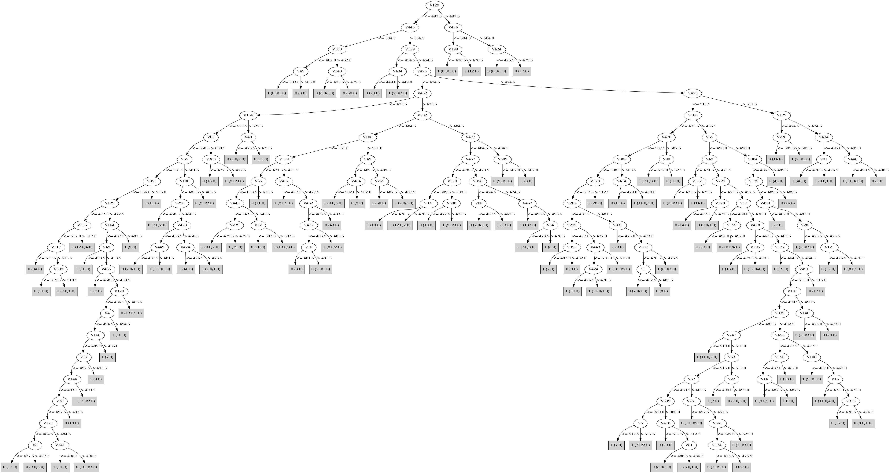

# J48

# SimpleCart Decision Tree

V476 < 472.5

* V154 < 512.5

*   * V49 < 501.5

*   *   * V443 < 541.5: 1(54.0/23.0)

*   *   * V443 >= 541.5: 0(144.0/31.0)

*   * V49 >= 501.5

*   *   * V454 < 407.0: 0(21.0/8.0)

*   *   * V454 >= 407.0: 1(126.0/21.0)

* V154 >= 512.5

*   * V29 < 477.5

*   *   * V49 < 476.5: 1(88.0/6.0)

*   *   * V49 >= 476.5: 0(78.0/20.0)

*   * V29 >= 477.5: 1(210.0/20.0)

V476 >= 472.5

* V339 < 479.5

*   * V379 < 519.5

*   *   * V454 < 443.5: 0(92.0/25.0)

*   *   * V454 >= 443.5

*   *   *   * V443 < 470.5

*   *   *   *   * V476 < 583.5: 1(70.0/21.0)

*   *   *   *   * V476 >= 583.5: 0(17.0/2.0)

*   *   *   * V443 >= 470.5: 0(66.0/24.0)

*   * V379 >= 519.5: 0(239.0/24.0)

* V339 >= 479.5

*   * V319 < 484.5: 1(171.0/77.0)

*   * V319 >= 484.5

*   *   * V106 < 464.5: 1(38.0/19.0)

*   *   * V106 >= 464.5: 0(70.0/15.0)

# PART

Decision list:

conditions|predicted class
---|---
V106 > 697 AND V476 > 504.5 AND V49 > 474 AND V7 > 411| 0 (98.0)
V443 <= 357.5 AND V242 <= 484.5 AND V1 <= 478| 1 (6.0)
V443 <= 350 AND V12 <= 536.5 AND V454 > 300.5 AND V141 <= 519| 0 (71.0)
V106 <= 234.5 AND V154 <= 465.5 AND V1 <= 487.5| 0 (33.0)
V429 <= 410 AND V482 <= 503.5 AND V3 <= 536.5| 0 (21.0)
V430 <= 467.5 AND V298 <= 519.5| 1 (19.0)
V209 > 515.5 AND V94 <= 502.5| 0 (16.0)
V482 <= 427.5 AND V162 > 465 AND V280 > 479.5 AND V1 > 479.5| 0 (23.0)
V96 > 565.5 AND V64 <= 478.5| 0 (14.0)
V170 > 603.5 AND V90 <= 547.5| 1 (19.0)
V64 <= 465.5 AND V245 > 513.5| 0 (15.0)
V158 > 527.5 AND V26 <= 522 AND V4 > 477.5| 0 (13.0)
V43 > 520.5 AND V221 > 450| 1 (23.0)
V16 <= 434.5 AND V377 > 474.5| 1 (20.0)
V274 <= 400.5 AND V242 > 505| 0 (13.0)
V390 <= 405 AND V360 > 470| 1 (18.0)
V406 <= 413.5 AND V270 > 477 AND V67 <= 550.5| 1 (29.0)
V443 > 684.5 AND V426 <= 501| 0 (18.0)
V268 > 520.5 AND V48 > 463 AND V3 > 481| 1 (15.0)
V315 <= 459.5 AND V183 <= 498.5 AND V52 > 493.5| 0 (18.0)
V195 <= 427 AND V254 > 481.5| 1 (20.0)
V57 <= 402 AND V344 > 500| 0 (19.0)
V373 > 542.5 AND V93 > 465 AND V1 <= 486.5| 0 (13.0)
V72 <= 470.5 AND V130 <= 548.5 AND V14 <= 522.5 AND V286 > 448.5 AND V299 > 462 AND V294 > 470.5 AND V39 <= 486.5 AND V105 > 436 AND V89 <= 479.5 AND V74 > 467| 0 (23.0)
V183 <= 422.5 AND V187 > 478| 1 (18.0)
V87 <= 467.5 AND V2 <= 517.5 AND V125 > 471.5| 0 (18.0)
V301 <= 412.5 AND V274 <= 498| 0 (13.0)
V148 <= 429.5 AND V75 > 476 AND V348 <= 489.5| 0 (17.0)
V119 > 543.5 AND V9 <= 495.5| 1 (21.0)
V72 <= 460.5 AND V37 > 478.5 AND V2 > 483| 0 (10.0)
V478 <= 453.5 AND V250 <= 513| 1 (18.0)
V476 <= 472.5 AND V129 > 493.5| 1 (26.0)
V328 > 531.5 AND V431 <= 505.5 AND V14 > 469.5| 0 (14.0)
V72 > 517.5 AND V353 > 510.5| 0 (11.0)
V227 <= 451.5 AND V342 <= 517 AND V298 > 491.5| 0 (19.0)
V237 > 506.5 AND V108 > 459.5| 1 (25.0)
V79 > 571.5 AND V411 <= 514 AND V29 > 463.5 AND V183 > 445.5 AND V115 <= 506| 0 (28.0)
V83 <= 423.5 AND V98 > 450| 1 (19.0)
V435 <= 455.5 AND V172 <= 535 AND V2 > 448.5| 1 (32.0)
V445 <= 455.5 AND V98 > 472.5 AND V7 > 465.5| 0 (12.0)
V167 <= 473.5 AND V31 > 480| 1 (25.0)
V118 > 505.5 AND V373 > 485.5 AND V28 <= 489.5| 0 (14.0)
V421 > 491.5 AND V160 > 474.5| 1 (24.0)
V171 <= 413 AND V159 > 494 AND V25 <= 522.5| 0 (15.0)
V92 > 569.5 AND V321 <= 497.5 AND V340 <= 522.5| 0 (17.0)
V266 > 534.5 AND V132 > 468.5| 1 (24.0)
V246 <= 446.5 AND V48 > 465.5| 1 (20.0)
V430 > 485.5 AND V197 > 478| 1 (20.0)
V274 > 565 AND V418 <= 550.5| 1 (19.0)
V142 <= 440.5 AND V408 > 473 AND V2 > 457| 1 (21.0)
V456 > 603.5 AND V437 <= 492.5 AND V464 <= 540 AND V5 <= 522.5| 1 (39.0)
V420 > 556.5 AND V124 > 460 AND V2 > 457.5| 0 (14.0)
V339 > 664 AND V90 <= 510| 0 (13.0)
V394 <= 439.5 AND V79 > 474 AND V467 > 471| 1 (27.0)
V287 > 512.5 AND V165 > 445 AND V109 <= 532.5 AND V227 <= 500.5 AND V103 <= 487.5| 1 (47.0)
V350 > 557.5 AND V77 > 468.5| 0 (16.0)
V382 > 517.5 AND V322 > 456.5 AND V2 > 465.5| 0 (13.0)
V110 > 494.5 AND V429 > 455.5 AND V113 <= 481.5| 1 (30.0)
V214 > 544.5 AND V335 > 486| 0 (16.0)
V425 > 503.5 AND V375 > 482 AND V2 > 445.5| 0 (17.0)
V69 <= 473.5 AND V416 > 514.5| 1 (24.0)
V425 <= 464.5 AND V107 > 485| 1 (16.0)
V116 <= 454.5 AND V141 <= 511 AND V394 > 467| 1 (24.0)
V224 > 547.5 AND V276 <= 492.5 AND V1 > 477| 1 (14.0)
V3 <= 454 AND V65 > 454| 0 (17.0)
V443 > 664 AND V92 <= 522.5| 1 (14.0)
V283 > 502.5 AND V360 <= 541.5 AND V44 > 474| 0 (27.0)
V263 > 527.5 AND V66 > 491.5| 1 (13.0)
V485 <= 459.5 AND V143 <= 482.5| 1 (19.0)
V266 > 519.5 AND V100 > 440.5| 0 (17.0)
V165 > 544.5 AND V117 > 478.5| 0 (16.0)
V397 <= 469 AND V9 <= 495| 1 (10.0)
V373 > 527 AND V18 <= 510.5| 1 (11.0)
V14 > 532.5 AND V297 <= 481.5| 0 (24.0)
V309 <= 452 AND V2 > 482| 1 (8.0)
V338 <= 439.5 AND V60 > 469.5| 0 (16.0)
V317 > 495.5 AND V2 <= 508| 1 (7.0)
V283 <= 453.5 AND V1 <= 484.5| 1 (6.0/1.0)
V144 > 496.5 AND V5 <= 519| 1 (11.0)
V246 <= 465.5 AND V1 > 481.5| 0 (7.0)
V129 <= 468.5 AND V30 <= 501.5| 1 (17.0)
V15 <= 465.5| 1 (10.0/1.0)
V239 <= 451.5 AND V3 > 497.5| 0 (8.0)
V315 <= 466 AND V22 > 495.5| 1 (9.0)
V25 <= 568.5 AND V119 <= 536.5 AND V328 > 441 AND V64 > 469 AND V97 > 474.5 AND V96 <= 547.5 AND V208 <= 483.5 AND V369 <= 500.5 AND V157 > 443.5 AND V280 <= 514.5 AND V449 > 439.5 AND V271 > 469 AND V376 <= 530.5 AND V258 > 466 AND V256 > 475.5 AND V435 <= 511 AND V84 <= 488| 1 (15.0)
V119 <= 536.5 AND V369 <= 503.5 AND V157 > 443.5 AND V96 <= 545 AND V97 > 474.5 AND V258 > 465 AND V455 <= 490.5 AND V12 <= 514.5| 0 (61.0)
V25 <= 568.5 AND V208 <= 483.5 AND V180 > 438.5 AND V11 > 431.5 AND V148 > 461.5 AND V136 <= 540.5| 1 (43.0)
V173 > 467.5 AND V291 <= 521 AND V2 > 458| 0 (27.0)
V488 > 466.5 AND V2 <= 481.5| 1 (7.0)
V211 > 482| 1 (7.0/1.0)
| 0 (6.0)

# JRip

Decision list:

conditions|predicted class
---|---
(V476 <= 472) and (V29 >= 478) and (V282 >= 485)|1 (231.0/20.0)
(V339 >= 480) and (V339 <= 596) and (V49 <= 467) and (V65 >= 473)|1 (134.0/17.0)
(V339 >= 483) and (V49 >= 502) and (V443 >= 508) and (V154 <= 478) and (V274 >= 473)|1 (112.0/6.0)
(V339 >= 459) and (V286 >= 511) and (V298 >= 499) and (V4 >= 491)|1 (32.0/2.0)
(V339 >= 455) and (V111 <= 477) and (V339 <= 584) and (V443 >= 565) and (V494 <= 640) and (V350 <= 543)|1 (41.0/1.0)
(V49 <= 509) and (V434 >= 483) and (V106 <= 431)|1 (83.0/27.0)
(V476 <= 505) and (V274 <= 484) and (V185 <= 479) and (V271 >= 477)|1 (50.0/15.0)
(V179 <= 481) and (V375 >= 527) and (V70 <= 475)|1 (45.0/13.0)
(V379 <= 498) and (V473 <= 471) and (V494 >= 489) and (V476 <= 582)|1 (52.0/6.0)
(V339 >= 469) and (V476 >= 527) and (V29 <= 480) and (V239 <= 481) and (V230 >= 478)|1 (45.0/7.0)
(V339 >= 525) and (V49 >= 479) and (V29 <= 478) and (V282 <= 442)|1 (32.0/6.0)
(V339 >= 449) and (V175 >= 486) and (V170 <= 461)|1 (24.0/6.0)
(V339 >= 485) and (V47 <= 501) and (V29 >= 475) and (V432 <= 487) and (V59 <= 519)|1 (21.0/2.0)
|0 (918.0/132.0)

# Decision Table

Non matches covered by IB1

v65|v129|v164|v237|v242|v339|v379|v409|v454|target
---|---|---|---|---|---|---|---|---|---
(-inf-546.5]|(473.5-497.5]|all|all|(-inf-491.5]|(664-inf)|(482.5-inf)|all|(460.5-inf)|0
(-inf-546.5]|(497.5-inf)|all|all|(491.5-inf)|(443.5-664]|(482.5-inf)|all|(460.5-inf)|0
(546.5-714]|(473.5-497.5]|all|all|(-inf-491.5]|(664-inf)|(482.5-inf)|all|(460.5-inf)|1
(546.5-714]|(473.5-497.5]|all|all|(491.5-inf)|(443.5-664]|(482.5-inf)|all|(460.5-inf)|0
(546.5-714]|(468.5-473.5]|all|all|(-inf-491.5]|(664-inf)|(482.5-inf)|all|(460.5-inf)|1
(-inf-546.5]|(473.5-497.5]|all|all|(491.5-inf)|(443.5-664]|(482.5-inf)|all|(460.5-inf)|1
(-inf-546.5]|(468.5-473.5]|all|all|(491.5-inf)|(443.5-664]|(482.5-inf)|all|(460.5-inf)|0
(714-inf)|(-inf-459.5]|all|all|(-inf-491.5]|(664-inf)|(482.5-inf)|all|(460.5-inf)|0
(546.5-714]|(-inf-459.5]|all|all|(-inf-491.5]|(664-inf)|(482.5-inf)|all|(460.5-inf)|0
(-inf-546.5]|(497.5-inf)|all|all|(-inf-491.5]|(443.5-664]|(482.5-inf)|all|(460.5-inf)|1
(-inf-546.5]|(497.5-inf)|all|all|(491.5-inf)|(-inf-443.5]|(482.5-inf)|all|(460.5-inf)|0
(546.5-714]|(473.5-497.5]|all|all|(-inf-491.5]|(443.5-664]|(482.5-inf)|all|(460.5-inf)|1
(-inf-546.5]|(473.5-497.5]|all|all|(-inf-491.5]|(443.5-664]|(482.5-inf)|all|(460.5-inf)|1
(546.5-714]|(459.5-468.5]|all|all|(491.5-inf)|(664-inf)|(482.5-inf)|all|(-inf-460.5]|0
(546.5-714]|(473.5-497.5]|all|all|(-inf-491.5]|(664-inf)|(-inf-482.5]|all|(460.5-inf)|0
(-inf-546.5]|(459.5-468.5]|all|all|(491.5-inf)|(664-inf)|(482.5-inf)|all|(-inf-460.5]|0
(-inf-546.5]|(468.5-473.5]|all|all|(-inf-491.5]|(443.5-664]|(482.5-inf)|all|(460.5-inf)|0
(546.5-714]|(473.5-497.5]|all|all|(491.5-inf)|(-inf-443.5]|(482.5-inf)|all|(460.5-inf)|0
(714-inf)|(468.5-473.5]|all|all|(-inf-491.5]|(443.5-664]|(482.5-inf)|all|(460.5-inf)|0
(546.5-714]|(468.5-473.5]|all|all|(-inf-491.5]|(443.5-664]|(482.5-inf)|all|(460.5-inf)|0
(-inf-546.5]|(473.5-497.5]|all|all|(491.5-inf)|(-inf-443.5]|(482.5-inf)|all|(460.5-inf)|0
(-inf-546.5]|(468.5-473.5]|all|all|(491.5-inf)|(-inf-443.5]|(482.5-inf)|all|(460.5-inf)|1
(546.5-714]|(-inf-459.5]|all|all|(491.5-inf)|(664-inf)|(482.5-inf)|all|(-inf-460.5]|0
(714-inf)|(459.5-468.5]|all|all|(-inf-491.5]|(443.5-664]|(482.5-inf)|all|(460.5-inf)|0
(-inf-546.5]|(468.5-473.5]|all|all|(-inf-491.5]|(664-inf)|(-inf-482.5]|all|(460.5-inf)|0
(546.5-714]|(459.5-468.5]|all|all|(-inf-491.5]|(443.5-664]|(482.5-inf)|all|(460.5-inf)|1
(-inf-546.5]|(473.5-497.5]|all|all|(491.5-inf)|(443.5-664]|(-inf-482.5]|all|(460.5-inf)|1
(-inf-546.5]|(459.5-468.5]|all|all|(-inf-491.5]|(664-inf)|(-inf-482.5]|all|(460.5-inf)|0
(-inf-546.5]|(497.5-inf)|all|all|(491.5-inf)|(443.5-664]|(482.5-inf)|all|(-inf-460.5]|0
(546.5-714]|(459.5-468.5]|all|all|(-inf-491.5]|(664-inf)|(-inf-482.5]|all|(460.5-inf)|0
(-inf-546.5]|(468.5-473.5]|all|all|(491.5-inf)|(443.5-664]|(-inf-482.5]|all|(460.5-inf)|0
(546.5-714]|(473.5-497.5]|all|all|(-inf-491.5]|(664-inf)|(482.5-inf)|all|(-inf-460.5]|0
(546.5-714]|(497.5-inf)|all|all|(-inf-491.5]|(-inf-443.5]|(482.5-inf)|all|(460.5-inf)|0
(546.5-714]|(468.5-473.5]|all|all|(-inf-491.5]|(664-inf)|(482.5-inf)|all|(-inf-460.5]|0
(546.5-714]|(459.5-468.5]|all|all|(491.5-inf)|(443.5-664]|(-inf-482.5]|all|(460.5-inf)|0
(546.5-714]|(473.5-497.5]|all|all|(491.5-inf)|(443.5-664]|(482.5-inf)|all|(-inf-460.5]|0
(-inf-546.5]|(459.5-468.5]|all|all|(491.5-inf)|(443.5-664]|(-inf-482.5]|all|(460.5-inf)|0
(-inf-546.5]|(473.5-497.5]|all|all|(491.5-inf)|(443.5-664]|(482.5-inf)|all|(-inf-460.5]|0
(-inf-546.5]|(497.5-inf)|all|all|(-inf-491.5]|(-inf-443.5]|(482.5-inf)|all|(460.5-inf)|1
(546.5-714]|(459.5-468.5]|all|all|(-inf-491.5]|(664-inf)|(482.5-inf)|all|(-inf-460.5]|1
(546.5-714]|(468.5-473.5]|all|all|(491.5-inf)|(443.5-664]|(482.5-inf)|all|(-inf-460.5]|1
(-inf-546.5]|(468.5-473.5]|all|all|(491.5-inf)|(443.5-664]|(482.5-inf)|all|(-inf-460.5]|1
(-inf-546.5]|(473.5-497.5]|all|all|(-inf-491.5]|(-inf-443.5]|(482.5-inf)|all|(460.5-inf)|1
(546.5-714]|(473.5-497.5]|all|all|(-inf-491.5]|(-inf-443.5]|(482.5-inf)|all|(460.5-inf)|1
(546.5-714]|(-inf-459.5]|all|all|(-inf-491.5]|(664-inf)|(482.5-inf)|all|(-inf-460.5]|1
(-inf-546.5]|(497.5-inf)|all|all|(491.5-inf)|(-inf-443.5]|(-inf-482.5]|all|(460.5-inf)|0
(546.5-714]|(459.5-468.5]|all|all|(491.5-inf)|(443.5-664]|(482.5-inf)|all|(-inf-460.5]|1
(546.5-714]|(473.5-497.5]|all|all|(-inf-491.5]|(443.5-664]|(-inf-482.5]|all|(460.5-inf)|1
(-inf-546.5]|(459.5-468.5]|all|all|(491.5-inf)|(443.5-664]|(482.5-inf)|all|(-inf-460.5]|1
(-inf-546.5]|(473.5-497.5]|all|all|(-inf-491.5]|(443.5-664]|(-inf-482.5]|all|(460.5-inf)|1
(-inf-546.5]|(459.5-468.5]|all|all|(491.5-inf)|(664-inf)|(-inf-482.5]|all|(-inf-460.5]|0
(-inf-546.5]|(468.5-473.5]|all|all|(-inf-491.5]|(443.5-664]|(-inf-482.5]|all|(460.5-inf)|0
(546.5-714]|(468.5-473.5]|all|all|(-inf-491.5]|(443.5-664]|(-inf-482.5]|all|(460.5-inf)|1
(-inf-546.5]|(473.5-497.5]|all|all|(491.5-inf)|(-inf-443.5]|(-inf-482.5]|all|(460.5-inf)|1
(-inf-546.5]|(497.5-inf)|all|all|(491.5-inf)|(-inf-443.5]|(482.5-inf)|all|(-inf-460.5]|0
(-inf-546.5]|(-inf-459.5]|all|all|(491.5-inf)|(664-inf)|(-inf-482.5]|all|(-inf-460.5]|0
(-inf-546.5]|(473.5-497.5]|all|all|(-inf-491.5]|(443.5-664]|(482.5-inf)|all|(-inf-460.5]|0
(546.5-714]|(473.5-497.5]|all|all|(-inf-491.5]|(443.5-664]|(482.5-inf)|all|(-inf-460.5]|0
(-inf-546.5]|(459.5-468.5]|all|all|(-inf-491.5]|(443.5-664]|(-inf-482.5]|all|(460.5-inf)|0
(-inf-546.5]|(468.5-473.5]|all|all|(491.5-inf)|(-inf-443.5]|(-inf-482.5]|all|(460.5-inf)|1
(546.5-714]|(459.5-468.5]|all|all|(-inf-491.5]|(443.5-664]|(-inf-482.5]|all|(460.5-inf)|1
(-inf-546.5]|(459.5-468.5]|all|all|(491.5-inf)|(-inf-443.5]|(-inf-482.5]|all|(460.5-inf)|0
(546.5-714]|(-inf-459.5]|all|all|(-inf-491.5]|(443.5-664]|(-inf-482.5]|all|(460.5-inf)|1
(546.5-714]|(473.5-497.5]|all|all|(491.5-inf)|(-inf-443.5]|(482.5-inf)|all|(-inf-460.5]|0
(-inf-546.5]|(473.5-497.5]|all|all|(491.5-inf)|(-inf-443.5]|(482.5-inf)|all|(-inf-460.5]|0
(546.5-714]|(468.5-473.5]|all|all|(-inf-491.5]|(443.5-664]|(482.5-inf)|all|(-inf-460.5]|0
(-inf-546.5]|(459.5-468.5]|all|all|(-inf-491.5]|(443.5-664]|(482.5-inf)|all|(-inf-460.5]|0
(546.5-714]|(468.5-473.5]|all|all|(-inf-491.5]|(664-inf)|(-inf-482.5]|all|(-inf-460.5]|0
(714-inf)|(459.5-468.5]|all|all|(-inf-491.5]|(443.5-664]|(482.5-inf)|all|(-inf-460.5]|0
(-inf-546.5]|(468.5-473.5]|all|all|(-inf-491.5]|(664-inf)|(-inf-482.5]|all|(-inf-460.5]|0
(-inf-546.5]|(468.5-473.5]|all|all|(491.5-inf)|(-inf-443.5]|(482.5-inf)|all|(-inf-460.5]|0
(546.5-714]|(459.5-468.5]|all|all|(-inf-491.5]|(443.5-664]|(482.5-inf)|all|(-inf-460.5]|1
(-inf-546.5]|(473.5-497.5]|all|all|(491.5-inf)|(443.5-664]|(-inf-482.5]|all|(-inf-460.5]|0
(546.5-714]|(-inf-459.5]|all|all|(-inf-491.5]|(443.5-664]|(482.5-inf)|all|(-inf-460.5]|1
(546.5-714]|(473.5-497.5]|all|all|(-inf-491.5]|(-inf-443.5]|(-inf-482.5]|all|(460.5-inf)|0
(546.5-714]|(459.5-468.5]|all|all|(-inf-491.5]|(664-inf)|(-inf-482.5]|all|(-inf-460.5]|0
(546.5-714]|(468.5-473.5]|all|all|(491.5-inf)|(443.5-664]|(-inf-482.5]|all|(-inf-460.5]|0
(-inf-546.5]|(468.5-473.5]|all|all|(491.5-inf)|(443.5-664]|(-inf-482.5]|all|(-inf-460.5]|1
(-inf-546.5]|(473.5-497.5]|all|all|(-inf-491.5]|(-inf-443.5]|(-inf-482.5]|all|(460.5-inf)|1
(546.5-714]|(468.5-473.5]|all|all|(-inf-491.5]|(-inf-443.5]|(-inf-482.5]|all|(460.5-inf)|1
(546.5-714]|(459.5-468.5]|all|all|(491.5-inf)|(443.5-664]|(-inf-482.5]|all|(-inf-460.5]|1
(546.5-714]|(-inf-459.5]|all|all|(-inf-491.5]|(664-inf)|(-inf-482.5]|all|(-inf-460.5]|0
(-inf-546.5]|(-inf-459.5]|all|all|(-inf-491.5]|(664-inf)|(-inf-482.5]|all|(-inf-460.5]|0
(-inf-546.5]|(468.5-473.5]|all|all|(-inf-491.5]|(-inf-443.5]|(-inf-482.5]|all|(460.5-inf)|0
(-inf-546.5]|(459.5-468.5]|all|all|(491.5-inf)|(443.5-664]|(-inf-482.5]|all|(-inf-460.5]|1
(546.5-714]|(-inf-459.5]|all|all|(491.5-inf)|(443.5-664]|(-inf-482.5]|all|(-inf-460.5]|0
(-inf-546.5]|(-inf-459.5]|all|all|(491.5-inf)|(443.5-664]|(-inf-482.5]|all|(-inf-460.5]|0
(-inf-546.5]|(473.5-497.5]|all|all|(-inf-491.5]|(443.5-664]|(-inf-482.5]|all|(-inf-460.5]|0
(546.5-714]|(468.5-473.5]|all|all|(-inf-491.5]|(443.5-664]|(-inf-482.5]|all|(-inf-460.5]|1
(-inf-546.5]|(473.5-497.5]|all|all|(491.5-inf)|(-inf-443.5]|(-inf-482.5]|all|(-inf-460.5]|0
(-inf-546.5]|(468.5-473.5]|all|all|(-inf-491.5]|(443.5-664]|(-inf-482.5]|all|(-inf-460.5]|1
(-inf-546.5]|(459.5-468.5]|all|all|(-inf-491.5]|(443.5-664]|(-inf-482.5]|all|(-inf-460.5]|0
(-inf-546.5]|(468.5-473.5]|all|all|(491.5-inf)|(-inf-443.5]|(-inf-482.5]|all|(-inf-460.5]|0
(546.5-714]|(459.5-468.5]|all|all|(-inf-491.5]|(443.5-664]|(-inf-482.5]|all|(-inf-460.5]|1
(546.5-714]|(459.5-468.5]|all|all|(491.5-inf)|(-inf-443.5]|(-inf-482.5]|all|(-inf-460.5]|0
(-inf-546.5]|(459.5-468.5]|all|all|(491.5-inf)|(-inf-443.5]|(-inf-482.5]|all|(-inf-460.5]|1
(546.5-714]|(-inf-459.5]|all|all|(-inf-491.5]|(443.5-664]|(-inf-482.5]|all|(-inf-460.5]|1

