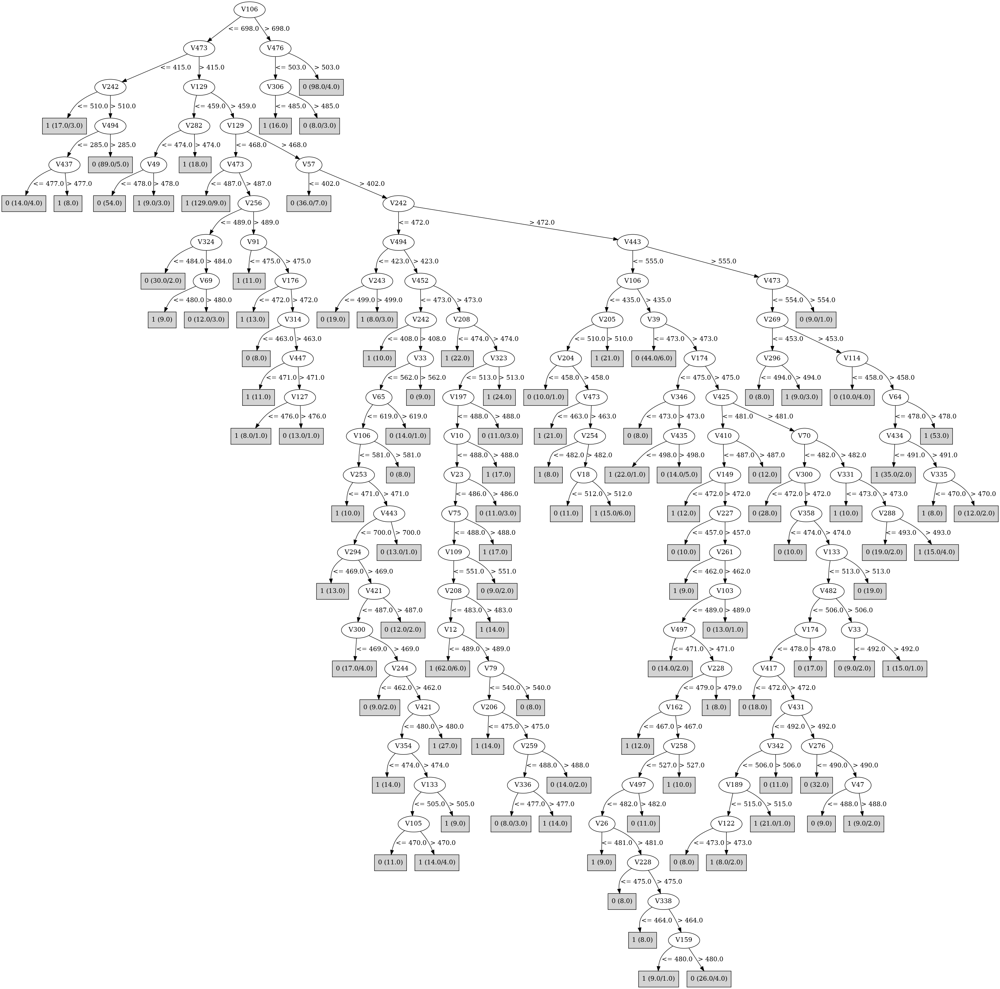

# J48

# SimpleCart Decision Tree

V476 < 499.5

* V154 < 453.5

*   * V379 < 487.5

*   *   * V443 < 518.5: 1(24.0/8.0)

*   *   * V443 >= 518.5: 0(133.0/14.0)

*   * V379 >= 487.5

*   *   * V443 < 551.5

*   *   *   * V129 < 468.5: 1(11.0/1.0)

*   *   *   * V129 >= 468.5

*   *   *   *   * V454 < 471.5: 0(36.0/3.0)

*   *   *   *   * V454 >= 471.5: 1(12.0/2.0)

*   *   * V443 >= 551.5: 1(83.0/11.0)

* V154 >= 453.5

*   * V379 < 478.5: 1(240.0/37.0)

*   * V379 >= 478.5

*   *   * V29 < 479.5

*   *   *   * V282 < 479.5: 1(33.0/15.0)

*   *   *   * V282 >= 479.5

*   *   *   *   * V379 < 506.0: 1(18.0/8.0)

*   *   *   *   * V379 >= 506.0: 0(91.0/13.0)

*   *   * V29 >= 479.5: 1(150.0/40.0)

V476 >= 499.5

* V339 < 475.5

*   * V379 < 519.5

*   *   * V154 < 640.5: 0(170.0/77.0)

*   *   * V154 >= 640.5: 1(22.0/5.0)

*   * V379 >= 519.5: 0(209.0/13.0)

* V339 >= 475.5

*   * V29 < 482.5

*   *   * V129 < 460.5: 0(15.0/1.0)

*   *   * V129 >= 460.5: 1(158.0/52.0)

*   * V29 >= 482.5

*   *   * V106 < 464.5: 1(35.0/9.0)

*   *   * V106 >= 464.5: 0(63.0/8.0)

# PART

Decision list:

conditions|predicted class
---|---
V106 > 698.5 AND V476 > 503.5| 0 (98.0/4.0)
V473 <= 415.5 AND V242 > 510.0 AND V494 > 285.5| 0 (89.0/5.0)
V129 <= 459.5 AND V282 <= 474.5 AND V49 <= 472.0| 0 (53.0)
V129 <= 468.5 AND V456 > 521.0 AND V473 <= 488.5| 1 (144.0/11.0)
V103 > 494.5 AND V384 > 483.0| 0 (17.0)
V282 > 528.5 AND V49 <= 487.5 AND V337 > 370.5| 1 (140.0/11.0)
V57 <= 402.5| 0 (36.0/6.0)
V388 > 480.5| 0 (31.0/9.0)
V154 <= 344.5 AND V452 <= 479.5| 1 (26.0)
V414 <= 453.5 AND V199 > 476.5| 0 (22.0/1.0)
V263 > 525.5 AND V89 <= 482.5 AND V217 > 497.5| 1 (31.0/5.0)
V327 > 527.5| 0 (30.0/6.0)
V443 > 680.0 AND V304 <= 512.0| 0 (21.0)
V349 > 526.5| 0 (31.0/7.0)
V476 <= 471.5 AND V494 <= 426.0 AND V474 <= 478.5 AND V427 > 485.5| 1 (16.0/6.0)
V476 <= 471.5 AND V494 > 425.0 AND V129 > 493.5| 1 (31.0)
V339 <= 473.5 AND V476 > 492.5 AND V113 > 466.0 AND V446 <= 479.5 AND V316 > 509.5| 0 (43.0/4.0)
V332 <= 457.5 AND V175 > 471.5| 1 (35.0/3.0)
V454 > 683.0| 0 (26.0/4.0)
V333 > 477.5 AND V325 > 467.5 AND V11 <= 463.5| 0 (17.0/2.0)
V446 > 479.5 AND V138 <= 508.5 AND V339 <= 484.5| 0 (29.0/5.0)
V3 > 566.5 AND V356 <= 497.5| 1 (40.0/3.0)
V494 > 473.5 AND V319 > 503.5 AND V303 > 474.5 AND V351 <= 491.5 AND V358 <= 477.5| 1 (89.0/5.0)
V339 <= 445.5 AND V242 > 494.5 AND V326 <= 479.5| 0 (50.0/3.0)
V29 > 485.5 AND V434 <= 536.5 AND V494 > 224.5 AND V75 <= 488.5 AND V81 > 468.0 AND V431 > 494.5 AND V454 <= 496.5| 0 (38.0/1.0)
V89 <= 468.5| 1 (26.0/5.0)
V168 <= 472.5 AND V360 > 490.0| 1 (16.0)
V31 > 489.5 AND V424 > 475.5 AND V91 > 475.5 AND V100 > 450.5 AND V35 <= 512.5 AND V227 > 484.5 AND V155 <= 477.5| 0 (18.0/3.0)
V400 <= 473.5 AND V122 <= 493.0| 1 (36.0/4.0)
V359 <= 472.5 AND V431 > 478.5 AND V155 > 477.5| 1 (26.0/3.0)
V284 > 476.5 AND V364 > 507.5| 0 (33.0/2.0)
V440 <= 479.5 AND V458 > 466.5 AND V303 <= 480.5 AND V236 > 489.5| 0 (34.0/4.0)
V147 > 478.5 AND V181 <= 524.5 AND V235 > 463.5 AND V169 > 475.5 AND V91 > 475.5 AND V358 <= 478.5 AND V228 <= 479.5 AND V417 > 469.5 AND V38 > 464.5 AND V216 > 477.5 AND V184 <= 492.5| 1 (42.0/8.0)
V263 > 463.5 AND V303 <= 478.5 AND V274 <= 559.0 AND V64 > 469.5 AND V181 <= 556.0 AND V356 <= 507.5 AND V403 > 474.5 AND V335 <= 529.5 AND V297 <= 517.5 AND V145 <= 501.5 AND V406 > 446.5 AND V405 <= 477.5 AND V231 <= 495.0 AND V78 > 475.5 AND V135 <= 486.5| 1 (28.0/4.0)
V261 > 509.5 AND V304 <= 502.5| 0 (26.0/1.0)
V498 <= 505.5 AND V385 <= 462.5 AND V347 > 484.5| 1 (20.0)
V290 <= 481.5 AND V34 > 519.0| 1 (19.0)
V8 <= 478.5 AND V315 > 464.5 AND V324 <= 500.5 AND V148 <= 556.5 AND V31 <= 494.5 AND V483 <= 493.5 AND V7 <= 524.0 AND V89 <= 489.5 AND V197 <= 490.5 AND V119 > 453.0 AND V409 <= 522.5 AND V472 <= 485.5 AND V147 > 474.5 AND V465 <= 505.0 AND V493 <= 506.5 AND V216 > 459.5 AND V265 <= 485.5 AND V388 > 476.5 AND V436 <= 517.5| 1 (33.0/3.0)
V89 <= 489.5 AND V199 > 474.5 AND V473 > 423.5 AND V498 <= 501.5 AND V58 <= 535.0 AND V278 > 456.5 AND V389 > 463.0 AND V324 > 485.5 AND V341 > 495.5| 1 (30.0/3.0)
V473 > 423.5 AND V89 <= 489.5 AND V58 <= 535.0 AND V366 <= 538.0 AND V12 <= 513.5 AND V140 <= 506.5 AND V216 <= 581.5 AND V6 <= 490.5 AND V395 <= 480.5| 0 (89.0/2.0)
V329 > 469.5 AND V148 > 443.5 AND V452 <= 487.5 AND V137 <= 568.5 AND V295 <= 558.0 AND V183 <= 510.5 AND V37 > 468.5 AND V241 > 471.0 AND V365 <= 484.5 AND V417 > 475.5 AND V134 > 476.5| 0 (25.0/6.0)
V329 > 469.5 AND V148 > 443.5 AND V29 <= 493.5 AND V89 > 473.5 AND V401 > 475.5 AND V160 <= 517.5 AND V268 > 480.5| 0 (28.0/4.0)
V148 > 441.5 AND V89 > 473.5| 1 (80.0/6.0)
V89 <= 472.5| 1 (14.0/6.0)
| 0 (14.0)

# JRip

Decision list:

conditions|predicted class
---|---
(V476 >= 499) and (V339 <= 475)|0 (501.0/114.0)
(V494 <= 473) and (V106 >= 465) and (V452 >= 480)|0 (104.0/11.0)
(V339 >= 593) and (V49 <= 479) and (V319 <= 503) and (V154 <= 477)|0 (133.0/2.0)
(V282 >= 466) and (V29 <= 479) and (V379 >= 506)|0 (133.0/30.0)
|1 (949.0/191.0)

# Decision Table

Non matches covered by Majority class

v23|v49|v106|v337|v339|v358|v473|v476|v494|target
---|---|---|---|---|---|---|---|---|---
all|(468.5-inf)|(437.5-698.5]|(527.5-inf)|(445.5-625.5]|all|(430.5-inf)|(499.5-inf)|(471.5-inf)|0
all|(468.5-inf)|(698.5-inf)|(-inf-527.5]|(445.5-625.5]|all|(430.5-inf)|(499.5-inf)|(471.5-inf)|0
all|(468.5-inf)|(437.5-698.5]|(527.5-inf)|(625.5-inf)|all|(430.5-inf)|(-inf-499.5]|(471.5-inf)|1
all|(468.5-inf)|(437.5-698.5]|(-inf-527.5]|(445.5-625.5]|all|(430.5-inf)|(499.5-inf)|(471.5-inf)|1
all|(-inf-468.5]|(258-437.5]|(527.5-inf)|(445.5-625.5]|all|(430.5-inf)|(499.5-inf)|(471.5-inf)|0
all|(-inf-468.5]|(437.5-698.5]|(527.5-inf)|(625.5-inf)|all|(430.5-inf)|(-inf-499.5]|(471.5-inf)|0
all|(468.5-inf)|(437.5-698.5]|(527.5-inf)|(-inf-445.5]|all|(430.5-inf)|(499.5-inf)|(471.5-inf)|0
all|(468.5-inf)|(698.5-inf)|(-inf-527.5]|(625.5-inf)|all|(430.5-inf)|(-inf-499.5]|(471.5-inf)|0
all|(-inf-468.5]|(437.5-698.5]|(-inf-527.5]|(445.5-625.5]|all|(430.5-inf)|(499.5-inf)|(471.5-inf)|1
all|(468.5-inf)|(698.5-inf)|(527.5-inf)|(445.5-625.5]|all|(430.5-inf)|(-inf-499.5]|(471.5-inf)|0
all|(468.5-inf)|(258-437.5]|(-inf-527.5]|(445.5-625.5]|all|(430.5-inf)|(499.5-inf)|(471.5-inf)|0
all|(468.5-inf)|(258-437.5]|(527.5-inf)|(625.5-inf)|all|(430.5-inf)|(-inf-499.5]|(471.5-inf)|0
all|(468.5-inf)|(698.5-inf)|(-inf-527.5]|(-inf-445.5]|all|(430.5-inf)|(499.5-inf)|(471.5-inf)|0
all|(-inf-468.5]|(258-437.5]|(-inf-527.5]|(445.5-625.5]|all|(430.5-inf)|(499.5-inf)|(471.5-inf)|0
all|(-inf-468.5]|(698.5-inf)|(-inf-527.5]|(-inf-445.5]|all|(430.5-inf)|(499.5-inf)|(471.5-inf)|0
all|(468.5-inf)|(258-437.5]|(527.5-inf)|(-inf-445.5]|all|(430.5-inf)|(499.5-inf)|(471.5-inf)|1
all|(468.5-inf)|(437.5-698.5]|(-inf-527.5]|(625.5-inf)|all|(430.5-inf)|(-inf-499.5]|(471.5-inf)|1
all|(-inf-468.5]|(258-437.5]|(527.5-inf)|(625.5-inf)|all|(430.5-inf)|(-inf-499.5]|(471.5-inf)|0
all|(468.5-inf)|(-inf-258]|(527.5-inf)|(625.5-inf)|all|(430.5-inf)|(-inf-499.5]|(471.5-inf)|0
all|(-inf-468.5]|(258-437.5]|(527.5-inf)|(-inf-445.5]|all|(430.5-inf)|(499.5-inf)|(471.5-inf)|0
all|(-inf-468.5]|(437.5-698.5]|(-inf-527.5]|(625.5-inf)|all|(430.5-inf)|(-inf-499.5]|(471.5-inf)|0
all|(468.5-inf)|(437.5-698.5]|(-inf-527.5]|(-inf-445.5]|all|(430.5-inf)|(499.5-inf)|(471.5-inf)|0
all|(468.5-inf)|(437.5-698.5]|(527.5-inf)|(445.5-625.5]|all|(430.5-inf)|(-inf-499.5]|(471.5-inf)|1
all|(-inf-468.5]|(-inf-258]|(527.5-inf)|(625.5-inf)|all|(430.5-inf)|(-inf-499.5]|(471.5-inf)|1
all|(468.5-inf)|(698.5-inf)|(-inf-527.5]|(445.5-625.5]|all|(430.5-inf)|(-inf-499.5]|(471.5-inf)|0
all|(-inf-468.5]|(437.5-698.5]|(-inf-527.5]|(-inf-445.5]|all|(430.5-inf)|(499.5-inf)|(471.5-inf)|0
all|(-inf-468.5]|(437.5-698.5]|(527.5-inf)|(445.5-625.5]|all|(430.5-inf)|(-inf-499.5]|(471.5-inf)|1
all|(-inf-468.5]|(258-437.5]|(-inf-527.5]|(625.5-inf)|all|(430.5-inf)|(-inf-499.5]|(471.5-inf)|0
all|(468.5-inf)|(698.5-inf)|(-inf-527.5]|(445.5-625.5]|all|(430.5-inf)|(499.5-inf)|(-inf-471.5]|0
all|(468.5-inf)|(258-437.5]|(-inf-527.5]|(625.5-inf)|all|(430.5-inf)|(499.5-inf)|(-inf-471.5]|0
all|(468.5-inf)|(698.5-inf)|(527.5-inf)|(-inf-445.5]|all|(430.5-inf)|(-inf-499.5]|(471.5-inf)|1
all|(468.5-inf)|(258-437.5]|(527.5-inf)|(445.5-625.5]|all|(430.5-inf)|(-inf-499.5]|(471.5-inf)|0
all|(-inf-468.5]|(258-437.5]|(-inf-527.5]|(-inf-445.5]|all|(430.5-inf)|(499.5-inf)|(471.5-inf)|1
all|(-inf-468.5]|(258-437.5]|(-inf-527.5]|(625.5-inf)|all|(430.5-inf)|(499.5-inf)|(-inf-471.5]|0
all|(468.5-inf)|(437.5-698.5]|(527.5-inf)|(-inf-445.5]|all|(-inf-430.5]|(499.5-inf)|(471.5-inf)|0
all|(468.5-inf)|(258-437.5]|(527.5-inf)|(445.5-625.5]|all|(430.5-inf)|(499.5-inf)|(-inf-471.5]|1
all|(-inf-468.5]|(258-437.5]|(527.5-inf)|(445.5-625.5]|all|(430.5-inf)|(-inf-499.5]|(471.5-inf)|1
all|(468.5-inf)|(437.5-698.5]|(-inf-527.5]|(445.5-625.5]|all|(430.5-inf)|(-inf-499.5]|(471.5-inf)|1
all|(-inf-468.5]|(258-437.5]|(527.5-inf)|(445.5-625.5]|all|(430.5-inf)|(499.5-inf)|(-inf-471.5]|0
all|(468.5-inf)|(437.5-698.5]|(527.5-inf)|(625.5-inf)|all|(430.5-inf)|(-inf-499.5]|(-inf-471.5]|0
all|(468.5-inf)|(698.5-inf)|(-inf-527.5]|(-inf-445.5]|all|(-inf-430.5]|(499.5-inf)|(471.5-inf)|0
all|(468.5-inf)|(437.5-698.5]|(527.5-inf)|(-inf-445.5]|all|(430.5-inf)|(-inf-499.5]|(471.5-inf)|1
all|(468.5-inf)|(437.5-698.5]|(-inf-527.5]|(445.5-625.5]|all|(430.5-inf)|(499.5-inf)|(-inf-471.5]|0
all|(-inf-468.5]|(437.5-698.5]|(-inf-527.5]|(445.5-625.5]|all|(430.5-inf)|(-inf-499.5]|(471.5-inf)|1
all|(468.5-inf)|(258-437.5]|(-inf-527.5]|(445.5-625.5]|all|(430.5-inf)|(-inf-499.5]|(471.5-inf)|0
all|(-inf-468.5]|(437.5-698.5]|(527.5-inf)|(-inf-445.5]|all|(430.5-inf)|(-inf-499.5]|(471.5-inf)|1
all|(468.5-inf)|(698.5-inf)|(-inf-527.5]|(-inf-445.5]|all|(430.5-inf)|(-inf-499.5]|(471.5-inf)|1
all|(-inf-468.5]|(-inf-258]|(-inf-527.5]|(625.5-inf)|all|(430.5-inf)|(499.5-inf)|(-inf-471.5]|0
all|(-inf-468.5]|(-inf-258]|(527.5-inf)|(445.5-625.5]|all|(430.5-inf)|(-inf-499.5]|(471.5-inf)|1
all|(-inf-468.5]|(437.5-698.5]|(-inf-527.5]|(445.5-625.5]|all|(430.5-inf)|(499.5-inf)|(-inf-471.5]|0
all|(-inf-468.5]|(-inf-258]|(527.5-inf)|(445.5-625.5]|all|(430.5-inf)|(499.5-inf)|(-inf-471.5]|0
all|(468.5-inf)|(698.5-inf)|(-inf-527.5]|(-inf-445.5]|all|(430.5-inf)|(499.5-inf)|(-inf-471.5]|0
all|(468.5-inf)|(437.5-698.5]|(527.5-inf)|(445.5-625.5]|all|(-inf-430.5]|(-inf-499.5]|(471.5-inf)|1
all|(468.5-inf)|(437.5-698.5]|(-inf-527.5]|(-inf-445.5]|all|(-inf-430.5]|(499.5-inf)|(471.5-inf)|0
all|(-inf-468.5]|(258-437.5]|(-inf-527.5]|(445.5-625.5]|all|(430.5-inf)|(-inf-499.5]|(471.5-inf)|0
all|(468.5-inf)|(258-437.5]|(-inf-527.5]|(445.5-625.5]|all|(430.5-inf)|(499.5-inf)|(-inf-471.5]|1
all|(468.5-inf)|(258-437.5]|(527.5-inf)|(625.5-inf)|all|(430.5-inf)|(-inf-499.5]|(-inf-471.5]|1
all|(468.5-inf)|(437.5-698.5]|(527.5-inf)|(445.5-625.5]|all|(-inf-430.5]|(499.5-inf)|(-inf-471.5]|0
all|(-inf-468.5]|(437.5-698.5]|(-inf-527.5]|(-inf-445.5]|all|(-inf-430.5]|(499.5-inf)|(471.5-inf)|1
all|(-inf-468.5]|(258-437.5]|(527.5-inf)|(-inf-445.5]|all|(430.5-inf)|(-inf-499.5]|(471.5-inf)|1
all|(468.5-inf)|(437.5-698.5]|(-inf-527.5]|(-inf-445.5]|all|(430.5-inf)|(-inf-499.5]|(471.5-inf)|1
all|(-inf-468.5]|(258-437.5]|(527.5-inf)|(625.5-inf)|all|(430.5-inf)|(-inf-499.5]|(-inf-471.5]|0
all|(-inf-468.5]|(258-437.5]|(-inf-527.5]|(445.5-625.5]|all|(430.5-inf)|(499.5-inf)|(-inf-471.5]|1
all|(-inf-468.5]|(437.5-698.5]|(-inf-527.5]|(625.5-inf)|all|(430.5-inf)|(-inf-499.5]|(-inf-471.5]|0
all|(468.5-inf)|(437.5-698.5]|(527.5-inf)|(445.5-625.5]|all|(430.5-inf)|(-inf-499.5]|(-inf-471.5]|0
all|(468.5-inf)|(-inf-258]|(527.5-inf)|(625.5-inf)|all|(430.5-inf)|(-inf-499.5]|(-inf-471.5]|1
all|(-inf-468.5]|(437.5-698.5]|(-inf-527.5]|(-inf-445.5]|all|(430.5-inf)|(-inf-499.5]|(471.5-inf)|1
all|(468.5-inf)|(437.5-698.5]|(-inf-527.5]|(-inf-445.5]|all|(430.5-inf)|(499.5-inf)|(-inf-471.5]|0
all|(468.5-inf)|(258-437.5]|(527.5-inf)|(445.5-625.5]|all|(-inf-430.5]|(499.5-inf)|(-inf-471.5]|0
all|(-inf-468.5]|(437.5-698.5]|(-inf-527.5]|(-inf-445.5]|all|(430.5-inf)|(499.5-inf)|(-inf-471.5]|0
all|(468.5-inf)|(698.5-inf)|(-inf-527.5]|(445.5-625.5]|all|(430.5-inf)|(-inf-499.5]|(-inf-471.5]|0
all|(-inf-468.5]|(-inf-258]|(-inf-527.5]|(445.5-625.5]|all|(430.5-inf)|(499.5-inf)|(-inf-471.5]|0
all|(-inf-468.5]|(-inf-258]|(527.5-inf)|(625.5-inf)|all|(430.5-inf)|(-inf-499.5]|(-inf-471.5]|0
all|(468.5-inf)|(258-437.5]|(-inf-527.5]|(625.5-inf)|all|(430.5-inf)|(-inf-499.5]|(-inf-471.5]|0
all|(-inf-468.5]|(258-437.5]|(527.5-inf)|(445.5-625.5]|all|(-inf-430.5]|(-inf-499.5]|(471.5-inf)|1
all|(-inf-468.5]|(258-437.5]|(-inf-527.5]|(625.5-inf)|all|(430.5-inf)|(-inf-499.5]|(-inf-471.5]|0
all|(468.5-inf)|(258-437.5]|(527.5-inf)|(445.5-625.5]|all|(430.5-inf)|(-inf-499.5]|(-inf-471.5]|1
all|(468.5-inf)|(437.5-698.5]|(-inf-527.5]|(445.5-625.5]|all|(-inf-430.5]|(499.5-inf)|(-inf-471.5]|0
all|(-inf-468.5]|(258-437.5]|(527.5-inf)|(445.5-625.5]|all|(-inf-430.5]|(499.5-inf)|(-inf-471.5]|0
all|(468.5-inf)|(437.5-698.5]|(527.5-inf)|(-inf-445.5]|all|(-inf-430.5]|(-inf-499.5]|(471.5-inf)|1
all|(468.5-inf)|(437.5-698.5]|(527.5-inf)|(-inf-445.5]|all|(-inf-430.5]|(499.5-inf)|(-inf-471.5]|0
all|(-inf-468.5]|(258-437.5]|(-inf-527.5]|(-inf-445.5]|all|(430.5-inf)|(499.5-inf)|(-inf-471.5]|1
all|(-inf-468.5]|(437.5-698.5]|(-inf-527.5]|(445.5-625.5]|all|(-inf-430.5]|(499.5-inf)|(-inf-471.5]|1
all|(468.5-inf)|(437.5-698.5]|(-inf-527.5]|(445.5-625.5]|all|(430.5-inf)|(-inf-499.5]|(-inf-471.5]|0
all|(-inf-468.5]|(437.5-698.5]|(527.5-inf)|(-inf-445.5]|all|(-inf-430.5]|(-inf-499.5]|(471.5-inf)|0
all|(-inf-468.5]|(258-437.5]|(527.5-inf)|(445.5-625.5]|all|(430.5-inf)|(-inf-499.5]|(-inf-471.5]|1
all|(468.5-inf)|(698.5-inf)|(-inf-527.5]|(-inf-445.5]|all|(-inf-430.5]|(499.5-inf)|(-inf-471.5]|0
all|(468.5-inf)|(258-437.5]|(-inf-527.5]|(445.5-625.5]|all|(-inf-430.5]|(499.5-inf)|(-inf-471.5]|1
all|(-inf-468.5]|(-inf-258]|(-inf-527.5]|(625.5-inf)|all|(430.5-inf)|(-inf-499.5]|(-inf-471.5]|0
all|(-inf-468.5]|(437.5-698.5]|(-inf-527.5]|(445.5-625.5]|all|(430.5-inf)|(-inf-499.5]|(-inf-471.5]|0
all|(-inf-468.5]|(258-437.5]|(527.5-inf)|(-inf-445.5]|all|(-inf-430.5]|(-inf-499.5]|(471.5-inf)|1
all|(-inf-468.5]|(258-437.5]|(-inf-527.5]|(445.5-625.5]|all|(-inf-430.5]|(499.5-inf)|(-inf-471.5]|0
all|(468.5-inf)|(437.5-698.5]|(-inf-527.5]|(-inf-445.5]|all|(-inf-430.5]|(-inf-499.5]|(471.5-inf)|0
all|(-inf-468.5]|(-inf-258]|(527.5-inf)|(445.5-625.5]|all|(430.5-inf)|(-inf-499.5]|(-inf-471.5]|1
all|(468.5-inf)|(258-437.5]|(-inf-527.5]|(445.5-625.5]|all|(430.5-inf)|(-inf-499.5]|(-inf-471.5]|0
all|(-inf-468.5]|(258-437.5]|(527.5-inf)|(-inf-445.5]|all|(-inf-430.5]|(499.5-inf)|(-inf-471.5]|0
all|(468.5-inf)|(437.5-698.5]|(527.5-inf)|(445.5-625.5]|all|(-inf-430.5]|(-inf-499.5]|(-inf-471.5]|0
all|(-inf-468.5]|(437.5-698.5]|(-inf-527.5]|(-inf-445.5]|all|(-inf-430.5]|(-inf-499.5]|(471.5-inf)|0
all|(-inf-468.5]|(258-437.5]|(-inf-527.5]|(445.5-625.5]|all|(430.5-inf)|(-inf-499.5]|(-inf-471.5]|0
all|(468.5-inf)|(437.5-698.5]|(-inf-527.5]|(-inf-445.5]|all|(-inf-430.5]|(499.5-inf)|(-inf-471.5]|0
all|(-inf-468.5]|(437.5-698.5]|(-inf-527.5]|(-inf-445.5]|all|(-inf-430.5]|(499.5-inf)|(-inf-471.5]|0
all|(-inf-468.5]|(-inf-258]|(-inf-527.5]|(445.5-625.5]|all|(430.5-inf)|(-inf-499.5]|(-inf-471.5]|0
all|(468.5-inf)|(258-437.5]|(527.5-inf)|(445.5-625.5]|all|(-inf-430.5]|(-inf-499.5]|(-inf-471.5]|0
all|(468.5-inf)|(258-437.5]|(-inf-527.5]|(-inf-445.5]|all|(-inf-430.5]|(499.5-inf)|(-inf-471.5]|0
all|(-inf-468.5]|(258-437.5]|(-inf-527.5]|(-inf-445.5]|all|(-inf-430.5]|(499.5-inf)|(-inf-471.5]|0
all|(-inf-468.5]|(258-437.5]|(527.5-inf)|(445.5-625.5]|all|(-inf-430.5]|(-inf-499.5]|(-inf-471.5]|1
all|(468.5-inf)|(437.5-698.5]|(527.5-inf)|(-inf-445.5]|all|(-inf-430.5]|(-inf-499.5]|(-inf-471.5]|0

