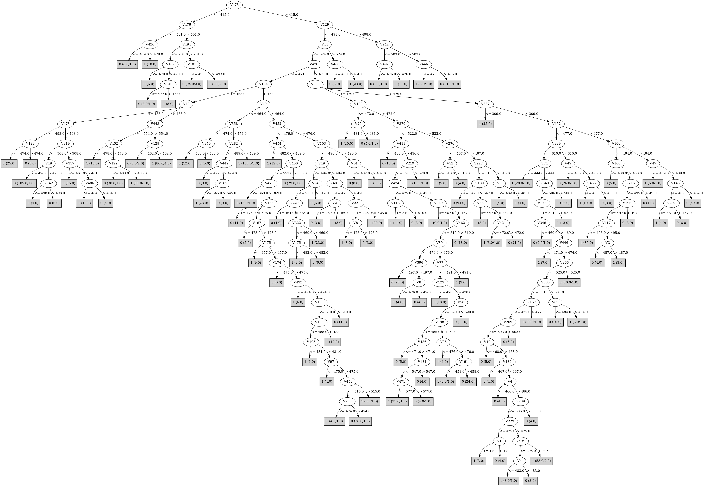

# J48

# SimpleCart Decision Tree

V476 < 471.5

* V154 < 453.5

*   * V49 < 483.5

*   *   * V443 < 541.5

*   *   *   * V106 < 450.5: 1(28.0/1.0)

*   *   *   * V106 >= 450.5: 0(5.0/0.0)

*   *   * V443 >= 541.5

*   *   *   * V463 < 438.5: 1(3.0/1.0)

*   *   *   * V463 >= 438.5

*   *   *   *   * V177 < 510.0

*   *   *   *   *   * V286 < 420.0: 1(2.0/0.0)

*   *   *   *   *   * V286 >= 420.0

*   *   *   *   *   *   * V209 < 449.5: 1(2.0/1.0)

*   *   *   *   *   *   * V209 >= 449.5: 0(124.0/2.0)

*   *   *   *   * V177 >= 510.0: 1(3.0/1.0)

*   * V49 >= 483.5

*   *   * V443 < 554.5

*   *   *   * V29 < 481.0: 1(10.0/0.0)

*   *   *   * V29 >= 481.0

*   *   *   *   * V106 < 552.5: 0(29.0/1.0)

*   *   *   *   * V106 >= 552.5: 1(10.0/1.0)

*   *   * V443 >= 554.5

*   *   *   * V65 < 647.0

*   *   *   *   * V473 < 594.0

*   *   *   *   *   * V498 < 505.5: 1(81.0/0.0)

*   *   *   *   *   * V498 >= 505.5: 0(2.0/1.0)

*   *   *   *   * V473 >= 594.0: 0(2.0/0.0)

*   *   *   * V65 >= 647.0: 0(3.0/0.0)

* V154 >= 453.5

*   * V49 < 468.5

*   *   * V216 < 428.5

*   *   *   * V5 < 484.0: 0(4.0/0.0)

*   *   *   * V5 >= 484.0: 1(3.0/0.0)

*   *   * V216 >= 428.5

*   *   *   * V173 < 437.5: 0(2.0/0.0)

*   *   *   * V173 >= 437.5

*   *   *   *   * V301 < 414.0

*   *   *   *   *   * V6 < 483.0: 0(3.0/0.0)

*   *   *   *   *   * V6 >= 483.0: 1(3.0/0.0)

*   *   *   *   * V301 >= 414.0: 1(186.0/7.0)

*   * V49 >= 468.5

*   *   * V29 < 477.5

*   *   *   * V65 < 650.0

*   *   *   *   * V106 < 528.5

*   *   *   *   *   * V270 < 496.5

*   *   *   *   *   *   * V327 < 483.5

*   *   *   *   *   *   *   * V484 < 493.5

*   *   *   *   *   *   *   *   * V293 < 517.0: 1(9.0/0.0)

*   *   *   *   *   *   *   *   * V293 >= 517.0: 0(6.0/0.0)

*   *   *   *   *   *   *   * V484 >= 493.5: 0(19.0/0.0)

*   *   *   *   *   *   * V327 >= 483.5

*   *   *   *   *   *   *   * V82 < 478.5: 0(4.0/1.0)

*   *   *   *   *   *   *   * V82 >= 478.5: 1(18.0/1.0)

*   *   *   *   *   * V270 >= 496.5

*   *   *   *   *   *   * V410 < 472.5

*   *   *   *   *   *   *   * V15 < 482.0: 1(2.0/0.0)

*   *   *   *   *   *   *   * V15 >= 482.0: 0(4.0/0.0)

*   *   *   *   *   *   * V410 >= 472.5: 1(28.0/1.0)

*   *   *   *   * V106 >= 528.5

*   *   *   *   *   * V494 < 662.5: 1(6.0/1.0)

*   *   *   *   *   * V494 >= 662.5: 0(29.0/0.0)

*   *   *   * V65 >= 650.0: 0(23.0/1.0)

*   *   * V29 >= 477.5

*   *   *   * V103 < 495.0

*   *   *   *   * V56 < 539.0

*   *   *   *   *   * V223 < 433.0: 0(4.0/0.0)

*   *   *   *   *   * V223 >= 433.0

*   *   *   *   *   *   * V144 < 501.5

*   *   *   *   *   *   *   * V173 < 455.5

*   *   *   *   *   *   *   *   * V150 < 494.0: 0(7.0/1.0)

*   *   *   *   *   *   *   *   * V150 >= 494.0: 1(9.0/0.0)

*   *   *   *   *   *   *   * V173 >= 455.5

*   *   *   *   *   *   *   *   * V348 < 412.0

*   *   *   *   *   *   *   *   *   * V7 < 452.5: 0(4.0/0.0)

*   *   *   *   *   *   *   *   *   * V7 >= 452.5: 1(4.0/0.0)

*   *   *   *   *   *   *   *   * V348 >= 412.0

*   *   *   *   *   *   *   *   *   * V45 < 548.5

*   *   *   *   *   *   *   *   *   *   * V165 < 578.0: 1(129.0/1.0)

*   *   *   *   *   *   *   *   *   *   * V165 >= 578.0: 0(2.0/1.0)

*   *   *   *   *   *   *   *   *   * V45 >= 548.5: 0(2.0/1.0)

*   *   *   *   *   *   * V144 >= 501.5: 0(3.0/0.0)

*   *   *   *   * V56 >= 539.0: 0(4.0/0.0)

*   *   *   * V103 >= 495.0: 0(5.0/0.0)

V476 >= 471.5

* V339 < 473.5

*   * V379 < 522.5

*   *   * V454 < 469.0

*   *   *   * V29 < 474.0

*   *   *   *   * V23 < 475.5: 0(4.0/1.0)

*   *   *   *   * V23 >= 475.5: 1(12.0/0.0)

*   *   *   * V29 >= 474.0

*   *   *   *   * V454 < 281.5: 1(5.0/0.0)

*   *   *   *   * V454 >= 281.5

*   *   *   *   *   * V411 < 515.5

*   *   *   *   *   *   * V218 < 465.5

*   *   *   *   *   *   *   * V21 < 482.0: 1(3.0/0.0)

*   *   *   *   *   *   *   * V21 >= 482.0: 0(4.0/0.0)

*   *   *   *   *   *   * V218 >= 465.5: 0(91.0/1.0)

*   *   *   *   *   * V411 >= 515.5

*   *   *   *   *   *   * V234 < 481.0: 1(5.0/0.0)

*   *   *   *   *   *   * V234 >= 481.0: 0(3.0/0.0)

*   *   * V454 >= 469.0

*   *   *   * V319 < 508.5

*   *   *   *   * V129 < 472.5: 1(9.0/0.0)

*   *   *   *   * V129 >= 472.5

*   *   *   *   *   * V360 < 486.0

*   *   *   *   *   *   * V255 < 483.5

*   *   *   *   *   *   *   * V291 < 463.5: 0(5.0/1.0)

*   *   *   *   *   *   *   * V291 >= 463.5: 1(17.0/0.0)

*   *   *   *   *   *   * V255 >= 483.5: 0(9.0/1.0)

*   *   *   *   *   * V360 >= 486.0

*   *   *   *   *   *   * V219 < 525.5

*   *   *   *   *   *   *   * V305 < 571.0

*   *   *   *   *   *   *   *   * V439 < 426.0: 1(2.0/1.0)

*   *   *   *   *   *   *   *   * V439 >= 426.0: 0(53.0/0.0)

*   *   *   *   *   *   *   * V305 >= 571.0: 1(2.0/0.0)

*   *   *   *   *   *   * V219 >= 525.5: 1(4.0/1.0)

*   *   *   * V319 >= 508.5

*   *   *   *   * V5 < 432.5: 0(4.0/0.0)

*   *   *   *   * V5 >= 432.5

*   *   *   *   *   * V88 < 512.0

*   *   *   *   *   *   * V49 < 501.0

*   *   *   *   *   *   *   * V399 < 455.5: 0(2.0/0.0)

*   *   *   *   *   *   *   * V399 >= 455.5: 1(52.0/1.0)

*   *   *   *   *   *   * V49 >= 501.0: 0(2.0/0.0)

*   *   *   *   *   * V88 >= 512.0: 0(4.0/1.0)

*   * V379 >= 522.5

*   *   * V447 < 451.0: 1(3.0/0.0)

*   *   * V447 >= 451.0

*   *   *   * V20 < 510.0

*   *   *   *   * V125 < 533.0

*   *   *   *   *   * V242 < 509.5

*   *   *   *   *   *   * V2 < 452.5: 1(4.0/0.0)

*   *   *   *   *   *   * V2 >= 452.5

*   *   *   *   *   *   *   * V32 < 539.0: 0(22.0/0.0)

*   *   *   *   *   *   *   * V32 >= 539.0: 1(3.0/1.0)

*   *   *   *   *   * V242 >= 509.5: 0(197.0/2.0)

*   *   *   *   * V125 >= 533.0: 1(2.0/0.0)

*   *   *   * V20 >= 510.0: 1(2.0/0.0)

* V339 >= 473.5

*   * V452 < 477.5

*   *   * V106 < 456.5

*   *   *   * V473 < 478.5

*   *   *   *   * V38 < 471.5

*   *   *   *   *   * V125 < 466.5: 1(8.0/0.0)

*   *   *   *   *   * V125 >= 466.5: 0(10.0/1.0)

*   *   *   *   * V38 >= 471.5

*   *   *   *   *   * V126 < 551.5: 1(32.0/0.0)

*   *   *   *   *   * V126 >= 551.5: 0(2.0/0.0)

*   *   *   * V473 >= 478.5

*   *   *   *   * V379 < 516.5

*   *   *   *   *   * V264 < 436.5: 1(5.0/0.0)

*   *   *   *   *   * V264 >= 436.5

*   *   *   *   *   *   * V370 < 451.5: 1(5.0/1.0)

*   *   *   *   *   *   * V370 >= 451.5

*   *   *   *   *   *   *   * V17 < 498.0

*   *   *   *   *   *   *   *   * V197 < 469.5: 1(2.0/0.0)

*   *   *   *   *   *   *   *   * V197 >= 469.5

*   *   *   *   *   *   *   *   *   * V422 < 495.0: 0(52.0/0.0)

*   *   *   *   *   *   *   *   *   * V422 >= 495.0

*   *   *   *   *   *   *   *   *   *   * V7 < 453.0: 0(2.0/0.0)

*   *   *   *   *   *   *   *   *   *   * V7 >= 453.0: 1(3.0/0.0)

*   *   *   *   *   *   *   * V17 >= 498.0

*   *   *   *   *   *   *   *   * V12 < 518.0: 1(5.0/0.0)

*   *   *   *   *   *   *   *   * V12 >= 518.0: 0(2.0/0.0)

*   *   *   *   * V379 >= 516.5

*   *   *   *   *   * V454 < 422.5: 1(21.0/1.0)

*   *   *   *   *   * V454 >= 422.5: 0(5.0/0.0)

*   *   * V106 >= 456.5

*   *   *   * V154 < 544.0

*   *   *   *   * V213 < 514.0

*   *   *   *   *   * V127 < 461.5: 0(3.0/1.0)

*   *   *   *   *   * V127 >= 461.5

*   *   *   *   *   *   * V148 < 435.5: 0(3.0/1.0)

*   *   *   *   *   *   * V148 >= 435.5

*   *   *   *   *   *   *   * V114 < 534.5

*   *   *   *   *   *   *   *   * V33 < 568.5: 1(100.0/1.0)

*   *   *   *   *   *   *   *   * V33 >= 568.5: 0(2.0/1.0)

*   *   *   *   *   *   *   * V114 >= 534.5: 0(2.0/0.0)

*   *   *   *   * V213 >= 514.0

*   *   *   *   *   * V52 < 488.5: 1(4.0/0.0)

*   *   *   *   *   * V52 >= 488.5: 0(6.0/0.0)

*   *   *   * V154 >= 544.0: 0(4.0/0.0)

*   * V452 >= 477.5

*   *   * V106 < 471.5

*   *   *   * V456 < 521.5: 0(6.0/0.0)

*   *   *   * V456 >= 521.5

*   *   *   *   * V18 < 538.5

*   *   *   *   *   * V17 < 469.0

*   *   *   *   *   *   * V187 < 511.5: 0(6.0/0.0)

*   *   *   *   *   *   * V187 >= 511.5: 1(5.0/1.0)

*   *   *   *   *   * V17 >= 469.0

*   *   *   *   *   *   * V38 < 507.0: 1(39.0/0.0)

*   *   *   *   *   *   * V38 >= 507.0

*   *   *   *   *   *   *   * V5 < 500.0: 1(3.0/0.0)

*   *   *   *   *   *   *   * V5 >= 500.0: 0(4.0/0.0)

*   *   *   *   * V18 >= 538.5: 0(6.0/1.0)

*   *   * V106 >= 471.5

*   *   *   * V302 < 473.5: 1(4.0/1.0)

*   *   *   * V302 >= 473.5

*   *   *   *   * V180 < 435.5: 1(3.0/0.0)

*   *   *   *   * V180 >= 435.5

*   *   *   *   *   * V118 < 510.5: 0(65.0/2.0)

*   *   *   *   *   * V118 >= 510.5: 1(2.0/0.0)

# PART

Decision list:

conditions|predicted class
---|---
V473 <= 415 AND V476 > 501 AND V494 > 281 AND V101 <= 493 AND V145 > 456| 0 (89.0)
V129 > 498 AND V476 > 501 AND V209 <= 500| 0 (49.0)
V44 > 524 AND V460 > 456| 1 (22.0)
V106 <= 233 AND V434 <= 470 AND V405 <= 477| 0 (32.0)
V476 <= 471 AND V443 <= 537 AND V49 <= 464 AND V424 > 475 AND V386 > 459| 1 (117.0)
V260 <= 472 AND V293 > 525| 0 (16.0)
V298 <= 437 AND V101 <= 488 AND V327 <= 512| 1 (28.0)
V408 <= 469 AND V125 > 461 AND V313 > 489| 0 (24.0)
V103 > 489 AND V399 > 541 AND V91 > 475| 0 (19.0)
V339 > 473 AND V65 <= 384 AND V252 > 454 AND V405 <= 477 AND V91 <= 476| 1 (34.0)
V476 <= 474 AND V154 > 500 AND V29 > 477 AND V165 <= 548 AND V46 <= 475| 1 (67.0)
V339 <= 473 AND V129 <= 472 AND V29 <= 480| 1 (20.0)
V339 <= 473 AND V452 <= 482 AND V443 <= 564 AND V268 > 472 AND V346 <= 478 AND V162 <= 493| 0 (48.0)
V5 > 539 AND V69 > 488 AND V8 > 476| 1 (9.0)
V5 > 539 AND V157 <= 475 AND V288 <= 522 AND V464 <= 542 AND V238 > 472| 0 (58.0)
V197 > 488 AND V64 <= 485 AND V473 <= 521 AND V25 <= 550 AND V430 > 470| 0 (36.0)
V246 > 580 AND V466 > 485| 0 (16.0)
V287 > 494 AND V179 > 539| 1 (20.0)
V24 > 494 AND V5 > 490 AND V206 > 474| 1 (27.0)
V303 <= 477 AND V351 <= 487 AND V233 <= 458 AND V334 > 476 AND V346 > 476| 0 (16.0)
V303 <= 477 AND V351 <= 487 AND V197 <= 469 AND V121 <= 477| 1 (17.0)
V55 > 531 AND V153 > 467 AND V416 > 463 AND V467 > 470 AND V413 > 457 AND V462 > 466| 0 (50.0)
V71 <= 433 AND V241 > 486| 0 (16.0)
V6 > 490 AND V199 > 474 AND V126 > 472 AND V39 > 475| 1 (33.0)
V303 <= 477 AND V300 <= 519 AND V352 > 421 AND V498 <= 464 AND V405 > 476| 1 (18.0)
V134 <= 470 AND V199 <= 478 AND V310 > 460| 1 (23.0)
V263 <= 470 AND V244 > 455 AND V333 <= 477 AND V147 > 477 AND V278 > 474| 1 (46.0)
V134 <= 471 AND V163 > 472 AND V323 > 481| 0 (23.0)
V458 > 537 AND V411 > 474| 1 (21.0)
V253 > 482 AND V155 <= 478 AND V327 > 468 AND V8 > 475| 0 (26.0)
V274 <= 423 AND V53 > 463 AND V402 > 480| 1 (29.0)
V416 <= 443 AND V480 > 484 AND V281 > 476| 0 (15.0)
V20 <= 468 AND V193 > 459 AND V486 > 464 AND V245 <= 536 AND V13 > 432 AND V317 > 459 AND V121 > 472 AND V214 > 468 AND V292 <= 536 AND V292 > 490 AND V359 <= 551| 0 (27.0)
V300 <= 500 AND V228 <= 475 AND V416 <= 515| 0 (17.0)
V300 <= 500 AND V55 > 527 AND V316 <= 511| 1 (28.0)
V99 > 510 AND V244 <= 491 AND V333 > 475| 0 (22.0)
V227 <= 452 AND V351 > 476| 0 (19.0)
V417 > 482 AND V212 > 433 AND V190 <= 474 AND V6 > 470 AND V492 <= 482| 1 (37.0)
V483 > 491 AND V218 > 464 AND V8 <= 477| 1 (22.0)
V127 <= 463 AND V384 > 469 AND V199 > 475| 0 (18.0)
V284 <= 474 AND V443 <= 604 AND V221 <= 513 AND V97 > 475 AND V281 > 475 AND V91 <= 476| 0 (29.0)
V213 > 485 AND V372 <= 429| 1 (20.0)
V495 > 524 AND V28 <= 500 AND V7 > 511| 0 (16.0)
V335 > 548 AND V167 > 474 AND V262 <= 484| 1 (25.0)
V317 <= 461 AND V166 <= 516| 1 (21.0)
V106 > 677 AND V269 > 467| 0 (17.0)
V46 > 502 AND V117 <= 479| 1 (21.0)
V91 <= 475 AND V178 > 470 AND V171 <= 562 AND V475 <= 487 AND V472 > 476 AND V333 > 475| 1 (29.0)
V456 > 617 AND V274 > 463| 1 (16.0)
V31 > 492 AND V175 <= 479| 0 (18.0)
V403 > 477 AND V332 > 453 AND V384 > 475 AND V91 <= 476| 0 (24.0)
V197 > 487 AND V248 <= 481| 1 (15.0)
V365 <= 473 AND V421 <= 485| 1 (15.0)
V367 <= 452 AND V405 <= 476| 1 (10.0)
V220 > 499 AND V471 > 458 AND V289 <= 483| 0 (22.0)
V145 <= 464 AND V390 > 465| 1 (19.0)
V87 > 483 AND V214 > 472| 0 (19.0)
V403 > 477 AND V8 > 476| 1 (7.0)
V13 > 527 AND V281 > 476| 1 (12.0)
V404 <= 446| 0 (13.0)
V306 <= 427| 1 (10.0)
V401 <= 471 AND V167 > 475| 1 (8.0)
V178 <= 491 AND V72 > 467 AND V155 > 477 AND V365 <= 487 AND V190 <= 483 AND V445 <= 515 AND V210 <= 518| 1 (32.0)
V168 <= 474| 0 (14.0)
V192 > 518| 0 (14.0)
V284 > 477 AND V91 <= 476| 0 (9.0)
V421 <= 488 AND V358 <= 476 AND V212 > 435 AND V224 > 435 AND V23 > 468 AND V474 > 476| 0 (33.0)
V421 <= 488 AND V77 <= 492 AND V446 <= 479 AND V64 > 475 AND V39 > 475| 1 (33.0)
V406 <= 518 AND V124 > 449 AND V387 <= 506| 0 (25.0)
V443 > 542| 1 (12.0)
| 0 (8.0/2.0)

# JRip

Decision list:

conditions|predicted class
---|---
(V242 >= 494) and (V339 <= 467) and (V49 >= 500)|0 (240.0/18.0)
(V454 <= 451) and (V339 <= 479) and (V29 >= 482)|0 (98.0/10.0)
(V154 <= 499) and (V379 <= 509) and (V339 >= 591) and (V319 <= 494)|0 (160.0/15.0)
(V476 >= 472) and (V52 >= 480) and (V106 >= 424) and (V443 <= 540) and (V379 >= 520) and (V319 >= 492)|0 (42.0/3.0)
(V242 >= 484) and (V181 >= 527) and (V462 >= 486) and (V21 <= 482)|0 (33.0/4.0)
(V337 <= 523) and (V379 <= 509) and (V339 >= 553) and (V320 <= 512)|0 (39.0/6.0)
(V319 <= 480) and (V379 >= 504) and (V154 >= 537) and (V473 <= 538)|0 (81.0/4.0)
(V337 <= 450) and (V473 <= 501) and (V319 <= 503) and (V454 >= 415) and (V363 >= 451)|0 (43.0/7.0)
(V282 <= 485) and (V29 >= 482) and (V106 >= 438) and (V106 <= 549) and (V242 <= 523)|0 (58.0/6.0)
(V65 <= 512) and (V299 <= 485) and (V365 <= 479) and (V272 <= 490) and (V267 >= 491)|0 (19.0/0.0)
(V337 <= 523) and (V156 <= 481) and (V321 >= 486) and (V324 <= 475) and (V311 <= 484)|0 (17.0/1.0)
(V244 <= 474) and (V246 >= 539) and (V486 >= 491) and (V477 <= 487)|0 (15.0/0.0)
(V65 <= 497) and (V431 <= 493) and (V422 <= 474) and (V260 <= 481) and (V461 <= 522)|0 (14.0/0.0)
(V93 <= 461) and (V471 >= 547) and (V224 <= 481) and (V207 <= 509)|0 (14.0/0.0)
|1 (947.0/96.0)

# Decision Table

Non matches covered by IB1

v49|v65|v96|v129|v242|v339|v358|v380|v446|v494|target
---|---|---|---|---|---|---|---|---|---|---
(-inf-509.5]|(592.5-717.5]|all|(473.5-498.5]|(-inf-491.5]|(591.5-inf)|all|all|all|(482.5-inf)|0
(509.5-inf)|(592.5-717.5]|all|(473.5-498.5]|(-inf-491.5]|(591.5-inf)|all|all|all|(482.5-inf)|1
(509.5-inf)|(-inf-533.5]|all|(498.5-inf)|(491.5-inf)|(446.5-591.5]|all|all|all|(482.5-inf)|0
(509.5-inf)|(533.5-592.5]|all|(473.5-498.5]|(-inf-491.5]|(591.5-inf)|all|all|all|(482.5-inf)|1
(509.5-inf)|(592.5-717.5]|all|(473.5-498.5]|(491.5-inf)|(446.5-591.5]|all|all|all|(482.5-inf)|0
(-inf-509.5]|(533.5-592.5]|all|(473.5-498.5]|(-inf-491.5]|(591.5-inf)|all|all|all|(482.5-inf)|0
(-inf-509.5]|(533.5-592.5]|all|(473.5-498.5]|(491.5-inf)|(446.5-591.5]|all|all|all|(482.5-inf)|0
(509.5-inf)|(-inf-533.5]|all|(473.5-498.5]|(-inf-491.5]|(591.5-inf)|all|all|all|(482.5-inf)|1
(509.5-inf)|(717.5-inf)|all|(459.5-473.5]|(-inf-491.5]|(591.5-inf)|all|all|all|(482.5-inf)|0
(509.5-inf)|(533.5-592.5]|all|(473.5-498.5]|(491.5-inf)|(446.5-591.5]|all|all|all|(482.5-inf)|0
(-inf-509.5]|(-inf-533.5]|all|(473.5-498.5]|(-inf-491.5]|(591.5-inf)|all|all|all|(482.5-inf)|0
(509.5-inf)|(592.5-717.5]|all|(459.5-473.5]|(-inf-491.5]|(591.5-inf)|all|all|all|(482.5-inf)|0
(509.5-inf)|(-inf-533.5]|all|(473.5-498.5]|(491.5-inf)|(446.5-591.5]|all|all|all|(482.5-inf)|1
(-inf-509.5]|(592.5-717.5]|all|(459.5-473.5]|(-inf-491.5]|(591.5-inf)|all|all|all|(482.5-inf)|1
(-inf-509.5]|(-inf-533.5]|all|(473.5-498.5]|(491.5-inf)|(446.5-591.5]|all|all|all|(482.5-inf)|1
(-inf-509.5]|(-inf-533.5]|all|(498.5-inf)|(-inf-491.5]|(446.5-591.5]|all|all|all|(482.5-inf)|1
(509.5-inf)|(533.5-592.5]|all|(498.5-inf)|(491.5-inf)|(-inf-446.5]|all|all|all|(482.5-inf)|0
(509.5-inf)|(533.5-592.5]|all|(459.5-473.5]|(-inf-491.5]|(591.5-inf)|all|all|all|(482.5-inf)|1
(-inf-509.5]|(533.5-592.5]|all|(459.5-473.5]|(-inf-491.5]|(591.5-inf)|all|all|all|(482.5-inf)|0
(509.5-inf)|(717.5-inf)|all|(-inf-459.5]|(-inf-491.5]|(591.5-inf)|all|all|all|(482.5-inf)|0
(-inf-509.5]|(533.5-592.5]|all|(459.5-473.5]|(491.5-inf)|(446.5-591.5]|all|all|all|(482.5-inf)|1
(-inf-509.5]|(592.5-717.5]|all|(473.5-498.5]|(-inf-491.5]|(446.5-591.5]|all|all|all|(482.5-inf)|1
(509.5-inf)|(592.5-717.5]|all|(473.5-498.5]|(-inf-491.5]|(446.5-591.5]|all|all|all|(482.5-inf)|1
(-inf-509.5]|(-inf-533.5]|all|(498.5-inf)|(491.5-inf)|(-inf-446.5]|all|all|all|(482.5-inf)|0
(-inf-509.5]|(-inf-533.5]|all|(459.5-473.5]|(-inf-491.5]|(591.5-inf)|all|all|all|(482.5-inf)|0
(509.5-inf)|(-inf-533.5]|all|(498.5-inf)|(491.5-inf)|(-inf-446.5]|all|all|all|(482.5-inf)|0
(509.5-inf)|(533.5-592.5]|all|(473.5-498.5]|(491.5-inf)|(591.5-inf)|all|all|all|(-inf-482.5]|0
(-inf-509.5]|(592.5-717.5]|all|(-inf-459.5]|(-inf-491.5]|(591.5-inf)|all|all|all|(482.5-inf)|0
(509.5-inf)|(592.5-717.5]|all|(473.5-498.5]|(491.5-inf)|(-inf-446.5]|all|all|all|(482.5-inf)|0
(509.5-inf)|(533.5-592.5]|all|(473.5-498.5]|(-inf-491.5]|(446.5-591.5]|all|all|all|(482.5-inf)|1
(-inf-509.5]|(-inf-533.5]|all|(459.5-473.5]|(491.5-inf)|(446.5-591.5]|all|all|all|(482.5-inf)|0
(-inf-509.5]|(533.5-592.5]|all|(473.5-498.5]|(-inf-491.5]|(446.5-591.5]|all|all|all|(482.5-inf)|1
(509.5-inf)|(-inf-533.5]|all|(473.5-498.5]|(491.5-inf)|(591.5-inf)|all|all|all|(-inf-482.5]|0
(-inf-509.5]|(533.5-592.5]|all|(-inf-459.5]|(-inf-491.5]|(591.5-inf)|all|all|all|(482.5-inf)|0
(-inf-509.5]|(533.5-592.5]|all|(473.5-498.5]|(491.5-inf)|(-inf-446.5]|all|all|all|(482.5-inf)|0
(509.5-inf)|(-inf-533.5]|all|(473.5-498.5]|(-inf-491.5]|(446.5-591.5]|all|all|all|(482.5-inf)|1
(509.5-inf)|(533.5-592.5]|all|(473.5-498.5]|(491.5-inf)|(-inf-446.5]|all|all|all|(482.5-inf)|0
(-inf-509.5]|(-inf-533.5]|all|(473.5-498.5]|(-inf-491.5]|(446.5-591.5]|all|all|all|(482.5-inf)|1
(509.5-inf)|(717.5-inf)|all|(459.5-473.5]|(-inf-491.5]|(446.5-591.5]|all|all|all|(482.5-inf)|0
(509.5-inf)|(533.5-592.5]|all|(498.5-inf)|(-inf-491.5]|(-inf-446.5]|all|all|all|(482.5-inf)|1
(509.5-inf)|(592.5-717.5]|all|(459.5-473.5]|(491.5-inf)|(591.5-inf)|all|all|all|(-inf-482.5]|0
(-inf-509.5]|(592.5-717.5]|all|(459.5-473.5]|(-inf-491.5]|(446.5-591.5]|all|all|all|(482.5-inf)|1
(509.5-inf)|(-inf-533.5]|all|(473.5-498.5]|(491.5-inf)|(-inf-446.5]|all|all|all|(482.5-inf)|0
(509.5-inf)|(592.5-717.5]|all|(459.5-473.5]|(-inf-491.5]|(446.5-591.5]|all|all|all|(482.5-inf)|0
(-inf-509.5]|(-inf-533.5]|all|(473.5-498.5]|(491.5-inf)|(-inf-446.5]|all|all|all|(482.5-inf)|0
(509.5-inf)|(717.5-inf)|all|(473.5-498.5]|(-inf-491.5]|(-inf-446.5]|all|all|all|(482.5-inf)|0
(509.5-inf)|(533.5-592.5]|all|(459.5-473.5]|(-inf-491.5]|(446.5-591.5]|all|all|all|(482.5-inf)|0
(-inf-509.5]|(533.5-592.5]|all|(459.5-473.5]|(491.5-inf)|(591.5-inf)|all|all|all|(-inf-482.5]|1
(509.5-inf)|(533.5-592.5]|all|(459.5-473.5]|(491.5-inf)|(591.5-inf)|all|all|all|(-inf-482.5]|1
(509.5-inf)|(-inf-533.5]|all|(498.5-inf)|(-inf-491.5]|(-inf-446.5]|all|all|all|(482.5-inf)|1
(-inf-509.5]|(-inf-533.5]|all|(498.5-inf)|(-inf-491.5]|(-inf-446.5]|all|all|all|(482.5-inf)|1
(509.5-inf)|(-inf-533.5]|all|(498.5-inf)|(491.5-inf)|(446.5-591.5]|all|all|all|(-inf-482.5]|0
(509.5-inf)|(592.5-717.5]|all|(473.5-498.5]|(-inf-491.5]|(591.5-inf)|all|all|all|(-inf-482.5]|0
(-inf-509.5]|(533.5-592.5]|all|(459.5-473.5]|(-inf-491.5]|(446.5-591.5]|all|all|all|(482.5-inf)|1
(-inf-509.5]|(592.5-717.5]|all|(473.5-498.5]|(-inf-491.5]|(-inf-446.5]|all|all|all|(482.5-inf)|1
(509.5-inf)|(-inf-533.5]|all|(459.5-473.5]|(491.5-inf)|(591.5-inf)|all|all|all|(-inf-482.5]|1
(-inf-509.5]|(533.5-592.5]|all|(459.5-473.5]|(491.5-inf)|(-inf-446.5]|all|all|all|(482.5-inf)|1
(509.5-inf)|(592.5-717.5]|all|(473.5-498.5]|(-inf-491.5]|(-inf-446.5]|all|all|all|(482.5-inf)|1
(-inf-509.5]|(-inf-533.5]|all|(459.5-473.5]|(-inf-491.5]|(446.5-591.5]|all|all|all|(482.5-inf)|1
(509.5-inf)|(533.5-592.5]|all|(473.5-498.5]|(-inf-491.5]|(591.5-inf)|all|all|all|(-inf-482.5]|0
(-inf-509.5]|(533.5-592.5]|all|(473.5-498.5]|(-inf-491.5]|(591.5-inf)|all|all|all|(-inf-482.5]|0
(-inf-509.5]|(-inf-533.5]|all|(459.5-473.5]|(491.5-inf)|(591.5-inf)|all|all|all|(-inf-482.5]|0
(-inf-509.5]|(717.5-inf)|all|(459.5-473.5]|(-inf-491.5]|(591.5-inf)|all|all|all|(-inf-482.5]|0
(-inf-509.5]|(-inf-533.5]|all|(459.5-473.5]|(491.5-inf)|(-inf-446.5]|all|all|all|(482.5-inf)|1
(-inf-509.5]|(-inf-533.5]|all|(473.5-498.5]|(-inf-491.5]|(591.5-inf)|all|all|all|(-inf-482.5]|0
(-inf-509.5]|(533.5-592.5]|all|(473.5-498.5]|(491.5-inf)|(446.5-591.5]|all|all|all|(-inf-482.5]|0
(509.5-inf)|(533.5-592.5]|all|(473.5-498.5]|(491.5-inf)|(446.5-591.5]|all|all|all|(-inf-482.5]|0
(-inf-509.5]|(533.5-592.5]|all|(473.5-498.5]|(-inf-491.5]|(-inf-446.5]|all|all|all|(482.5-inf)|1
(-inf-509.5]|(592.5-717.5]|all|(-inf-459.5]|(-inf-491.5]|(446.5-591.5]|all|all|all|(482.5-inf)|1
(509.5-inf)|(533.5-592.5]|all|(473.5-498.5]|(-inf-491.5]|(-inf-446.5]|all|all|all|(482.5-inf)|1
(509.5-inf)|(592.5-717.5]|all|(459.5-473.5]|(-inf-491.5]|(591.5-inf)|all|all|all|(-inf-482.5]|1
(-inf-509.5]|(-inf-533.5]|all|(473.5-498.5]|(-inf-491.5]|(-inf-446.5]|all|all|all|(482.5-inf)|1
(-inf-509.5]|(592.5-717.5]|all|(459.5-473.5]|(-inf-491.5]|(591.5-inf)|all|all|all|(-inf-482.5]|1
(-inf-509.5]|(533.5-592.5]|all|(-inf-459.5]|(491.5-inf)|(591.5-inf)|all|all|all|(-inf-482.5]|0
(509.5-inf)|(-inf-533.5]|all|(473.5-498.5]|(-inf-491.5]|(-inf-446.5]|all|all|all|(482.5-inf)|1
(509.5-inf)|(-inf-533.5]|all|(473.5-498.5]|(491.5-inf)|(446.5-591.5]|all|all|all|(-inf-482.5]|0
(-inf-509.5]|(-inf-533.5]|all|(473.5-498.5]|(491.5-inf)|(446.5-591.5]|all|all|all|(-inf-482.5]|1
(-inf-509.5]|(592.5-717.5]|all|(459.5-473.5]|(-inf-491.5]|(-inf-446.5]|all|all|all|(482.5-inf)|0
(509.5-inf)|(533.5-592.5]|all|(459.5-473.5]|(-inf-491.5]|(591.5-inf)|all|all|all|(-inf-482.5]|1
(-inf-509.5]|(592.5-717.5]|all|(459.5-473.5]|(491.5-inf)|(446.5-591.5]|all|all|all|(-inf-482.5]|0
(-inf-509.5]|(-inf-533.5]|all|(-inf-459.5]|(491.5-inf)|(591.5-inf)|all|all|all|(-inf-482.5]|0
(-inf-509.5]|(533.5-592.5]|all|(459.5-473.5]|(-inf-491.5]|(591.5-inf)|all|all|all|(-inf-482.5]|1
(509.5-inf)|(-inf-533.5]|all|(498.5-inf)|(491.5-inf)|(-inf-446.5]|all|all|all|(-inf-482.5]|0
(-inf-509.5]|(592.5-717.5]|all|(473.5-498.5]|(-inf-491.5]|(446.5-591.5]|all|all|all|(-inf-482.5]|0
(509.5-inf)|(592.5-717.5]|all|(473.5-498.5]|(-inf-491.5]|(446.5-591.5]|all|all|all|(-inf-482.5]|0
(509.5-inf)|(533.5-592.5]|all|(459.5-473.5]|(491.5-inf)|(446.5-591.5]|all|all|all|(-inf-482.5]|1
(-inf-509.5]|(533.5-592.5]|all|(459.5-473.5]|(-inf-491.5]|(-inf-446.5]|all|all|all|(482.5-inf)|1
(-inf-509.5]|(-inf-533.5]|all|(498.5-inf)|(491.5-inf)|(-inf-446.5]|all|all|all|(-inf-482.5]|0
(-inf-509.5]|(-inf-533.5]|all|(459.5-473.5]|(-inf-491.5]|(591.5-inf)|all|all|all|(-inf-482.5]|0
(-inf-509.5]|(533.5-592.5]|all|(459.5-473.5]|(491.5-inf)|(446.5-591.5]|all|all|all|(-inf-482.5]|1
(-inf-509.5]|(-inf-533.5]|all|(459.5-473.5]|(-inf-491.5]|(-inf-446.5]|all|all|all|(482.5-inf)|0
(509.5-inf)|(592.5-717.5]|all|(-inf-459.5]|(-inf-491.5]|(591.5-inf)|all|all|all|(-inf-482.5]|0
(509.5-inf)|(-inf-533.5]|all|(459.5-473.5]|(491.5-inf)|(446.5-591.5]|all|all|all|(-inf-482.5]|1
(509.5-inf)|(533.5-592.5]|all|(473.5-498.5]|(-inf-491.5]|(446.5-591.5]|all|all|all|(-inf-482.5]|0
(-inf-509.5]|(592.5-717.5]|all|(-inf-459.5]|(-inf-491.5]|(591.5-inf)|all|all|all|(-inf-482.5]|1
(-inf-509.5]|(533.5-592.5]|all|(473.5-498.5]|(-inf-491.5]|(446.5-591.5]|all|all|all|(-inf-482.5]|0
(-inf-509.5]|(-inf-533.5]|all|(459.5-473.5]|(491.5-inf)|(446.5-591.5]|all|all|all|(-inf-482.5]|1
(-inf-509.5]|(592.5-717.5]|all|(-inf-459.5]|(491.5-inf)|(446.5-591.5]|all|all|all|(-inf-482.5]|1
(-inf-509.5]|(533.5-592.5]|all|(473.5-498.5]|(491.5-inf)|(-inf-446.5]|all|all|all|(-inf-482.5]|0
(509.5-inf)|(-inf-533.5]|all|(473.5-498.5]|(-inf-491.5]|(446.5-591.5]|all|all|all|(-inf-482.5]|0
(-inf-509.5]|(-inf-533.5]|all|(473.5-498.5]|(-inf-491.5]|(446.5-591.5]|all|all|all|(-inf-482.5]|0
(509.5-inf)|(533.5-592.5]|all|(473.5-498.5]|(491.5-inf)|(-inf-446.5]|all|all|all|(-inf-482.5]|0
(-inf-509.5]|(533.5-592.5]|all|(-inf-459.5]|(-inf-491.5]|(591.5-inf)|all|all|all|(-inf-482.5]|0
(-inf-509.5]|(592.5-717.5]|all|(459.5-473.5]|(-inf-491.5]|(446.5-591.5]|all|all|all|(-inf-482.5]|1
(-inf-509.5]|(-inf-533.5]|all|(-inf-459.5]|(-inf-491.5]|(591.5-inf)|all|all|all|(-inf-482.5]|0
(509.5-inf)|(-inf-533.5]|all|(473.5-498.5]|(491.5-inf)|(-inf-446.5]|all|all|all|(-inf-482.5]|0
(509.5-inf)|(592.5-717.5]|all|(459.5-473.5]|(-inf-491.5]|(446.5-591.5]|all|all|all|(-inf-482.5]|1
(-inf-509.5]|(-inf-533.5]|all|(473.5-498.5]|(491.5-inf)|(-inf-446.5]|all|all|all|(-inf-482.5]|0
(-inf-509.5]|(533.5-592.5]|all|(459.5-473.5]|(-inf-491.5]|(446.5-591.5]|all|all|all|(-inf-482.5]|1
(-inf-509.5]|(-inf-533.5]|all|(-inf-459.5]|(491.5-inf)|(446.5-591.5]|all|all|all|(-inf-482.5]|0
(-inf-509.5]|(592.5-717.5]|all|(473.5-498.5]|(-inf-491.5]|(-inf-446.5]|all|all|all|(-inf-482.5]|0
(-inf-509.5]|(-inf-533.5]|all|(459.5-473.5]|(-inf-491.5]|(446.5-591.5]|all|all|all|(-inf-482.5]|1
(-inf-509.5]|(533.5-592.5]|all|(459.5-473.5]|(491.5-inf)|(-inf-446.5]|all|all|all|(-inf-482.5]|0
(-inf-509.5]|(533.5-592.5]|all|(473.5-498.5]|(-inf-491.5]|(-inf-446.5]|all|all|all|(-inf-482.5]|0
(-inf-509.5]|(592.5-717.5]|all|(-inf-459.5]|(-inf-491.5]|(446.5-591.5]|all|all|all|(-inf-482.5]|1
(-inf-509.5]|(-inf-533.5]|all|(459.5-473.5]|(491.5-inf)|(-inf-446.5]|all|all|all|(-inf-482.5]|0

