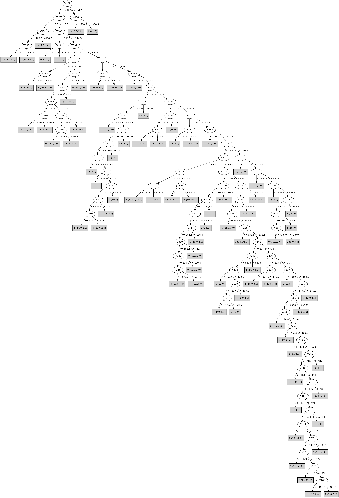

# J48

# SimpleCart Decision Tree

V476 < 471.5

* V443 < 539.5

*   * V49 < 475.5: 1(156.0/13.0)

*   * V49 >= 475.5

*   *   * V494 < 472.5

*   *   *   * V29 < 482.0: 1(11.0/2.0)

*   *   *   * V29 >= 482.0: 0(29.0/3.0)

*   *   * V494 >= 472.5

*   *   *   * V319 < 469.0: 0(20.0/1.0)

*   *   *   * V319 >= 469.0

*   *   *   *   * V93 < 451.0: 0(7.0/4.0)

*   *   *   *   * V93 >= 451.0

*   *   *   *   *   * V31 < 494.0: 1(132.0/11.0)

*   *   *   *   *   * V31 >= 494.0: 0(6.0/2.0)

* V443 >= 539.5

*   * V106 < 352.5

*   *   * V154 < 457.5: 0(57.0/4.0)

*   *   * V154 >= 457.5: 1(18.0/8.0)

*   * V106 >= 352.5

*   *   * V49 < 500.5

*   *   *   * V154 < 513.0: 0(85.0/24.0)

*   *   *   * V154 >= 513.0

*   *   *   *   * V379 < 503.5: 1(59.0/5.0)

*   *   *   *   * V379 >= 503.5: 0(6.0/2.0)

*   *   * V49 >= 500.5

*   *   *   * V434 < 517.5

*   *   *   *   * V454 < 622.5: 1(86.0/8.0)

*   *   *   *   * V454 >= 622.5: 0(6.0/4.0)

*   *   *   * V434 >= 517.5: 0(29.0/3.0)

V476 >= 471.5

* V339 < 478.5

*   * V379 < 522.5

*   *   * V154 < 616.5

*   *   *   * V379 < 398.5: 1(9.0/0.0)

*   *   *   * V379 >= 398.5

*   *   *   *   * V131 < 485.5: 0(71.0/7.0)

*   *   *   *   * V131 >= 485.5

*   *   *   *   *   * V335 < 509.5: 0(84.0/27.0)

*   *   *   *   *   * V335 >= 509.5

*   *   *   *   *   *   * V351 < 484.5

*   *   *   *   *   *   *   * V200 < 458.0: 0(9.0/3.0)

*   *   *   *   *   *   *   * V200 >= 458.0: 1(34.0/3.0)

*   *   *   *   *   *   * V351 >= 484.5: 0(16.0/4.0)

*   *   * V154 >= 616.5

*   *   *   * V106 < 683.0

*   *   *   *   * V150 < 541.5

*   *   *   *   *   * V262 < 480.5: 1(32.0/2.0)

*   *   *   *   *   * V262 >= 480.5

*   *   *   *   *   *   * V105 < 481.5: 0(10.0/1.0)

*   *   *   *   *   *   * V105 >= 481.5: 1(7.0/1.0)

*   *   *   *   * V150 >= 541.5: 0(7.0/1.0)

*   *   *   * V106 >= 683.0: 0(8.0/0.0)

*   * V379 >= 522.5

*   *   * V476 < 490.5

*   *   *   * V314 < 505.5: 0(10.0/0.0)

*   *   *   * V314 >= 505.5: 1(7.0/1.0)

*   *   * V476 >= 490.5: 0(221.0/10.0)

* V339 >= 478.5

*   * V452 < 477.5

*   *   * V106 < 456.0

*   *   *   * V443 < 546.5

*   *   *   *   * V352 < 486.5

*   *   *   *   *   * V149 < 483.5

*   *   *   *   *   *   * V380 < 486.5

*   *   *   *   *   *   *   * V332 < 484.0: 1(12.0/4.0)

*   *   *   *   *   *   *   * V332 >= 484.0: 0(10.0/0.0)

*   *   *   *   *   *   * V380 >= 486.5: 1(17.0/0.0)

*   *   *   *   *   * V149 >= 483.5: 0(16.0/3.0)

*   *   *   *   * V352 >= 486.5: 1(37.0/5.0)

*   *   *   * V443 >= 546.5: 0(36.0/13.0)

*   *   * V106 >= 456.0: 1(115.0/17.0)

*   * V452 >= 477.5

*   *   * V106 < 464.5

*   *   *   * V443 < 488.5: 1(44.0/10.0)

*   *   *   * V443 >= 488.5: 0(9.0/2.0)

*   *   * V106 >= 464.5: 0(72.0/12.0)

# PART

Decision list:

conditions|predicted class
---|---
V129 > 499 AND V476 > 500| 0 (61.0)
V473 <= 415 AND V454 <= 486 AND V337 > 415| 0 (94.0/7.0)
V106 <= 246 AND V434 <= 484| 0 (40.0)
V242 <= 489 AND V129 <= 493 AND V473 <= 498 AND V379 <= 466| 1 (134.0/8.0)
V57 <= 402 AND V324 <= 484| 0 (22.0)
V392 <= 424 AND V391 <= 477| 1 (19.0)
V339 <= 477 AND V242 <= 489 AND V381 > 484| 1 (31.0)
V339 <= 477 AND V476 > 489 AND V129 <= 471 AND V213 > 461| 1 (19.0)
V339 <= 477 AND V476 > 489 AND V339 > 370 AND V242 <= 558| 0 (204.0/19.0)
V24 <= 497 AND V5 <= 534 AND V468 <= 577 AND V62 > 492 AND V385 > 468| 0 (34.0/6.0)
V482 <= 428 AND V124 <= 493| 0 (25.0/2.0)
V5 <= 534 AND V432 <= 455| 1 (45.0/5.0)
V446 <= 479 AND V164 > 490 AND V328 > 478| 1 (23.0)
V446 <= 479 AND V466 > 526 AND V246 > 512| 0 (14.0)
V344 <= 449 AND V81 <= 494| 0 (20.0/1.0)
V446 <= 479 AND V358 > 479 AND V382 > 470| 1 (19.0)
V55 > 544 AND V386 <= 485| 0 (28.0/4.0)
V446 <= 479 AND V465 <= 454 AND V190 <= 479 AND V304 <= 497| 0 (11.0/2.0)
V446 <= 479 AND V332 <= 457| 1 (41.0/6.0)
V446 <= 479 AND V168 > 483 AND V67 > 471 AND V406 <= 461| 1 (26.0/1.0)
V39 <= 472 AND V325 <= 506 AND V332 <= 491 AND V349 > 481| 0 (17.0/1.0)
V110 > 468 AND V377 <= 472 AND V329 > 494| 1 (24.0)
V446 <= 479 AND V447 <= 498 AND V69 > 488 AND V30 > 471| 1 (53.0/7.0)
V179 <= 426 AND V284 <= 476 AND V500 <= 491| 1 (14.0/5.0)
V179 <= 427| 0 (32.0/5.0)
V189 > 482 AND V432 > 554 AND V16 > 469| 0 (24.0/2.0)
V189 > 482 AND V6 > 490| 1 (33.0/4.0)
V325 > 513 AND V474 <= 479 AND V34 > 463 AND V303 > 475 AND V252 > 480| 1 (15.0)
V325 > 513| 0 (42.0/4.0)
V117 <= 452| 1 (26.0/2.0)
V421 > 489 AND V255 <= 481| 1 (21.0)
V156 <= 448 AND V368 > 479| 0 (29.0/3.0)
V333 <= 476 AND V9 <= 510 AND V169 <= 478 AND V208 <= 474 AND V18 <= 513| 1 (25.0)
V40 > 474 AND V215 <= 465| 1 (43.0/8.0)
V258 <= 429 AND V149 <= 479| 0 (17.0)
V230 <= 508 AND V435 > 455 AND V168 > 483| 1 (36.0/6.0)
V435 <= 455 AND V357 <= 537| 1 (22.0)
V433 <= 442 AND V336 > 479| 1 (25.0/1.0)
V409 > 509 AND V285 > 462 AND V145 <= 479| 1 (25.0)
V197 > 484 AND V124 > 495| 0 (20.0)
V230 > 508 AND V368 <= 498 AND V114 > 468 AND V91 > 475 AND V140 <= 492 AND V78 <= 497| 1 (19.0/5.0)
V230 > 508 AND V114 > 468| 0 (46.0/1.0)
V387 <= 530 AND V141 <= 526 AND V267 > 443 AND V310 <= 509 AND V283 > 456 AND V469 <= 510 AND V78 <= 517 AND V188 > 454 AND V107 <= 529 AND V69 <= 478 AND V174 <= 478| 1 (48.0/8.0)
V387 <= 530 AND V141 <= 526 AND V41 <= 482 AND V267 > 443 AND V283 > 456 AND V78 > 517| 1 (26.0/7.0)
V387 <= 530 AND V141 <= 526 AND V267 > 443 AND V283 > 456 AND V322 <= 512 AND V41 <= 482 AND V168 <= 481 AND V113 <= 486 AND V430 > 472 AND V156 <= 516 AND V56 > 469 AND V184 > 476 AND V201 <= 507| 0 (23.0)
V41 <= 482 AND V20 <= 492 AND V497 > 470 AND V261 <= 515 AND V226 > 469 AND V41 > 470 AND V169 <= 478 AND V257 <= 535 AND V110 > 468 AND V236 <= 511 AND V97 > 476 AND V193 > 478 AND V253 <= 475| 0 (20.0)
V41 <= 482 AND V497 > 470 AND V41 > 470 AND V230 > 471 AND V405 <= 477 AND V67 > 479 AND V329 <= 496| 1 (58.0/2.0)
V405 > 477 AND V248 > 478| 1 (16.0)
V425 > 480 AND V134 > 473| 0 (53.0/6.0)
V117 <= 508 AND V23 <= 480 AND V343 <= 512 AND V225 > 485| 1 (17.0)
V117 <= 508 AND V348 <= 509| 0 (21.0)
| 1 (20.0/5.0)

# JRip

Decision list:

conditions|predicted class
---|---
(V476 <= 471) and (V443 <= 539) and (V49 <= 475) and (V242 <= 466) and (V386 >= 457)|1 (112.0/0.0)
(V339 >= 478) and (V282 >= 446) and (V379 <= 467) and (V154 >= 476) and (V456 >= 519)|1 (59.0/0.0)
(V339 >= 478) and (V443 >= 528) and (V154 <= 479) and (V49 >= 500) and (V344 <= 530) and (V339 <= 658)|1 (105.0/0.0)
(V476 <= 490) and (V339 <= 537) and (V319 >= 482) and (V379 >= 523) and (V242 <= 480) and (V154 <= 643)|1 (77.0/0.0)
(V49 <= 496) and (V339 <= 572) and (V339 >= 480) and (V204 <= 509) and (V5 <= 504) and (V332 <= 483)|1 (52.0/0.0)
(V49 <= 509) and (V154 >= 459) and (V476 <= 489) and (V490 >= 477) and (V339 <= 469) and (V170 <= 566)|1 (51.0/0.0)
(V339 >= 466) and (V476 >= 521) and (V319 <= 489) and (V278 >= 495) and (V32 <= 537) and (V428 >= 429)|1 (51.0/0.0)
(V339 >= 478) and (V282 >= 447) and (V49 <= 494) and (V137 <= 513) and (V170 >= 531) and (V84 <= 500)|1 (26.0/0.0)
(V339 >= 466) and (V282 >= 447) and (V255 <= 475) and (V137 <= 513) and (V293 <= 490) and (V5 <= 537)|1 (25.0/0.0)
(V106 <= 448) and (V473 <= 488) and (V5 <= 523) and (V12 <= 482) and (V371 >= 474)|1 (28.0/0.0)
(V378 >= 496) and (V166 >= 496) and (V295 <= 479) and (V413 <= 474)|1 (20.0/0.0)
(V371 <= 478) and (V49 <= 517) and (V201 >= 500) and (V346 <= 479) and (V128 >= 497)|1 (21.0/0.0)
(V344 >= 525) and (V235 <= 486) and (V404 <= 498) and (V185 >= 488) and (V499 >= 486)|1 (23.0/0.0)
(V410 >= 476) and (V138 <= 482) and (V378 >= 476) and (V178 <= 478) and (V37 >= 480) and (V273 >= 460) and (V13 >= 427)|1 (26.0/0.0)
(V462 >= 491) and (V302 <= 482) and (V413 >= 490) and (V498 >= 483) and (V441 <= 468)|1 (14.0/0.0)
(V110 >= 484) and (V441 >= 478) and (V478 <= 483) and (V305 >= 514) and (V269 <= 472) and (V3 >= 474)|1 (15.0/0.0)
(V290 >= 518) and (V425 <= 481) and (V394 <= 491) and (V309 >= 481) and (V8 <= 479)|1 (19.0/0.0)
(V273 <= 484) and (V237 >= 486) and (V329 >= 494) and (V341 >= 517) and (V497 >= 478)|1 (15.0/0.0)
(V92 >= 531) and (V288 <= 479) and (V412 >= 514) and (V88 >= 483) and (V355 >= 480)|1 (16.0/0.0)
(V371 <= 468) and (V216 <= 474) and (V163 >= 493) and (V249 <= 484)|1 (11.0/0.0)
(V314 >= 534) and (V74 <= 478) and (V147 >= 481) and (V117 <= 490)|1 (12.0/0.0)
(V335 >= 512) and (V360 <= 482) and (V318 <= 476) and (V127 <= 477) and (V49 <= 517)|1 (12.0/0.0)
(V249 <= 475) and (V298 >= 517) and (V120 <= 474) and (V354 <= 483)|1 (10.0/0.0)
(V11 >= 489) and (V312 <= 479) and (V357 <= 455) and (V245 >= 527) and (V11 <= 558)|1 (10.0/0.0)
(V222 >= 511) and (V36 >= 501) and (V423 >= 482) and (V212 >= 507) and (V33 <= 531)|1 (13.0/0.0)
(V482 >= 497) and (V299 >= 488) and (V200 >= 510) and (V103 <= 480) and (V74 <= 514)|1 (10.0/0.0)
(V351 <= 478) and (V305 <= 477) and (V268 >= 495) and (V42 >= 501) and (V2 <= 545)|1 (9.0/0.0)
(V306 <= 445) and (V314 >= 493) and (V16 <= 460) and (V58 <= 517)|1 (9.0/0.0)
(V131 >= 507) and (V445 >= 532) and (V5 <= 514)|1 (7.0/0.0)
(V440 <= 475) and (V396 >= 509) and (V118 >= 482) and (V95 <= 485)|1 (8.0/0.0)
(V423 >= 494) and (V108 <= 470) and (V267 >= 522) and (V3 >= 494)|1 (7.0/0.0)
(V162 <= 460) and (V105 >= 507) and (V23 <= 474)|1 (6.0/0.0)
|0 (941.0/27.0)

# Decision Table

Non matches covered by IB1

v49|v65|v83|v106|v172|v236|v289|v337|v339|v358|v360|v430|v443|v454|v476|v491|target
---|---|---|---|---|---|---|---|---|---|---|---|---|---|---|---|---
(-inf-524.5]|(591.5-717.5]|all|(439.5-699]|all|all|all|(537.5-inf)|(625.5-inf)|all|all|all|(372.5-inf)|(600.5-inf)|(-inf-471.5]|all|0
(524.5-inf)|(591.5-717.5]|all|(246.5-439.5]|all|all|all|(537.5-inf)|(625.5-inf)|all|all|all|(372.5-inf)|(-inf-600.5]|(471.5-inf)|all|0
(-inf-524.5]|(591.5-717.5]|all|(246.5-439.5]|all|all|all|(537.5-inf)|(625.5-inf)|all|all|all|(372.5-inf)|(-inf-600.5]|(471.5-inf)|all|1
(-inf-524.5]|(717.5-inf)|all|(246.5-439.5]|all|all|all|(537.5-inf)|(625.5-inf)|all|all|all|(372.5-inf)|(600.5-inf)|(-inf-471.5]|all|0
(524.5-inf)|(-inf-591.5]|all|(439.5-699]|all|all|all|(-inf-537.5]|(443.5-625.5]|all|all|all|(372.5-inf)|(600.5-inf)|(471.5-inf)|all|0
(-inf-524.5]|(-inf-591.5]|all|(439.5-699]|all|all|all|(-inf-537.5]|(443.5-625.5]|all|all|all|(372.5-inf)|(600.5-inf)|(471.5-inf)|all|0
(-inf-524.5]|(-inf-591.5]|all|(246.5-439.5]|all|all|all|(537.5-inf)|(625.5-inf)|all|all|all|(372.5-inf)|(-inf-600.5]|(471.5-inf)|all|1
(524.5-inf)|(-inf-591.5]|all|(699-inf)|all|all|all|(537.5-inf)|(443.5-625.5]|all|all|all|(372.5-inf)|(600.5-inf)|(-inf-471.5]|all|0
(-inf-524.5]|(-inf-591.5]|all|(-inf-246.5]|all|all|all|(537.5-inf)|(625.5-inf)|all|all|all|(372.5-inf)|(-inf-600.5]|(471.5-inf)|all|0
(-inf-524.5]|(591.5-717.5]|all|(-inf-246.5]|all|all|all|(537.5-inf)|(625.5-inf)|all|all|all|(372.5-inf)|(600.5-inf)|(-inf-471.5]|all|0
(524.5-inf)|(591.5-717.5]|all|(439.5-699]|all|all|all|(537.5-inf)|(443.5-625.5]|all|all|all|(372.5-inf)|(-inf-600.5]|(471.5-inf)|all|0
(-inf-524.5]|(-inf-591.5]|all|(699-inf)|all|all|all|(-inf-537.5]|(-inf-443.5]|all|all|all|(372.5-inf)|(600.5-inf)|(471.5-inf)|all|0
(524.5-inf)|(-inf-591.5]|all|(699-inf)|all|all|all|(-inf-537.5]|(-inf-443.5]|all|all|all|(372.5-inf)|(600.5-inf)|(471.5-inf)|all|0
(524.5-inf)|(591.5-717.5]|all|(439.5-699]|all|all|all|(537.5-inf)|(443.5-625.5]|all|all|all|(372.5-inf)|(600.5-inf)|(-inf-471.5]|all|0
(-inf-524.5]|(-inf-591.5]|all|(439.5-699]|all|all|all|(-inf-537.5]|(625.5-inf)|all|all|all|(372.5-inf)|(600.5-inf)|(-inf-471.5]|all|1
(-inf-524.5]|(591.5-717.5]|all|(439.5-699]|all|all|all|(537.5-inf)|(443.5-625.5]|all|all|all|(372.5-inf)|(600.5-inf)|(-inf-471.5]|all|1
(-inf-524.5]|(-inf-591.5]|all|(439.5-699]|all|all|all|(537.5-inf)|(443.5-625.5]|all|all|all|(372.5-inf)|(-inf-600.5]|(471.5-inf)|all|0
(524.5-inf)|(-inf-591.5]|all|(439.5-699]|all|all|all|(537.5-inf)|(443.5-625.5]|all|all|all|(372.5-inf)|(-inf-600.5]|(471.5-inf)|all|0
(524.5-inf)|(-inf-591.5]|all|(439.5-699]|all|all|all|(537.5-inf)|(443.5-625.5]|all|all|all|(372.5-inf)|(600.5-inf)|(-inf-471.5]|all|0
(-inf-524.5]|(-inf-591.5]|all|(439.5-699]|all|all|all|(537.5-inf)|(443.5-625.5]|all|all|all|(372.5-inf)|(600.5-inf)|(-inf-471.5]|all|1
(-inf-524.5]|(591.5-717.5]|all|(246.5-439.5]|all|all|all|(537.5-inf)|(443.5-625.5]|all|all|all|(372.5-inf)|(-inf-600.5]|(471.5-inf)|all|0
(524.5-inf)|(-inf-591.5]|all|(246.5-439.5]|all|all|all|(-inf-537.5]|(625.5-inf)|all|all|all|(372.5-inf)|(-inf-600.5]|(471.5-inf)|all|0
(524.5-inf)|(-inf-591.5]|all|(439.5-699]|all|all|all|(-inf-537.5]|(-inf-443.5]|all|all|all|(372.5-inf)|(600.5-inf)|(471.5-inf)|all|0
(524.5-inf)|(717.5-inf)|all|(246.5-439.5]|all|all|all|(537.5-inf)|(443.5-625.5]|all|all|all|(372.5-inf)|(600.5-inf)|(-inf-471.5]|all|0
(-inf-524.5]|(-inf-591.5]|all|(439.5-699]|all|all|all|(-inf-537.5]|(-inf-443.5]|all|all|all|(372.5-inf)|(600.5-inf)|(471.5-inf)|all|0
(-inf-524.5]|(-inf-591.5]|all|(246.5-439.5]|all|all|all|(-inf-537.5]|(625.5-inf)|all|all|all|(372.5-inf)|(-inf-600.5]|(471.5-inf)|all|0
(524.5-inf)|(-inf-591.5]|all|(246.5-439.5]|all|all|all|(537.5-inf)|(443.5-625.5]|all|all|all|(372.5-inf)|(-inf-600.5]|(471.5-inf)|all|0
(-inf-524.5]|(-inf-591.5]|all|(246.5-439.5]|all|all|all|(537.5-inf)|(443.5-625.5]|all|all|all|(372.5-inf)|(-inf-600.5]|(471.5-inf)|all|1
(-inf-524.5]|(591.5-717.5]|all|(246.5-439.5]|all|all|all|(537.5-inf)|(443.5-625.5]|all|all|all|(372.5-inf)|(600.5-inf)|(-inf-471.5]|all|1
(-inf-524.5]|(-inf-591.5]|all|(699-inf)|all|all|all|(-inf-537.5]|(443.5-625.5]|all|all|all|(372.5-inf)|(-inf-600.5]|(471.5-inf)|all|1
(-inf-524.5]|(-inf-591.5]|all|(246.5-439.5]|all|all|all|(537.5-inf)|(443.5-625.5]|all|all|all|(372.5-inf)|(600.5-inf)|(-inf-471.5]|all|1
(524.5-inf)|(-inf-591.5]|all|(699-inf)|all|all|all|(-inf-537.5]|(443.5-625.5]|all|all|all|(372.5-inf)|(-inf-600.5]|(471.5-inf)|all|0
(-inf-524.5]|(591.5-717.5]|all|(-inf-246.5]|all|all|all|(537.5-inf)|(443.5-625.5]|all|all|all|(372.5-inf)|(-inf-600.5]|(471.5-inf)|all|0
(-inf-524.5]|(-inf-591.5]|all|(-inf-246.5]|all|all|all|(-inf-537.5]|(625.5-inf)|all|all|all|(372.5-inf)|(-inf-600.5]|(471.5-inf)|all|0
(-inf-524.5]|(-inf-591.5]|all|(699-inf)|all|all|all|(-inf-537.5]|(443.5-625.5]|all|all|all|(372.5-inf)|(600.5-inf)|(-inf-471.5]|all|0
(524.5-inf)|(591.5-717.5]|all|(439.5-699]|all|all|all|(537.5-inf)|(625.5-inf)|all|all|all|(372.5-inf)|(-inf-600.5]|(-inf-471.5]|all|0
(524.5-inf)|(-inf-591.5]|all|(699-inf)|all|all|all|(537.5-inf)|(-inf-443.5]|all|all|all|(372.5-inf)|(600.5-inf)|(-inf-471.5]|all|1
(524.5-inf)|(-inf-591.5]|all|(439.5-699]|all|all|all|(537.5-inf)|(625.5-inf)|all|all|all|(372.5-inf)|(-inf-600.5]|(-inf-471.5]|all|0
(-inf-524.5]|(-inf-591.5]|all|(439.5-699]|all|all|all|(537.5-inf)|(625.5-inf)|all|all|all|(372.5-inf)|(-inf-600.5]|(-inf-471.5]|all|1
(524.5-inf)|(717.5-inf)|all|(246.5-439.5]|all|all|all|(537.5-inf)|(625.5-inf)|all|all|all|(372.5-inf)|(-inf-600.5]|(-inf-471.5]|all|0
(524.5-inf)|(717.5-inf)|all|(439.5-699]|all|all|all|(537.5-inf)|(-inf-443.5]|all|all|all|(372.5-inf)|(600.5-inf)|(-inf-471.5]|all|0
(-inf-524.5]|(717.5-inf)|all|(246.5-439.5]|all|all|all|(537.5-inf)|(625.5-inf)|all|all|all|(372.5-inf)|(-inf-600.5]|(-inf-471.5]|all|0
(524.5-inf)|(591.5-717.5]|all|(439.5-699]|all|all|all|(537.5-inf)|(-inf-443.5]|all|all|all|(372.5-inf)|(-inf-600.5]|(471.5-inf)|all|0
(524.5-inf)|(-inf-591.5]|all|(439.5-699]|all|all|all|(-inf-537.5]|(443.5-625.5]|all|all|all|(372.5-inf)|(-inf-600.5]|(471.5-inf)|all|0
(-inf-524.5]|(-inf-591.5]|all|(439.5-699]|all|all|all|(-inf-537.5]|(443.5-625.5]|all|all|all|(372.5-inf)|(-inf-600.5]|(471.5-inf)|all|1
(524.5-inf)|(591.5-717.5]|all|(439.5-699]|all|all|all|(537.5-inf)|(-inf-443.5]|all|all|all|(372.5-inf)|(600.5-inf)|(-inf-471.5]|all|0
(524.5-inf)|(-inf-591.5]|all|(439.5-699]|all|all|all|(537.5-inf)|(-inf-443.5]|all|all|all|(372.5-inf)|(-inf-600.5]|(471.5-inf)|all|0
(524.5-inf)|(591.5-717.5]|all|(246.5-439.5]|all|all|all|(537.5-inf)|(625.5-inf)|all|all|all|(372.5-inf)|(-inf-600.5]|(-inf-471.5]|all|0
(-inf-524.5]|(591.5-717.5]|all|(246.5-439.5]|all|all|all|(537.5-inf)|(625.5-inf)|all|all|all|(372.5-inf)|(-inf-600.5]|(-inf-471.5]|all|1
(-inf-524.5]|(-inf-591.5]|all|(439.5-699]|all|all|all|(537.5-inf)|(-inf-443.5]|all|all|all|(372.5-inf)|(-inf-600.5]|(471.5-inf)|all|1
(524.5-inf)|(-inf-591.5]|all|(439.5-699]|all|all|all|(-inf-537.5]|(443.5-625.5]|all|all|all|(372.5-inf)|(600.5-inf)|(-inf-471.5]|all|0
(-inf-524.5]|(-inf-591.5]|all|(439.5-699]|all|all|all|(-inf-537.5]|(443.5-625.5]|all|all|all|(372.5-inf)|(600.5-inf)|(-inf-471.5]|all|1
(524.5-inf)|(-inf-591.5]|all|(246.5-439.5]|all|all|all|(537.5-inf)|(625.5-inf)|all|all|all|(372.5-inf)|(-inf-600.5]|(-inf-471.5]|all|1
(-inf-524.5]|(-inf-591.5]|all|(439.5-699]|all|all|all|(537.5-inf)|(-inf-443.5]|all|all|all|(372.5-inf)|(600.5-inf)|(-inf-471.5]|all|0
(524.5-inf)|(-inf-591.5]|all|(439.5-699]|all|all|all|(537.5-inf)|(-inf-443.5]|all|all|all|(372.5-inf)|(600.5-inf)|(-inf-471.5]|all|1
(-inf-524.5]|(-inf-591.5]|all|(246.5-439.5]|all|all|all|(537.5-inf)|(625.5-inf)|all|all|all|(372.5-inf)|(-inf-600.5]|(-inf-471.5]|all|0
(-inf-524.5]|(717.5-inf)|all|(-inf-246.5]|all|all|all|(537.5-inf)|(625.5-inf)|all|all|all|(372.5-inf)|(-inf-600.5]|(-inf-471.5]|all|0
(524.5-inf)|(-inf-591.5]|all|(246.5-439.5]|all|all|all|(-inf-537.5]|(443.5-625.5]|all|all|all|(372.5-inf)|(-inf-600.5]|(471.5-inf)|all|1
(-inf-524.5]|(-inf-591.5]|all|(246.5-439.5]|all|all|all|(-inf-537.5]|(443.5-625.5]|all|all|all|(372.5-inf)|(-inf-600.5]|(471.5-inf)|all|1
(-inf-524.5]|(591.5-717.5]|all|(-inf-246.5]|all|all|all|(537.5-inf)|(625.5-inf)|all|all|all|(372.5-inf)|(-inf-600.5]|(-inf-471.5]|all|1
(-inf-524.5]|(-inf-591.5]|all|(246.5-439.5]|all|all|all|(-inf-537.5]|(443.5-625.5]|all|all|all|(372.5-inf)|(600.5-inf)|(-inf-471.5]|all|1
(-inf-524.5]|(-inf-591.5]|all|(439.5-699]|all|all|all|(537.5-inf)|(443.5-625.5]|all|all|all|(-inf-372.5]|(-inf-600.5]|(471.5-inf)|all|0
(524.5-inf)|(-inf-591.5]|all|(439.5-699]|all|all|all|(537.5-inf)|(443.5-625.5]|all|all|all|(-inf-372.5]|(-inf-600.5]|(471.5-inf)|all|0
(524.5-inf)|(-inf-591.5]|all|(699-inf)|all|all|all|(-inf-537.5]|(-inf-443.5]|all|all|all|(372.5-inf)|(-inf-600.5]|(471.5-inf)|all|0
(-inf-524.5]|(-inf-591.5]|all|(-inf-246.5]|all|all|all|(537.5-inf)|(625.5-inf)|all|all|all|(372.5-inf)|(-inf-600.5]|(-inf-471.5]|all|0
(-inf-524.5]|(-inf-591.5]|all|(699-inf)|all|all|all|(-inf-537.5]|(-inf-443.5]|all|all|all|(372.5-inf)|(-inf-600.5]|(471.5-inf)|all|0
(-inf-524.5]|(-inf-591.5]|all|(-inf-246.5]|all|all|all|(-inf-537.5]|(443.5-625.5]|all|all|all|(372.5-inf)|(-inf-600.5]|(471.5-inf)|all|0
(524.5-inf)|(-inf-591.5]|all|(439.5-699]|all|all|all|(-inf-537.5]|(625.5-inf)|all|all|all|(372.5-inf)|(-inf-600.5]|(-inf-471.5]|all|1
(-inf-524.5]|(-inf-591.5]|all|(439.5-699]|all|all|all|(-inf-537.5]|(625.5-inf)|all|all|all|(372.5-inf)|(-inf-600.5]|(-inf-471.5]|all|0
(524.5-inf)|(-inf-591.5]|all|(699-inf)|all|all|all|(-inf-537.5]|(-inf-443.5]|all|all|all|(372.5-inf)|(600.5-inf)|(-inf-471.5]|all|1
(-inf-524.5]|(-inf-591.5]|all|(699-inf)|all|all|all|(-inf-537.5]|(-inf-443.5]|all|all|all|(372.5-inf)|(600.5-inf)|(-inf-471.5]|all|1
(-inf-524.5]|(591.5-717.5]|all|(439.5-699]|all|all|all|(537.5-inf)|(443.5-625.5]|all|all|all|(372.5-inf)|(-inf-600.5]|(-inf-471.5]|all|1
(524.5-inf)|(591.5-717.5]|all|(439.5-699]|all|all|all|(537.5-inf)|(443.5-625.5]|all|all|all|(372.5-inf)|(-inf-600.5]|(-inf-471.5]|all|1
(-inf-524.5]|(591.5-717.5]|all|(246.5-439.5]|all|all|all|(537.5-inf)|(443.5-625.5]|all|all|all|(-inf-372.5]|(-inf-600.5]|(471.5-inf)|all|0
(-inf-524.5]|(-inf-591.5]|all|(439.5-699]|all|all|all|(537.5-inf)|(443.5-625.5]|all|all|all|(372.5-inf)|(-inf-600.5]|(-inf-471.5]|all|0
(524.5-inf)|(-inf-591.5]|all|(439.5-699]|all|all|all|(537.5-inf)|(443.5-625.5]|all|all|all|(372.5-inf)|(-inf-600.5]|(-inf-471.5]|all|0
(-inf-524.5]|(717.5-inf)|all|(246.5-439.5]|all|all|all|(537.5-inf)|(443.5-625.5]|all|all|all|(372.5-inf)|(-inf-600.5]|(-inf-471.5]|all|0
(524.5-inf)|(-inf-591.5]|all|(439.5-699]|all|all|all|(-inf-537.5]|(-inf-443.5]|all|all|all|(372.5-inf)|(-inf-600.5]|(471.5-inf)|all|0
(524.5-inf)|(717.5-inf)|all|(246.5-439.5]|all|all|all|(537.5-inf)|(443.5-625.5]|all|all|all|(372.5-inf)|(-inf-600.5]|(-inf-471.5]|all|0
(-inf-524.5]|(-inf-591.5]|all|(246.5-439.5]|all|all|all|(537.5-inf)|(443.5-625.5]|all|all|all|(-inf-372.5]|(-inf-600.5]|(471.5-inf)|all|0
(-inf-524.5]|(-inf-591.5]|all|(439.5-699]|all|all|all|(-inf-537.5]|(-inf-443.5]|all|all|all|(372.5-inf)|(-inf-600.5]|(471.5-inf)|all|0
(524.5-inf)|(-inf-591.5]|all|(439.5-699]|all|all|all|(-inf-537.5]|(-inf-443.5]|all|all|all|(372.5-inf)|(600.5-inf)|(-inf-471.5]|all|0
(524.5-inf)|(591.5-717.5]|all|(246.5-439.5]|all|all|all|(537.5-inf)|(443.5-625.5]|all|all|all|(372.5-inf)|(-inf-600.5]|(-inf-471.5]|all|0
(-inf-524.5]|(-inf-591.5]|all|(246.5-439.5]|all|all|all|(-inf-537.5]|(625.5-inf)|all|all|all|(372.5-inf)|(-inf-600.5]|(-inf-471.5]|all|0
(-inf-524.5]|(-inf-591.5]|all|(439.5-699]|all|all|all|(-inf-537.5]|(-inf-443.5]|all|all|all|(372.5-inf)|(600.5-inf)|(-inf-471.5]|all|1
(-inf-524.5]|(591.5-717.5]|all|(246.5-439.5]|all|all|all|(537.5-inf)|(443.5-625.5]|all|all|all|(372.5-inf)|(-inf-600.5]|(-inf-471.5]|all|1
(524.5-inf)|(-inf-591.5]|all|(246.5-439.5]|all|all|all|(537.5-inf)|(443.5-625.5]|all|all|all|(372.5-inf)|(-inf-600.5]|(-inf-471.5]|all|0
(-inf-524.5]|(-inf-591.5]|all|(246.5-439.5]|all|all|all|(537.5-inf)|(443.5-625.5]|all|all|all|(372.5-inf)|(-inf-600.5]|(-inf-471.5]|all|1
(-inf-524.5]|(-inf-591.5]|all|(699-inf)|all|all|all|(-inf-537.5]|(443.5-625.5]|all|all|all|(372.5-inf)|(-inf-600.5]|(-inf-471.5]|all|0
(-inf-524.5]|(717.5-inf)|all|(-inf-246.5]|all|all|all|(537.5-inf)|(443.5-625.5]|all|all|all|(372.5-inf)|(-inf-600.5]|(-inf-471.5]|all|0
(524.5-inf)|(-inf-591.5]|all|(699-inf)|all|all|all|(-inf-537.5]|(443.5-625.5]|all|all|all|(372.5-inf)|(-inf-600.5]|(-inf-471.5]|all|0
(-inf-524.5]|(-inf-591.5]|all|(246.5-439.5]|all|all|all|(-inf-537.5]|(-inf-443.5]|all|all|all|(372.5-inf)|(-inf-600.5]|(471.5-inf)|all|1
(524.5-inf)|(591.5-717.5]|all|(439.5-699]|all|all|all|(537.5-inf)|(-inf-443.5]|all|all|all|(-inf-372.5]|(-inf-600.5]|(471.5-inf)|all|0
(-inf-524.5]|(591.5-717.5]|all|(-inf-246.5]|all|all|all|(537.5-inf)|(443.5-625.5]|all|all|all|(372.5-inf)|(-inf-600.5]|(-inf-471.5]|all|1
(524.5-inf)|(-inf-591.5]|all|(439.5-699]|all|all|all|(-inf-537.5]|(443.5-625.5]|all|all|all|(-inf-372.5]|(-inf-600.5]|(471.5-inf)|all|0
(-inf-524.5]|(-inf-591.5]|all|(439.5-699]|all|all|all|(-inf-537.5]|(443.5-625.5]|all|all|all|(-inf-372.5]|(-inf-600.5]|(471.5-inf)|all|1
(524.5-inf)|(-inf-591.5]|all|(439.5-699]|all|all|all|(537.5-inf)|(-inf-443.5]|all|all|all|(-inf-372.5]|(-inf-600.5]|(471.5-inf)|all|1
(-inf-524.5]|(-inf-591.5]|all|(439.5-699]|all|all|all|(537.5-inf)|(-inf-443.5]|all|all|all|(-inf-372.5]|(-inf-600.5]|(471.5-inf)|all|0
(-inf-524.5]|(591.5-717.5]|all|(439.5-699]|all|all|all|(537.5-inf)|(-inf-443.5]|all|all|all|(372.5-inf)|(-inf-600.5]|(-inf-471.5]|all|0
(524.5-inf)|(591.5-717.5]|all|(439.5-699]|all|all|all|(537.5-inf)|(-inf-443.5]|all|all|all|(372.5-inf)|(-inf-600.5]|(-inf-471.5]|all|1
(524.5-inf)|(-inf-591.5]|all|(439.5-699]|all|all|all|(-inf-537.5]|(443.5-625.5]|all|all|all|(372.5-inf)|(-inf-600.5]|(-inf-471.5]|all|1
(-inf-524.5]|(-inf-591.5]|all|(439.5-699]|all|all|all|(-inf-537.5]|(443.5-625.5]|all|all|all|(372.5-inf)|(-inf-600.5]|(-inf-471.5]|all|1
(-inf-524.5]|(-inf-591.5]|all|(246.5-439.5]|all|all|all|(-inf-537.5]|(443.5-625.5]|all|all|all|(-inf-372.5]|(-inf-600.5]|(471.5-inf)|all|1
(-inf-524.5]|(-inf-591.5]|all|(439.5-699]|all|all|all|(537.5-inf)|(-inf-443.5]|all|all|all|(372.5-inf)|(-inf-600.5]|(-inf-471.5]|all|1
(-inf-524.5]|(-inf-591.5]|all|(246.5-439.5]|all|all|all|(537.5-inf)|(-inf-443.5]|all|all|all|(-inf-372.5]|(-inf-600.5]|(471.5-inf)|all|0
(-inf-524.5]|(-inf-591.5]|all|(699-inf)|all|all|all|(-inf-537.5]|(-inf-443.5]|all|all|all|(-inf-372.5]|(-inf-600.5]|(471.5-inf)|all|0
(-inf-524.5]|(591.5-717.5]|all|(246.5-439.5]|all|all|all|(537.5-inf)|(-inf-443.5]|all|all|all|(372.5-inf)|(-inf-600.5]|(-inf-471.5]|all|1
(-inf-524.5]|(-inf-591.5]|all|(246.5-439.5]|all|all|all|(-inf-537.5]|(443.5-625.5]|all|all|all|(372.5-inf)|(-inf-600.5]|(-inf-471.5]|all|0
(524.5-inf)|(-inf-591.5]|all|(699-inf)|all|all|all|(-inf-537.5]|(-inf-443.5]|all|all|all|(-inf-372.5]|(-inf-600.5]|(471.5-inf)|all|0
(-inf-524.5]|(591.5-717.5]|all|(439.5-699]|all|all|all|(537.5-inf)|(443.5-625.5]|all|all|all|(-inf-372.5]|(-inf-600.5]|(-inf-471.5]|all|0
(-inf-524.5]|(-inf-591.5]|all|(699-inf)|all|all|all|(-inf-537.5]|(-inf-443.5]|all|all|all|(372.5-inf)|(-inf-600.5]|(-inf-471.5]|all|0
(524.5-inf)|(-inf-591.5]|all|(439.5-699]|all|all|all|(-inf-537.5]|(-inf-443.5]|all|all|all|(-inf-372.5]|(-inf-600.5]|(471.5-inf)|all|0
(-inf-524.5]|(-inf-591.5]|all|(439.5-699]|all|all|all|(-inf-537.5]|(-inf-443.5]|all|all|all|(-inf-372.5]|(-inf-600.5]|(471.5-inf)|all|0
(-inf-524.5]|(591.5-717.5]|all|(246.5-439.5]|all|all|all|(537.5-inf)|(443.5-625.5]|all|all|all|(-inf-372.5]|(-inf-600.5]|(-inf-471.5]|all|1
(-inf-524.5]|(-inf-591.5]|all|(439.5-699]|all|all|all|(-inf-537.5]|(-inf-443.5]|all|all|all|(372.5-inf)|(-inf-600.5]|(-inf-471.5]|all|0
(-inf-524.5]|(-inf-591.5]|all|(246.5-439.5]|all|all|all|(-inf-537.5]|(-inf-443.5]|all|all|all|(-inf-372.5]|(-inf-600.5]|(471.5-inf)|all|0
(-inf-524.5]|(-inf-591.5]|all|(246.5-439.5]|all|all|all|(-inf-537.5]|(-inf-443.5]|all|all|all|(372.5-inf)|(-inf-600.5]|(-inf-471.5]|all|0
(-inf-524.5]|(591.5-717.5]|all|(439.5-699]|all|all|all|(537.5-inf)|(-inf-443.5]|all|all|all|(-inf-372.5]|(-inf-600.5]|(-inf-471.5]|all|1
(524.5-inf)|(591.5-717.5]|all|(439.5-699]|all|all|all|(537.5-inf)|(-inf-443.5]|all|all|all|(-inf-372.5]|(-inf-600.5]|(-inf-471.5]|all|1
(524.5-inf)|(-inf-591.5]|all|(439.5-699]|all|all|all|(537.5-inf)|(-inf-443.5]|all|all|all|(-inf-372.5]|(-inf-600.5]|(-inf-471.5]|all|1
(-inf-524.5]|(-inf-591.5]|all|(439.5-699]|all|all|all|(537.5-inf)|(-inf-443.5]|all|all|all|(-inf-372.5]|(-inf-600.5]|(-inf-471.5]|all|0
(-inf-524.5]|(591.5-717.5]|all|(246.5-439.5]|all|all|all|(537.5-inf)|(-inf-443.5]|all|all|all|(-inf-372.5]|(-inf-600.5]|(-inf-471.5]|all|0

