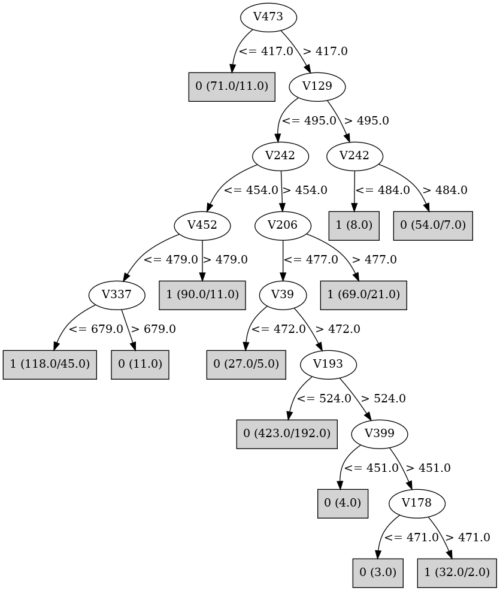

# J48

# SimpleCart Decision Tree

V476 < 474.5

* V154 < 453.5

*   * V49 < 473.5

*   *   * V443 < 544.0

*   *   *   * V65 < 502.0: 0(7.0/0.0)

*   *   *   * V65 >= 502.0: 1(29.0/0.0)

*   *   * V443 >= 544.0

*   *   *   * V452 < 484.5: 0(98.0/1.0)

*   *   *   * V452 >= 484.5

*   *   *   *   * V18 < 481.0: 0(6.0/0.0)

*   *   *   *   * V18 >= 481.0: 1(6.0/0.0)

*   * V49 >= 473.5

*   *   * V443 < 479.0: 0(23.0/1.0)

*   *   * V443 >= 479.0

*   *   *   * V106 < 531.5

*   *   *   *   * V319 < 501.5

*   *   *   *   *   * V418 < 466.5

*   *   *   *   *   *   * V115 < 482.5: 1(6.0/1.0)

*   *   *   *   *   *   * V115 >= 482.5: 0(8.0/0.0)

*   *   *   *   *   * V418 >= 466.5: 1(57.0/8.0)

*   *   *   *   * V319 >= 501.5: 0(18.0/1.0)

*   *   *   * V106 >= 531.5: 1(52.0/2.0)

* V154 >= 453.5

*   * V379 < 478.5

*   *   * V154 < 507.5

*   *   *   * V337 < 562.5: 0(12.0/6.0)

*   *   *   * V337 >= 562.5: 1(18.0/1.0)

*   *   * V154 >= 507.5: 1(170.0/5.0)

*   * V379 >= 478.5

*   *   * V29 < 479.5

*   *   *   * V282 < 480.0

*   *   *   *   * V272 < 493.5

*   *   *   *   *   * V299 < 499.0: 1(8.0/1.0)

*   *   *   *   *   * V299 >= 499.0: 0(9.0/0.0)

*   *   *   *   * V272 >= 493.5: 1(21.0/1.0)

*   *   *   * V282 >= 480.0

*   *   *   *   * V49 < 493.5

*   *   *   *   *   * V259 < 479.0: 0(5.0/1.0)

*   *   *   *   *   * V259 >= 479.0: 1(16.0/0.0)

*   *   *   *   * V49 >= 493.5: 0(83.0/13.0)

*   *   * V29 >= 479.5: 1(134.0/27.0)

V476 >= 474.5

* V339 < 477.5

*   * V49 < 486.5

*   *   * V282 < 555.5

*   *   *   * V379 < 407.0: 1(16.0/3.0)

*   *   *   * V379 >= 407.0

*   *   *   *   * V348 < 485.5

*   *   *   *   *   * V428 < 514.0: 0(74.0/9.0)

*   *   *   *   *   * V428 >= 514.0

*   *   *   *   *   *   * V205 < 486.5: 1(9.0/0.0)

*   *   *   *   *   *   * V205 >= 486.5: 0(11.0/2.0)

*   *   *   *   * V348 >= 485.5

*   *   *   *   *   * V46 < 485.5

*   *   *   *   *   *   * V258 < 522.5

*   *   *   *   *   *   *   * V106 < 433.5: 1(5.0/1.0)

*   *   *   *   *   *   *   * V106 >= 433.5: 0(39.0/3.0)

*   *   *   *   *   *   * V258 >= 522.5: 1(9.0/3.0)

*   *   *   *   *   * V46 >= 485.5

*   *   *   *   *   *   * V39 < 486.5

*   *   *   *   *   *   *   * V128 < 510.5: 1(30.0/5.0)

*   *   *   *   *   *   *   * V128 >= 510.5: 0(8.0/3.0)

*   *   *   *   *   *   * V39 >= 486.5: 0(7.0/0.0)

*   *   * V282 >= 555.5: 1(14.0/0.0)

*   * V49 >= 486.5

*   *   * V452 < 464.5: 1(7.0/3.0)

*   *   * V452 >= 464.5: 0(275.0/29.0)

* V339 >= 477.5

*   * V319 < 484.5

*   *   * V106 < 455.5

*   *   *   * V443 < 521.0

*   *   *   *   * V476 < 588.5

*   *   *   *   *   * V33 < 499.5

*   *   *   *   *   *   * V108 < 533.5

*   *   *   *   *   *   *   * V307 < 473.5: 0(6.0/2.0)

*   *   *   *   *   *   *   * V307 >= 473.5: 1(19.0/2.0)

*   *   *   *   *   *   * V108 >= 533.5: 0(7.0/0.0)

*   *   *   *   *   * V33 >= 499.5: 1(32.0/1.0)

*   *   *   *   * V476 >= 588.5: 0(7.0/0.0)

*   *   *   * V443 >= 521.0

*   *   *   *   * V379 < 535.5

*   *   *   *   *   * V77 < 487.0

*   *   *   *   *   *   * V334 < 460.5: 1(5.0/4.0)

*   *   *   *   *   *   * V334 >= 460.5: 0(34.0/1.0)

*   *   *   *   *   * V77 >= 487.0: 1(5.0/0.0)

*   *   *   *   * V379 >= 535.5: 1(10.0/0.0)

*   *   * V106 >= 455.5: 1(91.0/18.0)

*   * V319 >= 484.5

*   *   * V106 < 469.0

*   *   *   * V443 < 488.5

*   *   *   *   * V417 < 496.5: 1(48.0/7.0)

*   *   *   *   * V417 >= 496.5: 0(5.0/2.0)

*   *   *   * V443 >= 488.5: 0(10.0/2.0)

*   *   * V106 >= 469.0

*   *   *   * V65 < 357.5: 1(5.0/0.0)

*   *   *   * V65 >= 357.5: 0(69.0/8.0)

# PART

Decision list:

conditions|predicted class
---|---
V129 > 495 AND V242 > 486 AND V49 > 473| 0 (68.0/3.0)
V49 > 556 AND V422 > 478| 0 (22.0)
V242 <= 486 AND V452 > 476 AND V154 > 511| 1 (136.0/11.0)
V339 <= 461 AND V379 > 407 AND V104 > 456 AND V318 <= 488 AND V147 > 474 AND V259 > 475 AND V69 <= 486 AND V183 > 438 AND V277 > 475 AND V184 > 435| 0 (104.0/6.0)
V368 <= 507 AND V434 <= 384 AND V295 <= 525| 1 (27.0/1.0)
V368 > 507| 1 (25.0/3.0)
V91 > 476 AND V283 <= 502 AND V15 > 499| 1 (13.0/1.0)
V91 > 476 AND V201 <= 525 AND V207 > 451 AND V212 > 423 AND V26 <= 549 AND V134 > 473 AND V349 > 476| 0 (53.0/1.0)
V97 <= 475 AND V248 <= 483 AND V306 <= 524 AND V104 > 461 AND V459 > 423| 1 (69.0/13.0)
V334 <= 455 AND V140 > 457 AND V40 <= 478 AND V184 <= 518 AND V8 > 474| 1 (72.0/9.0)
V334 <= 456 AND V385 > 464| 0 (23.0)
V87 <= 474 AND V318 > 486| 0 (52.0/6.0)
V485 > 562 AND V351 <= 488| 1 (24.0)
V21 > 466 AND V69 <= 476 AND V345 <= 547 AND V425 <= 500 AND V97 > 473 AND V369 > 466 AND V411 > 489| 1 (42.0)
V21 <= 466| 1 (32.0/7.0)
V344 <= 456 AND V419 <= 529| 0 (21.0)
V338 <= 439 AND V290 > 477| 0 (24.0)
V378 > 512 AND V391 <= 482| 1 (34.0/6.0)
V147 <= 474| 0 (38.0/7.0)
V208 <= 473 AND V168 > 474 AND V412 <= 515| 1 (19.0)
V167 > 477 AND V212 > 436 AND V11 <= 508| 0 (29.0)
V91 <= 476 AND V324 > 489 AND V199 <= 478 AND V46 > 456 AND V78 <= 508| 1 (42.0/4.0)
V91 <= 476 AND V167 <= 477 AND V325 <= 507 AND V111 <= 544 AND V97 <= 485 AND V467 <= 488 AND V35 <= 521 AND V107 > 438 AND V286 > 455 AND V129 <= 489 AND V263 <= 516 AND V406 > 424| 0 (74.0/17.0)
V238 > 472 AND V368 > 467 AND V325 <= 488 AND V93 <= 503 AND V473 <= 550 AND V57 <= 547 AND V113 > 467 AND V224 > 441| 1 (39.0)
V238 > 472 AND V240 > 472 AND V320 > 443 AND V472 <= 486 AND V91 > 475 AND V32 <= 547| 0 (73.0/18.0)
V240 > 471| 1 (40.0/14.0)
| 0 (19.0/1.0)

# JRip

Decision list:

conditions|predicted class
---|---
(V476 <= 474) and (V154 >= 462) and (V49 <= 482) and (V282 >= 506) and (V22 <= 503)|1 (106.0/0.0)
(V339 >= 474) and (V432 <= 485) and (V390 >= 465) and (V334 <= 479) and (V173 <= 529) and (V63 <= 545)|1 (56.0/0.0)
(V476 <= 468) and (V29 >= 475) and (V154 >= 454) and (V387 <= 493) and (V16 <= 483)|1 (66.0/0.0)
(V339 >= 481) and (V324 >= 483) and (V286 >= 500) and (V239 <= 469) and (V412 >= 478)|1 (39.0/0.0)
(V339 >= 478) and (V476 >= 514) and (V319 <= 484) and (V456 <= 459)|1 (43.0/0.0)
(V476 <= 499) and (V319 >= 467) and (V494 >= 518) and (V259 <= 485) and (V172 >= 490) and (V487 <= 487) and (V34 >= 397)|1 (61.0/0.0)
(V339 >= 486) and (V96 >= 515) and (V170 >= 513) and (V431 >= 498) and (V435 <= 502) and (V9 >= 463)|1 (33.0/0.0)
(V339 >= 486) and (V37 >= 484) and (V318 <= 477) and (V414 <= 484) and (V13 <= 500) and (V10 >= 471)|1 (31.0/0.0)
(V106 <= 449) and (V443 <= 541) and (V379 <= 493) and (V9 <= 484) and (V110 >= 477) and (V38 <= 514)|1 (42.0/0.0)
(V476 <= 456) and (V452 >= 484) and (V154 >= 512) and (V257 <= 521)|1 (27.0/0.0)
(V339 >= 487) and (V379 >= 495) and (V154 <= 506) and (V319 <= 480) and (V231 >= 482) and (V82 <= 552)|1 (50.0/0.0)
(V49 <= 492) and (V183 <= 485) and (V282 >= 545) and (V2 >= 442)|1 (22.0/0.0)
(V339 >= 449) and (V227 >= 483) and (V395 <= 477) and (V313 >= 517) and (V166 <= 480) and (V152 <= 502)|1 (23.0/0.0)
(V257 >= 506) and (V280 <= 495) and (V57 >= 484) and (V93 >= 493) and (V340 >= 459) and (V142 <= 532)|1 (27.0/0.0)
(V491 <= 485) and (V49 <= 509) and (V443 <= 512) and (V44 >= 487) and (V424 >= 477) and (V124 <= 512)|1 (21.0/0.0)
(V339 >= 449) and (V430 <= 477) and (V433 <= 474) and (V205 <= 464) and (V241 >= 482) and (V225 >= 493) and (V114 <= 511)|1 (22.0/0.0)
(V227 >= 483) and (V408 >= 480) and (V438 <= 504) and (V288 <= 493) and (V398 >= 495) and (V279 <= 506)|1 (21.0/0.0)
(V339 >= 486) and (V316 >= 498) and (V207 >= 543) and (V178 <= 479) and (V2 >= 466)|1 (13.0/0.0)
(V286 >= 522) and (V394 >= 490) and (V243 >= 489) and (V133 <= 492) and (V379 <= 559)|1 (20.0/0.0)
(V451 >= 495) and (V30 >= 503) and (V97 <= 479) and (V329 >= 484) and (V399 >= 502) and (V23 >= 473)|1 (21.0/0.0)
(V82 >= 568) and (V20 >= 486) and (V83 <= 485)|1 (10.0/0.0)
(V315 <= 477) and (V439 >= 505) and (V286 >= 497) and (V442 <= 471) and (V6 >= 470)|1 (12.0/0.0)
(V215 <= 475) and (V205 <= 448) and (V287 >= 503) and (V1 >= 474)|1 (9.0/0.0)
(V283 <= 471) and (V273 <= 474) and (V50 >= 479) and (V478 <= 488) and (V349 >= 477) and (V118 <= 499)|1 (17.0/0.0)
(V476 <= 499) and (V252 >= 517) and (V365 <= 474) and (V13 <= 492)|1 (9.0/0.0)
(V13 >= 486) and (V186 >= 511) and (V180 >= 525) and (V35 <= 484)|1 (10.0/0.0)
(V206 >= 477) and (V458 <= 459) and (V32 >= 524) and (V158 >= 468) and (V8 <= 478)|1 (11.0/0.0)
(V159 >= 520) and (V468 >= 544) and (V402 <= 489) and (V151 <= 487) and (V6 <= 484)|1 (11.0/0.0)
(V194 >= 540) and (V208 <= 477) and (V287 >= 495) and (V1 <= 485) and (V62 <= 488)|1 (10.0/0.0)
(V221 >= 531) and (V211 >= 507) and (V9 >= 474)|1 (7.0/0.0)
(V153 >= 484) and (V365 >= 484) and (V216 >= 517) and (V139 >= 482) and (V6 <= 489)|1 (8.0/0.0)
(V246 <= 446) and (V438 >= 552)|1 (5.0/0.0)
(V102 >= 486) and (V327 <= 445) and (V101 >= 483)|1 (6.0/0.0)
(V234 <= 479) and (V354 <= 482) and (V96 >= 536) and (V268 <= 479) and (V4 <= 492)|1 (8.0/0.0)
(V385 >= 491) and (V242 <= 447) and (V181 <= 476) and (V438 <= 543)|1 (6.0/0.0)
(V218 <= 474) and (V271 >= 514) and (V13 >= 479)|1 (5.0/0.0)
(V212 <= 434) and (V483 <= 472) and (V173 >= 521)|1 (6.0/0.0)
(V160 >= 520) and (V245 >= 571) and (V14 <= 501)|1 (4.0/0.0)
|0 (922.0/8.0)

# Decision Table

Non matches covered by Majority class

v49|v65|v106|v223|v339|v358|v404|v432|v443|v476|v494|target
---|---|---|---|---|---|---|---|---|---|---|---
(492.5-inf)|(449.5-inf)|(437.5-698.5]|all|(443.5-inf)|all|all|all|(398.5-inf)|(474.5-inf)|(657.5-inf)|0
(492.5-inf)|(-inf-449.5]|(437.5-698.5]|all|(443.5-inf)|all|all|all|(398.5-inf)|(474.5-inf)|(657.5-inf)|0
(492.5-inf)|(449.5-inf)|(698.5-inf)|all|(-inf-443.5]|all|all|all|(398.5-inf)|(474.5-inf)|(657.5-inf)|0
(492.5-inf)|(-inf-449.5]|(698.5-inf)|all|(-inf-443.5]|all|all|all|(398.5-inf)|(474.5-inf)|(657.5-inf)|0
(-inf-492.5]|(449.5-inf)|(437.5-698.5]|all|(-inf-443.5]|all|all|all|(398.5-inf)|(474.5-inf)|(657.5-inf)|0
(492.5-inf)|(-inf-449.5]|(437.5-698.5]|all|(-inf-443.5]|all|all|all|(398.5-inf)|(474.5-inf)|(657.5-inf)|0
(-inf-492.5]|(-inf-449.5]|(437.5-698.5]|all|(-inf-443.5]|all|all|all|(398.5-inf)|(474.5-inf)|(657.5-inf)|1
(492.5-inf)|(449.5-inf)|(698.5-inf)|all|(443.5-inf)|all|all|all|(398.5-inf)|(-inf-474.5]|(657.5-inf)|1
(-inf-492.5]|(449.5-inf)|(437.5-698.5]|all|(443.5-inf)|all|all|all|(398.5-inf)|(-inf-474.5]|(657.5-inf)|1
(492.5-inf)|(-inf-449.5]|(698.5-inf)|all|(443.5-inf)|all|all|all|(398.5-inf)|(474.5-inf)|(-inf-657.5]|0
(492.5-inf)|(449.5-inf)|(437.5-698.5]|all|(443.5-inf)|all|all|all|(398.5-inf)|(-inf-474.5]|(657.5-inf)|0
(492.5-inf)|(-inf-449.5]|(437.5-698.5]|all|(443.5-inf)|all|all|all|(398.5-inf)|(-inf-474.5]|(657.5-inf)|0
(-inf-492.5]|(-inf-449.5]|(437.5-698.5]|all|(443.5-inf)|all|all|all|(398.5-inf)|(-inf-474.5]|(657.5-inf)|1
(-inf-492.5]|(449.5-inf)|(437.5-698.5]|all|(443.5-inf)|all|all|all|(398.5-inf)|(474.5-inf)|(-inf-657.5]|1
(492.5-inf)|(449.5-inf)|(437.5-698.5]|all|(443.5-inf)|all|all|all|(398.5-inf)|(474.5-inf)|(-inf-657.5]|0
(-inf-492.5]|(449.5-inf)|(698.5-inf)|all|(-inf-443.5]|all|all|all|(398.5-inf)|(-inf-474.5]|(657.5-inf)|0
(492.5-inf)|(449.5-inf)|(698.5-inf)|all|(-inf-443.5]|all|all|all|(398.5-inf)|(-inf-474.5]|(657.5-inf)|1
(-inf-492.5]|(449.5-inf)|(259.5-437.5]|all|(443.5-inf)|all|all|all|(398.5-inf)|(-inf-474.5]|(657.5-inf)|1
(492.5-inf)|(449.5-inf)|(259.5-437.5]|all|(443.5-inf)|all|all|all|(398.5-inf)|(-inf-474.5]|(657.5-inf)|1
(492.5-inf)|(-inf-449.5]|(437.5-698.5]|all|(443.5-inf)|all|all|all|(398.5-inf)|(474.5-inf)|(-inf-657.5]|1
(-inf-492.5]|(-inf-449.5]|(437.5-698.5]|all|(443.5-inf)|all|all|all|(398.5-inf)|(474.5-inf)|(-inf-657.5]|0
(492.5-inf)|(449.5-inf)|(698.5-inf)|all|(-inf-443.5]|all|all|all|(398.5-inf)|(474.5-inf)|(-inf-657.5]|0
(-inf-492.5]|(-inf-449.5]|(698.5-inf)|all|(-inf-443.5]|all|all|all|(398.5-inf)|(-inf-474.5]|(657.5-inf)|0
(-inf-492.5]|(449.5-inf)|(259.5-437.5]|all|(443.5-inf)|all|all|all|(398.5-inf)|(474.5-inf)|(-inf-657.5]|1
(492.5-inf)|(449.5-inf)|(259.5-437.5]|all|(443.5-inf)|all|all|all|(398.5-inf)|(474.5-inf)|(-inf-657.5]|1
(-inf-492.5]|(449.5-inf)|(-inf-259.5]|all|(443.5-inf)|all|all|all|(398.5-inf)|(-inf-474.5]|(657.5-inf)|0
(-inf-492.5]|(449.5-inf)|(437.5-698.5]|all|(-inf-443.5]|all|all|all|(398.5-inf)|(-inf-474.5]|(657.5-inf)|1
(492.5-inf)|(449.5-inf)|(437.5-698.5]|all|(-inf-443.5]|all|all|all|(398.5-inf)|(-inf-474.5]|(657.5-inf)|0
(-inf-492.5]|(-inf-449.5]|(698.5-inf)|all|(-inf-443.5]|all|all|all|(398.5-inf)|(474.5-inf)|(-inf-657.5]|0
(492.5-inf)|(-inf-449.5]|(698.5-inf)|all|(-inf-443.5]|all|all|all|(398.5-inf)|(474.5-inf)|(-inf-657.5]|0
(-inf-492.5]|(-inf-449.5]|(259.5-437.5]|all|(443.5-inf)|all|all|all|(398.5-inf)|(474.5-inf)|(-inf-657.5]|0
(-inf-492.5]|(-inf-449.5]|(437.5-698.5]|all|(-inf-443.5]|all|all|all|(398.5-inf)|(-inf-474.5]|(657.5-inf)|0
(-inf-492.5]|(449.5-inf)|(437.5-698.5]|all|(-inf-443.5]|all|all|all|(398.5-inf)|(474.5-inf)|(-inf-657.5]|1
(-inf-492.5]|(449.5-inf)|(-inf-259.5]|all|(443.5-inf)|all|all|all|(398.5-inf)|(474.5-inf)|(-inf-657.5]|0
(492.5-inf)|(449.5-inf)|(437.5-698.5]|all|(-inf-443.5]|all|all|all|(398.5-inf)|(474.5-inf)|(-inf-657.5]|0
(-inf-492.5]|(449.5-inf)|(259.5-437.5]|all|(-inf-443.5]|all|all|all|(398.5-inf)|(-inf-474.5]|(657.5-inf)|0
(492.5-inf)|(-inf-449.5]|(437.5-698.5]|all|(-inf-443.5]|all|all|all|(398.5-inf)|(474.5-inf)|(-inf-657.5]|0
(-inf-492.5]|(-inf-449.5]|(437.5-698.5]|all|(-inf-443.5]|all|all|all|(398.5-inf)|(474.5-inf)|(-inf-657.5]|0
(-inf-492.5]|(449.5-inf)|(259.5-437.5]|all|(-inf-443.5]|all|all|all|(398.5-inf)|(474.5-inf)|(-inf-657.5]|1
(492.5-inf)|(-inf-449.5]|(698.5-inf)|all|(443.5-inf)|all|all|all|(398.5-inf)|(-inf-474.5]|(-inf-657.5]|1
(-inf-492.5]|(449.5-inf)|(437.5-698.5]|all|(443.5-inf)|all|all|all|(-inf-398.5]|(474.5-inf)|(-inf-657.5]|1
(492.5-inf)|(449.5-inf)|(437.5-698.5]|all|(443.5-inf)|all|all|all|(-inf-398.5]|(474.5-inf)|(-inf-657.5]|0
(492.5-inf)|(-inf-449.5]|(437.5-698.5]|all|(443.5-inf)|all|all|all|(-inf-398.5]|(474.5-inf)|(-inf-657.5]|0
(-inf-492.5]|(-inf-449.5]|(437.5-698.5]|all|(443.5-inf)|all|all|all|(-inf-398.5]|(474.5-inf)|(-inf-657.5]|1
(492.5-inf)|(449.5-inf)|(437.5-698.5]|all|(443.5-inf)|all|all|all|(398.5-inf)|(-inf-474.5]|(-inf-657.5]|1
(-inf-492.5]|(449.5-inf)|(437.5-698.5]|all|(443.5-inf)|all|all|all|(398.5-inf)|(-inf-474.5]|(-inf-657.5]|1
(-inf-492.5]|(449.5-inf)|(259.5-437.5]|all|(443.5-inf)|all|all|all|(-inf-398.5]|(474.5-inf)|(-inf-657.5]|1
(492.5-inf)|(449.5-inf)|(259.5-437.5]|all|(443.5-inf)|all|all|all|(-inf-398.5]|(474.5-inf)|(-inf-657.5]|1
(492.5-inf)|(-inf-449.5]|(437.5-698.5]|all|(443.5-inf)|all|all|all|(398.5-inf)|(-inf-474.5]|(-inf-657.5]|1
(-inf-492.5]|(-inf-449.5]|(437.5-698.5]|all|(443.5-inf)|all|all|all|(398.5-inf)|(-inf-474.5]|(-inf-657.5]|0
(492.5-inf)|(449.5-inf)|(698.5-inf)|all|(-inf-443.5]|all|all|all|(-inf-398.5]|(474.5-inf)|(-inf-657.5]|0
(492.5-inf)|(449.5-inf)|(698.5-inf)|all|(-inf-443.5]|all|all|all|(398.5-inf)|(-inf-474.5]|(-inf-657.5]|1
(492.5-inf)|(-inf-449.5]|(698.5-inf)|all|(-inf-443.5]|all|all|all|(-inf-398.5]|(474.5-inf)|(-inf-657.5]|0
(492.5-inf)|(449.5-inf)|(259.5-437.5]|all|(443.5-inf)|all|all|all|(398.5-inf)|(-inf-474.5]|(-inf-657.5]|0
(-inf-492.5]|(449.5-inf)|(259.5-437.5]|all|(443.5-inf)|all|all|all|(398.5-inf)|(-inf-474.5]|(-inf-657.5]|1
(-inf-492.5]|(-inf-449.5]|(259.5-437.5]|all|(443.5-inf)|all|all|all|(398.5-inf)|(-inf-474.5]|(-inf-657.5]|0
(-inf-492.5]|(449.5-inf)|(437.5-698.5]|all|(-inf-443.5]|all|all|all|(-inf-398.5]|(474.5-inf)|(-inf-657.5]|0
(492.5-inf)|(449.5-inf)|(437.5-698.5]|all|(-inf-443.5]|all|all|all|(-inf-398.5]|(474.5-inf)|(-inf-657.5]|0
(492.5-inf)|(-inf-449.5]|(437.5-698.5]|all|(-inf-443.5]|all|all|all|(-inf-398.5]|(474.5-inf)|(-inf-657.5]|0
(492.5-inf)|(449.5-inf)|(437.5-698.5]|all|(-inf-443.5]|all|all|all|(398.5-inf)|(-inf-474.5]|(-inf-657.5]|1
(492.5-inf)|(449.5-inf)|(-inf-259.5]|all|(443.5-inf)|all|all|all|(398.5-inf)|(-inf-474.5]|(-inf-657.5]|0
(-inf-492.5]|(-inf-449.5]|(437.5-698.5]|all|(-inf-443.5]|all|all|all|(-inf-398.5]|(474.5-inf)|(-inf-657.5]|0
(-inf-492.5]|(449.5-inf)|(437.5-698.5]|all|(-inf-443.5]|all|all|all|(398.5-inf)|(-inf-474.5]|(-inf-657.5]|1
(-inf-492.5]|(449.5-inf)|(-inf-259.5]|all|(443.5-inf)|all|all|all|(398.5-inf)|(-inf-474.5]|(-inf-657.5]|0
(492.5-inf)|(449.5-inf)|(259.5-437.5]|all|(-inf-443.5]|all|all|all|(-inf-398.5]|(474.5-inf)|(-inf-657.5]|0
(-inf-492.5]|(449.5-inf)|(259.5-437.5]|all|(-inf-443.5]|all|all|all|(-inf-398.5]|(474.5-inf)|(-inf-657.5]|0
(-inf-492.5]|(-inf-449.5]|(437.5-698.5]|all|(-inf-443.5]|all|all|all|(398.5-inf)|(-inf-474.5]|(-inf-657.5]|0
(-inf-492.5]|(449.5-inf)|(259.5-437.5]|all|(-inf-443.5]|all|all|all|(398.5-inf)|(-inf-474.5]|(-inf-657.5]|0
(492.5-inf)|(449.5-inf)|(437.5-698.5]|all|(443.5-inf)|all|all|all|(-inf-398.5]|(-inf-474.5]|(-inf-657.5]|0
(-inf-492.5]|(449.5-inf)|(259.5-437.5]|all|(443.5-inf)|all|all|all|(-inf-398.5]|(-inf-474.5]|(-inf-657.5]|1
(492.5-inf)|(449.5-inf)|(259.5-437.5]|all|(443.5-inf)|all|all|all|(-inf-398.5]|(-inf-474.5]|(-inf-657.5]|0
(-inf-492.5]|(449.5-inf)|(437.5-698.5]|all|(-inf-443.5]|all|all|all|(-inf-398.5]|(-inf-474.5]|(-inf-657.5]|1
(492.5-inf)|(449.5-inf)|(437.5-698.5]|all|(-inf-443.5]|all|all|all|(-inf-398.5]|(-inf-474.5]|(-inf-657.5]|1
(-inf-492.5]|(449.5-inf)|(259.5-437.5]|all|(-inf-443.5]|all|all|all|(-inf-398.5]|(-inf-474.5]|(-inf-657.5]|0

