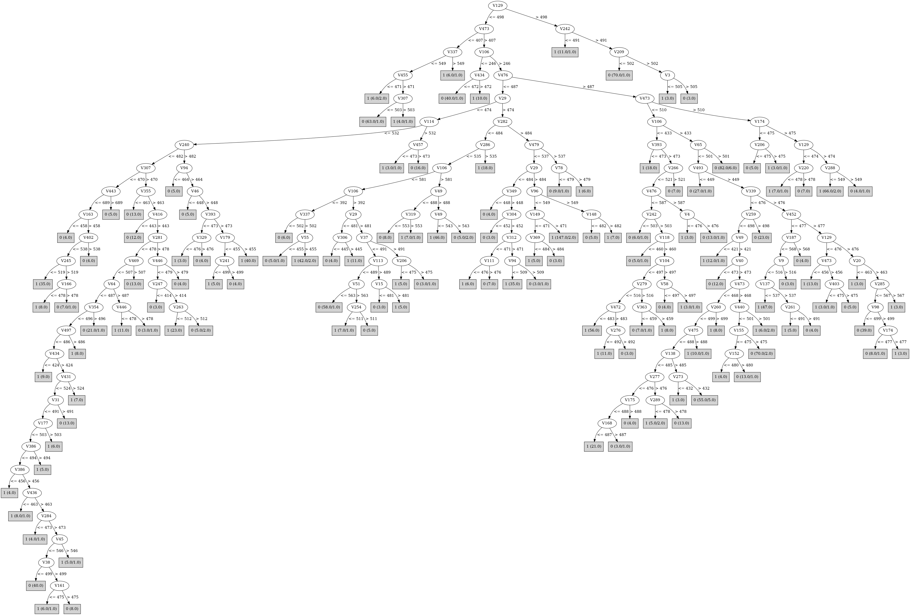

# J48

# SimpleCart Decision Tree

V476 < 487.5

* V29 < 474.5

*   * V339 < 602.5

*   *   * V379 < 486.5

*   *   *   * V282 < 449.0: 0(12.0/0.0)

*   *   *   * V282 >= 449.0

*   *   *   *   * V225 < 412.0: 0(3.0/1.0)

*   *   *   *   * V225 >= 412.0: 1(94.0/5.0)

*   *   * V379 >= 486.5

*   *   *   * V282 < 464.5: 1(22.0/2.0)

*   *   *   * V282 >= 464.5

*   *   *   *   * V29 < 457.5

*   *   *   *   *   * V65 < 543.5: 0(6.0/0.0)

*   *   *   *   *   * V65 >= 543.5: 1(9.0/0.0)

*   *   *   *   * V29 >= 457.5

*   *   *   *   *   * V154 < 534.0

*   *   *   *   *   *   * V239 < 489.0

*   *   *   *   *   *   *   * V481 < 499.5: 0(14.0/0.0)

*   *   *   *   *   *   *   * V481 >= 499.5: 1(4.0/0.0)

*   *   *   *   *   *   * V239 >= 489.0: 1(6.0/0.0)

*   *   *   *   *   * V154 >= 534.0: 0(66.0/3.0)

*   * V339 >= 602.5

*   *   * V49 < 478.0

*   *   *   * V154 < 491.5: 0(86.0/1.0)

*   *   *   * V154 >= 491.5: 1(5.0/0.0)

*   *   * V49 >= 478.0

*   *   *   * V282 < 468.0

*   *   *   *   * V494 < 625.5: 1(51.0/5.0)

*   *   *   *   * V494 >= 625.5: 0(7.0/1.0)

*   *   *   * V282 >= 468.0

*   *   *   *   * V10 < 485.0: 0(12.0/0.0)

*   *   *   *   * V10 >= 485.0: 1(3.0/1.0)

* V29 >= 474.5

*   * V154 < 511.0

*   *   * V106 < 581.0

*   *   *   * V106 < 392.5

*   *   *   *   * V443 < 543.5: 1(46.0/3.0)

*   *   *   *   * V443 >= 543.5

*   *   *   *   *   * V382 < 482.0: 0(10.0/0.0)

*   *   *   *   *   * V382 >= 482.0: 1(4.0/0.0)

*   *   *   * V106 >= 392.5

*   *   *   *   * V29 < 479.5

*   *   *   *   *   * V306 < 444.5: 0(3.0/0.0)

*   *   *   *   *   * V306 >= 444.5: 1(13.0/0.0)

*   *   *   *   * V29 >= 479.5

*   *   *   *   *   * V331 < 442.5

*   *   *   *   *   *   * V30 < 496.0: 1(7.0/0.0)

*   *   *   *   *   *   * V30 >= 496.0: 0(3.0/0.0)

*   *   *   *   *   * V331 >= 442.5

*   *   *   *   *   *   * V422 < 467.5

*   *   *   *   *   *   *   * V106 < 443.0: 1(6.0/0.0)

*   *   *   *   *   *   *   * V106 >= 443.0: 0(6.0/1.0)

*   *   *   *   *   *   * V422 >= 467.5

*   *   *   *   *   *   *   * V445 < 520.0: 0(59.0/1.0)

*   *   *   *   *   *   *   * V445 >= 520.0: 1(4.0/2.0)

*   *   * V106 >= 581.0

*   *   *   * V49 < 488.0

*   *   *   *   * V247 < 485.5: 1(7.0/1.0)

*   *   *   *   * V247 >= 485.5: 0(8.0/0.0)

*   *   *   * V49 >= 488.0

*   *   *   *   * V49 < 543.5: 1(51.0/0.0)

*   *   *   *   * V49 >= 543.5: 0(4.0/2.0)

*   * V154 >= 511.0

*   *   * V479 < 553.5

*   *   *   * V454 < 700.0

*   *   *   *   * V275 < 508.5: 1(212.0/20.0)

*   *   *   *   * V275 >= 508.5: 0(4.0/2.0)

*   *   *   * V454 >= 700.0

*   *   *   *   * V48 < 500.5: 0(6.0/0.0)

*   *   *   *   * V48 >= 500.5: 1(4.0/0.0)

*   *   * V479 >= 553.5: 0(6.0/1.0)

V476 >= 487.5

* V339 < 478.5

*   * V379 < 522.5

*   *   * V154 < 616.5

*   *   *   * V319 < 583.5

*   *   *   *   * V487 < 459.5: 1(9.0/2.0)

*   *   *   *   * V487 >= 459.5

*   *   *   *   *   * V379 < 395.0: 1(6.0/0.0)

*   *   *   *   *   * V379 >= 395.0

*   *   *   *   *   *   * V338 < 464.5

*   *   *   *   *   *   *   * V307 < 485.5

*   *   *   *   *   *   *   *   * V137 < 480.5

*   *   *   *   *   *   *   *   *   * V142 < 479.5: 0(3.0/0.0)

*   *   *   *   *   *   *   *   *   * V142 >= 479.5: 1(6.0/0.0)

*   *   *   *   *   *   *   *   * V137 >= 480.5: 0(19.0/1.0)

*   *   *   *   *   *   *   * V307 >= 485.5

*   *   *   *   *   *   *   *   * V35 < 503.5: 1(15.0/0.0)

*   *   *   *   *   *   *   *   * V35 >= 503.5: 0(4.0/1.0)

*   *   *   *   *   *   * V338 >= 464.5

*   *   *   *   *   *   *   * V471 < 560.0

*   *   *   *   *   *   *   *   * V306 < 436.5: 1(4.0/1.0)

*   *   *   *   *   *   *   *   * V306 >= 436.5

*   *   *   *   *   *   *   *   *   * V188 < 541.0

*   *   *   *   *   *   *   *   *   *   * V214 < 428.0

*   *   *   *   *   *   *   *   *   *   *   * V18 < 477.5: 0(3.0/0.0)

*   *   *   *   *   *   *   *   *   *   *   * V18 >= 477.5: 1(4.0/0.0)

*   *   *   *   *   *   *   *   *   *   * V214 >= 428.0: 0(128.0/9.0)

*   *   *   *   *   *   *   *   *   * V188 >= 541.0: 1(3.0/0.0)

*   *   *   *   *   *   *   * V471 >= 560.0

*   *   *   *   *   *   *   *   * V195 < 513.0

*   *   *   *   *   *   *   *   *   * V348 < 511.0: 1(11.0/0.0)

*   *   *   *   *   *   *   *   *   * V348 >= 511.0: 0(3.0/0.0)

*   *   *   *   *   *   *   *   * V195 >= 513.0: 0(9.0/0.0)

*   *   *   * V319 >= 583.5: 1(7.0/0.0)

*   *   * V154 >= 616.5

*   *   *   * V322 < 505.0

*   *   *   *   * V438 < 508.5: 0(13.0/0.0)

*   *   *   *   * V438 >= 508.5

*   *   *   *   *   * V119 < 514.5: 1(13.0/1.0)

*   *   *   *   *   * V119 >= 514.5: 0(4.0/0.0)

*   *   *   * V322 >= 505.0: 1(16.0/0.0)

*   * V379 >= 522.5

*   *   * V476 < 490.5: 1(3.0/0.0)

*   *   * V476 >= 490.5

*   *   *   * V443 < 552.0: 0(217.0/11.0)

*   *   *   * V443 >= 552.0

*   *   *   *   * V29 < 465.0: 1(5.0/0.0)

*   *   *   *   * V29 >= 465.0: 0(5.0/0.0)

* V339 >= 478.5

*   * V319 < 484.5

*   *   * V106 < 288.0: 0(15.0/2.0)

*   *   * V106 >= 288.0

*   *   *   * V5 < 551.5

*   *   *   *   * V230 < 468.5

*   *   *   *   *   * V366 < 507.5: 0(11.0/2.0)

*   *   *   *   *   * V366 >= 507.5: 1(8.0/0.0)

*   *   *   *   * V230 >= 468.5

*   *   *   *   *   * V11 < 544.0

*   *   *   *   *   *   * V252 < 430.0: 0(3.0/0.0)

*   *   *   *   *   *   * V252 >= 430.0

*   *   *   *   *   *   *   * V242 < 501.5: 0(3.0/1.0)

*   *   *   *   *   *   *   * V242 >= 501.5

*   *   *   *   *   *   *   *   * V373 < 452.5: 0(3.0/1.0)

*   *   *   *   *   *   *   *   * V373 >= 452.5: 1(138.0/7.0)

*   *   *   *   *   * V11 >= 544.0

*   *   *   *   *   *   * V21 < 495.0: 0(6.0/0.0)

*   *   *   *   *   *   * V21 >= 495.0: 1(3.0/0.0)

*   *   *   * V5 >= 551.5

*   *   *   *   * V353 < 494.0: 1(7.0/0.0)

*   *   *   *   * V353 >= 494.0

*   *   *   *   *   * V471 < 529.5: 0(13.0/0.0)

*   *   *   *   *   * V471 >= 529.5: 1(4.0/1.0)

*   * V319 >= 484.5

*   *   * V106 < 453.5

*   *   *   * V339 < 554.0

*   *   *   *   * V65 < 408.0: 0(3.0/1.0)

*   *   *   *   * V65 >= 408.0: 1(40.0/3.0)

*   *   *   * V339 >= 554.0: 0(6.0/0.0)

*   *   * V106 >= 453.5

*   *   *   * V81 < 546.0

*   *   *   *   * V65 < 357.5: 1(3.0/0.0)

*   *   *   *   * V65 >= 357.5

*   *   *   *   *   * V216 < 417.5: 1(3.0/0.0)

*   *   *   *   *   * V216 >= 417.5: 0(73.0/5.0)

*   *   *   * V81 >= 546.0: 1(4.0/0.0)

# PART

Decision list:

conditions|predicted class
---|---
V129 > 498.0 AND V242 > 491.0| 0 (76.0/4.0)
V473 <= 407.0 AND V337 <= 549.0 AND V455 > 471.0 AND V307 <= 503.0| 0 (63.0/1.0)
V106 <= 246.0 AND V282 <= 459.0| 0 (40.0/1.0)
V242 <= 495.0 AND V29 > 474.0 AND V282 > 484.0 AND V29 > 484.0 AND V479 <= 537.0 AND V239 > 442.0 AND V477 > 451.0| 1 (149.0/1.0)
V339 <= 477.0 AND V129 <= 473.0 AND V452 <= 477.0 AND V500 <= 497.0| 1 (28.0)
V339 <= 477.0 AND V476 > 497.0 AND V339 > 367.0 AND V473 <= 511.0 AND V476 <= 606.0 AND V446 <= 479.0 AND V269 <= 530.0 AND V97 <= 478.0| 0 (92.0/2.0)
V339 <= 476.0 AND V29 <= 494.0 AND V343 > 451.0 AND V49 > 436.0 AND V349 <= 506.0 AND V64 <= 490.0 AND V153 <= 495.0 AND V446 <= 479.0 AND V409 <= 532.0 AND V140 <= 506.0 AND V462 > 457.0 AND V425 <= 497.0 AND V224 <= 543.0 AND V121 > 473.0 AND V260 <= 500.0 AND V119 > 457.0 AND V465 <= 509.0 AND V282 > 455.0 AND V24 > 460.0 AND V84 > 472.0| 0 (52.0/3.0)
V318 <= 466.0 AND V479 <= 516.0| 1 (22.0)
V368 > 504.0 AND V109 > 488.0| 1 (36.0/2.0)
V72 > 517.0 AND V459 <= 510.0| 0 (19.0)
V446 > 479.0 AND V191 > 505.0 AND V42 <= 514.0| 1 (11.0)
V446 > 479.0 AND V164 > 471.0 AND V75 <= 482.0 AND V458 > 428.0| 0 (57.0/2.0)
V199 > 478.0 AND V498 > 461.0 AND V401 > 470.0 AND V307 <= 498.0 AND V122 <= 491.0 AND V464 <= 548.0| 0 (46.0/2.0)
V199 > 478.0 AND V408 <= 481.0| 1 (30.0/2.0)
V445 > 513.0 AND V281 > 475.0 AND V42 <= 527.0 AND V209 > 460.0 AND V259 <= 496.0 AND V410 > 472.0| 1 (70.0)
V338 > 551.0 AND V23 <= 486.0 AND V37 <= 492.0| 0 (26.0/1.0)
V287 > 528.0 AND V231 <= 487.0| 1 (27.0)
V339 <= 480.0 AND V49 > 422.0 AND V218 <= 497.0 AND V466 <= 517.0 AND V49 > 521.0 AND V250 > 454.0| 0 (46.0/3.0)
V464 <= 405.0 AND V272 > 453.0 AND V245 > 481.0| 0 (33.0/2.0)
V407 <= 412.0 AND V261 <= 514.0 AND V134 <= 479.0| 0 (21.0)
V182 > 464.0 AND V229 > 475.0 AND V332 <= 456.0 AND V320 <= 554.0| 1 (30.0)
V164 > 490.0 AND V64 > 469.0 AND V55 <= 544.0| 1 (28.0)
V89 > 487.0 AND V95 <= 497.0 AND V28 <= 503.0 AND V114 <= 492.0| 1 (41.0/1.0)
V357 <= 442.0 AND V478 > 488.0| 1 (22.0)
V446 <= 474.0 AND V44 <= 507.0 AND V375 <= 522.0| 0 (19.0)
V182 <= 464.0 AND V455 > 471.0 AND V257 > 443.0 AND V317 > 461.0 AND V438 > 456.0 AND V249 > 469.0 AND V8 > 475.0| 0 (40.0)
V57 <= 408.0 AND V190 > 475.0 AND V84 > 476.0| 0 (23.0)
V155 > 478.0 AND V240 > 473.0 AND V403 <= 478.0 AND V360 <= 547.0 AND V191 > 453.0| 1 (55.0/1.0)
V155 > 478.0 AND V110 <= 486.0| 0 (20.0/2.0)
V229 > 475.0 AND V260 > 500.0 AND V291 <= 506.0| 1 (29.0)
V178 <= 471.0 AND V207 > 464.0 AND V9 > 462.0 AND V199 <= 477.0 AND V105 > 455.0| 0 (31.0)
V40 > 478.0 AND V311 > 457.0 AND V458 <= 502.0| 0 (18.0)
V312 <= 455.0 AND V472 <= 475.0| 0 (13.0)
V309 <= 464.0 AND V229 > 475.0 AND V72 > 471.0| 1 (40.0/1.0)
V404 > 527.0 AND V460 <= 513.0 AND V453 <= 505.0| 0 (25.0/1.0)
V106 > 596.0 AND V399 > 500.0| 1 (43.0/1.0)
V497 <= 469.0 AND V8 > 475.0| 0 (16.0/1.0)
V41 <= 472.0 AND V202 <= 503.0 AND V482 > 453.0| 1 (29.0)
V351 > 491.0 AND V370 > 484.0| 0 (17.0/1.0)
V391 > 484.0 AND V307 > 469.0| 1 (18.0)
V203 <= 455.0 AND V157 <= 496.0| 0 (13.0)
V16 <= 446.0 AND V423 > 473.0| 0 (12.0)
V313 > 454.0 AND V432 <= 462.0| 1 (22.0/2.0)
V26 <= 552.0 AND V313 > 454.0 AND V144 > 497.0 AND V458 <= 511.0| 1 (18.0)
V26 <= 552.0 AND V313 > 440.0 AND V178 <= 478.0 AND V160 <= 534.0 AND V211 > 483.0 AND V374 <= 516.0| 1 (48.0/3.0)
V26 <= 552.0 AND V313 > 440.0 AND V169 <= 478.0 AND V39 <= 487.0 AND V354 > 492.0 AND V354 <= 506.0| 0 (24.0/1.0)
V26 <= 552.0 AND V169 <= 478.0 AND V39 <= 487.0 AND V313 > 453.0 AND V263 <= 521.0 AND V32 <= 557.0 AND V288 > 429.0 AND V208 <= 483.0 AND V40 <= 475.0 AND V4 > 474.0| 0 (25.0/1.0)
V39 <= 487.0 AND V169 > 478.0 AND V338 > 446.0| 0 (13.0)
V39 <= 487.0 AND V23 <= 483.0 AND V339 > 438.0 AND V393 <= 478.0 AND V354 <= 490.0 AND V40 <= 477.0 AND V169 > 475.0 AND V23 > 468.0 AND V244 > 468.0| 1 (37.0/2.0)
V39 <= 487.0 AND V38 > 449.0 AND V23 <= 482.0 AND V294 > 466.0 AND V393 <= 478.0 AND V354 <= 490.0 AND V270 > 467.0 AND V247 > 446.0| 0 (21.0/1.0)
V39 <= 487.0 AND V38 > 449.0 AND V294 > 466.0| 1 (60.0/2.0)
V97 > 476.0| 0 (22.0)
| 1 (4.0/1.0)

# JRip

Decision list:

conditions|predicted class
---|---
(V476 <= 484) and (V29 >= 477) and (V154 >= 512)|1 (239.0/31.0)
(V339 >= 478) and (V339 <= 591) and (V452 <= 477)|1 (397.0/124.0)
(V129 <= 475) and (V443 <= 564)|1 (258.0/94.0)
(V476 <= 496) and (V49 >= 496) and (V434 <= 467)|1 (103.0/21.0)
(V379 <= 502) and (V443 <= 470) and (V454 >= 470) and (V476 <= 584)|1 (51.0/4.0)
(V339 >= 446) and (V154 >= 461) and (V125 >= 474) and (V384 <= 479) and (V484 <= 531)|1 (31.0/4.0)
|0 (741.0/106.0)

# Decision Table

Non matches covered by Majority class

v1|v2|v3|v4|v5|v6|v7|v8|v9|v10|v11|v12|v13|v14|v15|v16|v17|v18|v19|v20|v21|v22|v23|v24|v25|v26|v27|v28|v29|v30|v31|v32|v33|v34|v35|v36|v37|v38|v39|v40|v41|v42|v43|v44|v45|v46|v47|v48|v49|v50|v51|v52|v53|v54|v55|v56|v57|v58|v59|v60|v61|v62|v63|v64|v65|v66|v67|v68|v69|v70|v71|v72|v73|v74|v75|v76|v77|v78|v79|v80|v81|v82|v83|v84|v85|v86|v87|v88|v89|v90|v91|v92|v93|v94|v95|v96|v97|v98|v99|v100|v101|v102|v103|v104|v105|v106|v107|v108|v109|v110|v111|v112|v113|v114|v115|v116|v117|v118|v119|v120|v121|v122|v123|v124|v125|v126|v127|v128|v129|v130|v131|v132|v133|v134|v135|v136|v137|v138|v139|v140|v141|v142|v143|v144|v145|v146|v147|v148|v149|v150|v151|v152|v153|v154|v155|v156|v157|v158|v159|v160|v161|v162|v163|v164|v165|v166|v167|v168|v169|v170|v171|v172|v173|v174|v175|v176|v177|v178|v179|v180|v181|v182|v183|v184|v185|v186|v187|v188|v189|v190|v191|v192|v193|v194|v195|v196|v197|v198|v199|v200|v201|v202|v203|v204|v205|v206|v207|v208|v209|v210|v211|v212|v213|v214|v215|v216|v217|v218|v219|v220|v221|v222|v223|v224|v225|v226|v227|v228|v229|v230|v231|v232|v233|v234|v235|v236|v237|v238|v239|v240|v241|v242|v243|v244|v245|v246|v247|v248|v249|v250|v251|v252|v253|v254|v255|v256|v257|v258|v259|v260|v261|v262|v263|v264|v265|v266|v267|v268|v269|v270|v271|v272|v273|v274|v275|v276|v277|v278|v279|v280|v281|v282|v283|v284|v285|v287|v288|v289|v290|v291|v292|v293|v294|v295|v296|v297|v298|v299|v300|v301|v302|v303|v304|v305|v306|v307|v308|v309|v310|v311|v312|v313|v314|v315|v316|v317|v318|v319|v320|v321|v322|v323|v324|v325|v326|v327|v328|v329|v330|v331|v332|v333|v334|v335|v336|v337|v338|v339|v340|v341|v342|v343|v344|v345|v346|v347|v348|v349|v350|v352|v353|v354|v355|v356|v357|v358|v359|v360|v361|v362|v363|v364|v365|v366|v367|v368|v369|v370|v371|v372|v373|v374|v375|v376|v377|v378|v379|v380|v381|v382|v383|v384|v385|v386|v387|v388|v389|v390|v391|v392|v393|v394|v395|v396|v397|v398|v399|v400|v401|v402|v403|v404|v405|v406|v407|v408|v409|v410|v411|v412|v413|v414|v415|v416|v417|v418|v419|v420|v421|v422|v423|v424|v425|v426|v427|v428|v429|v430|v431|v432|v433|v434|v435|v436|v437|v438|v439|v440|v441|v442|v443|v444|v445|v446|v447|v448|v449|v450|v451|v452|v453|v454|v455|v456|v457|v458|v459|v460|v461|v462|v463|v464|v465|v466|v467|v468|v469|v470|v471|v472|v473|v474|v475|v476|v477|v478|v479|v480|v481|v482|v483|v484|v485|v486|v487|v488|v489|v490|v491|v492|v493|v494|v495|v496|v497|v498|v499|v500|target
---|---|---|---|---|---|---|---|---|---|---|---|---|---|---|---|---|---|---|---|---|---|---|---|---|---|---|---|---|---|---|---|---|---|---|---|---|---|---|---|---|---|---|---|---|---|---|---|---|---|---|---|---|---|---|---|---|---|---|---|---|---|---|---|---|---|---|---|---|---|---|---|---|---|---|---|---|---|---|---|---|---|---|---|---|---|---|---|---|---|---|---|---|---|---|---|---|---|---|---|---|---|---|---|---|---|---|---|---|---|---|---|---|---|---|---|---|---|---|---|---|---|---|---|---|---|---|---|---|---|---|---|---|---|---|---|---|---|---|---|---|---|---|---|---|---|---|---|---|---|---|---|---|---|---|---|---|---|---|---|---|---|---|---|---|---|---|---|---|---|---|---|---|---|---|---|---|---|---|---|---|---|---|---|---|---|---|---|---|---|---|---|---|---|---|---|---|---|---|---|---|---|---|---|---|---|---|---|---|---|---|---|---|---|---|---|---|---|---|---|---|---|---|---|---|---|---|---|---|---|---|---|---|---|---|---|---|---|---|---|---|---|---|---|---|---|---|---|---|---|---|---|---|---|---|---|---|---|---|---|---|---|---|---|---|---|---|---|---|---|---|---|---|---|---|---|---|---|---|---|---|---|---|---|---|---|---|---|---|---|---|---|---|---|---|---|---|---|---|---|---|---|---|---|---|---|---|---|---|---|---|---|---|---|---|---|---|---|---|---|---|---|---|---|---|---|---|---|---|---|---|---|---|---|---|---|---|---|---|---|---|---|---|---|---|---|---|---|---|---|---|---|---|---|---|---|---|---|---|---|---|---|---|---|---|---|---|---|---|---|---|---|---|---|---|---|---|---|---|---|---|---|---|---|---|---|---|---|---|---|---|---|---|---|---|---|---|---|---|---|---|---|---|---|---|---|---|---|---|---|---|---|---|---|---|---|---|---|---|---|---|---|---|---|---|---|---|---|---|---|---|---|---|---|---|---|---|---|---|---|---|---|---|---|---|---|---|---|---|---|---|---|---|---|---|---|---|---|---|---|---|---|---|---|---|---|---|---|---|---|---|---|---|---|---|---|---|---|---|---|---|---|---|---|---|---|---|---|---|---|---|---|---|---|---|---|---|---|---
all|all|all|all|all|all|all|all|all|all|all|all|all|all|all|all|all|all|all|all|all|all|all|all|all|all|all|all|all|all|all|all|all|all|all|all|all|all|all|all|all|all|all|all|all|all|all|all|(468.5-inf)|all|all|all|all|all|all|all|all|all|all|all|all|all|all|all|(546.5-inf)|all|all|all|all|all|all|all|all|all|all|all|all|all|all|all|all|all|all|all|all|all|all|all|all|all|all|all|all|all|all|all|all|all|all|all|all|all|all|all|all|(435.5-688.5]|all|all|all|all|all|all|all|all|all|all|all|all|all|all|all|all|all|all|all|all|all|all|(473.5-498.5]|all|all|all|all|all|all|all|all|all|all|all|all|all|all|all|all|all|all|all|all|all|all|all|all|all|all|all|all|all|all|all|all|all|all|all|all|all|all|all|all|all|all|all|all|all|all|all|all|all|all|all|all|all|all|all|all|all|all|all|all|all|all|all|all|all|all|all|all|all|all|all|all|all|all|all|all|all|all|all|all|all|all|all|all|all|all|all|all|all|all|all|all|all|all|all|all|all|all|all|all|all|all|all|all|all|all|all|all|all|all|all|all|(495.5-inf)|all|all|all|all|all|all|all|all|all|all|all|all|all|all|all|all|all|all|all|all|all|all|all|all|all|all|all|all|all|all|all|all|all|all|(474.5-inf)|all|all|all|all|all|all|all|all|all|all|all|all|all|all|all|all|all|all|all|all|all|all|all|all|all|all|all|all|all|all|all|all|all|all|all|all|all|all|all|all|all|all|all|all|all|all|all|all|all|all|all|all|all|all|all|all|all|all|(544.5-inf)|all|(-inf-445.5]|all|all|all|all|all|all|all|all|all|all|all|all|all|all|all|all|all|all|all|all|all|all|all|all|all|all|all|all|all|all|all|all|all|all|all|all|all|all|(482.5-inf)|all|all|all|all|all|all|all|all|all|all|all|all|all|all|all|all|all|all|all|all|all|all|all|all|all|all|all|all|all|all|all|all|all|all|all|all|all|all|all|all|all|all|all|all|all|all|all|all|all|all|all|all|all|all|all|all|all|all|all|all|all|all|all|(339.5-inf)|all|all|(-inf-479.5]|all|all|all|all|all|all|all|(-inf-460.5]|all|all|all|all|all|all|all|all|all|all|all|all|all|all|all|all|all|all|(407.5-inf)|all|all|(-inf-487.5]|all|all|all|all|all|all|all|all|all|all|all|all|all|all|all|all|all|all|all|all|all|all|all|all|0
all|all|all|all|all|all|all|all|all|all|all|all|all|all|all|all|all|all|all|all|all|all|all|all|all|all|all|all|all|all|all|all|all|all|all|all|all|all|all|all|all|all|all|all|all|all|all|all|(-inf-468.5]|all|all|all|all|all|all|all|all|all|all|all|all|all|all|all|(-inf-546.5]|all|all|all|all|all|all|all|all|all|all|all|all|all|all|all|all|all|all|all|all|all|all|all|all|all|all|all|all|all|all|all|all|all|all|all|all|all|all|all|all|(435.5-688.5]|all|all|all|all|all|all|all|all|all|all|all|all|all|all|all|all|all|all|all|all|all|all|(473.5-498.5]|all|all|all|all|all|all|all|all|all|all|all|all|all|all|all|all|all|all|all|all|all|all|all|all|all|all|all|all|all|all|all|all|all|all|all|all|all|all|all|all|all|all|all|all|all|all|all|all|all|all|all|all|all|all|all|all|all|all|all|all|all|all|all|all|all|all|all|all|all|all|all|all|all|all|all|all|all|all|all|all|all|all|all|all|all|all|all|all|all|all|all|all|all|all|all|all|all|all|all|all|all|all|all|all|all|all|all|all|all|all|all|all|(495.5-inf)|all|all|all|all|all|all|all|all|all|all|all|all|all|all|all|all|all|all|all|all|all|all|all|all|all|all|all|all|all|all|all|all|all|all|(474.5-inf)|all|all|all|all|all|all|all|all|all|all|all|all|all|all|all|all|all|all|all|all|all|all|all|all|all|all|all|all|all|all|all|all|all|all|all|all|all|all|all|all|all|all|all|all|all|all|all|all|all|all|all|all|all|all|all|all|all|all|(-inf-544.5]|all|(-inf-445.5]|all|all|all|all|all|all|all|all|all|all|all|all|all|all|all|all|all|all|all|all|all|all|all|all|all|all|all|all|all|all|all|all|all|all|all|all|all|all|(-inf-482.5]|all|all|all|all|all|all|all|all|all|all|all|all|all|all|all|all|all|all|all|all|all|all|all|all|all|all|all|all|all|all|all|all|all|all|all|all|all|all|all|all|all|all|all|all|all|all|all|all|all|all|all|all|all|all|all|all|all|all|all|all|all|all|all|(339.5-inf)|all|all|(479.5-inf)|all|all|all|all|all|all|all|(460.5-inf)|all|all|all|all|all|all|all|all|all|all|all|all|all|all|all|all|all|all|(407.5-inf)|all|all|(487.5-inf)|all|all|all|all|all|all|all|all|all|all|all|all|all|all|all|all|all|all|all|all|all|all|all|all|0
all|all|all|all|all|all|all|all|all|all|all|all|all|all|all|all|all|all|all|all|all|all|all|all|all|all|all|all|all|all|all|all|all|all|all|all|all|all|all|all|all|all|all|all|all|all|all|all|(-inf-468.5]|all|all|all|all|all|all|all|all|all|all|all|all|all|all|all|(546.5-inf)|all|all|all|all|all|all|all|all|all|all|all|all|all|all|all|all|all|all|all|all|all|all|all|all|all|all|all|all|all|all|all|all|all|all|all|all|all|all|all|all|(254.5-435.5]|all|all|all|all|all|all|all|all|all|all|all|all|all|all|all|all|all|all|all|all|all|all|(459.5-473.5]|all|all|all|all|all|all|all|all|all|all|all|all|all|all|all|all|all|all|all|all|all|all|all|all|all|all|all|all|all|all|all|all|all|all|all|all|all|all|all|all|all|all|all|all|all|all|all|all|all|all|all|all|all|all|all|all|all|all|all|all|all|all|all|all|all|all|all|all|all|all|all|all|all|all|all|all|all|all|all|all|all|all|all|all|all|all|all|all|all|all|all|all|all|all|all|all|all|all|all|all|all|all|all|all|all|all|all|all|all|all|all|all|(-inf-495.5]|all|all|all|all|all|all|all|all|all|all|all|all|all|all|all|all|all|all|all|all|all|all|all|all|all|all|all|all|all|all|all|all|all|all|(474.5-inf)|all|all|all|all|all|all|all|all|all|all|all|all|all|all|all|all|all|all|all|all|all|all|all|all|all|all|all|all|all|all|all|all|all|all|all|all|all|all|all|all|all|all|all|all|all|all|all|all|all|all|all|all|all|all|all|all|all|all|(544.5-inf)|all|(-inf-445.5]|all|all|all|all|all|all|all|all|all|all|all|all|all|all|all|all|all|all|all|all|all|all|all|all|all|all|all|all|all|all|all|all|all|all|all|all|all|all|(-inf-482.5]|all|all|all|all|all|all|all|all|all|all|all|all|all|all|all|all|all|all|all|all|all|all|all|all|all|all|all|all|all|all|all|all|all|all|all|all|all|all|all|all|all|all|all|all|all|all|all|all|all|all|all|all|all|all|all|all|all|all|all|all|all|all|all|(339.5-inf)|all|all|(479.5-inf)|all|all|all|all|all|all|all|(460.5-inf)|all|all|all|all|all|all|all|all|all|all|all|all|all|all|all|all|all|all|(407.5-inf)|all|all|(-inf-487.5]|all|all|all|all|all|all|all|all|all|all|all|all|all|all|all|all|all|all|all|all|all|all|all|all|0
all|all|all|all|all|all|all|all|all|all|all|all|all|all|all|all|all|all|all|all|all|all|all|all|all|all|all|all|all|all|all|all|all|all|all|all|all|all|all|all|all|all|all|all|all|all|all|all|(-inf-468.5]|all|all|all|all|all|all|all|all|all|all|all|all|all|all|all|(-inf-546.5]|all|all|all|all|all|all|all|all|all|all|all|all|all|all|all|all|all|all|all|all|all|all|all|all|all|all|all|all|all|all|all|all|all|all|all|all|all|all|all|all|(254.5-435.5]|all|all|all|all|all|all|all|all|all|all|all|all|all|all|all|all|all|all|all|all|all|all|(459.5-473.5]|all|all|all|all|all|all|all|all|all|all|all|all|all|all|all|all|all|all|all|all|all|all|all|all|all|all|all|all|all|all|all|all|all|all|all|all|all|all|all|all|all|all|all|all|all|all|all|all|all|all|all|all|all|all|all|all|all|all|all|all|all|all|all|all|all|all|all|all|all|all|all|all|all|all|all|all|all|all|all|all|all|all|all|all|all|all|all|all|all|all|all|all|all|all|all|all|all|all|all|all|all|all|all|all|all|all|all|all|all|all|all|all|(495.5-inf)|all|all|all|all|all|all|all|all|all|all|all|all|all|all|all|all|all|all|all|all|all|all|all|all|all|all|all|all|all|all|all|all|all|all|(474.5-inf)|all|all|all|all|all|all|all|all|all|all|all|all|all|all|all|all|all|all|all|all|all|all|all|all|all|all|all|all|all|all|all|all|all|all|all|all|all|all|all|all|all|all|all|all|all|all|all|all|all|all|all|all|all|all|all|all|all|all|(-inf-544.5]|all|(478.5-625.5]|all|all|all|all|all|all|all|all|all|all|all|all|all|all|all|all|all|all|all|all|all|all|all|all|all|all|all|all|all|all|all|all|all|all|all|all|all|all|(-inf-482.5]|all|all|all|all|all|all|all|all|all|all|all|all|all|all|all|all|all|all|all|all|all|all|all|all|all|all|all|all|all|all|all|all|all|all|all|all|all|all|all|all|all|all|all|all|all|all|all|all|all|all|all|all|all|all|all|all|all|all|all|all|all|all|all|(339.5-inf)|all|all|(-inf-479.5]|all|all|all|all|all|all|all|(460.5-inf)|all|all|all|all|all|all|all|all|all|all|all|all|all|all|all|all|all|all|(407.5-inf)|all|all|(487.5-inf)|all|all|all|all|all|all|all|all|all|all|all|all|all|all|all|all|all|all|all|all|all|all|all|all|0
all|all|all|all|all|all|all|all|all|all|all|all|all|all|all|all|all|all|all|all|all|all|all|all|all|all|all|all|all|all|all|all|all|all|all|all|all|all|all|all|all|all|all|all|all|all|all|all|(-inf-468.5]|all|all|all|all|all|all|all|all|all|all|all|all|all|all|all|(546.5-inf)|all|all|all|all|all|all|all|all|all|all|all|all|all|all|all|all|all|all|all|all|all|all|all|all|all|all|all|all|all|all|all|all|all|all|all|all|all|all|all|all|(254.5-435.5]|all|all|all|all|all|all|all|all|all|all|all|all|all|all|all|all|all|all|all|all|all|all|(-inf-459.5]|all|all|all|all|all|all|all|all|all|all|all|all|all|all|all|all|all|all|all|all|all|all|all|all|all|all|all|all|all|all|all|all|all|all|all|all|all|all|all|all|all|all|all|all|all|all|all|all|all|all|all|all|all|all|all|all|all|all|all|all|all|all|all|all|all|all|all|all|all|all|all|all|all|all|all|all|all|all|all|all|all|all|all|all|all|all|all|all|all|all|all|all|all|all|all|all|all|all|all|all|all|all|all|all|all|all|all|all|all|all|all|all|(-inf-495.5]|all|all|all|all|all|all|all|all|all|all|all|all|all|all|all|all|all|all|all|all|all|all|all|all|all|all|all|all|all|all|all|all|all|all|(474.5-inf)|all|all|all|all|all|all|all|all|all|all|all|all|all|all|all|all|all|all|all|all|all|all|all|all|all|all|all|all|all|all|all|all|all|all|all|all|all|all|all|all|all|all|all|all|all|all|all|all|all|all|all|all|all|all|all|all|all|all|(544.5-inf)|all|(478.5-625.5]|all|all|all|all|all|all|all|all|all|all|all|all|all|all|all|all|all|all|all|all|all|all|all|all|all|all|all|all|all|all|all|all|all|all|all|all|all|all|(-inf-482.5]|all|all|all|all|all|all|all|all|all|all|all|all|all|all|all|all|all|all|all|all|all|all|all|all|all|all|all|all|all|all|all|all|all|all|all|all|all|all|all|all|all|all|all|all|all|all|all|all|all|all|all|all|all|all|all|all|all|all|all|all|all|all|all|(339.5-inf)|all|all|(479.5-inf)|all|all|all|all|all|all|all|(460.5-inf)|all|all|all|all|all|all|all|all|all|all|all|all|all|all|all|all|all|all|(407.5-inf)|all|all|(-inf-487.5]|all|all|all|all|all|all|all|all|all|all|all|all|all|all|all|all|all|all|all|all|all|all|all|all|0
all|all|all|all|all|all|all|all|all|all|all|all|all|all|all|all|all|all|all|all|all|all|all|all|all|all|all|all|all|all|all|all|all|all|all|all|all|all|all|all|all|all|all|all|all|all|all|all|(-inf-468.5]|all|all|all|all|all|all|all|all|all|all|all|all|all|all|all|(546.5-inf)|all|all|all|all|all|all|all|all|all|all|all|all|all|all|all|all|all|all|all|all|all|all|all|all|all|all|all|all|all|all|all|all|all|all|all|all|all|all|all|all|(435.5-688.5]|all|all|all|all|all|all|all|all|all|all|all|all|all|all|all|all|all|all|all|all|all|all|(459.5-473.5]|all|all|all|all|all|all|all|all|all|all|all|all|all|all|all|all|all|all|all|all|all|all|all|all|all|all|all|all|all|all|all|all|all|all|all|all|all|all|all|all|all|all|all|all|all|all|all|all|all|all|all|all|all|all|all|all|all|all|all|all|all|all|all|all|all|all|all|all|all|all|all|all|all|all|all|all|all|all|all|all|all|all|all|all|all|all|all|all|all|all|all|all|all|all|all|all|all|all|all|all|all|all|all|all|all|all|all|all|all|all|all|all|(-inf-495.5]|all|all|all|all|all|all|all|all|all|all|all|all|all|all|all|all|all|all|all|all|all|all|all|all|all|all|all|all|all|all|all|all|all|all|(474.5-inf)|all|all|all|all|all|all|all|all|all|all|all|all|all|all|all|all|all|all|all|all|all|all|all|all|all|all|all|all|all|all|all|all|all|all|all|all|all|all|all|all|all|all|all|all|all|all|all|all|all|all|all|all|all|all|all|all|all|all|(544.5-inf)|all|(445.5-478.5]|all|all|all|all|all|all|all|all|all|all|all|all|all|all|all|all|all|all|all|all|all|all|all|all|all|all|all|all|all|all|all|all|all|all|all|all|all|all|(-inf-482.5]|all|all|all|all|all|all|all|all|all|all|all|all|all|all|all|all|all|all|all|all|all|all|all|all|all|all|all|all|all|all|all|all|all|all|all|all|all|all|all|all|all|all|all|all|all|all|all|all|all|all|all|all|all|all|all|all|all|all|all|all|all|all|all|(339.5-inf)|all|all|(-inf-479.5]|all|all|all|all|all|all|all|(460.5-inf)|all|all|all|all|all|all|all|all|all|all|all|all|all|all|all|all|all|all|(407.5-inf)|all|all|(-inf-487.5]|all|all|all|all|all|all|all|all|all|all|all|all|all|all|all|all|all|all|all|all|all|all|all|all|0
all|all|all|all|all|all|all|all|all|all|all|all|all|all|all|all|all|all|all|all|all|all|all|all|all|all|all|all|all|all|all|all|all|all|all|all|all|all|all|all|all|all|all|all|all|all|all|all|(-inf-468.5]|all|all|all|all|all|all|all|all|all|all|all|all|all|all|all|(546.5-inf)|all|all|all|all|all|all|all|all|all|all|all|all|all|all|all|all|all|all|all|all|all|all|all|all|all|all|all|all|all|all|all|all|all|all|all|all|all|all|all|all|(-inf-254.5]|all|all|all|all|all|all|all|all|all|all|all|all|all|all|all|all|all|all|all|all|all|all|(-inf-459.5]|all|all|all|all|all|all|all|all|all|all|all|all|all|all|all|all|all|all|all|all|all|all|all|all|all|all|all|all|all|all|all|all|all|all|all|all|all|all|all|all|all|all|all|all|all|all|all|all|all|all|all|all|all|all|all|all|all|all|all|all|all|all|all|all|all|all|all|all|all|all|all|all|all|all|all|all|all|all|all|all|all|all|all|all|all|all|all|all|all|all|all|all|all|all|all|all|all|all|all|all|all|all|all|all|all|all|all|all|all|all|all|all|(-inf-495.5]|all|all|all|all|all|all|all|all|all|all|all|all|all|all|all|all|all|all|all|all|all|all|all|all|all|all|all|all|all|all|all|all|all|all|(474.5-inf)|all|all|all|all|all|all|all|all|all|all|all|all|all|all|all|all|all|all|all|all|all|all|all|all|all|all|all|all|all|all|all|all|all|all|all|all|all|all|all|all|all|all|all|all|all|all|all|all|all|all|all|all|all|all|all|all|all|all|(544.5-inf)|all|(478.5-625.5]|all|all|all|all|all|all|all|all|all|all|all|all|all|all|all|all|all|all|all|all|all|all|all|all|all|all|all|all|all|all|all|all|all|all|all|all|all|all|(-inf-482.5]|all|all|all|all|all|all|all|all|all|all|all|all|all|all|all|all|all|all|all|all|all|all|all|all|all|all|all|all|all|all|all|all|all|all|all|all|all|all|all|all|all|all|all|all|all|all|all|all|all|all|all|all|all|all|all|all|all|all|all|all|all|all|all|(339.5-inf)|all|all|(-inf-479.5]|all|all|all|all|all|all|all|(460.5-inf)|all|all|all|all|all|all|all|all|all|all|all|all|all|all|all|all|all|all|(407.5-inf)|all|all|(-inf-487.5]|all|all|all|all|all|all|all|all|all|all|all|all|all|all|all|all|all|all|all|all|all|all|all|all|1
all|all|all|all|all|all|all|all|all|all|all|all|all|all|all|all|all|all|all|all|all|all|all|all|all|all|all|all|all|all|all|all|all|all|all|all|all|all|all|all|all|all|all|all|all|all|all|all|(468.5-inf)|all|all|all|all|all|all|all|all|all|all|all|all|all|all|all|(546.5-inf)|all|all|all|all|all|all|all|all|all|all|all|all|all|all|all|all|all|all|all|all|all|all|all|all|all|all|all|all|all|all|all|all|all|all|all|all|all|all|all|all|(254.5-435.5]|all|all|all|all|all|all|all|all|all|all|all|all|all|all|all|all|all|all|all|all|all|all|(459.5-473.5]|all|all|all|all|all|all|all|all|all|all|all|all|all|all|all|all|all|all|all|all|all|all|all|all|all|all|all|all|all|all|all|all|all|all|all|all|all|all|all|all|all|all|all|all|all|all|all|all|all|all|all|all|all|all|all|all|all|all|all|all|all|all|all|all|all|all|all|all|all|all|all|all|all|all|all|all|all|all|all|all|all|all|all|all|all|all|all|all|all|all|all|all|all|all|all|all|all|all|all|all|all|all|all|all|all|all|all|all|all|all|all|all|(-inf-495.5]|all|all|all|all|all|all|all|all|all|all|all|all|all|all|all|all|all|all|all|all|all|all|all|all|all|all|all|all|all|all|all|all|all|all|(474.5-inf)|all|all|all|all|all|all|all|all|all|all|all|all|all|all|all|all|all|all|all|all|all|all|all|all|all|all|all|all|all|all|all|all|all|all|all|all|all|all|all|all|all|all|all|all|all|all|all|all|all|all|all|all|all|all|all|all|all|all|(544.5-inf)|all|(625.5-inf)|all|all|all|all|all|all|all|all|all|all|all|all|all|all|all|all|all|all|all|all|all|all|all|all|all|all|all|all|all|all|all|all|all|all|all|all|all|all|(482.5-inf)|all|all|all|all|all|all|all|all|all|all|all|all|all|all|all|all|all|all|all|all|all|all|all|all|all|all|all|all|all|all|all|all|all|all|all|all|all|all|all|all|all|all|all|all|all|all|all|all|all|all|all|all|all|all|all|all|all|all|all|all|all|all|all|(339.5-inf)|all|all|(-inf-479.5]|all|all|all|all|all|all|all|(-inf-460.5]|all|all|all|all|all|all|all|all|all|all|all|all|all|all|all|all|all|all|(407.5-inf)|all|all|(-inf-487.5]|all|all|all|all|all|all|all|all|all|all|all|all|all|all|all|all|all|all|all|all|all|all|all|all|1
all|all|all|all|all|all|all|all|all|all|all|all|all|all|all|all|all|all|all|all|all|all|all|all|all|all|all|all|all|all|all|all|all|all|all|all|all|all|all|all|all|all|all|all|all|all|all|all|(-inf-468.5]|all|all|all|all|all|all|all|all|all|all|all|all|all|all|all|(-inf-546.5]|all|all|all|all|all|all|all|all|all|all|all|all|all|all|all|all|all|all|all|all|all|all|all|all|all|all|all|all|all|all|all|all|all|all|all|all|all|all|all|all|(254.5-435.5]|all|all|all|all|all|all|all|all|all|all|all|all|all|all|all|all|all|all|all|all|all|all|(459.5-473.5]|all|all|all|all|all|all|all|all|all|all|all|all|all|all|all|all|all|all|all|all|all|all|all|all|all|all|all|all|all|all|all|all|all|all|all|all|all|all|all|all|all|all|all|all|all|all|all|all|all|all|all|all|all|all|all|all|all|all|all|all|all|all|all|all|all|all|all|all|all|all|all|all|all|all|all|all|all|all|all|all|all|all|all|all|all|all|all|all|all|all|all|all|all|all|all|all|all|all|all|all|all|all|all|all|all|all|all|all|all|all|all|all|(495.5-inf)|all|all|all|all|all|all|all|all|all|all|all|all|all|all|all|all|all|all|all|all|all|all|all|all|all|all|all|all|all|all|all|all|all|all|(474.5-inf)|all|all|all|all|all|all|all|all|all|all|all|all|all|all|all|all|all|all|all|all|all|all|all|all|all|all|all|all|all|all|all|all|all|all|all|all|all|all|all|all|all|all|all|all|all|all|all|all|all|all|all|all|all|all|all|all|all|all|(-inf-544.5]|all|(478.5-625.5]|all|all|all|all|all|all|all|all|all|all|all|all|all|all|all|all|all|all|all|all|all|all|all|all|all|all|all|all|all|all|all|all|all|all|all|all|all|all|(-inf-482.5]|all|all|all|all|all|all|all|all|all|all|all|all|all|all|all|all|all|all|all|all|all|all|all|all|all|all|all|all|all|all|all|all|all|all|all|all|all|all|all|all|all|all|all|all|all|all|all|all|all|all|all|all|all|all|all|all|all|all|all|all|all|all|all|(339.5-inf)|all|all|(479.5-inf)|all|all|all|all|all|all|all|(-inf-460.5]|all|all|all|all|all|all|all|all|all|all|all|all|all|all|all|all|all|all|(407.5-inf)|all|all|(487.5-inf)|all|all|all|all|all|all|all|all|all|all|all|all|all|all|all|all|all|all|all|all|all|all|all|all|0
all|all|all|all|all|all|all|all|all|all|all|all|all|all|all|all|all|all|all|all|all|all|all|all|all|all|all|all|all|all|all|all|all|all|all|all|all|all|all|all|all|all|all|all|all|all|all|all|(-inf-468.5]|all|all|all|all|all|all|all|all|all|all|all|all|all|all|all|(546.5-inf)|all|all|all|all|all|all|all|all|all|all|all|all|all|all|all|all|all|all|all|all|all|all|all|all|all|all|all|all|all|all|all|all|all|all|all|all|all|all|all|all|(254.5-435.5]|all|all|all|all|all|all|all|all|all|all|all|all|all|all|all|all|all|all|all|all|all|all|(459.5-473.5]|all|all|all|all|all|all|all|all|all|all|all|all|all|all|all|all|all|all|all|all|all|all|all|all|all|all|all|all|all|all|all|all|all|all|all|all|all|all|all|all|all|all|all|all|all|all|all|all|all|all|all|all|all|all|all|all|all|all|all|all|all|all|all|all|all|all|all|all|all|all|all|all|all|all|all|all|all|all|all|all|all|all|all|all|all|all|all|all|all|all|all|all|all|all|all|all|all|all|all|all|all|all|all|all|all|all|all|all|all|all|all|all|(-inf-495.5]|all|all|all|all|all|all|all|all|all|all|all|all|all|all|all|all|all|all|all|all|all|all|all|all|all|all|all|all|all|all|all|all|all|all|(474.5-inf)|all|all|all|all|all|all|all|all|all|all|all|all|all|all|all|all|all|all|all|all|all|all|all|all|all|all|all|all|all|all|all|all|all|all|all|all|all|all|all|all|all|all|all|all|all|all|all|all|all|all|all|all|all|all|all|all|all|all|(-inf-544.5]|all|(478.5-625.5]|all|all|all|all|all|all|all|all|all|all|all|all|all|all|all|all|all|all|all|all|all|all|all|all|all|all|all|all|all|all|all|all|all|all|all|all|all|all|(-inf-482.5]|all|all|all|all|all|all|all|all|all|all|all|all|all|all|all|all|all|all|all|all|all|all|all|all|all|all|all|all|all|all|all|all|all|all|all|all|all|all|all|all|all|all|all|all|all|all|all|all|all|all|all|all|all|all|all|all|all|all|all|all|all|all|all|(339.5-inf)|all|all|(-inf-479.5]|all|all|all|all|all|all|all|(-inf-460.5]|all|all|all|all|all|all|all|all|all|all|all|all|all|all|all|all|all|all|(407.5-inf)|all|all|(-inf-487.5]|all|all|all|all|all|all|all|all|all|all|all|all|all|all|all|all|all|all|all|all|all|all|all|all|1
all|all|all|all|all|all|all|all|all|all|all|all|all|all|all|all|all|all|all|all|all|all|all|all|all|all|all|all|all|all|all|all|all|all|all|all|all|all|all|all|all|all|all|all|all|all|all|all|(-inf-468.5]|all|all|all|all|all|all|all|all|all|all|all|all|all|all|all|(-inf-546.5]|all|all|all|all|all|all|all|all|all|all|all|all|all|all|all|all|all|all|all|all|all|all|all|all|all|all|all|all|all|all|all|all|all|all|all|all|all|all|all|all|(435.5-688.5]|all|all|all|all|all|all|all|all|all|all|all|all|all|all|all|all|all|all|all|all|all|all|(473.5-498.5]|all|all|all|all|all|all|all|all|all|all|all|all|all|all|all|all|all|all|all|all|all|all|all|all|all|all|all|all|all|all|all|all|all|all|all|all|all|all|all|all|all|all|all|all|all|all|all|all|all|all|all|all|all|all|all|all|all|all|all|all|all|all|all|all|all|all|all|all|all|all|all|all|all|all|all|all|all|all|all|all|all|all|all|all|all|all|all|all|all|all|all|all|all|all|all|all|all|all|all|all|all|all|all|all|all|all|all|all|all|all|all|all|(495.5-inf)|all|all|all|all|all|all|all|all|all|all|all|all|all|all|all|all|all|all|all|all|all|all|all|all|all|all|all|all|all|all|all|all|all|all|(474.5-inf)|all|all|all|all|all|all|all|all|all|all|all|all|all|all|all|all|all|all|all|all|all|all|all|all|all|all|all|all|all|all|all|all|all|all|all|all|all|all|all|all|all|all|all|all|all|all|all|all|all|all|all|all|all|all|all|all|all|all|(-inf-544.5]|all|(445.5-478.5]|all|all|all|all|all|all|all|all|all|all|all|all|all|all|all|all|all|all|all|all|all|all|all|all|all|all|all|all|all|all|all|all|all|all|all|all|all|all|(-inf-482.5]|all|all|all|all|all|all|all|all|all|all|all|all|all|all|all|all|all|all|all|all|all|all|all|all|all|all|all|all|all|all|all|all|all|all|all|all|all|all|all|all|all|all|all|all|all|all|all|all|all|all|all|all|all|all|all|all|all|all|all|all|all|all|all|(339.5-inf)|all|all|(-inf-479.5]|all|all|all|all|all|all|all|(-inf-460.5]|all|all|all|all|all|all|all|all|all|all|all|all|all|all|all|all|all|all|(407.5-inf)|all|all|(487.5-inf)|all|all|all|all|all|all|all|all|all|all|all|all|all|all|all|all|all|all|all|all|all|all|all|all|0
all|all|all|all|all|all|all|all|all|all|all|all|all|all|all|all|all|all|all|all|all|all|all|all|all|all|all|all|all|all|all|all|all|all|all|all|all|all|all|all|all|all|all|all|all|all|all|all|(-inf-468.5]|all|all|all|all|all|all|all|all|all|all|all|all|all|all|all|(546.5-inf)|all|all|all|all|all|all|all|all|all|all|all|all|all|all|all|all|all|all|all|all|all|all|all|all|all|all|all|all|all|all|all|all|all|all|all|all|all|all|all|all|(254.5-435.5]|all|all|all|all|all|all|all|all|all|all|all|all|all|all|all|all|all|all|all|all|all|all|(459.5-473.5]|all|all|all|all|all|all|all|all|all|all|all|all|all|all|all|all|all|all|all|all|all|all|all|all|all|all|all|all|all|all|all|all|all|all|all|all|all|all|all|all|all|all|all|all|all|all|all|all|all|all|all|all|all|all|all|all|all|all|all|all|all|all|all|all|all|all|all|all|all|all|all|all|all|all|all|all|all|all|all|all|all|all|all|all|all|all|all|all|all|all|all|all|all|all|all|all|all|all|all|all|all|all|all|all|all|all|all|all|all|all|all|all|(-inf-495.5]|all|all|all|all|all|all|all|all|all|all|all|all|all|all|all|all|all|all|all|all|all|all|all|all|all|all|all|all|all|all|all|all|all|all|(474.5-inf)|all|all|all|all|all|all|all|all|all|all|all|all|all|all|all|all|all|all|all|all|all|all|all|all|all|all|all|all|all|all|all|all|all|all|all|all|all|all|all|all|all|all|all|all|all|all|all|all|all|all|all|all|all|all|all|all|all|all|(544.5-inf)|all|(445.5-478.5]|all|all|all|all|all|all|all|all|all|all|all|all|all|all|all|all|all|all|all|all|all|all|all|all|all|all|all|all|all|all|all|all|all|all|all|all|all|all|(-inf-482.5]|all|all|all|all|all|all|all|all|all|all|all|all|all|all|all|all|all|all|all|all|all|all|all|all|all|all|all|all|all|all|all|all|all|all|all|all|all|all|all|all|all|all|all|all|all|all|all|all|all|all|all|all|all|all|all|all|all|all|all|all|all|all|all|(339.5-inf)|all|all|(-inf-479.5]|all|all|all|all|all|all|all|(-inf-460.5]|all|all|all|all|all|all|all|all|all|all|all|all|all|all|all|all|all|all|(407.5-inf)|all|all|(-inf-487.5]|all|all|all|all|all|all|all|all|all|all|all|all|all|all|all|all|all|all|all|all|all|all|all|all|0
all|all|all|all|all|all|all|all|all|all|all|all|all|all|all|all|all|all|all|all|all|all|all|all|all|all|all|all|all|all|all|all|all|all|all|all|all|all|all|all|all|all|all|all|all|all|all|all|(-inf-468.5]|all|all|all|all|all|all|all|all|all|all|all|all|all|all|all|(546.5-inf)|all|all|all|all|all|all|all|all|all|all|all|all|all|all|all|all|all|all|all|all|all|all|all|all|all|all|all|all|all|all|all|all|all|all|all|all|all|all|all|all|(254.5-435.5]|all|all|all|all|all|all|all|all|all|all|all|all|all|all|all|all|all|all|all|all|all|all|(-inf-459.5]|all|all|all|all|all|all|all|all|all|all|all|all|all|all|all|all|all|all|all|all|all|all|all|all|all|all|all|all|all|all|all|all|all|all|all|all|all|all|all|all|all|all|all|all|all|all|all|all|all|all|all|all|all|all|all|all|all|all|all|all|all|all|all|all|all|all|all|all|all|all|all|all|all|all|all|all|all|all|all|all|all|all|all|all|all|all|all|all|all|all|all|all|all|all|all|all|all|all|all|all|all|all|all|all|all|all|all|all|all|all|all|all|(-inf-495.5]|all|all|all|all|all|all|all|all|all|all|all|all|all|all|all|all|all|all|all|all|all|all|all|all|all|all|all|all|all|all|all|all|all|all|(474.5-inf)|all|all|all|all|all|all|all|all|all|all|all|all|all|all|all|all|all|all|all|all|all|all|all|all|all|all|all|all|all|all|all|all|all|all|all|all|all|all|all|all|all|all|all|all|all|all|all|all|all|all|all|all|all|all|all|all|all|all|(544.5-inf)|all|(625.5-inf)|all|all|all|all|all|all|all|all|all|all|all|all|all|all|all|all|all|all|all|all|all|all|all|all|all|all|all|all|all|all|all|all|all|all|all|all|all|all|(-inf-482.5]|all|all|all|all|all|all|all|all|all|all|all|all|all|all|all|all|all|all|all|all|all|all|all|all|all|all|all|all|all|all|all|all|all|all|all|all|all|all|all|all|all|all|all|all|all|all|all|all|all|all|all|all|all|all|all|all|all|all|all|all|all|all|all|(339.5-inf)|all|all|(-inf-479.5]|all|all|all|all|all|all|all|(-inf-460.5]|all|all|all|all|all|all|all|all|all|all|all|all|all|all|all|all|all|all|(407.5-inf)|all|all|(-inf-487.5]|all|all|all|all|all|all|all|all|all|all|all|all|all|all|all|all|all|all|all|all|all|all|all|all|0
all|all|all|all|all|all|all|all|all|all|all|all|all|all|all|all|all|all|all|all|all|all|all|all|all|all|all|all|all|all|all|all|all|all|all|all|all|all|all|all|all|all|all|all|all|all|all|all|(-inf-468.5]|all|all|all|all|all|all|all|all|all|all|all|all|all|all|all|(546.5-inf)|all|all|all|all|all|all|all|all|all|all|all|all|all|all|all|all|all|all|all|all|all|all|all|all|all|all|all|all|all|all|all|all|all|all|all|all|all|all|all|all|(-inf-254.5]|all|all|all|all|all|all|all|all|all|all|all|all|all|all|all|all|all|all|all|all|all|all|(-inf-459.5]|all|all|all|all|all|all|all|all|all|all|all|all|all|all|all|all|all|all|all|all|all|all|all|all|all|all|all|all|all|all|all|all|all|all|all|all|all|all|all|all|all|all|all|all|all|all|all|all|all|all|all|all|all|all|all|all|all|all|all|all|all|all|all|all|all|all|all|all|all|all|all|all|all|all|all|all|all|all|all|all|all|all|all|all|all|all|all|all|all|all|all|all|all|all|all|all|all|all|all|all|all|all|all|all|all|all|all|all|all|all|all|all|(495.5-inf)|all|all|all|all|all|all|all|all|all|all|all|all|all|all|all|all|all|all|all|all|all|all|all|all|all|all|all|all|all|all|all|all|all|all|(-inf-474.5]|all|all|all|all|all|all|all|all|all|all|all|all|all|all|all|all|all|all|all|all|all|all|all|all|all|all|all|all|all|all|all|all|all|all|all|all|all|all|all|all|all|all|all|all|all|all|all|all|all|all|all|all|all|all|all|all|all|all|(544.5-inf)|all|(478.5-625.5]|all|all|all|all|all|all|all|all|all|all|all|all|all|all|all|all|all|all|all|all|all|all|all|all|all|all|all|all|all|all|all|all|all|all|all|all|all|all|(-inf-482.5]|all|all|all|all|all|all|all|all|all|all|all|all|all|all|all|all|all|all|all|all|all|all|all|all|all|all|all|all|all|all|all|all|all|all|all|all|all|all|all|all|all|all|all|all|all|all|all|all|all|all|all|all|all|all|all|all|all|all|all|all|all|all|all|(339.5-inf)|all|all|(-inf-479.5]|all|all|all|all|all|all|all|(-inf-460.5]|all|all|all|all|all|all|all|all|all|all|all|all|all|all|all|all|all|all|(407.5-inf)|all|all|(487.5-inf)|all|all|all|all|all|all|all|all|all|all|all|all|all|all|all|all|all|all|all|all|all|all|all|all|0
all|all|all|all|all|all|all|all|all|all|all|all|all|all|all|all|all|all|all|all|all|all|all|all|all|all|all|all|all|all|all|all|all|all|all|all|all|all|all|all|all|all|all|all|all|all|all|all|(468.5-inf)|all|all|all|all|all|all|all|all|all|all|all|all|all|all|all|(-inf-546.5]|all|all|all|all|all|all|all|all|all|all|all|all|all|all|all|all|all|all|all|all|all|all|all|all|all|all|all|all|all|all|all|all|all|all|all|all|all|all|all|all|(688.5-inf)|all|all|all|all|all|all|all|all|all|all|all|all|all|all|all|all|all|all|all|all|all|all|(473.5-498.5]|all|all|all|all|all|all|all|all|all|all|all|all|all|all|all|all|all|all|all|all|all|all|all|all|all|all|all|all|all|all|all|all|all|all|all|all|all|all|all|all|all|all|all|all|all|all|all|all|all|all|all|all|all|all|all|all|all|all|all|all|all|all|all|all|all|all|all|all|all|all|all|all|all|all|all|all|all|all|all|all|all|all|all|all|all|all|all|all|all|all|all|all|all|all|all|all|all|all|all|all|all|all|all|all|all|all|all|all|all|all|all|all|(495.5-inf)|all|all|all|all|all|all|all|all|all|all|all|all|all|all|all|all|all|all|all|all|all|all|all|all|all|all|all|all|all|all|all|all|all|all|(474.5-inf)|all|all|all|all|all|all|all|all|all|all|all|all|all|all|all|all|all|all|all|all|all|all|all|all|all|all|all|all|all|all|all|all|all|all|all|all|all|all|all|all|all|all|all|all|all|all|all|all|all|all|all|all|all|all|all|all|all|all|(-inf-544.5]|all|(-inf-445.5]|all|all|all|all|all|all|all|all|all|all|all|all|all|all|all|all|all|all|all|all|all|all|all|all|all|all|all|all|all|all|all|all|all|all|all|all|all|all|(482.5-inf)|all|all|all|all|all|all|all|all|all|all|all|all|all|all|all|all|all|all|all|all|all|all|all|all|all|all|all|all|all|all|all|all|all|all|all|all|all|all|all|all|all|all|all|all|all|all|all|all|all|all|all|all|all|all|all|all|all|all|all|all|all|all|all|(339.5-inf)|all|all|(479.5-inf)|all|all|all|all|all|all|all|(460.5-inf)|all|all|all|all|all|all|all|all|all|all|all|all|all|all|all|all|all|all|(407.5-inf)|all|all|(487.5-inf)|all|all|all|all|all|all|all|all|all|all|all|all|all|all|all|all|all|all|all|all|all|all|all|all|0
all|all|all|all|all|all|all|all|all|all|all|all|all|all|all|all|all|all|all|all|all|all|all|all|all|all|all|all|all|all|all|all|all|all|all|all|all|all|all|all|all|all|all|all|all|all|all|all|(468.5-inf)|all|all|all|all|all|all|all|all|all|all|all|all|all|all|all|(-inf-546.5]|all|all|all|all|all|all|all|all|all|all|all|all|all|all|all|all|all|all|all|all|all|all|all|all|all|all|all|all|all|all|all|all|all|all|all|all|all|all|all|all|(435.5-688.5]|all|all|all|all|all|all|all|all|all|all|all|all|all|all|all|all|all|all|all|all|all|all|(473.5-498.5]|all|all|all|all|all|all|all|all|all|all|all|all|all|all|all|all|all|all|all|all|all|all|all|all|all|all|all|all|all|all|all|all|all|all|all|all|all|all|all|all|all|all|all|all|all|all|all|all|all|all|all|all|all|all|all|all|all|all|all|all|all|all|all|all|all|all|all|all|all|all|all|all|all|all|all|all|all|all|all|all|all|all|all|all|all|all|all|all|all|all|all|all|all|all|all|all|all|all|all|all|all|all|all|all|all|all|all|all|all|all|all|all|(-inf-495.5]|all|all|all|all|all|all|all|all|all|all|all|all|all|all|all|all|all|all|all|all|all|all|all|all|all|all|all|all|all|all|all|all|all|all|(474.5-inf)|all|all|all|all|all|all|all|all|all|all|all|all|all|all|all|all|all|all|all|all|all|all|all|all|all|all|all|all|all|all|all|all|all|all|all|all|all|all|all|all|all|all|all|all|all|all|all|all|all|all|all|all|all|all|all|all|all|all|(-inf-544.5]|all|(-inf-445.5]|all|all|all|all|all|all|all|all|all|all|all|all|all|all|all|all|all|all|all|all|all|all|all|all|all|all|all|all|all|all|all|all|all|all|all|all|all|all|(-inf-482.5]|all|all|all|all|all|all|all|all|all|all|all|all|all|all|all|all|all|all|all|all|all|all|all|all|all|all|all|all|all|all|all|all|all|all|all|all|all|all|all|all|all|all|all|all|all|all|all|all|all|all|all|all|all|all|all|all|all|all|all|all|all|all|all|(339.5-inf)|all|all|(-inf-479.5]|all|all|all|all|all|all|all|(460.5-inf)|all|all|all|all|all|all|all|all|all|all|all|all|all|all|all|all|all|all|(407.5-inf)|all|all|(-inf-487.5]|all|all|all|all|all|all|all|all|all|all|all|all|all|all|all|all|all|all|all|all|all|all|all|all|1
all|all|all|all|all|all|all|all|all|all|all|all|all|all|all|all|all|all|all|all|all|all|all|all|all|all|all|all|all|all|all|all|all|all|all|all|all|all|all|all|all|all|all|all|all|all|all|all|(468.5-inf)|all|all|all|all|all|all|all|all|all|all|all|all|all|all|all|(546.5-inf)|all|all|all|all|all|all|all|all|all|all|all|all|all|all|all|all|all|all|all|all|all|all|all|all|all|all|all|all|all|all|all|all|all|all|all|all|all|all|all|all|(688.5-inf)|all|all|all|all|all|all|all|all|all|all|all|all|all|all|all|all|all|all|all|all|all|all|(473.5-498.5]|all|all|all|all|all|all|all|all|all|all|all|all|all|all|all|all|all|all|all|all|all|all|all|all|all|all|all|all|all|all|all|all|all|all|all|all|all|all|all|all|all|all|all|all|all|all|all|all|all|all|all|all|all|all|all|all|all|all|all|all|all|all|all|all|all|all|all|all|all|all|all|all|all|all|all|all|all|all|all|all|all|all|all|all|all|all|all|all|all|all|all|all|all|all|all|all|all|all|all|all|all|all|all|all|all|all|all|all|all|all|all|all|(-inf-495.5]|all|all|all|all|all|all|all|all|all|all|all|all|all|all|all|all|all|all|all|all|all|all|all|all|all|all|all|all|all|all|all|all|all|all|(474.5-inf)|all|all|all|all|all|all|all|all|all|all|all|all|all|all|all|all|all|all|all|all|all|all|all|all|all|all|all|all|all|all|all|all|all|all|all|all|all|all|all|all|all|all|all|all|all|all|all|all|all|all|all|all|all|all|all|all|all|all|(-inf-544.5]|all|(-inf-445.5]|all|all|all|all|all|all|all|all|all|all|all|all|all|all|all|all|all|all|all|all|all|all|all|all|all|all|all|all|all|all|all|all|all|all|all|all|all|all|(482.5-inf)|all|all|all|all|all|all|all|all|all|all|all|all|all|all|all|all|all|all|all|all|all|all|all|all|all|all|all|all|all|all|all|all|all|all|all|all|all|all|all|all|all|all|all|all|all|all|all|all|all|all|all|all|all|all|all|all|all|all|all|all|all|all|all|(339.5-inf)|all|all|(-inf-479.5]|all|all|all|all|all|all|all|(460.5-inf)|all|all|all|all|all|all|all|all|all|all|all|all|all|all|all|all|all|all|(407.5-inf)|all|all|(-inf-487.5]|all|all|all|all|all|all|all|all|all|all|all|all|all|all|all|all|all|all|all|all|all|all|all|all|0
all|all|all|all|all|all|all|all|all|all|all|all|all|all|all|all|all|all|all|all|all|all|all|all|all|all|all|all|all|all|all|all|all|all|all|all|all|all|all|all|all|all|all|all|all|all|all|all|(468.5-inf)|all|all|all|all|all|all|all|all|all|all|all|all|all|all|all|(-inf-546.5]|all|all|all|all|all|all|all|all|all|all|all|all|all|all|all|all|all|all|all|all|all|all|all|all|all|all|all|all|all|all|all|all|all|all|all|all|all|all|all|all|(435.5-688.5]|all|all|all|all|all|all|all|all|all|all|all|all|all|all|all|all|all|all|all|all|all|all|(473.5-498.5]|all|all|all|all|all|all|all|all|all|all|all|all|all|all|all|all|all|all|all|all|all|all|all|all|all|all|all|all|all|all|all|all|all|all|all|all|all|all|all|all|all|all|all|all|all|all|all|all|all|all|all|all|all|all|all|all|all|all|all|all|all|all|all|all|all|all|all|all|all|all|all|all|all|all|all|all|all|all|all|all|all|all|all|all|all|all|all|all|all|all|all|all|all|all|all|all|all|all|all|all|all|all|all|all|all|all|all|all|all|all|all|all|(495.5-inf)|all|all|all|all|all|all|all|all|all|all|all|all|all|all|all|all|all|all|all|all|all|all|all|all|all|all|all|all|all|all|all|all|all|all|(474.5-inf)|all|all|all|all|all|all|all|all|all|all|all|all|all|all|all|all|all|all|all|all|all|all|all|all|all|all|all|all|all|all|all|all|all|all|all|all|all|all|all|all|all|all|all|all|all|all|all|all|all|all|all|all|all|all|all|all|all|all|(-inf-544.5]|all|(-inf-445.5]|all|all|all|all|all|all|all|all|all|all|all|all|all|all|all|all|all|all|all|all|all|all|all|all|all|all|all|all|all|all|all|all|all|all|all|all|all|all|(482.5-inf)|all|all|all|all|all|all|all|all|all|all|all|all|all|all|all|all|all|all|all|all|all|all|all|all|all|all|all|all|all|all|all|all|all|all|all|all|all|all|all|all|all|all|all|all|all|all|all|all|all|all|all|all|all|all|all|all|all|all|all|all|all|all|all|(339.5-inf)|all|all|(-inf-479.5]|all|all|all|all|all|all|all|(460.5-inf)|all|all|all|all|all|all|all|all|all|all|all|all|all|all|all|all|all|all|(407.5-inf)|all|all|(487.5-inf)|all|all|all|all|all|all|all|all|all|all|all|all|all|all|all|all|all|all|all|all|all|all|all|all|0
all|all|all|all|all|all|all|all|all|all|all|all|all|all|all|all|all|all|all|all|all|all|all|all|all|all|all|all|all|all|all|all|all|all|all|all|all|all|all|all|all|all|all|all|all|all|all|all|(468.5-inf)|all|all|all|all|all|all|all|all|all|all|all|all|all|all|all|(-inf-546.5]|all|all|all|all|all|all|all|all|all|all|all|all|all|all|all|all|all|all|all|all|all|all|all|all|all|all|all|all|all|all|all|all|all|all|all|all|all|all|all|all|(435.5-688.5]|all|all|all|all|all|all|all|all|all|all|all|all|all|all|all|all|all|all|all|all|all|all|(473.5-498.5]|all|all|all|all|all|all|all|all|all|all|all|all|all|all|all|all|all|all|all|all|all|all|all|all|all|all|all|all|all|all|all|all|all|all|all|all|all|all|all|all|all|all|all|all|all|all|all|all|all|all|all|all|all|all|all|all|all|all|all|all|all|all|all|all|all|all|all|all|all|all|all|all|all|all|all|all|all|all|all|all|all|all|all|all|all|all|all|all|all|all|all|all|all|all|all|all|all|all|all|all|all|all|all|all|all|all|all|all|all|all|all|all|(495.5-inf)|all|all|all|all|all|all|all|all|all|all|all|all|all|all|all|all|all|all|all|all|all|all|all|all|all|all|all|all|all|all|all|all|all|all|(474.5-inf)|all|all|all|all|all|all|all|all|all|all|all|all|all|all|all|all|all|all|all|all|all|all|all|all|all|all|all|all|all|all|all|all|all|all|all|all|all|all|all|all|all|all|all|all|all|all|all|all|all|all|all|all|all|all|all|all|all|all|(-inf-544.5]|all|(445.5-478.5]|all|all|all|all|all|all|all|all|all|all|all|all|all|all|all|all|all|all|all|all|all|all|all|all|all|all|all|all|all|all|all|all|all|all|all|all|all|all|(482.5-inf)|all|all|all|all|all|all|all|all|all|all|all|all|all|all|all|all|all|all|all|all|all|all|all|all|all|all|all|all|all|all|all|all|all|all|all|all|all|all|all|all|all|all|all|all|all|all|all|all|all|all|all|all|all|all|all|all|all|all|all|all|all|all|all|(-inf-339.5]|all|all|(-inf-479.5]|all|all|all|all|all|all|all|(-inf-460.5]|all|all|all|all|all|all|all|all|all|all|all|all|all|all|all|all|all|all|(407.5-inf)|all|all|(487.5-inf)|all|all|all|all|all|all|all|all|all|all|all|all|all|all|all|all|all|all|all|all|all|all|all|all|0
all|all|all|all|all|all|all|all|all|all|all|all|all|all|all|all|all|all|all|all|all|all|all|all|all|all|all|all|all|all|all|all|all|all|all|all|all|all|all|all|all|all|all|all|all|all|all|all|(468.5-inf)|all|all|all|all|all|all|all|all|all|all|all|all|all|all|all|(-inf-546.5]|all|all|all|all|all|all|all|all|all|all|all|all|all|all|all|all|all|all|all|all|all|all|all|all|all|all|all|all|all|all|all|all|all|all|all|all|all|all|all|all|(435.5-688.5]|all|all|all|all|all|all|all|all|all|all|all|all|all|all|all|all|all|all|all|all|all|all|(473.5-498.5]|all|all|all|all|all|all|all|all|all|all|all|all|all|all|all|all|all|all|all|all|all|all|all|all|all|all|all|all|all|all|all|all|all|all|all|all|all|all|all|all|all|all|all|all|all|all|all|all|all|all|all|all|all|all|all|all|all|all|all|all|all|all|all|all|all|all|all|all|all|all|all|all|all|all|all|all|all|all|all|all|all|all|all|all|all|all|all|all|all|all|all|all|all|all|all|all|all|all|all|all|all|all|all|all|all|all|all|all|all|all|all|all|(495.5-inf)|all|all|all|all|all|all|all|all|all|all|all|all|all|all|all|all|all|all|all|all|all|all|all|all|all|all|all|all|all|all|all|all|all|all|(474.5-inf)|all|all|all|all|all|all|all|all|all|all|all|all|all|all|all|all|all|all|all|all|all|all|all|all|all|all|all|all|all|all|all|all|all|all|all|all|all|all|all|all|all|all|all|all|all|all|all|all|all|all|all|all|all|all|all|all|all|all|(-inf-544.5]|all|(-inf-445.5]|all|all|all|all|all|all|all|all|all|all|all|all|all|all|all|all|all|all|all|all|all|all|all|all|all|all|all|all|all|all|all|all|all|all|all|all|all|all|(482.5-inf)|all|all|all|all|all|all|all|all|all|all|all|all|all|all|all|all|all|all|all|all|all|all|all|all|all|all|all|all|all|all|all|all|all|all|all|all|all|all|all|all|all|all|all|all|all|all|all|all|all|all|all|all|all|all|all|all|all|all|all|all|all|all|all|(339.5-inf)|all|all|(479.5-inf)|all|all|all|all|all|all|all|(-inf-460.5]|all|all|all|all|all|all|all|all|all|all|all|all|all|all|all|all|all|all|(407.5-inf)|all|all|(487.5-inf)|all|all|all|all|all|all|all|all|all|all|all|all|all|all|all|all|all|all|all|all|all|all|all|all|0
all|all|all|all|all|all|all|all|all|all|all|all|all|all|all|all|all|all|all|all|all|all|all|all|all|all|all|all|all|all|all|all|all|all|all|all|all|all|all|all|all|all|all|all|all|all|all|all|(468.5-inf)|all|all|all|all|all|all|all|all|all|all|all|all|all|all|all|(-inf-546.5]|all|all|all|all|all|all|all|all|all|all|all|all|all|all|all|all|all|all|all|all|all|all|all|all|all|all|all|all|all|all|all|all|all|all|all|all|all|all|all|all|(688.5-inf)|all|all|all|all|all|all|all|all|all|all|all|all|all|all|all|all|all|all|all|all|all|all|(473.5-498.5]|all|all|all|all|all|all|all|all|all|all|all|all|all|all|all|all|all|all|all|all|all|all|all|all|all|all|all|all|all|all|all|all|all|all|all|all|all|all|all|all|all|all|all|all|all|all|all|all|all|all|all|all|all|all|all|all|all|all|all|all|all|all|all|all|all|all|all|all|all|all|all|all|all|all|all|all|all|all|all|all|all|all|all|all|all|all|all|all|all|all|all|all|all|all|all|all|all|all|all|all|all|all|all|all|all|all|all|all|all|all|all|all|(495.5-inf)|all|all|all|all|all|all|all|all|all|all|all|all|all|all|all|all|all|all|all|all|all|all|all|all|all|all|all|all|all|all|all|all|all|all|(474.5-inf)|all|all|all|all|all|all|all|all|all|all|all|all|all|all|all|all|all|all|all|all|all|all|all|all|all|all|all|all|all|all|all|all|all|all|all|all|all|all|all|all|all|all|all|all|all|all|all|all|all|all|all|all|all|all|all|all|all|all|(-inf-544.5]|all|(445.5-478.5]|all|all|all|all|all|all|all|all|all|all|all|all|all|all|all|all|all|all|all|all|all|all|all|all|all|all|all|all|all|all|all|all|all|all|all|all|all|all|(482.5-inf)|all|all|all|all|all|all|all|all|all|all|all|all|all|all|all|all|all|all|all|all|all|all|all|all|all|all|all|all|all|all|all|all|all|all|all|all|all|all|all|all|all|all|all|all|all|all|all|all|all|all|all|all|all|all|all|all|all|all|all|all|all|all|all|(339.5-inf)|all|all|(-inf-479.5]|all|all|all|all|all|all|all|(-inf-460.5]|all|all|all|all|all|all|all|all|all|all|all|all|all|all|all|all|all|all|(407.5-inf)|all|all|(487.5-inf)|all|all|all|all|all|all|all|all|all|all|all|all|all|all|all|all|all|all|all|all|all|all|all|all|0
all|all|all|all|all|all|all|all|all|all|all|all|all|all|all|all|all|all|all|all|all|all|all|all|all|all|all|all|all|all|all|all|all|all|all|all|all|all|all|all|all|all|all|all|all|all|all|all|(468.5-inf)|all|all|all|all|all|all|all|all|all|all|all|all|all|all|all|(-inf-546.5]|all|all|all|all|all|all|all|all|all|all|all|all|all|all|all|all|all|all|all|all|all|all|all|all|all|all|all|all|all|all|all|all|all|all|all|all|all|all|all|all|(254.5-435.5]|all|all|all|all|all|all|all|all|all|all|all|all|all|all|all|all|all|all|all|all|all|all|(459.5-473.5]|all|all|all|all|all|all|all|all|all|all|all|all|all|all|all|all|all|all|all|all|all|all|all|all|all|all|all|all|all|all|all|all|all|all|all|all|all|all|all|all|all|all|all|all|all|all|all|all|all|all|all|all|all|all|all|all|all|all|all|all|all|all|all|all|all|all|all|all|all|all|all|all|all|all|all|all|all|all|all|all|all|all|all|all|all|all|all|all|all|all|all|all|all|all|all|all|all|all|all|all|all|all|all|all|all|all|all|all|all|all|all|all|(495.5-inf)|all|all|all|all|all|all|all|all|all|all|all|all|all|all|all|all|all|all|all|all|all|all|all|all|all|all|all|all|all|all|all|all|all|all|(474.5-inf)|all|all|all|all|all|all|all|all|all|all|all|all|all|all|all|all|all|all|all|all|all|all|all|all|all|all|all|all|all|all|all|all|all|all|all|all|all|all|all|all|all|all|all|all|all|all|all|all|all|all|all|all|all|all|all|all|all|all|(-inf-544.5]|all|(478.5-625.5]|all|all|all|all|all|all|all|all|all|all|all|all|all|all|all|all|all|all|all|all|all|all|all|all|all|all|all|all|all|all|all|all|all|all|all|all|all|all|(482.5-inf)|all|all|all|all|all|all|all|all|all|all|all|all|all|all|all|all|all|all|all|all|all|all|all|all|all|all|all|all|all|all|all|all|all|all|all|all|all|all|all|all|all|all|all|all|all|all|all|all|all|all|all|all|all|all|all|all|all|all|all|all|all|all|all|(339.5-inf)|all|all|(-inf-479.5]|all|all|all|all|all|all|all|(-inf-460.5]|all|all|all|all|all|all|all|all|all|all|all|all|all|all|all|all|all|all|(407.5-inf)|all|all|(487.5-inf)|all|all|all|all|all|all|all|all|all|all|all|all|all|all|all|all|all|all|all|all|all|all|all|all|1
all|all|all|all|all|all|all|all|all|all|all|all|all|all|all|all|all|all|all|all|all|all|all|all|all|all|all|all|all|all|all|all|all|all|all|all|all|all|all|all|all|all|all|all|all|all|all|all|(-inf-468.5]|all|all|all|all|all|all|all|all|all|all|all|all|all|all|all|(-inf-546.5]|all|all|all|all|all|all|all|all|all|all|all|all|all|all|all|all|all|all|all|all|all|all|all|all|all|all|all|all|all|all|all|all|all|all|all|all|all|all|all|all|(254.5-435.5]|all|all|all|all|all|all|all|all|all|all|all|all|all|all|all|all|all|all|all|all|all|all|(459.5-473.5]|all|all|all|all|all|all|all|all|all|all|all|all|all|all|all|all|all|all|all|all|all|all|all|all|all|all|all|all|all|all|all|all|all|all|all|all|all|all|all|all|all|all|all|all|all|all|all|all|all|all|all|all|all|all|all|all|all|all|all|all|all|all|all|all|all|all|all|all|all|all|all|all|all|all|all|all|all|all|all|all|all|all|all|all|all|all|all|all|all|all|all|all|all|all|all|all|all|all|all|all|all|all|all|all|all|all|all|all|all|all|all|all|(495.5-inf)|all|all|all|all|all|all|all|all|all|all|all|all|all|all|all|all|all|all|all|all|all|all|all|all|all|all|all|all|all|all|all|all|all|all|(474.5-inf)|all|all|all|all|all|all|all|all|all|all|all|all|all|all|all|all|all|all|all|all|all|all|all|all|all|all|all|all|all|all|all|all|all|all|all|all|all|all|all|all|all|all|all|all|all|all|all|all|all|all|all|all|all|all|all|all|all|all|(-inf-544.5]|all|(478.5-625.5]|all|all|all|all|all|all|all|all|all|all|all|all|all|all|all|all|all|all|all|all|all|all|all|all|all|all|all|all|all|all|all|all|all|all|all|all|all|all|(-inf-482.5]|all|all|all|all|all|all|all|all|all|all|all|all|all|all|all|all|all|all|all|all|all|all|all|all|all|all|all|all|all|all|all|all|all|all|all|all|all|all|all|all|all|all|all|all|all|all|all|all|all|all|all|all|all|all|all|all|all|all|all|all|all|all|all|(339.5-inf)|all|all|(479.5-inf)|all|all|all|all|all|all|all|(460.5-inf)|all|all|all|all|all|all|all|all|all|all|all|all|all|all|all|all|all|all|(407.5-inf)|all|all|(-inf-487.5]|all|all|all|all|all|all|all|all|all|all|all|all|all|all|all|all|all|all|all|all|all|all|all|all|0
all|all|all|all|all|all|all|all|all|all|all|all|all|all|all|all|all|all|all|all|all|all|all|all|all|all|all|all|all|all|all|all|all|all|all|all|all|all|all|all|all|all|all|all|all|all|all|all|(-inf-468.5]|all|all|all|all|all|all|all|all|all|all|all|all|all|all|all|(-inf-546.5]|all|all|all|all|all|all|all|all|all|all|all|all|all|all|all|all|all|all|all|all|all|all|all|all|all|all|all|all|all|all|all|all|all|all|all|all|all|all|all|all|(435.5-688.5]|all|all|all|all|all|all|all|all|all|all|all|all|all|all|all|all|all|all|all|all|all|all|(473.5-498.5]|all|all|all|all|all|all|all|all|all|all|all|all|all|all|all|all|all|all|all|all|all|all|all|all|all|all|all|all|all|all|all|all|all|all|all|all|all|all|all|all|all|all|all|all|all|all|all|all|all|all|all|all|all|all|all|all|all|all|all|all|all|all|all|all|all|all|all|all|all|all|all|all|all|all|all|all|all|all|all|all|all|all|all|all|all|all|all|all|all|all|all|all|all|all|all|all|all|all|all|all|all|all|all|all|all|all|all|all|all|all|all|all|(495.5-inf)|all|all|all|all|all|all|all|all|all|all|all|all|all|all|all|all|all|all|all|all|all|all|all|all|all|all|all|all|all|all|all|all|all|all|(474.5-inf)|all|all|all|all|all|all|all|all|all|all|all|all|all|all|all|all|all|all|all|all|all|all|all|all|all|all|all|all|all|all|all|all|all|all|all|all|all|all|all|all|all|all|all|all|all|all|all|all|all|all|all|all|all|all|all|all|all|all|(-inf-544.5]|all|(445.5-478.5]|all|all|all|all|all|all|all|all|all|all|all|all|all|all|all|all|all|all|all|all|all|all|all|all|all|all|all|all|all|all|all|all|all|all|all|all|all|all|(-inf-482.5]|all|all|all|all|all|all|all|all|all|all|all|all|all|all|all|all|all|all|all|all|all|all|all|all|all|all|all|all|all|all|all|all|all|all|all|all|all|all|all|all|all|all|all|all|all|all|all|all|all|all|all|all|all|all|all|all|all|all|all|all|all|all|all|(339.5-inf)|all|all|(-inf-479.5]|all|all|all|all|all|all|all|(460.5-inf)|all|all|all|all|all|all|all|all|all|all|all|all|all|all|all|all|all|all|(407.5-inf)|all|all|(-inf-487.5]|all|all|all|all|all|all|all|all|all|all|all|all|all|all|all|all|all|all|all|all|all|all|all|all|1
all|all|all|all|all|all|all|all|all|all|all|all|all|all|all|all|all|all|all|all|all|all|all|all|all|all|all|all|all|all|all|all|all|all|all|all|all|all|all|all|all|all|all|all|all|all|all|all|(-inf-468.5]|all|all|all|all|all|all|all|all|all|all|all|all|all|all|all|(-inf-546.5]|all|all|all|all|all|all|all|all|all|all|all|all|all|all|all|all|all|all|all|all|all|all|all|all|all|all|all|all|all|all|all|all|all|all|all|all|all|all|all|all|(254.5-435.5]|all|all|all|all|all|all|all|all|all|all|all|all|all|all|all|all|all|all|all|all|all|all|(-inf-459.5]|all|all|all|all|all|all|all|all|all|all|all|all|all|all|all|all|all|all|all|all|all|all|all|all|all|all|all|all|all|all|all|all|all|all|all|all|all|all|all|all|all|all|all|all|all|all|all|all|all|all|all|all|all|all|all|all|all|all|all|all|all|all|all|all|all|all|all|all|all|all|all|all|all|all|all|all|all|all|all|all|all|all|all|all|all|all|all|all|all|all|all|all|all|all|all|all|all|all|all|all|all|all|all|all|all|all|all|all|all|all|all|all|(495.5-inf)|all|all|all|all|all|all|all|all|all|all|all|all|all|all|all|all|all|all|all|all|all|all|all|all|all|all|all|all|all|all|all|all|all|all|(474.5-inf)|all|all|all|all|all|all|all|all|all|all|all|all|all|all|all|all|all|all|all|all|all|all|all|all|all|all|all|all|all|all|all|all|all|all|all|all|all|all|all|all|all|all|all|all|all|all|all|all|all|all|all|all|all|all|all|all|all|all|(-inf-544.5]|all|(478.5-625.5]|all|all|all|all|all|all|all|all|all|all|all|all|all|all|all|all|all|all|all|all|all|all|all|all|all|all|all|all|all|all|all|all|all|all|all|all|all|all|(-inf-482.5]|all|all|all|all|all|all|all|all|all|all|all|all|all|all|all|all|all|all|all|all|all|all|all|all|all|all|all|all|all|all|all|all|all|all|all|all|all|all|all|all|all|all|all|all|all|all|all|all|all|all|all|all|all|all|all|all|all|all|all|all|all|all|all|(339.5-inf)|all|all|(-inf-479.5]|all|all|all|all|all|all|all|(-inf-460.5]|all|all|all|all|all|all|all|all|all|all|all|all|all|all|all|all|all|all|(407.5-inf)|all|all|(487.5-inf)|all|all|all|all|all|all|all|all|all|all|all|all|all|all|all|all|all|all|all|all|all|all|all|all|1
all|all|all|all|all|all|all|all|all|all|all|all|all|all|all|all|all|all|all|all|all|all|all|all|all|all|all|all|all|all|all|all|all|all|all|all|all|all|all|all|all|all|all|all|all|all|all|all|(-inf-468.5]|all|all|all|all|all|all|all|all|all|all|all|all|all|all|all|(-inf-546.5]|all|all|all|all|all|all|all|all|all|all|all|all|all|all|all|all|all|all|all|all|all|all|all|all|all|all|all|all|all|all|all|all|all|all|all|all|all|all|all|all|(254.5-435.5]|all|all|all|all|all|all|all|all|all|all|all|all|all|all|all|all|all|all|all|all|all|all|(459.5-473.5]|all|all|all|all|all|all|all|all|all|all|all|all|all|all|all|all|all|all|all|all|all|all|all|all|all|all|all|all|all|all|all|all|all|all|all|all|all|all|all|all|all|all|all|all|all|all|all|all|all|all|all|all|all|all|all|all|all|all|all|all|all|all|all|all|all|all|all|all|all|all|all|all|all|all|all|all|all|all|all|all|all|all|all|all|all|all|all|all|all|all|all|all|all|all|all|all|all|all|all|all|all|all|all|all|all|all|all|all|all|all|all|all|(495.5-inf)|all|all|all|all|all|all|all|all|all|all|all|all|all|all|all|all|all|all|all|all|all|all|all|all|all|all|all|all|all|all|all|all|all|all|(474.5-inf)|all|all|all|all|all|all|all|all|all|all|all|all|all|all|all|all|all|all|all|all|all|all|all|all|all|all|all|all|all|all|all|all|all|all|all|all|all|all|all|all|all|all|all|all|all|all|all|all|all|all|all|all|all|all|all|all|all|all|(-inf-544.5]|all|(-inf-445.5]|all|all|all|all|all|all|all|all|all|all|all|all|all|all|all|all|all|all|all|all|all|all|all|all|all|all|all|all|all|all|all|all|all|all|all|all|all|all|(-inf-482.5]|all|all|all|all|all|all|all|all|all|all|all|all|all|all|all|all|all|all|all|all|all|all|all|all|all|all|all|all|all|all|all|all|all|all|all|all|all|all|all|all|all|all|all|all|all|all|all|all|all|all|all|all|all|all|all|all|all|all|all|all|all|all|all|(339.5-inf)|all|all|(-inf-479.5]|all|all|all|all|all|all|all|(-inf-460.5]|all|all|all|all|all|all|all|all|all|all|all|all|all|all|all|all|all|all|(407.5-inf)|all|all|(487.5-inf)|all|all|all|all|all|all|all|all|all|all|all|all|all|all|all|all|all|all|all|all|all|all|all|all|1
all|all|all|all|all|all|all|all|all|all|all|all|all|all|all|all|all|all|all|all|all|all|all|all|all|all|all|all|all|all|all|all|all|all|all|all|all|all|all|all|all|all|all|all|all|all|all|all|(468.5-inf)|all|all|all|all|all|all|all|all|all|all|all|all|all|all|all|(546.5-inf)|all|all|all|all|all|all|all|all|all|all|all|all|all|all|all|all|all|all|all|all|all|all|all|all|all|all|all|all|all|all|all|all|all|all|all|all|all|all|all|all|(435.5-688.5]|all|all|all|all|all|all|all|all|all|all|all|all|all|all|all|all|all|all|all|all|all|all|(473.5-498.5]|all|all|all|all|all|all|all|all|all|all|all|all|all|all|all|all|all|all|all|all|all|all|all|all|all|all|all|all|all|all|all|all|all|all|all|all|all|all|all|all|all|all|all|all|all|all|all|all|all|all|all|all|all|all|all|all|all|all|all|all|all|all|all|all|all|all|all|all|all|all|all|all|all|all|all|all|all|all|all|all|all|all|all|all|all|all|all|all|all|all|all|all|all|all|all|all|all|all|all|all|all|all|all|all|all|all|all|all|all|all|all|all|(-inf-495.5]|all|all|all|all|all|all|all|all|all|all|all|all|all|all|all|all|all|all|all|all|all|all|all|all|all|all|all|all|all|all|all|all|all|all|(474.5-inf)|all|all|all|all|all|all|all|all|all|all|all|all|all|all|all|all|all|all|all|all|all|all|all|all|all|all|all|all|all|all|all|all|all|all|all|all|all|all|all|all|all|all|all|all|all|all|all|all|all|all|all|all|all|all|all|all|all|all|(544.5-inf)|all|(478.5-625.5]|all|all|all|all|all|all|all|all|all|all|all|all|all|all|all|all|all|all|all|all|all|all|all|all|all|all|all|all|all|all|all|all|all|all|all|all|all|all|(-inf-482.5]|all|all|all|all|all|all|all|all|all|all|all|all|all|all|all|all|all|all|all|all|all|all|all|all|all|all|all|all|all|all|all|all|all|all|all|all|all|all|all|all|all|all|all|all|all|all|all|all|all|all|all|all|all|all|all|all|all|all|all|all|all|all|all|(339.5-inf)|all|all|(-inf-479.5]|all|all|all|all|all|all|all|(460.5-inf)|all|all|all|all|all|all|all|all|all|all|all|all|all|all|all|all|all|all|(407.5-inf)|all|all|(-inf-487.5]|all|all|all|all|all|all|all|all|all|all|all|all|all|all|all|all|all|all|all|all|all|all|all|all|1
all|all|all|all|all|all|all|all|all|all|all|all|all|all|all|all|all|all|all|all|all|all|all|all|all|all|all|all|all|all|all|all|all|all|all|all|all|all|all|all|all|all|all|all|all|all|all|all|(-inf-468.5]|all|all|all|all|all|all|all|all|all|all|all|all|all|all|all|(-inf-546.5]|all|all|all|all|all|all|all|all|all|all|all|all|all|all|all|all|all|all|all|all|all|all|all|all|all|all|all|all|all|all|all|all|all|all|all|all|all|all|all|all|(435.5-688.5]|all|all|all|all|all|all|all|all|all|all|all|all|all|all|all|all|all|all|all|all|all|all|(473.5-498.5]|all|all|all|all|all|all|all|all|all|all|all|all|all|all|all|all|all|all|all|all|all|all|all|all|all|all|all|all|all|all|all|all|all|all|all|all|all|all|all|all|all|all|all|all|all|all|all|all|all|all|all|all|all|all|all|all|all|all|all|all|all|all|all|all|all|all|all|all|all|all|all|all|all|all|all|all|all|all|all|all|all|all|all|all|all|all|all|all|all|all|all|all|all|all|all|all|all|all|all|all|all|all|all|all|all|all|all|all|all|all|all|all|(-inf-495.5]|all|all|all|all|all|all|all|all|all|all|all|all|all|all|all|all|all|all|all|all|all|all|all|all|all|all|all|all|all|all|all|all|all|all|(474.5-inf)|all|all|all|all|all|all|all|all|all|all|all|all|all|all|all|all|all|all|all|all|all|all|all|all|all|all|all|all|all|all|all|all|all|all|all|all|all|all|all|all|all|all|all|all|all|all|all|all|all|all|all|all|all|all|all|all|all|all|(-inf-544.5]|all|(478.5-625.5]|all|all|all|all|all|all|all|all|all|all|all|all|all|all|all|all|all|all|all|all|all|all|all|all|all|all|all|all|all|all|all|all|all|all|all|all|all|all|(-inf-482.5]|all|all|all|all|all|all|all|all|all|all|all|all|all|all|all|all|all|all|all|all|all|all|all|all|all|all|all|all|all|all|all|all|all|all|all|all|all|all|all|all|all|all|all|all|all|all|all|all|all|all|all|all|all|all|all|all|all|all|all|all|all|all|all|(339.5-inf)|all|all|(479.5-inf)|all|all|all|all|all|all|all|(460.5-inf)|all|all|all|all|all|all|all|all|all|all|all|all|all|all|all|all|all|all|(407.5-inf)|all|all|(-inf-487.5]|all|all|all|all|all|all|all|all|all|all|all|all|all|all|all|all|all|all|all|all|all|all|all|all|0
all|all|all|all|all|all|all|all|all|all|all|all|all|all|all|all|all|all|all|all|all|all|all|all|all|all|all|all|all|all|all|all|all|all|all|all|all|all|all|all|all|all|all|all|all|all|all|all|(-inf-468.5]|all|all|all|all|all|all|all|all|all|all|all|all|all|all|all|(-inf-546.5]|all|all|all|all|all|all|all|all|all|all|all|all|all|all|all|all|all|all|all|all|all|all|all|all|all|all|all|all|all|all|all|all|all|all|all|all|all|all|all|all|(254.5-435.5]|all|all|all|all|all|all|all|all|all|all|all|all|all|all|all|all|all|all|all|all|all|all|(459.5-473.5]|all|all|all|all|all|all|all|all|all|all|all|all|all|all|all|all|all|all|all|all|all|all|all|all|all|all|all|all|all|all|all|all|all|all|all|all|all|all|all|all|all|all|all|all|all|all|all|all|all|all|all|all|all|all|all|all|all|all|all|all|all|all|all|all|all|all|all|all|all|all|all|all|all|all|all|all|all|all|all|all|all|all|all|all|all|all|all|all|all|all|all|all|all|all|all|all|all|all|all|all|all|all|all|all|all|all|all|all|all|all|all|all|(495.5-inf)|all|all|all|all|all|all|all|all|all|all|all|all|all|all|all|all|all|all|all|all|all|all|all|all|all|all|all|all|all|all|all|all|all|all|(474.5-inf)|all|all|all|all|all|all|all|all|all|all|all|all|all|all|all|all|all|all|all|all|all|all|all|all|all|all|all|all|all|all|all|all|all|all|all|all|all|all|all|all|all|all|all|all|all|all|all|all|all|all|all|all|all|all|all|all|all|all|(-inf-544.5]|all|(625.5-inf)|all|all|all|all|all|all|all|all|all|all|all|all|all|all|all|all|all|all|all|all|all|all|all|all|all|all|all|all|all|all|all|all|all|all|all|all|all|all|(-inf-482.5]|all|all|all|all|all|all|all|all|all|all|all|all|all|all|all|all|all|all|all|all|all|all|all|all|all|all|all|all|all|all|all|all|all|all|all|all|all|all|all|all|all|all|all|all|all|all|all|all|all|all|all|all|all|all|all|all|all|all|all|all|all|all|all|(339.5-inf)|all|all|(-inf-479.5]|all|all|all|all|all|all|all|(-inf-460.5]|all|all|all|all|all|all|all|all|all|all|all|all|all|all|all|all|all|all|(407.5-inf)|all|all|(-inf-487.5]|all|all|all|all|all|all|all|all|all|all|all|all|all|all|all|all|all|all|all|all|all|all|all|all|0
all|all|all|all|all|all|all|all|all|all|all|all|all|all|all|all|all|all|all|all|all|all|all|all|all|all|all|all|all|all|all|all|all|all|all|all|all|all|all|all|all|all|all|all|all|all|all|all|(-inf-468.5]|all|all|all|all|all|all|all|all|all|all|all|all|all|all|all|(-inf-546.5]|all|all|all|all|all|all|all|all|all|all|all|all|all|all|all|all|all|all|all|all|all|all|all|all|all|all|all|all|all|all|all|all|all|all|all|all|all|all|all|all|(254.5-435.5]|all|all|all|all|all|all|all|all|all|all|all|all|all|all|all|all|all|all|all|all|all|all|(459.5-473.5]|all|all|all|all|all|all|all|all|all|all|all|all|all|all|all|all|all|all|all|all|all|all|all|all|all|all|all|all|all|all|all|all|all|all|all|all|all|all|all|all|all|all|all|all|all|all|all|all|all|all|all|all|all|all|all|all|all|all|all|all|all|all|all|all|all|all|all|all|all|all|all|all|all|all|all|all|all|all|all|all|all|all|all|all|all|all|all|all|all|all|all|all|all|all|all|all|all|all|all|all|all|all|all|all|all|all|all|all|all|all|all|all|(-inf-495.5]|all|all|all|all|all|all|all|all|all|all|all|all|all|all|all|all|all|all|all|all|all|all|all|all|all|all|all|all|all|all|all|all|all|all|(474.5-inf)|all|all|all|all|all|all|all|all|all|all|all|all|all|all|all|all|all|all|all|all|all|all|all|all|all|all|all|all|all|all|all|all|all|all|all|all|all|all|all|all|all|all|all|all|all|all|all|all|all|all|all|all|all|all|all|all|all|all|(544.5-inf)|all|(625.5-inf)|all|all|all|all|all|all|all|all|all|all|all|all|all|all|all|all|all|all|all|all|all|all|all|all|all|all|all|all|all|all|all|all|all|all|all|all|all|all|(-inf-482.5]|all|all|all|all|all|all|all|all|all|all|all|all|all|all|all|all|all|all|all|all|all|all|all|all|all|all|all|all|all|all|all|all|all|all|all|all|all|all|all|all|all|all|all|all|all|all|all|all|all|all|all|all|all|all|all|all|all|all|all|all|all|all|all|(339.5-inf)|all|all|(-inf-479.5]|all|all|all|all|all|all|all|(460.5-inf)|all|all|all|all|all|all|all|all|all|all|all|all|all|all|all|all|all|all|(407.5-inf)|all|all|(-inf-487.5]|all|all|all|all|all|all|all|all|all|all|all|all|all|all|all|all|all|all|all|all|all|all|all|all|0
all|all|all|all|all|all|all|all|all|all|all|all|all|all|all|all|all|all|all|all|all|all|all|all|all|all|all|all|all|all|all|all|all|all|all|all|all|all|all|all|all|all|all|all|all|all|all|all|(-inf-468.5]|all|all|all|all|all|all|all|all|all|all|all|all|all|all|all|(546.5-inf)|all|all|all|all|all|all|all|all|all|all|all|all|all|all|all|all|all|all|all|all|all|all|all|all|all|all|all|all|all|all|all|all|all|all|all|all|all|all|all|all|(254.5-435.5]|all|all|all|all|all|all|all|all|all|all|all|all|all|all|all|all|all|all|all|all|all|all|(459.5-473.5]|all|all|all|all|all|all|all|all|all|all|all|all|all|all|all|all|all|all|all|all|all|all|all|all|all|all|all|all|all|all|all|all|all|all|all|all|all|all|all|all|all|all|all|all|all|all|all|all|all|all|all|all|all|all|all|all|all|all|all|all|all|all|all|all|all|all|all|all|all|all|all|all|all|all|all|all|all|all|all|all|all|all|all|all|all|all|all|all|all|all|all|all|all|all|all|all|all|all|all|all|all|all|all|all|all|all|all|all|all|all|all|all|(-inf-495.5]|all|all|all|all|all|all|all|all|all|all|all|all|all|all|all|all|all|all|all|all|all|all|all|all|all|all|all|all|all|all|all|all|all|all|(-inf-474.5]|all|all|all|all|all|all|all|all|all|all|all|all|all|all|all|all|all|all|all|all|all|all|all|all|all|all|all|all|all|all|all|all|all|all|all|all|all|all|all|all|all|all|all|all|all|all|all|all|all|all|all|all|all|all|all|all|all|all|(544.5-inf)|all|(478.5-625.5]|all|all|all|all|all|all|all|all|all|all|all|all|all|all|all|all|all|all|all|all|all|all|all|all|all|all|all|all|all|all|all|all|all|all|all|all|all|all|(-inf-482.5]|all|all|all|all|all|all|all|all|all|all|all|all|all|all|all|all|all|all|all|all|all|all|all|all|all|all|all|all|all|all|all|all|all|all|all|all|all|all|all|all|all|all|all|all|all|all|all|all|all|all|all|all|all|all|all|all|all|all|all|all|all|all|all|(339.5-inf)|all|all|(-inf-479.5]|all|all|all|all|all|all|all|(460.5-inf)|all|all|all|all|all|all|all|all|all|all|all|all|all|all|all|all|all|all|(407.5-inf)|all|all|(-inf-487.5]|all|all|all|all|all|all|all|all|all|all|all|all|all|all|all|all|all|all|all|all|all|all|all|all|0
all|all|all|all|all|all|all|all|all|all|all|all|all|all|all|all|all|all|all|all|all|all|all|all|all|all|all|all|all|all|all|all|all|all|all|all|all|all|all|all|all|all|all|all|all|all|all|all|(-inf-468.5]|all|all|all|all|all|all|all|all|all|all|all|all|all|all|all|(-inf-546.5]|all|all|all|all|all|all|all|all|all|all|all|all|all|all|all|all|all|all|all|all|all|all|all|all|all|all|all|all|all|all|all|all|all|all|all|all|all|all|all|all|(435.5-688.5]|all|all|all|all|all|all|all|all|all|all|all|all|all|all|all|all|all|all|all|all|all|all|(473.5-498.5]|all|all|all|all|all|all|all|all|all|all|all|all|all|all|all|all|all|all|all|all|all|all|all|all|all|all|all|all|all|all|all|all|all|all|all|all|all|all|all|all|all|all|all|all|all|all|all|all|all|all|all|all|all|all|all|all|all|all|all|all|all|all|all|all|all|all|all|all|all|all|all|all|all|all|all|all|all|all|all|all|all|all|all|all|all|all|all|all|all|all|all|all|all|all|all|all|all|all|all|all|all|all|all|all|all|all|all|all|all|all|all|all|(-inf-495.5]|all|all|all|all|all|all|all|all|all|all|all|all|all|all|all|all|all|all|all|all|all|all|all|all|all|all|all|all|all|all|all|all|all|all|(474.5-inf)|all|all|all|all|all|all|all|all|all|all|all|all|all|all|all|all|all|all|all|all|all|all|all|all|all|all|all|all|all|all|all|all|all|all|all|all|all|all|all|all|all|all|all|all|all|all|all|all|all|all|all|all|all|all|all|all|all|all|(-inf-544.5]|all|(625.5-inf)|all|all|all|all|all|all|all|all|all|all|all|all|all|all|all|all|all|all|all|all|all|all|all|all|all|all|all|all|all|all|all|all|all|all|all|all|all|all|(-inf-482.5]|all|all|all|all|all|all|all|all|all|all|all|all|all|all|all|all|all|all|all|all|all|all|all|all|all|all|all|all|all|all|all|all|all|all|all|all|all|all|all|all|all|all|all|all|all|all|all|all|all|all|all|all|all|all|all|all|all|all|all|all|all|all|all|(339.5-inf)|all|all|(-inf-479.5]|all|all|all|all|all|all|all|(-inf-460.5]|all|all|all|all|all|all|all|all|all|all|all|all|all|all|all|all|all|all|(407.5-inf)|all|all|(-inf-487.5]|all|all|all|all|all|all|all|all|all|all|all|all|all|all|all|all|all|all|all|all|all|all|all|all|0
all|all|all|all|all|all|all|all|all|all|all|all|all|all|all|all|all|all|all|all|all|all|all|all|all|all|all|all|all|all|all|all|all|all|all|all|all|all|all|all|all|all|all|all|all|all|all|all|(468.5-inf)|all|all|all|all|all|all|all|all|all|all|all|all|all|all|all|(-inf-546.5]|all|all|all|all|all|all|all|all|all|all|all|all|all|all|all|all|all|all|all|all|all|all|all|all|all|all|all|all|all|all|all|all|all|all|all|all|all|all|all|all|(435.5-688.5]|all|all|all|all|all|all|all|all|all|all|all|all|all|all|all|all|all|all|all|all|all|all|(473.5-498.5]|all|all|all|all|all|all|all|all|all|all|all|all|all|all|all|all|all|all|all|all|all|all|all|all|all|all|all|all|all|all|all|all|all|all|all|all|all|all|all|all|all|all|all|all|all|all|all|all|all|all|all|all|all|all|all|all|all|all|all|all|all|all|all|all|all|all|all|all|all|all|all|all|all|all|all|all|all|all|all|all|all|all|all|all|all|all|all|all|all|all|all|all|all|all|all|all|all|all|all|all|all|all|all|all|all|all|all|all|all|all|all|all|(495.5-inf)|all|all|all|all|all|all|all|all|all|all|all|all|all|all|all|all|all|all|all|all|all|all|all|all|all|all|all|all|all|all|all|all|all|all|(474.5-inf)|all|all|all|all|all|all|all|all|all|all|all|all|all|all|all|all|all|all|all|all|all|all|all|all|all|all|all|all|all|all|all|all|all|all|all|all|all|all|all|all|all|all|all|all|all|all|all|all|all|all|all|all|all|all|all|all|all|all|(-inf-544.5]|all|(445.5-478.5]|all|all|all|all|all|all|all|all|all|all|all|all|all|all|all|all|all|all|all|all|all|all|all|all|all|all|all|all|all|all|all|all|all|all|all|all|all|all|(482.5-inf)|all|all|all|all|all|all|all|all|all|all|all|all|all|all|all|all|all|all|all|all|all|all|all|all|all|all|all|all|all|all|all|all|all|all|all|all|all|all|all|all|all|all|all|all|all|all|all|all|all|all|all|all|all|all|all|all|all|all|all|all|all|all|all|(339.5-inf)|all|all|(-inf-479.5]|all|all|all|all|all|all|all|(-inf-460.5]|all|all|all|all|all|all|all|all|all|all|all|all|all|all|all|all|all|all|(-inf-407.5]|all|all|(487.5-inf)|all|all|all|all|all|all|all|all|all|all|all|all|all|all|all|all|all|all|all|all|all|all|all|all|0
all|all|all|all|all|all|all|all|all|all|all|all|all|all|all|all|all|all|all|all|all|all|all|all|all|all|all|all|all|all|all|all|all|all|all|all|all|all|all|all|all|all|all|all|all|all|all|all|(468.5-inf)|all|all|all|all|all|all|all|all|all|all|all|all|all|all|all|(-inf-546.5]|all|all|all|all|all|all|all|all|all|all|all|all|all|all|all|all|all|all|all|all|all|all|all|all|all|all|all|all|all|all|all|all|all|all|all|all|all|all|all|all|(688.5-inf)|all|all|all|all|all|all|all|all|all|all|all|all|all|all|all|all|all|all|all|all|all|all|(498.5-inf)|all|all|all|all|all|all|all|all|all|all|all|all|all|all|all|all|all|all|all|all|all|all|all|all|all|all|all|all|all|all|all|all|all|all|all|all|all|all|all|all|all|all|all|all|all|all|all|all|all|all|all|all|all|all|all|all|all|all|all|all|all|all|all|all|all|all|all|all|all|all|all|all|all|all|all|all|all|all|all|all|all|all|all|all|all|all|all|all|all|all|all|all|all|all|all|all|all|all|all|all|all|all|all|all|all|all|all|all|all|all|all|all|(-inf-495.5]|all|all|all|all|all|all|all|all|all|all|all|all|all|all|all|all|all|all|all|all|all|all|all|all|all|all|all|all|all|all|all|all|all|all|(474.5-inf)|all|all|all|all|all|all|all|all|all|all|all|all|all|all|all|all|all|all|all|all|all|all|all|all|all|all|all|all|all|all|all|all|all|all|all|all|all|all|all|all|all|all|all|all|all|all|all|all|all|all|all|all|all|all|all|all|all|all|(-inf-544.5]|all|(-inf-445.5]|all|all|all|all|all|all|all|all|all|all|all|all|all|all|all|all|all|all|all|all|all|all|all|all|all|all|all|all|all|all|all|all|all|all|all|all|all|all|(482.5-inf)|all|all|all|all|all|all|all|all|all|all|all|all|all|all|all|all|all|all|all|all|all|all|all|all|all|all|all|all|all|all|all|all|all|all|all|all|all|all|all|all|all|all|all|all|all|all|all|all|all|all|all|all|all|all|all|all|all|all|all|all|all|all|all|(339.5-inf)|all|all|(479.5-inf)|all|all|all|all|all|all|all|(460.5-inf)|all|all|all|all|all|all|all|all|all|all|all|all|all|all|all|all|all|all|(407.5-inf)|all|all|(-inf-487.5]|all|all|all|all|all|all|all|all|all|all|all|all|all|all|all|all|all|all|all|all|all|all|all|all|0
all|all|all|all|all|all|all|all|all|all|all|all|all|all|all|all|all|all|all|all|all|all|all|all|all|all|all|all|all|all|all|all|all|all|all|all|all|all|all|all|all|all|all|all|all|all|all|all|(-inf-468.5]|all|all|all|all|all|all|all|all|all|all|all|all|all|all|all|(-inf-546.5]|all|all|all|all|all|all|all|all|all|all|all|all|all|all|all|all|all|all|all|all|all|all|all|all|all|all|all|all|all|all|all|all|all|all|all|all|all|all|all|all|(254.5-435.5]|all|all|all|all|all|all|all|all|all|all|all|all|all|all|all|all|all|all|all|all|all|all|(459.5-473.5]|all|all|all|all|all|all|all|all|all|all|all|all|all|all|all|all|all|all|all|all|all|all|all|all|all|all|all|all|all|all|all|all|all|all|all|all|all|all|all|all|all|all|all|all|all|all|all|all|all|all|all|all|all|all|all|all|all|all|all|all|all|all|all|all|all|all|all|all|all|all|all|all|all|all|all|all|all|all|all|all|all|all|all|all|all|all|all|all|all|all|all|all|all|all|all|all|all|all|all|all|all|all|all|all|all|all|all|all|all|all|all|all|(495.5-inf)|all|all|all|all|all|all|all|all|all|all|all|all|all|all|all|all|all|all|all|all|all|all|all|all|all|all|all|all|all|all|all|all|all|all|(474.5-inf)|all|all|all|all|all|all|all|all|all|all|all|all|all|all|all|all|all|all|all|all|all|all|all|all|all|all|all|all|all|all|all|all|all|all|all|all|all|all|all|all|all|all|all|all|all|all|all|all|all|all|all|all|all|all|all|all|all|all|(-inf-544.5]|all|(-inf-445.5]|all|all|all|all|all|all|all|all|all|all|all|all|all|all|all|all|all|all|all|all|all|all|all|all|all|all|all|all|all|all|all|all|all|all|all|all|all|all|(-inf-482.5]|all|all|all|all|all|all|all|all|all|all|all|all|all|all|all|all|all|all|all|all|all|all|all|all|all|all|all|all|all|all|all|all|all|all|all|all|all|all|all|all|all|all|all|all|all|all|all|all|all|all|all|all|all|all|all|all|all|all|all|all|all|all|all|(339.5-inf)|all|all|(-inf-479.5]|all|all|all|all|all|all|all|(460.5-inf)|all|all|all|all|all|all|all|all|all|all|all|all|all|all|all|all|all|all|(407.5-inf)|all|all|(-inf-487.5]|all|all|all|all|all|all|all|all|all|all|all|all|all|all|all|all|all|all|all|all|all|all|all|all|0
all|all|all|all|all|all|all|all|all|all|all|all|all|all|all|all|all|all|all|all|all|all|all|all|all|all|all|all|all|all|all|all|all|all|all|all|all|all|all|all|all|all|all|all|all|all|all|all|(468.5-inf)|all|all|all|all|all|all|all|all|all|all|all|all|all|all|all|(546.5-inf)|all|all|all|all|all|all|all|all|all|all|all|all|all|all|all|all|all|all|all|all|all|all|all|all|all|all|all|all|all|all|all|all|all|all|all|all|all|all|all|all|(254.5-435.5]|all|all|all|all|all|all|all|all|all|all|all|all|all|all|all|all|all|all|all|all|all|all|(459.5-473.5]|all|all|all|all|all|all|all|all|all|all|all|all|all|all|all|all|all|all|all|all|all|all|all|all|all|all|all|all|all|all|all|all|all|all|all|all|all|all|all|all|all|all|all|all|all|all|all|all|all|all|all|all|all|all|all|all|all|all|all|all|all|all|all|all|all|all|all|all|all|all|all|all|all|all|all|all|all|all|all|all|all|all|all|all|all|all|all|all|all|all|all|all|all|all|all|all|all|all|all|all|all|all|all|all|all|all|all|all|all|all|all|all|(-inf-495.5]|all|all|all|all|all|all|all|all|all|all|all|all|all|all|all|all|all|all|all|all|all|all|all|all|all|all|all|all|all|all|all|all|all|all|(474.5-inf)|all|all|all|all|all|all|all|all|all|all|all|all|all|all|all|all|all|all|all|all|all|all|all|all|all|all|all|all|all|all|all|all|all|all|all|all|all|all|all|all|all|all|all|all|all|all|all|all|all|all|all|all|all|all|all|all|all|all|(-inf-544.5]|all|(478.5-625.5]|all|all|all|all|all|all|all|all|all|all|all|all|all|all|all|all|all|all|all|all|all|all|all|all|all|all|all|all|all|all|all|all|all|all|all|all|all|all|(-inf-482.5]|all|all|all|all|all|all|all|all|all|all|all|all|all|all|all|all|all|all|all|all|all|all|all|all|all|all|all|all|all|all|all|all|all|all|all|all|all|all|all|all|all|all|all|all|all|all|all|all|all|all|all|all|all|all|all|all|all|all|all|all|all|all|all|(339.5-inf)|all|all|(-inf-479.5]|all|all|all|all|all|all|all|(460.5-inf)|all|all|all|all|all|all|all|all|all|all|all|all|all|all|all|all|all|all|(407.5-inf)|all|all|(-inf-487.5]|all|all|all|all|all|all|all|all|all|all|all|all|all|all|all|all|all|all|all|all|all|all|all|all|0
all|all|all|all|all|all|all|all|all|all|all|all|all|all|all|all|all|all|all|all|all|all|all|all|all|all|all|all|all|all|all|all|all|all|all|all|all|all|all|all|all|all|all|all|all|all|all|all|(468.5-inf)|all|all|all|all|all|all|all|all|all|all|all|all|all|all|all|(-inf-546.5]|all|all|all|all|all|all|all|all|all|all|all|all|all|all|all|all|all|all|all|all|all|all|all|all|all|all|all|all|all|all|all|all|all|all|all|all|all|all|all|all|(435.5-688.5]|all|all|all|all|all|all|all|all|all|all|all|all|all|all|all|all|all|all|all|all|all|all|(473.5-498.5]|all|all|all|all|all|all|all|all|all|all|all|all|all|all|all|all|all|all|all|all|all|all|all|all|all|all|all|all|all|all|all|all|all|all|all|all|all|all|all|all|all|all|all|all|all|all|all|all|all|all|all|all|all|all|all|all|all|all|all|all|all|all|all|all|all|all|all|all|all|all|all|all|all|all|all|all|all|all|all|all|all|all|all|all|all|all|all|all|all|all|all|all|all|all|all|all|all|all|all|all|all|all|all|all|all|all|all|all|all|all|all|all|(495.5-inf)|all|all|all|all|all|all|all|all|all|all|all|all|all|all|all|all|all|all|all|all|all|all|all|all|all|all|all|all|all|all|all|all|all|all|(474.5-inf)|all|all|all|all|all|all|all|all|all|all|all|all|all|all|all|all|all|all|all|all|all|all|all|all|all|all|all|all|all|all|all|all|all|all|all|all|all|all|all|all|all|all|all|all|all|all|all|all|all|all|all|all|all|all|all|all|all|all|(-inf-544.5]|all|(445.5-478.5]|all|all|all|all|all|all|all|all|all|all|all|all|all|all|all|all|all|all|all|all|all|all|all|all|all|all|all|all|all|all|all|all|all|all|all|all|all|all|(-inf-482.5]|all|all|all|all|all|all|all|all|all|all|all|all|all|all|all|all|all|all|all|all|all|all|all|all|all|all|all|all|all|all|all|all|all|all|all|all|all|all|all|all|all|all|all|all|all|all|all|all|all|all|all|all|all|all|all|all|all|all|all|all|all|all|all|(339.5-inf)|all|all|(-inf-479.5]|all|all|all|all|all|all|all|(460.5-inf)|all|all|all|all|all|all|all|all|all|all|all|all|all|all|all|all|all|all|(407.5-inf)|all|all|(487.5-inf)|all|all|all|all|all|all|all|all|all|all|all|all|all|all|all|all|all|all|all|all|all|all|all|all|0
all|all|all|all|all|all|all|all|all|all|all|all|all|all|all|all|all|all|all|all|all|all|all|all|all|all|all|all|all|all|all|all|all|all|all|all|all|all|all|all|all|all|all|all|all|all|all|all|(468.5-inf)|all|all|all|all|all|all|all|all|all|all|all|all|all|all|all|(-inf-546.5]|all|all|all|all|all|all|all|all|all|all|all|all|all|all|all|all|all|all|all|all|all|all|all|all|all|all|all|all|all|all|all|all|all|all|all|all|all|all|all|all|(435.5-688.5]|all|all|all|all|all|all|all|all|all|all|all|all|all|all|all|all|all|all|all|all|all|all|(473.5-498.5]|all|all|all|all|all|all|all|all|all|all|all|all|all|all|all|all|all|all|all|all|all|all|all|all|all|all|all|all|all|all|all|all|all|all|all|all|all|all|all|all|all|all|all|all|all|all|all|all|all|all|all|all|all|all|all|all|all|all|all|all|all|all|all|all|all|all|all|all|all|all|all|all|all|all|all|all|all|all|all|all|all|all|all|all|all|all|all|all|all|all|all|all|all|all|all|all|all|all|all|all|all|all|all|all|all|all|all|all|all|all|all|all|(-inf-495.5]|all|all|all|all|all|all|all|all|all|all|all|all|all|all|all|all|all|all|all|all|all|all|all|all|all|all|all|all|all|all|all|all|all|all|(474.5-inf)|all|all|all|all|all|all|all|all|all|all|all|all|all|all|all|all|all|all|all|all|all|all|all|all|all|all|all|all|all|all|all|all|all|all|all|all|all|all|all|all|all|all|all|all|all|all|all|all|all|all|all|all|all|all|all|all|all|all|(-inf-544.5]|all|(478.5-625.5]|all|all|all|all|all|all|all|all|all|all|all|all|all|all|all|all|all|all|all|all|all|all|all|all|all|all|all|all|all|all|all|all|all|all|all|all|all|all|(482.5-inf)|all|all|all|all|all|all|all|all|all|all|all|all|all|all|all|all|all|all|all|all|all|all|all|all|all|all|all|all|all|all|all|all|all|all|all|all|all|all|all|all|all|all|all|all|all|all|all|all|all|all|all|all|all|all|all|all|all|all|all|all|all|all|all|(339.5-inf)|all|all|(-inf-479.5]|all|all|all|all|all|all|all|(460.5-inf)|all|all|all|all|all|all|all|all|all|all|all|all|all|all|all|all|all|all|(407.5-inf)|all|all|(-inf-487.5]|all|all|all|all|all|all|all|all|all|all|all|all|all|all|all|all|all|all|all|all|all|all|all|all|1
all|all|all|all|all|all|all|all|all|all|all|all|all|all|all|all|all|all|all|all|all|all|all|all|all|all|all|all|all|all|all|all|all|all|all|all|all|all|all|all|all|all|all|all|all|all|all|all|(468.5-inf)|all|all|all|all|all|all|all|all|all|all|all|all|all|all|all|(546.5-inf)|all|all|all|all|all|all|all|all|all|all|all|all|all|all|all|all|all|all|all|all|all|all|all|all|all|all|all|all|all|all|all|all|all|all|all|all|all|all|all|all|(435.5-688.5]|all|all|all|all|all|all|all|all|all|all|all|all|all|all|all|all|all|all|all|all|all|all|(473.5-498.5]|all|all|all|all|all|all|all|all|all|all|all|all|all|all|all|all|all|all|all|all|all|all|all|all|all|all|all|all|all|all|all|all|all|all|all|all|all|all|all|all|all|all|all|all|all|all|all|all|all|all|all|all|all|all|all|all|all|all|all|all|all|all|all|all|all|all|all|all|all|all|all|all|all|all|all|all|all|all|all|all|all|all|all|all|all|all|all|all|all|all|all|all|all|all|all|all|all|all|all|all|all|all|all|all|all|all|all|all|all|all|all|all|(495.5-inf)|all|all|all|all|all|all|all|all|all|all|all|all|all|all|all|all|all|all|all|all|all|all|all|all|all|all|all|all|all|all|all|all|all|all|(474.5-inf)|all|all|all|all|all|all|all|all|all|all|all|all|all|all|all|all|all|all|all|all|all|all|all|all|all|all|all|all|all|all|all|all|all|all|all|all|all|all|all|all|all|all|all|all|all|all|all|all|all|all|all|all|all|all|all|all|all|all|(544.5-inf)|all|(-inf-445.5]|all|all|all|all|all|all|all|all|all|all|all|all|all|all|all|all|all|all|all|all|all|all|all|all|all|all|all|all|all|all|all|all|all|all|all|all|all|all|(482.5-inf)|all|all|all|all|all|all|all|all|all|all|all|all|all|all|all|all|all|all|all|all|all|all|all|all|all|all|all|all|all|all|all|all|all|all|all|all|all|all|all|all|all|all|all|all|all|all|all|all|all|all|all|all|all|all|all|all|all|all|all|all|all|all|all|(-inf-339.5]|all|all|(-inf-479.5]|all|all|all|all|all|all|all|(460.5-inf)|all|all|all|all|all|all|all|all|all|all|all|all|all|all|all|all|all|all|(407.5-inf)|all|all|(487.5-inf)|all|all|all|all|all|all|all|all|all|all|all|all|all|all|all|all|all|all|all|all|all|all|all|all|0
all|all|all|all|all|all|all|all|all|all|all|all|all|all|all|all|all|all|all|all|all|all|all|all|all|all|all|all|all|all|all|all|all|all|all|all|all|all|all|all|all|all|all|all|all|all|all|all|(468.5-inf)|all|all|all|all|all|all|all|all|all|all|all|all|all|all|all|(546.5-inf)|all|all|all|all|all|all|all|all|all|all|all|all|all|all|all|all|all|all|all|all|all|all|all|all|all|all|all|all|all|all|all|all|all|all|all|all|all|all|all|all|(254.5-435.5]|all|all|all|all|all|all|all|all|all|all|all|all|all|all|all|all|all|all|all|all|all|all|(459.5-473.5]|all|all|all|all|all|all|all|all|all|all|all|all|all|all|all|all|all|all|all|all|all|all|all|all|all|all|all|all|all|all|all|all|all|all|all|all|all|all|all|all|all|all|all|all|all|all|all|all|all|all|all|all|all|all|all|all|all|all|all|all|all|all|all|all|all|all|all|all|all|all|all|all|all|all|all|all|all|all|all|all|all|all|all|all|all|all|all|all|all|all|all|all|all|all|all|all|all|all|all|all|all|all|all|all|all|all|all|all|all|all|all|all|(-inf-495.5]|all|all|all|all|all|all|all|all|all|all|all|all|all|all|all|all|all|all|all|all|all|all|all|all|all|all|all|all|all|all|all|all|all|all|(474.5-inf)|all|all|all|all|all|all|all|all|all|all|all|all|all|all|all|all|all|all|all|all|all|all|all|all|all|all|all|all|all|all|all|all|all|all|all|all|all|all|all|all|all|all|all|all|all|all|all|all|all|all|all|all|all|all|all|all|all|all|(544.5-inf)|all|(445.5-478.5]|all|all|all|all|all|all|all|all|all|all|all|all|all|all|all|all|all|all|all|all|all|all|all|all|all|all|all|all|all|all|all|all|all|all|all|all|all|all|(-inf-482.5]|all|all|all|all|all|all|all|all|all|all|all|all|all|all|all|all|all|all|all|all|all|all|all|all|all|all|all|all|all|all|all|all|all|all|all|all|all|all|all|all|all|all|all|all|all|all|all|all|all|all|all|all|all|all|all|all|all|all|all|all|all|all|all|(339.5-inf)|all|all|(-inf-479.5]|all|all|all|all|all|all|all|(460.5-inf)|all|all|all|all|all|all|all|all|all|all|all|all|all|all|all|all|all|all|(407.5-inf)|all|all|(-inf-487.5]|all|all|all|all|all|all|all|all|all|all|all|all|all|all|all|all|all|all|all|all|all|all|all|all|1
all|all|all|all|all|all|all|all|all|all|all|all|all|all|all|all|all|all|all|all|all|all|all|all|all|all|all|all|all|all|all|all|all|all|all|all|all|all|all|all|all|all|all|all|all|all|all|all|(468.5-inf)|all|all|all|all|all|all|all|all|all|all|all|all|all|all|all|(-inf-546.5]|all|all|all|all|all|all|all|all|all|all|all|all|all|all|all|all|all|all|all|all|all|all|all|all|all|all|all|all|all|all|all|all|all|all|all|all|all|all|all|all|(435.5-688.5]|all|all|all|all|all|all|all|all|all|all|all|all|all|all|all|all|all|all|all|all|all|all|(473.5-498.5]|all|all|all|all|all|all|all|all|all|all|all|all|all|all|all|all|all|all|all|all|all|all|all|all|all|all|all|all|all|all|all|all|all|all|all|all|all|all|all|all|all|all|all|all|all|all|all|all|all|all|all|all|all|all|all|all|all|all|all|all|all|all|all|all|all|all|all|all|all|all|all|all|all|all|all|all|all|all|all|all|all|all|all|all|all|all|all|all|all|all|all|all|all|all|all|all|all|all|all|all|all|all|all|all|all|all|all|all|all|all|all|all|(-inf-495.5]|all|all|all|all|all|all|all|all|all|all|all|all|all|all|all|all|all|all|all|all|all|all|all|all|all|all|all|all|all|all|all|all|all|all|(474.5-inf)|all|all|all|all|all|all|all|all|all|all|all|all|all|all|all|all|all|all|all|all|all|all|all|all|all|all|all|all|all|all|all|all|all|all|all|all|all|all|all|all|all|all|all|all|all|all|all|all|all|all|all|all|all|all|all|all|all|all|(544.5-inf)|all|(445.5-478.5]|all|all|all|all|all|all|all|all|all|all|all|all|all|all|all|all|all|all|all|all|all|all|all|all|all|all|all|all|all|all|all|all|all|all|all|all|all|all|(482.5-inf)|all|all|all|all|all|all|all|all|all|all|all|all|all|all|all|all|all|all|all|all|all|all|all|all|all|all|all|all|all|all|all|all|all|all|all|all|all|all|all|all|all|all|all|all|all|all|all|all|all|all|all|all|all|all|all|all|all|all|all|all|all|all|all|(339.5-inf)|all|all|(-inf-479.5]|all|all|all|all|all|all|all|(460.5-inf)|all|all|all|all|all|all|all|all|all|all|all|all|all|all|all|all|all|all|(407.5-inf)|all|all|(-inf-487.5]|all|all|all|all|all|all|all|all|all|all|all|all|all|all|all|all|all|all|all|all|all|all|all|all|0
all|all|all|all|all|all|all|all|all|all|all|all|all|all|all|all|all|all|all|all|all|all|all|all|all|all|all|all|all|all|all|all|all|all|all|all|all|all|all|all|all|all|all|all|all|all|all|all|(-inf-468.5]|all|all|all|all|all|all|all|all|all|all|all|all|all|all|all|(-inf-546.5]|all|all|all|all|all|all|all|all|all|all|all|all|all|all|all|all|all|all|all|all|all|all|all|all|all|all|all|all|all|all|all|all|all|all|all|all|all|all|all|all|(435.5-688.5]|all|all|all|all|all|all|all|all|all|all|all|all|all|all|all|all|all|all|all|all|all|all|(473.5-498.5]|all|all|all|all|all|all|all|all|all|all|all|all|all|all|all|all|all|all|all|all|all|all|all|all|all|all|all|all|all|all|all|all|all|all|all|all|all|all|all|all|all|all|all|all|all|all|all|all|all|all|all|all|all|all|all|all|all|all|all|all|all|all|all|all|all|all|all|all|all|all|all|all|all|all|all|all|all|all|all|all|all|all|all|all|all|all|all|all|all|all|all|all|all|all|all|all|all|all|all|all|all|all|all|all|all|all|all|all|all|all|all|all|(-inf-495.5]|all|all|all|all|all|all|all|all|all|all|all|all|all|all|all|all|all|all|all|all|all|all|all|all|all|all|all|all|all|all|all|all|all|all|(474.5-inf)|all|all|all|all|all|all|all|all|all|all|all|all|all|all|all|all|all|all|all|all|all|all|all|all|all|all|all|all|all|all|all|all|all|all|all|all|all|all|all|all|all|all|all|all|all|all|all|all|all|all|all|all|all|all|all|all|all|all|(-inf-544.5]|all|(-inf-445.5]|all|all|all|all|all|all|all|all|all|all|all|all|all|all|all|all|all|all|all|all|all|all|all|all|all|all|all|all|all|all|all|all|all|all|all|all|all|all|(-inf-482.5]|all|all|all|all|all|all|all|all|all|all|all|all|all|all|all|all|all|all|all|all|all|all|all|all|all|all|all|all|all|all|all|all|all|all|all|all|all|all|all|all|all|all|all|all|all|all|all|all|all|all|all|all|all|all|all|all|all|all|all|all|all|all|all|(339.5-inf)|all|all|(-inf-479.5]|all|all|all|all|all|all|all|(460.5-inf)|all|all|all|all|all|all|all|all|all|all|all|all|all|all|all|all|all|all|(407.5-inf)|all|all|(-inf-487.5]|all|all|all|all|all|all|all|all|all|all|all|all|all|all|all|all|all|all|all|all|all|all|all|all|1
all|all|all|all|all|all|all|all|all|all|all|all|all|all|all|all|all|all|all|all|all|all|all|all|all|all|all|all|all|all|all|all|all|all|all|all|all|all|all|all|all|all|all|all|all|all|all|all|(468.5-inf)|all|all|all|all|all|all|all|all|all|all|all|all|all|all|all|(-inf-546.5]|all|all|all|all|all|all|all|all|all|all|all|all|all|all|all|all|all|all|all|all|all|all|all|all|all|all|all|all|all|all|all|all|all|all|all|all|all|all|all|all|(435.5-688.5]|all|all|all|all|all|all|all|all|all|all|all|all|all|all|all|all|all|all|all|all|all|all|(473.5-498.5]|all|all|all|all|all|all|all|all|all|all|all|all|all|all|all|all|all|all|all|all|all|all|all|all|all|all|all|all|all|all|all|all|all|all|all|all|all|all|all|all|all|all|all|all|all|all|all|all|all|all|all|all|all|all|all|all|all|all|all|all|all|all|all|all|all|all|all|all|all|all|all|all|all|all|all|all|all|all|all|all|all|all|all|all|all|all|all|all|all|all|all|all|all|all|all|all|all|all|all|all|all|all|all|all|all|all|all|all|all|all|all|all|(495.5-inf)|all|all|all|all|all|all|all|all|all|all|all|all|all|all|all|all|all|all|all|all|all|all|all|all|all|all|all|all|all|all|all|all|all|all|(474.5-inf)|all|all|all|all|all|all|all|all|all|all|all|all|all|all|all|all|all|all|all|all|all|all|all|all|all|all|all|all|all|all|all|all|all|all|all|all|all|all|all|all|all|all|all|all|all|all|all|all|all|all|all|all|all|all|all|all|all|all|(-inf-544.5]|all|(445.5-478.5]|all|all|all|all|all|all|all|all|all|all|all|all|all|all|all|all|all|all|all|all|all|all|all|all|all|all|all|all|all|all|all|all|all|all|all|all|all|all|(-inf-482.5]|all|all|all|all|all|all|all|all|all|all|all|all|all|all|all|all|all|all|all|all|all|all|all|all|all|all|all|all|all|all|all|all|all|all|all|all|all|all|all|all|all|all|all|all|all|all|all|all|all|all|all|all|all|all|all|all|all|all|all|all|all|all|all|(339.5-inf)|all|all|(479.5-inf)|all|all|all|all|all|all|all|(-inf-460.5]|all|all|all|all|all|all|all|all|all|all|all|all|all|all|all|all|all|all|(407.5-inf)|all|all|(487.5-inf)|all|all|all|all|all|all|all|all|all|all|all|all|all|all|all|all|all|all|all|all|all|all|all|all|0
all|all|all|all|all|all|all|all|all|all|all|all|all|all|all|all|all|all|all|all|all|all|all|all|all|all|all|all|all|all|all|all|all|all|all|all|all|all|all|all|all|all|all|all|all|all|all|all|(468.5-inf)|all|all|all|all|all|all|all|all|all|all|all|all|all|all|all|(-inf-546.5]|all|all|all|all|all|all|all|all|all|all|all|all|all|all|all|all|all|all|all|all|all|all|all|all|all|all|all|all|all|all|all|all|all|all|all|all|all|all|all|all|(254.5-435.5]|all|all|all|all|all|all|all|all|all|all|all|all|all|all|all|all|all|all|all|all|all|all|(459.5-473.5]|all|all|all|all|all|all|all|all|all|all|all|all|all|all|all|all|all|all|all|all|all|all|all|all|all|all|all|all|all|all|all|all|all|all|all|all|all|all|all|all|all|all|all|all|all|all|all|all|all|all|all|all|all|all|all|all|all|all|all|all|all|all|all|all|all|all|all|all|all|all|all|all|all|all|all|all|all|all|all|all|all|all|all|all|all|all|all|all|all|all|all|all|all|all|all|all|all|all|all|all|all|all|all|all|all|all|all|all|all|all|all|all|(495.5-inf)|all|all|all|all|all|all|all|all|all|all|all|all|all|all|all|all|all|all|all|all|all|all|all|all|all|all|all|all|all|all|all|all|all|all|(474.5-inf)|all|all|all|all|all|all|all|all|all|all|all|all|all|all|all|all|all|all|all|all|all|all|all|all|all|all|all|all|all|all|all|all|all|all|all|all|all|all|all|all|all|all|all|all|all|all|all|all|all|all|all|all|all|all|all|all|all|all|(-inf-544.5]|all|(625.5-inf)|all|all|all|all|all|all|all|all|all|all|all|all|all|all|all|all|all|all|all|all|all|all|all|all|all|all|all|all|all|all|all|all|all|all|all|all|all|all|(-inf-482.5]|all|all|all|all|all|all|all|all|all|all|all|all|all|all|all|all|all|all|all|all|all|all|all|all|all|all|all|all|all|all|all|all|all|all|all|all|all|all|all|all|all|all|all|all|all|all|all|all|all|all|all|all|all|all|all|all|all|all|all|all|all|all|all|(339.5-inf)|all|all|(-inf-479.5]|all|all|all|all|all|all|all|(-inf-460.5]|all|all|all|all|all|all|all|all|all|all|all|all|all|all|all|all|all|all|(407.5-inf)|all|all|(487.5-inf)|all|all|all|all|all|all|all|all|all|all|all|all|all|all|all|all|all|all|all|all|all|all|all|all|0
all|all|all|all|all|all|all|all|all|all|all|all|all|all|all|all|all|all|all|all|all|all|all|all|all|all|all|all|all|all|all|all|all|all|all|all|all|all|all|all|all|all|all|all|all|all|all|all|(468.5-inf)|all|all|all|all|all|all|all|all|all|all|all|all|all|all|all|(546.5-inf)|all|all|all|all|all|all|all|all|all|all|all|all|all|all|all|all|all|all|all|all|all|all|all|all|all|all|all|all|all|all|all|all|all|all|all|all|all|all|all|all|(435.5-688.5]|all|all|all|all|all|all|all|all|all|all|all|all|all|all|all|all|all|all|all|all|all|all|(473.5-498.5]|all|all|all|all|all|all|all|all|all|all|all|all|all|all|all|all|all|all|all|all|all|all|all|all|all|all|all|all|all|all|all|all|all|all|all|all|all|all|all|all|all|all|all|all|all|all|all|all|all|all|all|all|all|all|all|all|all|all|all|all|all|all|all|all|all|all|all|all|all|all|all|all|all|all|all|all|all|all|all|all|all|all|all|all|all|all|all|all|all|all|all|all|all|all|all|all|all|all|all|all|all|all|all|all|all|all|all|all|all|all|all|all|(495.5-inf)|all|all|all|all|all|all|all|all|all|all|all|all|all|all|all|all|all|all|all|all|all|all|all|all|all|all|all|all|all|all|all|all|all|all|(474.5-inf)|all|all|all|all|all|all|all|all|all|all|all|all|all|all|all|all|all|all|all|all|all|all|all|all|all|all|all|all|all|all|all|all|all|all|all|all|all|all|all|all|all|all|all|all|all|all|all|all|all|all|all|all|all|all|all|all|all|all|(544.5-inf)|all|(-inf-445.5]|all|all|all|all|all|all|all|all|all|all|all|all|all|all|all|all|all|all|all|all|all|all|all|all|all|all|all|all|all|all|all|all|all|all|all|all|all|all|(482.5-inf)|all|all|all|all|all|all|all|all|all|all|all|all|all|all|all|all|all|all|all|all|all|all|all|all|all|all|all|all|all|all|all|all|all|all|all|all|all|all|all|all|all|all|all|all|all|all|all|all|all|all|all|all|all|all|all|all|all|all|all|all|all|all|all|(339.5-inf)|all|all|(-inf-479.5]|all|all|all|all|all|all|all|(-inf-460.5]|all|all|all|all|all|all|all|all|all|all|all|all|all|all|all|all|all|all|(407.5-inf)|all|all|(487.5-inf)|all|all|all|all|all|all|all|all|all|all|all|all|all|all|all|all|all|all|all|all|all|all|all|all|0
all|all|all|all|all|all|all|all|all|all|all|all|all|all|all|all|all|all|all|all|all|all|all|all|all|all|all|all|all|all|all|all|all|all|all|all|all|all|all|all|all|all|all|all|all|all|all|all|(-inf-468.5]|all|all|all|all|all|all|all|all|all|all|all|all|all|all|all|(-inf-546.5]|all|all|all|all|all|all|all|all|all|all|all|all|all|all|all|all|all|all|all|all|all|all|all|all|all|all|all|all|all|all|all|all|all|all|all|all|all|all|all|all|(-inf-254.5]|all|all|all|all|all|all|all|all|all|all|all|all|all|all|all|all|all|all|all|all|all|all|(-inf-459.5]|all|all|all|all|all|all|all|all|all|all|all|all|all|all|all|all|all|all|all|all|all|all|all|all|all|all|all|all|all|all|all|all|all|all|all|all|all|all|all|all|all|all|all|all|all|all|all|all|all|all|all|all|all|all|all|all|all|all|all|all|all|all|all|all|all|all|all|all|all|all|all|all|all|all|all|all|all|all|all|all|all|all|all|all|all|all|all|all|all|all|all|all|all|all|all|all|all|all|all|all|all|all|all|all|all|all|all|all|all|all|all|all|(-inf-495.5]|all|all|all|all|all|all|all|all|all|all|all|all|all|all|all|all|all|all|all|all|all|all|all|all|all|all|all|all|all|all|all|all|all|all|(474.5-inf)|all|all|all|all|all|all|all|all|all|all|all|all|all|all|all|all|all|all|all|all|all|all|all|all|all|all|all|all|all|all|all|all|all|all|all|all|all|all|all|all|all|all|all|all|all|all|all|all|all|all|all|all|all|all|all|all|all|all|(-inf-544.5]|all|(625.5-inf)|all|all|all|all|all|all|all|all|all|all|all|all|all|all|all|all|all|all|all|all|all|all|all|all|all|all|all|all|all|all|all|all|all|all|all|all|all|all|(-inf-482.5]|all|all|all|all|all|all|all|all|all|all|all|all|all|all|all|all|all|all|all|all|all|all|all|all|all|all|all|all|all|all|all|all|all|all|all|all|all|all|all|all|all|all|all|all|all|all|all|all|all|all|all|all|all|all|all|all|all|all|all|all|all|all|all|(339.5-inf)|all|all|(479.5-inf)|all|all|all|all|all|all|all|(-inf-460.5]|all|all|all|all|all|all|all|all|all|all|all|all|all|all|all|all|all|all|(407.5-inf)|all|all|(-inf-487.5]|all|all|all|all|all|all|all|all|all|all|all|all|all|all|all|all|all|all|all|all|all|all|all|all|0
all|all|all|all|all|all|all|all|all|all|all|all|all|all|all|all|all|all|all|all|all|all|all|all|all|all|all|all|all|all|all|all|all|all|all|all|all|all|all|all|all|all|all|all|all|all|all|all|(-inf-468.5]|all|all|all|all|all|all|all|all|all|all|all|all|all|all|all|(-inf-546.5]|all|all|all|all|all|all|all|all|all|all|all|all|all|all|all|all|all|all|all|all|all|all|all|all|all|all|all|all|all|all|all|all|all|all|all|all|all|all|all|all|(254.5-435.5]|all|all|all|all|all|all|all|all|all|all|all|all|all|all|all|all|all|all|all|all|all|all|(459.5-473.5]|all|all|all|all|all|all|all|all|all|all|all|all|all|all|all|all|all|all|all|all|all|all|all|all|all|all|all|all|all|all|all|all|all|all|all|all|all|all|all|all|all|all|all|all|all|all|all|all|all|all|all|all|all|all|all|all|all|all|all|all|all|all|all|all|all|all|all|all|all|all|all|all|all|all|all|all|all|all|all|all|all|all|all|all|all|all|all|all|all|all|all|all|all|all|all|all|all|all|all|all|all|all|all|all|all|all|all|all|all|all|all|all|(-inf-495.5]|all|all|all|all|all|all|all|all|all|all|all|all|all|all|all|all|all|all|all|all|all|all|all|all|all|all|all|all|all|all|all|all|all|all|(474.5-inf)|all|all|all|all|all|all|all|all|all|all|all|all|all|all|all|all|all|all|all|all|all|all|all|all|all|all|all|all|all|all|all|all|all|all|all|all|all|all|all|all|all|all|all|all|all|all|all|all|all|all|all|all|all|all|all|all|all|all|(-inf-544.5]|all|(478.5-625.5]|all|all|all|all|all|all|all|all|all|all|all|all|all|all|all|all|all|all|all|all|all|all|all|all|all|all|all|all|all|all|all|all|all|all|all|all|all|all|(-inf-482.5]|all|all|all|all|all|all|all|all|all|all|all|all|all|all|all|all|all|all|all|all|all|all|all|all|all|all|all|all|all|all|all|all|all|all|all|all|all|all|all|all|all|all|all|all|all|all|all|all|all|all|all|all|all|all|all|all|all|all|all|all|all|all|all|(339.5-inf)|all|all|(-inf-479.5]|all|all|all|all|all|all|all|(-inf-460.5]|all|all|all|all|all|all|all|all|all|all|all|all|all|all|all|all|all|all|(407.5-inf)|all|all|(-inf-487.5]|all|all|all|all|all|all|all|all|all|all|all|all|all|all|all|all|all|all|all|all|all|all|all|all|1
all|all|all|all|all|all|all|all|all|all|all|all|all|all|all|all|all|all|all|all|all|all|all|all|all|all|all|all|all|all|all|all|all|all|all|all|all|all|all|all|all|all|all|all|all|all|all|all|(-inf-468.5]|all|all|all|all|all|all|all|all|all|all|all|all|all|all|all|(546.5-inf)|all|all|all|all|all|all|all|all|all|all|all|all|all|all|all|all|all|all|all|all|all|all|all|all|all|all|all|all|all|all|all|all|all|all|all|all|all|all|all|all|(254.5-435.5]|all|all|all|all|all|all|all|all|all|all|all|all|all|all|all|all|all|all|all|all|all|all|(459.5-473.5]|all|all|all|all|all|all|all|all|all|all|all|all|all|all|all|all|all|all|all|all|all|all|all|all|all|all|all|all|all|all|all|all|all|all|all|all|all|all|all|all|all|all|all|all|all|all|all|all|all|all|all|all|all|all|all|all|all|all|all|all|all|all|all|all|all|all|all|all|all|all|all|all|all|all|all|all|all|all|all|all|all|all|all|all|all|all|all|all|all|all|all|all|all|all|all|all|all|all|all|all|all|all|all|all|all|all|all|all|all|all|all|all|(495.5-inf)|all|all|all|all|all|all|all|all|all|all|all|all|all|all|all|all|all|all|all|all|all|all|all|all|all|all|all|all|all|all|all|all|all|all|(474.5-inf)|all|all|all|all|all|all|all|all|all|all|all|all|all|all|all|all|all|all|all|all|all|all|all|all|all|all|all|all|all|all|all|all|all|all|all|all|all|all|all|all|all|all|all|all|all|all|all|all|all|all|all|all|all|all|all|all|all|all|(544.5-inf)|all|(478.5-625.5]|all|all|all|all|all|all|all|all|all|all|all|all|all|all|all|all|all|all|all|all|all|all|all|all|all|all|all|all|all|all|all|all|all|all|all|all|all|all|(-inf-482.5]|all|all|all|all|all|all|all|all|all|all|all|all|all|all|all|all|all|all|all|all|all|all|all|all|all|all|all|all|all|all|all|all|all|all|all|all|all|all|all|all|all|all|all|all|all|all|all|all|all|all|all|all|all|all|all|all|all|all|all|all|all|all|all|(339.5-inf)|all|all|(-inf-479.5]|all|all|all|all|all|all|all|(460.5-inf)|all|all|all|all|all|all|all|all|all|all|all|all|all|all|all|all|all|all|(407.5-inf)|all|all|(-inf-487.5]|all|all|all|all|all|all|all|all|all|all|all|all|all|all|all|all|all|all|all|all|all|all|all|all|0
all|all|all|all|all|all|all|all|all|all|all|all|all|all|all|all|all|all|all|all|all|all|all|all|all|all|all|all|all|all|all|all|all|all|all|all|all|all|all|all|all|all|all|all|all|all|all|all|(468.5-inf)|all|all|all|all|all|all|all|all|all|all|all|all|all|all|all|(-inf-546.5]|all|all|all|all|all|all|all|all|all|all|all|all|all|all|all|all|all|all|all|all|all|all|all|all|all|all|all|all|all|all|all|all|all|all|all|all|all|all|all|all|(254.5-435.5]|all|all|all|all|all|all|all|all|all|all|all|all|all|all|all|all|all|all|all|all|all|all|(459.5-473.5]|all|all|all|all|all|all|all|all|all|all|all|all|all|all|all|all|all|all|all|all|all|all|all|all|all|all|all|all|all|all|all|all|all|all|all|all|all|all|all|all|all|all|all|all|all|all|all|all|all|all|all|all|all|all|all|all|all|all|all|all|all|all|all|all|all|all|all|all|all|all|all|all|all|all|all|all|all|all|all|all|all|all|all|all|all|all|all|all|all|all|all|all|all|all|all|all|all|all|all|all|all|all|all|all|all|all|all|all|all|all|all|all|(495.5-inf)|all|all|all|all|all|all|all|all|all|all|all|all|all|all|all|all|all|all|all|all|all|all|all|all|all|all|all|all|all|all|all|all|all|all|(474.5-inf)|all|all|all|all|all|all|all|all|all|all|all|all|all|all|all|all|all|all|all|all|all|all|all|all|all|all|all|all|all|all|all|all|all|all|all|all|all|all|all|all|all|all|all|all|all|all|all|all|all|all|all|all|all|all|all|all|all|all|(-inf-544.5]|all|(-inf-445.5]|all|all|all|all|all|all|all|all|all|all|all|all|all|all|all|all|all|all|all|all|all|all|all|all|all|all|all|all|all|all|all|all|all|all|all|all|all|all|(482.5-inf)|all|all|all|all|all|all|all|all|all|all|all|all|all|all|all|all|all|all|all|all|all|all|all|all|all|all|all|all|all|all|all|all|all|all|all|all|all|all|all|all|all|all|all|all|all|all|all|all|all|all|all|all|all|all|all|all|all|all|all|all|all|all|all|(339.5-inf)|all|all|(-inf-479.5]|all|all|all|all|all|all|all|(-inf-460.5]|all|all|all|all|all|all|all|all|all|all|all|all|all|all|all|all|all|all|(-inf-407.5]|all|all|(487.5-inf)|all|all|all|all|all|all|all|all|all|all|all|all|all|all|all|all|all|all|all|all|all|all|all|all|0
all|all|all|all|all|all|all|all|all|all|all|all|all|all|all|all|all|all|all|all|all|all|all|all|all|all|all|all|all|all|all|all|all|all|all|all|all|all|all|all|all|all|all|all|all|all|all|all|(-inf-468.5]|all|all|all|all|all|all|all|all|all|all|all|all|all|all|all|(546.5-inf)|all|all|all|all|all|all|all|all|all|all|all|all|all|all|all|all|all|all|all|all|all|all|all|all|all|all|all|all|all|all|all|all|all|all|all|all|all|all|all|all|(254.5-435.5]|all|all|all|all|all|all|all|all|all|all|all|all|all|all|all|all|all|all|all|all|all|all|(473.5-498.5]|all|all|all|all|all|all|all|all|all|all|all|all|all|all|all|all|all|all|all|all|all|all|all|all|all|all|all|all|all|all|all|all|all|all|all|all|all|all|all|all|all|all|all|all|all|all|all|all|all|all|all|all|all|all|all|all|all|all|all|all|all|all|all|all|all|all|all|all|all|all|all|all|all|all|all|all|all|all|all|all|all|all|all|all|all|all|all|all|all|all|all|all|all|all|all|all|all|all|all|all|all|all|all|all|all|all|all|all|all|all|all|all|(-inf-495.5]|all|all|all|all|all|all|all|all|all|all|all|all|all|all|all|all|all|all|all|all|all|all|all|all|all|all|all|all|all|all|all|all|all|all|(474.5-inf)|all|all|all|all|all|all|all|all|all|all|all|all|all|all|all|all|all|all|all|all|all|all|all|all|all|all|all|all|all|all|all|all|all|all|all|all|all|all|all|all|all|all|all|all|all|all|all|all|all|all|all|all|all|all|all|all|all|all|(-inf-544.5]|all|(478.5-625.5]|all|all|all|all|all|all|all|all|all|all|all|all|all|all|all|all|all|all|all|all|all|all|all|all|all|all|all|all|all|all|all|all|all|all|all|all|all|all|(-inf-482.5]|all|all|all|all|all|all|all|all|all|all|all|all|all|all|all|all|all|all|all|all|all|all|all|all|all|all|all|all|all|all|all|all|all|all|all|all|all|all|all|all|all|all|all|all|all|all|all|all|all|all|all|all|all|all|all|all|all|all|all|all|all|all|all|(339.5-inf)|all|all|(479.5-inf)|all|all|all|all|all|all|all|(460.5-inf)|all|all|all|all|all|all|all|all|all|all|all|all|all|all|all|all|all|all|(407.5-inf)|all|all|(-inf-487.5]|all|all|all|all|all|all|all|all|all|all|all|all|all|all|all|all|all|all|all|all|all|all|all|all|0
all|all|all|all|all|all|all|all|all|all|all|all|all|all|all|all|all|all|all|all|all|all|all|all|all|all|all|all|all|all|all|all|all|all|all|all|all|all|all|all|all|all|all|all|all|all|all|all|(468.5-inf)|all|all|all|all|all|all|all|all|all|all|all|all|all|all|all|(-inf-546.5]|all|all|all|all|all|all|all|all|all|all|all|all|all|all|all|all|all|all|all|all|all|all|all|all|all|all|all|all|all|all|all|all|all|all|all|all|all|all|all|all|(688.5-inf)|all|all|all|all|all|all|all|all|all|all|all|all|all|all|all|all|all|all|all|all|all|all|(473.5-498.5]|all|all|all|all|all|all|all|all|all|all|all|all|all|all|all|all|all|all|all|all|all|all|all|all|all|all|all|all|all|all|all|all|all|all|all|all|all|all|all|all|all|all|all|all|all|all|all|all|all|all|all|all|all|all|all|all|all|all|all|all|all|all|all|all|all|all|all|all|all|all|all|all|all|all|all|all|all|all|all|all|all|all|all|all|all|all|all|all|all|all|all|all|all|all|all|all|all|all|all|all|all|all|all|all|all|all|all|all|all|all|all|all|(-inf-495.5]|all|all|all|all|all|all|all|all|all|all|all|all|all|all|all|all|all|all|all|all|all|all|all|all|all|all|all|all|all|all|all|all|all|all|(474.5-inf)|all|all|all|all|all|all|all|all|all|all|all|all|all|all|all|all|all|all|all|all|all|all|all|all|all|all|all|all|all|all|all|all|all|all|all|all|all|all|all|all|all|all|all|all|all|all|all|all|all|all|all|all|all|all|all|all|all|all|(-inf-544.5]|all|(-inf-445.5]|all|all|all|all|all|all|all|all|all|all|all|all|all|all|all|all|all|all|all|all|all|all|all|all|all|all|all|all|all|all|all|all|all|all|all|all|all|all|(482.5-inf)|all|all|all|all|all|all|all|all|all|all|all|all|all|all|all|all|all|all|all|all|all|all|all|all|all|all|all|all|all|all|all|all|all|all|all|all|all|all|all|all|all|all|all|all|all|all|all|all|all|all|all|all|all|all|all|all|all|all|all|all|all|all|all|(339.5-inf)|all|all|(-inf-479.5]|all|all|all|all|all|all|all|(460.5-inf)|all|all|all|all|all|all|all|all|all|all|all|all|all|all|all|all|all|all|(407.5-inf)|all|all|(-inf-487.5]|all|all|all|all|all|all|all|all|all|all|all|all|all|all|all|all|all|all|all|all|all|all|all|all|1
all|all|all|all|all|all|all|all|all|all|all|all|all|all|all|all|all|all|all|all|all|all|all|all|all|all|all|all|all|all|all|all|all|all|all|all|all|all|all|all|all|all|all|all|all|all|all|all|(-inf-468.5]|all|all|all|all|all|all|all|all|all|all|all|all|all|all|all|(546.5-inf)|all|all|all|all|all|all|all|all|all|all|all|all|all|all|all|all|all|all|all|all|all|all|all|all|all|all|all|all|all|all|all|all|all|all|all|all|all|all|all|all|(435.5-688.5]|all|all|all|all|all|all|all|all|all|all|all|all|all|all|all|all|all|all|all|all|all|all|(473.5-498.5]|all|all|all|all|all|all|all|all|all|all|all|all|all|all|all|all|all|all|all|all|all|all|all|all|all|all|all|all|all|all|all|all|all|all|all|all|all|all|all|all|all|all|all|all|all|all|all|all|all|all|all|all|all|all|all|all|all|all|all|all|all|all|all|all|all|all|all|all|all|all|all|all|all|all|all|all|all|all|all|all|all|all|all|all|all|all|all|all|all|all|all|all|all|all|all|all|all|all|all|all|all|all|all|all|all|all|all|all|all|all|all|all|(-inf-495.5]|all|all|all|all|all|all|all|all|all|all|all|all|all|all|all|all|all|all|all|all|all|all|all|all|all|all|all|all|all|all|all|all|all|all|(474.5-inf)|all|all|all|all|all|all|all|all|all|all|all|all|all|all|all|all|all|all|all|all|all|all|all|all|all|all|all|all|all|all|all|all|all|all|all|all|all|all|all|all|all|all|all|all|all|all|all|all|all|all|all|all|all|all|all|all|all|all|(-inf-544.5]|all|(625.5-inf)|all|all|all|all|all|all|all|all|all|all|all|all|all|all|all|all|all|all|all|all|all|all|all|all|all|all|all|all|all|all|all|all|all|all|all|all|all|all|(-inf-482.5]|all|all|all|all|all|all|all|all|all|all|all|all|all|all|all|all|all|all|all|all|all|all|all|all|all|all|all|all|all|all|all|all|all|all|all|all|all|all|all|all|all|all|all|all|all|all|all|all|all|all|all|all|all|all|all|all|all|all|all|all|all|all|all|(339.5-inf)|all|all|(-inf-479.5]|all|all|all|all|all|all|all|(460.5-inf)|all|all|all|all|all|all|all|all|all|all|all|all|all|all|all|all|all|all|(407.5-inf)|all|all|(-inf-487.5]|all|all|all|all|all|all|all|all|all|all|all|all|all|all|all|all|all|all|all|all|all|all|all|all|0
all|all|all|all|all|all|all|all|all|all|all|all|all|all|all|all|all|all|all|all|all|all|all|all|all|all|all|all|all|all|all|all|all|all|all|all|all|all|all|all|all|all|all|all|all|all|all|all|(-inf-468.5]|all|all|all|all|all|all|all|all|all|all|all|all|all|all|all|(546.5-inf)|all|all|all|all|all|all|all|all|all|all|all|all|all|all|all|all|all|all|all|all|all|all|all|all|all|all|all|all|all|all|all|all|all|all|all|all|all|all|all|all|(254.5-435.5]|all|all|all|all|all|all|all|all|all|all|all|all|all|all|all|all|all|all|all|all|all|all|(459.5-473.5]|all|all|all|all|all|all|all|all|all|all|all|all|all|all|all|all|all|all|all|all|all|all|all|all|all|all|all|all|all|all|all|all|all|all|all|all|all|all|all|all|all|all|all|all|all|all|all|all|all|all|all|all|all|all|all|all|all|all|all|all|all|all|all|all|all|all|all|all|all|all|all|all|all|all|all|all|all|all|all|all|all|all|all|all|all|all|all|all|all|all|all|all|all|all|all|all|all|all|all|all|all|all|all|all|all|all|all|all|all|all|all|all|(-inf-495.5]|all|all|all|all|all|all|all|all|all|all|all|all|all|all|all|all|all|all|all|all|all|all|all|all|all|all|all|all|all|all|all|all|all|all|(474.5-inf)|all|all|all|all|all|all|all|all|all|all|all|all|all|all|all|all|all|all|all|all|all|all|all|all|all|all|all|all|all|all|all|all|all|all|all|all|all|all|all|all|all|all|all|all|all|all|all|all|all|all|all|all|all|all|all|all|all|all|(544.5-inf)|all|(625.5-inf)|all|all|all|all|all|all|all|all|all|all|all|all|all|all|all|all|all|all|all|all|all|all|all|all|all|all|all|all|all|all|all|all|all|all|all|all|all|all|(-inf-482.5]|all|all|all|all|all|all|all|all|all|all|all|all|all|all|all|all|all|all|all|all|all|all|all|all|all|all|all|all|all|all|all|all|all|all|all|all|all|all|all|all|all|all|all|all|all|all|all|all|all|all|all|all|all|all|all|all|all|all|all|all|all|all|all|(339.5-inf)|all|all|(479.5-inf)|all|all|all|all|all|all|all|(460.5-inf)|all|all|all|all|all|all|all|all|all|all|all|all|all|all|all|all|all|all|(407.5-inf)|all|all|(-inf-487.5]|all|all|all|all|all|all|all|all|all|all|all|all|all|all|all|all|all|all|all|all|all|all|all|all|0
all|all|all|all|all|all|all|all|all|all|all|all|all|all|all|all|all|all|all|all|all|all|all|all|all|all|all|all|all|all|all|all|all|all|all|all|all|all|all|all|all|all|all|all|all|all|all|all|(-inf-468.5]|all|all|all|all|all|all|all|all|all|all|all|all|all|all|all|(546.5-inf)|all|all|all|all|all|all|all|all|all|all|all|all|all|all|all|all|all|all|all|all|all|all|all|all|all|all|all|all|all|all|all|all|all|all|all|all|all|all|all|all|(435.5-688.5]|all|all|all|all|all|all|all|all|all|all|all|all|all|all|all|all|all|all|all|all|all|all|(473.5-498.5]|all|all|all|all|all|all|all|all|all|all|all|all|all|all|all|all|all|all|all|all|all|all|all|all|all|all|all|all|all|all|all|all|all|all|all|all|all|all|all|all|all|all|all|all|all|all|all|all|all|all|all|all|all|all|all|all|all|all|all|all|all|all|all|all|all|all|all|all|all|all|all|all|all|all|all|all|all|all|all|all|all|all|all|all|all|all|all|all|all|all|all|all|all|all|all|all|all|all|all|all|all|all|all|all|all|all|all|all|all|all|all|all|(-inf-495.5]|all|all|all|all|all|all|all|all|all|all|all|all|all|all|all|all|all|all|all|all|all|all|all|all|all|all|all|all|all|all|all|all|all|all|(474.5-inf)|all|all|all|all|all|all|all|all|all|all|all|all|all|all|all|all|all|all|all|all|all|all|all|all|all|all|all|all|all|all|all|all|all|all|all|all|all|all|all|all|all|all|all|all|all|all|all|all|all|all|all|all|all|all|all|all|all|all|(544.5-inf)|all|(478.5-625.5]|all|all|all|all|all|all|all|all|all|all|all|all|all|all|all|all|all|all|all|all|all|all|all|all|all|all|all|all|all|all|all|all|all|all|all|all|all|all|(-inf-482.5]|all|all|all|all|all|all|all|all|all|all|all|all|all|all|all|all|all|all|all|all|all|all|all|all|all|all|all|all|all|all|all|all|all|all|all|all|all|all|all|all|all|all|all|all|all|all|all|all|all|all|all|all|all|all|all|all|all|all|all|all|all|all|all|(339.5-inf)|all|all|(-inf-479.5]|all|all|all|all|all|all|all|(460.5-inf)|all|all|all|all|all|all|all|all|all|all|all|all|all|all|all|all|all|all|(407.5-inf)|all|all|(-inf-487.5]|all|all|all|all|all|all|all|all|all|all|all|all|all|all|all|all|all|all|all|all|all|all|all|all|1
all|all|all|all|all|all|all|all|all|all|all|all|all|all|all|all|all|all|all|all|all|all|all|all|all|all|all|all|all|all|all|all|all|all|all|all|all|all|all|all|all|all|all|all|all|all|all|all|(468.5-inf)|all|all|all|all|all|all|all|all|all|all|all|all|all|all|all|(546.5-inf)|all|all|all|all|all|all|all|all|all|all|all|all|all|all|all|all|all|all|all|all|all|all|all|all|all|all|all|all|all|all|all|all|all|all|all|all|all|all|all|all|(435.5-688.5]|all|all|all|all|all|all|all|all|all|all|all|all|all|all|all|all|all|all|all|all|all|all|(473.5-498.5]|all|all|all|all|all|all|all|all|all|all|all|all|all|all|all|all|all|all|all|all|all|all|all|all|all|all|all|all|all|all|all|all|all|all|all|all|all|all|all|all|all|all|all|all|all|all|all|all|all|all|all|all|all|all|all|all|all|all|all|all|all|all|all|all|all|all|all|all|all|all|all|all|all|all|all|all|all|all|all|all|all|all|all|all|all|all|all|all|all|all|all|all|all|all|all|all|all|all|all|all|all|all|all|all|all|all|all|all|all|all|all|all|(495.5-inf)|all|all|all|all|all|all|all|all|all|all|all|all|all|all|all|all|all|all|all|all|all|all|all|all|all|all|all|all|all|all|all|all|all|all|(474.5-inf)|all|all|all|all|all|all|all|all|all|all|all|all|all|all|all|all|all|all|all|all|all|all|all|all|all|all|all|all|all|all|all|all|all|all|all|all|all|all|all|all|all|all|all|all|all|all|all|all|all|all|all|all|all|all|all|all|all|all|(544.5-inf)|all|(-inf-445.5]|all|all|all|all|all|all|all|all|all|all|all|all|all|all|all|all|all|all|all|all|all|all|all|all|all|all|all|all|all|all|all|all|all|all|all|all|all|all|(482.5-inf)|all|all|all|all|all|all|all|all|all|all|all|all|all|all|all|all|all|all|all|all|all|all|all|all|all|all|all|all|all|all|all|all|all|all|all|all|all|all|all|all|all|all|all|all|all|all|all|all|all|all|all|all|all|all|all|all|all|all|all|all|all|all|all|(339.5-inf)|all|all|(-inf-479.5]|all|all|all|all|all|all|all|(460.5-inf)|all|all|all|all|all|all|all|all|all|all|all|all|all|all|all|all|all|all|(-inf-407.5]|all|all|(487.5-inf)|all|all|all|all|all|all|all|all|all|all|all|all|all|all|all|all|all|all|all|all|all|all|all|all|0
all|all|all|all|all|all|all|all|all|all|all|all|all|all|all|all|all|all|all|all|all|all|all|all|all|all|all|all|all|all|all|all|all|all|all|all|all|all|all|all|all|all|all|all|all|all|all|all|(468.5-inf)|all|all|all|all|all|all|all|all|all|all|all|all|all|all|all|(546.5-inf)|all|all|all|all|all|all|all|all|all|all|all|all|all|all|all|all|all|all|all|all|all|all|all|all|all|all|all|all|all|all|all|all|all|all|all|all|all|all|all|all|(435.5-688.5]|all|all|all|all|all|all|all|all|all|all|all|all|all|all|all|all|all|all|all|all|all|all|(473.5-498.5]|all|all|all|all|all|all|all|all|all|all|all|all|all|all|all|all|all|all|all|all|all|all|all|all|all|all|all|all|all|all|all|all|all|all|all|all|all|all|all|all|all|all|all|all|all|all|all|all|all|all|all|all|all|all|all|all|all|all|all|all|all|all|all|all|all|all|all|all|all|all|all|all|all|all|all|all|all|all|all|all|all|all|all|all|all|all|all|all|all|all|all|all|all|all|all|all|all|all|all|all|all|all|all|all|all|all|all|all|all|all|all|all|(495.5-inf)|all|all|all|all|all|all|all|all|all|all|all|all|all|all|all|all|all|all|all|all|all|all|all|all|all|all|all|all|all|all|all|all|all|all|(474.5-inf)|all|all|all|all|all|all|all|all|all|all|all|all|all|all|all|all|all|all|all|all|all|all|all|all|all|all|all|all|all|all|all|all|all|all|all|all|all|all|all|all|all|all|all|all|all|all|all|all|all|all|all|all|all|all|all|all|all|all|(-inf-544.5]|all|(445.5-478.5]|all|all|all|all|all|all|all|all|all|all|all|all|all|all|all|all|all|all|all|all|all|all|all|all|all|all|all|all|all|all|all|all|all|all|all|all|all|all|(482.5-inf)|all|all|all|all|all|all|all|all|all|all|all|all|all|all|all|all|all|all|all|all|all|all|all|all|all|all|all|all|all|all|all|all|all|all|all|all|all|all|all|all|all|all|all|all|all|all|all|all|all|all|all|all|all|all|all|all|all|all|all|all|all|all|all|(339.5-inf)|all|all|(-inf-479.5]|all|all|all|all|all|all|all|(460.5-inf)|all|all|all|all|all|all|all|all|all|all|all|all|all|all|all|all|all|all|(407.5-inf)|all|all|(-inf-487.5]|all|all|all|all|all|all|all|all|all|all|all|all|all|all|all|all|all|all|all|all|all|all|all|all|0
all|all|all|all|all|all|all|all|all|all|all|all|all|all|all|all|all|all|all|all|all|all|all|all|all|all|all|all|all|all|all|all|all|all|all|all|all|all|all|all|all|all|all|all|all|all|all|all|(468.5-inf)|all|all|all|all|all|all|all|all|all|all|all|all|all|all|all|(546.5-inf)|all|all|all|all|all|all|all|all|all|all|all|all|all|all|all|all|all|all|all|all|all|all|all|all|all|all|all|all|all|all|all|all|all|all|all|all|all|all|all|all|(435.5-688.5]|all|all|all|all|all|all|all|all|all|all|all|all|all|all|all|all|all|all|all|all|all|all|(473.5-498.5]|all|all|all|all|all|all|all|all|all|all|all|all|all|all|all|all|all|all|all|all|all|all|all|all|all|all|all|all|all|all|all|all|all|all|all|all|all|all|all|all|all|all|all|all|all|all|all|all|all|all|all|all|all|all|all|all|all|all|all|all|all|all|all|all|all|all|all|all|all|all|all|all|all|all|all|all|all|all|all|all|all|all|all|all|all|all|all|all|all|all|all|all|all|all|all|all|all|all|all|all|all|all|all|all|all|all|all|all|all|all|all|all|(495.5-inf)|all|all|all|all|all|all|all|all|all|all|all|all|all|all|all|all|all|all|all|all|all|all|all|all|all|all|all|all|all|all|all|all|all|all|(474.5-inf)|all|all|all|all|all|all|all|all|all|all|all|all|all|all|all|all|all|all|all|all|all|all|all|all|all|all|all|all|all|all|all|all|all|all|all|all|all|all|all|all|all|all|all|all|all|all|all|all|all|all|all|all|all|all|all|all|all|all|(544.5-inf)|all|(-inf-445.5]|all|all|all|all|all|all|all|all|all|all|all|all|all|all|all|all|all|all|all|all|all|all|all|all|all|all|all|all|all|all|all|all|all|all|all|all|all|all|(482.5-inf)|all|all|all|all|all|all|all|all|all|all|all|all|all|all|all|all|all|all|all|all|all|all|all|all|all|all|all|all|all|all|all|all|all|all|all|all|all|all|all|all|all|all|all|all|all|all|all|all|all|all|all|all|all|all|all|all|all|all|all|all|all|all|all|(339.5-inf)|all|all|(-inf-479.5]|all|all|all|all|all|all|all|(460.5-inf)|all|all|all|all|all|all|all|all|all|all|all|all|all|all|all|all|all|all|(407.5-inf)|all|all|(-inf-487.5]|all|all|all|all|all|all|all|all|all|all|all|all|all|all|all|all|all|all|all|all|all|all|all|all|0
all|all|all|all|all|all|all|all|all|all|all|all|all|all|all|all|all|all|all|all|all|all|all|all|all|all|all|all|all|all|all|all|all|all|all|all|all|all|all|all|all|all|all|all|all|all|all|all|(468.5-inf)|all|all|all|all|all|all|all|all|all|all|all|all|all|all|all|(-inf-546.5]|all|all|all|all|all|all|all|all|all|all|all|all|all|all|all|all|all|all|all|all|all|all|all|all|all|all|all|all|all|all|all|all|all|all|all|all|all|all|all|all|(688.5-inf)|all|all|all|all|all|all|all|all|all|all|all|all|all|all|all|all|all|all|all|all|all|all|(498.5-inf)|all|all|all|all|all|all|all|all|all|all|all|all|all|all|all|all|all|all|all|all|all|all|all|all|all|all|all|all|all|all|all|all|all|all|all|all|all|all|all|all|all|all|all|all|all|all|all|all|all|all|all|all|all|all|all|all|all|all|all|all|all|all|all|all|all|all|all|all|all|all|all|all|all|all|all|all|all|all|all|all|all|all|all|all|all|all|all|all|all|all|all|all|all|all|all|all|all|all|all|all|all|all|all|all|all|all|all|all|all|all|all|all|(495.5-inf)|all|all|all|all|all|all|all|all|all|all|all|all|all|all|all|all|all|all|all|all|all|all|all|all|all|all|all|all|all|all|all|all|all|all|(474.5-inf)|all|all|all|all|all|all|all|all|all|all|all|all|all|all|all|all|all|all|all|all|all|all|all|all|all|all|all|all|all|all|all|all|all|all|all|all|all|all|all|all|all|all|all|all|all|all|all|all|all|all|all|all|all|all|all|all|all|all|(-inf-544.5]|all|(445.5-478.5]|all|all|all|all|all|all|all|all|all|all|all|all|all|all|all|all|all|all|all|all|all|all|all|all|all|all|all|all|all|all|all|all|all|all|all|all|all|all|(482.5-inf)|all|all|all|all|all|all|all|all|all|all|all|all|all|all|all|all|all|all|all|all|all|all|all|all|all|all|all|all|all|all|all|all|all|all|all|all|all|all|all|all|all|all|all|all|all|all|all|all|all|all|all|all|all|all|all|all|all|all|all|all|all|all|all|(339.5-inf)|all|all|(479.5-inf)|all|all|all|all|all|all|all|(460.5-inf)|all|all|all|all|all|all|all|all|all|all|all|all|all|all|all|all|all|all|(407.5-inf)|all|all|(487.5-inf)|all|all|all|all|all|all|all|all|all|all|all|all|all|all|all|all|all|all|all|all|all|all|all|all|0
all|all|all|all|all|all|all|all|all|all|all|all|all|all|all|all|all|all|all|all|all|all|all|all|all|all|all|all|all|all|all|all|all|all|all|all|all|all|all|all|all|all|all|all|all|all|all|all|(468.5-inf)|all|all|all|all|all|all|all|all|all|all|all|all|all|all|all|(546.5-inf)|all|all|all|all|all|all|all|all|all|all|all|all|all|all|all|all|all|all|all|all|all|all|all|all|all|all|all|all|all|all|all|all|all|all|all|all|all|all|all|all|(435.5-688.5]|all|all|all|all|all|all|all|all|all|all|all|all|all|all|all|all|all|all|all|all|all|all|(473.5-498.5]|all|all|all|all|all|all|all|all|all|all|all|all|all|all|all|all|all|all|all|all|all|all|all|all|all|all|all|all|all|all|all|all|all|all|all|all|all|all|all|all|all|all|all|all|all|all|all|all|all|all|all|all|all|all|all|all|all|all|all|all|all|all|all|all|all|all|all|all|all|all|all|all|all|all|all|all|all|all|all|all|all|all|all|all|all|all|all|all|all|all|all|all|all|all|all|all|all|all|all|all|all|all|all|all|all|all|all|all|all|all|all|all|(-inf-495.5]|all|all|all|all|all|all|all|all|all|all|all|all|all|all|all|all|all|all|all|all|all|all|all|all|all|all|all|all|all|all|all|all|all|all|(474.5-inf)|all|all|all|all|all|all|all|all|all|all|all|all|all|all|all|all|all|all|all|all|all|all|all|all|all|all|all|all|all|all|all|all|all|all|all|all|all|all|all|all|all|all|all|all|all|all|all|all|all|all|all|all|all|all|all|all|all|all|(-inf-544.5]|all|(478.5-625.5]|all|all|all|all|all|all|all|all|all|all|all|all|all|all|all|all|all|all|all|all|all|all|all|all|all|all|all|all|all|all|all|all|all|all|all|all|all|all|(482.5-inf)|all|all|all|all|all|all|all|all|all|all|all|all|all|all|all|all|all|all|all|all|all|all|all|all|all|all|all|all|all|all|all|all|all|all|all|all|all|all|all|all|all|all|all|all|all|all|all|all|all|all|all|all|all|all|all|all|all|all|all|all|all|all|all|(339.5-inf)|all|all|(479.5-inf)|all|all|all|all|all|all|all|(460.5-inf)|all|all|all|all|all|all|all|all|all|all|all|all|all|all|all|all|all|all|(407.5-inf)|all|all|(-inf-487.5]|all|all|all|all|all|all|all|all|all|all|all|all|all|all|all|all|all|all|all|all|all|all|all|all|0
all|all|all|all|all|all|all|all|all|all|all|all|all|all|all|all|all|all|all|all|all|all|all|all|all|all|all|all|all|all|all|all|all|all|all|all|all|all|all|all|all|all|all|all|all|all|all|all|(468.5-inf)|all|all|all|all|all|all|all|all|all|all|all|all|all|all|all|(-inf-546.5]|all|all|all|all|all|all|all|all|all|all|all|all|all|all|all|all|all|all|all|all|all|all|all|all|all|all|all|all|all|all|all|all|all|all|all|all|all|all|all|all|(435.5-688.5]|all|all|all|all|all|all|all|all|all|all|all|all|all|all|all|all|all|all|all|all|all|all|(473.5-498.5]|all|all|all|all|all|all|all|all|all|all|all|all|all|all|all|all|all|all|all|all|all|all|all|all|all|all|all|all|all|all|all|all|all|all|all|all|all|all|all|all|all|all|all|all|all|all|all|all|all|all|all|all|all|all|all|all|all|all|all|all|all|all|all|all|all|all|all|all|all|all|all|all|all|all|all|all|all|all|all|all|all|all|all|all|all|all|all|all|all|all|all|all|all|all|all|all|all|all|all|all|all|all|all|all|all|all|all|all|all|all|all|all|(-inf-495.5]|all|all|all|all|all|all|all|all|all|all|all|all|all|all|all|all|all|all|all|all|all|all|all|all|all|all|all|all|all|all|all|all|all|all|(474.5-inf)|all|all|all|all|all|all|all|all|all|all|all|all|all|all|all|all|all|all|all|all|all|all|all|all|all|all|all|all|all|all|all|all|all|all|all|all|all|all|all|all|all|all|all|all|all|all|all|all|all|all|all|all|all|all|all|all|all|all|(-inf-544.5]|all|(625.5-inf)|all|all|all|all|all|all|all|all|all|all|all|all|all|all|all|all|all|all|all|all|all|all|all|all|all|all|all|all|all|all|all|all|all|all|all|all|all|all|(-inf-482.5]|all|all|all|all|all|all|all|all|all|all|all|all|all|all|all|all|all|all|all|all|all|all|all|all|all|all|all|all|all|all|all|all|all|all|all|all|all|all|all|all|all|all|all|all|all|all|all|all|all|all|all|all|all|all|all|all|all|all|all|all|all|all|all|(339.5-inf)|all|all|(-inf-479.5]|all|all|all|all|all|all|all|(460.5-inf)|all|all|all|all|all|all|all|all|all|all|all|all|all|all|all|all|all|all|(407.5-inf)|all|all|(-inf-487.5]|all|all|all|all|all|all|all|all|all|all|all|all|all|all|all|all|all|all|all|all|all|all|all|all|0
all|all|all|all|all|all|all|all|all|all|all|all|all|all|all|all|all|all|all|all|all|all|all|all|all|all|all|all|all|all|all|all|all|all|all|all|all|all|all|all|all|all|all|all|all|all|all|all|(468.5-inf)|all|all|all|all|all|all|all|all|all|all|all|all|all|all|all|(546.5-inf)|all|all|all|all|all|all|all|all|all|all|all|all|all|all|all|all|all|all|all|all|all|all|all|all|all|all|all|all|all|all|all|all|all|all|all|all|all|all|all|all|(435.5-688.5]|all|all|all|all|all|all|all|all|all|all|all|all|all|all|all|all|all|all|all|all|all|all|(473.5-498.5]|all|all|all|all|all|all|all|all|all|all|all|all|all|all|all|all|all|all|all|all|all|all|all|all|all|all|all|all|all|all|all|all|all|all|all|all|all|all|all|all|all|all|all|all|all|all|all|all|all|all|all|all|all|all|all|all|all|all|all|all|all|all|all|all|all|all|all|all|all|all|all|all|all|all|all|all|all|all|all|all|all|all|all|all|all|all|all|all|all|all|all|all|all|all|all|all|all|all|all|all|all|all|all|all|all|all|all|all|all|all|all|all|(-inf-495.5]|all|all|all|all|all|all|all|all|all|all|all|all|all|all|all|all|all|all|all|all|all|all|all|all|all|all|all|all|all|all|all|all|all|all|(474.5-inf)|all|all|all|all|all|all|all|all|all|all|all|all|all|all|all|all|all|all|all|all|all|all|all|all|all|all|all|all|all|all|all|all|all|all|all|all|all|all|all|all|all|all|all|all|all|all|all|all|all|all|all|all|all|all|all|all|all|all|(544.5-inf)|all|(445.5-478.5]|all|all|all|all|all|all|all|all|all|all|all|all|all|all|all|all|all|all|all|all|all|all|all|all|all|all|all|all|all|all|all|all|all|all|all|all|all|all|(482.5-inf)|all|all|all|all|all|all|all|all|all|all|all|all|all|all|all|all|all|all|all|all|all|all|all|all|all|all|all|all|all|all|all|all|all|all|all|all|all|all|all|all|all|all|all|all|all|all|all|all|all|all|all|all|all|all|all|all|all|all|all|all|all|all|all|(339.5-inf)|all|all|(479.5-inf)|all|all|all|all|all|all|all|(460.5-inf)|all|all|all|all|all|all|all|all|all|all|all|all|all|all|all|all|all|all|(407.5-inf)|all|all|(-inf-487.5]|all|all|all|all|all|all|all|all|all|all|all|all|all|all|all|all|all|all|all|all|all|all|all|all|1
all|all|all|all|all|all|all|all|all|all|all|all|all|all|all|all|all|all|all|all|all|all|all|all|all|all|all|all|all|all|all|all|all|all|all|all|all|all|all|all|all|all|all|all|all|all|all|all|(468.5-inf)|all|all|all|all|all|all|all|all|all|all|all|all|all|all|all|(-inf-546.5]|all|all|all|all|all|all|all|all|all|all|all|all|all|all|all|all|all|all|all|all|all|all|all|all|all|all|all|all|all|all|all|all|all|all|all|all|all|all|all|all|(435.5-688.5]|all|all|all|all|all|all|all|all|all|all|all|all|all|all|all|all|all|all|all|all|all|all|(473.5-498.5]|all|all|all|all|all|all|all|all|all|all|all|all|all|all|all|all|all|all|all|all|all|all|all|all|all|all|all|all|all|all|all|all|all|all|all|all|all|all|all|all|all|all|all|all|all|all|all|all|all|all|all|all|all|all|all|all|all|all|all|all|all|all|all|all|all|all|all|all|all|all|all|all|all|all|all|all|all|all|all|all|all|all|all|all|all|all|all|all|all|all|all|all|all|all|all|all|all|all|all|all|all|all|all|all|all|all|all|all|all|all|all|all|(-inf-495.5]|all|all|all|all|all|all|all|all|all|all|all|all|all|all|all|all|all|all|all|all|all|all|all|all|all|all|all|all|all|all|all|all|all|all|(474.5-inf)|all|all|all|all|all|all|all|all|all|all|all|all|all|all|all|all|all|all|all|all|all|all|all|all|all|all|all|all|all|all|all|all|all|all|all|all|all|all|all|all|all|all|all|all|all|all|all|all|all|all|all|all|all|all|all|all|all|all|(544.5-inf)|all|(478.5-625.5]|all|all|all|all|all|all|all|all|all|all|all|all|all|all|all|all|all|all|all|all|all|all|all|all|all|all|all|all|all|all|all|all|all|all|all|all|all|all|(-inf-482.5]|all|all|all|all|all|all|all|all|all|all|all|all|all|all|all|all|all|all|all|all|all|all|all|all|all|all|all|all|all|all|all|all|all|all|all|all|all|all|all|all|all|all|all|all|all|all|all|all|all|all|all|all|all|all|all|all|all|all|all|all|all|all|all|(339.5-inf)|all|all|(-inf-479.5]|all|all|all|all|all|all|all|(460.5-inf)|all|all|all|all|all|all|all|all|all|all|all|all|all|all|all|all|all|all|(407.5-inf)|all|all|(-inf-487.5]|all|all|all|all|all|all|all|all|all|all|all|all|all|all|all|all|all|all|all|all|all|all|all|all|0
all|all|all|all|all|all|all|all|all|all|all|all|all|all|all|all|all|all|all|all|all|all|all|all|all|all|all|all|all|all|all|all|all|all|all|all|all|all|all|all|all|all|all|all|all|all|all|all|(468.5-inf)|all|all|all|all|all|all|all|all|all|all|all|all|all|all|all|(546.5-inf)|all|all|all|all|all|all|all|all|all|all|all|all|all|all|all|all|all|all|all|all|all|all|all|all|all|all|all|all|all|all|all|all|all|all|all|all|all|all|all|all|(688.5-inf)|all|all|all|all|all|all|all|all|all|all|all|all|all|all|all|all|all|all|all|all|all|all|(498.5-inf)|all|all|all|all|all|all|all|all|all|all|all|all|all|all|all|all|all|all|all|all|all|all|all|all|all|all|all|all|all|all|all|all|all|all|all|all|all|all|all|all|all|all|all|all|all|all|all|all|all|all|all|all|all|all|all|all|all|all|all|all|all|all|all|all|all|all|all|all|all|all|all|all|all|all|all|all|all|all|all|all|all|all|all|all|all|all|all|all|all|all|all|all|all|all|all|all|all|all|all|all|all|all|all|all|all|all|all|all|all|all|all|all|(-inf-495.5]|all|all|all|all|all|all|all|all|all|all|all|all|all|all|all|all|all|all|all|all|all|all|all|all|all|all|all|all|all|all|all|all|all|all|(474.5-inf)|all|all|all|all|all|all|all|all|all|all|all|all|all|all|all|all|all|all|all|all|all|all|all|all|all|all|all|all|all|all|all|all|all|all|all|all|all|all|all|all|all|all|all|all|all|all|all|all|all|all|all|all|all|all|all|all|all|all|(544.5-inf)|all|(-inf-445.5]|all|all|all|all|all|all|all|all|all|all|all|all|all|all|all|all|all|all|all|all|all|all|all|all|all|all|all|all|all|all|all|all|all|all|all|all|all|all|(482.5-inf)|all|all|all|all|all|all|all|all|all|all|all|all|all|all|all|all|all|all|all|all|all|all|all|all|all|all|all|all|all|all|all|all|all|all|all|all|all|all|all|all|all|all|all|all|all|all|all|all|all|all|all|all|all|all|all|all|all|all|all|all|all|all|all|(339.5-inf)|all|all|(-inf-479.5]|all|all|all|all|all|all|all|(460.5-inf)|all|all|all|all|all|all|all|all|all|all|all|all|all|all|all|all|all|all|(407.5-inf)|all|all|(-inf-487.5]|all|all|all|all|all|all|all|all|all|all|all|all|all|all|all|all|all|all|all|all|all|all|all|all|0
all|all|all|all|all|all|all|all|all|all|all|all|all|all|all|all|all|all|all|all|all|all|all|all|all|all|all|all|all|all|all|all|all|all|all|all|all|all|all|all|all|all|all|all|all|all|all|all|(468.5-inf)|all|all|all|all|all|all|all|all|all|all|all|all|all|all|all|(546.5-inf)|all|all|all|all|all|all|all|all|all|all|all|all|all|all|all|all|all|all|all|all|all|all|all|all|all|all|all|all|all|all|all|all|all|all|all|all|all|all|all|all|(254.5-435.5]|all|all|all|all|all|all|all|all|all|all|all|all|all|all|all|all|all|all|all|all|all|all|(459.5-473.5]|all|all|all|all|all|all|all|all|all|all|all|all|all|all|all|all|all|all|all|all|all|all|all|all|all|all|all|all|all|all|all|all|all|all|all|all|all|all|all|all|all|all|all|all|all|all|all|all|all|all|all|all|all|all|all|all|all|all|all|all|all|all|all|all|all|all|all|all|all|all|all|all|all|all|all|all|all|all|all|all|all|all|all|all|all|all|all|all|all|all|all|all|all|all|all|all|all|all|all|all|all|all|all|all|all|all|all|all|all|all|all|all|(-inf-495.5]|all|all|all|all|all|all|all|all|all|all|all|all|all|all|all|all|all|all|all|all|all|all|all|all|all|all|all|all|all|all|all|all|all|all|(474.5-inf)|all|all|all|all|all|all|all|all|all|all|all|all|all|all|all|all|all|all|all|all|all|all|all|all|all|all|all|all|all|all|all|all|all|all|all|all|all|all|all|all|all|all|all|all|all|all|all|all|all|all|all|all|all|all|all|all|all|all|(544.5-inf)|all|(625.5-inf)|all|all|all|all|all|all|all|all|all|all|all|all|all|all|all|all|all|all|all|all|all|all|all|all|all|all|all|all|all|all|all|all|all|all|all|all|all|all|(482.5-inf)|all|all|all|all|all|all|all|all|all|all|all|all|all|all|all|all|all|all|all|all|all|all|all|all|all|all|all|all|all|all|all|all|all|all|all|all|all|all|all|all|all|all|all|all|all|all|all|all|all|all|all|all|all|all|all|all|all|all|all|all|all|all|all|(339.5-inf)|all|all|(-inf-479.5]|all|all|all|all|all|all|all|(460.5-inf)|all|all|all|all|all|all|all|all|all|all|all|all|all|all|all|all|all|all|(407.5-inf)|all|all|(-inf-487.5]|all|all|all|all|all|all|all|all|all|all|all|all|all|all|all|all|all|all|all|all|all|all|all|all|1
all|all|all|all|all|all|all|all|all|all|all|all|all|all|all|all|all|all|all|all|all|all|all|all|all|all|all|all|all|all|all|all|all|all|all|all|all|all|all|all|all|all|all|all|all|all|all|all|(-inf-468.5]|all|all|all|all|all|all|all|all|all|all|all|all|all|all|all|(-inf-546.5]|all|all|all|all|all|all|all|all|all|all|all|all|all|all|all|all|all|all|all|all|all|all|all|all|all|all|all|all|all|all|all|all|all|all|all|all|all|all|all|all|(254.5-435.5]|all|all|all|all|all|all|all|all|all|all|all|all|all|all|all|all|all|all|all|all|all|all|(459.5-473.5]|all|all|all|all|all|all|all|all|all|all|all|all|all|all|all|all|all|all|all|all|all|all|all|all|all|all|all|all|all|all|all|all|all|all|all|all|all|all|all|all|all|all|all|all|all|all|all|all|all|all|all|all|all|all|all|all|all|all|all|all|all|all|all|all|all|all|all|all|all|all|all|all|all|all|all|all|all|all|all|all|all|all|all|all|all|all|all|all|all|all|all|all|all|all|all|all|all|all|all|all|all|all|all|all|all|all|all|all|all|all|all|all|(495.5-inf)|all|all|all|all|all|all|all|all|all|all|all|all|all|all|all|all|all|all|all|all|all|all|all|all|all|all|all|all|all|all|all|all|all|all|(474.5-inf)|all|all|all|all|all|all|all|all|all|all|all|all|all|all|all|all|all|all|all|all|all|all|all|all|all|all|all|all|all|all|all|all|all|all|all|all|all|all|all|all|all|all|all|all|all|all|all|all|all|all|all|all|all|all|all|all|all|all|(-inf-544.5]|all|(478.5-625.5]|all|all|all|all|all|all|all|all|all|all|all|all|all|all|all|all|all|all|all|all|all|all|all|all|all|all|all|all|all|all|all|all|all|all|all|all|all|all|(-inf-482.5]|all|all|all|all|all|all|all|all|all|all|all|all|all|all|all|all|all|all|all|all|all|all|all|all|all|all|all|all|all|all|all|all|all|all|all|all|all|all|all|all|all|all|all|all|all|all|all|all|all|all|all|all|all|all|all|all|all|all|all|all|all|all|all|(339.5-inf)|all|all|(479.5-inf)|all|all|all|all|all|all|all|(460.5-inf)|all|all|all|all|all|all|all|all|all|all|all|all|all|all|all|all|all|all|(407.5-inf)|all|all|(487.5-inf)|all|all|all|all|all|all|all|all|all|all|all|all|all|all|all|all|all|all|all|all|all|all|all|all|0
all|all|all|all|all|all|all|all|all|all|all|all|all|all|all|all|all|all|all|all|all|all|all|all|all|all|all|all|all|all|all|all|all|all|all|all|all|all|all|all|all|all|all|all|all|all|all|all|(-inf-468.5]|all|all|all|all|all|all|all|all|all|all|all|all|all|all|all|(-inf-546.5]|all|all|all|all|all|all|all|all|all|all|all|all|all|all|all|all|all|all|all|all|all|all|all|all|all|all|all|all|all|all|all|all|all|all|all|all|all|all|all|all|(435.5-688.5]|all|all|all|all|all|all|all|all|all|all|all|all|all|all|all|all|all|all|all|all|all|all|(473.5-498.5]|all|all|all|all|all|all|all|all|all|all|all|all|all|all|all|all|all|all|all|all|all|all|all|all|all|all|all|all|all|all|all|all|all|all|all|all|all|all|all|all|all|all|all|all|all|all|all|all|all|all|all|all|all|all|all|all|all|all|all|all|all|all|all|all|all|all|all|all|all|all|all|all|all|all|all|all|all|all|all|all|all|all|all|all|all|all|all|all|all|all|all|all|all|all|all|all|all|all|all|all|all|all|all|all|all|all|all|all|all|all|all|all|(495.5-inf)|all|all|all|all|all|all|all|all|all|all|all|all|all|all|all|all|all|all|all|all|all|all|all|all|all|all|all|all|all|all|all|all|all|all|(474.5-inf)|all|all|all|all|all|all|all|all|all|all|all|all|all|all|all|all|all|all|all|all|all|all|all|all|all|all|all|all|all|all|all|all|all|all|all|all|all|all|all|all|all|all|all|all|all|all|all|all|all|all|all|all|all|all|all|all|all|all|(-inf-544.5]|all|(445.5-478.5]|all|all|all|all|all|all|all|all|all|all|all|all|all|all|all|all|all|all|all|all|all|all|all|all|all|all|all|all|all|all|all|all|all|all|all|all|all|all|(-inf-482.5]|all|all|all|all|all|all|all|all|all|all|all|all|all|all|all|all|all|all|all|all|all|all|all|all|all|all|all|all|all|all|all|all|all|all|all|all|all|all|all|all|all|all|all|all|all|all|all|all|all|all|all|all|all|all|all|all|all|all|all|all|all|all|all|(339.5-inf)|all|all|(-inf-479.5]|all|all|all|all|all|all|all|(460.5-inf)|all|all|all|all|all|all|all|all|all|all|all|all|all|all|all|all|all|all|(407.5-inf)|all|all|(487.5-inf)|all|all|all|all|all|all|all|all|all|all|all|all|all|all|all|all|all|all|all|all|all|all|all|all|0
all|all|all|all|all|all|all|all|all|all|all|all|all|all|all|all|all|all|all|all|all|all|all|all|all|all|all|all|all|all|all|all|all|all|all|all|all|all|all|all|all|all|all|all|all|all|all|all|(-inf-468.5]|all|all|all|all|all|all|all|all|all|all|all|all|all|all|all|(546.5-inf)|all|all|all|all|all|all|all|all|all|all|all|all|all|all|all|all|all|all|all|all|all|all|all|all|all|all|all|all|all|all|all|all|all|all|all|all|all|all|all|all|(254.5-435.5]|all|all|all|all|all|all|all|all|all|all|all|all|all|all|all|all|all|all|all|all|all|all|(459.5-473.5]|all|all|all|all|all|all|all|all|all|all|all|all|all|all|all|all|all|all|all|all|all|all|all|all|all|all|all|all|all|all|all|all|all|all|all|all|all|all|all|all|all|all|all|all|all|all|all|all|all|all|all|all|all|all|all|all|all|all|all|all|all|all|all|all|all|all|all|all|all|all|all|all|all|all|all|all|all|all|all|all|all|all|all|all|all|all|all|all|all|all|all|all|all|all|all|all|all|all|all|all|all|all|all|all|all|all|all|all|all|all|all|all|(-inf-495.5]|all|all|all|all|all|all|all|all|all|all|all|all|all|all|all|all|all|all|all|all|all|all|all|all|all|all|all|all|all|all|all|all|all|all|(474.5-inf)|all|all|all|all|all|all|all|all|all|all|all|all|all|all|all|all|all|all|all|all|all|all|all|all|all|all|all|all|all|all|all|all|all|all|all|all|all|all|all|all|all|all|all|all|all|all|all|all|all|all|all|all|all|all|all|all|all|all|(-inf-544.5]|all|(478.5-625.5]|all|all|all|all|all|all|all|all|all|all|all|all|all|all|all|all|all|all|all|all|all|all|all|all|all|all|all|all|all|all|all|all|all|all|all|all|all|all|(-inf-482.5]|all|all|all|all|all|all|all|all|all|all|all|all|all|all|all|all|all|all|all|all|all|all|all|all|all|all|all|all|all|all|all|all|all|all|all|all|all|all|all|all|all|all|all|all|all|all|all|all|all|all|all|all|all|all|all|all|all|all|all|all|all|all|all|(339.5-inf)|all|all|(-inf-479.5]|all|all|all|all|all|all|all|(460.5-inf)|all|all|all|all|all|all|all|all|all|all|all|all|all|all|all|all|all|all|(407.5-inf)|all|all|(-inf-487.5]|all|all|all|all|all|all|all|all|all|all|all|all|all|all|all|all|all|all|all|all|all|all|all|all|0
all|all|all|all|all|all|all|all|all|all|all|all|all|all|all|all|all|all|all|all|all|all|all|all|all|all|all|all|all|all|all|all|all|all|all|all|all|all|all|all|all|all|all|all|all|all|all|all|(-inf-468.5]|all|all|all|all|all|all|all|all|all|all|all|all|all|all|all|(546.5-inf)|all|all|all|all|all|all|all|all|all|all|all|all|all|all|all|all|all|all|all|all|all|all|all|all|all|all|all|all|all|all|all|all|all|all|all|all|all|all|all|all|(254.5-435.5]|all|all|all|all|all|all|all|all|all|all|all|all|all|all|all|all|all|all|all|all|all|all|(-inf-459.5]|all|all|all|all|all|all|all|all|all|all|all|all|all|all|all|all|all|all|all|all|all|all|all|all|all|all|all|all|all|all|all|all|all|all|all|all|all|all|all|all|all|all|all|all|all|all|all|all|all|all|all|all|all|all|all|all|all|all|all|all|all|all|all|all|all|all|all|all|all|all|all|all|all|all|all|all|all|all|all|all|all|all|all|all|all|all|all|all|all|all|all|all|all|all|all|all|all|all|all|all|all|all|all|all|all|all|all|all|all|all|all|all|(-inf-495.5]|all|all|all|all|all|all|all|all|all|all|all|all|all|all|all|all|all|all|all|all|all|all|all|all|all|all|all|all|all|all|all|all|all|all|(474.5-inf)|all|all|all|all|all|all|all|all|all|all|all|all|all|all|all|all|all|all|all|all|all|all|all|all|all|all|all|all|all|all|all|all|all|all|all|all|all|all|all|all|all|all|all|all|all|all|all|all|all|all|all|all|all|all|all|all|all|all|(544.5-inf)|all|(625.5-inf)|all|all|all|all|all|all|all|all|all|all|all|all|all|all|all|all|all|all|all|all|all|all|all|all|all|all|all|all|all|all|all|all|all|all|all|all|all|all|(-inf-482.5]|all|all|all|all|all|all|all|all|all|all|all|all|all|all|all|all|all|all|all|all|all|all|all|all|all|all|all|all|all|all|all|all|all|all|all|all|all|all|all|all|all|all|all|all|all|all|all|all|all|all|all|all|all|all|all|all|all|all|all|all|all|all|all|(339.5-inf)|all|all|(-inf-479.5]|all|all|all|all|all|all|all|(460.5-inf)|all|all|all|all|all|all|all|all|all|all|all|all|all|all|all|all|all|all|(407.5-inf)|all|all|(-inf-487.5]|all|all|all|all|all|all|all|all|all|all|all|all|all|all|all|all|all|all|all|all|all|all|all|all|0
all|all|all|all|all|all|all|all|all|all|all|all|all|all|all|all|all|all|all|all|all|all|all|all|all|all|all|all|all|all|all|all|all|all|all|all|all|all|all|all|all|all|all|all|all|all|all|all|(-inf-468.5]|all|all|all|all|all|all|all|all|all|all|all|all|all|all|all|(546.5-inf)|all|all|all|all|all|all|all|all|all|all|all|all|all|all|all|all|all|all|all|all|all|all|all|all|all|all|all|all|all|all|all|all|all|all|all|all|all|all|all|all|(254.5-435.5]|all|all|all|all|all|all|all|all|all|all|all|all|all|all|all|all|all|all|all|all|all|all|(459.5-473.5]|all|all|all|all|all|all|all|all|all|all|all|all|all|all|all|all|all|all|all|all|all|all|all|all|all|all|all|all|all|all|all|all|all|all|all|all|all|all|all|all|all|all|all|all|all|all|all|all|all|all|all|all|all|all|all|all|all|all|all|all|all|all|all|all|all|all|all|all|all|all|all|all|all|all|all|all|all|all|all|all|all|all|all|all|all|all|all|all|all|all|all|all|all|all|all|all|all|all|all|all|all|all|all|all|all|all|all|all|all|all|all|all|(-inf-495.5]|all|all|all|all|all|all|all|all|all|all|all|all|all|all|all|all|all|all|all|all|all|all|all|all|all|all|all|all|all|all|all|all|all|all|(474.5-inf)|all|all|all|all|all|all|all|all|all|all|all|all|all|all|all|all|all|all|all|all|all|all|all|all|all|all|all|all|all|all|all|all|all|all|all|all|all|all|all|all|all|all|all|all|all|all|all|all|all|all|all|all|all|all|all|all|all|all|(544.5-inf)|all|(445.5-478.5]|all|all|all|all|all|all|all|all|all|all|all|all|all|all|all|all|all|all|all|all|all|all|all|all|all|all|all|all|all|all|all|all|all|all|all|all|all|all|(-inf-482.5]|all|all|all|all|all|all|all|all|all|all|all|all|all|all|all|all|all|all|all|all|all|all|all|all|all|all|all|all|all|all|all|all|all|all|all|all|all|all|all|all|all|all|all|all|all|all|all|all|all|all|all|all|all|all|all|all|all|all|all|all|all|all|all|(339.5-inf)|all|all|(-inf-479.5]|all|all|all|all|all|all|all|(460.5-inf)|all|all|all|all|all|all|all|all|all|all|all|all|all|all|all|all|all|all|(407.5-inf)|all|all|(-inf-487.5]|all|all|all|all|all|all|all|all|all|all|all|all|all|all|all|all|all|all|all|all|all|all|all|all|1
all|all|all|all|all|all|all|all|all|all|all|all|all|all|all|all|all|all|all|all|all|all|all|all|all|all|all|all|all|all|all|all|all|all|all|all|all|all|all|all|all|all|all|all|all|all|all|all|(468.5-inf)|all|all|all|all|all|all|all|all|all|all|all|all|all|all|all|(-inf-546.5]|all|all|all|all|all|all|all|all|all|all|all|all|all|all|all|all|all|all|all|all|all|all|all|all|all|all|all|all|all|all|all|all|all|all|all|all|all|all|all|all|(688.5-inf)|all|all|all|all|all|all|all|all|all|all|all|all|all|all|all|all|all|all|all|all|all|all|(498.5-inf)|all|all|all|all|all|all|all|all|all|all|all|all|all|all|all|all|all|all|all|all|all|all|all|all|all|all|all|all|all|all|all|all|all|all|all|all|all|all|all|all|all|all|all|all|all|all|all|all|all|all|all|all|all|all|all|all|all|all|all|all|all|all|all|all|all|all|all|all|all|all|all|all|all|all|all|all|all|all|all|all|all|all|all|all|all|all|all|all|all|all|all|all|all|all|all|all|all|all|all|all|all|all|all|all|all|all|all|all|all|all|all|all|(495.5-inf)|all|all|all|all|all|all|all|all|all|all|all|all|all|all|all|all|all|all|all|all|all|all|all|all|all|all|all|all|all|all|all|all|all|all|(474.5-inf)|all|all|all|all|all|all|all|all|all|all|all|all|all|all|all|all|all|all|all|all|all|all|all|all|all|all|all|all|all|all|all|all|all|all|all|all|all|all|all|all|all|all|all|all|all|all|all|all|all|all|all|all|all|all|all|all|all|all|(-inf-544.5]|all|(478.5-625.5]|all|all|all|all|all|all|all|all|all|all|all|all|all|all|all|all|all|all|all|all|all|all|all|all|all|all|all|all|all|all|all|all|all|all|all|all|all|all|(482.5-inf)|all|all|all|all|all|all|all|all|all|all|all|all|all|all|all|all|all|all|all|all|all|all|all|all|all|all|all|all|all|all|all|all|all|all|all|all|all|all|all|all|all|all|all|all|all|all|all|all|all|all|all|all|all|all|all|all|all|all|all|all|all|all|all|(339.5-inf)|all|all|(-inf-479.5]|all|all|all|all|all|all|all|(-inf-460.5]|all|all|all|all|all|all|all|all|all|all|all|all|all|all|all|all|all|all|(407.5-inf)|all|all|(487.5-inf)|all|all|all|all|all|all|all|all|all|all|all|all|all|all|all|all|all|all|all|all|all|all|all|all|0
all|all|all|all|all|all|all|all|all|all|all|all|all|all|all|all|all|all|all|all|all|all|all|all|all|all|all|all|all|all|all|all|all|all|all|all|all|all|all|all|all|all|all|all|all|all|all|all|(-inf-468.5]|all|all|all|all|all|all|all|all|all|all|all|all|all|all|all|(546.5-inf)|all|all|all|all|all|all|all|all|all|all|all|all|all|all|all|all|all|all|all|all|all|all|all|all|all|all|all|all|all|all|all|all|all|all|all|all|all|all|all|all|(254.5-435.5]|all|all|all|all|all|all|all|all|all|all|all|all|all|all|all|all|all|all|all|all|all|all|(-inf-459.5]|all|all|all|all|all|all|all|all|all|all|all|all|all|all|all|all|all|all|all|all|all|all|all|all|all|all|all|all|all|all|all|all|all|all|all|all|all|all|all|all|all|all|all|all|all|all|all|all|all|all|all|all|all|all|all|all|all|all|all|all|all|all|all|all|all|all|all|all|all|all|all|all|all|all|all|all|all|all|all|all|all|all|all|all|all|all|all|all|all|all|all|all|all|all|all|all|all|all|all|all|all|all|all|all|all|all|all|all|all|all|all|all|(495.5-inf)|all|all|all|all|all|all|all|all|all|all|all|all|all|all|all|all|all|all|all|all|all|all|all|all|all|all|all|all|all|all|all|all|all|all|(474.5-inf)|all|all|all|all|all|all|all|all|all|all|all|all|all|all|all|all|all|all|all|all|all|all|all|all|all|all|all|all|all|all|all|all|all|all|all|all|all|all|all|all|all|all|all|all|all|all|all|all|all|all|all|all|all|all|all|all|all|all|(544.5-inf)|all|(478.5-625.5]|all|all|all|all|all|all|all|all|all|all|all|all|all|all|all|all|all|all|all|all|all|all|all|all|all|all|all|all|all|all|all|all|all|all|all|all|all|all|(-inf-482.5]|all|all|all|all|all|all|all|all|all|all|all|all|all|all|all|all|all|all|all|all|all|all|all|all|all|all|all|all|all|all|all|all|all|all|all|all|all|all|all|all|all|all|all|all|all|all|all|all|all|all|all|all|all|all|all|all|all|all|all|all|all|all|all|(339.5-inf)|all|all|(-inf-479.5]|all|all|all|all|all|all|all|(-inf-460.5]|all|all|all|all|all|all|all|all|all|all|all|all|all|all|all|all|all|all|(407.5-inf)|all|all|(-inf-487.5]|all|all|all|all|all|all|all|all|all|all|all|all|all|all|all|all|all|all|all|all|all|all|all|all|0
all|all|all|all|all|all|all|all|all|all|all|all|all|all|all|all|all|all|all|all|all|all|all|all|all|all|all|all|all|all|all|all|all|all|all|all|all|all|all|all|all|all|all|all|all|all|all|all|(468.5-inf)|all|all|all|all|all|all|all|all|all|all|all|all|all|all|all|(546.5-inf)|all|all|all|all|all|all|all|all|all|all|all|all|all|all|all|all|all|all|all|all|all|all|all|all|all|all|all|all|all|all|all|all|all|all|all|all|all|all|all|all|(254.5-435.5]|all|all|all|all|all|all|all|all|all|all|all|all|all|all|all|all|all|all|all|all|all|all|(459.5-473.5]|all|all|all|all|all|all|all|all|all|all|all|all|all|all|all|all|all|all|all|all|all|all|all|all|all|all|all|all|all|all|all|all|all|all|all|all|all|all|all|all|all|all|all|all|all|all|all|all|all|all|all|all|all|all|all|all|all|all|all|all|all|all|all|all|all|all|all|all|all|all|all|all|all|all|all|all|all|all|all|all|all|all|all|all|all|all|all|all|all|all|all|all|all|all|all|all|all|all|all|all|all|all|all|all|all|all|all|all|all|all|all|all|(-inf-495.5]|all|all|all|all|all|all|all|all|all|all|all|all|all|all|all|all|all|all|all|all|all|all|all|all|all|all|all|all|all|all|all|all|all|all|(474.5-inf)|all|all|all|all|all|all|all|all|all|all|all|all|all|all|all|all|all|all|all|all|all|all|all|all|all|all|all|all|all|all|all|all|all|all|all|all|all|all|all|all|all|all|all|all|all|all|all|all|all|all|all|all|all|all|all|all|all|all|(544.5-inf)|all|(625.5-inf)|all|all|all|all|all|all|all|all|all|all|all|all|all|all|all|all|all|all|all|all|all|all|all|all|all|all|all|all|all|all|all|all|all|all|all|all|all|all|(482.5-inf)|all|all|all|all|all|all|all|all|all|all|all|all|all|all|all|all|all|all|all|all|all|all|all|all|all|all|all|all|all|all|all|all|all|all|all|all|all|all|all|all|all|all|all|all|all|all|all|all|all|all|all|all|all|all|all|all|all|all|all|all|all|all|all|(339.5-inf)|all|all|(479.5-inf)|all|all|all|all|all|all|all|(-inf-460.5]|all|all|all|all|all|all|all|all|all|all|all|all|all|all|all|all|all|all|(407.5-inf)|all|all|(-inf-487.5]|all|all|all|all|all|all|all|all|all|all|all|all|all|all|all|all|all|all|all|all|all|all|all|all|1
all|all|all|all|all|all|all|all|all|all|all|all|all|all|all|all|all|all|all|all|all|all|all|all|all|all|all|all|all|all|all|all|all|all|all|all|all|all|all|all|all|all|all|all|all|all|all|all|(468.5-inf)|all|all|all|all|all|all|all|all|all|all|all|all|all|all|all|(546.5-inf)|all|all|all|all|all|all|all|all|all|all|all|all|all|all|all|all|all|all|all|all|all|all|all|all|all|all|all|all|all|all|all|all|all|all|all|all|all|all|all|all|(435.5-688.5]|all|all|all|all|all|all|all|all|all|all|all|all|all|all|all|all|all|all|all|all|all|all|(473.5-498.5]|all|all|all|all|all|all|all|all|all|all|all|all|all|all|all|all|all|all|all|all|all|all|all|all|all|all|all|all|all|all|all|all|all|all|all|all|all|all|all|all|all|all|all|all|all|all|all|all|all|all|all|all|all|all|all|all|all|all|all|all|all|all|all|all|all|all|all|all|all|all|all|all|all|all|all|all|all|all|all|all|all|all|all|all|all|all|all|all|all|all|all|all|all|all|all|all|all|all|all|all|all|all|all|all|all|all|all|all|all|all|all|all|(-inf-495.5]|all|all|all|all|all|all|all|all|all|all|all|all|all|all|all|all|all|all|all|all|all|all|all|all|all|all|all|all|all|all|all|all|all|all|(474.5-inf)|all|all|all|all|all|all|all|all|all|all|all|all|all|all|all|all|all|all|all|all|all|all|all|all|all|all|all|all|all|all|all|all|all|all|all|all|all|all|all|all|all|all|all|all|all|all|all|all|all|all|all|all|all|all|all|all|all|all|(544.5-inf)|all|(478.5-625.5]|all|all|all|all|all|all|all|all|all|all|all|all|all|all|all|all|all|all|all|all|all|all|all|all|all|all|all|all|all|all|all|all|all|all|all|all|all|all|(482.5-inf)|all|all|all|all|all|all|all|all|all|all|all|all|all|all|all|all|all|all|all|all|all|all|all|all|all|all|all|all|all|all|all|all|all|all|all|all|all|all|all|all|all|all|all|all|all|all|all|all|all|all|all|all|all|all|all|all|all|all|all|all|all|all|all|(339.5-inf)|all|all|(-inf-479.5]|all|all|all|all|all|all|all|(-inf-460.5]|all|all|all|all|all|all|all|all|all|all|all|all|all|all|all|all|all|all|(407.5-inf)|all|all|(-inf-487.5]|all|all|all|all|all|all|all|all|all|all|all|all|all|all|all|all|all|all|all|all|all|all|all|all|0
all|all|all|all|all|all|all|all|all|all|all|all|all|all|all|all|all|all|all|all|all|all|all|all|all|all|all|all|all|all|all|all|all|all|all|all|all|all|all|all|all|all|all|all|all|all|all|all|(-inf-468.5]|all|all|all|all|all|all|all|all|all|all|all|all|all|all|all|(-inf-546.5]|all|all|all|all|all|all|all|all|all|all|all|all|all|all|all|all|all|all|all|all|all|all|all|all|all|all|all|all|all|all|all|all|all|all|all|all|all|all|all|all|(435.5-688.5]|all|all|all|all|all|all|all|all|all|all|all|all|all|all|all|all|all|all|all|all|all|all|(473.5-498.5]|all|all|all|all|all|all|all|all|all|all|all|all|all|all|all|all|all|all|all|all|all|all|all|all|all|all|all|all|all|all|all|all|all|all|all|all|all|all|all|all|all|all|all|all|all|all|all|all|all|all|all|all|all|all|all|all|all|all|all|all|all|all|all|all|all|all|all|all|all|all|all|all|all|all|all|all|all|all|all|all|all|all|all|all|all|all|all|all|all|all|all|all|all|all|all|all|all|all|all|all|all|all|all|all|all|all|all|all|all|all|all|all|(495.5-inf)|all|all|all|all|all|all|all|all|all|all|all|all|all|all|all|all|all|all|all|all|all|all|all|all|all|all|all|all|all|all|all|all|all|all|(474.5-inf)|all|all|all|all|all|all|all|all|all|all|all|all|all|all|all|all|all|all|all|all|all|all|all|all|all|all|all|all|all|all|all|all|all|all|all|all|all|all|all|all|all|all|all|all|all|all|all|all|all|all|all|all|all|all|all|all|all|all|(-inf-544.5]|all|(445.5-478.5]|all|all|all|all|all|all|all|all|all|all|all|all|all|all|all|all|all|all|all|all|all|all|all|all|all|all|all|all|all|all|all|all|all|all|all|all|all|all|(-inf-482.5]|all|all|all|all|all|all|all|all|all|all|all|all|all|all|all|all|all|all|all|all|all|all|all|all|all|all|all|all|all|all|all|all|all|all|all|all|all|all|all|all|all|all|all|all|all|all|all|all|all|all|all|all|all|all|all|all|all|all|all|all|all|all|all|(339.5-inf)|all|all|(479.5-inf)|all|all|all|all|all|all|all|(-inf-460.5]|all|all|all|all|all|all|all|all|all|all|all|all|all|all|all|all|all|all|(407.5-inf)|all|all|(487.5-inf)|all|all|all|all|all|all|all|all|all|all|all|all|all|all|all|all|all|all|all|all|all|all|all|all|0
all|all|all|all|all|all|all|all|all|all|all|all|all|all|all|all|all|all|all|all|all|all|all|all|all|all|all|all|all|all|all|all|all|all|all|all|all|all|all|all|all|all|all|all|all|all|all|all|(-inf-468.5]|all|all|all|all|all|all|all|all|all|all|all|all|all|all|all|(-inf-546.5]|all|all|all|all|all|all|all|all|all|all|all|all|all|all|all|all|all|all|all|all|all|all|all|all|all|all|all|all|all|all|all|all|all|all|all|all|all|all|all|all|(254.5-435.5]|all|all|all|all|all|all|all|all|all|all|all|all|all|all|all|all|all|all|all|all|all|all|(473.5-498.5]|all|all|all|all|all|all|all|all|all|all|all|all|all|all|all|all|all|all|all|all|all|all|all|all|all|all|all|all|all|all|all|all|all|all|all|all|all|all|all|all|all|all|all|all|all|all|all|all|all|all|all|all|all|all|all|all|all|all|all|all|all|all|all|all|all|all|all|all|all|all|all|all|all|all|all|all|all|all|all|all|all|all|all|all|all|all|all|all|all|all|all|all|all|all|all|all|all|all|all|all|all|all|all|all|all|all|all|all|all|all|all|all|(495.5-inf)|all|all|all|all|all|all|all|all|all|all|all|all|all|all|all|all|all|all|all|all|all|all|all|all|all|all|all|all|all|all|all|all|all|all|(474.5-inf)|all|all|all|all|all|all|all|all|all|all|all|all|all|all|all|all|all|all|all|all|all|all|all|all|all|all|all|all|all|all|all|all|all|all|all|all|all|all|all|all|all|all|all|all|all|all|all|all|all|all|all|all|all|all|all|all|all|all|(-inf-544.5]|all|(445.5-478.5]|all|all|all|all|all|all|all|all|all|all|all|all|all|all|all|all|all|all|all|all|all|all|all|all|all|all|all|all|all|all|all|all|all|all|all|all|all|all|(-inf-482.5]|all|all|all|all|all|all|all|all|all|all|all|all|all|all|all|all|all|all|all|all|all|all|all|all|all|all|all|all|all|all|all|all|all|all|all|all|all|all|all|all|all|all|all|all|all|all|all|all|all|all|all|all|all|all|all|all|all|all|all|all|all|all|all|(339.5-inf)|all|all|(-inf-479.5]|all|all|all|all|all|all|all|(-inf-460.5]|all|all|all|all|all|all|all|all|all|all|all|all|all|all|all|all|all|all|(407.5-inf)|all|all|(487.5-inf)|all|all|all|all|all|all|all|all|all|all|all|all|all|all|all|all|all|all|all|all|all|all|all|all|0
all|all|all|all|all|all|all|all|all|all|all|all|all|all|all|all|all|all|all|all|all|all|all|all|all|all|all|all|all|all|all|all|all|all|all|all|all|all|all|all|all|all|all|all|all|all|all|all|(-inf-468.5]|all|all|all|all|all|all|all|all|all|all|all|all|all|all|all|(546.5-inf)|all|all|all|all|all|all|all|all|all|all|all|all|all|all|all|all|all|all|all|all|all|all|all|all|all|all|all|all|all|all|all|all|all|all|all|all|all|all|all|all|(-inf-254.5]|all|all|all|all|all|all|all|all|all|all|all|all|all|all|all|all|all|all|all|all|all|all|(-inf-459.5]|all|all|all|all|all|all|all|all|all|all|all|all|all|all|all|all|all|all|all|all|all|all|all|all|all|all|all|all|all|all|all|all|all|all|all|all|all|all|all|all|all|all|all|all|all|all|all|all|all|all|all|all|all|all|all|all|all|all|all|all|all|all|all|all|all|all|all|all|all|all|all|all|all|all|all|all|all|all|all|all|all|all|all|all|all|all|all|all|all|all|all|all|all|all|all|all|all|all|all|all|all|all|all|all|all|all|all|all|all|all|all|all|(-inf-495.5]|all|all|all|all|all|all|all|all|all|all|all|all|all|all|all|all|all|all|all|all|all|all|all|all|all|all|all|all|all|all|all|all|all|all|(474.5-inf)|all|all|all|all|all|all|all|all|all|all|all|all|all|all|all|all|all|all|all|all|all|all|all|all|all|all|all|all|all|all|all|all|all|all|all|all|all|all|all|all|all|all|all|all|all|all|all|all|all|all|all|all|all|all|all|all|all|all|(544.5-inf)|all|(625.5-inf)|all|all|all|all|all|all|all|all|all|all|all|all|all|all|all|all|all|all|all|all|all|all|all|all|all|all|all|all|all|all|all|all|all|all|all|all|all|all|(-inf-482.5]|all|all|all|all|all|all|all|all|all|all|all|all|all|all|all|all|all|all|all|all|all|all|all|all|all|all|all|all|all|all|all|all|all|all|all|all|all|all|all|all|all|all|all|all|all|all|all|all|all|all|all|all|all|all|all|all|all|all|all|all|all|all|all|(339.5-inf)|all|all|(-inf-479.5]|all|all|all|all|all|all|all|(-inf-460.5]|all|all|all|all|all|all|all|all|all|all|all|all|all|all|all|all|all|all|(407.5-inf)|all|all|(-inf-487.5]|all|all|all|all|all|all|all|all|all|all|all|all|all|all|all|all|all|all|all|all|all|all|all|all|0
all|all|all|all|all|all|all|all|all|all|all|all|all|all|all|all|all|all|all|all|all|all|all|all|all|all|all|all|all|all|all|all|all|all|all|all|all|all|all|all|all|all|all|all|all|all|all|all|(468.5-inf)|all|all|all|all|all|all|all|all|all|all|all|all|all|all|all|(-inf-546.5]|all|all|all|all|all|all|all|all|all|all|all|all|all|all|all|all|all|all|all|all|all|all|all|all|all|all|all|all|all|all|all|all|all|all|all|all|all|all|all|all|(254.5-435.5]|all|all|all|all|all|all|all|all|all|all|all|all|all|all|all|all|all|all|all|all|all|all|(459.5-473.5]|all|all|all|all|all|all|all|all|all|all|all|all|all|all|all|all|all|all|all|all|all|all|all|all|all|all|all|all|all|all|all|all|all|all|all|all|all|all|all|all|all|all|all|all|all|all|all|all|all|all|all|all|all|all|all|all|all|all|all|all|all|all|all|all|all|all|all|all|all|all|all|all|all|all|all|all|all|all|all|all|all|all|all|all|all|all|all|all|all|all|all|all|all|all|all|all|all|all|all|all|all|all|all|all|all|all|all|all|all|all|all|all|(-inf-495.5]|all|all|all|all|all|all|all|all|all|all|all|all|all|all|all|all|all|all|all|all|all|all|all|all|all|all|all|all|all|all|all|all|all|all|(474.5-inf)|all|all|all|all|all|all|all|all|all|all|all|all|all|all|all|all|all|all|all|all|all|all|all|all|all|all|all|all|all|all|all|all|all|all|all|all|all|all|all|all|all|all|all|all|all|all|all|all|all|all|all|all|all|all|all|all|all|all|(-inf-544.5]|all|(478.5-625.5]|all|all|all|all|all|all|all|all|all|all|all|all|all|all|all|all|all|all|all|all|all|all|all|all|all|all|all|all|all|all|all|all|all|all|all|all|all|all|(-inf-482.5]|all|all|all|all|all|all|all|all|all|all|all|all|all|all|all|all|all|all|all|all|all|all|all|all|all|all|all|all|all|all|all|all|all|all|all|all|all|all|all|all|all|all|all|all|all|all|all|all|all|all|all|all|all|all|all|all|all|all|all|all|all|all|all|(339.5-inf)|all|all|(-inf-479.5]|all|all|all|all|all|all|all|(460.5-inf)|all|all|all|all|all|all|all|all|all|all|all|all|all|all|all|all|all|all|(407.5-inf)|all|all|(-inf-487.5]|all|all|all|all|all|all|all|all|all|all|all|all|all|all|all|all|all|all|all|all|all|all|all|all|0
all|all|all|all|all|all|all|all|all|all|all|all|all|all|all|all|all|all|all|all|all|all|all|all|all|all|all|all|all|all|all|all|all|all|all|all|all|all|all|all|all|all|all|all|all|all|all|all|(468.5-inf)|all|all|all|all|all|all|all|all|all|all|all|all|all|all|all|(-inf-546.5]|all|all|all|all|all|all|all|all|all|all|all|all|all|all|all|all|all|all|all|all|all|all|all|all|all|all|all|all|all|all|all|all|all|all|all|all|all|all|all|all|(435.5-688.5]|all|all|all|all|all|all|all|all|all|all|all|all|all|all|all|all|all|all|all|all|all|all|(473.5-498.5]|all|all|all|all|all|all|all|all|all|all|all|all|all|all|all|all|all|all|all|all|all|all|all|all|all|all|all|all|all|all|all|all|all|all|all|all|all|all|all|all|all|all|all|all|all|all|all|all|all|all|all|all|all|all|all|all|all|all|all|all|all|all|all|all|all|all|all|all|all|all|all|all|all|all|all|all|all|all|all|all|all|all|all|all|all|all|all|all|all|all|all|all|all|all|all|all|all|all|all|all|all|all|all|all|all|all|all|all|all|all|all|all|(495.5-inf)|all|all|all|all|all|all|all|all|all|all|all|all|all|all|all|all|all|all|all|all|all|all|all|all|all|all|all|all|all|all|all|all|all|all|(474.5-inf)|all|all|all|all|all|all|all|all|all|all|all|all|all|all|all|all|all|all|all|all|all|all|all|all|all|all|all|all|all|all|all|all|all|all|all|all|all|all|all|all|all|all|all|all|all|all|all|all|all|all|all|all|all|all|all|all|all|all|(-inf-544.5]|all|(-inf-445.5]|all|all|all|all|all|all|all|all|all|all|all|all|all|all|all|all|all|all|all|all|all|all|all|all|all|all|all|all|all|all|all|all|all|all|all|all|all|all|(482.5-inf)|all|all|all|all|all|all|all|all|all|all|all|all|all|all|all|all|all|all|all|all|all|all|all|all|all|all|all|all|all|all|all|all|all|all|all|all|all|all|all|all|all|all|all|all|all|all|all|all|all|all|all|all|all|all|all|all|all|all|all|all|all|all|all|(339.5-inf)|all|all|(479.5-inf)|all|all|all|all|all|all|all|(460.5-inf)|all|all|all|all|all|all|all|all|all|all|all|all|all|all|all|all|all|all|(407.5-inf)|all|all|(487.5-inf)|all|all|all|all|all|all|all|all|all|all|all|all|all|all|all|all|all|all|all|all|all|all|all|all|0
all|all|all|all|all|all|all|all|all|all|all|all|all|all|all|all|all|all|all|all|all|all|all|all|all|all|all|all|all|all|all|all|all|all|all|all|all|all|all|all|all|all|all|all|all|all|all|all|(468.5-inf)|all|all|all|all|all|all|all|all|all|all|all|all|all|all|all|(546.5-inf)|all|all|all|all|all|all|all|all|all|all|all|all|all|all|all|all|all|all|all|all|all|all|all|all|all|all|all|all|all|all|all|all|all|all|all|all|all|all|all|all|(435.5-688.5]|all|all|all|all|all|all|all|all|all|all|all|all|all|all|all|all|all|all|all|all|all|all|(473.5-498.5]|all|all|all|all|all|all|all|all|all|all|all|all|all|all|all|all|all|all|all|all|all|all|all|all|all|all|all|all|all|all|all|all|all|all|all|all|all|all|all|all|all|all|all|all|all|all|all|all|all|all|all|all|all|all|all|all|all|all|all|all|all|all|all|all|all|all|all|all|all|all|all|all|all|all|all|all|all|all|all|all|all|all|all|all|all|all|all|all|all|all|all|all|all|all|all|all|all|all|all|all|all|all|all|all|all|all|all|all|all|all|all|all|(-inf-495.5]|all|all|all|all|all|all|all|all|all|all|all|all|all|all|all|all|all|all|all|all|all|all|all|all|all|all|all|all|all|all|all|all|all|all|(474.5-inf)|all|all|all|all|all|all|all|all|all|all|all|all|all|all|all|all|all|all|all|all|all|all|all|all|all|all|all|all|all|all|all|all|all|all|all|all|all|all|all|all|all|all|all|all|all|all|all|all|all|all|all|all|all|all|all|all|all|all|(-inf-544.5]|all|(-inf-445.5]|all|all|all|all|all|all|all|all|all|all|all|all|all|all|all|all|all|all|all|all|all|all|all|all|all|all|all|all|all|all|all|all|all|all|all|all|all|all|(482.5-inf)|all|all|all|all|all|all|all|all|all|all|all|all|all|all|all|all|all|all|all|all|all|all|all|all|all|all|all|all|all|all|all|all|all|all|all|all|all|all|all|all|all|all|all|all|all|all|all|all|all|all|all|all|all|all|all|all|all|all|all|all|all|all|all|(339.5-inf)|all|all|(-inf-479.5]|all|all|all|all|all|all|all|(460.5-inf)|all|all|all|all|all|all|all|all|all|all|all|all|all|all|all|all|all|all|(407.5-inf)|all|all|(-inf-487.5]|all|all|all|all|all|all|all|all|all|all|all|all|all|all|all|all|all|all|all|all|all|all|all|all|1
all|all|all|all|all|all|all|all|all|all|all|all|all|all|all|all|all|all|all|all|all|all|all|all|all|all|all|all|all|all|all|all|all|all|all|all|all|all|all|all|all|all|all|all|all|all|all|all|(468.5-inf)|all|all|all|all|all|all|all|all|all|all|all|all|all|all|all|(-inf-546.5]|all|all|all|all|all|all|all|all|all|all|all|all|all|all|all|all|all|all|all|all|all|all|all|all|all|all|all|all|all|all|all|all|all|all|all|all|all|all|all|all|(254.5-435.5]|all|all|all|all|all|all|all|all|all|all|all|all|all|all|all|all|all|all|all|all|all|all|(459.5-473.5]|all|all|all|all|all|all|all|all|all|all|all|all|all|all|all|all|all|all|all|all|all|all|all|all|all|all|all|all|all|all|all|all|all|all|all|all|all|all|all|all|all|all|all|all|all|all|all|all|all|all|all|all|all|all|all|all|all|all|all|all|all|all|all|all|all|all|all|all|all|all|all|all|all|all|all|all|all|all|all|all|all|all|all|all|all|all|all|all|all|all|all|all|all|all|all|all|all|all|all|all|all|all|all|all|all|all|all|all|all|all|all|all|(495.5-inf)|all|all|all|all|all|all|all|all|all|all|all|all|all|all|all|all|all|all|all|all|all|all|all|all|all|all|all|all|all|all|all|all|all|all|(474.5-inf)|all|all|all|all|all|all|all|all|all|all|all|all|all|all|all|all|all|all|all|all|all|all|all|all|all|all|all|all|all|all|all|all|all|all|all|all|all|all|all|all|all|all|all|all|all|all|all|all|all|all|all|all|all|all|all|all|all|all|(-inf-544.5]|all|(478.5-625.5]|all|all|all|all|all|all|all|all|all|all|all|all|all|all|all|all|all|all|all|all|all|all|all|all|all|all|all|all|all|all|all|all|all|all|all|all|all|all|(482.5-inf)|all|all|all|all|all|all|all|all|all|all|all|all|all|all|all|all|all|all|all|all|all|all|all|all|all|all|all|all|all|all|all|all|all|all|all|all|all|all|all|all|all|all|all|all|all|all|all|all|all|all|all|all|all|all|all|all|all|all|all|all|all|all|all|(339.5-inf)|all|all|(-inf-479.5]|all|all|all|all|all|all|all|(460.5-inf)|all|all|all|all|all|all|all|all|all|all|all|all|all|all|all|all|all|all|(407.5-inf)|all|all|(487.5-inf)|all|all|all|all|all|all|all|all|all|all|all|all|all|all|all|all|all|all|all|all|all|all|all|all|0
all|all|all|all|all|all|all|all|all|all|all|all|all|all|all|all|all|all|all|all|all|all|all|all|all|all|all|all|all|all|all|all|all|all|all|all|all|all|all|all|all|all|all|all|all|all|all|all|(-inf-468.5]|all|all|all|all|all|all|all|all|all|all|all|all|all|all|all|(-inf-546.5]|all|all|all|all|all|all|all|all|all|all|all|all|all|all|all|all|all|all|all|all|all|all|all|all|all|all|all|all|all|all|all|all|all|all|all|all|all|all|all|all|(254.5-435.5]|all|all|all|all|all|all|all|all|all|all|all|all|all|all|all|all|all|all|all|all|all|all|(459.5-473.5]|all|all|all|all|all|all|all|all|all|all|all|all|all|all|all|all|all|all|all|all|all|all|all|all|all|all|all|all|all|all|all|all|all|all|all|all|all|all|all|all|all|all|all|all|all|all|all|all|all|all|all|all|all|all|all|all|all|all|all|all|all|all|all|all|all|all|all|all|all|all|all|all|all|all|all|all|all|all|all|all|all|all|all|all|all|all|all|all|all|all|all|all|all|all|all|all|all|all|all|all|all|all|all|all|all|all|all|all|all|all|all|all|(495.5-inf)|all|all|all|all|all|all|all|all|all|all|all|all|all|all|all|all|all|all|all|all|all|all|all|all|all|all|all|all|all|all|all|all|all|all|(474.5-inf)|all|all|all|all|all|all|all|all|all|all|all|all|all|all|all|all|all|all|all|all|all|all|all|all|all|all|all|all|all|all|all|all|all|all|all|all|all|all|all|all|all|all|all|all|all|all|all|all|all|all|all|all|all|all|all|all|all|all|(-inf-544.5]|all|(-inf-445.5]|all|all|all|all|all|all|all|all|all|all|all|all|all|all|all|all|all|all|all|all|all|all|all|all|all|all|all|all|all|all|all|all|all|all|all|all|all|all|(-inf-482.5]|all|all|all|all|all|all|all|all|all|all|all|all|all|all|all|all|all|all|all|all|all|all|all|all|all|all|all|all|all|all|all|all|all|all|all|all|all|all|all|all|all|all|all|all|all|all|all|all|all|all|all|all|all|all|all|all|all|all|all|all|all|all|all|(339.5-inf)|all|all|(-inf-479.5]|all|all|all|all|all|all|all|(460.5-inf)|all|all|all|all|all|all|all|all|all|all|all|all|all|all|all|all|all|all|(407.5-inf)|all|all|(487.5-inf)|all|all|all|all|all|all|all|all|all|all|all|all|all|all|all|all|all|all|all|all|all|all|all|all|1
all|all|all|all|all|all|all|all|all|all|all|all|all|all|all|all|all|all|all|all|all|all|all|all|all|all|all|all|all|all|all|all|all|all|all|all|all|all|all|all|all|all|all|all|all|all|all|all|(468.5-inf)|all|all|all|all|all|all|all|all|all|all|all|all|all|all|all|(-inf-546.5]|all|all|all|all|all|all|all|all|all|all|all|all|all|all|all|all|all|all|all|all|all|all|all|all|all|all|all|all|all|all|all|all|all|all|all|all|all|all|all|all|(254.5-435.5]|all|all|all|all|all|all|all|all|all|all|all|all|all|all|all|all|all|all|all|all|all|all|(459.5-473.5]|all|all|all|all|all|all|all|all|all|all|all|all|all|all|all|all|all|all|all|all|all|all|all|all|all|all|all|all|all|all|all|all|all|all|all|all|all|all|all|all|all|all|all|all|all|all|all|all|all|all|all|all|all|all|all|all|all|all|all|all|all|all|all|all|all|all|all|all|all|all|all|all|all|all|all|all|all|all|all|all|all|all|all|all|all|all|all|all|all|all|all|all|all|all|all|all|all|all|all|all|all|all|all|all|all|all|all|all|all|all|all|all|(495.5-inf)|all|all|all|all|all|all|all|all|all|all|all|all|all|all|all|all|all|all|all|all|all|all|all|all|all|all|all|all|all|all|all|all|all|all|(474.5-inf)|all|all|all|all|all|all|all|all|all|all|all|all|all|all|all|all|all|all|all|all|all|all|all|all|all|all|all|all|all|all|all|all|all|all|all|all|all|all|all|all|all|all|all|all|all|all|all|all|all|all|all|all|all|all|all|all|all|all|(-inf-544.5]|all|(478.5-625.5]|all|all|all|all|all|all|all|all|all|all|all|all|all|all|all|all|all|all|all|all|all|all|all|all|all|all|all|all|all|all|all|all|all|all|all|all|all|all|(482.5-inf)|all|all|all|all|all|all|all|all|all|all|all|all|all|all|all|all|all|all|all|all|all|all|all|all|all|all|all|all|all|all|all|all|all|all|all|all|all|all|all|all|all|all|all|all|all|all|all|all|all|all|all|all|all|all|all|all|all|all|all|all|all|all|all|(339.5-inf)|all|all|(479.5-inf)|all|all|all|all|all|all|all|(-inf-460.5]|all|all|all|all|all|all|all|all|all|all|all|all|all|all|all|all|all|all|(407.5-inf)|all|all|(487.5-inf)|all|all|all|all|all|all|all|all|all|all|all|all|all|all|all|all|all|all|all|all|all|all|all|all|1
all|all|all|all|all|all|all|all|all|all|all|all|all|all|all|all|all|all|all|all|all|all|all|all|all|all|all|all|all|all|all|all|all|all|all|all|all|all|all|all|all|all|all|all|all|all|all|all|(468.5-inf)|all|all|all|all|all|all|all|all|all|all|all|all|all|all|all|(546.5-inf)|all|all|all|all|all|all|all|all|all|all|all|all|all|all|all|all|all|all|all|all|all|all|all|all|all|all|all|all|all|all|all|all|all|all|all|all|all|all|all|all|(254.5-435.5]|all|all|all|all|all|all|all|all|all|all|all|all|all|all|all|all|all|all|all|all|all|all|(459.5-473.5]|all|all|all|all|all|all|all|all|all|all|all|all|all|all|all|all|all|all|all|all|all|all|all|all|all|all|all|all|all|all|all|all|all|all|all|all|all|all|all|all|all|all|all|all|all|all|all|all|all|all|all|all|all|all|all|all|all|all|all|all|all|all|all|all|all|all|all|all|all|all|all|all|all|all|all|all|all|all|all|all|all|all|all|all|all|all|all|all|all|all|all|all|all|all|all|all|all|all|all|all|all|all|all|all|all|all|all|all|all|all|all|all|(-inf-495.5]|all|all|all|all|all|all|all|all|all|all|all|all|all|all|all|all|all|all|all|all|all|all|all|all|all|all|all|all|all|all|all|all|all|all|(474.5-inf)|all|all|all|all|all|all|all|all|all|all|all|all|all|all|all|all|all|all|all|all|all|all|all|all|all|all|all|all|all|all|all|all|all|all|all|all|all|all|all|all|all|all|all|all|all|all|all|all|all|all|all|all|all|all|all|all|all|all|(-inf-544.5]|all|(478.5-625.5]|all|all|all|all|all|all|all|all|all|all|all|all|all|all|all|all|all|all|all|all|all|all|all|all|all|all|all|all|all|all|all|all|all|all|all|all|all|all|(482.5-inf)|all|all|all|all|all|all|all|all|all|all|all|all|all|all|all|all|all|all|all|all|all|all|all|all|all|all|all|all|all|all|all|all|all|all|all|all|all|all|all|all|all|all|all|all|all|all|all|all|all|all|all|all|all|all|all|all|all|all|all|all|all|all|all|(339.5-inf)|all|all|(-inf-479.5]|all|all|all|all|all|all|all|(-inf-460.5]|all|all|all|all|all|all|all|all|all|all|all|all|all|all|all|all|all|all|(407.5-inf)|all|all|(-inf-487.5]|all|all|all|all|all|all|all|all|all|all|all|all|all|all|all|all|all|all|all|all|all|all|all|all|0
all|all|all|all|all|all|all|all|all|all|all|all|all|all|all|all|all|all|all|all|all|all|all|all|all|all|all|all|all|all|all|all|all|all|all|all|all|all|all|all|all|all|all|all|all|all|all|all|(-inf-468.5]|all|all|all|all|all|all|all|all|all|all|all|all|all|all|all|(546.5-inf)|all|all|all|all|all|all|all|all|all|all|all|all|all|all|all|all|all|all|all|all|all|all|all|all|all|all|all|all|all|all|all|all|all|all|all|all|all|all|all|all|(435.5-688.5]|all|all|all|all|all|all|all|all|all|all|all|all|all|all|all|all|all|all|all|all|all|all|(473.5-498.5]|all|all|all|all|all|all|all|all|all|all|all|all|all|all|all|all|all|all|all|all|all|all|all|all|all|all|all|all|all|all|all|all|all|all|all|all|all|all|all|all|all|all|all|all|all|all|all|all|all|all|all|all|all|all|all|all|all|all|all|all|all|all|all|all|all|all|all|all|all|all|all|all|all|all|all|all|all|all|all|all|all|all|all|all|all|all|all|all|all|all|all|all|all|all|all|all|all|all|all|all|all|all|all|all|all|all|all|all|all|all|all|all|(-inf-495.5]|all|all|all|all|all|all|all|all|all|all|all|all|all|all|all|all|all|all|all|all|all|all|all|all|all|all|all|all|all|all|all|all|all|all|(474.5-inf)|all|all|all|all|all|all|all|all|all|all|all|all|all|all|all|all|all|all|all|all|all|all|all|all|all|all|all|all|all|all|all|all|all|all|all|all|all|all|all|all|all|all|all|all|all|all|all|all|all|all|all|all|all|all|all|all|all|all|(544.5-inf)|all|(-inf-445.5]|all|all|all|all|all|all|all|all|all|all|all|all|all|all|all|all|all|all|all|all|all|all|all|all|all|all|all|all|all|all|all|all|all|all|all|all|all|all|(-inf-482.5]|all|all|all|all|all|all|all|all|all|all|all|all|all|all|all|all|all|all|all|all|all|all|all|all|all|all|all|all|all|all|all|all|all|all|all|all|all|all|all|all|all|all|all|all|all|all|all|all|all|all|all|all|all|all|all|all|all|all|all|all|all|all|all|(-inf-339.5]|all|all|(479.5-inf)|all|all|all|all|all|all|all|(460.5-inf)|all|all|all|all|all|all|all|all|all|all|all|all|all|all|all|all|all|all|(-inf-407.5]|all|all|(-inf-487.5]|all|all|all|all|all|all|all|all|all|all|all|all|all|all|all|all|all|all|all|all|all|all|all|all|0
all|all|all|all|all|all|all|all|all|all|all|all|all|all|all|all|all|all|all|all|all|all|all|all|all|all|all|all|all|all|all|all|all|all|all|all|all|all|all|all|all|all|all|all|all|all|all|all|(468.5-inf)|all|all|all|all|all|all|all|all|all|all|all|all|all|all|all|(-inf-546.5]|all|all|all|all|all|all|all|all|all|all|all|all|all|all|all|all|all|all|all|all|all|all|all|all|all|all|all|all|all|all|all|all|all|all|all|all|all|all|all|all|(435.5-688.5]|all|all|all|all|all|all|all|all|all|all|all|all|all|all|all|all|all|all|all|all|all|all|(473.5-498.5]|all|all|all|all|all|all|all|all|all|all|all|all|all|all|all|all|all|all|all|all|all|all|all|all|all|all|all|all|all|all|all|all|all|all|all|all|all|all|all|all|all|all|all|all|all|all|all|all|all|all|all|all|all|all|all|all|all|all|all|all|all|all|all|all|all|all|all|all|all|all|all|all|all|all|all|all|all|all|all|all|all|all|all|all|all|all|all|all|all|all|all|all|all|all|all|all|all|all|all|all|all|all|all|all|all|all|all|all|all|all|all|all|(495.5-inf)|all|all|all|all|all|all|all|all|all|all|all|all|all|all|all|all|all|all|all|all|all|all|all|all|all|all|all|all|all|all|all|all|all|all|(474.5-inf)|all|all|all|all|all|all|all|all|all|all|all|all|all|all|all|all|all|all|all|all|all|all|all|all|all|all|all|all|all|all|all|all|all|all|all|all|all|all|all|all|all|all|all|all|all|all|all|all|all|all|all|all|all|all|all|all|all|all|(-inf-544.5]|all|(445.5-478.5]|all|all|all|all|all|all|all|all|all|all|all|all|all|all|all|all|all|all|all|all|all|all|all|all|all|all|all|all|all|all|all|all|all|all|all|all|all|all|(482.5-inf)|all|all|all|all|all|all|all|all|all|all|all|all|all|all|all|all|all|all|all|all|all|all|all|all|all|all|all|all|all|all|all|all|all|all|all|all|all|all|all|all|all|all|all|all|all|all|all|all|all|all|all|all|all|all|all|all|all|all|all|all|all|all|all|(339.5-inf)|all|all|(-inf-479.5]|all|all|all|all|all|all|all|(-inf-460.5]|all|all|all|all|all|all|all|all|all|all|all|all|all|all|all|all|all|all|(407.5-inf)|all|all|(487.5-inf)|all|all|all|all|all|all|all|all|all|all|all|all|all|all|all|all|all|all|all|all|all|all|all|all|0
all|all|all|all|all|all|all|all|all|all|all|all|all|all|all|all|all|all|all|all|all|all|all|all|all|all|all|all|all|all|all|all|all|all|all|all|all|all|all|all|all|all|all|all|all|all|all|all|(468.5-inf)|all|all|all|all|all|all|all|all|all|all|all|all|all|all|all|(546.5-inf)|all|all|all|all|all|all|all|all|all|all|all|all|all|all|all|all|all|all|all|all|all|all|all|all|all|all|all|all|all|all|all|all|all|all|all|all|all|all|all|all|(254.5-435.5]|all|all|all|all|all|all|all|all|all|all|all|all|all|all|all|all|all|all|all|all|all|all|(-inf-459.5]|all|all|all|all|all|all|all|all|all|all|all|all|all|all|all|all|all|all|all|all|all|all|all|all|all|all|all|all|all|all|all|all|all|all|all|all|all|all|all|all|all|all|all|all|all|all|all|all|all|all|all|all|all|all|all|all|all|all|all|all|all|all|all|all|all|all|all|all|all|all|all|all|all|all|all|all|all|all|all|all|all|all|all|all|all|all|all|all|all|all|all|all|all|all|all|all|all|all|all|all|all|all|all|all|all|all|all|all|all|all|all|all|(-inf-495.5]|all|all|all|all|all|all|all|all|all|all|all|all|all|all|all|all|all|all|all|all|all|all|all|all|all|all|all|all|all|all|all|all|all|all|(474.5-inf)|all|all|all|all|all|all|all|all|all|all|all|all|all|all|all|all|all|all|all|all|all|all|all|all|all|all|all|all|all|all|all|all|all|all|all|all|all|all|all|all|all|all|all|all|all|all|all|all|all|all|all|all|all|all|all|all|all|all|(544.5-inf)|all|(625.5-inf)|all|all|all|all|all|all|all|all|all|all|all|all|all|all|all|all|all|all|all|all|all|all|all|all|all|all|all|all|all|all|all|all|all|all|all|all|all|all|(482.5-inf)|all|all|all|all|all|all|all|all|all|all|all|all|all|all|all|all|all|all|all|all|all|all|all|all|all|all|all|all|all|all|all|all|all|all|all|all|all|all|all|all|all|all|all|all|all|all|all|all|all|all|all|all|all|all|all|all|all|all|all|all|all|all|all|(339.5-inf)|all|all|(-inf-479.5]|all|all|all|all|all|all|all|(-inf-460.5]|all|all|all|all|all|all|all|all|all|all|all|all|all|all|all|all|all|all|(407.5-inf)|all|all|(-inf-487.5]|all|all|all|all|all|all|all|all|all|all|all|all|all|all|all|all|all|all|all|all|all|all|all|all|0
all|all|all|all|all|all|all|all|all|all|all|all|all|all|all|all|all|all|all|all|all|all|all|all|all|all|all|all|all|all|all|all|all|all|all|all|all|all|all|all|all|all|all|all|all|all|all|all|(-inf-468.5]|all|all|all|all|all|all|all|all|all|all|all|all|all|all|all|(546.5-inf)|all|all|all|all|all|all|all|all|all|all|all|all|all|all|all|all|all|all|all|all|all|all|all|all|all|all|all|all|all|all|all|all|all|all|all|all|all|all|all|all|(435.5-688.5]|all|all|all|all|all|all|all|all|all|all|all|all|all|all|all|all|all|all|all|all|all|all|(473.5-498.5]|all|all|all|all|all|all|all|all|all|all|all|all|all|all|all|all|all|all|all|all|all|all|all|all|all|all|all|all|all|all|all|all|all|all|all|all|all|all|all|all|all|all|all|all|all|all|all|all|all|all|all|all|all|all|all|all|all|all|all|all|all|all|all|all|all|all|all|all|all|all|all|all|all|all|all|all|all|all|all|all|all|all|all|all|all|all|all|all|all|all|all|all|all|all|all|all|all|all|all|all|all|all|all|all|all|all|all|all|all|all|all|all|(-inf-495.5]|all|all|all|all|all|all|all|all|all|all|all|all|all|all|all|all|all|all|all|all|all|all|all|all|all|all|all|all|all|all|all|all|all|all|(474.5-inf)|all|all|all|all|all|all|all|all|all|all|all|all|all|all|all|all|all|all|all|all|all|all|all|all|all|all|all|all|all|all|all|all|all|all|all|all|all|all|all|all|all|all|all|all|all|all|all|all|all|all|all|all|all|all|all|all|all|all|(544.5-inf)|all|(-inf-445.5]|all|all|all|all|all|all|all|all|all|all|all|all|all|all|all|all|all|all|all|all|all|all|all|all|all|all|all|all|all|all|all|all|all|all|all|all|all|all|(-inf-482.5]|all|all|all|all|all|all|all|all|all|all|all|all|all|all|all|all|all|all|all|all|all|all|all|all|all|all|all|all|all|all|all|all|all|all|all|all|all|all|all|all|all|all|all|all|all|all|all|all|all|all|all|all|all|all|all|all|all|all|all|all|all|all|all|(339.5-inf)|all|all|(-inf-479.5]|all|all|all|all|all|all|all|(460.5-inf)|all|all|all|all|all|all|all|all|all|all|all|all|all|all|all|all|all|all|(-inf-407.5]|all|all|(-inf-487.5]|all|all|all|all|all|all|all|all|all|all|all|all|all|all|all|all|all|all|all|all|all|all|all|all|0
all|all|all|all|all|all|all|all|all|all|all|all|all|all|all|all|all|all|all|all|all|all|all|all|all|all|all|all|all|all|all|all|all|all|all|all|all|all|all|all|all|all|all|all|all|all|all|all|(-inf-468.5]|all|all|all|all|all|all|all|all|all|all|all|all|all|all|all|(-inf-546.5]|all|all|all|all|all|all|all|all|all|all|all|all|all|all|all|all|all|all|all|all|all|all|all|all|all|all|all|all|all|all|all|all|all|all|all|all|all|all|all|all|(254.5-435.5]|all|all|all|all|all|all|all|all|all|all|all|all|all|all|all|all|all|all|all|all|all|all|(459.5-473.5]|all|all|all|all|all|all|all|all|all|all|all|all|all|all|all|all|all|all|all|all|all|all|all|all|all|all|all|all|all|all|all|all|all|all|all|all|all|all|all|all|all|all|all|all|all|all|all|all|all|all|all|all|all|all|all|all|all|all|all|all|all|all|all|all|all|all|all|all|all|all|all|all|all|all|all|all|all|all|all|all|all|all|all|all|all|all|all|all|all|all|all|all|all|all|all|all|all|all|all|all|all|all|all|all|all|all|all|all|all|all|all|all|(495.5-inf)|all|all|all|all|all|all|all|all|all|all|all|all|all|all|all|all|all|all|all|all|all|all|all|all|all|all|all|all|all|all|all|all|all|all|(474.5-inf)|all|all|all|all|all|all|all|all|all|all|all|all|all|all|all|all|all|all|all|all|all|all|all|all|all|all|all|all|all|all|all|all|all|all|all|all|all|all|all|all|all|all|all|all|all|all|all|all|all|all|all|all|all|all|all|all|all|all|(-inf-544.5]|all|(-inf-445.5]|all|all|all|all|all|all|all|all|all|all|all|all|all|all|all|all|all|all|all|all|all|all|all|all|all|all|all|all|all|all|all|all|all|all|all|all|all|all|(-inf-482.5]|all|all|all|all|all|all|all|all|all|all|all|all|all|all|all|all|all|all|all|all|all|all|all|all|all|all|all|all|all|all|all|all|all|all|all|all|all|all|all|all|all|all|all|all|all|all|all|all|all|all|all|all|all|all|all|all|all|all|all|all|all|all|all|(339.5-inf)|all|all|(479.5-inf)|all|all|all|all|all|all|all|(-inf-460.5]|all|all|all|all|all|all|all|all|all|all|all|all|all|all|all|all|all|all|(407.5-inf)|all|all|(487.5-inf)|all|all|all|all|all|all|all|all|all|all|all|all|all|all|all|all|all|all|all|all|all|all|all|all|0
all|all|all|all|all|all|all|all|all|all|all|all|all|all|all|all|all|all|all|all|all|all|all|all|all|all|all|all|all|all|all|all|all|all|all|all|all|all|all|all|all|all|all|all|all|all|all|all|(-inf-468.5]|all|all|all|all|all|all|all|all|all|all|all|all|all|all|all|(-inf-546.5]|all|all|all|all|all|all|all|all|all|all|all|all|all|all|all|all|all|all|all|all|all|all|all|all|all|all|all|all|all|all|all|all|all|all|all|all|all|all|all|all|(435.5-688.5]|all|all|all|all|all|all|all|all|all|all|all|all|all|all|all|all|all|all|all|all|all|all|(459.5-473.5]|all|all|all|all|all|all|all|all|all|all|all|all|all|all|all|all|all|all|all|all|all|all|all|all|all|all|all|all|all|all|all|all|all|all|all|all|all|all|all|all|all|all|all|all|all|all|all|all|all|all|all|all|all|all|all|all|all|all|all|all|all|all|all|all|all|all|all|all|all|all|all|all|all|all|all|all|all|all|all|all|all|all|all|all|all|all|all|all|all|all|all|all|all|all|all|all|all|all|all|all|all|all|all|all|all|all|all|all|all|all|all|all|(495.5-inf)|all|all|all|all|all|all|all|all|all|all|all|all|all|all|all|all|all|all|all|all|all|all|all|all|all|all|all|all|all|all|all|all|all|all|(474.5-inf)|all|all|all|all|all|all|all|all|all|all|all|all|all|all|all|all|all|all|all|all|all|all|all|all|all|all|all|all|all|all|all|all|all|all|all|all|all|all|all|all|all|all|all|all|all|all|all|all|all|all|all|all|all|all|all|all|all|all|(-inf-544.5]|all|(445.5-478.5]|all|all|all|all|all|all|all|all|all|all|all|all|all|all|all|all|all|all|all|all|all|all|all|all|all|all|all|all|all|all|all|all|all|all|all|all|all|all|(-inf-482.5]|all|all|all|all|all|all|all|all|all|all|all|all|all|all|all|all|all|all|all|all|all|all|all|all|all|all|all|all|all|all|all|all|all|all|all|all|all|all|all|all|all|all|all|all|all|all|all|all|all|all|all|all|all|all|all|all|all|all|all|all|all|all|all|(339.5-inf)|all|all|(-inf-479.5]|all|all|all|all|all|all|all|(-inf-460.5]|all|all|all|all|all|all|all|all|all|all|all|all|all|all|all|all|all|all|(407.5-inf)|all|all|(487.5-inf)|all|all|all|all|all|all|all|all|all|all|all|all|all|all|all|all|all|all|all|all|all|all|all|all|0
all|all|all|all|all|all|all|all|all|all|all|all|all|all|all|all|all|all|all|all|all|all|all|all|all|all|all|all|all|all|all|all|all|all|all|all|all|all|all|all|all|all|all|all|all|all|all|all|(-inf-468.5]|all|all|all|all|all|all|all|all|all|all|all|all|all|all|all|(-inf-546.5]|all|all|all|all|all|all|all|all|all|all|all|all|all|all|all|all|all|all|all|all|all|all|all|all|all|all|all|all|all|all|all|all|all|all|all|all|all|all|all|all|(435.5-688.5]|all|all|all|all|all|all|all|all|all|all|all|all|all|all|all|all|all|all|all|all|all|all|(473.5-498.5]|all|all|all|all|all|all|all|all|all|all|all|all|all|all|all|all|all|all|all|all|all|all|all|all|all|all|all|all|all|all|all|all|all|all|all|all|all|all|all|all|all|all|all|all|all|all|all|all|all|all|all|all|all|all|all|all|all|all|all|all|all|all|all|all|all|all|all|all|all|all|all|all|all|all|all|all|all|all|all|all|all|all|all|all|all|all|all|all|all|all|all|all|all|all|all|all|all|all|all|all|all|all|all|all|all|all|all|all|all|all|all|all|(-inf-495.5]|all|all|all|all|all|all|all|all|all|all|all|all|all|all|all|all|all|all|all|all|all|all|all|all|all|all|all|all|all|all|all|all|all|all|(474.5-inf)|all|all|all|all|all|all|all|all|all|all|all|all|all|all|all|all|all|all|all|all|all|all|all|all|all|all|all|all|all|all|all|all|all|all|all|all|all|all|all|all|all|all|all|all|all|all|all|all|all|all|all|all|all|all|all|all|all|all|(-inf-544.5]|all|(625.5-inf)|all|all|all|all|all|all|all|all|all|all|all|all|all|all|all|all|all|all|all|all|all|all|all|all|all|all|all|all|all|all|all|all|all|all|all|all|all|all|(-inf-482.5]|all|all|all|all|all|all|all|all|all|all|all|all|all|all|all|all|all|all|all|all|all|all|all|all|all|all|all|all|all|all|all|all|all|all|all|all|all|all|all|all|all|all|all|all|all|all|all|all|all|all|all|all|all|all|all|all|all|all|all|all|all|all|all|(339.5-inf)|all|all|(-inf-479.5]|all|all|all|all|all|all|all|(460.5-inf)|all|all|all|all|all|all|all|all|all|all|all|all|all|all|all|all|all|all|(407.5-inf)|all|all|(-inf-487.5]|all|all|all|all|all|all|all|all|all|all|all|all|all|all|all|all|all|all|all|all|all|all|all|all|0
all|all|all|all|all|all|all|all|all|all|all|all|all|all|all|all|all|all|all|all|all|all|all|all|all|all|all|all|all|all|all|all|all|all|all|all|all|all|all|all|all|all|all|all|all|all|all|all|(-inf-468.5]|all|all|all|all|all|all|all|all|all|all|all|all|all|all|all|(-inf-546.5]|all|all|all|all|all|all|all|all|all|all|all|all|all|all|all|all|all|all|all|all|all|all|all|all|all|all|all|all|all|all|all|all|all|all|all|all|all|all|all|all|(435.5-688.5]|all|all|all|all|all|all|all|all|all|all|all|all|all|all|all|all|all|all|all|all|all|all|(473.5-498.5]|all|all|all|all|all|all|all|all|all|all|all|all|all|all|all|all|all|all|all|all|all|all|all|all|all|all|all|all|all|all|all|all|all|all|all|all|all|all|all|all|all|all|all|all|all|all|all|all|all|all|all|all|all|all|all|all|all|all|all|all|all|all|all|all|all|all|all|all|all|all|all|all|all|all|all|all|all|all|all|all|all|all|all|all|all|all|all|all|all|all|all|all|all|all|all|all|all|all|all|all|all|all|all|all|all|all|all|all|all|all|all|all|(-inf-495.5]|all|all|all|all|all|all|all|all|all|all|all|all|all|all|all|all|all|all|all|all|all|all|all|all|all|all|all|all|all|all|all|all|all|all|(474.5-inf)|all|all|all|all|all|all|all|all|all|all|all|all|all|all|all|all|all|all|all|all|all|all|all|all|all|all|all|all|all|all|all|all|all|all|all|all|all|all|all|all|all|all|all|all|all|all|all|all|all|all|all|all|all|all|all|all|all|all|(544.5-inf)|all|(478.5-625.5]|all|all|all|all|all|all|all|all|all|all|all|all|all|all|all|all|all|all|all|all|all|all|all|all|all|all|all|all|all|all|all|all|all|all|all|all|all|all|(-inf-482.5]|all|all|all|all|all|all|all|all|all|all|all|all|all|all|all|all|all|all|all|all|all|all|all|all|all|all|all|all|all|all|all|all|all|all|all|all|all|all|all|all|all|all|all|all|all|all|all|all|all|all|all|all|all|all|all|all|all|all|all|all|all|all|all|(339.5-inf)|all|all|(-inf-479.5]|all|all|all|all|all|all|all|(460.5-inf)|all|all|all|all|all|all|all|all|all|all|all|all|all|all|all|all|all|all|(407.5-inf)|all|all|(-inf-487.5]|all|all|all|all|all|all|all|all|all|all|all|all|all|all|all|all|all|all|all|all|all|all|all|all|0
all|all|all|all|all|all|all|all|all|all|all|all|all|all|all|all|all|all|all|all|all|all|all|all|all|all|all|all|all|all|all|all|all|all|all|all|all|all|all|all|all|all|all|all|all|all|all|all|(468.5-inf)|all|all|all|all|all|all|all|all|all|all|all|all|all|all|all|(-inf-546.5]|all|all|all|all|all|all|all|all|all|all|all|all|all|all|all|all|all|all|all|all|all|all|all|all|all|all|all|all|all|all|all|all|all|all|all|all|all|all|all|all|(688.5-inf)|all|all|all|all|all|all|all|all|all|all|all|all|all|all|all|all|all|all|all|all|all|all|(498.5-inf)|all|all|all|all|all|all|all|all|all|all|all|all|all|all|all|all|all|all|all|all|all|all|all|all|all|all|all|all|all|all|all|all|all|all|all|all|all|all|all|all|all|all|all|all|all|all|all|all|all|all|all|all|all|all|all|all|all|all|all|all|all|all|all|all|all|all|all|all|all|all|all|all|all|all|all|all|all|all|all|all|all|all|all|all|all|all|all|all|all|all|all|all|all|all|all|all|all|all|all|all|all|all|all|all|all|all|all|all|all|all|all|all|(495.5-inf)|all|all|all|all|all|all|all|all|all|all|all|all|all|all|all|all|all|all|all|all|all|all|all|all|all|all|all|all|all|all|all|all|all|all|(474.5-inf)|all|all|all|all|all|all|all|all|all|all|all|all|all|all|all|all|all|all|all|all|all|all|all|all|all|all|all|all|all|all|all|all|all|all|all|all|all|all|all|all|all|all|all|all|all|all|all|all|all|all|all|all|all|all|all|all|all|all|(-inf-544.5]|all|(-inf-445.5]|all|all|all|all|all|all|all|all|all|all|all|all|all|all|all|all|all|all|all|all|all|all|all|all|all|all|all|all|all|all|all|all|all|all|all|all|all|all|(482.5-inf)|all|all|all|all|all|all|all|all|all|all|all|all|all|all|all|all|all|all|all|all|all|all|all|all|all|all|all|all|all|all|all|all|all|all|all|all|all|all|all|all|all|all|all|all|all|all|all|all|all|all|all|all|all|all|all|all|all|all|all|all|all|all|all|(-inf-339.5]|all|all|(-inf-479.5]|all|all|all|all|all|all|all|(460.5-inf)|all|all|all|all|all|all|all|all|all|all|all|all|all|all|all|all|all|all|(-inf-407.5]|all|all|(487.5-inf)|all|all|all|all|all|all|all|all|all|all|all|all|all|all|all|all|all|all|all|all|all|all|all|all|0
all|all|all|all|all|all|all|all|all|all|all|all|all|all|all|all|all|all|all|all|all|all|all|all|all|all|all|all|all|all|all|all|all|all|all|all|all|all|all|all|all|all|all|all|all|all|all|all|(468.5-inf)|all|all|all|all|all|all|all|all|all|all|all|all|all|all|all|(-inf-546.5]|all|all|all|all|all|all|all|all|all|all|all|all|all|all|all|all|all|all|all|all|all|all|all|all|all|all|all|all|all|all|all|all|all|all|all|all|all|all|all|all|(435.5-688.5]|all|all|all|all|all|all|all|all|all|all|all|all|all|all|all|all|all|all|all|all|all|all|(473.5-498.5]|all|all|all|all|all|all|all|all|all|all|all|all|all|all|all|all|all|all|all|all|all|all|all|all|all|all|all|all|all|all|all|all|all|all|all|all|all|all|all|all|all|all|all|all|all|all|all|all|all|all|all|all|all|all|all|all|all|all|all|all|all|all|all|all|all|all|all|all|all|all|all|all|all|all|all|all|all|all|all|all|all|all|all|all|all|all|all|all|all|all|all|all|all|all|all|all|all|all|all|all|all|all|all|all|all|all|all|all|all|all|all|all|(495.5-inf)|all|all|all|all|all|all|all|all|all|all|all|all|all|all|all|all|all|all|all|all|all|all|all|all|all|all|all|all|all|all|all|all|all|all|(474.5-inf)|all|all|all|all|all|all|all|all|all|all|all|all|all|all|all|all|all|all|all|all|all|all|all|all|all|all|all|all|all|all|all|all|all|all|all|all|all|all|all|all|all|all|all|all|all|all|all|all|all|all|all|all|all|all|all|all|all|all|(-inf-544.5]|all|(445.5-478.5]|all|all|all|all|all|all|all|all|all|all|all|all|all|all|all|all|all|all|all|all|all|all|all|all|all|all|all|all|all|all|all|all|all|all|all|all|all|all|(482.5-inf)|all|all|all|all|all|all|all|all|all|all|all|all|all|all|all|all|all|all|all|all|all|all|all|all|all|all|all|all|all|all|all|all|all|all|all|all|all|all|all|all|all|all|all|all|all|all|all|all|all|all|all|all|all|all|all|all|all|all|all|all|all|all|all|(339.5-inf)|all|all|(-inf-479.5]|all|all|all|all|all|all|all|(460.5-inf)|all|all|all|all|all|all|all|all|all|all|all|all|all|all|all|all|all|all|(407.5-inf)|all|all|(-inf-487.5]|all|all|all|all|all|all|all|all|all|all|all|all|all|all|all|all|all|all|all|all|all|all|all|all|0
all|all|all|all|all|all|all|all|all|all|all|all|all|all|all|all|all|all|all|all|all|all|all|all|all|all|all|all|all|all|all|all|all|all|all|all|all|all|all|all|all|all|all|all|all|all|all|all|(-inf-468.5]|all|all|all|all|all|all|all|all|all|all|all|all|all|all|all|(546.5-inf)|all|all|all|all|all|all|all|all|all|all|all|all|all|all|all|all|all|all|all|all|all|all|all|all|all|all|all|all|all|all|all|all|all|all|all|all|all|all|all|all|(254.5-435.5]|all|all|all|all|all|all|all|all|all|all|all|all|all|all|all|all|all|all|all|all|all|all|(459.5-473.5]|all|all|all|all|all|all|all|all|all|all|all|all|all|all|all|all|all|all|all|all|all|all|all|all|all|all|all|all|all|all|all|all|all|all|all|all|all|all|all|all|all|all|all|all|all|all|all|all|all|all|all|all|all|all|all|all|all|all|all|all|all|all|all|all|all|all|all|all|all|all|all|all|all|all|all|all|all|all|all|all|all|all|all|all|all|all|all|all|all|all|all|all|all|all|all|all|all|all|all|all|all|all|all|all|all|all|all|all|all|all|all|all|(495.5-inf)|all|all|all|all|all|all|all|all|all|all|all|all|all|all|all|all|all|all|all|all|all|all|all|all|all|all|all|all|all|all|all|all|all|all|(474.5-inf)|all|all|all|all|all|all|all|all|all|all|all|all|all|all|all|all|all|all|all|all|all|all|all|all|all|all|all|all|all|all|all|all|all|all|all|all|all|all|all|all|all|all|all|all|all|all|all|all|all|all|all|all|all|all|all|all|all|all|(544.5-inf)|all|(478.5-625.5]|all|all|all|all|all|all|all|all|all|all|all|all|all|all|all|all|all|all|all|all|all|all|all|all|all|all|all|all|all|all|all|all|all|all|all|all|all|all|(-inf-482.5]|all|all|all|all|all|all|all|all|all|all|all|all|all|all|all|all|all|all|all|all|all|all|all|all|all|all|all|all|all|all|all|all|all|all|all|all|all|all|all|all|all|all|all|all|all|all|all|all|all|all|all|all|all|all|all|all|all|all|all|all|all|all|all|(339.5-inf)|all|all|(479.5-inf)|all|all|all|all|all|all|all|(-inf-460.5]|all|all|all|all|all|all|all|all|all|all|all|all|all|all|all|all|all|all|(407.5-inf)|all|all|(487.5-inf)|all|all|all|all|all|all|all|all|all|all|all|all|all|all|all|all|all|all|all|all|all|all|all|all|0
all|all|all|all|all|all|all|all|all|all|all|all|all|all|all|all|all|all|all|all|all|all|all|all|all|all|all|all|all|all|all|all|all|all|all|all|all|all|all|all|all|all|all|all|all|all|all|all|(468.5-inf)|all|all|all|all|all|all|all|all|all|all|all|all|all|all|all|(-inf-546.5]|all|all|all|all|all|all|all|all|all|all|all|all|all|all|all|all|all|all|all|all|all|all|all|all|all|all|all|all|all|all|all|all|all|all|all|all|all|all|all|all|(435.5-688.5]|all|all|all|all|all|all|all|all|all|all|all|all|all|all|all|all|all|all|all|all|all|all|(473.5-498.5]|all|all|all|all|all|all|all|all|all|all|all|all|all|all|all|all|all|all|all|all|all|all|all|all|all|all|all|all|all|all|all|all|all|all|all|all|all|all|all|all|all|all|all|all|all|all|all|all|all|all|all|all|all|all|all|all|all|all|all|all|all|all|all|all|all|all|all|all|all|all|all|all|all|all|all|all|all|all|all|all|all|all|all|all|all|all|all|all|all|all|all|all|all|all|all|all|all|all|all|all|all|all|all|all|all|all|all|all|all|all|all|all|(495.5-inf)|all|all|all|all|all|all|all|all|all|all|all|all|all|all|all|all|all|all|all|all|all|all|all|all|all|all|all|all|all|all|all|all|all|all|(474.5-inf)|all|all|all|all|all|all|all|all|all|all|all|all|all|all|all|all|all|all|all|all|all|all|all|all|all|all|all|all|all|all|all|all|all|all|all|all|all|all|all|all|all|all|all|all|all|all|all|all|all|all|all|all|all|all|all|all|all|all|(-inf-544.5]|all|(478.5-625.5]|all|all|all|all|all|all|all|all|all|all|all|all|all|all|all|all|all|all|all|all|all|all|all|all|all|all|all|all|all|all|all|all|all|all|all|all|all|all|(482.5-inf)|all|all|all|all|all|all|all|all|all|all|all|all|all|all|all|all|all|all|all|all|all|all|all|all|all|all|all|all|all|all|all|all|all|all|all|all|all|all|all|all|all|all|all|all|all|all|all|all|all|all|all|all|all|all|all|all|all|all|all|all|all|all|all|(-inf-339.5]|all|all|(-inf-479.5]|all|all|all|all|all|all|all|(-inf-460.5]|all|all|all|all|all|all|all|all|all|all|all|all|all|all|all|all|all|all|(-inf-407.5]|all|all|(487.5-inf)|all|all|all|all|all|all|all|all|all|all|all|all|all|all|all|all|all|all|all|all|all|all|all|all|0
all|all|all|all|all|all|all|all|all|all|all|all|all|all|all|all|all|all|all|all|all|all|all|all|all|all|all|all|all|all|all|all|all|all|all|all|all|all|all|all|all|all|all|all|all|all|all|all|(468.5-inf)|all|all|all|all|all|all|all|all|all|all|all|all|all|all|all|(-inf-546.5]|all|all|all|all|all|all|all|all|all|all|all|all|all|all|all|all|all|all|all|all|all|all|all|all|all|all|all|all|all|all|all|all|all|all|all|all|all|all|all|all|(688.5-inf)|all|all|all|all|all|all|all|all|all|all|all|all|all|all|all|all|all|all|all|all|all|all|(498.5-inf)|all|all|all|all|all|all|all|all|all|all|all|all|all|all|all|all|all|all|all|all|all|all|all|all|all|all|all|all|all|all|all|all|all|all|all|all|all|all|all|all|all|all|all|all|all|all|all|all|all|all|all|all|all|all|all|all|all|all|all|all|all|all|all|all|all|all|all|all|all|all|all|all|all|all|all|all|all|all|all|all|all|all|all|all|all|all|all|all|all|all|all|all|all|all|all|all|all|all|all|all|all|all|all|all|all|all|all|all|all|all|all|all|(495.5-inf)|all|all|all|all|all|all|all|all|all|all|all|all|all|all|all|all|all|all|all|all|all|all|all|all|all|all|all|all|all|all|all|all|all|all|(474.5-inf)|all|all|all|all|all|all|all|all|all|all|all|all|all|all|all|all|all|all|all|all|all|all|all|all|all|all|all|all|all|all|all|all|all|all|all|all|all|all|all|all|all|all|all|all|all|all|all|all|all|all|all|all|all|all|all|all|all|all|(-inf-544.5]|all|(-inf-445.5]|all|all|all|all|all|all|all|all|all|all|all|all|all|all|all|all|all|all|all|all|all|all|all|all|all|all|all|all|all|all|all|all|all|all|all|all|all|all|(-inf-482.5]|all|all|all|all|all|all|all|all|all|all|all|all|all|all|all|all|all|all|all|all|all|all|all|all|all|all|all|all|all|all|all|all|all|all|all|all|all|all|all|all|all|all|all|all|all|all|all|all|all|all|all|all|all|all|all|all|all|all|all|all|all|all|all|(339.5-inf)|all|all|(-inf-479.5]|all|all|all|all|all|all|all|(460.5-inf)|all|all|all|all|all|all|all|all|all|all|all|all|all|all|all|all|all|all|(407.5-inf)|all|all|(487.5-inf)|all|all|all|all|all|all|all|all|all|all|all|all|all|all|all|all|all|all|all|all|all|all|all|all|0
all|all|all|all|all|all|all|all|all|all|all|all|all|all|all|all|all|all|all|all|all|all|all|all|all|all|all|all|all|all|all|all|all|all|all|all|all|all|all|all|all|all|all|all|all|all|all|all|(468.5-inf)|all|all|all|all|all|all|all|all|all|all|all|all|all|all|all|(-inf-546.5]|all|all|all|all|all|all|all|all|all|all|all|all|all|all|all|all|all|all|all|all|all|all|all|all|all|all|all|all|all|all|all|all|all|all|all|all|all|all|all|all|(435.5-688.5]|all|all|all|all|all|all|all|all|all|all|all|all|all|all|all|all|all|all|all|all|all|all|(473.5-498.5]|all|all|all|all|all|all|all|all|all|all|all|all|all|all|all|all|all|all|all|all|all|all|all|all|all|all|all|all|all|all|all|all|all|all|all|all|all|all|all|all|all|all|all|all|all|all|all|all|all|all|all|all|all|all|all|all|all|all|all|all|all|all|all|all|all|all|all|all|all|all|all|all|all|all|all|all|all|all|all|all|all|all|all|all|all|all|all|all|all|all|all|all|all|all|all|all|all|all|all|all|all|all|all|all|all|all|all|all|all|all|all|all|(-inf-495.5]|all|all|all|all|all|all|all|all|all|all|all|all|all|all|all|all|all|all|all|all|all|all|all|all|all|all|all|all|all|all|all|all|all|all|(474.5-inf)|all|all|all|all|all|all|all|all|all|all|all|all|all|all|all|all|all|all|all|all|all|all|all|all|all|all|all|all|all|all|all|all|all|all|all|all|all|all|all|all|all|all|all|all|all|all|all|all|all|all|all|all|all|all|all|all|all|all|(-inf-544.5]|all|(478.5-625.5]|all|all|all|all|all|all|all|all|all|all|all|all|all|all|all|all|all|all|all|all|all|all|all|all|all|all|all|all|all|all|all|all|all|all|all|all|all|all|(482.5-inf)|all|all|all|all|all|all|all|all|all|all|all|all|all|all|all|all|all|all|all|all|all|all|all|all|all|all|all|all|all|all|all|all|all|all|all|all|all|all|all|all|all|all|all|all|all|all|all|all|all|all|all|all|all|all|all|all|all|all|all|all|all|all|all|(339.5-inf)|all|all|(479.5-inf)|all|all|all|all|all|all|all|(460.5-inf)|all|all|all|all|all|all|all|all|all|all|all|all|all|all|all|all|all|all|(407.5-inf)|all|all|(-inf-487.5]|all|all|all|all|all|all|all|all|all|all|all|all|all|all|all|all|all|all|all|all|all|all|all|all|1
all|all|all|all|all|all|all|all|all|all|all|all|all|all|all|all|all|all|all|all|all|all|all|all|all|all|all|all|all|all|all|all|all|all|all|all|all|all|all|all|all|all|all|all|all|all|all|all|(468.5-inf)|all|all|all|all|all|all|all|all|all|all|all|all|all|all|all|(-inf-546.5]|all|all|all|all|all|all|all|all|all|all|all|all|all|all|all|all|all|all|all|all|all|all|all|all|all|all|all|all|all|all|all|all|all|all|all|all|all|all|all|all|(688.5-inf)|all|all|all|all|all|all|all|all|all|all|all|all|all|all|all|all|all|all|all|all|all|all|(473.5-498.5]|all|all|all|all|all|all|all|all|all|all|all|all|all|all|all|all|all|all|all|all|all|all|all|all|all|all|all|all|all|all|all|all|all|all|all|all|all|all|all|all|all|all|all|all|all|all|all|all|all|all|all|all|all|all|all|all|all|all|all|all|all|all|all|all|all|all|all|all|all|all|all|all|all|all|all|all|all|all|all|all|all|all|all|all|all|all|all|all|all|all|all|all|all|all|all|all|all|all|all|all|all|all|all|all|all|all|all|all|all|all|all|all|(-inf-495.5]|all|all|all|all|all|all|all|all|all|all|all|all|all|all|all|all|all|all|all|all|all|all|all|all|all|all|all|all|all|all|all|all|all|all|(474.5-inf)|all|all|all|all|all|all|all|all|all|all|all|all|all|all|all|all|all|all|all|all|all|all|all|all|all|all|all|all|all|all|all|all|all|all|all|all|all|all|all|all|all|all|all|all|all|all|all|all|all|all|all|all|all|all|all|all|all|all|(-inf-544.5]|all|(625.5-inf)|all|all|all|all|all|all|all|all|all|all|all|all|all|all|all|all|all|all|all|all|all|all|all|all|all|all|all|all|all|all|all|all|all|all|all|all|all|all|(482.5-inf)|all|all|all|all|all|all|all|all|all|all|all|all|all|all|all|all|all|all|all|all|all|all|all|all|all|all|all|all|all|all|all|all|all|all|all|all|all|all|all|all|all|all|all|all|all|all|all|all|all|all|all|all|all|all|all|all|all|all|all|all|all|all|all|(339.5-inf)|all|all|(-inf-479.5]|all|all|all|all|all|all|all|(460.5-inf)|all|all|all|all|all|all|all|all|all|all|all|all|all|all|all|all|all|all|(407.5-inf)|all|all|(-inf-487.5]|all|all|all|all|all|all|all|all|all|all|all|all|all|all|all|all|all|all|all|all|all|all|all|all|0
all|all|all|all|all|all|all|all|all|all|all|all|all|all|all|all|all|all|all|all|all|all|all|all|all|all|all|all|all|all|all|all|all|all|all|all|all|all|all|all|all|all|all|all|all|all|all|all|(468.5-inf)|all|all|all|all|all|all|all|all|all|all|all|all|all|all|all|(-inf-546.5]|all|all|all|all|all|all|all|all|all|all|all|all|all|all|all|all|all|all|all|all|all|all|all|all|all|all|all|all|all|all|all|all|all|all|all|all|all|all|all|all|(688.5-inf)|all|all|all|all|all|all|all|all|all|all|all|all|all|all|all|all|all|all|all|all|all|all|(498.5-inf)|all|all|all|all|all|all|all|all|all|all|all|all|all|all|all|all|all|all|all|all|all|all|all|all|all|all|all|all|all|all|all|all|all|all|all|all|all|all|all|all|all|all|all|all|all|all|all|all|all|all|all|all|all|all|all|all|all|all|all|all|all|all|all|all|all|all|all|all|all|all|all|all|all|all|all|all|all|all|all|all|all|all|all|all|all|all|all|all|all|all|all|all|all|all|all|all|all|all|all|all|all|all|all|all|all|all|all|all|all|all|all|all|(-inf-495.5]|all|all|all|all|all|all|all|all|all|all|all|all|all|all|all|all|all|all|all|all|all|all|all|all|all|all|all|all|all|all|all|all|all|all|(474.5-inf)|all|all|all|all|all|all|all|all|all|all|all|all|all|all|all|all|all|all|all|all|all|all|all|all|all|all|all|all|all|all|all|all|all|all|all|all|all|all|all|all|all|all|all|all|all|all|all|all|all|all|all|all|all|all|all|all|all|all|(-inf-544.5]|all|(445.5-478.5]|all|all|all|all|all|all|all|all|all|all|all|all|all|all|all|all|all|all|all|all|all|all|all|all|all|all|all|all|all|all|all|all|all|all|all|all|all|all|(482.5-inf)|all|all|all|all|all|all|all|all|all|all|all|all|all|all|all|all|all|all|all|all|all|all|all|all|all|all|all|all|all|all|all|all|all|all|all|all|all|all|all|all|all|all|all|all|all|all|all|all|all|all|all|all|all|all|all|all|all|all|all|all|all|all|all|(339.5-inf)|all|all|(-inf-479.5]|all|all|all|all|all|all|all|(460.5-inf)|all|all|all|all|all|all|all|all|all|all|all|all|all|all|all|all|all|all|(407.5-inf)|all|all|(-inf-487.5]|all|all|all|all|all|all|all|all|all|all|all|all|all|all|all|all|all|all|all|all|all|all|all|all|0
all|all|all|all|all|all|all|all|all|all|all|all|all|all|all|all|all|all|all|all|all|all|all|all|all|all|all|all|all|all|all|all|all|all|all|all|all|all|all|all|all|all|all|all|all|all|all|all|(468.5-inf)|all|all|all|all|all|all|all|all|all|all|all|all|all|all|all|(-inf-546.5]|all|all|all|all|all|all|all|all|all|all|all|all|all|all|all|all|all|all|all|all|all|all|all|all|all|all|all|all|all|all|all|all|all|all|all|all|all|all|all|all|(688.5-inf)|all|all|all|all|all|all|all|all|all|all|all|all|all|all|all|all|all|all|all|all|all|all|(473.5-498.5]|all|all|all|all|all|all|all|all|all|all|all|all|all|all|all|all|all|all|all|all|all|all|all|all|all|all|all|all|all|all|all|all|all|all|all|all|all|all|all|all|all|all|all|all|all|all|all|all|all|all|all|all|all|all|all|all|all|all|all|all|all|all|all|all|all|all|all|all|all|all|all|all|all|all|all|all|all|all|all|all|all|all|all|all|all|all|all|all|all|all|all|all|all|all|all|all|all|all|all|all|all|all|all|all|all|all|all|all|all|all|all|all|(495.5-inf)|all|all|all|all|all|all|all|all|all|all|all|all|all|all|all|all|all|all|all|all|all|all|all|all|all|all|all|all|all|all|all|all|all|all|(474.5-inf)|all|all|all|all|all|all|all|all|all|all|all|all|all|all|all|all|all|all|all|all|all|all|all|all|all|all|all|all|all|all|all|all|all|all|all|all|all|all|all|all|all|all|all|all|all|all|all|all|all|all|all|all|all|all|all|all|all|all|(-inf-544.5]|all|(478.5-625.5]|all|all|all|all|all|all|all|all|all|all|all|all|all|all|all|all|all|all|all|all|all|all|all|all|all|all|all|all|all|all|all|all|all|all|all|all|all|all|(482.5-inf)|all|all|all|all|all|all|all|all|all|all|all|all|all|all|all|all|all|all|all|all|all|all|all|all|all|all|all|all|all|all|all|all|all|all|all|all|all|all|all|all|all|all|all|all|all|all|all|all|all|all|all|all|all|all|all|all|all|all|all|all|all|all|all|(339.5-inf)|all|all|(-inf-479.5]|all|all|all|all|all|all|all|(-inf-460.5]|all|all|all|all|all|all|all|all|all|all|all|all|all|all|all|all|all|all|(407.5-inf)|all|all|(-inf-487.5]|all|all|all|all|all|all|all|all|all|all|all|all|all|all|all|all|all|all|all|all|all|all|all|all|0
all|all|all|all|all|all|all|all|all|all|all|all|all|all|all|all|all|all|all|all|all|all|all|all|all|all|all|all|all|all|all|all|all|all|all|all|all|all|all|all|all|all|all|all|all|all|all|all|(468.5-inf)|all|all|all|all|all|all|all|all|all|all|all|all|all|all|all|(-inf-546.5]|all|all|all|all|all|all|all|all|all|all|all|all|all|all|all|all|all|all|all|all|all|all|all|all|all|all|all|all|all|all|all|all|all|all|all|all|all|all|all|all|(435.5-688.5]|all|all|all|all|all|all|all|all|all|all|all|all|all|all|all|all|all|all|all|all|all|all|(473.5-498.5]|all|all|all|all|all|all|all|all|all|all|all|all|all|all|all|all|all|all|all|all|all|all|all|all|all|all|all|all|all|all|all|all|all|all|all|all|all|all|all|all|all|all|all|all|all|all|all|all|all|all|all|all|all|all|all|all|all|all|all|all|all|all|all|all|all|all|all|all|all|all|all|all|all|all|all|all|all|all|all|all|all|all|all|all|all|all|all|all|all|all|all|all|all|all|all|all|all|all|all|all|all|all|all|all|all|all|all|all|all|all|all|all|(-inf-495.5]|all|all|all|all|all|all|all|all|all|all|all|all|all|all|all|all|all|all|all|all|all|all|all|all|all|all|all|all|all|all|all|all|all|all|(474.5-inf)|all|all|all|all|all|all|all|all|all|all|all|all|all|all|all|all|all|all|all|all|all|all|all|all|all|all|all|all|all|all|all|all|all|all|all|all|all|all|all|all|all|all|all|all|all|all|all|all|all|all|all|all|all|all|all|all|all|all|(544.5-inf)|all|(445.5-478.5]|all|all|all|all|all|all|all|all|all|all|all|all|all|all|all|all|all|all|all|all|all|all|all|all|all|all|all|all|all|all|all|all|all|all|all|all|all|all|(482.5-inf)|all|all|all|all|all|all|all|all|all|all|all|all|all|all|all|all|all|all|all|all|all|all|all|all|all|all|all|all|all|all|all|all|all|all|all|all|all|all|all|all|all|all|all|all|all|all|all|all|all|all|all|all|all|all|all|all|all|all|all|all|all|all|all|(339.5-inf)|all|all|(479.5-inf)|all|all|all|all|all|all|all|(460.5-inf)|all|all|all|all|all|all|all|all|all|all|all|all|all|all|all|all|all|all|(407.5-inf)|all|all|(-inf-487.5]|all|all|all|all|all|all|all|all|all|all|all|all|all|all|all|all|all|all|all|all|all|all|all|all|0
all|all|all|all|all|all|all|all|all|all|all|all|all|all|all|all|all|all|all|all|all|all|all|all|all|all|all|all|all|all|all|all|all|all|all|all|all|all|all|all|all|all|all|all|all|all|all|all|(468.5-inf)|all|all|all|all|all|all|all|all|all|all|all|all|all|all|all|(-inf-546.5]|all|all|all|all|all|all|all|all|all|all|all|all|all|all|all|all|all|all|all|all|all|all|all|all|all|all|all|all|all|all|all|all|all|all|all|all|all|all|all|all|(688.5-inf)|all|all|all|all|all|all|all|all|all|all|all|all|all|all|all|all|all|all|all|all|all|all|(498.5-inf)|all|all|all|all|all|all|all|all|all|all|all|all|all|all|all|all|all|all|all|all|all|all|all|all|all|all|all|all|all|all|all|all|all|all|all|all|all|all|all|all|all|all|all|all|all|all|all|all|all|all|all|all|all|all|all|all|all|all|all|all|all|all|all|all|all|all|all|all|all|all|all|all|all|all|all|all|all|all|all|all|all|all|all|all|all|all|all|all|all|all|all|all|all|all|all|all|all|all|all|all|all|all|all|all|all|all|all|all|all|all|all|all|(-inf-495.5]|all|all|all|all|all|all|all|all|all|all|all|all|all|all|all|all|all|all|all|all|all|all|all|all|all|all|all|all|all|all|all|all|all|all|(474.5-inf)|all|all|all|all|all|all|all|all|all|all|all|all|all|all|all|all|all|all|all|all|all|all|all|all|all|all|all|all|all|all|all|all|all|all|all|all|all|all|all|all|all|all|all|all|all|all|all|all|all|all|all|all|all|all|all|all|all|all|(544.5-inf)|all|(-inf-445.5]|all|all|all|all|all|all|all|all|all|all|all|all|all|all|all|all|all|all|all|all|all|all|all|all|all|all|all|all|all|all|all|all|all|all|all|all|all|all|(482.5-inf)|all|all|all|all|all|all|all|all|all|all|all|all|all|all|all|all|all|all|all|all|all|all|all|all|all|all|all|all|all|all|all|all|all|all|all|all|all|all|all|all|all|all|all|all|all|all|all|all|all|all|all|all|all|all|all|all|all|all|all|all|all|all|all|(339.5-inf)|all|all|(-inf-479.5]|all|all|all|all|all|all|all|(460.5-inf)|all|all|all|all|all|all|all|all|all|all|all|all|all|all|all|all|all|all|(407.5-inf)|all|all|(-inf-487.5]|all|all|all|all|all|all|all|all|all|all|all|all|all|all|all|all|all|all|all|all|all|all|all|all|0
all|all|all|all|all|all|all|all|all|all|all|all|all|all|all|all|all|all|all|all|all|all|all|all|all|all|all|all|all|all|all|all|all|all|all|all|all|all|all|all|all|all|all|all|all|all|all|all|(468.5-inf)|all|all|all|all|all|all|all|all|all|all|all|all|all|all|all|(546.5-inf)|all|all|all|all|all|all|all|all|all|all|all|all|all|all|all|all|all|all|all|all|all|all|all|all|all|all|all|all|all|all|all|all|all|all|all|all|all|all|all|all|(435.5-688.5]|all|all|all|all|all|all|all|all|all|all|all|all|all|all|all|all|all|all|all|all|all|all|(473.5-498.5]|all|all|all|all|all|all|all|all|all|all|all|all|all|all|all|all|all|all|all|all|all|all|all|all|all|all|all|all|all|all|all|all|all|all|all|all|all|all|all|all|all|all|all|all|all|all|all|all|all|all|all|all|all|all|all|all|all|all|all|all|all|all|all|all|all|all|all|all|all|all|all|all|all|all|all|all|all|all|all|all|all|all|all|all|all|all|all|all|all|all|all|all|all|all|all|all|all|all|all|all|all|all|all|all|all|all|all|all|all|all|all|all|(495.5-inf)|all|all|all|all|all|all|all|all|all|all|all|all|all|all|all|all|all|all|all|all|all|all|all|all|all|all|all|all|all|all|all|all|all|all|(474.5-inf)|all|all|all|all|all|all|all|all|all|all|all|all|all|all|all|all|all|all|all|all|all|all|all|all|all|all|all|all|all|all|all|all|all|all|all|all|all|all|all|all|all|all|all|all|all|all|all|all|all|all|all|all|all|all|all|all|all|all|(544.5-inf)|all|(-inf-445.5]|all|all|all|all|all|all|all|all|all|all|all|all|all|all|all|all|all|all|all|all|all|all|all|all|all|all|all|all|all|all|all|all|all|all|all|all|all|all|(482.5-inf)|all|all|all|all|all|all|all|all|all|all|all|all|all|all|all|all|all|all|all|all|all|all|all|all|all|all|all|all|all|all|all|all|all|all|all|all|all|all|all|all|all|all|all|all|all|all|all|all|all|all|all|all|all|all|all|all|all|all|all|all|all|all|all|(339.5-inf)|all|all|(-inf-479.5]|all|all|all|all|all|all|all|(460.5-inf)|all|all|all|all|all|all|all|all|all|all|all|all|all|all|all|all|all|all|(407.5-inf)|all|all|(487.5-inf)|all|all|all|all|all|all|all|all|all|all|all|all|all|all|all|all|all|all|all|all|all|all|all|all|0
all|all|all|all|all|all|all|all|all|all|all|all|all|all|all|all|all|all|all|all|all|all|all|all|all|all|all|all|all|all|all|all|all|all|all|all|all|all|all|all|all|all|all|all|all|all|all|all|(-inf-468.5]|all|all|all|all|all|all|all|all|all|all|all|all|all|all|all|(-inf-546.5]|all|all|all|all|all|all|all|all|all|all|all|all|all|all|all|all|all|all|all|all|all|all|all|all|all|all|all|all|all|all|all|all|all|all|all|all|all|all|all|all|(435.5-688.5]|all|all|all|all|all|all|all|all|all|all|all|all|all|all|all|all|all|all|all|all|all|all|(473.5-498.5]|all|all|all|all|all|all|all|all|all|all|all|all|all|all|all|all|all|all|all|all|all|all|all|all|all|all|all|all|all|all|all|all|all|all|all|all|all|all|all|all|all|all|all|all|all|all|all|all|all|all|all|all|all|all|all|all|all|all|all|all|all|all|all|all|all|all|all|all|all|all|all|all|all|all|all|all|all|all|all|all|all|all|all|all|all|all|all|all|all|all|all|all|all|all|all|all|all|all|all|all|all|all|all|all|all|all|all|all|all|all|all|all|(495.5-inf)|all|all|all|all|all|all|all|all|all|all|all|all|all|all|all|all|all|all|all|all|all|all|all|all|all|all|all|all|all|all|all|all|all|all|(474.5-inf)|all|all|all|all|all|all|all|all|all|all|all|all|all|all|all|all|all|all|all|all|all|all|all|all|all|all|all|all|all|all|all|all|all|all|all|all|all|all|all|all|all|all|all|all|all|all|all|all|all|all|all|all|all|all|all|all|all|all|(-inf-544.5]|all|(-inf-445.5]|all|all|all|all|all|all|all|all|all|all|all|all|all|all|all|all|all|all|all|all|all|all|all|all|all|all|all|all|all|all|all|all|all|all|all|all|all|all|(-inf-482.5]|all|all|all|all|all|all|all|all|all|all|all|all|all|all|all|all|all|all|all|all|all|all|all|all|all|all|all|all|all|all|all|all|all|all|all|all|all|all|all|all|all|all|all|all|all|all|all|all|all|all|all|all|all|all|all|all|all|all|all|all|all|all|all|(-inf-339.5]|all|all|(-inf-479.5]|all|all|all|all|all|all|all|(-inf-460.5]|all|all|all|all|all|all|all|all|all|all|all|all|all|all|all|all|all|all|(-inf-407.5]|all|all|(487.5-inf)|all|all|all|all|all|all|all|all|all|all|all|all|all|all|all|all|all|all|all|all|all|all|all|all|0
all|all|all|all|all|all|all|all|all|all|all|all|all|all|all|all|all|all|all|all|all|all|all|all|all|all|all|all|all|all|all|all|all|all|all|all|all|all|all|all|all|all|all|all|all|all|all|all|(468.5-inf)|all|all|all|all|all|all|all|all|all|all|all|all|all|all|all|(546.5-inf)|all|all|all|all|all|all|all|all|all|all|all|all|all|all|all|all|all|all|all|all|all|all|all|all|all|all|all|all|all|all|all|all|all|all|all|all|all|all|all|all|(254.5-435.5]|all|all|all|all|all|all|all|all|all|all|all|all|all|all|all|all|all|all|all|all|all|all|(459.5-473.5]|all|all|all|all|all|all|all|all|all|all|all|all|all|all|all|all|all|all|all|all|all|all|all|all|all|all|all|all|all|all|all|all|all|all|all|all|all|all|all|all|all|all|all|all|all|all|all|all|all|all|all|all|all|all|all|all|all|all|all|all|all|all|all|all|all|all|all|all|all|all|all|all|all|all|all|all|all|all|all|all|all|all|all|all|all|all|all|all|all|all|all|all|all|all|all|all|all|all|all|all|all|all|all|all|all|all|all|all|all|all|all|all|(-inf-495.5]|all|all|all|all|all|all|all|all|all|all|all|all|all|all|all|all|all|all|all|all|all|all|all|all|all|all|all|all|all|all|all|all|all|all|(-inf-474.5]|all|all|all|all|all|all|all|all|all|all|all|all|all|all|all|all|all|all|all|all|all|all|all|all|all|all|all|all|all|all|all|all|all|all|all|all|all|all|all|all|all|all|all|all|all|all|all|all|all|all|all|all|all|all|all|all|all|all|(544.5-inf)|all|(478.5-625.5]|all|all|all|all|all|all|all|all|all|all|all|all|all|all|all|all|all|all|all|all|all|all|all|all|all|all|all|all|all|all|all|all|all|all|all|all|all|all|(482.5-inf)|all|all|all|all|all|all|all|all|all|all|all|all|all|all|all|all|all|all|all|all|all|all|all|all|all|all|all|all|all|all|all|all|all|all|all|all|all|all|all|all|all|all|all|all|all|all|all|all|all|all|all|all|all|all|all|all|all|all|all|all|all|all|all|(339.5-inf)|all|all|(-inf-479.5]|all|all|all|all|all|all|all|(460.5-inf)|all|all|all|all|all|all|all|all|all|all|all|all|all|all|all|all|all|all|(407.5-inf)|all|all|(-inf-487.5]|all|all|all|all|all|all|all|all|all|all|all|all|all|all|all|all|all|all|all|all|all|all|all|all|0
all|all|all|all|all|all|all|all|all|all|all|all|all|all|all|all|all|all|all|all|all|all|all|all|all|all|all|all|all|all|all|all|all|all|all|all|all|all|all|all|all|all|all|all|all|all|all|all|(-inf-468.5]|all|all|all|all|all|all|all|all|all|all|all|all|all|all|all|(-inf-546.5]|all|all|all|all|all|all|all|all|all|all|all|all|all|all|all|all|all|all|all|all|all|all|all|all|all|all|all|all|all|all|all|all|all|all|all|all|all|all|all|all|(254.5-435.5]|all|all|all|all|all|all|all|all|all|all|all|all|all|all|all|all|all|all|all|all|all|all|(459.5-473.5]|all|all|all|all|all|all|all|all|all|all|all|all|all|all|all|all|all|all|all|all|all|all|all|all|all|all|all|all|all|all|all|all|all|all|all|all|all|all|all|all|all|all|all|all|all|all|all|all|all|all|all|all|all|all|all|all|all|all|all|all|all|all|all|all|all|all|all|all|all|all|all|all|all|all|all|all|all|all|all|all|all|all|all|all|all|all|all|all|all|all|all|all|all|all|all|all|all|all|all|all|all|all|all|all|all|all|all|all|all|all|all|all|(-inf-495.5]|all|all|all|all|all|all|all|all|all|all|all|all|all|all|all|all|all|all|all|all|all|all|all|all|all|all|all|all|all|all|all|all|all|all|(474.5-inf)|all|all|all|all|all|all|all|all|all|all|all|all|all|all|all|all|all|all|all|all|all|all|all|all|all|all|all|all|all|all|all|all|all|all|all|all|all|all|all|all|all|all|all|all|all|all|all|all|all|all|all|all|all|all|all|all|all|all|(-inf-544.5]|all|(478.5-625.5]|all|all|all|all|all|all|all|all|all|all|all|all|all|all|all|all|all|all|all|all|all|all|all|all|all|all|all|all|all|all|all|all|all|all|all|all|all|all|(-inf-482.5]|all|all|all|all|all|all|all|all|all|all|all|all|all|all|all|all|all|all|all|all|all|all|all|all|all|all|all|all|all|all|all|all|all|all|all|all|all|all|all|all|all|all|all|all|all|all|all|all|all|all|all|all|all|all|all|all|all|all|all|all|all|all|all|(339.5-inf)|all|all|(-inf-479.5]|all|all|all|all|all|all|all|(460.5-inf)|all|all|all|all|all|all|all|all|all|all|all|all|all|all|all|all|all|all|(407.5-inf)|all|all|(-inf-487.5]|all|all|all|all|all|all|all|all|all|all|all|all|all|all|all|all|all|all|all|all|all|all|all|all|0
all|all|all|all|all|all|all|all|all|all|all|all|all|all|all|all|all|all|all|all|all|all|all|all|all|all|all|all|all|all|all|all|all|all|all|all|all|all|all|all|all|all|all|all|all|all|all|all|(468.5-inf)|all|all|all|all|all|all|all|all|all|all|all|all|all|all|all|(546.5-inf)|all|all|all|all|all|all|all|all|all|all|all|all|all|all|all|all|all|all|all|all|all|all|all|all|all|all|all|all|all|all|all|all|all|all|all|all|all|all|all|all|(254.5-435.5]|all|all|all|all|all|all|all|all|all|all|all|all|all|all|all|all|all|all|all|all|all|all|(459.5-473.5]|all|all|all|all|all|all|all|all|all|all|all|all|all|all|all|all|all|all|all|all|all|all|all|all|all|all|all|all|all|all|all|all|all|all|all|all|all|all|all|all|all|all|all|all|all|all|all|all|all|all|all|all|all|all|all|all|all|all|all|all|all|all|all|all|all|all|all|all|all|all|all|all|all|all|all|all|all|all|all|all|all|all|all|all|all|all|all|all|all|all|all|all|all|all|all|all|all|all|all|all|all|all|all|all|all|all|all|all|all|all|all|all|(-inf-495.5]|all|all|all|all|all|all|all|all|all|all|all|all|all|all|all|all|all|all|all|all|all|all|all|all|all|all|all|all|all|all|all|all|all|all|(474.5-inf)|all|all|all|all|all|all|all|all|all|all|all|all|all|all|all|all|all|all|all|all|all|all|all|all|all|all|all|all|all|all|all|all|all|all|all|all|all|all|all|all|all|all|all|all|all|all|all|all|all|all|all|all|all|all|all|all|all|all|(-inf-544.5]|all|(625.5-inf)|all|all|all|all|all|all|all|all|all|all|all|all|all|all|all|all|all|all|all|all|all|all|all|all|all|all|all|all|all|all|all|all|all|all|all|all|all|all|(-inf-482.5]|all|all|all|all|all|all|all|all|all|all|all|all|all|all|all|all|all|all|all|all|all|all|all|all|all|all|all|all|all|all|all|all|all|all|all|all|all|all|all|all|all|all|all|all|all|all|all|all|all|all|all|all|all|all|all|all|all|all|all|all|all|all|all|(339.5-inf)|all|all|(-inf-479.5]|all|all|all|all|all|all|all|(-inf-460.5]|all|all|all|all|all|all|all|all|all|all|all|all|all|all|all|all|all|all|(407.5-inf)|all|all|(-inf-487.5]|all|all|all|all|all|all|all|all|all|all|all|all|all|all|all|all|all|all|all|all|all|all|all|all|0
all|all|all|all|all|all|all|all|all|all|all|all|all|all|all|all|all|all|all|all|all|all|all|all|all|all|all|all|all|all|all|all|all|all|all|all|all|all|all|all|all|all|all|all|all|all|all|all|(468.5-inf)|all|all|all|all|all|all|all|all|all|all|all|all|all|all|all|(-inf-546.5]|all|all|all|all|all|all|all|all|all|all|all|all|all|all|all|all|all|all|all|all|all|all|all|all|all|all|all|all|all|all|all|all|all|all|all|all|all|all|all|all|(435.5-688.5]|all|all|all|all|all|all|all|all|all|all|all|all|all|all|all|all|all|all|all|all|all|all|(473.5-498.5]|all|all|all|all|all|all|all|all|all|all|all|all|all|all|all|all|all|all|all|all|all|all|all|all|all|all|all|all|all|all|all|all|all|all|all|all|all|all|all|all|all|all|all|all|all|all|all|all|all|all|all|all|all|all|all|all|all|all|all|all|all|all|all|all|all|all|all|all|all|all|all|all|all|all|all|all|all|all|all|all|all|all|all|all|all|all|all|all|all|all|all|all|all|all|all|all|all|all|all|all|all|all|all|all|all|all|all|all|all|all|all|all|(495.5-inf)|all|all|all|all|all|all|all|all|all|all|all|all|all|all|all|all|all|all|all|all|all|all|all|all|all|all|all|all|all|all|all|all|all|all|(474.5-inf)|all|all|all|all|all|all|all|all|all|all|all|all|all|all|all|all|all|all|all|all|all|all|all|all|all|all|all|all|all|all|all|all|all|all|all|all|all|all|all|all|all|all|all|all|all|all|all|all|all|all|all|all|all|all|all|all|all|all|(-inf-544.5]|all|(478.5-625.5]|all|all|all|all|all|all|all|all|all|all|all|all|all|all|all|all|all|all|all|all|all|all|all|all|all|all|all|all|all|all|all|all|all|all|all|all|all|all|(-inf-482.5]|all|all|all|all|all|all|all|all|all|all|all|all|all|all|all|all|all|all|all|all|all|all|all|all|all|all|all|all|all|all|all|all|all|all|all|all|all|all|all|all|all|all|all|all|all|all|all|all|all|all|all|all|all|all|all|all|all|all|all|all|all|all|all|(339.5-inf)|all|all|(-inf-479.5]|all|all|all|all|all|all|all|(-inf-460.5]|all|all|all|all|all|all|all|all|all|all|all|all|all|all|all|all|all|all|(407.5-inf)|all|all|(487.5-inf)|all|all|all|all|all|all|all|all|all|all|all|all|all|all|all|all|all|all|all|all|all|all|all|all|0
all|all|all|all|all|all|all|all|all|all|all|all|all|all|all|all|all|all|all|all|all|all|all|all|all|all|all|all|all|all|all|all|all|all|all|all|all|all|all|all|all|all|all|all|all|all|all|all|(468.5-inf)|all|all|all|all|all|all|all|all|all|all|all|all|all|all|all|(546.5-inf)|all|all|all|all|all|all|all|all|all|all|all|all|all|all|all|all|all|all|all|all|all|all|all|all|all|all|all|all|all|all|all|all|all|all|all|all|all|all|all|all|(254.5-435.5]|all|all|all|all|all|all|all|all|all|all|all|all|all|all|all|all|all|all|all|all|all|all|(459.5-473.5]|all|all|all|all|all|all|all|all|all|all|all|all|all|all|all|all|all|all|all|all|all|all|all|all|all|all|all|all|all|all|all|all|all|all|all|all|all|all|all|all|all|all|all|all|all|all|all|all|all|all|all|all|all|all|all|all|all|all|all|all|all|all|all|all|all|all|all|all|all|all|all|all|all|all|all|all|all|all|all|all|all|all|all|all|all|all|all|all|all|all|all|all|all|all|all|all|all|all|all|all|all|all|all|all|all|all|all|all|all|all|all|all|(-inf-495.5]|all|all|all|all|all|all|all|all|all|all|all|all|all|all|all|all|all|all|all|all|all|all|all|all|all|all|all|all|all|all|all|all|all|all|(474.5-inf)|all|all|all|all|all|all|all|all|all|all|all|all|all|all|all|all|all|all|all|all|all|all|all|all|all|all|all|all|all|all|all|all|all|all|all|all|all|all|all|all|all|all|all|all|all|all|all|all|all|all|all|all|all|all|all|all|all|all|(544.5-inf)|all|(478.5-625.5]|all|all|all|all|all|all|all|all|all|all|all|all|all|all|all|all|all|all|all|all|all|all|all|all|all|all|all|all|all|all|all|all|all|all|all|all|all|all|(-inf-482.5]|all|all|all|all|all|all|all|all|all|all|all|all|all|all|all|all|all|all|all|all|all|all|all|all|all|all|all|all|all|all|all|all|all|all|all|all|all|all|all|all|all|all|all|all|all|all|all|all|all|all|all|all|all|all|all|all|all|all|all|all|all|all|all|(339.5-inf)|all|all|(-inf-479.5]|all|all|all|all|all|all|all|(-inf-460.5]|all|all|all|all|all|all|all|all|all|all|all|all|all|all|all|all|all|all|(407.5-inf)|all|all|(-inf-487.5]|all|all|all|all|all|all|all|all|all|all|all|all|all|all|all|all|all|all|all|all|all|all|all|all|0
all|all|all|all|all|all|all|all|all|all|all|all|all|all|all|all|all|all|all|all|all|all|all|all|all|all|all|all|all|all|all|all|all|all|all|all|all|all|all|all|all|all|all|all|all|all|all|all|(468.5-inf)|all|all|all|all|all|all|all|all|all|all|all|all|all|all|all|(-inf-546.5]|all|all|all|all|all|all|all|all|all|all|all|all|all|all|all|all|all|all|all|all|all|all|all|all|all|all|all|all|all|all|all|all|all|all|all|all|all|all|all|all|(435.5-688.5]|all|all|all|all|all|all|all|all|all|all|all|all|all|all|all|all|all|all|all|all|all|all|(473.5-498.5]|all|all|all|all|all|all|all|all|all|all|all|all|all|all|all|all|all|all|all|all|all|all|all|all|all|all|all|all|all|all|all|all|all|all|all|all|all|all|all|all|all|all|all|all|all|all|all|all|all|all|all|all|all|all|all|all|all|all|all|all|all|all|all|all|all|all|all|all|all|all|all|all|all|all|all|all|all|all|all|all|all|all|all|all|all|all|all|all|all|all|all|all|all|all|all|all|all|all|all|all|all|all|all|all|all|all|all|all|all|all|all|all|(-inf-495.5]|all|all|all|all|all|all|all|all|all|all|all|all|all|all|all|all|all|all|all|all|all|all|all|all|all|all|all|all|all|all|all|all|all|all|(474.5-inf)|all|all|all|all|all|all|all|all|all|all|all|all|all|all|all|all|all|all|all|all|all|all|all|all|all|all|all|all|all|all|all|all|all|all|all|all|all|all|all|all|all|all|all|all|all|all|all|all|all|all|all|all|all|all|all|all|all|all|(544.5-inf)|all|(478.5-625.5]|all|all|all|all|all|all|all|all|all|all|all|all|all|all|all|all|all|all|all|all|all|all|all|all|all|all|all|all|all|all|all|all|all|all|all|all|all|all|(482.5-inf)|all|all|all|all|all|all|all|all|all|all|all|all|all|all|all|all|all|all|all|all|all|all|all|all|all|all|all|all|all|all|all|all|all|all|all|all|all|all|all|all|all|all|all|all|all|all|all|all|all|all|all|all|all|all|all|all|all|all|all|all|all|all|all|(339.5-inf)|all|all|(-inf-479.5]|all|all|all|all|all|all|all|(-inf-460.5]|all|all|all|all|all|all|all|all|all|all|all|all|all|all|all|all|all|all|(407.5-inf)|all|all|(-inf-487.5]|all|all|all|all|all|all|all|all|all|all|all|all|all|all|all|all|all|all|all|all|all|all|all|all|0
all|all|all|all|all|all|all|all|all|all|all|all|all|all|all|all|all|all|all|all|all|all|all|all|all|all|all|all|all|all|all|all|all|all|all|all|all|all|all|all|all|all|all|all|all|all|all|all|(468.5-inf)|all|all|all|all|all|all|all|all|all|all|all|all|all|all|all|(546.5-inf)|all|all|all|all|all|all|all|all|all|all|all|all|all|all|all|all|all|all|all|all|all|all|all|all|all|all|all|all|all|all|all|all|all|all|all|all|all|all|all|all|(254.5-435.5]|all|all|all|all|all|all|all|all|all|all|all|all|all|all|all|all|all|all|all|all|all|all|(459.5-473.5]|all|all|all|all|all|all|all|all|all|all|all|all|all|all|all|all|all|all|all|all|all|all|all|all|all|all|all|all|all|all|all|all|all|all|all|all|all|all|all|all|all|all|all|all|all|all|all|all|all|all|all|all|all|all|all|all|all|all|all|all|all|all|all|all|all|all|all|all|all|all|all|all|all|all|all|all|all|all|all|all|all|all|all|all|all|all|all|all|all|all|all|all|all|all|all|all|all|all|all|all|all|all|all|all|all|all|all|all|all|all|all|all|(495.5-inf)|all|all|all|all|all|all|all|all|all|all|all|all|all|all|all|all|all|all|all|all|all|all|all|all|all|all|all|all|all|all|all|all|all|all|(474.5-inf)|all|all|all|all|all|all|all|all|all|all|all|all|all|all|all|all|all|all|all|all|all|all|all|all|all|all|all|all|all|all|all|all|all|all|all|all|all|all|all|all|all|all|all|all|all|all|all|all|all|all|all|all|all|all|all|all|all|all|(544.5-inf)|all|(478.5-625.5]|all|all|all|all|all|all|all|all|all|all|all|all|all|all|all|all|all|all|all|all|all|all|all|all|all|all|all|all|all|all|all|all|all|all|all|all|all|all|(482.5-inf)|all|all|all|all|all|all|all|all|all|all|all|all|all|all|all|all|all|all|all|all|all|all|all|all|all|all|all|all|all|all|all|all|all|all|all|all|all|all|all|all|all|all|all|all|all|all|all|all|all|all|all|all|all|all|all|all|all|all|all|all|all|all|all|(339.5-inf)|all|all|(-inf-479.5]|all|all|all|all|all|all|all|(-inf-460.5]|all|all|all|all|all|all|all|all|all|all|all|all|all|all|all|all|all|all|(407.5-inf)|all|all|(487.5-inf)|all|all|all|all|all|all|all|all|all|all|all|all|all|all|all|all|all|all|all|all|all|all|all|all|1
all|all|all|all|all|all|all|all|all|all|all|all|all|all|all|all|all|all|all|all|all|all|all|all|all|all|all|all|all|all|all|all|all|all|all|all|all|all|all|all|all|all|all|all|all|all|all|all|(-inf-468.5]|all|all|all|all|all|all|all|all|all|all|all|all|all|all|all|(-inf-546.5]|all|all|all|all|all|all|all|all|all|all|all|all|all|all|all|all|all|all|all|all|all|all|all|all|all|all|all|all|all|all|all|all|all|all|all|all|all|all|all|all|(254.5-435.5]|all|all|all|all|all|all|all|all|all|all|all|all|all|all|all|all|all|all|all|all|all|all|(459.5-473.5]|all|all|all|all|all|all|all|all|all|all|all|all|all|all|all|all|all|all|all|all|all|all|all|all|all|all|all|all|all|all|all|all|all|all|all|all|all|all|all|all|all|all|all|all|all|all|all|all|all|all|all|all|all|all|all|all|all|all|all|all|all|all|all|all|all|all|all|all|all|all|all|all|all|all|all|all|all|all|all|all|all|all|all|all|all|all|all|all|all|all|all|all|all|all|all|all|all|all|all|all|all|all|all|all|all|all|all|all|all|all|all|all|(-inf-495.5]|all|all|all|all|all|all|all|all|all|all|all|all|all|all|all|all|all|all|all|all|all|all|all|all|all|all|all|all|all|all|all|all|all|all|(474.5-inf)|all|all|all|all|all|all|all|all|all|all|all|all|all|all|all|all|all|all|all|all|all|all|all|all|all|all|all|all|all|all|all|all|all|all|all|all|all|all|all|all|all|all|all|all|all|all|all|all|all|all|all|all|all|all|all|all|all|all|(-inf-544.5]|all|(478.5-625.5]|all|all|all|all|all|all|all|all|all|all|all|all|all|all|all|all|all|all|all|all|all|all|all|all|all|all|all|all|all|all|all|all|all|all|all|all|all|all|(-inf-482.5]|all|all|all|all|all|all|all|all|all|all|all|all|all|all|all|all|all|all|all|all|all|all|all|all|all|all|all|all|all|all|all|all|all|all|all|all|all|all|all|all|all|all|all|all|all|all|all|all|all|all|all|all|all|all|all|all|all|all|all|all|all|all|all|(339.5-inf)|all|all|(479.5-inf)|all|all|all|all|all|all|all|(-inf-460.5]|all|all|all|all|all|all|all|all|all|all|all|all|all|all|all|all|all|all|(407.5-inf)|all|all|(-inf-487.5]|all|all|all|all|all|all|all|all|all|all|all|all|all|all|all|all|all|all|all|all|all|all|all|all|0
all|all|all|all|all|all|all|all|all|all|all|all|all|all|all|all|all|all|all|all|all|all|all|all|all|all|all|all|all|all|all|all|all|all|all|all|all|all|all|all|all|all|all|all|all|all|all|all|(-inf-468.5]|all|all|all|all|all|all|all|all|all|all|all|all|all|all|all|(-inf-546.5]|all|all|all|all|all|all|all|all|all|all|all|all|all|all|all|all|all|all|all|all|all|all|all|all|all|all|all|all|all|all|all|all|all|all|all|all|all|all|all|all|(-inf-254.5]|all|all|all|all|all|all|all|all|all|all|all|all|all|all|all|all|all|all|all|all|all|all|(459.5-473.5]|all|all|all|all|all|all|all|all|all|all|all|all|all|all|all|all|all|all|all|all|all|all|all|all|all|all|all|all|all|all|all|all|all|all|all|all|all|all|all|all|all|all|all|all|all|all|all|all|all|all|all|all|all|all|all|all|all|all|all|all|all|all|all|all|all|all|all|all|all|all|all|all|all|all|all|all|all|all|all|all|all|all|all|all|all|all|all|all|all|all|all|all|all|all|all|all|all|all|all|all|all|all|all|all|all|all|all|all|all|all|all|all|(-inf-495.5]|all|all|all|all|all|all|all|all|all|all|all|all|all|all|all|all|all|all|all|all|all|all|all|all|all|all|all|all|all|all|all|all|all|all|(474.5-inf)|all|all|all|all|all|all|all|all|all|all|all|all|all|all|all|all|all|all|all|all|all|all|all|all|all|all|all|all|all|all|all|all|all|all|all|all|all|all|all|all|all|all|all|all|all|all|all|all|all|all|all|all|all|all|all|all|all|all|(-inf-544.5]|all|(478.5-625.5]|all|all|all|all|all|all|all|all|all|all|all|all|all|all|all|all|all|all|all|all|all|all|all|all|all|all|all|all|all|all|all|all|all|all|all|all|all|all|(-inf-482.5]|all|all|all|all|all|all|all|all|all|all|all|all|all|all|all|all|all|all|all|all|all|all|all|all|all|all|all|all|all|all|all|all|all|all|all|all|all|all|all|all|all|all|all|all|all|all|all|all|all|all|all|all|all|all|all|all|all|all|all|all|all|all|all|(339.5-inf)|all|all|(-inf-479.5]|all|all|all|all|all|all|all|(-inf-460.5]|all|all|all|all|all|all|all|all|all|all|all|all|all|all|all|all|all|all|(407.5-inf)|all|all|(-inf-487.5]|all|all|all|all|all|all|all|all|all|all|all|all|all|all|all|all|all|all|all|all|all|all|all|all|0
all|all|all|all|all|all|all|all|all|all|all|all|all|all|all|all|all|all|all|all|all|all|all|all|all|all|all|all|all|all|all|all|all|all|all|all|all|all|all|all|all|all|all|all|all|all|all|all|(-inf-468.5]|all|all|all|all|all|all|all|all|all|all|all|all|all|all|all|(546.5-inf)|all|all|all|all|all|all|all|all|all|all|all|all|all|all|all|all|all|all|all|all|all|all|all|all|all|all|all|all|all|all|all|all|all|all|all|all|all|all|all|all|(254.5-435.5]|all|all|all|all|all|all|all|all|all|all|all|all|all|all|all|all|all|all|all|all|all|all|(459.5-473.5]|all|all|all|all|all|all|all|all|all|all|all|all|all|all|all|all|all|all|all|all|all|all|all|all|all|all|all|all|all|all|all|all|all|all|all|all|all|all|all|all|all|all|all|all|all|all|all|all|all|all|all|all|all|all|all|all|all|all|all|all|all|all|all|all|all|all|all|all|all|all|all|all|all|all|all|all|all|all|all|all|all|all|all|all|all|all|all|all|all|all|all|all|all|all|all|all|all|all|all|all|all|all|all|all|all|all|all|all|all|all|all|all|(495.5-inf)|all|all|all|all|all|all|all|all|all|all|all|all|all|all|all|all|all|all|all|all|all|all|all|all|all|all|all|all|all|all|all|all|all|all|(474.5-inf)|all|all|all|all|all|all|all|all|all|all|all|all|all|all|all|all|all|all|all|all|all|all|all|all|all|all|all|all|all|all|all|all|all|all|all|all|all|all|all|all|all|all|all|all|all|all|all|all|all|all|all|all|all|all|all|all|all|all|(544.5-inf)|all|(-inf-445.5]|all|all|all|all|all|all|all|all|all|all|all|all|all|all|all|all|all|all|all|all|all|all|all|all|all|all|all|all|all|all|all|all|all|all|all|all|all|all|(-inf-482.5]|all|all|all|all|all|all|all|all|all|all|all|all|all|all|all|all|all|all|all|all|all|all|all|all|all|all|all|all|all|all|all|all|all|all|all|all|all|all|all|all|all|all|all|all|all|all|all|all|all|all|all|all|all|all|all|all|all|all|all|all|all|all|all|(339.5-inf)|all|all|(-inf-479.5]|all|all|all|all|all|all|all|(-inf-460.5]|all|all|all|all|all|all|all|all|all|all|all|all|all|all|all|all|all|all|(407.5-inf)|all|all|(487.5-inf)|all|all|all|all|all|all|all|all|all|all|all|all|all|all|all|all|all|all|all|all|all|all|all|all|0
all|all|all|all|all|all|all|all|all|all|all|all|all|all|all|all|all|all|all|all|all|all|all|all|all|all|all|all|all|all|all|all|all|all|all|all|all|all|all|all|all|all|all|all|all|all|all|all|(-inf-468.5]|all|all|all|all|all|all|all|all|all|all|all|all|all|all|all|(-inf-546.5]|all|all|all|all|all|all|all|all|all|all|all|all|all|all|all|all|all|all|all|all|all|all|all|all|all|all|all|all|all|all|all|all|all|all|all|all|all|all|all|all|(254.5-435.5]|all|all|all|all|all|all|all|all|all|all|all|all|all|all|all|all|all|all|all|all|all|all|(459.5-473.5]|all|all|all|all|all|all|all|all|all|all|all|all|all|all|all|all|all|all|all|all|all|all|all|all|all|all|all|all|all|all|all|all|all|all|all|all|all|all|all|all|all|all|all|all|all|all|all|all|all|all|all|all|all|all|all|all|all|all|all|all|all|all|all|all|all|all|all|all|all|all|all|all|all|all|all|all|all|all|all|all|all|all|all|all|all|all|all|all|all|all|all|all|all|all|all|all|all|all|all|all|all|all|all|all|all|all|all|all|all|all|all|all|(495.5-inf)|all|all|all|all|all|all|all|all|all|all|all|all|all|all|all|all|all|all|all|all|all|all|all|all|all|all|all|all|all|all|all|all|all|all|(-inf-474.5]|all|all|all|all|all|all|all|all|all|all|all|all|all|all|all|all|all|all|all|all|all|all|all|all|all|all|all|all|all|all|all|all|all|all|all|all|all|all|all|all|all|all|all|all|all|all|all|all|all|all|all|all|all|all|all|all|all|all|(-inf-544.5]|all|(478.5-625.5]|all|all|all|all|all|all|all|all|all|all|all|all|all|all|all|all|all|all|all|all|all|all|all|all|all|all|all|all|all|all|all|all|all|all|all|all|all|all|(-inf-482.5]|all|all|all|all|all|all|all|all|all|all|all|all|all|all|all|all|all|all|all|all|all|all|all|all|all|all|all|all|all|all|all|all|all|all|all|all|all|all|all|all|all|all|all|all|all|all|all|all|all|all|all|all|all|all|all|all|all|all|all|all|all|all|all|(339.5-inf)|all|all|(-inf-479.5]|all|all|all|all|all|all|all|(-inf-460.5]|all|all|all|all|all|all|all|all|all|all|all|all|all|all|all|all|all|all|(407.5-inf)|all|all|(487.5-inf)|all|all|all|all|all|all|all|all|all|all|all|all|all|all|all|all|all|all|all|all|all|all|all|all|0
all|all|all|all|all|all|all|all|all|all|all|all|all|all|all|all|all|all|all|all|all|all|all|all|all|all|all|all|all|all|all|all|all|all|all|all|all|all|all|all|all|all|all|all|all|all|all|all|(468.5-inf)|all|all|all|all|all|all|all|all|all|all|all|all|all|all|all|(-inf-546.5]|all|all|all|all|all|all|all|all|all|all|all|all|all|all|all|all|all|all|all|all|all|all|all|all|all|all|all|all|all|all|all|all|all|all|all|all|all|all|all|all|(688.5-inf)|all|all|all|all|all|all|all|all|all|all|all|all|all|all|all|all|all|all|all|all|all|all|(473.5-498.5]|all|all|all|all|all|all|all|all|all|all|all|all|all|all|all|all|all|all|all|all|all|all|all|all|all|all|all|all|all|all|all|all|all|all|all|all|all|all|all|all|all|all|all|all|all|all|all|all|all|all|all|all|all|all|all|all|all|all|all|all|all|all|all|all|all|all|all|all|all|all|all|all|all|all|all|all|all|all|all|all|all|all|all|all|all|all|all|all|all|all|all|all|all|all|all|all|all|all|all|all|all|all|all|all|all|all|all|all|all|all|all|all|(495.5-inf)|all|all|all|all|all|all|all|all|all|all|all|all|all|all|all|all|all|all|all|all|all|all|all|all|all|all|all|all|all|all|all|all|all|all|(474.5-inf)|all|all|all|all|all|all|all|all|all|all|all|all|all|all|all|all|all|all|all|all|all|all|all|all|all|all|all|all|all|all|all|all|all|all|all|all|all|all|all|all|all|all|all|all|all|all|all|all|all|all|all|all|all|all|all|all|all|all|(-inf-544.5]|all|(-inf-445.5]|all|all|all|all|all|all|all|all|all|all|all|all|all|all|all|all|all|all|all|all|all|all|all|all|all|all|all|all|all|all|all|all|all|all|all|all|all|all|(482.5-inf)|all|all|all|all|all|all|all|all|all|all|all|all|all|all|all|all|all|all|all|all|all|all|all|all|all|all|all|all|all|all|all|all|all|all|all|all|all|all|all|all|all|all|all|all|all|all|all|all|all|all|all|all|all|all|all|all|all|all|all|all|all|all|all|(-inf-339.5]|all|all|(-inf-479.5]|all|all|all|all|all|all|all|(-inf-460.5]|all|all|all|all|all|all|all|all|all|all|all|all|all|all|all|all|all|all|(-inf-407.5]|all|all|(487.5-inf)|all|all|all|all|all|all|all|all|all|all|all|all|all|all|all|all|all|all|all|all|all|all|all|all|0
all|all|all|all|all|all|all|all|all|all|all|all|all|all|all|all|all|all|all|all|all|all|all|all|all|all|all|all|all|all|all|all|all|all|all|all|all|all|all|all|all|all|all|all|all|all|all|all|(468.5-inf)|all|all|all|all|all|all|all|all|all|all|all|all|all|all|all|(-inf-546.5]|all|all|all|all|all|all|all|all|all|all|all|all|all|all|all|all|all|all|all|all|all|all|all|all|all|all|all|all|all|all|all|all|all|all|all|all|all|all|all|all|(435.5-688.5]|all|all|all|all|all|all|all|all|all|all|all|all|all|all|all|all|all|all|all|all|all|all|(459.5-473.5]|all|all|all|all|all|all|all|all|all|all|all|all|all|all|all|all|all|all|all|all|all|all|all|all|all|all|all|all|all|all|all|all|all|all|all|all|all|all|all|all|all|all|all|all|all|all|all|all|all|all|all|all|all|all|all|all|all|all|all|all|all|all|all|all|all|all|all|all|all|all|all|all|all|all|all|all|all|all|all|all|all|all|all|all|all|all|all|all|all|all|all|all|all|all|all|all|all|all|all|all|all|all|all|all|all|all|all|all|all|all|all|all|(-inf-495.5]|all|all|all|all|all|all|all|all|all|all|all|all|all|all|all|all|all|all|all|all|all|all|all|all|all|all|all|all|all|all|all|all|all|all|(474.5-inf)|all|all|all|all|all|all|all|all|all|all|all|all|all|all|all|all|all|all|all|all|all|all|all|all|all|all|all|all|all|all|all|all|all|all|all|all|all|all|all|all|all|all|all|all|all|all|all|all|all|all|all|all|all|all|all|all|all|all|(-inf-544.5]|all|(478.5-625.5]|all|all|all|all|all|all|all|all|all|all|all|all|all|all|all|all|all|all|all|all|all|all|all|all|all|all|all|all|all|all|all|all|all|all|all|all|all|all|(482.5-inf)|all|all|all|all|all|all|all|all|all|all|all|all|all|all|all|all|all|all|all|all|all|all|all|all|all|all|all|all|all|all|all|all|all|all|all|all|all|all|all|all|all|all|all|all|all|all|all|all|all|all|all|all|all|all|all|all|all|all|all|all|all|all|all|(339.5-inf)|all|all|(-inf-479.5]|all|all|all|all|all|all|all|(460.5-inf)|all|all|all|all|all|all|all|all|all|all|all|all|all|all|all|all|all|all|(407.5-inf)|all|all|(-inf-487.5]|all|all|all|all|all|all|all|all|all|all|all|all|all|all|all|all|all|all|all|all|all|all|all|all|0
all|all|all|all|all|all|all|all|all|all|all|all|all|all|all|all|all|all|all|all|all|all|all|all|all|all|all|all|all|all|all|all|all|all|all|all|all|all|all|all|all|all|all|all|all|all|all|all|(468.5-inf)|all|all|all|all|all|all|all|all|all|all|all|all|all|all|all|(-inf-546.5]|all|all|all|all|all|all|all|all|all|all|all|all|all|all|all|all|all|all|all|all|all|all|all|all|all|all|all|all|all|all|all|all|all|all|all|all|all|all|all|all|(435.5-688.5]|all|all|all|all|all|all|all|all|all|all|all|all|all|all|all|all|all|all|all|all|all|all|(473.5-498.5]|all|all|all|all|all|all|all|all|all|all|all|all|all|all|all|all|all|all|all|all|all|all|all|all|all|all|all|all|all|all|all|all|all|all|all|all|all|all|all|all|all|all|all|all|all|all|all|all|all|all|all|all|all|all|all|all|all|all|all|all|all|all|all|all|all|all|all|all|all|all|all|all|all|all|all|all|all|all|all|all|all|all|all|all|all|all|all|all|all|all|all|all|all|all|all|all|all|all|all|all|all|all|all|all|all|all|all|all|all|all|all|all|(-inf-495.5]|all|all|all|all|all|all|all|all|all|all|all|all|all|all|all|all|all|all|all|all|all|all|all|all|all|all|all|all|all|all|all|all|all|all|(474.5-inf)|all|all|all|all|all|all|all|all|all|all|all|all|all|all|all|all|all|all|all|all|all|all|all|all|all|all|all|all|all|all|all|all|all|all|all|all|all|all|all|all|all|all|all|all|all|all|all|all|all|all|all|all|all|all|all|all|all|all|(-inf-544.5]|all|(-inf-445.5]|all|all|all|all|all|all|all|all|all|all|all|all|all|all|all|all|all|all|all|all|all|all|all|all|all|all|all|all|all|all|all|all|all|all|all|all|all|all|(482.5-inf)|all|all|all|all|all|all|all|all|all|all|all|all|all|all|all|all|all|all|all|all|all|all|all|all|all|all|all|all|all|all|all|all|all|all|all|all|all|all|all|all|all|all|all|all|all|all|all|all|all|all|all|all|all|all|all|all|all|all|all|all|all|all|all|(339.5-inf)|all|all|(-inf-479.5]|all|all|all|all|all|all|all|(460.5-inf)|all|all|all|all|all|all|all|all|all|all|all|all|all|all|all|all|all|all|(407.5-inf)|all|all|(-inf-487.5]|all|all|all|all|all|all|all|all|all|all|all|all|all|all|all|all|all|all|all|all|all|all|all|all|1
all|all|all|all|all|all|all|all|all|all|all|all|all|all|all|all|all|all|all|all|all|all|all|all|all|all|all|all|all|all|all|all|all|all|all|all|all|all|all|all|all|all|all|all|all|all|all|all|(-inf-468.5]|all|all|all|all|all|all|all|all|all|all|all|all|all|all|all|(546.5-inf)|all|all|all|all|all|all|all|all|all|all|all|all|all|all|all|all|all|all|all|all|all|all|all|all|all|all|all|all|all|all|all|all|all|all|all|all|all|all|all|all|(254.5-435.5]|all|all|all|all|all|all|all|all|all|all|all|all|all|all|all|all|all|all|all|all|all|all|(473.5-498.5]|all|all|all|all|all|all|all|all|all|all|all|all|all|all|all|all|all|all|all|all|all|all|all|all|all|all|all|all|all|all|all|all|all|all|all|all|all|all|all|all|all|all|all|all|all|all|all|all|all|all|all|all|all|all|all|all|all|all|all|all|all|all|all|all|all|all|all|all|all|all|all|all|all|all|all|all|all|all|all|all|all|all|all|all|all|all|all|all|all|all|all|all|all|all|all|all|all|all|all|all|all|all|all|all|all|all|all|all|all|all|all|all|(-inf-495.5]|all|all|all|all|all|all|all|all|all|all|all|all|all|all|all|all|all|all|all|all|all|all|all|all|all|all|all|all|all|all|all|all|all|all|(474.5-inf)|all|all|all|all|all|all|all|all|all|all|all|all|all|all|all|all|all|all|all|all|all|all|all|all|all|all|all|all|all|all|all|all|all|all|all|all|all|all|all|all|all|all|all|all|all|all|all|all|all|all|all|all|all|all|all|all|all|all|(544.5-inf)|all|(478.5-625.5]|all|all|all|all|all|all|all|all|all|all|all|all|all|all|all|all|all|all|all|all|all|all|all|all|all|all|all|all|all|all|all|all|all|all|all|all|all|all|(-inf-482.5]|all|all|all|all|all|all|all|all|all|all|all|all|all|all|all|all|all|all|all|all|all|all|all|all|all|all|all|all|all|all|all|all|all|all|all|all|all|all|all|all|all|all|all|all|all|all|all|all|all|all|all|all|all|all|all|all|all|all|all|all|all|all|all|(339.5-inf)|all|all|(-inf-479.5]|all|all|all|all|all|all|all|(460.5-inf)|all|all|all|all|all|all|all|all|all|all|all|all|all|all|all|all|all|all|(407.5-inf)|all|all|(-inf-487.5]|all|all|all|all|all|all|all|all|all|all|all|all|all|all|all|all|all|all|all|all|all|all|all|all|0
all|all|all|all|all|all|all|all|all|all|all|all|all|all|all|all|all|all|all|all|all|all|all|all|all|all|all|all|all|all|all|all|all|all|all|all|all|all|all|all|all|all|all|all|all|all|all|all|(468.5-inf)|all|all|all|all|all|all|all|all|all|all|all|all|all|all|all|(-inf-546.5]|all|all|all|all|all|all|all|all|all|all|all|all|all|all|all|all|all|all|all|all|all|all|all|all|all|all|all|all|all|all|all|all|all|all|all|all|all|all|all|all|(435.5-688.5]|all|all|all|all|all|all|all|all|all|all|all|all|all|all|all|all|all|all|all|all|all|all|(473.5-498.5]|all|all|all|all|all|all|all|all|all|all|all|all|all|all|all|all|all|all|all|all|all|all|all|all|all|all|all|all|all|all|all|all|all|all|all|all|all|all|all|all|all|all|all|all|all|all|all|all|all|all|all|all|all|all|all|all|all|all|all|all|all|all|all|all|all|all|all|all|all|all|all|all|all|all|all|all|all|all|all|all|all|all|all|all|all|all|all|all|all|all|all|all|all|all|all|all|all|all|all|all|all|all|all|all|all|all|all|all|all|all|all|all|(495.5-inf)|all|all|all|all|all|all|all|all|all|all|all|all|all|all|all|all|all|all|all|all|all|all|all|all|all|all|all|all|all|all|all|all|all|all|(474.5-inf)|all|all|all|all|all|all|all|all|all|all|all|all|all|all|all|all|all|all|all|all|all|all|all|all|all|all|all|all|all|all|all|all|all|all|all|all|all|all|all|all|all|all|all|all|all|all|all|all|all|all|all|all|all|all|all|all|all|all|(-inf-544.5]|all|(478.5-625.5]|all|all|all|all|all|all|all|all|all|all|all|all|all|all|all|all|all|all|all|all|all|all|all|all|all|all|all|all|all|all|all|all|all|all|all|all|all|all|(-inf-482.5]|all|all|all|all|all|all|all|all|all|all|all|all|all|all|all|all|all|all|all|all|all|all|all|all|all|all|all|all|all|all|all|all|all|all|all|all|all|all|all|all|all|all|all|all|all|all|all|all|all|all|all|all|all|all|all|all|all|all|all|all|all|all|all|(339.5-inf)|all|all|(-inf-479.5]|all|all|all|all|all|all|all|(460.5-inf)|all|all|all|all|all|all|all|all|all|all|all|all|all|all|all|all|all|all|(407.5-inf)|all|all|(-inf-487.5]|all|all|all|all|all|all|all|all|all|all|all|all|all|all|all|all|all|all|all|all|all|all|all|all|0
all|all|all|all|all|all|all|all|all|all|all|all|all|all|all|all|all|all|all|all|all|all|all|all|all|all|all|all|all|all|all|all|all|all|all|all|all|all|all|all|all|all|all|all|all|all|all|all|(468.5-inf)|all|all|all|all|all|all|all|all|all|all|all|all|all|all|all|(-inf-546.5]|all|all|all|all|all|all|all|all|all|all|all|all|all|all|all|all|all|all|all|all|all|all|all|all|all|all|all|all|all|all|all|all|all|all|all|all|all|all|all|all|(254.5-435.5]|all|all|all|all|all|all|all|all|all|all|all|all|all|all|all|all|all|all|all|all|all|all|(459.5-473.5]|all|all|all|all|all|all|all|all|all|all|all|all|all|all|all|all|all|all|all|all|all|all|all|all|all|all|all|all|all|all|all|all|all|all|all|all|all|all|all|all|all|all|all|all|all|all|all|all|all|all|all|all|all|all|all|all|all|all|all|all|all|all|all|all|all|all|all|all|all|all|all|all|all|all|all|all|all|all|all|all|all|all|all|all|all|all|all|all|all|all|all|all|all|all|all|all|all|all|all|all|all|all|all|all|all|all|all|all|all|all|all|all|(495.5-inf)|all|all|all|all|all|all|all|all|all|all|all|all|all|all|all|all|all|all|all|all|all|all|all|all|all|all|all|all|all|all|all|all|all|all|(474.5-inf)|all|all|all|all|all|all|all|all|all|all|all|all|all|all|all|all|all|all|all|all|all|all|all|all|all|all|all|all|all|all|all|all|all|all|all|all|all|all|all|all|all|all|all|all|all|all|all|all|all|all|all|all|all|all|all|all|all|all|(-inf-544.5]|all|(445.5-478.5]|all|all|all|all|all|all|all|all|all|all|all|all|all|all|all|all|all|all|all|all|all|all|all|all|all|all|all|all|all|all|all|all|all|all|all|all|all|all|(-inf-482.5]|all|all|all|all|all|all|all|all|all|all|all|all|all|all|all|all|all|all|all|all|all|all|all|all|all|all|all|all|all|all|all|all|all|all|all|all|all|all|all|all|all|all|all|all|all|all|all|all|all|all|all|all|all|all|all|all|all|all|all|all|all|all|all|(339.5-inf)|all|all|(-inf-479.5]|all|all|all|all|all|all|all|(-inf-460.5]|all|all|all|all|all|all|all|all|all|all|all|all|all|all|all|all|all|all|(407.5-inf)|all|all|(487.5-inf)|all|all|all|all|all|all|all|all|all|all|all|all|all|all|all|all|all|all|all|all|all|all|all|all|0
all|all|all|all|all|all|all|all|all|all|all|all|all|all|all|all|all|all|all|all|all|all|all|all|all|all|all|all|all|all|all|all|all|all|all|all|all|all|all|all|all|all|all|all|all|all|all|all|(468.5-inf)|all|all|all|all|all|all|all|all|all|all|all|all|all|all|all|(546.5-inf)|all|all|all|all|all|all|all|all|all|all|all|all|all|all|all|all|all|all|all|all|all|all|all|all|all|all|all|all|all|all|all|all|all|all|all|all|all|all|all|all|(435.5-688.5]|all|all|all|all|all|all|all|all|all|all|all|all|all|all|all|all|all|all|all|all|all|all|(473.5-498.5]|all|all|all|all|all|all|all|all|all|all|all|all|all|all|all|all|all|all|all|all|all|all|all|all|all|all|all|all|all|all|all|all|all|all|all|all|all|all|all|all|all|all|all|all|all|all|all|all|all|all|all|all|all|all|all|all|all|all|all|all|all|all|all|all|all|all|all|all|all|all|all|all|all|all|all|all|all|all|all|all|all|all|all|all|all|all|all|all|all|all|all|all|all|all|all|all|all|all|all|all|all|all|all|all|all|all|all|all|all|all|all|all|(495.5-inf)|all|all|all|all|all|all|all|all|all|all|all|all|all|all|all|all|all|all|all|all|all|all|all|all|all|all|all|all|all|all|all|all|all|all|(474.5-inf)|all|all|all|all|all|all|all|all|all|all|all|all|all|all|all|all|all|all|all|all|all|all|all|all|all|all|all|all|all|all|all|all|all|all|all|all|all|all|all|all|all|all|all|all|all|all|all|all|all|all|all|all|all|all|all|all|all|all|(544.5-inf)|all|(-inf-445.5]|all|all|all|all|all|all|all|all|all|all|all|all|all|all|all|all|all|all|all|all|all|all|all|all|all|all|all|all|all|all|all|all|all|all|all|all|all|all|(482.5-inf)|all|all|all|all|all|all|all|all|all|all|all|all|all|all|all|all|all|all|all|all|all|all|all|all|all|all|all|all|all|all|all|all|all|all|all|all|all|all|all|all|all|all|all|all|all|all|all|all|all|all|all|all|all|all|all|all|all|all|all|all|all|all|all|(339.5-inf)|all|all|(479.5-inf)|all|all|all|all|all|all|all|(460.5-inf)|all|all|all|all|all|all|all|all|all|all|all|all|all|all|all|all|all|all|(407.5-inf)|all|all|(-inf-487.5]|all|all|all|all|all|all|all|all|all|all|all|all|all|all|all|all|all|all|all|all|all|all|all|all|0
all|all|all|all|all|all|all|all|all|all|all|all|all|all|all|all|all|all|all|all|all|all|all|all|all|all|all|all|all|all|all|all|all|all|all|all|all|all|all|all|all|all|all|all|all|all|all|all|(468.5-inf)|all|all|all|all|all|all|all|all|all|all|all|all|all|all|all|(-inf-546.5]|all|all|all|all|all|all|all|all|all|all|all|all|all|all|all|all|all|all|all|all|all|all|all|all|all|all|all|all|all|all|all|all|all|all|all|all|all|all|all|all|(254.5-435.5]|all|all|all|all|all|all|all|all|all|all|all|all|all|all|all|all|all|all|all|all|all|all|(459.5-473.5]|all|all|all|all|all|all|all|all|all|all|all|all|all|all|all|all|all|all|all|all|all|all|all|all|all|all|all|all|all|all|all|all|all|all|all|all|all|all|all|all|all|all|all|all|all|all|all|all|all|all|all|all|all|all|all|all|all|all|all|all|all|all|all|all|all|all|all|all|all|all|all|all|all|all|all|all|all|all|all|all|all|all|all|all|all|all|all|all|all|all|all|all|all|all|all|all|all|all|all|all|all|all|all|all|all|all|all|all|all|all|all|all|(-inf-495.5]|all|all|all|all|all|all|all|all|all|all|all|all|all|all|all|all|all|all|all|all|all|all|all|all|all|all|all|all|all|all|all|all|all|all|(474.5-inf)|all|all|all|all|all|all|all|all|all|all|all|all|all|all|all|all|all|all|all|all|all|all|all|all|all|all|all|all|all|all|all|all|all|all|all|all|all|all|all|all|all|all|all|all|all|all|all|all|all|all|all|all|all|all|all|all|all|all|(-inf-544.5]|all|(478.5-625.5]|all|all|all|all|all|all|all|all|all|all|all|all|all|all|all|all|all|all|all|all|all|all|all|all|all|all|all|all|all|all|all|all|all|all|all|all|all|all|(482.5-inf)|all|all|all|all|all|all|all|all|all|all|all|all|all|all|all|all|all|all|all|all|all|all|all|all|all|all|all|all|all|all|all|all|all|all|all|all|all|all|all|all|all|all|all|all|all|all|all|all|all|all|all|all|all|all|all|all|all|all|all|all|all|all|all|(339.5-inf)|all|all|(-inf-479.5]|all|all|all|all|all|all|all|(-inf-460.5]|all|all|all|all|all|all|all|all|all|all|all|all|all|all|all|all|all|all|(407.5-inf)|all|all|(-inf-487.5]|all|all|all|all|all|all|all|all|all|all|all|all|all|all|all|all|all|all|all|all|all|all|all|all|0
all|all|all|all|all|all|all|all|all|all|all|all|all|all|all|all|all|all|all|all|all|all|all|all|all|all|all|all|all|all|all|all|all|all|all|all|all|all|all|all|all|all|all|all|all|all|all|all|(468.5-inf)|all|all|all|all|all|all|all|all|all|all|all|all|all|all|all|(546.5-inf)|all|all|all|all|all|all|all|all|all|all|all|all|all|all|all|all|all|all|all|all|all|all|all|all|all|all|all|all|all|all|all|all|all|all|all|all|all|all|all|all|(435.5-688.5]|all|all|all|all|all|all|all|all|all|all|all|all|all|all|all|all|all|all|all|all|all|all|(473.5-498.5]|all|all|all|all|all|all|all|all|all|all|all|all|all|all|all|all|all|all|all|all|all|all|all|all|all|all|all|all|all|all|all|all|all|all|all|all|all|all|all|all|all|all|all|all|all|all|all|all|all|all|all|all|all|all|all|all|all|all|all|all|all|all|all|all|all|all|all|all|all|all|all|all|all|all|all|all|all|all|all|all|all|all|all|all|all|all|all|all|all|all|all|all|all|all|all|all|all|all|all|all|all|all|all|all|all|all|all|all|all|all|all|all|(495.5-inf)|all|all|all|all|all|all|all|all|all|all|all|all|all|all|all|all|all|all|all|all|all|all|all|all|all|all|all|all|all|all|all|all|all|all|(474.5-inf)|all|all|all|all|all|all|all|all|all|all|all|all|all|all|all|all|all|all|all|all|all|all|all|all|all|all|all|all|all|all|all|all|all|all|all|all|all|all|all|all|all|all|all|all|all|all|all|all|all|all|all|all|all|all|all|all|all|all|(544.5-inf)|all|(445.5-478.5]|all|all|all|all|all|all|all|all|all|all|all|all|all|all|all|all|all|all|all|all|all|all|all|all|all|all|all|all|all|all|all|all|all|all|all|all|all|all|(482.5-inf)|all|all|all|all|all|all|all|all|all|all|all|all|all|all|all|all|all|all|all|all|all|all|all|all|all|all|all|all|all|all|all|all|all|all|all|all|all|all|all|all|all|all|all|all|all|all|all|all|all|all|all|all|all|all|all|all|all|all|all|all|all|all|all|(339.5-inf)|all|all|(-inf-479.5]|all|all|all|all|all|all|all|(-inf-460.5]|all|all|all|all|all|all|all|all|all|all|all|all|all|all|all|all|all|all|(-inf-407.5]|all|all|(487.5-inf)|all|all|all|all|all|all|all|all|all|all|all|all|all|all|all|all|all|all|all|all|all|all|all|all|0
all|all|all|all|all|all|all|all|all|all|all|all|all|all|all|all|all|all|all|all|all|all|all|all|all|all|all|all|all|all|all|all|all|all|all|all|all|all|all|all|all|all|all|all|all|all|all|all|(468.5-inf)|all|all|all|all|all|all|all|all|all|all|all|all|all|all|all|(-inf-546.5]|all|all|all|all|all|all|all|all|all|all|all|all|all|all|all|all|all|all|all|all|all|all|all|all|all|all|all|all|all|all|all|all|all|all|all|all|all|all|all|all|(688.5-inf)|all|all|all|all|all|all|all|all|all|all|all|all|all|all|all|all|all|all|all|all|all|all|(498.5-inf)|all|all|all|all|all|all|all|all|all|all|all|all|all|all|all|all|all|all|all|all|all|all|all|all|all|all|all|all|all|all|all|all|all|all|all|all|all|all|all|all|all|all|all|all|all|all|all|all|all|all|all|all|all|all|all|all|all|all|all|all|all|all|all|all|all|all|all|all|all|all|all|all|all|all|all|all|all|all|all|all|all|all|all|all|all|all|all|all|all|all|all|all|all|all|all|all|all|all|all|all|all|all|all|all|all|all|all|all|all|all|all|all|(495.5-inf)|all|all|all|all|all|all|all|all|all|all|all|all|all|all|all|all|all|all|all|all|all|all|all|all|all|all|all|all|all|all|all|all|all|all|(474.5-inf)|all|all|all|all|all|all|all|all|all|all|all|all|all|all|all|all|all|all|all|all|all|all|all|all|all|all|all|all|all|all|all|all|all|all|all|all|all|all|all|all|all|all|all|all|all|all|all|all|all|all|all|all|all|all|all|all|all|all|(-inf-544.5]|all|(478.5-625.5]|all|all|all|all|all|all|all|all|all|all|all|all|all|all|all|all|all|all|all|all|all|all|all|all|all|all|all|all|all|all|all|all|all|all|all|all|all|all|(482.5-inf)|all|all|all|all|all|all|all|all|all|all|all|all|all|all|all|all|all|all|all|all|all|all|all|all|all|all|all|all|all|all|all|all|all|all|all|all|all|all|all|all|all|all|all|all|all|all|all|all|all|all|all|all|all|all|all|all|all|all|all|all|all|all|all|(339.5-inf)|all|all|(-inf-479.5]|all|all|all|all|all|all|all|(460.5-inf)|all|all|all|all|all|all|all|all|all|all|all|all|all|all|all|all|all|all|(407.5-inf)|all|all|(487.5-inf)|all|all|all|all|all|all|all|all|all|all|all|all|all|all|all|all|all|all|all|all|all|all|all|all|0
all|all|all|all|all|all|all|all|all|all|all|all|all|all|all|all|all|all|all|all|all|all|all|all|all|all|all|all|all|all|all|all|all|all|all|all|all|all|all|all|all|all|all|all|all|all|all|all|(468.5-inf)|all|all|all|all|all|all|all|all|all|all|all|all|all|all|all|(546.5-inf)|all|all|all|all|all|all|all|all|all|all|all|all|all|all|all|all|all|all|all|all|all|all|all|all|all|all|all|all|all|all|all|all|all|all|all|all|all|all|all|all|(435.5-688.5]|all|all|all|all|all|all|all|all|all|all|all|all|all|all|all|all|all|all|all|all|all|all|(473.5-498.5]|all|all|all|all|all|all|all|all|all|all|all|all|all|all|all|all|all|all|all|all|all|all|all|all|all|all|all|all|all|all|all|all|all|all|all|all|all|all|all|all|all|all|all|all|all|all|all|all|all|all|all|all|all|all|all|all|all|all|all|all|all|all|all|all|all|all|all|all|all|all|all|all|all|all|all|all|all|all|all|all|all|all|all|all|all|all|all|all|all|all|all|all|all|all|all|all|all|all|all|all|all|all|all|all|all|all|all|all|all|all|all|all|(-inf-495.5]|all|all|all|all|all|all|all|all|all|all|all|all|all|all|all|all|all|all|all|all|all|all|all|all|all|all|all|all|all|all|all|all|all|all|(474.5-inf)|all|all|all|all|all|all|all|all|all|all|all|all|all|all|all|all|all|all|all|all|all|all|all|all|all|all|all|all|all|all|all|all|all|all|all|all|all|all|all|all|all|all|all|all|all|all|all|all|all|all|all|all|all|all|all|all|all|all|(-inf-544.5]|all|(625.5-inf)|all|all|all|all|all|all|all|all|all|all|all|all|all|all|all|all|all|all|all|all|all|all|all|all|all|all|all|all|all|all|all|all|all|all|all|all|all|all|(482.5-inf)|all|all|all|all|all|all|all|all|all|all|all|all|all|all|all|all|all|all|all|all|all|all|all|all|all|all|all|all|all|all|all|all|all|all|all|all|all|all|all|all|all|all|all|all|all|all|all|all|all|all|all|all|all|all|all|all|all|all|all|all|all|all|all|(339.5-inf)|all|all|(-inf-479.5]|all|all|all|all|all|all|all|(460.5-inf)|all|all|all|all|all|all|all|all|all|all|all|all|all|all|all|all|all|all|(407.5-inf)|all|all|(-inf-487.5]|all|all|all|all|all|all|all|all|all|all|all|all|all|all|all|all|all|all|all|all|all|all|all|all|0
all|all|all|all|all|all|all|all|all|all|all|all|all|all|all|all|all|all|all|all|all|all|all|all|all|all|all|all|all|all|all|all|all|all|all|all|all|all|all|all|all|all|all|all|all|all|all|all|(468.5-inf)|all|all|all|all|all|all|all|all|all|all|all|all|all|all|all|(546.5-inf)|all|all|all|all|all|all|all|all|all|all|all|all|all|all|all|all|all|all|all|all|all|all|all|all|all|all|all|all|all|all|all|all|all|all|all|all|all|all|all|all|(254.5-435.5]|all|all|all|all|all|all|all|all|all|all|all|all|all|all|all|all|all|all|all|all|all|all|(459.5-473.5]|all|all|all|all|all|all|all|all|all|all|all|all|all|all|all|all|all|all|all|all|all|all|all|all|all|all|all|all|all|all|all|all|all|all|all|all|all|all|all|all|all|all|all|all|all|all|all|all|all|all|all|all|all|all|all|all|all|all|all|all|all|all|all|all|all|all|all|all|all|all|all|all|all|all|all|all|all|all|all|all|all|all|all|all|all|all|all|all|all|all|all|all|all|all|all|all|all|all|all|all|all|all|all|all|all|all|all|all|all|all|all|all|(-inf-495.5]|all|all|all|all|all|all|all|all|all|all|all|all|all|all|all|all|all|all|all|all|all|all|all|all|all|all|all|all|all|all|all|all|all|all|(474.5-inf)|all|all|all|all|all|all|all|all|all|all|all|all|all|all|all|all|all|all|all|all|all|all|all|all|all|all|all|all|all|all|all|all|all|all|all|all|all|all|all|all|all|all|all|all|all|all|all|all|all|all|all|all|all|all|all|all|all|all|(544.5-inf)|all|(625.5-inf)|all|all|all|all|all|all|all|all|all|all|all|all|all|all|all|all|all|all|all|all|all|all|all|all|all|all|all|all|all|all|all|all|all|all|all|all|all|all|(482.5-inf)|all|all|all|all|all|all|all|all|all|all|all|all|all|all|all|all|all|all|all|all|all|all|all|all|all|all|all|all|all|all|all|all|all|all|all|all|all|all|all|all|all|all|all|all|all|all|all|all|all|all|all|all|all|all|all|all|all|all|all|all|all|all|all|(339.5-inf)|all|all|(479.5-inf)|all|all|all|all|all|all|all|(460.5-inf)|all|all|all|all|all|all|all|all|all|all|all|all|all|all|all|all|all|all|(407.5-inf)|all|all|(-inf-487.5]|all|all|all|all|all|all|all|all|all|all|all|all|all|all|all|all|all|all|all|all|all|all|all|all|0
all|all|all|all|all|all|all|all|all|all|all|all|all|all|all|all|all|all|all|all|all|all|all|all|all|all|all|all|all|all|all|all|all|all|all|all|all|all|all|all|all|all|all|all|all|all|all|all|(468.5-inf)|all|all|all|all|all|all|all|all|all|all|all|all|all|all|all|(546.5-inf)|all|all|all|all|all|all|all|all|all|all|all|all|all|all|all|all|all|all|all|all|all|all|all|all|all|all|all|all|all|all|all|all|all|all|all|all|all|all|all|all|(435.5-688.5]|all|all|all|all|all|all|all|all|all|all|all|all|all|all|all|all|all|all|all|all|all|all|(473.5-498.5]|all|all|all|all|all|all|all|all|all|all|all|all|all|all|all|all|all|all|all|all|all|all|all|all|all|all|all|all|all|all|all|all|all|all|all|all|all|all|all|all|all|all|all|all|all|all|all|all|all|all|all|all|all|all|all|all|all|all|all|all|all|all|all|all|all|all|all|all|all|all|all|all|all|all|all|all|all|all|all|all|all|all|all|all|all|all|all|all|all|all|all|all|all|all|all|all|all|all|all|all|all|all|all|all|all|all|all|all|all|all|all|all|(-inf-495.5]|all|all|all|all|all|all|all|all|all|all|all|all|all|all|all|all|all|all|all|all|all|all|all|all|all|all|all|all|all|all|all|all|all|all|(474.5-inf)|all|all|all|all|all|all|all|all|all|all|all|all|all|all|all|all|all|all|all|all|all|all|all|all|all|all|all|all|all|all|all|all|all|all|all|all|all|all|all|all|all|all|all|all|all|all|all|all|all|all|all|all|all|all|all|all|all|all|(544.5-inf)|all|(478.5-625.5]|all|all|all|all|all|all|all|all|all|all|all|all|all|all|all|all|all|all|all|all|all|all|all|all|all|all|all|all|all|all|all|all|all|all|all|all|all|all|(482.5-inf)|all|all|all|all|all|all|all|all|all|all|all|all|all|all|all|all|all|all|all|all|all|all|all|all|all|all|all|all|all|all|all|all|all|all|all|all|all|all|all|all|all|all|all|all|all|all|all|all|all|all|all|all|all|all|all|all|all|all|all|all|all|all|all|(339.5-inf)|all|all|(-inf-479.5]|all|all|all|all|all|all|all|(460.5-inf)|all|all|all|all|all|all|all|all|all|all|all|all|all|all|all|all|all|all|(407.5-inf)|all|all|(-inf-487.5]|all|all|all|all|all|all|all|all|all|all|all|all|all|all|all|all|all|all|all|all|all|all|all|all|1
all|all|all|all|all|all|all|all|all|all|all|all|all|all|all|all|all|all|all|all|all|all|all|all|all|all|all|all|all|all|all|all|all|all|all|all|all|all|all|all|all|all|all|all|all|all|all|all|(-inf-468.5]|all|all|all|all|all|all|all|all|all|all|all|all|all|all|all|(-inf-546.5]|all|all|all|all|all|all|all|all|all|all|all|all|all|all|all|all|all|all|all|all|all|all|all|all|all|all|all|all|all|all|all|all|all|all|all|all|all|all|all|all|(435.5-688.5]|all|all|all|all|all|all|all|all|all|all|all|all|all|all|all|all|all|all|all|all|all|all|(473.5-498.5]|all|all|all|all|all|all|all|all|all|all|all|all|all|all|all|all|all|all|all|all|all|all|all|all|all|all|all|all|all|all|all|all|all|all|all|all|all|all|all|all|all|all|all|all|all|all|all|all|all|all|all|all|all|all|all|all|all|all|all|all|all|all|all|all|all|all|all|all|all|all|all|all|all|all|all|all|all|all|all|all|all|all|all|all|all|all|all|all|all|all|all|all|all|all|all|all|all|all|all|all|all|all|all|all|all|all|all|all|all|all|all|all|(495.5-inf)|all|all|all|all|all|all|all|all|all|all|all|all|all|all|all|all|all|all|all|all|all|all|all|all|all|all|all|all|all|all|all|all|all|all|(474.5-inf)|all|all|all|all|all|all|all|all|all|all|all|all|all|all|all|all|all|all|all|all|all|all|all|all|all|all|all|all|all|all|all|all|all|all|all|all|all|all|all|all|all|all|all|all|all|all|all|all|all|all|all|all|all|all|all|all|all|all|(-inf-544.5]|all|(445.5-478.5]|all|all|all|all|all|all|all|all|all|all|all|all|all|all|all|all|all|all|all|all|all|all|all|all|all|all|all|all|all|all|all|all|all|all|all|all|all|all|(-inf-482.5]|all|all|all|all|all|all|all|all|all|all|all|all|all|all|all|all|all|all|all|all|all|all|all|all|all|all|all|all|all|all|all|all|all|all|all|all|all|all|all|all|all|all|all|all|all|all|all|all|all|all|all|all|all|all|all|all|all|all|all|all|all|all|all|(339.5-inf)|all|all|(479.5-inf)|all|all|all|all|all|all|all|(460.5-inf)|all|all|all|all|all|all|all|all|all|all|all|all|all|all|all|all|all|all|(407.5-inf)|all|all|(487.5-inf)|all|all|all|all|all|all|all|all|all|all|all|all|all|all|all|all|all|all|all|all|all|all|all|all|0
all|all|all|all|all|all|all|all|all|all|all|all|all|all|all|all|all|all|all|all|all|all|all|all|all|all|all|all|all|all|all|all|all|all|all|all|all|all|all|all|all|all|all|all|all|all|all|all|(-inf-468.5]|all|all|all|all|all|all|all|all|all|all|all|all|all|all|all|(-inf-546.5]|all|all|all|all|all|all|all|all|all|all|all|all|all|all|all|all|all|all|all|all|all|all|all|all|all|all|all|all|all|all|all|all|all|all|all|all|all|all|all|all|(688.5-inf)|all|all|all|all|all|all|all|all|all|all|all|all|all|all|all|all|all|all|all|all|all|all|(498.5-inf)|all|all|all|all|all|all|all|all|all|all|all|all|all|all|all|all|all|all|all|all|all|all|all|all|all|all|all|all|all|all|all|all|all|all|all|all|all|all|all|all|all|all|all|all|all|all|all|all|all|all|all|all|all|all|all|all|all|all|all|all|all|all|all|all|all|all|all|all|all|all|all|all|all|all|all|all|all|all|all|all|all|all|all|all|all|all|all|all|all|all|all|all|all|all|all|all|all|all|all|all|all|all|all|all|all|all|all|all|all|all|all|all|(495.5-inf)|all|all|all|all|all|all|all|all|all|all|all|all|all|all|all|all|all|all|all|all|all|all|all|all|all|all|all|all|all|all|all|all|all|all|(474.5-inf)|all|all|all|all|all|all|all|all|all|all|all|all|all|all|all|all|all|all|all|all|all|all|all|all|all|all|all|all|all|all|all|all|all|all|all|all|all|all|all|all|all|all|all|all|all|all|all|all|all|all|all|all|all|all|all|all|all|all|(-inf-544.5]|all|(-inf-445.5]|all|all|all|all|all|all|all|all|all|all|all|all|all|all|all|all|all|all|all|all|all|all|all|all|all|all|all|all|all|all|all|all|all|all|all|all|all|all|(-inf-482.5]|all|all|all|all|all|all|all|all|all|all|all|all|all|all|all|all|all|all|all|all|all|all|all|all|all|all|all|all|all|all|all|all|all|all|all|all|all|all|all|all|all|all|all|all|all|all|all|all|all|all|all|all|all|all|all|all|all|all|all|all|all|all|all|(339.5-inf)|all|all|(-inf-479.5]|all|all|all|all|all|all|all|(460.5-inf)|all|all|all|all|all|all|all|all|all|all|all|all|all|all|all|all|all|all|(407.5-inf)|all|all|(487.5-inf)|all|all|all|all|all|all|all|all|all|all|all|all|all|all|all|all|all|all|all|all|all|all|all|all|0
all|all|all|all|all|all|all|all|all|all|all|all|all|all|all|all|all|all|all|all|all|all|all|all|all|all|all|all|all|all|all|all|all|all|all|all|all|all|all|all|all|all|all|all|all|all|all|all|(-inf-468.5]|all|all|all|all|all|all|all|all|all|all|all|all|all|all|all|(-inf-546.5]|all|all|all|all|all|all|all|all|all|all|all|all|all|all|all|all|all|all|all|all|all|all|all|all|all|all|all|all|all|all|all|all|all|all|all|all|all|all|all|all|(254.5-435.5]|all|all|all|all|all|all|all|all|all|all|all|all|all|all|all|all|all|all|all|all|all|all|(473.5-498.5]|all|all|all|all|all|all|all|all|all|all|all|all|all|all|all|all|all|all|all|all|all|all|all|all|all|all|all|all|all|all|all|all|all|all|all|all|all|all|all|all|all|all|all|all|all|all|all|all|all|all|all|all|all|all|all|all|all|all|all|all|all|all|all|all|all|all|all|all|all|all|all|all|all|all|all|all|all|all|all|all|all|all|all|all|all|all|all|all|all|all|all|all|all|all|all|all|all|all|all|all|all|all|all|all|all|all|all|all|all|all|all|all|(495.5-inf)|all|all|all|all|all|all|all|all|all|all|all|all|all|all|all|all|all|all|all|all|all|all|all|all|all|all|all|all|all|all|all|all|all|all|(474.5-inf)|all|all|all|all|all|all|all|all|all|all|all|all|all|all|all|all|all|all|all|all|all|all|all|all|all|all|all|all|all|all|all|all|all|all|all|all|all|all|all|all|all|all|all|all|all|all|all|all|all|all|all|all|all|all|all|all|all|all|(-inf-544.5]|all|(445.5-478.5]|all|all|all|all|all|all|all|all|all|all|all|all|all|all|all|all|all|all|all|all|all|all|all|all|all|all|all|all|all|all|all|all|all|all|all|all|all|all|(-inf-482.5]|all|all|all|all|all|all|all|all|all|all|all|all|all|all|all|all|all|all|all|all|all|all|all|all|all|all|all|all|all|all|all|all|all|all|all|all|all|all|all|all|all|all|all|all|all|all|all|all|all|all|all|all|all|all|all|all|all|all|all|all|all|all|all|(339.5-inf)|all|all|(-inf-479.5]|all|all|all|all|all|all|all|(460.5-inf)|all|all|all|all|all|all|all|all|all|all|all|all|all|all|all|all|all|all|(407.5-inf)|all|all|(487.5-inf)|all|all|all|all|all|all|all|all|all|all|all|all|all|all|all|all|all|all|all|all|all|all|all|all|0
all|all|all|all|all|all|all|all|all|all|all|all|all|all|all|all|all|all|all|all|all|all|all|all|all|all|all|all|all|all|all|all|all|all|all|all|all|all|all|all|all|all|all|all|all|all|all|all|(-inf-468.5]|all|all|all|all|all|all|all|all|all|all|all|all|all|all|all|(546.5-inf)|all|all|all|all|all|all|all|all|all|all|all|all|all|all|all|all|all|all|all|all|all|all|all|all|all|all|all|all|all|all|all|all|all|all|all|all|all|all|all|all|(254.5-435.5]|all|all|all|all|all|all|all|all|all|all|all|all|all|all|all|all|all|all|all|all|all|all|(459.5-473.5]|all|all|all|all|all|all|all|all|all|all|all|all|all|all|all|all|all|all|all|all|all|all|all|all|all|all|all|all|all|all|all|all|all|all|all|all|all|all|all|all|all|all|all|all|all|all|all|all|all|all|all|all|all|all|all|all|all|all|all|all|all|all|all|all|all|all|all|all|all|all|all|all|all|all|all|all|all|all|all|all|all|all|all|all|all|all|all|all|all|all|all|all|all|all|all|all|all|all|all|all|all|all|all|all|all|all|all|all|all|all|all|all|(-inf-495.5]|all|all|all|all|all|all|all|all|all|all|all|all|all|all|all|all|all|all|all|all|all|all|all|all|all|all|all|all|all|all|all|all|all|all|(474.5-inf)|all|all|all|all|all|all|all|all|all|all|all|all|all|all|all|all|all|all|all|all|all|all|all|all|all|all|all|all|all|all|all|all|all|all|all|all|all|all|all|all|all|all|all|all|all|all|all|all|all|all|all|all|all|all|all|all|all|all|(544.5-inf)|all|(445.5-478.5]|all|all|all|all|all|all|all|all|all|all|all|all|all|all|all|all|all|all|all|all|all|all|all|all|all|all|all|all|all|all|all|all|all|all|all|all|all|all|(-inf-482.5]|all|all|all|all|all|all|all|all|all|all|all|all|all|all|all|all|all|all|all|all|all|all|all|all|all|all|all|all|all|all|all|all|all|all|all|all|all|all|all|all|all|all|all|all|all|all|all|all|all|all|all|all|all|all|all|all|all|all|all|all|all|all|all|(339.5-inf)|all|all|(479.5-inf)|all|all|all|all|all|all|all|(460.5-inf)|all|all|all|all|all|all|all|all|all|all|all|all|all|all|all|all|all|all|(407.5-inf)|all|all|(-inf-487.5]|all|all|all|all|all|all|all|all|all|all|all|all|all|all|all|all|all|all|all|all|all|all|all|all|0
all|all|all|all|all|all|all|all|all|all|all|all|all|all|all|all|all|all|all|all|all|all|all|all|all|all|all|all|all|all|all|all|all|all|all|all|all|all|all|all|all|all|all|all|all|all|all|all|(-inf-468.5]|all|all|all|all|all|all|all|all|all|all|all|all|all|all|all|(546.5-inf)|all|all|all|all|all|all|all|all|all|all|all|all|all|all|all|all|all|all|all|all|all|all|all|all|all|all|all|all|all|all|all|all|all|all|all|all|all|all|all|all|(435.5-688.5]|all|all|all|all|all|all|all|all|all|all|all|all|all|all|all|all|all|all|all|all|all|all|(473.5-498.5]|all|all|all|all|all|all|all|all|all|all|all|all|all|all|all|all|all|all|all|all|all|all|all|all|all|all|all|all|all|all|all|all|all|all|all|all|all|all|all|all|all|all|all|all|all|all|all|all|all|all|all|all|all|all|all|all|all|all|all|all|all|all|all|all|all|all|all|all|all|all|all|all|all|all|all|all|all|all|all|all|all|all|all|all|all|all|all|all|all|all|all|all|all|all|all|all|all|all|all|all|all|all|all|all|all|all|all|all|all|all|all|all|(-inf-495.5]|all|all|all|all|all|all|all|all|all|all|all|all|all|all|all|all|all|all|all|all|all|all|all|all|all|all|all|all|all|all|all|all|all|all|(474.5-inf)|all|all|all|all|all|all|all|all|all|all|all|all|all|all|all|all|all|all|all|all|all|all|all|all|all|all|all|all|all|all|all|all|all|all|all|all|all|all|all|all|all|all|all|all|all|all|all|all|all|all|all|all|all|all|all|all|all|all|(544.5-inf)|all|(-inf-445.5]|all|all|all|all|all|all|all|all|all|all|all|all|all|all|all|all|all|all|all|all|all|all|all|all|all|all|all|all|all|all|all|all|all|all|all|all|all|all|(-inf-482.5]|all|all|all|all|all|all|all|all|all|all|all|all|all|all|all|all|all|all|all|all|all|all|all|all|all|all|all|all|all|all|all|all|all|all|all|all|all|all|all|all|all|all|all|all|all|all|all|all|all|all|all|all|all|all|all|all|all|all|all|all|all|all|all|(339.5-inf)|all|all|(-inf-479.5]|all|all|all|all|all|all|all|(460.5-inf)|all|all|all|all|all|all|all|all|all|all|all|all|all|all|all|all|all|all|(407.5-inf)|all|all|(-inf-487.5]|all|all|all|all|all|all|all|all|all|all|all|all|all|all|all|all|all|all|all|all|all|all|all|all|0
all|all|all|all|all|all|all|all|all|all|all|all|all|all|all|all|all|all|all|all|all|all|all|all|all|all|all|all|all|all|all|all|all|all|all|all|all|all|all|all|all|all|all|all|all|all|all|all|(-inf-468.5]|all|all|all|all|all|all|all|all|all|all|all|all|all|all|all|(546.5-inf)|all|all|all|all|all|all|all|all|all|all|all|all|all|all|all|all|all|all|all|all|all|all|all|all|all|all|all|all|all|all|all|all|all|all|all|all|all|all|all|all|(435.5-688.5]|all|all|all|all|all|all|all|all|all|all|all|all|all|all|all|all|all|all|all|all|all|all|(459.5-473.5]|all|all|all|all|all|all|all|all|all|all|all|all|all|all|all|all|all|all|all|all|all|all|all|all|all|all|all|all|all|all|all|all|all|all|all|all|all|all|all|all|all|all|all|all|all|all|all|all|all|all|all|all|all|all|all|all|all|all|all|all|all|all|all|all|all|all|all|all|all|all|all|all|all|all|all|all|all|all|all|all|all|all|all|all|all|all|all|all|all|all|all|all|all|all|all|all|all|all|all|all|all|all|all|all|all|all|all|all|all|all|all|all|(-inf-495.5]|all|all|all|all|all|all|all|all|all|all|all|all|all|all|all|all|all|all|all|all|all|all|all|all|all|all|all|all|all|all|all|all|all|all|(474.5-inf)|all|all|all|all|all|all|all|all|all|all|all|all|all|all|all|all|all|all|all|all|all|all|all|all|all|all|all|all|all|all|all|all|all|all|all|all|all|all|all|all|all|all|all|all|all|all|all|all|all|all|all|all|all|all|all|all|all|all|(544.5-inf)|all|(478.5-625.5]|all|all|all|all|all|all|all|all|all|all|all|all|all|all|all|all|all|all|all|all|all|all|all|all|all|all|all|all|all|all|all|all|all|all|all|all|all|all|(-inf-482.5]|all|all|all|all|all|all|all|all|all|all|all|all|all|all|all|all|all|all|all|all|all|all|all|all|all|all|all|all|all|all|all|all|all|all|all|all|all|all|all|all|all|all|all|all|all|all|all|all|all|all|all|all|all|all|all|all|all|all|all|all|all|all|all|(339.5-inf)|all|all|(-inf-479.5]|all|all|all|all|all|all|all|(460.5-inf)|all|all|all|all|all|all|all|all|all|all|all|all|all|all|all|all|all|all|(407.5-inf)|all|all|(-inf-487.5]|all|all|all|all|all|all|all|all|all|all|all|all|all|all|all|all|all|all|all|all|all|all|all|all|0
all|all|all|all|all|all|all|all|all|all|all|all|all|all|all|all|all|all|all|all|all|all|all|all|all|all|all|all|all|all|all|all|all|all|all|all|all|all|all|all|all|all|all|all|all|all|all|all|(-inf-468.5]|all|all|all|all|all|all|all|all|all|all|all|all|all|all|all|(546.5-inf)|all|all|all|all|all|all|all|all|all|all|all|all|all|all|all|all|all|all|all|all|all|all|all|all|all|all|all|all|all|all|all|all|all|all|all|all|all|all|all|all|(-inf-254.5]|all|all|all|all|all|all|all|all|all|all|all|all|all|all|all|all|all|all|all|all|all|all|(-inf-459.5]|all|all|all|all|all|all|all|all|all|all|all|all|all|all|all|all|all|all|all|all|all|all|all|all|all|all|all|all|all|all|all|all|all|all|all|all|all|all|all|all|all|all|all|all|all|all|all|all|all|all|all|all|all|all|all|all|all|all|all|all|all|all|all|all|all|all|all|all|all|all|all|all|all|all|all|all|all|all|all|all|all|all|all|all|all|all|all|all|all|all|all|all|all|all|all|all|all|all|all|all|all|all|all|all|all|all|all|all|all|all|all|all|(-inf-495.5]|all|all|all|all|all|all|all|all|all|all|all|all|all|all|all|all|all|all|all|all|all|all|all|all|all|all|all|all|all|all|all|all|all|all|(474.5-inf)|all|all|all|all|all|all|all|all|all|all|all|all|all|all|all|all|all|all|all|all|all|all|all|all|all|all|all|all|all|all|all|all|all|all|all|all|all|all|all|all|all|all|all|all|all|all|all|all|all|all|all|all|all|all|all|all|all|all|(544.5-inf)|all|(625.5-inf)|all|all|all|all|all|all|all|all|all|all|all|all|all|all|all|all|all|all|all|all|all|all|all|all|all|all|all|all|all|all|all|all|all|all|all|all|all|all|(-inf-482.5]|all|all|all|all|all|all|all|all|all|all|all|all|all|all|all|all|all|all|all|all|all|all|all|all|all|all|all|all|all|all|all|all|all|all|all|all|all|all|all|all|all|all|all|all|all|all|all|all|all|all|all|all|all|all|all|all|all|all|all|all|all|all|all|(339.5-inf)|all|all|(-inf-479.5]|all|all|all|all|all|all|all|(460.5-inf)|all|all|all|all|all|all|all|all|all|all|all|all|all|all|all|all|all|all|(407.5-inf)|all|all|(-inf-487.5]|all|all|all|all|all|all|all|all|all|all|all|all|all|all|all|all|all|all|all|all|all|all|all|all|1
all|all|all|all|all|all|all|all|all|all|all|all|all|all|all|all|all|all|all|all|all|all|all|all|all|all|all|all|all|all|all|all|all|all|all|all|all|all|all|all|all|all|all|all|all|all|all|all|(-inf-468.5]|all|all|all|all|all|all|all|all|all|all|all|all|all|all|all|(-inf-546.5]|all|all|all|all|all|all|all|all|all|all|all|all|all|all|all|all|all|all|all|all|all|all|all|all|all|all|all|all|all|all|all|all|all|all|all|all|all|all|all|all|(435.5-688.5]|all|all|all|all|all|all|all|all|all|all|all|all|all|all|all|all|all|all|all|all|all|all|(473.5-498.5]|all|all|all|all|all|all|all|all|all|all|all|all|all|all|all|all|all|all|all|all|all|all|all|all|all|all|all|all|all|all|all|all|all|all|all|all|all|all|all|all|all|all|all|all|all|all|all|all|all|all|all|all|all|all|all|all|all|all|all|all|all|all|all|all|all|all|all|all|all|all|all|all|all|all|all|all|all|all|all|all|all|all|all|all|all|all|all|all|all|all|all|all|all|all|all|all|all|all|all|all|all|all|all|all|all|all|all|all|all|all|all|all|(495.5-inf)|all|all|all|all|all|all|all|all|all|all|all|all|all|all|all|all|all|all|all|all|all|all|all|all|all|all|all|all|all|all|all|all|all|all|(474.5-inf)|all|all|all|all|all|all|all|all|all|all|all|all|all|all|all|all|all|all|all|all|all|all|all|all|all|all|all|all|all|all|all|all|all|all|all|all|all|all|all|all|all|all|all|all|all|all|all|all|all|all|all|all|all|all|all|all|all|all|(-inf-544.5]|all|(478.5-625.5]|all|all|all|all|all|all|all|all|all|all|all|all|all|all|all|all|all|all|all|all|all|all|all|all|all|all|all|all|all|all|all|all|all|all|all|all|all|all|(-inf-482.5]|all|all|all|all|all|all|all|all|all|all|all|all|all|all|all|all|all|all|all|all|all|all|all|all|all|all|all|all|all|all|all|all|all|all|all|all|all|all|all|all|all|all|all|all|all|all|all|all|all|all|all|all|all|all|all|all|all|all|all|all|all|all|all|(339.5-inf)|all|all|(-inf-479.5]|all|all|all|all|all|all|all|(-inf-460.5]|all|all|all|all|all|all|all|all|all|all|all|all|all|all|all|all|all|all|(407.5-inf)|all|all|(487.5-inf)|all|all|all|all|all|all|all|all|all|all|all|all|all|all|all|all|all|all|all|all|all|all|all|all|1
all|all|all|all|all|all|all|all|all|all|all|all|all|all|all|all|all|all|all|all|all|all|all|all|all|all|all|all|all|all|all|all|all|all|all|all|all|all|all|all|all|all|all|all|all|all|all|all|(-inf-468.5]|all|all|all|all|all|all|all|all|all|all|all|all|all|all|all|(546.5-inf)|all|all|all|all|all|all|all|all|all|all|all|all|all|all|all|all|all|all|all|all|all|all|all|all|all|all|all|all|all|all|all|all|all|all|all|all|all|all|all|all|(-inf-254.5]|all|all|all|all|all|all|all|all|all|all|all|all|all|all|all|all|all|all|all|all|all|all|(-inf-459.5]|all|all|all|all|all|all|all|all|all|all|all|all|all|all|all|all|all|all|all|all|all|all|all|all|all|all|all|all|all|all|all|all|all|all|all|all|all|all|all|all|all|all|all|all|all|all|all|all|all|all|all|all|all|all|all|all|all|all|all|all|all|all|all|all|all|all|all|all|all|all|all|all|all|all|all|all|all|all|all|all|all|all|all|all|all|all|all|all|all|all|all|all|all|all|all|all|all|all|all|all|all|all|all|all|all|all|all|all|all|all|all|all|(-inf-495.5]|all|all|all|all|all|all|all|all|all|all|all|all|all|all|all|all|all|all|all|all|all|all|all|all|all|all|all|all|all|all|all|all|all|all|(474.5-inf)|all|all|all|all|all|all|all|all|all|all|all|all|all|all|all|all|all|all|all|all|all|all|all|all|all|all|all|all|all|all|all|all|all|all|all|all|all|all|all|all|all|all|all|all|all|all|all|all|all|all|all|all|all|all|all|all|all|all|(544.5-inf)|all|(625.5-inf)|all|all|all|all|all|all|all|all|all|all|all|all|all|all|all|all|all|all|all|all|all|all|all|all|all|all|all|all|all|all|all|all|all|all|all|all|all|all|(-inf-482.5]|all|all|all|all|all|all|all|all|all|all|all|all|all|all|all|all|all|all|all|all|all|all|all|all|all|all|all|all|all|all|all|all|all|all|all|all|all|all|all|all|all|all|all|all|all|all|all|all|all|all|all|all|all|all|all|all|all|all|all|all|all|all|all|(339.5-inf)|all|all|(479.5-inf)|all|all|all|all|all|all|all|(-inf-460.5]|all|all|all|all|all|all|all|all|all|all|all|all|all|all|all|all|all|all|(407.5-inf)|all|all|(-inf-487.5]|all|all|all|all|all|all|all|all|all|all|all|all|all|all|all|all|all|all|all|all|all|all|all|all|0
all|all|all|all|all|all|all|all|all|all|all|all|all|all|all|all|all|all|all|all|all|all|all|all|all|all|all|all|all|all|all|all|all|all|all|all|all|all|all|all|all|all|all|all|all|all|all|all|(-inf-468.5]|all|all|all|all|all|all|all|all|all|all|all|all|all|all|all|(546.5-inf)|all|all|all|all|all|all|all|all|all|all|all|all|all|all|all|all|all|all|all|all|all|all|all|all|all|all|all|all|all|all|all|all|all|all|all|all|all|all|all|all|(254.5-435.5]|all|all|all|all|all|all|all|all|all|all|all|all|all|all|all|all|all|all|all|all|all|all|(459.5-473.5]|all|all|all|all|all|all|all|all|all|all|all|all|all|all|all|all|all|all|all|all|all|all|all|all|all|all|all|all|all|all|all|all|all|all|all|all|all|all|all|all|all|all|all|all|all|all|all|all|all|all|all|all|all|all|all|all|all|all|all|all|all|all|all|all|all|all|all|all|all|all|all|all|all|all|all|all|all|all|all|all|all|all|all|all|all|all|all|all|all|all|all|all|all|all|all|all|all|all|all|all|all|all|all|all|all|all|all|all|all|all|all|all|(-inf-495.5]|all|all|all|all|all|all|all|all|all|all|all|all|all|all|all|all|all|all|all|all|all|all|all|all|all|all|all|all|all|all|all|all|all|all|(474.5-inf)|all|all|all|all|all|all|all|all|all|all|all|all|all|all|all|all|all|all|all|all|all|all|all|all|all|all|all|all|all|all|all|all|all|all|all|all|all|all|all|all|all|all|all|all|all|all|all|all|all|all|all|all|all|all|all|all|all|all|(544.5-inf)|all|(478.5-625.5]|all|all|all|all|all|all|all|all|all|all|all|all|all|all|all|all|all|all|all|all|all|all|all|all|all|all|all|all|all|all|all|all|all|all|all|all|all|all|(-inf-482.5]|all|all|all|all|all|all|all|all|all|all|all|all|all|all|all|all|all|all|all|all|all|all|all|all|all|all|all|all|all|all|all|all|all|all|all|all|all|all|all|all|all|all|all|all|all|all|all|all|all|all|all|all|all|all|all|all|all|all|all|all|all|all|all|(339.5-inf)|all|all|(-inf-479.5]|all|all|all|all|all|all|all|(-inf-460.5]|all|all|all|all|all|all|all|all|all|all|all|all|all|all|all|all|all|all|(407.5-inf)|all|all|(-inf-487.5]|all|all|all|all|all|all|all|all|all|all|all|all|all|all|all|all|all|all|all|all|all|all|all|all|1
all|all|all|all|all|all|all|all|all|all|all|all|all|all|all|all|all|all|all|all|all|all|all|all|all|all|all|all|all|all|all|all|all|all|all|all|all|all|all|all|all|all|all|all|all|all|all|all|(468.5-inf)|all|all|all|all|all|all|all|all|all|all|all|all|all|all|all|(546.5-inf)|all|all|all|all|all|all|all|all|all|all|all|all|all|all|all|all|all|all|all|all|all|all|all|all|all|all|all|all|all|all|all|all|all|all|all|all|all|all|all|all|(435.5-688.5]|all|all|all|all|all|all|all|all|all|all|all|all|all|all|all|all|all|all|all|all|all|all|(473.5-498.5]|all|all|all|all|all|all|all|all|all|all|all|all|all|all|all|all|all|all|all|all|all|all|all|all|all|all|all|all|all|all|all|all|all|all|all|all|all|all|all|all|all|all|all|all|all|all|all|all|all|all|all|all|all|all|all|all|all|all|all|all|all|all|all|all|all|all|all|all|all|all|all|all|all|all|all|all|all|all|all|all|all|all|all|all|all|all|all|all|all|all|all|all|all|all|all|all|all|all|all|all|all|all|all|all|all|all|all|all|all|all|all|all|(495.5-inf)|all|all|all|all|all|all|all|all|all|all|all|all|all|all|all|all|all|all|all|all|all|all|all|all|all|all|all|all|all|all|all|all|all|all|(474.5-inf)|all|all|all|all|all|all|all|all|all|all|all|all|all|all|all|all|all|all|all|all|all|all|all|all|all|all|all|all|all|all|all|all|all|all|all|all|all|all|all|all|all|all|all|all|all|all|all|all|all|all|all|all|all|all|all|all|all|all|(-inf-544.5]|all|(-inf-445.5]|all|all|all|all|all|all|all|all|all|all|all|all|all|all|all|all|all|all|all|all|all|all|all|all|all|all|all|all|all|all|all|all|all|all|all|all|all|all|(482.5-inf)|all|all|all|all|all|all|all|all|all|all|all|all|all|all|all|all|all|all|all|all|all|all|all|all|all|all|all|all|all|all|all|all|all|all|all|all|all|all|all|all|all|all|all|all|all|all|all|all|all|all|all|all|all|all|all|all|all|all|all|all|all|all|all|(-inf-339.5]|all|all|(-inf-479.5]|all|all|all|all|all|all|all|(-inf-460.5]|all|all|all|all|all|all|all|all|all|all|all|all|all|all|all|all|all|all|(-inf-407.5]|all|all|(487.5-inf)|all|all|all|all|all|all|all|all|all|all|all|all|all|all|all|all|all|all|all|all|all|all|all|all|0
all|all|all|all|all|all|all|all|all|all|all|all|all|all|all|all|all|all|all|all|all|all|all|all|all|all|all|all|all|all|all|all|all|all|all|all|all|all|all|all|all|all|all|all|all|all|all|all|(468.5-inf)|all|all|all|all|all|all|all|all|all|all|all|all|all|all|all|(-inf-546.5]|all|all|all|all|all|all|all|all|all|all|all|all|all|all|all|all|all|all|all|all|all|all|all|all|all|all|all|all|all|all|all|all|all|all|all|all|all|all|all|all|(435.5-688.5]|all|all|all|all|all|all|all|all|all|all|all|all|all|all|all|all|all|all|all|all|all|all|(473.5-498.5]|all|all|all|all|all|all|all|all|all|all|all|all|all|all|all|all|all|all|all|all|all|all|all|all|all|all|all|all|all|all|all|all|all|all|all|all|all|all|all|all|all|all|all|all|all|all|all|all|all|all|all|all|all|all|all|all|all|all|all|all|all|all|all|all|all|all|all|all|all|all|all|all|all|all|all|all|all|all|all|all|all|all|all|all|all|all|all|all|all|all|all|all|all|all|all|all|all|all|all|all|all|all|all|all|all|all|all|all|all|all|all|all|(495.5-inf)|all|all|all|all|all|all|all|all|all|all|all|all|all|all|all|all|all|all|all|all|all|all|all|all|all|all|all|all|all|all|all|all|all|all|(474.5-inf)|all|all|all|all|all|all|all|all|all|all|all|all|all|all|all|all|all|all|all|all|all|all|all|all|all|all|all|all|all|all|all|all|all|all|all|all|all|all|all|all|all|all|all|all|all|all|all|all|all|all|all|all|all|all|all|all|all|all|(-inf-544.5]|all|(-inf-445.5]|all|all|all|all|all|all|all|all|all|all|all|all|all|all|all|all|all|all|all|all|all|all|all|all|all|all|all|all|all|all|all|all|all|all|all|all|all|all|(-inf-482.5]|all|all|all|all|all|all|all|all|all|all|all|all|all|all|all|all|all|all|all|all|all|all|all|all|all|all|all|all|all|all|all|all|all|all|all|all|all|all|all|all|all|all|all|all|all|all|all|all|all|all|all|all|all|all|all|all|all|all|all|all|all|all|all|(339.5-inf)|all|all|(-inf-479.5]|all|all|all|all|all|all|all|(-inf-460.5]|all|all|all|all|all|all|all|all|all|all|all|all|all|all|all|all|all|all|(-inf-407.5]|all|all|(487.5-inf)|all|all|all|all|all|all|all|all|all|all|all|all|all|all|all|all|all|all|all|all|all|all|all|all|0
all|all|all|all|all|all|all|all|all|all|all|all|all|all|all|all|all|all|all|all|all|all|all|all|all|all|all|all|all|all|all|all|all|all|all|all|all|all|all|all|all|all|all|all|all|all|all|all|(468.5-inf)|all|all|all|all|all|all|all|all|all|all|all|all|all|all|all|(-inf-546.5]|all|all|all|all|all|all|all|all|all|all|all|all|all|all|all|all|all|all|all|all|all|all|all|all|all|all|all|all|all|all|all|all|all|all|all|all|all|all|all|all|(688.5-inf)|all|all|all|all|all|all|all|all|all|all|all|all|all|all|all|all|all|all|all|all|all|all|(498.5-inf)|all|all|all|all|all|all|all|all|all|all|all|all|all|all|all|all|all|all|all|all|all|all|all|all|all|all|all|all|all|all|all|all|all|all|all|all|all|all|all|all|all|all|all|all|all|all|all|all|all|all|all|all|all|all|all|all|all|all|all|all|all|all|all|all|all|all|all|all|all|all|all|all|all|all|all|all|all|all|all|all|all|all|all|all|all|all|all|all|all|all|all|all|all|all|all|all|all|all|all|all|all|all|all|all|all|all|all|all|all|all|all|all|(495.5-inf)|all|all|all|all|all|all|all|all|all|all|all|all|all|all|all|all|all|all|all|all|all|all|all|all|all|all|all|all|all|all|all|all|all|all|(474.5-inf)|all|all|all|all|all|all|all|all|all|all|all|all|all|all|all|all|all|all|all|all|all|all|all|all|all|all|all|all|all|all|all|all|all|all|all|all|all|all|all|all|all|all|all|all|all|all|all|all|all|all|all|all|all|all|all|all|all|all|(-inf-544.5]|all|(-inf-445.5]|all|all|all|all|all|all|all|all|all|all|all|all|all|all|all|all|all|all|all|all|all|all|all|all|all|all|all|all|all|all|all|all|all|all|all|all|all|all|(482.5-inf)|all|all|all|all|all|all|all|all|all|all|all|all|all|all|all|all|all|all|all|all|all|all|all|all|all|all|all|all|all|all|all|all|all|all|all|all|all|all|all|all|all|all|all|all|all|all|all|all|all|all|all|all|all|all|all|all|all|all|all|all|all|all|all|(-inf-339.5]|all|all|(-inf-479.5]|all|all|all|all|all|all|all|(460.5-inf)|all|all|all|all|all|all|all|all|all|all|all|all|all|all|all|all|all|all|(407.5-inf)|all|all|(487.5-inf)|all|all|all|all|all|all|all|all|all|all|all|all|all|all|all|all|all|all|all|all|all|all|all|all|0
all|all|all|all|all|all|all|all|all|all|all|all|all|all|all|all|all|all|all|all|all|all|all|all|all|all|all|all|all|all|all|all|all|all|all|all|all|all|all|all|all|all|all|all|all|all|all|all|(468.5-inf)|all|all|all|all|all|all|all|all|all|all|all|all|all|all|all|(-inf-546.5]|all|all|all|all|all|all|all|all|all|all|all|all|all|all|all|all|all|all|all|all|all|all|all|all|all|all|all|all|all|all|all|all|all|all|all|all|all|all|all|all|(688.5-inf)|all|all|all|all|all|all|all|all|all|all|all|all|all|all|all|all|all|all|all|all|all|all|(473.5-498.5]|all|all|all|all|all|all|all|all|all|all|all|all|all|all|all|all|all|all|all|all|all|all|all|all|all|all|all|all|all|all|all|all|all|all|all|all|all|all|all|all|all|all|all|all|all|all|all|all|all|all|all|all|all|all|all|all|all|all|all|all|all|all|all|all|all|all|all|all|all|all|all|all|all|all|all|all|all|all|all|all|all|all|all|all|all|all|all|all|all|all|all|all|all|all|all|all|all|all|all|all|all|all|all|all|all|all|all|all|all|all|all|all|(495.5-inf)|all|all|all|all|all|all|all|all|all|all|all|all|all|all|all|all|all|all|all|all|all|all|all|all|all|all|all|all|all|all|all|all|all|all|(474.5-inf)|all|all|all|all|all|all|all|all|all|all|all|all|all|all|all|all|all|all|all|all|all|all|all|all|all|all|all|all|all|all|all|all|all|all|all|all|all|all|all|all|all|all|all|all|all|all|all|all|all|all|all|all|all|all|all|all|all|all|(-inf-544.5]|all|(445.5-478.5]|all|all|all|all|all|all|all|all|all|all|all|all|all|all|all|all|all|all|all|all|all|all|all|all|all|all|all|all|all|all|all|all|all|all|all|all|all|all|(482.5-inf)|all|all|all|all|all|all|all|all|all|all|all|all|all|all|all|all|all|all|all|all|all|all|all|all|all|all|all|all|all|all|all|all|all|all|all|all|all|all|all|all|all|all|all|all|all|all|all|all|all|all|all|all|all|all|all|all|all|all|all|all|all|all|all|(339.5-inf)|all|all|(479.5-inf)|all|all|all|all|all|all|all|(460.5-inf)|all|all|all|all|all|all|all|all|all|all|all|all|all|all|all|all|all|all|(407.5-inf)|all|all|(487.5-inf)|all|all|all|all|all|all|all|all|all|all|all|all|all|all|all|all|all|all|all|all|all|all|all|all|0
all|all|all|all|all|all|all|all|all|all|all|all|all|all|all|all|all|all|all|all|all|all|all|all|all|all|all|all|all|all|all|all|all|all|all|all|all|all|all|all|all|all|all|all|all|all|all|all|(468.5-inf)|all|all|all|all|all|all|all|all|all|all|all|all|all|all|all|(-inf-546.5]|all|all|all|all|all|all|all|all|all|all|all|all|all|all|all|all|all|all|all|all|all|all|all|all|all|all|all|all|all|all|all|all|all|all|all|all|all|all|all|all|(435.5-688.5]|all|all|all|all|all|all|all|all|all|all|all|all|all|all|all|all|all|all|all|all|all|all|(473.5-498.5]|all|all|all|all|all|all|all|all|all|all|all|all|all|all|all|all|all|all|all|all|all|all|all|all|all|all|all|all|all|all|all|all|all|all|all|all|all|all|all|all|all|all|all|all|all|all|all|all|all|all|all|all|all|all|all|all|all|all|all|all|all|all|all|all|all|all|all|all|all|all|all|all|all|all|all|all|all|all|all|all|all|all|all|all|all|all|all|all|all|all|all|all|all|all|all|all|all|all|all|all|all|all|all|all|all|all|all|all|all|all|all|all|(-inf-495.5]|all|all|all|all|all|all|all|all|all|all|all|all|all|all|all|all|all|all|all|all|all|all|all|all|all|all|all|all|all|all|all|all|all|all|(474.5-inf)|all|all|all|all|all|all|all|all|all|all|all|all|all|all|all|all|all|all|all|all|all|all|all|all|all|all|all|all|all|all|all|all|all|all|all|all|all|all|all|all|all|all|all|all|all|all|all|all|all|all|all|all|all|all|all|all|all|all|(-inf-544.5]|all|(445.5-478.5]|all|all|all|all|all|all|all|all|all|all|all|all|all|all|all|all|all|all|all|all|all|all|all|all|all|all|all|all|all|all|all|all|all|all|all|all|all|all|(-inf-482.5]|all|all|all|all|all|all|all|all|all|all|all|all|all|all|all|all|all|all|all|all|all|all|all|all|all|all|all|all|all|all|all|all|all|all|all|all|all|all|all|all|all|all|all|all|all|all|all|all|all|all|all|all|all|all|all|all|all|all|all|all|all|all|all|(339.5-inf)|all|all|(-inf-479.5]|all|all|all|all|all|all|all|(460.5-inf)|all|all|all|all|all|all|all|all|all|all|all|all|all|all|all|all|all|all|(407.5-inf)|all|all|(-inf-487.5]|all|all|all|all|all|all|all|all|all|all|all|all|all|all|all|all|all|all|all|all|all|all|all|all|0
all|all|all|all|all|all|all|all|all|all|all|all|all|all|all|all|all|all|all|all|all|all|all|all|all|all|all|all|all|all|all|all|all|all|all|all|all|all|all|all|all|all|all|all|all|all|all|all|(468.5-inf)|all|all|all|all|all|all|all|all|all|all|all|all|all|all|all|(546.5-inf)|all|all|all|all|all|all|all|all|all|all|all|all|all|all|all|all|all|all|all|all|all|all|all|all|all|all|all|all|all|all|all|all|all|all|all|all|all|all|all|all|(254.5-435.5]|all|all|all|all|all|all|all|all|all|all|all|all|all|all|all|all|all|all|all|all|all|all|(459.5-473.5]|all|all|all|all|all|all|all|all|all|all|all|all|all|all|all|all|all|all|all|all|all|all|all|all|all|all|all|all|all|all|all|all|all|all|all|all|all|all|all|all|all|all|all|all|all|all|all|all|all|all|all|all|all|all|all|all|all|all|all|all|all|all|all|all|all|all|all|all|all|all|all|all|all|all|all|all|all|all|all|all|all|all|all|all|all|all|all|all|all|all|all|all|all|all|all|all|all|all|all|all|all|all|all|all|all|all|all|all|all|all|all|all|(-inf-495.5]|all|all|all|all|all|all|all|all|all|all|all|all|all|all|all|all|all|all|all|all|all|all|all|all|all|all|all|all|all|all|all|all|all|all|(474.5-inf)|all|all|all|all|all|all|all|all|all|all|all|all|all|all|all|all|all|all|all|all|all|all|all|all|all|all|all|all|all|all|all|all|all|all|all|all|all|all|all|all|all|all|all|all|all|all|all|all|all|all|all|all|all|all|all|all|all|all|(-inf-544.5]|all|(478.5-625.5]|all|all|all|all|all|all|all|all|all|all|all|all|all|all|all|all|all|all|all|all|all|all|all|all|all|all|all|all|all|all|all|all|all|all|all|all|all|all|(482.5-inf)|all|all|all|all|all|all|all|all|all|all|all|all|all|all|all|all|all|all|all|all|all|all|all|all|all|all|all|all|all|all|all|all|all|all|all|all|all|all|all|all|all|all|all|all|all|all|all|all|all|all|all|all|all|all|all|all|all|all|all|all|all|all|all|(339.5-inf)|all|all|(-inf-479.5]|all|all|all|all|all|all|all|(460.5-inf)|all|all|all|all|all|all|all|all|all|all|all|all|all|all|all|all|all|all|(407.5-inf)|all|all|(-inf-487.5]|all|all|all|all|all|all|all|all|all|all|all|all|all|all|all|all|all|all|all|all|all|all|all|all|0
all|all|all|all|all|all|all|all|all|all|all|all|all|all|all|all|all|all|all|all|all|all|all|all|all|all|all|all|all|all|all|all|all|all|all|all|all|all|all|all|all|all|all|all|all|all|all|all|(468.5-inf)|all|all|all|all|all|all|all|all|all|all|all|all|all|all|all|(-inf-546.5]|all|all|all|all|all|all|all|all|all|all|all|all|all|all|all|all|all|all|all|all|all|all|all|all|all|all|all|all|all|all|all|all|all|all|all|all|all|all|all|all|(435.5-688.5]|all|all|all|all|all|all|all|all|all|all|all|all|all|all|all|all|all|all|all|all|all|all|(473.5-498.5]|all|all|all|all|all|all|all|all|all|all|all|all|all|all|all|all|all|all|all|all|all|all|all|all|all|all|all|all|all|all|all|all|all|all|all|all|all|all|all|all|all|all|all|all|all|all|all|all|all|all|all|all|all|all|all|all|all|all|all|all|all|all|all|all|all|all|all|all|all|all|all|all|all|all|all|all|all|all|all|all|all|all|all|all|all|all|all|all|all|all|all|all|all|all|all|all|all|all|all|all|all|all|all|all|all|all|all|all|all|all|all|all|(495.5-inf)|all|all|all|all|all|all|all|all|all|all|all|all|all|all|all|all|all|all|all|all|all|all|all|all|all|all|all|all|all|all|all|all|all|all|(474.5-inf)|all|all|all|all|all|all|all|all|all|all|all|all|all|all|all|all|all|all|all|all|all|all|all|all|all|all|all|all|all|all|all|all|all|all|all|all|all|all|all|all|all|all|all|all|all|all|all|all|all|all|all|all|all|all|all|all|all|all|(-inf-544.5]|all|(445.5-478.5]|all|all|all|all|all|all|all|all|all|all|all|all|all|all|all|all|all|all|all|all|all|all|all|all|all|all|all|all|all|all|all|all|all|all|all|all|all|all|(482.5-inf)|all|all|all|all|all|all|all|all|all|all|all|all|all|all|all|all|all|all|all|all|all|all|all|all|all|all|all|all|all|all|all|all|all|all|all|all|all|all|all|all|all|all|all|all|all|all|all|all|all|all|all|all|all|all|all|all|all|all|all|all|all|all|all|(339.5-inf)|all|all|(-inf-479.5]|all|all|all|all|all|all|all|(460.5-inf)|all|all|all|all|all|all|all|all|all|all|all|all|all|all|all|all|all|all|(407.5-inf)|all|all|(487.5-inf)|all|all|all|all|all|all|all|all|all|all|all|all|all|all|all|all|all|all|all|all|all|all|all|all|0
all|all|all|all|all|all|all|all|all|all|all|all|all|all|all|all|all|all|all|all|all|all|all|all|all|all|all|all|all|all|all|all|all|all|all|all|all|all|all|all|all|all|all|all|all|all|all|all|(468.5-inf)|all|all|all|all|all|all|all|all|all|all|all|all|all|all|all|(546.5-inf)|all|all|all|all|all|all|all|all|all|all|all|all|all|all|all|all|all|all|all|all|all|all|all|all|all|all|all|all|all|all|all|all|all|all|all|all|all|all|all|all|(435.5-688.5]|all|all|all|all|all|all|all|all|all|all|all|all|all|all|all|all|all|all|all|all|all|all|(473.5-498.5]|all|all|all|all|all|all|all|all|all|all|all|all|all|all|all|all|all|all|all|all|all|all|all|all|all|all|all|all|all|all|all|all|all|all|all|all|all|all|all|all|all|all|all|all|all|all|all|all|all|all|all|all|all|all|all|all|all|all|all|all|all|all|all|all|all|all|all|all|all|all|all|all|all|all|all|all|all|all|all|all|all|all|all|all|all|all|all|all|all|all|all|all|all|all|all|all|all|all|all|all|all|all|all|all|all|all|all|all|all|all|all|all|(-inf-495.5]|all|all|all|all|all|all|all|all|all|all|all|all|all|all|all|all|all|all|all|all|all|all|all|all|all|all|all|all|all|all|all|all|all|all|(474.5-inf)|all|all|all|all|all|all|all|all|all|all|all|all|all|all|all|all|all|all|all|all|all|all|all|all|all|all|all|all|all|all|all|all|all|all|all|all|all|all|all|all|all|all|all|all|all|all|all|all|all|all|all|all|all|all|all|all|all|all|(544.5-inf)|all|(-inf-445.5]|all|all|all|all|all|all|all|all|all|all|all|all|all|all|all|all|all|all|all|all|all|all|all|all|all|all|all|all|all|all|all|all|all|all|all|all|all|all|(482.5-inf)|all|all|all|all|all|all|all|all|all|all|all|all|all|all|all|all|all|all|all|all|all|all|all|all|all|all|all|all|all|all|all|all|all|all|all|all|all|all|all|all|all|all|all|all|all|all|all|all|all|all|all|all|all|all|all|all|all|all|all|all|all|all|all|(-inf-339.5]|all|all|(-inf-479.5]|all|all|all|all|all|all|all|(460.5-inf)|all|all|all|all|all|all|all|all|all|all|all|all|all|all|all|all|all|all|(407.5-inf)|all|all|(-inf-487.5]|all|all|all|all|all|all|all|all|all|all|all|all|all|all|all|all|all|all|all|all|all|all|all|all|1
all|all|all|all|all|all|all|all|all|all|all|all|all|all|all|all|all|all|all|all|all|all|all|all|all|all|all|all|all|all|all|all|all|all|all|all|all|all|all|all|all|all|all|all|all|all|all|all|(468.5-inf)|all|all|all|all|all|all|all|all|all|all|all|all|all|all|all|(-inf-546.5]|all|all|all|all|all|all|all|all|all|all|all|all|all|all|all|all|all|all|all|all|all|all|all|all|all|all|all|all|all|all|all|all|all|all|all|all|all|all|all|all|(435.5-688.5]|all|all|all|all|all|all|all|all|all|all|all|all|all|all|all|all|all|all|all|all|all|all|(473.5-498.5]|all|all|all|all|all|all|all|all|all|all|all|all|all|all|all|all|all|all|all|all|all|all|all|all|all|all|all|all|all|all|all|all|all|all|all|all|all|all|all|all|all|all|all|all|all|all|all|all|all|all|all|all|all|all|all|all|all|all|all|all|all|all|all|all|all|all|all|all|all|all|all|all|all|all|all|all|all|all|all|all|all|all|all|all|all|all|all|all|all|all|all|all|all|all|all|all|all|all|all|all|all|all|all|all|all|all|all|all|all|all|all|all|(495.5-inf)|all|all|all|all|all|all|all|all|all|all|all|all|all|all|all|all|all|all|all|all|all|all|all|all|all|all|all|all|all|all|all|all|all|all|(474.5-inf)|all|all|all|all|all|all|all|all|all|all|all|all|all|all|all|all|all|all|all|all|all|all|all|all|all|all|all|all|all|all|all|all|all|all|all|all|all|all|all|all|all|all|all|all|all|all|all|all|all|all|all|all|all|all|all|all|all|all|(544.5-inf)|all|(-inf-445.5]|all|all|all|all|all|all|all|all|all|all|all|all|all|all|all|all|all|all|all|all|all|all|all|all|all|all|all|all|all|all|all|all|all|all|all|all|all|all|(482.5-inf)|all|all|all|all|all|all|all|all|all|all|all|all|all|all|all|all|all|all|all|all|all|all|all|all|all|all|all|all|all|all|all|all|all|all|all|all|all|all|all|all|all|all|all|all|all|all|all|all|all|all|all|all|all|all|all|all|all|all|all|all|all|all|all|(339.5-inf)|all|all|(-inf-479.5]|all|all|all|all|all|all|all|(460.5-inf)|all|all|all|all|all|all|all|all|all|all|all|all|all|all|all|all|all|all|(407.5-inf)|all|all|(487.5-inf)|all|all|all|all|all|all|all|all|all|all|all|all|all|all|all|all|all|all|all|all|all|all|all|all|0
all|all|all|all|all|all|all|all|all|all|all|all|all|all|all|all|all|all|all|all|all|all|all|all|all|all|all|all|all|all|all|all|all|all|all|all|all|all|all|all|all|all|all|all|all|all|all|all|(468.5-inf)|all|all|all|all|all|all|all|all|all|all|all|all|all|all|all|(546.5-inf)|all|all|all|all|all|all|all|all|all|all|all|all|all|all|all|all|all|all|all|all|all|all|all|all|all|all|all|all|all|all|all|all|all|all|all|all|all|all|all|all|(254.5-435.5]|all|all|all|all|all|all|all|all|all|all|all|all|all|all|all|all|all|all|all|all|all|all|(-inf-459.5]|all|all|all|all|all|all|all|all|all|all|all|all|all|all|all|all|all|all|all|all|all|all|all|all|all|all|all|all|all|all|all|all|all|all|all|all|all|all|all|all|all|all|all|all|all|all|all|all|all|all|all|all|all|all|all|all|all|all|all|all|all|all|all|all|all|all|all|all|all|all|all|all|all|all|all|all|all|all|all|all|all|all|all|all|all|all|all|all|all|all|all|all|all|all|all|all|all|all|all|all|all|all|all|all|all|all|all|all|all|all|all|all|(-inf-495.5]|all|all|all|all|all|all|all|all|all|all|all|all|all|all|all|all|all|all|all|all|all|all|all|all|all|all|all|all|all|all|all|all|all|all|(474.5-inf)|all|all|all|all|all|all|all|all|all|all|all|all|all|all|all|all|all|all|all|all|all|all|all|all|all|all|all|all|all|all|all|all|all|all|all|all|all|all|all|all|all|all|all|all|all|all|all|all|all|all|all|all|all|all|all|all|all|all|(544.5-inf)|all|(625.5-inf)|all|all|all|all|all|all|all|all|all|all|all|all|all|all|all|all|all|all|all|all|all|all|all|all|all|all|all|all|all|all|all|all|all|all|all|all|all|all|(482.5-inf)|all|all|all|all|all|all|all|all|all|all|all|all|all|all|all|all|all|all|all|all|all|all|all|all|all|all|all|all|all|all|all|all|all|all|all|all|all|all|all|all|all|all|all|all|all|all|all|all|all|all|all|all|all|all|all|all|all|all|all|all|all|all|all|(339.5-inf)|all|all|(-inf-479.5]|all|all|all|all|all|all|all|(460.5-inf)|all|all|all|all|all|all|all|all|all|all|all|all|all|all|all|all|all|all|(407.5-inf)|all|all|(-inf-487.5]|all|all|all|all|all|all|all|all|all|all|all|all|all|all|all|all|all|all|all|all|all|all|all|all|0
all|all|all|all|all|all|all|all|all|all|all|all|all|all|all|all|all|all|all|all|all|all|all|all|all|all|all|all|all|all|all|all|all|all|all|all|all|all|all|all|all|all|all|all|all|all|all|all|(468.5-inf)|all|all|all|all|all|all|all|all|all|all|all|all|all|all|all|(-inf-546.5]|all|all|all|all|all|all|all|all|all|all|all|all|all|all|all|all|all|all|all|all|all|all|all|all|all|all|all|all|all|all|all|all|all|all|all|all|all|all|all|all|(435.5-688.5]|all|all|all|all|all|all|all|all|all|all|all|all|all|all|all|all|all|all|all|all|all|all|(473.5-498.5]|all|all|all|all|all|all|all|all|all|all|all|all|all|all|all|all|all|all|all|all|all|all|all|all|all|all|all|all|all|all|all|all|all|all|all|all|all|all|all|all|all|all|all|all|all|all|all|all|all|all|all|all|all|all|all|all|all|all|all|all|all|all|all|all|all|all|all|all|all|all|all|all|all|all|all|all|all|all|all|all|all|all|all|all|all|all|all|all|all|all|all|all|all|all|all|all|all|all|all|all|all|all|all|all|all|all|all|all|all|all|all|all|(495.5-inf)|all|all|all|all|all|all|all|all|all|all|all|all|all|all|all|all|all|all|all|all|all|all|all|all|all|all|all|all|all|all|all|all|all|all|(474.5-inf)|all|all|all|all|all|all|all|all|all|all|all|all|all|all|all|all|all|all|all|all|all|all|all|all|all|all|all|all|all|all|all|all|all|all|all|all|all|all|all|all|all|all|all|all|all|all|all|all|all|all|all|all|all|all|all|all|all|all|(-inf-544.5]|all|(445.5-478.5]|all|all|all|all|all|all|all|all|all|all|all|all|all|all|all|all|all|all|all|all|all|all|all|all|all|all|all|all|all|all|all|all|all|all|all|all|all|all|(482.5-inf)|all|all|all|all|all|all|all|all|all|all|all|all|all|all|all|all|all|all|all|all|all|all|all|all|all|all|all|all|all|all|all|all|all|all|all|all|all|all|all|all|all|all|all|all|all|all|all|all|all|all|all|all|all|all|all|all|all|all|all|all|all|all|all|(339.5-inf)|all|all|(479.5-inf)|all|all|all|all|all|all|all|(-inf-460.5]|all|all|all|all|all|all|all|all|all|all|all|all|all|all|all|all|all|all|(407.5-inf)|all|all|(487.5-inf)|all|all|all|all|all|all|all|all|all|all|all|all|all|all|all|all|all|all|all|all|all|all|all|all|0
all|all|all|all|all|all|all|all|all|all|all|all|all|all|all|all|all|all|all|all|all|all|all|all|all|all|all|all|all|all|all|all|all|all|all|all|all|all|all|all|all|all|all|all|all|all|all|all|(468.5-inf)|all|all|all|all|all|all|all|all|all|all|all|all|all|all|all|(-inf-546.5]|all|all|all|all|all|all|all|all|all|all|all|all|all|all|all|all|all|all|all|all|all|all|all|all|all|all|all|all|all|all|all|all|all|all|all|all|all|all|all|all|(688.5-inf)|all|all|all|all|all|all|all|all|all|all|all|all|all|all|all|all|all|all|all|all|all|all|(498.5-inf)|all|all|all|all|all|all|all|all|all|all|all|all|all|all|all|all|all|all|all|all|all|all|all|all|all|all|all|all|all|all|all|all|all|all|all|all|all|all|all|all|all|all|all|all|all|all|all|all|all|all|all|all|all|all|all|all|all|all|all|all|all|all|all|all|all|all|all|all|all|all|all|all|all|all|all|all|all|all|all|all|all|all|all|all|all|all|all|all|all|all|all|all|all|all|all|all|all|all|all|all|all|all|all|all|all|all|all|all|all|all|all|all|(495.5-inf)|all|all|all|all|all|all|all|all|all|all|all|all|all|all|all|all|all|all|all|all|all|all|all|all|all|all|all|all|all|all|all|all|all|all|(474.5-inf)|all|all|all|all|all|all|all|all|all|all|all|all|all|all|all|all|all|all|all|all|all|all|all|all|all|all|all|all|all|all|all|all|all|all|all|all|all|all|all|all|all|all|all|all|all|all|all|all|all|all|all|all|all|all|all|all|all|all|(-inf-544.5]|all|(-inf-445.5]|all|all|all|all|all|all|all|all|all|all|all|all|all|all|all|all|all|all|all|all|all|all|all|all|all|all|all|all|all|all|all|all|all|all|all|all|all|all|(482.5-inf)|all|all|all|all|all|all|all|all|all|all|all|all|all|all|all|all|all|all|all|all|all|all|all|all|all|all|all|all|all|all|all|all|all|all|all|all|all|all|all|all|all|all|all|all|all|all|all|all|all|all|all|all|all|all|all|all|all|all|all|all|all|all|all|(339.5-inf)|all|all|(-inf-479.5]|all|all|all|all|all|all|all|(-inf-460.5]|all|all|all|all|all|all|all|all|all|all|all|all|all|all|all|all|all|all|(407.5-inf)|all|all|(487.5-inf)|all|all|all|all|all|all|all|all|all|all|all|all|all|all|all|all|all|all|all|all|all|all|all|all|0
all|all|all|all|all|all|all|all|all|all|all|all|all|all|all|all|all|all|all|all|all|all|all|all|all|all|all|all|all|all|all|all|all|all|all|all|all|all|all|all|all|all|all|all|all|all|all|all|(468.5-inf)|all|all|all|all|all|all|all|all|all|all|all|all|all|all|all|(546.5-inf)|all|all|all|all|all|all|all|all|all|all|all|all|all|all|all|all|all|all|all|all|all|all|all|all|all|all|all|all|all|all|all|all|all|all|all|all|all|all|all|all|(254.5-435.5]|all|all|all|all|all|all|all|all|all|all|all|all|all|all|all|all|all|all|all|all|all|all|(-inf-459.5]|all|all|all|all|all|all|all|all|all|all|all|all|all|all|all|all|all|all|all|all|all|all|all|all|all|all|all|all|all|all|all|all|all|all|all|all|all|all|all|all|all|all|all|all|all|all|all|all|all|all|all|all|all|all|all|all|all|all|all|all|all|all|all|all|all|all|all|all|all|all|all|all|all|all|all|all|all|all|all|all|all|all|all|all|all|all|all|all|all|all|all|all|all|all|all|all|all|all|all|all|all|all|all|all|all|all|all|all|all|all|all|all|(-inf-495.5]|all|all|all|all|all|all|all|all|all|all|all|all|all|all|all|all|all|all|all|all|all|all|all|all|all|all|all|all|all|all|all|all|all|all|(474.5-inf)|all|all|all|all|all|all|all|all|all|all|all|all|all|all|all|all|all|all|all|all|all|all|all|all|all|all|all|all|all|all|all|all|all|all|all|all|all|all|all|all|all|all|all|all|all|all|all|all|all|all|all|all|all|all|all|all|all|all|(544.5-inf)|all|(625.5-inf)|all|all|all|all|all|all|all|all|all|all|all|all|all|all|all|all|all|all|all|all|all|all|all|all|all|all|all|all|all|all|all|all|all|all|all|all|all|all|(482.5-inf)|all|all|all|all|all|all|all|all|all|all|all|all|all|all|all|all|all|all|all|all|all|all|all|all|all|all|all|all|all|all|all|all|all|all|all|all|all|all|all|all|all|all|all|all|all|all|all|all|all|all|all|all|all|all|all|all|all|all|all|all|all|all|all|(339.5-inf)|all|all|(479.5-inf)|all|all|all|all|all|all|all|(-inf-460.5]|all|all|all|all|all|all|all|all|all|all|all|all|all|all|all|all|all|all|(407.5-inf)|all|all|(-inf-487.5]|all|all|all|all|all|all|all|all|all|all|all|all|all|all|all|all|all|all|all|all|all|all|all|all|0
all|all|all|all|all|all|all|all|all|all|all|all|all|all|all|all|all|all|all|all|all|all|all|all|all|all|all|all|all|all|all|all|all|all|all|all|all|all|all|all|all|all|all|all|all|all|all|all|(468.5-inf)|all|all|all|all|all|all|all|all|all|all|all|all|all|all|all|(-inf-546.5]|all|all|all|all|all|all|all|all|all|all|all|all|all|all|all|all|all|all|all|all|all|all|all|all|all|all|all|all|all|all|all|all|all|all|all|all|all|all|all|all|(254.5-435.5]|all|all|all|all|all|all|all|all|all|all|all|all|all|all|all|all|all|all|all|all|all|all|(459.5-473.5]|all|all|all|all|all|all|all|all|all|all|all|all|all|all|all|all|all|all|all|all|all|all|all|all|all|all|all|all|all|all|all|all|all|all|all|all|all|all|all|all|all|all|all|all|all|all|all|all|all|all|all|all|all|all|all|all|all|all|all|all|all|all|all|all|all|all|all|all|all|all|all|all|all|all|all|all|all|all|all|all|all|all|all|all|all|all|all|all|all|all|all|all|all|all|all|all|all|all|all|all|all|all|all|all|all|all|all|all|all|all|all|all|(495.5-inf)|all|all|all|all|all|all|all|all|all|all|all|all|all|all|all|all|all|all|all|all|all|all|all|all|all|all|all|all|all|all|all|all|all|all|(474.5-inf)|all|all|all|all|all|all|all|all|all|all|all|all|all|all|all|all|all|all|all|all|all|all|all|all|all|all|all|all|all|all|all|all|all|all|all|all|all|all|all|all|all|all|all|all|all|all|all|all|all|all|all|all|all|all|all|all|all|all|(-inf-544.5]|all|(625.5-inf)|all|all|all|all|all|all|all|all|all|all|all|all|all|all|all|all|all|all|all|all|all|all|all|all|all|all|all|all|all|all|all|all|all|all|all|all|all|all|(482.5-inf)|all|all|all|all|all|all|all|all|all|all|all|all|all|all|all|all|all|all|all|all|all|all|all|all|all|all|all|all|all|all|all|all|all|all|all|all|all|all|all|all|all|all|all|all|all|all|all|all|all|all|all|all|all|all|all|all|all|all|all|all|all|all|all|(339.5-inf)|all|all|(-inf-479.5]|all|all|all|all|all|all|all|(-inf-460.5]|all|all|all|all|all|all|all|all|all|all|all|all|all|all|all|all|all|all|(407.5-inf)|all|all|(487.5-inf)|all|all|all|all|all|all|all|all|all|all|all|all|all|all|all|all|all|all|all|all|all|all|all|all|0
all|all|all|all|all|all|all|all|all|all|all|all|all|all|all|all|all|all|all|all|all|all|all|all|all|all|all|all|all|all|all|all|all|all|all|all|all|all|all|all|all|all|all|all|all|all|all|all|(-inf-468.5]|all|all|all|all|all|all|all|all|all|all|all|all|all|all|all|(-inf-546.5]|all|all|all|all|all|all|all|all|all|all|all|all|all|all|all|all|all|all|all|all|all|all|all|all|all|all|all|all|all|all|all|all|all|all|all|all|all|all|all|all|(435.5-688.5]|all|all|all|all|all|all|all|all|all|all|all|all|all|all|all|all|all|all|all|all|all|all|(473.5-498.5]|all|all|all|all|all|all|all|all|all|all|all|all|all|all|all|all|all|all|all|all|all|all|all|all|all|all|all|all|all|all|all|all|all|all|all|all|all|all|all|all|all|all|all|all|all|all|all|all|all|all|all|all|all|all|all|all|all|all|all|all|all|all|all|all|all|all|all|all|all|all|all|all|all|all|all|all|all|all|all|all|all|all|all|all|all|all|all|all|all|all|all|all|all|all|all|all|all|all|all|all|all|all|all|all|all|all|all|all|all|all|all|all|(495.5-inf)|all|all|all|all|all|all|all|all|all|all|all|all|all|all|all|all|all|all|all|all|all|all|all|all|all|all|all|all|all|all|all|all|all|all|(474.5-inf)|all|all|all|all|all|all|all|all|all|all|all|all|all|all|all|all|all|all|all|all|all|all|all|all|all|all|all|all|all|all|all|all|all|all|all|all|all|all|all|all|all|all|all|all|all|all|all|all|all|all|all|all|all|all|all|all|all|all|(-inf-544.5]|all|(478.5-625.5]|all|all|all|all|all|all|all|all|all|all|all|all|all|all|all|all|all|all|all|all|all|all|all|all|all|all|all|all|all|all|all|all|all|all|all|all|all|all|(-inf-482.5]|all|all|all|all|all|all|all|all|all|all|all|all|all|all|all|all|all|all|all|all|all|all|all|all|all|all|all|all|all|all|all|all|all|all|all|all|all|all|all|all|all|all|all|all|all|all|all|all|all|all|all|all|all|all|all|all|all|all|all|all|all|all|all|(339.5-inf)|all|all|(-inf-479.5]|all|all|all|all|all|all|all|(460.5-inf)|all|all|all|all|all|all|all|all|all|all|all|all|all|all|all|all|all|all|(407.5-inf)|all|all|(-inf-487.5]|all|all|all|all|all|all|all|all|all|all|all|all|all|all|all|all|all|all|all|all|all|all|all|all|0
all|all|all|all|all|all|all|all|all|all|all|all|all|all|all|all|all|all|all|all|all|all|all|all|all|all|all|all|all|all|all|all|all|all|all|all|all|all|all|all|all|all|all|all|all|all|all|all|(-inf-468.5]|all|all|all|all|all|all|all|all|all|all|all|all|all|all|all|(-inf-546.5]|all|all|all|all|all|all|all|all|all|all|all|all|all|all|all|all|all|all|all|all|all|all|all|all|all|all|all|all|all|all|all|all|all|all|all|all|all|all|all|all|(435.5-688.5]|all|all|all|all|all|all|all|all|all|all|all|all|all|all|all|all|all|all|all|all|all|all|(473.5-498.5]|all|all|all|all|all|all|all|all|all|all|all|all|all|all|all|all|all|all|all|all|all|all|all|all|all|all|all|all|all|all|all|all|all|all|all|all|all|all|all|all|all|all|all|all|all|all|all|all|all|all|all|all|all|all|all|all|all|all|all|all|all|all|all|all|all|all|all|all|all|all|all|all|all|all|all|all|all|all|all|all|all|all|all|all|all|all|all|all|all|all|all|all|all|all|all|all|all|all|all|all|all|all|all|all|all|all|all|all|all|all|all|all|(495.5-inf)|all|all|all|all|all|all|all|all|all|all|all|all|all|all|all|all|all|all|all|all|all|all|all|all|all|all|all|all|all|all|all|all|all|all|(474.5-inf)|all|all|all|all|all|all|all|all|all|all|all|all|all|all|all|all|all|all|all|all|all|all|all|all|all|all|all|all|all|all|all|all|all|all|all|all|all|all|all|all|all|all|all|all|all|all|all|all|all|all|all|all|all|all|all|all|all|all|(-inf-544.5]|all|(-inf-445.5]|all|all|all|all|all|all|all|all|all|all|all|all|all|all|all|all|all|all|all|all|all|all|all|all|all|all|all|all|all|all|all|all|all|all|all|all|all|all|(-inf-482.5]|all|all|all|all|all|all|all|all|all|all|all|all|all|all|all|all|all|all|all|all|all|all|all|all|all|all|all|all|all|all|all|all|all|all|all|all|all|all|all|all|all|all|all|all|all|all|all|all|all|all|all|all|all|all|all|all|all|all|all|all|all|all|all|(-inf-339.5]|all|all|(-inf-479.5]|all|all|all|all|all|all|all|(-inf-460.5]|all|all|all|all|all|all|all|all|all|all|all|all|all|all|all|all|all|all|(407.5-inf)|all|all|(487.5-inf)|all|all|all|all|all|all|all|all|all|all|all|all|all|all|all|all|all|all|all|all|all|all|all|all|0
all|all|all|all|all|all|all|all|all|all|all|all|all|all|all|all|all|all|all|all|all|all|all|all|all|all|all|all|all|all|all|all|all|all|all|all|all|all|all|all|all|all|all|all|all|all|all|all|(-inf-468.5]|all|all|all|all|all|all|all|all|all|all|all|all|all|all|all|(-inf-546.5]|all|all|all|all|all|all|all|all|all|all|all|all|all|all|all|all|all|all|all|all|all|all|all|all|all|all|all|all|all|all|all|all|all|all|all|all|all|all|all|all|(688.5-inf)|all|all|all|all|all|all|all|all|all|all|all|all|all|all|all|all|all|all|all|all|all|all|(473.5-498.5]|all|all|all|all|all|all|all|all|all|all|all|all|all|all|all|all|all|all|all|all|all|all|all|all|all|all|all|all|all|all|all|all|all|all|all|all|all|all|all|all|all|all|all|all|all|all|all|all|all|all|all|all|all|all|all|all|all|all|all|all|all|all|all|all|all|all|all|all|all|all|all|all|all|all|all|all|all|all|all|all|all|all|all|all|all|all|all|all|all|all|all|all|all|all|all|all|all|all|all|all|all|all|all|all|all|all|all|all|all|all|all|all|(495.5-inf)|all|all|all|all|all|all|all|all|all|all|all|all|all|all|all|all|all|all|all|all|all|all|all|all|all|all|all|all|all|all|all|all|all|all|(474.5-inf)|all|all|all|all|all|all|all|all|all|all|all|all|all|all|all|all|all|all|all|all|all|all|all|all|all|all|all|all|all|all|all|all|all|all|all|all|all|all|all|all|all|all|all|all|all|all|all|all|all|all|all|all|all|all|all|all|all|all|(-inf-544.5]|all|(-inf-445.5]|all|all|all|all|all|all|all|all|all|all|all|all|all|all|all|all|all|all|all|all|all|all|all|all|all|all|all|all|all|all|all|all|all|all|all|all|all|all|(-inf-482.5]|all|all|all|all|all|all|all|all|all|all|all|all|all|all|all|all|all|all|all|all|all|all|all|all|all|all|all|all|all|all|all|all|all|all|all|all|all|all|all|all|all|all|all|all|all|all|all|all|all|all|all|all|all|all|all|all|all|all|all|all|all|all|all|(339.5-inf)|all|all|(-inf-479.5]|all|all|all|all|all|all|all|(-inf-460.5]|all|all|all|all|all|all|all|all|all|all|all|all|all|all|all|all|all|all|(407.5-inf)|all|all|(487.5-inf)|all|all|all|all|all|all|all|all|all|all|all|all|all|all|all|all|all|all|all|all|all|all|all|all|0
all|all|all|all|all|all|all|all|all|all|all|all|all|all|all|all|all|all|all|all|all|all|all|all|all|all|all|all|all|all|all|all|all|all|all|all|all|all|all|all|all|all|all|all|all|all|all|all|(-inf-468.5]|all|all|all|all|all|all|all|all|all|all|all|all|all|all|all|(-inf-546.5]|all|all|all|all|all|all|all|all|all|all|all|all|all|all|all|all|all|all|all|all|all|all|all|all|all|all|all|all|all|all|all|all|all|all|all|all|all|all|all|all|(-inf-254.5]|all|all|all|all|all|all|all|all|all|all|all|all|all|all|all|all|all|all|all|all|all|all|(-inf-459.5]|all|all|all|all|all|all|all|all|all|all|all|all|all|all|all|all|all|all|all|all|all|all|all|all|all|all|all|all|all|all|all|all|all|all|all|all|all|all|all|all|all|all|all|all|all|all|all|all|all|all|all|all|all|all|all|all|all|all|all|all|all|all|all|all|all|all|all|all|all|all|all|all|all|all|all|all|all|all|all|all|all|all|all|all|all|all|all|all|all|all|all|all|all|all|all|all|all|all|all|all|all|all|all|all|all|all|all|all|all|all|all|all|(495.5-inf)|all|all|all|all|all|all|all|all|all|all|all|all|all|all|all|all|all|all|all|all|all|all|all|all|all|all|all|all|all|all|all|all|all|all|(474.5-inf)|all|all|all|all|all|all|all|all|all|all|all|all|all|all|all|all|all|all|all|all|all|all|all|all|all|all|all|all|all|all|all|all|all|all|all|all|all|all|all|all|all|all|all|all|all|all|all|all|all|all|all|all|all|all|all|all|all|all|(-inf-544.5]|all|(478.5-625.5]|all|all|all|all|all|all|all|all|all|all|all|all|all|all|all|all|all|all|all|all|all|all|all|all|all|all|all|all|all|all|all|all|all|all|all|all|all|all|(-inf-482.5]|all|all|all|all|all|all|all|all|all|all|all|all|all|all|all|all|all|all|all|all|all|all|all|all|all|all|all|all|all|all|all|all|all|all|all|all|all|all|all|all|all|all|all|all|all|all|all|all|all|all|all|all|all|all|all|all|all|all|all|all|all|all|all|(339.5-inf)|all|all|(479.5-inf)|all|all|all|all|all|all|all|(-inf-460.5]|all|all|all|all|all|all|all|all|all|all|all|all|all|all|all|all|all|all|(407.5-inf)|all|all|(487.5-inf)|all|all|all|all|all|all|all|all|all|all|all|all|all|all|all|all|all|all|all|all|all|all|all|all|0
all|all|all|all|all|all|all|all|all|all|all|all|all|all|all|all|all|all|all|all|all|all|all|all|all|all|all|all|all|all|all|all|all|all|all|all|all|all|all|all|all|all|all|all|all|all|all|all|(-inf-468.5]|all|all|all|all|all|all|all|all|all|all|all|all|all|all|all|(-inf-546.5]|all|all|all|all|all|all|all|all|all|all|all|all|all|all|all|all|all|all|all|all|all|all|all|all|all|all|all|all|all|all|all|all|all|all|all|all|all|all|all|all|(254.5-435.5]|all|all|all|all|all|all|all|all|all|all|all|all|all|all|all|all|all|all|all|all|all|all|(459.5-473.5]|all|all|all|all|all|all|all|all|all|all|all|all|all|all|all|all|all|all|all|all|all|all|all|all|all|all|all|all|all|all|all|all|all|all|all|all|all|all|all|all|all|all|all|all|all|all|all|all|all|all|all|all|all|all|all|all|all|all|all|all|all|all|all|all|all|all|all|all|all|all|all|all|all|all|all|all|all|all|all|all|all|all|all|all|all|all|all|all|all|all|all|all|all|all|all|all|all|all|all|all|all|all|all|all|all|all|all|all|all|all|all|all|(495.5-inf)|all|all|all|all|all|all|all|all|all|all|all|all|all|all|all|all|all|all|all|all|all|all|all|all|all|all|all|all|all|all|all|all|all|all|(474.5-inf)|all|all|all|all|all|all|all|all|all|all|all|all|all|all|all|all|all|all|all|all|all|all|all|all|all|all|all|all|all|all|all|all|all|all|all|all|all|all|all|all|all|all|all|all|all|all|all|all|all|all|all|all|all|all|all|all|all|all|(-inf-544.5]|all|(445.5-478.5]|all|all|all|all|all|all|all|all|all|all|all|all|all|all|all|all|all|all|all|all|all|all|all|all|all|all|all|all|all|all|all|all|all|all|all|all|all|all|(-inf-482.5]|all|all|all|all|all|all|all|all|all|all|all|all|all|all|all|all|all|all|all|all|all|all|all|all|all|all|all|all|all|all|all|all|all|all|all|all|all|all|all|all|all|all|all|all|all|all|all|all|all|all|all|all|all|all|all|all|all|all|all|all|all|all|all|(339.5-inf)|all|all|(-inf-479.5]|all|all|all|all|all|all|all|(-inf-460.5]|all|all|all|all|all|all|all|all|all|all|all|all|all|all|all|all|all|all|(407.5-inf)|all|all|(487.5-inf)|all|all|all|all|all|all|all|all|all|all|all|all|all|all|all|all|all|all|all|all|all|all|all|all|1
all|all|all|all|all|all|all|all|all|all|all|all|all|all|all|all|all|all|all|all|all|all|all|all|all|all|all|all|all|all|all|all|all|all|all|all|all|all|all|all|all|all|all|all|all|all|all|all|(-inf-468.5]|all|all|all|all|all|all|all|all|all|all|all|all|all|all|all|(-inf-546.5]|all|all|all|all|all|all|all|all|all|all|all|all|all|all|all|all|all|all|all|all|all|all|all|all|all|all|all|all|all|all|all|all|all|all|all|all|all|all|all|all|(254.5-435.5]|all|all|all|all|all|all|all|all|all|all|all|all|all|all|all|all|all|all|all|all|all|all|(-inf-459.5]|all|all|all|all|all|all|all|all|all|all|all|all|all|all|all|all|all|all|all|all|all|all|all|all|all|all|all|all|all|all|all|all|all|all|all|all|all|all|all|all|all|all|all|all|all|all|all|all|all|all|all|all|all|all|all|all|all|all|all|all|all|all|all|all|all|all|all|all|all|all|all|all|all|all|all|all|all|all|all|all|all|all|all|all|all|all|all|all|all|all|all|all|all|all|all|all|all|all|all|all|all|all|all|all|all|all|all|all|all|all|all|all|(495.5-inf)|all|all|all|all|all|all|all|all|all|all|all|all|all|all|all|all|all|all|all|all|all|all|all|all|all|all|all|all|all|all|all|all|all|all|(474.5-inf)|all|all|all|all|all|all|all|all|all|all|all|all|all|all|all|all|all|all|all|all|all|all|all|all|all|all|all|all|all|all|all|all|all|all|all|all|all|all|all|all|all|all|all|all|all|all|all|all|all|all|all|all|all|all|all|all|all|all|(-inf-544.5]|all|(625.5-inf)|all|all|all|all|all|all|all|all|all|all|all|all|all|all|all|all|all|all|all|all|all|all|all|all|all|all|all|all|all|all|all|all|all|all|all|all|all|all|(-inf-482.5]|all|all|all|all|all|all|all|all|all|all|all|all|all|all|all|all|all|all|all|all|all|all|all|all|all|all|all|all|all|all|all|all|all|all|all|all|all|all|all|all|all|all|all|all|all|all|all|all|all|all|all|all|all|all|all|all|all|all|all|all|all|all|all|(339.5-inf)|all|all|(-inf-479.5]|all|all|all|all|all|all|all|(-inf-460.5]|all|all|all|all|all|all|all|all|all|all|all|all|all|all|all|all|all|all|(407.5-inf)|all|all|(487.5-inf)|all|all|all|all|all|all|all|all|all|all|all|all|all|all|all|all|all|all|all|all|all|all|all|all|0
all|all|all|all|all|all|all|all|all|all|all|all|all|all|all|all|all|all|all|all|all|all|all|all|all|all|all|all|all|all|all|all|all|all|all|all|all|all|all|all|all|all|all|all|all|all|all|all|(-inf-468.5]|all|all|all|all|all|all|all|all|all|all|all|all|all|all|all|(-inf-546.5]|all|all|all|all|all|all|all|all|all|all|all|all|all|all|all|all|all|all|all|all|all|all|all|all|all|all|all|all|all|all|all|all|all|all|all|all|all|all|all|all|(435.5-688.5]|all|all|all|all|all|all|all|all|all|all|all|all|all|all|all|all|all|all|all|all|all|all|(473.5-498.5]|all|all|all|all|all|all|all|all|all|all|all|all|all|all|all|all|all|all|all|all|all|all|all|all|all|all|all|all|all|all|all|all|all|all|all|all|all|all|all|all|all|all|all|all|all|all|all|all|all|all|all|all|all|all|all|all|all|all|all|all|all|all|all|all|all|all|all|all|all|all|all|all|all|all|all|all|all|all|all|all|all|all|all|all|all|all|all|all|all|all|all|all|all|all|all|all|all|all|all|all|all|all|all|all|all|all|all|all|all|all|all|all|(-inf-495.5]|all|all|all|all|all|all|all|all|all|all|all|all|all|all|all|all|all|all|all|all|all|all|all|all|all|all|all|all|all|all|all|all|all|all|(474.5-inf)|all|all|all|all|all|all|all|all|all|all|all|all|all|all|all|all|all|all|all|all|all|all|all|all|all|all|all|all|all|all|all|all|all|all|all|all|all|all|all|all|all|all|all|all|all|all|all|all|all|all|all|all|all|all|all|all|all|all|(-inf-544.5]|all|(625.5-inf)|all|all|all|all|all|all|all|all|all|all|all|all|all|all|all|all|all|all|all|all|all|all|all|all|all|all|all|all|all|all|all|all|all|all|all|all|all|all|(-inf-482.5]|all|all|all|all|all|all|all|all|all|all|all|all|all|all|all|all|all|all|all|all|all|all|all|all|all|all|all|all|all|all|all|all|all|all|all|all|all|all|all|all|all|all|all|all|all|all|all|all|all|all|all|all|all|all|all|all|all|all|all|all|all|all|all|(339.5-inf)|all|all|(479.5-inf)|all|all|all|all|all|all|all|(460.5-inf)|all|all|all|all|all|all|all|all|all|all|all|all|all|all|all|all|all|all|(407.5-inf)|all|all|(-inf-487.5]|all|all|all|all|all|all|all|all|all|all|all|all|all|all|all|all|all|all|all|all|all|all|all|all|0
all|all|all|all|all|all|all|all|all|all|all|all|all|all|all|all|all|all|all|all|all|all|all|all|all|all|all|all|all|all|all|all|all|all|all|all|all|all|all|all|all|all|all|all|all|all|all|all|(468.5-inf)|all|all|all|all|all|all|all|all|all|all|all|all|all|all|all|(-inf-546.5]|all|all|all|all|all|all|all|all|all|all|all|all|all|all|all|all|all|all|all|all|all|all|all|all|all|all|all|all|all|all|all|all|all|all|all|all|all|all|all|all|(254.5-435.5]|all|all|all|all|all|all|all|all|all|all|all|all|all|all|all|all|all|all|all|all|all|all|(459.5-473.5]|all|all|all|all|all|all|all|all|all|all|all|all|all|all|all|all|all|all|all|all|all|all|all|all|all|all|all|all|all|all|all|all|all|all|all|all|all|all|all|all|all|all|all|all|all|all|all|all|all|all|all|all|all|all|all|all|all|all|all|all|all|all|all|all|all|all|all|all|all|all|all|all|all|all|all|all|all|all|all|all|all|all|all|all|all|all|all|all|all|all|all|all|all|all|all|all|all|all|all|all|all|all|all|all|all|all|all|all|all|all|all|all|(495.5-inf)|all|all|all|all|all|all|all|all|all|all|all|all|all|all|all|all|all|all|all|all|all|all|all|all|all|all|all|all|all|all|all|all|all|all|(474.5-inf)|all|all|all|all|all|all|all|all|all|all|all|all|all|all|all|all|all|all|all|all|all|all|all|all|all|all|all|all|all|all|all|all|all|all|all|all|all|all|all|all|all|all|all|all|all|all|all|all|all|all|all|all|all|all|all|all|all|all|(-inf-544.5]|all|(-inf-445.5]|all|all|all|all|all|all|all|all|all|all|all|all|all|all|all|all|all|all|all|all|all|all|all|all|all|all|all|all|all|all|all|all|all|all|all|all|all|all|(482.5-inf)|all|all|all|all|all|all|all|all|all|all|all|all|all|all|all|all|all|all|all|all|all|all|all|all|all|all|all|all|all|all|all|all|all|all|all|all|all|all|all|all|all|all|all|all|all|all|all|all|all|all|all|all|all|all|all|all|all|all|all|all|all|all|all|(339.5-inf)|all|all|(-inf-479.5]|all|all|all|all|all|all|all|(460.5-inf)|all|all|all|all|all|all|all|all|all|all|all|all|all|all|all|all|all|all|(407.5-inf)|all|all|(487.5-inf)|all|all|all|all|all|all|all|all|all|all|all|all|all|all|all|all|all|all|all|all|all|all|all|all|0
all|all|all|all|all|all|all|all|all|all|all|all|all|all|all|all|all|all|all|all|all|all|all|all|all|all|all|all|all|all|all|all|all|all|all|all|all|all|all|all|all|all|all|all|all|all|all|all|(468.5-inf)|all|all|all|all|all|all|all|all|all|all|all|all|all|all|all|(-inf-546.5]|all|all|all|all|all|all|all|all|all|all|all|all|all|all|all|all|all|all|all|all|all|all|all|all|all|all|all|all|all|all|all|all|all|all|all|all|all|all|all|all|(688.5-inf)|all|all|all|all|all|all|all|all|all|all|all|all|all|all|all|all|all|all|all|all|all|all|(498.5-inf)|all|all|all|all|all|all|all|all|all|all|all|all|all|all|all|all|all|all|all|all|all|all|all|all|all|all|all|all|all|all|all|all|all|all|all|all|all|all|all|all|all|all|all|all|all|all|all|all|all|all|all|all|all|all|all|all|all|all|all|all|all|all|all|all|all|all|all|all|all|all|all|all|all|all|all|all|all|all|all|all|all|all|all|all|all|all|all|all|all|all|all|all|all|all|all|all|all|all|all|all|all|all|all|all|all|all|all|all|all|all|all|all|(495.5-inf)|all|all|all|all|all|all|all|all|all|all|all|all|all|all|all|all|all|all|all|all|all|all|all|all|all|all|all|all|all|all|all|all|all|all|(474.5-inf)|all|all|all|all|all|all|all|all|all|all|all|all|all|all|all|all|all|all|all|all|all|all|all|all|all|all|all|all|all|all|all|all|all|all|all|all|all|all|all|all|all|all|all|all|all|all|all|all|all|all|all|all|all|all|all|all|all|all|(-inf-544.5]|all|(-inf-445.5]|all|all|all|all|all|all|all|all|all|all|all|all|all|all|all|all|all|all|all|all|all|all|all|all|all|all|all|all|all|all|all|all|all|all|all|all|all|all|(482.5-inf)|all|all|all|all|all|all|all|all|all|all|all|all|all|all|all|all|all|all|all|all|all|all|all|all|all|all|all|all|all|all|all|all|all|all|all|all|all|all|all|all|all|all|all|all|all|all|all|all|all|all|all|all|all|all|all|all|all|all|all|all|all|all|all|(-inf-339.5]|all|all|(479.5-inf)|all|all|all|all|all|all|all|(460.5-inf)|all|all|all|all|all|all|all|all|all|all|all|all|all|all|all|all|all|all|(-inf-407.5]|all|all|(487.5-inf)|all|all|all|all|all|all|all|all|all|all|all|all|all|all|all|all|all|all|all|all|all|all|all|all|0
all|all|all|all|all|all|all|all|all|all|all|all|all|all|all|all|all|all|all|all|all|all|all|all|all|all|all|all|all|all|all|all|all|all|all|all|all|all|all|all|all|all|all|all|all|all|all|all|(468.5-inf)|all|all|all|all|all|all|all|all|all|all|all|all|all|all|all|(-inf-546.5]|all|all|all|all|all|all|all|all|all|all|all|all|all|all|all|all|all|all|all|all|all|all|all|all|all|all|all|all|all|all|all|all|all|all|all|all|all|all|all|all|(435.5-688.5]|all|all|all|all|all|all|all|all|all|all|all|all|all|all|all|all|all|all|all|all|all|all|(498.5-inf)|all|all|all|all|all|all|all|all|all|all|all|all|all|all|all|all|all|all|all|all|all|all|all|all|all|all|all|all|all|all|all|all|all|all|all|all|all|all|all|all|all|all|all|all|all|all|all|all|all|all|all|all|all|all|all|all|all|all|all|all|all|all|all|all|all|all|all|all|all|all|all|all|all|all|all|all|all|all|all|all|all|all|all|all|all|all|all|all|all|all|all|all|all|all|all|all|all|all|all|all|all|all|all|all|all|all|all|all|all|all|all|all|(495.5-inf)|all|all|all|all|all|all|all|all|all|all|all|all|all|all|all|all|all|all|all|all|all|all|all|all|all|all|all|all|all|all|all|all|all|all|(474.5-inf)|all|all|all|all|all|all|all|all|all|all|all|all|all|all|all|all|all|all|all|all|all|all|all|all|all|all|all|all|all|all|all|all|all|all|all|all|all|all|all|all|all|all|all|all|all|all|all|all|all|all|all|all|all|all|all|all|all|all|(-inf-544.5]|all|(-inf-445.5]|all|all|all|all|all|all|all|all|all|all|all|all|all|all|all|all|all|all|all|all|all|all|all|all|all|all|all|all|all|all|all|all|all|all|all|all|all|all|(482.5-inf)|all|all|all|all|all|all|all|all|all|all|all|all|all|all|all|all|all|all|all|all|all|all|all|all|all|all|all|all|all|all|all|all|all|all|all|all|all|all|all|all|all|all|all|all|all|all|all|all|all|all|all|all|all|all|all|all|all|all|all|all|all|all|all|(-inf-339.5]|all|all|(-inf-479.5]|all|all|all|all|all|all|all|(460.5-inf)|all|all|all|all|all|all|all|all|all|all|all|all|all|all|all|all|all|all|(-inf-407.5]|all|all|(487.5-inf)|all|all|all|all|all|all|all|all|all|all|all|all|all|all|all|all|all|all|all|all|all|all|all|all|0
all|all|all|all|all|all|all|all|all|all|all|all|all|all|all|all|all|all|all|all|all|all|all|all|all|all|all|all|all|all|all|all|all|all|all|all|all|all|all|all|all|all|all|all|all|all|all|all|(468.5-inf)|all|all|all|all|all|all|all|all|all|all|all|all|all|all|all|(-inf-546.5]|all|all|all|all|all|all|all|all|all|all|all|all|all|all|all|all|all|all|all|all|all|all|all|all|all|all|all|all|all|all|all|all|all|all|all|all|all|all|all|all|(688.5-inf)|all|all|all|all|all|all|all|all|all|all|all|all|all|all|all|all|all|all|all|all|all|all|(498.5-inf)|all|all|all|all|all|all|all|all|all|all|all|all|all|all|all|all|all|all|all|all|all|all|all|all|all|all|all|all|all|all|all|all|all|all|all|all|all|all|all|all|all|all|all|all|all|all|all|all|all|all|all|all|all|all|all|all|all|all|all|all|all|all|all|all|all|all|all|all|all|all|all|all|all|all|all|all|all|all|all|all|all|all|all|all|all|all|all|all|all|all|all|all|all|all|all|all|all|all|all|all|all|all|all|all|all|all|all|all|all|all|all|all|(495.5-inf)|all|all|all|all|all|all|all|all|all|all|all|all|all|all|all|all|all|all|all|all|all|all|all|all|all|all|all|all|all|all|all|all|all|all|(474.5-inf)|all|all|all|all|all|all|all|all|all|all|all|all|all|all|all|all|all|all|all|all|all|all|all|all|all|all|all|all|all|all|all|all|all|all|all|all|all|all|all|all|all|all|all|all|all|all|all|all|all|all|all|all|all|all|all|all|all|all|(-inf-544.5]|all|(-inf-445.5]|all|all|all|all|all|all|all|all|all|all|all|all|all|all|all|all|all|all|all|all|all|all|all|all|all|all|all|all|all|all|all|all|all|all|all|all|all|all|(482.5-inf)|all|all|all|all|all|all|all|all|all|all|all|all|all|all|all|all|all|all|all|all|all|all|all|all|all|all|all|all|all|all|all|all|all|all|all|all|all|all|all|all|all|all|all|all|all|all|all|all|all|all|all|all|all|all|all|all|all|all|all|all|all|all|all|(339.5-inf)|all|all|(-inf-479.5]|all|all|all|all|all|all|all|(460.5-inf)|all|all|all|all|all|all|all|all|all|all|all|all|all|all|all|all|all|all|(-inf-407.5]|all|all|(487.5-inf)|all|all|all|all|all|all|all|all|all|all|all|all|all|all|all|all|all|all|all|all|all|all|all|all|0
all|all|all|all|all|all|all|all|all|all|all|all|all|all|all|all|all|all|all|all|all|all|all|all|all|all|all|all|all|all|all|all|all|all|all|all|all|all|all|all|all|all|all|all|all|all|all|all|(468.5-inf)|all|all|all|all|all|all|all|all|all|all|all|all|all|all|all|(546.5-inf)|all|all|all|all|all|all|all|all|all|all|all|all|all|all|all|all|all|all|all|all|all|all|all|all|all|all|all|all|all|all|all|all|all|all|all|all|all|all|all|all|(435.5-688.5]|all|all|all|all|all|all|all|all|all|all|all|all|all|all|all|all|all|all|all|all|all|all|(473.5-498.5]|all|all|all|all|all|all|all|all|all|all|all|all|all|all|all|all|all|all|all|all|all|all|all|all|all|all|all|all|all|all|all|all|all|all|all|all|all|all|all|all|all|all|all|all|all|all|all|all|all|all|all|all|all|all|all|all|all|all|all|all|all|all|all|all|all|all|all|all|all|all|all|all|all|all|all|all|all|all|all|all|all|all|all|all|all|all|all|all|all|all|all|all|all|all|all|all|all|all|all|all|all|all|all|all|all|all|all|all|all|all|all|all|(-inf-495.5]|all|all|all|all|all|all|all|all|all|all|all|all|all|all|all|all|all|all|all|all|all|all|all|all|all|all|all|all|all|all|all|all|all|all|(474.5-inf)|all|all|all|all|all|all|all|all|all|all|all|all|all|all|all|all|all|all|all|all|all|all|all|all|all|all|all|all|all|all|all|all|all|all|all|all|all|all|all|all|all|all|all|all|all|all|all|all|all|all|all|all|all|all|all|all|all|all|(544.5-inf)|all|(-inf-445.5]|all|all|all|all|all|all|all|all|all|all|all|all|all|all|all|all|all|all|all|all|all|all|all|all|all|all|all|all|all|all|all|all|all|all|all|all|all|all|(482.5-inf)|all|all|all|all|all|all|all|all|all|all|all|all|all|all|all|all|all|all|all|all|all|all|all|all|all|all|all|all|all|all|all|all|all|all|all|all|all|all|all|all|all|all|all|all|all|all|all|all|all|all|all|all|all|all|all|all|all|all|all|all|all|all|all|(339.5-inf)|all|all|(-inf-479.5]|all|all|all|all|all|all|all|(460.5-inf)|all|all|all|all|all|all|all|all|all|all|all|all|all|all|all|all|all|all|(-inf-407.5]|all|all|(-inf-487.5]|all|all|all|all|all|all|all|all|all|all|all|all|all|all|all|all|all|all|all|all|all|all|all|all|0
all|all|all|all|all|all|all|all|all|all|all|all|all|all|all|all|all|all|all|all|all|all|all|all|all|all|all|all|all|all|all|all|all|all|all|all|all|all|all|all|all|all|all|all|all|all|all|all|(-inf-468.5]|all|all|all|all|all|all|all|all|all|all|all|all|all|all|all|(-inf-546.5]|all|all|all|all|all|all|all|all|all|all|all|all|all|all|all|all|all|all|all|all|all|all|all|all|all|all|all|all|all|all|all|all|all|all|all|all|all|all|all|all|(435.5-688.5]|all|all|all|all|all|all|all|all|all|all|all|all|all|all|all|all|all|all|all|all|all|all|(473.5-498.5]|all|all|all|all|all|all|all|all|all|all|all|all|all|all|all|all|all|all|all|all|all|all|all|all|all|all|all|all|all|all|all|all|all|all|all|all|all|all|all|all|all|all|all|all|all|all|all|all|all|all|all|all|all|all|all|all|all|all|all|all|all|all|all|all|all|all|all|all|all|all|all|all|all|all|all|all|all|all|all|all|all|all|all|all|all|all|all|all|all|all|all|all|all|all|all|all|all|all|all|all|all|all|all|all|all|all|all|all|all|all|all|all|(495.5-inf)|all|all|all|all|all|all|all|all|all|all|all|all|all|all|all|all|all|all|all|all|all|all|all|all|all|all|all|all|all|all|all|all|all|all|(474.5-inf)|all|all|all|all|all|all|all|all|all|all|all|all|all|all|all|all|all|all|all|all|all|all|all|all|all|all|all|all|all|all|all|all|all|all|all|all|all|all|all|all|all|all|all|all|all|all|all|all|all|all|all|all|all|all|all|all|all|all|(-inf-544.5]|all|(-inf-445.5]|all|all|all|all|all|all|all|all|all|all|all|all|all|all|all|all|all|all|all|all|all|all|all|all|all|all|all|all|all|all|all|all|all|all|all|all|all|all|(-inf-482.5]|all|all|all|all|all|all|all|all|all|all|all|all|all|all|all|all|all|all|all|all|all|all|all|all|all|all|all|all|all|all|all|all|all|all|all|all|all|all|all|all|all|all|all|all|all|all|all|all|all|all|all|all|all|all|all|all|all|all|all|all|all|all|all|(-inf-339.5]|all|all|(-inf-479.5]|all|all|all|all|all|all|all|(460.5-inf)|all|all|all|all|all|all|all|all|all|all|all|all|all|all|all|all|all|all|(-inf-407.5]|all|all|(487.5-inf)|all|all|all|all|all|all|all|all|all|all|all|all|all|all|all|all|all|all|all|all|all|all|all|all|1
all|all|all|all|all|all|all|all|all|all|all|all|all|all|all|all|all|all|all|all|all|all|all|all|all|all|all|all|all|all|all|all|all|all|all|all|all|all|all|all|all|all|all|all|all|all|all|all|(-inf-468.5]|all|all|all|all|all|all|all|all|all|all|all|all|all|all|all|(-inf-546.5]|all|all|all|all|all|all|all|all|all|all|all|all|all|all|all|all|all|all|all|all|all|all|all|all|all|all|all|all|all|all|all|all|all|all|all|all|all|all|all|all|(254.5-435.5]|all|all|all|all|all|all|all|all|all|all|all|all|all|all|all|all|all|all|all|all|all|all|(459.5-473.5]|all|all|all|all|all|all|all|all|all|all|all|all|all|all|all|all|all|all|all|all|all|all|all|all|all|all|all|all|all|all|all|all|all|all|all|all|all|all|all|all|all|all|all|all|all|all|all|all|all|all|all|all|all|all|all|all|all|all|all|all|all|all|all|all|all|all|all|all|all|all|all|all|all|all|all|all|all|all|all|all|all|all|all|all|all|all|all|all|all|all|all|all|all|all|all|all|all|all|all|all|all|all|all|all|all|all|all|all|all|all|all|all|(495.5-inf)|all|all|all|all|all|all|all|all|all|all|all|all|all|all|all|all|all|all|all|all|all|all|all|all|all|all|all|all|all|all|all|all|all|all|(474.5-inf)|all|all|all|all|all|all|all|all|all|all|all|all|all|all|all|all|all|all|all|all|all|all|all|all|all|all|all|all|all|all|all|all|all|all|all|all|all|all|all|all|all|all|all|all|all|all|all|all|all|all|all|all|all|all|all|all|all|all|(-inf-544.5]|all|(445.5-478.5]|all|all|all|all|all|all|all|all|all|all|all|all|all|all|all|all|all|all|all|all|all|all|all|all|all|all|all|all|all|all|all|all|all|all|all|all|all|all|(-inf-482.5]|all|all|all|all|all|all|all|all|all|all|all|all|all|all|all|all|all|all|all|all|all|all|all|all|all|all|all|all|all|all|all|all|all|all|all|all|all|all|all|all|all|all|all|all|all|all|all|all|all|all|all|all|all|all|all|all|all|all|all|all|all|all|all|(339.5-inf)|all|all|(-inf-479.5]|all|all|all|all|all|all|all|(460.5-inf)|all|all|all|all|all|all|all|all|all|all|all|all|all|all|all|all|all|all|(407.5-inf)|all|all|(-inf-487.5]|all|all|all|all|all|all|all|all|all|all|all|all|all|all|all|all|all|all|all|all|all|all|all|all|1
all|all|all|all|all|all|all|all|all|all|all|all|all|all|all|all|all|all|all|all|all|all|all|all|all|all|all|all|all|all|all|all|all|all|all|all|all|all|all|all|all|all|all|all|all|all|all|all|(468.5-inf)|all|all|all|all|all|all|all|all|all|all|all|all|all|all|all|(546.5-inf)|all|all|all|all|all|all|all|all|all|all|all|all|all|all|all|all|all|all|all|all|all|all|all|all|all|all|all|all|all|all|all|all|all|all|all|all|all|all|all|all|(254.5-435.5]|all|all|all|all|all|all|all|all|all|all|all|all|all|all|all|all|all|all|all|all|all|all|(459.5-473.5]|all|all|all|all|all|all|all|all|all|all|all|all|all|all|all|all|all|all|all|all|all|all|all|all|all|all|all|all|all|all|all|all|all|all|all|all|all|all|all|all|all|all|all|all|all|all|all|all|all|all|all|all|all|all|all|all|all|all|all|all|all|all|all|all|all|all|all|all|all|all|all|all|all|all|all|all|all|all|all|all|all|all|all|all|all|all|all|all|all|all|all|all|all|all|all|all|all|all|all|all|all|all|all|all|all|all|all|all|all|all|all|all|(-inf-495.5]|all|all|all|all|all|all|all|all|all|all|all|all|all|all|all|all|all|all|all|all|all|all|all|all|all|all|all|all|all|all|all|all|all|all|(474.5-inf)|all|all|all|all|all|all|all|all|all|all|all|all|all|all|all|all|all|all|all|all|all|all|all|all|all|all|all|all|all|all|all|all|all|all|all|all|all|all|all|all|all|all|all|all|all|all|all|all|all|all|all|all|all|all|all|all|all|all|(-inf-544.5]|all|(625.5-inf)|all|all|all|all|all|all|all|all|all|all|all|all|all|all|all|all|all|all|all|all|all|all|all|all|all|all|all|all|all|all|all|all|all|all|all|all|all|all|(-inf-482.5]|all|all|all|all|all|all|all|all|all|all|all|all|all|all|all|all|all|all|all|all|all|all|all|all|all|all|all|all|all|all|all|all|all|all|all|all|all|all|all|all|all|all|all|all|all|all|all|all|all|all|all|all|all|all|all|all|all|all|all|all|all|all|all|(339.5-inf)|all|all|(-inf-479.5]|all|all|all|all|all|all|all|(460.5-inf)|all|all|all|all|all|all|all|all|all|all|all|all|all|all|all|all|all|all|(407.5-inf)|all|all|(-inf-487.5]|all|all|all|all|all|all|all|all|all|all|all|all|all|all|all|all|all|all|all|all|all|all|all|all|0
all|all|all|all|all|all|all|all|all|all|all|all|all|all|all|all|all|all|all|all|all|all|all|all|all|all|all|all|all|all|all|all|all|all|all|all|all|all|all|all|all|all|all|all|all|all|all|all|(468.5-inf)|all|all|all|all|all|all|all|all|all|all|all|all|all|all|all|(-inf-546.5]|all|all|all|all|all|all|all|all|all|all|all|all|all|all|all|all|all|all|all|all|all|all|all|all|all|all|all|all|all|all|all|all|all|all|all|all|all|all|all|all|(435.5-688.5]|all|all|all|all|all|all|all|all|all|all|all|all|all|all|all|all|all|all|all|all|all|all|(498.5-inf)|all|all|all|all|all|all|all|all|all|all|all|all|all|all|all|all|all|all|all|all|all|all|all|all|all|all|all|all|all|all|all|all|all|all|all|all|all|all|all|all|all|all|all|all|all|all|all|all|all|all|all|all|all|all|all|all|all|all|all|all|all|all|all|all|all|all|all|all|all|all|all|all|all|all|all|all|all|all|all|all|all|all|all|all|all|all|all|all|all|all|all|all|all|all|all|all|all|all|all|all|all|all|all|all|all|all|all|all|all|all|all|all|(-inf-495.5]|all|all|all|all|all|all|all|all|all|all|all|all|all|all|all|all|all|all|all|all|all|all|all|all|all|all|all|all|all|all|all|all|all|all|(474.5-inf)|all|all|all|all|all|all|all|all|all|all|all|all|all|all|all|all|all|all|all|all|all|all|all|all|all|all|all|all|all|all|all|all|all|all|all|all|all|all|all|all|all|all|all|all|all|all|all|all|all|all|all|all|all|all|all|all|all|all|(-inf-544.5]|all|(445.5-478.5]|all|all|all|all|all|all|all|all|all|all|all|all|all|all|all|all|all|all|all|all|all|all|all|all|all|all|all|all|all|all|all|all|all|all|all|all|all|all|(482.5-inf)|all|all|all|all|all|all|all|all|all|all|all|all|all|all|all|all|all|all|all|all|all|all|all|all|all|all|all|all|all|all|all|all|all|all|all|all|all|all|all|all|all|all|all|all|all|all|all|all|all|all|all|all|all|all|all|all|all|all|all|all|all|all|all|(339.5-inf)|all|all|(-inf-479.5]|all|all|all|all|all|all|all|(460.5-inf)|all|all|all|all|all|all|all|all|all|all|all|all|all|all|all|all|all|all|(407.5-inf)|all|all|(-inf-487.5]|all|all|all|all|all|all|all|all|all|all|all|all|all|all|all|all|all|all|all|all|all|all|all|all|0
all|all|all|all|all|all|all|all|all|all|all|all|all|all|all|all|all|all|all|all|all|all|all|all|all|all|all|all|all|all|all|all|all|all|all|all|all|all|all|all|all|all|all|all|all|all|all|all|(468.5-inf)|all|all|all|all|all|all|all|all|all|all|all|all|all|all|all|(-inf-546.5]|all|all|all|all|all|all|all|all|all|all|all|all|all|all|all|all|all|all|all|all|all|all|all|all|all|all|all|all|all|all|all|all|all|all|all|all|all|all|all|all|(435.5-688.5]|all|all|all|all|all|all|all|all|all|all|all|all|all|all|all|all|all|all|all|all|all|all|(473.5-498.5]|all|all|all|all|all|all|all|all|all|all|all|all|all|all|all|all|all|all|all|all|all|all|all|all|all|all|all|all|all|all|all|all|all|all|all|all|all|all|all|all|all|all|all|all|all|all|all|all|all|all|all|all|all|all|all|all|all|all|all|all|all|all|all|all|all|all|all|all|all|all|all|all|all|all|all|all|all|all|all|all|all|all|all|all|all|all|all|all|all|all|all|all|all|all|all|all|all|all|all|all|all|all|all|all|all|all|all|all|all|all|all|all|(-inf-495.5]|all|all|all|all|all|all|all|all|all|all|all|all|all|all|all|all|all|all|all|all|all|all|all|all|all|all|all|all|all|all|all|all|all|all|(474.5-inf)|all|all|all|all|all|all|all|all|all|all|all|all|all|all|all|all|all|all|all|all|all|all|all|all|all|all|all|all|all|all|all|all|all|all|all|all|all|all|all|all|all|all|all|all|all|all|all|all|all|all|all|all|all|all|all|all|all|all|(-inf-544.5]|all|(625.5-inf)|all|all|all|all|all|all|all|all|all|all|all|all|all|all|all|all|all|all|all|all|all|all|all|all|all|all|all|all|all|all|all|all|all|all|all|all|all|all|(482.5-inf)|all|all|all|all|all|all|all|all|all|all|all|all|all|all|all|all|all|all|all|all|all|all|all|all|all|all|all|all|all|all|all|all|all|all|all|all|all|all|all|all|all|all|all|all|all|all|all|all|all|all|all|all|all|all|all|all|all|all|all|all|all|all|all|(339.5-inf)|all|all|(-inf-479.5]|all|all|all|all|all|all|all|(460.5-inf)|all|all|all|all|all|all|all|all|all|all|all|all|all|all|all|all|all|all|(407.5-inf)|all|all|(-inf-487.5]|all|all|all|all|all|all|all|all|all|all|all|all|all|all|all|all|all|all|all|all|all|all|all|all|1
all|all|all|all|all|all|all|all|all|all|all|all|all|all|all|all|all|all|all|all|all|all|all|all|all|all|all|all|all|all|all|all|all|all|all|all|all|all|all|all|all|all|all|all|all|all|all|all|(-inf-468.5]|all|all|all|all|all|all|all|all|all|all|all|all|all|all|all|(-inf-546.5]|all|all|all|all|all|all|all|all|all|all|all|all|all|all|all|all|all|all|all|all|all|all|all|all|all|all|all|all|all|all|all|all|all|all|all|all|all|all|all|all|(435.5-688.5]|all|all|all|all|all|all|all|all|all|all|all|all|all|all|all|all|all|all|all|all|all|all|(473.5-498.5]|all|all|all|all|all|all|all|all|all|all|all|all|all|all|all|all|all|all|all|all|all|all|all|all|all|all|all|all|all|all|all|all|all|all|all|all|all|all|all|all|all|all|all|all|all|all|all|all|all|all|all|all|all|all|all|all|all|all|all|all|all|all|all|all|all|all|all|all|all|all|all|all|all|all|all|all|all|all|all|all|all|all|all|all|all|all|all|all|all|all|all|all|all|all|all|all|all|all|all|all|all|all|all|all|all|all|all|all|all|all|all|all|(495.5-inf)|all|all|all|all|all|all|all|all|all|all|all|all|all|all|all|all|all|all|all|all|all|all|all|all|all|all|all|all|all|all|all|all|all|all|(474.5-inf)|all|all|all|all|all|all|all|all|all|all|all|all|all|all|all|all|all|all|all|all|all|all|all|all|all|all|all|all|all|all|all|all|all|all|all|all|all|all|all|all|all|all|all|all|all|all|all|all|all|all|all|all|all|all|all|all|all|all|(-inf-544.5]|all|(-inf-445.5]|all|all|all|all|all|all|all|all|all|all|all|all|all|all|all|all|all|all|all|all|all|all|all|all|all|all|all|all|all|all|all|all|all|all|all|all|all|all|(-inf-482.5]|all|all|all|all|all|all|all|all|all|all|all|all|all|all|all|all|all|all|all|all|all|all|all|all|all|all|all|all|all|all|all|all|all|all|all|all|all|all|all|all|all|all|all|all|all|all|all|all|all|all|all|all|all|all|all|all|all|all|all|all|all|all|all|(-inf-339.5]|all|all|(479.5-inf)|all|all|all|all|all|all|all|(-inf-460.5]|all|all|all|all|all|all|all|all|all|all|all|all|all|all|all|all|all|all|(-inf-407.5]|all|all|(487.5-inf)|all|all|all|all|all|all|all|all|all|all|all|all|all|all|all|all|all|all|all|all|all|all|all|all|0
all|all|all|all|all|all|all|all|all|all|all|all|all|all|all|all|all|all|all|all|all|all|all|all|all|all|all|all|all|all|all|all|all|all|all|all|all|all|all|all|all|all|all|all|all|all|all|all|(468.5-inf)|all|all|all|all|all|all|all|all|all|all|all|all|all|all|all|(546.5-inf)|all|all|all|all|all|all|all|all|all|all|all|all|all|all|all|all|all|all|all|all|all|all|all|all|all|all|all|all|all|all|all|all|all|all|all|all|all|all|all|all|(435.5-688.5]|all|all|all|all|all|all|all|all|all|all|all|all|all|all|all|all|all|all|all|all|all|all|(473.5-498.5]|all|all|all|all|all|all|all|all|all|all|all|all|all|all|all|all|all|all|all|all|all|all|all|all|all|all|all|all|all|all|all|all|all|all|all|all|all|all|all|all|all|all|all|all|all|all|all|all|all|all|all|all|all|all|all|all|all|all|all|all|all|all|all|all|all|all|all|all|all|all|all|all|all|all|all|all|all|all|all|all|all|all|all|all|all|all|all|all|all|all|all|all|all|all|all|all|all|all|all|all|all|all|all|all|all|all|all|all|all|all|all|all|(495.5-inf)|all|all|all|all|all|all|all|all|all|all|all|all|all|all|all|all|all|all|all|all|all|all|all|all|all|all|all|all|all|all|all|all|all|all|(474.5-inf)|all|all|all|all|all|all|all|all|all|all|all|all|all|all|all|all|all|all|all|all|all|all|all|all|all|all|all|all|all|all|all|all|all|all|all|all|all|all|all|all|all|all|all|all|all|all|all|all|all|all|all|all|all|all|all|all|all|all|(544.5-inf)|all|(-inf-445.5]|all|all|all|all|all|all|all|all|all|all|all|all|all|all|all|all|all|all|all|all|all|all|all|all|all|all|all|all|all|all|all|all|all|all|all|all|all|all|(482.5-inf)|all|all|all|all|all|all|all|all|all|all|all|all|all|all|all|all|all|all|all|all|all|all|all|all|all|all|all|all|all|all|all|all|all|all|all|all|all|all|all|all|all|all|all|all|all|all|all|all|all|all|all|all|all|all|all|all|all|all|all|all|all|all|all|(339.5-inf)|all|all|(479.5-inf)|all|all|all|all|all|all|all|(460.5-inf)|all|all|all|all|all|all|all|all|all|all|all|all|all|all|all|all|all|all|(407.5-inf)|all|all|(487.5-inf)|all|all|all|all|all|all|all|all|all|all|all|all|all|all|all|all|all|all|all|all|all|all|all|all|0
all|all|all|all|all|all|all|all|all|all|all|all|all|all|all|all|all|all|all|all|all|all|all|all|all|all|all|all|all|all|all|all|all|all|all|all|all|all|all|all|all|all|all|all|all|all|all|all|(468.5-inf)|all|all|all|all|all|all|all|all|all|all|all|all|all|all|all|(546.5-inf)|all|all|all|all|all|all|all|all|all|all|all|all|all|all|all|all|all|all|all|all|all|all|all|all|all|all|all|all|all|all|all|all|all|all|all|all|all|all|all|all|(254.5-435.5]|all|all|all|all|all|all|all|all|all|all|all|all|all|all|all|all|all|all|all|all|all|all|(459.5-473.5]|all|all|all|all|all|all|all|all|all|all|all|all|all|all|all|all|all|all|all|all|all|all|all|all|all|all|all|all|all|all|all|all|all|all|all|all|all|all|all|all|all|all|all|all|all|all|all|all|all|all|all|all|all|all|all|all|all|all|all|all|all|all|all|all|all|all|all|all|all|all|all|all|all|all|all|all|all|all|all|all|all|all|all|all|all|all|all|all|all|all|all|all|all|all|all|all|all|all|all|all|all|all|all|all|all|all|all|all|all|all|all|all|(-inf-495.5]|all|all|all|all|all|all|all|all|all|all|all|all|all|all|all|all|all|all|all|all|all|all|all|all|all|all|all|all|all|all|all|all|all|all|(474.5-inf)|all|all|all|all|all|all|all|all|all|all|all|all|all|all|all|all|all|all|all|all|all|all|all|all|all|all|all|all|all|all|all|all|all|all|all|all|all|all|all|all|all|all|all|all|all|all|all|all|all|all|all|all|all|all|all|all|all|all|(544.5-inf)|all|(478.5-625.5]|all|all|all|all|all|all|all|all|all|all|all|all|all|all|all|all|all|all|all|all|all|all|all|all|all|all|all|all|all|all|all|all|all|all|all|all|all|all|(-inf-482.5]|all|all|all|all|all|all|all|all|all|all|all|all|all|all|all|all|all|all|all|all|all|all|all|all|all|all|all|all|all|all|all|all|all|all|all|all|all|all|all|all|all|all|all|all|all|all|all|all|all|all|all|all|all|all|all|all|all|all|all|all|all|all|all|(339.5-inf)|all|all|(-inf-479.5]|all|all|all|all|all|all|all|(460.5-inf)|all|all|all|all|all|all|all|all|all|all|all|all|all|all|all|all|all|all|(407.5-inf)|all|all|(-inf-487.5]|all|all|all|all|all|all|all|all|all|all|all|all|all|all|all|all|all|all|all|all|all|all|all|all|0
all|all|all|all|all|all|all|all|all|all|all|all|all|all|all|all|all|all|all|all|all|all|all|all|all|all|all|all|all|all|all|all|all|all|all|all|all|all|all|all|all|all|all|all|all|all|all|all|(468.5-inf)|all|all|all|all|all|all|all|all|all|all|all|all|all|all|all|(-inf-546.5]|all|all|all|all|all|all|all|all|all|all|all|all|all|all|all|all|all|all|all|all|all|all|all|all|all|all|all|all|all|all|all|all|all|all|all|all|all|all|all|all|(435.5-688.5]|all|all|all|all|all|all|all|all|all|all|all|all|all|all|all|all|all|all|all|all|all|all|(473.5-498.5]|all|all|all|all|all|all|all|all|all|all|all|all|all|all|all|all|all|all|all|all|all|all|all|all|all|all|all|all|all|all|all|all|all|all|all|all|all|all|all|all|all|all|all|all|all|all|all|all|all|all|all|all|all|all|all|all|all|all|all|all|all|all|all|all|all|all|all|all|all|all|all|all|all|all|all|all|all|all|all|all|all|all|all|all|all|all|all|all|all|all|all|all|all|all|all|all|all|all|all|all|all|all|all|all|all|all|all|all|all|all|all|all|(-inf-495.5]|all|all|all|all|all|all|all|all|all|all|all|all|all|all|all|all|all|all|all|all|all|all|all|all|all|all|all|all|all|all|all|all|all|all|(474.5-inf)|all|all|all|all|all|all|all|all|all|all|all|all|all|all|all|all|all|all|all|all|all|all|all|all|all|all|all|all|all|all|all|all|all|all|all|all|all|all|all|all|all|all|all|all|all|all|all|all|all|all|all|all|all|all|all|all|all|all|(544.5-inf)|all|(478.5-625.5]|all|all|all|all|all|all|all|all|all|all|all|all|all|all|all|all|all|all|all|all|all|all|all|all|all|all|all|all|all|all|all|all|all|all|all|all|all|all|(482.5-inf)|all|all|all|all|all|all|all|all|all|all|all|all|all|all|all|all|all|all|all|all|all|all|all|all|all|all|all|all|all|all|all|all|all|all|all|all|all|all|all|all|all|all|all|all|all|all|all|all|all|all|all|all|all|all|all|all|all|all|all|all|all|all|all|(339.5-inf)|all|all|(-inf-479.5]|all|all|all|all|all|all|all|(460.5-inf)|all|all|all|all|all|all|all|all|all|all|all|all|all|all|all|all|all|all|(407.5-inf)|all|all|(-inf-487.5]|all|all|all|all|all|all|all|all|all|all|all|all|all|all|all|all|all|all|all|all|all|all|all|all|0
all|all|all|all|all|all|all|all|all|all|all|all|all|all|all|all|all|all|all|all|all|all|all|all|all|all|all|all|all|all|all|all|all|all|all|all|all|all|all|all|all|all|all|all|all|all|all|all|(-inf-468.5]|all|all|all|all|all|all|all|all|all|all|all|all|all|all|all|(-inf-546.5]|all|all|all|all|all|all|all|all|all|all|all|all|all|all|all|all|all|all|all|all|all|all|all|all|all|all|all|all|all|all|all|all|all|all|all|all|all|all|all|all|(435.5-688.5]|all|all|all|all|all|all|all|all|all|all|all|all|all|all|all|all|all|all|all|all|all|all|(473.5-498.5]|all|all|all|all|all|all|all|all|all|all|all|all|all|all|all|all|all|all|all|all|all|all|all|all|all|all|all|all|all|all|all|all|all|all|all|all|all|all|all|all|all|all|all|all|all|all|all|all|all|all|all|all|all|all|all|all|all|all|all|all|all|all|all|all|all|all|all|all|all|all|all|all|all|all|all|all|all|all|all|all|all|all|all|all|all|all|all|all|all|all|all|all|all|all|all|all|all|all|all|all|all|all|all|all|all|all|all|all|all|all|all|all|(495.5-inf)|all|all|all|all|all|all|all|all|all|all|all|all|all|all|all|all|all|all|all|all|all|all|all|all|all|all|all|all|all|all|all|all|all|all|(474.5-inf)|all|all|all|all|all|all|all|all|all|all|all|all|all|all|all|all|all|all|all|all|all|all|all|all|all|all|all|all|all|all|all|all|all|all|all|all|all|all|all|all|all|all|all|all|all|all|all|all|all|all|all|all|all|all|all|all|all|all|(-inf-544.5]|all|(-inf-445.5]|all|all|all|all|all|all|all|all|all|all|all|all|all|all|all|all|all|all|all|all|all|all|all|all|all|all|all|all|all|all|all|all|all|all|all|all|all|all|(-inf-482.5]|all|all|all|all|all|all|all|all|all|all|all|all|all|all|all|all|all|all|all|all|all|all|all|all|all|all|all|all|all|all|all|all|all|all|all|all|all|all|all|all|all|all|all|all|all|all|all|all|all|all|all|all|all|all|all|all|all|all|all|all|all|all|all|(339.5-inf)|all|all|(-inf-479.5]|all|all|all|all|all|all|all|(-inf-460.5]|all|all|all|all|all|all|all|all|all|all|all|all|all|all|all|all|all|all|(-inf-407.5]|all|all|(487.5-inf)|all|all|all|all|all|all|all|all|all|all|all|all|all|all|all|all|all|all|all|all|all|all|all|all|0
all|all|all|all|all|all|all|all|all|all|all|all|all|all|all|all|all|all|all|all|all|all|all|all|all|all|all|all|all|all|all|all|all|all|all|all|all|all|all|all|all|all|all|all|all|all|all|all|(-inf-468.5]|all|all|all|all|all|all|all|all|all|all|all|all|all|all|all|(-inf-546.5]|all|all|all|all|all|all|all|all|all|all|all|all|all|all|all|all|all|all|all|all|all|all|all|all|all|all|all|all|all|all|all|all|all|all|all|all|all|all|all|all|(254.5-435.5]|all|all|all|all|all|all|all|all|all|all|all|all|all|all|all|all|all|all|all|all|all|all|(459.5-473.5]|all|all|all|all|all|all|all|all|all|all|all|all|all|all|all|all|all|all|all|all|all|all|all|all|all|all|all|all|all|all|all|all|all|all|all|all|all|all|all|all|all|all|all|all|all|all|all|all|all|all|all|all|all|all|all|all|all|all|all|all|all|all|all|all|all|all|all|all|all|all|all|all|all|all|all|all|all|all|all|all|all|all|all|all|all|all|all|all|all|all|all|all|all|all|all|all|all|all|all|all|all|all|all|all|all|all|all|all|all|all|all|all|(-inf-495.5]|all|all|all|all|all|all|all|all|all|all|all|all|all|all|all|all|all|all|all|all|all|all|all|all|all|all|all|all|all|all|all|all|all|all|(474.5-inf)|all|all|all|all|all|all|all|all|all|all|all|all|all|all|all|all|all|all|all|all|all|all|all|all|all|all|all|all|all|all|all|all|all|all|all|all|all|all|all|all|all|all|all|all|all|all|all|all|all|all|all|all|all|all|all|all|all|all|(-inf-544.5]|all|(478.5-625.5]|all|all|all|all|all|all|all|all|all|all|all|all|all|all|all|all|all|all|all|all|all|all|all|all|all|all|all|all|all|all|all|all|all|all|all|all|all|all|(-inf-482.5]|all|all|all|all|all|all|all|all|all|all|all|all|all|all|all|all|all|all|all|all|all|all|all|all|all|all|all|all|all|all|all|all|all|all|all|all|all|all|all|all|all|all|all|all|all|all|all|all|all|all|all|all|all|all|all|all|all|all|all|all|all|all|all|(339.5-inf)|all|all|(479.5-inf)|all|all|all|all|all|all|all|(460.5-inf)|all|all|all|all|all|all|all|all|all|all|all|all|all|all|all|all|all|all|(407.5-inf)|all|all|(-inf-487.5]|all|all|all|all|all|all|all|all|all|all|all|all|all|all|all|all|all|all|all|all|all|all|all|all|0
all|all|all|all|all|all|all|all|all|all|all|all|all|all|all|all|all|all|all|all|all|all|all|all|all|all|all|all|all|all|all|all|all|all|all|all|all|all|all|all|all|all|all|all|all|all|all|all|(-inf-468.5]|all|all|all|all|all|all|all|all|all|all|all|all|all|all|all|(-inf-546.5]|all|all|all|all|all|all|all|all|all|all|all|all|all|all|all|all|all|all|all|all|all|all|all|all|all|all|all|all|all|all|all|all|all|all|all|all|all|all|all|all|(435.5-688.5]|all|all|all|all|all|all|all|all|all|all|all|all|all|all|all|all|all|all|all|all|all|all|(473.5-498.5]|all|all|all|all|all|all|all|all|all|all|all|all|all|all|all|all|all|all|all|all|all|all|all|all|all|all|all|all|all|all|all|all|all|all|all|all|all|all|all|all|all|all|all|all|all|all|all|all|all|all|all|all|all|all|all|all|all|all|all|all|all|all|all|all|all|all|all|all|all|all|all|all|all|all|all|all|all|all|all|all|all|all|all|all|all|all|all|all|all|all|all|all|all|all|all|all|all|all|all|all|all|all|all|all|all|all|all|all|all|all|all|all|(-inf-495.5]|all|all|all|all|all|all|all|all|all|all|all|all|all|all|all|all|all|all|all|all|all|all|all|all|all|all|all|all|all|all|all|all|all|all|(474.5-inf)|all|all|all|all|all|all|all|all|all|all|all|all|all|all|all|all|all|all|all|all|all|all|all|all|all|all|all|all|all|all|all|all|all|all|all|all|all|all|all|all|all|all|all|all|all|all|all|all|all|all|all|all|all|all|all|all|all|all|(-inf-544.5]|all|(445.5-478.5]|all|all|all|all|all|all|all|all|all|all|all|all|all|all|all|all|all|all|all|all|all|all|all|all|all|all|all|all|all|all|all|all|all|all|all|all|all|all|(-inf-482.5]|all|all|all|all|all|all|all|all|all|all|all|all|all|all|all|all|all|all|all|all|all|all|all|all|all|all|all|all|all|all|all|all|all|all|all|all|all|all|all|all|all|all|all|all|all|all|all|all|all|all|all|all|all|all|all|all|all|all|all|all|all|all|all|(339.5-inf)|all|all|(-inf-479.5]|all|all|all|all|all|all|all|(460.5-inf)|all|all|all|all|all|all|all|all|all|all|all|all|all|all|all|all|all|all|(407.5-inf)|all|all|(-inf-487.5]|all|all|all|all|all|all|all|all|all|all|all|all|all|all|all|all|all|all|all|all|all|all|all|all|1
all|all|all|all|all|all|all|all|all|all|all|all|all|all|all|all|all|all|all|all|all|all|all|all|all|all|all|all|all|all|all|all|all|all|all|all|all|all|all|all|all|all|all|all|all|all|all|all|(468.5-inf)|all|all|all|all|all|all|all|all|all|all|all|all|all|all|all|(-inf-546.5]|all|all|all|all|all|all|all|all|all|all|all|all|all|all|all|all|all|all|all|all|all|all|all|all|all|all|all|all|all|all|all|all|all|all|all|all|all|all|all|all|(435.5-688.5]|all|all|all|all|all|all|all|all|all|all|all|all|all|all|all|all|all|all|all|all|all|all|(473.5-498.5]|all|all|all|all|all|all|all|all|all|all|all|all|all|all|all|all|all|all|all|all|all|all|all|all|all|all|all|all|all|all|all|all|all|all|all|all|all|all|all|all|all|all|all|all|all|all|all|all|all|all|all|all|all|all|all|all|all|all|all|all|all|all|all|all|all|all|all|all|all|all|all|all|all|all|all|all|all|all|all|all|all|all|all|all|all|all|all|all|all|all|all|all|all|all|all|all|all|all|all|all|all|all|all|all|all|all|all|all|all|all|all|all|(495.5-inf)|all|all|all|all|all|all|all|all|all|all|all|all|all|all|all|all|all|all|all|all|all|all|all|all|all|all|all|all|all|all|all|all|all|all|(474.5-inf)|all|all|all|all|all|all|all|all|all|all|all|all|all|all|all|all|all|all|all|all|all|all|all|all|all|all|all|all|all|all|all|all|all|all|all|all|all|all|all|all|all|all|all|all|all|all|all|all|all|all|all|all|all|all|all|all|all|all|(-inf-544.5]|all|(478.5-625.5]|all|all|all|all|all|all|all|all|all|all|all|all|all|all|all|all|all|all|all|all|all|all|all|all|all|all|all|all|all|all|all|all|all|all|all|all|all|all|(-inf-482.5]|all|all|all|all|all|all|all|all|all|all|all|all|all|all|all|all|all|all|all|all|all|all|all|all|all|all|all|all|all|all|all|all|all|all|all|all|all|all|all|all|all|all|all|all|all|all|all|all|all|all|all|all|all|all|all|all|all|all|all|all|all|all|all|(339.5-inf)|all|all|(479.5-inf)|all|all|all|all|all|all|all|(-inf-460.5]|all|all|all|all|all|all|all|all|all|all|all|all|all|all|all|all|all|all|(407.5-inf)|all|all|(487.5-inf)|all|all|all|all|all|all|all|all|all|all|all|all|all|all|all|all|all|all|all|all|all|all|all|all|0
all|all|all|all|all|all|all|all|all|all|all|all|all|all|all|all|all|all|all|all|all|all|all|all|all|all|all|all|all|all|all|all|all|all|all|all|all|all|all|all|all|all|all|all|all|all|all|all|(468.5-inf)|all|all|all|all|all|all|all|all|all|all|all|all|all|all|all|(-inf-546.5]|all|all|all|all|all|all|all|all|all|all|all|all|all|all|all|all|all|all|all|all|all|all|all|all|all|all|all|all|all|all|all|all|all|all|all|all|all|all|all|all|(688.5-inf)|all|all|all|all|all|all|all|all|all|all|all|all|all|all|all|all|all|all|all|all|all|all|(473.5-498.5]|all|all|all|all|all|all|all|all|all|all|all|all|all|all|all|all|all|all|all|all|all|all|all|all|all|all|all|all|all|all|all|all|all|all|all|all|all|all|all|all|all|all|all|all|all|all|all|all|all|all|all|all|all|all|all|all|all|all|all|all|all|all|all|all|all|all|all|all|all|all|all|all|all|all|all|all|all|all|all|all|all|all|all|all|all|all|all|all|all|all|all|all|all|all|all|all|all|all|all|all|all|all|all|all|all|all|all|all|all|all|all|all|(495.5-inf)|all|all|all|all|all|all|all|all|all|all|all|all|all|all|all|all|all|all|all|all|all|all|all|all|all|all|all|all|all|all|all|all|all|all|(474.5-inf)|all|all|all|all|all|all|all|all|all|all|all|all|all|all|all|all|all|all|all|all|all|all|all|all|all|all|all|all|all|all|all|all|all|all|all|all|all|all|all|all|all|all|all|all|all|all|all|all|all|all|all|all|all|all|all|all|all|all|(-inf-544.5]|all|(-inf-445.5]|all|all|all|all|all|all|all|all|all|all|all|all|all|all|all|all|all|all|all|all|all|all|all|all|all|all|all|all|all|all|all|all|all|all|all|all|all|all|(482.5-inf)|all|all|all|all|all|all|all|all|all|all|all|all|all|all|all|all|all|all|all|all|all|all|all|all|all|all|all|all|all|all|all|all|all|all|all|all|all|all|all|all|all|all|all|all|all|all|all|all|all|all|all|all|all|all|all|all|all|all|all|all|all|all|all|(-inf-339.5]|all|all|(-inf-479.5]|all|all|all|all|all|all|all|(460.5-inf)|all|all|all|all|all|all|all|all|all|all|all|all|all|all|all|all|all|all|(-inf-407.5]|all|all|(487.5-inf)|all|all|all|all|all|all|all|all|all|all|all|all|all|all|all|all|all|all|all|all|all|all|all|all|0
all|all|all|all|all|all|all|all|all|all|all|all|all|all|all|all|all|all|all|all|all|all|all|all|all|all|all|all|all|all|all|all|all|all|all|all|all|all|all|all|all|all|all|all|all|all|all|all|(468.5-inf)|all|all|all|all|all|all|all|all|all|all|all|all|all|all|all|(546.5-inf)|all|all|all|all|all|all|all|all|all|all|all|all|all|all|all|all|all|all|all|all|all|all|all|all|all|all|all|all|all|all|all|all|all|all|all|all|all|all|all|all|(254.5-435.5]|all|all|all|all|all|all|all|all|all|all|all|all|all|all|all|all|all|all|all|all|all|all|(459.5-473.5]|all|all|all|all|all|all|all|all|all|all|all|all|all|all|all|all|all|all|all|all|all|all|all|all|all|all|all|all|all|all|all|all|all|all|all|all|all|all|all|all|all|all|all|all|all|all|all|all|all|all|all|all|all|all|all|all|all|all|all|all|all|all|all|all|all|all|all|all|all|all|all|all|all|all|all|all|all|all|all|all|all|all|all|all|all|all|all|all|all|all|all|all|all|all|all|all|all|all|all|all|all|all|all|all|all|all|all|all|all|all|all|all|(495.5-inf)|all|all|all|all|all|all|all|all|all|all|all|all|all|all|all|all|all|all|all|all|all|all|all|all|all|all|all|all|all|all|all|all|all|all|(474.5-inf)|all|all|all|all|all|all|all|all|all|all|all|all|all|all|all|all|all|all|all|all|all|all|all|all|all|all|all|all|all|all|all|all|all|all|all|all|all|all|all|all|all|all|all|all|all|all|all|all|all|all|all|all|all|all|all|all|all|all|(544.5-inf)|all|(478.5-625.5]|all|all|all|all|all|all|all|all|all|all|all|all|all|all|all|all|all|all|all|all|all|all|all|all|all|all|all|all|all|all|all|all|all|all|all|all|all|all|(482.5-inf)|all|all|all|all|all|all|all|all|all|all|all|all|all|all|all|all|all|all|all|all|all|all|all|all|all|all|all|all|all|all|all|all|all|all|all|all|all|all|all|all|all|all|all|all|all|all|all|all|all|all|all|all|all|all|all|all|all|all|all|all|all|all|all|(339.5-inf)|all|all|(479.5-inf)|all|all|all|all|all|all|all|(-inf-460.5]|all|all|all|all|all|all|all|all|all|all|all|all|all|all|all|all|all|all|(407.5-inf)|all|all|(487.5-inf)|all|all|all|all|all|all|all|all|all|all|all|all|all|all|all|all|all|all|all|all|all|all|all|all|0
all|all|all|all|all|all|all|all|all|all|all|all|all|all|all|all|all|all|all|all|all|all|all|all|all|all|all|all|all|all|all|all|all|all|all|all|all|all|all|all|all|all|all|all|all|all|all|all|(468.5-inf)|all|all|all|all|all|all|all|all|all|all|all|all|all|all|all|(546.5-inf)|all|all|all|all|all|all|all|all|all|all|all|all|all|all|all|all|all|all|all|all|all|all|all|all|all|all|all|all|all|all|all|all|all|all|all|all|all|all|all|all|(435.5-688.5]|all|all|all|all|all|all|all|all|all|all|all|all|all|all|all|all|all|all|all|all|all|all|(473.5-498.5]|all|all|all|all|all|all|all|all|all|all|all|all|all|all|all|all|all|all|all|all|all|all|all|all|all|all|all|all|all|all|all|all|all|all|all|all|all|all|all|all|all|all|all|all|all|all|all|all|all|all|all|all|all|all|all|all|all|all|all|all|all|all|all|all|all|all|all|all|all|all|all|all|all|all|all|all|all|all|all|all|all|all|all|all|all|all|all|all|all|all|all|all|all|all|all|all|all|all|all|all|all|all|all|all|all|all|all|all|all|all|all|all|(495.5-inf)|all|all|all|all|all|all|all|all|all|all|all|all|all|all|all|all|all|all|all|all|all|all|all|all|all|all|all|all|all|all|all|all|all|all|(474.5-inf)|all|all|all|all|all|all|all|all|all|all|all|all|all|all|all|all|all|all|all|all|all|all|all|all|all|all|all|all|all|all|all|all|all|all|all|all|all|all|all|all|all|all|all|all|all|all|all|all|all|all|all|all|all|all|all|all|all|all|(544.5-inf)|all|(445.5-478.5]|all|all|all|all|all|all|all|all|all|all|all|all|all|all|all|all|all|all|all|all|all|all|all|all|all|all|all|all|all|all|all|all|all|all|all|all|all|all|(482.5-inf)|all|all|all|all|all|all|all|all|all|all|all|all|all|all|all|all|all|all|all|all|all|all|all|all|all|all|all|all|all|all|all|all|all|all|all|all|all|all|all|all|all|all|all|all|all|all|all|all|all|all|all|all|all|all|all|all|all|all|all|all|all|all|all|(339.5-inf)|all|all|(-inf-479.5]|all|all|all|all|all|all|all|(-inf-460.5]|all|all|all|all|all|all|all|all|all|all|all|all|all|all|all|all|all|all|(407.5-inf)|all|all|(487.5-inf)|all|all|all|all|all|all|all|all|all|all|all|all|all|all|all|all|all|all|all|all|all|all|all|all|0
all|all|all|all|all|all|all|all|all|all|all|all|all|all|all|all|all|all|all|all|all|all|all|all|all|all|all|all|all|all|all|all|all|all|all|all|all|all|all|all|all|all|all|all|all|all|all|all|(-inf-468.5]|all|all|all|all|all|all|all|all|all|all|all|all|all|all|all|(-inf-546.5]|all|all|all|all|all|all|all|all|all|all|all|all|all|all|all|all|all|all|all|all|all|all|all|all|all|all|all|all|all|all|all|all|all|all|all|all|all|all|all|all|(254.5-435.5]|all|all|all|all|all|all|all|all|all|all|all|all|all|all|all|all|all|all|all|all|all|all|(459.5-473.5]|all|all|all|all|all|all|all|all|all|all|all|all|all|all|all|all|all|all|all|all|all|all|all|all|all|all|all|all|all|all|all|all|all|all|all|all|all|all|all|all|all|all|all|all|all|all|all|all|all|all|all|all|all|all|all|all|all|all|all|all|all|all|all|all|all|all|all|all|all|all|all|all|all|all|all|all|all|all|all|all|all|all|all|all|all|all|all|all|all|all|all|all|all|all|all|all|all|all|all|all|all|all|all|all|all|all|all|all|all|all|all|all|(-inf-495.5]|all|all|all|all|all|all|all|all|all|all|all|all|all|all|all|all|all|all|all|all|all|all|all|all|all|all|all|all|all|all|all|all|all|all|(474.5-inf)|all|all|all|all|all|all|all|all|all|all|all|all|all|all|all|all|all|all|all|all|all|all|all|all|all|all|all|all|all|all|all|all|all|all|all|all|all|all|all|all|all|all|all|all|all|all|all|all|all|all|all|all|all|all|all|all|all|all|(-inf-544.5]|all|(625.5-inf)|all|all|all|all|all|all|all|all|all|all|all|all|all|all|all|all|all|all|all|all|all|all|all|all|all|all|all|all|all|all|all|all|all|all|all|all|all|all|(-inf-482.5]|all|all|all|all|all|all|all|all|all|all|all|all|all|all|all|all|all|all|all|all|all|all|all|all|all|all|all|all|all|all|all|all|all|all|all|all|all|all|all|all|all|all|all|all|all|all|all|all|all|all|all|all|all|all|all|all|all|all|all|all|all|all|all|(339.5-inf)|all|all|(-inf-479.5]|all|all|all|all|all|all|all|(-inf-460.5]|all|all|all|all|all|all|all|all|all|all|all|all|all|all|all|all|all|all|(407.5-inf)|all|all|(-inf-487.5]|all|all|all|all|all|all|all|all|all|all|all|all|all|all|all|all|all|all|all|all|all|all|all|all|0
all|all|all|all|all|all|all|all|all|all|all|all|all|all|all|all|all|all|all|all|all|all|all|all|all|all|all|all|all|all|all|all|all|all|all|all|all|all|all|all|all|all|all|all|all|all|all|all|(468.5-inf)|all|all|all|all|all|all|all|all|all|all|all|all|all|all|all|(-inf-546.5]|all|all|all|all|all|all|all|all|all|all|all|all|all|all|all|all|all|all|all|all|all|all|all|all|all|all|all|all|all|all|all|all|all|all|all|all|all|all|all|all|(435.5-688.5]|all|all|all|all|all|all|all|all|all|all|all|all|all|all|all|all|all|all|all|all|all|all|(473.5-498.5]|all|all|all|all|all|all|all|all|all|all|all|all|all|all|all|all|all|all|all|all|all|all|all|all|all|all|all|all|all|all|all|all|all|all|all|all|all|all|all|all|all|all|all|all|all|all|all|all|all|all|all|all|all|all|all|all|all|all|all|all|all|all|all|all|all|all|all|all|all|all|all|all|all|all|all|all|all|all|all|all|all|all|all|all|all|all|all|all|all|all|all|all|all|all|all|all|all|all|all|all|all|all|all|all|all|all|all|all|all|all|all|all|(495.5-inf)|all|all|all|all|all|all|all|all|all|all|all|all|all|all|all|all|all|all|all|all|all|all|all|all|all|all|all|all|all|all|all|all|all|all|(474.5-inf)|all|all|all|all|all|all|all|all|all|all|all|all|all|all|all|all|all|all|all|all|all|all|all|all|all|all|all|all|all|all|all|all|all|all|all|all|all|all|all|all|all|all|all|all|all|all|all|all|all|all|all|all|all|all|all|all|all|all|(-inf-544.5]|all|(-inf-445.5]|all|all|all|all|all|all|all|all|all|all|all|all|all|all|all|all|all|all|all|all|all|all|all|all|all|all|all|all|all|all|all|all|all|all|all|all|all|all|(482.5-inf)|all|all|all|all|all|all|all|all|all|all|all|all|all|all|all|all|all|all|all|all|all|all|all|all|all|all|all|all|all|all|all|all|all|all|all|all|all|all|all|all|all|all|all|all|all|all|all|all|all|all|all|all|all|all|all|all|all|all|all|all|all|all|all|(-inf-339.5]|all|all|(-inf-479.5]|all|all|all|all|all|all|all|(-inf-460.5]|all|all|all|all|all|all|all|all|all|all|all|all|all|all|all|all|all|all|(-inf-407.5]|all|all|(487.5-inf)|all|all|all|all|all|all|all|all|all|all|all|all|all|all|all|all|all|all|all|all|all|all|all|all|0
all|all|all|all|all|all|all|all|all|all|all|all|all|all|all|all|all|all|all|all|all|all|all|all|all|all|all|all|all|all|all|all|all|all|all|all|all|all|all|all|all|all|all|all|all|all|all|all|(468.5-inf)|all|all|all|all|all|all|all|all|all|all|all|all|all|all|all|(-inf-546.5]|all|all|all|all|all|all|all|all|all|all|all|all|all|all|all|all|all|all|all|all|all|all|all|all|all|all|all|all|all|all|all|all|all|all|all|all|all|all|all|all|(688.5-inf)|all|all|all|all|all|all|all|all|all|all|all|all|all|all|all|all|all|all|all|all|all|all|(473.5-498.5]|all|all|all|all|all|all|all|all|all|all|all|all|all|all|all|all|all|all|all|all|all|all|all|all|all|all|all|all|all|all|all|all|all|all|all|all|all|all|all|all|all|all|all|all|all|all|all|all|all|all|all|all|all|all|all|all|all|all|all|all|all|all|all|all|all|all|all|all|all|all|all|all|all|all|all|all|all|all|all|all|all|all|all|all|all|all|all|all|all|all|all|all|all|all|all|all|all|all|all|all|all|all|all|all|all|all|all|all|all|all|all|all|(-inf-495.5]|all|all|all|all|all|all|all|all|all|all|all|all|all|all|all|all|all|all|all|all|all|all|all|all|all|all|all|all|all|all|all|all|all|all|(474.5-inf)|all|all|all|all|all|all|all|all|all|all|all|all|all|all|all|all|all|all|all|all|all|all|all|all|all|all|all|all|all|all|all|all|all|all|all|all|all|all|all|all|all|all|all|all|all|all|all|all|all|all|all|all|all|all|all|all|all|all|(-inf-544.5]|all|(445.5-478.5]|all|all|all|all|all|all|all|all|all|all|all|all|all|all|all|all|all|all|all|all|all|all|all|all|all|all|all|all|all|all|all|all|all|all|all|all|all|all|(482.5-inf)|all|all|all|all|all|all|all|all|all|all|all|all|all|all|all|all|all|all|all|all|all|all|all|all|all|all|all|all|all|all|all|all|all|all|all|all|all|all|all|all|all|all|all|all|all|all|all|all|all|all|all|all|all|all|all|all|all|all|all|all|all|all|all|(339.5-inf)|all|all|(-inf-479.5]|all|all|all|all|all|all|all|(460.5-inf)|all|all|all|all|all|all|all|all|all|all|all|all|all|all|all|all|all|all|(407.5-inf)|all|all|(-inf-487.5]|all|all|all|all|all|all|all|all|all|all|all|all|all|all|all|all|all|all|all|all|all|all|all|all|0
all|all|all|all|all|all|all|all|all|all|all|all|all|all|all|all|all|all|all|all|all|all|all|all|all|all|all|all|all|all|all|all|all|all|all|all|all|all|all|all|all|all|all|all|all|all|all|all|(-inf-468.5]|all|all|all|all|all|all|all|all|all|all|all|all|all|all|all|(546.5-inf)|all|all|all|all|all|all|all|all|all|all|all|all|all|all|all|all|all|all|all|all|all|all|all|all|all|all|all|all|all|all|all|all|all|all|all|all|all|all|all|all|(-inf-254.5]|all|all|all|all|all|all|all|all|all|all|all|all|all|all|all|all|all|all|all|all|all|all|(459.5-473.5]|all|all|all|all|all|all|all|all|all|all|all|all|all|all|all|all|all|all|all|all|all|all|all|all|all|all|all|all|all|all|all|all|all|all|all|all|all|all|all|all|all|all|all|all|all|all|all|all|all|all|all|all|all|all|all|all|all|all|all|all|all|all|all|all|all|all|all|all|all|all|all|all|all|all|all|all|all|all|all|all|all|all|all|all|all|all|all|all|all|all|all|all|all|all|all|all|all|all|all|all|all|all|all|all|all|all|all|all|all|all|all|all|(495.5-inf)|all|all|all|all|all|all|all|all|all|all|all|all|all|all|all|all|all|all|all|all|all|all|all|all|all|all|all|all|all|all|all|all|all|all|(474.5-inf)|all|all|all|all|all|all|all|all|all|all|all|all|all|all|all|all|all|all|all|all|all|all|all|all|all|all|all|all|all|all|all|all|all|all|all|all|all|all|all|all|all|all|all|all|all|all|all|all|all|all|all|all|all|all|all|all|all|all|(544.5-inf)|all|(625.5-inf)|all|all|all|all|all|all|all|all|all|all|all|all|all|all|all|all|all|all|all|all|all|all|all|all|all|all|all|all|all|all|all|all|all|all|all|all|all|all|(-inf-482.5]|all|all|all|all|all|all|all|all|all|all|all|all|all|all|all|all|all|all|all|all|all|all|all|all|all|all|all|all|all|all|all|all|all|all|all|all|all|all|all|all|all|all|all|all|all|all|all|all|all|all|all|all|all|all|all|all|all|all|all|all|all|all|all|(339.5-inf)|all|all|(-inf-479.5]|all|all|all|all|all|all|all|(-inf-460.5]|all|all|all|all|all|all|all|all|all|all|all|all|all|all|all|all|all|all|(407.5-inf)|all|all|(-inf-487.5]|all|all|all|all|all|all|all|all|all|all|all|all|all|all|all|all|all|all|all|all|all|all|all|all|0
all|all|all|all|all|all|all|all|all|all|all|all|all|all|all|all|all|all|all|all|all|all|all|all|all|all|all|all|all|all|all|all|all|all|all|all|all|all|all|all|all|all|all|all|all|all|all|all|(-inf-468.5]|all|all|all|all|all|all|all|all|all|all|all|all|all|all|all|(-inf-546.5]|all|all|all|all|all|all|all|all|all|all|all|all|all|all|all|all|all|all|all|all|all|all|all|all|all|all|all|all|all|all|all|all|all|all|all|all|all|all|all|all|(254.5-435.5]|all|all|all|all|all|all|all|all|all|all|all|all|all|all|all|all|all|all|all|all|all|all|(459.5-473.5]|all|all|all|all|all|all|all|all|all|all|all|all|all|all|all|all|all|all|all|all|all|all|all|all|all|all|all|all|all|all|all|all|all|all|all|all|all|all|all|all|all|all|all|all|all|all|all|all|all|all|all|all|all|all|all|all|all|all|all|all|all|all|all|all|all|all|all|all|all|all|all|all|all|all|all|all|all|all|all|all|all|all|all|all|all|all|all|all|all|all|all|all|all|all|all|all|all|all|all|all|all|all|all|all|all|all|all|all|all|all|all|all|(-inf-495.5]|all|all|all|all|all|all|all|all|all|all|all|all|all|all|all|all|all|all|all|all|all|all|all|all|all|all|all|all|all|all|all|all|all|all|(474.5-inf)|all|all|all|all|all|all|all|all|all|all|all|all|all|all|all|all|all|all|all|all|all|all|all|all|all|all|all|all|all|all|all|all|all|all|all|all|all|all|all|all|all|all|all|all|all|all|all|all|all|all|all|all|all|all|all|all|all|all|(-inf-544.5]|all|(-inf-445.5]|all|all|all|all|all|all|all|all|all|all|all|all|all|all|all|all|all|all|all|all|all|all|all|all|all|all|all|all|all|all|all|all|all|all|all|all|all|all|(-inf-482.5]|all|all|all|all|all|all|all|all|all|all|all|all|all|all|all|all|all|all|all|all|all|all|all|all|all|all|all|all|all|all|all|all|all|all|all|all|all|all|all|all|all|all|all|all|all|all|all|all|all|all|all|all|all|all|all|all|all|all|all|all|all|all|all|(339.5-inf)|all|all|(-inf-479.5]|all|all|all|all|all|all|all|(460.5-inf)|all|all|all|all|all|all|all|all|all|all|all|all|all|all|all|all|all|all|(407.5-inf)|all|all|(-inf-487.5]|all|all|all|all|all|all|all|all|all|all|all|all|all|all|all|all|all|all|all|all|all|all|all|all|0
all|all|all|all|all|all|all|all|all|all|all|all|all|all|all|all|all|all|all|all|all|all|all|all|all|all|all|all|all|all|all|all|all|all|all|all|all|all|all|all|all|all|all|all|all|all|all|all|(468.5-inf)|all|all|all|all|all|all|all|all|all|all|all|all|all|all|all|(-inf-546.5]|all|all|all|all|all|all|all|all|all|all|all|all|all|all|all|all|all|all|all|all|all|all|all|all|all|all|all|all|all|all|all|all|all|all|all|all|all|all|all|all|(435.5-688.5]|all|all|all|all|all|all|all|all|all|all|all|all|all|all|all|all|all|all|all|all|all|all|(473.5-498.5]|all|all|all|all|all|all|all|all|all|all|all|all|all|all|all|all|all|all|all|all|all|all|all|all|all|all|all|all|all|all|all|all|all|all|all|all|all|all|all|all|all|all|all|all|all|all|all|all|all|all|all|all|all|all|all|all|all|all|all|all|all|all|all|all|all|all|all|all|all|all|all|all|all|all|all|all|all|all|all|all|all|all|all|all|all|all|all|all|all|all|all|all|all|all|all|all|all|all|all|all|all|all|all|all|all|all|all|all|all|all|all|all|(495.5-inf)|all|all|all|all|all|all|all|all|all|all|all|all|all|all|all|all|all|all|all|all|all|all|all|all|all|all|all|all|all|all|all|all|all|all|(474.5-inf)|all|all|all|all|all|all|all|all|all|all|all|all|all|all|all|all|all|all|all|all|all|all|all|all|all|all|all|all|all|all|all|all|all|all|all|all|all|all|all|all|all|all|all|all|all|all|all|all|all|all|all|all|all|all|all|all|all|all|(-inf-544.5]|all|(-inf-445.5]|all|all|all|all|all|all|all|all|all|all|all|all|all|all|all|all|all|all|all|all|all|all|all|all|all|all|all|all|all|all|all|all|all|all|all|all|all|all|(-inf-482.5]|all|all|all|all|all|all|all|all|all|all|all|all|all|all|all|all|all|all|all|all|all|all|all|all|all|all|all|all|all|all|all|all|all|all|all|all|all|all|all|all|all|all|all|all|all|all|all|all|all|all|all|all|all|all|all|all|all|all|all|all|all|all|all|(339.5-inf)|all|all|(-inf-479.5]|all|all|all|all|all|all|all|(-inf-460.5]|all|all|all|all|all|all|all|all|all|all|all|all|all|all|all|all|all|all|(407.5-inf)|all|all|(487.5-inf)|all|all|all|all|all|all|all|all|all|all|all|all|all|all|all|all|all|all|all|all|all|all|all|all|0
all|all|all|all|all|all|all|all|all|all|all|all|all|all|all|all|all|all|all|all|all|all|all|all|all|all|all|all|all|all|all|all|all|all|all|all|all|all|all|all|all|all|all|all|all|all|all|all|(468.5-inf)|all|all|all|all|all|all|all|all|all|all|all|all|all|all|all|(546.5-inf)|all|all|all|all|all|all|all|all|all|all|all|all|all|all|all|all|all|all|all|all|all|all|all|all|all|all|all|all|all|all|all|all|all|all|all|all|all|all|all|all|(435.5-688.5]|all|all|all|all|all|all|all|all|all|all|all|all|all|all|all|all|all|all|all|all|all|all|(473.5-498.5]|all|all|all|all|all|all|all|all|all|all|all|all|all|all|all|all|all|all|all|all|all|all|all|all|all|all|all|all|all|all|all|all|all|all|all|all|all|all|all|all|all|all|all|all|all|all|all|all|all|all|all|all|all|all|all|all|all|all|all|all|all|all|all|all|all|all|all|all|all|all|all|all|all|all|all|all|all|all|all|all|all|all|all|all|all|all|all|all|all|all|all|all|all|all|all|all|all|all|all|all|all|all|all|all|all|all|all|all|all|all|all|all|(495.5-inf)|all|all|all|all|all|all|all|all|all|all|all|all|all|all|all|all|all|all|all|all|all|all|all|all|all|all|all|all|all|all|all|all|all|all|(474.5-inf)|all|all|all|all|all|all|all|all|all|all|all|all|all|all|all|all|all|all|all|all|all|all|all|all|all|all|all|all|all|all|all|all|all|all|all|all|all|all|all|all|all|all|all|all|all|all|all|all|all|all|all|all|all|all|all|all|all|all|(544.5-inf)|all|(445.5-478.5]|all|all|all|all|all|all|all|all|all|all|all|all|all|all|all|all|all|all|all|all|all|all|all|all|all|all|all|all|all|all|all|all|all|all|all|all|all|all|(482.5-inf)|all|all|all|all|all|all|all|all|all|all|all|all|all|all|all|all|all|all|all|all|all|all|all|all|all|all|all|all|all|all|all|all|all|all|all|all|all|all|all|all|all|all|all|all|all|all|all|all|all|all|all|all|all|all|all|all|all|all|all|all|all|all|all|(339.5-inf)|all|all|(-inf-479.5]|all|all|all|all|all|all|all|(460.5-inf)|all|all|all|all|all|all|all|all|all|all|all|all|all|all|all|all|all|all|(407.5-inf)|all|all|(-inf-487.5]|all|all|all|all|all|all|all|all|all|all|all|all|all|all|all|all|all|all|all|all|all|all|all|all|0
all|all|all|all|all|all|all|all|all|all|all|all|all|all|all|all|all|all|all|all|all|all|all|all|all|all|all|all|all|all|all|all|all|all|all|all|all|all|all|all|all|all|all|all|all|all|all|all|(468.5-inf)|all|all|all|all|all|all|all|all|all|all|all|all|all|all|all|(546.5-inf)|all|all|all|all|all|all|all|all|all|all|all|all|all|all|all|all|all|all|all|all|all|all|all|all|all|all|all|all|all|all|all|all|all|all|all|all|all|all|all|all|(435.5-688.5]|all|all|all|all|all|all|all|all|all|all|all|all|all|all|all|all|all|all|all|all|all|all|(473.5-498.5]|all|all|all|all|all|all|all|all|all|all|all|all|all|all|all|all|all|all|all|all|all|all|all|all|all|all|all|all|all|all|all|all|all|all|all|all|all|all|all|all|all|all|all|all|all|all|all|all|all|all|all|all|all|all|all|all|all|all|all|all|all|all|all|all|all|all|all|all|all|all|all|all|all|all|all|all|all|all|all|all|all|all|all|all|all|all|all|all|all|all|all|all|all|all|all|all|all|all|all|all|all|all|all|all|all|all|all|all|all|all|all|all|(-inf-495.5]|all|all|all|all|all|all|all|all|all|all|all|all|all|all|all|all|all|all|all|all|all|all|all|all|all|all|all|all|all|all|all|all|all|all|(474.5-inf)|all|all|all|all|all|all|all|all|all|all|all|all|all|all|all|all|all|all|all|all|all|all|all|all|all|all|all|all|all|all|all|all|all|all|all|all|all|all|all|all|all|all|all|all|all|all|all|all|all|all|all|all|all|all|all|all|all|all|(544.5-inf)|all|(478.5-625.5]|all|all|all|all|all|all|all|all|all|all|all|all|all|all|all|all|all|all|all|all|all|all|all|all|all|all|all|all|all|all|all|all|all|all|all|all|all|all|(482.5-inf)|all|all|all|all|all|all|all|all|all|all|all|all|all|all|all|all|all|all|all|all|all|all|all|all|all|all|all|all|all|all|all|all|all|all|all|all|all|all|all|all|all|all|all|all|all|all|all|all|all|all|all|all|all|all|all|all|all|all|all|all|all|all|all|(339.5-inf)|all|all|(479.5-inf)|all|all|all|all|all|all|all|(460.5-inf)|all|all|all|all|all|all|all|all|all|all|all|all|all|all|all|all|all|all|(407.5-inf)|all|all|(-inf-487.5]|all|all|all|all|all|all|all|all|all|all|all|all|all|all|all|all|all|all|all|all|all|all|all|all|1
all|all|all|all|all|all|all|all|all|all|all|all|all|all|all|all|all|all|all|all|all|all|all|all|all|all|all|all|all|all|all|all|all|all|all|all|all|all|all|all|all|all|all|all|all|all|all|all|(-inf-468.5]|all|all|all|all|all|all|all|all|all|all|all|all|all|all|all|(546.5-inf)|all|all|all|all|all|all|all|all|all|all|all|all|all|all|all|all|all|all|all|all|all|all|all|all|all|all|all|all|all|all|all|all|all|all|all|all|all|all|all|all|(254.5-435.5]|all|all|all|all|all|all|all|all|all|all|all|all|all|all|all|all|all|all|all|all|all|all|(459.5-473.5]|all|all|all|all|all|all|all|all|all|all|all|all|all|all|all|all|all|all|all|all|all|all|all|all|all|all|all|all|all|all|all|all|all|all|all|all|all|all|all|all|all|all|all|all|all|all|all|all|all|all|all|all|all|all|all|all|all|all|all|all|all|all|all|all|all|all|all|all|all|all|all|all|all|all|all|all|all|all|all|all|all|all|all|all|all|all|all|all|all|all|all|all|all|all|all|all|all|all|all|all|all|all|all|all|all|all|all|all|all|all|all|all|(-inf-495.5]|all|all|all|all|all|all|all|all|all|all|all|all|all|all|all|all|all|all|all|all|all|all|all|all|all|all|all|all|all|all|all|all|all|all|(474.5-inf)|all|all|all|all|all|all|all|all|all|all|all|all|all|all|all|all|all|all|all|all|all|all|all|all|all|all|all|all|all|all|all|all|all|all|all|all|all|all|all|all|all|all|all|all|all|all|all|all|all|all|all|all|all|all|all|all|all|all|(-inf-544.5]|all|(625.5-inf)|all|all|all|all|all|all|all|all|all|all|all|all|all|all|all|all|all|all|all|all|all|all|all|all|all|all|all|all|all|all|all|all|all|all|all|all|all|all|(-inf-482.5]|all|all|all|all|all|all|all|all|all|all|all|all|all|all|all|all|all|all|all|all|all|all|all|all|all|all|all|all|all|all|all|all|all|all|all|all|all|all|all|all|all|all|all|all|all|all|all|all|all|all|all|all|all|all|all|all|all|all|all|all|all|all|all|(339.5-inf)|all|all|(-inf-479.5]|all|all|all|all|all|all|all|(460.5-inf)|all|all|all|all|all|all|all|all|all|all|all|all|all|all|all|all|all|all|(407.5-inf)|all|all|(-inf-487.5]|all|all|all|all|all|all|all|all|all|all|all|all|all|all|all|all|all|all|all|all|all|all|all|all|0
all|all|all|all|all|all|all|all|all|all|all|all|all|all|all|all|all|all|all|all|all|all|all|all|all|all|all|all|all|all|all|all|all|all|all|all|all|all|all|all|all|all|all|all|all|all|all|all|(-inf-468.5]|all|all|all|all|all|all|all|all|all|all|all|all|all|all|all|(-inf-546.5]|all|all|all|all|all|all|all|all|all|all|all|all|all|all|all|all|all|all|all|all|all|all|all|all|all|all|all|all|all|all|all|all|all|all|all|all|all|all|all|all|(435.5-688.5]|all|all|all|all|all|all|all|all|all|all|all|all|all|all|all|all|all|all|all|all|all|all|(473.5-498.5]|all|all|all|all|all|all|all|all|all|all|all|all|all|all|all|all|all|all|all|all|all|all|all|all|all|all|all|all|all|all|all|all|all|all|all|all|all|all|all|all|all|all|all|all|all|all|all|all|all|all|all|all|all|all|all|all|all|all|all|all|all|all|all|all|all|all|all|all|all|all|all|all|all|all|all|all|all|all|all|all|all|all|all|all|all|all|all|all|all|all|all|all|all|all|all|all|all|all|all|all|all|all|all|all|all|all|all|all|all|all|all|all|(495.5-inf)|all|all|all|all|all|all|all|all|all|all|all|all|all|all|all|all|all|all|all|all|all|all|all|all|all|all|all|all|all|all|all|all|all|all|(474.5-inf)|all|all|all|all|all|all|all|all|all|all|all|all|all|all|all|all|all|all|all|all|all|all|all|all|all|all|all|all|all|all|all|all|all|all|all|all|all|all|all|all|all|all|all|all|all|all|all|all|all|all|all|all|all|all|all|all|all|all|(-inf-544.5]|all|(478.5-625.5]|all|all|all|all|all|all|all|all|all|all|all|all|all|all|all|all|all|all|all|all|all|all|all|all|all|all|all|all|all|all|all|all|all|all|all|all|all|all|(-inf-482.5]|all|all|all|all|all|all|all|all|all|all|all|all|all|all|all|all|all|all|all|all|all|all|all|all|all|all|all|all|all|all|all|all|all|all|all|all|all|all|all|all|all|all|all|all|all|all|all|all|all|all|all|all|all|all|all|all|all|all|all|all|all|all|all|(339.5-inf)|all|all|(-inf-479.5]|all|all|all|all|all|all|all|(460.5-inf)|all|all|all|all|all|all|all|all|all|all|all|all|all|all|all|all|all|all|(407.5-inf)|all|all|(487.5-inf)|all|all|all|all|all|all|all|all|all|all|all|all|all|all|all|all|all|all|all|all|all|all|all|all|1
all|all|all|all|all|all|all|all|all|all|all|all|all|all|all|all|all|all|all|all|all|all|all|all|all|all|all|all|all|all|all|all|all|all|all|all|all|all|all|all|all|all|all|all|all|all|all|all|(-inf-468.5]|all|all|all|all|all|all|all|all|all|all|all|all|all|all|all|(546.5-inf)|all|all|all|all|all|all|all|all|all|all|all|all|all|all|all|all|all|all|all|all|all|all|all|all|all|all|all|all|all|all|all|all|all|all|all|all|all|all|all|all|(254.5-435.5]|all|all|all|all|all|all|all|all|all|all|all|all|all|all|all|all|all|all|all|all|all|all|(459.5-473.5]|all|all|all|all|all|all|all|all|all|all|all|all|all|all|all|all|all|all|all|all|all|all|all|all|all|all|all|all|all|all|all|all|all|all|all|all|all|all|all|all|all|all|all|all|all|all|all|all|all|all|all|all|all|all|all|all|all|all|all|all|all|all|all|all|all|all|all|all|all|all|all|all|all|all|all|all|all|all|all|all|all|all|all|all|all|all|all|all|all|all|all|all|all|all|all|all|all|all|all|all|all|all|all|all|all|all|all|all|all|all|all|all|(-inf-495.5]|all|all|all|all|all|all|all|all|all|all|all|all|all|all|all|all|all|all|all|all|all|all|all|all|all|all|all|all|all|all|all|all|all|all|(474.5-inf)|all|all|all|all|all|all|all|all|all|all|all|all|all|all|all|all|all|all|all|all|all|all|all|all|all|all|all|all|all|all|all|all|all|all|all|all|all|all|all|all|all|all|all|all|all|all|all|all|all|all|all|all|all|all|all|all|all|all|(544.5-inf)|all|(478.5-625.5]|all|all|all|all|all|all|all|all|all|all|all|all|all|all|all|all|all|all|all|all|all|all|all|all|all|all|all|all|all|all|all|all|all|all|all|all|all|all|(-inf-482.5]|all|all|all|all|all|all|all|all|all|all|all|all|all|all|all|all|all|all|all|all|all|all|all|all|all|all|all|all|all|all|all|all|all|all|all|all|all|all|all|all|all|all|all|all|all|all|all|all|all|all|all|all|all|all|all|all|all|all|all|all|all|all|all|(339.5-inf)|all|all|(-inf-479.5]|all|all|all|all|all|all|all|(460.5-inf)|all|all|all|all|all|all|all|all|all|all|all|all|all|all|all|all|all|all|(407.5-inf)|all|all|(-inf-487.5]|all|all|all|all|all|all|all|all|all|all|all|all|all|all|all|all|all|all|all|all|all|all|all|all|1
all|all|all|all|all|all|all|all|all|all|all|all|all|all|all|all|all|all|all|all|all|all|all|all|all|all|all|all|all|all|all|all|all|all|all|all|all|all|all|all|all|all|all|all|all|all|all|all|(468.5-inf)|all|all|all|all|all|all|all|all|all|all|all|all|all|all|all|(546.5-inf)|all|all|all|all|all|all|all|all|all|all|all|all|all|all|all|all|all|all|all|all|all|all|all|all|all|all|all|all|all|all|all|all|all|all|all|all|all|all|all|all|(435.5-688.5]|all|all|all|all|all|all|all|all|all|all|all|all|all|all|all|all|all|all|all|all|all|all|(473.5-498.5]|all|all|all|all|all|all|all|all|all|all|all|all|all|all|all|all|all|all|all|all|all|all|all|all|all|all|all|all|all|all|all|all|all|all|all|all|all|all|all|all|all|all|all|all|all|all|all|all|all|all|all|all|all|all|all|all|all|all|all|all|all|all|all|all|all|all|all|all|all|all|all|all|all|all|all|all|all|all|all|all|all|all|all|all|all|all|all|all|all|all|all|all|all|all|all|all|all|all|all|all|all|all|all|all|all|all|all|all|all|all|all|all|(-inf-495.5]|all|all|all|all|all|all|all|all|all|all|all|all|all|all|all|all|all|all|all|all|all|all|all|all|all|all|all|all|all|all|all|all|all|all|(474.5-inf)|all|all|all|all|all|all|all|all|all|all|all|all|all|all|all|all|all|all|all|all|all|all|all|all|all|all|all|all|all|all|all|all|all|all|all|all|all|all|all|all|all|all|all|all|all|all|all|all|all|all|all|all|all|all|all|all|all|all|(544.5-inf)|all|(625.5-inf)|all|all|all|all|all|all|all|all|all|all|all|all|all|all|all|all|all|all|all|all|all|all|all|all|all|all|all|all|all|all|all|all|all|all|all|all|all|all|(482.5-inf)|all|all|all|all|all|all|all|all|all|all|all|all|all|all|all|all|all|all|all|all|all|all|all|all|all|all|all|all|all|all|all|all|all|all|all|all|all|all|all|all|all|all|all|all|all|all|all|all|all|all|all|all|all|all|all|all|all|all|all|all|all|all|all|(339.5-inf)|all|all|(-inf-479.5]|all|all|all|all|all|all|all|(-inf-460.5]|all|all|all|all|all|all|all|all|all|all|all|all|all|all|all|all|all|all|(407.5-inf)|all|all|(-inf-487.5]|all|all|all|all|all|all|all|all|all|all|all|all|all|all|all|all|all|all|all|all|all|all|all|all|0
all|all|all|all|all|all|all|all|all|all|all|all|all|all|all|all|all|all|all|all|all|all|all|all|all|all|all|all|all|all|all|all|all|all|all|all|all|all|all|all|all|all|all|all|all|all|all|all|(-inf-468.5]|all|all|all|all|all|all|all|all|all|all|all|all|all|all|all|(546.5-inf)|all|all|all|all|all|all|all|all|all|all|all|all|all|all|all|all|all|all|all|all|all|all|all|all|all|all|all|all|all|all|all|all|all|all|all|all|all|all|all|all|(254.5-435.5]|all|all|all|all|all|all|all|all|all|all|all|all|all|all|all|all|all|all|all|all|all|all|(459.5-473.5]|all|all|all|all|all|all|all|all|all|all|all|all|all|all|all|all|all|all|all|all|all|all|all|all|all|all|all|all|all|all|all|all|all|all|all|all|all|all|all|all|all|all|all|all|all|all|all|all|all|all|all|all|all|all|all|all|all|all|all|all|all|all|all|all|all|all|all|all|all|all|all|all|all|all|all|all|all|all|all|all|all|all|all|all|all|all|all|all|all|all|all|all|all|all|all|all|all|all|all|all|all|all|all|all|all|all|all|all|all|all|all|all|(-inf-495.5]|all|all|all|all|all|all|all|all|all|all|all|all|all|all|all|all|all|all|all|all|all|all|all|all|all|all|all|all|all|all|all|all|all|all|(474.5-inf)|all|all|all|all|all|all|all|all|all|all|all|all|all|all|all|all|all|all|all|all|all|all|all|all|all|all|all|all|all|all|all|all|all|all|all|all|all|all|all|all|all|all|all|all|all|all|all|all|all|all|all|all|all|all|all|all|all|all|(-inf-544.5]|all|(625.5-inf)|all|all|all|all|all|all|all|all|all|all|all|all|all|all|all|all|all|all|all|all|all|all|all|all|all|all|all|all|all|all|all|all|all|all|all|all|all|all|(-inf-482.5]|all|all|all|all|all|all|all|all|all|all|all|all|all|all|all|all|all|all|all|all|all|all|all|all|all|all|all|all|all|all|all|all|all|all|all|all|all|all|all|all|all|all|all|all|all|all|all|all|all|all|all|all|all|all|all|all|all|all|all|all|all|all|all|(339.5-inf)|all|all|(479.5-inf)|all|all|all|all|all|all|all|(-inf-460.5]|all|all|all|all|all|all|all|all|all|all|all|all|all|all|all|all|all|all|(407.5-inf)|all|all|(-inf-487.5]|all|all|all|all|all|all|all|all|all|all|all|all|all|all|all|all|all|all|all|all|all|all|all|all|0
all|all|all|all|all|all|all|all|all|all|all|all|all|all|all|all|all|all|all|all|all|all|all|all|all|all|all|all|all|all|all|all|all|all|all|all|all|all|all|all|all|all|all|all|all|all|all|all|(-inf-468.5]|all|all|all|all|all|all|all|all|all|all|all|all|all|all|all|(-inf-546.5]|all|all|all|all|all|all|all|all|all|all|all|all|all|all|all|all|all|all|all|all|all|all|all|all|all|all|all|all|all|all|all|all|all|all|all|all|all|all|all|all|(435.5-688.5]|all|all|all|all|all|all|all|all|all|all|all|all|all|all|all|all|all|all|all|all|all|all|(473.5-498.5]|all|all|all|all|all|all|all|all|all|all|all|all|all|all|all|all|all|all|all|all|all|all|all|all|all|all|all|all|all|all|all|all|all|all|all|all|all|all|all|all|all|all|all|all|all|all|all|all|all|all|all|all|all|all|all|all|all|all|all|all|all|all|all|all|all|all|all|all|all|all|all|all|all|all|all|all|all|all|all|all|all|all|all|all|all|all|all|all|all|all|all|all|all|all|all|all|all|all|all|all|all|all|all|all|all|all|all|all|all|all|all|all|(495.5-inf)|all|all|all|all|all|all|all|all|all|all|all|all|all|all|all|all|all|all|all|all|all|all|all|all|all|all|all|all|all|all|all|all|all|all|(474.5-inf)|all|all|all|all|all|all|all|all|all|all|all|all|all|all|all|all|all|all|all|all|all|all|all|all|all|all|all|all|all|all|all|all|all|all|all|all|all|all|all|all|all|all|all|all|all|all|all|all|all|all|all|all|all|all|all|all|all|all|(-inf-544.5]|all|(478.5-625.5]|all|all|all|all|all|all|all|all|all|all|all|all|all|all|all|all|all|all|all|all|all|all|all|all|all|all|all|all|all|all|all|all|all|all|all|all|all|all|(-inf-482.5]|all|all|all|all|all|all|all|all|all|all|all|all|all|all|all|all|all|all|all|all|all|all|all|all|all|all|all|all|all|all|all|all|all|all|all|all|all|all|all|all|all|all|all|all|all|all|all|all|all|all|all|all|all|all|all|all|all|all|all|all|all|all|all|(339.5-inf)|all|all|(479.5-inf)|all|all|all|all|all|all|all|(-inf-460.5]|all|all|all|all|all|all|all|all|all|all|all|all|all|all|all|all|all|all|(407.5-inf)|all|all|(487.5-inf)|all|all|all|all|all|all|all|all|all|all|all|all|all|all|all|all|all|all|all|all|all|all|all|all|0
all|all|all|all|all|all|all|all|all|all|all|all|all|all|all|all|all|all|all|all|all|all|all|all|all|all|all|all|all|all|all|all|all|all|all|all|all|all|all|all|all|all|all|all|all|all|all|all|(-inf-468.5]|all|all|all|all|all|all|all|all|all|all|all|all|all|all|all|(546.5-inf)|all|all|all|all|all|all|all|all|all|all|all|all|all|all|all|all|all|all|all|all|all|all|all|all|all|all|all|all|all|all|all|all|all|all|all|all|all|all|all|all|(254.5-435.5]|all|all|all|all|all|all|all|all|all|all|all|all|all|all|all|all|all|all|all|all|all|all|(459.5-473.5]|all|all|all|all|all|all|all|all|all|all|all|all|all|all|all|all|all|all|all|all|all|all|all|all|all|all|all|all|all|all|all|all|all|all|all|all|all|all|all|all|all|all|all|all|all|all|all|all|all|all|all|all|all|all|all|all|all|all|all|all|all|all|all|all|all|all|all|all|all|all|all|all|all|all|all|all|all|all|all|all|all|all|all|all|all|all|all|all|all|all|all|all|all|all|all|all|all|all|all|all|all|all|all|all|all|all|all|all|all|all|all|all|(-inf-495.5]|all|all|all|all|all|all|all|all|all|all|all|all|all|all|all|all|all|all|all|all|all|all|all|all|all|all|all|all|all|all|all|all|all|all|(474.5-inf)|all|all|all|all|all|all|all|all|all|all|all|all|all|all|all|all|all|all|all|all|all|all|all|all|all|all|all|all|all|all|all|all|all|all|all|all|all|all|all|all|all|all|all|all|all|all|all|all|all|all|all|all|all|all|all|all|all|all|(544.5-inf)|all|(478.5-625.5]|all|all|all|all|all|all|all|all|all|all|all|all|all|all|all|all|all|all|all|all|all|all|all|all|all|all|all|all|all|all|all|all|all|all|all|all|all|all|(-inf-482.5]|all|all|all|all|all|all|all|all|all|all|all|all|all|all|all|all|all|all|all|all|all|all|all|all|all|all|all|all|all|all|all|all|all|all|all|all|all|all|all|all|all|all|all|all|all|all|all|all|all|all|all|all|all|all|all|all|all|all|all|all|all|all|all|(339.5-inf)|all|all|(479.5-inf)|all|all|all|all|all|all|all|(-inf-460.5]|all|all|all|all|all|all|all|all|all|all|all|all|all|all|all|all|all|all|(407.5-inf)|all|all|(-inf-487.5]|all|all|all|all|all|all|all|all|all|all|all|all|all|all|all|all|all|all|all|all|all|all|all|all|0
all|all|all|all|all|all|all|all|all|all|all|all|all|all|all|all|all|all|all|all|all|all|all|all|all|all|all|all|all|all|all|all|all|all|all|all|all|all|all|all|all|all|all|all|all|all|all|all|(-inf-468.5]|all|all|all|all|all|all|all|all|all|all|all|all|all|all|all|(-inf-546.5]|all|all|all|all|all|all|all|all|all|all|all|all|all|all|all|all|all|all|all|all|all|all|all|all|all|all|all|all|all|all|all|all|all|all|all|all|all|all|all|all|(254.5-435.5]|all|all|all|all|all|all|all|all|all|all|all|all|all|all|all|all|all|all|all|all|all|all|(473.5-498.5]|all|all|all|all|all|all|all|all|all|all|all|all|all|all|all|all|all|all|all|all|all|all|all|all|all|all|all|all|all|all|all|all|all|all|all|all|all|all|all|all|all|all|all|all|all|all|all|all|all|all|all|all|all|all|all|all|all|all|all|all|all|all|all|all|all|all|all|all|all|all|all|all|all|all|all|all|all|all|all|all|all|all|all|all|all|all|all|all|all|all|all|all|all|all|all|all|all|all|all|all|all|all|all|all|all|all|all|all|all|all|all|all|(495.5-inf)|all|all|all|all|all|all|all|all|all|all|all|all|all|all|all|all|all|all|all|all|all|all|all|all|all|all|all|all|all|all|all|all|all|all|(474.5-inf)|all|all|all|all|all|all|all|all|all|all|all|all|all|all|all|all|all|all|all|all|all|all|all|all|all|all|all|all|all|all|all|all|all|all|all|all|all|all|all|all|all|all|all|all|all|all|all|all|all|all|all|all|all|all|all|all|all|all|(-inf-544.5]|all|(478.5-625.5]|all|all|all|all|all|all|all|all|all|all|all|all|all|all|all|all|all|all|all|all|all|all|all|all|all|all|all|all|all|all|all|all|all|all|all|all|all|all|(-inf-482.5]|all|all|all|all|all|all|all|all|all|all|all|all|all|all|all|all|all|all|all|all|all|all|all|all|all|all|all|all|all|all|all|all|all|all|all|all|all|all|all|all|all|all|all|all|all|all|all|all|all|all|all|all|all|all|all|all|all|all|all|all|all|all|all|(339.5-inf)|all|all|(-inf-479.5]|all|all|all|all|all|all|all|(-inf-460.5]|all|all|all|all|all|all|all|all|all|all|all|all|all|all|all|all|all|all|(407.5-inf)|all|all|(487.5-inf)|all|all|all|all|all|all|all|all|all|all|all|all|all|all|all|all|all|all|all|all|all|all|all|all|0
all|all|all|all|all|all|all|all|all|all|all|all|all|all|all|all|all|all|all|all|all|all|all|all|all|all|all|all|all|all|all|all|all|all|all|all|all|all|all|all|all|all|all|all|all|all|all|all|(468.5-inf)|all|all|all|all|all|all|all|all|all|all|all|all|all|all|all|(-inf-546.5]|all|all|all|all|all|all|all|all|all|all|all|all|all|all|all|all|all|all|all|all|all|all|all|all|all|all|all|all|all|all|all|all|all|all|all|all|all|all|all|all|(435.5-688.5]|all|all|all|all|all|all|all|all|all|all|all|all|all|all|all|all|all|all|all|all|all|all|(473.5-498.5]|all|all|all|all|all|all|all|all|all|all|all|all|all|all|all|all|all|all|all|all|all|all|all|all|all|all|all|all|all|all|all|all|all|all|all|all|all|all|all|all|all|all|all|all|all|all|all|all|all|all|all|all|all|all|all|all|all|all|all|all|all|all|all|all|all|all|all|all|all|all|all|all|all|all|all|all|all|all|all|all|all|all|all|all|all|all|all|all|all|all|all|all|all|all|all|all|all|all|all|all|all|all|all|all|all|all|all|all|all|all|all|all|(495.5-inf)|all|all|all|all|all|all|all|all|all|all|all|all|all|all|all|all|all|all|all|all|all|all|all|all|all|all|all|all|all|all|all|all|all|all|(474.5-inf)|all|all|all|all|all|all|all|all|all|all|all|all|all|all|all|all|all|all|all|all|all|all|all|all|all|all|all|all|all|all|all|all|all|all|all|all|all|all|all|all|all|all|all|all|all|all|all|all|all|all|all|all|all|all|all|all|all|all|(-inf-544.5]|all|(445.5-478.5]|all|all|all|all|all|all|all|all|all|all|all|all|all|all|all|all|all|all|all|all|all|all|all|all|all|all|all|all|all|all|all|all|all|all|all|all|all|all|(-inf-482.5]|all|all|all|all|all|all|all|all|all|all|all|all|all|all|all|all|all|all|all|all|all|all|all|all|all|all|all|all|all|all|all|all|all|all|all|all|all|all|all|all|all|all|all|all|all|all|all|all|all|all|all|all|all|all|all|all|all|all|all|all|all|all|all|(-inf-339.5]|all|all|(-inf-479.5]|all|all|all|all|all|all|all|(-inf-460.5]|all|all|all|all|all|all|all|all|all|all|all|all|all|all|all|all|all|all|(-inf-407.5]|all|all|(487.5-inf)|all|all|all|all|all|all|all|all|all|all|all|all|all|all|all|all|all|all|all|all|all|all|all|all|0
all|all|all|all|all|all|all|all|all|all|all|all|all|all|all|all|all|all|all|all|all|all|all|all|all|all|all|all|all|all|all|all|all|all|all|all|all|all|all|all|all|all|all|all|all|all|all|all|(468.5-inf)|all|all|all|all|all|all|all|all|all|all|all|all|all|all|all|(-inf-546.5]|all|all|all|all|all|all|all|all|all|all|all|all|all|all|all|all|all|all|all|all|all|all|all|all|all|all|all|all|all|all|all|all|all|all|all|all|all|all|all|all|(688.5-inf)|all|all|all|all|all|all|all|all|all|all|all|all|all|all|all|all|all|all|all|all|all|all|(498.5-inf)|all|all|all|all|all|all|all|all|all|all|all|all|all|all|all|all|all|all|all|all|all|all|all|all|all|all|all|all|all|all|all|all|all|all|all|all|all|all|all|all|all|all|all|all|all|all|all|all|all|all|all|all|all|all|all|all|all|all|all|all|all|all|all|all|all|all|all|all|all|all|all|all|all|all|all|all|all|all|all|all|all|all|all|all|all|all|all|all|all|all|all|all|all|all|all|all|all|all|all|all|all|all|all|all|all|all|all|all|all|all|all|all|(-inf-495.5]|all|all|all|all|all|all|all|all|all|all|all|all|all|all|all|all|all|all|all|all|all|all|all|all|all|all|all|all|all|all|all|all|all|all|(474.5-inf)|all|all|all|all|all|all|all|all|all|all|all|all|all|all|all|all|all|all|all|all|all|all|all|all|all|all|all|all|all|all|all|all|all|all|all|all|all|all|all|all|all|all|all|all|all|all|all|all|all|all|all|all|all|all|all|all|all|all|(-inf-544.5]|all|(-inf-445.5]|all|all|all|all|all|all|all|all|all|all|all|all|all|all|all|all|all|all|all|all|all|all|all|all|all|all|all|all|all|all|all|all|all|all|all|all|all|all|(-inf-482.5]|all|all|all|all|all|all|all|all|all|all|all|all|all|all|all|all|all|all|all|all|all|all|all|all|all|all|all|all|all|all|all|all|all|all|all|all|all|all|all|all|all|all|all|all|all|all|all|all|all|all|all|all|all|all|all|all|all|all|all|all|all|all|all|(339.5-inf)|all|all|(-inf-479.5]|all|all|all|all|all|all|all|(460.5-inf)|all|all|all|all|all|all|all|all|all|all|all|all|all|all|all|all|all|all|(407.5-inf)|all|all|(-inf-487.5]|all|all|all|all|all|all|all|all|all|all|all|all|all|all|all|all|all|all|all|all|all|all|all|all|0
all|all|all|all|all|all|all|all|all|all|all|all|all|all|all|all|all|all|all|all|all|all|all|all|all|all|all|all|all|all|all|all|all|all|all|all|all|all|all|all|all|all|all|all|all|all|all|all|(468.5-inf)|all|all|all|all|all|all|all|all|all|all|all|all|all|all|all|(-inf-546.5]|all|all|all|all|all|all|all|all|all|all|all|all|all|all|all|all|all|all|all|all|all|all|all|all|all|all|all|all|all|all|all|all|all|all|all|all|all|all|all|all|(254.5-435.5]|all|all|all|all|all|all|all|all|all|all|all|all|all|all|all|all|all|all|all|all|all|all|(459.5-473.5]|all|all|all|all|all|all|all|all|all|all|all|all|all|all|all|all|all|all|all|all|all|all|all|all|all|all|all|all|all|all|all|all|all|all|all|all|all|all|all|all|all|all|all|all|all|all|all|all|all|all|all|all|all|all|all|all|all|all|all|all|all|all|all|all|all|all|all|all|all|all|all|all|all|all|all|all|all|all|all|all|all|all|all|all|all|all|all|all|all|all|all|all|all|all|all|all|all|all|all|all|all|all|all|all|all|all|all|all|all|all|all|all|(-inf-495.5]|all|all|all|all|all|all|all|all|all|all|all|all|all|all|all|all|all|all|all|all|all|all|all|all|all|all|all|all|all|all|all|all|all|all|(474.5-inf)|all|all|all|all|all|all|all|all|all|all|all|all|all|all|all|all|all|all|all|all|all|all|all|all|all|all|all|all|all|all|all|all|all|all|all|all|all|all|all|all|all|all|all|all|all|all|all|all|all|all|all|all|all|all|all|all|all|all|(-inf-544.5]|all|(625.5-inf)|all|all|all|all|all|all|all|all|all|all|all|all|all|all|all|all|all|all|all|all|all|all|all|all|all|all|all|all|all|all|all|all|all|all|all|all|all|all|(-inf-482.5]|all|all|all|all|all|all|all|all|all|all|all|all|all|all|all|all|all|all|all|all|all|all|all|all|all|all|all|all|all|all|all|all|all|all|all|all|all|all|all|all|all|all|all|all|all|all|all|all|all|all|all|all|all|all|all|all|all|all|all|all|all|all|all|(339.5-inf)|all|all|(-inf-479.5]|all|all|all|all|all|all|all|(460.5-inf)|all|all|all|all|all|all|all|all|all|all|all|all|all|all|all|all|all|all|(407.5-inf)|all|all|(-inf-487.5]|all|all|all|all|all|all|all|all|all|all|all|all|all|all|all|all|all|all|all|all|all|all|all|all|0
all|all|all|all|all|all|all|all|all|all|all|all|all|all|all|all|all|all|all|all|all|all|all|all|all|all|all|all|all|all|all|all|all|all|all|all|all|all|all|all|all|all|all|all|all|all|all|all|(468.5-inf)|all|all|all|all|all|all|all|all|all|all|all|all|all|all|all|(-inf-546.5]|all|all|all|all|all|all|all|all|all|all|all|all|all|all|all|all|all|all|all|all|all|all|all|all|all|all|all|all|all|all|all|all|all|all|all|all|all|all|all|all|(435.5-688.5]|all|all|all|all|all|all|all|all|all|all|all|all|all|all|all|all|all|all|all|all|all|all|(473.5-498.5]|all|all|all|all|all|all|all|all|all|all|all|all|all|all|all|all|all|all|all|all|all|all|all|all|all|all|all|all|all|all|all|all|all|all|all|all|all|all|all|all|all|all|all|all|all|all|all|all|all|all|all|all|all|all|all|all|all|all|all|all|all|all|all|all|all|all|all|all|all|all|all|all|all|all|all|all|all|all|all|all|all|all|all|all|all|all|all|all|all|all|all|all|all|all|all|all|all|all|all|all|all|all|all|all|all|all|all|all|all|all|all|all|(495.5-inf)|all|all|all|all|all|all|all|all|all|all|all|all|all|all|all|all|all|all|all|all|all|all|all|all|all|all|all|all|all|all|all|all|all|all|(474.5-inf)|all|all|all|all|all|all|all|all|all|all|all|all|all|all|all|all|all|all|all|all|all|all|all|all|all|all|all|all|all|all|all|all|all|all|all|all|all|all|all|all|all|all|all|all|all|all|all|all|all|all|all|all|all|all|all|all|all|all|(-inf-544.5]|all|(445.5-478.5]|all|all|all|all|all|all|all|all|all|all|all|all|all|all|all|all|all|all|all|all|all|all|all|all|all|all|all|all|all|all|all|all|all|all|all|all|all|all|(482.5-inf)|all|all|all|all|all|all|all|all|all|all|all|all|all|all|all|all|all|all|all|all|all|all|all|all|all|all|all|all|all|all|all|all|all|all|all|all|all|all|all|all|all|all|all|all|all|all|all|all|all|all|all|all|all|all|all|all|all|all|all|all|all|all|all|(339.5-inf)|all|all|(479.5-inf)|all|all|all|all|all|all|all|(460.5-inf)|all|all|all|all|all|all|all|all|all|all|all|all|all|all|all|all|all|all|(407.5-inf)|all|all|(487.5-inf)|all|all|all|all|all|all|all|all|all|all|all|all|all|all|all|all|all|all|all|all|all|all|all|all|0
all|all|all|all|all|all|all|all|all|all|all|all|all|all|all|all|all|all|all|all|all|all|all|all|all|all|all|all|all|all|all|all|all|all|all|all|all|all|all|all|all|all|all|all|all|all|all|all|(468.5-inf)|all|all|all|all|all|all|all|all|all|all|all|all|all|all|all|(546.5-inf)|all|all|all|all|all|all|all|all|all|all|all|all|all|all|all|all|all|all|all|all|all|all|all|all|all|all|all|all|all|all|all|all|all|all|all|all|all|all|all|all|(435.5-688.5]|all|all|all|all|all|all|all|all|all|all|all|all|all|all|all|all|all|all|all|all|all|all|(459.5-473.5]|all|all|all|all|all|all|all|all|all|all|all|all|all|all|all|all|all|all|all|all|all|all|all|all|all|all|all|all|all|all|all|all|all|all|all|all|all|all|all|all|all|all|all|all|all|all|all|all|all|all|all|all|all|all|all|all|all|all|all|all|all|all|all|all|all|all|all|all|all|all|all|all|all|all|all|all|all|all|all|all|all|all|all|all|all|all|all|all|all|all|all|all|all|all|all|all|all|all|all|all|all|all|all|all|all|all|all|all|all|all|all|all|(-inf-495.5]|all|all|all|all|all|all|all|all|all|all|all|all|all|all|all|all|all|all|all|all|all|all|all|all|all|all|all|all|all|all|all|all|all|all|(474.5-inf)|all|all|all|all|all|all|all|all|all|all|all|all|all|all|all|all|all|all|all|all|all|all|all|all|all|all|all|all|all|all|all|all|all|all|all|all|all|all|all|all|all|all|all|all|all|all|all|all|all|all|all|all|all|all|all|all|all|all|(-inf-544.5]|all|(625.5-inf)|all|all|all|all|all|all|all|all|all|all|all|all|all|all|all|all|all|all|all|all|all|all|all|all|all|all|all|all|all|all|all|all|all|all|all|all|all|all|(482.5-inf)|all|all|all|all|all|all|all|all|all|all|all|all|all|all|all|all|all|all|all|all|all|all|all|all|all|all|all|all|all|all|all|all|all|all|all|all|all|all|all|all|all|all|all|all|all|all|all|all|all|all|all|all|all|all|all|all|all|all|all|all|all|all|all|(339.5-inf)|all|all|(-inf-479.5]|all|all|all|all|all|all|all|(460.5-inf)|all|all|all|all|all|all|all|all|all|all|all|all|all|all|all|all|all|all|(407.5-inf)|all|all|(-inf-487.5]|all|all|all|all|all|all|all|all|all|all|all|all|all|all|all|all|all|all|all|all|all|all|all|all|0
all|all|all|all|all|all|all|all|all|all|all|all|all|all|all|all|all|all|all|all|all|all|all|all|all|all|all|all|all|all|all|all|all|all|all|all|all|all|all|all|all|all|all|all|all|all|all|all|(468.5-inf)|all|all|all|all|all|all|all|all|all|all|all|all|all|all|all|(546.5-inf)|all|all|all|all|all|all|all|all|all|all|all|all|all|all|all|all|all|all|all|all|all|all|all|all|all|all|all|all|all|all|all|all|all|all|all|all|all|all|all|all|(435.5-688.5]|all|all|all|all|all|all|all|all|all|all|all|all|all|all|all|all|all|all|all|all|all|all|(473.5-498.5]|all|all|all|all|all|all|all|all|all|all|all|all|all|all|all|all|all|all|all|all|all|all|all|all|all|all|all|all|all|all|all|all|all|all|all|all|all|all|all|all|all|all|all|all|all|all|all|all|all|all|all|all|all|all|all|all|all|all|all|all|all|all|all|all|all|all|all|all|all|all|all|all|all|all|all|all|all|all|all|all|all|all|all|all|all|all|all|all|all|all|all|all|all|all|all|all|all|all|all|all|all|all|all|all|all|all|all|all|all|all|all|all|(-inf-495.5]|all|all|all|all|all|all|all|all|all|all|all|all|all|all|all|all|all|all|all|all|all|all|all|all|all|all|all|all|all|all|all|all|all|all|(474.5-inf)|all|all|all|all|all|all|all|all|all|all|all|all|all|all|all|all|all|all|all|all|all|all|all|all|all|all|all|all|all|all|all|all|all|all|all|all|all|all|all|all|all|all|all|all|all|all|all|all|all|all|all|all|all|all|all|all|all|all|(-inf-544.5]|all|(445.5-478.5]|all|all|all|all|all|all|all|all|all|all|all|all|all|all|all|all|all|all|all|all|all|all|all|all|all|all|all|all|all|all|all|all|all|all|all|all|all|all|(482.5-inf)|all|all|all|all|all|all|all|all|all|all|all|all|all|all|all|all|all|all|all|all|all|all|all|all|all|all|all|all|all|all|all|all|all|all|all|all|all|all|all|all|all|all|all|all|all|all|all|all|all|all|all|all|all|all|all|all|all|all|all|all|all|all|all|(339.5-inf)|all|all|(-inf-479.5]|all|all|all|all|all|all|all|(460.5-inf)|all|all|all|all|all|all|all|all|all|all|all|all|all|all|all|all|all|all|(407.5-inf)|all|all|(-inf-487.5]|all|all|all|all|all|all|all|all|all|all|all|all|all|all|all|all|all|all|all|all|all|all|all|all|0
all|all|all|all|all|all|all|all|all|all|all|all|all|all|all|all|all|all|all|all|all|all|all|all|all|all|all|all|all|all|all|all|all|all|all|all|all|all|all|all|all|all|all|all|all|all|all|all|(468.5-inf)|all|all|all|all|all|all|all|all|all|all|all|all|all|all|all|(-inf-546.5]|all|all|all|all|all|all|all|all|all|all|all|all|all|all|all|all|all|all|all|all|all|all|all|all|all|all|all|all|all|all|all|all|all|all|all|all|all|all|all|all|(688.5-inf)|all|all|all|all|all|all|all|all|all|all|all|all|all|all|all|all|all|all|all|all|all|all|(473.5-498.5]|all|all|all|all|all|all|all|all|all|all|all|all|all|all|all|all|all|all|all|all|all|all|all|all|all|all|all|all|all|all|all|all|all|all|all|all|all|all|all|all|all|all|all|all|all|all|all|all|all|all|all|all|all|all|all|all|all|all|all|all|all|all|all|all|all|all|all|all|all|all|all|all|all|all|all|all|all|all|all|all|all|all|all|all|all|all|all|all|all|all|all|all|all|all|all|all|all|all|all|all|all|all|all|all|all|all|all|all|all|all|all|all|(495.5-inf)|all|all|all|all|all|all|all|all|all|all|all|all|all|all|all|all|all|all|all|all|all|all|all|all|all|all|all|all|all|all|all|all|all|all|(474.5-inf)|all|all|all|all|all|all|all|all|all|all|all|all|all|all|all|all|all|all|all|all|all|all|all|all|all|all|all|all|all|all|all|all|all|all|all|all|all|all|all|all|all|all|all|all|all|all|all|all|all|all|all|all|all|all|all|all|all|all|(-inf-544.5]|all|(478.5-625.5]|all|all|all|all|all|all|all|all|all|all|all|all|all|all|all|all|all|all|all|all|all|all|all|all|all|all|all|all|all|all|all|all|all|all|all|all|all|all|(482.5-inf)|all|all|all|all|all|all|all|all|all|all|all|all|all|all|all|all|all|all|all|all|all|all|all|all|all|all|all|all|all|all|all|all|all|all|all|all|all|all|all|all|all|all|all|all|all|all|all|all|all|all|all|all|all|all|all|all|all|all|all|all|all|all|all|(339.5-inf)|all|all|(-inf-479.5]|all|all|all|all|all|all|all|(460.5-inf)|all|all|all|all|all|all|all|all|all|all|all|all|all|all|all|all|all|all|(407.5-inf)|all|all|(487.5-inf)|all|all|all|all|all|all|all|all|all|all|all|all|all|all|all|all|all|all|all|all|all|all|all|all|0
all|all|all|all|all|all|all|all|all|all|all|all|all|all|all|all|all|all|all|all|all|all|all|all|all|all|all|all|all|all|all|all|all|all|all|all|all|all|all|all|all|all|all|all|all|all|all|all|(468.5-inf)|all|all|all|all|all|all|all|all|all|all|all|all|all|all|all|(-inf-546.5]|all|all|all|all|all|all|all|all|all|all|all|all|all|all|all|all|all|all|all|all|all|all|all|all|all|all|all|all|all|all|all|all|all|all|all|all|all|all|all|all|(688.5-inf)|all|all|all|all|all|all|all|all|all|all|all|all|all|all|all|all|all|all|all|all|all|all|(498.5-inf)|all|all|all|all|all|all|all|all|all|all|all|all|all|all|all|all|all|all|all|all|all|all|all|all|all|all|all|all|all|all|all|all|all|all|all|all|all|all|all|all|all|all|all|all|all|all|all|all|all|all|all|all|all|all|all|all|all|all|all|all|all|all|all|all|all|all|all|all|all|all|all|all|all|all|all|all|all|all|all|all|all|all|all|all|all|all|all|all|all|all|all|all|all|all|all|all|all|all|all|all|all|all|all|all|all|all|all|all|all|all|all|all|(495.5-inf)|all|all|all|all|all|all|all|all|all|all|all|all|all|all|all|all|all|all|all|all|all|all|all|all|all|all|all|all|all|all|all|all|all|all|(474.5-inf)|all|all|all|all|all|all|all|all|all|all|all|all|all|all|all|all|all|all|all|all|all|all|all|all|all|all|all|all|all|all|all|all|all|all|all|all|all|all|all|all|all|all|all|all|all|all|all|all|all|all|all|all|all|all|all|all|all|all|(-inf-544.5]|all|(-inf-445.5]|all|all|all|all|all|all|all|all|all|all|all|all|all|all|all|all|all|all|all|all|all|all|all|all|all|all|all|all|all|all|all|all|all|all|all|all|all|all|(482.5-inf)|all|all|all|all|all|all|all|all|all|all|all|all|all|all|all|all|all|all|all|all|all|all|all|all|all|all|all|all|all|all|all|all|all|all|all|all|all|all|all|all|all|all|all|all|all|all|all|all|all|all|all|all|all|all|all|all|all|all|all|all|all|all|all|(339.5-inf)|all|all|(-inf-479.5]|all|all|all|all|all|all|all|(460.5-inf)|all|all|all|all|all|all|all|all|all|all|all|all|all|all|all|all|all|all|(407.5-inf)|all|all|(487.5-inf)|all|all|all|all|all|all|all|all|all|all|all|all|all|all|all|all|all|all|all|all|all|all|all|all|0
all|all|all|all|all|all|all|all|all|all|all|all|all|all|all|all|all|all|all|all|all|all|all|all|all|all|all|all|all|all|all|all|all|all|all|all|all|all|all|all|all|all|all|all|all|all|all|all|(468.5-inf)|all|all|all|all|all|all|all|all|all|all|all|all|all|all|all|(546.5-inf)|all|all|all|all|all|all|all|all|all|all|all|all|all|all|all|all|all|all|all|all|all|all|all|all|all|all|all|all|all|all|all|all|all|all|all|all|all|all|all|all|(435.5-688.5]|all|all|all|all|all|all|all|all|all|all|all|all|all|all|all|all|all|all|all|all|all|all|(459.5-473.5]|all|all|all|all|all|all|all|all|all|all|all|all|all|all|all|all|all|all|all|all|all|all|all|all|all|all|all|all|all|all|all|all|all|all|all|all|all|all|all|all|all|all|all|all|all|all|all|all|all|all|all|all|all|all|all|all|all|all|all|all|all|all|all|all|all|all|all|all|all|all|all|all|all|all|all|all|all|all|all|all|all|all|all|all|all|all|all|all|all|all|all|all|all|all|all|all|all|all|all|all|all|all|all|all|all|all|all|all|all|all|all|all|(-inf-495.5]|all|all|all|all|all|all|all|all|all|all|all|all|all|all|all|all|all|all|all|all|all|all|all|all|all|all|all|all|all|all|all|all|all|all|(474.5-inf)|all|all|all|all|all|all|all|all|all|all|all|all|all|all|all|all|all|all|all|all|all|all|all|all|all|all|all|all|all|all|all|all|all|all|all|all|all|all|all|all|all|all|all|all|all|all|all|all|all|all|all|all|all|all|all|all|all|all|(544.5-inf)|all|(478.5-625.5]|all|all|all|all|all|all|all|all|all|all|all|all|all|all|all|all|all|all|all|all|all|all|all|all|all|all|all|all|all|all|all|all|all|all|all|all|all|all|(482.5-inf)|all|all|all|all|all|all|all|all|all|all|all|all|all|all|all|all|all|all|all|all|all|all|all|all|all|all|all|all|all|all|all|all|all|all|all|all|all|all|all|all|all|all|all|all|all|all|all|all|all|all|all|all|all|all|all|all|all|all|all|all|all|all|all|(339.5-inf)|all|all|(-inf-479.5]|all|all|all|all|all|all|all|(460.5-inf)|all|all|all|all|all|all|all|all|all|all|all|all|all|all|all|all|all|all|(407.5-inf)|all|all|(-inf-487.5]|all|all|all|all|all|all|all|all|all|all|all|all|all|all|all|all|all|all|all|all|all|all|all|all|0
all|all|all|all|all|all|all|all|all|all|all|all|all|all|all|all|all|all|all|all|all|all|all|all|all|all|all|all|all|all|all|all|all|all|all|all|all|all|all|all|all|all|all|all|all|all|all|all|(468.5-inf)|all|all|all|all|all|all|all|all|all|all|all|all|all|all|all|(546.5-inf)|all|all|all|all|all|all|all|all|all|all|all|all|all|all|all|all|all|all|all|all|all|all|all|all|all|all|all|all|all|all|all|all|all|all|all|all|all|all|all|all|(435.5-688.5]|all|all|all|all|all|all|all|all|all|all|all|all|all|all|all|all|all|all|all|all|all|all|(473.5-498.5]|all|all|all|all|all|all|all|all|all|all|all|all|all|all|all|all|all|all|all|all|all|all|all|all|all|all|all|all|all|all|all|all|all|all|all|all|all|all|all|all|all|all|all|all|all|all|all|all|all|all|all|all|all|all|all|all|all|all|all|all|all|all|all|all|all|all|all|all|all|all|all|all|all|all|all|all|all|all|all|all|all|all|all|all|all|all|all|all|all|all|all|all|all|all|all|all|all|all|all|all|all|all|all|all|all|all|all|all|all|all|all|all|(-inf-495.5]|all|all|all|all|all|all|all|all|all|all|all|all|all|all|all|all|all|all|all|all|all|all|all|all|all|all|all|all|all|all|all|all|all|all|(474.5-inf)|all|all|all|all|all|all|all|all|all|all|all|all|all|all|all|all|all|all|all|all|all|all|all|all|all|all|all|all|all|all|all|all|all|all|all|all|all|all|all|all|all|all|all|all|all|all|all|all|all|all|all|all|all|all|all|all|all|all|(544.5-inf)|all|(-inf-445.5]|all|all|all|all|all|all|all|all|all|all|all|all|all|all|all|all|all|all|all|all|all|all|all|all|all|all|all|all|all|all|all|all|all|all|all|all|all|all|(482.5-inf)|all|all|all|all|all|all|all|all|all|all|all|all|all|all|all|all|all|all|all|all|all|all|all|all|all|all|all|all|all|all|all|all|all|all|all|all|all|all|all|all|all|all|all|all|all|all|all|all|all|all|all|all|all|all|all|all|all|all|all|all|all|all|all|(339.5-inf)|all|all|(-inf-479.5]|all|all|all|all|all|all|all|(460.5-inf)|all|all|all|all|all|all|all|all|all|all|all|all|all|all|all|all|all|all|(407.5-inf)|all|all|(-inf-487.5]|all|all|all|all|all|all|all|all|all|all|all|all|all|all|all|all|all|all|all|all|all|all|all|all|1
all|all|all|all|all|all|all|all|all|all|all|all|all|all|all|all|all|all|all|all|all|all|all|all|all|all|all|all|all|all|all|all|all|all|all|all|all|all|all|all|all|all|all|all|all|all|all|all|(-inf-468.5]|all|all|all|all|all|all|all|all|all|all|all|all|all|all|all|(-inf-546.5]|all|all|all|all|all|all|all|all|all|all|all|all|all|all|all|all|all|all|all|all|all|all|all|all|all|all|all|all|all|all|all|all|all|all|all|all|all|all|all|all|(435.5-688.5]|all|all|all|all|all|all|all|all|all|all|all|all|all|all|all|all|all|all|all|all|all|all|(473.5-498.5]|all|all|all|all|all|all|all|all|all|all|all|all|all|all|all|all|all|all|all|all|all|all|all|all|all|all|all|all|all|all|all|all|all|all|all|all|all|all|all|all|all|all|all|all|all|all|all|all|all|all|all|all|all|all|all|all|all|all|all|all|all|all|all|all|all|all|all|all|all|all|all|all|all|all|all|all|all|all|all|all|all|all|all|all|all|all|all|all|all|all|all|all|all|all|all|all|all|all|all|all|all|all|all|all|all|all|all|all|all|all|all|all|(495.5-inf)|all|all|all|all|all|all|all|all|all|all|all|all|all|all|all|all|all|all|all|all|all|all|all|all|all|all|all|all|all|all|all|all|all|all|(474.5-inf)|all|all|all|all|all|all|all|all|all|all|all|all|all|all|all|all|all|all|all|all|all|all|all|all|all|all|all|all|all|all|all|all|all|all|all|all|all|all|all|all|all|all|all|all|all|all|all|all|all|all|all|all|all|all|all|all|all|all|(-inf-544.5]|all|(-inf-445.5]|all|all|all|all|all|all|all|all|all|all|all|all|all|all|all|all|all|all|all|all|all|all|all|all|all|all|all|all|all|all|all|all|all|all|all|all|all|all|(-inf-482.5]|all|all|all|all|all|all|all|all|all|all|all|all|all|all|all|all|all|all|all|all|all|all|all|all|all|all|all|all|all|all|all|all|all|all|all|all|all|all|all|all|all|all|all|all|all|all|all|all|all|all|all|all|all|all|all|all|all|all|all|all|all|all|all|(-inf-339.5]|all|all|(-inf-479.5]|all|all|all|all|all|all|all|(460.5-inf)|all|all|all|all|all|all|all|all|all|all|all|all|all|all|all|all|all|all|(407.5-inf)|all|all|(487.5-inf)|all|all|all|all|all|all|all|all|all|all|all|all|all|all|all|all|all|all|all|all|all|all|all|all|0
all|all|all|all|all|all|all|all|all|all|all|all|all|all|all|all|all|all|all|all|all|all|all|all|all|all|all|all|all|all|all|all|all|all|all|all|all|all|all|all|all|all|all|all|all|all|all|all|(-inf-468.5]|all|all|all|all|all|all|all|all|all|all|all|all|all|all|all|(-inf-546.5]|all|all|all|all|all|all|all|all|all|all|all|all|all|all|all|all|all|all|all|all|all|all|all|all|all|all|all|all|all|all|all|all|all|all|all|all|all|all|all|all|(688.5-inf)|all|all|all|all|all|all|all|all|all|all|all|all|all|all|all|all|all|all|all|all|all|all|(473.5-498.5]|all|all|all|all|all|all|all|all|all|all|all|all|all|all|all|all|all|all|all|all|all|all|all|all|all|all|all|all|all|all|all|all|all|all|all|all|all|all|all|all|all|all|all|all|all|all|all|all|all|all|all|all|all|all|all|all|all|all|all|all|all|all|all|all|all|all|all|all|all|all|all|all|all|all|all|all|all|all|all|all|all|all|all|all|all|all|all|all|all|all|all|all|all|all|all|all|all|all|all|all|all|all|all|all|all|all|all|all|all|all|all|all|(495.5-inf)|all|all|all|all|all|all|all|all|all|all|all|all|all|all|all|all|all|all|all|all|all|all|all|all|all|all|all|all|all|all|all|all|all|all|(474.5-inf)|all|all|all|all|all|all|all|all|all|all|all|all|all|all|all|all|all|all|all|all|all|all|all|all|all|all|all|all|all|all|all|all|all|all|all|all|all|all|all|all|all|all|all|all|all|all|all|all|all|all|all|all|all|all|all|all|all|all|(-inf-544.5]|all|(-inf-445.5]|all|all|all|all|all|all|all|all|all|all|all|all|all|all|all|all|all|all|all|all|all|all|all|all|all|all|all|all|all|all|all|all|all|all|all|all|all|all|(-inf-482.5]|all|all|all|all|all|all|all|all|all|all|all|all|all|all|all|all|all|all|all|all|all|all|all|all|all|all|all|all|all|all|all|all|all|all|all|all|all|all|all|all|all|all|all|all|all|all|all|all|all|all|all|all|all|all|all|all|all|all|all|all|all|all|all|(339.5-inf)|all|all|(-inf-479.5]|all|all|all|all|all|all|all|(460.5-inf)|all|all|all|all|all|all|all|all|all|all|all|all|all|all|all|all|all|all|(407.5-inf)|all|all|(487.5-inf)|all|all|all|all|all|all|all|all|all|all|all|all|all|all|all|all|all|all|all|all|all|all|all|all|0
all|all|all|all|all|all|all|all|all|all|all|all|all|all|all|all|all|all|all|all|all|all|all|all|all|all|all|all|all|all|all|all|all|all|all|all|all|all|all|all|all|all|all|all|all|all|all|all|(-inf-468.5]|all|all|all|all|all|all|all|all|all|all|all|all|all|all|all|(-inf-546.5]|all|all|all|all|all|all|all|all|all|all|all|all|all|all|all|all|all|all|all|all|all|all|all|all|all|all|all|all|all|all|all|all|all|all|all|all|all|all|all|all|(254.5-435.5]|all|all|all|all|all|all|all|all|all|all|all|all|all|all|all|all|all|all|all|all|all|all|(459.5-473.5]|all|all|all|all|all|all|all|all|all|all|all|all|all|all|all|all|all|all|all|all|all|all|all|all|all|all|all|all|all|all|all|all|all|all|all|all|all|all|all|all|all|all|all|all|all|all|all|all|all|all|all|all|all|all|all|all|all|all|all|all|all|all|all|all|all|all|all|all|all|all|all|all|all|all|all|all|all|all|all|all|all|all|all|all|all|all|all|all|all|all|all|all|all|all|all|all|all|all|all|all|all|all|all|all|all|all|all|all|all|all|all|all|(495.5-inf)|all|all|all|all|all|all|all|all|all|all|all|all|all|all|all|all|all|all|all|all|all|all|all|all|all|all|all|all|all|all|all|all|all|all|(474.5-inf)|all|all|all|all|all|all|all|all|all|all|all|all|all|all|all|all|all|all|all|all|all|all|all|all|all|all|all|all|all|all|all|all|all|all|all|all|all|all|all|all|all|all|all|all|all|all|all|all|all|all|all|all|all|all|all|all|all|all|(-inf-544.5]|all|(445.5-478.5]|all|all|all|all|all|all|all|all|all|all|all|all|all|all|all|all|all|all|all|all|all|all|all|all|all|all|all|all|all|all|all|all|all|all|all|all|all|all|(-inf-482.5]|all|all|all|all|all|all|all|all|all|all|all|all|all|all|all|all|all|all|all|all|all|all|all|all|all|all|all|all|all|all|all|all|all|all|all|all|all|all|all|all|all|all|all|all|all|all|all|all|all|all|all|all|all|all|all|all|all|all|all|all|all|all|all|(339.5-inf)|all|all|(-inf-479.5]|all|all|all|all|all|all|all|(460.5-inf)|all|all|all|all|all|all|all|all|all|all|all|all|all|all|all|all|all|all|(407.5-inf)|all|all|(487.5-inf)|all|all|all|all|all|all|all|all|all|all|all|all|all|all|all|all|all|all|all|all|all|all|all|all|0
all|all|all|all|all|all|all|all|all|all|all|all|all|all|all|all|all|all|all|all|all|all|all|all|all|all|all|all|all|all|all|all|all|all|all|all|all|all|all|all|all|all|all|all|all|all|all|all|(468.5-inf)|all|all|all|all|all|all|all|all|all|all|all|all|all|all|all|(-inf-546.5]|all|all|all|all|all|all|all|all|all|all|all|all|all|all|all|all|all|all|all|all|all|all|all|all|all|all|all|all|all|all|all|all|all|all|all|all|all|all|all|all|(688.5-inf)|all|all|all|all|all|all|all|all|all|all|all|all|all|all|all|all|all|all|all|all|all|all|(498.5-inf)|all|all|all|all|all|all|all|all|all|all|all|all|all|all|all|all|all|all|all|all|all|all|all|all|all|all|all|all|all|all|all|all|all|all|all|all|all|all|all|all|all|all|all|all|all|all|all|all|all|all|all|all|all|all|all|all|all|all|all|all|all|all|all|all|all|all|all|all|all|all|all|all|all|all|all|all|all|all|all|all|all|all|all|all|all|all|all|all|all|all|all|all|all|all|all|all|all|all|all|all|all|all|all|all|all|all|all|all|all|all|all|all|(495.5-inf)|all|all|all|all|all|all|all|all|all|all|all|all|all|all|all|all|all|all|all|all|all|all|all|all|all|all|all|all|all|all|all|all|all|all|(474.5-inf)|all|all|all|all|all|all|all|all|all|all|all|all|all|all|all|all|all|all|all|all|all|all|all|all|all|all|all|all|all|all|all|all|all|all|all|all|all|all|all|all|all|all|all|all|all|all|all|all|all|all|all|all|all|all|all|all|all|all|(-inf-544.5]|all|(-inf-445.5]|all|all|all|all|all|all|all|all|all|all|all|all|all|all|all|all|all|all|all|all|all|all|all|all|all|all|all|all|all|all|all|all|all|all|all|all|all|all|(482.5-inf)|all|all|all|all|all|all|all|all|all|all|all|all|all|all|all|all|all|all|all|all|all|all|all|all|all|all|all|all|all|all|all|all|all|all|all|all|all|all|all|all|all|all|all|all|all|all|all|all|all|all|all|all|all|all|all|all|all|all|all|all|all|all|all|(339.5-inf)|all|all|(479.5-inf)|all|all|all|all|all|all|all|(-inf-460.5]|all|all|all|all|all|all|all|all|all|all|all|all|all|all|all|all|all|all|(407.5-inf)|all|all|(487.5-inf)|all|all|all|all|all|all|all|all|all|all|all|all|all|all|all|all|all|all|all|all|all|all|all|all|0
all|all|all|all|all|all|all|all|all|all|all|all|all|all|all|all|all|all|all|all|all|all|all|all|all|all|all|all|all|all|all|all|all|all|all|all|all|all|all|all|all|all|all|all|all|all|all|all|(468.5-inf)|all|all|all|all|all|all|all|all|all|all|all|all|all|all|all|(-inf-546.5]|all|all|all|all|all|all|all|all|all|all|all|all|all|all|all|all|all|all|all|all|all|all|all|all|all|all|all|all|all|all|all|all|all|all|all|all|all|all|all|all|(435.5-688.5]|all|all|all|all|all|all|all|all|all|all|all|all|all|all|all|all|all|all|all|all|all|all|(473.5-498.5]|all|all|all|all|all|all|all|all|all|all|all|all|all|all|all|all|all|all|all|all|all|all|all|all|all|all|all|all|all|all|all|all|all|all|all|all|all|all|all|all|all|all|all|all|all|all|all|all|all|all|all|all|all|all|all|all|all|all|all|all|all|all|all|all|all|all|all|all|all|all|all|all|all|all|all|all|all|all|all|all|all|all|all|all|all|all|all|all|all|all|all|all|all|all|all|all|all|all|all|all|all|all|all|all|all|all|all|all|all|all|all|all|(-inf-495.5]|all|all|all|all|all|all|all|all|all|all|all|all|all|all|all|all|all|all|all|all|all|all|all|all|all|all|all|all|all|all|all|all|all|all|(474.5-inf)|all|all|all|all|all|all|all|all|all|all|all|all|all|all|all|all|all|all|all|all|all|all|all|all|all|all|all|all|all|all|all|all|all|all|all|all|all|all|all|all|all|all|all|all|all|all|all|all|all|all|all|all|all|all|all|all|all|all|(-inf-544.5]|all|(478.5-625.5]|all|all|all|all|all|all|all|all|all|all|all|all|all|all|all|all|all|all|all|all|all|all|all|all|all|all|all|all|all|all|all|all|all|all|all|all|all|all|(-inf-482.5]|all|all|all|all|all|all|all|all|all|all|all|all|all|all|all|all|all|all|all|all|all|all|all|all|all|all|all|all|all|all|all|all|all|all|all|all|all|all|all|all|all|all|all|all|all|all|all|all|all|all|all|all|all|all|all|all|all|all|all|all|all|all|all|(339.5-inf)|all|all|(-inf-479.5]|all|all|all|all|all|all|all|(-inf-460.5]|all|all|all|all|all|all|all|all|all|all|all|all|all|all|all|all|all|all|(407.5-inf)|all|all|(-inf-487.5]|all|all|all|all|all|all|all|all|all|all|all|all|all|all|all|all|all|all|all|all|all|all|all|all|0
all|all|all|all|all|all|all|all|all|all|all|all|all|all|all|all|all|all|all|all|all|all|all|all|all|all|all|all|all|all|all|all|all|all|all|all|all|all|all|all|all|all|all|all|all|all|all|all|(468.5-inf)|all|all|all|all|all|all|all|all|all|all|all|all|all|all|all|(-inf-546.5]|all|all|all|all|all|all|all|all|all|all|all|all|all|all|all|all|all|all|all|all|all|all|all|all|all|all|all|all|all|all|all|all|all|all|all|all|all|all|all|all|(435.5-688.5]|all|all|all|all|all|all|all|all|all|all|all|all|all|all|all|all|all|all|all|all|all|all|(473.5-498.5]|all|all|all|all|all|all|all|all|all|all|all|all|all|all|all|all|all|all|all|all|all|all|all|all|all|all|all|all|all|all|all|all|all|all|all|all|all|all|all|all|all|all|all|all|all|all|all|all|all|all|all|all|all|all|all|all|all|all|all|all|all|all|all|all|all|all|all|all|all|all|all|all|all|all|all|all|all|all|all|all|all|all|all|all|all|all|all|all|all|all|all|all|all|all|all|all|all|all|all|all|all|all|all|all|all|all|all|all|all|all|all|all|(495.5-inf)|all|all|all|all|all|all|all|all|all|all|all|all|all|all|all|all|all|all|all|all|all|all|all|all|all|all|all|all|all|all|all|all|all|all|(474.5-inf)|all|all|all|all|all|all|all|all|all|all|all|all|all|all|all|all|all|all|all|all|all|all|all|all|all|all|all|all|all|all|all|all|all|all|all|all|all|all|all|all|all|all|all|all|all|all|all|all|all|all|all|all|all|all|all|all|all|all|(-inf-544.5]|all|(478.5-625.5]|all|all|all|all|all|all|all|all|all|all|all|all|all|all|all|all|all|all|all|all|all|all|all|all|all|all|all|all|all|all|all|all|all|all|all|all|all|all|(482.5-inf)|all|all|all|all|all|all|all|all|all|all|all|all|all|all|all|all|all|all|all|all|all|all|all|all|all|all|all|all|all|all|all|all|all|all|all|all|all|all|all|all|all|all|all|all|all|all|all|all|all|all|all|all|all|all|all|all|all|all|all|all|all|all|all|(339.5-inf)|all|all|(-inf-479.5]|all|all|all|all|all|all|all|(-inf-460.5]|all|all|all|all|all|all|all|all|all|all|all|all|all|all|all|all|all|all|(407.5-inf)|all|all|(487.5-inf)|all|all|all|all|all|all|all|all|all|all|all|all|all|all|all|all|all|all|all|all|all|all|all|all|1
all|all|all|all|all|all|all|all|all|all|all|all|all|all|all|all|all|all|all|all|all|all|all|all|all|all|all|all|all|all|all|all|all|all|all|all|all|all|all|all|all|all|all|all|all|all|all|all|(468.5-inf)|all|all|all|all|all|all|all|all|all|all|all|all|all|all|all|(546.5-inf)|all|all|all|all|all|all|all|all|all|all|all|all|all|all|all|all|all|all|all|all|all|all|all|all|all|all|all|all|all|all|all|all|all|all|all|all|all|all|all|all|(-inf-254.5]|all|all|all|all|all|all|all|all|all|all|all|all|all|all|all|all|all|all|all|all|all|all|(-inf-459.5]|all|all|all|all|all|all|all|all|all|all|all|all|all|all|all|all|all|all|all|all|all|all|all|all|all|all|all|all|all|all|all|all|all|all|all|all|all|all|all|all|all|all|all|all|all|all|all|all|all|all|all|all|all|all|all|all|all|all|all|all|all|all|all|all|all|all|all|all|all|all|all|all|all|all|all|all|all|all|all|all|all|all|all|all|all|all|all|all|all|all|all|all|all|all|all|all|all|all|all|all|all|all|all|all|all|all|all|all|all|all|all|all|(-inf-495.5]|all|all|all|all|all|all|all|all|all|all|all|all|all|all|all|all|all|all|all|all|all|all|all|all|all|all|all|all|all|all|all|all|all|all|(474.5-inf)|all|all|all|all|all|all|all|all|all|all|all|all|all|all|all|all|all|all|all|all|all|all|all|all|all|all|all|all|all|all|all|all|all|all|all|all|all|all|all|all|all|all|all|all|all|all|all|all|all|all|all|all|all|all|all|all|all|all|(544.5-inf)|all|(625.5-inf)|all|all|all|all|all|all|all|all|all|all|all|all|all|all|all|all|all|all|all|all|all|all|all|all|all|all|all|all|all|all|all|all|all|all|all|all|all|all|(482.5-inf)|all|all|all|all|all|all|all|all|all|all|all|all|all|all|all|all|all|all|all|all|all|all|all|all|all|all|all|all|all|all|all|all|all|all|all|all|all|all|all|all|all|all|all|all|all|all|all|all|all|all|all|all|all|all|all|all|all|all|all|all|all|all|all|(339.5-inf)|all|all|(479.5-inf)|all|all|all|all|all|all|all|(-inf-460.5]|all|all|all|all|all|all|all|all|all|all|all|all|all|all|all|all|all|all|(407.5-inf)|all|all|(-inf-487.5]|all|all|all|all|all|all|all|all|all|all|all|all|all|all|all|all|all|all|all|all|all|all|all|all|1
all|all|all|all|all|all|all|all|all|all|all|all|all|all|all|all|all|all|all|all|all|all|all|all|all|all|all|all|all|all|all|all|all|all|all|all|all|all|all|all|all|all|all|all|all|all|all|all|(468.5-inf)|all|all|all|all|all|all|all|all|all|all|all|all|all|all|all|(546.5-inf)|all|all|all|all|all|all|all|all|all|all|all|all|all|all|all|all|all|all|all|all|all|all|all|all|all|all|all|all|all|all|all|all|all|all|all|all|all|all|all|all|(254.5-435.5]|all|all|all|all|all|all|all|all|all|all|all|all|all|all|all|all|all|all|all|all|all|all|(459.5-473.5]|all|all|all|all|all|all|all|all|all|all|all|all|all|all|all|all|all|all|all|all|all|all|all|all|all|all|all|all|all|all|all|all|all|all|all|all|all|all|all|all|all|all|all|all|all|all|all|all|all|all|all|all|all|all|all|all|all|all|all|all|all|all|all|all|all|all|all|all|all|all|all|all|all|all|all|all|all|all|all|all|all|all|all|all|all|all|all|all|all|all|all|all|all|all|all|all|all|all|all|all|all|all|all|all|all|all|all|all|all|all|all|all|(-inf-495.5]|all|all|all|all|all|all|all|all|all|all|all|all|all|all|all|all|all|all|all|all|all|all|all|all|all|all|all|all|all|all|all|all|all|all|(474.5-inf)|all|all|all|all|all|all|all|all|all|all|all|all|all|all|all|all|all|all|all|all|all|all|all|all|all|all|all|all|all|all|all|all|all|all|all|all|all|all|all|all|all|all|all|all|all|all|all|all|all|all|all|all|all|all|all|all|all|all|(544.5-inf)|all|(478.5-625.5]|all|all|all|all|all|all|all|all|all|all|all|all|all|all|all|all|all|all|all|all|all|all|all|all|all|all|all|all|all|all|all|all|all|all|all|all|all|all|(482.5-inf)|all|all|all|all|all|all|all|all|all|all|all|all|all|all|all|all|all|all|all|all|all|all|all|all|all|all|all|all|all|all|all|all|all|all|all|all|all|all|all|all|all|all|all|all|all|all|all|all|all|all|all|all|all|all|all|all|all|all|all|all|all|all|all|(339.5-inf)|all|all|(-inf-479.5]|all|all|all|all|all|all|all|(-inf-460.5]|all|all|all|all|all|all|all|all|all|all|all|all|all|all|all|all|all|all|(407.5-inf)|all|all|(-inf-487.5]|all|all|all|all|all|all|all|all|all|all|all|all|all|all|all|all|all|all|all|all|all|all|all|all|0
all|all|all|all|all|all|all|all|all|all|all|all|all|all|all|all|all|all|all|all|all|all|all|all|all|all|all|all|all|all|all|all|all|all|all|all|all|all|all|all|all|all|all|all|all|all|all|all|(-inf-468.5]|all|all|all|all|all|all|all|all|all|all|all|all|all|all|all|(-inf-546.5]|all|all|all|all|all|all|all|all|all|all|all|all|all|all|all|all|all|all|all|all|all|all|all|all|all|all|all|all|all|all|all|all|all|all|all|all|all|all|all|all|(254.5-435.5]|all|all|all|all|all|all|all|all|all|all|all|all|all|all|all|all|all|all|all|all|all|all|(459.5-473.5]|all|all|all|all|all|all|all|all|all|all|all|all|all|all|all|all|all|all|all|all|all|all|all|all|all|all|all|all|all|all|all|all|all|all|all|all|all|all|all|all|all|all|all|all|all|all|all|all|all|all|all|all|all|all|all|all|all|all|all|all|all|all|all|all|all|all|all|all|all|all|all|all|all|all|all|all|all|all|all|all|all|all|all|all|all|all|all|all|all|all|all|all|all|all|all|all|all|all|all|all|all|all|all|all|all|all|all|all|all|all|all|all|(495.5-inf)|all|all|all|all|all|all|all|all|all|all|all|all|all|all|all|all|all|all|all|all|all|all|all|all|all|all|all|all|all|all|all|all|all|all|(474.5-inf)|all|all|all|all|all|all|all|all|all|all|all|all|all|all|all|all|all|all|all|all|all|all|all|all|all|all|all|all|all|all|all|all|all|all|all|all|all|all|all|all|all|all|all|all|all|all|all|all|all|all|all|all|all|all|all|all|all|all|(-inf-544.5]|all|(445.5-478.5]|all|all|all|all|all|all|all|all|all|all|all|all|all|all|all|all|all|all|all|all|all|all|all|all|all|all|all|all|all|all|all|all|all|all|all|all|all|all|(-inf-482.5]|all|all|all|all|all|all|all|all|all|all|all|all|all|all|all|all|all|all|all|all|all|all|all|all|all|all|all|all|all|all|all|all|all|all|all|all|all|all|all|all|all|all|all|all|all|all|all|all|all|all|all|all|all|all|all|all|all|all|all|all|all|all|all|(339.5-inf)|all|all|(479.5-inf)|all|all|all|all|all|all|all|(-inf-460.5]|all|all|all|all|all|all|all|all|all|all|all|all|all|all|all|all|all|all|(407.5-inf)|all|all|(487.5-inf)|all|all|all|all|all|all|all|all|all|all|all|all|all|all|all|all|all|all|all|all|all|all|all|all|0
all|all|all|all|all|all|all|all|all|all|all|all|all|all|all|all|all|all|all|all|all|all|all|all|all|all|all|all|all|all|all|all|all|all|all|all|all|all|all|all|all|all|all|all|all|all|all|all|(-inf-468.5]|all|all|all|all|all|all|all|all|all|all|all|all|all|all|all|(-inf-546.5]|all|all|all|all|all|all|all|all|all|all|all|all|all|all|all|all|all|all|all|all|all|all|all|all|all|all|all|all|all|all|all|all|all|all|all|all|all|all|all|all|(435.5-688.5]|all|all|all|all|all|all|all|all|all|all|all|all|all|all|all|all|all|all|all|all|all|all|(459.5-473.5]|all|all|all|all|all|all|all|all|all|all|all|all|all|all|all|all|all|all|all|all|all|all|all|all|all|all|all|all|all|all|all|all|all|all|all|all|all|all|all|all|all|all|all|all|all|all|all|all|all|all|all|all|all|all|all|all|all|all|all|all|all|all|all|all|all|all|all|all|all|all|all|all|all|all|all|all|all|all|all|all|all|all|all|all|all|all|all|all|all|all|all|all|all|all|all|all|all|all|all|all|all|all|all|all|all|all|all|all|all|all|all|all|(495.5-inf)|all|all|all|all|all|all|all|all|all|all|all|all|all|all|all|all|all|all|all|all|all|all|all|all|all|all|all|all|all|all|all|all|all|all|(474.5-inf)|all|all|all|all|all|all|all|all|all|all|all|all|all|all|all|all|all|all|all|all|all|all|all|all|all|all|all|all|all|all|all|all|all|all|all|all|all|all|all|all|all|all|all|all|all|all|all|all|all|all|all|all|all|all|all|all|all|all|(-inf-544.5]|all|(478.5-625.5]|all|all|all|all|all|all|all|all|all|all|all|all|all|all|all|all|all|all|all|all|all|all|all|all|all|all|all|all|all|all|all|all|all|all|all|all|all|all|(-inf-482.5]|all|all|all|all|all|all|all|all|all|all|all|all|all|all|all|all|all|all|all|all|all|all|all|all|all|all|all|all|all|all|all|all|all|all|all|all|all|all|all|all|all|all|all|all|all|all|all|all|all|all|all|all|all|all|all|all|all|all|all|all|all|all|all|(339.5-inf)|all|all|(-inf-479.5]|all|all|all|all|all|all|all|(-inf-460.5]|all|all|all|all|all|all|all|all|all|all|all|all|all|all|all|all|all|all|(407.5-inf)|all|all|(487.5-inf)|all|all|all|all|all|all|all|all|all|all|all|all|all|all|all|all|all|all|all|all|all|all|all|all|0
all|all|all|all|all|all|all|all|all|all|all|all|all|all|all|all|all|all|all|all|all|all|all|all|all|all|all|all|all|all|all|all|all|all|all|all|all|all|all|all|all|all|all|all|all|all|all|all|(-inf-468.5]|all|all|all|all|all|all|all|all|all|all|all|all|all|all|all|(-inf-546.5]|all|all|all|all|all|all|all|all|all|all|all|all|all|all|all|all|all|all|all|all|all|all|all|all|all|all|all|all|all|all|all|all|all|all|all|all|all|all|all|all|(435.5-688.5]|all|all|all|all|all|all|all|all|all|all|all|all|all|all|all|all|all|all|all|all|all|all|(473.5-498.5]|all|all|all|all|all|all|all|all|all|all|all|all|all|all|all|all|all|all|all|all|all|all|all|all|all|all|all|all|all|all|all|all|all|all|all|all|all|all|all|all|all|all|all|all|all|all|all|all|all|all|all|all|all|all|all|all|all|all|all|all|all|all|all|all|all|all|all|all|all|all|all|all|all|all|all|all|all|all|all|all|all|all|all|all|all|all|all|all|all|all|all|all|all|all|all|all|all|all|all|all|all|all|all|all|all|all|all|all|all|all|all|all|(495.5-inf)|all|all|all|all|all|all|all|all|all|all|all|all|all|all|all|all|all|all|all|all|all|all|all|all|all|all|all|all|all|all|all|all|all|all|(474.5-inf)|all|all|all|all|all|all|all|all|all|all|all|all|all|all|all|all|all|all|all|all|all|all|all|all|all|all|all|all|all|all|all|all|all|all|all|all|all|all|all|all|all|all|all|all|all|all|all|all|all|all|all|all|all|all|all|all|all|all|(-inf-544.5]|all|(-inf-445.5]|all|all|all|all|all|all|all|all|all|all|all|all|all|all|all|all|all|all|all|all|all|all|all|all|all|all|all|all|all|all|all|all|all|all|all|all|all|all|(-inf-482.5]|all|all|all|all|all|all|all|all|all|all|all|all|all|all|all|all|all|all|all|all|all|all|all|all|all|all|all|all|all|all|all|all|all|all|all|all|all|all|all|all|all|all|all|all|all|all|all|all|all|all|all|all|all|all|all|all|all|all|all|all|all|all|all|(339.5-inf)|all|all|(-inf-479.5]|all|all|all|all|all|all|all|(-inf-460.5]|all|all|all|all|all|all|all|all|all|all|all|all|all|all|all|all|all|all|(407.5-inf)|all|all|(487.5-inf)|all|all|all|all|all|all|all|all|all|all|all|all|all|all|all|all|all|all|all|all|all|all|all|all|0
all|all|all|all|all|all|all|all|all|all|all|all|all|all|all|all|all|all|all|all|all|all|all|all|all|all|all|all|all|all|all|all|all|all|all|all|all|all|all|all|all|all|all|all|all|all|all|all|(-inf-468.5]|all|all|all|all|all|all|all|all|all|all|all|all|all|all|all|(-inf-546.5]|all|all|all|all|all|all|all|all|all|all|all|all|all|all|all|all|all|all|all|all|all|all|all|all|all|all|all|all|all|all|all|all|all|all|all|all|all|all|all|all|(-inf-254.5]|all|all|all|all|all|all|all|all|all|all|all|all|all|all|all|all|all|all|all|all|all|all|(-inf-459.5]|all|all|all|all|all|all|all|all|all|all|all|all|all|all|all|all|all|all|all|all|all|all|all|all|all|all|all|all|all|all|all|all|all|all|all|all|all|all|all|all|all|all|all|all|all|all|all|all|all|all|all|all|all|all|all|all|all|all|all|all|all|all|all|all|all|all|all|all|all|all|all|all|all|all|all|all|all|all|all|all|all|all|all|all|all|all|all|all|all|all|all|all|all|all|all|all|all|all|all|all|all|all|all|all|all|all|all|all|all|all|all|all|(495.5-inf)|all|all|all|all|all|all|all|all|all|all|all|all|all|all|all|all|all|all|all|all|all|all|all|all|all|all|all|all|all|all|all|all|all|all|(474.5-inf)|all|all|all|all|all|all|all|all|all|all|all|all|all|all|all|all|all|all|all|all|all|all|all|all|all|all|all|all|all|all|all|all|all|all|all|all|all|all|all|all|all|all|all|all|all|all|all|all|all|all|all|all|all|all|all|all|all|all|(-inf-544.5]|all|(625.5-inf)|all|all|all|all|all|all|all|all|all|all|all|all|all|all|all|all|all|all|all|all|all|all|all|all|all|all|all|all|all|all|all|all|all|all|all|all|all|all|(-inf-482.5]|all|all|all|all|all|all|all|all|all|all|all|all|all|all|all|all|all|all|all|all|all|all|all|all|all|all|all|all|all|all|all|all|all|all|all|all|all|all|all|all|all|all|all|all|all|all|all|all|all|all|all|all|all|all|all|all|all|all|all|all|all|all|all|(339.5-inf)|all|all|(-inf-479.5]|all|all|all|all|all|all|all|(-inf-460.5]|all|all|all|all|all|all|all|all|all|all|all|all|all|all|all|all|all|all|(407.5-inf)|all|all|(487.5-inf)|all|all|all|all|all|all|all|all|all|all|all|all|all|all|all|all|all|all|all|all|all|all|all|all|0
all|all|all|all|all|all|all|all|all|all|all|all|all|all|all|all|all|all|all|all|all|all|all|all|all|all|all|all|all|all|all|all|all|all|all|all|all|all|all|all|all|all|all|all|all|all|all|all|(-inf-468.5]|all|all|all|all|all|all|all|all|all|all|all|all|all|all|all|(546.5-inf)|all|all|all|all|all|all|all|all|all|all|all|all|all|all|all|all|all|all|all|all|all|all|all|all|all|all|all|all|all|all|all|all|all|all|all|all|all|all|all|all|(254.5-435.5]|all|all|all|all|all|all|all|all|all|all|all|all|all|all|all|all|all|all|all|all|all|all|(-inf-459.5]|all|all|all|all|all|all|all|all|all|all|all|all|all|all|all|all|all|all|all|all|all|all|all|all|all|all|all|all|all|all|all|all|all|all|all|all|all|all|all|all|all|all|all|all|all|all|all|all|all|all|all|all|all|all|all|all|all|all|all|all|all|all|all|all|all|all|all|all|all|all|all|all|all|all|all|all|all|all|all|all|all|all|all|all|all|all|all|all|all|all|all|all|all|all|all|all|all|all|all|all|all|all|all|all|all|all|all|all|all|all|all|all|(-inf-495.5]|all|all|all|all|all|all|all|all|all|all|all|all|all|all|all|all|all|all|all|all|all|all|all|all|all|all|all|all|all|all|all|all|all|all|(474.5-inf)|all|all|all|all|all|all|all|all|all|all|all|all|all|all|all|all|all|all|all|all|all|all|all|all|all|all|all|all|all|all|all|all|all|all|all|all|all|all|all|all|all|all|all|all|all|all|all|all|all|all|all|all|all|all|all|all|all|all|(544.5-inf)|all|(478.5-625.5]|all|all|all|all|all|all|all|all|all|all|all|all|all|all|all|all|all|all|all|all|all|all|all|all|all|all|all|all|all|all|all|all|all|all|all|all|all|all|(-inf-482.5]|all|all|all|all|all|all|all|all|all|all|all|all|all|all|all|all|all|all|all|all|all|all|all|all|all|all|all|all|all|all|all|all|all|all|all|all|all|all|all|all|all|all|all|all|all|all|all|all|all|all|all|all|all|all|all|all|all|all|all|all|all|all|all|(339.5-inf)|all|all|(-inf-479.5]|all|all|all|all|all|all|all|(-inf-460.5]|all|all|all|all|all|all|all|all|all|all|all|all|all|all|all|all|all|all|(407.5-inf)|all|all|(-inf-487.5]|all|all|all|all|all|all|all|all|all|all|all|all|all|all|all|all|all|all|all|all|all|all|all|all|0
all|all|all|all|all|all|all|all|all|all|all|all|all|all|all|all|all|all|all|all|all|all|all|all|all|all|all|all|all|all|all|all|all|all|all|all|all|all|all|all|all|all|all|all|all|all|all|all|(468.5-inf)|all|all|all|all|all|all|all|all|all|all|all|all|all|all|all|(-inf-546.5]|all|all|all|all|all|all|all|all|all|all|all|all|all|all|all|all|all|all|all|all|all|all|all|all|all|all|all|all|all|all|all|all|all|all|all|all|all|all|all|all|(435.5-688.5]|all|all|all|all|all|all|all|all|all|all|all|all|all|all|all|all|all|all|all|all|all|all|(473.5-498.5]|all|all|all|all|all|all|all|all|all|all|all|all|all|all|all|all|all|all|all|all|all|all|all|all|all|all|all|all|all|all|all|all|all|all|all|all|all|all|all|all|all|all|all|all|all|all|all|all|all|all|all|all|all|all|all|all|all|all|all|all|all|all|all|all|all|all|all|all|all|all|all|all|all|all|all|all|all|all|all|all|all|all|all|all|all|all|all|all|all|all|all|all|all|all|all|all|all|all|all|all|all|all|all|all|all|all|all|all|all|all|all|all|(495.5-inf)|all|all|all|all|all|all|all|all|all|all|all|all|all|all|all|all|all|all|all|all|all|all|all|all|all|all|all|all|all|all|all|all|all|all|(474.5-inf)|all|all|all|all|all|all|all|all|all|all|all|all|all|all|all|all|all|all|all|all|all|all|all|all|all|all|all|all|all|all|all|all|all|all|all|all|all|all|all|all|all|all|all|all|all|all|all|all|all|all|all|all|all|all|all|all|all|all|(-inf-544.5]|all|(478.5-625.5]|all|all|all|all|all|all|all|all|all|all|all|all|all|all|all|all|all|all|all|all|all|all|all|all|all|all|all|all|all|all|all|all|all|all|all|all|all|all|(482.5-inf)|all|all|all|all|all|all|all|all|all|all|all|all|all|all|all|all|all|all|all|all|all|all|all|all|all|all|all|all|all|all|all|all|all|all|all|all|all|all|all|all|all|all|all|all|all|all|all|all|all|all|all|all|all|all|all|all|all|all|all|all|all|all|all|(339.5-inf)|all|all|(-inf-479.5]|all|all|all|all|all|all|all|(460.5-inf)|all|all|all|all|all|all|all|all|all|all|all|all|all|all|all|all|all|all|(407.5-inf)|all|all|(-inf-487.5]|all|all|all|all|all|all|all|all|all|all|all|all|all|all|all|all|all|all|all|all|all|all|all|all|0
all|all|all|all|all|all|all|all|all|all|all|all|all|all|all|all|all|all|all|all|all|all|all|all|all|all|all|all|all|all|all|all|all|all|all|all|all|all|all|all|all|all|all|all|all|all|all|all|(468.5-inf)|all|all|all|all|all|all|all|all|all|all|all|all|all|all|all|(-inf-546.5]|all|all|all|all|all|all|all|all|all|all|all|all|all|all|all|all|all|all|all|all|all|all|all|all|all|all|all|all|all|all|all|all|all|all|all|all|all|all|all|all|(435.5-688.5]|all|all|all|all|all|all|all|all|all|all|all|all|all|all|all|all|all|all|all|all|all|all|(473.5-498.5]|all|all|all|all|all|all|all|all|all|all|all|all|all|all|all|all|all|all|all|all|all|all|all|all|all|all|all|all|all|all|all|all|all|all|all|all|all|all|all|all|all|all|all|all|all|all|all|all|all|all|all|all|all|all|all|all|all|all|all|all|all|all|all|all|all|all|all|all|all|all|all|all|all|all|all|all|all|all|all|all|all|all|all|all|all|all|all|all|all|all|all|all|all|all|all|all|all|all|all|all|all|all|all|all|all|all|all|all|all|all|all|all|(495.5-inf)|all|all|all|all|all|all|all|all|all|all|all|all|all|all|all|all|all|all|all|all|all|all|all|all|all|all|all|all|all|all|all|all|all|all|(474.5-inf)|all|all|all|all|all|all|all|all|all|all|all|all|all|all|all|all|all|all|all|all|all|all|all|all|all|all|all|all|all|all|all|all|all|all|all|all|all|all|all|all|all|all|all|all|all|all|all|all|all|all|all|all|all|all|all|all|all|all|(-inf-544.5]|all|(-inf-445.5]|all|all|all|all|all|all|all|all|all|all|all|all|all|all|all|all|all|all|all|all|all|all|all|all|all|all|all|all|all|all|all|all|all|all|all|all|all|all|(482.5-inf)|all|all|all|all|all|all|all|all|all|all|all|all|all|all|all|all|all|all|all|all|all|all|all|all|all|all|all|all|all|all|all|all|all|all|all|all|all|all|all|all|all|all|all|all|all|all|all|all|all|all|all|all|all|all|all|all|all|all|all|all|all|all|all|(-inf-339.5]|all|all|(-inf-479.5]|all|all|all|all|all|all|all|(-inf-460.5]|all|all|all|all|all|all|all|all|all|all|all|all|all|all|all|all|all|all|(407.5-inf)|all|all|(487.5-inf)|all|all|all|all|all|all|all|all|all|all|all|all|all|all|all|all|all|all|all|all|all|all|all|all|0
all|all|all|all|all|all|all|all|all|all|all|all|all|all|all|all|all|all|all|all|all|all|all|all|all|all|all|all|all|all|all|all|all|all|all|all|all|all|all|all|all|all|all|all|all|all|all|all|(468.5-inf)|all|all|all|all|all|all|all|all|all|all|all|all|all|all|all|(-inf-546.5]|all|all|all|all|all|all|all|all|all|all|all|all|all|all|all|all|all|all|all|all|all|all|all|all|all|all|all|all|all|all|all|all|all|all|all|all|all|all|all|all|(688.5-inf)|all|all|all|all|all|all|all|all|all|all|all|all|all|all|all|all|all|all|all|all|all|all|(473.5-498.5]|all|all|all|all|all|all|all|all|all|all|all|all|all|all|all|all|all|all|all|all|all|all|all|all|all|all|all|all|all|all|all|all|all|all|all|all|all|all|all|all|all|all|all|all|all|all|all|all|all|all|all|all|all|all|all|all|all|all|all|all|all|all|all|all|all|all|all|all|all|all|all|all|all|all|all|all|all|all|all|all|all|all|all|all|all|all|all|all|all|all|all|all|all|all|all|all|all|all|all|all|all|all|all|all|all|all|all|all|all|all|all|all|(495.5-inf)|all|all|all|all|all|all|all|all|all|all|all|all|all|all|all|all|all|all|all|all|all|all|all|all|all|all|all|all|all|all|all|all|all|all|(474.5-inf)|all|all|all|all|all|all|all|all|all|all|all|all|all|all|all|all|all|all|all|all|all|all|all|all|all|all|all|all|all|all|all|all|all|all|all|all|all|all|all|all|all|all|all|all|all|all|all|all|all|all|all|all|all|all|all|all|all|all|(-inf-544.5]|all|(-inf-445.5]|all|all|all|all|all|all|all|all|all|all|all|all|all|all|all|all|all|all|all|all|all|all|all|all|all|all|all|all|all|all|all|all|all|all|all|all|all|all|(482.5-inf)|all|all|all|all|all|all|all|all|all|all|all|all|all|all|all|all|all|all|all|all|all|all|all|all|all|all|all|all|all|all|all|all|all|all|all|all|all|all|all|all|all|all|all|all|all|all|all|all|all|all|all|all|all|all|all|all|all|all|all|all|all|all|all|(339.5-inf)|all|all|(-inf-479.5]|all|all|all|all|all|all|all|(-inf-460.5]|all|all|all|all|all|all|all|all|all|all|all|all|all|all|all|all|all|all|(407.5-inf)|all|all|(487.5-inf)|all|all|all|all|all|all|all|all|all|all|all|all|all|all|all|all|all|all|all|all|all|all|all|all|0
all|all|all|all|all|all|all|all|all|all|all|all|all|all|all|all|all|all|all|all|all|all|all|all|all|all|all|all|all|all|all|all|all|all|all|all|all|all|all|all|all|all|all|all|all|all|all|all|(468.5-inf)|all|all|all|all|all|all|all|all|all|all|all|all|all|all|all|(-inf-546.5]|all|all|all|all|all|all|all|all|all|all|all|all|all|all|all|all|all|all|all|all|all|all|all|all|all|all|all|all|all|all|all|all|all|all|all|all|all|all|all|all|(254.5-435.5]|all|all|all|all|all|all|all|all|all|all|all|all|all|all|all|all|all|all|all|all|all|all|(459.5-473.5]|all|all|all|all|all|all|all|all|all|all|all|all|all|all|all|all|all|all|all|all|all|all|all|all|all|all|all|all|all|all|all|all|all|all|all|all|all|all|all|all|all|all|all|all|all|all|all|all|all|all|all|all|all|all|all|all|all|all|all|all|all|all|all|all|all|all|all|all|all|all|all|all|all|all|all|all|all|all|all|all|all|all|all|all|all|all|all|all|all|all|all|all|all|all|all|all|all|all|all|all|all|all|all|all|all|all|all|all|all|all|all|all|(495.5-inf)|all|all|all|all|all|all|all|all|all|all|all|all|all|all|all|all|all|all|all|all|all|all|all|all|all|all|all|all|all|all|all|all|all|all|(474.5-inf)|all|all|all|all|all|all|all|all|all|all|all|all|all|all|all|all|all|all|all|all|all|all|all|all|all|all|all|all|all|all|all|all|all|all|all|all|all|all|all|all|all|all|all|all|all|all|all|all|all|all|all|all|all|all|all|all|all|all|(-inf-544.5]|all|(445.5-478.5]|all|all|all|all|all|all|all|all|all|all|all|all|all|all|all|all|all|all|all|all|all|all|all|all|all|all|all|all|all|all|all|all|all|all|all|all|all|all|(482.5-inf)|all|all|all|all|all|all|all|all|all|all|all|all|all|all|all|all|all|all|all|all|all|all|all|all|all|all|all|all|all|all|all|all|all|all|all|all|all|all|all|all|all|all|all|all|all|all|all|all|all|all|all|all|all|all|all|all|all|all|all|all|all|all|all|(339.5-inf)|all|all|(-inf-479.5]|all|all|all|all|all|all|all|(-inf-460.5]|all|all|all|all|all|all|all|all|all|all|all|all|all|all|all|all|all|all|(407.5-inf)|all|all|(487.5-inf)|all|all|all|all|all|all|all|all|all|all|all|all|all|all|all|all|all|all|all|all|all|all|all|all|0
all|all|all|all|all|all|all|all|all|all|all|all|all|all|all|all|all|all|all|all|all|all|all|all|all|all|all|all|all|all|all|all|all|all|all|all|all|all|all|all|all|all|all|all|all|all|all|all|(-inf-468.5]|all|all|all|all|all|all|all|all|all|all|all|all|all|all|all|(-inf-546.5]|all|all|all|all|all|all|all|all|all|all|all|all|all|all|all|all|all|all|all|all|all|all|all|all|all|all|all|all|all|all|all|all|all|all|all|all|all|all|all|all|(435.5-688.5]|all|all|all|all|all|all|all|all|all|all|all|all|all|all|all|all|all|all|all|all|all|all|(473.5-498.5]|all|all|all|all|all|all|all|all|all|all|all|all|all|all|all|all|all|all|all|all|all|all|all|all|all|all|all|all|all|all|all|all|all|all|all|all|all|all|all|all|all|all|all|all|all|all|all|all|all|all|all|all|all|all|all|all|all|all|all|all|all|all|all|all|all|all|all|all|all|all|all|all|all|all|all|all|all|all|all|all|all|all|all|all|all|all|all|all|all|all|all|all|all|all|all|all|all|all|all|all|all|all|all|all|all|all|all|all|all|all|all|all|(495.5-inf)|all|all|all|all|all|all|all|all|all|all|all|all|all|all|all|all|all|all|all|all|all|all|all|all|all|all|all|all|all|all|all|all|all|all|(474.5-inf)|all|all|all|all|all|all|all|all|all|all|all|all|all|all|all|all|all|all|all|all|all|all|all|all|all|all|all|all|all|all|all|all|all|all|all|all|all|all|all|all|all|all|all|all|all|all|all|all|all|all|all|all|all|all|all|all|all|all|(-inf-544.5]|all|(-inf-445.5]|all|all|all|all|all|all|all|all|all|all|all|all|all|all|all|all|all|all|all|all|all|all|all|all|all|all|all|all|all|all|all|all|all|all|all|all|all|all|(-inf-482.5]|all|all|all|all|all|all|all|all|all|all|all|all|all|all|all|all|all|all|all|all|all|all|all|all|all|all|all|all|all|all|all|all|all|all|all|all|all|all|all|all|all|all|all|all|all|all|all|all|all|all|all|all|all|all|all|all|all|all|all|all|all|all|all|(339.5-inf)|all|all|(-inf-479.5]|all|all|all|all|all|all|all|(460.5-inf)|all|all|all|all|all|all|all|all|all|all|all|all|all|all|all|all|all|all|(407.5-inf)|all|all|(-inf-487.5]|all|all|all|all|all|all|all|all|all|all|all|all|all|all|all|all|all|all|all|all|all|all|all|all|1
all|all|all|all|all|all|all|all|all|all|all|all|all|all|all|all|all|all|all|all|all|all|all|all|all|all|all|all|all|all|all|all|all|all|all|all|all|all|all|all|all|all|all|all|all|all|all|all|(468.5-inf)|all|all|all|all|all|all|all|all|all|all|all|all|all|all|all|(-inf-546.5]|all|all|all|all|all|all|all|all|all|all|all|all|all|all|all|all|all|all|all|all|all|all|all|all|all|all|all|all|all|all|all|all|all|all|all|all|all|all|all|all|(435.5-688.5]|all|all|all|all|all|all|all|all|all|all|all|all|all|all|all|all|all|all|all|all|all|all|(473.5-498.5]|all|all|all|all|all|all|all|all|all|all|all|all|all|all|all|all|all|all|all|all|all|all|all|all|all|all|all|all|all|all|all|all|all|all|all|all|all|all|all|all|all|all|all|all|all|all|all|all|all|all|all|all|all|all|all|all|all|all|all|all|all|all|all|all|all|all|all|all|all|all|all|all|all|all|all|all|all|all|all|all|all|all|all|all|all|all|all|all|all|all|all|all|all|all|all|all|all|all|all|all|all|all|all|all|all|all|all|all|all|all|all|all|(-inf-495.5]|all|all|all|all|all|all|all|all|all|all|all|all|all|all|all|all|all|all|all|all|all|all|all|all|all|all|all|all|all|all|all|all|all|all|(474.5-inf)|all|all|all|all|all|all|all|all|all|all|all|all|all|all|all|all|all|all|all|all|all|all|all|all|all|all|all|all|all|all|all|all|all|all|all|all|all|all|all|all|all|all|all|all|all|all|all|all|all|all|all|all|all|all|all|all|all|all|(-inf-544.5]|all|(625.5-inf)|all|all|all|all|all|all|all|all|all|all|all|all|all|all|all|all|all|all|all|all|all|all|all|all|all|all|all|all|all|all|all|all|all|all|all|all|all|all|(482.5-inf)|all|all|all|all|all|all|all|all|all|all|all|all|all|all|all|all|all|all|all|all|all|all|all|all|all|all|all|all|all|all|all|all|all|all|all|all|all|all|all|all|all|all|all|all|all|all|all|all|all|all|all|all|all|all|all|all|all|all|all|all|all|all|all|(339.5-inf)|all|all|(479.5-inf)|all|all|all|all|all|all|all|(460.5-inf)|all|all|all|all|all|all|all|all|all|all|all|all|all|all|all|all|all|all|(407.5-inf)|all|all|(-inf-487.5]|all|all|all|all|all|all|all|all|all|all|all|all|all|all|all|all|all|all|all|all|all|all|all|all|0
all|all|all|all|all|all|all|all|all|all|all|all|all|all|all|all|all|all|all|all|all|all|all|all|all|all|all|all|all|all|all|all|all|all|all|all|all|all|all|all|all|all|all|all|all|all|all|all|(-inf-468.5]|all|all|all|all|all|all|all|all|all|all|all|all|all|all|all|(-inf-546.5]|all|all|all|all|all|all|all|all|all|all|all|all|all|all|all|all|all|all|all|all|all|all|all|all|all|all|all|all|all|all|all|all|all|all|all|all|all|all|all|all|(254.5-435.5]|all|all|all|all|all|all|all|all|all|all|all|all|all|all|all|all|all|all|all|all|all|all|(-inf-459.5]|all|all|all|all|all|all|all|all|all|all|all|all|all|all|all|all|all|all|all|all|all|all|all|all|all|all|all|all|all|all|all|all|all|all|all|all|all|all|all|all|all|all|all|all|all|all|all|all|all|all|all|all|all|all|all|all|all|all|all|all|all|all|all|all|all|all|all|all|all|all|all|all|all|all|all|all|all|all|all|all|all|all|all|all|all|all|all|all|all|all|all|all|all|all|all|all|all|all|all|all|all|all|all|all|all|all|all|all|all|all|all|all|(495.5-inf)|all|all|all|all|all|all|all|all|all|all|all|all|all|all|all|all|all|all|all|all|all|all|all|all|all|all|all|all|all|all|all|all|all|all|(474.5-inf)|all|all|all|all|all|all|all|all|all|all|all|all|all|all|all|all|all|all|all|all|all|all|all|all|all|all|all|all|all|all|all|all|all|all|all|all|all|all|all|all|all|all|all|all|all|all|all|all|all|all|all|all|all|all|all|all|all|all|(-inf-544.5]|all|(445.5-478.5]|all|all|all|all|all|all|all|all|all|all|all|all|all|all|all|all|all|all|all|all|all|all|all|all|all|all|all|all|all|all|all|all|all|all|all|all|all|all|(-inf-482.5]|all|all|all|all|all|all|all|all|all|all|all|all|all|all|all|all|all|all|all|all|all|all|all|all|all|all|all|all|all|all|all|all|all|all|all|all|all|all|all|all|all|all|all|all|all|all|all|all|all|all|all|all|all|all|all|all|all|all|all|all|all|all|all|(339.5-inf)|all|all|(-inf-479.5]|all|all|all|all|all|all|all|(-inf-460.5]|all|all|all|all|all|all|all|all|all|all|all|all|all|all|all|all|all|all|(407.5-inf)|all|all|(487.5-inf)|all|all|all|all|all|all|all|all|all|all|all|all|all|all|all|all|all|all|all|all|all|all|all|all|0
all|all|all|all|all|all|all|all|all|all|all|all|all|all|all|all|all|all|all|all|all|all|all|all|all|all|all|all|all|all|all|all|all|all|all|all|all|all|all|all|all|all|all|all|all|all|all|all|(468.5-inf)|all|all|all|all|all|all|all|all|all|all|all|all|all|all|all|(546.5-inf)|all|all|all|all|all|all|all|all|all|all|all|all|all|all|all|all|all|all|all|all|all|all|all|all|all|all|all|all|all|all|all|all|all|all|all|all|all|all|all|all|(254.5-435.5]|all|all|all|all|all|all|all|all|all|all|all|all|all|all|all|all|all|all|all|all|all|all|(459.5-473.5]|all|all|all|all|all|all|all|all|all|all|all|all|all|all|all|all|all|all|all|all|all|all|all|all|all|all|all|all|all|all|all|all|all|all|all|all|all|all|all|all|all|all|all|all|all|all|all|all|all|all|all|all|all|all|all|all|all|all|all|all|all|all|all|all|all|all|all|all|all|all|all|all|all|all|all|all|all|all|all|all|all|all|all|all|all|all|all|all|all|all|all|all|all|all|all|all|all|all|all|all|all|all|all|all|all|all|all|all|all|all|all|all|(-inf-495.5]|all|all|all|all|all|all|all|all|all|all|all|all|all|all|all|all|all|all|all|all|all|all|all|all|all|all|all|all|all|all|all|all|all|all|(474.5-inf)|all|all|all|all|all|all|all|all|all|all|all|all|all|all|all|all|all|all|all|all|all|all|all|all|all|all|all|all|all|all|all|all|all|all|all|all|all|all|all|all|all|all|all|all|all|all|all|all|all|all|all|all|all|all|all|all|all|all|(544.5-inf)|all|(478.5-625.5]|all|all|all|all|all|all|all|all|all|all|all|all|all|all|all|all|all|all|all|all|all|all|all|all|all|all|all|all|all|all|all|all|all|all|all|all|all|all|(-inf-482.5]|all|all|all|all|all|all|all|all|all|all|all|all|all|all|all|all|all|all|all|all|all|all|all|all|all|all|all|all|all|all|all|all|all|all|all|all|all|all|all|all|all|all|all|all|all|all|all|all|all|all|all|all|all|all|all|all|all|all|all|all|all|all|all|(339.5-inf)|all|all|(479.5-inf)|all|all|all|all|all|all|all|(460.5-inf)|all|all|all|all|all|all|all|all|all|all|all|all|all|all|all|all|all|all|(407.5-inf)|all|all|(-inf-487.5]|all|all|all|all|all|all|all|all|all|all|all|all|all|all|all|all|all|all|all|all|all|all|all|all|0
all|all|all|all|all|all|all|all|all|all|all|all|all|all|all|all|all|all|all|all|all|all|all|all|all|all|all|all|all|all|all|all|all|all|all|all|all|all|all|all|all|all|all|all|all|all|all|all|(468.5-inf)|all|all|all|all|all|all|all|all|all|all|all|all|all|all|all|(-inf-546.5]|all|all|all|all|all|all|all|all|all|all|all|all|all|all|all|all|all|all|all|all|all|all|all|all|all|all|all|all|all|all|all|all|all|all|all|all|all|all|all|all|(688.5-inf)|all|all|all|all|all|all|all|all|all|all|all|all|all|all|all|all|all|all|all|all|all|all|(498.5-inf)|all|all|all|all|all|all|all|all|all|all|all|all|all|all|all|all|all|all|all|all|all|all|all|all|all|all|all|all|all|all|all|all|all|all|all|all|all|all|all|all|all|all|all|all|all|all|all|all|all|all|all|all|all|all|all|all|all|all|all|all|all|all|all|all|all|all|all|all|all|all|all|all|all|all|all|all|all|all|all|all|all|all|all|all|all|all|all|all|all|all|all|all|all|all|all|all|all|all|all|all|all|all|all|all|all|all|all|all|all|all|all|all|(-inf-495.5]|all|all|all|all|all|all|all|all|all|all|all|all|all|all|all|all|all|all|all|all|all|all|all|all|all|all|all|all|all|all|all|all|all|all|(474.5-inf)|all|all|all|all|all|all|all|all|all|all|all|all|all|all|all|all|all|all|all|all|all|all|all|all|all|all|all|all|all|all|all|all|all|all|all|all|all|all|all|all|all|all|all|all|all|all|all|all|all|all|all|all|all|all|all|all|all|all|(-inf-544.5]|all|(478.5-625.5]|all|all|all|all|all|all|all|all|all|all|all|all|all|all|all|all|all|all|all|all|all|all|all|all|all|all|all|all|all|all|all|all|all|all|all|all|all|all|(482.5-inf)|all|all|all|all|all|all|all|all|all|all|all|all|all|all|all|all|all|all|all|all|all|all|all|all|all|all|all|all|all|all|all|all|all|all|all|all|all|all|all|all|all|all|all|all|all|all|all|all|all|all|all|all|all|all|all|all|all|all|all|all|all|all|all|(339.5-inf)|all|all|(-inf-479.5]|all|all|all|all|all|all|all|(460.5-inf)|all|all|all|all|all|all|all|all|all|all|all|all|all|all|all|all|all|all|(407.5-inf)|all|all|(-inf-487.5]|all|all|all|all|all|all|all|all|all|all|all|all|all|all|all|all|all|all|all|all|all|all|all|all|0
all|all|all|all|all|all|all|all|all|all|all|all|all|all|all|all|all|all|all|all|all|all|all|all|all|all|all|all|all|all|all|all|all|all|all|all|all|all|all|all|all|all|all|all|all|all|all|all|(468.5-inf)|all|all|all|all|all|all|all|all|all|all|all|all|all|all|all|(546.5-inf)|all|all|all|all|all|all|all|all|all|all|all|all|all|all|all|all|all|all|all|all|all|all|all|all|all|all|all|all|all|all|all|all|all|all|all|all|all|all|all|all|(435.5-688.5]|all|all|all|all|all|all|all|all|all|all|all|all|all|all|all|all|all|all|all|all|all|all|(473.5-498.5]|all|all|all|all|all|all|all|all|all|all|all|all|all|all|all|all|all|all|all|all|all|all|all|all|all|all|all|all|all|all|all|all|all|all|all|all|all|all|all|all|all|all|all|all|all|all|all|all|all|all|all|all|all|all|all|all|all|all|all|all|all|all|all|all|all|all|all|all|all|all|all|all|all|all|all|all|all|all|all|all|all|all|all|all|all|all|all|all|all|all|all|all|all|all|all|all|all|all|all|all|all|all|all|all|all|all|all|all|all|all|all|all|(495.5-inf)|all|all|all|all|all|all|all|all|all|all|all|all|all|all|all|all|all|all|all|all|all|all|all|all|all|all|all|all|all|all|all|all|all|all|(474.5-inf)|all|all|all|all|all|all|all|all|all|all|all|all|all|all|all|all|all|all|all|all|all|all|all|all|all|all|all|all|all|all|all|all|all|all|all|all|all|all|all|all|all|all|all|all|all|all|all|all|all|all|all|all|all|all|all|all|all|all|(-inf-544.5]|all|(478.5-625.5]|all|all|all|all|all|all|all|all|all|all|all|all|all|all|all|all|all|all|all|all|all|all|all|all|all|all|all|all|all|all|all|all|all|all|all|all|all|all|(482.5-inf)|all|all|all|all|all|all|all|all|all|all|all|all|all|all|all|all|all|all|all|all|all|all|all|all|all|all|all|all|all|all|all|all|all|all|all|all|all|all|all|all|all|all|all|all|all|all|all|all|all|all|all|all|all|all|all|all|all|all|all|all|all|all|all|(339.5-inf)|all|all|(-inf-479.5]|all|all|all|all|all|all|all|(460.5-inf)|all|all|all|all|all|all|all|all|all|all|all|all|all|all|all|all|all|all|(407.5-inf)|all|all|(487.5-inf)|all|all|all|all|all|all|all|all|all|all|all|all|all|all|all|all|all|all|all|all|all|all|all|all|0
all|all|all|all|all|all|all|all|all|all|all|all|all|all|all|all|all|all|all|all|all|all|all|all|all|all|all|all|all|all|all|all|all|all|all|all|all|all|all|all|all|all|all|all|all|all|all|all|(468.5-inf)|all|all|all|all|all|all|all|all|all|all|all|all|all|all|all|(546.5-inf)|all|all|all|all|all|all|all|all|all|all|all|all|all|all|all|all|all|all|all|all|all|all|all|all|all|all|all|all|all|all|all|all|all|all|all|all|all|all|all|all|(435.5-688.5]|all|all|all|all|all|all|all|all|all|all|all|all|all|all|all|all|all|all|all|all|all|all|(473.5-498.5]|all|all|all|all|all|all|all|all|all|all|all|all|all|all|all|all|all|all|all|all|all|all|all|all|all|all|all|all|all|all|all|all|all|all|all|all|all|all|all|all|all|all|all|all|all|all|all|all|all|all|all|all|all|all|all|all|all|all|all|all|all|all|all|all|all|all|all|all|all|all|all|all|all|all|all|all|all|all|all|all|all|all|all|all|all|all|all|all|all|all|all|all|all|all|all|all|all|all|all|all|all|all|all|all|all|all|all|all|all|all|all|all|(-inf-495.5]|all|all|all|all|all|all|all|all|all|all|all|all|all|all|all|all|all|all|all|all|all|all|all|all|all|all|all|all|all|all|all|all|all|all|(474.5-inf)|all|all|all|all|all|all|all|all|all|all|all|all|all|all|all|all|all|all|all|all|all|all|all|all|all|all|all|all|all|all|all|all|all|all|all|all|all|all|all|all|all|all|all|all|all|all|all|all|all|all|all|all|all|all|all|all|all|all|(544.5-inf)|all|(445.5-478.5]|all|all|all|all|all|all|all|all|all|all|all|all|all|all|all|all|all|all|all|all|all|all|all|all|all|all|all|all|all|all|all|all|all|all|all|all|all|all|(-inf-482.5]|all|all|all|all|all|all|all|all|all|all|all|all|all|all|all|all|all|all|all|all|all|all|all|all|all|all|all|all|all|all|all|all|all|all|all|all|all|all|all|all|all|all|all|all|all|all|all|all|all|all|all|all|all|all|all|all|all|all|all|all|all|all|all|(339.5-inf)|all|all|(-inf-479.5]|all|all|all|all|all|all|all|(460.5-inf)|all|all|all|all|all|all|all|all|all|all|all|all|all|all|all|all|all|all|(407.5-inf)|all|all|(-inf-487.5]|all|all|all|all|all|all|all|all|all|all|all|all|all|all|all|all|all|all|all|all|all|all|all|all|1
all|all|all|all|all|all|all|all|all|all|all|all|all|all|all|all|all|all|all|all|all|all|all|all|all|all|all|all|all|all|all|all|all|all|all|all|all|all|all|all|all|all|all|all|all|all|all|all|(-inf-468.5]|all|all|all|all|all|all|all|all|all|all|all|all|all|all|all|(-inf-546.5]|all|all|all|all|all|all|all|all|all|all|all|all|all|all|all|all|all|all|all|all|all|all|all|all|all|all|all|all|all|all|all|all|all|all|all|all|all|all|all|all|(435.5-688.5]|all|all|all|all|all|all|all|all|all|all|all|all|all|all|all|all|all|all|all|all|all|all|(473.5-498.5]|all|all|all|all|all|all|all|all|all|all|all|all|all|all|all|all|all|all|all|all|all|all|all|all|all|all|all|all|all|all|all|all|all|all|all|all|all|all|all|all|all|all|all|all|all|all|all|all|all|all|all|all|all|all|all|all|all|all|all|all|all|all|all|all|all|all|all|all|all|all|all|all|all|all|all|all|all|all|all|all|all|all|all|all|all|all|all|all|all|all|all|all|all|all|all|all|all|all|all|all|all|all|all|all|all|all|all|all|all|all|all|all|(-inf-495.5]|all|all|all|all|all|all|all|all|all|all|all|all|all|all|all|all|all|all|all|all|all|all|all|all|all|all|all|all|all|all|all|all|all|all|(474.5-inf)|all|all|all|all|all|all|all|all|all|all|all|all|all|all|all|all|all|all|all|all|all|all|all|all|all|all|all|all|all|all|all|all|all|all|all|all|all|all|all|all|all|all|all|all|all|all|all|all|all|all|all|all|all|all|all|all|all|all|(-inf-544.5]|all|(445.5-478.5]|all|all|all|all|all|all|all|all|all|all|all|all|all|all|all|all|all|all|all|all|all|all|all|all|all|all|all|all|all|all|all|all|all|all|all|all|all|all|(-inf-482.5]|all|all|all|all|all|all|all|all|all|all|all|all|all|all|all|all|all|all|all|all|all|all|all|all|all|all|all|all|all|all|all|all|all|all|all|all|all|all|all|all|all|all|all|all|all|all|all|all|all|all|all|all|all|all|all|all|all|all|all|all|all|all|all|(339.5-inf)|all|all|(479.5-inf)|all|all|all|all|all|all|all|(460.5-inf)|all|all|all|all|all|all|all|all|all|all|all|all|all|all|all|all|all|all|(407.5-inf)|all|all|(-inf-487.5]|all|all|all|all|all|all|all|all|all|all|all|all|all|all|all|all|all|all|all|all|all|all|all|all|0
all|all|all|all|all|all|all|all|all|all|all|all|all|all|all|all|all|all|all|all|all|all|all|all|all|all|all|all|all|all|all|all|all|all|all|all|all|all|all|all|all|all|all|all|all|all|all|all|(-inf-468.5]|all|all|all|all|all|all|all|all|all|all|all|all|all|all|all|(-inf-546.5]|all|all|all|all|all|all|all|all|all|all|all|all|all|all|all|all|all|all|all|all|all|all|all|all|all|all|all|all|all|all|all|all|all|all|all|all|all|all|all|all|(254.5-435.5]|all|all|all|all|all|all|all|all|all|all|all|all|all|all|all|all|all|all|all|all|all|all|(459.5-473.5]|all|all|all|all|all|all|all|all|all|all|all|all|all|all|all|all|all|all|all|all|all|all|all|all|all|all|all|all|all|all|all|all|all|all|all|all|all|all|all|all|all|all|all|all|all|all|all|all|all|all|all|all|all|all|all|all|all|all|all|all|all|all|all|all|all|all|all|all|all|all|all|all|all|all|all|all|all|all|all|all|all|all|all|all|all|all|all|all|all|all|all|all|all|all|all|all|all|all|all|all|all|all|all|all|all|all|all|all|all|all|all|all|(-inf-495.5]|all|all|all|all|all|all|all|all|all|all|all|all|all|all|all|all|all|all|all|all|all|all|all|all|all|all|all|all|all|all|all|all|all|all|(474.5-inf)|all|all|all|all|all|all|all|all|all|all|all|all|all|all|all|all|all|all|all|all|all|all|all|all|all|all|all|all|all|all|all|all|all|all|all|all|all|all|all|all|all|all|all|all|all|all|all|all|all|all|all|all|all|all|all|all|all|all|(-inf-544.5]|all|(625.5-inf)|all|all|all|all|all|all|all|all|all|all|all|all|all|all|all|all|all|all|all|all|all|all|all|all|all|all|all|all|all|all|all|all|all|all|all|all|all|all|(-inf-482.5]|all|all|all|all|all|all|all|all|all|all|all|all|all|all|all|all|all|all|all|all|all|all|all|all|all|all|all|all|all|all|all|all|all|all|all|all|all|all|all|all|all|all|all|all|all|all|all|all|all|all|all|all|all|all|all|all|all|all|all|all|all|all|all|(339.5-inf)|all|all|(-inf-479.5]|all|all|all|all|all|all|all|(460.5-inf)|all|all|all|all|all|all|all|all|all|all|all|all|all|all|all|all|all|all|(407.5-inf)|all|all|(-inf-487.5]|all|all|all|all|all|all|all|all|all|all|all|all|all|all|all|all|all|all|all|all|all|all|all|all|0
all|all|all|all|all|all|all|all|all|all|all|all|all|all|all|all|all|all|all|all|all|all|all|all|all|all|all|all|all|all|all|all|all|all|all|all|all|all|all|all|all|all|all|all|all|all|all|all|(-inf-468.5]|all|all|all|all|all|all|all|all|all|all|all|all|all|all|all|(-inf-546.5]|all|all|all|all|all|all|all|all|all|all|all|all|all|all|all|all|all|all|all|all|all|all|all|all|all|all|all|all|all|all|all|all|all|all|all|all|all|all|all|all|(254.5-435.5]|all|all|all|all|all|all|all|all|all|all|all|all|all|all|all|all|all|all|all|all|all|all|(459.5-473.5]|all|all|all|all|all|all|all|all|all|all|all|all|all|all|all|all|all|all|all|all|all|all|all|all|all|all|all|all|all|all|all|all|all|all|all|all|all|all|all|all|all|all|all|all|all|all|all|all|all|all|all|all|all|all|all|all|all|all|all|all|all|all|all|all|all|all|all|all|all|all|all|all|all|all|all|all|all|all|all|all|all|all|all|all|all|all|all|all|all|all|all|all|all|all|all|all|all|all|all|all|all|all|all|all|all|all|all|all|all|all|all|all|(495.5-inf)|all|all|all|all|all|all|all|all|all|all|all|all|all|all|all|all|all|all|all|all|all|all|all|all|all|all|all|all|all|all|all|all|all|all|(474.5-inf)|all|all|all|all|all|all|all|all|all|all|all|all|all|all|all|all|all|all|all|all|all|all|all|all|all|all|all|all|all|all|all|all|all|all|all|all|all|all|all|all|all|all|all|all|all|all|all|all|all|all|all|all|all|all|all|all|all|all|(-inf-544.5]|all|(478.5-625.5]|all|all|all|all|all|all|all|all|all|all|all|all|all|all|all|all|all|all|all|all|all|all|all|all|all|all|all|all|all|all|all|all|all|all|all|all|all|all|(-inf-482.5]|all|all|all|all|all|all|all|all|all|all|all|all|all|all|all|all|all|all|all|all|all|all|all|all|all|all|all|all|all|all|all|all|all|all|all|all|all|all|all|all|all|all|all|all|all|all|all|all|all|all|all|all|all|all|all|all|all|all|all|all|all|all|all|(339.5-inf)|all|all|(-inf-479.5]|all|all|all|all|all|all|all|(-inf-460.5]|all|all|all|all|all|all|all|all|all|all|all|all|all|all|all|all|all|all|(407.5-inf)|all|all|(-inf-487.5]|all|all|all|all|all|all|all|all|all|all|all|all|all|all|all|all|all|all|all|all|all|all|all|all|0
all|all|all|all|all|all|all|all|all|all|all|all|all|all|all|all|all|all|all|all|all|all|all|all|all|all|all|all|all|all|all|all|all|all|all|all|all|all|all|all|all|all|all|all|all|all|all|all|(468.5-inf)|all|all|all|all|all|all|all|all|all|all|all|all|all|all|all|(546.5-inf)|all|all|all|all|all|all|all|all|all|all|all|all|all|all|all|all|all|all|all|all|all|all|all|all|all|all|all|all|all|all|all|all|all|all|all|all|all|all|all|all|(435.5-688.5]|all|all|all|all|all|all|all|all|all|all|all|all|all|all|all|all|all|all|all|all|all|all|(473.5-498.5]|all|all|all|all|all|all|all|all|all|all|all|all|all|all|all|all|all|all|all|all|all|all|all|all|all|all|all|all|all|all|all|all|all|all|all|all|all|all|all|all|all|all|all|all|all|all|all|all|all|all|all|all|all|all|all|all|all|all|all|all|all|all|all|all|all|all|all|all|all|all|all|all|all|all|all|all|all|all|all|all|all|all|all|all|all|all|all|all|all|all|all|all|all|all|all|all|all|all|all|all|all|all|all|all|all|all|all|all|all|all|all|all|(495.5-inf)|all|all|all|all|all|all|all|all|all|all|all|all|all|all|all|all|all|all|all|all|all|all|all|all|all|all|all|all|all|all|all|all|all|all|(474.5-inf)|all|all|all|all|all|all|all|all|all|all|all|all|all|all|all|all|all|all|all|all|all|all|all|all|all|all|all|all|all|all|all|all|all|all|all|all|all|all|all|all|all|all|all|all|all|all|all|all|all|all|all|all|all|all|all|all|all|all|(544.5-inf)|all|(478.5-625.5]|all|all|all|all|all|all|all|all|all|all|all|all|all|all|all|all|all|all|all|all|all|all|all|all|all|all|all|all|all|all|all|all|all|all|all|all|all|all|(482.5-inf)|all|all|all|all|all|all|all|all|all|all|all|all|all|all|all|all|all|all|all|all|all|all|all|all|all|all|all|all|all|all|all|all|all|all|all|all|all|all|all|all|all|all|all|all|all|all|all|all|all|all|all|all|all|all|all|all|all|all|all|all|all|all|all|(-inf-339.5]|all|all|(-inf-479.5]|all|all|all|all|all|all|all|(-inf-460.5]|all|all|all|all|all|all|all|all|all|all|all|all|all|all|all|all|all|all|(407.5-inf)|all|all|(487.5-inf)|all|all|all|all|all|all|all|all|all|all|all|all|all|all|all|all|all|all|all|all|all|all|all|all|0
all|all|all|all|all|all|all|all|all|all|all|all|all|all|all|all|all|all|all|all|all|all|all|all|all|all|all|all|all|all|all|all|all|all|all|all|all|all|all|all|all|all|all|all|all|all|all|all|(468.5-inf)|all|all|all|all|all|all|all|all|all|all|all|all|all|all|all|(546.5-inf)|all|all|all|all|all|all|all|all|all|all|all|all|all|all|all|all|all|all|all|all|all|all|all|all|all|all|all|all|all|all|all|all|all|all|all|all|all|all|all|all|(254.5-435.5]|all|all|all|all|all|all|all|all|all|all|all|all|all|all|all|all|all|all|all|all|all|all|(459.5-473.5]|all|all|all|all|all|all|all|all|all|all|all|all|all|all|all|all|all|all|all|all|all|all|all|all|all|all|all|all|all|all|all|all|all|all|all|all|all|all|all|all|all|all|all|all|all|all|all|all|all|all|all|all|all|all|all|all|all|all|all|all|all|all|all|all|all|all|all|all|all|all|all|all|all|all|all|all|all|all|all|all|all|all|all|all|all|all|all|all|all|all|all|all|all|all|all|all|all|all|all|all|all|all|all|all|all|all|all|all|all|all|all|all|(495.5-inf)|all|all|all|all|all|all|all|all|all|all|all|all|all|all|all|all|all|all|all|all|all|all|all|all|all|all|all|all|all|all|all|all|all|all|(474.5-inf)|all|all|all|all|all|all|all|all|all|all|all|all|all|all|all|all|all|all|all|all|all|all|all|all|all|all|all|all|all|all|all|all|all|all|all|all|all|all|all|all|all|all|all|all|all|all|all|all|all|all|all|all|all|all|all|all|all|all|(544.5-inf)|all|(625.5-inf)|all|all|all|all|all|all|all|all|all|all|all|all|all|all|all|all|all|all|all|all|all|all|all|all|all|all|all|all|all|all|all|all|all|all|all|all|all|all|(482.5-inf)|all|all|all|all|all|all|all|all|all|all|all|all|all|all|all|all|all|all|all|all|all|all|all|all|all|all|all|all|all|all|all|all|all|all|all|all|all|all|all|all|all|all|all|all|all|all|all|all|all|all|all|all|all|all|all|all|all|all|all|all|all|all|all|(339.5-inf)|all|all|(-inf-479.5]|all|all|all|all|all|all|all|(-inf-460.5]|all|all|all|all|all|all|all|all|all|all|all|all|all|all|all|all|all|all|(407.5-inf)|all|all|(487.5-inf)|all|all|all|all|all|all|all|all|all|all|all|all|all|all|all|all|all|all|all|all|all|all|all|all|0
all|all|all|all|all|all|all|all|all|all|all|all|all|all|all|all|all|all|all|all|all|all|all|all|all|all|all|all|all|all|all|all|all|all|all|all|all|all|all|all|all|all|all|all|all|all|all|all|(-inf-468.5]|all|all|all|all|all|all|all|all|all|all|all|all|all|all|all|(-inf-546.5]|all|all|all|all|all|all|all|all|all|all|all|all|all|all|all|all|all|all|all|all|all|all|all|all|all|all|all|all|all|all|all|all|all|all|all|all|all|all|all|all|(254.5-435.5]|all|all|all|all|all|all|all|all|all|all|all|all|all|all|all|all|all|all|all|all|all|all|(459.5-473.5]|all|all|all|all|all|all|all|all|all|all|all|all|all|all|all|all|all|all|all|all|all|all|all|all|all|all|all|all|all|all|all|all|all|all|all|all|all|all|all|all|all|all|all|all|all|all|all|all|all|all|all|all|all|all|all|all|all|all|all|all|all|all|all|all|all|all|all|all|all|all|all|all|all|all|all|all|all|all|all|all|all|all|all|all|all|all|all|all|all|all|all|all|all|all|all|all|all|all|all|all|all|all|all|all|all|all|all|all|all|all|all|all|(-inf-495.5]|all|all|all|all|all|all|all|all|all|all|all|all|all|all|all|all|all|all|all|all|all|all|all|all|all|all|all|all|all|all|all|all|all|all|(474.5-inf)|all|all|all|all|all|all|all|all|all|all|all|all|all|all|all|all|all|all|all|all|all|all|all|all|all|all|all|all|all|all|all|all|all|all|all|all|all|all|all|all|all|all|all|all|all|all|all|all|all|all|all|all|all|all|all|all|all|all|(-inf-544.5]|all|(625.5-inf)|all|all|all|all|all|all|all|all|all|all|all|all|all|all|all|all|all|all|all|all|all|all|all|all|all|all|all|all|all|all|all|all|all|all|all|all|all|all|(-inf-482.5]|all|all|all|all|all|all|all|all|all|all|all|all|all|all|all|all|all|all|all|all|all|all|all|all|all|all|all|all|all|all|all|all|all|all|all|all|all|all|all|all|all|all|all|all|all|all|all|all|all|all|all|all|all|all|all|all|all|all|all|all|all|all|all|(339.5-inf)|all|all|(479.5-inf)|all|all|all|all|all|all|all|(-inf-460.5]|all|all|all|all|all|all|all|all|all|all|all|all|all|all|all|all|all|all|(407.5-inf)|all|all|(-inf-487.5]|all|all|all|all|all|all|all|all|all|all|all|all|all|all|all|all|all|all|all|all|all|all|all|all|0
all|all|all|all|all|all|all|all|all|all|all|all|all|all|all|all|all|all|all|all|all|all|all|all|all|all|all|all|all|all|all|all|all|all|all|all|all|all|all|all|all|all|all|all|all|all|all|all|(-inf-468.5]|all|all|all|all|all|all|all|all|all|all|all|all|all|all|all|(-inf-546.5]|all|all|all|all|all|all|all|all|all|all|all|all|all|all|all|all|all|all|all|all|all|all|all|all|all|all|all|all|all|all|all|all|all|all|all|all|all|all|all|all|(435.5-688.5]|all|all|all|all|all|all|all|all|all|all|all|all|all|all|all|all|all|all|all|all|all|all|(473.5-498.5]|all|all|all|all|all|all|all|all|all|all|all|all|all|all|all|all|all|all|all|all|all|all|all|all|all|all|all|all|all|all|all|all|all|all|all|all|all|all|all|all|all|all|all|all|all|all|all|all|all|all|all|all|all|all|all|all|all|all|all|all|all|all|all|all|all|all|all|all|all|all|all|all|all|all|all|all|all|all|all|all|all|all|all|all|all|all|all|all|all|all|all|all|all|all|all|all|all|all|all|all|all|all|all|all|all|all|all|all|all|all|all|all|(-inf-495.5]|all|all|all|all|all|all|all|all|all|all|all|all|all|all|all|all|all|all|all|all|all|all|all|all|all|all|all|all|all|all|all|all|all|all|(474.5-inf)|all|all|all|all|all|all|all|all|all|all|all|all|all|all|all|all|all|all|all|all|all|all|all|all|all|all|all|all|all|all|all|all|all|all|all|all|all|all|all|all|all|all|all|all|all|all|all|all|all|all|all|all|all|all|all|all|all|all|(-inf-544.5]|all|(478.5-625.5]|all|all|all|all|all|all|all|all|all|all|all|all|all|all|all|all|all|all|all|all|all|all|all|all|all|all|all|all|all|all|all|all|all|all|all|all|all|all|(-inf-482.5]|all|all|all|all|all|all|all|all|all|all|all|all|all|all|all|all|all|all|all|all|all|all|all|all|all|all|all|all|all|all|all|all|all|all|all|all|all|all|all|all|all|all|all|all|all|all|all|all|all|all|all|all|all|all|all|all|all|all|all|all|all|all|all|(339.5-inf)|all|all|(-inf-479.5]|all|all|all|all|all|all|all|(-inf-460.5]|all|all|all|all|all|all|all|all|all|all|all|all|all|all|all|all|all|all|(407.5-inf)|all|all|(-inf-487.5]|all|all|all|all|all|all|all|all|all|all|all|all|all|all|all|all|all|all|all|all|all|all|all|all|0
all|all|all|all|all|all|all|all|all|all|all|all|all|all|all|all|all|all|all|all|all|all|all|all|all|all|all|all|all|all|all|all|all|all|all|all|all|all|all|all|all|all|all|all|all|all|all|all|(-inf-468.5]|all|all|all|all|all|all|all|all|all|all|all|all|all|all|all|(546.5-inf)|all|all|all|all|all|all|all|all|all|all|all|all|all|all|all|all|all|all|all|all|all|all|all|all|all|all|all|all|all|all|all|all|all|all|all|all|all|all|all|all|(254.5-435.5]|all|all|all|all|all|all|all|all|all|all|all|all|all|all|all|all|all|all|all|all|all|all|(459.5-473.5]|all|all|all|all|all|all|all|all|all|all|all|all|all|all|all|all|all|all|all|all|all|all|all|all|all|all|all|all|all|all|all|all|all|all|all|all|all|all|all|all|all|all|all|all|all|all|all|all|all|all|all|all|all|all|all|all|all|all|all|all|all|all|all|all|all|all|all|all|all|all|all|all|all|all|all|all|all|all|all|all|all|all|all|all|all|all|all|all|all|all|all|all|all|all|all|all|all|all|all|all|all|all|all|all|all|all|all|all|all|all|all|all|(495.5-inf)|all|all|all|all|all|all|all|all|all|all|all|all|all|all|all|all|all|all|all|all|all|all|all|all|all|all|all|all|all|all|all|all|all|all|(474.5-inf)|all|all|all|all|all|all|all|all|all|all|all|all|all|all|all|all|all|all|all|all|all|all|all|all|all|all|all|all|all|all|all|all|all|all|all|all|all|all|all|all|all|all|all|all|all|all|all|all|all|all|all|all|all|all|all|all|all|all|(544.5-inf)|all|(445.5-478.5]|all|all|all|all|all|all|all|all|all|all|all|all|all|all|all|all|all|all|all|all|all|all|all|all|all|all|all|all|all|all|all|all|all|all|all|all|all|all|(-inf-482.5]|all|all|all|all|all|all|all|all|all|all|all|all|all|all|all|all|all|all|all|all|all|all|all|all|all|all|all|all|all|all|all|all|all|all|all|all|all|all|all|all|all|all|all|all|all|all|all|all|all|all|all|all|all|all|all|all|all|all|all|all|all|all|all|(339.5-inf)|all|all|(-inf-479.5]|all|all|all|all|all|all|all|(-inf-460.5]|all|all|all|all|all|all|all|all|all|all|all|all|all|all|all|all|all|all|(407.5-inf)|all|all|(487.5-inf)|all|all|all|all|all|all|all|all|all|all|all|all|all|all|all|all|all|all|all|all|all|all|all|all|0
all|all|all|all|all|all|all|all|all|all|all|all|all|all|all|all|all|all|all|all|all|all|all|all|all|all|all|all|all|all|all|all|all|all|all|all|all|all|all|all|all|all|all|all|all|all|all|all|(468.5-inf)|all|all|all|all|all|all|all|all|all|all|all|all|all|all|all|(-inf-546.5]|all|all|all|all|all|all|all|all|all|all|all|all|all|all|all|all|all|all|all|all|all|all|all|all|all|all|all|all|all|all|all|all|all|all|all|all|all|all|all|all|(435.5-688.5]|all|all|all|all|all|all|all|all|all|all|all|all|all|all|all|all|all|all|all|all|all|all|(473.5-498.5]|all|all|all|all|all|all|all|all|all|all|all|all|all|all|all|all|all|all|all|all|all|all|all|all|all|all|all|all|all|all|all|all|all|all|all|all|all|all|all|all|all|all|all|all|all|all|all|all|all|all|all|all|all|all|all|all|all|all|all|all|all|all|all|all|all|all|all|all|all|all|all|all|all|all|all|all|all|all|all|all|all|all|all|all|all|all|all|all|all|all|all|all|all|all|all|all|all|all|all|all|all|all|all|all|all|all|all|all|all|all|all|all|(495.5-inf)|all|all|all|all|all|all|all|all|all|all|all|all|all|all|all|all|all|all|all|all|all|all|all|all|all|all|all|all|all|all|all|all|all|all|(474.5-inf)|all|all|all|all|all|all|all|all|all|all|all|all|all|all|all|all|all|all|all|all|all|all|all|all|all|all|all|all|all|all|all|all|all|all|all|all|all|all|all|all|all|all|all|all|all|all|all|all|all|all|all|all|all|all|all|all|all|all|(-inf-544.5]|all|(-inf-445.5]|all|all|all|all|all|all|all|all|all|all|all|all|all|all|all|all|all|all|all|all|all|all|all|all|all|all|all|all|all|all|all|all|all|all|all|all|all|all|(482.5-inf)|all|all|all|all|all|all|all|all|all|all|all|all|all|all|all|all|all|all|all|all|all|all|all|all|all|all|all|all|all|all|all|all|all|all|all|all|all|all|all|all|all|all|all|all|all|all|all|all|all|all|all|all|all|all|all|all|all|all|all|all|all|all|all|(-inf-339.5]|all|all|(479.5-inf)|all|all|all|all|all|all|all|(-inf-460.5]|all|all|all|all|all|all|all|all|all|all|all|all|all|all|all|all|all|all|(-inf-407.5]|all|all|(487.5-inf)|all|all|all|all|all|all|all|all|all|all|all|all|all|all|all|all|all|all|all|all|all|all|all|all|0
all|all|all|all|all|all|all|all|all|all|all|all|all|all|all|all|all|all|all|all|all|all|all|all|all|all|all|all|all|all|all|all|all|all|all|all|all|all|all|all|all|all|all|all|all|all|all|all|(468.5-inf)|all|all|all|all|all|all|all|all|all|all|all|all|all|all|all|(-inf-546.5]|all|all|all|all|all|all|all|all|all|all|all|all|all|all|all|all|all|all|all|all|all|all|all|all|all|all|all|all|all|all|all|all|all|all|all|all|all|all|all|all|(435.5-688.5]|all|all|all|all|all|all|all|all|all|all|all|all|all|all|all|all|all|all|all|all|all|all|(473.5-498.5]|all|all|all|all|all|all|all|all|all|all|all|all|all|all|all|all|all|all|all|all|all|all|all|all|all|all|all|all|all|all|all|all|all|all|all|all|all|all|all|all|all|all|all|all|all|all|all|all|all|all|all|all|all|all|all|all|all|all|all|all|all|all|all|all|all|all|all|all|all|all|all|all|all|all|all|all|all|all|all|all|all|all|all|all|all|all|all|all|all|all|all|all|all|all|all|all|all|all|all|all|all|all|all|all|all|all|all|all|all|all|all|all|(495.5-inf)|all|all|all|all|all|all|all|all|all|all|all|all|all|all|all|all|all|all|all|all|all|all|all|all|all|all|all|all|all|all|all|all|all|all|(474.5-inf)|all|all|all|all|all|all|all|all|all|all|all|all|all|all|all|all|all|all|all|all|all|all|all|all|all|all|all|all|all|all|all|all|all|all|all|all|all|all|all|all|all|all|all|all|all|all|all|all|all|all|all|all|all|all|all|all|all|all|(-inf-544.5]|all|(-inf-445.5]|all|all|all|all|all|all|all|all|all|all|all|all|all|all|all|all|all|all|all|all|all|all|all|all|all|all|all|all|all|all|all|all|all|all|all|all|all|all|(482.5-inf)|all|all|all|all|all|all|all|all|all|all|all|all|all|all|all|all|all|all|all|all|all|all|all|all|all|all|all|all|all|all|all|all|all|all|all|all|all|all|all|all|all|all|all|all|all|all|all|all|all|all|all|all|all|all|all|all|all|all|all|all|all|all|all|(339.5-inf)|all|all|(-inf-479.5]|all|all|all|all|all|all|all|(-inf-460.5]|all|all|all|all|all|all|all|all|all|all|all|all|all|all|all|all|all|all|(-inf-407.5]|all|all|(487.5-inf)|all|all|all|all|all|all|all|all|all|all|all|all|all|all|all|all|all|all|all|all|all|all|all|all|0
all|all|all|all|all|all|all|all|all|all|all|all|all|all|all|all|all|all|all|all|all|all|all|all|all|all|all|all|all|all|all|all|all|all|all|all|all|all|all|all|all|all|all|all|all|all|all|all|(468.5-inf)|all|all|all|all|all|all|all|all|all|all|all|all|all|all|all|(-inf-546.5]|all|all|all|all|all|all|all|all|all|all|all|all|all|all|all|all|all|all|all|all|all|all|all|all|all|all|all|all|all|all|all|all|all|all|all|all|all|all|all|all|(435.5-688.5]|all|all|all|all|all|all|all|all|all|all|all|all|all|all|all|all|all|all|all|all|all|all|(473.5-498.5]|all|all|all|all|all|all|all|all|all|all|all|all|all|all|all|all|all|all|all|all|all|all|all|all|all|all|all|all|all|all|all|all|all|all|all|all|all|all|all|all|all|all|all|all|all|all|all|all|all|all|all|all|all|all|all|all|all|all|all|all|all|all|all|all|all|all|all|all|all|all|all|all|all|all|all|all|all|all|all|all|all|all|all|all|all|all|all|all|all|all|all|all|all|all|all|all|all|all|all|all|all|all|all|all|all|all|all|all|all|all|all|all|(495.5-inf)|all|all|all|all|all|all|all|all|all|all|all|all|all|all|all|all|all|all|all|all|all|all|all|all|all|all|all|all|all|all|all|all|all|all|(474.5-inf)|all|all|all|all|all|all|all|all|all|all|all|all|all|all|all|all|all|all|all|all|all|all|all|all|all|all|all|all|all|all|all|all|all|all|all|all|all|all|all|all|all|all|all|all|all|all|all|all|all|all|all|all|all|all|all|all|all|all|(-inf-544.5]|all|(-inf-445.5]|all|all|all|all|all|all|all|all|all|all|all|all|all|all|all|all|all|all|all|all|all|all|all|all|all|all|all|all|all|all|all|all|all|all|all|all|all|all|(-inf-482.5]|all|all|all|all|all|all|all|all|all|all|all|all|all|all|all|all|all|all|all|all|all|all|all|all|all|all|all|all|all|all|all|all|all|all|all|all|all|all|all|all|all|all|all|all|all|all|all|all|all|all|all|all|all|all|all|all|all|all|all|all|all|all|all|(339.5-inf)|all|all|(-inf-479.5]|all|all|all|all|all|all|all|(460.5-inf)|all|all|all|all|all|all|all|all|all|all|all|all|all|all|all|all|all|all|(407.5-inf)|all|all|(487.5-inf)|all|all|all|all|all|all|all|all|all|all|all|all|all|all|all|all|all|all|all|all|all|all|all|all|1
all|all|all|all|all|all|all|all|all|all|all|all|all|all|all|all|all|all|all|all|all|all|all|all|all|all|all|all|all|all|all|all|all|all|all|all|all|all|all|all|all|all|all|all|all|all|all|all|(468.5-inf)|all|all|all|all|all|all|all|all|all|all|all|all|all|all|all|(-inf-546.5]|all|all|all|all|all|all|all|all|all|all|all|all|all|all|all|all|all|all|all|all|all|all|all|all|all|all|all|all|all|all|all|all|all|all|all|all|all|all|all|all|(435.5-688.5]|all|all|all|all|all|all|all|all|all|all|all|all|all|all|all|all|all|all|all|all|all|all|(459.5-473.5]|all|all|all|all|all|all|all|all|all|all|all|all|all|all|all|all|all|all|all|all|all|all|all|all|all|all|all|all|all|all|all|all|all|all|all|all|all|all|all|all|all|all|all|all|all|all|all|all|all|all|all|all|all|all|all|all|all|all|all|all|all|all|all|all|all|all|all|all|all|all|all|all|all|all|all|all|all|all|all|all|all|all|all|all|all|all|all|all|all|all|all|all|all|all|all|all|all|all|all|all|all|all|all|all|all|all|all|all|all|all|all|all|(-inf-495.5]|all|all|all|all|all|all|all|all|all|all|all|all|all|all|all|all|all|all|all|all|all|all|all|all|all|all|all|all|all|all|all|all|all|all|(474.5-inf)|all|all|all|all|all|all|all|all|all|all|all|all|all|all|all|all|all|all|all|all|all|all|all|all|all|all|all|all|all|all|all|all|all|all|all|all|all|all|all|all|all|all|all|all|all|all|all|all|all|all|all|all|all|all|all|all|all|all|(-inf-544.5]|all|(625.5-inf)|all|all|all|all|all|all|all|all|all|all|all|all|all|all|all|all|all|all|all|all|all|all|all|all|all|all|all|all|all|all|all|all|all|all|all|all|all|all|(482.5-inf)|all|all|all|all|all|all|all|all|all|all|all|all|all|all|all|all|all|all|all|all|all|all|all|all|all|all|all|all|all|all|all|all|all|all|all|all|all|all|all|all|all|all|all|all|all|all|all|all|all|all|all|all|all|all|all|all|all|all|all|all|all|all|all|(339.5-inf)|all|all|(-inf-479.5]|all|all|all|all|all|all|all|(460.5-inf)|all|all|all|all|all|all|all|all|all|all|all|all|all|all|all|all|all|all|(407.5-inf)|all|all|(-inf-487.5]|all|all|all|all|all|all|all|all|all|all|all|all|all|all|all|all|all|all|all|all|all|all|all|all|0
all|all|all|all|all|all|all|all|all|all|all|all|all|all|all|all|all|all|all|all|all|all|all|all|all|all|all|all|all|all|all|all|all|all|all|all|all|all|all|all|all|all|all|all|all|all|all|all|(468.5-inf)|all|all|all|all|all|all|all|all|all|all|all|all|all|all|all|(-inf-546.5]|all|all|all|all|all|all|all|all|all|all|all|all|all|all|all|all|all|all|all|all|all|all|all|all|all|all|all|all|all|all|all|all|all|all|all|all|all|all|all|all|(435.5-688.5]|all|all|all|all|all|all|all|all|all|all|all|all|all|all|all|all|all|all|all|all|all|all|(473.5-498.5]|all|all|all|all|all|all|all|all|all|all|all|all|all|all|all|all|all|all|all|all|all|all|all|all|all|all|all|all|all|all|all|all|all|all|all|all|all|all|all|all|all|all|all|all|all|all|all|all|all|all|all|all|all|all|all|all|all|all|all|all|all|all|all|all|all|all|all|all|all|all|all|all|all|all|all|all|all|all|all|all|all|all|all|all|all|all|all|all|all|all|all|all|all|all|all|all|all|all|all|all|all|all|all|all|all|all|all|all|all|all|all|all|(-inf-495.5]|all|all|all|all|all|all|all|all|all|all|all|all|all|all|all|all|all|all|all|all|all|all|all|all|all|all|all|all|all|all|all|all|all|all|(474.5-inf)|all|all|all|all|all|all|all|all|all|all|all|all|all|all|all|all|all|all|all|all|all|all|all|all|all|all|all|all|all|all|all|all|all|all|all|all|all|all|all|all|all|all|all|all|all|all|all|all|all|all|all|all|all|all|all|all|all|all|(-inf-544.5]|all|(445.5-478.5]|all|all|all|all|all|all|all|all|all|all|all|all|all|all|all|all|all|all|all|all|all|all|all|all|all|all|all|all|all|all|all|all|all|all|all|all|all|all|(482.5-inf)|all|all|all|all|all|all|all|all|all|all|all|all|all|all|all|all|all|all|all|all|all|all|all|all|all|all|all|all|all|all|all|all|all|all|all|all|all|all|all|all|all|all|all|all|all|all|all|all|all|all|all|all|all|all|all|all|all|all|all|all|all|all|all|(339.5-inf)|all|all|(-inf-479.5]|all|all|all|all|all|all|all|(460.5-inf)|all|all|all|all|all|all|all|all|all|all|all|all|all|all|all|all|all|all|(407.5-inf)|all|all|(-inf-487.5]|all|all|all|all|all|all|all|all|all|all|all|all|all|all|all|all|all|all|all|all|all|all|all|all|1
all|all|all|all|all|all|all|all|all|all|all|all|all|all|all|all|all|all|all|all|all|all|all|all|all|all|all|all|all|all|all|all|all|all|all|all|all|all|all|all|all|all|all|all|all|all|all|all|(-inf-468.5]|all|all|all|all|all|all|all|all|all|all|all|all|all|all|all|(-inf-546.5]|all|all|all|all|all|all|all|all|all|all|all|all|all|all|all|all|all|all|all|all|all|all|all|all|all|all|all|all|all|all|all|all|all|all|all|all|all|all|all|all|(254.5-435.5]|all|all|all|all|all|all|all|all|all|all|all|all|all|all|all|all|all|all|all|all|all|all|(459.5-473.5]|all|all|all|all|all|all|all|all|all|all|all|all|all|all|all|all|all|all|all|all|all|all|all|all|all|all|all|all|all|all|all|all|all|all|all|all|all|all|all|all|all|all|all|all|all|all|all|all|all|all|all|all|all|all|all|all|all|all|all|all|all|all|all|all|all|all|all|all|all|all|all|all|all|all|all|all|all|all|all|all|all|all|all|all|all|all|all|all|all|all|all|all|all|all|all|all|all|all|all|all|all|all|all|all|all|all|all|all|all|all|all|all|(495.5-inf)|all|all|all|all|all|all|all|all|all|all|all|all|all|all|all|all|all|all|all|all|all|all|all|all|all|all|all|all|all|all|all|all|all|all|(474.5-inf)|all|all|all|all|all|all|all|all|all|all|all|all|all|all|all|all|all|all|all|all|all|all|all|all|all|all|all|all|all|all|all|all|all|all|all|all|all|all|all|all|all|all|all|all|all|all|all|all|all|all|all|all|all|all|all|all|all|all|(-inf-544.5]|all|(-inf-445.5]|all|all|all|all|all|all|all|all|all|all|all|all|all|all|all|all|all|all|all|all|all|all|all|all|all|all|all|all|all|all|all|all|all|all|all|all|all|all|(-inf-482.5]|all|all|all|all|all|all|all|all|all|all|all|all|all|all|all|all|all|all|all|all|all|all|all|all|all|all|all|all|all|all|all|all|all|all|all|all|all|all|all|all|all|all|all|all|all|all|all|all|all|all|all|all|all|all|all|all|all|all|all|all|all|all|all|(-inf-339.5]|all|all|(-inf-479.5]|all|all|all|all|all|all|all|(-inf-460.5]|all|all|all|all|all|all|all|all|all|all|all|all|all|all|all|all|all|all|(-inf-407.5]|all|all|(487.5-inf)|all|all|all|all|all|all|all|all|all|all|all|all|all|all|all|all|all|all|all|all|all|all|all|all|0
all|all|all|all|all|all|all|all|all|all|all|all|all|all|all|all|all|all|all|all|all|all|all|all|all|all|all|all|all|all|all|all|all|all|all|all|all|all|all|all|all|all|all|all|all|all|all|all|(468.5-inf)|all|all|all|all|all|all|all|all|all|all|all|all|all|all|all|(-inf-546.5]|all|all|all|all|all|all|all|all|all|all|all|all|all|all|all|all|all|all|all|all|all|all|all|all|all|all|all|all|all|all|all|all|all|all|all|all|all|all|all|all|(435.5-688.5]|all|all|all|all|all|all|all|all|all|all|all|all|all|all|all|all|all|all|all|all|all|all|(473.5-498.5]|all|all|all|all|all|all|all|all|all|all|all|all|all|all|all|all|all|all|all|all|all|all|all|all|all|all|all|all|all|all|all|all|all|all|all|all|all|all|all|all|all|all|all|all|all|all|all|all|all|all|all|all|all|all|all|all|all|all|all|all|all|all|all|all|all|all|all|all|all|all|all|all|all|all|all|all|all|all|all|all|all|all|all|all|all|all|all|all|all|all|all|all|all|all|all|all|all|all|all|all|all|all|all|all|all|all|all|all|all|all|all|all|(495.5-inf)|all|all|all|all|all|all|all|all|all|all|all|all|all|all|all|all|all|all|all|all|all|all|all|all|all|all|all|all|all|all|all|all|all|all|(474.5-inf)|all|all|all|all|all|all|all|all|all|all|all|all|all|all|all|all|all|all|all|all|all|all|all|all|all|all|all|all|all|all|all|all|all|all|all|all|all|all|all|all|all|all|all|all|all|all|all|all|all|all|all|all|all|all|all|all|all|all|(-inf-544.5]|all|(-inf-445.5]|all|all|all|all|all|all|all|all|all|all|all|all|all|all|all|all|all|all|all|all|all|all|all|all|all|all|all|all|all|all|all|all|all|all|all|all|all|all|(-inf-482.5]|all|all|all|all|all|all|all|all|all|all|all|all|all|all|all|all|all|all|all|all|all|all|all|all|all|all|all|all|all|all|all|all|all|all|all|all|all|all|all|all|all|all|all|all|all|all|all|all|all|all|all|all|all|all|all|all|all|all|all|all|all|all|all|(339.5-inf)|all|all|(479.5-inf)|all|all|all|all|all|all|all|(-inf-460.5]|all|all|all|all|all|all|all|all|all|all|all|all|all|all|all|all|all|all|(407.5-inf)|all|all|(487.5-inf)|all|all|all|all|all|all|all|all|all|all|all|all|all|all|all|all|all|all|all|all|all|all|all|all|0
all|all|all|all|all|all|all|all|all|all|all|all|all|all|all|all|all|all|all|all|all|all|all|all|all|all|all|all|all|all|all|all|all|all|all|all|all|all|all|all|all|all|all|all|all|all|all|all|(468.5-inf)|all|all|all|all|all|all|all|all|all|all|all|all|all|all|all|(-inf-546.5]|all|all|all|all|all|all|all|all|all|all|all|all|all|all|all|all|all|all|all|all|all|all|all|all|all|all|all|all|all|all|all|all|all|all|all|all|all|all|all|all|(254.5-435.5]|all|all|all|all|all|all|all|all|all|all|all|all|all|all|all|all|all|all|all|all|all|all|(459.5-473.5]|all|all|all|all|all|all|all|all|all|all|all|all|all|all|all|all|all|all|all|all|all|all|all|all|all|all|all|all|all|all|all|all|all|all|all|all|all|all|all|all|all|all|all|all|all|all|all|all|all|all|all|all|all|all|all|all|all|all|all|all|all|all|all|all|all|all|all|all|all|all|all|all|all|all|all|all|all|all|all|all|all|all|all|all|all|all|all|all|all|all|all|all|all|all|all|all|all|all|all|all|all|all|all|all|all|all|all|all|all|all|all|all|(495.5-inf)|all|all|all|all|all|all|all|all|all|all|all|all|all|all|all|all|all|all|all|all|all|all|all|all|all|all|all|all|all|all|all|all|all|all|(474.5-inf)|all|all|all|all|all|all|all|all|all|all|all|all|all|all|all|all|all|all|all|all|all|all|all|all|all|all|all|all|all|all|all|all|all|all|all|all|all|all|all|all|all|all|all|all|all|all|all|all|all|all|all|all|all|all|all|all|all|all|(-inf-544.5]|all|(478.5-625.5]|all|all|all|all|all|all|all|all|all|all|all|all|all|all|all|all|all|all|all|all|all|all|all|all|all|all|all|all|all|all|all|all|all|all|all|all|all|all|(-inf-482.5]|all|all|all|all|all|all|all|all|all|all|all|all|all|all|all|all|all|all|all|all|all|all|all|all|all|all|all|all|all|all|all|all|all|all|all|all|all|all|all|all|all|all|all|all|all|all|all|all|all|all|all|all|all|all|all|all|all|all|all|all|all|all|all|(339.5-inf)|all|all|(-inf-479.5]|all|all|all|all|all|all|all|(-inf-460.5]|all|all|all|all|all|all|all|all|all|all|all|all|all|all|all|all|all|all|(407.5-inf)|all|all|(487.5-inf)|all|all|all|all|all|all|all|all|all|all|all|all|all|all|all|all|all|all|all|all|all|all|all|all|0
all|all|all|all|all|all|all|all|all|all|all|all|all|all|all|all|all|all|all|all|all|all|all|all|all|all|all|all|all|all|all|all|all|all|all|all|all|all|all|all|all|all|all|all|all|all|all|all|(468.5-inf)|all|all|all|all|all|all|all|all|all|all|all|all|all|all|all|(546.5-inf)|all|all|all|all|all|all|all|all|all|all|all|all|all|all|all|all|all|all|all|all|all|all|all|all|all|all|all|all|all|all|all|all|all|all|all|all|all|all|all|all|(435.5-688.5]|all|all|all|all|all|all|all|all|all|all|all|all|all|all|all|all|all|all|all|all|all|all|(473.5-498.5]|all|all|all|all|all|all|all|all|all|all|all|all|all|all|all|all|all|all|all|all|all|all|all|all|all|all|all|all|all|all|all|all|all|all|all|all|all|all|all|all|all|all|all|all|all|all|all|all|all|all|all|all|all|all|all|all|all|all|all|all|all|all|all|all|all|all|all|all|all|all|all|all|all|all|all|all|all|all|all|all|all|all|all|all|all|all|all|all|all|all|all|all|all|all|all|all|all|all|all|all|all|all|all|all|all|all|all|all|all|all|all|all|(495.5-inf)|all|all|all|all|all|all|all|all|all|all|all|all|all|all|all|all|all|all|all|all|all|all|all|all|all|all|all|all|all|all|all|all|all|all|(474.5-inf)|all|all|all|all|all|all|all|all|all|all|all|all|all|all|all|all|all|all|all|all|all|all|all|all|all|all|all|all|all|all|all|all|all|all|all|all|all|all|all|all|all|all|all|all|all|all|all|all|all|all|all|all|all|all|all|all|all|all|(544.5-inf)|all|(445.5-478.5]|all|all|all|all|all|all|all|all|all|all|all|all|all|all|all|all|all|all|all|all|all|all|all|all|all|all|all|all|all|all|all|all|all|all|all|all|all|all|(482.5-inf)|all|all|all|all|all|all|all|all|all|all|all|all|all|all|all|all|all|all|all|all|all|all|all|all|all|all|all|all|all|all|all|all|all|all|all|all|all|all|all|all|all|all|all|all|all|all|all|all|all|all|all|all|all|all|all|all|all|all|all|all|all|all|all|(339.5-inf)|all|all|(479.5-inf)|all|all|all|all|all|all|all|(460.5-inf)|all|all|all|all|all|all|all|all|all|all|all|all|all|all|all|all|all|all|(407.5-inf)|all|all|(-inf-487.5]|all|all|all|all|all|all|all|all|all|all|all|all|all|all|all|all|all|all|all|all|all|all|all|all|0
all|all|all|all|all|all|all|all|all|all|all|all|all|all|all|all|all|all|all|all|all|all|all|all|all|all|all|all|all|all|all|all|all|all|all|all|all|all|all|all|all|all|all|all|all|all|all|all|(468.5-inf)|all|all|all|all|all|all|all|all|all|all|all|all|all|all|all|(546.5-inf)|all|all|all|all|all|all|all|all|all|all|all|all|all|all|all|all|all|all|all|all|all|all|all|all|all|all|all|all|all|all|all|all|all|all|all|all|all|all|all|all|(435.5-688.5]|all|all|all|all|all|all|all|all|all|all|all|all|all|all|all|all|all|all|all|all|all|all|(473.5-498.5]|all|all|all|all|all|all|all|all|all|all|all|all|all|all|all|all|all|all|all|all|all|all|all|all|all|all|all|all|all|all|all|all|all|all|all|all|all|all|all|all|all|all|all|all|all|all|all|all|all|all|all|all|all|all|all|all|all|all|all|all|all|all|all|all|all|all|all|all|all|all|all|all|all|all|all|all|all|all|all|all|all|all|all|all|all|all|all|all|all|all|all|all|all|all|all|all|all|all|all|all|all|all|all|all|all|all|all|all|all|all|all|all|(495.5-inf)|all|all|all|all|all|all|all|all|all|all|all|all|all|all|all|all|all|all|all|all|all|all|all|all|all|all|all|all|all|all|all|all|all|all|(474.5-inf)|all|all|all|all|all|all|all|all|all|all|all|all|all|all|all|all|all|all|all|all|all|all|all|all|all|all|all|all|all|all|all|all|all|all|all|all|all|all|all|all|all|all|all|all|all|all|all|all|all|all|all|all|all|all|all|all|all|all|(-inf-544.5]|all|(-inf-445.5]|all|all|all|all|all|all|all|all|all|all|all|all|all|all|all|all|all|all|all|all|all|all|all|all|all|all|all|all|all|all|all|all|all|all|all|all|all|all|(482.5-inf)|all|all|all|all|all|all|all|all|all|all|all|all|all|all|all|all|all|all|all|all|all|all|all|all|all|all|all|all|all|all|all|all|all|all|all|all|all|all|all|all|all|all|all|all|all|all|all|all|all|all|all|all|all|all|all|all|all|all|all|all|all|all|all|(339.5-inf)|all|all|(-inf-479.5]|all|all|all|all|all|all|all|(-inf-460.5]|all|all|all|all|all|all|all|all|all|all|all|all|all|all|all|all|all|all|(407.5-inf)|all|all|(487.5-inf)|all|all|all|all|all|all|all|all|all|all|all|all|all|all|all|all|all|all|all|all|all|all|all|all|0
all|all|all|all|all|all|all|all|all|all|all|all|all|all|all|all|all|all|all|all|all|all|all|all|all|all|all|all|all|all|all|all|all|all|all|all|all|all|all|all|all|all|all|all|all|all|all|all|(-inf-468.5]|all|all|all|all|all|all|all|all|all|all|all|all|all|all|all|(-inf-546.5]|all|all|all|all|all|all|all|all|all|all|all|all|all|all|all|all|all|all|all|all|all|all|all|all|all|all|all|all|all|all|all|all|all|all|all|all|all|all|all|all|(254.5-435.5]|all|all|all|all|all|all|all|all|all|all|all|all|all|all|all|all|all|all|all|all|all|all|(-inf-459.5]|all|all|all|all|all|all|all|all|all|all|all|all|all|all|all|all|all|all|all|all|all|all|all|all|all|all|all|all|all|all|all|all|all|all|all|all|all|all|all|all|all|all|all|all|all|all|all|all|all|all|all|all|all|all|all|all|all|all|all|all|all|all|all|all|all|all|all|all|all|all|all|all|all|all|all|all|all|all|all|all|all|all|all|all|all|all|all|all|all|all|all|all|all|all|all|all|all|all|all|all|all|all|all|all|all|all|all|all|all|all|all|all|(-inf-495.5]|all|all|all|all|all|all|all|all|all|all|all|all|all|all|all|all|all|all|all|all|all|all|all|all|all|all|all|all|all|all|all|all|all|all|(474.5-inf)|all|all|all|all|all|all|all|all|all|all|all|all|all|all|all|all|all|all|all|all|all|all|all|all|all|all|all|all|all|all|all|all|all|all|all|all|all|all|all|all|all|all|all|all|all|all|all|all|all|all|all|all|all|all|all|all|all|all|(-inf-544.5]|all|(625.5-inf)|all|all|all|all|all|all|all|all|all|all|all|all|all|all|all|all|all|all|all|all|all|all|all|all|all|all|all|all|all|all|all|all|all|all|all|all|all|all|(-inf-482.5]|all|all|all|all|all|all|all|all|all|all|all|all|all|all|all|all|all|all|all|all|all|all|all|all|all|all|all|all|all|all|all|all|all|all|all|all|all|all|all|all|all|all|all|all|all|all|all|all|all|all|all|all|all|all|all|all|all|all|all|all|all|all|all|(339.5-inf)|all|all|(-inf-479.5]|all|all|all|all|all|all|all|(-inf-460.5]|all|all|all|all|all|all|all|all|all|all|all|all|all|all|all|all|all|all|(407.5-inf)|all|all|(-inf-487.5]|all|all|all|all|all|all|all|all|all|all|all|all|all|all|all|all|all|all|all|all|all|all|all|all|0
all|all|all|all|all|all|all|all|all|all|all|all|all|all|all|all|all|all|all|all|all|all|all|all|all|all|all|all|all|all|all|all|all|all|all|all|all|all|all|all|all|all|all|all|all|all|all|all|(468.5-inf)|all|all|all|all|all|all|all|all|all|all|all|all|all|all|all|(546.5-inf)|all|all|all|all|all|all|all|all|all|all|all|all|all|all|all|all|all|all|all|all|all|all|all|all|all|all|all|all|all|all|all|all|all|all|all|all|all|all|all|all|(435.5-688.5]|all|all|all|all|all|all|all|all|all|all|all|all|all|all|all|all|all|all|all|all|all|all|(473.5-498.5]|all|all|all|all|all|all|all|all|all|all|all|all|all|all|all|all|all|all|all|all|all|all|all|all|all|all|all|all|all|all|all|all|all|all|all|all|all|all|all|all|all|all|all|all|all|all|all|all|all|all|all|all|all|all|all|all|all|all|all|all|all|all|all|all|all|all|all|all|all|all|all|all|all|all|all|all|all|all|all|all|all|all|all|all|all|all|all|all|all|all|all|all|all|all|all|all|all|all|all|all|all|all|all|all|all|all|all|all|all|all|all|all|(-inf-495.5]|all|all|all|all|all|all|all|all|all|all|all|all|all|all|all|all|all|all|all|all|all|all|all|all|all|all|all|all|all|all|all|all|all|all|(474.5-inf)|all|all|all|all|all|all|all|all|all|all|all|all|all|all|all|all|all|all|all|all|all|all|all|all|all|all|all|all|all|all|all|all|all|all|all|all|all|all|all|all|all|all|all|all|all|all|all|all|all|all|all|all|all|all|all|all|all|all|(544.5-inf)|all|(625.5-inf)|all|all|all|all|all|all|all|all|all|all|all|all|all|all|all|all|all|all|all|all|all|all|all|all|all|all|all|all|all|all|all|all|all|all|all|all|all|all|(482.5-inf)|all|all|all|all|all|all|all|all|all|all|all|all|all|all|all|all|all|all|all|all|all|all|all|all|all|all|all|all|all|all|all|all|all|all|all|all|all|all|all|all|all|all|all|all|all|all|all|all|all|all|all|all|all|all|all|all|all|all|all|all|all|all|all|(339.5-inf)|all|all|(-inf-479.5]|all|all|all|all|all|all|all|(460.5-inf)|all|all|all|all|all|all|all|all|all|all|all|all|all|all|all|all|all|all|(407.5-inf)|all|all|(-inf-487.5]|all|all|all|all|all|all|all|all|all|all|all|all|all|all|all|all|all|all|all|all|all|all|all|all|1
all|all|all|all|all|all|all|all|all|all|all|all|all|all|all|all|all|all|all|all|all|all|all|all|all|all|all|all|all|all|all|all|all|all|all|all|all|all|all|all|all|all|all|all|all|all|all|all|(-inf-468.5]|all|all|all|all|all|all|all|all|all|all|all|all|all|all|all|(-inf-546.5]|all|all|all|all|all|all|all|all|all|all|all|all|all|all|all|all|all|all|all|all|all|all|all|all|all|all|all|all|all|all|all|all|all|all|all|all|all|all|all|all|(435.5-688.5]|all|all|all|all|all|all|all|all|all|all|all|all|all|all|all|all|all|all|all|all|all|all|(473.5-498.5]|all|all|all|all|all|all|all|all|all|all|all|all|all|all|all|all|all|all|all|all|all|all|all|all|all|all|all|all|all|all|all|all|all|all|all|all|all|all|all|all|all|all|all|all|all|all|all|all|all|all|all|all|all|all|all|all|all|all|all|all|all|all|all|all|all|all|all|all|all|all|all|all|all|all|all|all|all|all|all|all|all|all|all|all|all|all|all|all|all|all|all|all|all|all|all|all|all|all|all|all|all|all|all|all|all|all|all|all|all|all|all|all|(495.5-inf)|all|all|all|all|all|all|all|all|all|all|all|all|all|all|all|all|all|all|all|all|all|all|all|all|all|all|all|all|all|all|all|all|all|all|(474.5-inf)|all|all|all|all|all|all|all|all|all|all|all|all|all|all|all|all|all|all|all|all|all|all|all|all|all|all|all|all|all|all|all|all|all|all|all|all|all|all|all|all|all|all|all|all|all|all|all|all|all|all|all|all|all|all|all|all|all|all|(-inf-544.5]|all|(478.5-625.5]|all|all|all|all|all|all|all|all|all|all|all|all|all|all|all|all|all|all|all|all|all|all|all|all|all|all|all|all|all|all|all|all|all|all|all|all|all|all|(-inf-482.5]|all|all|all|all|all|all|all|all|all|all|all|all|all|all|all|all|all|all|all|all|all|all|all|all|all|all|all|all|all|all|all|all|all|all|all|all|all|all|all|all|all|all|all|all|all|all|all|all|all|all|all|all|all|all|all|all|all|all|all|all|all|all|all|(339.5-inf)|all|all|(479.5-inf)|all|all|all|all|all|all|all|(460.5-inf)|all|all|all|all|all|all|all|all|all|all|all|all|all|all|all|all|all|all|(407.5-inf)|all|all|(487.5-inf)|all|all|all|all|all|all|all|all|all|all|all|all|all|all|all|all|all|all|all|all|all|all|all|all|0
all|all|all|all|all|all|all|all|all|all|all|all|all|all|all|all|all|all|all|all|all|all|all|all|all|all|all|all|all|all|all|all|all|all|all|all|all|all|all|all|all|all|all|all|all|all|all|all|(-inf-468.5]|all|all|all|all|all|all|all|all|all|all|all|all|all|all|all|(546.5-inf)|all|all|all|all|all|all|all|all|all|all|all|all|all|all|all|all|all|all|all|all|all|all|all|all|all|all|all|all|all|all|all|all|all|all|all|all|all|all|all|all|(435.5-688.5]|all|all|all|all|all|all|all|all|all|all|all|all|all|all|all|all|all|all|all|all|all|all|(473.5-498.5]|all|all|all|all|all|all|all|all|all|all|all|all|all|all|all|all|all|all|all|all|all|all|all|all|all|all|all|all|all|all|all|all|all|all|all|all|all|all|all|all|all|all|all|all|all|all|all|all|all|all|all|all|all|all|all|all|all|all|all|all|all|all|all|all|all|all|all|all|all|all|all|all|all|all|all|all|all|all|all|all|all|all|all|all|all|all|all|all|all|all|all|all|all|all|all|all|all|all|all|all|all|all|all|all|all|all|all|all|all|all|all|all|(-inf-495.5]|all|all|all|all|all|all|all|all|all|all|all|all|all|all|all|all|all|all|all|all|all|all|all|all|all|all|all|all|all|all|all|all|all|all|(474.5-inf)|all|all|all|all|all|all|all|all|all|all|all|all|all|all|all|all|all|all|all|all|all|all|all|all|all|all|all|all|all|all|all|all|all|all|all|all|all|all|all|all|all|all|all|all|all|all|all|all|all|all|all|all|all|all|all|all|all|all|(-inf-544.5]|all|(478.5-625.5]|all|all|all|all|all|all|all|all|all|all|all|all|all|all|all|all|all|all|all|all|all|all|all|all|all|all|all|all|all|all|all|all|all|all|all|all|all|all|(-inf-482.5]|all|all|all|all|all|all|all|all|all|all|all|all|all|all|all|all|all|all|all|all|all|all|all|all|all|all|all|all|all|all|all|all|all|all|all|all|all|all|all|all|all|all|all|all|all|all|all|all|all|all|all|all|all|all|all|all|all|all|all|all|all|all|all|(339.5-inf)|all|all|(-inf-479.5]|all|all|all|all|all|all|all|(460.5-inf)|all|all|all|all|all|all|all|all|all|all|all|all|all|all|all|all|all|all|(407.5-inf)|all|all|(-inf-487.5]|all|all|all|all|all|all|all|all|all|all|all|all|all|all|all|all|all|all|all|all|all|all|all|all|0
all|all|all|all|all|all|all|all|all|all|all|all|all|all|all|all|all|all|all|all|all|all|all|all|all|all|all|all|all|all|all|all|all|all|all|all|all|all|all|all|all|all|all|all|all|all|all|all|(-inf-468.5]|all|all|all|all|all|all|all|all|all|all|all|all|all|all|all|(546.5-inf)|all|all|all|all|all|all|all|all|all|all|all|all|all|all|all|all|all|all|all|all|all|all|all|all|all|all|all|all|all|all|all|all|all|all|all|all|all|all|all|all|(254.5-435.5]|all|all|all|all|all|all|all|all|all|all|all|all|all|all|all|all|all|all|all|all|all|all|(459.5-473.5]|all|all|all|all|all|all|all|all|all|all|all|all|all|all|all|all|all|all|all|all|all|all|all|all|all|all|all|all|all|all|all|all|all|all|all|all|all|all|all|all|all|all|all|all|all|all|all|all|all|all|all|all|all|all|all|all|all|all|all|all|all|all|all|all|all|all|all|all|all|all|all|all|all|all|all|all|all|all|all|all|all|all|all|all|all|all|all|all|all|all|all|all|all|all|all|all|all|all|all|all|all|all|all|all|all|all|all|all|all|all|all|all|(-inf-495.5]|all|all|all|all|all|all|all|all|all|all|all|all|all|all|all|all|all|all|all|all|all|all|all|all|all|all|all|all|all|all|all|all|all|all|(474.5-inf)|all|all|all|all|all|all|all|all|all|all|all|all|all|all|all|all|all|all|all|all|all|all|all|all|all|all|all|all|all|all|all|all|all|all|all|all|all|all|all|all|all|all|all|all|all|all|all|all|all|all|all|all|all|all|all|all|all|all|(544.5-inf)|all|(478.5-625.5]|all|all|all|all|all|all|all|all|all|all|all|all|all|all|all|all|all|all|all|all|all|all|all|all|all|all|all|all|all|all|all|all|all|all|all|all|all|all|(-inf-482.5]|all|all|all|all|all|all|all|all|all|all|all|all|all|all|all|all|all|all|all|all|all|all|all|all|all|all|all|all|all|all|all|all|all|all|all|all|all|all|all|all|all|all|all|all|all|all|all|all|all|all|all|all|all|all|all|all|all|all|all|all|all|all|all|(339.5-inf)|all|all|(479.5-inf)|all|all|all|all|all|all|all|(460.5-inf)|all|all|all|all|all|all|all|all|all|all|all|all|all|all|all|all|all|all|(407.5-inf)|all|all|(-inf-487.5]|all|all|all|all|all|all|all|all|all|all|all|all|all|all|all|all|all|all|all|all|all|all|all|all|1
all|all|all|all|all|all|all|all|all|all|all|all|all|all|all|all|all|all|all|all|all|all|all|all|all|all|all|all|all|all|all|all|all|all|all|all|all|all|all|all|all|all|all|all|all|all|all|all|(-inf-468.5]|all|all|all|all|all|all|all|all|all|all|all|all|all|all|all|(546.5-inf)|all|all|all|all|all|all|all|all|all|all|all|all|all|all|all|all|all|all|all|all|all|all|all|all|all|all|all|all|all|all|all|all|all|all|all|all|all|all|all|all|(435.5-688.5]|all|all|all|all|all|all|all|all|all|all|all|all|all|all|all|all|all|all|all|all|all|all|(473.5-498.5]|all|all|all|all|all|all|all|all|all|all|all|all|all|all|all|all|all|all|all|all|all|all|all|all|all|all|all|all|all|all|all|all|all|all|all|all|all|all|all|all|all|all|all|all|all|all|all|all|all|all|all|all|all|all|all|all|all|all|all|all|all|all|all|all|all|all|all|all|all|all|all|all|all|all|all|all|all|all|all|all|all|all|all|all|all|all|all|all|all|all|all|all|all|all|all|all|all|all|all|all|all|all|all|all|all|all|all|all|all|all|all|all|(-inf-495.5]|all|all|all|all|all|all|all|all|all|all|all|all|all|all|all|all|all|all|all|all|all|all|all|all|all|all|all|all|all|all|all|all|all|all|(474.5-inf)|all|all|all|all|all|all|all|all|all|all|all|all|all|all|all|all|all|all|all|all|all|all|all|all|all|all|all|all|all|all|all|all|all|all|all|all|all|all|all|all|all|all|all|all|all|all|all|all|all|all|all|all|all|all|all|all|all|all|(544.5-inf)|all|(445.5-478.5]|all|all|all|all|all|all|all|all|all|all|all|all|all|all|all|all|all|all|all|all|all|all|all|all|all|all|all|all|all|all|all|all|all|all|all|all|all|all|(-inf-482.5]|all|all|all|all|all|all|all|all|all|all|all|all|all|all|all|all|all|all|all|all|all|all|all|all|all|all|all|all|all|all|all|all|all|all|all|all|all|all|all|all|all|all|all|all|all|all|all|all|all|all|all|all|all|all|all|all|all|all|all|all|all|all|all|(339.5-inf)|all|all|(-inf-479.5]|all|all|all|all|all|all|all|(460.5-inf)|all|all|all|all|all|all|all|all|all|all|all|all|all|all|all|all|all|all|(407.5-inf)|all|all|(-inf-487.5]|all|all|all|all|all|all|all|all|all|all|all|all|all|all|all|all|all|all|all|all|all|all|all|all|0
all|all|all|all|all|all|all|all|all|all|all|all|all|all|all|all|all|all|all|all|all|all|all|all|all|all|all|all|all|all|all|all|all|all|all|all|all|all|all|all|all|all|all|all|all|all|all|all|(468.5-inf)|all|all|all|all|all|all|all|all|all|all|all|all|all|all|all|(546.5-inf)|all|all|all|all|all|all|all|all|all|all|all|all|all|all|all|all|all|all|all|all|all|all|all|all|all|all|all|all|all|all|all|all|all|all|all|all|all|all|all|all|(254.5-435.5]|all|all|all|all|all|all|all|all|all|all|all|all|all|all|all|all|all|all|all|all|all|all|(473.5-498.5]|all|all|all|all|all|all|all|all|all|all|all|all|all|all|all|all|all|all|all|all|all|all|all|all|all|all|all|all|all|all|all|all|all|all|all|all|all|all|all|all|all|all|all|all|all|all|all|all|all|all|all|all|all|all|all|all|all|all|all|all|all|all|all|all|all|all|all|all|all|all|all|all|all|all|all|all|all|all|all|all|all|all|all|all|all|all|all|all|all|all|all|all|all|all|all|all|all|all|all|all|all|all|all|all|all|all|all|all|all|all|all|all|(-inf-495.5]|all|all|all|all|all|all|all|all|all|all|all|all|all|all|all|all|all|all|all|all|all|all|all|all|all|all|all|all|all|all|all|all|all|all|(474.5-inf)|all|all|all|all|all|all|all|all|all|all|all|all|all|all|all|all|all|all|all|all|all|all|all|all|all|all|all|all|all|all|all|all|all|all|all|all|all|all|all|all|all|all|all|all|all|all|all|all|all|all|all|all|all|all|all|all|all|all|(544.5-inf)|all|(625.5-inf)|all|all|all|all|all|all|all|all|all|all|all|all|all|all|all|all|all|all|all|all|all|all|all|all|all|all|all|all|all|all|all|all|all|all|all|all|all|all|(482.5-inf)|all|all|all|all|all|all|all|all|all|all|all|all|all|all|all|all|all|all|all|all|all|all|all|all|all|all|all|all|all|all|all|all|all|all|all|all|all|all|all|all|all|all|all|all|all|all|all|all|all|all|all|all|all|all|all|all|all|all|all|all|all|all|all|(339.5-inf)|all|all|(-inf-479.5]|all|all|all|all|all|all|all|(-inf-460.5]|all|all|all|all|all|all|all|all|all|all|all|all|all|all|all|all|all|all|(407.5-inf)|all|all|(-inf-487.5]|all|all|all|all|all|all|all|all|all|all|all|all|all|all|all|all|all|all|all|all|all|all|all|all|0
all|all|all|all|all|all|all|all|all|all|all|all|all|all|all|all|all|all|all|all|all|all|all|all|all|all|all|all|all|all|all|all|all|all|all|all|all|all|all|all|all|all|all|all|all|all|all|all|(468.5-inf)|all|all|all|all|all|all|all|all|all|all|all|all|all|all|all|(546.5-inf)|all|all|all|all|all|all|all|all|all|all|all|all|all|all|all|all|all|all|all|all|all|all|all|all|all|all|all|all|all|all|all|all|all|all|all|all|all|all|all|all|(435.5-688.5]|all|all|all|all|all|all|all|all|all|all|all|all|all|all|all|all|all|all|all|all|all|all|(473.5-498.5]|all|all|all|all|all|all|all|all|all|all|all|all|all|all|all|all|all|all|all|all|all|all|all|all|all|all|all|all|all|all|all|all|all|all|all|all|all|all|all|all|all|all|all|all|all|all|all|all|all|all|all|all|all|all|all|all|all|all|all|all|all|all|all|all|all|all|all|all|all|all|all|all|all|all|all|all|all|all|all|all|all|all|all|all|all|all|all|all|all|all|all|all|all|all|all|all|all|all|all|all|all|all|all|all|all|all|all|all|all|all|all|all|(495.5-inf)|all|all|all|all|all|all|all|all|all|all|all|all|all|all|all|all|all|all|all|all|all|all|all|all|all|all|all|all|all|all|all|all|all|all|(474.5-inf)|all|all|all|all|all|all|all|all|all|all|all|all|all|all|all|all|all|all|all|all|all|all|all|all|all|all|all|all|all|all|all|all|all|all|all|all|all|all|all|all|all|all|all|all|all|all|all|all|all|all|all|all|all|all|all|all|all|all|(-inf-544.5]|all|(-inf-445.5]|all|all|all|all|all|all|all|all|all|all|all|all|all|all|all|all|all|all|all|all|all|all|all|all|all|all|all|all|all|all|all|all|all|all|all|all|all|all|(482.5-inf)|all|all|all|all|all|all|all|all|all|all|all|all|all|all|all|all|all|all|all|all|all|all|all|all|all|all|all|all|all|all|all|all|all|all|all|all|all|all|all|all|all|all|all|all|all|all|all|all|all|all|all|all|all|all|all|all|all|all|all|all|all|all|all|(339.5-inf)|all|all|(-inf-479.5]|all|all|all|all|all|all|all|(460.5-inf)|all|all|all|all|all|all|all|all|all|all|all|all|all|all|all|all|all|all|(407.5-inf)|all|all|(-inf-487.5]|all|all|all|all|all|all|all|all|all|all|all|all|all|all|all|all|all|all|all|all|all|all|all|all|0
all|all|all|all|all|all|all|all|all|all|all|all|all|all|all|all|all|all|all|all|all|all|all|all|all|all|all|all|all|all|all|all|all|all|all|all|all|all|all|all|all|all|all|all|all|all|all|all|(-inf-468.5]|all|all|all|all|all|all|all|all|all|all|all|all|all|all|all|(546.5-inf)|all|all|all|all|all|all|all|all|all|all|all|all|all|all|all|all|all|all|all|all|all|all|all|all|all|all|all|all|all|all|all|all|all|all|all|all|all|all|all|all|(254.5-435.5]|all|all|all|all|all|all|all|all|all|all|all|all|all|all|all|all|all|all|all|all|all|all|(459.5-473.5]|all|all|all|all|all|all|all|all|all|all|all|all|all|all|all|all|all|all|all|all|all|all|all|all|all|all|all|all|all|all|all|all|all|all|all|all|all|all|all|all|all|all|all|all|all|all|all|all|all|all|all|all|all|all|all|all|all|all|all|all|all|all|all|all|all|all|all|all|all|all|all|all|all|all|all|all|all|all|all|all|all|all|all|all|all|all|all|all|all|all|all|all|all|all|all|all|all|all|all|all|all|all|all|all|all|all|all|all|all|all|all|all|(-inf-495.5]|all|all|all|all|all|all|all|all|all|all|all|all|all|all|all|all|all|all|all|all|all|all|all|all|all|all|all|all|all|all|all|all|all|all|(474.5-inf)|all|all|all|all|all|all|all|all|all|all|all|all|all|all|all|all|all|all|all|all|all|all|all|all|all|all|all|all|all|all|all|all|all|all|all|all|all|all|all|all|all|all|all|all|all|all|all|all|all|all|all|all|all|all|all|all|all|all|(544.5-inf)|all|(625.5-inf)|all|all|all|all|all|all|all|all|all|all|all|all|all|all|all|all|all|all|all|all|all|all|all|all|all|all|all|all|all|all|all|all|all|all|all|all|all|all|(-inf-482.5]|all|all|all|all|all|all|all|all|all|all|all|all|all|all|all|all|all|all|all|all|all|all|all|all|all|all|all|all|all|all|all|all|all|all|all|all|all|all|all|all|all|all|all|all|all|all|all|all|all|all|all|all|all|all|all|all|all|all|all|all|all|all|all|(339.5-inf)|all|all|(-inf-479.5]|all|all|all|all|all|all|all|(-inf-460.5]|all|all|all|all|all|all|all|all|all|all|all|all|all|all|all|all|all|all|(407.5-inf)|all|all|(-inf-487.5]|all|all|all|all|all|all|all|all|all|all|all|all|all|all|all|all|all|all|all|all|all|all|all|all|0
all|all|all|all|all|all|all|all|all|all|all|all|all|all|all|all|all|all|all|all|all|all|all|all|all|all|all|all|all|all|all|all|all|all|all|all|all|all|all|all|all|all|all|all|all|all|all|all|(468.5-inf)|all|all|all|all|all|all|all|all|all|all|all|all|all|all|all|(546.5-inf)|all|all|all|all|all|all|all|all|all|all|all|all|all|all|all|all|all|all|all|all|all|all|all|all|all|all|all|all|all|all|all|all|all|all|all|all|all|all|all|all|(435.5-688.5]|all|all|all|all|all|all|all|all|all|all|all|all|all|all|all|all|all|all|all|all|all|all|(473.5-498.5]|all|all|all|all|all|all|all|all|all|all|all|all|all|all|all|all|all|all|all|all|all|all|all|all|all|all|all|all|all|all|all|all|all|all|all|all|all|all|all|all|all|all|all|all|all|all|all|all|all|all|all|all|all|all|all|all|all|all|all|all|all|all|all|all|all|all|all|all|all|all|all|all|all|all|all|all|all|all|all|all|all|all|all|all|all|all|all|all|all|all|all|all|all|all|all|all|all|all|all|all|all|all|all|all|all|all|all|all|all|all|all|all|(-inf-495.5]|all|all|all|all|all|all|all|all|all|all|all|all|all|all|all|all|all|all|all|all|all|all|all|all|all|all|all|all|all|all|all|all|all|all|(474.5-inf)|all|all|all|all|all|all|all|all|all|all|all|all|all|all|all|all|all|all|all|all|all|all|all|all|all|all|all|all|all|all|all|all|all|all|all|all|all|all|all|all|all|all|all|all|all|all|all|all|all|all|all|all|all|all|all|all|all|all|(-inf-544.5]|all|(445.5-478.5]|all|all|all|all|all|all|all|all|all|all|all|all|all|all|all|all|all|all|all|all|all|all|all|all|all|all|all|all|all|all|all|all|all|all|all|all|all|all|(482.5-inf)|all|all|all|all|all|all|all|all|all|all|all|all|all|all|all|all|all|all|all|all|all|all|all|all|all|all|all|all|all|all|all|all|all|all|all|all|all|all|all|all|all|all|all|all|all|all|all|all|all|all|all|all|all|all|all|all|all|all|all|all|all|all|all|(339.5-inf)|all|all|(479.5-inf)|all|all|all|all|all|all|all|(460.5-inf)|all|all|all|all|all|all|all|all|all|all|all|all|all|all|all|all|all|all|(407.5-inf)|all|all|(-inf-487.5]|all|all|all|all|all|all|all|all|all|all|all|all|all|all|all|all|all|all|all|all|all|all|all|all|0
all|all|all|all|all|all|all|all|all|all|all|all|all|all|all|all|all|all|all|all|all|all|all|all|all|all|all|all|all|all|all|all|all|all|all|all|all|all|all|all|all|all|all|all|all|all|all|all|(468.5-inf)|all|all|all|all|all|all|all|all|all|all|all|all|all|all|all|(-inf-546.5]|all|all|all|all|all|all|all|all|all|all|all|all|all|all|all|all|all|all|all|all|all|all|all|all|all|all|all|all|all|all|all|all|all|all|all|all|all|all|all|all|(688.5-inf)|all|all|all|all|all|all|all|all|all|all|all|all|all|all|all|all|all|all|all|all|all|all|(498.5-inf)|all|all|all|all|all|all|all|all|all|all|all|all|all|all|all|all|all|all|all|all|all|all|all|all|all|all|all|all|all|all|all|all|all|all|all|all|all|all|all|all|all|all|all|all|all|all|all|all|all|all|all|all|all|all|all|all|all|all|all|all|all|all|all|all|all|all|all|all|all|all|all|all|all|all|all|all|all|all|all|all|all|all|all|all|all|all|all|all|all|all|all|all|all|all|all|all|all|all|all|all|all|all|all|all|all|all|all|all|all|all|all|all|(495.5-inf)|all|all|all|all|all|all|all|all|all|all|all|all|all|all|all|all|all|all|all|all|all|all|all|all|all|all|all|all|all|all|all|all|all|all|(474.5-inf)|all|all|all|all|all|all|all|all|all|all|all|all|all|all|all|all|all|all|all|all|all|all|all|all|all|all|all|all|all|all|all|all|all|all|all|all|all|all|all|all|all|all|all|all|all|all|all|all|all|all|all|all|all|all|all|all|all|all|(-inf-544.5]|all|(-inf-445.5]|all|all|all|all|all|all|all|all|all|all|all|all|all|all|all|all|all|all|all|all|all|all|all|all|all|all|all|all|all|all|all|all|all|all|all|all|all|all|(482.5-inf)|all|all|all|all|all|all|all|all|all|all|all|all|all|all|all|all|all|all|all|all|all|all|all|all|all|all|all|all|all|all|all|all|all|all|all|all|all|all|all|all|all|all|all|all|all|all|all|all|all|all|all|all|all|all|all|all|all|all|all|all|all|all|all|(339.5-inf)|all|all|(479.5-inf)|all|all|all|all|all|all|all|(460.5-inf)|all|all|all|all|all|all|all|all|all|all|all|all|all|all|all|all|all|all|(407.5-inf)|all|all|(487.5-inf)|all|all|all|all|all|all|all|all|all|all|all|all|all|all|all|all|all|all|all|all|all|all|all|all|0
all|all|all|all|all|all|all|all|all|all|all|all|all|all|all|all|all|all|all|all|all|all|all|all|all|all|all|all|all|all|all|all|all|all|all|all|all|all|all|all|all|all|all|all|all|all|all|all|(468.5-inf)|all|all|all|all|all|all|all|all|all|all|all|all|all|all|all|(-inf-546.5]|all|all|all|all|all|all|all|all|all|all|all|all|all|all|all|all|all|all|all|all|all|all|all|all|all|all|all|all|all|all|all|all|all|all|all|all|all|all|all|all|(435.5-688.5]|all|all|all|all|all|all|all|all|all|all|all|all|all|all|all|all|all|all|all|all|all|all|(473.5-498.5]|all|all|all|all|all|all|all|all|all|all|all|all|all|all|all|all|all|all|all|all|all|all|all|all|all|all|all|all|all|all|all|all|all|all|all|all|all|all|all|all|all|all|all|all|all|all|all|all|all|all|all|all|all|all|all|all|all|all|all|all|all|all|all|all|all|all|all|all|all|all|all|all|all|all|all|all|all|all|all|all|all|all|all|all|all|all|all|all|all|all|all|all|all|all|all|all|all|all|all|all|all|all|all|all|all|all|all|all|all|all|all|all|(-inf-495.5]|all|all|all|all|all|all|all|all|all|all|all|all|all|all|all|all|all|all|all|all|all|all|all|all|all|all|all|all|all|all|all|all|all|all|(474.5-inf)|all|all|all|all|all|all|all|all|all|all|all|all|all|all|all|all|all|all|all|all|all|all|all|all|all|all|all|all|all|all|all|all|all|all|all|all|all|all|all|all|all|all|all|all|all|all|all|all|all|all|all|all|all|all|all|all|all|all|(-inf-544.5]|all|(478.5-625.5]|all|all|all|all|all|all|all|all|all|all|all|all|all|all|all|all|all|all|all|all|all|all|all|all|all|all|all|all|all|all|all|all|all|all|all|all|all|all|(-inf-482.5]|all|all|all|all|all|all|all|all|all|all|all|all|all|all|all|all|all|all|all|all|all|all|all|all|all|all|all|all|all|all|all|all|all|all|all|all|all|all|all|all|all|all|all|all|all|all|all|all|all|all|all|all|all|all|all|all|all|all|all|all|all|all|all|(339.5-inf)|all|all|(-inf-479.5]|all|all|all|all|all|all|all|(460.5-inf)|all|all|all|all|all|all|all|all|all|all|all|all|all|all|all|all|all|all|(407.5-inf)|all|all|(-inf-487.5]|all|all|all|all|all|all|all|all|all|all|all|all|all|all|all|all|all|all|all|all|all|all|all|all|0
all|all|all|all|all|all|all|all|all|all|all|all|all|all|all|all|all|all|all|all|all|all|all|all|all|all|all|all|all|all|all|all|all|all|all|all|all|all|all|all|all|all|all|all|all|all|all|all|(468.5-inf)|all|all|all|all|all|all|all|all|all|all|all|all|all|all|all|(546.5-inf)|all|all|all|all|all|all|all|all|all|all|all|all|all|all|all|all|all|all|all|all|all|all|all|all|all|all|all|all|all|all|all|all|all|all|all|all|all|all|all|all|(435.5-688.5]|all|all|all|all|all|all|all|all|all|all|all|all|all|all|all|all|all|all|all|all|all|all|(473.5-498.5]|all|all|all|all|all|all|all|all|all|all|all|all|all|all|all|all|all|all|all|all|all|all|all|all|all|all|all|all|all|all|all|all|all|all|all|all|all|all|all|all|all|all|all|all|all|all|all|all|all|all|all|all|all|all|all|all|all|all|all|all|all|all|all|all|all|all|all|all|all|all|all|all|all|all|all|all|all|all|all|all|all|all|all|all|all|all|all|all|all|all|all|all|all|all|all|all|all|all|all|all|all|all|all|all|all|all|all|all|all|all|all|all|(-inf-495.5]|all|all|all|all|all|all|all|all|all|all|all|all|all|all|all|all|all|all|all|all|all|all|all|all|all|all|all|all|all|all|all|all|all|all|(474.5-inf)|all|all|all|all|all|all|all|all|all|all|all|all|all|all|all|all|all|all|all|all|all|all|all|all|all|all|all|all|all|all|all|all|all|all|all|all|all|all|all|all|all|all|all|all|all|all|all|all|all|all|all|all|all|all|all|all|all|all|(544.5-inf)|all|(-inf-445.5]|all|all|all|all|all|all|all|all|all|all|all|all|all|all|all|all|all|all|all|all|all|all|all|all|all|all|all|all|all|all|all|all|all|all|all|all|all|all|(482.5-inf)|all|all|all|all|all|all|all|all|all|all|all|all|all|all|all|all|all|all|all|all|all|all|all|all|all|all|all|all|all|all|all|all|all|all|all|all|all|all|all|all|all|all|all|all|all|all|all|all|all|all|all|all|all|all|all|all|all|all|all|all|all|all|all|(339.5-inf)|all|all|(479.5-inf)|all|all|all|all|all|all|all|(460.5-inf)|all|all|all|all|all|all|all|all|all|all|all|all|all|all|all|all|all|all|(407.5-inf)|all|all|(-inf-487.5]|all|all|all|all|all|all|all|all|all|all|all|all|all|all|all|all|all|all|all|all|all|all|all|all|0
all|all|all|all|all|all|all|all|all|all|all|all|all|all|all|all|all|all|all|all|all|all|all|all|all|all|all|all|all|all|all|all|all|all|all|all|all|all|all|all|all|all|all|all|all|all|all|all|(468.5-inf)|all|all|all|all|all|all|all|all|all|all|all|all|all|all|all|(546.5-inf)|all|all|all|all|all|all|all|all|all|all|all|all|all|all|all|all|all|all|all|all|all|all|all|all|all|all|all|all|all|all|all|all|all|all|all|all|all|all|all|all|(254.5-435.5]|all|all|all|all|all|all|all|all|all|all|all|all|all|all|all|all|all|all|all|all|all|all|(459.5-473.5]|all|all|all|all|all|all|all|all|all|all|all|all|all|all|all|all|all|all|all|all|all|all|all|all|all|all|all|all|all|all|all|all|all|all|all|all|all|all|all|all|all|all|all|all|all|all|all|all|all|all|all|all|all|all|all|all|all|all|all|all|all|all|all|all|all|all|all|all|all|all|all|all|all|all|all|all|all|all|all|all|all|all|all|all|all|all|all|all|all|all|all|all|all|all|all|all|all|all|all|all|all|all|all|all|all|all|all|all|all|all|all|all|(-inf-495.5]|all|all|all|all|all|all|all|all|all|all|all|all|all|all|all|all|all|all|all|all|all|all|all|all|all|all|all|all|all|all|all|all|all|all|(474.5-inf)|all|all|all|all|all|all|all|all|all|all|all|all|all|all|all|all|all|all|all|all|all|all|all|all|all|all|all|all|all|all|all|all|all|all|all|all|all|all|all|all|all|all|all|all|all|all|all|all|all|all|all|all|all|all|all|all|all|all|(-inf-544.5]|all|(625.5-inf)|all|all|all|all|all|all|all|all|all|all|all|all|all|all|all|all|all|all|all|all|all|all|all|all|all|all|all|all|all|all|all|all|all|all|all|all|all|all|(482.5-inf)|all|all|all|all|all|all|all|all|all|all|all|all|all|all|all|all|all|all|all|all|all|all|all|all|all|all|all|all|all|all|all|all|all|all|all|all|all|all|all|all|all|all|all|all|all|all|all|all|all|all|all|all|all|all|all|all|all|all|all|all|all|all|all|(339.5-inf)|all|all|(-inf-479.5]|all|all|all|all|all|all|all|(460.5-inf)|all|all|all|all|all|all|all|all|all|all|all|all|all|all|all|all|all|all|(407.5-inf)|all|all|(-inf-487.5]|all|all|all|all|all|all|all|all|all|all|all|all|all|all|all|all|all|all|all|all|all|all|all|all|0
all|all|all|all|all|all|all|all|all|all|all|all|all|all|all|all|all|all|all|all|all|all|all|all|all|all|all|all|all|all|all|all|all|all|all|all|all|all|all|all|all|all|all|all|all|all|all|all|(468.5-inf)|all|all|all|all|all|all|all|all|all|all|all|all|all|all|all|(-inf-546.5]|all|all|all|all|all|all|all|all|all|all|all|all|all|all|all|all|all|all|all|all|all|all|all|all|all|all|all|all|all|all|all|all|all|all|all|all|all|all|all|all|(435.5-688.5]|all|all|all|all|all|all|all|all|all|all|all|all|all|all|all|all|all|all|all|all|all|all|(473.5-498.5]|all|all|all|all|all|all|all|all|all|all|all|all|all|all|all|all|all|all|all|all|all|all|all|all|all|all|all|all|all|all|all|all|all|all|all|all|all|all|all|all|all|all|all|all|all|all|all|all|all|all|all|all|all|all|all|all|all|all|all|all|all|all|all|all|all|all|all|all|all|all|all|all|all|all|all|all|all|all|all|all|all|all|all|all|all|all|all|all|all|all|all|all|all|all|all|all|all|all|all|all|all|all|all|all|all|all|all|all|all|all|all|all|(495.5-inf)|all|all|all|all|all|all|all|all|all|all|all|all|all|all|all|all|all|all|all|all|all|all|all|all|all|all|all|all|all|all|all|all|all|all|(474.5-inf)|all|all|all|all|all|all|all|all|all|all|all|all|all|all|all|all|all|all|all|all|all|all|all|all|all|all|all|all|all|all|all|all|all|all|all|all|all|all|all|all|all|all|all|all|all|all|all|all|all|all|all|all|all|all|all|all|all|all|(-inf-544.5]|all|(478.5-625.5]|all|all|all|all|all|all|all|all|all|all|all|all|all|all|all|all|all|all|all|all|all|all|all|all|all|all|all|all|all|all|all|all|all|all|all|all|all|all|(482.5-inf)|all|all|all|all|all|all|all|all|all|all|all|all|all|all|all|all|all|all|all|all|all|all|all|all|all|all|all|all|all|all|all|all|all|all|all|all|all|all|all|all|all|all|all|all|all|all|all|all|all|all|all|all|all|all|all|all|all|all|all|all|all|all|all|(339.5-inf)|all|all|(-inf-479.5]|all|all|all|all|all|all|all|(460.5-inf)|all|all|all|all|all|all|all|all|all|all|all|all|all|all|all|all|all|all|(407.5-inf)|all|all|(487.5-inf)|all|all|all|all|all|all|all|all|all|all|all|all|all|all|all|all|all|all|all|all|all|all|all|all|1
all|all|all|all|all|all|all|all|all|all|all|all|all|all|all|all|all|all|all|all|all|all|all|all|all|all|all|all|all|all|all|all|all|all|all|all|all|all|all|all|all|all|all|all|all|all|all|all|(468.5-inf)|all|all|all|all|all|all|all|all|all|all|all|all|all|all|all|(546.5-inf)|all|all|all|all|all|all|all|all|all|all|all|all|all|all|all|all|all|all|all|all|all|all|all|all|all|all|all|all|all|all|all|all|all|all|all|all|all|all|all|all|(688.5-inf)|all|all|all|all|all|all|all|all|all|all|all|all|all|all|all|all|all|all|all|all|all|all|(473.5-498.5]|all|all|all|all|all|all|all|all|all|all|all|all|all|all|all|all|all|all|all|all|all|all|all|all|all|all|all|all|all|all|all|all|all|all|all|all|all|all|all|all|all|all|all|all|all|all|all|all|all|all|all|all|all|all|all|all|all|all|all|all|all|all|all|all|all|all|all|all|all|all|all|all|all|all|all|all|all|all|all|all|all|all|all|all|all|all|all|all|all|all|all|all|all|all|all|all|all|all|all|all|all|all|all|all|all|all|all|all|all|all|all|all|(-inf-495.5]|all|all|all|all|all|all|all|all|all|all|all|all|all|all|all|all|all|all|all|all|all|all|all|all|all|all|all|all|all|all|all|all|all|all|(474.5-inf)|all|all|all|all|all|all|all|all|all|all|all|all|all|all|all|all|all|all|all|all|all|all|all|all|all|all|all|all|all|all|all|all|all|all|all|all|all|all|all|all|all|all|all|all|all|all|all|all|all|all|all|all|all|all|all|all|all|all|(544.5-inf)|all|(445.5-478.5]|all|all|all|all|all|all|all|all|all|all|all|all|all|all|all|all|all|all|all|all|all|all|all|all|all|all|all|all|all|all|all|all|all|all|all|all|all|all|(482.5-inf)|all|all|all|all|all|all|all|all|all|all|all|all|all|all|all|all|all|all|all|all|all|all|all|all|all|all|all|all|all|all|all|all|all|all|all|all|all|all|all|all|all|all|all|all|all|all|all|all|all|all|all|all|all|all|all|all|all|all|all|all|all|all|all|(339.5-inf)|all|all|(-inf-479.5]|all|all|all|all|all|all|all|(460.5-inf)|all|all|all|all|all|all|all|all|all|all|all|all|all|all|all|all|all|all|(407.5-inf)|all|all|(-inf-487.5]|all|all|all|all|all|all|all|all|all|all|all|all|all|all|all|all|all|all|all|all|all|all|all|all|0
all|all|all|all|all|all|all|all|all|all|all|all|all|all|all|all|all|all|all|all|all|all|all|all|all|all|all|all|all|all|all|all|all|all|all|all|all|all|all|all|all|all|all|all|all|all|all|all|(468.5-inf)|all|all|all|all|all|all|all|all|all|all|all|all|all|all|all|(546.5-inf)|all|all|all|all|all|all|all|all|all|all|all|all|all|all|all|all|all|all|all|all|all|all|all|all|all|all|all|all|all|all|all|all|all|all|all|all|all|all|all|all|(254.5-435.5]|all|all|all|all|all|all|all|all|all|all|all|all|all|all|all|all|all|all|all|all|all|all|(459.5-473.5]|all|all|all|all|all|all|all|all|all|all|all|all|all|all|all|all|all|all|all|all|all|all|all|all|all|all|all|all|all|all|all|all|all|all|all|all|all|all|all|all|all|all|all|all|all|all|all|all|all|all|all|all|all|all|all|all|all|all|all|all|all|all|all|all|all|all|all|all|all|all|all|all|all|all|all|all|all|all|all|all|all|all|all|all|all|all|all|all|all|all|all|all|all|all|all|all|all|all|all|all|all|all|all|all|all|all|all|all|all|all|all|all|(-inf-495.5]|all|all|all|all|all|all|all|all|all|all|all|all|all|all|all|all|all|all|all|all|all|all|all|all|all|all|all|all|all|all|all|all|all|all|(474.5-inf)|all|all|all|all|all|all|all|all|all|all|all|all|all|all|all|all|all|all|all|all|all|all|all|all|all|all|all|all|all|all|all|all|all|all|all|all|all|all|all|all|all|all|all|all|all|all|all|all|all|all|all|all|all|all|all|all|all|all|(544.5-inf)|all|(478.5-625.5]|all|all|all|all|all|all|all|all|all|all|all|all|all|all|all|all|all|all|all|all|all|all|all|all|all|all|all|all|all|all|all|all|all|all|all|all|all|all|(482.5-inf)|all|all|all|all|all|all|all|all|all|all|all|all|all|all|all|all|all|all|all|all|all|all|all|all|all|all|all|all|all|all|all|all|all|all|all|all|all|all|all|all|all|all|all|all|all|all|all|all|all|all|all|all|all|all|all|all|all|all|all|all|all|all|all|(339.5-inf)|all|all|(-inf-479.5]|all|all|all|all|all|all|all|(460.5-inf)|all|all|all|all|all|all|all|all|all|all|all|all|all|all|all|all|all|all|(407.5-inf)|all|all|(-inf-487.5]|all|all|all|all|all|all|all|all|all|all|all|all|all|all|all|all|all|all|all|all|all|all|all|all|0
all|all|all|all|all|all|all|all|all|all|all|all|all|all|all|all|all|all|all|all|all|all|all|all|all|all|all|all|all|all|all|all|all|all|all|all|all|all|all|all|all|all|all|all|all|all|all|all|(-inf-468.5]|all|all|all|all|all|all|all|all|all|all|all|all|all|all|all|(546.5-inf)|all|all|all|all|all|all|all|all|all|all|all|all|all|all|all|all|all|all|all|all|all|all|all|all|all|all|all|all|all|all|all|all|all|all|all|all|all|all|all|all|(254.5-435.5]|all|all|all|all|all|all|all|all|all|all|all|all|all|all|all|all|all|all|all|all|all|all|(459.5-473.5]|all|all|all|all|all|all|all|all|all|all|all|all|all|all|all|all|all|all|all|all|all|all|all|all|all|all|all|all|all|all|all|all|all|all|all|all|all|all|all|all|all|all|all|all|all|all|all|all|all|all|all|all|all|all|all|all|all|all|all|all|all|all|all|all|all|all|all|all|all|all|all|all|all|all|all|all|all|all|all|all|all|all|all|all|all|all|all|all|all|all|all|all|all|all|all|all|all|all|all|all|all|all|all|all|all|all|all|all|all|all|all|all|(-inf-495.5]|all|all|all|all|all|all|all|all|all|all|all|all|all|all|all|all|all|all|all|all|all|all|all|all|all|all|all|all|all|all|all|all|all|all|(474.5-inf)|all|all|all|all|all|all|all|all|all|all|all|all|all|all|all|all|all|all|all|all|all|all|all|all|all|all|all|all|all|all|all|all|all|all|all|all|all|all|all|all|all|all|all|all|all|all|all|all|all|all|all|all|all|all|all|all|all|all|(-inf-544.5]|all|(445.5-478.5]|all|all|all|all|all|all|all|all|all|all|all|all|all|all|all|all|all|all|all|all|all|all|all|all|all|all|all|all|all|all|all|all|all|all|all|all|all|all|(-inf-482.5]|all|all|all|all|all|all|all|all|all|all|all|all|all|all|all|all|all|all|all|all|all|all|all|all|all|all|all|all|all|all|all|all|all|all|all|all|all|all|all|all|all|all|all|all|all|all|all|all|all|all|all|all|all|all|all|all|all|all|all|all|all|all|all|(339.5-inf)|all|all|(-inf-479.5]|all|all|all|all|all|all|all|(460.5-inf)|all|all|all|all|all|all|all|all|all|all|all|all|all|all|all|all|all|all|(407.5-inf)|all|all|(-inf-487.5]|all|all|all|all|all|all|all|all|all|all|all|all|all|all|all|all|all|all|all|all|all|all|all|all|0
all|all|all|all|all|all|all|all|all|all|all|all|all|all|all|all|all|all|all|all|all|all|all|all|all|all|all|all|all|all|all|all|all|all|all|all|all|all|all|all|all|all|all|all|all|all|all|all|(-inf-468.5]|all|all|all|all|all|all|all|all|all|all|all|all|all|all|all|(-inf-546.5]|all|all|all|all|all|all|all|all|all|all|all|all|all|all|all|all|all|all|all|all|all|all|all|all|all|all|all|all|all|all|all|all|all|all|all|all|all|all|all|all|(435.5-688.5]|all|all|all|all|all|all|all|all|all|all|all|all|all|all|all|all|all|all|all|all|all|all|(473.5-498.5]|all|all|all|all|all|all|all|all|all|all|all|all|all|all|all|all|all|all|all|all|all|all|all|all|all|all|all|all|all|all|all|all|all|all|all|all|all|all|all|all|all|all|all|all|all|all|all|all|all|all|all|all|all|all|all|all|all|all|all|all|all|all|all|all|all|all|all|all|all|all|all|all|all|all|all|all|all|all|all|all|all|all|all|all|all|all|all|all|all|all|all|all|all|all|all|all|all|all|all|all|all|all|all|all|all|all|all|all|all|all|all|all|(495.5-inf)|all|all|all|all|all|all|all|all|all|all|all|all|all|all|all|all|all|all|all|all|all|all|all|all|all|all|all|all|all|all|all|all|all|all|(474.5-inf)|all|all|all|all|all|all|all|all|all|all|all|all|all|all|all|all|all|all|all|all|all|all|all|all|all|all|all|all|all|all|all|all|all|all|all|all|all|all|all|all|all|all|all|all|all|all|all|all|all|all|all|all|all|all|all|all|all|all|(-inf-544.5]|all|(-inf-445.5]|all|all|all|all|all|all|all|all|all|all|all|all|all|all|all|all|all|all|all|all|all|all|all|all|all|all|all|all|all|all|all|all|all|all|all|all|all|all|(-inf-482.5]|all|all|all|all|all|all|all|all|all|all|all|all|all|all|all|all|all|all|all|all|all|all|all|all|all|all|all|all|all|all|all|all|all|all|all|all|all|all|all|all|all|all|all|all|all|all|all|all|all|all|all|all|all|all|all|all|all|all|all|all|all|all|all|(339.5-inf)|all|all|(-inf-479.5]|all|all|all|all|all|all|all|(460.5-inf)|all|all|all|all|all|all|all|all|all|all|all|all|all|all|all|all|all|all|(407.5-inf)|all|all|(487.5-inf)|all|all|all|all|all|all|all|all|all|all|all|all|all|all|all|all|all|all|all|all|all|all|all|all|0
all|all|all|all|all|all|all|all|all|all|all|all|all|all|all|all|all|all|all|all|all|all|all|all|all|all|all|all|all|all|all|all|all|all|all|all|all|all|all|all|all|all|all|all|all|all|all|all|(-inf-468.5]|all|all|all|all|all|all|all|all|all|all|all|all|all|all|all|(546.5-inf)|all|all|all|all|all|all|all|all|all|all|all|all|all|all|all|all|all|all|all|all|all|all|all|all|all|all|all|all|all|all|all|all|all|all|all|all|all|all|all|all|(254.5-435.5]|all|all|all|all|all|all|all|all|all|all|all|all|all|all|all|all|all|all|all|all|all|all|(-inf-459.5]|all|all|all|all|all|all|all|all|all|all|all|all|all|all|all|all|all|all|all|all|all|all|all|all|all|all|all|all|all|all|all|all|all|all|all|all|all|all|all|all|all|all|all|all|all|all|all|all|all|all|all|all|all|all|all|all|all|all|all|all|all|all|all|all|all|all|all|all|all|all|all|all|all|all|all|all|all|all|all|all|all|all|all|all|all|all|all|all|all|all|all|all|all|all|all|all|all|all|all|all|all|all|all|all|all|all|all|all|all|all|all|all|(-inf-495.5]|all|all|all|all|all|all|all|all|all|all|all|all|all|all|all|all|all|all|all|all|all|all|all|all|all|all|all|all|all|all|all|all|all|all|(474.5-inf)|all|all|all|all|all|all|all|all|all|all|all|all|all|all|all|all|all|all|all|all|all|all|all|all|all|all|all|all|all|all|all|all|all|all|all|all|all|all|all|all|all|all|all|all|all|all|all|all|all|all|all|all|all|all|all|all|all|all|(544.5-inf)|all|(478.5-625.5]|all|all|all|all|all|all|all|all|all|all|all|all|all|all|all|all|all|all|all|all|all|all|all|all|all|all|all|all|all|all|all|all|all|all|all|all|all|all|(-inf-482.5]|all|all|all|all|all|all|all|all|all|all|all|all|all|all|all|all|all|all|all|all|all|all|all|all|all|all|all|all|all|all|all|all|all|all|all|all|all|all|all|all|all|all|all|all|all|all|all|all|all|all|all|all|all|all|all|all|all|all|all|all|all|all|all|(339.5-inf)|all|all|(-inf-479.5]|all|all|all|all|all|all|all|(460.5-inf)|all|all|all|all|all|all|all|all|all|all|all|all|all|all|all|all|all|all|(407.5-inf)|all|all|(-inf-487.5]|all|all|all|all|all|all|all|all|all|all|all|all|all|all|all|all|all|all|all|all|all|all|all|all|0
all|all|all|all|all|all|all|all|all|all|all|all|all|all|all|all|all|all|all|all|all|all|all|all|all|all|all|all|all|all|all|all|all|all|all|all|all|all|all|all|all|all|all|all|all|all|all|all|(-inf-468.5]|all|all|all|all|all|all|all|all|all|all|all|all|all|all|all|(546.5-inf)|all|all|all|all|all|all|all|all|all|all|all|all|all|all|all|all|all|all|all|all|all|all|all|all|all|all|all|all|all|all|all|all|all|all|all|all|all|all|all|all|(254.5-435.5]|all|all|all|all|all|all|all|all|all|all|all|all|all|all|all|all|all|all|all|all|all|all|(459.5-473.5]|all|all|all|all|all|all|all|all|all|all|all|all|all|all|all|all|all|all|all|all|all|all|all|all|all|all|all|all|all|all|all|all|all|all|all|all|all|all|all|all|all|all|all|all|all|all|all|all|all|all|all|all|all|all|all|all|all|all|all|all|all|all|all|all|all|all|all|all|all|all|all|all|all|all|all|all|all|all|all|all|all|all|all|all|all|all|all|all|all|all|all|all|all|all|all|all|all|all|all|all|all|all|all|all|all|all|all|all|all|all|all|all|(-inf-495.5]|all|all|all|all|all|all|all|all|all|all|all|all|all|all|all|all|all|all|all|all|all|all|all|all|all|all|all|all|all|all|all|all|all|all|(474.5-inf)|all|all|all|all|all|all|all|all|all|all|all|all|all|all|all|all|all|all|all|all|all|all|all|all|all|all|all|all|all|all|all|all|all|all|all|all|all|all|all|all|all|all|all|all|all|all|all|all|all|all|all|all|all|all|all|all|all|all|(544.5-inf)|all|(-inf-445.5]|all|all|all|all|all|all|all|all|all|all|all|all|all|all|all|all|all|all|all|all|all|all|all|all|all|all|all|all|all|all|all|all|all|all|all|all|all|all|(-inf-482.5]|all|all|all|all|all|all|all|all|all|all|all|all|all|all|all|all|all|all|all|all|all|all|all|all|all|all|all|all|all|all|all|all|all|all|all|all|all|all|all|all|all|all|all|all|all|all|all|all|all|all|all|all|all|all|all|all|all|all|all|all|all|all|all|(339.5-inf)|all|all|(-inf-479.5]|all|all|all|all|all|all|all|(460.5-inf)|all|all|all|all|all|all|all|all|all|all|all|all|all|all|all|all|all|all|(407.5-inf)|all|all|(-inf-487.5]|all|all|all|all|all|all|all|all|all|all|all|all|all|all|all|all|all|all|all|all|all|all|all|all|1
all|all|all|all|all|all|all|all|all|all|all|all|all|all|all|all|all|all|all|all|all|all|all|all|all|all|all|all|all|all|all|all|all|all|all|all|all|all|all|all|all|all|all|all|all|all|all|all|(468.5-inf)|all|all|all|all|all|all|all|all|all|all|all|all|all|all|all|(-inf-546.5]|all|all|all|all|all|all|all|all|all|all|all|all|all|all|all|all|all|all|all|all|all|all|all|all|all|all|all|all|all|all|all|all|all|all|all|all|all|all|all|all|(435.5-688.5]|all|all|all|all|all|all|all|all|all|all|all|all|all|all|all|all|all|all|all|all|all|all|(473.5-498.5]|all|all|all|all|all|all|all|all|all|all|all|all|all|all|all|all|all|all|all|all|all|all|all|all|all|all|all|all|all|all|all|all|all|all|all|all|all|all|all|all|all|all|all|all|all|all|all|all|all|all|all|all|all|all|all|all|all|all|all|all|all|all|all|all|all|all|all|all|all|all|all|all|all|all|all|all|all|all|all|all|all|all|all|all|all|all|all|all|all|all|all|all|all|all|all|all|all|all|all|all|all|all|all|all|all|all|all|all|all|all|all|all|(495.5-inf)|all|all|all|all|all|all|all|all|all|all|all|all|all|all|all|all|all|all|all|all|all|all|all|all|all|all|all|all|all|all|all|all|all|all|(474.5-inf)|all|all|all|all|all|all|all|all|all|all|all|all|all|all|all|all|all|all|all|all|all|all|all|all|all|all|all|all|all|all|all|all|all|all|all|all|all|all|all|all|all|all|all|all|all|all|all|all|all|all|all|all|all|all|all|all|all|all|(-inf-544.5]|all|(478.5-625.5]|all|all|all|all|all|all|all|all|all|all|all|all|all|all|all|all|all|all|all|all|all|all|all|all|all|all|all|all|all|all|all|all|all|all|all|all|all|all|(482.5-inf)|all|all|all|all|all|all|all|all|all|all|all|all|all|all|all|all|all|all|all|all|all|all|all|all|all|all|all|all|all|all|all|all|all|all|all|all|all|all|all|all|all|all|all|all|all|all|all|all|all|all|all|all|all|all|all|all|all|all|all|all|all|all|all|(339.5-inf)|all|all|(479.5-inf)|all|all|all|all|all|all|all|(-inf-460.5]|all|all|all|all|all|all|all|all|all|all|all|all|all|all|all|all|all|all|(407.5-inf)|all|all|(487.5-inf)|all|all|all|all|all|all|all|all|all|all|all|all|all|all|all|all|all|all|all|all|all|all|all|all|0
all|all|all|all|all|all|all|all|all|all|all|all|all|all|all|all|all|all|all|all|all|all|all|all|all|all|all|all|all|all|all|all|all|all|all|all|all|all|all|all|all|all|all|all|all|all|all|all|(468.5-inf)|all|all|all|all|all|all|all|all|all|all|all|all|all|all|all|(546.5-inf)|all|all|all|all|all|all|all|all|all|all|all|all|all|all|all|all|all|all|all|all|all|all|all|all|all|all|all|all|all|all|all|all|all|all|all|all|all|all|all|all|(435.5-688.5]|all|all|all|all|all|all|all|all|all|all|all|all|all|all|all|all|all|all|all|all|all|all|(473.5-498.5]|all|all|all|all|all|all|all|all|all|all|all|all|all|all|all|all|all|all|all|all|all|all|all|all|all|all|all|all|all|all|all|all|all|all|all|all|all|all|all|all|all|all|all|all|all|all|all|all|all|all|all|all|all|all|all|all|all|all|all|all|all|all|all|all|all|all|all|all|all|all|all|all|all|all|all|all|all|all|all|all|all|all|all|all|all|all|all|all|all|all|all|all|all|all|all|all|all|all|all|all|all|all|all|all|all|all|all|all|all|all|all|all|(-inf-495.5]|all|all|all|all|all|all|all|all|all|all|all|all|all|all|all|all|all|all|all|all|all|all|all|all|all|all|all|all|all|all|all|all|all|all|(474.5-inf)|all|all|all|all|all|all|all|all|all|all|all|all|all|all|all|all|all|all|all|all|all|all|all|all|all|all|all|all|all|all|all|all|all|all|all|all|all|all|all|all|all|all|all|all|all|all|all|all|all|all|all|all|all|all|all|all|all|all|(-inf-544.5]|all|(478.5-625.5]|all|all|all|all|all|all|all|all|all|all|all|all|all|all|all|all|all|all|all|all|all|all|all|all|all|all|all|all|all|all|all|all|all|all|all|all|all|all|(482.5-inf)|all|all|all|all|all|all|all|all|all|all|all|all|all|all|all|all|all|all|all|all|all|all|all|all|all|all|all|all|all|all|all|all|all|all|all|all|all|all|all|all|all|all|all|all|all|all|all|all|all|all|all|all|all|all|all|all|all|all|all|all|all|all|all|(339.5-inf)|all|all|(-inf-479.5]|all|all|all|all|all|all|all|(-inf-460.5]|all|all|all|all|all|all|all|all|all|all|all|all|all|all|all|all|all|all|(407.5-inf)|all|all|(-inf-487.5]|all|all|all|all|all|all|all|all|all|all|all|all|all|all|all|all|all|all|all|all|all|all|all|all|0
all|all|all|all|all|all|all|all|all|all|all|all|all|all|all|all|all|all|all|all|all|all|all|all|all|all|all|all|all|all|all|all|all|all|all|all|all|all|all|all|all|all|all|all|all|all|all|all|(468.5-inf)|all|all|all|all|all|all|all|all|all|all|all|all|all|all|all|(546.5-inf)|all|all|all|all|all|all|all|all|all|all|all|all|all|all|all|all|all|all|all|all|all|all|all|all|all|all|all|all|all|all|all|all|all|all|all|all|all|all|all|all|(254.5-435.5]|all|all|all|all|all|all|all|all|all|all|all|all|all|all|all|all|all|all|all|all|all|all|(459.5-473.5]|all|all|all|all|all|all|all|all|all|all|all|all|all|all|all|all|all|all|all|all|all|all|all|all|all|all|all|all|all|all|all|all|all|all|all|all|all|all|all|all|all|all|all|all|all|all|all|all|all|all|all|all|all|all|all|all|all|all|all|all|all|all|all|all|all|all|all|all|all|all|all|all|all|all|all|all|all|all|all|all|all|all|all|all|all|all|all|all|all|all|all|all|all|all|all|all|all|all|all|all|all|all|all|all|all|all|all|all|all|all|all|all|(-inf-495.5]|all|all|all|all|all|all|all|all|all|all|all|all|all|all|all|all|all|all|all|all|all|all|all|all|all|all|all|all|all|all|all|all|all|all|(474.5-inf)|all|all|all|all|all|all|all|all|all|all|all|all|all|all|all|all|all|all|all|all|all|all|all|all|all|all|all|all|all|all|all|all|all|all|all|all|all|all|all|all|all|all|all|all|all|all|all|all|all|all|all|all|all|all|all|all|all|all|(544.5-inf)|all|(478.5-625.5]|all|all|all|all|all|all|all|all|all|all|all|all|all|all|all|all|all|all|all|all|all|all|all|all|all|all|all|all|all|all|all|all|all|all|all|all|all|all|(482.5-inf)|all|all|all|all|all|all|all|all|all|all|all|all|all|all|all|all|all|all|all|all|all|all|all|all|all|all|all|all|all|all|all|all|all|all|all|all|all|all|all|all|all|all|all|all|all|all|all|all|all|all|all|all|all|all|all|all|all|all|all|all|all|all|all|(339.5-inf)|all|all|(479.5-inf)|all|all|all|all|all|all|all|(-inf-460.5]|all|all|all|all|all|all|all|all|all|all|all|all|all|all|all|all|all|all|(407.5-inf)|all|all|(-inf-487.5]|all|all|all|all|all|all|all|all|all|all|all|all|all|all|all|all|all|all|all|all|all|all|all|all|0
all|all|all|all|all|all|all|all|all|all|all|all|all|all|all|all|all|all|all|all|all|all|all|all|all|all|all|all|all|all|all|all|all|all|all|all|all|all|all|all|all|all|all|all|all|all|all|all|(468.5-inf)|all|all|all|all|all|all|all|all|all|all|all|all|all|all|all|(-inf-546.5]|all|all|all|all|all|all|all|all|all|all|all|all|all|all|all|all|all|all|all|all|all|all|all|all|all|all|all|all|all|all|all|all|all|all|all|all|all|all|all|all|(254.5-435.5]|all|all|all|all|all|all|all|all|all|all|all|all|all|all|all|all|all|all|all|all|all|all|(473.5-498.5]|all|all|all|all|all|all|all|all|all|all|all|all|all|all|all|all|all|all|all|all|all|all|all|all|all|all|all|all|all|all|all|all|all|all|all|all|all|all|all|all|all|all|all|all|all|all|all|all|all|all|all|all|all|all|all|all|all|all|all|all|all|all|all|all|all|all|all|all|all|all|all|all|all|all|all|all|all|all|all|all|all|all|all|all|all|all|all|all|all|all|all|all|all|all|all|all|all|all|all|all|all|all|all|all|all|all|all|all|all|all|all|all|(495.5-inf)|all|all|all|all|all|all|all|all|all|all|all|all|all|all|all|all|all|all|all|all|all|all|all|all|all|all|all|all|all|all|all|all|all|all|(474.5-inf)|all|all|all|all|all|all|all|all|all|all|all|all|all|all|all|all|all|all|all|all|all|all|all|all|all|all|all|all|all|all|all|all|all|all|all|all|all|all|all|all|all|all|all|all|all|all|all|all|all|all|all|all|all|all|all|all|all|all|(-inf-544.5]|all|(478.5-625.5]|all|all|all|all|all|all|all|all|all|all|all|all|all|all|all|all|all|all|all|all|all|all|all|all|all|all|all|all|all|all|all|all|all|all|all|all|all|all|(482.5-inf)|all|all|all|all|all|all|all|all|all|all|all|all|all|all|all|all|all|all|all|all|all|all|all|all|all|all|all|all|all|all|all|all|all|all|all|all|all|all|all|all|all|all|all|all|all|all|all|all|all|all|all|all|all|all|all|all|all|all|all|all|all|all|all|(339.5-inf)|all|all|(-inf-479.5]|all|all|all|all|all|all|all|(-inf-460.5]|all|all|all|all|all|all|all|all|all|all|all|all|all|all|all|all|all|all|(407.5-inf)|all|all|(487.5-inf)|all|all|all|all|all|all|all|all|all|all|all|all|all|all|all|all|all|all|all|all|all|all|all|all|1
all|all|all|all|all|all|all|all|all|all|all|all|all|all|all|all|all|all|all|all|all|all|all|all|all|all|all|all|all|all|all|all|all|all|all|all|all|all|all|all|all|all|all|all|all|all|all|all|(468.5-inf)|all|all|all|all|all|all|all|all|all|all|all|all|all|all|all|(-inf-546.5]|all|all|all|all|all|all|all|all|all|all|all|all|all|all|all|all|all|all|all|all|all|all|all|all|all|all|all|all|all|all|all|all|all|all|all|all|all|all|all|all|(254.5-435.5]|all|all|all|all|all|all|all|all|all|all|all|all|all|all|all|all|all|all|all|all|all|all|(459.5-473.5]|all|all|all|all|all|all|all|all|all|all|all|all|all|all|all|all|all|all|all|all|all|all|all|all|all|all|all|all|all|all|all|all|all|all|all|all|all|all|all|all|all|all|all|all|all|all|all|all|all|all|all|all|all|all|all|all|all|all|all|all|all|all|all|all|all|all|all|all|all|all|all|all|all|all|all|all|all|all|all|all|all|all|all|all|all|all|all|all|all|all|all|all|all|all|all|all|all|all|all|all|all|all|all|all|all|all|all|all|all|all|all|all|(-inf-495.5]|all|all|all|all|all|all|all|all|all|all|all|all|all|all|all|all|all|all|all|all|all|all|all|all|all|all|all|all|all|all|all|all|all|all|(474.5-inf)|all|all|all|all|all|all|all|all|all|all|all|all|all|all|all|all|all|all|all|all|all|all|all|all|all|all|all|all|all|all|all|all|all|all|all|all|all|all|all|all|all|all|all|all|all|all|all|all|all|all|all|all|all|all|all|all|all|all|(544.5-inf)|all|(625.5-inf)|all|all|all|all|all|all|all|all|all|all|all|all|all|all|all|all|all|all|all|all|all|all|all|all|all|all|all|all|all|all|all|all|all|all|all|all|all|all|(-inf-482.5]|all|all|all|all|all|all|all|all|all|all|all|all|all|all|all|all|all|all|all|all|all|all|all|all|all|all|all|all|all|all|all|all|all|all|all|all|all|all|all|all|all|all|all|all|all|all|all|all|all|all|all|all|all|all|all|all|all|all|all|all|all|all|all|(339.5-inf)|all|all|(-inf-479.5]|all|all|all|all|all|all|all|(-inf-460.5]|all|all|all|all|all|all|all|all|all|all|all|all|all|all|all|all|all|all|(407.5-inf)|all|all|(-inf-487.5]|all|all|all|all|all|all|all|all|all|all|all|all|all|all|all|all|all|all|all|all|all|all|all|all|0
all|all|all|all|all|all|all|all|all|all|all|all|all|all|all|all|all|all|all|all|all|all|all|all|all|all|all|all|all|all|all|all|all|all|all|all|all|all|all|all|all|all|all|all|all|all|all|all|(468.5-inf)|all|all|all|all|all|all|all|all|all|all|all|all|all|all|all|(546.5-inf)|all|all|all|all|all|all|all|all|all|all|all|all|all|all|all|all|all|all|all|all|all|all|all|all|all|all|all|all|all|all|all|all|all|all|all|all|all|all|all|all|(435.5-688.5]|all|all|all|all|all|all|all|all|all|all|all|all|all|all|all|all|all|all|all|all|all|all|(473.5-498.5]|all|all|all|all|all|all|all|all|all|all|all|all|all|all|all|all|all|all|all|all|all|all|all|all|all|all|all|all|all|all|all|all|all|all|all|all|all|all|all|all|all|all|all|all|all|all|all|all|all|all|all|all|all|all|all|all|all|all|all|all|all|all|all|all|all|all|all|all|all|all|all|all|all|all|all|all|all|all|all|all|all|all|all|all|all|all|all|all|all|all|all|all|all|all|all|all|all|all|all|all|all|all|all|all|all|all|all|all|all|all|all|all|(-inf-495.5]|all|all|all|all|all|all|all|all|all|all|all|all|all|all|all|all|all|all|all|all|all|all|all|all|all|all|all|all|all|all|all|all|all|all|(474.5-inf)|all|all|all|all|all|all|all|all|all|all|all|all|all|all|all|all|all|all|all|all|all|all|all|all|all|all|all|all|all|all|all|all|all|all|all|all|all|all|all|all|all|all|all|all|all|all|all|all|all|all|all|all|all|all|all|all|all|all|(544.5-inf)|all|(445.5-478.5]|all|all|all|all|all|all|all|all|all|all|all|all|all|all|all|all|all|all|all|all|all|all|all|all|all|all|all|all|all|all|all|all|all|all|all|all|all|all|(482.5-inf)|all|all|all|all|all|all|all|all|all|all|all|all|all|all|all|all|all|all|all|all|all|all|all|all|all|all|all|all|all|all|all|all|all|all|all|all|all|all|all|all|all|all|all|all|all|all|all|all|all|all|all|all|all|all|all|all|all|all|all|all|all|all|all|(339.5-inf)|all|all|(-inf-479.5]|all|all|all|all|all|all|all|(-inf-460.5]|all|all|all|all|all|all|all|all|all|all|all|all|all|all|all|all|all|all|(407.5-inf)|all|all|(-inf-487.5]|all|all|all|all|all|all|all|all|all|all|all|all|all|all|all|all|all|all|all|all|all|all|all|all|0
all|all|all|all|all|all|all|all|all|all|all|all|all|all|all|all|all|all|all|all|all|all|all|all|all|all|all|all|all|all|all|all|all|all|all|all|all|all|all|all|all|all|all|all|all|all|all|all|(-inf-468.5]|all|all|all|all|all|all|all|all|all|all|all|all|all|all|all|(-inf-546.5]|all|all|all|all|all|all|all|all|all|all|all|all|all|all|all|all|all|all|all|all|all|all|all|all|all|all|all|all|all|all|all|all|all|all|all|all|all|all|all|all|(435.5-688.5]|all|all|all|all|all|all|all|all|all|all|all|all|all|all|all|all|all|all|all|all|all|all|(473.5-498.5]|all|all|all|all|all|all|all|all|all|all|all|all|all|all|all|all|all|all|all|all|all|all|all|all|all|all|all|all|all|all|all|all|all|all|all|all|all|all|all|all|all|all|all|all|all|all|all|all|all|all|all|all|all|all|all|all|all|all|all|all|all|all|all|all|all|all|all|all|all|all|all|all|all|all|all|all|all|all|all|all|all|all|all|all|all|all|all|all|all|all|all|all|all|all|all|all|all|all|all|all|all|all|all|all|all|all|all|all|all|all|all|all|(495.5-inf)|all|all|all|all|all|all|all|all|all|all|all|all|all|all|all|all|all|all|all|all|all|all|all|all|all|all|all|all|all|all|all|all|all|all|(474.5-inf)|all|all|all|all|all|all|all|all|all|all|all|all|all|all|all|all|all|all|all|all|all|all|all|all|all|all|all|all|all|all|all|all|all|all|all|all|all|all|all|all|all|all|all|all|all|all|all|all|all|all|all|all|all|all|all|all|all|all|(-inf-544.5]|all|(445.5-478.5]|all|all|all|all|all|all|all|all|all|all|all|all|all|all|all|all|all|all|all|all|all|all|all|all|all|all|all|all|all|all|all|all|all|all|all|all|all|all|(-inf-482.5]|all|all|all|all|all|all|all|all|all|all|all|all|all|all|all|all|all|all|all|all|all|all|all|all|all|all|all|all|all|all|all|all|all|all|all|all|all|all|all|all|all|all|all|all|all|all|all|all|all|all|all|all|all|all|all|all|all|all|all|all|all|all|all|(-inf-339.5]|all|all|(-inf-479.5]|all|all|all|all|all|all|all|(-inf-460.5]|all|all|all|all|all|all|all|all|all|all|all|all|all|all|all|all|all|all|(407.5-inf)|all|all|(487.5-inf)|all|all|all|all|all|all|all|all|all|all|all|all|all|all|all|all|all|all|all|all|all|all|all|all|0
all|all|all|all|all|all|all|all|all|all|all|all|all|all|all|all|all|all|all|all|all|all|all|all|all|all|all|all|all|all|all|all|all|all|all|all|all|all|all|all|all|all|all|all|all|all|all|all|(-inf-468.5]|all|all|all|all|all|all|all|all|all|all|all|all|all|all|all|(-inf-546.5]|all|all|all|all|all|all|all|all|all|all|all|all|all|all|all|all|all|all|all|all|all|all|all|all|all|all|all|all|all|all|all|all|all|all|all|all|all|all|all|all|(435.5-688.5]|all|all|all|all|all|all|all|all|all|all|all|all|all|all|all|all|all|all|all|all|all|all|(473.5-498.5]|all|all|all|all|all|all|all|all|all|all|all|all|all|all|all|all|all|all|all|all|all|all|all|all|all|all|all|all|all|all|all|all|all|all|all|all|all|all|all|all|all|all|all|all|all|all|all|all|all|all|all|all|all|all|all|all|all|all|all|all|all|all|all|all|all|all|all|all|all|all|all|all|all|all|all|all|all|all|all|all|all|all|all|all|all|all|all|all|all|all|all|all|all|all|all|all|all|all|all|all|all|all|all|all|all|all|all|all|all|all|all|all|(495.5-inf)|all|all|all|all|all|all|all|all|all|all|all|all|all|all|all|all|all|all|all|all|all|all|all|all|all|all|all|all|all|all|all|all|all|all|(474.5-inf)|all|all|all|all|all|all|all|all|all|all|all|all|all|all|all|all|all|all|all|all|all|all|all|all|all|all|all|all|all|all|all|all|all|all|all|all|all|all|all|all|all|all|all|all|all|all|all|all|all|all|all|all|all|all|all|all|all|all|(-inf-544.5]|all|(-inf-445.5]|all|all|all|all|all|all|all|all|all|all|all|all|all|all|all|all|all|all|all|all|all|all|all|all|all|all|all|all|all|all|all|all|all|all|all|all|all|all|(-inf-482.5]|all|all|all|all|all|all|all|all|all|all|all|all|all|all|all|all|all|all|all|all|all|all|all|all|all|all|all|all|all|all|all|all|all|all|all|all|all|all|all|all|all|all|all|all|all|all|all|all|all|all|all|all|all|all|all|all|all|all|all|all|all|all|all|(339.5-inf)|all|all|(479.5-inf)|all|all|all|all|all|all|all|(-inf-460.5]|all|all|all|all|all|all|all|all|all|all|all|all|all|all|all|all|all|all|(407.5-inf)|all|all|(487.5-inf)|all|all|all|all|all|all|all|all|all|all|all|all|all|all|all|all|all|all|all|all|all|all|all|all|0
all|all|all|all|all|all|all|all|all|all|all|all|all|all|all|all|all|all|all|all|all|all|all|all|all|all|all|all|all|all|all|all|all|all|all|all|all|all|all|all|all|all|all|all|all|all|all|all|(468.5-inf)|all|all|all|all|all|all|all|all|all|all|all|all|all|all|all|(546.5-inf)|all|all|all|all|all|all|all|all|all|all|all|all|all|all|all|all|all|all|all|all|all|all|all|all|all|all|all|all|all|all|all|all|all|all|all|all|all|all|all|all|(254.5-435.5]|all|all|all|all|all|all|all|all|all|all|all|all|all|all|all|all|all|all|all|all|all|all|(459.5-473.5]|all|all|all|all|all|all|all|all|all|all|all|all|all|all|all|all|all|all|all|all|all|all|all|all|all|all|all|all|all|all|all|all|all|all|all|all|all|all|all|all|all|all|all|all|all|all|all|all|all|all|all|all|all|all|all|all|all|all|all|all|all|all|all|all|all|all|all|all|all|all|all|all|all|all|all|all|all|all|all|all|all|all|all|all|all|all|all|all|all|all|all|all|all|all|all|all|all|all|all|all|all|all|all|all|all|all|all|all|all|all|all|all|(495.5-inf)|all|all|all|all|all|all|all|all|all|all|all|all|all|all|all|all|all|all|all|all|all|all|all|all|all|all|all|all|all|all|all|all|all|all|(-inf-474.5]|all|all|all|all|all|all|all|all|all|all|all|all|all|all|all|all|all|all|all|all|all|all|all|all|all|all|all|all|all|all|all|all|all|all|all|all|all|all|all|all|all|all|all|all|all|all|all|all|all|all|all|all|all|all|all|all|all|all|(544.5-inf)|all|(478.5-625.5]|all|all|all|all|all|all|all|all|all|all|all|all|all|all|all|all|all|all|all|all|all|all|all|all|all|all|all|all|all|all|all|all|all|all|all|all|all|all|(482.5-inf)|all|all|all|all|all|all|all|all|all|all|all|all|all|all|all|all|all|all|all|all|all|all|all|all|all|all|all|all|all|all|all|all|all|all|all|all|all|all|all|all|all|all|all|all|all|all|all|all|all|all|all|all|all|all|all|all|all|all|all|all|all|all|all|(339.5-inf)|all|all|(-inf-479.5]|all|all|all|all|all|all|all|(-inf-460.5]|all|all|all|all|all|all|all|all|all|all|all|all|all|all|all|all|all|all|(407.5-inf)|all|all|(487.5-inf)|all|all|all|all|all|all|all|all|all|all|all|all|all|all|all|all|all|all|all|all|all|all|all|all|0
all|all|all|all|all|all|all|all|all|all|all|all|all|all|all|all|all|all|all|all|all|all|all|all|all|all|all|all|all|all|all|all|all|all|all|all|all|all|all|all|all|all|all|all|all|all|all|all|(-inf-468.5]|all|all|all|all|all|all|all|all|all|all|all|all|all|all|all|(546.5-inf)|all|all|all|all|all|all|all|all|all|all|all|all|all|all|all|all|all|all|all|all|all|all|all|all|all|all|all|all|all|all|all|all|all|all|all|all|all|all|all|all|(-inf-254.5]|all|all|all|all|all|all|all|all|all|all|all|all|all|all|all|all|all|all|all|all|all|all|(-inf-459.5]|all|all|all|all|all|all|all|all|all|all|all|all|all|all|all|all|all|all|all|all|all|all|all|all|all|all|all|all|all|all|all|all|all|all|all|all|all|all|all|all|all|all|all|all|all|all|all|all|all|all|all|all|all|all|all|all|all|all|all|all|all|all|all|all|all|all|all|all|all|all|all|all|all|all|all|all|all|all|all|all|all|all|all|all|all|all|all|all|all|all|all|all|all|all|all|all|all|all|all|all|all|all|all|all|all|all|all|all|all|all|all|all|(-inf-495.5]|all|all|all|all|all|all|all|all|all|all|all|all|all|all|all|all|all|all|all|all|all|all|all|all|all|all|all|all|all|all|all|all|all|all|(474.5-inf)|all|all|all|all|all|all|all|all|all|all|all|all|all|all|all|all|all|all|all|all|all|all|all|all|all|all|all|all|all|all|all|all|all|all|all|all|all|all|all|all|all|all|all|all|all|all|all|all|all|all|all|all|all|all|all|all|all|all|(-inf-544.5]|all|(625.5-inf)|all|all|all|all|all|all|all|all|all|all|all|all|all|all|all|all|all|all|all|all|all|all|all|all|all|all|all|all|all|all|all|all|all|all|all|all|all|all|(-inf-482.5]|all|all|all|all|all|all|all|all|all|all|all|all|all|all|all|all|all|all|all|all|all|all|all|all|all|all|all|all|all|all|all|all|all|all|all|all|all|all|all|all|all|all|all|all|all|all|all|all|all|all|all|all|all|all|all|all|all|all|all|all|all|all|all|(339.5-inf)|all|all|(-inf-479.5]|all|all|all|all|all|all|all|(-inf-460.5]|all|all|all|all|all|all|all|all|all|all|all|all|all|all|all|all|all|all|(407.5-inf)|all|all|(-inf-487.5]|all|all|all|all|all|all|all|all|all|all|all|all|all|all|all|all|all|all|all|all|all|all|all|all|0
all|all|all|all|all|all|all|all|all|all|all|all|all|all|all|all|all|all|all|all|all|all|all|all|all|all|all|all|all|all|all|all|all|all|all|all|all|all|all|all|all|all|all|all|all|all|all|all|(-inf-468.5]|all|all|all|all|all|all|all|all|all|all|all|all|all|all|all|(-inf-546.5]|all|all|all|all|all|all|all|all|all|all|all|all|all|all|all|all|all|all|all|all|all|all|all|all|all|all|all|all|all|all|all|all|all|all|all|all|all|all|all|all|(254.5-435.5]|all|all|all|all|all|all|all|all|all|all|all|all|all|all|all|all|all|all|all|all|all|all|(459.5-473.5]|all|all|all|all|all|all|all|all|all|all|all|all|all|all|all|all|all|all|all|all|all|all|all|all|all|all|all|all|all|all|all|all|all|all|all|all|all|all|all|all|all|all|all|all|all|all|all|all|all|all|all|all|all|all|all|all|all|all|all|all|all|all|all|all|all|all|all|all|all|all|all|all|all|all|all|all|all|all|all|all|all|all|all|all|all|all|all|all|all|all|all|all|all|all|all|all|all|all|all|all|all|all|all|all|all|all|all|all|all|all|all|all|(495.5-inf)|all|all|all|all|all|all|all|all|all|all|all|all|all|all|all|all|all|all|all|all|all|all|all|all|all|all|all|all|all|all|all|all|all|all|(474.5-inf)|all|all|all|all|all|all|all|all|all|all|all|all|all|all|all|all|all|all|all|all|all|all|all|all|all|all|all|all|all|all|all|all|all|all|all|all|all|all|all|all|all|all|all|all|all|all|all|all|all|all|all|all|all|all|all|all|all|all|(-inf-544.5]|all|(478.5-625.5]|all|all|all|all|all|all|all|all|all|all|all|all|all|all|all|all|all|all|all|all|all|all|all|all|all|all|all|all|all|all|all|all|all|all|all|all|all|all|(-inf-482.5]|all|all|all|all|all|all|all|all|all|all|all|all|all|all|all|all|all|all|all|all|all|all|all|all|all|all|all|all|all|all|all|all|all|all|all|all|all|all|all|all|all|all|all|all|all|all|all|all|all|all|all|all|all|all|all|all|all|all|all|all|all|all|all|(339.5-inf)|all|all|(-inf-479.5]|all|all|all|all|all|all|all|(-inf-460.5]|all|all|all|all|all|all|all|all|all|all|all|all|all|all|all|all|all|all|(407.5-inf)|all|all|(487.5-inf)|all|all|all|all|all|all|all|all|all|all|all|all|all|all|all|all|all|all|all|all|all|all|all|all|1
all|all|all|all|all|all|all|all|all|all|all|all|all|all|all|all|all|all|all|all|all|all|all|all|all|all|all|all|all|all|all|all|all|all|all|all|all|all|all|all|all|all|all|all|all|all|all|all|(-inf-468.5]|all|all|all|all|all|all|all|all|all|all|all|all|all|all|all|(546.5-inf)|all|all|all|all|all|all|all|all|all|all|all|all|all|all|all|all|all|all|all|all|all|all|all|all|all|all|all|all|all|all|all|all|all|all|all|all|all|all|all|all|(-inf-254.5]|all|all|all|all|all|all|all|all|all|all|all|all|all|all|all|all|all|all|all|all|all|all|(-inf-459.5]|all|all|all|all|all|all|all|all|all|all|all|all|all|all|all|all|all|all|all|all|all|all|all|all|all|all|all|all|all|all|all|all|all|all|all|all|all|all|all|all|all|all|all|all|all|all|all|all|all|all|all|all|all|all|all|all|all|all|all|all|all|all|all|all|all|all|all|all|all|all|all|all|all|all|all|all|all|all|all|all|all|all|all|all|all|all|all|all|all|all|all|all|all|all|all|all|all|all|all|all|all|all|all|all|all|all|all|all|all|all|all|all|(-inf-495.5]|all|all|all|all|all|all|all|all|all|all|all|all|all|all|all|all|all|all|all|all|all|all|all|all|all|all|all|all|all|all|all|all|all|all|(474.5-inf)|all|all|all|all|all|all|all|all|all|all|all|all|all|all|all|all|all|all|all|all|all|all|all|all|all|all|all|all|all|all|all|all|all|all|all|all|all|all|all|all|all|all|all|all|all|all|all|all|all|all|all|all|all|all|all|all|all|all|(544.5-inf)|all|(478.5-625.5]|all|all|all|all|all|all|all|all|all|all|all|all|all|all|all|all|all|all|all|all|all|all|all|all|all|all|all|all|all|all|all|all|all|all|all|all|all|all|(-inf-482.5]|all|all|all|all|all|all|all|all|all|all|all|all|all|all|all|all|all|all|all|all|all|all|all|all|all|all|all|all|all|all|all|all|all|all|all|all|all|all|all|all|all|all|all|all|all|all|all|all|all|all|all|all|all|all|all|all|all|all|all|all|all|all|all|(339.5-inf)|all|all|(-inf-479.5]|all|all|all|all|all|all|all|(-inf-460.5]|all|all|all|all|all|all|all|all|all|all|all|all|all|all|all|all|all|all|(407.5-inf)|all|all|(-inf-487.5]|all|all|all|all|all|all|all|all|all|all|all|all|all|all|all|all|all|all|all|all|all|all|all|all|1
all|all|all|all|all|all|all|all|all|all|all|all|all|all|all|all|all|all|all|all|all|all|all|all|all|all|all|all|all|all|all|all|all|all|all|all|all|all|all|all|all|all|all|all|all|all|all|all|(468.5-inf)|all|all|all|all|all|all|all|all|all|all|all|all|all|all|all|(-inf-546.5]|all|all|all|all|all|all|all|all|all|all|all|all|all|all|all|all|all|all|all|all|all|all|all|all|all|all|all|all|all|all|all|all|all|all|all|all|all|all|all|all|(688.5-inf)|all|all|all|all|all|all|all|all|all|all|all|all|all|all|all|all|all|all|all|all|all|all|(473.5-498.5]|all|all|all|all|all|all|all|all|all|all|all|all|all|all|all|all|all|all|all|all|all|all|all|all|all|all|all|all|all|all|all|all|all|all|all|all|all|all|all|all|all|all|all|all|all|all|all|all|all|all|all|all|all|all|all|all|all|all|all|all|all|all|all|all|all|all|all|all|all|all|all|all|all|all|all|all|all|all|all|all|all|all|all|all|all|all|all|all|all|all|all|all|all|all|all|all|all|all|all|all|all|all|all|all|all|all|all|all|all|all|all|all|(-inf-495.5]|all|all|all|all|all|all|all|all|all|all|all|all|all|all|all|all|all|all|all|all|all|all|all|all|all|all|all|all|all|all|all|all|all|all|(474.5-inf)|all|all|all|all|all|all|all|all|all|all|all|all|all|all|all|all|all|all|all|all|all|all|all|all|all|all|all|all|all|all|all|all|all|all|all|all|all|all|all|all|all|all|all|all|all|all|all|all|all|all|all|all|all|all|all|all|all|all|(-inf-544.5]|all|(-inf-445.5]|all|all|all|all|all|all|all|all|all|all|all|all|all|all|all|all|all|all|all|all|all|all|all|all|all|all|all|all|all|all|all|all|all|all|all|all|all|all|(-inf-482.5]|all|all|all|all|all|all|all|all|all|all|all|all|all|all|all|all|all|all|all|all|all|all|all|all|all|all|all|all|all|all|all|all|all|all|all|all|all|all|all|all|all|all|all|all|all|all|all|all|all|all|all|all|all|all|all|all|all|all|all|all|all|all|all|(339.5-inf)|all|all|(-inf-479.5]|all|all|all|all|all|all|all|(460.5-inf)|all|all|all|all|all|all|all|all|all|all|all|all|all|all|all|all|all|all|(407.5-inf)|all|all|(-inf-487.5]|all|all|all|all|all|all|all|all|all|all|all|all|all|all|all|all|all|all|all|all|all|all|all|all|0
all|all|all|all|all|all|all|all|all|all|all|all|all|all|all|all|all|all|all|all|all|all|all|all|all|all|all|all|all|all|all|all|all|all|all|all|all|all|all|all|all|all|all|all|all|all|all|all|(468.5-inf)|all|all|all|all|all|all|all|all|all|all|all|all|all|all|all|(-inf-546.5]|all|all|all|all|all|all|all|all|all|all|all|all|all|all|all|all|all|all|all|all|all|all|all|all|all|all|all|all|all|all|all|all|all|all|all|all|all|all|all|all|(688.5-inf)|all|all|all|all|all|all|all|all|all|all|all|all|all|all|all|all|all|all|all|all|all|all|(473.5-498.5]|all|all|all|all|all|all|all|all|all|all|all|all|all|all|all|all|all|all|all|all|all|all|all|all|all|all|all|all|all|all|all|all|all|all|all|all|all|all|all|all|all|all|all|all|all|all|all|all|all|all|all|all|all|all|all|all|all|all|all|all|all|all|all|all|all|all|all|all|all|all|all|all|all|all|all|all|all|all|all|all|all|all|all|all|all|all|all|all|all|all|all|all|all|all|all|all|all|all|all|all|all|all|all|all|all|all|all|all|all|all|all|all|(495.5-inf)|all|all|all|all|all|all|all|all|all|all|all|all|all|all|all|all|all|all|all|all|all|all|all|all|all|all|all|all|all|all|all|all|all|all|(474.5-inf)|all|all|all|all|all|all|all|all|all|all|all|all|all|all|all|all|all|all|all|all|all|all|all|all|all|all|all|all|all|all|all|all|all|all|all|all|all|all|all|all|all|all|all|all|all|all|all|all|all|all|all|all|all|all|all|all|all|all|(-inf-544.5]|all|(-inf-445.5]|all|all|all|all|all|all|all|all|all|all|all|all|all|all|all|all|all|all|all|all|all|all|all|all|all|all|all|all|all|all|all|all|all|all|all|all|all|all|(482.5-inf)|all|all|all|all|all|all|all|all|all|all|all|all|all|all|all|all|all|all|all|all|all|all|all|all|all|all|all|all|all|all|all|all|all|all|all|all|all|all|all|all|all|all|all|all|all|all|all|all|all|all|all|all|all|all|all|all|all|all|all|all|all|all|all|(339.5-inf)|all|all|(-inf-479.5]|all|all|all|all|all|all|all|(460.5-inf)|all|all|all|all|all|all|all|all|all|all|all|all|all|all|all|all|all|all|(407.5-inf)|all|all|(487.5-inf)|all|all|all|all|all|all|all|all|all|all|all|all|all|all|all|all|all|all|all|all|all|all|all|all|0
all|all|all|all|all|all|all|all|all|all|all|all|all|all|all|all|all|all|all|all|all|all|all|all|all|all|all|all|all|all|all|all|all|all|all|all|all|all|all|all|all|all|all|all|all|all|all|all|(468.5-inf)|all|all|all|all|all|all|all|all|all|all|all|all|all|all|all|(-inf-546.5]|all|all|all|all|all|all|all|all|all|all|all|all|all|all|all|all|all|all|all|all|all|all|all|all|all|all|all|all|all|all|all|all|all|all|all|all|all|all|all|all|(688.5-inf)|all|all|all|all|all|all|all|all|all|all|all|all|all|all|all|all|all|all|all|all|all|all|(498.5-inf)|all|all|all|all|all|all|all|all|all|all|all|all|all|all|all|all|all|all|all|all|all|all|all|all|all|all|all|all|all|all|all|all|all|all|all|all|all|all|all|all|all|all|all|all|all|all|all|all|all|all|all|all|all|all|all|all|all|all|all|all|all|all|all|all|all|all|all|all|all|all|all|all|all|all|all|all|all|all|all|all|all|all|all|all|all|all|all|all|all|all|all|all|all|all|all|all|all|all|all|all|all|all|all|all|all|all|all|all|all|all|all|all|(495.5-inf)|all|all|all|all|all|all|all|all|all|all|all|all|all|all|all|all|all|all|all|all|all|all|all|all|all|all|all|all|all|all|all|all|all|all|(474.5-inf)|all|all|all|all|all|all|all|all|all|all|all|all|all|all|all|all|all|all|all|all|all|all|all|all|all|all|all|all|all|all|all|all|all|all|all|all|all|all|all|all|all|all|all|all|all|all|all|all|all|all|all|all|all|all|all|all|all|all|(-inf-544.5]|all|(445.5-478.5]|all|all|all|all|all|all|all|all|all|all|all|all|all|all|all|all|all|all|all|all|all|all|all|all|all|all|all|all|all|all|all|all|all|all|all|all|all|all|(482.5-inf)|all|all|all|all|all|all|all|all|all|all|all|all|all|all|all|all|all|all|all|all|all|all|all|all|all|all|all|all|all|all|all|all|all|all|all|all|all|all|all|all|all|all|all|all|all|all|all|all|all|all|all|all|all|all|all|all|all|all|all|all|all|all|all|(339.5-inf)|all|all|(-inf-479.5]|all|all|all|all|all|all|all|(460.5-inf)|all|all|all|all|all|all|all|all|all|all|all|all|all|all|all|all|all|all|(407.5-inf)|all|all|(-inf-487.5]|all|all|all|all|all|all|all|all|all|all|all|all|all|all|all|all|all|all|all|all|all|all|all|all|0
all|all|all|all|all|all|all|all|all|all|all|all|all|all|all|all|all|all|all|all|all|all|all|all|all|all|all|all|all|all|all|all|all|all|all|all|all|all|all|all|all|all|all|all|all|all|all|all|(468.5-inf)|all|all|all|all|all|all|all|all|all|all|all|all|all|all|all|(-inf-546.5]|all|all|all|all|all|all|all|all|all|all|all|all|all|all|all|all|all|all|all|all|all|all|all|all|all|all|all|all|all|all|all|all|all|all|all|all|all|all|all|all|(688.5-inf)|all|all|all|all|all|all|all|all|all|all|all|all|all|all|all|all|all|all|all|all|all|all|(473.5-498.5]|all|all|all|all|all|all|all|all|all|all|all|all|all|all|all|all|all|all|all|all|all|all|all|all|all|all|all|all|all|all|all|all|all|all|all|all|all|all|all|all|all|all|all|all|all|all|all|all|all|all|all|all|all|all|all|all|all|all|all|all|all|all|all|all|all|all|all|all|all|all|all|all|all|all|all|all|all|all|all|all|all|all|all|all|all|all|all|all|all|all|all|all|all|all|all|all|all|all|all|all|all|all|all|all|all|all|all|all|all|all|all|all|(495.5-inf)|all|all|all|all|all|all|all|all|all|all|all|all|all|all|all|all|all|all|all|all|all|all|all|all|all|all|all|all|all|all|all|all|all|all|(474.5-inf)|all|all|all|all|all|all|all|all|all|all|all|all|all|all|all|all|all|all|all|all|all|all|all|all|all|all|all|all|all|all|all|all|all|all|all|all|all|all|all|all|all|all|all|all|all|all|all|all|all|all|all|all|all|all|all|all|all|all|(-inf-544.5]|all|(-inf-445.5]|all|all|all|all|all|all|all|all|all|all|all|all|all|all|all|all|all|all|all|all|all|all|all|all|all|all|all|all|all|all|all|all|all|all|all|all|all|all|(482.5-inf)|all|all|all|all|all|all|all|all|all|all|all|all|all|all|all|all|all|all|all|all|all|all|all|all|all|all|all|all|all|all|all|all|all|all|all|all|all|all|all|all|all|all|all|all|all|all|all|all|all|all|all|all|all|all|all|all|all|all|all|all|all|all|all|(339.5-inf)|all|all|(479.5-inf)|all|all|all|all|all|all|all|(-inf-460.5]|all|all|all|all|all|all|all|all|all|all|all|all|all|all|all|all|all|all|(407.5-inf)|all|all|(487.5-inf)|all|all|all|all|all|all|all|all|all|all|all|all|all|all|all|all|all|all|all|all|all|all|all|all|0
all|all|all|all|all|all|all|all|all|all|all|all|all|all|all|all|all|all|all|all|all|all|all|all|all|all|all|all|all|all|all|all|all|all|all|all|all|all|all|all|all|all|all|all|all|all|all|all|(468.5-inf)|all|all|all|all|all|all|all|all|all|all|all|all|all|all|all|(-inf-546.5]|all|all|all|all|all|all|all|all|all|all|all|all|all|all|all|all|all|all|all|all|all|all|all|all|all|all|all|all|all|all|all|all|all|all|all|all|all|all|all|all|(435.5-688.5]|all|all|all|all|all|all|all|all|all|all|all|all|all|all|all|all|all|all|all|all|all|all|(459.5-473.5]|all|all|all|all|all|all|all|all|all|all|all|all|all|all|all|all|all|all|all|all|all|all|all|all|all|all|all|all|all|all|all|all|all|all|all|all|all|all|all|all|all|all|all|all|all|all|all|all|all|all|all|all|all|all|all|all|all|all|all|all|all|all|all|all|all|all|all|all|all|all|all|all|all|all|all|all|all|all|all|all|all|all|all|all|all|all|all|all|all|all|all|all|all|all|all|all|all|all|all|all|all|all|all|all|all|all|all|all|all|all|all|all|(495.5-inf)|all|all|all|all|all|all|all|all|all|all|all|all|all|all|all|all|all|all|all|all|all|all|all|all|all|all|all|all|all|all|all|all|all|all|(474.5-inf)|all|all|all|all|all|all|all|all|all|all|all|all|all|all|all|all|all|all|all|all|all|all|all|all|all|all|all|all|all|all|all|all|all|all|all|all|all|all|all|all|all|all|all|all|all|all|all|all|all|all|all|all|all|all|all|all|all|all|(-inf-544.5]|all|(478.5-625.5]|all|all|all|all|all|all|all|all|all|all|all|all|all|all|all|all|all|all|all|all|all|all|all|all|all|all|all|all|all|all|all|all|all|all|all|all|all|all|(482.5-inf)|all|all|all|all|all|all|all|all|all|all|all|all|all|all|all|all|all|all|all|all|all|all|all|all|all|all|all|all|all|all|all|all|all|all|all|all|all|all|all|all|all|all|all|all|all|all|all|all|all|all|all|all|all|all|all|all|all|all|all|all|all|all|all|(339.5-inf)|all|all|(-inf-479.5]|all|all|all|all|all|all|all|(-inf-460.5]|all|all|all|all|all|all|all|all|all|all|all|all|all|all|all|all|all|all|(407.5-inf)|all|all|(487.5-inf)|all|all|all|all|all|all|all|all|all|all|all|all|all|all|all|all|all|all|all|all|all|all|all|all|0
all|all|all|all|all|all|all|all|all|all|all|all|all|all|all|all|all|all|all|all|all|all|all|all|all|all|all|all|all|all|all|all|all|all|all|all|all|all|all|all|all|all|all|all|all|all|all|all|(468.5-inf)|all|all|all|all|all|all|all|all|all|all|all|all|all|all|all|(-inf-546.5]|all|all|all|all|all|all|all|all|all|all|all|all|all|all|all|all|all|all|all|all|all|all|all|all|all|all|all|all|all|all|all|all|all|all|all|all|all|all|all|all|(435.5-688.5]|all|all|all|all|all|all|all|all|all|all|all|all|all|all|all|all|all|all|all|all|all|all|(473.5-498.5]|all|all|all|all|all|all|all|all|all|all|all|all|all|all|all|all|all|all|all|all|all|all|all|all|all|all|all|all|all|all|all|all|all|all|all|all|all|all|all|all|all|all|all|all|all|all|all|all|all|all|all|all|all|all|all|all|all|all|all|all|all|all|all|all|all|all|all|all|all|all|all|all|all|all|all|all|all|all|all|all|all|all|all|all|all|all|all|all|all|all|all|all|all|all|all|all|all|all|all|all|all|all|all|all|all|all|all|all|all|all|all|all|(495.5-inf)|all|all|all|all|all|all|all|all|all|all|all|all|all|all|all|all|all|all|all|all|all|all|all|all|all|all|all|all|all|all|all|all|all|all|(474.5-inf)|all|all|all|all|all|all|all|all|all|all|all|all|all|all|all|all|all|all|all|all|all|all|all|all|all|all|all|all|all|all|all|all|all|all|all|all|all|all|all|all|all|all|all|all|all|all|all|all|all|all|all|all|all|all|all|all|all|all|(-inf-544.5]|all|(-inf-445.5]|all|all|all|all|all|all|all|all|all|all|all|all|all|all|all|all|all|all|all|all|all|all|all|all|all|all|all|all|all|all|all|all|all|all|all|all|all|all|(482.5-inf)|all|all|all|all|all|all|all|all|all|all|all|all|all|all|all|all|all|all|all|all|all|all|all|all|all|all|all|all|all|all|all|all|all|all|all|all|all|all|all|all|all|all|all|all|all|all|all|all|all|all|all|all|all|all|all|all|all|all|all|all|all|all|all|(339.5-inf)|all|all|(-inf-479.5]|all|all|all|all|all|all|all|(-inf-460.5]|all|all|all|all|all|all|all|all|all|all|all|all|all|all|all|all|all|all|(407.5-inf)|all|all|(487.5-inf)|all|all|all|all|all|all|all|all|all|all|all|all|all|all|all|all|all|all|all|all|all|all|all|all|0
all|all|all|all|all|all|all|all|all|all|all|all|all|all|all|all|all|all|all|all|all|all|all|all|all|all|all|all|all|all|all|all|all|all|all|all|all|all|all|all|all|all|all|all|all|all|all|all|(468.5-inf)|all|all|all|all|all|all|all|all|all|all|all|all|all|all|all|(546.5-inf)|all|all|all|all|all|all|all|all|all|all|all|all|all|all|all|all|all|all|all|all|all|all|all|all|all|all|all|all|all|all|all|all|all|all|all|all|all|all|all|all|(435.5-688.5]|all|all|all|all|all|all|all|all|all|all|all|all|all|all|all|all|all|all|all|all|all|all|(473.5-498.5]|all|all|all|all|all|all|all|all|all|all|all|all|all|all|all|all|all|all|all|all|all|all|all|all|all|all|all|all|all|all|all|all|all|all|all|all|all|all|all|all|all|all|all|all|all|all|all|all|all|all|all|all|all|all|all|all|all|all|all|all|all|all|all|all|all|all|all|all|all|all|all|all|all|all|all|all|all|all|all|all|all|all|all|all|all|all|all|all|all|all|all|all|all|all|all|all|all|all|all|all|all|all|all|all|all|all|all|all|all|all|all|all|(-inf-495.5]|all|all|all|all|all|all|all|all|all|all|all|all|all|all|all|all|all|all|all|all|all|all|all|all|all|all|all|all|all|all|all|all|all|all|(474.5-inf)|all|all|all|all|all|all|all|all|all|all|all|all|all|all|all|all|all|all|all|all|all|all|all|all|all|all|all|all|all|all|all|all|all|all|all|all|all|all|all|all|all|all|all|all|all|all|all|all|all|all|all|all|all|all|all|all|all|all|(-inf-544.5]|all|(478.5-625.5]|all|all|all|all|all|all|all|all|all|all|all|all|all|all|all|all|all|all|all|all|all|all|all|all|all|all|all|all|all|all|all|all|all|all|all|all|all|all|(-inf-482.5]|all|all|all|all|all|all|all|all|all|all|all|all|all|all|all|all|all|all|all|all|all|all|all|all|all|all|all|all|all|all|all|all|all|all|all|all|all|all|all|all|all|all|all|all|all|all|all|all|all|all|all|all|all|all|all|all|all|all|all|all|all|all|all|(339.5-inf)|all|all|(479.5-inf)|all|all|all|all|all|all|all|(460.5-inf)|all|all|all|all|all|all|all|all|all|all|all|all|all|all|all|all|all|all|(407.5-inf)|all|all|(-inf-487.5]|all|all|all|all|all|all|all|all|all|all|all|all|all|all|all|all|all|all|all|all|all|all|all|all|0
all|all|all|all|all|all|all|all|all|all|all|all|all|all|all|all|all|all|all|all|all|all|all|all|all|all|all|all|all|all|all|all|all|all|all|all|all|all|all|all|all|all|all|all|all|all|all|all|(468.5-inf)|all|all|all|all|all|all|all|all|all|all|all|all|all|all|all|(546.5-inf)|all|all|all|all|all|all|all|all|all|all|all|all|all|all|all|all|all|all|all|all|all|all|all|all|all|all|all|all|all|all|all|all|all|all|all|all|all|all|all|all|(435.5-688.5]|all|all|all|all|all|all|all|all|all|all|all|all|all|all|all|all|all|all|all|all|all|all|(473.5-498.5]|all|all|all|all|all|all|all|all|all|all|all|all|all|all|all|all|all|all|all|all|all|all|all|all|all|all|all|all|all|all|all|all|all|all|all|all|all|all|all|all|all|all|all|all|all|all|all|all|all|all|all|all|all|all|all|all|all|all|all|all|all|all|all|all|all|all|all|all|all|all|all|all|all|all|all|all|all|all|all|all|all|all|all|all|all|all|all|all|all|all|all|all|all|all|all|all|all|all|all|all|all|all|all|all|all|all|all|all|all|all|all|all|(-inf-495.5]|all|all|all|all|all|all|all|all|all|all|all|all|all|all|all|all|all|all|all|all|all|all|all|all|all|all|all|all|all|all|all|all|all|all|(474.5-inf)|all|all|all|all|all|all|all|all|all|all|all|all|all|all|all|all|all|all|all|all|all|all|all|all|all|all|all|all|all|all|all|all|all|all|all|all|all|all|all|all|all|all|all|all|all|all|all|all|all|all|all|all|all|all|all|all|all|all|(544.5-inf)|all|(478.5-625.5]|all|all|all|all|all|all|all|all|all|all|all|all|all|all|all|all|all|all|all|all|all|all|all|all|all|all|all|all|all|all|all|all|all|all|all|all|all|all|(482.5-inf)|all|all|all|all|all|all|all|all|all|all|all|all|all|all|all|all|all|all|all|all|all|all|all|all|all|all|all|all|all|all|all|all|all|all|all|all|all|all|all|all|all|all|all|all|all|all|all|all|all|all|all|all|all|all|all|all|all|all|all|all|all|all|all|(-inf-339.5]|all|all|(-inf-479.5]|all|all|all|all|all|all|all|(-inf-460.5]|all|all|all|all|all|all|all|all|all|all|all|all|all|all|all|all|all|all|(-inf-407.5]|all|all|(-inf-487.5]|all|all|all|all|all|all|all|all|all|all|all|all|all|all|all|all|all|all|all|all|all|all|all|all|0
all|all|all|all|all|all|all|all|all|all|all|all|all|all|all|all|all|all|all|all|all|all|all|all|all|all|all|all|all|all|all|all|all|all|all|all|all|all|all|all|all|all|all|all|all|all|all|all|(-inf-468.5]|all|all|all|all|all|all|all|all|all|all|all|all|all|all|all|(-inf-546.5]|all|all|all|all|all|all|all|all|all|all|all|all|all|all|all|all|all|all|all|all|all|all|all|all|all|all|all|all|all|all|all|all|all|all|all|all|all|all|all|all|(254.5-435.5]|all|all|all|all|all|all|all|all|all|all|all|all|all|all|all|all|all|all|all|all|all|all|(459.5-473.5]|all|all|all|all|all|all|all|all|all|all|all|all|all|all|all|all|all|all|all|all|all|all|all|all|all|all|all|all|all|all|all|all|all|all|all|all|all|all|all|all|all|all|all|all|all|all|all|all|all|all|all|all|all|all|all|all|all|all|all|all|all|all|all|all|all|all|all|all|all|all|all|all|all|all|all|all|all|all|all|all|all|all|all|all|all|all|all|all|all|all|all|all|all|all|all|all|all|all|all|all|all|all|all|all|all|all|all|all|all|all|all|all|(495.5-inf)|all|all|all|all|all|all|all|all|all|all|all|all|all|all|all|all|all|all|all|all|all|all|all|all|all|all|all|all|all|all|all|all|all|all|(474.5-inf)|all|all|all|all|all|all|all|all|all|all|all|all|all|all|all|all|all|all|all|all|all|all|all|all|all|all|all|all|all|all|all|all|all|all|all|all|all|all|all|all|all|all|all|all|all|all|all|all|all|all|all|all|all|all|all|all|all|all|(-inf-544.5]|all|(-inf-445.5]|all|all|all|all|all|all|all|all|all|all|all|all|all|all|all|all|all|all|all|all|all|all|all|all|all|all|all|all|all|all|all|all|all|all|all|all|all|all|(-inf-482.5]|all|all|all|all|all|all|all|all|all|all|all|all|all|all|all|all|all|all|all|all|all|all|all|all|all|all|all|all|all|all|all|all|all|all|all|all|all|all|all|all|all|all|all|all|all|all|all|all|all|all|all|all|all|all|all|all|all|all|all|all|all|all|all|(-inf-339.5]|all|all|(-inf-479.5]|all|all|all|all|all|all|all|(-inf-460.5]|all|all|all|all|all|all|all|all|all|all|all|all|all|all|all|all|all|all|(407.5-inf)|all|all|(487.5-inf)|all|all|all|all|all|all|all|all|all|all|all|all|all|all|all|all|all|all|all|all|all|all|all|all|0
all|all|all|all|all|all|all|all|all|all|all|all|all|all|all|all|all|all|all|all|all|all|all|all|all|all|all|all|all|all|all|all|all|all|all|all|all|all|all|all|all|all|all|all|all|all|all|all|(468.5-inf)|all|all|all|all|all|all|all|all|all|all|all|all|all|all|all|(546.5-inf)|all|all|all|all|all|all|all|all|all|all|all|all|all|all|all|all|all|all|all|all|all|all|all|all|all|all|all|all|all|all|all|all|all|all|all|all|all|all|all|all|(435.5-688.5]|all|all|all|all|all|all|all|all|all|all|all|all|all|all|all|all|all|all|all|all|all|all|(473.5-498.5]|all|all|all|all|all|all|all|all|all|all|all|all|all|all|all|all|all|all|all|all|all|all|all|all|all|all|all|all|all|all|all|all|all|all|all|all|all|all|all|all|all|all|all|all|all|all|all|all|all|all|all|all|all|all|all|all|all|all|all|all|all|all|all|all|all|all|all|all|all|all|all|all|all|all|all|all|all|all|all|all|all|all|all|all|all|all|all|all|all|all|all|all|all|all|all|all|all|all|all|all|all|all|all|all|all|all|all|all|all|all|all|all|(-inf-495.5]|all|all|all|all|all|all|all|all|all|all|all|all|all|all|all|all|all|all|all|all|all|all|all|all|all|all|all|all|all|all|all|all|all|all|(474.5-inf)|all|all|all|all|all|all|all|all|all|all|all|all|all|all|all|all|all|all|all|all|all|all|all|all|all|all|all|all|all|all|all|all|all|all|all|all|all|all|all|all|all|all|all|all|all|all|all|all|all|all|all|all|all|all|all|all|all|all|(544.5-inf)|all|(445.5-478.5]|all|all|all|all|all|all|all|all|all|all|all|all|all|all|all|all|all|all|all|all|all|all|all|all|all|all|all|all|all|all|all|all|all|all|all|all|all|all|(-inf-482.5]|all|all|all|all|all|all|all|all|all|all|all|all|all|all|all|all|all|all|all|all|all|all|all|all|all|all|all|all|all|all|all|all|all|all|all|all|all|all|all|all|all|all|all|all|all|all|all|all|all|all|all|all|all|all|all|all|all|all|all|all|all|all|all|(339.5-inf)|all|all|(479.5-inf)|all|all|all|all|all|all|all|(460.5-inf)|all|all|all|all|all|all|all|all|all|all|all|all|all|all|all|all|all|all|(407.5-inf)|all|all|(-inf-487.5]|all|all|all|all|all|all|all|all|all|all|all|all|all|all|all|all|all|all|all|all|all|all|all|all|0
all|all|all|all|all|all|all|all|all|all|all|all|all|all|all|all|all|all|all|all|all|all|all|all|all|all|all|all|all|all|all|all|all|all|all|all|all|all|all|all|all|all|all|all|all|all|all|all|(468.5-inf)|all|all|all|all|all|all|all|all|all|all|all|all|all|all|all|(546.5-inf)|all|all|all|all|all|all|all|all|all|all|all|all|all|all|all|all|all|all|all|all|all|all|all|all|all|all|all|all|all|all|all|all|all|all|all|all|all|all|all|all|(254.5-435.5]|all|all|all|all|all|all|all|all|all|all|all|all|all|all|all|all|all|all|all|all|all|all|(459.5-473.5]|all|all|all|all|all|all|all|all|all|all|all|all|all|all|all|all|all|all|all|all|all|all|all|all|all|all|all|all|all|all|all|all|all|all|all|all|all|all|all|all|all|all|all|all|all|all|all|all|all|all|all|all|all|all|all|all|all|all|all|all|all|all|all|all|all|all|all|all|all|all|all|all|all|all|all|all|all|all|all|all|all|all|all|all|all|all|all|all|all|all|all|all|all|all|all|all|all|all|all|all|all|all|all|all|all|all|all|all|all|all|all|all|(-inf-495.5]|all|all|all|all|all|all|all|all|all|all|all|all|all|all|all|all|all|all|all|all|all|all|all|all|all|all|all|all|all|all|all|all|all|all|(474.5-inf)|all|all|all|all|all|all|all|all|all|all|all|all|all|all|all|all|all|all|all|all|all|all|all|all|all|all|all|all|all|all|all|all|all|all|all|all|all|all|all|all|all|all|all|all|all|all|all|all|all|all|all|all|all|all|all|all|all|all|(544.5-inf)|all|(625.5-inf)|all|all|all|all|all|all|all|all|all|all|all|all|all|all|all|all|all|all|all|all|all|all|all|all|all|all|all|all|all|all|all|all|all|all|all|all|all|all|(-inf-482.5]|all|all|all|all|all|all|all|all|all|all|all|all|all|all|all|all|all|all|all|all|all|all|all|all|all|all|all|all|all|all|all|all|all|all|all|all|all|all|all|all|all|all|all|all|all|all|all|all|all|all|all|all|all|all|all|all|all|all|all|all|all|all|all|(339.5-inf)|all|all|(-inf-479.5]|all|all|all|all|all|all|all|(460.5-inf)|all|all|all|all|all|all|all|all|all|all|all|all|all|all|all|all|all|all|(407.5-inf)|all|all|(-inf-487.5]|all|all|all|all|all|all|all|all|all|all|all|all|all|all|all|all|all|all|all|all|all|all|all|all|0
all|all|all|all|all|all|all|all|all|all|all|all|all|all|all|all|all|all|all|all|all|all|all|all|all|all|all|all|all|all|all|all|all|all|all|all|all|all|all|all|all|all|all|all|all|all|all|all|(-inf-468.5]|all|all|all|all|all|all|all|all|all|all|all|all|all|all|all|(-inf-546.5]|all|all|all|all|all|all|all|all|all|all|all|all|all|all|all|all|all|all|all|all|all|all|all|all|all|all|all|all|all|all|all|all|all|all|all|all|all|all|all|all|(254.5-435.5]|all|all|all|all|all|all|all|all|all|all|all|all|all|all|all|all|all|all|all|all|all|all|(459.5-473.5]|all|all|all|all|all|all|all|all|all|all|all|all|all|all|all|all|all|all|all|all|all|all|all|all|all|all|all|all|all|all|all|all|all|all|all|all|all|all|all|all|all|all|all|all|all|all|all|all|all|all|all|all|all|all|all|all|all|all|all|all|all|all|all|all|all|all|all|all|all|all|all|all|all|all|all|all|all|all|all|all|all|all|all|all|all|all|all|all|all|all|all|all|all|all|all|all|all|all|all|all|all|all|all|all|all|all|all|all|all|all|all|all|(-inf-495.5]|all|all|all|all|all|all|all|all|all|all|all|all|all|all|all|all|all|all|all|all|all|all|all|all|all|all|all|all|all|all|all|all|all|all|(474.5-inf)|all|all|all|all|all|all|all|all|all|all|all|all|all|all|all|all|all|all|all|all|all|all|all|all|all|all|all|all|all|all|all|all|all|all|all|all|all|all|all|all|all|all|all|all|all|all|all|all|all|all|all|all|all|all|all|all|all|all|(-inf-544.5]|all|(625.5-inf)|all|all|all|all|all|all|all|all|all|all|all|all|all|all|all|all|all|all|all|all|all|all|all|all|all|all|all|all|all|all|all|all|all|all|all|all|all|all|(-inf-482.5]|all|all|all|all|all|all|all|all|all|all|all|all|all|all|all|all|all|all|all|all|all|all|all|all|all|all|all|all|all|all|all|all|all|all|all|all|all|all|all|all|all|all|all|all|all|all|all|all|all|all|all|all|all|all|all|all|all|all|all|all|all|all|all|(339.5-inf)|all|all|(479.5-inf)|all|all|all|all|all|all|all|(460.5-inf)|all|all|all|all|all|all|all|all|all|all|all|all|all|all|all|all|all|all|(407.5-inf)|all|all|(-inf-487.5]|all|all|all|all|all|all|all|all|all|all|all|all|all|all|all|all|all|all|all|all|all|all|all|all|0
all|all|all|all|all|all|all|all|all|all|all|all|all|all|all|all|all|all|all|all|all|all|all|all|all|all|all|all|all|all|all|all|all|all|all|all|all|all|all|all|all|all|all|all|all|all|all|all|(-inf-468.5]|all|all|all|all|all|all|all|all|all|all|all|all|all|all|all|(-inf-546.5]|all|all|all|all|all|all|all|all|all|all|all|all|all|all|all|all|all|all|all|all|all|all|all|all|all|all|all|all|all|all|all|all|all|all|all|all|all|all|all|all|(435.5-688.5]|all|all|all|all|all|all|all|all|all|all|all|all|all|all|all|all|all|all|all|all|all|all|(473.5-498.5]|all|all|all|all|all|all|all|all|all|all|all|all|all|all|all|all|all|all|all|all|all|all|all|all|all|all|all|all|all|all|all|all|all|all|all|all|all|all|all|all|all|all|all|all|all|all|all|all|all|all|all|all|all|all|all|all|all|all|all|all|all|all|all|all|all|all|all|all|all|all|all|all|all|all|all|all|all|all|all|all|all|all|all|all|all|all|all|all|all|all|all|all|all|all|all|all|all|all|all|all|all|all|all|all|all|all|all|all|all|all|all|all|(-inf-495.5]|all|all|all|all|all|all|all|all|all|all|all|all|all|all|all|all|all|all|all|all|all|all|all|all|all|all|all|all|all|all|all|all|all|all|(474.5-inf)|all|all|all|all|all|all|all|all|all|all|all|all|all|all|all|all|all|all|all|all|all|all|all|all|all|all|all|all|all|all|all|all|all|all|all|all|all|all|all|all|all|all|all|all|all|all|all|all|all|all|all|all|all|all|all|all|all|all|(-inf-544.5]|all|(478.5-625.5]|all|all|all|all|all|all|all|all|all|all|all|all|all|all|all|all|all|all|all|all|all|all|all|all|all|all|all|all|all|all|all|all|all|all|all|all|all|all|(-inf-482.5]|all|all|all|all|all|all|all|all|all|all|all|all|all|all|all|all|all|all|all|all|all|all|all|all|all|all|all|all|all|all|all|all|all|all|all|all|all|all|all|all|all|all|all|all|all|all|all|all|all|all|all|all|all|all|all|all|all|all|all|all|all|all|all|(339.5-inf)|all|all|(-inf-479.5]|all|all|all|all|all|all|all|(460.5-inf)|all|all|all|all|all|all|all|all|all|all|all|all|all|all|all|all|all|all|(407.5-inf)|all|all|(-inf-487.5]|all|all|all|all|all|all|all|all|all|all|all|all|all|all|all|all|all|all|all|all|all|all|all|all|0
all|all|all|all|all|all|all|all|all|all|all|all|all|all|all|all|all|all|all|all|all|all|all|all|all|all|all|all|all|all|all|all|all|all|all|all|all|all|all|all|all|all|all|all|all|all|all|all|(-inf-468.5]|all|all|all|all|all|all|all|all|all|all|all|all|all|all|all|(546.5-inf)|all|all|all|all|all|all|all|all|all|all|all|all|all|all|all|all|all|all|all|all|all|all|all|all|all|all|all|all|all|all|all|all|all|all|all|all|all|all|all|all|(254.5-435.5]|all|all|all|all|all|all|all|all|all|all|all|all|all|all|all|all|all|all|all|all|all|all|(459.5-473.5]|all|all|all|all|all|all|all|all|all|all|all|all|all|all|all|all|all|all|all|all|all|all|all|all|all|all|all|all|all|all|all|all|all|all|all|all|all|all|all|all|all|all|all|all|all|all|all|all|all|all|all|all|all|all|all|all|all|all|all|all|all|all|all|all|all|all|all|all|all|all|all|all|all|all|all|all|all|all|all|all|all|all|all|all|all|all|all|all|all|all|all|all|all|all|all|all|all|all|all|all|all|all|all|all|all|all|all|all|all|all|all|all|(495.5-inf)|all|all|all|all|all|all|all|all|all|all|all|all|all|all|all|all|all|all|all|all|all|all|all|all|all|all|all|all|all|all|all|all|all|all|(474.5-inf)|all|all|all|all|all|all|all|all|all|all|all|all|all|all|all|all|all|all|all|all|all|all|all|all|all|all|all|all|all|all|all|all|all|all|all|all|all|all|all|all|all|all|all|all|all|all|all|all|all|all|all|all|all|all|all|all|all|all|(544.5-inf)|all|(445.5-478.5]|all|all|all|all|all|all|all|all|all|all|all|all|all|all|all|all|all|all|all|all|all|all|all|all|all|all|all|all|all|all|all|all|all|all|all|all|all|all|(-inf-482.5]|all|all|all|all|all|all|all|all|all|all|all|all|all|all|all|all|all|all|all|all|all|all|all|all|all|all|all|all|all|all|all|all|all|all|all|all|all|all|all|all|all|all|all|all|all|all|all|all|all|all|all|all|all|all|all|all|all|all|all|all|all|all|all|(339.5-inf)|all|all|(-inf-479.5]|all|all|all|all|all|all|all|(460.5-inf)|all|all|all|all|all|all|all|all|all|all|all|all|all|all|all|all|all|all|(407.5-inf)|all|all|(487.5-inf)|all|all|all|all|all|all|all|all|all|all|all|all|all|all|all|all|all|all|all|all|all|all|all|all|0
all|all|all|all|all|all|all|all|all|all|all|all|all|all|all|all|all|all|all|all|all|all|all|all|all|all|all|all|all|all|all|all|all|all|all|all|all|all|all|all|all|all|all|all|all|all|all|all|(468.5-inf)|all|all|all|all|all|all|all|all|all|all|all|all|all|all|all|(-inf-546.5]|all|all|all|all|all|all|all|all|all|all|all|all|all|all|all|all|all|all|all|all|all|all|all|all|all|all|all|all|all|all|all|all|all|all|all|all|all|all|all|all|(435.5-688.5]|all|all|all|all|all|all|all|all|all|all|all|all|all|all|all|all|all|all|all|all|all|all|(473.5-498.5]|all|all|all|all|all|all|all|all|all|all|all|all|all|all|all|all|all|all|all|all|all|all|all|all|all|all|all|all|all|all|all|all|all|all|all|all|all|all|all|all|all|all|all|all|all|all|all|all|all|all|all|all|all|all|all|all|all|all|all|all|all|all|all|all|all|all|all|all|all|all|all|all|all|all|all|all|all|all|all|all|all|all|all|all|all|all|all|all|all|all|all|all|all|all|all|all|all|all|all|all|all|all|all|all|all|all|all|all|all|all|all|all|(495.5-inf)|all|all|all|all|all|all|all|all|all|all|all|all|all|all|all|all|all|all|all|all|all|all|all|all|all|all|all|all|all|all|all|all|all|all|(474.5-inf)|all|all|all|all|all|all|all|all|all|all|all|all|all|all|all|all|all|all|all|all|all|all|all|all|all|all|all|all|all|all|all|all|all|all|all|all|all|all|all|all|all|all|all|all|all|all|all|all|all|all|all|all|all|all|all|all|all|all|(-inf-544.5]|all|(-inf-445.5]|all|all|all|all|all|all|all|all|all|all|all|all|all|all|all|all|all|all|all|all|all|all|all|all|all|all|all|all|all|all|all|all|all|all|all|all|all|all|(482.5-inf)|all|all|all|all|all|all|all|all|all|all|all|all|all|all|all|all|all|all|all|all|all|all|all|all|all|all|all|all|all|all|all|all|all|all|all|all|all|all|all|all|all|all|all|all|all|all|all|all|all|all|all|all|all|all|all|all|all|all|all|all|all|all|all|(339.5-inf)|all|all|(-inf-479.5]|all|all|all|all|all|all|all|(460.5-inf)|all|all|all|all|all|all|all|all|all|all|all|all|all|all|all|all|all|all|(-inf-407.5]|all|all|(487.5-inf)|all|all|all|all|all|all|all|all|all|all|all|all|all|all|all|all|all|all|all|all|all|all|all|all|0
all|all|all|all|all|all|all|all|all|all|all|all|all|all|all|all|all|all|all|all|all|all|all|all|all|all|all|all|all|all|all|all|all|all|all|all|all|all|all|all|all|all|all|all|all|all|all|all|(468.5-inf)|all|all|all|all|all|all|all|all|all|all|all|all|all|all|all|(546.5-inf)|all|all|all|all|all|all|all|all|all|all|all|all|all|all|all|all|all|all|all|all|all|all|all|all|all|all|all|all|all|all|all|all|all|all|all|all|all|all|all|all|(435.5-688.5]|all|all|all|all|all|all|all|all|all|all|all|all|all|all|all|all|all|all|all|all|all|all|(473.5-498.5]|all|all|all|all|all|all|all|all|all|all|all|all|all|all|all|all|all|all|all|all|all|all|all|all|all|all|all|all|all|all|all|all|all|all|all|all|all|all|all|all|all|all|all|all|all|all|all|all|all|all|all|all|all|all|all|all|all|all|all|all|all|all|all|all|all|all|all|all|all|all|all|all|all|all|all|all|all|all|all|all|all|all|all|all|all|all|all|all|all|all|all|all|all|all|all|all|all|all|all|all|all|all|all|all|all|all|all|all|all|all|all|all|(495.5-inf)|all|all|all|all|all|all|all|all|all|all|all|all|all|all|all|all|all|all|all|all|all|all|all|all|all|all|all|all|all|all|all|all|all|all|(474.5-inf)|all|all|all|all|all|all|all|all|all|all|all|all|all|all|all|all|all|all|all|all|all|all|all|all|all|all|all|all|all|all|all|all|all|all|all|all|all|all|all|all|all|all|all|all|all|all|all|all|all|all|all|all|all|all|all|all|all|all|(544.5-inf)|all|(478.5-625.5]|all|all|all|all|all|all|all|all|all|all|all|all|all|all|all|all|all|all|all|all|all|all|all|all|all|all|all|all|all|all|all|all|all|all|all|all|all|all|(482.5-inf)|all|all|all|all|all|all|all|all|all|all|all|all|all|all|all|all|all|all|all|all|all|all|all|all|all|all|all|all|all|all|all|all|all|all|all|all|all|all|all|all|all|all|all|all|all|all|all|all|all|all|all|all|all|all|all|all|all|all|all|all|all|all|all|(339.5-inf)|all|all|(-inf-479.5]|all|all|all|all|all|all|all|(-inf-460.5]|all|all|all|all|all|all|all|all|all|all|all|all|all|all|all|all|all|all|(407.5-inf)|all|all|(487.5-inf)|all|all|all|all|all|all|all|all|all|all|all|all|all|all|all|all|all|all|all|all|all|all|all|all|0
all|all|all|all|all|all|all|all|all|all|all|all|all|all|all|all|all|all|all|all|all|all|all|all|all|all|all|all|all|all|all|all|all|all|all|all|all|all|all|all|all|all|all|all|all|all|all|all|(-inf-468.5]|all|all|all|all|all|all|all|all|all|all|all|all|all|all|all|(-inf-546.5]|all|all|all|all|all|all|all|all|all|all|all|all|all|all|all|all|all|all|all|all|all|all|all|all|all|all|all|all|all|all|all|all|all|all|all|all|all|all|all|all|(435.5-688.5]|all|all|all|all|all|all|all|all|all|all|all|all|all|all|all|all|all|all|all|all|all|all|(473.5-498.5]|all|all|all|all|all|all|all|all|all|all|all|all|all|all|all|all|all|all|all|all|all|all|all|all|all|all|all|all|all|all|all|all|all|all|all|all|all|all|all|all|all|all|all|all|all|all|all|all|all|all|all|all|all|all|all|all|all|all|all|all|all|all|all|all|all|all|all|all|all|all|all|all|all|all|all|all|all|all|all|all|all|all|all|all|all|all|all|all|all|all|all|all|all|all|all|all|all|all|all|all|all|all|all|all|all|all|all|all|all|all|all|all|(-inf-495.5]|all|all|all|all|all|all|all|all|all|all|all|all|all|all|all|all|all|all|all|all|all|all|all|all|all|all|all|all|all|all|all|all|all|all|(474.5-inf)|all|all|all|all|all|all|all|all|all|all|all|all|all|all|all|all|all|all|all|all|all|all|all|all|all|all|all|all|all|all|all|all|all|all|all|all|all|all|all|all|all|all|all|all|all|all|all|all|all|all|all|all|all|all|all|all|all|all|(-inf-544.5]|all|(478.5-625.5]|all|all|all|all|all|all|all|all|all|all|all|all|all|all|all|all|all|all|all|all|all|all|all|all|all|all|all|all|all|all|all|all|all|all|all|all|all|all|(-inf-482.5]|all|all|all|all|all|all|all|all|all|all|all|all|all|all|all|all|all|all|all|all|all|all|all|all|all|all|all|all|all|all|all|all|all|all|all|all|all|all|all|all|all|all|all|all|all|all|all|all|all|all|all|all|all|all|all|all|all|all|all|all|all|all|all|(339.5-inf)|all|all|(479.5-inf)|all|all|all|all|all|all|all|(-inf-460.5]|all|all|all|all|all|all|all|all|all|all|all|all|all|all|all|all|all|all|(407.5-inf)|all|all|(-inf-487.5]|all|all|all|all|all|all|all|all|all|all|all|all|all|all|all|all|all|all|all|all|all|all|all|all|0
all|all|all|all|all|all|all|all|all|all|all|all|all|all|all|all|all|all|all|all|all|all|all|all|all|all|all|all|all|all|all|all|all|all|all|all|all|all|all|all|all|all|all|all|all|all|all|all|(468.5-inf)|all|all|all|all|all|all|all|all|all|all|all|all|all|all|all|(-inf-546.5]|all|all|all|all|all|all|all|all|all|all|all|all|all|all|all|all|all|all|all|all|all|all|all|all|all|all|all|all|all|all|all|all|all|all|all|all|all|all|all|all|(435.5-688.5]|all|all|all|all|all|all|all|all|all|all|all|all|all|all|all|all|all|all|all|all|all|all|(473.5-498.5]|all|all|all|all|all|all|all|all|all|all|all|all|all|all|all|all|all|all|all|all|all|all|all|all|all|all|all|all|all|all|all|all|all|all|all|all|all|all|all|all|all|all|all|all|all|all|all|all|all|all|all|all|all|all|all|all|all|all|all|all|all|all|all|all|all|all|all|all|all|all|all|all|all|all|all|all|all|all|all|all|all|all|all|all|all|all|all|all|all|all|all|all|all|all|all|all|all|all|all|all|all|all|all|all|all|all|all|all|all|all|all|all|(495.5-inf)|all|all|all|all|all|all|all|all|all|all|all|all|all|all|all|all|all|all|all|all|all|all|all|all|all|all|all|all|all|all|all|all|all|all|(474.5-inf)|all|all|all|all|all|all|all|all|all|all|all|all|all|all|all|all|all|all|all|all|all|all|all|all|all|all|all|all|all|all|all|all|all|all|all|all|all|all|all|all|all|all|all|all|all|all|all|all|all|all|all|all|all|all|all|all|all|all|(-inf-544.5]|all|(-inf-445.5]|all|all|all|all|all|all|all|all|all|all|all|all|all|all|all|all|all|all|all|all|all|all|all|all|all|all|all|all|all|all|all|all|all|all|all|all|all|all|(482.5-inf)|all|all|all|all|all|all|all|all|all|all|all|all|all|all|all|all|all|all|all|all|all|all|all|all|all|all|all|all|all|all|all|all|all|all|all|all|all|all|all|all|all|all|all|all|all|all|all|all|all|all|all|all|all|all|all|all|all|all|all|all|all|all|all|(339.5-inf)|all|all|(-inf-479.5]|all|all|all|all|all|all|all|(460.5-inf)|all|all|all|all|all|all|all|all|all|all|all|all|all|all|all|all|all|all|(407.5-inf)|all|all|(-inf-487.5]|all|all|all|all|all|all|all|all|all|all|all|all|all|all|all|all|all|all|all|all|all|all|all|all|0
all|all|all|all|all|all|all|all|all|all|all|all|all|all|all|all|all|all|all|all|all|all|all|all|all|all|all|all|all|all|all|all|all|all|all|all|all|all|all|all|all|all|all|all|all|all|all|all|(-inf-468.5]|all|all|all|all|all|all|all|all|all|all|all|all|all|all|all|(546.5-inf)|all|all|all|all|all|all|all|all|all|all|all|all|all|all|all|all|all|all|all|all|all|all|all|all|all|all|all|all|all|all|all|all|all|all|all|all|all|all|all|all|(-inf-254.5]|all|all|all|all|all|all|all|all|all|all|all|all|all|all|all|all|all|all|all|all|all|all|(-inf-459.5]|all|all|all|all|all|all|all|all|all|all|all|all|all|all|all|all|all|all|all|all|all|all|all|all|all|all|all|all|all|all|all|all|all|all|all|all|all|all|all|all|all|all|all|all|all|all|all|all|all|all|all|all|all|all|all|all|all|all|all|all|all|all|all|all|all|all|all|all|all|all|all|all|all|all|all|all|all|all|all|all|all|all|all|all|all|all|all|all|all|all|all|all|all|all|all|all|all|all|all|all|all|all|all|all|all|all|all|all|all|all|all|all|(495.5-inf)|all|all|all|all|all|all|all|all|all|all|all|all|all|all|all|all|all|all|all|all|all|all|all|all|all|all|all|all|all|all|all|all|all|all|(474.5-inf)|all|all|all|all|all|all|all|all|all|all|all|all|all|all|all|all|all|all|all|all|all|all|all|all|all|all|all|all|all|all|all|all|all|all|all|all|all|all|all|all|all|all|all|all|all|all|all|all|all|all|all|all|all|all|all|all|all|all|(544.5-inf)|all|(625.5-inf)|all|all|all|all|all|all|all|all|all|all|all|all|all|all|all|all|all|all|all|all|all|all|all|all|all|all|all|all|all|all|all|all|all|all|all|all|all|all|(-inf-482.5]|all|all|all|all|all|all|all|all|all|all|all|all|all|all|all|all|all|all|all|all|all|all|all|all|all|all|all|all|all|all|all|all|all|all|all|all|all|all|all|all|all|all|all|all|all|all|all|all|all|all|all|all|all|all|all|all|all|all|all|all|all|all|all|(339.5-inf)|all|all|(-inf-479.5]|all|all|all|all|all|all|all|(-inf-460.5]|all|all|all|all|all|all|all|all|all|all|all|all|all|all|all|all|all|all|(407.5-inf)|all|all|(487.5-inf)|all|all|all|all|all|all|all|all|all|all|all|all|all|all|all|all|all|all|all|all|all|all|all|all|0
all|all|all|all|all|all|all|all|all|all|all|all|all|all|all|all|all|all|all|all|all|all|all|all|all|all|all|all|all|all|all|all|all|all|all|all|all|all|all|all|all|all|all|all|all|all|all|all|(468.5-inf)|all|all|all|all|all|all|all|all|all|all|all|all|all|all|all|(-inf-546.5]|all|all|all|all|all|all|all|all|all|all|all|all|all|all|all|all|all|all|all|all|all|all|all|all|all|all|all|all|all|all|all|all|all|all|all|all|all|all|all|all|(435.5-688.5]|all|all|all|all|all|all|all|all|all|all|all|all|all|all|all|all|all|all|all|all|all|all|(473.5-498.5]|all|all|all|all|all|all|all|all|all|all|all|all|all|all|all|all|all|all|all|all|all|all|all|all|all|all|all|all|all|all|all|all|all|all|all|all|all|all|all|all|all|all|all|all|all|all|all|all|all|all|all|all|all|all|all|all|all|all|all|all|all|all|all|all|all|all|all|all|all|all|all|all|all|all|all|all|all|all|all|all|all|all|all|all|all|all|all|all|all|all|all|all|all|all|all|all|all|all|all|all|all|all|all|all|all|all|all|all|all|all|all|all|(495.5-inf)|all|all|all|all|all|all|all|all|all|all|all|all|all|all|all|all|all|all|all|all|all|all|all|all|all|all|all|all|all|all|all|all|all|all|(474.5-inf)|all|all|all|all|all|all|all|all|all|all|all|all|all|all|all|all|all|all|all|all|all|all|all|all|all|all|all|all|all|all|all|all|all|all|all|all|all|all|all|all|all|all|all|all|all|all|all|all|all|all|all|all|all|all|all|all|all|all|(-inf-544.5]|all|(445.5-478.5]|all|all|all|all|all|all|all|all|all|all|all|all|all|all|all|all|all|all|all|all|all|all|all|all|all|all|all|all|all|all|all|all|all|all|all|all|all|all|(482.5-inf)|all|all|all|all|all|all|all|all|all|all|all|all|all|all|all|all|all|all|all|all|all|all|all|all|all|all|all|all|all|all|all|all|all|all|all|all|all|all|all|all|all|all|all|all|all|all|all|all|all|all|all|all|all|all|all|all|all|all|all|all|all|all|all|(-inf-339.5]|all|all|(-inf-479.5]|all|all|all|all|all|all|all|(-inf-460.5]|all|all|all|all|all|all|all|all|all|all|all|all|all|all|all|all|all|all|(-inf-407.5]|all|all|(487.5-inf)|all|all|all|all|all|all|all|all|all|all|all|all|all|all|all|all|all|all|all|all|all|all|all|all|0
all|all|all|all|all|all|all|all|all|all|all|all|all|all|all|all|all|all|all|all|all|all|all|all|all|all|all|all|all|all|all|all|all|all|all|all|all|all|all|all|all|all|all|all|all|all|all|all|(468.5-inf)|all|all|all|all|all|all|all|all|all|all|all|all|all|all|all|(-inf-546.5]|all|all|all|all|all|all|all|all|all|all|all|all|all|all|all|all|all|all|all|all|all|all|all|all|all|all|all|all|all|all|all|all|all|all|all|all|all|all|all|all|(435.5-688.5]|all|all|all|all|all|all|all|all|all|all|all|all|all|all|all|all|all|all|all|all|all|all|(473.5-498.5]|all|all|all|all|all|all|all|all|all|all|all|all|all|all|all|all|all|all|all|all|all|all|all|all|all|all|all|all|all|all|all|all|all|all|all|all|all|all|all|all|all|all|all|all|all|all|all|all|all|all|all|all|all|all|all|all|all|all|all|all|all|all|all|all|all|all|all|all|all|all|all|all|all|all|all|all|all|all|all|all|all|all|all|all|all|all|all|all|all|all|all|all|all|all|all|all|all|all|all|all|all|all|all|all|all|all|all|all|all|all|all|all|(495.5-inf)|all|all|all|all|all|all|all|all|all|all|all|all|all|all|all|all|all|all|all|all|all|all|all|all|all|all|all|all|all|all|all|all|all|all|(474.5-inf)|all|all|all|all|all|all|all|all|all|all|all|all|all|all|all|all|all|all|all|all|all|all|all|all|all|all|all|all|all|all|all|all|all|all|all|all|all|all|all|all|all|all|all|all|all|all|all|all|all|all|all|all|all|all|all|all|all|all|(-inf-544.5]|all|(-inf-445.5]|all|all|all|all|all|all|all|all|all|all|all|all|all|all|all|all|all|all|all|all|all|all|all|all|all|all|all|all|all|all|all|all|all|all|all|all|all|all|(-inf-482.5]|all|all|all|all|all|all|all|all|all|all|all|all|all|all|all|all|all|all|all|all|all|all|all|all|all|all|all|all|all|all|all|all|all|all|all|all|all|all|all|all|all|all|all|all|all|all|all|all|all|all|all|all|all|all|all|all|all|all|all|all|all|all|all|(339.5-inf)|all|all|(479.5-inf)|all|all|all|all|all|all|all|(460.5-inf)|all|all|all|all|all|all|all|all|all|all|all|all|all|all|all|all|all|all|(407.5-inf)|all|all|(487.5-inf)|all|all|all|all|all|all|all|all|all|all|all|all|all|all|all|all|all|all|all|all|all|all|all|all|0
all|all|all|all|all|all|all|all|all|all|all|all|all|all|all|all|all|all|all|all|all|all|all|all|all|all|all|all|all|all|all|all|all|all|all|all|all|all|all|all|all|all|all|all|all|all|all|all|(468.5-inf)|all|all|all|all|all|all|all|all|all|all|all|all|all|all|all|(-inf-546.5]|all|all|all|all|all|all|all|all|all|all|all|all|all|all|all|all|all|all|all|all|all|all|all|all|all|all|all|all|all|all|all|all|all|all|all|all|all|all|all|all|(435.5-688.5]|all|all|all|all|all|all|all|all|all|all|all|all|all|all|all|all|all|all|all|all|all|all|(473.5-498.5]|all|all|all|all|all|all|all|all|all|all|all|all|all|all|all|all|all|all|all|all|all|all|all|all|all|all|all|all|all|all|all|all|all|all|all|all|all|all|all|all|all|all|all|all|all|all|all|all|all|all|all|all|all|all|all|all|all|all|all|all|all|all|all|all|all|all|all|all|all|all|all|all|all|all|all|all|all|all|all|all|all|all|all|all|all|all|all|all|all|all|all|all|all|all|all|all|all|all|all|all|all|all|all|all|all|all|all|all|all|all|all|all|(-inf-495.5]|all|all|all|all|all|all|all|all|all|all|all|all|all|all|all|all|all|all|all|all|all|all|all|all|all|all|all|all|all|all|all|all|all|all|(474.5-inf)|all|all|all|all|all|all|all|all|all|all|all|all|all|all|all|all|all|all|all|all|all|all|all|all|all|all|all|all|all|all|all|all|all|all|all|all|all|all|all|all|all|all|all|all|all|all|all|all|all|all|all|all|all|all|all|all|all|all|(-inf-544.5]|all|(445.5-478.5]|all|all|all|all|all|all|all|all|all|all|all|all|all|all|all|all|all|all|all|all|all|all|all|all|all|all|all|all|all|all|all|all|all|all|all|all|all|all|(482.5-inf)|all|all|all|all|all|all|all|all|all|all|all|all|all|all|all|all|all|all|all|all|all|all|all|all|all|all|all|all|all|all|all|all|all|all|all|all|all|all|all|all|all|all|all|all|all|all|all|all|all|all|all|all|all|all|all|all|all|all|all|all|all|all|all|(339.5-inf)|all|all|(479.5-inf)|all|all|all|all|all|all|all|(460.5-inf)|all|all|all|all|all|all|all|all|all|all|all|all|all|all|all|all|all|all|(407.5-inf)|all|all|(-inf-487.5]|all|all|all|all|all|all|all|all|all|all|all|all|all|all|all|all|all|all|all|all|all|all|all|all|0
all|all|all|all|all|all|all|all|all|all|all|all|all|all|all|all|all|all|all|all|all|all|all|all|all|all|all|all|all|all|all|all|all|all|all|all|all|all|all|all|all|all|all|all|all|all|all|all|(468.5-inf)|all|all|all|all|all|all|all|all|all|all|all|all|all|all|all|(-inf-546.5]|all|all|all|all|all|all|all|all|all|all|all|all|all|all|all|all|all|all|all|all|all|all|all|all|all|all|all|all|all|all|all|all|all|all|all|all|all|all|all|all|(254.5-435.5]|all|all|all|all|all|all|all|all|all|all|all|all|all|all|all|all|all|all|all|all|all|all|(459.5-473.5]|all|all|all|all|all|all|all|all|all|all|all|all|all|all|all|all|all|all|all|all|all|all|all|all|all|all|all|all|all|all|all|all|all|all|all|all|all|all|all|all|all|all|all|all|all|all|all|all|all|all|all|all|all|all|all|all|all|all|all|all|all|all|all|all|all|all|all|all|all|all|all|all|all|all|all|all|all|all|all|all|all|all|all|all|all|all|all|all|all|all|all|all|all|all|all|all|all|all|all|all|all|all|all|all|all|all|all|all|all|all|all|all|(495.5-inf)|all|all|all|all|all|all|all|all|all|all|all|all|all|all|all|all|all|all|all|all|all|all|all|all|all|all|all|all|all|all|all|all|all|all|(474.5-inf)|all|all|all|all|all|all|all|all|all|all|all|all|all|all|all|all|all|all|all|all|all|all|all|all|all|all|all|all|all|all|all|all|all|all|all|all|all|all|all|all|all|all|all|all|all|all|all|all|all|all|all|all|all|all|all|all|all|all|(-inf-544.5]|all|(478.5-625.5]|all|all|all|all|all|all|all|all|all|all|all|all|all|all|all|all|all|all|all|all|all|all|all|all|all|all|all|all|all|all|all|all|all|all|all|all|all|all|(482.5-inf)|all|all|all|all|all|all|all|all|all|all|all|all|all|all|all|all|all|all|all|all|all|all|all|all|all|all|all|all|all|all|all|all|all|all|all|all|all|all|all|all|all|all|all|all|all|all|all|all|all|all|all|all|all|all|all|all|all|all|all|all|all|all|all|(339.5-inf)|all|all|(-inf-479.5]|all|all|all|all|all|all|all|(-inf-460.5]|all|all|all|all|all|all|all|all|all|all|all|all|all|all|all|all|all|all|(-inf-407.5]|all|all|(487.5-inf)|all|all|all|all|all|all|all|all|all|all|all|all|all|all|all|all|all|all|all|all|all|all|all|all|0
all|all|all|all|all|all|all|all|all|all|all|all|all|all|all|all|all|all|all|all|all|all|all|all|all|all|all|all|all|all|all|all|all|all|all|all|all|all|all|all|all|all|all|all|all|all|all|all|(468.5-inf)|all|all|all|all|all|all|all|all|all|all|all|all|all|all|all|(-inf-546.5]|all|all|all|all|all|all|all|all|all|all|all|all|all|all|all|all|all|all|all|all|all|all|all|all|all|all|all|all|all|all|all|all|all|all|all|all|all|all|all|all|(688.5-inf)|all|all|all|all|all|all|all|all|all|all|all|all|all|all|all|all|all|all|all|all|all|all|(498.5-inf)|all|all|all|all|all|all|all|all|all|all|all|all|all|all|all|all|all|all|all|all|all|all|all|all|all|all|all|all|all|all|all|all|all|all|all|all|all|all|all|all|all|all|all|all|all|all|all|all|all|all|all|all|all|all|all|all|all|all|all|all|all|all|all|all|all|all|all|all|all|all|all|all|all|all|all|all|all|all|all|all|all|all|all|all|all|all|all|all|all|all|all|all|all|all|all|all|all|all|all|all|all|all|all|all|all|all|all|all|all|all|all|all|(-inf-495.5]|all|all|all|all|all|all|all|all|all|all|all|all|all|all|all|all|all|all|all|all|all|all|all|all|all|all|all|all|all|all|all|all|all|all|(474.5-inf)|all|all|all|all|all|all|all|all|all|all|all|all|all|all|all|all|all|all|all|all|all|all|all|all|all|all|all|all|all|all|all|all|all|all|all|all|all|all|all|all|all|all|all|all|all|all|all|all|all|all|all|all|all|all|all|all|all|all|(-inf-544.5]|all|(-inf-445.5]|all|all|all|all|all|all|all|all|all|all|all|all|all|all|all|all|all|all|all|all|all|all|all|all|all|all|all|all|all|all|all|all|all|all|all|all|all|all|(482.5-inf)|all|all|all|all|all|all|all|all|all|all|all|all|all|all|all|all|all|all|all|all|all|all|all|all|all|all|all|all|all|all|all|all|all|all|all|all|all|all|all|all|all|all|all|all|all|all|all|all|all|all|all|all|all|all|all|all|all|all|all|all|all|all|all|(339.5-inf)|all|all|(-inf-479.5]|all|all|all|all|all|all|all|(460.5-inf)|all|all|all|all|all|all|all|all|all|all|all|all|all|all|all|all|all|all|(407.5-inf)|all|all|(-inf-487.5]|all|all|all|all|all|all|all|all|all|all|all|all|all|all|all|all|all|all|all|all|all|all|all|all|1
all|all|all|all|all|all|all|all|all|all|all|all|all|all|all|all|all|all|all|all|all|all|all|all|all|all|all|all|all|all|all|all|all|all|all|all|all|all|all|all|all|all|all|all|all|all|all|all|(468.5-inf)|all|all|all|all|all|all|all|all|all|all|all|all|all|all|all|(-inf-546.5]|all|all|all|all|all|all|all|all|all|all|all|all|all|all|all|all|all|all|all|all|all|all|all|all|all|all|all|all|all|all|all|all|all|all|all|all|all|all|all|all|(688.5-inf)|all|all|all|all|all|all|all|all|all|all|all|all|all|all|all|all|all|all|all|all|all|all|(473.5-498.5]|all|all|all|all|all|all|all|all|all|all|all|all|all|all|all|all|all|all|all|all|all|all|all|all|all|all|all|all|all|all|all|all|all|all|all|all|all|all|all|all|all|all|all|all|all|all|all|all|all|all|all|all|all|all|all|all|all|all|all|all|all|all|all|all|all|all|all|all|all|all|all|all|all|all|all|all|all|all|all|all|all|all|all|all|all|all|all|all|all|all|all|all|all|all|all|all|all|all|all|all|all|all|all|all|all|all|all|all|all|all|all|all|(-inf-495.5]|all|all|all|all|all|all|all|all|all|all|all|all|all|all|all|all|all|all|all|all|all|all|all|all|all|all|all|all|all|all|all|all|all|all|(474.5-inf)|all|all|all|all|all|all|all|all|all|all|all|all|all|all|all|all|all|all|all|all|all|all|all|all|all|all|all|all|all|all|all|all|all|all|all|all|all|all|all|all|all|all|all|all|all|all|all|all|all|all|all|all|all|all|all|all|all|all|(-inf-544.5]|all|(478.5-625.5]|all|all|all|all|all|all|all|all|all|all|all|all|all|all|all|all|all|all|all|all|all|all|all|all|all|all|all|all|all|all|all|all|all|all|all|all|all|all|(482.5-inf)|all|all|all|all|all|all|all|all|all|all|all|all|all|all|all|all|all|all|all|all|all|all|all|all|all|all|all|all|all|all|all|all|all|all|all|all|all|all|all|all|all|all|all|all|all|all|all|all|all|all|all|all|all|all|all|all|all|all|all|all|all|all|all|(339.5-inf)|all|all|(-inf-479.5]|all|all|all|all|all|all|all|(460.5-inf)|all|all|all|all|all|all|all|all|all|all|all|all|all|all|all|all|all|all|(407.5-inf)|all|all|(-inf-487.5]|all|all|all|all|all|all|all|all|all|all|all|all|all|all|all|all|all|all|all|all|all|all|all|all|0
all|all|all|all|all|all|all|all|all|all|all|all|all|all|all|all|all|all|all|all|all|all|all|all|all|all|all|all|all|all|all|all|all|all|all|all|all|all|all|all|all|all|all|all|all|all|all|all|(468.5-inf)|all|all|all|all|all|all|all|all|all|all|all|all|all|all|all|(546.5-inf)|all|all|all|all|all|all|all|all|all|all|all|all|all|all|all|all|all|all|all|all|all|all|all|all|all|all|all|all|all|all|all|all|all|all|all|all|all|all|all|all|(435.5-688.5]|all|all|all|all|all|all|all|all|all|all|all|all|all|all|all|all|all|all|all|all|all|all|(473.5-498.5]|all|all|all|all|all|all|all|all|all|all|all|all|all|all|all|all|all|all|all|all|all|all|all|all|all|all|all|all|all|all|all|all|all|all|all|all|all|all|all|all|all|all|all|all|all|all|all|all|all|all|all|all|all|all|all|all|all|all|all|all|all|all|all|all|all|all|all|all|all|all|all|all|all|all|all|all|all|all|all|all|all|all|all|all|all|all|all|all|all|all|all|all|all|all|all|all|all|all|all|all|all|all|all|all|all|all|all|all|all|all|all|all|(495.5-inf)|all|all|all|all|all|all|all|all|all|all|all|all|all|all|all|all|all|all|all|all|all|all|all|all|all|all|all|all|all|all|all|all|all|all|(474.5-inf)|all|all|all|all|all|all|all|all|all|all|all|all|all|all|all|all|all|all|all|all|all|all|all|all|all|all|all|all|all|all|all|all|all|all|all|all|all|all|all|all|all|all|all|all|all|all|all|all|all|all|all|all|all|all|all|all|all|all|(-inf-544.5]|all|(-inf-445.5]|all|all|all|all|all|all|all|all|all|all|all|all|all|all|all|all|all|all|all|all|all|all|all|all|all|all|all|all|all|all|all|all|all|all|all|all|all|all|(482.5-inf)|all|all|all|all|all|all|all|all|all|all|all|all|all|all|all|all|all|all|all|all|all|all|all|all|all|all|all|all|all|all|all|all|all|all|all|all|all|all|all|all|all|all|all|all|all|all|all|all|all|all|all|all|all|all|all|all|all|all|all|all|all|all|all|(339.5-inf)|all|all|(-inf-479.5]|all|all|all|all|all|all|all|(460.5-inf)|all|all|all|all|all|all|all|all|all|all|all|all|all|all|all|all|all|all|(407.5-inf)|all|all|(487.5-inf)|all|all|all|all|all|all|all|all|all|all|all|all|all|all|all|all|all|all|all|all|all|all|all|all|0
all|all|all|all|all|all|all|all|all|all|all|all|all|all|all|all|all|all|all|all|all|all|all|all|all|all|all|all|all|all|all|all|all|all|all|all|all|all|all|all|all|all|all|all|all|all|all|all|(-inf-468.5]|all|all|all|all|all|all|all|all|all|all|all|all|all|all|all|(-inf-546.5]|all|all|all|all|all|all|all|all|all|all|all|all|all|all|all|all|all|all|all|all|all|all|all|all|all|all|all|all|all|all|all|all|all|all|all|all|all|all|all|all|(688.5-inf)|all|all|all|all|all|all|all|all|all|all|all|all|all|all|all|all|all|all|all|all|all|all|(473.5-498.5]|all|all|all|all|all|all|all|all|all|all|all|all|all|all|all|all|all|all|all|all|all|all|all|all|all|all|all|all|all|all|all|all|all|all|all|all|all|all|all|all|all|all|all|all|all|all|all|all|all|all|all|all|all|all|all|all|all|all|all|all|all|all|all|all|all|all|all|all|all|all|all|all|all|all|all|all|all|all|all|all|all|all|all|all|all|all|all|all|all|all|all|all|all|all|all|all|all|all|all|all|all|all|all|all|all|all|all|all|all|all|all|all|(-inf-495.5]|all|all|all|all|all|all|all|all|all|all|all|all|all|all|all|all|all|all|all|all|all|all|all|all|all|all|all|all|all|all|all|all|all|all|(474.5-inf)|all|all|all|all|all|all|all|all|all|all|all|all|all|all|all|all|all|all|all|all|all|all|all|all|all|all|all|all|all|all|all|all|all|all|all|all|all|all|all|all|all|all|all|all|all|all|all|all|all|all|all|all|all|all|all|all|all|all|(-inf-544.5]|all|(-inf-445.5]|all|all|all|all|all|all|all|all|all|all|all|all|all|all|all|all|all|all|all|all|all|all|all|all|all|all|all|all|all|all|all|all|all|all|all|all|all|all|(-inf-482.5]|all|all|all|all|all|all|all|all|all|all|all|all|all|all|all|all|all|all|all|all|all|all|all|all|all|all|all|all|all|all|all|all|all|all|all|all|all|all|all|all|all|all|all|all|all|all|all|all|all|all|all|all|all|all|all|all|all|all|all|all|all|all|all|(339.5-inf)|all|all|(-inf-479.5]|all|all|all|all|all|all|all|(460.5-inf)|all|all|all|all|all|all|all|all|all|all|all|all|all|all|all|all|all|all|(407.5-inf)|all|all|(-inf-487.5]|all|all|all|all|all|all|all|all|all|all|all|all|all|all|all|all|all|all|all|all|all|all|all|all|0
all|all|all|all|all|all|all|all|all|all|all|all|all|all|all|all|all|all|all|all|all|all|all|all|all|all|all|all|all|all|all|all|all|all|all|all|all|all|all|all|all|all|all|all|all|all|all|all|(468.5-inf)|all|all|all|all|all|all|all|all|all|all|all|all|all|all|all|(-inf-546.5]|all|all|all|all|all|all|all|all|all|all|all|all|all|all|all|all|all|all|all|all|all|all|all|all|all|all|all|all|all|all|all|all|all|all|all|all|all|all|all|all|(254.5-435.5]|all|all|all|all|all|all|all|all|all|all|all|all|all|all|all|all|all|all|all|all|all|all|(459.5-473.5]|all|all|all|all|all|all|all|all|all|all|all|all|all|all|all|all|all|all|all|all|all|all|all|all|all|all|all|all|all|all|all|all|all|all|all|all|all|all|all|all|all|all|all|all|all|all|all|all|all|all|all|all|all|all|all|all|all|all|all|all|all|all|all|all|all|all|all|all|all|all|all|all|all|all|all|all|all|all|all|all|all|all|all|all|all|all|all|all|all|all|all|all|all|all|all|all|all|all|all|all|all|all|all|all|all|all|all|all|all|all|all|all|(495.5-inf)|all|all|all|all|all|all|all|all|all|all|all|all|all|all|all|all|all|all|all|all|all|all|all|all|all|all|all|all|all|all|all|all|all|all|(474.5-inf)|all|all|all|all|all|all|all|all|all|all|all|all|all|all|all|all|all|all|all|all|all|all|all|all|all|all|all|all|all|all|all|all|all|all|all|all|all|all|all|all|all|all|all|all|all|all|all|all|all|all|all|all|all|all|all|all|all|all|(-inf-544.5]|all|(478.5-625.5]|all|all|all|all|all|all|all|all|all|all|all|all|all|all|all|all|all|all|all|all|all|all|all|all|all|all|all|all|all|all|all|all|all|all|all|all|all|all|(-inf-482.5]|all|all|all|all|all|all|all|all|all|all|all|all|all|all|all|all|all|all|all|all|all|all|all|all|all|all|all|all|all|all|all|all|all|all|all|all|all|all|all|all|all|all|all|all|all|all|all|all|all|all|all|all|all|all|all|all|all|all|all|all|all|all|all|(339.5-inf)|all|all|(479.5-inf)|all|all|all|all|all|all|all|(-inf-460.5]|all|all|all|all|all|all|all|all|all|all|all|all|all|all|all|all|all|all|(407.5-inf)|all|all|(487.5-inf)|all|all|all|all|all|all|all|all|all|all|all|all|all|all|all|all|all|all|all|all|all|all|all|all|0
all|all|all|all|all|all|all|all|all|all|all|all|all|all|all|all|all|all|all|all|all|all|all|all|all|all|all|all|all|all|all|all|all|all|all|all|all|all|all|all|all|all|all|all|all|all|all|all|(468.5-inf)|all|all|all|all|all|all|all|all|all|all|all|all|all|all|all|(-inf-546.5]|all|all|all|all|all|all|all|all|all|all|all|all|all|all|all|all|all|all|all|all|all|all|all|all|all|all|all|all|all|all|all|all|all|all|all|all|all|all|all|all|(435.5-688.5]|all|all|all|all|all|all|all|all|all|all|all|all|all|all|all|all|all|all|all|all|all|all|(473.5-498.5]|all|all|all|all|all|all|all|all|all|all|all|all|all|all|all|all|all|all|all|all|all|all|all|all|all|all|all|all|all|all|all|all|all|all|all|all|all|all|all|all|all|all|all|all|all|all|all|all|all|all|all|all|all|all|all|all|all|all|all|all|all|all|all|all|all|all|all|all|all|all|all|all|all|all|all|all|all|all|all|all|all|all|all|all|all|all|all|all|all|all|all|all|all|all|all|all|all|all|all|all|all|all|all|all|all|all|all|all|all|all|all|all|(495.5-inf)|all|all|all|all|all|all|all|all|all|all|all|all|all|all|all|all|all|all|all|all|all|all|all|all|all|all|all|all|all|all|all|all|all|all|(474.5-inf)|all|all|all|all|all|all|all|all|all|all|all|all|all|all|all|all|all|all|all|all|all|all|all|all|all|all|all|all|all|all|all|all|all|all|all|all|all|all|all|all|all|all|all|all|all|all|all|all|all|all|all|all|all|all|all|all|all|all|(-inf-544.5]|all|(445.5-478.5]|all|all|all|all|all|all|all|all|all|all|all|all|all|all|all|all|all|all|all|all|all|all|all|all|all|all|all|all|all|all|all|all|all|all|all|all|all|all|(-inf-482.5]|all|all|all|all|all|all|all|all|all|all|all|all|all|all|all|all|all|all|all|all|all|all|all|all|all|all|all|all|all|all|all|all|all|all|all|all|all|all|all|all|all|all|all|all|all|all|all|all|all|all|all|all|all|all|all|all|all|all|all|all|all|all|all|(339.5-inf)|all|all|(-inf-479.5]|all|all|all|all|all|all|all|(-inf-460.5]|all|all|all|all|all|all|all|all|all|all|all|all|all|all|all|all|all|all|(407.5-inf)|all|all|(487.5-inf)|all|all|all|all|all|all|all|all|all|all|all|all|all|all|all|all|all|all|all|all|all|all|all|all|0
all|all|all|all|all|all|all|all|all|all|all|all|all|all|all|all|all|all|all|all|all|all|all|all|all|all|all|all|all|all|all|all|all|all|all|all|all|all|all|all|all|all|all|all|all|all|all|all|(468.5-inf)|all|all|all|all|all|all|all|all|all|all|all|all|all|all|all|(-inf-546.5]|all|all|all|all|all|all|all|all|all|all|all|all|all|all|all|all|all|all|all|all|all|all|all|all|all|all|all|all|all|all|all|all|all|all|all|all|all|all|all|all|(435.5-688.5]|all|all|all|all|all|all|all|all|all|all|all|all|all|all|all|all|all|all|all|all|all|all|(473.5-498.5]|all|all|all|all|all|all|all|all|all|all|all|all|all|all|all|all|all|all|all|all|all|all|all|all|all|all|all|all|all|all|all|all|all|all|all|all|all|all|all|all|all|all|all|all|all|all|all|all|all|all|all|all|all|all|all|all|all|all|all|all|all|all|all|all|all|all|all|all|all|all|all|all|all|all|all|all|all|all|all|all|all|all|all|all|all|all|all|all|all|all|all|all|all|all|all|all|all|all|all|all|all|all|all|all|all|all|all|all|all|all|all|all|(-inf-495.5]|all|all|all|all|all|all|all|all|all|all|all|all|all|all|all|all|all|all|all|all|all|all|all|all|all|all|all|all|all|all|all|all|all|all|(474.5-inf)|all|all|all|all|all|all|all|all|all|all|all|all|all|all|all|all|all|all|all|all|all|all|all|all|all|all|all|all|all|all|all|all|all|all|all|all|all|all|all|all|all|all|all|all|all|all|all|all|all|all|all|all|all|all|all|all|all|all|(-inf-544.5]|all|(478.5-625.5]|all|all|all|all|all|all|all|all|all|all|all|all|all|all|all|all|all|all|all|all|all|all|all|all|all|all|all|all|all|all|all|all|all|all|all|all|all|all|(482.5-inf)|all|all|all|all|all|all|all|all|all|all|all|all|all|all|all|all|all|all|all|all|all|all|all|all|all|all|all|all|all|all|all|all|all|all|all|all|all|all|all|all|all|all|all|all|all|all|all|all|all|all|all|all|all|all|all|all|all|all|all|all|all|all|all|(339.5-inf)|all|all|(-inf-479.5]|all|all|all|all|all|all|all|(-inf-460.5]|all|all|all|all|all|all|all|all|all|all|all|all|all|all|all|all|all|all|(407.5-inf)|all|all|(-inf-487.5]|all|all|all|all|all|all|all|all|all|all|all|all|all|all|all|all|all|all|all|all|all|all|all|all|0
all|all|all|all|all|all|all|all|all|all|all|all|all|all|all|all|all|all|all|all|all|all|all|all|all|all|all|all|all|all|all|all|all|all|all|all|all|all|all|all|all|all|all|all|all|all|all|all|(468.5-inf)|all|all|all|all|all|all|all|all|all|all|all|all|all|all|all|(546.5-inf)|all|all|all|all|all|all|all|all|all|all|all|all|all|all|all|all|all|all|all|all|all|all|all|all|all|all|all|all|all|all|all|all|all|all|all|all|all|all|all|all|(435.5-688.5]|all|all|all|all|all|all|all|all|all|all|all|all|all|all|all|all|all|all|all|all|all|all|(473.5-498.5]|all|all|all|all|all|all|all|all|all|all|all|all|all|all|all|all|all|all|all|all|all|all|all|all|all|all|all|all|all|all|all|all|all|all|all|all|all|all|all|all|all|all|all|all|all|all|all|all|all|all|all|all|all|all|all|all|all|all|all|all|all|all|all|all|all|all|all|all|all|all|all|all|all|all|all|all|all|all|all|all|all|all|all|all|all|all|all|all|all|all|all|all|all|all|all|all|all|all|all|all|all|all|all|all|all|all|all|all|all|all|all|all|(495.5-inf)|all|all|all|all|all|all|all|all|all|all|all|all|all|all|all|all|all|all|all|all|all|all|all|all|all|all|all|all|all|all|all|all|all|all|(474.5-inf)|all|all|all|all|all|all|all|all|all|all|all|all|all|all|all|all|all|all|all|all|all|all|all|all|all|all|all|all|all|all|all|all|all|all|all|all|all|all|all|all|all|all|all|all|all|all|all|all|all|all|all|all|all|all|all|all|all|all|(544.5-inf)|all|(478.5-625.5]|all|all|all|all|all|all|all|all|all|all|all|all|all|all|all|all|all|all|all|all|all|all|all|all|all|all|all|all|all|all|all|all|all|all|all|all|all|all|(482.5-inf)|all|all|all|all|all|all|all|all|all|all|all|all|all|all|all|all|all|all|all|all|all|all|all|all|all|all|all|all|all|all|all|all|all|all|all|all|all|all|all|all|all|all|all|all|all|all|all|all|all|all|all|all|all|all|all|all|all|all|all|all|all|all|all|(339.5-inf)|all|all|(-inf-479.5]|all|all|all|all|all|all|all|(460.5-inf)|all|all|all|all|all|all|all|all|all|all|all|all|all|all|all|all|all|all|(407.5-inf)|all|all|(-inf-487.5]|all|all|all|all|all|all|all|all|all|all|all|all|all|all|all|all|all|all|all|all|all|all|all|all|0
all|all|all|all|all|all|all|all|all|all|all|all|all|all|all|all|all|all|all|all|all|all|all|all|all|all|all|all|all|all|all|all|all|all|all|all|all|all|all|all|all|all|all|all|all|all|all|all|(468.5-inf)|all|all|all|all|all|all|all|all|all|all|all|all|all|all|all|(546.5-inf)|all|all|all|all|all|all|all|all|all|all|all|all|all|all|all|all|all|all|all|all|all|all|all|all|all|all|all|all|all|all|all|all|all|all|all|all|all|all|all|all|(254.5-435.5]|all|all|all|all|all|all|all|all|all|all|all|all|all|all|all|all|all|all|all|all|all|all|(459.5-473.5]|all|all|all|all|all|all|all|all|all|all|all|all|all|all|all|all|all|all|all|all|all|all|all|all|all|all|all|all|all|all|all|all|all|all|all|all|all|all|all|all|all|all|all|all|all|all|all|all|all|all|all|all|all|all|all|all|all|all|all|all|all|all|all|all|all|all|all|all|all|all|all|all|all|all|all|all|all|all|all|all|all|all|all|all|all|all|all|all|all|all|all|all|all|all|all|all|all|all|all|all|all|all|all|all|all|all|all|all|all|all|all|all|(495.5-inf)|all|all|all|all|all|all|all|all|all|all|all|all|all|all|all|all|all|all|all|all|all|all|all|all|all|all|all|all|all|all|all|all|all|all|(474.5-inf)|all|all|all|all|all|all|all|all|all|all|all|all|all|all|all|all|all|all|all|all|all|all|all|all|all|all|all|all|all|all|all|all|all|all|all|all|all|all|all|all|all|all|all|all|all|all|all|all|all|all|all|all|all|all|all|all|all|all|(-inf-544.5]|all|(478.5-625.5]|all|all|all|all|all|all|all|all|all|all|all|all|all|all|all|all|all|all|all|all|all|all|all|all|all|all|all|all|all|all|all|all|all|all|all|all|all|all|(482.5-inf)|all|all|all|all|all|all|all|all|all|all|all|all|all|all|all|all|all|all|all|all|all|all|all|all|all|all|all|all|all|all|all|all|all|all|all|all|all|all|all|all|all|all|all|all|all|all|all|all|all|all|all|all|all|all|all|all|all|all|all|all|all|all|all|(339.5-inf)|all|all|(-inf-479.5]|all|all|all|all|all|all|all|(-inf-460.5]|all|all|all|all|all|all|all|all|all|all|all|all|all|all|all|all|all|all|(407.5-inf)|all|all|(487.5-inf)|all|all|all|all|all|all|all|all|all|all|all|all|all|all|all|all|all|all|all|all|all|all|all|all|1
all|all|all|all|all|all|all|all|all|all|all|all|all|all|all|all|all|all|all|all|all|all|all|all|all|all|all|all|all|all|all|all|all|all|all|all|all|all|all|all|all|all|all|all|all|all|all|all|(-inf-468.5]|all|all|all|all|all|all|all|all|all|all|all|all|all|all|all|(-inf-546.5]|all|all|all|all|all|all|all|all|all|all|all|all|all|all|all|all|all|all|all|all|all|all|all|all|all|all|all|all|all|all|all|all|all|all|all|all|all|all|all|all|(-inf-254.5]|all|all|all|all|all|all|all|all|all|all|all|all|all|all|all|all|all|all|all|all|all|all|(-inf-459.5]|all|all|all|all|all|all|all|all|all|all|all|all|all|all|all|all|all|all|all|all|all|all|all|all|all|all|all|all|all|all|all|all|all|all|all|all|all|all|all|all|all|all|all|all|all|all|all|all|all|all|all|all|all|all|all|all|all|all|all|all|all|all|all|all|all|all|all|all|all|all|all|all|all|all|all|all|all|all|all|all|all|all|all|all|all|all|all|all|all|all|all|all|all|all|all|all|all|all|all|all|all|all|all|all|all|all|all|all|all|all|all|all|(-inf-495.5]|all|all|all|all|all|all|all|all|all|all|all|all|all|all|all|all|all|all|all|all|all|all|all|all|all|all|all|all|all|all|all|all|all|all|(474.5-inf)|all|all|all|all|all|all|all|all|all|all|all|all|all|all|all|all|all|all|all|all|all|all|all|all|all|all|all|all|all|all|all|all|all|all|all|all|all|all|all|all|all|all|all|all|all|all|all|all|all|all|all|all|all|all|all|all|all|all|(-inf-544.5]|all|(625.5-inf)|all|all|all|all|all|all|all|all|all|all|all|all|all|all|all|all|all|all|all|all|all|all|all|all|all|all|all|all|all|all|all|all|all|all|all|all|all|all|(-inf-482.5]|all|all|all|all|all|all|all|all|all|all|all|all|all|all|all|all|all|all|all|all|all|all|all|all|all|all|all|all|all|all|all|all|all|all|all|all|all|all|all|all|all|all|all|all|all|all|all|all|all|all|all|all|all|all|all|all|all|all|all|all|all|all|all|(339.5-inf)|all|all|(-inf-479.5]|all|all|all|all|all|all|all|(-inf-460.5]|all|all|all|all|all|all|all|all|all|all|all|all|all|all|all|all|all|all|(407.5-inf)|all|all|(-inf-487.5]|all|all|all|all|all|all|all|all|all|all|all|all|all|all|all|all|all|all|all|all|all|all|all|all|0
all|all|all|all|all|all|all|all|all|all|all|all|all|all|all|all|all|all|all|all|all|all|all|all|all|all|all|all|all|all|all|all|all|all|all|all|all|all|all|all|all|all|all|all|all|all|all|all|(468.5-inf)|all|all|all|all|all|all|all|all|all|all|all|all|all|all|all|(546.5-inf)|all|all|all|all|all|all|all|all|all|all|all|all|all|all|all|all|all|all|all|all|all|all|all|all|all|all|all|all|all|all|all|all|all|all|all|all|all|all|all|all|(254.5-435.5]|all|all|all|all|all|all|all|all|all|all|all|all|all|all|all|all|all|all|all|all|all|all|(473.5-498.5]|all|all|all|all|all|all|all|all|all|all|all|all|all|all|all|all|all|all|all|all|all|all|all|all|all|all|all|all|all|all|all|all|all|all|all|all|all|all|all|all|all|all|all|all|all|all|all|all|all|all|all|all|all|all|all|all|all|all|all|all|all|all|all|all|all|all|all|all|all|all|all|all|all|all|all|all|all|all|all|all|all|all|all|all|all|all|all|all|all|all|all|all|all|all|all|all|all|all|all|all|all|all|all|all|all|all|all|all|all|all|all|all|(-inf-495.5]|all|all|all|all|all|all|all|all|all|all|all|all|all|all|all|all|all|all|all|all|all|all|all|all|all|all|all|all|all|all|all|all|all|all|(474.5-inf)|all|all|all|all|all|all|all|all|all|all|all|all|all|all|all|all|all|all|all|all|all|all|all|all|all|all|all|all|all|all|all|all|all|all|all|all|all|all|all|all|all|all|all|all|all|all|all|all|all|all|all|all|all|all|all|all|all|all|(544.5-inf)|all|(625.5-inf)|all|all|all|all|all|all|all|all|all|all|all|all|all|all|all|all|all|all|all|all|all|all|all|all|all|all|all|all|all|all|all|all|all|all|all|all|all|all|(482.5-inf)|all|all|all|all|all|all|all|all|all|all|all|all|all|all|all|all|all|all|all|all|all|all|all|all|all|all|all|all|all|all|all|all|all|all|all|all|all|all|all|all|all|all|all|all|all|all|all|all|all|all|all|all|all|all|all|all|all|all|all|all|all|all|all|(339.5-inf)|all|all|(-inf-479.5]|all|all|all|all|all|all|all|(460.5-inf)|all|all|all|all|all|all|all|all|all|all|all|all|all|all|all|all|all|all|(407.5-inf)|all|all|(-inf-487.5]|all|all|all|all|all|all|all|all|all|all|all|all|all|all|all|all|all|all|all|all|all|all|all|all|0
all|all|all|all|all|all|all|all|all|all|all|all|all|all|all|all|all|all|all|all|all|all|all|all|all|all|all|all|all|all|all|all|all|all|all|all|all|all|all|all|all|all|all|all|all|all|all|all|(-inf-468.5]|all|all|all|all|all|all|all|all|all|all|all|all|all|all|all|(546.5-inf)|all|all|all|all|all|all|all|all|all|all|all|all|all|all|all|all|all|all|all|all|all|all|all|all|all|all|all|all|all|all|all|all|all|all|all|all|all|all|all|all|(254.5-435.5]|all|all|all|all|all|all|all|all|all|all|all|all|all|all|all|all|all|all|all|all|all|all|(459.5-473.5]|all|all|all|all|all|all|all|all|all|all|all|all|all|all|all|all|all|all|all|all|all|all|all|all|all|all|all|all|all|all|all|all|all|all|all|all|all|all|all|all|all|all|all|all|all|all|all|all|all|all|all|all|all|all|all|all|all|all|all|all|all|all|all|all|all|all|all|all|all|all|all|all|all|all|all|all|all|all|all|all|all|all|all|all|all|all|all|all|all|all|all|all|all|all|all|all|all|all|all|all|all|all|all|all|all|all|all|all|all|all|all|all|(495.5-inf)|all|all|all|all|all|all|all|all|all|all|all|all|all|all|all|all|all|all|all|all|all|all|all|all|all|all|all|all|all|all|all|all|all|all|(474.5-inf)|all|all|all|all|all|all|all|all|all|all|all|all|all|all|all|all|all|all|all|all|all|all|all|all|all|all|all|all|all|all|all|all|all|all|all|all|all|all|all|all|all|all|all|all|all|all|all|all|all|all|all|all|all|all|all|all|all|all|(544.5-inf)|all|(478.5-625.5]|all|all|all|all|all|all|all|all|all|all|all|all|all|all|all|all|all|all|all|all|all|all|all|all|all|all|all|all|all|all|all|all|all|all|all|all|all|all|(-inf-482.5]|all|all|all|all|all|all|all|all|all|all|all|all|all|all|all|all|all|all|all|all|all|all|all|all|all|all|all|all|all|all|all|all|all|all|all|all|all|all|all|all|all|all|all|all|all|all|all|all|all|all|all|all|all|all|all|all|all|all|all|all|all|all|all|(-inf-339.5]|all|all|(479.5-inf)|all|all|all|all|all|all|all|(-inf-460.5]|all|all|all|all|all|all|all|all|all|all|all|all|all|all|all|all|all|all|(-inf-407.5]|all|all|(487.5-inf)|all|all|all|all|all|all|all|all|all|all|all|all|all|all|all|all|all|all|all|all|all|all|all|all|0
all|all|all|all|all|all|all|all|all|all|all|all|all|all|all|all|all|all|all|all|all|all|all|all|all|all|all|all|all|all|all|all|all|all|all|all|all|all|all|all|all|all|all|all|all|all|all|all|(468.5-inf)|all|all|all|all|all|all|all|all|all|all|all|all|all|all|all|(-inf-546.5]|all|all|all|all|all|all|all|all|all|all|all|all|all|all|all|all|all|all|all|all|all|all|all|all|all|all|all|all|all|all|all|all|all|all|all|all|all|all|all|all|(254.5-435.5]|all|all|all|all|all|all|all|all|all|all|all|all|all|all|all|all|all|all|all|all|all|all|(459.5-473.5]|all|all|all|all|all|all|all|all|all|all|all|all|all|all|all|all|all|all|all|all|all|all|all|all|all|all|all|all|all|all|all|all|all|all|all|all|all|all|all|all|all|all|all|all|all|all|all|all|all|all|all|all|all|all|all|all|all|all|all|all|all|all|all|all|all|all|all|all|all|all|all|all|all|all|all|all|all|all|all|all|all|all|all|all|all|all|all|all|all|all|all|all|all|all|all|all|all|all|all|all|all|all|all|all|all|all|all|all|all|all|all|all|(495.5-inf)|all|all|all|all|all|all|all|all|all|all|all|all|all|all|all|all|all|all|all|all|all|all|all|all|all|all|all|all|all|all|all|all|all|all|(474.5-inf)|all|all|all|all|all|all|all|all|all|all|all|all|all|all|all|all|all|all|all|all|all|all|all|all|all|all|all|all|all|all|all|all|all|all|all|all|all|all|all|all|all|all|all|all|all|all|all|all|all|all|all|all|all|all|all|all|all|all|(-inf-544.5]|all|(-inf-445.5]|all|all|all|all|all|all|all|all|all|all|all|all|all|all|all|all|all|all|all|all|all|all|all|all|all|all|all|all|all|all|all|all|all|all|all|all|all|all|(482.5-inf)|all|all|all|all|all|all|all|all|all|all|all|all|all|all|all|all|all|all|all|all|all|all|all|all|all|all|all|all|all|all|all|all|all|all|all|all|all|all|all|all|all|all|all|all|all|all|all|all|all|all|all|all|all|all|all|all|all|all|all|all|all|all|all|(-inf-339.5]|all|all|(-inf-479.5]|all|all|all|all|all|all|all|(-inf-460.5]|all|all|all|all|all|all|all|all|all|all|all|all|all|all|all|all|all|all|(-inf-407.5]|all|all|(487.5-inf)|all|all|all|all|all|all|all|all|all|all|all|all|all|all|all|all|all|all|all|all|all|all|all|all|0
all|all|all|all|all|all|all|all|all|all|all|all|all|all|all|all|all|all|all|all|all|all|all|all|all|all|all|all|all|all|all|all|all|all|all|all|all|all|all|all|all|all|all|all|all|all|all|all|(-inf-468.5]|all|all|all|all|all|all|all|all|all|all|all|all|all|all|all|(546.5-inf)|all|all|all|all|all|all|all|all|all|all|all|all|all|all|all|all|all|all|all|all|all|all|all|all|all|all|all|all|all|all|all|all|all|all|all|all|all|all|all|all|(254.5-435.5]|all|all|all|all|all|all|all|all|all|all|all|all|all|all|all|all|all|all|all|all|all|all|(459.5-473.5]|all|all|all|all|all|all|all|all|all|all|all|all|all|all|all|all|all|all|all|all|all|all|all|all|all|all|all|all|all|all|all|all|all|all|all|all|all|all|all|all|all|all|all|all|all|all|all|all|all|all|all|all|all|all|all|all|all|all|all|all|all|all|all|all|all|all|all|all|all|all|all|all|all|all|all|all|all|all|all|all|all|all|all|all|all|all|all|all|all|all|all|all|all|all|all|all|all|all|all|all|all|all|all|all|all|all|all|all|all|all|all|all|(-inf-495.5]|all|all|all|all|all|all|all|all|all|all|all|all|all|all|all|all|all|all|all|all|all|all|all|all|all|all|all|all|all|all|all|all|all|all|(474.5-inf)|all|all|all|all|all|all|all|all|all|all|all|all|all|all|all|all|all|all|all|all|all|all|all|all|all|all|all|all|all|all|all|all|all|all|all|all|all|all|all|all|all|all|all|all|all|all|all|all|all|all|all|all|all|all|all|all|all|all|(544.5-inf)|all|(625.5-inf)|all|all|all|all|all|all|all|all|all|all|all|all|all|all|all|all|all|all|all|all|all|all|all|all|all|all|all|all|all|all|all|all|all|all|all|all|all|all|(-inf-482.5]|all|all|all|all|all|all|all|all|all|all|all|all|all|all|all|all|all|all|all|all|all|all|all|all|all|all|all|all|all|all|all|all|all|all|all|all|all|all|all|all|all|all|all|all|all|all|all|all|all|all|all|all|all|all|all|all|all|all|all|all|all|all|all|(339.5-inf)|all|all|(-inf-479.5]|all|all|all|all|all|all|all|(460.5-inf)|all|all|all|all|all|all|all|all|all|all|all|all|all|all|all|all|all|all|(407.5-inf)|all|all|(-inf-487.5]|all|all|all|all|all|all|all|all|all|all|all|all|all|all|all|all|all|all|all|all|all|all|all|all|0
all|all|all|all|all|all|all|all|all|all|all|all|all|all|all|all|all|all|all|all|all|all|all|all|all|all|all|all|all|all|all|all|all|all|all|all|all|all|all|all|all|all|all|all|all|all|all|all|(-inf-468.5]|all|all|all|all|all|all|all|all|all|all|all|all|all|all|all|(546.5-inf)|all|all|all|all|all|all|all|all|all|all|all|all|all|all|all|all|all|all|all|all|all|all|all|all|all|all|all|all|all|all|all|all|all|all|all|all|all|all|all|all|(254.5-435.5]|all|all|all|all|all|all|all|all|all|all|all|all|all|all|all|all|all|all|all|all|all|all|(473.5-498.5]|all|all|all|all|all|all|all|all|all|all|all|all|all|all|all|all|all|all|all|all|all|all|all|all|all|all|all|all|all|all|all|all|all|all|all|all|all|all|all|all|all|all|all|all|all|all|all|all|all|all|all|all|all|all|all|all|all|all|all|all|all|all|all|all|all|all|all|all|all|all|all|all|all|all|all|all|all|all|all|all|all|all|all|all|all|all|all|all|all|all|all|all|all|all|all|all|all|all|all|all|all|all|all|all|all|all|all|all|all|all|all|all|(-inf-495.5]|all|all|all|all|all|all|all|all|all|all|all|all|all|all|all|all|all|all|all|all|all|all|all|all|all|all|all|all|all|all|all|all|all|all|(474.5-inf)|all|all|all|all|all|all|all|all|all|all|all|all|all|all|all|all|all|all|all|all|all|all|all|all|all|all|all|all|all|all|all|all|all|all|all|all|all|all|all|all|all|all|all|all|all|all|all|all|all|all|all|all|all|all|all|all|all|all|(544.5-inf)|all|(445.5-478.5]|all|all|all|all|all|all|all|all|all|all|all|all|all|all|all|all|all|all|all|all|all|all|all|all|all|all|all|all|all|all|all|all|all|all|all|all|all|all|(-inf-482.5]|all|all|all|all|all|all|all|all|all|all|all|all|all|all|all|all|all|all|all|all|all|all|all|all|all|all|all|all|all|all|all|all|all|all|all|all|all|all|all|all|all|all|all|all|all|all|all|all|all|all|all|all|all|all|all|all|all|all|all|all|all|all|all|(339.5-inf)|all|all|(-inf-479.5]|all|all|all|all|all|all|all|(460.5-inf)|all|all|all|all|all|all|all|all|all|all|all|all|all|all|all|all|all|all|(407.5-inf)|all|all|(-inf-487.5]|all|all|all|all|all|all|all|all|all|all|all|all|all|all|all|all|all|all|all|all|all|all|all|all|0
all|all|all|all|all|all|all|all|all|all|all|all|all|all|all|all|all|all|all|all|all|all|all|all|all|all|all|all|all|all|all|all|all|all|all|all|all|all|all|all|all|all|all|all|all|all|all|all|(468.5-inf)|all|all|all|all|all|all|all|all|all|all|all|all|all|all|all|(546.5-inf)|all|all|all|all|all|all|all|all|all|all|all|all|all|all|all|all|all|all|all|all|all|all|all|all|all|all|all|all|all|all|all|all|all|all|all|all|all|all|all|all|(435.5-688.5]|all|all|all|all|all|all|all|all|all|all|all|all|all|all|all|all|all|all|all|all|all|all|(473.5-498.5]|all|all|all|all|all|all|all|all|all|all|all|all|all|all|all|all|all|all|all|all|all|all|all|all|all|all|all|all|all|all|all|all|all|all|all|all|all|all|all|all|all|all|all|all|all|all|all|all|all|all|all|all|all|all|all|all|all|all|all|all|all|all|all|all|all|all|all|all|all|all|all|all|all|all|all|all|all|all|all|all|all|all|all|all|all|all|all|all|all|all|all|all|all|all|all|all|all|all|all|all|all|all|all|all|all|all|all|all|all|all|all|all|(-inf-495.5]|all|all|all|all|all|all|all|all|all|all|all|all|all|all|all|all|all|all|all|all|all|all|all|all|all|all|all|all|all|all|all|all|all|all|(474.5-inf)|all|all|all|all|all|all|all|all|all|all|all|all|all|all|all|all|all|all|all|all|all|all|all|all|all|all|all|all|all|all|all|all|all|all|all|all|all|all|all|all|all|all|all|all|all|all|all|all|all|all|all|all|all|all|all|all|all|all|(544.5-inf)|all|(-inf-445.5]|all|all|all|all|all|all|all|all|all|all|all|all|all|all|all|all|all|all|all|all|all|all|all|all|all|all|all|all|all|all|all|all|all|all|all|all|all|all|(-inf-482.5]|all|all|all|all|all|all|all|all|all|all|all|all|all|all|all|all|all|all|all|all|all|all|all|all|all|all|all|all|all|all|all|all|all|all|all|all|all|all|all|all|all|all|all|all|all|all|all|all|all|all|all|all|all|all|all|all|all|all|all|all|all|all|all|(-inf-339.5]|all|all|(-inf-479.5]|all|all|all|all|all|all|all|(460.5-inf)|all|all|all|all|all|all|all|all|all|all|all|all|all|all|all|all|all|all|(-inf-407.5]|all|all|(-inf-487.5]|all|all|all|all|all|all|all|all|all|all|all|all|all|all|all|all|all|all|all|all|all|all|all|all|0
all|all|all|all|all|all|all|all|all|all|all|all|all|all|all|all|all|all|all|all|all|all|all|all|all|all|all|all|all|all|all|all|all|all|all|all|all|all|all|all|all|all|all|all|all|all|all|all|(-inf-468.5]|all|all|all|all|all|all|all|all|all|all|all|all|all|all|all|(546.5-inf)|all|all|all|all|all|all|all|all|all|all|all|all|all|all|all|all|all|all|all|all|all|all|all|all|all|all|all|all|all|all|all|all|all|all|all|all|all|all|all|all|(254.5-435.5]|all|all|all|all|all|all|all|all|all|all|all|all|all|all|all|all|all|all|all|all|all|all|(459.5-473.5]|all|all|all|all|all|all|all|all|all|all|all|all|all|all|all|all|all|all|all|all|all|all|all|all|all|all|all|all|all|all|all|all|all|all|all|all|all|all|all|all|all|all|all|all|all|all|all|all|all|all|all|all|all|all|all|all|all|all|all|all|all|all|all|all|all|all|all|all|all|all|all|all|all|all|all|all|all|all|all|all|all|all|all|all|all|all|all|all|all|all|all|all|all|all|all|all|all|all|all|all|all|all|all|all|all|all|all|all|all|all|all|all|(-inf-495.5]|all|all|all|all|all|all|all|all|all|all|all|all|all|all|all|all|all|all|all|all|all|all|all|all|all|all|all|all|all|all|all|all|all|all|(474.5-inf)|all|all|all|all|all|all|all|all|all|all|all|all|all|all|all|all|all|all|all|all|all|all|all|all|all|all|all|all|all|all|all|all|all|all|all|all|all|all|all|all|all|all|all|all|all|all|all|all|all|all|all|all|all|all|all|all|all|all|(544.5-inf)|all|(625.5-inf)|all|all|all|all|all|all|all|all|all|all|all|all|all|all|all|all|all|all|all|all|all|all|all|all|all|all|all|all|all|all|all|all|all|all|all|all|all|all|(-inf-482.5]|all|all|all|all|all|all|all|all|all|all|all|all|all|all|all|all|all|all|all|all|all|all|all|all|all|all|all|all|all|all|all|all|all|all|all|all|all|all|all|all|all|all|all|all|all|all|all|all|all|all|all|all|all|all|all|all|all|all|all|all|all|all|all|(339.5-inf)|all|all|(479.5-inf)|all|all|all|all|all|all|all|(-inf-460.5]|all|all|all|all|all|all|all|all|all|all|all|all|all|all|all|all|all|all|(407.5-inf)|all|all|(-inf-487.5]|all|all|all|all|all|all|all|all|all|all|all|all|all|all|all|all|all|all|all|all|all|all|all|all|0
all|all|all|all|all|all|all|all|all|all|all|all|all|all|all|all|all|all|all|all|all|all|all|all|all|all|all|all|all|all|all|all|all|all|all|all|all|all|all|all|all|all|all|all|all|all|all|all|(-inf-468.5]|all|all|all|all|all|all|all|all|all|all|all|all|all|all|all|(546.5-inf)|all|all|all|all|all|all|all|all|all|all|all|all|all|all|all|all|all|all|all|all|all|all|all|all|all|all|all|all|all|all|all|all|all|all|all|all|all|all|all|all|(-inf-254.5]|all|all|all|all|all|all|all|all|all|all|all|all|all|all|all|all|all|all|all|all|all|all|(459.5-473.5]|all|all|all|all|all|all|all|all|all|all|all|all|all|all|all|all|all|all|all|all|all|all|all|all|all|all|all|all|all|all|all|all|all|all|all|all|all|all|all|all|all|all|all|all|all|all|all|all|all|all|all|all|all|all|all|all|all|all|all|all|all|all|all|all|all|all|all|all|all|all|all|all|all|all|all|all|all|all|all|all|all|all|all|all|all|all|all|all|all|all|all|all|all|all|all|all|all|all|all|all|all|all|all|all|all|all|all|all|all|all|all|all|(-inf-495.5]|all|all|all|all|all|all|all|all|all|all|all|all|all|all|all|all|all|all|all|all|all|all|all|all|all|all|all|all|all|all|all|all|all|all|(474.5-inf)|all|all|all|all|all|all|all|all|all|all|all|all|all|all|all|all|all|all|all|all|all|all|all|all|all|all|all|all|all|all|all|all|all|all|all|all|all|all|all|all|all|all|all|all|all|all|all|all|all|all|all|all|all|all|all|all|all|all|(544.5-inf)|all|(625.5-inf)|all|all|all|all|all|all|all|all|all|all|all|all|all|all|all|all|all|all|all|all|all|all|all|all|all|all|all|all|all|all|all|all|all|all|all|all|all|all|(-inf-482.5]|all|all|all|all|all|all|all|all|all|all|all|all|all|all|all|all|all|all|all|all|all|all|all|all|all|all|all|all|all|all|all|all|all|all|all|all|all|all|all|all|all|all|all|all|all|all|all|all|all|all|all|all|all|all|all|all|all|all|all|all|all|all|all|(339.5-inf)|all|all|(-inf-479.5]|all|all|all|all|all|all|all|(-inf-460.5]|all|all|all|all|all|all|all|all|all|all|all|all|all|all|all|all|all|all|(407.5-inf)|all|all|(-inf-487.5]|all|all|all|all|all|all|all|all|all|all|all|all|all|all|all|all|all|all|all|all|all|all|all|all|0
all|all|all|all|all|all|all|all|all|all|all|all|all|all|all|all|all|all|all|all|all|all|all|all|all|all|all|all|all|all|all|all|all|all|all|all|all|all|all|all|all|all|all|all|all|all|all|all|(468.5-inf)|all|all|all|all|all|all|all|all|all|all|all|all|all|all|all|(-inf-546.5]|all|all|all|all|all|all|all|all|all|all|all|all|all|all|all|all|all|all|all|all|all|all|all|all|all|all|all|all|all|all|all|all|all|all|all|all|all|all|all|all|(435.5-688.5]|all|all|all|all|all|all|all|all|all|all|all|all|all|all|all|all|all|all|all|all|all|all|(473.5-498.5]|all|all|all|all|all|all|all|all|all|all|all|all|all|all|all|all|all|all|all|all|all|all|all|all|all|all|all|all|all|all|all|all|all|all|all|all|all|all|all|all|all|all|all|all|all|all|all|all|all|all|all|all|all|all|all|all|all|all|all|all|all|all|all|all|all|all|all|all|all|all|all|all|all|all|all|all|all|all|all|all|all|all|all|all|all|all|all|all|all|all|all|all|all|all|all|all|all|all|all|all|all|all|all|all|all|all|all|all|all|all|all|all|(495.5-inf)|all|all|all|all|all|all|all|all|all|all|all|all|all|all|all|all|all|all|all|all|all|all|all|all|all|all|all|all|all|all|all|all|all|all|(474.5-inf)|all|all|all|all|all|all|all|all|all|all|all|all|all|all|all|all|all|all|all|all|all|all|all|all|all|all|all|all|all|all|all|all|all|all|all|all|all|all|all|all|all|all|all|all|all|all|all|all|all|all|all|all|all|all|all|all|all|all|(-inf-544.5]|all|(478.5-625.5]|all|all|all|all|all|all|all|all|all|all|all|all|all|all|all|all|all|all|all|all|all|all|all|all|all|all|all|all|all|all|all|all|all|all|all|all|all|all|(482.5-inf)|all|all|all|all|all|all|all|all|all|all|all|all|all|all|all|all|all|all|all|all|all|all|all|all|all|all|all|all|all|all|all|all|all|all|all|all|all|all|all|all|all|all|all|all|all|all|all|all|all|all|all|all|all|all|all|all|all|all|all|all|all|all|all|(339.5-inf)|all|all|(479.5-inf)|all|all|all|all|all|all|all|(460.5-inf)|all|all|all|all|all|all|all|all|all|all|all|all|all|all|all|all|all|all|(407.5-inf)|all|all|(487.5-inf)|all|all|all|all|all|all|all|all|all|all|all|all|all|all|all|all|all|all|all|all|all|all|all|all|0
all|all|all|all|all|all|all|all|all|all|all|all|all|all|all|all|all|all|all|all|all|all|all|all|all|all|all|all|all|all|all|all|all|all|all|all|all|all|all|all|all|all|all|all|all|all|all|all|(468.5-inf)|all|all|all|all|all|all|all|all|all|all|all|all|all|all|all|(546.5-inf)|all|all|all|all|all|all|all|all|all|all|all|all|all|all|all|all|all|all|all|all|all|all|all|all|all|all|all|all|all|all|all|all|all|all|all|all|all|all|all|all|(435.5-688.5]|all|all|all|all|all|all|all|all|all|all|all|all|all|all|all|all|all|all|all|all|all|all|(498.5-inf)|all|all|all|all|all|all|all|all|all|all|all|all|all|all|all|all|all|all|all|all|all|all|all|all|all|all|all|all|all|all|all|all|all|all|all|all|all|all|all|all|all|all|all|all|all|all|all|all|all|all|all|all|all|all|all|all|all|all|all|all|all|all|all|all|all|all|all|all|all|all|all|all|all|all|all|all|all|all|all|all|all|all|all|all|all|all|all|all|all|all|all|all|all|all|all|all|all|all|all|all|all|all|all|all|all|all|all|all|all|all|all|all|(-inf-495.5]|all|all|all|all|all|all|all|all|all|all|all|all|all|all|all|all|all|all|all|all|all|all|all|all|all|all|all|all|all|all|all|all|all|all|(474.5-inf)|all|all|all|all|all|all|all|all|all|all|all|all|all|all|all|all|all|all|all|all|all|all|all|all|all|all|all|all|all|all|all|all|all|all|all|all|all|all|all|all|all|all|all|all|all|all|all|all|all|all|all|all|all|all|all|all|all|all|(-inf-544.5]|all|(-inf-445.5]|all|all|all|all|all|all|all|all|all|all|all|all|all|all|all|all|all|all|all|all|all|all|all|all|all|all|all|all|all|all|all|all|all|all|all|all|all|all|(482.5-inf)|all|all|all|all|all|all|all|all|all|all|all|all|all|all|all|all|all|all|all|all|all|all|all|all|all|all|all|all|all|all|all|all|all|all|all|all|all|all|all|all|all|all|all|all|all|all|all|all|all|all|all|all|all|all|all|all|all|all|all|all|all|all|all|(339.5-inf)|all|all|(-inf-479.5]|all|all|all|all|all|all|all|(460.5-inf)|all|all|all|all|all|all|all|all|all|all|all|all|all|all|all|all|all|all|(407.5-inf)|all|all|(-inf-487.5]|all|all|all|all|all|all|all|all|all|all|all|all|all|all|all|all|all|all|all|all|all|all|all|all|0
all|all|all|all|all|all|all|all|all|all|all|all|all|all|all|all|all|all|all|all|all|all|all|all|all|all|all|all|all|all|all|all|all|all|all|all|all|all|all|all|all|all|all|all|all|all|all|all|(468.5-inf)|all|all|all|all|all|all|all|all|all|all|all|all|all|all|all|(-inf-546.5]|all|all|all|all|all|all|all|all|all|all|all|all|all|all|all|all|all|all|all|all|all|all|all|all|all|all|all|all|all|all|all|all|all|all|all|all|all|all|all|all|(254.5-435.5]|all|all|all|all|all|all|all|all|all|all|all|all|all|all|all|all|all|all|all|all|all|all|(459.5-473.5]|all|all|all|all|all|all|all|all|all|all|all|all|all|all|all|all|all|all|all|all|all|all|all|all|all|all|all|all|all|all|all|all|all|all|all|all|all|all|all|all|all|all|all|all|all|all|all|all|all|all|all|all|all|all|all|all|all|all|all|all|all|all|all|all|all|all|all|all|all|all|all|all|all|all|all|all|all|all|all|all|all|all|all|all|all|all|all|all|all|all|all|all|all|all|all|all|all|all|all|all|all|all|all|all|all|all|all|all|all|all|all|all|(495.5-inf)|all|all|all|all|all|all|all|all|all|all|all|all|all|all|all|all|all|all|all|all|all|all|all|all|all|all|all|all|all|all|all|all|all|all|(474.5-inf)|all|all|all|all|all|all|all|all|all|all|all|all|all|all|all|all|all|all|all|all|all|all|all|all|all|all|all|all|all|all|all|all|all|all|all|all|all|all|all|all|all|all|all|all|all|all|all|all|all|all|all|all|all|all|all|all|all|all|(-inf-544.5]|all|(625.5-inf)|all|all|all|all|all|all|all|all|all|all|all|all|all|all|all|all|all|all|all|all|all|all|all|all|all|all|all|all|all|all|all|all|all|all|all|all|all|all|(-inf-482.5]|all|all|all|all|all|all|all|all|all|all|all|all|all|all|all|all|all|all|all|all|all|all|all|all|all|all|all|all|all|all|all|all|all|all|all|all|all|all|all|all|all|all|all|all|all|all|all|all|all|all|all|all|all|all|all|all|all|all|all|all|all|all|all|(339.5-inf)|all|all|(-inf-479.5]|all|all|all|all|all|all|all|(-inf-460.5]|all|all|all|all|all|all|all|all|all|all|all|all|all|all|all|all|all|all|(407.5-inf)|all|all|(-inf-487.5]|all|all|all|all|all|all|all|all|all|all|all|all|all|all|all|all|all|all|all|all|all|all|all|all|0
all|all|all|all|all|all|all|all|all|all|all|all|all|all|all|all|all|all|all|all|all|all|all|all|all|all|all|all|all|all|all|all|all|all|all|all|all|all|all|all|all|all|all|all|all|all|all|all|(468.5-inf)|all|all|all|all|all|all|all|all|all|all|all|all|all|all|all|(-inf-546.5]|all|all|all|all|all|all|all|all|all|all|all|all|all|all|all|all|all|all|all|all|all|all|all|all|all|all|all|all|all|all|all|all|all|all|all|all|all|all|all|all|(688.5-inf)|all|all|all|all|all|all|all|all|all|all|all|all|all|all|all|all|all|all|all|all|all|all|(498.5-inf)|all|all|all|all|all|all|all|all|all|all|all|all|all|all|all|all|all|all|all|all|all|all|all|all|all|all|all|all|all|all|all|all|all|all|all|all|all|all|all|all|all|all|all|all|all|all|all|all|all|all|all|all|all|all|all|all|all|all|all|all|all|all|all|all|all|all|all|all|all|all|all|all|all|all|all|all|all|all|all|all|all|all|all|all|all|all|all|all|all|all|all|all|all|all|all|all|all|all|all|all|all|all|all|all|all|all|all|all|all|all|all|all|(495.5-inf)|all|all|all|all|all|all|all|all|all|all|all|all|all|all|all|all|all|all|all|all|all|all|all|all|all|all|all|all|all|all|all|all|all|all|(474.5-inf)|all|all|all|all|all|all|all|all|all|all|all|all|all|all|all|all|all|all|all|all|all|all|all|all|all|all|all|all|all|all|all|all|all|all|all|all|all|all|all|all|all|all|all|all|all|all|all|all|all|all|all|all|all|all|all|all|all|all|(-inf-544.5]|all|(445.5-478.5]|all|all|all|all|all|all|all|all|all|all|all|all|all|all|all|all|all|all|all|all|all|all|all|all|all|all|all|all|all|all|all|all|all|all|all|all|all|all|(482.5-inf)|all|all|all|all|all|all|all|all|all|all|all|all|all|all|all|all|all|all|all|all|all|all|all|all|all|all|all|all|all|all|all|all|all|all|all|all|all|all|all|all|all|all|all|all|all|all|all|all|all|all|all|all|all|all|all|all|all|all|all|all|all|all|all|(339.5-inf)|all|all|(-inf-479.5]|all|all|all|all|all|all|all|(460.5-inf)|all|all|all|all|all|all|all|all|all|all|all|all|all|all|all|all|all|all|(407.5-inf)|all|all|(487.5-inf)|all|all|all|all|all|all|all|all|all|all|all|all|all|all|all|all|all|all|all|all|all|all|all|all|0
all|all|all|all|all|all|all|all|all|all|all|all|all|all|all|all|all|all|all|all|all|all|all|all|all|all|all|all|all|all|all|all|all|all|all|all|all|all|all|all|all|all|all|all|all|all|all|all|(468.5-inf)|all|all|all|all|all|all|all|all|all|all|all|all|all|all|all|(546.5-inf)|all|all|all|all|all|all|all|all|all|all|all|all|all|all|all|all|all|all|all|all|all|all|all|all|all|all|all|all|all|all|all|all|all|all|all|all|all|all|all|all|(435.5-688.5]|all|all|all|all|all|all|all|all|all|all|all|all|all|all|all|all|all|all|all|all|all|all|(473.5-498.5]|all|all|all|all|all|all|all|all|all|all|all|all|all|all|all|all|all|all|all|all|all|all|all|all|all|all|all|all|all|all|all|all|all|all|all|all|all|all|all|all|all|all|all|all|all|all|all|all|all|all|all|all|all|all|all|all|all|all|all|all|all|all|all|all|all|all|all|all|all|all|all|all|all|all|all|all|all|all|all|all|all|all|all|all|all|all|all|all|all|all|all|all|all|all|all|all|all|all|all|all|all|all|all|all|all|all|all|all|all|all|all|all|(-inf-495.5]|all|all|all|all|all|all|all|all|all|all|all|all|all|all|all|all|all|all|all|all|all|all|all|all|all|all|all|all|all|all|all|all|all|all|(474.5-inf)|all|all|all|all|all|all|all|all|all|all|all|all|all|all|all|all|all|all|all|all|all|all|all|all|all|all|all|all|all|all|all|all|all|all|all|all|all|all|all|all|all|all|all|all|all|all|all|all|all|all|all|all|all|all|all|all|all|all|(-inf-544.5]|all|(478.5-625.5]|all|all|all|all|all|all|all|all|all|all|all|all|all|all|all|all|all|all|all|all|all|all|all|all|all|all|all|all|all|all|all|all|all|all|all|all|all|all|(482.5-inf)|all|all|all|all|all|all|all|all|all|all|all|all|all|all|all|all|all|all|all|all|all|all|all|all|all|all|all|all|all|all|all|all|all|all|all|all|all|all|all|all|all|all|all|all|all|all|all|all|all|all|all|all|all|all|all|all|all|all|all|all|all|all|all|(339.5-inf)|all|all|(-inf-479.5]|all|all|all|all|all|all|all|(460.5-inf)|all|all|all|all|all|all|all|all|all|all|all|all|all|all|all|all|all|all|(407.5-inf)|all|all|(-inf-487.5]|all|all|all|all|all|all|all|all|all|all|all|all|all|all|all|all|all|all|all|all|all|all|all|all|0
all|all|all|all|all|all|all|all|all|all|all|all|all|all|all|all|all|all|all|all|all|all|all|all|all|all|all|all|all|all|all|all|all|all|all|all|all|all|all|all|all|all|all|all|all|all|all|all|(468.5-inf)|all|all|all|all|all|all|all|all|all|all|all|all|all|all|all|(546.5-inf)|all|all|all|all|all|all|all|all|all|all|all|all|all|all|all|all|all|all|all|all|all|all|all|all|all|all|all|all|all|all|all|all|all|all|all|all|all|all|all|all|(254.5-435.5]|all|all|all|all|all|all|all|all|all|all|all|all|all|all|all|all|all|all|all|all|all|all|(459.5-473.5]|all|all|all|all|all|all|all|all|all|all|all|all|all|all|all|all|all|all|all|all|all|all|all|all|all|all|all|all|all|all|all|all|all|all|all|all|all|all|all|all|all|all|all|all|all|all|all|all|all|all|all|all|all|all|all|all|all|all|all|all|all|all|all|all|all|all|all|all|all|all|all|all|all|all|all|all|all|all|all|all|all|all|all|all|all|all|all|all|all|all|all|all|all|all|all|all|all|all|all|all|all|all|all|all|all|all|all|all|all|all|all|all|(-inf-495.5]|all|all|all|all|all|all|all|all|all|all|all|all|all|all|all|all|all|all|all|all|all|all|all|all|all|all|all|all|all|all|all|all|all|all|(474.5-inf)|all|all|all|all|all|all|all|all|all|all|all|all|all|all|all|all|all|all|all|all|all|all|all|all|all|all|all|all|all|all|all|all|all|all|all|all|all|all|all|all|all|all|all|all|all|all|all|all|all|all|all|all|all|all|all|all|all|all|(544.5-inf)|all|(478.5-625.5]|all|all|all|all|all|all|all|all|all|all|all|all|all|all|all|all|all|all|all|all|all|all|all|all|all|all|all|all|all|all|all|all|all|all|all|all|all|all|(482.5-inf)|all|all|all|all|all|all|all|all|all|all|all|all|all|all|all|all|all|all|all|all|all|all|all|all|all|all|all|all|all|all|all|all|all|all|all|all|all|all|all|all|all|all|all|all|all|all|all|all|all|all|all|all|all|all|all|all|all|all|all|all|all|all|all|(339.5-inf)|all|all|(479.5-inf)|all|all|all|all|all|all|all|(460.5-inf)|all|all|all|all|all|all|all|all|all|all|all|all|all|all|all|all|all|all|(407.5-inf)|all|all|(-inf-487.5]|all|all|all|all|all|all|all|all|all|all|all|all|all|all|all|all|all|all|all|all|all|all|all|all|0
all|all|all|all|all|all|all|all|all|all|all|all|all|all|all|all|all|all|all|all|all|all|all|all|all|all|all|all|all|all|all|all|all|all|all|all|all|all|all|all|all|all|all|all|all|all|all|all|(468.5-inf)|all|all|all|all|all|all|all|all|all|all|all|all|all|all|all|(546.5-inf)|all|all|all|all|all|all|all|all|all|all|all|all|all|all|all|all|all|all|all|all|all|all|all|all|all|all|all|all|all|all|all|all|all|all|all|all|all|all|all|all|(435.5-688.5]|all|all|all|all|all|all|all|all|all|all|all|all|all|all|all|all|all|all|all|all|all|all|(473.5-498.5]|all|all|all|all|all|all|all|all|all|all|all|all|all|all|all|all|all|all|all|all|all|all|all|all|all|all|all|all|all|all|all|all|all|all|all|all|all|all|all|all|all|all|all|all|all|all|all|all|all|all|all|all|all|all|all|all|all|all|all|all|all|all|all|all|all|all|all|all|all|all|all|all|all|all|all|all|all|all|all|all|all|all|all|all|all|all|all|all|all|all|all|all|all|all|all|all|all|all|all|all|all|all|all|all|all|all|all|all|all|all|all|all|(-inf-495.5]|all|all|all|all|all|all|all|all|all|all|all|all|all|all|all|all|all|all|all|all|all|all|all|all|all|all|all|all|all|all|all|all|all|all|(474.5-inf)|all|all|all|all|all|all|all|all|all|all|all|all|all|all|all|all|all|all|all|all|all|all|all|all|all|all|all|all|all|all|all|all|all|all|all|all|all|all|all|all|all|all|all|all|all|all|all|all|all|all|all|all|all|all|all|all|all|all|(544.5-inf)|all|(445.5-478.5]|all|all|all|all|all|all|all|all|all|all|all|all|all|all|all|all|all|all|all|all|all|all|all|all|all|all|all|all|all|all|all|all|all|all|all|all|all|all|(482.5-inf)|all|all|all|all|all|all|all|all|all|all|all|all|all|all|all|all|all|all|all|all|all|all|all|all|all|all|all|all|all|all|all|all|all|all|all|all|all|all|all|all|all|all|all|all|all|all|all|all|all|all|all|all|all|all|all|all|all|all|all|all|all|all|all|(339.5-inf)|all|all|(-inf-479.5]|all|all|all|all|all|all|all|(460.5-inf)|all|all|all|all|all|all|all|all|all|all|all|all|all|all|all|all|all|all|(407.5-inf)|all|all|(-inf-487.5]|all|all|all|all|all|all|all|all|all|all|all|all|all|all|all|all|all|all|all|all|all|all|all|all|1

