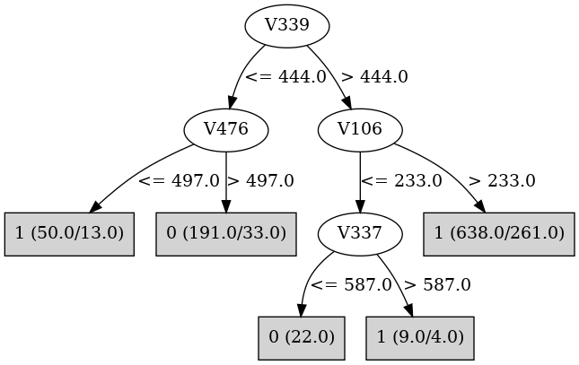

# J48

# SimpleCart Decision Tree

V476 < 480.5

* V154 < 512.5

*   * V379 < 509.5

*   *   * V443 < 539.5

*   *   *   * V106 < 451.5

*   *   *   *   * V65 < 633.5: 1(45.0/2.0)

*   *   *   *   * V65 >= 633.5: 0(3.0/1.0)

*   *   *   * V106 >= 451.5

*   *   *   *   * V494 < 575.5: 0(17.0/1.0)

*   *   *   *   * V494 >= 575.5: 1(4.0/0.0)

*   *   * V443 >= 539.5

*   *   *   * V222 < 414.5: 1(3.0/0.0)

*   *   *   * V222 >= 414.5

*   *   *   *   * V337 < 587.5: 0(144.0/14.0)

*   *   *   *   * V337 >= 587.5

*   *   *   *   *   * V261 < 483.0: 1(7.0/1.0)

*   *   *   *   *   * V261 >= 483.0: 0(8.0/1.0)

*   * V379 >= 509.5

*   *   * V494 < 478.5

*   *   *   * V319 < 484.0

*   *   *   *   * V115 < 501.5: 1(28.0/0.0)

*   *   *   *   * V115 >= 501.5: 0(3.0/1.0)

*   *   *   * V319 >= 484.0

*   *   *   *   * V165 < 451.0

*   *   *   *   *   * V20 < 470.0: 0(3.0/0.0)

*   *   *   *   *   * V20 >= 470.0: 1(5.0/0.0)

*   *   *   *   * V165 >= 451.0: 0(29.0/0.0)

*   *   * V494 >= 478.5

*   *   *   * V454 < 622.5: 1(105.0/9.0)

*   *   *   * V454 >= 622.5: 0(9.0/2.0)

* V154 >= 512.5

*   * V379 < 510.0

*   *   * V396 < 537.5

*   *   *   * V99 < 433.5: 0(3.0/1.0)

*   *   *   * V99 >= 433.5: 1(216.0/13.0)

*   *   * V396 >= 537.5: 0(3.0/1.0)

*   * V379 >= 510.0

*   *   * V29 < 479.5

*   *   *   * V473 < 545.0

*   *   *   *   * V396 < 514.5: 0(72.0/2.0)

*   *   *   *   * V396 >= 514.5: 1(3.0/1.0)

*   *   *   * V473 >= 545.0

*   *   *   *   * V83 < 471.5: 0(4.0/0.0)

*   *   *   *   * V83 >= 471.5: 1(8.0/0.0)

*   *   * V29 >= 479.5

*   *   *   * V145 < 514.5: 1(98.0/5.0)

*   *   *   * V145 >= 514.5: 0(3.0/0.0)

V476 >= 480.5

* V339 < 473.5

*   * V49 < 496.5

*   *   * V154 < 616.5

*   *   *   * V14 < 506.5

*   *   *   *   * V354 < 503.5

*   *   *   *   *   * V482 < 522.5

*   *   *   *   *   *   * V49 < 422.5: 1(6.0/2.0)

*   *   *   *   *   *   * V49 >= 422.5

*   *   *   *   *   *   *   * V290 < 522.5

*   *   *   *   *   *   *   *   * V411 < 449.5: 1(3.0/0.0)

*   *   *   *   *   *   *   *   * V411 >= 449.5

*   *   *   *   *   *   *   *   *   * V454 < 249.0: 1(3.0/0.0)

*   *   *   *   *   *   *   *   *   * V454 >= 249.0

*   *   *   *   *   *   *   *   *   *   * V67 < 440.0

*   *   *   *   *   *   *   *   *   *   *   * V20 < 479.0: 0(3.0/0.0)

*   *   *   *   *   *   *   *   *   *   *   * V20 >= 479.0: 1(5.0/0.0)

*   *   *   *   *   *   *   *   *   *   * V67 >= 440.0: 0(118.0/4.0)

*   *   *   *   *   *   *   * V290 >= 522.5: 1(5.0/2.0)

*   *   *   *   *   * V482 >= 522.5: 1(7.0/2.0)

*   *   *   *   * V354 >= 503.5: 1(5.0/0.0)

*   *   *   * V14 >= 506.5

*   *   *   *   * V140 < 490.5

*   *   *   *   *   * V117 < 507.5

*   *   *   *   *   *   * V309 < 512.5: 0(19.0/0.0)

*   *   *   *   *   *   * V309 >= 512.5

*   *   *   *   *   *   *   * V160 < 510.5: 1(7.0/0.0)

*   *   *   *   *   *   *   * V160 >= 510.5: 0(4.0/0.0)

*   *   *   *   *   * V117 >= 507.5: 1(6.0/0.0)

*   *   *   *   * V140 >= 490.5

*   *   *   *   *   * V124 < 537.0: 1(17.0/0.0)

*   *   *   *   *   * V124 >= 537.0: 0(3.0/1.0)

*   *   * V154 >= 616.5

*   *   *   * V27 < 483.5

*   *   *   *   * V176 < 471.5: 1(5.0/0.0)

*   *   *   *   * V176 >= 471.5: 0(12.0/2.0)

*   *   *   * V27 >= 483.5

*   *   *   *   * V497 < 486.5: 1(27.0/2.0)

*   *   *   *   * V497 >= 486.5: 0(3.0/1.0)

*   * V49 >= 496.5

*   *   * V452 < 464.5: 1(6.0/0.0)

*   *   * V452 >= 464.5: 0(232.0/13.0)

* V339 >= 473.5

*   * V452 < 477.5

*   *   * V339 < 609.5

*   *   *   * V456 < 464.5

*   *   *   *   * V282 < 481.0: 1(72.0/3.0)

*   *   *   *   * V282 >= 481.0

*   *   *   *   *   * V41 < 474.5: 1(3.0/0.0)

*   *   *   *   *   * V41 >= 474.5: 0(6.0/0.0)

*   *   *   * V456 >= 464.5

*   *   *   *   * V78 < 480.5

*   *   *   *   *   * V493 < 499.5

*   *   *   *   *   *   * V439 < 467.5

*   *   *   *   *   *   *   * V293 < 473.5: 0(3.0/0.0)

*   *   *   *   *   *   *   * V293 >= 473.5: 1(14.0/0.0)

*   *   *   *   *   *   * V439 >= 467.5

*   *   *   *   *   *   *   * V90 < 485.0: 1(6.0/2.0)

*   *   *   *   *   *   *   * V90 >= 485.0: 0(29.0/3.0)

*   *   *   *   *   * V493 >= 499.5: 1(13.0/1.0)

*   *   *   *   * V78 >= 480.5

*   *   *   *   *   * V209 < 504.0

*   *   *   *   *   *   * V66 < 535.5: 1(46.0/1.0)

*   *   *   *   *   *   * V66 >= 535.5

*   *   *   *   *   *   *   * V151 < 453.5: 0(5.0/0.0)

*   *   *   *   *   *   *   * V151 >= 453.5: 1(9.0/2.0)

*   *   *   *   *   * V209 >= 504.0: 0(5.0/2.0)

*   *   * V339 >= 609.5

*   *   *   * V49 < 511.5: 0(28.0/1.0)

*   *   *   * V49 >= 511.5: 1(7.0/0.0)

*   * V452 >= 477.5

*   *   * V106 < 453.0

*   *   *   * V339 < 553.0

*   *   *   *   * V240 < 476.0

*   *   *   *   *   * V10 < 474.5: 0(6.0/0.0)

*   *   *   *   *   * V10 >= 474.5: 1(7.0/1.0)

*   *   *   *   * V240 >= 476.0: 1(34.0/0.0)

*   *   *   * V339 >= 553.0: 0(7.0/1.0)

*   *   * V106 >= 453.0

*   *   *   * V324 < 493.5

*   *   *   *   * V362 < 528.5

*   *   *   *   *   * V364 < 526.0

*   *   *   *   *   *   * V299 < 452.5: 1(2.0/1.0)

*   *   *   *   *   *   * V299 >= 452.5: 0(75.0/0.0)

*   *   *   *   *   * V364 >= 526.0

*   *   *   *   *   *   * V52 < 481.5: 0(3.0/0.0)

*   *   *   *   *   *   * V52 >= 481.5: 1(4.0/0.0)

*   *   *   *   * V362 >= 528.5: 1(3.0/0.0)

*   *   *   * V324 >= 493.5

*   *   *   *   * V250 < 483.0: 0(4.0/0.0)

*   *   *   *   * V250 >= 483.0: 1(8.0/0.0)

# PART

Decision list:

conditions|predicted class
---|---
V106 > 698.5 AND V242 > 482.5 AND V49 > 474 AND V26 > 462.5 AND V46 > 445| 0 (98.0)
V106 <= 234.5 AND V154 <= 480.5 AND V4 <= 498| 0 (37.0)
V473 <= 413.5 AND V319 <= 578.5 AND V337 <= 555 AND V101 <= 492.5 AND V173 > 441 AND V456 <= 648.5 AND V3 <= 571.5| 0 (69.0)
V473 > 568.5 AND V42 <= 535.5 AND V109 > 456.5| 0 (23.0)
V478 <= 452.5 AND V45 <= 539 AND V4 > 477.5| 1 (19.0)
V158 > 527.5 AND V383 <= 534 AND V61 <= 508 AND V33 > 461.5| 0 (21.0)
V392 <= 425.5 AND V200 > 450 AND V442 <= 498.5| 1 (28.0)
V476 <= 480.5 AND V129 > 493.5 AND V18 <= 531.5| 1 (36.0)
V95 > 497.5 AND V288 > 439.5 AND V188 <= 517.5| 0 (17.0)
V199 > 479.5 AND V104 > 466.5 AND V131 <= 520.5| 0 (17.0)
V44 > 522.5 AND V279 > 476 AND V20 <= 486.5| 1 (21.0)
V52 > 582.5 AND V274 <= 544 AND V62 <= 487.5 AND V1 > 472| 0 (17.0)
V242 <= 483.5 AND V340 > 556.5 AND V47 <= 542.5 AND V5 <= 570| 1 (37.0)
V128 <= 452.5 AND V84 > 467.5 AND V58 <= 503.5| 0 (16.0)
V279 > 538.5 AND V210 > 469 AND V239 > 458.5| 1 (26.0)
V14 <= 395 AND V201 > 470.5 AND V34 <= 532.5| 0 (19.0)
V464 <= 397.5 AND V232 > 459.5 AND V297 > 454 AND V7 <= 519| 0 (20.0)
V185 > 519.5 AND V285 <= 549.5 AND V215 > 462.5 AND V201 > 476| 0 (21.0)
V283 <= 447.5 AND V153 > 477 AND V261 <= 511.5| 0 (18.0)
V205 <= 415 AND V438 > 486.5 AND V4 <= 494.5| 1 (20.0)
V265 > 498.5 AND V380 <= 507| 1 (21.0)
V454 <= 277.5 AND V130 <= 529.5 AND V192 <= 528 AND V4 <= 497.5| 1 (28.0)
V314 > 556.5 AND V83 <= 532.5 AND V375 <= 538| 0 (20.0)
V318 > 495.5 AND V480 <= 493 AND V69 > 475.5 AND V4 > 477| 0 (17.0)
V290 > 533.5 AND V59 > 471.5 AND V2 > 451.5| 1 (19.0)
V292 > 557.5 AND V104 > 464.5 AND V177 <= 495.5 AND V185 > 471| 0 (24.0)
V479 > 555.5 AND V397 <= 492.5 AND V17 > 460.5 AND V130 > 459| 0 (23.0)
V159 > 543.5 AND V137 <= 550 AND V10 > 469.5 AND V370 <= 523.5| 0 (22.0)
V159 > 540.5 AND V241 <= 535 AND V205 > 438| 1 (31.0)
V127 <= 459.5 AND V46 <= 510 AND V207 > 461 AND V4 <= 490| 0 (15.0)
V46 > 521.5 AND V231 <= 487.5| 1 (27.0)
V473 > 552.5 AND V9 > 470.5 AND V420 <= 542.5 AND V2 > 455.5| 1 (32.0)
V270 <= 456.5 AND V77 > 470.5 AND V25 > 450.5 AND V1 <= 486.5| 0 (22.0)
V225 <= 427 AND V287 <= 511 AND V56 > 473.5| 0 (17.0)
V337 > 583.5 AND V49 <= 499 AND V14 <= 533.5| 1 (73.0)
V337 > 656.5 AND V347 <= 490.5 AND V7 > 417| 0 (19.0)
V129 <= 462.5 AND V375 <= 518.5 AND V37 > 465.5| 0 (17.0)
V347 <= 470.5 AND V271 > 464 AND V248 > 476.5| 1 (32.0)
V140 <= 457.5 AND V495 > 474.5 AND V196 <= 493.5| 0 (23.0)
V344 <= 454.5 AND V338 > 451 AND V75 > 473.5 AND V119 > 461 AND V25 <= 552 AND V15 <= 502.5| 0 (30.0)
V185 > 512.5 AND V142 <= 529| 1 (22.0)
V192 > 537.5 AND V322 <= 525.5 AND V10 <= 489| 1 (21.0)
V270 > 525.5 AND V1 <= 488 AND V385 > 464 AND V64 <= 486| 0 (22.0)
V45 <= 452.5 AND V129 <= 491| 1 (24.0)
V222 <= 435.5 AND V86 <= 525 AND V285 > 466| 0 (18.0)
V113 > 491.5 AND V64 > 474.5| 1 (20.0)
V156 <= 443 AND V290 <= 513 AND V47 > 460.5 AND V116 > 465.5| 0 (17.0)
V493 > 452.5 AND V353 > 546.5 AND V164 > 470.5| 1 (22.0)
V432 > 557.5 AND V328 > 440.5 AND V75 <= 489 AND V21 <= 502.5| 0 (17.0)
V493 > 454.5 AND V337 > 543.5 AND V105 <= 537 AND V1 > 472.5 AND V119 > 450 AND V66 > 458 AND V425 > 463.5| 1 (81.0)
V118 > 501.5 AND V48 <= 539.5 AND V28 <= 491| 0 (20.0)
V489 > 519.5 AND V25 > 469 AND V1 > 473| 1 (22.0)
V285 <= 456.5 AND V391 <= 481.5 AND V51 > 475.5| 0 (16.0)
V254 > 555.5 AND V18 <= 540| 1 (27.0)
V138 <= 464.5 AND V26 > 483 AND V26 <= 540 AND V2 > 459| 0 (19.0)
V65 > 562 AND V51 <= 578 AND V34 > 418.5 AND V27 > 449| 0 (20.0)
V245 > 570.5 AND V3 > 476.5| 1 (14.0)
V134 > 483.5 AND V9 > 469.5| 1 (19.0)
V482 > 520.5 AND V4 <= 491.5| 1 (13.0)
V328 > 529.5 AND V177 <= 495 AND V2 > 460.5| 0 (11.0)
V419 > 580.5 AND V6 > 475.5| 1 (12.0)
V337 > 542.5 AND V2 <= 518| 1 (11.0)
V386 > 495.5 AND V1 <= 489.5| 1 (10.0)
V183 > 513 AND V2 > 449| 0 (10.0)
V184 <= 446.5 AND V1 <= 485.5| 1 (13.0)
V445 <= 467.5 AND V201 <= 525.5 AND V4 <= 492.5| 0 (16.0)
V192 <= 455.5 AND V1 > 476| 0 (9.0)
V444 > 569.5| 1 (13.0)
V399 <= 456 AND V1 > 477| 0 (7.0)
V189 <= 459.5 AND V4 > 473.5| 0 (8.0)
V218 > 491.5| 1 (21.0)
V121 <= 472.5| 1 (8.0)
V292 <= 462 AND V1 <= 484| 0 (6.0)
V343 <= 451| 1 (9.0)
V189 > 469 AND V191 <= 515.5 AND V420 > 545.5| 0 (9.0)
V294 > 469.5 AND V18 > 440.5 AND V145 <= 513.5 AND V252 <= 541.5 AND V274 > 437.5 AND V295 > 428 AND V83 <= 533 AND V297 > 427 AND V191 > 450.5 AND V49 <= 535 AND V495 <= 543 AND V177 > 465| 1 (51.0)
V294 > 469.5 AND V237 > 465 AND V409 > 453 AND V3 > 448| 0 (45.0)
V16 > 457.5 AND V3 > 457| 1 (19.0)
V1 <= 483.5| 1 (3.0/1.0)
| 0 (3.0)

# JRip

Decision list:

conditions|predicted class
---|---
(V476 <= 480) and (V154 >= 513) and (V29 >= 480) and (V214 <= 504) and (V375 >= 480)|1 (120.0/0.0)
(V339 >= 474) and (V282 >= 446) and (V379 <= 467) and (V456 >= 533) and (V354 <= 486)|1 (65.0/0.0)
(V339 >= 445) and (V494 >= 478) and (V106 >= 459) and (V454 <= 623) and (V443 >= 558) and (V379 >= 519) and (V288 >= 468)|1 (60.0/0.0)
(V339 >= 445) and (V434 >= 454) and (V49 <= 483) and (V154 >= 514) and (V494 >= 600) and (V21 >= 454)|1 (75.0/0.0)
(V339 >= 474) and (V476 >= 521) and (V443 >= 533) and (V337 <= 348)|1 (33.0/0.0)
(V339 >= 471) and (V443 <= 539) and (V106 <= 449) and (V472 <= 479) and (V375 >= 495) and (V493 >= 482)|1 (41.0/0.0)
(V339 >= 483) and (V282 <= 458) and (V29 <= 479) and (V49 >= 499) and (V23 >= 474) and (V461 >= 438)|1 (65.0/0.0)
(V49 <= 499) and (V443 <= 504) and (V106 <= 451) and (V125 <= 489) and (V443 >= 385) and (V255 >= 481)|1 (35.0/0.0)
(V476 <= 499) and (V319 >= 478) and (V494 >= 520) and (V267 >= 487) and (V413 <= 520) and (V287 >= 455) and (V85 <= 566)|1 (58.0/0.0)
(V443 <= 482) and (V454 >= 457) and (V49 <= 474) and (V431 >= 503) and (V26 >= 438)|1 (31.0/0.0)
(V339 >= 449) and (V286 >= 512) and (V324 >= 485) and (V484 <= 488) and (V279 <= 515)|1 (21.0/0.0)
(V339 >= 449) and (V385 <= 484) and (V482 >= 498) and (V258 <= 467) and (V81 <= 487)|1 (16.0/0.0)
(V339 >= 449) and (V471 >= 561) and (V441 >= 494) and (V311 <= 501) and (V394 <= 510)|1 (22.0/0.0)
(V129 <= 478) and (V340 <= 493) and (V306 >= 493) and (V253 <= 478) and (V432 <= 514) and (V140 <= 504)|1 (25.0/0.0)
(V339 >= 449) and (V434 >= 454) and (V454 <= 521) and (V263 <= 489) and (V292 <= 505) and (V212 >= 479) and (V30 >= 475)|1 (20.0/0.0)
(V49 <= 517) and (V378 >= 493) and (V279 >= 497) and (V122 >= 485) and (V225 >= 500) and (V11 >= 434)|1 (18.0/0.0)
(V330 <= 510) and (V337 >= 565) and (V208 <= 478) and (V43 >= 487)|1 (13.0/0.0)
(V49 <= 517) and (V14 >= 509) and (V261 <= 479) and (V130 <= 487) and (V13 >= 447) and (V9 >= 458)|1 (17.0/0.0)
(V339 >= 471) and (V30 <= 500) and (V296 <= 488) and (V444 >= 497) and (V249 >= 485) and (V305 <= 487)|1 (16.0/0.0)
(V178 <= 480) and (V181 >= 506) and (V493 >= 486) and (V183 <= 469) and (V224 >= 509)|1 (12.0/0.0)
(V111 <= 485) and (V57 <= 495) and (V433 <= 483) and (V290 <= 493) and (V161 >= 492) and (V405 >= 476)|1 (15.0/0.0)
(V245 <= 475) and (V465 <= 474) and (V4 <= 479) and (V12 <= 488)|1 (10.0/0.0)
(V86 >= 517) and (V271 <= 478) and (V259 >= 485) and (V399 <= 516) and (V479 <= 502)|1 (15.0/0.0)
(V371 <= 493) and (V153 >= 491) and (V128 >= 539) and (V58 >= 458)|1 (8.0/0.0)
(V85 >= 547) and (V20 >= 484) and (V144 <= 486) and (V382 >= 469) and (V113 >= 470)|1 (14.0/0.0)
(V330 <= 507) and (V256 >= 507) and (V30 <= 475) and (V53 >= 490) and (V2 >= 453)|1 (10.0/0.0)
(V130 <= 455) and (V282 <= 418) and (V482 >= 491)|1 (8.0/0.0)
(V254 >= 520) and (V150 <= 483) and (V211 >= 498) and (V89 <= 475) and (V3 <= 538)|1 (8.0/0.0)
(V53 <= 478) and (V212 >= 526) and (V134 >= 480) and (V222 <= 494) and (V6 >= 474)|1 (8.0/0.0)
(V370 >= 543) and (V440 >= 498) and (V409 <= 486) and (V10 >= 475)|1 (8.0/0.0)
(V215 <= 472) and (V257 <= 477) and (V218 >= 480) and (V398 >= 445) and (V311 <= 487)|1 (9.0/0.0)
(V74 <= 478) and (V437 <= 476) and (V26 >= 529) and (V303 <= 476) and (V37 >= 478)|1 (7.0/0.0)
(V130 <= 445) and (V344 >= 540) and (V139 >= 480)|1 (6.0/0.0)
(V482 <= 462) and (V139 <= 471) and (V467 >= 487) and (V3 <= 502)|1 (5.0/0.0)
(V158 >= 504) and (V95 <= 464) and (V19 <= 492)|1 (3.0/0.0)
(V182 >= 539) and (V230 >= 514) and (V127 <= 474) and (V6 <= 484)|1 (5.0/0.0)
(V460 <= 432) and (V262 <= 470) and (V1 >= 484)|1 (2.0/0.0)
|0 (916.0/0.0)

# Decision Table

Non matches covered by Majority class

v129|v235|v242|v299|v339|v379|v431|v454|v494|target
---|---|---|---|---|---|---|---|---|---
(457.5-473.5]|all|(-inf-491.5]|all|(625.5-inf)|(482.5-inf)|all|(601.5-inf)|(470.5-inf)|0
(473.5-497.5]|all|(-inf-491.5]|all|(625.5-inf)|(482.5-inf)|all|(601.5-inf)|(470.5-inf)|0
(473.5-497.5]|all|(491.5-inf)|all|(444.5-625.5]|(482.5-inf)|all|(601.5-inf)|(470.5-inf)|0
(497.5-inf)|all|(-inf-491.5]|all|(444.5-625.5]|(482.5-inf)|all|(601.5-inf)|(470.5-inf)|1
(457.5-473.5]|all|(-inf-491.5]|all|(444.5-625.5]|(482.5-inf)|all|(601.5-inf)|(470.5-inf)|1
(473.5-497.5]|all|(-inf-491.5]|all|(444.5-625.5]|(482.5-inf)|all|(601.5-inf)|(470.5-inf)|0
(473.5-497.5]|all|(-inf-491.5]|all|(625.5-inf)|(-inf-482.5]|all|(601.5-inf)|(470.5-inf)|0
(-inf-457.5]|all|(-inf-491.5]|all|(625.5-inf)|(-inf-482.5]|all|(601.5-inf)|(470.5-inf)|0
(497.5-inf)|all|(491.5-inf)|all|(-inf-444.5]|(482.5-inf)|all|(601.5-inf)|(470.5-inf)|0
(473.5-497.5]|all|(491.5-inf)|all|(-inf-444.5]|(482.5-inf)|all|(601.5-inf)|(470.5-inf)|0
(-inf-457.5]|all|(-inf-491.5]|all|(625.5-inf)|(482.5-inf)|all|(-inf-601.5]|(470.5-inf)|0
(457.5-473.5]|all|(-inf-491.5]|all|(625.5-inf)|(482.5-inf)|all|(-inf-601.5]|(470.5-inf)|1
(473.5-497.5]|all|(-inf-491.5]|all|(625.5-inf)|(482.5-inf)|all|(-inf-601.5]|(470.5-inf)|1
(473.5-497.5]|all|(-inf-491.5]|all|(-inf-444.5]|(482.5-inf)|all|(601.5-inf)|(470.5-inf)|1
(497.5-inf)|all|(-inf-491.5]|all|(-inf-444.5]|(482.5-inf)|all|(601.5-inf)|(470.5-inf)|1
(497.5-inf)|all|(491.5-inf)|all|(444.5-625.5]|(482.5-inf)|all|(-inf-601.5]|(470.5-inf)|0
(457.5-473.5]|all|(491.5-inf)|all|(444.5-625.5]|(482.5-inf)|all|(-inf-601.5]|(470.5-inf)|0
(-inf-457.5]|all|(-inf-491.5]|all|(444.5-625.5]|(-inf-482.5]|all|(601.5-inf)|(470.5-inf)|0
(473.5-497.5]|all|(491.5-inf)|all|(444.5-625.5]|(482.5-inf)|all|(-inf-601.5]|(470.5-inf)|1
(473.5-497.5]|all|(-inf-491.5]|all|(444.5-625.5]|(-inf-482.5]|all|(601.5-inf)|(470.5-inf)|1
(457.5-473.5]|all|(-inf-491.5]|all|(444.5-625.5]|(-inf-482.5]|all|(601.5-inf)|(470.5-inf)|1
(473.5-497.5]|all|(491.5-inf)|all|(-inf-444.5]|(-inf-482.5]|all|(601.5-inf)|(470.5-inf)|0
(497.5-inf)|all|(-inf-491.5]|all|(444.5-625.5]|(482.5-inf)|all|(-inf-601.5]|(470.5-inf)|0
(457.5-473.5]|all|(-inf-491.5]|all|(444.5-625.5]|(482.5-inf)|all|(-inf-601.5]|(470.5-inf)|0
(473.5-497.5]|all|(-inf-491.5]|all|(444.5-625.5]|(482.5-inf)|all|(-inf-601.5]|(470.5-inf)|1
(473.5-497.5]|all|(-inf-491.5]|all|(625.5-inf)|(-inf-482.5]|all|(-inf-601.5]|(470.5-inf)|0
(457.5-473.5]|all|(-inf-491.5]|all|(625.5-inf)|(-inf-482.5]|all|(-inf-601.5]|(470.5-inf)|0
(-inf-457.5]|all|(-inf-491.5]|all|(625.5-inf)|(-inf-482.5]|all|(-inf-601.5]|(470.5-inf)|1
(497.5-inf)|all|(-inf-491.5]|all|(-inf-444.5]|(-inf-482.5]|all|(601.5-inf)|(470.5-inf)|0
(-inf-457.5]|all|(491.5-inf)|all|(625.5-inf)|(482.5-inf)|all|(-inf-601.5]|(-inf-470.5]|0
(497.5-inf)|all|(491.5-inf)|all|(-inf-444.5]|(482.5-inf)|all|(-inf-601.5]|(470.5-inf)|0
(457.5-473.5]|all|(491.5-inf)|all|(625.5-inf)|(482.5-inf)|all|(-inf-601.5]|(-inf-470.5]|1
(473.5-497.5]|all|(491.5-inf)|all|(-inf-444.5]|(482.5-inf)|all|(-inf-601.5]|(470.5-inf)|0
(473.5-497.5]|all|(-inf-491.5]|all|(-inf-444.5]|(-inf-482.5]|all|(601.5-inf)|(470.5-inf)|1
(457.5-473.5]|all|(491.5-inf)|all|(-inf-444.5]|(482.5-inf)|all|(-inf-601.5]|(470.5-inf)|0
(457.5-473.5]|all|(491.5-inf)|all|(444.5-625.5]|(-inf-482.5]|all|(-inf-601.5]|(470.5-inf)|0
(473.5-497.5]|all|(491.5-inf)|all|(444.5-625.5]|(-inf-482.5]|all|(-inf-601.5]|(470.5-inf)|1
(-inf-457.5]|all|(-inf-491.5]|all|(625.5-inf)|(482.5-inf)|all|(-inf-601.5]|(-inf-470.5]|1
(473.5-497.5]|all|(-inf-491.5]|all|(625.5-inf)|(482.5-inf)|all|(-inf-601.5]|(-inf-470.5]|0
(457.5-473.5]|all|(-inf-491.5]|all|(625.5-inf)|(482.5-inf)|all|(-inf-601.5]|(-inf-470.5]|1
(473.5-497.5]|all|(-inf-491.5]|all|(-inf-444.5]|(482.5-inf)|all|(-inf-601.5]|(470.5-inf)|1
(473.5-497.5]|all|(-inf-491.5]|all|(444.5-625.5]|(-inf-482.5]|all|(-inf-601.5]|(470.5-inf)|0
(-inf-457.5]|all|(-inf-491.5]|all|(444.5-625.5]|(-inf-482.5]|all|(-inf-601.5]|(470.5-inf)|1
(457.5-473.5]|all|(-inf-491.5]|all|(444.5-625.5]|(-inf-482.5]|all|(-inf-601.5]|(470.5-inf)|1
(497.5-inf)|all|(491.5-inf)|all|(444.5-625.5]|(482.5-inf)|all|(-inf-601.5]|(-inf-470.5]|0
(457.5-473.5]|all|(491.5-inf)|all|(444.5-625.5]|(482.5-inf)|all|(-inf-601.5]|(-inf-470.5]|1
(473.5-497.5]|all|(491.5-inf)|all|(444.5-625.5]|(482.5-inf)|all|(-inf-601.5]|(-inf-470.5]|0
(-inf-457.5]|all|(491.5-inf)|all|(625.5-inf)|(-inf-482.5]|all|(-inf-601.5]|(-inf-470.5]|0
(457.5-473.5]|all|(491.5-inf)|all|(625.5-inf)|(-inf-482.5]|all|(-inf-601.5]|(-inf-470.5]|0
(457.5-473.5]|all|(491.5-inf)|all|(-inf-444.5]|(-inf-482.5]|all|(-inf-601.5]|(470.5-inf)|1
(497.5-inf)|all|(491.5-inf)|all|(-inf-444.5]|(-inf-482.5]|all|(-inf-601.5]|(470.5-inf)|0
(473.5-497.5]|all|(491.5-inf)|all|(-inf-444.5]|(-inf-482.5]|all|(-inf-601.5]|(470.5-inf)|1
(473.5-497.5]|all|(-inf-491.5]|all|(444.5-625.5]|(482.5-inf)|all|(-inf-601.5]|(-inf-470.5]|0
(457.5-473.5]|all|(-inf-491.5]|all|(444.5-625.5]|(482.5-inf)|all|(-inf-601.5]|(-inf-470.5]|1
(-inf-457.5]|all|(-inf-491.5]|all|(625.5-inf)|(-inf-482.5]|all|(-inf-601.5]|(-inf-470.5]|0
(473.5-497.5]|all|(-inf-491.5]|all|(625.5-inf)|(-inf-482.5]|all|(-inf-601.5]|(-inf-470.5]|0
(473.5-497.5]|all|(-inf-491.5]|all|(-inf-444.5]|(-inf-482.5]|all|(-inf-601.5]|(470.5-inf)|1
(457.5-473.5]|all|(-inf-491.5]|all|(-inf-444.5]|(-inf-482.5]|all|(-inf-601.5]|(470.5-inf)|1
(457.5-473.5]|all|(-inf-491.5]|all|(625.5-inf)|(-inf-482.5]|all|(-inf-601.5]|(-inf-470.5]|0
(457.5-473.5]|all|(491.5-inf)|all|(-inf-444.5]|(482.5-inf)|all|(-inf-601.5]|(-inf-470.5]|0
(497.5-inf)|all|(491.5-inf)|all|(-inf-444.5]|(482.5-inf)|all|(-inf-601.5]|(-inf-470.5]|0
(473.5-497.5]|all|(491.5-inf)|all|(-inf-444.5]|(482.5-inf)|all|(-inf-601.5]|(-inf-470.5]|0
(-inf-457.5]|all|(491.5-inf)|all|(444.5-625.5]|(-inf-482.5]|all|(-inf-601.5]|(-inf-470.5]|0
(473.5-497.5]|all|(491.5-inf)|all|(444.5-625.5]|(-inf-482.5]|all|(-inf-601.5]|(-inf-470.5]|1
(457.5-473.5]|all|(491.5-inf)|all|(444.5-625.5]|(-inf-482.5]|all|(-inf-601.5]|(-inf-470.5]|1
(473.5-497.5]|all|(-inf-491.5]|all|(444.5-625.5]|(-inf-482.5]|all|(-inf-601.5]|(-inf-470.5]|0
(-inf-457.5]|all|(-inf-491.5]|all|(444.5-625.5]|(-inf-482.5]|all|(-inf-601.5]|(-inf-470.5]|1
(457.5-473.5]|all|(-inf-491.5]|all|(444.5-625.5]|(-inf-482.5]|all|(-inf-601.5]|(-inf-470.5]|1
(473.5-497.5]|all|(491.5-inf)|all|(-inf-444.5]|(-inf-482.5]|all|(-inf-601.5]|(-inf-470.5]|0
(457.5-473.5]|all|(491.5-inf)|all|(-inf-444.5]|(-inf-482.5]|all|(-inf-601.5]|(-inf-470.5]|0

