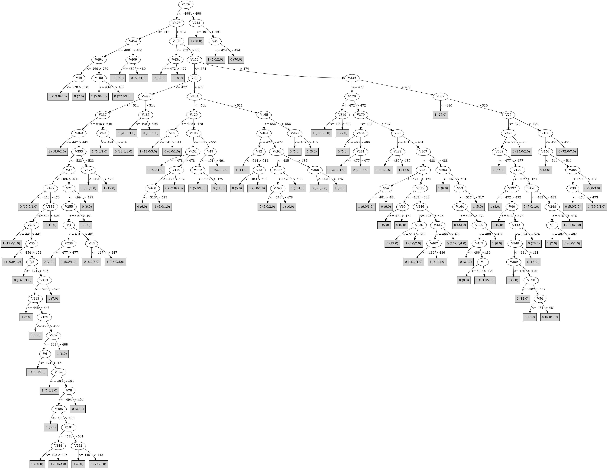

# J48

# SimpleCart Decision Tree

V476 < 474.5

* V154 < 459.5

*   * V49 < 476.5

*   *   * V319 < 508.0

*   *   *   * V443 < 523.0: 1(2.0/0.0)

*   *   *   * V443 >= 523.0: 0(106.0/0.0)

*   *   * V319 >= 508.0

*   *   *   * V65 < 504.0: 0(18.0/1.0)

*   *   *   * V65 >= 504.0: 1(32.0/1.0)

*   * V49 >= 476.5

*   *   * V494 < 478.5

*   *   *   * V319 < 501.5

*   *   *   *   * V335 < 461.5: 0(4.0/1.0)

*   *   *   *   * V335 >= 461.5: 1(22.0/1.0)

*   *   *   * V319 >= 501.5

*   *   *   *   * V106 < 545.5: 0(33.0/0.0)

*   *   *   *   * V106 >= 545.5: 1(2.0/0.0)

*   *   * V494 >= 478.5

*   *   *   * V379 < 517.5

*   *   *   *   * V173 < 502.0: 1(8.0/1.0)

*   *   *   *   * V173 >= 502.0: 0(8.0/0.0)

*   *   *   * V379 >= 517.5

*   *   *   *   * V453 < 443.5: 0(2.0/0.0)

*   *   *   *   * V453 >= 443.5: 1(78.0/1.0)

* V154 >= 459.5

*   * V379 < 478.5

*   *   * V65 < 435.5: 0(2.0/0.0)

*   *   * V65 >= 435.5

*   *   *   * V167 < 479.5

*   *   *   *   * V290 < 442.0: 0(2.0/0.0)

*   *   *   *   * V290 >= 442.0

*   *   *   *   *   * V351 < 500.5: 1(201.0/6.0)

*   *   *   *   *   * V351 >= 500.5: 0(2.0/0.0)

*   *   *   * V167 >= 479.5: 0(2.0/0.0)

*   * V379 >= 478.5

*   *   * V319 < 481.5

*   *   *   * V282 < 489.5

*   *   *   *   * V217 < 488.0

*   *   *   *   *   * V25 < 443.0: 1(3.0/1.0)

*   *   *   *   *   * V25 >= 443.0: 0(10.0/0.0)

*   *   *   *   * V217 >= 488.0

*   *   *   *   *   * V420 < 464.5: 0(5.0/1.0)

*   *   *   *   *   * V420 >= 464.5

*   *   *   *   *   *   * V132 < 468.5: 0(3.0/1.0)

*   *   *   *   *   *   * V132 >= 468.5: 1(24.0/0.0)

*   *   *   * V282 >= 489.5

*   *   *   *   * V379 < 505.5

*   *   *   *   *   * V65 < 522.5: 0(4.0/0.0)

*   *   *   *   *   * V65 >= 522.5

*   *   *   *   *   *   * V145 < 471.0: 0(2.0/0.0)

*   *   *   *   *   *   * V145 >= 471.0: 1(13.0/0.0)

*   *   *   *   * V379 >= 505.5

*   *   *   *   *   * V473 < 545.0: 0(71.0/2.0)

*   *   *   *   *   * V473 >= 545.0

*   *   *   *   *   *   * V1 < 485.5: 1(5.0/0.0)

*   *   *   *   *   *   * V1 >= 485.5: 0(3.0/0.0)

*   *   * V319 >= 481.5

*   *   *   * V282 < 483.5

*   *   *   *   * V240 < 480.5

*   *   *   *   *   * V380 < 474.0: 0(11.0/0.0)

*   *   *   *   *   * V380 >= 474.0

*   *   *   *   *   *   * V116 < 493.5: 1(7.0/0.0)

*   *   *   *   *   *   * V116 >= 493.5: 0(3.0/0.0)

*   *   *   *   * V240 >= 480.5: 1(12.0/0.0)

*   *   *   * V282 >= 483.5

*   *   *   *   * V74 < 410.0: 0(3.0/1.0)

*   *   *   *   * V74 >= 410.0

*   *   *   *   *   * V154 < 674.0

*   *   *   *   *   *   * V321 < 505.5: 1(117.0/2.0)

*   *   *   *   *   *   * V321 >= 505.5: 0(2.0/0.0)

*   *   *   *   *   * V154 >= 674.0: 0(3.0/1.0)

V476 >= 474.5

* V339 < 476.5

*   * V379 < 522.5

*   *   * V379 < 406.5: 1(17.0/1.0)

*   *   * V379 >= 406.5

*   *   *   * V282 < 556.0

*   *   *   *   * V106 < 404.0

*   *   *   *   *   * V443 < 393.0: 0(10.0/1.0)

*   *   *   *   *   * V443 >= 393.0: 1(19.0/0.0)

*   *   *   *   * V106 >= 404.0

*   *   *   *   *   * V335 < 560.0

*   *   *   *   *   *   * V173 < 464.5

*   *   *   *   *   *   *   * V288 < 515.5

*   *   *   *   *   *   *   *   * V14 < 449.0: 0(5.0/1.0)

*   *   *   *   *   *   *   *   * V14 >= 449.0: 1(18.0/1.0)

*   *   *   *   *   *   *   * V288 >= 515.5: 0(9.0/0.0)

*   *   *   *   *   *   * V173 >= 464.5

*   *   *   *   *   *   *   * V251 < 445.0

*   *   *   *   *   *   *   *   * V259 < 486.5: 1(8.0/0.0)

*   *   *   *   *   *   *   *   * V259 >= 486.5

*   *   *   *   *   *   *   *   *   * V161 < 489.0: 0(9.0/0.0)

*   *   *   *   *   *   *   *   *   * V161 >= 489.0: 1(3.0/0.0)

*   *   *   *   *   *   *   * V251 >= 445.0

*   *   *   *   *   *   *   *   * V293 < 541.5

*   *   *   *   *   *   *   *   *   * V19 < 527.0

*   *   *   *   *   *   *   *   *   *   * V205 < 406.5: 1(4.0/1.0)

*   *   *   *   *   *   *   *   *   *   * V205 >= 406.5

*   *   *   *   *   *   *   *   *   *   *   * V10 < 463.5: 1(3.0/0.0)

*   *   *   *   *   *   *   *   *   *   *   * V10 >= 463.5

*   *   *   *   *   *   *   *   *   *   *   *   * V64 < 491.5

*   *   *   *   *   *   *   *   *   *   *   *   *   * V30 < 439.0: 1(2.0/0.0)

*   *   *   *   *   *   *   *   *   *   *   *   *   * V30 >= 439.0

*   *   *   *   *   *   *   *   *   *   *   *   *   *   * V81 < 438.5: 1(2.0/0.0)

*   *   *   *   *   *   *   *   *   *   *   *   *   *   * V81 >= 438.5

*   *   *   *   *   *   *   *   *   *   *   *   *   *   *   * V458 < 425.5

*   *   *   *   *   *   *   *   *   *   *   *   *   *   *   *   * V7 < 496.0: 0(2.0/0.0)

*   *   *   *   *   *   *   *   *   *   *   *   *   *   *   *   * V7 >= 496.0: 1(3.0/0.0)

*   *   *   *   *   *   *   *   *   *   *   *   *   *   *   * V458 >= 425.5

*   *   *   *   *   *   *   *   *   *   *   *   *   *   *   *   * V348 < 381.0: 1(2.0/1.0)

*   *   *   *   *   *   *   *   *   *   *   *   *   *   *   *   * V348 >= 381.0: 0(152.0/3.0)

*   *   *   *   *   *   *   *   *   *   *   *   * V64 >= 491.5: 1(3.0/1.0)

*   *   *   *   *   *   *   *   *   * V19 >= 527.0: 1(5.0/1.0)

*   *   *   *   *   *   *   *   * V293 >= 541.5: 1(4.0/0.0)

*   *   *   *   *   * V335 >= 560.0: 1(8.0/1.0)

*   *   *   * V282 >= 556.0

*   *   *   *   * V415 < 465.5: 0(4.0/0.0)

*   *   *   *   * V415 >= 465.5

*   *   *   *   *   * V260 < 474.0: 0(2.0/0.0)

*   *   *   *   *   * V260 >= 474.0: 1(20.0/0.0)

*   * V379 >= 522.5

*   *   * V10 < 497.0

*   *   *   * V476 < 500.0

*   *   *   *   * V183 < 502.0

*   *   *   *   *   * V28 < 491.5: 0(23.0/1.0)

*   *   *   *   *   * V28 >= 491.5: 1(3.0/0.0)

*   *   *   *   * V183 >= 502.0: 1(4.0/0.0)

*   *   *   * V476 >= 500.0

*   *   *   *   * V272 < 408.0: 1(2.0/1.0)

*   *   *   *   * V272 >= 408.0

*   *   *   *   *   * V416 < 626.5: 0(206.0/2.0)

*   *   *   *   *   * V416 >= 626.5: 1(2.0/1.0)

*   *   * V10 >= 497.0: 1(2.0/0.0)

* V339 >= 476.5

*   * V319 < 484.5

*   *   * V106 < 455.5

*   *   *   * V49 < 497.5

*   *   *   *   * V282 < 450.5

*   *   *   *   *   * V425 < 468.5: 1(4.0/0.0)

*   *   *   *   *   * V425 >= 468.5

*   *   *   *   *   *   * V444 < 439.0: 1(3.0/1.0)

*   *   *   *   *   *   * V444 >= 439.0: 0(46.0/1.0)

*   *   *   *   * V282 >= 450.5

*   *   *   *   *   * V129 < 470.5

*   *   *   *   *   *   * V318 < 493.0: 1(28.0/0.0)

*   *   *   *   *   *   * V318 >= 493.0: 0(2.0/0.0)

*   *   *   *   *   * V129 >= 470.5: 0(12.0/1.0)

*   *   *   * V49 >= 497.5

*   *   *   *   * V339 < 522.0: 0(5.0/0.0)

*   *   *   *   * V339 >= 522.0

*   *   *   *   *   * V210 < 517.5: 1(34.0/0.0)

*   *   *   *   *   * V210 >= 517.5: 0(2.0/1.0)

*   *   * V106 >= 455.5

*   *   *   * V379 < 594.0

*   *   *   *   * V154 < 537.5

*   *   *   *   *   * V473 < 563.0

*   *   *   *   *   *   * V348 < 404.5: 0(2.0/1.0)

*   *   *   *   *   *   * V348 >= 404.5: 1(103.0/1.0)

*   *   *   *   *   * V473 >= 563.0: 0(2.0/0.0)

*   *   *   *   * V154 >= 537.5: 0(3.0/0.0)

*   *   *   * V379 >= 594.0: 0(4.0/0.0)

*   * V319 >= 484.5

*   *   * V106 < 471.5

*   *   *   * V384 < 503.5

*   *   *   *   * V456 < 514.0: 0(3.0/0.0)

*   *   *   *   * V456 >= 514.0

*   *   *   *   *   * V376 < 450.5: 0(4.0/1.0)

*   *   *   *   *   * V376 >= 450.5

*   *   *   *   *   *   * V184 < 520.0

*   *   *   *   *   *   *   * V499 < 428.5: 0(2.0/0.0)

*   *   *   *   *   *   *   * V499 >= 428.5: 1(45.0/0.0)

*   *   *   *   *   *   * V184 >= 520.0: 0(2.0/0.0)

*   *   *   * V384 >= 503.5: 0(5.0/0.0)

*   *   * V106 >= 471.5

*   *   *   * V337 < 312.5: 1(4.0/1.0)

*   *   *   * V337 >= 312.5

*   *   *   *   * V81 < 549.5

*   *   *   *   *   * V148 < 415.5: 1(2.0/0.0)

*   *   *   *   *   * V148 >= 415.5: 0(72.0/2.0)

*   *   *   *   * V81 >= 549.5: 1(2.0/0.0)

# PART

Decision list:

conditions|predicted class
---|---
V129 > 498.5 AND V242 > 491.5 AND V49 > 474| 0 (70.0)
V443 <= 341.5 AND V242 > 482.5 AND V319 <= 584.5 AND V100 > 438 AND V398 <= 537 AND V494 > 273.5| 0 (72.0)
V106 <= 234.5 AND V154 <= 465.5| 0 (34.0)
V205 <= 407 AND V442 > 464.5| 1 (23.0/1.0)
V351 <= 467.5 AND V11 > 439.5 AND V118 <= 506| 1 (22.0)
V197 <= 467.5 AND V13 > 431.5 AND V110 > 465.5| 1 (29.0/1.0)
V14 <= 399.5 AND V110 <= 489.5 AND V308 <= 491 AND V261 > 468.5| 0 (29.0)
V165 <= 409.5 AND V49 > 439 AND V79 <= 573| 1 (24.0)
V324 > 503.5 AND V140 > 462.5 AND V288 > 419.5| 1 (24.0)
V14 <= 407.5 AND V25 <= 550 AND V84 > 462.5| 1 (26.0/1.0)
V443 > 680 AND V6 <= 485.5 AND V90 > 452| 0 (24.0/1.0)
V461 <= 434.5 AND V300 > 480.5| 1 (23.0/1.0)
V100 <= 406.5 AND V142 > 468 AND V76 <= 555.5| 1 (22.0/1.0)
V235 > 536.5 AND V436 <= 533 AND V200 > 455| 1 (21.0)
V432 > 575.5 AND V34 <= 513.5 AND V119 <= 515.5| 0 (19.0)
V476 <= 473.5 AND V129 > 492.5 AND V109 > 462.5| 1 (26.0)
V129 > 490.5 AND V98 > 509.5 AND V14 > 449.5| 1 (9.0)
V129 > 490.5 AND V438 <= 581 AND V473 <= 527 AND V321 <= 500.5 AND V428 <= 530.5 AND V47 > 434.5 AND V279 <= 536.5 AND V243 <= 526| 0 (83.0)
V93 > 522.5 AND V492 > 471.5 AND V219 > 453| 0 (19.0)
V335 > 569.5 AND V351 > 476 AND V39 <= 489| 1 (25.0)
V18 > 542.5 AND V82 > 443.5 AND V177 > 457.5 AND V334 <= 532.5 AND V212 > 435 AND V320 <= 585.5| 0 (39.0)
V144 > 501.5 AND V128 <= 516.5 AND V256 > 465.5| 0 (20.0)
V100 <= 419.5 AND V316 > 460 AND V368 <= 502| 0 (21.0/1.0)
V49 > 543.5 AND V473 <= 535 AND V45 > 460.5 AND V481 > 446.5 AND V292 > 463 AND V322 <= 521.5 AND V343 <= 514.5| 0 (40.0)
V443 <= 347 AND V207 > 467.5| 1 (22.0)
V154 <= 344.5 AND V379 > 393 AND V249 <= 495.5| 1 (33.0/1.0)
V368 > 504.5 AND V11 > 430.5 AND V33 > 451 AND V300 > 470| 1 (31.0)
V343 <= 437.5 AND V210 > 463.5 AND V31 <= 493.5| 1 (27.0/1.0)
V18 > 539.5 AND V100 <= 521 AND V79 > 470| 1 (25.0)
V287 > 534.5 AND V207 <= 537.5| 1 (22.0/1.0)
V3 <= 439.5 AND V345 <= 543.5 AND V19 <= 512.5| 0 (20.0)
V3 <= 445.5 AND V182 > 472| 1 (22.0/1.0)
V420 > 556.5 AND V448 <= 501.5 AND V10 > 467 AND V390 > 413| 0 (27.0/1.0)
V382 > 518.5 AND V163 > 472.5 AND V197 > 470.5| 0 (27.0/1.0)
V328 <= 439.5 AND V63 <= 527.5 AND V219 <= 527.5 AND V133 > 462.5| 1 (32.0)
V340 > 556.5 AND V98 > 440.5 AND V474 <= 478.5| 1 (34.0/1.0)
V261 > 519.5 AND V50 <= 504.5 AND V46 > 435 AND V205 > 441.5| 0 (20.0)
V136 > 577.5 AND V133 <= 515 AND V302 <= 509 AND V455 <= 490.5| 0 (21.0)
V367 <= 451.5 AND V339 > 399 AND V252 <= 523.5| 1 (20.0)
V184 > 518.5 AND V187 > 449 AND V140 <= 516| 0 (22.0/1.0)
V156 <= 445.5 AND V271 <= 493.5 AND V85 > 422| 0 (23.0/1.0)
V145 <= 452.5 AND V499 > 463.5 AND V3 > 455.5 AND V26 > 476| 0 (18.0)
V386 > 497.5 AND V26 > 459 AND V207 > 460| 1 (28.0)
V288 <= 423.5 AND V119 > 472 AND V57 <= 537.5 AND V42 > 413 AND V55 > 467.5| 0 (31.0/1.0)
V177 > 503.5 AND V3 <= 588 AND V34 <= 545| 1 (25.0)
V288 <= 431.5 AND V149 <= 486.5 AND V105 > 429| 1 (25.0)
V145 > 505.5 AND V379 <= 536 AND V53 <= 519 AND V107 <= 531 AND V217 > 434.5| 0 (34.0)
V355 > 522.5 AND V37 > 471.5| 1 (24.0/1.0)
V54 > 487.5 AND V419 <= 560 AND V217 > 476| 0 (20.0/1.0)
V343 <= 453.5 AND V339 <= 600.5 AND V115 > 425| 0 (17.0)
V350 <= 549.5 AND V396 <= 455.5 AND V197 <= 490| 1 (20.0)
V428 > 535.5 AND V99 <= 497.5 AND V45 <= 550 AND V435 > 453| 0 (18.0)
V313 <= 450.5 AND V429 > 459| 1 (18.0)
V246 <= 455.5 AND V36 <= 523 AND V51 > 468.5| 0 (13.0)
V10 <= 467.5 AND V30 > 471.5| 1 (22.0)
V157 > 516.5 AND V20 <= 486| 0 (14.0/1.0)
V486 > 500.5 AND V271 > 477.5| 0 (13.0/1.0)
V275 > 500.5| 1 (20.0/1.0)
V332 <= 458| 1 (17.0/1.0)
V87 <= 468.5 AND V191 <= 504| 0 (10.0)
V278 > 537| 1 (23.0/1.0)
V379 > 571| 1 (12.0)
V103 > 492.5 AND V1 <= 484.5| 0 (10.0)
V460 <= 434.5 AND V193 > 486| 0 (10.0)
V93 <= 506.5 AND V217 <= 464 AND V265 > 474| 0 (13.0)
V200 <= 432 AND V52 > 463| 0 (8.0)
V99 > 441.5 AND V260 > 467.5 AND V292 <= 540 AND V150 <= 547.5 AND V273 <= 552.5 AND V236 > 464 AND V79 <= 566 AND V407 <= 535.5 AND V338 <= 537.5| 1 (98.0)
V184 <= 512.5 AND V272 > 430 AND V104 > 456.5 AND V355 > 459.5 AND V29 <= 496.5 AND V93 <= 506.5 AND V387 <= 540.5 AND V324 > 462 AND V261 <= 510| 0 (45.0)
V68 > 467| 1 (38.0/1.0)
| 0 (4.0/1.0)

# JRip

Decision list:

conditions|predicted class
---|---
(V476 <= 474) and (V319 >= 480) and (V154 >= 512)|1 (232.0/17.0)
(V339 >= 479) and (V339 <= 597) and (V443 >= 526) and (V337 <= 411) and (V106 >= 458)|1 (89.0/6.0)
(V106 <= 480) and (V339 <= 598) and (V49 <= 475) and (V337 >= 524) and (V443 >= 394)|1 (91.0/3.0)
(V339 >= 478) and (V379 >= 518) and (V154 <= 480) and (V319 <= 483)|1 (134.0/11.0)
(V154 >= 462) and (V379 <= 427) and (V337 <= 479)|1 (61.0/6.0)
(V339 >= 466) and (V319 >= 472) and (V106 <= 435) and (V393 >= 476)|1 (65.0/14.0)
(V154 >= 473) and (V443 >= 410) and (V49 <= 464) and (V65 >= 463)|1 (49.0/6.0)
(V476 <= 492) and (V106 >= 555) and (V454 <= 584)|1 (81.0/18.0)
(V379 <= 521) and (V473 <= 469) and (V494 <= 341) and (V395 <= 479) and (V496 >= 488) and (V200 >= 459)|1 (36.0/2.0)
(V379 <= 522) and (V154 >= 587) and (V138 <= 486) and (V263 <= 495)|1 (24.0/3.0)
(V49 <= 509) and (V184 <= 468) and (V193 <= 484) and (V222 <= 521) and (V192 <= 507)|1 (22.0/3.0)
(V296 <= 502) and (V178 <= 480) and (V99 >= 482) and (V322 >= 506) and (V201 <= 507)|1 (15.0/0.0)
(V177 <= 473) and (V53 <= 475) and (V293 <= 490) and (V440 >= 483)|1 (13.0/0.0)
(V324 >= 483) and (V458 <= 457) and (V26 >= 521) and (V205 <= 483)|1 (11.0/0.0)
(V444 <= 451) and (V332 <= 465) and (V102 <= 484)|1 (10.0/1.0)
|0 (887.0/65.0)

# Decision Table

Non matches covered by Majority class

v106|v143|v337|v339|v476|v494|target
---|---|---|---|---|---|---
(234.5-484.5]|(-inf-512.5]|(-inf-527.5]|(596.5-inf)|(474.5-inf)|(478.5-inf)|0
(234.5-484.5]|(-inf-512.5]|(527.5-inf)|(477.5-596.5]|(474.5-inf)|(478.5-inf)|1
(484.5-697.5]|(-inf-512.5]|(527.5-inf)|(596.5-inf)|(-inf-474.5]|(478.5-inf)|1
(-inf-234.5]|(-inf-512.5]|(527.5-inf)|(596.5-inf)|(-inf-474.5]|(478.5-inf)|1
(234.5-484.5]|(-inf-512.5]|(527.5-inf)|(596.5-inf)|(-inf-474.5]|(478.5-inf)|0
(484.5-697.5]|(512.5-inf)|(-inf-527.5]|(596.5-inf)|(-inf-474.5]|(478.5-inf)|0
(-inf-234.5]|(-inf-512.5]|(527.5-inf)|(596.5-inf)|(474.5-inf)|(-inf-478.5]|0
(697.5-inf)|(-inf-512.5]|(-inf-527.5]|(477.5-596.5]|(474.5-inf)|(478.5-inf)|0
(234.5-484.5]|(-inf-512.5]|(527.5-inf)|(596.5-inf)|(474.5-inf)|(-inf-478.5]|1
(234.5-484.5]|(-inf-512.5]|(-inf-527.5]|(477.5-596.5]|(474.5-inf)|(478.5-inf)|1
(484.5-697.5]|(-inf-512.5]|(-inf-527.5]|(477.5-596.5]|(474.5-inf)|(478.5-inf)|1
(697.5-inf)|(-inf-512.5]|(-inf-527.5]|(596.5-inf)|(-inf-474.5]|(478.5-inf)|1
(484.5-697.5]|(-inf-512.5]|(527.5-inf)|(442.5-477.5]|(474.5-inf)|(478.5-inf)|0
(234.5-484.5]|(-inf-512.5]|(527.5-inf)|(442.5-477.5]|(474.5-inf)|(478.5-inf)|1
(234.5-484.5]|(-inf-512.5]|(-inf-527.5]|(596.5-inf)|(-inf-474.5]|(478.5-inf)|0
(484.5-697.5]|(-inf-512.5]|(-inf-527.5]|(596.5-inf)|(-inf-474.5]|(478.5-inf)|1
(-inf-234.5]|(-inf-512.5]|(527.5-inf)|(477.5-596.5]|(-inf-474.5]|(478.5-inf)|1
(484.5-697.5]|(-inf-512.5]|(-inf-527.5]|(596.5-inf)|(474.5-inf)|(-inf-478.5]|1
(-inf-234.5]|(-inf-512.5]|(-inf-527.5]|(596.5-inf)|(474.5-inf)|(-inf-478.5]|0
(234.5-484.5]|(-inf-512.5]|(-inf-527.5]|(596.5-inf)|(474.5-inf)|(-inf-478.5]|0
(234.5-484.5]|(-inf-512.5]|(527.5-inf)|(477.5-596.5]|(-inf-474.5]|(478.5-inf)|1
(484.5-697.5]|(-inf-512.5]|(527.5-inf)|(477.5-596.5]|(-inf-474.5]|(478.5-inf)|1
(234.5-484.5]|(512.5-inf)|(527.5-inf)|(596.5-inf)|(-inf-474.5]|(-inf-478.5]|0
(484.5-697.5]|(-inf-512.5]|(527.5-inf)|(477.5-596.5]|(474.5-inf)|(-inf-478.5]|0
(234.5-484.5]|(-inf-512.5]|(-inf-527.5]|(442.5-477.5]|(474.5-inf)|(478.5-inf)|0
(234.5-484.5]|(-inf-512.5]|(527.5-inf)|(477.5-596.5]|(474.5-inf)|(-inf-478.5]|1
(697.5-inf)|(-inf-512.5]|(-inf-527.5]|(442.5-477.5]|(474.5-inf)|(478.5-inf)|0
(484.5-697.5]|(-inf-512.5]|(-inf-527.5]|(442.5-477.5]|(474.5-inf)|(478.5-inf)|0
(234.5-484.5]|(512.5-inf)|(-inf-527.5]|(477.5-596.5]|(474.5-inf)|(-inf-478.5]|0
(234.5-484.5]|(-inf-512.5]|(527.5-inf)|(-inf-442.5]|(474.5-inf)|(478.5-inf)|0
(484.5-697.5]|(512.5-inf)|(-inf-527.5]|(477.5-596.5]|(474.5-inf)|(-inf-478.5]|0
(697.5-inf)|(-inf-512.5]|(-inf-527.5]|(477.5-596.5]|(-inf-474.5]|(478.5-inf)|1
(-inf-234.5]|(-inf-512.5]|(527.5-inf)|(596.5-inf)|(-inf-474.5]|(-inf-478.5]|0
(484.5-697.5]|(-inf-512.5]|(527.5-inf)|(596.5-inf)|(-inf-474.5]|(-inf-478.5]|0
(484.5-697.5]|(-inf-512.5]|(527.5-inf)|(-inf-442.5]|(474.5-inf)|(478.5-inf)|0
(484.5-697.5]|(-inf-512.5]|(-inf-527.5]|(477.5-596.5]|(-inf-474.5]|(478.5-inf)|1
(234.5-484.5]|(-inf-512.5]|(-inf-527.5]|(477.5-596.5]|(-inf-474.5]|(478.5-inf)|1
(234.5-484.5]|(-inf-512.5]|(527.5-inf)|(596.5-inf)|(-inf-474.5]|(-inf-478.5]|0
(697.5-inf)|(512.5-inf)|(-inf-527.5]|(-inf-442.5]|(474.5-inf)|(478.5-inf)|0
(234.5-484.5]|(512.5-inf)|(-inf-527.5]|(596.5-inf)|(-inf-474.5]|(-inf-478.5]|0
(697.5-inf)|(-inf-512.5]|(527.5-inf)|(442.5-477.5]|(-inf-474.5]|(478.5-inf)|0
(697.5-inf)|(-inf-512.5]|(-inf-527.5]|(477.5-596.5]|(474.5-inf)|(-inf-478.5]|0
(484.5-697.5]|(-inf-512.5]|(527.5-inf)|(442.5-477.5]|(-inf-474.5]|(478.5-inf)|1
(234.5-484.5]|(-inf-512.5]|(527.5-inf)|(442.5-477.5]|(-inf-474.5]|(478.5-inf)|1
(234.5-484.5]|(-inf-512.5]|(-inf-527.5]|(477.5-596.5]|(474.5-inf)|(-inf-478.5]|1
(484.5-697.5]|(-inf-512.5]|(-inf-527.5]|(477.5-596.5]|(474.5-inf)|(-inf-478.5]|0
(484.5-697.5]|(-inf-512.5]|(527.5-inf)|(442.5-477.5]|(474.5-inf)|(-inf-478.5]|0
(234.5-484.5]|(-inf-512.5]|(527.5-inf)|(442.5-477.5]|(474.5-inf)|(-inf-478.5]|0
(234.5-484.5]|(-inf-512.5]|(-inf-527.5]|(596.5-inf)|(-inf-474.5]|(-inf-478.5]|0
(234.5-484.5]|(512.5-inf)|(527.5-inf)|(477.5-596.5]|(-inf-474.5]|(-inf-478.5]|0
(697.5-inf)|(-inf-512.5]|(-inf-527.5]|(-inf-442.5]|(474.5-inf)|(478.5-inf)|0
(234.5-484.5]|(-inf-512.5]|(-inf-527.5]|(-inf-442.5]|(474.5-inf)|(478.5-inf)|1
(484.5-697.5]|(-inf-512.5]|(-inf-527.5]|(-inf-442.5]|(474.5-inf)|(478.5-inf)|0
(-inf-234.5]|(-inf-512.5]|(527.5-inf)|(477.5-596.5]|(-inf-474.5]|(-inf-478.5]|0
(234.5-484.5]|(-inf-512.5]|(-inf-527.5]|(442.5-477.5]|(-inf-474.5]|(478.5-inf)|1
(697.5-inf)|(-inf-512.5]|(-inf-527.5]|(442.5-477.5]|(-inf-474.5]|(478.5-inf)|1
(484.5-697.5]|(-inf-512.5]|(527.5-inf)|(477.5-596.5]|(-inf-474.5]|(-inf-478.5]|0
(234.5-484.5]|(-inf-512.5]|(527.5-inf)|(477.5-596.5]|(-inf-474.5]|(-inf-478.5]|1
(484.5-697.5]|(-inf-512.5]|(-inf-527.5]|(442.5-477.5]|(-inf-474.5]|(478.5-inf)|1
(697.5-inf)|(-inf-512.5]|(-inf-527.5]|(442.5-477.5]|(474.5-inf)|(-inf-478.5]|0
(697.5-inf)|(-inf-512.5]|(527.5-inf)|(-inf-442.5]|(-inf-474.5]|(478.5-inf)|1
(484.5-697.5]|(512.5-inf)|(527.5-inf)|(-inf-442.5]|(474.5-inf)|(-inf-478.5]|0
(234.5-484.5]|(-inf-512.5]|(527.5-inf)|(-inf-442.5]|(-inf-474.5]|(478.5-inf)|1
(234.5-484.5]|(-inf-512.5]|(-inf-527.5]|(442.5-477.5]|(474.5-inf)|(-inf-478.5]|1
(484.5-697.5]|(-inf-512.5]|(-inf-527.5]|(442.5-477.5]|(474.5-inf)|(-inf-478.5]|0
(484.5-697.5]|(-inf-512.5]|(527.5-inf)|(-inf-442.5]|(-inf-474.5]|(478.5-inf)|1
(234.5-484.5]|(-inf-512.5]|(527.5-inf)|(-inf-442.5]|(474.5-inf)|(-inf-478.5]|0
(484.5-697.5]|(-inf-512.5]|(527.5-inf)|(-inf-442.5]|(474.5-inf)|(-inf-478.5]|0
(234.5-484.5]|(-inf-512.5]|(-inf-527.5]|(477.5-596.5]|(-inf-474.5]|(-inf-478.5]|0
(484.5-697.5]|(-inf-512.5]|(-inf-527.5]|(477.5-596.5]|(-inf-474.5]|(-inf-478.5]|0
(484.5-697.5]|(-inf-512.5]|(527.5-inf)|(442.5-477.5]|(-inf-474.5]|(-inf-478.5]|0
(484.5-697.5]|(512.5-inf)|(-inf-527.5]|(-inf-442.5]|(474.5-inf)|(-inf-478.5]|0
(234.5-484.5]|(-inf-512.5]|(-inf-527.5]|(-inf-442.5]|(-inf-474.5]|(478.5-inf)|0
(697.5-inf)|(-inf-512.5]|(-inf-527.5]|(-inf-442.5]|(-inf-474.5]|(478.5-inf)|1
(484.5-697.5]|(-inf-512.5]|(-inf-527.5]|(-inf-442.5]|(-inf-474.5]|(478.5-inf)|1
(697.5-inf)|(-inf-512.5]|(-inf-527.5]|(-inf-442.5]|(474.5-inf)|(-inf-478.5]|0
(234.5-484.5]|(-inf-512.5]|(-inf-527.5]|(-inf-442.5]|(474.5-inf)|(-inf-478.5]|0
(484.5-697.5]|(-inf-512.5]|(-inf-527.5]|(-inf-442.5]|(474.5-inf)|(-inf-478.5]|0
(234.5-484.5]|(-inf-512.5]|(527.5-inf)|(-inf-442.5]|(-inf-474.5]|(-inf-478.5]|0

