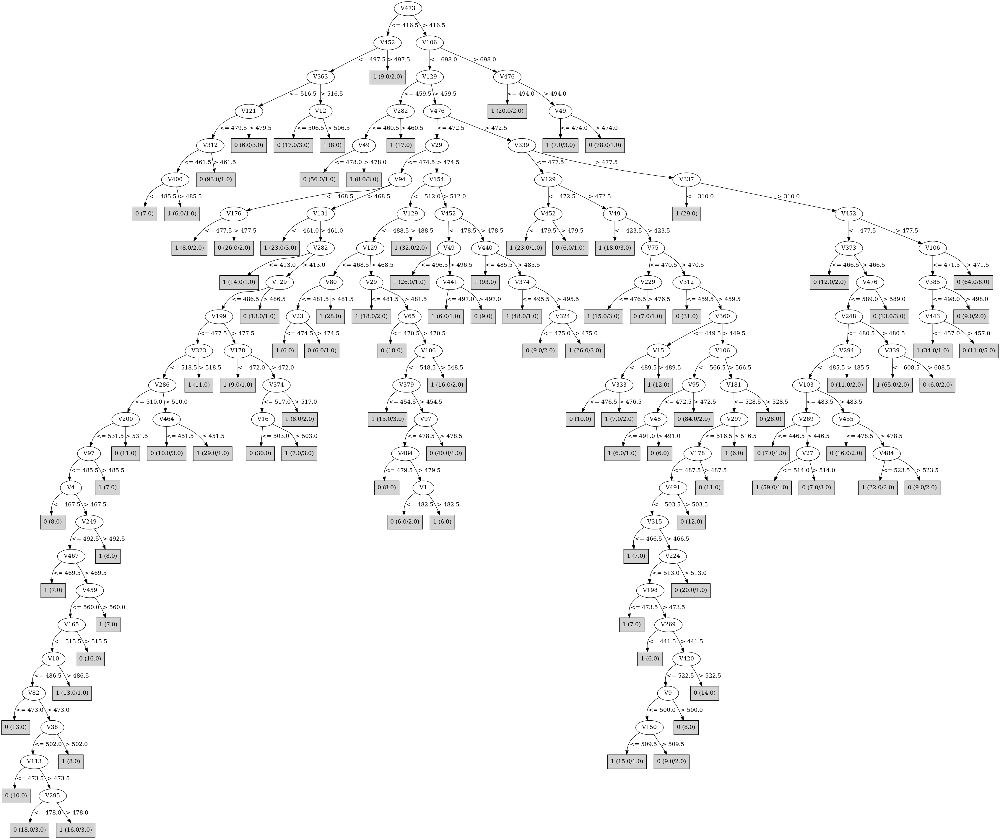

# J48

# SimpleCart Decision Tree

V476 < 472.5

* V154 < 453.5

*   * V379 < 495.5

*   *   * V29 < 492.5: 0(119.0/11.0)

*   *   * V29 >= 492.5: 1(25.0/11.0)

*   * V379 >= 495.5

*   *   * V443 < 506.5: 0(24.0/8.0)

*   *   * V443 >= 506.5: 1(89.0/15.0)

* V154 >= 453.5

*   * V49 < 463.5: 1(170.0/12.0)

*   * V49 >= 463.5

*   *   * V319 < 474.5

*   *   *   * V189 < 548.0: 0(85.0/33.0)

*   *   *   * V189 >= 548.0: 1(29.0/15.0)

*   *   * V319 >= 474.5: 1(153.0/31.0)

V476 >= 472.5

* V339 < 477.5

*   * V379 < 522.5

*   *   * V154 < 645.5

*   *   *   * V454 < 286.0: 1(10.0/0.0)

*   *   *   * V454 >= 286.0

*   *   *   *   * V454 < 460.5: 0(109.0/20.0)

*   *   *   *   * V454 >= 460.5

*   *   *   *   *   * V443 < 470.5

*   *   *   *   *   *   * V476 < 583.5: 1(55.0/15.0)

*   *   *   *   *   *   * V476 >= 583.5: 0(12.0/1.0)

*   *   *   *   *   * V443 >= 470.5: 0(63.0/14.0)

*   *   * V154 >= 645.5: 1(22.0/6.0)

*   * V379 >= 522.5: 0(231.0/21.0)

* V339 >= 477.5

*   * V452 < 477.5

*   *   * V339 < 611.5: 1(180.0/60.0)

*   *   * V339 >= 611.5: 0(26.0/7.0)

*   * V452 >= 477.5

*   *   * V106 < 471.5: 1(44.0/17.0)

*   *   * V106 >= 471.5: 0(65.0/12.0)

# PART

Decision list:

conditions|predicted class
---|---
V443 <= 357.5| 0 (140.0/27.0)
V106 > 698.0| 0 (95.0/21.0)
V106 <= 254.5 AND V282 <= 452.5| 0 (46.0/3.0)
V287 <= 534.5 AND V443 <= 690.0 AND V392 > 423.5 AND V45 > 442.5 AND V396 > 524.5| 1 (44.0/9.0)
V287 <= 534.5 AND V57 <= 402.5| 0 (41.0/11.0)
V392 > 423.5 AND V45 > 442.5 AND V287 > 534.5| 1 (34.0/6.0)
V392 > 423.5 AND V45 <= 442.5| 1 (32.0/5.0)
V392 <= 423.5| 1 (31.0/4.0)
V149 > 490.5 AND V147 <= 481.5| 0 (17.0)
V324 > 503.5| 1 (35.0/7.0)
V93 <= 438.5 AND V269 <= 492.5| 1 (17.0)
V268 <= 460.5 AND V71 > 509.0| 0 (14.0)
V390 > 411.0 AND V206 <= 478.5 AND V10 <= 494.5 AND V205 > 551.5| 1 (34.0/8.0)
V390 > 411.0 AND V206 > 478.5| 1 (32.0/7.0)
V390 > 411.0 AND V10 <= 494.5 AND V352 <= 397.0| 1 (26.0/6.0)
V390 <= 411.0| 1 (25.0/5.0)
V344 <= 450.5 AND V416 <= 504.0| 0 (19.0)
V348 <= 409.5 AND V449 > 483.5| 0 (16.0)
V321 > 507.5 AND V366 > 481.0| 0 (23.0/2.0)
V212 > 414.5 AND V337 > 564.5 AND V458 <= 533.5 AND V37 <= 499.5 AND V451 <= 518.0 AND V298 > 448.5 AND V171 > 403.0 AND V258 <= 541.0| 1 (129.0/14.0)
V212 > 414.5 AND V494 > 279.5 AND V154 <= 346.0| 1 (31.0/8.0)
V212 > 414.5 AND V494 <= 279.5| 1 (30.0/7.0)
V212 <= 414.5| 1 (28.0/6.0)
V499 > 572.5 AND V415 <= 510.0| 0 (20.0)
V151 <= 416.5 AND V407 <= 505.0| 0 (19.0)
V182 > 441.5 AND V485 > 552.5| 1 (39.0/10.0)
V368 <= 504.5 AND V270 <= 521.5 AND V339 > 593.5 AND V88 > 457.0 AND V59 <= 546.5| 0 (58.0/5.0)
V78 > 439.5 AND V244 > 457.5 AND V443 > 532.5| 1 (165.0/52.0)
V78 <= 439.5| 1 (27.0/6.0)
V49 <= 421.5| 1 (23.0/6.0)
V471 > 571.5 AND V21 <= 482.0| 1 (17.0)
V242 > 483.5 AND V129 > 472.5 AND V181 > 440.0 AND V360 > 433.0| 0 (185.0/26.0)
V366 > 442.5 AND V140 > 462.5 AND V371 > 445.5 AND V33 > 471.5 AND V182 > 470.5 AND V106 <= 586.0 AND V398 <= 524.0 AND V5 <= 530.0| 1 (38.0/13.0)
| 1 (108.0/48.0)

# JRip

Decision list:

conditions|predicted class
---|---
(V476 <= 472) and (V154 >= 514) and (V49 <= 483)|1 (201.0/12.0)
(V339 >= 477) and (V49 >= 488) and (V154 <= 480) and (V319 <= 487)|1 (200.0/19.0)
(V339 >= 465) and (V339 <= 605) and (V379 <= 461) and (V456 >= 513) and (V145 <= 497)|1 (87.0/8.0)
(V476 <= 490) and (V319 >= 475) and (V454 >= 497) and (V49 >= 488)|1 (146.0/15.0)
(V379 <= 503) and (V443 <= 470) and (V454 >= 442) and (V476 <= 582)|1 (93.0/17.0)
(V339 >= 445) and (V476 >= 514) and (V443 >= 533) and (V456 <= 457)|1 (43.0/6.0)
(V339 >= 485) and (V282 >= 446) and (V494 <= 516) and (V302 >= 497)|1 (40.0/9.0)
(V339 >= 483) and (V339 <= 597) and (V288 >= 480) and (V117 >= 496) and (V111 <= 487)|1 (30.0/7.0)
(V49 <= 497) and (V452 >= 484) and (V339 >= 588)|1 (28.0/3.0)
|0 (952.0/132.0)

# Decision Table

Non matches covered by Majority class

v1|v2|v3|v4|v6|v7|v8|v9|v10|v11|v12|v13|v14|v15|v16|v17|v18|v19|v20|v21|v22|v23|v24|v25|v26|v27|v28|v29|v30|v31|v32|v33|v34|v35|v36|v37|v38|v39|v40|v41|v42|v43|v44|v45|v46|v47|v48|v49|v50|v51|v52|v53|v54|v55|v56|v57|v58|v59|v60|v61|v62|v63|v64|v66|v67|v68|v69|v70|v71|v72|v73|v74|v75|v76|v77|v78|v79|v80|v81|v82|v83|v84|v85|v86|v87|v88|v89|v90|v91|v92|v93|v94|v95|v96|v97|v98|v99|v100|v101|v102|v103|v104|v105|v106|v107|v108|v109|v110|v111|v112|v113|v114|v115|v116|v117|v118|v119|v120|v121|v122|v123|v124|v125|v126|v127|v128|v129|v130|v131|v132|v133|v134|v135|v136|v137|v138|v139|v140|v141|v142|v143|v144|v145|v146|v147|v148|v149|v150|v151|v152|v153|v154|v155|v156|v157|v158|v159|v160|v161|v162|v163|v164|v165|v166|v167|v168|v169|v170|v171|v172|v173|v174|v175|v176|v177|v178|v179|v180|v181|v182|v183|v184|v185|v186|v187|v188|v189|v190|v191|v192|v193|v194|v195|v196|v197|v198|v199|v200|v201|v202|v203|v204|v205|v206|v207|v208|v209|v210|v211|v212|v213|v214|v215|v216|v217|v218|v219|v220|v221|v222|v223|v224|v225|v226|v227|v228|v229|v230|v231|v232|v233|v234|v235|v236|v237|v238|v239|v240|v241|v242|v243|v244|v245|v246|v247|v248|v249|v250|v251|v252|v253|v254|v255|v256|v257|v258|v259|v260|v261|v262|v263|v264|v265|v266|v267|v268|v269|v270|v271|v272|v273|v274|v275|v276|v277|v278|v279|v280|v281|v282|v283|v284|v285|v286|v287|v288|v289|v290|v291|v292|v293|v294|v295|v296|v297|v298|v299|v300|v301|v302|v303|v304|v305|v306|v307|v308|v309|v310|v311|v312|v313|v314|v315|v316|v317|v318|v319|v320|v321|v322|v323|v324|v325|v326|v327|v328|v329|v330|v331|v332|v333|v334|v335|v336|v337|v338|v339|v340|v341|v342|v343|v344|v345|v346|v347|v348|v349|v350|v351|v352|v353|v354|v355|v356|v357|v358|v359|v360|v361|v362|v363|v364|v365|v366|v367|v368|v369|v370|v371|v372|v373|v374|v375|v376|v377|v378|v379|v380|v381|v382|v383|v384|v385|v386|v387|v388|v389|v390|v391|v392|v393|v394|v395|v396|v397|v398|v399|v400|v401|v402|v403|v404|v405|v406|v407|v408|v409|v410|v411|v412|v413|v414|v415|v416|v417|v418|v419|v420|v421|v422|v423|v424|v425|v426|v427|v428|v429|v430|v431|v432|v433|v434|v435|v436|v437|v438|v439|v440|v441|v442|v443|v444|v445|v446|v447|v448|v449|v450|v451|v452|v453|v454|v455|v456|v457|v458|v459|v460|v461|v462|v463|v464|v465|v466|v467|v468|v469|v470|v471|v472|v474|v475|v476|v477|v478|v479|v480|v481|v482|v483|v484|v485|v486|v487|v488|v489|v490|v491|v492|v493|v494|v495|v496|v497|v498|v499|v500|target
---|---|---|---|---|---|---|---|---|---|---|---|---|---|---|---|---|---|---|---|---|---|---|---|---|---|---|---|---|---|---|---|---|---|---|---|---|---|---|---|---|---|---|---|---|---|---|---|---|---|---|---|---|---|---|---|---|---|---|---|---|---|---|---|---|---|---|---|---|---|---|---|---|---|---|---|---|---|---|---|---|---|---|---|---|---|---|---|---|---|---|---|---|---|---|---|---|---|---|---|---|---|---|---|---|---|---|---|---|---|---|---|---|---|---|---|---|---|---|---|---|---|---|---|---|---|---|---|---|---|---|---|---|---|---|---|---|---|---|---|---|---|---|---|---|---|---|---|---|---|---|---|---|---|---|---|---|---|---|---|---|---|---|---|---|---|---|---|---|---|---|---|---|---|---|---|---|---|---|---|---|---|---|---|---|---|---|---|---|---|---|---|---|---|---|---|---|---|---|---|---|---|---|---|---|---|---|---|---|---|---|---|---|---|---|---|---|---|---|---|---|---|---|---|---|---|---|---|---|---|---|---|---|---|---|---|---|---|---|---|---|---|---|---|---|---|---|---|---|---|---|---|---|---|---|---|---|---|---|---|---|---|---|---|---|---|---|---|---|---|---|---|---|---|---|---|---|---|---|---|---|---|---|---|---|---|---|---|---|---|---|---|---|---|---|---|---|---|---|---|---|---|---|---|---|---|---|---|---|---|---|---|---|---|---|---|---|---|---|---|---|---|---|---|---|---|---|---|---|---|---|---|---|---|---|---|---|---|---|---|---|---|---|---|---|---|---|---|---|---|---|---|---|---|---|---|---|---|---|---|---|---|---|---|---|---|---|---|---|---|---|---|---|---|---|---|---|---|---|---|---|---|---|---|---|---|---|---|---|---|---|---|---|---|---|---|---|---|---|---|---|---|---|---|---|---|---|---|---|---|---|---|---|---|---|---|---|---|---|---|---|---|---|---|---|---|---|---|---|---|---|---|---|---|---|---|---|---|---|---|---|---|---|---|---|---|---|---|---|---|---|---|---|---|---|---|---|---|---|---|---|---|---|---|---|---|---|---|---|---|---|---|---|---|---|---|---|---|---|---|---|---|---|---|---|---|---|---|---|---|---|---|---|---|---|---|---|---
all|all|all|all|all|all|all|all|all|all|all|all|all|all|all|all|all|all|all|all|all|all|all|all|all|all|all|all|all|all|all|all|all|all|all|all|all|all|all|all|all|all|all|all|all|all|all|(-inf-461.5]|all|all|all|all|all|all|all|all|all|all|all|all|all|all|all|all|all|all|all|all|all|all|all|all|all|all|all|all|all|all|all|all|all|all|all|all|all|all|all|all|all|all|all|all|all|all|all|all|all|all|all|all|all|all|all|(-inf-698]|all|all|all|all|all|all|all|all|all|all|all|all|all|all|all|all|all|all|all|all|all|all|(472.5-497.5]|all|all|all|all|all|all|all|all|all|all|all|all|all|all|all|all|all|all|all|all|all|all|all|all|all|all|all|all|all|all|all|all|all|all|all|all|all|all|all|all|all|all|all|all|all|all|all|all|all|all|all|all|all|all|all|all|all|all|all|all|all|all|all|all|all|all|all|all|all|all|all|all|all|all|all|all|all|all|all|all|all|all|all|all|all|all|all|all|all|all|all|all|(605.5-inf)|all|all|all|all|all|all|all|all|all|all|all|all|all|all|all|all|all|all|all|(491.5-inf)|all|all|all|all|all|all|all|all|all|all|all|all|all|all|all|all|all|all|all|all|all|all|all|all|all|all|all|all|all|all|all|all|all|all|all|all|all|all|all|all|all|all|all|all|all|all|all|all|all|all|all|all|all|all|all|all|all|all|all|all|all|all|all|all|all|all|all|all|all|all|all|all|all|all|all|all|all|all|all|all|all|all|all|all|all|all|all|all|all|all|all|all|all|all|(-inf-586.5]|all|(-inf-443.5]|all|all|all|all|all|all|all|all|all|all|all|all|all|all|all|all|all|all|all|all|all|all|all|all|all|all|all|all|all|all|all|all|all|all|all|all|all|all|all|(-inf-461.5]|all|all|all|all|all|all|all|all|all|all|all|all|all|all|all|all|all|all|all|all|all|all|all|all|all|all|all|all|all|all|all|all|all|all|all|all|all|all|all|all|all|all|all|all|all|all|all|all|all|all|all|all|all|all|all|all|all|all|all|all|all|all|all|(-inf-357.5]|all|all|all|all|all|all|all|all|all|all|(460.5-inf)|all|all|all|all|all|all|all|all|all|all|all|all|all|all|all|all|all|all|all|all|(472.5-inf)|all|all|all|all|all|all|all|all|all|all|all|all|all|all|all|all|all|(471.5-inf)|all|all|all|all|all|all|0
all|all|all|all|all|all|all|all|all|all|all|all|all|all|all|all|all|all|all|all|all|all|all|all|all|all|all|all|all|all|all|all|all|all|all|all|all|all|all|all|all|all|all|all|all|all|all|(461.5-inf)|all|all|all|all|all|all|all|all|all|all|all|all|all|all|all|all|all|all|all|all|all|all|all|all|all|all|all|all|all|all|all|all|all|all|all|all|all|all|all|all|all|all|all|all|all|all|all|all|all|all|all|all|all|all|all|(-inf-698]|all|all|all|all|all|all|all|all|all|all|all|all|all|all|all|all|all|all|all|all|all|all|(472.5-497.5]|all|all|all|all|all|all|all|all|all|all|all|all|all|all|all|all|all|all|all|all|all|all|all|all|all|all|all|all|all|all|all|all|all|all|all|all|all|all|all|all|all|all|all|all|all|all|all|all|all|all|all|all|all|all|all|all|all|all|all|all|all|all|all|all|all|all|all|all|all|all|all|all|all|all|all|all|all|all|all|all|all|all|all|all|all|all|all|all|all|all|all|all|(-inf-605.5]|all|all|all|all|all|all|all|all|all|all|all|all|all|all|all|all|all|all|all|(-inf-491.5]|all|all|all|all|all|all|all|all|all|all|all|all|all|all|all|all|all|all|all|all|all|all|all|all|all|all|all|all|all|all|all|all|all|all|all|all|all|all|all|all|all|all|all|all|all|all|all|all|all|all|all|all|all|all|all|all|all|all|all|all|all|all|all|all|all|all|all|all|all|all|all|all|all|all|all|all|all|all|all|all|all|all|all|all|all|all|all|all|all|all|all|all|all|all|(-inf-586.5]|all|(625.5-inf)|all|all|all|all|all|all|all|all|all|all|all|all|all|all|all|all|all|all|all|all|all|all|all|all|all|all|all|all|all|all|all|all|all|all|all|all|all|all|all|(461.5-inf)|all|all|all|all|all|all|all|all|all|all|all|all|all|all|all|all|all|all|all|all|all|all|all|all|all|all|all|all|all|all|all|all|all|all|all|all|all|all|all|all|all|all|all|all|all|all|all|all|all|all|all|all|all|all|all|all|all|all|all|all|all|all|all|(357.5-inf)|all|all|all|all|all|all|all|all|all|all|(-inf-460.5]|all|all|all|all|all|all|all|all|all|all|all|all|all|all|all|all|all|all|all|all|(-inf-472.5]|all|all|all|all|all|all|all|all|all|all|all|all|all|all|all|all|all|(-inf-471.5]|all|all|all|all|all|all|0
all|all|all|all|all|all|all|all|all|all|all|all|all|all|all|all|all|all|all|all|all|all|all|all|all|all|all|all|all|all|all|all|all|all|all|all|all|all|all|all|all|all|all|all|all|all|all|(461.5-inf)|all|all|all|all|all|all|all|all|all|all|all|all|all|all|all|all|all|all|all|all|all|all|all|all|all|all|all|all|all|all|all|all|all|all|all|all|all|all|all|all|all|all|all|all|all|all|all|all|all|all|all|all|all|all|all|(-inf-698]|all|all|all|all|all|all|all|all|all|all|all|all|all|all|all|all|all|all|all|all|all|all|(472.5-497.5]|all|all|all|all|all|all|all|all|all|all|all|all|all|all|all|all|all|all|all|all|all|all|all|all|all|all|all|all|all|all|all|all|all|all|all|all|all|all|all|all|all|all|all|all|all|all|all|all|all|all|all|all|all|all|all|all|all|all|all|all|all|all|all|all|all|all|all|all|all|all|all|all|all|all|all|all|all|all|all|all|all|all|all|all|all|all|all|all|all|all|all|all|(-inf-605.5]|all|all|all|all|all|all|all|all|all|all|all|all|all|all|all|all|all|all|all|(491.5-inf)|all|all|all|all|all|all|all|all|all|all|all|all|all|all|all|all|all|all|all|all|all|all|all|all|all|all|all|all|all|all|all|all|all|all|all|all|all|all|all|all|all|all|all|all|all|all|all|all|all|all|all|all|all|all|all|all|all|all|all|all|all|all|all|all|all|all|all|all|all|all|all|all|all|all|all|all|all|all|all|all|all|all|all|all|all|all|all|all|all|all|all|all|all|all|(-inf-586.5]|all|(477.5-625.5]|all|all|all|all|all|all|all|all|all|all|all|all|all|all|all|all|all|all|all|all|all|all|all|all|all|all|all|all|all|all|all|all|all|all|all|all|all|all|all|(-inf-461.5]|all|all|all|all|all|all|all|all|all|all|all|all|all|all|all|all|all|all|all|all|all|all|all|all|all|all|all|all|all|all|all|all|all|all|all|all|all|all|all|all|all|all|all|all|all|all|all|all|all|all|all|all|all|all|all|all|all|all|all|all|all|all|all|(357.5-inf)|all|all|all|all|all|all|all|all|all|all|(-inf-460.5]|all|all|all|all|all|all|all|all|all|all|all|all|all|all|all|all|all|all|all|all|(472.5-inf)|all|all|all|all|all|all|all|all|all|all|all|all|all|all|all|all|all|(-inf-471.5]|all|all|all|all|all|all|0
all|all|all|all|all|all|all|all|all|all|all|all|all|all|all|all|all|all|all|all|all|all|all|all|all|all|all|all|all|all|all|all|all|all|all|all|all|all|all|all|all|all|all|all|all|all|all|(461.5-inf)|all|all|all|all|all|all|all|all|all|all|all|all|all|all|all|all|all|all|all|all|all|all|all|all|all|all|all|all|all|all|all|all|all|all|all|all|all|all|all|all|all|all|all|all|all|all|all|all|all|all|all|all|all|all|all|(-inf-698]|all|all|all|all|all|all|all|all|all|all|all|all|all|all|all|all|all|all|all|all|all|all|(472.5-497.5]|all|all|all|all|all|all|all|all|all|all|all|all|all|all|all|all|all|all|all|all|all|all|all|all|all|all|all|all|all|all|all|all|all|all|all|all|all|all|all|all|all|all|all|all|all|all|all|all|all|all|all|all|all|all|all|all|all|all|all|all|all|all|all|all|all|all|all|all|all|all|all|all|all|all|all|all|all|all|all|all|all|all|all|all|all|all|all|all|all|all|all|all|(-inf-605.5]|all|all|all|all|all|all|all|all|all|all|all|all|all|all|all|all|all|all|all|(-inf-491.5]|all|all|all|all|all|all|all|all|all|all|all|all|all|all|all|all|all|all|all|all|all|all|all|all|all|all|all|all|all|all|all|all|all|all|all|all|all|all|all|all|all|all|all|all|all|all|all|all|all|all|all|all|all|all|all|all|all|all|all|all|all|all|all|all|all|all|all|all|all|all|all|all|all|all|all|all|all|all|all|all|all|all|all|all|all|all|all|all|all|all|all|all|all|all|(586.5-736]|all|(477.5-625.5]|all|all|all|all|all|all|all|all|all|all|all|all|all|all|all|all|all|all|all|all|all|all|all|all|all|all|all|all|all|all|all|all|all|all|all|all|all|all|all|(461.5-inf)|all|all|all|all|all|all|all|all|all|all|all|all|all|all|all|all|all|all|all|all|all|all|all|all|all|all|all|all|all|all|all|all|all|all|all|all|all|all|all|all|all|all|all|all|all|all|all|all|all|all|all|all|all|all|all|all|all|all|all|all|all|all|all|(357.5-inf)|all|all|all|all|all|all|all|all|all|all|(-inf-460.5]|all|all|all|all|all|all|all|all|all|all|all|all|all|all|all|all|all|all|all|all|(-inf-472.5]|all|all|all|all|all|all|all|all|all|all|all|all|all|all|all|all|all|(-inf-471.5]|all|all|all|all|all|all|1
all|all|all|all|all|all|all|all|all|all|all|all|all|all|all|all|all|all|all|all|all|all|all|all|all|all|all|all|all|all|all|all|all|all|all|all|all|all|all|all|all|all|all|all|all|all|all|(-inf-461.5]|all|all|all|all|all|all|all|all|all|all|all|all|all|all|all|all|all|all|all|all|all|all|all|all|all|all|all|all|all|all|all|all|all|all|all|all|all|all|all|all|all|all|all|all|all|all|all|all|all|all|all|all|all|all|all|(-inf-698]|all|all|all|all|all|all|all|all|all|all|all|all|all|all|all|all|all|all|all|all|all|all|(459.5-472.5]|all|all|all|all|all|all|all|all|all|all|all|all|all|all|all|all|all|all|all|all|all|all|all|all|all|all|all|all|all|all|all|all|all|all|all|all|all|all|all|all|all|all|all|all|all|all|all|all|all|all|all|all|all|all|all|all|all|all|all|all|all|all|all|all|all|all|all|all|all|all|all|all|all|all|all|all|all|all|all|all|all|all|all|all|all|all|all|all|all|all|all|all|(-inf-605.5]|all|all|all|all|all|all|all|all|all|all|all|all|all|all|all|all|all|all|all|(-inf-491.5]|all|all|all|all|all|all|all|all|all|all|all|all|all|all|all|all|all|all|all|all|all|all|all|all|all|all|all|all|all|all|all|all|all|all|all|all|all|all|all|all|all|all|all|all|all|all|all|all|all|all|all|all|all|all|all|all|all|all|all|all|all|all|all|all|all|all|all|all|all|all|all|all|all|all|all|all|all|all|all|all|all|all|all|all|all|all|all|all|all|all|all|all|all|all|(-inf-586.5]|all|(625.5-inf)|all|all|all|all|all|all|all|all|all|all|all|all|all|all|all|all|all|all|all|all|all|all|all|all|all|all|all|all|all|all|all|all|all|all|all|all|all|all|all|(-inf-461.5]|all|all|all|all|all|all|all|all|all|all|all|all|all|all|all|all|all|all|all|all|all|all|all|all|all|all|all|all|all|all|all|all|all|all|all|all|all|all|all|all|all|all|all|all|all|all|all|all|all|all|all|all|all|all|all|all|all|all|all|all|all|all|all|(357.5-inf)|all|all|all|all|all|all|all|all|all|all|(-inf-460.5]|all|all|all|all|all|all|all|all|all|all|all|all|all|all|all|all|all|all|all|all|(-inf-472.5]|all|all|all|all|all|all|all|all|all|all|all|all|all|all|all|all|all|(-inf-471.5]|all|all|all|all|all|all|0
all|all|all|all|all|all|all|all|all|all|all|all|all|all|all|all|all|all|all|all|all|all|all|all|all|all|all|all|all|all|all|all|all|all|all|all|all|all|all|all|all|all|all|all|all|all|all|(461.5-inf)|all|all|all|all|all|all|all|all|all|all|all|all|all|all|all|all|all|all|all|all|all|all|all|all|all|all|all|all|all|all|all|all|all|all|all|all|all|all|all|all|all|all|all|all|all|all|all|all|all|all|all|all|all|all|all|(-inf-698]|all|all|all|all|all|all|all|all|all|all|all|all|all|all|all|all|all|all|all|all|all|all|(459.5-472.5]|all|all|all|all|all|all|all|all|all|all|all|all|all|all|all|all|all|all|all|all|all|all|all|all|all|all|all|all|all|all|all|all|all|all|all|all|all|all|all|all|all|all|all|all|all|all|all|all|all|all|all|all|all|all|all|all|all|all|all|all|all|all|all|all|all|all|all|all|all|all|all|all|all|all|all|all|all|all|all|all|all|all|all|all|all|all|all|all|all|all|all|all|(-inf-605.5]|all|all|all|all|all|all|all|all|all|all|all|all|all|all|all|all|all|all|all|(-inf-491.5]|all|all|all|all|all|all|all|all|all|all|all|all|all|all|all|all|all|all|all|all|all|all|all|all|all|all|all|all|all|all|all|all|all|all|all|all|all|all|all|all|all|all|all|all|all|all|all|all|all|all|all|all|all|all|all|all|all|all|all|all|all|all|all|all|all|all|all|all|all|all|all|all|all|all|all|all|all|all|all|all|all|all|all|all|all|all|all|all|all|all|all|all|all|all|(736-inf)|all|(625.5-inf)|all|all|all|all|all|all|all|all|all|all|all|all|all|all|all|all|all|all|all|all|all|all|all|all|all|all|all|all|all|all|all|all|all|all|all|all|all|all|all|(461.5-inf)|all|all|all|all|all|all|all|all|all|all|all|all|all|all|all|all|all|all|all|all|all|all|all|all|all|all|all|all|all|all|all|all|all|all|all|all|all|all|all|all|all|all|all|all|all|all|all|all|all|all|all|all|all|all|all|all|all|all|all|all|all|all|all|(357.5-inf)|all|all|all|all|all|all|all|all|all|all|(-inf-460.5]|all|all|all|all|all|all|all|all|all|all|all|all|all|all|all|all|all|all|all|all|(-inf-472.5]|all|all|all|all|all|all|all|all|all|all|all|all|all|all|all|all|all|(-inf-471.5]|all|all|all|all|all|all|0
all|all|all|all|all|all|all|all|all|all|all|all|all|all|all|all|all|all|all|all|all|all|all|all|all|all|all|all|all|all|all|all|all|all|all|all|all|all|all|all|all|all|all|all|all|all|all|(-inf-461.5]|all|all|all|all|all|all|all|all|all|all|all|all|all|all|all|all|all|all|all|all|all|all|all|all|all|all|all|all|all|all|all|all|all|all|all|all|all|all|all|all|all|all|all|all|all|all|all|all|all|all|all|all|all|all|all|(-inf-698]|all|all|all|all|all|all|all|all|all|all|all|all|all|all|all|all|all|all|all|all|all|all|(459.5-472.5]|all|all|all|all|all|all|all|all|all|all|all|all|all|all|all|all|all|all|all|all|all|all|all|all|all|all|all|all|all|all|all|all|all|all|all|all|all|all|all|all|all|all|all|all|all|all|all|all|all|all|all|all|all|all|all|all|all|all|all|all|all|all|all|all|all|all|all|all|all|all|all|all|all|all|all|all|all|all|all|all|all|all|all|all|all|all|all|all|all|all|all|all|(-inf-605.5]|all|all|all|all|all|all|all|all|all|all|all|all|all|all|all|all|all|all|all|(-inf-491.5]|all|all|all|all|all|all|all|all|all|all|all|all|all|all|all|all|all|all|all|all|all|all|all|all|all|all|all|all|all|all|all|all|all|all|all|all|all|all|all|all|all|all|all|all|all|all|all|all|all|all|all|all|all|all|all|all|all|all|all|all|all|all|all|all|all|all|all|all|all|all|all|all|all|all|all|all|all|all|all|all|all|all|all|all|all|all|all|all|all|all|all|all|all|all|(586.5-736]|all|(477.5-625.5]|all|all|all|all|all|all|all|all|all|all|all|all|all|all|all|all|all|all|all|all|all|all|all|all|all|all|all|all|all|all|all|all|all|all|all|all|all|all|all|(-inf-461.5]|all|all|all|all|all|all|all|all|all|all|all|all|all|all|all|all|all|all|all|all|all|all|all|all|all|all|all|all|all|all|all|all|all|all|all|all|all|all|all|all|all|all|all|all|all|all|all|all|all|all|all|all|all|all|all|all|all|all|all|all|all|all|all|(357.5-inf)|all|all|all|all|all|all|all|all|all|all|(-inf-460.5]|all|all|all|all|all|all|all|all|all|all|all|all|all|all|all|all|all|all|all|all|(-inf-472.5]|all|all|all|all|all|all|all|all|all|all|all|all|all|all|all|all|all|(-inf-471.5]|all|all|all|all|all|all|1
all|all|all|all|all|all|all|all|all|all|all|all|all|all|all|all|all|all|all|all|all|all|all|all|all|all|all|all|all|all|all|all|all|all|all|all|all|all|all|all|all|all|all|all|all|all|all|(-inf-461.5]|all|all|all|all|all|all|all|all|all|all|all|all|all|all|all|all|all|all|all|all|all|all|all|all|all|all|all|all|all|all|all|all|all|all|all|all|all|all|all|all|all|all|all|all|all|all|all|all|all|all|all|all|all|all|all|(-inf-698]|all|all|all|all|all|all|all|all|all|all|all|all|all|all|all|all|all|all|all|all|all|all|(472.5-497.5]|all|all|all|all|all|all|all|all|all|all|all|all|all|all|all|all|all|all|all|all|all|all|all|all|all|all|all|all|all|all|all|all|all|all|all|all|all|all|all|all|all|all|all|all|all|all|all|all|all|all|all|all|all|all|all|all|all|all|all|all|all|all|all|all|all|all|all|all|all|all|all|all|all|all|all|all|all|all|all|all|all|all|all|all|all|all|all|all|all|all|all|all|(-inf-605.5]|all|all|all|all|all|all|all|all|all|all|all|all|all|all|all|all|all|all|all|(491.5-inf)|all|all|all|all|all|all|all|all|all|all|all|all|all|all|all|all|all|all|all|all|all|all|all|all|all|all|all|all|all|all|all|all|all|all|all|all|all|all|all|all|all|all|all|all|all|all|all|all|all|all|all|all|all|all|all|all|all|all|all|all|all|all|all|all|all|all|all|all|all|all|all|all|all|all|all|all|all|all|all|all|all|all|all|all|all|all|all|all|all|all|all|all|all|all|(-inf-586.5]|all|(443.5-477.5]|all|all|all|all|all|all|all|all|all|all|all|all|all|all|all|all|all|all|all|all|all|all|all|all|all|all|all|all|all|all|all|all|all|all|all|all|all|all|all|(461.5-inf)|all|all|all|all|all|all|all|all|all|all|all|all|all|all|all|all|all|all|all|all|all|all|all|all|all|all|all|all|all|all|all|all|all|all|all|all|all|all|all|all|all|all|all|all|all|all|all|all|all|all|all|all|all|all|all|all|all|all|all|all|all|all|all|(357.5-inf)|all|all|all|all|all|all|all|all|all|all|(-inf-460.5]|all|all|all|all|all|all|all|all|all|all|all|all|all|all|all|all|all|all|all|all|(472.5-inf)|all|all|all|all|all|all|all|all|all|all|all|all|all|all|all|all|all|(-inf-471.5]|all|all|all|all|all|all|0
all|all|all|all|all|all|all|all|all|all|all|all|all|all|all|all|all|all|all|all|all|all|all|all|all|all|all|all|all|all|all|all|all|all|all|all|all|all|all|all|all|all|all|all|all|all|all|(461.5-inf)|all|all|all|all|all|all|all|all|all|all|all|all|all|all|all|all|all|all|all|all|all|all|all|all|all|all|all|all|all|all|all|all|all|all|all|all|all|all|all|all|all|all|all|all|all|all|all|all|all|all|all|all|all|all|all|(-inf-698]|all|all|all|all|all|all|all|all|all|all|all|all|all|all|all|all|all|all|all|all|all|all|(472.5-497.5]|all|all|all|all|all|all|all|all|all|all|all|all|all|all|all|all|all|all|all|all|all|all|all|all|all|all|all|all|all|all|all|all|all|all|all|all|all|all|all|all|all|all|all|all|all|all|all|all|all|all|all|all|all|all|all|all|all|all|all|all|all|all|all|all|all|all|all|all|all|all|all|all|all|all|all|all|all|all|all|all|all|all|all|all|all|all|all|all|all|all|all|all|(-inf-605.5]|all|all|all|all|all|all|all|all|all|all|all|all|all|all|all|all|all|all|all|(491.5-inf)|all|all|all|all|all|all|all|all|all|all|all|all|all|all|all|all|all|all|all|all|all|all|all|all|all|all|all|all|all|all|all|all|all|all|all|all|all|all|all|all|all|all|all|all|all|all|all|all|all|all|all|all|all|all|all|all|all|all|all|all|all|all|all|all|all|all|all|all|all|all|all|all|all|all|all|all|all|all|all|all|all|all|all|all|all|all|all|all|all|all|all|all|all|all|(586.5-736]|all|(-inf-443.5]|all|all|all|all|all|all|all|all|all|all|all|all|all|all|all|all|all|all|all|all|all|all|all|all|all|all|all|all|all|all|all|all|all|all|all|all|all|all|all|(461.5-inf)|all|all|all|all|all|all|all|all|all|all|all|all|all|all|all|all|all|all|all|all|all|all|all|all|all|all|all|all|all|all|all|all|all|all|all|all|all|all|all|all|all|all|all|all|all|all|all|all|all|all|all|all|all|all|all|all|all|all|all|all|all|all|all|(-inf-357.5]|all|all|all|all|all|all|all|all|all|all|(460.5-inf)|all|all|all|all|all|all|all|all|all|all|all|all|all|all|all|all|all|all|all|all|(472.5-inf)|all|all|all|all|all|all|all|all|all|all|all|all|all|all|all|all|all|(471.5-inf)|all|all|all|all|all|all|0
all|all|all|all|all|all|all|all|all|all|all|all|all|all|all|all|all|all|all|all|all|all|all|all|all|all|all|all|all|all|all|all|all|all|all|all|all|all|all|all|all|all|all|all|all|all|all|(461.5-inf)|all|all|all|all|all|all|all|all|all|all|all|all|all|all|all|all|all|all|all|all|all|all|all|all|all|all|all|all|all|all|all|all|all|all|all|all|all|all|all|all|all|all|all|all|all|all|all|all|all|all|all|all|all|all|all|(698-inf)|all|all|all|all|all|all|all|all|all|all|all|all|all|all|all|all|all|all|all|all|all|all|(472.5-497.5]|all|all|all|all|all|all|all|all|all|all|all|all|all|all|all|all|all|all|all|all|all|all|all|all|all|all|all|all|all|all|all|all|all|all|all|all|all|all|all|all|all|all|all|all|all|all|all|all|all|all|all|all|all|all|all|all|all|all|all|all|all|all|all|all|all|all|all|all|all|all|all|all|all|all|all|all|all|all|all|all|all|all|all|all|all|all|all|all|all|all|all|all|(-inf-605.5]|all|all|all|all|all|all|all|all|all|all|all|all|all|all|all|all|all|all|all|(491.5-inf)|all|all|all|all|all|all|all|all|all|all|all|all|all|all|all|all|all|all|all|all|all|all|all|all|all|all|all|all|all|all|all|all|all|all|all|all|all|all|all|all|all|all|all|all|all|all|all|all|all|all|all|all|all|all|all|all|all|all|all|all|all|all|all|all|all|all|all|all|all|all|all|all|all|all|all|all|all|all|all|all|all|all|all|all|all|all|all|all|all|all|all|all|all|all|(-inf-586.5]|all|(443.5-477.5]|all|all|all|all|all|all|all|all|all|all|all|all|all|all|all|all|all|all|all|all|all|all|all|all|all|all|all|all|all|all|all|all|all|all|all|all|all|all|all|(461.5-inf)|all|all|all|all|all|all|all|all|all|all|all|all|all|all|all|all|all|all|all|all|all|all|all|all|all|all|all|all|all|all|all|all|all|all|all|all|all|all|all|all|all|all|all|all|all|all|all|all|all|all|all|all|all|all|all|all|all|all|all|all|all|all|all|(357.5-inf)|all|all|all|all|all|all|all|all|all|all|(460.5-inf)|all|all|all|all|all|all|all|all|all|all|all|all|all|all|all|all|all|all|all|all|(472.5-inf)|all|all|all|all|all|all|all|all|all|all|all|all|all|all|all|all|all|(471.5-inf)|all|all|all|all|all|all|0
all|all|all|all|all|all|all|all|all|all|all|all|all|all|all|all|all|all|all|all|all|all|all|all|all|all|all|all|all|all|all|all|all|all|all|all|all|all|all|all|all|all|all|all|all|all|all|(461.5-inf)|all|all|all|all|all|all|all|all|all|all|all|all|all|all|all|all|all|all|all|all|all|all|all|all|all|all|all|all|all|all|all|all|all|all|all|all|all|all|all|all|all|all|all|all|all|all|all|all|all|all|all|all|all|all|all|(-inf-698]|all|all|all|all|all|all|all|all|all|all|all|all|all|all|all|all|all|all|all|all|all|all|(472.5-497.5]|all|all|all|all|all|all|all|all|all|all|all|all|all|all|all|all|all|all|all|all|all|all|all|all|all|all|all|all|all|all|all|all|all|all|all|all|all|all|all|all|all|all|all|all|all|all|all|all|all|all|all|all|all|all|all|all|all|all|all|all|all|all|all|all|all|all|all|all|all|all|all|all|all|all|all|all|all|all|all|all|all|all|all|all|all|all|all|all|all|all|all|all|(-inf-605.5]|all|all|all|all|all|all|all|all|all|all|all|all|all|all|all|all|all|all|all|(-inf-491.5]|all|all|all|all|all|all|all|all|all|all|all|all|all|all|all|all|all|all|all|all|all|all|all|all|all|all|all|all|all|all|all|all|all|all|all|all|all|all|all|all|all|all|all|all|all|all|all|all|all|all|all|all|all|all|all|all|all|all|all|all|all|all|all|all|all|all|all|all|all|all|all|all|all|all|all|all|all|all|all|all|all|all|all|all|all|all|all|all|all|all|all|all|all|all|(-inf-586.5]|all|(477.5-625.5]|all|all|all|all|all|all|all|all|all|all|all|all|all|all|all|all|all|all|all|all|all|all|all|all|all|all|all|all|all|all|all|all|all|all|all|all|all|all|all|(461.5-inf)|all|all|all|all|all|all|all|all|all|all|all|all|all|all|all|all|all|all|all|all|all|all|all|all|all|all|all|all|all|all|all|all|all|all|all|all|all|all|all|all|all|all|all|all|all|all|all|all|all|all|all|all|all|all|all|all|all|all|all|all|all|all|all|(357.5-inf)|all|all|all|all|all|all|all|all|all|all|(460.5-inf)|all|all|all|all|all|all|all|all|all|all|all|all|all|all|all|all|all|all|all|all|(472.5-inf)|all|all|all|all|all|all|all|all|all|all|all|all|all|all|all|all|all|(471.5-inf)|all|all|all|all|all|all|0
all|all|all|all|all|all|all|all|all|all|all|all|all|all|all|all|all|all|all|all|all|all|all|all|all|all|all|all|all|all|all|all|all|all|all|all|all|all|all|all|all|all|all|all|all|all|all|(461.5-inf)|all|all|all|all|all|all|all|all|all|all|all|all|all|all|all|all|all|all|all|all|all|all|all|all|all|all|all|all|all|all|all|all|all|all|all|all|all|all|all|all|all|all|all|all|all|all|all|all|all|all|all|all|all|all|all|(-inf-698]|all|all|all|all|all|all|all|all|all|all|all|all|all|all|all|all|all|all|all|all|all|all|(472.5-497.5]|all|all|all|all|all|all|all|all|all|all|all|all|all|all|all|all|all|all|all|all|all|all|all|all|all|all|all|all|all|all|all|all|all|all|all|all|all|all|all|all|all|all|all|all|all|all|all|all|all|all|all|all|all|all|all|all|all|all|all|all|all|all|all|all|all|all|all|all|all|all|all|all|all|all|all|all|all|all|all|all|all|all|all|all|all|all|all|all|all|all|all|all|(-inf-605.5]|all|all|all|all|all|all|all|all|all|all|all|all|all|all|all|all|all|all|all|(491.5-inf)|all|all|all|all|all|all|all|all|all|all|all|all|all|all|all|all|all|all|all|all|all|all|all|all|all|all|all|all|all|all|all|all|all|all|all|all|all|all|all|all|all|all|all|all|all|all|all|all|all|all|all|all|all|all|all|all|all|all|all|all|all|all|all|all|all|all|all|all|all|all|all|all|all|all|all|all|all|all|all|all|all|all|all|all|all|all|all|all|all|all|all|all|all|all|(-inf-586.5]|all|(443.5-477.5]|all|all|all|all|all|all|all|all|all|all|all|all|all|all|all|all|all|all|all|all|all|all|all|all|all|all|all|all|all|all|all|all|all|all|all|all|all|all|all|(461.5-inf)|all|all|all|all|all|all|all|all|all|all|all|all|all|all|all|all|all|all|all|all|all|all|all|all|all|all|all|all|all|all|all|all|all|all|all|all|all|all|all|all|all|all|all|all|all|all|all|all|all|all|all|all|all|all|all|all|all|all|all|all|all|all|all|(357.5-inf)|all|all|all|all|all|all|all|all|all|all|(-inf-460.5]|all|all|all|all|all|all|all|all|all|all|all|all|all|all|all|all|all|all|all|all|(472.5-inf)|all|all|all|all|all|all|all|all|all|all|all|all|all|all|all|all|all|(471.5-inf)|all|all|all|all|all|all|0
all|all|all|all|all|all|all|all|all|all|all|all|all|all|all|all|all|all|all|all|all|all|all|all|all|all|all|all|all|all|all|all|all|all|all|all|all|all|all|all|all|all|all|all|all|all|all|(-inf-461.5]|all|all|all|all|all|all|all|all|all|all|all|all|all|all|all|all|all|all|all|all|all|all|all|all|all|all|all|all|all|all|all|all|all|all|all|all|all|all|all|all|all|all|all|all|all|all|all|all|all|all|all|all|all|all|all|(-inf-698]|all|all|all|all|all|all|all|all|all|all|all|all|all|all|all|all|all|all|all|all|all|all|(459.5-472.5]|all|all|all|all|all|all|all|all|all|all|all|all|all|all|all|all|all|all|all|all|all|all|all|all|all|all|all|all|all|all|all|all|all|all|all|all|all|all|all|all|all|all|all|all|all|all|all|all|all|all|all|all|all|all|all|all|all|all|all|all|all|all|all|all|all|all|all|all|all|all|all|all|all|all|all|all|all|all|all|all|all|all|all|all|all|all|all|all|all|all|all|all|(-inf-605.5]|all|all|all|all|all|all|all|all|all|all|all|all|all|all|all|all|all|all|all|(-inf-491.5]|all|all|all|all|all|all|all|all|all|all|all|all|all|all|all|all|all|all|all|all|all|all|all|all|all|all|all|all|all|all|all|all|all|all|all|all|all|all|all|all|all|all|all|all|all|all|all|all|all|all|all|all|all|all|all|all|all|all|all|all|all|all|all|all|all|all|all|all|all|all|all|all|all|all|all|all|all|all|all|all|all|all|all|all|all|all|all|all|all|all|all|all|all|all|(-inf-586.5]|all|(477.5-625.5]|all|all|all|all|all|all|all|all|all|all|all|all|all|all|all|all|all|all|all|all|all|all|all|all|all|all|all|all|all|all|all|all|all|all|all|all|all|all|all|(-inf-461.5]|all|all|all|all|all|all|all|all|all|all|all|all|all|all|all|all|all|all|all|all|all|all|all|all|all|all|all|all|all|all|all|all|all|all|all|all|all|all|all|all|all|all|all|all|all|all|all|all|all|all|all|all|all|all|all|all|all|all|all|all|all|all|all|(357.5-inf)|all|all|all|all|all|all|all|all|all|all|(460.5-inf)|all|all|all|all|all|all|all|all|all|all|all|all|all|all|all|all|all|all|all|all|(472.5-inf)|all|all|all|all|all|all|all|all|all|all|all|all|all|all|all|all|all|(471.5-inf)|all|all|all|all|all|all|0
all|all|all|all|all|all|all|all|all|all|all|all|all|all|all|all|all|all|all|all|all|all|all|all|all|all|all|all|all|all|all|all|all|all|all|all|all|all|all|all|all|all|all|all|all|all|all|(-inf-461.5]|all|all|all|all|all|all|all|all|all|all|all|all|all|all|all|all|all|all|all|all|all|all|all|all|all|all|all|all|all|all|all|all|all|all|all|all|all|all|all|all|all|all|all|all|all|all|all|all|all|all|all|all|all|all|all|(-inf-698]|all|all|all|all|all|all|all|all|all|all|all|all|all|all|all|all|all|all|all|all|all|all|(472.5-497.5]|all|all|all|all|all|all|all|all|all|all|all|all|all|all|all|all|all|all|all|all|all|all|all|all|all|all|all|all|all|all|all|all|all|all|all|all|all|all|all|all|all|all|all|all|all|all|all|all|all|all|all|all|all|all|all|all|all|all|all|all|all|all|all|all|all|all|all|all|all|all|all|all|all|all|all|all|all|all|all|all|all|all|all|all|all|all|all|all|all|all|all|all|(-inf-605.5]|all|all|all|all|all|all|all|all|all|all|all|all|all|all|all|all|all|all|all|(-inf-491.5]|all|all|all|all|all|all|all|all|all|all|all|all|all|all|all|all|all|all|all|all|all|all|all|all|all|all|all|all|all|all|all|all|all|all|all|all|all|all|all|all|all|all|all|all|all|all|all|all|all|all|all|all|all|all|all|all|all|all|all|all|all|all|all|all|all|all|all|all|all|all|all|all|all|all|all|all|all|all|all|all|all|all|all|all|all|all|all|all|all|all|all|all|all|all|(-inf-586.5]|all|(-inf-443.5]|all|all|all|all|all|all|all|all|all|all|all|all|all|all|all|all|all|all|all|all|all|all|all|all|all|all|all|all|all|all|all|all|all|all|all|all|all|all|all|(-inf-461.5]|all|all|all|all|all|all|all|all|all|all|all|all|all|all|all|all|all|all|all|all|all|all|all|all|all|all|all|all|all|all|all|all|all|all|all|all|all|all|all|all|all|all|all|all|all|all|all|all|all|all|all|all|all|all|all|all|all|all|all|all|all|all|all|(357.5-inf)|all|all|all|all|all|all|all|all|all|all|(460.5-inf)|all|all|all|all|all|all|all|all|all|all|all|all|all|all|all|all|all|all|all|all|(472.5-inf)|all|all|all|all|all|all|all|all|all|all|all|all|all|all|all|all|all|(471.5-inf)|all|all|all|all|all|all|0
all|all|all|all|all|all|all|all|all|all|all|all|all|all|all|all|all|all|all|all|all|all|all|all|all|all|all|all|all|all|all|all|all|all|all|all|all|all|all|all|all|all|all|all|all|all|all|(-inf-461.5]|all|all|all|all|all|all|all|all|all|all|all|all|all|all|all|all|all|all|all|all|all|all|all|all|all|all|all|all|all|all|all|all|all|all|all|all|all|all|all|all|all|all|all|all|all|all|all|all|all|all|all|all|all|all|all|(-inf-698]|all|all|all|all|all|all|all|all|all|all|all|all|all|all|all|all|all|all|all|all|all|all|(472.5-497.5]|all|all|all|all|all|all|all|all|all|all|all|all|all|all|all|all|all|all|all|all|all|all|all|all|all|all|all|all|all|all|all|all|all|all|all|all|all|all|all|all|all|all|all|all|all|all|all|all|all|all|all|all|all|all|all|all|all|all|all|all|all|all|all|all|all|all|all|all|all|all|all|all|all|all|all|all|all|all|all|all|all|all|all|all|all|all|all|all|all|all|all|all|(-inf-605.5]|all|all|all|all|all|all|all|all|all|all|all|all|all|all|all|all|all|all|all|(-inf-491.5]|all|all|all|all|all|all|all|all|all|all|all|all|all|all|all|all|all|all|all|all|all|all|all|all|all|all|all|all|all|all|all|all|all|all|all|all|all|all|all|all|all|all|all|all|all|all|all|all|all|all|all|all|all|all|all|all|all|all|all|all|all|all|all|all|all|all|all|all|all|all|all|all|all|all|all|all|all|all|all|all|all|all|all|all|all|all|all|all|all|all|all|all|all|all|(-inf-586.5]|all|(625.5-inf)|all|all|all|all|all|all|all|all|all|all|all|all|all|all|all|all|all|all|all|all|all|all|all|all|all|all|all|all|all|all|all|all|all|all|all|all|all|all|all|(-inf-461.5]|all|all|all|all|all|all|all|all|all|all|all|all|all|all|all|all|all|all|all|all|all|all|all|all|all|all|all|all|all|all|all|all|all|all|all|all|all|all|all|all|all|all|all|all|all|all|all|all|all|all|all|all|all|all|all|all|all|all|all|all|all|all|all|(357.5-inf)|all|all|all|all|all|all|all|all|all|all|(460.5-inf)|all|all|all|all|all|all|all|all|all|all|all|all|all|all|all|all|all|all|all|all|(-inf-472.5]|all|all|all|all|all|all|all|all|all|all|all|all|all|all|all|all|all|(471.5-inf)|all|all|all|all|all|all|0
all|all|all|all|all|all|all|all|all|all|all|all|all|all|all|all|all|all|all|all|all|all|all|all|all|all|all|all|all|all|all|all|all|all|all|all|all|all|all|all|all|all|all|all|all|all|all|(461.5-inf)|all|all|all|all|all|all|all|all|all|all|all|all|all|all|all|all|all|all|all|all|all|all|all|all|all|all|all|all|all|all|all|all|all|all|all|all|all|all|all|all|all|all|all|all|all|all|all|all|all|all|all|all|all|all|all|(-inf-698]|all|all|all|all|all|all|all|all|all|all|all|all|all|all|all|all|all|all|all|all|all|all|(459.5-472.5]|all|all|all|all|all|all|all|all|all|all|all|all|all|all|all|all|all|all|all|all|all|all|all|all|all|all|all|all|all|all|all|all|all|all|all|all|all|all|all|all|all|all|all|all|all|all|all|all|all|all|all|all|all|all|all|all|all|all|all|all|all|all|all|all|all|all|all|all|all|all|all|all|all|all|all|all|all|all|all|all|all|all|all|all|all|all|all|all|all|all|all|all|(-inf-605.5]|all|all|all|all|all|all|all|all|all|all|all|all|all|all|all|all|all|all|all|(491.5-inf)|all|all|all|all|all|all|all|all|all|all|all|all|all|all|all|all|all|all|all|all|all|all|all|all|all|all|all|all|all|all|all|all|all|all|all|all|all|all|all|all|all|all|all|all|all|all|all|all|all|all|all|all|all|all|all|all|all|all|all|all|all|all|all|all|all|all|all|all|all|all|all|all|all|all|all|all|all|all|all|all|all|all|all|all|all|all|all|all|all|all|all|all|all|all|(-inf-586.5]|all|(-inf-443.5]|all|all|all|all|all|all|all|all|all|all|all|all|all|all|all|all|all|all|all|all|all|all|all|all|all|all|all|all|all|all|all|all|all|all|all|all|all|all|all|(461.5-inf)|all|all|all|all|all|all|all|all|all|all|all|all|all|all|all|all|all|all|all|all|all|all|all|all|all|all|all|all|all|all|all|all|all|all|all|all|all|all|all|all|all|all|all|all|all|all|all|all|all|all|all|all|all|all|all|all|all|all|all|all|all|all|all|(357.5-inf)|all|all|all|all|all|all|all|all|all|all|(460.5-inf)|all|all|all|all|all|all|all|all|all|all|all|all|all|all|all|all|all|all|all|all|(472.5-inf)|all|all|all|all|all|all|all|all|all|all|all|all|all|all|all|all|all|(471.5-inf)|all|all|all|all|all|all|0
all|all|all|all|all|all|all|all|all|all|all|all|all|all|all|all|all|all|all|all|all|all|all|all|all|all|all|all|all|all|all|all|all|all|all|all|all|all|all|all|all|all|all|all|all|all|all|(-inf-461.5]|all|all|all|all|all|all|all|all|all|all|all|all|all|all|all|all|all|all|all|all|all|all|all|all|all|all|all|all|all|all|all|all|all|all|all|all|all|all|all|all|all|all|all|all|all|all|all|all|all|all|all|all|all|all|all|(-inf-698]|all|all|all|all|all|all|all|all|all|all|all|all|all|all|all|all|all|all|all|all|all|all|(472.5-497.5]|all|all|all|all|all|all|all|all|all|all|all|all|all|all|all|all|all|all|all|all|all|all|all|all|all|all|all|all|all|all|all|all|all|all|all|all|all|all|all|all|all|all|all|all|all|all|all|all|all|all|all|all|all|all|all|all|all|all|all|all|all|all|all|all|all|all|all|all|all|all|all|all|all|all|all|all|all|all|all|all|all|all|all|all|all|all|all|all|all|all|all|all|(-inf-605.5]|all|all|all|all|all|all|all|all|all|all|all|all|all|all|all|all|all|all|all|(-inf-491.5]|all|all|all|all|all|all|all|all|all|all|all|all|all|all|all|all|all|all|all|all|all|all|all|all|all|all|all|all|all|all|all|all|all|all|all|all|all|all|all|all|all|all|all|all|all|all|all|all|all|all|all|all|all|all|all|all|all|all|all|all|all|all|all|all|all|all|all|all|all|all|all|all|all|all|all|all|all|all|all|all|all|all|all|all|all|all|all|all|all|all|all|all|all|all|(586.5-736]|all|(477.5-625.5]|all|all|all|all|all|all|all|all|all|all|all|all|all|all|all|all|all|all|all|all|all|all|all|all|all|all|all|all|all|all|all|all|all|all|all|all|all|all|all|(-inf-461.5]|all|all|all|all|all|all|all|all|all|all|all|all|all|all|all|all|all|all|all|all|all|all|all|all|all|all|all|all|all|all|all|all|all|all|all|all|all|all|all|all|all|all|all|all|all|all|all|all|all|all|all|all|all|all|all|all|all|all|all|all|all|all|all|(357.5-inf)|all|all|all|all|all|all|all|all|all|all|(460.5-inf)|all|all|all|all|all|all|all|all|all|all|all|all|all|all|all|all|all|all|all|all|(-inf-472.5]|all|all|all|all|all|all|all|all|all|all|all|all|all|all|all|all|all|(471.5-inf)|all|all|all|all|all|all|0
all|all|all|all|all|all|all|all|all|all|all|all|all|all|all|all|all|all|all|all|all|all|all|all|all|all|all|all|all|all|all|all|all|all|all|all|all|all|all|all|all|all|all|all|all|all|all|(461.5-inf)|all|all|all|all|all|all|all|all|all|all|all|all|all|all|all|all|all|all|all|all|all|all|all|all|all|all|all|all|all|all|all|all|all|all|all|all|all|all|all|all|all|all|all|all|all|all|all|all|all|all|all|all|all|all|all|(698-inf)|all|all|all|all|all|all|all|all|all|all|all|all|all|all|all|all|all|all|all|all|all|all|(497.5-inf)|all|all|all|all|all|all|all|all|all|all|all|all|all|all|all|all|all|all|all|all|all|all|all|all|all|all|all|all|all|all|all|all|all|all|all|all|all|all|all|all|all|all|all|all|all|all|all|all|all|all|all|all|all|all|all|all|all|all|all|all|all|all|all|all|all|all|all|all|all|all|all|all|all|all|all|all|all|all|all|all|all|all|all|all|all|all|all|all|all|all|all|all|(-inf-605.5]|all|all|all|all|all|all|all|all|all|all|all|all|all|all|all|all|all|all|all|(-inf-491.5]|all|all|all|all|all|all|all|all|all|all|all|all|all|all|all|all|all|all|all|all|all|all|all|all|all|all|all|all|all|all|all|all|all|all|all|all|all|all|all|all|all|all|all|all|all|all|all|all|all|all|all|all|all|all|all|all|all|all|all|all|all|all|all|all|all|all|all|all|all|all|all|all|all|all|all|all|all|all|all|all|all|all|all|all|all|all|all|all|all|all|all|all|all|all|(-inf-586.5]|all|(443.5-477.5]|all|all|all|all|all|all|all|all|all|all|all|all|all|all|all|all|all|all|all|all|all|all|all|all|all|all|all|all|all|all|all|all|all|all|all|all|all|all|all|(461.5-inf)|all|all|all|all|all|all|all|all|all|all|all|all|all|all|all|all|all|all|all|all|all|all|all|all|all|all|all|all|all|all|all|all|all|all|all|all|all|all|all|all|all|all|all|all|all|all|all|all|all|all|all|all|all|all|all|all|all|all|all|all|all|all|all|(357.5-inf)|all|all|all|all|all|all|all|all|all|all|(460.5-inf)|all|all|all|all|all|all|all|all|all|all|all|all|all|all|all|all|all|all|all|all|(-inf-472.5]|all|all|all|all|all|all|all|all|all|all|all|all|all|all|all|all|all|(471.5-inf)|all|all|all|all|all|all|1
all|all|all|all|all|all|all|all|all|all|all|all|all|all|all|all|all|all|all|all|all|all|all|all|all|all|all|all|all|all|all|all|all|all|all|all|all|all|all|all|all|all|all|all|all|all|all|(-inf-461.5]|all|all|all|all|all|all|all|all|all|all|all|all|all|all|all|all|all|all|all|all|all|all|all|all|all|all|all|all|all|all|all|all|all|all|all|all|all|all|all|all|all|all|all|all|all|all|all|all|all|all|all|all|all|all|all|(-inf-698]|all|all|all|all|all|all|all|all|all|all|all|all|all|all|all|all|all|all|all|all|all|all|(472.5-497.5]|all|all|all|all|all|all|all|all|all|all|all|all|all|all|all|all|all|all|all|all|all|all|all|all|all|all|all|all|all|all|all|all|all|all|all|all|all|all|all|all|all|all|all|all|all|all|all|all|all|all|all|all|all|all|all|all|all|all|all|all|all|all|all|all|all|all|all|all|all|all|all|all|all|all|all|all|all|all|all|all|all|all|all|all|all|all|all|all|all|all|all|all|(-inf-605.5]|all|all|all|all|all|all|all|all|all|all|all|all|all|all|all|all|all|all|all|(491.5-inf)|all|all|all|all|all|all|all|all|all|all|all|all|all|all|all|all|all|all|all|all|all|all|all|all|all|all|all|all|all|all|all|all|all|all|all|all|all|all|all|all|all|all|all|all|all|all|all|all|all|all|all|all|all|all|all|all|all|all|all|all|all|all|all|all|all|all|all|all|all|all|all|all|all|all|all|all|all|all|all|all|all|all|all|all|all|all|all|all|all|all|all|all|all|all|(-inf-586.5]|all|(477.5-625.5]|all|all|all|all|all|all|all|all|all|all|all|all|all|all|all|all|all|all|all|all|all|all|all|all|all|all|all|all|all|all|all|all|all|all|all|all|all|all|all|(-inf-461.5]|all|all|all|all|all|all|all|all|all|all|all|all|all|all|all|all|all|all|all|all|all|all|all|all|all|all|all|all|all|all|all|all|all|all|all|all|all|all|all|all|all|all|all|all|all|all|all|all|all|all|all|all|all|all|all|all|all|all|all|all|all|all|all|(357.5-inf)|all|all|all|all|all|all|all|all|all|all|(-inf-460.5]|all|all|all|all|all|all|all|all|all|all|all|all|all|all|all|all|all|all|all|all|(472.5-inf)|all|all|all|all|all|all|all|all|all|all|all|all|all|all|all|all|all|(-inf-471.5]|all|all|all|all|all|all|1
all|all|all|all|all|all|all|all|all|all|all|all|all|all|all|all|all|all|all|all|all|all|all|all|all|all|all|all|all|all|all|all|all|all|all|all|all|all|all|all|all|all|all|all|all|all|all|(461.5-inf)|all|all|all|all|all|all|all|all|all|all|all|all|all|all|all|all|all|all|all|all|all|all|all|all|all|all|all|all|all|all|all|all|all|all|all|all|all|all|all|all|all|all|all|all|all|all|all|all|all|all|all|all|all|all|all|(-inf-698]|all|all|all|all|all|all|all|all|all|all|all|all|all|all|all|all|all|all|all|all|all|all|(459.5-472.5]|all|all|all|all|all|all|all|all|all|all|all|all|all|all|all|all|all|all|all|all|all|all|all|all|all|all|all|all|all|all|all|all|all|all|all|all|all|all|all|all|all|all|all|all|all|all|all|all|all|all|all|all|all|all|all|all|all|all|all|all|all|all|all|all|all|all|all|all|all|all|all|all|all|all|all|all|all|all|all|all|all|all|all|all|all|all|all|all|all|all|all|all|(605.5-inf)|all|all|all|all|all|all|all|all|all|all|all|all|all|all|all|all|all|all|all|(-inf-491.5]|all|all|all|all|all|all|all|all|all|all|all|all|all|all|all|all|all|all|all|all|all|all|all|all|all|all|all|all|all|all|all|all|all|all|all|all|all|all|all|all|all|all|all|all|all|all|all|all|all|all|all|all|all|all|all|all|all|all|all|all|all|all|all|all|all|all|all|all|all|all|all|all|all|all|all|all|all|all|all|all|all|all|all|all|all|all|all|all|all|all|all|all|all|all|(586.5-736]|all|(477.5-625.5]|all|all|all|all|all|all|all|all|all|all|all|all|all|all|all|all|all|all|all|all|all|all|all|all|all|all|all|all|all|all|all|all|all|all|all|all|all|all|all|(461.5-inf)|all|all|all|all|all|all|all|all|all|all|all|all|all|all|all|all|all|all|all|all|all|all|all|all|all|all|all|all|all|all|all|all|all|all|all|all|all|all|all|all|all|all|all|all|all|all|all|all|all|all|all|all|all|all|all|all|all|all|all|all|all|all|all|(357.5-inf)|all|all|all|all|all|all|all|all|all|all|(460.5-inf)|all|all|all|all|all|all|all|all|all|all|all|all|all|all|all|all|all|all|all|all|(-inf-472.5]|all|all|all|all|all|all|all|all|all|all|all|all|all|all|all|all|all|(471.5-inf)|all|all|all|all|all|all|1
all|all|all|all|all|all|all|all|all|all|all|all|all|all|all|all|all|all|all|all|all|all|all|all|all|all|all|all|all|all|all|all|all|all|all|all|all|all|all|all|all|all|all|all|all|all|all|(-inf-461.5]|all|all|all|all|all|all|all|all|all|all|all|all|all|all|all|all|all|all|all|all|all|all|all|all|all|all|all|all|all|all|all|all|all|all|all|all|all|all|all|all|all|all|all|all|all|all|all|all|all|all|all|all|all|all|all|(-inf-698]|all|all|all|all|all|all|all|all|all|all|all|all|all|all|all|all|all|all|all|all|all|all|(-inf-459.5]|all|all|all|all|all|all|all|all|all|all|all|all|all|all|all|all|all|all|all|all|all|all|all|all|all|all|all|all|all|all|all|all|all|all|all|all|all|all|all|all|all|all|all|all|all|all|all|all|all|all|all|all|all|all|all|all|all|all|all|all|all|all|all|all|all|all|all|all|all|all|all|all|all|all|all|all|all|all|all|all|all|all|all|all|all|all|all|all|all|all|all|all|(605.5-inf)|all|all|all|all|all|all|all|all|all|all|all|all|all|all|all|all|all|all|all|(-inf-491.5]|all|all|all|all|all|all|all|all|all|all|all|all|all|all|all|all|all|all|all|all|all|all|all|all|all|all|all|all|all|all|all|all|all|all|all|all|all|all|all|all|all|all|all|all|all|all|all|all|all|all|all|all|all|all|all|all|all|all|all|all|all|all|all|all|all|all|all|all|all|all|all|all|all|all|all|all|all|all|all|all|all|all|all|all|all|all|all|all|all|all|all|all|all|all|(586.5-736]|all|(477.5-625.5]|all|all|all|all|all|all|all|all|all|all|all|all|all|all|all|all|all|all|all|all|all|all|all|all|all|all|all|all|all|all|all|all|all|all|all|all|all|all|all|(-inf-461.5]|all|all|all|all|all|all|all|all|all|all|all|all|all|all|all|all|all|all|all|all|all|all|all|all|all|all|all|all|all|all|all|all|all|all|all|all|all|all|all|all|all|all|all|all|all|all|all|all|all|all|all|all|all|all|all|all|all|all|all|all|all|all|all|(357.5-inf)|all|all|all|all|all|all|all|all|all|all|(460.5-inf)|all|all|all|all|all|all|all|all|all|all|all|all|all|all|all|all|all|all|all|all|(-inf-472.5]|all|all|all|all|all|all|all|all|all|all|all|all|all|all|all|all|all|(471.5-inf)|all|all|all|all|all|all|0
all|all|all|all|all|all|all|all|all|all|all|all|all|all|all|all|all|all|all|all|all|all|all|all|all|all|all|all|all|all|all|all|all|all|all|all|all|all|all|all|all|all|all|all|all|all|all|(461.5-inf)|all|all|all|all|all|all|all|all|all|all|all|all|all|all|all|all|all|all|all|all|all|all|all|all|all|all|all|all|all|all|all|all|all|all|all|all|all|all|all|all|all|all|all|all|all|all|all|all|all|all|all|all|all|all|all|(-inf-698]|all|all|all|all|all|all|all|all|all|all|all|all|all|all|all|all|all|all|all|all|all|all|(472.5-497.5]|all|all|all|all|all|all|all|all|all|all|all|all|all|all|all|all|all|all|all|all|all|all|all|all|all|all|all|all|all|all|all|all|all|all|all|all|all|all|all|all|all|all|all|all|all|all|all|all|all|all|all|all|all|all|all|all|all|all|all|all|all|all|all|all|all|all|all|all|all|all|all|all|all|all|all|all|all|all|all|all|all|all|all|all|all|all|all|all|all|all|all|all|(-inf-605.5]|all|all|all|all|all|all|all|all|all|all|all|all|all|all|all|all|all|all|all|(491.5-inf)|all|all|all|all|all|all|all|all|all|all|all|all|all|all|all|all|all|all|all|all|all|all|all|all|all|all|all|all|all|all|all|all|all|all|all|all|all|all|all|all|all|all|all|all|all|all|all|all|all|all|all|all|all|all|all|all|all|all|all|all|all|all|all|all|all|all|all|all|all|all|all|all|all|all|all|all|all|all|all|all|all|all|all|all|all|all|all|all|all|all|all|all|all|all|(-inf-586.5]|all|(477.5-625.5]|all|all|all|all|all|all|all|all|all|all|all|all|all|all|all|all|all|all|all|all|all|all|all|all|all|all|all|all|all|all|all|all|all|all|all|all|all|all|all|(461.5-inf)|all|all|all|all|all|all|all|all|all|all|all|all|all|all|all|all|all|all|all|all|all|all|all|all|all|all|all|all|all|all|all|all|all|all|all|all|all|all|all|all|all|all|all|all|all|all|all|all|all|all|all|all|all|all|all|all|all|all|all|all|all|all|all|(-inf-357.5]|all|all|all|all|all|all|all|all|all|all|(-inf-460.5]|all|all|all|all|all|all|all|all|all|all|all|all|all|all|all|all|all|all|all|all|(472.5-inf)|all|all|all|all|all|all|all|all|all|all|all|all|all|all|all|all|all|(-inf-471.5]|all|all|all|all|all|all|0
all|all|all|all|all|all|all|all|all|all|all|all|all|all|all|all|all|all|all|all|all|all|all|all|all|all|all|all|all|all|all|all|all|all|all|all|all|all|all|all|all|all|all|all|all|all|all|(461.5-inf)|all|all|all|all|all|all|all|all|all|all|all|all|all|all|all|all|all|all|all|all|all|all|all|all|all|all|all|all|all|all|all|all|all|all|all|all|all|all|all|all|all|all|all|all|all|all|all|all|all|all|all|all|all|all|all|(-inf-698]|all|all|all|all|all|all|all|all|all|all|all|all|all|all|all|all|all|all|all|all|all|all|(459.5-472.5]|all|all|all|all|all|all|all|all|all|all|all|all|all|all|all|all|all|all|all|all|all|all|all|all|all|all|all|all|all|all|all|all|all|all|all|all|all|all|all|all|all|all|all|all|all|all|all|all|all|all|all|all|all|all|all|all|all|all|all|all|all|all|all|all|all|all|all|all|all|all|all|all|all|all|all|all|all|all|all|all|all|all|all|all|all|all|all|all|all|all|all|all|(-inf-605.5]|all|all|all|all|all|all|all|all|all|all|all|all|all|all|all|all|all|all|all|(-inf-491.5]|all|all|all|all|all|all|all|all|all|all|all|all|all|all|all|all|all|all|all|all|all|all|all|all|all|all|all|all|all|all|all|all|all|all|all|all|all|all|all|all|all|all|all|all|all|all|all|all|all|all|all|all|all|all|all|all|all|all|all|all|all|all|all|all|all|all|all|all|all|all|all|all|all|all|all|all|all|all|all|all|all|all|all|all|all|all|all|all|all|all|all|all|all|all|(-inf-586.5]|all|(477.5-625.5]|all|all|all|all|all|all|all|all|all|all|all|all|all|all|all|all|all|all|all|all|all|all|all|all|all|all|all|all|all|all|all|all|all|all|all|all|all|all|all|(461.5-inf)|all|all|all|all|all|all|all|all|all|all|all|all|all|all|all|all|all|all|all|all|all|all|all|all|all|all|all|all|all|all|all|all|all|all|all|all|all|all|all|all|all|all|all|all|all|all|all|all|all|all|all|all|all|all|all|all|all|all|all|all|all|all|all|(357.5-inf)|all|all|all|all|all|all|all|all|all|all|(460.5-inf)|all|all|all|all|all|all|all|all|all|all|all|all|all|all|all|all|all|all|all|all|(-inf-472.5]|all|all|all|all|all|all|all|all|all|all|all|all|all|all|all|all|all|(471.5-inf)|all|all|all|all|all|all|0
all|all|all|all|all|all|all|all|all|all|all|all|all|all|all|all|all|all|all|all|all|all|all|all|all|all|all|all|all|all|all|all|all|all|all|all|all|all|all|all|all|all|all|all|all|all|all|(461.5-inf)|all|all|all|all|all|all|all|all|all|all|all|all|all|all|all|all|all|all|all|all|all|all|all|all|all|all|all|all|all|all|all|all|all|all|all|all|all|all|all|all|all|all|all|all|all|all|all|all|all|all|all|all|all|all|all|(-inf-698]|all|all|all|all|all|all|all|all|all|all|all|all|all|all|all|all|all|all|all|all|all|all|(472.5-497.5]|all|all|all|all|all|all|all|all|all|all|all|all|all|all|all|all|all|all|all|all|all|all|all|all|all|all|all|all|all|all|all|all|all|all|all|all|all|all|all|all|all|all|all|all|all|all|all|all|all|all|all|all|all|all|all|all|all|all|all|all|all|all|all|all|all|all|all|all|all|all|all|all|all|all|all|all|all|all|all|all|all|all|all|all|all|all|all|all|all|all|all|all|(-inf-605.5]|all|all|all|all|all|all|all|all|all|all|all|all|all|all|all|all|all|all|all|(-inf-491.5]|all|all|all|all|all|all|all|all|all|all|all|all|all|all|all|all|all|all|all|all|all|all|all|all|all|all|all|all|all|all|all|all|all|all|all|all|all|all|all|all|all|all|all|all|all|all|all|all|all|all|all|all|all|all|all|all|all|all|all|all|all|all|all|all|all|all|all|all|all|all|all|all|all|all|all|all|all|all|all|all|all|all|all|all|all|all|all|all|all|all|all|all|all|all|(-inf-586.5]|all|(-inf-443.5]|all|all|all|all|all|all|all|all|all|all|all|all|all|all|all|all|all|all|all|all|all|all|all|all|all|all|all|all|all|all|all|all|all|all|all|all|all|all|all|(461.5-inf)|all|all|all|all|all|all|all|all|all|all|all|all|all|all|all|all|all|all|all|all|all|all|all|all|all|all|all|all|all|all|all|all|all|all|all|all|all|all|all|all|all|all|all|all|all|all|all|all|all|all|all|all|all|all|all|all|all|all|all|all|all|all|all|(357.5-inf)|all|all|all|all|all|all|all|all|all|all|(460.5-inf)|all|all|all|all|all|all|all|all|all|all|all|all|all|all|all|all|all|all|all|all|(-inf-472.5]|all|all|all|all|all|all|all|all|all|all|all|all|all|all|all|all|all|(471.5-inf)|all|all|all|all|all|all|1
all|all|all|all|all|all|all|all|all|all|all|all|all|all|all|all|all|all|all|all|all|all|all|all|all|all|all|all|all|all|all|all|all|all|all|all|all|all|all|all|all|all|all|all|all|all|all|(461.5-inf)|all|all|all|all|all|all|all|all|all|all|all|all|all|all|all|all|all|all|all|all|all|all|all|all|all|all|all|all|all|all|all|all|all|all|all|all|all|all|all|all|all|all|all|all|all|all|all|all|all|all|all|all|all|all|all|(698-inf)|all|all|all|all|all|all|all|all|all|all|all|all|all|all|all|all|all|all|all|all|all|all|(497.5-inf)|all|all|all|all|all|all|all|all|all|all|all|all|all|all|all|all|all|all|all|all|all|all|all|all|all|all|all|all|all|all|all|all|all|all|all|all|all|all|all|all|all|all|all|all|all|all|all|all|all|all|all|all|all|all|all|all|all|all|all|all|all|all|all|all|all|all|all|all|all|all|all|all|all|all|all|all|all|all|all|all|all|all|all|all|all|all|all|all|all|all|all|all|(-inf-605.5]|all|all|all|all|all|all|all|all|all|all|all|all|all|all|all|all|all|all|all|(491.5-inf)|all|all|all|all|all|all|all|all|all|all|all|all|all|all|all|all|all|all|all|all|all|all|all|all|all|all|all|all|all|all|all|all|all|all|all|all|all|all|all|all|all|all|all|all|all|all|all|all|all|all|all|all|all|all|all|all|all|all|all|all|all|all|all|all|all|all|all|all|all|all|all|all|all|all|all|all|all|all|all|all|all|all|all|all|all|all|all|all|all|all|all|all|all|all|(-inf-586.5]|all|(-inf-443.5]|all|all|all|all|all|all|all|all|all|all|all|all|all|all|all|all|all|all|all|all|all|all|all|all|all|all|all|all|all|all|all|all|all|all|all|all|all|all|all|(461.5-inf)|all|all|all|all|all|all|all|all|all|all|all|all|all|all|all|all|all|all|all|all|all|all|all|all|all|all|all|all|all|all|all|all|all|all|all|all|all|all|all|all|all|all|all|all|all|all|all|all|all|all|all|all|all|all|all|all|all|all|all|all|all|all|all|(357.5-inf)|all|all|all|all|all|all|all|all|all|all|(-inf-460.5]|all|all|all|all|all|all|all|all|all|all|all|all|all|all|all|all|all|all|all|all|(472.5-inf)|all|all|all|all|all|all|all|all|all|all|all|all|all|all|all|all|all|(-inf-471.5]|all|all|all|all|all|all|0
all|all|all|all|all|all|all|all|all|all|all|all|all|all|all|all|all|all|all|all|all|all|all|all|all|all|all|all|all|all|all|all|all|all|all|all|all|all|all|all|all|all|all|all|all|all|all|(-inf-461.5]|all|all|all|all|all|all|all|all|all|all|all|all|all|all|all|all|all|all|all|all|all|all|all|all|all|all|all|all|all|all|all|all|all|all|all|all|all|all|all|all|all|all|all|all|all|all|all|all|all|all|all|all|all|all|all|(-inf-698]|all|all|all|all|all|all|all|all|all|all|all|all|all|all|all|all|all|all|all|all|all|all|(459.5-472.5]|all|all|all|all|all|all|all|all|all|all|all|all|all|all|all|all|all|all|all|all|all|all|all|all|all|all|all|all|all|all|all|all|all|all|all|all|all|all|all|all|all|all|all|all|all|all|all|all|all|all|all|all|all|all|all|all|all|all|all|all|all|all|all|all|all|all|all|all|all|all|all|all|all|all|all|all|all|all|all|all|all|all|all|all|all|all|all|all|all|all|all|all|(-inf-605.5]|all|all|all|all|all|all|all|all|all|all|all|all|all|all|all|all|all|all|all|(491.5-inf)|all|all|all|all|all|all|all|all|all|all|all|all|all|all|all|all|all|all|all|all|all|all|all|all|all|all|all|all|all|all|all|all|all|all|all|all|all|all|all|all|all|all|all|all|all|all|all|all|all|all|all|all|all|all|all|all|all|all|all|all|all|all|all|all|all|all|all|all|all|all|all|all|all|all|all|all|all|all|all|all|all|all|all|all|all|all|all|all|all|all|all|all|all|all|(-inf-586.5]|all|(477.5-625.5]|all|all|all|all|all|all|all|all|all|all|all|all|all|all|all|all|all|all|all|all|all|all|all|all|all|all|all|all|all|all|all|all|all|all|all|all|all|all|all|(-inf-461.5]|all|all|all|all|all|all|all|all|all|all|all|all|all|all|all|all|all|all|all|all|all|all|all|all|all|all|all|all|all|all|all|all|all|all|all|all|all|all|all|all|all|all|all|all|all|all|all|all|all|all|all|all|all|all|all|all|all|all|all|all|all|all|all|(-inf-357.5]|all|all|all|all|all|all|all|all|all|all|(-inf-460.5]|all|all|all|all|all|all|all|all|all|all|all|all|all|all|all|all|all|all|all|all|(472.5-inf)|all|all|all|all|all|all|all|all|all|all|all|all|all|all|all|all|all|(-inf-471.5]|all|all|all|all|all|all|0
all|all|all|all|all|all|all|all|all|all|all|all|all|all|all|all|all|all|all|all|all|all|all|all|all|all|all|all|all|all|all|all|all|all|all|all|all|all|all|all|all|all|all|all|all|all|all|(-inf-461.5]|all|all|all|all|all|all|all|all|all|all|all|all|all|all|all|all|all|all|all|all|all|all|all|all|all|all|all|all|all|all|all|all|all|all|all|all|all|all|all|all|all|all|all|all|all|all|all|all|all|all|all|all|all|all|all|(-inf-698]|all|all|all|all|all|all|all|all|all|all|all|all|all|all|all|all|all|all|all|all|all|all|(472.5-497.5]|all|all|all|all|all|all|all|all|all|all|all|all|all|all|all|all|all|all|all|all|all|all|all|all|all|all|all|all|all|all|all|all|all|all|all|all|all|all|all|all|all|all|all|all|all|all|all|all|all|all|all|all|all|all|all|all|all|all|all|all|all|all|all|all|all|all|all|all|all|all|all|all|all|all|all|all|all|all|all|all|all|all|all|all|all|all|all|all|all|all|all|all|(-inf-605.5]|all|all|all|all|all|all|all|all|all|all|all|all|all|all|all|all|all|all|all|(491.5-inf)|all|all|all|all|all|all|all|all|all|all|all|all|all|all|all|all|all|all|all|all|all|all|all|all|all|all|all|all|all|all|all|all|all|all|all|all|all|all|all|all|all|all|all|all|all|all|all|all|all|all|all|all|all|all|all|all|all|all|all|all|all|all|all|all|all|all|all|all|all|all|all|all|all|all|all|all|all|all|all|all|all|all|all|all|all|all|all|all|all|all|all|all|all|all|(-inf-586.5]|all|(-inf-443.5]|all|all|all|all|all|all|all|all|all|all|all|all|all|all|all|all|all|all|all|all|all|all|all|all|all|all|all|all|all|all|all|all|all|all|all|all|all|all|all|(-inf-461.5]|all|all|all|all|all|all|all|all|all|all|all|all|all|all|all|all|all|all|all|all|all|all|all|all|all|all|all|all|all|all|all|all|all|all|all|all|all|all|all|all|all|all|all|all|all|all|all|all|all|all|all|all|all|all|all|all|all|all|all|all|all|all|all|(-inf-357.5]|all|all|all|all|all|all|all|all|all|all|(-inf-460.5]|all|all|all|all|all|all|all|all|all|all|all|all|all|all|all|all|all|all|all|all|(472.5-inf)|all|all|all|all|all|all|all|all|all|all|all|all|all|all|all|all|all|(-inf-471.5]|all|all|all|all|all|all|0
all|all|all|all|all|all|all|all|all|all|all|all|all|all|all|all|all|all|all|all|all|all|all|all|all|all|all|all|all|all|all|all|all|all|all|all|all|all|all|all|all|all|all|all|all|all|all|(461.5-inf)|all|all|all|all|all|all|all|all|all|all|all|all|all|all|all|all|all|all|all|all|all|all|all|all|all|all|all|all|all|all|all|all|all|all|all|all|all|all|all|all|all|all|all|all|all|all|all|all|all|all|all|all|all|all|all|(698-inf)|all|all|all|all|all|all|all|all|all|all|all|all|all|all|all|all|all|all|all|all|all|all|(472.5-497.5]|all|all|all|all|all|all|all|all|all|all|all|all|all|all|all|all|all|all|all|all|all|all|all|all|all|all|all|all|all|all|all|all|all|all|all|all|all|all|all|all|all|all|all|all|all|all|all|all|all|all|all|all|all|all|all|all|all|all|all|all|all|all|all|all|all|all|all|all|all|all|all|all|all|all|all|all|all|all|all|all|all|all|all|all|all|all|all|all|all|all|all|all|(-inf-605.5]|all|all|all|all|all|all|all|all|all|all|all|all|all|all|all|all|all|all|all|(491.5-inf)|all|all|all|all|all|all|all|all|all|all|all|all|all|all|all|all|all|all|all|all|all|all|all|all|all|all|all|all|all|all|all|all|all|all|all|all|all|all|all|all|all|all|all|all|all|all|all|all|all|all|all|all|all|all|all|all|all|all|all|all|all|all|all|all|all|all|all|all|all|all|all|all|all|all|all|all|all|all|all|all|all|all|all|all|all|all|all|all|all|all|all|all|all|all|(-inf-586.5]|all|(477.5-625.5]|all|all|all|all|all|all|all|all|all|all|all|all|all|all|all|all|all|all|all|all|all|all|all|all|all|all|all|all|all|all|all|all|all|all|all|all|all|all|all|(461.5-inf)|all|all|all|all|all|all|all|all|all|all|all|all|all|all|all|all|all|all|all|all|all|all|all|all|all|all|all|all|all|all|all|all|all|all|all|all|all|all|all|all|all|all|all|all|all|all|all|all|all|all|all|all|all|all|all|all|all|all|all|all|all|all|all|(357.5-inf)|all|all|all|all|all|all|all|all|all|all|(-inf-460.5]|all|all|all|all|all|all|all|all|all|all|all|all|all|all|all|all|all|all|all|all|(472.5-inf)|all|all|all|all|all|all|all|all|all|all|all|all|all|all|all|all|all|(-inf-471.5]|all|all|all|all|all|all|0
all|all|all|all|all|all|all|all|all|all|all|all|all|all|all|all|all|all|all|all|all|all|all|all|all|all|all|all|all|all|all|all|all|all|all|all|all|all|all|all|all|all|all|all|all|all|all|(461.5-inf)|all|all|all|all|all|all|all|all|all|all|all|all|all|all|all|all|all|all|all|all|all|all|all|all|all|all|all|all|all|all|all|all|all|all|all|all|all|all|all|all|all|all|all|all|all|all|all|all|all|all|all|all|all|all|all|(-inf-698]|all|all|all|all|all|all|all|all|all|all|all|all|all|all|all|all|all|all|all|all|all|all|(459.5-472.5]|all|all|all|all|all|all|all|all|all|all|all|all|all|all|all|all|all|all|all|all|all|all|all|all|all|all|all|all|all|all|all|all|all|all|all|all|all|all|all|all|all|all|all|all|all|all|all|all|all|all|all|all|all|all|all|all|all|all|all|all|all|all|all|all|all|all|all|all|all|all|all|all|all|all|all|all|all|all|all|all|all|all|all|all|all|all|all|all|all|all|all|all|(-inf-605.5]|all|all|all|all|all|all|all|all|all|all|all|all|all|all|all|all|all|all|all|(-inf-491.5]|all|all|all|all|all|all|all|all|all|all|all|all|all|all|all|all|all|all|all|all|all|all|all|all|all|all|all|all|all|all|all|all|all|all|all|all|all|all|all|all|all|all|all|all|all|all|all|all|all|all|all|all|all|all|all|all|all|all|all|all|all|all|all|all|all|all|all|all|all|all|all|all|all|all|all|all|all|all|all|all|all|all|all|all|all|all|all|all|all|all|all|all|all|all|(586.5-736]|all|(443.5-477.5]|all|all|all|all|all|all|all|all|all|all|all|all|all|all|all|all|all|all|all|all|all|all|all|all|all|all|all|all|all|all|all|all|all|all|all|all|all|all|all|(461.5-inf)|all|all|all|all|all|all|all|all|all|all|all|all|all|all|all|all|all|all|all|all|all|all|all|all|all|all|all|all|all|all|all|all|all|all|all|all|all|all|all|all|all|all|all|all|all|all|all|all|all|all|all|all|all|all|all|all|all|all|all|all|all|all|all|(357.5-inf)|all|all|all|all|all|all|all|all|all|all|(460.5-inf)|all|all|all|all|all|all|all|all|all|all|all|all|all|all|all|all|all|all|all|all|(-inf-472.5]|all|all|all|all|all|all|all|all|all|all|all|all|all|all|all|all|all|(471.5-inf)|all|all|all|all|all|all|0
all|all|all|all|all|all|all|all|all|all|all|all|all|all|all|all|all|all|all|all|all|all|all|all|all|all|all|all|all|all|all|all|all|all|all|all|all|all|all|all|all|all|all|all|all|all|all|(461.5-inf)|all|all|all|all|all|all|all|all|all|all|all|all|all|all|all|all|all|all|all|all|all|all|all|all|all|all|all|all|all|all|all|all|all|all|all|all|all|all|all|all|all|all|all|all|all|all|all|all|all|all|all|all|all|all|all|(-inf-698]|all|all|all|all|all|all|all|all|all|all|all|all|all|all|all|all|all|all|all|all|all|all|(-inf-459.5]|all|all|all|all|all|all|all|all|all|all|all|all|all|all|all|all|all|all|all|all|all|all|all|all|all|all|all|all|all|all|all|all|all|all|all|all|all|all|all|all|all|all|all|all|all|all|all|all|all|all|all|all|all|all|all|all|all|all|all|all|all|all|all|all|all|all|all|all|all|all|all|all|all|all|all|all|all|all|all|all|all|all|all|all|all|all|all|all|all|all|all|all|(-inf-605.5]|all|all|all|all|all|all|all|all|all|all|all|all|all|all|all|all|all|all|all|(-inf-491.5]|all|all|all|all|all|all|all|all|all|all|all|all|all|all|all|all|all|all|all|all|all|all|all|all|all|all|all|all|all|all|all|all|all|all|all|all|all|all|all|all|all|all|all|all|all|all|all|all|all|all|all|all|all|all|all|all|all|all|all|all|all|all|all|all|all|all|all|all|all|all|all|all|all|all|all|all|all|all|all|all|all|all|all|all|all|all|all|all|all|all|all|all|all|all|(586.5-736]|all|(625.5-inf)|all|all|all|all|all|all|all|all|all|all|all|all|all|all|all|all|all|all|all|all|all|all|all|all|all|all|all|all|all|all|all|all|all|all|all|all|all|all|all|(461.5-inf)|all|all|all|all|all|all|all|all|all|all|all|all|all|all|all|all|all|all|all|all|all|all|all|all|all|all|all|all|all|all|all|all|all|all|all|all|all|all|all|all|all|all|all|all|all|all|all|all|all|all|all|all|all|all|all|all|all|all|all|all|all|all|all|(357.5-inf)|all|all|all|all|all|all|all|all|all|all|(460.5-inf)|all|all|all|all|all|all|all|all|all|all|all|all|all|all|all|all|all|all|all|all|(-inf-472.5]|all|all|all|all|all|all|all|all|all|all|all|all|all|all|all|all|all|(471.5-inf)|all|all|all|all|all|all|0
all|all|all|all|all|all|all|all|all|all|all|all|all|all|all|all|all|all|all|all|all|all|all|all|all|all|all|all|all|all|all|all|all|all|all|all|all|all|all|all|all|all|all|all|all|all|all|(-inf-461.5]|all|all|all|all|all|all|all|all|all|all|all|all|all|all|all|all|all|all|all|all|all|all|all|all|all|all|all|all|all|all|all|all|all|all|all|all|all|all|all|all|all|all|all|all|all|all|all|all|all|all|all|all|all|all|all|(-inf-698]|all|all|all|all|all|all|all|all|all|all|all|all|all|all|all|all|all|all|all|all|all|all|(459.5-472.5]|all|all|all|all|all|all|all|all|all|all|all|all|all|all|all|all|all|all|all|all|all|all|all|all|all|all|all|all|all|all|all|all|all|all|all|all|all|all|all|all|all|all|all|all|all|all|all|all|all|all|all|all|all|all|all|all|all|all|all|all|all|all|all|all|all|all|all|all|all|all|all|all|all|all|all|all|all|all|all|all|all|all|all|all|all|all|all|all|all|all|all|all|(-inf-605.5]|all|all|all|all|all|all|all|all|all|all|all|all|all|all|all|all|all|all|all|(-inf-491.5]|all|all|all|all|all|all|all|all|all|all|all|all|all|all|all|all|all|all|all|all|all|all|all|all|all|all|all|all|all|all|all|all|all|all|all|all|all|all|all|all|all|all|all|all|all|all|all|all|all|all|all|all|all|all|all|all|all|all|all|all|all|all|all|all|all|all|all|all|all|all|all|all|all|all|all|all|all|all|all|all|all|all|all|all|all|all|all|all|all|all|all|all|all|all|(-inf-586.5]|all|(-inf-443.5]|all|all|all|all|all|all|all|all|all|all|all|all|all|all|all|all|all|all|all|all|all|all|all|all|all|all|all|all|all|all|all|all|all|all|all|all|all|all|all|(-inf-461.5]|all|all|all|all|all|all|all|all|all|all|all|all|all|all|all|all|all|all|all|all|all|all|all|all|all|all|all|all|all|all|all|all|all|all|all|all|all|all|all|all|all|all|all|all|all|all|all|all|all|all|all|all|all|all|all|all|all|all|all|all|all|all|all|(357.5-inf)|all|all|all|all|all|all|all|all|all|all|(460.5-inf)|all|all|all|all|all|all|all|all|all|all|all|all|all|all|all|all|all|all|all|all|(-inf-472.5]|all|all|all|all|all|all|all|all|all|all|all|all|all|all|all|all|all|(471.5-inf)|all|all|all|all|all|all|0
all|all|all|all|all|all|all|all|all|all|all|all|all|all|all|all|all|all|all|all|all|all|all|all|all|all|all|all|all|all|all|all|all|all|all|all|all|all|all|all|all|all|all|all|all|all|all|(-inf-461.5]|all|all|all|all|all|all|all|all|all|all|all|all|all|all|all|all|all|all|all|all|all|all|all|all|all|all|all|all|all|all|all|all|all|all|all|all|all|all|all|all|all|all|all|all|all|all|all|all|all|all|all|all|all|all|all|(-inf-698]|all|all|all|all|all|all|all|all|all|all|all|all|all|all|all|all|all|all|all|all|all|all|(-inf-459.5]|all|all|all|all|all|all|all|all|all|all|all|all|all|all|all|all|all|all|all|all|all|all|all|all|all|all|all|all|all|all|all|all|all|all|all|all|all|all|all|all|all|all|all|all|all|all|all|all|all|all|all|all|all|all|all|all|all|all|all|all|all|all|all|all|all|all|all|all|all|all|all|all|all|all|all|all|all|all|all|all|all|all|all|all|all|all|all|all|all|all|all|all|(-inf-605.5]|all|all|all|all|all|all|all|all|all|all|all|all|all|all|all|all|all|all|all|(-inf-491.5]|all|all|all|all|all|all|all|all|all|all|all|all|all|all|all|all|all|all|all|all|all|all|all|all|all|all|all|all|all|all|all|all|all|all|all|all|all|all|all|all|all|all|all|all|all|all|all|all|all|all|all|all|all|all|all|all|all|all|all|all|all|all|all|all|all|all|all|all|all|all|all|all|all|all|all|all|all|all|all|all|all|all|all|all|all|all|all|all|all|all|all|all|all|all|(-inf-586.5]|all|(477.5-625.5]|all|all|all|all|all|all|all|all|all|all|all|all|all|all|all|all|all|all|all|all|all|all|all|all|all|all|all|all|all|all|all|all|all|all|all|all|all|all|all|(-inf-461.5]|all|all|all|all|all|all|all|all|all|all|all|all|all|all|all|all|all|all|all|all|all|all|all|all|all|all|all|all|all|all|all|all|all|all|all|all|all|all|all|all|all|all|all|all|all|all|all|all|all|all|all|all|all|all|all|all|all|all|all|all|all|all|all|(357.5-inf)|all|all|all|all|all|all|all|all|all|all|(460.5-inf)|all|all|all|all|all|all|all|all|all|all|all|all|all|all|all|all|all|all|all|all|(-inf-472.5]|all|all|all|all|all|all|all|all|all|all|all|all|all|all|all|all|all|(471.5-inf)|all|all|all|all|all|all|0
all|all|all|all|all|all|all|all|all|all|all|all|all|all|all|all|all|all|all|all|all|all|all|all|all|all|all|all|all|all|all|all|all|all|all|all|all|all|all|all|all|all|all|all|all|all|all|(461.5-inf)|all|all|all|all|all|all|all|all|all|all|all|all|all|all|all|all|all|all|all|all|all|all|all|all|all|all|all|all|all|all|all|all|all|all|all|all|all|all|all|all|all|all|all|all|all|all|all|all|all|all|all|all|all|all|all|(-inf-698]|all|all|all|all|all|all|all|all|all|all|all|all|all|all|all|all|all|all|all|all|all|all|(459.5-472.5]|all|all|all|all|all|all|all|all|all|all|all|all|all|all|all|all|all|all|all|all|all|all|all|all|all|all|all|all|all|all|all|all|all|all|all|all|all|all|all|all|all|all|all|all|all|all|all|all|all|all|all|all|all|all|all|all|all|all|all|all|all|all|all|all|all|all|all|all|all|all|all|all|all|all|all|all|all|all|all|all|all|all|all|all|all|all|all|all|all|all|all|all|(-inf-605.5]|all|all|all|all|all|all|all|all|all|all|all|all|all|all|all|all|all|all|all|(491.5-inf)|all|all|all|all|all|all|all|all|all|all|all|all|all|all|all|all|all|all|all|all|all|all|all|all|all|all|all|all|all|all|all|all|all|all|all|all|all|all|all|all|all|all|all|all|all|all|all|all|all|all|all|all|all|all|all|all|all|all|all|all|all|all|all|all|all|all|all|all|all|all|all|all|all|all|all|all|all|all|all|all|all|all|all|all|all|all|all|all|all|all|all|all|all|all|(-inf-586.5]|all|(443.5-477.5]|all|all|all|all|all|all|all|all|all|all|all|all|all|all|all|all|all|all|all|all|all|all|all|all|all|all|all|all|all|all|all|all|all|all|all|all|all|all|all|(461.5-inf)|all|all|all|all|all|all|all|all|all|all|all|all|all|all|all|all|all|all|all|all|all|all|all|all|all|all|all|all|all|all|all|all|all|all|all|all|all|all|all|all|all|all|all|all|all|all|all|all|all|all|all|all|all|all|all|all|all|all|all|all|all|all|all|(357.5-inf)|all|all|all|all|all|all|all|all|all|all|(-inf-460.5]|all|all|all|all|all|all|all|all|all|all|all|all|all|all|all|all|all|all|all|all|(472.5-inf)|all|all|all|all|all|all|all|all|all|all|all|all|all|all|all|all|all|(-inf-471.5]|all|all|all|all|all|all|1
all|all|all|all|all|all|all|all|all|all|all|all|all|all|all|all|all|all|all|all|all|all|all|all|all|all|all|all|all|all|all|all|all|all|all|all|all|all|all|all|all|all|all|all|all|all|all|(461.5-inf)|all|all|all|all|all|all|all|all|all|all|all|all|all|all|all|all|all|all|all|all|all|all|all|all|all|all|all|all|all|all|all|all|all|all|all|all|all|all|all|all|all|all|all|all|all|all|all|all|all|all|all|all|all|all|all|(-inf-698]|all|all|all|all|all|all|all|all|all|all|all|all|all|all|all|all|all|all|all|all|all|all|(-inf-459.5]|all|all|all|all|all|all|all|all|all|all|all|all|all|all|all|all|all|all|all|all|all|all|all|all|all|all|all|all|all|all|all|all|all|all|all|all|all|all|all|all|all|all|all|all|all|all|all|all|all|all|all|all|all|all|all|all|all|all|all|all|all|all|all|all|all|all|all|all|all|all|all|all|all|all|all|all|all|all|all|all|all|all|all|all|all|all|all|all|all|all|all|all|(-inf-605.5]|all|all|all|all|all|all|all|all|all|all|all|all|all|all|all|all|all|all|all|(491.5-inf)|all|all|all|all|all|all|all|all|all|all|all|all|all|all|all|all|all|all|all|all|all|all|all|all|all|all|all|all|all|all|all|all|all|all|all|all|all|all|all|all|all|all|all|all|all|all|all|all|all|all|all|all|all|all|all|all|all|all|all|all|all|all|all|all|all|all|all|all|all|all|all|all|all|all|all|all|all|all|all|all|all|all|all|all|all|all|all|all|all|all|all|all|all|all|(-inf-586.5]|all|(625.5-inf)|all|all|all|all|all|all|all|all|all|all|all|all|all|all|all|all|all|all|all|all|all|all|all|all|all|all|all|all|all|all|all|all|all|all|all|all|all|all|all|(461.5-inf)|all|all|all|all|all|all|all|all|all|all|all|all|all|all|all|all|all|all|all|all|all|all|all|all|all|all|all|all|all|all|all|all|all|all|all|all|all|all|all|all|all|all|all|all|all|all|all|all|all|all|all|all|all|all|all|all|all|all|all|all|all|all|all|(357.5-inf)|all|all|all|all|all|all|all|all|all|all|(-inf-460.5]|all|all|all|all|all|all|all|all|all|all|all|all|all|all|all|all|all|all|all|all|(472.5-inf)|all|all|all|all|all|all|all|all|all|all|all|all|all|all|all|all|all|(-inf-471.5]|all|all|all|all|all|all|0
all|all|all|all|all|all|all|all|all|all|all|all|all|all|all|all|all|all|all|all|all|all|all|all|all|all|all|all|all|all|all|all|all|all|all|all|all|all|all|all|all|all|all|all|all|all|all|(461.5-inf)|all|all|all|all|all|all|all|all|all|all|all|all|all|all|all|all|all|all|all|all|all|all|all|all|all|all|all|all|all|all|all|all|all|all|all|all|all|all|all|all|all|all|all|all|all|all|all|all|all|all|all|all|all|all|all|(698-inf)|all|all|all|all|all|all|all|all|all|all|all|all|all|all|all|all|all|all|all|all|all|all|(472.5-497.5]|all|all|all|all|all|all|all|all|all|all|all|all|all|all|all|all|all|all|all|all|all|all|all|all|all|all|all|all|all|all|all|all|all|all|all|all|all|all|all|all|all|all|all|all|all|all|all|all|all|all|all|all|all|all|all|all|all|all|all|all|all|all|all|all|all|all|all|all|all|all|all|all|all|all|all|all|all|all|all|all|all|all|all|all|all|all|all|all|all|all|all|all|(-inf-605.5]|all|all|all|all|all|all|all|all|all|all|all|all|all|all|all|all|all|all|all|(491.5-inf)|all|all|all|all|all|all|all|all|all|all|all|all|all|all|all|all|all|all|all|all|all|all|all|all|all|all|all|all|all|all|all|all|all|all|all|all|all|all|all|all|all|all|all|all|all|all|all|all|all|all|all|all|all|all|all|all|all|all|all|all|all|all|all|all|all|all|all|all|all|all|all|all|all|all|all|all|all|all|all|all|all|all|all|all|all|all|all|all|all|all|all|all|all|all|(-inf-586.5]|all|(-inf-443.5]|all|all|all|all|all|all|all|all|all|all|all|all|all|all|all|all|all|all|all|all|all|all|all|all|all|all|all|all|all|all|all|all|all|all|all|all|all|all|all|(461.5-inf)|all|all|all|all|all|all|all|all|all|all|all|all|all|all|all|all|all|all|all|all|all|all|all|all|all|all|all|all|all|all|all|all|all|all|all|all|all|all|all|all|all|all|all|all|all|all|all|all|all|all|all|all|all|all|all|all|all|all|all|all|all|all|all|(-inf-357.5]|all|all|all|all|all|all|all|all|all|all|(-inf-460.5]|all|all|all|all|all|all|all|all|all|all|all|all|all|all|all|all|all|all|all|all|(472.5-inf)|all|all|all|all|all|all|all|all|all|all|all|all|all|all|all|all|all|(-inf-471.5]|all|all|all|all|all|all|0
all|all|all|all|all|all|all|all|all|all|all|all|all|all|all|all|all|all|all|all|all|all|all|all|all|all|all|all|all|all|all|all|all|all|all|all|all|all|all|all|all|all|all|all|all|all|all|(-inf-461.5]|all|all|all|all|all|all|all|all|all|all|all|all|all|all|all|all|all|all|all|all|all|all|all|all|all|all|all|all|all|all|all|all|all|all|all|all|all|all|all|all|all|all|all|all|all|all|all|all|all|all|all|all|all|all|all|(-inf-698]|all|all|all|all|all|all|all|all|all|all|all|all|all|all|all|all|all|all|all|all|all|all|(-inf-459.5]|all|all|all|all|all|all|all|all|all|all|all|all|all|all|all|all|all|all|all|all|all|all|all|all|all|all|all|all|all|all|all|all|all|all|all|all|all|all|all|all|all|all|all|all|all|all|all|all|all|all|all|all|all|all|all|all|all|all|all|all|all|all|all|all|all|all|all|all|all|all|all|all|all|all|all|all|all|all|all|all|all|all|all|all|all|all|all|all|all|all|all|all|(-inf-605.5]|all|all|all|all|all|all|all|all|all|all|all|all|all|all|all|all|all|all|all|(491.5-inf)|all|all|all|all|all|all|all|all|all|all|all|all|all|all|all|all|all|all|all|all|all|all|all|all|all|all|all|all|all|all|all|all|all|all|all|all|all|all|all|all|all|all|all|all|all|all|all|all|all|all|all|all|all|all|all|all|all|all|all|all|all|all|all|all|all|all|all|all|all|all|all|all|all|all|all|all|all|all|all|all|all|all|all|all|all|all|all|all|all|all|all|all|all|all|(-inf-586.5]|all|(443.5-477.5]|all|all|all|all|all|all|all|all|all|all|all|all|all|all|all|all|all|all|all|all|all|all|all|all|all|all|all|all|all|all|all|all|all|all|all|all|all|all|all|(-inf-461.5]|all|all|all|all|all|all|all|all|all|all|all|all|all|all|all|all|all|all|all|all|all|all|all|all|all|all|all|all|all|all|all|all|all|all|all|all|all|all|all|all|all|all|all|all|all|all|all|all|all|all|all|all|all|all|all|all|all|all|all|all|all|all|all|(357.5-inf)|all|all|all|all|all|all|all|all|all|all|(-inf-460.5]|all|all|all|all|all|all|all|all|all|all|all|all|all|all|all|all|all|all|all|all|(472.5-inf)|all|all|all|all|all|all|all|all|all|all|all|all|all|all|all|all|all|(-inf-471.5]|all|all|all|all|all|all|0
all|all|all|all|all|all|all|all|all|all|all|all|all|all|all|all|all|all|all|all|all|all|all|all|all|all|all|all|all|all|all|all|all|all|all|all|all|all|all|all|all|all|all|all|all|all|all|(461.5-inf)|all|all|all|all|all|all|all|all|all|all|all|all|all|all|all|all|all|all|all|all|all|all|all|all|all|all|all|all|all|all|all|all|all|all|all|all|all|all|all|all|all|all|all|all|all|all|all|all|all|all|all|all|all|all|all|(698-inf)|all|all|all|all|all|all|all|all|all|all|all|all|all|all|all|all|all|all|all|all|all|all|(497.5-inf)|all|all|all|all|all|all|all|all|all|all|all|all|all|all|all|all|all|all|all|all|all|all|all|all|all|all|all|all|all|all|all|all|all|all|all|all|all|all|all|all|all|all|all|all|all|all|all|all|all|all|all|all|all|all|all|all|all|all|all|all|all|all|all|all|all|all|all|all|all|all|all|all|all|all|all|all|all|all|all|all|all|all|all|all|all|all|all|all|all|all|all|all|(-inf-605.5]|all|all|all|all|all|all|all|all|all|all|all|all|all|all|all|all|all|all|all|(491.5-inf)|all|all|all|all|all|all|all|all|all|all|all|all|all|all|all|all|all|all|all|all|all|all|all|all|all|all|all|all|all|all|all|all|all|all|all|all|all|all|all|all|all|all|all|all|all|all|all|all|all|all|all|all|all|all|all|all|all|all|all|all|all|all|all|all|all|all|all|all|all|all|all|all|all|all|all|all|all|all|all|all|all|all|all|all|all|all|all|all|all|all|all|all|all|all|(-inf-586.5]|all|(477.5-625.5]|all|all|all|all|all|all|all|all|all|all|all|all|all|all|all|all|all|all|all|all|all|all|all|all|all|all|all|all|all|all|all|all|all|all|all|all|all|all|all|(461.5-inf)|all|all|all|all|all|all|all|all|all|all|all|all|all|all|all|all|all|all|all|all|all|all|all|all|all|all|all|all|all|all|all|all|all|all|all|all|all|all|all|all|all|all|all|all|all|all|all|all|all|all|all|all|all|all|all|all|all|all|all|all|all|all|all|(357.5-inf)|all|all|all|all|all|all|all|all|all|all|(460.5-inf)|all|all|all|all|all|all|all|all|all|all|all|all|all|all|all|all|all|all|all|all|(472.5-inf)|all|all|all|all|all|all|all|all|all|all|all|all|all|all|all|all|all|(471.5-inf)|all|all|all|all|all|all|0
all|all|all|all|all|all|all|all|all|all|all|all|all|all|all|all|all|all|all|all|all|all|all|all|all|all|all|all|all|all|all|all|all|all|all|all|all|all|all|all|all|all|all|all|all|all|all|(-inf-461.5]|all|all|all|all|all|all|all|all|all|all|all|all|all|all|all|all|all|all|all|all|all|all|all|all|all|all|all|all|all|all|all|all|all|all|all|all|all|all|all|all|all|all|all|all|all|all|all|all|all|all|all|all|all|all|all|(698-inf)|all|all|all|all|all|all|all|all|all|all|all|all|all|all|all|all|all|all|all|all|all|all|(497.5-inf)|all|all|all|all|all|all|all|all|all|all|all|all|all|all|all|all|all|all|all|all|all|all|all|all|all|all|all|all|all|all|all|all|all|all|all|all|all|all|all|all|all|all|all|all|all|all|all|all|all|all|all|all|all|all|all|all|all|all|all|all|all|all|all|all|all|all|all|all|all|all|all|all|all|all|all|all|all|all|all|all|all|all|all|all|all|all|all|all|all|all|all|all|(-inf-605.5]|all|all|all|all|all|all|all|all|all|all|all|all|all|all|all|all|all|all|all|(491.5-inf)|all|all|all|all|all|all|all|all|all|all|all|all|all|all|all|all|all|all|all|all|all|all|all|all|all|all|all|all|all|all|all|all|all|all|all|all|all|all|all|all|all|all|all|all|all|all|all|all|all|all|all|all|all|all|all|all|all|all|all|all|all|all|all|all|all|all|all|all|all|all|all|all|all|all|all|all|all|all|all|all|all|all|all|all|all|all|all|all|all|all|all|all|all|all|(-inf-586.5]|all|(-inf-443.5]|all|all|all|all|all|all|all|all|all|all|all|all|all|all|all|all|all|all|all|all|all|all|all|all|all|all|all|all|all|all|all|all|all|all|all|all|all|all|all|(-inf-461.5]|all|all|all|all|all|all|all|all|all|all|all|all|all|all|all|all|all|all|all|all|all|all|all|all|all|all|all|all|all|all|all|all|all|all|all|all|all|all|all|all|all|all|all|all|all|all|all|all|all|all|all|all|all|all|all|all|all|all|all|all|all|all|all|(357.5-inf)|all|all|all|all|all|all|all|all|all|all|(460.5-inf)|all|all|all|all|all|all|all|all|all|all|all|all|all|all|all|all|all|all|all|all|(472.5-inf)|all|all|all|all|all|all|all|all|all|all|all|all|all|all|all|all|all|(471.5-inf)|all|all|all|all|all|all|1
all|all|all|all|all|all|all|all|all|all|all|all|all|all|all|all|all|all|all|all|all|all|all|all|all|all|all|all|all|all|all|all|all|all|all|all|all|all|all|all|all|all|all|all|all|all|all|(461.5-inf)|all|all|all|all|all|all|all|all|all|all|all|all|all|all|all|all|all|all|all|all|all|all|all|all|all|all|all|all|all|all|all|all|all|all|all|all|all|all|all|all|all|all|all|all|all|all|all|all|all|all|all|all|all|all|all|(-inf-698]|all|all|all|all|all|all|all|all|all|all|all|all|all|all|all|all|all|all|all|all|all|all|(472.5-497.5]|all|all|all|all|all|all|all|all|all|all|all|all|all|all|all|all|all|all|all|all|all|all|all|all|all|all|all|all|all|all|all|all|all|all|all|all|all|all|all|all|all|all|all|all|all|all|all|all|all|all|all|all|all|all|all|all|all|all|all|all|all|all|all|all|all|all|all|all|all|all|all|all|all|all|all|all|all|all|all|all|all|all|all|all|all|all|all|all|all|all|all|all|(-inf-605.5]|all|all|all|all|all|all|all|all|all|all|all|all|all|all|all|all|all|all|all|(491.5-inf)|all|all|all|all|all|all|all|all|all|all|all|all|all|all|all|all|all|all|all|all|all|all|all|all|all|all|all|all|all|all|all|all|all|all|all|all|all|all|all|all|all|all|all|all|all|all|all|all|all|all|all|all|all|all|all|all|all|all|all|all|all|all|all|all|all|all|all|all|all|all|all|all|all|all|all|all|all|all|all|all|all|all|all|all|all|all|all|all|all|all|all|all|all|all|(-inf-586.5]|all|(443.5-477.5]|all|all|all|all|all|all|all|all|all|all|all|all|all|all|all|all|all|all|all|all|all|all|all|all|all|all|all|all|all|all|all|all|all|all|all|all|all|all|all|(461.5-inf)|all|all|all|all|all|all|all|all|all|all|all|all|all|all|all|all|all|all|all|all|all|all|all|all|all|all|all|all|all|all|all|all|all|all|all|all|all|all|all|all|all|all|all|all|all|all|all|all|all|all|all|all|all|all|all|all|all|all|all|all|all|all|all|(357.5-inf)|all|all|all|all|all|all|all|all|all|all|(460.5-inf)|all|all|all|all|all|all|all|all|all|all|all|all|all|all|all|all|all|all|all|all|(472.5-inf)|all|all|all|all|all|all|all|all|all|all|all|all|all|all|all|all|all|(471.5-inf)|all|all|all|all|all|all|0
all|all|all|all|all|all|all|all|all|all|all|all|all|all|all|all|all|all|all|all|all|all|all|all|all|all|all|all|all|all|all|all|all|all|all|all|all|all|all|all|all|all|all|all|all|all|all|(461.5-inf)|all|all|all|all|all|all|all|all|all|all|all|all|all|all|all|all|all|all|all|all|all|all|all|all|all|all|all|all|all|all|all|all|all|all|all|all|all|all|all|all|all|all|all|all|all|all|all|all|all|all|all|all|all|all|all|(698-inf)|all|all|all|all|all|all|all|all|all|all|all|all|all|all|all|all|all|all|all|all|all|all|(497.5-inf)|all|all|all|all|all|all|all|all|all|all|all|all|all|all|all|all|all|all|all|all|all|all|all|all|all|all|all|all|all|all|all|all|all|all|all|all|all|all|all|all|all|all|all|all|all|all|all|all|all|all|all|all|all|all|all|all|all|all|all|all|all|all|all|all|all|all|all|all|all|all|all|all|all|all|all|all|all|all|all|all|all|all|all|all|all|all|all|all|all|all|all|all|(-inf-605.5]|all|all|all|all|all|all|all|all|all|all|all|all|all|all|all|all|all|all|all|(491.5-inf)|all|all|all|all|all|all|all|all|all|all|all|all|all|all|all|all|all|all|all|all|all|all|all|all|all|all|all|all|all|all|all|all|all|all|all|all|all|all|all|all|all|all|all|all|all|all|all|all|all|all|all|all|all|all|all|all|all|all|all|all|all|all|all|all|all|all|all|all|all|all|all|all|all|all|all|all|all|all|all|all|all|all|all|all|all|all|all|all|all|all|all|all|all|all|(-inf-586.5]|all|(-inf-443.5]|all|all|all|all|all|all|all|all|all|all|all|all|all|all|all|all|all|all|all|all|all|all|all|all|all|all|all|all|all|all|all|all|all|all|all|all|all|all|all|(461.5-inf)|all|all|all|all|all|all|all|all|all|all|all|all|all|all|all|all|all|all|all|all|all|all|all|all|all|all|all|all|all|all|all|all|all|all|all|all|all|all|all|all|all|all|all|all|all|all|all|all|all|all|all|all|all|all|all|all|all|all|all|all|all|all|all|(-inf-357.5]|all|all|all|all|all|all|all|all|all|all|(460.5-inf)|all|all|all|all|all|all|all|all|all|all|all|all|all|all|all|all|all|all|all|all|(472.5-inf)|all|all|all|all|all|all|all|all|all|all|all|all|all|all|all|all|all|(471.5-inf)|all|all|all|all|all|all|0
all|all|all|all|all|all|all|all|all|all|all|all|all|all|all|all|all|all|all|all|all|all|all|all|all|all|all|all|all|all|all|all|all|all|all|all|all|all|all|all|all|all|all|all|all|all|all|(-inf-461.5]|all|all|all|all|all|all|all|all|all|all|all|all|all|all|all|all|all|all|all|all|all|all|all|all|all|all|all|all|all|all|all|all|all|all|all|all|all|all|all|all|all|all|all|all|all|all|all|all|all|all|all|all|all|all|all|(-inf-698]|all|all|all|all|all|all|all|all|all|all|all|all|all|all|all|all|all|all|all|all|all|all|(472.5-497.5]|all|all|all|all|all|all|all|all|all|all|all|all|all|all|all|all|all|all|all|all|all|all|all|all|all|all|all|all|all|all|all|all|all|all|all|all|all|all|all|all|all|all|all|all|all|all|all|all|all|all|all|all|all|all|all|all|all|all|all|all|all|all|all|all|all|all|all|all|all|all|all|all|all|all|all|all|all|all|all|all|all|all|all|all|all|all|all|all|all|all|all|all|(-inf-605.5]|all|all|all|all|all|all|all|all|all|all|all|all|all|all|all|all|all|all|all|(-inf-491.5]|all|all|all|all|all|all|all|all|all|all|all|all|all|all|all|all|all|all|all|all|all|all|all|all|all|all|all|all|all|all|all|all|all|all|all|all|all|all|all|all|all|all|all|all|all|all|all|all|all|all|all|all|all|all|all|all|all|all|all|all|all|all|all|all|all|all|all|all|all|all|all|all|all|all|all|all|all|all|all|all|all|all|all|all|all|all|all|all|all|all|all|all|all|all|(-inf-586.5]|all|(-inf-443.5]|all|all|all|all|all|all|all|all|all|all|all|all|all|all|all|all|all|all|all|all|all|all|all|all|all|all|all|all|all|all|all|all|all|all|all|all|all|all|all|(461.5-inf)|all|all|all|all|all|all|all|all|all|all|all|all|all|all|all|all|all|all|all|all|all|all|all|all|all|all|all|all|all|all|all|all|all|all|all|all|all|all|all|all|all|all|all|all|all|all|all|all|all|all|all|all|all|all|all|all|all|all|all|all|all|all|all|(357.5-inf)|all|all|all|all|all|all|all|all|all|all|(460.5-inf)|all|all|all|all|all|all|all|all|all|all|all|all|all|all|all|all|all|all|all|all|(-inf-472.5]|all|all|all|all|all|all|all|all|all|all|all|all|all|all|all|all|all|(471.5-inf)|all|all|all|all|all|all|1
all|all|all|all|all|all|all|all|all|all|all|all|all|all|all|all|all|all|all|all|all|all|all|all|all|all|all|all|all|all|all|all|all|all|all|all|all|all|all|all|all|all|all|all|all|all|all|(461.5-inf)|all|all|all|all|all|all|all|all|all|all|all|all|all|all|all|all|all|all|all|all|all|all|all|all|all|all|all|all|all|all|all|all|all|all|all|all|all|all|all|all|all|all|all|all|all|all|all|all|all|all|all|all|all|all|all|(-inf-698]|all|all|all|all|all|all|all|all|all|all|all|all|all|all|all|all|all|all|all|all|all|all|(472.5-497.5]|all|all|all|all|all|all|all|all|all|all|all|all|all|all|all|all|all|all|all|all|all|all|all|all|all|all|all|all|all|all|all|all|all|all|all|all|all|all|all|all|all|all|all|all|all|all|all|all|all|all|all|all|all|all|all|all|all|all|all|all|all|all|all|all|all|all|all|all|all|all|all|all|all|all|all|all|all|all|all|all|all|all|all|all|all|all|all|all|all|all|all|all|(-inf-605.5]|all|all|all|all|all|all|all|all|all|all|all|all|all|all|all|all|all|all|all|(491.5-inf)|all|all|all|all|all|all|all|all|all|all|all|all|all|all|all|all|all|all|all|all|all|all|all|all|all|all|all|all|all|all|all|all|all|all|all|all|all|all|all|all|all|all|all|all|all|all|all|all|all|all|all|all|all|all|all|all|all|all|all|all|all|all|all|all|all|all|all|all|all|all|all|all|all|all|all|all|all|all|all|all|all|all|all|all|all|all|all|all|all|all|all|all|all|all|(586.5-736]|all|(-inf-443.5]|all|all|all|all|all|all|all|all|all|all|all|all|all|all|all|all|all|all|all|all|all|all|all|all|all|all|all|all|all|all|all|all|all|all|all|all|all|all|all|(461.5-inf)|all|all|all|all|all|all|all|all|all|all|all|all|all|all|all|all|all|all|all|all|all|all|all|all|all|all|all|all|all|all|all|all|all|all|all|all|all|all|all|all|all|all|all|all|all|all|all|all|all|all|all|all|all|all|all|all|all|all|all|all|all|all|all|(357.5-inf)|all|all|all|all|all|all|all|all|all|all|(460.5-inf)|all|all|all|all|all|all|all|all|all|all|all|all|all|all|all|all|all|all|all|all|(472.5-inf)|all|all|all|all|all|all|all|all|all|all|all|all|all|all|all|all|all|(471.5-inf)|all|all|all|all|all|all|0
all|all|all|all|all|all|all|all|all|all|all|all|all|all|all|all|all|all|all|all|all|all|all|all|all|all|all|all|all|all|all|all|all|all|all|all|all|all|all|all|all|all|all|all|all|all|all|(-inf-461.5]|all|all|all|all|all|all|all|all|all|all|all|all|all|all|all|all|all|all|all|all|all|all|all|all|all|all|all|all|all|all|all|all|all|all|all|all|all|all|all|all|all|all|all|all|all|all|all|all|all|all|all|all|all|all|all|(-inf-698]|all|all|all|all|all|all|all|all|all|all|all|all|all|all|all|all|all|all|all|all|all|all|(459.5-472.5]|all|all|all|all|all|all|all|all|all|all|all|all|all|all|all|all|all|all|all|all|all|all|all|all|all|all|all|all|all|all|all|all|all|all|all|all|all|all|all|all|all|all|all|all|all|all|all|all|all|all|all|all|all|all|all|all|all|all|all|all|all|all|all|all|all|all|all|all|all|all|all|all|all|all|all|all|all|all|all|all|all|all|all|all|all|all|all|all|all|all|all|all|(-inf-605.5]|all|all|all|all|all|all|all|all|all|all|all|all|all|all|all|all|all|all|all|(491.5-inf)|all|all|all|all|all|all|all|all|all|all|all|all|all|all|all|all|all|all|all|all|all|all|all|all|all|all|all|all|all|all|all|all|all|all|all|all|all|all|all|all|all|all|all|all|all|all|all|all|all|all|all|all|all|all|all|all|all|all|all|all|all|all|all|all|all|all|all|all|all|all|all|all|all|all|all|all|all|all|all|all|all|all|all|all|all|all|all|all|all|all|all|all|all|all|(-inf-586.5]|all|(443.5-477.5]|all|all|all|all|all|all|all|all|all|all|all|all|all|all|all|all|all|all|all|all|all|all|all|all|all|all|all|all|all|all|all|all|all|all|all|all|all|all|all|(-inf-461.5]|all|all|all|all|all|all|all|all|all|all|all|all|all|all|all|all|all|all|all|all|all|all|all|all|all|all|all|all|all|all|all|all|all|all|all|all|all|all|all|all|all|all|all|all|all|all|all|all|all|all|all|all|all|all|all|all|all|all|all|all|all|all|all|(357.5-inf)|all|all|all|all|all|all|all|all|all|all|(460.5-inf)|all|all|all|all|all|all|all|all|all|all|all|all|all|all|all|all|all|all|all|all|(472.5-inf)|all|all|all|all|all|all|all|all|all|all|all|all|all|all|all|all|all|(471.5-inf)|all|all|all|all|all|all|1
all|all|all|all|all|all|all|all|all|all|all|all|all|all|all|all|all|all|all|all|all|all|all|all|all|all|all|all|all|all|all|all|all|all|all|all|all|all|all|all|all|all|all|all|all|all|all|(461.5-inf)|all|all|all|all|all|all|all|all|all|all|all|all|all|all|all|all|all|all|all|all|all|all|all|all|all|all|all|all|all|all|all|all|all|all|all|all|all|all|all|all|all|all|all|all|all|all|all|all|all|all|all|all|all|all|all|(698-inf)|all|all|all|all|all|all|all|all|all|all|all|all|all|all|all|all|all|all|all|all|all|all|(497.5-inf)|all|all|all|all|all|all|all|all|all|all|all|all|all|all|all|all|all|all|all|all|all|all|all|all|all|all|all|all|all|all|all|all|all|all|all|all|all|all|all|all|all|all|all|all|all|all|all|all|all|all|all|all|all|all|all|all|all|all|all|all|all|all|all|all|all|all|all|all|all|all|all|all|all|all|all|all|all|all|all|all|all|all|all|all|all|all|all|all|all|all|all|all|(-inf-605.5]|all|all|all|all|all|all|all|all|all|all|all|all|all|all|all|all|all|all|all|(491.5-inf)|all|all|all|all|all|all|all|all|all|all|all|all|all|all|all|all|all|all|all|all|all|all|all|all|all|all|all|all|all|all|all|all|all|all|all|all|all|all|all|all|all|all|all|all|all|all|all|all|all|all|all|all|all|all|all|all|all|all|all|all|all|all|all|all|all|all|all|all|all|all|all|all|all|all|all|all|all|all|all|all|all|all|all|all|all|all|all|all|all|all|all|all|all|all|(-inf-586.5]|all|(-inf-443.5]|all|all|all|all|all|all|all|all|all|all|all|all|all|all|all|all|all|all|all|all|all|all|all|all|all|all|all|all|all|all|all|all|all|all|all|all|all|all|all|(461.5-inf)|all|all|all|all|all|all|all|all|all|all|all|all|all|all|all|all|all|all|all|all|all|all|all|all|all|all|all|all|all|all|all|all|all|all|all|all|all|all|all|all|all|all|all|all|all|all|all|all|all|all|all|all|all|all|all|all|all|all|all|all|all|all|all|(357.5-inf)|all|all|all|all|all|all|all|all|all|all|(-inf-460.5]|all|all|all|all|all|all|all|all|all|all|all|all|all|all|all|all|all|all|all|all|(472.5-inf)|all|all|all|all|all|all|all|all|all|all|all|all|all|all|all|all|all|(471.5-inf)|all|all|all|all|all|all|0
all|all|all|all|all|all|all|all|all|all|all|all|all|all|all|all|all|all|all|all|all|all|all|all|all|all|all|all|all|all|all|all|all|all|all|all|all|all|all|all|all|all|all|all|all|all|all|(461.5-inf)|all|all|all|all|all|all|all|all|all|all|all|all|all|all|all|all|all|all|all|all|all|all|all|all|all|all|all|all|all|all|all|all|all|all|all|all|all|all|all|all|all|all|all|all|all|all|all|all|all|all|all|all|all|all|all|(-inf-698]|all|all|all|all|all|all|all|all|all|all|all|all|all|all|all|all|all|all|all|all|all|all|(459.5-472.5]|all|all|all|all|all|all|all|all|all|all|all|all|all|all|all|all|all|all|all|all|all|all|all|all|all|all|all|all|all|all|all|all|all|all|all|all|all|all|all|all|all|all|all|all|all|all|all|all|all|all|all|all|all|all|all|all|all|all|all|all|all|all|all|all|all|all|all|all|all|all|all|all|all|all|all|all|all|all|all|all|all|all|all|all|all|all|all|all|all|all|all|all|(-inf-605.5]|all|all|all|all|all|all|all|all|all|all|all|all|all|all|all|all|all|all|all|(-inf-491.5]|all|all|all|all|all|all|all|all|all|all|all|all|all|all|all|all|all|all|all|all|all|all|all|all|all|all|all|all|all|all|all|all|all|all|all|all|all|all|all|all|all|all|all|all|all|all|all|all|all|all|all|all|all|all|all|all|all|all|all|all|all|all|all|all|all|all|all|all|all|all|all|all|all|all|all|all|all|all|all|all|all|all|all|all|all|all|all|all|all|all|all|all|all|all|(-inf-586.5]|all|(625.5-inf)|all|all|all|all|all|all|all|all|all|all|all|all|all|all|all|all|all|all|all|all|all|all|all|all|all|all|all|all|all|all|all|all|all|all|all|all|all|all|all|(461.5-inf)|all|all|all|all|all|all|all|all|all|all|all|all|all|all|all|all|all|all|all|all|all|all|all|all|all|all|all|all|all|all|all|all|all|all|all|all|all|all|all|all|all|all|all|all|all|all|all|all|all|all|all|all|all|all|all|all|all|all|all|all|all|all|all|(357.5-inf)|all|all|all|all|all|all|all|all|all|all|(-inf-460.5]|all|all|all|all|all|all|all|all|all|all|all|all|all|all|all|all|all|all|all|all|(-inf-472.5]|all|all|all|all|all|all|all|all|all|all|all|all|all|all|all|all|all|(-inf-471.5]|all|all|all|all|all|all|1
all|all|all|all|all|all|all|all|all|all|all|all|all|all|all|all|all|all|all|all|all|all|all|all|all|all|all|all|all|all|all|all|all|all|all|all|all|all|all|all|all|all|all|all|all|all|all|(461.5-inf)|all|all|all|all|all|all|all|all|all|all|all|all|all|all|all|all|all|all|all|all|all|all|all|all|all|all|all|all|all|all|all|all|all|all|all|all|all|all|all|all|all|all|all|all|all|all|all|all|all|all|all|all|all|all|all|(-inf-698]|all|all|all|all|all|all|all|all|all|all|all|all|all|all|all|all|all|all|all|all|all|all|(459.5-472.5]|all|all|all|all|all|all|all|all|all|all|all|all|all|all|all|all|all|all|all|all|all|all|all|all|all|all|all|all|all|all|all|all|all|all|all|all|all|all|all|all|all|all|all|all|all|all|all|all|all|all|all|all|all|all|all|all|all|all|all|all|all|all|all|all|all|all|all|all|all|all|all|all|all|all|all|all|all|all|all|all|all|all|all|all|all|all|all|all|all|all|all|all|(-inf-605.5]|all|all|all|all|all|all|all|all|all|all|all|all|all|all|all|all|all|all|all|(-inf-491.5]|all|all|all|all|all|all|all|all|all|all|all|all|all|all|all|all|all|all|all|all|all|all|all|all|all|all|all|all|all|all|all|all|all|all|all|all|all|all|all|all|all|all|all|all|all|all|all|all|all|all|all|all|all|all|all|all|all|all|all|all|all|all|all|all|all|all|all|all|all|all|all|all|all|all|all|all|all|all|all|all|all|all|all|all|all|all|all|all|all|all|all|all|all|all|(586.5-736]|all|(477.5-625.5]|all|all|all|all|all|all|all|all|all|all|all|all|all|all|all|all|all|all|all|all|all|all|all|all|all|all|all|all|all|all|all|all|all|all|all|all|all|all|all|(461.5-inf)|all|all|all|all|all|all|all|all|all|all|all|all|all|all|all|all|all|all|all|all|all|all|all|all|all|all|all|all|all|all|all|all|all|all|all|all|all|all|all|all|all|all|all|all|all|all|all|all|all|all|all|all|all|all|all|all|all|all|all|all|all|all|all|(357.5-inf)|all|all|all|all|all|all|all|all|all|all|(-inf-460.5]|all|all|all|all|all|all|all|all|all|all|all|all|all|all|all|all|all|all|all|all|(-inf-472.5]|all|all|all|all|all|all|all|all|all|all|all|all|all|all|all|all|all|(-inf-471.5]|all|all|all|all|all|all|1
all|all|all|all|all|all|all|all|all|all|all|all|all|all|all|all|all|all|all|all|all|all|all|all|all|all|all|all|all|all|all|all|all|all|all|all|all|all|all|all|all|all|all|all|all|all|all|(-inf-461.5]|all|all|all|all|all|all|all|all|all|all|all|all|all|all|all|all|all|all|all|all|all|all|all|all|all|all|all|all|all|all|all|all|all|all|all|all|all|all|all|all|all|all|all|all|all|all|all|all|all|all|all|all|all|all|all|(-inf-698]|all|all|all|all|all|all|all|all|all|all|all|all|all|all|all|all|all|all|all|all|all|all|(-inf-459.5]|all|all|all|all|all|all|all|all|all|all|all|all|all|all|all|all|all|all|all|all|all|all|all|all|all|all|all|all|all|all|all|all|all|all|all|all|all|all|all|all|all|all|all|all|all|all|all|all|all|all|all|all|all|all|all|all|all|all|all|all|all|all|all|all|all|all|all|all|all|all|all|all|all|all|all|all|all|all|all|all|all|all|all|all|all|all|all|all|all|all|all|all|(-inf-605.5]|all|all|all|all|all|all|all|all|all|all|all|all|all|all|all|all|all|all|all|(-inf-491.5]|all|all|all|all|all|all|all|all|all|all|all|all|all|all|all|all|all|all|all|all|all|all|all|all|all|all|all|all|all|all|all|all|all|all|all|all|all|all|all|all|all|all|all|all|all|all|all|all|all|all|all|all|all|all|all|all|all|all|all|all|all|all|all|all|all|all|all|all|all|all|all|all|all|all|all|all|all|all|all|all|all|all|all|all|all|all|all|all|all|all|all|all|all|all|(-inf-586.5]|all|(625.5-inf)|all|all|all|all|all|all|all|all|all|all|all|all|all|all|all|all|all|all|all|all|all|all|all|all|all|all|all|all|all|all|all|all|all|all|all|all|all|all|all|(-inf-461.5]|all|all|all|all|all|all|all|all|all|all|all|all|all|all|all|all|all|all|all|all|all|all|all|all|all|all|all|all|all|all|all|all|all|all|all|all|all|all|all|all|all|all|all|all|all|all|all|all|all|all|all|all|all|all|all|all|all|all|all|all|all|all|all|(357.5-inf)|all|all|all|all|all|all|all|all|all|all|(-inf-460.5]|all|all|all|all|all|all|all|all|all|all|all|all|all|all|all|all|all|all|all|all|(-inf-472.5]|all|all|all|all|all|all|all|all|all|all|all|all|all|all|all|all|all|(-inf-471.5]|all|all|all|all|all|all|0
all|all|all|all|all|all|all|all|all|all|all|all|all|all|all|all|all|all|all|all|all|all|all|all|all|all|all|all|all|all|all|all|all|all|all|all|all|all|all|all|all|all|all|all|all|all|all|(-inf-461.5]|all|all|all|all|all|all|all|all|all|all|all|all|all|all|all|all|all|all|all|all|all|all|all|all|all|all|all|all|all|all|all|all|all|all|all|all|all|all|all|all|all|all|all|all|all|all|all|all|all|all|all|all|all|all|all|(-inf-698]|all|all|all|all|all|all|all|all|all|all|all|all|all|all|all|all|all|all|all|all|all|all|(-inf-459.5]|all|all|all|all|all|all|all|all|all|all|all|all|all|all|all|all|all|all|all|all|all|all|all|all|all|all|all|all|all|all|all|all|all|all|all|all|all|all|all|all|all|all|all|all|all|all|all|all|all|all|all|all|all|all|all|all|all|all|all|all|all|all|all|all|all|all|all|all|all|all|all|all|all|all|all|all|all|all|all|all|all|all|all|all|all|all|all|all|all|all|all|all|(-inf-605.5]|all|all|all|all|all|all|all|all|all|all|all|all|all|all|all|all|all|all|all|(-inf-491.5]|all|all|all|all|all|all|all|all|all|all|all|all|all|all|all|all|all|all|all|all|all|all|all|all|all|all|all|all|all|all|all|all|all|all|all|all|all|all|all|all|all|all|all|all|all|all|all|all|all|all|all|all|all|all|all|all|all|all|all|all|all|all|all|all|all|all|all|all|all|all|all|all|all|all|all|all|all|all|all|all|all|all|all|all|all|all|all|all|all|all|all|all|all|all|(586.5-736]|all|(477.5-625.5]|all|all|all|all|all|all|all|all|all|all|all|all|all|all|all|all|all|all|all|all|all|all|all|all|all|all|all|all|all|all|all|all|all|all|all|all|all|all|all|(-inf-461.5]|all|all|all|all|all|all|all|all|all|all|all|all|all|all|all|all|all|all|all|all|all|all|all|all|all|all|all|all|all|all|all|all|all|all|all|all|all|all|all|all|all|all|all|all|all|all|all|all|all|all|all|all|all|all|all|all|all|all|all|all|all|all|all|(357.5-inf)|all|all|all|all|all|all|all|all|all|all|(-inf-460.5]|all|all|all|all|all|all|all|all|all|all|all|all|all|all|all|all|all|all|all|all|(-inf-472.5]|all|all|all|all|all|all|all|all|all|all|all|all|all|all|all|all|all|(-inf-471.5]|all|all|all|all|all|all|1
all|all|all|all|all|all|all|all|all|all|all|all|all|all|all|all|all|all|all|all|all|all|all|all|all|all|all|all|all|all|all|all|all|all|all|all|all|all|all|all|all|all|all|all|all|all|all|(-inf-461.5]|all|all|all|all|all|all|all|all|all|all|all|all|all|all|all|all|all|all|all|all|all|all|all|all|all|all|all|all|all|all|all|all|all|all|all|all|all|all|all|all|all|all|all|all|all|all|all|all|all|all|all|all|all|all|all|(-inf-698]|all|all|all|all|all|all|all|all|all|all|all|all|all|all|all|all|all|all|all|all|all|all|(459.5-472.5]|all|all|all|all|all|all|all|all|all|all|all|all|all|all|all|all|all|all|all|all|all|all|all|all|all|all|all|all|all|all|all|all|all|all|all|all|all|all|all|all|all|all|all|all|all|all|all|all|all|all|all|all|all|all|all|all|all|all|all|all|all|all|all|all|all|all|all|all|all|all|all|all|all|all|all|all|all|all|all|all|all|all|all|all|all|all|all|all|all|all|all|all|(-inf-605.5]|all|all|all|all|all|all|all|all|all|all|all|all|all|all|all|all|all|all|all|(491.5-inf)|all|all|all|all|all|all|all|all|all|all|all|all|all|all|all|all|all|all|all|all|all|all|all|all|all|all|all|all|all|all|all|all|all|all|all|all|all|all|all|all|all|all|all|all|all|all|all|all|all|all|all|all|all|all|all|all|all|all|all|all|all|all|all|all|all|all|all|all|all|all|all|all|all|all|all|all|all|all|all|all|all|all|all|all|all|all|all|all|all|all|all|all|all|all|(-inf-586.5]|all|(443.5-477.5]|all|all|all|all|all|all|all|all|all|all|all|all|all|all|all|all|all|all|all|all|all|all|all|all|all|all|all|all|all|all|all|all|all|all|all|all|all|all|all|(461.5-inf)|all|all|all|all|all|all|all|all|all|all|all|all|all|all|all|all|all|all|all|all|all|all|all|all|all|all|all|all|all|all|all|all|all|all|all|all|all|all|all|all|all|all|all|all|all|all|all|all|all|all|all|all|all|all|all|all|all|all|all|all|all|all|all|(357.5-inf)|all|all|all|all|all|all|all|all|all|all|(-inf-460.5]|all|all|all|all|all|all|all|all|all|all|all|all|all|all|all|all|all|all|all|all|(472.5-inf)|all|all|all|all|all|all|all|all|all|all|all|all|all|all|all|all|all|(-inf-471.5]|all|all|all|all|all|all|0
all|all|all|all|all|all|all|all|all|all|all|all|all|all|all|all|all|all|all|all|all|all|all|all|all|all|all|all|all|all|all|all|all|all|all|all|all|all|all|all|all|all|all|all|all|all|all|(-inf-461.5]|all|all|all|all|all|all|all|all|all|all|all|all|all|all|all|all|all|all|all|all|all|all|all|all|all|all|all|all|all|all|all|all|all|all|all|all|all|all|all|all|all|all|all|all|all|all|all|all|all|all|all|all|all|all|all|(-inf-698]|all|all|all|all|all|all|all|all|all|all|all|all|all|all|all|all|all|all|all|all|all|all|(-inf-459.5]|all|all|all|all|all|all|all|all|all|all|all|all|all|all|all|all|all|all|all|all|all|all|all|all|all|all|all|all|all|all|all|all|all|all|all|all|all|all|all|all|all|all|all|all|all|all|all|all|all|all|all|all|all|all|all|all|all|all|all|all|all|all|all|all|all|all|all|all|all|all|all|all|all|all|all|all|all|all|all|all|all|all|all|all|all|all|all|all|all|all|all|all|(-inf-605.5]|all|all|all|all|all|all|all|all|all|all|all|all|all|all|all|all|all|all|all|(491.5-inf)|all|all|all|all|all|all|all|all|all|all|all|all|all|all|all|all|all|all|all|all|all|all|all|all|all|all|all|all|all|all|all|all|all|all|all|all|all|all|all|all|all|all|all|all|all|all|all|all|all|all|all|all|all|all|all|all|all|all|all|all|all|all|all|all|all|all|all|all|all|all|all|all|all|all|all|all|all|all|all|all|all|all|all|all|all|all|all|all|all|all|all|all|all|all|(-inf-586.5]|all|(625.5-inf)|all|all|all|all|all|all|all|all|all|all|all|all|all|all|all|all|all|all|all|all|all|all|all|all|all|all|all|all|all|all|all|all|all|all|all|all|all|all|all|(461.5-inf)|all|all|all|all|all|all|all|all|all|all|all|all|all|all|all|all|all|all|all|all|all|all|all|all|all|all|all|all|all|all|all|all|all|all|all|all|all|all|all|all|all|all|all|all|all|all|all|all|all|all|all|all|all|all|all|all|all|all|all|all|all|all|all|(357.5-inf)|all|all|all|all|all|all|all|all|all|all|(-inf-460.5]|all|all|all|all|all|all|all|all|all|all|all|all|all|all|all|all|all|all|all|all|(472.5-inf)|all|all|all|all|all|all|all|all|all|all|all|all|all|all|all|all|all|(-inf-471.5]|all|all|all|all|all|all|0
all|all|all|all|all|all|all|all|all|all|all|all|all|all|all|all|all|all|all|all|all|all|all|all|all|all|all|all|all|all|all|all|all|all|all|all|all|all|all|all|all|all|all|all|all|all|all|(461.5-inf)|all|all|all|all|all|all|all|all|all|all|all|all|all|all|all|all|all|all|all|all|all|all|all|all|all|all|all|all|all|all|all|all|all|all|all|all|all|all|all|all|all|all|all|all|all|all|all|all|all|all|all|all|all|all|all|(-inf-698]|all|all|all|all|all|all|all|all|all|all|all|all|all|all|all|all|all|all|all|all|all|all|(472.5-497.5]|all|all|all|all|all|all|all|all|all|all|all|all|all|all|all|all|all|all|all|all|all|all|all|all|all|all|all|all|all|all|all|all|all|all|all|all|all|all|all|all|all|all|all|all|all|all|all|all|all|all|all|all|all|all|all|all|all|all|all|all|all|all|all|all|all|all|all|all|all|all|all|all|all|all|all|all|all|all|all|all|all|all|all|all|all|all|all|all|all|all|all|all|(-inf-605.5]|all|all|all|all|all|all|all|all|all|all|all|all|all|all|all|all|all|all|all|(-inf-491.5]|all|all|all|all|all|all|all|all|all|all|all|all|all|all|all|all|all|all|all|all|all|all|all|all|all|all|all|all|all|all|all|all|all|all|all|all|all|all|all|all|all|all|all|all|all|all|all|all|all|all|all|all|all|all|all|all|all|all|all|all|all|all|all|all|all|all|all|all|all|all|all|all|all|all|all|all|all|all|all|all|all|all|all|all|all|all|all|all|all|all|all|all|all|all|(-inf-586.5]|all|(625.5-inf)|all|all|all|all|all|all|all|all|all|all|all|all|all|all|all|all|all|all|all|all|all|all|all|all|all|all|all|all|all|all|all|all|all|all|all|all|all|all|all|(461.5-inf)|all|all|all|all|all|all|all|all|all|all|all|all|all|all|all|all|all|all|all|all|all|all|all|all|all|all|all|all|all|all|all|all|all|all|all|all|all|all|all|all|all|all|all|all|all|all|all|all|all|all|all|all|all|all|all|all|all|all|all|all|all|all|all|(357.5-inf)|all|all|all|all|all|all|all|all|all|all|(460.5-inf)|all|all|all|all|all|all|all|all|all|all|all|all|all|all|all|all|all|all|all|all|(-inf-472.5]|all|all|all|all|all|all|all|all|all|all|all|all|all|all|all|all|all|(471.5-inf)|all|all|all|all|all|all|1
all|all|all|all|all|all|all|all|all|all|all|all|all|all|all|all|all|all|all|all|all|all|all|all|all|all|all|all|all|all|all|all|all|all|all|all|all|all|all|all|all|all|all|all|all|all|all|(461.5-inf)|all|all|all|all|all|all|all|all|all|all|all|all|all|all|all|all|all|all|all|all|all|all|all|all|all|all|all|all|all|all|all|all|all|all|all|all|all|all|all|all|all|all|all|all|all|all|all|all|all|all|all|all|all|all|all|(-inf-698]|all|all|all|all|all|all|all|all|all|all|all|all|all|all|all|all|all|all|all|all|all|all|(472.5-497.5]|all|all|all|all|all|all|all|all|all|all|all|all|all|all|all|all|all|all|all|all|all|all|all|all|all|all|all|all|all|all|all|all|all|all|all|all|all|all|all|all|all|all|all|all|all|all|all|all|all|all|all|all|all|all|all|all|all|all|all|all|all|all|all|all|all|all|all|all|all|all|all|all|all|all|all|all|all|all|all|all|all|all|all|all|all|all|all|all|all|all|all|all|(-inf-605.5]|all|all|all|all|all|all|all|all|all|all|all|all|all|all|all|all|all|all|all|(-inf-491.5]|all|all|all|all|all|all|all|all|all|all|all|all|all|all|all|all|all|all|all|all|all|all|all|all|all|all|all|all|all|all|all|all|all|all|all|all|all|all|all|all|all|all|all|all|all|all|all|all|all|all|all|all|all|all|all|all|all|all|all|all|all|all|all|all|all|all|all|all|all|all|all|all|all|all|all|all|all|all|all|all|all|all|all|all|all|all|all|all|all|all|all|all|all|all|(586.5-736]|all|(477.5-625.5]|all|all|all|all|all|all|all|all|all|all|all|all|all|all|all|all|all|all|all|all|all|all|all|all|all|all|all|all|all|all|all|all|all|all|all|all|all|all|all|(461.5-inf)|all|all|all|all|all|all|all|all|all|all|all|all|all|all|all|all|all|all|all|all|all|all|all|all|all|all|all|all|all|all|all|all|all|all|all|all|all|all|all|all|all|all|all|all|all|all|all|all|all|all|all|all|all|all|all|all|all|all|all|all|all|all|all|(357.5-inf)|all|all|all|all|all|all|all|all|all|all|(460.5-inf)|all|all|all|all|all|all|all|all|all|all|all|all|all|all|all|all|all|all|all|all|(-inf-472.5]|all|all|all|all|all|all|all|all|all|all|all|all|all|all|all|all|all|(471.5-inf)|all|all|all|all|all|all|1
all|all|all|all|all|all|all|all|all|all|all|all|all|all|all|all|all|all|all|all|all|all|all|all|all|all|all|all|all|all|all|all|all|all|all|all|all|all|all|all|all|all|all|all|all|all|all|(-inf-461.5]|all|all|all|all|all|all|all|all|all|all|all|all|all|all|all|all|all|all|all|all|all|all|all|all|all|all|all|all|all|all|all|all|all|all|all|all|all|all|all|all|all|all|all|all|all|all|all|all|all|all|all|all|all|all|all|(-inf-698]|all|all|all|all|all|all|all|all|all|all|all|all|all|all|all|all|all|all|all|all|all|all|(472.5-497.5]|all|all|all|all|all|all|all|all|all|all|all|all|all|all|all|all|all|all|all|all|all|all|all|all|all|all|all|all|all|all|all|all|all|all|all|all|all|all|all|all|all|all|all|all|all|all|all|all|all|all|all|all|all|all|all|all|all|all|all|all|all|all|all|all|all|all|all|all|all|all|all|all|all|all|all|all|all|all|all|all|all|all|all|all|all|all|all|all|all|all|all|all|(-inf-605.5]|all|all|all|all|all|all|all|all|all|all|all|all|all|all|all|all|all|all|all|(-inf-491.5]|all|all|all|all|all|all|all|all|all|all|all|all|all|all|all|all|all|all|all|all|all|all|all|all|all|all|all|all|all|all|all|all|all|all|all|all|all|all|all|all|all|all|all|all|all|all|all|all|all|all|all|all|all|all|all|all|all|all|all|all|all|all|all|all|all|all|all|all|all|all|all|all|all|all|all|all|all|all|all|all|all|all|all|all|all|all|all|all|all|all|all|all|all|all|(-inf-586.5]|all|(443.5-477.5]|all|all|all|all|all|all|all|all|all|all|all|all|all|all|all|all|all|all|all|all|all|all|all|all|all|all|all|all|all|all|all|all|all|all|all|all|all|all|all|(-inf-461.5]|all|all|all|all|all|all|all|all|all|all|all|all|all|all|all|all|all|all|all|all|all|all|all|all|all|all|all|all|all|all|all|all|all|all|all|all|all|all|all|all|all|all|all|all|all|all|all|all|all|all|all|all|all|all|all|all|all|all|all|all|all|all|all|(357.5-inf)|all|all|all|all|all|all|all|all|all|all|(460.5-inf)|all|all|all|all|all|all|all|all|all|all|all|all|all|all|all|all|all|all|all|all|(-inf-472.5]|all|all|all|all|all|all|all|all|all|all|all|all|all|all|all|all|all|(471.5-inf)|all|all|all|all|all|all|1
all|all|all|all|all|all|all|all|all|all|all|all|all|all|all|all|all|all|all|all|all|all|all|all|all|all|all|all|all|all|all|all|all|all|all|all|all|all|all|all|all|all|all|all|all|all|all|(-inf-461.5]|all|all|all|all|all|all|all|all|all|all|all|all|all|all|all|all|all|all|all|all|all|all|all|all|all|all|all|all|all|all|all|all|all|all|all|all|all|all|all|all|all|all|all|all|all|all|all|all|all|all|all|all|all|all|all|(-inf-698]|all|all|all|all|all|all|all|all|all|all|all|all|all|all|all|all|all|all|all|all|all|all|(459.5-472.5]|all|all|all|all|all|all|all|all|all|all|all|all|all|all|all|all|all|all|all|all|all|all|all|all|all|all|all|all|all|all|all|all|all|all|all|all|all|all|all|all|all|all|all|all|all|all|all|all|all|all|all|all|all|all|all|all|all|all|all|all|all|all|all|all|all|all|all|all|all|all|all|all|all|all|all|all|all|all|all|all|all|all|all|all|all|all|all|all|all|all|all|all|(-inf-605.5]|all|all|all|all|all|all|all|all|all|all|all|all|all|all|all|all|all|all|all|(-inf-491.5]|all|all|all|all|all|all|all|all|all|all|all|all|all|all|all|all|all|all|all|all|all|all|all|all|all|all|all|all|all|all|all|all|all|all|all|all|all|all|all|all|all|all|all|all|all|all|all|all|all|all|all|all|all|all|all|all|all|all|all|all|all|all|all|all|all|all|all|all|all|all|all|all|all|all|all|all|all|all|all|all|all|all|all|all|all|all|all|all|all|all|all|all|all|all|(-inf-586.5]|all|(625.5-inf)|all|all|all|all|all|all|all|all|all|all|all|all|all|all|all|all|all|all|all|all|all|all|all|all|all|all|all|all|all|all|all|all|all|all|all|all|all|all|all|(-inf-461.5]|all|all|all|all|all|all|all|all|all|all|all|all|all|all|all|all|all|all|all|all|all|all|all|all|all|all|all|all|all|all|all|all|all|all|all|all|all|all|all|all|all|all|all|all|all|all|all|all|all|all|all|all|all|all|all|all|all|all|all|all|all|all|all|(357.5-inf)|all|all|all|all|all|all|all|all|all|all|(460.5-inf)|all|all|all|all|all|all|all|all|all|all|all|all|all|all|all|all|all|all|all|all|(-inf-472.5]|all|all|all|all|all|all|all|all|all|all|all|all|all|all|all|all|all|(471.5-inf)|all|all|all|all|all|all|0
all|all|all|all|all|all|all|all|all|all|all|all|all|all|all|all|all|all|all|all|all|all|all|all|all|all|all|all|all|all|all|all|all|all|all|all|all|all|all|all|all|all|all|all|all|all|all|(461.5-inf)|all|all|all|all|all|all|all|all|all|all|all|all|all|all|all|all|all|all|all|all|all|all|all|all|all|all|all|all|all|all|all|all|all|all|all|all|all|all|all|all|all|all|all|all|all|all|all|all|all|all|all|all|all|all|all|(-inf-698]|all|all|all|all|all|all|all|all|all|all|all|all|all|all|all|all|all|all|all|all|all|all|(459.5-472.5]|all|all|all|all|all|all|all|all|all|all|all|all|all|all|all|all|all|all|all|all|all|all|all|all|all|all|all|all|all|all|all|all|all|all|all|all|all|all|all|all|all|all|all|all|all|all|all|all|all|all|all|all|all|all|all|all|all|all|all|all|all|all|all|all|all|all|all|all|all|all|all|all|all|all|all|all|all|all|all|all|all|all|all|all|all|all|all|all|all|all|all|all|(-inf-605.5]|all|all|all|all|all|all|all|all|all|all|all|all|all|all|all|all|all|all|all|(-inf-491.5]|all|all|all|all|all|all|all|all|all|all|all|all|all|all|all|all|all|all|all|all|all|all|all|all|all|all|all|all|all|all|all|all|all|all|all|all|all|all|all|all|all|all|all|all|all|all|all|all|all|all|all|all|all|all|all|all|all|all|all|all|all|all|all|all|all|all|all|all|all|all|all|all|all|all|all|all|all|all|all|all|all|all|all|all|all|all|all|all|all|all|all|all|all|all|(736-inf)|all|(625.5-inf)|all|all|all|all|all|all|all|all|all|all|all|all|all|all|all|all|all|all|all|all|all|all|all|all|all|all|all|all|all|all|all|all|all|all|all|all|all|all|all|(461.5-inf)|all|all|all|all|all|all|all|all|all|all|all|all|all|all|all|all|all|all|all|all|all|all|all|all|all|all|all|all|all|all|all|all|all|all|all|all|all|all|all|all|all|all|all|all|all|all|all|all|all|all|all|all|all|all|all|all|all|all|all|all|all|all|all|(357.5-inf)|all|all|all|all|all|all|all|all|all|all|(460.5-inf)|all|all|all|all|all|all|all|all|all|all|all|all|all|all|all|all|all|all|all|all|(-inf-472.5]|all|all|all|all|all|all|all|all|all|all|all|all|all|all|all|all|all|(471.5-inf)|all|all|all|all|all|all|0
all|all|all|all|all|all|all|all|all|all|all|all|all|all|all|all|all|all|all|all|all|all|all|all|all|all|all|all|all|all|all|all|all|all|all|all|all|all|all|all|all|all|all|all|all|all|all|(-inf-461.5]|all|all|all|all|all|all|all|all|all|all|all|all|all|all|all|all|all|all|all|all|all|all|all|all|all|all|all|all|all|all|all|all|all|all|all|all|all|all|all|all|all|all|all|all|all|all|all|all|all|all|all|all|all|all|all|(-inf-698]|all|all|all|all|all|all|all|all|all|all|all|all|all|all|all|all|all|all|all|all|all|all|(459.5-472.5]|all|all|all|all|all|all|all|all|all|all|all|all|all|all|all|all|all|all|all|all|all|all|all|all|all|all|all|all|all|all|all|all|all|all|all|all|all|all|all|all|all|all|all|all|all|all|all|all|all|all|all|all|all|all|all|all|all|all|all|all|all|all|all|all|all|all|all|all|all|all|all|all|all|all|all|all|all|all|all|all|all|all|all|all|all|all|all|all|all|all|all|all|(-inf-605.5]|all|all|all|all|all|all|all|all|all|all|all|all|all|all|all|all|all|all|all|(-inf-491.5]|all|all|all|all|all|all|all|all|all|all|all|all|all|all|all|all|all|all|all|all|all|all|all|all|all|all|all|all|all|all|all|all|all|all|all|all|all|all|all|all|all|all|all|all|all|all|all|all|all|all|all|all|all|all|all|all|all|all|all|all|all|all|all|all|all|all|all|all|all|all|all|all|all|all|all|all|all|all|all|all|all|all|all|all|all|all|all|all|all|all|all|all|all|all|(586.5-736]|all|(477.5-625.5]|all|all|all|all|all|all|all|all|all|all|all|all|all|all|all|all|all|all|all|all|all|all|all|all|all|all|all|all|all|all|all|all|all|all|all|all|all|all|all|(-inf-461.5]|all|all|all|all|all|all|all|all|all|all|all|all|all|all|all|all|all|all|all|all|all|all|all|all|all|all|all|all|all|all|all|all|all|all|all|all|all|all|all|all|all|all|all|all|all|all|all|all|all|all|all|all|all|all|all|all|all|all|all|all|all|all|all|(357.5-inf)|all|all|all|all|all|all|all|all|all|all|(460.5-inf)|all|all|all|all|all|all|all|all|all|all|all|all|all|all|all|all|all|all|all|all|(-inf-472.5]|all|all|all|all|all|all|all|all|all|all|all|all|all|all|all|all|all|(471.5-inf)|all|all|all|all|all|all|1
all|all|all|all|all|all|all|all|all|all|all|all|all|all|all|all|all|all|all|all|all|all|all|all|all|all|all|all|all|all|all|all|all|all|all|all|all|all|all|all|all|all|all|all|all|all|all|(-inf-461.5]|all|all|all|all|all|all|all|all|all|all|all|all|all|all|all|all|all|all|all|all|all|all|all|all|all|all|all|all|all|all|all|all|all|all|all|all|all|all|all|all|all|all|all|all|all|all|all|all|all|all|all|all|all|all|all|(-inf-698]|all|all|all|all|all|all|all|all|all|all|all|all|all|all|all|all|all|all|all|all|all|all|(-inf-459.5]|all|all|all|all|all|all|all|all|all|all|all|all|all|all|all|all|all|all|all|all|all|all|all|all|all|all|all|all|all|all|all|all|all|all|all|all|all|all|all|all|all|all|all|all|all|all|all|all|all|all|all|all|all|all|all|all|all|all|all|all|all|all|all|all|all|all|all|all|all|all|all|all|all|all|all|all|all|all|all|all|all|all|all|all|all|all|all|all|all|all|all|all|(-inf-605.5]|all|all|all|all|all|all|all|all|all|all|all|all|all|all|all|all|all|all|all|(-inf-491.5]|all|all|all|all|all|all|all|all|all|all|all|all|all|all|all|all|all|all|all|all|all|all|all|all|all|all|all|all|all|all|all|all|all|all|all|all|all|all|all|all|all|all|all|all|all|all|all|all|all|all|all|all|all|all|all|all|all|all|all|all|all|all|all|all|all|all|all|all|all|all|all|all|all|all|all|all|all|all|all|all|all|all|all|all|all|all|all|all|all|all|all|all|all|all|(736-inf)|all|(625.5-inf)|all|all|all|all|all|all|all|all|all|all|all|all|all|all|all|all|all|all|all|all|all|all|all|all|all|all|all|all|all|all|all|all|all|all|all|all|all|all|all|(-inf-461.5]|all|all|all|all|all|all|all|all|all|all|all|all|all|all|all|all|all|all|all|all|all|all|all|all|all|all|all|all|all|all|all|all|all|all|all|all|all|all|all|all|all|all|all|all|all|all|all|all|all|all|all|all|all|all|all|all|all|all|all|all|all|all|all|(357.5-inf)|all|all|all|all|all|all|all|all|all|all|(460.5-inf)|all|all|all|all|all|all|all|all|all|all|all|all|all|all|all|all|all|all|all|all|(-inf-472.5]|all|all|all|all|all|all|all|all|all|all|all|all|all|all|all|all|all|(471.5-inf)|all|all|all|all|all|all|0
all|all|all|all|all|all|all|all|all|all|all|all|all|all|all|all|all|all|all|all|all|all|all|all|all|all|all|all|all|all|all|all|all|all|all|all|all|all|all|all|all|all|all|all|all|all|all|(461.5-inf)|all|all|all|all|all|all|all|all|all|all|all|all|all|all|all|all|all|all|all|all|all|all|all|all|all|all|all|all|all|all|all|all|all|all|all|all|all|all|all|all|all|all|all|all|all|all|all|all|all|all|all|all|all|all|all|(-inf-698]|all|all|all|all|all|all|all|all|all|all|all|all|all|all|all|all|all|all|all|all|all|all|(472.5-497.5]|all|all|all|all|all|all|all|all|all|all|all|all|all|all|all|all|all|all|all|all|all|all|all|all|all|all|all|all|all|all|all|all|all|all|all|all|all|all|all|all|all|all|all|all|all|all|all|all|all|all|all|all|all|all|all|all|all|all|all|all|all|all|all|all|all|all|all|all|all|all|all|all|all|all|all|all|all|all|all|all|all|all|all|all|all|all|all|all|all|all|all|all|(-inf-605.5]|all|all|all|all|all|all|all|all|all|all|all|all|all|all|all|all|all|all|all|(491.5-inf)|all|all|all|all|all|all|all|all|all|all|all|all|all|all|all|all|all|all|all|all|all|all|all|all|all|all|all|all|all|all|all|all|all|all|all|all|all|all|all|all|all|all|all|all|all|all|all|all|all|all|all|all|all|all|all|all|all|all|all|all|all|all|all|all|all|all|all|all|all|all|all|all|all|all|all|all|all|all|all|all|all|all|all|all|all|all|all|all|all|all|all|all|all|all|(-inf-586.5]|all|(477.5-625.5]|all|all|all|all|all|all|all|all|all|all|all|all|all|all|all|all|all|all|all|all|all|all|all|all|all|all|all|all|all|all|all|all|all|all|all|all|all|all|all|(461.5-inf)|all|all|all|all|all|all|all|all|all|all|all|all|all|all|all|all|all|all|all|all|all|all|all|all|all|all|all|all|all|all|all|all|all|all|all|all|all|all|all|all|all|all|all|all|all|all|all|all|all|all|all|all|all|all|all|all|all|all|all|all|all|all|all|(357.5-inf)|all|all|all|all|all|all|all|all|all|all|(-inf-460.5]|all|all|all|all|all|all|all|all|all|all|all|all|all|all|all|all|all|all|all|all|(472.5-inf)|all|all|all|all|all|all|all|all|all|all|all|all|all|all|all|all|all|(-inf-471.5]|all|all|all|all|all|all|1
all|all|all|all|all|all|all|all|all|all|all|all|all|all|all|all|all|all|all|all|all|all|all|all|all|all|all|all|all|all|all|all|all|all|all|all|all|all|all|all|all|all|all|all|all|all|all|(461.5-inf)|all|all|all|all|all|all|all|all|all|all|all|all|all|all|all|all|all|all|all|all|all|all|all|all|all|all|all|all|all|all|all|all|all|all|all|all|all|all|all|all|all|all|all|all|all|all|all|all|all|all|all|all|all|all|all|(-inf-698]|all|all|all|all|all|all|all|all|all|all|all|all|all|all|all|all|all|all|all|all|all|all|(472.5-497.5]|all|all|all|all|all|all|all|all|all|all|all|all|all|all|all|all|all|all|all|all|all|all|all|all|all|all|all|all|all|all|all|all|all|all|all|all|all|all|all|all|all|all|all|all|all|all|all|all|all|all|all|all|all|all|all|all|all|all|all|all|all|all|all|all|all|all|all|all|all|all|all|all|all|all|all|all|all|all|all|all|all|all|all|all|all|all|all|all|all|all|all|all|(-inf-605.5]|all|all|all|all|all|all|all|all|all|all|all|all|all|all|all|all|all|all|all|(-inf-491.5]|all|all|all|all|all|all|all|all|all|all|all|all|all|all|all|all|all|all|all|all|all|all|all|all|all|all|all|all|all|all|all|all|all|all|all|all|all|all|all|all|all|all|all|all|all|all|all|all|all|all|all|all|all|all|all|all|all|all|all|all|all|all|all|all|all|all|all|all|all|all|all|all|all|all|all|all|all|all|all|all|all|all|all|all|all|all|all|all|all|all|all|all|all|all|(586.5-736]|all|(-inf-443.5]|all|all|all|all|all|all|all|all|all|all|all|all|all|all|all|all|all|all|all|all|all|all|all|all|all|all|all|all|all|all|all|all|all|all|all|all|all|all|all|(461.5-inf)|all|all|all|all|all|all|all|all|all|all|all|all|all|all|all|all|all|all|all|all|all|all|all|all|all|all|all|all|all|all|all|all|all|all|all|all|all|all|all|all|all|all|all|all|all|all|all|all|all|all|all|all|all|all|all|all|all|all|all|all|all|all|all|(-inf-357.5]|all|all|all|all|all|all|all|all|all|all|(460.5-inf)|all|all|all|all|all|all|all|all|all|all|all|all|all|all|all|all|all|all|all|all|(-inf-472.5]|all|all|all|all|all|all|all|all|all|all|all|all|all|all|all|all|all|(471.5-inf)|all|all|all|all|all|all|1
all|all|all|all|all|all|all|all|all|all|all|all|all|all|all|all|all|all|all|all|all|all|all|all|all|all|all|all|all|all|all|all|all|all|all|all|all|all|all|all|all|all|all|all|all|all|all|(-inf-461.5]|all|all|all|all|all|all|all|all|all|all|all|all|all|all|all|all|all|all|all|all|all|all|all|all|all|all|all|all|all|all|all|all|all|all|all|all|all|all|all|all|all|all|all|all|all|all|all|all|all|all|all|all|all|all|all|(-inf-698]|all|all|all|all|all|all|all|all|all|all|all|all|all|all|all|all|all|all|all|all|all|all|(459.5-472.5]|all|all|all|all|all|all|all|all|all|all|all|all|all|all|all|all|all|all|all|all|all|all|all|all|all|all|all|all|all|all|all|all|all|all|all|all|all|all|all|all|all|all|all|all|all|all|all|all|all|all|all|all|all|all|all|all|all|all|all|all|all|all|all|all|all|all|all|all|all|all|all|all|all|all|all|all|all|all|all|all|all|all|all|all|all|all|all|all|all|all|all|all|(-inf-605.5]|all|all|all|all|all|all|all|all|all|all|all|all|all|all|all|all|all|all|all|(-inf-491.5]|all|all|all|all|all|all|all|all|all|all|all|all|all|all|all|all|all|all|all|all|all|all|all|all|all|all|all|all|all|all|all|all|all|all|all|all|all|all|all|all|all|all|all|all|all|all|all|all|all|all|all|all|all|all|all|all|all|all|all|all|all|all|all|all|all|all|all|all|all|all|all|all|all|all|all|all|all|all|all|all|all|all|all|all|all|all|all|all|all|all|all|all|all|all|(-inf-586.5]|all|(625.5-inf)|all|all|all|all|all|all|all|all|all|all|all|all|all|all|all|all|all|all|all|all|all|all|all|all|all|all|all|all|all|all|all|all|all|all|all|all|all|all|all|(461.5-inf)|all|all|all|all|all|all|all|all|all|all|all|all|all|all|all|all|all|all|all|all|all|all|all|all|all|all|all|all|all|all|all|all|all|all|all|all|all|all|all|all|all|all|all|all|all|all|all|all|all|all|all|all|all|all|all|all|all|all|all|all|all|all|all|(357.5-inf)|all|all|all|all|all|all|all|all|all|all|(-inf-460.5]|all|all|all|all|all|all|all|all|all|all|all|all|all|all|all|all|all|all|all|all|(-inf-472.5]|all|all|all|all|all|all|all|all|all|all|all|all|all|all|all|all|all|(-inf-471.5]|all|all|all|all|all|all|0
all|all|all|all|all|all|all|all|all|all|all|all|all|all|all|all|all|all|all|all|all|all|all|all|all|all|all|all|all|all|all|all|all|all|all|all|all|all|all|all|all|all|all|all|all|all|all|(461.5-inf)|all|all|all|all|all|all|all|all|all|all|all|all|all|all|all|all|all|all|all|all|all|all|all|all|all|all|all|all|all|all|all|all|all|all|all|all|all|all|all|all|all|all|all|all|all|all|all|all|all|all|all|all|all|all|all|(-inf-698]|all|all|all|all|all|all|all|all|all|all|all|all|all|all|all|all|all|all|all|all|all|all|(459.5-472.5]|all|all|all|all|all|all|all|all|all|all|all|all|all|all|all|all|all|all|all|all|all|all|all|all|all|all|all|all|all|all|all|all|all|all|all|all|all|all|all|all|all|all|all|all|all|all|all|all|all|all|all|all|all|all|all|all|all|all|all|all|all|all|all|all|all|all|all|all|all|all|all|all|all|all|all|all|all|all|all|all|all|all|all|all|all|all|all|all|all|all|all|all|(-inf-605.5]|all|all|all|all|all|all|all|all|all|all|all|all|all|all|all|all|all|all|all|(491.5-inf)|all|all|all|all|all|all|all|all|all|all|all|all|all|all|all|all|all|all|all|all|all|all|all|all|all|all|all|all|all|all|all|all|all|all|all|all|all|all|all|all|all|all|all|all|all|all|all|all|all|all|all|all|all|all|all|all|all|all|all|all|all|all|all|all|all|all|all|all|all|all|all|all|all|all|all|all|all|all|all|all|all|all|all|all|all|all|all|all|all|all|all|all|all|all|(586.5-736]|all|(625.5-inf)|all|all|all|all|all|all|all|all|all|all|all|all|all|all|all|all|all|all|all|all|all|all|all|all|all|all|all|all|all|all|all|all|all|all|all|all|all|all|all|(461.5-inf)|all|all|all|all|all|all|all|all|all|all|all|all|all|all|all|all|all|all|all|all|all|all|all|all|all|all|all|all|all|all|all|all|all|all|all|all|all|all|all|all|all|all|all|all|all|all|all|all|all|all|all|all|all|all|all|all|all|all|all|all|all|all|all|(357.5-inf)|all|all|all|all|all|all|all|all|all|all|(-inf-460.5]|all|all|all|all|all|all|all|all|all|all|all|all|all|all|all|all|all|all|all|all|(472.5-inf)|all|all|all|all|all|all|all|all|all|all|all|all|all|all|all|all|all|(-inf-471.5]|all|all|all|all|all|all|0
all|all|all|all|all|all|all|all|all|all|all|all|all|all|all|all|all|all|all|all|all|all|all|all|all|all|all|all|all|all|all|all|all|all|all|all|all|all|all|all|all|all|all|all|all|all|all|(-inf-461.5]|all|all|all|all|all|all|all|all|all|all|all|all|all|all|all|all|all|all|all|all|all|all|all|all|all|all|all|all|all|all|all|all|all|all|all|all|all|all|all|all|all|all|all|all|all|all|all|all|all|all|all|all|all|all|all|(-inf-698]|all|all|all|all|all|all|all|all|all|all|all|all|all|all|all|all|all|all|all|all|all|all|(472.5-497.5]|all|all|all|all|all|all|all|all|all|all|all|all|all|all|all|all|all|all|all|all|all|all|all|all|all|all|all|all|all|all|all|all|all|all|all|all|all|all|all|all|all|all|all|all|all|all|all|all|all|all|all|all|all|all|all|all|all|all|all|all|all|all|all|all|all|all|all|all|all|all|all|all|all|all|all|all|all|all|all|all|all|all|all|all|all|all|all|all|all|all|all|all|(-inf-605.5]|all|all|all|all|all|all|all|all|all|all|all|all|all|all|all|all|all|all|all|(491.5-inf)|all|all|all|all|all|all|all|all|all|all|all|all|all|all|all|all|all|all|all|all|all|all|all|all|all|all|all|all|all|all|all|all|all|all|all|all|all|all|all|all|all|all|all|all|all|all|all|all|all|all|all|all|all|all|all|all|all|all|all|all|all|all|all|all|all|all|all|all|all|all|all|all|all|all|all|all|all|all|all|all|all|all|all|all|all|all|all|all|all|all|all|all|all|all|(-inf-586.5]|all|(-inf-443.5]|all|all|all|all|all|all|all|all|all|all|all|all|all|all|all|all|all|all|all|all|all|all|all|all|all|all|all|all|all|all|all|all|all|all|all|all|all|all|all|(-inf-461.5]|all|all|all|all|all|all|all|all|all|all|all|all|all|all|all|all|all|all|all|all|all|all|all|all|all|all|all|all|all|all|all|all|all|all|all|all|all|all|all|all|all|all|all|all|all|all|all|all|all|all|all|all|all|all|all|all|all|all|all|all|all|all|all|(357.5-inf)|all|all|all|all|all|all|all|all|all|all|(-inf-460.5]|all|all|all|all|all|all|all|all|all|all|all|all|all|all|all|all|all|all|all|all|(472.5-inf)|all|all|all|all|all|all|all|all|all|all|all|all|all|all|all|all|all|(-inf-471.5]|all|all|all|all|all|all|0
all|all|all|all|all|all|all|all|all|all|all|all|all|all|all|all|all|all|all|all|all|all|all|all|all|all|all|all|all|all|all|all|all|all|all|all|all|all|all|all|all|all|all|all|all|all|all|(-inf-461.5]|all|all|all|all|all|all|all|all|all|all|all|all|all|all|all|all|all|all|all|all|all|all|all|all|all|all|all|all|all|all|all|all|all|all|all|all|all|all|all|all|all|all|all|all|all|all|all|all|all|all|all|all|all|all|all|(-inf-698]|all|all|all|all|all|all|all|all|all|all|all|all|all|all|all|all|all|all|all|all|all|all|(459.5-472.5]|all|all|all|all|all|all|all|all|all|all|all|all|all|all|all|all|all|all|all|all|all|all|all|all|all|all|all|all|all|all|all|all|all|all|all|all|all|all|all|all|all|all|all|all|all|all|all|all|all|all|all|all|all|all|all|all|all|all|all|all|all|all|all|all|all|all|all|all|all|all|all|all|all|all|all|all|all|all|all|all|all|all|all|all|all|all|all|all|all|all|all|all|(-inf-605.5]|all|all|all|all|all|all|all|all|all|all|all|all|all|all|all|all|all|all|all|(491.5-inf)|all|all|all|all|all|all|all|all|all|all|all|all|all|all|all|all|all|all|all|all|all|all|all|all|all|all|all|all|all|all|all|all|all|all|all|all|all|all|all|all|all|all|all|all|all|all|all|all|all|all|all|all|all|all|all|all|all|all|all|all|all|all|all|all|all|all|all|all|all|all|all|all|all|all|all|all|all|all|all|all|all|all|all|all|all|all|all|all|all|all|all|all|all|all|(-inf-586.5]|all|(477.5-625.5]|all|all|all|all|all|all|all|all|all|all|all|all|all|all|all|all|all|all|all|all|all|all|all|all|all|all|all|all|all|all|all|all|all|all|all|all|all|all|all|(-inf-461.5]|all|all|all|all|all|all|all|all|all|all|all|all|all|all|all|all|all|all|all|all|all|all|all|all|all|all|all|all|all|all|all|all|all|all|all|all|all|all|all|all|all|all|all|all|all|all|all|all|all|all|all|all|all|all|all|all|all|all|all|all|all|all|all|(357.5-inf)|all|all|all|all|all|all|all|all|all|all|(-inf-460.5]|all|all|all|all|all|all|all|all|all|all|all|all|all|all|all|all|all|all|all|all|(472.5-inf)|all|all|all|all|all|all|all|all|all|all|all|all|all|all|all|all|all|(-inf-471.5]|all|all|all|all|all|all|1
all|all|all|all|all|all|all|all|all|all|all|all|all|all|all|all|all|all|all|all|all|all|all|all|all|all|all|all|all|all|all|all|all|all|all|all|all|all|all|all|all|all|all|all|all|all|all|(-inf-461.5]|all|all|all|all|all|all|all|all|all|all|all|all|all|all|all|all|all|all|all|all|all|all|all|all|all|all|all|all|all|all|all|all|all|all|all|all|all|all|all|all|all|all|all|all|all|all|all|all|all|all|all|all|all|all|all|(-inf-698]|all|all|all|all|all|all|all|all|all|all|all|all|all|all|all|all|all|all|all|all|all|all|(459.5-472.5]|all|all|all|all|all|all|all|all|all|all|all|all|all|all|all|all|all|all|all|all|all|all|all|all|all|all|all|all|all|all|all|all|all|all|all|all|all|all|all|all|all|all|all|all|all|all|all|all|all|all|all|all|all|all|all|all|all|all|all|all|all|all|all|all|all|all|all|all|all|all|all|all|all|all|all|all|all|all|all|all|all|all|all|all|all|all|all|all|all|all|all|all|(-inf-605.5]|all|all|all|all|all|all|all|all|all|all|all|all|all|all|all|all|all|all|all|(491.5-inf)|all|all|all|all|all|all|all|all|all|all|all|all|all|all|all|all|all|all|all|all|all|all|all|all|all|all|all|all|all|all|all|all|all|all|all|all|all|all|all|all|all|all|all|all|all|all|all|all|all|all|all|all|all|all|all|all|all|all|all|all|all|all|all|all|all|all|all|all|all|all|all|all|all|all|all|all|all|all|all|all|all|all|all|all|all|all|all|all|all|all|all|all|all|all|(586.5-736]|all|(443.5-477.5]|all|all|all|all|all|all|all|all|all|all|all|all|all|all|all|all|all|all|all|all|all|all|all|all|all|all|all|all|all|all|all|all|all|all|all|all|all|all|all|(-inf-461.5]|all|all|all|all|all|all|all|all|all|all|all|all|all|all|all|all|all|all|all|all|all|all|all|all|all|all|all|all|all|all|all|all|all|all|all|all|all|all|all|all|all|all|all|all|all|all|all|all|all|all|all|all|all|all|all|all|all|all|all|all|all|all|all|(357.5-inf)|all|all|all|all|all|all|all|all|all|all|(-inf-460.5]|all|all|all|all|all|all|all|all|all|all|all|all|all|all|all|all|all|all|all|all|(472.5-inf)|all|all|all|all|all|all|all|all|all|all|all|all|all|all|all|all|all|(-inf-471.5]|all|all|all|all|all|all|0
all|all|all|all|all|all|all|all|all|all|all|all|all|all|all|all|all|all|all|all|all|all|all|all|all|all|all|all|all|all|all|all|all|all|all|all|all|all|all|all|all|all|all|all|all|all|all|(-inf-461.5]|all|all|all|all|all|all|all|all|all|all|all|all|all|all|all|all|all|all|all|all|all|all|all|all|all|all|all|all|all|all|all|all|all|all|all|all|all|all|all|all|all|all|all|all|all|all|all|all|all|all|all|all|all|all|all|(-inf-698]|all|all|all|all|all|all|all|all|all|all|all|all|all|all|all|all|all|all|all|all|all|all|(459.5-472.5]|all|all|all|all|all|all|all|all|all|all|all|all|all|all|all|all|all|all|all|all|all|all|all|all|all|all|all|all|all|all|all|all|all|all|all|all|all|all|all|all|all|all|all|all|all|all|all|all|all|all|all|all|all|all|all|all|all|all|all|all|all|all|all|all|all|all|all|all|all|all|all|all|all|all|all|all|all|all|all|all|all|all|all|all|all|all|all|all|all|all|all|all|(-inf-605.5]|all|all|all|all|all|all|all|all|all|all|all|all|all|all|all|all|all|all|all|(-inf-491.5]|all|all|all|all|all|all|all|all|all|all|all|all|all|all|all|all|all|all|all|all|all|all|all|all|all|all|all|all|all|all|all|all|all|all|all|all|all|all|all|all|all|all|all|all|all|all|all|all|all|all|all|all|all|all|all|all|all|all|all|all|all|all|all|all|all|all|all|all|all|all|all|all|all|all|all|all|all|all|all|all|all|all|all|all|all|all|all|all|all|all|all|all|all|all|(586.5-736]|all|(-inf-443.5]|all|all|all|all|all|all|all|all|all|all|all|all|all|all|all|all|all|all|all|all|all|all|all|all|all|all|all|all|all|all|all|all|all|all|all|all|all|all|all|(-inf-461.5]|all|all|all|all|all|all|all|all|all|all|all|all|all|all|all|all|all|all|all|all|all|all|all|all|all|all|all|all|all|all|all|all|all|all|all|all|all|all|all|all|all|all|all|all|all|all|all|all|all|all|all|all|all|all|all|all|all|all|all|all|all|all|all|(-inf-357.5]|all|all|all|all|all|all|all|all|all|all|(460.5-inf)|all|all|all|all|all|all|all|all|all|all|all|all|all|all|all|all|all|all|all|all|(-inf-472.5]|all|all|all|all|all|all|all|all|all|all|all|all|all|all|all|all|all|(471.5-inf)|all|all|all|all|all|all|0
all|all|all|all|all|all|all|all|all|all|all|all|all|all|all|all|all|all|all|all|all|all|all|all|all|all|all|all|all|all|all|all|all|all|all|all|all|all|all|all|all|all|all|all|all|all|all|(461.5-inf)|all|all|all|all|all|all|all|all|all|all|all|all|all|all|all|all|all|all|all|all|all|all|all|all|all|all|all|all|all|all|all|all|all|all|all|all|all|all|all|all|all|all|all|all|all|all|all|all|all|all|all|all|all|all|all|(-inf-698]|all|all|all|all|all|all|all|all|all|all|all|all|all|all|all|all|all|all|all|all|all|all|(459.5-472.5]|all|all|all|all|all|all|all|all|all|all|all|all|all|all|all|all|all|all|all|all|all|all|all|all|all|all|all|all|all|all|all|all|all|all|all|all|all|all|all|all|all|all|all|all|all|all|all|all|all|all|all|all|all|all|all|all|all|all|all|all|all|all|all|all|all|all|all|all|all|all|all|all|all|all|all|all|all|all|all|all|all|all|all|all|all|all|all|all|all|all|all|all|(-inf-605.5]|all|all|all|all|all|all|all|all|all|all|all|all|all|all|all|all|all|all|all|(491.5-inf)|all|all|all|all|all|all|all|all|all|all|all|all|all|all|all|all|all|all|all|all|all|all|all|all|all|all|all|all|all|all|all|all|all|all|all|all|all|all|all|all|all|all|all|all|all|all|all|all|all|all|all|all|all|all|all|all|all|all|all|all|all|all|all|all|all|all|all|all|all|all|all|all|all|all|all|all|all|all|all|all|all|all|all|all|all|all|all|all|all|all|all|all|all|all|(-inf-586.5]|all|(477.5-625.5]|all|all|all|all|all|all|all|all|all|all|all|all|all|all|all|all|all|all|all|all|all|all|all|all|all|all|all|all|all|all|all|all|all|all|all|all|all|all|all|(461.5-inf)|all|all|all|all|all|all|all|all|all|all|all|all|all|all|all|all|all|all|all|all|all|all|all|all|all|all|all|all|all|all|all|all|all|all|all|all|all|all|all|all|all|all|all|all|all|all|all|all|all|all|all|all|all|all|all|all|all|all|all|all|all|all|all|(-inf-357.5]|all|all|all|all|all|all|all|all|all|all|(-inf-460.5]|all|all|all|all|all|all|all|all|all|all|all|all|all|all|all|all|all|all|all|all|(472.5-inf)|all|all|all|all|all|all|all|all|all|all|all|all|all|all|all|all|all|(-inf-471.5]|all|all|all|all|all|all|1
all|all|all|all|all|all|all|all|all|all|all|all|all|all|all|all|all|all|all|all|all|all|all|all|all|all|all|all|all|all|all|all|all|all|all|all|all|all|all|all|all|all|all|all|all|all|all|(461.5-inf)|all|all|all|all|all|all|all|all|all|all|all|all|all|all|all|all|all|all|all|all|all|all|all|all|all|all|all|all|all|all|all|all|all|all|all|all|all|all|all|all|all|all|all|all|all|all|all|all|all|all|all|all|all|all|all|(-inf-698]|all|all|all|all|all|all|all|all|all|all|all|all|all|all|all|all|all|all|all|all|all|all|(472.5-497.5]|all|all|all|all|all|all|all|all|all|all|all|all|all|all|all|all|all|all|all|all|all|all|all|all|all|all|all|all|all|all|all|all|all|all|all|all|all|all|all|all|all|all|all|all|all|all|all|all|all|all|all|all|all|all|all|all|all|all|all|all|all|all|all|all|all|all|all|all|all|all|all|all|all|all|all|all|all|all|all|all|all|all|all|all|all|all|all|all|all|all|all|all|(-inf-605.5]|all|all|all|all|all|all|all|all|all|all|all|all|all|all|all|all|all|all|all|(491.5-inf)|all|all|all|all|all|all|all|all|all|all|all|all|all|all|all|all|all|all|all|all|all|all|all|all|all|all|all|all|all|all|all|all|all|all|all|all|all|all|all|all|all|all|all|all|all|all|all|all|all|all|all|all|all|all|all|all|all|all|all|all|all|all|all|all|all|all|all|all|all|all|all|all|all|all|all|all|all|all|all|all|all|all|all|all|all|all|all|all|all|all|all|all|all|all|(-inf-586.5]|all|(-inf-443.5]|all|all|all|all|all|all|all|all|all|all|all|all|all|all|all|all|all|all|all|all|all|all|all|all|all|all|all|all|all|all|all|all|all|all|all|all|all|all|all|(461.5-inf)|all|all|all|all|all|all|all|all|all|all|all|all|all|all|all|all|all|all|all|all|all|all|all|all|all|all|all|all|all|all|all|all|all|all|all|all|all|all|all|all|all|all|all|all|all|all|all|all|all|all|all|all|all|all|all|all|all|all|all|all|all|all|all|(-inf-357.5]|all|all|all|all|all|all|all|all|all|all|(-inf-460.5]|all|all|all|all|all|all|all|all|all|all|all|all|all|all|all|all|all|all|all|all|(472.5-inf)|all|all|all|all|all|all|all|all|all|all|all|all|all|all|all|all|all|(-inf-471.5]|all|all|all|all|all|all|0
all|all|all|all|all|all|all|all|all|all|all|all|all|all|all|all|all|all|all|all|all|all|all|all|all|all|all|all|all|all|all|all|all|all|all|all|all|all|all|all|all|all|all|all|all|all|all|(461.5-inf)|all|all|all|all|all|all|all|all|all|all|all|all|all|all|all|all|all|all|all|all|all|all|all|all|all|all|all|all|all|all|all|all|all|all|all|all|all|all|all|all|all|all|all|all|all|all|all|all|all|all|all|all|all|all|all|(698-inf)|all|all|all|all|all|all|all|all|all|all|all|all|all|all|all|all|all|all|all|all|all|all|(472.5-497.5]|all|all|all|all|all|all|all|all|all|all|all|all|all|all|all|all|all|all|all|all|all|all|all|all|all|all|all|all|all|all|all|all|all|all|all|all|all|all|all|all|all|all|all|all|all|all|all|all|all|all|all|all|all|all|all|all|all|all|all|all|all|all|all|all|all|all|all|all|all|all|all|all|all|all|all|all|all|all|all|all|all|all|all|all|all|all|all|all|all|all|all|all|(-inf-605.5]|all|all|all|all|all|all|all|all|all|all|all|all|all|all|all|all|all|all|all|(491.5-inf)|all|all|all|all|all|all|all|all|all|all|all|all|all|all|all|all|all|all|all|all|all|all|all|all|all|all|all|all|all|all|all|all|all|all|all|all|all|all|all|all|all|all|all|all|all|all|all|all|all|all|all|all|all|all|all|all|all|all|all|all|all|all|all|all|all|all|all|all|all|all|all|all|all|all|all|all|all|all|all|all|all|all|all|all|all|all|all|all|all|all|all|all|all|all|(-inf-586.5]|all|(-inf-443.5]|all|all|all|all|all|all|all|all|all|all|all|all|all|all|all|all|all|all|all|all|all|all|all|all|all|all|all|all|all|all|all|all|all|all|all|all|all|all|all|(461.5-inf)|all|all|all|all|all|all|all|all|all|all|all|all|all|all|all|all|all|all|all|all|all|all|all|all|all|all|all|all|all|all|all|all|all|all|all|all|all|all|all|all|all|all|all|all|all|all|all|all|all|all|all|all|all|all|all|all|all|all|all|all|all|all|all|(357.5-inf)|all|all|all|all|all|all|all|all|all|all|(-inf-460.5]|all|all|all|all|all|all|all|all|all|all|all|all|all|all|all|all|all|all|all|all|(472.5-inf)|all|all|all|all|all|all|all|all|all|all|all|all|all|all|all|all|all|(-inf-471.5]|all|all|all|all|all|all|0
all|all|all|all|all|all|all|all|all|all|all|all|all|all|all|all|all|all|all|all|all|all|all|all|all|all|all|all|all|all|all|all|all|all|all|all|all|all|all|all|all|all|all|all|all|all|all|(-inf-461.5]|all|all|all|all|all|all|all|all|all|all|all|all|all|all|all|all|all|all|all|all|all|all|all|all|all|all|all|all|all|all|all|all|all|all|all|all|all|all|all|all|all|all|all|all|all|all|all|all|all|all|all|all|all|all|all|(-inf-698]|all|all|all|all|all|all|all|all|all|all|all|all|all|all|all|all|all|all|all|all|all|all|(459.5-472.5]|all|all|all|all|all|all|all|all|all|all|all|all|all|all|all|all|all|all|all|all|all|all|all|all|all|all|all|all|all|all|all|all|all|all|all|all|all|all|all|all|all|all|all|all|all|all|all|all|all|all|all|all|all|all|all|all|all|all|all|all|all|all|all|all|all|all|all|all|all|all|all|all|all|all|all|all|all|all|all|all|all|all|all|all|all|all|all|all|all|all|all|all|(-inf-605.5]|all|all|all|all|all|all|all|all|all|all|all|all|all|all|all|all|all|all|all|(491.5-inf)|all|all|all|all|all|all|all|all|all|all|all|all|all|all|all|all|all|all|all|all|all|all|all|all|all|all|all|all|all|all|all|all|all|all|all|all|all|all|all|all|all|all|all|all|all|all|all|all|all|all|all|all|all|all|all|all|all|all|all|all|all|all|all|all|all|all|all|all|all|all|all|all|all|all|all|all|all|all|all|all|all|all|all|all|all|all|all|all|all|all|all|all|all|all|(-inf-586.5]|all|(-inf-443.5]|all|all|all|all|all|all|all|all|all|all|all|all|all|all|all|all|all|all|all|all|all|all|all|all|all|all|all|all|all|all|all|all|all|all|all|all|all|all|all|(-inf-461.5]|all|all|all|all|all|all|all|all|all|all|all|all|all|all|all|all|all|all|all|all|all|all|all|all|all|all|all|all|all|all|all|all|all|all|all|all|all|all|all|all|all|all|all|all|all|all|all|all|all|all|all|all|all|all|all|all|all|all|all|all|all|all|all|(-inf-357.5]|all|all|all|all|all|all|all|all|all|all|(-inf-460.5]|all|all|all|all|all|all|all|all|all|all|all|all|all|all|all|all|all|all|all|all|(472.5-inf)|all|all|all|all|all|all|all|all|all|all|all|all|all|all|all|all|all|(-inf-471.5]|all|all|all|all|all|all|0
all|all|all|all|all|all|all|all|all|all|all|all|all|all|all|all|all|all|all|all|all|all|all|all|all|all|all|all|all|all|all|all|all|all|all|all|all|all|all|all|all|all|all|all|all|all|all|(-inf-461.5]|all|all|all|all|all|all|all|all|all|all|all|all|all|all|all|all|all|all|all|all|all|all|all|all|all|all|all|all|all|all|all|all|all|all|all|all|all|all|all|all|all|all|all|all|all|all|all|all|all|all|all|all|all|all|all|(-inf-698]|all|all|all|all|all|all|all|all|all|all|all|all|all|all|all|all|all|all|all|all|all|all|(497.5-inf)|all|all|all|all|all|all|all|all|all|all|all|all|all|all|all|all|all|all|all|all|all|all|all|all|all|all|all|all|all|all|all|all|all|all|all|all|all|all|all|all|all|all|all|all|all|all|all|all|all|all|all|all|all|all|all|all|all|all|all|all|all|all|all|all|all|all|all|all|all|all|all|all|all|all|all|all|all|all|all|all|all|all|all|all|all|all|all|all|all|all|all|all|(-inf-605.5]|all|all|all|all|all|all|all|all|all|all|all|all|all|all|all|all|all|all|all|(491.5-inf)|all|all|all|all|all|all|all|all|all|all|all|all|all|all|all|all|all|all|all|all|all|all|all|all|all|all|all|all|all|all|all|all|all|all|all|all|all|all|all|all|all|all|all|all|all|all|all|all|all|all|all|all|all|all|all|all|all|all|all|all|all|all|all|all|all|all|all|all|all|all|all|all|all|all|all|all|all|all|all|all|all|all|all|all|all|all|all|all|all|all|all|all|all|all|(-inf-586.5]|all|(-inf-443.5]|all|all|all|all|all|all|all|all|all|all|all|all|all|all|all|all|all|all|all|all|all|all|all|all|all|all|all|all|all|all|all|all|all|all|all|all|all|all|all|(-inf-461.5]|all|all|all|all|all|all|all|all|all|all|all|all|all|all|all|all|all|all|all|all|all|all|all|all|all|all|all|all|all|all|all|all|all|all|all|all|all|all|all|all|all|all|all|all|all|all|all|all|all|all|all|all|all|all|all|all|all|all|all|all|all|all|all|(357.5-inf)|all|all|all|all|all|all|all|all|all|all|(460.5-inf)|all|all|all|all|all|all|all|all|all|all|all|all|all|all|all|all|all|all|all|all|(472.5-inf)|all|all|all|all|all|all|all|all|all|all|all|all|all|all|all|all|all|(471.5-inf)|all|all|all|all|all|all|0
all|all|all|all|all|all|all|all|all|all|all|all|all|all|all|all|all|all|all|all|all|all|all|all|all|all|all|all|all|all|all|all|all|all|all|all|all|all|all|all|all|all|all|all|all|all|all|(-inf-461.5]|all|all|all|all|all|all|all|all|all|all|all|all|all|all|all|all|all|all|all|all|all|all|all|all|all|all|all|all|all|all|all|all|all|all|all|all|all|all|all|all|all|all|all|all|all|all|all|all|all|all|all|all|all|all|all|(-inf-698]|all|all|all|all|all|all|all|all|all|all|all|all|all|all|all|all|all|all|all|all|all|all|(472.5-497.5]|all|all|all|all|all|all|all|all|all|all|all|all|all|all|all|all|all|all|all|all|all|all|all|all|all|all|all|all|all|all|all|all|all|all|all|all|all|all|all|all|all|all|all|all|all|all|all|all|all|all|all|all|all|all|all|all|all|all|all|all|all|all|all|all|all|all|all|all|all|all|all|all|all|all|all|all|all|all|all|all|all|all|all|all|all|all|all|all|all|all|all|all|(-inf-605.5]|all|all|all|all|all|all|all|all|all|all|all|all|all|all|all|all|all|all|all|(491.5-inf)|all|all|all|all|all|all|all|all|all|all|all|all|all|all|all|all|all|all|all|all|all|all|all|all|all|all|all|all|all|all|all|all|all|all|all|all|all|all|all|all|all|all|all|all|all|all|all|all|all|all|all|all|all|all|all|all|all|all|all|all|all|all|all|all|all|all|all|all|all|all|all|all|all|all|all|all|all|all|all|all|all|all|all|all|all|all|all|all|all|all|all|all|all|all|(-inf-586.5]|all|(477.5-625.5]|all|all|all|all|all|all|all|all|all|all|all|all|all|all|all|all|all|all|all|all|all|all|all|all|all|all|all|all|all|all|all|all|all|all|all|all|all|all|all|(-inf-461.5]|all|all|all|all|all|all|all|all|all|all|all|all|all|all|all|all|all|all|all|all|all|all|all|all|all|all|all|all|all|all|all|all|all|all|all|all|all|all|all|all|all|all|all|all|all|all|all|all|all|all|all|all|all|all|all|all|all|all|all|all|all|all|all|(357.5-inf)|all|all|all|all|all|all|all|all|all|all|(460.5-inf)|all|all|all|all|all|all|all|all|all|all|all|all|all|all|all|all|all|all|all|all|(472.5-inf)|all|all|all|all|all|all|all|all|all|all|all|all|all|all|all|all|all|(471.5-inf)|all|all|all|all|all|all|1
all|all|all|all|all|all|all|all|all|all|all|all|all|all|all|all|all|all|all|all|all|all|all|all|all|all|all|all|all|all|all|all|all|all|all|all|all|all|all|all|all|all|all|all|all|all|all|(-inf-461.5]|all|all|all|all|all|all|all|all|all|all|all|all|all|all|all|all|all|all|all|all|all|all|all|all|all|all|all|all|all|all|all|all|all|all|all|all|all|all|all|all|all|all|all|all|all|all|all|all|all|all|all|all|all|all|all|(-inf-698]|all|all|all|all|all|all|all|all|all|all|all|all|all|all|all|all|all|all|all|all|all|all|(472.5-497.5]|all|all|all|all|all|all|all|all|all|all|all|all|all|all|all|all|all|all|all|all|all|all|all|all|all|all|all|all|all|all|all|all|all|all|all|all|all|all|all|all|all|all|all|all|all|all|all|all|all|all|all|all|all|all|all|all|all|all|all|all|all|all|all|all|all|all|all|all|all|all|all|all|all|all|all|all|all|all|all|all|all|all|all|all|all|all|all|all|all|all|all|all|(-inf-605.5]|all|all|all|all|all|all|all|all|all|all|all|all|all|all|all|all|all|all|all|(-inf-491.5]|all|all|all|all|all|all|all|all|all|all|all|all|all|all|all|all|all|all|all|all|all|all|all|all|all|all|all|all|all|all|all|all|all|all|all|all|all|all|all|all|all|all|all|all|all|all|all|all|all|all|all|all|all|all|all|all|all|all|all|all|all|all|all|all|all|all|all|all|all|all|all|all|all|all|all|all|all|all|all|all|all|all|all|all|all|all|all|all|all|all|all|all|all|all|(586.5-736]|all|(477.5-625.5]|all|all|all|all|all|all|all|all|all|all|all|all|all|all|all|all|all|all|all|all|all|all|all|all|all|all|all|all|all|all|all|all|all|all|all|all|all|all|all|(461.5-inf)|all|all|all|all|all|all|all|all|all|all|all|all|all|all|all|all|all|all|all|all|all|all|all|all|all|all|all|all|all|all|all|all|all|all|all|all|all|all|all|all|all|all|all|all|all|all|all|all|all|all|all|all|all|all|all|all|all|all|all|all|all|all|all|(357.5-inf)|all|all|all|all|all|all|all|all|all|all|(460.5-inf)|all|all|all|all|all|all|all|all|all|all|all|all|all|all|all|all|all|all|all|all|(-inf-472.5]|all|all|all|all|all|all|all|all|all|all|all|all|all|all|all|all|all|(471.5-inf)|all|all|all|all|all|all|0
all|all|all|all|all|all|all|all|all|all|all|all|all|all|all|all|all|all|all|all|all|all|all|all|all|all|all|all|all|all|all|all|all|all|all|all|all|all|all|all|all|all|all|all|all|all|all|(461.5-inf)|all|all|all|all|all|all|all|all|all|all|all|all|all|all|all|all|all|all|all|all|all|all|all|all|all|all|all|all|all|all|all|all|all|all|all|all|all|all|all|all|all|all|all|all|all|all|all|all|all|all|all|all|all|all|all|(-inf-698]|all|all|all|all|all|all|all|all|all|all|all|all|all|all|all|all|all|all|all|all|all|all|(459.5-472.5]|all|all|all|all|all|all|all|all|all|all|all|all|all|all|all|all|all|all|all|all|all|all|all|all|all|all|all|all|all|all|all|all|all|all|all|all|all|all|all|all|all|all|all|all|all|all|all|all|all|all|all|all|all|all|all|all|all|all|all|all|all|all|all|all|all|all|all|all|all|all|all|all|all|all|all|all|all|all|all|all|all|all|all|all|all|all|all|all|all|all|all|all|(-inf-605.5]|all|all|all|all|all|all|all|all|all|all|all|all|all|all|all|all|all|all|all|(-inf-491.5]|all|all|all|all|all|all|all|all|all|all|all|all|all|all|all|all|all|all|all|all|all|all|all|all|all|all|all|all|all|all|all|all|all|all|all|all|all|all|all|all|all|all|all|all|all|all|all|all|all|all|all|all|all|all|all|all|all|all|all|all|all|all|all|all|all|all|all|all|all|all|all|all|all|all|all|all|all|all|all|all|all|all|all|all|all|all|all|all|all|all|all|all|all|all|(-inf-586.5]|all|(625.5-inf)|all|all|all|all|all|all|all|all|all|all|all|all|all|all|all|all|all|all|all|all|all|all|all|all|all|all|all|all|all|all|all|all|all|all|all|all|all|all|all|(461.5-inf)|all|all|all|all|all|all|all|all|all|all|all|all|all|all|all|all|all|all|all|all|all|all|all|all|all|all|all|all|all|all|all|all|all|all|all|all|all|all|all|all|all|all|all|all|all|all|all|all|all|all|all|all|all|all|all|all|all|all|all|all|all|all|all|(357.5-inf)|all|all|all|all|all|all|all|all|all|all|(-inf-460.5]|all|all|all|all|all|all|all|all|all|all|all|all|all|all|all|all|all|all|all|all|(472.5-inf)|all|all|all|all|all|all|all|all|all|all|all|all|all|all|all|all|all|(-inf-471.5]|all|all|all|all|all|all|0
all|all|all|all|all|all|all|all|all|all|all|all|all|all|all|all|all|all|all|all|all|all|all|all|all|all|all|all|all|all|all|all|all|all|all|all|all|all|all|all|all|all|all|all|all|all|all|(-inf-461.5]|all|all|all|all|all|all|all|all|all|all|all|all|all|all|all|all|all|all|all|all|all|all|all|all|all|all|all|all|all|all|all|all|all|all|all|all|all|all|all|all|all|all|all|all|all|all|all|all|all|all|all|all|all|all|all|(-inf-698]|all|all|all|all|all|all|all|all|all|all|all|all|all|all|all|all|all|all|all|all|all|all|(-inf-459.5]|all|all|all|all|all|all|all|all|all|all|all|all|all|all|all|all|all|all|all|all|all|all|all|all|all|all|all|all|all|all|all|all|all|all|all|all|all|all|all|all|all|all|all|all|all|all|all|all|all|all|all|all|all|all|all|all|all|all|all|all|all|all|all|all|all|all|all|all|all|all|all|all|all|all|all|all|all|all|all|all|all|all|all|all|all|all|all|all|all|all|all|all|(-inf-605.5]|all|all|all|all|all|all|all|all|all|all|all|all|all|all|all|all|all|all|all|(-inf-491.5]|all|all|all|all|all|all|all|all|all|all|all|all|all|all|all|all|all|all|all|all|all|all|all|all|all|all|all|all|all|all|all|all|all|all|all|all|all|all|all|all|all|all|all|all|all|all|all|all|all|all|all|all|all|all|all|all|all|all|all|all|all|all|all|all|all|all|all|all|all|all|all|all|all|all|all|all|all|all|all|all|all|all|all|all|all|all|all|all|all|all|all|all|all|all|(-inf-586.5]|all|(625.5-inf)|all|all|all|all|all|all|all|all|all|all|all|all|all|all|all|all|all|all|all|all|all|all|all|all|all|all|all|all|all|all|all|all|all|all|all|all|all|all|all|(-inf-461.5]|all|all|all|all|all|all|all|all|all|all|all|all|all|all|all|all|all|all|all|all|all|all|all|all|all|all|all|all|all|all|all|all|all|all|all|all|all|all|all|all|all|all|all|all|all|all|all|all|all|all|all|all|all|all|all|all|all|all|all|all|all|all|all|(357.5-inf)|all|all|all|all|all|all|all|all|all|all|(-inf-460.5]|all|all|all|all|all|all|all|all|all|all|all|all|all|all|all|all|all|all|all|all|(472.5-inf)|all|all|all|all|all|all|all|all|all|all|all|all|all|all|all|all|all|(-inf-471.5]|all|all|all|all|all|all|0
all|all|all|all|all|all|all|all|all|all|all|all|all|all|all|all|all|all|all|all|all|all|all|all|all|all|all|all|all|all|all|all|all|all|all|all|all|all|all|all|all|all|all|all|all|all|all|(461.5-inf)|all|all|all|all|all|all|all|all|all|all|all|all|all|all|all|all|all|all|all|all|all|all|all|all|all|all|all|all|all|all|all|all|all|all|all|all|all|all|all|all|all|all|all|all|all|all|all|all|all|all|all|all|all|all|all|(-inf-698]|all|all|all|all|all|all|all|all|all|all|all|all|all|all|all|all|all|all|all|all|all|all|(472.5-497.5]|all|all|all|all|all|all|all|all|all|all|all|all|all|all|all|all|all|all|all|all|all|all|all|all|all|all|all|all|all|all|all|all|all|all|all|all|all|all|all|all|all|all|all|all|all|all|all|all|all|all|all|all|all|all|all|all|all|all|all|all|all|all|all|all|all|all|all|all|all|all|all|all|all|all|all|all|all|all|all|all|all|all|all|all|all|all|all|all|all|all|all|all|(-inf-605.5]|all|all|all|all|all|all|all|all|all|all|all|all|all|all|all|all|all|all|all|(-inf-491.5]|all|all|all|all|all|all|all|all|all|all|all|all|all|all|all|all|all|all|all|all|all|all|all|all|all|all|all|all|all|all|all|all|all|all|all|all|all|all|all|all|all|all|all|all|all|all|all|all|all|all|all|all|all|all|all|all|all|all|all|all|all|all|all|all|all|all|all|all|all|all|all|all|all|all|all|all|all|all|all|all|all|all|all|all|all|all|all|all|all|all|all|all|all|all|(586.5-736]|all|(625.5-inf)|all|all|all|all|all|all|all|all|all|all|all|all|all|all|all|all|all|all|all|all|all|all|all|all|all|all|all|all|all|all|all|all|all|all|all|all|all|all|all|(461.5-inf)|all|all|all|all|all|all|all|all|all|all|all|all|all|all|all|all|all|all|all|all|all|all|all|all|all|all|all|all|all|all|all|all|all|all|all|all|all|all|all|all|all|all|all|all|all|all|all|all|all|all|all|all|all|all|all|all|all|all|all|all|all|all|all|(357.5-inf)|all|all|all|all|all|all|all|all|all|all|(-inf-460.5]|all|all|all|all|all|all|all|all|all|all|all|all|all|all|all|all|all|all|all|all|(-inf-472.5]|all|all|all|all|all|all|all|all|all|all|all|all|all|all|all|all|all|(-inf-471.5]|all|all|all|all|all|all|0
all|all|all|all|all|all|all|all|all|all|all|all|all|all|all|all|all|all|all|all|all|all|all|all|all|all|all|all|all|all|all|all|all|all|all|all|all|all|all|all|all|all|all|all|all|all|all|(-inf-461.5]|all|all|all|all|all|all|all|all|all|all|all|all|all|all|all|all|all|all|all|all|all|all|all|all|all|all|all|all|all|all|all|all|all|all|all|all|all|all|all|all|all|all|all|all|all|all|all|all|all|all|all|all|all|all|all|(-inf-698]|all|all|all|all|all|all|all|all|all|all|all|all|all|all|all|all|all|all|all|all|all|all|(472.5-497.5]|all|all|all|all|all|all|all|all|all|all|all|all|all|all|all|all|all|all|all|all|all|all|all|all|all|all|all|all|all|all|all|all|all|all|all|all|all|all|all|all|all|all|all|all|all|all|all|all|all|all|all|all|all|all|all|all|all|all|all|all|all|all|all|all|all|all|all|all|all|all|all|all|all|all|all|all|all|all|all|all|all|all|all|all|all|all|all|all|all|all|all|all|(-inf-605.5]|all|all|all|all|all|all|all|all|all|all|all|all|all|all|all|all|all|all|all|(-inf-491.5]|all|all|all|all|all|all|all|all|all|all|all|all|all|all|all|all|all|all|all|all|all|all|all|all|all|all|all|all|all|all|all|all|all|all|all|all|all|all|all|all|all|all|all|all|all|all|all|all|all|all|all|all|all|all|all|all|all|all|all|all|all|all|all|all|all|all|all|all|all|all|all|all|all|all|all|all|all|all|all|all|all|all|all|all|all|all|all|all|all|all|all|all|all|all|(-inf-586.5]|all|(477.5-625.5]|all|all|all|all|all|all|all|all|all|all|all|all|all|all|all|all|all|all|all|all|all|all|all|all|all|all|all|all|all|all|all|all|all|all|all|all|all|all|all|(-inf-461.5]|all|all|all|all|all|all|all|all|all|all|all|all|all|all|all|all|all|all|all|all|all|all|all|all|all|all|all|all|all|all|all|all|all|all|all|all|all|all|all|all|all|all|all|all|all|all|all|all|all|all|all|all|all|all|all|all|all|all|all|all|all|all|all|(357.5-inf)|all|all|all|all|all|all|all|all|all|all|(-inf-460.5]|all|all|all|all|all|all|all|all|all|all|all|all|all|all|all|all|all|all|all|all|(-inf-472.5]|all|all|all|all|all|all|all|all|all|all|all|all|all|all|all|all|all|(-inf-471.5]|all|all|all|all|all|all|0
all|all|all|all|all|all|all|all|all|all|all|all|all|all|all|all|all|all|all|all|all|all|all|all|all|all|all|all|all|all|all|all|all|all|all|all|all|all|all|all|all|all|all|all|all|all|all|(-inf-461.5]|all|all|all|all|all|all|all|all|all|all|all|all|all|all|all|all|all|all|all|all|all|all|all|all|all|all|all|all|all|all|all|all|all|all|all|all|all|all|all|all|all|all|all|all|all|all|all|all|all|all|all|all|all|all|all|(-inf-698]|all|all|all|all|all|all|all|all|all|all|all|all|all|all|all|all|all|all|all|all|all|all|(459.5-472.5]|all|all|all|all|all|all|all|all|all|all|all|all|all|all|all|all|all|all|all|all|all|all|all|all|all|all|all|all|all|all|all|all|all|all|all|all|all|all|all|all|all|all|all|all|all|all|all|all|all|all|all|all|all|all|all|all|all|all|all|all|all|all|all|all|all|all|all|all|all|all|all|all|all|all|all|all|all|all|all|all|all|all|all|all|all|all|all|all|all|all|all|all|(-inf-605.5]|all|all|all|all|all|all|all|all|all|all|all|all|all|all|all|all|all|all|all|(-inf-491.5]|all|all|all|all|all|all|all|all|all|all|all|all|all|all|all|all|all|all|all|all|all|all|all|all|all|all|all|all|all|all|all|all|all|all|all|all|all|all|all|all|all|all|all|all|all|all|all|all|all|all|all|all|all|all|all|all|all|all|all|all|all|all|all|all|all|all|all|all|all|all|all|all|all|all|all|all|all|all|all|all|all|all|all|all|all|all|all|all|all|all|all|all|all|all|(586.5-736]|all|(625.5-inf)|all|all|all|all|all|all|all|all|all|all|all|all|all|all|all|all|all|all|all|all|all|all|all|all|all|all|all|all|all|all|all|all|all|all|all|all|all|all|all|(-inf-461.5]|all|all|all|all|all|all|all|all|all|all|all|all|all|all|all|all|all|all|all|all|all|all|all|all|all|all|all|all|all|all|all|all|all|all|all|all|all|all|all|all|all|all|all|all|all|all|all|all|all|all|all|all|all|all|all|all|all|all|all|all|all|all|all|(357.5-inf)|all|all|all|all|all|all|all|all|all|all|(-inf-460.5]|all|all|all|all|all|all|all|all|all|all|all|all|all|all|all|all|all|all|all|all|(-inf-472.5]|all|all|all|all|all|all|all|all|all|all|all|all|all|all|all|all|all|(-inf-471.5]|all|all|all|all|all|all|1
all|all|all|all|all|all|all|all|all|all|all|all|all|all|all|all|all|all|all|all|all|all|all|all|all|all|all|all|all|all|all|all|all|all|all|all|all|all|all|all|all|all|all|all|all|all|all|(-inf-461.5]|all|all|all|all|all|all|all|all|all|all|all|all|all|all|all|all|all|all|all|all|all|all|all|all|all|all|all|all|all|all|all|all|all|all|all|all|all|all|all|all|all|all|all|all|all|all|all|all|all|all|all|all|all|all|all|(-inf-698]|all|all|all|all|all|all|all|all|all|all|all|all|all|all|all|all|all|all|all|all|all|all|(472.5-497.5]|all|all|all|all|all|all|all|all|all|all|all|all|all|all|all|all|all|all|all|all|all|all|all|all|all|all|all|all|all|all|all|all|all|all|all|all|all|all|all|all|all|all|all|all|all|all|all|all|all|all|all|all|all|all|all|all|all|all|all|all|all|all|all|all|all|all|all|all|all|all|all|all|all|all|all|all|all|all|all|all|all|all|all|all|all|all|all|all|all|all|all|all|(-inf-605.5]|all|all|all|all|all|all|all|all|all|all|all|all|all|all|all|all|all|all|all|(491.5-inf)|all|all|all|all|all|all|all|all|all|all|all|all|all|all|all|all|all|all|all|all|all|all|all|all|all|all|all|all|all|all|all|all|all|all|all|all|all|all|all|all|all|all|all|all|all|all|all|all|all|all|all|all|all|all|all|all|all|all|all|all|all|all|all|all|all|all|all|all|all|all|all|all|all|all|all|all|all|all|all|all|all|all|all|all|all|all|all|all|all|all|all|all|all|all|(-inf-586.5]|all|(477.5-625.5]|all|all|all|all|all|all|all|all|all|all|all|all|all|all|all|all|all|all|all|all|all|all|all|all|all|all|all|all|all|all|all|all|all|all|all|all|all|all|all|(461.5-inf)|all|all|all|all|all|all|all|all|all|all|all|all|all|all|all|all|all|all|all|all|all|all|all|all|all|all|all|all|all|all|all|all|all|all|all|all|all|all|all|all|all|all|all|all|all|all|all|all|all|all|all|all|all|all|all|all|all|all|all|all|all|all|all|(357.5-inf)|all|all|all|all|all|all|all|all|all|all|(-inf-460.5]|all|all|all|all|all|all|all|all|all|all|all|all|all|all|all|all|all|all|all|all|(472.5-inf)|all|all|all|all|all|all|all|all|all|all|all|all|all|all|all|all|all|(-inf-471.5]|all|all|all|all|all|all|0
all|all|all|all|all|all|all|all|all|all|all|all|all|all|all|all|all|all|all|all|all|all|all|all|all|all|all|all|all|all|all|all|all|all|all|all|all|all|all|all|all|all|all|all|all|all|all|(-inf-461.5]|all|all|all|all|all|all|all|all|all|all|all|all|all|all|all|all|all|all|all|all|all|all|all|all|all|all|all|all|all|all|all|all|all|all|all|all|all|all|all|all|all|all|all|all|all|all|all|all|all|all|all|all|all|all|all|(-inf-698]|all|all|all|all|all|all|all|all|all|all|all|all|all|all|all|all|all|all|all|all|all|all|(472.5-497.5]|all|all|all|all|all|all|all|all|all|all|all|all|all|all|all|all|all|all|all|all|all|all|all|all|all|all|all|all|all|all|all|all|all|all|all|all|all|all|all|all|all|all|all|all|all|all|all|all|all|all|all|all|all|all|all|all|all|all|all|all|all|all|all|all|all|all|all|all|all|all|all|all|all|all|all|all|all|all|all|all|all|all|all|all|all|all|all|all|all|all|all|all|(-inf-605.5]|all|all|all|all|all|all|all|all|all|all|all|all|all|all|all|all|all|all|all|(491.5-inf)|all|all|all|all|all|all|all|all|all|all|all|all|all|all|all|all|all|all|all|all|all|all|all|all|all|all|all|all|all|all|all|all|all|all|all|all|all|all|all|all|all|all|all|all|all|all|all|all|all|all|all|all|all|all|all|all|all|all|all|all|all|all|all|all|all|all|all|all|all|all|all|all|all|all|all|all|all|all|all|all|all|all|all|all|all|all|all|all|all|all|all|all|all|all|(-inf-586.5]|all|(-inf-443.5]|all|all|all|all|all|all|all|all|all|all|all|all|all|all|all|all|all|all|all|all|all|all|all|all|all|all|all|all|all|all|all|all|all|all|all|all|all|all|all|(-inf-461.5]|all|all|all|all|all|all|all|all|all|all|all|all|all|all|all|all|all|all|all|all|all|all|all|all|all|all|all|all|all|all|all|all|all|all|all|all|all|all|all|all|all|all|all|all|all|all|all|all|all|all|all|all|all|all|all|all|all|all|all|all|all|all|all|(-inf-357.5]|all|all|all|all|all|all|all|all|all|all|(460.5-inf)|all|all|all|all|all|all|all|all|all|all|all|all|all|all|all|all|all|all|all|all|(472.5-inf)|all|all|all|all|all|all|all|all|all|all|all|all|all|all|all|all|all|(471.5-inf)|all|all|all|all|all|all|0
all|all|all|all|all|all|all|all|all|all|all|all|all|all|all|all|all|all|all|all|all|all|all|all|all|all|all|all|all|all|all|all|all|all|all|all|all|all|all|all|all|all|all|all|all|all|all|(461.5-inf)|all|all|all|all|all|all|all|all|all|all|all|all|all|all|all|all|all|all|all|all|all|all|all|all|all|all|all|all|all|all|all|all|all|all|all|all|all|all|all|all|all|all|all|all|all|all|all|all|all|all|all|all|all|all|all|(698-inf)|all|all|all|all|all|all|all|all|all|all|all|all|all|all|all|all|all|all|all|all|all|all|(497.5-inf)|all|all|all|all|all|all|all|all|all|all|all|all|all|all|all|all|all|all|all|all|all|all|all|all|all|all|all|all|all|all|all|all|all|all|all|all|all|all|all|all|all|all|all|all|all|all|all|all|all|all|all|all|all|all|all|all|all|all|all|all|all|all|all|all|all|all|all|all|all|all|all|all|all|all|all|all|all|all|all|all|all|all|all|all|all|all|all|all|all|all|all|all|(-inf-605.5]|all|all|all|all|all|all|all|all|all|all|all|all|all|all|all|all|all|all|all|(491.5-inf)|all|all|all|all|all|all|all|all|all|all|all|all|all|all|all|all|all|all|all|all|all|all|all|all|all|all|all|all|all|all|all|all|all|all|all|all|all|all|all|all|all|all|all|all|all|all|all|all|all|all|all|all|all|all|all|all|all|all|all|all|all|all|all|all|all|all|all|all|all|all|all|all|all|all|all|all|all|all|all|all|all|all|all|all|all|all|all|all|all|all|all|all|all|all|(-inf-586.5]|all|(-inf-443.5]|all|all|all|all|all|all|all|all|all|all|all|all|all|all|all|all|all|all|all|all|all|all|all|all|all|all|all|all|all|all|all|all|all|all|all|all|all|all|all|(461.5-inf)|all|all|all|all|all|all|all|all|all|all|all|all|all|all|all|all|all|all|all|all|all|all|all|all|all|all|all|all|all|all|all|all|all|all|all|all|all|all|all|all|all|all|all|all|all|all|all|all|all|all|all|all|all|all|all|all|all|all|all|all|all|all|all|(357.5-inf)|all|all|all|all|all|all|all|all|all|all|(460.5-inf)|all|all|all|all|all|all|all|all|all|all|all|all|all|all|all|all|all|all|all|all|(472.5-inf)|all|all|all|all|all|all|all|all|all|all|all|all|all|all|all|all|all|(471.5-inf)|all|all|all|all|all|all|0
all|all|all|all|all|all|all|all|all|all|all|all|all|all|all|all|all|all|all|all|all|all|all|all|all|all|all|all|all|all|all|all|all|all|all|all|all|all|all|all|all|all|all|all|all|all|all|(-inf-461.5]|all|all|all|all|all|all|all|all|all|all|all|all|all|all|all|all|all|all|all|all|all|all|all|all|all|all|all|all|all|all|all|all|all|all|all|all|all|all|all|all|all|all|all|all|all|all|all|all|all|all|all|all|all|all|all|(698-inf)|all|all|all|all|all|all|all|all|all|all|all|all|all|all|all|all|all|all|all|all|all|all|(472.5-497.5]|all|all|all|all|all|all|all|all|all|all|all|all|all|all|all|all|all|all|all|all|all|all|all|all|all|all|all|all|all|all|all|all|all|all|all|all|all|all|all|all|all|all|all|all|all|all|all|all|all|all|all|all|all|all|all|all|all|all|all|all|all|all|all|all|all|all|all|all|all|all|all|all|all|all|all|all|all|all|all|all|all|all|all|all|all|all|all|all|all|all|all|all|(-inf-605.5]|all|all|all|all|all|all|all|all|all|all|all|all|all|all|all|all|all|all|all|(491.5-inf)|all|all|all|all|all|all|all|all|all|all|all|all|all|all|all|all|all|all|all|all|all|all|all|all|all|all|all|all|all|all|all|all|all|all|all|all|all|all|all|all|all|all|all|all|all|all|all|all|all|all|all|all|all|all|all|all|all|all|all|all|all|all|all|all|all|all|all|all|all|all|all|all|all|all|all|all|all|all|all|all|all|all|all|all|all|all|all|all|all|all|all|all|all|all|(-inf-586.5]|all|(-inf-443.5]|all|all|all|all|all|all|all|all|all|all|all|all|all|all|all|all|all|all|all|all|all|all|all|all|all|all|all|all|all|all|all|all|all|all|all|all|all|all|all|(-inf-461.5]|all|all|all|all|all|all|all|all|all|all|all|all|all|all|all|all|all|all|all|all|all|all|all|all|all|all|all|all|all|all|all|all|all|all|all|all|all|all|all|all|all|all|all|all|all|all|all|all|all|all|all|all|all|all|all|all|all|all|all|all|all|all|all|(357.5-inf)|all|all|all|all|all|all|all|all|all|all|(460.5-inf)|all|all|all|all|all|all|all|all|all|all|all|all|all|all|all|all|all|all|all|all|(472.5-inf)|all|all|all|all|all|all|all|all|all|all|all|all|all|all|all|all|all|(471.5-inf)|all|all|all|all|all|all|1
all|all|all|all|all|all|all|all|all|all|all|all|all|all|all|all|all|all|all|all|all|all|all|all|all|all|all|all|all|all|all|all|all|all|all|all|all|all|all|all|all|all|all|all|all|all|all|(-inf-461.5]|all|all|all|all|all|all|all|all|all|all|all|all|all|all|all|all|all|all|all|all|all|all|all|all|all|all|all|all|all|all|all|all|all|all|all|all|all|all|all|all|all|all|all|all|all|all|all|all|all|all|all|all|all|all|all|(-inf-698]|all|all|all|all|all|all|all|all|all|all|all|all|all|all|all|all|all|all|all|all|all|all|(472.5-497.5]|all|all|all|all|all|all|all|all|all|all|all|all|all|all|all|all|all|all|all|all|all|all|all|all|all|all|all|all|all|all|all|all|all|all|all|all|all|all|all|all|all|all|all|all|all|all|all|all|all|all|all|all|all|all|all|all|all|all|all|all|all|all|all|all|all|all|all|all|all|all|all|all|all|all|all|all|all|all|all|all|all|all|all|all|all|all|all|all|all|all|all|all|(-inf-605.5]|all|all|all|all|all|all|all|all|all|all|all|all|all|all|all|all|all|all|all|(491.5-inf)|all|all|all|all|all|all|all|all|all|all|all|all|all|all|all|all|all|all|all|all|all|all|all|all|all|all|all|all|all|all|all|all|all|all|all|all|all|all|all|all|all|all|all|all|all|all|all|all|all|all|all|all|all|all|all|all|all|all|all|all|all|all|all|all|all|all|all|all|all|all|all|all|all|all|all|all|all|all|all|all|all|all|all|all|all|all|all|all|all|all|all|all|all|all|(-inf-586.5]|all|(-inf-443.5]|all|all|all|all|all|all|all|all|all|all|all|all|all|all|all|all|all|all|all|all|all|all|all|all|all|all|all|all|all|all|all|all|all|all|all|all|all|all|all|(-inf-461.5]|all|all|all|all|all|all|all|all|all|all|all|all|all|all|all|all|all|all|all|all|all|all|all|all|all|all|all|all|all|all|all|all|all|all|all|all|all|all|all|all|all|all|all|all|all|all|all|all|all|all|all|all|all|all|all|all|all|all|all|all|all|all|all|(357.5-inf)|all|all|all|all|all|all|all|all|all|all|(-inf-460.5]|all|all|all|all|all|all|all|all|all|all|all|all|all|all|all|all|all|all|all|all|(472.5-inf)|all|all|all|all|all|all|all|all|all|all|all|all|all|all|all|all|all|(471.5-inf)|all|all|all|all|all|all|0
all|all|all|all|all|all|all|all|all|all|all|all|all|all|all|all|all|all|all|all|all|all|all|all|all|all|all|all|all|all|all|all|all|all|all|all|all|all|all|all|all|all|all|all|all|all|all|(461.5-inf)|all|all|all|all|all|all|all|all|all|all|all|all|all|all|all|all|all|all|all|all|all|all|all|all|all|all|all|all|all|all|all|all|all|all|all|all|all|all|all|all|all|all|all|all|all|all|all|all|all|all|all|all|all|all|all|(-inf-698]|all|all|all|all|all|all|all|all|all|all|all|all|all|all|all|all|all|all|all|all|all|all|(459.5-472.5]|all|all|all|all|all|all|all|all|all|all|all|all|all|all|all|all|all|all|all|all|all|all|all|all|all|all|all|all|all|all|all|all|all|all|all|all|all|all|all|all|all|all|all|all|all|all|all|all|all|all|all|all|all|all|all|all|all|all|all|all|all|all|all|all|all|all|all|all|all|all|all|all|all|all|all|all|all|all|all|all|all|all|all|all|all|all|all|all|all|all|all|all|(-inf-605.5]|all|all|all|all|all|all|all|all|all|all|all|all|all|all|all|all|all|all|all|(491.5-inf)|all|all|all|all|all|all|all|all|all|all|all|all|all|all|all|all|all|all|all|all|all|all|all|all|all|all|all|all|all|all|all|all|all|all|all|all|all|all|all|all|all|all|all|all|all|all|all|all|all|all|all|all|all|all|all|all|all|all|all|all|all|all|all|all|all|all|all|all|all|all|all|all|all|all|all|all|all|all|all|all|all|all|all|all|all|all|all|all|all|all|all|all|all|all|(-inf-586.5]|all|(443.5-477.5]|all|all|all|all|all|all|all|all|all|all|all|all|all|all|all|all|all|all|all|all|all|all|all|all|all|all|all|all|all|all|all|all|all|all|all|all|all|all|all|(461.5-inf)|all|all|all|all|all|all|all|all|all|all|all|all|all|all|all|all|all|all|all|all|all|all|all|all|all|all|all|all|all|all|all|all|all|all|all|all|all|all|all|all|all|all|all|all|all|all|all|all|all|all|all|all|all|all|all|all|all|all|all|all|all|all|all|(357.5-inf)|all|all|all|all|all|all|all|all|all|all|(460.5-inf)|all|all|all|all|all|all|all|all|all|all|all|all|all|all|all|all|all|all|all|all|(472.5-inf)|all|all|all|all|all|all|all|all|all|all|all|all|all|all|all|all|all|(471.5-inf)|all|all|all|all|all|all|0
all|all|all|all|all|all|all|all|all|all|all|all|all|all|all|all|all|all|all|all|all|all|all|all|all|all|all|all|all|all|all|all|all|all|all|all|all|all|all|all|all|all|all|all|all|all|all|(-inf-461.5]|all|all|all|all|all|all|all|all|all|all|all|all|all|all|all|all|all|all|all|all|all|all|all|all|all|all|all|all|all|all|all|all|all|all|all|all|all|all|all|all|all|all|all|all|all|all|all|all|all|all|all|all|all|all|all|(-inf-698]|all|all|all|all|all|all|all|all|all|all|all|all|all|all|all|all|all|all|all|all|all|all|(472.5-497.5]|all|all|all|all|all|all|all|all|all|all|all|all|all|all|all|all|all|all|all|all|all|all|all|all|all|all|all|all|all|all|all|all|all|all|all|all|all|all|all|all|all|all|all|all|all|all|all|all|all|all|all|all|all|all|all|all|all|all|all|all|all|all|all|all|all|all|all|all|all|all|all|all|all|all|all|all|all|all|all|all|all|all|all|all|all|all|all|all|all|all|all|all|(-inf-605.5]|all|all|all|all|all|all|all|all|all|all|all|all|all|all|all|all|all|all|all|(491.5-inf)|all|all|all|all|all|all|all|all|all|all|all|all|all|all|all|all|all|all|all|all|all|all|all|all|all|all|all|all|all|all|all|all|all|all|all|all|all|all|all|all|all|all|all|all|all|all|all|all|all|all|all|all|all|all|all|all|all|all|all|all|all|all|all|all|all|all|all|all|all|all|all|all|all|all|all|all|all|all|all|all|all|all|all|all|all|all|all|all|all|all|all|all|all|all|(-inf-586.5]|all|(-inf-443.5]|all|all|all|all|all|all|all|all|all|all|all|all|all|all|all|all|all|all|all|all|all|all|all|all|all|all|all|all|all|all|all|all|all|all|all|all|all|all|all|(461.5-inf)|all|all|all|all|all|all|all|all|all|all|all|all|all|all|all|all|all|all|all|all|all|all|all|all|all|all|all|all|all|all|all|all|all|all|all|all|all|all|all|all|all|all|all|all|all|all|all|all|all|all|all|all|all|all|all|all|all|all|all|all|all|all|all|(-inf-357.5]|all|all|all|all|all|all|all|all|all|all|(-inf-460.5]|all|all|all|all|all|all|all|all|all|all|all|all|all|all|all|all|all|all|all|all|(472.5-inf)|all|all|all|all|all|all|all|all|all|all|all|all|all|all|all|all|all|(-inf-471.5]|all|all|all|all|all|all|0
all|all|all|all|all|all|all|all|all|all|all|all|all|all|all|all|all|all|all|all|all|all|all|all|all|all|all|all|all|all|all|all|all|all|all|all|all|all|all|all|all|all|all|all|all|all|all|(461.5-inf)|all|all|all|all|all|all|all|all|all|all|all|all|all|all|all|all|all|all|all|all|all|all|all|all|all|all|all|all|all|all|all|all|all|all|all|all|all|all|all|all|all|all|all|all|all|all|all|all|all|all|all|all|all|all|all|(-inf-698]|all|all|all|all|all|all|all|all|all|all|all|all|all|all|all|all|all|all|all|all|all|all|(472.5-497.5]|all|all|all|all|all|all|all|all|all|all|all|all|all|all|all|all|all|all|all|all|all|all|all|all|all|all|all|all|all|all|all|all|all|all|all|all|all|all|all|all|all|all|all|all|all|all|all|all|all|all|all|all|all|all|all|all|all|all|all|all|all|all|all|all|all|all|all|all|all|all|all|all|all|all|all|all|all|all|all|all|all|all|all|all|all|all|all|all|all|all|all|all|(-inf-605.5]|all|all|all|all|all|all|all|all|all|all|all|all|all|all|all|all|all|all|all|(491.5-inf)|all|all|all|all|all|all|all|all|all|all|all|all|all|all|all|all|all|all|all|all|all|all|all|all|all|all|all|all|all|all|all|all|all|all|all|all|all|all|all|all|all|all|all|all|all|all|all|all|all|all|all|all|all|all|all|all|all|all|all|all|all|all|all|all|all|all|all|all|all|all|all|all|all|all|all|all|all|all|all|all|all|all|all|all|all|all|all|all|all|all|all|all|all|all|(-inf-586.5]|all|(-inf-443.5]|all|all|all|all|all|all|all|all|all|all|all|all|all|all|all|all|all|all|all|all|all|all|all|all|all|all|all|all|all|all|all|all|all|all|all|all|all|all|all|(461.5-inf)|all|all|all|all|all|all|all|all|all|all|all|all|all|all|all|all|all|all|all|all|all|all|all|all|all|all|all|all|all|all|all|all|all|all|all|all|all|all|all|all|all|all|all|all|all|all|all|all|all|all|all|all|all|all|all|all|all|all|all|all|all|all|all|(-inf-357.5]|all|all|all|all|all|all|all|all|all|all|(-inf-460.5]|all|all|all|all|all|all|all|all|all|all|all|all|all|all|all|all|all|all|all|all|(472.5-inf)|all|all|all|all|all|all|all|all|all|all|all|all|all|all|all|all|all|(471.5-inf)|all|all|all|all|all|all|0
all|all|all|all|all|all|all|all|all|all|all|all|all|all|all|all|all|all|all|all|all|all|all|all|all|all|all|all|all|all|all|all|all|all|all|all|all|all|all|all|all|all|all|all|all|all|all|(461.5-inf)|all|all|all|all|all|all|all|all|all|all|all|all|all|all|all|all|all|all|all|all|all|all|all|all|all|all|all|all|all|all|all|all|all|all|all|all|all|all|all|all|all|all|all|all|all|all|all|all|all|all|all|all|all|all|all|(-inf-698]|all|all|all|all|all|all|all|all|all|all|all|all|all|all|all|all|all|all|all|all|all|all|(-inf-459.5]|all|all|all|all|all|all|all|all|all|all|all|all|all|all|all|all|all|all|all|all|all|all|all|all|all|all|all|all|all|all|all|all|all|all|all|all|all|all|all|all|all|all|all|all|all|all|all|all|all|all|all|all|all|all|all|all|all|all|all|all|all|all|all|all|all|all|all|all|all|all|all|all|all|all|all|all|all|all|all|all|all|all|all|all|all|all|all|all|all|all|all|all|(-inf-605.5]|all|all|all|all|all|all|all|all|all|all|all|all|all|all|all|all|all|all|all|(-inf-491.5]|all|all|all|all|all|all|all|all|all|all|all|all|all|all|all|all|all|all|all|all|all|all|all|all|all|all|all|all|all|all|all|all|all|all|all|all|all|all|all|all|all|all|all|all|all|all|all|all|all|all|all|all|all|all|all|all|all|all|all|all|all|all|all|all|all|all|all|all|all|all|all|all|all|all|all|all|all|all|all|all|all|all|all|all|all|all|all|all|all|all|all|all|all|all|(-inf-586.5]|all|(625.5-inf)|all|all|all|all|all|all|all|all|all|all|all|all|all|all|all|all|all|all|all|all|all|all|all|all|all|all|all|all|all|all|all|all|all|all|all|all|all|all|all|(461.5-inf)|all|all|all|all|all|all|all|all|all|all|all|all|all|all|all|all|all|all|all|all|all|all|all|all|all|all|all|all|all|all|all|all|all|all|all|all|all|all|all|all|all|all|all|all|all|all|all|all|all|all|all|all|all|all|all|all|all|all|all|all|all|all|all|(357.5-inf)|all|all|all|all|all|all|all|all|all|all|(-inf-460.5]|all|all|all|all|all|all|all|all|all|all|all|all|all|all|all|all|all|all|all|all|(-inf-472.5]|all|all|all|all|all|all|all|all|all|all|all|all|all|all|all|all|all|(-inf-471.5]|all|all|all|all|all|all|0
all|all|all|all|all|all|all|all|all|all|all|all|all|all|all|all|all|all|all|all|all|all|all|all|all|all|all|all|all|all|all|all|all|all|all|all|all|all|all|all|all|all|all|all|all|all|all|(461.5-inf)|all|all|all|all|all|all|all|all|all|all|all|all|all|all|all|all|all|all|all|all|all|all|all|all|all|all|all|all|all|all|all|all|all|all|all|all|all|all|all|all|all|all|all|all|all|all|all|all|all|all|all|all|all|all|all|(698-inf)|all|all|all|all|all|all|all|all|all|all|all|all|all|all|all|all|all|all|all|all|all|all|(497.5-inf)|all|all|all|all|all|all|all|all|all|all|all|all|all|all|all|all|all|all|all|all|all|all|all|all|all|all|all|all|all|all|all|all|all|all|all|all|all|all|all|all|all|all|all|all|all|all|all|all|all|all|all|all|all|all|all|all|all|all|all|all|all|all|all|all|all|all|all|all|all|all|all|all|all|all|all|all|all|all|all|all|all|all|all|all|all|all|all|all|all|all|all|all|(-inf-605.5]|all|all|all|all|all|all|all|all|all|all|all|all|all|all|all|all|all|all|all|(-inf-491.5]|all|all|all|all|all|all|all|all|all|all|all|all|all|all|all|all|all|all|all|all|all|all|all|all|all|all|all|all|all|all|all|all|all|all|all|all|all|all|all|all|all|all|all|all|all|all|all|all|all|all|all|all|all|all|all|all|all|all|all|all|all|all|all|all|all|all|all|all|all|all|all|all|all|all|all|all|all|all|all|all|all|all|all|all|all|all|all|all|all|all|all|all|all|all|(-inf-586.5]|all|(477.5-625.5]|all|all|all|all|all|all|all|all|all|all|all|all|all|all|all|all|all|all|all|all|all|all|all|all|all|all|all|all|all|all|all|all|all|all|all|all|all|all|all|(461.5-inf)|all|all|all|all|all|all|all|all|all|all|all|all|all|all|all|all|all|all|all|all|all|all|all|all|all|all|all|all|all|all|all|all|all|all|all|all|all|all|all|all|all|all|all|all|all|all|all|all|all|all|all|all|all|all|all|all|all|all|all|all|all|all|all|(357.5-inf)|all|all|all|all|all|all|all|all|all|all|(460.5-inf)|all|all|all|all|all|all|all|all|all|all|all|all|all|all|all|all|all|all|all|all|(-inf-472.5]|all|all|all|all|all|all|all|all|all|all|all|all|all|all|all|all|all|(471.5-inf)|all|all|all|all|all|all|0
all|all|all|all|all|all|all|all|all|all|all|all|all|all|all|all|all|all|all|all|all|all|all|all|all|all|all|all|all|all|all|all|all|all|all|all|all|all|all|all|all|all|all|all|all|all|all|(-inf-461.5]|all|all|all|all|all|all|all|all|all|all|all|all|all|all|all|all|all|all|all|all|all|all|all|all|all|all|all|all|all|all|all|all|all|all|all|all|all|all|all|all|all|all|all|all|all|all|all|all|all|all|all|all|all|all|all|(698-inf)|all|all|all|all|all|all|all|all|all|all|all|all|all|all|all|all|all|all|all|all|all|all|(497.5-inf)|all|all|all|all|all|all|all|all|all|all|all|all|all|all|all|all|all|all|all|all|all|all|all|all|all|all|all|all|all|all|all|all|all|all|all|all|all|all|all|all|all|all|all|all|all|all|all|all|all|all|all|all|all|all|all|all|all|all|all|all|all|all|all|all|all|all|all|all|all|all|all|all|all|all|all|all|all|all|all|all|all|all|all|all|all|all|all|all|all|all|all|all|(-inf-605.5]|all|all|all|all|all|all|all|all|all|all|all|all|all|all|all|all|all|all|all|(491.5-inf)|all|all|all|all|all|all|all|all|all|all|all|all|all|all|all|all|all|all|all|all|all|all|all|all|all|all|all|all|all|all|all|all|all|all|all|all|all|all|all|all|all|all|all|all|all|all|all|all|all|all|all|all|all|all|all|all|all|all|all|all|all|all|all|all|all|all|all|all|all|all|all|all|all|all|all|all|all|all|all|all|all|all|all|all|all|all|all|all|all|all|all|all|all|all|(-inf-586.5]|all|(-inf-443.5]|all|all|all|all|all|all|all|all|all|all|all|all|all|all|all|all|all|all|all|all|all|all|all|all|all|all|all|all|all|all|all|all|all|all|all|all|all|all|all|(461.5-inf)|all|all|all|all|all|all|all|all|all|all|all|all|all|all|all|all|all|all|all|all|all|all|all|all|all|all|all|all|all|all|all|all|all|all|all|all|all|all|all|all|all|all|all|all|all|all|all|all|all|all|all|all|all|all|all|all|all|all|all|all|all|all|all|(357.5-inf)|all|all|all|all|all|all|all|all|all|all|(460.5-inf)|all|all|all|all|all|all|all|all|all|all|all|all|all|all|all|all|all|all|all|all|(472.5-inf)|all|all|all|all|all|all|all|all|all|all|all|all|all|all|all|all|all|(471.5-inf)|all|all|all|all|all|all|0
all|all|all|all|all|all|all|all|all|all|all|all|all|all|all|all|all|all|all|all|all|all|all|all|all|all|all|all|all|all|all|all|all|all|all|all|all|all|all|all|all|all|all|all|all|all|all|(461.5-inf)|all|all|all|all|all|all|all|all|all|all|all|all|all|all|all|all|all|all|all|all|all|all|all|all|all|all|all|all|all|all|all|all|all|all|all|all|all|all|all|all|all|all|all|all|all|all|all|all|all|all|all|all|all|all|all|(-inf-698]|all|all|all|all|all|all|all|all|all|all|all|all|all|all|all|all|all|all|all|all|all|all|(472.5-497.5]|all|all|all|all|all|all|all|all|all|all|all|all|all|all|all|all|all|all|all|all|all|all|all|all|all|all|all|all|all|all|all|all|all|all|all|all|all|all|all|all|all|all|all|all|all|all|all|all|all|all|all|all|all|all|all|all|all|all|all|all|all|all|all|all|all|all|all|all|all|all|all|all|all|all|all|all|all|all|all|all|all|all|all|all|all|all|all|all|all|all|all|all|(-inf-605.5]|all|all|all|all|all|all|all|all|all|all|all|all|all|all|all|all|all|all|all|(491.5-inf)|all|all|all|all|all|all|all|all|all|all|all|all|all|all|all|all|all|all|all|all|all|all|all|all|all|all|all|all|all|all|all|all|all|all|all|all|all|all|all|all|all|all|all|all|all|all|all|all|all|all|all|all|all|all|all|all|all|all|all|all|all|all|all|all|all|all|all|all|all|all|all|all|all|all|all|all|all|all|all|all|all|all|all|all|all|all|all|all|all|all|all|all|all|all|(-inf-586.5]|all|(477.5-625.5]|all|all|all|all|all|all|all|all|all|all|all|all|all|all|all|all|all|all|all|all|all|all|all|all|all|all|all|all|all|all|all|all|all|all|all|all|all|all|all|(461.5-inf)|all|all|all|all|all|all|all|all|all|all|all|all|all|all|all|all|all|all|all|all|all|all|all|all|all|all|all|all|all|all|all|all|all|all|all|all|all|all|all|all|all|all|all|all|all|all|all|all|all|all|all|all|all|all|all|all|all|all|all|all|all|all|all|(357.5-inf)|all|all|all|all|all|all|all|all|all|all|(460.5-inf)|all|all|all|all|all|all|all|all|all|all|all|all|all|all|all|all|all|all|all|all|(472.5-inf)|all|all|all|all|all|all|all|all|all|all|all|all|all|all|all|all|all|(-inf-471.5]|all|all|all|all|all|all|0
all|all|all|all|all|all|all|all|all|all|all|all|all|all|all|all|all|all|all|all|all|all|all|all|all|all|all|all|all|all|all|all|all|all|all|all|all|all|all|all|all|all|all|all|all|all|all|(-inf-461.5]|all|all|all|all|all|all|all|all|all|all|all|all|all|all|all|all|all|all|all|all|all|all|all|all|all|all|all|all|all|all|all|all|all|all|all|all|all|all|all|all|all|all|all|all|all|all|all|all|all|all|all|all|all|all|all|(-inf-698]|all|all|all|all|all|all|all|all|all|all|all|all|all|all|all|all|all|all|all|all|all|all|(459.5-472.5]|all|all|all|all|all|all|all|all|all|all|all|all|all|all|all|all|all|all|all|all|all|all|all|all|all|all|all|all|all|all|all|all|all|all|all|all|all|all|all|all|all|all|all|all|all|all|all|all|all|all|all|all|all|all|all|all|all|all|all|all|all|all|all|all|all|all|all|all|all|all|all|all|all|all|all|all|all|all|all|all|all|all|all|all|all|all|all|all|all|all|all|all|(-inf-605.5]|all|all|all|all|all|all|all|all|all|all|all|all|all|all|all|all|all|all|all|(491.5-inf)|all|all|all|all|all|all|all|all|all|all|all|all|all|all|all|all|all|all|all|all|all|all|all|all|all|all|all|all|all|all|all|all|all|all|all|all|all|all|all|all|all|all|all|all|all|all|all|all|all|all|all|all|all|all|all|all|all|all|all|all|all|all|all|all|all|all|all|all|all|all|all|all|all|all|all|all|all|all|all|all|all|all|all|all|all|all|all|all|all|all|all|all|all|all|(-inf-586.5]|all|(477.5-625.5]|all|all|all|all|all|all|all|all|all|all|all|all|all|all|all|all|all|all|all|all|all|all|all|all|all|all|all|all|all|all|all|all|all|all|all|all|all|all|all|(-inf-461.5]|all|all|all|all|all|all|all|all|all|all|all|all|all|all|all|all|all|all|all|all|all|all|all|all|all|all|all|all|all|all|all|all|all|all|all|all|all|all|all|all|all|all|all|all|all|all|all|all|all|all|all|all|all|all|all|all|all|all|all|all|all|all|all|(357.5-inf)|all|all|all|all|all|all|all|all|all|all|(460.5-inf)|all|all|all|all|all|all|all|all|all|all|all|all|all|all|all|all|all|all|all|all|(472.5-inf)|all|all|all|all|all|all|all|all|all|all|all|all|all|all|all|all|all|(-inf-471.5]|all|all|all|all|all|all|0
all|all|all|all|all|all|all|all|all|all|all|all|all|all|all|all|all|all|all|all|all|all|all|all|all|all|all|all|all|all|all|all|all|all|all|all|all|all|all|all|all|all|all|all|all|all|all|(-inf-461.5]|all|all|all|all|all|all|all|all|all|all|all|all|all|all|all|all|all|all|all|all|all|all|all|all|all|all|all|all|all|all|all|all|all|all|all|all|all|all|all|all|all|all|all|all|all|all|all|all|all|all|all|all|all|all|all|(-inf-698]|all|all|all|all|all|all|all|all|all|all|all|all|all|all|all|all|all|all|all|all|all|all|(472.5-497.5]|all|all|all|all|all|all|all|all|all|all|all|all|all|all|all|all|all|all|all|all|all|all|all|all|all|all|all|all|all|all|all|all|all|all|all|all|all|all|all|all|all|all|all|all|all|all|all|all|all|all|all|all|all|all|all|all|all|all|all|all|all|all|all|all|all|all|all|all|all|all|all|all|all|all|all|all|all|all|all|all|all|all|all|all|all|all|all|all|all|all|all|all|(605.5-inf)|all|all|all|all|all|all|all|all|all|all|all|all|all|all|all|all|all|all|all|(-inf-491.5]|all|all|all|all|all|all|all|all|all|all|all|all|all|all|all|all|all|all|all|all|all|all|all|all|all|all|all|all|all|all|all|all|all|all|all|all|all|all|all|all|all|all|all|all|all|all|all|all|all|all|all|all|all|all|all|all|all|all|all|all|all|all|all|all|all|all|all|all|all|all|all|all|all|all|all|all|all|all|all|all|all|all|all|all|all|all|all|all|all|all|all|all|all|all|(-inf-586.5]|all|(-inf-443.5]|all|all|all|all|all|all|all|all|all|all|all|all|all|all|all|all|all|all|all|all|all|all|all|all|all|all|all|all|all|all|all|all|all|all|all|all|all|all|all|(-inf-461.5]|all|all|all|all|all|all|all|all|all|all|all|all|all|all|all|all|all|all|all|all|all|all|all|all|all|all|all|all|all|all|all|all|all|all|all|all|all|all|all|all|all|all|all|all|all|all|all|all|all|all|all|all|all|all|all|all|all|all|all|all|all|all|all|(357.5-inf)|all|all|all|all|all|all|all|all|all|all|(460.5-inf)|all|all|all|all|all|all|all|all|all|all|all|all|all|all|all|all|all|all|all|all|(-inf-472.5]|all|all|all|all|all|all|all|all|all|all|all|all|all|all|all|all|all|(471.5-inf)|all|all|all|all|all|all|0
all|all|all|all|all|all|all|all|all|all|all|all|all|all|all|all|all|all|all|all|all|all|all|all|all|all|all|all|all|all|all|all|all|all|all|all|all|all|all|all|all|all|all|all|all|all|all|(461.5-inf)|all|all|all|all|all|all|all|all|all|all|all|all|all|all|all|all|all|all|all|all|all|all|all|all|all|all|all|all|all|all|all|all|all|all|all|all|all|all|all|all|all|all|all|all|all|all|all|all|all|all|all|all|all|all|all|(-inf-698]|all|all|all|all|all|all|all|all|all|all|all|all|all|all|all|all|all|all|all|all|all|all|(497.5-inf)|all|all|all|all|all|all|all|all|all|all|all|all|all|all|all|all|all|all|all|all|all|all|all|all|all|all|all|all|all|all|all|all|all|all|all|all|all|all|all|all|all|all|all|all|all|all|all|all|all|all|all|all|all|all|all|all|all|all|all|all|all|all|all|all|all|all|all|all|all|all|all|all|all|all|all|all|all|all|all|all|all|all|all|all|all|all|all|all|all|all|all|all|(-inf-605.5]|all|all|all|all|all|all|all|all|all|all|all|all|all|all|all|all|all|all|all|(491.5-inf)|all|all|all|all|all|all|all|all|all|all|all|all|all|all|all|all|all|all|all|all|all|all|all|all|all|all|all|all|all|all|all|all|all|all|all|all|all|all|all|all|all|all|all|all|all|all|all|all|all|all|all|all|all|all|all|all|all|all|all|all|all|all|all|all|all|all|all|all|all|all|all|all|all|all|all|all|all|all|all|all|all|all|all|all|all|all|all|all|all|all|all|all|all|all|(-inf-586.5]|all|(443.5-477.5]|all|all|all|all|all|all|all|all|all|all|all|all|all|all|all|all|all|all|all|all|all|all|all|all|all|all|all|all|all|all|all|all|all|all|all|all|all|all|all|(461.5-inf)|all|all|all|all|all|all|all|all|all|all|all|all|all|all|all|all|all|all|all|all|all|all|all|all|all|all|all|all|all|all|all|all|all|all|all|all|all|all|all|all|all|all|all|all|all|all|all|all|all|all|all|all|all|all|all|all|all|all|all|all|all|all|all|(-inf-357.5]|all|all|all|all|all|all|all|all|all|all|(-inf-460.5]|all|all|all|all|all|all|all|all|all|all|all|all|all|all|all|all|all|all|all|all|(472.5-inf)|all|all|all|all|all|all|all|all|all|all|all|all|all|all|all|all|all|(-inf-471.5]|all|all|all|all|all|all|0
all|all|all|all|all|all|all|all|all|all|all|all|all|all|all|all|all|all|all|all|all|all|all|all|all|all|all|all|all|all|all|all|all|all|all|all|all|all|all|all|all|all|all|all|all|all|all|(461.5-inf)|all|all|all|all|all|all|all|all|all|all|all|all|all|all|all|all|all|all|all|all|all|all|all|all|all|all|all|all|all|all|all|all|all|all|all|all|all|all|all|all|all|all|all|all|all|all|all|all|all|all|all|all|all|all|all|(-inf-698]|all|all|all|all|all|all|all|all|all|all|all|all|all|all|all|all|all|all|all|all|all|all|(459.5-472.5]|all|all|all|all|all|all|all|all|all|all|all|all|all|all|all|all|all|all|all|all|all|all|all|all|all|all|all|all|all|all|all|all|all|all|all|all|all|all|all|all|all|all|all|all|all|all|all|all|all|all|all|all|all|all|all|all|all|all|all|all|all|all|all|all|all|all|all|all|all|all|all|all|all|all|all|all|all|all|all|all|all|all|all|all|all|all|all|all|all|all|all|all|(-inf-605.5]|all|all|all|all|all|all|all|all|all|all|all|all|all|all|all|all|all|all|all|(-inf-491.5]|all|all|all|all|all|all|all|all|all|all|all|all|all|all|all|all|all|all|all|all|all|all|all|all|all|all|all|all|all|all|all|all|all|all|all|all|all|all|all|all|all|all|all|all|all|all|all|all|all|all|all|all|all|all|all|all|all|all|all|all|all|all|all|all|all|all|all|all|all|all|all|all|all|all|all|all|all|all|all|all|all|all|all|all|all|all|all|all|all|all|all|all|all|all|(-inf-586.5]|all|(625.5-inf)|all|all|all|all|all|all|all|all|all|all|all|all|all|all|all|all|all|all|all|all|all|all|all|all|all|all|all|all|all|all|all|all|all|all|all|all|all|all|all|(461.5-inf)|all|all|all|all|all|all|all|all|all|all|all|all|all|all|all|all|all|all|all|all|all|all|all|all|all|all|all|all|all|all|all|all|all|all|all|all|all|all|all|all|all|all|all|all|all|all|all|all|all|all|all|all|all|all|all|all|all|all|all|all|all|all|all|(357.5-inf)|all|all|all|all|all|all|all|all|all|all|(460.5-inf)|all|all|all|all|all|all|all|all|all|all|all|all|all|all|all|all|all|all|all|all|(-inf-472.5]|all|all|all|all|all|all|all|all|all|all|all|all|all|all|all|all|all|(471.5-inf)|all|all|all|all|all|all|1
all|all|all|all|all|all|all|all|all|all|all|all|all|all|all|all|all|all|all|all|all|all|all|all|all|all|all|all|all|all|all|all|all|all|all|all|all|all|all|all|all|all|all|all|all|all|all|(461.5-inf)|all|all|all|all|all|all|all|all|all|all|all|all|all|all|all|all|all|all|all|all|all|all|all|all|all|all|all|all|all|all|all|all|all|all|all|all|all|all|all|all|all|all|all|all|all|all|all|all|all|all|all|all|all|all|all|(-inf-698]|all|all|all|all|all|all|all|all|all|all|all|all|all|all|all|all|all|all|all|all|all|all|(472.5-497.5]|all|all|all|all|all|all|all|all|all|all|all|all|all|all|all|all|all|all|all|all|all|all|all|all|all|all|all|all|all|all|all|all|all|all|all|all|all|all|all|all|all|all|all|all|all|all|all|all|all|all|all|all|all|all|all|all|all|all|all|all|all|all|all|all|all|all|all|all|all|all|all|all|all|all|all|all|all|all|all|all|all|all|all|all|all|all|all|all|all|all|all|all|(-inf-605.5]|all|all|all|all|all|all|all|all|all|all|all|all|all|all|all|all|all|all|all|(-inf-491.5]|all|all|all|all|all|all|all|all|all|all|all|all|all|all|all|all|all|all|all|all|all|all|all|all|all|all|all|all|all|all|all|all|all|all|all|all|all|all|all|all|all|all|all|all|all|all|all|all|all|all|all|all|all|all|all|all|all|all|all|all|all|all|all|all|all|all|all|all|all|all|all|all|all|all|all|all|all|all|all|all|all|all|all|all|all|all|all|all|all|all|all|all|all|all|(-inf-586.5]|all|(443.5-477.5]|all|all|all|all|all|all|all|all|all|all|all|all|all|all|all|all|all|all|all|all|all|all|all|all|all|all|all|all|all|all|all|all|all|all|all|all|all|all|all|(461.5-inf)|all|all|all|all|all|all|all|all|all|all|all|all|all|all|all|all|all|all|all|all|all|all|all|all|all|all|all|all|all|all|all|all|all|all|all|all|all|all|all|all|all|all|all|all|all|all|all|all|all|all|all|all|all|all|all|all|all|all|all|all|all|all|all|(357.5-inf)|all|all|all|all|all|all|all|all|all|all|(460.5-inf)|all|all|all|all|all|all|all|all|all|all|all|all|all|all|all|all|all|all|all|all|(-inf-472.5]|all|all|all|all|all|all|all|all|all|all|all|all|all|all|all|all|all|(471.5-inf)|all|all|all|all|all|all|1
all|all|all|all|all|all|all|all|all|all|all|all|all|all|all|all|all|all|all|all|all|all|all|all|all|all|all|all|all|all|all|all|all|all|all|all|all|all|all|all|all|all|all|all|all|all|all|(-inf-461.5]|all|all|all|all|all|all|all|all|all|all|all|all|all|all|all|all|all|all|all|all|all|all|all|all|all|all|all|all|all|all|all|all|all|all|all|all|all|all|all|all|all|all|all|all|all|all|all|all|all|all|all|all|all|all|all|(-inf-698]|all|all|all|all|all|all|all|all|all|all|all|all|all|all|all|all|all|all|all|all|all|all|(472.5-497.5]|all|all|all|all|all|all|all|all|all|all|all|all|all|all|all|all|all|all|all|all|all|all|all|all|all|all|all|all|all|all|all|all|all|all|all|all|all|all|all|all|all|all|all|all|all|all|all|all|all|all|all|all|all|all|all|all|all|all|all|all|all|all|all|all|all|all|all|all|all|all|all|all|all|all|all|all|all|all|all|all|all|all|all|all|all|all|all|all|all|all|all|all|(-inf-605.5]|all|all|all|all|all|all|all|all|all|all|all|all|all|all|all|all|all|all|all|(491.5-inf)|all|all|all|all|all|all|all|all|all|all|all|all|all|all|all|all|all|all|all|all|all|all|all|all|all|all|all|all|all|all|all|all|all|all|all|all|all|all|all|all|all|all|all|all|all|all|all|all|all|all|all|all|all|all|all|all|all|all|all|all|all|all|all|all|all|all|all|all|all|all|all|all|all|all|all|all|all|all|all|all|all|all|all|all|all|all|all|all|all|all|all|all|all|all|(-inf-586.5]|all|(443.5-477.5]|all|all|all|all|all|all|all|all|all|all|all|all|all|all|all|all|all|all|all|all|all|all|all|all|all|all|all|all|all|all|all|all|all|all|all|all|all|all|all|(-inf-461.5]|all|all|all|all|all|all|all|all|all|all|all|all|all|all|all|all|all|all|all|all|all|all|all|all|all|all|all|all|all|all|all|all|all|all|all|all|all|all|all|all|all|all|all|all|all|all|all|all|all|all|all|all|all|all|all|all|all|all|all|all|all|all|all|(-inf-357.5]|all|all|all|all|all|all|all|all|all|all|(-inf-460.5]|all|all|all|all|all|all|all|all|all|all|all|all|all|all|all|all|all|all|all|all|(472.5-inf)|all|all|all|all|all|all|all|all|all|all|all|all|all|all|all|all|all|(-inf-471.5]|all|all|all|all|all|all|0
all|all|all|all|all|all|all|all|all|all|all|all|all|all|all|all|all|all|all|all|all|all|all|all|all|all|all|all|all|all|all|all|all|all|all|all|all|all|all|all|all|all|all|all|all|all|all|(461.5-inf)|all|all|all|all|all|all|all|all|all|all|all|all|all|all|all|all|all|all|all|all|all|all|all|all|all|all|all|all|all|all|all|all|all|all|all|all|all|all|all|all|all|all|all|all|all|all|all|all|all|all|all|all|all|all|all|(-inf-698]|all|all|all|all|all|all|all|all|all|all|all|all|all|all|all|all|all|all|all|all|all|all|(459.5-472.5]|all|all|all|all|all|all|all|all|all|all|all|all|all|all|all|all|all|all|all|all|all|all|all|all|all|all|all|all|all|all|all|all|all|all|all|all|all|all|all|all|all|all|all|all|all|all|all|all|all|all|all|all|all|all|all|all|all|all|all|all|all|all|all|all|all|all|all|all|all|all|all|all|all|all|all|all|all|all|all|all|all|all|all|all|all|all|all|all|all|all|all|all|(-inf-605.5]|all|all|all|all|all|all|all|all|all|all|all|all|all|all|all|all|all|all|all|(491.5-inf)|all|all|all|all|all|all|all|all|all|all|all|all|all|all|all|all|all|all|all|all|all|all|all|all|all|all|all|all|all|all|all|all|all|all|all|all|all|all|all|all|all|all|all|all|all|all|all|all|all|all|all|all|all|all|all|all|all|all|all|all|all|all|all|all|all|all|all|all|all|all|all|all|all|all|all|all|all|all|all|all|all|all|all|all|all|all|all|all|all|all|all|all|all|all|(-inf-586.5]|all|(477.5-625.5]|all|all|all|all|all|all|all|all|all|all|all|all|all|all|all|all|all|all|all|all|all|all|all|all|all|all|all|all|all|all|all|all|all|all|all|all|all|all|all|(-inf-461.5]|all|all|all|all|all|all|all|all|all|all|all|all|all|all|all|all|all|all|all|all|all|all|all|all|all|all|all|all|all|all|all|all|all|all|all|all|all|all|all|all|all|all|all|all|all|all|all|all|all|all|all|all|all|all|all|all|all|all|all|all|all|all|all|(357.5-inf)|all|all|all|all|all|all|all|all|all|all|(460.5-inf)|all|all|all|all|all|all|all|all|all|all|all|all|all|all|all|all|all|all|all|all|(472.5-inf)|all|all|all|all|all|all|all|all|all|all|all|all|all|all|all|all|all|(471.5-inf)|all|all|all|all|all|all|0
all|all|all|all|all|all|all|all|all|all|all|all|all|all|all|all|all|all|all|all|all|all|all|all|all|all|all|all|all|all|all|all|all|all|all|all|all|all|all|all|all|all|all|all|all|all|all|(461.5-inf)|all|all|all|all|all|all|all|all|all|all|all|all|all|all|all|all|all|all|all|all|all|all|all|all|all|all|all|all|all|all|all|all|all|all|all|all|all|all|all|all|all|all|all|all|all|all|all|all|all|all|all|all|all|all|all|(-inf-698]|all|all|all|all|all|all|all|all|all|all|all|all|all|all|all|all|all|all|all|all|all|all|(472.5-497.5]|all|all|all|all|all|all|all|all|all|all|all|all|all|all|all|all|all|all|all|all|all|all|all|all|all|all|all|all|all|all|all|all|all|all|all|all|all|all|all|all|all|all|all|all|all|all|all|all|all|all|all|all|all|all|all|all|all|all|all|all|all|all|all|all|all|all|all|all|all|all|all|all|all|all|all|all|all|all|all|all|all|all|all|all|all|all|all|all|all|all|all|all|(-inf-605.5]|all|all|all|all|all|all|all|all|all|all|all|all|all|all|all|all|all|all|all|(-inf-491.5]|all|all|all|all|all|all|all|all|all|all|all|all|all|all|all|all|all|all|all|all|all|all|all|all|all|all|all|all|all|all|all|all|all|all|all|all|all|all|all|all|all|all|all|all|all|all|all|all|all|all|all|all|all|all|all|all|all|all|all|all|all|all|all|all|all|all|all|all|all|all|all|all|all|all|all|all|all|all|all|all|all|all|all|all|all|all|all|all|all|all|all|all|all|all|(586.5-736]|all|(-inf-443.5]|all|all|all|all|all|all|all|all|all|all|all|all|all|all|all|all|all|all|all|all|all|all|all|all|all|all|all|all|all|all|all|all|all|all|all|all|all|all|all|(461.5-inf)|all|all|all|all|all|all|all|all|all|all|all|all|all|all|all|all|all|all|all|all|all|all|all|all|all|all|all|all|all|all|all|all|all|all|all|all|all|all|all|all|all|all|all|all|all|all|all|all|all|all|all|all|all|all|all|all|all|all|all|all|all|all|all|(357.5-inf)|all|all|all|all|all|all|all|all|all|all|(460.5-inf)|all|all|all|all|all|all|all|all|all|all|all|all|all|all|all|all|all|all|all|all|(-inf-472.5]|all|all|all|all|all|all|all|all|all|all|all|all|all|all|all|all|all|(471.5-inf)|all|all|all|all|all|all|1
all|all|all|all|all|all|all|all|all|all|all|all|all|all|all|all|all|all|all|all|all|all|all|all|all|all|all|all|all|all|all|all|all|all|all|all|all|all|all|all|all|all|all|all|all|all|all|(461.5-inf)|all|all|all|all|all|all|all|all|all|all|all|all|all|all|all|all|all|all|all|all|all|all|all|all|all|all|all|all|all|all|all|all|all|all|all|all|all|all|all|all|all|all|all|all|all|all|all|all|all|all|all|all|all|all|all|(-inf-698]|all|all|all|all|all|all|all|all|all|all|all|all|all|all|all|all|all|all|all|all|all|all|(459.5-472.5]|all|all|all|all|all|all|all|all|all|all|all|all|all|all|all|all|all|all|all|all|all|all|all|all|all|all|all|all|all|all|all|all|all|all|all|all|all|all|all|all|all|all|all|all|all|all|all|all|all|all|all|all|all|all|all|all|all|all|all|all|all|all|all|all|all|all|all|all|all|all|all|all|all|all|all|all|all|all|all|all|all|all|all|all|all|all|all|all|all|all|all|all|(-inf-605.5]|all|all|all|all|all|all|all|all|all|all|all|all|all|all|all|all|all|all|all|(-inf-491.5]|all|all|all|all|all|all|all|all|all|all|all|all|all|all|all|all|all|all|all|all|all|all|all|all|all|all|all|all|all|all|all|all|all|all|all|all|all|all|all|all|all|all|all|all|all|all|all|all|all|all|all|all|all|all|all|all|all|all|all|all|all|all|all|all|all|all|all|all|all|all|all|all|all|all|all|all|all|all|all|all|all|all|all|all|all|all|all|all|all|all|all|all|all|all|(586.5-736]|all|(477.5-625.5]|all|all|all|all|all|all|all|all|all|all|all|all|all|all|all|all|all|all|all|all|all|all|all|all|all|all|all|all|all|all|all|all|all|all|all|all|all|all|all|(461.5-inf)|all|all|all|all|all|all|all|all|all|all|all|all|all|all|all|all|all|all|all|all|all|all|all|all|all|all|all|all|all|all|all|all|all|all|all|all|all|all|all|all|all|all|all|all|all|all|all|all|all|all|all|all|all|all|all|all|all|all|all|all|all|all|all|(357.5-inf)|all|all|all|all|all|all|all|all|all|all|(460.5-inf)|all|all|all|all|all|all|all|all|all|all|all|all|all|all|all|all|all|all|all|all|(-inf-472.5]|all|all|all|all|all|all|all|all|all|all|all|all|all|all|all|all|all|(471.5-inf)|all|all|all|all|all|all|1
all|all|all|all|all|all|all|all|all|all|all|all|all|all|all|all|all|all|all|all|all|all|all|all|all|all|all|all|all|all|all|all|all|all|all|all|all|all|all|all|all|all|all|all|all|all|all|(-inf-461.5]|all|all|all|all|all|all|all|all|all|all|all|all|all|all|all|all|all|all|all|all|all|all|all|all|all|all|all|all|all|all|all|all|all|all|all|all|all|all|all|all|all|all|all|all|all|all|all|all|all|all|all|all|all|all|all|(-inf-698]|all|all|all|all|all|all|all|all|all|all|all|all|all|all|all|all|all|all|all|all|all|all|(459.5-472.5]|all|all|all|all|all|all|all|all|all|all|all|all|all|all|all|all|all|all|all|all|all|all|all|all|all|all|all|all|all|all|all|all|all|all|all|all|all|all|all|all|all|all|all|all|all|all|all|all|all|all|all|all|all|all|all|all|all|all|all|all|all|all|all|all|all|all|all|all|all|all|all|all|all|all|all|all|all|all|all|all|all|all|all|all|all|all|all|all|all|all|all|all|(-inf-605.5]|all|all|all|all|all|all|all|all|all|all|all|all|all|all|all|all|all|all|all|(-inf-491.5]|all|all|all|all|all|all|all|all|all|all|all|all|all|all|all|all|all|all|all|all|all|all|all|all|all|all|all|all|all|all|all|all|all|all|all|all|all|all|all|all|all|all|all|all|all|all|all|all|all|all|all|all|all|all|all|all|all|all|all|all|all|all|all|all|all|all|all|all|all|all|all|all|all|all|all|all|all|all|all|all|all|all|all|all|all|all|all|all|all|all|all|all|all|all|(-inf-586.5]|all|(443.5-477.5]|all|all|all|all|all|all|all|all|all|all|all|all|all|all|all|all|all|all|all|all|all|all|all|all|all|all|all|all|all|all|all|all|all|all|all|all|all|all|all|(-inf-461.5]|all|all|all|all|all|all|all|all|all|all|all|all|all|all|all|all|all|all|all|all|all|all|all|all|all|all|all|all|all|all|all|all|all|all|all|all|all|all|all|all|all|all|all|all|all|all|all|all|all|all|all|all|all|all|all|all|all|all|all|all|all|all|all|(357.5-inf)|all|all|all|all|all|all|all|all|all|all|(460.5-inf)|all|all|all|all|all|all|all|all|all|all|all|all|all|all|all|all|all|all|all|all|(-inf-472.5]|all|all|all|all|all|all|all|all|all|all|all|all|all|all|all|all|all|(471.5-inf)|all|all|all|all|all|all|1
all|all|all|all|all|all|all|all|all|all|all|all|all|all|all|all|all|all|all|all|all|all|all|all|all|all|all|all|all|all|all|all|all|all|all|all|all|all|all|all|all|all|all|all|all|all|all|(461.5-inf)|all|all|all|all|all|all|all|all|all|all|all|all|all|all|all|all|all|all|all|all|all|all|all|all|all|all|all|all|all|all|all|all|all|all|all|all|all|all|all|all|all|all|all|all|all|all|all|all|all|all|all|all|all|all|all|(-inf-698]|all|all|all|all|all|all|all|all|all|all|all|all|all|all|all|all|all|all|all|all|all|all|(-inf-459.5]|all|all|all|all|all|all|all|all|all|all|all|all|all|all|all|all|all|all|all|all|all|all|all|all|all|all|all|all|all|all|all|all|all|all|all|all|all|all|all|all|all|all|all|all|all|all|all|all|all|all|all|all|all|all|all|all|all|all|all|all|all|all|all|all|all|all|all|all|all|all|all|all|all|all|all|all|all|all|all|all|all|all|all|all|all|all|all|all|all|all|all|all|(-inf-605.5]|all|all|all|all|all|all|all|all|all|all|all|all|all|all|all|all|all|all|all|(-inf-491.5]|all|all|all|all|all|all|all|all|all|all|all|all|all|all|all|all|all|all|all|all|all|all|all|all|all|all|all|all|all|all|all|all|all|all|all|all|all|all|all|all|all|all|all|all|all|all|all|all|all|all|all|all|all|all|all|all|all|all|all|all|all|all|all|all|all|all|all|all|all|all|all|all|all|all|all|all|all|all|all|all|all|all|all|all|all|all|all|all|all|all|all|all|all|all|(736-inf)|all|(625.5-inf)|all|all|all|all|all|all|all|all|all|all|all|all|all|all|all|all|all|all|all|all|all|all|all|all|all|all|all|all|all|all|all|all|all|all|all|all|all|all|all|(461.5-inf)|all|all|all|all|all|all|all|all|all|all|all|all|all|all|all|all|all|all|all|all|all|all|all|all|all|all|all|all|all|all|all|all|all|all|all|all|all|all|all|all|all|all|all|all|all|all|all|all|all|all|all|all|all|all|all|all|all|all|all|all|all|all|all|(357.5-inf)|all|all|all|all|all|all|all|all|all|all|(460.5-inf)|all|all|all|all|all|all|all|all|all|all|all|all|all|all|all|all|all|all|all|all|(-inf-472.5]|all|all|all|all|all|all|all|all|all|all|all|all|all|all|all|all|all|(471.5-inf)|all|all|all|all|all|all|0
all|all|all|all|all|all|all|all|all|all|all|all|all|all|all|all|all|all|all|all|all|all|all|all|all|all|all|all|all|all|all|all|all|all|all|all|all|all|all|all|all|all|all|all|all|all|all|(-inf-461.5]|all|all|all|all|all|all|all|all|all|all|all|all|all|all|all|all|all|all|all|all|all|all|all|all|all|all|all|all|all|all|all|all|all|all|all|all|all|all|all|all|all|all|all|all|all|all|all|all|all|all|all|all|all|all|all|(-inf-698]|all|all|all|all|all|all|all|all|all|all|all|all|all|all|all|all|all|all|all|all|all|all|(459.5-472.5]|all|all|all|all|all|all|all|all|all|all|all|all|all|all|all|all|all|all|all|all|all|all|all|all|all|all|all|all|all|all|all|all|all|all|all|all|all|all|all|all|all|all|all|all|all|all|all|all|all|all|all|all|all|all|all|all|all|all|all|all|all|all|all|all|all|all|all|all|all|all|all|all|all|all|all|all|all|all|all|all|all|all|all|all|all|all|all|all|all|all|all|all|(-inf-605.5]|all|all|all|all|all|all|all|all|all|all|all|all|all|all|all|all|all|all|all|(-inf-491.5]|all|all|all|all|all|all|all|all|all|all|all|all|all|all|all|all|all|all|all|all|all|all|all|all|all|all|all|all|all|all|all|all|all|all|all|all|all|all|all|all|all|all|all|all|all|all|all|all|all|all|all|all|all|all|all|all|all|all|all|all|all|all|all|all|all|all|all|all|all|all|all|all|all|all|all|all|all|all|all|all|all|all|all|all|all|all|all|all|all|all|all|all|all|all|(586.5-736]|all|(-inf-443.5]|all|all|all|all|all|all|all|all|all|all|all|all|all|all|all|all|all|all|all|all|all|all|all|all|all|all|all|all|all|all|all|all|all|all|all|all|all|all|all|(-inf-461.5]|all|all|all|all|all|all|all|all|all|all|all|all|all|all|all|all|all|all|all|all|all|all|all|all|all|all|all|all|all|all|all|all|all|all|all|all|all|all|all|all|all|all|all|all|all|all|all|all|all|all|all|all|all|all|all|all|all|all|all|all|all|all|all|(357.5-inf)|all|all|all|all|all|all|all|all|all|all|(460.5-inf)|all|all|all|all|all|all|all|all|all|all|all|all|all|all|all|all|all|all|all|all|(-inf-472.5]|all|all|all|all|all|all|all|all|all|all|all|all|all|all|all|all|all|(471.5-inf)|all|all|all|all|all|all|0
all|all|all|all|all|all|all|all|all|all|all|all|all|all|all|all|all|all|all|all|all|all|all|all|all|all|all|all|all|all|all|all|all|all|all|all|all|all|all|all|all|all|all|all|all|all|all|(-inf-461.5]|all|all|all|all|all|all|all|all|all|all|all|all|all|all|all|all|all|all|all|all|all|all|all|all|all|all|all|all|all|all|all|all|all|all|all|all|all|all|all|all|all|all|all|all|all|all|all|all|all|all|all|all|all|all|all|(-inf-698]|all|all|all|all|all|all|all|all|all|all|all|all|all|all|all|all|all|all|all|all|all|all|(-inf-459.5]|all|all|all|all|all|all|all|all|all|all|all|all|all|all|all|all|all|all|all|all|all|all|all|all|all|all|all|all|all|all|all|all|all|all|all|all|all|all|all|all|all|all|all|all|all|all|all|all|all|all|all|all|all|all|all|all|all|all|all|all|all|all|all|all|all|all|all|all|all|all|all|all|all|all|all|all|all|all|all|all|all|all|all|all|all|all|all|all|all|all|all|all|(-inf-605.5]|all|all|all|all|all|all|all|all|all|all|all|all|all|all|all|all|all|all|all|(-inf-491.5]|all|all|all|all|all|all|all|all|all|all|all|all|all|all|all|all|all|all|all|all|all|all|all|all|all|all|all|all|all|all|all|all|all|all|all|all|all|all|all|all|all|all|all|all|all|all|all|all|all|all|all|all|all|all|all|all|all|all|all|all|all|all|all|all|all|all|all|all|all|all|all|all|all|all|all|all|all|all|all|all|all|all|all|all|all|all|all|all|all|all|all|all|all|all|(586.5-736]|all|(477.5-625.5]|all|all|all|all|all|all|all|all|all|all|all|all|all|all|all|all|all|all|all|all|all|all|all|all|all|all|all|all|all|all|all|all|all|all|all|all|all|all|all|(-inf-461.5]|all|all|all|all|all|all|all|all|all|all|all|all|all|all|all|all|all|all|all|all|all|all|all|all|all|all|all|all|all|all|all|all|all|all|all|all|all|all|all|all|all|all|all|all|all|all|all|all|all|all|all|all|all|all|all|all|all|all|all|all|all|all|all|(357.5-inf)|all|all|all|all|all|all|all|all|all|all|(460.5-inf)|all|all|all|all|all|all|all|all|all|all|all|all|all|all|all|all|all|all|all|all|(-inf-472.5]|all|all|all|all|all|all|all|all|all|all|all|all|all|all|all|all|all|(471.5-inf)|all|all|all|all|all|all|1
all|all|all|all|all|all|all|all|all|all|all|all|all|all|all|all|all|all|all|all|all|all|all|all|all|all|all|all|all|all|all|all|all|all|all|all|all|all|all|all|all|all|all|all|all|all|all|(461.5-inf)|all|all|all|all|all|all|all|all|all|all|all|all|all|all|all|all|all|all|all|all|all|all|all|all|all|all|all|all|all|all|all|all|all|all|all|all|all|all|all|all|all|all|all|all|all|all|all|all|all|all|all|all|all|all|all|(-inf-698]|all|all|all|all|all|all|all|all|all|all|all|all|all|all|all|all|all|all|all|all|all|all|(472.5-497.5]|all|all|all|all|all|all|all|all|all|all|all|all|all|all|all|all|all|all|all|all|all|all|all|all|all|all|all|all|all|all|all|all|all|all|all|all|all|all|all|all|all|all|all|all|all|all|all|all|all|all|all|all|all|all|all|all|all|all|all|all|all|all|all|all|all|all|all|all|all|all|all|all|all|all|all|all|all|all|all|all|all|all|all|all|all|all|all|all|all|all|all|all|(-inf-605.5]|all|all|all|all|all|all|all|all|all|all|all|all|all|all|all|all|all|all|all|(491.5-inf)|all|all|all|all|all|all|all|all|all|all|all|all|all|all|all|all|all|all|all|all|all|all|all|all|all|all|all|all|all|all|all|all|all|all|all|all|all|all|all|all|all|all|all|all|all|all|all|all|all|all|all|all|all|all|all|all|all|all|all|all|all|all|all|all|all|all|all|all|all|all|all|all|all|all|all|all|all|all|all|all|all|all|all|all|all|all|all|all|all|all|all|all|all|all|(-inf-586.5]|all|(-inf-443.5]|all|all|all|all|all|all|all|all|all|all|all|all|all|all|all|all|all|all|all|all|all|all|all|all|all|all|all|all|all|all|all|all|all|all|all|all|all|all|all|(461.5-inf)|all|all|all|all|all|all|all|all|all|all|all|all|all|all|all|all|all|all|all|all|all|all|all|all|all|all|all|all|all|all|all|all|all|all|all|all|all|all|all|all|all|all|all|all|all|all|all|all|all|all|all|all|all|all|all|all|all|all|all|all|all|all|all|(357.5-inf)|all|all|all|all|all|all|all|all|all|all|(-inf-460.5]|all|all|all|all|all|all|all|all|all|all|all|all|all|all|all|all|all|all|all|all|(472.5-inf)|all|all|all|all|all|all|all|all|all|all|all|all|all|all|all|all|all|(-inf-471.5]|all|all|all|all|all|all|0
all|all|all|all|all|all|all|all|all|all|all|all|all|all|all|all|all|all|all|all|all|all|all|all|all|all|all|all|all|all|all|all|all|all|all|all|all|all|all|all|all|all|all|all|all|all|all|(461.5-inf)|all|all|all|all|all|all|all|all|all|all|all|all|all|all|all|all|all|all|all|all|all|all|all|all|all|all|all|all|all|all|all|all|all|all|all|all|all|all|all|all|all|all|all|all|all|all|all|all|all|all|all|all|all|all|all|(-inf-698]|all|all|all|all|all|all|all|all|all|all|all|all|all|all|all|all|all|all|all|all|all|all|(459.5-472.5]|all|all|all|all|all|all|all|all|all|all|all|all|all|all|all|all|all|all|all|all|all|all|all|all|all|all|all|all|all|all|all|all|all|all|all|all|all|all|all|all|all|all|all|all|all|all|all|all|all|all|all|all|all|all|all|all|all|all|all|all|all|all|all|all|all|all|all|all|all|all|all|all|all|all|all|all|all|all|all|all|all|all|all|all|all|all|all|all|all|all|all|all|(-inf-605.5]|all|all|all|all|all|all|all|all|all|all|all|all|all|all|all|all|all|all|all|(491.5-inf)|all|all|all|all|all|all|all|all|all|all|all|all|all|all|all|all|all|all|all|all|all|all|all|all|all|all|all|all|all|all|all|all|all|all|all|all|all|all|all|all|all|all|all|all|all|all|all|all|all|all|all|all|all|all|all|all|all|all|all|all|all|all|all|all|all|all|all|all|all|all|all|all|all|all|all|all|all|all|all|all|all|all|all|all|all|all|all|all|all|all|all|all|all|all|(-inf-586.5]|all|(477.5-625.5]|all|all|all|all|all|all|all|all|all|all|all|all|all|all|all|all|all|all|all|all|all|all|all|all|all|all|all|all|all|all|all|all|all|all|all|all|all|all|all|(461.5-inf)|all|all|all|all|all|all|all|all|all|all|all|all|all|all|all|all|all|all|all|all|all|all|all|all|all|all|all|all|all|all|all|all|all|all|all|all|all|all|all|all|all|all|all|all|all|all|all|all|all|all|all|all|all|all|all|all|all|all|all|all|all|all|all|(357.5-inf)|all|all|all|all|all|all|all|all|all|all|(-inf-460.5]|all|all|all|all|all|all|all|all|all|all|all|all|all|all|all|all|all|all|all|all|(472.5-inf)|all|all|all|all|all|all|all|all|all|all|all|all|all|all|all|all|all|(-inf-471.5]|all|all|all|all|all|all|1
all|all|all|all|all|all|all|all|all|all|all|all|all|all|all|all|all|all|all|all|all|all|all|all|all|all|all|all|all|all|all|all|all|all|all|all|all|all|all|all|all|all|all|all|all|all|all|(461.5-inf)|all|all|all|all|all|all|all|all|all|all|all|all|all|all|all|all|all|all|all|all|all|all|all|all|all|all|all|all|all|all|all|all|all|all|all|all|all|all|all|all|all|all|all|all|all|all|all|all|all|all|all|all|all|all|all|(-inf-698]|all|all|all|all|all|all|all|all|all|all|all|all|all|all|all|all|all|all|all|all|all|all|(-inf-459.5]|all|all|all|all|all|all|all|all|all|all|all|all|all|all|all|all|all|all|all|all|all|all|all|all|all|all|all|all|all|all|all|all|all|all|all|all|all|all|all|all|all|all|all|all|all|all|all|all|all|all|all|all|all|all|all|all|all|all|all|all|all|all|all|all|all|all|all|all|all|all|all|all|all|all|all|all|all|all|all|all|all|all|all|all|all|all|all|all|all|all|all|all|(-inf-605.5]|all|all|all|all|all|all|all|all|all|all|all|all|all|all|all|all|all|all|all|(491.5-inf)|all|all|all|all|all|all|all|all|all|all|all|all|all|all|all|all|all|all|all|all|all|all|all|all|all|all|all|all|all|all|all|all|all|all|all|all|all|all|all|all|all|all|all|all|all|all|all|all|all|all|all|all|all|all|all|all|all|all|all|all|all|all|all|all|all|all|all|all|all|all|all|all|all|all|all|all|all|all|all|all|all|all|all|all|all|all|all|all|all|all|all|all|all|all|(586.5-736]|all|(625.5-inf)|all|all|all|all|all|all|all|all|all|all|all|all|all|all|all|all|all|all|all|all|all|all|all|all|all|all|all|all|all|all|all|all|all|all|all|all|all|all|all|(461.5-inf)|all|all|all|all|all|all|all|all|all|all|all|all|all|all|all|all|all|all|all|all|all|all|all|all|all|all|all|all|all|all|all|all|all|all|all|all|all|all|all|all|all|all|all|all|all|all|all|all|all|all|all|all|all|all|all|all|all|all|all|all|all|all|all|(357.5-inf)|all|all|all|all|all|all|all|all|all|all|(-inf-460.5]|all|all|all|all|all|all|all|all|all|all|all|all|all|all|all|all|all|all|all|all|(472.5-inf)|all|all|all|all|all|all|all|all|all|all|all|all|all|all|all|all|all|(-inf-471.5]|all|all|all|all|all|all|0
all|all|all|all|all|all|all|all|all|all|all|all|all|all|all|all|all|all|all|all|all|all|all|all|all|all|all|all|all|all|all|all|all|all|all|all|all|all|all|all|all|all|all|all|all|all|all|(-inf-461.5]|all|all|all|all|all|all|all|all|all|all|all|all|all|all|all|all|all|all|all|all|all|all|all|all|all|all|all|all|all|all|all|all|all|all|all|all|all|all|all|all|all|all|all|all|all|all|all|all|all|all|all|all|all|all|all|(-inf-698]|all|all|all|all|all|all|all|all|all|all|all|all|all|all|all|all|all|all|all|all|all|all|(459.5-472.5]|all|all|all|all|all|all|all|all|all|all|all|all|all|all|all|all|all|all|all|all|all|all|all|all|all|all|all|all|all|all|all|all|all|all|all|all|all|all|all|all|all|all|all|all|all|all|all|all|all|all|all|all|all|all|all|all|all|all|all|all|all|all|all|all|all|all|all|all|all|all|all|all|all|all|all|all|all|all|all|all|all|all|all|all|all|all|all|all|all|all|all|all|(-inf-605.5]|all|all|all|all|all|all|all|all|all|all|all|all|all|all|all|all|all|all|all|(491.5-inf)|all|all|all|all|all|all|all|all|all|all|all|all|all|all|all|all|all|all|all|all|all|all|all|all|all|all|all|all|all|all|all|all|all|all|all|all|all|all|all|all|all|all|all|all|all|all|all|all|all|all|all|all|all|all|all|all|all|all|all|all|all|all|all|all|all|all|all|all|all|all|all|all|all|all|all|all|all|all|all|all|all|all|all|all|all|all|all|all|all|all|all|all|all|all|(-inf-586.5]|all|(-inf-443.5]|all|all|all|all|all|all|all|all|all|all|all|all|all|all|all|all|all|all|all|all|all|all|all|all|all|all|all|all|all|all|all|all|all|all|all|all|all|all|all|(-inf-461.5]|all|all|all|all|all|all|all|all|all|all|all|all|all|all|all|all|all|all|all|all|all|all|all|all|all|all|all|all|all|all|all|all|all|all|all|all|all|all|all|all|all|all|all|all|all|all|all|all|all|all|all|all|all|all|all|all|all|all|all|all|all|all|all|(357.5-inf)|all|all|all|all|all|all|all|all|all|all|(-inf-460.5]|all|all|all|all|all|all|all|all|all|all|all|all|all|all|all|all|all|all|all|all|(472.5-inf)|all|all|all|all|all|all|all|all|all|all|all|all|all|all|all|all|all|(-inf-471.5]|all|all|all|all|all|all|0
all|all|all|all|all|all|all|all|all|all|all|all|all|all|all|all|all|all|all|all|all|all|all|all|all|all|all|all|all|all|all|all|all|all|all|all|all|all|all|all|all|all|all|all|all|all|all|(-inf-461.5]|all|all|all|all|all|all|all|all|all|all|all|all|all|all|all|all|all|all|all|all|all|all|all|all|all|all|all|all|all|all|all|all|all|all|all|all|all|all|all|all|all|all|all|all|all|all|all|all|all|all|all|all|all|all|all|(-inf-698]|all|all|all|all|all|all|all|all|all|all|all|all|all|all|all|all|all|all|all|all|all|all|(-inf-459.5]|all|all|all|all|all|all|all|all|all|all|all|all|all|all|all|all|all|all|all|all|all|all|all|all|all|all|all|all|all|all|all|all|all|all|all|all|all|all|all|all|all|all|all|all|all|all|all|all|all|all|all|all|all|all|all|all|all|all|all|all|all|all|all|all|all|all|all|all|all|all|all|all|all|all|all|all|all|all|all|all|all|all|all|all|all|all|all|all|all|all|all|all|(-inf-605.5]|all|all|all|all|all|all|all|all|all|all|all|all|all|all|all|all|all|all|all|(491.5-inf)|all|all|all|all|all|all|all|all|all|all|all|all|all|all|all|all|all|all|all|all|all|all|all|all|all|all|all|all|all|all|all|all|all|all|all|all|all|all|all|all|all|all|all|all|all|all|all|all|all|all|all|all|all|all|all|all|all|all|all|all|all|all|all|all|all|all|all|all|all|all|all|all|all|all|all|all|all|all|all|all|all|all|all|all|all|all|all|all|all|all|all|all|all|all|(-inf-586.5]|all|(477.5-625.5]|all|all|all|all|all|all|all|all|all|all|all|all|all|all|all|all|all|all|all|all|all|all|all|all|all|all|all|all|all|all|all|all|all|all|all|all|all|all|all|(-inf-461.5]|all|all|all|all|all|all|all|all|all|all|all|all|all|all|all|all|all|all|all|all|all|all|all|all|all|all|all|all|all|all|all|all|all|all|all|all|all|all|all|all|all|all|all|all|all|all|all|all|all|all|all|all|all|all|all|all|all|all|all|all|all|all|all|(357.5-inf)|all|all|all|all|all|all|all|all|all|all|(-inf-460.5]|all|all|all|all|all|all|all|all|all|all|all|all|all|all|all|all|all|all|all|all|(472.5-inf)|all|all|all|all|all|all|all|all|all|all|all|all|all|all|all|all|all|(-inf-471.5]|all|all|all|all|all|all|0
all|all|all|all|all|all|all|all|all|all|all|all|all|all|all|all|all|all|all|all|all|all|all|all|all|all|all|all|all|all|all|all|all|all|all|all|all|all|all|all|all|all|all|all|all|all|all|(-inf-461.5]|all|all|all|all|all|all|all|all|all|all|all|all|all|all|all|all|all|all|all|all|all|all|all|all|all|all|all|all|all|all|all|all|all|all|all|all|all|all|all|all|all|all|all|all|all|all|all|all|all|all|all|all|all|all|all|(-inf-698]|all|all|all|all|all|all|all|all|all|all|all|all|all|all|all|all|all|all|all|all|all|all|(472.5-497.5]|all|all|all|all|all|all|all|all|all|all|all|all|all|all|all|all|all|all|all|all|all|all|all|all|all|all|all|all|all|all|all|all|all|all|all|all|all|all|all|all|all|all|all|all|all|all|all|all|all|all|all|all|all|all|all|all|all|all|all|all|all|all|all|all|all|all|all|all|all|all|all|all|all|all|all|all|all|all|all|all|all|all|all|all|all|all|all|all|all|all|all|all|(605.5-inf)|all|all|all|all|all|all|all|all|all|all|all|all|all|all|all|all|all|all|all|(491.5-inf)|all|all|all|all|all|all|all|all|all|all|all|all|all|all|all|all|all|all|all|all|all|all|all|all|all|all|all|all|all|all|all|all|all|all|all|all|all|all|all|all|all|all|all|all|all|all|all|all|all|all|all|all|all|all|all|all|all|all|all|all|all|all|all|all|all|all|all|all|all|all|all|all|all|all|all|all|all|all|all|all|all|all|all|all|all|all|all|all|all|all|all|all|all|all|(-inf-586.5]|all|(443.5-477.5]|all|all|all|all|all|all|all|all|all|all|all|all|all|all|all|all|all|all|all|all|all|all|all|all|all|all|all|all|all|all|all|all|all|all|all|all|all|all|all|(-inf-461.5]|all|all|all|all|all|all|all|all|all|all|all|all|all|all|all|all|all|all|all|all|all|all|all|all|all|all|all|all|all|all|all|all|all|all|all|all|all|all|all|all|all|all|all|all|all|all|all|all|all|all|all|all|all|all|all|all|all|all|all|all|all|all|all|(357.5-inf)|all|all|all|all|all|all|all|all|all|all|(460.5-inf)|all|all|all|all|all|all|all|all|all|all|all|all|all|all|all|all|all|all|all|all|(472.5-inf)|all|all|all|all|all|all|all|all|all|all|all|all|all|all|all|all|all|(471.5-inf)|all|all|all|all|all|all|0
all|all|all|all|all|all|all|all|all|all|all|all|all|all|all|all|all|all|all|all|all|all|all|all|all|all|all|all|all|all|all|all|all|all|all|all|all|all|all|all|all|all|all|all|all|all|all|(461.5-inf)|all|all|all|all|all|all|all|all|all|all|all|all|all|all|all|all|all|all|all|all|all|all|all|all|all|all|all|all|all|all|all|all|all|all|all|all|all|all|all|all|all|all|all|all|all|all|all|all|all|all|all|all|all|all|all|(-inf-698]|all|all|all|all|all|all|all|all|all|all|all|all|all|all|all|all|all|all|all|all|all|all|(459.5-472.5]|all|all|all|all|all|all|all|all|all|all|all|all|all|all|all|all|all|all|all|all|all|all|all|all|all|all|all|all|all|all|all|all|all|all|all|all|all|all|all|all|all|all|all|all|all|all|all|all|all|all|all|all|all|all|all|all|all|all|all|all|all|all|all|all|all|all|all|all|all|all|all|all|all|all|all|all|all|all|all|all|all|all|all|all|all|all|all|all|all|all|all|all|(-inf-605.5]|all|all|all|all|all|all|all|all|all|all|all|all|all|all|all|all|all|all|all|(491.5-inf)|all|all|all|all|all|all|all|all|all|all|all|all|all|all|all|all|all|all|all|all|all|all|all|all|all|all|all|all|all|all|all|all|all|all|all|all|all|all|all|all|all|all|all|all|all|all|all|all|all|all|all|all|all|all|all|all|all|all|all|all|all|all|all|all|all|all|all|all|all|all|all|all|all|all|all|all|all|all|all|all|all|all|all|all|all|all|all|all|all|all|all|all|all|all|(-inf-586.5]|all|(-inf-443.5]|all|all|all|all|all|all|all|all|all|all|all|all|all|all|all|all|all|all|all|all|all|all|all|all|all|all|all|all|all|all|all|all|all|all|all|all|all|all|all|(461.5-inf)|all|all|all|all|all|all|all|all|all|all|all|all|all|all|all|all|all|all|all|all|all|all|all|all|all|all|all|all|all|all|all|all|all|all|all|all|all|all|all|all|all|all|all|all|all|all|all|all|all|all|all|all|all|all|all|all|all|all|all|all|all|all|all|(-inf-357.5]|all|all|all|all|all|all|all|all|all|all|(-inf-460.5]|all|all|all|all|all|all|all|all|all|all|all|all|all|all|all|all|all|all|all|all|(472.5-inf)|all|all|all|all|all|all|all|all|all|all|all|all|all|all|all|all|all|(-inf-471.5]|all|all|all|all|all|all|0
all|all|all|all|all|all|all|all|all|all|all|all|all|all|all|all|all|all|all|all|all|all|all|all|all|all|all|all|all|all|all|all|all|all|all|all|all|all|all|all|all|all|all|all|all|all|all|(461.5-inf)|all|all|all|all|all|all|all|all|all|all|all|all|all|all|all|all|all|all|all|all|all|all|all|all|all|all|all|all|all|all|all|all|all|all|all|all|all|all|all|all|all|all|all|all|all|all|all|all|all|all|all|all|all|all|all|(-inf-698]|all|all|all|all|all|all|all|all|all|all|all|all|all|all|all|all|all|all|all|all|all|all|(497.5-inf)|all|all|all|all|all|all|all|all|all|all|all|all|all|all|all|all|all|all|all|all|all|all|all|all|all|all|all|all|all|all|all|all|all|all|all|all|all|all|all|all|all|all|all|all|all|all|all|all|all|all|all|all|all|all|all|all|all|all|all|all|all|all|all|all|all|all|all|all|all|all|all|all|all|all|all|all|all|all|all|all|all|all|all|all|all|all|all|all|all|all|all|all|(-inf-605.5]|all|all|all|all|all|all|all|all|all|all|all|all|all|all|all|all|all|all|all|(491.5-inf)|all|all|all|all|all|all|all|all|all|all|all|all|all|all|all|all|all|all|all|all|all|all|all|all|all|all|all|all|all|all|all|all|all|all|all|all|all|all|all|all|all|all|all|all|all|all|all|all|all|all|all|all|all|all|all|all|all|all|all|all|all|all|all|all|all|all|all|all|all|all|all|all|all|all|all|all|all|all|all|all|all|all|all|all|all|all|all|all|all|all|all|all|all|all|(-inf-586.5]|all|(-inf-443.5]|all|all|all|all|all|all|all|all|all|all|all|all|all|all|all|all|all|all|all|all|all|all|all|all|all|all|all|all|all|all|all|all|all|all|all|all|all|all|all|(461.5-inf)|all|all|all|all|all|all|all|all|all|all|all|all|all|all|all|all|all|all|all|all|all|all|all|all|all|all|all|all|all|all|all|all|all|all|all|all|all|all|all|all|all|all|all|all|all|all|all|all|all|all|all|all|all|all|all|all|all|all|all|all|all|all|all|(357.5-inf)|all|all|all|all|all|all|all|all|all|all|(460.5-inf)|all|all|all|all|all|all|all|all|all|all|all|all|all|all|all|all|all|all|all|all|(472.5-inf)|all|all|all|all|all|all|all|all|all|all|all|all|all|all|all|all|all|(471.5-inf)|all|all|all|all|all|all|0
all|all|all|all|all|all|all|all|all|all|all|all|all|all|all|all|all|all|all|all|all|all|all|all|all|all|all|all|all|all|all|all|all|all|all|all|all|all|all|all|all|all|all|all|all|all|all|(461.5-inf)|all|all|all|all|all|all|all|all|all|all|all|all|all|all|all|all|all|all|all|all|all|all|all|all|all|all|all|all|all|all|all|all|all|all|all|all|all|all|all|all|all|all|all|all|all|all|all|all|all|all|all|all|all|all|all|(-inf-698]|all|all|all|all|all|all|all|all|all|all|all|all|all|all|all|all|all|all|all|all|all|all|(472.5-497.5]|all|all|all|all|all|all|all|all|all|all|all|all|all|all|all|all|all|all|all|all|all|all|all|all|all|all|all|all|all|all|all|all|all|all|all|all|all|all|all|all|all|all|all|all|all|all|all|all|all|all|all|all|all|all|all|all|all|all|all|all|all|all|all|all|all|all|all|all|all|all|all|all|all|all|all|all|all|all|all|all|all|all|all|all|all|all|all|all|all|all|all|all|(-inf-605.5]|all|all|all|all|all|all|all|all|all|all|all|all|all|all|all|all|all|all|all|(491.5-inf)|all|all|all|all|all|all|all|all|all|all|all|all|all|all|all|all|all|all|all|all|all|all|all|all|all|all|all|all|all|all|all|all|all|all|all|all|all|all|all|all|all|all|all|all|all|all|all|all|all|all|all|all|all|all|all|all|all|all|all|all|all|all|all|all|all|all|all|all|all|all|all|all|all|all|all|all|all|all|all|all|all|all|all|all|all|all|all|all|all|all|all|all|all|all|(-inf-586.5]|all|(477.5-625.5]|all|all|all|all|all|all|all|all|all|all|all|all|all|all|all|all|all|all|all|all|all|all|all|all|all|all|all|all|all|all|all|all|all|all|all|all|all|all|all|(461.5-inf)|all|all|all|all|all|all|all|all|all|all|all|all|all|all|all|all|all|all|all|all|all|all|all|all|all|all|all|all|all|all|all|all|all|all|all|all|all|all|all|all|all|all|all|all|all|all|all|all|all|all|all|all|all|all|all|all|all|all|all|all|all|all|all|(357.5-inf)|all|all|all|all|all|all|all|all|all|all|(460.5-inf)|all|all|all|all|all|all|all|all|all|all|all|all|all|all|all|all|all|all|all|all|(472.5-inf)|all|all|all|all|all|all|all|all|all|all|all|all|all|all|all|all|all|(471.5-inf)|all|all|all|all|all|all|1
all|all|all|all|all|all|all|all|all|all|all|all|all|all|all|all|all|all|all|all|all|all|all|all|all|all|all|all|all|all|all|all|all|all|all|all|all|all|all|all|all|all|all|all|all|all|all|(461.5-inf)|all|all|all|all|all|all|all|all|all|all|all|all|all|all|all|all|all|all|all|all|all|all|all|all|all|all|all|all|all|all|all|all|all|all|all|all|all|all|all|all|all|all|all|all|all|all|all|all|all|all|all|all|all|all|all|(-inf-698]|all|all|all|all|all|all|all|all|all|all|all|all|all|all|all|all|all|all|all|all|all|all|(472.5-497.5]|all|all|all|all|all|all|all|all|all|all|all|all|all|all|all|all|all|all|all|all|all|all|all|all|all|all|all|all|all|all|all|all|all|all|all|all|all|all|all|all|all|all|all|all|all|all|all|all|all|all|all|all|all|all|all|all|all|all|all|all|all|all|all|all|all|all|all|all|all|all|all|all|all|all|all|all|all|all|all|all|all|all|all|all|all|all|all|all|all|all|all|all|(-inf-605.5]|all|all|all|all|all|all|all|all|all|all|all|all|all|all|all|all|all|all|all|(491.5-inf)|all|all|all|all|all|all|all|all|all|all|all|all|all|all|all|all|all|all|all|all|all|all|all|all|all|all|all|all|all|all|all|all|all|all|all|all|all|all|all|all|all|all|all|all|all|all|all|all|all|all|all|all|all|all|all|all|all|all|all|all|all|all|all|all|all|all|all|all|all|all|all|all|all|all|all|all|all|all|all|all|all|all|all|all|all|all|all|all|all|all|all|all|all|all|(586.5-736]|all|(443.5-477.5]|all|all|all|all|all|all|all|all|all|all|all|all|all|all|all|all|all|all|all|all|all|all|all|all|all|all|all|all|all|all|all|all|all|all|all|all|all|all|all|(461.5-inf)|all|all|all|all|all|all|all|all|all|all|all|all|all|all|all|all|all|all|all|all|all|all|all|all|all|all|all|all|all|all|all|all|all|all|all|all|all|all|all|all|all|all|all|all|all|all|all|all|all|all|all|all|all|all|all|all|all|all|all|all|all|all|all|(357.5-inf)|all|all|all|all|all|all|all|all|all|all|(460.5-inf)|all|all|all|all|all|all|all|all|all|all|all|all|all|all|all|all|all|all|all|all|(472.5-inf)|all|all|all|all|all|all|all|all|all|all|all|all|all|all|all|all|all|(471.5-inf)|all|all|all|all|all|all|0
all|all|all|all|all|all|all|all|all|all|all|all|all|all|all|all|all|all|all|all|all|all|all|all|all|all|all|all|all|all|all|all|all|all|all|all|all|all|all|all|all|all|all|all|all|all|all|(-inf-461.5]|all|all|all|all|all|all|all|all|all|all|all|all|all|all|all|all|all|all|all|all|all|all|all|all|all|all|all|all|all|all|all|all|all|all|all|all|all|all|all|all|all|all|all|all|all|all|all|all|all|all|all|all|all|all|all|(-inf-698]|all|all|all|all|all|all|all|all|all|all|all|all|all|all|all|all|all|all|all|all|all|all|(459.5-472.5]|all|all|all|all|all|all|all|all|all|all|all|all|all|all|all|all|all|all|all|all|all|all|all|all|all|all|all|all|all|all|all|all|all|all|all|all|all|all|all|all|all|all|all|all|all|all|all|all|all|all|all|all|all|all|all|all|all|all|all|all|all|all|all|all|all|all|all|all|all|all|all|all|all|all|all|all|all|all|all|all|all|all|all|all|all|all|all|all|all|all|all|all|(-inf-605.5]|all|all|all|all|all|all|all|all|all|all|all|all|all|all|all|all|all|all|all|(-inf-491.5]|all|all|all|all|all|all|all|all|all|all|all|all|all|all|all|all|all|all|all|all|all|all|all|all|all|all|all|all|all|all|all|all|all|all|all|all|all|all|all|all|all|all|all|all|all|all|all|all|all|all|all|all|all|all|all|all|all|all|all|all|all|all|all|all|all|all|all|all|all|all|all|all|all|all|all|all|all|all|all|all|all|all|all|all|all|all|all|all|all|all|all|all|all|all|(-inf-586.5]|all|(625.5-inf)|all|all|all|all|all|all|all|all|all|all|all|all|all|all|all|all|all|all|all|all|all|all|all|all|all|all|all|all|all|all|all|all|all|all|all|all|all|all|all|(461.5-inf)|all|all|all|all|all|all|all|all|all|all|all|all|all|all|all|all|all|all|all|all|all|all|all|all|all|all|all|all|all|all|all|all|all|all|all|all|all|all|all|all|all|all|all|all|all|all|all|all|all|all|all|all|all|all|all|all|all|all|all|all|all|all|all|(357.5-inf)|all|all|all|all|all|all|all|all|all|all|(460.5-inf)|all|all|all|all|all|all|all|all|all|all|all|all|all|all|all|all|all|all|all|all|(-inf-472.5]|all|all|all|all|all|all|all|all|all|all|all|all|all|all|all|all|all|(471.5-inf)|all|all|all|all|all|all|0
all|all|all|all|all|all|all|all|all|all|all|all|all|all|all|all|all|all|all|all|all|all|all|all|all|all|all|all|all|all|all|all|all|all|all|all|all|all|all|all|all|all|all|all|all|all|all|(-inf-461.5]|all|all|all|all|all|all|all|all|all|all|all|all|all|all|all|all|all|all|all|all|all|all|all|all|all|all|all|all|all|all|all|all|all|all|all|all|all|all|all|all|all|all|all|all|all|all|all|all|all|all|all|all|all|all|all|(-inf-698]|all|all|all|all|all|all|all|all|all|all|all|all|all|all|all|all|all|all|all|all|all|all|(459.5-472.5]|all|all|all|all|all|all|all|all|all|all|all|all|all|all|all|all|all|all|all|all|all|all|all|all|all|all|all|all|all|all|all|all|all|all|all|all|all|all|all|all|all|all|all|all|all|all|all|all|all|all|all|all|all|all|all|all|all|all|all|all|all|all|all|all|all|all|all|all|all|all|all|all|all|all|all|all|all|all|all|all|all|all|all|all|all|all|all|all|all|all|all|all|(-inf-605.5]|all|all|all|all|all|all|all|all|all|all|all|all|all|all|all|all|all|all|all|(491.5-inf)|all|all|all|all|all|all|all|all|all|all|all|all|all|all|all|all|all|all|all|all|all|all|all|all|all|all|all|all|all|all|all|all|all|all|all|all|all|all|all|all|all|all|all|all|all|all|all|all|all|all|all|all|all|all|all|all|all|all|all|all|all|all|all|all|all|all|all|all|all|all|all|all|all|all|all|all|all|all|all|all|all|all|all|all|all|all|all|all|all|all|all|all|all|all|(-inf-586.5]|all|(477.5-625.5]|all|all|all|all|all|all|all|all|all|all|all|all|all|all|all|all|all|all|all|all|all|all|all|all|all|all|all|all|all|all|all|all|all|all|all|all|all|all|all|(-inf-461.5]|all|all|all|all|all|all|all|all|all|all|all|all|all|all|all|all|all|all|all|all|all|all|all|all|all|all|all|all|all|all|all|all|all|all|all|all|all|all|all|all|all|all|all|all|all|all|all|all|all|all|all|all|all|all|all|all|all|all|all|all|all|all|all|(357.5-inf)|all|all|all|all|all|all|all|all|all|all|(460.5-inf)|all|all|all|all|all|all|all|all|all|all|all|all|all|all|all|all|all|all|all|all|(472.5-inf)|all|all|all|all|all|all|all|all|all|all|all|all|all|all|all|all|all|(471.5-inf)|all|all|all|all|all|all|1
all|all|all|all|all|all|all|all|all|all|all|all|all|all|all|all|all|all|all|all|all|all|all|all|all|all|all|all|all|all|all|all|all|all|all|all|all|all|all|all|all|all|all|all|all|all|all|(-inf-461.5]|all|all|all|all|all|all|all|all|all|all|all|all|all|all|all|all|all|all|all|all|all|all|all|all|all|all|all|all|all|all|all|all|all|all|all|all|all|all|all|all|all|all|all|all|all|all|all|all|all|all|all|all|all|all|all|(-inf-698]|all|all|all|all|all|all|all|all|all|all|all|all|all|all|all|all|all|all|all|all|all|all|(472.5-497.5]|all|all|all|all|all|all|all|all|all|all|all|all|all|all|all|all|all|all|all|all|all|all|all|all|all|all|all|all|all|all|all|all|all|all|all|all|all|all|all|all|all|all|all|all|all|all|all|all|all|all|all|all|all|all|all|all|all|all|all|all|all|all|all|all|all|all|all|all|all|all|all|all|all|all|all|all|all|all|all|all|all|all|all|all|all|all|all|all|all|all|all|all|(-inf-605.5]|all|all|all|all|all|all|all|all|all|all|all|all|all|all|all|all|all|all|all|(491.5-inf)|all|all|all|all|all|all|all|all|all|all|all|all|all|all|all|all|all|all|all|all|all|all|all|all|all|all|all|all|all|all|all|all|all|all|all|all|all|all|all|all|all|all|all|all|all|all|all|all|all|all|all|all|all|all|all|all|all|all|all|all|all|all|all|all|all|all|all|all|all|all|all|all|all|all|all|all|all|all|all|all|all|all|all|all|all|all|all|all|all|all|all|all|all|all|(-inf-586.5]|all|(-inf-443.5]|all|all|all|all|all|all|all|all|all|all|all|all|all|all|all|all|all|all|all|all|all|all|all|all|all|all|all|all|all|all|all|all|all|all|all|all|all|all|all|(-inf-461.5]|all|all|all|all|all|all|all|all|all|all|all|all|all|all|all|all|all|all|all|all|all|all|all|all|all|all|all|all|all|all|all|all|all|all|all|all|all|all|all|all|all|all|all|all|all|all|all|all|all|all|all|all|all|all|all|all|all|all|all|all|all|all|all|(357.5-inf)|all|all|all|all|all|all|all|all|all|all|(460.5-inf)|all|all|all|all|all|all|all|all|all|all|all|all|all|all|all|all|all|all|all|all|(472.5-inf)|all|all|all|all|all|all|all|all|all|all|all|all|all|all|all|all|all|(471.5-inf)|all|all|all|all|all|all|1
all|all|all|all|all|all|all|all|all|all|all|all|all|all|all|all|all|all|all|all|all|all|all|all|all|all|all|all|all|all|all|all|all|all|all|all|all|all|all|all|all|all|all|all|all|all|all|(-inf-461.5]|all|all|all|all|all|all|all|all|all|all|all|all|all|all|all|all|all|all|all|all|all|all|all|all|all|all|all|all|all|all|all|all|all|all|all|all|all|all|all|all|all|all|all|all|all|all|all|all|all|all|all|all|all|all|all|(-inf-698]|all|all|all|all|all|all|all|all|all|all|all|all|all|all|all|all|all|all|all|all|all|all|(459.5-472.5]|all|all|all|all|all|all|all|all|all|all|all|all|all|all|all|all|all|all|all|all|all|all|all|all|all|all|all|all|all|all|all|all|all|all|all|all|all|all|all|all|all|all|all|all|all|all|all|all|all|all|all|all|all|all|all|all|all|all|all|all|all|all|all|all|all|all|all|all|all|all|all|all|all|all|all|all|all|all|all|all|all|all|all|all|all|all|all|all|all|all|all|all|(-inf-605.5]|all|all|all|all|all|all|all|all|all|all|all|all|all|all|all|all|all|all|all|(-inf-491.5]|all|all|all|all|all|all|all|all|all|all|all|all|all|all|all|all|all|all|all|all|all|all|all|all|all|all|all|all|all|all|all|all|all|all|all|all|all|all|all|all|all|all|all|all|all|all|all|all|all|all|all|all|all|all|all|all|all|all|all|all|all|all|all|all|all|all|all|all|all|all|all|all|all|all|all|all|all|all|all|all|all|all|all|all|all|all|all|all|all|all|all|all|all|all|(586.5-736]|all|(477.5-625.5]|all|all|all|all|all|all|all|all|all|all|all|all|all|all|all|all|all|all|all|all|all|all|all|all|all|all|all|all|all|all|all|all|all|all|all|all|all|all|all|(461.5-inf)|all|all|all|all|all|all|all|all|all|all|all|all|all|all|all|all|all|all|all|all|all|all|all|all|all|all|all|all|all|all|all|all|all|all|all|all|all|all|all|all|all|all|all|all|all|all|all|all|all|all|all|all|all|all|all|all|all|all|all|all|all|all|all|(357.5-inf)|all|all|all|all|all|all|all|all|all|all|(460.5-inf)|all|all|all|all|all|all|all|all|all|all|all|all|all|all|all|all|all|all|all|all|(-inf-472.5]|all|all|all|all|all|all|all|all|all|all|all|all|all|all|all|all|all|(471.5-inf)|all|all|all|all|all|all|1
all|all|all|all|all|all|all|all|all|all|all|all|all|all|all|all|all|all|all|all|all|all|all|all|all|all|all|all|all|all|all|all|all|all|all|all|all|all|all|all|all|all|all|all|all|all|all|(461.5-inf)|all|all|all|all|all|all|all|all|all|all|all|all|all|all|all|all|all|all|all|all|all|all|all|all|all|all|all|all|all|all|all|all|all|all|all|all|all|all|all|all|all|all|all|all|all|all|all|all|all|all|all|all|all|all|all|(-inf-698]|all|all|all|all|all|all|all|all|all|all|all|all|all|all|all|all|all|all|all|all|all|all|(472.5-497.5]|all|all|all|all|all|all|all|all|all|all|all|all|all|all|all|all|all|all|all|all|all|all|all|all|all|all|all|all|all|all|all|all|all|all|all|all|all|all|all|all|all|all|all|all|all|all|all|all|all|all|all|all|all|all|all|all|all|all|all|all|all|all|all|all|all|all|all|all|all|all|all|all|all|all|all|all|all|all|all|all|all|all|all|all|all|all|all|all|all|all|all|all|(-inf-605.5]|all|all|all|all|all|all|all|all|all|all|all|all|all|all|all|all|all|all|all|(-inf-491.5]|all|all|all|all|all|all|all|all|all|all|all|all|all|all|all|all|all|all|all|all|all|all|all|all|all|all|all|all|all|all|all|all|all|all|all|all|all|all|all|all|all|all|all|all|all|all|all|all|all|all|all|all|all|all|all|all|all|all|all|all|all|all|all|all|all|all|all|all|all|all|all|all|all|all|all|all|all|all|all|all|all|all|all|all|all|all|all|all|all|all|all|all|all|all|(-inf-586.5]|all|(477.5-625.5]|all|all|all|all|all|all|all|all|all|all|all|all|all|all|all|all|all|all|all|all|all|all|all|all|all|all|all|all|all|all|all|all|all|all|all|all|all|all|all|(461.5-inf)|all|all|all|all|all|all|all|all|all|all|all|all|all|all|all|all|all|all|all|all|all|all|all|all|all|all|all|all|all|all|all|all|all|all|all|all|all|all|all|all|all|all|all|all|all|all|all|all|all|all|all|all|all|all|all|all|all|all|all|all|all|all|all|(357.5-inf)|all|all|all|all|all|all|all|all|all|all|(-inf-460.5]|all|all|all|all|all|all|all|all|all|all|all|all|all|all|all|all|all|all|all|all|(-inf-472.5]|all|all|all|all|all|all|all|all|all|all|all|all|all|all|all|all|all|(-inf-471.5]|all|all|all|all|all|all|0
all|all|all|all|all|all|all|all|all|all|all|all|all|all|all|all|all|all|all|all|all|all|all|all|all|all|all|all|all|all|all|all|all|all|all|all|all|all|all|all|all|all|all|all|all|all|all|(461.5-inf)|all|all|all|all|all|all|all|all|all|all|all|all|all|all|all|all|all|all|all|all|all|all|all|all|all|all|all|all|all|all|all|all|all|all|all|all|all|all|all|all|all|all|all|all|all|all|all|all|all|all|all|all|all|all|all|(-inf-698]|all|all|all|all|all|all|all|all|all|all|all|all|all|all|all|all|all|all|all|all|all|all|(472.5-497.5]|all|all|all|all|all|all|all|all|all|all|all|all|all|all|all|all|all|all|all|all|all|all|all|all|all|all|all|all|all|all|all|all|all|all|all|all|all|all|all|all|all|all|all|all|all|all|all|all|all|all|all|all|all|all|all|all|all|all|all|all|all|all|all|all|all|all|all|all|all|all|all|all|all|all|all|all|all|all|all|all|all|all|all|all|all|all|all|all|all|all|all|all|(-inf-605.5]|all|all|all|all|all|all|all|all|all|all|all|all|all|all|all|all|all|all|all|(491.5-inf)|all|all|all|all|all|all|all|all|all|all|all|all|all|all|all|all|all|all|all|all|all|all|all|all|all|all|all|all|all|all|all|all|all|all|all|all|all|all|all|all|all|all|all|all|all|all|all|all|all|all|all|all|all|all|all|all|all|all|all|all|all|all|all|all|all|all|all|all|all|all|all|all|all|all|all|all|all|all|all|all|all|all|all|all|all|all|all|all|all|all|all|all|all|all|(-inf-586.5]|all|(443.5-477.5]|all|all|all|all|all|all|all|all|all|all|all|all|all|all|all|all|all|all|all|all|all|all|all|all|all|all|all|all|all|all|all|all|all|all|all|all|all|all|all|(-inf-461.5]|all|all|all|all|all|all|all|all|all|all|all|all|all|all|all|all|all|all|all|all|all|all|all|all|all|all|all|all|all|all|all|all|all|all|all|all|all|all|all|all|all|all|all|all|all|all|all|all|all|all|all|all|all|all|all|all|all|all|all|all|all|all|all|(357.5-inf)|all|all|all|all|all|all|all|all|all|all|(-inf-460.5]|all|all|all|all|all|all|all|all|all|all|all|all|all|all|all|all|all|all|all|all|(472.5-inf)|all|all|all|all|all|all|all|all|all|all|all|all|all|all|all|all|all|(-inf-471.5]|all|all|all|all|all|all|0
all|all|all|all|all|all|all|all|all|all|all|all|all|all|all|all|all|all|all|all|all|all|all|all|all|all|all|all|all|all|all|all|all|all|all|all|all|all|all|all|all|all|all|all|all|all|all|(461.5-inf)|all|all|all|all|all|all|all|all|all|all|all|all|all|all|all|all|all|all|all|all|all|all|all|all|all|all|all|all|all|all|all|all|all|all|all|all|all|all|all|all|all|all|all|all|all|all|all|all|all|all|all|all|all|all|all|(-inf-698]|all|all|all|all|all|all|all|all|all|all|all|all|all|all|all|all|all|all|all|all|all|all|(459.5-472.5]|all|all|all|all|all|all|all|all|all|all|all|all|all|all|all|all|all|all|all|all|all|all|all|all|all|all|all|all|all|all|all|all|all|all|all|all|all|all|all|all|all|all|all|all|all|all|all|all|all|all|all|all|all|all|all|all|all|all|all|all|all|all|all|all|all|all|all|all|all|all|all|all|all|all|all|all|all|all|all|all|all|all|all|all|all|all|all|all|all|all|all|all|(-inf-605.5]|all|all|all|all|all|all|all|all|all|all|all|all|all|all|all|all|all|all|all|(-inf-491.5]|all|all|all|all|all|all|all|all|all|all|all|all|all|all|all|all|all|all|all|all|all|all|all|all|all|all|all|all|all|all|all|all|all|all|all|all|all|all|all|all|all|all|all|all|all|all|all|all|all|all|all|all|all|all|all|all|all|all|all|all|all|all|all|all|all|all|all|all|all|all|all|all|all|all|all|all|all|all|all|all|all|all|all|all|all|all|all|all|all|all|all|all|all|all|(586.5-736]|all|(625.5-inf)|all|all|all|all|all|all|all|all|all|all|all|all|all|all|all|all|all|all|all|all|all|all|all|all|all|all|all|all|all|all|all|all|all|all|all|all|all|all|all|(461.5-inf)|all|all|all|all|all|all|all|all|all|all|all|all|all|all|all|all|all|all|all|all|all|all|all|all|all|all|all|all|all|all|all|all|all|all|all|all|all|all|all|all|all|all|all|all|all|all|all|all|all|all|all|all|all|all|all|all|all|all|all|all|all|all|all|(357.5-inf)|all|all|all|all|all|all|all|all|all|all|(-inf-460.5]|all|all|all|all|all|all|all|all|all|all|all|all|all|all|all|all|all|all|all|all|(-inf-472.5]|all|all|all|all|all|all|all|all|all|all|all|all|all|all|all|all|all|(-inf-471.5]|all|all|all|all|all|all|1
all|all|all|all|all|all|all|all|all|all|all|all|all|all|all|all|all|all|all|all|all|all|all|all|all|all|all|all|all|all|all|all|all|all|all|all|all|all|all|all|all|all|all|all|all|all|all|(-inf-461.5]|all|all|all|all|all|all|all|all|all|all|all|all|all|all|all|all|all|all|all|all|all|all|all|all|all|all|all|all|all|all|all|all|all|all|all|all|all|all|all|all|all|all|all|all|all|all|all|all|all|all|all|all|all|all|all|(-inf-698]|all|all|all|all|all|all|all|all|all|all|all|all|all|all|all|all|all|all|all|all|all|all|(459.5-472.5]|all|all|all|all|all|all|all|all|all|all|all|all|all|all|all|all|all|all|all|all|all|all|all|all|all|all|all|all|all|all|all|all|all|all|all|all|all|all|all|all|all|all|all|all|all|all|all|all|all|all|all|all|all|all|all|all|all|all|all|all|all|all|all|all|all|all|all|all|all|all|all|all|all|all|all|all|all|all|all|all|all|all|all|all|all|all|all|all|all|all|all|all|(-inf-605.5]|all|all|all|all|all|all|all|all|all|all|all|all|all|all|all|all|all|all|all|(-inf-491.5]|all|all|all|all|all|all|all|all|all|all|all|all|all|all|all|all|all|all|all|all|all|all|all|all|all|all|all|all|all|all|all|all|all|all|all|all|all|all|all|all|all|all|all|all|all|all|all|all|all|all|all|all|all|all|all|all|all|all|all|all|all|all|all|all|all|all|all|all|all|all|all|all|all|all|all|all|all|all|all|all|all|all|all|all|all|all|all|all|all|all|all|all|all|all|(-inf-586.5]|all|(477.5-625.5]|all|all|all|all|all|all|all|all|all|all|all|all|all|all|all|all|all|all|all|all|all|all|all|all|all|all|all|all|all|all|all|all|all|all|all|all|all|all|all|(-inf-461.5]|all|all|all|all|all|all|all|all|all|all|all|all|all|all|all|all|all|all|all|all|all|all|all|all|all|all|all|all|all|all|all|all|all|all|all|all|all|all|all|all|all|all|all|all|all|all|all|all|all|all|all|all|all|all|all|all|all|all|all|all|all|all|all|(357.5-inf)|all|all|all|all|all|all|all|all|all|all|(-inf-460.5]|all|all|all|all|all|all|all|all|all|all|all|all|all|all|all|all|all|all|all|all|(-inf-472.5]|all|all|all|all|all|all|all|all|all|all|all|all|all|all|all|all|all|(-inf-471.5]|all|all|all|all|all|all|1
all|all|all|all|all|all|all|all|all|all|all|all|all|all|all|all|all|all|all|all|all|all|all|all|all|all|all|all|all|all|all|all|all|all|all|all|all|all|all|all|all|all|all|all|all|all|all|(461.5-inf)|all|all|all|all|all|all|all|all|all|all|all|all|all|all|all|all|all|all|all|all|all|all|all|all|all|all|all|all|all|all|all|all|all|all|all|all|all|all|all|all|all|all|all|all|all|all|all|all|all|all|all|all|all|all|all|(-inf-698]|all|all|all|all|all|all|all|all|all|all|all|all|all|all|all|all|all|all|all|all|all|all|(459.5-472.5]|all|all|all|all|all|all|all|all|all|all|all|all|all|all|all|all|all|all|all|all|all|all|all|all|all|all|all|all|all|all|all|all|all|all|all|all|all|all|all|all|all|all|all|all|all|all|all|all|all|all|all|all|all|all|all|all|all|all|all|all|all|all|all|all|all|all|all|all|all|all|all|all|all|all|all|all|all|all|all|all|all|all|all|all|all|all|all|all|all|all|all|all|(-inf-605.5]|all|all|all|all|all|all|all|all|all|all|all|all|all|all|all|all|all|all|all|(-inf-491.5]|all|all|all|all|all|all|all|all|all|all|all|all|all|all|all|all|all|all|all|all|all|all|all|all|all|all|all|all|all|all|all|all|all|all|all|all|all|all|all|all|all|all|all|all|all|all|all|all|all|all|all|all|all|all|all|all|all|all|all|all|all|all|all|all|all|all|all|all|all|all|all|all|all|all|all|all|all|all|all|all|all|all|all|all|all|all|all|all|all|all|all|all|all|all|(736-inf)|all|(477.5-625.5]|all|all|all|all|all|all|all|all|all|all|all|all|all|all|all|all|all|all|all|all|all|all|all|all|all|all|all|all|all|all|all|all|all|all|all|all|all|all|all|(461.5-inf)|all|all|all|all|all|all|all|all|all|all|all|all|all|all|all|all|all|all|all|all|all|all|all|all|all|all|all|all|all|all|all|all|all|all|all|all|all|all|all|all|all|all|all|all|all|all|all|all|all|all|all|all|all|all|all|all|all|all|all|all|all|all|all|(357.5-inf)|all|all|all|all|all|all|all|all|all|all|(-inf-460.5]|all|all|all|all|all|all|all|all|all|all|all|all|all|all|all|all|all|all|all|all|(-inf-472.5]|all|all|all|all|all|all|all|all|all|all|all|all|all|all|all|all|all|(-inf-471.5]|all|all|all|all|all|all|0
all|all|all|all|all|all|all|all|all|all|all|all|all|all|all|all|all|all|all|all|all|all|all|all|all|all|all|all|all|all|all|all|all|all|all|all|all|all|all|all|all|all|all|all|all|all|all|(-inf-461.5]|all|all|all|all|all|all|all|all|all|all|all|all|all|all|all|all|all|all|all|all|all|all|all|all|all|all|all|all|all|all|all|all|all|all|all|all|all|all|all|all|all|all|all|all|all|all|all|all|all|all|all|all|all|all|all|(-inf-698]|all|all|all|all|all|all|all|all|all|all|all|all|all|all|all|all|all|all|all|all|all|all|(-inf-459.5]|all|all|all|all|all|all|all|all|all|all|all|all|all|all|all|all|all|all|all|all|all|all|all|all|all|all|all|all|all|all|all|all|all|all|all|all|all|all|all|all|all|all|all|all|all|all|all|all|all|all|all|all|all|all|all|all|all|all|all|all|all|all|all|all|all|all|all|all|all|all|all|all|all|all|all|all|all|all|all|all|all|all|all|all|all|all|all|all|all|all|all|all|(-inf-605.5]|all|all|all|all|all|all|all|all|all|all|all|all|all|all|all|all|all|all|all|(-inf-491.5]|all|all|all|all|all|all|all|all|all|all|all|all|all|all|all|all|all|all|all|all|all|all|all|all|all|all|all|all|all|all|all|all|all|all|all|all|all|all|all|all|all|all|all|all|all|all|all|all|all|all|all|all|all|all|all|all|all|all|all|all|all|all|all|all|all|all|all|all|all|all|all|all|all|all|all|all|all|all|all|all|all|all|all|all|all|all|all|all|all|all|all|all|all|all|(586.5-736]|all|(625.5-inf)|all|all|all|all|all|all|all|all|all|all|all|all|all|all|all|all|all|all|all|all|all|all|all|all|all|all|all|all|all|all|all|all|all|all|all|all|all|all|all|(-inf-461.5]|all|all|all|all|all|all|all|all|all|all|all|all|all|all|all|all|all|all|all|all|all|all|all|all|all|all|all|all|all|all|all|all|all|all|all|all|all|all|all|all|all|all|all|all|all|all|all|all|all|all|all|all|all|all|all|all|all|all|all|all|all|all|all|(357.5-inf)|all|all|all|all|all|all|all|all|all|all|(-inf-460.5]|all|all|all|all|all|all|all|all|all|all|all|all|all|all|all|all|all|all|all|all|(-inf-472.5]|all|all|all|all|all|all|all|all|all|all|all|all|all|all|all|all|all|(-inf-471.5]|all|all|all|all|all|all|0
all|all|all|all|all|all|all|all|all|all|all|all|all|all|all|all|all|all|all|all|all|all|all|all|all|all|all|all|all|all|all|all|all|all|all|all|all|all|all|all|all|all|all|all|all|all|all|(461.5-inf)|all|all|all|all|all|all|all|all|all|all|all|all|all|all|all|all|all|all|all|all|all|all|all|all|all|all|all|all|all|all|all|all|all|all|all|all|all|all|all|all|all|all|all|all|all|all|all|all|all|all|all|all|all|all|all|(-inf-698]|all|all|all|all|all|all|all|all|all|all|all|all|all|all|all|all|all|all|all|all|all|all|(472.5-497.5]|all|all|all|all|all|all|all|all|all|all|all|all|all|all|all|all|all|all|all|all|all|all|all|all|all|all|all|all|all|all|all|all|all|all|all|all|all|all|all|all|all|all|all|all|all|all|all|all|all|all|all|all|all|all|all|all|all|all|all|all|all|all|all|all|all|all|all|all|all|all|all|all|all|all|all|all|all|all|all|all|all|all|all|all|all|all|all|all|all|all|all|all|(-inf-605.5]|all|all|all|all|all|all|all|all|all|all|all|all|all|all|all|all|all|all|all|(491.5-inf)|all|all|all|all|all|all|all|all|all|all|all|all|all|all|all|all|all|all|all|all|all|all|all|all|all|all|all|all|all|all|all|all|all|all|all|all|all|all|all|all|all|all|all|all|all|all|all|all|all|all|all|all|all|all|all|all|all|all|all|all|all|all|all|all|all|all|all|all|all|all|all|all|all|all|all|all|all|all|all|all|all|all|all|all|all|all|all|all|all|all|all|all|all|all|(-inf-586.5]|all|(-inf-443.5]|all|all|all|all|all|all|all|all|all|all|all|all|all|all|all|all|all|all|all|all|all|all|all|all|all|all|all|all|all|all|all|all|all|all|all|all|all|all|all|(461.5-inf)|all|all|all|all|all|all|all|all|all|all|all|all|all|all|all|all|all|all|all|all|all|all|all|all|all|all|all|all|all|all|all|all|all|all|all|all|all|all|all|all|all|all|all|all|all|all|all|all|all|all|all|all|all|all|all|all|all|all|all|all|all|all|all|(-inf-357.5]|all|all|all|all|all|all|all|all|all|all|(460.5-inf)|all|all|all|all|all|all|all|all|all|all|all|all|all|all|all|all|all|all|all|all|(472.5-inf)|all|all|all|all|all|all|all|all|all|all|all|all|all|all|all|all|all|(471.5-inf)|all|all|all|all|all|all|0
all|all|all|all|all|all|all|all|all|all|all|all|all|all|all|all|all|all|all|all|all|all|all|all|all|all|all|all|all|all|all|all|all|all|all|all|all|all|all|all|all|all|all|all|all|all|all|(-inf-461.5]|all|all|all|all|all|all|all|all|all|all|all|all|all|all|all|all|all|all|all|all|all|all|all|all|all|all|all|all|all|all|all|all|all|all|all|all|all|all|all|all|all|all|all|all|all|all|all|all|all|all|all|all|all|all|all|(-inf-698]|all|all|all|all|all|all|all|all|all|all|all|all|all|all|all|all|all|all|all|all|all|all|(459.5-472.5]|all|all|all|all|all|all|all|all|all|all|all|all|all|all|all|all|all|all|all|all|all|all|all|all|all|all|all|all|all|all|all|all|all|all|all|all|all|all|all|all|all|all|all|all|all|all|all|all|all|all|all|all|all|all|all|all|all|all|all|all|all|all|all|all|all|all|all|all|all|all|all|all|all|all|all|all|all|all|all|all|all|all|all|all|all|all|all|all|all|all|all|all|(-inf-605.5]|all|all|all|all|all|all|all|all|all|all|all|all|all|all|all|all|all|all|all|(491.5-inf)|all|all|all|all|all|all|all|all|all|all|all|all|all|all|all|all|all|all|all|all|all|all|all|all|all|all|all|all|all|all|all|all|all|all|all|all|all|all|all|all|all|all|all|all|all|all|all|all|all|all|all|all|all|all|all|all|all|all|all|all|all|all|all|all|all|all|all|all|all|all|all|all|all|all|all|all|all|all|all|all|all|all|all|all|all|all|all|all|all|all|all|all|all|all|(-inf-586.5]|all|(477.5-625.5]|all|all|all|all|all|all|all|all|all|all|all|all|all|all|all|all|all|all|all|all|all|all|all|all|all|all|all|all|all|all|all|all|all|all|all|all|all|all|all|(461.5-inf)|all|all|all|all|all|all|all|all|all|all|all|all|all|all|all|all|all|all|all|all|all|all|all|all|all|all|all|all|all|all|all|all|all|all|all|all|all|all|all|all|all|all|all|all|all|all|all|all|all|all|all|all|all|all|all|all|all|all|all|all|all|all|all|(357.5-inf)|all|all|all|all|all|all|all|all|all|all|(-inf-460.5]|all|all|all|all|all|all|all|all|all|all|all|all|all|all|all|all|all|all|all|all|(472.5-inf)|all|all|all|all|all|all|all|all|all|all|all|all|all|all|all|all|all|(-inf-471.5]|all|all|all|all|all|all|0
all|all|all|all|all|all|all|all|all|all|all|all|all|all|all|all|all|all|all|all|all|all|all|all|all|all|all|all|all|all|all|all|all|all|all|all|all|all|all|all|all|all|all|all|all|all|all|(-inf-461.5]|all|all|all|all|all|all|all|all|all|all|all|all|all|all|all|all|all|all|all|all|all|all|all|all|all|all|all|all|all|all|all|all|all|all|all|all|all|all|all|all|all|all|all|all|all|all|all|all|all|all|all|all|all|all|all|(-inf-698]|all|all|all|all|all|all|all|all|all|all|all|all|all|all|all|all|all|all|all|all|all|all|(472.5-497.5]|all|all|all|all|all|all|all|all|all|all|all|all|all|all|all|all|all|all|all|all|all|all|all|all|all|all|all|all|all|all|all|all|all|all|all|all|all|all|all|all|all|all|all|all|all|all|all|all|all|all|all|all|all|all|all|all|all|all|all|all|all|all|all|all|all|all|all|all|all|all|all|all|all|all|all|all|all|all|all|all|all|all|all|all|all|all|all|all|all|all|all|all|(-inf-605.5]|all|all|all|all|all|all|all|all|all|all|all|all|all|all|all|all|all|all|all|(491.5-inf)|all|all|all|all|all|all|all|all|all|all|all|all|all|all|all|all|all|all|all|all|all|all|all|all|all|all|all|all|all|all|all|all|all|all|all|all|all|all|all|all|all|all|all|all|all|all|all|all|all|all|all|all|all|all|all|all|all|all|all|all|all|all|all|all|all|all|all|all|all|all|all|all|all|all|all|all|all|all|all|all|all|all|all|all|all|all|all|all|all|all|all|all|all|all|(-inf-586.5]|all|(-inf-443.5]|all|all|all|all|all|all|all|all|all|all|all|all|all|all|all|all|all|all|all|all|all|all|all|all|all|all|all|all|all|all|all|all|all|all|all|all|all|all|all|(461.5-inf)|all|all|all|all|all|all|all|all|all|all|all|all|all|all|all|all|all|all|all|all|all|all|all|all|all|all|all|all|all|all|all|all|all|all|all|all|all|all|all|all|all|all|all|all|all|all|all|all|all|all|all|all|all|all|all|all|all|all|all|all|all|all|all|(357.5-inf)|all|all|all|all|all|all|all|all|all|all|(-inf-460.5]|all|all|all|all|all|all|all|all|all|all|all|all|all|all|all|all|all|all|all|all|(472.5-inf)|all|all|all|all|all|all|all|all|all|all|all|all|all|all|all|all|all|(-inf-471.5]|all|all|all|all|all|all|0
all|all|all|all|all|all|all|all|all|all|all|all|all|all|all|all|all|all|all|all|all|all|all|all|all|all|all|all|all|all|all|all|all|all|all|all|all|all|all|all|all|all|all|all|all|all|all|(461.5-inf)|all|all|all|all|all|all|all|all|all|all|all|all|all|all|all|all|all|all|all|all|all|all|all|all|all|all|all|all|all|all|all|all|all|all|all|all|all|all|all|all|all|all|all|all|all|all|all|all|all|all|all|all|all|all|all|(698-inf)|all|all|all|all|all|all|all|all|all|all|all|all|all|all|all|all|all|all|all|all|all|all|(472.5-497.5]|all|all|all|all|all|all|all|all|all|all|all|all|all|all|all|all|all|all|all|all|all|all|all|all|all|all|all|all|all|all|all|all|all|all|all|all|all|all|all|all|all|all|all|all|all|all|all|all|all|all|all|all|all|all|all|all|all|all|all|all|all|all|all|all|all|all|all|all|all|all|all|all|all|all|all|all|all|all|all|all|all|all|all|all|all|all|all|all|all|all|all|all|(-inf-605.5]|all|all|all|all|all|all|all|all|all|all|all|all|all|all|all|all|all|all|all|(491.5-inf)|all|all|all|all|all|all|all|all|all|all|all|all|all|all|all|all|all|all|all|all|all|all|all|all|all|all|all|all|all|all|all|all|all|all|all|all|all|all|all|all|all|all|all|all|all|all|all|all|all|all|all|all|all|all|all|all|all|all|all|all|all|all|all|all|all|all|all|all|all|all|all|all|all|all|all|all|all|all|all|all|all|all|all|all|all|all|all|all|all|all|all|all|all|all|(-inf-586.5]|all|(-inf-443.5]|all|all|all|all|all|all|all|all|all|all|all|all|all|all|all|all|all|all|all|all|all|all|all|all|all|all|all|all|all|all|all|all|all|all|all|all|all|all|all|(461.5-inf)|all|all|all|all|all|all|all|all|all|all|all|all|all|all|all|all|all|all|all|all|all|all|all|all|all|all|all|all|all|all|all|all|all|all|all|all|all|all|all|all|all|all|all|all|all|all|all|all|all|all|all|all|all|all|all|all|all|all|all|all|all|all|all|(357.5-inf)|all|all|all|all|all|all|all|all|all|all|(460.5-inf)|all|all|all|all|all|all|all|all|all|all|all|all|all|all|all|all|all|all|all|all|(472.5-inf)|all|all|all|all|all|all|all|all|all|all|all|all|all|all|all|all|all|(471.5-inf)|all|all|all|all|all|all|0
all|all|all|all|all|all|all|all|all|all|all|all|all|all|all|all|all|all|all|all|all|all|all|all|all|all|all|all|all|all|all|all|all|all|all|all|all|all|all|all|all|all|all|all|all|all|all|(461.5-inf)|all|all|all|all|all|all|all|all|all|all|all|all|all|all|all|all|all|all|all|all|all|all|all|all|all|all|all|all|all|all|all|all|all|all|all|all|all|all|all|all|all|all|all|all|all|all|all|all|all|all|all|all|all|all|all|(-inf-698]|all|all|all|all|all|all|all|all|all|all|all|all|all|all|all|all|all|all|all|all|all|all|(472.5-497.5]|all|all|all|all|all|all|all|all|all|all|all|all|all|all|all|all|all|all|all|all|all|all|all|all|all|all|all|all|all|all|all|all|all|all|all|all|all|all|all|all|all|all|all|all|all|all|all|all|all|all|all|all|all|all|all|all|all|all|all|all|all|all|all|all|all|all|all|all|all|all|all|all|all|all|all|all|all|all|all|all|all|all|all|all|all|all|all|all|all|all|all|all|(-inf-605.5]|all|all|all|all|all|all|all|all|all|all|all|all|all|all|all|all|all|all|all|(-inf-491.5]|all|all|all|all|all|all|all|all|all|all|all|all|all|all|all|all|all|all|all|all|all|all|all|all|all|all|all|all|all|all|all|all|all|all|all|all|all|all|all|all|all|all|all|all|all|all|all|all|all|all|all|all|all|all|all|all|all|all|all|all|all|all|all|all|all|all|all|all|all|all|all|all|all|all|all|all|all|all|all|all|all|all|all|all|all|all|all|all|all|all|all|all|all|all|(-inf-586.5]|all|(443.5-477.5]|all|all|all|all|all|all|all|all|all|all|all|all|all|all|all|all|all|all|all|all|all|all|all|all|all|all|all|all|all|all|all|all|all|all|all|all|all|all|all|(461.5-inf)|all|all|all|all|all|all|all|all|all|all|all|all|all|all|all|all|all|all|all|all|all|all|all|all|all|all|all|all|all|all|all|all|all|all|all|all|all|all|all|all|all|all|all|all|all|all|all|all|all|all|all|all|all|all|all|all|all|all|all|all|all|all|all|(357.5-inf)|all|all|all|all|all|all|all|all|all|all|(460.5-inf)|all|all|all|all|all|all|all|all|all|all|all|all|all|all|all|all|all|all|all|all|(472.5-inf)|all|all|all|all|all|all|all|all|all|all|all|all|all|all|all|all|all|(471.5-inf)|all|all|all|all|all|all|0
all|all|all|all|all|all|all|all|all|all|all|all|all|all|all|all|all|all|all|all|all|all|all|all|all|all|all|all|all|all|all|all|all|all|all|all|all|all|all|all|all|all|all|all|all|all|all|(-inf-461.5]|all|all|all|all|all|all|all|all|all|all|all|all|all|all|all|all|all|all|all|all|all|all|all|all|all|all|all|all|all|all|all|all|all|all|all|all|all|all|all|all|all|all|all|all|all|all|all|all|all|all|all|all|all|all|all|(-inf-698]|all|all|all|all|all|all|all|all|all|all|all|all|all|all|all|all|all|all|all|all|all|all|(459.5-472.5]|all|all|all|all|all|all|all|all|all|all|all|all|all|all|all|all|all|all|all|all|all|all|all|all|all|all|all|all|all|all|all|all|all|all|all|all|all|all|all|all|all|all|all|all|all|all|all|all|all|all|all|all|all|all|all|all|all|all|all|all|all|all|all|all|all|all|all|all|all|all|all|all|all|all|all|all|all|all|all|all|all|all|all|all|all|all|all|all|all|all|all|all|(-inf-605.5]|all|all|all|all|all|all|all|all|all|all|all|all|all|all|all|all|all|all|all|(491.5-inf)|all|all|all|all|all|all|all|all|all|all|all|all|all|all|all|all|all|all|all|all|all|all|all|all|all|all|all|all|all|all|all|all|all|all|all|all|all|all|all|all|all|all|all|all|all|all|all|all|all|all|all|all|all|all|all|all|all|all|all|all|all|all|all|all|all|all|all|all|all|all|all|all|all|all|all|all|all|all|all|all|all|all|all|all|all|all|all|all|all|all|all|all|all|all|(-inf-586.5]|all|(-inf-443.5]|all|all|all|all|all|all|all|all|all|all|all|all|all|all|all|all|all|all|all|all|all|all|all|all|all|all|all|all|all|all|all|all|all|all|all|all|all|all|all|(-inf-461.5]|all|all|all|all|all|all|all|all|all|all|all|all|all|all|all|all|all|all|all|all|all|all|all|all|all|all|all|all|all|all|all|all|all|all|all|all|all|all|all|all|all|all|all|all|all|all|all|all|all|all|all|all|all|all|all|all|all|all|all|all|all|all|all|(357.5-inf)|all|all|all|all|all|all|all|all|all|all|(-inf-460.5]|all|all|all|all|all|all|all|all|all|all|all|all|all|all|all|all|all|all|all|all|(472.5-inf)|all|all|all|all|all|all|all|all|all|all|all|all|all|all|all|all|all|(471.5-inf)|all|all|all|all|all|all|0
all|all|all|all|all|all|all|all|all|all|all|all|all|all|all|all|all|all|all|all|all|all|all|all|all|all|all|all|all|all|all|all|all|all|all|all|all|all|all|all|all|all|all|all|all|all|all|(461.5-inf)|all|all|all|all|all|all|all|all|all|all|all|all|all|all|all|all|all|all|all|all|all|all|all|all|all|all|all|all|all|all|all|all|all|all|all|all|all|all|all|all|all|all|all|all|all|all|all|all|all|all|all|all|all|all|all|(-inf-698]|all|all|all|all|all|all|all|all|all|all|all|all|all|all|all|all|all|all|all|all|all|all|(472.5-497.5]|all|all|all|all|all|all|all|all|all|all|all|all|all|all|all|all|all|all|all|all|all|all|all|all|all|all|all|all|all|all|all|all|all|all|all|all|all|all|all|all|all|all|all|all|all|all|all|all|all|all|all|all|all|all|all|all|all|all|all|all|all|all|all|all|all|all|all|all|all|all|all|all|all|all|all|all|all|all|all|all|all|all|all|all|all|all|all|all|all|all|all|all|(-inf-605.5]|all|all|all|all|all|all|all|all|all|all|all|all|all|all|all|all|all|all|all|(-inf-491.5]|all|all|all|all|all|all|all|all|all|all|all|all|all|all|all|all|all|all|all|all|all|all|all|all|all|all|all|all|all|all|all|all|all|all|all|all|all|all|all|all|all|all|all|all|all|all|all|all|all|all|all|all|all|all|all|all|all|all|all|all|all|all|all|all|all|all|all|all|all|all|all|all|all|all|all|all|all|all|all|all|all|all|all|all|all|all|all|all|all|all|all|all|all|all|(586.5-736]|all|(625.5-inf)|all|all|all|all|all|all|all|all|all|all|all|all|all|all|all|all|all|all|all|all|all|all|all|all|all|all|all|all|all|all|all|all|all|all|all|all|all|all|all|(461.5-inf)|all|all|all|all|all|all|all|all|all|all|all|all|all|all|all|all|all|all|all|all|all|all|all|all|all|all|all|all|all|all|all|all|all|all|all|all|all|all|all|all|all|all|all|all|all|all|all|all|all|all|all|all|all|all|all|all|all|all|all|all|all|all|all|(357.5-inf)|all|all|all|all|all|all|all|all|all|all|(460.5-inf)|all|all|all|all|all|all|all|all|all|all|all|all|all|all|all|all|all|all|all|all|(-inf-472.5]|all|all|all|all|all|all|all|all|all|all|all|all|all|all|all|all|all|(471.5-inf)|all|all|all|all|all|all|1
all|all|all|all|all|all|all|all|all|all|all|all|all|all|all|all|all|all|all|all|all|all|all|all|all|all|all|all|all|all|all|all|all|all|all|all|all|all|all|all|all|all|all|all|all|all|all|(-inf-461.5]|all|all|all|all|all|all|all|all|all|all|all|all|all|all|all|all|all|all|all|all|all|all|all|all|all|all|all|all|all|all|all|all|all|all|all|all|all|all|all|all|all|all|all|all|all|all|all|all|all|all|all|all|all|all|all|(-inf-698]|all|all|all|all|all|all|all|all|all|all|all|all|all|all|all|all|all|all|all|all|all|all|(472.5-497.5]|all|all|all|all|all|all|all|all|all|all|all|all|all|all|all|all|all|all|all|all|all|all|all|all|all|all|all|all|all|all|all|all|all|all|all|all|all|all|all|all|all|all|all|all|all|all|all|all|all|all|all|all|all|all|all|all|all|all|all|all|all|all|all|all|all|all|all|all|all|all|all|all|all|all|all|all|all|all|all|all|all|all|all|all|all|all|all|all|all|all|all|all|(-inf-605.5]|all|all|all|all|all|all|all|all|all|all|all|all|all|all|all|all|all|all|all|(-inf-491.5]|all|all|all|all|all|all|all|all|all|all|all|all|all|all|all|all|all|all|all|all|all|all|all|all|all|all|all|all|all|all|all|all|all|all|all|all|all|all|all|all|all|all|all|all|all|all|all|all|all|all|all|all|all|all|all|all|all|all|all|all|all|all|all|all|all|all|all|all|all|all|all|all|all|all|all|all|all|all|all|all|all|all|all|all|all|all|all|all|all|all|all|all|all|all|(-inf-586.5]|all|(477.5-625.5]|all|all|all|all|all|all|all|all|all|all|all|all|all|all|all|all|all|all|all|all|all|all|all|all|all|all|all|all|all|all|all|all|all|all|all|all|all|all|all|(-inf-461.5]|all|all|all|all|all|all|all|all|all|all|all|all|all|all|all|all|all|all|all|all|all|all|all|all|all|all|all|all|all|all|all|all|all|all|all|all|all|all|all|all|all|all|all|all|all|all|all|all|all|all|all|all|all|all|all|all|all|all|all|all|all|all|all|(357.5-inf)|all|all|all|all|all|all|all|all|all|all|(460.5-inf)|all|all|all|all|all|all|all|all|all|all|all|all|all|all|all|all|all|all|all|all|(-inf-472.5]|all|all|all|all|all|all|all|all|all|all|all|all|all|all|all|all|all|(471.5-inf)|all|all|all|all|all|all|1
all|all|all|all|all|all|all|all|all|all|all|all|all|all|all|all|all|all|all|all|all|all|all|all|all|all|all|all|all|all|all|all|all|all|all|all|all|all|all|all|all|all|all|all|all|all|all|(461.5-inf)|all|all|all|all|all|all|all|all|all|all|all|all|all|all|all|all|all|all|all|all|all|all|all|all|all|all|all|all|all|all|all|all|all|all|all|all|all|all|all|all|all|all|all|all|all|all|all|all|all|all|all|all|all|all|all|(-inf-698]|all|all|all|all|all|all|all|all|all|all|all|all|all|all|all|all|all|all|all|all|all|all|(472.5-497.5]|all|all|all|all|all|all|all|all|all|all|all|all|all|all|all|all|all|all|all|all|all|all|all|all|all|all|all|all|all|all|all|all|all|all|all|all|all|all|all|all|all|all|all|all|all|all|all|all|all|all|all|all|all|all|all|all|all|all|all|all|all|all|all|all|all|all|all|all|all|all|all|all|all|all|all|all|all|all|all|all|all|all|all|all|all|all|all|all|all|all|all|all|(-inf-605.5]|all|all|all|all|all|all|all|all|all|all|all|all|all|all|all|all|all|all|all|(-inf-491.5]|all|all|all|all|all|all|all|all|all|all|all|all|all|all|all|all|all|all|all|all|all|all|all|all|all|all|all|all|all|all|all|all|all|all|all|all|all|all|all|all|all|all|all|all|all|all|all|all|all|all|all|all|all|all|all|all|all|all|all|all|all|all|all|all|all|all|all|all|all|all|all|all|all|all|all|all|all|all|all|all|all|all|all|all|all|all|all|all|all|all|all|all|all|all|(736-inf)|all|(477.5-625.5]|all|all|all|all|all|all|all|all|all|all|all|all|all|all|all|all|all|all|all|all|all|all|all|all|all|all|all|all|all|all|all|all|all|all|all|all|all|all|all|(461.5-inf)|all|all|all|all|all|all|all|all|all|all|all|all|all|all|all|all|all|all|all|all|all|all|all|all|all|all|all|all|all|all|all|all|all|all|all|all|all|all|all|all|all|all|all|all|all|all|all|all|all|all|all|all|all|all|all|all|all|all|all|all|all|all|all|(357.5-inf)|all|all|all|all|all|all|all|all|all|all|(460.5-inf)|all|all|all|all|all|all|all|all|all|all|all|all|all|all|all|all|all|all|all|all|(-inf-472.5]|all|all|all|all|all|all|all|all|all|all|all|all|all|all|all|all|all|(471.5-inf)|all|all|all|all|all|all|0
all|all|all|all|all|all|all|all|all|all|all|all|all|all|all|all|all|all|all|all|all|all|all|all|all|all|all|all|all|all|all|all|all|all|all|all|all|all|all|all|all|all|all|all|all|all|all|(-inf-461.5]|all|all|all|all|all|all|all|all|all|all|all|all|all|all|all|all|all|all|all|all|all|all|all|all|all|all|all|all|all|all|all|all|all|all|all|all|all|all|all|all|all|all|all|all|all|all|all|all|all|all|all|all|all|all|all|(-inf-698]|all|all|all|all|all|all|all|all|all|all|all|all|all|all|all|all|all|all|all|all|all|all|(459.5-472.5]|all|all|all|all|all|all|all|all|all|all|all|all|all|all|all|all|all|all|all|all|all|all|all|all|all|all|all|all|all|all|all|all|all|all|all|all|all|all|all|all|all|all|all|all|all|all|all|all|all|all|all|all|all|all|all|all|all|all|all|all|all|all|all|all|all|all|all|all|all|all|all|all|all|all|all|all|all|all|all|all|all|all|all|all|all|all|all|all|all|all|all|all|(-inf-605.5]|all|all|all|all|all|all|all|all|all|all|all|all|all|all|all|all|all|all|all|(-inf-491.5]|all|all|all|all|all|all|all|all|all|all|all|all|all|all|all|all|all|all|all|all|all|all|all|all|all|all|all|all|all|all|all|all|all|all|all|all|all|all|all|all|all|all|all|all|all|all|all|all|all|all|all|all|all|all|all|all|all|all|all|all|all|all|all|all|all|all|all|all|all|all|all|all|all|all|all|all|all|all|all|all|all|all|all|all|all|all|all|all|all|all|all|all|all|all|(586.5-736]|all|(625.5-inf)|all|all|all|all|all|all|all|all|all|all|all|all|all|all|all|all|all|all|all|all|all|all|all|all|all|all|all|all|all|all|all|all|all|all|all|all|all|all|all|(-inf-461.5]|all|all|all|all|all|all|all|all|all|all|all|all|all|all|all|all|all|all|all|all|all|all|all|all|all|all|all|all|all|all|all|all|all|all|all|all|all|all|all|all|all|all|all|all|all|all|all|all|all|all|all|all|all|all|all|all|all|all|all|all|all|all|all|(357.5-inf)|all|all|all|all|all|all|all|all|all|all|(460.5-inf)|all|all|all|all|all|all|all|all|all|all|all|all|all|all|all|all|all|all|all|all|(-inf-472.5]|all|all|all|all|all|all|all|all|all|all|all|all|all|all|all|all|all|(471.5-inf)|all|all|all|all|all|all|0
all|all|all|all|all|all|all|all|all|all|all|all|all|all|all|all|all|all|all|all|all|all|all|all|all|all|all|all|all|all|all|all|all|all|all|all|all|all|all|all|all|all|all|all|all|all|all|(-inf-461.5]|all|all|all|all|all|all|all|all|all|all|all|all|all|all|all|all|all|all|all|all|all|all|all|all|all|all|all|all|all|all|all|all|all|all|all|all|all|all|all|all|all|all|all|all|all|all|all|all|all|all|all|all|all|all|all|(-inf-698]|all|all|all|all|all|all|all|all|all|all|all|all|all|all|all|all|all|all|all|all|all|all|(472.5-497.5]|all|all|all|all|all|all|all|all|all|all|all|all|all|all|all|all|all|all|all|all|all|all|all|all|all|all|all|all|all|all|all|all|all|all|all|all|all|all|all|all|all|all|all|all|all|all|all|all|all|all|all|all|all|all|all|all|all|all|all|all|all|all|all|all|all|all|all|all|all|all|all|all|all|all|all|all|all|all|all|all|all|all|all|all|all|all|all|all|all|all|all|all|(-inf-605.5]|all|all|all|all|all|all|all|all|all|all|all|all|all|all|all|all|all|all|all|(-inf-491.5]|all|all|all|all|all|all|all|all|all|all|all|all|all|all|all|all|all|all|all|all|all|all|all|all|all|all|all|all|all|all|all|all|all|all|all|all|all|all|all|all|all|all|all|all|all|all|all|all|all|all|all|all|all|all|all|all|all|all|all|all|all|all|all|all|all|all|all|all|all|all|all|all|all|all|all|all|all|all|all|all|all|all|all|all|all|all|all|all|all|all|all|all|all|all|(586.5-736]|all|(443.5-477.5]|all|all|all|all|all|all|all|all|all|all|all|all|all|all|all|all|all|all|all|all|all|all|all|all|all|all|all|all|all|all|all|all|all|all|all|all|all|all|all|(-inf-461.5]|all|all|all|all|all|all|all|all|all|all|all|all|all|all|all|all|all|all|all|all|all|all|all|all|all|all|all|all|all|all|all|all|all|all|all|all|all|all|all|all|all|all|all|all|all|all|all|all|all|all|all|all|all|all|all|all|all|all|all|all|all|all|all|(357.5-inf)|all|all|all|all|all|all|all|all|all|all|(460.5-inf)|all|all|all|all|all|all|all|all|all|all|all|all|all|all|all|all|all|all|all|all|(-inf-472.5]|all|all|all|all|all|all|all|all|all|all|all|all|all|all|all|all|all|(471.5-inf)|all|all|all|all|all|all|0
all|all|all|all|all|all|all|all|all|all|all|all|all|all|all|all|all|all|all|all|all|all|all|all|all|all|all|all|all|all|all|all|all|all|all|all|all|all|all|all|all|all|all|all|all|all|all|(-inf-461.5]|all|all|all|all|all|all|all|all|all|all|all|all|all|all|all|all|all|all|all|all|all|all|all|all|all|all|all|all|all|all|all|all|all|all|all|all|all|all|all|all|all|all|all|all|all|all|all|all|all|all|all|all|all|all|all|(-inf-698]|all|all|all|all|all|all|all|all|all|all|all|all|all|all|all|all|all|all|all|all|all|all|(472.5-497.5]|all|all|all|all|all|all|all|all|all|all|all|all|all|all|all|all|all|all|all|all|all|all|all|all|all|all|all|all|all|all|all|all|all|all|all|all|all|all|all|all|all|all|all|all|all|all|all|all|all|all|all|all|all|all|all|all|all|all|all|all|all|all|all|all|all|all|all|all|all|all|all|all|all|all|all|all|all|all|all|all|all|all|all|all|all|all|all|all|all|all|all|all|(-inf-605.5]|all|all|all|all|all|all|all|all|all|all|all|all|all|all|all|all|all|all|all|(491.5-inf)|all|all|all|all|all|all|all|all|all|all|all|all|all|all|all|all|all|all|all|all|all|all|all|all|all|all|all|all|all|all|all|all|all|all|all|all|all|all|all|all|all|all|all|all|all|all|all|all|all|all|all|all|all|all|all|all|all|all|all|all|all|all|all|all|all|all|all|all|all|all|all|all|all|all|all|all|all|all|all|all|all|all|all|all|all|all|all|all|all|all|all|all|all|all|(-inf-586.5]|all|(477.5-625.5]|all|all|all|all|all|all|all|all|all|all|all|all|all|all|all|all|all|all|all|all|all|all|all|all|all|all|all|all|all|all|all|all|all|all|all|all|all|all|all|(461.5-inf)|all|all|all|all|all|all|all|all|all|all|all|all|all|all|all|all|all|all|all|all|all|all|all|all|all|all|all|all|all|all|all|all|all|all|all|all|all|all|all|all|all|all|all|all|all|all|all|all|all|all|all|all|all|all|all|all|all|all|all|all|all|all|all|(357.5-inf)|all|all|all|all|all|all|all|all|all|all|(460.5-inf)|all|all|all|all|all|all|all|all|all|all|all|all|all|all|all|all|all|all|all|all|(472.5-inf)|all|all|all|all|all|all|all|all|all|all|all|all|all|all|all|all|all|(471.5-inf)|all|all|all|all|all|all|1
all|all|all|all|all|all|all|all|all|all|all|all|all|all|all|all|all|all|all|all|all|all|all|all|all|all|all|all|all|all|all|all|all|all|all|all|all|all|all|all|all|all|all|all|all|all|all|(-inf-461.5]|all|all|all|all|all|all|all|all|all|all|all|all|all|all|all|all|all|all|all|all|all|all|all|all|all|all|all|all|all|all|all|all|all|all|all|all|all|all|all|all|all|all|all|all|all|all|all|all|all|all|all|all|all|all|all|(-inf-698]|all|all|all|all|all|all|all|all|all|all|all|all|all|all|all|all|all|all|all|all|all|all|(472.5-497.5]|all|all|all|all|all|all|all|all|all|all|all|all|all|all|all|all|all|all|all|all|all|all|all|all|all|all|all|all|all|all|all|all|all|all|all|all|all|all|all|all|all|all|all|all|all|all|all|all|all|all|all|all|all|all|all|all|all|all|all|all|all|all|all|all|all|all|all|all|all|all|all|all|all|all|all|all|all|all|all|all|all|all|all|all|all|all|all|all|all|all|all|all|(-inf-605.5]|all|all|all|all|all|all|all|all|all|all|all|all|all|all|all|all|all|all|all|(-inf-491.5]|all|all|all|all|all|all|all|all|all|all|all|all|all|all|all|all|all|all|all|all|all|all|all|all|all|all|all|all|all|all|all|all|all|all|all|all|all|all|all|all|all|all|all|all|all|all|all|all|all|all|all|all|all|all|all|all|all|all|all|all|all|all|all|all|all|all|all|all|all|all|all|all|all|all|all|all|all|all|all|all|all|all|all|all|all|all|all|all|all|all|all|all|all|all|(-inf-586.5]|all|(477.5-625.5]|all|all|all|all|all|all|all|all|all|all|all|all|all|all|all|all|all|all|all|all|all|all|all|all|all|all|all|all|all|all|all|all|all|all|all|all|all|all|all|(461.5-inf)|all|all|all|all|all|all|all|all|all|all|all|all|all|all|all|all|all|all|all|all|all|all|all|all|all|all|all|all|all|all|all|all|all|all|all|all|all|all|all|all|all|all|all|all|all|all|all|all|all|all|all|all|all|all|all|all|all|all|all|all|all|all|all|(357.5-inf)|all|all|all|all|all|all|all|all|all|all|(-inf-460.5]|all|all|all|all|all|all|all|all|all|all|all|all|all|all|all|all|all|all|all|all|(-inf-472.5]|all|all|all|all|all|all|all|all|all|all|all|all|all|all|all|all|all|(-inf-471.5]|all|all|all|all|all|all|0
all|all|all|all|all|all|all|all|all|all|all|all|all|all|all|all|all|all|all|all|all|all|all|all|all|all|all|all|all|all|all|all|all|all|all|all|all|all|all|all|all|all|all|all|all|all|all|(461.5-inf)|all|all|all|all|all|all|all|all|all|all|all|all|all|all|all|all|all|all|all|all|all|all|all|all|all|all|all|all|all|all|all|all|all|all|all|all|all|all|all|all|all|all|all|all|all|all|all|all|all|all|all|all|all|all|all|(698-inf)|all|all|all|all|all|all|all|all|all|all|all|all|all|all|all|all|all|all|all|all|all|all|(497.5-inf)|all|all|all|all|all|all|all|all|all|all|all|all|all|all|all|all|all|all|all|all|all|all|all|all|all|all|all|all|all|all|all|all|all|all|all|all|all|all|all|all|all|all|all|all|all|all|all|all|all|all|all|all|all|all|all|all|all|all|all|all|all|all|all|all|all|all|all|all|all|all|all|all|all|all|all|all|all|all|all|all|all|all|all|all|all|all|all|all|all|all|all|all|(-inf-605.5]|all|all|all|all|all|all|all|all|all|all|all|all|all|all|all|all|all|all|all|(-inf-491.5]|all|all|all|all|all|all|all|all|all|all|all|all|all|all|all|all|all|all|all|all|all|all|all|all|all|all|all|all|all|all|all|all|all|all|all|all|all|all|all|all|all|all|all|all|all|all|all|all|all|all|all|all|all|all|all|all|all|all|all|all|all|all|all|all|all|all|all|all|all|all|all|all|all|all|all|all|all|all|all|all|all|all|all|all|all|all|all|all|all|all|all|all|all|all|(-inf-586.5]|all|(-inf-443.5]|all|all|all|all|all|all|all|all|all|all|all|all|all|all|all|all|all|all|all|all|all|all|all|all|all|all|all|all|all|all|all|all|all|all|all|all|all|all|all|(461.5-inf)|all|all|all|all|all|all|all|all|all|all|all|all|all|all|all|all|all|all|all|all|all|all|all|all|all|all|all|all|all|all|all|all|all|all|all|all|all|all|all|all|all|all|all|all|all|all|all|all|all|all|all|all|all|all|all|all|all|all|all|all|all|all|all|(357.5-inf)|all|all|all|all|all|all|all|all|all|all|(460.5-inf)|all|all|all|all|all|all|all|all|all|all|all|all|all|all|all|all|all|all|all|all|(-inf-472.5]|all|all|all|all|all|all|all|all|all|all|all|all|all|all|all|all|all|(471.5-inf)|all|all|all|all|all|all|1
all|all|all|all|all|all|all|all|all|all|all|all|all|all|all|all|all|all|all|all|all|all|all|all|all|all|all|all|all|all|all|all|all|all|all|all|all|all|all|all|all|all|all|all|all|all|all|(-inf-461.5]|all|all|all|all|all|all|all|all|all|all|all|all|all|all|all|all|all|all|all|all|all|all|all|all|all|all|all|all|all|all|all|all|all|all|all|all|all|all|all|all|all|all|all|all|all|all|all|all|all|all|all|all|all|all|all|(-inf-698]|all|all|all|all|all|all|all|all|all|all|all|all|all|all|all|all|all|all|all|all|all|all|(472.5-497.5]|all|all|all|all|all|all|all|all|all|all|all|all|all|all|all|all|all|all|all|all|all|all|all|all|all|all|all|all|all|all|all|all|all|all|all|all|all|all|all|all|all|all|all|all|all|all|all|all|all|all|all|all|all|all|all|all|all|all|all|all|all|all|all|all|all|all|all|all|all|all|all|all|all|all|all|all|all|all|all|all|all|all|all|all|all|all|all|all|all|all|all|all|(-inf-605.5]|all|all|all|all|all|all|all|all|all|all|all|all|all|all|all|all|all|all|all|(-inf-491.5]|all|all|all|all|all|all|all|all|all|all|all|all|all|all|all|all|all|all|all|all|all|all|all|all|all|all|all|all|all|all|all|all|all|all|all|all|all|all|all|all|all|all|all|all|all|all|all|all|all|all|all|all|all|all|all|all|all|all|all|all|all|all|all|all|all|all|all|all|all|all|all|all|all|all|all|all|all|all|all|all|all|all|all|all|all|all|all|all|all|all|all|all|all|all|(-inf-586.5]|all|(-inf-443.5]|all|all|all|all|all|all|all|all|all|all|all|all|all|all|all|all|all|all|all|all|all|all|all|all|all|all|all|all|all|all|all|all|all|all|all|all|all|all|all|(-inf-461.5]|all|all|all|all|all|all|all|all|all|all|all|all|all|all|all|all|all|all|all|all|all|all|all|all|all|all|all|all|all|all|all|all|all|all|all|all|all|all|all|all|all|all|all|all|all|all|all|all|all|all|all|all|all|all|all|all|all|all|all|all|all|all|all|(-inf-357.5]|all|all|all|all|all|all|all|all|all|all|(460.5-inf)|all|all|all|all|all|all|all|all|all|all|all|all|all|all|all|all|all|all|all|all|(-inf-472.5]|all|all|all|all|all|all|all|all|all|all|all|all|all|all|all|all|all|(471.5-inf)|all|all|all|all|all|all|0
all|all|all|all|all|all|all|all|all|all|all|all|all|all|all|all|all|all|all|all|all|all|all|all|all|all|all|all|all|all|all|all|all|all|all|all|all|all|all|all|all|all|all|all|all|all|all|(-inf-461.5]|all|all|all|all|all|all|all|all|all|all|all|all|all|all|all|all|all|all|all|all|all|all|all|all|all|all|all|all|all|all|all|all|all|all|all|all|all|all|all|all|all|all|all|all|all|all|all|all|all|all|all|all|all|all|all|(-inf-698]|all|all|all|all|all|all|all|all|all|all|all|all|all|all|all|all|all|all|all|all|all|all|(472.5-497.5]|all|all|all|all|all|all|all|all|all|all|all|all|all|all|all|all|all|all|all|all|all|all|all|all|all|all|all|all|all|all|all|all|all|all|all|all|all|all|all|all|all|all|all|all|all|all|all|all|all|all|all|all|all|all|all|all|all|all|all|all|all|all|all|all|all|all|all|all|all|all|all|all|all|all|all|all|all|all|all|all|all|all|all|all|all|all|all|all|all|all|all|all|(-inf-605.5]|all|all|all|all|all|all|all|all|all|all|all|all|all|all|all|all|all|all|all|(491.5-inf)|all|all|all|all|all|all|all|all|all|all|all|all|all|all|all|all|all|all|all|all|all|all|all|all|all|all|all|all|all|all|all|all|all|all|all|all|all|all|all|all|all|all|all|all|all|all|all|all|all|all|all|all|all|all|all|all|all|all|all|all|all|all|all|all|all|all|all|all|all|all|all|all|all|all|all|all|all|all|all|all|all|all|all|all|all|all|all|all|all|all|all|all|all|all|(-inf-586.5]|all|(443.5-477.5]|all|all|all|all|all|all|all|all|all|all|all|all|all|all|all|all|all|all|all|all|all|all|all|all|all|all|all|all|all|all|all|all|all|all|all|all|all|all|all|(-inf-461.5]|all|all|all|all|all|all|all|all|all|all|all|all|all|all|all|all|all|all|all|all|all|all|all|all|all|all|all|all|all|all|all|all|all|all|all|all|all|all|all|all|all|all|all|all|all|all|all|all|all|all|all|all|all|all|all|all|all|all|all|all|all|all|all|(357.5-inf)|all|all|all|all|all|all|all|all|all|all|(-inf-460.5]|all|all|all|all|all|all|all|all|all|all|all|all|all|all|all|all|all|all|all|all|(472.5-inf)|all|all|all|all|all|all|all|all|all|all|all|all|all|all|all|all|all|(-inf-471.5]|all|all|all|all|all|all|0
all|all|all|all|all|all|all|all|all|all|all|all|all|all|all|all|all|all|all|all|all|all|all|all|all|all|all|all|all|all|all|all|all|all|all|all|all|all|all|all|all|all|all|all|all|all|all|(461.5-inf)|all|all|all|all|all|all|all|all|all|all|all|all|all|all|all|all|all|all|all|all|all|all|all|all|all|all|all|all|all|all|all|all|all|all|all|all|all|all|all|all|all|all|all|all|all|all|all|all|all|all|all|all|all|all|all|(-inf-698]|all|all|all|all|all|all|all|all|all|all|all|all|all|all|all|all|all|all|all|all|all|all|(472.5-497.5]|all|all|all|all|all|all|all|all|all|all|all|all|all|all|all|all|all|all|all|all|all|all|all|all|all|all|all|all|all|all|all|all|all|all|all|all|all|all|all|all|all|all|all|all|all|all|all|all|all|all|all|all|all|all|all|all|all|all|all|all|all|all|all|all|all|all|all|all|all|all|all|all|all|all|all|all|all|all|all|all|all|all|all|all|all|all|all|all|all|all|all|all|(-inf-605.5]|all|all|all|all|all|all|all|all|all|all|all|all|all|all|all|all|all|all|all|(491.5-inf)|all|all|all|all|all|all|all|all|all|all|all|all|all|all|all|all|all|all|all|all|all|all|all|all|all|all|all|all|all|all|all|all|all|all|all|all|all|all|all|all|all|all|all|all|all|all|all|all|all|all|all|all|all|all|all|all|all|all|all|all|all|all|all|all|all|all|all|all|all|all|all|all|all|all|all|all|all|all|all|all|all|all|all|all|all|all|all|all|all|all|all|all|all|all|(-inf-586.5]|all|(443.5-477.5]|all|all|all|all|all|all|all|all|all|all|all|all|all|all|all|all|all|all|all|all|all|all|all|all|all|all|all|all|all|all|all|all|all|all|all|all|all|all|all|(461.5-inf)|all|all|all|all|all|all|all|all|all|all|all|all|all|all|all|all|all|all|all|all|all|all|all|all|all|all|all|all|all|all|all|all|all|all|all|all|all|all|all|all|all|all|all|all|all|all|all|all|all|all|all|all|all|all|all|all|all|all|all|all|all|all|all|(-inf-357.5]|all|all|all|all|all|all|all|all|all|all|(-inf-460.5]|all|all|all|all|all|all|all|all|all|all|all|all|all|all|all|all|all|all|all|all|(472.5-inf)|all|all|all|all|all|all|all|all|all|all|all|all|all|all|all|all|all|(-inf-471.5]|all|all|all|all|all|all|0
all|all|all|all|all|all|all|all|all|all|all|all|all|all|all|all|all|all|all|all|all|all|all|all|all|all|all|all|all|all|all|all|all|all|all|all|all|all|all|all|all|all|all|all|all|all|all|(461.5-inf)|all|all|all|all|all|all|all|all|all|all|all|all|all|all|all|all|all|all|all|all|all|all|all|all|all|all|all|all|all|all|all|all|all|all|all|all|all|all|all|all|all|all|all|all|all|all|all|all|all|all|all|all|all|all|all|(-inf-698]|all|all|all|all|all|all|all|all|all|all|all|all|all|all|all|all|all|all|all|all|all|all|(459.5-472.5]|all|all|all|all|all|all|all|all|all|all|all|all|all|all|all|all|all|all|all|all|all|all|all|all|all|all|all|all|all|all|all|all|all|all|all|all|all|all|all|all|all|all|all|all|all|all|all|all|all|all|all|all|all|all|all|all|all|all|all|all|all|all|all|all|all|all|all|all|all|all|all|all|all|all|all|all|all|all|all|all|all|all|all|all|all|all|all|all|all|all|all|all|(-inf-605.5]|all|all|all|all|all|all|all|all|all|all|all|all|all|all|all|all|all|all|all|(-inf-491.5]|all|all|all|all|all|all|all|all|all|all|all|all|all|all|all|all|all|all|all|all|all|all|all|all|all|all|all|all|all|all|all|all|all|all|all|all|all|all|all|all|all|all|all|all|all|all|all|all|all|all|all|all|all|all|all|all|all|all|all|all|all|all|all|all|all|all|all|all|all|all|all|all|all|all|all|all|all|all|all|all|all|all|all|all|all|all|all|all|all|all|all|all|all|all|(-inf-586.5]|all|(443.5-477.5]|all|all|all|all|all|all|all|all|all|all|all|all|all|all|all|all|all|all|all|all|all|all|all|all|all|all|all|all|all|all|all|all|all|all|all|all|all|all|all|(461.5-inf)|all|all|all|all|all|all|all|all|all|all|all|all|all|all|all|all|all|all|all|all|all|all|all|all|all|all|all|all|all|all|all|all|all|all|all|all|all|all|all|all|all|all|all|all|all|all|all|all|all|all|all|all|all|all|all|all|all|all|all|all|all|all|all|(357.5-inf)|all|all|all|all|all|all|all|all|all|all|(460.5-inf)|all|all|all|all|all|all|all|all|all|all|all|all|all|all|all|all|all|all|all|all|(-inf-472.5]|all|all|all|all|all|all|all|all|all|all|all|all|all|all|all|all|all|(471.5-inf)|all|all|all|all|all|all|0
all|all|all|all|all|all|all|all|all|all|all|all|all|all|all|all|all|all|all|all|all|all|all|all|all|all|all|all|all|all|all|all|all|all|all|all|all|all|all|all|all|all|all|all|all|all|all|(-inf-461.5]|all|all|all|all|all|all|all|all|all|all|all|all|all|all|all|all|all|all|all|all|all|all|all|all|all|all|all|all|all|all|all|all|all|all|all|all|all|all|all|all|all|all|all|all|all|all|all|all|all|all|all|all|all|all|all|(-inf-698]|all|all|all|all|all|all|all|all|all|all|all|all|all|all|all|all|all|all|all|all|all|all|(-inf-459.5]|all|all|all|all|all|all|all|all|all|all|all|all|all|all|all|all|all|all|all|all|all|all|all|all|all|all|all|all|all|all|all|all|all|all|all|all|all|all|all|all|all|all|all|all|all|all|all|all|all|all|all|all|all|all|all|all|all|all|all|all|all|all|all|all|all|all|all|all|all|all|all|all|all|all|all|all|all|all|all|all|all|all|all|all|all|all|all|all|all|all|all|all|(-inf-605.5]|all|all|all|all|all|all|all|all|all|all|all|all|all|all|all|all|all|all|all|(-inf-491.5]|all|all|all|all|all|all|all|all|all|all|all|all|all|all|all|all|all|all|all|all|all|all|all|all|all|all|all|all|all|all|all|all|all|all|all|all|all|all|all|all|all|all|all|all|all|all|all|all|all|all|all|all|all|all|all|all|all|all|all|all|all|all|all|all|all|all|all|all|all|all|all|all|all|all|all|all|all|all|all|all|all|all|all|all|all|all|all|all|all|all|all|all|all|all|(586.5-736]|all|(625.5-inf)|all|all|all|all|all|all|all|all|all|all|all|all|all|all|all|all|all|all|all|all|all|all|all|all|all|all|all|all|all|all|all|all|all|all|all|all|all|all|all|(-inf-461.5]|all|all|all|all|all|all|all|all|all|all|all|all|all|all|all|all|all|all|all|all|all|all|all|all|all|all|all|all|all|all|all|all|all|all|all|all|all|all|all|all|all|all|all|all|all|all|all|all|all|all|all|all|all|all|all|all|all|all|all|all|all|all|all|(357.5-inf)|all|all|all|all|all|all|all|all|all|all|(-inf-460.5]|all|all|all|all|all|all|all|all|all|all|all|all|all|all|all|all|all|all|all|all|(472.5-inf)|all|all|all|all|all|all|all|all|all|all|all|all|all|all|all|all|all|(-inf-471.5]|all|all|all|all|all|all|0
all|all|all|all|all|all|all|all|all|all|all|all|all|all|all|all|all|all|all|all|all|all|all|all|all|all|all|all|all|all|all|all|all|all|all|all|all|all|all|all|all|all|all|all|all|all|all|(-inf-461.5]|all|all|all|all|all|all|all|all|all|all|all|all|all|all|all|all|all|all|all|all|all|all|all|all|all|all|all|all|all|all|all|all|all|all|all|all|all|all|all|all|all|all|all|all|all|all|all|all|all|all|all|all|all|all|all|(-inf-698]|all|all|all|all|all|all|all|all|all|all|all|all|all|all|all|all|all|all|all|all|all|all|(472.5-497.5]|all|all|all|all|all|all|all|all|all|all|all|all|all|all|all|all|all|all|all|all|all|all|all|all|all|all|all|all|all|all|all|all|all|all|all|all|all|all|all|all|all|all|all|all|all|all|all|all|all|all|all|all|all|all|all|all|all|all|all|all|all|all|all|all|all|all|all|all|all|all|all|all|all|all|all|all|all|all|all|all|all|all|all|all|all|all|all|all|all|all|all|all|(-inf-605.5]|all|all|all|all|all|all|all|all|all|all|all|all|all|all|all|all|all|all|all|(-inf-491.5]|all|all|all|all|all|all|all|all|all|all|all|all|all|all|all|all|all|all|all|all|all|all|all|all|all|all|all|all|all|all|all|all|all|all|all|all|all|all|all|all|all|all|all|all|all|all|all|all|all|all|all|all|all|all|all|all|all|all|all|all|all|all|all|all|all|all|all|all|all|all|all|all|all|all|all|all|all|all|all|all|all|all|all|all|all|all|all|all|all|all|all|all|all|all|(-inf-586.5]|all|(625.5-inf)|all|all|all|all|all|all|all|all|all|all|all|all|all|all|all|all|all|all|all|all|all|all|all|all|all|all|all|all|all|all|all|all|all|all|all|all|all|all|all|(-inf-461.5]|all|all|all|all|all|all|all|all|all|all|all|all|all|all|all|all|all|all|all|all|all|all|all|all|all|all|all|all|all|all|all|all|all|all|all|all|all|all|all|all|all|all|all|all|all|all|all|all|all|all|all|all|all|all|all|all|all|all|all|all|all|all|all|(357.5-inf)|all|all|all|all|all|all|all|all|all|all|(-inf-460.5]|all|all|all|all|all|all|all|all|all|all|all|all|all|all|all|all|all|all|all|all|(-inf-472.5]|all|all|all|all|all|all|all|all|all|all|all|all|all|all|all|all|all|(-inf-471.5]|all|all|all|all|all|all|1
all|all|all|all|all|all|all|all|all|all|all|all|all|all|all|all|all|all|all|all|all|all|all|all|all|all|all|all|all|all|all|all|all|all|all|all|all|all|all|all|all|all|all|all|all|all|all|(461.5-inf)|all|all|all|all|all|all|all|all|all|all|all|all|all|all|all|all|all|all|all|all|all|all|all|all|all|all|all|all|all|all|all|all|all|all|all|all|all|all|all|all|all|all|all|all|all|all|all|all|all|all|all|all|all|all|all|(-inf-698]|all|all|all|all|all|all|all|all|all|all|all|all|all|all|all|all|all|all|all|all|all|all|(459.5-472.5]|all|all|all|all|all|all|all|all|all|all|all|all|all|all|all|all|all|all|all|all|all|all|all|all|all|all|all|all|all|all|all|all|all|all|all|all|all|all|all|all|all|all|all|all|all|all|all|all|all|all|all|all|all|all|all|all|all|all|all|all|all|all|all|all|all|all|all|all|all|all|all|all|all|all|all|all|all|all|all|all|all|all|all|all|all|all|all|all|all|all|all|all|(-inf-605.5]|all|all|all|all|all|all|all|all|all|all|all|all|all|all|all|all|all|all|all|(491.5-inf)|all|all|all|all|all|all|all|all|all|all|all|all|all|all|all|all|all|all|all|all|all|all|all|all|all|all|all|all|all|all|all|all|all|all|all|all|all|all|all|all|all|all|all|all|all|all|all|all|all|all|all|all|all|all|all|all|all|all|all|all|all|all|all|all|all|all|all|all|all|all|all|all|all|all|all|all|all|all|all|all|all|all|all|all|all|all|all|all|all|all|all|all|all|all|(-inf-586.5]|all|(-inf-443.5]|all|all|all|all|all|all|all|all|all|all|all|all|all|all|all|all|all|all|all|all|all|all|all|all|all|all|all|all|all|all|all|all|all|all|all|all|all|all|all|(461.5-inf)|all|all|all|all|all|all|all|all|all|all|all|all|all|all|all|all|all|all|all|all|all|all|all|all|all|all|all|all|all|all|all|all|all|all|all|all|all|all|all|all|all|all|all|all|all|all|all|all|all|all|all|all|all|all|all|all|all|all|all|all|all|all|all|(357.5-inf)|all|all|all|all|all|all|all|all|all|all|(-inf-460.5]|all|all|all|all|all|all|all|all|all|all|all|all|all|all|all|all|all|all|all|all|(472.5-inf)|all|all|all|all|all|all|all|all|all|all|all|all|all|all|all|all|all|(-inf-471.5]|all|all|all|all|all|all|0
all|all|all|all|all|all|all|all|all|all|all|all|all|all|all|all|all|all|all|all|all|all|all|all|all|all|all|all|all|all|all|all|all|all|all|all|all|all|all|all|all|all|all|all|all|all|all|(461.5-inf)|all|all|all|all|all|all|all|all|all|all|all|all|all|all|all|all|all|all|all|all|all|all|all|all|all|all|all|all|all|all|all|all|all|all|all|all|all|all|all|all|all|all|all|all|all|all|all|all|all|all|all|all|all|all|all|(698-inf)|all|all|all|all|all|all|all|all|all|all|all|all|all|all|all|all|all|all|all|all|all|all|(497.5-inf)|all|all|all|all|all|all|all|all|all|all|all|all|all|all|all|all|all|all|all|all|all|all|all|all|all|all|all|all|all|all|all|all|all|all|all|all|all|all|all|all|all|all|all|all|all|all|all|all|all|all|all|all|all|all|all|all|all|all|all|all|all|all|all|all|all|all|all|all|all|all|all|all|all|all|all|all|all|all|all|all|all|all|all|all|all|all|all|all|all|all|all|all|(-inf-605.5]|all|all|all|all|all|all|all|all|all|all|all|all|all|all|all|all|all|all|all|(491.5-inf)|all|all|all|all|all|all|all|all|all|all|all|all|all|all|all|all|all|all|all|all|all|all|all|all|all|all|all|all|all|all|all|all|all|all|all|all|all|all|all|all|all|all|all|all|all|all|all|all|all|all|all|all|all|all|all|all|all|all|all|all|all|all|all|all|all|all|all|all|all|all|all|all|all|all|all|all|all|all|all|all|all|all|all|all|all|all|all|all|all|all|all|all|all|all|(-inf-586.5]|all|(443.5-477.5]|all|all|all|all|all|all|all|all|all|all|all|all|all|all|all|all|all|all|all|all|all|all|all|all|all|all|all|all|all|all|all|all|all|all|all|all|all|all|all|(461.5-inf)|all|all|all|all|all|all|all|all|all|all|all|all|all|all|all|all|all|all|all|all|all|all|all|all|all|all|all|all|all|all|all|all|all|all|all|all|all|all|all|all|all|all|all|all|all|all|all|all|all|all|all|all|all|all|all|all|all|all|all|all|all|all|all|(357.5-inf)|all|all|all|all|all|all|all|all|all|all|(460.5-inf)|all|all|all|all|all|all|all|all|all|all|all|all|all|all|all|all|all|all|all|all|(472.5-inf)|all|all|all|all|all|all|all|all|all|all|all|all|all|all|all|all|all|(471.5-inf)|all|all|all|all|all|all|0
all|all|all|all|all|all|all|all|all|all|all|all|all|all|all|all|all|all|all|all|all|all|all|all|all|all|all|all|all|all|all|all|all|all|all|all|all|all|all|all|all|all|all|all|all|all|all|(-inf-461.5]|all|all|all|all|all|all|all|all|all|all|all|all|all|all|all|all|all|all|all|all|all|all|all|all|all|all|all|all|all|all|all|all|all|all|all|all|all|all|all|all|all|all|all|all|all|all|all|all|all|all|all|all|all|all|all|(-inf-698]|all|all|all|all|all|all|all|all|all|all|all|all|all|all|all|all|all|all|all|all|all|all|(472.5-497.5]|all|all|all|all|all|all|all|all|all|all|all|all|all|all|all|all|all|all|all|all|all|all|all|all|all|all|all|all|all|all|all|all|all|all|all|all|all|all|all|all|all|all|all|all|all|all|all|all|all|all|all|all|all|all|all|all|all|all|all|all|all|all|all|all|all|all|all|all|all|all|all|all|all|all|all|all|all|all|all|all|all|all|all|all|all|all|all|all|all|all|all|all|(-inf-605.5]|all|all|all|all|all|all|all|all|all|all|all|all|all|all|all|all|all|all|all|(-inf-491.5]|all|all|all|all|all|all|all|all|all|all|all|all|all|all|all|all|all|all|all|all|all|all|all|all|all|all|all|all|all|all|all|all|all|all|all|all|all|all|all|all|all|all|all|all|all|all|all|all|all|all|all|all|all|all|all|all|all|all|all|all|all|all|all|all|all|all|all|all|all|all|all|all|all|all|all|all|all|all|all|all|all|all|all|all|all|all|all|all|all|all|all|all|all|all|(-inf-586.5]|all|(477.5-625.5]|all|all|all|all|all|all|all|all|all|all|all|all|all|all|all|all|all|all|all|all|all|all|all|all|all|all|all|all|all|all|all|all|all|all|all|all|all|all|all|(-inf-461.5]|all|all|all|all|all|all|all|all|all|all|all|all|all|all|all|all|all|all|all|all|all|all|all|all|all|all|all|all|all|all|all|all|all|all|all|all|all|all|all|all|all|all|all|all|all|all|all|all|all|all|all|all|all|all|all|all|all|all|all|all|all|all|all|(357.5-inf)|all|all|all|all|all|all|all|all|all|all|(460.5-inf)|all|all|all|all|all|all|all|all|all|all|all|all|all|all|all|all|all|all|all|all|(472.5-inf)|all|all|all|all|all|all|all|all|all|all|all|all|all|all|all|all|all|(471.5-inf)|all|all|all|all|all|all|0
all|all|all|all|all|all|all|all|all|all|all|all|all|all|all|all|all|all|all|all|all|all|all|all|all|all|all|all|all|all|all|all|all|all|all|all|all|all|all|all|all|all|all|all|all|all|all|(461.5-inf)|all|all|all|all|all|all|all|all|all|all|all|all|all|all|all|all|all|all|all|all|all|all|all|all|all|all|all|all|all|all|all|all|all|all|all|all|all|all|all|all|all|all|all|all|all|all|all|all|all|all|all|all|all|all|all|(-inf-698]|all|all|all|all|all|all|all|all|all|all|all|all|all|all|all|all|all|all|all|all|all|all|(472.5-497.5]|all|all|all|all|all|all|all|all|all|all|all|all|all|all|all|all|all|all|all|all|all|all|all|all|all|all|all|all|all|all|all|all|all|all|all|all|all|all|all|all|all|all|all|all|all|all|all|all|all|all|all|all|all|all|all|all|all|all|all|all|all|all|all|all|all|all|all|all|all|all|all|all|all|all|all|all|all|all|all|all|all|all|all|all|all|all|all|all|all|all|all|all|(-inf-605.5]|all|all|all|all|all|all|all|all|all|all|all|all|all|all|all|all|all|all|all|(-inf-491.5]|all|all|all|all|all|all|all|all|all|all|all|all|all|all|all|all|all|all|all|all|all|all|all|all|all|all|all|all|all|all|all|all|all|all|all|all|all|all|all|all|all|all|all|all|all|all|all|all|all|all|all|all|all|all|all|all|all|all|all|all|all|all|all|all|all|all|all|all|all|all|all|all|all|all|all|all|all|all|all|all|all|all|all|all|all|all|all|all|all|all|all|all|all|all|(586.5-736]|all|(477.5-625.5]|all|all|all|all|all|all|all|all|all|all|all|all|all|all|all|all|all|all|all|all|all|all|all|all|all|all|all|all|all|all|all|all|all|all|all|all|all|all|all|(461.5-inf)|all|all|all|all|all|all|all|all|all|all|all|all|all|all|all|all|all|all|all|all|all|all|all|all|all|all|all|all|all|all|all|all|all|all|all|all|all|all|all|all|all|all|all|all|all|all|all|all|all|all|all|all|all|all|all|all|all|all|all|all|all|all|all|(-inf-357.5]|all|all|all|all|all|all|all|all|all|all|(-inf-460.5]|all|all|all|all|all|all|all|all|all|all|all|all|all|all|all|all|all|all|all|all|(-inf-472.5]|all|all|all|all|all|all|all|all|all|all|all|all|all|all|all|all|all|(-inf-471.5]|all|all|all|all|all|all|0
all|all|all|all|all|all|all|all|all|all|all|all|all|all|all|all|all|all|all|all|all|all|all|all|all|all|all|all|all|all|all|all|all|all|all|all|all|all|all|all|all|all|all|all|all|all|all|(-inf-461.5]|all|all|all|all|all|all|all|all|all|all|all|all|all|all|all|all|all|all|all|all|all|all|all|all|all|all|all|all|all|all|all|all|all|all|all|all|all|all|all|all|all|all|all|all|all|all|all|all|all|all|all|all|all|all|all|(-inf-698]|all|all|all|all|all|all|all|all|all|all|all|all|all|all|all|all|all|all|all|all|all|all|(459.5-472.5]|all|all|all|all|all|all|all|all|all|all|all|all|all|all|all|all|all|all|all|all|all|all|all|all|all|all|all|all|all|all|all|all|all|all|all|all|all|all|all|all|all|all|all|all|all|all|all|all|all|all|all|all|all|all|all|all|all|all|all|all|all|all|all|all|all|all|all|all|all|all|all|all|all|all|all|all|all|all|all|all|all|all|all|all|all|all|all|all|all|all|all|all|(-inf-605.5]|all|all|all|all|all|all|all|all|all|all|all|all|all|all|all|all|all|all|all|(-inf-491.5]|all|all|all|all|all|all|all|all|all|all|all|all|all|all|all|all|all|all|all|all|all|all|all|all|all|all|all|all|all|all|all|all|all|all|all|all|all|all|all|all|all|all|all|all|all|all|all|all|all|all|all|all|all|all|all|all|all|all|all|all|all|all|all|all|all|all|all|all|all|all|all|all|all|all|all|all|all|all|all|all|all|all|all|all|all|all|all|all|all|all|all|all|all|all|(586.5-736]|all|(477.5-625.5]|all|all|all|all|all|all|all|all|all|all|all|all|all|all|all|all|all|all|all|all|all|all|all|all|all|all|all|all|all|all|all|all|all|all|all|all|all|all|all|(-inf-461.5]|all|all|all|all|all|all|all|all|all|all|all|all|all|all|all|all|all|all|all|all|all|all|all|all|all|all|all|all|all|all|all|all|all|all|all|all|all|all|all|all|all|all|all|all|all|all|all|all|all|all|all|all|all|all|all|all|all|all|all|all|all|all|all|(-inf-357.5]|all|all|all|all|all|all|all|all|all|all|(-inf-460.5]|all|all|all|all|all|all|all|all|all|all|all|all|all|all|all|all|all|all|all|all|(-inf-472.5]|all|all|all|all|all|all|all|all|all|all|all|all|all|all|all|all|all|(-inf-471.5]|all|all|all|all|all|all|0
all|all|all|all|all|all|all|all|all|all|all|all|all|all|all|all|all|all|all|all|all|all|all|all|all|all|all|all|all|all|all|all|all|all|all|all|all|all|all|all|all|all|all|all|all|all|all|(461.5-inf)|all|all|all|all|all|all|all|all|all|all|all|all|all|all|all|all|all|all|all|all|all|all|all|all|all|all|all|all|all|all|all|all|all|all|all|all|all|all|all|all|all|all|all|all|all|all|all|all|all|all|all|all|all|all|all|(-inf-698]|all|all|all|all|all|all|all|all|all|all|all|all|all|all|all|all|all|all|all|all|all|all|(459.5-472.5]|all|all|all|all|all|all|all|all|all|all|all|all|all|all|all|all|all|all|all|all|all|all|all|all|all|all|all|all|all|all|all|all|all|all|all|all|all|all|all|all|all|all|all|all|all|all|all|all|all|all|all|all|all|all|all|all|all|all|all|all|all|all|all|all|all|all|all|all|all|all|all|all|all|all|all|all|all|all|all|all|all|all|all|all|all|all|all|all|all|all|all|all|(-inf-605.5]|all|all|all|all|all|all|all|all|all|all|all|all|all|all|all|all|all|all|all|(491.5-inf)|all|all|all|all|all|all|all|all|all|all|all|all|all|all|all|all|all|all|all|all|all|all|all|all|all|all|all|all|all|all|all|all|all|all|all|all|all|all|all|all|all|all|all|all|all|all|all|all|all|all|all|all|all|all|all|all|all|all|all|all|all|all|all|all|all|all|all|all|all|all|all|all|all|all|all|all|all|all|all|all|all|all|all|all|all|all|all|all|all|all|all|all|all|all|(-inf-586.5]|all|(477.5-625.5]|all|all|all|all|all|all|all|all|all|all|all|all|all|all|all|all|all|all|all|all|all|all|all|all|all|all|all|all|all|all|all|all|all|all|all|all|all|all|all|(461.5-inf)|all|all|all|all|all|all|all|all|all|all|all|all|all|all|all|all|all|all|all|all|all|all|all|all|all|all|all|all|all|all|all|all|all|all|all|all|all|all|all|all|all|all|all|all|all|all|all|all|all|all|all|all|all|all|all|all|all|all|all|all|all|all|all|(357.5-inf)|all|all|all|all|all|all|all|all|all|all|(460.5-inf)|all|all|all|all|all|all|all|all|all|all|all|all|all|all|all|all|all|all|all|all|(472.5-inf)|all|all|all|all|all|all|all|all|all|all|all|all|all|all|all|all|all|(471.5-inf)|all|all|all|all|all|all|0
all|all|all|all|all|all|all|all|all|all|all|all|all|all|all|all|all|all|all|all|all|all|all|all|all|all|all|all|all|all|all|all|all|all|all|all|all|all|all|all|all|all|all|all|all|all|all|(461.5-inf)|all|all|all|all|all|all|all|all|all|all|all|all|all|all|all|all|all|all|all|all|all|all|all|all|all|all|all|all|all|all|all|all|all|all|all|all|all|all|all|all|all|all|all|all|all|all|all|all|all|all|all|all|all|all|all|(-inf-698]|all|all|all|all|all|all|all|all|all|all|all|all|all|all|all|all|all|all|all|all|all|all|(472.5-497.5]|all|all|all|all|all|all|all|all|all|all|all|all|all|all|all|all|all|all|all|all|all|all|all|all|all|all|all|all|all|all|all|all|all|all|all|all|all|all|all|all|all|all|all|all|all|all|all|all|all|all|all|all|all|all|all|all|all|all|all|all|all|all|all|all|all|all|all|all|all|all|all|all|all|all|all|all|all|all|all|all|all|all|all|all|all|all|all|all|all|all|all|all|(-inf-605.5]|all|all|all|all|all|all|all|all|all|all|all|all|all|all|all|all|all|all|all|(491.5-inf)|all|all|all|all|all|all|all|all|all|all|all|all|all|all|all|all|all|all|all|all|all|all|all|all|all|all|all|all|all|all|all|all|all|all|all|all|all|all|all|all|all|all|all|all|all|all|all|all|all|all|all|all|all|all|all|all|all|all|all|all|all|all|all|all|all|all|all|all|all|all|all|all|all|all|all|all|all|all|all|all|all|all|all|all|all|all|all|all|all|all|all|all|all|all|(-inf-586.5]|all|(-inf-443.5]|all|all|all|all|all|all|all|all|all|all|all|all|all|all|all|all|all|all|all|all|all|all|all|all|all|all|all|all|all|all|all|all|all|all|all|all|all|all|all|(461.5-inf)|all|all|all|all|all|all|all|all|all|all|all|all|all|all|all|all|all|all|all|all|all|all|all|all|all|all|all|all|all|all|all|all|all|all|all|all|all|all|all|all|all|all|all|all|all|all|all|all|all|all|all|all|all|all|all|all|all|all|all|all|all|all|all|(357.5-inf)|all|all|all|all|all|all|all|all|all|all|(460.5-inf)|all|all|all|all|all|all|all|all|all|all|all|all|all|all|all|all|all|all|all|all|(472.5-inf)|all|all|all|all|all|all|all|all|all|all|all|all|all|all|all|all|all|(471.5-inf)|all|all|all|all|all|all|0
all|all|all|all|all|all|all|all|all|all|all|all|all|all|all|all|all|all|all|all|all|all|all|all|all|all|all|all|all|all|all|all|all|all|all|all|all|all|all|all|all|all|all|all|all|all|all|(-inf-461.5]|all|all|all|all|all|all|all|all|all|all|all|all|all|all|all|all|all|all|all|all|all|all|all|all|all|all|all|all|all|all|all|all|all|all|all|all|all|all|all|all|all|all|all|all|all|all|all|all|all|all|all|all|all|all|all|(-inf-698]|all|all|all|all|all|all|all|all|all|all|all|all|all|all|all|all|all|all|all|all|all|all|(459.5-472.5]|all|all|all|all|all|all|all|all|all|all|all|all|all|all|all|all|all|all|all|all|all|all|all|all|all|all|all|all|all|all|all|all|all|all|all|all|all|all|all|all|all|all|all|all|all|all|all|all|all|all|all|all|all|all|all|all|all|all|all|all|all|all|all|all|all|all|all|all|all|all|all|all|all|all|all|all|all|all|all|all|all|all|all|all|all|all|all|all|all|all|all|all|(-inf-605.5]|all|all|all|all|all|all|all|all|all|all|all|all|all|all|all|all|all|all|all|(491.5-inf)|all|all|all|all|all|all|all|all|all|all|all|all|all|all|all|all|all|all|all|all|all|all|all|all|all|all|all|all|all|all|all|all|all|all|all|all|all|all|all|all|all|all|all|all|all|all|all|all|all|all|all|all|all|all|all|all|all|all|all|all|all|all|all|all|all|all|all|all|all|all|all|all|all|all|all|all|all|all|all|all|all|all|all|all|all|all|all|all|all|all|all|all|all|all|(-inf-586.5]|all|(-inf-443.5]|all|all|all|all|all|all|all|all|all|all|all|all|all|all|all|all|all|all|all|all|all|all|all|all|all|all|all|all|all|all|all|all|all|all|all|all|all|all|all|(-inf-461.5]|all|all|all|all|all|all|all|all|all|all|all|all|all|all|all|all|all|all|all|all|all|all|all|all|all|all|all|all|all|all|all|all|all|all|all|all|all|all|all|all|all|all|all|all|all|all|all|all|all|all|all|all|all|all|all|all|all|all|all|all|all|all|all|(357.5-inf)|all|all|all|all|all|all|all|all|all|all|(460.5-inf)|all|all|all|all|all|all|all|all|all|all|all|all|all|all|all|all|all|all|all|all|(472.5-inf)|all|all|all|all|all|all|all|all|all|all|all|all|all|all|all|all|all|(471.5-inf)|all|all|all|all|all|all|1
all|all|all|all|all|all|all|all|all|all|all|all|all|all|all|all|all|all|all|all|all|all|all|all|all|all|all|all|all|all|all|all|all|all|all|all|all|all|all|all|all|all|all|all|all|all|all|(461.5-inf)|all|all|all|all|all|all|all|all|all|all|all|all|all|all|all|all|all|all|all|all|all|all|all|all|all|all|all|all|all|all|all|all|all|all|all|all|all|all|all|all|all|all|all|all|all|all|all|all|all|all|all|all|all|all|all|(-inf-698]|all|all|all|all|all|all|all|all|all|all|all|all|all|all|all|all|all|all|all|all|all|all|(459.5-472.5]|all|all|all|all|all|all|all|all|all|all|all|all|all|all|all|all|all|all|all|all|all|all|all|all|all|all|all|all|all|all|all|all|all|all|all|all|all|all|all|all|all|all|all|all|all|all|all|all|all|all|all|all|all|all|all|all|all|all|all|all|all|all|all|all|all|all|all|all|all|all|all|all|all|all|all|all|all|all|all|all|all|all|all|all|all|all|all|all|all|all|all|all|(605.5-inf)|all|all|all|all|all|all|all|all|all|all|all|all|all|all|all|all|all|all|all|(-inf-491.5]|all|all|all|all|all|all|all|all|all|all|all|all|all|all|all|all|all|all|all|all|all|all|all|all|all|all|all|all|all|all|all|all|all|all|all|all|all|all|all|all|all|all|all|all|all|all|all|all|all|all|all|all|all|all|all|all|all|all|all|all|all|all|all|all|all|all|all|all|all|all|all|all|all|all|all|all|all|all|all|all|all|all|all|all|all|all|all|all|all|all|all|all|all|all|(586.5-736]|all|(477.5-625.5]|all|all|all|all|all|all|all|all|all|all|all|all|all|all|all|all|all|all|all|all|all|all|all|all|all|all|all|all|all|all|all|all|all|all|all|all|all|all|all|(461.5-inf)|all|all|all|all|all|all|all|all|all|all|all|all|all|all|all|all|all|all|all|all|all|all|all|all|all|all|all|all|all|all|all|all|all|all|all|all|all|all|all|all|all|all|all|all|all|all|all|all|all|all|all|all|all|all|all|all|all|all|all|all|all|all|all|(357.5-inf)|all|all|all|all|all|all|all|all|all|all|(-inf-460.5]|all|all|all|all|all|all|all|all|all|all|all|all|all|all|all|all|all|all|all|all|(-inf-472.5]|all|all|all|all|all|all|all|all|all|all|all|all|all|all|all|all|all|(-inf-471.5]|all|all|all|all|all|all|0
all|all|all|all|all|all|all|all|all|all|all|all|all|all|all|all|all|all|all|all|all|all|all|all|all|all|all|all|all|all|all|all|all|all|all|all|all|all|all|all|all|all|all|all|all|all|all|(-inf-461.5]|all|all|all|all|all|all|all|all|all|all|all|all|all|all|all|all|all|all|all|all|all|all|all|all|all|all|all|all|all|all|all|all|all|all|all|all|all|all|all|all|all|all|all|all|all|all|all|all|all|all|all|all|all|all|all|(-inf-698]|all|all|all|all|all|all|all|all|all|all|all|all|all|all|all|all|all|all|all|all|all|all|(472.5-497.5]|all|all|all|all|all|all|all|all|all|all|all|all|all|all|all|all|all|all|all|all|all|all|all|all|all|all|all|all|all|all|all|all|all|all|all|all|all|all|all|all|all|all|all|all|all|all|all|all|all|all|all|all|all|all|all|all|all|all|all|all|all|all|all|all|all|all|all|all|all|all|all|all|all|all|all|all|all|all|all|all|all|all|all|all|all|all|all|all|all|all|all|all|(-inf-605.5]|all|all|all|all|all|all|all|all|all|all|all|all|all|all|all|all|all|all|all|(-inf-491.5]|all|all|all|all|all|all|all|all|all|all|all|all|all|all|all|all|all|all|all|all|all|all|all|all|all|all|all|all|all|all|all|all|all|all|all|all|all|all|all|all|all|all|all|all|all|all|all|all|all|all|all|all|all|all|all|all|all|all|all|all|all|all|all|all|all|all|all|all|all|all|all|all|all|all|all|all|all|all|all|all|all|all|all|all|all|all|all|all|all|all|all|all|all|all|(-inf-586.5]|all|(-inf-443.5]|all|all|all|all|all|all|all|all|all|all|all|all|all|all|all|all|all|all|all|all|all|all|all|all|all|all|all|all|all|all|all|all|all|all|all|all|all|all|all|(-inf-461.5]|all|all|all|all|all|all|all|all|all|all|all|all|all|all|all|all|all|all|all|all|all|all|all|all|all|all|all|all|all|all|all|all|all|all|all|all|all|all|all|all|all|all|all|all|all|all|all|all|all|all|all|all|all|all|all|all|all|all|all|all|all|all|all|(-inf-357.5]|all|all|all|all|all|all|all|all|all|all|(460.5-inf)|all|all|all|all|all|all|all|all|all|all|all|all|all|all|all|all|all|all|all|all|(472.5-inf)|all|all|all|all|all|all|all|all|all|all|all|all|all|all|all|all|all|(471.5-inf)|all|all|all|all|all|all|0
all|all|all|all|all|all|all|all|all|all|all|all|all|all|all|all|all|all|all|all|all|all|all|all|all|all|all|all|all|all|all|all|all|all|all|all|all|all|all|all|all|all|all|all|all|all|all|(461.5-inf)|all|all|all|all|all|all|all|all|all|all|all|all|all|all|all|all|all|all|all|all|all|all|all|all|all|all|all|all|all|all|all|all|all|all|all|all|all|all|all|all|all|all|all|all|all|all|all|all|all|all|all|all|all|all|all|(-inf-698]|all|all|all|all|all|all|all|all|all|all|all|all|all|all|all|all|all|all|all|all|all|all|(459.5-472.5]|all|all|all|all|all|all|all|all|all|all|all|all|all|all|all|all|all|all|all|all|all|all|all|all|all|all|all|all|all|all|all|all|all|all|all|all|all|all|all|all|all|all|all|all|all|all|all|all|all|all|all|all|all|all|all|all|all|all|all|all|all|all|all|all|all|all|all|all|all|all|all|all|all|all|all|all|all|all|all|all|all|all|all|all|all|all|all|all|all|all|all|all|(-inf-605.5]|all|all|all|all|all|all|all|all|all|all|all|all|all|all|all|all|all|all|all|(-inf-491.5]|all|all|all|all|all|all|all|all|all|all|all|all|all|all|all|all|all|all|all|all|all|all|all|all|all|all|all|all|all|all|all|all|all|all|all|all|all|all|all|all|all|all|all|all|all|all|all|all|all|all|all|all|all|all|all|all|all|all|all|all|all|all|all|all|all|all|all|all|all|all|all|all|all|all|all|all|all|all|all|all|all|all|all|all|all|all|all|all|all|all|all|all|all|all|(-inf-586.5]|all|(477.5-625.5]|all|all|all|all|all|all|all|all|all|all|all|all|all|all|all|all|all|all|all|all|all|all|all|all|all|all|all|all|all|all|all|all|all|all|all|all|all|all|all|(461.5-inf)|all|all|all|all|all|all|all|all|all|all|all|all|all|all|all|all|all|all|all|all|all|all|all|all|all|all|all|all|all|all|all|all|all|all|all|all|all|all|all|all|all|all|all|all|all|all|all|all|all|all|all|all|all|all|all|all|all|all|all|all|all|all|all|(357.5-inf)|all|all|all|all|all|all|all|all|all|all|(-inf-460.5]|all|all|all|all|all|all|all|all|all|all|all|all|all|all|all|all|all|all|all|all|(-inf-472.5]|all|all|all|all|all|all|all|all|all|all|all|all|all|all|all|all|all|(-inf-471.5]|all|all|all|all|all|all|1
all|all|all|all|all|all|all|all|all|all|all|all|all|all|all|all|all|all|all|all|all|all|all|all|all|all|all|all|all|all|all|all|all|all|all|all|all|all|all|all|all|all|all|all|all|all|all|(461.5-inf)|all|all|all|all|all|all|all|all|all|all|all|all|all|all|all|all|all|all|all|all|all|all|all|all|all|all|all|all|all|all|all|all|all|all|all|all|all|all|all|all|all|all|all|all|all|all|all|all|all|all|all|all|all|all|all|(-inf-698]|all|all|all|all|all|all|all|all|all|all|all|all|all|all|all|all|all|all|all|all|all|all|(-inf-459.5]|all|all|all|all|all|all|all|all|all|all|all|all|all|all|all|all|all|all|all|all|all|all|all|all|all|all|all|all|all|all|all|all|all|all|all|all|all|all|all|all|all|all|all|all|all|all|all|all|all|all|all|all|all|all|all|all|all|all|all|all|all|all|all|all|all|all|all|all|all|all|all|all|all|all|all|all|all|all|all|all|all|all|all|all|all|all|all|all|all|all|all|all|(-inf-605.5]|all|all|all|all|all|all|all|all|all|all|all|all|all|all|all|all|all|all|all|(-inf-491.5]|all|all|all|all|all|all|all|all|all|all|all|all|all|all|all|all|all|all|all|all|all|all|all|all|all|all|all|all|all|all|all|all|all|all|all|all|all|all|all|all|all|all|all|all|all|all|all|all|all|all|all|all|all|all|all|all|all|all|all|all|all|all|all|all|all|all|all|all|all|all|all|all|all|all|all|all|all|all|all|all|all|all|all|all|all|all|all|all|all|all|all|all|all|all|(586.5-736]|all|(625.5-inf)|all|all|all|all|all|all|all|all|all|all|all|all|all|all|all|all|all|all|all|all|all|all|all|all|all|all|all|all|all|all|all|all|all|all|all|all|all|all|all|(461.5-inf)|all|all|all|all|all|all|all|all|all|all|all|all|all|all|all|all|all|all|all|all|all|all|all|all|all|all|all|all|all|all|all|all|all|all|all|all|all|all|all|all|all|all|all|all|all|all|all|all|all|all|all|all|all|all|all|all|all|all|all|all|all|all|all|(357.5-inf)|all|all|all|all|all|all|all|all|all|all|(-inf-460.5]|all|all|all|all|all|all|all|all|all|all|all|all|all|all|all|all|all|all|all|all|(-inf-472.5]|all|all|all|all|all|all|all|all|all|all|all|all|all|all|all|all|all|(-inf-471.5]|all|all|all|all|all|all|1
all|all|all|all|all|all|all|all|all|all|all|all|all|all|all|all|all|all|all|all|all|all|all|all|all|all|all|all|all|all|all|all|all|all|all|all|all|all|all|all|all|all|all|all|all|all|all|(461.5-inf)|all|all|all|all|all|all|all|all|all|all|all|all|all|all|all|all|all|all|all|all|all|all|all|all|all|all|all|all|all|all|all|all|all|all|all|all|all|all|all|all|all|all|all|all|all|all|all|all|all|all|all|all|all|all|all|(-inf-698]|all|all|all|all|all|all|all|all|all|all|all|all|all|all|all|all|all|all|all|all|all|all|(472.5-497.5]|all|all|all|all|all|all|all|all|all|all|all|all|all|all|all|all|all|all|all|all|all|all|all|all|all|all|all|all|all|all|all|all|all|all|all|all|all|all|all|all|all|all|all|all|all|all|all|all|all|all|all|all|all|all|all|all|all|all|all|all|all|all|all|all|all|all|all|all|all|all|all|all|all|all|all|all|all|all|all|all|all|all|all|all|all|all|all|all|all|all|all|all|(605.5-inf)|all|all|all|all|all|all|all|all|all|all|all|all|all|all|all|all|all|all|all|(-inf-491.5]|all|all|all|all|all|all|all|all|all|all|all|all|all|all|all|all|all|all|all|all|all|all|all|all|all|all|all|all|all|all|all|all|all|all|all|all|all|all|all|all|all|all|all|all|all|all|all|all|all|all|all|all|all|all|all|all|all|all|all|all|all|all|all|all|all|all|all|all|all|all|all|all|all|all|all|all|all|all|all|all|all|all|all|all|all|all|all|all|all|all|all|all|all|all|(586.5-736]|all|(477.5-625.5]|all|all|all|all|all|all|all|all|all|all|all|all|all|all|all|all|all|all|all|all|all|all|all|all|all|all|all|all|all|all|all|all|all|all|all|all|all|all|all|(461.5-inf)|all|all|all|all|all|all|all|all|all|all|all|all|all|all|all|all|all|all|all|all|all|all|all|all|all|all|all|all|all|all|all|all|all|all|all|all|all|all|all|all|all|all|all|all|all|all|all|all|all|all|all|all|all|all|all|all|all|all|all|all|all|all|all|(357.5-inf)|all|all|all|all|all|all|all|all|all|all|(460.5-inf)|all|all|all|all|all|all|all|all|all|all|all|all|all|all|all|all|all|all|all|all|(-inf-472.5]|all|all|all|all|all|all|all|all|all|all|all|all|all|all|all|all|all|(471.5-inf)|all|all|all|all|all|all|0
all|all|all|all|all|all|all|all|all|all|all|all|all|all|all|all|all|all|all|all|all|all|all|all|all|all|all|all|all|all|all|all|all|all|all|all|all|all|all|all|all|all|all|all|all|all|all|(461.5-inf)|all|all|all|all|all|all|all|all|all|all|all|all|all|all|all|all|all|all|all|all|all|all|all|all|all|all|all|all|all|all|all|all|all|all|all|all|all|all|all|all|all|all|all|all|all|all|all|all|all|all|all|all|all|all|all|(-inf-698]|all|all|all|all|all|all|all|all|all|all|all|all|all|all|all|all|all|all|all|all|all|all|(497.5-inf)|all|all|all|all|all|all|all|all|all|all|all|all|all|all|all|all|all|all|all|all|all|all|all|all|all|all|all|all|all|all|all|all|all|all|all|all|all|all|all|all|all|all|all|all|all|all|all|all|all|all|all|all|all|all|all|all|all|all|all|all|all|all|all|all|all|all|all|all|all|all|all|all|all|all|all|all|all|all|all|all|all|all|all|all|all|all|all|all|all|all|all|all|(-inf-605.5]|all|all|all|all|all|all|all|all|all|all|all|all|all|all|all|all|all|all|all|(-inf-491.5]|all|all|all|all|all|all|all|all|all|all|all|all|all|all|all|all|all|all|all|all|all|all|all|all|all|all|all|all|all|all|all|all|all|all|all|all|all|all|all|all|all|all|all|all|all|all|all|all|all|all|all|all|all|all|all|all|all|all|all|all|all|all|all|all|all|all|all|all|all|all|all|all|all|all|all|all|all|all|all|all|all|all|all|all|all|all|all|all|all|all|all|all|all|all|(-inf-586.5]|all|(-inf-443.5]|all|all|all|all|all|all|all|all|all|all|all|all|all|all|all|all|all|all|all|all|all|all|all|all|all|all|all|all|all|all|all|all|all|all|all|all|all|all|all|(461.5-inf)|all|all|all|all|all|all|all|all|all|all|all|all|all|all|all|all|all|all|all|all|all|all|all|all|all|all|all|all|all|all|all|all|all|all|all|all|all|all|all|all|all|all|all|all|all|all|all|all|all|all|all|all|all|all|all|all|all|all|all|all|all|all|all|(357.5-inf)|all|all|all|all|all|all|all|all|all|all|(460.5-inf)|all|all|all|all|all|all|all|all|all|all|all|all|all|all|all|all|all|all|all|all|(-inf-472.5]|all|all|all|all|all|all|all|all|all|all|all|all|all|all|all|all|all|(471.5-inf)|all|all|all|all|all|all|1
all|all|all|all|all|all|all|all|all|all|all|all|all|all|all|all|all|all|all|all|all|all|all|all|all|all|all|all|all|all|all|all|all|all|all|all|all|all|all|all|all|all|all|all|all|all|all|(461.5-inf)|all|all|all|all|all|all|all|all|all|all|all|all|all|all|all|all|all|all|all|all|all|all|all|all|all|all|all|all|all|all|all|all|all|all|all|all|all|all|all|all|all|all|all|all|all|all|all|all|all|all|all|all|all|all|all|(-inf-698]|all|all|all|all|all|all|all|all|all|all|all|all|all|all|all|all|all|all|all|all|all|all|(472.5-497.5]|all|all|all|all|all|all|all|all|all|all|all|all|all|all|all|all|all|all|all|all|all|all|all|all|all|all|all|all|all|all|all|all|all|all|all|all|all|all|all|all|all|all|all|all|all|all|all|all|all|all|all|all|all|all|all|all|all|all|all|all|all|all|all|all|all|all|all|all|all|all|all|all|all|all|all|all|all|all|all|all|all|all|all|all|all|all|all|all|all|all|all|all|(-inf-605.5]|all|all|all|all|all|all|all|all|all|all|all|all|all|all|all|all|all|all|all|(-inf-491.5]|all|all|all|all|all|all|all|all|all|all|all|all|all|all|all|all|all|all|all|all|all|all|all|all|all|all|all|all|all|all|all|all|all|all|all|all|all|all|all|all|all|all|all|all|all|all|all|all|all|all|all|all|all|all|all|all|all|all|all|all|all|all|all|all|all|all|all|all|all|all|all|all|all|all|all|all|all|all|all|all|all|all|all|all|all|all|all|all|all|all|all|all|all|all|(-inf-586.5]|all|(477.5-625.5]|all|all|all|all|all|all|all|all|all|all|all|all|all|all|all|all|all|all|all|all|all|all|all|all|all|all|all|all|all|all|all|all|all|all|all|all|all|all|all|(461.5-inf)|all|all|all|all|all|all|all|all|all|all|all|all|all|all|all|all|all|all|all|all|all|all|all|all|all|all|all|all|all|all|all|all|all|all|all|all|all|all|all|all|all|all|all|all|all|all|all|all|all|all|all|all|all|all|all|all|all|all|all|all|all|all|all|(357.5-inf)|all|all|all|all|all|all|all|all|all|all|(460.5-inf)|all|all|all|all|all|all|all|all|all|all|all|all|all|all|all|all|all|all|all|all|(-inf-472.5]|all|all|all|all|all|all|all|all|all|all|all|all|all|all|all|all|all|(471.5-inf)|all|all|all|all|all|all|1
all|all|all|all|all|all|all|all|all|all|all|all|all|all|all|all|all|all|all|all|all|all|all|all|all|all|all|all|all|all|all|all|all|all|all|all|all|all|all|all|all|all|all|all|all|all|all|(461.5-inf)|all|all|all|all|all|all|all|all|all|all|all|all|all|all|all|all|all|all|all|all|all|all|all|all|all|all|all|all|all|all|all|all|all|all|all|all|all|all|all|all|all|all|all|all|all|all|all|all|all|all|all|all|all|all|all|(698-inf)|all|all|all|all|all|all|all|all|all|all|all|all|all|all|all|all|all|all|all|all|all|all|(497.5-inf)|all|all|all|all|all|all|all|all|all|all|all|all|all|all|all|all|all|all|all|all|all|all|all|all|all|all|all|all|all|all|all|all|all|all|all|all|all|all|all|all|all|all|all|all|all|all|all|all|all|all|all|all|all|all|all|all|all|all|all|all|all|all|all|all|all|all|all|all|all|all|all|all|all|all|all|all|all|all|all|all|all|all|all|all|all|all|all|all|all|all|all|all|(-inf-605.5]|all|all|all|all|all|all|all|all|all|all|all|all|all|all|all|all|all|all|all|(491.5-inf)|all|all|all|all|all|all|all|all|all|all|all|all|all|all|all|all|all|all|all|all|all|all|all|all|all|all|all|all|all|all|all|all|all|all|all|all|all|all|all|all|all|all|all|all|all|all|all|all|all|all|all|all|all|all|all|all|all|all|all|all|all|all|all|all|all|all|all|all|all|all|all|all|all|all|all|all|all|all|all|all|all|all|all|all|all|all|all|all|all|all|all|all|all|all|(-inf-586.5]|all|(477.5-625.5]|all|all|all|all|all|all|all|all|all|all|all|all|all|all|all|all|all|all|all|all|all|all|all|all|all|all|all|all|all|all|all|all|all|all|all|all|all|all|all|(461.5-inf)|all|all|all|all|all|all|all|all|all|all|all|all|all|all|all|all|all|all|all|all|all|all|all|all|all|all|all|all|all|all|all|all|all|all|all|all|all|all|all|all|all|all|all|all|all|all|all|all|all|all|all|all|all|all|all|all|all|all|all|all|all|all|all|(357.5-inf)|all|all|all|all|all|all|all|all|all|all|(-inf-460.5]|all|all|all|all|all|all|all|all|all|all|all|all|all|all|all|all|all|all|all|all|(472.5-inf)|all|all|all|all|all|all|all|all|all|all|all|all|all|all|all|all|all|(-inf-471.5]|all|all|all|all|all|all|0
all|all|all|all|all|all|all|all|all|all|all|all|all|all|all|all|all|all|all|all|all|all|all|all|all|all|all|all|all|all|all|all|all|all|all|all|all|all|all|all|all|all|all|all|all|all|all|(461.5-inf)|all|all|all|all|all|all|all|all|all|all|all|all|all|all|all|all|all|all|all|all|all|all|all|all|all|all|all|all|all|all|all|all|all|all|all|all|all|all|all|all|all|all|all|all|all|all|all|all|all|all|all|all|all|all|all|(-inf-698]|all|all|all|all|all|all|all|all|all|all|all|all|all|all|all|all|all|all|all|all|all|all|(472.5-497.5]|all|all|all|all|all|all|all|all|all|all|all|all|all|all|all|all|all|all|all|all|all|all|all|all|all|all|all|all|all|all|all|all|all|all|all|all|all|all|all|all|all|all|all|all|all|all|all|all|all|all|all|all|all|all|all|all|all|all|all|all|all|all|all|all|all|all|all|all|all|all|all|all|all|all|all|all|all|all|all|all|all|all|all|all|all|all|all|all|all|all|all|all|(-inf-605.5]|all|all|all|all|all|all|all|all|all|all|all|all|all|all|all|all|all|all|all|(-inf-491.5]|all|all|all|all|all|all|all|all|all|all|all|all|all|all|all|all|all|all|all|all|all|all|all|all|all|all|all|all|all|all|all|all|all|all|all|all|all|all|all|all|all|all|all|all|all|all|all|all|all|all|all|all|all|all|all|all|all|all|all|all|all|all|all|all|all|all|all|all|all|all|all|all|all|all|all|all|all|all|all|all|all|all|all|all|all|all|all|all|all|all|all|all|all|all|(586.5-736]|all|(443.5-477.5]|all|all|all|all|all|all|all|all|all|all|all|all|all|all|all|all|all|all|all|all|all|all|all|all|all|all|all|all|all|all|all|all|all|all|all|all|all|all|all|(461.5-inf)|all|all|all|all|all|all|all|all|all|all|all|all|all|all|all|all|all|all|all|all|all|all|all|all|all|all|all|all|all|all|all|all|all|all|all|all|all|all|all|all|all|all|all|all|all|all|all|all|all|all|all|all|all|all|all|all|all|all|all|all|all|all|all|(357.5-inf)|all|all|all|all|all|all|all|all|all|all|(460.5-inf)|all|all|all|all|all|all|all|all|all|all|all|all|all|all|all|all|all|all|all|all|(-inf-472.5]|all|all|all|all|all|all|all|all|all|all|all|all|all|all|all|all|all|(471.5-inf)|all|all|all|all|all|all|1
all|all|all|all|all|all|all|all|all|all|all|all|all|all|all|all|all|all|all|all|all|all|all|all|all|all|all|all|all|all|all|all|all|all|all|all|all|all|all|all|all|all|all|all|all|all|all|(461.5-inf)|all|all|all|all|all|all|all|all|all|all|all|all|all|all|all|all|all|all|all|all|all|all|all|all|all|all|all|all|all|all|all|all|all|all|all|all|all|all|all|all|all|all|all|all|all|all|all|all|all|all|all|all|all|all|all|(-inf-698]|all|all|all|all|all|all|all|all|all|all|all|all|all|all|all|all|all|all|all|all|all|all|(459.5-472.5]|all|all|all|all|all|all|all|all|all|all|all|all|all|all|all|all|all|all|all|all|all|all|all|all|all|all|all|all|all|all|all|all|all|all|all|all|all|all|all|all|all|all|all|all|all|all|all|all|all|all|all|all|all|all|all|all|all|all|all|all|all|all|all|all|all|all|all|all|all|all|all|all|all|all|all|all|all|all|all|all|all|all|all|all|all|all|all|all|all|all|all|all|(-inf-605.5]|all|all|all|all|all|all|all|all|all|all|all|all|all|all|all|all|all|all|all|(-inf-491.5]|all|all|all|all|all|all|all|all|all|all|all|all|all|all|all|all|all|all|all|all|all|all|all|all|all|all|all|all|all|all|all|all|all|all|all|all|all|all|all|all|all|all|all|all|all|all|all|all|all|all|all|all|all|all|all|all|all|all|all|all|all|all|all|all|all|all|all|all|all|all|all|all|all|all|all|all|all|all|all|all|all|all|all|all|all|all|all|all|all|all|all|all|all|all|(586.5-736]|all|(625.5-inf)|all|all|all|all|all|all|all|all|all|all|all|all|all|all|all|all|all|all|all|all|all|all|all|all|all|all|all|all|all|all|all|all|all|all|all|all|all|all|all|(461.5-inf)|all|all|all|all|all|all|all|all|all|all|all|all|all|all|all|all|all|all|all|all|all|all|all|all|all|all|all|all|all|all|all|all|all|all|all|all|all|all|all|all|all|all|all|all|all|all|all|all|all|all|all|all|all|all|all|all|all|all|all|all|all|all|all|(357.5-inf)|all|all|all|all|all|all|all|all|all|all|(460.5-inf)|all|all|all|all|all|all|all|all|all|all|all|all|all|all|all|all|all|all|all|all|(-inf-472.5]|all|all|all|all|all|all|all|all|all|all|all|all|all|all|all|all|all|(471.5-inf)|all|all|all|all|all|all|0
all|all|all|all|all|all|all|all|all|all|all|all|all|all|all|all|all|all|all|all|all|all|all|all|all|all|all|all|all|all|all|all|all|all|all|all|all|all|all|all|all|all|all|all|all|all|all|(-inf-461.5]|all|all|all|all|all|all|all|all|all|all|all|all|all|all|all|all|all|all|all|all|all|all|all|all|all|all|all|all|all|all|all|all|all|all|all|all|all|all|all|all|all|all|all|all|all|all|all|all|all|all|all|all|all|all|all|(-inf-698]|all|all|all|all|all|all|all|all|all|all|all|all|all|all|all|all|all|all|all|all|all|all|(472.5-497.5]|all|all|all|all|all|all|all|all|all|all|all|all|all|all|all|all|all|all|all|all|all|all|all|all|all|all|all|all|all|all|all|all|all|all|all|all|all|all|all|all|all|all|all|all|all|all|all|all|all|all|all|all|all|all|all|all|all|all|all|all|all|all|all|all|all|all|all|all|all|all|all|all|all|all|all|all|all|all|all|all|all|all|all|all|all|all|all|all|all|all|all|all|(-inf-605.5]|all|all|all|all|all|all|all|all|all|all|all|all|all|all|all|all|all|all|all|(-inf-491.5]|all|all|all|all|all|all|all|all|all|all|all|all|all|all|all|all|all|all|all|all|all|all|all|all|all|all|all|all|all|all|all|all|all|all|all|all|all|all|all|all|all|all|all|all|all|all|all|all|all|all|all|all|all|all|all|all|all|all|all|all|all|all|all|all|all|all|all|all|all|all|all|all|all|all|all|all|all|all|all|all|all|all|all|all|all|all|all|all|all|all|all|all|all|all|(-inf-586.5]|all|(-inf-443.5]|all|all|all|all|all|all|all|all|all|all|all|all|all|all|all|all|all|all|all|all|all|all|all|all|all|all|all|all|all|all|all|all|all|all|all|all|all|all|all|(-inf-461.5]|all|all|all|all|all|all|all|all|all|all|all|all|all|all|all|all|all|all|all|all|all|all|all|all|all|all|all|all|all|all|all|all|all|all|all|all|all|all|all|all|all|all|all|all|all|all|all|all|all|all|all|all|all|all|all|all|all|all|all|all|all|all|all|(357.5-inf)|all|all|all|all|all|all|all|all|all|all|(460.5-inf)|all|all|all|all|all|all|all|all|all|all|all|all|all|all|all|all|all|all|all|all|(-inf-472.5]|all|all|all|all|all|all|all|all|all|all|all|all|all|all|all|all|all|(471.5-inf)|all|all|all|all|all|all|1
all|all|all|all|all|all|all|all|all|all|all|all|all|all|all|all|all|all|all|all|all|all|all|all|all|all|all|all|all|all|all|all|all|all|all|all|all|all|all|all|all|all|all|all|all|all|all|(-inf-461.5]|all|all|all|all|all|all|all|all|all|all|all|all|all|all|all|all|all|all|all|all|all|all|all|all|all|all|all|all|all|all|all|all|all|all|all|all|all|all|all|all|all|all|all|all|all|all|all|all|all|all|all|all|all|all|all|(-inf-698]|all|all|all|all|all|all|all|all|all|all|all|all|all|all|all|all|all|all|all|all|all|all|(459.5-472.5]|all|all|all|all|all|all|all|all|all|all|all|all|all|all|all|all|all|all|all|all|all|all|all|all|all|all|all|all|all|all|all|all|all|all|all|all|all|all|all|all|all|all|all|all|all|all|all|all|all|all|all|all|all|all|all|all|all|all|all|all|all|all|all|all|all|all|all|all|all|all|all|all|all|all|all|all|all|all|all|all|all|all|all|all|all|all|all|all|all|all|all|all|(-inf-605.5]|all|all|all|all|all|all|all|all|all|all|all|all|all|all|all|all|all|all|all|(-inf-491.5]|all|all|all|all|all|all|all|all|all|all|all|all|all|all|all|all|all|all|all|all|all|all|all|all|all|all|all|all|all|all|all|all|all|all|all|all|all|all|all|all|all|all|all|all|all|all|all|all|all|all|all|all|all|all|all|all|all|all|all|all|all|all|all|all|all|all|all|all|all|all|all|all|all|all|all|all|all|all|all|all|all|all|all|all|all|all|all|all|all|all|all|all|all|all|(-inf-586.5]|all|(477.5-625.5]|all|all|all|all|all|all|all|all|all|all|all|all|all|all|all|all|all|all|all|all|all|all|all|all|all|all|all|all|all|all|all|all|all|all|all|all|all|all|all|(-inf-461.5]|all|all|all|all|all|all|all|all|all|all|all|all|all|all|all|all|all|all|all|all|all|all|all|all|all|all|all|all|all|all|all|all|all|all|all|all|all|all|all|all|all|all|all|all|all|all|all|all|all|all|all|all|all|all|all|all|all|all|all|all|all|all|all|(357.5-inf)|all|all|all|all|all|all|all|all|all|all|(460.5-inf)|all|all|all|all|all|all|all|all|all|all|all|all|all|all|all|all|all|all|all|all|(-inf-472.5]|all|all|all|all|all|all|all|all|all|all|all|all|all|all|all|all|all|(471.5-inf)|all|all|all|all|all|all|1
all|all|all|all|all|all|all|all|all|all|all|all|all|all|all|all|all|all|all|all|all|all|all|all|all|all|all|all|all|all|all|all|all|all|all|all|all|all|all|all|all|all|all|all|all|all|all|(461.5-inf)|all|all|all|all|all|all|all|all|all|all|all|all|all|all|all|all|all|all|all|all|all|all|all|all|all|all|all|all|all|all|all|all|all|all|all|all|all|all|all|all|all|all|all|all|all|all|all|all|all|all|all|all|all|all|all|(-inf-698]|all|all|all|all|all|all|all|all|all|all|all|all|all|all|all|all|all|all|all|all|all|all|(459.5-472.5]|all|all|all|all|all|all|all|all|all|all|all|all|all|all|all|all|all|all|all|all|all|all|all|all|all|all|all|all|all|all|all|all|all|all|all|all|all|all|all|all|all|all|all|all|all|all|all|all|all|all|all|all|all|all|all|all|all|all|all|all|all|all|all|all|all|all|all|all|all|all|all|all|all|all|all|all|all|all|all|all|all|all|all|all|all|all|all|all|all|all|all|all|(-inf-605.5]|all|all|all|all|all|all|all|all|all|all|all|all|all|all|all|all|all|all|all|(-inf-491.5]|all|all|all|all|all|all|all|all|all|all|all|all|all|all|all|all|all|all|all|all|all|all|all|all|all|all|all|all|all|all|all|all|all|all|all|all|all|all|all|all|all|all|all|all|all|all|all|all|all|all|all|all|all|all|all|all|all|all|all|all|all|all|all|all|all|all|all|all|all|all|all|all|all|all|all|all|all|all|all|all|all|all|all|all|all|all|all|all|all|all|all|all|all|all|(736-inf)|all|(477.5-625.5]|all|all|all|all|all|all|all|all|all|all|all|all|all|all|all|all|all|all|all|all|all|all|all|all|all|all|all|all|all|all|all|all|all|all|all|all|all|all|all|(461.5-inf)|all|all|all|all|all|all|all|all|all|all|all|all|all|all|all|all|all|all|all|all|all|all|all|all|all|all|all|all|all|all|all|all|all|all|all|all|all|all|all|all|all|all|all|all|all|all|all|all|all|all|all|all|all|all|all|all|all|all|all|all|all|all|all|(357.5-inf)|all|all|all|all|all|all|all|all|all|all|(460.5-inf)|all|all|all|all|all|all|all|all|all|all|all|all|all|all|all|all|all|all|all|all|(-inf-472.5]|all|all|all|all|all|all|all|all|all|all|all|all|all|all|all|all|all|(471.5-inf)|all|all|all|all|all|all|0
all|all|all|all|all|all|all|all|all|all|all|all|all|all|all|all|all|all|all|all|all|all|all|all|all|all|all|all|all|all|all|all|all|all|all|all|all|all|all|all|all|all|all|all|all|all|all|(-inf-461.5]|all|all|all|all|all|all|all|all|all|all|all|all|all|all|all|all|all|all|all|all|all|all|all|all|all|all|all|all|all|all|all|all|all|all|all|all|all|all|all|all|all|all|all|all|all|all|all|all|all|all|all|all|all|all|all|(-inf-698]|all|all|all|all|all|all|all|all|all|all|all|all|all|all|all|all|all|all|all|all|all|all|(-inf-459.5]|all|all|all|all|all|all|all|all|all|all|all|all|all|all|all|all|all|all|all|all|all|all|all|all|all|all|all|all|all|all|all|all|all|all|all|all|all|all|all|all|all|all|all|all|all|all|all|all|all|all|all|all|all|all|all|all|all|all|all|all|all|all|all|all|all|all|all|all|all|all|all|all|all|all|all|all|all|all|all|all|all|all|all|all|all|all|all|all|all|all|all|all|(-inf-605.5]|all|all|all|all|all|all|all|all|all|all|all|all|all|all|all|all|all|all|all|(-inf-491.5]|all|all|all|all|all|all|all|all|all|all|all|all|all|all|all|all|all|all|all|all|all|all|all|all|all|all|all|all|all|all|all|all|all|all|all|all|all|all|all|all|all|all|all|all|all|all|all|all|all|all|all|all|all|all|all|all|all|all|all|all|all|all|all|all|all|all|all|all|all|all|all|all|all|all|all|all|all|all|all|all|all|all|all|all|all|all|all|all|all|all|all|all|all|all|(586.5-736]|all|(625.5-inf)|all|all|all|all|all|all|all|all|all|all|all|all|all|all|all|all|all|all|all|all|all|all|all|all|all|all|all|all|all|all|all|all|all|all|all|all|all|all|all|(-inf-461.5]|all|all|all|all|all|all|all|all|all|all|all|all|all|all|all|all|all|all|all|all|all|all|all|all|all|all|all|all|all|all|all|all|all|all|all|all|all|all|all|all|all|all|all|all|all|all|all|all|all|all|all|all|all|all|all|all|all|all|all|all|all|all|all|(357.5-inf)|all|all|all|all|all|all|all|all|all|all|(460.5-inf)|all|all|all|all|all|all|all|all|all|all|all|all|all|all|all|all|all|all|all|all|(-inf-472.5]|all|all|all|all|all|all|all|all|all|all|all|all|all|all|all|all|all|(471.5-inf)|all|all|all|all|all|all|0
all|all|all|all|all|all|all|all|all|all|all|all|all|all|all|all|all|all|all|all|all|all|all|all|all|all|all|all|all|all|all|all|all|all|all|all|all|all|all|all|all|all|all|all|all|all|all|(-inf-461.5]|all|all|all|all|all|all|all|all|all|all|all|all|all|all|all|all|all|all|all|all|all|all|all|all|all|all|all|all|all|all|all|all|all|all|all|all|all|all|all|all|all|all|all|all|all|all|all|all|all|all|all|all|all|all|all|(-inf-698]|all|all|all|all|all|all|all|all|all|all|all|all|all|all|all|all|all|all|all|all|all|all|(459.5-472.5]|all|all|all|all|all|all|all|all|all|all|all|all|all|all|all|all|all|all|all|all|all|all|all|all|all|all|all|all|all|all|all|all|all|all|all|all|all|all|all|all|all|all|all|all|all|all|all|all|all|all|all|all|all|all|all|all|all|all|all|all|all|all|all|all|all|all|all|all|all|all|all|all|all|all|all|all|all|all|all|all|all|all|all|all|all|all|all|all|all|all|all|all|(-inf-605.5]|all|all|all|all|all|all|all|all|all|all|all|all|all|all|all|all|all|all|all|(-inf-491.5]|all|all|all|all|all|all|all|all|all|all|all|all|all|all|all|all|all|all|all|all|all|all|all|all|all|all|all|all|all|all|all|all|all|all|all|all|all|all|all|all|all|all|all|all|all|all|all|all|all|all|all|all|all|all|all|all|all|all|all|all|all|all|all|all|all|all|all|all|all|all|all|all|all|all|all|all|all|all|all|all|all|all|all|all|all|all|all|all|all|all|all|all|all|all|(586.5-736]|all|(443.5-477.5]|all|all|all|all|all|all|all|all|all|all|all|all|all|all|all|all|all|all|all|all|all|all|all|all|all|all|all|all|all|all|all|all|all|all|all|all|all|all|all|(-inf-461.5]|all|all|all|all|all|all|all|all|all|all|all|all|all|all|all|all|all|all|all|all|all|all|all|all|all|all|all|all|all|all|all|all|all|all|all|all|all|all|all|all|all|all|all|all|all|all|all|all|all|all|all|all|all|all|all|all|all|all|all|all|all|all|all|(357.5-inf)|all|all|all|all|all|all|all|all|all|all|(460.5-inf)|all|all|all|all|all|all|all|all|all|all|all|all|all|all|all|all|all|all|all|all|(-inf-472.5]|all|all|all|all|all|all|all|all|all|all|all|all|all|all|all|all|all|(471.5-inf)|all|all|all|all|all|all|0
all|all|all|all|all|all|all|all|all|all|all|all|all|all|all|all|all|all|all|all|all|all|all|all|all|all|all|all|all|all|all|all|all|all|all|all|all|all|all|all|all|all|all|all|all|all|all|(-inf-461.5]|all|all|all|all|all|all|all|all|all|all|all|all|all|all|all|all|all|all|all|all|all|all|all|all|all|all|all|all|all|all|all|all|all|all|all|all|all|all|all|all|all|all|all|all|all|all|all|all|all|all|all|all|all|all|all|(-inf-698]|all|all|all|all|all|all|all|all|all|all|all|all|all|all|all|all|all|all|all|all|all|all|(-inf-459.5]|all|all|all|all|all|all|all|all|all|all|all|all|all|all|all|all|all|all|all|all|all|all|all|all|all|all|all|all|all|all|all|all|all|all|all|all|all|all|all|all|all|all|all|all|all|all|all|all|all|all|all|all|all|all|all|all|all|all|all|all|all|all|all|all|all|all|all|all|all|all|all|all|all|all|all|all|all|all|all|all|all|all|all|all|all|all|all|all|all|all|all|all|(-inf-605.5]|all|all|all|all|all|all|all|all|all|all|all|all|all|all|all|all|all|all|all|(-inf-491.5]|all|all|all|all|all|all|all|all|all|all|all|all|all|all|all|all|all|all|all|all|all|all|all|all|all|all|all|all|all|all|all|all|all|all|all|all|all|all|all|all|all|all|all|all|all|all|all|all|all|all|all|all|all|all|all|all|all|all|all|all|all|all|all|all|all|all|all|all|all|all|all|all|all|all|all|all|all|all|all|all|all|all|all|all|all|all|all|all|all|all|all|all|all|all|(736-inf)|all|(477.5-625.5]|all|all|all|all|all|all|all|all|all|all|all|all|all|all|all|all|all|all|all|all|all|all|all|all|all|all|all|all|all|all|all|all|all|all|all|all|all|all|all|(-inf-461.5]|all|all|all|all|all|all|all|all|all|all|all|all|all|all|all|all|all|all|all|all|all|all|all|all|all|all|all|all|all|all|all|all|all|all|all|all|all|all|all|all|all|all|all|all|all|all|all|all|all|all|all|all|all|all|all|all|all|all|all|all|all|all|all|(357.5-inf)|all|all|all|all|all|all|all|all|all|all|(460.5-inf)|all|all|all|all|all|all|all|all|all|all|all|all|all|all|all|all|all|all|all|all|(-inf-472.5]|all|all|all|all|all|all|all|all|all|all|all|all|all|all|all|all|all|(471.5-inf)|all|all|all|all|all|all|0
all|all|all|all|all|all|all|all|all|all|all|all|all|all|all|all|all|all|all|all|all|all|all|all|all|all|all|all|all|all|all|all|all|all|all|all|all|all|all|all|all|all|all|all|all|all|all|(-inf-461.5]|all|all|all|all|all|all|all|all|all|all|all|all|all|all|all|all|all|all|all|all|all|all|all|all|all|all|all|all|all|all|all|all|all|all|all|all|all|all|all|all|all|all|all|all|all|all|all|all|all|all|all|all|all|all|all|(-inf-698]|all|all|all|all|all|all|all|all|all|all|all|all|all|all|all|all|all|all|all|all|all|all|(472.5-497.5]|all|all|all|all|all|all|all|all|all|all|all|all|all|all|all|all|all|all|all|all|all|all|all|all|all|all|all|all|all|all|all|all|all|all|all|all|all|all|all|all|all|all|all|all|all|all|all|all|all|all|all|all|all|all|all|all|all|all|all|all|all|all|all|all|all|all|all|all|all|all|all|all|all|all|all|all|all|all|all|all|all|all|all|all|all|all|all|all|all|all|all|all|(-inf-605.5]|all|all|all|all|all|all|all|all|all|all|all|all|all|all|all|all|all|all|all|(491.5-inf)|all|all|all|all|all|all|all|all|all|all|all|all|all|all|all|all|all|all|all|all|all|all|all|all|all|all|all|all|all|all|all|all|all|all|all|all|all|all|all|all|all|all|all|all|all|all|all|all|all|all|all|all|all|all|all|all|all|all|all|all|all|all|all|all|all|all|all|all|all|all|all|all|all|all|all|all|all|all|all|all|all|all|all|all|all|all|all|all|all|all|all|all|all|all|(-inf-586.5]|all|(-inf-443.5]|all|all|all|all|all|all|all|all|all|all|all|all|all|all|all|all|all|all|all|all|all|all|all|all|all|all|all|all|all|all|all|all|all|all|all|all|all|all|all|(461.5-inf)|all|all|all|all|all|all|all|all|all|all|all|all|all|all|all|all|all|all|all|all|all|all|all|all|all|all|all|all|all|all|all|all|all|all|all|all|all|all|all|all|all|all|all|all|all|all|all|all|all|all|all|all|all|all|all|all|all|all|all|all|all|all|all|(357.5-inf)|all|all|all|all|all|all|all|all|all|all|(460.5-inf)|all|all|all|all|all|all|all|all|all|all|all|all|all|all|all|all|all|all|all|all|(472.5-inf)|all|all|all|all|all|all|all|all|all|all|all|all|all|all|all|all|all|(471.5-inf)|all|all|all|all|all|all|0
all|all|all|all|all|all|all|all|all|all|all|all|all|all|all|all|all|all|all|all|all|all|all|all|all|all|all|all|all|all|all|all|all|all|all|all|all|all|all|all|all|all|all|all|all|all|all|(-inf-461.5]|all|all|all|all|all|all|all|all|all|all|all|all|all|all|all|all|all|all|all|all|all|all|all|all|all|all|all|all|all|all|all|all|all|all|all|all|all|all|all|all|all|all|all|all|all|all|all|all|all|all|all|all|all|all|all|(-inf-698]|all|all|all|all|all|all|all|all|all|all|all|all|all|all|all|all|all|all|all|all|all|all|(472.5-497.5]|all|all|all|all|all|all|all|all|all|all|all|all|all|all|all|all|all|all|all|all|all|all|all|all|all|all|all|all|all|all|all|all|all|all|all|all|all|all|all|all|all|all|all|all|all|all|all|all|all|all|all|all|all|all|all|all|all|all|all|all|all|all|all|all|all|all|all|all|all|all|all|all|all|all|all|all|all|all|all|all|all|all|all|all|all|all|all|all|all|all|all|all|(-inf-605.5]|all|all|all|all|all|all|all|all|all|all|all|all|all|all|all|all|all|all|all|(-inf-491.5]|all|all|all|all|all|all|all|all|all|all|all|all|all|all|all|all|all|all|all|all|all|all|all|all|all|all|all|all|all|all|all|all|all|all|all|all|all|all|all|all|all|all|all|all|all|all|all|all|all|all|all|all|all|all|all|all|all|all|all|all|all|all|all|all|all|all|all|all|all|all|all|all|all|all|all|all|all|all|all|all|all|all|all|all|all|all|all|all|all|all|all|all|all|all|(-inf-586.5]|all|(625.5-inf)|all|all|all|all|all|all|all|all|all|all|all|all|all|all|all|all|all|all|all|all|all|all|all|all|all|all|all|all|all|all|all|all|all|all|all|all|all|all|all|(-inf-461.5]|all|all|all|all|all|all|all|all|all|all|all|all|all|all|all|all|all|all|all|all|all|all|all|all|all|all|all|all|all|all|all|all|all|all|all|all|all|all|all|all|all|all|all|all|all|all|all|all|all|all|all|all|all|all|all|all|all|all|all|all|all|all|all|(357.5-inf)|all|all|all|all|all|all|all|all|all|all|(-inf-460.5]|all|all|all|all|all|all|all|all|all|all|all|all|all|all|all|all|all|all|all|all|(472.5-inf)|all|all|all|all|all|all|all|all|all|all|all|all|all|all|all|all|all|(-inf-471.5]|all|all|all|all|all|all|0
all|all|all|all|all|all|all|all|all|all|all|all|all|all|all|all|all|all|all|all|all|all|all|all|all|all|all|all|all|all|all|all|all|all|all|all|all|all|all|all|all|all|all|all|all|all|all|(461.5-inf)|all|all|all|all|all|all|all|all|all|all|all|all|all|all|all|all|all|all|all|all|all|all|all|all|all|all|all|all|all|all|all|all|all|all|all|all|all|all|all|all|all|all|all|all|all|all|all|all|all|all|all|all|all|all|all|(-inf-698]|all|all|all|all|all|all|all|all|all|all|all|all|all|all|all|all|all|all|all|all|all|all|(472.5-497.5]|all|all|all|all|all|all|all|all|all|all|all|all|all|all|all|all|all|all|all|all|all|all|all|all|all|all|all|all|all|all|all|all|all|all|all|all|all|all|all|all|all|all|all|all|all|all|all|all|all|all|all|all|all|all|all|all|all|all|all|all|all|all|all|all|all|all|all|all|all|all|all|all|all|all|all|all|all|all|all|all|all|all|all|all|all|all|all|all|all|all|all|all|(605.5-inf)|all|all|all|all|all|all|all|all|all|all|all|all|all|all|all|all|all|all|all|(491.5-inf)|all|all|all|all|all|all|all|all|all|all|all|all|all|all|all|all|all|all|all|all|all|all|all|all|all|all|all|all|all|all|all|all|all|all|all|all|all|all|all|all|all|all|all|all|all|all|all|all|all|all|all|all|all|all|all|all|all|all|all|all|all|all|all|all|all|all|all|all|all|all|all|all|all|all|all|all|all|all|all|all|all|all|all|all|all|all|all|all|all|all|all|all|all|all|(-inf-586.5]|all|(477.5-625.5]|all|all|all|all|all|all|all|all|all|all|all|all|all|all|all|all|all|all|all|all|all|all|all|all|all|all|all|all|all|all|all|all|all|all|all|all|all|all|all|(461.5-inf)|all|all|all|all|all|all|all|all|all|all|all|all|all|all|all|all|all|all|all|all|all|all|all|all|all|all|all|all|all|all|all|all|all|all|all|all|all|all|all|all|all|all|all|all|all|all|all|all|all|all|all|all|all|all|all|all|all|all|all|all|all|all|all|(357.5-inf)|all|all|all|all|all|all|all|all|all|all|(-inf-460.5]|all|all|all|all|all|all|all|all|all|all|all|all|all|all|all|all|all|all|all|all|(472.5-inf)|all|all|all|all|all|all|all|all|all|all|all|all|all|all|all|all|all|(-inf-471.5]|all|all|all|all|all|all|1
all|all|all|all|all|all|all|all|all|all|all|all|all|all|all|all|all|all|all|all|all|all|all|all|all|all|all|all|all|all|all|all|all|all|all|all|all|all|all|all|all|all|all|all|all|all|all|(-inf-461.5]|all|all|all|all|all|all|all|all|all|all|all|all|all|all|all|all|all|all|all|all|all|all|all|all|all|all|all|all|all|all|all|all|all|all|all|all|all|all|all|all|all|all|all|all|all|all|all|all|all|all|all|all|all|all|all|(-inf-698]|all|all|all|all|all|all|all|all|all|all|all|all|all|all|all|all|all|all|all|all|all|all|(459.5-472.5]|all|all|all|all|all|all|all|all|all|all|all|all|all|all|all|all|all|all|all|all|all|all|all|all|all|all|all|all|all|all|all|all|all|all|all|all|all|all|all|all|all|all|all|all|all|all|all|all|all|all|all|all|all|all|all|all|all|all|all|all|all|all|all|all|all|all|all|all|all|all|all|all|all|all|all|all|all|all|all|all|all|all|all|all|all|all|all|all|all|all|all|all|(605.5-inf)|all|all|all|all|all|all|all|all|all|all|all|all|all|all|all|all|all|all|all|(491.5-inf)|all|all|all|all|all|all|all|all|all|all|all|all|all|all|all|all|all|all|all|all|all|all|all|all|all|all|all|all|all|all|all|all|all|all|all|all|all|all|all|all|all|all|all|all|all|all|all|all|all|all|all|all|all|all|all|all|all|all|all|all|all|all|all|all|all|all|all|all|all|all|all|all|all|all|all|all|all|all|all|all|all|all|all|all|all|all|all|all|all|all|all|all|all|all|(-inf-586.5]|all|(477.5-625.5]|all|all|all|all|all|all|all|all|all|all|all|all|all|all|all|all|all|all|all|all|all|all|all|all|all|all|all|all|all|all|all|all|all|all|all|all|all|all|all|(-inf-461.5]|all|all|all|all|all|all|all|all|all|all|all|all|all|all|all|all|all|all|all|all|all|all|all|all|all|all|all|all|all|all|all|all|all|all|all|all|all|all|all|all|all|all|all|all|all|all|all|all|all|all|all|all|all|all|all|all|all|all|all|all|all|all|all|(357.5-inf)|all|all|all|all|all|all|all|all|all|all|(-inf-460.5]|all|all|all|all|all|all|all|all|all|all|all|all|all|all|all|all|all|all|all|all|(472.5-inf)|all|all|all|all|all|all|all|all|all|all|all|all|all|all|all|all|all|(-inf-471.5]|all|all|all|all|all|all|0
all|all|all|all|all|all|all|all|all|all|all|all|all|all|all|all|all|all|all|all|all|all|all|all|all|all|all|all|all|all|all|all|all|all|all|all|all|all|all|all|all|all|all|all|all|all|all|(461.5-inf)|all|all|all|all|all|all|all|all|all|all|all|all|all|all|all|all|all|all|all|all|all|all|all|all|all|all|all|all|all|all|all|all|all|all|all|all|all|all|all|all|all|all|all|all|all|all|all|all|all|all|all|all|all|all|all|(-inf-698]|all|all|all|all|all|all|all|all|all|all|all|all|all|all|all|all|all|all|all|all|all|all|(472.5-497.5]|all|all|all|all|all|all|all|all|all|all|all|all|all|all|all|all|all|all|all|all|all|all|all|all|all|all|all|all|all|all|all|all|all|all|all|all|all|all|all|all|all|all|all|all|all|all|all|all|all|all|all|all|all|all|all|all|all|all|all|all|all|all|all|all|all|all|all|all|all|all|all|all|all|all|all|all|all|all|all|all|all|all|all|all|all|all|all|all|all|all|all|all|(-inf-605.5]|all|all|all|all|all|all|all|all|all|all|all|all|all|all|all|all|all|all|all|(-inf-491.5]|all|all|all|all|all|all|all|all|all|all|all|all|all|all|all|all|all|all|all|all|all|all|all|all|all|all|all|all|all|all|all|all|all|all|all|all|all|all|all|all|all|all|all|all|all|all|all|all|all|all|all|all|all|all|all|all|all|all|all|all|all|all|all|all|all|all|all|all|all|all|all|all|all|all|all|all|all|all|all|all|all|all|all|all|all|all|all|all|all|all|all|all|all|all|(-inf-586.5]|all|(-inf-443.5]|all|all|all|all|all|all|all|all|all|all|all|all|all|all|all|all|all|all|all|all|all|all|all|all|all|all|all|all|all|all|all|all|all|all|all|all|all|all|all|(461.5-inf)|all|all|all|all|all|all|all|all|all|all|all|all|all|all|all|all|all|all|all|all|all|all|all|all|all|all|all|all|all|all|all|all|all|all|all|all|all|all|all|all|all|all|all|all|all|all|all|all|all|all|all|all|all|all|all|all|all|all|all|all|all|all|all|(-inf-357.5]|all|all|all|all|all|all|all|all|all|all|(460.5-inf)|all|all|all|all|all|all|all|all|all|all|all|all|all|all|all|all|all|all|all|all|(-inf-472.5]|all|all|all|all|all|all|all|all|all|all|all|all|all|all|all|all|all|(471.5-inf)|all|all|all|all|all|all|0
all|all|all|all|all|all|all|all|all|all|all|all|all|all|all|all|all|all|all|all|all|all|all|all|all|all|all|all|all|all|all|all|all|all|all|all|all|all|all|all|all|all|all|all|all|all|all|(461.5-inf)|all|all|all|all|all|all|all|all|all|all|all|all|all|all|all|all|all|all|all|all|all|all|all|all|all|all|all|all|all|all|all|all|all|all|all|all|all|all|all|all|all|all|all|all|all|all|all|all|all|all|all|all|all|all|all|(-inf-698]|all|all|all|all|all|all|all|all|all|all|all|all|all|all|all|all|all|all|all|all|all|all|(472.5-497.5]|all|all|all|all|all|all|all|all|all|all|all|all|all|all|all|all|all|all|all|all|all|all|all|all|all|all|all|all|all|all|all|all|all|all|all|all|all|all|all|all|all|all|all|all|all|all|all|all|all|all|all|all|all|all|all|all|all|all|all|all|all|all|all|all|all|all|all|all|all|all|all|all|all|all|all|all|all|all|all|all|all|all|all|all|all|all|all|all|all|all|all|all|(-inf-605.5]|all|all|all|all|all|all|all|all|all|all|all|all|all|all|all|all|all|all|all|(491.5-inf)|all|all|all|all|all|all|all|all|all|all|all|all|all|all|all|all|all|all|all|all|all|all|all|all|all|all|all|all|all|all|all|all|all|all|all|all|all|all|all|all|all|all|all|all|all|all|all|all|all|all|all|all|all|all|all|all|all|all|all|all|all|all|all|all|all|all|all|all|all|all|all|all|all|all|all|all|all|all|all|all|all|all|all|all|all|all|all|all|all|all|all|all|all|all|(-inf-586.5]|all|(443.5-477.5]|all|all|all|all|all|all|all|all|all|all|all|all|all|all|all|all|all|all|all|all|all|all|all|all|all|all|all|all|all|all|all|all|all|all|all|all|all|all|all|(461.5-inf)|all|all|all|all|all|all|all|all|all|all|all|all|all|all|all|all|all|all|all|all|all|all|all|all|all|all|all|all|all|all|all|all|all|all|all|all|all|all|all|all|all|all|all|all|all|all|all|all|all|all|all|all|all|all|all|all|all|all|all|all|all|all|all|(357.5-inf)|all|all|all|all|all|all|all|all|all|all|(-inf-460.5]|all|all|all|all|all|all|all|all|all|all|all|all|all|all|all|all|all|all|all|all|(472.5-inf)|all|all|all|all|all|all|all|all|all|all|all|all|all|all|all|all|all|(-inf-471.5]|all|all|all|all|all|all|0
all|all|all|all|all|all|all|all|all|all|all|all|all|all|all|all|all|all|all|all|all|all|all|all|all|all|all|all|all|all|all|all|all|all|all|all|all|all|all|all|all|all|all|all|all|all|all|(461.5-inf)|all|all|all|all|all|all|all|all|all|all|all|all|all|all|all|all|all|all|all|all|all|all|all|all|all|all|all|all|all|all|all|all|all|all|all|all|all|all|all|all|all|all|all|all|all|all|all|all|all|all|all|all|all|all|all|(-inf-698]|all|all|all|all|all|all|all|all|all|all|all|all|all|all|all|all|all|all|all|all|all|all|(459.5-472.5]|all|all|all|all|all|all|all|all|all|all|all|all|all|all|all|all|all|all|all|all|all|all|all|all|all|all|all|all|all|all|all|all|all|all|all|all|all|all|all|all|all|all|all|all|all|all|all|all|all|all|all|all|all|all|all|all|all|all|all|all|all|all|all|all|all|all|all|all|all|all|all|all|all|all|all|all|all|all|all|all|all|all|all|all|all|all|all|all|all|all|all|all|(-inf-605.5]|all|all|all|all|all|all|all|all|all|all|all|all|all|all|all|all|all|all|all|(491.5-inf)|all|all|all|all|all|all|all|all|all|all|all|all|all|all|all|all|all|all|all|all|all|all|all|all|all|all|all|all|all|all|all|all|all|all|all|all|all|all|all|all|all|all|all|all|all|all|all|all|all|all|all|all|all|all|all|all|all|all|all|all|all|all|all|all|all|all|all|all|all|all|all|all|all|all|all|all|all|all|all|all|all|all|all|all|all|all|all|all|all|all|all|all|all|all|(-inf-586.5]|all|(625.5-inf)|all|all|all|all|all|all|all|all|all|all|all|all|all|all|all|all|all|all|all|all|all|all|all|all|all|all|all|all|all|all|all|all|all|all|all|all|all|all|all|(461.5-inf)|all|all|all|all|all|all|all|all|all|all|all|all|all|all|all|all|all|all|all|all|all|all|all|all|all|all|all|all|all|all|all|all|all|all|all|all|all|all|all|all|all|all|all|all|all|all|all|all|all|all|all|all|all|all|all|all|all|all|all|all|all|all|all|(357.5-inf)|all|all|all|all|all|all|all|all|all|all|(-inf-460.5]|all|all|all|all|all|all|all|all|all|all|all|all|all|all|all|all|all|all|all|all|(472.5-inf)|all|all|all|all|all|all|all|all|all|all|all|all|all|all|all|all|all|(-inf-471.5]|all|all|all|all|all|all|1
all|all|all|all|all|all|all|all|all|all|all|all|all|all|all|all|all|all|all|all|all|all|all|all|all|all|all|all|all|all|all|all|all|all|all|all|all|all|all|all|all|all|all|all|all|all|all|(-inf-461.5]|all|all|all|all|all|all|all|all|all|all|all|all|all|all|all|all|all|all|all|all|all|all|all|all|all|all|all|all|all|all|all|all|all|all|all|all|all|all|all|all|all|all|all|all|all|all|all|all|all|all|all|all|all|all|all|(-inf-698]|all|all|all|all|all|all|all|all|all|all|all|all|all|all|all|all|all|all|all|all|all|all|(459.5-472.5]|all|all|all|all|all|all|all|all|all|all|all|all|all|all|all|all|all|all|all|all|all|all|all|all|all|all|all|all|all|all|all|all|all|all|all|all|all|all|all|all|all|all|all|all|all|all|all|all|all|all|all|all|all|all|all|all|all|all|all|all|all|all|all|all|all|all|all|all|all|all|all|all|all|all|all|all|all|all|all|all|all|all|all|all|all|all|all|all|all|all|all|all|(-inf-605.5]|all|all|all|all|all|all|all|all|all|all|all|all|all|all|all|all|all|all|all|(-inf-491.5]|all|all|all|all|all|all|all|all|all|all|all|all|all|all|all|all|all|all|all|all|all|all|all|all|all|all|all|all|all|all|all|all|all|all|all|all|all|all|all|all|all|all|all|all|all|all|all|all|all|all|all|all|all|all|all|all|all|all|all|all|all|all|all|all|all|all|all|all|all|all|all|all|all|all|all|all|all|all|all|all|all|all|all|all|all|all|all|all|all|all|all|all|all|all|(-inf-586.5]|all|(477.5-625.5]|all|all|all|all|all|all|all|all|all|all|all|all|all|all|all|all|all|all|all|all|all|all|all|all|all|all|all|all|all|all|all|all|all|all|all|all|all|all|all|(461.5-inf)|all|all|all|all|all|all|all|all|all|all|all|all|all|all|all|all|all|all|all|all|all|all|all|all|all|all|all|all|all|all|all|all|all|all|all|all|all|all|all|all|all|all|all|all|all|all|all|all|all|all|all|all|all|all|all|all|all|all|all|all|all|all|all|(357.5-inf)|all|all|all|all|all|all|all|all|all|all|(-inf-460.5]|all|all|all|all|all|all|all|all|all|all|all|all|all|all|all|all|all|all|all|all|(-inf-472.5]|all|all|all|all|all|all|all|all|all|all|all|all|all|all|all|all|all|(-inf-471.5]|all|all|all|all|all|all|1
all|all|all|all|all|all|all|all|all|all|all|all|all|all|all|all|all|all|all|all|all|all|all|all|all|all|all|all|all|all|all|all|all|all|all|all|all|all|all|all|all|all|all|all|all|all|all|(461.5-inf)|all|all|all|all|all|all|all|all|all|all|all|all|all|all|all|all|all|all|all|all|all|all|all|all|all|all|all|all|all|all|all|all|all|all|all|all|all|all|all|all|all|all|all|all|all|all|all|all|all|all|all|all|all|all|all|(698-inf)|all|all|all|all|all|all|all|all|all|all|all|all|all|all|all|all|all|all|all|all|all|all|(472.5-497.5]|all|all|all|all|all|all|all|all|all|all|all|all|all|all|all|all|all|all|all|all|all|all|all|all|all|all|all|all|all|all|all|all|all|all|all|all|all|all|all|all|all|all|all|all|all|all|all|all|all|all|all|all|all|all|all|all|all|all|all|all|all|all|all|all|all|all|all|all|all|all|all|all|all|all|all|all|all|all|all|all|all|all|all|all|all|all|all|all|all|all|all|all|(-inf-605.5]|all|all|all|all|all|all|all|all|all|all|all|all|all|all|all|all|all|all|all|(-inf-491.5]|all|all|all|all|all|all|all|all|all|all|all|all|all|all|all|all|all|all|all|all|all|all|all|all|all|all|all|all|all|all|all|all|all|all|all|all|all|all|all|all|all|all|all|all|all|all|all|all|all|all|all|all|all|all|all|all|all|all|all|all|all|all|all|all|all|all|all|all|all|all|all|all|all|all|all|all|all|all|all|all|all|all|all|all|all|all|all|all|all|all|all|all|all|all|(-inf-586.5]|all|(-inf-443.5]|all|all|all|all|all|all|all|all|all|all|all|all|all|all|all|all|all|all|all|all|all|all|all|all|all|all|all|all|all|all|all|all|all|all|all|all|all|all|all|(461.5-inf)|all|all|all|all|all|all|all|all|all|all|all|all|all|all|all|all|all|all|all|all|all|all|all|all|all|all|all|all|all|all|all|all|all|all|all|all|all|all|all|all|all|all|all|all|all|all|all|all|all|all|all|all|all|all|all|all|all|all|all|all|all|all|all|(357.5-inf)|all|all|all|all|all|all|all|all|all|all|(460.5-inf)|all|all|all|all|all|all|all|all|all|all|all|all|all|all|all|all|all|all|all|all|(-inf-472.5]|all|all|all|all|all|all|all|all|all|all|all|all|all|all|all|all|all|(471.5-inf)|all|all|all|all|all|all|1
all|all|all|all|all|all|all|all|all|all|all|all|all|all|all|all|all|all|all|all|all|all|all|all|all|all|all|all|all|all|all|all|all|all|all|all|all|all|all|all|all|all|all|all|all|all|all|(-inf-461.5]|all|all|all|all|all|all|all|all|all|all|all|all|all|all|all|all|all|all|all|all|all|all|all|all|all|all|all|all|all|all|all|all|all|all|all|all|all|all|all|all|all|all|all|all|all|all|all|all|all|all|all|all|all|all|all|(-inf-698]|all|all|all|all|all|all|all|all|all|all|all|all|all|all|all|all|all|all|all|all|all|all|(459.5-472.5]|all|all|all|all|all|all|all|all|all|all|all|all|all|all|all|all|all|all|all|all|all|all|all|all|all|all|all|all|all|all|all|all|all|all|all|all|all|all|all|all|all|all|all|all|all|all|all|all|all|all|all|all|all|all|all|all|all|all|all|all|all|all|all|all|all|all|all|all|all|all|all|all|all|all|all|all|all|all|all|all|all|all|all|all|all|all|all|all|all|all|all|all|(-inf-605.5]|all|all|all|all|all|all|all|all|all|all|all|all|all|all|all|all|all|all|all|(491.5-inf)|all|all|all|all|all|all|all|all|all|all|all|all|all|all|all|all|all|all|all|all|all|all|all|all|all|all|all|all|all|all|all|all|all|all|all|all|all|all|all|all|all|all|all|all|all|all|all|all|all|all|all|all|all|all|all|all|all|all|all|all|all|all|all|all|all|all|all|all|all|all|all|all|all|all|all|all|all|all|all|all|all|all|all|all|all|all|all|all|all|all|all|all|all|all|(-inf-586.5]|all|(443.5-477.5]|all|all|all|all|all|all|all|all|all|all|all|all|all|all|all|all|all|all|all|all|all|all|all|all|all|all|all|all|all|all|all|all|all|all|all|all|all|all|all|(-inf-461.5]|all|all|all|all|all|all|all|all|all|all|all|all|all|all|all|all|all|all|all|all|all|all|all|all|all|all|all|all|all|all|all|all|all|all|all|all|all|all|all|all|all|all|all|all|all|all|all|all|all|all|all|all|all|all|all|all|all|all|all|all|all|all|all|(357.5-inf)|all|all|all|all|all|all|all|all|all|all|(-inf-460.5]|all|all|all|all|all|all|all|all|all|all|all|all|all|all|all|all|all|all|all|all|(472.5-inf)|all|all|all|all|all|all|all|all|all|all|all|all|all|all|all|all|all|(-inf-471.5]|all|all|all|all|all|all|1
all|all|all|all|all|all|all|all|all|all|all|all|all|all|all|all|all|all|all|all|all|all|all|all|all|all|all|all|all|all|all|all|all|all|all|all|all|all|all|all|all|all|all|all|all|all|all|(-inf-461.5]|all|all|all|all|all|all|all|all|all|all|all|all|all|all|all|all|all|all|all|all|all|all|all|all|all|all|all|all|all|all|all|all|all|all|all|all|all|all|all|all|all|all|all|all|all|all|all|all|all|all|all|all|all|all|all|(-inf-698]|all|all|all|all|all|all|all|all|all|all|all|all|all|all|all|all|all|all|all|all|all|all|(-inf-459.5]|all|all|all|all|all|all|all|all|all|all|all|all|all|all|all|all|all|all|all|all|all|all|all|all|all|all|all|all|all|all|all|all|all|all|all|all|all|all|all|all|all|all|all|all|all|all|all|all|all|all|all|all|all|all|all|all|all|all|all|all|all|all|all|all|all|all|all|all|all|all|all|all|all|all|all|all|all|all|all|all|all|all|all|all|all|all|all|all|all|all|all|all|(-inf-605.5]|all|all|all|all|all|all|all|all|all|all|all|all|all|all|all|all|all|all|all|(491.5-inf)|all|all|all|all|all|all|all|all|all|all|all|all|all|all|all|all|all|all|all|all|all|all|all|all|all|all|all|all|all|all|all|all|all|all|all|all|all|all|all|all|all|all|all|all|all|all|all|all|all|all|all|all|all|all|all|all|all|all|all|all|all|all|all|all|all|all|all|all|all|all|all|all|all|all|all|all|all|all|all|all|all|all|all|all|all|all|all|all|all|all|all|all|all|all|(-inf-586.5]|all|(625.5-inf)|all|all|all|all|all|all|all|all|all|all|all|all|all|all|all|all|all|all|all|all|all|all|all|all|all|all|all|all|all|all|all|all|all|all|all|all|all|all|all|(-inf-461.5]|all|all|all|all|all|all|all|all|all|all|all|all|all|all|all|all|all|all|all|all|all|all|all|all|all|all|all|all|all|all|all|all|all|all|all|all|all|all|all|all|all|all|all|all|all|all|all|all|all|all|all|all|all|all|all|all|all|all|all|all|all|all|all|(357.5-inf)|all|all|all|all|all|all|all|all|all|all|(-inf-460.5]|all|all|all|all|all|all|all|all|all|all|all|all|all|all|all|all|all|all|all|all|(472.5-inf)|all|all|all|all|all|all|all|all|all|all|all|all|all|all|all|all|all|(-inf-471.5]|all|all|all|all|all|all|0
all|all|all|all|all|all|all|all|all|all|all|all|all|all|all|all|all|all|all|all|all|all|all|all|all|all|all|all|all|all|all|all|all|all|all|all|all|all|all|all|all|all|all|all|all|all|all|(-inf-461.5]|all|all|all|all|all|all|all|all|all|all|all|all|all|all|all|all|all|all|all|all|all|all|all|all|all|all|all|all|all|all|all|all|all|all|all|all|all|all|all|all|all|all|all|all|all|all|all|all|all|all|all|all|all|all|all|(-inf-698]|all|all|all|all|all|all|all|all|all|all|all|all|all|all|all|all|all|all|all|all|all|all|(-inf-459.5]|all|all|all|all|all|all|all|all|all|all|all|all|all|all|all|all|all|all|all|all|all|all|all|all|all|all|all|all|all|all|all|all|all|all|all|all|all|all|all|all|all|all|all|all|all|all|all|all|all|all|all|all|all|all|all|all|all|all|all|all|all|all|all|all|all|all|all|all|all|all|all|all|all|all|all|all|all|all|all|all|all|all|all|all|all|all|all|all|all|all|all|all|(-inf-605.5]|all|all|all|all|all|all|all|all|all|all|all|all|all|all|all|all|all|all|all|(491.5-inf)|all|all|all|all|all|all|all|all|all|all|all|all|all|all|all|all|all|all|all|all|all|all|all|all|all|all|all|all|all|all|all|all|all|all|all|all|all|all|all|all|all|all|all|all|all|all|all|all|all|all|all|all|all|all|all|all|all|all|all|all|all|all|all|all|all|all|all|all|all|all|all|all|all|all|all|all|all|all|all|all|all|all|all|all|all|all|all|all|all|all|all|all|all|all|(586.5-736]|all|(477.5-625.5]|all|all|all|all|all|all|all|all|all|all|all|all|all|all|all|all|all|all|all|all|all|all|all|all|all|all|all|all|all|all|all|all|all|all|all|all|all|all|all|(-inf-461.5]|all|all|all|all|all|all|all|all|all|all|all|all|all|all|all|all|all|all|all|all|all|all|all|all|all|all|all|all|all|all|all|all|all|all|all|all|all|all|all|all|all|all|all|all|all|all|all|all|all|all|all|all|all|all|all|all|all|all|all|all|all|all|all|(357.5-inf)|all|all|all|all|all|all|all|all|all|all|(-inf-460.5]|all|all|all|all|all|all|all|all|all|all|all|all|all|all|all|all|all|all|all|all|(472.5-inf)|all|all|all|all|all|all|all|all|all|all|all|all|all|all|all|all|all|(-inf-471.5]|all|all|all|all|all|all|0
all|all|all|all|all|all|all|all|all|all|all|all|all|all|all|all|all|all|all|all|all|all|all|all|all|all|all|all|all|all|all|all|all|all|all|all|all|all|all|all|all|all|all|all|all|all|all|(-inf-461.5]|all|all|all|all|all|all|all|all|all|all|all|all|all|all|all|all|all|all|all|all|all|all|all|all|all|all|all|all|all|all|all|all|all|all|all|all|all|all|all|all|all|all|all|all|all|all|all|all|all|all|all|all|all|all|all|(-inf-698]|all|all|all|all|all|all|all|all|all|all|all|all|all|all|all|all|all|all|all|all|all|all|(472.5-497.5]|all|all|all|all|all|all|all|all|all|all|all|all|all|all|all|all|all|all|all|all|all|all|all|all|all|all|all|all|all|all|all|all|all|all|all|all|all|all|all|all|all|all|all|all|all|all|all|all|all|all|all|all|all|all|all|all|all|all|all|all|all|all|all|all|all|all|all|all|all|all|all|all|all|all|all|all|all|all|all|all|all|all|all|all|all|all|all|all|all|all|all|all|(-inf-605.5]|all|all|all|all|all|all|all|all|all|all|all|all|all|all|all|all|all|all|all|(-inf-491.5]|all|all|all|all|all|all|all|all|all|all|all|all|all|all|all|all|all|all|all|all|all|all|all|all|all|all|all|all|all|all|all|all|all|all|all|all|all|all|all|all|all|all|all|all|all|all|all|all|all|all|all|all|all|all|all|all|all|all|all|all|all|all|all|all|all|all|all|all|all|all|all|all|all|all|all|all|all|all|all|all|all|all|all|all|all|all|all|all|all|all|all|all|all|all|(-inf-586.5]|all|(477.5-625.5]|all|all|all|all|all|all|all|all|all|all|all|all|all|all|all|all|all|all|all|all|all|all|all|all|all|all|all|all|all|all|all|all|all|all|all|all|all|all|all|(461.5-inf)|all|all|all|all|all|all|all|all|all|all|all|all|all|all|all|all|all|all|all|all|all|all|all|all|all|all|all|all|all|all|all|all|all|all|all|all|all|all|all|all|all|all|all|all|all|all|all|all|all|all|all|all|all|all|all|all|all|all|all|all|all|all|all|(357.5-inf)|all|all|all|all|all|all|all|all|all|all|(460.5-inf)|all|all|all|all|all|all|all|all|all|all|all|all|all|all|all|all|all|all|all|all|(-inf-472.5]|all|all|all|all|all|all|all|all|all|all|all|all|all|all|all|all|all|(471.5-inf)|all|all|all|all|all|all|0
all|all|all|all|all|all|all|all|all|all|all|all|all|all|all|all|all|all|all|all|all|all|all|all|all|all|all|all|all|all|all|all|all|all|all|all|all|all|all|all|all|all|all|all|all|all|all|(-inf-461.5]|all|all|all|all|all|all|all|all|all|all|all|all|all|all|all|all|all|all|all|all|all|all|all|all|all|all|all|all|all|all|all|all|all|all|all|all|all|all|all|all|all|all|all|all|all|all|all|all|all|all|all|all|all|all|all|(-inf-698]|all|all|all|all|all|all|all|all|all|all|all|all|all|all|all|all|all|all|all|all|all|all|(472.5-497.5]|all|all|all|all|all|all|all|all|all|all|all|all|all|all|all|all|all|all|all|all|all|all|all|all|all|all|all|all|all|all|all|all|all|all|all|all|all|all|all|all|all|all|all|all|all|all|all|all|all|all|all|all|all|all|all|all|all|all|all|all|all|all|all|all|all|all|all|all|all|all|all|all|all|all|all|all|all|all|all|all|all|all|all|all|all|all|all|all|all|all|all|all|(-inf-605.5]|all|all|all|all|all|all|all|all|all|all|all|all|all|all|all|all|all|all|all|(491.5-inf)|all|all|all|all|all|all|all|all|all|all|all|all|all|all|all|all|all|all|all|all|all|all|all|all|all|all|all|all|all|all|all|all|all|all|all|all|all|all|all|all|all|all|all|all|all|all|all|all|all|all|all|all|all|all|all|all|all|all|all|all|all|all|all|all|all|all|all|all|all|all|all|all|all|all|all|all|all|all|all|all|all|all|all|all|all|all|all|all|all|all|all|all|all|all|(-inf-586.5]|all|(443.5-477.5]|all|all|all|all|all|all|all|all|all|all|all|all|all|all|all|all|all|all|all|all|all|all|all|all|all|all|all|all|all|all|all|all|all|all|all|all|all|all|all|(-inf-461.5]|all|all|all|all|all|all|all|all|all|all|all|all|all|all|all|all|all|all|all|all|all|all|all|all|all|all|all|all|all|all|all|all|all|all|all|all|all|all|all|all|all|all|all|all|all|all|all|all|all|all|all|all|all|all|all|all|all|all|all|all|all|all|all|(357.5-inf)|all|all|all|all|all|all|all|all|all|all|(460.5-inf)|all|all|all|all|all|all|all|all|all|all|all|all|all|all|all|all|all|all|all|all|(472.5-inf)|all|all|all|all|all|all|all|all|all|all|all|all|all|all|all|all|all|(471.5-inf)|all|all|all|all|all|all|0

