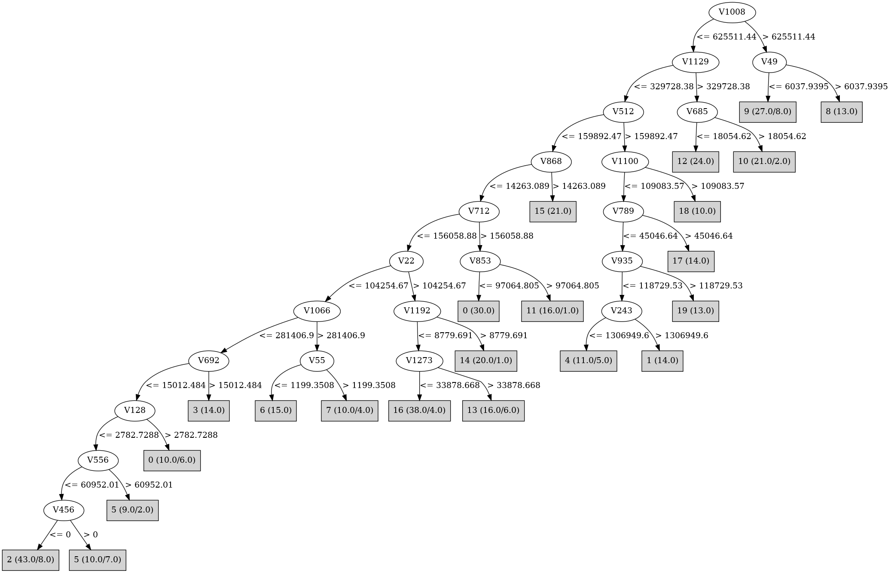

# J48

# SimpleCart Decision Tree

V980 < 51078.1125

* V22 < 108487.813

*   * V399 < 242569.075

*   *   * V409 < 22380.367

*   *   *   * V1008 < 1257626.775

*   *   *   *   * V85 < 1541825.75

*   *   *   *   *   * V243 < 138810.13

*   *   *   *   *   *   * V684 < 266060.44

*   *   *   *   *   *   *   * V1066 < 281100.09: 11(13.0/54.0)

*   *   *   *   *   *   *   * V1066 >= 281100.09: 6(18.0/6.0)

*   *   *   *   *   *   * V684 >= 266060.44: 17(16.0/1.0)

*   *   *   *   *   * V243 >= 138810.13

*   *   *   *   *   *   * V935 < 148336.25: 1(16.0/4.0)

*   *   *   *   *   *   * V935 >= 148336.25: 19(14.0/0.0)

*   *   *   *   * V85 >= 1541825.75: 3(18.0/1.0)

*   *   *   * V1008 >= 1257626.775

*   *   *   *   * V890 < 10009.71: 8(17.0/3.0)

*   *   *   *   * V890 >= 10009.71: 9(16.0/3.0)

*   *   * V409 >= 22380.367

*   *   *   * V685 < 19454.338499999998: 12(23.0/0.0)

*   *   *   * V685 >= 19454.338499999998: 10(19.0/2.0)

*   * V399 >= 242569.075: 2(26.0/1.0)

* V22 >= 108487.813

*   * V868 < 69440.875

*   *   * V1192 < 25518.578

*   *   *   * V1273 < 34134.38250000001: 16(34.0/7.0)

*   *   *   * V1273 >= 34134.38250000001: 13(10.0/6.0)

*   *   * V1192 >= 25518.578: 14(19.0/0.0)

*   * V868 >= 69440.875: 15(19.0/0.0)

V980 >= 51078.1125: 0(30.0/3.0)

# PART

Decision list:

conditions|predicted class
---|---
V1181 > 1266894 AND V590 <= 27677.92| 12 (12.0)
V408 <= 49453.527 AND V871 > 43984.848 AND V70 > 28319.06| 9 (10.0/2.0)
V408 <= 49453.527 AND V1169 <= 168784.3 AND V980 > 524650.4| 0 (17.0)
V408 <= 49453.527 AND V712 <= 28163.512 AND V1169 <= 168784.3 AND V243 > 78772.64 AND V1021 <= 227765.19| 19 (15.0/7.0)
V243 <= 371678.4 AND V408 <= 49453.527 AND V712 <= 28163.512 AND V1008 <= 625511.44 AND V684 <= 284619.16 AND V55 <= 8489.553 AND V868 <= 14263.089 AND V1215 > 45490.656 AND V1192 <= 13720.148| 16 (29.0/11.0)
V408 <= 49453.527 AND V712 <= 28163.512 AND V787 <= 356238.56 AND V868 <= 116036.01 AND V1215 <= 182778.36 AND V368 <= 344399.38 AND V1008 <= 36258.215 AND V1066 <= 314982.38 AND V574 > 7388.376| 2 (16.0/3.0)
V243 <= 371678.4 AND V328 <= 4524.26 AND V712 <= 28163.512 AND V868 <= 116036.01 AND V1215 <= 182778.36 AND V368 > 344399.38| 17 (13.0/5.0)
V243 <= 371678.4 AND V328 <= 4524.26 AND V712 <= 28163.512 AND V868 <= 116036.01 AND V953 <= 27523.244 AND V685 <= 28609.969 AND V1066 <= 294278.28| 2 (18.0/13.0)
V243 <= 371678.4 AND V328 <= 4524.26 AND V167 <= 29038.059 AND V620 <= 27872.79 AND V868 <= 14263.089| 14 (10.0)
V243 <= 371678.4 AND V328 <= 4524.26 AND V167 <= 29038.059 AND V430 <= 37258.56 AND V712 <= 28163.512| 6 (13.0/4.0)
V121 <= 322023.62 AND V59 > 11068.345| 10 (10.0/1.0)
V121 > 322023.62| 8 (10.0/2.0)
V243 <= 371678.4 AND V60 <= 20355.738| 15 (9.0)
V243 <= 371678.4| 11 (9.0)
| 1 (9.0/1.0)

# JRip

Decision list:

conditions|predicted class
---|---
(V1066 >= 563697.06) and (V1262 >= 14419.495)|7 (5.0/0.0)
(V846 >= 730877.06)|4 (6.0/0.0)
(V1100 >= 701173.9) and (V37 <= 0)|18 (9.0/0.0)
(V303 >= 405655.97)|5 (7.0/0.0)
(V140 >= 1434876.6)|5 (4.0/0.0)
(V48 >= 497063.53) and (V128 >= 597961.1)|13 (9.0/0.0)
(V757 >= 236745.28) and (V22 >= 314957.75)|13 (3.0/0.0)
(V787 >= 407466.2) and (V1021 >= 1081649.1)|1 (12.0/0.0)
(V715 >= 4481576)|1 (4.0/1.0)
(V1172 >= 16507.904)|11 (13.0/0.0)
(V431 >= 145132.52)|11 (5.0/2.0)
(V684 >= 284619.16)|17 (16.0/0.0)
(V896 >= 60633.516) and (V243 >= 287155.5)|19 (15.0/0.0)
(V243 >= 2464757.2)|3 (14.0/0.0)
(V1057 >= 111818.625)|3 (5.0/1.0)
(V167 >= 383138.44) and (V890 >= 20019.42)|9 (18.0/2.0)
(V753 >= 992756.25)|9 (4.0/1.0)
(V544 >= 5132.244)|6 (23.0/6.0)
(V590 >= 34861.918) and (V994 >= 16156.216)|10 (19.0/1.0)
(V121 >= 773061.94)|8 (16.0/0.0)
(V868 >= 138881.75)|15 (20.0/1.0)
(V953 >= 12861.946) and (V1215 >= 402328.12)|14 (20.0/0.0)
(V97 >= 12135.685) and (V3 >= 484038.66)|14 (3.0/0.0)
(V1150 >= 88160.5)|12 (25.0/0.0)
(V545 >= 11317.501)|0 (36.0/1.0)
(V70 >= 489936.03)|2 (24.0/0.0)
(V439 >= 52891.094)|2 (7.0/0.0)
(V23 >= 5164.8506) and (V23 <= 18882.174)|2 (4.0/0.0)
|16 (53.0/15.0)

# Decision Table

Non matches covered by Majority class

v22|v128|v218|v348|v512|v620|v647|v662|v672|v729|v839|v1129|v1259|v1261|target
---|---|---|---|---|---|---|---|---|---|---|---|---|---|---
(-inf-112833.265]|(-inf-180435.025]|(-inf-5121.908]|all|(-inf-164176.14]|(-inf-56399.7065]|all|all|(130383.425-inf)|(54121.775-inf)|all|(-inf-362288.79]|(7170.5975-inf)|(41119.284-inf)|0
(112833.265-inf)|(180435.025-inf)|(5121.908-inf)|all|(-inf-164176.14]|(-inf-56399.7065]|all|all|(-inf-130383.425]|(54121.775-inf)|all|(-inf-362288.79]|(7170.5975-inf)|(41119.284-inf)|15
(-inf-112833.265]|(-inf-180435.025]|(-inf-5121.908]|all|(164176.14-inf)|(-inf-56399.7065]|all|all|(-inf-130383.425]|(54121.775-inf)|all|(2280965.25-inf)|(-inf-7170.5975]|(-inf-41119.284]|0
(112833.265-inf)|(180435.025-inf)|(-inf-5121.908]|all|(-inf-164176.14]|(-inf-56399.7065]|all|all|(-inf-130383.425]|(54121.775-inf)|all|(-inf-362288.79]|(7170.5975-inf)|(41119.284-inf)|15
(112833.265-inf)|(-inf-180435.025]|(-inf-5121.908]|all|(-inf-164176.14]|(-inf-56399.7065]|all|all|(-inf-130383.425]|(54121.775-inf)|all|(-inf-362288.79]|(7170.5975-inf)|(41119.284-inf)|0
(-inf-112833.265]|(-inf-180435.025]|(-inf-5121.908]|all|(-inf-164176.14]|(-inf-56399.7065]|all|all|(130383.425-inf)|(-inf-54121.775]|all|(-inf-362288.79]|(7170.5975-inf)|(41119.284-inf)|0
(112833.265-inf)|(180435.025-inf)|(-inf-5121.908]|all|(-inf-164176.14]|(-inf-56399.7065]|all|all|(130383.425-inf)|(54121.775-inf)|all|(-inf-362288.79]|(-inf-7170.5975]|(41119.284-inf)|0
(-inf-112833.265]|(-inf-180435.025]|(-inf-5121.908]|all|(-inf-164176.14]|(-inf-56399.7065]|all|all|(-inf-130383.425]|(54121.775-inf)|all|(2280965.25-inf)|(-inf-7170.5975]|(-inf-41119.284]|0
(-inf-112833.265]|(-inf-180435.025]|(-inf-5121.908]|all|(164176.14-inf)|(56399.7065-2362556.2]|all|all|(-inf-130383.425]|(-inf-54121.775]|all|(2280965.25-inf)|(-inf-7170.5975]|(-inf-41119.284]|0
(112833.265-inf)|(-inf-180435.025]|(-inf-5121.908]|all|(-inf-164176.14]|(-inf-56399.7065]|all|all|(130383.425-inf)|(54121.775-inf)|all|(-inf-362288.79]|(-inf-7170.5975]|(41119.284-inf)|0
(112833.265-inf)|(180435.025-inf)|(5121.908-inf)|all|(-inf-164176.14]|(-inf-56399.7065]|all|all|(-inf-130383.425]|(-inf-54121.775]|all|(-inf-362288.79]|(7170.5975-inf)|(41119.284-inf)|0
(-inf-112833.265]|(-inf-180435.025]|(-inf-5121.908]|all|(-inf-164176.14]|(56399.7065-2362556.2]|all|all|(-inf-130383.425]|(-inf-54121.775]|all|(2280965.25-inf)|(-inf-7170.5975]|(-inf-41119.284]|0
(112833.265-inf)|(180435.025-inf)|(-inf-5121.908]|all|(-inf-164176.14]|(-inf-56399.7065]|all|all|(-inf-130383.425]|(-inf-54121.775]|all|(-inf-362288.79]|(7170.5975-inf)|(41119.284-inf)|0
(-inf-112833.265]|(-inf-180435.025]|(-inf-5121.908]|all|(164176.14-inf)|(-inf-56399.7065]|all|all|(-inf-130383.425]|(-inf-54121.775]|all|(2280965.25-inf)|(-inf-7170.5975]|(-inf-41119.284]|12
(-inf-112833.265]|(-inf-180435.025]|(-inf-5121.908]|all|(164176.14-inf)|(-inf-56399.7065]|all|all|(130383.425-inf)|(-inf-54121.775]|all|(-inf-362288.79]|(-inf-7170.5975]|(41119.284-inf)|1
(112833.265-inf)|(180435.025-inf)|(5121.908-inf)|all|(-inf-164176.14]|(-inf-56399.7065]|all|all|(-inf-130383.425]|(54121.775-inf)|all|(-inf-362288.79]|(-inf-7170.5975]|(41119.284-inf)|15
(112833.265-inf)|(-inf-180435.025]|(5121.908-inf)|all|(-inf-164176.14]|(-inf-56399.7065]|all|all|(-inf-130383.425]|(54121.775-inf)|all|(-inf-362288.79]|(-inf-7170.5975]|(41119.284-inf)|0
(112833.265-inf)|(180435.025-inf)|(-inf-5121.908]|all|(-inf-164176.14]|(-inf-56399.7065]|all|all|(-inf-130383.425]|(54121.775-inf)|all|(-inf-362288.79]|(-inf-7170.5975]|(41119.284-inf)|16
(-inf-112833.265]|(-inf-180435.025]|(-inf-5121.908]|all|(-inf-164176.14]|(-inf-56399.7065]|all|all|(-inf-130383.425]|(54121.775-inf)|all|(-inf-362288.79]|(-inf-7170.5975]|(41119.284-inf)|2
(-inf-112833.265]|(-inf-180435.025]|(-inf-5121.908]|all|(-inf-164176.14]|(-inf-56399.7065]|all|all|(-inf-130383.425]|(-inf-54121.775]|all|(2280965.25-inf)|(-inf-7170.5975]|(-inf-41119.284]|12
(112833.265-inf)|(-inf-180435.025]|(-inf-5121.908]|all|(-inf-164176.14]|(-inf-56399.7065]|all|all|(-inf-130383.425]|(54121.775-inf)|all|(-inf-362288.79]|(-inf-7170.5975]|(41119.284-inf)|14
(-inf-112833.265]|(-inf-180435.025]|(-inf-5121.908]|all|(164176.14-inf)|(56399.7065-2362556.2]|all|all|(-inf-130383.425]|(-inf-54121.775]|all|(-inf-362288.79]|(7170.5975-inf)|(-inf-41119.284]|0
(-inf-112833.265]|(-inf-180435.025]|(-inf-5121.908]|all|(-inf-164176.14]|(-inf-56399.7065]|all|all|(130383.425-inf)|(-inf-54121.775]|all|(-inf-362288.79]|(-inf-7170.5975]|(41119.284-inf)|0
(-inf-112833.265]|(-inf-180435.025]|(-inf-5121.908]|all|(-inf-164176.14]|(-inf-56399.7065]|all|all|(-inf-130383.425]|(54121.775-inf)|all|(-inf-362288.79]|(7170.5975-inf)|(-inf-41119.284]|0
(112833.265-inf)|(180435.025-inf)|(-inf-5121.908]|all|(-inf-164176.14]|(2362556.2-inf)|all|all|(-inf-130383.425]|(54121.775-inf)|all|(-inf-362288.79]|(-inf-7170.5975]|(-inf-41119.284]|0
(-inf-112833.265]|(180435.025-inf)|(-inf-5121.908]|all|(-inf-164176.14]|(2362556.2-inf)|all|all|(-inf-130383.425]|(54121.775-inf)|all|(-inf-362288.79]|(-inf-7170.5975]|(-inf-41119.284]|0
(-inf-112833.265]|(-inf-180435.025]|(-inf-5121.908]|all|(-inf-164176.14]|(-inf-56399.7065]|all|all|(-inf-130383.425]|(54121.775-inf)|all|(362288.79-2280965.25]|(-inf-7170.5975]|(-inf-41119.284]|8
(-inf-112833.265]|(180435.025-inf)|(-inf-5121.908]|all|(-inf-164176.14]|(2362556.2-inf)|all|all|(130383.425-inf)|(-inf-54121.775]|all|(-inf-362288.79]|(-inf-7170.5975]|(-inf-41119.284]|0
(112833.265-inf)|(-inf-180435.025]|(-inf-5121.908]|all|(-inf-164176.14]|(56399.7065-2362556.2]|all|all|(-inf-130383.425]|(-inf-54121.775]|all|(-inf-362288.79]|(-inf-7170.5975]|(41119.284-inf)|0
(-inf-112833.265]|(-inf-180435.025]|(-inf-5121.908]|all|(-inf-164176.14]|(56399.7065-2362556.2]|all|all|(-inf-130383.425]|(-inf-54121.775]|all|(-inf-362288.79]|(-inf-7170.5975]|(41119.284-inf)|0
(-inf-112833.265]|(-inf-180435.025]|(-inf-5121.908]|all|(-inf-164176.14]|(-inf-56399.7065]|all|all|(130383.425-inf)|(54121.775-inf)|all|(-inf-362288.79]|(-inf-7170.5975]|(-inf-41119.284]|0
(-inf-112833.265]|(-inf-180435.025]|(-inf-5121.908]|all|(164176.14-inf)|(-inf-56399.7065]|all|all|(-inf-130383.425]|(-inf-54121.775]|all|(-inf-362288.79]|(-inf-7170.5975]|(41119.284-inf)|19
(-inf-112833.265]|(-inf-180435.025]|(-inf-5121.908]|all|(-inf-164176.14]|(56399.7065-2362556.2]|all|all|(-inf-130383.425]|(-inf-54121.775]|all|(362288.79-2280965.25]|(-inf-7170.5975]|(-inf-41119.284]|0
(112833.265-inf)|(180435.025-inf)|(5121.908-inf)|all|(-inf-164176.14]|(-inf-56399.7065]|all|all|(-inf-130383.425]|(-inf-54121.775]|all|(-inf-362288.79]|(-inf-7170.5975]|(41119.284-inf)|0
(-inf-112833.265]|(180435.025-inf)|(-inf-5121.908]|all|(-inf-164176.14]|(56399.7065-2362556.2]|all|all|(-inf-130383.425]|(54121.775-inf)|all|(-inf-362288.79]|(-inf-7170.5975]|(-inf-41119.284]|0
(-inf-112833.265]|(-inf-180435.025]|(-inf-5121.908]|all|(-inf-164176.14]|(56399.7065-2362556.2]|all|all|(-inf-130383.425]|(54121.775-inf)|all|(-inf-362288.79]|(-inf-7170.5975]|(-inf-41119.284]|2
(112833.265-inf)|(180435.025-inf)|(-inf-5121.908]|all|(-inf-164176.14]|(-inf-56399.7065]|all|all|(-inf-130383.425]|(-inf-54121.775]|all|(-inf-362288.79]|(-inf-7170.5975]|(41119.284-inf)|13
(-inf-112833.265]|(180435.025-inf)|(-inf-5121.908]|all|(-inf-164176.14]|(-inf-56399.7065]|all|all|(-inf-130383.425]|(-inf-54121.775]|all|(-inf-362288.79]|(-inf-7170.5975]|(41119.284-inf)|3
(112833.265-inf)|(-inf-180435.025]|(-inf-5121.908]|all|(-inf-164176.14]|(-inf-56399.7065]|all|all|(-inf-130383.425]|(-inf-54121.775]|all|(-inf-362288.79]|(-inf-7170.5975]|(41119.284-inf)|14
(-inf-112833.265]|(-inf-180435.025]|(-inf-5121.908]|all|(-inf-164176.14]|(-inf-56399.7065]|all|all|(-inf-130383.425]|(-inf-54121.775]|all|(-inf-362288.79]|(-inf-7170.5975]|(41119.284-inf)|2
(-inf-112833.265]|(-inf-180435.025]|(-inf-5121.908]|all|(-inf-164176.14]|(-inf-56399.7065]|all|all|(-inf-130383.425]|(-inf-54121.775]|all|(-inf-362288.79]|(7170.5975-inf)|(-inf-41119.284]|4
(112833.265-inf)|(180435.025-inf)|(-inf-5121.908]|all|(-inf-164176.14]|(2362556.2-inf)|all|all|(-inf-130383.425]|(-inf-54121.775]|all|(-inf-362288.79]|(-inf-7170.5975]|(-inf-41119.284]|11
(-inf-112833.265]|(-inf-180435.025]|(-inf-5121.908]|all|(-inf-164176.14]|(-inf-56399.7065]|all|all|(-inf-130383.425]|(-inf-54121.775]|all|(362288.79-2280965.25]|(-inf-7170.5975]|(-inf-41119.284]|12
(-inf-112833.265]|(180435.025-inf)|(-inf-5121.908]|all|(-inf-164176.14]|(2362556.2-inf)|all|all|(-inf-130383.425]|(-inf-54121.775]|all|(-inf-362288.79]|(-inf-7170.5975]|(-inf-41119.284]|0
(-inf-112833.265]|(-inf-180435.025]|(-inf-5121.908]|all|(-inf-164176.14]|(2362556.2-inf)|all|all|(-inf-130383.425]|(-inf-54121.775]|all|(-inf-362288.79]|(-inf-7170.5975]|(-inf-41119.284]|2
(-inf-112833.265]|(-inf-180435.025]|(-inf-5121.908]|all|(164176.14-inf)|(56399.7065-2362556.2]|all|all|(-inf-130383.425]|(-inf-54121.775]|all|(-inf-362288.79]|(-inf-7170.5975]|(-inf-41119.284]|17
(-inf-112833.265]|(-inf-180435.025]|(-inf-5121.908]|all|(-inf-164176.14]|(-inf-56399.7065]|all|all|(-inf-130383.425]|(54121.775-inf)|all|(-inf-362288.79]|(-inf-7170.5975]|(-inf-41119.284]|9
(-inf-112833.265]|(180435.025-inf)|(-inf-5121.908]|all|(-inf-164176.14]|(56399.7065-2362556.2]|all|all|(-inf-130383.425]|(-inf-54121.775]|all|(-inf-362288.79]|(-inf-7170.5975]|(-inf-41119.284]|0
(-inf-112833.265]|(-inf-180435.025]|(-inf-5121.908]|all|(-inf-164176.14]|(56399.7065-2362556.2]|all|all|(-inf-130383.425]|(-inf-54121.775]|all|(-inf-362288.79]|(-inf-7170.5975]|(-inf-41119.284]|6
(-inf-112833.265]|(-inf-180435.025]|(-inf-5121.908]|all|(164176.14-inf)|(-inf-56399.7065]|all|all|(-inf-130383.425]|(-inf-54121.775]|all|(-inf-362288.79]|(-inf-7170.5975]|(-inf-41119.284]|4
(112833.265-inf)|(-inf-180435.025]|(-inf-5121.908]|all|(-inf-164176.14]|(-inf-56399.7065]|all|all|(-inf-130383.425]|(-inf-54121.775]|all|(-inf-362288.79]|(-inf-7170.5975]|(-inf-41119.284]|0
(-inf-112833.265]|(-inf-180435.025]|(-inf-5121.908]|all|(-inf-164176.14]|(-inf-56399.7065]|all|all|(-inf-130383.425]|(-inf-54121.775]|all|(-inf-362288.79]|(-inf-7170.5975]|(-inf-41119.284]|5

