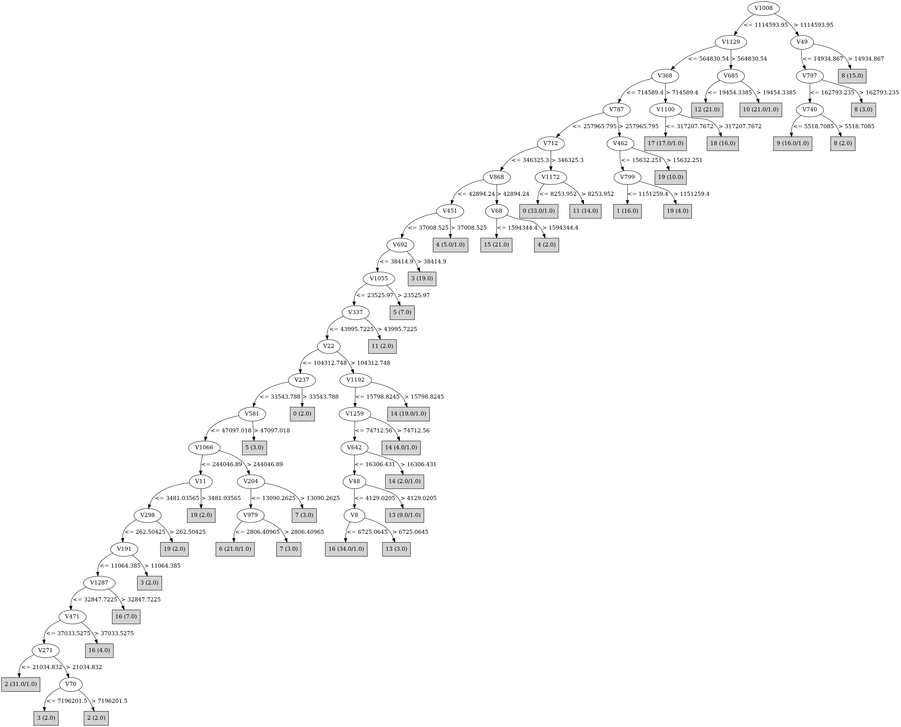

# J48

# SimpleCart Decision Tree

V712 < 346325.3

* V22 < 53802.894499999995

*   * V408 < 7720.8685

*   *   * V1008 < 747098.965

*   *   *   * V368 < 636906.78

*   *   *   *   * V692 < 47994.032

*   *   *   *   *   * V1066 < 281100.09

*   *   *   *   *   *   * V243 < 174839.11

*   *   *   *   *   *   *   * V976 < 31075.3905: 2(11.0/35.0)

*   *   *   *   *   *   *   * V976 >= 31075.3905: 2(21.0/1.0)

*   *   *   *   *   *   * V243 >= 174839.11

*   *   *   *   *   *   *   * V935 < 5102.037: 1(12.0/4.0)

*   *   *   *   *   *   *   * V935 >= 5102.037: 19(13.0/0.0)

*   *   *   *   *   * V1066 >= 281100.09: 6(20.0/8.0)

*   *   *   *   * V692 >= 47994.032: 3(19.0/2.0)

*   *   *   * V368 >= 636906.78

*   *   *   *   * V1100 < 317207.7672: 17(16.0/0.0)

*   *   *   *   * V1100 >= 317207.7672: 18(16.0/0.0)

*   *   * V1008 >= 747098.965

*   *   *   * V49 < 14934.867

*   *   *   *   * V753 < 50396.915: 8(6.0/4.0)

*   *   *   *   * V753 >= 50396.915: 9(10.0/0.0)

*   *   *   * V49 >= 14934.867: 8(15.0/0.0)

*   * V408 >= 7720.8685

*   *   * V685 < 34815.983: 12(21.0/1.0)

*   *   * V685 >= 34815.983: 10(19.0/1.0)

* V22 >= 53802.894499999995

*   * V868 < 69440.875

*   *   * V1192 < 25518.578

*   *   *   * V48 < 4129.0205: 16(35.0/13.0)

*   *   *   * V48 >= 4129.0205: 13(8.0/2.0)

*   *   * V1192 >= 25518.578: 14(19.0/0.0)

*   * V868 >= 69440.875: 15(19.0/0.0)

V712 >= 346325.3

* V853 < 100020.275: 0(31.0/1.0)

* V853 >= 100020.275: 11(15.0/1.0)

# PART

Decision list:

conditions|predicted class
---|---
V1008 > 1062522.0 AND V49 > 12840.259| 8 (15.0)
V368 > 669666.3 AND V1100 <= 258601.38| 17 (17.0/1.0)
V186 <= 851147.4 AND V1129 > 734791.94 AND V685 <= 18054.62| 12 (23.0/2.0)
V186 <= 851147.4 AND V1169 <= 46526.777 AND V1129 > 329728.38| 10 (23.0/3.0)
V186 <= 851147.4 AND V1169 > 46526.777| 9 (17.0/4.0)
V186 > 851147.4| 18 (16.0)
V787 > 241020.12 AND V462 <= 7709.0884 AND V64 <= 25445.586| 1 (14.0)
V712 > 329868.94 AND V820 <= 9766.783| 0 (33.0/1.0)
V959 <= 1855268.8 AND V787 <= 274911.47 AND V750 <= 624295.0 AND V868 <= 0.0 AND V343 <= 24329.744 AND V692 <= 19158.264 AND V22 > 104254.67 AND V1192 <= 13720.148 AND V1273 <= 43441.58 AND V48 <= 181157.55| 16 (35.0/2.0)
V937 > 33396.8 AND V868 <= 0.0 AND V22 > 123932.5 AND V1161 <= 15022.422| 14 (21.0/1.0)
V846 <= 233897.78 AND V937 > 33396.8 AND V868 > 0.0| 15 (21.0)
V451 <= 24706.865 AND V1066 > 281406.9 AND V171 <= 69276.9| 6 (25.0/5.0)
V451 <= 24706.865 AND V343 > 35415.707| 11 (15.0/1.0)
V451 <= 24706.865 AND V284 <= 4115.7393 AND V22 > 145062.08 AND V947 > 0.0| 13 (9.0)
V22 <= 301105.6 AND V464 <= 55814.1 AND V284 <= 4115.7393 AND V512 <= 146800.05 AND V303 <= 319578.12 AND V692 <= 19158.264 AND V1287 <= 32327.25 AND V789 <= 0.0| 2 (42.0/9.0)
V22 <= 192524.64 AND V85 > 78275.484| 3 (20.0/1.0)
V22 <= 192524.64 AND V464 <= 48534.42 AND V284 <= 4115.7393 AND V303 <= 253943.33 AND V243 > 0.0| 19 (19.0/2.0)
V22 <= 192524.64 AND V464 <= 48534.42 AND V284 <= 4115.7393 AND V303 <= 253943.33| 16 (10.0)
V22 <= 169133.17 AND V233 <= 12744.477 AND V284 <= 4115.7393| 5 (8.0)
V22 <= 155751.95 AND V233 > 12744.477| 4 (6.0)
V22 <= 155751.95| 7 (5.0/2.0)
| 14 (5.0/2.0)

# JRip

Decision list:

conditions|predicted class
---|---
(V846 >= 730877.06)|4 (5.0/0.0)
(V1066 >= 679895.94) and (V336 >= 44840.184) and (V670 <= 25466.81)|7 (6.0/0.0)
(V511 >= 923047.5)|5 (8.0/0.0)
(V1161 >= 31925.34) and (V579 >= 1120780.6) and (V3 <= 0)|13 (12.0/0.0)
(V1008 >= 1166665.9) and (V890 >= 20019.42) and (V740 <= 0)|9 (12.0/0.0)
(V787 >= 274911.47) and (V1021 >= 53068.727) and (V799 <= 0)|1 (16.0/0.0)
(V1100 >= 627092.3) and (V186 >= 1068641.2)|18 (16.0/0.0)
(V368 >= 759512.5) and (V9 <= 106826.83)|17 (16.0/0.0)
(V1172 >= 16507.904) and (V3 <= 17334.658)|11 (14.0/0.0)
(V896 >= 60633.516) and (V221 >= 687251.06)|19 (15.0/0.0)
(V1129 >= 2199834) and (V685 >= 21871.734) and (V229 <= 30184.232)|10 (20.0/0.0)
(V544 >= 5132.244) and (V1066 >= 865741.1)|6 (16.0/0.0)
(V1008 >= 2435071) and (V753 <= 941564.7)|8 (20.0/0.0)
(V1129 >= 799932.7)|12 (22.0/0.0)
(V868 >= 138881.75)|15 (21.0/0.0)
(V692 >= 76829.8) and (V16 <= 0)|3 (19.0/0.0)
(V953 >= 12861.946) and (V1192 >= 31497.955)|14 (19.0/0.0)
(V70 >= 369935.16) and (V8 <= 133813.14)|2 (19.0/0.0)
(V1265 >= 29389.93) and (V143 >= 107112.97)|2 (5.0/0.0)
(V439 >= 52891.094) and (V17 <= 0)|2 (5.0/0.0)
(V545 >= 6836.5737) and (V10 <= 7972.9575)|0 (32.0/0.0)
|16 (81.0/37.0)

# Decision Table

Non matches covered by Majority class

v22|v64|v175|v177|v377|v512|v563|v627|v687|v692|v712|v740|v756|v868|v959|v1021|v1129|v1169|v1172|v1235|v1261|target
---|---|---|---|---|---|---|---|---|---|---|---|---|---|---|---|---|---|---|---|---|---
(-inf-108658.2]|all|all|all|all|(258859.22-inf)|all|all|all|(-inf-7506.242]|(205567.925-inf)|all|all|(106268.575-inf)|(-inf-2628266.5]|(46520.1055-inf)|(-inf-259134.55]|(-inf-55769.5785]|(-inf-14821.7505]|all|(41119.284-inf)|1
(-inf-108658.2]|all|all|all|all|(258859.22-inf)|all|all|all|(7506.242-inf)|(-inf-205567.925]|all|all|(106268.575-inf)|(-inf-2628266.5]|(46520.1055-inf)|(-inf-259134.55]|(-inf-55769.5785]|(-inf-14821.7505]|all|(41119.284-inf)|1
(-inf-108658.2]|all|all|all|all|(258859.22-inf)|all|all|all|(-inf-7506.242]|(-inf-205567.925]|all|all|(106268.575-inf)|(-inf-2628266.5]|(46520.1055-inf)|(-inf-259134.55]|(-inf-55769.5785]|(-inf-14821.7505]|all|(41119.284-inf)|19
(108658.2-inf)|all|all|all|all|(-inf-34210.1325]|all|all|all|(-inf-7506.242]|(-inf-205567.925]|all|all|(106268.575-inf)|(-inf-2628266.5]|(-inf-46520.1055]|(-inf-259134.55]|(-inf-55769.5785]|(14821.7505-inf)|all|(41119.284-inf)|0
(-inf-108658.2]|all|all|all|all|(258859.22-inf)|all|all|all|(-inf-7506.242]|(205567.925-inf)|all|all|(42894.24-106268.575]|(-inf-2628266.5]|(46520.1055-inf)|(-inf-259134.55]|(-inf-55769.5785]|(-inf-14821.7505]|all|(-inf-41119.284]|0
(-inf-108658.2]|all|all|all|all|(-inf-34210.1325]|all|all|all|(-inf-7506.242]|(-inf-205567.925]|all|all|(106268.575-inf)|(-inf-2628266.5]|(-inf-46520.1055]|(-inf-259134.55]|(-inf-55769.5785]|(-inf-14821.7505]|all|(41119.284-inf)|15
(108658.2-inf)|all|all|all|all|(-inf-34210.1325]|all|all|all|(-inf-7506.242]|(-inf-205567.925]|all|all|(106268.575-inf)|(-inf-2628266.5]|(-inf-46520.1055]|(-inf-259134.55]|(-inf-55769.5785]|(-inf-14821.7505]|all|(41119.284-inf)|15
(-inf-108658.2]|all|all|all|all|(258859.22-inf)|all|all|all|(-inf-7506.242]|(-inf-205567.925]|all|all|(-inf-42894.24]|(-inf-2628266.5]|(46520.1055-inf)|(-inf-259134.55]|(-inf-55769.5785]|(-inf-14821.7505]|all|(41119.284-inf)|1
(-inf-108658.2]|all|all|all|all|(258859.22-inf)|all|all|all|(-inf-7506.242]|(-inf-205567.925]|all|all|(-inf-42894.24]|(-inf-2628266.5]|(-inf-46520.1055]|(2280965.25-inf)|(-inf-55769.5785]|(-inf-14821.7505]|all|(-inf-41119.284]|10
(-inf-108658.2]|all|all|all|all|(-inf-34210.1325]|all|all|all|(7506.242-inf)|(-inf-205567.925]|all|all|(-inf-42894.24]|(-inf-2628266.5]|(46520.1055-inf)|(-inf-259134.55]|(55769.5785-inf)|(-inf-14821.7505]|all|(-inf-41119.284]|0
(-inf-108658.2]|all|all|all|all|(34210.1325-258859.22]|all|all|all|(-inf-7506.242]|(-inf-205567.925]|all|all|(-inf-42894.24]|(-inf-2628266.5]|(-inf-46520.1055]|(2280965.25-inf)|(-inf-55769.5785]|(-inf-14821.7505]|all|(-inf-41119.284]|10
(-inf-108658.2]|all|all|all|all|(-inf-34210.1325]|all|all|all|(-inf-7506.242]|(-inf-205567.925]|all|all|(-inf-42894.24]|(-inf-2628266.5]|(-inf-46520.1055]|(259134.55-2280965.25]|(-inf-55769.5785]|(-inf-14821.7505]|all|(41119.284-inf)|0
(108658.2-inf)|all|all|all|all|(-inf-34210.1325]|all|all|all|(-inf-7506.242]|(-inf-205567.925]|all|all|(-inf-42894.24]|(-inf-2628266.5]|(46520.1055-inf)|(-inf-259134.55]|(-inf-55769.5785]|(-inf-14821.7505]|all|(41119.284-inf)|14
(-inf-108658.2]|all|all|all|all|(34210.1325-258859.22]|all|all|all|(-inf-7506.242]|(205567.925-inf)|all|all|(-inf-42894.24]|(-inf-2628266.5]|(-inf-46520.1055]|(-inf-259134.55]|(-inf-55769.5785]|(14821.7505-inf)|all|(-inf-41119.284]|11
(-inf-108658.2]|all|all|all|all|(-inf-34210.1325]|all|all|all|(-inf-7506.242]|(-inf-205567.925]|all|all|(-inf-42894.24]|(-inf-2628266.5]|(-inf-46520.1055]|(259134.55-2280965.25]|(55769.5785-inf)|(-inf-14821.7505]|all|(-inf-41119.284]|8
(-inf-108658.2]|all|all|all|all|(-inf-34210.1325]|all|all|all|(-inf-7506.242]|(-inf-205567.925]|all|all|(-inf-42894.24]|(-inf-2628266.5]|(46520.1055-inf)|(-inf-259134.55]|(55769.5785-inf)|(-inf-14821.7505]|all|(-inf-41119.284]|0
(-inf-108658.2]|all|all|all|all|(-inf-34210.1325]|all|all|all|(-inf-7506.242]|(-inf-205567.925]|all|all|(-inf-42894.24]|(-inf-2628266.5]|(-inf-46520.1055]|(2280965.25-inf)|(-inf-55769.5785]|(-inf-14821.7505]|all|(-inf-41119.284]|10
(-inf-108658.2]|all|all|all|all|(-inf-34210.1325]|all|all|all|(-inf-7506.242]|(205567.925-inf)|all|all|(-inf-42894.24]|(-inf-2628266.5]|(-inf-46520.1055]|(-inf-259134.55]|(-inf-55769.5785]|(-inf-14821.7505]|all|(41119.284-inf)|0
(-inf-108658.2]|all|all|all|all|(258859.22-inf)|all|all|all|(-inf-7506.242]|(-inf-205567.925]|all|all|(-inf-42894.24]|(-inf-2628266.5]|(-inf-46520.1055]|(-inf-259134.55]|(-inf-55769.5785]|(-inf-14821.7505]|all|(41119.284-inf)|19
(-inf-108658.2]|all|all|all|all|(-inf-34210.1325]|all|all|all|(7506.242-inf)|(-inf-205567.925]|all|all|(-inf-42894.24]|(-inf-2628266.5]|(-inf-46520.1055]|(-inf-259134.55]|(-inf-55769.5785]|(-inf-14821.7505]|all|(41119.284-inf)|3
(108658.2-inf)|all|all|all|all|(-inf-34210.1325]|all|all|all|(-inf-7506.242]|(205567.925-inf)|all|all|(-inf-42894.24]|(-inf-2628266.5]|(-inf-46520.1055]|(-inf-259134.55]|(-inf-55769.5785]|(14821.7505-inf)|all|(-inf-41119.284]|11
(-inf-108658.2]|all|all|all|all|(-inf-34210.1325]|all|all|all|(-inf-7506.242]|(205567.925-inf)|all|all|(-inf-42894.24]|(-inf-2628266.5]|(-inf-46520.1055]|(-inf-259134.55]|(-inf-55769.5785]|(14821.7505-inf)|all|(-inf-41119.284]|11
(108658.2-inf)|all|all|all|all|(-inf-34210.1325]|all|all|all|(-inf-7506.242]|(-inf-205567.925]|all|all|(106268.575-inf)|(-inf-2628266.5]|(-inf-46520.1055]|(-inf-259134.55]|(-inf-55769.5785]|(-inf-14821.7505]|all|(-inf-41119.284]|15
(-inf-108658.2]|all|all|all|all|(258859.22-inf)|all|all|all|(-inf-7506.242]|(-inf-205567.925]|all|all|(-inf-42894.24]|(-inf-2628266.5]|(46520.1055-inf)|(-inf-259134.55]|(-inf-55769.5785]|(-inf-14821.7505]|all|(-inf-41119.284]|0
(-inf-108658.2]|all|all|all|all|(-inf-34210.1325]|all|all|all|(-inf-7506.242]|(205567.925-inf)|all|all|(-inf-42894.24]|(-inf-2628266.5]|(46520.1055-inf)|(-inf-259134.55]|(-inf-55769.5785]|(-inf-14821.7505]|all|(-inf-41119.284]|0
(-inf-108658.2]|all|all|all|all|(258859.22-inf)|all|all|all|(-inf-7506.242]|(-inf-205567.925]|all|all|(42894.24-106268.575]|(-inf-2628266.5]|(-inf-46520.1055]|(-inf-259134.55]|(-inf-55769.5785]|(-inf-14821.7505]|all|(-inf-41119.284]|0
(-inf-108658.2]|all|all|all|all|(-inf-34210.1325]|all|all|all|(-inf-7506.242]|(-inf-205567.925]|all|all|(-inf-42894.24]|(-inf-2628266.5]|(-inf-46520.1055]|(-inf-259134.55]|(-inf-55769.5785]|(-inf-14821.7505]|all|(41119.284-inf)|2
(108658.2-inf)|all|all|all|all|(-inf-34210.1325]|all|all|all|(-inf-7506.242]|(-inf-205567.925]|all|all|(-inf-42894.24]|(-inf-2628266.5]|(-inf-46520.1055]|(-inf-259134.55]|(-inf-55769.5785]|(-inf-14821.7505]|all|(41119.284-inf)|16
(108658.2-inf)|all|all|all|all|(-inf-34210.1325]|all|all|all|(-inf-7506.242]|(-inf-205567.925]|all|all|(-inf-42894.24]|(-inf-2628266.5]|(-inf-46520.1055]|(-inf-259134.55]|(55769.5785-inf)|(-inf-14821.7505]|all|(-inf-41119.284]|0
(-inf-108658.2]|all|all|all|all|(-inf-34210.1325]|all|all|all|(-inf-7506.242]|(-inf-205567.925]|all|all|(-inf-42894.24]|(-inf-2628266.5]|(-inf-46520.1055]|(-inf-259134.55]|(55769.5785-inf)|(-inf-14821.7505]|all|(-inf-41119.284]|9
(-inf-108658.2]|all|all|all|all|(-inf-34210.1325]|all|all|all|(-inf-7506.242]|(-inf-205567.925]|all|all|(-inf-42894.24]|(-inf-2628266.5]|(-inf-46520.1055]|(259134.55-2280965.25]|(-inf-55769.5785]|(-inf-14821.7505]|all|(-inf-41119.284]|9
(-inf-108658.2]|all|all|all|all|(34210.1325-258859.22]|all|all|all|(-inf-7506.242]|(205567.925-inf)|all|all|(-inf-42894.24]|(-inf-2628266.5]|(-inf-46520.1055]|(-inf-259134.55]|(-inf-55769.5785]|(-inf-14821.7505]|all|(-inf-41119.284]|0
(-inf-108658.2]|all|all|all|all|(-inf-34210.1325]|all|all|all|(-inf-7506.242]|(-inf-205567.925]|all|all|(-inf-42894.24]|(-inf-2628266.5]|(46520.1055-inf)|(-inf-259134.55]|(-inf-55769.5785]|(-inf-14821.7505]|all|(-inf-41119.284]|0
(-inf-108658.2]|all|all|all|all|(-inf-34210.1325]|all|all|all|(-inf-7506.242]|(-inf-205567.925]|all|all|(-inf-42894.24]|(2628266.5-inf)|(-inf-46520.1055]|(-inf-259134.55]|(-inf-55769.5785]|(-inf-14821.7505]|all|(-inf-41119.284]|5
(-inf-108658.2]|all|all|all|all|(-inf-34210.1325]|all|all|all|(-inf-7506.242]|(205567.925-inf)|all|all|(-inf-42894.24]|(-inf-2628266.5]|(-inf-46520.1055]|(-inf-259134.55]|(-inf-55769.5785]|(-inf-14821.7505]|all|(-inf-41119.284]|0
(-inf-108658.2]|all|all|all|all|(258859.22-inf)|all|all|all|(-inf-7506.242]|(-inf-205567.925]|all|all|(-inf-42894.24]|(-inf-2628266.5]|(-inf-46520.1055]|(-inf-259134.55]|(-inf-55769.5785]|(-inf-14821.7505]|all|(-inf-41119.284]|18
(-inf-108658.2]|all|all|all|all|(34210.1325-258859.22]|all|all|all|(-inf-7506.242]|(-inf-205567.925]|all|all|(-inf-42894.24]|(-inf-2628266.5]|(-inf-46520.1055]|(-inf-259134.55]|(-inf-55769.5785]|(-inf-14821.7505]|all|(-inf-41119.284]|17
(108658.2-inf)|all|all|all|all|(-inf-34210.1325]|all|all|all|(-inf-7506.242]|(-inf-205567.925]|all|all|(-inf-42894.24]|(-inf-2628266.5]|(-inf-46520.1055]|(-inf-259134.55]|(-inf-55769.5785]|(-inf-14821.7505]|all|(-inf-41119.284]|13
(-inf-108658.2]|all|all|all|all|(-inf-34210.1325]|all|all|all|(-inf-7506.242]|(-inf-205567.925]|all|all|(-inf-42894.24]|(-inf-2628266.5]|(-inf-46520.1055]|(-inf-259134.55]|(-inf-55769.5785]|(-inf-14821.7505]|all|(-inf-41119.284]|6

