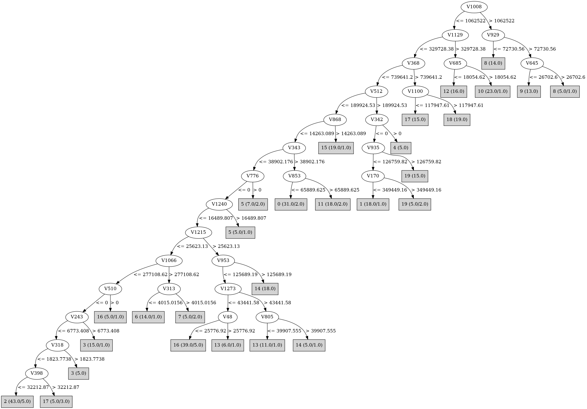

# J48

# SimpleCart Decision Tree

V70 < 267346.29

* V1023 < 25200.2635

*   * V22 < 104312.74799999999

*   *   * V409 < 44261.8495

*   *   *   * V787 < 116825.135

*   *   *   *   * V1261 < 245538.34499999997

*   *   *   *   *   * V936 < 2350949.35

*   *   *   *   *   *   * V368 < 410305.32999999996

*   *   *   *   *   *   *   * V712 < 205567.925

*   *   *   *   *   *   *   *   * V1066 < 196431.975

*   *   *   *   *   *   *   *   *   * V451 < 37008.525

*   *   *   *   *   *   *   *   *   *   * V1119 < 62148.2325

*   *   *   *   *   *   *   *   *   *   *   * V609 < 112656.8615

*   *   *   *   *   *   *   *   *   *   *   *   * V650 < 429.69725

*   *   *   *   *   *   *   *   *   *   *   *   *   * V87 < 37633.375

*   *   *   *   *   *   *   *   *   *   *   *   *   *   * V620 < 230728.885

*   *   *   *   *   *   *   *   *   *   *   *   *   *   *   * V3 < 54163.035

*   *   *   *   *   *   *   *   *   *   *   *   *   *   *   *   * V13 < 45163.25

*   *   *   *   *   *   *   *   *   *   *   *   *   *   *   *   *   * V189 < 360705.343

*   *   *   *   *   *   *   *   *   *   *   *   *   *   *   *   *   *   * V24 < 77320.54: 12(1.0/2.0)

*   *   *   *   *   *   *   *   *   *   *   *   *   *   *   *   *   *   * V24 >= 77320.54: 6(1.0/1.0)

*   *   *   *   *   *   *   *   *   *   *   *   *   *   *   *   *   * V189 >= 360705.343: 17(2.0/0.0)

*   *   *   *   *   *   *   *   *   *   *   *   *   *   *   *   * V13 >= 45163.25: 11(2.0/0.0)

*   *   *   *   *   *   *   *   *   *   *   *   *   *   *   * V3 >= 54163.035: 5(2.0/0.0)

*   *   *   *   *   *   *   *   *   *   *   *   *   *   * V620 >= 230728.885: 0(3.0/0.0)

*   *   *   *   *   *   *   *   *   *   *   *   *   * V87 >= 37633.375: 2(3.0/0.0)

*   *   *   *   *   *   *   *   *   *   *   *   * V650 >= 429.69725: 16(4.0/0.0)

*   *   *   *   *   *   *   *   *   *   *   * V609 >= 112656.8615: 5(7.0/1.0)

*   *   *   *   *   *   *   *   *   *   * V1119 >= 62148.2325: 9(5.0/0.0)

*   *   *   *   *   *   *   *   *   * V451 >= 37008.525: 4(8.0/0.0)

*   *   *   *   *   *   *   *   * V1066 >= 196431.975

*   *   *   *   *   *   *   *   *   * V92 < 336979.94

*   *   *   *   *   *   *   *   *   *   * V453 < 145485.3015: 6(14.0/0.0)

*   *   *   *   *   *   *   *   *   *   * V453 >= 145485.3015: 7(2.0/0.0)

*   *   *   *   *   *   *   *   *   * V92 >= 336979.94: 7(2.0/0.0)

*   *   *   *   *   *   *   * V712 >= 205567.925: 11(13.0/1.0)

*   *   *   *   *   *   * V368 >= 410305.32999999996

*   *   *   *   *   *   *   * V242 < 142922.03: 18(16.0/0.0)

*   *   *   *   *   *   *   * V242 >= 142922.03: 17(13.0/0.0)

*   *   *   *   *   * V936 >= 2350949.35: 8(16.0/1.0)

*   *   *   *   * V1261 >= 245538.34499999997

*   *   *   *   *   * V471 < 37033.5275

*   *   *   *   *   *   * V986 < 13144.53535: 3(21.0/0.0)

*   *   *   *   *   *   * V986 >= 13144.53535: 2(2.0/1.0)

*   *   *   *   *   * V471 >= 37033.5275: 16(4.0/1.0)

*   *   *   * V787 >= 116825.135

*   *   *   *   * V935 < 5102.037

*   *   *   *   *   * V799 < 1151259.4: 1(19.0/1.0)

*   *   *   *   *   * V799 >= 1151259.4: 19(3.0/1.0)

*   *   *   *   * V935 >= 5102.037: 19(16.0/0.0)

*   *   * V409 >= 44261.8495

*   *   *   * V685 < 19454.338499999998

*   *   *   *   * V23 < 86993.61: 12(15.0/0.0)

*   *   *   *   * V23 >= 86993.61: 2(2.0/0.0)

*   *   *   * V685 >= 19454.338499999998: 10(22.0/1.0)

*   * V22 >= 104312.74799999999

*   *   * V868 < 69440.875

*   *   *   * V953 < 147206.98

*   *   *   *   * V1273 < 45465.085

*   *   *   *   *   * V48 < 30026.672

*   *   *   *   *   *   * V538 < 45440.716499999995

*   *   *   *   *   *   *   * V807 < 25884.1975: 16(31.0/0.0)

*   *   *   *   *   *   *   * V807 >= 25884.1975

*   *   *   *   *   *   *   *   * V16 < 196178.55: 14(1.0/1.0)

*   *   *   *   *   *   *   *   * V16 >= 196178.55: 15(2.0/0.0)

*   *   *   *   *   *   * V538 >= 45440.716499999995: 11(3.0/1.0)

*   *   *   *   *   * V48 >= 30026.672: 13(5.0/1.0)

*   *   *   *   * V1273 >= 45465.085

*   *   *   *   *   * V805 < 42069.4535: 13(10.0/0.0)

*   *   *   *   *   * V805 >= 42069.4535: 14(4.0/1.0)

*   *   *   * V953 >= 147206.98: 14(18.0/0.0)

*   *   * V868 >= 69440.875: 15(17.0/0.0)

* V1023 >= 25200.2635

*   * V128 < 129664.8185

*   *   * V9 < 2676.03615: 18(3.0/1.0)

*   *   * V9 >= 2676.03615: 17(3.0/0.0)

*   * V128 >= 129664.8185: 0(29.0/0.0)

V70 >= 267346.29

* V24 < 439264.6775: 2(31.0/0.0)

* V24 >= 439264.6775: 9(8.0/0.0)

# PART

Decision list:

conditions|predicted class
---|---
V1008 > 1062522 AND V929 <= 72730.56| 8 (14.0)
V1129 > 329728.38 AND V685 <= 18054.62 AND V449 <= 46042.46| 12 (10.0)
V1169 > 46526.777 AND V688 <= 14682.806| 9 (12.0/1.0)
V1129 > 329728.38 AND V685 > 10929.692 AND V1249 <= 2548.7856| 10 (18.0)
V368 > 739641.2 AND V1100 > 117947.61| 18 (19.0)
V787 > 241020.12 AND V935 <= 195985.33 AND V64 <= 8640.095| 1 (16.0)
V1169 <= 431749.38 AND V328 > 88731.04| 12 (11.0/4.0)
V1169 <= 431749.38 AND V896 > 170084.4 AND V607 <= 5227.709 AND V1066 <= 11062.929| 19 (8.0)
V1169 <= 431749.38 AND V896 > 285767.6| 19 (13.0/3.0)
V868 > 14263.089 AND V186 <= 51762.367| 15 (12.0)
V936 <= 506777.38 AND V173 > 3019.1125 AND V307 <= 3611.481| 17 (11.0)
V1215 > 25623.13 AND V953 > 125689.19| 14 (18.0)
V1172 <= 0 AND V941 <= 0 AND V24 <= 338163.72 AND V1023 > 26980.287 AND V122 <= 0| 0 (22.0)
V980 <= 714681.3 AND V1169 <= 6310.909 AND V941 <= 0 AND V1172 > 0| 11 (14.0)
V1169 <= 8354.179 AND V980 <= 524650.4 AND V678 > 31538.877| 4 (9.0/2.0)
V1169 <= 8354.179 AND V980 <= 524650.4 AND V941 <= 0 AND V1215 > 69811.914 AND V1263 <= 36623.48 AND V1273 > 43441.58 AND V805 <= 30148.576| 13 (8.0)
V1169 <= 8354.179 AND V980 > 524650.4| 0 (8.0)
V1169 > 6310.909| 8 (9.0/5.0)
V941 <= 0 AND V48 > 0 AND V947 <= 31325.059| 14 (7.0/4.0)
V48 <= 0 AND V941 <= 0 AND V1066 > 277108.62 AND V55 <= 3175.8108| 6 (12.0)
V48 <= 0 AND V684 <= 168641 AND V1215 > 0 AND V1263 <= 106183.53 AND V1018 <= 27629.303 AND V805 <= 50016.88 AND V608 <= 0 AND V1088 <= 14404.497| 16 (16.0)
V48 <= 0 AND V684 <= 168641 AND V937 > 4514.667 AND V49 <= 20252.691 AND V805 <= 5229.2163| 16 (14.0)
V48 <= 0 AND V22 > 324328.7 AND V49 > 20252.691| 15 (9.0/1.0)
V48 <= 0 AND V684 <= 168641 AND V544 <= 0 AND V937 <= 22688.846 AND V609 <= 14537.169 AND V243 > 6773.408 AND V1066 <= 14240.104| 3 (10.0/2.0)
V48 <= 0 AND V684 <= 168641 AND V544 <= 0 AND V1057 <= 65302.223 AND V937 <= 22688.846 AND V609 <= 5897.3433 AND V853 <= 36211.8 AND V1017 <= 1180.5372 AND V877 <= 4493.1978 AND V265 <= 0| 2 (24.0)
V48 <= 0 AND V132 > 13020.6875 AND V399 <= 414549.12| 3 (13.0)
V48 <= 0 AND V313 <= 4015.0156 AND V519 <= 1731.4644 AND V937 <= 22688.846 AND V706 <= 0 AND V290 <= 0 AND V399 > 414549.12| 2 (11.0)
V48 <= 0 AND V313 <= 4015.0156 AND V567 <= 14990.436 AND V511 <= 47458.695 AND V525 <= 0 AND V729 > 16502.48| 16 (9.0/2.0)
V48 <= 0 AND V311 <= 0 AND V609 <= 136220.44 AND V368 <= 115879.97| 2 (13.0/9.0)
V48 <= 0 AND V684 <= 113668.76 AND V596 <= 18485.908| 6 (8.0/5.0)
V48 <= 0 AND V511 <= 81315.8| 17 (7.0/1.0)
V48 <= 0| 5 (7.0)
| 13 (7.0)

# JRip

Decision list:

conditions|predicted class
---|---
(V1008 >= 1166665.9) and (V49 <= 0)|9 (19.0/5.0)
(V1066 >= 294278.28) and (V620 >= 9392.265)|6 (19.0/4.0)
(V1161 >= 31925.34) and (V579 >= 1120780.6) and (V3 <= 0)|13 (17.0/2.0)
(V1181 >= 1660714.1) and (V685 <= 17036.943)|12 (15.0/0.0)
(V1279 >= 367599.3)|11 (16.0/1.0)
(V1008 >= 2435071)|8 (13.0/0.0)
(V684 >= 304332.56) and (V226 <= 0)|17 (17.0/0.0)
(V368 >= 1359581.1)|18 (19.0/0.0)
(V1021 >= 242796.47) and (V11 >= 7756.353)|1 (21.0/2.0)
(V868 >= 138881.75)|15 (20.0/2.0)
(V896 >= 245607.11)|19 (16.0/1.0)
(V132 >= 346587.28) and (V399 <= 18750.293) and (V194 <= 0)|3 (20.0/1.0)
(V1129 >= 365815.6)|10 (24.0/2.0)
(V953 >= 55318.434) and (V343 <= 0)|14 (19.0/0.0)
(V545 >= 57735.94)|0 (28.0/0.0)
(V70 >= 369935.16)|2 (31.0/0.0)
|16 (85.0/47.0)

# Decision Table

Non matches covered by Majority class

v97|v128|v242|v243|v368|v868|v1046|v1129|v1172|v1215|v1261|target
---|---|---|---|---|---|---|---|---|---|---|---
(-inf-8781.0075]|(-inf-175674.92]|(-inf-10413.818]|(-inf-123134.025]|(-inf-1049611.15]|(7131.5445-inf)|(-inf-94027.1865]|(-inf-347771.99]|(14821.7505-inf)|(94606.4805-inf)|(39507.563-inf)|0
(8781.0075-inf)|(-inf-175674.92]|(-inf-10413.818]|(123134.025-inf)|(-inf-1049611.15]|(7131.5445-inf)|(-inf-94027.1865]|(-inf-347771.99]|(-inf-14821.7505]|(94606.4805-inf)|(39507.563-inf)|1
(-inf-8781.0075]|(-inf-175674.92]|(-inf-10413.818]|(-inf-123134.025]|(-inf-1049611.15]|(-inf-7131.5445]|(1579377.6-inf)|(2280965.25-inf)|(-inf-14821.7505]|(-inf-94606.4805]|(-inf-39507.563]|0
(-inf-8781.0075]|(175674.92-inf)|(-inf-10413.818]|(-inf-123134.025]|(-inf-1049611.15]|(7131.5445-inf)|(-inf-94027.1865]|(-inf-347771.99]|(-inf-14821.7505]|(94606.4805-inf)|(39507.563-inf)|15
(-inf-8781.0075]|(-inf-175674.92]|(-inf-10413.818]|(-inf-123134.025]|(-inf-1049611.15]|(7131.5445-inf)|(-inf-94027.1865]|(-inf-347771.99]|(-inf-14821.7505]|(94606.4805-inf)|(39507.563-inf)|0
(-inf-8781.0075]|(-inf-175674.92]|(-inf-10413.818]|(123134.025-inf)|(-inf-1049611.15]|(-inf-7131.5445]|(-inf-94027.1865]|(-inf-347771.99]|(-inf-14821.7505]|(94606.4805-inf)|(39507.563-inf)|19
(8781.0075-inf)|(-inf-175674.92]|(-inf-10413.818]|(123134.025-inf)|(-inf-1049611.15]|(-inf-7131.5445]|(-inf-94027.1865]|(-inf-347771.99]|(-inf-14821.7505]|(94606.4805-inf)|(39507.563-inf)|1
(8781.0075-inf)|(175674.92-inf)|(-inf-10413.818]|(-inf-123134.025]|(-inf-1049611.15]|(-inf-7131.5445]|(-inf-94027.1865]|(-inf-347771.99]|(-inf-14821.7505]|(94606.4805-inf)|(39507.563-inf)|13
(-inf-8781.0075]|(175674.92-inf)|(-inf-10413.818]|(-inf-123134.025]|(-inf-1049611.15]|(-inf-7131.5445]|(-inf-94027.1865]|(-inf-347771.99]|(-inf-14821.7505]|(94606.4805-inf)|(39507.563-inf)|16
(8781.0075-inf)|(-inf-175674.92]|(-inf-10413.818]|(-inf-123134.025]|(-inf-1049611.15]|(-inf-7131.5445]|(-inf-94027.1865]|(-inf-347771.99]|(-inf-14821.7505]|(94606.4805-inf)|(39507.563-inf)|0
(-inf-8781.0075]|(-inf-175674.92]|(-inf-10413.818]|(-inf-123134.025]|(-inf-1049611.15]|(-inf-7131.5445]|(-inf-94027.1865]|(-inf-347771.99]|(-inf-14821.7505]|(94606.4805-inf)|(39507.563-inf)|14
(-inf-8781.0075]|(-inf-175674.92]|(-inf-10413.818]|(-inf-123134.025]|(-inf-1049611.15]|(-inf-7131.5445]|(1579377.6-inf)|(347771.99-2280965.25]|(-inf-14821.7505]|(-inf-94606.4805]|(-inf-39507.563]|8
(8781.0075-inf)|(-inf-175674.92]|(-inf-10413.818]|(123134.025-inf)|(-inf-1049611.15]|(7131.5445-inf)|(-inf-94027.1865]|(-inf-347771.99]|(-inf-14821.7505]|(-inf-94606.4805]|(39507.563-inf)|0
(-inf-8781.0075]|(-inf-175674.92]|(-inf-10413.818]|(123134.025-inf)|(-inf-1049611.15]|(-inf-7131.5445]|(-inf-94027.1865]|(2280965.25-inf)|(-inf-14821.7505]|(-inf-94606.4805]|(-inf-39507.563]|0
(-inf-8781.0075]|(175674.92-inf)|(-inf-10413.818]|(-inf-123134.025]|(-inf-1049611.15]|(7131.5445-inf)|(-inf-94027.1865]|(-inf-347771.99]|(-inf-14821.7505]|(-inf-94606.4805]|(39507.563-inf)|0
(-inf-8781.0075]|(-inf-175674.92]|(10413.818-253547.18]|(123134.025-inf)|(-inf-1049611.15]|(-inf-7131.5445]|(-inf-94027.1865]|(-inf-347771.99]|(-inf-14821.7505]|(-inf-94606.4805]|(39507.563-inf)|0
(-inf-8781.0075]|(-inf-175674.92]|(-inf-10413.818]|(-inf-123134.025]|(-inf-1049611.15]|(7131.5445-inf)|(-inf-94027.1865]|(-inf-347771.99]|(-inf-14821.7505]|(-inf-94606.4805]|(39507.563-inf)|0
(-inf-8781.0075]|(175674.92-inf)|(-inf-10413.818]|(-inf-123134.025]|(-inf-1049611.15]|(-inf-7131.5445]|(94027.1865-1579377.6]|(-inf-347771.99]|(14821.7505-inf)|(-inf-94606.4805]|(-inf-39507.563]|11
(-inf-8781.0075]|(175674.92-inf)|(-inf-10413.818]|(-inf-123134.025]|(-inf-1049611.15]|(7131.5445-inf)|(-inf-94027.1865]|(-inf-347771.99]|(-inf-14821.7505]|(94606.4805-inf)|(-inf-39507.563]|0
(-inf-8781.0075]|(-inf-175674.92]|(253547.18-inf)|(-inf-123134.025]|(-inf-1049611.15]|(-inf-7131.5445]|(-inf-94027.1865]|(-inf-347771.99]|(-inf-14821.7505]|(-inf-94606.4805]|(39507.563-inf)|0
(-inf-8781.0075]|(175674.92-inf)|(-inf-10413.818]|(123134.025-inf)|(-inf-1049611.15]|(-inf-7131.5445]|(-inf-94027.1865]|(-inf-347771.99]|(-inf-14821.7505]|(-inf-94606.4805]|(39507.563-inf)|3
(-inf-8781.0075]|(-inf-175674.92]|(-inf-10413.818]|(-inf-123134.025]|(-inf-1049611.15]|(-inf-7131.5445]|(-inf-94027.1865]|(2280965.25-inf)|(-inf-14821.7505]|(-inf-94606.4805]|(-inf-39507.563]|10
(-inf-8781.0075]|(-inf-175674.92]|(-inf-10413.818]|(123134.025-inf)|(-inf-1049611.15]|(-inf-7131.5445]|(-inf-94027.1865]|(-inf-347771.99]|(-inf-14821.7505]|(-inf-94606.4805]|(39507.563-inf)|3
(-inf-8781.0075]|(-inf-175674.92]|(253547.18-inf)|(123134.025-inf)|(-inf-1049611.15]|(7131.5445-inf)|(-inf-94027.1865]|(-inf-347771.99]|(-inf-14821.7505]|(-inf-94606.4805]|(-inf-39507.563]|0
(-inf-8781.0075]|(-inf-175674.92]|(-inf-10413.818]|(-inf-123134.025]|(-inf-1049611.15]|(-inf-7131.5445]|(1579377.6-inf)|(-inf-347771.99]|(-inf-14821.7505]|(-inf-94606.4805]|(-inf-39507.563]|9
(8781.0075-inf)|(175674.92-inf)|(-inf-10413.818]|(-inf-123134.025]|(-inf-1049611.15]|(-inf-7131.5445]|(-inf-94027.1865]|(-inf-347771.99]|(-inf-14821.7505]|(-inf-94606.4805]|(39507.563-inf)|0
(-inf-8781.0075]|(175674.92-inf)|(-inf-10413.818]|(-inf-123134.025]|(-inf-1049611.15]|(-inf-7131.5445]|(-inf-94027.1865]|(-inf-347771.99]|(-inf-14821.7505]|(-inf-94606.4805]|(39507.563-inf)|13
(8781.0075-inf)|(175674.92-inf)|(-inf-10413.818]|(-inf-123134.025]|(-inf-1049611.15]|(-inf-7131.5445]|(-inf-94027.1865]|(-inf-347771.99]|(-inf-14821.7505]|(94606.4805-inf)|(-inf-39507.563]|0
(-inf-8781.0075]|(175674.92-inf)|(-inf-10413.818]|(-inf-123134.025]|(-inf-1049611.15]|(-inf-7131.5445]|(-inf-94027.1865]|(-inf-347771.99]|(-inf-14821.7505]|(94606.4805-inf)|(-inf-39507.563]|0
(-inf-8781.0075]|(-inf-175674.92]|(-inf-10413.818]|(-inf-123134.025]|(-inf-1049611.15]|(-inf-7131.5445]|(-inf-94027.1865]|(-inf-347771.99]|(-inf-14821.7505]|(-inf-94606.4805]|(39507.563-inf)|2
(-inf-8781.0075]|(175674.92-inf)|(-inf-10413.818]|(-inf-123134.025]|(-inf-1049611.15]|(-inf-7131.5445]|(-inf-94027.1865]|(-inf-347771.99]|(14821.7505-inf)|(-inf-94606.4805]|(-inf-39507.563]|11
(-inf-8781.0075]|(-inf-175674.92]|(253547.18-inf)|(-inf-123134.025]|(1049611.15-inf)|(-inf-7131.5445]|(-inf-94027.1865]|(-inf-347771.99]|(-inf-14821.7505]|(-inf-94606.4805]|(-inf-39507.563]|17
(-inf-8781.0075]|(-inf-175674.92]|(-inf-10413.818]|(-inf-123134.025]|(-inf-1049611.15]|(-inf-7131.5445]|(-inf-94027.1865]|(347771.99-2280965.25]|(-inf-14821.7505]|(-inf-94606.4805]|(-inf-39507.563]|12
(-inf-8781.0075]|(175674.92-inf)|(-inf-10413.818]|(-inf-123134.025]|(-inf-1049611.15]|(7131.5445-inf)|(-inf-94027.1865]|(-inf-347771.99]|(-inf-14821.7505]|(-inf-94606.4805]|(-inf-39507.563]|0
(-inf-8781.0075]|(-inf-175674.92]|(-inf-10413.818]|(-inf-123134.025]|(-inf-1049611.15]|(-inf-7131.5445]|(94027.1865-1579377.6]|(-inf-347771.99]|(-inf-14821.7505]|(-inf-94606.4805]|(-inf-39507.563]|8
(-inf-8781.0075]|(-inf-175674.92]|(253547.18-inf)|(-inf-123134.025]|(-inf-1049611.15]|(-inf-7131.5445]|(-inf-94027.1865]|(-inf-347771.99]|(-inf-14821.7505]|(-inf-94606.4805]|(-inf-39507.563]|0
(-inf-8781.0075]|(-inf-175674.92]|(-inf-10413.818]|(-inf-123134.025]|(1049611.15-inf)|(-inf-7131.5445]|(-inf-94027.1865]|(-inf-347771.99]|(-inf-14821.7505]|(-inf-94606.4805]|(-inf-39507.563]|18
(8781.0075-inf)|(-inf-175674.92]|(-inf-10413.818]|(123134.025-inf)|(-inf-1049611.15]|(-inf-7131.5445]|(-inf-94027.1865]|(-inf-347771.99]|(-inf-14821.7505]|(-inf-94606.4805]|(-inf-39507.563]|0
(-inf-8781.0075]|(-inf-175674.92]|(-inf-10413.818]|(123134.025-inf)|(-inf-1049611.15]|(-inf-7131.5445]|(-inf-94027.1865]|(-inf-347771.99]|(-inf-14821.7505]|(-inf-94606.4805]|(-inf-39507.563]|0
(-inf-8781.0075]|(-inf-175674.92]|(10413.818-253547.18]|(-inf-123134.025]|(-inf-1049611.15]|(-inf-7131.5445]|(-inf-94027.1865]|(-inf-347771.99]|(-inf-14821.7505]|(-inf-94606.4805]|(-inf-39507.563]|6
(-inf-8781.0075]|(175674.92-inf)|(-inf-10413.818]|(-inf-123134.025]|(-inf-1049611.15]|(-inf-7131.5445]|(-inf-94027.1865]|(-inf-347771.99]|(-inf-14821.7505]|(-inf-94606.4805]|(-inf-39507.563]|0
(-inf-8781.0075]|(-inf-175674.92]|(-inf-10413.818]|(-inf-123134.025]|(-inf-1049611.15]|(-inf-7131.5445]|(-inf-94027.1865]|(-inf-347771.99]|(-inf-14821.7505]|(-inf-94606.4805]|(-inf-39507.563]|2

