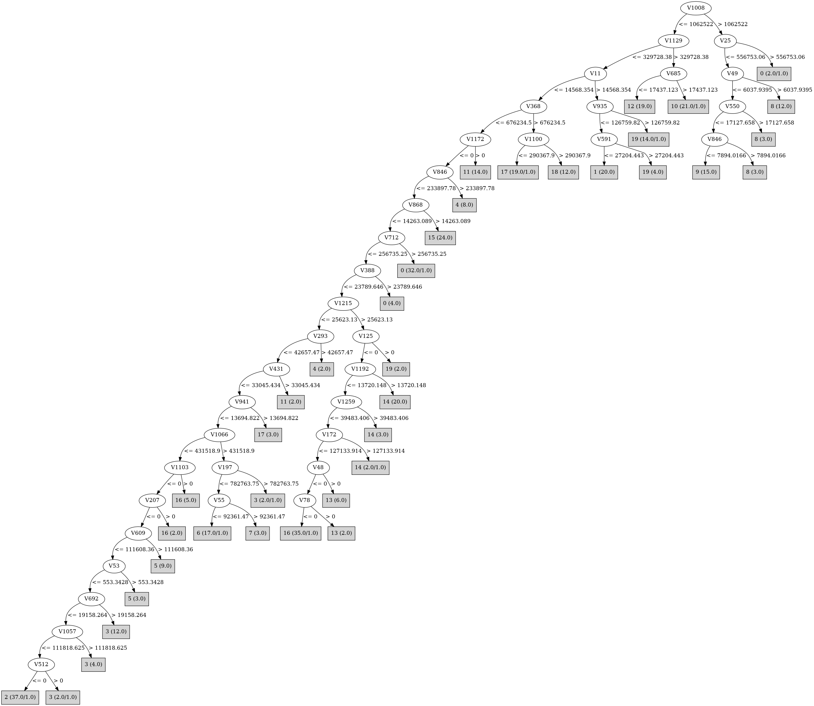

# J48

# SimpleCart Decision Tree

V1023 < 30012.2115

* V22 < 58354.6765

*   * V399 < 236923.435

*   *   * V409 < 44261.8495

*   *   *   * V11 < 22937.6655

*   *   *   *   * V1008 < 1440433.5099999998

*   *   *   *   *   * V1261 < 245538.34499999997

*   *   *   *   *   *   * V1066 < 390449.56

*   *   *   *   *   *   *   * V684 < 275917.14

*   *   *   *   *   *   *   *   * V852 < 36900.757

*   *   *   *   *   *   *   *   *   * V678 < 28623.14865

*   *   *   *   *   *   *   *   *   *   * V186 < 661824.2999999999

*   *   *   *   *   *   *   *   *   *   *   * V62 < 2158.94775: 5(12.0/13.0)

*   *   *   *   *   *   *   *   *   *   *   * V62 >= 2158.94775: 2(5.0/0.0)

*   *   *   *   *   *   *   *   *   *   * V186 >= 661824.2999999999: 18(10.0/0.0)

*   *   *   *   *   *   *   *   *   * V678 >= 28623.14865: 4(10.0/0.0)

*   *   *   *   *   *   *   *   * V852 >= 36900.757: 11(12.0/1.0)

*   *   *   *   *   *   *   * V684 >= 275917.14: 17(16.0/2.0)

*   *   *   *   *   *   * V1066 >= 390449.56

*   *   *   *   *   *   *   * V336 < 11505.838: 6(15.0/0.0)

*   *   *   *   *   *   *   * V336 >= 11505.838: 7(4.0/1.0)

*   *   *   *   *   * V1261 >= 245538.34499999997: 3(19.0/6.0)

*   *   *   *   * V1008 >= 1440433.5099999998

*   *   *   *   *   * V49 < 6090.51025

*   *   *   *   *   *   * V755 < 133474.22: 9(15.0/3.0)

*   *   *   *   *   *   * V755 >= 133474.22: 8(3.0/0.0)

*   *   *   *   *   * V49 >= 6090.51025: 8(12.0/0.0)

*   *   *   * V11 >= 22937.6655

*   *   *   *   * V935 < 154319.47

*   *   *   *   *   * V591 < 43166.6475: 1(20.0/0.0)

*   *   *   *   *   * V591 >= 43166.6475: 19(4.0/0.0)

*   *   *   *   * V935 >= 154319.47: 19(13.0/0.0)

*   *   * V409 >= 44261.8495

*   *   *   * V685 < 40602.496: 12(19.0/1.0)

*   *   *   * V685 >= 40602.496: 10(19.0/0.0)

*   * V399 >= 236923.435: 2(26.0/3.0)

* V22 >= 58354.6765

*   * V868 < 76791.405

*   *   * V1192 < 25518.578

*   *   *   * V1273 < 19536.155

*   *   *   *   * V544 < 11064.774

*   *   *   *   *   * V48 < 248531.765: 16(35.0/2.0)

*   *   *   *   *   * V48 >= 248531.765: 13(3.0/0.0)

*   *   *   *   * V544 >= 11064.774: 11(4.0/1.0)

*   *   *   * V1273 >= 19536.155

*   *   *   *   * V805 < 39719.759999999995: 13(5.0/2.0)

*   *   *   *   * V805 >= 39719.759999999995: 14(4.0/0.0)

*   *   * V1192 >= 25518.578: 14(20.0/0.0)

*   * V868 >= 76791.405: 15(23.0/0.0)

V1023 >= 30012.2115

* V9 < 13113.09325: 0(32.0/0.0)

* V9 >= 13113.09325: 17(4.0/0.0)

# PART

Decision list:

conditions|predicted class
---|---
V1008 > 1062522.0 AND V49 <= 6037.9395| 9 (23.0/7.0)
V1169 <= 989642.94 AND V1129 > 329728.38 AND V685 > 17437.123| 10 (21.0/1.0)
V1169 <= 989642.94 AND V1129 > 575722.6| 12 (19.0)
V1169 <= 989642.94 AND V11 > 14568.354 AND V935 <= 126759.82 AND V106 <= 28350.807| 1 (17.0)
V1169 <= 989642.94 AND V368 > 676234.5 AND V1100 <= 290367.9| 17 (19.0/1.0)
V368 <= 2540123.5 AND V1169 <= 989642.94 AND V1172 <= 0.0 AND V712 <= 256735.25 AND V678 <= 31538.877 AND V11 <= 14568.354 AND V868 <= 14263.089 AND V1215 > 25623.13 AND V1192 <= 13720.148 AND V1273 <= 4621.226| 16 (38.0/4.0)
V186 <= 973226.1 AND V1169 <= 989642.94 AND V937 > 33396.8 AND V868 > 14263.089| 15 (24.0)
V186 <= 973226.1 AND V1169 <= 989642.94 AND V1215 > 25623.13 AND V22 <= 126089.78| 19 (23.0/4.0)
V186 <= 973226.1 AND V1008 <= 1762924.6 AND V1215 > 160034.42 AND V1161 <= 38784.625| 14 (23.0/1.0)
V186 <= 973226.1 AND V1008 <= 1762924.6 AND V1215 <= 160034.42 AND V1066 > 431518.9 AND V1005 > 525938.7| 6 (13.0)
V186 <= 973226.1 AND V1008 <= 1762924.6 AND V1215 <= 160034.42 AND V1066 <= 431518.9 AND V464 <= 59419.746 AND V343 > 72998.86 AND V820 <= 0.0| 0 (35.0/1.0)
V186 <= 973226.1 AND V678 <= 31538.877 AND V715 <= 8950.457 AND V1273 <= 13615.482 AND V712 <= 28163.512 AND V1066 <= 431518.9 AND V609 <= 111608.36 AND V692 <= 19158.264 AND V1287 <= 1195.6633 AND V342 <= 101962.195 AND V399 > 16159.992| 2 (27.0)
V186 <= 973226.1 AND V678 <= 18599.166 AND V715 <= 8950.457 AND V1273 <= 13615.482 AND V712 <= 28163.512 AND V284 <= 7133.544 AND V132 > 46050.48| 3 (21.0/3.0)
V186 <= 973226.1 AND V678 <= 18599.166 AND V712 <= 28163.512 AND V715 <= 8950.457 AND V838 <= 143557.38 AND V1066 <= 314982.38 AND V620 <= 51493.78| 5 (19.0/7.0)
V49 <= 6037.9395 AND V186 <= 973226.1 AND V579 <= 873703.06 AND V620 > 27872.79 AND V712 > 28163.512| 11 (17.0/1.0)
V49 <= 6037.9395 AND V186 > 973226.1| 18 (12.0)
V49 > 6037.9395| 8 (12.0)
V307 <= 83345.56 AND V451 <= 24706.865 AND V579 <= 643891.0| 16 (11.0/5.0)
V22 <= 344615.97 AND V307 <= 83345.56| 4 (10.0)
V22 <= 344615.97| 7 (8.0/3.0)
| 13 (7.0/2.0)

# JRip

Decision list:

conditions|predicted class
---|---
(V1066 >= 563697.06) and (V336 >= 23011.676)|7 (4.0/0.0)
(V1161 >= 31925.34) and (V352 >= 9203.814) and (V48 >= 8258.041)|13 (6.0/0.0)
(V451 >= 64850.582) and (V464 >= 106417.734)|4 (10.0/0.0)
(V1100 >= 627092.3) and (V186 >= 1157353.2)|18 (12.0/0.0)
(V303 >= 405655.97)|5 (8.0/0.0)
(V1195 >= 744151)|5 (4.0/0.0)
(V1008 >= 1762924.6) and (V49 <= 0) and (V499 >= 514150.72) and (V24 <= 6079669)|9 (12.0/0.0)
(V167 >= 383138.44) and (V1161 >= 17917.387)|9 (3.0/0.0)
(V1066 >= 512977.22) and (V719 <= 408207.38) and (V13 <= 105440.234)|6 (16.0/0.0)
(V1172 >= 16507.904)|11 (14.0/0.0)
(V1279 >= 367599.3)|11 (3.0/0.0)
(V1169 >= 528691.2) and (V17 <= 441529.03)|8 (18.0/0.0)
(V294 >= 266940.6) and (V744 <= 320525.34) and (V264 <= 0)|3 (17.0/0.0)
(V825 >= 97377.89) and (V739 >= 13194.033)|1 (18.0/0.0)
(V416 >= 71343.07) and (V685 <= 28609.969) and (V8 <= 0)|12 (20.0/0.0)
(V1129 >= 365815.6) and (V7 <= 96809.945)|10 (20.0/0.0)
(V243 >= 8950.489) and (V896 >= 108155.87)|19 (17.0/0.0)
(V243 >= 8950.489) and (V778 >= 29228.11)|19 (3.0/0.0)
(V684 >= 304332.56) and (V18 <= 0)|17 (20.0/0.0)
(V1192 >= 31497.955) and (V22 >= 211447.95)|14 (20.0/0.0)
(V978 >= 34432.1) and (V805 >= 44690.88) and (V22 <= 1701588.8)|14 (4.0/0.0)
(V868 >= 153582.81)|15 (25.0/0.0)
(V70 >= 369935.16)|2 (24.0/0.0)
(V128 <= 0) and (V115 >= 80223.72)|2 (7.0/0.0)
(V938 >= 21072.244) and (V128 <= 0) and (V43 <= 14687.868)|2 (5.0/0.0)
(V343 >= 73189.97) and (V3 <= 0)|0 (36.0/0.0)
|16 (53.0/12.0)

# Decision Table

Non matches covered by IB1

v22|v70|v218|v328|v343|v512|v694|v729|v734|v820|v1021|v1233|v1261|v1299|target
---|---|---|---|---|---|---|---|---|---|---|---|---|---|---
(108658.2-inf)|(-inf-4581.06215]|(-inf-5121.908]|(-inf-14890.372]|(73094.415-inf)|(-inf-9208.7575]|all|(624709.25-inf)|all|(-inf-11923.7325]|(46520.1055-inf)|all|(7069.5975-inf)|all|0
(108658.2-inf)|(-inf-4581.06215]|(-inf-5121.908]|(-inf-14890.372]|(-inf-73094.415]|(-inf-9208.7575]|all|(624709.25-inf)|all|(-inf-11923.7325]|(46520.1055-inf)|all|(7069.5975-inf)|all|14
(-inf-108658.2]|(-inf-4581.06215]|(-inf-5121.908]|(14890.372-inf)|(-inf-73094.415]|(235292.855-inf)|all|(-inf-54121.775]|all|(-inf-11923.7325]|(46520.1055-inf)|all|(7069.5975-inf)|all|0
(-inf-108658.2]|(-inf-4581.06215]|(-inf-5121.908]|(-inf-14890.372]|(-inf-73094.415]|(-inf-9208.7575]|all|(624709.25-inf)|all|(11923.7325-inf)|(-inf-46520.1055]|all|(7069.5975-inf)|all|0
(108658.2-inf)|(-inf-4581.06215]|(5121.908-inf)|(-inf-14890.372]|(73094.415-inf)|(-inf-9208.7575]|all|(624709.25-inf)|all|(-inf-11923.7325]|(-inf-46520.1055]|all|(7069.5975-inf)|all|0
(-inf-108658.2]|(-inf-4581.06215]|(-inf-5121.908]|(-inf-14890.372]|(-inf-73094.415]|(235292.855-inf)|all|(-inf-54121.775]|all|(-inf-11923.7325]|(46520.1055-inf)|all|(7069.5975-inf)|all|1
(108658.2-inf)|(-inf-4581.06215]|(-inf-5121.908]|(-inf-14890.372]|(73094.415-inf)|(-inf-9208.7575]|all|(624709.25-inf)|all|(-inf-11923.7325]|(-inf-46520.1055]|all|(7069.5975-inf)|all|0
(-inf-108658.2]|(243769.35-inf)|(-inf-5121.908]|(-inf-14890.372]|(73094.415-inf)|(-inf-9208.7575]|all|(624709.25-inf)|all|(-inf-11923.7325]|(46520.1055-inf)|all|(-inf-7069.5975]|all|0
(108658.2-inf)|(-inf-4581.06215]|(-inf-5121.908]|(-inf-14890.372]|(-inf-73094.415]|(-inf-9208.7575]|all|(54121.775-624709.25]|all|(-inf-11923.7325]|(46520.1055-inf)|all|(7069.5975-inf)|all|14
(-inf-108658.2]|(-inf-4581.06215]|(-inf-5121.908]|(-inf-14890.372]|(-inf-73094.415]|(-inf-9208.7575]|all|(54121.775-624709.25]|all|(11923.7325-inf)|(-inf-46520.1055]|all|(7069.5975-inf)|all|0
(-inf-108658.2]|(243769.35-inf)|(-inf-5121.908]|(-inf-14890.372]|(-inf-73094.415]|(-inf-9208.7575]|all|(624709.25-inf)|all|(-inf-11923.7325]|(-inf-46520.1055]|all|(7069.5975-inf)|all|0
(108658.2-inf)|(-inf-4581.06215]|(5121.908-inf)|(-inf-14890.372]|(-inf-73094.415]|(-inf-9208.7575]|all|(624709.25-inf)|all|(-inf-11923.7325]|(-inf-46520.1055]|all|(7069.5975-inf)|all|15
(-inf-108658.2]|(-inf-4581.06215]|(-inf-5121.908]|(-inf-14890.372]|(-inf-73094.415]|(-inf-9208.7575]|all|(624709.25-inf)|all|(-inf-11923.7325]|(-inf-46520.1055]|all|(7069.5975-inf)|all|16
(108658.2-inf)|(-inf-4581.06215]|(-inf-5121.908]|(-inf-14890.372]|(-inf-73094.415]|(-inf-9208.7575]|all|(624709.25-inf)|all|(-inf-11923.7325]|(-inf-46520.1055]|all|(7069.5975-inf)|all|16
(108658.2-inf)|(-inf-4581.06215]|(-inf-5121.908]|(-inf-14890.372]|(-inf-73094.415]|(-inf-9208.7575]|all|(-inf-54121.775]|all|(-inf-11923.7325]|(46520.1055-inf)|all|(7069.5975-inf)|all|0
(-inf-108658.2]|(-inf-4581.06215]|(-inf-5121.908]|(-inf-14890.372]|(-inf-73094.415]|(235292.855-inf)|all|(-inf-54121.775]|all|(-inf-11923.7325]|(-inf-46520.1055]|all|(7069.5975-inf)|all|19
(-inf-108658.2]|(-inf-4581.06215]|(-inf-5121.908]|(-inf-14890.372]|(73094.415-inf)|(9208.7575-235292.855]|all|(-inf-54121.775]|all|(-inf-11923.7325]|(-inf-46520.1055]|all|(7069.5975-inf)|all|0
(108658.2-inf)|(-inf-4581.06215]|(5121.908-inf)|(-inf-14890.372]|(-inf-73094.415]|(-inf-9208.7575]|all|(54121.775-624709.25]|all|(-inf-11923.7325]|(-inf-46520.1055]|all|(7069.5975-inf)|all|15
(-inf-108658.2]|(-inf-4581.06215]|(-inf-5121.908]|(-inf-14890.372]|(-inf-73094.415]|(-inf-9208.7575]|all|(-inf-54121.775]|all|(11923.7325-inf)|(-inf-46520.1055]|all|(7069.5975-inf)|all|3
(-inf-108658.2]|(-inf-4581.06215]|(-inf-5121.908]|(-inf-14890.372]|(73094.415-inf)|(-inf-9208.7575]|all|(54121.775-624709.25]|all|(11923.7325-inf)|(-inf-46520.1055]|all|(-inf-7069.5975]|all|0
(-inf-108658.2]|(-inf-4581.06215]|(-inf-5121.908]|(-inf-14890.372]|(-inf-73094.415]|(235292.855-inf)|all|(-inf-54121.775]|all|(-inf-11923.7325]|(46520.1055-inf)|all|(-inf-7069.5975]|all|1
(-inf-108658.2]|(4581.06215-243769.35]|(-inf-5121.908]|(-inf-14890.372]|(-inf-73094.415]|(9208.7575-235292.855]|all|(624709.25-inf)|all|(-inf-11923.7325]|(-inf-46520.1055]|all|(-inf-7069.5975]|all|0
(108658.2-inf)|(-inf-4581.06215]|(-inf-5121.908]|(-inf-14890.372]|(73094.415-inf)|(-inf-9208.7575]|all|(54121.775-624709.25]|all|(11923.7325-inf)|(-inf-46520.1055]|all|(-inf-7069.5975]|all|0
(-inf-108658.2]|(-inf-4581.06215]|(-inf-5121.908]|(-inf-14890.372]|(-inf-73094.415]|(-inf-9208.7575]|all|(54121.775-624709.25]|all|(-inf-11923.7325]|(-inf-46520.1055]|all|(7069.5975-inf)|all|0
(-inf-108658.2]|(-inf-4581.06215]|(-inf-5121.908]|(-inf-14890.372]|(-inf-73094.415]|(235292.855-inf)|all|(-inf-54121.775]|all|(11923.7325-inf)|(-inf-46520.1055]|all|(-inf-7069.5975]|all|18
(108658.2-inf)|(-inf-4581.06215]|(-inf-5121.908]|(-inf-14890.372]|(-inf-73094.415]|(-inf-9208.7575]|all|(54121.775-624709.25]|all|(-inf-11923.7325]|(-inf-46520.1055]|all|(7069.5975-inf)|all|16
(-inf-108658.2]|(-inf-4581.06215]|(-inf-5121.908]|(-inf-14890.372]|(73094.415-inf)|(9208.7575-235292.855]|all|(-inf-54121.775]|all|(11923.7325-inf)|(-inf-46520.1055]|all|(-inf-7069.5975]|all|11
(-inf-108658.2]|(-inf-4581.06215]|(-inf-5121.908]|(-inf-14890.372]|(-inf-73094.415]|(9208.7575-235292.855]|all|(-inf-54121.775]|all|(-inf-11923.7325]|(-inf-46520.1055]|all|(7069.5975-inf)|all|0
(-inf-108658.2]|(-inf-4581.06215]|(-inf-5121.908]|(-inf-14890.372]|(-inf-73094.415]|(-inf-9208.7575]|all|(54121.775-624709.25]|all|(11923.7325-inf)|(-inf-46520.1055]|all|(-inf-7069.5975]|all|0
(108658.2-inf)|(-inf-4581.06215]|(5121.908-inf)|(-inf-14890.372]|(-inf-73094.415]|(-inf-9208.7575]|all|(624709.25-inf)|all|(-inf-11923.7325]|(-inf-46520.1055]|all|(-inf-7069.5975]|all|0
(108658.2-inf)|(-inf-4581.06215]|(-inf-5121.908]|(14890.372-inf)|(73094.415-inf)|(-inf-9208.7575]|all|(-inf-54121.775]|all|(11923.7325-inf)|(-inf-46520.1055]|all|(-inf-7069.5975]|all|11
(-inf-108658.2]|(243769.35-inf)|(-inf-5121.908]|(-inf-14890.372]|(-inf-73094.415]|(-inf-9208.7575]|all|(624709.25-inf)|all|(-inf-11923.7325]|(-inf-46520.1055]|all|(-inf-7069.5975]|all|9
(-inf-108658.2]|(-inf-4581.06215]|(-inf-5121.908]|(-inf-14890.372]|(-inf-73094.415]|(9208.7575-235292.855]|all|(-inf-54121.775]|all|(-inf-11923.7325]|(46520.1055-inf)|all|(-inf-7069.5975]|all|0
(-inf-108658.2]|(4581.06215-243769.35]|(-inf-5121.908]|(-inf-14890.372]|(73094.415-inf)|(235292.855-inf)|all|(-inf-54121.775]|all|(-inf-11923.7325]|(-inf-46520.1055]|all|(-inf-7069.5975]|all|0
(-inf-108658.2]|(4581.06215-243769.35]|(-inf-5121.908]|(-inf-14890.372]|(-inf-73094.415]|(-inf-9208.7575]|all|(624709.25-inf)|all|(-inf-11923.7325]|(-inf-46520.1055]|all|(-inf-7069.5975]|all|9
(108658.2-inf)|(-inf-4581.06215]|(5121.908-inf)|(-inf-14890.372]|(-inf-73094.415]|(-inf-9208.7575]|all|(-inf-54121.775]|all|(-inf-11923.7325]|(-inf-46520.1055]|all|(7069.5975-inf)|all|15
(-inf-108658.2]|(-inf-4581.06215]|(-inf-5121.908]|(-inf-14890.372]|(-inf-73094.415]|(9208.7575-235292.855]|all|(-inf-54121.775]|all|(11923.7325-inf)|(-inf-46520.1055]|all|(-inf-7069.5975]|all|0
(-inf-108658.2]|(-inf-4581.06215]|(-inf-5121.908]|(-inf-14890.372]|(73094.415-inf)|(235292.855-inf)|all|(-inf-54121.775]|all|(-inf-11923.7325]|(-inf-46520.1055]|all|(-inf-7069.5975]|all|0
(-inf-108658.2]|(-inf-4581.06215]|(-inf-5121.908]|(-inf-14890.372]|(-inf-73094.415]|(-inf-9208.7575]|all|(624709.25-inf)|all|(-inf-11923.7325]|(-inf-46520.1055]|all|(-inf-7069.5975]|all|8
(-inf-108658.2]|(243769.35-inf)|(-inf-5121.908]|(-inf-14890.372]|(-inf-73094.415]|(-inf-9208.7575]|all|(-inf-54121.775]|all|(-inf-11923.7325]|(-inf-46520.1055]|all|(7069.5975-inf)|all|2
(108658.2-inf)|(4581.06215-243769.35]|(-inf-5121.908]|(-inf-14890.372]|(-inf-73094.415]|(-inf-9208.7575]|all|(-inf-54121.775]|all|(-inf-11923.7325]|(-inf-46520.1055]|all|(7069.5975-inf)|all|0
(108658.2-inf)|(-inf-4581.06215]|(-inf-5121.908]|(-inf-14890.372]|(73094.415-inf)|(-inf-9208.7575]|all|(-inf-54121.775]|all|(11923.7325-inf)|(-inf-46520.1055]|all|(-inf-7069.5975]|all|0
(-inf-108658.2]|(-inf-4581.06215]|(-inf-5121.908]|(14890.372-inf)|(-inf-73094.415]|(235292.855-inf)|all|(-inf-54121.775]|all|(-inf-11923.7325]|(-inf-46520.1055]|all|(-inf-7069.5975]|all|12
(-inf-108658.2]|(-inf-4581.06215]|(-inf-5121.908]|(-inf-14890.372]|(73094.415-inf)|(-inf-9208.7575]|all|(-inf-54121.775]|all|(11923.7325-inf)|(-inf-46520.1055]|all|(-inf-7069.5975]|all|11
(-inf-108658.2]|(-inf-4581.06215]|(-inf-5121.908]|(14890.372-inf)|(-inf-73094.415]|(-inf-9208.7575]|all|(-inf-54121.775]|all|(11923.7325-inf)|(-inf-46520.1055]|all|(-inf-7069.5975]|all|0
(108658.2-inf)|(-inf-4581.06215]|(-inf-5121.908]|(-inf-14890.372]|(-inf-73094.415]|(-inf-9208.7575]|all|(-inf-54121.775]|all|(-inf-11923.7325]|(-inf-46520.1055]|all|(7069.5975-inf)|all|16
(-inf-108658.2]|(-inf-4581.06215]|(-inf-5121.908]|(-inf-14890.372]|(-inf-73094.415]|(-inf-9208.7575]|all|(-inf-54121.775]|all|(-inf-11923.7325]|(-inf-46520.1055]|all|(7069.5975-inf)|all|3
(-inf-108658.2]|(-inf-4581.06215]|(-inf-5121.908]|(-inf-14890.372]|(73094.415-inf)|(-inf-9208.7575]|all|(54121.775-624709.25]|all|(-inf-11923.7325]|(-inf-46520.1055]|all|(-inf-7069.5975]|all|0
(-inf-108658.2]|(4581.06215-243769.35]|(-inf-5121.908]|(-inf-14890.372]|(-inf-73094.415]|(235292.855-inf)|all|(-inf-54121.775]|all|(-inf-11923.7325]|(-inf-46520.1055]|all|(-inf-7069.5975]|all|17
(-inf-108658.2]|(-inf-4581.06215]|(-inf-5121.908]|(14890.372-inf)|(-inf-73094.415]|(-inf-9208.7575]|all|(54121.775-624709.25]|all|(-inf-11923.7325]|(-inf-46520.1055]|all|(-inf-7069.5975]|all|0
(-inf-108658.2]|(-inf-4581.06215]|(-inf-5121.908]|(-inf-14890.372]|(-inf-73094.415]|(235292.855-inf)|all|(-inf-54121.775]|all|(-inf-11923.7325]|(-inf-46520.1055]|all|(-inf-7069.5975]|all|17
(-inf-108658.2]|(243769.35-inf)|(-inf-5121.908]|(-inf-14890.372]|(-inf-73094.415]|(-inf-9208.7575]|all|(54121.775-624709.25]|all|(-inf-11923.7325]|(-inf-46520.1055]|all|(-inf-7069.5975]|all|0
(108658.2-inf)|(-inf-4581.06215]|(5121.908-inf)|(-inf-14890.372]|(-inf-73094.415]|(-inf-9208.7575]|all|(54121.775-624709.25]|all|(-inf-11923.7325]|(-inf-46520.1055]|all|(-inf-7069.5975]|all|0
(-inf-108658.2]|(-inf-4581.06215]|(-inf-5121.908]|(-inf-14890.372]|(-inf-73094.415]|(-inf-9208.7575]|all|(-inf-54121.775]|all|(11923.7325-inf)|(-inf-46520.1055]|all|(-inf-7069.5975]|all|6
(-inf-108658.2]|(-inf-4581.06215]|(-inf-5121.908]|(-inf-14890.372]|(73094.415-inf)|(9208.7575-235292.855]|all|(-inf-54121.775]|all|(-inf-11923.7325]|(-inf-46520.1055]|all|(-inf-7069.5975]|all|0
(-inf-108658.2]|(-inf-4581.06215]|(-inf-5121.908]|(14890.372-inf)|(-inf-73094.415]|(9208.7575-235292.855]|all|(-inf-54121.775]|all|(-inf-11923.7325]|(-inf-46520.1055]|all|(-inf-7069.5975]|all|12
(-inf-108658.2]|(-inf-4581.06215]|(-inf-5121.908]|(-inf-14890.372]|(-inf-73094.415]|(-inf-9208.7575]|all|(54121.775-624709.25]|all|(-inf-11923.7325]|(-inf-46520.1055]|all|(-inf-7069.5975]|all|16
(108658.2-inf)|(-inf-4581.06215]|(-inf-5121.908]|(-inf-14890.372]|(-inf-73094.415]|(-inf-9208.7575]|all|(54121.775-624709.25]|all|(-inf-11923.7325]|(-inf-46520.1055]|all|(-inf-7069.5975]|all|0
(-inf-108658.2]|(-inf-4581.06215]|(-inf-5121.908]|(-inf-14890.372]|(-inf-73094.415]|(9208.7575-235292.855]|all|(-inf-54121.775]|all|(-inf-11923.7325]|(-inf-46520.1055]|all|(-inf-7069.5975]|all|0
(-inf-108658.2]|(-inf-4581.06215]|(-inf-5121.908]|(-inf-14890.372]|(73094.415-inf)|(-inf-9208.7575]|all|(-inf-54121.775]|all|(-inf-11923.7325]|(-inf-46520.1055]|all|(-inf-7069.5975]|all|0
(-inf-108658.2]|(-inf-4581.06215]|(-inf-5121.908]|(14890.372-inf)|(-inf-73094.415]|(-inf-9208.7575]|all|(-inf-54121.775]|all|(-inf-11923.7325]|(-inf-46520.1055]|all|(-inf-7069.5975]|all|10
(-inf-108658.2]|(243769.35-inf)|(-inf-5121.908]|(-inf-14890.372]|(-inf-73094.415]|(-inf-9208.7575]|all|(-inf-54121.775]|all|(-inf-11923.7325]|(-inf-46520.1055]|all|(-inf-7069.5975]|all|2
(108658.2-inf)|(243769.35-inf)|(-inf-5121.908]|(-inf-14890.372]|(-inf-73094.415]|(-inf-9208.7575]|all|(-inf-54121.775]|all|(-inf-11923.7325]|(-inf-46520.1055]|all|(-inf-7069.5975]|all|0
(-inf-108658.2]|(4581.06215-243769.35]|(-inf-5121.908]|(-inf-14890.372]|(-inf-73094.415]|(-inf-9208.7575]|all|(-inf-54121.775]|all|(-inf-11923.7325]|(-inf-46520.1055]|all|(-inf-7069.5975]|all|0
(108658.2-inf)|(-inf-4581.06215]|(-inf-5121.908]|(-inf-14890.372]|(-inf-73094.415]|(-inf-9208.7575]|all|(-inf-54121.775]|all|(-inf-11923.7325]|(-inf-46520.1055]|all|(-inf-7069.5975]|all|2
(-inf-108658.2]|(-inf-4581.06215]|(-inf-5121.908]|(-inf-14890.372]|(-inf-73094.415]|(-inf-9208.7575]|all|(-inf-54121.775]|all|(-inf-11923.7325]|(-inf-46520.1055]|all|(-inf-7069.5975]|all|6

