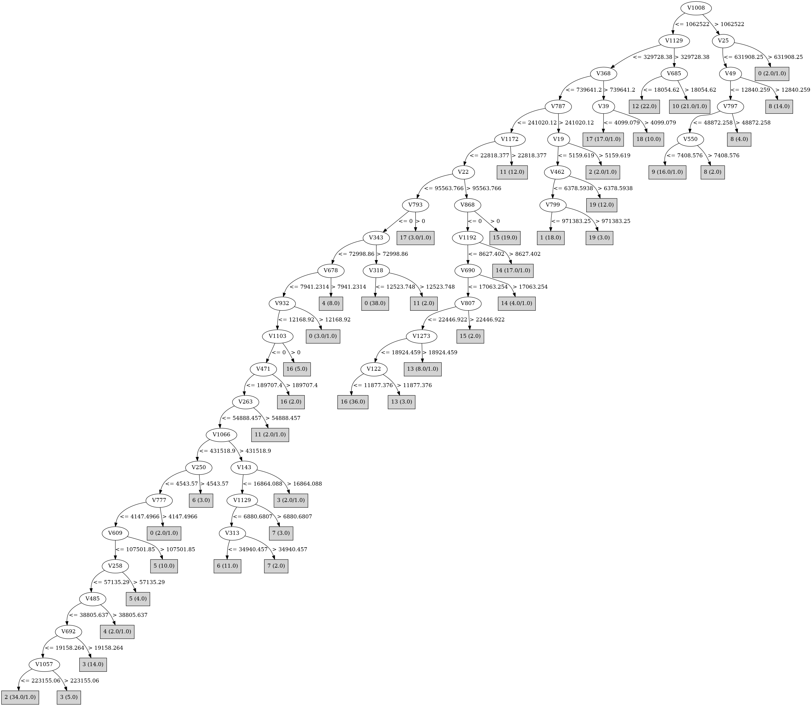

# J48

# SimpleCart Decision Tree

V712 < 346325.3

* V22 < 57483.8925

*   * V987 < 33510.244999999995

*   *   * V1008 < 1340089.3599999999

*   *   *   * V70 < 239968.6425

*   *   *   *   * V85 < 396843.065

*   *   *   *   *   * V684 < 277785.89

*   *   *   *   *   *   * V787 < 36773.3525: 6(14.0/61.0)

*   *   *   *   *   *   * V787 >= 36773.3525

*   *   *   *   *   *   *   * V935 < 5102.037: 1(16.0/5.0)

*   *   *   *   *   *   *   * V935 >= 5102.037: 19(14.0/0.0)

*   *   *   *   *   * V684 >= 277785.89: 17(18.0/2.0)

*   *   *   *   * V85 >= 396843.065: 3(21.0/4.0)

*   *   *   * V70 >= 239968.6425: 2(22.0/0.0)

*   *   * V1008 >= 1340089.3599999999

*   *   *   * V49 < 14934.867: 9(16.0/7.0)

*   *   *   * V49 >= 14934.867: 8(14.0/0.0)

*   * V987 >= 33510.244999999995

*   *   * V685 < 142643.4875: 12(22.0/0.0)

*   *   * V685 >= 142643.4875: 10(19.0/0.0)

* V22 >= 57483.8925

*   * V868 < 69440.875

*   *   * V953 < 49921.8075

*   *   *   * V1273 < 17655.58: 16(38.0/7.0)

*   *   *   * V1273 >= 17655.58: 13(7.0/4.0)

*   *   * V953 >= 49921.8075: 14(17.0/2.0)

*   * V868 >= 69440.875: 15(20.0/0.0)

V712 >= 346325.3

* V820 < 10928.156500000001: 0(36.0/0.0)

* V820 >= 10928.156500000001: 11(13.0/0.0)

# PART

Decision list:

conditions|predicted class
---|---
V1008 > 1062522 AND V49 > 12840.259| 8 (14.0)
V1169 > 168784.3 AND V797 <= 48872.258 AND V307 <= 13717.223| 9 (13.0)
V1129 > 329728.38 AND V81 <= 365624.78 AND V685 <= 133531.58| 12 (24.0/1.0)
V1169 <= 168784.3 AND V1129 > 329728.38 AND V59 > 57377.363| 10 (18.0)
V1169 <= 168784.3 AND V368 > 739641.2 AND V39 <= 4099.079| 17 (17.0/1.0)
V1169 <= 168784.3 AND V368 <= 3358563.2 AND V787 > 241020.12 AND V462 <= 6378.5938 AND V799 <= 971383.25| 1 (18.0)
V1169 <= 168784.3 AND V189 <= 490075.06 AND V1172 <= 22818.377 AND V712 > 329868.94| 0 (37.0/1.0)
V368 <= 3358563.2 AND V337 > 33317.766| 11 (12.0)
V368 > 3358563.2| 18 (10.0)
V871 > 9920.925 AND V26 > 48901.688 AND V979 <= 25492.918| 8 (7.0)
V1178 > 0 AND V26 <= 100706.06| 0 (3.0)
V678 <= 11592.432 AND V85 > 0 AND V468 <= 127542.31 AND V399 <= 65216.465 AND V383 <= 0| 3 (22.0/1.0)
V846 <= 233897.78 AND V244 <= 13133.872 AND V959 <= 778023.8 AND V243 > 0 AND V3 <= 86608.66 AND V232 <= 0| 19 (19.0)
V678 <= 11592.432 AND V826 <= 90881.4 AND V868 > 0| 15 (20.0)
V678 <= 11592.432 AND V1178 <= 251575.1 AND V343 <= 505172.25 AND V953 > 50012.58| 14 (19.0/2.0)
V1178 <= 251575.1 AND V678 > 11592.432| 4 (8.0)
V1178 <= 251575.1 AND V343 <= 505172.25 AND V1273 > 1915.5863 AND V690 <= 17063.254 AND V115 <= 188648.27| 13 (5.0)
V1178 <= 251575.1 AND V1120 <= 25606.555 AND V974 <= 71106.02 AND V684 <= 168641 AND V1212 <= 53445.96 AND V97 <= 33310.99 AND V959 <= 778023.8 AND V258 <= 191572.81 AND V729 > 3118.4807 AND V478 <= 0| 16 (40.0)
V1178 <= 251575.1 AND V487 <= 0 AND V1026 > 520177.75 AND V619 > 236848.58| 13 (5.0)
V1178 <= 251575.1 AND V978 <= 12513.136 AND V343 <= 505172.25 AND V1066 > 431518.9 AND V852 <= 41464.953 AND V55 <= 1199.3508| 6 (10.0)
V1008 <= 3005482.8 AND V651 <= 905235.1 AND V1066 <= 539802.6 AND V789 <= 414.51346 AND V103 <= 10532.064 AND V250 <= 4543.57 AND V303 <= 167287.17 AND V258 <= 91677.516 AND V545 <= 8555.968 AND V1253 <= 8548.135| 2 (32.0)
V685 <= 77388.78 AND V719 > 1229505 AND V3 > 11550.509| 14 (4.0/2.0)
V685 <= 77388.78 AND V986 <= 4179.0347 AND V1066 > 214898.2 AND V127 <= 21101.307| 7 (5.0)
V244 <= 13133.872 AND V544 <= 627610.8 AND V1005 <= 64496.664 AND V772 <= 9083.88 AND V620 <= 193050.81 AND V115 <= 9109.029| 5 (15.0/1.0)
V26 > 55253.18| 9 (5.0/2.0)
V299 <= 316.7888 AND V843 <= 20740.02 AND V1005 <= 39178.215 AND V351 <= 0| 0 (4.0/1.0)
V171 <= 5561.082 AND V250 <= 2805.014| 17 (5.0/3.0)
V171 <= 4320.6973| 6 (4.0)
| 2 (4.0/2.0)

# JRip

Decision list:

conditions|predicted class
---|---
(V68 >= 1289202.5)|4 (9.0/1.0)
(V186 >= 1438464.4) and (V39 >= 24507.016)|18 (10.0/0.0)
(V48 >= 8258.041) and (V128 >= 597961.1)|13 (9.0/0.0)
(V1066 >= 294278.28) and (V695 <= 0)|6 (15.0/3.0)
(V959 >= 1640967.4)|5 (11.0/1.0)
(V1172 >= 193493.4)|11 (12.0/0.0)
(V167 >= 383138.44) and (V49 <= 0) and (V153 <= 0) and (V3 <= 0)|9 (16.0/0.0)
(V684 >= 284619.16)|17 (19.0/1.0)
(V739 >= 13194.033) and (V462 <= 0)|1 (14.0/0.0)
(V896 >= 245607.11)|19 (17.0/1.0)
(V953 >= 73573.74) and (V22 >= 296121.12)|14 (17.0/1.0)
(V549 >= 557789.9) and (V685 >= 163432.78)|10 (19.0/0.0)
(V1008 >= 2289172.5)|8 (22.0/1.0)
(V681 >= 143121.02) and (V399 <= 0) and (V161 <= 0)|3 (19.0/0.0)
(V326 >= 137087.61)|12 (23.0/1.0)
(V868 >= 138881.75)|15 (21.0/0.0)
(V574 >= 18735.08)|2 (28.0/3.0)
(V545 >= 19772.645)|0 (36.0/0.0)
|16 (82.0/40.0)

# Decision Table

Non matches covered by IB1

v128|v314|v328|v343|v368|v462|v512|v729|v799|v820|v1261|target
---|---|---|---|---|---|---|---|---|---|---|---
(175674.92-inf)|(-inf-84681.435]|(-inf-26491.129]|(54110.2785-inf)|(-inf-749576.85]|(-inf-3907.3]|(-inf-164176.14]|(612944-inf)|(-inf-5879.2265]|(-inf-49458.047]|(108381.955-inf)|16
(-inf-175674.92]|(-inf-84681.435]|(-inf-26491.129]|(-inf-54110.2785]|(-inf-749576.85]|(10693.7982-inf)|(-inf-164176.14]|(138799.4-612944]|(-inf-5879.2265]|(-inf-49458.047]|(108381.955-inf)|0
(-inf-175674.92]|(-inf-84681.435]|(-inf-26491.129]|(-inf-54110.2785]|(-inf-749576.85]|(-inf-3907.3]|(-inf-164176.14]|(612944-inf)|(-inf-5879.2265]|(-inf-49458.047]|(108381.955-inf)|14
(175674.92-inf)|(-inf-84681.435]|(-inf-26491.129]|(-inf-54110.2785]|(-inf-749576.85]|(-inf-3907.3]|(-inf-164176.14]|(612944-inf)|(-inf-5879.2265]|(-inf-49458.047]|(108381.955-inf)|15
(-inf-175674.92]|(-inf-84681.435]|(-inf-26491.129]|(-inf-54110.2785]|(-inf-749576.85]|(10693.7982-inf)|(164176.14-inf)|(-inf-47204.254]|(-inf-5879.2265]|(-inf-49458.047]|(108381.955-inf)|19
(175674.92-inf)|(-inf-84681.435]|(-inf-26491.129]|(-inf-54110.2785]|(-inf-749576.85]|(-inf-3907.3]|(-inf-164176.14]|(47204.254-138799.4]|(5879.2265-inf)|(-inf-49458.047]|(108381.955-inf)|0
(-inf-175674.92]|(-inf-84681.435]|(-inf-26491.129]|(-inf-54110.2785]|(-inf-749576.85]|(-inf-3907.3]|(164176.14-inf)|(-inf-47204.254]|(5879.2265-inf)|(-inf-49458.047]|(108381.955-inf)|19
(175674.92-inf)|(-inf-84681.435]|(-inf-26491.129]|(-inf-54110.2785]|(-inf-749576.85]|(-inf-3907.3]|(-inf-164176.14]|(138799.4-612944]|(-inf-5879.2265]|(-inf-49458.047]|(108381.955-inf)|16
(-inf-175674.92]|(-inf-84681.435]|(-inf-26491.129]|(-inf-54110.2785]|(-inf-749576.85]|(-inf-3907.3]|(-inf-164176.14]|(138799.4-612944]|(-inf-5879.2265]|(-inf-49458.047]|(108381.955-inf)|14
(-inf-175674.92]|(84681.435-inf)|(-inf-26491.129]|(-inf-54110.2785]|(-inf-749576.85]|(-inf-3907.3]|(-inf-164176.14]|(612944-inf)|(-inf-5879.2265]|(-inf-49458.047]|(-inf-108381.955]|8
(-inf-175674.92]|(-inf-84681.435]|(-inf-26491.129]|(-inf-54110.2785]|(-inf-749576.85]|(-inf-3907.3]|(-inf-164176.14]|(612944-inf)|(-inf-5879.2265]|(-inf-49458.047]|(-inf-108381.955]|8
(-inf-175674.92]|(-inf-84681.435]|(-inf-26491.129]|(-inf-54110.2785]|(-inf-749576.85]|(10693.7982-inf)|(-inf-164176.14]|(-inf-47204.254]|(-inf-5879.2265]|(-inf-49458.047]|(108381.955-inf)|0
(-inf-175674.92]|(-inf-84681.435]|(26491.129-inf)|(-inf-54110.2785]|(-inf-749576.85]|(-inf-3907.3]|(-inf-164176.14]|(-inf-47204.254]|(5879.2265-inf)|(-inf-49458.047]|(108381.955-inf)|0
(175674.92-inf)|(-inf-84681.435]|(-inf-26491.129]|(54110.2785-inf)|(-inf-749576.85]|(-inf-3907.3]|(-inf-164176.14]|(47204.254-138799.4]|(-inf-5879.2265]|(49458.047-inf)|(-inf-108381.955]|0
(-inf-175674.92]|(-inf-84681.435]|(-inf-26491.129]|(54110.2785-inf)|(-inf-749576.85]|(-inf-3907.3]|(164176.14-inf)|(-inf-47204.254]|(-inf-5879.2265]|(-inf-49458.047]|(108381.955-inf)|0
(175674.92-inf)|(-inf-84681.435]|(26491.129-inf)|(54110.2785-inf)|(-inf-749576.85]|(3907.3-10693.7982]|(-inf-164176.14]|(-inf-47204.254]|(-inf-5879.2265]|(49458.047-inf)|(-inf-108381.955]|0
(-inf-175674.92]|(-inf-84681.435]|(-inf-26491.129]|(-inf-54110.2785]|(749576.85-inf)|(-inf-3907.3]|(164176.14-inf)|(-inf-47204.254]|(-inf-5879.2265]|(49458.047-inf)|(-inf-108381.955]|18
(175674.92-inf)|(-inf-84681.435]|(-inf-26491.129]|(-inf-54110.2785]|(-inf-749576.85]|(-inf-3907.3]|(-inf-164176.14]|(-inf-47204.254]|(5879.2265-inf)|(-inf-49458.047]|(108381.955-inf)|16
(-inf-175674.92]|(-inf-84681.435]|(-inf-26491.129]|(-inf-54110.2785]|(-inf-749576.85]|(-inf-3907.3]|(-inf-164176.14]|(-inf-47204.254]|(5879.2265-inf)|(-inf-49458.047]|(108381.955-inf)|2
(-inf-175674.92]|(-inf-84681.435]|(-inf-26491.129]|(-inf-54110.2785]|(-inf-749576.85]|(-inf-3907.3]|(-inf-164176.14]|(47204.254-138799.4]|(-inf-5879.2265]|(-inf-49458.047]|(108381.955-inf)|16
(175674.92-inf)|(-inf-84681.435]|(-inf-26491.129]|(54110.2785-inf)|(-inf-749576.85]|(3907.3-10693.7982]|(-inf-164176.14]|(-inf-47204.254]|(-inf-5879.2265]|(49458.047-inf)|(-inf-108381.955]|0
(175674.92-inf)|(-inf-84681.435]|(-inf-26491.129]|(-inf-54110.2785]|(-inf-749576.85]|(-inf-3907.3]|(-inf-164176.14]|(47204.254-138799.4]|(-inf-5879.2265]|(-inf-49458.047]|(108381.955-inf)|16
(-inf-175674.92]|(-inf-84681.435]|(-inf-26491.129]|(-inf-54110.2785]|(-inf-749576.85]|(-inf-3907.3]|(164176.14-inf)|(-inf-47204.254]|(-inf-5879.2265]|(-inf-49458.047]|(108381.955-inf)|1
(-inf-175674.92]|(84681.435-inf)|(-inf-26491.129]|(-inf-54110.2785]|(-inf-749576.85]|(-inf-3907.3]|(-inf-164176.14]|(138799.4-612944]|(-inf-5879.2265]|(-inf-49458.047]|(-inf-108381.955]|0
(-inf-175674.92]|(-inf-84681.435]|(26491.129-inf)|(-inf-54110.2785]|(-inf-749576.85]|(-inf-3907.3]|(164176.14-inf)|(47204.254-138799.4]|(-inf-5879.2265]|(-inf-49458.047]|(-inf-108381.955]|10
(-inf-175674.92]|(-inf-84681.435]|(-inf-26491.129]|(-inf-54110.2785]|(-inf-749576.85]|(-inf-3907.3]|(164176.14-inf)|(-inf-47204.254]|(5879.2265-inf)|(-inf-49458.047]|(-inf-108381.955]|0
(175674.92-inf)|(-inf-84681.435]|(-inf-26491.129]|(-inf-54110.2785]|(-inf-749576.85]|(-inf-3907.3]|(-inf-164176.14]|(138799.4-612944]|(-inf-5879.2265]|(-inf-49458.047]|(-inf-108381.955]|0
(-inf-175674.92]|(-inf-84681.435]|(-inf-26491.129]|(-inf-54110.2785]|(-inf-749576.85]|(-inf-3907.3]|(-inf-164176.14]|(138799.4-612944]|(-inf-5879.2265]|(-inf-49458.047]|(-inf-108381.955]|16
(-inf-175674.92]|(-inf-84681.435]|(-inf-26491.129]|(54110.2785-inf)|(749576.85-inf)|(-inf-3907.3]|(164176.14-inf)|(-inf-47204.254]|(-inf-5879.2265]|(-inf-49458.047]|(-inf-108381.955]|17
(-inf-175674.92]|(-inf-84681.435]|(-inf-26491.129]|(54110.2785-inf)|(-inf-749576.85]|(-inf-3907.3]|(-inf-164176.14]|(-inf-47204.254]|(-inf-5879.2265]|(-inf-49458.047]|(108381.955-inf)|0
(175674.92-inf)|(-inf-84681.435]|(-inf-26491.129]|(54110.2785-inf)|(-inf-749576.85]|(-inf-3907.3]|(-inf-164176.14]|(-inf-47204.254]|(-inf-5879.2265]|(49458.047-inf)|(-inf-108381.955]|11
(175674.92-inf)|(-inf-84681.435]|(-inf-26491.129]|(54110.2785-inf)|(-inf-749576.85]|(-inf-3907.3]|(-inf-164176.14]|(47204.254-138799.4]|(-inf-5879.2265]|(-inf-49458.047]|(-inf-108381.955]|0
(175674.92-inf)|(-inf-84681.435]|(-inf-26491.129]|(-inf-54110.2785]|(-inf-749576.85]|(-inf-3907.3]|(-inf-164176.14]|(-inf-47204.254]|(-inf-5879.2265]|(-inf-49458.047]|(108381.955-inf)|13
(-inf-175674.92]|(-inf-84681.435]|(-inf-26491.129]|(-inf-54110.2785]|(749576.85-inf)|(-inf-3907.3]|(164176.14-inf)|(-inf-47204.254]|(-inf-5879.2265]|(-inf-49458.047]|(-inf-108381.955]|17
(-inf-175674.92]|(-inf-84681.435]|(-inf-26491.129]|(-inf-54110.2785]|(-inf-749576.85]|(-inf-3907.3]|(-inf-164176.14]|(-inf-47204.254]|(-inf-5879.2265]|(-inf-49458.047]|(108381.955-inf)|3
(-inf-175674.92]|(84681.435-inf)|(26491.129-inf)|(-inf-54110.2785]|(-inf-749576.85]|(-inf-3907.3]|(164176.14-inf)|(-inf-47204.254]|(-inf-5879.2265]|(-inf-49458.047]|(-inf-108381.955]|10
(-inf-175674.92]|(-inf-84681.435]|(26491.129-inf)|(-inf-54110.2785]|(-inf-749576.85]|(-inf-3907.3]|(-inf-164176.14]|(47204.254-138799.4]|(-inf-5879.2265]|(-inf-49458.047]|(-inf-108381.955]|0
(-inf-175674.92]|(-inf-84681.435]|(-inf-26491.129]|(-inf-54110.2785]|(-inf-749576.85]|(-inf-3907.3]|(-inf-164176.14]|(-inf-47204.254]|(-inf-5879.2265]|(49458.047-inf)|(-inf-108381.955]|6
(-inf-175674.92]|(-inf-84681.435]|(26491.129-inf)|(-inf-54110.2785]|(-inf-749576.85]|(-inf-3907.3]|(164176.14-inf)|(-inf-47204.254]|(-inf-5879.2265]|(-inf-49458.047]|(-inf-108381.955]|12
(-inf-175674.92]|(-inf-84681.435]|(-inf-26491.129]|(-inf-54110.2785]|(-inf-749576.85]|(-inf-3907.3]|(-inf-164176.14]|(-inf-47204.254]|(5879.2265-inf)|(-inf-49458.047]|(-inf-108381.955]|2
(175674.92-inf)|(-inf-84681.435]|(-inf-26491.129]|(-inf-54110.2785]|(-inf-749576.85]|(-inf-3907.3]|(-inf-164176.14]|(47204.254-138799.4]|(-inf-5879.2265]|(-inf-49458.047]|(-inf-108381.955]|16
(-inf-175674.92]|(-inf-84681.435]|(-inf-26491.129]|(-inf-54110.2785]|(-inf-749576.85]|(-inf-3907.3]|(-inf-164176.14]|(47204.254-138799.4]|(-inf-5879.2265]|(-inf-49458.047]|(-inf-108381.955]|7
(-inf-175674.92]|(-inf-84681.435]|(-inf-26491.129]|(-inf-54110.2785]|(-inf-749576.85]|(-inf-3907.3]|(164176.14-inf)|(-inf-47204.254]|(-inf-5879.2265]|(-inf-49458.047]|(-inf-108381.955]|4
(-inf-175674.92]|(-inf-84681.435]|(-inf-26491.129]|(-inf-54110.2785]|(749576.85-inf)|(-inf-3907.3]|(-inf-164176.14]|(-inf-47204.254]|(-inf-5879.2265]|(-inf-49458.047]|(-inf-108381.955]|0
(175674.92-inf)|(-inf-84681.435]|(-inf-26491.129]|(54110.2785-inf)|(-inf-749576.85]|(-inf-3907.3]|(-inf-164176.14]|(-inf-47204.254]|(-inf-5879.2265]|(-inf-49458.047]|(-inf-108381.955]|0
(-inf-175674.92]|(84681.435-inf)|(26491.129-inf)|(-inf-54110.2785]|(-inf-749576.85]|(-inf-3907.3]|(-inf-164176.14]|(-inf-47204.254]|(-inf-5879.2265]|(-inf-49458.047]|(-inf-108381.955]|10
(-inf-175674.92]|(-inf-84681.435]|(26491.129-inf)|(-inf-54110.2785]|(-inf-749576.85]|(-inf-3907.3]|(-inf-164176.14]|(-inf-47204.254]|(-inf-5879.2265]|(-inf-49458.047]|(-inf-108381.955]|12
(-inf-175674.92]|(84681.435-inf)|(-inf-26491.129]|(-inf-54110.2785]|(-inf-749576.85]|(-inf-3907.3]|(-inf-164176.14]|(-inf-47204.254]|(-inf-5879.2265]|(-inf-49458.047]|(-inf-108381.955]|0
(175674.92-inf)|(-inf-84681.435]|(-inf-26491.129]|(-inf-54110.2785]|(-inf-749576.85]|(-inf-3907.3]|(-inf-164176.14]|(-inf-47204.254]|(-inf-5879.2265]|(-inf-49458.047]|(-inf-108381.955]|0
(-inf-175674.92]|(-inf-84681.435]|(-inf-26491.129]|(-inf-54110.2785]|(-inf-749576.85]|(-inf-3907.3]|(-inf-164176.14]|(-inf-47204.254]|(-inf-5879.2265]|(-inf-49458.047]|(-inf-108381.955]|5
(175674.92-inf)|(-inf-84681.435]|(-inf-26491.129]|(-inf-54110.2785]|(749576.85-inf)|(-inf-3907.3]|(-inf-164176.14]|(612944-inf)|(5879.2265-inf)|(-inf-49458.047]|(108381.955-inf)|0
(-inf-175674.92]|(-inf-84681.435]|(-inf-26491.129]|(-inf-54110.2785]|(-inf-749576.85]|(-inf-3907.3]|(-inf-164176.14]|(612944-inf)|(5879.2265-inf)|(-inf-49458.047]|(108381.955-inf)|0
(175674.92-inf)|(-inf-84681.435]|(-inf-26491.129]|(-inf-54110.2785]|(-inf-749576.85]|(-inf-3907.3]|(-inf-164176.14]|(612944-inf)|(5879.2265-inf)|(-inf-49458.047]|(108381.955-inf)|0
(-inf-175674.92]|(-inf-84681.435]|(-inf-26491.129]|(-inf-54110.2785]|(-inf-749576.85]|(10693.7982-inf)|(-inf-164176.14]|(-inf-47204.254]|(5879.2265-inf)|(49458.047-inf)|(108381.955-inf)|0

