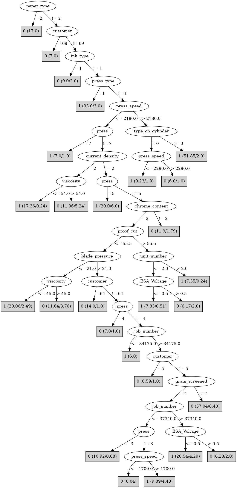

# J48

# SimpleCart Decision Tree

customer=(1)|(2)|(7)|(13)|(14)|(15)|(16)|(18)|(20)|(22)|(25)|(34)|(36)|(41)|(44)|(48)|(51)|(59)|(60)|(58)|(68)|(43)|(39)|(57)|(24)|(27)|(42)|(53)|(63)|(52)|(5)|(67)|(62)|(65)|(10)

* press=(7)|(1)|(4)|(5)|(6)|(0)

*   * viscosity < 63.0

*   *   * customer=(1)|(2)|(7)|(10)|(14)|(16)|(20)|(22)|(24)|(25)|(34)|(36)|(42)|(44)|(48)|(51)|(57)|(58)|(59)|(60)|(65)|(68)|(63)|(4)|(6)|(9)|(11)|(12)|(13)|(15)|(17)|(18)|(19)|(21)|(26)|(28)|(29)|(30)|(31)|(32)|(33)|(35)|(37)|(38)|(39)|(40)|(41)|(45)|(47)|(49)|(50)|(54)|(55)|(61)|(64)|(66)|(69)|(70): 1(70.0/1.0)

*   *   * customer!=(1)|(2)|(7)|(10)|(14)|(16)|(20)|(22)|(24)|(25)|(34)|(36)|(42)|(44)|(48)|(51)|(57)|(58)|(59)|(60)|(65)|(68)|(63)|(4)|(6)|(9)|(11)|(12)|(13)|(15)|(17)|(18)|(19)|(21)|(26)|(28)|(29)|(30)|(31)|(32)|(33)|(35)|(37)|(38)|(39)|(40)|(41)|(45)|(47)|(49)|(50)|(54)|(55)|(61)|(64)|(66)|(69)|(70)

*   *   *   * type_on_cylinder=(1)

*   *   *   *   * paper_type=(1)|(3): 1(40.73/5.0)

*   *   *   *   * paper_type!=(1)|(3): 0(1.73/0.0)

*   *   *   * type_on_cylinder!=(1)

*   *   *   *   * press=(6): 1(6.26/0.0)

*   *   *   *   * press!=(6)

*   *   *   *   *   * ink_pct < 52.95: 1(2.0/0.04)

*   *   *   *   *   * ink_pct >= 52.95: 0(8.22/1.0)

*   * viscosity >= 63.0

*   *   * customer=(58)|(68): 1(3.0/1.0)

*   *   * customer!=(58)|(68): 0(5.0/0.0)

* press!=(7)|(1)|(4)|(5)|(6)|(0)

*   * customer=(1)|(13)|(15)|(18)|(41)|(43)|(59)|(39)|(24)|(62)|(68)|(2)|(4)|(6)|(7)|(9)|(11)|(12)|(14)|(16)|(17)|(19)|(20)|(21)|(22)|(25)|(26)|(27)|(28)|(29)|(30)|(31)|(32)|(33)|(34)|(35)|(36)|(37)|(38)|(40)|(44)|(45)|(47)|(48)|(49)|(50)|(51)|(53)|(54)|(55)|(60)|(61)|(64)|(65)|(66)|(69)|(70)

*   *   * ink_pct < 63.3

*   *   *   * humifity < 73.5: 0(3.0/0.0)

*   *   *   * humifity >= 73.5

*   *   *   *   * press_speed < 1625.0

*   *   *   *   *   * caliper=(6)|(14)|(10)|(0)|(1)|(2)|(4)|(5)|(7)|(9)|(11)|(12)|(13)|(15)|(17)|(18): 1(3.17/1.0)

*   *   *   *   *   * caliper!=(6)|(14)|(10)|(0)|(1)|(2)|(4)|(5)|(7)|(9)|(11)|(12)|(13)|(15)|(17)|(18): 0(3.0/0.0)

*   *   *   *   * press_speed >= 1625.0: 1(32.82/1.75)

*   *   * ink_pct >= 63.3: 0(6.24/0.0)

*   * customer!=(1)|(13)|(15)|(18)|(41)|(43)|(59)|(39)|(24)|(62)|(68)|(2)|(4)|(6)|(7)|(9)|(11)|(12)|(14)|(16)|(17)|(19)|(20)|(21)|(22)|(25)|(26)|(27)|(28)|(29)|(30)|(31)|(32)|(33)|(34)|(35)|(36)|(37)|(38)|(40)|(44)|(45)|(47)|(48)|(49)|(50)|(51)|(53)|(54)|(55)|(60)|(61)|(64)|(65)|(66)|(69)|(70)

*   *   * caliper=(3)|(8)|(16)|(0)|(1)|(2)|(5)|(12)|(13)|(14)|(15)|(17)

*   *   *   * anode_space_ratio < 103.26249999999999

*   *   *   *   * press_speed < 2184.5

*   *   *   *   *   * customer=(10): 1(2.0/1.0)

*   *   *   *   *   * customer!=(10): 0(8.03/0.0)

*   *   *   *   * press_speed >= 2184.5: 1(2.0/0.0)

*   *   *   * anode_space_ratio >= 103.26249999999999: 1(5.0/0.0)

*   *   * caliper!=(3)|(8)|(16)|(0)|(1)|(2)|(5)|(12)|(13)|(14)|(15)|(17): 0(16.96/0.0)

customer!=(1)|(2)|(7)|(13)|(14)|(15)|(16)|(18)|(20)|(22)|(25)|(34)|(36)|(41)|(44)|(48)|(51)|(59)|(60)|(58)|(68)|(43)|(39)|(57)|(24)|(27)|(42)|(53)|(63)|(52)|(5)|(67)|(62)|(65)|(10)

* customer=(26)|(61)|(47)|(64)|(17)|(32)|(40)|(6)|(50)|(1)|(2)|(5)|(7)|(10)|(13)|(14)|(15)|(16)|(18)|(20)|(22)|(24)|(25)|(27)|(34)|(36)|(39)|(41)|(42)|(43)|(44)|(48)|(51)|(52)|(53)|(57)|(58)|(59)|(60)|(62)|(63)|(65)|(67)|(68)

*   * caliper=(16)|(3)|(12)|(6)|(2)|(9)|(17)

*   *   * press=(1)|(5)|(0)|(2)|(7)

*   *   *   * job_number < 38152.0: 1(18.0/3.0)

*   *   *   * job_number >= 38152.0: 0(1.02/0.0)

*   *   * press!=(1)|(5)|(0)|(2)|(7)

*   *   *   * ink_temperature < 16.35

*   *   *   *   * paper_type=(3)

*   *   *   *   *   * blade_pressure < 29.0

*   *   *   *   *   *   * proof_cut < 48.75

*   *   *   *   *   *   *   * press_speed < 2050.0: 1(13.63/0.0)

*   *   *   *   *   *   *   * press_speed >= 2050.0: 0(1.0/0.13)

*   *   *   *   *   *   * proof_cut >= 48.75

*   *   *   *   *   *   *   * ink_temperature < 15.05: 0(3.0/0.26)

*   *   *   *   *   *   *   * ink_temperature >= 15.05: 1(1.99/0.0)

*   *   *   *   *   * blade_pressure >= 29.0: 0(3.51/0.0)

*   *   *   *   * paper_type!=(3): 0(5.0/1.0)

*   *   *   * ink_temperature >= 16.35: 0(6.51/0.0)

*   * caliper!=(16)|(3)|(12)|(6)|(2)|(9)|(17)

*   *   * current_density=(0)|(1): 1(2.01/0.0)

*   *   * current_density!=(0)|(1)

*   *   *   * hardener < 0.95

*   *   *   *   * viscosity < 42.5: 1(3.0/0.0)

*   *   *   *   * viscosity >= 42.5

*   *   *   *   *   * viscosity < 66.0

*   *   *   *   *   *   * solvent_type=(2): 1(1.46/0.12)

*   *   *   *   *   *   * solvent_type!=(2)

*   *   *   *   *   *   *   * ink_temperature < 16.61

*   *   *   *   *   *   *   *   * blade_pressure < 21.5: 0(1.0/0.48)

*   *   *   *   *   *   *   *   * blade_pressure >= 21.5: 0(13.39/0.0)

*   *   *   *   *   *   *   * ink_temperature >= 16.61: 1(1.0/0.39)

*   *   *   *   *   * viscosity >= 66.0: 1(2.0/0.0)

*   *   *   * hardener >= 0.95

*   *   *   *   * roughness < 0.34375: 1(1.0/0.09)

*   *   *   *   * roughness >= 0.34375

*   *   *   *   *   * press_speed < 2125.0: 0(27.46/0.0)

*   *   *   *   *   * press_speed >= 2125.0: 1(1.0/0.46)

* customer!=(26)|(61)|(47)|(64)|(17)|(32)|(40)|(6)|(50)|(1)|(2)|(5)|(7)|(10)|(13)|(14)|(15)|(16)|(18)|(20)|(22)|(24)|(25)|(27)|(34)|(36)|(39)|(41)|(42)|(43)|(44)|(48)|(51)|(52)|(53)|(57)|(58)|(59)|(60)|(62)|(63)|(65)|(67)|(68): 0(34.0/0.0)

# PART

Decision list:

conditions|predicted class
---|---
paper_type != 2 AND customer != 69 AND ink_type != 1 AND press_type = 1 AND roughness <= 0.875| 1 (23.37)
paper_type != 2 AND customer != 69 AND press_speed > 2180.0 AND customer != 26 AND customer != 62 AND type_on_cylinder != 0| 1 (40.34)
paper_type = 2| 0 (17.0)
customer != 69 AND ink_type != 1 AND press = 5 AND press_speed > 1950.0| 1 (9.22)
customer != 69 AND ink_type = 1| 0 (9.0/2.0)
customer = 69| 0 (7.0)
current_density = 2 AND unit_number > 6.0 AND roller_durometer <= 35.0| 1 (6.11)
chrome_content != 2 AND viscosity > 49.0| 0 (7.0)
press = 7 AND roughness > 0.8175| 1 (8.62/0.62)
customer = 62 AND unit_number <= 5.0 AND solvent_pct > 37.6| 1 (9.14/2.14)
press = 2 AND customer != 5 AND press_speed <= 1673.0 AND unit_number <= 5.0| 0 (11.0)
customer = 68 AND ink_pct > 56.8| 0 (6.0/3.0)
customer != 68 AND proof_cut > 55.0 AND roller_durometer <= 38.5 AND roller_durometer <= 33.0| 1 (7.87/0.37)
customer != 68 AND customer = 62 AND unit_number > 5.0| 1 (7.0)
customer != 68 AND press_type = 1| 1 (9.47/3.0)
customer != 68 AND cylinder_size = 2 AND press != 3| 0 (8.39/1.0)
customer != 68 AND ink_temperature > 16.8 AND press_type = 2| 0 (9.96)
customer != 68 AND caliper = 12 AND press != 0 AND job_number > 34590.0| 1 (5.49/2.35)
customer != 68 AND caliper = 12 AND press_type != 0| 1 (5.64/1.36)
customer != 68 AND caliper != 12 AND blade_pressure <= 21.0 AND customer != 47 AND unit_number <= 2.0 AND ink_temperature <= 15.03| 1 (5.91)
customer != 68 AND caliper != 12 AND press = 3 AND current_density = 4 AND humifity <= 79.0 AND caliper != 3| 0 (9.36)
customer != 68 AND caliper != 12 AND ink_type != 0 AND viscosity <= 61.0 AND customer != 47 AND proof_cut > 55.5 AND press != 3| 1 (9.06/0.06)
customer != 68 AND caliper != 12 AND ink_type != 0 AND current_density != 1 AND viscosity > 61.0| 0 (7.85)
customer != 68 AND caliper != 12 AND press_speed <= 2189.0 AND customer = 5| 0 (8.0/2.0)
customer != 68 AND caliper != 12 AND ink_type = 0 AND paper_type != 1 AND ink_temperature > 15.3| 1 (13.8)
customer != 68 AND caliper != 12 AND paper_mill_location = 0 AND ink_type = 0 AND press_type != 2| 1 (9.58/3.56)
customer != 68 AND caliper != 12 AND current_density != 1 AND press != 0 AND blade_pressure > 28.0 AND press = 4| 0 (7.89)
customer != 68 AND caliper != 12 AND current_density != 1 AND customer = 47 AND press_type = 2 AND ink_type = 0| 1 (6.69/3.0)
customer != 68 AND caliper != 12 AND customer = 47 AND job_number > 37365.0| 0 (5.6/1.8)
customer != 47 AND customer != 68 AND caliper != 12 AND current_density != 1 AND solvent_pct > 42.1| 0 (7.71)
customer != 47 AND customer != 68 AND current_density = 1| 0 (6.01/1.01)
customer != 47 AND customer != 68 AND caliper != 12 AND viscosity > 57.0| 1 (5.5/0.05)
customer != 47 AND customer != 68 AND caliper != 12 AND press = 3 AND paper_type = 1| 0 (5.29/0.9)
customer != 47 AND current_density = 4 AND grain_screened = 1 AND type_on_cylinder != 0| 1 (8.95/1.94)
customer != 47 AND current_density = 4 AND grain_screened = 1| 1 (6.17/0.17)
current_density = 4 AND customer != 47 AND unit_number <= 2.0 AND solvent_pct <= 36.8| 1 (6.05/0.09)
current_density = 4 AND press != 2 AND anode_space_ratio <= 103.23 AND cylinder_size = 3| 0 (8.05/0.0)
current_density = 4 AND press = 2| 0 (7.41/0.0)
current_density != 4| 1 (6.0/0.0)
type_on_cylinder != 0 AND hardener > 0.9| 1 (5.41/2.41)
type_on_cylinder = 0| 0 (9.07/4.0)
| 1 (5.0)

# JRip

Decision list:

conditions|predicted class
---|---
(press_speed <= 2100) and (blade_pressure >= 22) and (wax <= 2.6) and (ink_type = 2)|0 (60.0/12.0)
(press = 2) and (wax <= 2.6) and (current_density = 4)|0 (30.0/3.0)
(press_type = 3) and (humifity <= 75)|0 (16.0/3.0)
(ink_temperature >= 17) and (press_speed <= 2000)|0 (18.0/4.0)
(humifity >= 83) and (press_speed <= 1600)|0 (17.0/4.0)
(viscosity >= 58) and (grain_screened = 2) and (proof_cut <= 52.5)|0 (9.0/0.0)
(paper_type = 2)|0 (5.0/0.0)
|1 (223.0/34.0)

# Decision Table

Non matches covered by Majority class

press|unit_number|ink_pct|wax|target
---|---|---|---|---
2|(8-inf)|?|(0.75-inf)|0
6|(8-inf)|?|(0.75-inf)|0
3|(8-inf)|?|(0.75-inf)|0
0|(6.5-8]|?|(0.75-inf)|0
4|(6.5-8]|?|(0.75-inf)|0
6|(-inf-3.5]|?|?|0
2|(8-inf)|(62.9-inf)|(0.75-inf)|0
4|(6.5-8]|(62.9-inf)|(0.75-inf)|0
7|(-inf-3.5]|?|(0.75-inf)|0
4|(-inf-3.5]|?|(0.75-inf)|0
5|(8-inf)|?|(-inf-0.75]|0
3|(-inf-3.5]|?|(0.75-inf)|0
2|(-inf-3.5]|?|(0.75-inf)|0
6|(-inf-3.5]|?|(0.75-inf)|0
5|(-inf-3.5]|?|(0.75-inf)|0
1|(8-inf)|(-inf-62.9]|(0.75-inf)|1
7|(8-inf)|(-inf-62.9]|(0.75-inf)|1
3|(8-inf)|(-inf-62.9]|(0.75-inf)|1
5|(8-inf)|(-inf-62.9]|(0.75-inf)|1
6|(8-inf)|(-inf-62.9]|(0.75-inf)|1
2|(8-inf)|(-inf-62.9]|(0.75-inf)|1
5|(-inf-3.5]|(62.9-inf)|(0.75-inf)|0
2|(-inf-3.5]|(62.9-inf)|(0.75-inf)|0
4|(6.5-8]|(-inf-62.9]|(0.75-inf)|0
0|(6.5-8]|(-inf-62.9]|(0.75-inf)|1
3|(-inf-3.5]|(-inf-62.9]|?|0
6|(-inf-3.5]|(-inf-62.9]|?|0
5|(3.5-6.5]|(-inf-62.9]|(0.75-inf)|0
1|(3.5-6.5]|(-inf-62.9]|(0.75-inf)|1
2|(-inf-3.5]|?|(-inf-0.75]|0
3|(8-inf)|(-inf-62.9]|(-inf-0.75]|0
5|(8-inf)|(-inf-62.9]|(-inf-0.75]|0
6|(-inf-3.5]|(-inf-62.9]|(0.75-inf)|1
5|(-inf-3.5]|(-inf-62.9]|(0.75-inf)|1
1|(-inf-3.5]|(-inf-62.9]|(0.75-inf)|1
3|(-inf-3.5]|(-inf-62.9]|(0.75-inf)|0
7|(-inf-3.5]|(-inf-62.9]|(0.75-inf)|1
0|(-inf-3.5]|(-inf-62.9]|(0.75-inf)|1
4|(-inf-3.5]|(-inf-62.9]|(0.75-inf)|1
2|(-inf-3.5]|(-inf-62.9]|(0.75-inf)|0
2|(-inf-3.5]|(62.9-inf)|(-inf-0.75]|0
7|(-inf-3.5]|(-inf-62.9]|(-inf-0.75]|0
2|(-inf-3.5]|(-inf-62.9]|(-inf-0.75]|0

