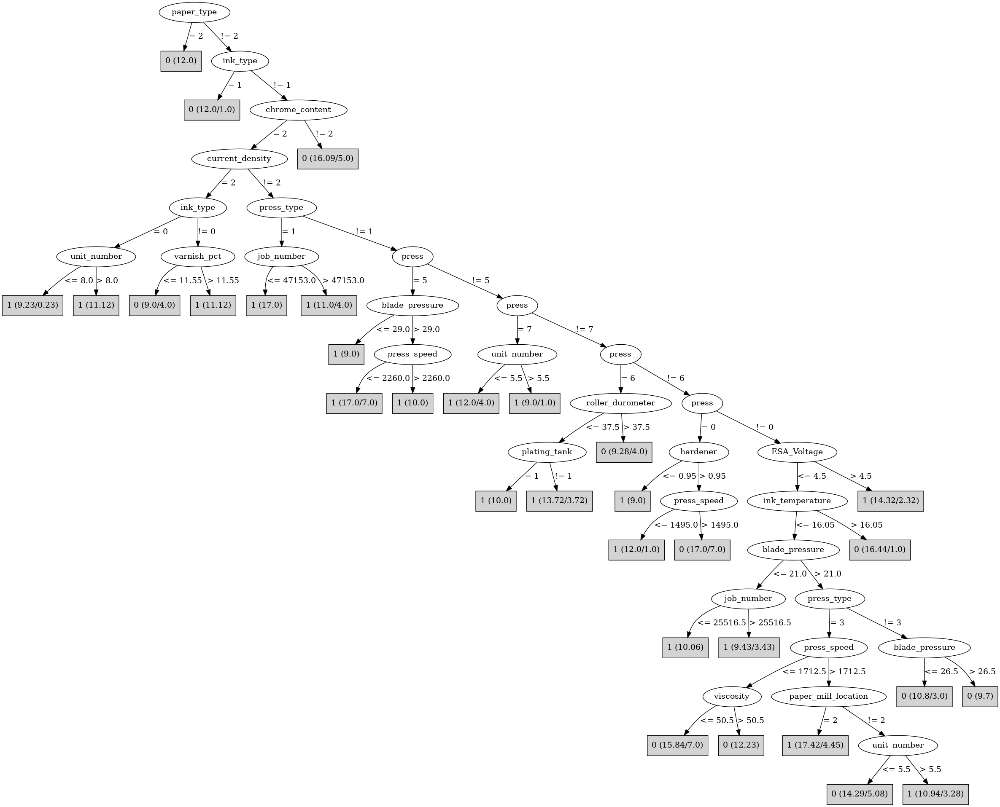

# J48

# SimpleCart Decision Tree

customer=(1)|(2)|(3)|(8)|(13)|(14)|(15)|(20)|(22)|(25)|(36)|(37)|(41)|(43)|(44)|(48)|(51)|(59)|(60)|(68)|(39)|(58)|(57)|(5)|(24)|(62)|(7)|(42)|(52)|(63)|(10)|(50)|(65)|(67)|(27)|(61)

* press=(7)|(5)|(1)|(4)|(6)|(0)

*   * viscosity < 62.5

*   *   * customer=(2)|(3)|(10)|(14)|(20)|(22)|(24)|(25)|(36)|(37)|(39)|(42)|(44)|(48)|(51)|(57)|(59)|(60)|(61)|(63)|(65)|(67)|(68)|(58)|(1)|(4)|(6)|(8)|(9)|(11)|(12)|(13)|(15)|(17)|(19)|(21)|(23)|(26)|(28)|(29)|(30)|(32)|(33)|(34)|(35)|(38)|(40)|(41)|(43)|(46)|(47)|(49)|(50)|(53)|(54)|(55)|(64)|(66)|(69)|(70)|(71): 1(74.0/1.0)

*   *   * customer!=(2)|(3)|(10)|(14)|(20)|(22)|(24)|(25)|(36)|(37)|(39)|(42)|(44)|(48)|(51)|(57)|(59)|(60)|(61)|(63)|(65)|(67)|(68)|(58)|(1)|(4)|(6)|(8)|(9)|(11)|(12)|(13)|(15)|(17)|(19)|(21)|(23)|(26)|(28)|(29)|(30)|(32)|(33)|(34)|(35)|(38)|(40)|(41)|(43)|(46)|(47)|(49)|(50)|(53)|(54)|(55)|(64)|(66)|(69)|(70)|(71)

*   *   *   * ink_temperature < 16.75

*   *   *   *   * ink_pct < 59.85

*   *   *   *   *   * type_on_cylinder=(1): 1(37.63/0.0)

*   *   *   *   *   * type_on_cylinder!=(1)

*   *   *   *   *   *   * solvent_pct < 39.6: 1(6.0/0.0)

*   *   *   *   *   *   * solvent_pct >= 39.6: 0(2.0/0.36)

*   *   *   *   * ink_pct >= 59.85

*   *   *   *   *   * humifity < 73.5: 0(5.0/1.0)

*   *   *   *   *   * humifity >= 73.5

*   *   *   *   *   *   * job_number < 47153.0: 1(6.0/0.0)

*   *   *   *   *   *   * job_number >= 47153.0: 0(1.0/1.0)

*   *   *   * ink_temperature >= 16.75

*   *   *   *   * caliper=(10): 1(2.0/0.0)

*   *   *   *   * caliper!=(10): 0(5.0/0.0)

*   * viscosity >= 62.5

*   *   * customer=(58)|(68): 1(2.0/0.0)

*   *   * customer!=(58)|(68): 0(7.0/0.0)

* press!=(7)|(5)|(1)|(4)|(6)|(0)

*   * customer=(1)|(8)|(13)|(15)|(41)|(43)|(59)|(39)|(68)|(24)|(62)|(50)|(2)|(3)|(4)|(6)|(7)|(9)|(11)|(12)|(14)|(17)|(19)|(20)|(21)|(22)|(23)|(25)|(26)|(27)|(28)|(29)|(30)|(32)|(33)|(34)|(35)|(36)|(37)|(38)|(40)|(44)|(46)|(47)|(48)|(49)|(51)|(53)|(54)|(55)|(60)|(64)|(65)|(66)|(69)|(70)|(71)

*   *   * humifity < 73.5: 0(4.0/0.0)

*   *   * humifity >= 73.5

*   *   *   * press_speed < 1325.0: 0(2.04/0.04)

*   *   *   * press_speed >= 1325.0

*   *   *   *   * ink_temperature < 13.649999999999999: 0(2.0/1.0)

*   *   *   *   * ink_temperature >= 13.649999999999999

*   *   *   *   *   * hardener < 1.25: 1(34.95/1.95)

*   *   *   *   *   * hardener >= 1.25

*   *   *   *   *   *   * customer=(39)|(43)|(50)|(1)|(2)|(3)|(4)|(5)|(6)|(7)|(8)|(9)|(10)|(11)|(12)|(13)|(14)|(15)|(17)|(19)|(20)|(21)|(22)|(23)|(24)|(25)|(26)|(27)|(28)|(29)|(30)|(32)|(33)|(34)|(35)|(36)|(37)|(38)|(40)|(41)|(42)|(44)|(46)|(47)|(48)|(49)|(51)|(52)|(53)|(54)|(55)|(57)|(58)|(59)|(60)|(61)|(63)|(64)|(65)|(66)|(67)|(68)|(69)|(70)|(71): 1(3.0/0.0)

*   *   *   *   *   *   * customer!=(39)|(43)|(50)|(1)|(2)|(3)|(4)|(5)|(6)|(7)|(8)|(9)|(10)|(11)|(12)|(13)|(14)|(15)|(17)|(19)|(20)|(21)|(22)|(23)|(24)|(25)|(26)|(27)|(28)|(29)|(30)|(32)|(33)|(34)|(35)|(36)|(37)|(38)|(40)|(41)|(42)|(44)|(46)|(47)|(48)|(49)|(51)|(52)|(53)|(54)|(55)|(57)|(58)|(59)|(60)|(61)|(63)|(64)|(65)|(66)|(67)|(68)|(69)|(70)|(71): 0(3.0/0.0)

*   * customer!=(1)|(8)|(13)|(15)|(41)|(43)|(59)|(39)|(68)|(24)|(62)|(50)|(2)|(3)|(4)|(6)|(7)|(9)|(11)|(12)|(14)|(17)|(19)|(20)|(21)|(22)|(23)|(25)|(26)|(27)|(28)|(29)|(30)|(32)|(33)|(34)|(35)|(36)|(37)|(38)|(40)|(44)|(46)|(47)|(48)|(49)|(51)|(53)|(54)|(55)|(60)|(64)|(65)|(66)|(69)|(70)|(71)

*   *   * caliper=(16)|(3)|(8)

*   *   *   * wax < 2.45: 0(3.0/0.0)

*   *   *   * wax >= 2.45

*   *   *   *   * hardener < 1.55: 1(8.0/0.42)

*   *   *   *   * hardener >= 1.55: 0(3.0/1.0)

*   *   * caliper!=(16)|(3)|(8): 0(20.57/0.0)

customer!=(1)|(2)|(3)|(8)|(13)|(14)|(15)|(20)|(22)|(25)|(36)|(37)|(41)|(43)|(44)|(48)|(51)|(59)|(60)|(68)|(39)|(58)|(57)|(5)|(24)|(62)|(7)|(42)|(52)|(63)|(10)|(50)|(65)|(67)|(27)|(61)

* customer=(21)|(32)|(34)|(47)|(17)|(26)|(64)|(6)|(1)|(2)|(3)|(5)|(7)|(8)|(10)|(13)|(14)|(15)|(20)|(22)|(24)|(25)|(27)|(36)|(37)|(39)|(41)|(42)|(43)|(44)|(48)|(50)|(51)|(52)|(57)|(58)|(59)|(60)|(61)|(62)|(63)|(65)|(67)|(68)

*   * caliper=(14)|(16)|(12)|(3)|(6)|(4)|(9)|(17)|(18)

*   *   * wax < 1.3: 0(4.14/0.0)

*   *   * wax >= 1.3

*   *   *   * ink_temperature < 16.9

*   *   *   *   * type_on_cylinder=(1)

*   *   *   *   *   * roller_durometer < 29.0: 0(1.02/0.0)

*   *   *   *   *   * roller_durometer >= 29.0

*   *   *   *   *   *   * anode_space_ratio < 112.15: 1(29.05/2.89)

*   *   *   *   *   *   * anode_space_ratio >= 112.15: 0(1.0/0.01)

*   *   *   *   * type_on_cylinder!=(1)

*   *   *   *   *   * caliper=(12)|(3)|(0)|(1)|(2)|(4)|(7)|(8)|(9)|(10)|(11)|(13)|(14)|(15)|(16)|(17)|(18)

*   *   *   *   *   *   * ink_temperature < 15.75: 1(5.0/0.0)

*   *   *   *   *   *   * ink_temperature >= 15.75: 0(1.93/1.0)

*   *   *   *   *   * caliper!=(12)|(3)|(0)|(1)|(2)|(4)|(7)|(8)|(9)|(10)|(11)|(13)|(14)|(15)|(16)|(17)|(18): 0(5.66/0.0)

*   *   *   * ink_temperature >= 16.9: 0(4.53/1.0)

*   * caliper!=(14)|(16)|(12)|(3)|(6)|(4)|(9)|(17)|(18)

*   *   * blade_pressure < 25.5

*   *   *   * viscosity < 46.0

*   *   *   *   * roughness < 0.6875: 1(7.46/0.0)

*   *   *   *   * roughness >= 0.6875: 0(2.0/0.99)

*   *   *   * viscosity >= 46.0

*   *   *   *   * unit_number < 4.0: 1(1.46/0.0)

*   *   *   *   * unit_number >= 4.0: 0(10.94/1.0)

*   *   * blade_pressure >= 25.5

*   *   *   * paper_mill_location=(3): 0(2.34/1.0)

*   *   *   * paper_mill_location!=(3): 0(22.49/0.0)

* customer!=(21)|(32)|(34)|(47)|(17)|(26)|(64)|(6)|(1)|(2)|(3)|(5)|(7)|(8)|(10)|(13)|(14)|(15)|(20)|(22)|(24)|(25)|(27)|(36)|(37)|(39)|(41)|(42)|(43)|(44)|(48)|(50)|(51)|(52)|(57)|(58)|(59)|(60)|(61)|(62)|(63)|(65)|(67)|(68): 0(32.0/0.0)

# PART

Decision list:

conditions|predicted class
---|---
paper_type = 2| 0 (12.0)
ink_type = 1 AND proof_cut > 40.0| 0 (10.0)
customer != 69 AND chrome_content != 1 AND customer != 35 AND press_speed > 2100.0 AND customer != 26 AND humifity > 71.0 AND ink_temperature <= 17.0 AND anode_space_ratio <= 108.1 AND job_number <= 37572.0| 1 (45.71)
customer != 69 AND chrome_content != 1 AND customer != 35 AND ink_temperature > 16.8 AND anode_space_ratio <= 106.5 AND press != 0 AND press_speed <= 2100.0| 0 (18.0)
customer != 69 AND customer != 35 AND chrome_content != 1 AND ESA_Voltage > 4.0 AND press_speed > 1660.0 AND anode_space_ratio <= 109.67 AND press_type = 2| 1 (10.0)
customer != 69 AND customer != 35 AND chrome_content != 1 AND press_type = 1 AND viscosity <= 63.0 AND humifity <= 85.0| 1 (24.57)
customer != 69 AND customer != 35 AND chrome_content != 1 AND press = 5 AND job_number > 34693.0 AND blade_pressure <= 35.0| 1 (18.0)
customer != 69 AND customer != 35 AND chrome_content != 1 AND hardener <= 0.5 AND press_speed > 1620.0 AND current_density != 2 AND blade_pressure > 26.0| 0 (9.0)
customer != 69 AND customer != 35 AND chrome_content != 1 AND caliper = 12 AND paper_type != 1 AND press_speed <= 1800.0| 1 (12.08)
customer != 69 AND customer != 35 AND chrome_content != 1 AND customer != 28 AND solvent_pct > 42.2 AND press_speed > 1480.0 AND viscosity > 39.0| 0 (8.46)
customer != 69 AND customer != 35 AND chrome_content != 1 AND customer != 28 AND current_density = 2 AND customer != 67 AND viscosity > 51.0| 1 (16.22)
customer != 69 AND customer != 35 AND chrome_content != 1 AND customer != 28 AND customer != 59 AND humifity > 88.0 AND viscosity <= 65.0| 1 (9.0)
customer != 59 AND customer != 69 AND customer != 35 AND chrome_content = 1| 0 (7.08)
customer != 69 AND customer != 35 AND customer != 28 AND customer != 59 AND ESA_Voltage > 4.5 AND wax > 2.5| 1 (5.0)
customer = 69| 0 (4.0)
customer = 35| 0 (3.0)
caliper = 16 AND unit_number <= 2.0| 1 (2.22/0.18)
customer != 28 AND blade_pressure <= 21.0 AND blade_pressure > 18.0 AND anode_space_ratio > 96.875 AND viscosity <= 48.0 AND varnish_pct > 2.5| 1 (15.25)
customer != 1 AND customer != 2 AND customer != 36 AND customer != 59 AND current_density != 0 AND hardener > 1.5 AND job_number <= 47204.0 AND job_number <= 36167.0| 1 (3.79)
caliper = 14 AND varnish_pct <= 10.0| 0 (4.28)
press = 0 AND viscosity <= 61.0 AND wax > 2.75 AND humifity <= 83.0| 1 (17.0)
customer != 1 AND customer != 59 AND current_density != 0 AND unit_number <= 7.0 AND ink_temperature > 13.7 AND job_number <= 37169.0 AND job_number <= 35683.0 AND roughness > 0.3125 AND anode_space_ratio <= 110.3 AND job_number > 25466.0 AND customer != 65 AND press != 6| 0 (22.56)
customer != 1 AND customer != 59 AND job_number <= 47202.0 AND press_speed <= 1640.0 AND customer != 50 AND caliper != 15 AND job_number > 34590.0| 0 (15.81)
job_number <= 47202.0 AND solvent_pct <= 34.5 AND cylinder_size = 3| 0 (8.33)
job_number <= 47202.0 AND solvent_pct <= 37.0 AND hardener <= 1.2 AND cylinder_size != 3| 1 (10.68)
job_number <= 47202.0 AND hardener <= 0.9 AND ink_temperature > 14.02| 1 (12.87)
humifity <= 86.0 AND job_number > 47202.0| 0 (4.93)
job_number <= 29442.0| 0 (4.84)
humifity <= 86.0 AND humifity > 69.0 AND hardener > 0.75 AND customer != 62 AND press_speed <= 1683.0 AND roughness > 0.625| 1 (4.16)
humifity <= 86.0 AND hardener > 0.75 AND wax <= 2.6 AND press_type != 0 AND customer != 62 AND job_number <= 38240.0 AND job_number <= 37355.0 AND ink_temperature <= 15.9 AND viscosity <= 54.0| 1 (8.0)
humifity <= 86.0 AND hardener > 0.75 AND ESA_Voltage <= 3.0 AND unit_number <= 7.0| 0 (14.47)
hardener <= 1.35 AND job_number > 37081.0 AND ink_type = 0| 1 (6.0)
type_on_cylinder != 0 AND viscosity <= 50.0| 1 (4.0)
blade_pressure <= 27.0| 0 (3.56/1.63)
| 0 (3.14)

# JRip

Decision list:

conditions|predicted class
---|---
(press_speed <= 2020) and (blade_pressure <= 40) and (ink_temperature >= 17) and (humifity <= 89)|0 (21.0/0.0)
(press_speed <= 2100) and (press_type = 3) and (ink_temperature <= 15.2) and (wax <= 2.5) and (proof_cut <= 55) and (current_density = 4)|0 (24.0/0.0)
(press_speed <= 2100) and (blade_pressure >= 23) and (press = 4) and (current_density = 4) and (viscosity <= 56)|0 (16.0/0.0)
(viscosity >= 59) and (grain_screened = 2) and (proof_cut <= 52)|0 (18.0/0.0)
(press = 2) and (ink_temperature >= 16.1) and (unit_number <= 2)|0 (7.0/0.0)
(press = 3) and (humifity <= 72)|0 (6.0/0.0)
(job_number >= 47301) and (job_number <= 85814)|0 (8.0/0.0)
(type_on_cylinder = 0) and (varnish_pct <= 2.2) and (roller_durometer <= 30)|0 (6.0/0.0)
(humifity >= 83) and (ink_type = 2) and (solvent_pct >= 37.8) and (job_number >= 36644)|0 (7.0/0.0)
(hardener >= 1) and (roller_durometer >= 38) and (press_speed >= 1800) and (solvent_pct >= 39.8)|0 (6.0/0.0)
(hardener >= 1) and (viscosity <= 52) and (humifity >= 82)|0 (14.0/6.0)
|1 (245.0/25.0)

# Decision Table

Non matches covered by Majority class

proof_on_ctd_ink|blade_mfg|ink_type|solvent_type|press_type|varnish_pct|ink_pct|solvent_pct|esa_voltage|target
---|---|---|---|---|---|---|---|---|---
?|?|2|?|0|?|?|?|?|0
?|?|1|?|0|?|?|?|?|0
?|?|0|?|0|?|?|?|?|0
2|?|1|0|3|?|?|?|(-inf-4.25]|0
2|1|2|0|3|all|all|all|(4.25-inf)|1
2|1|2|2|3|all|all|all|(-inf-4.25]|0
2|1|0|0|2|all|all|all|?|1
1|1|0|0|3|all|all|all|(4.25-inf)|0
2|1|2|0|2|all|all|all|(4.25-inf)|1
2|1|0|0|3|all|all|all|(4.25-inf)|1
2|1|2|2|2|all|all|all|(-inf-4.25]|0
2|2|2|0|3|all|all|all|(-inf-4.25]|0
1|1|0|0|2|all|all|all|(4.25-inf)|1
2|1|2|0|3|all|all|all|(-inf-4.25]|0
2|1|0|0|2|all|all|all|(4.25-inf)|1
2|1|2|2|1|all|all|all|(-inf-4.25]|0
2|1|1|0|3|all|all|all|(-inf-4.25]|0
1|1|0|0|3|all|all|all|(-inf-4.25]|0
2|1|2|0|2|all|all|all|(-inf-4.25]|0
2|1|0|0|3|all|all|all|(-inf-4.25]|1
2|1|0|1|2|all|all|all|(-inf-4.25]|0
2|1|1|0|2|all|all|all|(-inf-4.25]|0
2|1|2|2|0|all|all|all|(-inf-4.25]|1
2|?|0|0|2|all|all|all|(-inf-4.25]|1
2|1|2|0|1|all|all|all|(-inf-4.25]|1
?|1|0|0|2|all|all|all|(-inf-4.25]|0
1|1|0|0|2|all|all|all|(-inf-4.25]|1
2|1|0|0|2|all|all|all|(-inf-4.25]|1
2|1|1|0|1|all|all|all|(-inf-4.25]|0
2|1|2|0|0|all|all|all|(-inf-4.25]|1
2|1|0|0|1|all|all|all|(-inf-4.25]|1
2|1|1|0|0|all|all|all|(-inf-4.25]|0
2|1|0|0|0|all|all|all|(-inf-4.25]|1
?|?|2|?|3|?|?|?|?|0
?|?|0|?|3|?|?|?|?|0
?|?|2|?|2|?|?|?|?|0
?|?|0|?|2|?|?|?|?|0

