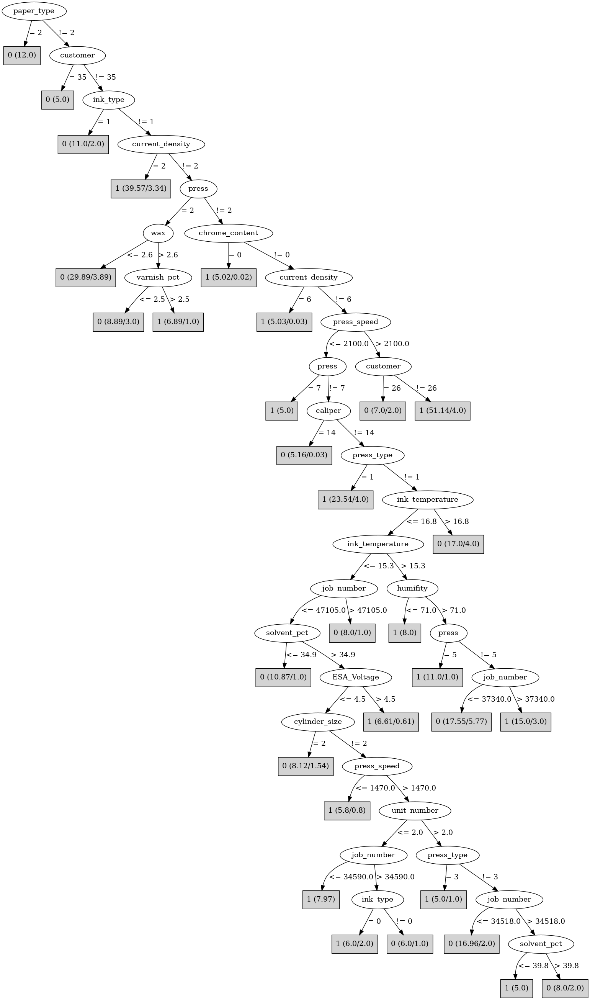

# J48

# SimpleCart Decision Tree

customer=(1)|(2)|(3)|(8)|(13)|(14)|(15)|(16)|(22)|(25)|(36)|(39)|(41)|(42)|(43)|(44)|(48)|(51)|(57)|(58)|(59)|(65)|(68)|(24)|(27)|(53)|(62): 1(108.0/22.0)

customer!=(1)|(2)|(3)|(8)|(13)|(14)|(15)|(16)|(22)|(25)|(36)|(39)|(41)|(42)|(43)|(44)|(48)|(51)|(57)|(58)|(59)|(65)|(68)|(24)|(27)|(53)|(62)

* press=(1)|(7)|(5)|(0)|(6)

*   * customer=(6)|(10)|(40)|(63)|(5)|(52)|(61)|(47)|(7)|(17)|(67)|(1)|(2)|(3)|(8)|(9)|(11)|(12)|(13)|(14)|(15)|(16)|(22)|(24)|(25)|(27)|(29)|(32)|(33)|(34)|(36)|(37)|(39)|(41)|(42)|(43)|(44)|(46)|(48)|(49)|(50)|(51)|(53)|(55)|(56)|(57)|(58)|(59)|(62)|(64)|(65)|(68)|(71)

*   *   * job_number < 47203.5: 1(68.0/26.0)

*   *   * job_number >= 47203.5: 0(6.0/0.0)

*   * customer!=(6)|(10)|(40)|(63)|(5)|(52)|(61)|(47)|(7)|(17)|(67)|(1)|(2)|(3)|(8)|(9)|(11)|(12)|(13)|(14)|(15)|(16)|(22)|(24)|(25)|(27)|(29)|(32)|(33)|(34)|(36)|(37)|(39)|(41)|(42)|(43)|(44)|(46)|(48)|(49)|(50)|(51)|(53)|(55)|(56)|(57)|(58)|(59)|(62)|(64)|(65)|(68)|(71): 0(13.0/2.0)

* press!=(1)|(7)|(5)|(0)|(6): 0(96.0/37.0)

# PART

Decision list:

conditions|predicted class
---|---
paper_type != 2 AND current_density = 2| 1 (38.38/3.38)
paper_type != 2 AND press = 2 AND customer != 59 AND current_density != 1| 0 (36.83/6.0)
paper_type != 2 AND customer != 35 AND ink_type = 0 AND customer != 69 AND customer != 58 AND press != 0 AND press_type != 0 AND grain_screened = 1 AND press_type != 1 AND current_density = 4 AND customer != 39 AND press = 7| 1 (13.0/1.0)
paper_type != 2 AND customer != 35 AND grain_screened = 1 AND customer != 69 AND press_type != 1 AND press != 0 AND press_type != 0 AND customer != 58 AND customer != 5 AND current_density = 4 AND customer != 39 AND customer != 1 AND customer != 10 AND customer != 43 AND customer != 59 AND caliper != 12 AND customer != 27 AND customer != 68 AND anode_space_ratio <= 109.785 AND press != 5 AND ESA_Voltage <= 3.5 AND press_speed <= 2125.0 AND press != 4 AND roughness > 0.40625| 0 (14.27/1.13)
paper_type != 2 AND customer != 35 AND grain_screened = 1 AND customer != 69 AND customer != 27 AND customer != 26 AND customer != 21 AND press != 4 AND chrome_content = 2 AND press != 3| 1 (56.12/2.69)
paper_type = 2| 0 (10.0)
customer != 35 AND customer != 1 AND customer != 6 AND customer != 10 AND customer != 14 AND customer != 39 AND customer != 43 AND customer != 53 AND customer != 68 AND chrome_content != 0 AND customer != 7 AND customer != 23 AND customer != 40 AND customer != 69 AND ink_type != 1 AND caliper != 14 AND customer = 64 AND ink_pct <= 54.05| 0 (9.0)
customer != 35 AND customer != 7 AND customer != 23 AND customer != 40 AND customer != 69 AND customer != 1 AND customer != 6 AND customer != 10 AND customer != 14 AND customer != 39 AND customer != 43 AND customer != 53 AND ink_type != 1 AND customer != 68 AND chrome_content != 0 AND caliper != 14 AND type_on_cylinder = 0 AND proof_cut <= 57.5| 0 (23.04/3.81)
customer != 35 AND customer != 7 AND customer != 23 AND customer != 40 AND customer != 69 AND customer != 65 AND current_density != 6 AND customer != 1 AND customer != 10 AND hardener > 1.375| 0 (5.78)
customer != 35 AND customer != 7 AND customer != 23 AND customer != 40 AND customer != 69 AND current_density != 1 AND customer != 17 AND customer != 61 AND customer != 65 AND current_density = 4 AND customer != 1 AND caliper != 14 AND caliper != 12 AND type_on_cylinder != 0 AND ESA_Voltage <= 3.5 AND customer != 10 AND customer != 63 AND press_type != 2 AND customer != 26 AND varnish_pct > 0.25| 1 (15.63/1.63)
customer != 35 AND customer != 7 AND customer != 23 AND customer != 40 AND customer != 69 AND current_density = 1 AND wax > 2.55| 0 (5.0)
customer != 35 AND customer != 7 AND customer != 23 AND customer != 40 AND customer != 69 AND current_density = 4 AND customer != 61 AND customer != 65 AND ESA_Voltage > 3.5| 1 (14.9/0.46)
customer != 35 AND customer != 7 AND customer != 23 AND customer != 40 AND customer != 69 AND current_density = 4 AND customer != 65 AND customer != 1 AND customer != 10 AND customer != 14 AND chrome_content != 0 AND caliper != 12 AND proof_cut <= 52.5 AND caliper != 8 AND ink_type != 1 AND paper_mill_location = 2 AND hardener > 0.95| 0 (12.23/1.74)
customer != 35 AND customer != 7 AND customer != 23 AND customer != 40 AND customer != 69 AND anode_space_ratio <= 108.25 AND customer != 17 AND cylinder_size != 2| 1 (38.19/3.15)
cylinder_size != 2| 0 (17.3/1.0)
blade_pressure > 27.0| 0 (3.16/0.25)
| 1 (2.17/0.0)

# JRip

Decision list:

conditions|predicted class
---|---
(press_speed <= 2000) and (blade_pressure <= 40)|0 (197.0/80.0)
|1 (181.0/46.0)

# Decision Table

Non matches covered by Majority class

press|viscosity|roller_durometer|target
---|---|---|---
2|?|?|0
7|?|?|0
7|all|?|0
0|all|?|0
2|all|?|0
4|all|?|0
3|all|?|0
6|all|?|0
5|all|?|0
5|all|(33.5-inf)|0
6|all|(33.5-inf)|0
0|all|(33.5-inf)|1
7|all|(33.5-inf)|1
4|all|(33.5-inf)|0
1|all|(33.5-inf)|1
3|all|(33.5-inf)|0
2|all|(33.5-inf)|0
5|?|(-inf-33.5]|0
1|all|(-inf-33.5]|1
4|all|(-inf-33.5]|1
3|all|(-inf-33.5]|1
7|all|(-inf-33.5]|1
6|all|(-inf-33.5]|1
0|all|(-inf-33.5]|1
2|all|(-inf-33.5]|0
5|all|(-inf-33.5]|1

