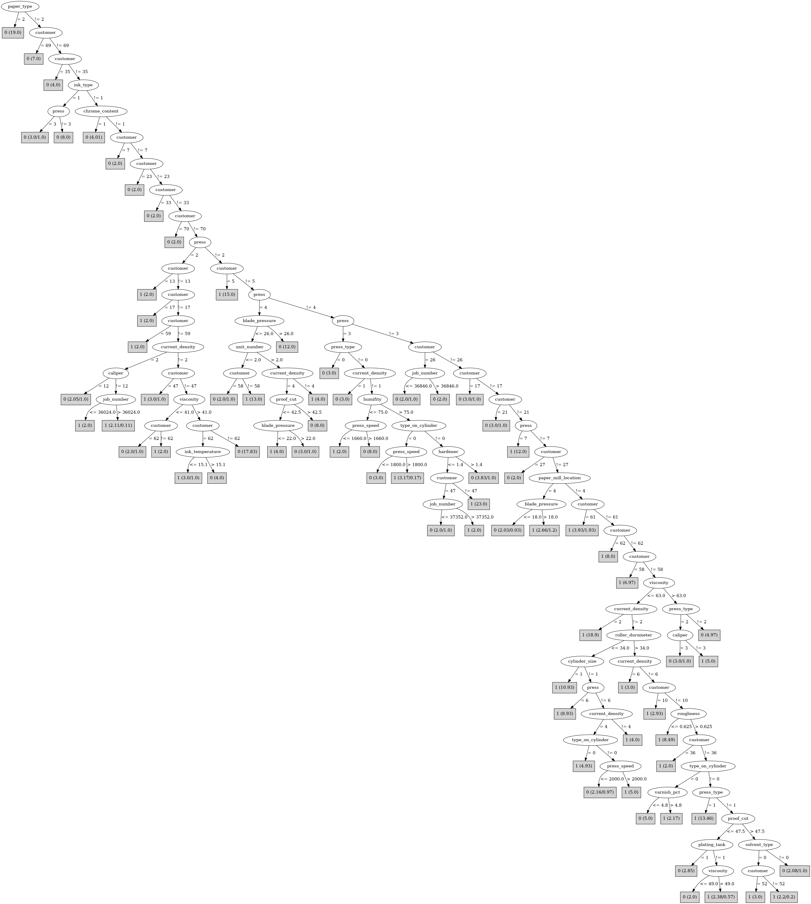

# J48

# SimpleCart Decision Tree

customer=(1)|(2)|(8)|(13)|(14)|(15)|(16)|(18)|(20)|(22)|(25)|(36)|(37)|(39)|(44)|(48)|(51)|(53)|(59)|(60)|(24)|(43)|(58)|(5)|(68)|(57)|(65)|(63)|(50)|(67)|(62)|(52)|(10)

* press=(6)|(7)|(5)|(1)|(0)|(4)

*   * job_number < 47105.5: 1(113.0/8.0)

*   * job_number >= 47105.5: 1(13.0/10.0)

* press!=(6)|(7)|(5)|(1)|(0)|(4)

*   * customer=(1)|(8)|(13)|(15)|(18)|(39)|(43)|(59)|(24)|(50): 1(19.0/2.0)

*   * customer!=(1)|(8)|(13)|(15)|(18)|(39)|(43)|(59)|(24)|(50)

*   *   * press_speed < 1718.0: 0(18.0/1.32)

*   *   * press_speed >= 1718.0

*   *   *   * humifity < 75.5: 0(10.0/0.0)

*   *   *   * humifity >= 75.5: 1(20.67/10.0)

customer!=(1)|(2)|(8)|(13)|(14)|(15)|(16)|(18)|(20)|(22)|(25)|(36)|(37)|(39)|(44)|(48)|(51)|(53)|(59)|(60)|(24)|(43)|(58)|(5)|(68)|(57)|(65)|(63)|(50)|(67)|(62)|(52)|(10)

* customer=(47)|(27)|(34)|(42)|(61)|(64)|(6)|(26)|(40)|(17)|(21)|(32)|(1)|(2)|(5)|(8)|(10)|(13)|(14)|(15)|(16)|(18)|(20)|(22)|(24)|(25)|(36)|(37)|(39)|(43)|(44)|(48)|(50)|(51)|(52)|(53)|(57)|(58)|(59)|(60)|(62)|(63)|(65)|(67)|(68)

*   * caliper=(14)|(16)|(12)|(3)|(6)|(13)|(4)|(9)|(17)|(18)|(19)

*   *   * wax < 1.55: 0(5.79/0.0)

*   *   * wax >= 1.55: 1(40.61/16.96)

*   * caliper!=(14)|(16)|(12)|(3)|(6)|(13)|(4)|(9)|(17)|(18)|(19)

*   *   * ink_type=(0): 1(8.46/5.38)

*   *   * ink_type!=(0)

*   *   *   * hardener < 0.75: 0(4.12/3.99)

*   *   *   * hardener >= 0.75: 0(30.72/1.92)

* customer!=(47)|(27)|(34)|(42)|(61)|(64)|(6)|(26)|(40)|(17)|(21)|(32)|(1)|(2)|(5)|(8)|(10)|(13)|(14)|(15)|(16)|(18)|(20)|(22)|(24)|(25)|(36)|(37)|(39)|(43)|(44)|(48)|(50)|(51)|(52)|(53)|(57)|(58)|(59)|(60)|(62)|(63)|(65)|(67)|(68): 0(35.0/0.0)

# PART

Decision list:

conditions|predicted class
---|---
paper_type = 2| 0 (19.0)
customer = 58 AND press_speed > 2150| 1 (9.0)
customer = 69| 0 (7.0)
customer = 24| 1 (6.0/1.0)
customer = 5 AND press = 6| 1 (5.0)
customer = 68 AND press_speed > 2050| 1 (14.0)
customer = 67| 1 (8.0/2.0)
customer = 63 AND type_on_cylinder = 0| 1 (6.35/0.35)
customer = 5 AND press_speed <= 2290| 0 (7.0/3.0)
customer = 62 AND press_type = 2| 1 (8.0)
customer = 5| 1 (7.0)
customer = 47 AND anode_space_ratio <= 108.1 AND paper_mill_location = 3 AND viscosity > 44| 1 (5.84)
customer = 52 AND job_number <= 47203 AND type_on_cylinder = 1 AND caliper = 3| 1 (9.0)
customer = 10| 1 (8.0/3.0)
customer = 17| 0 (8.0/3.0)
customer = 63 AND roughness <= 0.75| 0 (6.18/2.53)
customer = 47 AND anode_space_ratio <= 108.1 AND humifity > 77 AND unit_number <= 2| 1 (6.89)
customer = 47 AND anode_space_ratio <= 108.1 AND ink_temperature > 14.7 AND ink_pct <= 54.9| 1 (6.26/1.0)
customer = 47 AND ink_type = 2| 0 (7.0)
customer = 68 AND blade_pressure > 29| 0 (6.0/1.0)
customer = 64 AND blade_pressure <= 26 AND unit_number <= 2| 1 (10.0)
customer = 64 AND caliper = 8| 0 (6.32)
customer = 64 AND job_number <= 25507| 0 (8.0/4.0)
customer = 62 AND hardener <= 0.9| 1 (7.0/1.0)
customer = 64| 0 (5.68)
customer = 63| 1 (5.47/1.0)
current_density = 2 AND humifity <= 91| 1 (19.28)
customer = 52 AND job_number <= 47203 AND caliper = 10| 0 (8.0/3.0)
customer = 52 AND job_number <= 47203 AND varnish_pct > 4.4 AND hardener > 0.9| 1 (8.0/1.0)
customer = 52 AND hardener > 0.9 AND paper_type = 3| 0 (8.0)
customer = 62| 0 (8.0/1.0)
customer = 52 AND paper_type = 3| 1 (7.0)
customer = 52| 0 (6.0/1.0)
customer = 6| 0 (5.0/2.0)
customer = 26| 0 (5.0/2.0)
customer = 47 AND job_number <= 37352| 0 (5.0/1.0)
customer = 47| 1 (5.0/1.0)
humifity > 67 AND current_density = 4 AND cylinder_size = 1 AND viscosity <= 61 AND press_type = 0| 1 (11.0)
humifity <= 67| 1 (8.0)
unit_number > 7 AND hardener > 1.2| 1 (6.0)
current_density = 4 AND ink_type = 2 AND viscosity > 46| 0 (11.0)
current_density = 4 AND job_number > 37335| 1 (9.72/1.0)
ink_pct > 49.5 AND type_on_cylinder = 1 AND press = 3| 1 (9.74/4.74)
ink_pct > 49.5 AND paper_mill_location = 2 AND unit_number <= 2| 0 (11.21)
varnish_pct <= 2.4 AND roughness <= 0.75| 0 (10.52)
paper_mill_location = 2| 1 (6.7/0.7)
| 1 (7.83/3.82)

# JRip

Decision list:

conditions|predicted class
---|---
(press_speed <= 2020) and (blade_pressure <= 35) and (unit_number <= 7) and (blade_pressure >= 26) and (anode_space_ratio <= 102.94) and (current_density = 4)|0 (21.0/0.0)
(press_speed <= 2100) and (paper_type = 2)|0 (16.0/0.0)
(press_speed <= 2020) and (viscosity >= 58) and (varnish_pct <= 0) and (job_number >= 36784)|0 (14.0/0.0)
(press_speed <= 2020) and (blade_pressure <= 30) and (roughness <= 0.75) and (blade_pressure >= 25) and (anode_space_ratio >= 108.1) and (anode_space_ratio <= 117.7)|0 (12.0/0.0)
(press_type = 3) and (humifity <= 75) and (job_number <= 36059)|0 (12.0/0.0)
(press_speed <= 1950) and (blade_pressure <= 30)|0 (98.0/58.0)
|1 (205.0/41.0)

# Decision Table

Non matches covered by Majority class

cylinder_division|paper_mill_location|ink_pct|hardener|target
---|---|---|---|---
1|?|?|(0.95-inf)|0
1|4|(-inf-64]|(0.95-inf)|0
1|?|?|?|0
1|3|(-inf-64]|(0.95-inf)|1
1|4|(-inf-64]|?|0
1|2|?|(0.35-0.95]|0
1|0|(64-inf)|(0.95-inf)|0
1|2|(-inf-64]|(0.95-inf)|1
1|?|?|(0.35-0.95]|0
1|?|(-inf-64]|(0.95-inf)|0
1|1|(-inf-64]|(0.95-inf)|1
1|2|(-inf-64]|?|0
1|3|(-inf-64]|(0.35-0.95]|0
1|0|(-inf-64]|(0.95-inf)|1
1|2|(-inf-64]|(0.35-0.95]|1
1|?|?|(-inf-0.35]|0
1|0|(-inf-64]|?|0
1|?|(-inf-64]|(0.35-0.95]|1
1|1|(-inf-64]|(0.35-0.95]|1
1|0|(-inf-64]|(0.35-0.95]|1
1|0|(64-inf)|(-inf-0.35]|0
1|2|(-inf-64]|(-inf-0.35]|0
1|?|(-inf-64]|(-inf-0.35]|0
1|0|(-inf-64]|(-inf-0.35]|0

