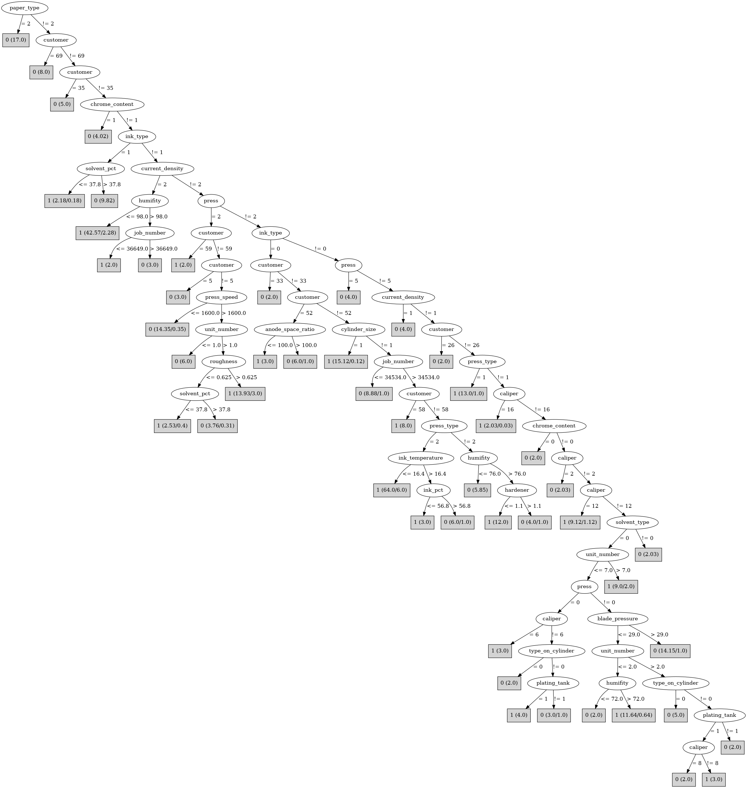

# J48

# SimpleCart Decision Tree

customer=(1)|(2)|(3)|(8)|(13)|(14)|(15)|(16)|(18)|(20)|(22)|(25)|(42)|(44)|(48)|(51)|(59)|(60)|(58)|(39)|(57)|(5)|(68)|(63)|(7)|(10)|(21)|(40)|(53)|(65)|(67)|(52)|(24)|(62)|(61)|(17)|(27)|(32)|(34)|(37)|(41)|(43)|(49)|(47)|(64)|(26)|(50)

* press=(1)|(0)|(7)|(5)|(6): 1(139.0/38.0)

* press!=(1)|(0)|(7)|(5)|(6)

*   * customer=(1)|(8)|(13)|(15)|(16)|(18)|(51)|(59)|(39): 1(17.0/1.0)

*   * customer!=(1)|(8)|(13)|(15)|(16)|(18)|(51)|(59)|(39)

*   *   * press_speed < 2035.0

*   *   *   * caliper=(16)|(12)|(2)|(14)|(3)|(8)|(15)|(5)|(9)|(17)|(18)|(19)

*   *   *   *   * unit_number < 8.0

*   *   *   *   *   * customer=(34)|(37)|(67)|(32)|(10)|(24)|(64)|(1)|(2)|(3)|(5)|(6)|(7)|(8)|(9)|(11)|(12)|(13)|(14)|(15)|(16)|(18)|(19)|(20)|(22)|(23)|(25)|(26)|(27)|(28)|(30)|(31)|(33)|(35)|(38)|(39)|(40)|(42)|(44)|(45)|(46)|(48)|(49)|(51)|(53)|(54)|(55)|(56)|(57)|(59)|(60)|(65)|(66)|(69)|(70)|(71)

*   *   *   *   *   *   * unit_number < 4.5: 1(10.0/2.0)

*   *   *   *   *   *   * unit_number >= 4.5: 0(9.57/5.0)

*   *   *   *   *   * customer!=(34)|(37)|(67)|(32)|(10)|(24)|(64)|(1)|(2)|(3)|(5)|(6)|(7)|(8)|(9)|(11)|(12)|(13)|(14)|(15)|(16)|(18)|(19)|(20)|(22)|(23)|(25)|(26)|(27)|(28)|(30)|(31)|(33)|(35)|(38)|(39)|(40)|(42)|(44)|(45)|(46)|(48)|(49)|(51)|(53)|(54)|(55)|(56)|(57)|(59)|(60)|(65)|(66)|(69)|(70)|(71): 0(22.63/3.0)

*   *   *   *   * unit_number >= 8.0: 1(11.0/1.0)

*   *   *   * caliper!=(16)|(12)|(2)|(14)|(3)|(8)|(15)|(5)|(9)|(17)|(18)|(19)

*   *   *   *   * customer=(41)|(50)|(62)|(64): 0(7.28/5.78)

*   *   *   *   * customer!=(41)|(50)|(62)|(64): 0(34.28/1.0)

*   *   * press_speed >= 2035.0: 1(22.21/8.21)

customer!=(1)|(2)|(3)|(8)|(13)|(14)|(15)|(16)|(18)|(20)|(22)|(25)|(42)|(44)|(48)|(51)|(59)|(60)|(58)|(39)|(57)|(5)|(68)|(63)|(7)|(10)|(21)|(40)|(53)|(65)|(67)|(52)|(24)|(62)|(61)|(17)|(27)|(32)|(34)|(37)|(41)|(43)|(49)|(47)|(64)|(26)|(50): 0(39.0/1.0)

# PART

Decision list:

conditions|predicted class
---|---
current_density = 2 AND ink_type = 0 AND type_on_cylinder = 1 AND press_type = 2| 1 (12.87)
paper_type = 2| 0 (17.0)
customer = 58 AND press_speed > 1950| 1 (9.0)
customer = 69| 0 (8.0)
customer = 35| 0 (5.0)
current_density = 2 AND humifity <= 91 AND ink_type = 2| 1 (18.0)
customer = 6 AND proof_cut <= 48.5| 0 (3.0)
customer = 39 AND hardener <= 0.95| 1 (3.0)
customer = 10 AND press_speed > 1445| 1 (6.0)
customer = 59| 1 (3.0)
customer = 1| 1 (2.0)
customer = 2| 1 (2.0)
customer = 10| 0 (2.0)
current_density = 1 AND ink_type = 0 AND press = 6| 1 (4.0)
proof_cut <= 33.75 AND customer = 62| 1 (3.13)
current_density = 4 AND customer = 63 AND humifity <= 83.5 AND press_type = 2| 1 (10.0)
current_density = 0| 1 (3.06/0.03)
customer = 12| 0 (2.0)
customer = 20| 1 (2.0)
customer = 23| 0 (2.0)
current_density = 3| 0 (3.06/0.02)
customer = 33| 0 (2.0)
customer = 40| 1 (2.0)
customer = 42| 1 (2.0)
type_on_cylinder = 0 AND customer = 64 AND roller_durometer <= 37| 0 (6.0)
chrome_content = 0 AND plating_tank = 1| 0 (6.05)
chrome_content = 2 AND press_speed > 2112.5 AND customer = 68| 1 (10.0)
chrome_content = 1| 0 (4.03)
customer = 50 AND job_number <= 37361| 0 (2.0)
customer = 5 AND press_type = 2 AND type_on_cylinder = 1| 1 (7.0)
customer = 5 AND plating_tank = 1| 0 (4.0)
proof_cut <= 33.75 AND customer = 68| 1 (2.11/0.11)
customer = 68 AND hardener > 0.85| 0 (5.83)
customer = 52 AND job_number <= 47203.5 AND viscosity <= 61.5 AND caliper = 3| 1 (7.0)
customer = 47 AND anode_space_ratio <= 108.535 AND grain_screened = 1 AND ink_temperature > 15.1| 1 (14.0)
customer = 47 AND press_type = 3| 0 (5.0)
customer = 47 AND wax <= 2.05| 0 (4.22)
customer = 7| 1 (3.0/1.0)
customer = 24| 0 (3.0/1.0)
customer = 53| 1 (3.0/1.0)
ink_type = 1| 0 (7.98)
customer = 32| 1 (3.0/1.0)
customer = 61 AND viscosity > 50| 0 (3.0/1.0)
customer = 67| 1 (3.0/1.0)
customer = 68| 1 (3.0/1.0)
customer = 21| 1 (2.94/0.94)
customer = 5| 1 (2.0)
customer = 17| 1 (2.0)
customer = 58| 0 (2.0)
customer = 61| 1 (2.0)
customer = 62 AND unit_number > 5.5 AND caliper = 3| 1 (2.0)
customer = 26 AND type_on_cylinder = 0| 0 (3.0)
job_number > 47203.5| 0 (8.0)
customer = 26 AND job_number <= 35459| 1 (2.0)
customer = 52 AND caliper = 6 AND type_on_cylinder = 1| 1 (3.0)
customer = 52 AND current_density = 4 AND job_number <= 47105.5| 1 (9.0)
customer = 52 AND caliper = 10 AND anode_space_ratio <= 103.33| 0 (3.0)
customer = 47 AND press_speed <= 1795| 1 (4.0)
viscosity > 63.5| 0 (7.0)
current_density = 2| 1 (4.09)
customer = 52 AND press_speed > 1675| 1 (4.0)
customer = 64 AND unit_number > 4.5 AND proof_cut > 42.25 AND hardener <= 0.85| 0 (5.0)
customer = 64 AND blade_pressure <= 22.5| 1 (6.0)
customer = 47 AND varnish_pct <= 10.3| 0 (4.78)
customer = 47| 1 (4.0)
customer = 52| 0 (3.0)
customer = 64| 1 (3.0/1.0)
customer = 6| 0 (2.0/1.0)
type_on_cylinder = 0 AND press_type = 2 AND solvent_pct > 37.75| 0 (4.0)
customer = 62 AND ink_temperature <= 14.95| 1 (6.0)
customer = 62 AND unit_number <= 5.5| 0 (6.0)
ink_temperature > 15.2 AND caliper = 3 AND proof_on_ctd_ink = 1| 1 (2.16/0.16)
ink_temperature > 15.2 AND caliper = 6 AND paper_type = 3| 1 (3.0)
hardener <= 0.7| 0 (5.0)
customer = 63 AND job_number <= 35319.5| 1 (3.0)
customer = 63| 0 (2.84)
customer = 27| 1 (2.0)
customer = 37| 0 (2.0/1.0)
customer = 39| 0 (2.0/1.0)
press = 2| 1 (4.87)
caliper = 10| 0 (3.0)
ink_temperature > 14.95| 1 (7.64)
job_number > 36422| 1 (2.36/1.0)
| 0 (2.0)

# JRip

Decision list:

conditions|predicted class
---|---
(press_speed <= 2020) and (blade_pressure <= 42) and (current_density = 4) and (viscosity >= 47) and (job_number <= 37333) and (roughness >= 0.625) and (hardener >= 0.8)|0 (41.0/0.0)
(press_type = 3) and (press_speed <= 1673) and (viscosity >= 46)|0 (14.0/0.0)
(job_number >= 47204) and (job_number <= 85814)|0 (13.0/0.0)
(roughness <= 0.625) and (press = 2) and (anode_space_ratio >= 103.2)|0 (8.0/0.0)
(type_on_cylinder = 0) and (ink_pct >= 55.5) and (humifity >= 85) and (hardener <= 1)|0 (9.0/0.0)
(current_density = 4) and (job_number <= 37392) and (press_speed <= 2180) and (anode_space_ratio <= 103) and (ink_type = 2) and (humifity <= 78) and (blade_pressure >= 16)|0 (12.0/0.0)
(press_type = 3) and (humifity <= 75) and (ink_type = 0)|0 (11.0/0.0)
(humifity >= 82) and (job_number >= 36805) and (humifity <= 85) and (ink_type = 2)|0 (7.0/0.0)
(press_speed >= 1640) and (current_density = 4) and (press_speed <= 2180) and (ink_temperature <= 15) and (customer = 47) and (viscosity >= 42)|0 (6.0/0.0)
(blade_pressure >= 26) and (customer = 69)|0 (5.0/0.0)
(blade_pressure >= 26) and (press = 4)|0 (5.0/0.0)
(ink_temperature >= 16.2) and (roughness <= 0.5625) and (cylinder_size = 3)|0 (5.0/0.0)
(ink_type = 1) and (job_number <= 36846)|0 (4.0/0.0)
(viscosity >= 65) and (varnish_pct >= 7) and (job_number >= 35522)|0 (4.0/0.0)
|1 (234.0/19.0)

# Decision Table

Non matches covered by IB1

blade_mfg|press_type|paper_mill_location|roughness|varnish_pct|current_density|target
---|---|---|---|---|---|---
?|2|?|?|?|4|0
1|2|?|all|all|6|1
?|3|2|all|?|4|0
?|3|?|all|?|4|0
1|1|3|?|all|4|1
1|3|2|?|all|4|0
?|2|?|all|?|4|0
1|2|2|?|all|4|0
1|2|?|?|all|4|1
1|2|4|all|all|4|0
1|0|0|all|all|6|0
1|1|2|?|all|4|1
?|0|?|all|?|4|0
1|3|3|all|all|4|0
1|0|2|?|all|4|0
1|2|3|all|all|4|1
1|0|?|?|all|4|0
1|3|0|?|all|4|0
1|2|0|all|all|5|1
2|3|2|all|all|4|0
1|3|2|all|all|4|1
1|2|0|?|all|4|0
1|3|?|all|all|4|0
?|2|2|all|all|4|0
1|2|2|all|all|4|0
1|1|0|?|all|4|1
1|2|?|all|all|4|1
1|3|1|all|all|4|0
1|1|2|all|all|4|1
1|1|?|all|all|4|1
1|2|1|all|all|4|0
1|0|2|all|all|4|1
1|0|?|all|all|4|1
1|3|0|all|all|4|0
1|0|1|all|all|4|0
1|2|0|all|all|4|1
1|3|?|all|all|3|0
1|1|0|all|all|4|0
1|2|2|all|all|3|0
1|0|0|all|all|4|0
1|1|2|?|all|2|1
1|0|2|?|all|2|0
1|3|2|all|all|2|1
1|3|?|all|all|2|0
1|2|2|all|all|2|1
1|3|0|?|all|?|0
1|2|?|all|all|2|1
1|1|2|all|all|2|0
1|1|?|all|all|2|0
1|0|2|all|all|2|1
1|1|1|all|all|2|1
1|3|0|all|all|2|1
?|2|0|all|all|2|1
1|0|1|all|all|2|1
1|2|0|all|all|2|1
1|0|2|all|all|?|0
1|3|2|all|all|1|0
1|2|0|?|all|1|0
1|2|2|all|all|1|0
1|3|0|all|all|?|0
1|1|2|all|all|1|0
1|1|2|?|all|0|0
1|0|2|all|all|1|0
1|3|0|all|all|1|0
1|2|0|all|all|1|1
1|2|2|all|all|0|1

