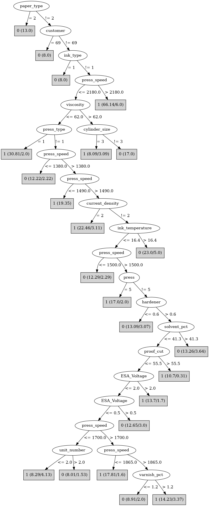

# J48

# SimpleCart Decision Tree

customer=(1)|(3)|(8)|(13)|(14)|(15)|(16)|(18)|(20)|(21)|(22)|(25)|(43)|(44)|(51)|(57)|(59)|(60)|(68)|(39)|(5)|(58)|(62)|(65)|(67)|(52)|(26)|(50)|(63)|(10)|(27)|(47)|(7)|(17)|(24)|(40)|(41)|(42)|(49)|(61)|(64)|(32)

* caliper=(17)|(18)|(19)|(16)|(12)|(6)|(15)|(3)|(10)|(14)|(8)|(9)|(13)

*   * customer=(1)|(3)|(8)|(13)|(14)|(15)|(16)|(18)|(20)|(21)|(22)|(25)|(40)|(43)|(44)|(51)|(57)|(59)|(60)|(67)|(68)|(39)|(58): 1(74.89/5.0)

*   * customer!=(1)|(3)|(8)|(13)|(14)|(15)|(16)|(18)|(20)|(21)|(22)|(25)|(40)|(43)|(44)|(51)|(57)|(59)|(60)|(67)|(68)|(39)|(58)

*   *   * press=(1)|(5)|(7)|(6)|(0)

*   *   *   * viscosity < 62.5

*   *   *   *   * customer=(10)|(42)|(61)|(65)|(5)|(62)|(52)|(63)|(1)|(3)|(4)|(6)|(8)|(9)|(11)|(12)|(13)|(14)|(15)|(16)|(18)|(19)|(20)|(21)|(22)|(24)|(25)|(28)|(29)|(30)|(31)|(32)|(33)|(34)|(35)|(37)|(38)|(39)|(40)|(41)|(43)|(44)|(45)|(49)|(50)|(51)|(53)|(55)|(56)|(57)|(58)|(59)|(60)|(64)|(66)|(67)|(68)|(69)|(70)|(71): 1(64.89/7.94)

*   *   *   *   * customer!=(10)|(42)|(61)|(65)|(5)|(62)|(52)|(63)|(1)|(3)|(4)|(6)|(8)|(9)|(11)|(12)|(13)|(14)|(15)|(16)|(18)|(19)|(20)|(21)|(22)|(24)|(25)|(28)|(29)|(30)|(31)|(32)|(33)|(34)|(35)|(37)|(38)|(39)|(40)|(41)|(43)|(44)|(45)|(49)|(50)|(51)|(53)|(55)|(56)|(57)|(58)|(59)|(60)|(64)|(66)|(67)|(68)|(69)|(70)|(71)

*   *   *   *   *   * ink_type=(0)|(1): 1(16.0/2.94)

*   *   *   *   *   * ink_type!=(0)|(1): 0(11.8/6.0)

*   *   *   * viscosity >= 62.5: 0(8.08/3.0)

*   *   * press!=(1)|(5)|(7)|(6)|(0)

*   *   *   * press_speed < 1987.5

*   *   *   *   * viscosity < 45.5

*   *   *   *   *   * anode_space_ratio < 103.545: 0(11.84/3.94)

*   *   *   *   *   * anode_space_ratio >= 103.545: 1(16.0/1.0)

*   *   *   *   * viscosity >= 45.5: 0(35.94/10.62)

*   *   *   * press_speed >= 1987.5: 1(27.21/10.94)

* caliper!=(17)|(18)|(19)|(16)|(12)|(6)|(15)|(3)|(10)|(14)|(8)|(9)|(13): 0(17.47/0.42)

customer!=(1)|(3)|(8)|(13)|(14)|(15)|(16)|(18)|(20)|(21)|(22)|(25)|(43)|(44)|(51)|(57)|(59)|(60)|(68)|(39)|(5)|(58)|(62)|(65)|(67)|(52)|(26)|(50)|(63)|(10)|(27)|(47)|(7)|(17)|(24)|(40)|(41)|(42)|(49)|(61)|(64)|(32): 0(41.0/1.0)

# PART

Decision list:

conditions|predicted class
---|---
paper_type != 2 AND customer != 69 AND ink_type != 1 AND chrome_content != 1 AND press_speed > 2180.0 AND customer != 26 AND humifity > 71.0| 1 (51.02)
paper_type != 2 AND customer != 69 AND ink_type != 1 AND chrome_content != 1 AND customer != 25 AND press = 5 AND job_number > 34694.0| 1 (26.14/2.0)
paper_type != 2 AND customer != 63 AND customer != 69 AND ink_type != 1 AND chrome_content != 1 AND customer != 25 AND press_type = 1 AND viscosity <= 63.0| 1 (28.81/2.0)
customer != 25 AND paper_type != 2 AND customer != 63 AND customer != 69 AND ink_type != 1 AND chrome_content != 1 AND press_type != 1 AND current_density = 2 AND hardener <= 0.9| 1 (13.1)
customer != 25 AND paper_type != 2 AND customer != 63 AND customer != 69 AND ink_type != 1 AND chrome_content != 1 AND press_type != 1 AND hardener > 0.5 AND press_speed > 1350.0 AND press_speed <= 1490.0| 1 (20.41/2.0)
customer != 25 AND paper_type != 2 AND customer != 63 AND customer != 69 AND ink_type != 1 AND chrome_content != 1 AND press_type != 1 AND press_speed > 1250.0 AND hardener > 0.5 AND caliper != 14 AND ink_type = 0 AND current_density = 4 AND cylinder_size = 3 AND caliper != 8 AND customer != 5 AND roughness > 0.625| 1 (21.37/2.0)
customer != 25 AND paper_type != 2 AND customer != 63 AND customer != 69 AND ink_type != 1 AND chrome_content != 1 AND press_type != 1 AND press != 7 AND viscosity > 61.0| 0 (15.09)
customer != 25 AND paper_type = 2| 0 (13.0)
customer != 25 AND customer = 63| 0 (8.0)
customer != 25 AND customer = 69| 0 (8.0)
customer != 25 AND ink_type = 1| 0 (8.0)
customer != 25 AND chrome_content != 1 AND press_type != 1 AND press != 7 AND press = 6 AND job_number <= 34905.0| 1 (7.81)
customer != 25 AND chrome_content != 1 AND press_type != 1 AND press != 7 AND press = 0 AND blade_pressure <= 52.0| 1 (8.5)
customer != 25 AND chrome_content != 1 AND press_type != 1 AND press != 7 AND caliper != 16 AND ESA_Voltage > 3.0 AND wax > 2.4| 1 (11.63/1.63)
customer != 25 AND chrome_content != 1 AND press_type != 1 AND press != 7 AND caliper != 16 AND blade_pressure > 23.0 AND caliper != 14 AND customer != 64 AND caliper = 10| 0 (13.29/1.34)
customer != 25 AND chrome_content != 1 AND press_type != 1 AND press != 7 AND current_density != 1 AND caliper != 16 AND anode_space_ratio <= 96.9| 0 (12.42/0.3)
customer != 25 AND chrome_content != 1 AND press_type != 1 AND press != 7 AND current_density != 1 AND caliper != 16 AND blade_pressure > 23.0 AND caliper != 14 AND customer = 64| 0 (8.86/1.0)
customer != 25 AND chrome_content != 1 AND press_type != 1 AND press != 7 AND current_density != 1 AND caliper != 16 AND current_density = 4 AND ink_temperature <= 16.1 AND caliper != 14 AND cylinder_size != 2 AND hardener <= 1.35 AND viscosity <= 47.0| 1 (21.41/2.56)
customer != 25 AND caliper != 16 AND ink_temperature > 15.6| 0 (31.58/1.0)
customer != 25 AND press_speed <= 1742.0| 0 (19.86/2.13)
customer != 47 AND unit_number <= 6.0| 1 (10.81/0.13)
cylinder_size = 3| 0 (11.34/3.0)
| 1 (7.55/1.0)

# JRip

Decision list:

conditions|predicted class
---|---
(press_speed <= 2020) and (blade_pressure <= 42) and (viscosity >= 45) and (current_density = 4) and (job_number <= 37333) and (type_on_cylinder = 1) and (job_number >= 25532)|0 (37.0/0.0)
(press_speed <= 2180) and (hardener >= 1) and (solvent_pct >= 40.8) and (roller_durometer >= 38) and (anode_space_ratio <= 106.45)|0 (17.0/0.0)
(press_speed <= 2180) and (press = 3) and (humifity <= 78) and (viscosity >= 50)|0 (9.0/0.0)
(press_speed <= 2180) and (hardener >= 1) and (ink_temperature >= 16.4) and (blade_pressure <= 35)|0 (12.0/0.0)
(press_speed <= 2200) and (viscosity >= 63) and (grain_screened = 2)|0 (9.0/0.0)
(ink_temperature <= 15.1) and (ink_pct >= 62.5)|0 (17.0/6.0)
(press = 4) and (blade_pressure >= 28)|0 (9.0/0.0)
|1 (268.0/50.0)

# Decision Table

Non matches covered by Majority class

press|paper_mill_location|roller_durometer|target
---|---|---|---
6|4|(33.5-inf)|0
6|3|(33.5-inf)|0
3|3|(33.5-inf)|0
1|3|(33.5-inf)|0
7|3|(33.5-inf)|1
6|?|?|0
7|?|?|0
4|?|?|0
5|?|?|0
0|?|?|0
3|?|?|0
2|?|?|0
4|2|(33.5-inf)|0
6|2|(33.5-inf)|1
0|2|(33.5-inf)|1
7|2|(33.5-inf)|1
3|2|(33.5-inf)|0
2|2|(33.5-inf)|0
1|2|(33.5-inf)|1
3|?|(33.5-inf)|0
1|?|(33.5-inf)|0
2|?|(33.5-inf)|0
4|?|(33.5-inf)|1
0|?|(33.5-inf)|1
0|1|(33.5-inf)|1
3|1|(33.5-inf)|0
2|1|(33.5-inf)|0
6|0|(33.5-inf)|0
0|0|(33.5-inf)|1
7|2|(-inf-33.5]|0
5|0|(33.5-inf)|0
5|2|(-inf-33.5]|0
4|2|(-inf-33.5]|0
2|2|(-inf-33.5]|0
4|0|(33.5-inf)|0
3|2|(-inf-33.5]|1
2|0|(33.5-inf)|0
0|2|(-inf-33.5]|1
6|2|(-inf-33.5]|1
1|?|(-inf-33.5]|1
7|?|(-inf-33.5]|0
2|?|(-inf-33.5]|1
6|?|(-inf-33.5]|1
4|?|(-inf-33.5]|1
0|?|(-inf-33.5]|0
3|?|(-inf-33.5]|0
5|?|(-inf-33.5]|1
0|1|(-inf-33.5]|1
6|0|(-inf-33.5]|1
7|0|(-inf-33.5]|1
3|0|(-inf-33.5]|1
4|0|(-inf-33.5]|1
2|0|(-inf-33.5]|1
5|0|(-inf-33.5]|1
1|0|(-inf-33.5]|1

