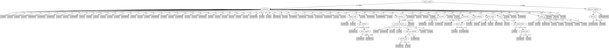

# J48

# SimpleCart Decision Tree

customer=(1)|(2)|(3)|(8)|(13)|(14)|(15)|(16)|(18)|(20)|(22)|(25)|(36)|(44)|(48)|(51)|(57)|(59)|(60)|(65)|(58)|(39)|(68)|(43)|(5)|(24)|(42)|(53)|(62)|(10)|(63)|(52)|(67)|(61)|(21)|(27)|(34)|(37)|(50)|(64)

* press=(7)|(6)|(5)|(1)|(0)

*   * viscosity < 62.5

*   *   * caliper=(2)|(8)|(9)|(12)|(14)|(15)|(16)|(17)|(18)|(19)|(10)|(3)|(6)|(0)|(7)|(11)|(13)

*   *   *   * customer=(1)|(2)|(3)|(10)|(14)|(20)|(22)|(24)|(25)|(36)|(39)|(42)|(44)|(48)|(57)|(58)|(59)|(60)|(61)|(63)|(65)|(67)|(68)|(4)|(6)|(7)|(8)|(9)|(11)|(12)|(13)|(15)|(16)|(17)|(18)|(19)|(23)|(26)|(28)|(29)|(30)|(31)|(32)|(33)|(34)|(35)|(37)|(38)|(40)|(41)|(43)|(45)|(47)|(49)|(50)|(51)|(55)|(56)|(64)|(66)|(69)|(70)|(71): 1(67.96/0.0)

*   *   *   * customer!=(1)|(2)|(3)|(10)|(14)|(20)|(22)|(24)|(25)|(36)|(39)|(42)|(44)|(48)|(57)|(58)|(59)|(60)|(61)|(63)|(65)|(67)|(68)|(4)|(6)|(7)|(8)|(9)|(11)|(12)|(13)|(15)|(16)|(17)|(18)|(19)|(23)|(26)|(28)|(29)|(30)|(31)|(32)|(33)|(34)|(35)|(37)|(38)|(40)|(41)|(43)|(45)|(47)|(49)|(50)|(51)|(55)|(56)|(64)|(66)|(69)|(70)|(71)

*   *   *   *   * type_on_cylinder=(1): 1(39.41/2.94)

*   *   *   *   * type_on_cylinder!=(1)

*   *   *   *   *   * solvent_pct < 39.3

*   *   *   *   *   *   * viscosity < 46.5: 0(2.0/1.0)

*   *   *   *   *   *   * viscosity >= 46.5: 1(8.0/0.0)

*   *   *   *   *   * solvent_pct >= 39.3

*   *   *   *   *   *   * customer=(62): 1(0.58/0.0)

*   *   *   *   *   *   * customer!=(62): 0(6.0/0.0)

*   *   * caliper!=(2)|(8)|(9)|(12)|(14)|(15)|(16)|(17)|(18)|(19)|(10)|(3)|(6)|(0)|(7)|(11)|(13): 0(2.0/0.03)

*   * viscosity >= 62.5

*   *   * customer=(58)|(63): 1(2.0/0.0)

*   *   * customer!=(58)|(63): 0(6.05/0.0)

* press!=(7)|(6)|(5)|(1)|(0)

*   * customer=(1)|(8)|(13)|(15)|(16)|(18)|(51)|(59)|(39)|(43): 1(20.0/2.0)

*   * customer!=(1)|(8)|(13)|(15)|(16)|(18)|(51)|(59)|(39)|(43)

*   *   * job_number < 25459.0: 1(12.0/1.0)

*   *   * job_number >= 25459.0

*   *   *   * press_speed < 2025.0

*   *   *   *   * unit_number < 8.0

*   *   *   *   *   * ESA_Voltage < 4.5

*   *   *   *   *   *   * customer=(24)|(34)|(37)|(67)|(10)

*   *   *   *   *   *   *   * caliper=(8)|(3)|(0)|(2)|(5)|(7)|(9)|(11)|(12)|(13)|(14)|(15)|(16)|(17)|(19)

*   *   *   *   *   *   *   *   * press_speed < 1425.0: 0(2.0/0.0)

*   *   *   *   *   *   *   *   * press_speed >= 1425.0: 1(5.0/0.0)

*   *   *   *   *   *   *   * caliper!=(8)|(3)|(0)|(2)|(5)|(7)|(9)|(11)|(12)|(13)|(14)|(15)|(16)|(17)|(19): 0(5.8/0.0)

*   *   *   *   *   *   * customer!=(24)|(34)|(37)|(67)|(10)

*   *   *   *   *   *   *   * job_number < 25508.0

*   *   *   *   *   *   *   *   * ink_temperature < 16.0: 1(2.0/0.0)

*   *   *   *   *   *   *   *   * ink_temperature >= 16.0: 0(3.0/0.0)

*   *   *   *   *   *   *   * job_number >= 25508.0

*   *   *   *   *   *   *   *   * wax < 2.95: 0(35.88/0.0)

*   *   *   *   *   *   *   *   * wax >= 2.95: 0(2.9/1.0)

*   *   *   *   *   * ESA_Voltage >= 4.5

*   *   *   *   *   *   * caliper=(3)|(8)|(6)|(0)|(2)|(5)|(9)|(12)|(13)|(14)|(15)|(16)|(17)|(18)|(19)

*   *   *   *   *   *   *   * customer=(50)|(52)|(64)|(1)|(2)|(3)|(4)|(5)|(6)|(7)|(8)|(9)|(11)|(12)|(13)|(14)|(15)|(16)|(17)|(18)|(19)|(20)|(21)|(22)|(23)|(24)|(25)|(26)|(27)|(28)|(29)|(30)|(31)|(32)|(33)|(34)|(35)|(36)|(37)|(38)|(39)|(40)|(41)|(42)|(43)|(44)|(45)|(47)|(48)|(49)|(51)|(53)|(55)|(56)|(57)|(59)|(60)|(61)|(65)|(66)|(67)|(68)|(69)|(70)|(71): 1(4.0/0.0)

*   *   *   *   *   *   *   * customer!=(50)|(52)|(64)|(1)|(2)|(3)|(4)|(5)|(6)|(7)|(8)|(9)|(11)|(12)|(13)|(14)|(15)|(16)|(17)|(18)|(19)|(20)|(21)|(22)|(23)|(24)|(25)|(26)|(27)|(28)|(29)|(30)|(31)|(32)|(33)|(34)|(35)|(36)|(37)|(38)|(39)|(40)|(41)|(42)|(43)|(44)|(45)|(47)|(48)|(49)|(51)|(53)|(55)|(56)|(57)|(59)|(60)|(61)|(65)|(66)|(67)|(68)|(69)|(70)|(71): 0(0.48/0.0)

*   *   *   *   *   *   * caliper!=(3)|(8)|(6)|(0)|(2)|(5)|(9)|(12)|(13)|(14)|(15)|(16)|(17)|(18)|(19): 0(1.67/0.0)

*   *   *   *   * unit_number >= 8.0

*   *   *   *   *   * viscosity < 58.0

*   *   *   *   *   *   * wax < 2.8499999999999996: 1(7.75/0.0)

*   *   *   *   *   *   * wax >= 2.8499999999999996: 0(2.0/0.99)

*   *   *   *   *   * viscosity >= 58.0: 0(4.0/0.0)

*   *   *   * press_speed >= 2025.0

*   *   *   *   * anode_space_ratio < 98.38499999999999

*   *   *   *   *   * job_number < 34549.0: 1(2.0/0.0)

*   *   *   *   *   * job_number >= 34549.0: 0(5.0/0.0)

*   *   *   *   * anode_space_ratio >= 98.38499999999999: 1(16.24/2.24)

customer!=(1)|(2)|(3)|(8)|(13)|(14)|(15)|(16)|(18)|(20)|(22)|(25)|(36)|(44)|(48)|(51)|(57)|(59)|(60)|(65)|(58)|(39)|(68)|(43)|(5)|(24)|(42)|(53)|(62)|(10)|(63)|(52)|(67)|(61)|(21)|(27)|(34)|(37)|(50)|(64)

* press=(7)|(6)|(0)

*   * caliper=(10)|(13)|(6)|(3)|(15)|(12)|(0)|(2)|(4)|(5)|(7)|(9)|(16)|(17)|(18)|(19)

*   *   * customer=(6)|(17)|(47)|(26)|(1)|(2)|(3)|(4)|(5)|(8)|(9)|(10)|(11)|(12)|(13)|(14)|(15)|(16)|(18)|(19)|(20)|(21)|(22)|(23)|(24)|(25)|(27)|(28)|(29)|(30)|(32)|(33)|(34)|(35)|(36)|(37)|(38)|(39)|(40)|(41)|(42)|(43)|(44)|(48)|(49)|(50)|(51)|(52)|(53)|(55)|(56)|(57)|(58)|(59)|(60)|(61)|(62)|(63)|(64)|(65)|(66)|(67)|(68)|(71)

*   *   *   * anode_space_ratio < 107.14500000000001: 1(17.0/2.0)

*   *   *   * anode_space_ratio >= 107.14500000000001: 0(3.38/0.0)

*   *   * customer!=(6)|(17)|(47)|(26)|(1)|(2)|(3)|(4)|(5)|(8)|(9)|(10)|(11)|(12)|(13)|(14)|(15)|(16)|(18)|(19)|(20)|(21)|(22)|(23)|(24)|(25)|(27)|(28)|(29)|(30)|(32)|(33)|(34)|(35)|(36)|(37)|(38)|(39)|(40)|(41)|(42)|(43)|(44)|(48)|(49)|(50)|(51)|(52)|(53)|(55)|(56)|(57)|(58)|(59)|(60)|(61)|(62)|(63)|(64)|(65)|(66)|(67)|(68)|(71): 0(6.0/1.0)

*   * caliper!=(10)|(13)|(6)|(3)|(15)|(12)|(0)|(2)|(4)|(5)|(7)|(9)|(16)|(17)|(18)|(19): 0(7.61/0.0)

* press!=(7)|(6)|(0)

*   * customer=(26)|(40)|(49)

*   *   * caliper=(3)|(8)|(14): 1(3.0/0.29)

*   *   * caliper!=(3)|(8)|(14): 0(6.7/1.0)

*   * customer!=(26)|(40)|(49)

*   *   * ESA_Voltage < 4.5

*   *   *   * ink_pct < 45.45: 1(1.0/0.43)

*   *   *   * ink_pct >= 45.45

*   *   *   *   * hardener < 1.25: 0(47.16/0.0)

*   *   *   *   * hardener >= 1.25: 0(2.0/1.0)

*   *   * ESA_Voltage >= 4.5: 1(1.0/0.39)

# PART

Decision list:

conditions|predicted class
---|---
press_speed > 2200 AND type_on_cylinder = 1 AND cylinder_size = 3| 1 (38.0)
customer = 47 AND paper_type = 2| 0 (8.0)
customer = 62 AND unit_number > 5| 1 (11.0)
customer = 63 AND press_type = 2| 1 (9.0)
chrome_content = 2 AND customer = 52 AND job_number <= 47203 AND proof_cut > 50 AND plating_tank = 1| 1 (9.19)
chrome_content = 2 AND customer = 10| 1 (8.0/3.0)
chrome_content = 2 AND customer = 58| 1 (8.0/3.0)
chrome_content = 0| 0 (7.07/1.0)
customer = 63| 0 (7.0/1.0)
customer = 17| 0 (6.0/2.0)
customer = 24| 1 (6.0/2.0)
customer = 5 AND varnish_pct <= 0.5| 0 (5.0/1.0)
customer = 68 AND press = 5| 1 (7.0/1.0)
customer = 62 AND press_type = 3| 1 (9.0/4.0)
customer = 62| 1 (7.0/3.0)
customer = 68| 0 (6.98/2.0)
customer = 47 AND ink_temperature > 15.2 AND press_speed <= 2020| 1 (6.0)
customer = 47 AND roughness > 0.625 AND solvent_pct > 34.7 AND ink_type = 2| 0 (6.0/2.0)
customer = 26| 0 (5.0/1.0)
customer = 47 AND roughness <= 0.625| 0 (5.0)
customer = 5| 1 (5.0/2.0)
customer = 27| 0 (5.0/2.0)
customer = 47 AND solvent_pct <= 34.7| 0 (5.0)
customer = 61| 1 (9.0/4.0)
customer = 64 AND wax > 2.4 AND ink_temperature <= 15.1| 1 (8.0)
customer = 64 AND varnish_pct > 10| 0 (10.0)
customer = 52 AND job_number > 47203| 0 (10.0)
customer = 52 AND press = 1 AND job_number <= 47106| 1 (6.0)
customer = 47| 1 (5.0/1.0)
customer = 52 AND press = 0 AND varnish_pct <= 6| 0 (5.0/2.0)
customer = 52 AND press = 1| 1 (5.41/2.0)
customer = 52| 1 (7.41/2.0)
customer = 64| 1 (7.0/3.0)
customer = 50| 0 (6.0/3.0)
wax > 2.7 AND cylinder_size = 1 AND humifity <= 87| 1 (19.0)
humifity > 69 AND ink_pct <= 49.5 AND ink_type = 2| 1 (8.02/2.02)
humifity > 69 AND paper_type = 3 AND ink_temperature <= 14.6| 0 (13.0)
humifity > 69 AND caliper = 10| 0 (10.31/2.33)
paper_type = 1 AND press = 5| 1 (7.0/1.0)
humifity > 69 AND caliper = 14| 0 (8.26/1.3)
humifity <= 69| 1 (7.0)
caliper = 6 AND roller_durometer > 33| 0 (5.4/0.2)
paper_type = 3 AND proof_cut > 47.5| 1 (5.49/0.49)
press = 3| 0 (9.67/3.0)
hardener > 0.9 AND humifity <= 79| 0 (5.51/0.68)
ink_pct <= 57.7| 1 (5.91/1.42)
| 0 (5.39/2.0)

# JRip

Decision list:

conditions|predicted class
---|---
(press_speed <= 2020) and (blade_pressure <= 40) and (unit_number <= 7)|0 (149.0/50.0)
(press_type = 3) and (humifity <= 78)|0 (28.0/9.0)
(job_number >= 36846) and (humifity >= 82) and (paper_type = 3)|0 (17.0/2.0)
|1 (184.0/30.0)

# Decision Table

Non matches covered by Majority class

press|unit_number|varnish_pct|solvent_pct|target
---|---|---|---|---
6|(8-inf)|?|?|0
3|(8-inf)|?|?|0
5|(8-inf)|?|?|0
2|(8-inf)|?|?|0
2|(-inf-8]|?|?|0
6|(-inf-8]|?|?|0
4|(-inf-8]|?|?|0
5|(-inf-8]|?|?|0
3|(-inf-8]|?|?|0
0|(-inf-8]|?|?|0
7|(-inf-8]|?|?|0
1|(8-inf)|all|all|1
5|(8-inf)|all|all|1
7|(8-inf)|all|all|1
6|(8-inf)|all|all|1
3|(8-inf)|all|all|1
2|(8-inf)|all|all|1
7|(-inf-8]|all|all|1
1|(-inf-8]|all|all|1
0|(-inf-8]|all|all|1
5|(-inf-8]|all|all|1
6|(-inf-8]|all|all|1
2|(-inf-8]|all|all|0
3|(-inf-8]|all|all|0
4|(-inf-8]|all|all|0

