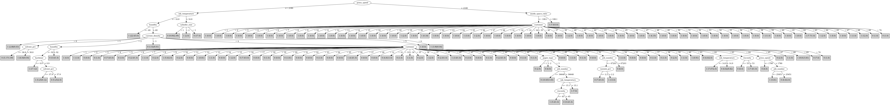

# J48

# SimpleCart Decision Tree

customer=(1)|(2)|(3)|(8)|(13)|(14)|(15)|(16)|(18)|(20)|(22)|(25)|(34)|(36)|(41)|(44)|(48)|(51)|(59)|(60)|(39)|(68)|(58)|(57)|(61)|(5)|(24)|(62)|(67)|(52)|(63)|(10)|(27)

* press=(7)|(0)|(4)|(6)|(5)|(1): 1(123.0/19.0)

* press!=(7)|(0)|(4)|(6)|(5)|(1)

*   * customer=(1)|(8)|(13)|(15)|(18)|(41)|(39)|(68)|(61)|(62)|(2)|(3)|(4)|(6)|(7)|(9)|(11)|(12)|(14)|(16)|(17)|(19)|(20)|(21)|(22)|(23)|(25)|(26)|(27)|(28)|(31)|(32)|(33)|(34)|(35)|(36)|(37)|(40)|(42)|(43)|(44)|(45)|(46)|(47)|(48)|(49)|(50)|(51)|(53)|(54)|(55)|(56)|(59)|(60)|(64)|(65)|(69)|(70)

*   *   * humifity < 74.5: 0(4.0/0.0)

*   *   * humifity >= 74.5

*   *   *   * ink_pct < 63.3

*   *   *   *   * hardener < 1.25: 1(29.0/1.94)

*   *   *   *   * hardener >= 1.25: 0(2.94/2.0)

*   *   *   * ink_pct >= 63.3: 0(2.11/0.0)

*   * customer!=(1)|(8)|(13)|(15)|(18)|(41)|(39)|(68)|(61)|(62)|(2)|(3)|(4)|(6)|(7)|(9)|(11)|(12)|(14)|(16)|(17)|(19)|(20)|(21)|(22)|(23)|(25)|(26)|(27)|(28)|(31)|(32)|(33)|(34)|(35)|(36)|(37)|(40)|(42)|(43)|(44)|(45)|(46)|(47)|(48)|(49)|(50)|(51)|(53)|(54)|(55)|(56)|(59)|(60)|(64)|(65)|(69)|(70)

*   *   * caliper=(14)|(8)|(3)|(16)

*   *   *   * roughness < 0.5625: 1(8.55/1.48)

*   *   *   * roughness >= 0.5625: 0(6.48/1.44)

*   *   * caliper!=(14)|(8)|(3)|(16): 0(18.02/1.0)

customer!=(1)|(2)|(3)|(8)|(13)|(14)|(15)|(16)|(18)|(20)|(22)|(25)|(34)|(36)|(41)|(44)|(48)|(51)|(59)|(60)|(39)|(68)|(58)|(57)|(61)|(5)|(24)|(62)|(67)|(52)|(63)|(10)|(27)

* customer=(26)|(37)|(43)|(49)|(53)|(64)|(17)|(47)|(6)|(7)|(65)|(1)|(2)|(3)|(5)|(8)|(10)|(13)|(14)|(15)|(16)|(18)|(20)|(22)|(24)|(25)|(27)|(34)|(36)|(39)|(41)|(44)|(48)|(51)|(52)|(57)|(58)|(59)|(60)|(61)|(62)|(63)|(67)|(68)

*   * caliper=(16)|(12)|(15)|(6)|(3)|(13)|(14)|(4)|(5)|(9)|(17)|(18)

*   *   * customer=(43)|(6)|(64)|(17)|(47)|(26)|(1)|(2)|(3)|(4)|(5)|(8)|(9)|(10)|(11)|(12)|(13)|(14)|(15)|(16)|(18)|(19)|(20)|(21)|(22)|(23)|(24)|(25)|(27)|(28)|(31)|(32)|(33)|(34)|(35)|(36)|(37)|(39)|(40)|(41)|(42)|(44)|(45)|(46)|(48)|(49)|(50)|(51)|(52)|(54)|(55)|(56)|(57)|(58)|(59)|(60)|(61)|(62)|(63)|(67)|(68)|(69)|(70)

*   *   *   * anode_space_ratio < 107.03

*   *   *   *   * ink_temperature < 17.75

*   *   *   *   *   * press_speed < 2150.0

*   *   *   *   *   *   * job_number < 25476.5: 1(7.52/0.0)

*   *   *   *   *   *   * job_number >= 25476.5

*   *   *   *   *   *   *   * caliper=(12)|(16)|(6): 1(9.63/2.21)

*   *   *   *   *   *   *   * caliper!=(12)|(16)|(6)

*   *   *   *   *   *   *   *   * job_number < 36955.5: 0(8.4/0.0)

*   *   *   *   *   *   *   *   * job_number >= 36955.5

*   *   *   *   *   *   *   *   *   * varnish_pct < 7.300000000000001: 0(4.0/2.0)

*   *   *   *   *   *   *   *   *   * varnish_pct >= 7.300000000000001: 1(7.0/1.0)

*   *   *   *   *   * press_speed >= 2150.0: 1(9.36/0.0)

*   *   *   *   * ink_temperature >= 17.75: 0(3.0/0.0)

*   *   *   * anode_space_ratio >= 107.03: 0(7.45/2.09)

*   *   * customer!=(43)|(6)|(64)|(17)|(47)|(26)|(1)|(2)|(3)|(4)|(5)|(8)|(9)|(10)|(11)|(12)|(13)|(14)|(15)|(16)|(18)|(19)|(20)|(21)|(22)|(23)|(24)|(25)|(27)|(28)|(31)|(32)|(33)|(34)|(35)|(36)|(37)|(39)|(40)|(41)|(42)|(44)|(45)|(46)|(48)|(49)|(50)|(51)|(52)|(54)|(55)|(56)|(57)|(58)|(59)|(60)|(61)|(62)|(63)|(67)|(68)|(69)|(70): 0(5.0/0.0)

*   * caliper!=(16)|(12)|(15)|(6)|(3)|(13)|(14)|(4)|(5)|(9)|(17)|(18)

*   *   * customer=(7)|(53)|(65): 1(3.0/0.0)

*   *   * customer!=(7)|(53)|(65)

*   *   *   * blade_pressure < 21.0

*   *   *   *   * caliper=(10): 1(3.16/0.0)

*   *   *   *   * caliper!=(10): 0(3.0/1.41)

*   *   *   * blade_pressure >= 21.0: 0(28.93/3.81)

* customer!=(26)|(37)|(43)|(49)|(53)|(64)|(17)|(47)|(6)|(7)|(65)|(1)|(2)|(3)|(5)|(8)|(10)|(13)|(14)|(15)|(16)|(18)|(20)|(22)|(24)|(25)|(27)|(34)|(36)|(39)|(41)|(44)|(48)|(51)|(52)|(57)|(58)|(59)|(60)|(61)|(62)|(63)|(67)|(68): 0(44.0/1.0)

# PART

Decision list:

conditions|predicted class
---|---
press_speed > 2180 AND anode_space_ratio <= 108.1| 1 (59.23/3.0)
ink_temperature > 16.8 AND cylinder_size = 3| 0 (17.0)
chrome_content = 1| 0 (8.08)
current_density = 2 AND humifity <= 92 AND hardener <= 1.25| 1 (29.51/1.25)
customer = 69| 0 (7.0)
customer = 32| 0 (4.87/1.0)
customer = 10 AND blade_pressure > 30| 1 (4.67)
customer = 1| 1 (4.0)
viscosity > 60 AND viscosity <= 68 AND hardener <= 1| 0 (21.99/1.0)
humifity <= 69 AND ink_temperature > 14.8| 1 (13.33)
customer = 61| 1 (5.0/1.0)
customer = 68 AND varnish_pct > 0| 1 (5.0)
customer = 52 AND job_number <= 47204 AND ink_temperature > 13.1 AND varnish_pct > 0.5| 1 (17.0)
job_number > 38059 AND anode_space_ratio > 98.3| 0 (21.76/2.0)
job_number > 37392| 1 (12.87/1.0)
customer = 27| 1 (4.0/1.0)
current_density = 2 AND hardener > 0.9| 0 (4.08)
current_density = 1 AND blade_pressure <= 30| 1 (4.07/0.04)
current_density = 4 AND anode_space_ratio > 96.77 AND press_speed > 1250 AND blade_pressure <= 21 AND blade_pressure > 18 AND humifity > 78| 1 (10.33)
current_density = 4 AND anode_space_ratio <= 96.88| 0 (12.18/0.01)
current_density = 4 AND press_speed > 1300 AND customer = 64 AND viscosity > 42 AND proof_cut > 42| 0 (10.0)
job_number > 25466 AND current_density = 4 AND press_speed > 1300 AND hardener <= 1.35 AND hardener > 0.3 AND ESA_Voltage > 1| 1 (14.29/1.29)
job_number > 25466 AND current_density = 4 AND customer = 47 AND ink_temperature <= 14.9| 0 (8.61/0.05)
job_number > 25466 AND current_density = 4 AND press_speed > 1300 AND ESA_Voltage <= 0 AND caliper = 6| 1 (8.81/1.57)
job_number > 25466 AND current_density = 4 AND job_number <= 36648 AND viscosity > 40 AND job_number > 34590| 0 (18.04/2.1)
viscosity > 40 AND viscosity <= 55 AND solvent_pct <= 42.5 AND solvent_pct > 35.7| 1 (19.03/0.16)
press_speed <= 2100 AND ink_pct > 48.5| 0 (27.45/2.9)
| 1 (5.79/0.67)

# JRip

Decision list:

conditions|predicted class
---|---
(press_speed <= 2180) and (blade_pressure <= 40) and (ink_temperature >= 17) and (viscosity >= 41)|0 (20.0/0.0)
(hardener >= 1) and (job_number <= 37335) and (roughness <= 0.625) and (job_number >= 34092) and (press_speed <= 1850)|0 (21.0/0.0)
(press_speed <= 2180) and (press_type = 3) and (humifity <= 78) and (job_number <= 36648)|0 (18.0/0.0)
(press_speed <= 2100) and (blade_pressure <= 42) and (current_density = 4) and (blade_pressure >= 22) and (ink_temperature <= 14.8) and (ink_temperature >= 14.1)|0 (13.0/0.0)
(press_speed <= 2100) and (humifity >= 76) and (roughness >= 0.625) and (current_density = 4) and (viscosity >= 47) and (blade_pressure <= 35) and (roller_durometer >= 34) and (varnish_pct <= 17.1)|0 (15.0/0.0)
(press_speed <= 2100) and (hardener >= 1) and (unit_number <= 7) and (anode_space_ratio <= 103.13) and (humifity >= 90)|0 (8.0/0.0)
(press_speed <= 2100) and (current_density = 4) and (blade_pressure >= 26) and (press_type = 2) and (job_number <= 34692)|0 (11.0/0.0)
(job_number >= 37001) and (anode_space_ratio >= 106) and (ink_temperature >= 16.1) and (ink_temperature <= 16.5)|0 (8.0/0.0)
(job_number >= 37001) and (varnish_pct <= 0) and (type_on_cylinder = 0) and (solvent_type = 0)|0 (7.0/0.0)
|1 (257.0/42.0)

# Decision Table

Non matches covered by IB1

proof_on_ctd_ink|press_type|press_speed|ink_pct|target
---|---|---|---|---
?|2|(2184.5-inf)|?|0
?|3|(-inf-2184.5]|?|0
2|3|(-inf-2184.5]|?|0
?|2|(-inf-2184.5]|?|0
2|3|?|(-inf-64]|0
2|3|(-inf-2184.5]|(64-inf)|0
2|2|?|(-inf-64]|1
1|3|(2184.5-inf)|(-inf-64]|1
2|3|(2184.5-inf)|(-inf-64]|1
?|0|(-inf-2184.5]|?|0
2|1|?|(-inf-64]|0
1|2|(2184.5-inf)|(-inf-64]|0
?|2|(2184.5-inf)|(-inf-64]|1
2|2|(2184.5-inf)|(-inf-64]|1
1|3|(-inf-2184.5]|(-inf-64]|0
2|3|(-inf-2184.5]|(-inf-64]|0
1|2|(-inf-2184.5]|(-inf-64]|1
2|2|(-inf-2184.5]|(-inf-64]|1
2|1|(-inf-2184.5]|(-inf-64]|1
2|0|(-inf-2184.5]|(-inf-64]|1

