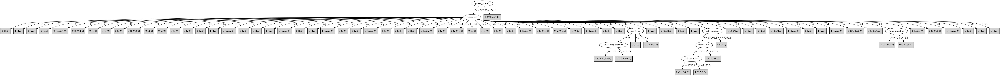

# J48

# SimpleCart Decision Tree

customer=(1)|(2)|(3)|(8)|(13)|(14)|(15)|(16)|(18)|(20)|(22)|(25)|(36)|(42)|(48)|(50)|(51)|(59)|(60)|(58)|(68)|(39)|(24)|(43)|(57)|(62)|(40)|(53)|(63)|(65)|(5)|(10)|(27)|(26)|(61)|(67)|(52)|(34)|(41)|(47)|(64)|(17)

* customer=(1)|(2)|(3)|(8)|(13)|(14)|(15)|(16)|(18)|(20)|(22)|(25)|(36)|(42)|(48)|(50)|(51)|(59)|(60)|(58)|(68)|(39)|(24)|(43)|(57)|(62): 1(97.0/14.0)

* customer!=(1)|(2)|(3)|(8)|(13)|(14)|(15)|(16)|(18)|(20)|(22)|(25)|(36)|(42)|(48)|(50)|(51)|(59)|(60)|(58)|(68)|(39)|(24)|(43)|(57)|(62)

*   * press=(1)|(5)|(7)|(6)|(0)

*   *   * ink_temperature < 16.9

*   *   *   * ink_type=(0): 1(49.0/7.0)

*   *   *   * ink_type!=(0)

*   *   *   *   * varnish_pct < 1.1

*   *   *   *   *   * hardener < 0.95: 1(4.0/1.68)

*   *   *   *   *   * hardener >= 0.95: 0(9.96/0.0)

*   *   *   *   * varnish_pct >= 1.1

*   *   *   *   *   * press=(6)|(1)|(0)|(2)|(3)|(4)|(5): 1(25.0/5.0)

*   *   *   *   *   * press!=(6)|(1)|(0)|(2)|(3)|(4)|(5): 0(2.34/0.0)

*   *   * ink_temperature >= 16.9: 0(9.0/3.0)

*   * press!=(1)|(5)|(7)|(6)|(0)

*   *   * caliper=(16)|(3)|(12)|(15)|(8)|(10)|(14)|(5)|(19)

*   *   *   * press_speed < 1735.0

*   *   *   *   * proof_cut < 63.5: 0(14.88/1.0)

*   *   *   *   * proof_cut >= 63.5: 1(2.0/0.55)

*   *   *   * press_speed >= 1735.0

*   *   *   *   * anode_space_ratio < 96.83500000000001: 0(5.0/0.07)

*   *   *   *   * anode_space_ratio >= 96.83500000000001

*   *   *   *   *   * hardener < 0.55: 0(3.0/0.0)

*   *   *   *   *   * hardener >= 0.55

*   *   *   *   *   *   * customer=(5)|(10)|(26)|(34)|(52)|(67): 1(11.0/0.0)

*   *   *   *   *   *   * customer!=(5)|(10)|(26)|(34)|(52)|(67)

*   *   *   *   *   *   *   * humifity < 77.0

*   *   *   *   *   *   *   *   * ink_pct < 57.15: 0(8.0/2.71)

*   *   *   *   *   *   *   *   * ink_pct >= 57.15: 1(3.0/0.0)

*   *   *   *   *   *   *   * humifity >= 77.0: 1(14.64/3.71)

*   *   * caliper!=(16)|(3)|(12)|(15)|(8)|(10)|(14)|(5)|(19)

*   *   *   * customer=(41)|(26): 1(2.0/1.0)

*   *   *   * customer!=(41)|(26): 0(23.84/0.56)

customer!=(1)|(2)|(3)|(8)|(13)|(14)|(15)|(16)|(18)|(20)|(22)|(25)|(36)|(42)|(48)|(50)|(51)|(59)|(60)|(58)|(68)|(39)|(24)|(43)|(57)|(62)|(40)|(53)|(63)|(65)|(5)|(10)|(27)|(26)|(61)|(67)|(52)|(34)|(41)|(47)|(64)|(17)

* current_density=(6): 1(2.0/0.11)

* current_density!=(6)

*   * job_number < 23050.0: 1(2.0/0.96)

*   * job_number >= 23050.0

*   *   * customer=(21)|(49): 0(3.96/2.0)

*   *   * customer!=(21)|(49): 0(42.96/0.0)

# PART

Decision list:

conditions|predicted class
---|---
paper_type != 2 AND customer != 69 AND ink_type != 1 AND press_speed > 2184.5 AND type_on_cylinder != 0 AND job_number <= 37433.0| 1 (38.43)
paper_type != 2 AND customer != 69 AND ink_type != 1 AND humifity <= 69.5 AND unit_number <= 6.5| 1 (17.01)
paper_type != 2 AND customer != 69 AND ink_type != 1 AND current_density = 2 AND hardener <= 0.95| 1 (20.12)
paper_type != 2 AND customer != 69 AND ink_type != 1 AND ink_temperature > 16.9 AND press_type != 2| 0 (13.19/6.19)
paper_type = 2| 0 (12.0)
customer != 69 AND ink_temperature > 16.9 AND job_number > 36160.5| 0 (7.09/0.09)
customer != 69 AND ink_type = 1| 0 (12.0/2.0)
customer != 69 AND ESA_Voltage > 4.25 AND press_speed > 1850.0| 1 (10.33/0.33)
customer != 69 AND press = 2 AND press_speed <= 1625.0| 0 (13.0)
customer != 69 AND customer != 68 AND ink_temperature > 16.35 AND job_number <= 35765.5| 0 (10.0)
customer != 69 AND press = 5 AND job_number > 35871.5| 1 (11.17)
customer != 69 AND job_number <= 25508.0 AND hardener <= 0.95| 1 (13.88)
customer != 69 AND customer != 64 AND viscosity > 62.5| 0 (13.07/3.0)
customer != 69 AND customer = 64| 0 (12.0/2.0)
customer != 69 AND press_type = 1 AND solvent_pct > 37.85| 1 (7.87)
customer != 69 AND ESA_Voltage > 3.5 AND ink_pct > 54.599999999999994| 1 (11.94/0.94)
customer != 69 AND press = 4 AND job_number <= 35028.5| 0 (7.78/1.0)
customer != 69 AND job_number > 34155.0 AND viscosity > 39.5 AND unit_number <= 4.5 AND job_number <= 36870.5 AND viscosity <= 54.5 AND varnish_pct <= 3.7| 1 (10.0/4.0)
customer != 69 AND job_number > 34155.0 AND job_number > 34673.5 AND viscosity > 39.5 AND unit_number > 8.0 AND anode_space_ratio <= 105.035 AND humifity > 75.5 AND job_number <= 37596.5| 1 (13.0)
customer != 69 AND job_number > 34155.0 AND viscosity > 39.5 AND job_number <= 36605.5 AND press_type = 3| 0 (17.78)
customer != 69 AND viscosity <= 41.5| 1 (13.03/1.03)
customer != 69 AND job_number > 34155.0 AND proof_cut > 51.25 AND press != 0 AND ink_pct > 52.35| 1 (8.88/1.88)
customer != 69 AND job_number > 34155.0 AND ink_pct <= 59.85 AND press = 0 AND proof_cut <= 52.5| 1 (12.0/5.0)
customer != 69 AND varnish_pct <= 1.1 AND job_number > 36218.5| 0 (12.3)
customer != 69 AND press != 0 AND hardener <= 0.75| 0 (11.02/2.0)
customer != 69 AND press = 0| 1 (10.71)
customer != 69 AND solvent_pct <= 36.599999999999994| 1 (9.57/0.57)
customer != 69 AND grain_screened != 1| 0 (7.44)
customer != 69 AND viscosity > 52.0| 1 (7.2/2.52)
customer != 69| 1 (7.18/1.34)
| 0 (7.0)

# JRip

Decision list:

conditions|predicted class
---|---
(press_speed <= 2000) and (blade_pressure <= 40) and (unit_number <= 7) and (blade_pressure >= 22) and (current_density = 4) and (job_number <= 37333) and (proof_cut >= 50)|0 (17.0/0.0)
(press_speed <= 2100) and (hardener >= 1) and (blade_pressure <= 32) and (unit_number <= 7) and (ink_temperature >= 15.6) and (job_number >= 34749) and (roughness <= 0.75)|0 (16.0/0.0)
(press_speed <= 2000) and (blade_pressure <= 40) and (job_number >= 38061) and (roughness >= 0.625)|0 (13.0/0.0)
(press_speed <= 2000) and (job_number <= 37191) and (current_density = 4) and (anode_space_ratio <= 103) and (paper_type = 1)|0 (10.0/0.0)
(ink_type = 2) and (viscosity >= 57) and (wax <= 2.5)|0 (11.0/0.0)
(press_speed <= 2180) and (blade_pressure >= 22) and (ink_temperature <= 15.2) and (varnish_pct <= 0.5) and (roller_durometer >= 35) and (hardener >= 1)|0 (13.0/0.0)
(ink_temperature >= 17) and (press_type = 2) and (humifity <= 85)|0 (10.0/0.0)
(anode_space_ratio >= 107.14) and (job_number <= 37080) and (job_number >= 35425) and (current_density = 4)|0 (10.0/0.0)
|1 (278.0/57.0)

# Decision Table

Non matches covered by IB1

job_number|ink_type|humifity|blade_pressure|varnish_pct|solvent_pct|hardener|target
---|---|---|---|---|---|---|---
all|2|all|?|?|?|(0.95-inf)|0
all|2|all|all|?|?|(0.95-inf)|0
all|1|all|all|?|?|(0.95-inf)|0
all|0|all|all|?|?|(0.95-inf)|0
all|2|all|all|?|?|?|0
all|0|all|all|?|?|?|0
all|2|all|all|?|?|(0.35-0.95]|0
all|0|all|all|?|?|(0.35-0.95]|0
all|2|all|?|all|all|(0.95-inf)|1
all|1|all|?|all|all|(0.95-inf)|0
all|0|all|?|all|all|(0.95-inf)|1
all|0|all|all|?|?|(-inf-0.35]|0
all|2|all|all|all|all|(0.95-inf)|0
all|1|all|all|all|all|(0.95-inf)|0
all|2|all|?|all|all|(0.35-0.95]|1
all|0|all|all|all|all|(0.95-inf)|1
all|2|all|all|all|all|?|0
all|0|all|?|all|all|(0.35-0.95]|1
all|0|?|all|all|all|(0.35-0.95]|0
all|2|all|all|all|all|(0.35-0.95]|1
all|1|all|all|all|all|(0.35-0.95]|0
all|0|all|all|all|all|(0.35-0.95]|1
all|2|all|all|all|all|(-inf-0.35]|0
all|0|all|all|all|all|(-inf-0.35]|0

