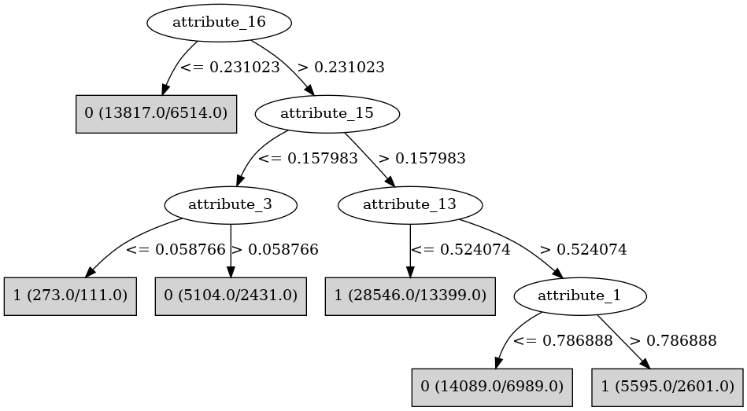

# J48

# SimpleCart Decision Tree

attribute_16 < 0.2310235: 0(7303.0/6514.0)

attribute_16 >= 0.2310235

* attribute_13 < 0.52327

*   * attribute_14 < 0.0212645: 0(127.0/79.0)

*   * attribute_14 >= 0.0212645

*   *   * attribute_1 < 0.55052

*   *   *   * attribute_15 < 0.4912155

*   *   *   *   * attribute_18 < 0.6257495: 0(1465.0/1282.0)

*   *   *   *   * attribute_18 >= 0.6257495: 1(1724.0/1564.0)

*   *   *   * attribute_15 >= 0.4912155: 1(7153.0/6359.0)

*   *   * attribute_1 >= 0.55052: 1(5945.0/4964.0)

* attribute_13 >= 0.52327

*   * attribute_17 < 0.6215235: 0(5522.0/5190.0)

*   * attribute_17 >= 0.6215235

*   *   * attribute_10 < 0.0669495: 0(372.0/292.0)

*   *   * attribute_10 >= 0.0669495: 1(6058.0/5511.0)

# PART

Decision list:

conditions|predicted class
---|---
attribute_16 <= 0.230501 AND attribute_9 <= 0.248855 AND attribute_1 <= 0.040717| 0 (374.0/121.0)
attribute_16 <= 0.230501 AND attribute_9 <= 0.261594 AND attribute_16 > 0.213088 AND attribute_19 <= 0.058429| 0 (13.0)
attribute_16 <= 0.230501 AND attribute_20 > 0.317136| 0 (9531.0/4651.0)
attribute_16 > 0.230501 AND attribute_15 > 0.157898 AND attribute_13 <= 0.523292 AND attribute_19 <= 0.990178 AND attribute_1 <= 0.550065 AND attribute_7 > 0.565971| 1 (11593.0/5439.0)
attribute_16 > 0.230501 AND attribute_1 > 0.552069 AND attribute_12 > 0.779422 AND attribute_5 > 0.116152| 1 (3997.0/1714.0)
attribute_16 <= 0.230501| 0 (3899.0/1742.0)
attribute_15 <= 0.019356 AND attribute_9 <= 0.538011 AND attribute_4 <= 0.887678 AND attribute_1 <= 0.443805| 0 (95.0/17.0)
attribute_1 > 0.532214 AND attribute_13 <= 0.93522| 1 (19240.0/9165.0)
| 0 (18682.0/9194.0)

# JRip

Decision list:

conditions|predicted class
---|---
(attribute_16 <= 0.304712)|0 (19200.0/9212.0)
(attribute_13 >= 0.523292) and (attribute_17 <= 0.621489)|0 (9580.0/4653.0)
(attribute_14 <= 0.50352) and (attribute_15 <= 0.156941)|0 (3111.0/1525.0)
|1 (35533.0/16686.0)

# Decision Table

Non matches covered by Majority class

attribute_0|attribute_1|attribute_2|attribute_4|attribute_5|attribute_6|attribute_7|attribute_9|attribute_11|attribute_12|attribute_13|attribute_16|attribute_18|attribute_20|target
---|---|---|---|---|---|---|---|---|---|---|---|---|---|---
all|(0.129105-inf)|all|(0.27598-inf)|all|all|all|(0.261582-inf)|all|(0.279832-inf)|(0.52649-inf)|(0.231023-inf)|all|(0.174363-inf)|1
all|(-inf-0.129105]|all|(0.27598-inf)|all|all|all|(0.261582-inf)|all|(0.279832-inf)|(0.52649-inf)|(0.231023-inf)|all|(0.174363-inf)|0
all|(0.129105-inf)|all|(-inf-0.27598]|all|all|all|(0.261582-inf)|all|(0.279832-inf)|(0.52649-inf)|(0.231023-inf)|all|(0.174363-inf)|1
all|(-inf-0.129105]|all|(-inf-0.27598]|all|all|all|(0.261582-inf)|all|(0.279832-inf)|(0.52649-inf)|(0.231023-inf)|all|(0.174363-inf)|1
all|(0.129105-inf)|all|(0.27598-inf)|all|all|all|(-inf-0.261582]|all|(0.279832-inf)|(0.52649-inf)|(0.231023-inf)|all|(0.174363-inf)|1
all|(-inf-0.129105]|all|(0.27598-inf)|all|all|all|(-inf-0.261582]|all|(0.279832-inf)|(0.52649-inf)|(0.231023-inf)|all|(0.174363-inf)|0
all|(0.129105-inf)|all|(0.27598-inf)|all|all|all|(0.261582-inf)|all|(-inf-0.279832]|(0.52649-inf)|(0.231023-inf)|all|(0.174363-inf)|1
all|(0.129105-inf)|all|(-inf-0.27598]|all|all|all|(-inf-0.261582]|all|(0.279832-inf)|(0.52649-inf)|(0.231023-inf)|all|(0.174363-inf)|0
all|(-inf-0.129105]|all|(0.27598-inf)|all|all|all|(0.261582-inf)|all|(-inf-0.279832]|(0.52649-inf)|(0.231023-inf)|all|(0.174363-inf)|1
all|(0.129105-inf)|all|(0.27598-inf)|all|all|all|(0.261582-inf)|all|(0.279832-inf)|(-inf-0.52649]|(0.231023-inf)|all|(0.174363-inf)|1
all|(-inf-0.129105]|all|(-inf-0.27598]|all|all|all|(-inf-0.261582]|all|(0.279832-inf)|(0.52649-inf)|(0.231023-inf)|all|(0.174363-inf)|1
all|(0.129105-inf)|all|(0.27598-inf)|all|all|all|(0.261582-inf)|all|(0.279832-inf)|(0.52649-inf)|(-inf-0.231023]|all|(0.174363-inf)|1
all|(-inf-0.129105]|all|(0.27598-inf)|all|all|all|(0.261582-inf)|all|(0.279832-inf)|(-inf-0.52649]|(0.231023-inf)|all|(0.174363-inf)|1
all|(-inf-0.129105]|all|(0.27598-inf)|all|all|all|(0.261582-inf)|all|(0.279832-inf)|(0.52649-inf)|(-inf-0.231023]|all|(0.174363-inf)|0
all|(0.129105-inf)|all|(-inf-0.27598]|all|all|all|(0.261582-inf)|all|(-inf-0.279832]|(0.52649-inf)|(0.231023-inf)|all|(0.174363-inf)|1
all|(-inf-0.129105]|all|(-inf-0.27598]|all|all|all|(0.261582-inf)|all|(-inf-0.279832]|(0.52649-inf)|(0.231023-inf)|all|(0.174363-inf)|1
all|(0.129105-inf)|all|(0.27598-inf)|all|all|all|(0.261582-inf)|all|(0.279832-inf)|(0.52649-inf)|(0.231023-inf)|all|(-inf-0.174363]|1
all|(0.129105-inf)|all|(-inf-0.27598]|all|all|all|(0.261582-inf)|all|(0.279832-inf)|(-inf-0.52649]|(0.231023-inf)|all|(0.174363-inf)|1
all|(-inf-0.129105]|all|(-inf-0.27598]|all|all|all|(0.261582-inf)|all|(0.279832-inf)|(-inf-0.52649]|(0.231023-inf)|all|(0.174363-inf)|0
all|(-inf-0.129105]|all|(0.27598-inf)|all|all|all|(0.261582-inf)|all|(0.279832-inf)|(0.52649-inf)|(0.231023-inf)|all|(-inf-0.174363]|0
all|(0.129105-inf)|all|(-inf-0.27598]|all|all|all|(0.261582-inf)|all|(0.279832-inf)|(0.52649-inf)|(-inf-0.231023]|all|(0.174363-inf)|0
all|(-inf-0.129105]|all|(-inf-0.27598]|all|all|all|(0.261582-inf)|all|(0.279832-inf)|(0.52649-inf)|(-inf-0.231023]|all|(0.174363-inf)|0
all|(0.129105-inf)|all|(-inf-0.27598]|all|all|all|(0.261582-inf)|all|(0.279832-inf)|(0.52649-inf)|(0.231023-inf)|all|(-inf-0.174363]|1
all|(0.129105-inf)|all|(0.27598-inf)|all|all|all|(-inf-0.261582]|all|(-inf-0.279832]|(0.52649-inf)|(0.231023-inf)|all|(0.174363-inf)|0
all|(-inf-0.129105]|all|(0.27598-inf)|all|all|all|(-inf-0.261582]|all|(-inf-0.279832]|(0.52649-inf)|(0.231023-inf)|all|(0.174363-inf)|0
all|(-inf-0.129105]|all|(-inf-0.27598]|all|all|all|(0.261582-inf)|all|(0.279832-inf)|(0.52649-inf)|(0.231023-inf)|all|(-inf-0.174363]|0
all|(0.129105-inf)|all|(0.27598-inf)|all|all|all|(-inf-0.261582]|all|(0.279832-inf)|(-inf-0.52649]|(0.231023-inf)|all|(0.174363-inf)|1
all|(0.129105-inf)|all|(0.27598-inf)|all|all|all|(-inf-0.261582]|all|(0.279832-inf)|(0.52649-inf)|(-inf-0.231023]|all|(0.174363-inf)|0
all|(-inf-0.129105]|all|(0.27598-inf)|all|all|all|(-inf-0.261582]|all|(0.279832-inf)|(-inf-0.52649]|(0.231023-inf)|all|(0.174363-inf)|1
all|(-inf-0.129105]|all|(0.27598-inf)|all|all|all|(-inf-0.261582]|all|(0.279832-inf)|(0.52649-inf)|(-inf-0.231023]|all|(0.174363-inf)|1
all|(0.129105-inf)|all|(-inf-0.27598]|all|all|all|(-inf-0.261582]|all|(-inf-0.279832]|(0.52649-inf)|(0.231023-inf)|all|(0.174363-inf)|1
all|(0.129105-inf)|all|(0.27598-inf)|all|all|all|(0.261582-inf)|all|(-inf-0.279832]|(-inf-0.52649]|(0.231023-inf)|all|(0.174363-inf)|1
all|(-inf-0.129105]|all|(-inf-0.27598]|all|all|all|(-inf-0.261582]|all|(-inf-0.279832]|(0.52649-inf)|(0.231023-inf)|all|(0.174363-inf)|0
all|(0.129105-inf)|all|(-inf-0.27598]|all|all|all|(-inf-0.261582]|all|(0.279832-inf)|(-inf-0.52649]|(0.231023-inf)|all|(0.174363-inf)|1
all|(0.129105-inf)|all|(0.27598-inf)|all|all|all|(0.261582-inf)|all|(-inf-0.279832]|(0.52649-inf)|(-inf-0.231023]|all|(0.174363-inf)|1
all|(0.129105-inf)|all|(0.27598-inf)|all|all|all|(-inf-0.261582]|all|(0.279832-inf)|(0.52649-inf)|(0.231023-inf)|all|(-inf-0.174363]|0
all|(-inf-0.129105]|all|(0.27598-inf)|all|all|all|(0.261582-inf)|all|(-inf-0.279832]|(-inf-0.52649]|(0.231023-inf)|all|(0.174363-inf)|1
all|(-inf-0.129105]|all|(0.27598-inf)|all|all|all|(0.261582-inf)|all|(-inf-0.279832]|(0.52649-inf)|(-inf-0.231023]|all|(0.174363-inf)|0
all|(-inf-0.129105]|all|(-inf-0.27598]|all|all|all|(-inf-0.261582]|all|(0.279832-inf)|(-inf-0.52649]|(0.231023-inf)|all|(0.174363-inf)|0
all|(-inf-0.129105]|all|(0.27598-inf)|all|all|all|(-inf-0.261582]|all|(0.279832-inf)|(0.52649-inf)|(0.231023-inf)|all|(-inf-0.174363]|0
all|(0.129105-inf)|all|(0.27598-inf)|all|all|all|(0.261582-inf)|all|(0.279832-inf)|(-inf-0.52649]|(-inf-0.231023]|all|(0.174363-inf)|0
all|(0.129105-inf)|all|(-inf-0.27598]|all|all|all|(-inf-0.261582]|all|(0.279832-inf)|(0.52649-inf)|(-inf-0.231023]|all|(0.174363-inf)|0
all|(-inf-0.129105]|all|(0.27598-inf)|all|all|all|(0.261582-inf)|all|(0.279832-inf)|(-inf-0.52649]|(-inf-0.231023]|all|(0.174363-inf)|0
all|(-inf-0.129105]|all|(-inf-0.27598]|all|all|all|(-inf-0.261582]|all|(0.279832-inf)|(0.52649-inf)|(-inf-0.231023]|all|(0.174363-inf)|0
all|(0.129105-inf)|all|(-inf-0.27598]|all|all|all|(0.261582-inf)|all|(-inf-0.279832]|(-inf-0.52649]|(0.231023-inf)|all|(0.174363-inf)|0
all|(0.129105-inf)|all|(0.27598-inf)|all|all|all|(0.261582-inf)|all|(-inf-0.279832]|(0.52649-inf)|(0.231023-inf)|all|(-inf-0.174363]|0
all|(-inf-0.129105]|all|(0.27598-inf)|all|all|all|(0.261582-inf)|all|(-inf-0.279832]|(0.52649-inf)|(0.231023-inf)|all|(-inf-0.174363]|0
all|(0.129105-inf)|all|(-inf-0.27598]|all|all|all|(-inf-0.261582]|all|(0.279832-inf)|(0.52649-inf)|(0.231023-inf)|all|(-inf-0.174363]|0
all|(0.129105-inf)|all|(0.27598-inf)|all|all|all|(0.261582-inf)|all|(0.279832-inf)|(-inf-0.52649]|(0.231023-inf)|all|(-inf-0.174363]|1
all|(-inf-0.129105]|all|(-inf-0.27598]|all|all|all|(0.261582-inf)|all|(-inf-0.279832]|(-inf-0.52649]|(0.231023-inf)|all|(0.174363-inf)|1
all|(0.129105-inf)|all|(-inf-0.27598]|all|all|all|(0.261582-inf)|all|(-inf-0.279832]|(0.52649-inf)|(-inf-0.231023]|all|(0.174363-inf)|0
all|(0.129105-inf)|all|(0.27598-inf)|all|all|all|(0.261582-inf)|all|(0.279832-inf)|(0.52649-inf)|(-inf-0.231023]|all|(-inf-0.174363]|0
all|(-inf-0.129105]|all|(-inf-0.27598]|all|all|all|(-inf-0.261582]|all|(0.279832-inf)|(0.52649-inf)|(0.231023-inf)|all|(-inf-0.174363]|1
all|(-inf-0.129105]|all|(0.27598-inf)|all|all|all|(0.261582-inf)|all|(0.279832-inf)|(-inf-0.52649]|(0.231023-inf)|all|(-inf-0.174363]|0
all|(0.129105-inf)|all|(-inf-0.27598]|all|all|all|(0.261582-inf)|all|(0.279832-inf)|(-inf-0.52649]|(-inf-0.231023]|all|(0.174363-inf)|1
all|(-inf-0.129105]|all|(-inf-0.27598]|all|all|all|(0.261582-inf)|all|(-inf-0.279832]|(0.52649-inf)|(-inf-0.231023]|all|(0.174363-inf)|1
all|(-inf-0.129105]|all|(0.27598-inf)|all|all|all|(0.261582-inf)|all|(0.279832-inf)|(0.52649-inf)|(-inf-0.231023]|all|(-inf-0.174363]|0
all|(-inf-0.129105]|all|(-inf-0.27598]|all|all|all|(0.261582-inf)|all|(0.279832-inf)|(-inf-0.52649]|(-inf-0.231023]|all|(0.174363-inf)|0
all|(0.129105-inf)|all|(-inf-0.27598]|all|all|all|(0.261582-inf)|all|(-inf-0.279832]|(0.52649-inf)|(0.231023-inf)|all|(-inf-0.174363]|1
all|(-inf-0.129105]|all|(-inf-0.27598]|all|all|all|(0.261582-inf)|all|(-inf-0.279832]|(0.52649-inf)|(0.231023-inf)|all|(-inf-0.174363]|0
all|(0.129105-inf)|all|(-inf-0.27598]|all|all|all|(0.261582-inf)|all|(0.279832-inf)|(-inf-0.52649]|(0.231023-inf)|all|(-inf-0.174363]|1
all|(0.129105-inf)|all|(0.27598-inf)|all|all|all|(-inf-0.261582]|all|(-inf-0.279832]|(-inf-0.52649]|(0.231023-inf)|all|(0.174363-inf)|0
all|(0.129105-inf)|all|(0.27598-inf)|all|all|all|(-inf-0.261582]|all|(-inf-0.279832]|(0.52649-inf)|(-inf-0.231023]|all|(0.174363-inf)|1
all|(-inf-0.129105]|all|(-inf-0.27598]|all|all|all|(0.261582-inf)|all|(0.279832-inf)|(-inf-0.52649]|(0.231023-inf)|all|(-inf-0.174363]|0
all|(-inf-0.129105]|all|(0.27598-inf)|all|all|all|(-inf-0.261582]|all|(-inf-0.279832]|(-inf-0.52649]|(0.231023-inf)|all|(0.174363-inf)|1
all|(0.129105-inf)|all|(-inf-0.27598]|all|all|all|(0.261582-inf)|all|(0.279832-inf)|(0.52649-inf)|(-inf-0.231023]|all|(-inf-0.174363]|0
all|(-inf-0.129105]|all|(0.27598-inf)|all|all|all|(-inf-0.261582]|all|(-inf-0.279832]|(0.52649-inf)|(-inf-0.231023]|all|(0.174363-inf)|0
all|(-inf-0.129105]|all|(-inf-0.27598]|all|all|all|(0.261582-inf)|all|(0.279832-inf)|(0.52649-inf)|(-inf-0.231023]|all|(-inf-0.174363]|1
all|(0.129105-inf)|all|(0.27598-inf)|all|all|all|(-inf-0.261582]|all|(0.279832-inf)|(-inf-0.52649]|(-inf-0.231023]|all|(0.174363-inf)|0
all|(-inf-0.129105]|all|(0.27598-inf)|all|all|all|(-inf-0.261582]|all|(0.279832-inf)|(-inf-0.52649]|(-inf-0.231023]|all|(0.174363-inf)|0
all|(0.129105-inf)|all|(0.27598-inf)|all|all|all|(-inf-0.261582]|all|(-inf-0.279832]|(0.52649-inf)|(0.231023-inf)|all|(-inf-0.174363]|0
all|(0.129105-inf)|all|(-inf-0.27598]|all|all|all|(-inf-0.261582]|all|(-inf-0.279832]|(-inf-0.52649]|(0.231023-inf)|all|(0.174363-inf)|1
all|(-inf-0.129105]|all|(-inf-0.27598]|all|all|all|(-inf-0.261582]|all|(-inf-0.279832]|(-inf-0.52649]|(0.231023-inf)|all|(0.174363-inf)|0
all|(0.129105-inf)|all|(-inf-0.27598]|all|all|all|(-inf-0.261582]|all|(-inf-0.279832]|(0.52649-inf)|(-inf-0.231023]|all|(0.174363-inf)|0
all|(0.129105-inf)|all|(0.27598-inf)|all|all|all|(0.261582-inf)|all|(-inf-0.279832]|(-inf-0.52649]|(-inf-0.231023]|all|(0.174363-inf)|1
all|(-inf-0.129105]|all|(0.27598-inf)|all|all|all|(-inf-0.261582]|all|(-inf-0.279832]|(0.52649-inf)|(0.231023-inf)|all|(-inf-0.174363]|0
all|(0.129105-inf)|all|(0.27598-inf)|all|all|all|(-inf-0.261582]|all|(0.279832-inf)|(-inf-0.52649]|(0.231023-inf)|all|(-inf-0.174363]|1
all|(0.129105-inf)|all|(0.27598-inf)|all|all|all|(-inf-0.261582]|all|(0.279832-inf)|(0.52649-inf)|(-inf-0.231023]|all|(-inf-0.174363]|0
all|(-inf-0.129105]|all|(0.27598-inf)|all|all|all|(0.261582-inf)|all|(-inf-0.279832]|(-inf-0.52649]|(-inf-0.231023]|all|(0.174363-inf)|0
all|(0.129105-inf)|all|(-inf-0.27598]|all|all|all|(-inf-0.261582]|all|(0.279832-inf)|(-inf-0.52649]|(-inf-0.231023]|all|(0.174363-inf)|0
all|(-inf-0.129105]|all|(-inf-0.27598]|all|all|all|(-inf-0.261582]|all|(-inf-0.279832]|(0.52649-inf)|(-inf-0.231023]|all|(0.174363-inf)|0
all|(-inf-0.129105]|all|(0.27598-inf)|all|all|all|(-inf-0.261582]|all|(0.279832-inf)|(-inf-0.52649]|(0.231023-inf)|all|(-inf-0.174363]|1
all|(-inf-0.129105]|all|(0.27598-inf)|all|all|all|(-inf-0.261582]|all|(0.279832-inf)|(0.52649-inf)|(-inf-0.231023]|all|(-inf-0.174363]|0
all|(-inf-0.129105]|all|(-inf-0.27598]|all|all|all|(-inf-0.261582]|all|(0.279832-inf)|(-inf-0.52649]|(-inf-0.231023]|all|(0.174363-inf)|0
all|(0.129105-inf)|all|(0.27598-inf)|all|all|all|(0.261582-inf)|all|(-inf-0.279832]|(-inf-0.52649]|(0.231023-inf)|all|(-inf-0.174363]|1
all|(0.129105-inf)|all|(-inf-0.27598]|all|all|all|(-inf-0.261582]|all|(-inf-0.279832]|(0.52649-inf)|(0.231023-inf)|all|(-inf-0.174363]|0
all|(0.129105-inf)|all|(-inf-0.27598]|all|all|all|(-inf-0.261582]|all|(0.279832-inf)|(-inf-0.52649]|(0.231023-inf)|all|(-inf-0.174363]|1
all|(0.129105-inf)|all|(0.27598-inf)|all|all|all|(0.261582-inf)|all|(-inf-0.279832]|(0.52649-inf)|(-inf-0.231023]|all|(-inf-0.174363]|0
all|(-inf-0.129105]|all|(-inf-0.27598]|all|all|all|(-inf-0.261582]|all|(-inf-0.279832]|(0.52649-inf)|(0.231023-inf)|all|(-inf-0.174363]|0
all|(-inf-0.129105]|all|(0.27598-inf)|all|all|all|(0.261582-inf)|all|(-inf-0.279832]|(-inf-0.52649]|(0.231023-inf)|all|(-inf-0.174363]|1
all|(0.129105-inf)|all|(-inf-0.27598]|all|all|all|(0.261582-inf)|all|(-inf-0.279832]|(-inf-0.52649]|(-inf-0.231023]|all|(0.174363-inf)|0
all|(-inf-0.129105]|all|(0.27598-inf)|all|all|all|(0.261582-inf)|all|(-inf-0.279832]|(0.52649-inf)|(-inf-0.231023]|all|(-inf-0.174363]|0
all|(-inf-0.129105]|all|(-inf-0.27598]|all|all|all|(0.261582-inf)|all|(-inf-0.279832]|(-inf-0.52649]|(-inf-0.231023]|all|(0.174363-inf)|0
all|(-inf-0.129105]|all|(-inf-0.27598]|all|all|all|(-inf-0.261582]|all|(0.279832-inf)|(-inf-0.52649]|(0.231023-inf)|all|(-inf-0.174363]|0
all|(0.129105-inf)|all|(0.27598-inf)|all|all|all|(0.261582-inf)|all|(0.279832-inf)|(-inf-0.52649]|(-inf-0.231023]|all|(-inf-0.174363]|0
all|(0.129105-inf)|all|(-inf-0.27598]|all|all|all|(-inf-0.261582]|all|(0.279832-inf)|(0.52649-inf)|(-inf-0.231023]|all|(-inf-0.174363]|0
all|(-inf-0.129105]|all|(0.27598-inf)|all|all|all|(0.261582-inf)|all|(0.279832-inf)|(-inf-0.52649]|(-inf-0.231023]|all|(-inf-0.174363]|1
all|(0.129105-inf)|all|(-inf-0.27598]|all|all|all|(0.261582-inf)|all|(-inf-0.279832]|(-inf-0.52649]|(0.231023-inf)|all|(-inf-0.174363]|0
all|(-inf-0.129105]|all|(-inf-0.27598]|all|all|all|(-inf-0.261582]|all|(0.279832-inf)|(0.52649-inf)|(-inf-0.231023]|all|(-inf-0.174363]|0
all|(0.129105-inf)|all|(-inf-0.27598]|all|all|all|(0.261582-inf)|all|(-inf-0.279832]|(0.52649-inf)|(-inf-0.231023]|all|(-inf-0.174363]|0
all|(-inf-0.129105]|all|(-inf-0.27598]|all|all|all|(0.261582-inf)|all|(-inf-0.279832]|(-inf-0.52649]|(0.231023-inf)|all|(-inf-0.174363]|1
all|(0.129105-inf)|all|(0.27598-inf)|all|all|all|(-inf-0.261582]|all|(-inf-0.279832]|(-inf-0.52649]|(-inf-0.231023]|all|(0.174363-inf)|0
all|(0.129105-inf)|all|(-inf-0.27598]|all|all|all|(0.261582-inf)|all|(0.279832-inf)|(-inf-0.52649]|(-inf-0.231023]|all|(-inf-0.174363]|0
all|(-inf-0.129105]|all|(-inf-0.27598]|all|all|all|(0.261582-inf)|all|(-inf-0.279832]|(0.52649-inf)|(-inf-0.231023]|all|(-inf-0.174363]|0
all|(-inf-0.129105]|all|(0.27598-inf)|all|all|all|(-inf-0.261582]|all|(-inf-0.279832]|(-inf-0.52649]|(-inf-0.231023]|all|(0.174363-inf)|0
all|(-inf-0.129105]|all|(-inf-0.27598]|all|all|all|(0.261582-inf)|all|(0.279832-inf)|(-inf-0.52649]|(-inf-0.231023]|all|(-inf-0.174363]|1
all|(0.129105-inf)|all|(0.27598-inf)|all|all|all|(-inf-0.261582]|all|(-inf-0.279832]|(-inf-0.52649]|(0.231023-inf)|all|(-inf-0.174363]|1
all|(0.129105-inf)|all|(0.27598-inf)|all|all|all|(-inf-0.261582]|all|(-inf-0.279832]|(0.52649-inf)|(-inf-0.231023]|all|(-inf-0.174363]|0
all|(-inf-0.129105]|all|(0.27598-inf)|all|all|all|(-inf-0.261582]|all|(-inf-0.279832]|(-inf-0.52649]|(0.231023-inf)|all|(-inf-0.174363]|0
all|(0.129105-inf)|all|(-inf-0.27598]|all|all|all|(-inf-0.261582]|all|(-inf-0.279832]|(-inf-0.52649]|(-inf-0.231023]|all|(0.174363-inf)|0
all|(0.129105-inf)|all|(0.27598-inf)|all|all|all|(-inf-0.261582]|all|(0.279832-inf)|(-inf-0.52649]|(-inf-0.231023]|all|(-inf-0.174363]|1
all|(-inf-0.129105]|all|(-inf-0.27598]|all|all|all|(-inf-0.261582]|all|(-inf-0.279832]|(-inf-0.52649]|(-inf-0.231023]|all|(0.174363-inf)|0
all|(-inf-0.129105]|all|(0.27598-inf)|all|all|all|(-inf-0.261582]|all|(-inf-0.279832]|(0.52649-inf)|(-inf-0.231023]|all|(-inf-0.174363]|0
all|(0.129105-inf)|all|(-inf-0.27598]|all|all|all|(-inf-0.261582]|all|(-inf-0.279832]|(-inf-0.52649]|(0.231023-inf)|all|(-inf-0.174363]|1
all|(-inf-0.129105]|all|(0.27598-inf)|all|all|all|(-inf-0.261582]|all|(0.279832-inf)|(-inf-0.52649]|(-inf-0.231023]|all|(-inf-0.174363]|0
all|(0.129105-inf)|all|(0.27598-inf)|all|all|all|(0.261582-inf)|all|(-inf-0.279832]|(-inf-0.52649]|(-inf-0.231023]|all|(-inf-0.174363]|0
all|(-inf-0.129105]|all|(-inf-0.27598]|all|all|all|(-inf-0.261582]|all|(-inf-0.279832]|(-inf-0.52649]|(0.231023-inf)|all|(-inf-0.174363]|0
all|(0.129105-inf)|all|(-inf-0.27598]|all|all|all|(-inf-0.261582]|all|(-inf-0.279832]|(0.52649-inf)|(-inf-0.231023]|all|(-inf-0.174363]|0
all|(-inf-0.129105]|all|(0.27598-inf)|all|all|all|(0.261582-inf)|all|(-inf-0.279832]|(-inf-0.52649]|(-inf-0.231023]|all|(-inf-0.174363]|0
all|(-inf-0.129105]|all|(-inf-0.27598]|all|all|all|(-inf-0.261582]|all|(-inf-0.279832]|(0.52649-inf)|(-inf-0.231023]|all|(-inf-0.174363]|0
all|(0.129105-inf)|all|(-inf-0.27598]|all|all|all|(-inf-0.261582]|all|(0.279832-inf)|(-inf-0.52649]|(-inf-0.231023]|all|(-inf-0.174363]|0
all|(-inf-0.129105]|all|(-inf-0.27598]|all|all|all|(-inf-0.261582]|all|(0.279832-inf)|(-inf-0.52649]|(-inf-0.231023]|all|(-inf-0.174363]|1
all|(0.129105-inf)|all|(-inf-0.27598]|all|all|all|(0.261582-inf)|all|(-inf-0.279832]|(-inf-0.52649]|(-inf-0.231023]|all|(-inf-0.174363]|1
all|(-inf-0.129105]|all|(-inf-0.27598]|all|all|all|(0.261582-inf)|all|(-inf-0.279832]|(-inf-0.52649]|(-inf-0.231023]|all|(-inf-0.174363]|1
all|(0.129105-inf)|all|(0.27598-inf)|all|all|all|(-inf-0.261582]|all|(-inf-0.279832]|(-inf-0.52649]|(-inf-0.231023]|all|(-inf-0.174363]|0
all|(-inf-0.129105]|all|(0.27598-inf)|all|all|all|(-inf-0.261582]|all|(-inf-0.279832]|(-inf-0.52649]|(-inf-0.231023]|all|(-inf-0.174363]|0
all|(0.129105-inf)|all|(-inf-0.27598]|all|all|all|(-inf-0.261582]|all|(-inf-0.279832]|(-inf-0.52649]|(-inf-0.231023]|all|(-inf-0.174363]|0
all|(-inf-0.129105]|all|(-inf-0.27598]|all|all|all|(-inf-0.261582]|all|(-inf-0.279832]|(-inf-0.52649]|(-inf-0.231023]|all|(-inf-0.174363]|0

