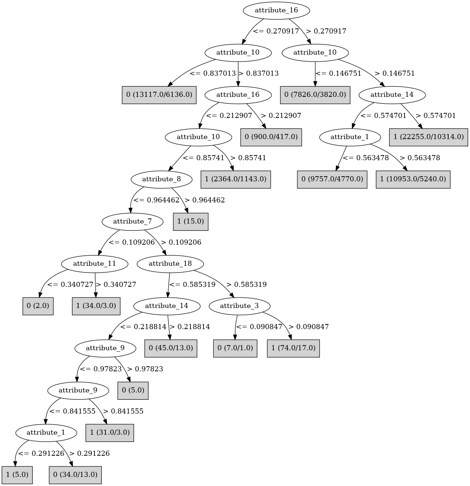

# J48

# SimpleCart Decision Tree

attribute_16 < 0.2717375: 0(8696.0/7937.0)

attribute_16 >= 0.2717375

* attribute_14 < 0.5747005000000001

*   * attribute_1 < 0.5596085: 0(6071.0/5748.0)

*   * attribute_1 >= 0.5596085: 1(6354.0/5914.0)

* attribute_14 >= 0.5747005000000001

*   * attribute_10 < 0.147999: 0(2253.0/2197.0)

*   * attribute_10 >= 0.147999: 1(11945.0/10309.0)

# PART

Decision list:

conditions|predicted class
---|---
attribute_16 <= 0.250773 AND attribute_9 <= 0.338607| 0 (2385.0/1014.0)
attribute_15 > 0.170922 AND attribute_1 > 0.5521 AND attribute_14 > 0.446172| 1 (7503.0/3394.0)
| 1 (23824.0/11857.0)

# JRip

Decision list:

conditions|predicted class
---|---
(attribute_14 <= 0.5747) and (attribute_16 <= 0.270917)|0 (13108.0/6199.0)
(attribute_1 <= 0.561567) and (attribute_14 <= 0.554801) and (attribute_18 <= 0.684796)|0 (7267.0/3442.0)
(attribute_10 <= 0.215306)|0 (10910.0/5442.0)
(attribute_13 >= 0.539885) and (attribute_2 <= 0.730116) and (attribute_20 >= 0.508051) and (attribute_11 <= 0.729413) and (attribute_11 >= 0.532789)|0 (1137.0/510.0)
|1 (35002.0/16414.0)

# Decision Table

Non matches covered by IB1

attribute_0|attribute_1|attribute_2|attribute_5|attribute_6|attribute_7|attribute_8|attribute_9|attribute_10|attribute_11|attribute_14|attribute_15|attribute_16|attribute_17|attribute_18|target
---|---|---|---|---|---|---|---|---|---|---|---|---|---|---|---
all|(0.5521-inf)|all|all|all|all|all|(0.265355-inf)|(0.147068-inf)|all|(0.574701-inf)|(0.254509-inf)|(0.271738-inf)|all|all|1
all|(-inf-0.5521]|all|all|all|all|all|(0.265355-inf)|(0.147068-inf)|all|(0.574701-inf)|(0.254509-inf)|(0.271738-inf)|all|all|1
all|(0.5521-inf)|all|all|all|all|all|(-inf-0.265355]|(0.147068-inf)|all|(0.574701-inf)|(0.254509-inf)|(0.271738-inf)|all|all|1
all|(0.5521-inf)|all|all|all|all|all|(0.265355-inf)|(-inf-0.147068]|all|(0.574701-inf)|(0.254509-inf)|(0.271738-inf)|all|all|1
all|(-inf-0.5521]|all|all|all|all|all|(-inf-0.265355]|(0.147068-inf)|all|(0.574701-inf)|(0.254509-inf)|(0.271738-inf)|all|all|1
all|(-inf-0.5521]|all|all|all|all|all|(0.265355-inf)|(-inf-0.147068]|all|(0.574701-inf)|(0.254509-inf)|(0.271738-inf)|all|all|1
all|(0.5521-inf)|all|all|all|all|all|(0.265355-inf)|(0.147068-inf)|all|(-inf-0.574701]|(0.254509-inf)|(0.271738-inf)|all|all|1
all|(0.5521-inf)|all|all|all|all|all|(0.265355-inf)|(0.147068-inf)|all|(0.574701-inf)|(-inf-0.254509]|(0.271738-inf)|all|all|1
all|(-inf-0.5521]|all|all|all|all|all|(0.265355-inf)|(0.147068-inf)|all|(-inf-0.574701]|(0.254509-inf)|(0.271738-inf)|all|all|0
all|(0.5521-inf)|all|all|all|all|all|(0.265355-inf)|(0.147068-inf)|all|(0.574701-inf)|(0.254509-inf)|(-inf-0.271738]|all|all|1
all|(-inf-0.5521]|all|all|all|all|all|(0.265355-inf)|(0.147068-inf)|all|(0.574701-inf)|(-inf-0.254509]|(0.271738-inf)|all|all|0
all|(-inf-0.5521]|all|all|all|all|all|(0.265355-inf)|(0.147068-inf)|all|(0.574701-inf)|(0.254509-inf)|(-inf-0.271738]|all|all|0
all|(0.5521-inf)|all|all|all|all|all|(-inf-0.265355]|(-inf-0.147068]|all|(0.574701-inf)|(0.254509-inf)|(0.271738-inf)|all|all|0
all|(-inf-0.5521]|all|all|all|all|all|(-inf-0.265355]|(-inf-0.147068]|all|(0.574701-inf)|(0.254509-inf)|(0.271738-inf)|all|all|0
all|(0.5521-inf)|all|all|all|all|all|(-inf-0.265355]|(0.147068-inf)|all|(-inf-0.574701]|(0.254509-inf)|(0.271738-inf)|all|all|1
all|(0.5521-inf)|all|all|all|all|all|(-inf-0.265355]|(0.147068-inf)|all|(0.574701-inf)|(-inf-0.254509]|(0.271738-inf)|all|all|1
all|(0.5521-inf)|all|all|all|all|all|(0.265355-inf)|(-inf-0.147068]|all|(-inf-0.574701]|(0.254509-inf)|(0.271738-inf)|all|all|1
all|(-inf-0.5521]|all|all|all|all|all|(-inf-0.265355]|(0.147068-inf)|all|(-inf-0.574701]|(0.254509-inf)|(0.271738-inf)|all|all|1
all|(-inf-0.5521]|all|all|all|all|all|(-inf-0.265355]|(0.147068-inf)|all|(0.574701-inf)|(-inf-0.254509]|(0.271738-inf)|all|all|1
all|(0.5521-inf)|all|all|all|all|all|(-inf-0.265355]|(0.147068-inf)|all|(0.574701-inf)|(0.254509-inf)|(-inf-0.271738]|all|all|0
all|(0.5521-inf)|all|all|all|all|all|(0.265355-inf)|(-inf-0.147068]|all|(0.574701-inf)|(-inf-0.254509]|(0.271738-inf)|all|all|0
all|(-inf-0.5521]|all|all|all|all|all|(0.265355-inf)|(-inf-0.147068]|all|(-inf-0.574701]|(0.254509-inf)|(0.271738-inf)|all|all|0
all|(-inf-0.5521]|all|all|all|all|all|(0.265355-inf)|(-inf-0.147068]|all|(0.574701-inf)|(-inf-0.254509]|(0.271738-inf)|all|all|1
all|(0.5521-inf)|all|all|all|all|all|(0.265355-inf)|(-inf-0.147068]|all|(0.574701-inf)|(0.254509-inf)|(-inf-0.271738]|all|all|1
all|(-inf-0.5521]|all|all|all|all|all|(-inf-0.265355]|(0.147068-inf)|all|(0.574701-inf)|(0.254509-inf)|(-inf-0.271738]|all|all|0
all|(-inf-0.5521]|all|all|all|all|all|(0.265355-inf)|(-inf-0.147068]|all|(0.574701-inf)|(0.254509-inf)|(-inf-0.271738]|all|all|1
all|(0.5521-inf)|all|all|all|all|all|(0.265355-inf)|(0.147068-inf)|all|(-inf-0.574701]|(-inf-0.254509]|(0.271738-inf)|all|all|1
all|(0.5521-inf)|all|all|all|all|all|(0.265355-inf)|(0.147068-inf)|all|(-inf-0.574701]|(0.254509-inf)|(-inf-0.271738]|all|all|0
all|(-inf-0.5521]|all|all|all|all|all|(0.265355-inf)|(0.147068-inf)|all|(-inf-0.574701]|(-inf-0.254509]|(0.271738-inf)|all|all|0
all|(0.5521-inf)|all|all|all|all|all|(0.265355-inf)|(0.147068-inf)|all|(0.574701-inf)|(-inf-0.254509]|(-inf-0.271738]|all|all|0
all|(-inf-0.5521]|all|all|all|all|all|(0.265355-inf)|(0.147068-inf)|all|(-inf-0.574701]|(0.254509-inf)|(-inf-0.271738]|all|all|0
all|(-inf-0.5521]|all|all|all|all|all|(0.265355-inf)|(0.147068-inf)|all|(0.574701-inf)|(-inf-0.254509]|(-inf-0.271738]|all|all|0
all|(0.5521-inf)|all|all|all|all|all|(-inf-0.265355]|(-inf-0.147068]|all|(-inf-0.574701]|(0.254509-inf)|(0.271738-inf)|all|all|0
all|(0.5521-inf)|all|all|all|all|all|(-inf-0.265355]|(-inf-0.147068]|all|(0.574701-inf)|(-inf-0.254509]|(0.271738-inf)|all|all|1
all|(-inf-0.5521]|all|all|all|all|all|(-inf-0.265355]|(-inf-0.147068]|all|(-inf-0.574701]|(0.254509-inf)|(0.271738-inf)|all|all|0
all|(-inf-0.5521]|all|all|all|all|all|(-inf-0.265355]|(-inf-0.147068]|all|(0.574701-inf)|(-inf-0.254509]|(0.271738-inf)|all|all|0
all|(0.5521-inf)|all|all|all|all|all|(-inf-0.265355]|(-inf-0.147068]|all|(0.574701-inf)|(0.254509-inf)|(-inf-0.271738]|all|all|0
all|(0.5521-inf)|all|all|all|all|all|(-inf-0.265355]|(0.147068-inf)|all|(-inf-0.574701]|(-inf-0.254509]|(0.271738-inf)|all|all|0
all|(-inf-0.5521]|all|all|all|all|all|(-inf-0.265355]|(-inf-0.147068]|all|(0.574701-inf)|(0.254509-inf)|(-inf-0.271738]|all|all|0
all|(0.5521-inf)|all|all|all|all|all|(0.265355-inf)|(-inf-0.147068]|all|(-inf-0.574701]|(-inf-0.254509]|(0.271738-inf)|all|all|0
all|(0.5521-inf)|all|all|all|all|all|(-inf-0.265355]|(0.147068-inf)|all|(-inf-0.574701]|(0.254509-inf)|(-inf-0.271738]|all|all|0
all|(-inf-0.5521]|all|all|all|all|all|(-inf-0.265355]|(0.147068-inf)|all|(-inf-0.574701]|(-inf-0.254509]|(0.271738-inf)|all|all|0
all|(0.5521-inf)|all|all|all|all|all|(-inf-0.265355]|(0.147068-inf)|all|(0.574701-inf)|(-inf-0.254509]|(-inf-0.271738]|all|all|0
all|(0.5521-inf)|all|all|all|all|all|(0.265355-inf)|(-inf-0.147068]|all|(-inf-0.574701]|(0.254509-inf)|(-inf-0.271738]|all|all|1
all|(-inf-0.5521]|all|all|all|all|all|(-inf-0.265355]|(0.147068-inf)|all|(-inf-0.574701]|(0.254509-inf)|(-inf-0.271738]|all|all|0
all|(-inf-0.5521]|all|all|all|all|all|(0.265355-inf)|(-inf-0.147068]|all|(-inf-0.574701]|(-inf-0.254509]|(0.271738-inf)|all|all|1
all|(0.5521-inf)|all|all|all|all|all|(0.265355-inf)|(-inf-0.147068]|all|(0.574701-inf)|(-inf-0.254509]|(-inf-0.271738]|all|all|1
all|(-inf-0.5521]|all|all|all|all|all|(-inf-0.265355]|(0.147068-inf)|all|(0.574701-inf)|(-inf-0.254509]|(-inf-0.271738]|all|all|0
all|(-inf-0.5521]|all|all|all|all|all|(0.265355-inf)|(-inf-0.147068]|all|(-inf-0.574701]|(0.254509-inf)|(-inf-0.271738]|all|all|1
all|(-inf-0.5521]|all|all|all|all|all|(0.265355-inf)|(-inf-0.147068]|all|(0.574701-inf)|(-inf-0.254509]|(-inf-0.271738]|all|all|0
all|(0.5521-inf)|all|all|all|all|all|(0.265355-inf)|(0.147068-inf)|all|(-inf-0.574701]|(-inf-0.254509]|(-inf-0.271738]|all|all|0
all|(-inf-0.5521]|all|all|all|all|all|(0.265355-inf)|(0.147068-inf)|all|(-inf-0.574701]|(-inf-0.254509]|(-inf-0.271738]|all|all|0
all|(0.5521-inf)|all|all|all|all|all|(-inf-0.265355]|(-inf-0.147068]|all|(-inf-0.574701]|(-inf-0.254509]|(0.271738-inf)|all|all|0
all|(-inf-0.5521]|all|all|all|all|all|(-inf-0.265355]|(-inf-0.147068]|all|(-inf-0.574701]|(-inf-0.254509]|(0.271738-inf)|all|all|0
all|(0.5521-inf)|all|all|all|all|all|(-inf-0.265355]|(-inf-0.147068]|all|(-inf-0.574701]|(0.254509-inf)|(-inf-0.271738]|all|all|0
all|(0.5521-inf)|all|all|all|all|all|(-inf-0.265355]|(-inf-0.147068]|all|(0.574701-inf)|(-inf-0.254509]|(-inf-0.271738]|all|all|0
all|(-inf-0.5521]|all|all|all|all|all|(-inf-0.265355]|(-inf-0.147068]|all|(-inf-0.574701]|(0.254509-inf)|(-inf-0.271738]|all|all|0
all|(-inf-0.5521]|all|all|all|all|all|(-inf-0.265355]|(-inf-0.147068]|all|(0.574701-inf)|(-inf-0.254509]|(-inf-0.271738]|all|all|1
all|(0.5521-inf)|all|all|all|all|all|(-inf-0.265355]|(0.147068-inf)|all|(-inf-0.574701]|(-inf-0.254509]|(-inf-0.271738]|all|all|0
all|(0.5521-inf)|all|all|all|all|all|(0.265355-inf)|(-inf-0.147068]|all|(-inf-0.574701]|(-inf-0.254509]|(-inf-0.271738]|all|all|0
all|(-inf-0.5521]|all|all|all|all|all|(-inf-0.265355]|(0.147068-inf)|all|(-inf-0.574701]|(-inf-0.254509]|(-inf-0.271738]|all|all|0
all|(-inf-0.5521]|all|all|all|all|all|(0.265355-inf)|(-inf-0.147068]|all|(-inf-0.574701]|(-inf-0.254509]|(-inf-0.271738]|all|all|1
all|(0.5521-inf)|all|all|all|all|all|(-inf-0.265355]|(-inf-0.147068]|all|(-inf-0.574701]|(-inf-0.254509]|(-inf-0.271738]|all|all|0
all|(-inf-0.5521]|all|all|all|all|all|(-inf-0.265355]|(-inf-0.147068]|all|(-inf-0.574701]|(-inf-0.254509]|(-inf-0.271738]|all|all|0

