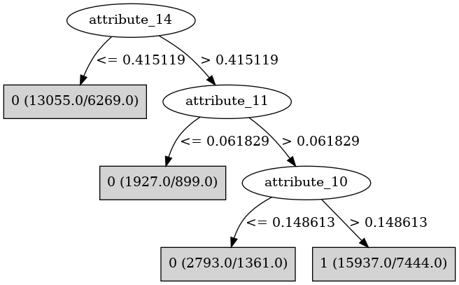

# J48

# SimpleCart Decision Tree

attribute_14 < 0.45756600000000003: 0(14806.0/13851.0)

attribute_14 >= 0.45756600000000003

* attribute_1 < 0.127302: 0(2893.0/2715.0)

* attribute_1 >= 0.127302: 1(17477.0/15682.0)

# PART

Decision list:

conditions|predicted class
---|---
attribute_16 <= 0.270917 AND attribute_9 <= 0.261594 AND attribute_19 > 0.614693 AND attribute_0 <= 0.888804 AND attribute_3 > 0.045326| 1 (28.0/2.0)
attribute_16 <= 0.270917 AND attribute_9 <= 0.261594 AND attribute_1 > 0.037866 AND attribute_5 > 0.153352| 0 (3218.0/1378.0)
attribute_14 > 0.45598 AND attribute_1 > 0.127135 AND attribute_10 > 0.146751| 1 (28296.0/13211.0)
attribute_16 <= 0.038311| 0 (1614.0/708.0)
attribute_14 <= 0.021127 AND attribute_19 > 0.1917| 0 (755.0/297.0)
| 0 (33513.0/16549.0)

# JRip

Decision list:

conditions|predicted class
---|---
(attribute_14 <= 0.45598) and (attribute_9 <= 0.318391) and (attribute_16 <= 0.215738) and (attribute_0 <= 0.667177) and (attribute_12 >= 0.04946) and (attribute_3 <= 0.767177) and (attribute_0 >= 0.339044) and (attribute_5 >= 0.801643) and (attribute_14 >= 0.15565)|0 (41.0/0.0)
(attribute_14 <= 0.45598) and (attribute_10 <= 0.224008) and (attribute_11 <= 0.333349) and (attribute_5 >= 0.630367) and (attribute_3 <= 0.74216) and (attribute_5 <= 0.686906) and (attribute_20 >= 0.197493) and (attribute_3 >= 0.653691)|0 (21.0/0.0)
|1 (67362.0/33319.0)

# Decision Table

Non matches covered by IB1

attribute_1|attribute_10|attribute_14|attribute_16|target
---|---|---|---|---
(-inf-0.129105]|(0.158336-inf)|(0.457566-inf)|(0.271738-inf)|1
(0.129105-inf)|(0.158336-inf)|(0.457566-inf)|(0.271738-inf)|1
(-inf-0.129105]|(-inf-0.158336]|(0.457566-inf)|(0.271738-inf)|0
(0.129105-inf)|(-inf-0.158336]|(0.457566-inf)|(0.271738-inf)|1
(-inf-0.129105]|(0.158336-inf)|(0.019817-0.457566]|(0.271738-inf)|1
(0.129105-inf)|(0.158336-inf)|(0.019817-0.457566]|(0.271738-inf)|1
(-inf-0.129105]|(0.158336-inf)|(0.457566-inf)|(-inf-0.271738]|0
(0.129105-inf)|(-inf-0.158336]|(0.019817-0.457566]|(0.271738-inf)|0
(-inf-0.129105]|(-inf-0.158336]|(0.019817-0.457566]|(0.271738-inf)|0
(0.129105-inf)|(0.158336-inf)|(0.457566-inf)|(-inf-0.271738]|1
(-inf-0.129105]|(0.158336-inf)|(-inf-0.019817]|(0.271738-inf)|0
(0.129105-inf)|(-inf-0.158336]|(0.457566-inf)|(-inf-0.271738]|0
(-inf-0.129105]|(-inf-0.158336]|(0.457566-inf)|(-inf-0.271738]|0
(0.129105-inf)|(0.158336-inf)|(-inf-0.019817]|(0.271738-inf)|0
(0.129105-inf)|(-inf-0.158336]|(-inf-0.019817]|(0.271738-inf)|0
(-inf-0.129105]|(-inf-0.158336]|(-inf-0.019817]|(0.271738-inf)|0
(-inf-0.129105]|(0.158336-inf)|(0.019817-0.457566]|(-inf-0.271738]|0
(0.129105-inf)|(0.158336-inf)|(0.019817-0.457566]|(-inf-0.271738]|0
(-inf-0.129105]|(-inf-0.158336]|(0.019817-0.457566]|(-inf-0.271738]|0
(0.129105-inf)|(-inf-0.158336]|(0.019817-0.457566]|(-inf-0.271738]|0
(-inf-0.129105]|(0.158336-inf)|(-inf-0.019817]|(-inf-0.271738]|0
(0.129105-inf)|(0.158336-inf)|(-inf-0.019817]|(-inf-0.271738]|0
(-inf-0.129105]|(-inf-0.158336]|(-inf-0.019817]|(-inf-0.271738]|0
(0.129105-inf)|(-inf-0.158336]|(-inf-0.019817]|(-inf-0.271738]|0

