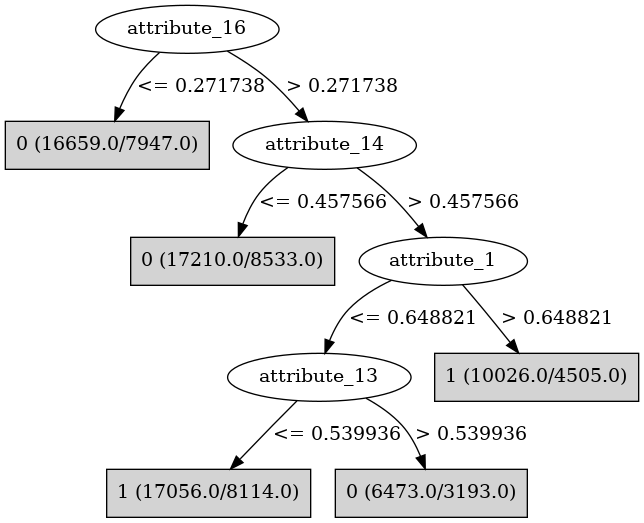

# J48

# SimpleCart Decision Tree

attribute_16 < 0.2717375

* attribute_9 < 0.265355

*   * attribute_1 < 0.0392915

*   *   * attribute_15 < 0.8233475

*   *   *   * attribute_17 < 0.1242275

*   *   *   *   * attribute_8 < 0.0041725: 1(9.0/4.0)

*   *   *   *   * attribute_8 >= 0.0041725

*   *   *   *   *   * attribute_8 < 0.4379645: 0(148.0/46.0)

*   *   *   *   *   * attribute_8 >= 0.4379645

*   *   *   *   *   *   * attribute_8 < 0.9437344999999999: 0(36.0/34.0)

*   *   *   *   *   *   * attribute_8 >= 0.9437344999999999: 0(6.0/0.0)

*   *   *   * attribute_17 >= 0.1242275

*   *   *   *   * attribute_3 < 0.2223305: 1(18.0/6.0)

*   *   *   *   * attribute_3 >= 0.2223305

*   *   *   *   *   * attribute_10 < 0.024256: 1(10.0/3.0)

*   *   *   *   *   * attribute_10 >= 0.024256

*   *   *   *   *   *   * attribute_19 < 0.0414745

*   *   *   *   *   *   *   * attribute_13 < 0.7700549999999999: 0(13.0/7.0)

*   *   *   *   *   *   *   * attribute_13 >= 0.7700549999999999: 1(7.0/0.0)

*   *   *   *   *   *   * attribute_19 >= 0.0414745: 0(38.0/11.0)

*   *   * attribute_15 >= 0.8233475

*   *   *   * attribute_18 < 0.933431: 0(25.0/1.0)

*   *   *   * attribute_18 >= 0.933431: 0(4.0/3.0)

*   * attribute_1 >= 0.0392915

*   *   * attribute_0 < 0.5531630000000001

*   *   *   * attribute_5 < 0.16986

*   *   *   *   * attribute_13 < 0.26344650000000003

*   *   *   *   *   * attribute_5 < 0.071656: 1(18.0/14.0)

*   *   *   *   *   * attribute_5 >= 0.071656: 1(22.0/3.0)

*   *   *   *   * attribute_13 >= 0.26344650000000003

*   *   *   *   *   * attribute_20 < 0.11218449999999999: 1(20.0/11.0)

*   *   *   *   *   * attribute_20 >= 0.11218449999999999

*   *   *   *   *   *   * attribute_4 < 0.10963049999999999: 1(5.0/1.0)

*   *   *   *   *   *   * attribute_4 >= 0.10963049999999999: 0(21.0/3.0)

*   *   *   * attribute_5 >= 0.16986

*   *   *   *   * attribute_3 < 0.9717785

*   *   *   *   *   * attribute_15 < 0.003919499999999999

*   *   *   *   *   *   * attribute_12 < 0.054522: 1(15.0/1.0)

*   *   *   *   *   *   * attribute_12 >= 0.054522: 0(15.0/13.0)

*   *   *   *   *   * attribute_15 >= 0.003919499999999999

*   *   *   *   *   *   * attribute_20 < 0.5668185

*   *   *   *   *   *   *   * attribute_19 < 0.6081259999999999

*   *   *   *   *   *   *   *   * attribute_17 < 0.0044715

*   *   *   *   *   *   *   *   *   * attribute_12 < 0.278471: 0(19.0/0.0)

*   *   *   *   *   *   *   *   *   * attribute_12 >= 0.278471: 0(7.0/7.0)

*   *   *   *   *   *   *   *   * attribute_17 >= 0.0044715

*   *   *   *   *   *   *   *   *   * attribute_1 < 0.31511900000000004

*   *   *   *   *   *   *   *   *   *   * attribute_2 < 0.443085

*   *   *   *   *   *   *   *   *   *   *   * attribute_1 < 0.28659599999999996

*   *   *   *   *   *   *   *   *   *   *   *   * attribute_13 < 0.9679895000000001

*   *   *   *   *   *   *   *   *   *   *   *   *   * attribute_19 < 0.0026785000000000003: 1(14.0/7.0)

*   *   *   *   *   *   *   *   *   *   *   *   *   * attribute_19 >= 0.0026785000000000003

*   *   *   *   *   *   *   *   *   *   *   *   *   *   * attribute_0 < 0.0595825

*   *   *   *   *   *   *   *   *   *   *   *   *   *   *   * attribute_9 < 0.178398

*   *   *   *   *   *   *   *   *   *   *   *   *   *   *   *   * attribute_18 < 0.187637: 1(13.0/1.0)

*   *   *   *   *   *   *   *   *   *   *   *   *   *   *   *   * attribute_18 >= 0.187637: 1(6.0/5.0)

*   *   *   *   *   *   *   *   *   *   *   *   *   *   *   * attribute_9 >= 0.178398: 0(13.0/6.0)

*   *   *   *   *   *   *   *   *   *   *   *   *   *   * attribute_0 >= 0.0595825: 0(218.0/116.0)

*   *   *   *   *   *   *   *   *   *   *   *   * attribute_13 >= 0.9679895000000001

*   *   *   *   *   *   *   *   *   *   *   *   *   * attribute_20 < 0.063641: 0(6.0/0.0)

*   *   *   *   *   *   *   *   *   *   *   *   *   * attribute_20 >= 0.063641: 1(25.0/7.0)

*   *   *   *   *   *   *   *   *   *   *   * attribute_1 >= 0.28659599999999996: 1(21.0/10.0)

*   *   *   *   *   *   *   *   *   *   * attribute_2 >= 0.443085

*   *   *   *   *   *   *   *   *   *   *   * attribute_12 < 0.369263

*   *   *   *   *   *   *   *   *   *   *   *   * attribute_12 < 0.064832: 0(4.0/3.0)

*   *   *   *   *   *   *   *   *   *   *   *   * attribute_12 >= 0.064832

*   *   *   *   *   *   *   *   *   *   *   *   *   * attribute_18 < 0.7470185: 1(19.0/0.0)

*   *   *   *   *   *   *   *   *   *   *   *   *   * attribute_18 >= 0.7470185: 0(3.0/3.0)

*   *   *   *   *   *   *   *   *   *   *   * attribute_12 >= 0.369263

*   *   *   *   *   *   *   *   *   *   *   *   * attribute_1 < 0.246359: 1(8.0/5.0)

*   *   *   *   *   *   *   *   *   *   *   *   * attribute_1 >= 0.246359: 0(6.0/1.0)

*   *   *   *   *   *   *   *   *   * attribute_1 >= 0.31511900000000004

*   *   *   *   *   *   *   *   *   *   * attribute_2 < 0.181369

*   *   *   *   *   *   *   *   *   *   *   * attribute_20 < 0.2258315

*   *   *   *   *   *   *   *   *   *   *   *   * attribute_2 < 0.07649: 1(5.0/1.0)

*   *   *   *   *   *   *   *   *   *   *   *   * attribute_2 >= 0.07649: 0(14.0/4.0)

*   *   *   *   *   *   *   *   *   *   *   * attribute_20 >= 0.2258315

*   *   *   *   *   *   *   *   *   *   *   *   * attribute_13 < 0.836666: 1(16.0/1.0)

*   *   *   *   *   *   *   *   *   *   *   *   * attribute_13 >= 0.836666: 0(7.0/6.0)

*   *   *   *   *   *   *   *   *   *   * attribute_2 >= 0.181369

*   *   *   *   *   *   *   *   *   *   *   * attribute_4 < 0.10846

*   *   *   *   *   *   *   *   *   *   *   *   * attribute_19 < 0.045039499999999996: 0(72.0/16.0)

*   *   *   *   *   *   *   *   *   *   *   *   * attribute_19 >= 0.045039499999999996

*   *   *   *   *   *   *   *   *   *   *   *   *   * attribute_11 < 0.908779

*   *   *   *   *   *   *   *   *   *   *   *   *   *   * attribute_2 < 0.8069725: 0(62.0/27.0)

*   *   *   *   *   *   *   *   *   *   *   *   *   *   * attribute_2 >= 0.8069725

*   *   *   *   *   *   *   *   *   *   *   *   *   *   *   * attribute_14 < 0.121582: 1(11.0/1.0)

*   *   *   *   *   *   *   *   *   *   *   *   *   *   *   * attribute_14 >= 0.121582

*   *   *   *   *   *   *   *   *   *   *   *   *   *   *   *   * attribute_5 < 0.8904995

*   *   *   *   *   *   *   *   *   *   *   *   *   *   *   *   *   * attribute_1 < 0.737348: 1(7.0/1.0)

*   *   *   *   *   *   *   *   *   *   *   *   *   *   *   *   *   * attribute_1 >= 0.737348

*   *   *   *   *   *   *   *   *   *   *   *   *   *   *   *   *   *   * attribute_1 < 0.8967375: 0(9.0/1.0)

*   *   *   *   *   *   *   *   *   *   *   *   *   *   *   *   *   *   * attribute_1 >= 0.8967375: 1(7.0/2.0)

*   *   *   *   *   *   *   *   *   *   *   *   *   *   *   *   * attribute_5 >= 0.8904995: 0(6.0/0.0)

*   *   *   *   *   *   *   *   *   *   *   *   *   * attribute_11 >= 0.908779: 0(27.0/4.0)

*   *   *   *   *   *   *   *   *   *   *   * attribute_4 >= 0.10846

*   *   *   *   *   *   *   *   *   *   *   *   * attribute_19 < 0.22798000000000002

*   *   *   *   *   *   *   *   *   *   *   *   *   * attribute_2 < 0.9417355000000001

*   *   *   *   *   *   *   *   *   *   *   *   *   *   * attribute_8 < 0.2415315: 1(14.0/5.0)

*   *   *   *   *   *   *   *   *   *   *   *   *   *   * attribute_8 >= 0.2415315

*   *   *   *   *   *   *   *   *   *   *   *   *   *   *   * attribute_11 < 0.41953700000000005

*   *   *   *   *   *   *   *   *   *   *   *   *   *   *   *   * attribute_1 < 0.85303: 0(49.0/12.0)

*   *   *   *   *   *   *   *   *   *   *   *   *   *   *   *   * attribute_1 >= 0.85303: 1(5.0/2.0)

*   *   *   *   *   *   *   *   *   *   *   *   *   *   *   * attribute_11 >= 0.41953700000000005: 0(132.0/107.0)

*   *   *   *   *   *   *   *   *   *   *   *   *   * attribute_2 >= 0.9417355000000001

*   *   *   *   *   *   *   *   *   *   *   *   *   *   * attribute_8 < 0.9795645

*   *   *   *   *   *   *   *   *   *   *   *   *   *   *   * attribute_5 < 0.7437275: 1(10.0/5.0)

*   *   *   *   *   *   *   *   *   *   *   *   *   *   *   * attribute_5 >= 0.7437275: 1(15.0/0.0)

*   *   *   *   *   *   *   *   *   *   *   *   *   *   * attribute_8 >= 0.9795645: 0(8.0/1.0)

*   *   *   *   *   *   *   *   *   *   *   *   * attribute_19 >= 0.22798000000000002

*   *   *   *   *   *   *   *   *   *   *   *   *   * attribute_17 < 0.7751975

*   *   *   *   *   *   *   *   *   *   *   *   *   *   * attribute_6 < 0.387538: 0(14.0/2.0)

*   *   *   *   *   *   *   *   *   *   *   *   *   *   * attribute_6 >= 0.387538

*   *   *   *   *   *   *   *   *   *   *   *   *   *   *   * attribute_19 < 0.3035575: 0(16.0/6.0)

*   *   *   *   *   *   *   *   *   *   *   *   *   *   *   * attribute_19 >= 0.3035575

*   *   *   *   *   *   *   *   *   *   *   *   *   *   *   *   * attribute_13 < 0.7917970000000001: 1(16.0/4.0)

*   *   *   *   *   *   *   *   *   *   *   *   *   *   *   *   * attribute_13 >= 0.7917970000000001: 0(6.0/2.0)

*   *   *   *   *   *   *   *   *   *   *   *   *   * attribute_17 >= 0.7751975

*   *   *   *   *   *   *   *   *   *   *   *   *   *   * attribute_18 < 0.5318164999999999: 0(45.0/3.0)

*   *   *   *   *   *   *   *   *   *   *   *   *   *   * attribute_18 >= 0.5318164999999999

*   *   *   *   *   *   *   *   *   *   *   *   *   *   *   * attribute_0 < 0.432347: 0(9.0/2.0)

*   *   *   *   *   *   *   *   *   *   *   *   *   *   *   * attribute_0 >= 0.432347: 1(7.0/2.0)

*   *   *   *   *   *   *   * attribute_19 >= 0.6081259999999999: 1(8.0/2.0)

*   *   *   *   *   *   * attribute_20 >= 0.5668185

*   *   *   *   *   *   *   * attribute_18 < 0.039807499999999996: 0(7.0/0.0)

*   *   *   *   *   *   *   * attribute_18 >= 0.039807499999999996

*   *   *   *   *   *   *   *   * attribute_20 < 0.5860035: 1(10.0/0.0)

*   *   *   *   *   *   *   *   * attribute_20 >= 0.5860035

*   *   *   *   *   *   *   *   *   * attribute_12 < 0.08349899999999999

*   *   *   *   *   *   *   *   *   *   * attribute_17 < 0.692115: 0(10.0/1.0)

*   *   *   *   *   *   *   *   *   *   * attribute_17 >= 0.692115: 1(5.0/3.0)

*   *   *   *   *   *   *   *   *   * attribute_12 >= 0.08349899999999999

*   *   *   *   *   *   *   *   *   *   * attribute_9 < 0.12179899999999999: 1(12.0/0.0)

*   *   *   *   *   *   *   *   *   *   * attribute_9 >= 0.12179899999999999

*   *   *   *   *   *   *   *   *   *   *   * attribute_16 < 0.1213785: 1(13.0/3.0)

*   *   *   *   *   *   *   *   *   *   *   * attribute_16 >= 0.1213785

*   *   *   *   *   *   *   *   *   *   *   *   * attribute_14 < 0.2914685

*   *   *   *   *   *   *   *   *   *   *   *   *   * attribute_3 < 0.7016344999999999: 1(9.0/1.0)

*   *   *   *   *   *   *   *   *   *   *   *   *   * attribute_3 >= 0.7016344999999999: 0(7.0/3.0)

*   *   *   *   *   *   *   *   *   *   *   *   * attribute_14 >= 0.2914685: 0(14.0/2.0)

*   *   *   *   * attribute_3 >= 0.9717785

*   *   *   *   *   * attribute_12 < 0.046762

*   *   *   *   *   *   * attribute_5 < 0.9659610000000001

*   *   *   *   *   *   *   * attribute_3 < 0.9801154999999999: 0(7.0/4.0)

*   *   *   *   *   *   *   * attribute_3 >= 0.9801154999999999: 1(15.0/3.0)

*   *   *   *   *   *   * attribute_5 >= 0.9659610000000001: 0(9.0/2.0)

*   *   *   *   *   * attribute_12 >= 0.046762: 0(119.0/41.0)

*   *   * attribute_0 >= 0.5531630000000001

*   *   *   * attribute_11 < 0.7709135

*   *   *   *   * attribute_15 < 0.992019

*   *   *   *   *   * attribute_2 < 0.8694014999999999

*   *   *   *   *   *   * attribute_2 < 0.821855

*   *   *   *   *   *   *   * attribute_9 < 0.236479

*   *   *   *   *   *   *   *   * attribute_7 < 0.999527

*   *   *   *   *   *   *   *   *   * attribute_7 < 0.992969: 0(674.0/569.0)

*   *   *   *   *   *   *   *   *   * attribute_7 >= 0.992969

*   *   *   *   *   *   *   *   *   *   * attribute_19 < 0.014559500000000001: 0(5.0/1.0)

*   *   *   *   *   *   *   *   *   *   * attribute_19 >= 0.014559500000000001

*   *   *   *   *   *   *   *   *   *   *   * attribute_17 < 0.06396199999999999: 1(16.0/0.0)

*   *   *   *   *   *   *   *   *   *   *   * attribute_17 >= 0.06396199999999999

*   *   *   *   *   *   *   *   *   *   *   *   * attribute_1 < 0.400695: 0(5.0/1.0)

*   *   *   *   *   *   *   *   *   *   *   *   * attribute_1 >= 0.400695: 1(6.0/0.0)

*   *   *   *   *   *   *   *   * attribute_7 >= 0.999527: 0(7.0/0.0)

*   *   *   *   *   *   *   * attribute_9 >= 0.236479

*   *   *   *   *   *   *   *   * attribute_20 < 0.489888

*   *   *   *   *   *   *   *   *   * attribute_19 < 0.011806: 0(12.0/0.0)

*   *   *   *   *   *   *   *   *   * attribute_19 >= 0.011806

*   *   *   *   *   *   *   *   *   *   * attribute_14 < 0.3873685

*   *   *   *   *   *   *   *   *   *   *   * attribute_3 < 0.1714405: 0(11.0/1.0)

*   *   *   *   *   *   *   *   *   *   *   * attribute_3 >= 0.1714405

*   *   *   *   *   *   *   *   *   *   *   *   * attribute_4 < 0.072683: 1(10.0/3.0)

*   *   *   *   *   *   *   *   *   *   *   *   * attribute_4 >= 0.072683

*   *   *   *   *   *   *   *   *   *   *   *   *   * attribute_0 < 0.592274: 1(6.0/1.0)

*   *   *   *   *   *   *   *   *   *   *   *   *   * attribute_0 >= 0.592274

*   *   *   *   *   *   *   *   *   *   *   *   *   *   * attribute_0 < 0.660176: 0(12.0/1.0)

*   *   *   *   *   *   *   *   *   *   *   *   *   *   * attribute_0 >= 0.660176

*   *   *   *   *   *   *   *   *   *   *   *   *   *   *   * attribute_0 < 0.752525

*   *   *   *   *   *   *   *   *   *   *   *   *   *   *   *   * attribute_20 < 0.24633850000000002: 1(8.0/0.0)

*   *   *   *   *   *   *   *   *   *   *   *   *   *   *   *   * attribute_20 >= 0.24633850000000002: 0(3.0/3.0)

*   *   *   *   *   *   *   *   *   *   *   *   *   *   *   * attribute_0 >= 0.752525: 0(14.0/3.0)

*   *   *   *   *   *   *   *   *   *   * attribute_14 >= 0.3873685

*   *   *   *   *   *   *   *   *   *   *   * attribute_16 < 0.11466799999999999: 0(22.0/1.0)

*   *   *   *   *   *   *   *   *   *   *   * attribute_16 >= 0.11466799999999999

*   *   *   *   *   *   *   *   *   *   *   *   * attribute_11 < 0.07477600000000001: 1(5.0/1.0)

*   *   *   *   *   *   *   *   *   *   *   *   * attribute_11 >= 0.07477600000000001

*   *   *   *   *   *   *   *   *   *   *   *   *   * attribute_19 < 0.4185915

*   *   *   *   *   *   *   *   *   *   *   *   *   *   * attribute_17 < 0.45664400000000005: 0(25.0/2.0)

*   *   *   *   *   *   *   *   *   *   *   *   *   *   * attribute_17 >= 0.45664400000000005: 0(5.0/5.0)

*   *   *   *   *   *   *   *   *   *   *   *   *   * attribute_19 >= 0.4185915: 1(4.0/2.0)

*   *   *   *   *   *   *   *   * attribute_20 >= 0.489888

*   *   *   *   *   *   *   *   *   * attribute_9 < 0.24783149999999998

*   *   *   *   *   *   *   *   *   *   * attribute_16 < 0.10185: 1(6.0/2.0)

*   *   *   *   *   *   *   *   *   *   * attribute_16 >= 0.10185

*   *   *   *   *   *   *   *   *   *   *   * attribute_16 < 0.1864825: 0(11.0/0.0)

*   *   *   *   *   *   *   *   *   *   *   * attribute_16 >= 0.1864825: 0(6.0/5.0)

*   *   *   *   *   *   *   *   *   * attribute_9 >= 0.24783149999999998

*   *   *   *   *   *   *   *   *   *   * attribute_1 < 0.3555515: 0(4.0/3.0)

*   *   *   *   *   *   *   *   *   *   * attribute_1 >= 0.3555515: 1(14.0/1.0)

*   *   *   *   *   *   * attribute_2 >= 0.821855: 0(16.0/2.0)

*   *   *   *   *   * attribute_2 >= 0.8694014999999999

*   *   *   *   *   *   * attribute_17 < 0.8803084999999999: 1(37.0/8.0)

*   *   *   *   *   *   * attribute_17 >= 0.8803084999999999

*   *   *   *   *   *   *   * attribute_7 < 0.60084: 1(14.0/7.0)

*   *   *   *   *   *   *   * attribute_7 >= 0.60084

*   *   *   *   *   *   *   *   * attribute_4 < 0.41004050000000003: 0(41.0/19.0)

*   *   *   *   *   *   *   *   * attribute_4 >= 0.41004050000000003: 1(8.0/3.0)

*   *   *   *   * attribute_15 >= 0.992019: 1(20.0/6.0)

*   *   *   * attribute_11 >= 0.7709135

*   *   *   *   * attribute_17 < 0.990357

*   *   *   *   *   * attribute_7 < 0.4980015

*   *   *   *   *   *   * attribute_0 < 0.7053585

*   *   *   *   *   *   *   * attribute_13 < 0.844158

*   *   *   *   *   *   *   *   * attribute_19 < 0.0937365: 0(16.0/1.0)

*   *   *   *   *   *   *   *   * attribute_19 >= 0.0937365

*   *   *   *   *   *   *   *   *   * attribute_20 < 0.28012000000000004

*   *   *   *   *   *   *   *   *   *   * attribute_7 < 0.41832349999999996: 1(7.0/1.0)

*   *   *   *   *   *   *   *   *   *   * attribute_7 >= 0.41832349999999996: 0(4.0/2.0)

*   *   *   *   *   *   *   *   *   * attribute_20 >= 0.28012000000000004: 0(9.0/1.0)

*   *   *   *   *   *   *   * attribute_13 >= 0.844158

*   *   *   *   *   *   *   *   * attribute_4 < 0.067438: 1(6.0/0.0)

*   *   *   *   *   *   *   *   * attribute_4 >= 0.067438: 0(7.0/4.0)

*   *   *   *   *   *   * attribute_0 >= 0.7053585

*   *   *   *   *   *   *   * attribute_5 < 0.67745: 0(4.0/2.0)

*   *   *   *   *   *   *   * attribute_5 >= 0.67745: 1(9.0/0.0)

*   *   *   *   *   * attribute_7 >= 0.4980015

*   *   *   *   *   *   * attribute_0 < 0.66376: 1(26.0/3.0)

*   *   *   *   *   *   * attribute_0 >= 0.66376

*   *   *   *   *   *   *   * attribute_7 < 0.610286: 1(41.0/12.0)

*   *   *   *   *   *   *   * attribute_7 >= 0.610286

*   *   *   *   *   *   *   *   * attribute_16 < 0.1510265

*   *   *   *   *   *   *   *   *   * attribute_14 < 0.0501795: 1(7.0/1.0)

*   *   *   *   *   *   *   *   *   * attribute_14 >= 0.0501795

*   *   *   *   *   *   *   *   *   *   * attribute_20 < 0.2318675: 0(19.0/2.0)

*   *   *   *   *   *   *   *   *   *   * attribute_20 >= 0.2318675

*   *   *   *   *   *   *   *   *   *   *   * attribute_12 < 0.5699179999999999

*   *   *   *   *   *   *   *   *   *   *   *   * attribute_10 < 0.205427: 0(6.0/0.0)

*   *   *   *   *   *   *   *   *   *   *   *   * attribute_10 >= 0.205427: 0(4.0/4.0)

*   *   *   *   *   *   *   *   *   *   *   * attribute_12 >= 0.5699179999999999: 1(5.0/1.0)

*   *   *   *   *   *   *   *   * attribute_16 >= 0.1510265

*   *   *   *   *   *   *   *   *   * attribute_11 < 0.9722919999999999: 1(34.0/11.0)

*   *   *   *   *   *   *   *   *   * attribute_11 >= 0.9722919999999999: 0(7.0/1.0)

*   *   *   *   * attribute_17 >= 0.990357: 0(8.0/0.0)

* attribute_9 >= 0.265355

*   * attribute_15 < 0.186588

*   *   * attribute_6 < 0.181859

*   *   *   * attribute_1 < 0.0606005

*   *   *   *   * attribute_4 < 0.0498745: 1(12.0/0.0)

*   *   *   *   * attribute_4 >= 0.0498745

*   *   *   *   *   * attribute_19 < 0.051368: 0(14.0/4.0)

*   *   *   *   *   * attribute_19 >= 0.051368

*   *   *   *   *   *   * attribute_3 < 0.089287: 0(5.0/1.0)

*   *   *   *   *   *   * attribute_3 >= 0.089287: 1(16.0/2.0)

*   *   *   * attribute_1 >= 0.0606005

*   *   *   *   * attribute_0 < 0.379227

*   *   *   *   *   * attribute_19 < 0.13681949999999998

*   *   *   *   *   *   * attribute_12 < 0.2090845: 1(16.0/2.0)

*   *   *   *   *   *   * attribute_12 >= 0.2090845: 0(7.0/6.0)

*   *   *   *   *   * attribute_19 >= 0.13681949999999998

*   *   *   *   *   *   * attribute_19 < 0.23846: 0(12.0/2.0)

*   *   *   *   *   *   * attribute_19 >= 0.23846: 1(5.0/1.0)

*   *   *   *   * attribute_0 >= 0.379227

*   *   *   *   *   * attribute_4 < 0.024746999999999998: 0(24.0/1.0)

*   *   *   *   *   * attribute_4 >= 0.024746999999999998

*   *   *   *   *   *   * attribute_4 < 0.0478: 1(14.0/8.0)

*   *   *   *   *   *   * attribute_4 >= 0.0478

*   *   *   *   *   *   *   * attribute_8 < 0.270756

*   *   *   *   *   *   *   *   * attribute_8 < 0.207216

*   *   *   *   *   *   *   *   *   * attribute_8 < 0.089689

*   *   *   *   *   *   *   *   *   *   * attribute_14 < 0.018355999999999997: 0(16.0/2.0)

*   *   *   *   *   *   *   *   *   *   * attribute_14 >= 0.018355999999999997: 0(41.0/35.0)

*   *   *   *   *   *   *   *   *   * attribute_8 >= 0.089689: 0(46.0/8.0)

*   *   *   *   *   *   *   *   * attribute_8 >= 0.207216

*   *   *   *   *   *   *   *   *   * attribute_18 < 0.8966689999999999

*   *   *   *   *   *   *   *   *   *   * attribute_4 < 0.270716: 1(9.0/5.0)

*   *   *   *   *   *   *   *   *   *   * attribute_4 >= 0.270716: 0(6.0/1.0)

*   *   *   *   *   *   *   *   *   * attribute_18 >= 0.8966689999999999: 1(6.0/0.0)

*   *   *   *   *   *   *   * attribute_8 >= 0.270756

*   *   *   *   *   *   *   *   * attribute_8 < 0.5140914999999999: 0(29.0/0.0)

*   *   *   *   *   *   *   *   * attribute_8 >= 0.5140914999999999: 0(8.0/5.0)

*   *   * attribute_6 >= 0.181859

*   *   *   * attribute_12 < 0.0174905

*   *   *   *   * attribute_14 < 0.046203

*   *   *   *   *   * attribute_7 < 0.015501000000000001: 0(7.0/2.0)

*   *   *   *   *   * attribute_7 >= 0.015501000000000001

*   *   *   *   *   *   * attribute_2 < 0.791204

*   *   *   *   *   *   *   * attribute_4 < 0.243865

*   *   *   *   *   *   *   *   * attribute_10 < 0.9780165000000001: 1(48.0/20.0)

*   *   *   *   *   *   *   *   * attribute_10 >= 0.9780165000000001: 0(5.0/1.0)

*   *   *   *   *   *   *   * attribute_4 >= 0.243865: 0(10.0/5.0)

*   *   *   *   *   *   * attribute_2 >= 0.791204: 1(40.0/9.0)

*   *   *   *   * attribute_14 >= 0.046203

*   *   *   *   *   * attribute_13 < 0.773758

*   *   *   *   *   *   * attribute_11 < 0.7125455

*   *   *   *   *   *   *   * attribute_17 < 0.3101235: 1(6.0/2.0)

*   *   *   *   *   *   *   * attribute_17 >= 0.3101235

*   *   *   *   *   *   *   *   * attribute_8 < 0.661919: 0(25.0/1.0)

*   *   *   *   *   *   *   *   * attribute_8 >= 0.661919: 0(11.0/6.0)

*   *   *   *   *   *   * attribute_11 >= 0.7125455

*   *   *   *   *   *   *   * attribute_2 < 0.8311215000000001: 1(14.0/2.0)

*   *   *   *   *   *   *   * attribute_2 >= 0.8311215000000001: 0(7.0/4.0)

*   *   *   *   *   * attribute_13 >= 0.773758

*   *   *   *   *   *   * attribute_0 < 0.396763

*   *   *   *   *   *   *   * attribute_8 < 0.6233744999999999: 0(7.0/0.0)

*   *   *   *   *   *   *   * attribute_8 >= 0.6233744999999999

*   *   *   *   *   *   *   *   * attribute_1 < 0.90044: 0(12.0/11.0)

*   *   *   *   *   *   *   *   * attribute_1 >= 0.90044: 1(8.0/0.0)

*   *   *   *   *   *   * attribute_0 >= 0.396763: 1(22.0/4.0)

*   *   *   * attribute_12 >= 0.0174905

*   *   *   *   * attribute_5 < 0.0332315

*   *   *   *   *   * attribute_18 < 0.53102: 1(26.0/6.0)

*   *   *   *   *   * attribute_18 >= 0.53102: 1(22.0/18.0)

*   *   *   *   * attribute_5 >= 0.0332315

*   *   *   *   *   * attribute_7 < 0.017883

*   *   *   *   *   *   * attribute_9 < 0.9782

*   *   *   *   *   *   *   * attribute_16 < 0.19000650000000002

*   *   *   *   *   *   *   *   * attribute_12 < 0.0806835

*   *   *   *   *   *   *   *   *   * attribute_12 < 0.0360205: 1(5.0/4.0)

*   *   *   *   *   *   *   *   *   * attribute_12 >= 0.0360205: 1(25.0/1.0)

*   *   *   *   *   *   *   *   * attribute_12 >= 0.0806835

*   *   *   *   *   *   *   *   *   * attribute_2 < 0.28188650000000004: 0(8.0/3.0)

*   *   *   *   *   *   *   *   *   * attribute_2 >= 0.28188650000000004

*   *   *   *   *   *   *   *   *   *   * attribute_9 < 0.539687: 1(19.0/1.0)

*   *   *   *   *   *   *   *   *   *   * attribute_9 >= 0.539687

*   *   *   *   *   *   *   *   *   *   *   * attribute_8 < 0.8608290000000001: 1(11.0/1.0)

*   *   *   *   *   *   *   *   *   *   *   * attribute_8 >= 0.8608290000000001: 0(18.0/12.0)

*   *   *   *   *   *   *   * attribute_16 >= 0.19000650000000002

*   *   *   *   *   *   *   *   * attribute_19 < 0.13782: 0(10.0/0.0)

*   *   *   *   *   *   *   *   * attribute_19 >= 0.13782

*   *   *   *   *   *   *   *   *   * attribute_3 < 0.9567435: 0(12.0/9.0)

*   *   *   *   *   *   *   *   *   * attribute_3 >= 0.9567435: 1(7.0/0.0)

*   *   *   *   *   *   * attribute_9 >= 0.9782: 0(6.0/0.0)

*   *   *   *   *   * attribute_7 >= 0.017883

*   *   *   *   *   *   * attribute_5 < 0.959659

*   *   *   *   *   *   *   * attribute_7 < 0.952221

*   *   *   *   *   *   *   *   * attribute_14 < 0.384683

*   *   *   *   *   *   *   *   *   * attribute_4 < 0.065418

*   *   *   *   *   *   *   *   *   *   * attribute_16 < 0.129322

*   *   *   *   *   *   *   *   *   *   *   * attribute_9 < 0.3410945: 0(30.0/6.0)

*   *   *   *   *   *   *   *   *   *   *   * attribute_9 >= 0.3410945

*   *   *   *   *   *   *   *   *   *   *   *   * attribute_9 < 0.5081184999999999

*   *   *   *   *   *   *   *   *   *   *   *   *   * attribute_1 < 0.4396025: 1(27.0/9.0)

*   *   *   *   *   *   *   *   *   *   *   *   *   * attribute_1 >= 0.4396025

*   *   *   *   *   *   *   *   *   *   *   *   *   *   * attribute_19 < 0.110931

*   *   *   *   *   *   *   *   *   *   *   *   *   *   *   * attribute_19 < 0.028784999999999998: 0(6.0/4.0)

*   *   *   *   *   *   *   *   *   *   *   *   *   *   *   * attribute_19 >= 0.028784999999999998: 0(13.0/0.0)

*   *   *   *   *   *   *   *   *   *   *   *   *   *   * attribute_19 >= 0.110931: 1(9.0/5.0)

*   *   *   *   *   *   *   *   *   *   *   *   * attribute_9 >= 0.5081184999999999

*   *   *   *   *   *   *   *   *   *   *   *   *   * attribute_16 < 0.049238000000000004

*   *   *   *   *   *   *   *   *   *   *   *   *   *   * attribute_10 < 0.98834: 0(95.0/33.0)

*   *   *   *   *   *   *   *   *   *   *   *   *   *   * attribute_10 >= 0.98834: 1(5.0/1.0)

*   *   *   *   *   *   *   *   *   *   *   *   *   * attribute_16 >= 0.049238000000000004

*   *   *   *   *   *   *   *   *   *   *   *   *   *   * attribute_5 < 0.912352

*   *   *   *   *   *   *   *   *   *   *   *   *   *   *   * attribute_19 < 0.014395500000000002

*   *   *   *   *   *   *   *   *   *   *   *   *   *   *   *   * attribute_2 < 0.6197285: 0(4.0/2.0)

*   *   *   *   *   *   *   *   *   *   *   *   *   *   *   *   * attribute_2 >= 0.6197285: 1(9.0/1.0)

*   *   *   *   *   *   *   *   *   *   *   *   *   *   *   * attribute_19 >= 0.014395500000000002: 0(90.0/46.0)

*   *   *   *   *   *   *   *   *   *   *   *   *   *   * attribute_5 >= 0.912352: 1(17.0/5.0)

*   *   *   *   *   *   *   *   *   *   * attribute_16 >= 0.129322

*   *   *   *   *   *   *   *   *   *   *   * attribute_17 < 0.9453834999999999

*   *   *   *   *   *   *   *   *   *   *   *   * attribute_11 < 0.391529

*   *   *   *   *   *   *   *   *   *   *   *   *   * attribute_17 < 0.8303119999999999: 0(23.0/9.0)

*   *   *   *   *   *   *   *   *   *   *   *   *   * attribute_17 >= 0.8303119999999999: 1(6.0/0.0)

*   *   *   *   *   *   *   *   *   *   *   *   * attribute_11 >= 0.391529

*   *   *   *   *   *   *   *   *   *   *   *   *   * attribute_13 < 0.5137585

*   *   *   *   *   *   *   *   *   *   *   *   *   *   * attribute_4 < 0.051499500000000004: 1(28.0/2.0)

*   *   *   *   *   *   *   *   *   *   *   *   *   *   * attribute_4 >= 0.051499500000000004: 1(7.0/6.0)

*   *   *   *   *   *   *   *   *   *   *   *   *   * attribute_13 >= 0.5137585

*   *   *   *   *   *   *   *   *   *   *   *   *   *   * attribute_5 < 0.6825589999999999: 0(12.0/3.0)

*   *   *   *   *   *   *   *   *   *   *   *   *   *   * attribute_5 >= 0.6825589999999999

*   *   *   *   *   *   *   *   *   *   *   *   *   *   *   * attribute_14 < 0.014068500000000001: 0(6.0/1.0)

*   *   *   *   *   *   *   *   *   *   *   *   *   *   *   * attribute_14 >= 0.014068500000000001

*   *   *   *   *   *   *   *   *   *   *   *   *   *   *   *   * attribute_16 < 0.194185: 1(25.0/5.0)

*   *   *   *   *   *   *   *   *   *   *   *   *   *   *   *   * attribute_16 >= 0.194185: 0(9.0/6.0)

*   *   *   *   *   *   *   *   *   *   *   * attribute_17 >= 0.9453834999999999

*   *   *   *   *   *   *   *   *   *   *   *   * attribute_16 < 0.1951585: 0(16.0/0.0)

*   *   *   *   *   *   *   *   *   *   *   *   * attribute_16 >= 0.1951585: 1(5.0/3.0)

*   *   *   *   *   *   *   *   *   * attribute_4 >= 0.065418

*   *   *   *   *   *   *   *   *   *   * attribute_13 < 0.9967215

*   *   *   *   *   *   *   *   *   *   *   * attribute_19 < 0.0509125

*   *   *   *   *   *   *   *   *   *   *   *   * attribute_3 < 0.613718

*   *   *   *   *   *   *   *   *   *   *   *   *   * attribute_5 < 0.1887865: 1(23.0/10.0)

*   *   *   *   *   *   *   *   *   *   *   *   *   * attribute_5 >= 0.1887865

*   *   *   *   *   *   *   *   *   *   *   *   *   *   * attribute_5 < 0.2509435: 0(15.0/1.0)

*   *   *   *   *   *   *   *   *   *   *   *   *   *   * attribute_5 >= 0.2509435

*   *   *   *   *   *   *   *   *   *   *   *   *   *   *   * attribute_1 < 0.8545855

*   *   *   *   *   *   *   *   *   *   *   *   *   *   *   *   * attribute_5 < 0.362444: 1(12.0/6.0)

*   *   *   *   *   *   *   *   *   *   *   *   *   *   *   *   * attribute_5 >= 0.362444: 0(65.0/29.0)

*   *   *   *   *   *   *   *   *   *   *   *   *   *   *   * attribute_1 >= 0.8545855

*   *   *   *   *   *   *   *   *   *   *   *   *   *   *   *   * attribute_2 < 0.893813: 1(15.0/0.0)

*   *   *   *   *   *   *   *   *   *   *   *   *   *   *   *   * attribute_2 >= 0.893813: 0(8.0/2.0)

*   *   *   *   *   *   *   *   *   *   *   *   * attribute_3 >= 0.613718

*   *   *   *   *   *   *   *   *   *   *   *   *   * attribute_20 < 0.546665

*   *   *   *   *   *   *   *   *   *   *   *   *   *   * attribute_16 < 0.010446500000000001: 1(12.0/3.0)

*   *   *   *   *   *   *   *   *   *   *   *   *   *   * attribute_16 >= 0.010446500000000001

*   *   *   *   *   *   *   *   *   *   *   *   *   *   *   * attribute_16 < 0.057383500000000004

*   *   *   *   *   *   *   *   *   *   *   *   *   *   *   *   * attribute_10 < 0.243666: 1(9.0/6.0)

*   *   *   *   *   *   *   *   *   *   *   *   *   *   *   *   * attribute_10 >= 0.243666: 0(30.0/6.0)

*   *   *   *   *   *   *   *   *   *   *   *   *   *   *   * attribute_16 >= 0.057383500000000004

*   *   *   *   *   *   *   *   *   *   *   *   *   *   *   *   * attribute_1 < 0.933748

*   *   *   *   *   *   *   *   *   *   *   *   *   *   *   *   *   * attribute_1 < 0.8839085

*   *   *   *   *   *   *   *   *   *   *   *   *   *   *   *   *   *   * attribute_8 < 0.487262: 0(10.0/3.0)

*   *   *   *   *   *   *   *   *   *   *   *   *   *   *   *   *   *   * attribute_8 >= 0.487262

*   *   *   *   *   *   *   *   *   *   *   *   *   *   *   *   *   *   *   * attribute_8 < 0.9144955

*   *   *   *   *   *   *   *   *   *   *   *   *   *   *   *   *   *   *   *   * attribute_16 < 0.104001: 1(18.0/1.0)

*   *   *   *   *   *   *   *   *   *   *   *   *   *   *   *   *   *   *   *   * attribute_16 >= 0.104001: 1(13.0/11.0)

*   *   *   *   *   *   *   *   *   *   *   *   *   *   *   *   *   *   *   * attribute_8 >= 0.9144955: 0(6.0/1.0)

*   *   *   *   *   *   *   *   *   *   *   *   *   *   *   *   *   * attribute_1 >= 0.8839085: 0(6.0/0.0)

*   *   *   *   *   *   *   *   *   *   *   *   *   *   *   *   * attribute_1 >= 0.933748: 1(9.0/0.0)

*   *   *   *   *   *   *   *   *   *   *   *   *   * attribute_20 >= 0.546665

*   *   *   *   *   *   *   *   *   *   *   *   *   *   * attribute_10 < 0.3693575: 0(6.0/0.0)

*   *   *   *   *   *   *   *   *   *   *   *   *   *   * attribute_10 >= 0.3693575

*   *   *   *   *   *   *   *   *   *   *   *   *   *   *   * attribute_2 < 0.87666

*   *   *   *   *   *   *   *   *   *   *   *   *   *   *   *   * attribute_7 < 0.744664

*   *   *   *   *   *   *   *   *   *   *   *   *   *   *   *   *   * attribute_8 < 0.7299245000000001

*   *   *   *   *   *   *   *   *   *   *   *   *   *   *   *   *   *   * attribute_8 < 0.5756345

*   *   *   *   *   *   *   *   *   *   *   *   *   *   *   *   *   *   *   * attribute_17 < 0.816658: 1(36.0/5.0)

*   *   *   *   *   *   *   *   *   *   *   *   *   *   *   *   *   *   *   * attribute_17 >= 0.816658: 0(6.0/2.0)

*   *   *   *   *   *   *   *   *   *   *   *   *   *   *   *   *   *   * attribute_8 >= 0.5756345: 0(14.0/12.0)

*   *   *   *   *   *   *   *   *   *   *   *   *   *   *   *   *   * attribute_8 >= 0.7299245000000001: 1(68.0/11.0)

*   *   *   *   *   *   *   *   *   *   *   *   *   *   *   *   * attribute_7 >= 0.744664: 0(10.0/6.0)

*   *   *   *   *   *   *   *   *   *   *   *   *   *   *   * attribute_2 >= 0.87666

*   *   *   *   *   *   *   *   *   *   *   *   *   *   *   *   * attribute_7 < 0.48593200000000003

*   *   *   *   *   *   *   *   *   *   *   *   *   *   *   *   *   * attribute_1 < 0.97724

*   *   *   *   *   *   *   *   *   *   *   *   *   *   *   *   *   *   * attribute_1 < 0.88419: 0(16.0/8.0)

*   *   *   *   *   *   *   *   *   *   *   *   *   *   *   *   *   *   * attribute_1 >= 0.88419: 1(20.0/8.0)

*   *   *   *   *   *   *   *   *   *   *   *   *   *   *   *   *   * attribute_1 >= 0.97724: 0(7.0/0.0)

*   *   *   *   *   *   *   *   *   *   *   *   *   *   *   *   * attribute_7 >= 0.48593200000000003: 1(17.0/5.0)

*   *   *   *   *   *   *   *   *   *   *   * attribute_19 >= 0.0509125

*   *   *   *   *   *   *   *   *   *   *   *   * attribute_11 < 0.051134: 0(13.0/1.0)

*   *   *   *   *   *   *   *   *   *   *   *   * attribute_11 >= 0.051134

*   *   *   *   *   *   *   *   *   *   *   *   *   * attribute_7 < 0.9190480000000001

*   *   *   *   *   *   *   *   *   *   *   *   *   *   * attribute_8 < 0.9009135

*   *   *   *   *   *   *   *   *   *   *   *   *   *   *   * attribute_5 < 0.214838

*   *   *   *   *   *   *   *   *   *   *   *   *   *   *   *   * attribute_3 < 0.464704

*   *   *   *   *   *   *   *   *   *   *   *   *   *   *   *   *   * attribute_6 < 0.5097149999999999

*   *   *   *   *   *   *   *   *   *   *   *   *   *   *   *   *   *   * attribute_0 < 0.67534: 0(32.0/5.0)

*   *   *   *   *   *   *   *   *   *   *   *   *   *   *   *   *   *   * attribute_0 >= 0.67534

*   *   *   *   *   *   *   *   *   *   *   *   *   *   *   *   *   *   *   * attribute_4 < 0.1759015: 0(7.0/1.0)

*   *   *   *   *   *   *   *   *   *   *   *   *   *   *   *   *   *   *   * attribute_4 >= 0.1759015: 1(9.0/4.0)

*   *   *   *   *   *   *   *   *   *   *   *   *   *   *   *   *   * attribute_6 >= 0.5097149999999999: 1(37.0/25.0)

*   *   *   *   *   *   *   *   *   *   *   *   *   *   *   *   * attribute_3 >= 0.464704: 0(24.0/3.0)

*   *   *   *   *   *   *   *   *   *   *   *   *   *   *   * attribute_5 >= 0.214838

*   *   *   *   *   *   *   *   *   *   *   *   *   *   *   *   * attribute_13 < 0.2377865

*   *   *   *   *   *   *   *   *   *   *   *   *   *   *   *   *   * attribute_5 < 0.23629450000000002: 0(6.0/2.0)

*   *   *   *   *   *   *   *   *   *   *   *   *   *   *   *   *   * attribute_5 >= 0.23629450000000002: 1(56.0/22.0)

*   *   *   *   *   *   *   *   *   *   *   *   *   *   *   *   * attribute_13 >= 0.2377865

*   *   *   *   *   *   *   *   *   *   *   *   *   *   *   *   *   * attribute_7 < 0.25452949999999996

*   *   *   *   *   *   *   *   *   *   *   *   *   *   *   *   *   *   * attribute_10 < 0.6680815

*   *   *   *   *   *   *   *   *   *   *   *   *   *   *   *   *   *   *   * attribute_12 < 0.2805925

*   *   *   *   *   *   *   *   *   *   *   *   *   *   *   *   *   *   *   *   * attribute_12 < 0.217603

*   *   *   *   *   *   *   *   *   *   *   *   *   *   *   *   *   *   *   *   *   * attribute_9 < 0.4088895: 0(23.0/5.0)

*   *   *   *   *   *   *   *   *   *   *   *   *   *   *   *   *   *   *   *   *   * attribute_9 >= 0.4088895

*   *   *   *   *   *   *   *   *   *   *   *   *   *   *   *   *   *   *   *   *   *   * attribute_17 < 0.5137825

*   *   *   *   *   *   *   *   *   *   *   *   *   *   *   *   *   *   *   *   *   *   *   * attribute_20 < 0.49123700000000003: 1(7.0/6.0)

*   *   *   *   *   *   *   *   *   *   *   *   *   *   *   *   *   *   *   *   *   *   *   * attribute_20 >= 0.49123700000000003: 0(11.0/2.0)

*   *   *   *   *   *   *   *   *   *   *   *   *   *   *   *   *   *   *   *   *   *   * attribute_17 >= 0.5137825

*   *   *   *   *   *   *   *   *   *   *   *   *   *   *   *   *   *   *   *   *   *   *   * attribute_17 < 0.9339425

*   *   *   *   *   *   *   *   *   *   *   *   *   *   *   *   *   *   *   *   *   *   *   *   * attribute_12 < 0.16600399999999998: 1(28.0/3.0)

*   *   *   *   *   *   *   *   *   *   *   *   *   *   *   *   *   *   *   *   *   *   *   *   * attribute_12 >= 0.16600399999999998: 0(4.0/2.0)

*   *   *   *   *   *   *   *   *   *   *   *   *   *   *   *   *   *   *   *   *   *   *   * attribute_17 >= 0.9339425: 0(7.0/2.0)

*   *   *   *   *   *   *   *   *   *   *   *   *   *   *   *   *   *   *   *   * attribute_12 >= 0.217603: 1(15.0/4.0)

*   *   *   *   *   *   *   *   *   *   *   *   *   *   *   *   *   *   *   * attribute_12 >= 0.2805925: 0(37.0/12.0)

*   *   *   *   *   *   *   *   *   *   *   *   *   *   *   *   *   *   * attribute_10 >= 0.6680815

*   *   *   *   *   *   *   *   *   *   *   *   *   *   *   *   *   *   *   * attribute_0 < 0.06258849999999999

*   *   *   *   *   *   *   *   *   *   *   *   *   *   *   *   *   *   *   *   * attribute_13 < 0.859487

*   *   *   *   *   *   *   *   *   *   *   *   *   *   *   *   *   *   *   *   *   * attribute_19 < 0.11913399999999999: 1(8.0/0.0)

*   *   *   *   *   *   *   *   *   *   *   *   *   *   *   *   *   *   *   *   *   * attribute_19 >= 0.11913399999999999: 0(8.0/8.0)

*   *   *   *   *   *   *   *   *   *   *   *   *   *   *   *   *   *   *   *   * attribute_13 >= 0.859487: 0(21.0/5.0)

*   *   *   *   *   *   *   *   *   *   *   *   *   *   *   *   *   *   *   * attribute_0 >= 0.06258849999999999

*   *   *   *   *   *   *   *   *   *   *   *   *   *   *   *   *   *   *   *   * attribute_6 < 0.9468030000000001

*   *   *   *   *   *   *   *   *   *   *   *   *   *   *   *   *   *   *   *   *   * attribute_19 < 0.19242700000000001

*   *   *   *   *   *   *   *   *   *   *   *   *   *   *   *   *   *   *   *   *   *   * attribute_16 < 0.0379825: 0(6.0/3.0)

*   *   *   *   *   *   *   *   *   *   *   *   *   *   *   *   *   *   *   *   *   *   * attribute_16 >= 0.0379825

*   *   *   *   *   *   *   *   *   *   *   *   *   *   *   *   *   *   *   *   *   *   *   * attribute_19 < 0.09293499999999999

*   *   *   *   *   *   *   *   *   *   *   *   *   *   *   *   *   *   *   *   *   *   *   *   * attribute_20 < 0.878575

*   *   *   *   *   *   *   *   *   *   *   *   *   *   *   *   *   *   *   *   *   *   *   *   *   * attribute_8 < 0.820414: 0(11.0/4.0)

*   *   *   *   *   *   *   *   *   *   *   *   *   *   *   *   *   *   *   *   *   *   *   *   *   * attribute_8 >= 0.820414: 1(6.0/1.0)

*   *   *   *   *   *   *   *   *   *   *   *   *   *   *   *   *   *   *   *   *   *   *   *   * attribute_20 >= 0.878575: 1(16.0/2.0)

*   *   *   *   *   *   *   *   *   *   *   *   *   *   *   *   *   *   *   *   *   *   *   * attribute_19 >= 0.09293499999999999

*   *   *   *   *   *   *   *   *   *   *   *   *   *   *   *   *   *   *   *   *   *   *   *   * attribute_9 < 0.5994285: 0(3.0/3.0)

*   *   *   *   *   *   *   *   *   *   *   *   *   *   *   *   *   *   *   *   *   *   *   *   * attribute_9 >= 0.5994285: 1(72.0/5.0)

*   *   *   *   *   *   *   *   *   *   *   *   *   *   *   *   *   *   *   *   *   * attribute_19 >= 0.19242700000000001

*   *   *   *   *   *   *   *   *   *   *   *   *   *   *   *   *   *   *   *   *   *   * attribute_19 < 0.290966

*   *   *   *   *   *   *   *   *   *   *   *   *   *   *   *   *   *   *   *   *   *   *   * attribute_16 < 0.1905505

*   *   *   *   *   *   *   *   *   *   *   *   *   *   *   *   *   *   *   *   *   *   *   *   * attribute_18 < 0.4009625: 1(12.0/3.0)

*   *   *   *   *   *   *   *   *   *   *   *   *   *   *   *   *   *   *   *   *   *   *   *   * attribute_18 >= 0.4009625: 0(5.0/2.0)

*   *   *   *   *   *   *   *   *   *   *   *   *   *   *   *   *   *   *   *   *   *   *   * attribute_16 >= 0.1905505: 0(16.0/4.0)

*   *   *   *   *   *   *   *   *   *   *   *   *   *   *   *   *   *   *   *   *   *   * attribute_19 >= 0.290966: 1(17.0/5.0)

*   *   *   *   *   *   *   *   *   *   *   *   *   *   *   *   *   *   *   *   * attribute_6 >= 0.9468030000000001: 0(7.0/1.0)

*   *   *   *   *   *   *   *   *   *   *   *   *   *   *   *   *   * attribute_7 >= 0.25452949999999996

*   *   *   *   *   *   *   *   *   *   *   *   *   *   *   *   *   *   * attribute_17 < 0.8755735

*   *   *   *   *   *   *   *   *   *   *   *   *   *   *   *   *   *   *   * attribute_20 < 0.89872

*   *   *   *   *   *   *   *   *   *   *   *   *   *   *   *   *   *   *   *   * attribute_14 < 0.0317385

*   *   *   *   *   *   *   *   *   *   *   *   *   *   *   *   *   *   *   *   *   * attribute_16 < 0.038165: 0(8.0/1.0)

*   *   *   *   *   *   *   *   *   *   *   *   *   *   *   *   *   *   *   *   *   * attribute_16 >= 0.038165: 1(38.0/17.0)

*   *   *   *   *   *   *   *   *   *   *   *   *   *   *   *   *   *   *   *   * attribute_14 >= 0.0317385

*   *   *   *   *   *   *   *   *   *   *   *   *   *   *   *   *   *   *   *   *   * attribute_1 < 0.7777240000000001

*   *   *   *   *   *   *   *   *   *   *   *   *   *   *   *   *   *   *   *   *   *   * attribute_3 < 0.5887100000000001

*   *   *   *   *   *   *   *   *   *   *   *   *   *   *   *   *   *   *   *   *   *   *   * attribute_3 < 0.383127: 0(43.0/21.0)

*   *   *   *   *   *   *   *   *   *   *   *   *   *   *   *   *   *   *   *   *   *   *   * attribute_3 >= 0.383127

*   *   *   *   *   *   *   *   *   *   *   *   *   *   *   *   *   *   *   *   *   *   *   *   * attribute_3 < 0.4249655: 1(14.0/1.0)

*   *   *   *   *   *   *   *   *   *   *   *   *   *   *   *   *   *   *   *   *   *   *   *   * attribute_3 >= 0.4249655

*   *   *   *   *   *   *   *   *   *   *   *   *   *   *   *   *   *   *   *   *   *   *   *   *   * attribute_12 < 0.14025149999999997: 0(11.0/5.0)

*   *   *   *   *   *   *   *   *   *   *   *   *   *   *   *   *   *   *   *   *   *   *   *   *   * attribute_12 >= 0.14025149999999997

*   *   *   *   *   *   *   *   *   *   *   *   *   *   *   *   *   *   *   *   *   *   *   *   *   *   * attribute_13 < 0.550982: 1(18.0/4.0)

*   *   *   *   *   *   *   *   *   *   *   *   *   *   *   *   *   *   *   *   *   *   *   *   *   *   * attribute_13 >= 0.550982: 0(6.0/4.0)

*   *   *   *   *   *   *   *   *   *   *   *   *   *   *   *   *   *   *   *   *   *   * attribute_3 >= 0.5887100000000001

*   *   *   *   *   *   *   *   *   *   *   *   *   *   *   *   *   *   *   *   *   *   *   * attribute_8 < 0.5470200000000001

*   *   *   *   *   *   *   *   *   *   *   *   *   *   *   *   *   *   *   *   *   *   *   *   * attribute_10 < 0.4091855: 0(21.0/5.0)

*   *   *   *   *   *   *   *   *   *   *   *   *   *   *   *   *   *   *   *   *   *   *   *   * attribute_10 >= 0.4091855

*   *   *   *   *   *   *   *   *   *   *   *   *   *   *   *   *   *   *   *   *   *   *   *   *   * attribute_19 < 0.2274915

*   *   *   *   *   *   *   *   *   *   *   *   *   *   *   *   *   *   *   *   *   *   *   *   *   *   * attribute_4 < 0.1489455: 0(7.0/4.0)

*   *   *   *   *   *   *   *   *   *   *   *   *   *   *   *   *   *   *   *   *   *   *   *   *   *   * attribute_4 >= 0.1489455

*   *   *   *   *   *   *   *   *   *   *   *   *   *   *   *   *   *   *   *   *   *   *   *   *   *   *   * attribute_17 < 0.3768145: 1(15.0/0.0)

*   *   *   *   *   *   *   *   *   *   *   *   *   *   *   *   *   *   *   *   *   *   *   *   *   *   *   * attribute_17 >= 0.3768145: 1(12.0/6.0)

*   *   *   *   *   *   *   *   *   *   *   *   *   *   *   *   *   *   *   *   *   *   *   *   *   * attribute_19 >= 0.2274915: 0(12.0/2.0)

*   *   *   *   *   *   *   *   *   *   *   *   *   *   *   *   *   *   *   *   *   *   *   * attribute_8 >= 0.5470200000000001

*   *   *   *   *   *   *   *   *   *   *   *   *   *   *   *   *   *   *   *   *   *   *   *   * attribute_9 < 0.3227115: 1(7.0/3.0)

*   *   *   *   *   *   *   *   *   *   *   *   *   *   *   *   *   *   *   *   *   *   *   *   * attribute_9 >= 0.3227115: 0(92.0/23.0)

*   *   *   *   *   *   *   *   *   *   *   *   *   *   *   *   *   *   *   *   *   * attribute_1 >= 0.7777240000000001

*   *   *   *   *   *   *   *   *   *   *   *   *   *   *   *   *   *   *   *   *   *   * attribute_18 < 0.1207445: 0(7.0/1.0)

*   *   *   *   *   *   *   *   *   *   *   *   *   *   *   *   *   *   *   *   *   *   * attribute_18 >= 0.1207445

*   *   *   *   *   *   *   *   *   *   *   *   *   *   *   *   *   *   *   *   *   *   *   * attribute_3 < 0.7720285

*   *   *   *   *   *   *   *   *   *   *   *   *   *   *   *   *   *   *   *   *   *   *   *   * attribute_13 < 0.741931

*   *   *   *   *   *   *   *   *   *   *   *   *   *   *   *   *   *   *   *   *   *   *   *   *   * attribute_7 < 0.5317265: 1(20.0/4.0)

*   *   *   *   *   *   *   *   *   *   *   *   *   *   *   *   *   *   *   *   *   *   *   *   *   * attribute_7 >= 0.5317265

*   *   *   *   *   *   *   *   *   *   *   *   *   *   *   *   *   *   *   *   *   *   *   *   *   *   * attribute_4 < 0.1663095: 1(7.0/3.0)

*   *   *   *   *   *   *   *   *   *   *   *   *   *   *   *   *   *   *   *   *   *   *   *   *   *   * attribute_4 >= 0.1663095: 0(9.0/0.0)

*   *   *   *   *   *   *   *   *   *   *   *   *   *   *   *   *   *   *   *   *   *   *   *   * attribute_13 >= 0.741931: 0(11.0/2.0)

*   *   *   *   *   *   *   *   *   *   *   *   *   *   *   *   *   *   *   *   *   *   *   * attribute_3 >= 0.7720285: 1(18.0/3.0)

*   *   *   *   *   *   *   *   *   *   *   *   *   *   *   *   *   *   *   * attribute_20 >= 0.89872

*   *   *   *   *   *   *   *   *   *   *   *   *   *   *   *   *   *   *   *   * attribute_1 < 0.5030725: 1(9.0/6.0)

*   *   *   *   *   *   *   *   *   *   *   *   *   *   *   *   *   *   *   *   * attribute_1 >= 0.5030725: 0(37.0/6.0)

*   *   *   *   *   *   *   *   *   *   *   *   *   *   *   *   *   *   * attribute_17 >= 0.8755735

*   *   *   *   *   *   *   *   *   *   *   *   *   *   *   *   *   *   *   * attribute_16 < 0.255239

*   *   *   *   *   *   *   *   *   *   *   *   *   *   *   *   *   *   *   *   * attribute_11 < 0.46797599999999995

*   *   *   *   *   *   *   *   *   *   *   *   *   *   *   *   *   *   *   *   *   * attribute_13 < 0.7135945: 0(3.0/3.0)

*   *   *   *   *   *   *   *   *   *   *   *   *   *   *   *   *   *   *   *   *   * attribute_13 >= 0.7135945: 1(18.0/1.0)

*   *   *   *   *   *   *   *   *   *   *   *   *   *   *   *   *   *   *   *   * attribute_11 >= 0.46797599999999995

*   *   *   *   *   *   *   *   *   *   *   *   *   *   *   *   *   *   *   *   *   * attribute_6 < 0.8496015

*   *   *   *   *   *   *   *   *   *   *   *   *   *   *   *   *   *   *   *   *   *   * attribute_15 < 0.1083185

*   *   *   *   *   *   *   *   *   *   *   *   *   *   *   *   *   *   *   *   *   *   *   * attribute_17 < 0.9461605: 1(13.0/12.0)

*   *   *   *   *   *   *   *   *   *   *   *   *   *   *   *   *   *   *   *   *   *   *   * attribute_17 >= 0.9461605: 0(22.0/4.0)

*   *   *   *   *   *   *   *   *   *   *   *   *   *   *   *   *   *   *   *   *   *   * attribute_15 >= 0.1083185: 1(23.0/14.0)

*   *   *   *   *   *   *   *   *   *   *   *   *   *   *   *   *   *   *   *   *   * attribute_6 >= 0.8496015

*   *   *   *   *   *   *   *   *   *   *   *   *   *   *   *   *   *   *   *   *   *   * attribute_8 < 0.8774744999999999

*   *   *   *   *   *   *   *   *   *   *   *   *   *   *   *   *   *   *   *   *   *   *   * attribute_0 < 0.684416: 1(26.0/4.0)

*   *   *   *   *   *   *   *   *   *   *   *   *   *   *   *   *   *   *   *   *   *   *   * attribute_0 >= 0.684416: 0(5.0/4.0)

*   *   *   *   *   *   *   *   *   *   *   *   *   *   *   *   *   *   *   *   *   *   * attribute_8 >= 0.8774744999999999: 0(5.0/1.0)

*   *   *   *   *   *   *   *   *   *   *   *   *   *   *   *   *   *   *   * attribute_16 >= 0.255239: 0(8.0/0.0)

*   *   *   *   *   *   *   *   *   *   *   *   *   *   * attribute_8 >= 0.9009135

*   *   *   *   *   *   *   *   *   *   *   *   *   *   *   * attribute_6 < 0.902561

*   *   *   *   *   *   *   *   *   *   *   *   *   *   *   *   * attribute_20 < 0.444567: 1(10.0/5.0)

*   *   *   *   *   *   *   *   *   *   *   *   *   *   *   *   * attribute_20 >= 0.444567

*   *   *   *   *   *   *   *   *   *   *   *   *   *   *   *   *   * attribute_8 < 0.9281969999999999: 0(39.0/5.0)

*   *   *   *   *   *   *   *   *   *   *   *   *   *   *   *   *   * attribute_8 >= 0.9281969999999999

*   *   *   *   *   *   *   *   *   *   *   *   *   *   *   *   *   *   * attribute_7 < 0.19301649999999998

*   *   *   *   *   *   *   *   *   *   *   *   *   *   *   *   *   *   *   * attribute_9 < 0.899813: 0(8.0/4.0)

*   *   *   *   *   *   *   *   *   *   *   *   *   *   *   *   *   *   *   * attribute_9 >= 0.899813: 1(7.0/0.0)

*   *   *   *   *   *   *   *   *   *   *   *   *   *   *   *   *   *   * attribute_7 >= 0.19301649999999998: 0(40.0/13.0)

*   *   *   *   *   *   *   *   *   *   *   *   *   *   *   * attribute_6 >= 0.902561

*   *   *   *   *   *   *   *   *   *   *   *   *   *   *   *   * attribute_11 < 0.9737169999999999

*   *   *   *   *   *   *   *   *   *   *   *   *   *   *   *   *   * attribute_7 < 0.5380265

*   *   *   *   *   *   *   *   *   *   *   *   *   *   *   *   *   *   * attribute_7 < 0.25772399999999995

*   *   *   *   *   *   *   *   *   *   *   *   *   *   *   *   *   *   *   * attribute_19 < 0.153464

*   *   *   *   *   *   *   *   *   *   *   *   *   *   *   *   *   *   *   *   * attribute_12 < 0.1091155: 1(16.0/3.0)

*   *   *   *   *   *   *   *   *   *   *   *   *   *   *   *   *   *   *   *   * attribute_12 >= 0.1091155: 0(14.0/12.0)

*   *   *   *   *   *   *   *   *   *   *   *   *   *   *   *   *   *   *   * attribute_19 >= 0.153464: 0(26.0/13.0)

*   *   *   *   *   *   *   *   *   *   *   *   *   *   *   *   *   *   * attribute_7 >= 0.25772399999999995: 1(23.0/4.0)

*   *   *   *   *   *   *   *   *   *   *   *   *   *   *   *   *   * attribute_7 >= 0.5380265: 0(15.0/3.0)

*   *   *   *   *   *   *   *   *   *   *   *   *   *   *   *   * attribute_11 >= 0.9737169999999999

*   *   *   *   *   *   *   *   *   *   *   *   *   *   *   *   *   * attribute_1 < 0.6845304999999999: 0(3.0/3.0)

*   *   *   *   *   *   *   *   *   *   *   *   *   *   *   *   *   * attribute_1 >= 0.6845304999999999: 0(14.0/1.0)

*   *   *   *   *   *   *   *   *   *   *   *   *   * attribute_7 >= 0.9190480000000001: 0(21.0/5.0)

*   *   *   *   *   *   *   *   *   *   * attribute_13 >= 0.9967215: 0(34.0/13.0)

*   *   *   *   *   *   *   *   * attribute_14 >= 0.384683

*   *   *   *   *   *   *   *   *   * attribute_1 < 0.23830400000000002: 1(14.0/6.0)

*   *   *   *   *   *   *   *   *   * attribute_1 >= 0.23830400000000002

*   *   *   *   *   *   *   *   *   *   * attribute_4 < 0.12297849999999999

*   *   *   *   *   *   *   *   *   *   *   * attribute_7 < 0.28112400000000004: 1(7.0/1.0)

*   *   *   *   *   *   *   *   *   *   *   * attribute_7 >= 0.28112400000000004: 0(16.0/10.0)

*   *   *   *   *   *   *   *   *   *   * attribute_4 >= 0.12297849999999999: 0(59.0/11.0)

*   *   *   *   *   *   *   * attribute_7 >= 0.952221

*   *   *   *   *   *   *   *   * attribute_16 < 0.22732049999999998: 1(19.0/3.0)

*   *   *   *   *   *   *   *   * attribute_16 >= 0.22732049999999998: 0(4.0/2.0)

*   *   *   *   *   *   * attribute_5 >= 0.959659: 0(188.0/119.0)

*   * attribute_15 >= 0.186588

*   *   * attribute_7 < 0.37120549999999997

*   *   *   * attribute_6 < 0.22488750000000002

*   *   *   *   * attribute_13 < 0.135195

*   *   *   *   *   * attribute_11 < 0.069313: 0(7.0/2.0)

*   *   *   *   *   * attribute_11 >= 0.069313: 1(9.0/1.0)

*   *   *   *   * attribute_13 >= 0.135195

*   *   *   *   *   * attribute_4 < 0.0922415

*   *   *   *   *   *   * attribute_3 < 0.5140305000000001: 0(14.0/2.0)

*   *   *   *   *   *   * attribute_3 >= 0.5140305000000001

*   *   *   *   *   *   *   * attribute_15 < 0.32388300000000003: 1(8.0/0.0)

*   *   *   *   *   *   *   * attribute_15 >= 0.32388300000000003: 0(6.0/6.0)

*   *   *   *   *   * attribute_4 >= 0.0922415

*   *   *   *   *   *   * attribute_19 < 0.1297725: 0(34.0/3.0)

*   *   *   *   *   *   * attribute_19 >= 0.1297725

*   *   *   *   *   *   *   * attribute_11 < 0.14885949999999998

*   *   *   *   *   *   *   *   * attribute_14 < 0.533285: 1(9.0/4.0)

*   *   *   *   *   *   *   *   * attribute_14 >= 0.533285: 0(7.0/1.0)

*   *   *   *   *   *   *   * attribute_11 >= 0.14885949999999998: 0(19.0/3.0)

*   *   *   * attribute_6 >= 0.22488750000000002

*   *   *   *   * attribute_15 < 0.2041475

*   *   *   *   *   * attribute_8 < 0.9485615000000001

*   *   *   *   *   *   * attribute_7 < 0.31861: 1(84.0/36.0)

*   *   *   *   *   *   * attribute_7 >= 0.31861

*   *   *   *   *   *   *   * attribute_9 < 0.697009: 0(9.0/0.0)

*   *   *   *   *   *   *   * attribute_9 >= 0.697009: 1(6.0/4.0)

*   *   *   *   *   * attribute_8 >= 0.9485615000000001: 0(11.0/3.0)

*   *   *   *   * attribute_15 >= 0.2041475

*   *   *   *   *   * attribute_3 < 0.6164005

*   *   *   *   *   *   * attribute_15 < 0.439055

*   *   *   *   *   *   *   * attribute_18 < 0.07891500000000001

*   *   *   *   *   *   *   *   * attribute_1 < 0.974971

*   *   *   *   *   *   *   *   *   * attribute_6 < 0.5286649999999999

*   *   *   *   *   *   *   *   *   *   * attribute_20 < 0.797991: 1(10.0/8.0)

*   *   *   *   *   *   *   *   *   *   * attribute_20 >= 0.797991: 0(7.0/1.0)

*   *   *   *   *   *   *   *   *   * attribute_6 >= 0.5286649999999999

*   *   *   *   *   *   *   *   *   *   * attribute_13 < 0.322274

*   *   *   *   *   *   *   *   *   *   *   * attribute_4 < 0.11223849999999999: 1(7.0/0.0)

*   *   *   *   *   *   *   *   *   *   *   * attribute_4 >= 0.11223849999999999

*   *   *   *   *   *   *   *   *   *   *   *   * attribute_5 < 0.040089: 1(6.0/1.0)

*   *   *   *   *   *   *   *   *   *   *   *   * attribute_5 >= 0.040089: 0(12.0/4.0)

*   *   *   *   *   *   *   *   *   *   * attribute_13 >= 0.322274: 1(60.0/13.0)

*   *   *   *   *   *   *   *   * attribute_1 >= 0.974971: 0(6.0/1.0)

*   *   *   *   *   *   *   * attribute_18 >= 0.07891500000000001

*   *   *   *   *   *   *   *   * attribute_15 < 0.39662200000000003

*   *   *   *   *   *   *   *   *   * attribute_16 < 0.09393750000000001

*   *   *   *   *   *   *   *   *   *   * attribute_4 < 0.064558: 0(14.0/6.0)

*   *   *   *   *   *   *   *   *   *   * attribute_4 >= 0.064558: 1(40.0/14.0)

*   *   *   *   *   *   *   *   *   * attribute_16 >= 0.09393750000000001

*   *   *   *   *   *   *   *   *   *   * attribute_12 < 0.422288

*   *   *   *   *   *   *   *   *   *   *   * attribute_4 < 0.4366975

*   *   *   *   *   *   *   *   *   *   *   *   * attribute_6 < 0.2716065: 1(7.0/0.0)

*   *   *   *   *   *   *   *   *   *   *   *   * attribute_6 >= 0.2716065

*   *   *   *   *   *   *   *   *   *   *   *   *   * attribute_15 < 0.315816

*   *   *   *   *   *   *   *   *   *   *   *   *   *   * attribute_14 < 0.033343: 1(6.0/2.0)

*   *   *   *   *   *   *   *   *   *   *   *   *   *   * attribute_14 >= 0.033343

*   *   *   *   *   *   *   *   *   *   *   *   *   *   *   * attribute_7 < 0.10990849999999999: 0(25.0/3.0)

*   *   *   *   *   *   *   *   *   *   *   *   *   *   *   * attribute_7 >= 0.10990849999999999

*   *   *   *   *   *   *   *   *   *   *   *   *   *   *   *   * attribute_7 < 0.253023

*   *   *   *   *   *   *   *   *   *   *   *   *   *   *   *   *   * attribute_14 < 0.2040495: 1(23.0/15.0)

*   *   *   *   *   *   *   *   *   *   *   *   *   *   *   *   *   * attribute_14 >= 0.2040495

*   *   *   *   *   *   *   *   *   *   *   *   *   *   *   *   *   *   * attribute_14 < 0.2706055: 0(15.0/1.0)

*   *   *   *   *   *   *   *   *   *   *   *   *   *   *   *   *   *   * attribute_14 >= 0.2706055: 1(6.0/5.0)

*   *   *   *   *   *   *   *   *   *   *   *   *   *   *   *   * attribute_7 >= 0.253023: 0(40.0/13.0)

*   *   *   *   *   *   *   *   *   *   *   *   *   * attribute_15 >= 0.315816

*   *   *   *   *   *   *   *   *   *   *   *   *   *   * attribute_4 < 0.048466999999999996: 0(8.0/0.0)

*   *   *   *   *   *   *   *   *   *   *   *   *   *   * attribute_4 >= 0.048466999999999996

*   *   *   *   *   *   *   *   *   *   *   *   *   *   *   * attribute_0 < 0.5965595

*   *   *   *   *   *   *   *   *   *   *   *   *   *   *   *   * attribute_2 < 0.812628

*   *   *   *   *   *   *   *   *   *   *   *   *   *   *   *   *   * attribute_2 < 0.435371

*   *   *   *   *   *   *   *   *   *   *   *   *   *   *   *   *   *   * attribute_17 < 0.549573: 1(9.0/3.0)

*   *   *   *   *   *   *   *   *   *   *   *   *   *   *   *   *   *   * attribute_17 >= 0.549573: 0(7.0/0.0)

*   *   *   *   *   *   *   *   *   *   *   *   *   *   *   *   *   * attribute_2 >= 0.435371: 1(30.0/5.0)

*   *   *   *   *   *   *   *   *   *   *   *   *   *   *   *   * attribute_2 >= 0.812628: 0(12.0/8.0)

*   *   *   *   *   *   *   *   *   *   *   *   *   *   *   * attribute_0 >= 0.5965595: 0(6.0/1.0)

*   *   *   *   *   *   *   *   *   *   *   * attribute_4 >= 0.4366975: 1(13.0/2.0)

*   *   *   *   *   *   *   *   *   *   * attribute_12 >= 0.422288

*   *   *   *   *   *   *   *   *   *   *   * attribute_12 < 0.5569115: 0(42.0/7.0)

*   *   *   *   *   *   *   *   *   *   *   * attribute_12 >= 0.5569115

*   *   *   *   *   *   *   *   *   *   *   *   * attribute_6 < 0.665385

*   *   *   *   *   *   *   *   *   *   *   *   *   * attribute_7 < 0.13999450000000002: 1(5.0/1.0)

*   *   *   *   *   *   *   *   *   *   *   *   *   * attribute_7 >= 0.13999450000000002: 0(18.0/2.0)

*   *   *   *   *   *   *   *   *   *   *   *   * attribute_6 >= 0.665385

*   *   *   *   *   *   *   *   *   *   *   *   *   * attribute_9 < 0.923643: 1(20.0/7.0)

*   *   *   *   *   *   *   *   *   *   *   *   *   * attribute_9 >= 0.923643: 0(6.0/0.0)

*   *   *   *   *   *   *   *   * attribute_15 >= 0.39662200000000003

*   *   *   *   *   *   *   *   *   * attribute_9 < 0.8883845

*   *   *   *   *   *   *   *   *   *   * attribute_9 < 0.7206015: 1(28.0/6.0)

*   *   *   *   *   *   *   *   *   *   * attribute_9 >= 0.7206015

*   *   *   *   *   *   *   *   *   *   *   * attribute_20 < 0.6146130000000001: 0(6.0/1.0)

*   *   *   *   *   *   *   *   *   *   *   * attribute_20 >= 0.6146130000000001: 1(11.0/3.0)

*   *   *   *   *   *   *   *   *   * attribute_9 >= 0.8883845: 0(9.0/2.0)

*   *   *   *   *   *   * attribute_15 >= 0.439055

*   *   *   *   *   *   *   * attribute_10 < 0.8428785

*   *   *   *   *   *   *   *   * attribute_11 < 0.5448165

*   *   *   *   *   *   *   *   *   * attribute_10 < 0.18837399999999999: 1(9.0/0.0)

*   *   *   *   *   *   *   *   *   * attribute_10 >= 0.18837399999999999

*   *   *   *   *   *   *   *   *   *   * attribute_19 < 0.432186

*   *   *   *   *   *   *   *   *   *   *   * attribute_3 < 0.08613399999999999

*   *   *   *   *   *   *   *   *   *   *   *   * attribute_14 < 0.620924: 1(8.0/0.0)

*   *   *   *   *   *   *   *   *   *   *   *   * attribute_14 >= 0.620924: 0(5.0/4.0)

*   *   *   *   *   *   *   *   *   *   *   * attribute_3 >= 0.08613399999999999

*   *   *   *   *   *   *   *   *   *   *   *   * attribute_18 < 0.06910250000000001: 1(10.0/5.0)

*   *   *   *   *   *   *   *   *   *   *   *   * attribute_18 >= 0.06910250000000001

*   *   *   *   *   *   *   *   *   *   *   *   *   * attribute_16 < 0.049238000000000004: 0(14.0/0.0)

*   *   *   *   *   *   *   *   *   *   *   *   *   * attribute_16 >= 0.049238000000000004

*   *   *   *   *   *   *   *   *   *   *   *   *   *   * attribute_11 < 0.4310985: 0(61.0/25.0)

*   *   *   *   *   *   *   *   *   *   *   *   *   *   * attribute_11 >= 0.4310985

*   *   *   *   *   *   *   *   *   *   *   *   *   *   *   * attribute_15 < 0.7881130000000001

*   *   *   *   *   *   *   *   *   *   *   *   *   *   *   *   * attribute_1 < 0.6694359999999999

*   *   *   *   *   *   *   *   *   *   *   *   *   *   *   *   *   * attribute_20 < 0.4230025: 0(4.0/2.0)

*   *   *   *   *   *   *   *   *   *   *   *   *   *   *   *   *   * attribute_20 >= 0.4230025: 1(14.0/2.0)

*   *   *   *   *   *   *   *   *   *   *   *   *   *   *   *   * attribute_1 >= 0.6694359999999999: 0(7.0/2.0)

*   *   *   *   *   *   *   *   *   *   *   *   *   *   *   * attribute_15 >= 0.7881130000000001: 0(6.0/0.0)

*   *   *   *   *   *   *   *   *   *   * attribute_19 >= 0.432186: 1(17.0/6.0)

*   *   *   *   *   *   *   *   * attribute_11 >= 0.5448165

*   *   *   *   *   *   *   *   *   * attribute_0 < 0.5624009999999999

*   *   *   *   *   *   *   *   *   *   * attribute_10 < 0.18776700000000002: 0(12.0/0.0)

*   *   *   *   *   *   *   *   *   *   * attribute_10 >= 0.18776700000000002

*   *   *   *   *   *   *   *   *   *   *   * attribute_11 < 0.9549445

*   *   *   *   *   *   *   *   *   *   *   *   * attribute_9 < 0.424243

*   *   *   *   *   *   *   *   *   *   *   *   *   * attribute_1 < 0.8142579999999999: 1(31.0/23.0)

*   *   *   *   *   *   *   *   *   *   *   *   *   * attribute_1 >= 0.8142579999999999: 0(13.0/3.0)

*   *   *   *   *   *   *   *   *   *   *   *   * attribute_9 >= 0.424243

*   *   *   *   *   *   *   *   *   *   *   *   *   * attribute_2 < 0.294083: 0(16.0/0.0)

*   *   *   *   *   *   *   *   *   *   *   *   *   * attribute_2 >= 0.294083

*   *   *   *   *   *   *   *   *   *   *   *   *   *   * attribute_18 < 0.617774: 0(137.0/64.0)

*   *   *   *   *   *   *   *   *   *   *   *   *   *   * attribute_18 >= 0.617774: 1(7.0/3.0)

*   *   *   *   *   *   *   *   *   *   *   * attribute_11 >= 0.9549445

*   *   *   *   *   *   *   *   *   *   *   *   * attribute_12 < 0.746621: 1(20.0/7.0)

*   *   *   *   *   *   *   *   *   *   *   *   * attribute_12 >= 0.746621: 0(7.0/0.0)

*   *   *   *   *   *   *   *   *   * attribute_0 >= 0.5624009999999999

*   *   *   *   *   *   *   *   *   *   * attribute_16 < 0.249012: 0(37.0/2.0)

*   *   *   *   *   *   *   *   *   *   * attribute_16 >= 0.249012: 0(5.0/5.0)

*   *   *   *   *   *   *   * attribute_10 >= 0.8428785

*   *   *   *   *   *   *   *   * attribute_2 < 0.9441345

*   *   *   *   *   *   *   *   *   * attribute_6 < 0.7684555

*   *   *   *   *   *   *   *   *   *   * attribute_18 < 0.17359750000000002: 1(18.0/4.0)

*   *   *   *   *   *   *   *   *   *   * attribute_18 >= 0.17359750000000002

*   *   *   *   *   *   *   *   *   *   *   * attribute_20 < 0.650497: 1(7.0/0.0)

*   *   *   *   *   *   *   *   *   *   *   * attribute_20 >= 0.650497

*   *   *   *   *   *   *   *   *   *   *   *   * attribute_15 < 0.524431: 1(14.0/5.0)

*   *   *   *   *   *   *   *   *   *   *   *   * attribute_15 >= 0.524431

*   *   *   *   *   *   *   *   *   *   *   *   *   * attribute_15 < 0.612512: 0(17.0/1.0)

*   *   *   *   *   *   *   *   *   *   *   *   *   * attribute_15 >= 0.612512

*   *   *   *   *   *   *   *   *   *   *   *   *   *   * attribute_10 < 0.9631425

*   *   *   *   *   *   *   *   *   *   *   *   *   *   *   * attribute_5 < 0.314648: 1(13.0/2.0)

*   *   *   *   *   *   *   *   *   *   *   *   *   *   *   * attribute_5 >= 0.314648: 0(9.0/4.0)

*   *   *   *   *   *   *   *   *   *   *   *   *   *   * attribute_10 >= 0.9631425: 0(12.0/1.0)

*   *   *   *   *   *   *   *   *   * attribute_6 >= 0.7684555

*   *   *   *   *   *   *   *   *   *   * attribute_19 < 0.47019900000000003

*   *   *   *   *   *   *   *   *   *   *   * attribute_1 < 0.7737385

*   *   *   *   *   *   *   *   *   *   *   *   * attribute_15 < 0.6489725: 0(19.0/0.0)

*   *   *   *   *   *   *   *   *   *   *   *   * attribute_15 >= 0.6489725: 0(10.0/5.0)

*   *   *   *   *   *   *   *   *   *   *   * attribute_1 >= 0.7737385

*   *   *   *   *   *   *   *   *   *   *   *   * attribute_1 < 0.882774

*   *   *   *   *   *   *   *   *   *   *   *   *   * attribute_20 < 0.8544940000000001: 0(5.0/2.0)

*   *   *   *   *   *   *   *   *   *   *   *   *   * attribute_20 >= 0.8544940000000001: 1(8.0/0.0)

*   *   *   *   *   *   *   *   *   *   *   *   * attribute_1 >= 0.882774: 0(17.0/5.0)

*   *   *   *   *   *   *   *   *   *   * attribute_19 >= 0.47019900000000003

*   *   *   *   *   *   *   *   *   *   *   * attribute_7 < 0.23079699999999997: 1(6.0/0.0)

*   *   *   *   *   *   *   *   *   *   *   * attribute_7 >= 0.23079699999999997: 0(6.0/4.0)

*   *   *   *   *   *   *   *   * attribute_2 >= 0.9441345

*   *   *   *   *   *   *   *   *   * attribute_18 < 0.0699195: 0(4.0/3.0)

*   *   *   *   *   *   *   *   *   * attribute_18 >= 0.0699195: 1(11.0/0.0)

*   *   *   *   *   * attribute_3 >= 0.6164005

*   *   *   *   *   *   * attribute_5 < 0.6156075

*   *   *   *   *   *   *   * attribute_8 < 0.5452975

*   *   *   *   *   *   *   *   * attribute_2 < 0.895464

*   *   *   *   *   *   *   *   *   * attribute_17 < 0.7489515

*   *   *   *   *   *   *   *   *   *   * attribute_17 < 0.3911485: 0(16.0/3.0)

*   *   *   *   *   *   *   *   *   *   * attribute_17 >= 0.3911485

*   *   *   *   *   *   *   *   *   *   *   * attribute_8 < 0.49240700000000004: 1(10.0/1.0)

*   *   *   *   *   *   *   *   *   *   *   * attribute_8 >= 0.49240700000000004: 0(5.0/2.0)

*   *   *   *   *   *   *   *   *   * attribute_17 >= 0.7489515: 0(19.0/2.0)

*   *   *   *   *   *   *   *   * attribute_2 >= 0.895464: 1(6.0/1.0)

*   *   *   *   *   *   *   * attribute_8 >= 0.5452975

*   *   *   *   *   *   *   *   * attribute_20 < 0.9811460000000001

*   *   *   *   *   *   *   *   *   * attribute_5 < 0.2125835

*   *   *   *   *   *   *   *   *   *   * attribute_9 < 0.7336185

*   *   *   *   *   *   *   *   *   *   *   * attribute_0 < 0.2722835: 1(9.0/2.0)

*   *   *   *   *   *   *   *   *   *   *   * attribute_0 >= 0.2722835: 0(5.0/1.0)

*   *   *   *   *   *   *   *   *   *   * attribute_9 >= 0.7336185: 0(10.0/1.0)

*   *   *   *   *   *   *   *   *   * attribute_5 >= 0.2125835

*   *   *   *   *   *   *   *   *   *   * attribute_15 < 0.439055

*   *   *   *   *   *   *   *   *   *   *   * attribute_20 < 0.380081: 0(14.0/4.0)

*   *   *   *   *   *   *   *   *   *   *   * attribute_20 >= 0.380081

*   *   *   *   *   *   *   *   *   *   *   *   * attribute_5 < 0.5443454999999999

*   *   *   *   *   *   *   *   *   *   *   *   *   * attribute_2 < 0.797639: 1(24.0/2.0)

*   *   *   *   *   *   *   *   *   *   *   *   *   * attribute_2 >= 0.797639

*   *   *   *   *   *   *   *   *   *   *   *   *   *   * attribute_8 < 0.7813835: 0(8.0/3.0)

*   *   *   *   *   *   *   *   *   *   *   *   *   *   * attribute_8 >= 0.7813835: 1(16.0/4.0)

*   *   *   *   *   *   *   *   *   *   *   *   * attribute_5 >= 0.5443454999999999

*   *   *   *   *   *   *   *   *   *   *   *   *   * attribute_0 < 0.1461885: 1(8.0/4.0)

*   *   *   *   *   *   *   *   *   *   *   *   *   * attribute_0 >= 0.1461885: 0(11.0/2.0)

*   *   *   *   *   *   *   *   *   *   * attribute_15 >= 0.439055

*   *   *   *   *   *   *   *   *   *   *   * attribute_0 < 0.0101315: 0(5.0/2.0)

*   *   *   *   *   *   *   *   *   *   *   * attribute_0 >= 0.0101315

*   *   *   *   *   *   *   *   *   *   *   *   * attribute_20 < 0.091458: 0(4.0/2.0)

*   *   *   *   *   *   *   *   *   *   *   *   * attribute_20 >= 0.091458

*   *   *   *   *   *   *   *   *   *   *   *   *   * attribute_10 < 0.8515995000000001

*   *   *   *   *   *   *   *   *   *   *   *   *   *   * attribute_7 < 0.332894: 1(69.0/5.0)

*   *   *   *   *   *   *   *   *   *   *   *   *   *   * attribute_7 >= 0.332894: 1(5.0/4.0)

*   *   *   *   *   *   *   *   *   *   *   *   *   * attribute_10 >= 0.8515995000000001

*   *   *   *   *   *   *   *   *   *   *   *   *   *   * attribute_12 < 0.6682795: 1(13.0/2.0)

*   *   *   *   *   *   *   *   *   *   *   *   *   *   * attribute_12 >= 0.6682795: 0(9.0/7.0)

*   *   *   *   *   *   *   *   * attribute_20 >= 0.9811460000000001: 0(8.0/1.0)

*   *   *   *   *   *   * attribute_5 >= 0.6156075

*   *   *   *   *   *   *   * attribute_7 < 0.1296195

*   *   *   *   *   *   *   *   * attribute_3 < 0.6617845

*   *   *   *   *   *   *   *   *   * attribute_18 < 0.26239250000000003: 1(16.0/2.0)

*   *   *   *   *   *   *   *   *   * attribute_18 >= 0.26239250000000003: 0(7.0/3.0)

*   *   *   *   *   *   *   *   * attribute_3 >= 0.6617845

*   *   *   *   *   *   *   *   *   * attribute_12 < 0.009986499999999999: 0(12.0/0.0)

*   *   *   *   *   *   *   *   *   * attribute_12 >= 0.009986499999999999

*   *   *   *   *   *   *   *   *   *   * attribute_0 < 0.0101315

*   *   *   *   *   *   *   *   *   *   *   * attribute_5 < 0.7576674999999999: 0(8.0/2.0)

*   *   *   *   *   *   *   *   *   *   *   * attribute_5 >= 0.7576674999999999: 1(38.0/20.0)

*   *   *   *   *   *   *   *   *   *   * attribute_0 >= 0.0101315

*   *   *   *   *   *   *   *   *   *   *   * attribute_16 < 0.2562335

*   *   *   *   *   *   *   *   *   *   *   *   * attribute_5 < 0.978382

*   *   *   *   *   *   *   *   *   *   *   *   *   * attribute_14 < 0.07842850000000001

*   *   *   *   *   *   *   *   *   *   *   *   *   *   * attribute_17 < 0.8312820000000001: 1(13.0/2.0)

*   *   *   *   *   *   *   *   *   *   *   *   *   *   * attribute_17 >= 0.8312820000000001

*   *   *   *   *   *   *   *   *   *   *   *   *   *   *   * attribute_11 < 0.886536: 1(6.0/3.0)

*   *   *   *   *   *   *   *   *   *   *   *   *   *   *   * attribute_11 >= 0.886536: 0(7.0/0.0)

*   *   *   *   *   *   *   *   *   *   *   *   *   * attribute_14 >= 0.07842850000000001: 0(236.0/120.0)

*   *   *   *   *   *   *   *   *   *   *   *   * attribute_5 >= 0.978382

*   *   *   *   *   *   *   *   *   *   *   *   *   * attribute_18 < 0.0680425: 0(10.0/4.0)

*   *   *   *   *   *   *   *   *   *   *   *   *   * attribute_18 >= 0.0680425: 1(19.0/6.0)

*   *   *   *   *   *   *   *   *   *   *   * attribute_16 >= 0.2562335

*   *   *   *   *   *   *   *   *   *   *   *   * attribute_11 < 0.92023

*   *   *   *   *   *   *   *   *   *   *   *   *   * attribute_14 < 0.46046149999999997: 1(16.0/2.0)

*   *   *   *   *   *   *   *   *   *   *   *   *   * attribute_14 >= 0.46046149999999997: 0(4.0/3.0)

*   *   *   *   *   *   *   *   *   *   *   *   * attribute_11 >= 0.92023: 0(6.0/1.0)

*   *   *   *   *   *   *   * attribute_7 >= 0.1296195

*   *   *   *   *   *   *   *   * attribute_2 < 0.5874035

*   *   *   *   *   *   *   *   *   * attribute_9 < 0.3832445

*   *   *   *   *   *   *   *   *   *   * attribute_19 < 0.294783: 0(25.0/7.0)

*   *   *   *   *   *   *   *   *   *   * attribute_19 >= 0.294783: 1(7.0/1.0)

*   *   *   *   *   *   *   *   *   * attribute_9 >= 0.3832445

*   *   *   *   *   *   *   *   *   *   * attribute_0 < 0.2638375

*   *   *   *   *   *   *   *   *   *   *   * attribute_0 < 0.162246: 1(29.0/15.0)

*   *   *   *   *   *   *   *   *   *   *   * attribute_0 >= 0.162246: 1(40.0/2.0)

*   *   *   *   *   *   *   *   *   *   * attribute_0 >= 0.2638375

*   *   *   *   *   *   *   *   *   *   *   * attribute_16 < 0.2186345

*   *   *   *   *   *   *   *   *   *   *   *   * attribute_9 < 0.410297: 1(6.0/0.0)

*   *   *   *   *   *   *   *   *   *   *   *   * attribute_9 >= 0.410297

*   *   *   *   *   *   *   *   *   *   *   *   *   * attribute_19 < 0.2033885

*   *   *   *   *   *   *   *   *   *   *   *   *   *   * attribute_17 < 0.511601

*   *   *   *   *   *   *   *   *   *   *   *   *   *   *   * attribute_2 < 0.3061885: 0(15.0/5.0)

*   *   *   *   *   *   *   *   *   *   *   *   *   *   *   * attribute_2 >= 0.3061885

*   *   *   *   *   *   *   *   *   *   *   *   *   *   *   *   * attribute_20 < 0.5202800000000001: 0(6.0/1.0)

*   *   *   *   *   *   *   *   *   *   *   *   *   *   *   *   * attribute_20 >= 0.5202800000000001: 1(12.0/1.0)

*   *   *   *   *   *   *   *   *   *   *   *   *   *   * attribute_17 >= 0.511601: 0(12.0/0.0)

*   *   *   *   *   *   *   *   *   *   *   *   *   * attribute_19 >= 0.2033885: 1(15.0/6.0)

*   *   *   *   *   *   *   *   *   *   *   * attribute_16 >= 0.2186345: 1(15.0/2.0)

*   *   *   *   *   *   *   *   * attribute_2 >= 0.5874035

*   *   *   *   *   *   *   *   *   * attribute_11 < 0.715104

*   *   *   *   *   *   *   *   *   *   * attribute_17 < 0.8808865

*   *   *   *   *   *   *   *   *   *   *   * attribute_8 < 0.406177: 1(15.0/8.0)

*   *   *   *   *   *   *   *   *   *   *   * attribute_8 >= 0.406177

*   *   *   *   *   *   *   *   *   *   *   *   * attribute_4 < 0.173699

*   *   *   *   *   *   *   *   *   *   *   *   *   * attribute_1 < 0.7914494999999999

*   *   *   *   *   *   *   *   *   *   *   *   *   *   * attribute_11 < 0.16725099999999998: 1(6.0/1.0)

*   *   *   *   *   *   *   *   *   *   *   *   *   *   * attribute_11 >= 0.16725099999999998: 0(40.0/10.0)

*   *   *   *   *   *   *   *   *   *   *   *   *   * attribute_1 >= 0.7914494999999999

*   *   *   *   *   *   *   *   *   *   *   *   *   *   * attribute_20 < 0.8710385: 1(10.0/2.0)

*   *   *   *   *   *   *   *   *   *   *   *   *   *   * attribute_20 >= 0.8710385: 0(4.0/2.0)

*   *   *   *   *   *   *   *   *   *   *   *   * attribute_4 >= 0.173699: 0(50.0/6.0)

*   *   *   *   *   *   *   *   *   *   * attribute_17 >= 0.8808865

*   *   *   *   *   *   *   *   *   *   *   * attribute_3 < 0.8627199999999999

*   *   *   *   *   *   *   *   *   *   *   *   * attribute_11 < 0.5588895: 1(10.0/5.0)

*   *   *   *   *   *   *   *   *   *   *   *   * attribute_11 >= 0.5588895: 0(19.0/3.0)

*   *   *   *   *   *   *   *   *   *   *   * attribute_3 >= 0.8627199999999999: 1(34.0/12.0)

*   *   *   *   *   *   *   *   *   * attribute_11 >= 0.715104

*   *   *   *   *   *   *   *   *   *   * attribute_16 < 0.010534: 0(6.0/0.0)

*   *   *   *   *   *   *   *   *   *   * attribute_16 >= 0.010534

*   *   *   *   *   *   *   *   *   *   *   * attribute_12 < 0.813403

*   *   *   *   *   *   *   *   *   *   *   *   * attribute_14 < 0.32645: 1(88.0/54.0)

*   *   *   *   *   *   *   *   *   *   *   *   * attribute_14 >= 0.32645

*   *   *   *   *   *   *   *   *   *   *   *   *   * attribute_15 < 0.33288850000000003: 0(11.0/2.0)

*   *   *   *   *   *   *   *   *   *   *   *   *   * attribute_15 >= 0.33288850000000003

*   *   *   *   *   *   *   *   *   *   *   *   *   *   * attribute_12 < 0.197616: 0(8.0/1.0)

*   *   *   *   *   *   *   *   *   *   *   *   *   *   * attribute_12 >= 0.197616: 1(46.0/41.0)

*   *   *   *   *   *   *   *   *   *   *   * attribute_12 >= 0.813403: 1(17.0/3.0)

*   *   * attribute_7 >= 0.37120549999999997

*   *   *   * attribute_1 < 0.669975

*   *   *   *   * attribute_16 < 0.25674600000000003

*   *   *   *   *   * attribute_16 < 0.0947625

*   *   *   *   *   *   * attribute_3 < 0.7248330000000001

*   *   *   *   *   *   *   * attribute_4 < 0.018927: 1(26.0/14.0)

*   *   *   *   *   *   *   * attribute_4 >= 0.018927

*   *   *   *   *   *   *   *   * attribute_0 < 0.974882

*   *   *   *   *   *   *   *   *   * attribute_17 < 0.015169: 1(7.0/1.0)

*   *   *   *   *   *   *   *   *   * attribute_17 >= 0.015169

*   *   *   *   *   *   *   *   *   *   * attribute_19 < 0.23720049999999998

*   *   *   *   *   *   *   *   *   *   *   * attribute_20 < 0.5786195000000001

*   *   *   *   *   *   *   *   *   *   *   *   * attribute_8 < 0.0224165

*   *   *   *   *   *   *   *   *   *   *   *   *   * attribute_4 < 0.1407045: 0(5.0/2.0)

*   *   *   *   *   *   *   *   *   *   *   *   *   * attribute_4 >= 0.1407045: 1(7.0/1.0)

*   *   *   *   *   *   *   *   *   *   *   *   * attribute_8 >= 0.0224165

*   *   *   *   *   *   *   *   *   *   *   *   *   * attribute_8 < 0.5187649999999999

*   *   *   *   *   *   *   *   *   *   *   *   *   *   * attribute_13 < 0.7179530000000001

*   *   *   *   *   *   *   *   *   *   *   *   *   *   *   * attribute_15 < 0.20195449999999998: 0(3.0/3.0)

*   *   *   *   *   *   *   *   *   *   *   *   *   *   *   * attribute_15 >= 0.20195449999999998: 0(69.0/7.0)

*   *   *   *   *   *   *   *   *   *   *   *   *   *   * attribute_13 >= 0.7179530000000001

*   *   *   *   *   *   *   *   *   *   *   *   *   *   *   * attribute_5 < 0.801828: 1(7.0/2.0)

*   *   *   *   *   *   *   *   *   *   *   *   *   *   *   * attribute_5 >= 0.801828: 0(6.0/0.0)

*   *   *   *   *   *   *   *   *   *   *   *   *   * attribute_8 >= 0.5187649999999999

*   *   *   *   *   *   *   *   *   *   *   *   *   *   * attribute_10 < 0.4315545

*   *   *   *   *   *   *   *   *   *   *   *   *   *   *   * attribute_2 < 0.437753: 1(12.0/3.0)

*   *   *   *   *   *   *   *   *   *   *   *   *   *   *   * attribute_2 >= 0.437753: 0(7.0/3.0)

*   *   *   *   *   *   *   *   *   *   *   *   *   *   * attribute_10 >= 0.4315545: 0(16.0/2.0)

*   *   *   *   *   *   *   *   *   *   *   * attribute_20 >= 0.5786195000000001

*   *   *   *   *   *   *   *   *   *   *   *   * attribute_20 < 0.6892864999999999

*   *   *   *   *   *   *   *   *   *   *   *   *   * attribute_17 < 0.18928050000000002: 0(8.0/3.0)

*   *   *   *   *   *   *   *   *   *   *   *   *   * attribute_17 >= 0.18928050000000002: 1(22.0/4.0)

*   *   *   *   *   *   *   *   *   *   *   *   * attribute_20 >= 0.6892864999999999

*   *   *   *   *   *   *   *   *   *   *   *   *   * attribute_4 < 0.101313

*   *   *   *   *   *   *   *   *   *   *   *   *   *   * attribute_10 < 0.882188

*   *   *   *   *   *   *   *   *   *   *   *   *   *   *   * attribute_18 < 0.6394610000000001: 0(14.0/2.0)

*   *   *   *   *   *   *   *   *   *   *   *   *   *   *   * attribute_18 >= 0.6394610000000001

*   *   *   *   *   *   *   *   *   *   *   *   *   *   *   *   * attribute_19 < 0.0433795: 1(6.0/0.0)

*   *   *   *   *   *   *   *   *   *   *   *   *   *   *   *   * attribute_19 >= 0.0433795: 0(7.0/3.0)

*   *   *   *   *   *   *   *   *   *   *   *   *   *   * attribute_10 >= 0.882188

*   *   *   *   *   *   *   *   *   *   *   *   *   *   *   * attribute_4 < 0.060502: 0(6.0/6.0)

*   *   *   *   *   *   *   *   *   *   *   *   *   *   *   * attribute_4 >= 0.060502: 1(11.0/0.0)

*   *   *   *   *   *   *   *   *   *   *   *   *   * attribute_4 >= 0.101313

*   *   *   *   *   *   *   *   *   *   *   *   *   *   * attribute_13 < 0.0872845: 1(4.0/2.0)

*   *   *   *   *   *   *   *   *   *   *   *   *   *   * attribute_13 >= 0.0872845: 0(38.0/5.0)

*   *   *   *   *   *   *   *   *   *   * attribute_19 >= 0.23720049999999998

*   *   *   *   *   *   *   *   *   *   *   * attribute_16 < 0.035546: 0(6.0/0.0)

*   *   *   *   *   *   *   *   *   *   *   * attribute_16 >= 0.035546

*   *   *   *   *   *   *   *   *   *   *   *   * attribute_8 < 0.5283975

*   *   *   *   *   *   *   *   *   *   *   *   *   * attribute_8 < 0.2711515: 1(9.0/1.0)

*   *   *   *   *   *   *   *   *   *   *   *   *   * attribute_8 >= 0.2711515: 0(9.0/2.0)

*   *   *   *   *   *   *   *   *   *   *   *   * attribute_8 >= 0.5283975: 1(11.0/0.0)

*   *   *   *   *   *   *   *   * attribute_0 >= 0.974882: 0(15.0/0.0)

*   *   *   *   *   *   * attribute_3 >= 0.7248330000000001

*   *   *   *   *   *   *   * attribute_14 < 0.0522755: 0(13.0/3.0)

*   *   *   *   *   *   *   * attribute_14 >= 0.0522755

*   *   *   *   *   *   *   *   * attribute_11 < 0.4104905

*   *   *   *   *   *   *   *   *   * attribute_0 < 0.5611615: 1(40.0/8.0)

*   *   *   *   *   *   *   *   *   * attribute_0 >= 0.5611615

*   *   *   *   *   *   *   *   *   *   * attribute_13 < 0.6371355000000001: 1(10.0/0.0)

*   *   *   *   *   *   *   *   *   *   * attribute_13 >= 0.6371355000000001

*   *   *   *   *   *   *   *   *   *   *   * attribute_2 < 0.5248740000000001

*   *   *   *   *   *   *   *   *   *   *   *   * attribute_6 < 0.083543: 0(17.0/4.0)

*   *   *   *   *   *   *   *   *   *   *   *   * attribute_6 >= 0.083543: 0(18.0/18.0)

*   *   *   *   *   *   *   *   *   *   *   * attribute_2 >= 0.5248740000000001: 1(16.0/5.0)

*   *   *   *   *   *   *   *   * attribute_11 >= 0.4104905

*   *   *   *   *   *   *   *   *   * attribute_10 < 0.8345295

*   *   *   *   *   *   *   *   *   *   * attribute_20 < 0.203181: 1(9.0/3.0)

*   *   *   *   *   *   *   *   *   *   * attribute_20 >= 0.203181

*   *   *   *   *   *   *   *   *   *   *   * attribute_0 < 0.6731975: 0(33.0/9.0)

*   *   *   *   *   *   *   *   *   *   *   * attribute_0 >= 0.6731975

*   *   *   *   *   *   *   *   *   *   *   *   * attribute_7 < 0.7256065: 1(11.0/2.0)

*   *   *   *   *   *   *   *   *   *   *   *   * attribute_7 >= 0.7256065: 0(17.0/7.0)

*   *   *   *   *   *   *   *   *   * attribute_10 >= 0.8345295

*   *   *   *   *   *   *   *   *   *   * attribute_5 < 0.8141675: 1(14.0/1.0)

*   *   *   *   *   *   *   *   *   *   * attribute_5 >= 0.8141675

*   *   *   *   *   *   *   *   *   *   *   * attribute_5 < 0.8867665: 0(7.0/0.0)

*   *   *   *   *   *   *   *   *   *   *   * attribute_5 >= 0.8867665: 1(10.0/5.0)

*   *   *   *   *   * attribute_16 >= 0.0947625

*   *   *   *   *   *   * attribute_20 < 0.051018: 1(33.0/13.0)

*   *   *   *   *   *   * attribute_20 >= 0.051018

*   *   *   *   *   *   *   * attribute_20 < 0.06456: 0(13.0/3.0)

*   *   *   *   *   *   *   * attribute_20 >= 0.06456

*   *   *   *   *   *   *   *   * attribute_19 < 0.6311415

*   *   *   *   *   *   *   *   *   * attribute_9 < 0.3060695

*   *   *   *   *   *   *   *   *   *   * attribute_10 < 0.42944099999999996

*   *   *   *   *   *   *   *   *   *   *   * attribute_12 < 0.8893485: 0(32.0/30.0)

*   *   *   *   *   *   *   *   *   *   *   * attribute_12 >= 0.8893485: 1(8.0/0.0)

*   *   *   *   *   *   *   *   *   *   * attribute_10 >= 0.42944099999999996: 1(28.0/4.0)

*   *   *   *   *   *   *   *   *   * attribute_9 >= 0.3060695

*   *   *   *   *   *   *   *   *   *   * attribute_11 < 0.3483035

*   *   *   *   *   *   *   *   *   *   *   * attribute_19 < 0.012750000000000001: 0(19.0/5.0)

*   *   *   *   *   *   *   *   *   *   *   * attribute_19 >= 0.012750000000000001

*   *   *   *   *   *   *   *   *   *   *   *   * attribute_18 < 0.672179

*   *   *   *   *   *   *   *   *   *   *   *   *   * attribute_4 < 0.417187

*   *   *   *   *   *   *   *   *   *   *   *   *   *   * attribute_5 < 0.5525329999999999

*   *   *   *   *   *   *   *   *   *   *   *   *   *   *   * attribute_6 < 0.15118199999999998

*   *   *   *   *   *   *   *   *   *   *   *   *   *   *   *   * attribute_8 < 0.115764

*   *   *   *   *   *   *   *   *   *   *   *   *   *   *   *   *   * attribute_8 < 0.0567635: 0(7.0/0.0)

*   *   *   *   *   *   *   *   *   *   *   *   *   *   *   *   *   * attribute_8 >= 0.0567635: 1(9.0/3.0)

*   *   *   *   *   *   *   *   *   *   *   *   *   *   *   *   * attribute_8 >= 0.115764: 0(35.0/2.0)

*   *   *   *   *   *   *   *   *   *   *   *   *   *   *   * attribute_6 >= 0.15118199999999998

*   *   *   *   *   *   *   *   *   *   *   *   *   *   *   *   * attribute_7 < 0.917827

*   *   *   *   *   *   *   *   *   *   *   *   *   *   *   *   *   * attribute_16 < 0.2115615

*   *   *   *   *   *   *   *   *   *   *   *   *   *   *   *   *   *   * attribute_0 < 0.18332900000000002: 1(9.0/0.0)

*   *   *   *   *   *   *   *   *   *   *   *   *   *   *   *   *   *   * attribute_0 >= 0.18332900000000002: 0(48.0/35.0)

*   *   *   *   *   *   *   *   *   *   *   *   *   *   *   *   *   * attribute_16 >= 0.2115615

*   *   *   *   *   *   *   *   *   *   *   *   *   *   *   *   *   *   * attribute_8 < 0.696639

*   *   *   *   *   *   *   *   *   *   *   *   *   *   *   *   *   *   *   * attribute_3 < 0.121959: 0(6.0/4.0)

*   *   *   *   *   *   *   *   *   *   *   *   *   *   *   *   *   *   *   * attribute_3 >= 0.121959: 0(30.0/1.0)

*   *   *   *   *   *   *   *   *   *   *   *   *   *   *   *   *   *   * attribute_8 >= 0.696639: 1(4.0/3.0)

*   *   *   *   *   *   *   *   *   *   *   *   *   *   *   *   * attribute_7 >= 0.917827: 1(9.0/2.0)

*   *   *   *   *   *   *   *   *   *   *   *   *   *   * attribute_5 >= 0.5525329999999999

*   *   *   *   *   *   *   *   *   *   *   *   *   *   *   * attribute_1 < 0.41452849999999997

*   *   *   *   *   *   *   *   *   *   *   *   *   *   *   *   * attribute_20 < 0.19018200000000002: 0(9.0/2.0)

*   *   *   *   *   *   *   *   *   *   *   *   *   *   *   *   * attribute_20 >= 0.19018200000000002

*   *   *   *   *   *   *   *   *   *   *   *   *   *   *   *   *   * attribute_15 < 0.6403645

*   *   *   *   *   *   *   *   *   *   *   *   *   *   *   *   *   *   * attribute_5 < 0.6299155: 1(12.0/1.0)

*   *   *   *   *   *   *   *   *   *   *   *   *   *   *   *   *   *   * attribute_5 >= 0.6299155

*   *   *   *   *   *   *   *   *   *   *   *   *   *   *   *   *   *   *   * attribute_16 < 0.2205225

*   *   *   *   *   *   *   *   *   *   *   *   *   *   *   *   *   *   *   *   * attribute_11 < 0.118701: 0(6.0/1.0)

*   *   *   *   *   *   *   *   *   *   *   *   *   *   *   *   *   *   *   *   * attribute_11 >= 0.118701

*   *   *   *   *   *   *   *   *   *   *   *   *   *   *   *   *   *   *   *   *   * attribute_4 < 0.2005905: 1(8.0/7.0)

*   *   *   *   *   *   *   *   *   *   *   *   *   *   *   *   *   *   *   *   *   * attribute_4 >= 0.2005905: 1(10.0/0.0)

*   *   *   *   *   *   *   *   *   *   *   *   *   *   *   *   *   *   *   * attribute_16 >= 0.2205225: 0(9.0/1.0)

*   *   *   *   *   *   *   *   *   *   *   *   *   *   *   *   *   * attribute_15 >= 0.6403645: 1(19.0/2.0)

*   *   *   *   *   *   *   *   *   *   *   *   *   *   *   * attribute_1 >= 0.41452849999999997

*   *   *   *   *   *   *   *   *   *   *   *   *   *   *   *   * attribute_13 < 0.7345444999999999: 0(20.0/1.0)

*   *   *   *   *   *   *   *   *   *   *   *   *   *   *   *   * attribute_13 >= 0.7345444999999999

*   *   *   *   *   *   *   *   *   *   *   *   *   *   *   *   *   * attribute_0 < 0.5219245: 0(8.0/2.0)

*   *   *   *   *   *   *   *   *   *   *   *   *   *   *   *   *   * attribute_0 >= 0.5219245: 1(11.0/1.0)

*   *   *   *   *   *   *   *   *   *   *   *   *   * attribute_4 >= 0.417187: 1(17.0/6.0)

*   *   *   *   *   *   *   *   *   *   *   *   * attribute_18 >= 0.672179

*   *   *   *   *   *   *   *   *   *   *   *   *   * attribute_11 < 0.3382875

*   *   *   *   *   *   *   *   *   *   *   *   *   *   * attribute_14 < 0.738801

*   *   *   *   *   *   *   *   *   *   *   *   *   *   *   * attribute_12 < 0.3789005

*   *   *   *   *   *   *   *   *   *   *   *   *   *   *   *   * attribute_16 < 0.21002500000000002

*   *   *   *   *   *   *   *   *   *   *   *   *   *   *   *   *   * attribute_5 < 0.0516505: 1(9.0/3.0)

*   *   *   *   *   *   *   *   *   *   *   *   *   *   *   *   *   * attribute_5 >= 0.0516505

*   *   *   *   *   *   *   *   *   *   *   *   *   *   *   *   *   *   * attribute_3 < 0.2474655: 0(38.0/13.0)

*   *   *   *   *   *   *   *   *   *   *   *   *   *   *   *   *   *   * attribute_3 >= 0.2474655

*   *   *   *   *   *   *   *   *   *   *   *   *   *   *   *   *   *   *   * attribute_16 < 0.1967295

*   *   *   *   *   *   *   *   *   *   *   *   *   *   *   *   *   *   *   *   * attribute_3 < 0.8892555

*   *   *   *   *   *   *   *   *   *   *   *   *   *   *   *   *   *   *   *   *   * attribute_1 < 0.383077

*   *   *   *   *   *   *   *   *   *   *   *   *   *   *   *   *   *   *   *   *   *   * attribute_8 < 0.118068: 1(6.0/0.0)

*   *   *   *   *   *   *   *   *   *   *   *   *   *   *   *   *   *   *   *   *   *   * attribute_8 >= 0.118068

*   *   *   *   *   *   *   *   *   *   *   *   *   *   *   *   *   *   *   *   *   *   *   * attribute_4 < 0.0525435: 1(5.0/1.0)

*   *   *   *   *   *   *   *   *   *   *   *   *   *   *   *   *   *   *   *   *   *   *   * attribute_4 >= 0.0525435

*   *   *   *   *   *   *   *   *   *   *   *   *   *   *   *   *   *   *   *   *   *   *   *   * attribute_6 < 0.37008549999999996: 0(18.0/5.0)

*   *   *   *   *   *   *   *   *   *   *   *   *   *   *   *   *   *   *   *   *   *   *   *   * attribute_6 >= 0.37008549999999996: 1(5.0/3.0)

*   *   *   *   *   *   *   *   *   *   *   *   *   *   *   *   *   *   *   *   *   * attribute_1 >= 0.383077: 1(19.0/5.0)

*   *   *   *   *   *   *   *   *   *   *   *   *   *   *   *   *   *   *   *   * attribute_3 >= 0.8892555: 0(13.0/4.0)

*   *   *   *   *   *   *   *   *   *   *   *   *   *   *   *   *   *   *   * attribute_16 >= 0.1967295: 0(12.0/2.0)

*   *   *   *   *   *   *   *   *   *   *   *   *   *   *   *   * attribute_16 >= 0.21002500000000002

*   *   *   *   *   *   *   *   *   *   *   *   *   *   *   *   *   * attribute_2 < 0.6222065: 1(36.0/27.0)

*   *   *   *   *   *   *   *   *   *   *   *   *   *   *   *   *   * attribute_2 >= 0.6222065: 1(8.0/0.0)

*   *   *   *   *   *   *   *   *   *   *   *   *   *   *   * attribute_12 >= 0.3789005

*   *   *   *   *   *   *   *   *   *   *   *   *   *   *   *   * attribute_12 < 0.67127

*   *   *   *   *   *   *   *   *   *   *   *   *   *   *   *   *   * attribute_1 < 0.480752

*   *   *   *   *   *   *   *   *   *   *   *   *   *   *   *   *   *   * attribute_13 < 0.9002735

*   *   *   *   *   *   *   *   *   *   *   *   *   *   *   *   *   *   *   * attribute_13 < 0.47984249999999995

*   *   *   *   *   *   *   *   *   *   *   *   *   *   *   *   *   *   *   *   * attribute_14 < 0.316168: 1(20.0/1.0)

*   *   *   *   *   *   *   *   *   *   *   *   *   *   *   *   *   *   *   *   * attribute_14 >= 0.316168

*   *   *   *   *   *   *   *   *   *   *   *   *   *   *   *   *   *   *   *   *   * attribute_12 < 0.560847

*   *   *   *   *   *   *   *   *   *   *   *   *   *   *   *   *   *   *   *   *   *   * attribute_4 < 0.1415245

*   *   *   *   *   *   *   *   *   *   *   *   *   *   *   *   *   *   *   *   *   *   *   * attribute_10 < 0.619255: 0(5.0/4.0)

*   *   *   *   *   *   *   *   *   *   *   *   *   *   *   *   *   *   *   *   *   *   *   * attribute_10 >= 0.619255: 1(8.0/0.0)

*   *   *   *   *   *   *   *   *   *   *   *   *   *   *   *   *   *   *   *   *   *   * attribute_4 >= 0.1415245

*   *   *   *   *   *   *   *   *   *   *   *   *   *   *   *   *   *   *   *   *   *   *   * attribute_7 < 0.7331785: 0(12.0/1.0)

*   *   *   *   *   *   *   *   *   *   *   *   *   *   *   *   *   *   *   *   *   *   *   * attribute_7 >= 0.7331785

*   *   *   *   *   *   *   *   *   *   *   *   *   *   *   *   *   *   *   *   *   *   *   *   * attribute_7 < 0.8545134999999999: 1(11.0/3.0)

*   *   *   *   *   *   *   *   *   *   *   *   *   *   *   *   *   *   *   *   *   *   *   *   * attribute_7 >= 0.8545134999999999: 0(12.0/4.0)

*   *   *   *   *   *   *   *   *   *   *   *   *   *   *   *   *   *   *   *   *   * attribute_12 >= 0.560847: 1(35.0/10.0)

*   *   *   *   *   *   *   *   *   *   *   *   *   *   *   *   *   *   *   * attribute_13 >= 0.47984249999999995

*   *   *   *   *   *   *   *   *   *   *   *   *   *   *   *   *   *   *   *   * attribute_2 < 0.606774: 0(23.0/8.0)

*   *   *   *   *   *   *   *   *   *   *   *   *   *   *   *   *   *   *   *   * attribute_2 >= 0.606774: 1(8.0/2.0)

*   *   *   *   *   *   *   *   *   *   *   *   *   *   *   *   *   *   * attribute_13 >= 0.9002735: 1(10.0/0.0)

*   *   *   *   *   *   *   *   *   *   *   *   *   *   *   *   *   * attribute_1 >= 0.480752: 1(37.0/7.0)

*   *   *   *   *   *   *   *   *   *   *   *   *   *   *   *   * attribute_12 >= 0.67127

*   *   *   *   *   *   *   *   *   *   *   *   *   *   *   *   *   * attribute_7 < 0.951454

*   *   *   *   *   *   *   *   *   *   *   *   *   *   *   *   *   *   * attribute_19 < 0.32869899999999996

*   *   *   *   *   *   *   *   *   *   *   *   *   *   *   *   *   *   *   * attribute_6 < 0.2313855

*   *   *   *   *   *   *   *   *   *   *   *   *   *   *   *   *   *   *   *   * attribute_10 < 0.381963: 0(10.0/1.0)

*   *   *   *   *   *   *   *   *   *   *   *   *   *   *   *   *   *   *   *   * attribute_10 >= 0.381963

*   *   *   *   *   *   *   *   *   *   *   *   *   *   *   *   *   *   *   *   *   * attribute_3 < 0.16746149999999999: 0(12.0/4.0)

*   *   *   *   *   *   *   *   *   *   *   *   *   *   *   *   *   *   *   *   *   * attribute_3 >= 0.16746149999999999

*   *   *   *   *   *   *   *   *   *   *   *   *   *   *   *   *   *   *   *   *   *   * attribute_11 < 0.0939905: 1(9.0/0.0)

*   *   *   *   *   *   *   *   *   *   *   *   *   *   *   *   *   *   *   *   *   *   * attribute_11 >= 0.0939905: 0(9.0/7.0)

*   *   *   *   *   *   *   *   *   *   *   *   *   *   *   *   *   *   *   * attribute_6 >= 0.2313855: 1(23.0/10.0)

*   *   *   *   *   *   *   *   *   *   *   *   *   *   *   *   *   *   * attribute_19 >= 0.32869899999999996: 0(13.0/2.0)

*   *   *   *   *   *   *   *   *   *   *   *   *   *   *   *   *   * attribute_7 >= 0.951454: 1(13.0/3.0)

*   *   *   *   *   *   *   *   *   *   *   *   *   *   * attribute_14 >= 0.738801

*   *   *   *   *   *   *   *   *   *   *   *   *   *   *   * attribute_0 < 0.960701

*   *   *   *   *   *   *   *   *   *   *   *   *   *   *   *   * attribute_11 < 0.039238999999999996: 0(16.0/3.0)

*   *   *   *   *   *   *   *   *   *   *   *   *   *   *   *   * attribute_11 >= 0.039238999999999996

*   *   *   *   *   *   *   *   *   *   *   *   *   *   *   *   *   * attribute_10 < 0.834952

*   *   *   *   *   *   *   *   *   *   *   *   *   *   *   *   *   *   * attribute_5 < 0.18486200000000003

*   *   *   *   *   *   *   *   *   *   *   *   *   *   *   *   *   *   *   * attribute_16 < 0.2082265: 1(15.0/0.0)

*   *   *   *   *   *   *   *   *   *   *   *   *   *   *   *   *   *   *   * attribute_16 >= 0.2082265: 1(7.0/5.0)

*   *   *   *   *   *   *   *   *   *   *   *   *   *   *   *   *   *   * attribute_5 >= 0.18486200000000003

*   *   *   *   *   *   *   *   *   *   *   *   *   *   *   *   *   *   *   * attribute_1 < 0.273533

*   *   *   *   *   *   *   *   *   *   *   *   *   *   *   *   *   *   *   *   * attribute_7 < 0.8086975: 1(9.0/8.0)

*   *   *   *   *   *   *   *   *   *   *   *   *   *   *   *   *   *   *   *   * attribute_7 >= 0.8086975: 0(11.0/0.0)

*   *   *   *   *   *   *   *   *   *   *   *   *   *   *   *   *   *   *   * attribute_1 >= 0.273533

*   *   *   *   *   *   *   *   *   *   *   *   *   *   *   *   *   *   *   *   * attribute_8 < 0.47793

*   *   *   *   *   *   *   *   *   *   *   *   *   *   *   *   *   *   *   *   *   * attribute_19 < 0.24702049999999998: 1(15.0/1.0)

*   *   *   *   *   *   *   *   *   *   *   *   *   *   *   *   *   *   *   *   *   * attribute_19 >= 0.24702049999999998: 0(3.0/3.0)

*   *   *   *   *   *   *   *   *   *   *   *   *   *   *   *   *   *   *   *   * attribute_8 >= 0.47793: 0(5.0/1.0)

*   *   *   *   *   *   *   *   *   *   *   *   *   *   *   *   *   * attribute_10 >= 0.834952

*   *   *   *   *   *   *   *   *   *   *   *   *   *   *   *   *   *   * attribute_0 < 0.486069: 0(10.0/0.0)

*   *   *   *   *   *   *   *   *   *   *   *   *   *   *   *   *   *   * attribute_0 >= 0.486069: 0(5.0/5.0)

*   *   *   *   *   *   *   *   *   *   *   *   *   *   *   * attribute_0 >= 0.960701: 0(17.0/2.0)

*   *   *   *   *   *   *   *   *   *   *   *   *   * attribute_11 >= 0.3382875: 0(10.0/1.0)

*   *   *   *   *   *   *   *   *   *   * attribute_11 >= 0.3483035

*   *   *   *   *   *   *   *   *   *   *   * attribute_6 < 0.6254569999999999

*   *   *   *   *   *   *   *   *   *   *   *   * attribute_4 < 0.4960015

*   *   *   *   *   *   *   *   *   *   *   *   *   * attribute_3 < 0.845488

*   *   *   *   *   *   *   *   *   *   *   *   *   *   * attribute_16 < 0.135491

*   *   *   *   *   *   *   *   *   *   *   *   *   *   *   * attribute_20 < 0.905265

*   *   *   *   *   *   *   *   *   *   *   *   *   *   *   *   * attribute_6 < 0.195068: 1(6.0/0.0)

*   *   *   *   *   *   *   *   *   *   *   *   *   *   *   *   * attribute_6 >= 0.195068

*   *   *   *   *   *   *   *   *   *   *   *   *   *   *   *   *   * attribute_5 < 0.246763: 0(23.0/4.0)

*   *   *   *   *   *   *   *   *   *   *   *   *   *   *   *   *   * attribute_5 >= 0.246763

*   *   *   *   *   *   *   *   *   *   *   *   *   *   *   *   *   *   * attribute_3 < 0.6053625

*   *   *   *   *   *   *   *   *   *   *   *   *   *   *   *   *   *   *   * attribute_0 < 0.6934015

*   *   *   *   *   *   *   *   *   *   *   *   *   *   *   *   *   *   *   *   * attribute_2 < 0.23059049999999998: 0(4.0/2.0)

*   *   *   *   *   *   *   *   *   *   *   *   *   *   *   *   *   *   *   *   * attribute_2 >= 0.23059049999999998: 1(23.0/4.0)

*   *   *   *   *   *   *   *   *   *   *   *   *   *   *   *   *   *   *   * attribute_0 >= 0.6934015: 0(12.0/6.0)

*   *   *   *   *   *   *   *   *   *   *   *   *   *   *   *   *   *   * attribute_3 >= 0.6053625: 0(21.0/5.0)

*   *   *   *   *   *   *   *   *   *   *   *   *   *   *   * attribute_20 >= 0.905265: 1(9.0/2.0)

*   *   *   *   *   *   *   *   *   *   *   *   *   *   * attribute_16 >= 0.135491

*   *   *   *   *   *   *   *   *   *   *   *   *   *   *   * attribute_20 < 0.9796095

*   *   *   *   *   *   *   *   *   *   *   *   *   *   *   *   * attribute_5 < 0.923773

*   *   *   *   *   *   *   *   *   *   *   *   *   *   *   *   *   * attribute_12 < 0.083146

*   *   *   *   *   *   *   *   *   *   *   *   *   *   *   *   *   *   * attribute_15 < 0.36456350000000004: 0(11.0/2.0)

*   *   *   *   *   *   *   *   *   *   *   *   *   *   *   *   *   *   * attribute_15 >= 0.36456350000000004

*   *   *   *   *   *   *   *   *   *   *   *   *   *   *   *   *   *   *   * attribute_2 < 0.2720325: 0(4.0/2.0)

*   *   *   *   *   *   *   *   *   *   *   *   *   *   *   *   *   *   *   * attribute_2 >= 0.2720325: 1(7.0/1.0)

*   *   *   *   *   *   *   *   *   *   *   *   *   *   *   *   *   * attribute_12 >= 0.083146

*   *   *   *   *   *   *   *   *   *   *   *   *   *   *   *   *   *   * attribute_14 < 0.27247

*   *   *   *   *   *   *   *   *   *   *   *   *   *   *   *   *   *   *   * attribute_11 < 0.5982885: 1(65.0/12.0)

*   *   *   *   *   *   *   *   *   *   *   *   *   *   *   *   *   *   *   * attribute_11 >= 0.5982885

*   *   *   *   *   *   *   *   *   *   *   *   *   *   *   *   *   *   *   *   * attribute_17 < 0.37969200000000003: 0(6.0/0.0)

*   *   *   *   *   *   *   *   *   *   *   *   *   *   *   *   *   *   *   *   * attribute_17 >= 0.37969200000000003: 1(5.0/2.0)

*   *   *   *   *   *   *   *   *   *   *   *   *   *   *   *   *   *   * attribute_14 >= 0.27247

*   *   *   *   *   *   *   *   *   *   *   *   *   *   *   *   *   *   *   * attribute_14 < 0.3958955

*   *   *   *   *   *   *   *   *   *   *   *   *   *   *   *   *   *   *   *   * attribute_3 < 0.595298: 0(34.0/20.0)

*   *   *   *   *   *   *   *   *   *   *   *   *   *   *   *   *   *   *   *   * attribute_3 >= 0.595298: 1(11.0/3.0)

*   *   *   *   *   *   *   *   *   *   *   *   *   *   *   *   *   *   *   * attribute_14 >= 0.3958955

*   *   *   *   *   *   *   *   *   *   *   *   *   *   *   *   *   *   *   *   * attribute_5 < 0.465967: 1(121.0/52.0)

*   *   *   *   *   *   *   *   *   *   *   *   *   *   *   *   *   *   *   *   * attribute_5 >= 0.465967

*   *   *   *   *   *   *   *   *   *   *   *   *   *   *   *   *   *   *   *   *   * attribute_12 < 0.4271735: 0(13.0/5.0)

*   *   *   *   *   *   *   *   *   *   *   *   *   *   *   *   *   *   *   *   *   * attribute_12 >= 0.4271735

*   *   *   *   *   *   *   *   *   *   *   *   *   *   *   *   *   *   *   *   *   *   * attribute_6 < 0.299451: 0(8.0/2.0)

*   *   *   *   *   *   *   *   *   *   *   *   *   *   *   *   *   *   *   *   *   *   * attribute_6 >= 0.299451

*   *   *   *   *   *   *   *   *   *   *   *   *   *   *   *   *   *   *   *   *   *   *   * attribute_8 < 0.6698904999999999: 1(32.0/12.0)

*   *   *   *   *   *   *   *   *   *   *   *   *   *   *   *   *   *   *   *   *   *   *   * attribute_8 >= 0.6698904999999999: 0(7.0/4.0)

*   *   *   *   *   *   *   *   *   *   *   *   *   *   *   *   * attribute_5 >= 0.923773: 0(10.0/3.0)

*   *   *   *   *   *   *   *   *   *   *   *   *   *   *   * attribute_20 >= 0.9796095: 0(11.0/1.0)

*   *   *   *   *   *   *   *   *   *   *   *   *   * attribute_3 >= 0.845488

*   *   *   *   *   *   *   *   *   *   *   *   *   *   * attribute_14 < 0.41436

*   *   *   *   *   *   *   *   *   *   *   *   *   *   *   * attribute_7 < 0.577439: 1(16.0/5.0)

*   *   *   *   *   *   *   *   *   *   *   *   *   *   *   * attribute_7 >= 0.577439

*   *   *   *   *   *   *   *   *   *   *   *   *   *   *   *   * attribute_14 < 0.295576: 0(8.0/7.0)

*   *   *   *   *   *   *   *   *   *   *   *   *   *   *   *   * attribute_14 >= 0.295576: 0(7.0/0.0)

*   *   *   *   *   *   *   *   *   *   *   *   *   *   * attribute_14 >= 0.41436

*   *   *   *   *   *   *   *   *   *   *   *   *   *   *   * attribute_7 < 0.500754: 0(5.0/5.0)

*   *   *   *   *   *   *   *   *   *   *   *   *   *   *   * attribute_7 >= 0.500754

*   *   *   *   *   *   *   *   *   *   *   *   *   *   *   *   * attribute_14 < 0.835286: 1(37.0/1.0)

*   *   *   *   *   *   *   *   *   *   *   *   *   *   *   *   * attribute_14 >= 0.835286: 1(7.0/4.0)

*   *   *   *   *   *   *   *   *   *   *   *   * attribute_4 >= 0.4960015

*   *   *   *   *   *   *   *   *   *   *   *   *   * attribute_19 < 0.11090900000000001: 1(5.0/1.0)

*   *   *   *   *   *   *   *   *   *   *   *   *   * attribute_19 >= 0.11090900000000001: 0(12.0/0.0)

*   *   *   *   *   *   *   *   *   *   *   * attribute_6 >= 0.6254569999999999

*   *   *   *   *   *   *   *   *   *   *   *   * attribute_18 < 0.41746799999999995

*   *   *   *   *   *   *   *   *   *   *   *   *   * attribute_19 < 0.329152

*   *   *   *   *   *   *   *   *   *   *   *   *   *   * attribute_12 < 0.736607

*   *   *   *   *   *   *   *   *   *   *   *   *   *   *   * attribute_4 < 0.1544275: 0(13.0/3.0)

*   *   *   *   *   *   *   *   *   *   *   *   *   *   *   * attribute_4 >= 0.1544275

*   *   *   *   *   *   *   *   *   *   *   *   *   *   *   *   * attribute_15 < 0.3898175

*   *   *   *   *   *   *   *   *   *   *   *   *   *   *   *   *   * attribute_17 < 0.5684305000000001: 0(12.0/2.0)

*   *   *   *   *   *   *   *   *   *   *   *   *   *   *   *   *   * attribute_17 >= 0.5684305000000001: 1(7.0/3.0)

*   *   *   *   *   *   *   *   *   *   *   *   *   *   *   *   * attribute_15 >= 0.3898175: 1(21.0/5.0)

*   *   *   *   *   *   *   *   *   *   *   *   *   *   * attribute_12 >= 0.736607: 0(17.0/3.0)

*   *   *   *   *   *   *   *   *   *   *   *   *   * attribute_19 >= 0.329152: 0(23.0/3.0)

*   *   *   *   *   *   *   *   *   *   *   *   * attribute_18 >= 0.41746799999999995

*   *   *   *   *   *   *   *   *   *   *   *   *   * attribute_0 < 0.9167909999999999

*   *   *   *   *   *   *   *   *   *   *   *   *   *   * attribute_0 < 0.704688

*   *   *   *   *   *   *   *   *   *   *   *   *   *   *   * attribute_12 < 0.6092785000000001

*   *   *   *   *   *   *   *   *   *   *   *   *   *   *   *   * attribute_11 < 0.8027915

*   *   *   *   *   *   *   *   *   *   *   *   *   *   *   *   *   * attribute_2 < 0.8623395

*   *   *   *   *   *   *   *   *   *   *   *   *   *   *   *   *   *   * attribute_2 < 0.7322105000000001

*   *   *   *   *   *   *   *   *   *   *   *   *   *   *   *   *   *   *   * attribute_8 < 0.5873314999999999: 1(18.0/5.0)

*   *   *   *   *   *   *   *   *   *   *   *   *   *   *   *   *   *   *   * attribute_8 >= 0.5873314999999999: 0(21.0/16.0)

*   *   *   *   *   *   *   *   *   *   *   *   *   *   *   *   *   *   * attribute_2 >= 0.7322105000000001: 1(11.0/1.0)

*   *   *   *   *   *   *   *   *   *   *   *   *   *   *   *   *   * attribute_2 >= 0.8623395: 0(9.0/2.0)

*   *   *   *   *   *   *   *   *   *   *   *   *   *   *   *   * attribute_11 >= 0.8027915: 1(24.0/4.0)

*   *   *   *   *   *   *   *   *   *   *   *   *   *   *   * attribute_12 >= 0.6092785000000001

*   *   *   *   *   *   *   *   *   *   *   *   *   *   *   *   * attribute_1 < 0.5185605: 1(17.0/13.0)

*   *   *   *   *   *   *   *   *   *   *   *   *   *   *   *   * attribute_1 >= 0.5185605: 0(17.0/3.0)

*   *   *   *   *   *   *   *   *   *   *   *   *   *   * attribute_0 >= 0.704688: 0(42.0/22.0)

*   *   *   *   *   *   *   *   *   *   *   *   *   * attribute_0 >= 0.9167909999999999: 1(12.0/2.0)

*   *   *   *   *   *   *   *   * attribute_19 >= 0.6311415: 0(22.0/9.0)

*   *   *   *   * attribute_16 >= 0.25674600000000003

*   *   *   *   *   * attribute_13 < 0.752305

*   *   *   *   *   *   * attribute_10 < 0.6824779999999999

*   *   *   *   *   *   *   * attribute_19 < 0.0847865: 0(7.0/0.0)

*   *   *   *   *   *   *   * attribute_19 >= 0.0847865

*   *   *   *   *   *   *   *   * attribute_9 < 0.3765405

*   *   *   *   *   *   *   *   *   * attribute_12 < 0.5772275: 0(5.0/5.0)

*   *   *   *   *   *   *   *   *   * attribute_12 >= 0.5772275: 0(9.0/0.0)

*   *   *   *   *   *   *   *   * attribute_9 >= 0.3765405

*   *   *   *   *   *   *   *   *   * attribute_7 < 0.545176

*   *   *   *   *   *   *   *   *   *   * attribute_1 < 0.27451749999999997: 0(8.0/0.0)

*   *   *   *   *   *   *   *   *   *   * attribute_1 >= 0.27451749999999997

*   *   *   *   *   *   *   *   *   *   *   * attribute_15 < 0.448411: 0(8.0/3.0)

*   *   *   *   *   *   *   *   *   *   *   * attribute_15 >= 0.448411: 1(9.0/2.0)

*   *   *   *   *   *   *   *   *   * attribute_7 >= 0.545176

*   *   *   *   *   *   *   *   *   *   * attribute_19 < 0.3788125

*   *   *   *   *   *   *   *   *   *   *   * attribute_19 < 0.3372045: 1(28.0/15.0)

*   *   *   *   *   *   *   *   *   *   *   * attribute_19 >= 0.3372045: 0(7.0/2.0)

*   *   *   *   *   *   *   *   *   *   * attribute_19 >= 0.3788125: 1(25.0/4.0)

*   *   *   *   *   *   * attribute_10 >= 0.6824779999999999: 0(47.0/23.0)

*   *   *   *   *   * attribute_13 >= 0.752305: 0(28.0/5.0)

*   *   *   * attribute_1 >= 0.669975

*   *   *   *   * attribute_3 < 0.8138285000000001

*   *   *   *   *   * attribute_20 < 0.973522

*   *   *   *   *   *   * attribute_17 < 0.264689

*   *   *   *   *   *   *   * attribute_15 < 0.6632534999999999: 0(23.0/3.0)

*   *   *   *   *   *   *   * attribute_15 >= 0.6632534999999999: 1(7.0/3.0)

*   *   *   *   *   *   * attribute_17 >= 0.264689

*   *   *   *   *   *   *   * attribute_7 < 0.9429335000000001

*   *   *   *   *   *   *   *   * attribute_14 < 0.175599

*   *   *   *   *   *   *   *   *   * attribute_12 < 0.052236500000000005

*   *   *   *   *   *   *   *   *   *   * attribute_18 < 0.530116: 0(13.0/2.0)

*   *   *   *   *   *   *   *   *   *   * attribute_18 >= 0.530116: 1(6.0/3.0)

*   *   *   *   *   *   *   *   *   * attribute_12 >= 0.052236500000000005: 1(98.0/49.0)

*   *   *   *   *   *   *   *   * attribute_14 >= 0.175599

*   *   *   *   *   *   *   *   *   * attribute_13 < 0.8361225

*   *   *   *   *   *   *   *   *   *   * attribute_19 < 0.1774385

*   *   *   *   *   *   *   *   *   *   *   * attribute_20 < 0.3703965

*   *   *   *   *   *   *   *   *   *   *   *   * attribute_16 < 0.149089

*   *   *   *   *   *   *   *   *   *   *   *   *   * attribute_20 < 0.338003: 0(14.0/0.0)

*   *   *   *   *   *   *   *   *   *   *   *   *   * attribute_20 >= 0.338003: 0(3.0/3.0)

*   *   *   *   *   *   *   *   *   *   *   *   * attribute_16 >= 0.149089: 1(9.0/5.0)

*   *   *   *   *   *   *   *   *   *   *   * attribute_20 >= 0.3703965

*   *   *   *   *   *   *   *   *   *   *   *   * attribute_11 < 0.9402874999999999: 1(151.0/110.0)

*   *   *   *   *   *   *   *   *   *   *   *   * attribute_11 >= 0.9402874999999999: 1(23.0/5.0)

*   *   *   *   *   *   *   *   *   *   * attribute_19 >= 0.1774385

*   *   *   *   *   *   *   *   *   *   *   * attribute_9 < 0.337109

*   *   *   *   *   *   *   *   *   *   *   *   * attribute_14 < 0.565886: 0(23.0/0.0)

*   *   *   *   *   *   *   *   *   *   *   *   * attribute_14 >= 0.565886: 1(8.0/6.0)

*   *   *   *   *   *   *   *   *   *   *   * attribute_9 >= 0.337109

*   *   *   *   *   *   *   *   *   *   *   *   * attribute_20 < 0.155127: 1(11.0/0.0)

*   *   *   *   *   *   *   *   *   *   *   *   * attribute_20 >= 0.155127

*   *   *   *   *   *   *   *   *   *   *   *   *   * attribute_6 < 0.184375: 0(15.0/2.0)

*   *   *   *   *   *   *   *   *   *   *   *   *   * attribute_6 >= 0.184375

*   *   *   *   *   *   *   *   *   *   *   *   *   *   * attribute_5 < 0.7700095

*   *   *   *   *   *   *   *   *   *   *   *   *   *   *   * attribute_8 < 0.9320755000000001

*   *   *   *   *   *   *   *   *   *   *   *   *   *   *   *   * attribute_12 < 0.2235365

*   *   *   *   *   *   *   *   *   *   *   *   *   *   *   *   *   * attribute_12 < 0.150695

*   *   *   *   *   *   *   *   *   *   *   *   *   *   *   *   *   *   * attribute_19 < 0.3520945: 1(11.0/4.0)

*   *   *   *   *   *   *   *   *   *   *   *   *   *   *   *   *   *   * attribute_19 >= 0.3520945: 0(5.0/1.0)

*   *   *   *   *   *   *   *   *   *   *   *   *   *   *   *   *   * attribute_12 >= 0.150695

*   *   *   *   *   *   *   *   *   *   *   *   *   *   *   *   *   *   * attribute_10 < 0.713377: 0(15.0/0.0)

*   *   *   *   *   *   *   *   *   *   *   *   *   *   *   *   *   *   * attribute_10 >= 0.713377: 0(9.0/5.0)

*   *   *   *   *   *   *   *   *   *   *   *   *   *   *   *   * attribute_12 >= 0.2235365

*   *   *   *   *   *   *   *   *   *   *   *   *   *   *   *   *   * attribute_18 < 0.41746799999999995

*   *   *   *   *   *   *   *   *   *   *   *   *   *   *   *   *   *   * attribute_3 < 0.12981900000000002: 0(7.0/3.0)

*   *   *   *   *   *   *   *   *   *   *   *   *   *   *   *   *   *   * attribute_3 >= 0.12981900000000002: 1(45.0/8.0)

*   *   *   *   *   *   *   *   *   *   *   *   *   *   *   *   *   * attribute_18 >= 0.41746799999999995

*   *   *   *   *   *   *   *   *   *   *   *   *   *   *   *   *   *   * attribute_11 < 0.7492015000000001

*   *   *   *   *   *   *   *   *   *   *   *   *   *   *   *   *   *   *   * attribute_4 < 0.20939049999999998: 1(47.0/17.0)

*   *   *   *   *   *   *   *   *   *   *   *   *   *   *   *   *   *   *   * attribute_4 >= 0.20939049999999998

*   *   *   *   *   *   *   *   *   *   *   *   *   *   *   *   *   *   *   *   * attribute_4 < 0.2751035

*   *   *   *   *   *   *   *   *   *   *   *   *   *   *   *   *   *   *   *   *   * attribute_18 < 0.505934: 0(12.0/0.0)

*   *   *   *   *   *   *   *   *   *   *   *   *   *   *   *   *   *   *   *   *   * attribute_18 >= 0.505934

*   *   *   *   *   *   *   *   *   *   *   *   *   *   *   *   *   *   *   *   *   *   * attribute_15 < 0.5328975

*   *   *   *   *   *   *   *   *   *   *   *   *   *   *   *   *   *   *   *   *   *   *   * attribute_3 < 0.2445365: 1(7.0/4.0)

*   *   *   *   *   *   *   *   *   *   *   *   *   *   *   *   *   *   *   *   *   *   *   * attribute_3 >= 0.2445365: 0(18.0/1.0)

*   *   *   *   *   *   *   *   *   *   *   *   *   *   *   *   *   *   *   *   *   *   * attribute_15 >= 0.5328975: 1(11.0/3.0)

*   *   *   *   *   *   *   *   *   *   *   *   *   *   *   *   *   *   *   *   * attribute_4 >= 0.2751035

*   *   *   *   *   *   *   *   *   *   *   *   *   *   *   *   *   *   *   *   *   * attribute_14 < 0.37780749999999996: 1(15.0/3.0)

*   *   *   *   *   *   *   *   *   *   *   *   *   *   *   *   *   *   *   *   *   * attribute_14 >= 0.37780749999999996: 0(12.0/10.0)

*   *   *   *   *   *   *   *   *   *   *   *   *   *   *   *   *   *   * attribute_11 >= 0.7492015000000001: 0(25.0/10.0)

*   *   *   *   *   *   *   *   *   *   *   *   *   *   *   * attribute_8 >= 0.9320755000000001: 0(14.0/3.0)

*   *   *   *   *   *   *   *   *   *   *   *   *   *   * attribute_5 >= 0.7700095

*   *   *   *   *   *   *   *   *   *   *   *   *   *   *   * attribute_11 < 0.42819399999999996: 1(6.0/3.0)

*   *   *   *   *   *   *   *   *   *   *   *   *   *   *   * attribute_11 >= 0.42819399999999996

*   *   *   *   *   *   *   *   *   *   *   *   *   *   *   *   * attribute_12 < 0.2109495: 1(4.0/2.0)

*   *   *   *   *   *   *   *   *   *   *   *   *   *   *   *   * attribute_12 >= 0.2109495

*   *   *   *   *   *   *   *   *   *   *   *   *   *   *   *   *   * attribute_16 < 0.1312825: 0(3.0/3.0)

*   *   *   *   *   *   *   *   *   *   *   *   *   *   *   *   *   * attribute_16 >= 0.1312825: 0(32.0/3.0)

*   *   *   *   *   *   *   *   *   * attribute_13 >= 0.8361225: 0(43.0/20.0)

*   *   *   *   *   *   *   * attribute_7 >= 0.9429335000000001

*   *   *   *   *   *   *   *   * attribute_2 < 0.548739: 1(14.0/0.0)

*   *   *   *   *   *   *   *   * attribute_2 >= 0.548739

*   *   *   *   *   *   *   *   *   * attribute_12 < 0.3671225: 0(11.0/5.0)

*   *   *   *   *   *   *   *   *   * attribute_12 >= 0.3671225: 1(24.0/7.0)

*   *   *   *   *   * attribute_20 >= 0.973522

*   *   *   *   *   *   * attribute_14 < 0.10173950000000001: 0(5.0/1.0)

*   *   *   *   *   *   * attribute_14 >= 0.10173950000000001

*   *   *   *   *   *   *   * attribute_18 < 0.5625145: 1(34.0/3.0)

*   *   *   *   *   *   *   * attribute_18 >= 0.5625145

*   *   *   *   *   *   *   *   * attribute_12 < 0.5373355: 1(12.0/3.0)

*   *   *   *   *   *   *   *   * attribute_12 >= 0.5373355: 0(8.0/2.0)

*   *   *   *   * attribute_3 >= 0.8138285000000001

*   *   *   *   *   * attribute_16 < 0.071736: 1(51.0/13.0)

*   *   *   *   *   * attribute_16 >= 0.071736

*   *   *   *   *   *   * attribute_3 < 0.8377835: 1(26.0/3.0)

*   *   *   *   *   *   * attribute_3 >= 0.8377835

*   *   *   *   *   *   *   * attribute_16 < 0.2009485

*   *   *   *   *   *   *   *   * attribute_3 < 0.9348065: 0(70.0/48.0)

*   *   *   *   *   *   *   *   * attribute_3 >= 0.9348065

*   *   *   *   *   *   *   *   *   * attribute_3 < 0.9442955: 1(19.0/2.0)

*   *   *   *   *   *   *   *   *   * attribute_3 >= 0.9442955

*   *   *   *   *   *   *   *   *   *   * attribute_12 < 0.236038: 1(12.0/2.0)

*   *   *   *   *   *   *   *   *   *   * attribute_12 >= 0.236038

*   *   *   *   *   *   *   *   *   *   *   * attribute_13 < 0.969287: 0(22.0/7.0)

*   *   *   *   *   *   *   *   *   *   *   * attribute_13 >= 0.969287: 1(7.0/3.0)

*   *   *   *   *   *   *   * attribute_16 >= 0.2009485

*   *   *   *   *   *   *   *   * attribute_1 < 0.8565735

*   *   *   *   *   *   *   *   *   * attribute_18 < 0.3575835: 0(13.0/4.0)

*   *   *   *   *   *   *   *   *   * attribute_18 >= 0.3575835

*   *   *   *   *   *   *   *   *   *   * attribute_14 < 0.3832665

*   *   *   *   *   *   *   *   *   *   *   * attribute_19 < 0.17709550000000002: 0(6.0/0.0)

*   *   *   *   *   *   *   *   *   *   *   * attribute_19 >= 0.17709550000000002: 1(11.0/7.0)

*   *   *   *   *   *   *   *   *   *   * attribute_14 >= 0.3832665: 1(19.0/4.0)

*   *   *   *   *   *   *   *   * attribute_1 >= 0.8565735: 1(36.0/7.0)

attribute_16 >= 0.2717375

* attribute_14 < 0.45756600000000003

*   * attribute_9 < 0.6013245

*   *   * attribute_0 < 0.6432705000000001

*   *   *   * attribute_19 < 0.064955: 1(28.0/9.0)

*   *   *   * attribute_19 >= 0.064955

*   *   *   *   * attribute_20 < 0.7993235000000001

*   *   *   *   *   * attribute_17 < 0.4368615

*   *   *   *   *   *   * attribute_17 < 0.42864

*   *   *   *   *   *   *   * attribute_5 < 0.019433

*   *   *   *   *   *   *   *   * attribute_10 < 0.299387

*   *   *   *   *   *   *   *   *   * attribute_19 < 0.2907885: 1(7.0/1.0)

*   *   *   *   *   *   *   *   *   * attribute_19 >= 0.2907885

*   *   *   *   *   *   *   *   *   *   * attribute_14 < 0.26392649999999995: 1(6.0/4.0)

*   *   *   *   *   *   *   *   *   *   * attribute_14 >= 0.26392649999999995: 0(9.0/1.0)

*   *   *   *   *   *   *   *   * attribute_10 >= 0.299387: 1(14.0/0.0)

*   *   *   *   *   *   *   * attribute_5 >= 0.019433

*   *   *   *   *   *   *   *   * attribute_19 < 0.6520615

*   *   *   *   *   *   *   *   *   * attribute_12 < 0.003003: 1(7.0/0.0)

*   *   *   *   *   *   *   *   *   * attribute_12 >= 0.003003

*   *   *   *   *   *   *   *   *   *   * attribute_20 < 0.63868

*   *   *   *   *   *   *   *   *   *   *   * attribute_18 < 0.08715300000000001

*   *   *   *   *   *   *   *   *   *   *   *   * attribute_15 < 0.46779000000000004

*   *   *   *   *   *   *   *   *   *   *   *   *   * attribute_15 < 0.4257485

*   *   *   *   *   *   *   *   *   *   *   *   *   *   * attribute_14 < 0.09183749999999999

*   *   *   *   *   *   *   *   *   *   *   *   *   *   *   * attribute_16 < 0.5614025: 1(13.0/1.0)

*   *   *   *   *   *   *   *   *   *   *   *   *   *   *   * attribute_16 >= 0.5614025: 0(4.0/2.0)

*   *   *   *   *   *   *   *   *   *   *   *   *   *   * attribute_14 >= 0.09183749999999999

*   *   *   *   *   *   *   *   *   *   *   *   *   *   *   * attribute_10 < 0.20948: 0(17.0/5.0)

*   *   *   *   *   *   *   *   *   *   *   *   *   *   *   * attribute_10 >= 0.20948

*   *   *   *   *   *   *   *   *   *   *   *   *   *   *   *   * attribute_4 < 0.299798: 0(7.0/1.0)

*   *   *   *   *   *   *   *   *   *   *   *   *   *   *   *   * attribute_4 >= 0.299798

*   *   *   *   *   *   *   *   *   *   *   *   *   *   *   *   *   * attribute_16 < 0.646855: 1(14.0/1.0)

*   *   *   *   *   *   *   *   *   *   *   *   *   *   *   *   *   * attribute_16 >= 0.646855: 0(4.0/2.0)

*   *   *   *   *   *   *   *   *   *   *   *   *   * attribute_15 >= 0.4257485: 1(10.0/1.0)

*   *   *   *   *   *   *   *   *   *   *   *   * attribute_15 >= 0.46779000000000004: 0(11.0/3.0)

*   *   *   *   *   *   *   *   *   *   *   * attribute_18 >= 0.08715300000000001

*   *   *   *   *   *   *   *   *   *   *   *   * attribute_8 < 0.8834835

*   *   *   *   *   *   *   *   *   *   *   *   *   * attribute_11 < 0.960075

*   *   *   *   *   *   *   *   *   *   *   *   *   *   * attribute_9 < 0.3254325

*   *   *   *   *   *   *   *   *   *   *   *   *   *   *   * attribute_12 < 0.228615

*   *   *   *   *   *   *   *   *   *   *   *   *   *   *   *   * attribute_2 < 0.5598725: 0(100.0/46.0)

*   *   *   *   *   *   *   *   *   *   *   *   *   *   *   *   * attribute_2 >= 0.5598725: 1(6.0/1.0)

*   *   *   *   *   *   *   *   *   *   *   *   *   *   *   * attribute_12 >= 0.228615

*   *   *   *   *   *   *   *   *   *   *   *   *   *   *   *   * attribute_15 < 0.5279929999999999

*   *   *   *   *   *   *   *   *   *   *   *   *   *   *   *   *   * attribute_19 < 0.6061385

*   *   *   *   *   *   *   *   *   *   *   *   *   *   *   *   *   *   * attribute_11 < 0.688231

*   *   *   *   *   *   *   *   *   *   *   *   *   *   *   *   *   *   *   * attribute_16 < 0.669044

*   *   *   *   *   *   *   *   *   *   *   *   *   *   *   *   *   *   *   *   * attribute_1 < 0.1236975: 1(22.0/10.0)

*   *   *   *   *   *   *   *   *   *   *   *   *   *   *   *   *   *   *   *   * attribute_1 >= 0.1236975

*   *   *   *   *   *   *   *   *   *   *   *   *   *   *   *   *   *   *   *   *   * attribute_11 < 0.276705

*   *   *   *   *   *   *   *   *   *   *   *   *   *   *   *   *   *   *   *   *   *   * attribute_4 < 0.4759195: 0(19.0/3.0)

*   *   *   *   *   *   *   *   *   *   *   *   *   *   *   *   *   *   *   *   *   *   * attribute_4 >= 0.4759195

*   *   *   *   *   *   *   *   *   *   *   *   *   *   *   *   *   *   *   *   *   *   *   * attribute_18 < 0.5826855: 1(8.0/2.0)

*   *   *   *   *   *   *   *   *   *   *   *   *   *   *   *   *   *   *   *   *   *   *   * attribute_18 >= 0.5826855: 0(12.0/3.0)

*   *   *   *   *   *   *   *   *   *   *   *   *   *   *   *   *   *   *   *   *   * attribute_11 >= 0.276705

*   *   *   *   *   *   *   *   *   *   *   *   *   *   *   *   *   *   *   *   *   *   * attribute_18 < 0.4915575

*   *   *   *   *   *   *   *   *   *   *   *   *   *   *   *   *   *   *   *   *   *   *   * attribute_18 < 0.340806: 1(14.0/8.0)

*   *   *   *   *   *   *   *   *   *   *   *   *   *   *   *   *   *   *   *   *   *   *   * attribute_18 >= 0.340806: 0(12.0/2.0)

*   *   *   *   *   *   *   *   *   *   *   *   *   *   *   *   *   *   *   *   *   *   * attribute_18 >= 0.4915575: 1(20.0/7.0)

*   *   *   *   *   *   *   *   *   *   *   *   *   *   *   *   *   *   *   * attribute_16 >= 0.669044: 1(19.0/3.0)

*   *   *   *   *   *   *   *   *   *   *   *   *   *   *   *   *   *   * attribute_11 >= 0.688231: 0(16.0/4.0)

*   *   *   *   *   *   *   *   *   *   *   *   *   *   *   *   *   * attribute_19 >= 0.6061385

*   *   *   *   *   *   *   *   *   *   *   *   *   *   *   *   *   *   * attribute_19 < 0.6466065000000001: 0(20.0/2.0)

*   *   *   *   *   *   *   *   *   *   *   *   *   *   *   *   *   *   * attribute_19 >= 0.6466065000000001: 1(4.0/2.0)

*   *   *   *   *   *   *   *   *   *   *   *   *   *   *   *   * attribute_15 >= 0.5279929999999999: 1(21.0/6.0)

*   *   *   *   *   *   *   *   *   *   *   *   *   *   * attribute_9 >= 0.3254325

*   *   *   *   *   *   *   *   *   *   *   *   *   *   *   * attribute_1 < 0.6515175

*   *   *   *   *   *   *   *   *   *   *   *   *   *   *   *   * attribute_10 < 0.710331

*   *   *   *   *   *   *   *   *   *   *   *   *   *   *   *   *   * attribute_15 < 0.17956

*   *   *   *   *   *   *   *   *   *   *   *   *   *   *   *   *   *   * attribute_1 < 0.487166: 0(66.0/9.0)

*   *   *   *   *   *   *   *   *   *   *   *   *   *   *   *   *   *   * attribute_1 >= 0.487166: 1(6.0/2.0)

*   *   *   *   *   *   *   *   *   *   *   *   *   *   *   *   *   * attribute_15 >= 0.17956: 0(157.0/85.0)

*   *   *   *   *   *   *   *   *   *   *   *   *   *   *   *   * attribute_10 >= 0.710331

*   *   *   *   *   *   *   *   *   *   *   *   *   *   *   *   *   * attribute_4 < 0.6951075: 0(9.0/8.0)

*   *   *   *   *   *   *   *   *   *   *   *   *   *   *   *   *   * attribute_4 >= 0.6951075: 1(6.0/0.0)

*   *   *   *   *   *   *   *   *   *   *   *   *   *   *   * attribute_1 >= 0.6515175: 1(9.0/3.0)

*   *   *   *   *   *   *   *   *   *   *   *   *   * attribute_11 >= 0.960075: 1(9.0/2.0)

*   *   *   *   *   *   *   *   *   *   *   *   * attribute_8 >= 0.8834835: 0(35.0/7.0)

*   *   *   *   *   *   *   *   *   *   * attribute_20 >= 0.63868

*   *   *   *   *   *   *   *   *   *   *   * attribute_15 < 0.27613

*   *   *   *   *   *   *   *   *   *   *   *   * attribute_2 < 0.265666: 0(14.0/1.0)

*   *   *   *   *   *   *   *   *   *   *   *   * attribute_2 >= 0.265666

*   *   *   *   *   *   *   *   *   *   *   *   *   * attribute_9 < 0.504977

*   *   *   *   *   *   *   *   *   *   *   *   *   *   * attribute_20 < 0.7712545: 1(10.0/2.0)

*   *   *   *   *   *   *   *   *   *   *   *   *   *   * attribute_20 >= 0.7712545: 0(5.0/3.0)

*   *   *   *   *   *   *   *   *   *   *   *   *   * attribute_9 >= 0.504977: 0(5.0/1.0)

*   *   *   *   *   *   *   *   *   *   *   * attribute_15 >= 0.27613

*   *   *   *   *   *   *   *   *   *   *   *   * attribute_4 < 0.7406980000000001: 1(33.0/8.0)

*   *   *   *   *   *   *   *   *   *   *   *   * attribute_4 >= 0.7406980000000001: 0(5.0/1.0)

*   *   *   *   *   *   *   *   * attribute_19 >= 0.6520615

*   *   *   *   *   *   *   *   *   * attribute_5 < 0.23993399999999998

*   *   *   *   *   *   *   *   *   *   * attribute_0 < 0.1134705: 1(19.0/2.0)

*   *   *   *   *   *   *   *   *   *   * attribute_0 >= 0.1134705

*   *   *   *   *   *   *   *   *   *   *   * attribute_4 < 0.550013: 0(10.0/2.0)

*   *   *   *   *   *   *   *   *   *   *   * attribute_4 >= 0.550013

*   *   *   *   *   *   *   *   *   *   *   *   * attribute_4 < 0.8543695

*   *   *   *   *   *   *   *   *   *   *   *   *   * attribute_15 < 0.147222: 0(6.0/2.0)

*   *   *   *   *   *   *   *   *   *   *   *   *   * attribute_15 >= 0.147222: 1(35.0/8.0)

*   *   *   *   *   *   *   *   *   *   *   *   * attribute_4 >= 0.8543695

*   *   *   *   *   *   *   *   *   *   *   *   *   * attribute_1 < 0.0350725: 1(9.0/2.0)

*   *   *   *   *   *   *   *   *   *   *   *   *   * attribute_1 >= 0.0350725

*   *   *   *   *   *   *   *   *   *   *   *   *   *   * attribute_8 < 0.52078: 0(22.0/5.0)

*   *   *   *   *   *   *   *   *   *   *   *   *   *   * attribute_8 >= 0.52078: 1(8.0/5.0)

*   *   *   *   *   *   *   *   *   * attribute_5 >= 0.23993399999999998

*   *   *   *   *   *   *   *   *   *   * attribute_20 < 0.018973999999999998: 0(30.0/9.0)

*   *   *   *   *   *   *   *   *   *   * attribute_20 >= 0.018973999999999998

*   *   *   *   *   *   *   *   *   *   *   * attribute_12 < 0.5430349999999999

*   *   *   *   *   *   *   *   *   *   *   *   * attribute_17 < 0.41280700000000004

*   *   *   *   *   *   *   *   *   *   *   *   *   * attribute_17 < 0.3874315

*   *   *   *   *   *   *   *   *   *   *   *   *   *   * attribute_10 < 0.6958715

*   *   *   *   *   *   *   *   *   *   *   *   *   *   *   * attribute_20 < 0.277504

*   *   *   *   *   *   *   *   *   *   *   *   *   *   *   *   * attribute_7 < 0.285001

*   *   *   *   *   *   *   *   *   *   *   *   *   *   *   *   *   * attribute_7 < 0.070071: 0(28.0/14.0)

*   *   *   *   *   *   *   *   *   *   *   *   *   *   *   *   *   * attribute_7 >= 0.070071

*   *   *   *   *   *   *   *   *   *   *   *   *   *   *   *   *   *   * attribute_3 < 0.5899475: 0(19.0/12.0)

*   *   *   *   *   *   *   *   *   *   *   *   *   *   *   *   *   *   * attribute_3 >= 0.5899475

*   *   *   *   *   *   *   *   *   *   *   *   *   *   *   *   *   *   *   * attribute_20 < 0.1107495

*   *   *   *   *   *   *   *   *   *   *   *   *   *   *   *   *   *   *   *   * attribute_12 < 0.27079050000000005: 1(25.0/2.0)

*   *   *   *   *   *   *   *   *   *   *   *   *   *   *   *   *   *   *   *   * attribute_12 >= 0.27079050000000005: 1(8.0/5.0)

*   *   *   *   *   *   *   *   *   *   *   *   *   *   *   *   *   *   *   * attribute_20 >= 0.1107495

*   *   *   *   *   *   *   *   *   *   *   *   *   *   *   *   *   *   *   *   * attribute_16 < 0.9774635

*   *   *   *   *   *   *   *   *   *   *   *   *   *   *   *   *   *   *   *   *   * attribute_15 < 0.476136

*   *   *   *   *   *   *   *   *   *   *   *   *   *   *   *   *   *   *   *   *   *   * attribute_15 < 0.157402: 0(7.0/7.0)

*   *   *   *   *   *   *   *   *   *   *   *   *   *   *   *   *   *   *   *   *   *   * attribute_15 >= 0.157402: 1(25.0/2.0)

*   *   *   *   *   *   *   *   *   *   *   *   *   *   *   *   *   *   *   *   *   * attribute_15 >= 0.476136: 0(6.0/3.0)

*   *   *   *   *   *   *   *   *   *   *   *   *   *   *   *   *   *   *   *   * attribute_16 >= 0.9774635: 0(15.0/6.0)

*   *   *   *   *   *   *   *   *   *   *   *   *   *   *   *   * attribute_7 >= 0.285001

*   *   *   *   *   *   *   *   *   *   *   *   *   *   *   *   *   * attribute_0 < 0.1203035: 0(14.0/0.0)

*   *   *   *   *   *   *   *   *   *   *   *   *   *   *   *   *   * attribute_0 >= 0.1203035

*   *   *   *   *   *   *   *   *   *   *   *   *   *   *   *   *   *   * attribute_15 < 0.34386300000000003

*   *   *   *   *   *   *   *   *   *   *   *   *   *   *   *   *   *   *   * attribute_10 < 0.042508000000000004: 1(19.0/17.0)

*   *   *   *   *   *   *   *   *   *   *   *   *   *   *   *   *   *   *   * attribute_10 >= 0.042508000000000004

*   *   *   *   *   *   *   *   *   *   *   *   *   *   *   *   *   *   *   *   * attribute_9 < 0.1335245: 0(41.0/7.0)

*   *   *   *   *   *   *   *   *   *   *   *   *   *   *   *   *   *   *   *   * attribute_9 >= 0.1335245

*   *   *   *   *   *   *   *   *   *   *   *   *   *   *   *   *   *   *   *   *   * attribute_2 < 0.373213

*   *   *   *   *   *   *   *   *   *   *   *   *   *   *   *   *   *   *   *   *   *   * attribute_15 < 0.1112485

*   *   *   *   *   *   *   *   *   *   *   *   *   *   *   *   *   *   *   *   *   *   *   * attribute_15 < 0.0271755: 0(4.0/4.0)

*   *   *   *   *   *   *   *   *   *   *   *   *   *   *   *   *   *   *   *   *   *   *   * attribute_15 >= 0.0271755: 0(13.0/0.0)

*   *   *   *   *   *   *   *   *   *   *   *   *   *   *   *   *   *   *   *   *   *   * attribute_15 >= 0.1112485

*   *   *   *   *   *   *   *   *   *   *   *   *   *   *   *   *   *   *   *   *   *   *   * attribute_9 < 0.217572: 1(11.0/0.0)

*   *   *   *   *   *   *   *   *   *   *   *   *   *   *   *   *   *   *   *   *   *   *   * attribute_9 >= 0.217572

*   *   *   *   *   *   *   *   *   *   *   *   *   *   *   *   *   *   *   *   *   *   *   *   * attribute_11 < 0.4979415: 0(16.0/7.0)

*   *   *   *   *   *   *   *   *   *   *   *   *   *   *   *   *   *   *   *   *   *   *   *   * attribute_11 >= 0.4979415: 1(6.0/0.0)

*   *   *   *   *   *   *   *   *   *   *   *   *   *   *   *   *   *   *   *   *   * attribute_2 >= 0.373213: 0(14.0/1.0)

*   *   *   *   *   *   *   *   *   *   *   *   *   *   *   *   *   *   * attribute_15 >= 0.34386300000000003

*   *   *   *   *   *   *   *   *   *   *   *   *   *   *   *   *   *   *   * attribute_5 < 0.8525565

*   *   *   *   *   *   *   *   *   *   *   *   *   *   *   *   *   *   *   *   * attribute_12 < 0.478691

*   *   *   *   *   *   *   *   *   *   *   *   *   *   *   *   *   *   *   *   *   * attribute_12 < 0.33237

*   *   *   *   *   *   *   *   *   *   *   *   *   *   *   *   *   *   *   *   *   *   * attribute_19 < 0.9295475: 0(15.0/4.0)

*   *   *   *   *   *   *   *   *   *   *   *   *   *   *   *   *   *   *   *   *   *   * attribute_19 >= 0.9295475: 1(9.0/3.0)

*   *   *   *   *   *   *   *   *   *   *   *   *   *   *   *   *   *   *   *   *   * attribute_12 >= 0.33237: 1(14.0/2.0)

*   *   *   *   *   *   *   *   *   *   *   *   *   *   *   *   *   *   *   *   * attribute_12 >= 0.478691: 0(8.0/1.0)

*   *   *   *   *   *   *   *   *   *   *   *   *   *   *   *   *   *   *   * attribute_5 >= 0.8525565: 1(11.0/1.0)

*   *   *   *   *   *   *   *   *   *   *   *   *   *   *   * attribute_20 >= 0.277504

*   *   *   *   *   *   *   *   *   *   *   *   *   *   *   *   * attribute_19 < 0.7228060000000001: 1(28.0/7.0)

*   *   *   *   *   *   *   *   *   *   *   *   *   *   *   *   * attribute_19 >= 0.7228060000000001

*   *   *   *   *   *   *   *   *   *   *   *   *   *   *   *   *   * attribute_20 < 0.2991105

*   *   *   *   *   *   *   *   *   *   *   *   *   *   *   *   *   *   * attribute_8 < 0.241059: 0(3.0/3.0)

*   *   *   *   *   *   *   *   *   *   *   *   *   *   *   *   *   *   * attribute_8 >= 0.241059: 1(15.0/1.0)

*   *   *   *   *   *   *   *   *   *   *   *   *   *   *   *   *   * attribute_20 >= 0.2991105

*   *   *   *   *   *   *   *   *   *   *   *   *   *   *   *   *   *   * attribute_20 < 0.30646850000000003: 0(8.0/0.0)

*   *   *   *   *   *   *   *   *   *   *   *   *   *   *   *   *   *   * attribute_20 >= 0.30646850000000003

*   *   *   *   *   *   *   *   *   *   *   *   *   *   *   *   *   *   *   * attribute_3 < 0.9799045

*   *   *   *   *   *   *   *   *   *   *   *   *   *   *   *   *   *   *   *   * attribute_7 < 0.0331075: 1(7.0/0.0)

*   *   *   *   *   *   *   *   *   *   *   *   *   *   *   *   *   *   *   *   * attribute_7 >= 0.0331075

*   *   *   *   *   *   *   *   *   *   *   *   *   *   *   *   *   *   *   *   *   * attribute_5 < 0.7005825

*   *   *   *   *   *   *   *   *   *   *   *   *   *   *   *   *   *   *   *   *   *   * attribute_3 < 0.209889: 0(13.0/5.0)

*   *   *   *   *   *   *   *   *   *   *   *   *   *   *   *   *   *   *   *   *   *   * attribute_3 >= 0.209889

*   *   *   *   *   *   *   *   *   *   *   *   *   *   *   *   *   *   *   *   *   *   *   * attribute_20 < 0.3407285: 1(20.0/3.0)

*   *   *   *   *   *   *   *   *   *   *   *   *   *   *   *   *   *   *   *   *   *   *   * attribute_20 >= 0.3407285: 1(40.0/34.0)

*   *   *   *   *   *   *   *   *   *   *   *   *   *   *   *   *   *   *   *   *   * attribute_5 >= 0.7005825

*   *   *   *   *   *   *   *   *   *   *   *   *   *   *   *   *   *   *   *   *   *   * attribute_5 < 0.953893

*   *   *   *   *   *   *   *   *   *   *   *   *   *   *   *   *   *   *   *   *   *   *   * attribute_3 < 0.3755805: 1(5.0/1.0)

*   *   *   *   *   *   *   *   *   *   *   *   *   *   *   *   *   *   *   *   *   *   *   * attribute_3 >= 0.3755805: 0(54.0/24.0)

*   *   *   *   *   *   *   *   *   *   *   *   *   *   *   *   *   *   *   *   *   *   * attribute_5 >= 0.953893

*   *   *   *   *   *   *   *   *   *   *   *   *   *   *   *   *   *   *   *   *   *   *   * attribute_10 < 0.5078515: 1(12.0/1.0)

*   *   *   *   *   *   *   *   *   *   *   *   *   *   *   *   *   *   *   *   *   *   *   * attribute_10 >= 0.5078515: 0(5.0/1.0)

*   *   *   *   *   *   *   *   *   *   *   *   *   *   *   *   *   *   *   * attribute_3 >= 0.9799045: 1(8.0/0.0)

*   *   *   *   *   *   *   *   *   *   *   *   *   *   * attribute_10 >= 0.6958715

*   *   *   *   *   *   *   *   *   *   *   *   *   *   *   * attribute_1 < 0.1338515

*   *   *   *   *   *   *   *   *   *   *   *   *   *   *   *   * attribute_3 < 0.8504309999999999: 0(5.0/1.0)

*   *   *   *   *   *   *   *   *   *   *   *   *   *   *   *   * attribute_3 >= 0.8504309999999999: 1(6.0/0.0)

*   *   *   *   *   *   *   *   *   *   *   *   *   *   *   * attribute_1 >= 0.1338515: 0(20.0/2.0)

*   *   *   *   *   *   *   *   *   *   *   *   *   * attribute_17 >= 0.3874315

*   *   *   *   *   *   *   *   *   *   *   *   *   *   * attribute_7 < 0.4431445: 0(33.0/8.0)

*   *   *   *   *   *   *   *   *   *   *   *   *   *   * attribute_7 >= 0.4431445: 1(6.0/2.0)

*   *   *   *   *   *   *   *   *   *   *   *   * attribute_17 >= 0.41280700000000004: 1(27.0/11.0)

*   *   *   *   *   *   *   *   *   *   *   * attribute_12 >= 0.5430349999999999

*   *   *   *   *   *   *   *   *   *   *   *   * attribute_16 < 0.9886545

*   *   *   *   *   *   *   *   *   *   *   *   *   * attribute_12 < 0.64404: 0(35.0/4.0)

*   *   *   *   *   *   *   *   *   *   *   *   *   * attribute_12 >= 0.64404: 0(16.0/11.0)

*   *   *   *   *   *   *   *   *   *   *   *   * attribute_16 >= 0.9886545: 1(7.0/2.0)

*   *   *   *   *   *   * attribute_17 >= 0.42864

*   *   *   *   *   *   *   * attribute_7 < 0.5138775

*   *   *   *   *   *   *   *   * attribute_9 < 0.5533915

*   *   *   *   *   *   *   *   *   * attribute_10 < 0.1933765

*   *   *   *   *   *   *   *   *   *   * attribute_3 < 0.6318365: 1(5.0/3.0)

*   *   *   *   *   *   *   *   *   *   * attribute_3 >= 0.6318365: 0(7.0/0.0)

*   *   *   *   *   *   *   *   *   * attribute_10 >= 0.1933765: 0(30.0/0.0)

*   *   *   *   *   *   *   *   * attribute_9 >= 0.5533915: 0(4.0/4.0)

*   *   *   *   *   *   *   * attribute_7 >= 0.5138775: 1(10.0/9.0)

*   *   *   *   *   * attribute_17 >= 0.4368615

*   *   *   *   *   *   * attribute_9 < 0.009382999999999999

*   *   *   *   *   *   *   * attribute_16 < 0.9721625

*   *   *   *   *   *   *   *   * attribute_20 < 0.021828: 1(5.0/3.0)

*   *   *   *   *   *   *   *   * attribute_20 >= 0.021828: 0(54.0/12.0)

*   *   *   *   *   *   *   * attribute_16 >= 0.9721625: 1(6.0/2.0)

*   *   *   *   *   *   * attribute_9 >= 0.009382999999999999

*   *   *   *   *   *   *   * attribute_10 < 0.8780239999999999

*   *   *   *   *   *   *   *   * attribute_17 < 0.5229010000000001

*   *   *   *   *   *   *   *   *   * attribute_19 < 0.21428: 0(16.0/6.0)

*   *   *   *   *   *   *   *   *   * attribute_19 >= 0.21428

*   *   *   *   *   *   *   *   *   *   * attribute_7 < 0.088265

*   *   *   *   *   *   *   *   *   *   *   * attribute_4 < 0.7825385: 0(16.0/3.0)

*   *   *   *   *   *   *   *   *   *   *   * attribute_4 >= 0.7825385

*   *   *   *   *   *   *   *   *   *   *   *   * attribute_17 < 0.4766525: 0(5.0/1.0)

*   *   *   *   *   *   *   *   *   *   *   *   * attribute_17 >= 0.4766525: 1(9.0/1.0)

*   *   *   *   *   *   *   *   *   *   * attribute_7 >= 0.088265

*   *   *   *   *   *   *   *   *   *   *   * attribute_0 < 0.371962

*   *   *   *   *   *   *   *   *   *   *   *   * attribute_0 < 0.18190499999999998

*   *   *   *   *   *   *   *   *   *   *   *   *   * attribute_9 < 0.28514150000000005

*   *   *   *   *   *   *   *   *   *   *   *   *   *   * attribute_19 < 0.913625: 1(18.0/1.0)

*   *   *   *   *   *   *   *   *   *   *   *   *   *   * attribute_19 >= 0.913625: 0(4.0/3.0)

*   *   *   *   *   *   *   *   *   *   *   *   *   * attribute_9 >= 0.28514150000000005

*   *   *   *   *   *   *   *   *   *   *   *   *   *   * attribute_2 < 0.4279675

*   *   *   *   *   *   *   *   *   *   *   *   *   *   *   * attribute_17 < 0.489251

*   *   *   *   *   *   *   *   *   *   *   *   *   *   *   *   * attribute_14 < 0.23394549999999997: 0(6.0/1.0)

*   *   *   *   *   *   *   *   *   *   *   *   *   *   *   *   * attribute_14 >= 0.23394549999999997: 1(6.0/1.0)

*   *   *   *   *   *   *   *   *   *   *   *   *   *   *   * attribute_17 >= 0.489251: 1(7.0/0.0)

*   *   *   *   *   *   *   *   *   *   *   *   *   *   * attribute_2 >= 0.4279675

*   *   *   *   *   *   *   *   *   *   *   *   *   *   *   * attribute_2 < 0.6490405: 0(22.0/3.0)

*   *   *   *   *   *   *   *   *   *   *   *   *   *   *   * attribute_2 >= 0.6490405: 1(4.0/3.0)

*   *   *   *   *   *   *   *   *   *   *   *   * attribute_0 >= 0.18190499999999998: 1(86.0/29.0)

*   *   *   *   *   *   *   *   *   *   *   * attribute_0 >= 0.371962

*   *   *   *   *   *   *   *   *   *   *   *   * attribute_0 < 0.411953: 0(17.0/4.0)

*   *   *   *   *   *   *   *   *   *   *   *   * attribute_0 >= 0.411953

*   *   *   *   *   *   *   *   *   *   *   *   *   * attribute_2 < 0.2746615

*   *   *   *   *   *   *   *   *   *   *   *   *   *   * attribute_18 < 0.478203: 1(6.0/3.0)

*   *   *   *   *   *   *   *   *   *   *   *   *   *   * attribute_18 >= 0.478203: 0(12.0/1.0)

*   *   *   *   *   *   *   *   *   *   *   *   *   * attribute_2 >= 0.2746615

*   *   *   *   *   *   *   *   *   *   *   *   *   *   * attribute_11 < 0.846499

*   *   *   *   *   *   *   *   *   *   *   *   *   *   *   * attribute_15 < 0.0740475: 1(11.0/1.0)

*   *   *   *   *   *   *   *   *   *   *   *   *   *   *   * attribute_15 >= 0.0740475

*   *   *   *   *   *   *   *   *   *   *   *   *   *   *   *   * attribute_4 < 0.427972

*   *   *   *   *   *   *   *   *   *   *   *   *   *   *   *   *   * attribute_15 < 0.19019550000000002: 0(8.0/7.0)

*   *   *   *   *   *   *   *   *   *   *   *   *   *   *   *   *   * attribute_15 >= 0.19019550000000002: 1(30.0/6.0)

*   *   *   *   *   *   *   *   *   *   *   *   *   *   *   *   * attribute_4 >= 0.427972

*   *   *   *   *   *   *   *   *   *   *   *   *   *   *   *   *   * attribute_19 < 0.5234565: 0(20.0/4.0)

*   *   *   *   *   *   *   *   *   *   *   *   *   *   *   *   *   * attribute_19 >= 0.5234565

*   *   *   *   *   *   *   *   *   *   *   *   *   *   *   *   *   *   * attribute_14 < 0.39272050000000003

*   *   *   *   *   *   *   *   *   *   *   *   *   *   *   *   *   *   *   * attribute_16 < 0.8042279999999999: 1(31.0/7.0)

*   *   *   *   *   *   *   *   *   *   *   *   *   *   *   *   *   *   *   * attribute_16 >= 0.8042279999999999

*   *   *   *   *   *   *   *   *   *   *   *   *   *   *   *   *   *   *   *   * attribute_1 < 0.47038749999999996: 0(7.0/0.0)

*   *   *   *   *   *   *   *   *   *   *   *   *   *   *   *   *   *   *   *   * attribute_1 >= 0.47038749999999996: 1(7.0/2.0)

*   *   *   *   *   *   *   *   *   *   *   *   *   *   *   *   *   *   * attribute_14 >= 0.39272050000000003: 0(10.0/4.0)

*   *   *   *   *   *   *   *   *   *   *   *   *   *   * attribute_11 >= 0.846499: 0(8.0/2.0)

*   *   *   *   *   *   *   *   * attribute_17 >= 0.5229010000000001

*   *   *   *   *   *   *   *   *   * attribute_8 < 0.9624820000000001

*   *   *   *   *   *   *   *   *   *   * attribute_17 < 0.6413675

*   *   *   *   *   *   *   *   *   *   *   * attribute_6 < 0.9437065

*   *   *   *   *   *   *   *   *   *   *   *   * attribute_16 < 0.33392750000000004

*   *   *   *   *   *   *   *   *   *   *   *   *   * attribute_19 < 0.3344935

*   *   *   *   *   *   *   *   *   *   *   *   *   *   * attribute_13 < 0.6981425: 1(19.0/16.0)

*   *   *   *   *   *   *   *   *   *   *   *   *   *   * attribute_13 >= 0.6981425: 0(15.0/2.0)

*   *   *   *   *   *   *   *   *   *   *   *   *   * attribute_19 >= 0.3344935: 1(24.0/4.0)

*   *   *   *   *   *   *   *   *   *   *   *   * attribute_16 >= 0.33392750000000004

*   *   *   *   *   *   *   *   *   *   *   *   *   * attribute_14 < 0.4410425

*   *   *   *   *   *   *   *   *   *   *   *   *   *   * attribute_4 < 0.9020695: 0(298.0/193.0)

*   *   *   *   *   *   *   *   *   *   *   *   *   *   * attribute_4 >= 0.9020695

*   *   *   *   *   *   *   *   *   *   *   *   *   *   *   * attribute_18 < 0.06843099999999999: 0(6.0/1.0)

*   *   *   *   *   *   *   *   *   *   *   *   *   *   *   * attribute_18 >= 0.06843099999999999

*   *   *   *   *   *   *   *   *   *   *   *   *   *   *   *   * attribute_12 < 0.16516599999999998: 1(13.0/0.0)

*   *   *   *   *   *   *   *   *   *   *   *   *   *   *   *   * attribute_12 >= 0.16516599999999998

*   *   *   *   *   *   *   *   *   *   *   *   *   *   *   *   *   * attribute_12 < 0.31939649999999997: 0(8.0/1.0)

*   *   *   *   *   *   *   *   *   *   *   *   *   *   *   *   *   * attribute_12 >= 0.31939649999999997

*   *   *   *   *   *   *   *   *   *   *   *   *   *   *   *   *   *   * attribute_10 < 0.45273399999999997

*   *   *   *   *   *   *   *   *   *   *   *   *   *   *   *   *   *   *   * attribute_19 < 0.8850899999999999: 1(13.0/0.0)

*   *   *   *   *   *   *   *   *   *   *   *   *   *   *   *   *   *   *   * attribute_19 >= 0.8850899999999999: 1(4.0/3.0)

*   *   *   *   *   *   *   *   *   *   *   *   *   *   *   *   *   *   * attribute_10 >= 0.45273399999999997: 0(4.0/2.0)

*   *   *   *   *   *   *   *   *   *   *   *   *   * attribute_14 >= 0.4410425: 0(24.0/3.0)

*   *   *   *   *   *   *   *   *   *   *   * attribute_6 >= 0.9437065: 1(11.0/2.0)

*   *   *   *   *   *   *   *   *   *   * attribute_17 >= 0.6413675

*   *   *   *   *   *   *   *   *   *   *   * attribute_7 < 0.1537095

*   *   *   *   *   *   *   *   *   *   *   *   * attribute_15 < 0.0053315: 0(12.0/0.0)

*   *   *   *   *   *   *   *   *   *   *   *   * attribute_15 >= 0.0053315

*   *   *   *   *   *   *   *   *   *   *   *   *   * attribute_9 < 0.580955

*   *   *   *   *   *   *   *   *   *   *   *   *   *   * attribute_14 < 0.434063

*   *   *   *   *   *   *   *   *   *   *   *   *   *   *   * attribute_14 < 0.33225499999999997

*   *   *   *   *   *   *   *   *   *   *   *   *   *   *   *   * attribute_14 < 0.2373505

*   *   *   *   *   *   *   *   *   *   *   *   *   *   *   *   *   * attribute_10 < 0.4175685

*   *   *   *   *   *   *   *   *   *   *   *   *   *   *   *   *   *   * attribute_4 < 0.2975135: 1(21.0/4.0)

*   *   *   *   *   *   *   *   *   *   *   *   *   *   *   *   *   *   * attribute_4 >= 0.2975135

*   *   *   *   *   *   *   *   *   *   *   *   *   *   *   *   *   *   *   * attribute_0 < 0.14358500000000002: 0(63.0/48.0)

*   *   *   *   *   *   *   *   *   *   *   *   *   *   *   *   *   *   *   * attribute_0 >= 0.14358500000000002

*   *   *   *   *   *   *   *   *   *   *   *   *   *   *   *   *   *   *   *   * attribute_1 < 0.8632565

*   *   *   *   *   *   *   *   *   *   *   *   *   *   *   *   *   *   *   *   *   * attribute_14 < 0.1897115: 1(14.0/7.0)

*   *   *   *   *   *   *   *   *   *   *   *   *   *   *   *   *   *   *   *   *   * attribute_14 >= 0.1897115: 0(6.0/1.0)

*   *   *   *   *   *   *   *   *   *   *   *   *   *   *   *   *   *   *   *   * attribute_1 >= 0.8632565: 1(18.0/1.0)

*   *   *   *   *   *   *   *   *   *   *   *   *   *   *   *   *   * attribute_10 >= 0.4175685

*   *   *   *   *   *   *   *   *   *   *   *   *   *   *   *   *   *   * attribute_2 < 0.4867795

*   *   *   *   *   *   *   *   *   *   *   *   *   *   *   *   *   *   *   * attribute_12 < 0.071821: 1(6.0/0.0)

*   *   *   *   *   *   *   *   *   *   *   *   *   *   *   *   *   *   *   * attribute_12 >= 0.071821: 0(8.0/8.0)

*   *   *   *   *   *   *   *   *   *   *   *   *   *   *   *   *   *   * attribute_2 >= 0.4867795

*   *   *   *   *   *   *   *   *   *   *   *   *   *   *   *   *   *   *   * attribute_20 < 0.7117169999999999

*   *   *   *   *   *   *   *   *   *   *   *   *   *   *   *   *   *   *   *   * attribute_8 < 0.923552

*   *   *   *   *   *   *   *   *   *   *   *   *   *   *   *   *   *   *   *   *   * attribute_2 < 0.6656329999999999: 0(18.0/2.0)

*   *   *   *   *   *   *   *   *   *   *   *   *   *   *   *   *   *   *   *   *   * attribute_2 >= 0.6656329999999999

*   *   *   *   *   *   *   *   *   *   *   *   *   *   *   *   *   *   *   *   *   *   * attribute_18 < 0.1371795: 0(18.0/5.0)

*   *   *   *   *   *   *   *   *   *   *   *   *   *   *   *   *   *   *   *   *   *   * attribute_18 >= 0.1371795: 1(15.0/9.0)

*   *   *   *   *   *   *   *   *   *   *   *   *   *   *   *   *   *   *   *   * attribute_8 >= 0.923552: 0(21.0/1.0)

*   *   *   *   *   *   *   *   *   *   *   *   *   *   *   *   *   *   *   * attribute_20 >= 0.7117169999999999: 1(6.0/2.0)

*   *   *   *   *   *   *   *   *   *   *   *   *   *   *   *   * attribute_14 >= 0.2373505

*   *   *   *   *   *   *   *   *   *   *   *   *   *   *   *   *   * attribute_7 < 0.006621: 1(7.0/1.0)

*   *   *   *   *   *   *   *   *   *   *   *   *   *   *   *   *   * attribute_7 >= 0.006621

*   *   *   *   *   *   *   *   *   *   *   *   *   *   *   *   *   *   * attribute_12 < 0.4701305: 0(66.0/20.0)

*   *   *   *   *   *   *   *   *   *   *   *   *   *   *   *   *   *   * attribute_12 >= 0.4701305: 1(11.0/8.0)

*   *   *   *   *   *   *   *   *   *   *   *   *   *   *   * attribute_14 >= 0.33225499999999997

*   *   *   *   *   *   *   *   *   *   *   *   *   *   *   *   * attribute_9 < 0.5380769999999999

*   *   *   *   *   *   *   *   *   *   *   *   *   *   *   *   *   * attribute_18 < 0.023095: 0(9.0/1.0)

*   *   *   *   *   *   *   *   *   *   *   *   *   *   *   *   *   * attribute_18 >= 0.023095

*   *   *   *   *   *   *   *   *   *   *   *   *   *   *   *   *   *   * attribute_14 < 0.35253749999999995: 1(15.0/3.0)

*   *   *   *   *   *   *   *   *   *   *   *   *   *   *   *   *   *   * attribute_14 >= 0.35253749999999995

*   *   *   *   *   *   *   *   *   *   *   *   *   *   *   *   *   *   *   * attribute_5 < 0.438064: 0(15.0/4.0)

*   *   *   *   *   *   *   *   *   *   *   *   *   *   *   *   *   *   *   * attribute_5 >= 0.438064

*   *   *   *   *   *   *   *   *   *   *   *   *   *   *   *   *   *   *   *   * attribute_8 < 0.8650895000000001

*   *   *   *   *   *   *   *   *   *   *   *   *   *   *   *   *   *   *   *   *   * attribute_10 < 0.369821: 1(19.0/2.0)

*   *   *   *   *   *   *   *   *   *   *   *   *   *   *   *   *   *   *   *   *   * attribute_10 >= 0.369821

*   *   *   *   *   *   *   *   *   *   *   *   *   *   *   *   *   *   *   *   *   *   * attribute_16 < 0.41429249999999995: 1(7.0/1.0)

*   *   *   *   *   *   *   *   *   *   *   *   *   *   *   *   *   *   *   *   *   *   * attribute_16 >= 0.41429249999999995: 0(10.0/4.0)

*   *   *   *   *   *   *   *   *   *   *   *   *   *   *   *   *   *   *   *   * attribute_8 >= 0.8650895000000001

*   *   *   *   *   *   *   *   *   *   *   *   *   *   *   *   *   *   *   *   *   * attribute_14 < 0.4221615: 0(15.0/6.0)

*   *   *   *   *   *   *   *   *   *   *   *   *   *   *   *   *   *   *   *   *   * attribute_14 >= 0.4221615: 1(5.0/1.0)

*   *   *   *   *   *   *   *   *   *   *   *   *   *   *   *   * attribute_9 >= 0.5380769999999999: 1(15.0/1.0)

*   *   *   *   *   *   *   *   *   *   *   *   *   *   * attribute_14 >= 0.434063: 0(18.0/4.0)

*   *   *   *   *   *   *   *   *   *   *   *   *   * attribute_9 >= 0.580955

*   *   *   *   *   *   *   *   *   *   *   *   *   *   * attribute_18 < 0.133376

*   *   *   *   *   *   *   *   *   *   *   *   *   *   *   * attribute_2 < 0.8088059999999999: 0(7.0/1.0)

*   *   *   *   *   *   *   *   *   *   *   *   *   *   *   * attribute_2 >= 0.8088059999999999: 1(6.0/3.0)

*   *   *   *   *   *   *   *   *   *   *   *   *   *   * attribute_18 >= 0.133376: 0(18.0/0.0)

*   *   *   *   *   *   *   *   *   *   *   * attribute_7 >= 0.1537095

*   *   *   *   *   *   *   *   *   *   *   *   * attribute_7 < 0.161216: 1(17.0/3.0)

*   *   *   *   *   *   *   *   *   *   *   *   * attribute_7 >= 0.161216

*   *   *   *   *   *   *   *   *   *   *   *   *   * attribute_12 < 0.309529

*   *   *   *   *   *   *   *   *   *   *   *   *   *   * attribute_5 < 0.188638

*   *   *   *   *   *   *   *   *   *   *   *   *   *   *   * attribute_15 < 0.134967: 0(16.0/0.0)

*   *   *   *   *   *   *   *   *   *   *   *   *   *   *   * attribute_15 >= 0.134967

*   *   *   *   *   *   *   *   *   *   *   *   *   *   *   *   * attribute_9 < 0.0672035: 1(7.0/1.0)

*   *   *   *   *   *   *   *   *   *   *   *   *   *   *   *   * attribute_9 >= 0.0672035: 0(28.0/12.0)

*   *   *   *   *   *   *   *   *   *   *   *   *   *   * attribute_5 >= 0.188638

*   *   *   *   *   *   *   *   *   *   *   *   *   *   *   * attribute_3 < 0.430546

*   *   *   *   *   *   *   *   *   *   *   *   *   *   *   *   * attribute_3 < 0.154168: 0(10.0/2.0)

*   *   *   *   *   *   *   *   *   *   *   *   *   *   *   *   * attribute_3 >= 0.154168

*   *   *   *   *   *   *   *   *   *   *   *   *   *   *   *   *   * attribute_14 < 0.3216695: 1(92.0/46.0)

*   *   *   *   *   *   *   *   *   *   *   *   *   *   *   *   *   * attribute_14 >= 0.3216695: 0(19.0/13.0)

*   *   *   *   *   *   *   *   *   *   *   *   *   *   *   * attribute_3 >= 0.430546

*   *   *   *   *   *   *   *   *   *   *   *   *   *   *   *   * attribute_12 < 0.25913200000000003

*   *   *   *   *   *   *   *   *   *   *   *   *   *   *   *   *   * attribute_8 < 0.3745725: 1(26.0/9.0)

*   *   *   *   *   *   *   *   *   *   *   *   *   *   *   *   *   * attribute_8 >= 0.3745725

*   *   *   *   *   *   *   *   *   *   *   *   *   *   *   *   *   *   * attribute_18 < 0.306475

*   *   *   *   *   *   *   *   *   *   *   *   *   *   *   *   *   *   *   * attribute_17 < 0.7320519999999999

*   *   *   *   *   *   *   *   *   *   *   *   *   *   *   *   *   *   *   *   * attribute_14 < 0.242

*   *   *   *   *   *   *   *   *   *   *   *   *   *   *   *   *   *   *   *   *   * attribute_4 < 0.310687: 0(7.0/1.0)

*   *   *   *   *   *   *   *   *   *   *   *   *   *   *   *   *   *   *   *   *   * attribute_4 >= 0.310687: 1(12.0/5.0)

*   *   *   *   *   *   *   *   *   *   *   *   *   *   *   *   *   *   *   *   * attribute_14 >= 0.242: 0(10.0/0.0)

*   *   *   *   *   *   *   *   *   *   *   *   *   *   *   *   *   *   *   * attribute_17 >= 0.7320519999999999

*   *   *   *   *   *   *   *   *   *   *   *   *   *   *   *   *   *   *   *   * attribute_20 < 0.13604500000000003: 0(15.0/9.0)

*   *   *   *   *   *   *   *   *   *   *   *   *   *   *   *   *   *   *   *   * attribute_20 >= 0.13604500000000003

*   *   *   *   *   *   *   *   *   *   *   *   *   *   *   *   *   *   *   *   *   * attribute_1 < 0.9527680000000001: 1(62.0/23.0)

*   *   *   *   *   *   *   *   *   *   *   *   *   *   *   *   *   *   *   *   *   * attribute_1 >= 0.9527680000000001

*   *   *   *   *   *   *   *   *   *   *   *   *   *   *   *   *   *   *   *   *   *   * attribute_9 < 0.328258: 0(8.0/1.0)

*   *   *   *   *   *   *   *   *   *   *   *   *   *   *   *   *   *   *   *   *   *   * attribute_9 >= 0.328258

*   *   *   *   *   *   *   *   *   *   *   *   *   *   *   *   *   *   *   *   *   *   *   * attribute_1 < 0.9762575: 0(7.0/3.0)

*   *   *   *   *   *   *   *   *   *   *   *   *   *   *   *   *   *   *   *   *   *   *   * attribute_1 >= 0.9762575: 1(8.0/1.0)

*   *   *   *   *   *   *   *   *   *   *   *   *   *   *   *   *   *   * attribute_18 >= 0.306475

*   *   *   *   *   *   *   *   *   *   *   *   *   *   *   *   *   *   *   * attribute_11 < 0.8366885

*   *   *   *   *   *   *   *   *   *   *   *   *   *   *   *   *   *   *   *   * attribute_4 < 0.5047865

*   *   *   *   *   *   *   *   *   *   *   *   *   *   *   *   *   *   *   *   *   * attribute_5 < 0.314164: 1(8.0/0.0)

*   *   *   *   *   *   *   *   *   *   *   *   *   *   *   *   *   *   *   *   *   * attribute_5 >= 0.314164

*   *   *   *   *   *   *   *   *   *   *   *   *   *   *   *   *   *   *   *   *   *   * attribute_8 < 0.6794165: 0(49.0/14.0)

*   *   *   *   *   *   *   *   *   *   *   *   *   *   *   *   *   *   *   *   *   *   * attribute_8 >= 0.6794165

*   *   *   *   *   *   *   *   *   *   *   *   *   *   *   *   *   *   *   *   *   *   *   * attribute_13 < 0.7717989999999999: 0(26.0/14.0)

*   *   *   *   *   *   *   *   *   *   *   *   *   *   *   *   *   *   *   *   *   *   *   * attribute_13 >= 0.7717989999999999: 1(16.0/7.0)

*   *   *   *   *   *   *   *   *   *   *   *   *   *   *   *   *   *   *   *   * attribute_4 >= 0.5047865

*   *   *   *   *   *   *   *   *   *   *   *   *   *   *   *   *   *   *   *   *   * attribute_15 < 0.0212995: 0(8.0/0.0)

*   *   *   *   *   *   *   *   *   *   *   *   *   *   *   *   *   *   *   *   *   * attribute_15 >= 0.0212995

*   *   *   *   *   *   *   *   *   *   *   *   *   *   *   *   *   *   *   *   *   *   * attribute_5 < 0.869199

*   *   *   *   *   *   *   *   *   *   *   *   *   *   *   *   *   *   *   *   *   *   *   * attribute_16 < 0.9587705: 1(46.0/32.0)

*   *   *   *   *   *   *   *   *   *   *   *   *   *   *   *   *   *   *   *   *   *   *   * attribute_16 >= 0.9587705: 0(6.0/0.0)

*   *   *   *   *   *   *   *   *   *   *   *   *   *   *   *   *   *   *   *   *   *   * attribute_5 >= 0.869199: 1(22.0/4.0)

*   *   *   *   *   *   *   *   *   *   *   *   *   *   *   *   *   *   *   * attribute_11 >= 0.8366885: 0(50.0/19.0)

*   *   *   *   *   *   *   *   *   *   *   *   *   *   *   *   * attribute_12 >= 0.25913200000000003

*   *   *   *   *   *   *   *   *   *   *   *   *   *   *   *   *   * attribute_2 < 0.9149795000000001

*   *   *   *   *   *   *   *   *   *   *   *   *   *   *   *   *   *   * attribute_17 < 0.9479925

*   *   *   *   *   *   *   *   *   *   *   *   *   *   *   *   *   *   *   * attribute_5 < 0.6746805

*   *   *   *   *   *   *   *   *   *   *   *   *   *   *   *   *   *   *   *   * attribute_15 < 0.3054145: 1(15.0/7.0)

*   *   *   *   *   *   *   *   *   *   *   *   *   *   *   *   *   *   *   *   * attribute_15 >= 0.3054145: 0(13.0/5.0)

*   *   *   *   *   *   *   *   *   *   *   *   *   *   *   *   *   *   *   * attribute_5 >= 0.6746805

*   *   *   *   *   *   *   *   *   *   *   *   *   *   *   *   *   *   *   *   * attribute_10 < 0.3029825

*   *   *   *   *   *   *   *   *   *   *   *   *   *   *   *   *   *   *   *   *   * attribute_2 < 0.797307: 1(8.0/2.0)

*   *   *   *   *   *   *   *   *   *   *   *   *   *   *   *   *   *   *   *   *   * attribute_2 >= 0.797307: 0(11.0/2.0)

*   *   *   *   *   *   *   *   *   *   *   *   *   *   *   *   *   *   *   *   * attribute_10 >= 0.3029825: 0(33.0/5.0)

*   *   *   *   *   *   *   *   *   *   *   *   *   *   *   *   *   *   * attribute_17 >= 0.9479925: 1(10.0/5.0)

*   *   *   *   *   *   *   *   *   *   *   *   *   *   *   *   *   * attribute_2 >= 0.9149795000000001: 0(15.0/0.0)

*   *   *   *   *   *   *   *   *   *   *   *   *   * attribute_12 >= 0.309529

*   *   *   *   *   *   *   *   *   *   *   *   *   *   * attribute_14 < 0.175599

*   *   *   *   *   *   *   *   *   *   *   *   *   *   *   * attribute_2 < 0.9291240000000001

*   *   *   *   *   *   *   *   *   *   *   *   *   *   *   *   * attribute_20 < 0.261142

*   *   *   *   *   *   *   *   *   *   *   *   *   *   *   *   *   * attribute_15 < 0.25944100000000003: 1(13.0/4.0)

*   *   *   *   *   *   *   *   *   *   *   *   *   *   *   *   *   * attribute_15 >= 0.25944100000000003: 0(6.0/3.0)

*   *   *   *   *   *   *   *   *   *   *   *   *   *   *   *   * attribute_20 >= 0.261142: 1(37.0/4.0)

*   *   *   *   *   *   *   *   *   *   *   *   *   *   *   * attribute_2 >= 0.9291240000000001: 0(9.0/4.0)

*   *   *   *   *   *   *   *   *   *   *   *   *   *   * attribute_14 >= 0.175599

*   *   *   *   *   *   *   *   *   *   *   *   *   *   *   * attribute_16 < 0.3659005

*   *   *   *   *   *   *   *   *   *   *   *   *   *   *   *   * attribute_0 < 0.2445995: 1(25.0/3.0)

*   *   *   *   *   *   *   *   *   *   *   *   *   *   *   *   * attribute_0 >= 0.2445995

*   *   *   *   *   *   *   *   *   *   *   *   *   *   *   *   *   * attribute_5 < 0.368514

*   *   *   *   *   *   *   *   *   *   *   *   *   *   *   *   *   *   * attribute_10 < 0.248063: 0(5.0/3.0)

*   *   *   *   *   *   *   *   *   *   *   *   *   *   *   *   *   *   * attribute_10 >= 0.248063: 1(19.0/0.0)

*   *   *   *   *   *   *   *   *   *   *   *   *   *   *   *   *   * attribute_5 >= 0.368514

*   *   *   *   *   *   *   *   *   *   *   *   *   *   *   *   *   *   * attribute_7 < 0.427099

*   *   *   *   *   *   *   *   *   *   *   *   *   *   *   *   *   *   *   * attribute_18 < 0.3215255: 1(5.0/4.0)

*   *   *   *   *   *   *   *   *   *   *   *   *   *   *   *   *   *   *   * attribute_18 >= 0.3215255: 0(15.0/1.0)

*   *   *   *   *   *   *   *   *   *   *   *   *   *   *   *   *   *   * attribute_7 >= 0.427099

*   *   *   *   *   *   *   *   *   *   *   *   *   *   *   *   *   *   *   * attribute_8 < 0.6079330000000001: 1(11.0/1.0)

*   *   *   *   *   *   *   *   *   *   *   *   *   *   *   *   *   *   *   * attribute_8 >= 0.6079330000000001

*   *   *   *   *   *   *   *   *   *   *   *   *   *   *   *   *   *   *   *   * attribute_13 < 0.6439475: 1(7.0/1.0)

*   *   *   *   *   *   *   *   *   *   *   *   *   *   *   *   *   *   *   *   * attribute_13 >= 0.6439475: 0(9.0/1.0)

*   *   *   *   *   *   *   *   *   *   *   *   *   *   *   * attribute_16 >= 0.3659005

*   *   *   *   *   *   *   *   *   *   *   *   *   *   *   *   * attribute_0 < 0.31561

*   *   *   *   *   *   *   *   *   *   *   *   *   *   *   *   *   * attribute_12 < 0.587925

*   *   *   *   *   *   *   *   *   *   *   *   *   *   *   *   *   *   * attribute_8 < 0.927921

*   *   *   *   *   *   *   *   *   *   *   *   *   *   *   *   *   *   *   * attribute_10 < 0.470851

*   *   *   *   *   *   *   *   *   *   *   *   *   *   *   *   *   *   *   *   * attribute_3 < 0.9193665

*   *   *   *   *   *   *   *   *   *   *   *   *   *   *   *   *   *   *   *   *   * attribute_15 < 0.250353: 0(20.0/2.0)

*   *   *   *   *   *   *   *   *   *   *   *   *   *   *   *   *   *   *   *   *   * attribute_15 >= 0.250353

*   *   *   *   *   *   *   *   *   *   *   *   *   *   *   *   *   *   *   *   *   *   * attribute_20 < 0.29770949999999996

*   *   *   *   *   *   *   *   *   *   *   *   *   *   *   *   *   *   *   *   *   *   *   * attribute_11 < 0.70156

*   *   *   *   *   *   *   *   *   *   *   *   *   *   *   *   *   *   *   *   *   *   *   *   * attribute_7 < 0.362643: 1(8.0/2.0)

*   *   *   *   *   *   *   *   *   *   *   *   *   *   *   *   *   *   *   *   *   *   *   *   * attribute_7 >= 0.362643: 0(9.0/2.0)

*   *   *   *   *   *   *   *   *   *   *   *   *   *   *   *   *   *   *   *   *   *   *   * attribute_11 >= 0.70156: 0(20.0/1.0)

*   *   *   *   *   *   *   *   *   *   *   *   *   *   *   *   *   *   *   *   *   *   * attribute_20 >= 0.29770949999999996: 1(20.0/11.0)

*   *   *   *   *   *   *   *   *   *   *   *   *   *   *   *   *   *   *   *   * attribute_3 >= 0.9193665: 1(6.0/0.0)

*   *   *   *   *   *   *   *   *   *   *   *   *   *   *   *   *   *   *   * attribute_10 >= 0.470851

*   *   *   *   *   *   *   *   *   *   *   *   *   *   *   *   *   *   *   *   * attribute_12 < 0.42563300000000004

*   *   *   *   *   *   *   *   *   *   *   *   *   *   *   *   *   *   *   *   *   * attribute_12 < 0.362512: 0(10.0/1.0)

*   *   *   *   *   *   *   *   *   *   *   *   *   *   *   *   *   *   *   *   *   * attribute_12 >= 0.362512

*   *   *   *   *   *   *   *   *   *   *   *   *   *   *   *   *   *   *   *   *   *   * attribute_3 < 0.411431: 0(5.0/1.0)

*   *   *   *   *   *   *   *   *   *   *   *   *   *   *   *   *   *   *   *   *   *   * attribute_3 >= 0.411431: 1(6.0/0.0)

*   *   *   *   *   *   *   *   *   *   *   *   *   *   *   *   *   *   *   *   * attribute_12 >= 0.42563300000000004: 0(26.0/0.0)

*   *   *   *   *   *   *   *   *   *   *   *   *   *   *   *   *   *   * attribute_8 >= 0.927921

*   *   *   *   *   *   *   *   *   *   *   *   *   *   *   *   *   *   *   * attribute_4 < 0.5386044999999999: 1(6.0/0.0)

*   *   *   *   *   *   *   *   *   *   *   *   *   *   *   *   *   *   *   * attribute_4 >= 0.5386044999999999: 0(3.0/3.0)

*   *   *   *   *   *   *   *   *   *   *   *   *   *   *   *   *   * attribute_12 >= 0.587925: 1(24.0/15.0)

*   *   *   *   *   *   *   *   *   *   *   *   *   *   *   *   * attribute_0 >= 0.31561

*   *   *   *   *   *   *   *   *   *   *   *   *   *   *   *   *   * attribute_1 < 0.91704

*   *   *   *   *   *   *   *   *   *   *   *   *   *   *   *   *   *   * attribute_12 < 0.3321055: 1(17.0/4.0)

*   *   *   *   *   *   *   *   *   *   *   *   *   *   *   *   *   *   * attribute_12 >= 0.3321055

*   *   *   *   *   *   *   *   *   *   *   *   *   *   *   *   *   *   *   * attribute_20 < 0.220153

*   *   *   *   *   *   *   *   *   *   *   *   *   *   *   *   *   *   *   *   * attribute_9 < 0.049253000000000005: 1(6.0/0.0)

*   *   *   *   *   *   *   *   *   *   *   *   *   *   *   *   *   *   *   *   * attribute_9 >= 0.049253000000000005

*   *   *   *   *   *   *   *   *   *   *   *   *   *   *   *   *   *   *   *   *   * attribute_17 < 0.967454: 0(36.0/8.0)

*   *   *   *   *   *   *   *   *   *   *   *   *   *   *   *   *   *   *   *   *   * attribute_17 >= 0.967454: 1(6.0/2.0)

*   *   *   *   *   *   *   *   *   *   *   *   *   *   *   *   *   *   *   * attribute_20 >= 0.220153

*   *   *   *   *   *   *   *   *   *   *   *   *   *   *   *   *   *   *   *   * attribute_1 < 0.6330675: 1(35.0/13.0)

*   *   *   *   *   *   *   *   *   *   *   *   *   *   *   *   *   *   *   *   * attribute_1 >= 0.6330675

*   *   *   *   *   *   *   *   *   *   *   *   *   *   *   *   *   *   *   *   *   * attribute_19 < 0.5914539999999999

*   *   *   *   *   *   *   *   *   *   *   *   *   *   *   *   *   *   *   *   *   *   * attribute_15 < 0.2523395: 0(13.0/8.0)

*   *   *   *   *   *   *   *   *   *   *   *   *   *   *   *   *   *   *   *   *   *   * attribute_15 >= 0.2523395

*   *   *   *   *   *   *   *   *   *   *   *   *   *   *   *   *   *   *   *   *   *   *   * attribute_8 < 0.47618150000000004: 0(5.0/2.0)

*   *   *   *   *   *   *   *   *   *   *   *   *   *   *   *   *   *   *   *   *   *   *   * attribute_8 >= 0.47618150000000004: 1(20.0/1.0)

*   *   *   *   *   *   *   *   *   *   *   *   *   *   *   *   *   *   *   *   *   * attribute_19 >= 0.5914539999999999

*   *   *   *   *   *   *   *   *   *   *   *   *   *   *   *   *   *   *   *   *   *   * attribute_10 < 0.7130805: 0(28.0/17.0)

*   *   *   *   *   *   *   *   *   *   *   *   *   *   *   *   *   *   *   *   *   *   * attribute_10 >= 0.7130805: 0(8.0/0.0)

*   *   *   *   *   *   *   *   *   *   *   *   *   *   *   *   *   * attribute_1 >= 0.91704: 1(26.0/5.0)

*   *   *   *   *   *   *   *   *   * attribute_8 >= 0.9624820000000001

*   *   *   *   *   *   *   *   *   *   * attribute_5 < 0.19275799999999998: 0(9.0/1.0)

*   *   *   *   *   *   *   *   *   *   * attribute_5 >= 0.19275799999999998

*   *   *   *   *   *   *   *   *   *   *   * attribute_0 < 0.0106405

*   *   *   *   *   *   *   *   *   *   *   *   * attribute_15 < 0.227242: 1(7.0/3.0)

*   *   *   *   *   *   *   *   *   *   *   *   * attribute_15 >= 0.227242

*   *   *   *   *   *   *   *   *   *   *   *   *   * attribute_8 < 0.979638: 0(4.0/2.0)

*   *   *   *   *   *   *   *   *   *   *   *   *   * attribute_8 >= 0.979638: 0(12.0/0.0)

*   *   *   *   *   *   *   *   *   *   *   * attribute_0 >= 0.0106405

*   *   *   *   *   *   *   *   *   *   *   *   * attribute_14 < 0.0692035

*   *   *   *   *   *   *   *   *   *   *   *   *   * attribute_19 < 0.8332335: 0(24.0/9.0)

*   *   *   *   *   *   *   *   *   *   *   *   *   * attribute_19 >= 0.8332335

*   *   *   *   *   *   *   *   *   *   *   *   *   *   * attribute_19 < 0.9607220000000001: 1(12.0/2.0)

*   *   *   *   *   *   *   *   *   *   *   *   *   *   * attribute_19 >= 0.9607220000000001: 0(5.0/1.0)

*   *   *   *   *   *   *   *   *   *   *   *   * attribute_14 >= 0.0692035

*   *   *   *   *   *   *   *   *   *   *   *   *   * attribute_19 < 0.668811: 1(77.0/21.0)

*   *   *   *   *   *   *   *   *   *   *   *   *   * attribute_19 >= 0.668811

*   *   *   *   *   *   *   *   *   *   *   *   *   *   * attribute_19 < 0.7217855: 0(8.0/1.0)

*   *   *   *   *   *   *   *   *   *   *   *   *   *   * attribute_19 >= 0.7217855

*   *   *   *   *   *   *   *   *   *   *   *   *   *   *   * attribute_11 < 0.916721

*   *   *   *   *   *   *   *   *   *   *   *   *   *   *   *   * attribute_20 < 0.1871695: 1(20.0/2.0)

*   *   *   *   *   *   *   *   *   *   *   *   *   *   *   *   * attribute_20 >= 0.1871695

*   *   *   *   *   *   *   *   *   *   *   *   *   *   *   *   *   * attribute_4 < 0.794288: 0(12.0/3.0)

*   *   *   *   *   *   *   *   *   *   *   *   *   *   *   *   *   * attribute_4 >= 0.794288: 1(8.0/0.0)

*   *   *   *   *   *   *   *   *   *   *   *   *   *   *   * attribute_11 >= 0.916721

*   *   *   *   *   *   *   *   *   *   *   *   *   *   *   *   * attribute_18 < 0.171753

*   *   *   *   *   *   *   *   *   *   *   *   *   *   *   *   *   * attribute_11 < 0.979922: 0(11.0/0.0)

*   *   *   *   *   *   *   *   *   *   *   *   *   *   *   *   *   * attribute_11 >= 0.979922: 0(4.0/3.0)

*   *   *   *   *   *   *   *   *   *   *   *   *   *   *   *   * attribute_18 >= 0.171753: 1(10.0/5.0)

*   *   *   *   *   *   *   * attribute_10 >= 0.8780239999999999

*   *   *   *   *   *   *   *   * attribute_11 < 0.49152700000000005: 0(4.0/2.0)

*   *   *   *   *   *   *   *   * attribute_11 >= 0.49152700000000005: 1(16.0/0.0)

*   *   *   *   * attribute_20 >= 0.7993235000000001

*   *   *   *   *   * attribute_8 < 0.905822

*   *   *   *   *   *   * attribute_10 < 0.3172885: 1(9.0/0.0)

*   *   *   *   *   *   * attribute_10 >= 0.3172885

*   *   *   *   *   *   *   * attribute_11 < 0.377197

*   *   *   *   *   *   *   *   * attribute_11 < 0.295788

*   *   *   *   *   *   *   *   *   * attribute_20 < 0.9098310000000001

*   *   *   *   *   *   *   *   *   *   * attribute_15 < 0.1578405: 1(9.0/0.0)

*   *   *   *   *   *   *   *   *   *   * attribute_15 >= 0.1578405: 0(19.0/11.0)

*   *   *   *   *   *   *   *   *   * attribute_20 >= 0.9098310000000001

*   *   *   *   *   *   *   *   *   *   * attribute_9 < 0.5722069999999999: 0(26.0/3.0)

*   *   *   *   *   *   *   *   *   *   * attribute_9 >= 0.5722069999999999: 1(5.0/3.0)

*   *   *   *   *   *   *   *   * attribute_11 >= 0.295788: 0(20.0/1.0)

*   *   *   *   *   *   *   * attribute_11 >= 0.377197

*   *   *   *   *   *   *   *   * attribute_9 < 0.4395165

*   *   *   *   *   *   *   *   *   * attribute_18 < 0.6229795

*   *   *   *   *   *   *   *   *   *   * attribute_13 < 0.8714295: 1(47.0/36.0)

*   *   *   *   *   *   *   *   *   *   * attribute_13 >= 0.8714295: 0(12.0/2.0)

*   *   *   *   *   *   *   *   *   * attribute_18 >= 0.6229795: 1(12.0/0.0)

*   *   *   *   *   *   *   *   * attribute_9 >= 0.4395165

*   *   *   *   *   *   *   *   *   * attribute_15 < 0.410172

*   *   *   *   *   *   *   *   *   *   * attribute_17 < 0.78564

*   *   *   *   *   *   *   *   *   *   *   * attribute_13 < 0.6059885

*   *   *   *   *   *   *   *   *   *   *   *   * attribute_5 < 0.5495410000000001

*   *   *   *   *   *   *   *   *   *   *   *   *   * attribute_0 < 0.447498: 0(22.0/0.0)

*   *   *   *   *   *   *   *   *   *   *   *   *   * attribute_0 >= 0.447498: 1(4.0/3.0)

*   *   *   *   *   *   *   *   *   *   *   *   * attribute_5 >= 0.5495410000000001: 1(8.0/3.0)

*   *   *   *   *   *   *   *   *   *   *   * attribute_13 >= 0.6059885: 0(25.0/1.0)

*   *   *   *   *   *   *   *   *   *   * attribute_17 >= 0.78564

*   *   *   *   *   *   *   *   *   *   *   * attribute_1 < 0.846909: 1(9.0/4.0)

*   *   *   *   *   *   *   *   *   *   *   * attribute_1 >= 0.846909

*   *   *   *   *   *   *   *   *   *   *   *   * attribute_5 < 0.7046165

*   *   *   *   *   *   *   *   *   *   *   *   *   * attribute_19 < 0.406449: 1(6.0/0.0)

*   *   *   *   *   *   *   *   *   *   *   *   *   * attribute_19 >= 0.406449: 0(10.0/3.0)

*   *   *   *   *   *   *   *   *   *   *   *   * attribute_5 >= 0.7046165: 0(14.0/2.0)

*   *   *   *   *   *   *   *   *   * attribute_15 >= 0.410172

*   *   *   *   *   *   *   *   *   *   * attribute_2 < 0.4225025: 1(17.0/4.0)

*   *   *   *   *   *   *   *   *   *   * attribute_2 >= 0.4225025

*   *   *   *   *   *   *   *   *   *   *   * attribute_16 < 0.45090399999999997: 1(9.0/3.0)

*   *   *   *   *   *   *   *   *   *   *   * attribute_16 >= 0.45090399999999997

*   *   *   *   *   *   *   *   *   *   *   *   * attribute_4 < 0.6300125000000001: 0(14.0/1.0)

*   *   *   *   *   *   *   *   *   *   *   *   * attribute_4 >= 0.6300125000000001

*   *   *   *   *   *   *   *   *   *   *   *   *   * attribute_10 < 0.717474: 0(6.0/2.0)

*   *   *   *   *   *   *   *   *   *   *   *   *   * attribute_10 >= 0.717474: 1(6.0/1.0)

*   *   *   *   *   * attribute_8 >= 0.905822: 0(33.0/8.0)

*   *   * attribute_0 >= 0.6432705000000001

*   *   *   * attribute_6 < 0.240557

*   *   *   *   * attribute_5 < 0.9032785000000001

*   *   *   *   *   * attribute_4 < 0.9491989999999999

*   *   *   *   *   *   * attribute_9 < 0.4127035

*   *   *   *   *   *   *   * attribute_10 < 0.5424545000000001

*   *   *   *   *   *   *   *   * attribute_0 < 0.646609: 1(7.0/0.0)

*   *   *   *   *   *   *   *   * attribute_0 >= 0.646609

*   *   *   *   *   *   *   *   *   * attribute_5 < 0.572865

*   *   *   *   *   *   *   *   *   *   * attribute_2 < 0.002648: 0(12.0/0.0)

*   *   *   *   *   *   *   *   *   *   * attribute_2 >= 0.002648

*   *   *   *   *   *   *   *   *   *   *   * attribute_8 < 0.41746099999999997

*   *   *   *   *   *   *   *   *   *   *   *   * attribute_18 < 0.9834445

*   *   *   *   *   *   *   *   *   *   *   *   *   * attribute_1 < 0.764187

*   *   *   *   *   *   *   *   *   *   *   *   *   *   * attribute_5 < 0.433794

*   *   *   *   *   *   *   *   *   *   *   *   *   *   *   * attribute_9 < 0.0076035: 0(13.0/1.0)

*   *   *   *   *   *   *   *   *   *   *   *   *   *   *   * attribute_9 >= 0.0076035

*   *   *   *   *   *   *   *   *   *   *   *   *   *   *   *   * attribute_13 < 0.216426

*   *   *   *   *   *   *   *   *   *   *   *   *   *   *   *   *   * attribute_17 < 0.1796855

*   *   *   *   *   *   *   *   *   *   *   *   *   *   *   *   *   *   * attribute_3 < 0.074014

*   *   *   *   *   *   *   *   *   *   *   *   *   *   *   *   *   *   *   * attribute_15 < 0.3651335: 1(19.0/18.0)

*   *   *   *   *   *   *   *   *   *   *   *   *   *   *   *   *   *   *   * attribute_15 >= 0.3651335

*   *   *   *   *   *   *   *   *   *   *   *   *   *   *   *   *   *   *   *   * attribute_0 < 0.9665984999999999: 0(24.0/1.0)

*   *   *   *   *   *   *   *   *   *   *   *   *   *   *   *   *   *   *   *   * attribute_0 >= 0.9665984999999999: 1(5.0/3.0)

*   *   *   *   *   *   *   *   *   *   *   *   *   *   *   *   *   *   * attribute_3 >= 0.074014

*   *   *   *   *   *   *   *   *   *   *   *   *   *   *   *   *   *   *   * attribute_15 < 0.4613155

*   *   *   *   *   *   *   *   *   *   *   *   *   *   *   *   *   *   *   *   * attribute_7 < 0.8113455: 0(6.0/0.0)

*   *   *   *   *   *   *   *   *   *   *   *   *   *   *   *   *   *   *   *   * attribute_7 >= 0.8113455

*   *   *   *   *   *   *   *   *   *   *   *   *   *   *   *   *   *   *   *   *   * attribute_20 < 0.788877

*   *   *   *   *   *   *   *   *   *   *   *   *   *   *   *   *   *   *   *   *   *   * attribute_6 < 0.1253445

*   *   *   *   *   *   *   *   *   *   *   *   *   *   *   *   *   *   *   *   *   *   *   * attribute_11 < 0.0371115: 0(7.0/2.0)

*   *   *   *   *   *   *   *   *   *   *   *   *   *   *   *   *   *   *   *   *   *   *   * attribute_11 >= 0.0371115: 1(21.0/9.0)

*   *   *   *   *   *   *   *   *   *   *   *   *   *   *   *   *   *   *   *   *   *   * attribute_6 >= 0.1253445: 0(8.0/1.0)

*   *   *   *   *   *   *   *   *   *   *   *   *   *   *   *   *   *   *   *   *   * attribute_20 >= 0.788877: 1(7.0/0.0)

*   *   *   *   *   *   *   *   *   *   *   *   *   *   *   *   *   *   *   * attribute_15 >= 0.4613155: 1(13.0/0.0)

*   *   *   *   *   *   *   *   *   *   *   *   *   *   *   *   *   * attribute_17 >= 0.1796855

*   *   *   *   *   *   *   *   *   *   *   *   *   *   *   *   *   *   * attribute_14 < 0.403087

*   *   *   *   *   *   *   *   *   *   *   *   *   *   *   *   *   *   *   * attribute_10 < 0.313038

*   *   *   *   *   *   *   *   *   *   *   *   *   *   *   *   *   *   *   *   * attribute_6 < 0.120324: 1(13.0/2.0)

*   *   *   *   *   *   *   *   *   *   *   *   *   *   *   *   *   *   *   *   * attribute_6 >= 0.120324

*   *   *   *   *   *   *   *   *   *   *   *   *   *   *   *   *   *   *   *   *   * attribute_4 < 0.6031495: 1(12.0/8.0)

*   *   *   *   *   *   *   *   *   *   *   *   *   *   *   *   *   *   *   *   *   * attribute_4 >= 0.6031495: 0(8.0/2.0)

*   *   *   *   *   *   *   *   *   *   *   *   *   *   *   *   *   *   *   * attribute_10 >= 0.313038: 1(30.0/3.0)

*   *   *   *   *   *   *   *   *   *   *   *   *   *   *   *   *   *   * attribute_14 >= 0.403087: 0(15.0/9.0)

*   *   *   *   *   *   *   *   *   *   *   *   *   *   *   *   * attribute_13 >= 0.216426

*   *   *   *   *   *   *   *   *   *   *   *   *   *   *   *   *   * attribute_20 < 0.5452385

*   *   *   *   *   *   *   *   *   *   *   *   *   *   *   *   *   *   * attribute_14 < 0.18558449999999999: 0(26.0/10.0)

*   *   *   *   *   *   *   *   *   *   *   *   *   *   *   *   *   *   * attribute_14 >= 0.18558449999999999

*   *   *   *   *   *   *   *   *   *   *   *   *   *   *   *   *   *   *   * attribute_8 < 0.2376655

*   *   *   *   *   *   *   *   *   *   *   *   *   *   *   *   *   *   *   *   * attribute_18 < 0.49384649999999997: 1(8.0/1.0)

*   *   *   *   *   *   *   *   *   *   *   *   *   *   *   *   *   *   *   *   * attribute_18 >= 0.49384649999999997

*   *   *   *   *   *   *   *   *   *   *   *   *   *   *   *   *   *   *   *   *   * attribute_5 < 0.3491585

*   *   *   *   *   *   *   *   *   *   *   *   *   *   *   *   *   *   *   *   *   *   * attribute_6 < 0.1224725: 0(14.0/0.0)

*   *   *   *   *   *   *   *   *   *   *   *   *   *   *   *   *   *   *   *   *   *   * attribute_6 >= 0.1224725: 0(10.0/7.0)

*   *   *   *   *   *   *   *   *   *   *   *   *   *   *   *   *   *   *   *   *   * attribute_5 >= 0.3491585: 1(9.0/6.0)

*   *   *   *   *   *   *   *   *   *   *   *   *   *   *   *   *   *   *   * attribute_8 >= 0.2376655: 1(16.0/2.0)

*   *   *   *   *   *   *   *   *   *   *   *   *   *   *   *   *   * attribute_20 >= 0.5452385: 0(21.0/3.0)

*   *   *   *   *   *   *   *   *   *   *   *   *   *   * attribute_5 >= 0.433794

*   *   *   *   *   *   *   *   *   *   *   *   *   *   *   * attribute_13 < 0.302536: 1(21.0/4.0)

*   *   *   *   *   *   *   *   *   *   *   *   *   *   *   * attribute_13 >= 0.302536

*   *   *   *   *   *   *   *   *   *   *   *   *   *   *   *   * attribute_0 < 0.7995399999999999: 0(17.0/9.0)

*   *   *   *   *   *   *   *   *   *   *   *   *   *   *   *   * attribute_0 >= 0.7995399999999999: 1(32.0/14.0)

*   *   *   *   *   *   *   *   *   *   *   *   *   * attribute_1 >= 0.764187: 0(20.0/7.0)

*   *   *   *   *   *   *   *   *   *   *   *   * attribute_18 >= 0.9834445: 1(13.0/2.0)

*   *   *   *   *   *   *   *   *   *   *   * attribute_8 >= 0.41746099999999997: 0(12.0/1.0)

*   *   *   *   *   *   *   *   *   * attribute_5 >= 0.572865

*   *   *   *   *   *   *   *   *   *   * attribute_11 < 0.572569

*   *   *   *   *   *   *   *   *   *   *   * attribute_10 < 0.3990205

*   *   *   *   *   *   *   *   *   *   *   *   * attribute_16 < 0.6373409999999999

*   *   *   *   *   *   *   *   *   *   *   *   *   * attribute_14 < 0.100783

*   *   *   *   *   *   *   *   *   *   *   *   *   *   * attribute_6 < 0.084865: 1(4.0/3.0)

*   *   *   *   *   *   *   *   *   *   *   *   *   *   * attribute_6 >= 0.084865: 0(19.0/0.0)

*   *   *   *   *   *   *   *   *   *   *   *   *   * attribute_14 >= 0.100783

*   *   *   *   *   *   *   *   *   *   *   *   *   *   * attribute_7 < 0.9587224999999999

*   *   *   *   *   *   *   *   *   *   *   *   *   *   *   * attribute_7 < 0.7396895

*   *   *   *   *   *   *   *   *   *   *   *   *   *   *   *   * attribute_14 < 0.25415: 1(6.0/3.0)

*   *   *   *   *   *   *   *   *   *   *   *   *   *   *   *   * attribute_14 >= 0.25415: 0(12.0/2.0)

*   *   *   *   *   *   *   *   *   *   *   *   *   *   *   * attribute_7 >= 0.7396895

*   *   *   *   *   *   *   *   *   *   *   *   *   *   *   *   * attribute_14 < 0.28350050000000004

*   *   *   *   *   *   *   *   *   *   *   *   *   *   *   *   *   * attribute_12 < 0.349912

*   *   *   *   *   *   *   *   *   *   *   *   *   *   *   *   *   *   * attribute_8 < 0.16974250000000002: 0(7.0/0.0)

*   *   *   *   *   *   *   *   *   *   *   *   *   *   *   *   *   *   * attribute_8 >= 0.16974250000000002: 0(3.0/3.0)

*   *   *   *   *   *   *   *   *   *   *   *   *   *   *   *   *   * attribute_12 >= 0.349912: 1(6.0/1.0)

*   *   *   *   *   *   *   *   *   *   *   *   *   *   *   *   * attribute_14 >= 0.28350050000000004: 1(20.0/2.0)

*   *   *   *   *   *   *   *   *   *   *   *   *   *   * attribute_7 >= 0.9587224999999999: 0(9.0/1.0)

*   *   *   *   *   *   *   *   *   *   *   *   * attribute_16 >= 0.6373409999999999

*   *   *   *   *   *   *   *   *   *   *   *   *   * attribute_6 < 0.0688375: 0(26.0/17.0)

*   *   *   *   *   *   *   *   *   *   *   *   *   * attribute_6 >= 0.0688375: 0(58.0/8.0)

*   *   *   *   *   *   *   *   *   *   *   * attribute_10 >= 0.3990205: 1(11.0/3.0)

*   *   *   *   *   *   *   *   *   *   * attribute_11 >= 0.572569: 1(11.0/0.0)

*   *   *   *   *   *   *   * attribute_10 >= 0.5424545000000001

*   *   *   *   *   *   *   *   * attribute_8 < 0.12400900000000001

*   *   *   *   *   *   *   *   *   * attribute_20 < 0.6103615: 1(9.0/2.0)

*   *   *   *   *   *   *   *   *   * attribute_20 >= 0.6103615

*   *   *   *   *   *   *   *   *   *   * attribute_10 < 0.7706455000000001: 0(15.0/1.0)

*   *   *   *   *   *   *   *   *   *   * attribute_10 >= 0.7706455000000001: 1(9.0/7.0)

*   *   *   *   *   *   *   *   * attribute_8 >= 0.12400900000000001

*   *   *   *   *   *   *   *   *   * attribute_0 < 0.7800625: 0(11.0/3.0)

*   *   *   *   *   *   *   *   *   * attribute_0 >= 0.7800625: 0(23.0/0.0)

*   *   *   *   *   *   * attribute_9 >= 0.4127035

*   *   *   *   *   *   *   * attribute_5 < 0.0539935: 1(27.0/7.0)

*   *   *   *   *   *   *   * attribute_5 >= 0.0539935

*   *   *   *   *   *   *   *   * attribute_2 < 0.6776679999999999

*   *   *   *   *   *   *   *   *   * attribute_20 < 0.442486

*   *   *   *   *   *   *   *   *   *   * attribute_11 < 0.048336000000000004: 0(14.0/5.0)

*   *   *   *   *   *   *   *   *   *   * attribute_11 >= 0.048336000000000004

*   *   *   *   *   *   *   *   *   *   *   * attribute_4 < 0.7504465

*   *   *   *   *   *   *   *   *   *   *   *   * attribute_7 < 0.746869: 1(7.0/6.0)

*   *   *   *   *   *   *   *   *   *   *   *   * attribute_7 >= 0.746869: 1(36.0/5.0)

*   *   *   *   *   *   *   *   *   *   *   * attribute_4 >= 0.7504465

*   *   *   *   *   *   *   *   *   *   *   *   * attribute_5 < 0.272133: 1(8.0/2.0)

*   *   *   *   *   *   *   *   *   *   *   *   * attribute_5 >= 0.272133: 0(10.0/2.0)

*   *   *   *   *   *   *   *   *   * attribute_20 >= 0.442486

*   *   *   *   *   *   *   *   *   *   * attribute_8 < 0.40301

*   *   *   *   *   *   *   *   *   *   *   * attribute_5 < 0.352875: 0(51.0/21.0)

*   *   *   *   *   *   *   *   *   *   *   * attribute_5 >= 0.352875

*   *   *   *   *   *   *   *   *   *   *   *   * attribute_11 < 0.3558435: 0(26.0/18.0)

*   *   *   *   *   *   *   *   *   *   *   *   * attribute_11 >= 0.3558435: 1(14.0/4.0)

*   *   *   *   *   *   *   *   *   *   * attribute_8 >= 0.40301: 1(9.0/0.0)

*   *   *   *   *   *   *   *   * attribute_2 >= 0.6776679999999999: 1(9.0/0.0)

*   *   *   *   *   * attribute_4 >= 0.9491989999999999

*   *   *   *   *   *   * attribute_18 < 0.960061

*   *   *   *   *   *   *   * attribute_14 < 0.09026300000000001

*   *   *   *   *   *   *   *   * attribute_12 < 0.076325: 1(6.0/1.0)

*   *   *   *   *   *   *   *   * attribute_12 >= 0.076325

*   *   *   *   *   *   *   *   *   * attribute_12 < 0.18594300000000002: 0(8.0/0.0)

*   *   *   *   *   *   *   *   *   * attribute_12 >= 0.18594300000000002: 1(4.0/2.0)

*   *   *   *   *   *   *   * attribute_14 >= 0.09026300000000001: 1(42.0/9.0)

*   *   *   *   *   *   * attribute_18 >= 0.960061: 0(5.0/1.0)

*   *   *   *   * attribute_5 >= 0.9032785000000001

*   *   *   *   *   * attribute_3 < 0.951885

*   *   *   *   *   *   * attribute_15 < 0.544674: 0(56.0/8.0)

*   *   *   *   *   *   * attribute_15 >= 0.544674: 1(4.0/2.0)

*   *   *   *   *   * attribute_3 >= 0.951885: 1(16.0/11.0)

*   *   *   * attribute_6 >= 0.240557

*   *   *   *   * attribute_17 < 0.974181

*   *   *   *   *   * attribute_7 < 0.2464845: 1(18.0/3.0)

*   *   *   *   *   * attribute_7 >= 0.2464845

*   *   *   *   *   *   * attribute_4 < 0.0309935: 0(15.0/4.0)

*   *   *   *   *   *   * attribute_4 >= 0.0309935

*   *   *   *   *   *   *   * attribute_13 < 0.9671005

*   *   *   *   *   *   *   *   * attribute_3 < 0.9448705

*   *   *   *   *   *   *   *   *   * attribute_0 < 0.9665984999999999

*   *   *   *   *   *   *   *   *   *   * attribute_9 < 0.5691204999999999

*   *   *   *   *   *   *   *   *   *   *   * attribute_9 < 0.029618

*   *   *   *   *   *   *   *   *   *   *   *   * attribute_11 < 0.6123339999999999

*   *   *   *   *   *   *   *   *   *   *   *   *   * attribute_14 < 0.054783: 1(6.0/2.0)

*   *   *   *   *   *   *   *   *   *   *   *   *   * attribute_14 >= 0.054783: 0(43.0/14.0)

*   *   *   *   *   *   *   *   *   *   *   *   * attribute_11 >= 0.6123339999999999

*   *   *   *   *   *   *   *   *   *   *   *   *   * attribute_0 < 0.827925

*   *   *   *   *   *   *   *   *   *   *   *   *   *   * attribute_0 < 0.6949815: 1(6.0/1.0)

*   *   *   *   *   *   *   *   *   *   *   *   *   *   * attribute_0 >= 0.6949815

*   *   *   *   *   *   *   *   *   *   *   *   *   *   *   * attribute_4 < 0.7887299999999999: 0(15.0/2.0)

*   *   *   *   *   *   *   *   *   *   *   *   *   *   *   * attribute_4 >= 0.7887299999999999: 1(5.0/2.0)

*   *   *   *   *   *   *   *   *   *   *   *   *   * attribute_0 >= 0.827925: 1(15.0/2.0)

*   *   *   *   *   *   *   *   *   *   *   * attribute_9 >= 0.029618

*   *   *   *   *   *   *   *   *   *   *   *   * attribute_15 < 0.826316: 1(844.0/691.0)

*   *   *   *   *   *   *   *   *   *   *   *   * attribute_15 >= 0.826316: 0(10.0/2.0)

*   *   *   *   *   *   *   *   *   *   * attribute_9 >= 0.5691204999999999

*   *   *   *   *   *   *   *   *   *   *   * attribute_9 < 0.58836

*   *   *   *   *   *   *   *   *   *   *   *   * attribute_5 < 0.8940745

*   *   *   *   *   *   *   *   *   *   *   *   *   * attribute_4 < 0.492107

*   *   *   *   *   *   *   *   *   *   *   *   *   *   * attribute_3 < 0.4756905: 1(7.0/1.0)

*   *   *   *   *   *   *   *   *   *   *   *   *   *   * attribute_3 >= 0.4756905: 0(8.0/0.0)

*   *   *   *   *   *   *   *   *   *   *   *   *   * attribute_4 >= 0.492107: 0(20.0/0.0)

*   *   *   *   *   *   *   *   *   *   *   *   * attribute_5 >= 0.8940745: 1(4.0/2.0)

*   *   *   *   *   *   *   *   *   *   *   * attribute_9 >= 0.58836

*   *   *   *   *   *   *   *   *   *   *   *   * attribute_12 < 0.310797

*   *   *   *   *   *   *   *   *   *   *   *   *   * attribute_4 < 0.3521265: 1(6.0/4.0)

*   *   *   *   *   *   *   *   *   *   *   *   *   * attribute_4 >= 0.3521265: 0(11.0/2.0)

*   *   *   *   *   *   *   *   *   *   *   *   * attribute_12 >= 0.310797

*   *   *   *   *   *   *   *   *   *   *   *   *   * attribute_7 < 0.648925: 0(5.0/5.0)

*   *   *   *   *   *   *   *   *   *   *   *   *   * attribute_7 >= 0.648925: 1(8.0/0.0)

*   *   *   *   *   *   *   *   *   * attribute_0 >= 0.9665984999999999

*   *   *   *   *   *   *   *   *   *   * attribute_14 < 0.2111925: 1(24.0/3.0)

*   *   *   *   *   *   *   *   *   *   * attribute_14 >= 0.2111925: 1(24.0/18.0)

*   *   *   *   *   *   *   *   * attribute_3 >= 0.9448705

*   *   *   *   *   *   *   *   *   * attribute_2 < 0.9108365: 1(45.0/14.0)

*   *   *   *   *   *   *   *   *   * attribute_2 >= 0.9108365: 0(5.0/2.0)

*   *   *   *   *   *   *   * attribute_13 >= 0.9671005: 0(26.0/12.0)

*   *   *   *   * attribute_17 >= 0.974181

*   *   *   *   *   * attribute_7 < 0.776329: 1(18.0/17.0)

*   *   *   *   *   * attribute_7 >= 0.776329: 0(30.0/7.0)

*   * attribute_9 >= 0.6013245

*   *   * attribute_12 < 0.943375

*   *   *   * attribute_5 < 0.810058

*   *   *   *   * attribute_18 < 0.872509

*   *   *   *   *   * attribute_0 < 0.5002219999999999

*   *   *   *   *   *   * attribute_19 < 0.9062220000000001

*   *   *   *   *   *   *   * attribute_20 < 0.9970645

*   *   *   *   *   *   *   *   * attribute_6 < 0.9903759999999999

*   *   *   *   *   *   *   *   *   * attribute_3 < 0.8796459999999999

*   *   *   *   *   *   *   *   *   *   * attribute_17 < 0.9921625000000001

*   *   *   *   *   *   *   *   *   *   *   * attribute_1 < 0.5219505

*   *   *   *   *   *   *   *   *   *   *   *   * attribute_12 < 0.22666

*   *   *   *   *   *   *   *   *   *   *   *   *   * attribute_1 < 0.10668849999999999: 1(18.0/8.0)

*   *   *   *   *   *   *   *   *   *   *   *   *   * attribute_1 >= 0.10668849999999999

*   *   *   *   *   *   *   *   *   *   *   *   *   *   * attribute_16 < 0.4048705

*   *   *   *   *   *   *   *   *   *   *   *   *   *   *   * attribute_9 < 0.757734

*   *   *   *   *   *   *   *   *   *   *   *   *   *   *   *   * attribute_0 < 0.1850955: 1(10.0/0.0)

*   *   *   *   *   *   *   *   *   *   *   *   *   *   *   *   * attribute_0 >= 0.1850955

*   *   *   *   *   *   *   *   *   *   *   *   *   *   *   *   *   * attribute_0 < 0.381405: 0(6.0/2.0)

*   *   *   *   *   *   *   *   *   *   *   *   *   *   *   *   *   * attribute_0 >= 0.381405: 1(7.0/1.0)

*   *   *   *   *   *   *   *   *   *   *   *   *   *   *   * attribute_9 >= 0.757734

*   *   *   *   *   *   *   *   *   *   *   *   *   *   *   *   * attribute_20 < 0.8465185: 0(19.0/3.0)

*   *   *   *   *   *   *   *   *   *   *   *   *   *   *   *   * attribute_20 >= 0.8465185

*   *   *   *   *   *   *   *   *   *   *   *   *   *   *   *   *   * attribute_18 < 0.34165599999999996

*   *   *   *   *   *   *   *   *   *   *   *   *   *   *   *   *   *   * attribute_1 < 0.36020949999999996: 1(6.0/3.0)

*   *   *   *   *   *   *   *   *   *   *   *   *   *   *   *   *   *   * attribute_1 >= 0.36020949999999996: 0(6.0/0.0)

*   *   *   *   *   *   *   *   *   *   *   *   *   *   *   *   *   * attribute_18 >= 0.34165599999999996: 1(10.0/0.0)

*   *   *   *   *   *   *   *   *   *   *   *   *   *   * attribute_16 >= 0.4048705

*   *   *   *   *   *   *   *   *   *   *   *   *   *   *   * attribute_0 < 0.4537335

*   *   *   *   *   *   *   *   *   *   *   *   *   *   *   *   * attribute_1 < 0.1725835: 0(7.0/7.0)

*   *   *   *   *   *   *   *   *   *   *   *   *   *   *   *   * attribute_1 >= 0.1725835

*   *   *   *   *   *   *   *   *   *   *   *   *   *   *   *   *   * attribute_7 < 0.589402: 0(68.0/8.0)

*   *   *   *   *   *   *   *   *   *   *   *   *   *   *   *   *   * attribute_7 >= 0.589402: 0(9.0/6.0)

*   *   *   *   *   *   *   *   *   *   *   *   *   *   *   * attribute_0 >= 0.4537335: 1(8.0/6.0)

*   *   *   *   *   *   *   *   *   *   *   *   * attribute_12 >= 0.22666

*   *   *   *   *   *   *   *   *   *   *   *   *   * attribute_12 < 0.291914

*   *   *   *   *   *   *   *   *   *   *   *   *   *   * attribute_10 < 0.944874

*   *   *   *   *   *   *   *   *   *   *   *   *   *   *   * attribute_9 < 0.675292: 0(10.0/9.0)

*   *   *   *   *   *   *   *   *   *   *   *   *   *   *   * attribute_9 >= 0.675292

*   *   *   *   *   *   *   *   *   *   *   *   *   *   *   *   * attribute_10 < 0.797199: 1(26.0/1.0)

*   *   *   *   *   *   *   *   *   *   *   *   *   *   *   *   * attribute_10 >= 0.797199

*   *   *   *   *   *   *   *   *   *   *   *   *   *   *   *   *   * attribute_4 < 0.7480005000000001

*   *   *   *   *   *   *   *   *   *   *   *   *   *   *   *   *   *   * attribute_8 < 0.5175734999999999: 0(4.0/4.0)

*   *   *   *   *   *   *   *   *   *   *   *   *   *   *   *   *   *   * attribute_8 >= 0.5175734999999999: 1(14.0/1.0)

*   *   *   *   *   *   *   *   *   *   *   *   *   *   *   *   *   * attribute_4 >= 0.7480005000000001: 0(5.0/2.0)

*   *   *   *   *   *   *   *   *   *   *   *   *   *   * attribute_10 >= 0.944874: 0(5.0/1.0)

*   *   *   *   *   *   *   *   *   *   *   *   *   * attribute_12 >= 0.291914

*   *   *   *   *   *   *   *   *   *   *   *   *   *   * attribute_7 < 0.201949

*   *   *   *   *   *   *   *   *   *   *   *   *   *   *   * attribute_3 < 0.391632

*   *   *   *   *   *   *   *   *   *   *   *   *   *   *   *   * attribute_17 < 0.43464: 1(17.0/3.0)

*   *   *   *   *   *   *   *   *   *   *   *   *   *   *   *   * attribute_17 >= 0.43464: 0(23.0/10.0)

*   *   *   *   *   *   *   *   *   *   *   *   *   *   *   * attribute_3 >= 0.391632: 0(68.0/27.0)

*   *   *   *   *   *   *   *   *   *   *   *   *   *   * attribute_7 >= 0.201949

*   *   *   *   *   *   *   *   *   *   *   *   *   *   *   * attribute_15 < 0.575058

*   *   *   *   *   *   *   *   *   *   *   *   *   *   *   *   * attribute_14 < 0.199932

*   *   *   *   *   *   *   *   *   *   *   *   *   *   *   *   *   * attribute_6 < 0.367615: 1(8.0/3.0)

*   *   *   *   *   *   *   *   *   *   *   *   *   *   *   *   *   * attribute_6 >= 0.367615: 0(26.0/6.0)

*   *   *   *   *   *   *   *   *   *   *   *   *   *   *   *   * attribute_14 >= 0.199932

*   *   *   *   *   *   *   *   *   *   *   *   *   *   *   *   *   * attribute_2 < 0.595967

*   *   *   *   *   *   *   *   *   *   *   *   *   *   *   *   *   *   * attribute_1 < 0.441909

*   *   *   *   *   *   *   *   *   *   *   *   *   *   *   *   *   *   *   * attribute_14 < 0.3628485

*   *   *   *   *   *   *   *   *   *   *   *   *   *   *   *   *   *   *   *   * attribute_13 < 0.5305059999999999

*   *   *   *   *   *   *   *   *   *   *   *   *   *   *   *   *   *   *   *   *   * attribute_1 < 0.193623

*   *   *   *   *   *   *   *   *   *   *   *   *   *   *   *   *   *   *   *   *   *   * attribute_1 < 0.123782: 1(7.0/1.0)

*   *   *   *   *   *   *   *   *   *   *   *   *   *   *   *   *   *   *   *   *   *   * attribute_1 >= 0.123782: 0(7.0/1.0)

*   *   *   *   *   *   *   *   *   *   *   *   *   *   *   *   *   *   *   *   *   * attribute_1 >= 0.193623: 1(20.0/1.0)

*   *   *   *   *   *   *   *   *   *   *   *   *   *   *   *   *   *   *   *   * attribute_13 >= 0.5305059999999999

*   *   *   *   *   *   *   *   *   *   *   *   *   *   *   *   *   *   *   *   *   * attribute_12 < 0.433854: 1(4.0/2.0)

*   *   *   *   *   *   *   *   *   *   *   *   *   *   *   *   *   *   *   *   *   * attribute_12 >= 0.433854: 0(7.0/0.0)

*   *   *   *   *   *   *   *   *   *   *   *   *   *   *   *   *   *   *   * attribute_14 >= 0.3628485

*   *   *   *   *   *   *   *   *   *   *   *   *   *   *   *   *   *   *   *   * attribute_17 < 0.594935

*   *   *   *   *   *   *   *   *   *   *   *   *   *   *   *   *   *   *   *   *   * attribute_19 < 0.35692199999999996: 0(7.0/7.0)

*   *   *   *   *   *   *   *   *   *   *   *   *   *   *   *   *   *   *   *   *   * attribute_19 >= 0.35692199999999996: 0(20.0/3.0)

*   *   *   *   *   *   *   *   *   *   *   *   *   *   *   *   *   *   *   *   * attribute_17 >= 0.594935: 1(8.0/2.0)

*   *   *   *   *   *   *   *   *   *   *   *   *   *   *   *   *   *   * attribute_1 >= 0.441909

*   *   *   *   *   *   *   *   *   *   *   *   *   *   *   *   *   *   *   * attribute_3 < 0.4027385: 0(13.0/0.0)

*   *   *   *   *   *   *   *   *   *   *   *   *   *   *   *   *   *   *   * attribute_3 >= 0.4027385: 0(3.0/3.0)

*   *   *   *   *   *   *   *   *   *   *   *   *   *   *   *   *   * attribute_2 >= 0.595967: 1(67.0/31.0)

*   *   *   *   *   *   *   *   *   *   *   *   *   *   *   * attribute_15 >= 0.575058: 1(11.0/0.0)

*   *   *   *   *   *   *   *   *   *   *   * attribute_1 >= 0.5219505

*   *   *   *   *   *   *   *   *   *   *   *   * attribute_2 < 0.503603

*   *   *   *   *   *   *   *   *   *   *   *   *   * attribute_18 < 0.29439950000000004

*   *   *   *   *   *   *   *   *   *   *   *   *   *   * attribute_13 < 0.595871: 1(48.0/8.0)

*   *   *   *   *   *   *   *   *   *   *   *   *   *   * attribute_13 >= 0.595871: 0(9.0/8.0)

*   *   *   *   *   *   *   *   *   *   *   *   *   * attribute_18 >= 0.29439950000000004

*   *   *   *   *   *   *   *   *   *   *   *   *   *   * attribute_10 < 0.6159705: 0(8.0/1.0)

*   *   *   *   *   *   *   *   *   *   *   *   *   *   * attribute_10 >= 0.6159705

*   *   *   *   *   *   *   *   *   *   *   *   *   *   *   * attribute_0 < 0.19977250000000002

*   *   *   *   *   *   *   *   *   *   *   *   *   *   *   *   * attribute_18 < 0.6545745000000001

*   *   *   *   *   *   *   *   *   *   *   *   *   *   *   *   *   * attribute_5 < 0.2540135: 1(4.0/2.0)

*   *   *   *   *   *   *   *   *   *   *   *   *   *   *   *   *   * attribute_5 >= 0.2540135: 0(16.0/2.0)

*   *   *   *   *   *   *   *   *   *   *   *   *   *   *   *   * attribute_18 >= 0.6545745000000001: 1(8.0/2.0)

*   *   *   *   *   *   *   *   *   *   *   *   *   *   *   * attribute_0 >= 0.19977250000000002

*   *   *   *   *   *   *   *   *   *   *   *   *   *   *   *   * attribute_2 < 0.265565: 0(5.0/1.0)

*   *   *   *   *   *   *   *   *   *   *   *   *   *   *   *   * attribute_2 >= 0.265565: 1(35.0/7.0)

*   *   *   *   *   *   *   *   *   *   *   *   * attribute_2 >= 0.503603

*   *   *   *   *   *   *   *   *   *   *   *   *   * attribute_18 < 0.7721724999999999

*   *   *   *   *   *   *   *   *   *   *   *   *   *   * attribute_15 < 0.5160865

*   *   *   *   *   *   *   *   *   *   *   *   *   *   *   * attribute_8 < 0.9000625

*   *   *   *   *   *   *   *   *   *   *   *   *   *   *   *   * attribute_8 < 0.8990155

*   *   *   *   *   *   *   *   *   *   *   *   *   *   *   *   *   * attribute_7 < 0.245891

*   *   *   *   *   *   *   *   *   *   *   *   *   *   *   *   *   *   * attribute_18 < 0.0555175: 1(54.0/28.0)

*   *   *   *   *   *   *   *   *   *   *   *   *   *   *   *   *   *   * attribute_18 >= 0.0555175

*   *   *   *   *   *   *   *   *   *   *   *   *   *   *   *   *   *   *   * attribute_18 < 0.469832

*   *   *   *   *   *   *   *   *   *   *   *   *   *   *   *   *   *   *   *   * attribute_4 < 0.8186994999999999

*   *   *   *   *   *   *   *   *   *   *   *   *   *   *   *   *   *   *   *   *   * attribute_4 < 0.594952

*   *   *   *   *   *   *   *   *   *   *   *   *   *   *   *   *   *   *   *   *   *   * attribute_3 < 0.2611465: 1(15.0/2.0)

*   *   *   *   *   *   *   *   *   *   *   *   *   *   *   *   *   *   *   *   *   *   * attribute_3 >= 0.2611465

*   *   *   *   *   *   *   *   *   *   *   *   *   *   *   *   *   *   *   *   *   *   *   * attribute_1 < 0.8010615

*   *   *   *   *   *   *   *   *   *   *   *   *   *   *   *   *   *   *   *   *   *   *   *   * attribute_15 < 0.1341715: 0(22.0/4.0)

*   *   *   *   *   *   *   *   *   *   *   *   *   *   *   *   *   *   *   *   *   *   *   *   * attribute_15 >= 0.1341715

*   *   *   *   *   *   *   *   *   *   *   *   *   *   *   *   *   *   *   *   *   *   *   *   *   * attribute_11 < 0.8108285

*   *   *   *   *   *   *   *   *   *   *   *   *   *   *   *   *   *   *   *   *   *   *   *   *   *   * attribute_6 < 0.7185145: 0(24.0/10.0)

*   *   *   *   *   *   *   *   *   *   *   *   *   *   *   *   *   *   *   *   *   *   *   *   *   *   * attribute_6 >= 0.7185145: 1(23.0/8.0)

*   *   *   *   *   *   *   *   *   *   *   *   *   *   *   *   *   *   *   *   *   *   *   *   *   * attribute_11 >= 0.8108285: 0(20.0/4.0)

*   *   *   *   *   *   *   *   *   *   *   *   *   *   *   *   *   *   *   *   *   *   *   * attribute_1 >= 0.8010615

*   *   *   *   *   *   *   *   *   *   *   *   *   *   *   *   *   *   *   *   *   *   *   *   * attribute_16 < 0.40486900000000003

*   *   *   *   *   *   *   *   *   *   *   *   *   *   *   *   *   *   *   *   *   *   *   *   *   * attribute_1 < 0.9318665

*   *   *   *   *   *   *   *   *   *   *   *   *   *   *   *   *   *   *   *   *   *   *   *   *   *   * attribute_0 < 0.29116450000000005

*   *   *   *   *   *   *   *   *   *   *   *   *   *   *   *   *   *   *   *   *   *   *   *   *   *   *   * attribute_16 < 0.3514805

*   *   *   *   *   *   *   *   *   *   *   *   *   *   *   *   *   *   *   *   *   *   *   *   *   *   *   *   * attribute_0 < 0.10069600000000001: 0(8.0/4.0)

*   *   *   *   *   *   *   *   *   *   *   *   *   *   *   *   *   *   *   *   *   *   *   *   *   *   *   *   * attribute_0 >= 0.10069600000000001: 1(9.0/2.0)

*   *   *   *   *   *   *   *   *   *   *   *   *   *   *   *   *   *   *   *   *   *   *   *   *   *   *   * attribute_16 >= 0.3514805: 0(10.0/1.0)

*   *   *   *   *   *   *   *   *   *   *   *   *   *   *   *   *   *   *   *   *   *   *   *   *   *   * attribute_0 >= 0.29116450000000005: 0(11.0/0.0)

*   *   *   *   *   *   *   *   *   *   *   *   *   *   *   *   *   *   *   *   *   *   *   *   *   * attribute_1 >= 0.9318665: 1(10.0/3.0)

*   *   *   *   *   *   *   *   *   *   *   *   *   *   *   *   *   *   *   *   *   *   *   *   * attribute_16 >= 0.40486900000000003: 1(42.0/21.0)

*   *   *   *   *   *   *   *   *   *   *   *   *   *   *   *   *   *   *   *   *   * attribute_4 >= 0.594952

*   *   *   *   *   *   *   *   *   *   *   *   *   *   *   *   *   *   *   *   *   *   * attribute_1 < 0.679094: 1(12.0/9.0)

*   *   *   *   *   *   *   *   *   *   *   *   *   *   *   *   *   *   *   *   *   *   * attribute_1 >= 0.679094

*   *   *   *   *   *   *   *   *   *   *   *   *   *   *   *   *   *   *   *   *   *   *   * attribute_0 < 0.166867

*   *   *   *   *   *   *   *   *   *   *   *   *   *   *   *   *   *   *   *   *   *   *   *   * attribute_12 < 0.2523265

*   *   *   *   *   *   *   *   *   *   *   *   *   *   *   *   *   *   *   *   *   *   *   *   *   * attribute_14 < 0.102792: 0(5.0/4.0)

*   *   *   *   *   *   *   *   *   *   *   *   *   *   *   *   *   *   *   *   *   *   *   *   *   * attribute_14 >= 0.102792: 0(11.0/0.0)

*   *   *   *   *   *   *   *   *   *   *   *   *   *   *   *   *   *   *   *   *   *   *   *   * attribute_12 >= 0.2523265

*   *   *   *   *   *   *   *   *   *   *   *   *   *   *   *   *   *   *   *   *   *   *   *   *   * attribute_16 < 0.5211250000000001: 1(7.0/0.0)

*   *   *   *   *   *   *   *   *   *   *   *   *   *   *   *   *   *   *   *   *   *   *   *   *   * attribute_16 >= 0.5211250000000001: 0(9.0/6.0)

*   *   *   *   *   *   *   *   *   *   *   *   *   *   *   *   *   *   *   *   *   *   *   * attribute_0 >= 0.166867: 0(27.0/1.0)

*   *   *   *   *   *   *   *   *   *   *   *   *   *   *   *   *   *   *   *   * attribute_4 >= 0.8186994999999999: 1(26.0/11.0)

*   *   *   *   *   *   *   *   *   *   *   *   *   *   *   *   *   *   *   * attribute_18 >= 0.469832

*   *   *   *   *   *   *   *   *   *   *   *   *   *   *   *   *   *   *   *   * attribute_14 < 0.261408

*   *   *   *   *   *   *   *   *   *   *   *   *   *   *   *   *   *   *   *   *   * attribute_3 < 0.7030905000000001

*   *   *   *   *   *   *   *   *   *   *   *   *   *   *   *   *   *   *   *   *   *   * attribute_20 < 0.6606185

*   *   *   *   *   *   *   *   *   *   *   *   *   *   *   *   *   *   *   *   *   *   *   * attribute_4 < 0.6184215: 1(6.0/2.0)

*   *   *   *   *   *   *   *   *   *   *   *   *   *   *   *   *   *   *   *   *   *   *   * attribute_4 >= 0.6184215: 0(6.0/1.0)

*   *   *   *   *   *   *   *   *   *   *   *   *   *   *   *   *   *   *   *   *   *   * attribute_20 >= 0.6606185: 1(15.0/1.0)

*   *   *   *   *   *   *   *   *   *   *   *   *   *   *   *   *   *   *   *   *   * attribute_3 >= 0.7030905000000001: 0(11.0/2.0)

*   *   *   *   *   *   *   *   *   *   *   *   *   *   *   *   *   *   *   *   * attribute_14 >= 0.261408: 1(17.0/2.0)

*   *   *   *   *   *   *   *   *   *   *   *   *   *   *   *   *   * attribute_7 >= 0.245891

*   *   *   *   *   *   *   *   *   *   *   *   *   *   *   *   *   *   * attribute_10 < 0.4437565

*   *   *   *   *   *   *   *   *   *   *   *   *   *   *   *   *   *   *   * attribute_8 < 0.522347: 1(6.0/1.0)

*   *   *   *   *   *   *   *   *   *   *   *   *   *   *   *   *   *   *   * attribute_8 >= 0.522347: 0(22.0/6.0)

*   *   *   *   *   *   *   *   *   *   *   *   *   *   *   *   *   *   * attribute_10 >= 0.4437565

*   *   *   *   *   *   *   *   *   *   *   *   *   *   *   *   *   *   *   * attribute_10 < 0.7388714999999999

*   *   *   *   *   *   *   *   *   *   *   *   *   *   *   *   *   *   *   *   * attribute_7 < 0.558176

*   *   *   *   *   *   *   *   *   *   *   *   *   *   *   *   *   *   *   *   *   * attribute_8 < 0.8631025000000001

*   *   *   *   *   *   *   *   *   *   *   *   *   *   *   *   *   *   *   *   *   *   * attribute_4 < 0.887462: 1(101.0/16.0)

*   *   *   *   *   *   *   *   *   *   *   *   *   *   *   *   *   *   *   *   *   *   * attribute_4 >= 0.887462: 0(5.0/3.0)

*   *   *   *   *   *   *   *   *   *   *   *   *   *   *   *   *   *   *   *   *   * attribute_8 >= 0.8631025000000001: 0(7.0/6.0)

*   *   *   *   *   *   *   *   *   *   *   *   *   *   *   *   *   *   *   *   * attribute_7 >= 0.558176

*   *   *   *   *   *   *   *   *   *   *   *   *   *   *   *   *   *   *   *   *   * attribute_7 < 0.6326885: 0(10.0/2.0)

*   *   *   *   *   *   *   *   *   *   *   *   *   *   *   *   *   *   *   *   *   * attribute_7 >= 0.6326885: 1(11.0/5.0)

*   *   *   *   *   *   *   *   *   *   *   *   *   *   *   *   *   *   *   * attribute_10 >= 0.7388714999999999

*   *   *   *   *   *   *   *   *   *   *   *   *   *   *   *   *   *   *   *   * attribute_17 < 0.70712

*   *   *   *   *   *   *   *   *   *   *   *   *   *   *   *   *   *   *   *   *   * attribute_20 < 0.7583575: 0(18.0/2.0)

*   *   *   *   *   *   *   *   *   *   *   *   *   *   *   *   *   *   *   *   *   * attribute_20 >= 0.7583575

*   *   *   *   *   *   *   *   *   *   *   *   *   *   *   *   *   *   *   *   *   *   * attribute_5 < 0.469935: 0(24.0/11.0)

*   *   *   *   *   *   *   *   *   *   *   *   *   *   *   *   *   *   *   *   *   *   * attribute_5 >= 0.469935: 1(21.0/9.0)

*   *   *   *   *   *   *   *   *   *   *   *   *   *   *   *   *   *   *   *   * attribute_17 >= 0.70712

*   *   *   *   *   *   *   *   *   *   *   *   *   *   *   *   *   *   *   *   *   * attribute_5 < 0.5891735

*   *   *   *   *   *   *   *   *   *   *   *   *   *   *   *   *   *   *   *   *   *   * attribute_16 < 0.37034449999999997

*   *   *   *   *   *   *   *   *   *   *   *   *   *   *   *   *   *   *   *   *   *   *   * attribute_18 < 0.3317955: 1(12.0/2.0)

*   *   *   *   *   *   *   *   *   *   *   *   *   *   *   *   *   *   *   *   *   *   *   * attribute_18 >= 0.3317955

*   *   *   *   *   *   *   *   *   *   *   *   *   *   *   *   *   *   *   *   *   *   *   *   * attribute_0 < 0.259727: 0(14.0/2.0)

*   *   *   *   *   *   *   *   *   *   *   *   *   *   *   *   *   *   *   *   *   *   *   *   * attribute_0 >= 0.259727

*   *   *   *   *   *   *   *   *   *   *   *   *   *   *   *   *   *   *   *   *   *   *   *   *   * attribute_6 < 0.7917465

*   *   *   *   *   *   *   *   *   *   *   *   *   *   *   *   *   *   *   *   *   *   *   *   *   *   * attribute_9 < 0.9168675

*   *   *   *   *   *   *   *   *   *   *   *   *   *   *   *   *   *   *   *   *   *   *   *   *   *   *   * attribute_2 < 0.6938765: 1(6.0/0.0)

*   *   *   *   *   *   *   *   *   *   *   *   *   *   *   *   *   *   *   *   *   *   *   *   *   *   *   * attribute_2 >= 0.6938765: 0(9.0/7.0)

*   *   *   *   *   *   *   *   *   *   *   *   *   *   *   *   *   *   *   *   *   *   *   *   *   *   * attribute_9 >= 0.9168675: 0(6.0/0.0)

*   *   *   *   *   *   *   *   *   *   *   *   *   *   *   *   *   *   *   *   *   *   *   *   *   * attribute_6 >= 0.7917465: 1(6.0/0.0)

*   *   *   *   *   *   *   *   *   *   *   *   *   *   *   *   *   *   *   *   *   *   * attribute_16 >= 0.37034449999999997

*   *   *   *   *   *   *   *   *   *   *   *   *   *   *   *   *   *   *   *   *   *   *   * attribute_10 < 0.9442335: 1(60.0/11.0)

*   *   *   *   *   *   *   *   *   *   *   *   *   *   *   *   *   *   *   *   *   *   *   * attribute_10 >= 0.9442335

*   *   *   *   *   *   *   *   *   *   *   *   *   *   *   *   *   *   *   *   *   *   *   *   * attribute_15 < 0.24478: 0(12.0/5.0)

*   *   *   *   *   *   *   *   *   *   *   *   *   *   *   *   *   *   *   *   *   *   *   *   * attribute_15 >= 0.24478: 1(11.0/3.0)

*   *   *   *   *   *   *   *   *   *   *   *   *   *   *   *   *   *   *   *   *   * attribute_5 >= 0.5891735

*   *   *   *   *   *   *   *   *   *   *   *   *   *   *   *   *   *   *   *   *   *   * attribute_3 < 0.810613

*   *   *   *   *   *   *   *   *   *   *   *   *   *   *   *   *   *   *   *   *   *   *   * attribute_15 < 0.19168000000000002: 1(16.0/8.0)

*   *   *   *   *   *   *   *   *   *   *   *   *   *   *   *   *   *   *   *   *   *   *   * attribute_15 >= 0.19168000000000002: 0(40.0/16.0)

*   *   *   *   *   *   *   *   *   *   *   *   *   *   *   *   *   *   *   *   *   *   * attribute_3 >= 0.810613: 1(14.0/2.0)

*   *   *   *   *   *   *   *   *   *   *   *   *   *   *   *   * attribute_8 >= 0.8990155: 1(13.0/2.0)

*   *   *   *   *   *   *   *   *   *   *   *   *   *   *   * attribute_8 >= 0.9000625

*   *   *   *   *   *   *   *   *   *   *   *   *   *   *   *   * attribute_3 < 0.864459: 0(161.0/149.0)

*   *   *   *   *   *   *   *   *   *   *   *   *   *   *   *   * attribute_3 >= 0.864459: 0(6.0/0.0)

*   *   *   *   *   *   *   *   *   *   *   *   *   *   * attribute_15 >= 0.5160865

*   *   *   *   *   *   *   *   *   *   *   *   *   *   *   * attribute_14 < 0.411203

*   *   *   *   *   *   *   *   *   *   *   *   *   *   *   *   * attribute_0 < 0.025456: 1(6.0/0.0)

*   *   *   *   *   *   *   *   *   *   *   *   *   *   *   *   * attribute_0 >= 0.025456: 0(62.0/22.0)

*   *   *   *   *   *   *   *   *   *   *   *   *   *   *   * attribute_14 >= 0.411203: 1(27.0/15.0)

*   *   *   *   *   *   *   *   *   *   *   *   *   * attribute_18 >= 0.7721724999999999: 0(29.0/13.0)

*   *   *   *   *   *   *   *   *   *   * attribute_17 >= 0.9921625000000001

*   *   *   *   *   *   *   *   *   *   *   * attribute_5 < 0.6870715000000001: 0(27.0/3.0)

*   *   *   *   *   *   *   *   *   *   *   * attribute_5 >= 0.6870715000000001: 1(8.0/4.0)

*   *   *   *   *   *   *   *   *   * attribute_3 >= 0.8796459999999999

*   *   *   *   *   *   *   *   *   *   * attribute_11 < 0.176759: 1(14.0/1.0)

*   *   *   *   *   *   *   *   *   *   * attribute_11 >= 0.176759

*   *   *   *   *   *   *   *   *   *   *   * attribute_16 < 0.304004

*   *   *   *   *   *   *   *   *   *   *   *   * attribute_18 < 0.263811: 0(8.0/0.0)

*   *   *   *   *   *   *   *   *   *   *   *   * attribute_18 >= 0.263811: 1(6.0/5.0)

*   *   *   *   *   *   *   *   *   *   *   * attribute_16 >= 0.304004: 1(110.0/68.0)

*   *   *   *   *   *   *   *   * attribute_6 >= 0.9903759999999999: 1(35.0/12.0)

*   *   *   *   *   *   *   * attribute_20 >= 0.9970645: 1(13.0/1.0)

*   *   *   *   *   *   * attribute_19 >= 0.9062220000000001

*   *   *   *   *   *   *   * attribute_3 < 0.864448

*   *   *   *   *   *   *   *   * attribute_10 < 0.3568365: 1(8.0/2.0)

*   *   *   *   *   *   *   *   * attribute_10 >= 0.3568365: 0(83.0/34.0)

*   *   *   *   *   *   *   * attribute_3 >= 0.864448

*   *   *   *   *   *   *   *   * attribute_8 < 0.7080915: 1(12.0/1.0)

*   *   *   *   *   *   *   *   * attribute_8 >= 0.7080915

*   *   *   *   *   *   *   *   *   * attribute_13 < 0.894583: 1(5.0/2.0)

*   *   *   *   *   *   *   *   *   * attribute_13 >= 0.894583: 0(7.0/1.0)

*   *   *   *   *   * attribute_0 >= 0.5002219999999999

*   *   *   *   *   *   * attribute_8 < 0.7517995

*   *   *   *   *   *   *   * attribute_14 < 0.379199

*   *   *   *   *   *   *   *   * attribute_7 < 0.213511

*   *   *   *   *   *   *   *   *   * attribute_7 < 0.13813150000000002: 1(6.0/4.0)

*   *   *   *   *   *   *   *   *   * attribute_7 >= 0.13813150000000002: 1(12.0/0.0)

*   *   *   *   *   *   *   *   * attribute_7 >= 0.213511

*   *   *   *   *   *   *   *   *   * attribute_13 < 0.020782500000000002

*   *   *   *   *   *   *   *   *   *   * attribute_15 < 0.160924

*   *   *   *   *   *   *   *   *   *   *   * attribute_15 < 0.10052549999999999: 1(8.0/1.0)

*   *   *   *   *   *   *   *   *   *   *   * attribute_15 >= 0.10052549999999999: 0(5.0/1.0)

*   *   *   *   *   *   *   *   *   *   * attribute_15 >= 0.160924: 1(12.0/0.0)

*   *   *   *   *   *   *   *   *   * attribute_13 >= 0.020782500000000002

*   *   *   *   *   *   *   *   *   *   * attribute_10 < 0.9460375

*   *   *   *   *   *   *   *   *   *   *   * attribute_18 < 0.7689195

*   *   *   *   *   *   *   *   *   *   *   *   * attribute_20 < 0.190281: 0(20.0/4.0)

*   *   *   *   *   *   *   *   *   *   *   *   * attribute_20 >= 0.190281

*   *   *   *   *   *   *   *   *   *   *   *   *   * attribute_13 < 0.962589

*   *   *   *   *   *   *   *   *   *   *   *   *   *   * attribute_11 < 0.0634105

*   *   *   *   *   *   *   *   *   *   *   *   *   *   *   * attribute_19 < 0.470071: 1(14.0/1.0)

*   *   *   *   *   *   *   *   *   *   *   *   *   *   *   * attribute_19 >= 0.470071: 0(6.0/5.0)

*   *   *   *   *   *   *   *   *   *   *   *   *   *   * attribute_11 >= 0.0634105

*   *   *   *   *   *   *   *   *   *   *   *   *   *   *   * attribute_3 < 0.8871675

*   *   *   *   *   *   *   *   *   *   *   *   *   *   *   *   * attribute_3 < 0.841386

*   *   *   *   *   *   *   *   *   *   *   *   *   *   *   *   *   * attribute_15 < 0.5259199999999999

*   *   *   *   *   *   *   *   *   *   *   *   *   *   *   *   *   *   * attribute_10 < 0.6966684999999999

*   *   *   *   *   *   *   *   *   *   *   *   *   *   *   *   *   *   *   * attribute_19 < 0.1916: 1(18.0/2.0)

*   *   *   *   *   *   *   *   *   *   *   *   *   *   *   *   *   *   *   * attribute_19 >= 0.1916

*   *   *   *   *   *   *   *   *   *   *   *   *   *   *   *   *   *   *   *   * attribute_7 < 0.6891275

*   *   *   *   *   *   *   *   *   *   *   *   *   *   *   *   *   *   *   *   *   * attribute_9 < 0.687954

*   *   *   *   *   *   *   *   *   *   *   *   *   *   *   *   *   *   *   *   *   *   * attribute_8 < 0.563925

*   *   *   *   *   *   *   *   *   *   *   *   *   *   *   *   *   *   *   *   *   *   *   * attribute_14 < 0.24593700000000002

*   *   *   *   *   *   *   *   *   *   *   *   *   *   *   *   *   *   *   *   *   *   *   *   * attribute_20 < 0.4658155: 0(6.0/4.0)

*   *   *   *   *   *   *   *   *   *   *   *   *   *   *   *   *   *   *   *   *   *   *   *   * attribute_20 >= 0.4658155: 1(13.0/2.0)

*   *   *   *   *   *   *   *   *   *   *   *   *   *   *   *   *   *   *   *   *   *   *   * attribute_14 >= 0.24593700000000002: 0(18.0/8.0)

*   *   *   *   *   *   *   *   *   *   *   *   *   *   *   *   *   *   *   *   *   *   * attribute_8 >= 0.563925: 1(11.0/0.0)

*   *   *   *   *   *   *   *   *   *   *   *   *   *   *   *   *   *   *   *   *   * attribute_9 >= 0.687954: 0(74.0/36.0)

*   *   *   *   *   *   *   *   *   *   *   *   *   *   *   *   *   *   *   *   * attribute_7 >= 0.6891275

*   *   *   *   *   *   *   *   *   *   *   *   *   *   *   *   *   *   *   *   *   * attribute_14 < 0.27946950000000004

*   *   *   *   *   *   *   *   *   *   *   *   *   *   *   *   *   *   *   *   *   *   * attribute_20 < 0.5426745

*   *   *   *   *   *   *   *   *   *   *   *   *   *   *   *   *   *   *   *   *   *   *   * attribute_7 < 0.8772044999999999

*   *   *   *   *   *   *   *   *   *   *   *   *   *   *   *   *   *   *   *   *   *   *   *   * attribute_12 < 0.358906: 1(17.0/2.0)

*   *   *   *   *   *   *   *   *   *   *   *   *   *   *   *   *   *   *   *   *   *   *   *   * attribute_12 >= 0.358906: 0(4.0/2.0)

*   *   *   *   *   *   *   *   *   *   *   *   *   *   *   *   *   *   *   *   *   *   *   * attribute_7 >= 0.8772044999999999: 0(5.0/1.0)

*   *   *   *   *   *   *   *   *   *   *   *   *   *   *   *   *   *   *   *   *   *   * attribute_20 >= 0.5426745: 0(17.0/6.0)

*   *   *   *   *   *   *   *   *   *   *   *   *   *   *   *   *   *   *   *   *   * attribute_14 >= 0.27946950000000004: 1(27.0/3.0)

*   *   *   *   *   *   *   *   *   *   *   *   *   *   *   *   *   *   * attribute_10 >= 0.6966684999999999

*   *   *   *   *   *   *   *   *   *   *   *   *   *   *   *   *   *   *   * attribute_18 < 0.6252875

*   *   *   *   *   *   *   *   *   *   *   *   *   *   *   *   *   *   *   *   * attribute_15 < 0.3303555

*   *   *   *   *   *   *   *   *   *   *   *   *   *   *   *   *   *   *   *   *   * attribute_19 < 0.4460635

*   *   *   *   *   *   *   *   *   *   *   *   *   *   *   *   *   *   *   *   *   *   * attribute_2 < 0.6214125

*   *   *   *   *   *   *   *   *   *   *   *   *   *   *   *   *   *   *   *   *   *   *   * attribute_15 < 0.0343305: 1(6.0/1.0)

*   *   *   *   *   *   *   *   *   *   *   *   *   *   *   *   *   *   *   *   *   *   *   * attribute_15 >= 0.0343305

*   *   *   *   *   *   *   *   *   *   *   *   *   *   *   *   *   *   *   *   *   *   *   *   * attribute_14 < 0.343559: 0(32.0/24.0)

*   *   *   *   *   *   *   *   *   *   *   *   *   *   *   *   *   *   *   *   *   *   *   *   * attribute_14 >= 0.343559: 0(10.0/1.0)

*   *   *   *   *   *   *   *   *   *   *   *   *   *   *   *   *   *   *   *   *   *   * attribute_2 >= 0.6214125

*   *   *   *   *   *   *   *   *   *   *   *   *   *   *   *   *   *   *   *   *   *   *   * attribute_9 < 0.8899145: 0(27.0/1.0)

*   *   *   *   *   *   *   *   *   *   *   *   *   *   *   *   *   *   *   *   *   *   *   * attribute_9 >= 0.8899145

*   *   *   *   *   *   *   *   *   *   *   *   *   *   *   *   *   *   *   *   *   *   *   *   * attribute_18 < 0.5254734999999999

*   *   *   *   *   *   *   *   *   *   *   *   *   *   *   *   *   *   *   *   *   *   *   *   *   * attribute_4 < 0.2184295: 0(3.0/3.0)

*   *   *   *   *   *   *   *   *   *   *   *   *   *   *   *   *   *   *   *   *   *   *   *   *   * attribute_4 >= 0.2184295: 0(17.0/2.0)

*   *   *   *   *   *   *   *   *   *   *   *   *   *   *   *   *   *   *   *   *   *   *   *   * attribute_18 >= 0.5254734999999999: 1(6.0/2.0)

*   *   *   *   *   *   *   *   *   *   *   *   *   *   *   *   *   *   *   *   *   * attribute_19 >= 0.4460635

*   *   *   *   *   *   *   *   *   *   *   *   *   *   *   *   *   *   *   *   *   *   * attribute_19 < 0.674825: 1(43.0/26.0)

*   *   *   *   *   *   *   *   *   *   *   *   *   *   *   *   *   *   *   *   *   *   * attribute_19 >= 0.674825: 0(21.0/6.0)

*   *   *   *   *   *   *   *   *   *   *   *   *   *   *   *   *   *   *   *   * attribute_15 >= 0.3303555

*   *   *   *   *   *   *   *   *   *   *   *   *   *   *   *   *   *   *   *   *   * attribute_1 < 0.39290400000000003: 0(13.0/5.0)

*   *   *   *   *   *   *   *   *   *   *   *   *   *   *   *   *   *   *   *   *   * attribute_1 >= 0.39290400000000003: 1(50.0/22.0)

*   *   *   *   *   *   *   *   *   *   *   *   *   *   *   *   *   *   *   * attribute_18 >= 0.6252875

*   *   *   *   *   *   *   *   *   *   *   *   *   *   *   *   *   *   *   *   * attribute_19 < 0.173583: 1(5.0/1.0)

*   *   *   *   *   *   *   *   *   *   *   *   *   *   *   *   *   *   *   *   * attribute_19 >= 0.173583: 0(75.0/26.0)

*   *   *   *   *   *   *   *   *   *   *   *   *   *   *   *   *   * attribute_15 >= 0.5259199999999999

*   *   *   *   *   *   *   *   *   *   *   *   *   *   *   *   *   *   * attribute_20 < 0.8801705: 0(44.0/12.0)

*   *   *   *   *   *   *   *   *   *   *   *   *   *   *   *   *   *   * attribute_20 >= 0.8801705: 1(6.0/2.0)

*   *   *   *   *   *   *   *   *   *   *   *   *   *   *   *   * attribute_3 >= 0.841386

*   *   *   *   *   *   *   *   *   *   *   *   *   *   *   *   *   * attribute_9 < 0.7300015: 0(5.0/2.0)

*   *   *   *   *   *   *   *   *   *   *   *   *   *   *   *   *   * attribute_9 >= 0.7300015: 1(22.0/6.0)

*   *   *   *   *   *   *   *   *   *   *   *   *   *   *   * attribute_3 >= 0.8871675

*   *   *   *   *   *   *   *   *   *   *   *   *   *   *   *   * attribute_4 < 0.8377939999999999

*   *   *   *   *   *   *   *   *   *   *   *   *   *   *   *   *   * attribute_18 < 0.38346250000000004: 0(18.0/0.0)

*   *   *   *   *   *   *   *   *   *   *   *   *   *   *   *   *   * attribute_18 >= 0.38346250000000004

*   *   *   *   *   *   *   *   *   *   *   *   *   *   *   *   *   *   * attribute_9 < 0.9239035: 0(25.0/6.0)

*   *   *   *   *   *   *   *   *   *   *   *   *   *   *   *   *   *   * attribute_9 >= 0.9239035: 1(6.0/3.0)

*   *   *   *   *   *   *   *   *   *   *   *   *   *   *   *   * attribute_4 >= 0.8377939999999999

*   *   *   *   *   *   *   *   *   *   *   *   *   *   *   *   *   * attribute_3 < 0.9379255: 0(5.0/1.0)

*   *   *   *   *   *   *   *   *   *   *   *   *   *   *   *   *   * attribute_3 >= 0.9379255: 1(7.0/0.0)

*   *   *   *   *   *   *   *   *   *   *   *   *   * attribute_13 >= 0.962589: 1(18.0/7.0)

*   *   *   *   *   *   *   *   *   *   *   * attribute_18 >= 0.7689195

*   *   *   *   *   *   *   *   *   *   *   *   * attribute_1 < 0.8666955

*   *   *   *   *   *   *   *   *   *   *   *   *   * attribute_17 < 0.7989295: 1(91.0/69.0)

*   *   *   *   *   *   *   *   *   *   *   *   *   * attribute_17 >= 0.7989295: 0(13.0/4.0)

*   *   *   *   *   *   *   *   *   *   *   *   * attribute_1 >= 0.8666955: 1(11.0/1.0)

*   *   *   *   *   *   *   *   *   *   * attribute_10 >= 0.9460375

*   *   *   *   *   *   *   *   *   *   *   * attribute_11 < 0.9441995000000001

*   *   *   *   *   *   *   *   *   *   *   *   * attribute_12 < 0.3160855: 0(84.0/24.0)

*   *   *   *   *   *   *   *   *   *   *   *   * attribute_12 >= 0.3160855

*   *   *   *   *   *   *   *   *   *   *   *   *   * attribute_6 < 0.2365175: 1(8.0/1.0)

*   *   *   *   *   *   *   *   *   *   *   *   *   * attribute_6 >= 0.2365175: 0(29.0/18.0)

*   *   *   *   *   *   *   *   *   *   *   * attribute_11 >= 0.9441995000000001: 1(8.0/3.0)

*   *   *   *   *   *   *   * attribute_14 >= 0.379199

*   *   *   *   *   *   *   *   * attribute_20 < 0.915618

*   *   *   *   *   *   *   *   *   * attribute_7 < 0.9366315000000001

*   *   *   *   *   *   *   *   *   *   * attribute_12 < 0.673357

*   *   *   *   *   *   *   *   *   *   *   * attribute_11 < 0.395338

*   *   *   *   *   *   *   *   *   *   *   *   * attribute_12 < 0.6245434999999999

*   *   *   *   *   *   *   *   *   *   *   *   *   * attribute_13 < 0.5651364999999999: 1(69.0/28.0)

*   *   *   *   *   *   *   *   *   *   *   *   *   * attribute_13 >= 0.5651364999999999

*   *   *   *   *   *   *   *   *   *   *   *   *   *   * attribute_9 < 0.828781: 0(18.0/7.0)

*   *   *   *   *   *   *   *   *   *   *   *   *   *   * attribute_9 >= 0.828781: 1(10.0/2.0)

*   *   *   *   *   *   *   *   *   *   *   *   * attribute_12 >= 0.6245434999999999: 0(9.0/1.0)

*   *   *   *   *   *   *   *   *   *   *   * attribute_11 >= 0.395338

*   *   *   *   *   *   *   *   *   *   *   *   * attribute_17 < 0.18627549999999998: 0(12.0/1.0)

*   *   *   *   *   *   *   *   *   *   *   *   * attribute_17 >= 0.18627549999999998

*   *   *   *   *   *   *   *   *   *   *   *   *   * attribute_2 < 0.902069

*   *   *   *   *   *   *   *   *   *   *   *   *   *   * attribute_5 < 0.5532175

*   *   *   *   *   *   *   *   *   *   *   *   *   *   *   * attribute_10 < 0.4976315: 0(14.0/3.0)

*   *   *   *   *   *   *   *   *   *   *   *   *   *   *   * attribute_10 >= 0.4976315

*   *   *   *   *   *   *   *   *   *   *   *   *   *   *   *   * attribute_4 < 0.8390795

*   *   *   *   *   *   *   *   *   *   *   *   *   *   *   *   *   * attribute_4 < 0.7322015

*   *   *   *   *   *   *   *   *   *   *   *   *   *   *   *   *   *   * attribute_15 < 0.3012625

*   *   *   *   *   *   *   *   *   *   *   *   *   *   *   *   *   *   *   * attribute_14 < 0.4073: 1(6.0/0.0)

*   *   *   *   *   *   *   *   *   *   *   *   *   *   *   *   *   *   *   * attribute_14 >= 0.4073: 0(3.0/3.0)

*   *   *   *   *   *   *   *   *   *   *   *   *   *   *   *   *   *   * attribute_15 >= 0.3012625

*   *   *   *   *   *   *   *   *   *   *   *   *   *   *   *   *   *   *   * attribute_20 < 0.8919455000000001

*   *   *   *   *   *   *   *   *   *   *   *   *   *   *   *   *   *   *   *   * attribute_4 < 0.4022875

*   *   *   *   *   *   *   *   *   *   *   *   *   *   *   *   *   *   *   *   *   * attribute_6 < 0.6214525: 1(13.0/3.0)

*   *   *   *   *   *   *   *   *   *   *   *   *   *   *   *   *   *   *   *   *   * attribute_6 >= 0.6214525: 0(8.0/4.0)

*   *   *   *   *   *   *   *   *   *   *   *   *   *   *   *   *   *   *   *   * attribute_4 >= 0.4022875: 0(20.0/9.0)

*   *   *   *   *   *   *   *   *   *   *   *   *   *   *   *   *   *   *   * attribute_20 >= 0.8919455000000001: 0(6.0/0.0)

*   *   *   *   *   *   *   *   *   *   *   *   *   *   *   *   *   * attribute_4 >= 0.7322015: 0(10.0/1.0)

*   *   *   *   *   *   *   *   *   *   *   *   *   *   *   *   * attribute_4 >= 0.8390795: 1(6.0/1.0)

*   *   *   *   *   *   *   *   *   *   *   *   *   *   * attribute_5 >= 0.5532175

*   *   *   *   *   *   *   *   *   *   *   *   *   *   *   * attribute_14 < 0.3847935

*   *   *   *   *   *   *   *   *   *   *   *   *   *   *   *   * attribute_17 < 0.6496525: 0(7.0/0.0)

*   *   *   *   *   *   *   *   *   *   *   *   *   *   *   *   * attribute_17 >= 0.6496525: 1(4.0/2.0)

*   *   *   *   *   *   *   *   *   *   *   *   *   *   *   * attribute_14 >= 0.3847935

*   *   *   *   *   *   *   *   *   *   *   *   *   *   *   *   * attribute_13 < 0.5048795: 1(14.0/0.0)

*   *   *   *   *   *   *   *   *   *   *   *   *   *   *   *   * attribute_13 >= 0.5048795

*   *   *   *   *   *   *   *   *   *   *   *   *   *   *   *   *   * attribute_15 < 0.32079199999999997: 0(7.0/1.0)

*   *   *   *   *   *   *   *   *   *   *   *   *   *   *   *   *   * attribute_15 >= 0.32079199999999997: 1(31.0/13.0)

*   *   *   *   *   *   *   *   *   *   *   *   *   * attribute_2 >= 0.902069: 0(10.0/1.0)

*   *   *   *   *   *   *   *   *   *   * attribute_12 >= 0.673357: 1(15.0/2.0)

*   *   *   *   *   *   *   *   *   * attribute_7 >= 0.9366315000000001

*   *   *   *   *   *   *   *   *   *   * attribute_19 < 0.41750149999999997: 1(5.0/4.0)

*   *   *   *   *   *   *   *   *   *   * attribute_19 >= 0.41750149999999997: 0(14.0/0.0)

*   *   *   *   *   *   *   *   * attribute_20 >= 0.915618: 1(63.0/24.0)

*   *   *   *   *   *   * attribute_8 >= 0.7517995

*   *   *   *   *   *   *   * attribute_13 < 0.091136

*   *   *   *   *   *   *   *   * attribute_5 < 0.094912: 1(10.0/0.0)

*   *   *   *   *   *   *   *   * attribute_5 >= 0.094912: 0(5.0/4.0)

*   *   *   *   *   *   *   * attribute_13 >= 0.091136

*   *   *   *   *   *   *   *   * attribute_18 < 0.811753

*   *   *   *   *   *   *   *   *   * attribute_7 < 0.608275

*   *   *   *   *   *   *   *   *   *   * attribute_7 < 0.5613589999999999

*   *   *   *   *   *   *   *   *   *   *   * attribute_5 < 0.1117945: 0(10.0/0.0)

*   *   *   *   *   *   *   *   *   *   *   * attribute_5 >= 0.1117945

*   *   *   *   *   *   *   *   *   *   *   *   * attribute_17 < 0.2975945: 0(15.0/2.0)

*   *   *   *   *   *   *   *   *   *   *   *   * attribute_17 >= 0.2975945: 0(113.0/75.0)

*   *   *   *   *   *   *   *   *   *   * attribute_7 >= 0.5613589999999999

*   *   *   *   *   *   *   *   *   *   *   * attribute_18 < 0.6816065: 0(17.0/0.0)

*   *   *   *   *   *   *   *   *   *   *   * attribute_18 >= 0.6816065: 0(4.0/2.0)

*   *   *   *   *   *   *   *   *   * attribute_7 >= 0.608275

*   *   *   *   *   *   *   *   *   *   * attribute_7 < 0.7177355000000001

*   *   *   *   *   *   *   *   *   *   *   * attribute_17 < 0.765698

*   *   *   *   *   *   *   *   *   *   *   *   * attribute_8 < 0.9287425

*   *   *   *   *   *   *   *   *   *   *   *   *   * attribute_13 < 0.25173599999999996: 1(6.0/4.0)

*   *   *   *   *   *   *   *   *   *   *   *   *   * attribute_13 >= 0.25173599999999996: 0(16.0/3.0)

*   *   *   *   *   *   *   *   *   *   *   *   * attribute_8 >= 0.9287425: 1(8.0/2.0)

*   *   *   *   *   *   *   *   *   *   *   * attribute_17 >= 0.765698: 1(21.0/6.0)

*   *   *   *   *   *   *   *   *   *   * attribute_7 >= 0.7177355000000001: 0(39.0/21.0)

*   *   *   *   *   *   *   *   * attribute_18 >= 0.811753: 0(20.0/3.0)

*   *   *   *   * attribute_18 >= 0.872509

*   *   *   *   *   * attribute_4 < 0.9838575

*   *   *   *   *   *   * attribute_5 < 5.11E-4: 0(6.0/0.0)

*   *   *   *   *   *   * attribute_5 >= 5.11E-4

*   *   *   *   *   *   *   * attribute_19 < 0.3360275

*   *   *   *   *   *   *   *   * attribute_1 < 0.6388905: 1(95.0/35.0)

*   *   *   *   *   *   *   *   * attribute_1 >= 0.6388905

*   *   *   *   *   *   *   *   *   * attribute_10 < 0.5979105: 1(7.0/0.0)

*   *   *   *   *   *   *   *   *   * attribute_10 >= 0.5979105

*   *   *   *   *   *   *   *   *   *   * attribute_17 < 0.8591975000000001

*   *   *   *   *   *   *   *   *   *   *   * attribute_20 < 0.925047

*   *   *   *   *   *   *   *   *   *   *   *   * attribute_20 < 0.559566: 1(4.0/2.0)

*   *   *   *   *   *   *   *   *   *   *   *   * attribute_20 >= 0.559566: 0(20.0/2.0)

*   *   *   *   *   *   *   *   *   *   *   * attribute_20 >= 0.925047: 1(8.0/4.0)

*   *   *   *   *   *   *   *   *   *   * attribute_17 >= 0.8591975000000001: 1(10.0/3.0)

*   *   *   *   *   *   *   * attribute_19 >= 0.3360275

*   *   *   *   *   *   *   *   * attribute_10 < 0.951156

*   *   *   *   *   *   *   *   *   * attribute_8 < 0.829753

*   *   *   *   *   *   *   *   *   *   * attribute_4 < 0.8030605

*   *   *   *   *   *   *   *   *   *   *   * attribute_9 < 0.9440805

*   *   *   *   *   *   *   *   *   *   *   *   * attribute_20 < 0.988877

*   *   *   *   *   *   *   *   *   *   *   *   *   * attribute_20 < 0.9775

*   *   *   *   *   *   *   *   *   *   *   *   *   *   * attribute_8 < 0.8122415000000001

*   *   *   *   *   *   *   *   *   *   *   *   *   *   *   * attribute_3 < 0.4732115

*   *   *   *   *   *   *   *   *   *   *   *   *   *   *   *   * attribute_15 < 0.15059: 1(17.0/3.0)

*   *   *   *   *   *   *   *   *   *   *   *   *   *   *   *   * attribute_15 >= 0.15059

*   *   *   *   *   *   *   *   *   *   *   *   *   *   *   *   *   * attribute_3 < 0.4225855

*   *   *   *   *   *   *   *   *   *   *   *   *   *   *   *   *   *   * attribute_9 < 0.9162695

*   *   *   *   *   *   *   *   *   *   *   *   *   *   *   *   *   *   *   * attribute_6 < 0.645327

*   *   *   *   *   *   *   *   *   *   *   *   *   *   *   *   *   *   *   *   * attribute_20 < 0.745447

*   *   *   *   *   *   *   *   *   *   *   *   *   *   *   *   *   *   *   *   *   * attribute_0 < 0.565469: 1(13.0/1.0)

*   *   *   *   *   *   *   *   *   *   *   *   *   *   *   *   *   *   *   *   *   * attribute_0 >= 0.565469

*   *   *   *   *   *   *   *   *   *   *   *   *   *   *   *   *   *   *   *   *   *   * attribute_16 < 0.7060045

*   *   *   *   *   *   *   *   *   *   *   *   *   *   *   *   *   *   *   *   *   *   *   * attribute_19 < 0.42784500000000003: 0(10.0/8.0)

*   *   *   *   *   *   *   *   *   *   *   *   *   *   *   *   *   *   *   *   *   *   *   * attribute_19 >= 0.42784500000000003: 1(22.0/6.0)

*   *   *   *   *   *   *   *   *   *   *   *   *   *   *   *   *   *   *   *   *   *   * attribute_16 >= 0.7060045: 0(7.0/1.0)

*   *   *   *   *   *   *   *   *   *   *   *   *   *   *   *   *   *   *   *   * attribute_20 >= 0.745447

*   *   *   *   *   *   *   *   *   *   *   *   *   *   *   *   *   *   *   *   *   * attribute_7 < 0.953387: 0(28.0/14.0)

*   *   *   *   *   *   *   *   *   *   *   *   *   *   *   *   *   *   *   *   *   * attribute_7 >= 0.953387: 1(6.0/1.0)

*   *   *   *   *   *   *   *   *   *   *   *   *   *   *   *   *   *   *   * attribute_6 >= 0.645327: 0(6.0/0.0)

*   *   *   *   *   *   *   *   *   *   *   *   *   *   *   *   *   *   * attribute_9 >= 0.9162695: 1(6.0/0.0)

*   *   *   *   *   *   *   *   *   *   *   *   *   *   *   *   *   * attribute_3 >= 0.4225855: 1(10.0/0.0)

*   *   *   *   *   *   *   *   *   *   *   *   *   *   *   * attribute_3 >= 0.4732115

*   *   *   *   *   *   *   *   *   *   *   *   *   *   *   *   * attribute_16 < 0.5391075000000001

*   *   *   *   *   *   *   *   *   *   *   *   *   *   *   *   *   * attribute_16 < 0.46770100000000003

*   *   *   *   *   *   *   *   *   *   *   *   *   *   *   *   *   *   * attribute_2 < 0.5258590000000001: 0(7.0/0.0)

*   *   *   *   *   *   *   *   *   *   *   *   *   *   *   *   *   *   * attribute_2 >= 0.5258590000000001: 1(9.0/5.0)

*   *   *   *   *   *   *   *   *   *   *   *   *   *   *   *   *   * attribute_16 >= 0.46770100000000003: 0(13.0/0.0)

*   *   *   *   *   *   *   *   *   *   *   *   *   *   *   *   * attribute_16 >= 0.5391075000000001

*   *   *   *   *   *   *   *   *   *   *   *   *   *   *   *   *   * attribute_11 < 0.2326545: 1(14.0/4.0)

*   *   *   *   *   *   *   *   *   *   *   *   *   *   *   *   *   * attribute_11 >= 0.2326545: 0(10.0/6.0)

*   *   *   *   *   *   *   *   *   *   *   *   *   *   * attribute_8 >= 0.8122415000000001: 1(8.0/0.0)

*   *   *   *   *   *   *   *   *   *   *   *   *   * attribute_20 >= 0.9775: 1(9.0/0.0)

*   *   *   *   *   *   *   *   *   *   *   *   * attribute_20 >= 0.988877: 0(7.0/1.0)

*   *   *   *   *   *   *   *   *   *   *   * attribute_9 >= 0.9440805: 0(10.0/0.0)

*   *   *   *   *   *   *   *   *   *   * attribute_4 >= 0.8030605

*   *   *   *   *   *   *   *   *   *   *   * attribute_20 < 0.4089465: 0(11.0/6.0)

*   *   *   *   *   *   *   *   *   *   *   * attribute_20 >= 0.4089465

*   *   *   *   *   *   *   *   *   *   *   *   * attribute_14 < 0.19528299999999998: 0(7.0/7.0)

*   *   *   *   *   *   *   *   *   *   *   *   * attribute_14 >= 0.19528299999999998: 1(40.0/2.0)

*   *   *   *   *   *   *   *   *   * attribute_8 >= 0.829753: 0(11.0/3.0)

*   *   *   *   *   *   *   *   * attribute_10 >= 0.951156: 0(47.0/27.0)

*   *   *   *   *   * attribute_4 >= 0.9838575: 0(7.0/0.0)

*   *   *   * attribute_5 >= 0.810058

*   *   *   *   * attribute_10 < 0.8722544999999999

*   *   *   *   *   * attribute_6 < 0.372199

*   *   *   *   *   *   * attribute_16 < 0.28294450000000004: 1(6.0/0.0)

*   *   *   *   *   *   * attribute_16 >= 0.28294450000000004

*   *   *   *   *   *   *   * attribute_1 < 0.968116

*   *   *   *   *   *   *   *   * attribute_0 < 0.9812425

*   *   *   *   *   *   *   *   *   * attribute_7 < 0.658972: 0(63.0/28.0)

*   *   *   *   *   *   *   *   *   * attribute_7 >= 0.658972

*   *   *   *   *   *   *   *   *   *   * attribute_7 < 0.72624: 1(15.0/2.0)

*   *   *   *   *   *   *   *   *   *   * attribute_7 >= 0.72624

*   *   *   *   *   *   *   *   *   *   *   * attribute_11 < 0.363786: 0(38.0/18.0)

*   *   *   *   *   *   *   *   *   *   *   * attribute_11 >= 0.363786

*   *   *   *   *   *   *   *   *   *   *   *   * attribute_8 < 0.212208

*   *   *   *   *   *   *   *   *   *   *   *   *   * attribute_3 < 0.895125: 1(4.0/2.0)

*   *   *   *   *   *   *   *   *   *   *   *   *   * attribute_3 >= 0.895125: 0(8.0/0.0)

*   *   *   *   *   *   *   *   *   *   *   *   * attribute_8 >= 0.212208: 1(19.0/7.0)

*   *   *   *   *   *   *   *   * attribute_0 >= 0.9812425: 0(12.0/0.0)

*   *   *   *   *   *   *   * attribute_1 >= 0.968116: 1(11.0/3.0)

*   *   *   *   *   * attribute_6 >= 0.372199

*   *   *   *   *   *   * attribute_9 < 0.9801035

*   *   *   *   *   *   *   * attribute_7 < 0.0040295: 0(13.0/4.0)

*   *   *   *   *   *   *   * attribute_7 >= 0.0040295

*   *   *   *   *   *   *   *   * attribute_20 < 0.3089675

*   *   *   *   *   *   *   *   *   * attribute_20 < 0.2499785

*   *   *   *   *   *   *   *   *   *   * attribute_8 < 0.86305

*   *   *   *   *   *   *   *   *   *   *   * attribute_12 < 0.0827065: 1(6.0/0.0)

*   *   *   *   *   *   *   *   *   *   *   * attribute_12 >= 0.0827065: 0(15.0/7.0)

*   *   *   *   *   *   *   *   *   *   * attribute_8 >= 0.86305: 1(23.0/6.0)

*   *   *   *   *   *   *   *   *   * attribute_20 >= 0.2499785: 1(14.0/0.0)

*   *   *   *   *   *   *   *   * attribute_20 >= 0.3089675

*   *   *   *   *   *   *   *   *   * attribute_14 < 0.4399155

*   *   *   *   *   *   *   *   *   *   * attribute_14 < 0.3847935

*   *   *   *   *   *   *   *   *   *   *   * attribute_3 < 0.6641235000000001

*   *   *   *   *   *   *   *   *   *   *   *   * attribute_11 < 0.6709575

*   *   *   *   *   *   *   *   *   *   *   *   *   * attribute_13 < 0.812198

*   *   *   *   *   *   *   *   *   *   *   *   *   *   * attribute_9 < 0.868725: 1(20.0/2.0)

*   *   *   *   *   *   *   *   *   *   *   *   *   *   * attribute_9 >= 0.868725: 0(6.0/3.0)

*   *   *   *   *   *   *   *   *   *   *   *   *   * attribute_13 >= 0.812198: 0(8.0/2.0)

*   *   *   *   *   *   *   *   *   *   *   *   * attribute_11 >= 0.6709575

*   *   *   *   *   *   *   *   *   *   *   *   *   * attribute_2 < 0.585472: 0(25.0/3.0)

*   *   *   *   *   *   *   *   *   *   *   *   *   * attribute_2 >= 0.585472

*   *   *   *   *   *   *   *   *   *   *   *   *   *   * attribute_12 < 0.4515995

*   *   *   *   *   *   *   *   *   *   *   *   *   *   *   * attribute_12 < 0.0223755: 0(6.0/0.0)

*   *   *   *   *   *   *   *   *   *   *   *   *   *   *   * attribute_12 >= 0.0223755: 1(31.0/25.0)

*   *   *   *   *   *   *   *   *   *   *   *   *   *   * attribute_12 >= 0.4515995: 0(8.0/0.0)

*   *   *   *   *   *   *   *   *   *   *   * attribute_3 >= 0.6641235000000001

*   *   *   *   *   *   *   *   *   *   *   *   * attribute_5 < 0.8237505: 1(29.0/8.0)

*   *   *   *   *   *   *   *   *   *   *   *   * attribute_5 >= 0.8237505

*   *   *   *   *   *   *   *   *   *   *   *   *   * attribute_7 < 0.3418115

*   *   *   *   *   *   *   *   *   *   *   *   *   *   * attribute_4 < 0.9453525

*   *   *   *   *   *   *   *   *   *   *   *   *   *   *   * attribute_5 < 0.9889209999999999

*   *   *   *   *   *   *   *   *   *   *   *   *   *   *   *   * attribute_12 < 0.432125

*   *   *   *   *   *   *   *   *   *   *   *   *   *   *   *   *   * attribute_20 < 0.729089

*   *   *   *   *   *   *   *   *   *   *   *   *   *   *   *   *   *   * attribute_20 < 0.680506

*   *   *   *   *   *   *   *   *   *   *   *   *   *   *   *   *   *   *   * attribute_3 < 0.796214

*   *   *   *   *   *   *   *   *   *   *   *   *   *   *   *   *   *   *   *   * attribute_8 < 0.905311: 0(21.0/5.0)

*   *   *   *   *   *   *   *   *   *   *   *   *   *   *   *   *   *   *   *   * attribute_8 >= 0.905311: 1(8.0/4.0)

*   *   *   *   *   *   *   *   *   *   *   *   *   *   *   *   *   *   *   * attribute_3 >= 0.796214

*   *   *   *   *   *   *   *   *   *   *   *   *   *   *   *   *   *   *   *   * attribute_13 < 0.9798450000000001

*   *   *   *   *   *   *   *   *   *   *   *   *   *   *   *   *   *   *   *   *   * attribute_5 < 0.9360215000000001

*   *   *   *   *   *   *   *   *   *   *   *   *   *   *   *   *   *   *   *   *   *   * attribute_0 < 0.046134: 0(8.0/1.0)

*   *   *   *   *   *   *   *   *   *   *   *   *   *   *   *   *   *   *   *   *   *   * attribute_0 >= 0.046134

*   *   *   *   *   *   *   *   *   *   *   *   *   *   *   *   *   *   *   *   *   *   *   * attribute_16 < 0.540964

*   *   *   *   *   *   *   *   *   *   *   *   *   *   *   *   *   *   *   *   *   *   *   *   * attribute_18 < 0.259878: 1(9.0/6.0)

*   *   *   *   *   *   *   *   *   *   *   *   *   *   *   *   *   *   *   *   *   *   *   *   * attribute_18 >= 0.259878: 0(8.0/1.0)

*   *   *   *   *   *   *   *   *   *   *   *   *   *   *   *   *   *   *   *   *   *   *   * attribute_16 >= 0.540964: 1(15.0/1.0)

*   *   *   *   *   *   *   *   *   *   *   *   *   *   *   *   *   *   *   *   *   * attribute_5 >= 0.9360215000000001: 1(28.0/4.0)

*   *   *   *   *   *   *   *   *   *   *   *   *   *   *   *   *   *   *   *   * attribute_13 >= 0.9798450000000001: 0(15.0/8.0)

*   *   *   *   *   *   *   *   *   *   *   *   *   *   *   *   *   *   * attribute_20 >= 0.680506: 1(15.0/3.0)

*   *   *   *   *   *   *   *   *   *   *   *   *   *   *   *   *   * attribute_20 >= 0.729089

*   *   *   *   *   *   *   *   *   *   *   *   *   *   *   *   *   *   * attribute_16 < 0.9405319999999999

*   *   *   *   *   *   *   *   *   *   *   *   *   *   *   *   *   *   *   * attribute_14 < 0.0598315: 0(13.0/1.0)

*   *   *   *   *   *   *   *   *   *   *   *   *   *   *   *   *   *   *   * attribute_14 >= 0.0598315

*   *   *   *   *   *   *   *   *   *   *   *   *   *   *   *   *   *   *   *   * attribute_14 < 0.1228735

*   *   *   *   *   *   *   *   *   *   *   *   *   *   *   *   *   *   *   *   *   * attribute_1 < 0.778243: 0(7.0/2.0)

*   *   *   *   *   *   *   *   *   *   *   *   *   *   *   *   *   *   *   *   *   * attribute_1 >= 0.778243: 1(13.0/2.0)

*   *   *   *   *   *   *   *   *   *   *   *   *   *   *   *   *   *   *   *   * attribute_14 >= 0.1228735

*   *   *   *   *   *   *   *   *   *   *   *   *   *   *   *   *   *   *   *   *   * attribute_15 < 0.186452: 0(13.0/0.0)

*   *   *   *   *   *   *   *   *   *   *   *   *   *   *   *   *   *   *   *   *   * attribute_15 >= 0.186452

*   *   *   *   *   *   *   *   *   *   *   *   *   *   *   *   *   *   *   *   *   *   * attribute_15 < 0.198426: 1(5.0/1.0)

*   *   *   *   *   *   *   *   *   *   *   *   *   *   *   *   *   *   *   *   *   *   * attribute_15 >= 0.198426

*   *   *   *   *   *   *   *   *   *   *   *   *   *   *   *   *   *   *   *   *   *   *   * attribute_20 < 0.9073055

*   *   *   *   *   *   *   *   *   *   *   *   *   *   *   *   *   *   *   *   *   *   *   *   * attribute_9 < 0.8138019999999999

*   *   *   *   *   *   *   *   *   *   *   *   *   *   *   *   *   *   *   *   *   *   *   *   *   * attribute_0 < 0.126388: 0(5.0/2.0)

*   *   *   *   *   *   *   *   *   *   *   *   *   *   *   *   *   *   *   *   *   *   *   *   *   * attribute_0 >= 0.126388: 1(9.0/2.0)

*   *   *   *   *   *   *   *   *   *   *   *   *   *   *   *   *   *   *   *   *   *   *   *   * attribute_9 >= 0.8138019999999999: 0(11.0/3.0)

*   *   *   *   *   *   *   *   *   *   *   *   *   *   *   *   *   *   *   *   *   *   *   * attribute_20 >= 0.9073055: 0(16.0/1.0)

*   *   *   *   *   *   *   *   *   *   *   *   *   *   *   *   *   *   * attribute_16 >= 0.9405319999999999: 1(6.0/0.0)

*   *   *   *   *   *   *   *   *   *   *   *   *   *   *   *   * attribute_12 >= 0.432125: 0(28.0/9.0)

*   *   *   *   *   *   *   *   *   *   *   *   *   *   *   * attribute_5 >= 0.9889209999999999: 1(22.0/9.0)

*   *   *   *   *   *   *   *   *   *   *   *   *   *   * attribute_4 >= 0.9453525: 1(8.0/0.0)

*   *   *   *   *   *   *   *   *   *   *   *   *   * attribute_7 >= 0.3418115: 1(118.0/66.0)

*   *   *   *   *   *   *   *   *   *   * attribute_14 >= 0.3847935

*   *   *   *   *   *   *   *   *   *   *   * attribute_9 < 0.6451025: 1(19.0/1.0)

*   *   *   *   *   *   *   *   *   *   *   * attribute_9 >= 0.6451025

*   *   *   *   *   *   *   *   *   *   *   *   * attribute_0 < 0.0605315: 1(10.0/0.0)

*   *   *   *   *   *   *   *   *   *   *   *   * attribute_0 >= 0.0605315

*   *   *   *   *   *   *   *   *   *   *   *   *   * attribute_13 < 0.9257315

*   *   *   *   *   *   *   *   *   *   *   *   *   *   * attribute_2 < 0.87666: 1(28.0/22.0)

*   *   *   *   *   *   *   *   *   *   *   *   *   *   * attribute_2 >= 0.87666: 1(12.0/0.0)

*   *   *   *   *   *   *   *   *   *   *   *   *   * attribute_13 >= 0.9257315: 0(10.0/3.0)

*   *   *   *   *   *   *   *   *   * attribute_14 >= 0.4399155

*   *   *   *   *   *   *   *   *   *   * attribute_18 < 0.0882685: 1(5.0/3.0)

*   *   *   *   *   *   *   *   *   *   * attribute_18 >= 0.0882685: 0(15.0/2.0)

*   *   *   *   *   *   * attribute_9 >= 0.9801035: 0(10.0/2.0)

*   *   *   *   * attribute_10 >= 0.8722544999999999

*   *   *   *   *   * attribute_12 < 0.4014405: 1(242.0/133.0)

*   *   *   *   *   * attribute_12 >= 0.4014405

*   *   *   *   *   *   * attribute_20 < 0.6092905: 1(6.0/0.0)

*   *   *   *   *   *   * attribute_20 >= 0.6092905

*   *   *   *   *   *   *   * attribute_5 < 0.9360215000000001

*   *   *   *   *   *   *   *   * attribute_18 < 0.202377: 0(10.0/2.0)

*   *   *   *   *   *   *   *   * attribute_18 >= 0.202377

*   *   *   *   *   *   *   *   *   * attribute_15 < 0.4233995: 1(18.0/5.0)

*   *   *   *   *   *   *   *   *   * attribute_15 >= 0.4233995

*   *   *   *   *   *   *   *   *   *   * attribute_16 < 0.3637855: 0(7.0/0.0)

*   *   *   *   *   *   *   *   *   *   * attribute_16 >= 0.3637855

*   *   *   *   *   *   *   *   *   *   *   * attribute_19 < 0.4270605: 1(6.0/0.0)

*   *   *   *   *   *   *   *   *   *   *   * attribute_19 >= 0.4270605: 0(7.0/3.0)

*   *   *   *   *   *   *   * attribute_5 >= 0.9360215000000001: 0(24.0/6.0)

*   *   * attribute_12 >= 0.943375

*   *   *   * attribute_11 < 0.9736389999999999: 0(18.0/1.0)

*   *   *   * attribute_11 >= 0.9736389999999999: 1(4.0/2.0)

* attribute_14 >= 0.45756600000000003

*   * attribute_1 < 0.648821

*   *   * attribute_13 < 0.539936

*   *   *   * attribute_19 < 0.9900945

*   *   *   *   * attribute_19 < 0.2019035

*   *   *   *   *   * attribute_7 < 0.9652715000000001

*   *   *   *   *   *   * attribute_3 < 0.835529: 0(304.0/223.0)

*   *   *   *   *   *   * attribute_3 >= 0.835529

*   *   *   *   *   *   *   * attribute_11 < 0.36194499999999996: 1(11.0/0.0)

*   *   *   *   *   *   *   * attribute_11 >= 0.36194499999999996: 0(6.0/6.0)

*   *   *   *   *   * attribute_7 >= 0.9652715000000001

*   *   *   *   *   *   * attribute_4 < 0.407015: 0(6.0/4.0)

*   *   *   *   *   *   * attribute_4 >= 0.407015: 1(19.0/2.0)

*   *   *   *   * attribute_19 >= 0.2019035

*   *   *   *   *   * attribute_10 < 0.1543305

*   *   *   *   *   *   * attribute_17 < 0.002597

*   *   *   *   *   *   *   * attribute_4 < 0.5470515

*   *   *   *   *   *   *   *   * attribute_11 < 0.08888599999999999: 1(7.0/3.0)

*   *   *   *   *   *   *   *   * attribute_11 >= 0.08888599999999999: 0(9.0/1.0)

*   *   *   *   *   *   *   * attribute_4 >= 0.5470515

*   *   *   *   *   *   *   *   * attribute_20 < 0.07493949999999999: 1(6.0/5.0)

*   *   *   *   *   *   *   *   * attribute_20 >= 0.07493949999999999: 1(32.0/2.0)

*   *   *   *   *   *   * attribute_17 >= 0.002597

*   *   *   *   *   *   *   * attribute_12 < 0.9983295

*   *   *   *   *   *   *   *   * attribute_15 < 0.34104999999999996: 0(84.0/45.0)

*   *   *   *   *   *   *   *   * attribute_15 >= 0.34104999999999996

*   *   *   *   *   *   *   *   *   * attribute_14 < 0.788482

*   *   *   *   *   *   *   *   *   *   * attribute_19 < 0.972256

*   *   *   *   *   *   *   *   *   *   *   * attribute_12 < 0.3226785

*   *   *   *   *   *   *   *   *   *   *   *   * attribute_5 < 0.351271

*   *   *   *   *   *   *   *   *   *   *   *   *   * attribute_11 < 0.0520525: 0(7.0/1.0)

*   *   *   *   *   *   *   *   *   *   *   *   *   * attribute_11 >= 0.0520525

*   *   *   *   *   *   *   *   *   *   *   *   *   *   * attribute_9 < 0.13607200000000003: 0(8.0/5.0)

*   *   *   *   *   *   *   *   *   *   *   *   *   *   * attribute_9 >= 0.13607200000000003

*   *   *   *   *   *   *   *   *   *   *   *   *   *   *   * attribute_5 < 0.2946735: 1(17.0/1.0)

*   *   *   *   *   *   *   *   *   *   *   *   *   *   *   * attribute_5 >= 0.2946735: 0(3.0/3.0)

*   *   *   *   *   *   *   *   *   *   *   *   * attribute_5 >= 0.351271

*   *   *   *   *   *   *   *   *   *   *   *   *   * attribute_15 < 0.4459995: 1(4.0/3.0)

*   *   *   *   *   *   *   *   *   *   *   *   *   * attribute_15 >= 0.4459995

*   *   *   *   *   *   *   *   *   *   *   *   *   *   * attribute_12 < 0.048812: 1(4.0/2.0)

*   *   *   *   *   *   *   *   *   *   *   *   *   *   * attribute_12 >= 0.048812: 1(29.0/0.0)

*   *   *   *   *   *   *   *   *   *   *   * attribute_12 >= 0.3226785

*   *   *   *   *   *   *   *   *   *   *   *   * attribute_14 < 0.6978305

*   *   *   *   *   *   *   *   *   *   *   *   *   * attribute_15 < 0.6193500000000001

*   *   *   *   *   *   *   *   *   *   *   *   *   *   * attribute_9 < 0.1089185

*   *   *   *   *   *   *   *   *   *   *   *   *   *   *   * attribute_10 < 0.009981

*   *   *   *   *   *   *   *   *   *   *   *   *   *   *   *   * attribute_9 < 0.0402475: 0(9.0/0.0)

*   *   *   *   *   *   *   *   *   *   *   *   *   *   *   *   * attribute_9 >= 0.0402475: 1(5.0/3.0)

*   *   *   *   *   *   *   *   *   *   *   *   *   *   *   * attribute_10 >= 0.009981

*   *   *   *   *   *   *   *   *   *   *   *   *   *   *   *   * attribute_6 < 0.0207585

*   *   *   *   *   *   *   *   *   *   *   *   *   *   *   *   *   * attribute_5 < 0.2640365: 0(6.0/0.0)

*   *   *   *   *   *   *   *   *   *   *   *   *   *   *   *   *   * attribute_5 >= 0.2640365: 1(5.0/2.0)

*   *   *   *   *   *   *   *   *   *   *   *   *   *   *   *   * attribute_6 >= 0.0207585

*   *   *   *   *   *   *   *   *   *   *   *   *   *   *   *   *   * attribute_5 < 0.418877

*   *   *   *   *   *   *   *   *   *   *   *   *   *   *   *   *   *   * attribute_8 < 0.093057: 1(21.0/0.0)

*   *   *   *   *   *   *   *   *   *   *   *   *   *   *   *   *   *   * attribute_8 >= 0.093057

*   *   *   *   *   *   *   *   *   *   *   *   *   *   *   *   *   *   *   * attribute_3 < 0.11927499999999999: 0(8.0/7.0)

*   *   *   *   *   *   *   *   *   *   *   *   *   *   *   *   *   *   *   * attribute_3 >= 0.11927499999999999: 1(27.0/4.0)

*   *   *   *   *   *   *   *   *   *   *   *   *   *   *   *   *   * attribute_5 >= 0.418877: 1(18.0/16.0)

*   *   *   *   *   *   *   *   *   *   *   *   *   *   * attribute_9 >= 0.1089185

*   *   *   *   *   *   *   *   *   *   *   *   *   *   *   * attribute_1 < 0.100471

*   *   *   *   *   *   *   *   *   *   *   *   *   *   *   *   * attribute_1 < 0.03389: 1(10.0/5.0)

*   *   *   *   *   *   *   *   *   *   *   *   *   *   *   *   * attribute_1 >= 0.03389: 0(33.0/10.0)

*   *   *   *   *   *   *   *   *   *   *   *   *   *   *   * attribute_1 >= 0.100471

*   *   *   *   *   *   *   *   *   *   *   *   *   *   *   *   * attribute_11 < 0.135107: 1(28.0/11.0)

*   *   *   *   *   *   *   *   *   *   *   *   *   *   *   *   * attribute_11 >= 0.135107

*   *   *   *   *   *   *   *   *   *   *   *   *   *   *   *   *   * attribute_11 < 0.157024: 0(7.0/0.0)

*   *   *   *   *   *   *   *   *   *   *   *   *   *   *   *   *   * attribute_11 >= 0.157024

*   *   *   *   *   *   *   *   *   *   *   *   *   *   *   *   *   *   * attribute_4 < 0.7952455

*   *   *   *   *   *   *   *   *   *   *   *   *   *   *   *   *   *   *   * attribute_16 < 0.75717

*   *   *   *   *   *   *   *   *   *   *   *   *   *   *   *   *   *   *   *   * attribute_3 < 0.2048515

*   *   *   *   *   *   *   *   *   *   *   *   *   *   *   *   *   *   *   *   *   * attribute_15 < 0.482147: 1(5.0/3.0)

*   *   *   *   *   *   *   *   *   *   *   *   *   *   *   *   *   *   *   *   *   * attribute_15 >= 0.482147: 0(10.0/0.0)

*   *   *   *   *   *   *   *   *   *   *   *   *   *   *   *   *   *   *   *   * attribute_3 >= 0.2048515

*   *   *   *   *   *   *   *   *   *   *   *   *   *   *   *   *   *   *   *   *   * attribute_13 < 0.35337

*   *   *   *   *   *   *   *   *   *   *   *   *   *   *   *   *   *   *   *   *   *   * attribute_3 < 0.3052225: 0(6.0/0.0)

*   *   *   *   *   *   *   *   *   *   *   *   *   *   *   *   *   *   *   *   *   *   * attribute_3 >= 0.3052225: 1(8.0/5.0)

*   *   *   *   *   *   *   *   *   *   *   *   *   *   *   *   *   *   *   *   *   * attribute_13 >= 0.35337: 1(22.0/7.0)

*   *   *   *   *   *   *   *   *   *   *   *   *   *   *   *   *   *   *   * attribute_16 >= 0.75717: 0(14.0/3.0)

*   *   *   *   *   *   *   *   *   *   *   *   *   *   *   *   *   *   * attribute_4 >= 0.7952455: 1(16.0/3.0)

*   *   *   *   *   *   *   *   *   *   *   *   *   * attribute_15 >= 0.6193500000000001

*   *   *   *   *   *   *   *   *   *   *   *   *   *   * attribute_12 < 0.7749710000000001

*   *   *   *   *   *   *   *   *   *   *   *   *   *   *   * attribute_16 < 0.8237194999999999

*   *   *   *   *   *   *   *   *   *   *   *   *   *   *   *   * attribute_18 < 0.539547

*   *   *   *   *   *   *   *   *   *   *   *   *   *   *   *   *   * attribute_8 < 0.311851

*   *   *   *   *   *   *   *   *   *   *   *   *   *   *   *   *   *   * attribute_9 < 0.25209000000000004: 0(23.0/0.0)

*   *   *   *   *   *   *   *   *   *   *   *   *   *   *   *   *   *   * attribute_9 >= 0.25209000000000004: 0(4.0/3.0)

*   *   *   *   *   *   *   *   *   *   *   *   *   *   *   *   *   * attribute_8 >= 0.311851

*   *   *   *   *   *   *   *   *   *   *   *   *   *   *   *   *   *   * attribute_10 < 0.0783945: 1(10.0/3.0)

*   *   *   *   *   *   *   *   *   *   *   *   *   *   *   *   *   *   * attribute_10 >= 0.0783945: 0(12.0/3.0)

*   *   *   *   *   *   *   *   *   *   *   *   *   *   *   *   * attribute_18 >= 0.539547

*   *   *   *   *   *   *   *   *   *   *   *   *   *   *   *   *   * attribute_14 < 0.6834015

*   *   *   *   *   *   *   *   *   *   *   *   *   *   *   *   *   *   * attribute_2 < 0.0425105: 1(12.0/1.0)

*   *   *   *   *   *   *   *   *   *   *   *   *   *   *   *   *   *   * attribute_2 >= 0.0425105

*   *   *   *   *   *   *   *   *   *   *   *   *   *   *   *   *   *   *   * attribute_10 < 0.102754

*   *   *   *   *   *   *   *   *   *   *   *   *   *   *   *   *   *   *   *   * attribute_8 < 0.364097

*   *   *   *   *   *   *   *   *   *   *   *   *   *   *   *   *   *   *   *   *   * attribute_8 < 0.06704550000000001: 1(5.0/3.0)

*   *   *   *   *   *   *   *   *   *   *   *   *   *   *   *   *   *   *   *   *   * attribute_8 >= 0.06704550000000001: 0(15.0/0.0)

*   *   *   *   *   *   *   *   *   *   *   *   *   *   *   *   *   *   *   *   * attribute_8 >= 0.364097

*   *   *   *   *   *   *   *   *   *   *   *   *   *   *   *   *   *   *   *   *   * attribute_4 < 0.5447195: 1(7.0/0.0)

*   *   *   *   *   *   *   *   *   *   *   *   *   *   *   *   *   *   *   *   *   * attribute_4 >= 0.5447195: 0(5.0/2.0)

*   *   *   *   *   *   *   *   *   *   *   *   *   *   *   *   *   *   *   * attribute_10 >= 0.102754: 1(22.0/11.0)

*   *   *   *   *   *   *   *   *   *   *   *   *   *   *   *   *   * attribute_14 >= 0.6834015: 0(10.0/1.0)

*   *   *   *   *   *   *   *   *   *   *   *   *   *   *   * attribute_16 >= 0.8237194999999999: 0(34.0/7.0)

*   *   *   *   *   *   *   *   *   *   *   *   *   *   * attribute_12 >= 0.7749710000000001

*   *   *   *   *   *   *   *   *   *   *   *   *   *   *   * attribute_14 < 0.6487185

*   *   *   *   *   *   *   *   *   *   *   *   *   *   *   *   * attribute_15 < 0.654516: 0(5.0/3.0)

*   *   *   *   *   *   *   *   *   *   *   *   *   *   *   *   * attribute_15 >= 0.654516: 1(24.0/4.0)

*   *   *   *   *   *   *   *   *   *   *   *   *   *   *   * attribute_14 >= 0.6487185: 0(16.0/10.0)

*   *   *   *   *   *   *   *   *   *   *   *   * attribute_14 >= 0.6978305

*   *   *   *   *   *   *   *   *   *   *   *   *   * attribute_1 < 0.0070865: 0(7.0/0.0)

*   *   *   *   *   *   *   *   *   *   *   *   *   * attribute_1 >= 0.0070865

*   *   *   *   *   *   *   *   *   *   *   *   *   *   * attribute_15 < 0.855413

*   *   *   *   *   *   *   *   *   *   *   *   *   *   *   * attribute_13 < 0.0179585: 0(8.0/1.0)

*   *   *   *   *   *   *   *   *   *   *   *   *   *   *   * attribute_13 >= 0.0179585

*   *   *   *   *   *   *   *   *   *   *   *   *   *   *   *   * attribute_19 < 0.9507920000000001

*   *   *   *   *   *   *   *   *   *   *   *   *   *   *   *   *   * attribute_11 < 0.040094000000000005: 1(18.0/3.0)

*   *   *   *   *   *   *   *   *   *   *   *   *   *   *   *   *   * attribute_11 >= 0.040094000000000005

*   *   *   *   *   *   *   *   *   *   *   *   *   *   *   *   *   *   * attribute_17 < 0.387768

*   *   *   *   *   *   *   *   *   *   *   *   *   *   *   *   *   *   *   * attribute_3 < 0.500409

*   *   *   *   *   *   *   *   *   *   *   *   *   *   *   *   *   *   *   *   * attribute_18 < 0.380034

*   *   *   *   *   *   *   *   *   *   *   *   *   *   *   *   *   *   *   *   *   * attribute_1 < 0.2082775: 1(7.0/6.0)

*   *   *   *   *   *   *   *   *   *   *   *   *   *   *   *   *   *   *   *   *   * attribute_1 >= 0.2082775: 1(14.0/0.0)

*   *   *   *   *   *   *   *   *   *   *   *   *   *   *   *   *   *   *   *   * attribute_18 >= 0.380034

*   *   *   *   *   *   *   *   *   *   *   *   *   *   *   *   *   *   *   *   *   * attribute_17 < 0.31898550000000003

*   *   *   *   *   *   *   *   *   *   *   *   *   *   *   *   *   *   *   *   *   *   * attribute_13 < 0.4125525

*   *   *   *   *   *   *   *   *   *   *   *   *   *   *   *   *   *   *   *   *   *   *   * attribute_19 < 0.6982915000000001

*   *   *   *   *   *   *   *   *   *   *   *   *   *   *   *   *   *   *   *   *   *   *   *   * attribute_4 < 0.6535285

*   *   *   *   *   *   *   *   *   *   *   *   *   *   *   *   *   *   *   *   *   *   *   *   *   * attribute_9 < 0.22199249999999998: 0(16.0/3.0)

*   *   *   *   *   *   *   *   *   *   *   *   *   *   *   *   *   *   *   *   *   *   *   *   *   * attribute_9 >= 0.22199249999999998: 1(9.0/4.0)

*   *   *   *   *   *   *   *   *   *   *   *   *   *   *   *   *   *   *   *   *   *   *   *   * attribute_4 >= 0.6535285

*   *   *   *   *   *   *   *   *   *   *   *   *   *   *   *   *   *   *   *   *   *   *   *   *   * attribute_20 < 0.137162: 1(20.0/2.0)

*   *   *   *   *   *   *   *   *   *   *   *   *   *   *   *   *   *   *   *   *   *   *   *   *   * attribute_20 >= 0.137162: 0(4.0/2.0)

*   *   *   *   *   *   *   *   *   *   *   *   *   *   *   *   *   *   *   *   *   *   *   * attribute_19 >= 0.6982915000000001

*   *   *   *   *   *   *   *   *   *   *   *   *   *   *   *   *   *   *   *   *   *   *   *   * attribute_9 < 0.141575

*   *   *   *   *   *   *   *   *   *   *   *   *   *   *   *   *   *   *   *   *   *   *   *   *   * attribute_10 < 0.0903235: 0(7.0/2.0)

*   *   *   *   *   *   *   *   *   *   *   *   *   *   *   *   *   *   *   *   *   *   *   *   *   * attribute_10 >= 0.0903235: 1(6.0/0.0)

*   *   *   *   *   *   *   *   *   *   *   *   *   *   *   *   *   *   *   *   *   *   *   *   * attribute_9 >= 0.141575: 0(16.0/1.0)

*   *   *   *   *   *   *   *   *   *   *   *   *   *   *   *   *   *   *   *   *   *   * attribute_13 >= 0.4125525: 1(16.0/2.0)

*   *   *   *   *   *   *   *   *   *   *   *   *   *   *   *   *   *   *   *   *   * attribute_17 >= 0.31898550000000003: 0(9.0/0.0)

*   *   *   *   *   *   *   *   *   *   *   *   *   *   *   *   *   *   *   * attribute_3 >= 0.500409

*   *   *   *   *   *   *   *   *   *   *   *   *   *   *   *   *   *   *   *   * attribute_15 < 0.7086435: 0(23.0/5.0)

*   *   *   *   *   *   *   *   *   *   *   *   *   *   *   *   *   *   *   *   * attribute_15 >= 0.7086435: 1(5.0/1.0)

*   *   *   *   *   *   *   *   *   *   *   *   *   *   *   *   *   *   * attribute_17 >= 0.387768

*   *   *   *   *   *   *   *   *   *   *   *   *   *   *   *   *   *   *   * attribute_19 < 0.512532: 1(16.0/1.0)

*   *   *   *   *   *   *   *   *   *   *   *   *   *   *   *   *   *   *   * attribute_19 >= 0.512532

*   *   *   *   *   *   *   *   *   *   *   *   *   *   *   *   *   *   *   *   * attribute_10 < 0.048863000000000004: 0(7.0/3.0)

*   *   *   *   *   *   *   *   *   *   *   *   *   *   *   *   *   *   *   *   * attribute_10 >= 0.048863000000000004: 1(13.0/4.0)

*   *   *   *   *   *   *   *   *   *   *   *   *   *   *   *   * attribute_19 >= 0.9507920000000001: 1(13.0/1.0)

*   *   *   *   *   *   *   *   *   *   *   *   *   *   * attribute_15 >= 0.855413: 1(41.0/12.0)

*   *   *   *   *   *   *   *   *   *   * attribute_19 >= 0.972256: 0(29.0/12.0)

*   *   *   *   *   *   *   *   *   * attribute_14 >= 0.788482

*   *   *   *   *   *   *   *   *   *   * attribute_1 < 0.0094355: 0(32.0/10.0)

*   *   *   *   *   *   *   *   *   *   * attribute_1 >= 0.0094355

*   *   *   *   *   *   *   *   *   *   *   * attribute_1 < 0.021658499999999997

*   *   *   *   *   *   *   *   *   *   *   *   * attribute_10 < 0.075974: 1(30.0/4.0)

*   *   *   *   *   *   *   *   *   *   *   *   * attribute_10 >= 0.075974

*   *   *   *   *   *   *   *   *   *   *   *   *   * attribute_15 < 0.8936385

*   *   *   *   *   *   *   *   *   *   *   *   *   *   * attribute_5 < 0.26562450000000004: 1(14.0/1.0)

*   *   *   *   *   *   *   *   *   *   *   *   *   *   * attribute_5 >= 0.26562450000000004: 0(5.0/2.0)

*   *   *   *   *   *   *   *   *   *   *   *   *   * attribute_15 >= 0.8936385: 0(12.0/3.0)

*   *   *   *   *   *   *   *   *   *   *   * attribute_1 >= 0.021658499999999997

*   *   *   *   *   *   *   *   *   *   *   *   * attribute_15 < 0.6351435000000001

*   *   *   *   *   *   *   *   *   *   *   *   *   * attribute_0 < 0.957139: 0(76.0/31.0)

*   *   *   *   *   *   *   *   *   *   *   *   *   * attribute_0 >= 0.957139: 1(7.0/2.0)

*   *   *   *   *   *   *   *   *   *   *   *   * attribute_15 >= 0.6351435000000001

*   *   *   *   *   *   *   *   *   *   *   *   *   * attribute_9 < 0.29344950000000003

*   *   *   *   *   *   *   *   *   *   *   *   *   *   * attribute_18 < 0.4689835

*   *   *   *   *   *   *   *   *   *   *   *   *   *   *   * attribute_9 < 0.07864499999999999

*   *   *   *   *   *   *   *   *   *   *   *   *   *   *   *   * attribute_14 < 0.9474745: 0(56.0/13.0)

*   *   *   *   *   *   *   *   *   *   *   *   *   *   *   *   * attribute_14 >= 0.9474745

*   *   *   *   *   *   *   *   *   *   *   *   *   *   *   *   *   * attribute_2 < 0.093222: 0(12.0/2.0)

*   *   *   *   *   *   *   *   *   *   *   *   *   *   *   *   *   * attribute_2 >= 0.093222

*   *   *   *   *   *   *   *   *   *   *   *   *   *   *   *   *   *   * attribute_9 < 0.0489

*   *   *   *   *   *   *   *   *   *   *   *   *   *   *   *   *   *   *   * attribute_0 < 0.404632: 1(5.0/4.0)

*   *   *   *   *   *   *   *   *   *   *   *   *   *   *   *   *   *   *   * attribute_0 >= 0.404632: 1(7.0/0.0)

*   *   *   *   *   *   *   *   *   *   *   *   *   *   *   *   *   *   * attribute_9 >= 0.0489: 0(6.0/1.0)

*   *   *   *   *   *   *   *   *   *   *   *   *   *   *   * attribute_9 >= 0.07864499999999999

*   *   *   *   *   *   *   *   *   *   *   *   *   *   *   *   * attribute_9 < 0.109566

*   *   *   *   *   *   *   *   *   *   *   *   *   *   *   *   *   * attribute_0 < 0.5409079999999999: 1(11.0/0.0)

*   *   *   *   *   *   *   *   *   *   *   *   *   *   *   *   *   * attribute_0 >= 0.5409079999999999: 0(4.0/2.0)

*   *   *   *   *   *   *   *   *   *   *   *   *   *   *   *   * attribute_9 >= 0.109566

*   *   *   *   *   *   *   *   *   *   *   *   *   *   *   *   *   * attribute_7 < 0.5380745

*   *   *   *   *   *   *   *   *   *   *   *   *   *   *   *   *   *   * attribute_4 < 0.7825445

*   *   *   *   *   *   *   *   *   *   *   *   *   *   *   *   *   *   *   * attribute_6 < 0.7239545000000001

*   *   *   *   *   *   *   *   *   *   *   *   *   *   *   *   *   *   *   *   * attribute_3 < 0.3836305: 0(28.0/1.0)

*   *   *   *   *   *   *   *   *   *   *   *   *   *   *   *   *   *   *   *   * attribute_3 >= 0.3836305: 0(9.0/3.0)

*   *   *   *   *   *   *   *   *   *   *   *   *   *   *   *   *   *   *   * attribute_6 >= 0.7239545000000001: 0(9.0/7.0)

*   *   *   *   *   *   *   *   *   *   *   *   *   *   *   *   *   *   * attribute_4 >= 0.7825445

*   *   *   *   *   *   *   *   *   *   *   *   *   *   *   *   *   *   *   * attribute_14 < 0.8907495000000001: 1(12.0/5.0)

*   *   *   *   *   *   *   *   *   *   *   *   *   *   *   *   *   *   *   * attribute_14 >= 0.8907495000000001

*   *   *   *   *   *   *   *   *   *   *   *   *   *   *   *   *   *   *   *   * attribute_6 < 0.5902675: 1(9.0/8.0)

*   *   *   *   *   *   *   *   *   *   *   *   *   *   *   *   *   *   *   *   * attribute_6 >= 0.5902675: 0(12.0/1.0)

*   *   *   *   *   *   *   *   *   *   *   *   *   *   *   *   *   * attribute_7 >= 0.5380745

*   *   *   *   *   *   *   *   *   *   *   *   *   *   *   *   *   *   * attribute_14 < 0.9412845000000001

*   *   *   *   *   *   *   *   *   *   *   *   *   *   *   *   *   *   *   * attribute_0 < 0.7934675

*   *   *   *   *   *   *   *   *   *   *   *   *   *   *   *   *   *   *   *   * attribute_1 < 0.2249465: 1(6.0/1.0)

*   *   *   *   *   *   *   *   *   *   *   *   *   *   *   *   *   *   *   *   * attribute_1 >= 0.2249465: 0(10.0/4.0)

*   *   *   *   *   *   *   *   *   *   *   *   *   *   *   *   *   *   *   * attribute_0 >= 0.7934675: 1(13.0/0.0)

*   *   *   *   *   *   *   *   *   *   *   *   *   *   *   *   *   *   * attribute_14 >= 0.9412845000000001: 0(14.0/7.0)

*   *   *   *   *   *   *   *   *   *   *   *   *   *   * attribute_18 >= 0.4689835

*   *   *   *   *   *   *   *   *   *   *   *   *   *   *   * attribute_5 < 0.5650025000000001

*   *   *   *   *   *   *   *   *   *   *   *   *   *   *   *   * attribute_6 < 0.7090894999999999

*   *   *   *   *   *   *   *   *   *   *   *   *   *   *   *   *   * attribute_11 < 0.409904

*   *   *   *   *   *   *   *   *   *   *   *   *   *   *   *   *   *   * attribute_10 < 0.152528

*   *   *   *   *   *   *   *   *   *   *   *   *   *   *   *   *   *   *   * attribute_19 < 0.7414695

*   *   *   *   *   *   *   *   *   *   *   *   *   *   *   *   *   *   *   *   * attribute_0 < 0.5292865

*   *   *   *   *   *   *   *   *   *   *   *   *   *   *   *   *   *   *   *   *   * attribute_7 < 0.37615699999999996: 1(5.0/3.0)

*   *   *   *   *   *   *   *   *   *   *   *   *   *   *   *   *   *   *   *   *   * attribute_7 >= 0.37615699999999996: 0(38.0/8.0)

*   *   *   *   *   *   *   *   *   *   *   *   *   *   *   *   *   *   *   *   * attribute_0 >= 0.5292865

*   *   *   *   *   *   *   *   *   *   *   *   *   *   *   *   *   *   *   *   *   * attribute_19 < 0.3602765: 1(18.0/4.0)

*   *   *   *   *   *   *   *   *   *   *   *   *   *   *   *   *   *   *   *   *   * attribute_19 >= 0.3602765

*   *   *   *   *   *   *   *   *   *   *   *   *   *   *   *   *   *   *   *   *   *   * attribute_6 < 0.0664585

*   *   *   *   *   *   *   *   *   *   *   *   *   *   *   *   *   *   *   *   *   *   *   * attribute_6 < 0.0564665

*   *   *   *   *   *   *   *   *   *   *   *   *   *   *   *   *   *   *   *   *   *   *   *   * attribute_5 < 0.0435105: 1(13.0/5.0)

*   *   *   *   *   *   *   *   *   *   *   *   *   *   *   *   *   *   *   *   *   *   *   *   * attribute_5 >= 0.0435105: 0(22.0/12.0)

*   *   *   *   *   *   *   *   *   *   *   *   *   *   *   *   *   *   *   *   *   *   *   * attribute_6 >= 0.0564665: 1(9.0/1.0)

*   *   *   *   *   *   *   *   *   *   *   *   *   *   *   *   *   *   *   *   *   *   * attribute_6 >= 0.0664585: 0(57.0/26.0)

*   *   *   *   *   *   *   *   *   *   *   *   *   *   *   *   *   *   *   * attribute_19 >= 0.7414695

*   *   *   *   *   *   *   *   *   *   *   *   *   *   *   *   *   *   *   *   * attribute_14 < 0.996344

*   *   *   *   *   *   *   *   *   *   *   *   *   *   *   *   *   *   *   *   *   * attribute_20 < 0.033317

*   *   *   *   *   *   *   *   *   *   *   *   *   *   *   *   *   *   *   *   *   *   * attribute_13 < 0.20343

*   *   *   *   *   *   *   *   *   *   *   *   *   *   *   *   *   *   *   *   *   *   *   * attribute_1 < 0.32224200000000003

*   *   *   *   *   *   *   *   *   *   *   *   *   *   *   *   *   *   *   *   *   *   *   *   * attribute_4 < 0.923098

*   *   *   *   *   *   *   *   *   *   *   *   *   *   *   *   *   *   *   *   *   *   *   *   *   * attribute_9 < 0.052046: 1(5.0/1.0)

*   *   *   *   *   *   *   *   *   *   *   *   *   *   *   *   *   *   *   *   *   *   *   *   *   * attribute_9 >= 0.052046: 0(12.0/4.0)

*   *   *   *   *   *   *   *   *   *   *   *   *   *   *   *   *   *   *   *   *   *   *   *   * attribute_4 >= 0.923098: 1(6.0/0.0)

*   *   *   *   *   *   *   *   *   *   *   *   *   *   *   *   *   *   *   *   *   *   *   * attribute_1 >= 0.32224200000000003: 0(6.0/0.0)

*   *   *   *   *   *   *   *   *   *   *   *   *   *   *   *   *   *   *   *   *   *   * attribute_13 >= 0.20343: 0(14.0/2.0)

*   *   *   *   *   *   *   *   *   *   *   *   *   *   *   *   *   *   *   *   *   * attribute_20 >= 0.033317

*   *   *   *   *   *   *   *   *   *   *   *   *   *   *   *   *   *   *   *   *   *   * attribute_0 < 0.25940799999999997: 1(14.0/0.0)

*   *   *   *   *   *   *   *   *   *   *   *   *   *   *   *   *   *   *   *   *   *   * attribute_0 >= 0.25940799999999997

*   *   *   *   *   *   *   *   *   *   *   *   *   *   *   *   *   *   *   *   *   *   *   * attribute_1 < 0.095265: 1(71.0/30.0)

*   *   *   *   *   *   *   *   *   *   *   *   *   *   *   *   *   *   *   *   *   *   *   * attribute_1 >= 0.095265

*   *   *   *   *   *   *   *   *   *   *   *   *   *   *   *   *   *   *   *   *   *   *   *   * attribute_17 < 0.017724499999999997: 0(15.0/2.0)

*   *   *   *   *   *   *   *   *   *   *   *   *   *   *   *   *   *   *   *   *   *   *   *   * attribute_17 >= 0.017724499999999997

*   *   *   *   *   *   *   *   *   *   *   *   *   *   *   *   *   *   *   *   *   *   *   *   *   * attribute_6 < 0.480118: 1(115.0/97.0)

*   *   *   *   *   *   *   *   *   *   *   *   *   *   *   *   *   *   *   *   *   *   *   *   *   * attribute_6 >= 0.480118: 0(6.0/0.0)

*   *   *   *   *   *   *   *   *   *   *   *   *   *   *   *   *   *   *   *   * attribute_14 >= 0.996344: 0(21.0/3.0)

*   *   *   *   *   *   *   *   *   *   *   *   *   *   *   *   *   *   * attribute_10 >= 0.152528: 0(8.0/0.0)

*   *   *   *   *   *   *   *   *   *   *   *   *   *   *   *   *   * attribute_11 >= 0.409904

*   *   *   *   *   *   *   *   *   *   *   *   *   *   *   *   *   *   * attribute_15 < 0.70162: 1(6.0/1.0)

*   *   *   *   *   *   *   *   *   *   *   *   *   *   *   *   *   *   * attribute_15 >= 0.70162

*   *   *   *   *   *   *   *   *   *   *   *   *   *   *   *   *   *   *   * attribute_9 < 0.046842999999999996: 1(9.0/8.0)

*   *   *   *   *   *   *   *   *   *   *   *   *   *   *   *   *   *   *   * attribute_9 >= 0.046842999999999996

*   *   *   *   *   *   *   *   *   *   *   *   *   *   *   *   *   *   *   *   * attribute_20 < 0.0420315: 1(4.0/2.0)

*   *   *   *   *   *   *   *   *   *   *   *   *   *   *   *   *   *   *   *   * attribute_20 >= 0.0420315: 0(55.0/14.0)

*   *   *   *   *   *   *   *   *   *   *   *   *   *   *   *   * attribute_6 >= 0.7090894999999999: 1(27.0/11.0)

*   *   *   *   *   *   *   *   *   *   *   *   *   *   *   * attribute_5 >= 0.5650025000000001

*   *   *   *   *   *   *   *   *   *   *   *   *   *   *   *   * attribute_5 < 0.6486705: 1(25.0/4.0)

*   *   *   *   *   *   *   *   *   *   *   *   *   *   *   *   * attribute_5 >= 0.6486705

*   *   *   *   *   *   *   *   *   *   *   *   *   *   *   *   *   * attribute_14 < 0.9181975: 1(25.0/10.0)

*   *   *   *   *   *   *   *   *   *   *   *   *   *   *   *   *   * attribute_14 >= 0.9181975

*   *   *   *   *   *   *   *   *   *   *   *   *   *   *   *   *   *   * attribute_18 < 0.7553655: 1(4.0/2.0)

*   *   *   *   *   *   *   *   *   *   *   *   *   *   *   *   *   *   * attribute_18 >= 0.7553655: 0(12.0/1.0)

*   *   *   *   *   *   *   *   *   *   *   *   *   * attribute_9 >= 0.29344950000000003

*   *   *   *   *   *   *   *   *   *   *   *   *   *   * attribute_1 < 0.0688135: 0(18.0/5.0)

*   *   *   *   *   *   *   *   *   *   *   *   *   *   * attribute_1 >= 0.0688135

*   *   *   *   *   *   *   *   *   *   *   *   *   *   *   * attribute_14 < 0.9496355000000001

*   *   *   *   *   *   *   *   *   *   *   *   *   *   *   *   * attribute_11 < 0.17062149999999998

*   *   *   *   *   *   *   *   *   *   *   *   *   *   *   *   *   * attribute_18 < 0.747942: 0(12.0/3.0)

*   *   *   *   *   *   *   *   *   *   *   *   *   *   *   *   *   * attribute_18 >= 0.747942

*   *   *   *   *   *   *   *   *   *   *   *   *   *   *   *   *   *   * attribute_20 < 0.064344: 0(5.0/1.0)

*   *   *   *   *   *   *   *   *   *   *   *   *   *   *   *   *   *   * attribute_20 >= 0.064344

*   *   *   *   *   *   *   *   *   *   *   *   *   *   *   *   *   *   *   * attribute_0 < 0.8170904999999999

*   *   *   *   *   *   *   *   *   *   *   *   *   *   *   *   *   *   *   *   * attribute_15 < 0.8738600000000001: 0(6.0/1.0)

*   *   *   *   *   *   *   *   *   *   *   *   *   *   *   *   *   *   *   *   * attribute_15 >= 0.8738600000000001: 1(6.0/1.0)

*   *   *   *   *   *   *   *   *   *   *   *   *   *   *   *   *   *   *   * attribute_0 >= 0.8170904999999999: 1(11.0/1.0)

*   *   *   *   *   *   *   *   *   *   *   *   *   *   *   *   * attribute_11 >= 0.17062149999999998: 1(74.0/25.0)

*   *   *   *   *   *   *   *   *   *   *   *   *   *   *   * attribute_14 >= 0.9496355000000001

*   *   *   *   *   *   *   *   *   *   *   *   *   *   *   *   * attribute_14 < 0.9903949999999999

*   *   *   *   *   *   *   *   *   *   *   *   *   *   *   *   *   * attribute_2 < 0.19700450000000003: 1(5.0/4.0)

*   *   *   *   *   *   *   *   *   *   *   *   *   *   *   *   *   * attribute_2 >= 0.19700450000000003: 0(17.0/2.0)

*   *   *   *   *   *   *   *   *   *   *   *   *   *   *   *   * attribute_14 >= 0.9903949999999999

*   *   *   *   *   *   *   *   *   *   *   *   *   *   *   *   *   * attribute_19 < 0.9076645: 1(13.0/2.0)

*   *   *   *   *   *   *   *   *   *   *   *   *   *   *   *   *   * attribute_19 >= 0.9076645: 0(6.0/4.0)

*   *   *   *   *   *   *   * attribute_12 >= 0.9983295: 1(11.0/0.0)

*   *   *   *   *   * attribute_10 >= 0.1543305

*   *   *   *   *   *   * attribute_16 < 0.382166

*   *   *   *   *   *   *   * attribute_18 < 0.3436175

*   *   *   *   *   *   *   *   * attribute_14 < 0.8598715

*   *   *   *   *   *   *   *   *   * attribute_2 < 0.064767: 0(7.0/1.0)

*   *   *   *   *   *   *   *   *   * attribute_2 >= 0.064767

*   *   *   *   *   *   *   *   *   *   * attribute_2 < 0.1034535: 1(14.0/0.0)

*   *   *   *   *   *   *   *   *   *   * attribute_2 >= 0.1034535

*   *   *   *   *   *   *   *   *   *   *   * attribute_4 < 0.4498985

*   *   *   *   *   *   *   *   *   *   *   *   * attribute_15 < 0.8014045000000001

*   *   *   *   *   *   *   *   *   *   *   *   *   * attribute_18 < 0.0777015

*   *   *   *   *   *   *   *   *   *   *   *   *   *   * attribute_3 < 0.31131949999999997: 1(7.0/2.0)

*   *   *   *   *   *   *   *   *   *   *   *   *   *   * attribute_3 >= 0.31131949999999997: 0(11.0/3.0)

*   *   *   *   *   *   *   *   *   *   *   *   *   * attribute_18 >= 0.0777015

*   *   *   *   *   *   *   *   *   *   *   *   *   *   * attribute_12 < 0.6902235: 1(46.0/19.0)

*   *   *   *   *   *   *   *   *   *   *   *   *   *   * attribute_12 >= 0.6902235: 1(27.0/1.0)

*   *   *   *   *   *   *   *   *   *   *   *   * attribute_15 >= 0.8014045000000001

*   *   *   *   *   *   *   *   *   *   *   *   *   * attribute_1 < 0.5166245: 1(12.0/10.0)

*   *   *   *   *   *   *   *   *   *   *   *   *   * attribute_1 >= 0.5166245: 0(8.0/1.0)

*   *   *   *   *   *   *   *   *   *   *   * attribute_4 >= 0.4498985

*   *   *   *   *   *   *   *   *   *   *   *   * attribute_10 < 0.6818525: 0(11.0/0.0)

*   *   *   *   *   *   *   *   *   *   *   *   * attribute_10 >= 0.6818525

*   *   *   *   *   *   *   *   *   *   *   *   *   * attribute_20 < 0.771497: 1(7.0/0.0)

*   *   *   *   *   *   *   *   *   *   *   *   *   * attribute_20 >= 0.771497: 0(6.0/0.0)

*   *   *   *   *   *   *   *   * attribute_14 >= 0.8598715: 1(35.0/3.0)

*   *   *   *   *   *   *   * attribute_18 >= 0.3436175

*   *   *   *   *   *   *   *   * attribute_7 < 0.741356

*   *   *   *   *   *   *   *   *   * attribute_7 < 0.7295345

*   *   *   *   *   *   *   *   *   *   * attribute_2 < 0.0481625: 1(14.0/1.0)

*   *   *   *   *   *   *   *   *   *   * attribute_2 >= 0.0481625

*   *   *   *   *   *   *   *   *   *   *   * attribute_1 < 0.13457049999999998

*   *   *   *   *   *   *   *   *   *   *   *   * attribute_1 < 0.036365999999999996: 1(11.0/4.0)

*   *   *   *   *   *   *   *   *   *   *   *   * attribute_1 >= 0.036365999999999996

*   *   *   *   *   *   *   *   *   *   *   *   *   * attribute_10 < 0.772326

*   *   *   *   *   *   *   *   *   *   *   *   *   *   * attribute_12 < 0.362842: 1(6.0/3.0)

*   *   *   *   *   *   *   *   *   *   *   *   *   *   * attribute_12 >= 0.362842

*   *   *   *   *   *   *   *   *   *   *   *   *   *   *   * attribute_4 < 0.35403850000000003: 0(29.0/1.0)

*   *   *   *   *   *   *   *   *   *   *   *   *   *   *   * attribute_4 >= 0.35403850000000003: 0(14.0/6.0)

*   *   *   *   *   *   *   *   *   *   *   *   *   * attribute_10 >= 0.772326

*   *   *   *   *   *   *   *   *   *   *   *   *   *   * attribute_15 < 0.501753: 0(6.0/0.0)

*   *   *   *   *   *   *   *   *   *   *   *   *   *   * attribute_15 >= 0.501753: 1(12.0/3.0)

*   *   *   *   *   *   *   *   *   *   *   * attribute_1 >= 0.13457049999999998

*   *   *   *   *   *   *   *   *   *   *   *   * attribute_20 < 0.378065

*   *   *   *   *   *   *   *   *   *   *   *   *   * attribute_13 < 0.5240739999999999: 1(90.0/46.0)

*   *   *   *   *   *   *   *   *   *   *   *   *   * attribute_13 >= 0.5240739999999999: 0(5.0/1.0)

*   *   *   *   *   *   *   *   *   *   *   *   * attribute_20 >= 0.378065

*   *   *   *   *   *   *   *   *   *   *   *   *   * attribute_9 < 0.734604

*   *   *   *   *   *   *   *   *   *   *   *   *   *   * attribute_15 < 0.5199305000000001

*   *   *   *   *   *   *   *   *   *   *   *   *   *   *   * attribute_8 < 0.4798445

*   *   *   *   *   *   *   *   *   *   *   *   *   *   *   *   * attribute_5 < 0.561823: 0(19.0/9.0)

*   *   *   *   *   *   *   *   *   *   *   *   *   *   *   *   * attribute_5 >= 0.561823: 1(5.0/1.0)

*   *   *   *   *   *   *   *   *   *   *   *   *   *   *   * attribute_8 >= 0.4798445: 0(22.0/1.0)

*   *   *   *   *   *   *   *   *   *   *   *   *   *   * attribute_15 >= 0.5199305000000001

*   *   *   *   *   *   *   *   *   *   *   *   *   *   *   * attribute_7 < 0.670383

*   *   *   *   *   *   *   *   *   *   *   *   *   *   *   *   * attribute_20 < 0.906575

*   *   *   *   *   *   *   *   *   *   *   *   *   *   *   *   *   * attribute_8 < 0.15527200000000002: 0(14.0/3.0)

*   *   *   *   *   *   *   *   *   *   *   *   *   *   *   *   *   * attribute_8 >= 0.15527200000000002

*   *   *   *   *   *   *   *   *   *   *   *   *   *   *   *   *   *   * attribute_8 < 0.4501775

*   *   *   *   *   *   *   *   *   *   *   *   *   *   *   *   *   *   *   * attribute_7 < 0.3921965: 0(13.0/5.0)

*   *   *   *   *   *   *   *   *   *   *   *   *   *   *   *   *   *   *   * attribute_7 >= 0.3921965

*   *   *   *   *   *   *   *   *   *   *   *   *   *   *   *   *   *   *   *   * attribute_19 < 0.3094825: 0(9.0/4.0)

*   *   *   *   *   *   *   *   *   *   *   *   *   *   *   *   *   *   *   *   * attribute_19 >= 0.3094825: 1(34.0/8.0)

*   *   *   *   *   *   *   *   *   *   *   *   *   *   *   *   *   *   * attribute_8 >= 0.4501775

*   *   *   *   *   *   *   *   *   *   *   *   *   *   *   *   *   *   *   * attribute_0 < 0.403839

*   *   *   *   *   *   *   *   *   *   *   *   *   *   *   *   *   *   *   *   * attribute_3 < 0.3497825

*   *   *   *   *   *   *   *   *   *   *   *   *   *   *   *   *   *   *   *   *   * attribute_11 < 0.5107824999999999: 0(9.0/0.0)

*   *   *   *   *   *   *   *   *   *   *   *   *   *   *   *   *   *   *   *   *   * attribute_11 >= 0.5107824999999999: 1(6.0/5.0)

*   *   *   *   *   *   *   *   *   *   *   *   *   *   *   *   *   *   *   *   * attribute_3 >= 0.3497825: 1(16.0/6.0)

*   *   *   *   *   *   *   *   *   *   *   *   *   *   *   *   *   *   *   * attribute_0 >= 0.403839: 0(27.0/7.0)

*   *   *   *   *   *   *   *   *   *   *   *   *   *   *   *   * attribute_20 >= 0.906575: 1(6.0/0.0)

*   *   *   *   *   *   *   *   *   *   *   *   *   *   *   * attribute_7 >= 0.670383: 1(21.0/5.0)

*   *   *   *   *   *   *   *   *   *   *   *   *   * attribute_9 >= 0.734604

*   *   *   *   *   *   *   *   *   *   *   *   *   *   * attribute_9 < 0.935189

*   *   *   *   *   *   *   *   *   *   *   *   *   *   *   * attribute_9 < 0.9162695

*   *   *   *   *   *   *   *   *   *   *   *   *   *   *   *   * attribute_1 < 0.27161: 1(14.0/1.0)

*   *   *   *   *   *   *   *   *   *   *   *   *   *   *   *   * attribute_1 >= 0.27161

*   *   *   *   *   *   *   *   *   *   *   *   *   *   *   *   *   * attribute_1 < 0.2932205: 0(8.0/0.0)

*   *   *   *   *   *   *   *   *   *   *   *   *   *   *   *   *   * attribute_1 >= 0.2932205

*   *   *   *   *   *   *   *   *   *   *   *   *   *   *   *   *   *   * attribute_12 < 0.8064755

*   *   *   *   *   *   *   *   *   *   *   *   *   *   *   *   *   *   *   * attribute_11 < 0.6388325

*   *   *   *   *   *   *   *   *   *   *   *   *   *   *   *   *   *   *   *   * attribute_20 < 0.613489: 0(6.0/2.0)

*   *   *   *   *   *   *   *   *   *   *   *   *   *   *   *   *   *   *   *   * attribute_20 >= 0.613489

*   *   *   *   *   *   *   *   *   *   *   *   *   *   *   *   *   *   *   *   *   * attribute_15 < 0.438887: 0(4.0/3.0)

*   *   *   *   *   *   *   *   *   *   *   *   *   *   *   *   *   *   *   *   *   * attribute_15 >= 0.438887

*   *   *   *   *   *   *   *   *   *   *   *   *   *   *   *   *   *   *   *   *   *   * attribute_4 < 0.177737: 0(4.0/4.0)

*   *   *   *   *   *   *   *   *   *   *   *   *   *   *   *   *   *   *   *   *   *   * attribute_4 >= 0.177737: 1(18.0/1.0)

*   *   *   *   *   *   *   *   *   *   *   *   *   *   *   *   *   *   *   * attribute_11 >= 0.6388325: 0(8.0/1.0)

*   *   *   *   *   *   *   *   *   *   *   *   *   *   *   *   *   *   * attribute_12 >= 0.8064755: 1(13.0/0.0)

*   *   *   *   *   *   *   *   *   *   *   *   *   *   *   * attribute_9 >= 0.9162695: 1(18.0/0.0)

*   *   *   *   *   *   *   *   *   *   *   *   *   *   * attribute_9 >= 0.935189: 0(24.0/11.0)

*   *   *   *   *   *   *   *   *   * attribute_7 >= 0.7295345

*   *   *   *   *   *   *   *   *   *   * attribute_2 < 0.48089550000000003: 0(22.0/3.0)

*   *   *   *   *   *   *   *   *   *   * attribute_2 >= 0.48089550000000003: 1(6.0/4.0)

*   *   *   *   *   *   *   *   * attribute_7 >= 0.741356

*   *   *   *   *   *   *   *   *   * attribute_3 < 0.1290055

*   *   *   *   *   *   *   *   *   *   * attribute_7 < 0.7805905: 0(20.0/6.0)

*   *   *   *   *   *   *   *   *   *   * attribute_7 >= 0.7805905: 1(95.0/74.0)

*   *   *   *   *   *   *   *   *   * attribute_3 >= 0.1290055

*   *   *   *   *   *   *   *   *   *   * attribute_1 < 0.623873: 1(194.0/93.0)

*   *   *   *   *   *   *   *   *   *   * attribute_1 >= 0.623873: 0(7.0/2.0)

*   *   *   *   *   *   * attribute_16 >= 0.382166

*   *   *   *   *   *   *   * attribute_6 < 0.7159215

*   *   *   *   *   *   *   *   * attribute_6 < 0.715257

*   *   *   *   *   *   *   *   *   * attribute_3 < 0.276484

*   *   *   *   *   *   *   *   *   *   * attribute_3 < 0.0408535

*   *   *   *   *   *   *   *   *   *   *   * attribute_7 < 0.9957115000000001

*   *   *   *   *   *   *   *   *   *   *   *   * attribute_17 < 0.3151805

*   *   *   *   *   *   *   *   *   *   *   *   *   * attribute_19 < 0.9346274999999999

*   *   *   *   *   *   *   *   *   *   *   *   *   *   * attribute_3 < 0.032541

*   *   *   *   *   *   *   *   *   *   *   *   *   *   *   * attribute_16 < 0.4888175

*   *   *   *   *   *   *   *   *   *   *   *   *   *   *   *   * attribute_1 < 0.030404999999999998: 0(9.0/0.0)

*   *   *   *   *   *   *   *   *   *   *   *   *   *   *   *   * attribute_1 >= 0.030404999999999998

*   *   *   *   *   *   *   *   *   *   *   *   *   *   *   *   *   * attribute_10 < 0.2470035: 1(12.0/4.0)

*   *   *   *   *   *   *   *   *   *   *   *   *   *   *   *   *   * attribute_10 >= 0.2470035

*   *   *   *   *   *   *   *   *   *   *   *   *   *   *   *   *   *   * attribute_20 < 0.8335835: 0(36.0/16.0)

*   *   *   *   *   *   *   *   *   *   *   *   *   *   *   *   *   *   * attribute_20 >= 0.8335835: 1(8.0/2.0)

*   *   *   *   *   *   *   *   *   *   *   *   *   *   *   * attribute_16 >= 0.4888175

*   *   *   *   *   *   *   *   *   *   *   *   *   *   *   *   * attribute_16 < 0.5300675: 1(24.0/4.0)

*   *   *   *   *   *   *   *   *   *   *   *   *   *   *   *   * attribute_16 >= 0.5300675

*   *   *   *   *   *   *   *   *   *   *   *   *   *   *   *   *   * attribute_19 < 0.557599

*   *   *   *   *   *   *   *   *   *   *   *   *   *   *   *   *   *   * attribute_6 < 0.0564665: 0(22.0/7.0)

*   *   *   *   *   *   *   *   *   *   *   *   *   *   *   *   *   *   * attribute_6 >= 0.0564665

*   *   *   *   *   *   *   *   *   *   *   *   *   *   *   *   *   *   *   * attribute_15 < 0.561531

*   *   *   *   *   *   *   *   *   *   *   *   *   *   *   *   *   *   *   *   * attribute_5 < 0.114615

*   *   *   *   *   *   *   *   *   *   *   *   *   *   *   *   *   *   *   *   *   * attribute_8 < 0.19737749999999998: 0(12.0/0.0)

*   *   *   *   *   *   *   *   *   *   *   *   *   *   *   *   *   *   *   *   *   * attribute_8 >= 0.19737749999999998: 0(3.0/3.0)

*   *   *   *   *   *   *   *   *   *   *   *   *   *   *   *   *   *   *   *   * attribute_5 >= 0.114615

*   *   *   *   *   *   *   *   *   *   *   *   *   *   *   *   *   *   *   *   *   * attribute_3 < 0.009028: 1(6.0/0.0)

*   *   *   *   *   *   *   *   *   *   *   *   *   *   *   *   *   *   *   *   *   * attribute_3 >= 0.009028: 0(7.0/2.0)

*   *   *   *   *   *   *   *   *   *   *   *   *   *   *   *   *   *   *   * attribute_15 >= 0.561531: 1(40.0/27.0)

*   *   *   *   *   *   *   *   *   *   *   *   *   *   *   *   *   * attribute_19 >= 0.557599

*   *   *   *   *   *   *   *   *   *   *   *   *   *   *   *   *   *   * attribute_7 < 0.5916535

*   *   *   *   *   *   *   *   *   *   *   *   *   *   *   *   *   *   *   * attribute_3 < 0.028479

*   *   *   *   *   *   *   *   *   *   *   *   *   *   *   *   *   *   *   *   * attribute_8 < 0.4893025

*   *   *   *   *   *   *   *   *   *   *   *   *   *   *   *   *   *   *   *   *   * attribute_8 < 0.36644750000000004

*   *   *   *   *   *   *   *   *   *   *   *   *   *   *   *   *   *   *   *   *   *   * attribute_13 < 0.0536545: 0(11.0/1.0)

*   *   *   *   *   *   *   *   *   *   *   *   *   *   *   *   *   *   *   *   *   *   * attribute_13 >= 0.0536545: 1(15.0/10.0)

*   *   *   *   *   *   *   *   *   *   *   *   *   *   *   *   *   *   *   *   *   * attribute_8 >= 0.36644750000000004: 1(10.0/0.0)

*   *   *   *   *   *   *   *   *   *   *   *   *   *   *   *   *   *   *   *   * attribute_8 >= 0.4893025: 0(6.0/0.0)

*   *   *   *   *   *   *   *   *   *   *   *   *   *   *   *   *   *   *   * attribute_3 >= 0.028479: 0(7.0/0.0)

*   *   *   *   *   *   *   *   *   *   *   *   *   *   *   *   *   *   * attribute_7 >= 0.5916535

*   *   *   *   *   *   *   *   *   *   *   *   *   *   *   *   *   *   *   * attribute_0 < 0.6311154999999999: 1(30.0/4.0)

*   *   *   *   *   *   *   *   *   *   *   *   *   *   *   *   *   *   *   * attribute_0 >= 0.6311154999999999

*   *   *   *   *   *   *   *   *   *   *   *   *   *   *   *   *   *   *   *   * attribute_5 < 0.074458

*   *   *   *   *   *   *   *   *   *   *   *   *   *   *   *   *   *   *   *   *   * attribute_12 < 0.953422

*   *   *   *   *   *   *   *   *   *   *   *   *   *   *   *   *   *   *   *   *   *   * attribute_16 < 0.6497649999999999: 1(18.0/3.0)

*   *   *   *   *   *   *   *   *   *   *   *   *   *   *   *   *   *   *   *   *   *   * attribute_16 >= 0.6497649999999999

*   *   *   *   *   *   *   *   *   *   *   *   *   *   *   *   *   *   *   *   *   *   *   * attribute_10 < 0.8015065

*   *   *   *   *   *   *   *   *   *   *   *   *   *   *   *   *   *   *   *   *   *   *   *   * attribute_1 < 0.2434635

*   *   *   *   *   *   *   *   *   *   *   *   *   *   *   *   *   *   *   *   *   *   *   *   *   * attribute_10 < 0.6676115

*   *   *   *   *   *   *   *   *   *   *   *   *   *   *   *   *   *   *   *   *   *   *   *   *   *   * attribute_0 < 0.9253035

*   *   *   *   *   *   *   *   *   *   *   *   *   *   *   *   *   *   *   *   *   *   *   *   *   *   *   * attribute_18 < 0.963166

*   *   *   *   *   *   *   *   *   *   *   *   *   *   *   *   *   *   *   *   *   *   *   *   *   *   *   *   * attribute_15 < 0.69948

*   *   *   *   *   *   *   *   *   *   *   *   *   *   *   *   *   *   *   *   *   *   *   *   *   *   *   *   *   * attribute_10 < 0.327892: 1(7.0/6.0)

*   *   *   *   *   *   *   *   *   *   *   *   *   *   *   *   *   *   *   *   *   *   *   *   *   *   *   *   *   * attribute_10 >= 0.327892: 1(12.0/0.0)

*   *   *   *   *   *   *   *   *   *   *   *   *   *   *   *   *   *   *   *   *   *   *   *   *   *   *   *   * attribute_15 >= 0.69948

*   *   *   *   *   *   *   *   *   *   *   *   *   *   *   *   *   *   *   *   *   *   *   *   *   *   *   *   *   * attribute_9 < 0.3956005

*   *   *   *   *   *   *   *   *   *   *   *   *   *   *   *   *   *   *   *   *   *   *   *   *   *   *   *   *   *   * attribute_1 < 0.1629255

*   *   *   *   *   *   *   *   *   *   *   *   *   *   *   *   *   *   *   *   *   *   *   *   *   *   *   *   *   *   *   * attribute_0 < 0.7850125: 0(6.0/0.0)

*   *   *   *   *   *   *   *   *   *   *   *   *   *   *   *   *   *   *   *   *   *   *   *   *   *   *   *   *   *   *   * attribute_0 >= 0.7850125

*   *   *   *   *   *   *   *   *   *   *   *   *   *   *   *   *   *   *   *   *   *   *   *   *   *   *   *   *   *   *   *   * attribute_14 < 0.853159: 1(7.0/1.0)

*   *   *   *   *   *   *   *   *   *   *   *   *   *   *   *   *   *   *   *   *   *   *   *   *   *   *   *   *   *   *   *   * attribute_14 >= 0.853159: 0(6.0/3.0)

*   *   *   *   *   *   *   *   *   *   *   *   *   *   *   *   *   *   *   *   *   *   *   *   *   *   *   *   *   *   * attribute_1 >= 0.1629255: 1(6.0/0.0)

*   *   *   *   *   *   *   *   *   *   *   *   *   *   *   *   *   *   *   *   *   *   *   *   *   *   *   *   *   * attribute_9 >= 0.3956005: 0(8.0/1.0)

*   *   *   *   *   *   *   *   *   *   *   *   *   *   *   *   *   *   *   *   *   *   *   *   *   *   *   * attribute_18 >= 0.963166: 0(7.0/0.0)

*   *   *   *   *   *   *   *   *   *   *   *   *   *   *   *   *   *   *   *   *   *   *   *   *   *   * attribute_0 >= 0.9253035: 1(23.0/4.0)

*   *   *   *   *   *   *   *   *   *   *   *   *   *   *   *   *   *   *   *   *   *   *   *   *   * attribute_10 >= 0.6676115: 0(11.0/3.0)

*   *   *   *   *   *   *   *   *   *   *   *   *   *   *   *   *   *   *   *   *   *   *   *   * attribute_1 >= 0.2434635

*   *   *   *   *   *   *   *   *   *   *   *   *   *   *   *   *   *   *   *   *   *   *   *   *   * attribute_2 < 0.198681: 0(13.0/1.0)

*   *   *   *   *   *   *   *   *   *   *   *   *   *   *   *   *   *   *   *   *   *   *   *   *   * attribute_2 >= 0.198681: 0(7.0/6.0)

*   *   *   *   *   *   *   *   *   *   *   *   *   *   *   *   *   *   *   *   *   *   *   * attribute_10 >= 0.8015065: 1(9.0/1.0)

*   *   *   *   *   *   *   *   *   *   *   *   *   *   *   *   *   *   *   *   *   * attribute_12 >= 0.953422: 0(18.0/3.0)

*   *   *   *   *   *   *   *   *   *   *   *   *   *   *   *   *   *   *   *   * attribute_5 >= 0.074458

*   *   *   *   *   *   *   *   *   *   *   *   *   *   *   *   *   *   *   *   *   * attribute_4 < 0.4504265

*   *   *   *   *   *   *   *   *   *   *   *   *   *   *   *   *   *   *   *   *   *   * attribute_2 < 0.260518: 1(11.0/9.0)

*   *   *   *   *   *   *   *   *   *   *   *   *   *   *   *   *   *   *   *   *   *   * attribute_2 >= 0.260518: 0(7.0/0.0)

*   *   *   *   *   *   *   *   *   *   *   *   *   *   *   *   *   *   *   *   *   * attribute_4 >= 0.4504265

*   *   *   *   *   *   *   *   *   *   *   *   *   *   *   *   *   *   *   *   *   *   * attribute_8 < 0.316636: 1(106.0/35.0)

*   *   *   *   *   *   *   *   *   *   *   *   *   *   *   *   *   *   *   *   *   *   * attribute_8 >= 0.316636: 0(8.0/4.0)

*   *   *   *   *   *   *   *   *   *   *   *   *   *   * attribute_3 >= 0.032541

*   *   *   *   *   *   *   *   *   *   *   *   *   *   *   * attribute_17 < 0.2970625

*   *   *   *   *   *   *   *   *   *   *   *   *   *   *   *   * attribute_2 < 0.0952655

*   *   *   *   *   *   *   *   *   *   *   *   *   *   *   *   *   * attribute_6 < 0.008102000000000002: 0(9.0/0.0)

*   *   *   *   *   *   *   *   *   *   *   *   *   *   *   *   *   * attribute_6 >= 0.008102000000000002

*   *   *   *   *   *   *   *   *   *   *   *   *   *   *   *   *   *   * attribute_9 < 0.09238: 0(7.0/1.0)

*   *   *   *   *   *   *   *   *   *   *   *   *   *   *   *   *   *   * attribute_9 >= 0.09238

*   *   *   *   *   *   *   *   *   *   *   *   *   *   *   *   *   *   *   * attribute_5 < 0.0376945: 0(8.0/4.0)

*   *   *   *   *   *   *   *   *   *   *   *   *   *   *   *   *   *   *   * attribute_5 >= 0.0376945

*   *   *   *   *   *   *   *   *   *   *   *   *   *   *   *   *   *   *   *   * attribute_15 < 0.990016: 1(35.0/6.0)

*   *   *   *   *   *   *   *   *   *   *   *   *   *   *   *   *   *   *   *   * attribute_15 >= 0.990016: 0(4.0/2.0)

*   *   *   *   *   *   *   *   *   *   *   *   *   *   *   *   * attribute_2 >= 0.0952655

*   *   *   *   *   *   *   *   *   *   *   *   *   *   *   *   *   * attribute_2 < 0.3194305

*   *   *   *   *   *   *   *   *   *   *   *   *   *   *   *   *   *   * attribute_20 < 0.5292635: 0(52.0/12.0)

*   *   *   *   *   *   *   *   *   *   *   *   *   *   *   *   *   *   * attribute_20 >= 0.5292635: 0(31.0/23.0)

*   *   *   *   *   *   *   *   *   *   *   *   *   *   *   *   *   * attribute_2 >= 0.3194305: 1(11.0/4.0)

*   *   *   *   *   *   *   *   *   *   *   *   *   *   *   * attribute_17 >= 0.2970625: 1(9.0/0.0)

*   *   *   *   *   *   *   *   *   *   *   *   *   * attribute_19 >= 0.9346274999999999

*   *   *   *   *   *   *   *   *   *   *   *   *   *   * attribute_12 < 0.9571885

*   *   *   *   *   *   *   *   *   *   *   *   *   *   *   * attribute_1 < 0.153839: 0(24.0/3.0)

*   *   *   *   *   *   *   *   *   *   *   *   *   *   *   * attribute_1 >= 0.153839

*   *   *   *   *   *   *   *   *   *   *   *   *   *   *   *   * attribute_3 < 0.028198: 0(31.0/12.0)

*   *   *   *   *   *   *   *   *   *   *   *   *   *   *   *   * attribute_3 >= 0.028198: 1(13.0/4.0)

*   *   *   *   *   *   *   *   *   *   *   *   *   *   * attribute_12 >= 0.9571885: 1(11.0/3.0)

*   *   *   *   *   *   *   *   *   *   *   *   * attribute_17 >= 0.3151805

*   *   *   *   *   *   *   *   *   *   *   *   *   * attribute_10 < 0.6432125

*   *   *   *   *   *   *   *   *   *   *   *   *   *   * attribute_5 < 0.419411

*   *   *   *   *   *   *   *   *   *   *   *   *   *   *   * attribute_13 < 0.227663

*   *   *   *   *   *   *   *   *   *   *   *   *   *   *   *   * attribute_13 < 0.047359: 1(40.0/19.0)

*   *   *   *   *   *   *   *   *   *   *   *   *   *   *   *   * attribute_13 >= 0.047359

*   *   *   *   *   *   *   *   *   *   *   *   *   *   *   *   *   * attribute_12 < 0.8385655000000001

*   *   *   *   *   *   *   *   *   *   *   *   *   *   *   *   *   *   * attribute_2 < 0.4357835: 0(44.0/14.0)

*   *   *   *   *   *   *   *   *   *   *   *   *   *   *   *   *   *   * attribute_2 >= 0.4357835

*   *   *   *   *   *   *   *   *   *   *   *   *   *   *   *   *   *   *   * attribute_3 < 0.018589: 1(10.0/1.0)

*   *   *   *   *   *   *   *   *   *   *   *   *   *   *   *   *   *   *   * attribute_3 >= 0.018589: 0(9.0/4.0)

*   *   *   *   *   *   *   *   *   *   *   *   *   *   *   *   *   * attribute_12 >= 0.8385655000000001

*   *   *   *   *   *   *   *   *   *   *   *   *   *   *   *   *   *   * attribute_4 < 0.7362765: 1(7.0/0.0)

*   *   *   *   *   *   *   *   *   *   *   *   *   *   *   *   *   *   * attribute_4 >= 0.7362765: 1(13.0/12.0)

*   *   *   *   *   *   *   *   *   *   *   *   *   *   *   * attribute_13 >= 0.227663: 1(9.0/0.0)

*   *   *   *   *   *   *   *   *   *   *   *   *   *   * attribute_5 >= 0.419411: 0(13.0/2.0)

*   *   *   *   *   *   *   *   *   *   *   *   *   * attribute_10 >= 0.6432125

*   *   *   *   *   *   *   *   *   *   *   *   *   *   * attribute_15 < 0.6066644999999999

*   *   *   *   *   *   *   *   *   *   *   *   *   *   *   * attribute_11 < 0.5001995: 0(45.0/6.0)

*   *   *   *   *   *   *   *   *   *   *   *   *   *   *   * attribute_11 >= 0.5001995

*   *   *   *   *   *   *   *   *   *   *   *   *   *   *   *   * attribute_18 < 0.479654: 0(6.0/2.0)

*   *   *   *   *   *   *   *   *   *   *   *   *   *   *   *   * attribute_18 >= 0.479654: 1(7.0/1.0)

*   *   *   *   *   *   *   *   *   *   *   *   *   *   * attribute_15 >= 0.6066644999999999

*   *   *   *   *   *   *   *   *   *   *   *   *   *   *   * attribute_5 < 0.228847

*   *   *   *   *   *   *   *   *   *   *   *   *   *   *   *   * attribute_14 < 0.6880105000000001

*   *   *   *   *   *   *   *   *   *   *   *   *   *   *   *   *   * attribute_19 < 0.6375005: 0(5.0/1.0)

*   *   *   *   *   *   *   *   *   *   *   *   *   *   *   *   *   * attribute_19 >= 0.6375005: 1(11.0/2.0)

*   *   *   *   *   *   *   *   *   *   *   *   *   *   *   *   * attribute_14 >= 0.6880105000000001

*   *   *   *   *   *   *   *   *   *   *   *   *   *   *   *   *   * attribute_11 < 0.424172

*   *   *   *   *   *   *   *   *   *   *   *   *   *   *   *   *   *   * attribute_12 < 0.693315: 0(9.0/0.0)

*   *   *   *   *   *   *   *   *   *   *   *   *   *   *   *   *   *   * attribute_12 >= 0.693315

*   *   *   *   *   *   *   *   *   *   *   *   *   *   *   *   *   *   *   * attribute_15 < 0.899614: 0(19.0/7.0)

*   *   *   *   *   *   *   *   *   *   *   *   *   *   *   *   *   *   *   * attribute_15 >= 0.899614: 1(12.0/8.0)

*   *   *   *   *   *   *   *   *   *   *   *   *   *   *   *   *   * attribute_11 >= 0.424172: 0(14.0/0.0)

*   *   *   *   *   *   *   *   *   *   *   *   *   *   *   * attribute_5 >= 0.228847: 1(14.0/3.0)

*   *   *   *   *   *   *   *   *   *   *   * attribute_7 >= 0.9957115000000001: 1(33.0/13.0)

*   *   *   *   *   *   *   *   *   *   * attribute_3 >= 0.0408535

*   *   *   *   *   *   *   *   *   *   *   * attribute_18 < 0.594606

*   *   *   *   *   *   *   *   *   *   *   *   * attribute_14 < 0.479215

*   *   *   *   *   *   *   *   *   *   *   *   *   * attribute_5 < 0.36943349999999997: 0(23.0/6.0)

*   *   *   *   *   *   *   *   *   *   *   *   *   * attribute_5 >= 0.36943349999999997

*   *   *   *   *   *   *   *   *   *   *   *   *   *   * attribute_10 < 0.4020105: 1(7.0/1.0)

*   *   *   *   *   *   *   *   *   *   *   *   *   *   * attribute_10 >= 0.4020105: 0(8.0/4.0)

*   *   *   *   *   *   *   *   *   *   *   *   * attribute_14 >= 0.479215

*   *   *   *   *   *   *   *   *   *   *   *   *   * attribute_12 < 0.9940305

*   *   *   *   *   *   *   *   *   *   *   *   *   *   * attribute_5 < 0.10702249999999999

*   *   *   *   *   *   *   *   *   *   *   *   *   *   *   * attribute_18 < 0.5795440000000001

*   *   *   *   *   *   *   *   *   *   *   *   *   *   *   *   * attribute_16 < 0.4182415: 0(8.0/0.0)

*   *   *   *   *   *   *   *   *   *   *   *   *   *   *   *   * attribute_16 >= 0.4182415

*   *   *   *   *   *   *   *   *   *   *   *   *   *   *   *   *   * attribute_16 < 0.9370940000000001

*   *   *   *   *   *   *   *   *   *   *   *   *   *   *   *   *   *   * attribute_16 < 0.8701875

*   *   *   *   *   *   *   *   *   *   *   *   *   *   *   *   *   *   *   * attribute_19 < 0.4938245

*   *   *   *   *   *   *   *   *   *   *   *   *   *   *   *   *   *   *   *   * attribute_15 < 0.619055: 0(16.0/16.0)

*   *   *   *   *   *   *   *   *   *   *   *   *   *   *   *   *   *   *   *   * attribute_15 >= 0.619055

*   *   *   *   *   *   *   *   *   *   *   *   *   *   *   *   *   *   *   *   *   * attribute_9 < 0.3699825: 0(4.0/4.0)

*   *   *   *   *   *   *   *   *   *   *   *   *   *   *   *   *   *   *   *   *   * attribute_9 >= 0.3699825

*   *   *   *   *   *   *   *   *   *   *   *   *   *   *   *   *   *   *   *   *   *   * attribute_16 < 0.7308295: 1(24.0/0.0)

*   *   *   *   *   *   *   *   *   *   *   *   *   *   *   *   *   *   *   *   *   *   * attribute_16 >= 0.7308295: 0(3.0/3.0)

*   *   *   *   *   *   *   *   *   *   *   *   *   *   *   *   *   *   *   * attribute_19 >= 0.4938245

*   *   *   *   *   *   *   *   *   *   *   *   *   *   *   *   *   *   *   *   * attribute_13 < 0.18708249999999998

*   *   *   *   *   *   *   *   *   *   *   *   *   *   *   *   *   *   *   *   *   * attribute_2 < 0.604968

*   *   *   *   *   *   *   *   *   *   *   *   *   *   *   *   *   *   *   *   *   *   * attribute_9 < 0.647314

*   *   *   *   *   *   *   *   *   *   *   *   *   *   *   *   *   *   *   *   *   *   *   * attribute_9 < 0.22105: 1(11.0/2.0)

*   *   *   *   *   *   *   *   *   *   *   *   *   *   *   *   *   *   *   *   *   *   *   * attribute_9 >= 0.22105

*   *   *   *   *   *   *   *   *   *   *   *   *   *   *   *   *   *   *   *   *   *   *   *   * attribute_8 < 0.14623049999999999: 0(11.0/0.0)

*   *   *   *   *   *   *   *   *   *   *   *   *   *   *   *   *   *   *   *   *   *   *   *   * attribute_8 >= 0.14623049999999999

*   *   *   *   *   *   *   *   *   *   *   *   *   *   *   *   *   *   *   *   *   *   *   *   *   * attribute_16 < 0.813437

*   *   *   *   *   *   *   *   *   *   *   *   *   *   *   *   *   *   *   *   *   *   *   *   *   *   * attribute_20 < 0.7341964999999999

*   *   *   *   *   *   *   *   *   *   *   *   *   *   *   *   *   *   *   *   *   *   *   *   *   *   *   * attribute_6 < 0.387215: 1(25.0/8.0)

*   *   *   *   *   *   *   *   *   *   *   *   *   *   *   *   *   *   *   *   *   *   *   *   *   *   *   * attribute_6 >= 0.387215

*   *   *   *   *   *   *   *   *   *   *   *   *   *   *   *   *   *   *   *   *   *   *   *   *   *   *   *   * attribute_9 < 0.3502725: 0(6.0/0.0)

*   *   *   *   *   *   *   *   *   *   *   *   *   *   *   *   *   *   *   *   *   *   *   *   *   *   *   *   * attribute_9 >= 0.3502725: 1(13.0/9.0)

*   *   *   *   *   *   *   *   *   *   *   *   *   *   *   *   *   *   *   *   *   *   *   *   *   *   * attribute_20 >= 0.7341964999999999: 0(12.0/3.0)

*   *   *   *   *   *   *   *   *   *   *   *   *   *   *   *   *   *   *   *   *   *   *   *   *   * attribute_16 >= 0.813437

*   *   *   *   *   *   *   *   *   *   *   *   *   *   *   *   *   *   *   *   *   *   *   *   *   *   * attribute_2 < 0.300029: 0(13.0/1.0)

*   *   *   *   *   *   *   *   *   *   *   *   *   *   *   *   *   *   *   *   *   *   *   *   *   *   * attribute_2 >= 0.300029: 0(3.0/3.0)

*   *   *   *   *   *   *   *   *   *   *   *   *   *   *   *   *   *   *   *   *   *   * attribute_9 >= 0.647314

*   *   *   *   *   *   *   *   *   *   *   *   *   *   *   *   *   *   *   *   *   *   *   * attribute_4 < 0.5115645: 1(15.0/1.0)

*   *   *   *   *   *   *   *   *   *   *   *   *   *   *   *   *   *   *   *   *   *   *   * attribute_4 >= 0.5115645

*   *   *   *   *   *   *   *   *   *   *   *   *   *   *   *   *   *   *   *   *   *   *   *   * attribute_4 < 0.6088695: 0(6.0/1.0)

*   *   *   *   *   *   *   *   *   *   *   *   *   *   *   *   *   *   *   *   *   *   *   *   * attribute_4 >= 0.6088695: 1(22.0/10.0)

*   *   *   *   *   *   *   *   *   *   *   *   *   *   *   *   *   *   *   *   *   * attribute_2 >= 0.604968: 0(12.0/2.0)

*   *   *   *   *   *   *   *   *   *   *   *   *   *   *   *   *   *   *   *   * attribute_13 >= 0.18708249999999998: 0(30.0/11.0)

*   *   *   *   *   *   *   *   *   *   *   *   *   *   *   *   *   *   * attribute_16 >= 0.8701875: 1(37.0/13.0)

*   *   *   *   *   *   *   *   *   *   *   *   *   *   *   *   *   * attribute_16 >= 0.9370940000000001

*   *   *   *   *   *   *   *   *   *   *   *   *   *   *   *   *   *   * attribute_12 < 0.712572: 1(6.0/3.0)

*   *   *   *   *   *   *   *   *   *   *   *   *   *   *   *   *   *   * attribute_12 >= 0.712572: 0(21.0/4.0)

*   *   *   *   *   *   *   *   *   *   *   *   *   *   *   * attribute_18 >= 0.5795440000000001: 1(13.0/1.0)

*   *   *   *   *   *   *   *   *   *   *   *   *   *   * attribute_5 >= 0.10702249999999999

*   *   *   *   *   *   *   *   *   *   *   *   *   *   *   * attribute_17 < 0.492483

*   *   *   *   *   *   *   *   *   *   *   *   *   *   *   *   * attribute_3 < 0.13200699999999999

*   *   *   *   *   *   *   *   *   *   *   *   *   *   *   *   *   * attribute_18 < 0.0526495: 1(19.0/2.0)

*   *   *   *   *   *   *   *   *   *   *   *   *   *   *   *   *   * attribute_18 >= 0.0526495

*   *   *   *   *   *   *   *   *   *   *   *   *   *   *   *   *   *   * attribute_6 < 0.6367875

*   *   *   *   *   *   *   *   *   *   *   *   *   *   *   *   *   *   *   * attribute_6 < 0.152621

*   *   *   *   *   *   *   *   *   *   *   *   *   *   *   *   *   *   *   *   * attribute_7 < 0.8765145

*   *   *   *   *   *   *   *   *   *   *   *   *   *   *   *   *   *   *   *   *   * attribute_16 < 0.610885: 1(13.0/6.0)

*   *   *   *   *   *   *   *   *   *   *   *   *   *   *   *   *   *   *   *   *   * attribute_16 >= 0.610885: 0(36.0/21.0)

*   *   *   *   *   *   *   *   *   *   *   *   *   *   *   *   *   *   *   *   * attribute_7 >= 0.8765145

*   *   *   *   *   *   *   *   *   *   *   *   *   *   *   *   *   *   *   *   *   * attribute_19 < 0.7470045000000001: 0(6.0/6.0)

*   *   *   *   *   *   *   *   *   *   *   *   *   *   *   *   *   *   *   *   *   * attribute_19 >= 0.7470045000000001: 1(12.0/0.0)

*   *   *   *   *   *   *   *   *   *   *   *   *   *   *   *   *   *   *   * attribute_6 >= 0.152621

*   *   *   *   *   *   *   *   *   *   *   *   *   *   *   *   *   *   *   *   * attribute_13 < 0.07321549999999999: 1(16.0/1.0)

*   *   *   *   *   *   *   *   *   *   *   *   *   *   *   *   *   *   *   *   * attribute_13 >= 0.07321549999999999

*   *   *   *   *   *   *   *   *   *   *   *   *   *   *   *   *   *   *   *   *   * attribute_5 < 0.23213

*   *   *   *   *   *   *   *   *   *   *   *   *   *   *   *   *   *   *   *   *   *   * attribute_3 < 0.120498

*   *   *   *   *   *   *   *   *   *   *   *   *   *   *   *   *   *   *   *   *   *   *   * attribute_0 < 0.7020569999999999

*   *   *   *   *   *   *   *   *   *   *   *   *   *   *   *   *   *   *   *   *   *   *   *   * attribute_10 < 0.86485: 1(38.0/21.0)

*   *   *   *   *   *   *   *   *   *   *   *   *   *   *   *   *   *   *   *   *   *   *   *   * attribute_10 >= 0.86485: 0(6.0/0.0)

*   *   *   *   *   *   *   *   *   *   *   *   *   *   *   *   *   *   *   *   *   *   *   * attribute_0 >= 0.7020569999999999: 0(19.0/6.0)

*   *   *   *   *   *   *   *   *   *   *   *   *   *   *   *   *   *   *   *   *   *   * attribute_3 >= 0.120498: 1(17.0/3.0)

*   *   *   *   *   *   *   *   *   *   *   *   *   *   *   *   *   *   *   *   *   * attribute_5 >= 0.23213

*   *   *   *   *   *   *   *   *   *   *   *   *   *   *   *   *   *   *   *   *   *   * attribute_16 < 0.8652070000000001

*   *   *   *   *   *   *   *   *   *   *   *   *   *   *   *   *   *   *   *   *   *   *   * attribute_20 < 0.426397: 1(41.0/25.0)

*   *   *   *   *   *   *   *   *   *   *   *   *   *   *   *   *   *   *   *   *   *   *   * attribute_20 >= 0.426397

*   *   *   *   *   *   *   *   *   *   *   *   *   *   *   *   *   *   *   *   *   *   *   *   * attribute_13 < 0.242769

*   *   *   *   *   *   *   *   *   *   *   *   *   *   *   *   *   *   *   *   *   *   *   *   *   * attribute_0 < 0.786235: 1(47.0/1.0)

*   *   *   *   *   *   *   *   *   *   *   *   *   *   *   *   *   *   *   *   *   *   *   *   *   * attribute_0 >= 0.786235: 1(8.0/3.0)

*   *   *   *   *   *   *   *   *   *   *   *   *   *   *   *   *   *   *   *   *   *   *   *   * attribute_13 >= 0.242769

*   *   *   *   *   *   *   *   *   *   *   *   *   *   *   *   *   *   *   *   *   *   *   *   *   * attribute_13 < 0.3078505

*   *   *   *   *   *   *   *   *   *   *   *   *   *   *   *   *   *   *   *   *   *   *   *   *   *   * attribute_15 < 0.893731

*   *   *   *   *   *   *   *   *   *   *   *   *   *   *   *   *   *   *   *   *   *   *   *   *   *   *   * attribute_14 < 0.751816: 0(4.0/3.0)

*   *   *   *   *   *   *   *   *   *   *   *   *   *   *   *   *   *   *   *   *   *   *   *   *   *   *   * attribute_14 >= 0.751816: 1(8.0/0.0)

*   *   *   *   *   *   *   *   *   *   *   *   *   *   *   *   *   *   *   *   *   *   *   *   *   *   * attribute_15 >= 0.893731: 0(7.0/2.0)

*   *   *   *   *   *   *   *   *   *   *   *   *   *   *   *   *   *   *   *   *   *   *   *   *   * attribute_13 >= 0.3078505: 1(15.0/2.0)

*   *   *   *   *   *   *   *   *   *   *   *   *   *   *   *   *   *   *   *   *   *   * attribute_16 >= 0.8652070000000001

*   *   *   *   *   *   *   *   *   *   *   *   *   *   *   *   *   *   *   *   *   *   *   * attribute_14 < 0.665213: 0(11.0/1.0)

*   *   *   *   *   *   *   *   *   *   *   *   *   *   *   *   *   *   *   *   *   *   *   * attribute_14 >= 0.665213

*   *   *   *   *   *   *   *   *   *   *   *   *   *   *   *   *   *   *   *   *   *   *   *   * attribute_4 < 0.8824775

*   *   *   *   *   *   *   *   *   *   *   *   *   *   *   *   *   *   *   *   *   *   *   *   *   * attribute_3 < 0.0807985: 0(7.0/1.0)

*   *   *   *   *   *   *   *   *   *   *   *   *   *   *   *   *   *   *   *   *   *   *   *   *   * attribute_3 >= 0.0807985: 1(7.0/1.0)

*   *   *   *   *   *   *   *   *   *   *   *   *   *   *   *   *   *   *   *   *   *   *   *   * attribute_4 >= 0.8824775: 1(12.0/0.0)

*   *   *   *   *   *   *   *   *   *   *   *   *   *   *   *   *   *   * attribute_6 >= 0.6367875: 0(12.0/6.0)

*   *   *   *   *   *   *   *   *   *   *   *   *   *   *   *   * attribute_3 >= 0.13200699999999999

*   *   *   *   *   *   *   *   *   *   *   *   *   *   *   *   *   * attribute_19 < 0.9501875

*   *   *   *   *   *   *   *   *   *   *   *   *   *   *   *   *   *   * attribute_2 < 0.5931204999999999

*   *   *   *   *   *   *   *   *   *   *   *   *   *   *   *   *   *   *   * attribute_7 < 0.5722085

*   *   *   *   *   *   *   *   *   *   *   *   *   *   *   *   *   *   *   *   * attribute_10 < 0.39223949999999996

*   *   *   *   *   *   *   *   *   *   *   *   *   *   *   *   *   *   *   *   *   * attribute_6 < 0.335793

*   *   *   *   *   *   *   *   *   *   *   *   *   *   *   *   *   *   *   *   *   *   * attribute_10 < 0.3022675: 1(38.0/12.0)

*   *   *   *   *   *   *   *   *   *   *   *   *   *   *   *   *   *   *   *   *   *   * attribute_10 >= 0.3022675

*   *   *   *   *   *   *   *   *   *   *   *   *   *   *   *   *   *   *   *   *   *   *   * attribute_3 < 0.24899749999999998

*   *   *   *   *   *   *   *   *   *   *   *   *   *   *   *   *   *   *   *   *   *   *   *   * attribute_2 < 0.20526149999999999: 0(8.0/3.0)

*   *   *   *   *   *   *   *   *   *   *   *   *   *   *   *   *   *   *   *   *   *   *   *   * attribute_2 >= 0.20526149999999999

*   *   *   *   *   *   *   *   *   *   *   *   *   *   *   *   *   *   *   *   *   *   *   *   *   * attribute_11 < 0.3136835: 0(6.0/4.0)

*   *   *   *   *   *   *   *   *   *   *   *   *   *   *   *   *   *   *   *   *   *   *   *   *   * attribute_11 >= 0.3136835: 1(9.0/0.0)

*   *   *   *   *   *   *   *   *   *   *   *   *   *   *   *   *   *   *   *   *   *   *   * attribute_3 >= 0.24899749999999998: 0(7.0/0.0)

*   *   *   *   *   *   *   *   *   *   *   *   *   *   *   *   *   *   *   *   *   * attribute_6 >= 0.335793

*   *   *   *   *   *   *   *   *   *   *   *   *   *   *   *   *   *   *   *   *   *   * attribute_18 < 0.07914399999999999: 1(7.0/1.0)

*   *   *   *   *   *   *   *   *   *   *   *   *   *   *   *   *   *   *   *   *   *   * attribute_18 >= 0.07914399999999999

*   *   *   *   *   *   *   *   *   *   *   *   *   *   *   *   *   *   *   *   *   *   *   * attribute_7 < 0.41098049999999997

*   *   *   *   *   *   *   *   *   *   *   *   *   *   *   *   *   *   *   *   *   *   *   *   * attribute_8 < 0.51467: 0(28.0/2.0)

*   *   *   *   *   *   *   *   *   *   *   *   *   *   *   *   *   *   *   *   *   *   *   *   * attribute_8 >= 0.51467: 1(5.0/4.0)

*   *   *   *   *   *   *   *   *   *   *   *   *   *   *   *   *   *   *   *   *   *   *   * attribute_7 >= 0.41098049999999997

*   *   *   *   *   *   *   *   *   *   *   *   *   *   *   *   *   *   *   *   *   *   *   *   * attribute_3 < 0.2072425

*   *   *   *   *   *   *   *   *   *   *   *   *   *   *   *   *   *   *   *   *   *   *   *   *   * attribute_2 < 0.43403250000000004

*   *   *   *   *   *   *   *   *   *   *   *   *   *   *   *   *   *   *   *   *   *   *   *   *   *   * attribute_8 < 0.48116400000000004: 1(9.0/1.0)

*   *   *   *   *   *   *   *   *   *   *   *   *   *   *   *   *   *   *   *   *   *   *   *   *   *   * attribute_8 >= 0.48116400000000004: 0(10.0/4.0)

*   *   *   *   *   *   *   *   *   *   *   *   *   *   *   *   *   *   *   *   *   *   *   *   *   * attribute_2 >= 0.43403250000000004: 1(8.0/0.0)

*   *   *   *   *   *   *   *   *   *   *   *   *   *   *   *   *   *   *   *   *   *   *   *   * attribute_3 >= 0.2072425: 0(12.0/3.0)

*   *   *   *   *   *   *   *   *   *   *   *   *   *   *   *   *   *   *   *   * attribute_10 >= 0.39223949999999996

*   *   *   *   *   *   *   *   *   *   *   *   *   *   *   *   *   *   *   *   *   * attribute_15 < 0.97462

*   *   *   *   *   *   *   *   *   *   *   *   *   *   *   *   *   *   *   *   *   *   * attribute_12 < 0.6988725

*   *   *   *   *   *   *   *   *   *   *   *   *   *   *   *   *   *   *   *   *   *   *   * attribute_5 < 0.47404

*   *   *   *   *   *   *   *   *   *   *   *   *   *   *   *   *   *   *   *   *   *   *   *   * attribute_9 < 0.537516

*   *   *   *   *   *   *   *   *   *   *   *   *   *   *   *   *   *   *   *   *   *   *   *   *   * attribute_13 < 0.2985385

*   *   *   *   *   *   *   *   *   *   *   *   *   *   *   *   *   *   *   *   *   *   *   *   *   *   * attribute_19 < 0.595885

*   *   *   *   *   *   *   *   *   *   *   *   *   *   *   *   *   *   *   *   *   *   *   *   *   *   *   * attribute_2 < 0.2425385: 1(4.0/2.0)

*   *   *   *   *   *   *   *   *   *   *   *   *   *   *   *   *   *   *   *   *   *   *   *   *   *   *   * attribute_2 >= 0.2425385: 0(9.0/0.0)

*   *   *   *   *   *   *   *   *   *   *   *   *   *   *   *   *   *   *   *   *   *   *   *   *   *   * attribute_19 >= 0.595885: 1(18.0/7.0)

*   *   *   *   *   *   *   *   *   *   *   *   *   *   *   *   *   *   *   *   *   *   *   *   *   * attribute_13 >= 0.2985385: 0(12.0/1.0)

*   *   *   *   *   *   *   *   *   *   *   *   *   *   *   *   *   *   *   *   *   *   *   *   * attribute_9 >= 0.537516: 1(18.0/7.0)

*   *   *   *   *   *   *   *   *   *   *   *   *   *   *   *   *   *   *   *   *   *   *   * attribute_5 >= 0.47404: 1(20.0/4.0)

*   *   *   *   *   *   *   *   *   *   *   *   *   *   *   *   *   *   *   *   *   *   * attribute_12 >= 0.6988725

*   *   *   *   *   *   *   *   *   *   *   *   *   *   *   *   *   *   *   *   *   *   *   * attribute_0 < 0.6565650000000001

*   *   *   *   *   *   *   *   *   *   *   *   *   *   *   *   *   *   *   *   *   *   *   *   * attribute_2 < 0.0838545: 0(5.0/5.0)

*   *   *   *   *   *   *   *   *   *   *   *   *   *   *   *   *   *   *   *   *   *   *   *   * attribute_2 >= 0.0838545

*   *   *   *   *   *   *   *   *   *   *   *   *   *   *   *   *   *   *   *   *   *   *   *   *   * attribute_20 < 0.5647545

*   *   *   *   *   *   *   *   *   *   *   *   *   *   *   *   *   *   *   *   *   *   *   *   *   *   * attribute_13 < 0.1880365: 0(7.0/5.0)

*   *   *   *   *   *   *   *   *   *   *   *   *   *   *   *   *   *   *   *   *   *   *   *   *   *   * attribute_13 >= 0.1880365: 1(16.0/1.0)

*   *   *   *   *   *   *   *   *   *   *   *   *   *   *   *   *   *   *   *   *   *   *   *   *   * attribute_20 >= 0.5647545: 1(47.0/1.0)

*   *   *   *   *   *   *   *   *   *   *   *   *   *   *   *   *   *   *   *   *   *   *   * attribute_0 >= 0.6565650000000001: 0(6.0/3.0)

*   *   *   *   *   *   *   *   *   *   *   *   *   *   *   *   *   *   *   *   *   * attribute_15 >= 0.97462

*   *   *   *   *   *   *   *   *   *   *   *   *   *   *   *   *   *   *   *   *   *   * attribute_18 < 0.474318: 0(9.0/0.0)

*   *   *   *   *   *   *   *   *   *   *   *   *   *   *   *   *   *   *   *   *   *   * attribute_18 >= 0.474318: 1(4.0/2.0)

*   *   *   *   *   *   *   *   *   *   *   *   *   *   *   *   *   *   *   * attribute_7 >= 0.5722085

*   *   *   *   *   *   *   *   *   *   *   *   *   *   *   *   *   *   *   *   * attribute_14 < 0.5468014999999999

*   *   *   *   *   *   *   *   *   *   *   *   *   *   *   *   *   *   *   *   *   * attribute_11 < 0.459809

*   *   *   *   *   *   *   *   *   *   *   *   *   *   *   *   *   *   *   *   *   *   * attribute_19 < 0.5639445000000001: 1(6.0/0.0)

*   *   *   *   *   *   *   *   *   *   *   *   *   *   *   *   *   *   *   *   *   *   * attribute_19 >= 0.5639445000000001: 0(6.0/1.0)

*   *   *   *   *   *   *   *   *   *   *   *   *   *   *   *   *   *   *   *   *   * attribute_11 >= 0.459809: 1(13.0/0.0)

*   *   *   *   *   *   *   *   *   *   *   *   *   *   *   *   *   *   *   *   * attribute_14 >= 0.5468014999999999

*   *   *   *   *   *   *   *   *   *   *   *   *   *   *   *   *   *   *   *   *   * attribute_15 < 0.5444565: 0(28.0/9.0)

*   *   *   *   *   *   *   *   *   *   *   *   *   *   *   *   *   *   *   *   *   * attribute_15 >= 0.5444565

*   *   *   *   *   *   *   *   *   *   *   *   *   *   *   *   *   *   *   *   *   *   * attribute_6 < 0.0763585: 1(11.0/2.0)

*   *   *   *   *   *   *   *   *   *   *   *   *   *   *   *   *   *   *   *   *   *   * attribute_6 >= 0.0763585

*   *   *   *   *   *   *   *   *   *   *   *   *   *   *   *   *   *   *   *   *   *   *   * attribute_19 < 0.7958345

*   *   *   *   *   *   *   *   *   *   *   *   *   *   *   *   *   *   *   *   *   *   *   *   * attribute_17 < 0.29710400000000003

*   *   *   *   *   *   *   *   *   *   *   *   *   *   *   *   *   *   *   *   *   *   *   *   *   * attribute_11 < 0.504405

*   *   *   *   *   *   *   *   *   *   *   *   *   *   *   *   *   *   *   *   *   *   *   *   *   *   * attribute_12 < 0.738577: 1(18.0/13.0)

*   *   *   *   *   *   *   *   *   *   *   *   *   *   *   *   *   *   *   *   *   *   *   *   *   *   * attribute_12 >= 0.738577: 0(22.0/7.0)

*   *   *   *   *   *   *   *   *   *   *   *   *   *   *   *   *   *   *   *   *   *   *   *   *   * attribute_11 >= 0.504405: 1(19.0/7.0)

*   *   *   *   *   *   *   *   *   *   *   *   *   *   *   *   *   *   *   *   *   *   *   *   * attribute_17 >= 0.29710400000000003

*   *   *   *   *   *   *   *   *   *   *   *   *   *   *   *   *   *   *   *   *   *   *   *   *   * attribute_3 < 0.20699499999999998

*   *   *   *   *   *   *   *   *   *   *   *   *   *   *   *   *   *   *   *   *   *   *   *   *   *   * attribute_12 < 0.886085: 0(23.0/1.0)

*   *   *   *   *   *   *   *   *   *   *   *   *   *   *   *   *   *   *   *   *   *   *   *   *   *   * attribute_12 >= 0.886085: 0(4.0/4.0)

*   *   *   *   *   *   *   *   *   *   *   *   *   *   *   *   *   *   *   *   *   *   *   *   *   * attribute_3 >= 0.20699499999999998: 0(10.0/9.0)

*   *   *   *   *   *   *   *   *   *   *   *   *   *   *   *   *   *   *   *   *   *   *   * attribute_19 >= 0.7958345: 1(31.0/18.0)

*   *   *   *   *   *   *   *   *   *   *   *   *   *   *   *   *   *   * attribute_2 >= 0.5931204999999999: 0(14.0/5.0)

*   *   *   *   *   *   *   *   *   *   *   *   *   *   *   *   *   * attribute_19 >= 0.9501875: 1(31.0/9.0)

*   *   *   *   *   *   *   *   *   *   *   *   *   *   *   * attribute_17 >= 0.492483: 1(224.0/109.0)

*   *   *   *   *   *   *   *   *   *   *   *   *   * attribute_12 >= 0.9940305: 0(8.0/1.0)

*   *   *   *   *   *   *   *   *   *   *   * attribute_18 >= 0.594606

*   *   *   *   *   *   *   *   *   *   *   *   * attribute_9 < 0.0656065: 0(66.0/47.0)

*   *   *   *   *   *   *   *   *   *   *   *   * attribute_9 >= 0.0656065

*   *   *   *   *   *   *   *   *   *   *   *   *   * attribute_13 < 0.039519

*   *   *   *   *   *   *   *   *   *   *   *   *   *   * attribute_11 < 0.0076205000000000005: 0(6.0/1.0)

*   *   *   *   *   *   *   *   *   *   *   *   *   *   * attribute_11 >= 0.0076205000000000005

*   *   *   *   *   *   *   *   *   *   *   *   *   *   *   * attribute_9 < 0.79566

*   *   *   *   *   *   *   *   *   *   *   *   *   *   *   *   * attribute_9 < 0.2463645: 1(32.0/8.0)

*   *   *   *   *   *   *   *   *   *   *   *   *   *   *   *   * attribute_9 >= 0.2463645

*   *   *   *   *   *   *   *   *   *   *   *   *   *   *   *   *   * attribute_16 < 0.9666095

*   *   *   *   *   *   *   *   *   *   *   *   *   *   *   *   *   *   * attribute_16 < 0.5004919999999999: 0(9.0/3.0)

*   *   *   *   *   *   *   *   *   *   *   *   *   *   *   *   *   *   * attribute_16 >= 0.5004919999999999

*   *   *   *   *   *   *   *   *   *   *   *   *   *   *   *   *   *   *   * attribute_1 < 0.310432

*   *   *   *   *   *   *   *   *   *   *   *   *   *   *   *   *   *   *   *   * attribute_11 < 0.296691

*   *   *   *   *   *   *   *   *   *   *   *   *   *   *   *   *   *   *   *   *   * attribute_0 < 0.9766079999999999

*   *   *   *   *   *   *   *   *   *   *   *   *   *   *   *   *   *   *   *   *   *   * attribute_15 < 0.6429374999999999: 0(13.0/4.0)

*   *   *   *   *   *   *   *   *   *   *   *   *   *   *   *   *   *   *   *   *   *   * attribute_15 >= 0.6429374999999999: 1(37.0/21.0)

*   *   *   *   *   *   *   *   *   *   *   *   *   *   *   *   *   *   *   *   *   * attribute_0 >= 0.9766079999999999: 1(8.0/0.0)

*   *   *   *   *   *   *   *   *   *   *   *   *   *   *   *   *   *   *   *   * attribute_11 >= 0.296691: 0(8.0/1.0)

*   *   *   *   *   *   *   *   *   *   *   *   *   *   *   *   *   *   *   * attribute_1 >= 0.310432: 1(24.0/7.0)

*   *   *   *   *   *   *   *   *   *   *   *   *   *   *   *   *   * attribute_16 >= 0.9666095: 0(6.0/0.0)

*   *   *   *   *   *   *   *   *   *   *   *   *   *   *   * attribute_9 >= 0.79566

*   *   *   *   *   *   *   *   *   *   *   *   *   *   *   *   * attribute_1 < 0.39925200000000005: 1(24.0/1.0)

*   *   *   *   *   *   *   *   *   *   *   *   *   *   *   *   * attribute_1 >= 0.39925200000000005: 0(4.0/2.0)

*   *   *   *   *   *   *   *   *   *   *   *   *   * attribute_13 >= 0.039519

*   *   *   *   *   *   *   *   *   *   *   *   *   *   * attribute_6 < 0.0566715

*   *   *   *   *   *   *   *   *   *   *   *   *   *   *   * attribute_2 < 0.0350735

*   *   *   *   *   *   *   *   *   *   *   *   *   *   *   *   * attribute_4 < 0.5575399999999999

*   *   *   *   *   *   *   *   *   *   *   *   *   *   *   *   *   * attribute_5 < 0.2211175: 0(9.0/1.0)

*   *   *   *   *   *   *   *   *   *   *   *   *   *   *   *   *   * attribute_5 >= 0.2211175: 1(6.0/2.0)

*   *   *   *   *   *   *   *   *   *   *   *   *   *   *   *   * attribute_4 >= 0.5575399999999999: 1(20.0/4.0)

*   *   *   *   *   *   *   *   *   *   *   *   *   *   *   * attribute_2 >= 0.0350735

*   *   *   *   *   *   *   *   *   *   *   *   *   *   *   *   * attribute_0 < 0.9263995

*   *   *   *   *   *   *   *   *   *   *   *   *   *   *   *   *   * attribute_19 < 0.759252

*   *   *   *   *   *   *   *   *   *   *   *   *   *   *   *   *   *   * attribute_19 < 0.7356134999999999

*   *   *   *   *   *   *   *   *   *   *   *   *   *   *   *   *   *   *   * attribute_2 < 0.30613599999999996

*   *   *   *   *   *   *   *   *   *   *   *   *   *   *   *   *   *   *   *   * attribute_1 < 0.066649

*   *   *   *   *   *   *   *   *   *   *   *   *   *   *   *   *   *   *   *   *   * attribute_10 < 0.2902085: 1(11.0/1.0)

*   *   *   *   *   *   *   *   *   *   *   *   *   *   *   *   *   *   *   *   *   * attribute_10 >= 0.2902085: 0(10.0/8.0)

*   *   *   *   *   *   *   *   *   *   *   *   *   *   *   *   *   *   *   *   * attribute_1 >= 0.066649

*   *   *   *   *   *   *   *   *   *   *   *   *   *   *   *   *   *   *   *   *   * attribute_16 < 0.511405: 0(13.0/2.0)

*   *   *   *   *   *   *   *   *   *   *   *   *   *   *   *   *   *   *   *   *   * attribute_16 >= 0.511405

*   *   *   *   *   *   *   *   *   *   *   *   *   *   *   *   *   *   *   *   *   *   * attribute_20 < 0.3524695: 0(15.0/4.0)

*   *   *   *   *   *   *   *   *   *   *   *   *   *   *   *   *   *   *   *   *   *   * attribute_20 >= 0.3524695

*   *   *   *   *   *   *   *   *   *   *   *   *   *   *   *   *   *   *   *   *   *   *   * attribute_5 < 0.1182565: 0(9.0/6.0)

*   *   *   *   *   *   *   *   *   *   *   *   *   *   *   *   *   *   *   *   *   *   *   * attribute_5 >= 0.1182565: 1(10.0/1.0)

*   *   *   *   *   *   *   *   *   *   *   *   *   *   *   *   *   *   *   * attribute_2 >= 0.30613599999999996: 1(14.0/4.0)

*   *   *   *   *   *   *   *   *   *   *   *   *   *   *   *   *   *   * attribute_19 >= 0.7356134999999999: 1(11.0/0.0)

*   *   *   *   *   *   *   *   *   *   *   *   *   *   *   *   *   * attribute_19 >= 0.759252

*   *   *   *   *   *   *   *   *   *   *   *   *   *   *   *   *   *   * attribute_6 < 0.042118

*   *   *   *   *   *   *   *   *   *   *   *   *   *   *   *   *   *   *   * attribute_3 < 0.082143: 0(11.0/2.0)

*   *   *   *   *   *   *   *   *   *   *   *   *   *   *   *   *   *   *   * attribute_3 >= 0.082143: 1(27.0/18.0)

*   *   *   *   *   *   *   *   *   *   *   *   *   *   *   *   *   *   * attribute_6 >= 0.042118

*   *   *   *   *   *   *   *   *   *   *   *   *   *   *   *   *   *   *   * attribute_13 < 0.0750175: 0(3.0/3.0)

*   *   *   *   *   *   *   *   *   *   *   *   *   *   *   *   *   *   *   * attribute_13 >= 0.0750175: 0(27.0/3.0)

*   *   *   *   *   *   *   *   *   *   *   *   *   *   *   *   * attribute_0 >= 0.9263995

*   *   *   *   *   *   *   *   *   *   *   *   *   *   *   *   *   * attribute_14 < 0.8682425: 0(24.0/1.0)

*   *   *   *   *   *   *   *   *   *   *   *   *   *   *   *   *   * attribute_14 >= 0.8682425

*   *   *   *   *   *   *   *   *   *   *   *   *   *   *   *   *   *   * attribute_15 < 0.8612625: 1(5.0/1.0)

*   *   *   *   *   *   *   *   *   *   *   *   *   *   *   *   *   *   * attribute_15 >= 0.8612625: 0(14.0/6.0)

*   *   *   *   *   *   *   *   *   *   *   *   *   *   * attribute_6 >= 0.0566715

*   *   *   *   *   *   *   *   *   *   *   *   *   *   *   * attribute_7 < 0.8822810000000001

*   *   *   *   *   *   *   *   *   *   *   *   *   *   *   *   * attribute_5 < 0.0163665

*   *   *   *   *   *   *   *   *   *   *   *   *   *   *   *   *   * attribute_10 < 0.8855284999999999

*   *   *   *   *   *   *   *   *   *   *   *   *   *   *   *   *   *   * attribute_20 < 0.197478: 0(22.0/4.0)

*   *   *   *   *   *   *   *   *   *   *   *   *   *   *   *   *   *   * attribute_20 >= 0.197478

*   *   *   *   *   *   *   *   *   *   *   *   *   *   *   *   *   *   *   * attribute_18 < 0.973248

*   *   *   *   *   *   *   *   *   *   *   *   *   *   *   *   *   *   *   *   * attribute_16 < 0.617784

*   *   *   *   *   *   *   *   *   *   *   *   *   *   *   *   *   *   *   *   *   * attribute_2 < 0.3959725: 1(17.0/5.0)

*   *   *   *   *   *   *   *   *   *   *   *   *   *   *   *   *   *   *   *   *   * attribute_2 >= 0.3959725: 0(8.0/3.0)

*   *   *   *   *   *   *   *   *   *   *   *   *   *   *   *   *   *   *   *   * attribute_16 >= 0.617784

*   *   *   *   *   *   *   *   *   *   *   *   *   *   *   *   *   *   *   *   *   * attribute_16 < 0.8330425: 0(30.0/7.0)

*   *   *   *   *   *   *   *   *   *   *   *   *   *   *   *   *   *   *   *   *   * attribute_16 >= 0.8330425

*   *   *   *   *   *   *   *   *   *   *   *   *   *   *   *   *   *   *   *   *   *   * attribute_19 < 0.798135: 0(8.0/2.0)

*   *   *   *   *   *   *   *   *   *   *   *   *   *   *   *   *   *   *   *   *   *   * attribute_19 >= 0.798135: 1(10.0/0.0)

*   *   *   *   *   *   *   *   *   *   *   *   *   *   *   *   *   *   *   * attribute_18 >= 0.973248: 1(9.0/1.0)

*   *   *   *   *   *   *   *   *   *   *   *   *   *   *   *   *   * attribute_10 >= 0.8855284999999999: 0(11.0/0.0)

*   *   *   *   *   *   *   *   *   *   *   *   *   *   *   *   * attribute_5 >= 0.0163665

*   *   *   *   *   *   *   *   *   *   *   *   *   *   *   *   *   * attribute_2 < 0.247583

*   *   *   *   *   *   *   *   *   *   *   *   *   *   *   *   *   *   * attribute_3 < 0.076661

*   *   *   *   *   *   *   *   *   *   *   *   *   *   *   *   *   *   *   * attribute_0 < 0.933295

*   *   *   *   *   *   *   *   *   *   *   *   *   *   *   *   *   *   *   *   * attribute_13 < 0.07063: 0(5.0/1.0)

*   *   *   *   *   *   *   *   *   *   *   *   *   *   *   *   *   *   *   *   * attribute_13 >= 0.07063

*   *   *   *   *   *   *   *   *   *   *   *   *   *   *   *   *   *   *   *   *   * attribute_10 < 0.2732245: 0(13.0/10.0)

*   *   *   *   *   *   *   *   *   *   *   *   *   *   *   *   *   *   *   *   *   * attribute_10 >= 0.2732245

*   *   *   *   *   *   *   *   *   *   *   *   *   *   *   *   *   *   *   *   *   *   * attribute_17 < 0.29564999999999997

*   *   *   *   *   *   *   *   *   *   *   *   *   *   *   *   *   *   *   *   *   *   *   * attribute_12 < 0.937537: 1(41.0/3.0)

*   *   *   *   *   *   *   *   *   *   *   *   *   *   *   *   *   *   *   *   *   *   *   * attribute_12 >= 0.937537: 1(6.0/4.0)

*   *   *   *   *   *   *   *   *   *   *   *   *   *   *   *   *   *   *   *   *   *   * attribute_17 >= 0.29564999999999997

*   *   *   *   *   *   *   *   *   *   *   *   *   *   *   *   *   *   *   *   *   *   *   * attribute_15 < 0.924641

*   *   *   *   *   *   *   *   *   *   *   *   *   *   *   *   *   *   *   *   *   *   *   *   * attribute_1 < 0.1851125: 0(6.0/1.0)

*   *   *   *   *   *   *   *   *   *   *   *   *   *   *   *   *   *   *   *   *   *   *   *   * attribute_1 >= 0.1851125: 1(9.0/5.0)

*   *   *   *   *   *   *   *   *   *   *   *   *   *   *   *   *   *   *   *   *   *   *   * attribute_15 >= 0.924641: 1(6.0/0.0)

*   *   *   *   *   *   *   *   *   *   *   *   *   *   *   *   *   *   *   * attribute_0 >= 0.933295: 0(11.0/3.0)

*   *   *   *   *   *   *   *   *   *   *   *   *   *   *   *   *   *   * attribute_3 >= 0.076661

*   *   *   *   *   *   *   *   *   *   *   *   *   *   *   *   *   *   *   * attribute_16 < 0.4425675

*   *   *   *   *   *   *   *   *   *   *   *   *   *   *   *   *   *   *   *   * attribute_17 < 0.2835925

*   *   *   *   *   *   *   *   *   *   *   *   *   *   *   *   *   *   *   *   *   * attribute_0 < 0.715347: 1(9.0/3.0)

*   *   *   *   *   *   *   *   *   *   *   *   *   *   *   *   *   *   *   *   *   * attribute_0 >= 0.715347: 0(6.0/0.0)

*   *   *   *   *   *   *   *   *   *   *   *   *   *   *   *   *   *   *   *   * attribute_17 >= 0.2835925: 1(12.0/0.0)

*   *   *   *   *   *   *   *   *   *   *   *   *   *   *   *   *   *   *   * attribute_16 >= 0.4425675

*   *   *   *   *   *   *   *   *   *   *   *   *   *   *   *   *   *   *   *   * attribute_5 < 0.3936845

*   *   *   *   *   *   *   *   *   *   *   *   *   *   *   *   *   *   *   *   *   * attribute_11 < 0.2214755

*   *   *   *   *   *   *   *   *   *   *   *   *   *   *   *   *   *   *   *   *   *   * attribute_0 < 0.8252595

*   *   *   *   *   *   *   *   *   *   *   *   *   *   *   *   *   *   *   *   *   *   *   * attribute_16 < 0.6982165

*   *   *   *   *   *   *   *   *   *   *   *   *   *   *   *   *   *   *   *   *   *   *   *   * attribute_7 < 0.42110000000000003: 1(9.0/4.0)

*   *   *   *   *   *   *   *   *   *   *   *   *   *   *   *   *   *   *   *   *   *   *   *   * attribute_7 >= 0.42110000000000003

*   *   *   *   *   *   *   *   *   *   *   *   *   *   *   *   *   *   *   *   *   *   *   *   *   * attribute_16 < 0.5103585: 1(6.0/4.0)

*   *   *   *   *   *   *   *   *   *   *   *   *   *   *   *   *   *   *   *   *   *   *   *   *   * attribute_16 >= 0.5103585: 0(45.0/10.0)

*   *   *   *   *   *   *   *   *   *   *   *   *   *   *   *   *   *   *   *   *   *   *   * attribute_16 >= 0.6982165

*   *   *   *   *   *   *   *   *   *   *   *   *   *   *   *   *   *   *   *   *   *   *   *   * attribute_17 < 0.351722

*   *   *   *   *   *   *   *   *   *   *   *   *   *   *   *   *   *   *   *   *   *   *   *   *   * attribute_9 < 0.3231315

*   *   *   *   *   *   *   *   *   *   *   *   *   *   *   *   *   *   *   *   *   *   *   *   *   *   * attribute_7 < 0.8107260000000001

*   *   *   *   *   *   *   *   *   *   *   *   *   *   *   *   *   *   *   *   *   *   *   *   *   *   *   * attribute_13 < 0.1071715: 0(11.0/2.0)

*   *   *   *   *   *   *   *   *   *   *   *   *   *   *   *   *   *   *   *   *   *   *   *   *   *   *   * attribute_13 >= 0.1071715

*   *   *   *   *   *   *   *   *   *   *   *   *   *   *   *   *   *   *   *   *   *   *   *   *   *   *   *   * attribute_18 < 0.689018: 0(7.0/1.0)

*   *   *   *   *   *   *   *   *   *   *   *   *   *   *   *   *   *   *   *   *   *   *   *   *   *   *   *   * attribute_18 >= 0.689018: 1(21.0/8.0)

*   *   *   *   *   *   *   *   *   *   *   *   *   *   *   *   *   *   *   *   *   *   *   *   *   *   * attribute_7 >= 0.8107260000000001: 0(7.0/0.0)

*   *   *   *   *   *   *   *   *   *   *   *   *   *   *   *   *   *   *   *   *   *   *   *   *   * attribute_9 >= 0.3231315

*   *   *   *   *   *   *   *   *   *   *   *   *   *   *   *   *   *   *   *   *   *   *   *   *   *   * attribute_5 < 0.0593915: 0(5.0/1.0)

*   *   *   *   *   *   *   *   *   *   *   *   *   *   *   *   *   *   *   *   *   *   *   *   *   *   * attribute_5 >= 0.0593915

*   *   *   *   *   *   *   *   *   *   *   *   *   *   *   *   *   *   *   *   *   *   *   *   *   *   *   * attribute_7 < 0.728782: 1(21.0/2.0)

*   *   *   *   *   *   *   *   *   *   *   *   *   *   *   *   *   *   *   *   *   *   *   *   *   *   *   * attribute_7 >= 0.728782

*   *   *   *   *   *   *   *   *   *   *   *   *   *   *   *   *   *   *   *   *   *   *   *   *   *   *   *   * attribute_12 < 0.868502: 0(11.0/5.0)

*   *   *   *   *   *   *   *   *   *   *   *   *   *   *   *   *   *   *   *   *   *   *   *   *   *   *   *   * attribute_12 >= 0.868502: 1(10.0/3.0)

*   *   *   *   *   *   *   *   *   *   *   *   *   *   *   *   *   *   *   *   *   *   *   *   * attribute_17 >= 0.351722: 1(10.0/0.0)

*   *   *   *   *   *   *   *   *   *   *   *   *   *   *   *   *   *   *   *   *   *   * attribute_0 >= 0.8252595

*   *   *   *   *   *   *   *   *   *   *   *   *   *   *   *   *   *   *   *   *   *   *   * attribute_16 < 0.930465

*   *   *   *   *   *   *   *   *   *   *   *   *   *   *   *   *   *   *   *   *   *   *   *   * attribute_7 < 0.6847924999999999: 0(6.0/3.0)

*   *   *   *   *   *   *   *   *   *   *   *   *   *   *   *   *   *   *   *   *   *   *   *   * attribute_7 >= 0.6847924999999999: 1(38.0/5.0)

*   *   *   *   *   *   *   *   *   *   *   *   *   *   *   *   *   *   *   *   *   *   *   * attribute_16 >= 0.930465: 0(8.0/4.0)

*   *   *   *   *   *   *   *   *   *   *   *   *   *   *   *   *   *   *   *   *   * attribute_11 >= 0.2214755

*   *   *   *   *   *   *   *   *   *   *   *   *   *   *   *   *   *   *   *   *   *   * attribute_7 < 0.465831: 0(20.0/2.0)

*   *   *   *   *   *   *   *   *   *   *   *   *   *   *   *   *   *   *   *   *   *   * attribute_7 >= 0.465831

*   *   *   *   *   *   *   *   *   *   *   *   *   *   *   *   *   *   *   *   *   *   *   * attribute_11 < 0.5011185

*   *   *   *   *   *   *   *   *   *   *   *   *   *   *   *   *   *   *   *   *   *   *   *   * attribute_20 < 0.771755

*   *   *   *   *   *   *   *   *   *   *   *   *   *   *   *   *   *   *   *   *   *   *   *   *   * attribute_2 < 0.0550305: 0(10.0/0.0)

*   *   *   *   *   *   *   *   *   *   *   *   *   *   *   *   *   *   *   *   *   *   *   *   *   * attribute_2 >= 0.0550305

*   *   *   *   *   *   *   *   *   *   *   *   *   *   *   *   *   *   *   *   *   *   *   *   *   *   * attribute_9 < 0.4351665

*   *   *   *   *   *   *   *   *   *   *   *   *   *   *   *   *   *   *   *   *   *   *   *   *   *   *   * attribute_18 < 0.689335

*   *   *   *   *   *   *   *   *   *   *   *   *   *   *   *   *   *   *   *   *   *   *   *   *   *   *   *   * attribute_7 < 0.6850890000000001: 0(5.0/4.0)

*   *   *   *   *   *   *   *   *   *   *   *   *   *   *   *   *   *   *   *   *   *   *   *   *   *   *   *   * attribute_7 >= 0.6850890000000001: 1(8.0/0.0)

*   *   *   *   *   *   *   *   *   *   *   *   *   *   *   *   *   *   *   *   *   *   *   *   *   *   *   * attribute_18 >= 0.689335

*   *   *   *   *   *   *   *   *   *   *   *   *   *   *   *   *   *   *   *   *   *   *   *   *   *   *   *   * attribute_4 < 0.8538574999999999: 0(41.0/9.0)

*   *   *   *   *   *   *   *   *   *   *   *   *   *   *   *   *   *   *   *   *   *   *   *   *   *   *   *   * attribute_4 >= 0.8538574999999999

*   *   *   *   *   *   *   *   *   *   *   *   *   *   *   *   *   *   *   *   *   *   *   *   *   *   *   *   *   * attribute_18 < 0.770086: 0(6.0/2.0)

*   *   *   *   *   *   *   *   *   *   *   *   *   *   *   *   *   *   *   *   *   *   *   *   *   *   *   *   *   * attribute_18 >= 0.770086: 1(7.0/1.0)

*   *   *   *   *   *   *   *   *   *   *   *   *   *   *   *   *   *   *   *   *   *   *   *   *   *   * attribute_9 >= 0.4351665

*   *   *   *   *   *   *   *   *   *   *   *   *   *   *   *   *   *   *   *   *   *   *   *   *   *   *   * attribute_13 < 0.1454665: 0(9.0/5.0)

*   *   *   *   *   *   *   *   *   *   *   *   *   *   *   *   *   *   *   *   *   *   *   *   *   *   *   * attribute_13 >= 0.1454665: 1(19.0/5.0)

*   *   *   *   *   *   *   *   *   *   *   *   *   *   *   *   *   *   *   *   *   *   *   *   * attribute_20 >= 0.771755: 0(14.0/1.0)

*   *   *   *   *   *   *   *   *   *   *   *   *   *   *   *   *   *   *   *   *   *   *   * attribute_11 >= 0.5011185

*   *   *   *   *   *   *   *   *   *   *   *   *   *   *   *   *   *   *   *   *   *   *   *   * attribute_5 < 0.2553605: 0(8.0/6.0)

*   *   *   *   *   *   *   *   *   *   *   *   *   *   *   *   *   *   *   *   *   *   *   *   * attribute_5 >= 0.2553605: 1(11.0/1.0)

*   *   *   *   *   *   *   *   *   *   *   *   *   *   *   *   *   *   *   *   * attribute_5 >= 0.3936845: 0(63.0/26.0)

*   *   *   *   *   *   *   *   *   *   *   *   *   *   *   *   *   * attribute_2 >= 0.247583

*   *   *   *   *   *   *   *   *   *   *   *   *   *   *   *   *   *   * attribute_16 < 0.9598005000000001

*   *   *   *   *   *   *   *   *   *   *   *   *   *   *   *   *   *   *   * attribute_2 < 0.3084655

*   *   *   *   *   *   *   *   *   *   *   *   *   *   *   *   *   *   *   *   * attribute_6 < 0.33537799999999995

*   *   *   *   *   *   *   *   *   *   *   *   *   *   *   *   *   *   *   *   *   * attribute_6 < 0.247555

*   *   *   *   *   *   *   *   *   *   *   *   *   *   *   *   *   *   *   *   *   *   * attribute_9 < 0.2471655: 0(15.0/11.0)

*   *   *   *   *   *   *   *   *   *   *   *   *   *   *   *   *   *   *   *   *   *   * attribute_9 >= 0.2471655

*   *   *   *   *   *   *   *   *   *   *   *   *   *   *   *   *   *   *   *   *   *   *   * attribute_18 < 0.94184

*   *   *   *   *   *   *   *   *   *   *   *   *   *   *   *   *   *   *   *   *   *   *   *   * attribute_7 < 0.715672: 1(35.0/4.0)

*   *   *   *   *   *   *   *   *   *   *   *   *   *   *   *   *   *   *   *   *   *   *   *   * attribute_7 >= 0.715672

*   *   *   *   *   *   *   *   *   *   *   *   *   *   *   *   *   *   *   *   *   *   *   *   *   * attribute_12 < 0.879159

*   *   *   *   *   *   *   *   *   *   *   *   *   *   *   *   *   *   *   *   *   *   *   *   *   *   * attribute_17 < 0.139932: 0(5.0/2.0)

*   *   *   *   *   *   *   *   *   *   *   *   *   *   *   *   *   *   *   *   *   *   *   *   *   *   * attribute_17 >= 0.139932

*   *   *   *   *   *   *   *   *   *   *   *   *   *   *   *   *   *   *   *   *   *   *   *   *   *   *   * attribute_10 < 0.32339: 1(6.0/4.0)

*   *   *   *   *   *   *   *   *   *   *   *   *   *   *   *   *   *   *   *   *   *   *   *   *   *   *   * attribute_10 >= 0.32339

*   *   *   *   *   *   *   *   *   *   *   *   *   *   *   *   *   *   *   *   *   *   *   *   *   *   *   *   * attribute_14 < 0.860088: 1(23.0/0.0)

*   *   *   *   *   *   *   *   *   *   *   *   *   *   *   *   *   *   *   *   *   *   *   *   *   *   *   *   * attribute_14 >= 0.860088: 1(5.0/2.0)

*   *   *   *   *   *   *   *   *   *   *   *   *   *   *   *   *   *   *   *   *   *   *   *   *   * attribute_12 >= 0.879159

*   *   *   *   *   *   *   *   *   *   *   *   *   *   *   *   *   *   *   *   *   *   *   *   *   *   * attribute_17 < 0.325445: 0(11.0/2.0)

*   *   *   *   *   *   *   *   *   *   *   *   *   *   *   *   *   *   *   *   *   *   *   *   *   *   * attribute_17 >= 0.325445: 1(5.0/1.0)

*   *   *   *   *   *   *   *   *   *   *   *   *   *   *   *   *   *   *   *   *   *   *   * attribute_18 >= 0.94184

*   *   *   *   *   *   *   *   *   *   *   *   *   *   *   *   *   *   *   *   *   *   *   *   * attribute_17 < 0.2378925: 1(5.0/3.0)

*   *   *   *   *   *   *   *   *   *   *   *   *   *   *   *   *   *   *   *   *   *   *   *   * attribute_17 >= 0.2378925: 0(7.0/0.0)

*   *   *   *   *   *   *   *   *   *   *   *   *   *   *   *   *   *   *   *   *   * attribute_6 >= 0.247555

*   *   *   *   *   *   *   *   *   *   *   *   *   *   *   *   *   *   *   *   *   *   * attribute_12 < 0.8493885: 0(35.0/16.0)

*   *   *   *   *   *   *   *   *   *   *   *   *   *   *   *   *   *   *   *   *   *   * attribute_12 >= 0.8493885: 1(14.0/6.0)

*   *   *   *   *   *   *   *   *   *   *   *   *   *   *   *   *   *   *   *   * attribute_6 >= 0.33537799999999995

*   *   *   *   *   *   *   *   *   *   *   *   *   *   *   *   *   *   *   *   *   * attribute_7 < 0.31664349999999997: 0(7.0/5.0)

*   *   *   *   *   *   *   *   *   *   *   *   *   *   *   *   *   *   *   *   *   * attribute_7 >= 0.31664349999999997: 1(66.0/14.0)

*   *   *   *   *   *   *   *   *   *   *   *   *   *   *   *   *   *   *   * attribute_2 >= 0.3084655

*   *   *   *   *   *   *   *   *   *   *   *   *   *   *   *   *   *   *   *   * attribute_16 < 0.9517715

*   *   *   *   *   *   *   *   *   *   *   *   *   *   *   *   *   *   *   *   *   * attribute_20 < 0.44101599999999996

*   *   *   *   *   *   *   *   *   *   *   *   *   *   *   *   *   *   *   *   *   *   * attribute_16 < 0.54251

*   *   *   *   *   *   *   *   *   *   *   *   *   *   *   *   *   *   *   *   *   *   *   * attribute_14 < 0.5223825: 0(7.0/0.0)

*   *   *   *   *   *   *   *   *   *   *   *   *   *   *   *   *   *   *   *   *   *   *   * attribute_14 >= 0.5223825

*   *   *   *   *   *   *   *   *   *   *   *   *   *   *   *   *   *   *   *   *   *   *   *   * attribute_20 < 0.20124150000000002: 1(14.0/6.0)

*   *   *   *   *   *   *   *   *   *   *   *   *   *   *   *   *   *   *   *   *   *   *   *   * attribute_20 >= 0.20124150000000002

*   *   *   *   *   *   *   *   *   *   *   *   *   *   *   *   *   *   *   *   *   *   *   *   *   * attribute_14 < 0.66737: 1(9.0/5.0)

*   *   *   *   *   *   *   *   *   *   *   *   *   *   *   *   *   *   *   *   *   *   *   *   *   * attribute_14 >= 0.66737: 0(24.0/7.0)

*   *   *   *   *   *   *   *   *   *   *   *   *   *   *   *   *   *   *   *   *   *   * attribute_16 >= 0.54251

*   *   *   *   *   *   *   *   *   *   *   *   *   *   *   *   *   *   *   *   *   *   *   * attribute_10 < 0.190604

*   *   *   *   *   *   *   *   *   *   *   *   *   *   *   *   *   *   *   *   *   *   *   *   * attribute_20 < 0.287454: 0(13.0/3.0)

*   *   *   *   *   *   *   *   *   *   *   *   *   *   *   *   *   *   *   *   *   *   *   *   * attribute_20 >= 0.287454: 1(8.0/3.0)

*   *   *   *   *   *   *   *   *   *   *   *   *   *   *   *   *   *   *   *   *   *   *   * attribute_10 >= 0.190604

*   *   *   *   *   *   *   *   *   *   *   *   *   *   *   *   *   *   *   *   *   *   *   *   * attribute_16 < 0.8939634999999999

*   *   *   *   *   *   *   *   *   *   *   *   *   *   *   *   *   *   *   *   *   *   *   *   *   * attribute_9 < 0.386408

*   *   *   *   *   *   *   *   *   *   *   *   *   *   *   *   *   *   *   *   *   *   *   *   *   *   * attribute_9 < 0.366821

*   *   *   *   *   *   *   *   *   *   *   *   *   *   *   *   *   *   *   *   *   *   *   *   *   *   *   * attribute_2 < 0.346453: 0(10.0/2.0)

*   *   *   *   *   *   *   *   *   *   *   *   *   *   *   *   *   *   *   *   *   *   *   *   *   *   *   * attribute_2 >= 0.346453

*   *   *   *   *   *   *   *   *   *   *   *   *   *   *   *   *   *   *   *   *   *   *   *   *   *   *   *   * attribute_0 < 0.733009

*   *   *   *   *   *   *   *   *   *   *   *   *   *   *   *   *   *   *   *   *   *   *   *   *   *   *   *   *   * attribute_19 < 0.8624430000000001: 1(24.0/3.0)

*   *   *   *   *   *   *   *   *   *   *   *   *   *   *   *   *   *   *   *   *   *   *   *   *   *   *   *   *   * attribute_19 >= 0.8624430000000001: 0(4.0/2.0)

*   *   *   *   *   *   *   *   *   *   *   *   *   *   *   *   *   *   *   *   *   *   *   *   *   *   *   *   * attribute_0 >= 0.733009: 0(8.0/4.0)

*   *   *   *   *   *   *   *   *   *   *   *   *   *   *   *   *   *   *   *   *   *   *   *   *   *   * attribute_9 >= 0.366821: 0(9.0/0.0)

*   *   *   *   *   *   *   *   *   *   *   *   *   *   *   *   *   *   *   *   *   *   *   *   *   * attribute_9 >= 0.386408

*   *   *   *   *   *   *   *   *   *   *   *   *   *   *   *   *   *   *   *   *   *   *   *   *   *   * attribute_12 < 0.890869: 1(102.0/42.0)

*   *   *   *   *   *   *   *   *   *   *   *   *   *   *   *   *   *   *   *   *   *   *   *   *   *   * attribute_12 >= 0.890869

*   *   *   *   *   *   *   *   *   *   *   *   *   *   *   *   *   *   *   *   *   *   *   *   *   *   *   * attribute_14 < 0.890134

*   *   *   *   *   *   *   *   *   *   *   *   *   *   *   *   *   *   *   *   *   *   *   *   *   *   *   *   * attribute_3 < 0.1090775: 1(6.0/0.0)

*   *   *   *   *   *   *   *   *   *   *   *   *   *   *   *   *   *   *   *   *   *   *   *   *   *   *   *   * attribute_3 >= 0.1090775: 0(8.0/7.0)

*   *   *   *   *   *   *   *   *   *   *   *   *   *   *   *   *   *   *   *   *   *   *   *   *   *   *   * attribute_14 >= 0.890134: 0(8.0/1.0)

*   *   *   *   *   *   *   *   *   *   *   *   *   *   *   *   *   *   *   *   *   *   *   *   * attribute_16 >= 0.8939634999999999: 1(30.0/6.0)

*   *   *   *   *   *   *   *   *   *   *   *   *   *   *   *   *   *   *   *   *   * attribute_20 >= 0.44101599999999996

*   *   *   *   *   *   *   *   *   *   *   *   *   *   *   *   *   *   *   *   *   *   * attribute_2 < 0.877778

*   *   *   *   *   *   *   *   *   *   *   *   *   *   *   *   *   *   *   *   *   *   *   * attribute_6 < 0.10781099999999999: 1(10.0/1.0)

*   *   *   *   *   *   *   *   *   *   *   *   *   *   *   *   *   *   *   *   *   *   *   * attribute_6 >= 0.10781099999999999

*   *   *   *   *   *   *   *   *   *   *   *   *   *   *   *   *   *   *   *   *   *   *   *   * attribute_3 < 0.050482: 0(11.0/1.0)

*   *   *   *   *   *   *   *   *   *   *   *   *   *   *   *   *   *   *   *   *   *   *   *   * attribute_3 >= 0.050482

*   *   *   *   *   *   *   *   *   *   *   *   *   *   *   *   *   *   *   *   *   *   *   *   *   * attribute_9 < 0.479721

*   *   *   *   *   *   *   *   *   *   *   *   *   *   *   *   *   *   *   *   *   *   *   *   *   *   * attribute_19 < 0.619673

*   *   *   *   *   *   *   *   *   *   *   *   *   *   *   *   *   *   *   *   *   *   *   *   *   *   *   * attribute_7 < 0.7517625: 0(33.0/3.0)

*   *   *   *   *   *   *   *   *   *   *   *   *   *   *   *   *   *   *   *   *   *   *   *   *   *   *   * attribute_7 >= 0.7517625

*   *   *   *   *   *   *   *   *   *   *   *   *   *   *   *   *   *   *   *   *   *   *   *   *   *   *   *   * attribute_1 < 0.3545685: 1(8.0/3.0)

*   *   *   *   *   *   *   *   *   *   *   *   *   *   *   *   *   *   *   *   *   *   *   *   *   *   *   *   * attribute_1 >= 0.3545685: 0(10.0/2.0)

*   *   *   *   *   *   *   *   *   *   *   *   *   *   *   *   *   *   *   *   *   *   *   *   *   *   * attribute_19 >= 0.619673

*   *   *   *   *   *   *   *   *   *   *   *   *   *   *   *   *   *   *   *   *   *   *   *   *   *   *   * attribute_17 < 0.46818150000000003

*   *   *   *   *   *   *   *   *   *   *   *   *   *   *   *   *   *   *   *   *   *   *   *   *   *   *   *   * attribute_19 < 0.8111705

*   *   *   *   *   *   *   *   *   *   *   *   *   *   *   *   *   *   *   *   *   *   *   *   *   *   *   *   *   * attribute_10 < 0.398335: 0(6.0/6.0)

*   *   *   *   *   *   *   *   *   *   *   *   *   *   *   *   *   *   *   *   *   *   *   *   *   *   *   *   *   * attribute_10 >= 0.398335: 1(20.0/2.0)

*   *   *   *   *   *   *   *   *   *   *   *   *   *   *   *   *   *   *   *   *   *   *   *   *   *   *   *   * attribute_19 >= 0.8111705

*   *   *   *   *   *   *   *   *   *   *   *   *   *   *   *   *   *   *   *   *   *   *   *   *   *   *   *   *   * attribute_11 < 0.1031725: 0(6.0/0.0)

*   *   *   *   *   *   *   *   *   *   *   *   *   *   *   *   *   *   *   *   *   *   *   *   *   *   *   *   *   * attribute_11 >= 0.1031725: 1(11.0/9.0)

*   *   *   *   *   *   *   *   *   *   *   *   *   *   *   *   *   *   *   *   *   *   *   *   *   *   *   * attribute_17 >= 0.46818150000000003

*   *   *   *   *   *   *   *   *   *   *   *   *   *   *   *   *   *   *   *   *   *   *   *   *   *   *   *   * attribute_5 < 0.19036950000000002: 0(14.0/0.0)

*   *   *   *   *   *   *   *   *   *   *   *   *   *   *   *   *   *   *   *   *   *   *   *   *   *   *   *   * attribute_5 >= 0.19036950000000002

*   *   *   *   *   *   *   *   *   *   *   *   *   *   *   *   *   *   *   *   *   *   *   *   *   *   *   *   *   * attribute_3 < 0.154472: 1(5.0/1.0)

*   *   *   *   *   *   *   *   *   *   *   *   *   *   *   *   *   *   *   *   *   *   *   *   *   *   *   *   *   * attribute_3 >= 0.154472: 0(12.0/5.0)

*   *   *   *   *   *   *   *   *   *   *   *   *   *   *   *   *   *   *   *   *   *   *   *   *   * attribute_9 >= 0.479721

*   *   *   *   *   *   *   *   *   *   *   *   *   *   *   *   *   *   *   *   *   *   *   *   *   *   * attribute_17 < 0.2507545

*   *   *   *   *   *   *   *   *   *   *   *   *   *   *   *   *   *   *   *   *   *   *   *   *   *   *   * attribute_1 < 0.17907800000000001: 1(7.0/4.0)

*   *   *   *   *   *   *   *   *   *   *   *   *   *   *   *   *   *   *   *   *   *   *   *   *   *   *   * attribute_1 >= 0.17907800000000001

*   *   *   *   *   *   *   *   *   *   *   *   *   *   *   *   *   *   *   *   *   *   *   *   *   *   *   *   * attribute_9 < 0.6182955: 0(4.0/4.0)

*   *   *   *   *   *   *   *   *   *   *   *   *   *   *   *   *   *   *   *   *   *   *   *   *   *   *   *   * attribute_9 >= 0.6182955: 0(21.0/1.0)

*   *   *   *   *   *   *   *   *   *   *   *   *   *   *   *   *   *   *   *   *   *   *   *   *   *   * attribute_17 >= 0.2507545

*   *   *   *   *   *   *   *   *   *   *   *   *   *   *   *   *   *   *   *   *   *   *   *   *   *   *   * attribute_2 < 0.6490009999999999

*   *   *   *   *   *   *   *   *   *   *   *   *   *   *   *   *   *   *   *   *   *   *   *   *   *   *   *   * attribute_2 < 0.38737699999999997

*   *   *   *   *   *   *   *   *   *   *   *   *   *   *   *   *   *   *   *   *   *   *   *   *   *   *   *   *   * attribute_13 < 0.3398745

*   *   *   *   *   *   *   *   *   *   *   *   *   *   *   *   *   *   *   *   *   *   *   *   *   *   *   *   *   *   * attribute_4 < 0.712026

*   *   *   *   *   *   *   *   *   *   *   *   *   *   *   *   *   *   *   *   *   *   *   *   *   *   *   *   *   *   *   * attribute_8 < 0.398544: 1(12.0/5.0)

*   *   *   *   *   *   *   *   *   *   *   *   *   *   *   *   *   *   *   *   *   *   *   *   *   *   *   *   *   *   *   * attribute_8 >= 0.398544: 0(9.0/2.0)

*   *   *   *   *   *   *   *   *   *   *   *   *   *   *   *   *   *   *   *   *   *   *   *   *   *   *   *   *   *   * attribute_4 >= 0.712026: 0(15.0/1.0)

*   *   *   *   *   *   *   *   *   *   *   *   *   *   *   *   *   *   *   *   *   *   *   *   *   *   *   *   *   * attribute_13 >= 0.3398745: 1(8.0/2.0)

*   *   *   *   *   *   *   *   *   *   *   *   *   *   *   *   *   *   *   *   *   *   *   *   *   *   *   *   * attribute_2 >= 0.38737699999999997

*   *   *   *   *   *   *   *   *   *   *   *   *   *   *   *   *   *   *   *   *   *   *   *   *   *   *   *   *   * attribute_14 < 0.563265

*   *   *   *   *   *   *   *   *   *   *   *   *   *   *   *   *   *   *   *   *   *   *   *   *   *   *   *   *   *   * attribute_11 < 0.485893

*   *   *   *   *   *   *   *   *   *   *   *   *   *   *   *   *   *   *   *   *   *   *   *   *   *   *   *   *   *   *   * attribute_14 < 0.5249375000000001

*   *   *   *   *   *   *   *   *   *   *   *   *   *   *   *   *   *   *   *   *   *   *   *   *   *   *   *   *   *   *   *   * attribute_13 < 0.245704: 1(10.0/2.0)

*   *   *   *   *   *   *   *   *   *   *   *   *   *   *   *   *   *   *   *   *   *   *   *   *   *   *   *   *   *   *   *   * attribute_13 >= 0.245704: 0(11.0/3.0)

*   *   *   *   *   *   *   *   *   *   *   *   *   *   *   *   *   *   *   *   *   *   *   *   *   *   *   *   *   *   *   * attribute_14 >= 0.5249375000000001: 0(15.0/2.0)

*   *   *   *   *   *   *   *   *   *   *   *   *   *   *   *   *   *   *   *   *   *   *   *   *   *   *   *   *   *   * attribute_11 >= 0.485893: 1(7.0/1.0)

*   *   *   *   *   *   *   *   *   *   *   *   *   *   *   *   *   *   *   *   *   *   *   *   *   *   *   *   *   * attribute_14 >= 0.563265: 1(132.0/65.0)

*   *   *   *   *   *   *   *   *   *   *   *   *   *   *   *   *   *   *   *   *   *   *   *   *   *   *   * attribute_2 >= 0.6490009999999999

*   *   *   *   *   *   *   *   *   *   *   *   *   *   *   *   *   *   *   *   *   *   *   *   *   *   *   *   * attribute_17 < 0.5229010000000001: 0(11.0/0.0)

*   *   *   *   *   *   *   *   *   *   *   *   *   *   *   *   *   *   *   *   *   *   *   *   *   *   *   *   * attribute_17 >= 0.5229010000000001

*   *   *   *   *   *   *   *   *   *   *   *   *   *   *   *   *   *   *   *   *   *   *   *   *   *   *   *   *   * attribute_15 < 0.9552155

*   *   *   *   *   *   *   *   *   *   *   *   *   *   *   *   *   *   *   *   *   *   *   *   *   *   *   *   *   *   * attribute_12 < 0.7444205

*   *   *   *   *   *   *   *   *   *   *   *   *   *   *   *   *   *   *   *   *   *   *   *   *   *   *   *   *   *   *   * attribute_3 < 0.2492425: 0(14.0/2.0)

*   *   *   *   *   *   *   *   *   *   *   *   *   *   *   *   *   *   *   *   *   *   *   *   *   *   *   *   *   *   *   * attribute_3 >= 0.2492425: 1(5.0/2.0)

*   *   *   *   *   *   *   *   *   *   *   *   *   *   *   *   *   *   *   *   *   *   *   *   *   *   *   *   *   *   * attribute_12 >= 0.7444205

*   *   *   *   *   *   *   *   *   *   *   *   *   *   *   *   *   *   *   *   *   *   *   *   *   *   *   *   *   *   *   * attribute_3 < 0.16154000000000002: 0(5.0/3.0)

*   *   *   *   *   *   *   *   *   *   *   *   *   *   *   *   *   *   *   *   *   *   *   *   *   *   *   *   *   *   *   * attribute_3 >= 0.16154000000000002: 1(15.0/1.0)

*   *   *   *   *   *   *   *   *   *   *   *   *   *   *   *   *   *   *   *   *   *   *   *   *   *   *   *   *   * attribute_15 >= 0.9552155: 0(8.0/0.0)

*   *   *   *   *   *   *   *   *   *   *   *   *   *   *   *   *   *   *   *   *   *   * attribute_2 >= 0.877778: 1(8.0/0.0)

*   *   *   *   *   *   *   *   *   *   *   *   *   *   *   *   *   *   *   *   * attribute_16 >= 0.9517715: 0(12.0/2.0)

*   *   *   *   *   *   *   *   *   *   *   *   *   *   *   *   *   *   * attribute_16 >= 0.9598005000000001: 1(35.0/8.0)

*   *   *   *   *   *   *   *   *   *   *   *   *   *   *   * attribute_7 >= 0.8822810000000001

*   *   *   *   *   *   *   *   *   *   *   *   *   *   *   *   * attribute_13 < 0.056421

*   *   *   *   *   *   *   *   *   *   *   *   *   *   *   *   *   * attribute_20 < 0.778939

*   *   *   *   *   *   *   *   *   *   *   *   *   *   *   *   *   *   * attribute_7 < 0.9031765: 1(7.0/1.0)

*   *   *   *   *   *   *   *   *   *   *   *   *   *   *   *   *   *   * attribute_7 >= 0.9031765

*   *   *   *   *   *   *   *   *   *   *   *   *   *   *   *   *   *   *   * attribute_4 < 0.3946815: 0(9.0/1.0)

*   *   *   *   *   *   *   *   *   *   *   *   *   *   *   *   *   *   *   * attribute_4 >= 0.3946815

*   *   *   *   *   *   *   *   *   *   *   *   *   *   *   *   *   *   *   *   * attribute_12 < 0.8396859999999999: 1(14.0/7.0)

*   *   *   *   *   *   *   *   *   *   *   *   *   *   *   *   *   *   *   *   * attribute_12 >= 0.8396859999999999: 0(8.0/2.0)

*   *   *   *   *   *   *   *   *   *   *   *   *   *   *   *   *   * attribute_20 >= 0.778939: 0(12.0/2.0)

*   *   *   *   *   *   *   *   *   *   *   *   *   *   *   *   * attribute_13 >= 0.056421

*   *   *   *   *   *   *   *   *   *   *   *   *   *   *   *   *   * attribute_16 < 0.462063

*   *   *   *   *   *   *   *   *   *   *   *   *   *   *   *   *   *   * attribute_15 < 0.8978325: 1(42.0/6.0)

*   *   *   *   *   *   *   *   *   *   *   *   *   *   *   *   *   *   * attribute_15 >= 0.8978325: 0(6.0/4.0)

*   *   *   *   *   *   *   *   *   *   *   *   *   *   *   *   *   * attribute_16 >= 0.462063

*   *   *   *   *   *   *   *   *   *   *   *   *   *   *   *   *   *   * attribute_17 < 0.43404600000000004

*   *   *   *   *   *   *   *   *   *   *   *   *   *   *   *   *   *   *   * attribute_4 < 0.372506

*   *   *   *   *   *   *   *   *   *   *   *   *   *   *   *   *   *   *   *   * attribute_8 < 0.158664

*   *   *   *   *   *   *   *   *   *   *   *   *   *   *   *   *   *   *   *   *   * attribute_6 < 0.111447: 1(6.0/4.0)

*   *   *   *   *   *   *   *   *   *   *   *   *   *   *   *   *   *   *   *   *   * attribute_6 >= 0.111447: 0(20.0/5.0)

*   *   *   *   *   *   *   *   *   *   *   *   *   *   *   *   *   *   *   *   * attribute_8 >= 0.158664: 1(24.0/15.0)

*   *   *   *   *   *   *   *   *   *   *   *   *   *   *   *   *   *   *   * attribute_4 >= 0.372506

*   *   *   *   *   *   *   *   *   *   *   *   *   *   *   *   *   *   *   *   * attribute_2 < 0.0248365

*   *   *   *   *   *   *   *   *   *   *   *   *   *   *   *   *   *   *   *   *   * attribute_16 < 0.7503485000000001: 1(7.0/2.0)

*   *   *   *   *   *   *   *   *   *   *   *   *   *   *   *   *   *   *   *   *   * attribute_16 >= 0.7503485000000001: 0(13.0/1.0)

*   *   *   *   *   *   *   *   *   *   *   *   *   *   *   *   *   *   *   *   * attribute_2 >= 0.0248365

*   *   *   *   *   *   *   *   *   *   *   *   *   *   *   *   *   *   *   *   *   * attribute_11 < 0.4805885

*   *   *   *   *   *   *   *   *   *   *   *   *   *   *   *   *   *   *   *   *   *   * attribute_11 < 0.439116

*   *   *   *   *   *   *   *   *   *   *   *   *   *   *   *   *   *   *   *   *   *   *   * attribute_5 < 0.5923595

*   *   *   *   *   *   *   *   *   *   *   *   *   *   *   *   *   *   *   *   *   *   *   *   * attribute_5 < 0.5148280000000001

*   *   *   *   *   *   *   *   *   *   *   *   *   *   *   *   *   *   *   *   *   *   *   *   *   * attribute_4 < 0.947927

*   *   *   *   *   *   *   *   *   *   *   *   *   *   *   *   *   *   *   *   *   *   *   *   *   *   * attribute_14 < 0.516996: 0(12.0/8.0)

*   *   *   *   *   *   *   *   *   *   *   *   *   *   *   *   *   *   *   *   *   *   *   *   *   *   * attribute_14 >= 0.516996

*   *   *   *   *   *   *   *   *   *   *   *   *   *   *   *   *   *   *   *   *   *   *   *   *   *   *   * attribute_14 < 0.5452185: 1(14.0/0.0)

*   *   *   *   *   *   *   *   *   *   *   *   *   *   *   *   *   *   *   *   *   *   *   *   *   *   *   * attribute_14 >= 0.5452185

*   *   *   *   *   *   *   *   *   *   *   *   *   *   *   *   *   *   *   *   *   *   *   *   *   *   *   *   * attribute_13 < 0.0937925

*   *   *   *   *   *   *   *   *   *   *   *   *   *   *   *   *   *   *   *   *   *   *   *   *   *   *   *   *   * attribute_15 < 0.8171459999999999

*   *   *   *   *   *   *   *   *   *   *   *   *   *   *   *   *   *   *   *   *   *   *   *   *   *   *   *   *   *   * attribute_4 < 0.803675

*   *   *   *   *   *   *   *   *   *   *   *   *   *   *   *   *   *   *   *   *   *   *   *   *   *   *   *   *   *   *   * attribute_3 < 0.0793895: 0(12.0/0.0)

*   *   *   *   *   *   *   *   *   *   *   *   *   *   *   *   *   *   *   *   *   *   *   *   *   *   *   *   *   *   *   * attribute_3 >= 0.0793895

*   *   *   *   *   *   *   *   *   *   *   *   *   *   *   *   *   *   *   *   *   *   *   *   *   *   *   *   *   *   *   *   * attribute_3 < 0.1290655: 1(6.0/2.0)

*   *   *   *   *   *   *   *   *   *   *   *   *   *   *   *   *   *   *   *   *   *   *   *   *   *   *   *   *   *   *   *   * attribute_3 >= 0.1290655: 0(10.0/3.0)

*   *   *   *   *   *   *   *   *   *   *   *   *   *   *   *   *   *   *   *   *   *   *   *   *   *   *   *   *   *   * attribute_4 >= 0.803675

*   *   *   *   *   *   *   *   *   *   *   *   *   *   *   *   *   *   *   *   *   *   *   *   *   *   *   *   *   *   *   * attribute_6 < 0.09309100000000001: 0(6.0/4.0)

*   *   *   *   *   *   *   *   *   *   *   *   *   *   *   *   *   *   *   *   *   *   *   *   *   *   *   *   *   *   *   * attribute_6 >= 0.09309100000000001: 1(8.0/0.0)

*   *   *   *   *   *   *   *   *   *   *   *   *   *   *   *   *   *   *   *   *   *   *   *   *   *   *   *   *   * attribute_15 >= 0.8171459999999999

*   *   *   *   *   *   *   *   *   *   *   *   *   *   *   *   *   *   *   *   *   *   *   *   *   *   *   *   *   *   * attribute_15 < 0.8839859999999999: 1(19.0/1.0)

*   *   *   *   *   *   *   *   *   *   *   *   *   *   *   *   *   *   *   *   *   *   *   *   *   *   *   *   *   *   * attribute_15 >= 0.8839859999999999

*   *   *   *   *   *   *   *   *   *   *   *   *   *   *   *   *   *   *   *   *   *   *   *   *   *   *   *   *   *   *   * attribute_7 < 0.941929

*   *   *   *   *   *   *   *   *   *   *   *   *   *   *   *   *   *   *   *   *   *   *   *   *   *   *   *   *   *   *   *   * attribute_12 < 0.8564575000000001: 0(5.0/5.0)

*   *   *   *   *   *   *   *   *   *   *   *   *   *   *   *   *   *   *   *   *   *   *   *   *   *   *   *   *   *   *   *   * attribute_12 >= 0.8564575000000001: 1(9.0/0.0)

*   *   *   *   *   *   *   *   *   *   *   *   *   *   *   *   *   *   *   *   *   *   *   *   *   *   *   *   *   *   *   * attribute_7 >= 0.941929: 0(8.0/2.0)

*   *   *   *   *   *   *   *   *   *   *   *   *   *   *   *   *   *   *   *   *   *   *   *   *   *   *   *   * attribute_13 >= 0.0937925

*   *   *   *   *   *   *   *   *   *   *   *   *   *   *   *   *   *   *   *   *   *   *   *   *   *   *   *   *   * attribute_1 < 0.158292

*   *   *   *   *   *   *   *   *   *   *   *   *   *   *   *   *   *   *   *   *   *   *   *   *   *   *   *   *   *   * attribute_16 < 0.94296

*   *   *   *   *   *   *   *   *   *   *   *   *   *   *   *   *   *   *   *   *   *   *   *   *   *   *   *   *   *   *   * attribute_19 < 0.530776: 0(10.0/6.0)

*   *   *   *   *   *   *   *   *   *   *   *   *   *   *   *   *   *   *   *   *   *   *   *   *   *   *   *   *   *   *   * attribute_19 >= 0.530776

*   *   *   *   *   *   *   *   *   *   *   *   *   *   *   *   *   *   *   *   *   *   *   *   *   *   *   *   *   *   *   *   * attribute_8 < 0.133988

*   *   *   *   *   *   *   *   *   *   *   *   *   *   *   *   *   *   *   *   *   *   *   *   *   *   *   *   *   *   *   *   *   * attribute_6 < 0.0848655: 1(7.0/0.0)

*   *   *   *   *   *   *   *   *   *   *   *   *   *   *   *   *   *   *   *   *   *   *   *   *   *   *   *   *   *   *   *   *   * attribute_6 >= 0.0848655: 0(9.0/4.0)

*   *   *   *   *   *   *   *   *   *   *   *   *   *   *   *   *   *   *   *   *   *   *   *   *   *   *   *   *   *   *   *   * attribute_8 >= 0.133988: 1(21.0/1.0)

*   *   *   *   *   *   *   *   *   *   *   *   *   *   *   *   *   *   *   *   *   *   *   *   *   *   *   *   *   *   * attribute_16 >= 0.94296: 0(7.0/0.0)

*   *   *   *   *   *   *   *   *   *   *   *   *   *   *   *   *   *   *   *   *   *   *   *   *   *   *   *   *   * attribute_1 >= 0.158292

*   *   *   *   *   *   *   *   *   *   *   *   *   *   *   *   *   *   *   *   *   *   *   *   *   *   *   *   *   *   * attribute_8 < 0.3587755

*   *   *   *   *   *   *   *   *   *   *   *   *   *   *   *   *   *   *   *   *   *   *   *   *   *   *   *   *   *   *   * attribute_17 < 0.4113915

*   *   *   *   *   *   *   *   *   *   *   *   *   *   *   *   *   *   *   *   *   *   *   *   *   *   *   *   *   *   *   *   * attribute_5 < 0.122309: 1(31.0/1.0)

*   *   *   *   *   *   *   *   *   *   *   *   *   *   *   *   *   *   *   *   *   *   *   *   *   *   *   *   *   *   *   *   * attribute_5 >= 0.122309

*   *   *   *   *   *   *   *   *   *   *   *   *   *   *   *   *   *   *   *   *   *   *   *   *   *   *   *   *   *   *   *   *   * attribute_4 < 0.607011: 1(14.0/9.0)

*   *   *   *   *   *   *   *   *   *   *   *   *   *   *   *   *   *   *   *   *   *   *   *   *   *   *   *   *   *   *   *   *   * attribute_4 >= 0.607011

*   *   *   *   *   *   *   *   *   *   *   *   *   *   *   *   *   *   *   *   *   *   *   *   *   *   *   *   *   *   *   *   *   *   * attribute_3 < 0.18391000000000002: 1(39.0/3.0)

*   *   *   *   *   *   *   *   *   *   *   *   *   *   *   *   *   *   *   *   *   *   *   *   *   *   *   *   *   *   *   *   *   *   * attribute_3 >= 0.18391000000000002

*   *   *   *   *   *   *   *   *   *   *   *   *   *   *   *   *   *   *   *   *   *   *   *   *   *   *   *   *   *   *   *   *   *   *   * attribute_18 < 0.9079790000000001: 1(7.0/0.0)

*   *   *   *   *   *   *   *   *   *   *   *   *   *   *   *   *   *   *   *   *   *   *   *   *   *   *   *   *   *   *   *   *   *   *   * attribute_18 >= 0.9079790000000001: 0(6.0/5.0)

*   *   *   *   *   *   *   *   *   *   *   *   *   *   *   *   *   *   *   *   *   *   *   *   *   *   *   *   *   *   *   * attribute_17 >= 0.4113915: 0(4.0/2.0)

*   *   *   *   *   *   *   *   *   *   *   *   *   *   *   *   *   *   *   *   *   *   *   *   *   *   *   *   *   *   * attribute_8 >= 0.3587755

*   *   *   *   *   *   *   *   *   *   *   *   *   *   *   *   *   *   *   *   *   *   *   *   *   *   *   *   *   *   *   * attribute_9 < 0.87538: 0(16.0/14.0)

*   *   *   *   *   *   *   *   *   *   *   *   *   *   *   *   *   *   *   *   *   *   *   *   *   *   *   *   *   *   *   * attribute_9 >= 0.87538: 1(7.0/0.0)

*   *   *   *   *   *   *   *   *   *   *   *   *   *   *   *   *   *   *   *   *   *   *   *   *   * attribute_4 >= 0.947927

*   *   *   *   *   *   *   *   *   *   *   *   *   *   *   *   *   *   *   *   *   *   *   *   *   *   * attribute_7 < 0.926777: 1(9.0/4.0)

*   *   *   *   *   *   *   *   *   *   *   *   *   *   *   *   *   *   *   *   *   *   *   *   *   *   * attribute_7 >= 0.926777: 0(11.0/2.0)

*   *   *   *   *   *   *   *   *   *   *   *   *   *   *   *   *   *   *   *   *   *   *   *   * attribute_5 >= 0.5148280000000001: 1(18.0/0.0)

*   *   *   *   *   *   *   *   *   *   *   *   *   *   *   *   *   *   *   *   *   *   *   * attribute_5 >= 0.5923595

*   *   *   *   *   *   *   *   *   *   *   *   *   *   *   *   *   *   *   *   *   *   *   *   * attribute_19 < 0.7748984999999999: 1(6.0/3.0)

*   *   *   *   *   *   *   *   *   *   *   *   *   *   *   *   *   *   *   *   *   *   *   *   * attribute_19 >= 0.7748984999999999: 0(8.0/0.0)

*   *   *   *   *   *   *   *   *   *   *   *   *   *   *   *   *   *   *   *   *   *   * attribute_11 >= 0.439116: 0(10.0/3.0)

*   *   *   *   *   *   *   *   *   *   *   *   *   *   *   *   *   *   *   *   *   * attribute_11 >= 0.4805885

*   *   *   *   *   *   *   *   *   *   *   *   *   *   *   *   *   *   *   *   *   *   * attribute_14 < 0.885033: 1(31.0/3.0)

*   *   *   *   *   *   *   *   *   *   *   *   *   *   *   *   *   *   *   *   *   *   * attribute_14 >= 0.885033: 0(4.0/3.0)

*   *   *   *   *   *   *   *   *   *   *   *   *   *   *   *   *   *   * attribute_17 >= 0.43404600000000004

*   *   *   *   *   *   *   *   *   *   *   *   *   *   *   *   *   *   *   * attribute_3 < 0.109881: 1(20.0/8.0)

*   *   *   *   *   *   *   *   *   *   *   *   *   *   *   *   *   *   *   * attribute_3 >= 0.109881

*   *   *   *   *   *   *   *   *   *   *   *   *   *   *   *   *   *   *   *   * attribute_5 < 0.16795349999999998: 0(23.0/5.0)

*   *   *   *   *   *   *   *   *   *   *   *   *   *   *   *   *   *   *   *   * attribute_5 >= 0.16795349999999998: 1(25.0/23.0)

*   *   *   *   *   *   *   *   *   * attribute_3 >= 0.276484

*   *   *   *   *   *   *   *   *   *   * attribute_2 < 0.9567144999999999

*   *   *   *   *   *   *   *   *   *   *   * attribute_17 < 0.708024

*   *   *   *   *   *   *   *   *   *   *   *   * attribute_4 < 0.0742745: 0(27.0/10.0)

*   *   *   *   *   *   *   *   *   *   *   *   * attribute_4 >= 0.0742745

*   *   *   *   *   *   *   *   *   *   *   *   *   * attribute_16 < 0.788886

*   *   *   *   *   *   *   *   *   *   *   *   *   *   * attribute_2 < 0.8123015

*   *   *   *   *   *   *   *   *   *   *   *   *   *   *   * attribute_10 < 0.8918095

*   *   *   *   *   *   *   *   *   *   *   *   *   *   *   *   * attribute_12 < 0.325845

*   *   *   *   *   *   *   *   *   *   *   *   *   *   *   *   *   * attribute_2 < 0.5806095

*   *   *   *   *   *   *   *   *   *   *   *   *   *   *   *   *   *   * attribute_6 < 0.119088: 0(9.0/1.0)

*   *   *   *   *   *   *   *   *   *   *   *   *   *   *   *   *   *   * attribute_6 >= 0.119088

*   *   *   *   *   *   *   *   *   *   *   *   *   *   *   *   *   *   *   * attribute_10 < 0.7034374999999999

*   *   *   *   *   *   *   *   *   *   *   *   *   *   *   *   *   *   *   *   * attribute_14 < 0.669834

*   *   *   *   *   *   *   *   *   *   *   *   *   *   *   *   *   *   *   *   *   * attribute_11 < 0.2527525: 1(14.0/2.0)

*   *   *   *   *   *   *   *   *   *   *   *   *   *   *   *   *   *   *   *   *   * attribute_11 >= 0.2527525

*   *   *   *   *   *   *   *   *   *   *   *   *   *   *   *   *   *   *   *   *   *   * attribute_11 < 0.534589

*   *   *   *   *   *   *   *   *   *   *   *   *   *   *   *   *   *   *   *   *   *   *   * attribute_19 < 0.5426805: 0(10.0/1.0)

*   *   *   *   *   *   *   *   *   *   *   *   *   *   *   *   *   *   *   *   *   *   *   * attribute_19 >= 0.5426805: 1(5.0/3.0)

*   *   *   *   *   *   *   *   *   *   *   *   *   *   *   *   *   *   *   *   *   *   * attribute_11 >= 0.534589: 1(10.0/4.0)

*   *   *   *   *   *   *   *   *   *   *   *   *   *   *   *   *   *   *   *   * attribute_14 >= 0.669834: 0(5.0/1.0)

*   *   *   *   *   *   *   *   *   *   *   *   *   *   *   *   *   *   *   * attribute_10 >= 0.7034374999999999: 0(10.0/2.0)

*   *   *   *   *   *   *   *   *   *   *   *   *   *   *   *   *   * attribute_2 >= 0.5806095: 0(17.0/3.0)

*   *   *   *   *   *   *   *   *   *   *   *   *   *   *   *   * attribute_12 >= 0.325845

*   *   *   *   *   *   *   *   *   *   *   *   *   *   *   *   *   * attribute_16 < 0.38628450000000003: 0(12.0/2.0)

*   *   *   *   *   *   *   *   *   *   *   *   *   *   *   *   *   * attribute_16 >= 0.38628450000000003

*   *   *   *   *   *   *   *   *   *   *   *   *   *   *   *   *   *   * attribute_12 < 0.995492

*   *   *   *   *   *   *   *   *   *   *   *   *   *   *   *   *   *   *   * attribute_9 < 0.0596135: 1(19.0/4.0)

*   *   *   *   *   *   *   *   *   *   *   *   *   *   *   *   *   *   *   * attribute_9 >= 0.0596135

*   *   *   *   *   *   *   *   *   *   *   *   *   *   *   *   *   *   *   *   * attribute_19 < 0.803086

*   *   *   *   *   *   *   *   *   *   *   *   *   *   *   *   *   *   *   *   *   * attribute_19 < 0.7987255

*   *   *   *   *   *   *   *   *   *   *   *   *   *   *   *   *   *   *   *   *   *   * attribute_4 < 0.0883735: 1(6.0/0.0)

*   *   *   *   *   *   *   *   *   *   *   *   *   *   *   *   *   *   *   *   *   *   * attribute_4 >= 0.0883735

*   *   *   *   *   *   *   *   *   *   *   *   *   *   *   *   *   *   *   *   *   *   *   * attribute_11 < 0.01749

*   *   *   *   *   *   *   *   *   *   *   *   *   *   *   *   *   *   *   *   *   *   *   *   * attribute_10 < 0.770531: 1(33.0/10.0)

*   *   *   *   *   *   *   *   *   *   *   *   *   *   *   *   *   *   *   *   *   *   *   *   * attribute_10 >= 0.770531: 0(6.0/2.0)

*   *   *   *   *   *   *   *   *   *   *   *   *   *   *   *   *   *   *   *   *   *   *   * attribute_11 >= 0.01749

*   *   *   *   *   *   *   *   *   *   *   *   *   *   *   *   *   *   *   *   *   *   *   *   * attribute_8 < 0.3495455

*   *   *   *   *   *   *   *   *   *   *   *   *   *   *   *   *   *   *   *   *   *   *   *   *   * attribute_8 < 0.3161425

*   *   *   *   *   *   *   *   *   *   *   *   *   *   *   *   *   *   *   *   *   *   *   *   *   *   * attribute_20 < 0.230694

*   *   *   *   *   *   *   *   *   *   *   *   *   *   *   *   *   *   *   *   *   *   *   *   *   *   *   * attribute_3 < 0.467341

*   *   *   *   *   *   *   *   *   *   *   *   *   *   *   *   *   *   *   *   *   *   *   *   *   *   *   *   * attribute_10 < 0.191102: 1(4.0/2.0)

*   *   *   *   *   *   *   *   *   *   *   *   *   *   *   *   *   *   *   *   *   *   *   *   *   *   *   *   * attribute_10 >= 0.191102

*   *   *   *   *   *   *   *   *   *   *   *   *   *   *   *   *   *   *   *   *   *   *   *   *   *   *   *   *   * attribute_19 < 0.705193: 0(32.0/2.0)

*   *   *   *   *   *   *   *   *   *   *   *   *   *   *   *   *   *   *   *   *   *   *   *   *   *   *   *   *   * attribute_19 >= 0.705193: 0(6.0/5.0)

*   *   *   *   *   *   *   *   *   *   *   *   *   *   *   *   *   *   *   *   *   *   *   *   *   *   *   * attribute_3 >= 0.467341

*   *   *   *   *   *   *   *   *   *   *   *   *   *   *   *   *   *   *   *   *   *   *   *   *   *   *   *   * attribute_3 < 0.5651645000000001: 1(13.0/4.0)

*   *   *   *   *   *   *   *   *   *   *   *   *   *   *   *   *   *   *   *   *   *   *   *   *   *   *   *   * attribute_3 >= 0.5651645000000001: 0(11.0/2.0)

*   *   *   *   *   *   *   *   *   *   *   *   *   *   *   *   *   *   *   *   *   *   *   *   *   *   * attribute_20 >= 0.230694

*   *   *   *   *   *   *   *   *   *   *   *   *   *   *   *   *   *   *   *   *   *   *   *   *   *   *   * attribute_13 < 0.453808

*   *   *   *   *   *   *   *   *   *   *   *   *   *   *   *   *   *   *   *   *   *   *   *   *   *   *   *   * attribute_3 < 0.615401

*   *   *   *   *   *   *   *   *   *   *   *   *   *   *   *   *   *   *   *   *   *   *   *   *   *   *   *   *   * attribute_18 < 0.8360765

*   *   *   *   *   *   *   *   *   *   *   *   *   *   *   *   *   *   *   *   *   *   *   *   *   *   *   *   *   *   * attribute_7 < 0.574148

*   *   *   *   *   *   *   *   *   *   *   *   *   *   *   *   *   *   *   *   *   *   *   *   *   *   *   *   *   *   *   * attribute_11 < 0.29667299999999996

*   *   *   *   *   *   *   *   *   *   *   *   *   *   *   *   *   *   *   *   *   *   *   *   *   *   *   *   *   *   *   *   * attribute_8 < 0.238107

*   *   *   *   *   *   *   *   *   *   *   *   *   *   *   *   *   *   *   *   *   *   *   *   *   *   *   *   *   *   *   *   *   * attribute_3 < 0.38557450000000004: 0(11.0/4.0)

*   *   *   *   *   *   *   *   *   *   *   *   *   *   *   *   *   *   *   *   *   *   *   *   *   *   *   *   *   *   *   *   *   * attribute_3 >= 0.38557450000000004: 1(9.0/2.0)

*   *   *   *   *   *   *   *   *   *   *   *   *   *   *   *   *   *   *   *   *   *   *   *   *   *   *   *   *   *   *   *   * attribute_8 >= 0.238107: 0(25.0/4.0)

*   *   *   *   *   *   *   *   *   *   *   *   *   *   *   *   *   *   *   *   *   *   *   *   *   *   *   *   *   *   *   * attribute_11 >= 0.29667299999999996: 1(17.0/8.0)

*   *   *   *   *   *   *   *   *   *   *   *   *   *   *   *   *   *   *   *   *   *   *   *   *   *   *   *   *   *   * attribute_7 >= 0.574148

*   *   *   *   *   *   *   *   *   *   *   *   *   *   *   *   *   *   *   *   *   *   *   *   *   *   *   *   *   *   *   * attribute_17 < 0.158666

*   *   *   *   *   *   *   *   *   *   *   *   *   *   *   *   *   *   *   *   *   *   *   *   *   *   *   *   *   *   *   *   * attribute_4 < 0.4394515

*   *   *   *   *   *   *   *   *   *   *   *   *   *   *   *   *   *   *   *   *   *   *   *   *   *   *   *   *   *   *   *   *   * attribute_15 < 0.6439775000000001: 1(6.0/0.0)

*   *   *   *   *   *   *   *   *   *   *   *   *   *   *   *   *   *   *   *   *   *   *   *   *   *   *   *   *   *   *   *   *   * attribute_15 >= 0.6439775000000001: 0(3.0/3.0)

*   *   *   *   *   *   *   *   *   *   *   *   *   *   *   *   *   *   *   *   *   *   *   *   *   *   *   *   *   *   *   *   * attribute_4 >= 0.4394515: 0(15.0/5.0)

*   *   *   *   *   *   *   *   *   *   *   *   *   *   *   *   *   *   *   *   *   *   *   *   *   *   *   *   *   *   *   * attribute_17 >= 0.158666

*   *   *   *   *   *   *   *   *   *   *   *   *   *   *   *   *   *   *   *   *   *   *   *   *   *   *   *   *   *   *   *   * attribute_4 < 0.4511725

*   *   *   *   *   *   *   *   *   *   *   *   *   *   *   *   *   *   *   *   *   *   *   *   *   *   *   *   *   *   *   *   *   * attribute_13 < 0.3438105

*   *   *   *   *   *   *   *   *   *   *   *   *   *   *   *   *   *   *   *   *   *   *   *   *   *   *   *   *   *   *   *   *   *   * attribute_19 < 0.45924149999999997: 1(5.0/3.0)

*   *   *   *   *   *   *   *   *   *   *   *   *   *   *   *   *   *   *   *   *   *   *   *   *   *   *   *   *   *   *   *   *   *   * attribute_19 >= 0.45924149999999997: 0(8.0/0.0)

*   *   *   *   *   *   *   *   *   *   *   *   *   *   *   *   *   *   *   *   *   *   *   *   *   *   *   *   *   *   *   *   *   * attribute_13 >= 0.3438105: 1(11.0/2.0)

*   *   *   *   *   *   *   *   *   *   *   *   *   *   *   *   *   *   *   *   *   *   *   *   *   *   *   *   *   *   *   *   * attribute_4 >= 0.4511725

*   *   *   *   *   *   *   *   *   *   *   *   *   *   *   *   *   *   *   *   *   *   *   *   *   *   *   *   *   *   *   *   *   * attribute_10 < 0.30092949999999996: 0(4.0/3.0)

*   *   *   *   *   *   *   *   *   *   *   *   *   *   *   *   *   *   *   *   *   *   *   *   *   *   *   *   *   *   *   *   *   * attribute_10 >= 0.30092949999999996

*   *   *   *   *   *   *   *   *   *   *   *   *   *   *   *   *   *   *   *   *   *   *   *   *   *   *   *   *   *   *   *   *   *   * attribute_8 < 0.2473015: 1(34.0/0.0)

*   *   *   *   *   *   *   *   *   *   *   *   *   *   *   *   *   *   *   *   *   *   *   *   *   *   *   *   *   *   *   *   *   *   * attribute_8 >= 0.2473015: 1(14.0/6.0)

*   *   *   *   *   *   *   *   *   *   *   *   *   *   *   *   *   *   *   *   *   *   *   *   *   *   *   *   *   * attribute_18 >= 0.8360765

*   *   *   *   *   *   *   *   *   *   *   *   *   *   *   *   *   *   *   *   *   *   *   *   *   *   *   *   *   *   * attribute_9 < 0.6464175000000001: 0(29.0/10.0)

*   *   *   *   *   *   *   *   *   *   *   *   *   *   *   *   *   *   *   *   *   *   *   *   *   *   *   *   *   *   * attribute_9 >= 0.6464175000000001

*   *   *   *   *   *   *   *   *   *   *   *   *   *   *   *   *   *   *   *   *   *   *   *   *   *   *   *   *   *   *   * attribute_0 < 0.966394

*   *   *   *   *   *   *   *   *   *   *   *   *   *   *   *   *   *   *   *   *   *   *   *   *   *   *   *   *   *   *   *   * attribute_17 < 0.29519: 0(4.0/2.0)

*   *   *   *   *   *   *   *   *   *   *   *   *   *   *   *   *   *   *   *   *   *   *   *   *   *   *   *   *   *   *   *   * attribute_17 >= 0.29519: 1(12.0/0.0)

*   *   *   *   *   *   *   *   *   *   *   *   *   *   *   *   *   *   *   *   *   *   *   *   *   *   *   *   *   *   *   * attribute_0 >= 0.966394: 0(7.0/1.0)

*   *   *   *   *   *   *   *   *   *   *   *   *   *   *   *   *   *   *   *   *   *   *   *   *   *   *   *   * attribute_3 >= 0.615401

*   *   *   *   *   *   *   *   *   *   *   *   *   *   *   *   *   *   *   *   *   *   *   *   *   *   *   *   *   * attribute_15 < 0.5468885: 0(11.0/9.0)

*   *   *   *   *   *   *   *   *   *   *   *   *   *   *   *   *   *   *   *   *   *   *   *   *   *   *   *   *   * attribute_15 >= 0.5468885: 0(20.0/1.0)

*   *   *   *   *   *   *   *   *   *   *   *   *   *   *   *   *   *   *   *   *   *   *   *   *   *   *   * attribute_13 >= 0.453808

*   *   *   *   *   *   *   *   *   *   *   *   *   *   *   *   *   *   *   *   *   *   *   *   *   *   *   *   * attribute_16 < 0.7673205000000001

*   *   *   *   *   *   *   *   *   *   *   *   *   *   *   *   *   *   *   *   *   *   *   *   *   *   *   *   *   * attribute_10 < 0.298975

*   *   *   *   *   *   *   *   *   *   *   *   *   *   *   *   *   *   *   *   *   *   *   *   *   *   *   *   *   *   * attribute_2 < 0.3736515

*   *   *   *   *   *   *   *   *   *   *   *   *   *   *   *   *   *   *   *   *   *   *   *   *   *   *   *   *   *   *   * attribute_4 < 0.5226845: 0(9.0/1.0)

*   *   *   *   *   *   *   *   *   *   *   *   *   *   *   *   *   *   *   *   *   *   *   *   *   *   *   *   *   *   *   * attribute_4 >= 0.5226845: 1(5.0/2.0)

*   *   *   *   *   *   *   *   *   *   *   *   *   *   *   *   *   *   *   *   *   *   *   *   *   *   *   *   *   *   * attribute_2 >= 0.3736515: 1(6.0/0.0)

*   *   *   *   *   *   *   *   *   *   *   *   *   *   *   *   *   *   *   *   *   *   *   *   *   *   *   *   *   * attribute_10 >= 0.298975

*   *   *   *   *   *   *   *   *   *   *   *   *   *   *   *   *   *   *   *   *   *   *   *   *   *   *   *   *   *   * attribute_9 < 0.6499535000000001

*   *   *   *   *   *   *   *   *   *   *   *   *   *   *   *   *   *   *   *   *   *   *   *   *   *   *   *   *   *   *   * attribute_20 < 0.48301000000000005

*   *   *   *   *   *   *   *   *   *   *   *   *   *   *   *   *   *   *   *   *   *   *   *   *   *   *   *   *   *   *   *   * attribute_5 < 0.6673275: 1(13.0/2.0)

*   *   *   *   *   *   *   *   *   *   *   *   *   *   *   *   *   *   *   *   *   *   *   *   *   *   *   *   *   *   *   *   * attribute_5 >= 0.6673275: 0(5.0/2.0)

*   *   *   *   *   *   *   *   *   *   *   *   *   *   *   *   *   *   *   *   *   *   *   *   *   *   *   *   *   *   *   * attribute_20 >= 0.48301000000000005: 1(32.0/1.0)

*   *   *   *   *   *   *   *   *   *   *   *   *   *   *   *   *   *   *   *   *   *   *   *   *   *   *   *   *   *   * attribute_9 >= 0.6499535000000001

*   *   *   *   *   *   *   *   *   *   *   *   *   *   *   *   *   *   *   *   *   *   *   *   *   *   *   *   *   *   *   * attribute_10 < 0.7356745: 1(16.0/7.0)

*   *   *   *   *   *   *   *   *   *   *   *   *   *   *   *   *   *   *   *   *   *   *   *   *   *   *   *   *   *   *   * attribute_10 >= 0.7356745: 0(5.0/1.0)

*   *   *   *   *   *   *   *   *   *   *   *   *   *   *   *   *   *   *   *   *   *   *   *   *   *   *   *   * attribute_16 >= 0.7673205000000001: 0(6.0/1.0)

*   *   *   *   *   *   *   *   *   *   *   *   *   *   *   *   *   *   *   *   *   *   *   *   *   * attribute_8 >= 0.3161425: 0(43.0/17.0)

*   *   *   *   *   *   *   *   *   *   *   *   *   *   *   *   *   *   *   *   *   *   *   *   * attribute_8 >= 0.3495455

*   *   *   *   *   *   *   *   *   *   *   *   *   *   *   *   *   *   *   *   *   *   *   *   *   * attribute_16 < 0.4410955

*   *   *   *   *   *   *   *   *   *   *   *   *   *   *   *   *   *   *   *   *   *   *   *   *   *   * attribute_11 < 0.3768725

*   *   *   *   *   *   *   *   *   *   *   *   *   *   *   *   *   *   *   *   *   *   *   *   *   *   *   * attribute_11 < 0.1388885: 0(12.0/3.0)

*   *   *   *   *   *   *   *   *   *   *   *   *   *   *   *   *   *   *   *   *   *   *   *   *   *   *   * attribute_11 >= 0.1388885

*   *   *   *   *   *   *   *   *   *   *   *   *   *   *   *   *   *   *   *   *   *   *   *   *   *   *   *   * attribute_10 < 0.3524385: 1(11.0/0.0)

*   *   *   *   *   *   *   *   *   *   *   *   *   *   *   *   *   *   *   *   *   *   *   *   *   *   *   *   * attribute_10 >= 0.3524385: 1(13.0/9.0)

*   *   *   *   *   *   *   *   *   *   *   *   *   *   *   *   *   *   *   *   *   *   *   *   *   *   * attribute_11 >= 0.3768725: 0(29.0/7.0)

*   *   *   *   *   *   *   *   *   *   *   *   *   *   *   *   *   *   *   *   *   *   *   *   *   * attribute_16 >= 0.4410955

*   *   *   *   *   *   *   *   *   *   *   *   *   *   *   *   *   *   *   *   *   *   *   *   *   *   * attribute_12 < 0.7718145

*   *   *   *   *   *   *   *   *   *   *   *   *   *   *   *   *   *   *   *   *   *   *   *   *   *   *   * attribute_12 < 0.748708

*   *   *   *   *   *   *   *   *   *   *   *   *   *   *   *   *   *   *   *   *   *   *   *   *   *   *   *   * attribute_7 < 0.8144655000000001

*   *   *   *   *   *   *   *   *   *   *   *   *   *   *   *   *   *   *   *   *   *   *   *   *   *   *   *   *   * attribute_20 < 0.564942

*   *   *   *   *   *   *   *   *   *   *   *   *   *   *   *   *   *   *   *   *   *   *   *   *   *   *   *   *   *   * attribute_15 < 0.526386

*   *   *   *   *   *   *   *   *   *   *   *   *   *   *   *   *   *   *   *   *   *   *   *   *   *   *   *   *   *   *   * attribute_18 < 0.3269745

*   *   *   *   *   *   *   *   *   *   *   *   *   *   *   *   *   *   *   *   *   *   *   *   *   *   *   *   *   *   *   *   * attribute_19 < 0.5683955: 1(14.0/1.0)

*   *   *   *   *   *   *   *   *   *   *   *   *   *   *   *   *   *   *   *   *   *   *   *   *   *   *   *   *   *   *   *   * attribute_19 >= 0.5683955: 0(6.0/1.0)

*   *   *   *   *   *   *   *   *   *   *   *   *   *   *   *   *   *   *   *   *   *   *   *   *   *   *   *   *   *   *   * attribute_18 >= 0.3269745

*   *   *   *   *   *   *   *   *   *   *   *   *   *   *   *   *   *   *   *   *   *   *   *   *   *   *   *   *   *   *   *   * attribute_8 < 0.4426425

*   *   *   *   *   *   *   *   *   *   *   *   *   *   *   *   *   *   *   *   *   *   *   *   *   *   *   *   *   *   *   *   *   * attribute_7 < 0.6151975000000001: 0(5.0/1.0)

*   *   *   *   *   *   *   *   *   *   *   *   *   *   *   *   *   *   *   *   *   *   *   *   *   *   *   *   *   *   *   *   *   * attribute_7 >= 0.6151975000000001: 1(10.0/3.0)

*   *   *   *   *   *   *   *   *   *   *   *   *   *   *   *   *   *   *   *   *   *   *   *   *   *   *   *   *   *   *   *   * attribute_8 >= 0.4426425

*   *   *   *   *   *   *   *   *   *   *   *   *   *   *   *   *   *   *   *   *   *   *   *   *   *   *   *   *   *   *   *   *   * attribute_7 < 0.689648

*   *   *   *   *   *   *   *   *   *   *   *   *   *   *   *   *   *   *   *   *   *   *   *   *   *   *   *   *   *   *   *   *   *   * attribute_6 < 0.373108

*   *   *   *   *   *   *   *   *   *   *   *   *   *   *   *   *   *   *   *   *   *   *   *   *   *   *   *   *   *   *   *   *   *   *   * attribute_16 < 0.642926: 0(4.0/2.0)

*   *   *   *   *   *   *   *   *   *   *   *   *   *   *   *   *   *   *   *   *   *   *   *   *   *   *   *   *   *   *   *   *   *   *   * attribute_16 >= 0.642926: 1(7.0/0.0)

*   *   *   *   *   *   *   *   *   *   *   *   *   *   *   *   *   *   *   *   *   *   *   *   *   *   *   *   *   *   *   *   *   *   * attribute_6 >= 0.373108

*   *   *   *   *   *   *   *   *   *   *   *   *   *   *   *   *   *   *   *   *   *   *   *   *   *   *   *   *   *   *   *   *   *   *   * attribute_13 < 0.390187: 0(3.0/3.0)

*   *   *   *   *   *   *   *   *   *   *   *   *   *   *   *   *   *   *   *   *   *   *   *   *   *   *   *   *   *   *   *   *   *   *   * attribute_13 >= 0.390187: 0(12.0/0.0)

*   *   *   *   *   *   *   *   *   *   *   *   *   *   *   *   *   *   *   *   *   *   *   *   *   *   *   *   *   *   *   *   *   * attribute_7 >= 0.689648: 0(15.0/0.0)

*   *   *   *   *   *   *   *   *   *   *   *   *   *   *   *   *   *   *   *   *   *   *   *   *   *   *   *   *   *   * attribute_15 >= 0.526386

*   *   *   *   *   *   *   *   *   *   *   *   *   *   *   *   *   *   *   *   *   *   *   *   *   *   *   *   *   *   *   * attribute_18 < 0.037942000000000004: 0(5.0/1.0)

*   *   *   *   *   *   *   *   *   *   *   *   *   *   *   *   *   *   *   *   *   *   *   *   *   *   *   *   *   *   *   * attribute_18 >= 0.037942000000000004

*   *   *   *   *   *   *   *   *   *   *   *   *   *   *   *   *   *   *   *   *   *   *   *   *   *   *   *   *   *   *   *   * attribute_3 < 0.343984

*   *   *   *   *   *   *   *   *   *   *   *   *   *   *   *   *   *   *   *   *   *   *   *   *   *   *   *   *   *   *   *   *   * attribute_1 < 0.47055199999999997: 0(17.0/8.0)

*   *   *   *   *   *   *   *   *   *   *   *   *   *   *   *   *   *   *   *   *   *   *   *   *   *   *   *   *   *   *   *   *   * attribute_1 >= 0.47055199999999997: 1(6.0/0.0)

*   *   *   *   *   *   *   *   *   *   *   *   *   *   *   *   *   *   *   *   *   *   *   *   *   *   *   *   *   *   *   *   * attribute_3 >= 0.343984: 1(96.0/41.0)

*   *   *   *   *   *   *   *   *   *   *   *   *   *   *   *   *   *   *   *   *   *   *   *   *   *   *   *   *   * attribute_20 >= 0.564942

*   *   *   *   *   *   *   *   *   *   *   *   *   *   *   *   *   *   *   *   *   *   *   *   *   *   *   *   *   *   * attribute_3 < 0.3209125

*   *   *   *   *   *   *   *   *   *   *   *   *   *   *   *   *   *   *   *   *   *   *   *   *   *   *   *   *   *   *   * attribute_15 < 0.7384175: 1(15.0/2.0)

*   *   *   *   *   *   *   *   *   *   *   *   *   *   *   *   *   *   *   *   *   *   *   *   *   *   *   *   *   *   *   * attribute_15 >= 0.7384175: 0(4.0/2.0)

*   *   *   *   *   *   *   *   *   *   *   *   *   *   *   *   *   *   *   *   *   *   *   *   *   *   *   *   *   *   * attribute_3 >= 0.3209125

*   *   *   *   *   *   *   *   *   *   *   *   *   *   *   *   *   *   *   *   *   *   *   *   *   *   *   *   *   *   *   * attribute_15 < 0.39353249999999995

*   *   *   *   *   *   *   *   *   *   *   *   *   *   *   *   *   *   *   *   *   *   *   *   *   *   *   *   *   *   *   *   * attribute_3 < 0.545927

*   *   *   *   *   *   *   *   *   *   *   *   *   *   *   *   *   *   *   *   *   *   *   *   *   *   *   *   *   *   *   *   *   * attribute_11 < 0.473525: 0(9.0/3.0)

*   *   *   *   *   *   *   *   *   *   *   *   *   *   *   *   *   *   *   *   *   *   *   *   *   *   *   *   *   *   *   *   *   * attribute_11 >= 0.473525: 1(6.0/1.0)

*   *   *   *   *   *   *   *   *   *   *   *   *   *   *   *   *   *   *   *   *   *   *   *   *   *   *   *   *   *   *   *   * attribute_3 >= 0.545927: 1(9.0/0.0)

*   *   *   *   *   *   *   *   *   *   *   *   *   *   *   *   *   *   *   *   *   *   *   *   *   *   *   *   *   *   *   * attribute_15 >= 0.39353249999999995

*   *   *   *   *   *   *   *   *   *   *   *   *   *   *   *   *   *   *   *   *   *   *   *   *   *   *   *   *   *   *   *   * attribute_0 < 0.10532949999999999: 0(12.0/0.0)

*   *   *   *   *   *   *   *   *   *   *   *   *   *   *   *   *   *   *   *   *   *   *   *   *   *   *   *   *   *   *   *   * attribute_0 >= 0.10532949999999999

*   *   *   *   *   *   *   *   *   *   *   *   *   *   *   *   *   *   *   *   *   *   *   *   *   *   *   *   *   *   *   *   *   * attribute_0 < 0.6547465

*   *   *   *   *   *   *   *   *   *   *   *   *   *   *   *   *   *   *   *   *   *   *   *   *   *   *   *   *   *   *   *   *   *   * attribute_0 < 0.490713

*   *   *   *   *   *   *   *   *   *   *   *   *   *   *   *   *   *   *   *   *   *   *   *   *   *   *   *   *   *   *   *   *   *   *   * attribute_6 < 0.4379555

*   *   *   *   *   *   *   *   *   *   *   *   *   *   *   *   *   *   *   *   *   *   *   *   *   *   *   *   *   *   *   *   *   *   *   *   * attribute_11 < 0.3403445

*   *   *   *   *   *   *   *   *   *   *   *   *   *   *   *   *   *   *   *   *   *   *   *   *   *   *   *   *   *   *   *   *   *   *   *   *   * attribute_11 < 0.1918095: 0(5.0/5.0)

*   *   *   *   *   *   *   *   *   *   *   *   *   *   *   *   *   *   *   *   *   *   *   *   *   *   *   *   *   *   *   *   *   *   *   *   *   * attribute_11 >= 0.1918095: 0(11.0/1.0)

*   *   *   *   *   *   *   *   *   *   *   *   *   *   *   *   *   *   *   *   *   *   *   *   *   *   *   *   *   *   *   *   *   *   *   *   * attribute_11 >= 0.3403445

*   *   *   *   *   *   *   *   *   *   *   *   *   *   *   *   *   *   *   *   *   *   *   *   *   *   *   *   *   *   *   *   *   *   *   *   *   * attribute_12 < 0.517617: 0(5.0/2.0)

*   *   *   *   *   *   *   *   *   *   *   *   *   *   *   *   *   *   *   *   *   *   *   *   *   *   *   *   *   *   *   *   *   *   *   *   *   * attribute_12 >= 0.517617: 1(14.0/2.0)

*   *   *   *   *   *   *   *   *   *   *   *   *   *   *   *   *   *   *   *   *   *   *   *   *   *   *   *   *   *   *   *   *   *   *   * attribute_6 >= 0.4379555: 0(28.0/7.0)

*   *   *   *   *   *   *   *   *   *   *   *   *   *   *   *   *   *   *   *   *   *   *   *   *   *   *   *   *   *   *   *   *   *   * attribute_0 >= 0.490713

*   *   *   *   *   *   *   *   *   *   *   *   *   *   *   *   *   *   *   *   *   *   *   *   *   *   *   *   *   *   *   *   *   *   *   * attribute_2 < 0.5287185

*   *   *   *   *   *   *   *   *   *   *   *   *   *   *   *   *   *   *   *   *   *   *   *   *   *   *   *   *   *   *   *   *   *   *   *   * attribute_11 < 0.5343145: 1(5.0/1.0)

*   *   *   *   *   *   *   *   *   *   *   *   *   *   *   *   *   *   *   *   *   *   *   *   *   *   *   *   *   *   *   *   *   *   *   *   * attribute_11 >= 0.5343145: 0(6.0/0.0)

*   *   *   *   *   *   *   *   *   *   *   *   *   *   *   *   *   *   *   *   *   *   *   *   *   *   *   *   *   *   *   *   *   *   *   * attribute_2 >= 0.5287185: 1(9.0/0.0)

*   *   *   *   *   *   *   *   *   *   *   *   *   *   *   *   *   *   *   *   *   *   *   *   *   *   *   *   *   *   *   *   *   * attribute_0 >= 0.6547465: 0(10.0/0.0)

*   *   *   *   *   *   *   *   *   *   *   *   *   *   *   *   *   *   *   *   *   *   *   *   *   *   *   *   * attribute_7 >= 0.8144655000000001

*   *   *   *   *   *   *   *   *   *   *   *   *   *   *   *   *   *   *   *   *   *   *   *   *   *   *   *   *   * attribute_4 < 0.5552865

*   *   *   *   *   *   *   *   *   *   *   *   *   *   *   *   *   *   *   *   *   *   *   *   *   *   *   *   *   *   * attribute_9 < 0.7841495

*   *   *   *   *   *   *   *   *   *   *   *   *   *   *   *   *   *   *   *   *   *   *   *   *   *   *   *   *   *   *   * attribute_0 < 0.6612915: 0(6.0/4.0)

*   *   *   *   *   *   *   *   *   *   *   *   *   *   *   *   *   *   *   *   *   *   *   *   *   *   *   *   *   *   *   * attribute_0 >= 0.6612915: 1(15.0/3.0)

*   *   *   *   *   *   *   *   *   *   *   *   *   *   *   *   *   *   *   *   *   *   *   *   *   *   *   *   *   *   * attribute_9 >= 0.7841495: 0(7.0/0.0)

*   *   *   *   *   *   *   *   *   *   *   *   *   *   *   *   *   *   *   *   *   *   *   *   *   *   *   *   *   * attribute_4 >= 0.5552865: 1(25.0/4.0)

*   *   *   *   *   *   *   *   *   *   *   *   *   *   *   *   *   *   *   *   *   *   *   *   *   *   *   * attribute_12 >= 0.748708

*   *   *   *   *   *   *   *   *   *   *   *   *   *   *   *   *   *   *   *   *   *   *   *   *   *   *   *   * attribute_17 < 0.5225930000000001: 0(27.0/7.0)

*   *   *   *   *   *   *   *   *   *   *   *   *   *   *   *   *   *   *   *   *   *   *   *   *   *   *   *   * attribute_17 >= 0.5225930000000001: 1(7.0/6.0)

*   *   *   *   *   *   *   *   *   *   *   *   *   *   *   *   *   *   *   *   *   *   *   *   *   *   * attribute_12 >= 0.7718145

*   *   *   *   *   *   *   *   *   *   *   *   *   *   *   *   *   *   *   *   *   *   *   *   *   *   *   * attribute_12 < 0.8772690000000001: 1(137.0/64.0)

*   *   *   *   *   *   *   *   *   *   *   *   *   *   *   *   *   *   *   *   *   *   *   *   *   *   *   * attribute_12 >= 0.8772690000000001

*   *   *   *   *   *   *   *   *   *   *   *   *   *   *   *   *   *   *   *   *   *   *   *   *   *   *   *   * attribute_1 < 0.3648595

*   *   *   *   *   *   *   *   *   *   *   *   *   *   *   *   *   *   *   *   *   *   *   *   *   *   *   *   *   * attribute_18 < 0.39237500000000003

*   *   *   *   *   *   *   *   *   *   *   *   *   *   *   *   *   *   *   *   *   *   *   *   *   *   *   *   *   *   * attribute_11 < 0.310948: 0(5.0/5.0)

*   *   *   *   *   *   *   *   *   *   *   *   *   *   *   *   *   *   *   *   *   *   *   *   *   *   *   *   *   *   * attribute_11 >= 0.310948: 1(23.0/2.0)

*   *   *   *   *   *   *   *   *   *   *   *   *   *   *   *   *   *   *   *   *   *   *   *   *   *   *   *   *   * attribute_18 >= 0.39237500000000003

*   *   *   *   *   *   *   *   *   *   *   *   *   *   *   *   *   *   *   *   *   *   *   *   *   *   *   *   *   *   * attribute_20 < 0.21195599999999998: 1(9.0/1.0)

*   *   *   *   *   *   *   *   *   *   *   *   *   *   *   *   *   *   *   *   *   *   *   *   *   *   *   *   *   *   * attribute_20 >= 0.21195599999999998

*   *   *   *   *   *   *   *   *   *   *   *   *   *   *   *   *   *   *   *   *   *   *   *   *   *   *   *   *   *   *   * attribute_15 < 0.5335115: 1(6.0/0.0)

*   *   *   *   *   *   *   *   *   *   *   *   *   *   *   *   *   *   *   *   *   *   *   *   *   *   *   *   *   *   *   * attribute_15 >= 0.5335115

*   *   *   *   *   *   *   *   *   *   *   *   *   *   *   *   *   *   *   *   *   *   *   *   *   *   *   *   *   *   *   *   * attribute_6 < 0.4981385

*   *   *   *   *   *   *   *   *   *   *   *   *   *   *   *   *   *   *   *   *   *   *   *   *   *   *   *   *   *   *   *   *   * attribute_4 < 0.4519515: 0(7.0/0.0)

*   *   *   *   *   *   *   *   *   *   *   *   *   *   *   *   *   *   *   *   *   *   *   *   *   *   *   *   *   *   *   *   *   * attribute_4 >= 0.4519515

*   *   *   *   *   *   *   *   *   *   *   *   *   *   *   *   *   *   *   *   *   *   *   *   *   *   *   *   *   *   *   *   *   *   * attribute_16 < 0.6566875: 1(14.0/4.0)

*   *   *   *   *   *   *   *   *   *   *   *   *   *   *   *   *   *   *   *   *   *   *   *   *   *   *   *   *   *   *   *   *   *   * attribute_16 >= 0.6566875

*   *   *   *   *   *   *   *   *   *   *   *   *   *   *   *   *   *   *   *   *   *   *   *   *   *   *   *   *   *   *   *   *   *   *   * attribute_11 < 0.296533: 0(10.0/1.0)

*   *   *   *   *   *   *   *   *   *   *   *   *   *   *   *   *   *   *   *   *   *   *   *   *   *   *   *   *   *   *   *   *   *   *   * attribute_11 >= 0.296533: 1(5.0/3.0)

*   *   *   *   *   *   *   *   *   *   *   *   *   *   *   *   *   *   *   *   *   *   *   *   *   *   *   *   *   *   *   *   * attribute_6 >= 0.4981385: 0(12.0/1.0)

*   *   *   *   *   *   *   *   *   *   *   *   *   *   *   *   *   *   *   *   *   *   *   *   *   *   *   *   * attribute_1 >= 0.3648595

*   *   *   *   *   *   *   *   *   *   *   *   *   *   *   *   *   *   *   *   *   *   *   *   *   *   *   *   *   * attribute_15 < 0.7404355

*   *   *   *   *   *   *   *   *   *   *   *   *   *   *   *   *   *   *   *   *   *   *   *   *   *   *   *   *   *   * attribute_12 < 0.9328835: 1(8.0/1.0)

*   *   *   *   *   *   *   *   *   *   *   *   *   *   *   *   *   *   *   *   *   *   *   *   *   *   *   *   *   *   * attribute_12 >= 0.9328835: 0(6.0/3.0)

*   *   *   *   *   *   *   *   *   *   *   *   *   *   *   *   *   *   *   *   *   *   *   *   *   *   *   *   *   * attribute_15 >= 0.7404355: 0(32.0/10.0)

*   *   *   *   *   *   *   *   *   *   *   *   *   *   *   *   *   *   *   *   *   * attribute_19 >= 0.7987255: 0(18.0/5.0)

*   *   *   *   *   *   *   *   *   *   *   *   *   *   *   *   *   *   *   *   * attribute_19 >= 0.803086

*   *   *   *   *   *   *   *   *   *   *   *   *   *   *   *   *   *   *   *   *   * attribute_5 < 0.18284

*   *   *   *   *   *   *   *   *   *   *   *   *   *   *   *   *   *   *   *   *   *   * attribute_2 < 0.19294650000000002: 1(5.0/1.0)

*   *   *   *   *   *   *   *   *   *   *   *   *   *   *   *   *   *   *   *   *   *   * attribute_2 >= 0.19294650000000002: 0(22.0/7.0)

*   *   *   *   *   *   *   *   *   *   *   *   *   *   *   *   *   *   *   *   *   * attribute_5 >= 0.18284

*   *   *   *   *   *   *   *   *   *   *   *   *   *   *   *   *   *   *   *   *   *   * attribute_19 < 0.953993: 1(118.0/54.0)

*   *   *   *   *   *   *   *   *   *   *   *   *   *   *   *   *   *   *   *   *   *   * attribute_19 >= 0.953993: 0(6.0/1.0)

*   *   *   *   *   *   *   *   *   *   *   *   *   *   *   *   *   *   * attribute_12 >= 0.995492

*   *   *   *   *   *   *   *   *   *   *   *   *   *   *   *   *   *   *   * attribute_9 < 0.25017100000000003: 0(3.0/3.0)

*   *   *   *   *   *   *   *   *   *   *   *   *   *   *   *   *   *   *   * attribute_9 >= 0.25017100000000003: 0(10.0/0.0)

*   *   *   *   *   *   *   *   *   *   *   *   *   *   *   * attribute_10 >= 0.8918095

*   *   *   *   *   *   *   *   *   *   *   *   *   *   *   *   * attribute_8 < 0.3550585: 0(15.0/7.0)

*   *   *   *   *   *   *   *   *   *   *   *   *   *   *   *   * attribute_8 >= 0.3550585

*   *   *   *   *   *   *   *   *   *   *   *   *   *   *   *   *   * attribute_4 < 0.8670105: 1(62.0/15.0)

*   *   *   *   *   *   *   *   *   *   *   *   *   *   *   *   *   * attribute_4 >= 0.8670105

*   *   *   *   *   *   *   *   *   *   *   *   *   *   *   *   *   *   * attribute_6 < 0.3260245: 1(5.0/1.0)

*   *   *   *   *   *   *   *   *   *   *   *   *   *   *   *   *   *   * attribute_6 >= 0.3260245: 0(7.0/0.0)

*   *   *   *   *   *   *   *   *   *   *   *   *   *   * attribute_2 >= 0.8123015

*   *   *   *   *   *   *   *   *   *   *   *   *   *   *   * attribute_12 < 0.72509: 0(19.0/1.0)

*   *   *   *   *   *   *   *   *   *   *   *   *   *   *   * attribute_12 >= 0.72509

*   *   *   *   *   *   *   *   *   *   *   *   *   *   *   *   * attribute_6 < 0.4406245: 1(9.0/3.0)

*   *   *   *   *   *   *   *   *   *   *   *   *   *   *   *   * attribute_6 >= 0.4406245: 0(8.0/2.0)

*   *   *   *   *   *   *   *   *   *   *   *   *   * attribute_16 >= 0.788886

*   *   *   *   *   *   *   *   *   *   *   *   *   *   * attribute_1 < 0.12285

*   *   *   *   *   *   *   *   *   *   *   *   *   *   *   * attribute_16 < 0.922103

*   *   *   *   *   *   *   *   *   *   *   *   *   *   *   *   * attribute_13 < 0.432565: 0(65.0/14.0)

*   *   *   *   *   *   *   *   *   *   *   *   *   *   *   *   * attribute_13 >= 0.432565

*   *   *   *   *   *   *   *   *   *   *   *   *   *   *   *   *   * attribute_5 < 0.2937065: 0(10.0/1.0)

*   *   *   *   *   *   *   *   *   *   *   *   *   *   *   *   *   * attribute_5 >= 0.2937065: 1(17.0/11.0)

*   *   *   *   *   *   *   *   *   *   *   *   *   *   *   * attribute_16 >= 0.922103

*   *   *   *   *   *   *   *   *   *   *   *   *   *   *   *   * attribute_13 < 0.1956595: 1(9.0/0.0)

*   *   *   *   *   *   *   *   *   *   *   *   *   *   *   *   * attribute_13 >= 0.1956595

*   *   *   *   *   *   *   *   *   *   *   *   *   *   *   *   *   * attribute_15 < 0.9314290000000001: 1(25.0/19.0)

*   *   *   *   *   *   *   *   *   *   *   *   *   *   *   *   *   * attribute_15 >= 0.9314290000000001: 0(9.0/0.0)

*   *   *   *   *   *   *   *   *   *   *   *   *   *   * attribute_1 >= 0.12285

*   *   *   *   *   *   *   *   *   *   *   *   *   *   *   * attribute_1 < 0.1394805: 1(22.0/5.0)

*   *   *   *   *   *   *   *   *   *   *   *   *   *   *   * attribute_1 >= 0.1394805

*   *   *   *   *   *   *   *   *   *   *   *   *   *   *   *   * attribute_2 < 0.4201865

*   *   *   *   *   *   *   *   *   *   *   *   *   *   *   *   *   * attribute_4 < 0.9548595

*   *   *   *   *   *   *   *   *   *   *   *   *   *   *   *   *   *   * attribute_20 < 0.1894235: 0(36.0/16.0)

*   *   *   *   *   *   *   *   *   *   *   *   *   *   *   *   *   *   * attribute_20 >= 0.1894235

*   *   *   *   *   *   *   *   *   *   *   *   *   *   *   *   *   *   *   * attribute_5 < 0.2953765

*   *   *   *   *   *   *   *   *   *   *   *   *   *   *   *   *   *   *   *   * attribute_1 < 0.3316385

*   *   *   *   *   *   *   *   *   *   *   *   *   *   *   *   *   *   *   *   *   * attribute_16 < 0.8849294999999999

*   *   *   *   *   *   *   *   *   *   *   *   *   *   *   *   *   *   *   *   *   *   * attribute_7 < 0.6012225

*   *   *   *   *   *   *   *   *   *   *   *   *   *   *   *   *   *   *   *   *   *   *   * attribute_1 < 0.1894965: 1(7.0/0.0)

*   *   *   *   *   *   *   *   *   *   *   *   *   *   *   *   *   *   *   *   *   *   *   * attribute_1 >= 0.1894965: 0(12.0/3.0)

*   *   *   *   *   *   *   *   *   *   *   *   *   *   *   *   *   *   *   *   *   *   * attribute_7 >= 0.6012225: 0(30.0/1.0)

*   *   *   *   *   *   *   *   *   *   *   *   *   *   *   *   *   *   *   *   *   * attribute_16 >= 0.8849294999999999

*   *   *   *   *   *   *   *   *   *   *   *   *   *   *   *   *   *   *   *   *   *   * attribute_2 < 0.3254435

*   *   *   *   *   *   *   *   *   *   *   *   *   *   *   *   *   *   *   *   *   *   *   * attribute_19 < 0.871213: 1(12.0/1.0)

*   *   *   *   *   *   *   *   *   *   *   *   *   *   *   *   *   *   *   *   *   *   *   * attribute_19 >= 0.871213: 0(7.0/5.0)

*   *   *   *   *   *   *   *   *   *   *   *   *   *   *   *   *   *   *   *   *   *   * attribute_2 >= 0.3254435: 0(8.0/1.0)

*   *   *   *   *   *   *   *   *   *   *   *   *   *   *   *   *   *   *   *   * attribute_1 >= 0.3316385

*   *   *   *   *   *   *   *   *   *   *   *   *   *   *   *   *   *   *   *   *   * attribute_0 < 0.837202

*   *   *   *   *   *   *   *   *   *   *   *   *   *   *   *   *   *   *   *   *   *   * attribute_14 < 0.7465755000000001: 0(8.0/4.0)

*   *   *   *   *   *   *   *   *   *   *   *   *   *   *   *   *   *   *   *   *   *   * attribute_14 >= 0.7465755000000001

*   *   *   *   *   *   *   *   *   *   *   *   *   *   *   *   *   *   *   *   *   *   *   * attribute_10 < 0.6939035: 1(32.0/7.0)

*   *   *   *   *   *   *   *   *   *   *   *   *   *   *   *   *   *   *   *   *   *   *   * attribute_10 >= 0.6939035: 0(4.0/2.0)

*   *   *   *   *   *   *   *   *   *   *   *   *   *   *   *   *   *   *   *   *   * attribute_0 >= 0.837202: 0(14.0/8.0)

*   *   *   *   *   *   *   *   *   *   *   *   *   *   *   *   *   *   *   * attribute_5 >= 0.2953765

*   *   *   *   *   *   *   *   *   *   *   *   *   *   *   *   *   *   *   *   * attribute_9 < 0.79383

*   *   *   *   *   *   *   *   *   *   *   *   *   *   *   *   *   *   *   *   *   * attribute_17 < 0.1512365: 1(41.0/12.0)

*   *   *   *   *   *   *   *   *   *   *   *   *   *   *   *   *   *   *   *   *   * attribute_17 >= 0.1512365

*   *   *   *   *   *   *   *   *   *   *   *   *   *   *   *   *   *   *   *   *   *   * attribute_2 < 0.3842375

*   *   *   *   *   *   *   *   *   *   *   *   *   *   *   *   *   *   *   *   *   *   *   * attribute_20 < 0.6483669999999999: 1(97.0/72.0)

*   *   *   *   *   *   *   *   *   *   *   *   *   *   *   *   *   *   *   *   *   *   *   * attribute_20 >= 0.6483669999999999: 0(23.0/8.0)

*   *   *   *   *   *   *   *   *   *   *   *   *   *   *   *   *   *   *   *   *   *   * attribute_2 >= 0.3842375

*   *   *   *   *   *   *   *   *   *   *   *   *   *   *   *   *   *   *   *   *   *   *   * attribute_5 < 0.541615

*   *   *   *   *   *   *   *   *   *   *   *   *   *   *   *   *   *   *   *   *   *   *   *   * attribute_10 < 0.628278: 0(8.0/4.0)

*   *   *   *   *   *   *   *   *   *   *   *   *   *   *   *   *   *   *   *   *   *   *   *   * attribute_10 >= 0.628278: 1(7.0/1.0)

*   *   *   *   *   *   *   *   *   *   *   *   *   *   *   *   *   *   *   *   *   *   *   * attribute_5 >= 0.541615: 1(16.0/1.0)

*   *   *   *   *   *   *   *   *   *   *   *   *   *   *   *   *   *   *   *   * attribute_9 >= 0.79383: 0(11.0/4.0)

*   *   *   *   *   *   *   *   *   *   *   *   *   *   *   *   *   * attribute_4 >= 0.9548595

*   *   *   *   *   *   *   *   *   *   *   *   *   *   *   *   *   *   * attribute_16 < 0.8431735: 0(5.0/2.0)

*   *   *   *   *   *   *   *   *   *   *   *   *   *   *   *   *   *   * attribute_16 >= 0.8431735: 1(33.0/5.0)

*   *   *   *   *   *   *   *   *   *   *   *   *   *   *   *   * attribute_2 >= 0.4201865

*   *   *   *   *   *   *   *   *   *   *   *   *   *   *   *   *   * attribute_1 < 0.6292085000000001

*   *   *   *   *   *   *   *   *   *   *   *   *   *   *   *   *   *   * attribute_7 < 0.351219

*   *   *   *   *   *   *   *   *   *   *   *   *   *   *   *   *   *   *   * attribute_9 < 0.5971145

*   *   *   *   *   *   *   *   *   *   *   *   *   *   *   *   *   *   *   *   * attribute_19 < 0.7759575000000001: 1(16.0/7.0)

*   *   *   *   *   *   *   *   *   *   *   *   *   *   *   *   *   *   *   *   * attribute_19 >= 0.7759575000000001

*   *   *   *   *   *   *   *   *   *   *   *   *   *   *   *   *   *   *   *   *   * attribute_11 < 0.4171315

*   *   *   *   *   *   *   *   *   *   *   *   *   *   *   *   *   *   *   *   *   *   * attribute_5 < 0.376582: 0(12.0/4.0)

*   *   *   *   *   *   *   *   *   *   *   *   *   *   *   *   *   *   *   *   *   *   * attribute_5 >= 0.376582: 1(11.0/4.0)

*   *   *   *   *   *   *   *   *   *   *   *   *   *   *   *   *   *   *   *   *   * attribute_11 >= 0.4171315: 0(17.0/2.0)

*   *   *   *   *   *   *   *   *   *   *   *   *   *   *   *   *   *   *   * attribute_9 >= 0.5971145: 0(36.0/5.0)

*   *   *   *   *   *   *   *   *   *   *   *   *   *   *   *   *   *   * attribute_7 >= 0.351219

*   *   *   *   *   *   *   *   *   *   *   *   *   *   *   *   *   *   *   * attribute_20 < 0.4574565

*   *   *   *   *   *   *   *   *   *   *   *   *   *   *   *   *   *   *   *   * attribute_3 < 0.457383: 0(70.0/29.0)

*   *   *   *   *   *   *   *   *   *   *   *   *   *   *   *   *   *   *   *   * attribute_3 >= 0.457383

*   *   *   *   *   *   *   *   *   *   *   *   *   *   *   *   *   *   *   *   *   * attribute_17 < 0.50663

*   *   *   *   *   *   *   *   *   *   *   *   *   *   *   *   *   *   *   *   *   *   * attribute_14 < 0.9500955

*   *   *   *   *   *   *   *   *   *   *   *   *   *   *   *   *   *   *   *   *   *   *   * attribute_3 < 0.5727735

*   *   *   *   *   *   *   *   *   *   *   *   *   *   *   *   *   *   *   *   *   *   *   *   * attribute_15 < 0.5857225

*   *   *   *   *   *   *   *   *   *   *   *   *   *   *   *   *   *   *   *   *   *   *   *   *   * attribute_4 < 0.827049: 1(4.0/2.0)

*   *   *   *   *   *   *   *   *   *   *   *   *   *   *   *   *   *   *   *   *   *   *   *   *   * attribute_4 >= 0.827049: 0(6.0/0.0)

*   *   *   *   *   *   *   *   *   *   *   *   *   *   *   *   *   *   *   *   *   *   *   *   * attribute_15 >= 0.5857225: 1(13.0/3.0)

*   *   *   *   *   *   *   *   *   *   *   *   *   *   *   *   *   *   *   *   *   *   *   * attribute_3 >= 0.5727735: 1(11.0/0.0)

*   *   *   *   *   *   *   *   *   *   *   *   *   *   *   *   *   *   *   *   *   *   * attribute_14 >= 0.9500955: 0(5.0/2.0)

*   *   *   *   *   *   *   *   *   *   *   *   *   *   *   *   *   *   *   *   *   * attribute_17 >= 0.50663: 0(13.0/4.0)

*   *   *   *   *   *   *   *   *   *   *   *   *   *   *   *   *   *   *   * attribute_20 >= 0.4574565

*   *   *   *   *   *   *   *   *   *   *   *   *   *   *   *   *   *   *   *   * attribute_12 < 0.6292055

*   *   *   *   *   *   *   *   *   *   *   *   *   *   *   *   *   *   *   *   *   * attribute_11 < 0.222358: 0(17.0/3.0)

*   *   *   *   *   *   *   *   *   *   *   *   *   *   *   *   *   *   *   *   *   * attribute_11 >= 0.222358

*   *   *   *   *   *   *   *   *   *   *   *   *   *   *   *   *   *   *   *   *   *   * attribute_3 < 0.381013

*   *   *   *   *   *   *   *   *   *   *   *   *   *   *   *   *   *   *   *   *   *   *   * attribute_12 < 0.500233: 0(9.0/0.0)

*   *   *   *   *   *   *   *   *   *   *   *   *   *   *   *   *   *   *   *   *   *   *   * attribute_12 >= 0.500233: 1(5.0/4.0)

*   *   *   *   *   *   *   *   *   *   *   *   *   *   *   *   *   *   *   *   *   *   * attribute_3 >= 0.381013

*   *   *   *   *   *   *   *   *   *   *   *   *   *   *   *   *   *   *   *   *   *   *   * attribute_12 < 0.4377: 1(13.0/2.0)

*   *   *   *   *   *   *   *   *   *   *   *   *   *   *   *   *   *   *   *   *   *   *   * attribute_12 >= 0.4377: 0(11.0/7.0)

*   *   *   *   *   *   *   *   *   *   *   *   *   *   *   *   *   *   *   *   * attribute_12 >= 0.6292055

*   *   *   *   *   *   *   *   *   *   *   *   *   *   *   *   *   *   *   *   *   * attribute_9 < 0.9456675

*   *   *   *   *   *   *   *   *   *   *   *   *   *   *   *   *   *   *   *   *   *   * attribute_11 < 0.576697

*   *   *   *   *   *   *   *   *   *   *   *   *   *   *   *   *   *   *   *   *   *   *   * attribute_9 < 0.658161

*   *   *   *   *   *   *   *   *   *   *   *   *   *   *   *   *   *   *   *   *   *   *   *   * attribute_13 < 0.3976465

*   *   *   *   *   *   *   *   *   *   *   *   *   *   *   *   *   *   *   *   *   *   *   *   *   * attribute_1 < 0.604989: 0(35.0/18.0)

*   *   *   *   *   *   *   *   *   *   *   *   *   *   *   *   *   *   *   *   *   *   *   *   *   * attribute_1 >= 0.604989: 1(7.0/0.0)

*   *   *   *   *   *   *   *   *   *   *   *   *   *   *   *   *   *   *   *   *   *   *   *   * attribute_13 >= 0.3976465

*   *   *   *   *   *   *   *   *   *   *   *   *   *   *   *   *   *   *   *   *   *   *   *   *   * attribute_16 < 0.8513044999999999: 0(4.0/2.0)

*   *   *   *   *   *   *   *   *   *   *   *   *   *   *   *   *   *   *   *   *   *   *   *   *   * attribute_16 >= 0.8513044999999999: 1(16.0/2.0)

*   *   *   *   *   *   *   *   *   *   *   *   *   *   *   *   *   *   *   *   *   *   *   * attribute_9 >= 0.658161

*   *   *   *   *   *   *   *   *   *   *   *   *   *   *   *   *   *   *   *   *   *   *   *   * attribute_10 < 0.668865

*   *   *   *   *   *   *   *   *   *   *   *   *   *   *   *   *   *   *   *   *   *   *   *   *   * attribute_20 < 0.5196145: 1(5.0/1.0)

*   *   *   *   *   *   *   *   *   *   *   *   *   *   *   *   *   *   *   *   *   *   *   *   *   * attribute_20 >= 0.5196145: 0(8.0/1.0)

*   *   *   *   *   *   *   *   *   *   *   *   *   *   *   *   *   *   *   *   *   *   *   *   * attribute_10 >= 0.668865: 1(35.0/7.0)

*   *   *   *   *   *   *   *   *   *   *   *   *   *   *   *   *   *   *   *   *   *   * attribute_11 >= 0.576697: 1(24.0/3.0)

*   *   *   *   *   *   *   *   *   *   *   *   *   *   *   *   *   *   *   *   *   * attribute_9 >= 0.9456675: 0(8.0/3.0)

*   *   *   *   *   *   *   *   *   *   *   *   *   *   *   *   *   * attribute_1 >= 0.6292085000000001: 0(16.0/1.0)

*   *   *   *   *   *   *   *   *   *   *   * attribute_17 >= 0.708024

*   *   *   *   *   *   *   *   *   *   *   *   * attribute_13 < 0.251932

*   *   *   *   *   *   *   *   *   *   *   *   *   * attribute_14 < 0.7055210000000001: 1(9.0/4.0)

*   *   *   *   *   *   *   *   *   *   *   *   *   * attribute_14 >= 0.7055210000000001: 0(13.0/1.0)

*   *   *   *   *   *   *   *   *   *   *   *   * attribute_13 >= 0.251932

*   *   *   *   *   *   *   *   *   *   *   *   *   * attribute_7 < 0.1266825: 0(13.0/7.0)

*   *   *   *   *   *   *   *   *   *   *   *   *   * attribute_7 >= 0.1266825

*   *   *   *   *   *   *   *   *   *   *   *   *   *   * attribute_2 < 0.5954975

*   *   *   *   *   *   *   *   *   *   *   *   *   *   *   * attribute_9 < 0.588894: 1(20.0/9.0)

*   *   *   *   *   *   *   *   *   *   *   *   *   *   *   * attribute_9 >= 0.588894: 0(13.0/3.0)

*   *   *   *   *   *   *   *   *   *   *   *   *   *   * attribute_2 >= 0.5954975

*   *   *   *   *   *   *   *   *   *   *   *   *   *   *   * attribute_6 < 0.3536635: 0(6.0/4.0)

*   *   *   *   *   *   *   *   *   *   *   *   *   *   *   * attribute_6 >= 0.3536635

*   *   *   *   *   *   *   *   *   *   *   *   *   *   *   *   * attribute_6 < 0.6596755: 1(66.0/8.0)

*   *   *   *   *   *   *   *   *   *   *   *   *   *   *   *   * attribute_6 >= 0.6596755: 1(17.0/12.0)

*   *   *   *   *   *   *   *   *   *   * attribute_2 >= 0.9567144999999999: 0(10.0/0.0)

*   *   *   *   *   *   *   *   * attribute_6 >= 0.715257: 1(15.0/1.0)

*   *   *   *   *   *   *   * attribute_6 >= 0.7159215

*   *   *   *   *   *   *   *   * attribute_3 < 0.168214

*   *   *   *   *   *   *   *   *   * attribute_2 < 0.1791335: 1(11.0/3.0)

*   *   *   *   *   *   *   *   *   * attribute_2 >= 0.1791335

*   *   *   *   *   *   *   *   *   *   * attribute_15 < 0.9517055

*   *   *   *   *   *   *   *   *   *   *   * attribute_16 < 0.6028294999999999

*   *   *   *   *   *   *   *   *   *   *   *   * attribute_6 < 0.7390209999999999: 1(4.0/3.0)

*   *   *   *   *   *   *   *   *   *   *   *   * attribute_6 >= 0.7390209999999999

*   *   *   *   *   *   *   *   *   *   *   *   *   * attribute_11 < 0.8618385: 0(31.0/2.0)

*   *   *   *   *   *   *   *   *   *   *   *   *   * attribute_11 >= 0.8618385: 0(5.0/5.0)

*   *   *   *   *   *   *   *   *   *   *   * attribute_16 >= 0.6028294999999999

*   *   *   *   *   *   *   *   *   *   *   *   * attribute_11 < 0.8037179999999999

*   *   *   *   *   *   *   *   *   *   *   *   *   * attribute_5 < 0.07902999999999999: 0(31.0/7.0)

*   *   *   *   *   *   *   *   *   *   *   *   *   * attribute_5 >= 0.07902999999999999

*   *   *   *   *   *   *   *   *   *   *   *   *   *   * attribute_1 < 0.203155: 1(6.0/0.0)

*   *   *   *   *   *   *   *   *   *   *   *   *   *   * attribute_1 >= 0.203155: 0(38.0/27.0)

*   *   *   *   *   *   *   *   *   *   *   *   * attribute_11 >= 0.8037179999999999

*   *   *   *   *   *   *   *   *   *   *   *   *   * attribute_6 < 0.773835

*   *   *   *   *   *   *   *   *   *   *   *   *   *   * attribute_3 < 0.0818825: 1(5.0/2.0)

*   *   *   *   *   *   *   *   *   *   *   *   *   *   * attribute_3 >= 0.0818825: 0(10.0/1.0)

*   *   *   *   *   *   *   *   *   *   *   *   *   * attribute_6 >= 0.773835: 1(29.0/11.0)

*   *   *   *   *   *   *   *   *   *   * attribute_15 >= 0.9517055: 0(24.0/3.0)

*   *   *   *   *   *   *   *   * attribute_3 >= 0.168214

*   *   *   *   *   *   *   *   *   * attribute_1 < 0.5423

*   *   *   *   *   *   *   *   *   *   * attribute_2 < 0.9112135

*   *   *   *   *   *   *   *   *   *   *   * attribute_5 < 0.0607445

*   *   *   *   *   *   *   *   *   *   *   *   * attribute_7 < 0.1817275: 0(10.0/3.0)

*   *   *   *   *   *   *   *   *   *   *   *   * attribute_7 >= 0.1817275: 1(29.0/5.0)

*   *   *   *   *   *   *   *   *   *   *   * attribute_5 >= 0.0607445

*   *   *   *   *   *   *   *   *   *   *   *   * attribute_13 < 0.47648100000000004

*   *   *   *   *   *   *   *   *   *   *   *   *   * attribute_18 < 0.052646

*   *   *   *   *   *   *   *   *   *   *   *   *   *   * attribute_13 < 0.265069: 1(11.0/0.0)

*   *   *   *   *   *   *   *   *   *   *   *   *   *   * attribute_13 >= 0.265069

*   *   *   *   *   *   *   *   *   *   *   *   *   *   *   * attribute_9 < 0.583893: 1(9.0/3.0)

*   *   *   *   *   *   *   *   *   *   *   *   *   *   *   * attribute_9 >= 0.583893: 0(11.0/2.0)

*   *   *   *   *   *   *   *   *   *   *   *   *   * attribute_18 >= 0.052646

*   *   *   *   *   *   *   *   *   *   *   *   *   *   * attribute_3 < 0.1952655

*   *   *   *   *   *   *   *   *   *   *   *   *   *   *   * attribute_11 < 0.81985: 1(18.0/5.0)

*   *   *   *   *   *   *   *   *   *   *   *   *   *   *   * attribute_11 >= 0.81985: 0(10.0/5.0)

*   *   *   *   *   *   *   *   *   *   *   *   *   *   * attribute_3 >= 0.1952655

*   *   *   *   *   *   *   *   *   *   *   *   *   *   *   * attribute_13 < 0.114059: 0(20.0/1.0)

*   *   *   *   *   *   *   *   *   *   *   *   *   *   *   * attribute_13 >= 0.114059

*   *   *   *   *   *   *   *   *   *   *   *   *   *   *   *   * attribute_14 < 0.7398210000000001

*   *   *   *   *   *   *   *   *   *   *   *   *   *   *   *   *   * attribute_3 < 0.6578795: 0(103.0/43.0)

*   *   *   *   *   *   *   *   *   *   *   *   *   *   *   *   *   * attribute_3 >= 0.6578795: 1(7.0/3.0)

*   *   *   *   *   *   *   *   *   *   *   *   *   *   *   *   * attribute_14 >= 0.7398210000000001

*   *   *   *   *   *   *   *   *   *   *   *   *   *   *   *   *   * attribute_17 < 0.8157730000000001

*   *   *   *   *   *   *   *   *   *   *   *   *   *   *   *   *   *   * attribute_16 < 0.749306

*   *   *   *   *   *   *   *   *   *   *   *   *   *   *   *   *   *   *   * attribute_16 < 0.65054

*   *   *   *   *   *   *   *   *   *   *   *   *   *   *   *   *   *   *   *   * attribute_9 < 0.8828025

*   *   *   *   *   *   *   *   *   *   *   *   *   *   *   *   *   *   *   *   *   * attribute_9 < 0.772572

*   *   *   *   *   *   *   *   *   *   *   *   *   *   *   *   *   *   *   *   *   *   * attribute_4 < 0.314686: 0(10.0/1.0)

*   *   *   *   *   *   *   *   *   *   *   *   *   *   *   *   *   *   *   *   *   *   * attribute_4 >= 0.314686

*   *   *   *   *   *   *   *   *   *   *   *   *   *   *   *   *   *   *   *   *   *   *   * attribute_6 < 0.7417050000000001: 0(6.0/1.0)

*   *   *   *   *   *   *   *   *   *   *   *   *   *   *   *   *   *   *   *   *   *   *   * attribute_6 >= 0.7417050000000001: 1(22.0/12.0)

*   *   *   *   *   *   *   *   *   *   *   *   *   *   *   *   *   *   *   *   *   * attribute_9 >= 0.772572: 1(10.0/0.0)

*   *   *   *   *   *   *   *   *   *   *   *   *   *   *   *   *   *   *   *   * attribute_9 >= 0.8828025: 0(6.0/0.0)

*   *   *   *   *   *   *   *   *   *   *   *   *   *   *   *   *   *   *   * attribute_16 >= 0.65054: 1(17.0/1.0)

*   *   *   *   *   *   *   *   *   *   *   *   *   *   *   *   *   *   * attribute_16 >= 0.749306

*   *   *   *   *   *   *   *   *   *   *   *   *   *   *   *   *   *   *   * attribute_13 < 0.4462205

*   *   *   *   *   *   *   *   *   *   *   *   *   *   *   *   *   *   *   *   * attribute_9 < 0.3111635: 1(10.0/3.0)

*   *   *   *   *   *   *   *   *   *   *   *   *   *   *   *   *   *   *   *   * attribute_9 >= 0.3111635

*   *   *   *   *   *   *   *   *   *   *   *   *   *   *   *   *   *   *   *   *   * attribute_0 < 0.213708

*   *   *   *   *   *   *   *   *   *   *   *   *   *   *   *   *   *   *   *   *   *   * attribute_18 < 0.349821: 0(8.0/5.0)

*   *   *   *   *   *   *   *   *   *   *   *   *   *   *   *   *   *   *   *   *   *   * attribute_18 >= 0.349821: 1(10.0/1.0)

*   *   *   *   *   *   *   *   *   *   *   *   *   *   *   *   *   *   *   *   *   * attribute_0 >= 0.213708

*   *   *   *   *   *   *   *   *   *   *   *   *   *   *   *   *   *   *   *   *   *   * attribute_11 < 0.9156625

*   *   *   *   *   *   *   *   *   *   *   *   *   *   *   *   *   *   *   *   *   *   *   * attribute_11 < 0.6025225000000001: 0(7.0/4.0)

*   *   *   *   *   *   *   *   *   *   *   *   *   *   *   *   *   *   *   *   *   *   *   * attribute_11 >= 0.6025225000000001: 0(22.0/0.0)

*   *   *   *   *   *   *   *   *   *   *   *   *   *   *   *   *   *   *   *   *   *   * attribute_11 >= 0.9156625: 1(4.0/3.0)

*   *   *   *   *   *   *   *   *   *   *   *   *   *   *   *   *   *   *   * attribute_13 >= 0.4462205: 0(12.0/0.0)

*   *   *   *   *   *   *   *   *   *   *   *   *   *   *   *   *   * attribute_17 >= 0.8157730000000001: 0(9.0/0.0)

*   *   *   *   *   *   *   *   *   *   *   *   * attribute_13 >= 0.47648100000000004

*   *   *   *   *   *   *   *   *   *   *   *   *   * attribute_6 < 0.7389295: 0(15.0/4.0)

*   *   *   *   *   *   *   *   *   *   *   *   *   * attribute_6 >= 0.7389295

*   *   *   *   *   *   *   *   *   *   *   *   *   *   * attribute_18 < 0.1481095: 0(19.0/11.0)

*   *   *   *   *   *   *   *   *   *   *   *   *   *   * attribute_18 >= 0.1481095: 1(58.0/27.0)

*   *   *   *   *   *   *   *   *   *   * attribute_2 >= 0.9112135

*   *   *   *   *   *   *   *   *   *   *   * attribute_18 < 0.6374915: 1(15.0/10.0)

*   *   *   *   *   *   *   *   *   *   *   * attribute_18 >= 0.6374915: 1(10.0/0.0)

*   *   *   *   *   *   *   *   *   * attribute_1 >= 0.5423

*   *   *   *   *   *   *   *   *   *   * attribute_4 < 0.9144885

*   *   *   *   *   *   *   *   *   *   *   * attribute_11 < 0.43462199999999995: 0(16.0/7.0)

*   *   *   *   *   *   *   *   *   *   *   * attribute_11 >= 0.43462199999999995

*   *   *   *   *   *   *   *   *   *   *   *   * attribute_3 < 0.3662035

*   *   *   *   *   *   *   *   *   *   *   *   *   * attribute_2 < 0.5193245

*   *   *   *   *   *   *   *   *   *   *   *   *   *   * attribute_17 < 0.514239

*   *   *   *   *   *   *   *   *   *   *   *   *   *   *   * attribute_2 < 0.350327: 0(7.0/2.0)

*   *   *   *   *   *   *   *   *   *   *   *   *   *   *   * attribute_2 >= 0.350327: 1(10.0/4.0)

*   *   *   *   *   *   *   *   *   *   *   *   *   *   * attribute_17 >= 0.514239: 1(14.0/1.0)

*   *   *   *   *   *   *   *   *   *   *   *   *   * attribute_2 >= 0.5193245

*   *   *   *   *   *   *   *   *   *   *   *   *   *   * attribute_17 < 0.874011

*   *   *   *   *   *   *   *   *   *   *   *   *   *   *   * attribute_17 < 0.7245794999999999

*   *   *   *   *   *   *   *   *   *   *   *   *   *   *   *   * attribute_17 < 0.6662775000000001: 0(18.0/8.0)

*   *   *   *   *   *   *   *   *   *   *   *   *   *   *   *   * attribute_17 >= 0.6662775000000001: 1(9.0/1.0)

*   *   *   *   *   *   *   *   *   *   *   *   *   *   *   * attribute_17 >= 0.7245794999999999: 0(22.0/3.0)

*   *   *   *   *   *   *   *   *   *   *   *   *   *   * attribute_17 >= 0.874011: 1(6.0/1.0)

*   *   *   *   *   *   *   *   *   *   *   *   * attribute_3 >= 0.3662035

*   *   *   *   *   *   *   *   *   *   *   *   *   * attribute_11 < 0.561145: 1(14.0/0.0)

*   *   *   *   *   *   *   *   *   *   *   *   *   * attribute_11 >= 0.561145: 1(74.0/40.0)

*   *   *   *   *   *   *   *   *   *   * attribute_4 >= 0.9144885: 1(31.0/6.0)

*   *   *   * attribute_19 >= 0.9900945

*   *   *   *   * attribute_20 < 0.061338500000000004

*   *   *   *   *   * attribute_0 < 0.9385435

*   *   *   *   *   *   * attribute_16 < 0.9696945: 0(8.0/3.0)

*   *   *   *   *   *   * attribute_16 >= 0.9696945: 1(8.0/1.0)

*   *   *   *   *   * attribute_0 >= 0.9385435: 0(6.0/0.0)

*   *   *   *   * attribute_20 >= 0.061338500000000004

*   *   *   *   *   * attribute_10 < 0.0515815: 1(18.0/1.0)

*   *   *   *   *   * attribute_10 >= 0.0515815

*   *   *   *   *   *   * attribute_12 < 0.778438

*   *   *   *   *   *   *   * attribute_10 < 0.1833555

*   *   *   *   *   *   *   *   * attribute_3 < 0.18447: 1(7.0/2.0)

*   *   *   *   *   *   *   *   * attribute_3 >= 0.18447: 0(7.0/1.0)

*   *   *   *   *   *   *   * attribute_10 >= 0.1833555: 1(48.0/9.0)

*   *   *   *   *   *   * attribute_12 >= 0.778438

*   *   *   *   *   *   *   * attribute_19 < 0.99394: 1(30.0/11.0)

*   *   *   *   *   *   *   * attribute_19 >= 0.99394

*   *   *   *   *   *   *   *   * attribute_18 < 0.739177

*   *   *   *   *   *   *   *   *   * attribute_20 < 0.3301175: 1(20.0/6.0)

*   *   *   *   *   *   *   *   *   * attribute_20 >= 0.3301175

*   *   *   *   *   *   *   *   *   *   * attribute_13 < 0.179664: 1(5.0/1.0)

*   *   *   *   *   *   *   *   *   *   * attribute_13 >= 0.179664: 0(8.0/0.0)

*   *   *   *   *   *   *   *   * attribute_18 >= 0.739177: 0(21.0/6.0)

*   *   * attribute_13 >= 0.539936

*   *   *   * attribute_5 < 0.0212805: 0(23.0/6.0)

*   *   *   * attribute_5 >= 0.0212805

*   *   *   *   * attribute_17 < 0.7900294999999999

*   *   *   *   *   * attribute_17 < 0.7604580000000001

*   *   *   *   *   *   * attribute_17 < 0.005882

*   *   *   *   *   *   *   * attribute_9 < 0.21220050000000001: 0(29.0/7.0)

*   *   *   *   *   *   *   * attribute_9 >= 0.21220050000000001

*   *   *   *   *   *   *   *   * attribute_2 < 0.133728

*   *   *   *   *   *   *   *   *   * attribute_12 < 0.762977: 1(15.0/4.0)

*   *   *   *   *   *   *   *   *   * attribute_12 >= 0.762977: 0(11.0/4.0)

*   *   *   *   *   *   *   *   * attribute_2 >= 0.133728: 0(9.0/0.0)

*   *   *   *   *   *   * attribute_17 >= 0.005882

*   *   *   *   *   *   *   * attribute_12 < 0.9501705

*   *   *   *   *   *   *   *   * attribute_19 < 0.0010825000000000001: 1(8.0/0.0)

*   *   *   *   *   *   *   *   * attribute_19 >= 0.0010825000000000001

*   *   *   *   *   *   *   *   *   * attribute_16 < 0.788395

*   *   *   *   *   *   *   *   *   *   * attribute_2 < 0.1401355

*   *   *   *   *   *   *   *   *   *   *   * attribute_15 < 0.5382335

*   *   *   *   *   *   *   *   *   *   *   *   * attribute_9 < 0.28998250000000003

*   *   *   *   *   *   *   *   *   *   *   *   *   * attribute_19 < 0.274717: 0(16.0/4.0)

*   *   *   *   *   *   *   *   *   *   *   *   *   * attribute_19 >= 0.274717

*   *   *   *   *   *   *   *   *   *   *   *   *   *   * attribute_3 < 0.8437045: 0(13.0/6.0)

*   *   *   *   *   *   *   *   *   *   *   *   *   *   * attribute_3 >= 0.8437045: 1(12.0/3.0)

*   *   *   *   *   *   *   *   *   *   *   *   * attribute_9 >= 0.28998250000000003: 0(49.0/7.0)

*   *   *   *   *   *   *   *   *   *   *   * attribute_15 >= 0.5382335

*   *   *   *   *   *   *   *   *   *   *   *   * attribute_20 < 0.9430065000000001

*   *   *   *   *   *   *   *   *   *   *   *   *   * attribute_18 < 0.958968

*   *   *   *   *   *   *   *   *   *   *   *   *   *   * attribute_1 < 0.43641300000000005

*   *   *   *   *   *   *   *   *   *   *   *   *   *   *   * attribute_7 < 0.7656145

*   *   *   *   *   *   *   *   *   *   *   *   *   *   *   *   * attribute_7 < 0.7413115

*   *   *   *   *   *   *   *   *   *   *   *   *   *   *   *   *   * attribute_18 < 0.6944859999999999

*   *   *   *   *   *   *   *   *   *   *   *   *   *   *   *   *   *   * attribute_7 < 0.6245125

*   *   *   *   *   *   *   *   *   *   *   *   *   *   *   *   *   *   *   * attribute_17 < 0.021131499999999998: 1(7.0/1.0)

*   *   *   *   *   *   *   *   *   *   *   *   *   *   *   *   *   *   *   * attribute_17 >= 0.021131499999999998

*   *   *   *   *   *   *   *   *   *   *   *   *   *   *   *   *   *   *   *   * attribute_17 < 0.06532099999999999: 0(17.0/2.0)

*   *   *   *   *   *   *   *   *   *   *   *   *   *   *   *   *   *   *   *   * attribute_17 >= 0.06532099999999999: 0(35.0/27.0)

*   *   *   *   *   *   *   *   *   *   *   *   *   *   *   *   *   *   * attribute_7 >= 0.6245125: 1(13.0/4.0)

*   *   *   *   *   *   *   *   *   *   *   *   *   *   *   *   *   * attribute_18 >= 0.6944859999999999: 0(10.0/0.0)

*   *   *   *   *   *   *   *   *   *   *   *   *   *   *   *   * attribute_7 >= 0.7413115: 1(9.0/1.0)

*   *   *   *   *   *   *   *   *   *   *   *   *   *   *   * attribute_7 >= 0.7656145

*   *   *   *   *   *   *   *   *   *   *   *   *   *   *   *   * attribute_17 < 0.022837: 1(8.0/7.0)

*   *   *   *   *   *   *   *   *   *   *   *   *   *   *   *   * attribute_17 >= 0.022837

*   *   *   *   *   *   *   *   *   *   *   *   *   *   *   *   *   * attribute_3 < 0.9559960000000001

*   *   *   *   *   *   *   *   *   *   *   *   *   *   *   *   *   *   * attribute_19 < 0.7941905: 0(43.0/3.0)

*   *   *   *   *   *   *   *   *   *   *   *   *   *   *   *   *   *   * attribute_19 >= 0.7941905: 0(4.0/3.0)

*   *   *   *   *   *   *   *   *   *   *   *   *   *   *   *   *   * attribute_3 >= 0.9559960000000001: 1(4.0/2.0)

*   *   *   *   *   *   *   *   *   *   *   *   *   *   * attribute_1 >= 0.43641300000000005: 1(15.0/7.0)

*   *   *   *   *   *   *   *   *   *   *   *   *   * attribute_18 >= 0.958968: 1(12.0/4.0)

*   *   *   *   *   *   *   *   *   *   *   *   * attribute_20 >= 0.9430065000000001: 1(8.0/1.0)

*   *   *   *   *   *   *   *   *   *   * attribute_2 >= 0.1401355

*   *   *   *   *   *   *   *   *   *   *   * attribute_4 < 0.4321205

*   *   *   *   *   *   *   *   *   *   *   *   * attribute_9 < 0.968421

*   *   *   *   *   *   *   *   *   *   *   *   *   * attribute_20 < 0.9754685000000001

*   *   *   *   *   *   *   *   *   *   *   *   *   *   * attribute_18 < 0.4813635

*   *   *   *   *   *   *   *   *   *   *   *   *   *   *   * attribute_17 < 0.17602050000000002

*   *   *   *   *   *   *   *   *   *   *   *   *   *   *   *   * attribute_6 < 0.34016599999999997

*   *   *   *   *   *   *   *   *   *   *   *   *   *   *   *   *   * attribute_4 < 0.334609

*   *   *   *   *   *   *   *   *   *   *   *   *   *   *   *   *   *   * attribute_18 < 0.306349: 0(7.0/6.0)

*   *   *   *   *   *   *   *   *   *   *   *   *   *   *   *   *   *   * attribute_18 >= 0.306349: 1(13.0/0.0)

*   *   *   *   *   *   *   *   *   *   *   *   *   *   *   *   *   * attribute_4 >= 0.334609: 0(10.0/4.0)

*   *   *   *   *   *   *   *   *   *   *   *   *   *   *   *   * attribute_6 >= 0.34016599999999997: 1(30.0/3.0)

*   *   *   *   *   *   *   *   *   *   *   *   *   *   *   * attribute_17 >= 0.17602050000000002

*   *   *   *   *   *   *   *   *   *   *   *   *   *   *   *   * attribute_13 < 0.60988: 1(72.0/37.0)

*   *   *   *   *   *   *   *   *   *   *   *   *   *   *   *   * attribute_13 >= 0.60988

*   *   *   *   *   *   *   *   *   *   *   *   *   *   *   *   *   * attribute_16 < 0.28580300000000003: 0(18.0/4.0)

*   *   *   *   *   *   *   *   *   *   *   *   *   *   *   *   *   * attribute_16 >= 0.28580300000000003

*   *   *   *   *   *   *   *   *   *   *   *   *   *   *   *   *   *   * attribute_10 < 0.9171104999999999

*   *   *   *   *   *   *   *   *   *   *   *   *   *   *   *   *   *   *   * attribute_1 < 0.188197: 0(34.0/16.0)

*   *   *   *   *   *   *   *   *   *   *   *   *   *   *   *   *   *   *   * attribute_1 >= 0.188197

*   *   *   *   *   *   *   *   *   *   *   *   *   *   *   *   *   *   *   *   * attribute_13 < 0.9070365

*   *   *   *   *   *   *   *   *   *   *   *   *   *   *   *   *   *   *   *   *   * attribute_6 < 0.22287: 0(16.0/3.0)

*   *   *   *   *   *   *   *   *   *   *   *   *   *   *   *   *   *   *   *   *   * attribute_6 >= 0.22287

*   *   *   *   *   *   *   *   *   *   *   *   *   *   *   *   *   *   *   *   *   *   * attribute_7 < 0.300657

*   *   *   *   *   *   *   *   *   *   *   *   *   *   *   *   *   *   *   *   *   *   *   * attribute_3 < 0.890631

*   *   *   *   *   *   *   *   *   *   *   *   *   *   *   *   *   *   *   *   *   *   *   *   * attribute_19 < 0.413333: 0(40.0/24.0)

*   *   *   *   *   *   *   *   *   *   *   *   *   *   *   *   *   *   *   *   *   *   *   *   * attribute_19 >= 0.413333

*   *   *   *   *   *   *   *   *   *   *   *   *   *   *   *   *   *   *   *   *   *   *   *   *   * attribute_4 < 0.2255575: 0(9.0/3.0)

*   *   *   *   *   *   *   *   *   *   *   *   *   *   *   *   *   *   *   *   *   *   *   *   *   * attribute_4 >= 0.2255575

*   *   *   *   *   *   *   *   *   *   *   *   *   *   *   *   *   *   *   *   *   *   *   *   *   *   * attribute_0 < 0.174344: 1(23.0/3.0)

*   *   *   *   *   *   *   *   *   *   *   *   *   *   *   *   *   *   *   *   *   *   *   *   *   *   * attribute_0 >= 0.174344: 1(9.0/8.0)

*   *   *   *   *   *   *   *   *   *   *   *   *   *   *   *   *   *   *   *   *   *   *   * attribute_3 >= 0.890631: 0(21.0/5.0)

*   *   *   *   *   *   *   *   *   *   *   *   *   *   *   *   *   *   *   *   *   *   * attribute_7 >= 0.300657

*   *   *   *   *   *   *   *   *   *   *   *   *   *   *   *   *   *   *   *   *   *   *   * attribute_14 < 0.5776654999999999

*   *   *   *   *   *   *   *   *   *   *   *   *   *   *   *   *   *   *   *   *   *   *   *   * attribute_20 < 0.6828240000000001

*   *   *   *   *   *   *   *   *   *   *   *   *   *   *   *   *   *   *   *   *   *   *   *   *   * attribute_3 < 0.719171

*   *   *   *   *   *   *   *   *   *   *   *   *   *   *   *   *   *   *   *   *   *   *   *   *   *   * attribute_12 < 0.4793885: 1(7.0/4.0)

*   *   *   *   *   *   *   *   *   *   *   *   *   *   *   *   *   *   *   *   *   *   *   *   *   *   * attribute_12 >= 0.4793885: 0(6.0/0.0)

*   *   *   *   *   *   *   *   *   *   *   *   *   *   *   *   *   *   *   *   *   *   *   *   *   * attribute_3 >= 0.719171: 1(15.0/3.0)

*   *   *   *   *   *   *   *   *   *   *   *   *   *   *   *   *   *   *   *   *   *   *   *   * attribute_20 >= 0.6828240000000001: 0(10.0/1.0)

*   *   *   *   *   *   *   *   *   *   *   *   *   *   *   *   *   *   *   *   *   *   *   * attribute_14 >= 0.5776654999999999

*   *   *   *   *   *   *   *   *   *   *   *   *   *   *   *   *   *   *   *   *   *   *   *   * attribute_8 < 0.7737095: 1(47.0/10.0)

*   *   *   *   *   *   *   *   *   *   *   *   *   *   *   *   *   *   *   *   *   *   *   *   * attribute_8 >= 0.7737095: 0(8.0/6.0)

*   *   *   *   *   *   *   *   *   *   *   *   *   *   *   *   *   *   *   *   * attribute_13 >= 0.9070365: 1(17.0/2.0)

*   *   *   *   *   *   *   *   *   *   *   *   *   *   *   *   *   *   * attribute_10 >= 0.9171104999999999: 1(12.0/1.0)

*   *   *   *   *   *   *   *   *   *   *   *   *   *   * attribute_18 >= 0.4813635

*   *   *   *   *   *   *   *   *   *   *   *   *   *   *   * attribute_13 < 0.8731715

*   *   *   *   *   *   *   *   *   *   *   *   *   *   *   *   * attribute_5 < 0.17912: 0(13.0/2.0)

*   *   *   *   *   *   *   *   *   *   *   *   *   *   *   *   * attribute_5 >= 0.17912

*   *   *   *   *   *   *   *   *   *   *   *   *   *   *   *   *   * attribute_8 < 0.0412325: 1(14.0/3.0)

*   *   *   *   *   *   *   *   *   *   *   *   *   *   *   *   *   * attribute_8 >= 0.0412325

*   *   *   *   *   *   *   *   *   *   *   *   *   *   *   *   *   *   * attribute_5 < 0.8878095

*   *   *   *   *   *   *   *   *   *   *   *   *   *   *   *   *   *   *   * attribute_20 < 0.06364700000000001: 1(10.0/2.0)

*   *   *   *   *   *   *   *   *   *   *   *   *   *   *   *   *   *   *   * attribute_20 >= 0.06364700000000001

*   *   *   *   *   *   *   *   *   *   *   *   *   *   *   *   *   *   *   *   * attribute_12 < 0.8273355

*   *   *   *   *   *   *   *   *   *   *   *   *   *   *   *   *   *   *   *   *   * attribute_15 < 0.86174

*   *   *   *   *   *   *   *   *   *   *   *   *   *   *   *   *   *   *   *   *   *   * attribute_0 < 0.6499545

*   *   *   *   *   *   *   *   *   *   *   *   *   *   *   *   *   *   *   *   *   *   *   * attribute_0 < 0.633025

*   *   *   *   *   *   *   *   *   *   *   *   *   *   *   *   *   *   *   *   *   *   *   *   * attribute_11 < 0.038420499999999996: 1(6.0/1.0)

*   *   *   *   *   *   *   *   *   *   *   *   *   *   *   *   *   *   *   *   *   *   *   *   * attribute_11 >= 0.038420499999999996

*   *   *   *   *   *   *   *   *   *   *   *   *   *   *   *   *   *   *   *   *   *   *   *   *   * attribute_8 < 0.3827345

*   *   *   *   *   *   *   *   *   *   *   *   *   *   *   *   *   *   *   *   *   *   *   *   *   *   * attribute_4 < 0.380089: 0(18.0/1.0)

*   *   *   *   *   *   *   *   *   *   *   *   *   *   *   *   *   *   *   *   *   *   *   *   *   *   * attribute_4 >= 0.380089: 1(4.0/2.0)

*   *   *   *   *   *   *   *   *   *   *   *   *   *   *   *   *   *   *   *   *   *   *   *   *   * attribute_8 >= 0.3827345

*   *   *   *   *   *   *   *   *   *   *   *   *   *   *   *   *   *   *   *   *   *   *   *   *   *   * attribute_12 < 0.6586879999999999

*   *   *   *   *   *   *   *   *   *   *   *   *   *   *   *   *   *   *   *   *   *   *   *   *   *   *   * attribute_10 < 0.361331

*   *   *   *   *   *   *   *   *   *   *   *   *   *   *   *   *   *   *   *   *   *   *   *   *   *   *   *   * attribute_9 < 0.21857700000000002: 1(4.0/2.0)

*   *   *   *   *   *   *   *   *   *   *   *   *   *   *   *   *   *   *   *   *   *   *   *   *   *   *   *   * attribute_9 >= 0.21857700000000002: 0(20.0/1.0)

*   *   *   *   *   *   *   *   *   *   *   *   *   *   *   *   *   *   *   *   *   *   *   *   *   *   *   * attribute_10 >= 0.361331

*   *   *   *   *   *   *   *   *   *   *   *   *   *   *   *   *   *   *   *   *   *   *   *   *   *   *   *   * attribute_7 < 0.18327700000000002: 0(10.0/1.0)

*   *   *   *   *   *   *   *   *   *   *   *   *   *   *   *   *   *   *   *   *   *   *   *   *   *   *   *   * attribute_7 >= 0.18327700000000002

*   *   *   *   *   *   *   *   *   *   *   *   *   *   *   *   *   *   *   *   *   *   *   *   *   *   *   *   *   * attribute_6 < 0.80352

*   *   *   *   *   *   *   *   *   *   *   *   *   *   *   *   *   *   *   *   *   *   *   *   *   *   *   *   *   *   * attribute_19 < 0.6118239999999999

*   *   *   *   *   *   *   *   *   *   *   *   *   *   *   *   *   *   *   *   *   *   *   *   *   *   *   *   *   *   *   * attribute_20 < 0.68701: 0(19.0/5.0)

*   *   *   *   *   *   *   *   *   *   *   *   *   *   *   *   *   *   *   *   *   *   *   *   *   *   *   *   *   *   *   * attribute_20 >= 0.68701: 1(7.0/3.0)

*   *   *   *   *   *   *   *   *   *   *   *   *   *   *   *   *   *   *   *   *   *   *   *   *   *   *   *   *   *   * attribute_19 >= 0.6118239999999999: 1(7.0/2.0)

*   *   *   *   *   *   *   *   *   *   *   *   *   *   *   *   *   *   *   *   *   *   *   *   *   *   *   *   *   * attribute_6 >= 0.80352: 1(6.0/0.0)

*   *   *   *   *   *   *   *   *   *   *   *   *   *   *   *   *   *   *   *   *   *   *   *   *   *   * attribute_12 >= 0.6586879999999999

*   *   *   *   *   *   *   *   *   *   *   *   *   *   *   *   *   *   *   *   *   *   *   *   *   *   *   * attribute_9 < 0.8128070000000001: 1(24.0/9.0)

*   *   *   *   *   *   *   *   *   *   *   *   *   *   *   *   *   *   *   *   *   *   *   *   *   *   *   * attribute_9 >= 0.8128070000000001: 0(5.0/1.0)

*   *   *   *   *   *   *   *   *   *   *   *   *   *   *   *   *   *   *   *   *   *   *   * attribute_0 >= 0.633025: 0(9.0/0.0)

*   *   *   *   *   *   *   *   *   *   *   *   *   *   *   *   *   *   *   *   *   *   * attribute_0 >= 0.6499545

*   *   *   *   *   *   *   *   *   *   *   *   *   *   *   *   *   *   *   *   *   *   *   * attribute_18 < 0.9142935000000001: 1(68.0/44.0)

*   *   *   *   *   *   *   *   *   *   *   *   *   *   *   *   *   *   *   *   *   *   *   * attribute_18 >= 0.9142935000000001: 0(9.0/3.0)

*   *   *   *   *   *   *   *   *   *   *   *   *   *   *   *   *   *   *   *   *   * attribute_15 >= 0.86174: 0(31.0/10.0)

*   *   *   *   *   *   *   *   *   *   *   *   *   *   *   *   *   *   *   *   * attribute_12 >= 0.8273355

*   *   *   *   *   *   *   *   *   *   *   *   *   *   *   *   *   *   *   *   *   * attribute_9 < 0.5292145

*   *   *   *   *   *   *   *   *   *   *   *   *   *   *   *   *   *   *   *   *   *   * attribute_0 < 0.700618: 1(22.0/2.0)

*   *   *   *   *   *   *   *   *   *   *   *   *   *   *   *   *   *   *   *   *   *   * attribute_0 >= 0.700618: 0(6.0/5.0)

*   *   *   *   *   *   *   *   *   *   *   *   *   *   *   *   *   *   *   *   *   * attribute_9 >= 0.5292145

*   *   *   *   *   *   *   *   *   *   *   *   *   *   *   *   *   *   *   *   *   *   * attribute_5 < 0.6828375: 0(12.0/1.0)

*   *   *   *   *   *   *   *   *   *   *   *   *   *   *   *   *   *   *   *   *   *   * attribute_5 >= 0.6828375: 1(6.0/1.0)

*   *   *   *   *   *   *   *   *   *   *   *   *   *   *   *   *   *   * attribute_5 >= 0.8878095

*   *   *   *   *   *   *   *   *   *   *   *   *   *   *   *   *   *   *   * attribute_12 < 0.4195635: 1(12.0/1.0)

*   *   *   *   *   *   *   *   *   *   *   *   *   *   *   *   *   *   *   * attribute_12 >= 0.4195635

*   *   *   *   *   *   *   *   *   *   *   *   *   *   *   *   *   *   *   *   * attribute_16 < 0.42221: 0(6.0/1.0)

*   *   *   *   *   *   *   *   *   *   *   *   *   *   *   *   *   *   *   *   * attribute_16 >= 0.42221: 1(10.0/3.0)

*   *   *   *   *   *   *   *   *   *   *   *   *   *   *   * attribute_13 >= 0.8731715

*   *   *   *   *   *   *   *   *   *   *   *   *   *   *   *   * attribute_10 < 0.8314330000000001

*   *   *   *   *   *   *   *   *   *   *   *   *   *   *   *   *   * attribute_12 < 0.6537875

*   *   *   *   *   *   *   *   *   *   *   *   *   *   *   *   *   *   * attribute_0 < 0.6831595: 1(7.0/3.0)

*   *   *   *   *   *   *   *   *   *   *   *   *   *   *   *   *   *   * attribute_0 >= 0.6831595: 0(12.0/3.0)

*   *   *   *   *   *   *   *   *   *   *   *   *   *   *   *   *   * attribute_12 >= 0.6537875: 0(22.0/0.0)

*   *   *   *   *   *   *   *   *   *   *   *   *   *   *   *   * attribute_10 >= 0.8314330000000001: 1(5.0/1.0)

*   *   *   *   *   *   *   *   *   *   *   *   *   * attribute_20 >= 0.9754685000000001: 1(15.0/2.0)

*   *   *   *   *   *   *   *   *   *   *   *   * attribute_9 >= 0.968421

*   *   *   *   *   *   *   *   *   *   *   *   *   * attribute_16 < 0.366595: 0(5.0/5.0)

*   *   *   *   *   *   *   *   *   *   *   *   *   * attribute_16 >= 0.366595: 0(12.0/0.0)

*   *   *   *   *   *   *   *   *   *   *   * attribute_4 >= 0.4321205

*   *   *   *   *   *   *   *   *   *   *   *   * attribute_5 < 0.9889209999999999

*   *   *   *   *   *   *   *   *   *   *   *   *   * attribute_6 < 0.0431985

*   *   *   *   *   *   *   *   *   *   *   *   *   *   * attribute_16 < 0.645957

*   *   *   *   *   *   *   *   *   *   *   *   *   *   *   * attribute_2 < 0.6981634999999999: 0(18.0/0.0)

*   *   *   *   *   *   *   *   *   *   *   *   *   *   *   * attribute_2 >= 0.6981634999999999: 0(5.0/2.0)

*   *   *   *   *   *   *   *   *   *   *   *   *   *   * attribute_16 >= 0.645957: 0(11.0/10.0)

*   *   *   *   *   *   *   *   *   *   *   *   *   * attribute_6 >= 0.0431985

*   *   *   *   *   *   *   *   *   *   *   *   *   *   * attribute_2 < 0.7072505

*   *   *   *   *   *   *   *   *   *   *   *   *   *   *   * attribute_8 < 0.397296

*   *   *   *   *   *   *   *   *   *   *   *   *   *   *   *   * attribute_19 < 0.4475115

*   *   *   *   *   *   *   *   *   *   *   *   *   *   *   *   *   * attribute_19 < 0.4339105

*   *   *   *   *   *   *   *   *   *   *   *   *   *   *   *   *   *   * attribute_8 < 0.384586

*   *   *   *   *   *   *   *   *   *   *   *   *   *   *   *   *   *   *   * attribute_11 < 0.555606

*   *   *   *   *   *   *   *   *   *   *   *   *   *   *   *   *   *   *   *   * attribute_2 < 0.2866745

*   *   *   *   *   *   *   *   *   *   *   *   *   *   *   *   *   *   *   *   *   * attribute_19 < 0.3936955: 1(28.0/6.0)

*   *   *   *   *   *   *   *   *   *   *   *   *   *   *   *   *   *   *   *   *   * attribute_19 >= 0.3936955: 0(8.0/8.0)

*   *   *   *   *   *   *   *   *   *   *   *   *   *   *   *   *   *   *   *   * attribute_2 >= 0.2866745

*   *   *   *   *   *   *   *   *   *   *   *   *   *   *   *   *   *   *   *   *   * attribute_11 < 0.442442

*   *   *   *   *   *   *   *   *   *   *   *   *   *   *   *   *   *   *   *   *   *   * attribute_11 < 0.21882249999999998: 1(17.0/10.0)

*   *   *   *   *   *   *   *   *   *   *   *   *   *   *   *   *   *   *   *   *   *   * attribute_11 >= 0.21882249999999998

*   *   *   *   *   *   *   *   *   *   *   *   *   *   *   *   *   *   *   *   *   *   *   * attribute_17 < 0.219814: 0(4.0/4.0)

*   *   *   *   *   *   *   *   *   *   *   *   *   *   *   *   *   *   *   *   *   *   *   * attribute_17 >= 0.219814: 0(17.0/2.0)

*   *   *   *   *   *   *   *   *   *   *   *   *   *   *   *   *   *   *   *   *   * attribute_11 >= 0.442442: 1(8.0/1.0)

*   *   *   *   *   *   *   *   *   *   *   *   *   *   *   *   *   *   *   * attribute_11 >= 0.555606: 0(10.0/2.0)

*   *   *   *   *   *   *   *   *   *   *   *   *   *   *   *   *   *   * attribute_8 >= 0.384586: 1(7.0/0.0)

*   *   *   *   *   *   *   *   *   *   *   *   *   *   *   *   *   * attribute_19 >= 0.4339105: 1(8.0/0.0)

*   *   *   *   *   *   *   *   *   *   *   *   *   *   *   *   * attribute_19 >= 0.4475115

*   *   *   *   *   *   *   *   *   *   *   *   *   *   *   *   *   * attribute_20 < 0.027656: 0(7.0/0.0)

*   *   *   *   *   *   *   *   *   *   *   *   *   *   *   *   *   * attribute_20 >= 0.027656

*   *   *   *   *   *   *   *   *   *   *   *   *   *   *   *   *   *   * attribute_19 < 0.9155485000000001

*   *   *   *   *   *   *   *   *   *   *   *   *   *   *   *   *   *   *   * attribute_17 < 0.726734

*   *   *   *   *   *   *   *   *   *   *   *   *   *   *   *   *   *   *   *   * attribute_15 < 0.9893719999999999: 0(160.0/147.0)

*   *   *   *   *   *   *   *   *   *   *   *   *   *   *   *   *   *   *   *   * attribute_15 >= 0.9893719999999999: 0(6.0/0.0)

*   *   *   *   *   *   *   *   *   *   *   *   *   *   *   *   *   *   *   * attribute_17 >= 0.726734: 1(6.0/0.0)

*   *   *   *   *   *   *   *   *   *   *   *   *   *   *   *   *   *   * attribute_19 >= 0.9155485000000001: 0(9.0/1.0)

*   *   *   *   *   *   *   *   *   *   *   *   *   *   *   * attribute_8 >= 0.397296

*   *   *   *   *   *   *   *   *   *   *   *   *   *   *   *   * attribute_10 < 0.1936985

*   *   *   *   *   *   *   *   *   *   *   *   *   *   *   *   *   * attribute_2 < 0.1878305: 1(7.0/0.0)

*   *   *   *   *   *   *   *   *   *   *   *   *   *   *   *   *   * attribute_2 >= 0.1878305

*   *   *   *   *   *   *   *   *   *   *   *   *   *   *   *   *   *   * attribute_7 < 0.9427515

*   *   *   *   *   *   *   *   *   *   *   *   *   *   *   *   *   *   *   * attribute_7 < 0.49915349999999997

*   *   *   *   *   *   *   *   *   *   *   *   *   *   *   *   *   *   *   *   * attribute_9 < 0.207714

*   *   *   *   *   *   *   *   *   *   *   *   *   *   *   *   *   *   *   *   *   * attribute_17 < 0.3391775: 0(11.0/1.0)

*   *   *   *   *   *   *   *   *   *   *   *   *   *   *   *   *   *   *   *   *   * attribute_17 >= 0.3391775: 1(12.0/7.0)

*   *   *   *   *   *   *   *   *   *   *   *   *   *   *   *   *   *   *   *   * attribute_9 >= 0.207714

*   *   *   *   *   *   *   *   *   *   *   *   *   *   *   *   *   *   *   *   *   * attribute_5 < 0.651752: 0(8.0/8.0)

*   *   *   *   *   *   *   *   *   *   *   *   *   *   *   *   *   *   *   *   *   * attribute_5 >= 0.651752: 1(27.0/6.0)

*   *   *   *   *   *   *   *   *   *   *   *   *   *   *   *   *   *   *   * attribute_7 >= 0.49915349999999997

*   *   *   *   *   *   *   *   *   *   *   *   *   *   *   *   *   *   *   *   * attribute_15 < 0.74116

*   *   *   *   *   *   *   *   *   *   *   *   *   *   *   *   *   *   *   *   *   * attribute_0 < 0.478198: 0(15.0/0.0)

*   *   *   *   *   *   *   *   *   *   *   *   *   *   *   *   *   *   *   *   *   * attribute_0 >= 0.478198

*   *   *   *   *   *   *   *   *   *   *   *   *   *   *   *   *   *   *   *   *   *   * attribute_1 < 0.1902865: 1(5.0/1.0)

*   *   *   *   *   *   *   *   *   *   *   *   *   *   *   *   *   *   *   *   *   *   * attribute_1 >= 0.1902865

*   *   *   *   *   *   *   *   *   *   *   *   *   *   *   *   *   *   *   *   *   *   *   * attribute_9 < 0.3750365: 0(15.0/1.0)

*   *   *   *   *   *   *   *   *   *   *   *   *   *   *   *   *   *   *   *   *   *   *   * attribute_9 >= 0.3750365: 1(4.0/2.0)

*   *   *   *   *   *   *   *   *   *   *   *   *   *   *   *   *   *   *   *   * attribute_15 >= 0.74116

*   *   *   *   *   *   *   *   *   *   *   *   *   *   *   *   *   *   *   *   *   * attribute_7 < 0.667014: 0(12.0/3.0)

*   *   *   *   *   *   *   *   *   *   *   *   *   *   *   *   *   *   *   *   *   * attribute_7 >= 0.667014

*   *   *   *   *   *   *   *   *   *   *   *   *   *   *   *   *   *   *   *   *   *   * attribute_6 < 0.1997905: 0(5.0/1.0)

*   *   *   *   *   *   *   *   *   *   *   *   *   *   *   *   *   *   *   *   *   *   * attribute_6 >= 0.1997905: 1(15.0/0.0)

*   *   *   *   *   *   *   *   *   *   *   *   *   *   *   *   *   *   * attribute_7 >= 0.9427515: 1(9.0/1.0)

*   *   *   *   *   *   *   *   *   *   *   *   *   *   *   *   * attribute_10 >= 0.1936985

*   *   *   *   *   *   *   *   *   *   *   *   *   *   *   *   *   * attribute_2 < 0.1673945: 1(12.0/4.0)

*   *   *   *   *   *   *   *   *   *   *   *   *   *   *   *   *   * attribute_2 >= 0.1673945

*   *   *   *   *   *   *   *   *   *   *   *   *   *   *   *   *   *   * attribute_14 < 0.47199650000000004: 1(19.0/10.0)

*   *   *   *   *   *   *   *   *   *   *   *   *   *   *   *   *   *   * attribute_14 >= 0.47199650000000004

*   *   *   *   *   *   *   *   *   *   *   *   *   *   *   *   *   *   *   * attribute_10 < 0.7675735

*   *   *   *   *   *   *   *   *   *   *   *   *   *   *   *   *   *   *   *   * attribute_5 < 0.7162975

*   *   *   *   *   *   *   *   *   *   *   *   *   *   *   *   *   *   *   *   *   * attribute_0 < 0.209996

*   *   *   *   *   *   *   *   *   *   *   *   *   *   *   *   *   *   *   *   *   *   * attribute_2 < 0.637354

*   *   *   *   *   *   *   *   *   *   *   *   *   *   *   *   *   *   *   *   *   *   *   * attribute_0 < 0.061744: 1(5.0/3.0)

*   *   *   *   *   *   *   *   *   *   *   *   *   *   *   *   *   *   *   *   *   *   *   * attribute_0 >= 0.061744: 0(42.0/3.0)

*   *   *   *   *   *   *   *   *   *   *   *   *   *   *   *   *   *   *   *   *   *   * attribute_2 >= 0.637354

*   *   *   *   *   *   *   *   *   *   *   *   *   *   *   *   *   *   *   *   *   *   *   * attribute_14 < 0.714392: 1(8.0/1.0)

*   *   *   *   *   *   *   *   *   *   *   *   *   *   *   *   *   *   *   *   *   *   *   * attribute_14 >= 0.714392: 0(6.0/1.0)

*   *   *   *   *   *   *   *   *   *   *   *   *   *   *   *   *   *   *   *   *   * attribute_0 >= 0.209996

*   *   *   *   *   *   *   *   *   *   *   *   *   *   *   *   *   *   *   *   *   *   * attribute_15 < 0.6603765

*   *   *   *   *   *   *   *   *   *   *   *   *   *   *   *   *   *   *   *   *   *   *   * attribute_8 < 0.6565715

*   *   *   *   *   *   *   *   *   *   *   *   *   *   *   *   *   *   *   *   *   *   *   *   * attribute_14 < 0.5077845: 1(8.0/3.0)

*   *   *   *   *   *   *   *   *   *   *   *   *   *   *   *   *   *   *   *   *   *   *   *   * attribute_14 >= 0.5077845

*   *   *   *   *   *   *   *   *   *   *   *   *   *   *   *   *   *   *   *   *   *   *   *   *   * attribute_5 < 0.6636785000000001: 0(50.0/6.0)

*   *   *   *   *   *   *   *   *   *   *   *   *   *   *   *   *   *   *   *   *   *   *   *   *   * attribute_5 >= 0.6636785000000001

*   *   *   *   *   *   *   *   *   *   *   *   *   *   *   *   *   *   *   *   *   *   *   *   *   *   * attribute_10 < 0.34668849999999996: 0(7.0/0.0)

*   *   *   *   *   *   *   *   *   *   *   *   *   *   *   *   *   *   *   *   *   *   *   *   *   *   * attribute_10 >= 0.34668849999999996: 1(7.0/3.0)

*   *   *   *   *   *   *   *   *   *   *   *   *   *   *   *   *   *   *   *   *   *   *   * attribute_8 >= 0.6565715

*   *   *   *   *   *   *   *   *   *   *   *   *   *   *   *   *   *   *   *   *   *   *   *   * attribute_2 < 0.5215974999999999

*   *   *   *   *   *   *   *   *   *   *   *   *   *   *   *   *   *   *   *   *   *   *   *   *   * attribute_15 < 0.40459500000000004: 0(4.0/2.0)

*   *   *   *   *   *   *   *   *   *   *   *   *   *   *   *   *   *   *   *   *   *   *   *   *   * attribute_15 >= 0.40459500000000004: 1(14.0/3.0)

*   *   *   *   *   *   *   *   *   *   *   *   *   *   *   *   *   *   *   *   *   *   *   *   * attribute_2 >= 0.5215974999999999: 0(15.0/5.0)

*   *   *   *   *   *   *   *   *   *   *   *   *   *   *   *   *   *   *   *   *   *   * attribute_15 >= 0.6603765

*   *   *   *   *   *   *   *   *   *   *   *   *   *   *   *   *   *   *   *   *   *   *   * attribute_2 < 0.6380505000000001

*   *   *   *   *   *   *   *   *   *   *   *   *   *   *   *   *   *   *   *   *   *   *   *   * attribute_4 < 0.59109

*   *   *   *   *   *   *   *   *   *   *   *   *   *   *   *   *   *   *   *   *   *   *   *   *   * attribute_17 < 0.1961855: 0(4.0/2.0)

*   *   *   *   *   *   *   *   *   *   *   *   *   *   *   *   *   *   *   *   *   *   *   *   *   * attribute_17 >= 0.1961855

*   *   *   *   *   *   *   *   *   *   *   *   *   *   *   *   *   *   *   *   *   *   *   *   *   *   * attribute_18 < 0.49230850000000004

*   *   *   *   *   *   *   *   *   *   *   *   *   *   *   *   *   *   *   *   *   *   *   *   *   *   *   * attribute_14 < 0.6865245: 0(5.0/3.0)

*   *   *   *   *   *   *   *   *   *   *   *   *   *   *   *   *   *   *   *   *   *   *   *   *   *   *   * attribute_14 >= 0.6865245: 1(11.0/2.0)

*   *   *   *   *   *   *   *   *   *   *   *   *   *   *   *   *   *   *   *   *   *   *   *   *   *   * attribute_18 >= 0.49230850000000004: 1(19.0/1.0)

*   *   *   *   *   *   *   *   *   *   *   *   *   *   *   *   *   *   *   *   *   *   *   *   * attribute_4 >= 0.59109

*   *   *   *   *   *   *   *   *   *   *   *   *   *   *   *   *   *   *   *   *   *   *   *   *   * attribute_14 < 0.6949369999999999: 1(15.0/6.0)

*   *   *   *   *   *   *   *   *   *   *   *   *   *   *   *   *   *   *   *   *   *   *   *   *   * attribute_14 >= 0.6949369999999999

*   *   *   *   *   *   *   *   *   *   *   *   *   *   *   *   *   *   *   *   *   *   *   *   *   *   * attribute_12 < 0.778438: 0(17.0/2.0)

*   *   *   *   *   *   *   *   *   *   *   *   *   *   *   *   *   *   *   *   *   *   *   *   *   *   * attribute_12 >= 0.778438

*   *   *   *   *   *   *   *   *   *   *   *   *   *   *   *   *   *   *   *   *   *   *   *   *   *   *   * attribute_18 < 0.1833665: 0(6.0/1.0)

*   *   *   *   *   *   *   *   *   *   *   *   *   *   *   *   *   *   *   *   *   *   *   *   *   *   *   * attribute_18 >= 0.1833665

*   *   *   *   *   *   *   *   *   *   *   *   *   *   *   *   *   *   *   *   *   *   *   *   *   *   *   *   * attribute_13 < 0.7023969999999999: 1(12.0/1.0)

*   *   *   *   *   *   *   *   *   *   *   *   *   *   *   *   *   *   *   *   *   *   *   *   *   *   *   *   * attribute_13 >= 0.7023969999999999: 0(5.0/3.0)

*   *   *   *   *   *   *   *   *   *   *   *   *   *   *   *   *   *   *   *   *   *   *   * attribute_2 >= 0.6380505000000001

*   *   *   *   *   *   *   *   *   *   *   *   *   *   *   *   *   *   *   *   *   *   *   *   * attribute_15 < 0.7795015000000001: 0(4.0/4.0)

*   *   *   *   *   *   *   *   *   *   *   *   *   *   *   *   *   *   *   *   *   *   *   *   * attribute_15 >= 0.7795015000000001: 0(11.0/0.0)

*   *   *   *   *   *   *   *   *   *   *   *   *   *   *   *   *   *   *   *   * attribute_5 >= 0.7162975: 0(167.0/63.0)

*   *   *   *   *   *   *   *   *   *   *   *   *   *   *   *   *   *   *   * attribute_10 >= 0.7675735

*   *   *   *   *   *   *   *   *   *   *   *   *   *   *   *   *   *   *   *   * attribute_1 < 0.041565500000000005: 0(7.0/0.0)

*   *   *   *   *   *   *   *   *   *   *   *   *   *   *   *   *   *   *   *   * attribute_1 >= 0.041565500000000005

*   *   *   *   *   *   *   *   *   *   *   *   *   *   *   *   *   *   *   *   *   * attribute_10 < 0.8028964999999999

*   *   *   *   *   *   *   *   *   *   *   *   *   *   *   *   *   *   *   *   *   *   * attribute_0 < 0.30634399999999995: 1(13.0/0.0)

*   *   *   *   *   *   *   *   *   *   *   *   *   *   *   *   *   *   *   *   *   *   * attribute_0 >= 0.30634399999999995

*   *   *   *   *   *   *   *   *   *   *   *   *   *   *   *   *   *   *   *   *   *   *   * attribute_1 < 0.36844299999999996: 1(9.0/1.0)

*   *   *   *   *   *   *   *   *   *   *   *   *   *   *   *   *   *   *   *   *   *   *   * attribute_1 >= 0.36844299999999996: 0(9.0/4.0)

*   *   *   *   *   *   *   *   *   *   *   *   *   *   *   *   *   *   *   *   *   * attribute_10 >= 0.8028964999999999

*   *   *   *   *   *   *   *   *   *   *   *   *   *   *   *   *   *   *   *   *   *   * attribute_17 < 0.386801: 0(18.0/3.0)

*   *   *   *   *   *   *   *   *   *   *   *   *   *   *   *   *   *   *   *   *   *   * attribute_17 >= 0.386801

*   *   *   *   *   *   *   *   *   *   *   *   *   *   *   *   *   *   *   *   *   *   *   * attribute_3 < 0.872017: 1(30.0/20.0)

*   *   *   *   *   *   *   *   *   *   *   *   *   *   *   *   *   *   *   *   *   *   *   * attribute_3 >= 0.872017: 0(9.0/1.0)

*   *   *   *   *   *   *   *   *   *   *   *   *   *   * attribute_2 >= 0.7072505

*   *   *   *   *   *   *   *   *   *   *   *   *   *   *   * attribute_18 < 0.4036865

*   *   *   *   *   *   *   *   *   *   *   *   *   *   *   *   * attribute_18 < 0.30657599999999996

*   *   *   *   *   *   *   *   *   *   *   *   *   *   *   *   *   * attribute_18 < 0.26864699999999997

*   *   *   *   *   *   *   *   *   *   *   *   *   *   *   *   *   *   * attribute_6 < 0.394536: 0(7.0/2.0)

*   *   *   *   *   *   *   *   *   *   *   *   *   *   *   *   *   *   * attribute_6 >= 0.394536: 1(46.0/17.0)

*   *   *   *   *   *   *   *   *   *   *   *   *   *   *   *   *   * attribute_18 >= 0.26864699999999997: 0(10.0/2.0)

*   *   *   *   *   *   *   *   *   *   *   *   *   *   *   *   * attribute_18 >= 0.30657599999999996

*   *   *   *   *   *   *   *   *   *   *   *   *   *   *   *   *   * attribute_2 < 0.77553: 1(17.0/0.0)

*   *   *   *   *   *   *   *   *   *   *   *   *   *   *   *   *   * attribute_2 >= 0.77553

*   *   *   *   *   *   *   *   *   *   *   *   *   *   *   *   *   *   * attribute_8 < 0.7228955: 1(6.0/0.0)

*   *   *   *   *   *   *   *   *   *   *   *   *   *   *   *   *   *   * attribute_8 >= 0.7228955: 0(5.0/4.0)

*   *   *   *   *   *   *   *   *   *   *   *   *   *   *   * attribute_18 >= 0.4036865

*   *   *   *   *   *   *   *   *   *   *   *   *   *   *   *   * attribute_18 < 0.4530805: 0(12.0/1.0)

*   *   *   *   *   *   *   *   *   *   *   *   *   *   *   *   * attribute_18 >= 0.4530805

*   *   *   *   *   *   *   *   *   *   *   *   *   *   *   *   *   * attribute_8 < 0.927962

*   *   *   *   *   *   *   *   *   *   *   *   *   *   *   *   *   *   * attribute_5 < 0.4338375: 1(17.0/3.0)

*   *   *   *   *   *   *   *   *   *   *   *   *   *   *   *   *   *   * attribute_5 >= 0.4338375

*   *   *   *   *   *   *   *   *   *   *   *   *   *   *   *   *   *   *   * attribute_17 < 0.5499205: 0(26.0/9.0)

*   *   *   *   *   *   *   *   *   *   *   *   *   *   *   *   *   *   *   * attribute_17 >= 0.5499205

*   *   *   *   *   *   *   *   *   *   *   *   *   *   *   *   *   *   *   *   * attribute_1 < 0.34415: 1(12.0/0.0)

*   *   *   *   *   *   *   *   *   *   *   *   *   *   *   *   *   *   *   *   * attribute_1 >= 0.34415

*   *   *   *   *   *   *   *   *   *   *   *   *   *   *   *   *   *   *   *   *   * attribute_13 < 0.7453415: 0(21.0/8.0)

*   *   *   *   *   *   *   *   *   *   *   *   *   *   *   *   *   *   *   *   *   * attribute_13 >= 0.7453415: 1(15.0/5.0)

*   *   *   *   *   *   *   *   *   *   *   *   *   *   *   *   *   * attribute_8 >= 0.927962: 0(12.0/1.0)

*   *   *   *   *   *   *   *   *   *   *   *   * attribute_5 >= 0.9889209999999999: 1(17.0/4.0)

*   *   *   *   *   *   *   *   *   * attribute_16 >= 0.788395

*   *   *   *   *   *   *   *   *   *   * attribute_17 < 0.5103934999999999

*   *   *   *   *   *   *   *   *   *   *   * attribute_20 < 0.6719135

*   *   *   *   *   *   *   *   *   *   *   *   * attribute_8 < 0.8487210000000001

*   *   *   *   *   *   *   *   *   *   *   *   *   * attribute_0 < 0.30780850000000004

*   *   *   *   *   *   *   *   *   *   *   *   *   *   * attribute_0 < 0.297904

*   *   *   *   *   *   *   *   *   *   *   *   *   *   *   * attribute_18 < 0.022158499999999998: 1(10.0/2.0)

*   *   *   *   *   *   *   *   *   *   *   *   *   *   *   * attribute_18 >= 0.022158499999999998

*   *   *   *   *   *   *   *   *   *   *   *   *   *   *   *   * attribute_2 < 0.08655650000000001: 0(20.0/6.0)

*   *   *   *   *   *   *   *   *   *   *   *   *   *   *   *   * attribute_2 >= 0.08655650000000001

*   *   *   *   *   *   *   *   *   *   *   *   *   *   *   *   *   * attribute_17 < 0.433724

*   *   *   *   *   *   *   *   *   *   *   *   *   *   *   *   *   *   * attribute_12 < 0.40989949999999997

*   *   *   *   *   *   *   *   *   *   *   *   *   *   *   *   *   *   *   * attribute_6 < 0.346941: 1(10.0/0.0)

*   *   *   *   *   *   *   *   *   *   *   *   *   *   *   *   *   *   *   * attribute_6 >= 0.346941: 1(7.0/5.0)

*   *   *   *   *   *   *   *   *   *   *   *   *   *   *   *   *   *   * attribute_12 >= 0.40989949999999997

*   *   *   *   *   *   *   *   *   *   *   *   *   *   *   *   *   *   *   * attribute_10 < 0.648049

*   *   *   *   *   *   *   *   *   *   *   *   *   *   *   *   *   *   *   *   * attribute_20 < 0.347245

*   *   *   *   *   *   *   *   *   *   *   *   *   *   *   *   *   *   *   *   *   * attribute_20 < 0.23005

*   *   *   *   *   *   *   *   *   *   *   *   *   *   *   *   *   *   *   *   *   *   * attribute_9 < 0.2421285

*   *   *   *   *   *   *   *   *   *   *   *   *   *   *   *   *   *   *   *   *   *   *   * attribute_19 < 0.962743

*   *   *   *   *   *   *   *   *   *   *   *   *   *   *   *   *   *   *   *   *   *   *   *   * attribute_5 < 0.55266: 0(7.0/6.0)

*   *   *   *   *   *   *   *   *   *   *   *   *   *   *   *   *   *   *   *   *   *   *   *   * attribute_5 >= 0.55266: 1(26.0/5.0)

*   *   *   *   *   *   *   *   *   *   *   *   *   *   *   *   *   *   *   *   *   *   *   * attribute_19 >= 0.962743: 0(10.0/3.0)

*   *   *   *   *   *   *   *   *   *   *   *   *   *   *   *   *   *   *   *   *   *   * attribute_9 >= 0.2421285

*   *   *   *   *   *   *   *   *   *   *   *   *   *   *   *   *   *   *   *   *   *   *   * attribute_20 < 0.155746: 0(16.0/2.0)

*   *   *   *   *   *   *   *   *   *   *   *   *   *   *   *   *   *   *   *   *   *   *   * attribute_20 >= 0.155746

*   *   *   *   *   *   *   *   *   *   *   *   *   *   *   *   *   *   *   *   *   *   *   *   * attribute_6 < 0.3715035: 0(5.0/1.0)

*   *   *   *   *   *   *   *   *   *   *   *   *   *   *   *   *   *   *   *   *   *   *   *   * attribute_6 >= 0.3715035: 1(10.0/3.0)

*   *   *   *   *   *   *   *   *   *   *   *   *   *   *   *   *   *   *   *   *   * attribute_20 >= 0.23005

*   *   *   *   *   *   *   *   *   *   *   *   *   *   *   *   *   *   *   *   *   *   * attribute_18 < 0.3454625: 0(18.0/1.0)

*   *   *   *   *   *   *   *   *   *   *   *   *   *   *   *   *   *   *   *   *   *   * attribute_18 >= 0.3454625

*   *   *   *   *   *   *   *   *   *   *   *   *   *   *   *   *   *   *   *   *   *   *   * attribute_6 < 0.319487: 0(8.0/2.0)

*   *   *   *   *   *   *   *   *   *   *   *   *   *   *   *   *   *   *   *   *   *   *   * attribute_6 >= 0.319487: 1(6.0/0.0)

*   *   *   *   *   *   *   *   *   *   *   *   *   *   *   *   *   *   *   *   * attribute_20 >= 0.347245

*   *   *   *   *   *   *   *   *   *   *   *   *   *   *   *   *   *   *   *   *   * attribute_2 < 0.280775

*   *   *   *   *   *   *   *   *   *   *   *   *   *   *   *   *   *   *   *   *   *   * attribute_6 < 0.35372899999999996: 1(7.0/1.0)

*   *   *   *   *   *   *   *   *   *   *   *   *   *   *   *   *   *   *   *   *   *   * attribute_6 >= 0.35372899999999996: 0(20.0/8.0)

*   *   *   *   *   *   *   *   *   *   *   *   *   *   *   *   *   *   *   *   *   * attribute_2 >= 0.280775

*   *   *   *   *   *   *   *   *   *   *   *   *   *   *   *   *   *   *   *   *   *   * attribute_8 < 0.6067635

*   *   *   *   *   *   *   *   *   *   *   *   *   *   *   *   *   *   *   *   *   *   *   * attribute_1 < 0.254588: 0(4.0/2.0)

*   *   *   *   *   *   *   *   *   *   *   *   *   *   *   *   *   *   *   *   *   *   *   * attribute_1 >= 0.254588: 1(10.0/2.0)

*   *   *   *   *   *   *   *   *   *   *   *   *   *   *   *   *   *   *   *   *   *   * attribute_8 >= 0.6067635: 1(21.0/0.0)

*   *   *   *   *   *   *   *   *   *   *   *   *   *   *   *   *   *   *   * attribute_10 >= 0.648049: 0(12.0/2.0)

*   *   *   *   *   *   *   *   *   *   *   *   *   *   *   *   *   * attribute_17 >= 0.433724

*   *   *   *   *   *   *   *   *   *   *   *   *   *   *   *   *   *   * attribute_5 < 0.791291

*   *   *   *   *   *   *   *   *   *   *   *   *   *   *   *   *   *   *   * attribute_6 < 0.41534499999999996: 0(6.0/0.0)

*   *   *   *   *   *   *   *   *   *   *   *   *   *   *   *   *   *   *   * attribute_6 >= 0.41534499999999996

*   *   *   *   *   *   *   *   *   *   *   *   *   *   *   *   *   *   *   *   * attribute_17 < 0.477912: 0(9.0/6.0)

*   *   *   *   *   *   *   *   *   *   *   *   *   *   *   *   *   *   *   *   * attribute_17 >= 0.477912: 1(8.0/1.0)

*   *   *   *   *   *   *   *   *   *   *   *   *   *   *   *   *   *   * attribute_5 >= 0.791291: 0(17.0/1.0)

*   *   *   *   *   *   *   *   *   *   *   *   *   *   * attribute_0 >= 0.297904: 0(8.0/0.0)

*   *   *   *   *   *   *   *   *   *   *   *   *   * attribute_0 >= 0.30780850000000004

*   *   *   *   *   *   *   *   *   *   *   *   *   *   * attribute_7 < 0.2327535

*   *   *   *   *   *   *   *   *   *   *   *   *   *   *   * attribute_19 < 0.9245445

*   *   *   *   *   *   *   *   *   *   *   *   *   *   *   *   * attribute_3 < 0.6801695: 1(8.0/0.0)

*   *   *   *   *   *   *   *   *   *   *   *   *   *   *   *   * attribute_3 >= 0.6801695: 0(7.0/7.0)

*   *   *   *   *   *   *   *   *   *   *   *   *   *   *   * attribute_19 >= 0.9245445: 1(14.0/0.0)

*   *   *   *   *   *   *   *   *   *   *   *   *   *   * attribute_7 >= 0.2327535

*   *   *   *   *   *   *   *   *   *   *   *   *   *   *   * attribute_20 < 0.6501705

*   *   *   *   *   *   *   *   *   *   *   *   *   *   *   *   * attribute_17 < 0.388401

*   *   *   *   *   *   *   *   *   *   *   *   *   *   *   *   *   * attribute_3 < 0.7801635

*   *   *   *   *   *   *   *   *   *   *   *   *   *   *   *   *   *   * attribute_18 < 0.6933045

*   *   *   *   *   *   *   *   *   *   *   *   *   *   *   *   *   *   *   * attribute_19 < 0.7027315000000001

*   *   *   *   *   *   *   *   *   *   *   *   *   *   *   *   *   *   *   *   * attribute_10 < 0.2802495: 1(15.0/3.0)

*   *   *   *   *   *   *   *   *   *   *   *   *   *   *   *   *   *   *   *   * attribute_10 >= 0.2802495: 0(6.0/4.0)

*   *   *   *   *   *   *   *   *   *   *   *   *   *   *   *   *   *   *   * attribute_19 >= 0.7027315000000001

*   *   *   *   *   *   *   *   *   *   *   *   *   *   *   *   *   *   *   *   * attribute_19 < 0.8825135

*   *   *   *   *   *   *   *   *   *   *   *   *   *   *   *   *   *   *   *   *   * attribute_10 < 0.334985: 0(53.0/11.0)

*   *   *   *   *   *   *   *   *   *   *   *   *   *   *   *   *   *   *   *   *   * attribute_10 >= 0.334985

*   *   *   *   *   *   *   *   *   *   *   *   *   *   *   *   *   *   *   *   *   *   * attribute_4 < 0.8683745: 0(7.0/3.0)

*   *   *   *   *   *   *   *   *   *   *   *   *   *   *   *   *   *   *   *   *   *   * attribute_4 >= 0.8683745: 1(6.0/1.0)

*   *   *   *   *   *   *   *   *   *   *   *   *   *   *   *   *   *   *   *   * attribute_19 >= 0.8825135

*   *   *   *   *   *   *   *   *   *   *   *   *   *   *   *   *   *   *   *   *   * attribute_19 < 0.8942185: 1(6.0/0.0)

*   *   *   *   *   *   *   *   *   *   *   *   *   *   *   *   *   *   *   *   *   * attribute_19 >= 0.8942185

*   *   *   *   *   *   *   *   *   *   *   *   *   *   *   *   *   *   *   *   *   *   * attribute_2 < 0.49501700000000004

*   *   *   *   *   *   *   *   *   *   *   *   *   *   *   *   *   *   *   *   *   *   *   * attribute_9 < 0.5391735

*   *   *   *   *   *   *   *   *   *   *   *   *   *   *   *   *   *   *   *   *   *   *   *   * attribute_14 < 0.6618010000000001

*   *   *   *   *   *   *   *   *   *   *   *   *   *   *   *   *   *   *   *   *   *   *   *   *   * attribute_20 < 0.2175435

*   *   *   *   *   *   *   *   *   *   *   *   *   *   *   *   *   *   *   *   *   *   *   *   *   *   * attribute_17 < 0.102024: 1(6.0/1.0)

*   *   *   *   *   *   *   *   *   *   *   *   *   *   *   *   *   *   *   *   *   *   *   *   *   *   * attribute_17 >= 0.102024: 0(9.0/3.0)

*   *   *   *   *   *   *   *   *   *   *   *   *   *   *   *   *   *   *   *   *   *   *   *   *   * attribute_20 >= 0.2175435: 0(18.0/0.0)

*   *   *   *   *   *   *   *   *   *   *   *   *   *   *   *   *   *   *   *   *   *   *   *   * attribute_14 >= 0.6618010000000001

*   *   *   *   *   *   *   *   *   *   *   *   *   *   *   *   *   *   *   *   *   *   *   *   *   * attribute_11 < 0.625551: 0(28.0/20.0)

*   *   *   *   *   *   *   *   *   *   *   *   *   *   *   *   *   *   *   *   *   *   *   *   *   * attribute_11 >= 0.625551: 1(13.0/1.0)

*   *   *   *   *   *   *   *   *   *   *   *   *   *   *   *   *   *   *   *   *   *   *   * attribute_9 >= 0.5391735: 1(9.0/2.0)

*   *   *   *   *   *   *   *   *   *   *   *   *   *   *   *   *   *   *   *   *   *   * attribute_2 >= 0.49501700000000004: 0(8.0/0.0)

*   *   *   *   *   *   *   *   *   *   *   *   *   *   *   *   *   *   * attribute_18 >= 0.6933045

*   *   *   *   *   *   *   *   *   *   *   *   *   *   *   *   *   *   *   * attribute_13 < 0.5531225: 0(8.0/2.0)

*   *   *   *   *   *   *   *   *   *   *   *   *   *   *   *   *   *   *   * attribute_13 >= 0.5531225

*   *   *   *   *   *   *   *   *   *   *   *   *   *   *   *   *   *   *   *   * attribute_2 < 0.5129729999999999

*   *   *   *   *   *   *   *   *   *   *   *   *   *   *   *   *   *   *   *   *   * attribute_20 < 0.090974

*   *   *   *   *   *   *   *   *   *   *   *   *   *   *   *   *   *   *   *   *   *   * attribute_3 < 0.308439: 1(8.0/2.0)

*   *   *   *   *   *   *   *   *   *   *   *   *   *   *   *   *   *   *   *   *   *   * attribute_3 >= 0.308439: 0(19.0/6.0)

*   *   *   *   *   *   *   *   *   *   *   *   *   *   *   *   *   *   *   *   *   * attribute_20 >= 0.090974

*   *   *   *   *   *   *   *   *   *   *   *   *   *   *   *   *   *   *   *   *   *   * attribute_11 < 0.08680650000000001

*   *   *   *   *   *   *   *   *   *   *   *   *   *   *   *   *   *   *   *   *   *   *   * attribute_15 < 0.9064525: 0(14.0/2.0)

*   *   *   *   *   *   *   *   *   *   *   *   *   *   *   *   *   *   *   *   *   *   *   * attribute_15 >= 0.9064525: 1(6.0/0.0)

*   *   *   *   *   *   *   *   *   *   *   *   *   *   *   *   *   *   *   *   *   *   * attribute_11 >= 0.08680650000000001

*   *   *   *   *   *   *   *   *   *   *   *   *   *   *   *   *   *   *   *   *   *   *   * attribute_8 < 0.246635: 1(24.0/2.0)

*   *   *   *   *   *   *   *   *   *   *   *   *   *   *   *   *   *   *   *   *   *   *   * attribute_8 >= 0.246635

*   *   *   *   *   *   *   *   *   *   *   *   *   *   *   *   *   *   *   *   *   *   *   *   * attribute_5 < 0.4628885: 1(15.0/3.0)

*   *   *   *   *   *   *   *   *   *   *   *   *   *   *   *   *   *   *   *   *   *   *   *   * attribute_5 >= 0.4628885

*   *   *   *   *   *   *   *   *   *   *   *   *   *   *   *   *   *   *   *   *   *   *   *   *   * attribute_4 < 0.8682840000000001: 1(5.0/3.0)

*   *   *   *   *   *   *   *   *   *   *   *   *   *   *   *   *   *   *   *   *   *   *   *   *   * attribute_4 >= 0.8682840000000001: 0(8.0/1.0)

*   *   *   *   *   *   *   *   *   *   *   *   *   *   *   *   *   *   *   *   * attribute_2 >= 0.5129729999999999: 1(10.0/0.0)

*   *   *   *   *   *   *   *   *   *   *   *   *   *   *   *   *   * attribute_3 >= 0.7801635

*   *   *   *   *   *   *   *   *   *   *   *   *   *   *   *   *   *   * attribute_11 < 0.8678589999999999

*   *   *   *   *   *   *   *   *   *   *   *   *   *   *   *   *   *   *   * attribute_14 < 0.47728550000000003: 0(7.0/1.0)

*   *   *   *   *   *   *   *   *   *   *   *   *   *   *   *   *   *   *   * attribute_14 >= 0.47728550000000003

*   *   *   *   *   *   *   *   *   *   *   *   *   *   *   *   *   *   *   *   * attribute_11 < 0.16282649999999999

*   *   *   *   *   *   *   *   *   *   *   *   *   *   *   *   *   *   *   *   *   * attribute_18 < 0.711395

*   *   *   *   *   *   *   *   *   *   *   *   *   *   *   *   *   *   *   *   *   *   * attribute_20 < 0.225191

*   *   *   *   *   *   *   *   *   *   *   *   *   *   *   *   *   *   *   *   *   *   *   * attribute_4 < 0.8828115: 1(6.0/2.0)

*   *   *   *   *   *   *   *   *   *   *   *   *   *   *   *   *   *   *   *   *   *   *   * attribute_4 >= 0.8828115: 0(7.0/0.0)

*   *   *   *   *   *   *   *   *   *   *   *   *   *   *   *   *   *   *   *   *   *   * attribute_20 >= 0.225191: 1(13.0/2.0)

*   *   *   *   *   *   *   *   *   *   *   *   *   *   *   *   *   *   *   *   *   * attribute_18 >= 0.711395: 0(26.0/11.0)

*   *   *   *   *   *   *   *   *   *   *   *   *   *   *   *   *   *   *   *   * attribute_11 >= 0.16282649999999999

*   *   *   *   *   *   *   *   *   *   *   *   *   *   *   *   *   *   *   *   *   * attribute_18 < 0.809963

*   *   *   *   *   *   *   *   *   *   *   *   *   *   *   *   *   *   *   *   *   *   * attribute_19 < 0.9781504999999999

*   *   *   *   *   *   *   *   *   *   *   *   *   *   *   *   *   *   *   *   *   *   *   * attribute_6 < 0.353045

*   *   *   *   *   *   *   *   *   *   *   *   *   *   *   *   *   *   *   *   *   *   *   *   * attribute_20 < 0.3261835: 1(33.0/8.0)

*   *   *   *   *   *   *   *   *   *   *   *   *   *   *   *   *   *   *   *   *   *   *   *   * attribute_20 >= 0.3261835

*   *   *   *   *   *   *   *   *   *   *   *   *   *   *   *   *   *   *   *   *   *   *   *   *   * attribute_11 < 0.26908: 1(12.0/6.0)

*   *   *   *   *   *   *   *   *   *   *   *   *   *   *   *   *   *   *   *   *   *   *   *   *   * attribute_11 >= 0.26908: 0(16.0/7.0)

*   *   *   *   *   *   *   *   *   *   *   *   *   *   *   *   *   *   *   *   *   *   *   * attribute_6 >= 0.353045

*   *   *   *   *   *   *   *   *   *   *   *   *   *   *   *   *   *   *   *   *   *   *   *   * attribute_4 < 0.8500734999999999: 0(19.0/5.0)

*   *   *   *   *   *   *   *   *   *   *   *   *   *   *   *   *   *   *   *   *   *   *   *   * attribute_4 >= 0.8500734999999999

*   *   *   *   *   *   *   *   *   *   *   *   *   *   *   *   *   *   *   *   *   *   *   *   *   * attribute_12 < 0.6305609999999999: 1(12.0/2.0)

*   *   *   *   *   *   *   *   *   *   *   *   *   *   *   *   *   *   *   *   *   *   *   *   *   * attribute_12 >= 0.6305609999999999

*   *   *   *   *   *   *   *   *   *   *   *   *   *   *   *   *   *   *   *   *   *   *   *   *   *   * attribute_2 < 0.2047215: 0(10.0/1.0)

*   *   *   *   *   *   *   *   *   *   *   *   *   *   *   *   *   *   *   *   *   *   *   *   *   *   * attribute_2 >= 0.2047215: 1(6.0/4.0)

*   *   *   *   *   *   *   *   *   *   *   *   *   *   *   *   *   *   *   *   *   *   * attribute_19 >= 0.9781504999999999: 1(15.0/2.0)

*   *   *   *   *   *   *   *   *   *   *   *   *   *   *   *   *   *   *   *   *   * attribute_18 >= 0.809963: 1(24.0/2.0)

*   *   *   *   *   *   *   *   *   *   *   *   *   *   *   *   *   *   * attribute_11 >= 0.8678589999999999: 1(15.0/0.0)

*   *   *   *   *   *   *   *   *   *   *   *   *   *   *   *   * attribute_17 >= 0.388401

*   *   *   *   *   *   *   *   *   *   *   *   *   *   *   *   *   * attribute_7 < 0.3817125

*   *   *   *   *   *   *   *   *   *   *   *   *   *   *   *   *   *   * attribute_8 < 0.670717

*   *   *   *   *   *   *   *   *   *   *   *   *   *   *   *   *   *   *   * attribute_16 < 0.944271: 0(17.0/3.0)

*   *   *   *   *   *   *   *   *   *   *   *   *   *   *   *   *   *   *   * attribute_16 >= 0.944271: 1(5.0/2.0)

*   *   *   *   *   *   *   *   *   *   *   *   *   *   *   *   *   *   * attribute_8 >= 0.670717: 1(8.0/2.0)

*   *   *   *   *   *   *   *   *   *   *   *   *   *   *   *   *   * attribute_7 >= 0.3817125

*   *   *   *   *   *   *   *   *   *   *   *   *   *   *   *   *   *   * attribute_3 < 0.7410395: 1(61.0/18.0)

*   *   *   *   *   *   *   *   *   *   *   *   *   *   *   *   *   *   * attribute_3 >= 0.7410395

*   *   *   *   *   *   *   *   *   *   *   *   *   *   *   *   *   *   *   * attribute_3 < 0.845472: 0(9.0/1.0)

*   *   *   *   *   *   *   *   *   *   *   *   *   *   *   *   *   *   *   * attribute_3 >= 0.845472: 1(14.0/5.0)

*   *   *   *   *   *   *   *   *   *   *   *   *   *   *   * attribute_20 >= 0.6501705: 1(14.0/2.0)

*   *   *   *   *   *   *   *   *   *   *   *   * attribute_8 >= 0.8487210000000001

*   *   *   *   *   *   *   *   *   *   *   *   *   * attribute_15 < 0.2937465: 0(7.0/0.0)

*   *   *   *   *   *   *   *   *   *   *   *   *   * attribute_15 >= 0.2937465

*   *   *   *   *   *   *   *   *   *   *   *   *   *   * attribute_6 < 0.9747255: 1(94.0/36.0)

*   *   *   *   *   *   *   *   *   *   *   *   *   *   * attribute_6 >= 0.9747255: 0(10.0/4.0)

*   *   *   *   *   *   *   *   *   *   *   * attribute_20 >= 0.6719135

*   *   *   *   *   *   *   *   *   *   *   *   * attribute_14 < 0.48626499999999995: 1(11.0/3.0)

*   *   *   *   *   *   *   *   *   *   *   *   * attribute_14 >= 0.48626499999999995

*   *   *   *   *   *   *   *   *   *   *   *   *   * attribute_3 < 0.9763455

*   *   *   *   *   *   *   *   *   *   *   *   *   *   * attribute_18 < 0.5646475

*   *   *   *   *   *   *   *   *   *   *   *   *   *   *   * attribute_8 < 0.9685595

*   *   *   *   *   *   *   *   *   *   *   *   *   *   *   *   * attribute_12 < 0.7114595: 0(41.0/8.0)

*   *   *   *   *   *   *   *   *   *   *   *   *   *   *   *   * attribute_12 >= 0.7114595

*   *   *   *   *   *   *   *   *   *   *   *   *   *   *   *   *   * attribute_8 < 0.6471065

*   *   *   *   *   *   *   *   *   *   *   *   *   *   *   *   *   *   * attribute_7 < 0.422423: 1(10.0/1.0)

*   *   *   *   *   *   *   *   *   *   *   *   *   *   *   *   *   *   * attribute_7 >= 0.422423: 0(10.0/6.0)

*   *   *   *   *   *   *   *   *   *   *   *   *   *   *   *   *   * attribute_8 >= 0.6471065: 0(8.0/1.0)

*   *   *   *   *   *   *   *   *   *   *   *   *   *   *   * attribute_8 >= 0.9685595: 1(6.0/1.0)

*   *   *   *   *   *   *   *   *   *   *   *   *   *   * attribute_18 >= 0.5646475: 1(38.0/25.0)

*   *   *   *   *   *   *   *   *   *   *   *   *   * attribute_3 >= 0.9763455: 0(10.0/0.0)

*   *   *   *   *   *   *   *   *   *   * attribute_17 >= 0.5103934999999999

*   *   *   *   *   *   *   *   *   *   *   * attribute_4 < 0.8055905

*   *   *   *   *   *   *   *   *   *   *   *   * attribute_19 < 0.9729375

*   *   *   *   *   *   *   *   *   *   *   *   *   * attribute_10 < 0.211376

*   *   *   *   *   *   *   *   *   *   *   *   *   *   * attribute_12 < 0.868431

*   *   *   *   *   *   *   *   *   *   *   *   *   *   *   * attribute_3 < 0.4848635: 0(6.0/0.0)

*   *   *   *   *   *   *   *   *   *   *   *   *   *   *   * attribute_3 >= 0.4848635

*   *   *   *   *   *   *   *   *   *   *   *   *   *   *   *   * attribute_5 < 0.782063: 1(11.0/6.0)

*   *   *   *   *   *   *   *   *   *   *   *   *   *   *   *   * attribute_5 >= 0.782063: 0(6.0/1.0)

*   *   *   *   *   *   *   *   *   *   *   *   *   *   * attribute_12 >= 0.868431: 0(8.0/0.0)

*   *   *   *   *   *   *   *   *   *   *   *   *   * attribute_10 >= 0.211376

*   *   *   *   *   *   *   *   *   *   *   *   *   *   * attribute_13 < 0.9344865

*   *   *   *   *   *   *   *   *   *   *   *   *   *   *   * attribute_5 < 0.7494055

*   *   *   *   *   *   *   *   *   *   *   *   *   *   *   *   * attribute_0 < 0.6713345

*   *   *   *   *   *   *   *   *   *   *   *   *   *   *   *   *   * attribute_19 < 0.8156795

*   *   *   *   *   *   *   *   *   *   *   *   *   *   *   *   *   *   * attribute_9 < 0.360556: 0(4.0/4.0)

*   *   *   *   *   *   *   *   *   *   *   *   *   *   *   *   *   *   * attribute_9 >= 0.360556: 1(33.0/1.0)

*   *   *   *   *   *   *   *   *   *   *   *   *   *   *   *   *   * attribute_19 >= 0.8156795

*   *   *   *   *   *   *   *   *   *   *   *   *   *   *   *   *   *   * attribute_18 < 0.6233675000000001: 1(25.0/11.0)

*   *   *   *   *   *   *   *   *   *   *   *   *   *   *   *   *   *   * attribute_18 >= 0.6233675000000001: 0(8.0/2.0)

*   *   *   *   *   *   *   *   *   *   *   *   *   *   *   *   * attribute_0 >= 0.6713345

*   *   *   *   *   *   *   *   *   *   *   *   *   *   *   *   *   * attribute_0 < 0.9013255: 0(10.0/2.0)

*   *   *   *   *   *   *   *   *   *   *   *   *   *   *   *   *   * attribute_0 >= 0.9013255: 1(5.0/1.0)

*   *   *   *   *   *   *   *   *   *   *   *   *   *   *   * attribute_5 >= 0.7494055

*   *   *   *   *   *   *   *   *   *   *   *   *   *   *   *   * attribute_8 < 0.471035: 1(8.0/0.0)

*   *   *   *   *   *   *   *   *   *   *   *   *   *   *   *   * attribute_8 >= 0.471035

*   *   *   *   *   *   *   *   *   *   *   *   *   *   *   *   *   * attribute_10 < 0.49012100000000003

*   *   *   *   *   *   *   *   *   *   *   *   *   *   *   *   *   *   * attribute_10 < 0.386181: 0(7.0/4.0)

*   *   *   *   *   *   *   *   *   *   *   *   *   *   *   *   *   *   * attribute_10 >= 0.386181: 1(7.0/1.0)

*   *   *   *   *   *   *   *   *   *   *   *   *   *   *   *   *   * attribute_10 >= 0.49012100000000003

*   *   *   *   *   *   *   *   *   *   *   *   *   *   *   *   *   *   * attribute_15 < 0.845575: 0(17.0/1.0)

*   *   *   *   *   *   *   *   *   *   *   *   *   *   *   *   *   *   * attribute_15 >= 0.845575: 0(3.0/3.0)

*   *   *   *   *   *   *   *   *   *   *   *   *   *   * attribute_13 >= 0.9344865: 1(10.0/0.0)

*   *   *   *   *   *   *   *   *   *   *   *   * attribute_19 >= 0.9729375: 0(16.0/1.0)

*   *   *   *   *   *   *   *   *   *   *   * attribute_4 >= 0.8055905

*   *   *   *   *   *   *   *   *   *   *   *   * attribute_3 < 0.750707

*   *   *   *   *   *   *   *   *   *   *   *   *   * attribute_6 < 0.6460375

*   *   *   *   *   *   *   *   *   *   *   *   *   *   * attribute_4 < 0.8651815: 0(9.0/6.0)

*   *   *   *   *   *   *   *   *   *   *   *   *   *   * attribute_4 >= 0.8651815: 0(44.0/4.0)

*   *   *   *   *   *   *   *   *   *   *   *   *   * attribute_6 >= 0.6460375

*   *   *   *   *   *   *   *   *   *   *   *   *   *   * attribute_16 < 0.96132

*   *   *   *   *   *   *   *   *   *   *   *   *   *   *   * attribute_12 < 0.55089: 1(8.0/2.0)

*   *   *   *   *   *   *   *   *   *   *   *   *   *   *   * attribute_12 >= 0.55089: 0(46.0/32.0)

*   *   *   *   *   *   *   *   *   *   *   *   *   *   * attribute_16 >= 0.96132

*   *   *   *   *   *   *   *   *   *   *   *   *   *   *   * attribute_12 < 0.7499755: 0(16.0/0.0)

*   *   *   *   *   *   *   *   *   *   *   *   *   *   *   * attribute_12 >= 0.7499755: 0(4.0/4.0)

*   *   *   *   *   *   *   *   *   *   *   *   * attribute_3 >= 0.750707

*   *   *   *   *   *   *   *   *   *   *   *   *   * attribute_17 < 0.5467854999999999: 0(12.0/2.0)

*   *   *   *   *   *   *   *   *   *   *   *   *   * attribute_17 >= 0.5467854999999999

*   *   *   *   *   *   *   *   *   *   *   *   *   *   * attribute_15 < 0.887753

*   *   *   *   *   *   *   *   *   *   *   *   *   *   *   * attribute_0 < 0.144269

*   *   *   *   *   *   *   *   *   *   *   *   *   *   *   *   * attribute_1 < 0.36693549999999997: 0(6.0/2.0)

*   *   *   *   *   *   *   *   *   *   *   *   *   *   *   *   * attribute_1 >= 0.36693549999999997: 1(18.0/3.0)

*   *   *   *   *   *   *   *   *   *   *   *   *   *   *   * attribute_0 >= 0.144269

*   *   *   *   *   *   *   *   *   *   *   *   *   *   *   *   * attribute_1 < 0.536401: 0(18.0/18.0)

*   *   *   *   *   *   *   *   *   *   *   *   *   *   *   *   * attribute_1 >= 0.536401: 0(16.0/0.0)

*   *   *   *   *   *   *   *   *   *   *   *   *   *   * attribute_15 >= 0.887753: 1(17.0/3.0)

*   *   *   *   *   *   *   * attribute_12 >= 0.9501705

*   *   *   *   *   *   *   *   * attribute_8 < 0.979321

*   *   *   *   *   *   *   *   *   * attribute_13 < 0.627124: 1(79.0/38.0)

*   *   *   *   *   *   *   *   *   * attribute_13 >= 0.627124

*   *   *   *   *   *   *   *   *   *   * attribute_13 < 0.659683: 0(24.0/8.0)

*   *   *   *   *   *   *   *   *   *   * attribute_13 >= 0.659683

*   *   *   *   *   *   *   *   *   *   *   * attribute_7 < 0.480019

*   *   *   *   *   *   *   *   *   *   *   *   * attribute_13 < 0.8895045

*   *   *   *   *   *   *   *   *   *   *   *   *   * attribute_4 < 0.945524

*   *   *   *   *   *   *   *   *   *   *   *   *   *   * attribute_5 < 0.2888315: 0(6.0/0.0)

*   *   *   *   *   *   *   *   *   *   *   *   *   *   * attribute_5 >= 0.2888315

*   *   *   *   *   *   *   *   *   *   *   *   *   *   *   * attribute_11 < 0.19101

*   *   *   *   *   *   *   *   *   *   *   *   *   *   *   *   * attribute_19 < 0.6821955: 0(4.0/2.0)

*   *   *   *   *   *   *   *   *   *   *   *   *   *   *   *   * attribute_19 >= 0.6821955: 1(14.0/1.0)

*   *   *   *   *   *   *   *   *   *   *   *   *   *   *   * attribute_11 >= 0.19101

*   *   *   *   *   *   *   *   *   *   *   *   *   *   *   *   * attribute_17 < 0.6947615

*   *   *   *   *   *   *   *   *   *   *   *   *   *   *   *   *   * attribute_11 < 0.374656: 0(12.0/2.0)

*   *   *   *   *   *   *   *   *   *   *   *   *   *   *   *   *   * attribute_11 >= 0.374656

*   *   *   *   *   *   *   *   *   *   *   *   *   *   *   *   *   *   * attribute_11 < 0.40638300000000005: 1(7.0/0.0)

*   *   *   *   *   *   *   *   *   *   *   *   *   *   *   *   *   *   * attribute_11 >= 0.40638300000000005

*   *   *   *   *   *   *   *   *   *   *   *   *   *   *   *   *   *   *   * attribute_9 < 0.45564499999999997: 0(23.0/7.0)

*   *   *   *   *   *   *   *   *   *   *   *   *   *   *   *   *   *   *   * attribute_9 >= 0.45564499999999997

*   *   *   *   *   *   *   *   *   *   *   *   *   *   *   *   *   *   *   *   * attribute_8 < 0.875777: 1(12.0/3.0)

*   *   *   *   *   *   *   *   *   *   *   *   *   *   *   *   *   *   *   *   * attribute_8 >= 0.875777: 0(6.0/1.0)

*   *   *   *   *   *   *   *   *   *   *   *   *   *   *   *   * attribute_17 >= 0.6947615: 1(9.0/2.0)

*   *   *   *   *   *   *   *   *   *   *   *   *   * attribute_4 >= 0.945524: 0(11.0/1.0)

*   *   *   *   *   *   *   *   *   *   *   *   * attribute_13 >= 0.8895045: 1(13.0/3.0)

*   *   *   *   *   *   *   *   *   *   *   * attribute_7 >= 0.480019

*   *   *   *   *   *   *   *   *   *   *   *   * attribute_8 < 0.3642625

*   *   *   *   *   *   *   *   *   *   *   *   *   * attribute_19 < 0.749416: 0(14.0/4.0)

*   *   *   *   *   *   *   *   *   *   *   *   *   * attribute_19 >= 0.749416: 1(13.0/4.0)

*   *   *   *   *   *   *   *   *   *   *   *   * attribute_8 >= 0.3642625

*   *   *   *   *   *   *   *   *   *   *   *   *   * attribute_15 < 0.8033455: 1(29.0/2.0)

*   *   *   *   *   *   *   *   *   *   *   *   *   * attribute_15 >= 0.8033455

*   *   *   *   *   *   *   *   *   *   *   *   *   *   * attribute_14 < 0.9332015

*   *   *   *   *   *   *   *   *   *   *   *   *   *   *   * attribute_2 < 0.6556919999999999: 0(6.0/0.0)

*   *   *   *   *   *   *   *   *   *   *   *   *   *   *   * attribute_2 >= 0.6556919999999999: 1(4.0/2.0)

*   *   *   *   *   *   *   *   *   *   *   *   *   *   * attribute_14 >= 0.9332015: 1(15.0/3.0)

*   *   *   *   *   *   *   *   * attribute_8 >= 0.979321: 0(6.0/0.0)

*   *   *   *   *   * attribute_17 >= 0.7604580000000001

*   *   *   *   *   *   * attribute_7 < 0.042489: 1(12.0/5.0)

*   *   *   *   *   *   * attribute_7 >= 0.042489: 0(96.0/49.0)

*   *   *   *   * attribute_17 >= 0.7900294999999999

*   *   *   *   *   * attribute_10 < 0.066373: 0(20.0/8.0)

*   *   *   *   *   * attribute_10 >= 0.066373: 1(324.0/249.0)

*   * attribute_1 >= 0.648821

*   *   * attribute_10 < 0.0404585

*   *   *   * attribute_2 < 0.709626

*   *   *   *   * attribute_18 < 0.1372865: 0(13.0/3.0)

*   *   *   *   * attribute_18 >= 0.1372865

*   *   *   *   *   * attribute_6 < 0.6713975

*   *   *   *   *   *   * attribute_15 < 0.930495

*   *   *   *   *   *   *   * attribute_9 < 0.049034

*   *   *   *   *   *   *   *   * attribute_0 < 0.550428: 0(12.0/3.0)

*   *   *   *   *   *   *   *   * attribute_0 >= 0.550428

*   *   *   *   *   *   *   *   *   * attribute_6 < 0.2701925

*   *   *   *   *   *   *   *   *   *   * attribute_11 < 0.2062215: 1(5.0/1.0)

*   *   *   *   *   *   *   *   *   *   * attribute_11 >= 0.2062215: 0(8.0/1.0)

*   *   *   *   *   *   *   *   *   * attribute_6 >= 0.2701925: 1(12.0/2.0)

*   *   *   *   *   *   *   * attribute_9 >= 0.049034: 1(19.0/6.0)

*   *   *   *   *   *   * attribute_15 >= 0.930495: 0(12.0/2.0)

*   *   *   *   *   * attribute_6 >= 0.6713975

*   *   *   *   *   *   * attribute_5 < 0.7587055

*   *   *   *   *   *   *   * attribute_10 < 0.009041: 1(5.0/4.0)

*   *   *   *   *   *   *   * attribute_10 >= 0.009041: 1(35.0/3.0)

*   *   *   *   *   *   * attribute_5 >= 0.7587055: 0(5.0/3.0)

*   *   *   * attribute_2 >= 0.709626

*   *   *   *   * attribute_11 < 0.566948

*   *   *   *   *   * attribute_4 < 0.450564

*   *   *   *   *   *   * attribute_12 < 0.6626505: 0(8.0/0.0)

*   *   *   *   *   *   * attribute_12 >= 0.6626505: 1(7.0/2.0)

*   *   *   *   *   * attribute_4 >= 0.450564: 0(31.0/2.0)

*   *   *   *   * attribute_11 >= 0.566948

*   *   *   *   *   * attribute_3 < 0.6955605

*   *   *   *   *   *   * attribute_3 < 0.3817475

*   *   *   *   *   *   *   * attribute_0 < 0.618234: 0(21.0/5.0)

*   *   *   *   *   *   *   * attribute_0 >= 0.618234: 1(7.0/2.0)

*   *   *   *   *   *   * attribute_3 >= 0.3817475: 1(26.0/11.0)

*   *   *   *   *   * attribute_3 >= 0.6955605: 0(34.0/12.0)

*   *   * attribute_10 >= 0.0404585

*   *   *   * attribute_16 < 0.76659

*   *   *   *   * attribute_20 < 0.7608815

*   *   *   *   *   * attribute_0 < 0.21771400000000002

*   *   *   *   *   *   * attribute_9 < 0.0512875: 0(9.0/0.0)

*   *   *   *   *   *   * attribute_9 >= 0.0512875

*   *   *   *   *   *   *   * attribute_14 < 0.9342355

*   *   *   *   *   *   *   *   * attribute_18 < 0.390642

*   *   *   *   *   *   *   *   *   * attribute_20 < 0.2268095

*   *   *   *   *   *   *   *   *   *   * attribute_4 < 0.369478

*   *   *   *   *   *   *   *   *   *   *   * attribute_14 < 0.5362895: 0(9.0/2.0)

*   *   *   *   *   *   *   *   *   *   *   * attribute_14 >= 0.5362895: 1(20.0/13.0)

*   *   *   *   *   *   *   *   *   *   * attribute_4 >= 0.369478: 1(58.0/22.0)

*   *   *   *   *   *   *   *   *   * attribute_20 >= 0.2268095

*   *   *   *   *   *   *   *   *   *   * attribute_13 < 0.937706

*   *   *   *   *   *   *   *   *   *   *   * attribute_15 < 0.430936: 1(65.0/34.0)

*   *   *   *   *   *   *   *   *   *   *   * attribute_15 >= 0.430936

*   *   *   *   *   *   *   *   *   *   *   *   * attribute_11 < 0.34739149999999996: 1(18.0/6.0)

*   *   *   *   *   *   *   *   *   *   *   *   * attribute_11 >= 0.34739149999999996

*   *   *   *   *   *   *   *   *   *   *   *   *   * attribute_9 < 0.9067155

*   *   *   *   *   *   *   *   *   *   *   *   *   *   * attribute_16 < 0.28802300000000003: 1(9.0/2.0)

*   *   *   *   *   *   *   *   *   *   *   *   *   *   * attribute_16 >= 0.28802300000000003

*   *   *   *   *   *   *   *   *   *   *   *   *   *   *   * attribute_19 < 0.18288: 0(8.0/0.0)

*   *   *   *   *   *   *   *   *   *   *   *   *   *   *   * attribute_19 >= 0.18288

*   *   *   *   *   *   *   *   *   *   *   *   *   *   *   *   * attribute_4 < 0.712429

*   *   *   *   *   *   *   *   *   *   *   *   *   *   *   *   *   * attribute_15 < 0.9273534999999999

*   *   *   *   *   *   *   *   *   *   *   *   *   *   *   *   *   *   * attribute_16 < 0.3726925

*   *   *   *   *   *   *   *   *   *   *   *   *   *   *   *   *   *   *   * attribute_9 < 0.5824695

*   *   *   *   *   *   *   *   *   *   *   *   *   *   *   *   *   *   *   *   * attribute_12 < 0.7543165000000001: 0(19.0/1.0)

*   *   *   *   *   *   *   *   *   *   *   *   *   *   *   *   *   *   *   *   * attribute_12 >= 0.7543165000000001: 0(4.0/4.0)

*   *   *   *   *   *   *   *   *   *   *   *   *   *   *   *   *   *   *   * attribute_9 >= 0.5824695

*   *   *   *   *   *   *   *   *   *   *   *   *   *   *   *   *   *   *   *   * attribute_2 < 0.836859: 1(9.0/3.0)

*   *   *   *   *   *   *   *   *   *   *   *   *   *   *   *   *   *   *   *   * attribute_2 >= 0.836859: 0(11.0/3.0)

*   *   *   *   *   *   *   *   *   *   *   *   *   *   *   *   *   *   * attribute_16 >= 0.3726925

*   *   *   *   *   *   *   *   *   *   *   *   *   *   *   *   *   *   *   * attribute_5 < 0.225197

*   *   *   *   *   *   *   *   *   *   *   *   *   *   *   *   *   *   *   *   * attribute_14 < 0.8306425: 1(22.0/3.0)

*   *   *   *   *   *   *   *   *   *   *   *   *   *   *   *   *   *   *   *   * attribute_14 >= 0.8306425: 0(7.0/2.0)

*   *   *   *   *   *   *   *   *   *   *   *   *   *   *   *   *   *   *   * attribute_5 >= 0.225197

*   *   *   *   *   *   *   *   *   *   *   *   *   *   *   *   *   *   *   *   * attribute_3 < 0.6572675

*   *   *   *   *   *   *   *   *   *   *   *   *   *   *   *   *   *   *   *   *   * attribute_18 < 0.0333395: 1(10.0/3.0)

*   *   *   *   *   *   *   *   *   *   *   *   *   *   *   *   *   *   *   *   *   * attribute_18 >= 0.0333395

*   *   *   *   *   *   *   *   *   *   *   *   *   *   *   *   *   *   *   *   *   *   * attribute_14 < 0.4771645: 1(6.0/2.0)

*   *   *   *   *   *   *   *   *   *   *   *   *   *   *   *   *   *   *   *   *   *   * attribute_14 >= 0.4771645

*   *   *   *   *   *   *   *   *   *   *   *   *   *   *   *   *   *   *   *   *   *   *   * attribute_19 < 0.8204115000000001

*   *   *   *   *   *   *   *   *   *   *   *   *   *   *   *   *   *   *   *   *   *   *   *   * attribute_3 < 0.494487

*   *   *   *   *   *   *   *   *   *   *   *   *   *   *   *   *   *   *   *   *   *   *   *   *   * attribute_9 < 0.5385705000000001: 0(24.0/7.0)

*   *   *   *   *   *   *   *   *   *   *   *   *   *   *   *   *   *   *   *   *   *   *   *   *   * attribute_9 >= 0.5385705000000001

*   *   *   *   *   *   *   *   *   *   *   *   *   *   *   *   *   *   *   *   *   *   *   *   *   *   * attribute_1 < 0.747598: 1(7.0/0.0)

*   *   *   *   *   *   *   *   *   *   *   *   *   *   *   *   *   *   *   *   *   *   *   *   *   *   * attribute_1 >= 0.747598: 0(7.0/6.0)

*   *   *   *   *   *   *   *   *   *   *   *   *   *   *   *   *   *   *   *   *   *   *   *   * attribute_3 >= 0.494487

*   *   *   *   *   *   *   *   *   *   *   *   *   *   *   *   *   *   *   *   *   *   *   *   *   * attribute_1 < 0.8998634999999999: 0(29.0/2.0)

*   *   *   *   *   *   *   *   *   *   *   *   *   *   *   *   *   *   *   *   *   *   *   *   *   * attribute_1 >= 0.8998634999999999

*   *   *   *   *   *   *   *   *   *   *   *   *   *   *   *   *   *   *   *   *   *   *   *   *   *   * attribute_17 < 0.830558: 1(5.0/1.0)

*   *   *   *   *   *   *   *   *   *   *   *   *   *   *   *   *   *   *   *   *   *   *   *   *   *   * attribute_17 >= 0.830558: 0(6.0/0.0)

*   *   *   *   *   *   *   *   *   *   *   *   *   *   *   *   *   *   *   *   *   *   *   * attribute_19 >= 0.8204115000000001: 1(6.0/2.0)

*   *   *   *   *   *   *   *   *   *   *   *   *   *   *   *   *   *   *   *   * attribute_3 >= 0.6572675

*   *   *   *   *   *   *   *   *   *   *   *   *   *   *   *   *   *   *   *   *   * attribute_20 < 0.6490819999999999

*   *   *   *   *   *   *   *   *   *   *   *   *   *   *   *   *   *   *   *   *   *   * attribute_17 < 0.6399865: 0(6.0/0.0)

*   *   *   *   *   *   *   *   *   *   *   *   *   *   *   *   *   *   *   *   *   *   * attribute_17 >= 0.6399865

*   *   *   *   *   *   *   *   *   *   *   *   *   *   *   *   *   *   *   *   *   *   *   * attribute_7 < 0.0321225: 0(7.0/4.0)

*   *   *   *   *   *   *   *   *   *   *   *   *   *   *   *   *   *   *   *   *   *   *   * attribute_7 >= 0.0321225

*   *   *   *   *   *   *   *   *   *   *   *   *   *   *   *   *   *   *   *   *   *   *   *   * attribute_0 < 0.17844500000000002: 1(46.0/10.0)

*   *   *   *   *   *   *   *   *   *   *   *   *   *   *   *   *   *   *   *   *   *   *   *   * attribute_0 >= 0.17844500000000002: 0(4.0/2.0)

*   *   *   *   *   *   *   *   *   *   *   *   *   *   *   *   *   *   *   *   *   * attribute_20 >= 0.6490819999999999: 0(16.0/7.0)

*   *   *   *   *   *   *   *   *   *   *   *   *   *   *   *   *   * attribute_15 >= 0.9273534999999999: 1(8.0/1.0)

*   *   *   *   *   *   *   *   *   *   *   *   *   *   *   *   * attribute_4 >= 0.712429

*   *   *   *   *   *   *   *   *   *   *   *   *   *   *   *   *   * attribute_12 < 0.6675125

*   *   *   *   *   *   *   *   *   *   *   *   *   *   *   *   *   *   * attribute_16 < 0.6540005: 1(9.0/1.0)

*   *   *   *   *   *   *   *   *   *   *   *   *   *   *   *   *   *   * attribute_16 >= 0.6540005: 0(9.0/5.0)

*   *   *   *   *   *   *   *   *   *   *   *   *   *   *   *   *   * attribute_12 >= 0.6675125: 0(27.0/3.0)

*   *   *   *   *   *   *   *   *   *   *   *   *   * attribute_9 >= 0.9067155: 1(10.0/2.0)

*   *   *   *   *   *   *   *   *   *   * attribute_13 >= 0.937706: 0(28.0/8.0)

*   *   *   *   *   *   *   *   * attribute_18 >= 0.390642

*   *   *   *   *   *   *   *   *   * attribute_9 < 0.214123

*   *   *   *   *   *   *   *   *   *   * attribute_16 < 0.5825180000000001: 1(9.0/0.0)

*   *   *   *   *   *   *   *   *   *   * attribute_16 >= 0.5825180000000001: 0(4.0/2.0)

*   *   *   *   *   *   *   *   *   * attribute_9 >= 0.214123

*   *   *   *   *   *   *   *   *   *   * attribute_11 < 0.787346

*   *   *   *   *   *   *   *   *   *   *   * attribute_1 < 0.7178595: 1(19.0/9.0)

*   *   *   *   *   *   *   *   *   *   *   * attribute_1 >= 0.7178595: 0(60.0/36.0)

*   *   *   *   *   *   *   *   *   *   * attribute_11 >= 0.787346: 0(33.0/7.0)

*   *   *   *   *   *   *   * attribute_14 >= 0.9342355

*   *   *   *   *   *   *   *   * attribute_2 < 0.875332: 0(31.0/6.0)

*   *   *   *   *   *   *   *   * attribute_2 >= 0.875332

*   *   *   *   *   *   *   *   *   * attribute_5 < 0.7747489999999999: 0(12.0/5.0)

*   *   *   *   *   *   *   *   *   * attribute_5 >= 0.7747489999999999: 1(9.0/1.0)

*   *   *   *   *   * attribute_0 >= 0.21771400000000002

*   *   *   *   *   *   * attribute_2 < 0.08941099999999999: 0(22.0/9.0)

*   *   *   *   *   *   * attribute_2 >= 0.08941099999999999

*   *   *   *   *   *   *   * attribute_8 < 0.0035665: 1(16.0/2.0)

*   *   *   *   *   *   *   * attribute_8 >= 0.0035665

*   *   *   *   *   *   *   *   * attribute_2 < 0.8944755

*   *   *   *   *   *   *   *   *   * attribute_1 < 0.7238344999999999

*   *   *   *   *   *   *   *   *   *   * attribute_18 < 0.7556860000000001

*   *   *   *   *   *   *   *   *   *   *   * attribute_10 < 0.847245

*   *   *   *   *   *   *   *   *   *   *   *   * attribute_16 < 0.614981

*   *   *   *   *   *   *   *   *   *   *   *   *   * attribute_20 < 0.5752349999999999

*   *   *   *   *   *   *   *   *   *   *   *   *   *   * attribute_20 < 0.1964075

*   *   *   *   *   *   *   *   *   *   *   *   *   *   *   * attribute_3 < 0.384764

*   *   *   *   *   *   *   *   *   *   *   *   *   *   *   *   * attribute_10 < 0.13983299999999999: 1(6.0/0.0)

*   *   *   *   *   *   *   *   *   *   *   *   *   *   *   *   * attribute_10 >= 0.13983299999999999: 0(7.0/3.0)

*   *   *   *   *   *   *   *   *   *   *   *   *   *   *   * attribute_3 >= 0.384764: 0(23.0/4.0)

*   *   *   *   *   *   *   *   *   *   *   *   *   *   * attribute_20 >= 0.1964075

*   *   *   *   *   *   *   *   *   *   *   *   *   *   *   * attribute_2 < 0.6444855

*   *   *   *   *   *   *   *   *   *   *   *   *   *   *   *   * attribute_10 < 0.3778125

*   *   *   *   *   *   *   *   *   *   *   *   *   *   *   *   *   * attribute_4 < 0.32109: 1(11.0/2.0)

*   *   *   *   *   *   *   *   *   *   *   *   *   *   *   *   *   * attribute_4 >= 0.32109: 0(25.0/11.0)

*   *   *   *   *   *   *   *   *   *   *   *   *   *   *   *   * attribute_10 >= 0.3778125

*   *   *   *   *   *   *   *   *   *   *   *   *   *   *   *   *   * attribute_6 < 0.242081: 0(5.0/2.0)

*   *   *   *   *   *   *   *   *   *   *   *   *   *   *   *   *   * attribute_6 >= 0.242081: 1(51.0/15.0)

*   *   *   *   *   *   *   *   *   *   *   *   *   *   *   * attribute_2 >= 0.6444855

*   *   *   *   *   *   *   *   *   *   *   *   *   *   *   *   * attribute_4 < 0.314686: 0(17.0/1.0)

*   *   *   *   *   *   *   *   *   *   *   *   *   *   *   *   * attribute_4 >= 0.314686

*   *   *   *   *   *   *   *   *   *   *   *   *   *   *   *   *   * attribute_12 < 0.536518: 0(7.0/1.0)

*   *   *   *   *   *   *   *   *   *   *   *   *   *   *   *   *   * attribute_12 >= 0.536518

*   *   *   *   *   *   *   *   *   *   *   *   *   *   *   *   *   *   * attribute_0 < 0.33457749999999997: 0(7.0/2.0)

*   *   *   *   *   *   *   *   *   *   *   *   *   *   *   *   *   *   * attribute_0 >= 0.33457749999999997

*   *   *   *   *   *   *   *   *   *   *   *   *   *   *   *   *   *   *   * attribute_9 < 0.830945: 1(19.0/1.0)

*   *   *   *   *   *   *   *   *   *   *   *   *   *   *   *   *   *   *   * attribute_9 >= 0.830945: 0(4.0/2.0)

*   *   *   *   *   *   *   *   *   *   *   *   *   * attribute_20 >= 0.5752349999999999: 0(83.0/44.0)

*   *   *   *   *   *   *   *   *   *   *   *   * attribute_16 >= 0.614981

*   *   *   *   *   *   *   *   *   *   *   *   *   * attribute_14 < 0.7024485

*   *   *   *   *   *   *   *   *   *   *   *   *   *   * attribute_16 < 0.6199045000000001: 1(8.0/0.0)

*   *   *   *   *   *   *   *   *   *   *   *   *   *   * attribute_16 >= 0.6199045000000001

*   *   *   *   *   *   *   *   *   *   *   *   *   *   *   * attribute_6 < 0.397155

*   *   *   *   *   *   *   *   *   *   *   *   *   *   *   *   * attribute_8 < 0.3254995: 0(7.0/5.0)

*   *   *   *   *   *   *   *   *   *   *   *   *   *   *   *   * attribute_8 >= 0.3254995: 0(12.0/0.0)

*   *   *   *   *   *   *   *   *   *   *   *   *   *   *   * attribute_6 >= 0.397155

*   *   *   *   *   *   *   *   *   *   *   *   *   *   *   *   * attribute_8 < 0.521134

*   *   *   *   *   *   *   *   *   *   *   *   *   *   *   *   *   * attribute_19 < 0.6061385: 1(8.0/6.0)

*   *   *   *   *   *   *   *   *   *   *   *   *   *   *   *   *   * attribute_19 >= 0.6061385: 1(11.0/0.0)

*   *   *   *   *   *   *   *   *   *   *   *   *   *   *   *   * attribute_8 >= 0.521134

*   *   *   *   *   *   *   *   *   *   *   *   *   *   *   *   *   * attribute_18 < 0.57907

*   *   *   *   *   *   *   *   *   *   *   *   *   *   *   *   *   *   * attribute_18 < 0.4359545: 0(8.0/6.0)

*   *   *   *   *   *   *   *   *   *   *   *   *   *   *   *   *   *   * attribute_18 >= 0.4359545: 0(12.0/0.0)

*   *   *   *   *   *   *   *   *   *   *   *   *   *   *   *   *   * attribute_18 >= 0.57907: 1(5.0/2.0)

*   *   *   *   *   *   *   *   *   *   *   *   *   * attribute_14 >= 0.7024485

*   *   *   *   *   *   *   *   *   *   *   *   *   *   * attribute_12 < 0.560083: 0(7.0/4.0)

*   *   *   *   *   *   *   *   *   *   *   *   *   *   * attribute_12 >= 0.560083

*   *   *   *   *   *   *   *   *   *   *   *   *   *   *   * attribute_15 < 0.8181149999999999: 1(24.0/2.0)

*   *   *   *   *   *   *   *   *   *   *   *   *   *   *   * attribute_15 >= 0.8181149999999999

*   *   *   *   *   *   *   *   *   *   *   *   *   *   *   *   * attribute_0 < 0.3727775: 0(6.0/1.0)

*   *   *   *   *   *   *   *   *   *   *   *   *   *   *   *   * attribute_0 >= 0.3727775: 1(23.0/8.0)

*   *   *   *   *   *   *   *   *   *   *   * attribute_10 >= 0.847245: 0(21.0/5.0)

*   *   *   *   *   *   *   *   *   *   * attribute_18 >= 0.7556860000000001

*   *   *   *   *   *   *   *   *   *   *   * attribute_14 < 0.7878725

*   *   *   *   *   *   *   *   *   *   *   *   * attribute_13 < 0.2071175: 0(13.0/5.0)

*   *   *   *   *   *   *   *   *   *   *   *   * attribute_13 >= 0.2071175: 1(39.0/20.0)

*   *   *   *   *   *   *   *   *   *   *   * attribute_14 >= 0.7878725: 1(34.0/7.0)

*   *   *   *   *   *   *   *   *   * attribute_1 >= 0.7238344999999999

*   *   *   *   *   *   *   *   *   *   * attribute_18 < 0.20375749999999998

*   *   *   *   *   *   *   *   *   *   *   * attribute_12 < 0.7776055

*   *   *   *   *   *   *   *   *   *   *   *   * attribute_20 < 0.547392

*   *   *   *   *   *   *   *   *   *   *   *   *   * attribute_16 < 0.5591305: 1(44.0/29.0)

*   *   *   *   *   *   *   *   *   *   *   *   *   * attribute_16 >= 0.5591305

*   *   *   *   *   *   *   *   *   *   *   *   *   *   * attribute_2 < 0.6175275

*   *   *   *   *   *   *   *   *   *   *   *   *   *   *   * attribute_3 < 0.096751: 1(7.0/0.0)

*   *   *   *   *   *   *   *   *   *   *   *   *   *   *   * attribute_3 >= 0.096751

*   *   *   *   *   *   *   *   *   *   *   *   *   *   *   *   * attribute_1 < 0.7995365: 0(7.0/0.0)

*   *   *   *   *   *   *   *   *   *   *   *   *   *   *   *   * attribute_1 >= 0.7995365

*   *   *   *   *   *   *   *   *   *   *   *   *   *   *   *   *   * attribute_10 < 0.3261195: 1(7.0/1.0)

*   *   *   *   *   *   *   *   *   *   *   *   *   *   *   *   *   * attribute_10 >= 0.3261195: 0(8.0/4.0)

*   *   *   *   *   *   *   *   *   *   *   *   *   *   * attribute_2 >= 0.6175275: 0(24.0/3.0)

*   *   *   *   *   *   *   *   *   *   *   *   * attribute_20 >= 0.547392

*   *   *   *   *   *   *   *   *   *   *   *   *   * attribute_19 < 0.37083299999999997

*   *   *   *   *   *   *   *   *   *   *   *   *   *   * attribute_2 < 0.7544155: 1(27.0/1.0)

*   *   *   *   *   *   *   *   *   *   *   *   *   *   * attribute_2 >= 0.7544155: 1(5.0/4.0)

*   *   *   *   *   *   *   *   *   *   *   *   *   * attribute_19 >= 0.37083299999999997: 1(38.0/25.0)

*   *   *   *   *   *   *   *   *   *   *   * attribute_12 >= 0.7776055: 1(85.0/26.0)

*   *   *   *   *   *   *   *   *   *   * attribute_18 >= 0.20375749999999998

*   *   *   *   *   *   *   *   *   *   *   * attribute_9 < 0.024391: 1(13.0/1.0)

*   *   *   *   *   *   *   *   *   *   *   * attribute_9 >= 0.024391

*   *   *   *   *   *   *   *   *   *   *   *   * attribute_12 < 0.5739974999999999

*   *   *   *   *   *   *   *   *   *   *   *   *   * attribute_12 < 0.5548850000000001

*   *   *   *   *   *   *   *   *   *   *   *   *   *   * attribute_8 < 0.4380835

*   *   *   *   *   *   *   *   *   *   *   *   *   *   *   * attribute_17 < 0.438822

*   *   *   *   *   *   *   *   *   *   *   *   *   *   *   *   * attribute_10 < 0.22176099999999999

*   *   *   *   *   *   *   *   *   *   *   *   *   *   *   *   *   * attribute_8 < 0.23842400000000002: 0(3.0/3.0)

*   *   *   *   *   *   *   *   *   *   *   *   *   *   *   *   *   * attribute_8 >= 0.23842400000000002: 1(7.0/0.0)

*   *   *   *   *   *   *   *   *   *   *   *   *   *   *   *   * attribute_10 >= 0.22176099999999999: 0(24.0/11.0)

*   *   *   *   *   *   *   *   *   *   *   *   *   *   *   * attribute_17 >= 0.438822

*   *   *   *   *   *   *   *   *   *   *   *   *   *   *   *   * attribute_18 < 0.3259315

*   *   *   *   *   *   *   *   *   *   *   *   *   *   *   *   *   * attribute_6 < 0.5383800000000001

*   *   *   *   *   *   *   *   *   *   *   *   *   *   *   *   *   *   * attribute_14 < 0.527813: 1(5.0/2.0)

*   *   *   *   *   *   *   *   *   *   *   *   *   *   *   *   *   *   * attribute_14 >= 0.527813: 0(12.0/1.0)

*   *   *   *   *   *   *   *   *   *   *   *   *   *   *   *   *   * attribute_6 >= 0.5383800000000001: 1(7.0/0.0)

*   *   *   *   *   *   *   *   *   *   *   *   *   *   *   *   * attribute_18 >= 0.3259315

*   *   *   *   *   *   *   *   *   *   *   *   *   *   *   *   *   * attribute_14 < 0.583963

*   *   *   *   *   *   *   *   *   *   *   *   *   *   *   *   *   *   * attribute_2 < 0.457697

*   *   *   *   *   *   *   *   *   *   *   *   *   *   *   *   *   *   *   * attribute_15 < 0.5132495: 1(9.0/3.0)

*   *   *   *   *   *   *   *   *   *   *   *   *   *   *   *   *   *   *   * attribute_15 >= 0.5132495: 0(11.0/3.0)

*   *   *   *   *   *   *   *   *   *   *   *   *   *   *   *   *   *   * attribute_2 >= 0.457697

*   *   *   *   *   *   *   *   *   *   *   *   *   *   *   *   *   *   *   * attribute_12 < 0.26397000000000004: 0(7.0/6.0)

*   *   *   *   *   *   *   *   *   *   *   *   *   *   *   *   *   *   *   * attribute_12 >= 0.26397000000000004

*   *   *   *   *   *   *   *   *   *   *   *   *   *   *   *   *   *   *   *   * attribute_7 < 0.8541135: 1(30.0/3.0)

*   *   *   *   *   *   *   *   *   *   *   *   *   *   *   *   *   *   *   *   * attribute_7 >= 0.8541135: 1(9.0/6.0)

*   *   *   *   *   *   *   *   *   *   *   *   *   *   *   *   *   * attribute_14 >= 0.583963: 1(55.0/8.0)

*   *   *   *   *   *   *   *   *   *   *   *   *   *   * attribute_8 >= 0.4380835

*   *   *   *   *   *   *   *   *   *   *   *   *   *   *   * attribute_9 < 0.28707000000000005: 0(42.0/17.0)

*   *   *   *   *   *   *   *   *   *   *   *   *   *   *   * attribute_9 >= 0.28707000000000005

*   *   *   *   *   *   *   *   *   *   *   *   *   *   *   *   * attribute_0 < 0.596137

*   *   *   *   *   *   *   *   *   *   *   *   *   *   *   *   *   * attribute_15 < 0.731035

*   *   *   *   *   *   *   *   *   *   *   *   *   *   *   *   *   *   * attribute_16 < 0.5257115

*   *   *   *   *   *   *   *   *   *   *   *   *   *   *   *   *   *   *   * attribute_1 < 0.8958125

*   *   *   *   *   *   *   *   *   *   *   *   *   *   *   *   *   *   *   *   * attribute_16 < 0.4764775

*   *   *   *   *   *   *   *   *   *   *   *   *   *   *   *   *   *   *   *   *   * attribute_11 < 0.587689: 0(8.0/3.0)

*   *   *   *   *   *   *   *   *   *   *   *   *   *   *   *   *   *   *   *   *   * attribute_11 >= 0.587689

*   *   *   *   *   *   *   *   *   *   *   *   *   *   *   *   *   *   *   *   *   *   * attribute_14 < 0.5831005: 1(16.0/3.0)

*   *   *   *   *   *   *   *   *   *   *   *   *   *   *   *   *   *   *   *   *   *   * attribute_14 >= 0.5831005: 0(6.0/4.0)

*   *   *   *   *   *   *   *   *   *   *   *   *   *   *   *   *   *   *   *   * attribute_16 >= 0.4764775: 0(8.0/1.0)

*   *   *   *   *   *   *   *   *   *   *   *   *   *   *   *   *   *   *   * attribute_1 >= 0.8958125: 1(15.0/3.0)

*   *   *   *   *   *   *   *   *   *   *   *   *   *   *   *   *   *   * attribute_16 >= 0.5257115

*   *   *   *   *   *   *   *   *   *   *   *   *   *   *   *   *   *   *   * attribute_4 < 0.5288605: 1(38.0/4.0)

*   *   *   *   *   *   *   *   *   *   *   *   *   *   *   *   *   *   *   * attribute_4 >= 0.5288605

*   *   *   *   *   *   *   *   *   *   *   *   *   *   *   *   *   *   *   *   * attribute_11 < 0.654941: 1(16.0/1.0)

*   *   *   *   *   *   *   *   *   *   *   *   *   *   *   *   *   *   *   *   * attribute_11 >= 0.654941: 0(12.0/10.0)

*   *   *   *   *   *   *   *   *   *   *   *   *   *   *   *   *   * attribute_15 >= 0.731035: 0(21.0/11.0)

*   *   *   *   *   *   *   *   *   *   *   *   *   *   *   *   * attribute_0 >= 0.596137

*   *   *   *   *   *   *   *   *   *   *   *   *   *   *   *   *   * attribute_14 < 0.5604515

*   *   *   *   *   *   *   *   *   *   *   *   *   *   *   *   *   *   * attribute_5 < 0.47642: 0(13.0/0.0)

*   *   *   *   *   *   *   *   *   *   *   *   *   *   *   *   *   *   * attribute_5 >= 0.47642

*   *   *   *   *   *   *   *   *   *   *   *   *   *   *   *   *   *   *   * attribute_15 < 0.4317175: 0(12.0/2.0)

*   *   *   *   *   *   *   *   *   *   *   *   *   *   *   *   *   *   *   * attribute_15 >= 0.4317175

*   *   *   *   *   *   *   *   *   *   *   *   *   *   *   *   *   *   *   *   * attribute_0 < 0.7009865: 1(8.0/0.0)

*   *   *   *   *   *   *   *   *   *   *   *   *   *   *   *   *   *   *   *   * attribute_0 >= 0.7009865: 0(12.0/7.0)

*   *   *   *   *   *   *   *   *   *   *   *   *   *   *   *   *   * attribute_14 >= 0.5604515

*   *   *   *   *   *   *   *   *   *   *   *   *   *   *   *   *   *   * attribute_5 < 0.2604395: 0(5.0/1.0)

*   *   *   *   *   *   *   *   *   *   *   *   *   *   *   *   *   *   * attribute_5 >= 0.2604395: 1(25.0/8.0)

*   *   *   *   *   *   *   *   *   *   *   *   *   * attribute_12 >= 0.5548850000000001: 1(37.0/7.0)

*   *   *   *   *   *   *   *   *   *   *   *   * attribute_12 >= 0.5739974999999999

*   *   *   *   *   *   *   *   *   *   *   *   *   * attribute_0 < 0.6618314999999999

*   *   *   *   *   *   *   *   *   *   *   *   *   *   * attribute_0 < 0.5954965

*   *   *   *   *   *   *   *   *   *   *   *   *   *   *   * attribute_14 < 0.9137295

*   *   *   *   *   *   *   *   *   *   *   *   *   *   *   *   * attribute_0 < 0.5427919999999999

*   *   *   *   *   *   *   *   *   *   *   *   *   *   *   *   *   * attribute_5 < 0.7524995

*   *   *   *   *   *   *   *   *   *   *   *   *   *   *   *   *   *   * attribute_5 < 0.688491

*   *   *   *   *   *   *   *   *   *   *   *   *   *   *   *   *   *   *   * attribute_15 < 0.3533145: 1(7.0/0.0)

*   *   *   *   *   *   *   *   *   *   *   *   *   *   *   *   *   *   *   * attribute_15 >= 0.3533145

*   *   *   *   *   *   *   *   *   *   *   *   *   *   *   *   *   *   *   *   * attribute_5 < 0.680444: 0(112.0/110.0)

*   *   *   *   *   *   *   *   *   *   *   *   *   *   *   *   *   *   *   *   * attribute_5 >= 0.680444: 1(6.0/0.0)

*   *   *   *   *   *   *   *   *   *   *   *   *   *   *   *   *   *   * attribute_5 >= 0.688491: 0(19.0/5.0)

*   *   *   *   *   *   *   *   *   *   *   *   *   *   *   *   *   * attribute_5 >= 0.7524995

*   *   *   *   *   *   *   *   *   *   *   *   *   *   *   *   *   *   * attribute_18 < 0.2996315: 1(17.0/1.0)

*   *   *   *   *   *   *   *   *   *   *   *   *   *   *   *   *   *   * attribute_18 >= 0.2996315: 1(43.0/30.0)

*   *   *   *   *   *   *   *   *   *   *   *   *   *   *   *   * attribute_0 >= 0.5427919999999999

*   *   *   *   *   *   *   *   *   *   *   *   *   *   *   *   *   * attribute_4 < 0.7506635: 0(42.0/15.0)

*   *   *   *   *   *   *   *   *   *   *   *   *   *   *   *   *   * attribute_4 >= 0.7506635: 1(10.0/3.0)

*   *   *   *   *   *   *   *   *   *   *   *   *   *   *   * attribute_14 >= 0.9137295

*   *   *   *   *   *   *   *   *   *   *   *   *   *   *   *   * attribute_18 < 0.806921

*   *   *   *   *   *   *   *   *   *   *   *   *   *   *   *   *   * attribute_1 < 0.8139244999999999: 1(28.0/2.0)

*   *   *   *   *   *   *   *   *   *   *   *   *   *   *   *   *   * attribute_1 >= 0.8139244999999999

*   *   *   *   *   *   *   *   *   *   *   *   *   *   *   *   *   *   * attribute_15 < 0.9627375

*   *   *   *   *   *   *   *   *   *   *   *   *   *   *   *   *   *   *   * attribute_1 < 0.851665: 0(4.0/3.0)

*   *   *   *   *   *   *   *   *   *   *   *   *   *   *   *   *   *   *   * attribute_1 >= 0.851665: 1(14.0/1.0)

*   *   *   *   *   *   *   *   *   *   *   *   *   *   *   *   *   *   * attribute_15 >= 0.9627375: 0(7.0/3.0)

*   *   *   *   *   *   *   *   *   *   *   *   *   *   *   *   * attribute_18 >= 0.806921: 0(7.0/2.0)

*   *   *   *   *   *   *   *   *   *   *   *   *   *   * attribute_0 >= 0.5954965

*   *   *   *   *   *   *   *   *   *   *   *   *   *   *   * attribute_4 < 0.598563

*   *   *   *   *   *   *   *   *   *   *   *   *   *   *   *   * attribute_0 < 0.6011949999999999: 1(7.0/0.0)

*   *   *   *   *   *   *   *   *   *   *   *   *   *   *   *   * attribute_0 >= 0.6011949999999999

*   *   *   *   *   *   *   *   *   *   *   *   *   *   *   *   *   * attribute_2 < 0.815469

*   *   *   *   *   *   *   *   *   *   *   *   *   *   *   *   *   *   * attribute_3 < 0.4819575

*   *   *   *   *   *   *   *   *   *   *   *   *   *   *   *   *   *   *   * attribute_17 < 0.6080575: 1(5.0/1.0)

*   *   *   *   *   *   *   *   *   *   *   *   *   *   *   *   *   *   *   * attribute_17 >= 0.6080575

*   *   *   *   *   *   *   *   *   *   *   *   *   *   *   *   *   *   *   *   * attribute_12 < 0.6761805: 1(4.0/2.0)

*   *   *   *   *   *   *   *   *   *   *   *   *   *   *   *   *   *   *   *   * attribute_12 >= 0.6761805: 0(13.0/2.0)

*   *   *   *   *   *   *   *   *   *   *   *   *   *   *   *   *   *   * attribute_3 >= 0.4819575: 1(13.0/2.0)

*   *   *   *   *   *   *   *   *   *   *   *   *   *   *   *   *   * attribute_2 >= 0.815469: 0(6.0/0.0)

*   *   *   *   *   *   *   *   *   *   *   *   *   *   *   * attribute_4 >= 0.598563

*   *   *   *   *   *   *   *   *   *   *   *   *   *   *   *   * attribute_0 < 0.619809

*   *   *   *   *   *   *   *   *   *   *   *   *   *   *   *   *   * attribute_19 < 0.6092625: 1(6.0/0.0)

*   *   *   *   *   *   *   *   *   *   *   *   *   *   *   *   *   * attribute_19 >= 0.6092625: 0(5.0/3.0)

*   *   *   *   *   *   *   *   *   *   *   *   *   *   *   *   * attribute_0 >= 0.619809: 1(24.0/0.0)

*   *   *   *   *   *   *   *   *   *   *   *   *   * attribute_0 >= 0.6618314999999999

*   *   *   *   *   *   *   *   *   *   *   *   *   *   * attribute_0 < 0.7081815

*   *   *   *   *   *   *   *   *   *   *   *   *   *   *   * attribute_12 < 0.6427855: 1(8.0/7.0)

*   *   *   *   *   *   *   *   *   *   *   *   *   *   *   * attribute_12 >= 0.6427855

*   *   *   *   *   *   *   *   *   *   *   *   *   *   *   *   * attribute_15 < 0.83657: 0(39.0/3.0)

*   *   *   *   *   *   *   *   *   *   *   *   *   *   *   *   * attribute_15 >= 0.83657

*   *   *   *   *   *   *   *   *   *   *   *   *   *   *   *   *   * attribute_13 < 0.406589: 1(6.0/0.0)

*   *   *   *   *   *   *   *   *   *   *   *   *   *   *   *   *   * attribute_13 >= 0.406589: 0(6.0/1.0)

*   *   *   *   *   *   *   *   *   *   *   *   *   *   * attribute_0 >= 0.7081815

*   *   *   *   *   *   *   *   *   *   *   *   *   *   *   * attribute_5 < 0.7234425

*   *   *   *   *   *   *   *   *   *   *   *   *   *   *   *   * attribute_12 < 0.958925

*   *   *   *   *   *   *   *   *   *   *   *   *   *   *   *   *   * attribute_10 < 0.099655: 0(8.0/0.0)

*   *   *   *   *   *   *   *   *   *   *   *   *   *   *   *   *   * attribute_10 >= 0.099655

*   *   *   *   *   *   *   *   *   *   *   *   *   *   *   *   *   *   * attribute_18 < 0.9599985

*   *   *   *   *   *   *   *   *   *   *   *   *   *   *   *   *   *   *   * attribute_19 < 0.18410100000000001: 1(8.0/0.0)

*   *   *   *   *   *   *   *   *   *   *   *   *   *   *   *   *   *   *   * attribute_19 >= 0.18410100000000001

*   *   *   *   *   *   *   *   *   *   *   *   *   *   *   *   *   *   *   *   * attribute_20 < 0.735198

*   *   *   *   *   *   *   *   *   *   *   *   *   *   *   *   *   *   *   *   *   * attribute_4 < 0.4228945

*   *   *   *   *   *   *   *   *   *   *   *   *   *   *   *   *   *   *   *   *   *   * attribute_5 < 0.6742045

*   *   *   *   *   *   *   *   *   *   *   *   *   *   *   *   *   *   *   *   *   *   *   * attribute_5 < 0.5601815: 0(22.0/22.0)

*   *   *   *   *   *   *   *   *   *   *   *   *   *   *   *   *   *   *   *   *   *   *   * attribute_5 >= 0.5601815: 0(11.0/1.0)

*   *   *   *   *   *   *   *   *   *   *   *   *   *   *   *   *   *   *   *   *   *   * attribute_5 >= 0.6742045: 1(7.0/1.0)

*   *   *   *   *   *   *   *   *   *   *   *   *   *   *   *   *   *   *   *   *   * attribute_4 >= 0.4228945

*   *   *   *   *   *   *   *   *   *   *   *   *   *   *   *   *   *   *   *   *   *   * attribute_20 < 0.185091: 0(6.0/2.0)

*   *   *   *   *   *   *   *   *   *   *   *   *   *   *   *   *   *   *   *   *   *   * attribute_20 >= 0.185091: 1(65.0/28.0)

*   *   *   *   *   *   *   *   *   *   *   *   *   *   *   *   *   *   *   *   * attribute_20 >= 0.735198

*   *   *   *   *   *   *   *   *   *   *   *   *   *   *   *   *   *   *   *   *   * attribute_12 < 0.79106: 0(10.0/0.0)

*   *   *   *   *   *   *   *   *   *   *   *   *   *   *   *   *   *   *   *   *   * attribute_12 >= 0.79106: 1(4.0/2.0)

*   *   *   *   *   *   *   *   *   *   *   *   *   *   *   *   *   *   * attribute_18 >= 0.9599985: 0(6.0/0.0)

*   *   *   *   *   *   *   *   *   *   *   *   *   *   *   *   * attribute_12 >= 0.958925: 1(11.0/0.0)

*   *   *   *   *   *   *   *   *   *   *   *   *   *   *   * attribute_5 >= 0.7234425

*   *   *   *   *   *   *   *   *   *   *   *   *   *   *   *   * attribute_20 < 0.34111800000000003: 0(18.0/1.0)

*   *   *   *   *   *   *   *   *   *   *   *   *   *   *   *   * attribute_20 >= 0.34111800000000003

*   *   *   *   *   *   *   *   *   *   *   *   *   *   *   *   *   * attribute_12 < 0.651972

*   *   *   *   *   *   *   *   *   *   *   *   *   *   *   *   *   *   * attribute_5 < 0.8221885: 0(4.0/3.0)

*   *   *   *   *   *   *   *   *   *   *   *   *   *   *   *   *   *   * attribute_5 >= 0.8221885: 0(11.0/0.0)

*   *   *   *   *   *   *   *   *   *   *   *   *   *   *   *   *   * attribute_12 >= 0.651972

*   *   *   *   *   *   *   *   *   *   *   *   *   *   *   *   *   *   * attribute_8 < 0.2629955: 0(8.0/1.0)

*   *   *   *   *   *   *   *   *   *   *   *   *   *   *   *   *   *   * attribute_8 >= 0.2629955: 1(21.0/6.0)

*   *   *   *   *   *   *   *   * attribute_2 >= 0.8944755

*   *   *   *   *   *   *   *   *   * attribute_19 < 0.5816954999999999

*   *   *   *   *   *   *   *   *   *   * attribute_19 < 0.388676

*   *   *   *   *   *   *   *   *   *   *   * attribute_14 < 0.47199650000000004: 1(7.0/0.0)

*   *   *   *   *   *   *   *   *   *   *   * attribute_14 >= 0.47199650000000004

*   *   *   *   *   *   *   *   *   *   *   *   * attribute_6 < 0.9348475

*   *   *   *   *   *   *   *   *   *   *   *   *   * attribute_3 < 0.5264800000000001

*   *   *   *   *   *   *   *   *   *   *   *   *   *   * attribute_16 < 0.493018: 0(22.0/2.0)

*   *   *   *   *   *   *   *   *   *   *   *   *   *   * attribute_16 >= 0.493018: 0(5.0/4.0)

*   *   *   *   *   *   *   *   *   *   *   *   *   * attribute_3 >= 0.5264800000000001

*   *   *   *   *   *   *   *   *   *   *   *   *   *   * attribute_0 < 0.6999949999999999

*   *   *   *   *   *   *   *   *   *   *   *   *   *   *   * attribute_13 < 0.688006: 1(14.0/2.0)

*   *   *   *   *   *   *   *   *   *   *   *   *   *   *   * attribute_13 >= 0.688006

*   *   *   *   *   *   *   *   *   *   *   *   *   *   *   *   * attribute_20 < 0.368807

*   *   *   *   *   *   *   *   *   *   *   *   *   *   *   *   *   * attribute_9 < 0.4716895: 0(6.0/4.0)

*   *   *   *   *   *   *   *   *   *   *   *   *   *   *   *   *   * attribute_9 >= 0.4716895: 1(7.0/0.0)

*   *   *   *   *   *   *   *   *   *   *   *   *   *   *   *   * attribute_20 >= 0.368807

*   *   *   *   *   *   *   *   *   *   *   *   *   *   *   *   *   * attribute_20 < 0.6080019999999999: 0(15.0/2.0)

*   *   *   *   *   *   *   *   *   *   *   *   *   *   *   *   *   * attribute_20 >= 0.6080019999999999

*   *   *   *   *   *   *   *   *   *   *   *   *   *   *   *   *   *   * attribute_3 < 0.88968: 0(5.0/1.0)

*   *   *   *   *   *   *   *   *   *   *   *   *   *   *   *   *   *   * attribute_3 >= 0.88968: 1(8.0/2.0)

*   *   *   *   *   *   *   *   *   *   *   *   *   *   * attribute_0 >= 0.6999949999999999

*   *   *   *   *   *   *   *   *   *   *   *   *   *   *   * attribute_11 < 0.5401875: 1(6.0/3.0)

*   *   *   *   *   *   *   *   *   *   *   *   *   *   *   * attribute_11 >= 0.5401875: 0(17.0/1.0)

*   *   *   *   *   *   *   *   *   *   *   *   * attribute_6 >= 0.9348475: 1(21.0/10.0)

*   *   *   *   *   *   *   *   *   *   * attribute_19 >= 0.388676

*   *   *   *   *   *   *   *   *   *   *   * attribute_0 < 0.2718425: 1(16.0/0.0)

*   *   *   *   *   *   *   *   *   *   *   * attribute_0 >= 0.2718425

*   *   *   *   *   *   *   *   *   *   *   *   * attribute_6 < 0.877216

*   *   *   *   *   *   *   *   *   *   *   *   *   * attribute_6 < 0.3228135: 0(8.0/2.0)

*   *   *   *   *   *   *   *   *   *   *   *   *   * attribute_6 >= 0.3228135

*   *   *   *   *   *   *   *   *   *   *   *   *   *   * attribute_1 < 0.7187895: 0(5.0/3.0)

*   *   *   *   *   *   *   *   *   *   *   *   *   *   * attribute_1 >= 0.7187895: 1(54.0/13.0)

*   *   *   *   *   *   *   *   *   *   *   *   * attribute_6 >= 0.877216

*   *   *   *   *   *   *   *   *   *   *   *   *   * attribute_3 < 0.921656: 0(13.0/1.0)

*   *   *   *   *   *   *   *   *   *   *   *   *   * attribute_3 >= 0.921656: 1(6.0/2.0)

*   *   *   *   *   *   *   *   *   * attribute_19 >= 0.5816954999999999

*   *   *   *   *   *   *   *   *   *   * attribute_2 < 0.9201379999999999: 0(34.0/4.0)

*   *   *   *   *   *   *   *   *   *   * attribute_2 >= 0.9201379999999999

*   *   *   *   *   *   *   *   *   *   *   * attribute_9 < 0.1022055: 1(6.0/1.0)

*   *   *   *   *   *   *   *   *   *   *   * attribute_9 >= 0.1022055

*   *   *   *   *   *   *   *   *   *   *   *   * attribute_2 < 0.9429855

*   *   *   *   *   *   *   *   *   *   *   *   *   * attribute_5 < 0.555227: 0(9.0/3.0)

*   *   *   *   *   *   *   *   *   *   *   *   *   * attribute_5 >= 0.555227: 1(15.0/4.0)

*   *   *   *   *   *   *   *   *   *   *   *   * attribute_2 >= 0.9429855

*   *   *   *   *   *   *   *   *   *   *   *   *   * attribute_19 < 0.6848845: 0(7.0/7.0)

*   *   *   *   *   *   *   *   *   *   *   *   *   * attribute_19 >= 0.6848845: 0(32.0/5.0)

*   *   *   *   * attribute_20 >= 0.7608815

*   *   *   *   *   * attribute_20 < 0.7674845

*   *   *   *   *   *   * attribute_10 < 0.516689: 0(5.0/2.0)

*   *   *   *   *   *   * attribute_10 >= 0.516689: 1(50.0/12.0)

*   *   *   *   *   * attribute_20 >= 0.7674845

*   *   *   *   *   *   * attribute_7 < 0.951641

*   *   *   *   *   *   *   * attribute_18 < 0.764713

*   *   *   *   *   *   *   *   * attribute_4 < 0.0096485: 0(11.0/2.0)

*   *   *   *   *   *   *   *   * attribute_4 >= 0.0096485

*   *   *   *   *   *   *   *   *   * attribute_10 < 0.423474

*   *   *   *   *   *   *   *   *   *   * attribute_18 < 0.067972: 0(13.0/3.0)

*   *   *   *   *   *   *   *   *   *   * attribute_18 >= 0.067972

*   *   *   *   *   *   *   *   *   *   *   * attribute_18 < 0.195894

*   *   *   *   *   *   *   *   *   *   *   *   * attribute_0 < 0.344524: 0(6.0/3.0)

*   *   *   *   *   *   *   *   *   *   *   *   * attribute_0 >= 0.344524: 1(19.0/3.0)

*   *   *   *   *   *   *   *   *   *   *   * attribute_18 >= 0.195894

*   *   *   *   *   *   *   *   *   *   *   *   * attribute_18 < 0.3593615: 0(20.0/1.0)

*   *   *   *   *   *   *   *   *   *   *   *   * attribute_18 >= 0.3593615

*   *   *   *   *   *   *   *   *   *   *   *   *   * attribute_4 < 0.5267725

*   *   *   *   *   *   *   *   *   *   *   *   *   *   * attribute_0 < 0.571941: 1(8.0/4.0)

*   *   *   *   *   *   *   *   *   *   *   *   *   *   * attribute_0 >= 0.571941: 0(16.0/4.0)

*   *   *   *   *   *   *   *   *   *   *   *   *   * attribute_4 >= 0.5267725: 1(16.0/4.0)

*   *   *   *   *   *   *   *   *   * attribute_10 >= 0.423474

*   *   *   *   *   *   *   *   *   *   * attribute_10 < 0.48190849999999996: 1(20.0/1.0)

*   *   *   *   *   *   *   *   *   *   * attribute_10 >= 0.48190849999999996

*   *   *   *   *   *   *   *   *   *   *   * attribute_12 < 0.734591

*   *   *   *   *   *   *   *   *   *   *   *   * attribute_9 < 0.1997665: 0(9.0/1.0)

*   *   *   *   *   *   *   *   *   *   *   *   * attribute_9 >= 0.1997665

*   *   *   *   *   *   *   *   *   *   *   *   *   * attribute_16 < 0.2787985: 1(7.0/0.0)

*   *   *   *   *   *   *   *   *   *   *   *   *   * attribute_16 >= 0.2787985

*   *   *   *   *   *   *   *   *   *   *   *   *   *   * attribute_16 < 0.303636

*   *   *   *   *   *   *   *   *   *   *   *   *   *   *   * attribute_12 < 0.575691: 0(24.0/5.0)

*   *   *   *   *   *   *   *   *   *   *   *   *   *   *   * attribute_12 >= 0.575691: 1(11.0/7.0)

*   *   *   *   *   *   *   *   *   *   *   *   *   *   * attribute_16 >= 0.303636

*   *   *   *   *   *   *   *   *   *   *   *   *   *   *   * attribute_14 < 0.7361005

*   *   *   *   *   *   *   *   *   *   *   *   *   *   *   *   * attribute_18 < 0.6699725

*   *   *   *   *   *   *   *   *   *   *   *   *   *   *   *   *   * attribute_18 < 0.6369875

*   *   *   *   *   *   *   *   *   *   *   *   *   *   *   *   *   *   * attribute_20 < 0.8770990000000001

*   *   *   *   *   *   *   *   *   *   *   *   *   *   *   *   *   *   *   * attribute_20 < 0.8578515

*   *   *   *   *   *   *   *   *   *   *   *   *   *   *   *   *   *   *   *   * attribute_16 < 0.7323679999999999

*   *   *   *   *   *   *   *   *   *   *   *   *   *   *   *   *   *   *   *   *   * attribute_5 < 0.13318249999999998: 1(13.0/1.0)

*   *   *   *   *   *   *   *   *   *   *   *   *   *   *   *   *   *   *   *   *   * attribute_5 >= 0.13318249999999998

*   *   *   *   *   *   *   *   *   *   *   *   *   *   *   *   *   *   *   *   *   *   * attribute_8 < 0.11605: 0(8.0/2.0)

*   *   *   *   *   *   *   *   *   *   *   *   *   *   *   *   *   *   *   *   *   *   * attribute_8 >= 0.11605

*   *   *   *   *   *   *   *   *   *   *   *   *   *   *   *   *   *   *   *   *   *   *   * attribute_0 < 0.5597875000000001

*   *   *   *   *   *   *   *   *   *   *   *   *   *   *   *   *   *   *   *   *   *   *   *   * attribute_16 < 0.3342185: 0(7.0/0.0)

*   *   *   *   *   *   *   *   *   *   *   *   *   *   *   *   *   *   *   *   *   *   *   *   * attribute_16 >= 0.3342185

*   *   *   *   *   *   *   *   *   *   *   *   *   *   *   *   *   *   *   *   *   *   *   *   *   * attribute_19 < 0.483228

*   *   *   *   *   *   *   *   *   *   *   *   *   *   *   *   *   *   *   *   *   *   *   *   *   *   * attribute_19 < 0.36983699999999997

*   *   *   *   *   *   *   *   *   *   *   *   *   *   *   *   *   *   *   *   *   *   *   *   *   *   *   * attribute_5 < 0.629912: 0(12.0/2.0)

*   *   *   *   *   *   *   *   *   *   *   *   *   *   *   *   *   *   *   *   *   *   *   *   *   *   *   * attribute_5 >= 0.629912: 1(15.0/4.0)

*   *   *   *   *   *   *   *   *   *   *   *   *   *   *   *   *   *   *   *   *   *   *   *   *   *   * attribute_19 >= 0.36983699999999997: 1(31.0/6.0)

*   *   *   *   *   *   *   *   *   *   *   *   *   *   *   *   *   *   *   *   *   *   *   *   *   * attribute_19 >= 0.483228

*   *   *   *   *   *   *   *   *   *   *   *   *   *   *   *   *   *   *   *   *   *   *   *   *   *   * attribute_15 < 0.6027549999999999: 1(25.0/15.0)

*   *   *   *   *   *   *   *   *   *   *   *   *   *   *   *   *   *   *   *   *   *   *   *   *   *   * attribute_15 >= 0.6027549999999999: 0(27.0/12.0)

*   *   *   *   *   *   *   *   *   *   *   *   *   *   *   *   *   *   *   *   *   *   *   * attribute_0 >= 0.5597875000000001: 1(46.0/15.0)

*   *   *   *   *   *   *   *   *   *   *   *   *   *   *   *   *   *   *   *   * attribute_16 >= 0.7323679999999999: 0(12.0/5.0)

*   *   *   *   *   *   *   *   *   *   *   *   *   *   *   *   *   *   *   * attribute_20 >= 0.8578515

*   *   *   *   *   *   *   *   *   *   *   *   *   *   *   *   *   *   *   *   * attribute_9 < 0.6899195: 1(11.0/6.0)

*   *   *   *   *   *   *   *   *   *   *   *   *   *   *   *   *   *   *   *   * attribute_9 >= 0.6899195: 0(43.0/19.0)

*   *   *   *   *   *   *   *   *   *   *   *   *   *   *   *   *   *   * attribute_20 >= 0.8770990000000001

*   *   *   *   *   *   *   *   *   *   *   *   *   *   *   *   *   *   *   * attribute_14 < 0.5946674999999999

*   *   *   *   *   *   *   *   *   *   *   *   *   *   *   *   *   *   *   *   * attribute_11 < 0.8021769999999999

*   *   *   *   *   *   *   *   *   *   *   *   *   *   *   *   *   *   *   *   *   * attribute_9 < 0.9686265000000001

*   *   *   *   *   *   *   *   *   *   *   *   *   *   *   *   *   *   *   *   *   *   * attribute_18 < 0.169753: 0(15.0/6.0)

*   *   *   *   *   *   *   *   *   *   *   *   *   *   *   *   *   *   *   *   *   *   * attribute_18 >= 0.169753

*   *   *   *   *   *   *   *   *   *   *   *   *   *   *   *   *   *   *   *   *   *   *   * attribute_7 < 0.372672: 1(31.0/10.0)

*   *   *   *   *   *   *   *   *   *   *   *   *   *   *   *   *   *   *   *   *   *   *   * attribute_7 >= 0.372672

*   *   *   *   *   *   *   *   *   *   *   *   *   *   *   *   *   *   *   *   *   *   *   *   * attribute_12 < 0.5445535

*   *   *   *   *   *   *   *   *   *   *   *   *   *   *   *   *   *   *   *   *   *   *   *   *   * attribute_17 < 0.7036264999999999: 1(14.0/2.0)

*   *   *   *   *   *   *   *   *   *   *   *   *   *   *   *   *   *   *   *   *   *   *   *   *   * attribute_17 >= 0.7036264999999999: 0(12.0/11.0)

*   *   *   *   *   *   *   *   *   *   *   *   *   *   *   *   *   *   *   *   *   *   *   *   * attribute_12 >= 0.5445535: 0(19.0/5.0)

*   *   *   *   *   *   *   *   *   *   *   *   *   *   *   *   *   *   *   *   *   * attribute_9 >= 0.9686265000000001: 0(14.0/2.0)

*   *   *   *   *   *   *   *   *   *   *   *   *   *   *   *   *   *   *   *   * attribute_11 >= 0.8021769999999999

*   *   *   *   *   *   *   *   *   *   *   *   *   *   *   *   *   *   *   *   *   * attribute_10 < 0.6096405: 0(5.0/1.0)

*   *   *   *   *   *   *   *   *   *   *   *   *   *   *   *   *   *   *   *   *   * attribute_10 >= 0.6096405

*   *   *   *   *   *   *   *   *   *   *   *   *   *   *   *   *   *   *   *   *   *   * attribute_12 < 0.3014115: 1(22.0/0.0)

*   *   *   *   *   *   *   *   *   *   *   *   *   *   *   *   *   *   *   *   *   *   * attribute_12 >= 0.3014115

*   *   *   *   *   *   *   *   *   *   *   *   *   *   *   *   *   *   *   *   *   *   *   * attribute_19 < 0.37877700000000003: 1(13.0/0.0)

*   *   *   *   *   *   *   *   *   *   *   *   *   *   *   *   *   *   *   *   *   *   *   * attribute_19 >= 0.37877700000000003: 1(18.0/15.0)

*   *   *   *   *   *   *   *   *   *   *   *   *   *   *   *   *   *   *   * attribute_14 >= 0.5946674999999999

*   *   *   *   *   *   *   *   *   *   *   *   *   *   *   *   *   *   *   *   * attribute_19 < 0.4617985

*   *   *   *   *   *   *   *   *   *   *   *   *   *   *   *   *   *   *   *   *   * attribute_16 < 0.37602599999999997: 1(15.0/1.0)

*   *   *   *   *   *   *   *   *   *   *   *   *   *   *   *   *   *   *   *   *   * attribute_16 >= 0.37602599999999997

*   *   *   *   *   *   *   *   *   *   *   *   *   *   *   *   *   *   *   *   *   *   * attribute_7 < 0.5797015: 0(20.0/14.0)

*   *   *   *   *   *   *   *   *   *   *   *   *   *   *   *   *   *   *   *   *   *   * attribute_7 >= 0.5797015: 1(10.0/2.0)

*   *   *   *   *   *   *   *   *   *   *   *   *   *   *   *   *   *   *   *   * attribute_19 >= 0.4617985: 1(56.0/8.0)

*   *   *   *   *   *   *   *   *   *   *   *   *   *   *   *   *   * attribute_18 >= 0.6369875

*   *   *   *   *   *   *   *   *   *   *   *   *   *   *   *   *   *   * attribute_12 < 0.3876935: 0(3.0/3.0)

*   *   *   *   *   *   *   *   *   *   *   *   *   *   *   *   *   *   * attribute_12 >= 0.3876935: 1(22.0/0.0)

*   *   *   *   *   *   *   *   *   *   *   *   *   *   *   *   * attribute_18 >= 0.6699725

*   *   *   *   *   *   *   *   *   *   *   *   *   *   *   *   *   * attribute_14 < 0.5588919999999999

*   *   *   *   *   *   *   *   *   *   *   *   *   *   *   *   *   *   * attribute_5 < 0.6189614999999999

*   *   *   *   *   *   *   *   *   *   *   *   *   *   *   *   *   *   *   * attribute_19 < 0.5285485: 0(8.0/1.0)

*   *   *   *   *   *   *   *   *   *   *   *   *   *   *   *   *   *   *   * attribute_19 >= 0.5285485: 1(6.0/1.0)

*   *   *   *   *   *   *   *   *   *   *   *   *   *   *   *   *   *   * attribute_5 >= 0.6189614999999999: 1(11.0/1.0)

*   *   *   *   *   *   *   *   *   *   *   *   *   *   *   *   *   * attribute_14 >= 0.5588919999999999

*   *   *   *   *   *   *   *   *   *   *   *   *   *   *   *   *   *   * attribute_18 < 0.732702: 0(24.0/3.0)

*   *   *   *   *   *   *   *   *   *   *   *   *   *   *   *   *   *   * attribute_18 >= 0.732702: 1(5.0/2.0)

*   *   *   *   *   *   *   *   *   *   *   *   *   *   *   * attribute_14 >= 0.7361005

*   *   *   *   *   *   *   *   *   *   *   *   *   *   *   *   * attribute_4 < 0.314741: 1(38.0/21.0)

*   *   *   *   *   *   *   *   *   *   *   *   *   *   *   *   * attribute_4 >= 0.314741

*   *   *   *   *   *   *   *   *   *   *   *   *   *   *   *   *   * attribute_16 < 0.467267: 0(20.0/3.0)

*   *   *   *   *   *   *   *   *   *   *   *   *   *   *   *   *   * attribute_16 >= 0.467267

*   *   *   *   *   *   *   *   *   *   *   *   *   *   *   *   *   *   * attribute_13 < 0.6838095

*   *   *   *   *   *   *   *   *   *   *   *   *   *   *   *   *   *   *   * attribute_19 < 0.7517659999999999

*   *   *   *   *   *   *   *   *   *   *   *   *   *   *   *   *   *   *   *   * attribute_19 < 0.288316: 1(8.0/1.0)

*   *   *   *   *   *   *   *   *   *   *   *   *   *   *   *   *   *   *   *   * attribute_19 >= 0.288316

*   *   *   *   *   *   *   *   *   *   *   *   *   *   *   *   *   *   *   *   *   * attribute_18 < 0.3133

*   *   *   *   *   *   *   *   *   *   *   *   *   *   *   *   *   *   *   *   *   *   * attribute_17 < 0.832495: 0(7.0/5.0)

*   *   *   *   *   *   *   *   *   *   *   *   *   *   *   *   *   *   *   *   *   *   * attribute_17 >= 0.832495: 1(8.0/0.0)

*   *   *   *   *   *   *   *   *   *   *   *   *   *   *   *   *   *   *   *   *   * attribute_18 >= 0.3133

*   *   *   *   *   *   *   *   *   *   *   *   *   *   *   *   *   *   *   *   *   *   * attribute_12 < 0.6989155: 0(17.0/10.0)

*   *   *   *   *   *   *   *   *   *   *   *   *   *   *   *   *   *   *   *   *   *   * attribute_12 >= 0.6989155: 0(12.0/0.0)

*   *   *   *   *   *   *   *   *   *   *   *   *   *   *   *   *   *   *   * attribute_19 >= 0.7517659999999999

*   *   *   *   *   *   *   *   *   *   *   *   *   *   *   *   *   *   *   *   * attribute_16 < 0.627794: 0(5.0/3.0)

*   *   *   *   *   *   *   *   *   *   *   *   *   *   *   *   *   *   *   *   * attribute_16 >= 0.627794: 1(17.0/2.0)

*   *   *   *   *   *   *   *   *   *   *   *   *   *   *   *   *   *   * attribute_13 >= 0.6838095

*   *   *   *   *   *   *   *   *   *   *   *   *   *   *   *   *   *   *   * attribute_16 < 0.544617: 1(5.0/2.0)

*   *   *   *   *   *   *   *   *   *   *   *   *   *   *   *   *   *   *   * attribute_16 >= 0.544617: 0(18.0/2.0)

*   *   *   *   *   *   *   *   *   *   *   * attribute_12 >= 0.734591

*   *   *   *   *   *   *   *   *   *   *   *   * attribute_7 < 0.449697

*   *   *   *   *   *   *   *   *   *   *   *   *   * attribute_1 < 0.9331240000000001

*   *   *   *   *   *   *   *   *   *   *   *   *   *   * attribute_1 < 0.669434: 0(10.0/2.0)

*   *   *   *   *   *   *   *   *   *   *   *   *   *   * attribute_1 >= 0.669434

*   *   *   *   *   *   *   *   *   *   *   *   *   *   *   * attribute_2 < 0.245299: 0(8.0/2.0)

*   *   *   *   *   *   *   *   *   *   *   *   *   *   *   * attribute_2 >= 0.245299

*   *   *   *   *   *   *   *   *   *   *   *   *   *   *   *   * attribute_15 < 0.878336

*   *   *   *   *   *   *   *   *   *   *   *   *   *   *   *   *   * attribute_10 < 0.787482

*   *   *   *   *   *   *   *   *   *   *   *   *   *   *   *   *   *   * attribute_12 < 0.8466345: 1(35.0/2.0)

*   *   *   *   *   *   *   *   *   *   *   *   *   *   *   *   *   *   * attribute_12 >= 0.8466345: 1(12.0/6.0)

*   *   *   *   *   *   *   *   *   *   *   *   *   *   *   *   *   * attribute_10 >= 0.787482: 1(75.0/41.0)

*   *   *   *   *   *   *   *   *   *   *   *   *   *   *   *   * attribute_15 >= 0.878336

*   *   *   *   *   *   *   *   *   *   *   *   *   *   *   *   *   * attribute_16 < 0.703141

*   *   *   *   *   *   *   *   *   *   *   *   *   *   *   *   *   *   * attribute_11 < 0.6742485: 0(17.0/6.0)

*   *   *   *   *   *   *   *   *   *   *   *   *   *   *   *   *   *   * attribute_11 >= 0.6742485

*   *   *   *   *   *   *   *   *   *   *   *   *   *   *   *   *   *   *   * attribute_4 < 0.6434215: 1(23.0/10.0)

*   *   *   *   *   *   *   *   *   *   *   *   *   *   *   *   *   *   *   * attribute_4 >= 0.6434215: 0(7.0/2.0)

*   *   *   *   *   *   *   *   *   *   *   *   *   *   *   *   *   * attribute_16 >= 0.703141: 1(6.0/0.0)

*   *   *   *   *   *   *   *   *   *   *   *   *   * attribute_1 >= 0.9331240000000001

*   *   *   *   *   *   *   *   *   *   *   *   *   *   * attribute_1 < 0.9462865: 0(9.0/0.0)

*   *   *   *   *   *   *   *   *   *   *   *   *   *   * attribute_1 >= 0.9462865

*   *   *   *   *   *   *   *   *   *   *   *   *   *   *   * attribute_13 < 0.690701: 0(25.0/14.0)

*   *   *   *   *   *   *   *   *   *   *   *   *   *   *   * attribute_13 >= 0.690701

*   *   *   *   *   *   *   *   *   *   *   *   *   *   *   *   * attribute_10 < 0.7497725: 0(6.0/3.0)

*   *   *   *   *   *   *   *   *   *   *   *   *   *   *   *   * attribute_10 >= 0.7497725: 1(12.0/2.0)

*   *   *   *   *   *   *   *   *   *   *   *   * attribute_7 >= 0.449697

*   *   *   *   *   *   *   *   *   *   *   *   *   * attribute_3 < 0.548429: 1(118.0/34.0)

*   *   *   *   *   *   *   *   *   *   *   *   *   * attribute_3 >= 0.548429

*   *   *   *   *   *   *   *   *   *   *   *   *   *   * attribute_20 < 0.956494

*   *   *   *   *   *   *   *   *   *   *   *   *   *   *   * attribute_3 < 0.8088375

*   *   *   *   *   *   *   *   *   *   *   *   *   *   *   *   * attribute_8 < 0.538284

*   *   *   *   *   *   *   *   *   *   *   *   *   *   *   *   *   * attribute_0 < 0.5277375: 1(7.0/0.0)

*   *   *   *   *   *   *   *   *   *   *   *   *   *   *   *   *   * attribute_0 >= 0.5277375: 0(4.0/2.0)

*   *   *   *   *   *   *   *   *   *   *   *   *   *   *   *   * attribute_8 >= 0.538284

*   *   *   *   *   *   *   *   *   *   *   *   *   *   *   *   *   * attribute_15 < 0.712082: 0(4.0/4.0)

*   *   *   *   *   *   *   *   *   *   *   *   *   *   *   *   *   * attribute_15 >= 0.712082: 0(16.0/0.0)

*   *   *   *   *   *   *   *   *   *   *   *   *   *   *   * attribute_3 >= 0.8088375: 1(14.0/5.0)

*   *   *   *   *   *   *   *   *   *   *   *   *   *   * attribute_20 >= 0.956494: 1(11.0/0.0)

*   *   *   *   *   *   *   * attribute_18 >= 0.764713

*   *   *   *   *   *   *   *   * attribute_3 < 0.5510655

*   *   *   *   *   *   *   *   *   * attribute_6 < 0.6501395

*   *   *   *   *   *   *   *   *   *   * attribute_17 < 0.6675995

*   *   *   *   *   *   *   *   *   *   *   * attribute_7 < 0.7239295

*   *   *   *   *   *   *   *   *   *   *   *   * attribute_8 < 0.5624435000000001: 1(12.0/1.0)

*   *   *   *   *   *   *   *   *   *   *   *   * attribute_8 >= 0.5624435000000001: 0(5.0/2.0)

*   *   *   *   *   *   *   *   *   *   *   * attribute_7 >= 0.7239295: 0(18.0/7.0)

*   *   *   *   *   *   *   *   *   *   * attribute_17 >= 0.6675995: 0(39.0/6.0)

*   *   *   *   *   *   *   *   *   * attribute_6 >= 0.6501395

*   *   *   *   *   *   *   *   *   *   * attribute_13 < 0.48526800000000003

*   *   *   *   *   *   *   *   *   *   *   * attribute_18 < 0.8788795: 0(12.0/12.0)

*   *   *   *   *   *   *   *   *   *   *   * attribute_18 >= 0.8788795: 1(12.0/1.0)

*   *   *   *   *   *   *   *   *   *   * attribute_13 >= 0.48526800000000003: 0(8.0/1.0)

*   *   *   *   *   *   *   *   * attribute_3 >= 0.5510655

*   *   *   *   *   *   *   *   *   * attribute_2 < 0.949997: 1(56.0/34.0)

*   *   *   *   *   *   *   *   *   * attribute_2 >= 0.949997: 0(9.0/0.0)

*   *   *   *   *   *   * attribute_7 >= 0.951641

*   *   *   *   *   *   *   * attribute_13 < 0.685596: 1(38.0/6.0)

*   *   *   *   *   *   *   * attribute_13 >= 0.685596

*   *   *   *   *   *   *   *   * attribute_3 < 0.7515665: 0(6.0/0.0)

*   *   *   *   *   *   *   *   * attribute_3 >= 0.7515665: 1(6.0/2.0)

*   *   *   * attribute_16 >= 0.76659

*   *   *   *   * attribute_10 < 0.0515815

*   *   *   *   *   * attribute_1 < 0.750821: 0(6.0/4.0)

*   *   *   *   *   * attribute_1 >= 0.750821: 1(28.0/2.0)

*   *   *   *   * attribute_10 >= 0.0515815

*   *   *   *   *   * attribute_0 < 0.9414100000000001

*   *   *   *   *   *   * attribute_16 < 0.8380449999999999

*   *   *   *   *   *   *   * attribute_7 < 0.3990835

*   *   *   *   *   *   *   *   * attribute_12 < 0.9880329999999999

*   *   *   *   *   *   *   *   *   * attribute_5 < 0.7829904999999999

*   *   *   *   *   *   *   *   *   *   * attribute_13 < 0.8421665

*   *   *   *   *   *   *   *   *   *   *   * attribute_16 < 0.82957

*   *   *   *   *   *   *   *   *   *   *   *   * attribute_20 < 0.937194

*   *   *   *   *   *   *   *   *   *   *   *   *   * attribute_15 < 0.972378

*   *   *   *   *   *   *   *   *   *   *   *   *   *   * attribute_9 < 0.93353

*   *   *   *   *   *   *   *   *   *   *   *   *   *   *   * attribute_0 < 0.029085: 0(23.0/10.0)

*   *   *   *   *   *   *   *   *   *   *   *   *   *   *   * attribute_0 >= 0.029085

*   *   *   *   *   *   *   *   *   *   *   *   *   *   *   *   * attribute_16 < 0.7723525: 1(12.0/2.0)

*   *   *   *   *   *   *   *   *   *   *   *   *   *   *   *   * attribute_16 >= 0.7723525: 1(134.0/130.0)

*   *   *   *   *   *   *   *   *   *   *   *   *   *   * attribute_9 >= 0.93353: 1(8.0/0.0)

*   *   *   *   *   *   *   *   *   *   *   *   *   * attribute_15 >= 0.972378: 0(14.0/4.0)

*   *   *   *   *   *   *   *   *   *   *   *   * attribute_20 >= 0.937194: 1(19.0/5.0)

*   *   *   *   *   *   *   *   *   *   *   * attribute_16 >= 0.82957: 1(11.0/1.0)

*   *   *   *   *   *   *   *   *   *   * attribute_13 >= 0.8421665

*   *   *   *   *   *   *   *   *   *   *   * attribute_4 < 0.8002415: 0(22.0/4.0)

*   *   *   *   *   *   *   *   *   *   *   * attribute_4 >= 0.8002415: 1(5.0/3.0)

*   *   *   *   *   *   *   *   *   * attribute_5 >= 0.7829904999999999

*   *   *   *   *   *   *   *   *   *   * attribute_14 < 0.5549175

*   *   *   *   *   *   *   *   *   *   *   * attribute_12 < 0.46162349999999996

*   *   *   *   *   *   *   *   *   *   *   *   * attribute_2 < 0.8254600000000001

*   *   *   *   *   *   *   *   *   *   *   *   *   * attribute_13 < 0.8344455: 0(7.0/1.0)

*   *   *   *   *   *   *   *   *   *   *   *   *   * attribute_13 >= 0.8344455: 1(5.0/2.0)

*   *   *   *   *   *   *   *   *   *   *   *   * attribute_2 >= 0.8254600000000001: 1(11.0/1.0)

*   *   *   *   *   *   *   *   *   *   *   * attribute_12 >= 0.46162349999999996: 1(23.0/1.0)

*   *   *   *   *   *   *   *   *   *   * attribute_14 >= 0.5549175

*   *   *   *   *   *   *   *   *   *   *   * attribute_9 < 0.562114

*   *   *   *   *   *   *   *   *   *   *   *   * attribute_1 < 0.738401: 0(8.0/4.0)

*   *   *   *   *   *   *   *   *   *   *   *   * attribute_1 >= 0.738401

*   *   *   *   *   *   *   *   *   *   *   *   *   * attribute_4 < 0.564951: 1(14.0/0.0)

*   *   *   *   *   *   *   *   *   *   *   *   *   * attribute_4 >= 0.564951

*   *   *   *   *   *   *   *   *   *   *   *   *   *   * attribute_15 < 0.931055: 1(20.0/16.0)

*   *   *   *   *   *   *   *   *   *   *   *   *   *   * attribute_15 >= 0.931055: 1(10.0/0.0)

*   *   *   *   *   *   *   *   *   *   *   * attribute_9 >= 0.562114

*   *   *   *   *   *   *   *   *   *   *   *   * attribute_19 < 0.6210565: 0(11.0/1.0)

*   *   *   *   *   *   *   *   *   *   *   *   * attribute_19 >= 0.6210565

*   *   *   *   *   *   *   *   *   *   *   *   *   * attribute_17 < 0.8112345: 0(13.0/4.0)

*   *   *   *   *   *   *   *   *   *   *   *   *   * attribute_17 >= 0.8112345: 1(17.0/8.0)

*   *   *   *   *   *   *   *   * attribute_12 >= 0.9880329999999999: 1(10.0/0.0)

*   *   *   *   *   *   *   * attribute_7 >= 0.3990835

*   *   *   *   *   *   *   *   * attribute_12 < 0.9932989999999999: 1(439.0/227.0)

*   *   *   *   *   *   *   *   * attribute_12 >= 0.9932989999999999: 0(10.0/3.0)

*   *   *   *   *   *   * attribute_16 >= 0.8380449999999999

*   *   *   *   *   *   *   * attribute_5 < 0.1568135

*   *   *   *   *   *   *   *   * attribute_0 < 0.0400825: 0(13.0/1.0)

*   *   *   *   *   *   *   *   * attribute_0 >= 0.0400825

*   *   *   *   *   *   *   *   *   * attribute_20 < 0.634747

*   *   *   *   *   *   *   *   *   *   * attribute_20 < 0.20338250000000002

*   *   *   *   *   *   *   *   *   *   *   * attribute_13 < 0.305595: 0(14.0/2.0)

*   *   *   *   *   *   *   *   *   *   *   * attribute_13 >= 0.305595: 1(6.0/3.0)

*   *   *   *   *   *   *   *   *   *   * attribute_20 >= 0.20338250000000002

*   *   *   *   *   *   *   *   *   *   *   * attribute_17 < 0.93745

*   *   *   *   *   *   *   *   *   *   *   *   * attribute_6 < 0.4336835

*   *   *   *   *   *   *   *   *   *   *   *   *   * attribute_11 < 0.6142544999999999: 1(15.0/7.0)

*   *   *   *   *   *   *   *   *   *   *   *   *   * attribute_11 >= 0.6142544999999999: 0(6.0/0.0)

*   *   *   *   *   *   *   *   *   *   *   *   * attribute_6 >= 0.4336835: 1(36.0/7.0)

*   *   *   *   *   *   *   *   *   *   *   * attribute_17 >= 0.93745

*   *   *   *   *   *   *   *   *   *   *   *   * attribute_9 < 0.6184775: 0(13.0/1.0)

*   *   *   *   *   *   *   *   *   *   *   *   * attribute_9 >= 0.6184775: 1(8.0/2.0)

*   *   *   *   *   *   *   *   *   * attribute_20 >= 0.634747

*   *   *   *   *   *   *   *   *   *   * attribute_7 < 0.379021: 0(30.0/6.0)

*   *   *   *   *   *   *   *   *   *   * attribute_7 >= 0.379021

*   *   *   *   *   *   *   *   *   *   *   * attribute_0 < 0.3668085: 1(11.0/2.0)

*   *   *   *   *   *   *   *   *   *   *   * attribute_0 >= 0.3668085

*   *   *   *   *   *   *   *   *   *   *   *   * attribute_4 < 0.7716540000000001

*   *   *   *   *   *   *   *   *   *   *   *   *   * attribute_0 < 0.526438: 0(3.0/3.0)

*   *   *   *   *   *   *   *   *   *   *   *   *   * attribute_0 >= 0.526438: 0(17.0/1.0)

*   *   *   *   *   *   *   *   *   *   *   *   * attribute_4 >= 0.7716540000000001

*   *   *   *   *   *   *   *   *   *   *   *   *   * attribute_12 < 0.5674985: 1(7.0/0.0)

*   *   *   *   *   *   *   *   *   *   *   *   *   * attribute_12 >= 0.5674985

*   *   *   *   *   *   *   *   *   *   *   *   *   *   * attribute_17 < 0.5801080000000001: 1(14.0/5.0)

*   *   *   *   *   *   *   *   *   *   *   *   *   *   * attribute_17 >= 0.5801080000000001

*   *   *   *   *   *   *   *   *   *   *   *   *   *   *   * attribute_14 < 0.937922: 0(19.0/5.0)

*   *   *   *   *   *   *   *   *   *   *   *   *   *   *   * attribute_14 >= 0.937922

*   *   *   *   *   *   *   *   *   *   *   *   *   *   *   *   * attribute_0 < 0.7276545000000001: 0(5.0/1.0)

*   *   *   *   *   *   *   *   *   *   *   *   *   *   *   *   * attribute_0 >= 0.7276545000000001: 1(8.0/0.0)

*   *   *   *   *   *   *   * attribute_5 >= 0.1568135

*   *   *   *   *   *   *   *   * attribute_14 < 0.928666

*   *   *   *   *   *   *   *   *   * attribute_12 < 0.2355855

*   *   *   *   *   *   *   *   *   *   * attribute_11 < 0.6218215: 1(23.0/1.0)

*   *   *   *   *   *   *   *   *   *   * attribute_11 >= 0.6218215

*   *   *   *   *   *   *   *   *   *   *   * attribute_0 < 0.0664585: 0(6.0/2.0)

*   *   *   *   *   *   *   *   *   *   *   * attribute_0 >= 0.0664585

*   *   *   *   *   *   *   *   *   *   *   *   * attribute_3 < 0.6857424999999999: 1(15.0/14.0)

*   *   *   *   *   *   *   *   *   *   *   *   * attribute_3 >= 0.6857424999999999: 1(19.0/3.0)

*   *   *   *   *   *   *   *   *   * attribute_12 >= 0.2355855

*   *   *   *   *   *   *   *   *   *   * attribute_0 < 0.306265

*   *   *   *   *   *   *   *   *   *   *   * attribute_10 < 0.2339705

*   *   *   *   *   *   *   *   *   *   *   *   * attribute_4 < 0.794288

*   *   *   *   *   *   *   *   *   *   *   *   *   * attribute_0 < 0.17467850000000001: 0(14.0/0.0)

*   *   *   *   *   *   *   *   *   *   *   *   *   * attribute_0 >= 0.17467850000000001: 0(7.0/4.0)

*   *   *   *   *   *   *   *   *   *   *   *   * attribute_4 >= 0.794288

*   *   *   *   *   *   *   *   *   *   *   *   *   * attribute_4 < 0.8989715

*   *   *   *   *   *   *   *   *   *   *   *   *   *   * attribute_7 < 0.489569: 1(18.0/4.0)

*   *   *   *   *   *   *   *   *   *   *   *   *   *   * attribute_7 >= 0.489569: 0(4.0/2.0)

*   *   *   *   *   *   *   *   *   *   *   *   *   * attribute_4 >= 0.8989715

*   *   *   *   *   *   *   *   *   *   *   *   *   *   * attribute_2 < 0.7208525

*   *   *   *   *   *   *   *   *   *   *   *   *   *   *   * attribute_17 < 0.6505555000000001: 0(9.0/2.0)

*   *   *   *   *   *   *   *   *   *   *   *   *   *   *   * attribute_17 >= 0.6505555000000001: 1(10.0/0.0)

*   *   *   *   *   *   *   *   *   *   *   *   *   *   * attribute_2 >= 0.7208525

*   *   *   *   *   *   *   *   *   *   *   *   *   *   *   * attribute_6 < 0.7659994999999999: 0(3.0/3.0)

*   *   *   *   *   *   *   *   *   *   *   *   *   *   *   * attribute_6 >= 0.7659994999999999: 0(12.0/0.0)

*   *   *   *   *   *   *   *   *   *   *   * attribute_10 >= 0.2339705

*   *   *   *   *   *   *   *   *   *   *   *   * attribute_10 < 0.687038

*   *   *   *   *   *   *   *   *   *   *   *   *   * attribute_2 < 0.404972: 0(9.0/3.0)

*   *   *   *   *   *   *   *   *   *   *   *   *   * attribute_2 >= 0.404972

*   *   *   *   *   *   *   *   *   *   *   *   *   *   * attribute_7 < 0.0896245: 1(66.0/15.0)

*   *   *   *   *   *   *   *   *   *   *   *   *   *   * attribute_7 >= 0.0896245

*   *   *   *   *   *   *   *   *   *   *   *   *   *   *   * attribute_18 < 0.46073149999999996

*   *   *   *   *   *   *   *   *   *   *   *   *   *   *   *   * attribute_10 < 0.28965149999999995

*   *   *   *   *   *   *   *   *   *   *   *   *   *   *   *   *   * attribute_19 < 0.944913: 1(17.0/0.0)

*   *   *   *   *   *   *   *   *   *   *   *   *   *   *   *   *   * attribute_19 >= 0.944913: 0(4.0/4.0)

*   *   *   *   *   *   *   *   *   *   *   *   *   *   *   *   * attribute_10 >= 0.28965149999999995

*   *   *   *   *   *   *   *   *   *   *   *   *   *   *   *   *   * attribute_19 < 0.924793

*   *   *   *   *   *   *   *   *   *   *   *   *   *   *   *   *   *   * attribute_1 < 0.932986

*   *   *   *   *   *   *   *   *   *   *   *   *   *   *   *   *   *   *   * attribute_4 < 0.872296

*   *   *   *   *   *   *   *   *   *   *   *   *   *   *   *   *   *   *   *   * attribute_10 < 0.561223: 0(19.0/1.0)

*   *   *   *   *   *   *   *   *   *   *   *   *   *   *   *   *   *   *   *   * attribute_10 >= 0.561223: 1(5.0/4.0)

*   *   *   *   *   *   *   *   *   *   *   *   *   *   *   *   *   *   *   * attribute_4 >= 0.872296

*   *   *   *   *   *   *   *   *   *   *   *   *   *   *   *   *   *   *   *   * attribute_9 < 0.699201: 1(19.0/10.0)

*   *   *   *   *   *   *   *   *   *   *   *   *   *   *   *   *   *   *   *   * attribute_9 >= 0.699201: 0(6.0/0.0)

*   *   *   *   *   *   *   *   *   *   *   *   *   *   *   *   *   *   * attribute_1 >= 0.932986: 1(9.0/1.0)

*   *   *   *   *   *   *   *   *   *   *   *   *   *   *   *   *   * attribute_19 >= 0.924793

*   *   *   *   *   *   *   *   *   *   *   *   *   *   *   *   *   *   * attribute_18 < 0.3602455

*   *   *   *   *   *   *   *   *   *   *   *   *   *   *   *   *   *   *   * attribute_16 < 0.8935500000000001: 0(5.0/2.0)

*   *   *   *   *   *   *   *   *   *   *   *   *   *   *   *   *   *   *   * attribute_16 >= 0.8935500000000001: 1(33.0/5.0)

*   *   *   *   *   *   *   *   *   *   *   *   *   *   *   *   *   *   * attribute_18 >= 0.3602455: 0(7.0/3.0)

*   *   *   *   *   *   *   *   *   *   *   *   *   *   *   * attribute_18 >= 0.46073149999999996

*   *   *   *   *   *   *   *   *   *   *   *   *   *   *   *   * attribute_10 < 0.6027635: 1(24.0/9.0)

*   *   *   *   *   *   *   *   *   *   *   *   *   *   *   *   * attribute_10 >= 0.6027635: 1(13.0/0.0)

*   *   *   *   *   *   *   *   *   *   *   *   * attribute_10 >= 0.687038

*   *   *   *   *   *   *   *   *   *   *   *   *   * attribute_5 < 0.9462349999999999

*   *   *   *   *   *   *   *   *   *   *   *   *   *   * attribute_5 < 0.759591

*   *   *   *   *   *   *   *   *   *   *   *   *   *   *   * attribute_12 < 0.9403785

*   *   *   *   *   *   *   *   *   *   *   *   *   *   *   *   * attribute_11 < 0.964118

*   *   *   *   *   *   *   *   *   *   *   *   *   *   *   *   *   * attribute_5 < 0.701552: 1(67.0/42.0)

*   *   *   *   *   *   *   *   *   *   *   *   *   *   *   *   *   * attribute_5 >= 0.701552: 0(9.0/3.0)

*   *   *   *   *   *   *   *   *   *   *   *   *   *   *   *   * attribute_11 >= 0.964118: 0(12.0/4.0)

*   *   *   *   *   *   *   *   *   *   *   *   *   *   *   * attribute_12 >= 0.9403785: 0(8.0/1.0)

*   *   *   *   *   *   *   *   *   *   *   *   *   *   * attribute_5 >= 0.759591

*   *   *   *   *   *   *   *   *   *   *   *   *   *   *   * attribute_20 < 0.9318155: 1(24.0/3.0)

*   *   *   *   *   *   *   *   *   *   *   *   *   *   *   * attribute_20 >= 0.9318155: 0(8.0/7.0)

*   *   *   *   *   *   *   *   *   *   *   *   *   * attribute_5 >= 0.9462349999999999: 0(11.0/3.0)

*   *   *   *   *   *   *   *   *   *   * attribute_0 >= 0.306265

*   *   *   *   *   *   *   *   *   *   *   * attribute_1 < 0.7217374999999999

*   *   *   *   *   *   *   *   *   *   *   *   * attribute_5 < 0.226238: 1(16.0/1.0)

*   *   *   *   *   *   *   *   *   *   *   *   * attribute_5 >= 0.226238

*   *   *   *   *   *   *   *   *   *   *   *   *   * attribute_5 < 0.2602015: 0(7.0/0.0)

*   *   *   *   *   *   *   *   *   *   *   *   *   * attribute_5 >= 0.2602015

*   *   *   *   *   *   *   *   *   *   *   *   *   *   * attribute_3 < 0.37542200000000003

*   *   *   *   *   *   *   *   *   *   *   *   *   *   *   * attribute_19 < 0.942465: 1(27.0/4.0)

*   *   *   *   *   *   *   *   *   *   *   *   *   *   *   * attribute_19 >= 0.942465: 0(6.0/5.0)

*   *   *   *   *   *   *   *   *   *   *   *   *   *   * attribute_3 >= 0.37542200000000003

*   *   *   *   *   *   *   *   *   *   *   *   *   *   *   * attribute_9 < 0.517477

*   *   *   *   *   *   *   *   *   *   *   *   *   *   *   *   * attribute_5 < 0.3609025: 1(8.0/1.0)

*   *   *   *   *   *   *   *   *   *   *   *   *   *   *   *   * attribute_5 >= 0.3609025

*   *   *   *   *   *   *   *   *   *   *   *   *   *   *   *   *   * attribute_3 < 0.8025585

*   *   *   *   *   *   *   *   *   *   *   *   *   *   *   *   *   *   * attribute_9 < 0.371687: 0(16.0/0.0)

*   *   *   *   *   *   *   *   *   *   *   *   *   *   *   *   *   *   * attribute_9 >= 0.371687

*   *   *   *   *   *   *   *   *   *   *   *   *   *   *   *   *   *   *   * attribute_9 < 0.4737015: 1(5.0/2.0)

*   *   *   *   *   *   *   *   *   *   *   *   *   *   *   *   *   *   *   * attribute_9 >= 0.4737015: 0(7.0/0.0)

*   *   *   *   *   *   *   *   *   *   *   *   *   *   *   *   *   * attribute_3 >= 0.8025585: 1(8.0/5.0)

*   *   *   *   *   *   *   *   *   *   *   *   *   *   *   * attribute_9 >= 0.517477

*   *   *   *   *   *   *   *   *   *   *   *   *   *   *   *   * attribute_10 < 0.415164: 1(11.0/0.0)

*   *   *   *   *   *   *   *   *   *   *   *   *   *   *   *   * attribute_10 >= 0.415164

*   *   *   *   *   *   *   *   *   *   *   *   *   *   *   *   *   * attribute_6 < 0.7684625

*   *   *   *   *   *   *   *   *   *   *   *   *   *   *   *   *   *   * attribute_0 < 0.4502425: 0(6.0/0.0)

*   *   *   *   *   *   *   *   *   *   *   *   *   *   *   *   *   *   * attribute_0 >= 0.4502425

*   *   *   *   *   *   *   *   *   *   *   *   *   *   *   *   *   *   *   * attribute_2 < 0.6614705000000001: 1(8.0/1.0)

*   *   *   *   *   *   *   *   *   *   *   *   *   *   *   *   *   *   *   * attribute_2 >= 0.6614705000000001: 0(6.0/4.0)

*   *   *   *   *   *   *   *   *   *   *   *   *   *   *   *   *   * attribute_6 >= 0.7684625: 1(7.0/0.0)

*   *   *   *   *   *   *   *   *   *   *   * attribute_1 >= 0.7217374999999999

*   *   *   *   *   *   *   *   *   *   *   *   * attribute_8 < 0.10960700000000001: 1(24.0/9.0)

*   *   *   *   *   *   *   *   *   *   *   *   * attribute_8 >= 0.10960700000000001

*   *   *   *   *   *   *   *   *   *   *   *   *   * attribute_15 < 0.9575294999999999

*   *   *   *   *   *   *   *   *   *   *   *   *   *   * attribute_8 < 0.1240215: 0(11.0/1.0)

*   *   *   *   *   *   *   *   *   *   *   *   *   *   * attribute_8 >= 0.1240215

*   *   *   *   *   *   *   *   *   *   *   *   *   *   *   * attribute_5 < 0.99017

*   *   *   *   *   *   *   *   *   *   *   *   *   *   *   *   * attribute_1 < 0.7481335

*   *   *   *   *   *   *   *   *   *   *   *   *   *   *   *   *   * attribute_9 < 0.6526925

*   *   *   *   *   *   *   *   *   *   *   *   *   *   *   *   *   *   * attribute_10 < 0.2941895: 0(14.0/3.0)

*   *   *   *   *   *   *   *   *   *   *   *   *   *   *   *   *   *   * attribute_10 >= 0.2941895

*   *   *   *   *   *   *   *   *   *   *   *   *   *   *   *   *   *   *   * attribute_4 < 0.8820570000000001

*   *   *   *   *   *   *   *   *   *   *   *   *   *   *   *   *   *   *   *   * attribute_9 < 0.491328: 1(11.0/1.0)

*   *   *   *   *   *   *   *   *   *   *   *   *   *   *   *   *   *   *   *   * attribute_9 >= 0.491328: 0(4.0/2.0)

*   *   *   *   *   *   *   *   *   *   *   *   *   *   *   *   *   *   *   * attribute_4 >= 0.8820570000000001: 0(10.0/4.0)

*   *   *   *   *   *   *   *   *   *   *   *   *   *   *   *   *   * attribute_9 >= 0.6526925: 0(13.0/1.0)

*   *   *   *   *   *   *   *   *   *   *   *   *   *   *   *   * attribute_1 >= 0.7481335

*   *   *   *   *   *   *   *   *   *   *   *   *   *   *   *   *   * attribute_14 < 0.49314: 0(18.0/6.0)

*   *   *   *   *   *   *   *   *   *   *   *   *   *   *   *   *   * attribute_14 >= 0.49314

*   *   *   *   *   *   *   *   *   *   *   *   *   *   *   *   *   *   * attribute_15 < 0.9475955

*   *   *   *   *   *   *   *   *   *   *   *   *   *   *   *   *   *   *   * attribute_11 < 0.6632205

*   *   *   *   *   *   *   *   *   *   *   *   *   *   *   *   *   *   *   *   * attribute_3 < 0.0806355: 1(9.0/1.0)

*   *   *   *   *   *   *   *   *   *   *   *   *   *   *   *   *   *   *   *   * attribute_3 >= 0.0806355

*   *   *   *   *   *   *   *   *   *   *   *   *   *   *   *   *   *   *   *   *   * attribute_3 < 0.7889029999999999

*   *   *   *   *   *   *   *   *   *   *   *   *   *   *   *   *   *   *   *   *   *   * attribute_6 < 0.16978: 0(12.0/0.0)

*   *   *   *   *   *   *   *   *   *   *   *   *   *   *   *   *   *   *   *   *   *   * attribute_6 >= 0.16978

*   *   *   *   *   *   *   *   *   *   *   *   *   *   *   *   *   *   *   *   *   *   *   * attribute_19 < 0.9885005

*   *   *   *   *   *   *   *   *   *   *   *   *   *   *   *   *   *   *   *   *   *   *   *   * attribute_5 < 0.6788430000000001

*   *   *   *   *   *   *   *   *   *   *   *   *   *   *   *   *   *   *   *   *   *   *   *   *   * attribute_5 < 0.365003

*   *   *   *   *   *   *   *   *   *   *   *   *   *   *   *   *   *   *   *   *   *   *   *   *   *   * attribute_5 < 0.21370050000000002: 1(7.0/2.0)

*   *   *   *   *   *   *   *   *   *   *   *   *   *   *   *   *   *   *   *   *   *   *   *   *   *   * attribute_5 >= 0.21370050000000002

*   *   *   *   *   *   *   *   *   *   *   *   *   *   *   *   *   *   *   *   *   *   *   *   *   *   *   * attribute_12 < 0.8824350000000001

*   *   *   *   *   *   *   *   *   *   *   *   *   *   *   *   *   *   *   *   *   *   *   *   *   *   *   *   * attribute_16 < 0.881931: 0(4.0/4.0)

*   *   *   *   *   *   *   *   *   *   *   *   *   *   *   *   *   *   *   *   *   *   *   *   *   *   *   *   * attribute_16 >= 0.881931: 0(22.0/1.0)

*   *   *   *   *   *   *   *   *   *   *   *   *   *   *   *   *   *   *   *   *   *   *   *   *   *   *   * attribute_12 >= 0.8824350000000001: 1(5.0/3.0)

*   *   *   *   *   *   *   *   *   *   *   *   *   *   *   *   *   *   *   *   *   *   *   *   *   * attribute_5 >= 0.365003

*   *   *   *   *   *   *   *   *   *   *   *   *   *   *   *   *   *   *   *   *   *   *   *   *   *   * attribute_1 < 0.84561: 1(20.0/7.0)

*   *   *   *   *   *   *   *   *   *   *   *   *   *   *   *   *   *   *   *   *   *   *   *   *   *   * attribute_1 >= 0.84561

*   *   *   *   *   *   *   *   *   *   *   *   *   *   *   *   *   *   *   *   *   *   *   *   *   *   *   * attribute_13 < 0.34233800000000003: 1(5.0/2.0)

*   *   *   *   *   *   *   *   *   *   *   *   *   *   *   *   *   *   *   *   *   *   *   *   *   *   *   * attribute_13 >= 0.34233800000000003: 0(9.0/2.0)

*   *   *   *   *   *   *   *   *   *   *   *   *   *   *   *   *   *   *   *   *   *   *   *   * attribute_5 >= 0.6788430000000001

*   *   *   *   *   *   *   *   *   *   *   *   *   *   *   *   *   *   *   *   *   *   *   *   *   * attribute_1 < 0.9532605: 0(28.0/3.0)

*   *   *   *   *   *   *   *   *   *   *   *   *   *   *   *   *   *   *   *   *   *   *   *   *   * attribute_1 >= 0.9532605: 1(5.0/2.0)

*   *   *   *   *   *   *   *   *   *   *   *   *   *   *   *   *   *   *   *   *   *   *   * attribute_19 >= 0.9885005: 1(8.0/2.0)

*   *   *   *   *   *   *   *   *   *   *   *   *   *   *   *   *   *   *   *   *   * attribute_3 >= 0.7889029999999999: 1(20.0/12.0)

*   *   *   *   *   *   *   *   *   *   *   *   *   *   *   *   *   *   *   * attribute_11 >= 0.6632205

*   *   *   *   *   *   *   *   *   *   *   *   *   *   *   *   *   *   *   *   * attribute_4 < 0.9474515

*   *   *   *   *   *   *   *   *   *   *   *   *   *   *   *   *   *   *   *   *   * attribute_11 < 0.7118925: 1(16.0/3.0)

*   *   *   *   *   *   *   *   *   *   *   *   *   *   *   *   *   *   *   *   *   * attribute_11 >= 0.7118925

*   *   *   *   *   *   *   *   *   *   *   *   *   *   *   *   *   *   *   *   *   *   * attribute_4 < 0.908291

*   *   *   *   *   *   *   *   *   *   *   *   *   *   *   *   *   *   *   *   *   *   *   * attribute_10 < 0.5654845

*   *   *   *   *   *   *   *   *   *   *   *   *   *   *   *   *   *   *   *   *   *   *   *   * attribute_7 < 0.4231685: 1(17.0/9.0)

*   *   *   *   *   *   *   *   *   *   *   *   *   *   *   *   *   *   *   *   *   *   *   *   * attribute_7 >= 0.4231685

*   *   *   *   *   *   *   *   *   *   *   *   *   *   *   *   *   *   *   *   *   *   *   *   *   * attribute_2 < 0.9785955

*   *   *   *   *   *   *   *   *   *   *   *   *   *   *   *   *   *   *   *   *   *   *   *   *   *   * attribute_13 < 0.283026: 1(6.0/3.0)

*   *   *   *   *   *   *   *   *   *   *   *   *   *   *   *   *   *   *   *   *   *   *   *   *   *   * attribute_13 >= 0.283026: 0(29.0/8.0)

*   *   *   *   *   *   *   *   *   *   *   *   *   *   *   *   *   *   *   *   *   *   *   *   *   * attribute_2 >= 0.9785955: 1(5.0/1.0)

*   *   *   *   *   *   *   *   *   *   *   *   *   *   *   *   *   *   *   *   *   *   *   * attribute_10 >= 0.5654845

*   *   *   *   *   *   *   *   *   *   *   *   *   *   *   *   *   *   *   *   *   *   *   *   * attribute_14 < 0.8440935: 1(31.0/5.0)

*   *   *   *   *   *   *   *   *   *   *   *   *   *   *   *   *   *   *   *   *   *   *   *   * attribute_14 >= 0.8440935: 0(10.0/4.0)

*   *   *   *   *   *   *   *   *   *   *   *   *   *   *   *   *   *   *   *   *   *   * attribute_4 >= 0.908291: 0(30.0/13.0)

*   *   *   *   *   *   *   *   *   *   *   *   *   *   *   *   *   *   *   *   * attribute_4 >= 0.9474515

*   *   *   *   *   *   *   *   *   *   *   *   *   *   *   *   *   *   *   *   *   * attribute_4 < 0.991554

*   *   *   *   *   *   *   *   *   *   *   *   *   *   *   *   *   *   *   *   *   *   * attribute_3 < 0.8972355000000001: 1(26.0/2.0)

*   *   *   *   *   *   *   *   *   *   *   *   *   *   *   *   *   *   *   *   *   *   * attribute_3 >= 0.8972355000000001: 0(4.0/4.0)

*   *   *   *   *   *   *   *   *   *   *   *   *   *   *   *   *   *   *   *   *   * attribute_4 >= 0.991554: 0(5.0/3.0)

*   *   *   *   *   *   *   *   *   *   *   *   *   *   *   *   *   *   * attribute_15 >= 0.9475955: 1(7.0/0.0)

*   *   *   *   *   *   *   *   *   *   *   *   *   *   *   * attribute_5 >= 0.99017: 0(7.0/0.0)

*   *   *   *   *   *   *   *   *   *   *   *   *   * attribute_15 >= 0.9575294999999999

*   *   *   *   *   *   *   *   *   *   *   *   *   *   * attribute_15 < 0.9863029999999999: 0(21.0/2.0)

*   *   *   *   *   *   *   *   *   *   *   *   *   *   * attribute_15 >= 0.9863029999999999: 0(10.0/8.0)

*   *   *   *   *   *   *   *   * attribute_14 >= 0.928666

*   *   *   *   *   *   *   *   *   * attribute_6 < 0.166998: 1(23.0/1.0)

*   *   *   *   *   *   *   *   *   * attribute_6 >= 0.166998

*   *   *   *   *   *   *   *   *   *   * attribute_18 < 0.0059555: 0(6.0/1.0)

*   *   *   *   *   *   *   *   *   *   * attribute_18 >= 0.0059555

*   *   *   *   *   *   *   *   *   *   *   * attribute_15 < 0.9175869999999999

*   *   *   *   *   *   *   *   *   *   *   *   * attribute_7 < 0.8903035

*   *   *   *   *   *   *   *   *   *   *   *   *   * attribute_11 < 0.8106765

*   *   *   *   *   *   *   *   *   *   *   *   *   *   * attribute_5 < 0.319352

*   *   *   *   *   *   *   *   *   *   *   *   *   *   *   * attribute_2 < 0.7781445: 1(9.0/0.0)

*   *   *   *   *   *   *   *   *   *   *   *   *   *   *   * attribute_2 >= 0.7781445: 0(7.0/5.0)

*   *   *   *   *   *   *   *   *   *   *   *   *   *   * attribute_5 >= 0.319352

*   *   *   *   *   *   *   *   *   *   *   *   *   *   *   * attribute_12 < 0.8608585: 0(14.0/1.0)

*   *   *   *   *   *   *   *   *   *   *   *   *   *   *   * attribute_12 >= 0.8608585: 0(21.0/15.0)

*   *   *   *   *   *   *   *   *   *   *   *   *   * attribute_11 >= 0.8106765

*   *   *   *   *   *   *   *   *   *   *   *   *   *   * attribute_0 < 0.0628215: 0(8.0/3.0)

*   *   *   *   *   *   *   *   *   *   *   *   *   *   * attribute_0 >= 0.0628215: 1(28.0/9.0)

*   *   *   *   *   *   *   *   *   *   *   *   * attribute_7 >= 0.8903035: 1(8.0/0.0)

*   *   *   *   *   *   *   *   *   *   *   * attribute_15 >= 0.9175869999999999

*   *   *   *   *   *   *   *   *   *   *   *   * attribute_15 < 0.9980175: 1(175.0/77.0)

*   *   *   *   *   *   *   *   *   *   *   *   * attribute_15 >= 0.9980175

*   *   *   *   *   *   *   *   *   *   *   *   *   * attribute_13 < 0.45650650000000004: 1(5.0/2.0)

*   *   *   *   *   *   *   *   *   *   *   *   *   * attribute_13 >= 0.45650650000000004: 0(8.0/0.0)

*   *   *   *   *   * attribute_0 >= 0.9414100000000001

*   *   *   *   *   *   * attribute_11 < 0.551158

*   *   *   *   *   *   *   * attribute_0 < 0.9620850000000001

*   *   *   *   *   *   *   *   * attribute_16 < 0.7999115: 0(3.0/3.0)

*   *   *   *   *   *   *   *   * attribute_16 >= 0.7999115: 0(22.0/0.0)

*   *   *   *   *   *   *   * attribute_0 >= 0.9620850000000001

*   *   *   *   *   *   *   *   * attribute_7 < 0.9510265: 0(23.0/10.0)

*   *   *   *   *   *   *   *   * attribute_7 >= 0.9510265: 1(15.0/6.0)

*   *   *   *   *   *   * attribute_11 >= 0.551158

*   *   *   *   *   *   *   * attribute_12 < 0.4371105: 1(17.0/3.0)

*   *   *   *   *   *   *   * attribute_12 >= 0.4371105

*   *   *   *   *   *   *   *   * attribute_10 < 0.173307

*   *   *   *   *   *   *   *   *   * attribute_10 < 0.0728545: 0(3.0/3.0)

*   *   *   *   *   *   *   *   *   * attribute_10 >= 0.0728545: 0(8.0/0.0)

*   *   *   *   *   *   *   *   * attribute_10 >= 0.173307

*   *   *   *   *   *   *   *   *   * attribute_13 < 0.166102: 1(10.0/1.0)

*   *   *   *   *   *   *   *   *   * attribute_13 >= 0.166102

*   *   *   *   *   *   *   *   *   *   * attribute_0 < 0.972869: 0(13.0/5.0)

*   *   *   *   *   *   *   *   *   *   * attribute_0 >= 0.972869

*   *   *   *   *   *   *   *   *   *   *   * attribute_11 < 0.692225: 1(12.0/1.0)

*   *   *   *   *   *   *   *   *   *   *   * attribute_11 >= 0.692225: 0(9.0/6.0)

# PART

Decision list:

conditions|predicted class
---|---
attribute_16 <= 0.270917 AND attribute_9 <= 0.264142 AND attribute_1 > 0.037866| 0 (3773.0/1691.0)
attribute_15 > 0.28115 AND attribute_1 > 0.648768 AND attribute_14 > 0.454995| 1 (10942.0/4957.0)
attribute_16 <= 0.123958 AND attribute_9 > 0.262564| 0 (4501.0/2129.0)
attribute_16 > 0.119486 AND attribute_13 <= 0.530041| 1 (27573.0/13318.0)
attribute_16 > 0.119486 AND attribute_10 > 0.053034 AND attribute_3 <= 0.84388| 0 (12992.0/6282.0)
attribute_16 <= 0.121062| 0 (277.0/96.0)
attribute_10 <= 0.054855 AND attribute_20 > 0.138491 AND attribute_3 <= 0.980445| 0 (198.0/61.0)
attribute_20 <= 0.162418 AND attribute_4 <= 0.731681| 0 (763.0/316.0)
| 1 (6405.0/3084.0)

# JRip

Decision list:

conditions|predicted class
---|---
(attribute_14 <= 0.455975)|0 (28660.0/13961.0)
(attribute_1 <= 0.55718) and (attribute_19 <= 0.33837)|0 (5005.0/2390.0)
|1 (33759.0/15974.0)

# Decision Table

Non matches covered by Majority class

attribute_1|attribute_2|attribute_5|attribute_9|attribute_10|attribute_12|attribute_13|attribute_14|attribute_15|attribute_16|target
---|---|---|---|---|---|---|---|---|---|---
(-inf-0.129105]|all|all|(0.265355-inf)|(0.218144-inf)|(0.371447-inf)|(0.53008-inf)|(0.457566-inf)|(0.279353-inf)|(0.271738-inf)|0
(0.129105-inf)|all|all|(0.265355-inf)|(0.218144-inf)|(0.371447-inf)|(0.53008-inf)|(0.457566-inf)|(0.279353-inf)|(0.271738-inf)|1
(-inf-0.129105]|all|all|(-inf-0.265355]|(0.218144-inf)|(0.371447-inf)|(0.53008-inf)|(0.457566-inf)|(0.279353-inf)|(0.271738-inf)|0
(0.129105-inf)|all|all|(-inf-0.265355]|(0.218144-inf)|(0.371447-inf)|(0.53008-inf)|(0.457566-inf)|(0.279353-inf)|(0.271738-inf)|1
(-inf-0.129105]|all|all|(0.265355-inf)|(-inf-0.218144]|(0.371447-inf)|(0.53008-inf)|(0.457566-inf)|(0.279353-inf)|(0.271738-inf)|1
(0.129105-inf)|all|all|(0.265355-inf)|(-inf-0.218144]|(0.371447-inf)|(0.53008-inf)|(0.457566-inf)|(0.279353-inf)|(0.271738-inf)|1
(-inf-0.129105]|all|all|(0.265355-inf)|(0.218144-inf)|(-inf-0.371447]|(0.53008-inf)|(0.457566-inf)|(0.279353-inf)|(0.271738-inf)|0
(0.129105-inf)|all|all|(0.265355-inf)|(0.218144-inf)|(-inf-0.371447]|(0.53008-inf)|(0.457566-inf)|(0.279353-inf)|(0.271738-inf)|1
(-inf-0.129105]|all|all|(0.265355-inf)|(0.218144-inf)|(0.371447-inf)|(-inf-0.53008]|(0.457566-inf)|(0.279353-inf)|(0.271738-inf)|1
(0.129105-inf)|all|all|(0.265355-inf)|(0.218144-inf)|(0.371447-inf)|(-inf-0.53008]|(0.457566-inf)|(0.279353-inf)|(0.271738-inf)|1
(-inf-0.129105]|all|all|(0.265355-inf)|(0.218144-inf)|(0.371447-inf)|(0.53008-inf)|(-inf-0.457566]|(0.279353-inf)|(0.271738-inf)|0
(-inf-0.129105]|all|all|(-inf-0.265355]|(-inf-0.218144]|(0.371447-inf)|(0.53008-inf)|(0.457566-inf)|(0.279353-inf)|(0.271738-inf)|0
(0.129105-inf)|all|all|(-inf-0.265355]|(-inf-0.218144]|(0.371447-inf)|(0.53008-inf)|(0.457566-inf)|(0.279353-inf)|(0.271738-inf)|0
(0.129105-inf)|all|all|(0.265355-inf)|(0.218144-inf)|(0.371447-inf)|(0.53008-inf)|(-inf-0.457566]|(0.279353-inf)|(0.271738-inf)|1
(-inf-0.129105]|all|all|(-inf-0.265355]|(0.218144-inf)|(-inf-0.371447]|(0.53008-inf)|(0.457566-inf)|(0.279353-inf)|(0.271738-inf)|0
(0.129105-inf)|all|all|(-inf-0.265355]|(0.218144-inf)|(-inf-0.371447]|(0.53008-inf)|(0.457566-inf)|(0.279353-inf)|(0.271738-inf)|1
(0.129105-inf)|all|all|(0.265355-inf)|(0.218144-inf)|(0.371447-inf)|(0.53008-inf)|(0.457566-inf)|(-inf-0.279353]|(0.271738-inf)|0
(-inf-0.129105]|all|all|(0.265355-inf)|(0.218144-inf)|(0.371447-inf)|(0.53008-inf)|(0.457566-inf)|(-inf-0.279353]|(0.271738-inf)|0
(-inf-0.129105]|all|all|(0.265355-inf)|(-inf-0.218144]|(-inf-0.371447]|(0.53008-inf)|(0.457566-inf)|(0.279353-inf)|(0.271738-inf)|0
(-inf-0.129105]|all|all|(0.265355-inf)|(0.218144-inf)|(0.371447-inf)|(0.53008-inf)|(0.457566-inf)|(0.279353-inf)|(-inf-0.271738]|0
(-inf-0.129105]|all|all|(-inf-0.265355]|(0.218144-inf)|(0.371447-inf)|(-inf-0.53008]|(0.457566-inf)|(0.279353-inf)|(0.271738-inf)|1
(0.129105-inf)|all|all|(0.265355-inf)|(-inf-0.218144]|(-inf-0.371447]|(0.53008-inf)|(0.457566-inf)|(0.279353-inf)|(0.271738-inf)|1
(0.129105-inf)|all|all|(0.265355-inf)|(0.218144-inf)|(0.371447-inf)|(0.53008-inf)|(0.457566-inf)|(0.279353-inf)|(-inf-0.271738]|1
(0.129105-inf)|all|all|(-inf-0.265355]|(0.218144-inf)|(0.371447-inf)|(-inf-0.53008]|(0.457566-inf)|(0.279353-inf)|(0.271738-inf)|1
(-inf-0.129105]|all|all|(-inf-0.265355]|(0.218144-inf)|(0.371447-inf)|(0.53008-inf)|(-inf-0.457566]|(0.279353-inf)|(0.271738-inf)|1
(-inf-0.129105]|all|all|(0.265355-inf)|(-inf-0.218144]|(0.371447-inf)|(-inf-0.53008]|(0.457566-inf)|(0.279353-inf)|(0.271738-inf)|0
(0.129105-inf)|all|all|(-inf-0.265355]|(0.218144-inf)|(0.371447-inf)|(0.53008-inf)|(-inf-0.457566]|(0.279353-inf)|(0.271738-inf)|1
(0.129105-inf)|all|all|(0.265355-inf)|(-inf-0.218144]|(0.371447-inf)|(-inf-0.53008]|(0.457566-inf)|(0.279353-inf)|(0.271738-inf)|1
(0.129105-inf)|all|all|(0.265355-inf)|(-inf-0.218144]|(0.371447-inf)|(0.53008-inf)|(-inf-0.457566]|(0.279353-inf)|(0.271738-inf)|0
(0.129105-inf)|all|all|(-inf-0.265355]|(0.218144-inf)|(0.371447-inf)|(0.53008-inf)|(0.457566-inf)|(-inf-0.279353]|(0.271738-inf)|0
(-inf-0.129105]|all|all|(0.265355-inf)|(-inf-0.218144]|(0.371447-inf)|(0.53008-inf)|(-inf-0.457566]|(0.279353-inf)|(0.271738-inf)|0
(-inf-0.129105]|all|all|(0.265355-inf)|(0.218144-inf)|(-inf-0.371447]|(-inf-0.53008]|(0.457566-inf)|(0.279353-inf)|(0.271738-inf)|0
(0.129105-inf)|all|all|(0.265355-inf)|(0.218144-inf)|(-inf-0.371447]|(-inf-0.53008]|(0.457566-inf)|(0.279353-inf)|(0.271738-inf)|1
(-inf-0.129105]|all|all|(0.265355-inf)|(-inf-0.218144]|(0.371447-inf)|(0.53008-inf)|(0.457566-inf)|(-inf-0.279353]|(0.271738-inf)|0
(0.129105-inf)|all|all|(0.265355-inf)|(-inf-0.218144]|(0.371447-inf)|(0.53008-inf)|(0.457566-inf)|(-inf-0.279353]|(0.271738-inf)|0
(-inf-0.129105]|all|all|(-inf-0.265355]|(0.218144-inf)|(0.371447-inf)|(0.53008-inf)|(0.457566-inf)|(0.279353-inf)|(-inf-0.271738]|0
(0.129105-inf)|all|all|(-inf-0.265355]|(0.218144-inf)|(0.371447-inf)|(0.53008-inf)|(0.457566-inf)|(0.279353-inf)|(-inf-0.271738]|0
(-inf-0.129105]|all|all|(-inf-0.265355]|(-inf-0.218144]|(-inf-0.371447]|(0.53008-inf)|(0.457566-inf)|(0.279353-inf)|(0.271738-inf)|1
(-inf-0.129105]|all|all|(0.265355-inf)|(0.218144-inf)|(-inf-0.371447]|(0.53008-inf)|(-inf-0.457566]|(0.279353-inf)|(0.271738-inf)|0
(0.129105-inf)|all|all|(-inf-0.265355]|(-inf-0.218144]|(-inf-0.371447]|(0.53008-inf)|(0.457566-inf)|(0.279353-inf)|(0.271738-inf)|1
(0.129105-inf)|all|all|(0.265355-inf)|(0.218144-inf)|(-inf-0.371447]|(0.53008-inf)|(-inf-0.457566]|(0.279353-inf)|(0.271738-inf)|1
(-inf-0.129105]|all|all|(0.265355-inf)|(-inf-0.218144]|(0.371447-inf)|(0.53008-inf)|(0.457566-inf)|(0.279353-inf)|(-inf-0.271738]|1
(-inf-0.129105]|all|all|(0.265355-inf)|(0.218144-inf)|(-inf-0.371447]|(0.53008-inf)|(0.457566-inf)|(-inf-0.279353]|(0.271738-inf)|1
(-inf-0.129105]|all|all|(0.265355-inf)|(0.218144-inf)|(0.371447-inf)|(-inf-0.53008]|(-inf-0.457566]|(0.279353-inf)|(0.271738-inf)|1
(0.129105-inf)|all|all|(0.265355-inf)|(0.218144-inf)|(-inf-0.371447]|(0.53008-inf)|(0.457566-inf)|(-inf-0.279353]|(0.271738-inf)|1
(-inf-0.129105]|all|all|(-inf-0.265355]|(-inf-0.218144]|(0.371447-inf)|(-inf-0.53008]|(0.457566-inf)|(0.279353-inf)|(0.271738-inf)|0
(0.129105-inf)|all|all|(0.265355-inf)|(-inf-0.218144]|(0.371447-inf)|(0.53008-inf)|(0.457566-inf)|(0.279353-inf)|(-inf-0.271738]|0
(0.129105-inf)|all|all|(0.265355-inf)|(0.218144-inf)|(0.371447-inf)|(-inf-0.53008]|(-inf-0.457566]|(0.279353-inf)|(0.271738-inf)|1
(0.129105-inf)|all|all|(-inf-0.265355]|(-inf-0.218144]|(0.371447-inf)|(-inf-0.53008]|(0.457566-inf)|(0.279353-inf)|(0.271738-inf)|1
(-inf-0.129105]|all|all|(-inf-0.265355]|(0.218144-inf)|(-inf-0.371447]|(-inf-0.53008]|(0.457566-inf)|(0.279353-inf)|(0.271738-inf)|1
(-inf-0.129105]|all|all|(0.265355-inf)|(0.218144-inf)|(-inf-0.371447]|(0.53008-inf)|(0.457566-inf)|(0.279353-inf)|(-inf-0.271738]|0
(0.129105-inf)|all|all|(0.265355-inf)|(0.218144-inf)|(-inf-0.371447]|(0.53008-inf)|(0.457566-inf)|(0.279353-inf)|(-inf-0.271738]|0
(-inf-0.129105]|all|all|(0.265355-inf)|(0.218144-inf)|(0.371447-inf)|(-inf-0.53008]|(0.457566-inf)|(-inf-0.279353]|(0.271738-inf)|0
(0.129105-inf)|all|all|(-inf-0.265355]|(0.218144-inf)|(-inf-0.371447]|(-inf-0.53008]|(0.457566-inf)|(0.279353-inf)|(0.271738-inf)|1
(-inf-0.129105]|all|all|(-inf-0.265355]|(-inf-0.218144]|(0.371447-inf)|(0.53008-inf)|(-inf-0.457566]|(0.279353-inf)|(0.271738-inf)|0
(0.129105-inf)|all|all|(-inf-0.265355]|(-inf-0.218144]|(0.371447-inf)|(0.53008-inf)|(-inf-0.457566]|(0.279353-inf)|(0.271738-inf)|0
(0.129105-inf)|all|all|(0.265355-inf)|(0.218144-inf)|(0.371447-inf)|(-inf-0.53008]|(0.457566-inf)|(-inf-0.279353]|(0.271738-inf)|1
(-inf-0.129105]|all|all|(-inf-0.265355]|(-inf-0.218144]|(0.371447-inf)|(0.53008-inf)|(0.457566-inf)|(-inf-0.279353]|(0.271738-inf)|0
(-inf-0.129105]|all|all|(-inf-0.265355]|(0.218144-inf)|(-inf-0.371447]|(0.53008-inf)|(-inf-0.457566]|(0.279353-inf)|(0.271738-inf)|0
(-inf-0.129105]|all|all|(0.265355-inf)|(0.218144-inf)|(0.371447-inf)|(0.53008-inf)|(-inf-0.457566]|(-inf-0.279353]|(0.271738-inf)|0
(0.129105-inf)|all|all|(-inf-0.265355]|(0.218144-inf)|(-inf-0.371447]|(0.53008-inf)|(-inf-0.457566]|(0.279353-inf)|(0.271738-inf)|0
(0.129105-inf)|all|all|(-inf-0.265355]|(-inf-0.218144]|(0.371447-inf)|(0.53008-inf)|(0.457566-inf)|(-inf-0.279353]|(0.271738-inf)|0
(-inf-0.129105]|all|all|(0.265355-inf)|(-inf-0.218144]|(-inf-0.371447]|(-inf-0.53008]|(0.457566-inf)|(0.279353-inf)|(0.271738-inf)|1
(0.129105-inf)|all|all|(0.265355-inf)|(0.218144-inf)|(0.371447-inf)|(0.53008-inf)|(-inf-0.457566]|(-inf-0.279353]|(0.271738-inf)|0
(-inf-0.129105]|all|all|(0.265355-inf)|(0.218144-inf)|(0.371447-inf)|(-inf-0.53008]|(0.457566-inf)|(0.279353-inf)|(-inf-0.271738]|0
(0.129105-inf)|all|all|(0.265355-inf)|(0.218144-inf)|(0.371447-inf)|(-inf-0.53008]|(0.457566-inf)|(0.279353-inf)|(-inf-0.271738]|1
(0.129105-inf)|all|all|(0.265355-inf)|(-inf-0.218144]|(-inf-0.371447]|(-inf-0.53008]|(0.457566-inf)|(0.279353-inf)|(0.271738-inf)|1
(-inf-0.129105]|all|all|(-inf-0.265355]|(0.218144-inf)|(-inf-0.371447]|(0.53008-inf)|(0.457566-inf)|(-inf-0.279353]|(0.271738-inf)|1
(-inf-0.129105]|all|all|(0.265355-inf)|(-inf-0.218144]|(-inf-0.371447]|(0.53008-inf)|(-inf-0.457566]|(0.279353-inf)|(0.271738-inf)|0
(-inf-0.129105]|all|all|(-inf-0.265355]|(0.218144-inf)|(0.371447-inf)|(-inf-0.53008]|(-inf-0.457566]|(0.279353-inf)|(0.271738-inf)|1
(-inf-0.129105]|all|all|(0.265355-inf)|(0.218144-inf)|(0.371447-inf)|(0.53008-inf)|(-inf-0.457566]|(0.279353-inf)|(-inf-0.271738]|0
(0.129105-inf)|all|all|(-inf-0.265355]|(0.218144-inf)|(-inf-0.371447]|(0.53008-inf)|(0.457566-inf)|(-inf-0.279353]|(0.271738-inf)|1
(0.129105-inf)|all|all|(-inf-0.265355]|(-inf-0.218144]|(0.371447-inf)|(0.53008-inf)|(0.457566-inf)|(0.279353-inf)|(-inf-0.271738]|0
(0.129105-inf)|all|all|(-inf-0.265355]|(0.218144-inf)|(0.371447-inf)|(-inf-0.53008]|(-inf-0.457566]|(0.279353-inf)|(0.271738-inf)|0
(0.129105-inf)|all|all|(0.265355-inf)|(-inf-0.218144]|(-inf-0.371447]|(0.53008-inf)|(-inf-0.457566]|(0.279353-inf)|(0.271738-inf)|0
(-inf-0.129105]|all|all|(-inf-0.265355]|(-inf-0.218144]|(0.371447-inf)|(0.53008-inf)|(0.457566-inf)|(0.279353-inf)|(-inf-0.271738]|0
(0.129105-inf)|all|all|(0.265355-inf)|(0.218144-inf)|(0.371447-inf)|(0.53008-inf)|(-inf-0.457566]|(0.279353-inf)|(-inf-0.271738]|0
(-inf-0.129105]|all|all|(0.265355-inf)|(-inf-0.218144]|(-inf-0.371447]|(0.53008-inf)|(0.457566-inf)|(-inf-0.279353]|(0.271738-inf)|0
(-inf-0.129105]|all|all|(-inf-0.265355]|(0.218144-inf)|(-inf-0.371447]|(0.53008-inf)|(0.457566-inf)|(0.279353-inf)|(-inf-0.271738]|0
(-inf-0.129105]|all|all|(-inf-0.265355]|(0.218144-inf)|(0.371447-inf)|(-inf-0.53008]|(0.457566-inf)|(-inf-0.279353]|(0.271738-inf)|0
(-inf-0.129105]|all|all|(0.265355-inf)|(0.218144-inf)|(0.371447-inf)|(0.53008-inf)|(0.457566-inf)|(-inf-0.279353]|(-inf-0.271738]|0
(0.129105-inf)|all|all|(-inf-0.265355]|(0.218144-inf)|(-inf-0.371447]|(0.53008-inf)|(0.457566-inf)|(0.279353-inf)|(-inf-0.271738]|0
(0.129105-inf)|all|all|(0.265355-inf)|(-inf-0.218144]|(-inf-0.371447]|(0.53008-inf)|(0.457566-inf)|(-inf-0.279353]|(0.271738-inf)|1
(-inf-0.129105]|all|all|(0.265355-inf)|(-inf-0.218144]|(0.371447-inf)|(-inf-0.53008]|(-inf-0.457566]|(0.279353-inf)|(0.271738-inf)|0
(0.129105-inf)|all|all|(0.265355-inf)|(-inf-0.218144]|(0.371447-inf)|(-inf-0.53008]|(-inf-0.457566]|(0.279353-inf)|(0.271738-inf)|0
(0.129105-inf)|all|all|(0.265355-inf)|(0.218144-inf)|(0.371447-inf)|(0.53008-inf)|(0.457566-inf)|(-inf-0.279353]|(-inf-0.271738]|0
(0.129105-inf)|all|all|(-inf-0.265355]|(0.218144-inf)|(0.371447-inf)|(-inf-0.53008]|(0.457566-inf)|(-inf-0.279353]|(0.271738-inf)|0
(-inf-0.129105]|all|all|(0.265355-inf)|(-inf-0.218144]|(-inf-0.371447]|(0.53008-inf)|(0.457566-inf)|(0.279353-inf)|(-inf-0.271738]|0
(-inf-0.129105]|all|all|(-inf-0.265355]|(0.218144-inf)|(0.371447-inf)|(0.53008-inf)|(-inf-0.457566]|(-inf-0.279353]|(0.271738-inf)|0
(0.129105-inf)|all|all|(0.265355-inf)|(-inf-0.218144]|(-inf-0.371447]|(0.53008-inf)|(0.457566-inf)|(0.279353-inf)|(-inf-0.271738]|1
(-inf-0.129105]|all|all|(-inf-0.265355]|(0.218144-inf)|(0.371447-inf)|(-inf-0.53008]|(0.457566-inf)|(0.279353-inf)|(-inf-0.271738]|0
(-inf-0.129105]|all|all|(0.265355-inf)|(-inf-0.218144]|(0.371447-inf)|(-inf-0.53008]|(0.457566-inf)|(-inf-0.279353]|(0.271738-inf)|0
(0.129105-inf)|all|all|(-inf-0.265355]|(-inf-0.218144]|(-inf-0.371447]|(-inf-0.53008]|(0.457566-inf)|(0.279353-inf)|(0.271738-inf)|0
(-inf-0.129105]|all|all|(-inf-0.265355]|(-inf-0.218144]|(-inf-0.371447]|(-inf-0.53008]|(0.457566-inf)|(0.279353-inf)|(0.271738-inf)|0
(0.129105-inf)|all|all|(-inf-0.265355]|(0.218144-inf)|(0.371447-inf)|(0.53008-inf)|(-inf-0.457566]|(-inf-0.279353]|(0.271738-inf)|1
(-inf-0.129105]|all|all|(0.265355-inf)|(0.218144-inf)|(-inf-0.371447]|(-inf-0.53008]|(-inf-0.457566]|(0.279353-inf)|(0.271738-inf)|1
(0.129105-inf)|all|all|(0.265355-inf)|(-inf-0.218144]|(0.371447-inf)|(-inf-0.53008]|(0.457566-inf)|(-inf-0.279353]|(0.271738-inf)|0
(0.129105-inf)|all|all|(-inf-0.265355]|(0.218144-inf)|(0.371447-inf)|(-inf-0.53008]|(0.457566-inf)|(0.279353-inf)|(-inf-0.271738]|0
(0.129105-inf)|all|all|(0.265355-inf)|(0.218144-inf)|(-inf-0.371447]|(-inf-0.53008]|(-inf-0.457566]|(0.279353-inf)|(0.271738-inf)|1
(-inf-0.129105]|all|all|(0.265355-inf)|(-inf-0.218144]|(0.371447-inf)|(0.53008-inf)|(-inf-0.457566]|(-inf-0.279353]|(0.271738-inf)|0
(-inf-0.129105]|all|all|(0.265355-inf)|(0.218144-inf)|(-inf-0.371447]|(-inf-0.53008]|(0.457566-inf)|(-inf-0.279353]|(0.271738-inf)|0
(-inf-0.129105]|all|all|(-inf-0.265355]|(0.218144-inf)|(0.371447-inf)|(0.53008-inf)|(-inf-0.457566]|(0.279353-inf)|(-inf-0.271738]|0
(0.129105-inf)|all|all|(0.265355-inf)|(0.218144-inf)|(-inf-0.371447]|(-inf-0.53008]|(0.457566-inf)|(-inf-0.279353]|(0.271738-inf)|1
(0.129105-inf)|all|all|(0.265355-inf)|(-inf-0.218144]|(0.371447-inf)|(0.53008-inf)|(-inf-0.457566]|(-inf-0.279353]|(0.271738-inf)|0
(-inf-0.129105]|all|all|(-inf-0.265355]|(-inf-0.218144]|(-inf-0.371447]|(0.53008-inf)|(-inf-0.457566]|(0.279353-inf)|(0.271738-inf)|0
(0.129105-inf)|all|all|(-inf-0.265355]|(0.218144-inf)|(0.371447-inf)|(0.53008-inf)|(-inf-0.457566]|(0.279353-inf)|(-inf-0.271738]|0
(-inf-0.129105]|all|all|(0.265355-inf)|(-inf-0.218144]|(0.371447-inf)|(-inf-0.53008]|(0.457566-inf)|(0.279353-inf)|(-inf-0.271738]|1
(0.129105-inf)|all|all|(-inf-0.265355]|(-inf-0.218144]|(-inf-0.371447]|(0.53008-inf)|(-inf-0.457566]|(0.279353-inf)|(0.271738-inf)|0
(0.129105-inf)|all|all|(0.265355-inf)|(-inf-0.218144]|(0.371447-inf)|(-inf-0.53008]|(0.457566-inf)|(0.279353-inf)|(-inf-0.271738]|0
(-inf-0.129105]|all|all|(-inf-0.265355]|(-inf-0.218144]|(-inf-0.371447]|(0.53008-inf)|(0.457566-inf)|(-inf-0.279353]|(0.271738-inf)|0
(-inf-0.129105]|all|all|(0.265355-inf)|(-inf-0.218144]|(0.371447-inf)|(0.53008-inf)|(-inf-0.457566]|(0.279353-inf)|(-inf-0.271738]|0
(0.129105-inf)|all|all|(-inf-0.265355]|(0.218144-inf)|(0.371447-inf)|(0.53008-inf)|(0.457566-inf)|(-inf-0.279353]|(-inf-0.271738]|1
(0.129105-inf)|all|all|(-inf-0.265355]|(-inf-0.218144]|(-inf-0.371447]|(0.53008-inf)|(0.457566-inf)|(-inf-0.279353]|(0.271738-inf)|0
(-inf-0.129105]|all|all|(0.265355-inf)|(0.218144-inf)|(-inf-0.371447]|(-inf-0.53008]|(0.457566-inf)|(0.279353-inf)|(-inf-0.271738]|0
(-inf-0.129105]|all|all|(-inf-0.265355]|(-inf-0.218144]|(0.371447-inf)|(-inf-0.53008]|(-inf-0.457566]|(0.279353-inf)|(0.271738-inf)|1
(0.129105-inf)|all|all|(0.265355-inf)|(-inf-0.218144]|(0.371447-inf)|(0.53008-inf)|(-inf-0.457566]|(0.279353-inf)|(-inf-0.271738]|0
(0.129105-inf)|all|all|(-inf-0.265355]|(-inf-0.218144]|(0.371447-inf)|(-inf-0.53008]|(-inf-0.457566]|(0.279353-inf)|(0.271738-inf)|1
(0.129105-inf)|all|all|(0.265355-inf)|(0.218144-inf)|(-inf-0.371447]|(-inf-0.53008]|(0.457566-inf)|(0.279353-inf)|(-inf-0.271738]|0
(-inf-0.129105]|all|all|(0.265355-inf)|(0.218144-inf)|(-inf-0.371447]|(0.53008-inf)|(-inf-0.457566]|(-inf-0.279353]|(0.271738-inf)|1
(0.129105-inf)|all|all|(0.265355-inf)|(0.218144-inf)|(-inf-0.371447]|(0.53008-inf)|(-inf-0.457566]|(-inf-0.279353]|(0.271738-inf)|0
(-inf-0.129105]|all|all|(0.265355-inf)|(-inf-0.218144]|(0.371447-inf)|(0.53008-inf)|(0.457566-inf)|(-inf-0.279353]|(-inf-0.271738]|0
(-inf-0.129105]|all|all|(-inf-0.265355]|(-inf-0.218144]|(-inf-0.371447]|(0.53008-inf)|(0.457566-inf)|(0.279353-inf)|(-inf-0.271738]|0
(-inf-0.129105]|all|all|(-inf-0.265355]|(-inf-0.218144]|(0.371447-inf)|(-inf-0.53008]|(0.457566-inf)|(-inf-0.279353]|(0.271738-inf)|0
(-inf-0.129105]|all|all|(-inf-0.265355]|(0.218144-inf)|(-inf-0.371447]|(-inf-0.53008]|(-inf-0.457566]|(0.279353-inf)|(0.271738-inf)|0
(0.129105-inf)|all|all|(0.265355-inf)|(-inf-0.218144]|(0.371447-inf)|(0.53008-inf)|(0.457566-inf)|(-inf-0.279353]|(-inf-0.271738]|0
(0.129105-inf)|all|all|(-inf-0.265355]|(-inf-0.218144]|(0.371447-inf)|(-inf-0.53008]|(0.457566-inf)|(-inf-0.279353]|(0.271738-inf)|0
(-inf-0.129105]|all|all|(0.265355-inf)|(0.218144-inf)|(0.371447-inf)|(-inf-0.53008]|(-inf-0.457566]|(-inf-0.279353]|(0.271738-inf)|0
(-inf-0.129105]|all|all|(0.265355-inf)|(0.218144-inf)|(-inf-0.371447]|(0.53008-inf)|(-inf-0.457566]|(0.279353-inf)|(-inf-0.271738]|1
(0.129105-inf)|all|all|(-inf-0.265355]|(0.218144-inf)|(-inf-0.371447]|(-inf-0.53008]|(-inf-0.457566]|(0.279353-inf)|(0.271738-inf)|1
(0.129105-inf)|all|all|(0.265355-inf)|(0.218144-inf)|(-inf-0.371447]|(0.53008-inf)|(-inf-0.457566]|(0.279353-inf)|(-inf-0.271738]|1
(0.129105-inf)|all|all|(0.265355-inf)|(0.218144-inf)|(0.371447-inf)|(-inf-0.53008]|(-inf-0.457566]|(-inf-0.279353]|(0.271738-inf)|1
(0.129105-inf)|all|all|(-inf-0.265355]|(-inf-0.218144]|(-inf-0.371447]|(0.53008-inf)|(0.457566-inf)|(0.279353-inf)|(-inf-0.271738]|0
(-inf-0.129105]|all|all|(-inf-0.265355]|(0.218144-inf)|(-inf-0.371447]|(-inf-0.53008]|(0.457566-inf)|(-inf-0.279353]|(0.271738-inf)|1
(-inf-0.129105]|all|all|(0.265355-inf)|(0.218144-inf)|(-inf-0.371447]|(0.53008-inf)|(0.457566-inf)|(-inf-0.279353]|(-inf-0.271738]|1
(-inf-0.129105]|all|all|(0.265355-inf)|(-inf-0.218144]|(-inf-0.371447]|(-inf-0.53008]|(-inf-0.457566]|(0.279353-inf)|(0.271738-inf)|0
(0.129105-inf)|all|all|(-inf-0.265355]|(0.218144-inf)|(-inf-0.371447]|(-inf-0.53008]|(0.457566-inf)|(-inf-0.279353]|(0.271738-inf)|1
(0.129105-inf)|all|all|(0.265355-inf)|(0.218144-inf)|(-inf-0.371447]|(0.53008-inf)|(0.457566-inf)|(-inf-0.279353]|(-inf-0.271738]|0
(-inf-0.129105]|all|all|(-inf-0.265355]|(-inf-0.218144]|(0.371447-inf)|(0.53008-inf)|(-inf-0.457566]|(-inf-0.279353]|(0.271738-inf)|1
(0.129105-inf)|all|all|(0.265355-inf)|(-inf-0.218144]|(-inf-0.371447]|(-inf-0.53008]|(-inf-0.457566]|(0.279353-inf)|(0.271738-inf)|1
(0.129105-inf)|all|all|(0.265355-inf)|(0.218144-inf)|(0.371447-inf)|(-inf-0.53008]|(-inf-0.457566]|(0.279353-inf)|(-inf-0.271738]|0
(-inf-0.129105]|all|all|(0.265355-inf)|(0.218144-inf)|(0.371447-inf)|(-inf-0.53008]|(-inf-0.457566]|(0.279353-inf)|(-inf-0.271738]|1
(0.129105-inf)|all|all|(-inf-0.265355]|(-inf-0.218144]|(0.371447-inf)|(-inf-0.53008]|(0.457566-inf)|(0.279353-inf)|(-inf-0.271738]|1
(0.129105-inf)|all|all|(-inf-0.265355]|(-inf-0.218144]|(0.371447-inf)|(0.53008-inf)|(-inf-0.457566]|(-inf-0.279353]|(0.271738-inf)|0
(-inf-0.129105]|all|all|(-inf-0.265355]|(-inf-0.218144]|(0.371447-inf)|(-inf-0.53008]|(0.457566-inf)|(0.279353-inf)|(-inf-0.271738]|0
(-inf-0.129105]|all|all|(0.265355-inf)|(-inf-0.218144]|(-inf-0.371447]|(-inf-0.53008]|(0.457566-inf)|(-inf-0.279353]|(0.271738-inf)|1
(-inf-0.129105]|all|all|(0.265355-inf)|(0.218144-inf)|(0.371447-inf)|(-inf-0.53008]|(0.457566-inf)|(-inf-0.279353]|(-inf-0.271738]|1
(0.129105-inf)|all|all|(-inf-0.265355]|(0.218144-inf)|(-inf-0.371447]|(-inf-0.53008]|(0.457566-inf)|(0.279353-inf)|(-inf-0.271738]|1
(0.129105-inf)|all|all|(0.265355-inf)|(-inf-0.218144]|(-inf-0.371447]|(-inf-0.53008]|(0.457566-inf)|(-inf-0.279353]|(0.271738-inf)|1
(-inf-0.129105]|all|all|(-inf-0.265355]|(0.218144-inf)|(-inf-0.371447]|(-inf-0.53008]|(0.457566-inf)|(0.279353-inf)|(-inf-0.271738]|1
(-inf-0.129105]|all|all|(-inf-0.265355]|(-inf-0.218144]|(0.371447-inf)|(0.53008-inf)|(-inf-0.457566]|(0.279353-inf)|(-inf-0.271738]|0
(-inf-0.129105]|all|all|(-inf-0.265355]|(0.218144-inf)|(-inf-0.371447]|(0.53008-inf)|(-inf-0.457566]|(-inf-0.279353]|(0.271738-inf)|0
(0.129105-inf)|all|all|(0.265355-inf)|(0.218144-inf)|(0.371447-inf)|(-inf-0.53008]|(0.457566-inf)|(-inf-0.279353]|(-inf-0.271738]|0
(0.129105-inf)|all|all|(-inf-0.265355]|(-inf-0.218144]|(0.371447-inf)|(0.53008-inf)|(-inf-0.457566]|(0.279353-inf)|(-inf-0.271738]|0
(0.129105-inf)|all|all|(-inf-0.265355]|(0.218144-inf)|(-inf-0.371447]|(0.53008-inf)|(-inf-0.457566]|(-inf-0.279353]|(0.271738-inf)|0
(0.129105-inf)|all|all|(-inf-0.265355]|(-inf-0.218144]|(0.371447-inf)|(0.53008-inf)|(0.457566-inf)|(-inf-0.279353]|(-inf-0.271738]|0
(-inf-0.129105]|all|all|(0.265355-inf)|(-inf-0.218144]|(-inf-0.371447]|(-inf-0.53008]|(0.457566-inf)|(0.279353-inf)|(-inf-0.271738]|1
(-inf-0.129105]|all|all|(-inf-0.265355]|(0.218144-inf)|(0.371447-inf)|(-inf-0.53008]|(-inf-0.457566]|(-inf-0.279353]|(0.271738-inf)|1
(-inf-0.129105]|all|all|(-inf-0.265355]|(-inf-0.218144]|(0.371447-inf)|(0.53008-inf)|(0.457566-inf)|(-inf-0.279353]|(-inf-0.271738]|0
(-inf-0.129105]|all|all|(0.265355-inf)|(0.218144-inf)|(0.371447-inf)|(0.53008-inf)|(-inf-0.457566]|(-inf-0.279353]|(-inf-0.271738]|0
(-inf-0.129105]|all|all|(0.265355-inf)|(-inf-0.218144]|(-inf-0.371447]|(0.53008-inf)|(-inf-0.457566]|(-inf-0.279353]|(0.271738-inf)|1
(0.129105-inf)|all|all|(0.265355-inf)|(-inf-0.218144]|(-inf-0.371447]|(-inf-0.53008]|(0.457566-inf)|(0.279353-inf)|(-inf-0.271738]|1
(-inf-0.129105]|all|all|(-inf-0.265355]|(0.218144-inf)|(-inf-0.371447]|(0.53008-inf)|(-inf-0.457566]|(0.279353-inf)|(-inf-0.271738]|0
(0.129105-inf)|all|all|(-inf-0.265355]|(0.218144-inf)|(0.371447-inf)|(-inf-0.53008]|(-inf-0.457566]|(-inf-0.279353]|(0.271738-inf)|1
(0.129105-inf)|all|all|(-inf-0.265355]|(0.218144-inf)|(-inf-0.371447]|(0.53008-inf)|(-inf-0.457566]|(0.279353-inf)|(-inf-0.271738]|1
(0.129105-inf)|all|all|(0.265355-inf)|(0.218144-inf)|(0.371447-inf)|(0.53008-inf)|(-inf-0.457566]|(-inf-0.279353]|(-inf-0.271738]|1
(0.129105-inf)|all|all|(0.265355-inf)|(-inf-0.218144]|(-inf-0.371447]|(0.53008-inf)|(-inf-0.457566]|(-inf-0.279353]|(0.271738-inf)|1
(-inf-0.129105]|all|all|(0.265355-inf)|(-inf-0.218144]|(-inf-0.371447]|(0.53008-inf)|(-inf-0.457566]|(0.279353-inf)|(-inf-0.271738]|0
(0.129105-inf)|all|all|(-inf-0.265355]|(0.218144-inf)|(-inf-0.371447]|(0.53008-inf)|(0.457566-inf)|(-inf-0.279353]|(-inf-0.271738]|1
(0.129105-inf)|all|all|(-inf-0.265355]|(0.218144-inf)|(0.371447-inf)|(-inf-0.53008]|(-inf-0.457566]|(0.279353-inf)|(-inf-0.271738]|0
(-inf-0.129105]|all|all|(-inf-0.265355]|(-inf-0.218144]|(-inf-0.371447]|(-inf-0.53008]|(-inf-0.457566]|(0.279353-inf)|(0.271738-inf)|0
(-inf-0.129105]|all|all|(0.265355-inf)|(-inf-0.218144]|(0.371447-inf)|(-inf-0.53008]|(-inf-0.457566]|(-inf-0.279353]|(0.271738-inf)|0
(-inf-0.129105]|all|all|(-inf-0.265355]|(0.218144-inf)|(0.371447-inf)|(-inf-0.53008]|(-inf-0.457566]|(0.279353-inf)|(-inf-0.271738]|0
(0.129105-inf)|all|all|(0.265355-inf)|(-inf-0.218144]|(0.371447-inf)|(-inf-0.53008]|(-inf-0.457566]|(-inf-0.279353]|(0.271738-inf)|1
(0.129105-inf)|all|all|(0.265355-inf)|(-inf-0.218144]|(-inf-0.371447]|(0.53008-inf)|(-inf-0.457566]|(0.279353-inf)|(-inf-0.271738]|1
(0.129105-inf)|all|all|(-inf-0.265355]|(-inf-0.218144]|(-inf-0.371447]|(-inf-0.53008]|(-inf-0.457566]|(0.279353-inf)|(0.271738-inf)|1
(-inf-0.129105]|all|all|(0.265355-inf)|(-inf-0.218144]|(-inf-0.371447]|(0.53008-inf)|(0.457566-inf)|(-inf-0.279353]|(-inf-0.271738]|0
(0.129105-inf)|all|all|(0.265355-inf)|(-inf-0.218144]|(-inf-0.371447]|(0.53008-inf)|(0.457566-inf)|(-inf-0.279353]|(-inf-0.271738]|1
(0.129105-inf)|all|all|(0.265355-inf)|(-inf-0.218144]|(0.371447-inf)|(-inf-0.53008]|(-inf-0.457566]|(0.279353-inf)|(-inf-0.271738]|0
(-inf-0.129105]|all|all|(0.265355-inf)|(-inf-0.218144]|(0.371447-inf)|(-inf-0.53008]|(-inf-0.457566]|(0.279353-inf)|(-inf-0.271738]|0
(0.129105-inf)|all|all|(-inf-0.265355]|(-inf-0.218144]|(-inf-0.371447]|(-inf-0.53008]|(0.457566-inf)|(-inf-0.279353]|(0.271738-inf)|1
(-inf-0.129105]|all|all|(-inf-0.265355]|(-inf-0.218144]|(-inf-0.371447]|(-inf-0.53008]|(0.457566-inf)|(-inf-0.279353]|(0.271738-inf)|0
(0.129105-inf)|all|all|(-inf-0.265355]|(0.218144-inf)|(0.371447-inf)|(-inf-0.53008]|(0.457566-inf)|(-inf-0.279353]|(-inf-0.271738]|0
(-inf-0.129105]|all|all|(-inf-0.265355]|(0.218144-inf)|(0.371447-inf)|(-inf-0.53008]|(0.457566-inf)|(-inf-0.279353]|(-inf-0.271738]|0
(-inf-0.129105]|all|all|(0.265355-inf)|(0.218144-inf)|(-inf-0.371447]|(-inf-0.53008]|(-inf-0.457566]|(-inf-0.279353]|(0.271738-inf)|1
(0.129105-inf)|all|all|(0.265355-inf)|(0.218144-inf)|(-inf-0.371447]|(-inf-0.53008]|(-inf-0.457566]|(-inf-0.279353]|(0.271738-inf)|0
(0.129105-inf)|all|all|(0.265355-inf)|(-inf-0.218144]|(0.371447-inf)|(-inf-0.53008]|(0.457566-inf)|(-inf-0.279353]|(-inf-0.271738]|0
(-inf-0.129105]|all|all|(0.265355-inf)|(-inf-0.218144]|(0.371447-inf)|(-inf-0.53008]|(0.457566-inf)|(-inf-0.279353]|(-inf-0.271738]|1
(0.129105-inf)|all|all|(-inf-0.265355]|(-inf-0.218144]|(-inf-0.371447]|(-inf-0.53008]|(0.457566-inf)|(0.279353-inf)|(-inf-0.271738]|0
(-inf-0.129105]|all|all|(-inf-0.265355]|(0.218144-inf)|(0.371447-inf)|(0.53008-inf)|(-inf-0.457566]|(-inf-0.279353]|(-inf-0.271738]|1
(-inf-0.129105]|all|all|(-inf-0.265355]|(-inf-0.218144]|(-inf-0.371447]|(-inf-0.53008]|(0.457566-inf)|(0.279353-inf)|(-inf-0.271738]|0
(0.129105-inf)|all|all|(-inf-0.265355]|(0.218144-inf)|(0.371447-inf)|(0.53008-inf)|(-inf-0.457566]|(-inf-0.279353]|(-inf-0.271738]|0
(-inf-0.129105]|all|all|(0.265355-inf)|(0.218144-inf)|(-inf-0.371447]|(-inf-0.53008]|(-inf-0.457566]|(0.279353-inf)|(-inf-0.271738]|0
(-inf-0.129105]|all|all|(-inf-0.265355]|(-inf-0.218144]|(-inf-0.371447]|(0.53008-inf)|(-inf-0.457566]|(-inf-0.279353]|(0.271738-inf)|0
(0.129105-inf)|all|all|(-inf-0.265355]|(-inf-0.218144]|(-inf-0.371447]|(0.53008-inf)|(-inf-0.457566]|(-inf-0.279353]|(0.271738-inf)|0
(0.129105-inf)|all|all|(0.265355-inf)|(0.218144-inf)|(-inf-0.371447]|(-inf-0.53008]|(-inf-0.457566]|(0.279353-inf)|(-inf-0.271738]|0
(-inf-0.129105]|all|all|(0.265355-inf)|(-inf-0.218144]|(0.371447-inf)|(0.53008-inf)|(-inf-0.457566]|(-inf-0.279353]|(-inf-0.271738]|0
(0.129105-inf)|all|all|(0.265355-inf)|(-inf-0.218144]|(0.371447-inf)|(0.53008-inf)|(-inf-0.457566]|(-inf-0.279353]|(-inf-0.271738]|0
(0.129105-inf)|all|all|(0.265355-inf)|(0.218144-inf)|(-inf-0.371447]|(-inf-0.53008]|(0.457566-inf)|(-inf-0.279353]|(-inf-0.271738]|0
(-inf-0.129105]|all|all|(0.265355-inf)|(0.218144-inf)|(-inf-0.371447]|(-inf-0.53008]|(0.457566-inf)|(-inf-0.279353]|(-inf-0.271738]|1
(-inf-0.129105]|all|all|(-inf-0.265355]|(-inf-0.218144]|(-inf-0.371447]|(0.53008-inf)|(-inf-0.457566]|(0.279353-inf)|(-inf-0.271738]|0
(0.129105-inf)|all|all|(-inf-0.265355]|(-inf-0.218144]|(0.371447-inf)|(-inf-0.53008]|(-inf-0.457566]|(-inf-0.279353]|(0.271738-inf)|1
(0.129105-inf)|all|all|(-inf-0.265355]|(-inf-0.218144]|(-inf-0.371447]|(0.53008-inf)|(-inf-0.457566]|(0.279353-inf)|(-inf-0.271738]|0
(-inf-0.129105]|all|all|(-inf-0.265355]|(-inf-0.218144]|(0.371447-inf)|(-inf-0.53008]|(-inf-0.457566]|(-inf-0.279353]|(0.271738-inf)|1
(-inf-0.129105]|all|all|(-inf-0.265355]|(-inf-0.218144]|(-inf-0.371447]|(0.53008-inf)|(0.457566-inf)|(-inf-0.279353]|(-inf-0.271738]|0
(0.129105-inf)|all|all|(-inf-0.265355]|(-inf-0.218144]|(-inf-0.371447]|(0.53008-inf)|(0.457566-inf)|(-inf-0.279353]|(-inf-0.271738]|0
(0.129105-inf)|all|all|(-inf-0.265355]|(-inf-0.218144]|(0.371447-inf)|(-inf-0.53008]|(-inf-0.457566]|(0.279353-inf)|(-inf-0.271738]|1
(-inf-0.129105]|all|all|(-inf-0.265355]|(-inf-0.218144]|(0.371447-inf)|(-inf-0.53008]|(-inf-0.457566]|(0.279353-inf)|(-inf-0.271738]|0
(-inf-0.129105]|all|all|(-inf-0.265355]|(0.218144-inf)|(-inf-0.371447]|(-inf-0.53008]|(-inf-0.457566]|(-inf-0.279353]|(0.271738-inf)|0
(0.129105-inf)|all|all|(-inf-0.265355]|(0.218144-inf)|(-inf-0.371447]|(-inf-0.53008]|(-inf-0.457566]|(-inf-0.279353]|(0.271738-inf)|0
(0.129105-inf)|all|all|(0.265355-inf)|(0.218144-inf)|(-inf-0.371447]|(0.53008-inf)|(-inf-0.457566]|(-inf-0.279353]|(-inf-0.271738]|0
(-inf-0.129105]|all|all|(0.265355-inf)|(0.218144-inf)|(-inf-0.371447]|(0.53008-inf)|(-inf-0.457566]|(-inf-0.279353]|(-inf-0.271738]|0
(-inf-0.129105]|all|all|(-inf-0.265355]|(-inf-0.218144]|(0.371447-inf)|(-inf-0.53008]|(0.457566-inf)|(-inf-0.279353]|(-inf-0.271738]|0
(-inf-0.129105]|all|all|(-inf-0.265355]|(0.218144-inf)|(-inf-0.371447]|(-inf-0.53008]|(-inf-0.457566]|(0.279353-inf)|(-inf-0.271738]|0
(-inf-0.129105]|all|all|(0.265355-inf)|(0.218144-inf)|(0.371447-inf)|(-inf-0.53008]|(-inf-0.457566]|(-inf-0.279353]|(-inf-0.271738]|0
(-inf-0.129105]|all|all|(0.265355-inf)|(-inf-0.218144]|(-inf-0.371447]|(-inf-0.53008]|(-inf-0.457566]|(-inf-0.279353]|(0.271738-inf)|0
(0.129105-inf)|all|all|(-inf-0.265355]|(0.218144-inf)|(-inf-0.371447]|(-inf-0.53008]|(-inf-0.457566]|(0.279353-inf)|(-inf-0.271738]|0
(0.129105-inf)|all|all|(-inf-0.265355]|(-inf-0.218144]|(0.371447-inf)|(-inf-0.53008]|(0.457566-inf)|(-inf-0.279353]|(-inf-0.271738]|0
(0.129105-inf)|all|all|(0.265355-inf)|(-inf-0.218144]|(-inf-0.371447]|(-inf-0.53008]|(-inf-0.457566]|(-inf-0.279353]|(0.271738-inf)|0
(0.129105-inf)|all|all|(0.265355-inf)|(0.218144-inf)|(0.371447-inf)|(-inf-0.53008]|(-inf-0.457566]|(-inf-0.279353]|(-inf-0.271738]|1
(0.129105-inf)|all|all|(-inf-0.265355]|(0.218144-inf)|(-inf-0.371447]|(-inf-0.53008]|(0.457566-inf)|(-inf-0.279353]|(-inf-0.271738]|0
(-inf-0.129105]|all|all|(-inf-0.265355]|(0.218144-inf)|(-inf-0.371447]|(-inf-0.53008]|(0.457566-inf)|(-inf-0.279353]|(-inf-0.271738]|0
(-inf-0.129105]|all|all|(0.265355-inf)|(-inf-0.218144]|(-inf-0.371447]|(-inf-0.53008]|(-inf-0.457566]|(0.279353-inf)|(-inf-0.271738]|1
(-inf-0.129105]|all|all|(-inf-0.265355]|(-inf-0.218144]|(0.371447-inf)|(0.53008-inf)|(-inf-0.457566]|(-inf-0.279353]|(-inf-0.271738]|0
(0.129105-inf)|all|all|(0.265355-inf)|(-inf-0.218144]|(-inf-0.371447]|(-inf-0.53008]|(-inf-0.457566]|(0.279353-inf)|(-inf-0.271738]|0
(0.129105-inf)|all|all|(-inf-0.265355]|(-inf-0.218144]|(0.371447-inf)|(0.53008-inf)|(-inf-0.457566]|(-inf-0.279353]|(-inf-0.271738]|0
(-inf-0.129105]|all|all|(-inf-0.265355]|(0.218144-inf)|(-inf-0.371447]|(0.53008-inf)|(-inf-0.457566]|(-inf-0.279353]|(-inf-0.271738]|0
(0.129105-inf)|all|all|(-inf-0.265355]|(0.218144-inf)|(-inf-0.371447]|(0.53008-inf)|(-inf-0.457566]|(-inf-0.279353]|(-inf-0.271738]|0
(-inf-0.129105]|all|all|(-inf-0.265355]|(0.218144-inf)|(0.371447-inf)|(-inf-0.53008]|(-inf-0.457566]|(-inf-0.279353]|(-inf-0.271738]|0
(-inf-0.129105]|all|all|(0.265355-inf)|(-inf-0.218144]|(-inf-0.371447]|(0.53008-inf)|(-inf-0.457566]|(-inf-0.279353]|(-inf-0.271738]|1
(0.129105-inf)|all|all|(-inf-0.265355]|(0.218144-inf)|(0.371447-inf)|(-inf-0.53008]|(-inf-0.457566]|(-inf-0.279353]|(-inf-0.271738]|1
(0.129105-inf)|all|all|(0.265355-inf)|(-inf-0.218144]|(-inf-0.371447]|(0.53008-inf)|(-inf-0.457566]|(-inf-0.279353]|(-inf-0.271738]|0
(0.129105-inf)|all|all|(-inf-0.265355]|(-inf-0.218144]|(-inf-0.371447]|(-inf-0.53008]|(-inf-0.457566]|(-inf-0.279353]|(0.271738-inf)|0
(-inf-0.129105]|all|all|(-inf-0.265355]|(-inf-0.218144]|(-inf-0.371447]|(-inf-0.53008]|(-inf-0.457566]|(-inf-0.279353]|(0.271738-inf)|0
(-inf-0.129105]|all|all|(0.265355-inf)|(-inf-0.218144]|(0.371447-inf)|(-inf-0.53008]|(-inf-0.457566]|(-inf-0.279353]|(-inf-0.271738]|0
(-inf-0.129105]|all|all|(-inf-0.265355]|(-inf-0.218144]|(-inf-0.371447]|(-inf-0.53008]|(-inf-0.457566]|(0.279353-inf)|(-inf-0.271738]|0
(0.129105-inf)|all|all|(-inf-0.265355]|(-inf-0.218144]|(-inf-0.371447]|(-inf-0.53008]|(-inf-0.457566]|(0.279353-inf)|(-inf-0.271738]|0
(0.129105-inf)|all|all|(0.265355-inf)|(-inf-0.218144]|(0.371447-inf)|(-inf-0.53008]|(-inf-0.457566]|(-inf-0.279353]|(-inf-0.271738]|1
(0.129105-inf)|all|all|(-inf-0.265355]|(-inf-0.218144]|(-inf-0.371447]|(-inf-0.53008]|(0.457566-inf)|(-inf-0.279353]|(-inf-0.271738]|1
(-inf-0.129105]|all|all|(-inf-0.265355]|(-inf-0.218144]|(-inf-0.371447]|(-inf-0.53008]|(0.457566-inf)|(-inf-0.279353]|(-inf-0.271738]|0
(-inf-0.129105]|all|all|(0.265355-inf)|(0.218144-inf)|(-inf-0.371447]|(-inf-0.53008]|(-inf-0.457566]|(-inf-0.279353]|(-inf-0.271738]|0
(0.129105-inf)|all|all|(0.265355-inf)|(0.218144-inf)|(-inf-0.371447]|(-inf-0.53008]|(-inf-0.457566]|(-inf-0.279353]|(-inf-0.271738]|0
(0.129105-inf)|all|all|(-inf-0.265355]|(-inf-0.218144]|(-inf-0.371447]|(0.53008-inf)|(-inf-0.457566]|(-inf-0.279353]|(-inf-0.271738]|0
(-inf-0.129105]|all|all|(-inf-0.265355]|(-inf-0.218144]|(-inf-0.371447]|(0.53008-inf)|(-inf-0.457566]|(-inf-0.279353]|(-inf-0.271738]|0
(0.129105-inf)|all|all|(-inf-0.265355]|(-inf-0.218144]|(0.371447-inf)|(-inf-0.53008]|(-inf-0.457566]|(-inf-0.279353]|(-inf-0.271738]|0
(-inf-0.129105]|all|all|(-inf-0.265355]|(-inf-0.218144]|(0.371447-inf)|(-inf-0.53008]|(-inf-0.457566]|(-inf-0.279353]|(-inf-0.271738]|0
(-inf-0.129105]|all|all|(-inf-0.265355]|(0.218144-inf)|(-inf-0.371447]|(-inf-0.53008]|(-inf-0.457566]|(-inf-0.279353]|(-inf-0.271738]|0
(0.129105-inf)|all|all|(-inf-0.265355]|(0.218144-inf)|(-inf-0.371447]|(-inf-0.53008]|(-inf-0.457566]|(-inf-0.279353]|(-inf-0.271738]|1
(-inf-0.129105]|all|all|(0.265355-inf)|(-inf-0.218144]|(-inf-0.371447]|(-inf-0.53008]|(-inf-0.457566]|(-inf-0.279353]|(-inf-0.271738]|1
(0.129105-inf)|all|all|(0.265355-inf)|(-inf-0.218144]|(-inf-0.371447]|(-inf-0.53008]|(-inf-0.457566]|(-inf-0.279353]|(-inf-0.271738]|0
(-inf-0.129105]|all|all|(-inf-0.265355]|(-inf-0.218144]|(-inf-0.371447]|(-inf-0.53008]|(-inf-0.457566]|(-inf-0.279353]|(-inf-0.271738]|0
(0.129105-inf)|all|all|(-inf-0.265355]|(-inf-0.218144]|(-inf-0.371447]|(-inf-0.53008]|(-inf-0.457566]|(-inf-0.279353]|(-inf-0.271738]|0

