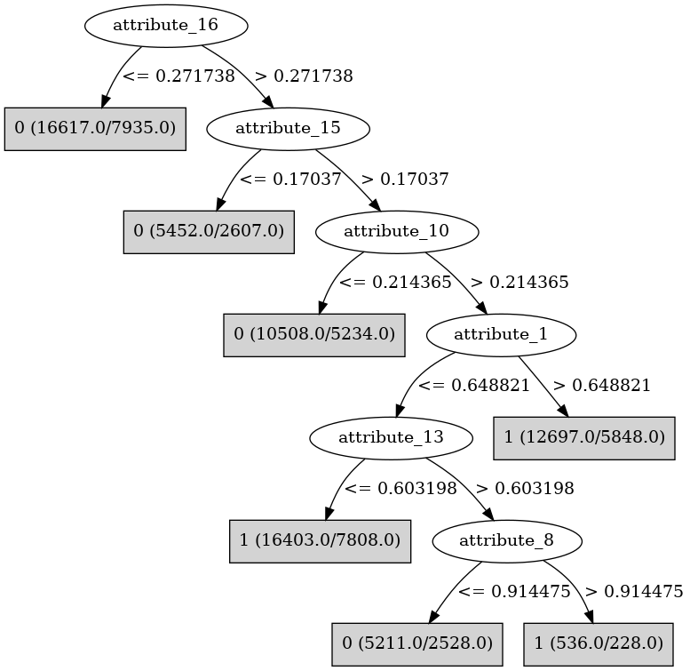

# J48

# SimpleCart Decision Tree

attribute_16 < 0.2717375

* attribute_9 < 0.262079

*   * attribute_5 < 0.120783

*   *   * attribute_0 < 0.987776

*   *   *   * attribute_13 < 0.008864: 1(11.0/0.0)

*   *   *   * attribute_13 >= 0.008864

*   *   *   *   * attribute_12 < 0.8080985

*   *   *   *   *   * attribute_20 < 0.8723065

*   *   *   *   *   *   * attribute_15 < 0.581758

*   *   *   *   *   *   *   * attribute_14 < 0.4224025: 1(80.0/63.0)

*   *   *   *   *   *   *   * attribute_14 >= 0.4224025

*   *   *   *   *   *   *   *   * attribute_3 < 0.2708735

*   *   *   *   *   *   *   *   *   * attribute_3 < 0.1558155: 0(11.0/5.0)

*   *   *   *   *   *   *   *   *   * attribute_3 >= 0.1558155: 1(8.0/2.0)

*   *   *   *   *   *   *   *   * attribute_3 >= 0.2708735: 0(18.0/2.0)

*   *   *   *   *   *   * attribute_15 >= 0.581758

*   *   *   *   *   *   *   * attribute_5 < 0.0217305: 0(10.0/5.0)

*   *   *   *   *   *   *   * attribute_5 >= 0.0217305: 1(48.0/16.0)

*   *   *   *   *   * attribute_20 >= 0.8723065: 1(9.0/0.0)

*   *   *   *   * attribute_12 >= 0.8080985

*   *   *   *   *   * attribute_20 < 0.292883

*   *   *   *   *   *   * attribute_5 < 0.0554115: 0(18.0/8.0)

*   *   *   *   *   *   * attribute_5 >= 0.0554115

*   *   *   *   *   *   *   * attribute_1 < 0.10405600000000001: 0(11.0/6.0)

*   *   *   *   *   *   *   * attribute_1 >= 0.10405600000000001: 1(21.0/6.0)

*   *   *   *   *   * attribute_20 >= 0.292883: 0(24.0/4.0)

*   *   * attribute_0 >= 0.987776: 0(11.0/2.0)

*   * attribute_5 >= 0.120783

*   *   * attribute_1 < 0.0392915: 0(221.0/109.0)

*   *   * attribute_1 >= 0.0392915

*   *   *   * attribute_15 < 0.98715

*   *   *   *   * attribute_19 < 0.6364255

*   *   *   *   *   * attribute_13 < 0.973658

*   *   *   *   *   *   * attribute_2 < 0.0213285

*   *   *   *   *   *   *   * attribute_14 < 0.014120500000000001: 0(10.0/2.0)

*   *   *   *   *   *   *   * attribute_14 >= 0.014120500000000001: 1(120.0/95.0)

*   *   *   *   *   *   * attribute_2 >= 0.0213285

*   *   *   *   *   *   *   * attribute_15 < 0.046546000000000004

*   *   *   *   *   *   *   *   * attribute_19 < 0.017099000000000003

*   *   *   *   *   *   *   *   *   * attribute_8 < 0.4393165: 0(28.0/5.0)

*   *   *   *   *   *   *   *   *   * attribute_8 >= 0.4393165: 0(25.0/19.0)

*   *   *   *   *   *   *   *   * attribute_19 >= 0.017099000000000003

*   *   *   *   *   *   *   *   *   * attribute_14 < 0.011245999999999999

*   *   *   *   *   *   *   *   *   *   * attribute_10 < 0.140341

*   *   *   *   *   *   *   *   *   *   *   * attribute_2 < 0.665358: 0(32.0/5.0)

*   *   *   *   *   *   *   *   *   *   *   * attribute_2 >= 0.665358: 0(8.0/7.0)

*   *   *   *   *   *   *   *   *   *   * attribute_10 >= 0.140341

*   *   *   *   *   *   *   *   *   *   *   * attribute_4 < 0.1308085: 0(10.0/5.0)

*   *   *   *   *   *   *   *   *   *   *   * attribute_4 >= 0.1308085: 1(10.0/1.0)

*   *   *   *   *   *   *   *   *   * attribute_14 >= 0.011245999999999999

*   *   *   *   *   *   *   *   *   *   * attribute_4 < 0.38647

*   *   *   *   *   *   *   *   *   *   *   * attribute_5 < 0.9801415

*   *   *   *   *   *   *   *   *   *   *   *   * attribute_16 < 0.2429905

*   *   *   *   *   *   *   *   *   *   *   *   *   * attribute_18 < 0.760847: 1(126.0/117.0)

*   *   *   *   *   *   *   *   *   *   *   *   *   * attribute_18 >= 0.760847

*   *   *   *   *   *   *   *   *   *   *   *   *   *   * attribute_8 < 0.2615955: 0(5.0/5.0)

*   *   *   *   *   *   *   *   *   *   *   *   *   *   * attribute_8 >= 0.2615955: 1(13.0/0.0)

*   *   *   *   *   *   *   *   *   *   *   *   * attribute_16 >= 0.2429905: 0(13.0/3.0)

*   *   *   *   *   *   *   *   *   *   *   * attribute_5 >= 0.9801415: 1(14.0/1.0)

*   *   *   *   *   *   *   *   *   *   * attribute_4 >= 0.38647

*   *   *   *   *   *   *   *   *   *   *   * attribute_11 < 0.7370245: 1(18.0/0.0)

*   *   *   *   *   *   *   *   *   *   *   * attribute_11 >= 0.7370245: 1(5.0/4.0)

*   *   *   *   *   *   *   * attribute_15 >= 0.046546000000000004

*   *   *   *   *   *   *   *   * attribute_16 < 0.2310235

*   *   *   *   *   *   *   *   *   * attribute_20 < 0.0039555

*   *   *   *   *   *   *   *   *   *   * attribute_8 < 0.293282: 1(8.0/0.0)

*   *   *   *   *   *   *   *   *   *   * attribute_8 >= 0.293282: 1(8.0/6.0)

*   *   *   *   *   *   *   *   *   * attribute_20 >= 0.0039555

*   *   *   *   *   *   *   *   *   *   * attribute_16 < 0.21308749999999999

*   *   *   *   *   *   *   *   *   *   *   * attribute_1 < 0.984785

*   *   *   *   *   *   *   *   *   *   *   *   * attribute_3 < 0.169238

*   *   *   *   *   *   *   *   *   *   *   *   *   * attribute_11 < 0.8778375

*   *   *   *   *   *   *   *   *   *   *   *   *   *   * attribute_16 < 0.187801

*   *   *   *   *   *   *   *   *   *   *   *   *   *   *   * attribute_3 < 0.0824955: 0(23.0/4.0)

*   *   *   *   *   *   *   *   *   *   *   *   *   *   *   * attribute_3 >= 0.0824955

*   *   *   *   *   *   *   *   *   *   *   *   *   *   *   *   * attribute_9 < 0.23866700000000002

*   *   *   *   *   *   *   *   *   *   *   *   *   *   *   *   *   * attribute_11 < 0.0464155: 0(9.0/3.0)

*   *   *   *   *   *   *   *   *   *   *   *   *   *   *   *   *   * attribute_11 >= 0.0464155

*   *   *   *   *   *   *   *   *   *   *   *   *   *   *   *   *   *   * attribute_13 < 0.1775855: 0(10.0/6.0)

*   *   *   *   *   *   *   *   *   *   *   *   *   *   *   *   *   *   * attribute_13 >= 0.1775855

*   *   *   *   *   *   *   *   *   *   *   *   *   *   *   *   *   *   *   * attribute_1 < 0.33304500000000004: 1(23.0/2.0)

*   *   *   *   *   *   *   *   *   *   *   *   *   *   *   *   *   *   *   * attribute_1 >= 0.33304500000000004

*   *   *   *   *   *   *   *   *   *   *   *   *   *   *   *   *   *   *   *   * attribute_20 < 0.1874245: 0(7.0/1.0)

*   *   *   *   *   *   *   *   *   *   *   *   *   *   *   *   *   *   *   *   * attribute_20 >= 0.1874245: 1(9.0/2.0)

*   *   *   *   *   *   *   *   *   *   *   *   *   *   *   *   * attribute_9 >= 0.23866700000000002: 0(11.0/0.0)

*   *   *   *   *   *   *   *   *   *   *   *   *   *   * attribute_16 >= 0.187801: 1(17.0/7.0)

*   *   *   *   *   *   *   *   *   *   *   *   *   * attribute_11 >= 0.8778375: 1(10.0/1.0)

*   *   *   *   *   *   *   *   *   *   *   *   * attribute_3 >= 0.169238

*   *   *   *   *   *   *   *   *   *   *   *   *   * attribute_6 < 0.9685285

*   *   *   *   *   *   *   *   *   *   *   *   *   *   * attribute_16 < 0.094486

*   *   *   *   *   *   *   *   *   *   *   *   *   *   *   * attribute_1 < 0.931922

*   *   *   *   *   *   *   *   *   *   *   *   *   *   *   *   * attribute_16 < 0.0011095: 1(19.0/15.0)

*   *   *   *   *   *   *   *   *   *   *   *   *   *   *   *   * attribute_16 >= 0.0011095

*   *   *   *   *   *   *   *   *   *   *   *   *   *   *   *   *   * attribute_13 < 0.8273554999999999

*   *   *   *   *   *   *   *   *   *   *   *   *   *   *   *   *   *   * attribute_5 < 0.3369165

*   *   *   *   *   *   *   *   *   *   *   *   *   *   *   *   *   *   *   * attribute_16 < 0.045489: 0(25.0/11.0)

*   *   *   *   *   *   *   *   *   *   *   *   *   *   *   *   *   *   *   * attribute_16 >= 0.045489

*   *   *   *   *   *   *   *   *   *   *   *   *   *   *   *   *   *   *   *   * attribute_10 < 0.07391149999999999: 1(13.0/3.0)

*   *   *   *   *   *   *   *   *   *   *   *   *   *   *   *   *   *   *   *   * attribute_10 >= 0.07391149999999999

*   *   *   *   *   *   *   *   *   *   *   *   *   *   *   *   *   *   *   *   *   * attribute_5 < 0.2874795

*   *   *   *   *   *   *   *   *   *   *   *   *   *   *   *   *   *   *   *   *   *   * attribute_16 < 0.0631425: 1(5.0/4.0)

*   *   *   *   *   *   *   *   *   *   *   *   *   *   *   *   *   *   *   *   *   *   * attribute_16 >= 0.0631425: 0(9.0/0.0)

*   *   *   *   *   *   *   *   *   *   *   *   *   *   *   *   *   *   *   *   *   * attribute_5 >= 0.2874795: 1(6.0/2.0)

*   *   *   *   *   *   *   *   *   *   *   *   *   *   *   *   *   *   * attribute_5 >= 0.3369165

*   *   *   *   *   *   *   *   *   *   *   *   *   *   *   *   *   *   *   * attribute_10 < 0.338134

*   *   *   *   *   *   *   *   *   *   *   *   *   *   *   *   *   *   *   *   * attribute_9 < 0.2255075

*   *   *   *   *   *   *   *   *   *   *   *   *   *   *   *   *   *   *   *   *   * attribute_1 < 0.844061

*   *   *   *   *   *   *   *   *   *   *   *   *   *   *   *   *   *   *   *   *   *   * attribute_8 < 0.50252

*   *   *   *   *   *   *   *   *   *   *   *   *   *   *   *   *   *   *   *   *   *   *   * attribute_5 < 0.7872005: 0(90.0/21.0)

*   *   *   *   *   *   *   *   *   *   *   *   *   *   *   *   *   *   *   *   *   *   *   * attribute_5 >= 0.7872005

*   *   *   *   *   *   *   *   *   *   *   *   *   *   *   *   *   *   *   *   *   *   *   *   * attribute_17 < 0.13488

*   *   *   *   *   *   *   *   *   *   *   *   *   *   *   *   *   *   *   *   *   *   *   *   *   * attribute_11 < 0.0703955: 0(7.0/1.0)

*   *   *   *   *   *   *   *   *   *   *   *   *   *   *   *   *   *   *   *   *   *   *   *   *   * attribute_11 >= 0.0703955: 1(10.0/0.0)

*   *   *   *   *   *   *   *   *   *   *   *   *   *   *   *   *   *   *   *   *   *   *   *   * attribute_17 >= 0.13488: 0(10.0/2.0)

*   *   *   *   *   *   *   *   *   *   *   *   *   *   *   *   *   *   *   *   *   *   * attribute_8 >= 0.50252

*   *   *   *   *   *   *   *   *   *   *   *   *   *   *   *   *   *   *   *   *   *   *   * attribute_20 < 0.119531

*   *   *   *   *   *   *   *   *   *   *   *   *   *   *   *   *   *   *   *   *   *   *   *   * attribute_20 < 0.0910665

*   *   *   *   *   *   *   *   *   *   *   *   *   *   *   *   *   *   *   *   *   *   *   *   *   * attribute_20 < 0.0510565: 1(13.0/8.0)

*   *   *   *   *   *   *   *   *   *   *   *   *   *   *   *   *   *   *   *   *   *   *   *   *   * attribute_20 >= 0.0510565: 0(16.0/5.0)

*   *   *   *   *   *   *   *   *   *   *   *   *   *   *   *   *   *   *   *   *   *   *   *   * attribute_20 >= 0.0910665: 1(12.0/3.0)

*   *   *   *   *   *   *   *   *   *   *   *   *   *   *   *   *   *   *   *   *   *   *   * attribute_20 >= 0.119531

*   *   *   *   *   *   *   *   *   *   *   *   *   *   *   *   *   *   *   *   *   *   *   *   * attribute_9 < 0.095358: 0(22.0/1.0)

*   *   *   *   *   *   *   *   *   *   *   *   *   *   *   *   *   *   *   *   *   *   *   *   * attribute_9 >= 0.095358: 0(18.0/14.0)

*   *   *   *   *   *   *   *   *   *   *   *   *   *   *   *   *   *   *   *   *   * attribute_1 >= 0.844061: 0(17.0/0.0)

*   *   *   *   *   *   *   *   *   *   *   *   *   *   *   *   *   *   *   *   * attribute_9 >= 0.2255075

*   *   *   *   *   *   *   *   *   *   *   *   *   *   *   *   *   *   *   *   *   * attribute_0 < 0.843459: 0(33.0/0.0)

*   *   *   *   *   *   *   *   *   *   *   *   *   *   *   *   *   *   *   *   *   * attribute_0 >= 0.843459: 0(5.0/4.0)

*   *   *   *   *   *   *   *   *   *   *   *   *   *   *   *   *   *   *   * attribute_10 >= 0.338134

*   *   *   *   *   *   *   *   *   *   *   *   *   *   *   *   *   *   *   *   * attribute_4 < 0.076456: 1(14.0/5.0)

*   *   *   *   *   *   *   *   *   *   *   *   *   *   *   *   *   *   *   *   * attribute_4 >= 0.076456: 0(13.0/4.0)

*   *   *   *   *   *   *   *   *   *   *   *   *   *   *   *   *   * attribute_13 >= 0.8273554999999999

*   *   *   *   *   *   *   *   *   *   *   *   *   *   *   *   *   *   * attribute_10 < 0.28517950000000003: 0(99.0/84.0)

*   *   *   *   *   *   *   *   *   *   *   *   *   *   *   *   *   *   * attribute_10 >= 0.28517950000000003: 0(36.0/11.0)

*   *   *   *   *   *   *   *   *   *   *   *   *   *   *   * attribute_1 >= 0.931922: 1(16.0/8.0)

*   *   *   *   *   *   *   *   *   *   *   *   *   *   * attribute_16 >= 0.094486

*   *   *   *   *   *   *   *   *   *   *   *   *   *   *   * attribute_3 < 0.1967305: 0(15.0/2.0)

*   *   *   *   *   *   *   *   *   *   *   *   *   *   *   * attribute_3 >= 0.1967305

*   *   *   *   *   *   *   *   *   *   *   *   *   *   *   *   * attribute_8 < 0.0192345: 1(20.0/10.0)

*   *   *   *   *   *   *   *   *   *   *   *   *   *   *   *   * attribute_8 >= 0.0192345

*   *   *   *   *   *   *   *   *   *   *   *   *   *   *   *   *   * attribute_11 < 0.1678005

*   *   *   *   *   *   *   *   *   *   *   *   *   *   *   *   *   *   * attribute_7 < 0.6747775

*   *   *   *   *   *   *   *   *   *   *   *   *   *   *   *   *   *   *   * attribute_0 < 0.3838645: 0(24.0/10.0)

*   *   *   *   *   *   *   *   *   *   *   *   *   *   *   *   *   *   *   * attribute_0 >= 0.3838645

*   *   *   *   *   *   *   *   *   *   *   *   *   *   *   *   *   *   *   *   * attribute_12 < 0.46507699999999996: 0(10.0/5.0)

*   *   *   *   *   *   *   *   *   *   *   *   *   *   *   *   *   *   *   *   * attribute_12 >= 0.46507699999999996: 1(14.0/4.0)

*   *   *   *   *   *   *   *   *   *   *   *   *   *   *   *   *   *   * attribute_7 >= 0.6747775: 0(49.0/13.0)

*   *   *   *   *   *   *   *   *   *   *   *   *   *   *   *   *   * attribute_11 >= 0.1678005

*   *   *   *   *   *   *   *   *   *   *   *   *   *   *   *   *   *   * attribute_14 < 0.018355999999999997: 0(17.0/3.0)

*   *   *   *   *   *   *   *   *   *   *   *   *   *   *   *   *   *   * attribute_14 >= 0.018355999999999997

*   *   *   *   *   *   *   *   *   *   *   *   *   *   *   *   *   *   *   * attribute_9 < 0.11673549999999999

*   *   *   *   *   *   *   *   *   *   *   *   *   *   *   *   *   *   *   *   * attribute_19 < 0.0986795

*   *   *   *   *   *   *   *   *   *   *   *   *   *   *   *   *   *   *   *   *   * attribute_14 < 0.26546800000000004

*   *   *   *   *   *   *   *   *   *   *   *   *   *   *   *   *   *   *   *   *   *   * attribute_11 < 0.7036405: 0(17.0/15.0)

*   *   *   *   *   *   *   *   *   *   *   *   *   *   *   *   *   *   *   *   *   *   * attribute_11 >= 0.7036405: 0(18.0/2.0)

*   *   *   *   *   *   *   *   *   *   *   *   *   *   *   *   *   *   *   *   *   * attribute_14 >= 0.26546800000000004

*   *   *   *   *   *   *   *   *   *   *   *   *   *   *   *   *   *   *   *   *   *   * attribute_12 < 0.2315835: 1(10.0/0.0)

*   *   *   *   *   *   *   *   *   *   *   *   *   *   *   *   *   *   *   *   *   *   * attribute_12 >= 0.2315835

*   *   *   *   *   *   *   *   *   *   *   *   *   *   *   *   *   *   *   *   *   *   *   * attribute_1 < 0.4064505: 0(18.0/10.0)

*   *   *   *   *   *   *   *   *   *   *   *   *   *   *   *   *   *   *   *   *   *   *   * attribute_1 >= 0.4064505

*   *   *   *   *   *   *   *   *   *   *   *   *   *   *   *   *   *   *   *   *   *   *   *   * attribute_19 < 0.034466: 0(6.0/4.0)

*   *   *   *   *   *   *   *   *   *   *   *   *   *   *   *   *   *   *   *   *   *   *   *   * attribute_19 >= 0.034466

*   *   *   *   *   *   *   *   *   *   *   *   *   *   *   *   *   *   *   *   *   *   *   *   *   * attribute_19 < 0.0667915: 1(14.0/0.0)

*   *   *   *   *   *   *   *   *   *   *   *   *   *   *   *   *   *   *   *   *   *   *   *   *   * attribute_19 >= 0.0667915: 1(10.0/7.0)

*   *   *   *   *   *   *   *   *   *   *   *   *   *   *   *   *   *   *   *   * attribute_19 >= 0.0986795: 0(131.0/71.0)

*   *   *   *   *   *   *   *   *   *   *   *   *   *   *   *   *   *   *   * attribute_9 >= 0.11673549999999999

*   *   *   *   *   *   *   *   *   *   *   *   *   *   *   *   *   *   *   *   * attribute_19 < 0.0213075: 1(17.0/3.0)

*   *   *   *   *   *   *   *   *   *   *   *   *   *   *   *   *   *   *   *   * attribute_19 >= 0.0213075

*   *   *   *   *   *   *   *   *   *   *   *   *   *   *   *   *   *   *   *   *   * attribute_9 < 0.2233705

*   *   *   *   *   *   *   *   *   *   *   *   *   *   *   *   *   *   *   *   *   *   * attribute_3 < 0.5962959999999999: 1(72.0/41.0)

*   *   *   *   *   *   *   *   *   *   *   *   *   *   *   *   *   *   *   *   *   *   * attribute_3 >= 0.5962959999999999

*   *   *   *   *   *   *   *   *   *   *   *   *   *   *   *   *   *   *   *   *   *   *   * attribute_2 < 0.4710315

*   *   *   *   *   *   *   *   *   *   *   *   *   *   *   *   *   *   *   *   *   *   *   *   * attribute_12 < 0.527122

*   *   *   *   *   *   *   *   *   *   *   *   *   *   *   *   *   *   *   *   *   *   *   *   *   * attribute_1 < 0.1538405: 1(9.0/3.0)

*   *   *   *   *   *   *   *   *   *   *   *   *   *   *   *   *   *   *   *   *   *   *   *   *   * attribute_1 >= 0.1538405

*   *   *   *   *   *   *   *   *   *   *   *   *   *   *   *   *   *   *   *   *   *   *   *   *   *   * attribute_4 < 0.20448

*   *   *   *   *   *   *   *   *   *   *   *   *   *   *   *   *   *   *   *   *   *   *   *   *   *   *   * attribute_16 < 0.133627: 0(7.0/2.0)

*   *   *   *   *   *   *   *   *   *   *   *   *   *   *   *   *   *   *   *   *   *   *   *   *   *   *   * attribute_16 >= 0.133627: 1(8.0/3.0)

*   *   *   *   *   *   *   *   *   *   *   *   *   *   *   *   *   *   *   *   *   *   *   *   *   *   * attribute_4 >= 0.20448: 0(13.0/0.0)

*   *   *   *   *   *   *   *   *   *   *   *   *   *   *   *   *   *   *   *   *   *   *   *   * attribute_12 >= 0.527122: 0(18.0/1.0)

*   *   *   *   *   *   *   *   *   *   *   *   *   *   *   *   *   *   *   *   *   *   *   * attribute_2 >= 0.4710315

*   *   *   *   *   *   *   *   *   *   *   *   *   *   *   *   *   *   *   *   *   *   *   *   * attribute_12 < 0.245741

*   *   *   *   *   *   *   *   *   *   *   *   *   *   *   *   *   *   *   *   *   *   *   *   *   * attribute_18 < 0.442326: 0(9.0/1.0)

*   *   *   *   *   *   *   *   *   *   *   *   *   *   *   *   *   *   *   *   *   *   *   *   *   * attribute_18 >= 0.442326: 1(6.0/4.0)

*   *   *   *   *   *   *   *   *   *   *   *   *   *   *   *   *   *   *   *   *   *   *   *   * attribute_12 >= 0.245741

*   *   *   *   *   *   *   *   *   *   *   *   *   *   *   *   *   *   *   *   *   *   *   *   *   * attribute_7 < 0.464014: 1(10.0/9.0)

*   *   *   *   *   *   *   *   *   *   *   *   *   *   *   *   *   *   *   *   *   *   *   *   *   * attribute_7 >= 0.464014: 1(16.0/1.0)

*   *   *   *   *   *   *   *   *   *   *   *   *   *   *   *   *   *   *   *   *   * attribute_9 >= 0.2233705

*   *   *   *   *   *   *   *   *   *   *   *   *   *   *   *   *   *   *   *   *   *   * attribute_4 < 0.042795: 1(8.0/1.0)

*   *   *   *   *   *   *   *   *   *   *   *   *   *   *   *   *   *   *   *   *   *   * attribute_4 >= 0.042795

*   *   *   *   *   *   *   *   *   *   *   *   *   *   *   *   *   *   *   *   *   *   *   * attribute_11 < 0.2162035: 1(7.0/1.0)

*   *   *   *   *   *   *   *   *   *   *   *   *   *   *   *   *   *   *   *   *   *   *   * attribute_11 >= 0.2162035

*   *   *   *   *   *   *   *   *   *   *   *   *   *   *   *   *   *   *   *   *   *   *   *   * attribute_18 < 0.2215835: 0(20.0/2.0)

*   *   *   *   *   *   *   *   *   *   *   *   *   *   *   *   *   *   *   *   *   *   *   *   * attribute_18 >= 0.2215835

*   *   *   *   *   *   *   *   *   *   *   *   *   *   *   *   *   *   *   *   *   *   *   *   *   * attribute_0 < 0.4157715

*   *   *   *   *   *   *   *   *   *   *   *   *   *   *   *   *   *   *   *   *   *   *   *   *   *   * attribute_5 < 0.744238: 1(15.0/4.0)

*   *   *   *   *   *   *   *   *   *   *   *   *   *   *   *   *   *   *   *   *   *   *   *   *   *   * attribute_5 >= 0.744238: 0(11.0/4.0)

*   *   *   *   *   *   *   *   *   *   *   *   *   *   *   *   *   *   *   *   *   *   *   *   *   * attribute_0 >= 0.4157715: 0(45.0/17.0)

*   *   *   *   *   *   *   *   *   *   *   *   *   * attribute_6 >= 0.9685285: 0(41.0/12.0)

*   *   *   *   *   *   *   *   *   *   *   * attribute_1 >= 0.984785: 0(10.0/0.0)

*   *   *   *   *   *   *   *   *   *   * attribute_16 >= 0.21308749999999999

*   *   *   *   *   *   *   *   *   *   *   * attribute_12 < 0.7270705

*   *   *   *   *   *   *   *   *   *   *   *   * attribute_4 < 0.16783900000000002: 0(37.0/7.0)

*   *   *   *   *   *   *   *   *   *   *   *   * attribute_4 >= 0.16783900000000002

*   *   *   *   *   *   *   *   *   *   *   *   *   * attribute_7 < 0.6246404999999999: 0(33.0/19.0)

*   *   *   *   *   *   *   *   *   *   *   *   *   * attribute_7 >= 0.6246404999999999: 1(13.0/5.0)

*   *   *   *   *   *   *   *   *   *   *   * attribute_12 >= 0.7270705: 0(27.0/1.0)

*   *   *   *   *   *   *   *   * attribute_16 >= 0.2310235

*   *   *   *   *   *   *   *   *   * attribute_15 < 0.8883464999999999

*   *   *   *   *   *   *   *   *   *   * attribute_3 < 0.796529

*   *   *   *   *   *   *   *   *   *   *   * attribute_5 < 0.6486965

*   *   *   *   *   *   *   *   *   *   *   *   * attribute_16 < 0.2517025

*   *   *   *   *   *   *   *   *   *   *   *   *   * attribute_14 < 0.3978315: 1(24.0/5.0)

*   *   *   *   *   *   *   *   *   *   *   *   *   * attribute_14 >= 0.3978315: 0(29.0/26.0)

*   *   *   *   *   *   *   *   *   *   *   *   * attribute_16 >= 0.2517025

*   *   *   *   *   *   *   *   *   *   *   *   *   * attribute_13 < 0.37473199999999995: 1(21.0/19.0)

*   *   *   *   *   *   *   *   *   *   *   *   *   * attribute_13 >= 0.37473199999999995: 0(31.0/10.0)

*   *   *   *   *   *   *   *   *   *   *   * attribute_5 >= 0.6486965: 1(58.0/28.0)

*   *   *   *   *   *   *   *   *   *   * attribute_3 >= 0.796529

*   *   *   *   *   *   *   *   *   *   *   * attribute_18 < 0.730772: 0(33.0/10.0)

*   *   *   *   *   *   *   *   *   *   *   * attribute_18 >= 0.730772: 1(10.0/5.0)

*   *   *   *   *   *   *   *   *   * attribute_15 >= 0.8883464999999999: 0(23.0/7.0)

*   *   *   *   *   * attribute_13 >= 0.973658

*   *   *   *   *   *   * attribute_12 < 0.0797925

*   *   *   *   *   *   *   * attribute_0 < 0.5351315000000001

*   *   *   *   *   *   *   *   * attribute_6 < 0.6896685: 1(21.0/7.0)

*   *   *   *   *   *   *   *   * attribute_6 >= 0.6896685: 0(24.0/18.0)

*   *   *   *   *   *   *   * attribute_0 >= 0.5351315000000001: 0(16.0/4.0)

*   *   *   *   *   *   * attribute_12 >= 0.0797925

*   *   *   *   *   *   *   * attribute_12 < 0.1118095

*   *   *   *   *   *   *   *   * attribute_1 < 0.9403035: 0(27.0/0.0)

*   *   *   *   *   *   *   *   * attribute_1 >= 0.9403035: 0(6.0/3.0)

*   *   *   *   *   *   *   * attribute_12 >= 0.1118095

*   *   *   *   *   *   *   *   * attribute_3 < 0.9417675000000001

*   *   *   *   *   *   *   *   *   * attribute_5 < 0.957403

*   *   *   *   *   *   *   *   *   *   * attribute_12 < 0.2016755: 1(6.0/2.0)

*   *   *   *   *   *   *   *   *   *   * attribute_12 >= 0.2016755: 0(19.0/5.0)

*   *   *   *   *   *   *   *   *   * attribute_5 >= 0.957403: 1(12.0/1.0)

*   *   *   *   *   *   *   *   * attribute_3 >= 0.9417675000000001

*   *   *   *   *   *   *   *   *   * attribute_5 < 0.9710445000000001

*   *   *   *   *   *   *   *   *   *   * attribute_16 < 0.006149: 1(7.0/5.0)

*   *   *   *   *   *   *   *   *   *   * attribute_16 >= 0.006149: 0(53.0/19.0)

*   *   *   *   *   *   *   *   *   * attribute_5 >= 0.9710445000000001: 0(21.0/1.0)

*   *   *   *   * attribute_19 >= 0.6364255: 1(16.0/3.0)

*   *   *   * attribute_15 >= 0.98715: 1(30.0/10.0)

* attribute_9 >= 0.262079

*   * attribute_15 < 0.902644

*   *   * attribute_11 < 0.1058785

*   *   *   * attribute_3 < 0.9843459999999999

*   *   *   *   * attribute_20 < 0.010162000000000001: 1(10.0/2.0)

*   *   *   *   * attribute_20 >= 0.010162000000000001

*   *   *   *   *   * attribute_4 < 0.0145795

*   *   *   *   *   *   * attribute_5 < 0.5677235: 0(30.0/3.0)

*   *   *   *   *   *   * attribute_5 >= 0.5677235: 0(12.0/11.0)

*   *   *   *   *   * attribute_4 >= 0.0145795

*   *   *   *   *   *   * attribute_9 < 0.9665135

*   *   *   *   *   *   *   * attribute_16 < 0.2576535

*   *   *   *   *   *   *   *   * attribute_16 < 0.20471650000000002

*   *   *   *   *   *   *   *   *   * attribute_9 < 0.396184

*   *   *   *   *   *   *   *   *   *   * attribute_9 < 0.3254325: 0(53.0/34.0)

*   *   *   *   *   *   *   *   *   *   * attribute_9 >= 0.3254325

*   *   *   *   *   *   *   *   *   *   *   * attribute_7 < 0.318004: 1(12.0/0.0)

*   *   *   *   *   *   *   *   *   *   *   * attribute_7 >= 0.318004

*   *   *   *   *   *   *   *   *   *   *   *   * attribute_8 < 0.117733

*   *   *   *   *   *   *   *   *   *   *   *   *   * attribute_8 < 0.024591000000000002

*   *   *   *   *   *   *   *   *   *   *   *   *   *   * attribute_6 < 0.019837: 1(7.0/1.0)

*   *   *   *   *   *   *   *   *   *   *   *   *   *   * attribute_6 >= 0.019837: 0(7.0/1.0)

*   *   *   *   *   *   *   *   *   *   *   *   *   * attribute_8 >= 0.024591000000000002: 1(17.0/1.0)

*   *   *   *   *   *   *   *   *   *   *   *   * attribute_8 >= 0.117733

*   *   *   *   *   *   *   *   *   *   *   *   *   * attribute_1 < 0.0926875: 1(13.0/8.0)

*   *   *   *   *   *   *   *   *   *   *   *   *   * attribute_1 >= 0.0926875

*   *   *   *   *   *   *   *   *   *   *   *   *   *   * attribute_2 < 0.3782425: 0(14.0/1.0)

*   *   *   *   *   *   *   *   *   *   *   *   *   *   * attribute_2 >= 0.3782425: 0(5.0/5.0)

*   *   *   *   *   *   *   *   *   * attribute_9 >= 0.396184

*   *   *   *   *   *   *   *   *   *   * attribute_20 < 0.6477029999999999

*   *   *   *   *   *   *   *   *   *   *   * attribute_20 < 0.6002735

*   *   *   *   *   *   *   *   *   *   *   *   * attribute_20 < 0.588488: 0(140.0/69.0)

*   *   *   *   *   *   *   *   *   *   *   *   * attribute_20 >= 0.588488: 1(7.0/1.0)

*   *   *   *   *   *   *   *   *   *   *   * attribute_20 >= 0.6002735: 0(21.0/1.0)

*   *   *   *   *   *   *   *   *   *   * attribute_20 >= 0.6477029999999999

*   *   *   *   *   *   *   *   *   *   *   * attribute_17 < 0.9383334999999999

*   *   *   *   *   *   *   *   *   *   *   *   * attribute_20 < 0.663131: 1(8.0/1.0)

*   *   *   *   *   *   *   *   *   *   *   *   * attribute_20 >= 0.663131

*   *   *   *   *   *   *   *   *   *   *   *   *   * attribute_15 < 0.6615340000000001

*   *   *   *   *   *   *   *   *   *   *   *   *   *   * attribute_17 < 0.692179: 0(74.0/53.0)

*   *   *   *   *   *   *   *   *   *   *   *   *   *   * attribute_17 >= 0.692179: 0(31.0/8.0)

*   *   *   *   *   *   *   *   *   *   *   *   *   * attribute_15 >= 0.6615340000000001

*   *   *   *   *   *   *   *   *   *   *   *   *   *   * attribute_7 < 0.8027359999999999: 1(17.0/4.0)

*   *   *   *   *   *   *   *   *   *   *   *   *   *   * attribute_7 >= 0.8027359999999999: 0(8.0/3.0)

*   *   *   *   *   *   *   *   *   *   *   * attribute_17 >= 0.9383334999999999: 1(10.0/2.0)

*   *   *   *   *   *   *   *   * attribute_16 >= 0.20471650000000002

*   *   *   *   *   *   *   *   *   * attribute_14 < 0.063487: 0(9.0/0.0)

*   *   *   *   *   *   *   *   *   * attribute_14 >= 0.063487

*   *   *   *   *   *   *   *   *   *   * attribute_1 < 0.266165

*   *   *   *   *   *   *   *   *   *   *   * attribute_19 < 0.5191625

*   *   *   *   *   *   *   *   *   *   *   *   * attribute_19 < 0.329395

*   *   *   *   *   *   *   *   *   *   *   *   *   * attribute_10 < 0.5921555000000001

*   *   *   *   *   *   *   *   *   *   *   *   *   *   * attribute_19 < 0.2696765

*   *   *   *   *   *   *   *   *   *   *   *   *   *   *   * attribute_10 < 0.35956699999999997: 0(7.0/4.0)

*   *   *   *   *   *   *   *   *   *   *   *   *   *   *   * attribute_10 >= 0.35956699999999997: 1(17.0/3.0)

*   *   *   *   *   *   *   *   *   *   *   *   *   *   * attribute_19 >= 0.2696765: 0(9.0/3.0)

*   *   *   *   *   *   *   *   *   *   *   *   *   * attribute_10 >= 0.5921555000000001

*   *   *   *   *   *   *   *   *   *   *   *   *   *   * attribute_19 < 0.201705: 0(21.0/3.0)

*   *   *   *   *   *   *   *   *   *   *   *   *   *   * attribute_19 >= 0.201705

*   *   *   *   *   *   *   *   *   *   *   *   *   *   *   * attribute_11 < 0.039343: 0(7.0/1.0)

*   *   *   *   *   *   *   *   *   *   *   *   *   *   *   * attribute_11 >= 0.039343: 1(7.0/2.0)

*   *   *   *   *   *   *   *   *   *   *   *   * attribute_19 >= 0.329395: 1(20.0/7.0)

*   *   *   *   *   *   *   *   *   *   *   * attribute_19 >= 0.5191625: 0(8.0/0.0)

*   *   *   *   *   *   *   *   *   *   * attribute_1 >= 0.266165

*   *   *   *   *   *   *   *   *   *   *   * attribute_10 < 0.3031005: 0(10.0/3.0)

*   *   *   *   *   *   *   *   *   *   *   * attribute_10 >= 0.3031005

*   *   *   *   *   *   *   *   *   *   *   *   * attribute_18 < 0.14619900000000002: 0(6.0/2.0)

*   *   *   *   *   *   *   *   *   *   *   *   * attribute_18 >= 0.14619900000000002

*   *   *   *   *   *   *   *   *   *   *   *   *   * attribute_4 < 0.202216: 1(28.0/3.0)

*   *   *   *   *   *   *   *   *   *   *   *   *   * attribute_4 >= 0.202216: 1(35.0/18.0)

*   *   *   *   *   *   *   * attribute_16 >= 0.2576535

*   *   *   *   *   *   *   *   * attribute_20 < 0.5132475000000001

*   *   *   *   *   *   *   *   *   * attribute_10 < 0.6001525000000001: 0(18.0/7.0)

*   *   *   *   *   *   *   *   *   * attribute_10 >= 0.6001525000000001: 1(7.0/1.0)

*   *   *   *   *   *   *   *   * attribute_20 >= 0.5132475000000001: 0(24.0/2.0)

*   *   *   *   *   *   * attribute_9 >= 0.9665135

*   *   *   *   *   *   *   * attribute_2 < 0.5139115000000001: 1(16.0/1.0)

*   *   *   *   *   *   *   * attribute_2 >= 0.5139115000000001

*   *   *   *   *   *   *   *   * attribute_8 < 0.27073749999999996: 0(8.0/1.0)

*   *   *   *   *   *   *   *   * attribute_8 >= 0.27073749999999996: 1(10.0/7.0)

*   *   *   * attribute_3 >= 0.9843459999999999: 1(17.0/5.0)

*   *   * attribute_11 >= 0.1058785

*   *   *   * attribute_0 < 0.8183395

*   *   *   *   * attribute_10 < 0.836029

*   *   *   *   *   * attribute_5 < 5.11E-4: 0(12.0/1.0)

*   *   *   *   *   * attribute_5 >= 5.11E-4

*   *   *   *   *   *   * attribute_6 < 0.0160625: 1(11.0/2.0)

*   *   *   *   *   *   * attribute_6 >= 0.0160625

*   *   *   *   *   *   *   * attribute_5 < 0.034577

*   *   *   *   *   *   *   *   * attribute_11 < 0.227725

*   *   *   *   *   *   *   *   *   * attribute_5 < 0.024055: 1(17.0/1.0)

*   *   *   *   *   *   *   *   *   * attribute_5 >= 0.024055: 0(4.0/4.0)

*   *   *   *   *   *   *   *   * attribute_11 >= 0.227725

*   *   *   *   *   *   *   *   *   * attribute_2 < 0.7107654999999999

*   *   *   *   *   *   *   *   *   *   * attribute_12 < 0.5987705000000001: 0(29.0/14.0)

*   *   *   *   *   *   *   *   *   *   * attribute_12 >= 0.5987705000000001: 1(18.0/11.0)

*   *   *   *   *   *   *   *   *   * attribute_2 >= 0.7107654999999999: 1(23.0/7.0)

*   *   *   *   *   *   *   * attribute_5 >= 0.034577

*   *   *   *   *   *   *   *   * attribute_5 < 0.212544

*   *   *   *   *   *   *   *   *   * attribute_3 < 0.2769895

*   *   *   *   *   *   *   *   *   *   * attribute_0 < 0.520098

*   *   *   *   *   *   *   *   *   *   *   * attribute_13 < 0.400798

*   *   *   *   *   *   *   *   *   *   *   *   * attribute_4 < 0.33025550000000004

*   *   *   *   *   *   *   *   *   *   *   *   *   * attribute_19 < 0.07852899999999999: 0(18.0/7.0)

*   *   *   *   *   *   *   *   *   *   *   *   *   * attribute_19 >= 0.07852899999999999

*   *   *   *   *   *   *   *   *   *   *   *   *   *   * attribute_9 < 0.463433

*   *   *   *   *   *   *   *   *   *   *   *   *   *   *   * attribute_7 < 0.3970065: 1(23.0/1.0)

*   *   *   *   *   *   *   *   *   *   *   *   *   *   *   * attribute_7 >= 0.3970065: 1(14.0/8.0)

*   *   *   *   *   *   *   *   *   *   *   *   *   *   * attribute_9 >= 0.463433

*   *   *   *   *   *   *   *   *   *   *   *   *   *   *   * attribute_3 < 0.2270145

*   *   *   *   *   *   *   *   *   *   *   *   *   *   *   *   * attribute_10 < 0.491141: 0(11.0/3.0)

*   *   *   *   *   *   *   *   *   *   *   *   *   *   *   *   * attribute_10 >= 0.491141

*   *   *   *   *   *   *   *   *   *   *   *   *   *   *   *   *   * attribute_18 < 0.756912: 0(24.0/23.0)

*   *   *   *   *   *   *   *   *   *   *   *   *   *   *   *   *   * attribute_18 >= 0.756912: 1(9.0/1.0)

*   *   *   *   *   *   *   *   *   *   *   *   *   *   *   * attribute_3 >= 0.2270145: 1(8.0/1.0)

*   *   *   *   *   *   *   *   *   *   *   *   * attribute_4 >= 0.33025550000000004: 0(22.0/7.0)

*   *   *   *   *   *   *   *   *   *   *   * attribute_13 >= 0.400798: 1(13.0/1.0)

*   *   *   *   *   *   *   *   *   *   * attribute_0 >= 0.520098

*   *   *   *   *   *   *   *   *   *   *   * attribute_7 < 0.46341750000000004: 0(27.0/5.0)

*   *   *   *   *   *   *   *   *   *   *   * attribute_7 >= 0.46341750000000004

*   *   *   *   *   *   *   *   *   *   *   *   * attribute_10 < 0.8007439999999999

*   *   *   *   *   *   *   *   *   *   *   *   *   * attribute_11 < 0.45294650000000003: 0(54.0/36.0)

*   *   *   *   *   *   *   *   *   *   *   *   *   * attribute_11 >= 0.45294650000000003: 1(28.0/12.0)

*   *   *   *   *   *   *   *   *   *   *   *   * attribute_10 >= 0.8007439999999999: 0(12.0/1.0)

*   *   *   *   *   *   *   *   *   * attribute_3 >= 0.2769895

*   *   *   *   *   *   *   *   *   *   * attribute_0 < 0.7322375000000001

*   *   *   *   *   *   *   *   *   *   *   * attribute_10 < 0.790459

*   *   *   *   *   *   *   *   *   *   *   *   * attribute_9 < 0.4185705

*   *   *   *   *   *   *   *   *   *   *   *   *   * attribute_8 < 0.7830429999999999: 0(28.0/11.0)

*   *   *   *   *   *   *   *   *   *   *   *   *   * attribute_8 >= 0.7830429999999999: 1(11.0/1.0)

*   *   *   *   *   *   *   *   *   *   *   *   * attribute_9 >= 0.4185705

*   *   *   *   *   *   *   *   *   *   *   *   *   * attribute_19 < 0.07736699999999999: 0(32.0/1.0)

*   *   *   *   *   *   *   *   *   *   *   *   *   * attribute_19 >= 0.07736699999999999

*   *   *   *   *   *   *   *   *   *   *   *   *   *   * attribute_12 < 0.7168034999999999

*   *   *   *   *   *   *   *   *   *   *   *   *   *   *   * attribute_14 < 0.28109249999999997

*   *   *   *   *   *   *   *   *   *   *   *   *   *   *   *   * attribute_3 < 0.3897265: 1(8.0/3.0)

*   *   *   *   *   *   *   *   *   *   *   *   *   *   *   *   * attribute_3 >= 0.3897265

*   *   *   *   *   *   *   *   *   *   *   *   *   *   *   *   *   * attribute_13 < 0.458994: 0(12.0/0.0)

*   *   *   *   *   *   *   *   *   *   *   *   *   *   *   *   *   * attribute_13 >= 0.458994: 0(6.0/6.0)

*   *   *   *   *   *   *   *   *   *   *   *   *   *   *   * attribute_14 >= 0.28109249999999997: 0(57.0/6.0)

*   *   *   *   *   *   *   *   *   *   *   *   *   *   * attribute_12 >= 0.7168034999999999

*   *   *   *   *   *   *   *   *   *   *   *   *   *   *   * attribute_11 < 0.32885: 1(8.0/0.0)

*   *   *   *   *   *   *   *   *   *   *   *   *   *   *   * attribute_11 >= 0.32885: 0(8.0/2.0)

*   *   *   *   *   *   *   *   *   *   *   * attribute_10 >= 0.790459: 1(14.0/9.0)

*   *   *   *   *   *   *   *   *   *   * attribute_0 >= 0.7322375000000001: 1(14.0/4.0)

*   *   *   *   *   *   *   *   * attribute_5 >= 0.212544

*   *   *   *   *   *   *   *   *   * attribute_8 < 0.9073415

*   *   *   *   *   *   *   *   *   *   * attribute_15 < 0.019347000000000003

*   *   *   *   *   *   *   *   *   *   *   * attribute_0 < 0.2693325

*   *   *   *   *   *   *   *   *   *   *   *   * attribute_12 < 0.2454755

*   *   *   *   *   *   *   *   *   *   *   *   *   * attribute_7 < 0.2296715

*   *   *   *   *   *   *   *   *   *   *   *   *   *   * attribute_15 < 0.003919499999999999: 1(9.0/2.0)

*   *   *   *   *   *   *   *   *   *   *   *   *   *   * attribute_15 >= 0.003919499999999999: 0(21.0/11.0)

*   *   *   *   *   *   *   *   *   *   *   *   *   * attribute_7 >= 0.2296715: 1(15.0/2.0)

*   *   *   *   *   *   *   *   *   *   *   *   * attribute_12 >= 0.2454755: 0(11.0/3.0)

*   *   *   *   *   *   *   *   *   *   *   * attribute_0 >= 0.2693325

*   *   *   *   *   *   *   *   *   *   *   *   * attribute_15 < 0.0025135: 1(12.0/9.0)

*   *   *   *   *   *   *   *   *   *   *   *   * attribute_15 >= 0.0025135: 0(57.0/15.0)

*   *   *   *   *   *   *   *   *   *   * attribute_15 >= 0.019347000000000003

*   *   *   *   *   *   *   *   *   *   *   * attribute_3 < 0.978505

*   *   *   *   *   *   *   *   *   *   *   *   * attribute_16 < 0.1316765

*   *   *   *   *   *   *   *   *   *   *   *   *   * attribute_16 < 0.119064

*   *   *   *   *   *   *   *   *   *   *   *   *   *   * attribute_20 < 0.218081: 0(133.0/84.0)

*   *   *   *   *   *   *   *   *   *   *   *   *   *   * attribute_20 >= 0.218081

*   *   *   *   *   *   *   *   *   *   *   *   *   *   *   * attribute_9 < 0.8549465

*   *   *   *   *   *   *   *   *   *   *   *   *   *   *   *   * attribute_16 < 0.058457999999999996

*   *   *   *   *   *   *   *   *   *   *   *   *   *   *   *   *   * attribute_5 < 0.34240899999999996: 1(30.0/13.0)

*   *   *   *   *   *   *   *   *   *   *   *   *   *   *   *   *   * attribute_5 >= 0.34240899999999996

*   *   *   *   *   *   *   *   *   *   *   *   *   *   *   *   *   *   * attribute_16 < 0.010446500000000001

*   *   *   *   *   *   *   *   *   *   *   *   *   *   *   *   *   *   *   * attribute_10 < 0.6102650000000001

*   *   *   *   *   *   *   *   *   *   *   *   *   *   *   *   *   *   *   *   * attribute_10 < 0.48768

*   *   *   *   *   *   *   *   *   *   *   *   *   *   *   *   *   *   *   *   *   * attribute_15 < 0.0897985: 1(16.0/2.0)

*   *   *   *   *   *   *   *   *   *   *   *   *   *   *   *   *   *   *   *   *   * attribute_15 >= 0.0897985: 0(19.0/17.0)

*   *   *   *   *   *   *   *   *   *   *   *   *   *   *   *   *   *   *   *   * attribute_10 >= 0.48768: 0(20.0/5.0)

*   *   *   *   *   *   *   *   *   *   *   *   *   *   *   *   *   *   *   * attribute_10 >= 0.6102650000000001: 1(37.0/12.0)

*   *   *   *   *   *   *   *   *   *   *   *   *   *   *   *   *   *   * attribute_16 >= 0.010446500000000001

*   *   *   *   *   *   *   *   *   *   *   *   *   *   *   *   *   *   *   * attribute_20 < 0.956426: 0(243.0/181.0)

*   *   *   *   *   *   *   *   *   *   *   *   *   *   *   *   *   *   *   * attribute_20 >= 0.956426: 0(13.0/1.0)

*   *   *   *   *   *   *   *   *   *   *   *   *   *   *   *   * attribute_16 >= 0.058457999999999996

*   *   *   *   *   *   *   *   *   *   *   *   *   *   *   *   *   * attribute_16 < 0.06886149999999999: 1(55.0/24.0)

*   *   *   *   *   *   *   *   *   *   *   *   *   *   *   *   *   * attribute_16 >= 0.06886149999999999

*   *   *   *   *   *   *   *   *   *   *   *   *   *   *   *   *   *   * attribute_15 < 0.030823: 1(23.0/6.0)

*   *   *   *   *   *   *   *   *   *   *   *   *   *   *   *   *   *   * attribute_15 >= 0.030823

*   *   *   *   *   *   *   *   *   *   *   *   *   *   *   *   *   *   *   * attribute_3 < 0.7497425

*   *   *   *   *   *   *   *   *   *   *   *   *   *   *   *   *   *   *   *   * attribute_6 < 0.839081

*   *   *   *   *   *   *   *   *   *   *   *   *   *   *   *   *   *   *   *   *   * attribute_16 < 0.106932

*   *   *   *   *   *   *   *   *   *   *   *   *   *   *   *   *   *   *   *   *   *   * attribute_1 < 0.261386

*   *   *   *   *   *   *   *   *   *   *   *   *   *   *   *   *   *   *   *   *   *   *   * attribute_7 < 0.5225504999999999

*   *   *   *   *   *   *   *   *   *   *   *   *   *   *   *   *   *   *   *   *   *   *   *   * attribute_15 < 0.4204575

*   *   *   *   *   *   *   *   *   *   *   *   *   *   *   *   *   *   *   *   *   *   *   *   *   * attribute_10 < 0.6532325: 0(10.0/9.0)

*   *   *   *   *   *   *   *   *   *   *   *   *   *   *   *   *   *   *   *   *   *   *   *   *   * attribute_10 >= 0.6532325: 1(10.0/0.0)

*   *   *   *   *   *   *   *   *   *   *   *   *   *   *   *   *   *   *   *   *   *   *   *   * attribute_15 >= 0.4204575: 0(13.0/3.0)

*   *   *   *   *   *   *   *   *   *   *   *   *   *   *   *   *   *   *   *   *   *   *   * attribute_7 >= 0.5225504999999999: 1(10.0/1.0)

*   *   *   *   *   *   *   *   *   *   *   *   *   *   *   *   *   *   *   *   *   *   * attribute_1 >= 0.261386

*   *   *   *   *   *   *   *   *   *   *   *   *   *   *   *   *   *   *   *   *   *   *   * attribute_3 < 0.7188075

*   *   *   *   *   *   *   *   *   *   *   *   *   *   *   *   *   *   *   *   *   *   *   *   * attribute_10 < 0.539436: 0(49.0/15.0)

*   *   *   *   *   *   *   *   *   *   *   *   *   *   *   *   *   *   *   *   *   *   *   *   * attribute_10 >= 0.539436

*   *   *   *   *   *   *   *   *   *   *   *   *   *   *   *   *   *   *   *   *   *   *   *   *   * attribute_10 < 0.627702: 1(16.0/6.0)

*   *   *   *   *   *   *   *   *   *   *   *   *   *   *   *   *   *   *   *   *   *   *   *   *   * attribute_10 >= 0.627702

*   *   *   *   *   *   *   *   *   *   *   *   *   *   *   *   *   *   *   *   *   *   *   *   *   *   * attribute_7 < 0.6366755

*   *   *   *   *   *   *   *   *   *   *   *   *   *   *   *   *   *   *   *   *   *   *   *   *   *   *   * attribute_16 < 0.079996: 0(22.0/3.0)

*   *   *   *   *   *   *   *   *   *   *   *   *   *   *   *   *   *   *   *   *   *   *   *   *   *   *   * attribute_16 >= 0.079996: 0(25.0/18.0)

*   *   *   *   *   *   *   *   *   *   *   *   *   *   *   *   *   *   *   *   *   *   *   *   *   *   * attribute_7 >= 0.6366755: 1(6.0/2.0)

*   *   *   *   *   *   *   *   *   *   *   *   *   *   *   *   *   *   *   *   *   *   *   * attribute_3 >= 0.7188075: 0(14.0/0.0)

*   *   *   *   *   *   *   *   *   *   *   *   *   *   *   *   *   *   *   *   *   * attribute_16 >= 0.106932

*   *   *   *   *   *   *   *   *   *   *   *   *   *   *   *   *   *   *   *   *   *   * attribute_1 < 0.2200565: 0(10.0/4.0)

*   *   *   *   *   *   *   *   *   *   *   *   *   *   *   *   *   *   *   *   *   *   * attribute_1 >= 0.2200565

*   *   *   *   *   *   *   *   *   *   *   *   *   *   *   *   *   *   *   *   *   *   *   * attribute_13 < 0.700008

*   *   *   *   *   *   *   *   *   *   *   *   *   *   *   *   *   *   *   *   *   *   *   *   * attribute_17 < 0.50648: 1(16.0/0.0)

*   *   *   *   *   *   *   *   *   *   *   *   *   *   *   *   *   *   *   *   *   *   *   *   * attribute_17 >= 0.50648

*   *   *   *   *   *   *   *   *   *   *   *   *   *   *   *   *   *   *   *   *   *   *   *   *   * attribute_3 < 0.44721500000000003: 0(6.0/5.0)

*   *   *   *   *   *   *   *   *   *   *   *   *   *   *   *   *   *   *   *   *   *   *   *   *   * attribute_3 >= 0.44721500000000003: 1(9.0/1.0)

*   *   *   *   *   *   *   *   *   *   *   *   *   *   *   *   *   *   *   *   *   *   *   * attribute_13 >= 0.700008: 0(9.0/3.0)

*   *   *   *   *   *   *   *   *   *   *   *   *   *   *   *   *   *   *   *   * attribute_6 >= 0.839081

*   *   *   *   *   *   *   *   *   *   *   *   *   *   *   *   *   *   *   *   *   * attribute_15 < 0.4160815: 1(31.0/10.0)

*   *   *   *   *   *   *   *   *   *   *   *   *   *   *   *   *   *   *   *   *   * attribute_15 >= 0.4160815: 0(11.0/7.0)

*   *   *   *   *   *   *   *   *   *   *   *   *   *   *   *   *   *   *   * attribute_3 >= 0.7497425

*   *   *   *   *   *   *   *   *   *   *   *   *   *   *   *   *   *   *   *   * attribute_6 < 0.8443499999999999

*   *   *   *   *   *   *   *   *   *   *   *   *   *   *   *   *   *   *   *   *   * attribute_12 < 0.0738625

*   *   *   *   *   *   *   *   *   *   *   *   *   *   *   *   *   *   *   *   *   *   * attribute_4 < 0.075725: 0(14.0/1.0)

*   *   *   *   *   *   *   *   *   *   *   *   *   *   *   *   *   *   *   *   *   *   * attribute_4 >= 0.075725

*   *   *   *   *   *   *   *   *   *   *   *   *   *   *   *   *   *   *   *   *   *   *   * attribute_6 < 0.68439: 1(10.0/0.0)

*   *   *   *   *   *   *   *   *   *   *   *   *   *   *   *   *   *   *   *   *   *   *   * attribute_6 >= 0.68439: 0(7.0/2.0)

*   *   *   *   *   *   *   *   *   *   *   *   *   *   *   *   *   *   *   *   *   * attribute_12 >= 0.0738625

*   *   *   *   *   *   *   *   *   *   *   *   *   *   *   *   *   *   *   *   *   *   * attribute_17 < 0.27435350000000003

*   *   *   *   *   *   *   *   *   *   *   *   *   *   *   *   *   *   *   *   *   *   *   * attribute_14 < 0.388425: 1(17.0/10.0)

*   *   *   *   *   *   *   *   *   *   *   *   *   *   *   *   *   *   *   *   *   *   *   * attribute_14 >= 0.388425: 0(16.0/5.0)

*   *   *   *   *   *   *   *   *   *   *   *   *   *   *   *   *   *   *   *   *   *   * attribute_17 >= 0.27435350000000003

*   *   *   *   *   *   *   *   *   *   *   *   *   *   *   *   *   *   *   *   *   *   *   * attribute_4 < 0.2409135

*   *   *   *   *   *   *   *   *   *   *   *   *   *   *   *   *   *   *   *   *   *   *   *   * attribute_14 < 0.057101: 1(17.0/0.0)

*   *   *   *   *   *   *   *   *   *   *   *   *   *   *   *   *   *   *   *   *   *   *   *   * attribute_14 >= 0.057101

*   *   *   *   *   *   *   *   *   *   *   *   *   *   *   *   *   *   *   *   *   *   *   *   *   * attribute_15 < 0.417887

*   *   *   *   *   *   *   *   *   *   *   *   *   *   *   *   *   *   *   *   *   *   *   *   *   *   * attribute_18 < 0.400406: 1(35.0/12.0)

*   *   *   *   *   *   *   *   *   *   *   *   *   *   *   *   *   *   *   *   *   *   *   *   *   *   * attribute_18 >= 0.400406

*   *   *   *   *   *   *   *   *   *   *   *   *   *   *   *   *   *   *   *   *   *   *   *   *   *   *   * attribute_7 < 0.527218: 0(12.0/3.0)

*   *   *   *   *   *   *   *   *   *   *   *   *   *   *   *   *   *   *   *   *   *   *   *   *   *   *   * attribute_7 >= 0.527218

*   *   *   *   *   *   *   *   *   *   *   *   *   *   *   *   *   *   *   *   *   *   *   *   *   *   *   *   * attribute_8 < 0.505464: 0(5.0/3.0)

*   *   *   *   *   *   *   *   *   *   *   *   *   *   *   *   *   *   *   *   *   *   *   *   *   *   *   *   * attribute_8 >= 0.505464: 1(9.0/1.0)

*   *   *   *   *   *   *   *   *   *   *   *   *   *   *   *   *   *   *   *   *   *   *   *   *   * attribute_15 >= 0.417887: 1(34.0/5.0)

*   *   *   *   *   *   *   *   *   *   *   *   *   *   *   *   *   *   *   *   *   *   *   * attribute_4 >= 0.2409135: 0(14.0/10.0)

*   *   *   *   *   *   *   *   *   *   *   *   *   *   *   *   *   *   *   *   * attribute_6 >= 0.8443499999999999: 0(26.0/13.0)

*   *   *   *   *   *   *   *   *   *   *   *   *   *   *   * attribute_9 >= 0.8549465

*   *   *   *   *   *   *   *   *   *   *   *   *   *   *   *   * attribute_4 < 0.21401350000000002

*   *   *   *   *   *   *   *   *   *   *   *   *   *   *   *   *   * attribute_4 < 0.1662905

*   *   *   *   *   *   *   *   *   *   *   *   *   *   *   *   *   *   * attribute_7 < 0.46290549999999997

*   *   *   *   *   *   *   *   *   *   *   *   *   *   *   *   *   *   *   * attribute_5 < 0.3939145: 1(7.0/1.0)

*   *   *   *   *   *   *   *   *   *   *   *   *   *   *   *   *   *   *   * attribute_5 >= 0.3939145

*   *   *   *   *   *   *   *   *   *   *   *   *   *   *   *   *   *   *   *   * attribute_13 < 0.8446345

*   *   *   *   *   *   *   *   *   *   *   *   *   *   *   *   *   *   *   *   *   * attribute_15 < 0.2030165

*   *   *   *   *   *   *   *   *   *   *   *   *   *   *   *   *   *   *   *   *   *   * attribute_10 < 0.6888295: 0(15.0/0.0)

*   *   *   *   *   *   *   *   *   *   *   *   *   *   *   *   *   *   *   *   *   *   * attribute_10 >= 0.6888295: 0(12.0/3.0)

*   *   *   *   *   *   *   *   *   *   *   *   *   *   *   *   *   *   *   *   *   * attribute_15 >= 0.2030165: 0(9.0/8.0)

*   *   *   *   *   *   *   *   *   *   *   *   *   *   *   *   *   *   *   *   * attribute_13 >= 0.8446345

*   *   *   *   *   *   *   *   *   *   *   *   *   *   *   *   *   *   *   *   *   * attribute_16 < 0.0334435: 0(8.0/3.0)

*   *   *   *   *   *   *   *   *   *   *   *   *   *   *   *   *   *   *   *   *   * attribute_16 >= 0.0334435: 1(13.0/2.0)

*   *   *   *   *   *   *   *   *   *   *   *   *   *   *   *   *   *   * attribute_7 >= 0.46290549999999997: 0(20.0/3.0)

*   *   *   *   *   *   *   *   *   *   *   *   *   *   *   *   *   * attribute_4 >= 0.1662905: 1(13.0/4.0)

*   *   *   *   *   *   *   *   *   *   *   *   *   *   *   *   * attribute_4 >= 0.21401350000000002: 0(18.0/2.0)

*   *   *   *   *   *   *   *   *   *   *   *   *   * attribute_16 >= 0.119064

*   *   *   *   *   *   *   *   *   *   *   *   *   *   * attribute_14 < 0.47452300000000003

*   *   *   *   *   *   *   *   *   *   *   *   *   *   *   * attribute_8 < 0.8903639999999999

*   *   *   *   *   *   *   *   *   *   *   *   *   *   *   *   * attribute_12 < 0.36774450000000003

*   *   *   *   *   *   *   *   *   *   *   *   *   *   *   *   *   * attribute_5 < 0.653854

*   *   *   *   *   *   *   *   *   *   *   *   *   *   *   *   *   *   * attribute_0 < 0.0985265: 0(9.0/1.0)

*   *   *   *   *   *   *   *   *   *   *   *   *   *   *   *   *   *   * attribute_0 >= 0.0985265

*   *   *   *   *   *   *   *   *   *   *   *   *   *   *   *   *   *   *   * attribute_13 < 0.5738385: 0(26.0/23.0)

*   *   *   *   *   *   *   *   *   *   *   *   *   *   *   *   *   *   *   * attribute_13 >= 0.5738385: 1(17.0/5.0)

*   *   *   *   *   *   *   *   *   *   *   *   *   *   *   *   *   * attribute_5 >= 0.653854

*   *   *   *   *   *   *   *   *   *   *   *   *   *   *   *   *   *   * attribute_13 < 0.9004285000000001

*   *   *   *   *   *   *   *   *   *   *   *   *   *   *   *   *   *   *   * attribute_17 < 0.7895735

*   *   *   *   *   *   *   *   *   *   *   *   *   *   *   *   *   *   *   *   * attribute_17 < 0.738887: 0(30.0/9.0)

*   *   *   *   *   *   *   *   *   *   *   *   *   *   *   *   *   *   *   *   * attribute_17 >= 0.738887: 1(7.0/4.0)

*   *   *   *   *   *   *   *   *   *   *   *   *   *   *   *   *   *   *   * attribute_17 >= 0.7895735: 0(24.0/0.0)

*   *   *   *   *   *   *   *   *   *   *   *   *   *   *   *   *   *   * attribute_13 >= 0.9004285000000001

*   *   *   *   *   *   *   *   *   *   *   *   *   *   *   *   *   *   *   * attribute_13 < 0.913146: 1(7.0/1.0)

*   *   *   *   *   *   *   *   *   *   *   *   *   *   *   *   *   *   *   * attribute_13 >= 0.913146

*   *   *   *   *   *   *   *   *   *   *   *   *   *   *   *   *   *   *   *   * attribute_19 < 0.1430595: 1(7.0/4.0)

*   *   *   *   *   *   *   *   *   *   *   *   *   *   *   *   *   *   *   *   * attribute_19 >= 0.1430595: 0(13.0/1.0)

*   *   *   *   *   *   *   *   *   *   *   *   *   *   *   *   * attribute_12 >= 0.36774450000000003: 0(53.0/11.0)

*   *   *   *   *   *   *   *   *   *   *   *   *   *   *   * attribute_8 >= 0.8903639999999999: 1(9.0/3.0)

*   *   *   *   *   *   *   *   *   *   *   *   *   *   * attribute_14 >= 0.47452300000000003

*   *   *   *   *   *   *   *   *   *   *   *   *   *   *   * attribute_14 < 0.5151565: 1(12.0/1.0)

*   *   *   *   *   *   *   *   *   *   *   *   *   *   *   * attribute_14 >= 0.5151565: 0(53.0/44.0)

*   *   *   *   *   *   *   *   *   *   *   *   * attribute_16 >= 0.1316765

*   *   *   *   *   *   *   *   *   *   *   *   *   * attribute_4 < 0.26678650000000004

*   *   *   *   *   *   *   *   *   *   *   *   *   *   * attribute_5 < 0.22350399999999998: 1(17.0/2.0)

*   *   *   *   *   *   *   *   *   *   *   *   *   *   * attribute_5 >= 0.22350399999999998

*   *   *   *   *   *   *   *   *   *   *   *   *   *   *   * attribute_18 < 0.400997

*   *   *   *   *   *   *   *   *   *   *   *   *   *   *   *   * attribute_7 < 0.3911445

*   *   *   *   *   *   *   *   *   *   *   *   *   *   *   *   *   * attribute_1 < 0.87688

*   *   *   *   *   *   *   *   *   *   *   *   *   *   *   *   *   *   * attribute_14 < 0.240167

*   *   *   *   *   *   *   *   *   *   *   *   *   *   *   *   *   *   *   * attribute_9 < 0.3114025: 0(12.0/6.0)

*   *   *   *   *   *   *   *   *   *   *   *   *   *   *   *   *   *   *   * attribute_9 >= 0.3114025

*   *   *   *   *   *   *   *   *   *   *   *   *   *   *   *   *   *   *   *   * attribute_4 < 0.1744705

*   *   *   *   *   *   *   *   *   *   *   *   *   *   *   *   *   *   *   *   *   * attribute_13 < 0.3332855: 0(9.0/4.0)

*   *   *   *   *   *   *   *   *   *   *   *   *   *   *   *   *   *   *   *   *   * attribute_13 >= 0.3332855: 1(98.0/34.0)

*   *   *   *   *   *   *   *   *   *   *   *   *   *   *   *   *   *   *   *   * attribute_4 >= 0.1744705

*   *   *   *   *   *   *   *   *   *   *   *   *   *   *   *   *   *   *   *   *   * attribute_11 < 0.9565035

*   *   *   *   *   *   *   *   *   *   *   *   *   *   *   *   *   *   *   *   *   *   * attribute_10 < 0.699166

*   *   *   *   *   *   *   *   *   *   *   *   *   *   *   *   *   *   *   *   *   *   *   * attribute_17 < 0.8673869999999999

*   *   *   *   *   *   *   *   *   *   *   *   *   *   *   *   *   *   *   *   *   *   *   *   * attribute_6 < 0.6524515: 0(17.0/7.0)

*   *   *   *   *   *   *   *   *   *   *   *   *   *   *   *   *   *   *   *   *   *   *   *   * attribute_6 >= 0.6524515: 1(22.0/11.0)

*   *   *   *   *   *   *   *   *   *   *   *   *   *   *   *   *   *   *   *   *   *   *   * attribute_17 >= 0.8673869999999999: 0(14.0/2.0)

*   *   *   *   *   *   *   *   *   *   *   *   *   *   *   *   *   *   *   *   *   *   * attribute_10 >= 0.699166

*   *   *   *   *   *   *   *   *   *   *   *   *   *   *   *   *   *   *   *   *   *   *   * attribute_20 < 0.745016: 1(18.0/2.0)

*   *   *   *   *   *   *   *   *   *   *   *   *   *   *   *   *   *   *   *   *   *   *   * attribute_20 >= 0.745016: 0(10.0/10.0)

*   *   *   *   *   *   *   *   *   *   *   *   *   *   *   *   *   *   *   *   *   * attribute_11 >= 0.9565035: 1(8.0/0.0)

*   *   *   *   *   *   *   *   *   *   *   *   *   *   *   *   *   *   * attribute_14 >= 0.240167

*   *   *   *   *   *   *   *   *   *   *   *   *   *   *   *   *   *   *   * attribute_12 < 0.7036695

*   *   *   *   *   *   *   *   *   *   *   *   *   *   *   *   *   *   *   *   * attribute_15 < 0.6765805

*   *   *   *   *   *   *   *   *   *   *   *   *   *   *   *   *   *   *   *   *   * attribute_4 < 0.234037

*   *   *   *   *   *   *   *   *   *   *   *   *   *   *   *   *   *   *   *   *   *   * attribute_19 < 0.059394: 0(11.0/1.0)

*   *   *   *   *   *   *   *   *   *   *   *   *   *   *   *   *   *   *   *   *   *   * attribute_19 >= 0.059394

*   *   *   *   *   *   *   *   *   *   *   *   *   *   *   *   *   *   *   *   *   *   *   * attribute_8 < 0.7858045

*   *   *   *   *   *   *   *   *   *   *   *   *   *   *   *   *   *   *   *   *   *   *   *   * attribute_1 < 0.40044250000000003: 1(25.0/8.0)

*   *   *   *   *   *   *   *   *   *   *   *   *   *   *   *   *   *   *   *   *   *   *   *   * attribute_1 >= 0.40044250000000003: 0(46.0/38.0)

*   *   *   *   *   *   *   *   *   *   *   *   *   *   *   *   *   *   *   *   *   *   *   * attribute_8 >= 0.7858045

*   *   *   *   *   *   *   *   *   *   *   *   *   *   *   *   *   *   *   *   *   *   *   *   * attribute_8 < 0.8788214999999999: 0(31.0/5.0)

*   *   *   *   *   *   *   *   *   *   *   *   *   *   *   *   *   *   *   *   *   *   *   *   * attribute_8 >= 0.8788214999999999: 1(9.0/3.0)

*   *   *   *   *   *   *   *   *   *   *   *   *   *   *   *   *   *   *   *   *   * attribute_4 >= 0.234037: 1(25.0/10.0)

*   *   *   *   *   *   *   *   *   *   *   *   *   *   *   *   *   *   *   *   * attribute_15 >= 0.6765805: 0(31.0/9.0)

*   *   *   *   *   *   *   *   *   *   *   *   *   *   *   *   *   *   *   * attribute_12 >= 0.7036695: 1(41.0/24.0)

*   *   *   *   *   *   *   *   *   *   *   *   *   *   *   *   *   * attribute_1 >= 0.87688

*   *   *   *   *   *   *   *   *   *   *   *   *   *   *   *   *   *   * attribute_9 < 0.7891969999999999: 0(81.0/45.0)

*   *   *   *   *   *   *   *   *   *   *   *   *   *   *   *   *   *   * attribute_9 >= 0.7891969999999999: 1(16.0/9.0)

*   *   *   *   *   *   *   *   *   *   *   *   *   *   *   *   * attribute_7 >= 0.3911445

*   *   *   *   *   *   *   *   *   *   *   *   *   *   *   *   *   * attribute_9 < 0.40562549999999997

*   *   *   *   *   *   *   *   *   *   *   *   *   *   *   *   *   *   * attribute_2 < 0.5639890000000001

*   *   *   *   *   *   *   *   *   *   *   *   *   *   *   *   *   *   *   * attribute_1 < 0.393838: 1(10.0/6.0)

*   *   *   *   *   *   *   *   *   *   *   *   *   *   *   *   *   *   *   * attribute_1 >= 0.393838: 0(15.0/3.0)

*   *   *   *   *   *   *   *   *   *   *   *   *   *   *   *   *   *   * attribute_2 >= 0.5639890000000001: 1(21.0/4.0)

*   *   *   *   *   *   *   *   *   *   *   *   *   *   *   *   *   * attribute_9 >= 0.40562549999999997

*   *   *   *   *   *   *   *   *   *   *   *   *   *   *   *   *   *   * attribute_3 < 0.205839: 1(9.0/3.0)

*   *   *   *   *   *   *   *   *   *   *   *   *   *   *   *   *   *   * attribute_3 >= 0.205839

*   *   *   *   *   *   *   *   *   *   *   *   *   *   *   *   *   *   *   * attribute_12 < 0.0759355

*   *   *   *   *   *   *   *   *   *   *   *   *   *   *   *   *   *   *   *   * attribute_5 < 0.7278564999999999: 0(7.0/3.0)

*   *   *   *   *   *   *   *   *   *   *   *   *   *   *   *   *   *   *   *   * attribute_5 >= 0.7278564999999999: 1(9.0/2.0)

*   *   *   *   *   *   *   *   *   *   *   *   *   *   *   *   *   *   *   * attribute_12 >= 0.0759355

*   *   *   *   *   *   *   *   *   *   *   *   *   *   *   *   *   *   *   *   * attribute_15 < 0.46493

*   *   *   *   *   *   *   *   *   *   *   *   *   *   *   *   *   *   *   *   *   * attribute_17 < 0.6570535: 0(39.0/3.0)

*   *   *   *   *   *   *   *   *   *   *   *   *   *   *   *   *   *   *   *   *   * attribute_17 >= 0.6570535: 0(26.0/11.0)

*   *   *   *   *   *   *   *   *   *   *   *   *   *   *   *   *   *   *   *   * attribute_15 >= 0.46493: 0(37.0/26.0)

*   *   *   *   *   *   *   *   *   *   *   *   *   *   *   * attribute_18 >= 0.400997

*   *   *   *   *   *   *   *   *   *   *   *   *   *   *   *   * attribute_1 < 0.9049210000000001

*   *   *   *   *   *   *   *   *   *   *   *   *   *   *   *   *   * attribute_13 < 0.6013185000000001

*   *   *   *   *   *   *   *   *   *   *   *   *   *   *   *   *   *   * attribute_9 < 0.702359

*   *   *   *   *   *   *   *   *   *   *   *   *   *   *   *   *   *   *   * attribute_7 < 0.8928225000000001

*   *   *   *   *   *   *   *   *   *   *   *   *   *   *   *   *   *   *   *   * attribute_12 < 0.023883: 0(10.0/3.0)

*   *   *   *   *   *   *   *   *   *   *   *   *   *   *   *   *   *   *   *   * attribute_12 >= 0.023883

*   *   *   *   *   *   *   *   *   *   *   *   *   *   *   *   *   *   *   *   *   * attribute_10 < 0.746367: 1(198.0/115.0)

*   *   *   *   *   *   *   *   *   *   *   *   *   *   *   *   *   *   *   *   *   * attribute_10 >= 0.746367: 1(33.0/4.0)

*   *   *   *   *   *   *   *   *   *   *   *   *   *   *   *   *   *   *   * attribute_7 >= 0.8928225000000001: 0(9.0/2.0)

*   *   *   *   *   *   *   *   *   *   *   *   *   *   *   *   *   *   * attribute_9 >= 0.702359

*   *   *   *   *   *   *   *   *   *   *   *   *   *   *   *   *   *   *   * attribute_19 < 0.1961735: 0(32.0/15.0)

*   *   *   *   *   *   *   *   *   *   *   *   *   *   *   *   *   *   *   * attribute_19 >= 0.1961735

*   *   *   *   *   *   *   *   *   *   *   *   *   *   *   *   *   *   *   *   * attribute_18 < 0.832625

*   *   *   *   *   *   *   *   *   *   *   *   *   *   *   *   *   *   *   *   *   * attribute_15 < 0.49148749999999997: 1(28.0/7.0)

*   *   *   *   *   *   *   *   *   *   *   *   *   *   *   *   *   *   *   *   *   * attribute_15 >= 0.49148749999999997: 0(10.0/7.0)

*   *   *   *   *   *   *   *   *   *   *   *   *   *   *   *   *   *   *   *   * attribute_18 >= 0.832625: 0(8.0/1.0)

*   *   *   *   *   *   *   *   *   *   *   *   *   *   *   *   *   * attribute_13 >= 0.6013185000000001

*   *   *   *   *   *   *   *   *   *   *   *   *   *   *   *   *   *   * attribute_9 < 0.341138: 1(45.0/20.0)

*   *   *   *   *   *   *   *   *   *   *   *   *   *   *   *   *   *   * attribute_9 >= 0.341138

*   *   *   *   *   *   *   *   *   *   *   *   *   *   *   *   *   *   *   * attribute_18 < 0.800794

*   *   *   *   *   *   *   *   *   *   *   *   *   *   *   *   *   *   *   *   * attribute_11 < 0.17181249999999998: 0(18.0/1.0)

*   *   *   *   *   *   *   *   *   *   *   *   *   *   *   *   *   *   *   *   * attribute_11 >= 0.17181249999999998

*   *   *   *   *   *   *   *   *   *   *   *   *   *   *   *   *   *   *   *   *   * attribute_14 < 0.725689

*   *   *   *   *   *   *   *   *   *   *   *   *   *   *   *   *   *   *   *   *   *   * attribute_14 < 0.6382304999999999

*   *   *   *   *   *   *   *   *   *   *   *   *   *   *   *   *   *   *   *   *   *   *   * attribute_11 < 0.1861505: 1(9.0/2.0)

*   *   *   *   *   *   *   *   *   *   *   *   *   *   *   *   *   *   *   *   *   *   *   * attribute_11 >= 0.1861505

*   *   *   *   *   *   *   *   *   *   *   *   *   *   *   *   *   *   *   *   *   *   *   *   * attribute_4 < 0.028873499999999996: 0(11.0/0.0)

*   *   *   *   *   *   *   *   *   *   *   *   *   *   *   *   *   *   *   *   *   *   *   *   * attribute_4 >= 0.028873499999999996

*   *   *   *   *   *   *   *   *   *   *   *   *   *   *   *   *   *   *   *   *   *   *   *   *   * attribute_2 < 0.9176175

*   *   *   *   *   *   *   *   *   *   *   *   *   *   *   *   *   *   *   *   *   *   *   *   *   *   * attribute_5 < 0.39182249999999996: 0(16.0/2.0)

*   *   *   *   *   *   *   *   *   *   *   *   *   *   *   *   *   *   *   *   *   *   *   *   *   *   * attribute_5 >= 0.39182249999999996

*   *   *   *   *   *   *   *   *   *   *   *   *   *   *   *   *   *   *   *   *   *   *   *   *   *   *   * attribute_3 < 0.3892235: 1(7.0/1.0)

*   *   *   *   *   *   *   *   *   *   *   *   *   *   *   *   *   *   *   *   *   *   *   *   *   *   *   * attribute_3 >= 0.3892235

*   *   *   *   *   *   *   *   *   *   *   *   *   *   *   *   *   *   *   *   *   *   *   *   *   *   *   *   * attribute_5 < 0.9772259999999999

*   *   *   *   *   *   *   *   *   *   *   *   *   *   *   *   *   *   *   *   *   *   *   *   *   *   *   *   *   * attribute_15 < 0.569319

*   *   *   *   *   *   *   *   *   *   *   *   *   *   *   *   *   *   *   *   *   *   *   *   *   *   *   *   *   *   * attribute_19 < 0.2374215

*   *   *   *   *   *   *   *   *   *   *   *   *   *   *   *   *   *   *   *   *   *   *   *   *   *   *   *   *   *   *   * attribute_1 < 0.8546095

*   *   *   *   *   *   *   *   *   *   *   *   *   *   *   *   *   *   *   *   *   *   *   *   *   *   *   *   *   *   *   *   * attribute_14 < 0.23502299999999998

*   *   *   *   *   *   *   *   *   *   *   *   *   *   *   *   *   *   *   *   *   *   *   *   *   *   *   *   *   *   *   *   *   * attribute_4 < 0.0759125: 0(8.0/2.0)

*   *   *   *   *   *   *   *   *   *   *   *   *   *   *   *   *   *   *   *   *   *   *   *   *   *   *   *   *   *   *   *   *   * attribute_4 >= 0.0759125

*   *   *   *   *   *   *   *   *   *   *   *   *   *   *   *   *   *   *   *   *   *   *   *   *   *   *   *   *   *   *   *   *   *   * attribute_9 < 0.6919489999999999: 1(20.0/4.0)

*   *   *   *   *   *   *   *   *   *   *   *   *   *   *   *   *   *   *   *   *   *   *   *   *   *   *   *   *   *   *   *   *   *   * attribute_9 >= 0.6919489999999999: 0(9.0/6.0)

*   *   *   *   *   *   *   *   *   *   *   *   *   *   *   *   *   *   *   *   *   *   *   *   *   *   *   *   *   *   *   *   * attribute_14 >= 0.23502299999999998: 0(33.0/14.0)

*   *   *   *   *   *   *   *   *   *   *   *   *   *   *   *   *   *   *   *   *   *   *   *   *   *   *   *   *   *   *   * attribute_1 >= 0.8546095: 1(9.0/1.0)

*   *   *   *   *   *   *   *   *   *   *   *   *   *   *   *   *   *   *   *   *   *   *   *   *   *   *   *   *   *   * attribute_19 >= 0.2374215

*   *   *   *   *   *   *   *   *   *   *   *   *   *   *   *   *   *   *   *   *   *   *   *   *   *   *   *   *   *   *   * attribute_4 < 0.2172305

*   *   *   *   *   *   *   *   *   *   *   *   *   *   *   *   *   *   *   *   *   *   *   *   *   *   *   *   *   *   *   *   * attribute_3 < 0.687835: 0(17.0/0.0)

*   *   *   *   *   *   *   *   *   *   *   *   *   *   *   *   *   *   *   *   *   *   *   *   *   *   *   *   *   *   *   *   * attribute_3 >= 0.687835: 0(22.0/9.0)

*   *   *   *   *   *   *   *   *   *   *   *   *   *   *   *   *   *   *   *   *   *   *   *   *   *   *   *   *   *   *   * attribute_4 >= 0.2172305: 1(11.0/9.0)

*   *   *   *   *   *   *   *   *   *   *   *   *   *   *   *   *   *   *   *   *   *   *   *   *   *   *   *   *   * attribute_15 >= 0.569319

*   *   *   *   *   *   *   *   *   *   *   *   *   *   *   *   *   *   *   *   *   *   *   *   *   *   *   *   *   *   * attribute_6 < 0.6420250000000001: 1(8.0/0.0)

*   *   *   *   *   *   *   *   *   *   *   *   *   *   *   *   *   *   *   *   *   *   *   *   *   *   *   *   *   *   * attribute_6 >= 0.6420250000000001: 0(5.0/4.0)

*   *   *   *   *   *   *   *   *   *   *   *   *   *   *   *   *   *   *   *   *   *   *   *   *   *   *   *   * attribute_5 >= 0.9772259999999999: 0(8.0/0.0)

*   *   *   *   *   *   *   *   *   *   *   *   *   *   *   *   *   *   *   *   *   *   *   *   *   * attribute_2 >= 0.9176175: 1(9.0/3.0)

*   *   *   *   *   *   *   *   *   *   *   *   *   *   *   *   *   *   *   *   *   *   * attribute_14 >= 0.6382304999999999: 0(16.0/1.0)

*   *   *   *   *   *   *   *   *   *   *   *   *   *   *   *   *   *   *   *   *   * attribute_14 >= 0.725689: 1(13.0/4.0)

*   *   *   *   *   *   *   *   *   *   *   *   *   *   *   *   *   *   *   * attribute_18 >= 0.800794: 1(32.0/19.0)

*   *   *   *   *   *   *   *   *   *   *   *   *   *   *   *   * attribute_1 >= 0.9049210000000001: 1(50.0/18.0)

*   *   *   *   *   *   *   *   *   *   *   *   *   * attribute_4 >= 0.26678650000000004

*   *   *   *   *   *   *   *   *   *   *   *   *   *   * attribute_12 < 0.0907645: 1(44.0/22.0)

*   *   *   *   *   *   *   *   *   *   *   *   *   *   * attribute_12 >= 0.0907645

*   *   *   *   *   *   *   *   *   *   *   *   *   *   *   * attribute_5 < 0.2744875: 0(44.0/16.0)

*   *   *   *   *   *   *   *   *   *   *   *   *   *   *   * attribute_5 >= 0.2744875

*   *   *   *   *   *   *   *   *   *   *   *   *   *   *   *   * attribute_0 < 0.799137

*   *   *   *   *   *   *   *   *   *   *   *   *   *   *   *   *   * attribute_3 < 0.938319

*   *   *   *   *   *   *   *   *   *   *   *   *   *   *   *   *   *   * attribute_3 < 0.3760515

*   *   *   *   *   *   *   *   *   *   *   *   *   *   *   *   *   *   *   * attribute_14 < 0.6854739999999999

*   *   *   *   *   *   *   *   *   *   *   *   *   *   *   *   *   *   *   *   * attribute_11 < 0.36365800000000004: 1(23.0/4.0)

*   *   *   *   *   *   *   *   *   *   *   *   *   *   *   *   *   *   *   *   * attribute_11 >= 0.36365800000000004

*   *   *   *   *   *   *   *   *   *   *   *   *   *   *   *   *   *   *   *   *   * attribute_17 < 0.512821

*   *   *   *   *   *   *   *   *   *   *   *   *   *   *   *   *   *   *   *   *   *   * attribute_5 < 0.4495525: 1(11.0/9.0)

*   *   *   *   *   *   *   *   *   *   *   *   *   *   *   *   *   *   *   *   *   *   * attribute_5 >= 0.4495525: 0(20.0/4.0)

*   *   *   *   *   *   *   *   *   *   *   *   *   *   *   *   *   *   *   *   *   * attribute_17 >= 0.512821: 1(33.0/14.0)

*   *   *   *   *   *   *   *   *   *   *   *   *   *   *   *   *   *   *   * attribute_14 >= 0.6854739999999999: 0(10.0/1.0)

*   *   *   *   *   *   *   *   *   *   *   *   *   *   *   *   *   *   * attribute_3 >= 0.3760515

*   *   *   *   *   *   *   *   *   *   *   *   *   *   *   *   *   *   *   * attribute_4 < 0.5062445

*   *   *   *   *   *   *   *   *   *   *   *   *   *   *   *   *   *   *   *   * attribute_10 < 0.5237134999999999

*   *   *   *   *   *   *   *   *   *   *   *   *   *   *   *   *   *   *   *   *   * attribute_18 < 0.10027: 0(12.0/2.0)

*   *   *   *   *   *   *   *   *   *   *   *   *   *   *   *   *   *   *   *   *   * attribute_18 >= 0.10027

*   *   *   *   *   *   *   *   *   *   *   *   *   *   *   *   *   *   *   *   *   *   * attribute_19 < 0.1126885: 0(22.0/8.0)

*   *   *   *   *   *   *   *   *   *   *   *   *   *   *   *   *   *   *   *   *   *   * attribute_19 >= 0.1126885

*   *   *   *   *   *   *   *   *   *   *   *   *   *   *   *   *   *   *   *   *   *   *   * attribute_12 < 0.657685

*   *   *   *   *   *   *   *   *   *   *   *   *   *   *   *   *   *   *   *   *   *   *   *   * attribute_10 < 0.403752: 1(32.0/31.0)

*   *   *   *   *   *   *   *   *   *   *   *   *   *   *   *   *   *   *   *   *   *   *   *   * attribute_10 >= 0.403752: 1(32.0/7.0)

*   *   *   *   *   *   *   *   *   *   *   *   *   *   *   *   *   *   *   *   *   *   *   * attribute_12 >= 0.657685: 0(22.0/12.0)

*   *   *   *   *   *   *   *   *   *   *   *   *   *   *   *   *   *   *   *   * attribute_10 >= 0.5237134999999999

*   *   *   *   *   *   *   *   *   *   *   *   *   *   *   *   *   *   *   *   *   * attribute_1 < 0.252582: 1(13.0/7.0)

*   *   *   *   *   *   *   *   *   *   *   *   *   *   *   *   *   *   *   *   *   * attribute_1 >= 0.252582: 0(162.0/77.0)

*   *   *   *   *   *   *   *   *   *   *   *   *   *   *   *   *   *   *   * attribute_4 >= 0.5062445

*   *   *   *   *   *   *   *   *   *   *   *   *   *   *   *   *   *   *   *   * attribute_2 < 0.5185489999999999

*   *   *   *   *   *   *   *   *   *   *   *   *   *   *   *   *   *   *   *   *   * attribute_1 < 0.462379: 0(8.0/0.0)

*   *   *   *   *   *   *   *   *   *   *   *   *   *   *   *   *   *   *   *   *   * attribute_1 >= 0.462379: 1(5.0/3.0)

*   *   *   *   *   *   *   *   *   *   *   *   *   *   *   *   *   *   *   *   * attribute_2 >= 0.5185489999999999: 1(33.0/12.0)

*   *   *   *   *   *   *   *   *   *   *   *   *   *   *   *   *   * attribute_3 >= 0.938319

*   *   *   *   *   *   *   *   *   *   *   *   *   *   *   *   *   *   * attribute_16 < 0.1905775: 0(6.0/2.0)

*   *   *   *   *   *   *   *   *   *   *   *   *   *   *   *   *   *   * attribute_16 >= 0.1905775: 1(24.0/7.0)

*   *   *   *   *   *   *   *   *   *   *   *   *   *   *   *   * attribute_0 >= 0.799137: 0(9.0/0.0)

*   *   *   *   *   *   *   *   *   *   *   * attribute_3 >= 0.978505

*   *   *   *   *   *   *   *   *   *   *   *   * attribute_6 < 0.747458

*   *   *   *   *   *   *   *   *   *   *   *   *   * attribute_10 < 0.4949025: 0(25.0/11.0)

*   *   *   *   *   *   *   *   *   *   *   *   *   * attribute_10 >= 0.4949025

*   *   *   *   *   *   *   *   *   *   *   *   *   *   * attribute_15 < 0.250359

*   *   *   *   *   *   *   *   *   *   *   *   *   *   *   * attribute_20 < 0.428479: 1(9.0/1.0)

*   *   *   *   *   *   *   *   *   *   *   *   *   *   *   * attribute_20 >= 0.428479: 0(25.0/18.0)

*   *   *   *   *   *   *   *   *   *   *   *   *   *   * attribute_15 >= 0.250359: 1(18.0/2.0)

*   *   *   *   *   *   *   *   *   *   *   *   * attribute_6 >= 0.747458

*   *   *   *   *   *   *   *   *   *   *   *   *   * attribute_0 < 0.18100549999999999

*   *   *   *   *   *   *   *   *   *   *   *   *   *   * attribute_14 < 0.045854500000000006: 1(8.0/0.0)

*   *   *   *   *   *   *   *   *   *   *   *   *   *   * attribute_14 >= 0.045854500000000006: 0(11.0/9.0)

*   *   *   *   *   *   *   *   *   *   *   *   *   * attribute_0 >= 0.18100549999999999: 1(23.0/2.0)

*   *   *   *   *   *   *   *   *   * attribute_8 >= 0.9073415

*   *   *   *   *   *   *   *   *   *   * attribute_12 < 0.0326525

*   *   *   *   *   *   *   *   *   *   *   * attribute_12 < 0.0051625: 0(11.0/6.0)

*   *   *   *   *   *   *   *   *   *   *   * attribute_12 >= 0.0051625

*   *   *   *   *   *   *   *   *   *   *   *   * attribute_10 < 0.5565995

*   *   *   *   *   *   *   *   *   *   *   *   *   * attribute_0 < 0.044427: 1(8.0/0.0)

*   *   *   *   *   *   *   *   *   *   *   *   *   * attribute_0 >= 0.044427: 0(9.0/7.0)

*   *   *   *   *   *   *   *   *   *   *   *   * attribute_10 >= 0.5565995: 1(15.0/0.0)

*   *   *   *   *   *   *   *   *   *   * attribute_12 >= 0.0326525

*   *   *   *   *   *   *   *   *   *   *   * attribute_10 < 0.710035

*   *   *   *   *   *   *   *   *   *   *   *   * attribute_10 < 0.6950105

*   *   *   *   *   *   *   *   *   *   *   *   *   * attribute_19 < 0.40694149999999996

*   *   *   *   *   *   *   *   *   *   *   *   *   *   * attribute_9 < 0.8392855

*   *   *   *   *   *   *   *   *   *   *   *   *   *   *   * attribute_17 < 0.8281675

*   *   *   *   *   *   *   *   *   *   *   *   *   *   *   *   * attribute_17 < 0.810238

*   *   *   *   *   *   *   *   *   *   *   *   *   *   *   *   *   * attribute_11 < 0.863523

*   *   *   *   *   *   *   *   *   *   *   *   *   *   *   *   *   *   * attribute_7 < 0.24581: 0(40.0/12.0)

*   *   *   *   *   *   *   *   *   *   *   *   *   *   *   *   *   *   * attribute_7 >= 0.24581

*   *   *   *   *   *   *   *   *   *   *   *   *   *   *   *   *   *   *   * attribute_15 < 0.28061800000000003

*   *   *   *   *   *   *   *   *   *   *   *   *   *   *   *   *   *   *   *   * attribute_11 < 0.796057: 0(31.0/10.0)

*   *   *   *   *   *   *   *   *   *   *   *   *   *   *   *   *   *   *   *   * attribute_11 >= 0.796057: 1(6.0/2.0)

*   *   *   *   *   *   *   *   *   *   *   *   *   *   *   *   *   *   *   * attribute_15 >= 0.28061800000000003

*   *   *   *   *   *   *   *   *   *   *   *   *   *   *   *   *   *   *   *   * attribute_18 < 0.28699949999999996: 0(8.0/5.0)

*   *   *   *   *   *   *   *   *   *   *   *   *   *   *   *   *   *   *   *   * attribute_18 >= 0.28699949999999996: 1(16.0/4.0)

*   *   *   *   *   *   *   *   *   *   *   *   *   *   *   *   *   * attribute_11 >= 0.863523

*   *   *   *   *   *   *   *   *   *   *   *   *   *   *   *   *   *   * attribute_7 < 0.146003

*   *   *   *   *   *   *   *   *   *   *   *   *   *   *   *   *   *   *   * attribute_12 < 0.5769015: 1(55.0/25.0)

*   *   *   *   *   *   *   *   *   *   *   *   *   *   *   *   *   *   *   * attribute_12 >= 0.5769015: 0(8.0/2.0)

*   *   *   *   *   *   *   *   *   *   *   *   *   *   *   *   *   *   * attribute_7 >= 0.146003

*   *   *   *   *   *   *   *   *   *   *   *   *   *   *   *   *   *   *   * attribute_6 < 0.891547: 1(8.0/2.0)

*   *   *   *   *   *   *   *   *   *   *   *   *   *   *   *   *   *   *   * attribute_6 >= 0.891547

*   *   *   *   *   *   *   *   *   *   *   *   *   *   *   *   *   *   *   *   * attribute_7 < 0.3741805: 0(24.0/3.0)

*   *   *   *   *   *   *   *   *   *   *   *   *   *   *   *   *   *   *   *   * attribute_7 >= 0.3741805: 0(9.0/9.0)

*   *   *   *   *   *   *   *   *   *   *   *   *   *   *   *   * attribute_17 >= 0.810238: 1(13.0/3.0)

*   *   *   *   *   *   *   *   *   *   *   *   *   *   *   * attribute_17 >= 0.8281675

*   *   *   *   *   *   *   *   *   *   *   *   *   *   *   *   * attribute_5 < 0.975225

*   *   *   *   *   *   *   *   *   *   *   *   *   *   *   *   *   * attribute_12 < 0.0568925: 1(8.0/4.0)

*   *   *   *   *   *   *   *   *   *   *   *   *   *   *   *   *   * attribute_12 >= 0.0568925

*   *   *   *   *   *   *   *   *   *   *   *   *   *   *   *   *   *   * attribute_2 < 0.9201379999999999

*   *   *   *   *   *   *   *   *   *   *   *   *   *   *   *   *   *   *   * attribute_16 < 0.109737

*   *   *   *   *   *   *   *   *   *   *   *   *   *   *   *   *   *   *   *   * attribute_16 < 0.029834: 0(7.0/2.0)

*   *   *   *   *   *   *   *   *   *   *   *   *   *   *   *   *   *   *   *   * attribute_16 >= 0.029834: 1(18.0/8.0)

*   *   *   *   *   *   *   *   *   *   *   *   *   *   *   *   *   *   *   * attribute_16 >= 0.109737

*   *   *   *   *   *   *   *   *   *   *   *   *   *   *   *   *   *   *   *   * attribute_8 < 0.9914295

*   *   *   *   *   *   *   *   *   *   *   *   *   *   *   *   *   *   *   *   *   * attribute_12 < 0.6072765: 0(48.0/8.0)

*   *   *   *   *   *   *   *   *   *   *   *   *   *   *   *   *   *   *   *   *   * attribute_12 >= 0.6072765: 1(6.0/4.0)

*   *   *   *   *   *   *   *   *   *   *   *   *   *   *   *   *   *   *   *   * attribute_8 >= 0.9914295: 1(8.0/2.0)

*   *   *   *   *   *   *   *   *   *   *   *   *   *   *   *   *   *   * attribute_2 >= 0.9201379999999999: 0(62.0/13.0)

*   *   *   *   *   *   *   *   *   *   *   *   *   *   *   *   * attribute_5 >= 0.975225: 1(13.0/6.0)

*   *   *   *   *   *   *   *   *   *   *   *   *   *   * attribute_9 >= 0.8392855: 1(19.0/8.0)

*   *   *   *   *   *   *   *   *   *   *   *   *   * attribute_19 >= 0.40694149999999996: 1(19.0/8.0)

*   *   *   *   *   *   *   *   *   *   *   *   * attribute_10 >= 0.6950105

*   *   *   *   *   *   *   *   *   *   *   *   *   * attribute_14 < 0.23623650000000002: 1(13.0/1.0)

*   *   *   *   *   *   *   *   *   *   *   *   *   * attribute_14 >= 0.23623650000000002: 1(10.0/9.0)

*   *   *   *   *   *   *   *   *   *   *   * attribute_10 >= 0.710035

*   *   *   *   *   *   *   *   *   *   *   *   * attribute_19 < 0.011696: 1(13.0/7.0)

*   *   *   *   *   *   *   *   *   *   *   *   * attribute_19 >= 0.011696

*   *   *   *   *   *   *   *   *   *   *   *   *   * attribute_1 < 0.3213855

*   *   *   *   *   *   *   *   *   *   *   *   *   *   * attribute_13 < 0.814352: 0(8.0/3.0)

*   *   *   *   *   *   *   *   *   *   *   *   *   *   * attribute_13 >= 0.814352: 1(9.0/0.0)

*   *   *   *   *   *   *   *   *   *   *   *   *   * attribute_1 >= 0.3213855

*   *   *   *   *   *   *   *   *   *   *   *   *   *   * attribute_15 < 0.439856

*   *   *   *   *   *   *   *   *   *   *   *   *   *   *   * attribute_20 < 0.604317

*   *   *   *   *   *   *   *   *   *   *   *   *   *   *   *   * attribute_14 < 0.250355

*   *   *   *   *   *   *   *   *   *   *   *   *   *   *   *   *   * attribute_11 < 0.9042315

*   *   *   *   *   *   *   *   *   *   *   *   *   *   *   *   *   *   * attribute_6 < 0.934025: 1(9.0/6.0)

*   *   *   *   *   *   *   *   *   *   *   *   *   *   *   *   *   *   * attribute_6 >= 0.934025: 0(9.0/0.0)

*   *   *   *   *   *   *   *   *   *   *   *   *   *   *   *   *   * attribute_11 >= 0.9042315: 1(11.0/2.0)

*   *   *   *   *   *   *   *   *   *   *   *   *   *   *   *   * attribute_14 >= 0.250355: 0(10.0/0.0)

*   *   *   *   *   *   *   *   *   *   *   *   *   *   *   * attribute_20 >= 0.604317

*   *   *   *   *   *   *   *   *   *   *   *   *   *   *   *   * attribute_14 < 0.0504255: 0(11.0/11.0)

*   *   *   *   *   *   *   *   *   *   *   *   *   *   *   *   * attribute_14 >= 0.0504255

*   *   *   *   *   *   *   *   *   *   *   *   *   *   *   *   *   * attribute_12 < 0.5356879999999999

*   *   *   *   *   *   *   *   *   *   *   *   *   *   *   *   *   *   * attribute_16 < 0.1906095: 0(62.0/3.0)

*   *   *   *   *   *   *   *   *   *   *   *   *   *   *   *   *   *   * attribute_16 >= 0.1906095

*   *   *   *   *   *   *   *   *   *   *   *   *   *   *   *   *   *   *   * attribute_9 < 0.9040095: 0(14.0/1.0)

*   *   *   *   *   *   *   *   *   *   *   *   *   *   *   *   *   *   *   * attribute_9 >= 0.9040095: 1(5.0/4.0)

*   *   *   *   *   *   *   *   *   *   *   *   *   *   *   *   *   * attribute_12 >= 0.5356879999999999: 0(6.0/5.0)

*   *   *   *   *   *   *   *   *   *   *   *   *   *   * attribute_15 >= 0.439856

*   *   *   *   *   *   *   *   *   *   *   *   *   *   *   * attribute_18 < 0.229347: 0(15.0/3.0)

*   *   *   *   *   *   *   *   *   *   *   *   *   *   *   * attribute_18 >= 0.229347: 1(21.0/14.0)

*   *   *   *   * attribute_10 >= 0.836029

*   *   *   *   *   * attribute_7 < 0.8712795

*   *   *   *   *   *   * attribute_5 < 0.0070665: 1(14.0/1.0)

*   *   *   *   *   *   * attribute_5 >= 0.0070665

*   *   *   *   *   *   *   * attribute_18 < 0.1875885

*   *   *   *   *   *   *   *   * attribute_5 < 0.4158115

*   *   *   *   *   *   *   *   *   * attribute_5 < 0.22454449999999998: 1(29.0/26.0)

*   *   *   *   *   *   *   *   *   * attribute_5 >= 0.22454449999999998

*   *   *   *   *   *   *   *   *   *   * attribute_13 < 0.108448: 0(5.0/3.0)

*   *   *   *   *   *   *   *   *   *   * attribute_13 >= 0.108448

*   *   *   *   *   *   *   *   *   *   *   * attribute_8 < 0.5318205: 0(5.0/5.0)

*   *   *   *   *   *   *   *   *   *   *   * attribute_8 >= 0.5318205

*   *   *   *   *   *   *   *   *   *   *   *   * attribute_17 < 0.88564: 1(41.0/1.0)

*   *   *   *   *   *   *   *   *   *   *   *   * attribute_17 >= 0.88564

*   *   *   *   *   *   *   *   *   *   *   *   *   * attribute_4 < 0.243961: 1(15.0/2.0)

*   *   *   *   *   *   *   *   *   *   *   *   *   * attribute_4 >= 0.243961: 0(6.0/3.0)

*   *   *   *   *   *   *   *   * attribute_5 >= 0.4158115

*   *   *   *   *   *   *   *   *   * attribute_11 < 0.9911725

*   *   *   *   *   *   *   *   *   *   * attribute_15 < 0.5866115000000001

*   *   *   *   *   *   *   *   *   *   *   * attribute_8 < 0.6659965: 0(76.0/64.0)

*   *   *   *   *   *   *   *   *   *   *   * attribute_8 >= 0.6659965

*   *   *   *   *   *   *   *   *   *   *   *   * attribute_8 < 0.7299245000000001: 1(34.0/7.0)

*   *   *   *   *   *   *   *   *   *   *   *   * attribute_8 >= 0.7299245000000001

*   *   *   *   *   *   *   *   *   *   *   *   *   * attribute_15 < 0.2932625

*   *   *   *   *   *   *   *   *   *   *   *   *   *   * attribute_5 < 0.8969765: 1(110.0/79.0)

*   *   *   *   *   *   *   *   *   *   *   *   *   *   * attribute_5 >= 0.8969765

*   *   *   *   *   *   *   *   *   *   *   *   *   *   *   * attribute_17 < 0.9834179999999999: 0(37.0/34.0)

*   *   *   *   *   *   *   *   *   *   *   *   *   *   *   * attribute_17 >= 0.9834179999999999: 0(18.0/2.0)

*   *   *   *   *   *   *   *   *   *   *   *   *   * attribute_15 >= 0.2932625

*   *   *   *   *   *   *   *   *   *   *   *   *   *   * attribute_2 < 0.9437455: 1(54.0/33.0)

*   *   *   *   *   *   *   *   *   *   *   *   *   *   * attribute_2 >= 0.9437455: 1(23.0/1.0)

*   *   *   *   *   *   *   *   *   *   * attribute_15 >= 0.5866115000000001

*   *   *   *   *   *   *   *   *   *   *   * attribute_8 < 0.8943874999999999: 1(20.0/19.0)

*   *   *   *   *   *   *   *   *   *   *   * attribute_8 >= 0.8943874999999999

*   *   *   *   *   *   *   *   *   *   *   *   * attribute_2 < 0.961631: 0(20.0/1.0)

*   *   *   *   *   *   *   *   *   *   *   *   * attribute_2 >= 0.961631: 0(4.0/4.0)

*   *   *   *   *   *   *   *   *   * attribute_11 >= 0.9911725: 0(16.0/2.0)

*   *   *   *   *   *   *   * attribute_18 >= 0.1875885

*   *   *   *   *   *   *   *   * attribute_4 < 0.0073345: 1(28.0/6.0)

*   *   *   *   *   *   *   *   * attribute_4 >= 0.0073345

*   *   *   *   *   *   *   *   *   * attribute_9 < 0.9416055

*   *   *   *   *   *   *   *   *   *   * attribute_16 < 0.071736

*   *   *   *   *   *   *   *   *   *   *   * attribute_11 < 0.163178: 0(8.0/1.0)

*   *   *   *   *   *   *   *   *   *   *   * attribute_11 >= 0.163178

*   *   *   *   *   *   *   *   *   *   *   *   * attribute_20 < 0.7056625: 0(25.0/17.0)

*   *   *   *   *   *   *   *   *   *   *   *   * attribute_20 >= 0.7056625

*   *   *   *   *   *   *   *   *   *   *   *   *   * attribute_13 < 0.7063794999999999

*   *   *   *   *   *   *   *   *   *   *   *   *   *   * attribute_16 < 0.009715000000000001: 0(6.0/3.0)

*   *   *   *   *   *   *   *   *   *   *   *   *   *   * attribute_16 >= 0.009715000000000001: 1(65.0/11.0)

*   *   *   *   *   *   *   *   *   *   *   *   *   * attribute_13 >= 0.7063794999999999: 1(65.0/45.0)

*   *   *   *   *   *   *   *   *   *   * attribute_16 >= 0.071736

*   *   *   *   *   *   *   *   *   *   *   * attribute_10 < 0.947101

*   *   *   *   *   *   *   *   *   *   *   *   * attribute_8 < 0.8717984999999999

*   *   *   *   *   *   *   *   *   *   *   *   *   * attribute_12 < 0.044384

*   *   *   *   *   *   *   *   *   *   *   *   *   *   * attribute_12 < 0.0174905: 1(19.0/11.0)

*   *   *   *   *   *   *   *   *   *   *   *   *   *   * attribute_12 >= 0.0174905: 0(24.0/3.0)

*   *   *   *   *   *   *   *   *   *   *   *   *   * attribute_12 >= 0.044384

*   *   *   *   *   *   *   *   *   *   *   *   *   *   * attribute_20 < 0.895482

*   *   *   *   *   *   *   *   *   *   *   *   *   *   *   * attribute_8 < 0.3577895

*   *   *   *   *   *   *   *   *   *   *   *   *   *   *   *   * attribute_8 < 0.25969600000000004: 1(10.0/9.0)

*   *   *   *   *   *   *   *   *   *   *   *   *   *   *   *   * attribute_8 >= 0.25969600000000004: 0(21.0/2.0)

*   *   *   *   *   *   *   *   *   *   *   *   *   *   *   * attribute_8 >= 0.3577895

*   *   *   *   *   *   *   *   *   *   *   *   *   *   *   *   * attribute_16 < 0.1359025

*   *   *   *   *   *   *   *   *   *   *   *   *   *   *   *   *   * attribute_2 < 0.5146109999999999

*   *   *   *   *   *   *   *   *   *   *   *   *   *   *   *   *   *   * attribute_16 < 0.108397: 0(14.0/3.0)

*   *   *   *   *   *   *   *   *   *   *   *   *   *   *   *   *   *   * attribute_16 >= 0.108397: 1(15.0/7.0)

*   *   *   *   *   *   *   *   *   *   *   *   *   *   *   *   *   * attribute_2 >= 0.5146109999999999

*   *   *   *   *   *   *   *   *   *   *   *   *   *   *   *   *   *   * attribute_14 < 0.5627614999999999

*   *   *   *   *   *   *   *   *   *   *   *   *   *   *   *   *   *   *   * attribute_6 < 0.40759599999999996: 0(4.0/4.0)

*   *   *   *   *   *   *   *   *   *   *   *   *   *   *   *   *   *   *   * attribute_6 >= 0.40759599999999996: 1(47.0/6.0)

*   *   *   *   *   *   *   *   *   *   *   *   *   *   *   *   *   *   * attribute_14 >= 0.5627614999999999: 0(6.0/4.0)

*   *   *   *   *   *   *   *   *   *   *   *   *   *   *   *   * attribute_16 >= 0.1359025: 0(127.0/125.0)

*   *   *   *   *   *   *   *   *   *   *   *   *   *   * attribute_20 >= 0.895482: 1(114.0/61.0)

*   *   *   *   *   *   *   *   *   *   *   *   * attribute_8 >= 0.8717984999999999

*   *   *   *   *   *   *   *   *   *   *   *   *   * attribute_14 < 0.0918345

*   *   *   *   *   *   *   *   *   *   *   *   *   *   * attribute_10 < 0.8884065: 0(11.0/8.0)

*   *   *   *   *   *   *   *   *   *   *   *   *   *   * attribute_10 >= 0.8884065: 1(16.0/3.0)

*   *   *   *   *   *   *   *   *   *   *   *   *   * attribute_14 >= 0.0918345

*   *   *   *   *   *   *   *   *   *   *   *   *   *   * attribute_14 < 0.5757785

*   *   *   *   *   *   *   *   *   *   *   *   *   *   *   * attribute_19 < 0.08121300000000001

*   *   *   *   *   *   *   *   *   *   *   *   *   *   *   *   * attribute_19 < 0.030719999999999997: 0(7.0/1.0)

*   *   *   *   *   *   *   *   *   *   *   *   *   *   *   *   * attribute_19 >= 0.030719999999999997: 1(7.0/2.0)

*   *   *   *   *   *   *   *   *   *   *   *   *   *   *   * attribute_19 >= 0.08121300000000001

*   *   *   *   *   *   *   *   *   *   *   *   *   *   *   *   * attribute_4 < 0.10331499999999999: 0(8.0/7.0)

*   *   *   *   *   *   *   *   *   *   *   *   *   *   *   *   * attribute_4 >= 0.10331499999999999: 0(44.0/5.0)

*   *   *   *   *   *   *   *   *   *   *   *   *   *   * attribute_14 >= 0.5757785

*   *   *   *   *   *   *   *   *   *   *   *   *   *   *   * attribute_14 < 0.7454295: 1(16.0/5.0)

*   *   *   *   *   *   *   *   *   *   *   *   *   *   *   * attribute_14 >= 0.7454295: 0(9.0/3.0)

*   *   *   *   *   *   *   *   *   *   *   * attribute_10 >= 0.947101

*   *   *   *   *   *   *   *   *   *   *   *   * attribute_10 < 0.994665

*   *   *   *   *   *   *   *   *   *   *   *   *   * attribute_11 < 0.7474545

*   *   *   *   *   *   *   *   *   *   *   *   *   *   * attribute_1 < 0.3295625: 1(12.0/6.0)

*   *   *   *   *   *   *   *   *   *   *   *   *   *   * attribute_1 >= 0.3295625

*   *   *   *   *   *   *   *   *   *   *   *   *   *   *   * attribute_13 < 0.1382425: 1(10.0/5.0)

*   *   *   *   *   *   *   *   *   *   *   *   *   *   *   * attribute_13 >= 0.1382425

*   *   *   *   *   *   *   *   *   *   *   *   *   *   *   *   * attribute_13 < 0.9539625: 0(113.0/37.0)

*   *   *   *   *   *   *   *   *   *   *   *   *   *   *   *   * attribute_13 >= 0.9539625: 1(9.0/4.0)

*   *   *   *   *   *   *   *   *   *   *   *   *   * attribute_11 >= 0.7474545

*   *   *   *   *   *   *   *   *   *   *   *   *   *   * attribute_5 < 0.5444424999999999

*   *   *   *   *   *   *   *   *   *   *   *   *   *   *   * attribute_13 < 0.5144365: 1(7.0/5.0)

*   *   *   *   *   *   *   *   *   *   *   *   *   *   *   * attribute_13 >= 0.5144365: 0(12.0/1.0)

*   *   *   *   *   *   *   *   *   *   *   *   *   *   * attribute_5 >= 0.5444424999999999: 1(33.0/17.0)

*   *   *   *   *   *   *   *   *   *   *   *   * attribute_10 >= 0.994665: 1(11.0/2.0)

*   *   *   *   *   *   *   *   *   * attribute_9 >= 0.9416055

*   *   *   *   *   *   *   *   *   *   * attribute_18 < 0.28602150000000004

*   *   *   *   *   *   *   *   *   *   *   * attribute_1 < 0.88004

*   *   *   *   *   *   *   *   *   *   *   *   * attribute_16 < 0.23701149999999999

*   *   *   *   *   *   *   *   *   *   *   *   *   * attribute_10 < 0.9915835: 0(32.0/22.0)

*   *   *   *   *   *   *   *   *   *   *   *   *   * attribute_10 >= 0.9915835: 0(10.0/0.0)

*   *   *   *   *   *   *   *   *   *   *   *   * attribute_16 >= 0.23701149999999999: 1(7.0/1.0)

*   *   *   *   *   *   *   *   *   *   *   * attribute_1 >= 0.88004: 0(37.0/6.0)

*   *   *   *   *   *   *   *   *   *   * attribute_18 >= 0.28602150000000004

*   *   *   *   *   *   *   *   *   *   *   * attribute_17 < 0.955788

*   *   *   *   *   *   *   *   *   *   *   *   * attribute_13 < 0.9247105

*   *   *   *   *   *   *   *   *   *   *   *   *   * attribute_3 < 0.652497

*   *   *   *   *   *   *   *   *   *   *   *   *   *   * attribute_12 < 0.22666

*   *   *   *   *   *   *   *   *   *   *   *   *   *   *   * attribute_9 < 0.9660245000000001: 0(37.0/6.0)

*   *   *   *   *   *   *   *   *   *   *   *   *   *   *   * attribute_9 >= 0.9660245000000001

*   *   *   *   *   *   *   *   *   *   *   *   *   *   *   *   * attribute_4 < 0.22616: 1(26.0/23.0)

*   *   *   *   *   *   *   *   *   *   *   *   *   *   *   *   * attribute_4 >= 0.22616: 0(11.0/1.0)

*   *   *   *   *   *   *   *   *   *   *   *   *   *   * attribute_12 >= 0.22666

*   *   *   *   *   *   *   *   *   *   *   *   *   *   *   * attribute_6 < 0.763436: 1(55.0/41.0)

*   *   *   *   *   *   *   *   *   *   *   *   *   *   *   * attribute_6 >= 0.763436

*   *   *   *   *   *   *   *   *   *   *   *   *   *   *   *   * attribute_12 < 0.43807050000000003: 0(14.0/13.0)

*   *   *   *   *   *   *   *   *   *   *   *   *   *   *   *   * attribute_12 >= 0.43807050000000003: 0(15.0/1.0)

*   *   *   *   *   *   *   *   *   *   *   *   *   * attribute_3 >= 0.652497

*   *   *   *   *   *   *   *   *   *   *   *   *   *   * attribute_4 < 0.090702: 1(19.0/3.0)

*   *   *   *   *   *   *   *   *   *   *   *   *   *   * attribute_4 >= 0.090702: 1(36.0/35.0)

*   *   *   *   *   *   *   *   *   *   *   *   * attribute_13 >= 0.9247105

*   *   *   *   *   *   *   *   *   *   *   *   *   * attribute_16 < 0.1022845

*   *   *   *   *   *   *   *   *   *   *   *   *   *   * attribute_1 < 0.8547739999999999: 0(9.0/3.0)

*   *   *   *   *   *   *   *   *   *   *   *   *   *   * attribute_1 >= 0.8547739999999999: 1(6.0/2.0)

*   *   *   *   *   *   *   *   *   *   *   *   *   * attribute_16 >= 0.1022845: 0(21.0/3.0)

*   *   *   *   *   *   *   *   *   *   *   * attribute_17 >= 0.955788

*   *   *   *   *   *   *   *   *   *   *   *   * attribute_18 < 0.3566995: 1(20.0/2.0)

*   *   *   *   *   *   *   *   *   *   *   *   * attribute_18 >= 0.3566995

*   *   *   *   *   *   *   *   *   *   *   *   *   * attribute_5 < 0.542183

*   *   *   *   *   *   *   *   *   *   *   *   *   *   * attribute_4 < 0.2058875: 0(7.0/7.0)

*   *   *   *   *   *   *   *   *   *   *   *   *   *   * attribute_4 >= 0.2058875: 1(10.0/0.0)

*   *   *   *   *   *   *   *   *   *   *   *   *   * attribute_5 >= 0.542183

*   *   *   *   *   *   *   *   *   *   *   *   *   *   * attribute_3 < 0.793133: 0(13.0/2.0)

*   *   *   *   *   *   *   *   *   *   *   *   *   *   * attribute_3 >= 0.793133: 1(15.0/11.0)

*   *   *   *   *   * attribute_7 >= 0.8712795

*   *   *   *   *   *   * attribute_7 < 0.9507885: 0(55.0/14.0)

*   *   *   *   *   *   * attribute_7 >= 0.9507885

*   *   *   *   *   *   *   * attribute_12 < 0.5925229999999999: 1(21.0/12.0)

*   *   *   *   *   *   *   * attribute_12 >= 0.5925229999999999: 0(8.0/1.0)

*   *   *   * attribute_0 >= 0.8183395

*   *   *   *   * attribute_12 < 0.9433745

*   *   *   *   *   * attribute_10 < 0.20343650000000002

*   *   *   *   *   *   * attribute_5 < 0.13435550000000002: 1(15.0/7.0)

*   *   *   *   *   *   * attribute_5 >= 0.13435550000000002

*   *   *   *   *   *   *   * attribute_13 < 0.6819445

*   *   *   *   *   *   *   *   * attribute_0 < 0.964385: 0(30.0/3.0)

*   *   *   *   *   *   *   *   * attribute_0 >= 0.964385: 0(4.0/4.0)

*   *   *   *   *   *   *   * attribute_13 >= 0.6819445

*   *   *   *   *   *   *   *   * attribute_5 < 0.719991: 1(9.0/1.0)

*   *   *   *   *   *   *   *   * attribute_5 >= 0.719991: 0(12.0/5.0)

*   *   *   *   *   * attribute_10 >= 0.20343650000000002

*   *   *   *   *   *   * attribute_18 < 0.047642500000000004: 0(11.0/2.0)

*   *   *   *   *   *   * attribute_18 >= 0.047642500000000004

*   *   *   *   *   *   *   * attribute_10 < 0.2519035

*   *   *   *   *   *   *   *   * attribute_8 < 0.1411435: 1(23.0/1.0)

*   *   *   *   *   *   *   *   * attribute_8 >= 0.1411435: 0(7.0/5.0)

*   *   *   *   *   *   *   * attribute_10 >= 0.2519035

*   *   *   *   *   *   *   *   * attribute_6 < 0.18426900000000002

*   *   *   *   *   *   *   *   *   * attribute_10 < 0.7511985

*   *   *   *   *   *   *   *   *   *   * attribute_19 < 0.286941

*   *   *   *   *   *   *   *   *   *   *   * attribute_17 < 0.46133100000000005

*   *   *   *   *   *   *   *   *   *   *   *   * attribute_15 < 0.678417: 0(53.0/11.0)

*   *   *   *   *   *   *   *   *   *   *   *   * attribute_15 >= 0.678417: 0(8.0/8.0)

*   *   *   *   *   *   *   *   *   *   *   * attribute_17 >= 0.46133100000000005: 1(10.0/8.0)

*   *   *   *   *   *   *   *   *   *   * attribute_19 >= 0.286941

*   *   *   *   *   *   *   *   *   *   *   * attribute_7 < 0.8909895: 1(14.0/3.0)

*   *   *   *   *   *   *   *   *   *   *   * attribute_7 >= 0.8909895

*   *   *   *   *   *   *   *   *   *   *   *   * attribute_9 < 0.49248800000000004: 1(6.0/2.0)

*   *   *   *   *   *   *   *   *   *   *   *   * attribute_9 >= 0.49248800000000004: 0(10.0/2.0)

*   *   *   *   *   *   *   *   *   * attribute_10 >= 0.7511985

*   *   *   *   *   *   *   *   *   *   * attribute_15 < 0.2127135: 0(18.0/12.0)

*   *   *   *   *   *   *   *   *   *   * attribute_15 >= 0.2127135

*   *   *   *   *   *   *   *   *   *   *   * attribute_0 < 0.9271595

*   *   *   *   *   *   *   *   *   *   *   *   * attribute_18 < 0.9217325000000001: 1(14.0/4.0)

*   *   *   *   *   *   *   *   *   *   *   *   * attribute_18 >= 0.9217325000000001: 0(9.0/3.0)

*   *   *   *   *   *   *   *   *   *   *   * attribute_0 >= 0.9271595: 1(21.0/1.0)

*   *   *   *   *   *   *   *   * attribute_6 >= 0.18426900000000002

*   *   *   *   *   *   *   *   *   * attribute_19 < 0.415005

*   *   *   *   *   *   *   *   *   *   * attribute_6 < 0.1926255: 1(29.0/7.0)

*   *   *   *   *   *   *   *   *   *   * attribute_6 >= 0.1926255

*   *   *   *   *   *   *   *   *   *   *   * attribute_3 < 0.249153

*   *   *   *   *   *   *   *   *   *   *   *   * attribute_18 < 0.6583755: 0(65.0/36.0)

*   *   *   *   *   *   *   *   *   *   *   *   * attribute_18 >= 0.6583755

*   *   *   *   *   *   *   *   *   *   *   *   *   * attribute_13 < 0.0725505: 1(41.0/16.0)

*   *   *   *   *   *   *   *   *   *   *   *   *   * attribute_13 >= 0.0725505

*   *   *   *   *   *   *   *   *   *   *   *   *   *   * attribute_5 < 0.016365499999999998: 1(9.0/1.0)

*   *   *   *   *   *   *   *   *   *   *   *   *   *   * attribute_5 >= 0.016365499999999998

*   *   *   *   *   *   *   *   *   *   *   *   *   *   *   * attribute_13 < 0.1286965: 0(21.0/6.0)

*   *   *   *   *   *   *   *   *   *   *   *   *   *   *   * attribute_13 >= 0.1286965: 1(34.0/28.0)

*   *   *   *   *   *   *   *   *   *   *   * attribute_3 >= 0.249153

*   *   *   *   *   *   *   *   *   *   *   *   * attribute_7 < 0.5885925

*   *   *   *   *   *   *   *   *   *   *   *   *   * attribute_19 < 0.2105825: 1(49.0/8.0)

*   *   *   *   *   *   *   *   *   *   *   *   *   * attribute_19 >= 0.2105825

*   *   *   *   *   *   *   *   *   *   *   *   *   *   * attribute_20 < 0.7154235: 0(9.0/3.0)

*   *   *   *   *   *   *   *   *   *   *   *   *   *   * attribute_20 >= 0.7154235: 1(7.0/1.0)

*   *   *   *   *   *   *   *   *   *   *   *   * attribute_7 >= 0.5885925

*   *   *   *   *   *   *   *   *   *   *   *   *   * attribute_15 < 0.395379

*   *   *   *   *   *   *   *   *   *   *   *   *   *   * attribute_9 < 0.43018049999999997: 1(19.0/3.0)

*   *   *   *   *   *   *   *   *   *   *   *   *   *   * attribute_9 >= 0.43018049999999997

*   *   *   *   *   *   *   *   *   *   *   *   *   *   *   * attribute_15 < 0.10384499999999999: 1(42.0/25.0)

*   *   *   *   *   *   *   *   *   *   *   *   *   *   *   * attribute_15 >= 0.10384499999999999

*   *   *   *   *   *   *   *   *   *   *   *   *   *   *   *   * attribute_8 < 0.107537

*   *   *   *   *   *   *   *   *   *   *   *   *   *   *   *   *   * attribute_4 < 0.1306505: 1(11.0/2.0)

*   *   *   *   *   *   *   *   *   *   *   *   *   *   *   *   *   * attribute_4 >= 0.1306505: 0(13.0/11.0)

*   *   *   *   *   *   *   *   *   *   *   *   *   *   *   *   * attribute_8 >= 0.107537

*   *   *   *   *   *   *   *   *   *   *   *   *   *   *   *   *   * attribute_0 < 0.8573645

*   *   *   *   *   *   *   *   *   *   *   *   *   *   *   *   *   *   * attribute_13 < 0.4256765: 1(9.0/0.0)

*   *   *   *   *   *   *   *   *   *   *   *   *   *   *   *   *   *   * attribute_13 >= 0.4256765: 0(16.0/8.0)

*   *   *   *   *   *   *   *   *   *   *   *   *   *   *   *   *   * attribute_0 >= 0.8573645

*   *   *   *   *   *   *   *   *   *   *   *   *   *   *   *   *   *   * attribute_7 < 0.9480744999999999

*   *   *   *   *   *   *   *   *   *   *   *   *   *   *   *   *   *   *   * attribute_2 < 0.7696325: 0(44.0/6.0)

*   *   *   *   *   *   *   *   *   *   *   *   *   *   *   *   *   *   *   * attribute_2 >= 0.7696325: 0(9.0/7.0)

*   *   *   *   *   *   *   *   *   *   *   *   *   *   *   *   *   *   * attribute_7 >= 0.9480744999999999: 1(6.0/4.0)

*   *   *   *   *   *   *   *   *   *   *   *   *   * attribute_15 >= 0.395379

*   *   *   *   *   *   *   *   *   *   *   *   *   *   * attribute_8 < 0.008577: 0(10.0/2.0)

*   *   *   *   *   *   *   *   *   *   *   *   *   *   * attribute_8 >= 0.008577

*   *   *   *   *   *   *   *   *   *   *   *   *   *   *   * attribute_15 < 0.5585605

*   *   *   *   *   *   *   *   *   *   *   *   *   *   *   *   * attribute_9 < 0.6431165: 1(15.0/13.0)

*   *   *   *   *   *   *   *   *   *   *   *   *   *   *   *   * attribute_9 >= 0.6431165: 1(77.0/16.0)

*   *   *   *   *   *   *   *   *   *   *   *   *   *   *   * attribute_15 >= 0.5585605

*   *   *   *   *   *   *   *   *   *   *   *   *   *   *   *   * attribute_20 < 0.7367865

*   *   *   *   *   *   *   *   *   *   *   *   *   *   *   *   *   * attribute_9 < 0.7506055

*   *   *   *   *   *   *   *   *   *   *   *   *   *   *   *   *   *   * attribute_10 < 0.6115254999999999: 0(10.0/5.0)

*   *   *   *   *   *   *   *   *   *   *   *   *   *   *   *   *   *   * attribute_10 >= 0.6115254999999999: 1(9.0/2.0)

*   *   *   *   *   *   *   *   *   *   *   *   *   *   *   *   *   * attribute_9 >= 0.7506055: 0(15.0/1.0)

*   *   *   *   *   *   *   *   *   *   *   *   *   *   *   *   * attribute_20 >= 0.7367865

*   *   *   *   *   *   *   *   *   *   *   *   *   *   *   *   *   * attribute_1 < 0.39352: 1(10.0/0.0)

*   *   *   *   *   *   *   *   *   *   *   *   *   *   *   *   *   * attribute_1 >= 0.39352

*   *   *   *   *   *   *   *   *   *   *   *   *   *   *   *   *   *   * attribute_12 < 0.6629035: 1(22.0/7.0)

*   *   *   *   *   *   *   *   *   *   *   *   *   *   *   *   *   *   * attribute_12 >= 0.6629035

*   *   *   *   *   *   *   *   *   *   *   *   *   *   *   *   *   *   *   * attribute_8 < 0.493121: 0(8.0/2.0)

*   *   *   *   *   *   *   *   *   *   *   *   *   *   *   *   *   *   *   * attribute_8 >= 0.493121: 1(6.0/2.0)

*   *   *   *   *   *   *   *   *   * attribute_19 >= 0.415005

*   *   *   *   *   *   *   *   *   *   * attribute_20 < 0.4285585: 1(11.0/1.0)

*   *   *   *   *   *   *   *   *   *   * attribute_20 >= 0.4285585: 0(45.0/18.0)

*   *   *   *   * attribute_12 >= 0.9433745: 0(19.0/5.0)

*   * attribute_15 >= 0.902644

*   *   * attribute_7 < 0.042489: 1(12.0/1.0)

*   *   * attribute_7 >= 0.042489

*   *   *   * attribute_18 < 0.016926999999999998: 1(9.0/0.0)

*   *   *   * attribute_18 >= 0.016926999999999998

*   *   *   *   * attribute_12 < 0.993095

*   *   *   *   *   * attribute_6 < 0.7274475

*   *   *   *   *   *   * attribute_13 < 0.953032

*   *   *   *   *   *   *   * attribute_11 < 0.0688155

*   *   *   *   *   *   *   *   * attribute_1 < 0.371871: 0(21.0/10.0)

*   *   *   *   *   *   *   *   * attribute_1 >= 0.371871: 1(7.0/1.0)

*   *   *   *   *   *   *   * attribute_11 >= 0.0688155

*   *   *   *   *   *   *   *   * attribute_3 < 0.7638885

*   *   *   *   *   *   *   *   *   * attribute_19 < 0.0393905: 0(7.0/2.0)

*   *   *   *   *   *   *   *   *   * attribute_19 >= 0.0393905: 1(109.0/62.0)

*   *   *   *   *   *   *   *   * attribute_3 >= 0.7638885: 1(28.0/6.0)

*   *   *   *   *   *   * attribute_13 >= 0.953032: 0(9.0/3.0)

*   *   *   *   *   * attribute_6 >= 0.7274475

*   *   *   *   *   *   * attribute_11 < 0.6096900000000001: 0(16.0/3.0)

*   *   *   *   *   *   * attribute_11 >= 0.6096900000000001

*   *   *   *   *   *   *   * attribute_4 < 0.0533665: 0(12.0/3.0)

*   *   *   *   *   *   *   * attribute_4 >= 0.0533665

*   *   *   *   *   *   *   *   * attribute_16 < 0.18599149999999998: 1(36.0/17.0)

*   *   *   *   *   *   *   *   * attribute_16 >= 0.18599149999999998

*   *   *   *   *   *   *   *   *   * attribute_11 < 0.9165725: 0(12.0/2.0)

*   *   *   *   *   *   *   *   *   * attribute_11 >= 0.9165725: 1(6.0/3.0)

*   *   *   *   * attribute_12 >= 0.993095: 0(11.0/3.0)

attribute_16 >= 0.2717375

* attribute_15 < 0.17037

*   * attribute_3 < 0.0896855

*   *   * attribute_11 < 0.102324

*   *   *   * attribute_3 < 0.07184399999999999

*   *   *   *   * attribute_6 < 0.0130685: 1(7.0/3.0)

*   *   *   *   * attribute_6 >= 0.0130685: 0(36.0/8.0)

*   *   *   * attribute_3 >= 0.07184399999999999: 1(11.0/3.0)

*   *   * attribute_11 >= 0.102324

*   *   *   * attribute_19 < 0.5439495000000001

*   *   *   *   * attribute_3 < 0.004673: 0(21.0/7.0)

*   *   *   *   * attribute_3 >= 0.004673

*   *   *   *   *   * attribute_12 < 0.2887495: 0(65.0/64.0)

*   *   *   *   *   * attribute_12 >= 0.2887495: 1(63.0/28.0)

*   *   *   * attribute_19 >= 0.5439495000000001: 1(68.0/24.0)

*   * attribute_3 >= 0.0896855

*   *   * attribute_19 < 0.062306

*   *   *   * attribute_0 < 0.4104415

*   *   *   *   * attribute_14 < 0.162028: 1(22.0/0.0)

*   *   *   *   * attribute_14 >= 0.162028

*   *   *   *   *   * attribute_8 < 0.7458255: 1(14.0/2.0)

*   *   *   *   *   * attribute_8 >= 0.7458255: 0(8.0/3.0)

*   *   *   * attribute_0 >= 0.4104415

*   *   *   *   * attribute_17 < 0.5211155000000001

*   *   *   *   *   * attribute_3 < 0.666436

*   *   *   *   *   *   * attribute_7 < 0.740147: 0(9.0/5.0)

*   *   *   *   *   *   * attribute_7 >= 0.740147: 1(8.0/1.0)

*   *   *   *   *   * attribute_3 >= 0.666436: 1(9.0/0.0)

*   *   *   *   * attribute_17 >= 0.5211155000000001: 0(18.0/8.0)

*   *   * attribute_19 >= 0.062306

*   *   *   * attribute_2 < 0.219941

*   *   *   *   * attribute_9 < 0.0240285

*   *   *   *   *   * attribute_14 < 0.06983400000000001: 1(21.0/4.0)

*   *   *   *   *   * attribute_14 >= 0.06983400000000001

*   *   *   *   *   *   * attribute_0 < 0.8113645: 0(13.0/3.0)

*   *   *   *   *   *   * attribute_0 >= 0.8113645: 1(10.0/2.0)

*   *   *   *   * attribute_9 >= 0.0240285

*   *   *   *   *   * attribute_16 < 0.3056135

*   *   *   *   *   *   * attribute_19 < 0.23346499999999998: 1(12.0/0.0)

*   *   *   *   *   *   * attribute_19 >= 0.23346499999999998: 0(8.0/7.0)

*   *   *   *   *   * attribute_16 >= 0.3056135

*   *   *   *   *   *   * attribute_17 < 0.42850699999999997

*   *   *   *   *   *   *   * attribute_8 < 0.289499

*   *   *   *   *   *   *   *   * attribute_20 < 0.486348

*   *   *   *   *   *   *   *   *   * attribute_11 < 0.43462

*   *   *   *   *   *   *   *   *   *   * attribute_8 < 0.117733

*   *   *   *   *   *   *   *   *   *   *   * attribute_9 < 0.2797945: 0(68.0/23.0)

*   *   *   *   *   *   *   *   *   *   *   * attribute_9 >= 0.2797945

*   *   *   *   *   *   *   *   *   *   *   *   * attribute_19 < 0.369099: 0(8.0/1.0)

*   *   *   *   *   *   *   *   *   *   *   *   * attribute_19 >= 0.369099: 1(14.0/6.0)

*   *   *   *   *   *   *   *   *   *   * attribute_8 >= 0.117733: 0(74.0/11.0)

*   *   *   *   *   *   *   *   *   * attribute_11 >= 0.43462

*   *   *   *   *   *   *   *   *   *   * attribute_11 < 0.597905: 1(18.0/8.0)

*   *   *   *   *   *   *   *   *   *   * attribute_11 >= 0.597905: 0(13.0/1.0)

*   *   *   *   *   *   *   *   * attribute_20 >= 0.486348

*   *   *   *   *   *   *   *   *   * attribute_16 < 0.951422

*   *   *   *   *   *   *   *   *   *   * attribute_13 < 0.19776349999999998: 0(15.0/3.0)

*   *   *   *   *   *   *   *   *   *   * attribute_13 >= 0.19776349999999998

*   *   *   *   *   *   *   *   *   *   *   * attribute_16 < 0.7107589999999999: 1(19.0/6.0)

*   *   *   *   *   *   *   *   *   *   *   * attribute_16 >= 0.7107589999999999

*   *   *   *   *   *   *   *   *   *   *   *   * attribute_8 < 0.0878025: 0(13.0/2.0)

*   *   *   *   *   *   *   *   *   *   *   *   * attribute_8 >= 0.0878025: 1(7.0/3.0)

*   *   *   *   *   *   *   *   *   * attribute_16 >= 0.951422: 1(14.0/2.0)

*   *   *   *   *   *   *   * attribute_8 >= 0.289499

*   *   *   *   *   *   *   *   * attribute_11 < 0.0234055: 1(11.0/2.0)

*   *   *   *   *   *   *   *   * attribute_11 >= 0.0234055

*   *   *   *   *   *   *   *   *   * attribute_1 < 0.1399965

*   *   *   *   *   *   *   *   *   *   * attribute_14 < 0.0170825: 0(18.0/3.0)

*   *   *   *   *   *   *   *   *   *   * attribute_14 >= 0.0170825

*   *   *   *   *   *   *   *   *   *   *   * attribute_8 < 0.3552925: 0(9.0/2.0)

*   *   *   *   *   *   *   *   *   *   *   * attribute_8 >= 0.3552925

*   *   *   *   *   *   *   *   *   *   *   *   * attribute_8 < 0.8543970000000001

*   *   *   *   *   *   *   *   *   *   *   *   *   * attribute_6 < 0.492681

*   *   *   *   *   *   *   *   *   *   *   *   *   *   * attribute_13 < 0.933307: 1(26.0/11.0)

*   *   *   *   *   *   *   *   *   *   *   *   *   *   * attribute_13 >= 0.933307: 0(9.0/0.0)

*   *   *   *   *   *   *   *   *   *   *   *   *   * attribute_6 >= 0.492681

*   *   *   *   *   *   *   *   *   *   *   *   *   *   * attribute_3 < 0.463932: 0(5.0/3.0)

*   *   *   *   *   *   *   *   *   *   *   *   *   *   * attribute_3 >= 0.463932: 1(31.0/2.0)

*   *   *   *   *   *   *   *   *   *   *   *   * attribute_8 >= 0.8543970000000001

*   *   *   *   *   *   *   *   *   *   *   *   *   * attribute_14 < 0.0678485: 1(7.0/4.0)

*   *   *   *   *   *   *   *   *   *   *   *   *   * attribute_14 >= 0.0678485: 0(12.0/1.0)

*   *   *   *   *   *   *   *   *   * attribute_1 >= 0.1399965

*   *   *   *   *   *   *   *   *   *   * attribute_3 < 0.9799045

*   *   *   *   *   *   *   *   *   *   *   * attribute_18 < 0.640235: 0(77.0/27.0)

*   *   *   *   *   *   *   *   *   *   *   * attribute_18 >= 0.640235: 1(12.0/7.0)

*   *   *   *   *   *   *   *   *   *   * attribute_3 >= 0.9799045: 1(7.0/1.0)

*   *   *   *   *   *   * attribute_17 >= 0.42850699999999997: 0(30.0/5.0)

*   *   *   * attribute_2 >= 0.219941

*   *   *   *   * attribute_9 < 0.0076035

*   *   *   *   *   * attribute_10 < 0.020617999999999997: 1(7.0/6.0)

*   *   *   *   *   * attribute_10 >= 0.020617999999999997: 0(37.0/6.0)

*   *   *   *   * attribute_9 >= 0.0076035

*   *   *   *   *   * attribute_16 < 0.603708

*   *   *   *   *   *   * attribute_3 < 0.16795100000000002

*   *   *   *   *   *   *   * attribute_16 < 0.345443: 0(36.0/6.0)

*   *   *   *   *   *   *   * attribute_16 >= 0.345443

*   *   *   *   *   *   *   *   * attribute_2 < 0.5683475: 1(25.0/19.0)

*   *   *   *   *   *   *   *   * attribute_2 >= 0.5683475

*   *   *   *   *   *   *   *   *   * attribute_15 < 0.0925365: 1(11.0/10.0)

*   *   *   *   *   *   *   *   *   * attribute_15 >= 0.0925365: 0(24.0/2.0)

*   *   *   *   *   *   * attribute_3 >= 0.16795100000000002

*   *   *   *   *   *   *   * attribute_1 < 0.994874

*   *   *   *   *   *   *   *   * attribute_3 < 0.9913475

*   *   *   *   *   *   *   *   *   * attribute_11 < 0.132094

*   *   *   *   *   *   *   *   *   *   * attribute_2 < 0.8698085

*   *   *   *   *   *   *   *   *   *   *   * attribute_1 < 0.429336

*   *   *   *   *   *   *   *   *   *   *   *   * attribute_7 < 0.562092

*   *   *   *   *   *   *   *   *   *   *   *   *   * attribute_17 < 0.6392085000000001

*   *   *   *   *   *   *   *   *   *   *   *   *   *   * attribute_0 < 0.2657385

*   *   *   *   *   *   *   *   *   *   *   *   *   *   *   * attribute_2 < 0.4675785: 0(6.0/2.0)

*   *   *   *   *   *   *   *   *   *   *   *   *   *   *   * attribute_2 >= 0.4675785: 1(8.0/1.0)

*   *   *   *   *   *   *   *   *   *   *   *   *   *   * attribute_0 >= 0.2657385: 1(19.0/1.0)

*   *   *   *   *   *   *   *   *   *   *   *   *   * attribute_17 >= 0.6392085000000001: 0(6.0/3.0)

*   *   *   *   *   *   *   *   *   *   *   *   * attribute_7 >= 0.562092

*   *   *   *   *   *   *   *   *   *   *   *   *   * attribute_15 < 0.0317775: 1(7.0/1.0)

*   *   *   *   *   *   *   *   *   *   *   *   *   * attribute_15 >= 0.0317775

*   *   *   *   *   *   *   *   *   *   *   *   *   *   * attribute_18 < 0.9497899999999999: 0(19.0/13.0)

*   *   *   *   *   *   *   *   *   *   *   *   *   *   * attribute_18 >= 0.9497899999999999: 0(10.0/0.0)

*   *   *   *   *   *   *   *   *   *   *   * attribute_1 >= 0.429336

*   *   *   *   *   *   *   *   *   *   *   *   * attribute_16 < 0.3203295: 0(5.0/3.0)

*   *   *   *   *   *   *   *   *   *   *   *   * attribute_16 >= 0.3203295: 1(32.0/4.0)

*   *   *   *   *   *   *   *   *   *   * attribute_2 >= 0.8698085

*   *   *   *   *   *   *   *   *   *   *   * attribute_16 < 0.3792175: 0(13.0/2.0)

*   *   *   *   *   *   *   *   *   *   *   * attribute_16 >= 0.3792175: 1(9.0/8.0)

*   *   *   *   *   *   *   *   *   * attribute_11 >= 0.132094

*   *   *   *   *   *   *   *   *   *   * attribute_6 < 0.18390499999999999

*   *   *   *   *   *   *   *   *   *   *   * attribute_15 < 0.10015550000000001

*   *   *   *   *   *   *   *   *   *   *   *   * attribute_18 < 0.6804545: 0(19.0/0.0)

*   *   *   *   *   *   *   *   *   *   *   *   * attribute_18 >= 0.6804545: 0(5.0/4.0)

*   *   *   *   *   *   *   *   *   *   *   * attribute_15 >= 0.10015550000000001

*   *   *   *   *   *   *   *   *   *   *   *   * attribute_14 < 0.2128715: 1(8.0/3.0)

*   *   *   *   *   *   *   *   *   *   *   *   * attribute_14 >= 0.2128715: 0(9.0/2.0)

*   *   *   *   *   *   *   *   *   *   * attribute_6 >= 0.18390499999999999

*   *   *   *   *   *   *   *   *   *   *   * attribute_16 < 0.5300675

*   *   *   *   *   *   *   *   *   *   *   *   * attribute_11 < 0.9979685

*   *   *   *   *   *   *   *   *   *   *   *   *   * attribute_11 < 0.982529

*   *   *   *   *   *   *   *   *   *   *   *   *   *   * attribute_6 < 0.211098: 1(19.0/7.0)

*   *   *   *   *   *   *   *   *   *   *   *   *   *   * attribute_6 >= 0.211098

*   *   *   *   *   *   *   *   *   *   *   *   *   *   *   * attribute_0 < 0.97371

*   *   *   *   *   *   *   *   *   *   *   *   *   *   *   *   * attribute_13 < 0.15684700000000001

*   *   *   *   *   *   *   *   *   *   *   *   *   *   *   *   *   * attribute_18 < 0.15518500000000002: 0(9.0/6.0)

*   *   *   *   *   *   *   *   *   *   *   *   *   *   *   *   *   * attribute_18 >= 0.15518500000000002: 1(19.0/4.0)

*   *   *   *   *   *   *   *   *   *   *   *   *   *   *   *   * attribute_13 >= 0.15684700000000001

*   *   *   *   *   *   *   *   *   *   *   *   *   *   *   *   *   * attribute_4 < 0.8466515

*   *   *   *   *   *   *   *   *   *   *   *   *   *   *   *   *   *   * attribute_17 < 0.2031305

*   *   *   *   *   *   *   *   *   *   *   *   *   *   *   *   *   *   *   * attribute_16 < 0.360255: 0(16.0/0.0)

*   *   *   *   *   *   *   *   *   *   *   *   *   *   *   *   *   *   *   * attribute_16 >= 0.360255: 0(8.0/7.0)

*   *   *   *   *   *   *   *   *   *   *   *   *   *   *   *   *   *   * attribute_17 >= 0.2031305

*   *   *   *   *   *   *   *   *   *   *   *   *   *   *   *   *   *   *   * attribute_0 < 0.7645005

*   *   *   *   *   *   *   *   *   *   *   *   *   *   *   *   *   *   *   *   * attribute_20 < 0.9277839999999999

*   *   *   *   *   *   *   *   *   *   *   *   *   *   *   *   *   *   *   *   *   * attribute_9 < 0.956841

*   *   *   *   *   *   *   *   *   *   *   *   *   *   *   *   *   *   *   *   *   *   * attribute_9 < 0.5691204999999999

*   *   *   *   *   *   *   *   *   *   *   *   *   *   *   *   *   *   *   *   *   *   *   * attribute_5 < 0.7150285000000001

*   *   *   *   *   *   *   *   *   *   *   *   *   *   *   *   *   *   *   *   *   *   *   *   * attribute_0 < 0.729244

*   *   *   *   *   *   *   *   *   *   *   *   *   *   *   *   *   *   *   *   *   *   *   *   *   * attribute_3 < 0.84579

*   *   *   *   *   *   *   *   *   *   *   *   *   *   *   *   *   *   *   *   *   *   *   *   *   *   * attribute_14 < 0.063854: 0(52.0/21.0)

*   *   *   *   *   *   *   *   *   *   *   *   *   *   *   *   *   *   *   *   *   *   *   *   *   *   * attribute_14 >= 0.063854

*   *   *   *   *   *   *   *   *   *   *   *   *   *   *   *   *   *   *   *   *   *   *   *   *   *   *   * attribute_14 < 0.409095

*   *   *   *   *   *   *   *   *   *   *   *   *   *   *   *   *   *   *   *   *   *   *   *   *   *   *   *   * attribute_10 < 0.137588: 1(25.0/7.0)

*   *   *   *   *   *   *   *   *   *   *   *   *   *   *   *   *   *   *   *   *   *   *   *   *   *   *   *   * attribute_10 >= 0.137588

*   *   *   *   *   *   *   *   *   *   *   *   *   *   *   *   *   *   *   *   *   *   *   *   *   *   *   *   *   * attribute_13 < 0.618483

*   *   *   *   *   *   *   *   *   *   *   *   *   *   *   *   *   *   *   *   *   *   *   *   *   *   *   *   *   *   * attribute_12 < 0.429241

*   *   *   *   *   *   *   *   *   *   *   *   *   *   *   *   *   *   *   *   *   *   *   *   *   *   *   *   *   *   *   * attribute_12 < 0.2819105: 1(41.0/30.0)

*   *   *   *   *   *   *   *   *   *   *   *   *   *   *   *   *   *   *   *   *   *   *   *   *   *   *   *   *   *   *   * attribute_12 >= 0.2819105: 0(19.0/6.0)

*   *   *   *   *   *   *   *   *   *   *   *   *   *   *   *   *   *   *   *   *   *   *   *   *   *   *   *   *   *   * attribute_12 >= 0.429241: 1(15.0/4.0)

*   *   *   *   *   *   *   *   *   *   *   *   *   *   *   *   *   *   *   *   *   *   *   *   *   *   *   *   *   * attribute_13 >= 0.618483: 0(23.0/7.0)

*   *   *   *   *   *   *   *   *   *   *   *   *   *   *   *   *   *   *   *   *   *   *   *   *   *   *   * attribute_14 >= 0.409095: 0(12.0/1.0)

*   *   *   *   *   *   *   *   *   *   *   *   *   *   *   *   *   *   *   *   *   *   *   *   *   * attribute_3 >= 0.84579

*   *   *   *   *   *   *   *   *   *   *   *   *   *   *   *   *   *   *   *   *   *   *   *   *   *   * attribute_0 < 0.1684605: 0(11.0/7.0)

*   *   *   *   *   *   *   *   *   *   *   *   *   *   *   *   *   *   *   *   *   *   *   *   *   *   * attribute_0 >= 0.1684605: 1(28.0/8.0)

*   *   *   *   *   *   *   *   *   *   *   *   *   *   *   *   *   *   *   *   *   *   *   *   * attribute_0 >= 0.729244: 1(14.0/3.0)

*   *   *   *   *   *   *   *   *   *   *   *   *   *   *   *   *   *   *   *   *   *   *   * attribute_5 >= 0.7150285000000001

*   *   *   *   *   *   *   *   *   *   *   *   *   *   *   *   *   *   *   *   *   *   *   *   * attribute_6 < 0.668873

*   *   *   *   *   *   *   *   *   *   *   *   *   *   *   *   *   *   *   *   *   *   *   *   *   * attribute_20 < 0.1315125: 1(20.0/5.0)

*   *   *   *   *   *   *   *   *   *   *   *   *   *   *   *   *   *   *   *   *   *   *   *   *   * attribute_20 >= 0.1315125

*   *   *   *   *   *   *   *   *   *   *   *   *   *   *   *   *   *   *   *   *   *   *   *   *   *   * attribute_18 < 0.6439440000000001

*   *   *   *   *   *   *   *   *   *   *   *   *   *   *   *   *   *   *   *   *   *   *   *   *   *   *   * attribute_18 < 0.3423495: 0(18.0/6.0)

*   *   *   *   *   *   *   *   *   *   *   *   *   *   *   *   *   *   *   *   *   *   *   *   *   *   *   * attribute_18 >= 0.3423495: 1(22.0/11.0)

*   *   *   *   *   *   *   *   *   *   *   *   *   *   *   *   *   *   *   *   *   *   *   *   *   *   * attribute_18 >= 0.6439440000000001: 0(13.0/2.0)

*   *   *   *   *   *   *   *   *   *   *   *   *   *   *   *   *   *   *   *   *   *   *   *   * attribute_6 >= 0.668873

*   *   *   *   *   *   *   *   *   *   *   *   *   *   *   *   *   *   *   *   *   *   *   *   *   * attribute_17 < 0.7902929999999999: 0(53.0/4.0)

*   *   *   *   *   *   *   *   *   *   *   *   *   *   *   *   *   *   *   *   *   *   *   *   *   * attribute_17 >= 0.7902929999999999: 0(52.0/29.0)

*   *   *   *   *   *   *   *   *   *   *   *   *   *   *   *   *   *   *   *   *   *   * attribute_9 >= 0.5691204999999999

*   *   *   *   *   *   *   *   *   *   *   *   *   *   *   *   *   *   *   *   *   *   *   * attribute_1 < 0.15719850000000002: 1(13.0/0.0)

*   *   *   *   *   *   *   *   *   *   *   *   *   *   *   *   *   *   *   *   *   *   *   * attribute_1 >= 0.15719850000000002

*   *   *   *   *   *   *   *   *   *   *   *   *   *   *   *   *   *   *   *   *   *   *   *   * attribute_5 < 0.622811

*   *   *   *   *   *   *   *   *   *   *   *   *   *   *   *   *   *   *   *   *   *   *   *   *   * attribute_4 < 0.139787: 1(8.0/1.0)

*   *   *   *   *   *   *   *   *   *   *   *   *   *   *   *   *   *   *   *   *   *   *   *   *   * attribute_4 >= 0.139787

*   *   *   *   *   *   *   *   *   *   *   *   *   *   *   *   *   *   *   *   *   *   *   *   *   *   * attribute_0 < 0.0332345: 1(9.0/2.0)

*   *   *   *   *   *   *   *   *   *   *   *   *   *   *   *   *   *   *   *   *   *   *   *   *   *   * attribute_0 >= 0.0332345

*   *   *   *   *   *   *   *   *   *   *   *   *   *   *   *   *   *   *   *   *   *   *   *   *   *   *   * attribute_10 < 0.6750039999999999

*   *   *   *   *   *   *   *   *   *   *   *   *   *   *   *   *   *   *   *   *   *   *   *   *   *   *   *   * attribute_12 < 0.24348350000000002: 0(19.0/13.0)

*   *   *   *   *   *   *   *   *   *   *   *   *   *   *   *   *   *   *   *   *   *   *   *   *   *   *   *   * attribute_12 >= 0.24348350000000002: 1(18.0/6.0)

*   *   *   *   *   *   *   *   *   *   *   *   *   *   *   *   *   *   *   *   *   *   *   *   *   *   *   * attribute_10 >= 0.6750039999999999

*   *   *   *   *   *   *   *   *   *   *   *   *   *   *   *   *   *   *   *   *   *   *   *   *   *   *   *   * attribute_2 < 0.7094104999999999

*   *   *   *   *   *   *   *   *   *   *   *   *   *   *   *   *   *   *   *   *   *   *   *   *   *   *   *   *   * attribute_17 < 0.628592

*   *   *   *   *   *   *   *   *   *   *   *   *   *   *   *   *   *   *   *   *   *   *   *   *   *   *   *   *   *   * attribute_1 < 0.4677775: 1(7.0/5.0)

*   *   *   *   *   *   *   *   *   *   *   *   *   *   *   *   *   *   *   *   *   *   *   *   *   *   *   *   *   *   * attribute_1 >= 0.4677775: 0(16.0/1.0)

*   *   *   *   *   *   *   *   *   *   *   *   *   *   *   *   *   *   *   *   *   *   *   *   *   *   *   *   *   * attribute_17 >= 0.628592

*   *   *   *   *   *   *   *   *   *   *   *   *   *   *   *   *   *   *   *   *   *   *   *   *   *   *   *   *   *   * attribute_2 < 0.6652835: 1(15.0/0.0)

*   *   *   *   *   *   *   *   *   *   *   *   *   *   *   *   *   *   *   *   *   *   *   *   *   *   *   *   *   *   * attribute_2 >= 0.6652835: 0(6.0/4.0)

*   *   *   *   *   *   *   *   *   *   *   *   *   *   *   *   *   *   *   *   *   *   *   *   *   *   *   *   * attribute_2 >= 0.7094104999999999

*   *   *   *   *   *   *   *   *   *   *   *   *   *   *   *   *   *   *   *   *   *   *   *   *   *   *   *   *   * attribute_20 < 0.7237255

*   *   *   *   *   *   *   *   *   *   *   *   *   *   *   *   *   *   *   *   *   *   *   *   *   *   *   *   *   *   * attribute_6 < 0.4725245: 0(6.0/4.0)

*   *   *   *   *   *   *   *   *   *   *   *   *   *   *   *   *   *   *   *   *   *   *   *   *   *   *   *   *   *   * attribute_6 >= 0.4725245: 0(36.0/2.0)

*   *   *   *   *   *   *   *   *   *   *   *   *   *   *   *   *   *   *   *   *   *   *   *   *   *   *   *   *   * attribute_20 >= 0.7237255

*   *   *   *   *   *   *   *   *   *   *   *   *   *   *   *   *   *   *   *   *   *   *   *   *   *   *   *   *   *   * attribute_19 < 0.1815385: 0(17.0/3.0)

*   *   *   *   *   *   *   *   *   *   *   *   *   *   *   *   *   *   *   *   *   *   *   *   *   *   *   *   *   *   * attribute_19 >= 0.1815385

*   *   *   *   *   *   *   *   *   *   *   *   *   *   *   *   *   *   *   *   *   *   *   *   *   *   *   *   *   *   *   * attribute_13 < 0.4332235: 0(19.0/8.0)

*   *   *   *   *   *   *   *   *   *   *   *   *   *   *   *   *   *   *   *   *   *   *   *   *   *   *   *   *   *   *   * attribute_13 >= 0.4332235: 1(16.0/8.0)

*   *   *   *   *   *   *   *   *   *   *   *   *   *   *   *   *   *   *   *   *   *   *   *   * attribute_5 >= 0.622811

*   *   *   *   *   *   *   *   *   *   *   *   *   *   *   *   *   *   *   *   *   *   *   *   *   * attribute_16 < 0.46813

*   *   *   *   *   *   *   *   *   *   *   *   *   *   *   *   *   *   *   *   *   *   *   *   *   *   * attribute_19 < 0.432893

*   *   *   *   *   *   *   *   *   *   *   *   *   *   *   *   *   *   *   *   *   *   *   *   *   *   *   * attribute_10 < 0.7456164999999999: 0(52.0/28.0)

*   *   *   *   *   *   *   *   *   *   *   *   *   *   *   *   *   *   *   *   *   *   *   *   *   *   *   * attribute_10 >= 0.7456164999999999

*   *   *   *   *   *   *   *   *   *   *   *   *   *   *   *   *   *   *   *   *   *   *   *   *   *   *   *   * attribute_15 < 0.036141999999999994: 1(21.0/5.0)

*   *   *   *   *   *   *   *   *   *   *   *   *   *   *   *   *   *   *   *   *   *   *   *   *   *   *   *   * attribute_15 >= 0.036141999999999994

*   *   *   *   *   *   *   *   *   *   *   *   *   *   *   *   *   *   *   *   *   *   *   *   *   *   *   *   *   * attribute_9 < 0.9040095: 1(40.0/31.0)

*   *   *   *   *   *   *   *   *   *   *   *   *   *   *   *   *   *   *   *   *   *   *   *   *   *   *   *   *   * attribute_9 >= 0.9040095: 0(23.0/6.0)

*   *   *   *   *   *   *   *   *   *   *   *   *   *   *   *   *   *   *   *   *   *   *   *   *   *   * attribute_19 >= 0.432893

*   *   *   *   *   *   *   *   *   *   *   *   *   *   *   *   *   *   *   *   *   *   *   *   *   *   *   * attribute_16 < 0.366305

*   *   *   *   *   *   *   *   *   *   *   *   *   *   *   *   *   *   *   *   *   *   *   *   *   *   *   *   * attribute_16 < 0.30755200000000005: 1(6.0/4.0)

*   *   *   *   *   *   *   *   *   *   *   *   *   *   *   *   *   *   *   *   *   *   *   *   *   *   *   *   * attribute_16 >= 0.30755200000000005: 1(22.0/0.0)

*   *   *   *   *   *   *   *   *   *   *   *   *   *   *   *   *   *   *   *   *   *   *   *   *   *   *   * attribute_16 >= 0.366305: 0(16.0/15.0)

*   *   *   *   *   *   *   *   *   *   *   *   *   *   *   *   *   *   *   *   *   *   *   *   *   * attribute_16 >= 0.46813

*   *   *   *   *   *   *   *   *   *   *   *   *   *   *   *   *   *   *   *   *   *   *   *   *   *   * attribute_2 < 0.9759715: 1(38.0/9.0)

*   *   *   *   *   *   *   *   *   *   *   *   *   *   *   *   *   *   *   *   *   *   *   *   *   *   * attribute_2 >= 0.9759715: 0(6.0/3.0)

*   *   *   *   *   *   *   *   *   *   *   *   *   *   *   *   *   *   *   *   *   * attribute_9 >= 0.956841

*   *   *   *   *   *   *   *   *   *   *   *   *   *   *   *   *   *   *   *   *   *   * attribute_11 < 0.5952535

*   *   *   *   *   *   *   *   *   *   *   *   *   *   *   *   *   *   *   *   *   *   *   * attribute_3 < 0.6671545: 0(11.0/3.0)

*   *   *   *   *   *   *   *   *   *   *   *   *   *   *   *   *   *   *   *   *   *   *   * attribute_3 >= 0.6671545: 1(9.0/2.0)

*   *   *   *   *   *   *   *   *   *   *   *   *   *   *   *   *   *   *   *   *   *   * attribute_11 >= 0.5952535: 0(30.0/5.0)

*   *   *   *   *   *   *   *   *   *   *   *   *   *   *   *   *   *   *   *   * attribute_20 >= 0.9277839999999999

*   *   *   *   *   *   *   *   *   *   *   *   *   *   *   *   *   *   *   *   *   * attribute_16 < 0.36386450000000004

*   *   *   *   *   *   *   *   *   *   *   *   *   *   *   *   *   *   *   *   *   *   * attribute_8 < 0.9331905: 1(43.0/11.0)

*   *   *   *   *   *   *   *   *   *   *   *   *   *   *   *   *   *   *   *   *   *   * attribute_8 >= 0.9331905: 0(6.0/3.0)

*   *   *   *   *   *   *   *   *   *   *   *   *   *   *   *   *   *   *   *   *   * attribute_16 >= 0.36386450000000004

*   *   *   *   *   *   *   *   *   *   *   *   *   *   *   *   *   *   *   *   *   *   * attribute_16 < 0.4318115: 0(22.0/6.0)

*   *   *   *   *   *   *   *   *   *   *   *   *   *   *   *   *   *   *   *   *   *   * attribute_16 >= 0.4318115: 1(19.0/8.0)

*   *   *   *   *   *   *   *   *   *   *   *   *   *   *   *   *   *   *   * attribute_0 >= 0.7645005: 0(72.0/39.0)

*   *   *   *   *   *   *   *   *   *   *   *   *   *   *   *   *   * attribute_4 >= 0.8466515

*   *   *   *   *   *   *   *   *   *   *   *   *   *   *   *   *   *   * attribute_4 < 0.8912835: 0(15.0/0.0)

*   *   *   *   *   *   *   *   *   *   *   *   *   *   *   *   *   *   * attribute_4 >= 0.8912835: 0(9.0/7.0)

*   *   *   *   *   *   *   *   *   *   *   *   *   *   *   * attribute_0 >= 0.97371: 1(13.0/2.0)

*   *   *   *   *   *   *   *   *   *   *   *   *   * attribute_11 >= 0.982529: 1(40.0/20.0)

*   *   *   *   *   *   *   *   *   *   *   *   * attribute_11 >= 0.9979685: 0(8.0/0.0)

*   *   *   *   *   *   *   *   *   *   *   * attribute_16 >= 0.5300675: 0(234.0/157.0)

*   *   *   *   *   *   *   *   * attribute_3 >= 0.9913475: 1(18.0/5.0)

*   *   *   *   *   *   *   * attribute_1 >= 0.994874

*   *   *   *   *   *   *   *   * attribute_17 < 0.9433345: 0(20.0/0.0)

*   *   *   *   *   *   *   *   * attribute_17 >= 0.9433345

*   *   *   *   *   *   *   *   *   * attribute_20 < 0.5720585: 1(7.0/1.0)

*   *   *   *   *   *   *   *   *   * attribute_20 >= 0.5720585: 0(8.0/1.0)

*   *   *   *   *   * attribute_16 >= 0.603708

*   *   *   *   *   *   * attribute_0 < 0.0014055: 0(8.0/0.0)

*   *   *   *   *   *   * attribute_0 >= 0.0014055

*   *   *   *   *   *   *   * attribute_15 < 0.0067694999999999995

*   *   *   *   *   *   *   *   * attribute_18 < 0.437782

*   *   *   *   *   *   *   *   *   * attribute_6 < 0.815733: 0(27.0/1.0)

*   *   *   *   *   *   *   *   *   * attribute_6 >= 0.815733

*   *   *   *   *   *   *   *   *   *   * attribute_19 < 0.8717055: 0(9.0/1.0)

*   *   *   *   *   *   *   *   *   *   * attribute_19 >= 0.8717055: 1(7.0/2.0)

*   *   *   *   *   *   *   *   * attribute_18 >= 0.437782

*   *   *   *   *   *   *   *   *   * attribute_5 < 0.4958195: 0(5.0/3.0)

*   *   *   *   *   *   *   *   *   * attribute_5 >= 0.4958195: 1(12.0/2.0)

*   *   *   *   *   *   *   * attribute_15 >= 0.0067694999999999995

*   *   *   *   *   *   *   *   * attribute_19 < 0.42499200000000004

*   *   *   *   *   *   *   *   *   * attribute_4 < 0.30762449999999997: 0(10.0/1.0)

*   *   *   *   *   *   *   *   *   * attribute_4 >= 0.30762449999999997

*   *   *   *   *   *   *   *   *   *   * attribute_2 < 0.7631384999999999

*   *   *   *   *   *   *   *   *   *   *   * attribute_7 < 0.4855395: 0(34.0/21.0)

*   *   *   *   *   *   *   *   *   *   *   * attribute_7 >= 0.4855395

*   *   *   *   *   *   *   *   *   *   *   *   * attribute_14 < 0.6827209999999999: 1(48.0/17.0)

*   *   *   *   *   *   *   *   *   *   *   *   * attribute_14 >= 0.6827209999999999: 0(7.0/2.0)

*   *   *   *   *   *   *   *   *   *   * attribute_2 >= 0.7631384999999999

*   *   *   *   *   *   *   *   *   *   *   * attribute_6 < 0.172869: 0(6.0/2.0)

*   *   *   *   *   *   *   *   *   *   *   * attribute_6 >= 0.172869: 1(73.0/21.0)

*   *   *   *   *   *   *   *   * attribute_19 >= 0.42499200000000004

*   *   *   *   *   *   *   *   *   * attribute_13 < 0.112461

*   *   *   *   *   *   *   *   *   *   * attribute_16 < 0.9511514999999999

*   *   *   *   *   *   *   *   *   *   *   * attribute_20 < 0.7828284999999999: 0(21.0/2.0)

*   *   *   *   *   *   *   *   *   *   *   * attribute_20 >= 0.7828284999999999: 0(5.0/4.0)

*   *   *   *   *   *   *   *   *   *   * attribute_16 >= 0.9511514999999999: 1(6.0/2.0)

*   *   *   *   *   *   *   *   *   * attribute_13 >= 0.112461

*   *   *   *   *   *   *   *   *   *   * attribute_4 < 0.7309185

*   *   *   *   *   *   *   *   *   *   *   * attribute_15 < 0.024674500000000002

*   *   *   *   *   *   *   *   *   *   *   *   * attribute_13 < 0.78928: 1(16.0/1.0)

*   *   *   *   *   *   *   *   *   *   *   *   * attribute_13 >= 0.78928: 0(7.0/6.0)

*   *   *   *   *   *   *   *   *   *   *   * attribute_15 >= 0.024674500000000002

*   *   *   *   *   *   *   *   *   *   *   *   * attribute_13 < 0.2560405: 1(24.0/11.0)

*   *   *   *   *   *   *   *   *   *   *   *   * attribute_13 >= 0.2560405

*   *   *   *   *   *   *   *   *   *   *   *   *   * attribute_5 < 0.8185785

*   *   *   *   *   *   *   *   *   *   *   *   *   *   * attribute_1 < 0.922068

*   *   *   *   *   *   *   *   *   *   *   *   *   *   *   * attribute_5 < 0.764232

*   *   *   *   *   *   *   *   *   *   *   *   *   *   *   *   * attribute_5 < 0.5764245

*   *   *   *   *   *   *   *   *   *   *   *   *   *   *   *   *   * attribute_15 < 0.12720399999999998

*   *   *   *   *   *   *   *   *   *   *   *   *   *   *   *   *   *   * attribute_12 < 0.3991925

*   *   *   *   *   *   *   *   *   *   *   *   *   *   *   *   *   *   *   * attribute_3 < 0.7954825

*   *   *   *   *   *   *   *   *   *   *   *   *   *   *   *   *   *   *   *   * attribute_13 < 0.3246385: 0(11.0/2.0)

*   *   *   *   *   *   *   *   *   *   *   *   *   *   *   *   *   *   *   *   * attribute_13 >= 0.3246385

*   *   *   *   *   *   *   *   *   *   *   *   *   *   *   *   *   *   *   *   *   * attribute_11 < 0.4186725: 1(12.0/2.0)

*   *   *   *   *   *   *   *   *   *   *   *   *   *   *   *   *   *   *   *   *   * attribute_11 >= 0.4186725

*   *   *   *   *   *   *   *   *   *   *   *   *   *   *   *   *   *   *   *   *   *   * attribute_11 < 0.6694629999999999: 0(11.0/2.0)

*   *   *   *   *   *   *   *   *   *   *   *   *   *   *   *   *   *   *   *   *   *   * attribute_11 >= 0.6694629999999999: 1(12.0/8.0)

*   *   *   *   *   *   *   *   *   *   *   *   *   *   *   *   *   *   *   * attribute_3 >= 0.7954825: 0(12.0/0.0)

*   *   *   *   *   *   *   *   *   *   *   *   *   *   *   *   *   *   * attribute_12 >= 0.3991925: 1(12.0/1.0)

*   *   *   *   *   *   *   *   *   *   *   *   *   *   *   *   *   * attribute_15 >= 0.12720399999999998: 0(33.0/10.0)

*   *   *   *   *   *   *   *   *   *   *   *   *   *   *   *   * attribute_5 >= 0.5764245

*   *   *   *   *   *   *   *   *   *   *   *   *   *   *   *   *   * attribute_18 < 0.068152: 0(8.0/1.0)

*   *   *   *   *   *   *   *   *   *   *   *   *   *   *   *   *   * attribute_18 >= 0.068152: 1(50.0/27.0)

*   *   *   *   *   *   *   *   *   *   *   *   *   *   *   * attribute_5 >= 0.764232: 0(31.0/6.0)

*   *   *   *   *   *   *   *   *   *   *   *   *   *   * attribute_1 >= 0.922068

*   *   *   *   *   *   *   *   *   *   *   *   *   *   *   * attribute_17 < 0.9680545: 0(27.0/1.0)

*   *   *   *   *   *   *   *   *   *   *   *   *   *   *   * attribute_17 >= 0.9680545: 0(8.0/5.0)

*   *   *   *   *   *   *   *   *   *   *   *   *   * attribute_5 >= 0.8185785

*   *   *   *   *   *   *   *   *   *   *   *   *   *   * attribute_15 < 0.069019

*   *   *   *   *   *   *   *   *   *   *   *   *   *   *   * attribute_7 < 0.7035

*   *   *   *   *   *   *   *   *   *   *   *   *   *   *   *   * attribute_1 < 0.9173445: 0(21.0/3.0)

*   *   *   *   *   *   *   *   *   *   *   *   *   *   *   *   * attribute_1 >= 0.9173445: 0(4.0/4.0)

*   *   *   *   *   *   *   *   *   *   *   *   *   *   *   * attribute_7 >= 0.7035: 1(6.0/2.0)

*   *   *   *   *   *   *   *   *   *   *   *   *   *   * attribute_15 >= 0.069019

*   *   *   *   *   *   *   *   *   *   *   *   *   *   *   * attribute_9 < 0.2165975: 1(14.0/1.0)

*   *   *   *   *   *   *   *   *   *   *   *   *   *   *   * attribute_9 >= 0.2165975

*   *   *   *   *   *   *   *   *   *   *   *   *   *   *   *   * attribute_7 < 0.2590675: 1(18.0/5.0)

*   *   *   *   *   *   *   *   *   *   *   *   *   *   *   *   * attribute_7 >= 0.2590675

*   *   *   *   *   *   *   *   *   *   *   *   *   *   *   *   *   * attribute_12 < 0.19628600000000002: 1(14.0/10.0)

*   *   *   *   *   *   *   *   *   *   *   *   *   *   *   *   *   * attribute_12 >= 0.19628600000000002: 0(12.0/1.0)

*   *   *   *   *   *   *   *   *   *   * attribute_4 >= 0.7309185

*   *   *   *   *   *   *   *   *   *   *   * attribute_1 < 0.897551

*   *   *   *   *   *   *   *   *   *   *   *   * attribute_16 < 0.78169

*   *   *   *   *   *   *   *   *   *   *   *   *   * attribute_0 < 0.793894

*   *   *   *   *   *   *   *   *   *   *   *   *   *   * attribute_5 < 0.2012585: 0(13.0/0.0)

*   *   *   *   *   *   *   *   *   *   *   *   *   *   * attribute_5 >= 0.2012585

*   *   *   *   *   *   *   *   *   *   *   *   *   *   *   * attribute_13 < 0.718068

*   *   *   *   *   *   *   *   *   *   *   *   *   *   *   *   * attribute_10 < 0.33638999999999997: 1(14.0/3.0)

*   *   *   *   *   *   *   *   *   *   *   *   *   *   *   *   * attribute_10 >= 0.33638999999999997: 0(26.0/20.0)

*   *   *   *   *   *   *   *   *   *   *   *   *   *   *   * attribute_13 >= 0.718068

*   *   *   *   *   *   *   *   *   *   *   *   *   *   *   *   * attribute_0 < 0.6032455000000001

*   *   *   *   *   *   *   *   *   *   *   *   *   *   *   *   *   * attribute_15 < 0.0812465: 0(22.0/1.0)

*   *   *   *   *   *   *   *   *   *   *   *   *   *   *   *   *   * attribute_15 >= 0.0812465: 0(18.0/9.0)

*   *   *   *   *   *   *   *   *   *   *   *   *   *   *   *   * attribute_0 >= 0.6032455000000001: 1(6.0/4.0)

*   *   *   *   *   *   *   *   *   *   *   *   *   * attribute_0 >= 0.793894

*   *   *   *   *   *   *   *   *   *   *   *   *   *   * attribute_6 < 0.420387: 1(12.0/1.0)

*   *   *   *   *   *   *   *   *   *   *   *   *   *   * attribute_6 >= 0.420387: 0(5.0/5.0)

*   *   *   *   *   *   *   *   *   *   *   *   * attribute_16 >= 0.78169

*   *   *   *   *   *   *   *   *   *   *   *   *   * attribute_3 < 0.5421130000000001

*   *   *   *   *   *   *   *   *   *   *   *   *   *   * attribute_11 < 0.8346210000000001

*   *   *   *   *   *   *   *   *   *   *   *   *   *   *   * attribute_8 < 0.7350019999999999: 1(54.0/36.0)

*   *   *   *   *   *   *   *   *   *   *   *   *   *   *   * attribute_8 >= 0.7350019999999999: 1(34.0/5.0)

*   *   *   *   *   *   *   *   *   *   *   *   *   *   * attribute_11 >= 0.8346210000000001

*   *   *   *   *   *   *   *   *   *   *   *   *   *   *   * attribute_0 < 0.208656: 1(7.0/2.0)

*   *   *   *   *   *   *   *   *   *   *   *   *   *   *   * attribute_0 >= 0.208656: 0(12.0/2.0)

*   *   *   *   *   *   *   *   *   *   *   *   *   * attribute_3 >= 0.5421130000000001

*   *   *   *   *   *   *   *   *   *   *   *   *   *   * attribute_1 < 0.7464930000000001

*   *   *   *   *   *   *   *   *   *   *   *   *   *   *   * attribute_17 < 0.8273325

*   *   *   *   *   *   *   *   *   *   *   *   *   *   *   *   * attribute_17 < 0.7307494999999999: 1(128.0/103.0)

*   *   *   *   *   *   *   *   *   *   *   *   *   *   *   *   * attribute_17 >= 0.7307494999999999

*   *   *   *   *   *   *   *   *   *   *   *   *   *   *   *   *   * attribute_12 < 0.0719225: 1(6.0/3.0)

*   *   *   *   *   *   *   *   *   *   *   *   *   *   *   *   *   * attribute_12 >= 0.0719225: 0(21.0/5.0)

*   *   *   *   *   *   *   *   *   *   *   *   *   *   *   * attribute_17 >= 0.8273325

*   *   *   *   *   *   *   *   *   *   *   *   *   *   *   *   * attribute_14 < 0.098259: 1(19.0/2.0)

*   *   *   *   *   *   *   *   *   *   *   *   *   *   *   *   * attribute_14 >= 0.098259: 0(6.0/5.0)

*   *   *   *   *   *   *   *   *   *   *   *   *   *   * attribute_1 >= 0.7464930000000001

*   *   *   *   *   *   *   *   *   *   *   *   *   *   *   * attribute_5 < 0.8181354999999999

*   *   *   *   *   *   *   *   *   *   *   *   *   *   *   *   * attribute_3 < 0.845488: 0(33.0/7.0)

*   *   *   *   *   *   *   *   *   *   *   *   *   *   *   *   * attribute_3 >= 0.845488: 0(8.0/8.0)

*   *   *   *   *   *   *   *   *   *   *   *   *   *   *   * attribute_5 >= 0.8181354999999999

*   *   *   *   *   *   *   *   *   *   *   *   *   *   *   *   * attribute_20 < 0.705122

*   *   *   *   *   *   *   *   *   *   *   *   *   *   *   *   *   * attribute_17 < 0.7113775: 1(7.0/1.0)

*   *   *   *   *   *   *   *   *   *   *   *   *   *   *   *   *   * attribute_17 >= 0.7113775: 0(19.0/3.0)

*   *   *   *   *   *   *   *   *   *   *   *   *   *   *   *   * attribute_20 >= 0.705122: 1(16.0/2.0)

*   *   *   *   *   *   *   *   *   *   *   * attribute_1 >= 0.897551: 1(101.0/45.0)

* attribute_15 >= 0.17037

*   * attribute_10 < 0.216191

*   *   * attribute_20 < 0.0032675: 1(40.0/18.0)

*   *   * attribute_20 >= 0.0032675

*   *   *   * attribute_14 < 0.042387999999999995

*   *   *   *   * attribute_3 < 0.903036: 0(34.0/9.0)

*   *   *   *   * attribute_3 >= 0.903036: 1(6.0/2.0)

*   *   *   * attribute_14 >= 0.042387999999999995

*   *   *   *   * attribute_11 < 0.824362

*   *   *   *   *   * attribute_9 < 0.7460315

*   *   *   *   *   *   * attribute_17 < 0.951741

*   *   *   *   *   *   *   * attribute_20 < 0.033412

*   *   *   *   *   *   *   *   * attribute_4 < 0.936872

*   *   *   *   *   *   *   *   *   * attribute_7 < 0.997082

*   *   *   *   *   *   *   *   *   *   * attribute_6 < 0.0351335

*   *   *   *   *   *   *   *   *   *   *   * attribute_11 < 0.034864

*   *   *   *   *   *   *   *   *   *   *   *   * attribute_5 < 0.385363: 0(10.0/3.0)

*   *   *   *   *   *   *   *   *   *   *   *   * attribute_5 >= 0.385363: 1(6.0/3.0)

*   *   *   *   *   *   *   *   *   *   *   * attribute_11 >= 0.034864

*   *   *   *   *   *   *   *   *   *   *   *   * attribute_19 < 0.890796

*   *   *   *   *   *   *   *   *   *   *   *   *   * attribute_8 < 0.0133525: 0(4.0/4.0)

*   *   *   *   *   *   *   *   *   *   *   *   *   * attribute_8 >= 0.0133525: 1(26.0/2.0)

*   *   *   *   *   *   *   *   *   *   *   *   * attribute_19 >= 0.890796: 0(6.0/3.0)

*   *   *   *   *   *   *   *   *   *   * attribute_6 >= 0.0351335

*   *   *   *   *   *   *   *   *   *   *   * attribute_1 < 0.0173665: 0(18.0/2.0)

*   *   *   *   *   *   *   *   *   *   *   * attribute_1 >= 0.0173665

*   *   *   *   *   *   *   *   *   *   *   *   * attribute_20 < 0.030899

*   *   *   *   *   *   *   *   *   *   *   *   *   * attribute_5 < 0.7517199999999999

*   *   *   *   *   *   *   *   *   *   *   *   *   *   * attribute_14 < 0.8028365

*   *   *   *   *   *   *   *   *   *   *   *   *   *   *   * attribute_5 < 0.0605225

*   *   *   *   *   *   *   *   *   *   *   *   *   *   *   *   * attribute_20 < 0.011826: 0(14.0/0.0)

*   *   *   *   *   *   *   *   *   *   *   *   *   *   *   *   * attribute_20 >= 0.011826: 0(7.0/6.0)

*   *   *   *   *   *   *   *   *   *   *   *   *   *   *   * attribute_5 >= 0.0605225

*   *   *   *   *   *   *   *   *   *   *   *   *   *   *   *   * attribute_0 < 0.6249825: 0(65.0/60.0)

*   *   *   *   *   *   *   *   *   *   *   *   *   *   *   *   * attribute_0 >= 0.6249825

*   *   *   *   *   *   *   *   *   *   *   *   *   *   *   *   *   * attribute_6 < 0.4443435

*   *   *   *   *   *   *   *   *   *   *   *   *   *   *   *   *   *   * attribute_10 < 0.1391

*   *   *   *   *   *   *   *   *   *   *   *   *   *   *   *   *   *   *   * attribute_0 < 0.6790725: 1(12.0/0.0)

*   *   *   *   *   *   *   *   *   *   *   *   *   *   *   *   *   *   *   * attribute_0 >= 0.6790725

*   *   *   *   *   *   *   *   *   *   *   *   *   *   *   *   *   *   *   *   * attribute_2 < 0.23971599999999998

*   *   *   *   *   *   *   *   *   *   *   *   *   *   *   *   *   *   *   *   *   * attribute_12 < 0.425222: 1(10.0/2.0)

*   *   *   *   *   *   *   *   *   *   *   *   *   *   *   *   *   *   *   *   *   * attribute_12 >= 0.425222: 0(17.0/9.0)

*   *   *   *   *   *   *   *   *   *   *   *   *   *   *   *   *   *   *   *   * attribute_2 >= 0.23971599999999998: 1(20.0/5.0)

*   *   *   *   *   *   *   *   *   *   *   *   *   *   *   *   *   *   * attribute_10 >= 0.1391: 0(14.0/7.0)

*   *   *   *   *   *   *   *   *   *   *   *   *   *   *   *   *   * attribute_6 >= 0.4443435: 1(17.0/1.0)

*   *   *   *   *   *   *   *   *   *   *   *   *   *   * attribute_14 >= 0.8028365: 0(109.0/71.0)

*   *   *   *   *   *   *   *   *   *   *   *   *   * attribute_5 >= 0.7517199999999999

*   *   *   *   *   *   *   *   *   *   *   *   *   *   * attribute_0 < 0.3421515

*   *   *   *   *   *   *   *   *   *   *   *   *   *   *   * attribute_17 < 0.41615650000000004

*   *   *   *   *   *   *   *   *   *   *   *   *   *   *   *   * attribute_16 < 0.7694165: 1(9.0/0.0)

*   *   *   *   *   *   *   *   *   *   *   *   *   *   *   *   * attribute_16 >= 0.7694165: 0(7.0/6.0)

*   *   *   *   *   *   *   *   *   *   *   *   *   *   *   * attribute_17 >= 0.41615650000000004: 0(10.0/4.0)

*   *   *   *   *   *   *   *   *   *   *   *   *   *   * attribute_0 >= 0.3421515

*   *   *   *   *   *   *   *   *   *   *   *   *   *   *   * attribute_17 < 0.5870690000000001

*   *   *   *   *   *   *   *   *   *   *   *   *   *   *   *   * attribute_3 < 0.38960249999999996

*   *   *   *   *   *   *   *   *   *   *   *   *   *   *   *   *   * attribute_6 < 0.16544799999999998: 0(8.0/0.0)

*   *   *   *   *   *   *   *   *   *   *   *   *   *   *   *   *   * attribute_6 >= 0.16544799999999998: 1(6.0/4.0)

*   *   *   *   *   *   *   *   *   *   *   *   *   *   *   *   * attribute_3 >= 0.38960249999999996: 0(37.0/2.0)

*   *   *   *   *   *   *   *   *   *   *   *   *   *   *   * attribute_17 >= 0.5870690000000001: 0(12.0/10.0)

*   *   *   *   *   *   *   *   *   *   *   *   * attribute_20 >= 0.030899

*   *   *   *   *   *   *   *   *   *   *   *   *   * attribute_2 < 0.569461

*   *   *   *   *   *   *   *   *   *   *   *   *   *   * attribute_1 < 0.1852015: 0(12.0/6.0)

*   *   *   *   *   *   *   *   *   *   *   *   *   *   * attribute_1 >= 0.1852015: 0(28.0/1.0)

*   *   *   *   *   *   *   *   *   *   *   *   *   * attribute_2 >= 0.569461: 1(8.0/5.0)

*   *   *   *   *   *   *   *   *   * attribute_7 >= 0.997082: 0(12.0/0.0)

*   *   *   *   *   *   *   *   * attribute_4 >= 0.936872

*   *   *   *   *   *   *   *   *   * attribute_4 < 0.9559245000000001: 1(41.0/15.0)

*   *   *   *   *   *   *   *   *   * attribute_4 >= 0.9559245000000001

*   *   *   *   *   *   *   *   *   *   * attribute_12 < 0.869016: 1(24.0/15.0)

*   *   *   *   *   *   *   *   *   *   * attribute_12 >= 0.869016: 0(18.0/5.0)

*   *   *   *   *   *   *   * attribute_20 >= 0.033412

*   *   *   *   *   *   *   *   * attribute_18 < 0.24292950000000002

*   *   *   *   *   *   *   *   *   * attribute_10 < 0.0515815

*   *   *   *   *   *   *   *   *   *   * attribute_11 < 0.6816074999999999

*   *   *   *   *   *   *   *   *   *   *   * attribute_9 < 0.0361825

*   *   *   *   *   *   *   *   *   *   *   *   * attribute_19 < 0.426885: 0(8.0/0.0)

*   *   *   *   *   *   *   *   *   *   *   *   * attribute_19 >= 0.426885: 1(18.0/15.0)

*   *   *   *   *   *   *   *   *   *   *   * attribute_9 >= 0.0361825: 0(61.0/12.0)

*   *   *   *   *   *   *   *   *   *   * attribute_11 >= 0.6816074999999999

*   *   *   *   *   *   *   *   *   *   *   * attribute_17 < 0.490507: 1(14.0/2.0)

*   *   *   *   *   *   *   *   *   *   *   * attribute_17 >= 0.490507: 0(22.0/12.0)

*   *   *   *   *   *   *   *   *   * attribute_10 >= 0.0515815

*   *   *   *   *   *   *   *   *   *   * attribute_15 < 0.995787

*   *   *   *   *   *   *   *   *   *   *   * attribute_10 < 0.169412

*   *   *   *   *   *   *   *   *   *   *   *   * attribute_17 < 0.032818: 0(32.0/15.0)

*   *   *   *   *   *   *   *   *   *   *   *   * attribute_17 >= 0.032818

*   *   *   *   *   *   *   *   *   *   *   *   *   * attribute_18 < 0.050344

*   *   *   *   *   *   *   *   *   *   *   *   *   *   * attribute_13 < 0.27288100000000004: 0(6.0/2.0)

*   *   *   *   *   *   *   *   *   *   *   *   *   *   * attribute_13 >= 0.27288100000000004

*   *   *   *   *   *   *   *   *   *   *   *   *   *   *   * attribute_18 < 0.003166: 0(6.0/3.0)

*   *   *   *   *   *   *   *   *   *   *   *   *   *   *   * attribute_18 >= 0.003166: 1(54.0/18.0)

*   *   *   *   *   *   *   *   *   *   *   *   *   * attribute_18 >= 0.050344

*   *   *   *   *   *   *   *   *   *   *   *   *   *   * attribute_2 < 0.785736

*   *   *   *   *   *   *   *   *   *   *   *   *   *   *   * attribute_0 < 0.005385: 1(8.0/0.0)

*   *   *   *   *   *   *   *   *   *   *   *   *   *   *   * attribute_0 >= 0.005385

*   *   *   *   *   *   *   *   *   *   *   *   *   *   *   *   * attribute_13 < 0.27714099999999997: 1(65.0/40.0)

*   *   *   *   *   *   *   *   *   *   *   *   *   *   *   *   * attribute_13 >= 0.27714099999999997

*   *   *   *   *   *   *   *   *   *   *   *   *   *   *   *   *   * attribute_2 < 0.440777

*   *   *   *   *   *   *   *   *   *   *   *   *   *   *   *   *   *   * attribute_9 < 0.23325200000000001

*   *   *   *   *   *   *   *   *   *   *   *   *   *   *   *   *   *   *   * attribute_9 < 0.12959949999999998

*   *   *   *   *   *   *   *   *   *   *   *   *   *   *   *   *   *   *   *   * attribute_9 < 0.08837249999999999: 1(17.0/13.0)

*   *   *   *   *   *   *   *   *   *   *   *   *   *   *   *   *   *   *   *   * attribute_9 >= 0.08837249999999999: 0(21.0/4.0)

*   *   *   *   *   *   *   *   *   *   *   *   *   *   *   *   *   *   *   * attribute_9 >= 0.12959949999999998: 1(38.0/18.0)

*   *   *   *   *   *   *   *   *   *   *   *   *   *   *   *   *   *   * attribute_9 >= 0.23325200000000001

*   *   *   *   *   *   *   *   *   *   *   *   *   *   *   *   *   *   *   * attribute_5 < 0.618139: 0(30.0/4.0)

*   *   *   *   *   *   *   *   *   *   *   *   *   *   *   *   *   *   *   * attribute_5 >= 0.618139

*   *   *   *   *   *   *   *   *   *   *   *   *   *   *   *   *   *   *   *   * attribute_13 < 0.7450215: 1(16.0/10.0)

*   *   *   *   *   *   *   *   *   *   *   *   *   *   *   *   *   *   *   *   * attribute_13 >= 0.7450215: 0(19.0/5.0)

*   *   *   *   *   *   *   *   *   *   *   *   *   *   *   *   *   * attribute_2 >= 0.440777

*   *   *   *   *   *   *   *   *   *   *   *   *   *   *   *   *   *   * attribute_20 < 0.13702799999999998: 1(38.0/13.0)

*   *   *   *   *   *   *   *   *   *   *   *   *   *   *   *   *   *   * attribute_20 >= 0.13702799999999998: 0(41.0/39.0)

*   *   *   *   *   *   *   *   *   *   *   *   *   *   * attribute_2 >= 0.785736

*   *   *   *   *   *   *   *   *   *   *   *   *   *   *   * attribute_9 < 0.320183: 0(32.0/9.0)

*   *   *   *   *   *   *   *   *   *   *   *   *   *   *   * attribute_9 >= 0.320183: 1(10.0/5.0)

*   *   *   *   *   *   *   *   *   *   *   * attribute_10 >= 0.169412

*   *   *   *   *   *   *   *   *   *   *   *   * attribute_1 < 0.058272500000000005

*   *   *   *   *   *   *   *   *   *   *   *   *   * attribute_11 < 0.09421650000000001: 0(5.0/3.0)

*   *   *   *   *   *   *   *   *   *   *   *   *   * attribute_11 >= 0.09421650000000001: 1(13.0/1.0)

*   *   *   *   *   *   *   *   *   *   *   *   * attribute_1 >= 0.058272500000000005

*   *   *   *   *   *   *   *   *   *   *   *   *   * attribute_11 < 0.55393

*   *   *   *   *   *   *   *   *   *   *   *   *   *   * attribute_0 < 0.26315750000000004: 0(43.0/6.0)

*   *   *   *   *   *   *   *   *   *   *   *   *   *   * attribute_0 >= 0.26315750000000004

*   *   *   *   *   *   *   *   *   *   *   *   *   *   *   * attribute_1 < 0.4500175: 1(17.0/16.0)

*   *   *   *   *   *   *   *   *   *   *   *   *   *   *   * attribute_1 >= 0.4500175: 0(17.0/4.0)

*   *   *   *   *   *   *   *   *   *   *   *   *   * attribute_11 >= 0.55393

*   *   *   *   *   *   *   *   *   *   *   *   *   *   * attribute_9 < 0.506752

*   *   *   *   *   *   *   *   *   *   *   *   *   *   *   * attribute_3 < 0.35664850000000003

*   *   *   *   *   *   *   *   *   *   *   *   *   *   *   *   * attribute_8 < 0.488553: 0(11.0/7.0)

*   *   *   *   *   *   *   *   *   *   *   *   *   *   *   *   * attribute_8 >= 0.488553: 1(13.0/0.0)

*   *   *   *   *   *   *   *   *   *   *   *   *   *   *   * attribute_3 >= 0.35664850000000003: 0(54.0/32.0)

*   *   *   *   *   *   *   *   *   *   *   *   *   *   * attribute_9 >= 0.506752: 1(18.0/6.0)

*   *   *   *   *   *   *   *   *   *   * attribute_15 >= 0.995787: 0(13.0/1.0)

*   *   *   *   *   *   *   *   * attribute_18 >= 0.24292950000000002

*   *   *   *   *   *   *   *   *   * attribute_3 < 0.935608

*   *   *   *   *   *   *   *   *   *   * attribute_10 < 0.14706799999999998

*   *   *   *   *   *   *   *   *   *   *   * attribute_19 < 0.9872145

*   *   *   *   *   *   *   *   *   *   *   *   * attribute_9 < 0.32341299999999995

*   *   *   *   *   *   *   *   *   *   *   *   *   * attribute_20 < 0.0387585

*   *   *   *   *   *   *   *   *   *   *   *   *   *   * attribute_6 < 0.340451

*   *   *   *   *   *   *   *   *   *   *   *   *   *   *   * attribute_13 < 0.259515

*   *   *   *   *   *   *   *   *   *   *   *   *   *   *   *   * attribute_5 < 0.071466: 1(8.0/2.0)

*   *   *   *   *   *   *   *   *   *   *   *   *   *   *   *   * attribute_5 >= 0.071466: 0(7.0/2.0)

*   *   *   *   *   *   *   *   *   *   *   *   *   *   *   * attribute_13 >= 0.259515: 1(24.0/1.0)

*   *   *   *   *   *   *   *   *   *   *   *   *   *   * attribute_6 >= 0.340451: 0(12.0/8.0)

*   *   *   *   *   *   *   *   *   *   *   *   *   * attribute_20 >= 0.0387585

*   *   *   *   *   *   *   *   *   *   *   *   *   *   * attribute_12 < 0.9940305

*   *   *   *   *   *   *   *   *   *   *   *   *   *   *   * attribute_1 < 0.0113585

*   *   *   *   *   *   *   *   *   *   *   *   *   *   *   *   * attribute_6 < 0.080974

*   *   *   *   *   *   *   *   *   *   *   *   *   *   *   *   *   * attribute_10 < 0.074959

*   *   *   *   *   *   *   *   *   *   *   *   *   *   *   *   *   *   * attribute_14 < 0.6697525: 0(7.0/4.0)

*   *   *   *   *   *   *   *   *   *   *   *   *   *   *   *   *   *   * attribute_14 >= 0.6697525: 1(16.0/1.0)

*   *   *   *   *   *   *   *   *   *   *   *   *   *   *   *   *   * attribute_10 >= 0.074959: 0(12.0/3.0)

*   *   *   *   *   *   *   *   *   *   *   *   *   *   *   *   * attribute_6 >= 0.080974: 0(38.0/6.0)

*   *   *   *   *   *   *   *   *   *   *   *   *   *   *   * attribute_1 >= 0.0113585

*   *   *   *   *   *   *   *   *   *   *   *   *   *   *   *   * attribute_7 < 0.9031765

*   *   *   *   *   *   *   *   *   *   *   *   *   *   *   *   *   * attribute_17 < 0.1238115

*   *   *   *   *   *   *   *   *   *   *   *   *   *   *   *   *   *   * attribute_19 < 0.344538: 0(40.0/13.0)

*   *   *   *   *   *   *   *   *   *   *   *   *   *   *   *   *   *   * attribute_19 >= 0.344538

*   *   *   *   *   *   *   *   *   *   *   *   *   *   *   *   *   *   *   * attribute_1 < 0.015038: 1(10.0/2.0)

*   *   *   *   *   *   *   *   *   *   *   *   *   *   *   *   *   *   *   * attribute_1 >= 0.015038

*   *   *   *   *   *   *   *   *   *   *   *   *   *   *   *   *   *   *   *   * attribute_20 < 0.090591

*   *   *   *   *   *   *   *   *   *   *   *   *   *   *   *   *   *   *   *   *   * attribute_20 < 0.06000949999999999

*   *   *   *   *   *   *   *   *   *   *   *   *   *   *   *   *   *   *   *   *   *   * attribute_12 < 0.501302: 1(9.0/2.0)

*   *   *   *   *   *   *   *   *   *   *   *   *   *   *   *   *   *   *   *   *   *   * attribute_12 >= 0.501302: 0(35.0/12.0)

*   *   *   *   *   *   *   *   *   *   *   *   *   *   *   *   *   *   *   *   *   * attribute_20 >= 0.06000949999999999

*   *   *   *   *   *   *   *   *   *   *   *   *   *   *   *   *   *   *   *   *   *   * attribute_9 < 0.0607385

*   *   *   *   *   *   *   *   *   *   *   *   *   *   *   *   *   *   *   *   *   *   *   * attribute_18 < 0.466998: 0(5.0/4.0)

*   *   *   *   *   *   *   *   *   *   *   *   *   *   *   *   *   *   *   *   *   *   *   * attribute_18 >= 0.466998: 1(23.0/1.0)

*   *   *   *   *   *   *   *   *   *   *   *   *   *   *   *   *   *   *   *   *   *   * attribute_9 >= 0.0607385

*   *   *   *   *   *   *   *   *   *   *   *   *   *   *   *   *   *   *   *   *   *   *   * attribute_9 < 0.20466

*   *   *   *   *   *   *   *   *   *   *   *   *   *   *   *   *   *   *   *   *   *   *   *   * attribute_9 < 0.160605

*   *   *   *   *   *   *   *   *   *   *   *   *   *   *   *   *   *   *   *   *   *   *   *   *   * attribute_17 < 0.0360825: 0(14.0/6.0)

*   *   *   *   *   *   *   *   *   *   *   *   *   *   *   *   *   *   *   *   *   *   *   *   *   * attribute_17 >= 0.0360825

*   *   *   *   *   *   *   *   *   *   *   *   *   *   *   *   *   *   *   *   *   *   *   *   *   *   * attribute_11 < 0.263528: 1(9.0/0.0)

*   *   *   *   *   *   *   *   *   *   *   *   *   *   *   *   *   *   *   *   *   *   *   *   *   *   * attribute_11 >= 0.263528: 0(5.0/3.0)

*   *   *   *   *   *   *   *   *   *   *   *   *   *   *   *   *   *   *   *   *   *   *   *   * attribute_9 >= 0.160605: 0(11.0/0.0)

*   *   *   *   *   *   *   *   *   *   *   *   *   *   *   *   *   *   *   *   *   *   *   * attribute_9 >= 0.20466: 1(15.0/3.0)

*   *   *   *   *   *   *   *   *   *   *   *   *   *   *   *   *   *   *   *   * attribute_20 >= 0.090591

*   *   *   *   *   *   *   *   *   *   *   *   *   *   *   *   *   *   *   *   *   * attribute_17 < 0.021477

*   *   *   *   *   *   *   *   *   *   *   *   *   *   *   *   *   *   *   *   *   *   * attribute_5 < 0.0342305: 1(11.0/0.0)

*   *   *   *   *   *   *   *   *   *   *   *   *   *   *   *   *   *   *   *   *   *   * attribute_5 >= 0.0342305

*   *   *   *   *   *   *   *   *   *   *   *   *   *   *   *   *   *   *   *   *   *   *   * attribute_15 < 0.9870410000000001

*   *   *   *   *   *   *   *   *   *   *   *   *   *   *   *   *   *   *   *   *   *   *   *   * attribute_15 < 0.648064

*   *   *   *   *   *   *   *   *   *   *   *   *   *   *   *   *   *   *   *   *   *   *   *   *   * attribute_1 < 0.133568: 0(27.0/6.0)

*   *   *   *   *   *   *   *   *   *   *   *   *   *   *   *   *   *   *   *   *   *   *   *   *   * attribute_1 >= 0.133568: 1(6.0/2.0)

*   *   *   *   *   *   *   *   *   *   *   *   *   *   *   *   *   *   *   *   *   *   *   *   * attribute_15 >= 0.648064: 1(43.0/30.0)

*   *   *   *   *   *   *   *   *   *   *   *   *   *   *   *   *   *   *   *   *   *   *   * attribute_15 >= 0.9870410000000001: 0(9.0/0.0)

*   *   *   *   *   *   *   *   *   *   *   *   *   *   *   *   *   *   *   *   *   * attribute_17 >= 0.021477

*   *   *   *   *   *   *   *   *   *   *   *   *   *   *   *   *   *   *   *   *   *   * attribute_2 < 0.0255885: 0(23.0/1.0)

*   *   *   *   *   *   *   *   *   *   *   *   *   *   *   *   *   *   *   *   *   *   * attribute_2 >= 0.0255885

*   *   *   *   *   *   *   *   *   *   *   *   *   *   *   *   *   *   *   *   *   *   *   * attribute_16 < 0.9547399999999999

*   *   *   *   *   *   *   *   *   *   *   *   *   *   *   *   *   *   *   *   *   *   *   *   * attribute_16 < 0.9389855: 0(142.0/90.0)

*   *   *   *   *   *   *   *   *   *   *   *   *   *   *   *   *   *   *   *   *   *   *   *   * attribute_16 >= 0.9389855: 1(9.0/2.0)

*   *   *   *   *   *   *   *   *   *   *   *   *   *   *   *   *   *   *   *   *   *   *   * attribute_16 >= 0.9547399999999999: 0(39.0/9.0)

*   *   *   *   *   *   *   *   *   *   *   *   *   *   *   *   *   * attribute_17 >= 0.1238115

*   *   *   *   *   *   *   *   *   *   *   *   *   *   *   *   *   *   * attribute_16 < 0.9318329999999999

*   *   *   *   *   *   *   *   *   *   *   *   *   *   *   *   *   *   *   * attribute_4 < 0.8574335

*   *   *   *   *   *   *   *   *   *   *   *   *   *   *   *   *   *   *   *   * attribute_4 < 0.4546395

*   *   *   *   *   *   *   *   *   *   *   *   *   *   *   *   *   *   *   *   *   * attribute_4 < 0.4344595

*   *   *   *   *   *   *   *   *   *   *   *   *   *   *   *   *   *   *   *   *   *   * attribute_0 < 0.7352270000000001

*   *   *   *   *   *   *   *   *   *   *   *   *   *   *   *   *   *   *   *   *   *   *   * attribute_4 < 0.3167105

*   *   *   *   *   *   *   *   *   *   *   *   *   *   *   *   *   *   *   *   *   *   *   *   * attribute_5 < 0.7516545

*   *   *   *   *   *   *   *   *   *   *   *   *   *   *   *   *   *   *   *   *   *   *   *   *   * attribute_7 < 0.6321835

*   *   *   *   *   *   *   *   *   *   *   *   *   *   *   *   *   *   *   *   *   *   *   *   *   *   * attribute_16 < 0.3299995: 0(17.0/9.0)

*   *   *   *   *   *   *   *   *   *   *   *   *   *   *   *   *   *   *   *   *   *   *   *   *   *   * attribute_16 >= 0.3299995

*   *   *   *   *   *   *   *   *   *   *   *   *   *   *   *   *   *   *   *   *   *   *   *   *   *   *   * attribute_7 < 0.39984949999999997: 1(26.0/4.0)

*   *   *   *   *   *   *   *   *   *   *   *   *   *   *   *   *   *   *   *   *   *   *   *   *   *   *   * attribute_7 >= 0.39984949999999997

*   *   *   *   *   *   *   *   *   *   *   *   *   *   *   *   *   *   *   *   *   *   *   *   *   *   *   *   * attribute_19 < 0.372548: 1(13.0/3.0)

*   *   *   *   *   *   *   *   *   *   *   *   *   *   *   *   *   *   *   *   *   *   *   *   *   *   *   *   * attribute_19 >= 0.372548: 0(15.0/11.0)

*   *   *   *   *   *   *   *   *   *   *   *   *   *   *   *   *   *   *   *   *   *   *   *   *   * attribute_7 >= 0.6321835: 0(23.0/10.0)

*   *   *   *   *   *   *   *   *   *   *   *   *   *   *   *   *   *   *   *   *   *   *   *   * attribute_5 >= 0.7516545

*   *   *   *   *   *   *   *   *   *   *   *   *   *   *   *   *   *   *   *   *   *   *   *   *   * attribute_5 < 0.8372204999999999: 0(15.0/0.0)

*   *   *   *   *   *   *   *   *   *   *   *   *   *   *   *   *   *   *   *   *   *   *   *   *   * attribute_5 >= 0.8372204999999999: 1(7.0/6.0)

*   *   *   *   *   *   *   *   *   *   *   *   *   *   *   *   *   *   *   *   *   *   *   * attribute_4 >= 0.3167105

*   *   *   *   *   *   *   *   *   *   *   *   *   *   *   *   *   *   *   *   *   *   *   *   * attribute_0 < 0.3043185

*   *   *   *   *   *   *   *   *   *   *   *   *   *   *   *   *   *   *   *   *   *   *   *   *   * attribute_17 < 0.427106: 0(11.0/3.0)

*   *   *   *   *   *   *   *   *   *   *   *   *   *   *   *   *   *   *   *   *   *   *   *   *   * attribute_17 >= 0.427106: 1(13.0/6.0)

*   *   *   *   *   *   *   *   *   *   *   *   *   *   *   *   *   *   *   *   *   *   *   *   * attribute_0 >= 0.3043185: 0(67.0/20.0)

*   *   *   *   *   *   *   *   *   *   *   *   *   *   *   *   *   *   *   *   *   *   * attribute_0 >= 0.7352270000000001

*   *   *   *   *   *   *   *   *   *   *   *   *   *   *   *   *   *   *   *   *   *   *   * attribute_7 < 0.87323: 1(72.0/47.0)

*   *   *   *   *   *   *   *   *   *   *   *   *   *   *   *   *   *   *   *   *   *   *   * attribute_7 >= 0.87323: 0(12.0/4.0)

*   *   *   *   *   *   *   *   *   *   *   *   *   *   *   *   *   *   *   *   *   * attribute_4 >= 0.4344595: 0(33.0/4.0)

*   *   *   *   *   *   *   *   *   *   *   *   *   *   *   *   *   *   *   *   * attribute_4 >= 0.4546395

*   *   *   *   *   *   *   *   *   *   *   *   *   *   *   *   *   *   *   *   *   * attribute_0 < 0.8855245

*   *   *   *   *   *   *   *   *   *   *   *   *   *   *   *   *   *   *   *   *   *   * attribute_2 < 0.285646

*   *   *   *   *   *   *   *   *   *   *   *   *   *   *   *   *   *   *   *   *   *   *   * attribute_8 < 0.23900949999999999

*   *   *   *   *   *   *   *   *   *   *   *   *   *   *   *   *   *   *   *   *   *   *   *   * attribute_20 < 0.0903815: 1(19.0/7.0)

*   *   *   *   *   *   *   *   *   *   *   *   *   *   *   *   *   *   *   *   *   *   *   *   * attribute_20 >= 0.0903815: 0(47.0/36.0)

*   *   *   *   *   *   *   *   *   *   *   *   *   *   *   *   *   *   *   *   *   *   *   * attribute_8 >= 0.23900949999999999

*   *   *   *   *   *   *   *   *   *   *   *   *   *   *   *   *   *   *   *   *   *   *   *   * attribute_9 < 0.1280615: 1(68.0/21.0)

*   *   *   *   *   *   *   *   *   *   *   *   *   *   *   *   *   *   *   *   *   *   *   *   * attribute_9 >= 0.1280615

*   *   *   *   *   *   *   *   *   *   *   *   *   *   *   *   *   *   *   *   *   *   *   *   *   * attribute_18 < 0.379012: 1(10.0/1.0)

*   *   *   *   *   *   *   *   *   *   *   *   *   *   *   *   *   *   *   *   *   *   *   *   *   * attribute_18 >= 0.379012

*   *   *   *   *   *   *   *   *   *   *   *   *   *   *   *   *   *   *   *   *   *   *   *   *   *   * attribute_0 < 0.406024: 0(10.0/1.0)

*   *   *   *   *   *   *   *   *   *   *   *   *   *   *   *   *   *   *   *   *   *   *   *   *   *   * attribute_0 >= 0.406024

*   *   *   *   *   *   *   *   *   *   *   *   *   *   *   *   *   *   *   *   *   *   *   *   *   *   *   * attribute_11 < 0.3886095: 1(11.0/3.0)

*   *   *   *   *   *   *   *   *   *   *   *   *   *   *   *   *   *   *   *   *   *   *   *   *   *   *   * attribute_11 >= 0.3886095: 0(11.0/4.0)

*   *   *   *   *   *   *   *   *   *   *   *   *   *   *   *   *   *   *   *   *   *   * attribute_2 >= 0.285646

*   *   *   *   *   *   *   *   *   *   *   *   *   *   *   *   *   *   *   *   *   *   *   * attribute_17 < 0.6514420000000001

*   *   *   *   *   *   *   *   *   *   *   *   *   *   *   *   *   *   *   *   *   *   *   *   * attribute_0 < 0.857808

*   *   *   *   *   *   *   *   *   *   *   *   *   *   *   *   *   *   *   *   *   *   *   *   *   * attribute_18 < 0.314632: 1(20.0/12.0)

*   *   *   *   *   *   *   *   *   *   *   *   *   *   *   *   *   *   *   *   *   *   *   *   *   * attribute_18 >= 0.314632

*   *   *   *   *   *   *   *   *   *   *   *   *   *   *   *   *   *   *   *   *   *   *   *   *   *   * attribute_12 < 0.236514: 0(17.0/2.0)

*   *   *   *   *   *   *   *   *   *   *   *   *   *   *   *   *   *   *   *   *   *   *   *   *   *   * attribute_12 >= 0.236514

*   *   *   *   *   *   *   *   *   *   *   *   *   *   *   *   *   *   *   *   *   *   *   *   *   *   *   * attribute_4 < 0.8165085

*   *   *   *   *   *   *   *   *   *   *   *   *   *   *   *   *   *   *   *   *   *   *   *   *   *   *   *   * attribute_4 < 0.6962495

*   *   *   *   *   *   *   *   *   *   *   *   *   *   *   *   *   *   *   *   *   *   *   *   *   *   *   *   *   * attribute_18 < 0.543678

*   *   *   *   *   *   *   *   *   *   *   *   *   *   *   *   *   *   *   *   *   *   *   *   *   *   *   *   *   *   * attribute_7 < 0.4419955: 0(17.0/17.0)

*   *   *   *   *   *   *   *   *   *   *   *   *   *   *   *   *   *   *   *   *   *   *   *   *   *   *   *   *   *   * attribute_7 >= 0.4419955: 0(27.0/4.0)

*   *   *   *   *   *   *   *   *   *   *   *   *   *   *   *   *   *   *   *   *   *   *   *   *   *   *   *   *   * attribute_18 >= 0.543678

*   *   *   *   *   *   *   *   *   *   *   *   *   *   *   *   *   *   *   *   *   *   *   *   *   *   *   *   *   *   * attribute_5 < 0.1407705: 0(13.0/2.0)

*   *   *   *   *   *   *   *   *   *   *   *   *   *   *   *   *   *   *   *   *   *   *   *   *   *   *   *   *   *   * attribute_5 >= 0.1407705

*   *   *   *   *   *   *   *   *   *   *   *   *   *   *   *   *   *   *   *   *   *   *   *   *   *   *   *   *   *   *   * attribute_20 < 0.20162950000000002

*   *   *   *   *   *   *   *   *   *   *   *   *   *   *   *   *   *   *   *   *   *   *   *   *   *   *   *   *   *   *   *   * attribute_15 < 0.556613: 0(20.0/10.0)

*   *   *   *   *   *   *   *   *   *   *   *   *   *   *   *   *   *   *   *   *   *   *   *   *   *   *   *   *   *   *   *   * attribute_15 >= 0.556613

*   *   *   *   *   *   *   *   *   *   *   *   *   *   *   *   *   *   *   *   *   *   *   *   *   *   *   *   *   *   *   *   *   * attribute_8 < 0.3848585: 0(10.0/4.0)

*   *   *   *   *   *   *   *   *   *   *   *   *   *   *   *   *   *   *   *   *   *   *   *   *   *   *   *   *   *   *   *   *   * attribute_8 >= 0.3848585: 1(24.0/4.0)

*   *   *   *   *   *   *   *   *   *   *   *   *   *   *   *   *   *   *   *   *   *   *   *   *   *   *   *   *   *   *   * attribute_20 >= 0.20162950000000002

*   *   *   *   *   *   *   *   *   *   *   *   *   *   *   *   *   *   *   *   *   *   *   *   *   *   *   *   *   *   *   *   * attribute_13 < 0.4648195: 1(9.0/5.0)

*   *   *   *   *   *   *   *   *   *   *   *   *   *   *   *   *   *   *   *   *   *   *   *   *   *   *   *   *   *   *   *   * attribute_13 >= 0.4648195: 1(13.0/0.0)

*   *   *   *   *   *   *   *   *   *   *   *   *   *   *   *   *   *   *   *   *   *   *   *   *   *   *   *   * attribute_4 >= 0.6962495: 0(67.0/26.0)

*   *   *   *   *   *   *   *   *   *   *   *   *   *   *   *   *   *   *   *   *   *   *   *   *   *   *   * attribute_4 >= 0.8165085: 1(16.0/7.0)

*   *   *   *   *   *   *   *   *   *   *   *   *   *   *   *   *   *   *   *   *   *   *   *   * attribute_0 >= 0.857808: 1(7.0/1.0)

*   *   *   *   *   *   *   *   *   *   *   *   *   *   *   *   *   *   *   *   *   *   *   * attribute_17 >= 0.6514420000000001

*   *   *   *   *   *   *   *   *   *   *   *   *   *   *   *   *   *   *   *   *   *   *   *   * attribute_3 < 0.364032

*   *   *   *   *   *   *   *   *   *   *   *   *   *   *   *   *   *   *   *   *   *   *   *   *   * attribute_6 < 0.7349515: 1(16.0/13.0)

*   *   *   *   *   *   *   *   *   *   *   *   *   *   *   *   *   *   *   *   *   *   *   *   *   * attribute_6 >= 0.7349515: 0(15.0/3.0)

*   *   *   *   *   *   *   *   *   *   *   *   *   *   *   *   *   *   *   *   *   *   *   *   * attribute_3 >= 0.364032

*   *   *   *   *   *   *   *   *   *   *   *   *   *   *   *   *   *   *   *   *   *   *   *   *   * attribute_19 < 0.7475705

*   *   *   *   *   *   *   *   *   *   *   *   *   *   *   *   *   *   *   *   *   *   *   *   *   *   * attribute_12 < 0.3654725: 0(11.0/1.0)

*   *   *   *   *   *   *   *   *   *   *   *   *   *   *   *   *   *   *   *   *   *   *   *   *   *   * attribute_12 >= 0.3654725

*   *   *   *   *   *   *   *   *   *   *   *   *   *   *   *   *   *   *   *   *   *   *   *   *   *   *   * attribute_15 < 0.6062084999999999: 1(19.0/4.0)

*   *   *   *   *   *   *   *   *   *   *   *   *   *   *   *   *   *   *   *   *   *   *   *   *   *   *   * attribute_15 >= 0.6062084999999999: 0(16.0/13.0)

*   *   *   *   *   *   *   *   *   *   *   *   *   *   *   *   *   *   *   *   *   *   *   *   *   * attribute_19 >= 0.7475705: 1(36.0/6.0)

*   *   *   *   *   *   *   *   *   *   *   *   *   *   *   *   *   *   *   *   *   * attribute_0 >= 0.8855245

*   *   *   *   *   *   *   *   *   *   *   *   *   *   *   *   *   *   *   *   *   *   * attribute_14 < 0.5359905: 0(23.0/2.0)

*   *   *   *   *   *   *   *   *   *   *   *   *   *   *   *   *   *   *   *   *   *   * attribute_14 >= 0.5359905

*   *   *   *   *   *   *   *   *   *   *   *   *   *   *   *   *   *   *   *   *   *   *   * attribute_11 < 0.212654

*   *   *   *   *   *   *   *   *   *   *   *   *   *   *   *   *   *   *   *   *   *   *   *   * attribute_17 < 0.2064135: 0(8.0/6.0)

*   *   *   *   *   *   *   *   *   *   *   *   *   *   *   *   *   *   *   *   *   *   *   *   * attribute_17 >= 0.2064135: 1(12.0/1.0)

*   *   *   *   *   *   *   *   *   *   *   *   *   *   *   *   *   *   *   *   *   *   *   * attribute_11 >= 0.212654

*   *   *   *   *   *   *   *   *   *   *   *   *   *   *   *   *   *   *   *   *   *   *   *   * attribute_4 < 0.7503535: 0(14.0/1.0)

*   *   *   *   *   *   *   *   *   *   *   *   *   *   *   *   *   *   *   *   *   *   *   *   * attribute_4 >= 0.7503535: 1(5.0/3.0)

*   *   *   *   *   *   *   *   *   *   *   *   *   *   *   *   *   *   *   * attribute_4 >= 0.8574335

*   *   *   *   *   *   *   *   *   *   *   *   *   *   *   *   *   *   *   *   * attribute_13 < 0.694174

*   *   *   *   *   *   *   *   *   *   *   *   *   *   *   *   *   *   *   *   *   * attribute_4 < 0.9909319999999999

*   *   *   *   *   *   *   *   *   *   *   *   *   *   *   *   *   *   *   *   *   *   * attribute_12 < 0.7987975: 0(68.0/29.0)

*   *   *   *   *   *   *   *   *   *   *   *   *   *   *   *   *   *   *   *   *   *   * attribute_12 >= 0.7987975

*   *   *   *   *   *   *   *   *   *   *   *   *   *   *   *   *   *   *   *   *   *   *   * attribute_4 < 0.9558865: 1(37.0/29.0)

*   *   *   *   *   *   *   *   *   *   *   *   *   *   *   *   *   *   *   *   *   *   *   * attribute_4 >= 0.9558865: 0(14.0/3.0)

*   *   *   *   *   *   *   *   *   *   *   *   *   *   *   *   *   *   *   *   *   * attribute_4 >= 0.9909319999999999: 1(9.0/2.0)

*   *   *   *   *   *   *   *   *   *   *   *   *   *   *   *   *   *   *   *   * attribute_13 >= 0.694174: 0(31.0/4.0)

*   *   *   *   *   *   *   *   *   *   *   *   *   *   *   *   *   *   * attribute_16 >= 0.9318329999999999

*   *   *   *   *   *   *   *   *   *   *   *   *   *   *   *   *   *   *   * attribute_15 < 0.3601085: 1(27.0/5.0)

*   *   *   *   *   *   *   *   *   *   *   *   *   *   *   *   *   *   *   * attribute_15 >= 0.3601085

*   *   *   *   *   *   *   *   *   *   *   *   *   *   *   *   *   *   *   *   * attribute_9 < 0.3021795

*   *   *   *   *   *   *   *   *   *   *   *   *   *   *   *   *   *   *   *   *   * attribute_9 < 0.2527115

*   *   *   *   *   *   *   *   *   *   *   *   *   *   *   *   *   *   *   *   *   *   * attribute_10 < 0.1213515

*   *   *   *   *   *   *   *   *   *   *   *   *   *   *   *   *   *   *   *   *   *   *   * attribute_15 < 0.9409099999999999

*   *   *   *   *   *   *   *   *   *   *   *   *   *   *   *   *   *   *   *   *   *   *   *   * attribute_6 < 0.49412

*   *   *   *   *   *   *   *   *   *   *   *   *   *   *   *   *   *   *   *   *   *   *   *   *   * attribute_13 < 0.17199399999999998: 0(13.0/3.0)

*   *   *   *   *   *   *   *   *   *   *   *   *   *   *   *   *   *   *   *   *   *   *   *   *   * attribute_13 >= 0.17199399999999998

*   *   *   *   *   *   *   *   *   *   *   *   *   *   *   *   *   *   *   *   *   *   *   *   *   *   * attribute_8 < 0.4009925

*   *   *   *   *   *   *   *   *   *   *   *   *   *   *   *   *   *   *   *   *   *   *   *   *   *   *   * attribute_16 < 0.9879565: 1(21.0/20.0)

*   *   *   *   *   *   *   *   *   *   *   *   *   *   *   *   *   *   *   *   *   *   *   *   *   *   *   * attribute_16 >= 0.9879565: 1(12.0/1.0)

*   *   *   *   *   *   *   *   *   *   *   *   *   *   *   *   *   *   *   *   *   *   *   *   *   *   * attribute_8 >= 0.4009925: 1(24.0/2.0)

*   *   *   *   *   *   *   *   *   *   *   *   *   *   *   *   *   *   *   *   *   *   *   *   * attribute_6 >= 0.49412

*   *   *   *   *   *   *   *   *   *   *   *   *   *   *   *   *   *   *   *   *   *   *   *   *   * attribute_5 < 0.384173: 1(15.0/11.0)

*   *   *   *   *   *   *   *   *   *   *   *   *   *   *   *   *   *   *   *   *   *   *   *   *   * attribute_5 >= 0.384173: 0(23.0/5.0)

*   *   *   *   *   *   *   *   *   *   *   *   *   *   *   *   *   *   *   *   *   *   *   * attribute_15 >= 0.9409099999999999

*   *   *   *   *   *   *   *   *   *   *   *   *   *   *   *   *   *   *   *   *   *   *   *   * attribute_19 < 0.9517025: 1(14.0/12.0)

*   *   *   *   *   *   *   *   *   *   *   *   *   *   *   *   *   *   *   *   *   *   *   *   * attribute_19 >= 0.9517025: 1(26.0/3.0)

*   *   *   *   *   *   *   *   *   *   *   *   *   *   *   *   *   *   *   *   *   *   * attribute_10 >= 0.1213515

*   *   *   *   *   *   *   *   *   *   *   *   *   *   *   *   *   *   *   *   *   *   *   * attribute_0 < 0.6251455: 1(11.0/8.0)

*   *   *   *   *   *   *   *   *   *   *   *   *   *   *   *   *   *   *   *   *   *   *   * attribute_0 >= 0.6251455: 0(18.0/3.0)

*   *   *   *   *   *   *   *   *   *   *   *   *   *   *   *   *   *   *   *   *   * attribute_9 >= 0.2527115: 1(11.0/0.0)

*   *   *   *   *   *   *   *   *   *   *   *   *   *   *   *   *   *   *   *   * attribute_9 >= 0.3021795: 0(9.0/1.0)

*   *   *   *   *   *   *   *   *   *   *   *   *   *   *   *   * attribute_7 >= 0.9031765

*   *   *   *   *   *   *   *   *   *   *   *   *   *   *   *   *   * attribute_14 < 0.099743: 1(10.0/1.0)

*   *   *   *   *   *   *   *   *   *   *   *   *   *   *   *   *   * attribute_14 >= 0.099743

*   *   *   *   *   *   *   *   *   *   *   *   *   *   *   *   *   *   * attribute_14 < 0.2406575: 0(17.0/5.0)

*   *   *   *   *   *   *   *   *   *   *   *   *   *   *   *   *   *   * attribute_14 >= 0.2406575

*   *   *   *   *   *   *   *   *   *   *   *   *   *   *   *   *   *   *   * attribute_14 < 0.4642305: 1(52.0/23.0)

*   *   *   *   *   *   *   *   *   *   *   *   *   *   *   *   *   *   *   * attribute_14 >= 0.4642305

*   *   *   *   *   *   *   *   *   *   *   *   *   *   *   *   *   *   *   *   * attribute_18 < 0.4941715: 1(9.0/1.0)

*   *   *   *   *   *   *   *   *   *   *   *   *   *   *   *   *   *   *   *   * attribute_18 >= 0.4941715

*   *   *   *   *   *   *   *   *   *   *   *   *   *   *   *   *   *   *   *   *   * attribute_16 < 0.9745444999999999: 1(279.0/275.0)

*   *   *   *   *   *   *   *   *   *   *   *   *   *   *   *   *   *   *   *   *   * attribute_16 >= 0.9745444999999999

*   *   *   *   *   *   *   *   *   *   *   *   *   *   *   *   *   *   *   *   *   *   * attribute_11 < 0.1031725: 0(16.0/13.0)

*   *   *   *   *   *   *   *   *   *   *   *   *   *   *   *   *   *   *   *   *   *   * attribute_11 >= 0.1031725: 0(14.0/0.0)

*   *   *   *   *   *   *   *   *   *   *   *   *   *   * attribute_12 >= 0.9940305: 1(19.0/6.0)

*   *   *   *   *   *   *   *   *   *   *   *   * attribute_9 >= 0.32341299999999995

*   *   *   *   *   *   *   *   *   *   *   *   *   * attribute_0 < 0.7517929999999999

*   *   *   *   *   *   *   *   *   *   *   *   *   *   * attribute_20 < 0.092217

*   *   *   *   *   *   *   *   *   *   *   *   *   *   *   * attribute_0 < 0.5472705

*   *   *   *   *   *   *   *   *   *   *   *   *   *   *   *   * attribute_6 < 0.399412: 1(9.0/8.0)

*   *   *   *   *   *   *   *   *   *   *   *   *   *   *   *   * attribute_6 >= 0.399412: 0(19.0/2.0)

*   *   *   *   *   *   *   *   *   *   *   *   *   *   *   * attribute_0 >= 0.5472705: 1(14.0/9.0)

*   *   *   *   *   *   *   *   *   *   *   *   *   *   * attribute_20 >= 0.092217

*   *   *   *   *   *   *   *   *   *   *   *   *   *   *   * attribute_9 < 0.335114: 1(31.0/7.0)

*   *   *   *   *   *   *   *   *   *   *   *   *   *   *   * attribute_9 >= 0.335114

*   *   *   *   *   *   *   *   *   *   *   *   *   *   *   *   * attribute_13 < 0.405417

*   *   *   *   *   *   *   *   *   *   *   *   *   *   *   *   *   * attribute_8 < 0.790995

*   *   *   *   *   *   *   *   *   *   *   *   *   *   *   *   *   *   * attribute_8 < 0.5482115000000001

*   *   *   *   *   *   *   *   *   *   *   *   *   *   *   *   *   *   *   * attribute_9 < 0.5490195

*   *   *   *   *   *   *   *   *   *   *   *   *   *   *   *   *   *   *   *   * attribute_15 < 0.5113215: 1(28.0/7.0)

*   *   *   *   *   *   *   *   *   *   *   *   *   *   *   *   *   *   *   *   * attribute_15 >= 0.5113215: 1(42.0/39.0)

*   *   *   *   *   *   *   *   *   *   *   *   *   *   *   *   *   *   *   * attribute_9 >= 0.5490195: 1(12.0/0.0)

*   *   *   *   *   *   *   *   *   *   *   *   *   *   *   *   *   *   * attribute_8 >= 0.5482115000000001: 1(29.0/3.0)

*   *   *   *   *   *   *   *   *   *   *   *   *   *   *   *   *   * attribute_8 >= 0.790995: 0(7.0/1.0)

*   *   *   *   *   *   *   *   *   *   *   *   *   *   *   *   * attribute_13 >= 0.405417

*   *   *   *   *   *   *   *   *   *   *   *   *   *   *   *   *   * attribute_9 < 0.40222

*   *   *   *   *   *   *   *   *   *   *   *   *   *   *   *   *   *   * attribute_0 < 0.648022

*   *   *   *   *   *   *   *   *   *   *   *   *   *   *   *   *   *   *   * attribute_15 < 0.5097735: 0(13.0/9.0)

*   *   *   *   *   *   *   *   *   *   *   *   *   *   *   *   *   *   *   * attribute_15 >= 0.5097735: 0(17.0/2.0)

*   *   *   *   *   *   *   *   *   *   *   *   *   *   *   *   *   *   * attribute_0 >= 0.648022: 1(6.0/2.0)

*   *   *   *   *   *   *   *   *   *   *   *   *   *   *   *   *   * attribute_9 >= 0.40222

*   *   *   *   *   *   *   *   *   *   *   *   *   *   *   *   *   *   * attribute_6 < 0.270419: 0(8.0/3.0)

*   *   *   *   *   *   *   *   *   *   *   *   *   *   *   *   *   *   * attribute_6 >= 0.270419

*   *   *   *   *   *   *   *   *   *   *   *   *   *   *   *   *   *   *   * attribute_5 < 0.6538615000000001: 0(17.0/17.0)

*   *   *   *   *   *   *   *   *   *   *   *   *   *   *   *   *   *   *   * attribute_5 >= 0.6538615000000001: 1(19.0/2.0)

*   *   *   *   *   *   *   *   *   *   *   *   *   * attribute_0 >= 0.7517929999999999

*   *   *   *   *   *   *   *   *   *   *   *   *   *   * attribute_8 < 0.006219000000000001: 1(12.0/4.0)

*   *   *   *   *   *   *   *   *   *   *   *   *   *   * attribute_8 >= 0.006219000000000001

*   *   *   *   *   *   *   *   *   *   *   *   *   *   *   * attribute_15 < 0.374992: 0(18.0/2.0)

*   *   *   *   *   *   *   *   *   *   *   *   *   *   *   * attribute_15 >= 0.374992

*   *   *   *   *   *   *   *   *   *   *   *   *   *   *   *   * attribute_15 < 0.9204535

*   *   *   *   *   *   *   *   *   *   *   *   *   *   *   *   *   * attribute_5 < 0.3444365

*   *   *   *   *   *   *   *   *   *   *   *   *   *   *   *   *   *   * attribute_13 < 0.223012: 0(33.0/30.0)

*   *   *   *   *   *   *   *   *   *   *   *   *   *   *   *   *   *   * attribute_13 >= 0.223012: 1(14.0/1.0)

*   *   *   *   *   *   *   *   *   *   *   *   *   *   *   *   *   * attribute_5 >= 0.3444365

*   *   *   *   *   *   *   *   *   *   *   *   *   *   *   *   *   *   * attribute_4 < 0.736302: 0(21.0/3.0)

*   *   *   *   *   *   *   *   *   *   *   *   *   *   *   *   *   *   * attribute_4 >= 0.736302: 1(10.0/8.0)

*   *   *   *   *   *   *   *   *   *   *   *   *   *   *   *   * attribute_15 >= 0.9204535: 0(15.0/1.0)

*   *   *   *   *   *   *   *   *   *   *   * attribute_19 >= 0.9872145

*   *   *   *   *   *   *   *   *   *   *   *   * attribute_16 < 0.973344

*   *   *   *   *   *   *   *   *   *   *   *   *   * attribute_3 < 0.1777355: 1(20.0/10.0)

*   *   *   *   *   *   *   *   *   *   *   *   *   * attribute_3 >= 0.1777355

*   *   *   *   *   *   *   *   *   *   *   *   *   *   * attribute_13 < 0.471632: 0(16.0/2.0)

*   *   *   *   *   *   *   *   *   *   *   *   *   *   * attribute_13 >= 0.471632: 1(16.0/12.0)

*   *   *   *   *   *   *   *   *   *   *   *   * attribute_16 >= 0.973344

*   *   *   *   *   *   *   *   *   *   *   *   *   * attribute_14 < 0.786087: 1(25.0/1.0)

*   *   *   *   *   *   *   *   *   *   *   *   *   * attribute_14 >= 0.786087: 1(23.0/15.0)

*   *   *   *   *   *   *   *   *   *   * attribute_10 >= 0.14706799999999998

*   *   *   *   *   *   *   *   *   *   *   * attribute_20 < 0.4994725

*   *   *   *   *   *   *   *   *   *   *   *   * attribute_16 < 0.786934

*   *   *   *   *   *   *   *   *   *   *   *   *   * attribute_7 < 0.7139935

*   *   *   *   *   *   *   *   *   *   *   *   *   *   * attribute_16 < 0.6672885

*   *   *   *   *   *   *   *   *   *   *   *   *   *   *   * attribute_8 < 0.9447125000000001

*   *   *   *   *   *   *   *   *   *   *   *   *   *   *   *   * attribute_8 < 0.8336825

*   *   *   *   *   *   *   *   *   *   *   *   *   *   *   *   *   * attribute_20 < 0.300712

*   *   *   *   *   *   *   *   *   *   *   *   *   *   *   *   *   *   * attribute_1 < 0.015756: 1(12.0/0.0)

*   *   *   *   *   *   *   *   *   *   *   *   *   *   *   *   *   *   * attribute_1 >= 0.015756

*   *   *   *   *   *   *   *   *   *   *   *   *   *   *   *   *   *   *   * attribute_17 < 0.15053450000000002

*   *   *   *   *   *   *   *   *   *   *   *   *   *   *   *   *   *   *   *   * attribute_12 < 0.7854490000000001

*   *   *   *   *   *   *   *   *   *   *   *   *   *   *   *   *   *   *   *   *   * attribute_20 < 0.218058: 0(18.0/8.0)

*   *   *   *   *   *   *   *   *   *   *   *   *   *   *   *   *   *   *   *   *   * attribute_20 >= 0.218058: 1(12.0/6.0)

*   *   *   *   *   *   *   *   *   *   *   *   *   *   *   *   *   *   *   *   * attribute_12 >= 0.7854490000000001: 0(14.0/1.0)

*   *   *   *   *   *   *   *   *   *   *   *   *   *   *   *   *   *   *   * attribute_17 >= 0.15053450000000002

*   *   *   *   *   *   *   *   *   *   *   *   *   *   *   *   *   *   *   *   * attribute_3 < 0.39304550000000005

*   *   *   *   *   *   *   *   *   *   *   *   *   *   *   *   *   *   *   *   *   * attribute_9 < 0.5030955

*   *   *   *   *   *   *   *   *   *   *   *   *   *   *   *   *   *   *   *   *   *   * attribute_3 < 0.34895200000000004: 0(58.0/53.0)

*   *   *   *   *   *   *   *   *   *   *   *   *   *   *   *   *   *   *   *   *   *   * attribute_3 >= 0.34895200000000004: 0(13.0/1.0)

*   *   *   *   *   *   *   *   *   *   *   *   *   *   *   *   *   *   *   *   *   * attribute_9 >= 0.5030955: 1(16.0/6.0)

*   *   *   *   *   *   *   *   *   *   *   *   *   *   *   *   *   *   *   *   * attribute_3 >= 0.39304550000000005: 1(102.0/60.0)

*   *   *   *   *   *   *   *   *   *   *   *   *   *   *   *   *   * attribute_20 >= 0.300712

*   *   *   *   *   *   *   *   *   *   *   *   *   *   *   *   *   *   * attribute_20 < 0.42996449999999997

*   *   *   *   *   *   *   *   *   *   *   *   *   *   *   *   *   *   *   * attribute_4 < 0.474933: 0(40.0/10.0)

*   *   *   *   *   *   *   *   *   *   *   *   *   *   *   *   *   *   *   * attribute_4 >= 0.474933: 0(22.0/20.0)

*   *   *   *   *   *   *   *   *   *   *   *   *   *   *   *   *   *   * attribute_20 >= 0.42996449999999997

*   *   *   *   *   *   *   *   *   *   *   *   *   *   *   *   *   *   *   * attribute_15 < 0.4413555: 1(11.0/1.0)

*   *   *   *   *   *   *   *   *   *   *   *   *   *   *   *   *   *   *   * attribute_15 >= 0.4413555

*   *   *   *   *   *   *   *   *   *   *   *   *   *   *   *   *   *   *   *   * attribute_12 < 0.6622095: 0(8.0/0.0)

*   *   *   *   *   *   *   *   *   *   *   *   *   *   *   *   *   *   *   *   * attribute_12 >= 0.6622095: 1(7.0/2.0)

*   *   *   *   *   *   *   *   *   *   *   *   *   *   *   *   * attribute_8 >= 0.8336825: 0(29.0/9.0)

*   *   *   *   *   *   *   *   *   *   *   *   *   *   *   * attribute_8 >= 0.9447125000000001: 1(9.0/0.0)

*   *   *   *   *   *   *   *   *   *   *   *   *   *   * attribute_16 >= 0.6672885

*   *   *   *   *   *   *   *   *   *   *   *   *   *   *   * attribute_6 < 0.201828

*   *   *   *   *   *   *   *   *   *   *   *   *   *   *   *   * attribute_1 < 0.327028

*   *   *   *   *   *   *   *   *   *   *   *   *   *   *   *   *   * attribute_1 < 0.08651049999999999: 0(6.0/2.0)

*   *   *   *   *   *   *   *   *   *   *   *   *   *   *   *   *   * attribute_1 >= 0.08651049999999999: 1(7.0/1.0)

*   *   *   *   *   *   *   *   *   *   *   *   *   *   *   *   * attribute_1 >= 0.327028: 0(9.0/0.0)

*   *   *   *   *   *   *   *   *   *   *   *   *   *   *   * attribute_6 >= 0.201828

*   *   *   *   *   *   *   *   *   *   *   *   *   *   *   *   * attribute_12 < 0.7804305

*   *   *   *   *   *   *   *   *   *   *   *   *   *   *   *   *   * attribute_3 < 0.781445: 1(55.0/40.0)

*   *   *   *   *   *   *   *   *   *   *   *   *   *   *   *   *   * attribute_3 >= 0.781445: 1(12.0/0.0)

*   *   *   *   *   *   *   *   *   *   *   *   *   *   *   *   * attribute_12 >= 0.7804305: 1(31.0/4.0)

*   *   *   *   *   *   *   *   *   *   *   *   *   * attribute_7 >= 0.7139935: 1(386.0/256.0)

*   *   *   *   *   *   *   *   *   *   *   *   * attribute_16 >= 0.786934

*   *   *   *   *   *   *   *   *   *   *   *   *   * attribute_0 < 0.33637649999999997

*   *   *   *   *   *   *   *   *   *   *   *   *   *   * attribute_12 < 0.2307555: 1(13.0/1.0)

*   *   *   *   *   *   *   *   *   *   *   *   *   *   * attribute_12 >= 0.2307555

*   *   *   *   *   *   *   *   *   *   *   *   *   *   *   * attribute_17 < 0.764805

*   *   *   *   *   *   *   *   *   *   *   *   *   *   *   *   * attribute_18 < 0.9428635

*   *   *   *   *   *   *   *   *   *   *   *   *   *   *   *   *   * attribute_8 < 0.288852

*   *   *   *   *   *   *   *   *   *   *   *   *   *   *   *   *   *   * attribute_11 < 0.217969: 1(9.0/7.0)

*   *   *   *   *   *   *   *   *   *   *   *   *   *   *   *   *   *   * attribute_11 >= 0.217969: 0(10.0/2.0)

*   *   *   *   *   *   *   *   *   *   *   *   *   *   *   *   *   * attribute_8 >= 0.288852

*   *   *   *   *   *   *   *   *   *   *   *   *   *   *   *   *   *   * attribute_16 < 0.8124245: 1(15.0/1.0)

*   *   *   *   *   *   *   *   *   *   *   *   *   *   *   *   *   *   * attribute_16 >= 0.8124245

*   *   *   *   *   *   *   *   *   *   *   *   *   *   *   *   *   *   *   * attribute_5 < 0.5093654999999999

*   *   *   *   *   *   *   *   *   *   *   *   *   *   *   *   *   *   *   *   * attribute_0 < 0.217921: 0(15.0/9.0)

*   *   *   *   *   *   *   *   *   *   *   *   *   *   *   *   *   *   *   *   * attribute_0 >= 0.217921

*   *   *   *   *   *   *   *   *   *   *   *   *   *   *   *   *   *   *   *   *   * attribute_9 < 0.32935400000000004: 1(16.0/2.0)

*   *   *   *   *   *   *   *   *   *   *   *   *   *   *   *   *   *   *   *   *   * attribute_9 >= 0.32935400000000004: 0(8.0/6.0)

*   *   *   *   *   *   *   *   *   *   *   *   *   *   *   *   *   *   *   * attribute_5 >= 0.5093654999999999: 1(36.0/11.0)

*   *   *   *   *   *   *   *   *   *   *   *   *   *   *   *   * attribute_18 >= 0.9428635: 0(7.0/1.0)

*   *   *   *   *   *   *   *   *   *   *   *   *   *   *   * attribute_17 >= 0.764805: 0(12.0/4.0)

*   *   *   *   *   *   *   *   *   *   *   *   *   * attribute_0 >= 0.33637649999999997

*   *   *   *   *   *   *   *   *   *   *   *   *   *   * attribute_11 < 0.020694999999999998

*   *   *   *   *   *   *   *   *   *   *   *   *   *   *   * attribute_12 < 0.7754639999999999: 1(20.0/2.0)

*   *   *   *   *   *   *   *   *   *   *   *   *   *   *   * attribute_12 >= 0.7754639999999999

*   *   *   *   *   *   *   *   *   *   *   *   *   *   *   *   * attribute_13 < 0.086908: 0(8.0/0.0)

*   *   *   *   *   *   *   *   *   *   *   *   *   *   *   *   * attribute_13 >= 0.086908: 1(11.0/4.0)

*   *   *   *   *   *   *   *   *   *   *   *   *   *   * attribute_11 >= 0.020694999999999998

*   *   *   *   *   *   *   *   *   *   *   *   *   *   *   * attribute_11 < 0.0397845: 0(24.0/5.0)

*   *   *   *   *   *   *   *   *   *   *   *   *   *   *   * attribute_11 >= 0.0397845

*   *   *   *   *   *   *   *   *   *   *   *   *   *   *   *   * attribute_6 < 0.837406

*   *   *   *   *   *   *   *   *   *   *   *   *   *   *   *   *   * attribute_0 < 0.489875

*   *   *   *   *   *   *   *   *   *   *   *   *   *   *   *   *   *   * attribute_16 < 0.88531

*   *   *   *   *   *   *   *   *   *   *   *   *   *   *   *   *   *   *   * attribute_19 < 0.8691979999999999

*   *   *   *   *   *   *   *   *   *   *   *   *   *   *   *   *   *   *   *   * attribute_6 < 0.193571: 1(6.0/2.0)

*   *   *   *   *   *   *   *   *   *   *   *   *   *   *   *   *   *   *   *   * attribute_6 >= 0.193571

*   *   *   *   *   *   *   *   *   *   *   *   *   *   *   *   *   *   *   *   *   * attribute_8 < 0.4762745: 0(19.0/0.0)

*   *   *   *   *   *   *   *   *   *   *   *   *   *   *   *   *   *   *   *   *   * attribute_8 >= 0.4762745

*   *   *   *   *   *   *   *   *   *   *   *   *   *   *   *   *   *   *   *   *   *   * attribute_2 < 0.556237: 1(8.0/1.0)

*   *   *   *   *   *   *   *   *   *   *   *   *   *   *   *   *   *   *   *   *   *   * attribute_2 >= 0.556237: 0(8.0/0.0)

*   *   *   *   *   *   *   *   *   *   *   *   *   *   *   *   *   *   *   * attribute_19 >= 0.8691979999999999: 0(17.0/0.0)

*   *   *   *   *   *   *   *   *   *   *   *   *   *   *   *   *   *   * attribute_16 >= 0.88531

*   *   *   *   *   *   *   *   *   *   *   *   *   *   *   *   *   *   *   * attribute_16 < 0.9052665: 1(7.0/1.0)

*   *   *   *   *   *   *   *   *   *   *   *   *   *   *   *   *   *   *   * attribute_16 >= 0.9052665: 0(25.0/16.0)

*   *   *   *   *   *   *   *   *   *   *   *   *   *   *   *   *   * attribute_0 >= 0.489875

*   *   *   *   *   *   *   *   *   *   *   *   *   *   *   *   *   *   * attribute_5 < 0.8380095

*   *   *   *   *   *   *   *   *   *   *   *   *   *   *   *   *   *   *   * attribute_5 < 0.710361

*   *   *   *   *   *   *   *   *   *   *   *   *   *   *   *   *   *   *   *   * attribute_8 < 0.041506

*   *   *   *   *   *   *   *   *   *   *   *   *   *   *   *   *   *   *   *   *   * attribute_11 < 0.10027749999999999: 1(16.0/1.0)

*   *   *   *   *   *   *   *   *   *   *   *   *   *   *   *   *   *   *   *   *   * attribute_11 >= 0.10027749999999999: 0(8.0/5.0)

*   *   *   *   *   *   *   *   *   *   *   *   *   *   *   *   *   *   *   *   * attribute_8 >= 0.041506

*   *   *   *   *   *   *   *   *   *   *   *   *   *   *   *   *   *   *   *   *   * attribute_9 < 0.159178

*   *   *   *   *   *   *   *   *   *   *   *   *   *   *   *   *   *   *   *   *   *   * attribute_12 < 0.8912415

*   *   *   *   *   *   *   *   *   *   *   *   *   *   *   *   *   *   *   *   *   *   *   * attribute_9 < 0.039448: 1(6.0/3.0)

*   *   *   *   *   *   *   *   *   *   *   *   *   *   *   *   *   *   *   *   *   *   *   * attribute_9 >= 0.039448: 0(55.0/15.0)

*   *   *   *   *   *   *   *   *   *   *   *   *   *   *   *   *   *   *   *   *   *   * attribute_12 >= 0.8912415

*   *   *   *   *   *   *   *   *   *   *   *   *   *   *   *   *   *   *   *   *   *   *   * attribute_17 < 0.392083: 1(17.0/6.0)

*   *   *   *   *   *   *   *   *   *   *   *   *   *   *   *   *   *   *   *   *   *   *   * attribute_17 >= 0.392083: 0(7.0/3.0)

*   *   *   *   *   *   *   *   *   *   *   *   *   *   *   *   *   *   *   *   *   * attribute_9 >= 0.159178

*   *   *   *   *   *   *   *   *   *   *   *   *   *   *   *   *   *   *   *   *   *   * attribute_11 < 0.1289235

*   *   *   *   *   *   *   *   *   *   *   *   *   *   *   *   *   *   *   *   *   *   *   * attribute_5 < 0.3647985: 0(31.0/23.0)

*   *   *   *   *   *   *   *   *   *   *   *   *   *   *   *   *   *   *   *   *   *   *   * attribute_5 >= 0.3647985: 0(14.0/0.0)

*   *   *   *   *   *   *   *   *   *   *   *   *   *   *   *   *   *   *   *   *   *   * attribute_11 >= 0.1289235

*   *   *   *   *   *   *   *   *   *   *   *   *   *   *   *   *   *   *   *   *   *   *   * attribute_17 < 0.5089505000000001

*   *   *   *   *   *   *   *   *   *   *   *   *   *   *   *   *   *   *   *   *   *   *   *   * attribute_19 < 0.9697875

*   *   *   *   *   *   *   *   *   *   *   *   *   *   *   *   *   *   *   *   *   *   *   *   *   * attribute_19 < 0.5896440000000001: 1(11.0/2.0)

*   *   *   *   *   *   *   *   *   *   *   *   *   *   *   *   *   *   *   *   *   *   *   *   *   * attribute_19 >= 0.5896440000000001

*   *   *   *   *   *   *   *   *   *   *   *   *   *   *   *   *   *   *   *   *   *   *   *   *   *   * attribute_2 < 0.062585: 0(8.0/2.0)

*   *   *   *   *   *   *   *   *   *   *   *   *   *   *   *   *   *   *   *   *   *   *   *   *   *   * attribute_2 >= 0.062585

*   *   *   *   *   *   *   *   *   *   *   *   *   *   *   *   *   *   *   *   *   *   *   *   *   *   *   * attribute_4 < 0.570002: 1(10.0/1.0)

*   *   *   *   *   *   *   *   *   *   *   *   *   *   *   *   *   *   *   *   *   *   *   *   *   *   *   * attribute_4 >= 0.570002

*   *   *   *   *   *   *   *   *   *   *   *   *   *   *   *   *   *   *   *   *   *   *   *   *   *   *   *   * attribute_3 < 0.07191600000000001: 1(18.0/5.0)

*   *   *   *   *   *   *   *   *   *   *   *   *   *   *   *   *   *   *   *   *   *   *   *   *   *   *   *   * attribute_3 >= 0.07191600000000001: 0(60.0/56.0)

*   *   *   *   *   *   *   *   *   *   *   *   *   *   *   *   *   *   *   *   *   *   *   *   * attribute_19 >= 0.9697875: 1(9.0/0.0)

*   *   *   *   *   *   *   *   *   *   *   *   *   *   *   *   *   *   *   *   *   *   *   * attribute_17 >= 0.5089505000000001

*   *   *   *   *   *   *   *   *   *   *   *   *   *   *   *   *   *   *   *   *   *   *   *   * attribute_6 < 0.5873845

*   *   *   *   *   *   *   *   *   *   *   *   *   *   *   *   *   *   *   *   *   *   *   *   *   * attribute_11 < 0.286953: 0(5.0/5.0)

*   *   *   *   *   *   *   *   *   *   *   *   *   *   *   *   *   *   *   *   *   *   *   *   *   * attribute_11 >= 0.286953: 0(14.0/0.0)

*   *   *   *   *   *   *   *   *   *   *   *   *   *   *   *   *   *   *   *   *   *   *   *   * attribute_6 >= 0.5873845: 1(8.0/5.0)

*   *   *   *   *   *   *   *   *   *   *   *   *   *   *   *   *   *   *   * attribute_5 >= 0.710361: 1(26.0/7.0)

*   *   *   *   *   *   *   *   *   *   *   *   *   *   *   *   *   *   * attribute_5 >= 0.8380095: 0(14.0/2.0)

*   *   *   *   *   *   *   *   *   *   *   *   *   *   *   *   * attribute_6 >= 0.837406: 1(14.0/3.0)

*   *   *   *   *   *   *   *   *   *   *   * attribute_20 >= 0.4994725

*   *   *   *   *   *   *   *   *   *   *   *   * attribute_8 < 0.190996

*   *   *   *   *   *   *   *   *   *   *   *   *   * attribute_12 < 0.635669: 0(47.0/8.0)

*   *   *   *   *   *   *   *   *   *   *   *   *   * attribute_12 >= 0.635669

*   *   *   *   *   *   *   *   *   *   *   *   *   *   * attribute_14 < 0.944257

*   *   *   *   *   *   *   *   *   *   *   *   *   *   *   * attribute_3 < 0.171925: 1(19.0/6.0)

*   *   *   *   *   *   *   *   *   *   *   *   *   *   *   * attribute_3 >= 0.171925

*   *   *   *   *   *   *   *   *   *   *   *   *   *   *   *   * attribute_4 < 0.7372559999999999: 0(13.0/0.0)

*   *   *   *   *   *   *   *   *   *   *   *   *   *   *   *   * attribute_4 >= 0.7372559999999999: 1(7.0/2.0)

*   *   *   *   *   *   *   *   *   *   *   *   *   *   * attribute_14 >= 0.944257: 0(10.0/0.0)

*   *   *   *   *   *   *   *   *   *   *   *   * attribute_8 >= 0.190996

*   *   *   *   *   *   *   *   *   *   *   *   *   * attribute_4 < 0.6752990000000001

*   *   *   *   *   *   *   *   *   *   *   *   *   *   * attribute_20 < 0.773518: 0(53.0/25.0)

*   *   *   *   *   *   *   *   *   *   *   *   *   *   * attribute_20 >= 0.773518

*   *   *   *   *   *   *   *   *   *   *   *   *   *   *   * attribute_1 < 0.464819: 1(10.0/0.0)

*   *   *   *   *   *   *   *   *   *   *   *   *   *   *   * attribute_1 >= 0.464819: 1(7.0/6.0)

*   *   *   *   *   *   *   *   *   *   *   *   *   * attribute_4 >= 0.6752990000000001

*   *   *   *   *   *   *   *   *   *   *   *   *   *   * attribute_1 < 0.1155895: 0(9.0/3.0)

*   *   *   *   *   *   *   *   *   *   *   *   *   *   * attribute_1 >= 0.1155895

*   *   *   *   *   *   *   *   *   *   *   *   *   *   *   * attribute_10 < 0.1858715: 1(18.0/0.0)

*   *   *   *   *   *   *   *   *   *   *   *   *   *   *   * attribute_10 >= 0.1858715

*   *   *   *   *   *   *   *   *   *   *   *   *   *   *   *   * attribute_6 < 0.16041899999999998: 1(10.0/0.0)

*   *   *   *   *   *   *   *   *   *   *   *   *   *   *   *   * attribute_6 >= 0.16041899999999998: 0(16.0/13.0)

*   *   *   *   *   *   *   *   *   * attribute_3 >= 0.935608

*   *   *   *   *   *   *   *   *   *   * attribute_13 < 0.953032

*   *   *   *   *   *   *   *   *   *   *   * attribute_9 < 0.3898425

*   *   *   *   *   *   *   *   *   *   *   *   * attribute_10 < 0.1202715: 1(58.0/39.0)

*   *   *   *   *   *   *   *   *   *   *   *   * attribute_10 >= 0.1202715: 1(71.0/19.0)

*   *   *   *   *   *   *   *   *   *   *   * attribute_9 >= 0.3898425: 0(15.0/8.0)

*   *   *   *   *   *   *   *   *   *   * attribute_13 >= 0.953032

*   *   *   *   *   *   *   *   *   *   *   * attribute_10 < 0.1115265: 1(22.0/12.0)

*   *   *   *   *   *   *   *   *   *   *   * attribute_10 >= 0.1115265: 0(30.0/13.0)

*   *   *   *   *   *   * attribute_17 >= 0.951741

*   *   *   *   *   *   *   * attribute_18 < 0.7712235000000001

*   *   *   *   *   *   *   *   * attribute_5 < 0.3984085: 1(14.0/5.0)

*   *   *   *   *   *   *   *   * attribute_5 >= 0.3984085

*   *   *   *   *   *   *   *   *   * attribute_17 < 0.9747655

*   *   *   *   *   *   *   *   *   *   * attribute_5 < 0.672041: 0(10.0/8.0)

*   *   *   *   *   *   *   *   *   *   * attribute_5 >= 0.672041: 0(18.0/1.0)

*   *   *   *   *   *   *   *   *   * attribute_17 >= 0.9747655

*   *   *   *   *   *   *   *   *   *   * attribute_20 < 0.072064: 0(8.0/1.0)

*   *   *   *   *   *   *   *   *   *   * attribute_20 >= 0.072064: 1(16.0/6.0)

*   *   *   *   *   *   *   * attribute_18 >= 0.7712235000000001

*   *   *   *   *   *   *   *   * attribute_1 < 0.9745475: 0(32.0/3.0)

*   *   *   *   *   *   *   *   * attribute_1 >= 0.9745475: 0(4.0/4.0)

*   *   *   *   *   * attribute_9 >= 0.7460315

*   *   *   *   *   *   * attribute_6 < 0.656547: 0(39.0/9.0)

*   *   *   *   *   *   * attribute_6 >= 0.656547: 1(9.0/3.0)

*   *   *   *   * attribute_11 >= 0.824362

*   *   *   *   *   * attribute_7 < 0.8490964999999999

*   *   *   *   *   *   * attribute_7 < 0.809598

*   *   *   *   *   *   *   * attribute_17 < 0.0604655

*   *   *   *   *   *   *   *   * attribute_12 < 0.3629

*   *   *   *   *   *   *   *   *   * attribute_12 < 0.08945149999999999: 1(5.0/4.0)

*   *   *   *   *   *   *   *   *   * attribute_12 >= 0.08945149999999999: 1(24.0/1.0)

*   *   *   *   *   *   *   *   * attribute_12 >= 0.3629

*   *   *   *   *   *   *   *   *   * attribute_17 < 0.017030499999999997: 0(15.0/6.0)

*   *   *   *   *   *   *   *   *   * attribute_17 >= 0.017030499999999997

*   *   *   *   *   *   *   *   *   *   * attribute_10 < 0.08722250000000001: 1(20.0/1.0)

*   *   *   *   *   *   *   *   *   *   * attribute_10 >= 0.08722250000000001: 0(10.0/7.0)

*   *   *   *   *   *   *   * attribute_17 >= 0.0604655

*   *   *   *   *   *   *   *   * attribute_20 < 0.025389000000000002

*   *   *   *   *   *   *   *   *   * attribute_14 < 0.670412

*   *   *   *   *   *   *   *   *   *   * attribute_12 < 0.7290475000000001

*   *   *   *   *   *   *   *   *   *   *   * attribute_8 < 0.6384115: 0(8.0/5.0)

*   *   *   *   *   *   *   *   *   *   *   * attribute_8 >= 0.6384115: 1(21.0/5.0)

*   *   *   *   *   *   *   *   *   *   * attribute_12 >= 0.7290475000000001: 0(8.0/1.0)

*   *   *   *   *   *   *   *   *   * attribute_14 >= 0.670412: 1(27.0/7.0)

*   *   *   *   *   *   *   *   * attribute_20 >= 0.025389000000000002

*   *   *   *   *   *   *   *   *   * attribute_2 < 0.062585: 0(10.0/1.0)

*   *   *   *   *   *   *   *   *   * attribute_2 >= 0.062585

*   *   *   *   *   *   *   *   *   *   * attribute_12 < 0.984036

*   *   *   *   *   *   *   *   *   *   *   * attribute_0 < 0.0121715

*   *   *   *   *   *   *   *   *   *   *   *   * attribute_14 < 0.6309555: 0(21.0/1.0)

*   *   *   *   *   *   *   *   *   *   *   *   * attribute_14 >= 0.6309555: 0(13.0/13.0)

*   *   *   *   *   *   *   *   *   *   *   * attribute_0 >= 0.0121715

*   *   *   *   *   *   *   *   *   *   *   *   * attribute_1 < 0.9802415

*   *   *   *   *   *   *   *   *   *   *   *   *   * attribute_12 < 0.32783850000000003

*   *   *   *   *   *   *   *   *   *   *   *   *   *   * attribute_4 < 0.1773535: 0(17.0/8.0)

*   *   *   *   *   *   *   *   *   *   *   *   *   *   * attribute_4 >= 0.1773535

*   *   *   *   *   *   *   *   *   *   *   *   *   *   *   * attribute_8 < 0.9795645

*   *   *   *   *   *   *   *   *   *   *   *   *   *   *   *   * attribute_10 < 0.194716

*   *   *   *   *   *   *   *   *   *   *   *   *   *   *   *   *   * attribute_14 < 0.7428319999999999

*   *   *   *   *   *   *   *   *   *   *   *   *   *   *   *   *   *   * attribute_17 < 0.949606

*   *   *   *   *   *   *   *   *   *   *   *   *   *   *   *   *   *   *   * attribute_5 < 0.0386045: 1(8.0/0.0)

*   *   *   *   *   *   *   *   *   *   *   *   *   *   *   *   *   *   *   * attribute_5 >= 0.0386045

*   *   *   *   *   *   *   *   *   *   *   *   *   *   *   *   *   *   *   *   * attribute_17 < 0.8701975: 1(58.0/46.0)

*   *   *   *   *   *   *   *   *   *   *   *   *   *   *   *   *   *   *   *   * attribute_17 >= 0.8701975: 0(11.0/2.0)

*   *   *   *   *   *   *   *   *   *   *   *   *   *   *   *   *   *   * attribute_17 >= 0.949606: 1(14.0/3.0)

*   *   *   *   *   *   *   *   *   *   *   *   *   *   *   *   *   * attribute_14 >= 0.7428319999999999: 1(8.0/0.0)

*   *   *   *   *   *   *   *   *   *   *   *   *   *   *   *   * attribute_10 >= 0.194716: 1(30.0/5.0)

*   *   *   *   *   *   *   *   *   *   *   *   *   *   *   * attribute_8 >= 0.9795645: 0(17.0/10.0)

*   *   *   *   *   *   *   *   *   *   *   *   *   * attribute_12 >= 0.32783850000000003

*   *   *   *   *   *   *   *   *   *   *   *   *   *   * attribute_11 < 0.8634850000000001

*   *   *   *   *   *   *   *   *   *   *   *   *   *   *   * attribute_6 < 0.876149

*   *   *   *   *   *   *   *   *   *   *   *   *   *   *   *   * attribute_9 < 0.5180475

*   *   *   *   *   *   *   *   *   *   *   *   *   *   *   *   *   * attribute_15 < 0.747479: 0(42.0/26.0)

*   *   *   *   *   *   *   *   *   *   *   *   *   *   *   *   *   * attribute_15 >= 0.747479

*   *   *   *   *   *   *   *   *   *   *   *   *   *   *   *   *   *   * attribute_8 < 0.812934

*   *   *   *   *   *   *   *   *   *   *   *   *   *   *   *   *   *   *   * attribute_19 < 0.8179255: 0(14.0/7.0)

*   *   *   *   *   *   *   *   *   *   *   *   *   *   *   *   *   *   *   * attribute_19 >= 0.8179255: 1(20.0/5.0)

*   *   *   *   *   *   *   *   *   *   *   *   *   *   *   *   *   *   * attribute_8 >= 0.812934: 1(16.0/0.0)

*   *   *   *   *   *   *   *   *   *   *   *   *   *   *   *   * attribute_9 >= 0.5180475: 0(10.0/0.0)

*   *   *   *   *   *   *   *   *   *   *   *   *   *   *   * attribute_6 >= 0.876149

*   *   *   *   *   *   *   *   *   *   *   *   *   *   *   *   * attribute_5 < 0.6243879999999999: 1(20.0/0.0)

*   *   *   *   *   *   *   *   *   *   *   *   *   *   *   *   * attribute_5 >= 0.6243879999999999

*   *   *   *   *   *   *   *   *   *   *   *   *   *   *   *   *   * attribute_17 < 0.6682985: 0(6.0/3.0)

*   *   *   *   *   *   *   *   *   *   *   *   *   *   *   *   *   * attribute_17 >= 0.6682985: 1(11.0/2.0)

*   *   *   *   *   *   *   *   *   *   *   *   *   *   * attribute_11 >= 0.8634850000000001

*   *   *   *   *   *   *   *   *   *   *   *   *   *   *   * attribute_1 < 0.5251545

*   *   *   *   *   *   *   *   *   *   *   *   *   *   *   *   * attribute_1 < 0.34108649999999996

*   *   *   *   *   *   *   *   *   *   *   *   *   *   *   *   *   * attribute_10 < 0.0998985: 0(17.0/5.0)

*   *   *   *   *   *   *   *   *   *   *   *   *   *   *   *   *   * attribute_10 >= 0.0998985

*   *   *   *   *   *   *   *   *   *   *   *   *   *   *   *   *   *   * attribute_19 < 0.876779

*   *   *   *   *   *   *   *   *   *   *   *   *   *   *   *   *   *   *   * attribute_20 < 0.1695075: 0(12.0/4.0)

*   *   *   *   *   *   *   *   *   *   *   *   *   *   *   *   *   *   *   * attribute_20 >= 0.1695075: 1(18.0/9.0)

*   *   *   *   *   *   *   *   *   *   *   *   *   *   *   *   *   *   * attribute_19 >= 0.876779: 1(12.0/1.0)

*   *   *   *   *   *   *   *   *   *   *   *   *   *   *   *   * attribute_1 >= 0.34108649999999996

*   *   *   *   *   *   *   *   *   *   *   *   *   *   *   *   *   * attribute_11 < 0.9165725: 0(40.0/6.0)

*   *   *   *   *   *   *   *   *   *   *   *   *   *   *   *   *   * attribute_11 >= 0.9165725: 0(42.0/26.0)

*   *   *   *   *   *   *   *   *   *   *   *   *   *   *   * attribute_1 >= 0.5251545

*   *   *   *   *   *   *   *   *   *   *   *   *   *   *   *   * attribute_17 < 0.1802295: 1(20.0/2.0)

*   *   *   *   *   *   *   *   *   *   *   *   *   *   *   *   * attribute_17 >= 0.1802295

*   *   *   *   *   *   *   *   *   *   *   *   *   *   *   *   *   * attribute_15 < 0.8610945000000001

*   *   *   *   *   *   *   *   *   *   *   *   *   *   *   *   *   *   * attribute_20 < 0.066413

*   *   *   *   *   *   *   *   *   *   *   *   *   *   *   *   *   *   *   * attribute_9 < 0.056792999999999996

*   *   *   *   *   *   *   *   *   *   *   *   *   *   *   *   *   *   *   *   * attribute_11 < 0.911979: 1(8.0/1.0)

*   *   *   *   *   *   *   *   *   *   *   *   *   *   *   *   *   *   *   *   * attribute_11 >= 0.911979: 0(14.0/4.0)

*   *   *   *   *   *   *   *   *   *   *   *   *   *   *   *   *   *   *   * attribute_9 >= 0.056792999999999996: 1(17.0/3.0)

*   *   *   *   *   *   *   *   *   *   *   *   *   *   *   *   *   *   * attribute_20 >= 0.066413

*   *   *   *   *   *   *   *   *   *   *   *   *   *   *   *   *   *   *   * attribute_15 < 0.34255599999999997

*   *   *   *   *   *   *   *   *   *   *   *   *   *   *   *   *   *   *   *   * attribute_19 < 0.5710824999999999: 1(15.0/2.0)

*   *   *   *   *   *   *   *   *   *   *   *   *   *   *   *   *   *   *   *   * attribute_19 >= 0.5710824999999999

*   *   *   *   *   *   *   *   *   *   *   *   *   *   *   *   *   *   *   *   *   * attribute_13 < 0.644946: 1(6.0/2.0)

*   *   *   *   *   *   *   *   *   *   *   *   *   *   *   *   *   *   *   *   *   * attribute_13 >= 0.644946: 0(11.0/2.0)

*   *   *   *   *   *   *   *   *   *   *   *   *   *   *   *   *   *   *   * attribute_15 >= 0.34255599999999997

*   *   *   *   *   *   *   *   *   *   *   *   *   *   *   *   *   *   *   *   * attribute_4 < 0.9031199999999999: 0(113.0/74.0)

*   *   *   *   *   *   *   *   *   *   *   *   *   *   *   *   *   *   *   *   * attribute_4 >= 0.9031199999999999

*   *   *   *   *   *   *   *   *   *   *   *   *   *   *   *   *   *   *   *   *   * attribute_3 < 0.4103715: 0(6.0/4.0)

*   *   *   *   *   *   *   *   *   *   *   *   *   *   *   *   *   *   *   *   *   * attribute_3 >= 0.4103715: 0(17.0/0.0)

*   *   *   *   *   *   *   *   *   *   *   *   *   *   *   *   *   * attribute_15 >= 0.8610945000000001

*   *   *   *   *   *   *   *   *   *   *   *   *   *   *   *   *   *   * attribute_17 < 0.5562335: 1(18.0/1.0)

*   *   *   *   *   *   *   *   *   *   *   *   *   *   *   *   *   *   * attribute_17 >= 0.5562335

*   *   *   *   *   *   *   *   *   *   *   *   *   *   *   *   *   *   *   * attribute_9 < 0.2848005

*   *   *   *   *   *   *   *   *   *   *   *   *   *   *   *   *   *   *   *   * attribute_4 < 0.42412150000000004: 0(13.0/1.0)

*   *   *   *   *   *   *   *   *   *   *   *   *   *   *   *   *   *   *   *   * attribute_4 >= 0.42412150000000004

*   *   *   *   *   *   *   *   *   *   *   *   *   *   *   *   *   *   *   *   *   * attribute_7 < 0.068: 0(10.0/2.0)

*   *   *   *   *   *   *   *   *   *   *   *   *   *   *   *   *   *   *   *   *   * attribute_7 >= 0.068: 1(28.0/19.0)

*   *   *   *   *   *   *   *   *   *   *   *   *   *   *   *   *   *   *   * attribute_9 >= 0.2848005

*   *   *   *   *   *   *   *   *   *   *   *   *   *   *   *   *   *   *   *   * attribute_6 < 0.6681735: 0(5.0/3.0)

*   *   *   *   *   *   *   *   *   *   *   *   *   *   *   *   *   *   *   *   * attribute_6 >= 0.6681735: 1(17.0/3.0)

*   *   *   *   *   *   *   *   *   *   *   *   * attribute_1 >= 0.9802415: 1(31.0/13.0)

*   *   *   *   *   *   *   *   *   *   * attribute_12 >= 0.984036: 1(26.0/9.0)

*   *   *   *   *   *   * attribute_7 >= 0.809598: 0(20.0/5.0)

*   *   *   *   *   * attribute_7 >= 0.8490964999999999: 1(73.0/34.0)

*   * attribute_10 >= 0.216191

*   *   * attribute_1 < 0.648821

*   *   *   * attribute_13 < 0.5264905

*   *   *   *   * attribute_16 < 0.8858254999999999

*   *   *   *   *   * attribute_8 < 0.6899195

*   *   *   *   *   *   * attribute_4 < 0.8822319999999999

*   *   *   *   *   *   *   * attribute_20 < 0.025389000000000002: 0(35.0/14.0)

*   *   *   *   *   *   *   * attribute_20 >= 0.025389000000000002

*   *   *   *   *   *   *   *   * attribute_15 < 0.6316545

*   *   *   *   *   *   *   *   *   * attribute_16 < 0.3073395

*   *   *   *   *   *   *   *   *   *   * attribute_19 < 0.162531: 0(25.0/11.0)

*   *   *   *   *   *   *   *   *   *   * attribute_19 >= 0.162531

*   *   *   *   *   *   *   *   *   *   *   * attribute_3 < 0.5336185

*   *   *   *   *   *   *   *   *   *   *   *   * attribute_12 < 0.28175: 1(75.0/22.0)

*   *   *   *   *   *   *   *   *   *   *   *   * attribute_12 >= 0.28175

*   *   *   *   *   *   *   *   *   *   *   *   *   * attribute_6 < 0.082088: 1(16.0/0.0)

*   *   *   *   *   *   *   *   *   *   *   *   *   * attribute_6 >= 0.082088

*   *   *   *   *   *   *   *   *   *   *   *   *   *   * attribute_19 < 0.4339105

*   *   *   *   *   *   *   *   *   *   *   *   *   *   *   * attribute_7 < 0.9480744999999999: 1(95.0/42.0)

*   *   *   *   *   *   *   *   *   *   *   *   *   *   *   * attribute_7 >= 0.9480744999999999: 0(8.0/1.0)

*   *   *   *   *   *   *   *   *   *   *   *   *   *   * attribute_19 >= 0.4339105: 0(28.0/16.0)

*   *   *   *   *   *   *   *   *   *   *   * attribute_3 >= 0.5336185

*   *   *   *   *   *   *   *   *   *   *   *   * attribute_2 < 0.501091: 0(17.0/2.0)

*   *   *   *   *   *   *   *   *   *   *   *   * attribute_2 >= 0.501091: 1(14.0/5.0)

*   *   *   *   *   *   *   *   *   * attribute_16 >= 0.3073395

*   *   *   *   *   *   *   *   *   *   * attribute_17 < 0.18756699999999998

*   *   *   *   *   *   *   *   *   *   *   * attribute_11 < 0.417266

*   *   *   *   *   *   *   *   *   *   *   *   * attribute_20 < 0.0907555: 1(12.0/3.0)

*   *   *   *   *   *   *   *   *   *   *   *   * attribute_20 >= 0.0907555

*   *   *   *   *   *   *   *   *   *   *   *   *   * attribute_20 < 0.10946600000000001: 0(8.0/0.0)

*   *   *   *   *   *   *   *   *   *   *   *   *   * attribute_20 >= 0.10946600000000001

*   *   *   *   *   *   *   *   *   *   *   *   *   *   * attribute_0 < 0.180469

*   *   *   *   *   *   *   *   *   *   *   *   *   *   *   * attribute_15 < 0.493563

*   *   *   *   *   *   *   *   *   *   *   *   *   *   *   *   * attribute_2 < 0.250116: 0(13.0/5.0)

*   *   *   *   *   *   *   *   *   *   *   *   *   *   *   *   * attribute_2 >= 0.250116: 1(7.0/1.0)

*   *   *   *   *   *   *   *   *   *   *   *   *   *   *   * attribute_15 >= 0.493563: 1(19.0/2.0)

*   *   *   *   *   *   *   *   *   *   *   *   *   *   * attribute_0 >= 0.180469

*   *   *   *   *   *   *   *   *   *   *   *   *   *   *   * attribute_7 < 0.9447685

*   *   *   *   *   *   *   *   *   *   *   *   *   *   *   *   * attribute_15 < 0.5319685

*   *   *   *   *   *   *   *   *   *   *   *   *   *   *   *   *   * attribute_15 < 0.4703705

*   *   *   *   *   *   *   *   *   *   *   *   *   *   *   *   *   *   * attribute_20 < 0.622154

*   *   *   *   *   *   *   *   *   *   *   *   *   *   *   *   *   *   *   * attribute_19 < 0.8151930000000001

*   *   *   *   *   *   *   *   *   *   *   *   *   *   *   *   *   *   *   *   * attribute_7 < 0.9315789999999999

*   *   *   *   *   *   *   *   *   *   *   *   *   *   *   *   *   *   *   *   *   * attribute_7 < 0.8557895

*   *   *   *   *   *   *   *   *   *   *   *   *   *   *   *   *   *   *   *   *   *   * attribute_1 < 0.18419750000000001: 0(53.0/14.0)

*   *   *   *   *   *   *   *   *   *   *   *   *   *   *   *   *   *   *   *   *   *   * attribute_1 >= 0.18419750000000001

*   *   *   *   *   *   *   *   *   *   *   *   *   *   *   *   *   *   *   *   *   *   *   * attribute_17 < 0.1049415: 1(10.0/2.0)

*   *   *   *   *   *   *   *   *   *   *   *   *   *   *   *   *   *   *   *   *   *   *   * attribute_17 >= 0.1049415: 0(20.0/11.0)

*   *   *   *   *   *   *   *   *   *   *   *   *   *   *   *   *   *   *   *   *   * attribute_7 >= 0.8557895

*   *   *   *   *   *   *   *   *   *   *   *   *   *   *   *   *   *   *   *   *   *   * attribute_1 < 0.21503250000000002: 1(22.0/9.0)

*   *   *   *   *   *   *   *   *   *   *   *   *   *   *   *   *   *   *   *   *   *   * attribute_1 >= 0.21503250000000002: 0(14.0/4.0)

*   *   *   *   *   *   *   *   *   *   *   *   *   *   *   *   *   *   *   *   * attribute_7 >= 0.9315789999999999: 0(12.0/0.0)

*   *   *   *   *   *   *   *   *   *   *   *   *   *   *   *   *   *   *   * attribute_19 >= 0.8151930000000001: 1(9.0/2.0)

*   *   *   *   *   *   *   *   *   *   *   *   *   *   *   *   *   *   * attribute_20 >= 0.622154

*   *   *   *   *   *   *   *   *   *   *   *   *   *   *   *   *   *   *   * attribute_15 < 0.407423

*   *   *   *   *   *   *   *   *   *   *   *   *   *   *   *   *   *   *   *   * attribute_9 < 0.8249770000000001

*   *   *   *   *   *   *   *   *   *   *   *   *   *   *   *   *   *   *   *   *   * attribute_7 < 0.8712115

*   *   *   *   *   *   *   *   *   *   *   *   *   *   *   *   *   *   *   *   *   *   * attribute_1 < 0.037637: 0(7.0/6.0)

*   *   *   *   *   *   *   *   *   *   *   *   *   *   *   *   *   *   *   *   *   *   * attribute_1 >= 0.037637

*   *   *   *   *   *   *   *   *   *   *   *   *   *   *   *   *   *   *   *   *   *   *   * attribute_2 < 0.399548: 1(40.0/3.0)

*   *   *   *   *   *   *   *   *   *   *   *   *   *   *   *   *   *   *   *   *   *   *   * attribute_2 >= 0.399548: 0(5.0/3.0)

*   *   *   *   *   *   *   *   *   *   *   *   *   *   *   *   *   *   *   *   *   * attribute_7 >= 0.8712115: 0(14.0/12.0)

*   *   *   *   *   *   *   *   *   *   *   *   *   *   *   *   *   *   *   *   * attribute_9 >= 0.8249770000000001: 0(12.0/6.0)

*   *   *   *   *   *   *   *   *   *   *   *   *   *   *   *   *   *   *   * attribute_15 >= 0.407423

*   *   *   *   *   *   *   *   *   *   *   *   *   *   *   *   *   *   *   *   * attribute_6 < 0.17928349999999998: 0(16.0/2.0)

*   *   *   *   *   *   *   *   *   *   *   *   *   *   *   *   *   *   *   *   * attribute_6 >= 0.17928349999999998: 1(5.0/3.0)

*   *   *   *   *   *   *   *   *   *   *   *   *   *   *   *   *   * attribute_15 >= 0.4703705: 1(50.0/30.0)

*   *   *   *   *   *   *   *   *   *   *   *   *   *   *   *   * attribute_15 >= 0.5319685

*   *   *   *   *   *   *   *   *   *   *   *   *   *   *   *   *   * attribute_8 < 0.270756

*   *   *   *   *   *   *   *   *   *   *   *   *   *   *   *   *   *   * attribute_2 < 0.2214535

*   *   *   *   *   *   *   *   *   *   *   *   *   *   *   *   *   *   *   * attribute_8 < 0.09802949999999999

*   *   *   *   *   *   *   *   *   *   *   *   *   *   *   *   *   *   *   *   * attribute_3 < 0.0333755: 1(11.0/2.0)

*   *   *   *   *   *   *   *   *   *   *   *   *   *   *   *   *   *   *   *   * attribute_3 >= 0.0333755: 0(16.0/10.0)

*   *   *   *   *   *   *   *   *   *   *   *   *   *   *   *   *   *   *   * attribute_8 >= 0.09802949999999999

*   *   *   *   *   *   *   *   *   *   *   *   *   *   *   *   *   *   *   *   * attribute_10 < 0.2618625: 1(5.0/3.0)

*   *   *   *   *   *   *   *   *   *   *   *   *   *   *   *   *   *   *   *   * attribute_10 >= 0.2618625

*   *   *   *   *   *   *   *   *   *   *   *   *   *   *   *   *   *   *   *   *   * attribute_7 < 0.735557

*   *   *   *   *   *   *   *   *   *   *   *   *   *   *   *   *   *   *   *   *   *   * attribute_17 < 0.046158000000000005: 1(5.0/3.0)

*   *   *   *   *   *   *   *   *   *   *   *   *   *   *   *   *   *   *   *   *   *   * attribute_17 >= 0.046158000000000005

*   *   *   *   *   *   *   *   *   *   *   *   *   *   *   *   *   *   *   *   *   *   *   * attribute_12 < 0.735948: 0(7.0/4.0)

*   *   *   *   *   *   *   *   *   *   *   *   *   *   *   *   *   *   *   *   *   *   *   * attribute_12 >= 0.735948: 0(10.0/0.0)

*   *   *   *   *   *   *   *   *   *   *   *   *   *   *   *   *   *   *   *   *   * attribute_7 >= 0.735557: 0(27.0/1.0)

*   *   *   *   *   *   *   *   *   *   *   *   *   *   *   *   *   *   * attribute_2 >= 0.2214535

*   *   *   *   *   *   *   *   *   *   *   *   *   *   *   *   *   *   *   * attribute_14 < 0.5963: 0(8.0/3.0)

*   *   *   *   *   *   *   *   *   *   *   *   *   *   *   *   *   *   *   * attribute_14 >= 0.5963

*   *   *   *   *   *   *   *   *   *   *   *   *   *   *   *   *   *   *   *   * attribute_3 < 0.2022725: 1(14.0/0.0)

*   *   *   *   *   *   *   *   *   *   *   *   *   *   *   *   *   *   *   *   * attribute_3 >= 0.2022725: 0(5.0/4.0)

*   *   *   *   *   *   *   *   *   *   *   *   *   *   *   *   *   * attribute_8 >= 0.270756: 0(36.0/7.0)

*   *   *   *   *   *   *   *   *   *   *   *   *   *   *   * attribute_7 >= 0.9447685

*   *   *   *   *   *   *   *   *   *   *   *   *   *   *   *   * attribute_14 < 0.7314274999999999

*   *   *   *   *   *   *   *   *   *   *   *   *   *   *   *   *   * attribute_14 < 0.5004155

*   *   *   *   *   *   *   *   *   *   *   *   *   *   *   *   *   *   * attribute_16 < 0.3939145: 1(9.0/1.0)

*   *   *   *   *   *   *   *   *   *   *   *   *   *   *   *   *   *   * attribute_16 >= 0.3939145

*   *   *   *   *   *   *   *   *   *   *   *   *   *   *   *   *   *   *   * attribute_20 < 0.500666: 1(8.0/2.0)

*   *   *   *   *   *   *   *   *   *   *   *   *   *   *   *   *   *   *   * attribute_20 >= 0.500666: 0(18.0/6.0)

*   *   *   *   *   *   *   *   *   *   *   *   *   *   *   *   *   * attribute_14 >= 0.5004155

*   *   *   *   *   *   *   *   *   *   *   *   *   *   *   *   *   *   * attribute_14 < 0.6108534999999999: 1(22.0/2.0)

*   *   *   *   *   *   *   *   *   *   *   *   *   *   *   *   *   *   * attribute_14 >= 0.6108534999999999: 1(10.0/7.0)

*   *   *   *   *   *   *   *   *   *   *   *   *   *   *   *   * attribute_14 >= 0.7314274999999999

*   *   *   *   *   *   *   *   *   *   *   *   *   *   *   *   *   * attribute_7 < 0.991986: 1(7.0/5.0)

*   *   *   *   *   *   *   *   *   *   *   *   *   *   *   *   *   * attribute_7 >= 0.991986: 0(9.0/0.0)

*   *   *   *   *   *   *   *   *   *   *   * attribute_11 >= 0.417266

*   *   *   *   *   *   *   *   *   *   *   *   * attribute_3 < 0.10179450000000001: 0(26.0/2.0)

*   *   *   *   *   *   *   *   *   *   *   *   * attribute_3 >= 0.10179450000000001

*   *   *   *   *   *   *   *   *   *   *   *   *   * attribute_10 < 0.713377

*   *   *   *   *   *   *   *   *   *   *   *   *   *   * attribute_16 < 0.793652

*   *   *   *   *   *   *   *   *   *   *   *   *   *   *   * attribute_4 < 0.4658485

*   *   *   *   *   *   *   *   *   *   *   *   *   *   *   *   * attribute_1 < 0.391197

*   *   *   *   *   *   *   *   *   *   *   *   *   *   *   *   *   * attribute_17 < 0.1100265: 1(9.0/4.0)

*   *   *   *   *   *   *   *   *   *   *   *   *   *   *   *   *   * attribute_17 >= 0.1100265: 0(23.0/10.0)

*   *   *   *   *   *   *   *   *   *   *   *   *   *   *   *   * attribute_1 >= 0.391197: 1(11.0/1.0)

*   *   *   *   *   *   *   *   *   *   *   *   *   *   *   * attribute_4 >= 0.4658485: 0(33.0/12.0)

*   *   *   *   *   *   *   *   *   *   *   *   *   *   * attribute_16 >= 0.793652: 1(13.0/3.0)

*   *   *   *   *   *   *   *   *   *   *   *   *   * attribute_10 >= 0.713377

*   *   *   *   *   *   *   *   *   *   *   *   *   *   * attribute_16 < 0.56961: 0(4.0/4.0)

*   *   *   *   *   *   *   *   *   *   *   *   *   *   * attribute_16 >= 0.56961: 0(21.0/1.0)

*   *   *   *   *   *   *   *   *   *   * attribute_17 >= 0.18756699999999998

*   *   *   *   *   *   *   *   *   *   *   * attribute_3 < 0.77254

*   *   *   *   *   *   *   *   *   *   *   *   * attribute_7 < 0.952221

*   *   *   *   *   *   *   *   *   *   *   *   *   * attribute_3 < 0.047063999999999995

*   *   *   *   *   *   *   *   *   *   *   *   *   *   * attribute_7 < 0.9349945

*   *   *   *   *   *   *   *   *   *   *   *   *   *   *   * attribute_7 < 0.67076: 0(79.0/42.0)

*   *   *   *   *   *   *   *   *   *   *   *   *   *   *   * attribute_7 >= 0.67076

*   *   *   *   *   *   *   *   *   *   *   *   *   *   *   *   * attribute_6 < 0.09620400000000001: 0(7.0/1.0)

*   *   *   *   *   *   *   *   *   *   *   *   *   *   *   *   * attribute_6 >= 0.09620400000000001

*   *   *   *   *   *   *   *   *   *   *   *   *   *   *   *   *   * attribute_6 < 0.1886755: 1(38.0/16.0)

*   *   *   *   *   *   *   *   *   *   *   *   *   *   *   *   *   * attribute_6 >= 0.1886755

*   *   *   *   *   *   *   *   *   *   *   *   *   *   *   *   *   *   * attribute_2 < 0.1949825: 0(10.0/0.0)

*   *   *   *   *   *   *   *   *   *   *   *   *   *   *   *   *   *   * attribute_2 >= 0.1949825

*   *   *   *   *   *   *   *   *   *   *   *   *   *   *   *   *   *   *   * attribute_5 < 0.2338065

*   *   *   *   *   *   *   *   *   *   *   *   *   *   *   *   *   *   *   *   * attribute_8 < 0.2131525: 1(7.0/1.0)

*   *   *   *   *   *   *   *   *   *   *   *   *   *   *   *   *   *   *   *   * attribute_8 >= 0.2131525

*   *   *   *   *   *   *   *   *   *   *   *   *   *   *   *   *   *   *   *   *   * attribute_5 < 0.0521595: 1(9.0/3.0)

*   *   *   *   *   *   *   *   *   *   *   *   *   *   *   *   *   *   *   *   *   * attribute_5 >= 0.0521595: 0(19.0/6.0)

*   *   *   *   *   *   *   *   *   *   *   *   *   *   *   *   *   *   *   * attribute_5 >= 0.2338065: 1(8.0/0.0)

*   *   *   *   *   *   *   *   *   *   *   *   *   *   * attribute_7 >= 0.9349945: 0(23.0/4.0)

*   *   *   *   *   *   *   *   *   *   *   *   *   * attribute_3 >= 0.047063999999999995

*   *   *   *   *   *   *   *   *   *   *   *   *   *   * attribute_17 < 0.19662649999999998

*   *   *   *   *   *   *   *   *   *   *   *   *   *   *   * attribute_7 < 0.8499570000000001: 1(36.0/8.0)

*   *   *   *   *   *   *   *   *   *   *   *   *   *   *   * attribute_7 >= 0.8499570000000001: 0(6.0/3.0)

*   *   *   *   *   *   *   *   *   *   *   *   *   *   * attribute_17 >= 0.19662649999999998

*   *   *   *   *   *   *   *   *   *   *   *   *   *   *   * attribute_6 < 0.1288725

*   *   *   *   *   *   *   *   *   *   *   *   *   *   *   *   * attribute_11 < 0.0073620000000000005: 1(8.0/0.0)

*   *   *   *   *   *   *   *   *   *   *   *   *   *   *   *   * attribute_11 >= 0.0073620000000000005

*   *   *   *   *   *   *   *   *   *   *   *   *   *   *   *   *   * attribute_4 < 0.5827445

*   *   *   *   *   *   *   *   *   *   *   *   *   *   *   *   *   *   * attribute_11 < 0.2793515

*   *   *   *   *   *   *   *   *   *   *   *   *   *   *   *   *   *   *   * attribute_16 < 0.4032115

*   *   *   *   *   *   *   *   *   *   *   *   *   *   *   *   *   *   *   *   * attribute_20 < 0.6253264999999999: 0(17.0/0.0)

*   *   *   *   *   *   *   *   *   *   *   *   *   *   *   *   *   *   *   *   * attribute_20 >= 0.6253264999999999: 0(7.0/5.0)

*   *   *   *   *   *   *   *   *   *   *   *   *   *   *   *   *   *   *   * attribute_16 >= 0.4032115

*   *   *   *   *   *   *   *   *   *   *   *   *   *   *   *   *   *   *   *   * attribute_9 < 0.46166799999999997: 0(20.0/10.0)

*   *   *   *   *   *   *   *   *   *   *   *   *   *   *   *   *   *   *   *   * attribute_9 >= 0.46166799999999997

*   *   *   *   *   *   *   *   *   *   *   *   *   *   *   *   *   *   *   *   *   * attribute_10 < 0.7379975000000001

*   *   *   *   *   *   *   *   *   *   *   *   *   *   *   *   *   *   *   *   *   *   * attribute_7 < 0.8069455000000001: 1(18.0/1.0)

*   *   *   *   *   *   *   *   *   *   *   *   *   *   *   *   *   *   *   *   *   *   * attribute_7 >= 0.8069455000000001: 0(7.0/7.0)

*   *   *   *   *   *   *   *   *   *   *   *   *   *   *   *   *   *   *   *   *   * attribute_10 >= 0.7379975000000001: 0(7.0/3.0)

*   *   *   *   *   *   *   *   *   *   *   *   *   *   *   *   *   *   * attribute_11 >= 0.2793515: 1(12.0/1.0)

*   *   *   *   *   *   *   *   *   *   *   *   *   *   *   *   *   * attribute_4 >= 0.5827445: 0(61.0/20.0)

*   *   *   *   *   *   *   *   *   *   *   *   *   *   *   * attribute_6 >= 0.1288725

*   *   *   *   *   *   *   *   *   *   *   *   *   *   *   *   * attribute_6 < 0.134793

*   *   *   *   *   *   *   *   *   *   *   *   *   *   *   *   *   * attribute_3 < 0.13120900000000002: 0(6.0/6.0)

*   *   *   *   *   *   *   *   *   *   *   *   *   *   *   *   *   * attribute_3 >= 0.13120900000000002: 1(23.0/1.0)

*   *   *   *   *   *   *   *   *   *   *   *   *   *   *   *   * attribute_6 >= 0.134793

*   *   *   *   *   *   *   *   *   *   *   *   *   *   *   *   *   * attribute_7 < 0.678859

*   *   *   *   *   *   *   *   *   *   *   *   *   *   *   *   *   *   * attribute_18 < 0.35745499999999997

*   *   *   *   *   *   *   *   *   *   *   *   *   *   *   *   *   *   *   * attribute_20 < 0.1882825: 0(17.0/5.0)

*   *   *   *   *   *   *   *   *   *   *   *   *   *   *   *   *   *   *   * attribute_20 >= 0.1882825

*   *   *   *   *   *   *   *   *   *   *   *   *   *   *   *   *   *   *   *   * attribute_3 < 0.2464645

*   *   *   *   *   *   *   *   *   *   *   *   *   *   *   *   *   *   *   *   *   * attribute_14 < 0.275053: 0(24.0/5.0)

*   *   *   *   *   *   *   *   *   *   *   *   *   *   *   *   *   *   *   *   *   * attribute_14 >= 0.275053

*   *   *   *   *   *   *   *   *   *   *   *   *   *   *   *   *   *   *   *   *   *   * attribute_18 < 0.2722955

*   *   *   *   *   *   *   *   *   *   *   *   *   *   *   *   *   *   *   *   *   *   *   * attribute_18 < 0.1949655: 1(39.0/34.0)

*   *   *   *   *   *   *   *   *   *   *   *   *   *   *   *   *   *   *   *   *   *   *   * attribute_18 >= 0.1949655: 0(26.0/9.0)

*   *   *   *   *   *   *   *   *   *   *   *   *   *   *   *   *   *   *   *   *   *   * attribute_18 >= 0.2722955

*   *   *   *   *   *   *   *   *   *   *   *   *   *   *   *   *   *   *   *   *   *   *   * attribute_8 < 0.592387: 1(32.0/6.0)

*   *   *   *   *   *   *   *   *   *   *   *   *   *   *   *   *   *   *   *   *   *   *   * attribute_8 >= 0.592387: 0(6.0/2.0)

*   *   *   *   *   *   *   *   *   *   *   *   *   *   *   *   *   *   *   *   * attribute_3 >= 0.2464645

*   *   *   *   *   *   *   *   *   *   *   *   *   *   *   *   *   *   *   *   *   * attribute_20 < 0.219804: 1(13.0/0.0)

*   *   *   *   *   *   *   *   *   *   *   *   *   *   *   *   *   *   *   *   *   * attribute_20 >= 0.219804

*   *   *   *   *   *   *   *   *   *   *   *   *   *   *   *   *   *   *   *   *   *   * attribute_14 < 0.7823305

*   *   *   *   *   *   *   *   *   *   *   *   *   *   *   *   *   *   *   *   *   *   *   * attribute_19 < 0.26421950000000005

*   *   *   *   *   *   *   *   *   *   *   *   *   *   *   *   *   *   *   *   *   *   *   *   * attribute_16 < 0.3346695: 1(7.0/1.0)

*   *   *   *   *   *   *   *   *   *   *   *   *   *   *   *   *   *   *   *   *   *   *   *   * attribute_16 >= 0.3346695

*   *   *   *   *   *   *   *   *   *   *   *   *   *   *   *   *   *   *   *   *   *   *   *   *   * attribute_14 < 0.3977035: 0(13.0/1.0)

*   *   *   *   *   *   *   *   *   *   *   *   *   *   *   *   *   *   *   *   *   *   *   *   *   * attribute_14 >= 0.3977035: 0(13.0/10.0)

*   *   *   *   *   *   *   *   *   *   *   *   *   *   *   *   *   *   *   *   *   *   *   * attribute_19 >= 0.26421950000000005

*   *   *   *   *   *   *   *   *   *   *   *   *   *   *   *   *   *   *   *   *   *   *   *   * attribute_0 < 0.49416899999999997

*   *   *   *   *   *   *   *   *   *   *   *   *   *   *   *   *   *   *   *   *   *   *   *   *   * attribute_5 < 0.705541

*   *   *   *   *   *   *   *   *   *   *   *   *   *   *   *   *   *   *   *   *   *   *   *   *   *   * attribute_0 < 0.17970150000000001

*   *   *   *   *   *   *   *   *   *   *   *   *   *   *   *   *   *   *   *   *   *   *   *   *   *   *   * attribute_8 < 0.4185395: 1(26.0/1.0)

*   *   *   *   *   *   *   *   *   *   *   *   *   *   *   *   *   *   *   *   *   *   *   *   *   *   *   * attribute_8 >= 0.4185395

*   *   *   *   *   *   *   *   *   *   *   *   *   *   *   *   *   *   *   *   *   *   *   *   *   *   *   *   * attribute_15 < 0.569999

*   *   *   *   *   *   *   *   *   *   *   *   *   *   *   *   *   *   *   *   *   *   *   *   *   *   *   *   *   * attribute_4 < 0.7919970000000001: 1(41.0/11.0)

*   *   *   *   *   *   *   *   *   *   *   *   *   *   *   *   *   *   *   *   *   *   *   *   *   *   *   *   *   * attribute_4 >= 0.7919970000000001: 0(6.0/4.0)

*   *   *   *   *   *   *   *   *   *   *   *   *   *   *   *   *   *   *   *   *   *   *   *   *   *   *   *   * attribute_15 >= 0.569999: 0(8.0/2.0)

*   *   *   *   *   *   *   *   *   *   *   *   *   *   *   *   *   *   *   *   *   *   *   *   *   *   * attribute_0 >= 0.17970150000000001

*   *   *   *   *   *   *   *   *   *   *   *   *   *   *   *   *   *   *   *   *   *   *   *   *   *   *   * attribute_2 < 0.2503835: 0(10.0/2.0)

*   *   *   *   *   *   *   *   *   *   *   *   *   *   *   *   *   *   *   *   *   *   *   *   *   *   *   * attribute_2 >= 0.2503835

*   *   *   *   *   *   *   *   *   *   *   *   *   *   *   *   *   *   *   *   *   *   *   *   *   *   *   *   * attribute_0 < 0.230711: 0(16.0/11.0)

*   *   *   *   *   *   *   *   *   *   *   *   *   *   *   *   *   *   *   *   *   *   *   *   *   *   *   *   * attribute_0 >= 0.230711

*   *   *   *   *   *   *   *   *   *   *   *   *   *   *   *   *   *   *   *   *   *   *   *   *   *   *   *   *   * attribute_20 < 0.5322005000000001: 1(21.0/18.0)

*   *   *   *   *   *   *   *   *   *   *   *   *   *   *   *   *   *   *   *   *   *   *   *   *   *   *   *   *   * attribute_20 >= 0.5322005000000001

*   *   *   *   *   *   *   *   *   *   *   *   *   *   *   *   *   *   *   *   *   *   *   *   *   *   *   *   *   *   * attribute_10 < 0.7954175: 1(20.0/1.0)

*   *   *   *   *   *   *   *   *   *   *   *   *   *   *   *   *   *   *   *   *   *   *   *   *   *   *   *   *   *   * attribute_10 >= 0.7954175: 1(5.0/4.0)

*   *   *   *   *   *   *   *   *   *   *   *   *   *   *   *   *   *   *   *   *   *   *   *   *   * attribute_5 >= 0.705541: 0(11.0/4.0)

*   *   *   *   *   *   *   *   *   *   *   *   *   *   *   *   *   *   *   *   *   *   *   *   * attribute_0 >= 0.49416899999999997

*   *   *   *   *   *   *   *   *   *   *   *   *   *   *   *   *   *   *   *   *   *   *   *   *   * attribute_5 < 0.252629: 0(6.0/5.0)

*   *   *   *   *   *   *   *   *   *   *   *   *   *   *   *   *   *   *   *   *   *   *   *   *   * attribute_5 >= 0.252629: 1(38.0/5.0)

*   *   *   *   *   *   *   *   *   *   *   *   *   *   *   *   *   *   *   *   *   *   * attribute_14 >= 0.7823305: 0(17.0/8.0)

*   *   *   *   *   *   *   *   *   *   *   *   *   *   *   *   *   *   * attribute_18 >= 0.35745499999999997

*   *   *   *   *   *   *   *   *   *   *   *   *   *   *   *   *   *   *   * attribute_3 < 0.109306

*   *   *   *   *   *   *   *   *   *   *   *   *   *   *   *   *   *   *   *   * attribute_11 < 0.5379775: 1(64.0/58.0)

*   *   *   *   *   *   *   *   *   *   *   *   *   *   *   *   *   *   *   *   * attribute_11 >= 0.5379775: 1(31.0/8.0)

*   *   *   *   *   *   *   *   *   *   *   *   *   *   *   *   *   *   *   * attribute_3 >= 0.109306

*   *   *   *   *   *   *   *   *   *   *   *   *   *   *   *   *   *   *   *   * attribute_10 < 0.8957915000000001

*   *   *   *   *   *   *   *   *   *   *   *   *   *   *   *   *   *   *   *   *   * attribute_18 < 0.46048049999999996

*   *   *   *   *   *   *   *   *   *   *   *   *   *   *   *   *   *   *   *   *   *   * attribute_17 < 0.7039435

*   *   *   *   *   *   *   *   *   *   *   *   *   *   *   *   *   *   *   *   *   *   *   * attribute_13 < 0.484073

*   *   *   *   *   *   *   *   *   *   *   *   *   *   *   *   *   *   *   *   *   *   *   *   * attribute_3 < 0.549295: 0(102.0/33.0)

*   *   *   *   *   *   *   *   *   *   *   *   *   *   *   *   *   *   *   *   *   *   *   *   * attribute_3 >= 0.549295

*   *   *   *   *   *   *   *   *   *   *   *   *   *   *   *   *   *   *   *   *   *   *   *   *   * attribute_17 < 0.4175805: 0(12.0/3.0)

*   *   *   *   *   *   *   *   *   *   *   *   *   *   *   *   *   *   *   *   *   *   *   *   *   * attribute_17 >= 0.4175805: 1(9.0/0.0)

*   *   *   *   *   *   *   *   *   *   *   *   *   *   *   *   *   *   *   *   *   *   *   * attribute_13 >= 0.484073: 1(13.0/9.0)

*   *   *   *   *   *   *   *   *   *   *   *   *   *   *   *   *   *   *   *   *   *   * attribute_17 >= 0.7039435

*   *   *   *   *   *   *   *   *   *   *   *   *   *   *   *   *   *   *   *   *   *   *   * attribute_16 < 0.6879095: 0(11.0/9.0)

*   *   *   *   *   *   *   *   *   *   *   *   *   *   *   *   *   *   *   *   *   *   *   * attribute_16 >= 0.6879095: 1(9.0/0.0)

*   *   *   *   *   *   *   *   *   *   *   *   *   *   *   *   *   *   *   *   *   * attribute_18 >= 0.46048049999999996

*   *   *   *   *   *   *   *   *   *   *   *   *   *   *   *   *   *   *   *   *   *   * attribute_6 < 0.18760749999999998

*   *   *   *   *   *   *   *   *   *   *   *   *   *   *   *   *   *   *   *   *   *   *   * attribute_1 < 0.16554950000000002: 1(5.0/3.0)

*   *   *   *   *   *   *   *   *   *   *   *   *   *   *   *   *   *   *   *   *   *   *   * attribute_1 >= 0.16554950000000002

*   *   *   *   *   *   *   *   *   *   *   *   *   *   *   *   *   *   *   *   *   *   *   *   * attribute_0 < 0.4876735: 0(19.0/0.0)

*   *   *   *   *   *   *   *   *   *   *   *   *   *   *   *   *   *   *   *   *   *   *   *   * attribute_0 >= 0.4876735: 0(8.0/5.0)

*   *   *   *   *   *   *   *   *   *   *   *   *   *   *   *   *   *   *   *   *   *   * attribute_6 >= 0.18760749999999998

*   *   *   *   *   *   *   *   *   *   *   *   *   *   *   *   *   *   *   *   *   *   *   * attribute_9 < 0.32341299999999995

*   *   *   *   *   *   *   *   *   *   *   *   *   *   *   *   *   *   *   *   *   *   *   *   * attribute_19 < 0.3951325: 1(21.0/3.0)

*   *   *   *   *   *   *   *   *   *   *   *   *   *   *   *   *   *   *   *   *   *   *   *   * attribute_19 >= 0.3951325

*   *   *   *   *   *   *   *   *   *   *   *   *   *   *   *   *   *   *   *   *   *   *   *   *   * attribute_0 < 0.7394915

*   *   *   *   *   *   *   *   *   *   *   *   *   *   *   *   *   *   *   *   *   *   *   *   *   *   * attribute_3 < 0.2009535: 1(19.0/3.0)

*   *   *   *   *   *   *   *   *   *   *   *   *   *   *   *   *   *   *   *   *   *   *   *   *   *   * attribute_3 >= 0.2009535

*   *   *   *   *   *   *   *   *   *   *   *   *   *   *   *   *   *   *   *   *   *   *   *   *   *   *   * attribute_5 < 0.419823: 0(18.0/8.0)

*   *   *   *   *   *   *   *   *   *   *   *   *   *   *   *   *   *   *   *   *   *   *   *   *   *   *   * attribute_5 >= 0.419823: 1(9.0/3.0)

*   *   *   *   *   *   *   *   *   *   *   *   *   *   *   *   *   *   *   *   *   *   *   *   *   * attribute_0 >= 0.7394915: 0(11.0/2.0)

*   *   *   *   *   *   *   *   *   *   *   *   *   *   *   *   *   *   *   *   *   *   *   * attribute_9 >= 0.32341299999999995

*   *   *   *   *   *   *   *   *   *   *   *   *   *   *   *   *   *   *   *   *   *   *   *   * attribute_11 < 0.0151525: 1(10.0/2.0)

*   *   *   *   *   *   *   *   *   *   *   *   *   *   *   *   *   *   *   *   *   *   *   *   * attribute_11 >= 0.0151525

*   *   *   *   *   *   *   *   *   *   *   *   *   *   *   *   *   *   *   *   *   *   *   *   *   * attribute_4 < 0.369745

*   *   *   *   *   *   *   *   *   *   *   *   *   *   *   *   *   *   *   *   *   *   *   *   *   *   * attribute_17 < 0.641213

*   *   *   *   *   *   *   *   *   *   *   *   *   *   *   *   *   *   *   *   *   *   *   *   *   *   *   * attribute_6 < 0.2057995: 1(7.0/1.0)

*   *   *   *   *   *   *   *   *   *   *   *   *   *   *   *   *   *   *   *   *   *   *   *   *   *   *   * attribute_6 >= 0.2057995: 0(99.0/66.0)

*   *   *   *   *   *   *   *   *   *   *   *   *   *   *   *   *   *   *   *   *   *   *   *   *   *   * attribute_17 >= 0.641213: 0(21.0/3.0)

*   *   *   *   *   *   *   *   *   *   *   *   *   *   *   *   *   *   *   *   *   *   *   *   *   * attribute_4 >= 0.369745

*   *   *   *   *   *   *   *   *   *   *   *   *   *   *   *   *   *   *   *   *   *   *   *   *   *   * attribute_16 < 0.6167365

*   *   *   *   *   *   *   *   *   *   *   *   *   *   *   *   *   *   *   *   *   *   *   *   *   *   *   * attribute_0 < 0.5939925

*   *   *   *   *   *   *   *   *   *   *   *   *   *   *   *   *   *   *   *   *   *   *   *   *   *   *   *   * attribute_18 < 0.5287005

*   *   *   *   *   *   *   *   *   *   *   *   *   *   *   *   *   *   *   *   *   *   *   *   *   *   *   *   *   * attribute_13 < 0.40237: 1(22.0/1.0)

*   *   *   *   *   *   *   *   *   *   *   *   *   *   *   *   *   *   *   *   *   *   *   *   *   *   *   *   *   * attribute_13 >= 0.40237: 1(6.0/4.0)

*   *   *   *   *   *   *   *   *   *   *   *   *   *   *   *   *   *   *   *   *   *   *   *   *   *   *   *   * attribute_18 >= 0.5287005

*   *   *   *   *   *   *   *   *   *   *   *   *   *   *   *   *   *   *   *   *   *   *   *   *   *   *   *   *   * attribute_15 < 0.258567: 1(11.0/1.0)

*   *   *   *   *   *   *   *   *   *   *   *   *   *   *   *   *   *   *   *   *   *   *   *   *   *   *   *   *   * attribute_15 >= 0.258567

*   *   *   *   *   *   *   *   *   *   *   *   *   *   *   *   *   *   *   *   *   *   *   *   *   *   *   *   *   *   * attribute_9 < 0.7571060000000001

*   *   *   *   *   *   *   *   *   *   *   *   *   *   *   *   *   *   *   *   *   *   *   *   *   *   *   *   *   *   *   * attribute_15 < 0.5616415

*   *   *   *   *   *   *   *   *   *   *   *   *   *   *   *   *   *   *   *   *   *   *   *   *   *   *   *   *   *   *   *   * attribute_10 < 0.6285940000000001

*   *   *   *   *   *   *   *   *   *   *   *   *   *   *   *   *   *   *   *   *   *   *   *   *   *   *   *   *   *   *   *   *   * attribute_20 < 0.5744955: 0(23.0/16.0)

*   *   *   *   *   *   *   *   *   *   *   *   *   *   *   *   *   *   *   *   *   *   *   *   *   *   *   *   *   *   *   *   *   * attribute_20 >= 0.5744955: 1(9.0/1.0)

*   *   *   *   *   *   *   *   *   *   *   *   *   *   *   *   *   *   *   *   *   *   *   *   *   *   *   *   *   *   *   *   * attribute_10 >= 0.6285940000000001

*   *   *   *   *   *   *   *   *   *   *   *   *   *   *   *   *   *   *   *   *   *   *   *   *   *   *   *   *   *   *   *   *   * attribute_1 < 0.190667: 0(5.0/4.0)

*   *   *   *   *   *   *   *   *   *   *   *   *   *   *   *   *   *   *   *   *   *   *   *   *   *   *   *   *   *   *   *   *   * attribute_1 >= 0.190667: 1(29.0/3.0)

*   *   *   *   *   *   *   *   *   *   *   *   *   *   *   *   *   *   *   *   *   *   *   *   *   *   *   *   *   *   *   * attribute_15 >= 0.5616415: 0(11.0/5.0)

*   *   *   *   *   *   *   *   *   *   *   *   *   *   *   *   *   *   *   *   *   *   *   *   *   *   *   *   *   *   * attribute_9 >= 0.7571060000000001

*   *   *   *   *   *   *   *   *   *   *   *   *   *   *   *   *   *   *   *   *   *   *   *   *   *   *   *   *   *   *   * attribute_15 < 0.44605550000000005: 0(10.0/0.0)

*   *   *   *   *   *   *   *   *   *   *   *   *   *   *   *   *   *   *   *   *   *   *   *   *   *   *   *   *   *   *   * attribute_15 >= 0.44605550000000005: 1(5.0/4.0)

*   *   *   *   *   *   *   *   *   *   *   *   *   *   *   *   *   *   *   *   *   *   *   *   *   *   *   * attribute_0 >= 0.5939925: 0(44.0/28.0)

*   *   *   *   *   *   *   *   *   *   *   *   *   *   *   *   *   *   *   *   *   *   *   *   *   *   * attribute_16 >= 0.6167365: 0(121.0/82.0)

*   *   *   *   *   *   *   *   *   *   *   *   *   *   *   *   *   *   *   *   * attribute_10 >= 0.8957915000000001

*   *   *   *   *   *   *   *   *   *   *   *   *   *   *   *   *   *   *   *   *   * attribute_1 < 0.400569: 1(51.0/22.0)

*   *   *   *   *   *   *   *   *   *   *   *   *   *   *   *   *   *   *   *   *   * attribute_1 >= 0.400569

*   *   *   *   *   *   *   *   *   *   *   *   *   *   *   *   *   *   *   *   *   *   * attribute_19 < 0.529785: 1(19.0/14.0)

*   *   *   *   *   *   *   *   *   *   *   *   *   *   *   *   *   *   *   *   *   *   * attribute_19 >= 0.529785: 0(17.0/4.0)

*   *   *   *   *   *   *   *   *   *   *   *   *   *   *   *   *   * attribute_7 >= 0.678859

*   *   *   *   *   *   *   *   *   *   *   *   *   *   *   *   *   *   * attribute_6 < 0.15083000000000002: 0(27.0/9.0)

*   *   *   *   *   *   *   *   *   *   *   *   *   *   *   *   *   *   * attribute_6 >= 0.15083000000000002

*   *   *   *   *   *   *   *   *   *   *   *   *   *   *   *   *   *   *   * attribute_7 < 0.720889

*   *   *   *   *   *   *   *   *   *   *   *   *   *   *   *   *   *   *   *   * attribute_9 < 0.9330175: 1(100.0/43.0)

*   *   *   *   *   *   *   *   *   *   *   *   *   *   *   *   *   *   *   *   * attribute_9 >= 0.9330175: 0(7.0/1.0)

*   *   *   *   *   *   *   *   *   *   *   *   *   *   *   *   *   *   *   * attribute_7 >= 0.720889

*   *   *   *   *   *   *   *   *   *   *   *   *   *   *   *   *   *   *   *   * attribute_20 < 0.515234

*   *   *   *   *   *   *   *   *   *   *   *   *   *   *   *   *   *   *   *   *   * attribute_8 < 0.13664199999999999

*   *   *   *   *   *   *   *   *   *   *   *   *   *   *   *   *   *   *   *   *   *   * attribute_20 < 0.3552675

*   *   *   *   *   *   *   *   *   *   *   *   *   *   *   *   *   *   *   *   *   *   *   * attribute_6 < 0.181859: 0(7.0/1.0)

*   *   *   *   *   *   *   *   *   *   *   *   *   *   *   *   *   *   *   *   *   *   *   * attribute_6 >= 0.181859: 1(15.0/4.0)

*   *   *   *   *   *   *   *   *   *   *   *   *   *   *   *   *   *   *   *   *   *   * attribute_20 >= 0.3552675: 1(15.0/0.0)

*   *   *   *   *   *   *   *   *   *   *   *   *   *   *   *   *   *   *   *   *   * attribute_8 >= 0.13664199999999999

*   *   *   *   *   *   *   *   *   *   *   *   *   *   *   *   *   *   *   *   *   *   * attribute_20 < 0.2841055

*   *   *   *   *   *   *   *   *   *   *   *   *   *   *   *   *   *   *   *   *   *   *   * attribute_17 < 0.572004

*   *   *   *   *   *   *   *   *   *   *   *   *   *   *   *   *   *   *   *   *   *   *   *   * attribute_3 < 0.4116935

*   *   *   *   *   *   *   *   *   *   *   *   *   *   *   *   *   *   *   *   *   *   *   *   *   * attribute_5 < 0.0641745: 0(9.0/0.0)

*   *   *   *   *   *   *   *   *   *   *   *   *   *   *   *   *   *   *   *   *   *   *   *   *   * attribute_5 >= 0.0641745

*   *   *   *   *   *   *   *   *   *   *   *   *   *   *   *   *   *   *   *   *   *   *   *   *   *   * attribute_17 < 0.3413965

*   *   *   *   *   *   *   *   *   *   *   *   *   *   *   *   *   *   *   *   *   *   *   *   *   *   *   * attribute_20 < 0.160122: 0(4.0/4.0)

*   *   *   *   *   *   *   *   *   *   *   *   *   *   *   *   *   *   *   *   *   *   *   *   *   *   *   * attribute_20 >= 0.160122: 1(15.0/2.0)

*   *   *   *   *   *   *   *   *   *   *   *   *   *   *   *   *   *   *   *   *   *   *   *   *   *   * attribute_17 >= 0.3413965

*   *   *   *   *   *   *   *   *   *   *   *   *   *   *   *   *   *   *   *   *   *   *   *   *   *   *   * attribute_4 < 0.54139: 1(14.0/8.0)

*   *   *   *   *   *   *   *   *   *   *   *   *   *   *   *   *   *   *   *   *   *   *   *   *   *   *   * attribute_4 >= 0.54139: 0(19.0/5.0)

*   *   *   *   *   *   *   *   *   *   *   *   *   *   *   *   *   *   *   *   *   *   *   *   * attribute_3 >= 0.4116935: 1(13.0/2.0)

*   *   *   *   *   *   *   *   *   *   *   *   *   *   *   *   *   *   *   *   *   *   *   * attribute_17 >= 0.572004: 1(13.0/0.0)

*   *   *   *   *   *   *   *   *   *   *   *   *   *   *   *   *   *   *   *   *   *   * attribute_20 >= 0.2841055

*   *   *   *   *   *   *   *   *   *   *   *   *   *   *   *   *   *   *   *   *   *   *   * attribute_13 < 0.45802699999999996

*   *   *   *   *   *   *   *   *   *   *   *   *   *   *   *   *   *   *   *   *   *   *   *   * attribute_13 < 0.4063295

*   *   *   *   *   *   *   *   *   *   *   *   *   *   *   *   *   *   *   *   *   *   *   *   *   * attribute_20 < 0.4145495

*   *   *   *   *   *   *   *   *   *   *   *   *   *   *   *   *   *   *   *   *   *   *   *   *   *   * attribute_10 < 0.6780029999999999

*   *   *   *   *   *   *   *   *   *   *   *   *   *   *   *   *   *   *   *   *   *   *   *   *   *   *   * attribute_9 < 0.23996050000000002: 0(10.0/1.0)

*   *   *   *   *   *   *   *   *   *   *   *   *   *   *   *   *   *   *   *   *   *   *   *   *   *   *   * attribute_9 >= 0.23996050000000002

*   *   *   *   *   *   *   *   *   *   *   *   *   *   *   *   *   *   *   *   *   *   *   *   *   *   *   *   * attribute_6 < 0.356363

*   *   *   *   *   *   *   *   *   *   *   *   *   *   *   *   *   *   *   *   *   *   *   *   *   *   *   *   *   * attribute_6 < 0.22495: 0(10.0/7.0)

*   *   *   *   *   *   *   *   *   *   *   *   *   *   *   *   *   *   *   *   *   *   *   *   *   *   *   *   *   * attribute_6 >= 0.22495: 1(25.0/5.0)

*   *   *   *   *   *   *   *   *   *   *   *   *   *   *   *   *   *   *   *   *   *   *   *   *   *   *   *   * attribute_6 >= 0.356363: 0(15.0/9.0)

*   *   *   *   *   *   *   *   *   *   *   *   *   *   *   *   *   *   *   *   *   *   *   *   *   *   * attribute_10 >= 0.6780029999999999: 0(8.0/0.0)

*   *   *   *   *   *   *   *   *   *   *   *   *   *   *   *   *   *   *   *   *   *   *   *   *   * attribute_20 >= 0.4145495: 0(57.0/20.0)

*   *   *   *   *   *   *   *   *   *   *   *   *   *   *   *   *   *   *   *   *   *   *   *   * attribute_13 >= 0.4063295: 1(17.0/6.0)

*   *   *   *   *   *   *   *   *   *   *   *   *   *   *   *   *   *   *   *   *   *   *   * attribute_13 >= 0.45802699999999996: 0(17.0/2.0)

*   *   *   *   *   *   *   *   *   *   *   *   *   *   *   *   *   *   *   *   * attribute_20 >= 0.515234

*   *   *   *   *   *   *   *   *   *   *   *   *   *   *   *   *   *   *   *   *   * attribute_18 < 0.9266015000000001

*   *   *   *   *   *   *   *   *   *   *   *   *   *   *   *   *   *   *   *   *   *   * attribute_5 < 0.029342: 1(17.0/1.0)

*   *   *   *   *   *   *   *   *   *   *   *   *   *   *   *   *   *   *   *   *   *   * attribute_5 >= 0.029342

*   *   *   *   *   *   *   *   *   *   *   *   *   *   *   *   *   *   *   *   *   *   *   * attribute_18 < 0.5207444999999999: 0(14.0/6.0)

*   *   *   *   *   *   *   *   *   *   *   *   *   *   *   *   *   *   *   *   *   *   *   * attribute_18 >= 0.5207444999999999

*   *   *   *   *   *   *   *   *   *   *   *   *   *   *   *   *   *   *   *   *   *   *   *   * attribute_10 < 0.638426

*   *   *   *   *   *   *   *   *   *   *   *   *   *   *   *   *   *   *   *   *   *   *   *   *   * attribute_0 < 0.772203

*   *   *   *   *   *   *   *   *   *   *   *   *   *   *   *   *   *   *   *   *   *   *   *   *   *   * attribute_8 < 0.476846: 1(51.0/5.0)

*   *   *   *   *   *   *   *   *   *   *   *   *   *   *   *   *   *   *   *   *   *   *   *   *   *   * attribute_8 >= 0.476846

*   *   *   *   *   *   *   *   *   *   *   *   *   *   *   *   *   *   *   *   *   *   *   *   *   *   *   * attribute_18 < 0.76571: 1(11.0/1.0)

*   *   *   *   *   *   *   *   *   *   *   *   *   *   *   *   *   *   *   *   *   *   *   *   *   *   *   * attribute_18 >= 0.76571: 0(9.0/4.0)

*   *   *   *   *   *   *   *   *   *   *   *   *   *   *   *   *   *   *   *   *   *   *   *   *   * attribute_0 >= 0.772203

*   *   *   *   *   *   *   *   *   *   *   *   *   *   *   *   *   *   *   *   *   *   *   *   *   *   * attribute_20 < 0.635265

*   *   *   *   *   *   *   *   *   *   *   *   *   *   *   *   *   *   *   *   *   *   *   *   *   *   *   * attribute_10 < 0.502368: 1(11.0/9.0)

*   *   *   *   *   *   *   *   *   *   *   *   *   *   *   *   *   *   *   *   *   *   *   *   *   *   *   * attribute_10 >= 0.502368: 1(12.0/1.0)

*   *   *   *   *   *   *   *   *   *   *   *   *   *   *   *   *   *   *   *   *   *   *   *   *   *   * attribute_20 >= 0.635265: 0(16.0/10.0)

*   *   *   *   *   *   *   *   *   *   *   *   *   *   *   *   *   *   *   *   *   *   *   *   * attribute_10 >= 0.638426

*   *   *   *   *   *   *   *   *   *   *   *   *   *   *   *   *   *   *   *   *   *   *   *   *   * attribute_9 < 0.7560830000000001: 0(60.0/50.0)

*   *   *   *   *   *   *   *   *   *   *   *   *   *   *   *   *   *   *   *   *   *   *   *   *   * attribute_9 >= 0.7560830000000001

*   *   *   *   *   *   *   *   *   *   *   *   *   *   *   *   *   *   *   *   *   *   *   *   *   *   * attribute_17 < 0.7420765

*   *   *   *   *   *   *   *   *   *   *   *   *   *   *   *   *   *   *   *   *   *   *   *   *   *   *   * attribute_19 < 0.606649

*   *   *   *   *   *   *   *   *   *   *   *   *   *   *   *   *   *   *   *   *   *   *   *   *   *   *   *   * attribute_20 < 0.6589285: 0(8.0/6.0)

*   *   *   *   *   *   *   *   *   *   *   *   *   *   *   *   *   *   *   *   *   *   *   *   *   *   *   *   * attribute_20 >= 0.6589285: 1(54.0/5.0)

*   *   *   *   *   *   *   *   *   *   *   *   *   *   *   *   *   *   *   *   *   *   *   *   *   *   *   * attribute_19 >= 0.606649: 0(11.0/7.0)

*   *   *   *   *   *   *   *   *   *   *   *   *   *   *   *   *   *   *   *   *   *   *   *   *   *   * attribute_17 >= 0.7420765: 0(7.0/2.0)

*   *   *   *   *   *   *   *   *   *   *   *   *   *   *   *   *   *   *   *   *   * attribute_18 >= 0.9266015000000001

*   *   *   *   *   *   *   *   *   *   *   *   *   *   *   *   *   *   *   *   *   *   * attribute_3 < 0.21464850000000002: 0(33.0/15.0)

*   *   *   *   *   *   *   *   *   *   *   *   *   *   *   *   *   *   *   *   *   *   * attribute_3 >= 0.21464850000000002: 1(16.0/8.0)

*   *   *   *   *   *   *   *   *   *   *   *   * attribute_7 >= 0.952221: 1(104.0/57.0)

*   *   *   *   *   *   *   *   *   *   *   * attribute_3 >= 0.77254: 1(19.0/2.0)

*   *   *   *   *   *   *   *   * attribute_15 >= 0.6316545

*   *   *   *   *   *   *   *   *   * attribute_9 < 0.9076915

*   *   *   *   *   *   *   *   *   *   * attribute_5 < 0.2903265

*   *   *   *   *   *   *   *   *   *   *   * attribute_4 < 0.796108

*   *   *   *   *   *   *   *   *   *   *   *   * attribute_4 < 0.339253

*   *   *   *   *   *   *   *   *   *   *   *   *   * attribute_16 < 0.3667015

*   *   *   *   *   *   *   *   *   *   *   *   *   *   * attribute_18 < 0.8927780000000001

*   *   *   *   *   *   *   *   *   *   *   *   *   *   *   * attribute_19 < 0.255656

*   *   *   *   *   *   *   *   *   *   *   *   *   *   *   *   * attribute_18 < 0.487355: 1(7.0/5.0)

*   *   *   *   *   *   *   *   *   *   *   *   *   *   *   *   * attribute_18 >= 0.487355: 0(17.0/1.0)

*   *   *   *   *   *   *   *   *   *   *   *   *   *   *   * attribute_19 >= 0.255656

*   *   *   *   *   *   *   *   *   *   *   *   *   *   *   *   * attribute_0 < 0.3699325: 1(23.0/6.0)

*   *   *   *   *   *   *   *   *   *   *   *   *   *   *   *   * attribute_0 >= 0.3699325

*   *   *   *   *   *   *   *   *   *   *   *   *   *   *   *   *   * attribute_8 < 0.26861250000000003

*   *   *   *   *   *   *   *   *   *   *   *   *   *   *   *   *   *   * attribute_6 < 0.215764

*   *   *   *   *   *   *   *   *   *   *   *   *   *   *   *   *   *   *   * attribute_6 < 0.0786905: 1(12.0/4.0)

*   *   *   *   *   *   *   *   *   *   *   *   *   *   *   *   *   *   *   * attribute_6 >= 0.0786905: 0(13.0/5.0)

*   *   *   *   *   *   *   *   *   *   *   *   *   *   *   *   *   *   * attribute_6 >= 0.215764: 1(18.0/2.0)

*   *   *   *   *   *   *   *   *   *   *   *   *   *   *   *   *   * attribute_8 >= 0.26861250000000003: 0(27.0/15.0)

*   *   *   *   *   *   *   *   *   *   *   *   *   *   * attribute_18 >= 0.8927780000000001: 1(27.0/7.0)

*   *   *   *   *   *   *   *   *   *   *   *   *   * attribute_16 >= 0.3667015

*   *   *   *   *   *   *   *   *   *   *   *   *   *   * attribute_2 < 0.0648225: 0(27.0/6.0)

*   *   *   *   *   *   *   *   *   *   *   *   *   *   * attribute_2 >= 0.0648225

*   *   *   *   *   *   *   *   *   *   *   *   *   *   *   * attribute_3 < 0.556425

*   *   *   *   *   *   *   *   *   *   *   *   *   *   *   *   * attribute_17 < 0.5857829999999999

*   *   *   *   *   *   *   *   *   *   *   *   *   *   *   *   *   * attribute_7 < 0.731587

*   *   *   *   *   *   *   *   *   *   *   *   *   *   *   *   *   *   * attribute_5 < 0.0602415: 1(41.0/16.0)

*   *   *   *   *   *   *   *   *   *   *   *   *   *   *   *   *   *   * attribute_5 >= 0.0602415

*   *   *   *   *   *   *   *   *   *   *   *   *   *   *   *   *   *   *   * attribute_18 < 0.8072985

*   *   *   *   *   *   *   *   *   *   *   *   *   *   *   *   *   *   *   *   * attribute_20 < 0.404246: 0(19.0/7.0)

*   *   *   *   *   *   *   *   *   *   *   *   *   *   *   *   *   *   *   *   * attribute_20 >= 0.404246

*   *   *   *   *   *   *   *   *   *   *   *   *   *   *   *   *   *   *   *   *   * attribute_11 < 0.1415035: 1(11.0/0.0)

*   *   *   *   *   *   *   *   *   *   *   *   *   *   *   *   *   *   *   *   *   * attribute_11 >= 0.1415035

*   *   *   *   *   *   *   *   *   *   *   *   *   *   *   *   *   *   *   *   *   *   * attribute_5 < 0.2194545

*   *   *   *   *   *   *   *   *   *   *   *   *   *   *   *   *   *   *   *   *   *   *   * attribute_14 < 0.733696: 1(11.0/5.0)

*   *   *   *   *   *   *   *   *   *   *   *   *   *   *   *   *   *   *   *   *   *   *   * attribute_14 >= 0.733696: 0(18.0/9.0)

*   *   *   *   *   *   *   *   *   *   *   *   *   *   *   *   *   *   *   *   *   *   * attribute_5 >= 0.2194545: 1(16.0/4.0)

*   *   *   *   *   *   *   *   *   *   *   *   *   *   *   *   *   *   *   * attribute_18 >= 0.8072985: 0(17.0/4.0)

*   *   *   *   *   *   *   *   *   *   *   *   *   *   *   *   *   * attribute_7 >= 0.731587

*   *   *   *   *   *   *   *   *   *   *   *   *   *   *   *   *   *   * attribute_18 < 0.676801

*   *   *   *   *   *   *   *   *   *   *   *   *   *   *   *   *   *   *   * attribute_9 < 0.5576075: 0(17.0/0.0)

*   *   *   *   *   *   *   *   *   *   *   *   *   *   *   *   *   *   *   * attribute_9 >= 0.5576075: 0(6.0/4.0)

*   *   *   *   *   *   *   *   *   *   *   *   *   *   *   *   *   *   * attribute_18 >= 0.676801

*   *   *   *   *   *   *   *   *   *   *   *   *   *   *   *   *   *   *   * attribute_20 < 0.57936

*   *   *   *   *   *   *   *   *   *   *   *   *   *   *   *   *   *   *   *   * attribute_2 < 0.130828

*   *   *   *   *   *   *   *   *   *   *   *   *   *   *   *   *   *   *   *   *   * attribute_16 < 0.5516435: 0(11.0/1.0)

*   *   *   *   *   *   *   *   *   *   *   *   *   *   *   *   *   *   *   *   *   * attribute_16 >= 0.5516435: 1(6.0/3.0)

*   *   *   *   *   *   *   *   *   *   *   *   *   *   *   *   *   *   *   *   * attribute_2 >= 0.130828

*   *   *   *   *   *   *   *   *   *   *   *   *   *   *   *   *   *   *   *   *   * attribute_16 < 0.741109

*   *   *   *   *   *   *   *   *   *   *   *   *   *   *   *   *   *   *   *   *   *   * attribute_16 < 0.5951535: 1(33.0/23.0)

*   *   *   *   *   *   *   *   *   *   *   *   *   *   *   *   *   *   *   *   *   *   * attribute_16 >= 0.5951535: 1(13.0/0.0)

*   *   *   *   *   *   *   *   *   *   *   *   *   *   *   *   *   *   *   *   *   * attribute_16 >= 0.741109: 0(6.0/2.0)

*   *   *   *   *   *   *   *   *   *   *   *   *   *   *   *   *   *   *   * attribute_20 >= 0.57936

*   *   *   *   *   *   *   *   *   *   *   *   *   *   *   *   *   *   *   *   * attribute_20 < 0.6253595000000001: 0(15.0/0.0)

*   *   *   *   *   *   *   *   *   *   *   *   *   *   *   *   *   *   *   *   * attribute_20 >= 0.6253595000000001

*   *   *   *   *   *   *   *   *   *   *   *   *   *   *   *   *   *   *   *   *   * attribute_5 < 0.092085: 0(29.0/14.0)

*   *   *   *   *   *   *   *   *   *   *   *   *   *   *   *   *   *   *   *   *   * attribute_5 >= 0.092085: 1(11.0/6.0)

*   *   *   *   *   *   *   *   *   *   *   *   *   *   *   *   * attribute_17 >= 0.5857829999999999: 0(28.0/9.0)

*   *   *   *   *   *   *   *   *   *   *   *   *   *   *   * attribute_3 >= 0.556425: 1(12.0/3.0)

*   *   *   *   *   *   *   *   *   *   *   *   * attribute_4 >= 0.339253

*   *   *   *   *   *   *   *   *   *   *   *   *   * attribute_3 < 0.766382

*   *   *   *   *   *   *   *   *   *   *   *   *   *   * attribute_3 < 0.564754

*   *   *   *   *   *   *   *   *   *   *   *   *   *   *   * attribute_1 < 0.6279845

*   *   *   *   *   *   *   *   *   *   *   *   *   *   *   *   * attribute_17 < 0.448779

*   *   *   *   *   *   *   *   *   *   *   *   *   *   *   *   *   * attribute_14 < 0.8440635000000001

*   *   *   *   *   *   *   *   *   *   *   *   *   *   *   *   *   *   * attribute_4 < 0.519844

*   *   *   *   *   *   *   *   *   *   *   *   *   *   *   *   *   *   *   * attribute_3 < 0.0103455: 0(11.0/1.0)

*   *   *   *   *   *   *   *   *   *   *   *   *   *   *   *   *   *   *   * attribute_3 >= 0.0103455

*   *   *   *   *   *   *   *   *   *   *   *   *   *   *   *   *   *   *   *   * attribute_7 < 0.7920134999999999

*   *   *   *   *   *   *   *   *   *   *   *   *   *   *   *   *   *   *   *   *   * attribute_8 < 0.2527565: 0(36.0/24.0)

*   *   *   *   *   *   *   *   *   *   *   *   *   *   *   *   *   *   *   *   *   * attribute_8 >= 0.2527565

*   *   *   *   *   *   *   *   *   *   *   *   *   *   *   *   *   *   *   *   *   *   * attribute_12 < 0.560773: 0(11.0/5.0)

*   *   *   *   *   *   *   *   *   *   *   *   *   *   *   *   *   *   *   *   *   *   * attribute_12 >= 0.560773

*   *   *   *   *   *   *   *   *   *   *   *   *   *   *   *   *   *   *   *   *   *   *   * attribute_19 < 0.4406795: 0(9.0/9.0)

*   *   *   *   *   *   *   *   *   *   *   *   *   *   *   *   *   *   *   *   *   *   *   * attribute_19 >= 0.4406795: 1(34.0/7.0)

*   *   *   *   *   *   *   *   *   *   *   *   *   *   *   *   *   *   *   *   * attribute_7 >= 0.7920134999999999

*   *   *   *   *   *   *   *   *   *   *   *   *   *   *   *   *   *   *   *   *   * attribute_5 < 0.2230365

*   *   *   *   *   *   *   *   *   *   *   *   *   *   *   *   *   *   *   *   *   *   * attribute_6 < 0.08089450000000001: 1(16.0/10.0)

*   *   *   *   *   *   *   *   *   *   *   *   *   *   *   *   *   *   *   *   *   *   * attribute_6 >= 0.08089450000000001: 1(49.0/5.0)

*   *   *   *   *   *   *   *   *   *   *   *   *   *   *   *   *   *   *   *   *   * attribute_5 >= 0.2230365

*   *   *   *   *   *   *   *   *   *   *   *   *   *   *   *   *   *   *   *   *   *   * attribute_16 < 0.5491630000000001: 0(9.0/2.0)

*   *   *   *   *   *   *   *   *   *   *   *   *   *   *   *   *   *   *   *   *   *   * attribute_16 >= 0.5491630000000001: 1(9.0/4.0)

*   *   *   *   *   *   *   *   *   *   *   *   *   *   *   *   *   *   * attribute_4 >= 0.519844

*   *   *   *   *   *   *   *   *   *   *   *   *   *   *   *   *   *   *   * attribute_9 < 0.15520650000000002

*   *   *   *   *   *   *   *   *   *   *   *   *   *   *   *   *   *   *   *   * attribute_8 < 0.1355025: 1(12.0/11.0)

*   *   *   *   *   *   *   *   *   *   *   *   *   *   *   *   *   *   *   *   * attribute_8 >= 0.1355025: 1(23.0/2.0)

*   *   *   *   *   *   *   *   *   *   *   *   *   *   *   *   *   *   *   * attribute_9 >= 0.15520650000000002

*   *   *   *   *   *   *   *   *   *   *   *   *   *   *   *   *   *   *   *   * attribute_4 < 0.5466755000000001: 0(39.0/16.0)

*   *   *   *   *   *   *   *   *   *   *   *   *   *   *   *   *   *   *   *   * attribute_4 >= 0.5466755000000001

*   *   *   *   *   *   *   *   *   *   *   *   *   *   *   *   *   *   *   *   *   * attribute_9 < 0.6959854999999999

*   *   *   *   *   *   *   *   *   *   *   *   *   *   *   *   *   *   *   *   *   *   * attribute_9 < 0.654932

*   *   *   *   *   *   *   *   *   *   *   *   *   *   *   *   *   *   *   *   *   *   *   * attribute_8 < 0.30984900000000004

*   *   *   *   *   *   *   *   *   *   *   *   *   *   *   *   *   *   *   *   *   *   *   *   * attribute_5 < 0.2744875

*   *   *   *   *   *   *   *   *   *   *   *   *   *   *   *   *   *   *   *   *   *   *   *   *   * attribute_10 < 0.2963865

*   *   *   *   *   *   *   *   *   *   *   *   *   *   *   *   *   *   *   *   *   *   *   *   *   *   * attribute_18 < 0.9048955000000001: 0(20.0/3.0)

*   *   *   *   *   *   *   *   *   *   *   *   *   *   *   *   *   *   *   *   *   *   *   *   *   *   * attribute_18 >= 0.9048955000000001: 1(8.0/2.0)

*   *   *   *   *   *   *   *   *   *   *   *   *   *   *   *   *   *   *   *   *   *   *   *   *   * attribute_10 >= 0.2963865

*   *   *   *   *   *   *   *   *   *   *   *   *   *   *   *   *   *   *   *   *   *   *   *   *   *   * attribute_3 < 0.0103455: 1(16.0/2.0)

*   *   *   *   *   *   *   *   *   *   *   *   *   *   *   *   *   *   *   *   *   *   *   *   *   *   * attribute_3 >= 0.0103455: 1(90.0/78.0)

*   *   *   *   *   *   *   *   *   *   *   *   *   *   *   *   *   *   *   *   *   *   *   *   * attribute_5 >= 0.2744875: 1(10.0/0.0)

*   *   *   *   *   *   *   *   *   *   *   *   *   *   *   *   *   *   *   *   *   *   *   * attribute_8 >= 0.30984900000000004

*   *   *   *   *   *   *   *   *   *   *   *   *   *   *   *   *   *   *   *   *   *   *   *   * attribute_3 < 0.0709635: 1(14.0/5.0)

*   *   *   *   *   *   *   *   *   *   *   *   *   *   *   *   *   *   *   *   *   *   *   *   * attribute_3 >= 0.0709635

*   *   *   *   *   *   *   *   *   *   *   *   *   *   *   *   *   *   *   *   *   *   *   *   *   * attribute_18 < 0.8906805

*   *   *   *   *   *   *   *   *   *   *   *   *   *   *   *   *   *   *   *   *   *   *   *   *   *   * attribute_10 < 0.6658155

*   *   *   *   *   *   *   *   *   *   *   *   *   *   *   *   *   *   *   *   *   *   *   *   *   *   *   * attribute_8 < 0.3661245: 0(17.0/2.0)

*   *   *   *   *   *   *   *   *   *   *   *   *   *   *   *   *   *   *   *   *   *   *   *   *   *   *   * attribute_8 >= 0.3661245: 0(36.0/24.0)

*   *   *   *   *   *   *   *   *   *   *   *   *   *   *   *   *   *   *   *   *   *   *   *   *   *   * attribute_10 >= 0.6658155: 1(10.0/2.0)

*   *   *   *   *   *   *   *   *   *   *   *   *   *   *   *   *   *   *   *   *   *   *   *   *   * attribute_18 >= 0.8906805: 0(19.0/1.0)

*   *   *   *   *   *   *   *   *   *   *   *   *   *   *   *   *   *   *   *   *   *   * attribute_9 >= 0.654932: 1(24.0/6.0)

*   *   *   *   *   *   *   *   *   *   *   *   *   *   *   *   *   *   *   *   *   * attribute_9 >= 0.6959854999999999

*   *   *   *   *   *   *   *   *   *   *   *   *   *   *   *   *   *   *   *   *   *   * attribute_11 < 0.1757845

*   *   *   *   *   *   *   *   *   *   *   *   *   *   *   *   *   *   *   *   *   *   *   * attribute_9 < 0.74737: 0(8.0/0.0)

*   *   *   *   *   *   *   *   *   *   *   *   *   *   *   *   *   *   *   *   *   *   *   * attribute_9 >= 0.74737: 1(18.0/11.0)

*   *   *   *   *   *   *   *   *   *   *   *   *   *   *   *   *   *   *   *   *   *   * attribute_11 >= 0.1757845

*   *   *   *   *   *   *   *   *   *   *   *   *   *   *   *   *   *   *   *   *   *   *   * attribute_7 < 0.5594399999999999: 0(6.0/6.0)

*   *   *   *   *   *   *   *   *   *   *   *   *   *   *   *   *   *   *   *   *   *   *   * attribute_7 >= 0.5594399999999999: 0(26.0/2.0)

*   *   *   *   *   *   *   *   *   *   *   *   *   *   *   *   *   * attribute_14 >= 0.8440635000000001

*   *   *   *   *   *   *   *   *   *   *   *   *   *   *   *   *   *   * attribute_8 < 0.48826650000000005

*   *   *   *   *   *   *   *   *   *   *   *   *   *   *   *   *   *   *   * attribute_9 < 0.2394685

*   *   *   *   *   *   *   *   *   *   *   *   *   *   *   *   *   *   *   *   * attribute_13 < 0.188024

*   *   *   *   *   *   *   *   *   *   *   *   *   *   *   *   *   *   *   *   *   * attribute_2 < 0.025089: 0(16.0/6.0)

*   *   *   *   *   *   *   *   *   *   *   *   *   *   *   *   *   *   *   *   *   * attribute_2 >= 0.025089

*   *   *   *   *   *   *   *   *   *   *   *   *   *   *   *   *   *   *   *   *   *   * attribute_19 < 0.62

*   *   *   *   *   *   *   *   *   *   *   *   *   *   *   *   *   *   *   *   *   *   *   * attribute_3 < 0.07184399999999999: 0(9.0/0.0)

*   *   *   *   *   *   *   *   *   *   *   *   *   *   *   *   *   *   *   *   *   *   *   * attribute_3 >= 0.07184399999999999: 1(9.0/5.0)

*   *   *   *   *   *   *   *   *   *   *   *   *   *   *   *   *   *   *   *   *   *   * attribute_19 >= 0.62: 1(45.0/17.0)

*   *   *   *   *   *   *   *   *   *   *   *   *   *   *   *   *   *   *   *   * attribute_13 >= 0.188024: 0(23.0/8.0)

*   *   *   *   *   *   *   *   *   *   *   *   *   *   *   *   *   *   *   * attribute_9 >= 0.2394685

*   *   *   *   *   *   *   *   *   *   *   *   *   *   *   *   *   *   *   *   * attribute_18 < 0.9541850000000001

*   *   *   *   *   *   *   *   *   *   *   *   *   *   *   *   *   *   *   *   *   * attribute_13 < 0.0385505

*   *   *   *   *   *   *   *   *   *   *   *   *   *   *   *   *   *   *   *   *   *   * attribute_4 < 0.5201709999999999: 0(16.0/5.0)

*   *   *   *   *   *   *   *   *   *   *   *   *   *   *   *   *   *   *   *   *   *   * attribute_4 >= 0.5201709999999999: 1(53.0/34.0)

*   *   *   *   *   *   *   *   *   *   *   *   *   *   *   *   *   *   *   *   *   * attribute_13 >= 0.0385505

*   *   *   *   *   *   *   *   *   *   *   *   *   *   *   *   *   *   *   *   *   *   * attribute_2 < 0.5413265

*   *   *   *   *   *   *   *   *   *   *   *   *   *   *   *   *   *   *   *   *   *   *   * attribute_20 < 0.8189605

*   *   *   *   *   *   *   *   *   *   *   *   *   *   *   *   *   *   *   *   *   *   *   *   * attribute_20 < 0.730814

*   *   *   *   *   *   *   *   *   *   *   *   *   *   *   *   *   *   *   *   *   *   *   *   *   * attribute_11 < 0.501335

*   *   *   *   *   *   *   *   *   *   *   *   *   *   *   *   *   *   *   *   *   *   *   *   *   *   * attribute_11 < 0.0762025: 1(51.0/11.0)

*   *   *   *   *   *   *   *   *   *   *   *   *   *   *   *   *   *   *   *   *   *   *   *   *   *   * attribute_11 >= 0.0762025

*   *   *   *   *   *   *   *   *   *   *   *   *   *   *   *   *   *   *   *   *   *   *   *   *   *   *   * attribute_11 < 0.08451600000000001: 0(6.0/2.0)

*   *   *   *   *   *   *   *   *   *   *   *   *   *   *   *   *   *   *   *   *   *   *   *   *   *   *   * attribute_11 >= 0.08451600000000001

*   *   *   *   *   *   *   *   *   *   *   *   *   *   *   *   *   *   *   *   *   *   *   *   *   *   *   *   * attribute_0 < 0.9049975

*   *   *   *   *   *   *   *   *   *   *   *   *   *   *   *   *   *   *   *   *   *   *   *   *   *   *   *   *   * attribute_0 < 0.789581

*   *   *   *   *   *   *   *   *   *   *   *   *   *   *   *   *   *   *   *   *   *   *   *   *   *   *   *   *   *   * attribute_0 < 0.5971215

*   *   *   *   *   *   *   *   *   *   *   *   *   *   *   *   *   *   *   *   *   *   *   *   *   *   *   *   *   *   *   * attribute_11 < 0.352424

*   *   *   *   *   *   *   *   *   *   *   *   *   *   *   *   *   *   *   *   *   *   *   *   *   *   *   *   *   *   *   *   * attribute_8 < 0.418323

*   *   *   *   *   *   *   *   *   *   *   *   *   *   *   *   *   *   *   *   *   *   *   *   *   *   *   *   *   *   *   *   *   * attribute_8 < 0.3348285: 1(21.0/8.0)

*   *   *   *   *   *   *   *   *   *   *   *   *   *   *   *   *   *   *   *   *   *   *   *   *   *   *   *   *   *   *   *   *   * attribute_8 >= 0.3348285: 0(8.0/3.0)

*   *   *   *   *   *   *   *   *   *   *   *   *   *   *   *   *   *   *   *   *   *   *   *   *   *   *   *   *   *   *   *   * attribute_8 >= 0.418323: 1(9.0/0.0)

*   *   *   *   *   *   *   *   *   *   *   *   *   *   *   *   *   *   *   *   *   *   *   *   *   *   *   *   *   *   *   * attribute_11 >= 0.352424: 0(10.0/3.0)

*   *   *   *   *   *   *   *   *   *   *   *   *   *   *   *   *   *   *   *   *   *   *   *   *   *   *   *   *   *   * attribute_0 >= 0.5971215: 1(39.0/8.0)

*   *   *   *   *   *   *   *   *   *   *   *   *   *   *   *   *   *   *   *   *   *   *   *   *   *   *   *   *   * attribute_0 >= 0.789581: 0(20.0/14.0)

*   *   *   *   *   *   *   *   *   *   *   *   *   *   *   *   *   *   *   *   *   *   *   *   *   *   *   *   * attribute_0 >= 0.9049975: 1(20.0/2.0)

*   *   *   *   *   *   *   *   *   *   *   *   *   *   *   *   *   *   *   *   *   *   *   *   *   * attribute_11 >= 0.501335: 1(17.0/0.0)

*   *   *   *   *   *   *   *   *   *   *   *   *   *   *   *   *   *   *   *   *   *   *   *   * attribute_20 >= 0.730814: 1(32.0/2.0)

*   *   *   *   *   *   *   *   *   *   *   *   *   *   *   *   *   *   *   *   *   *   *   * attribute_20 >= 0.8189605

*   *   *   *   *   *   *   *   *   *   *   *   *   *   *   *   *   *   *   *   *   *   *   *   * attribute_8 < 0.2395345: 0(12.0/5.0)

*   *   *   *   *   *   *   *   *   *   *   *   *   *   *   *   *   *   *   *   *   *   *   *   * attribute_8 >= 0.2395345: 1(15.0/6.0)

*   *   *   *   *   *   *   *   *   *   *   *   *   *   *   *   *   *   *   *   *   *   * attribute_2 >= 0.5413265: 0(9.0/5.0)

*   *   *   *   *   *   *   *   *   *   *   *   *   *   *   *   *   *   *   *   * attribute_18 >= 0.9541850000000001

*   *   *   *   *   *   *   *   *   *   *   *   *   *   *   *   *   *   *   *   *   * attribute_11 < 0.0605735: 0(18.0/2.0)

*   *   *   *   *   *   *   *   *   *   *   *   *   *   *   *   *   *   *   *   *   * attribute_11 >= 0.0605735: 1(21.0/10.0)

*   *   *   *   *   *   *   *   *   *   *   *   *   *   *   *   *   *   * attribute_8 >= 0.48826650000000005

*   *   *   *   *   *   *   *   *   *   *   *   *   *   *   *   *   *   *   * attribute_1 < 0.35864300000000005: 0(36.0/18.0)

*   *   *   *   *   *   *   *   *   *   *   *   *   *   *   *   *   *   *   * attribute_1 >= 0.35864300000000005

*   *   *   *   *   *   *   *   *   *   *   *   *   *   *   *   *   *   *   *   * attribute_3 < 0.2738845: 0(8.0/7.0)

*   *   *   *   *   *   *   *   *   *   *   *   *   *   *   *   *   *   *   *   * attribute_3 >= 0.2738845: 1(10.0/0.0)

*   *   *   *   *   *   *   *   *   *   *   *   *   *   *   *   * attribute_17 >= 0.448779

*   *   *   *   *   *   *   *   *   *   *   *   *   *   *   *   *   * attribute_5 < 0.2563975

*   *   *   *   *   *   *   *   *   *   *   *   *   *   *   *   *   *   * attribute_13 < 0.112461

*   *   *   *   *   *   *   *   *   *   *   *   *   *   *   *   *   *   *   * attribute_11 < 0.36169700000000005

*   *   *   *   *   *   *   *   *   *   *   *   *   *   *   *   *   *   *   *   * attribute_12 < 0.917983: 1(21.0/6.0)

*   *   *   *   *   *   *   *   *   *   *   *   *   *   *   *   *   *   *   *   * attribute_12 >= 0.917983: 0(6.0/3.0)

*   *   *   *   *   *   *   *   *   *   *   *   *   *   *   *   *   *   *   * attribute_11 >= 0.36169700000000005: 0(22.0/10.0)

*   *   *   *   *   *   *   *   *   *   *   *   *   *   *   *   *   *   * attribute_13 >= 0.112461

*   *   *   *   *   *   *   *   *   *   *   *   *   *   *   *   *   *   *   * attribute_19 < 0.447394

*   *   *   *   *   *   *   *   *   *   *   *   *   *   *   *   *   *   *   *   * attribute_12 < 0.8255455

*   *   *   *   *   *   *   *   *   *   *   *   *   *   *   *   *   *   *   *   *   * attribute_20 < 0.655992

*   *   *   *   *   *   *   *   *   *   *   *   *   *   *   *   *   *   *   *   *   *   * attribute_5 < 0.1202395: 0(4.0/4.0)

*   *   *   *   *   *   *   *   *   *   *   *   *   *   *   *   *   *   *   *   *   *   * attribute_5 >= 0.1202395: 1(15.0/0.0)

*   *   *   *   *   *   *   *   *   *   *   *   *   *   *   *   *   *   *   *   *   * attribute_20 >= 0.655992: 0(7.0/4.0)

*   *   *   *   *   *   *   *   *   *   *   *   *   *   *   *   *   *   *   *   * attribute_12 >= 0.8255455: 0(17.0/6.0)

*   *   *   *   *   *   *   *   *   *   *   *   *   *   *   *   *   *   *   * attribute_19 >= 0.447394

*   *   *   *   *   *   *   *   *   *   *   *   *   *   *   *   *   *   *   *   * attribute_6 < 0.5381305000000001

*   *   *   *   *   *   *   *   *   *   *   *   *   *   *   *   *   *   *   *   *   * attribute_6 < 0.490219

*   *   *   *   *   *   *   *   *   *   *   *   *   *   *   *   *   *   *   *   *   *   * attribute_18 < 0.7270765: 1(62.0/15.0)

*   *   *   *   *   *   *   *   *   *   *   *   *   *   *   *   *   *   *   *   *   *   * attribute_18 >= 0.7270765

*   *   *   *   *   *   *   *   *   *   *   *   *   *   *   *   *   *   *   *   *   *   *   * attribute_19 < 0.738398

*   *   *   *   *   *   *   *   *   *   *   *   *   *   *   *   *   *   *   *   *   *   *   *   * attribute_6 < 0.2535425: 0(10.0/0.0)

*   *   *   *   *   *   *   *   *   *   *   *   *   *   *   *   *   *   *   *   *   *   *   *   * attribute_6 >= 0.2535425

*   *   *   *   *   *   *   *   *   *   *   *   *   *   *   *   *   *   *   *   *   *   *   *   *   * attribute_2 < 0.352614: 1(8.0/0.0)

*   *   *   *   *   *   *   *   *   *   *   *   *   *   *   *   *   *   *   *   *   *   *   *   *   * attribute_2 >= 0.352614: 0(11.0/10.0)

*   *   *   *   *   *   *   *   *   *   *   *   *   *   *   *   *   *   *   *   *   *   *   * attribute_19 >= 0.738398: 1(16.0/3.0)

*   *   *   *   *   *   *   *   *   *   *   *   *   *   *   *   *   *   *   *   *   * attribute_6 >= 0.490219: 0(14.0/10.0)

*   *   *   *   *   *   *   *   *   *   *   *   *   *   *   *   *   *   *   *   * attribute_6 >= 0.5381305000000001: 1(60.0/8.0)

*   *   *   *   *   *   *   *   *   *   *   *   *   *   *   *   *   * attribute_5 >= 0.2563975: 0(23.0/16.0)

*   *   *   *   *   *   *   *   *   *   *   *   *   *   *   * attribute_1 >= 0.6279845: 0(23.0/12.0)

*   *   *   *   *   *   *   *   *   *   *   *   *   *   * attribute_3 >= 0.564754: 0(26.0/11.0)

*   *   *   *   *   *   *   *   *   *   *   *   *   * attribute_3 >= 0.766382: 1(10.0/0.0)

*   *   *   *   *   *   *   *   *   *   *   * attribute_4 >= 0.796108

*   *   *   *   *   *   *   *   *   *   *   *   * attribute_20 < 0.6997685: 0(196.0/147.0)

*   *   *   *   *   *   *   *   *   *   *   *   * attribute_20 >= 0.6997685

*   *   *   *   *   *   *   *   *   *   *   *   *   * attribute_11 < 0.1375015: 0(17.0/10.0)

*   *   *   *   *   *   *   *   *   *   *   *   *   * attribute_11 >= 0.1375015

*   *   *   *   *   *   *   *   *   *   *   *   *   *   * attribute_7 < 0.487549: 0(10.0/6.0)

*   *   *   *   *   *   *   *   *   *   *   *   *   *   * attribute_7 >= 0.487549: 1(51.0/15.0)

*   *   *   *   *   *   *   *   *   *   * attribute_5 >= 0.2903265

*   *   *   *   *   *   *   *   *   *   *   * attribute_8 < 0.0588785: 1(54.0/16.0)

*   *   *   *   *   *   *   *   *   *   *   * attribute_8 >= 0.0588785

*   *   *   *   *   *   *   *   *   *   *   *   * attribute_12 < 0.931512

*   *   *   *   *   *   *   *   *   *   *   *   *   * attribute_14 < 0.9179474999999999

*   *   *   *   *   *   *   *   *   *   *   *   *   *   * attribute_8 < 0.6051495

*   *   *   *   *   *   *   *   *   *   *   *   *   *   *   * attribute_2 < 0.7777615

*   *   *   *   *   *   *   *   *   *   *   *   *   *   *   *   * attribute_19 < 0.9377175

*   *   *   *   *   *   *   *   *   *   *   *   *   *   *   *   *   * attribute_3 < 0.591969

*   *   *   *   *   *   *   *   *   *   *   *   *   *   *   *   *   *   * attribute_7 < 0.816243

*   *   *   *   *   *   *   *   *   *   *   *   *   *   *   *   *   *   *   * attribute_11 < 0.290864

*   *   *   *   *   *   *   *   *   *   *   *   *   *   *   *   *   *   *   *   * attribute_3 < 0.07199449999999999: 1(13.0/2.0)

*   *   *   *   *   *   *   *   *   *   *   *   *   *   *   *   *   *   *   *   * attribute_3 >= 0.07199449999999999

*   *   *   *   *   *   *   *   *   *   *   *   *   *   *   *   *   *   *   *   *   * attribute_11 < 0.28044250000000004

*   *   *   *   *   *   *   *   *   *   *   *   *   *   *   *   *   *   *   *   *   *   * attribute_17 < 0.0753915: 0(20.0/6.0)

*   *   *   *   *   *   *   *   *   *   *   *   *   *   *   *   *   *   *   *   *   *   * attribute_17 >= 0.0753915

*   *   *   *   *   *   *   *   *   *   *   *   *   *   *   *   *   *   *   *   *   *   *   * attribute_17 < 0.119905: 1(15.0/4.0)

*   *   *   *   *   *   *   *   *   *   *   *   *   *   *   *   *   *   *   *   *   *   *   * attribute_17 >= 0.119905

*   *   *   *   *   *   *   *   *   *   *   *   *   *   *   *   *   *   *   *   *   *   *   *   * attribute_12 < 0.4480305

*   *   *   *   *   *   *   *   *   *   *   *   *   *   *   *   *   *   *   *   *   *   *   *   *   * attribute_12 < 0.2828855: 1(7.0/4.0)

*   *   *   *   *   *   *   *   *   *   *   *   *   *   *   *   *   *   *   *   *   *   *   *   *   * attribute_12 >= 0.2828855: 0(21.0/3.0)

*   *   *   *   *   *   *   *   *   *   *   *   *   *   *   *   *   *   *   *   *   *   *   *   * attribute_12 >= 0.4480305

*   *   *   *   *   *   *   *   *   *   *   *   *   *   *   *   *   *   *   *   *   *   *   *   *   * attribute_19 < 0.8053675

*   *   *   *   *   *   *   *   *   *   *   *   *   *   *   *   *   *   *   *   *   *   *   *   *   *   * attribute_6 < 0.4346905

*   *   *   *   *   *   *   *   *   *   *   *   *   *   *   *   *   *   *   *   *   *   *   *   *   *   *   * attribute_14 < 0.6761699999999999: 1(27.0/18.0)

*   *   *   *   *   *   *   *   *   *   *   *   *   *   *   *   *   *   *   *   *   *   *   *   *   *   *   * attribute_14 >= 0.6761699999999999: 0(83.0/50.0)

*   *   *   *   *   *   *   *   *   *   *   *   *   *   *   *   *   *   *   *   *   *   *   *   *   *   * attribute_6 >= 0.4346905

*   *   *   *   *   *   *   *   *   *   *   *   *   *   *   *   *   *   *   *   *   *   *   *   *   *   *   * attribute_14 < 0.815613: 0(5.0/5.0)

*   *   *   *   *   *   *   *   *   *   *   *   *   *   *   *   *   *   *   *   *   *   *   *   *   *   *   * attribute_14 >= 0.815613: 1(11.0/0.0)

*   *   *   *   *   *   *   *   *   *   *   *   *   *   *   *   *   *   *   *   *   *   *   *   *   * attribute_19 >= 0.8053675

*   *   *   *   *   *   *   *   *   *   *   *   *   *   *   *   *   *   *   *   *   *   *   *   *   *   * attribute_10 < 0.433436: 1(17.0/2.0)

*   *   *   *   *   *   *   *   *   *   *   *   *   *   *   *   *   *   *   *   *   *   *   *   *   *   * attribute_10 >= 0.433436: 0(9.0/8.0)

*   *   *   *   *   *   *   *   *   *   *   *   *   *   *   *   *   *   *   *   *   * attribute_11 >= 0.28044250000000004: 0(11.0/1.0)

*   *   *   *   *   *   *   *   *   *   *   *   *   *   *   *   *   *   *   * attribute_11 >= 0.290864

*   *   *   *   *   *   *   *   *   *   *   *   *   *   *   *   *   *   *   *   * attribute_16 < 0.3058725: 0(20.0/11.0)

*   *   *   *   *   *   *   *   *   *   *   *   *   *   *   *   *   *   *   *   * attribute_16 >= 0.3058725

*   *   *   *   *   *   *   *   *   *   *   *   *   *   *   *   *   *   *   *   *   * attribute_9 < 0.179813: 1(40.0/8.0)

*   *   *   *   *   *   *   *   *   *   *   *   *   *   *   *   *   *   *   *   *   * attribute_9 >= 0.179813

*   *   *   *   *   *   *   *   *   *   *   *   *   *   *   *   *   *   *   *   *   *   * attribute_5 < 0.3015915

*   *   *   *   *   *   *   *   *   *   *   *   *   *   *   *   *   *   *   *   *   *   *   * attribute_13 < 0.2347155: 1(7.0/5.0)

*   *   *   *   *   *   *   *   *   *   *   *   *   *   *   *   *   *   *   *   *   *   *   * attribute_13 >= 0.2347155: 0(9.0/0.0)

*   *   *   *   *   *   *   *   *   *   *   *   *   *   *   *   *   *   *   *   *   *   * attribute_5 >= 0.3015915

*   *   *   *   *   *   *   *   *   *   *   *   *   *   *   *   *   *   *   *   *   *   *   * attribute_8 < 0.5790905

*   *   *   *   *   *   *   *   *   *   *   *   *   *   *   *   *   *   *   *   *   *   *   *   * attribute_5 < 0.341125: 1(43.0/12.0)

*   *   *   *   *   *   *   *   *   *   *   *   *   *   *   *   *   *   *   *   *   *   *   *   * attribute_5 >= 0.341125

*   *   *   *   *   *   *   *   *   *   *   *   *   *   *   *   *   *   *   *   *   *   *   *   *   * attribute_20 < 0.9238425: 1(254.0/163.0)

*   *   *   *   *   *   *   *   *   *   *   *   *   *   *   *   *   *   *   *   *   *   *   *   *   * attribute_20 >= 0.9238425: 0(9.0/3.0)

*   *   *   *   *   *   *   *   *   *   *   *   *   *   *   *   *   *   *   *   *   *   *   * attribute_8 >= 0.5790905

*   *   *   *   *   *   *   *   *   *   *   *   *   *   *   *   *   *   *   *   *   *   *   *   * attribute_1 < 0.49894499999999997: 0(11.0/1.0)

*   *   *   *   *   *   *   *   *   *   *   *   *   *   *   *   *   *   *   *   *   *   *   *   * attribute_1 >= 0.49894499999999997: 1(7.0/3.0)

*   *   *   *   *   *   *   *   *   *   *   *   *   *   *   *   *   *   * attribute_7 >= 0.816243

*   *   *   *   *   *   *   *   *   *   *   *   *   *   *   *   *   *   *   * attribute_7 < 0.8341485: 1(19.0/1.0)

*   *   *   *   *   *   *   *   *   *   *   *   *   *   *   *   *   *   *   * attribute_7 >= 0.8341485

*   *   *   *   *   *   *   *   *   *   *   *   *   *   *   *   *   *   *   *   * attribute_3 < 0.16837249999999998

*   *   *   *   *   *   *   *   *   *   *   *   *   *   *   *   *   *   *   *   *   * attribute_5 < 0.338908: 1(24.0/6.0)

*   *   *   *   *   *   *   *   *   *   *   *   *   *   *   *   *   *   *   *   *   * attribute_5 >= 0.338908

*   *   *   *   *   *   *   *   *   *   *   *   *   *   *   *   *   *   *   *   *   *   * attribute_7 < 0.856123: 0(15.0/3.0)

*   *   *   *   *   *   *   *   *   *   *   *   *   *   *   *   *   *   *   *   *   *   * attribute_7 >= 0.856123

*   *   *   *   *   *   *   *   *   *   *   *   *   *   *   *   *   *   *   *   *   *   *   * attribute_14 < 0.8434855: 0(27.0/19.0)

*   *   *   *   *   *   *   *   *   *   *   *   *   *   *   *   *   *   *   *   *   *   *   * attribute_14 >= 0.8434855: 1(11.0/2.0)

*   *   *   *   *   *   *   *   *   *   *   *   *   *   *   *   *   *   *   *   * attribute_3 >= 0.16837249999999998: 1(91.0/37.0)

*   *   *   *   *   *   *   *   *   *   *   *   *   *   *   *   *   * attribute_3 >= 0.591969

*   *   *   *   *   *   *   *   *   *   *   *   *   *   *   *   *   *   * attribute_9 < 0.6844075000000001

*   *   *   *   *   *   *   *   *   *   *   *   *   *   *   *   *   *   *   * attribute_20 < 0.39785349999999997: 0(15.0/5.0)

*   *   *   *   *   *   *   *   *   *   *   *   *   *   *   *   *   *   *   * attribute_20 >= 0.39785349999999997

*   *   *   *   *   *   *   *   *   *   *   *   *   *   *   *   *   *   *   *   * attribute_17 < 0.429806: 1(13.0/4.0)

*   *   *   *   *   *   *   *   *   *   *   *   *   *   *   *   *   *   *   *   * attribute_17 >= 0.429806: 0(8.0/4.0)

*   *   *   *   *   *   *   *   *   *   *   *   *   *   *   *   *   *   * attribute_9 >= 0.6844075000000001: 0(9.0/0.0)

*   *   *   *   *   *   *   *   *   *   *   *   *   *   *   *   * attribute_19 >= 0.9377175: 0(23.0/10.0)

*   *   *   *   *   *   *   *   *   *   *   *   *   *   *   * attribute_2 >= 0.7777615: 1(11.0/0.0)

*   *   *   *   *   *   *   *   *   *   *   *   *   *   * attribute_8 >= 0.6051495

*   *   *   *   *   *   *   *   *   *   *   *   *   *   *   * attribute_2 < 0.5680295: 1(59.0/12.0)

*   *   *   *   *   *   *   *   *   *   *   *   *   *   *   * attribute_2 >= 0.5680295

*   *   *   *   *   *   *   *   *   *   *   *   *   *   *   *   * attribute_4 < 0.517801: 0(14.0/7.0)

*   *   *   *   *   *   *   *   *   *   *   *   *   *   *   *   * attribute_4 >= 0.517801

*   *   *   *   *   *   *   *   *   *   *   *   *   *   *   *   *   * attribute_16 < 0.751975: 1(11.0/0.0)

*   *   *   *   *   *   *   *   *   *   *   *   *   *   *   *   *   * attribute_16 >= 0.751975: 1(8.0/6.0)

*   *   *   *   *   *   *   *   *   *   *   *   *   * attribute_14 >= 0.9179474999999999

*   *   *   *   *   *   *   *   *   *   *   *   *   *   * attribute_1 < 0.3085685

*   *   *   *   *   *   *   *   *   *   *   *   *   *   *   * attribute_9 < 0.1655065: 1(9.0/0.0)

*   *   *   *   *   *   *   *   *   *   *   *   *   *   *   * attribute_9 >= 0.1655065

*   *   *   *   *   *   *   *   *   *   *   *   *   *   *   *   * attribute_19 < 0.787149

*   *   *   *   *   *   *   *   *   *   *   *   *   *   *   *   *   * attribute_16 < 0.771692

*   *   *   *   *   *   *   *   *   *   *   *   *   *   *   *   *   *   * attribute_1 < 0.1992295

*   *   *   *   *   *   *   *   *   *   *   *   *   *   *   *   *   *   *   * attribute_10 < 0.573499: 1(9.0/8.0)

*   *   *   *   *   *   *   *   *   *   *   *   *   *   *   *   *   *   *   * attribute_10 >= 0.573499: 0(8.0/0.0)

*   *   *   *   *   *   *   *   *   *   *   *   *   *   *   *   *   *   * attribute_1 >= 0.1992295: 1(12.0/4.0)

*   *   *   *   *   *   *   *   *   *   *   *   *   *   *   *   *   * attribute_16 >= 0.771692: 0(8.0/0.0)

*   *   *   *   *   *   *   *   *   *   *   *   *   *   *   *   * attribute_19 >= 0.787149: 1(16.0/7.0)

*   *   *   *   *   *   *   *   *   *   *   *   *   *   * attribute_1 >= 0.3085685

*   *   *   *   *   *   *   *   *   *   *   *   *   *   *   * attribute_3 < 0.1621675: 0(27.0/5.0)

*   *   *   *   *   *   *   *   *   *   *   *   *   *   *   * attribute_3 >= 0.1621675

*   *   *   *   *   *   *   *   *   *   *   *   *   *   *   *   * attribute_19 < 0.42125: 1(14.0/6.0)

*   *   *   *   *   *   *   *   *   *   *   *   *   *   *   *   * attribute_19 >= 0.42125

*   *   *   *   *   *   *   *   *   *   *   *   *   *   *   *   *   * attribute_14 < 0.9882839999999999

*   *   *   *   *   *   *   *   *   *   *   *   *   *   *   *   *   *   * attribute_9 < 0.31867999999999996: 1(13.0/5.0)

*   *   *   *   *   *   *   *   *   *   *   *   *   *   *   *   *   *   * attribute_9 >= 0.31867999999999996: 0(36.0/20.0)

*   *   *   *   *   *   *   *   *   *   *   *   *   *   *   *   *   * attribute_14 >= 0.9882839999999999: 0(11.0/0.0)

*   *   *   *   *   *   *   *   *   *   *   *   * attribute_12 >= 0.931512

*   *   *   *   *   *   *   *   *   *   *   *   *   * attribute_1 < 0.5245040000000001

*   *   *   *   *   *   *   *   *   *   *   *   *   *   * attribute_20 < 0.489597

*   *   *   *   *   *   *   *   *   *   *   *   *   *   *   * attribute_7 < 0.582732

*   *   *   *   *   *   *   *   *   *   *   *   *   *   *   *   * attribute_18 < 0.2103875: 1(8.0/0.0)

*   *   *   *   *   *   *   *   *   *   *   *   *   *   *   *   * attribute_18 >= 0.2103875

*   *   *   *   *   *   *   *   *   *   *   *   *   *   *   *   *   * attribute_20 < 0.39478250000000004: 0(23.0/6.0)

*   *   *   *   *   *   *   *   *   *   *   *   *   *   *   *   *   * attribute_20 >= 0.39478250000000004: 1(10.0/4.0)

*   *   *   *   *   *   *   *   *   *   *   *   *   *   *   * attribute_7 >= 0.582732: 1(36.0/13.0)

*   *   *   *   *   *   *   *   *   *   *   *   *   *   * attribute_20 >= 0.489597: 1(75.0/17.0)

*   *   *   *   *   *   *   *   *   *   *   *   *   * attribute_1 >= 0.5245040000000001

*   *   *   *   *   *   *   *   *   *   *   *   *   *   * attribute_16 < 0.598322: 0(13.0/3.0)

*   *   *   *   *   *   *   *   *   *   *   *   *   *   * attribute_16 >= 0.598322: 1(12.0/5.0)

*   *   *   *   *   *   *   *   *   * attribute_9 >= 0.9076915

*   *   *   *   *   *   *   *   *   *   * attribute_3 < 0.545917: 0(134.0/117.0)

*   *   *   *   *   *   *   *   *   *   * attribute_3 >= 0.545917: 0(13.0/1.0)

*   *   *   *   *   *   * attribute_4 >= 0.8822319999999999

*   *   *   *   *   *   *   * attribute_20 < 0.0304725: 1(17.0/3.0)

*   *   *   *   *   *   *   * attribute_20 >= 0.0304725

*   *   *   *   *   *   *   *   * attribute_1 < 0.3306965

*   *   *   *   *   *   *   *   *   * attribute_15 < 0.97462

*   *   *   *   *   *   *   *   *   *   * attribute_11 < 0.0085355: 1(15.0/5.0)

*   *   *   *   *   *   *   *   *   *   * attribute_11 >= 0.0085355

*   *   *   *   *   *   *   *   *   *   *   * attribute_13 < 0.1316995

*   *   *   *   *   *   *   *   *   *   *   *   * attribute_7 < 0.905336

*   *   *   *   *   *   *   *   *   *   *   *   *   * attribute_3 < 0.032891000000000004: 1(25.0/6.0)

*   *   *   *   *   *   *   *   *   *   *   *   *   * attribute_3 >= 0.032891000000000004

*   *   *   *   *   *   *   *   *   *   *   *   *   *   * attribute_17 < 0.4578765

*   *   *   *   *   *   *   *   *   *   *   *   *   *   *   * attribute_17 < 0.111744: 0(15.0/6.0)

*   *   *   *   *   *   *   *   *   *   *   *   *   *   *   * attribute_17 >= 0.111744: 1(46.0/29.0)

*   *   *   *   *   *   *   *   *   *   *   *   *   *   * attribute_17 >= 0.4578765: 0(9.0/0.0)

*   *   *   *   *   *   *   *   *   *   *   *   * attribute_7 >= 0.905336

*   *   *   *   *   *   *   *   *   *   *   *   *   * attribute_7 < 0.983025

*   *   *   *   *   *   *   *   *   *   *   *   *   *   * attribute_11 < 0.2061715: 0(26.0/3.0)

*   *   *   *   *   *   *   *   *   *   *   *   *   *   * attribute_11 >= 0.2061715: 0(6.0/5.0)

*   *   *   *   *   *   *   *   *   *   *   *   *   * attribute_7 >= 0.983025: 1(10.0/5.0)

*   *   *   *   *   *   *   *   *   *   *   * attribute_13 >= 0.1316995

*   *   *   *   *   *   *   *   *   *   *   *   * attribute_3 < 0.033889: 0(11.0/0.0)

*   *   *   *   *   *   *   *   *   *   *   *   * attribute_3 >= 0.033889: 0(176.0/111.0)

*   *   *   *   *   *   *   *   *   * attribute_15 >= 0.97462: 0(29.0/7.0)

*   *   *   *   *   *   *   *   * attribute_1 >= 0.3306965

*   *   *   *   *   *   *   *   *   * attribute_18 < 0.696971

*   *   *   *   *   *   *   *   *   *   * attribute_8 < 0.6196395

*   *   *   *   *   *   *   *   *   *   *   * attribute_2 < 0.6402955

*   *   *   *   *   *   *   *   *   *   *   *   * attribute_18 < 0.545293

*   *   *   *   *   *   *   *   *   *   *   *   *   * attribute_6 < 0.583214

*   *   *   *   *   *   *   *   *   *   *   *   *   *   * attribute_17 < 0.357081

*   *   *   *   *   *   *   *   *   *   *   *   *   *   *   * attribute_17 < 0.305666: 1(21.0/16.0)

*   *   *   *   *   *   *   *   *   *   *   *   *   *   *   * attribute_17 >= 0.305666: 0(12.0/2.0)

*   *   *   *   *   *   *   *   *   *   *   *   *   *   * attribute_17 >= 0.357081: 1(47.0/19.0)

*   *   *   *   *   *   *   *   *   *   *   *   *   * attribute_6 >= 0.583214: 0(15.0/6.0)

*   *   *   *   *   *   *   *   *   *   *   *   * attribute_18 >= 0.545293

*   *   *   *   *   *   *   *   *   *   *   *   *   * attribute_13 < 0.36636250000000004: 0(27.0/5.0)

*   *   *   *   *   *   *   *   *   *   *   *   *   * attribute_13 >= 0.36636250000000004: 1(7.0/4.0)

*   *   *   *   *   *   *   *   *   *   *   * attribute_2 >= 0.6402955: 0(26.0/8.0)

*   *   *   *   *   *   *   *   *   *   * attribute_8 >= 0.6196395

*   *   *   *   *   *   *   *   *   *   *   * attribute_9 < 0.6857785000000001: 0(8.0/8.0)

*   *   *   *   *   *   *   *   *   *   *   * attribute_9 >= 0.6857785000000001: 1(13.0/0.0)

*   *   *   *   *   *   *   *   *   * attribute_18 >= 0.696971

*   *   *   *   *   *   *   *   *   *   * attribute_10 < 0.7456659999999999

*   *   *   *   *   *   *   *   *   *   *   * attribute_4 < 0.9489814999999999

*   *   *   *   *   *   *   *   *   *   *   *   * attribute_8 < 0.5192975: 1(45.0/5.0)

*   *   *   *   *   *   *   *   *   *   *   *   * attribute_8 >= 0.5192975

*   *   *   *   *   *   *   *   *   *   *   *   *   * attribute_2 < 0.5808915: 0(8.0/2.0)

*   *   *   *   *   *   *   *   *   *   *   *   *   * attribute_2 >= 0.5808915: 1(8.0/0.0)

*   *   *   *   *   *   *   *   *   *   *   * attribute_4 >= 0.9489814999999999

*   *   *   *   *   *   *   *   *   *   *   *   * attribute_20 < 0.338895: 0(9.0/2.0)

*   *   *   *   *   *   *   *   *   *   *   *   * attribute_20 >= 0.338895: 1(21.0/11.0)

*   *   *   *   *   *   *   *   *   *   * attribute_10 >= 0.7456659999999999

*   *   *   *   *   *   *   *   *   *   *   * attribute_10 < 0.9143345

*   *   *   *   *   *   *   *   *   *   *   *   * attribute_12 < 0.8656245

*   *   *   *   *   *   *   *   *   *   *   *   *   * attribute_14 < 0.600159: 0(8.0/1.0)

*   *   *   *   *   *   *   *   *   *   *   *   *   * attribute_14 >= 0.600159: 1(9.0/5.0)

*   *   *   *   *   *   *   *   *   *   *   *   * attribute_12 >= 0.8656245: 0(12.0/1.0)

*   *   *   *   *   *   *   *   *   *   *   * attribute_10 >= 0.9143345: 1(9.0/2.0)

*   *   *   *   *   * attribute_8 >= 0.6899195

*   *   *   *   *   *   * attribute_10 < 0.647204

*   *   *   *   *   *   *   * attribute_2 < 0.722003

*   *   *   *   *   *   *   *   * attribute_1 < 0.564481

*   *   *   *   *   *   *   *   *   * attribute_1 < 0.467495

*   *   *   *   *   *   *   *   *   *   * attribute_15 < 0.253565: 0(24.0/7.0)

*   *   *   *   *   *   *   *   *   *   * attribute_15 >= 0.253565

*   *   *   *   *   *   *   *   *   *   *   * attribute_6 < 0.4296795

*   *   *   *   *   *   *   *   *   *   *   *   * attribute_4 < 0.37543150000000003

*   *   *   *   *   *   *   *   *   *   *   *   *   * attribute_4 < 0.329121: 1(8.0/7.0)

*   *   *   *   *   *   *   *   *   *   *   *   *   * attribute_4 >= 0.329121: 0(8.0/0.0)

*   *   *   *   *   *   *   *   *   *   *   *   * attribute_4 >= 0.37543150000000003

*   *   *   *   *   *   *   *   *   *   *   *   *   * attribute_4 < 0.8555155: 1(42.0/10.0)

*   *   *   *   *   *   *   *   *   *   *   *   *   * attribute_4 >= 0.8555155: 0(6.0/3.0)

*   *   *   *   *   *   *   *   *   *   *   * attribute_6 >= 0.4296795

*   *   *   *   *   *   *   *   *   *   *   *   * attribute_2 < 0.263107

*   *   *   *   *   *   *   *   *   *   *   *   *   * attribute_19 < 0.659983

*   *   *   *   *   *   *   *   *   *   *   *   *   *   * attribute_17 < 0.134889: 1(9.0/1.0)

*   *   *   *   *   *   *   *   *   *   *   *   *   *   * attribute_17 >= 0.134889

*   *   *   *   *   *   *   *   *   *   *   *   *   *   *   * attribute_9 < 0.241448: 1(6.0/4.0)

*   *   *   *   *   *   *   *   *   *   *   *   *   *   *   * attribute_9 >= 0.241448: 0(13.0/0.0)

*   *   *   *   *   *   *   *   *   *   *   *   *   * attribute_19 >= 0.659983: 0(22.0/1.0)

*   *   *   *   *   *   *   *   *   *   *   *   * attribute_2 >= 0.263107

*   *   *   *   *   *   *   *   *   *   *   *   *   * attribute_18 < 0.8646799999999999

*   *   *   *   *   *   *   *   *   *   *   *   *   *   * attribute_0 < 0.6551294999999999

*   *   *   *   *   *   *   *   *   *   *   *   *   *   *   * attribute_20 < 0.6289255

*   *   *   *   *   *   *   *   *   *   *   *   *   *   *   *   * attribute_9 < 0.4775745: 1(60.0/46.0)

*   *   *   *   *   *   *   *   *   *   *   *   *   *   *   *   * attribute_9 >= 0.4775745

*   *   *   *   *   *   *   *   *   *   *   *   *   *   *   *   *   * attribute_9 < 0.534429: 0(21.0/4.0)

*   *   *   *   *   *   *   *   *   *   *   *   *   *   *   *   *   * attribute_9 >= 0.534429

*   *   *   *   *   *   *   *   *   *   *   *   *   *   *   *   *   *   * attribute_9 < 0.6155474999999999: 1(18.0/8.0)

*   *   *   *   *   *   *   *   *   *   *   *   *   *   *   *   *   *   * attribute_9 >= 0.6155474999999999: 0(37.0/22.0)

*   *   *   *   *   *   *   *   *   *   *   *   *   *   *   * attribute_20 >= 0.6289255: 1(22.0/8.0)

*   *   *   *   *   *   *   *   *   *   *   *   *   *   * attribute_0 >= 0.6551294999999999

*   *   *   *   *   *   *   *   *   *   *   *   *   *   *   * attribute_11 < 0.5382085: 0(11.0/10.0)

*   *   *   *   *   *   *   *   *   *   *   *   *   *   *   * attribute_11 >= 0.5382085: 0(19.0/0.0)

*   *   *   *   *   *   *   *   *   *   *   *   *   * attribute_18 >= 0.8646799999999999

*   *   *   *   *   *   *   *   *   *   *   *   *   *   * attribute_5 < 0.0676025: 0(7.0/5.0)

*   *   *   *   *   *   *   *   *   *   *   *   *   *   * attribute_5 >= 0.0676025: 1(15.0/1.0)

*   *   *   *   *   *   *   *   *   * attribute_1 >= 0.467495

*   *   *   *   *   *   *   *   *   *   * attribute_20 < 0.4353135: 0(44.0/8.0)

*   *   *   *   *   *   *   *   *   *   * attribute_20 >= 0.4353135: 0(31.0/25.0)

*   *   *   *   *   *   *   *   * attribute_1 >= 0.564481

*   *   *   *   *   *   *   *   *   * attribute_19 < 0.853639

*   *   *   *   *   *   *   *   *   *   * attribute_1 < 0.6281255

*   *   *   *   *   *   *   *   *   *   *   * attribute_17 < 0.5737255: 1(32.0/2.0)

*   *   *   *   *   *   *   *   *   *   *   * attribute_17 >= 0.5737255

*   *   *   *   *   *   *   *   *   *   *   *   * attribute_16 < 0.6814285

*   *   *   *   *   *   *   *   *   *   *   *   *   * attribute_9 < 0.6266725: 1(10.0/6.0)

*   *   *   *   *   *   *   *   *   *   *   *   *   * attribute_9 >= 0.6266725: 0(8.0/0.0)

*   *   *   *   *   *   *   *   *   *   *   *   * attribute_16 >= 0.6814285: 1(10.0/0.0)

*   *   *   *   *   *   *   *   *   *   * attribute_1 >= 0.6281255: 0(13.0/13.0)

*   *   *   *   *   *   *   *   *   * attribute_19 >= 0.853639: 0(9.0/2.0)

*   *   *   *   *   *   *   * attribute_2 >= 0.722003

*   *   *   *   *   *   *   *   * attribute_20 < 0.24694850000000002: 0(34.0/4.0)

*   *   *   *   *   *   *   *   * attribute_20 >= 0.24694850000000002: 0(125.0/87.0)

*   *   *   *   *   *   * attribute_10 >= 0.647204

*   *   *   *   *   *   *   * attribute_4 < 0.071877: 0(12.0/0.0)

*   *   *   *   *   *   *   * attribute_4 >= 0.071877

*   *   *   *   *   *   *   *   * attribute_14 < 0.989817

*   *   *   *   *   *   *   *   *   * attribute_19 < 0.850248

*   *   *   *   *   *   *   *   *   *   * attribute_9 < 0.968421

*   *   *   *   *   *   *   *   *   *   *   * attribute_16 < 0.5094135

*   *   *   *   *   *   *   *   *   *   *   *   * attribute_20 < 0.3600395: 1(11.0/1.0)

*   *   *   *   *   *   *   *   *   *   *   *   * attribute_20 >= 0.3600395

*   *   *   *   *   *   *   *   *   *   *   *   *   * attribute_16 < 0.2983485: 1(24.0/10.0)

*   *   *   *   *   *   *   *   *   *   *   *   *   * attribute_16 >= 0.2983485

*   *   *   *   *   *   *   *   *   *   *   *   *   *   * attribute_15 < 0.2878575

*   *   *   *   *   *   *   *   *   *   *   *   *   *   *   * attribute_2 < 0.622958: 0(7.0/6.0)

*   *   *   *   *   *   *   *   *   *   *   *   *   *   *   * attribute_2 >= 0.622958: 0(23.0/2.0)

*   *   *   *   *   *   *   *   *   *   *   *   *   *   * attribute_15 >= 0.2878575

*   *   *   *   *   *   *   *   *   *   *   *   *   *   *   * attribute_12 < 0.43671899999999997

*   *   *   *   *   *   *   *   *   *   *   *   *   *   *   *   * attribute_18 < 0.5201905

*   *   *   *   *   *   *   *   *   *   *   *   *   *   *   *   *   * attribute_9 < 0.7938259999999999: 0(8.0/2.0)

*   *   *   *   *   *   *   *   *   *   *   *   *   *   *   *   *   * attribute_9 >= 0.7938259999999999: 1(10.0/1.0)

*   *   *   *   *   *   *   *   *   *   *   *   *   *   *   *   * attribute_18 >= 0.5201905: 1(11.0/0.0)

*   *   *   *   *   *   *   *   *   *   *   *   *   *   *   * attribute_12 >= 0.43671899999999997

*   *   *   *   *   *   *   *   *   *   *   *   *   *   *   *   * attribute_12 < 0.571456: 0(31.0/8.0)

*   *   *   *   *   *   *   *   *   *   *   *   *   *   *   *   * attribute_12 >= 0.571456

*   *   *   *   *   *   *   *   *   *   *   *   *   *   *   *   *   * attribute_1 < 0.5396755

*   *   *   *   *   *   *   *   *   *   *   *   *   *   *   *   *   *   * attribute_8 < 0.7270875000000001: 1(11.0/5.0)

*   *   *   *   *   *   *   *   *   *   *   *   *   *   *   *   *   *   * attribute_8 >= 0.7270875000000001

*   *   *   *   *   *   *   *   *   *   *   *   *   *   *   *   *   *   *   * attribute_18 < 0.75482: 0(43.0/17.0)

*   *   *   *   *   *   *   *   *   *   *   *   *   *   *   *   *   *   *   * attribute_18 >= 0.75482: 1(9.0/6.0)

*   *   *   *   *   *   *   *   *   *   *   *   *   *   *   *   *   * attribute_1 >= 0.5396755

*   *   *   *   *   *   *   *   *   *   *   *   *   *   *   *   *   *   * attribute_8 < 0.7868269999999999: 0(7.0/2.0)

*   *   *   *   *   *   *   *   *   *   *   *   *   *   *   *   *   *   * attribute_8 >= 0.7868269999999999: 1(21.0/4.0)

*   *   *   *   *   *   *   *   *   *   *   * attribute_16 >= 0.5094135

*   *   *   *   *   *   *   *   *   *   *   *   * attribute_15 < 0.898153

*   *   *   *   *   *   *   *   *   *   *   *   *   * attribute_11 < 0.220021

*   *   *   *   *   *   *   *   *   *   *   *   *   *   * attribute_9 < 0.708156: 1(8.0/4.0)

*   *   *   *   *   *   *   *   *   *   *   *   *   *   * attribute_9 >= 0.708156: 0(20.0/4.0)

*   *   *   *   *   *   *   *   *   *   *   *   *   * attribute_11 >= 0.220021

*   *   *   *   *   *   *   *   *   *   *   *   *   *   * attribute_15 < 0.8635295000000001

*   *   *   *   *   *   *   *   *   *   *   *   *   *   *   * attribute_1 < 0.2820695: 1(43.0/13.0)

*   *   *   *   *   *   *   *   *   *   *   *   *   *   *   * attribute_1 >= 0.2820695

*   *   *   *   *   *   *   *   *   *   *   *   *   *   *   *   * attribute_16 < 0.8022865

*   *   *   *   *   *   *   *   *   *   *   *   *   *   *   *   *   * attribute_5 < 0.5576245

*   *   *   *   *   *   *   *   *   *   *   *   *   *   *   *   *   *   * attribute_12 < 0.8083940000000001

*   *   *   *   *   *   *   *   *   *   *   *   *   *   *   *   *   *   *   * attribute_12 < 0.7744995

*   *   *   *   *   *   *   *   *   *   *   *   *   *   *   *   *   *   *   *   * attribute_10 < 0.825106

*   *   *   *   *   *   *   *   *   *   *   *   *   *   *   *   *   *   *   *   *   * attribute_12 < 0.5715915

*   *   *   *   *   *   *   *   *   *   *   *   *   *   *   *   *   *   *   *   *   *   * attribute_14 < 0.3773605: 1(10.0/8.0)

*   *   *   *   *   *   *   *   *   *   *   *   *   *   *   *   *   *   *   *   *   *   * attribute_14 >= 0.3773605: 1(35.0/4.0)

*   *   *   *   *   *   *   *   *   *   *   *   *   *   *   *   *   *   *   *   *   * attribute_12 >= 0.5715915

*   *   *   *   *   *   *   *   *   *   *   *   *   *   *   *   *   *   *   *   *   *   * attribute_8 < 0.882174

*   *   *   *   *   *   *   *   *   *   *   *   *   *   *   *   *   *   *   *   *   *   *   * attribute_12 < 0.6529419999999999: 0(14.0/3.0)

*   *   *   *   *   *   *   *   *   *   *   *   *   *   *   *   *   *   *   *   *   *   *   * attribute_12 >= 0.6529419999999999: 1(12.0/7.0)

*   *   *   *   *   *   *   *   *   *   *   *   *   *   *   *   *   *   *   *   *   *   * attribute_8 >= 0.882174: 1(17.0/4.0)

*   *   *   *   *   *   *   *   *   *   *   *   *   *   *   *   *   *   *   *   * attribute_10 >= 0.825106

*   *   *   *   *   *   *   *   *   *   *   *   *   *   *   *   *   *   *   *   *   * attribute_9 < 0.792916: 0(20.0/6.0)

*   *   *   *   *   *   *   *   *   *   *   *   *   *   *   *   *   *   *   *   *   * attribute_9 >= 0.792916

*   *   *   *   *   *   *   *   *   *   *   *   *   *   *   *   *   *   *   *   *   *   * attribute_4 < 0.6104445000000001: 1(19.0/5.0)

*   *   *   *   *   *   *   *   *   *   *   *   *   *   *   *   *   *   *   *   *   *   * attribute_4 >= 0.6104445000000001: 0(19.0/12.0)

*   *   *   *   *   *   *   *   *   *   *   *   *   *   *   *   *   *   *   * attribute_12 >= 0.7744995: 0(15.0/3.0)

*   *   *   *   *   *   *   *   *   *   *   *   *   *   *   *   *   *   * attribute_12 >= 0.8083940000000001: 1(42.0/14.0)

*   *   *   *   *   *   *   *   *   *   *   *   *   *   *   *   *   * attribute_5 >= 0.5576245: 1(27.0/5.0)

*   *   *   *   *   *   *   *   *   *   *   *   *   *   *   *   * attribute_16 >= 0.8022865

*   *   *   *   *   *   *   *   *   *   *   *   *   *   *   *   *   * attribute_17 < 0.630538: 0(20.0/3.0)

*   *   *   *   *   *   *   *   *   *   *   *   *   *   *   *   *   * attribute_17 >= 0.630538: 1(15.0/9.0)

*   *   *   *   *   *   *   *   *   *   *   *   *   *   * attribute_15 >= 0.8635295000000001: 0(12.0/4.0)

*   *   *   *   *   *   *   *   *   *   *   *   * attribute_15 >= 0.898153

*   *   *   *   *   *   *   *   *   *   *   *   *   * attribute_2 < 0.7632574999999999: 1(33.0/2.0)

*   *   *   *   *   *   *   *   *   *   *   *   *   * attribute_2 >= 0.7632574999999999: 0(6.0/3.0)

*   *   *   *   *   *   *   *   *   *   * attribute_9 >= 0.968421

*   *   *   *   *   *   *   *   *   *   *   * attribute_11 < 0.4627745: 0(27.0/7.0)

*   *   *   *   *   *   *   *   *   *   *   * attribute_11 >= 0.4627745

*   *   *   *   *   *   *   *   *   *   *   *   * attribute_15 < 0.25373999999999997: 1(9.0/1.0)

*   *   *   *   *   *   *   *   *   *   *   *   * attribute_15 >= 0.25373999999999997: 0(26.0/17.0)

*   *   *   *   *   *   *   *   *   * attribute_19 >= 0.850248

*   *   *   *   *   *   *   *   *   *   * attribute_8 < 0.828409

*   *   *   *   *   *   *   *   *   *   *   * attribute_17 < 0.511439: 0(7.0/3.0)

*   *   *   *   *   *   *   *   *   *   *   * attribute_17 >= 0.511439: 1(10.0/2.0)

*   *   *   *   *   *   *   *   *   *   * attribute_8 >= 0.828409: 0(29.0/8.0)

*   *   *   *   *   *   *   *   * attribute_14 >= 0.989817: 1(13.0/2.0)

*   *   *   *   * attribute_16 >= 0.8858254999999999

*   *   *   *   *   * attribute_3 < 0.020438

*   *   *   *   *   *   * attribute_15 < 0.7334045: 0(25.0/7.0)

*   *   *   *   *   *   * attribute_15 >= 0.7334045

*   *   *   *   *   *   *   * attribute_10 < 0.350817

*   *   *   *   *   *   *   *   * attribute_20 < 0.5118130000000001: 0(19.0/2.0)

*   *   *   *   *   *   *   *   * attribute_20 >= 0.5118130000000001: 1(6.0/2.0)

*   *   *   *   *   *   *   * attribute_10 >= 0.350817

*   *   *   *   *   *   *   *   * attribute_4 < 0.9000090000000001

*   *   *   *   *   *   *   *   *   * attribute_6 < 0.1206315: 0(8.0/1.0)

*   *   *   *   *   *   *   *   *   * attribute_6 >= 0.1206315: 1(14.0/8.0)

*   *   *   *   *   *   *   *   * attribute_4 >= 0.9000090000000001: 1(19.0/3.0)

*   *   *   *   *   * attribute_3 >= 0.020438

*   *   *   *   *   *   * attribute_20 < 0.008478: 0(8.0/1.0)

*   *   *   *   *   *   * attribute_20 >= 0.008478

*   *   *   *   *   *   *   * attribute_18 < 0.852656

*   *   *   *   *   *   *   *   * attribute_4 < 0.8500555000000001

*   *   *   *   *   *   *   *   *   * attribute_20 < 0.325156: 1(52.0/23.0)

*   *   *   *   *   *   *   *   *   * attribute_20 >= 0.325156

*   *   *   *   *   *   *   *   *   *   * attribute_20 < 0.3792755: 0(33.0/11.0)

*   *   *   *   *   *   *   *   *   *   * attribute_20 >= 0.3792755

*   *   *   *   *   *   *   *   *   *   *   * attribute_19 < 0.98594

*   *   *   *   *   *   *   *   *   *   *   *   * attribute_19 < 0.9632339999999999

*   *   *   *   *   *   *   *   *   *   *   *   *   * attribute_15 < 0.9254169999999999

*   *   *   *   *   *   *   *   *   *   *   *   *   *   * attribute_14 < 0.9428540000000001

*   *   *   *   *   *   *   *   *   *   *   *   *   *   *   * attribute_20 < 0.5945590000000001

*   *   *   *   *   *   *   *   *   *   *   *   *   *   *   *   * attribute_17 < 0.4055345

*   *   *   *   *   *   *   *   *   *   *   *   *   *   *   *   *   * attribute_2 < 0.16824050000000002: 1(9.0/1.0)

*   *   *   *   *   *   *   *   *   *   *   *   *   *   *   *   *   * attribute_2 >= 0.16824050000000002

*   *   *   *   *   *   *   *   *   *   *   *   *   *   *   *   *   *   * attribute_7 < 0.5989405: 1(9.0/6.0)

*   *   *   *   *   *   *   *   *   *   *   *   *   *   *   *   *   *   * attribute_7 >= 0.5989405: 0(15.0/4.0)

*   *   *   *   *   *   *   *   *   *   *   *   *   *   *   *   * attribute_17 >= 0.4055345

*   *   *   *   *   *   *   *   *   *   *   *   *   *   *   *   *   * attribute_8 < 0.753558: 1(24.0/2.0)

*   *   *   *   *   *   *   *   *   *   *   *   *   *   *   *   *   * attribute_8 >= 0.753558: 0(6.0/3.0)

*   *   *   *   *   *   *   *   *   *   *   *   *   *   *   * attribute_20 >= 0.5945590000000001

*   *   *   *   *   *   *   *   *   *   *   *   *   *   *   *   * attribute_14 < 0.614255

*   *   *   *   *   *   *   *   *   *   *   *   *   *   *   *   *   * attribute_15 < 0.2620575: 0(7.0/1.0)

*   *   *   *   *   *   *   *   *   *   *   *   *   *   *   *   *   * attribute_15 >= 0.2620575

*   *   *   *   *   *   *   *   *   *   *   *   *   *   *   *   *   *   * attribute_6 < 0.2444905: 0(6.0/6.0)

*   *   *   *   *   *   *   *   *   *   *   *   *   *   *   *   *   *   * attribute_6 >= 0.2444905: 1(16.0/0.0)

*   *   *   *   *   *   *   *   *   *   *   *   *   *   *   *   * attribute_14 >= 0.614255

*   *   *   *   *   *   *   *   *   *   *   *   *   *   *   *   *   * attribute_19 < 0.9265845: 0(48.0/34.0)

*   *   *   *   *   *   *   *   *   *   *   *   *   *   *   *   *   * attribute_19 >= 0.9265845: 0(13.0/0.0)

*   *   *   *   *   *   *   *   *   *   *   *   *   *   * attribute_14 >= 0.9428540000000001

*   *   *   *   *   *   *   *   *   *   *   *   *   *   *   * attribute_3 < 0.11901300000000001: 0(7.0/4.0)

*   *   *   *   *   *   *   *   *   *   *   *   *   *   *   * attribute_3 >= 0.11901300000000001: 1(22.0/3.0)

*   *   *   *   *   *   *   *   *   *   *   *   *   * attribute_15 >= 0.9254169999999999

*   *   *   *   *   *   *   *   *   *   *   *   *   *   * attribute_20 < 0.4935875: 0(11.0/0.0)

*   *   *   *   *   *   *   *   *   *   *   *   *   *   * attribute_20 >= 0.4935875: 0(20.0/16.0)

*   *   *   *   *   *   *   *   *   *   *   *   * attribute_19 >= 0.9632339999999999: 0(19.0/4.0)

*   *   *   *   *   *   *   *   *   *   *   * attribute_19 >= 0.98594: 1(11.0/2.0)

*   *   *   *   *   *   *   *   * attribute_4 >= 0.8500555000000001

*   *   *   *   *   *   *   *   *   * attribute_16 < 0.9347995

*   *   *   *   *   *   *   *   *   *   * attribute_13 < 0.4540905

*   *   *   *   *   *   *   *   *   *   *   * attribute_7 < 0.424055

*   *   *   *   *   *   *   *   *   *   *   *   * attribute_16 < 0.9056365

*   *   *   *   *   *   *   *   *   *   *   *   *   * attribute_19 < 0.7998620000000001: 1(6.0/2.0)

*   *   *   *   *   *   *   *   *   *   *   *   *   * attribute_19 >= 0.7998620000000001: 0(26.0/7.0)

*   *   *   *   *   *   *   *   *   *   *   *   * attribute_16 >= 0.9056365: 1(40.0/23.0)

*   *   *   *   *   *   *   *   *   *   *   * attribute_7 >= 0.424055

*   *   *   *   *   *   *   *   *   *   *   *   * attribute_20 < 0.21712399999999998: 1(27.0/3.0)

*   *   *   *   *   *   *   *   *   *   *   *   * attribute_20 >= 0.21712399999999998

*   *   *   *   *   *   *   *   *   *   *   *   *   * attribute_10 < 0.7723720000000001

*   *   *   *   *   *   *   *   *   *   *   *   *   *   * attribute_4 < 0.871684: 0(9.0/2.0)

*   *   *   *   *   *   *   *   *   *   *   *   *   *   * attribute_4 >= 0.871684

*   *   *   *   *   *   *   *   *   *   *   *   *   *   *   * attribute_13 < 0.30218900000000004

*   *   *   *   *   *   *   *   *   *   *   *   *   *   *   *   * attribute_0 < 0.5740755: 0(15.0/5.0)

*   *   *   *   *   *   *   *   *   *   *   *   *   *   *   *   * attribute_0 >= 0.5740755

*   *   *   *   *   *   *   *   *   *   *   *   *   *   *   *   *   * attribute_2 < 0.282982

*   *   *   *   *   *   *   *   *   *   *   *   *   *   *   *   *   *   * attribute_1 < 0.3763115: 1(21.0/13.0)

*   *   *   *   *   *   *   *   *   *   *   *   *   *   *   *   *   *   * attribute_1 >= 0.3763115: 0(9.0/1.0)

*   *   *   *   *   *   *   *   *   *   *   *   *   *   *   *   *   * attribute_2 >= 0.282982

*   *   *   *   *   *   *   *   *   *   *   *   *   *   *   *   *   *   * attribute_1 < 0.368953: 0(7.0/7.0)

*   *   *   *   *   *   *   *   *   *   *   *   *   *   *   *   *   *   * attribute_1 >= 0.368953: 1(19.0/1.0)

*   *   *   *   *   *   *   *   *   *   *   *   *   *   *   * attribute_13 >= 0.30218900000000004: 1(25.0/4.0)

*   *   *   *   *   *   *   *   *   *   *   *   *   * attribute_10 >= 0.7723720000000001: 1(33.0/6.0)

*   *   *   *   *   *   *   *   *   *   * attribute_13 >= 0.4540905: 1(32.0/4.0)

*   *   *   *   *   *   *   *   *   * attribute_16 >= 0.9347995

*   *   *   *   *   *   *   *   *   *   * attribute_4 < 0.8690880000000001: 1(18.0/2.0)

*   *   *   *   *   *   *   *   *   *   * attribute_4 >= 0.8690880000000001

*   *   *   *   *   *   *   *   *   *   *   * attribute_6 < 0.18836599999999998

*   *   *   *   *   *   *   *   *   *   *   *   * attribute_7 < 0.9476484999999999: 1(85.0/38.0)

*   *   *   *   *   *   *   *   *   *   *   *   * attribute_7 >= 0.9476484999999999: 0(9.0/1.0)

*   *   *   *   *   *   *   *   *   *   *   * attribute_6 >= 0.18836599999999998

*   *   *   *   *   *   *   *   *   *   *   *   * attribute_18 < 0.09578: 1(21.0/4.0)

*   *   *   *   *   *   *   *   *   *   *   *   * attribute_18 >= 0.09578

*   *   *   *   *   *   *   *   *   *   *   *   *   * attribute_3 < 0.7570585

*   *   *   *   *   *   *   *   *   *   *   *   *   *   * attribute_14 < 0.463193

*   *   *   *   *   *   *   *   *   *   *   *   *   *   *   * attribute_4 < 0.9268565: 0(5.0/5.0)

*   *   *   *   *   *   *   *   *   *   *   *   *   *   *   * attribute_4 >= 0.9268565: 0(17.0/1.0)

*   *   *   *   *   *   *   *   *   *   *   *   *   *   * attribute_14 >= 0.463193

*   *   *   *   *   *   *   *   *   *   *   *   *   *   *   * attribute_14 < 0.9500955

*   *   *   *   *   *   *   *   *   *   *   *   *   *   *   *   * attribute_17 < 0.4187095

*   *   *   *   *   *   *   *   *   *   *   *   *   *   *   *   *   * attribute_17 < 0.39466650000000003

*   *   *   *   *   *   *   *   *   *   *   *   *   *   *   *   *   *   * attribute_4 < 0.9601965

*   *   *   *   *   *   *   *   *   *   *   *   *   *   *   *   *   *   *   * attribute_3 < 0.143481

*   *   *   *   *   *   *   *   *   *   *   *   *   *   *   *   *   *   *   *   * attribute_3 < 0.057107500000000005: 1(6.0/2.0)

*   *   *   *   *   *   *   *   *   *   *   *   *   *   *   *   *   *   *   *   * attribute_3 >= 0.057107500000000005: 0(13.0/1.0)

*   *   *   *   *   *   *   *   *   *   *   *   *   *   *   *   *   *   *   * attribute_3 >= 0.143481

*   *   *   *   *   *   *   *   *   *   *   *   *   *   *   *   *   *   *   *   * attribute_11 < 0.6084105

*   *   *   *   *   *   *   *   *   *   *   *   *   *   *   *   *   *   *   *   *   * attribute_3 < 0.22224850000000002

*   *   *   *   *   *   *   *   *   *   *   *   *   *   *   *   *   *   *   *   *   *   * attribute_6 < 0.2960845: 1(6.0/4.0)

*   *   *   *   *   *   *   *   *   *   *   *   *   *   *   *   *   *   *   *   *   *   * attribute_6 >= 0.2960845: 1(9.0/0.0)

*   *   *   *   *   *   *   *   *   *   *   *   *   *   *   *   *   *   *   *   *   * attribute_3 >= 0.22224850000000002: 0(23.0/17.0)

*   *   *   *   *   *   *   *   *   *   *   *   *   *   *   *   *   *   *   *   * attribute_11 >= 0.6084105: 1(9.0/0.0)

*   *   *   *   *   *   *   *   *   *   *   *   *   *   *   *   *   *   * attribute_4 >= 0.9601965: 0(9.0/1.0)

*   *   *   *   *   *   *   *   *   *   *   *   *   *   *   *   *   * attribute_17 >= 0.39466650000000003: 0(12.0/0.0)

*   *   *   *   *   *   *   *   *   *   *   *   *   *   *   *   * attribute_17 >= 0.4187095

*   *   *   *   *   *   *   *   *   *   *   *   *   *   *   *   *   * attribute_7 < 0.796354

*   *   *   *   *   *   *   *   *   *   *   *   *   *   *   *   *   *   * attribute_5 < 0.3988345: 1(58.0/30.0)

*   *   *   *   *   *   *   *   *   *   *   *   *   *   *   *   *   *   * attribute_5 >= 0.3988345: 0(20.0/11.0)

*   *   *   *   *   *   *   *   *   *   *   *   *   *   *   *   *   * attribute_7 >= 0.796354: 1(10.0/0.0)

*   *   *   *   *   *   *   *   *   *   *   *   *   *   *   * attribute_14 >= 0.9500955

*   *   *   *   *   *   *   *   *   *   *   *   *   *   *   *   * attribute_5 < 0.053041500000000005: 0(10.0/0.0)

*   *   *   *   *   *   *   *   *   *   *   *   *   *   *   *   * attribute_5 >= 0.053041500000000005

*   *   *   *   *   *   *   *   *   *   *   *   *   *   *   *   *   * attribute_16 < 0.9526415: 0(18.0/3.0)

*   *   *   *   *   *   *   *   *   *   *   *   *   *   *   *   *   * attribute_16 >= 0.9526415

*   *   *   *   *   *   *   *   *   *   *   *   *   *   *   *   *   *   * attribute_3 < 0.0798705: 1(9.0/2.0)

*   *   *   *   *   *   *   *   *   *   *   *   *   *   *   *   *   *   * attribute_3 >= 0.0798705: 0(25.0/16.0)

*   *   *   *   *   *   *   *   *   *   *   *   *   * attribute_3 >= 0.7570585: 1(9.0/1.0)

*   *   *   *   *   *   *   * attribute_18 >= 0.852656: 1(249.0/139.0)

*   *   *   * attribute_13 >= 0.5264905

*   *   *   *   * attribute_4 < 0.9598795

*   *   *   *   *   * attribute_8 < 0.9144745000000001

*   *   *   *   *   *   * attribute_4 < 0.9548595

*   *   *   *   *   *   *   * attribute_18 < 1.1899999999999999E-4: 0(12.0/1.0)

*   *   *   *   *   *   *   * attribute_18 >= 1.1899999999999999E-4

*   *   *   *   *   *   *   *   * attribute_2 < 0.145932

*   *   *   *   *   *   *   *   *   * attribute_19 < 0.27584549999999997

*   *   *   *   *   *   *   *   *   *   * attribute_20 < 0.8269685

*   *   *   *   *   *   *   *   *   *   *   * attribute_12 < 0.378437: 0(7.0/7.0)

*   *   *   *   *   *   *   *   *   *   *   * attribute_12 >= 0.378437

*   *   *   *   *   *   *   *   *   *   *   *   * attribute_1 < 0.0507795: 0(9.0/4.0)

*   *   *   *   *   *   *   *   *   *   *   *   * attribute_1 >= 0.0507795: 0(30.0/0.0)

*   *   *   *   *   *   *   *   *   *   * attribute_20 >= 0.8269685: 1(7.0/2.0)

*   *   *   *   *   *   *   *   *   * attribute_19 >= 0.27584549999999997

*   *   *   *   *   *   *   *   *   *   * attribute_12 < 0.46748100000000004

*   *   *   *   *   *   *   *   *   *   *   * attribute_17 < 0.3496445

*   *   *   *   *   *   *   *   *   *   *   *   * attribute_14 < 0.244614

*   *   *   *   *   *   *   *   *   *   *   *   *   * attribute_10 < 0.4132485: 1(18.0/10.0)

*   *   *   *   *   *   *   *   *   *   *   *   *   * attribute_10 >= 0.4132485: 0(19.0/9.0)

*   *   *   *   *   *   *   *   *   *   *   *   * attribute_14 >= 0.244614

*   *   *   *   *   *   *   *   *   *   *   *   *   * attribute_7 < 0.876279: 0(64.0/17.0)

*   *   *   *   *   *   *   *   *   *   *   *   *   * attribute_7 >= 0.876279

*   *   *   *   *   *   *   *   *   *   *   *   *   *   * attribute_6 < 0.094587: 0(9.0/0.0)

*   *   *   *   *   *   *   *   *   *   *   *   *   *   * attribute_6 >= 0.094587

*   *   *   *   *   *   *   *   *   *   *   *   *   *   *   * attribute_7 < 0.9309485: 1(11.0/1.0)

*   *   *   *   *   *   *   *   *   *   *   *   *   *   *   * attribute_7 >= 0.9309485: 0(8.0/3.0)

*   *   *   *   *   *   *   *   *   *   *   * attribute_17 >= 0.3496445: 1(10.0/4.0)

*   *   *   *   *   *   *   *   *   *   * attribute_12 >= 0.46748100000000004

*   *   *   *   *   *   *   *   *   *   *   * attribute_7 < 0.8894735

*   *   *   *   *   *   *   *   *   *   *   *   * attribute_0 < 0.8634065

*   *   *   *   *   *   *   *   *   *   *   *   *   * attribute_14 < 0.797391

*   *   *   *   *   *   *   *   *   *   *   *   *   *   * attribute_7 < 0.124736

*   *   *   *   *   *   *   *   *   *   *   *   *   *   *   * attribute_5 < 0.7965355: 0(10.0/0.0)

*   *   *   *   *   *   *   *   *   *   *   *   *   *   *   * attribute_5 >= 0.7965355: 0(6.0/6.0)

*   *   *   *   *   *   *   *   *   *   *   *   *   *   * attribute_7 >= 0.124736

*   *   *   *   *   *   *   *   *   *   *   *   *   *   *   * attribute_4 < 0.44129149999999995: 1(15.0/0.0)

*   *   *   *   *   *   *   *   *   *   *   *   *   *   *   * attribute_4 >= 0.44129149999999995

*   *   *   *   *   *   *   *   *   *   *   *   *   *   *   *   * attribute_12 < 0.7265345000000001

*   *   *   *   *   *   *   *   *   *   *   *   *   *   *   *   *   * attribute_7 < 0.3698915

*   *   *   *   *   *   *   *   *   *   *   *   *   *   *   *   *   *   * attribute_10 < 0.5013205: 1(15.0/3.0)

*   *   *   *   *   *   *   *   *   *   *   *   *   *   *   *   *   *   * attribute_10 >= 0.5013205: 0(5.0/3.0)

*   *   *   *   *   *   *   *   *   *   *   *   *   *   *   *   *   * attribute_7 >= 0.3698915: 0(30.0/16.0)

*   *   *   *   *   *   *   *   *   *   *   *   *   *   *   *   * attribute_12 >= 0.7265345000000001: 1(26.0/5.0)

*   *   *   *   *   *   *   *   *   *   *   *   *   * attribute_14 >= 0.797391

*   *   *   *   *   *   *   *   *   *   *   *   *   *   * attribute_14 < 0.9017824999999999: 0(30.0/5.0)

*   *   *   *   *   *   *   *   *   *   *   *   *   *   * attribute_14 >= 0.9017824999999999

*   *   *   *   *   *   *   *   *   *   *   *   *   *   *   * attribute_6 < 0.4128845: 0(9.0/8.0)

*   *   *   *   *   *   *   *   *   *   *   *   *   *   *   * attribute_6 >= 0.4128845: 1(9.0/0.0)

*   *   *   *   *   *   *   *   *   *   *   *   * attribute_0 >= 0.8634065: 1(24.0/6.0)

*   *   *   *   *   *   *   *   *   *   *   * attribute_7 >= 0.8894735

*   *   *   *   *   *   *   *   *   *   *   *   * attribute_3 < 0.64342: 1(10.0/7.0)

*   *   *   *   *   *   *   *   *   *   *   *   * attribute_3 >= 0.64342: 0(31.0/10.0)

*   *   *   *   *   *   *   *   * attribute_2 >= 0.145932

*   *   *   *   *   *   *   *   *   * attribute_19 < 0.9257610000000001

*   *   *   *   *   *   *   *   *   *   * attribute_14 < 0.991943

*   *   *   *   *   *   *   *   *   *   *   * attribute_0 < 0.9853455

*   *   *   *   *   *   *   *   *   *   *   *   * attribute_8 < 0.0030299999999999997: 1(18.0/4.0)

*   *   *   *   *   *   *   *   *   *   *   *   * attribute_8 >= 0.0030299999999999997

*   *   *   *   *   *   *   *   *   *   *   *   *   * attribute_14 < 0.937042

*   *   *   *   *   *   *   *   *   *   *   *   *   *   * attribute_15 < 0.9335629999999999

*   *   *   *   *   *   *   *   *   *   *   *   *   *   *   * attribute_8 < 0.032452999999999996

*   *   *   *   *   *   *   *   *   *   *   *   *   *   *   *   * attribute_16 < 0.3978985: 1(8.0/4.0)

*   *   *   *   *   *   *   *   *   *   *   *   *   *   *   *   * attribute_16 >= 0.3978985

*   *   *   *   *   *   *   *   *   *   *   *   *   *   *   *   *   * attribute_4 < 0.5299590000000001: 0(8.0/5.0)

*   *   *   *   *   *   *   *   *   *   *   *   *   *   *   *   *   * attribute_4 >= 0.5299590000000001: 0(21.0/2.0)

*   *   *   *   *   *   *   *   *   *   *   *   *   *   *   * attribute_8 >= 0.032452999999999996

*   *   *   *   *   *   *   *   *   *   *   *   *   *   *   *   * attribute_8 < 0.41236649999999997

*   *   *   *   *   *   *   *   *   *   *   *   *   *   *   *   *   * attribute_19 < 0.267669

*   *   *   *   *   *   *   *   *   *   *   *   *   *   *   *   *   *   * attribute_17 < 0.469286

*   *   *   *   *   *   *   *   *   *   *   *   *   *   *   *   *   *   *   * attribute_13 < 0.6975279999999999

*   *   *   *   *   *   *   *   *   *   *   *   *   *   *   *   *   *   *   *   * attribute_9 < 0.461994: 0(7.0/7.0)

*   *   *   *   *   *   *   *   *   *   *   *   *   *   *   *   *   *   *   *   * attribute_9 >= 0.461994: 0(17.0/2.0)

*   *   *   *   *   *   *   *   *   *   *   *   *   *   *   *   *   *   *   * attribute_13 >= 0.6975279999999999

*   *   *   *   *   *   *   *   *   *   *   *   *   *   *   *   *   *   *   *   * attribute_4 < 0.194687: 0(9.0/2.0)

*   *   *   *   *   *   *   *   *   *   *   *   *   *   *   *   *   *   *   *   * attribute_4 >= 0.194687: 1(31.0/12.0)

*   *   *   *   *   *   *   *   *   *   *   *   *   *   *   *   *   *   * attribute_17 >= 0.469286

*   *   *   *   *   *   *   *   *   *   *   *   *   *   *   *   *   *   *   * attribute_8 < 0.38064: 0(36.0/4.0)

*   *   *   *   *   *   *   *   *   *   *   *   *   *   *   *   *   *   *   * attribute_8 >= 0.38064: 1(8.0/7.0)

*   *   *   *   *   *   *   *   *   *   *   *   *   *   *   *   *   * attribute_19 >= 0.267669

*   *   *   *   *   *   *   *   *   *   *   *   *   *   *   *   *   *   * attribute_14 < 0.184649: 0(57.0/37.0)

*   *   *   *   *   *   *   *   *   *   *   *   *   *   *   *   *   *   * attribute_14 >= 0.184649

*   *   *   *   *   *   *   *   *   *   *   *   *   *   *   *   *   *   *   * attribute_1 < 0.0688135: 0(40.0/27.0)

*   *   *   *   *   *   *   *   *   *   *   *   *   *   *   *   *   *   *   * attribute_1 >= 0.0688135

*   *   *   *   *   *   *   *   *   *   *   *   *   *   *   *   *   *   *   *   * attribute_6 < 0.1626265

*   *   *   *   *   *   *   *   *   *   *   *   *   *   *   *   *   *   *   *   *   * attribute_0 < 0.621307

*   *   *   *   *   *   *   *   *   *   *   *   *   *   *   *   *   *   *   *   *   *   * attribute_4 < 0.5638925: 0(20.0/10.0)

*   *   *   *   *   *   *   *   *   *   *   *   *   *   *   *   *   *   *   *   *   *   * attribute_4 >= 0.5638925: 1(33.0/16.0)

*   *   *   *   *   *   *   *   *   *   *   *   *   *   *   *   *   *   *   *   *   * attribute_0 >= 0.621307: 1(112.0/46.0)

*   *   *   *   *   *   *   *   *   *   *   *   *   *   *   *   *   *   *   *   * attribute_6 >= 0.1626265

*   *   *   *   *   *   *   *   *   *   *   *   *   *   *   *   *   *   *   *   *   * attribute_17 < 0.21757749999999998

*   *   *   *   *   *   *   *   *   *   *   *   *   *   *   *   *   *   *   *   *   *   * attribute_16 < 0.954597

*   *   *   *   *   *   *   *   *   *   *   *   *   *   *   *   *   *   *   *   *   *   *   * attribute_19 < 0.5172285000000001

*   *   *   *   *   *   *   *   *   *   *   *   *   *   *   *   *   *   *   *   *   *   *   *   * attribute_2 < 0.17884: 1(10.0/1.0)

*   *   *   *   *   *   *   *   *   *   *   *   *   *   *   *   *   *   *   *   *   *   *   *   * attribute_2 >= 0.17884

*   *   *   *   *   *   *   *   *   *   *   *   *   *   *   *   *   *   *   *   *   *   *   *   *   * attribute_6 < 0.21368199999999998: 1(10.0/3.0)

*   *   *   *   *   *   *   *   *   *   *   *   *   *   *   *   *   *   *   *   *   *   *   *   *   * attribute_6 >= 0.21368199999999998

*   *   *   *   *   *   *   *   *   *   *   *   *   *   *   *   *   *   *   *   *   *   *   *   *   *   * attribute_13 < 0.7315149999999999: 1(12.0/11.0)

*   *   *   *   *   *   *   *   *   *   *   *   *   *   *   *   *   *   *   *   *   *   *   *   *   *   * attribute_13 >= 0.7315149999999999: 0(12.0/0.0)

*   *   *   *   *   *   *   *   *   *   *   *   *   *   *   *   *   *   *   *   *   *   *   * attribute_19 >= 0.5172285000000001

*   *   *   *   *   *   *   *   *   *   *   *   *   *   *   *   *   *   *   *   *   *   *   *   * attribute_1 < 0.4660655: 0(47.0/13.0)

*   *   *   *   *   *   *   *   *   *   *   *   *   *   *   *   *   *   *   *   *   *   *   *   * attribute_1 >= 0.4660655: 1(10.0/8.0)

*   *   *   *   *   *   *   *   *   *   *   *   *   *   *   *   *   *   *   *   *   *   * attribute_16 >= 0.954597: 1(8.0/1.0)

*   *   *   *   *   *   *   *   *   *   *   *   *   *   *   *   *   *   *   *   *   * attribute_17 >= 0.21757749999999998

*   *   *   *   *   *   *   *   *   *   *   *   *   *   *   *   *   *   *   *   *   *   * attribute_10 < 0.6673675

*   *   *   *   *   *   *   *   *   *   *   *   *   *   *   *   *   *   *   *   *   *   *   * attribute_1 < 0.1680705: 1(34.0/6.0)

*   *   *   *   *   *   *   *   *   *   *   *   *   *   *   *   *   *   *   *   *   *   *   * attribute_1 >= 0.1680705

*   *   *   *   *   *   *   *   *   *   *   *   *   *   *   *   *   *   *   *   *   *   *   *   * attribute_14 < 0.2051855: 1(15.0/1.0)

*   *   *   *   *   *   *   *   *   *   *   *   *   *   *   *   *   *   *   *   *   *   *   *   * attribute_14 >= 0.2051855

*   *   *   *   *   *   *   *   *   *   *   *   *   *   *   *   *   *   *   *   *   *   *   *   *   * attribute_15 < 0.256663: 0(17.0/7.0)

*   *   *   *   *   *   *   *   *   *   *   *   *   *   *   *   *   *   *   *   *   *   *   *   *   * attribute_15 >= 0.256663

*   *   *   *   *   *   *   *   *   *   *   *   *   *   *   *   *   *   *   *   *   *   *   *   *   *   * attribute_16 < 0.33346149999999997

*   *   *   *   *   *   *   *   *   *   *   *   *   *   *   *   *   *   *   *   *   *   *   *   *   *   *   * attribute_8 < 0.36182400000000003: 0(17.0/5.0)

*   *   *   *   *   *   *   *   *   *   *   *   *   *   *   *   *   *   *   *   *   *   *   *   *   *   *   * attribute_8 >= 0.36182400000000003: 1(6.0/2.0)

*   *   *   *   *   *   *   *   *   *   *   *   *   *   *   *   *   *   *   *   *   *   *   *   *   *   * attribute_16 >= 0.33346149999999997

*   *   *   *   *   *   *   *   *   *   *   *   *   *   *   *   *   *   *   *   *   *   *   *   *   *   *   * attribute_12 < 0.8941764999999999

*   *   *   *   *   *   *   *   *   *   *   *   *   *   *   *   *   *   *   *   *   *   *   *   *   *   *   *   * attribute_15 < 0.7751105

*   *   *   *   *   *   *   *   *   *   *   *   *   *   *   *   *   *   *   *   *   *   *   *   *   *   *   *   *   * attribute_16 < 0.9241005

*   *   *   *   *   *   *   *   *   *   *   *   *   *   *   *   *   *   *   *   *   *   *   *   *   *   *   *   *   *   * attribute_17 < 0.817912

*   *   *   *   *   *   *   *   *   *   *   *   *   *   *   *   *   *   *   *   *   *   *   *   *   *   *   *   *   *   *   * attribute_17 < 0.4483705: 1(96.0/44.0)

*   *   *   *   *   *   *   *   *   *   *   *   *   *   *   *   *   *   *   *   *   *   *   *   *   *   *   *   *   *   *   * attribute_17 >= 0.4483705

*   *   *   *   *   *   *   *   *   *   *   *   *   *   *   *   *   *   *   *   *   *   *   *   *   *   *   *   *   *   *   *   * attribute_13 < 0.561375: 0(16.0/4.0)

*   *   *   *   *   *   *   *   *   *   *   *   *   *   *   *   *   *   *   *   *   *   *   *   *   *   *   *   *   *   *   *   * attribute_13 >= 0.561375

*   *   *   *   *   *   *   *   *   *   *   *   *   *   *   *   *   *   *   *   *   *   *   *   *   *   *   *   *   *   *   *   *   * attribute_10 < 0.2618635: 0(9.0/1.0)

*   *   *   *   *   *   *   *   *   *   *   *   *   *   *   *   *   *   *   *   *   *   *   *   *   *   *   *   *   *   *   *   *   * attribute_10 >= 0.2618635

*   *   *   *   *   *   *   *   *   *   *   *   *   *   *   *   *   *   *   *   *   *   *   *   *   *   *   *   *   *   *   *   *   *   * attribute_3 < 0.663626: 1(53.0/24.0)

*   *   *   *   *   *   *   *   *   *   *   *   *   *   *   *   *   *   *   *   *   *   *   *   *   *   *   *   *   *   *   *   *   *   * attribute_3 >= 0.663626

*   *   *   *   *   *   *   *   *   *   *   *   *   *   *   *   *   *   *   *   *   *   *   *   *   *   *   *   *   *   *   *   *   *   *   * attribute_20 < 0.5905955: 0(18.0/6.0)

*   *   *   *   *   *   *   *   *   *   *   *   *   *   *   *   *   *   *   *   *   *   *   *   *   *   *   *   *   *   *   *   *   *   *   * attribute_20 >= 0.5905955: 1(8.0/2.0)

*   *   *   *   *   *   *   *   *   *   *   *   *   *   *   *   *   *   *   *   *   *   *   *   *   *   *   *   *   *   * attribute_17 >= 0.817912: 1(12.0/0.0)

*   *   *   *   *   *   *   *   *   *   *   *   *   *   *   *   *   *   *   *   *   *   *   *   *   *   *   *   *   * attribute_16 >= 0.9241005: 0(13.0/5.0)

*   *   *   *   *   *   *   *   *   *   *   *   *   *   *   *   *   *   *   *   *   *   *   *   *   *   *   *   * attribute_15 >= 0.7751105

*   *   *   *   *   *   *   *   *   *   *   *   *   *   *   *   *   *   *   *   *   *   *   *   *   *   *   *   *   * attribute_6 < 0.2633865: 0(9.0/7.0)

*   *   *   *   *   *   *   *   *   *   *   *   *   *   *   *   *   *   *   *   *   *   *   *   *   *   *   *   *   * attribute_6 >= 0.2633865: 1(49.0/7.0)

*   *   *   *   *   *   *   *   *   *   *   *   *   *   *   *   *   *   *   *   *   *   *   *   *   *   *   * attribute_12 >= 0.8941764999999999

*   *   *   *   *   *   *   *   *   *   *   *   *   *   *   *   *   *   *   *   *   *   *   *   *   *   *   *   * attribute_12 < 0.9296045: 0(13.0/2.0)

*   *   *   *   *   *   *   *   *   *   *   *   *   *   *   *   *   *   *   *   *   *   *   *   *   *   *   *   * attribute_12 >= 0.9296045: 1(12.0/8.0)

*   *   *   *   *   *   *   *   *   *   *   *   *   *   *   *   *   *   *   *   *   *   * attribute_10 >= 0.6673675

*   *   *   *   *   *   *   *   *   *   *   *   *   *   *   *   *   *   *   *   *   *   *   * attribute_0 < 0.5621510000000001

*   *   *   *   *   *   *   *   *   *   *   *   *   *   *   *   *   *   *   *   *   *   *   *   * attribute_10 < 0.7718355: 0(36.0/9.0)

*   *   *   *   *   *   *   *   *   *   *   *   *   *   *   *   *   *   *   *   *   *   *   *   * attribute_10 >= 0.7718355: 1(30.0/24.0)

*   *   *   *   *   *   *   *   *   *   *   *   *   *   *   *   *   *   *   *   *   *   *   * attribute_0 >= 0.5621510000000001

*   *   *   *   *   *   *   *   *   *   *   *   *   *   *   *   *   *   *   *   *   *   *   *   * attribute_6 < 0.2058585: 0(11.0/2.0)

*   *   *   *   *   *   *   *   *   *   *   *   *   *   *   *   *   *   *   *   *   *   *   *   * attribute_6 >= 0.2058585

*   *   *   *   *   *   *   *   *   *   *   *   *   *   *   *   *   *   *   *   *   *   *   *   *   * attribute_2 < 0.1894475: 0(8.0/2.0)

*   *   *   *   *   *   *   *   *   *   *   *   *   *   *   *   *   *   *   *   *   *   *   *   *   * attribute_2 >= 0.1894475: 1(90.0/53.0)

*   *   *   *   *   *   *   *   *   *   *   *   *   *   *   *   * attribute_8 >= 0.41236649999999997

*   *   *   *   *   *   *   *   *   *   *   *   *   *   *   *   *   * attribute_18 < 0.986462

*   *   *   *   *   *   *   *   *   *   *   *   *   *   *   *   *   *   * attribute_9 < 0.29802249999999997

*   *   *   *   *   *   *   *   *   *   *   *   *   *   *   *   *   *   *   * attribute_1 < 0.5598145: 0(136.0/116.0)

*   *   *   *   *   *   *   *   *   *   *   *   *   *   *   *   *   *   *   * attribute_1 >= 0.5598145

*   *   *   *   *   *   *   *   *   *   *   *   *   *   *   *   *   *   *   *   * attribute_17 < 0.7237425: 0(30.0/4.0)

*   *   *   *   *   *   *   *   *   *   *   *   *   *   *   *   *   *   *   *   * attribute_17 >= 0.7237425: 0(15.0/11.0)

*   *   *   *   *   *   *   *   *   *   *   *   *   *   *   *   *   *   * attribute_9 >= 0.29802249999999997

*   *   *   *   *   *   *   *   *   *   *   *   *   *   *   *   *   *   *   * attribute_5 < 0.5437685

*   *   *   *   *   *   *   *   *   *   *   *   *   *   *   *   *   *   *   *   * attribute_13 < 0.5405390000000001

*   *   *   *   *   *   *   *   *   *   *   *   *   *   *   *   *   *   *   *   *   * attribute_17 < 0.429155: 0(16.0/2.0)

*   *   *   *   *   *   *   *   *   *   *   *   *   *   *   *   *   *   *   *   *   * attribute_17 >= 0.429155: 0(34.0/31.0)

*   *   *   *   *   *   *   *   *   *   *   *   *   *   *   *   *   *   *   *   * attribute_13 >= 0.5405390000000001

*   *   *   *   *   *   *   *   *   *   *   *   *   *   *   *   *   *   *   *   *   * attribute_19 < 0.2616185

*   *   *   *   *   *   *   *   *   *   *   *   *   *   *   *   *   *   *   *   *   *   * attribute_17 < 0.6910615

*   *   *   *   *   *   *   *   *   *   *   *   *   *   *   *   *   *   *   *   *   *   *   * attribute_13 < 0.6838949999999999

*   *   *   *   *   *   *   *   *   *   *   *   *   *   *   *   *   *   *   *   *   *   *   *   * attribute_6 < 0.322624: 0(8.0/3.0)

*   *   *   *   *   *   *   *   *   *   *   *   *   *   *   *   *   *   *   *   *   *   *   *   * attribute_6 >= 0.322624

*   *   *   *   *   *   *   *   *   *   *   *   *   *   *   *   *   *   *   *   *   *   *   *   *   * attribute_13 < 0.608017: 1(15.0/0.0)

*   *   *   *   *   *   *   *   *   *   *   *   *   *   *   *   *   *   *   *   *   *   *   *   *   * attribute_13 >= 0.608017: 0(5.0/5.0)

*   *   *   *   *   *   *   *   *   *   *   *   *   *   *   *   *   *   *   *   *   *   *   * attribute_13 >= 0.6838949999999999: 1(22.0/0.0)

*   *   *   *   *   *   *   *   *   *   *   *   *   *   *   *   *   *   *   *   *   *   * attribute_17 >= 0.6910615

*   *   *   *   *   *   *   *   *   *   *   *   *   *   *   *   *   *   *   *   *   *   *   * attribute_19 < 0.2018165

*   *   *   *   *   *   *   *   *   *   *   *   *   *   *   *   *   *   *   *   *   *   *   *   * attribute_8 < 0.6117935: 1(6.0/4.0)

*   *   *   *   *   *   *   *   *   *   *   *   *   *   *   *   *   *   *   *   *   *   *   *   * attribute_8 >= 0.6117935: 0(11.0/2.0)

*   *   *   *   *   *   *   *   *   *   *   *   *   *   *   *   *   *   *   *   *   *   *   * attribute_19 >= 0.2018165: 1(11.0/3.0)

*   *   *   *   *   *   *   *   *   *   *   *   *   *   *   *   *   *   *   *   *   * attribute_19 >= 0.2616185: 1(388.0/338.0)

*   *   *   *   *   *   *   *   *   *   *   *   *   *   *   *   *   *   *   * attribute_5 >= 0.5437685

*   *   *   *   *   *   *   *   *   *   *   *   *   *   *   *   *   *   *   *   * attribute_9 < 0.9815845000000001

*   *   *   *   *   *   *   *   *   *   *   *   *   *   *   *   *   *   *   *   *   * attribute_9 < 0.9432955000000001

*   *   *   *   *   *   *   *   *   *   *   *   *   *   *   *   *   *   *   *   *   *   * attribute_18 < 0.7613004999999999

*   *   *   *   *   *   *   *   *   *   *   *   *   *   *   *   *   *   *   *   *   *   *   * attribute_15 < 0.409355

*   *   *   *   *   *   *   *   *   *   *   *   *   *   *   *   *   *   *   *   *   *   *   *   * attribute_14 < 0.5436719999999999

*   *   *   *   *   *   *   *   *   *   *   *   *   *   *   *   *   *   *   *   *   *   *   *   *   * attribute_16 < 0.5435295

*   *   *   *   *   *   *   *   *   *   *   *   *   *   *   *   *   *   *   *   *   *   *   *   *   *   * attribute_1 < 0.376132: 0(58.0/24.0)

*   *   *   *   *   *   *   *   *   *   *   *   *   *   *   *   *   *   *   *   *   *   *   *   *   *   * attribute_1 >= 0.376132

*   *   *   *   *   *   *   *   *   *   *   *   *   *   *   *   *   *   *   *   *   *   *   *   *   *   *   * attribute_5 < 0.6605295: 0(25.0/11.0)

*   *   *   *   *   *   *   *   *   *   *   *   *   *   *   *   *   *   *   *   *   *   *   *   *   *   *   * attribute_5 >= 0.6605295

*   *   *   *   *   *   *   *   *   *   *   *   *   *   *   *   *   *   *   *   *   *   *   *   *   *   *   *   * attribute_4 < 0.316342

*   *   *   *   *   *   *   *   *   *   *   *   *   *   *   *   *   *   *   *   *   *   *   *   *   *   *   *   *   * attribute_17 < 0.754717

*   *   *   *   *   *   *   *   *   *   *   *   *   *   *   *   *   *   *   *   *   *   *   *   *   *   *   *   *   *   * attribute_18 < 0.2715165: 0(4.0/4.0)

*   *   *   *   *   *   *   *   *   *   *   *   *   *   *   *   *   *   *   *   *   *   *   *   *   *   *   *   *   *   * attribute_18 >= 0.2715165: 1(25.0/2.0)

*   *   *   *   *   *   *   *   *   *   *   *   *   *   *   *   *   *   *   *   *   *   *   *   *   *   *   *   *   * attribute_17 >= 0.754717: 0(6.0/2.0)

*   *   *   *   *   *   *   *   *   *   *   *   *   *   *   *   *   *   *   *   *   *   *   *   *   *   *   *   * attribute_4 >= 0.316342

*   *   *   *   *   *   *   *   *   *   *   *   *   *   *   *   *   *   *   *   *   *   *   *   *   *   *   *   *   * attribute_4 < 0.746046: 0(43.0/36.0)

*   *   *   *   *   *   *   *   *   *   *   *   *   *   *   *   *   *   *   *   *   *   *   *   *   *   *   *   *   * attribute_4 >= 0.746046: 1(9.0/1.0)

*   *   *   *   *   *   *   *   *   *   *   *   *   *   *   *   *   *   *   *   *   *   *   *   *   * attribute_16 >= 0.5435295

*   *   *   *   *   *   *   *   *   *   *   *   *   *   *   *   *   *   *   *   *   *   *   *   *   *   * attribute_18 < 0.47717299999999996

*   *   *   *   *   *   *   *   *   *   *   *   *   *   *   *   *   *   *   *   *   *   *   *   *   *   *   * attribute_19 < 0.41618: 1(20.0/6.0)

*   *   *   *   *   *   *   *   *   *   *   *   *   *   *   *   *   *   *   *   *   *   *   *   *   *   *   * attribute_19 >= 0.41618

*   *   *   *   *   *   *   *   *   *   *   *   *   *   *   *   *   *   *   *   *   *   *   *   *   *   *   *   * attribute_20 < 0.370312: 0(25.0/7.0)

*   *   *   *   *   *   *   *   *   *   *   *   *   *   *   *   *   *   *   *   *   *   *   *   *   *   *   *   * attribute_20 >= 0.370312

*   *   *   *   *   *   *   *   *   *   *   *   *   *   *   *   *   *   *   *   *   *   *   *   *   *   *   *   *   * attribute_20 < 0.5983115

*   *   *   *   *   *   *   *   *   *   *   *   *   *   *   *   *   *   *   *   *   *   *   *   *   *   *   *   *   *   * attribute_8 < 0.5359925: 0(7.0/3.0)

*   *   *   *   *   *   *   *   *   *   *   *   *   *   *   *   *   *   *   *   *   *   *   *   *   *   *   *   *   *   * attribute_8 >= 0.5359925: 1(33.0/10.0)

*   *   *   *   *   *   *   *   *   *   *   *   *   *   *   *   *   *   *   *   *   *   *   *   *   *   *   *   *   * attribute_20 >= 0.5983115: 0(38.0/26.0)

*   *   *   *   *   *   *   *   *   *   *   *   *   *   *   *   *   *   *   *   *   *   *   *   *   *   * attribute_18 >= 0.47717299999999996

*   *   *   *   *   *   *   *   *   *   *   *   *   *   *   *   *   *   *   *   *   *   *   *   *   *   *   * attribute_17 < 0.6949305: 1(36.0/8.0)

*   *   *   *   *   *   *   *   *   *   *   *   *   *   *   *   *   *   *   *   *   *   *   *   *   *   *   * attribute_17 >= 0.6949305

*   *   *   *   *   *   *   *   *   *   *   *   *   *   *   *   *   *   *   *   *   *   *   *   *   *   *   *   * attribute_19 < 0.724873: 0(11.0/1.0)

*   *   *   *   *   *   *   *   *   *   *   *   *   *   *   *   *   *   *   *   *   *   *   *   *   *   *   *   * attribute_19 >= 0.724873: 1(9.0/1.0)

*   *   *   *   *   *   *   *   *   *   *   *   *   *   *   *   *   *   *   *   *   *   *   *   * attribute_14 >= 0.5436719999999999: 1(48.0/15.0)

*   *   *   *   *   *   *   *   *   *   *   *   *   *   *   *   *   *   *   *   *   *   *   * attribute_15 >= 0.409355

*   *   *   *   *   *   *   *   *   *   *   *   *   *   *   *   *   *   *   *   *   *   *   *   * attribute_9 < 0.927342: 0(609.0/541.0)

*   *   *   *   *   *   *   *   *   *   *   *   *   *   *   *   *   *   *   *   *   *   *   *   * attribute_9 >= 0.927342: 0(16.0/4.0)

*   *   *   *   *   *   *   *   *   *   *   *   *   *   *   *   *   *   *   *   *   *   * attribute_18 >= 0.7613004999999999

*   *   *   *   *   *   *   *   *   *   *   *   *   *   *   *   *   *   *   *   *   *   *   * attribute_6 < 0.3235945

*   *   *   *   *   *   *   *   *   *   *   *   *   *   *   *   *   *   *   *   *   *   *   *   * attribute_13 < 0.6758379999999999: 1(18.0/5.0)

*   *   *   *   *   *   *   *   *   *   *   *   *   *   *   *   *   *   *   *   *   *   *   *   * attribute_13 >= 0.6758379999999999

*   *   *   *   *   *   *   *   *   *   *   *   *   *   *   *   *   *   *   *   *   *   *   *   *   * attribute_16 < 0.6454145: 1(22.0/19.0)

*   *   *   *   *   *   *   *   *   *   *   *   *   *   *   *   *   *   *   *   *   *   *   *   *   * attribute_16 >= 0.6454145: 0(17.0/4.0)

*   *   *   *   *   *   *   *   *   *   *   *   *   *   *   *   *   *   *   *   *   *   *   * attribute_6 >= 0.3235945

*   *   *   *   *   *   *   *   *   *   *   *   *   *   *   *   *   *   *   *   *   *   *   *   * attribute_11 < 0.409872: 0(46.0/11.0)

*   *   *   *   *   *   *   *   *   *   *   *   *   *   *   *   *   *   *   *   *   *   *   *   * attribute_11 >= 0.409872

*   *   *   *   *   *   *   *   *   *   *   *   *   *   *   *   *   *   *   *   *   *   *   *   *   * attribute_1 < 0.464168

*   *   *   *   *   *   *   *   *   *   *   *   *   *   *   *   *   *   *   *   *   *   *   *   *   *   * attribute_15 < 0.5280085000000001

*   *   *   *   *   *   *   *   *   *   *   *   *   *   *   *   *   *   *   *   *   *   *   *   *   *   *   * attribute_14 < 0.45339450000000003: 0(14.0/3.0)

*   *   *   *   *   *   *   *   *   *   *   *   *   *   *   *   *   *   *   *   *   *   *   *   *   *   *   * attribute_14 >= 0.45339450000000003: 1(7.0/2.0)

*   *   *   *   *   *   *   *   *   *   *   *   *   *   *   *   *   *   *   *   *   *   *   *   *   *   * attribute_15 >= 0.5280085000000001: 0(19.0/1.0)

*   *   *   *   *   *   *   *   *   *   *   *   *   *   *   *   *   *   *   *   *   *   *   *   *   * attribute_1 >= 0.464168

*   *   *   *   *   *   *   *   *   *   *   *   *   *   *   *   *   *   *   *   *   *   *   *   *   *   * attribute_19 < 0.5368029999999999: 1(14.0/3.0)

*   *   *   *   *   *   *   *   *   *   *   *   *   *   *   *   *   *   *   *   *   *   *   *   *   *   * attribute_19 >= 0.5368029999999999: 0(8.0/4.0)

*   *   *   *   *   *   *   *   *   *   *   *   *   *   *   *   *   *   *   *   *   * attribute_9 >= 0.9432955000000001

*   *   *   *   *   *   *   *   *   *   *   *   *   *   *   *   *   *   *   *   *   *   * attribute_15 < 0.2636195

*   *   *   *   *   *   *   *   *   *   *   *   *   *   *   *   *   *   *   *   *   *   *   * attribute_0 < 0.4852375: 1(5.0/3.0)

*   *   *   *   *   *   *   *   *   *   *   *   *   *   *   *   *   *   *   *   *   *   *   * attribute_0 >= 0.4852375: 0(10.0/0.0)

*   *   *   *   *   *   *   *   *   *   *   *   *   *   *   *   *   *   *   *   *   *   * attribute_15 >= 0.2636195: 1(51.0/20.0)

*   *   *   *   *   *   *   *   *   *   *   *   *   *   *   *   *   *   *   *   * attribute_9 >= 0.9815845000000001: 0(26.0/8.0)

*   *   *   *   *   *   *   *   *   *   *   *   *   *   *   *   *   * attribute_18 >= 0.986462: 1(10.0/1.0)

*   *   *   *   *   *   *   *   *   *   *   *   *   *   * attribute_15 >= 0.9335629999999999

*   *   *   *   *   *   *   *   *   *   *   *   *   *   *   * attribute_14 < 0.80046

*   *   *   *   *   *   *   *   *   *   *   *   *   *   *   *   * attribute_18 < 0.73092: 0(25.0/0.0)

*   *   *   *   *   *   *   *   *   *   *   *   *   *   *   *   * attribute_18 >= 0.73092: 0(6.0/5.0)

*   *   *   *   *   *   *   *   *   *   *   *   *   *   *   * attribute_14 >= 0.80046

*   *   *   *   *   *   *   *   *   *   *   *   *   *   *   *   * attribute_17 < 0.7031575: 0(54.0/30.0)

*   *   *   *   *   *   *   *   *   *   *   *   *   *   *   *   * attribute_17 >= 0.7031575: 1(18.0/8.0)

*   *   *   *   *   *   *   *   *   *   *   *   *   * attribute_14 >= 0.937042

*   *   *   *   *   *   *   *   *   *   *   *   *   *   * attribute_0 < 0.2605235

*   *   *   *   *   *   *   *   *   *   *   *   *   *   *   * attribute_11 < 0.7682834999999999: 0(29.0/14.0)

*   *   *   *   *   *   *   *   *   *   *   *   *   *   *   * attribute_11 >= 0.7682834999999999: 1(8.0/1.0)

*   *   *   *   *   *   *   *   *   *   *   *   *   *   * attribute_0 >= 0.2605235

*   *   *   *   *   *   *   *   *   *   *   *   *   *   *   * attribute_10 < 0.620355: 1(56.0/16.0)

*   *   *   *   *   *   *   *   *   *   *   *   *   *   *   * attribute_10 >= 0.620355

*   *   *   *   *   *   *   *   *   *   *   *   *   *   *   *   * attribute_0 < 0.6461435: 0(15.0/5.0)

*   *   *   *   *   *   *   *   *   *   *   *   *   *   *   *   * attribute_0 >= 0.6461435: 1(14.0/3.0)

*   *   *   *   *   *   *   *   *   *   *   * attribute_0 >= 0.9853455

*   *   *   *   *   *   *   *   *   *   *   *   * attribute_2 < 0.31438900000000003

*   *   *   *   *   *   *   *   *   *   *   *   *   * attribute_10 < 0.535657: 1(10.0/2.0)

*   *   *   *   *   *   *   *   *   *   *   *   *   * attribute_10 >= 0.535657: 0(14.0/5.0)

*   *   *   *   *   *   *   *   *   *   *   *   * attribute_2 >= 0.31438900000000003

*   *   *   *   *   *   *   *   *   *   *   *   *   * attribute_0 < 0.9943660000000001: 0(16.0/0.0)

*   *   *   *   *   *   *   *   *   *   *   *   *   * attribute_0 >= 0.9943660000000001: 0(6.0/2.0)

*   *   *   *   *   *   *   *   *   *   * attribute_14 >= 0.991943: 0(20.0/5.0)

*   *   *   *   *   *   *   *   *   * attribute_19 >= 0.9257610000000001

*   *   *   *   *   *   *   *   *   *   * attribute_15 < 0.523898

*   *   *   *   *   *   *   *   *   *   *   * attribute_10 < 0.2474525: 1(9.0/3.0)

*   *   *   *   *   *   *   *   *   *   *   * attribute_10 >= 0.2474525

*   *   *   *   *   *   *   *   *   *   *   *   * attribute_8 < 0.48808850000000004

*   *   *   *   *   *   *   *   *   *   *   *   *   * attribute_6 < 0.26617100000000005: 0(16.0/4.0)

*   *   *   *   *   *   *   *   *   *   *   *   *   * attribute_6 >= 0.26617100000000005: 1(15.0/8.0)

*   *   *   *   *   *   *   *   *   *   *   *   * attribute_8 >= 0.48808850000000004

*   *   *   *   *   *   *   *   *   *   *   *   *   * attribute_17 < 0.708289: 0(56.0/8.0)

*   *   *   *   *   *   *   *   *   *   *   *   *   * attribute_17 >= 0.708289: 0(9.0/7.0)

*   *   *   *   *   *   *   *   *   *   * attribute_15 >= 0.523898

*   *   *   *   *   *   *   *   *   *   *   * attribute_7 < 0.5972615

*   *   *   *   *   *   *   *   *   *   *   *   * attribute_15 < 0.670156: 1(39.0/12.0)

*   *   *   *   *   *   *   *   *   *   *   *   * attribute_15 >= 0.670156

*   *   *   *   *   *   *   *   *   *   *   *   *   * attribute_18 < 0.45514849999999996

*   *   *   *   *   *   *   *   *   *   *   *   *   *   * attribute_8 < 0.5434265

*   *   *   *   *   *   *   *   *   *   *   *   *   *   *   * attribute_18 < 0.2438155: 1(12.0/2.0)

*   *   *   *   *   *   *   *   *   *   *   *   *   *   *   * attribute_18 >= 0.2438155: 0(10.0/6.0)

*   *   *   *   *   *   *   *   *   *   *   *   *   *   * attribute_8 >= 0.5434265: 0(57.0/26.0)

*   *   *   *   *   *   *   *   *   *   *   *   *   * attribute_18 >= 0.45514849999999996

*   *   *   *   *   *   *   *   *   *   *   *   *   *   * attribute_13 < 0.6242650000000001: 1(14.0/1.0)

*   *   *   *   *   *   *   *   *   *   *   *   *   *   * attribute_13 >= 0.6242650000000001

*   *   *   *   *   *   *   *   *   *   *   *   *   *   *   * attribute_16 < 0.8068895: 0(10.0/2.0)

*   *   *   *   *   *   *   *   *   *   *   *   *   *   *   * attribute_16 >= 0.8068895

*   *   *   *   *   *   *   *   *   *   *   *   *   *   *   *   * attribute_15 < 0.8069585: 0(9.0/3.0)

*   *   *   *   *   *   *   *   *   *   *   *   *   *   *   *   * attribute_15 >= 0.8069585: 1(18.0/3.0)

*   *   *   *   *   *   *   *   *   *   *   * attribute_7 >= 0.5972615

*   *   *   *   *   *   *   *   *   *   *   *   * attribute_20 < 0.5877095: 0(42.0/10.0)

*   *   *   *   *   *   *   *   *   *   *   *   * attribute_20 >= 0.5877095

*   *   *   *   *   *   *   *   *   *   *   *   *   * attribute_4 < 0.915434: 1(17.0/9.0)

*   *   *   *   *   *   *   *   *   *   *   *   *   * attribute_4 >= 0.915434: 0(8.0/2.0)

*   *   *   *   *   *   * attribute_4 >= 0.9548595

*   *   *   *   *   *   *   * attribute_20 < 0.491194

*   *   *   *   *   *   *   *   * attribute_7 < 0.35388200000000003: 0(9.0/2.0)

*   *   *   *   *   *   *   *   * attribute_7 >= 0.35388200000000003: 1(7.0/2.0)

*   *   *   *   *   *   *   * attribute_20 >= 0.491194: 0(22.0/3.0)

*   *   *   *   *   * attribute_8 >= 0.9144745000000001

*   *   *   *   *   *   * attribute_13 < 0.7501260000000001

*   *   *   *   *   *   *   * attribute_17 < 0.235267: 1(14.0/2.0)

*   *   *   *   *   *   *   * attribute_17 >= 0.235267

*   *   *   *   *   *   *   *   * attribute_7 < 0.3071795

*   *   *   *   *   *   *   *   *   * attribute_13 < 0.7166815

*   *   *   *   *   *   *   *   *   *   * attribute_0 < 0.19977250000000002

*   *   *   *   *   *   *   *   *   *   *   * attribute_14 < 0.634751

*   *   *   *   *   *   *   *   *   *   *   *   * attribute_0 < 0.065624: 1(17.0/3.0)

*   *   *   *   *   *   *   *   *   *   *   *   * attribute_0 >= 0.065624

*   *   *   *   *   *   *   *   *   *   *   *   *   * attribute_18 < 0.27127650000000003: 0(9.0/2.0)

*   *   *   *   *   *   *   *   *   *   *   *   *   * attribute_18 >= 0.27127650000000003: 1(7.0/3.0)

*   *   *   *   *   *   *   *   *   *   *   * attribute_14 >= 0.634751

*   *   *   *   *   *   *   *   *   *   *   *   * attribute_7 < 0.12572250000000001: 1(9.0/8.0)

*   *   *   *   *   *   *   *   *   *   *   *   * attribute_7 >= 0.12572250000000001: 0(16.0/1.0)

*   *   *   *   *   *   *   *   *   *   * attribute_0 >= 0.19977250000000002

*   *   *   *   *   *   *   *   *   *   *   * attribute_14 < 0.8491735: 1(33.0/16.0)

*   *   *   *   *   *   *   *   *   *   *   * attribute_14 >= 0.8491735: 1(10.0/0.0)

*   *   *   *   *   *   *   *   *   * attribute_13 >= 0.7166815: 0(21.0/8.0)

*   *   *   *   *   *   *   *   * attribute_7 >= 0.3071795: 0(64.0/36.0)

*   *   *   *   *   *   * attribute_13 >= 0.7501260000000001

*   *   *   *   *   *   *   * attribute_1 < 0.2027975

*   *   *   *   *   *   *   *   * attribute_17 < 0.144236: 1(9.0/1.0)

*   *   *   *   *   *   *   *   * attribute_17 >= 0.144236: 0(25.0/7.0)

*   *   *   *   *   *   *   * attribute_1 >= 0.2027975

*   *   *   *   *   *   *   *   * attribute_9 < 0.7617815

*   *   *   *   *   *   *   *   *   * attribute_8 < 0.9749479999999999

*   *   *   *   *   *   *   *   *   *   * attribute_20 < 0.4935535

*   *   *   *   *   *   *   *   *   *   *   * attribute_20 < 0.3569865: 1(31.0/13.0)

*   *   *   *   *   *   *   *   *   *   *   * attribute_20 >= 0.3569865: 1(15.0/0.0)

*   *   *   *   *   *   *   *   *   *   * attribute_20 >= 0.4935535: 1(46.0/34.0)

*   *   *   *   *   *   *   *   *   * attribute_8 >= 0.9749479999999999

*   *   *   *   *   *   *   *   *   *   * attribute_5 < 0.785236

*   *   *   *   *   *   *   *   *   *   *   * attribute_5 < 0.649923: 0(9.0/4.0)

*   *   *   *   *   *   *   *   *   *   *   * attribute_5 >= 0.649923: 1(18.0/2.0)

*   *   *   *   *   *   *   *   *   *   * attribute_5 >= 0.785236: 0(22.0/7.0)

*   *   *   *   *   *   *   *   * attribute_9 >= 0.7617815: 1(64.0/18.0)

*   *   *   *   * attribute_4 >= 0.9598795

*   *   *   *   *   * attribute_15 < 0.417738: 1(46.0/13.0)

*   *   *   *   *   * attribute_15 >= 0.417738

*   *   *   *   *   *   * attribute_8 < 0.2779735: 1(27.0/8.0)

*   *   *   *   *   *   * attribute_8 >= 0.2779735: 1(78.0/77.0)

*   *   * attribute_1 >= 0.648821

*   *   *   * attribute_4 < 0.936872

*   *   *   *   * attribute_13 < 0.9357505

*   *   *   *   *   * attribute_3 < 0.9429565

*   *   *   *   *   *   * attribute_6 < 0.013479: 0(18.0/6.0)

*   *   *   *   *   *   * attribute_6 >= 0.013479

*   *   *   *   *   *   *   * attribute_0 < 0.337083

*   *   *   *   *   *   *   *   * attribute_6 < 0.9999910000000001

*   *   *   *   *   *   *   *   *   * attribute_15 < 0.2041475

*   *   *   *   *   *   *   *   *   *   * attribute_17 < 0.6616965: 0(16.0/8.0)

*   *   *   *   *   *   *   *   *   *   * attribute_17 >= 0.6616965

*   *   *   *   *   *   *   *   *   *   *   * attribute_20 < 0.8821565

*   *   *   *   *   *   *   *   *   *   *   *   * attribute_7 < 0.07728199999999999: 1(17.0/3.0)

*   *   *   *   *   *   *   *   *   *   *   *   * attribute_7 >= 0.07728199999999999

*   *   *   *   *   *   *   *   *   *   *   *   *   * attribute_8 < 0.8484235: 1(40.0/21.0)

*   *   *   *   *   *   *   *   *   *   *   *   *   * attribute_8 >= 0.8484235: 0(26.0/19.0)

*   *   *   *   *   *   *   *   *   *   *   * attribute_20 >= 0.8821565: 1(28.0/3.0)

*   *   *   *   *   *   *   *   *   * attribute_15 >= 0.2041475

*   *   *   *   *   *   *   *   *   *   * attribute_12 < 0.004582: 0(18.0/5.0)

*   *   *   *   *   *   *   *   *   *   * attribute_12 >= 0.004582

*   *   *   *   *   *   *   *   *   *   *   * attribute_4 < 0.416609

*   *   *   *   *   *   *   *   *   *   *   *   * attribute_17 < 0.8890834999999999

*   *   *   *   *   *   *   *   *   *   *   *   *   * attribute_7 < 0.3536435

*   *   *   *   *   *   *   *   *   *   *   *   *   *   * attribute_19 < 0.1983425: 1(42.0/13.0)

*   *   *   *   *   *   *   *   *   *   *   *   *   *   * attribute_19 >= 0.1983425

*   *   *   *   *   *   *   *   *   *   *   *   *   *   *   * attribute_13 < 0.899918

*   *   *   *   *   *   *   *   *   *   *   *   *   *   *   *   * attribute_19 < 0.211118: 0(12.0/2.0)

*   *   *   *   *   *   *   *   *   *   *   *   *   *   *   *   * attribute_19 >= 0.211118

*   *   *   *   *   *   *   *   *   *   *   *   *   *   *   *   *   * attribute_2 < 0.218082: 1(15.0/2.0)

*   *   *   *   *   *   *   *   *   *   *   *   *   *   *   *   *   * attribute_2 >= 0.218082

*   *   *   *   *   *   *   *   *   *   *   *   *   *   *   *   *   *   * attribute_15 < 0.23115249999999998: 0(11.0/1.0)

*   *   *   *   *   *   *   *   *   *   *   *   *   *   *   *   *   *   * attribute_15 >= 0.23115249999999998

*   *   *   *   *   *   *   *   *   *   *   *   *   *   *   *   *   *   *   * attribute_5 < 0.9882150000000001

*   *   *   *   *   *   *   *   *   *   *   *   *   *   *   *   *   *   *   *   * attribute_18 < 0.6996825

*   *   *   *   *   *   *   *   *   *   *   *   *   *   *   *   *   *   *   *   *   * attribute_5 < 0.863484

*   *   *   *   *   *   *   *   *   *   *   *   *   *   *   *   *   *   *   *   *   *   * attribute_2 < 0.9371065000000001

*   *   *   *   *   *   *   *   *   *   *   *   *   *   *   *   *   *   *   *   *   *   *   * attribute_7 < 0.34912350000000003

*   *   *   *   *   *   *   *   *   *   *   *   *   *   *   *   *   *   *   *   *   *   *   *   * attribute_6 < 0.2390315: 0(7.0/1.0)

*   *   *   *   *   *   *   *   *   *   *   *   *   *   *   *   *   *   *   *   *   *   *   *   * attribute_6 >= 0.2390315

*   *   *   *   *   *   *   *   *   *   *   *   *   *   *   *   *   *   *   *   *   *   *   *   *   * attribute_13 < 0.4968495

*   *   *   *   *   *   *   *   *   *   *   *   *   *   *   *   *   *   *   *   *   *   *   *   *   *   * attribute_5 < 0.22684149999999997

*   *   *   *   *   *   *   *   *   *   *   *   *   *   *   *   *   *   *   *   *   *   *   *   *   *   *   * attribute_13 < 0.305319

*   *   *   *   *   *   *   *   *   *   *   *   *   *   *   *   *   *   *   *   *   *   *   *   *   *   *   *   * attribute_16 < 0.5703065

*   *   *   *   *   *   *   *   *   *   *   *   *   *   *   *   *   *   *   *   *   *   *   *   *   *   *   *   *   * attribute_6 < 0.8443499999999999: 1(27.0/7.0)

*   *   *   *   *   *   *   *   *   *   *   *   *   *   *   *   *   *   *   *   *   *   *   *   *   *   *   *   *   * attribute_6 >= 0.8443499999999999: 0(9.0/4.0)

*   *   *   *   *   *   *   *   *   *   *   *   *   *   *   *   *   *   *   *   *   *   *   *   *   *   *   *   * attribute_16 >= 0.5703065: 0(9.0/0.0)

*   *   *   *   *   *   *   *   *   *   *   *   *   *   *   *   *   *   *   *   *   *   *   *   *   *   *   * attribute_13 >= 0.305319: 0(15.0/1.0)

*   *   *   *   *   *   *   *   *   *   *   *   *   *   *   *   *   *   *   *   *   *   *   *   *   *   * attribute_5 >= 0.22684149999999997

*   *   *   *   *   *   *   *   *   *   *   *   *   *   *   *   *   *   *   *   *   *   *   *   *   *   *   * attribute_6 < 0.8154405

*   *   *   *   *   *   *   *   *   *   *   *   *   *   *   *   *   *   *   *   *   *   *   *   *   *   *   *   * attribute_4 < 0.1176565: 0(10.0/4.0)

*   *   *   *   *   *   *   *   *   *   *   *   *   *   *   *   *   *   *   *   *   *   *   *   *   *   *   *   * attribute_4 >= 0.1176565

*   *   *   *   *   *   *   *   *   *   *   *   *   *   *   *   *   *   *   *   *   *   *   *   *   *   *   *   *   * attribute_12 < 0.5451385

*   *   *   *   *   *   *   *   *   *   *   *   *   *   *   *   *   *   *   *   *   *   *   *   *   *   *   *   *   *   * attribute_14 < 0.478545

*   *   *   *   *   *   *   *   *   *   *   *   *   *   *   *   *   *   *   *   *   *   *   *   *   *   *   *   *   *   *   * attribute_9 < 0.432267: 0(5.0/3.0)

*   *   *   *   *   *   *   *   *   *   *   *   *   *   *   *   *   *   *   *   *   *   *   *   *   *   *   *   *   *   *   * attribute_9 >= 0.432267: 1(24.0/5.0)

*   *   *   *   *   *   *   *   *   *   *   *   *   *   *   *   *   *   *   *   *   *   *   *   *   *   *   *   *   *   * attribute_14 >= 0.478545

*   *   *   *   *   *   *   *   *   *   *   *   *   *   *   *   *   *   *   *   *   *   *   *   *   *   *   *   *   *   *   * attribute_14 < 0.5480275: 0(12.0/1.0)

*   *   *   *   *   *   *   *   *   *   *   *   *   *   *   *   *   *   *   *   *   *   *   *   *   *   *   *   *   *   *   * attribute_14 >= 0.5480275: 1(8.0/6.0)

*   *   *   *   *   *   *   *   *   *   *   *   *   *   *   *   *   *   *   *   *   *   *   *   *   *   *   *   *   * attribute_12 >= 0.5451385

*   *   *   *   *   *   *   *   *   *   *   *   *   *   *   *   *   *   *   *   *   *   *   *   *   *   *   *   *   *   * attribute_16 < 0.40025900000000003: 1(8.0/5.0)

*   *   *   *   *   *   *   *   *   *   *   *   *   *   *   *   *   *   *   *   *   *   *   *   *   *   *   *   *   *   * attribute_16 >= 0.40025900000000003: 1(22.0/2.0)

*   *   *   *   *   *   *   *   *   *   *   *   *   *   *   *   *   *   *   *   *   *   *   *   *   *   *   * attribute_6 >= 0.8154405: 1(38.0/5.0)

*   *   *   *   *   *   *   *   *   *   *   *   *   *   *   *   *   *   *   *   *   *   *   *   *   * attribute_13 >= 0.4968495

*   *   *   *   *   *   *   *   *   *   *   *   *   *   *   *   *   *   *   *   *   *   *   *   *   *   * attribute_18 < 0.0204995: 1(10.0/1.0)

*   *   *   *   *   *   *   *   *   *   *   *   *   *   *   *   *   *   *   *   *   *   *   *   *   *   * attribute_18 >= 0.0204995

*   *   *   *   *   *   *   *   *   *   *   *   *   *   *   *   *   *   *   *   *   *   *   *   *   *   *   * attribute_17 < 0.854325

*   *   *   *   *   *   *   *   *   *   *   *   *   *   *   *   *   *   *   *   *   *   *   *   *   *   *   *   * attribute_3 < 0.4599725: 0(26.0/4.0)

*   *   *   *   *   *   *   *   *   *   *   *   *   *   *   *   *   *   *   *   *   *   *   *   *   *   *   *   * attribute_3 >= 0.4599725

*   *   *   *   *   *   *   *   *   *   *   *   *   *   *   *   *   *   *   *   *   *   *   *   *   *   *   *   *   * attribute_17 < 0.80423

*   *   *   *   *   *   *   *   *   *   *   *   *   *   *   *   *   *   *   *   *   *   *   *   *   *   *   *   *   *   * attribute_9 < 0.46079000000000003

*   *   *   *   *   *   *   *   *   *   *   *   *   *   *   *   *   *   *   *   *   *   *   *   *   *   *   *   *   *   *   * attribute_5 < 0.7404459999999999: 1(15.0/0.0)

*   *   *   *   *   *   *   *   *   *   *   *   *   *   *   *   *   *   *   *   *   *   *   *   *   *   *   *   *   *   *   * attribute_5 >= 0.7404459999999999: 1(6.0/5.0)

*   *   *   *   *   *   *   *   *   *   *   *   *   *   *   *   *   *   *   *   *   *   *   *   *   *   *   *   *   *   * attribute_9 >= 0.46079000000000003

*   *   *   *   *   *   *   *   *   *   *   *   *   *   *   *   *   *   *   *   *   *   *   *   *   *   *   *   *   *   *   * attribute_4 < 0.21550249999999999

*   *   *   *   *   *   *   *   *   *   *   *   *   *   *   *   *   *   *   *   *   *   *   *   *   *   *   *   *   *   *   *   * attribute_16 < 0.4596245: 1(17.0/3.0)

*   *   *   *   *   *   *   *   *   *   *   *   *   *   *   *   *   *   *   *   *   *   *   *   *   *   *   *   *   *   *   *   * attribute_16 >= 0.4596245: 0(6.0/3.0)

*   *   *   *   *   *   *   *   *   *   *   *   *   *   *   *   *   *   *   *   *   *   *   *   *   *   *   *   *   *   *   * attribute_4 >= 0.21550249999999999

*   *   *   *   *   *   *   *   *   *   *   *   *   *   *   *   *   *   *   *   *   *   *   *   *   *   *   *   *   *   *   *   * attribute_0 < 0.2634795: 0(35.0/14.0)

*   *   *   *   *   *   *   *   *   *   *   *   *   *   *   *   *   *   *   *   *   *   *   *   *   *   *   *   *   *   *   *   * attribute_0 >= 0.2634795: 1(10.0/5.0)

*   *   *   *   *   *   *   *   *   *   *   *   *   *   *   *   *   *   *   *   *   *   *   *   *   *   *   *   *   * attribute_17 >= 0.80423

*   *   *   *   *   *   *   *   *   *   *   *   *   *   *   *   *   *   *   *   *   *   *   *   *   *   *   *   *   *   * attribute_15 < 0.6499235: 0(25.0/4.0)

*   *   *   *   *   *   *   *   *   *   *   *   *   *   *   *   *   *   *   *   *   *   *   *   *   *   *   *   *   *   * attribute_15 >= 0.6499235: 1(9.0/7.0)

*   *   *   *   *   *   *   *   *   *   *   *   *   *   *   *   *   *   *   *   *   *   *   *   *   *   *   * attribute_17 >= 0.854325: 1(29.0/14.0)

*   *   *   *   *   *   *   *   *   *   *   *   *   *   *   *   *   *   *   *   *   *   *   * attribute_7 >= 0.34912350000000003: 0(7.0/1.0)

*   *   *   *   *   *   *   *   *   *   *   *   *   *   *   *   *   *   *   *   *   *   * attribute_2 >= 0.9371065000000001: 0(14.0/2.0)

*   *   *   *   *   *   *   *   *   *   *   *   *   *   *   *   *   *   *   *   *   * attribute_5 >= 0.863484

*   *   *   *   *   *   *   *   *   *   *   *   *   *   *   *   *   *   *   *   *   *   * attribute_16 < 0.697073

*   *   *   *   *   *   *   *   *   *   *   *   *   *   *   *   *   *   *   *   *   *   *   * attribute_14 < 0.44999100000000003

*   *   *   *   *   *   *   *   *   *   *   *   *   *   *   *   *   *   *   *   *   *   *   *   * attribute_9 < 0.5826375: 0(9.0/9.0)

*   *   *   *   *   *   *   *   *   *   *   *   *   *   *   *   *   *   *   *   *   *   *   *   * attribute_9 >= 0.5826375: 1(21.0/2.0)

*   *   *   *   *   *   *   *   *   *   *   *   *   *   *   *   *   *   *   *   *   *   *   * attribute_14 >= 0.44999100000000003: 0(23.0/22.0)

*   *   *   *   *   *   *   *   *   *   *   *   *   *   *   *   *   *   *   *   *   *   * attribute_16 >= 0.697073: 1(13.0/0.0)

*   *   *   *   *   *   *   *   *   *   *   *   *   *   *   *   *   *   *   *   * attribute_18 >= 0.6996825: 1(11.0/1.0)

*   *   *   *   *   *   *   *   *   *   *   *   *   *   *   *   *   *   *   * attribute_5 >= 0.9882150000000001: 0(10.0/2.0)

*   *   *   *   *   *   *   *   *   *   *   *   *   *   *   * attribute_13 >= 0.899918: 0(11.0/1.0)

*   *   *   *   *   *   *   *   *   *   *   *   *   * attribute_7 >= 0.3536435

*   *   *   *   *   *   *   *   *   *   *   *   *   *   * attribute_18 < 0.4569805

*   *   *   *   *   *   *   *   *   *   *   *   *   *   *   * attribute_9 < 0.9154655: 1(104.0/31.0)

*   *   *   *   *   *   *   *   *   *   *   *   *   *   *   * attribute_9 >= 0.9154655: 0(7.0/3.0)

*   *   *   *   *   *   *   *   *   *   *   *   *   *   * attribute_18 >= 0.4569805

*   *   *   *   *   *   *   *   *   *   *   *   *   *   *   * attribute_2 < 0.8125285

*   *   *   *   *   *   *   *   *   *   *   *   *   *   *   *   * attribute_14 < 0.779782

*   *   *   *   *   *   *   *   *   *   *   *   *   *   *   *   *   * attribute_20 < 0.7988125: 0(27.0/6.0)

*   *   *   *   *   *   *   *   *   *   *   *   *   *   *   *   *   * attribute_20 >= 0.7988125: 1(10.0/8.0)

*   *   *   *   *   *   *   *   *   *   *   *   *   *   *   *   * attribute_14 >= 0.779782

*   *   *   *   *   *   *   *   *   *   *   *   *   *   *   *   *   * attribute_15 < 0.8214239999999999: 1(10.0/0.0)

*   *   *   *   *   *   *   *   *   *   *   *   *   *   *   *   *   * attribute_15 >= 0.8214239999999999: 0(7.0/5.0)

*   *   *   *   *   *   *   *   *   *   *   *   *   *   *   * attribute_2 >= 0.8125285: 1(25.0/4.0)

*   *   *   *   *   *   *   *   *   *   *   *   * attribute_17 >= 0.8890834999999999

*   *   *   *   *   *   *   *   *   *   *   *   *   * attribute_13 < 0.2939155: 0(26.0/9.0)

*   *   *   *   *   *   *   *   *   *   *   *   *   * attribute_13 >= 0.2939155

*   *   *   *   *   *   *   *   *   *   *   *   *   *   * attribute_4 < 0.078428: 0(16.0/5.0)

*   *   *   *   *   *   *   *   *   *   *   *   *   *   * attribute_4 >= 0.078428

*   *   *   *   *   *   *   *   *   *   *   *   *   *   *   * attribute_2 < 0.875239

*   *   *   *   *   *   *   *   *   *   *   *   *   *   *   *   * attribute_11 < 0.5427299999999999: 1(20.0/4.0)

*   *   *   *   *   *   *   *   *   *   *   *   *   *   *   *   * attribute_11 >= 0.5427299999999999

*   *   *   *   *   *   *   *   *   *   *   *   *   *   *   *   *   * attribute_11 < 0.8736934999999999

*   *   *   *   *   *   *   *   *   *   *   *   *   *   *   *   *   *   * attribute_18 < 0.12905: 0(8.0/0.0)

*   *   *   *   *   *   *   *   *   *   *   *   *   *   *   *   *   *   * attribute_18 >= 0.12905

*   *   *   *   *   *   *   *   *   *   *   *   *   *   *   *   *   *   *   * attribute_2 < 0.801593: 0(14.0/6.0)

*   *   *   *   *   *   *   *   *   *   *   *   *   *   *   *   *   *   *   * attribute_2 >= 0.801593

*   *   *   *   *   *   *   *   *   *   *   *   *   *   *   *   *   *   *   *   * attribute_2 < 0.848025: 1(11.0/0.0)

*   *   *   *   *   *   *   *   *   *   *   *   *   *   *   *   *   *   *   *   * attribute_2 >= 0.848025: 0(4.0/4.0)

*   *   *   *   *   *   *   *   *   *   *   *   *   *   *   *   *   * attribute_11 >= 0.8736934999999999

*   *   *   *   *   *   *   *   *   *   *   *   *   *   *   *   *   *   * attribute_11 < 0.91276: 1(13.0/0.0)

*   *   *   *   *   *   *   *   *   *   *   *   *   *   *   *   *   *   * attribute_11 >= 0.91276

*   *   *   *   *   *   *   *   *   *   *   *   *   *   *   *   *   *   *   * attribute_14 < 0.5966535: 0(13.0/9.0)

*   *   *   *   *   *   *   *   *   *   *   *   *   *   *   *   *   *   *   * attribute_14 >= 0.5966535: 1(8.0/0.0)

*   *   *   *   *   *   *   *   *   *   *   *   *   *   *   * attribute_2 >= 0.875239

*   *   *   *   *   *   *   *   *   *   *   *   *   *   *   *   * attribute_6 < 0.8835569999999999

*   *   *   *   *   *   *   *   *   *   *   *   *   *   *   *   *   * attribute_1 < 0.8831695: 1(32.0/31.0)

*   *   *   *   *   *   *   *   *   *   *   *   *   *   *   *   *   * attribute_1 >= 0.8831695: 0(51.0/18.0)

*   *   *   *   *   *   *   *   *   *   *   *   *   *   *   *   * attribute_6 >= 0.8835569999999999

*   *   *   *   *   *   *   *   *   *   *   *   *   *   *   *   *   * attribute_0 < 0.0111615: 0(11.0/4.0)

*   *   *   *   *   *   *   *   *   *   *   *   *   *   *   *   *   * attribute_0 >= 0.0111615

*   *   *   *   *   *   *   *   *   *   *   *   *   *   *   *   *   *   * attribute_19 < 0.459156

*   *   *   *   *   *   *   *   *   *   *   *   *   *   *   *   *   *   *   * attribute_3 < 0.802012: 0(24.0/16.0)

*   *   *   *   *   *   *   *   *   *   *   *   *   *   *   *   *   *   *   * attribute_3 >= 0.802012: 1(14.0/2.0)

*   *   *   *   *   *   *   *   *   *   *   *   *   *   *   *   *   *   * attribute_19 >= 0.459156: 1(26.0/6.0)

*   *   *   *   *   *   *   *   *   *   *   * attribute_4 >= 0.416609

*   *   *   *   *   *   *   *   *   *   *   *   * attribute_9 < 0.6155474999999999

*   *   *   *   *   *   *   *   *   *   *   *   *   * attribute_16 < 0.971441

*   *   *   *   *   *   *   *   *   *   *   *   *   *   * attribute_20 < 0.459941

*   *   *   *   *   *   *   *   *   *   *   *   *   *   *   * attribute_6 < 0.9495564999999999

*   *   *   *   *   *   *   *   *   *   *   *   *   *   *   *   * attribute_12 < 0.5512035

*   *   *   *   *   *   *   *   *   *   *   *   *   *   *   *   *   * attribute_3 < 0.8636975

*   *   *   *   *   *   *   *   *   *   *   *   *   *   *   *   *   *   * attribute_20 < 0.233797

*   *   *   *   *   *   *   *   *   *   *   *   *   *   *   *   *   *   *   * attribute_3 < 0.4522575

*   *   *   *   *   *   *   *   *   *   *   *   *   *   *   *   *   *   *   *   * attribute_3 < 0.3510005: 0(7.0/1.0)

*   *   *   *   *   *   *   *   *   *   *   *   *   *   *   *   *   *   *   *   * attribute_3 >= 0.3510005: 1(8.0/4.0)

*   *   *   *   *   *   *   *   *   *   *   *   *   *   *   *   *   *   *   * attribute_3 >= 0.4522575: 0(26.0/3.0)

*   *   *   *   *   *   *   *   *   *   *   *   *   *   *   *   *   *   * attribute_20 >= 0.233797

*   *   *   *   *   *   *   *   *   *   *   *   *   *   *   *   *   *   *   * attribute_12 < 0.44163399999999997

*   *   *   *   *   *   *   *   *   *   *   *   *   *   *   *   *   *   *   *   * attribute_5 < 0.9361595

*   *   *   *   *   *   *   *   *   *   *   *   *   *   *   *   *   *   *   *   *   * attribute_1 < 0.8886455

*   *   *   *   *   *   *   *   *   *   *   *   *   *   *   *   *   *   *   *   *   *   * attribute_0 < 0.2160125

*   *   *   *   *   *   *   *   *   *   *   *   *   *   *   *   *   *   *   *   *   *   *   * attribute_3 < 0.511714: 0(12.0/2.0)

*   *   *   *   *   *   *   *   *   *   *   *   *   *   *   *   *   *   *   *   *   *   *   * attribute_3 >= 0.511714

*   *   *   *   *   *   *   *   *   *   *   *   *   *   *   *   *   *   *   *   *   *   *   *   * attribute_6 < 0.839197: 0(10.0/6.0)

*   *   *   *   *   *   *   *   *   *   *   *   *   *   *   *   *   *   *   *   *   *   *   *   * attribute_6 >= 0.839197: 1(11.0/3.0)

*   *   *   *   *   *   *   *   *   *   *   *   *   *   *   *   *   *   *   *   *   *   * attribute_0 >= 0.2160125

*   *   *   *   *   *   *   *   *   *   *   *   *   *   *   *   *   *   *   *   *   *   *   * attribute_2 < 0.7097685: 1(16.0/1.0)

*   *   *   *   *   *   *   *   *   *   *   *   *   *   *   *   *   *   *   *   *   *   *   * attribute_2 >= 0.7097685: 0(6.0/5.0)

*   *   *   *   *   *   *   *   *   *   *   *   *   *   *   *   *   *   *   *   *   * attribute_1 >= 0.8886455: 1(14.0/1.0)

*   *   *   *   *   *   *   *   *   *   *   *   *   *   *   *   *   *   *   *   * attribute_5 >= 0.9361595: 0(7.0/1.0)

*   *   *   *   *   *   *   *   *   *   *   *   *   *   *   *   *   *   *   * attribute_12 >= 0.44163399999999997: 0(27.0/9.0)

*   *   *   *   *   *   *   *   *   *   *   *   *   *   *   *   *   * attribute_3 >= 0.8636975: 1(17.0/4.0)

*   *   *   *   *   *   *   *   *   *   *   *   *   *   *   *   * attribute_12 >= 0.5512035

*   *   *   *   *   *   *   *   *   *   *   *   *   *   *   *   *   * attribute_10 < 0.6179155000000001

*   *   *   *   *   *   *   *   *   *   *   *   *   *   *   *   *   *   * attribute_0 < 0.037832000000000005: 1(20.0/2.0)

*   *   *   *   *   *   *   *   *   *   *   *   *   *   *   *   *   *   * attribute_0 >= 0.037832000000000005

*   *   *   *   *   *   *   *   *   *   *   *   *   *   *   *   *   *   *   * attribute_12 < 0.582854: 1(12.0/1.0)

*   *   *   *   *   *   *   *   *   *   *   *   *   *   *   *   *   *   *   * attribute_12 >= 0.582854: 1(113.0/89.0)

*   *   *   *   *   *   *   *   *   *   *   *   *   *   *   *   *   * attribute_10 >= 0.6179155000000001

*   *   *   *   *   *   *   *   *   *   *   *   *   *   *   *   *   *   * attribute_15 < 0.4443315: 1(6.0/2.0)

*   *   *   *   *   *   *   *   *   *   *   *   *   *   *   *   *   *   * attribute_15 >= 0.4443315: 0(18.0/4.0)

*   *   *   *   *   *   *   *   *   *   *   *   *   *   *   * attribute_6 >= 0.9495564999999999: 0(36.0/15.0)

*   *   *   *   *   *   *   *   *   *   *   *   *   *   * attribute_20 >= 0.459941

*   *   *   *   *   *   *   *   *   *   *   *   *   *   *   * attribute_1 < 0.786888

*   *   *   *   *   *   *   *   *   *   *   *   *   *   *   *   * attribute_5 < 0.830887

*   *   *   *   *   *   *   *   *   *   *   *   *   *   *   *   *   * attribute_0 < 0.3106725

*   *   *   *   *   *   *   *   *   *   *   *   *   *   *   *   *   *   * attribute_1 < 0.7641640000000001

*   *   *   *   *   *   *   *   *   *   *   *   *   *   *   *   *   *   *   * attribute_6 < 0.7534185

*   *   *   *   *   *   *   *   *   *   *   *   *   *   *   *   *   *   *   *   * attribute_15 < 0.9186955

*   *   *   *   *   *   *   *   *   *   *   *   *   *   *   *   *   *   *   *   *   * attribute_14 < 0.3797415: 0(16.0/3.0)

*   *   *   *   *   *   *   *   *   *   *   *   *   *   *   *   *   *   *   *   *   * attribute_14 >= 0.3797415: 0(51.0/43.0)

*   *   *   *   *   *   *   *   *   *   *   *   *   *   *   *   *   *   *   *   * attribute_15 >= 0.9186955: 0(9.0/0.0)

*   *   *   *   *   *   *   *   *   *   *   *   *   *   *   *   *   *   *   * attribute_6 >= 0.7534185

*   *   *   *   *   *   *   *   *   *   *   *   *   *   *   *   *   *   *   *   * attribute_18 < 0.085613: 0(13.0/3.0)

*   *   *   *   *   *   *   *   *   *   *   *   *   *   *   *   *   *   *   *   * attribute_18 >= 0.085613

*   *   *   *   *   *   *   *   *   *   *   *   *   *   *   *   *   *   *   *   *   * attribute_10 < 0.450368: 1(16.0/1.0)

*   *   *   *   *   *   *   *   *   *   *   *   *   *   *   *   *   *   *   *   *   * attribute_10 >= 0.450368

*   *   *   *   *   *   *   *   *   *   *   *   *   *   *   *   *   *   *   *   *   *   * attribute_20 < 0.557887: 0(9.0/1.0)

*   *   *   *   *   *   *   *   *   *   *   *   *   *   *   *   *   *   *   *   *   *   * attribute_20 >= 0.557887

*   *   *   *   *   *   *   *   *   *   *   *   *   *   *   *   *   *   *   *   *   *   *   * attribute_10 < 0.6872294999999999: 1(18.0/5.0)

*   *   *   *   *   *   *   *   *   *   *   *   *   *   *   *   *   *   *   *   *   *   *   * attribute_10 >= 0.6872294999999999: 0(17.0/12.0)

*   *   *   *   *   *   *   *   *   *   *   *   *   *   *   *   *   *   * attribute_1 >= 0.7641640000000001: 0(32.0/11.0)

*   *   *   *   *   *   *   *   *   *   *   *   *   *   *   *   *   * attribute_0 >= 0.3106725: 0(26.0/5.0)

*   *   *   *   *   *   *   *   *   *   *   *   *   *   *   *   * attribute_5 >= 0.830887: 0(20.0/0.0)

*   *   *   *   *   *   *   *   *   *   *   *   *   *   *   * attribute_1 >= 0.786888

*   *   *   *   *   *   *   *   *   *   *   *   *   *   *   *   * attribute_20 < 0.480499: 0(16.0/1.0)

*   *   *   *   *   *   *   *   *   *   *   *   *   *   *   *   * attribute_20 >= 0.480499

*   *   *   *   *   *   *   *   *   *   *   *   *   *   *   *   *   * attribute_5 < 0.7304615

*   *   *   *   *   *   *   *   *   *   *   *   *   *   *   *   *   *   * attribute_9 < 0.479335

*   *   *   *   *   *   *   *   *   *   *   *   *   *   *   *   *   *   *   * attribute_5 < 0.440149

*   *   *   *   *   *   *   *   *   *   *   *   *   *   *   *   *   *   *   *   * attribute_20 < 0.6701685: 0(22.0/3.0)

*   *   *   *   *   *   *   *   *   *   *   *   *   *   *   *   *   *   *   *   * attribute_20 >= 0.6701685: 0(18.0/16.0)

*   *   *   *   *   *   *   *   *   *   *   *   *   *   *   *   *   *   *   * attribute_5 >= 0.440149

*   *   *   *   *   *   *   *   *   *   *   *   *   *   *   *   *   *   *   *   * attribute_9 < 0.459477

*   *   *   *   *   *   *   *   *   *   *   *   *   *   *   *   *   *   *   *   *   * attribute_9 < 0.3569715: 0(5.0/3.0)

*   *   *   *   *   *   *   *   *   *   *   *   *   *   *   *   *   *   *   *   *   * attribute_9 >= 0.3569715: 1(24.0/5.0)

*   *   *   *   *   *   *   *   *   *   *   *   *   *   *   *   *   *   *   *   * attribute_9 >= 0.459477: 0(7.0/2.0)

*   *   *   *   *   *   *   *   *   *   *   *   *   *   *   *   *   *   * attribute_9 >= 0.479335

*   *   *   *   *   *   *   *   *   *   *   *   *   *   *   *   *   *   *   * attribute_4 < 0.8250965

*   *   *   *   *   *   *   *   *   *   *   *   *   *   *   *   *   *   *   *   * attribute_2 < 0.8783075: 1(54.0/32.0)

*   *   *   *   *   *   *   *   *   *   *   *   *   *   *   *   *   *   *   *   * attribute_2 >= 0.8783075: 1(19.0/1.0)

*   *   *   *   *   *   *   *   *   *   *   *   *   *   *   *   *   *   *   * attribute_4 >= 0.8250965: 0(16.0/10.0)

*   *   *   *   *   *   *   *   *   *   *   *   *   *   *   *   *   * attribute_5 >= 0.7304615

*   *   *   *   *   *   *   *   *   *   *   *   *   *   *   *   *   *   * attribute_14 < 0.862441: 0(73.0/35.0)

*   *   *   *   *   *   *   *   *   *   *   *   *   *   *   *   *   *   * attribute_14 >= 0.862441

*   *   *   *   *   *   *   *   *   *   *   *   *   *   *   *   *   *   *   * attribute_5 < 0.8102495000000001: 0(8.0/4.0)

*   *   *   *   *   *   *   *   *   *   *   *   *   *   *   *   *   *   *   * attribute_5 >= 0.8102495000000001: 1(15.0/3.0)

*   *   *   *   *   *   *   *   *   *   *   *   *   * attribute_16 >= 0.971441

*   *   *   *   *   *   *   *   *   *   *   *   *   *   * attribute_3 < 0.6657425

*   *   *   *   *   *   *   *   *   *   *   *   *   *   *   * attribute_19 < 0.98594: 0(11.0/5.0)

*   *   *   *   *   *   *   *   *   *   *   *   *   *   *   * attribute_19 >= 0.98594: 1(7.0/1.0)

*   *   *   *   *   *   *   *   *   *   *   *   *   *   * attribute_3 >= 0.6657425: 1(17.0/0.0)

*   *   *   *   *   *   *   *   *   *   *   *   * attribute_9 >= 0.6155474999999999

*   *   *   *   *   *   *   *   *   *   *   *   *   * attribute_5 < 0.7488905

*   *   *   *   *   *   *   *   *   *   *   *   *   *   * attribute_16 < 0.332294

*   *   *   *   *   *   *   *   *   *   *   *   *   *   *   * attribute_7 < 0.197513: 0(17.0/2.0)

*   *   *   *   *   *   *   *   *   *   *   *   *   *   *   * attribute_7 >= 0.197513: 0(6.0/5.0)

*   *   *   *   *   *   *   *   *   *   *   *   *   *   * attribute_16 >= 0.332294

*   *   *   *   *   *   *   *   *   *   *   *   *   *   *   * attribute_13 < 0.078486

*   *   *   *   *   *   *   *   *   *   *   *   *   *   *   *   * attribute_3 < 0.0256725: 1(6.0/3.0)

*   *   *   *   *   *   *   *   *   *   *   *   *   *   *   *   * attribute_3 >= 0.0256725: 0(18.0/2.0)

*   *   *   *   *   *   *   *   *   *   *   *   *   *   *   * attribute_13 >= 0.078486

*   *   *   *   *   *   *   *   *   *   *   *   *   *   *   *   * attribute_5 < 0.7184820000000001

*   *   *   *   *   *   *   *   *   *   *   *   *   *   *   *   *   * attribute_18 < 0.4386335

*   *   *   *   *   *   *   *   *   *   *   *   *   *   *   *   *   *   * attribute_14 < 0.29138200000000003

*   *   *   *   *   *   *   *   *   *   *   *   *   *   *   *   *   *   *   * attribute_8 < 0.626359: 0(12.0/5.0)

*   *   *   *   *   *   *   *   *   *   *   *   *   *   *   *   *   *   *   * attribute_8 >= 0.626359: 1(64.0/18.0)

*   *   *   *   *   *   *   *   *   *   *   *   *   *   *   *   *   *   * attribute_14 >= 0.29138200000000003

*   *   *   *   *   *   *   *   *   *   *   *   *   *   *   *   *   *   *   * attribute_11 < 0.9816065

*   *   *   *   *   *   *   *   *   *   *   *   *   *   *   *   *   *   *   *   * attribute_4 < 0.914155

*   *   *   *   *   *   *   *   *   *   *   *   *   *   *   *   *   *   *   *   *   * attribute_3 < 0.0853395: 1(16.0/3.0)

*   *   *   *   *   *   *   *   *   *   *   *   *   *   *   *   *   *   *   *   *   * attribute_3 >= 0.0853395

*   *   *   *   *   *   *   *   *   *   *   *   *   *   *   *   *   *   *   *   *   *   * attribute_18 < 0.307326

*   *   *   *   *   *   *   *   *   *   *   *   *   *   *   *   *   *   *   *   *   *   *   * attribute_2 < 0.4634435: 1(16.0/4.0)

*   *   *   *   *   *   *   *   *   *   *   *   *   *   *   *   *   *   *   *   *   *   *   * attribute_2 >= 0.4634435

*   *   *   *   *   *   *   *   *   *   *   *   *   *   *   *   *   *   *   *   *   *   *   *   * attribute_3 < 0.1373375: 0(10.0/1.0)

*   *   *   *   *   *   *   *   *   *   *   *   *   *   *   *   *   *   *   *   *   *   *   *   * attribute_3 >= 0.1373375

*   *   *   *   *   *   *   *   *   *   *   *   *   *   *   *   *   *   *   *   *   *   *   *   *   * attribute_18 < 0.2787705

*   *   *   *   *   *   *   *   *   *   *   *   *   *   *   *   *   *   *   *   *   *   *   *   *   *   * attribute_16 < 0.8700950000000001

*   *   *   *   *   *   *   *   *   *   *   *   *   *   *   *   *   *   *   *   *   *   *   *   *   *   *   * attribute_11 < 0.7110945

*   *   *   *   *   *   *   *   *   *   *   *   *   *   *   *   *   *   *   *   *   *   *   *   *   *   *   *   * attribute_14 < 0.5213345

*   *   *   *   *   *   *   *   *   *   *   *   *   *   *   *   *   *   *   *   *   *   *   *   *   *   *   *   *   * attribute_13 < 0.620085: 0(20.0/6.0)

*   *   *   *   *   *   *   *   *   *   *   *   *   *   *   *   *   *   *   *   *   *   *   *   *   *   *   *   *   * attribute_13 >= 0.620085: 1(9.0/2.0)

*   *   *   *   *   *   *   *   *   *   *   *   *   *   *   *   *   *   *   *   *   *   *   *   *   *   *   *   * attribute_14 >= 0.5213345: 1(42.0/20.0)

*   *   *   *   *   *   *   *   *   *   *   *   *   *   *   *   *   *   *   *   *   *   *   *   *   *   *   * attribute_11 >= 0.7110945

*   *   *   *   *   *   *   *   *   *   *   *   *   *   *   *   *   *   *   *   *   *   *   *   *   *   *   *   * attribute_15 < 0.9028875000000001

*   *   *   *   *   *   *   *   *   *   *   *   *   *   *   *   *   *   *   *   *   *   *   *   *   *   *   *   *   * attribute_3 < 0.7251635000000001: 1(49.0/43.0)

*   *   *   *   *   *   *   *   *   *   *   *   *   *   *   *   *   *   *   *   *   *   *   *   *   *   *   *   *   * attribute_3 >= 0.7251635000000001

*   *   *   *   *   *   *   *   *   *   *   *   *   *   *   *   *   *   *   *   *   *   *   *   *   *   *   *   *   *   * attribute_3 < 0.7805305: 0(17.0/2.0)

*   *   *   *   *   *   *   *   *   *   *   *   *   *   *   *   *   *   *   *   *   *   *   *   *   *   *   *   *   *   * attribute_3 >= 0.7805305

*   *   *   *   *   *   *   *   *   *   *   *   *   *   *   *   *   *   *   *   *   *   *   *   *   *   *   *   *   *   *   * attribute_2 < 0.899947: 1(8.0/3.0)

*   *   *   *   *   *   *   *   *   *   *   *   *   *   *   *   *   *   *   *   *   *   *   *   *   *   *   *   *   *   *   * attribute_2 >= 0.899947: 0(9.0/2.0)

*   *   *   *   *   *   *   *   *   *   *   *   *   *   *   *   *   *   *   *   *   *   *   *   *   *   *   *   * attribute_15 >= 0.9028875000000001: 0(16.0/3.0)

*   *   *   *   *   *   *   *   *   *   *   *   *   *   *   *   *   *   *   *   *   *   *   *   *   *   * attribute_16 >= 0.8700950000000001

*   *   *   *   *   *   *   *   *   *   *   *   *   *   *   *   *   *   *   *   *   *   *   *   *   *   *   * attribute_14 < 0.49307850000000003: 0(7.0/3.0)

*   *   *   *   *   *   *   *   *   *   *   *   *   *   *   *   *   *   *   *   *   *   *   *   *   *   *   * attribute_14 >= 0.49307850000000003

*   *   *   *   *   *   *   *   *   *   *   *   *   *   *   *   *   *   *   *   *   *   *   *   *   *   *   *   * attribute_18 < 0.120282: 1(6.0/5.0)

*   *   *   *   *   *   *   *   *   *   *   *   *   *   *   *   *   *   *   *   *   *   *   *   *   *   *   *   * attribute_18 >= 0.120282: 1(21.0/1.0)

*   *   *   *   *   *   *   *   *   *   *   *   *   *   *   *   *   *   *   *   *   *   *   *   *   * attribute_18 >= 0.2787705

*   *   *   *   *   *   *   *   *   *   *   *   *   *   *   *   *   *   *   *   *   *   *   *   *   *   * attribute_5 < 0.385761: 0(15.0/0.0)

*   *   *   *   *   *   *   *   *   *   *   *   *   *   *   *   *   *   *   *   *   *   *   *   *   *   * attribute_5 >= 0.385761: 0(11.0/11.0)

*   *   *   *   *   *   *   *   *   *   *   *   *   *   *   *   *   *   *   *   *   *   * attribute_18 >= 0.307326: 1(78.0/45.0)

*   *   *   *   *   *   *   *   *   *   *   *   *   *   *   *   *   *   *   *   * attribute_4 >= 0.914155: 1(17.0/3.0)

*   *   *   *   *   *   *   *   *   *   *   *   *   *   *   *   *   *   *   * attribute_11 >= 0.9816065

*   *   *   *   *   *   *   *   *   *   *   *   *   *   *   *   *   *   *   *   * attribute_3 < 0.6663795: 0(15.0/1.0)

*   *   *   *   *   *   *   *   *   *   *   *   *   *   *   *   *   *   *   *   * attribute_3 >= 0.6663795: 1(7.0/5.0)

*   *   *   *   *   *   *   *   *   *   *   *   *   *   *   *   *   * attribute_18 >= 0.4386335

*   *   *   *   *   *   *   *   *   *   *   *   *   *   *   *   *   *   * attribute_11 < 0.1719475: 1(8.0/1.0)

*   *   *   *   *   *   *   *   *   *   *   *   *   *   *   *   *   *   * attribute_11 >= 0.1719475

*   *   *   *   *   *   *   *   *   *   *   *   *   *   *   *   *   *   *   * attribute_19 < 0.4518995

*   *   *   *   *   *   *   *   *   *   *   *   *   *   *   *   *   *   *   *   * attribute_11 < 0.41779849999999996: 0(10.0/3.0)

*   *   *   *   *   *   *   *   *   *   *   *   *   *   *   *   *   *   *   *   * attribute_11 >= 0.41779849999999996

*   *   *   *   *   *   *   *   *   *   *   *   *   *   *   *   *   *   *   *   *   * attribute_0 < 0.259354

*   *   *   *   *   *   *   *   *   *   *   *   *   *   *   *   *   *   *   *   *   *   * attribute_1 < 0.703459: 0(5.0/3.0)

*   *   *   *   *   *   *   *   *   *   *   *   *   *   *   *   *   *   *   *   *   *   * attribute_1 >= 0.703459: 1(26.0/3.0)

*   *   *   *   *   *   *   *   *   *   *   *   *   *   *   *   *   *   *   *   *   * attribute_0 >= 0.259354

*   *   *   *   *   *   *   *   *   *   *   *   *   *   *   *   *   *   *   *   *   *   * attribute_3 < 0.54188: 0(10.0/2.0)

*   *   *   *   *   *   *   *   *   *   *   *   *   *   *   *   *   *   *   *   *   *   * attribute_3 >= 0.54188: 1(8.0/2.0)

*   *   *   *   *   *   *   *   *   *   *   *   *   *   *   *   *   *   *   * attribute_19 >= 0.4518995

*   *   *   *   *   *   *   *   *   *   *   *   *   *   *   *   *   *   *   *   * attribute_19 < 0.7273585: 0(65.0/26.0)

*   *   *   *   *   *   *   *   *   *   *   *   *   *   *   *   *   *   *   *   * attribute_19 >= 0.7273585: 0(53.0/49.0)

*   *   *   *   *   *   *   *   *   *   *   *   *   *   *   *   * attribute_5 >= 0.7184820000000001

*   *   *   *   *   *   *   *   *   *   *   *   *   *   *   *   *   * attribute_11 < 0.591629: 1(11.0/5.0)

*   *   *   *   *   *   *   *   *   *   *   *   *   *   *   *   *   * attribute_11 >= 0.591629

*   *   *   *   *   *   *   *   *   *   *   *   *   *   *   *   *   *   * attribute_19 < 0.4816625: 0(8.0/8.0)

*   *   *   *   *   *   *   *   *   *   *   *   *   *   *   *   *   *   * attribute_19 >= 0.4816625: 0(26.0/3.0)

*   *   *   *   *   *   *   *   *   *   *   *   *   * attribute_5 >= 0.7488905

*   *   *   *   *   *   *   *   *   *   *   *   *   *   * attribute_20 < 0.932701

*   *   *   *   *   *   *   *   *   *   *   *   *   *   *   * attribute_1 < 0.9879804999999999

*   *   *   *   *   *   *   *   *   *   *   *   *   *   *   *   * attribute_19 < 0.41612550000000004

*   *   *   *   *   *   *   *   *   *   *   *   *   *   *   *   *   * attribute_4 < 0.497946: 1(23.0/2.0)

*   *   *   *   *   *   *   *   *   *   *   *   *   *   *   *   *   * attribute_4 >= 0.497946: 1(36.0/20.0)

*   *   *   *   *   *   *   *   *   *   *   *   *   *   *   *   * attribute_19 >= 0.41612550000000004

*   *   *   *   *   *   *   *   *   *   *   *   *   *   *   *   *   * attribute_0 < 0.0083555: 1(12.0/1.0)

*   *   *   *   *   *   *   *   *   *   *   *   *   *   *   *   *   * attribute_0 >= 0.0083555: 1(154.0/124.0)

*   *   *   *   *   *   *   *   *   *   *   *   *   *   *   * attribute_1 >= 0.9879804999999999: 1(17.0/1.0)

*   *   *   *   *   *   *   *   *   *   *   *   *   *   * attribute_20 >= 0.932701

*   *   *   *   *   *   *   *   *   *   *   *   *   *   *   * attribute_0 < 0.0687135: 0(13.0/2.0)

*   *   *   *   *   *   *   *   *   *   *   *   *   *   *   * attribute_0 >= 0.0687135: 1(18.0/16.0)

*   *   *   *   *   *   *   *   * attribute_6 >= 0.9999910000000001: 1(8.0/0.0)

*   *   *   *   *   *   *   * attribute_0 >= 0.337083

*   *   *   *   *   *   *   *   * attribute_12 < 0.6635485

*   *   *   *   *   *   *   *   *   * attribute_12 < 0.004582: 1(15.0/1.0)

*   *   *   *   *   *   *   *   *   * attribute_12 >= 0.004582

*   *   *   *   *   *   *   *   *   *   * attribute_11 < 0.09054300000000001

*   *   *   *   *   *   *   *   *   *   *   * attribute_0 < 0.4869955: 1(11.0/4.0)

*   *   *   *   *   *   *   *   *   *   *   * attribute_0 >= 0.4869955: 0(59.0/29.0)

*   *   *   *   *   *   *   *   *   *   * attribute_11 >= 0.09054300000000001

*   *   *   *   *   *   *   *   *   *   *   * attribute_15 < 0.5238240000000001

*   *   *   *   *   *   *   *   *   *   *   *   * attribute_11 < 0.14885949999999998: 1(32.0/10.0)

*   *   *   *   *   *   *   *   *   *   *   *   * attribute_11 >= 0.14885949999999998

*   *   *   *   *   *   *   *   *   *   *   *   *   * attribute_9 < 0.9840015

*   *   *   *   *   *   *   *   *   *   *   *   *   *   * attribute_14 < 0.7677560000000001

*   *   *   *   *   *   *   *   *   *   *   *   *   *   *   * attribute_12 < 0.660763

*   *   *   *   *   *   *   *   *   *   *   *   *   *   *   *   * attribute_1 < 0.9324405

*   *   *   *   *   *   *   *   *   *   *   *   *   *   *   *   *   * attribute_2 < 0.2904705: 1(89.0/47.0)

*   *   *   *   *   *   *   *   *   *   *   *   *   *   *   *   *   * attribute_2 >= 0.2904705

*   *   *   *   *   *   *   *   *   *   *   *   *   *   *   *   *   *   * attribute_19 < 0.988665

*   *   *   *   *   *   *   *   *   *   *   *   *   *   *   *   *   *   *   * attribute_20 < 0.1614215: 0(19.0/8.0)

*   *   *   *   *   *   *   *   *   *   *   *   *   *   *   *   *   *   *   * attribute_20 >= 0.1614215

*   *   *   *   *   *   *   *   *   *   *   *   *   *   *   *   *   *   *   *   * attribute_18 < 0.033242: 0(18.0/7.0)

*   *   *   *   *   *   *   *   *   *   *   *   *   *   *   *   *   *   *   *   * attribute_18 >= 0.033242

*   *   *   *   *   *   *   *   *   *   *   *   *   *   *   *   *   *   *   *   *   * attribute_9 < 0.9782

*   *   *   *   *   *   *   *   *   *   *   *   *   *   *   *   *   *   *   *   *   *   * attribute_7 < 0.3365285

*   *   *   *   *   *   *   *   *   *   *   *   *   *   *   *   *   *   *   *   *   *   *   * attribute_9 < 0.390061: 1(25.0/4.0)

*   *   *   *   *   *   *   *   *   *   *   *   *   *   *   *   *   *   *   *   *   *   *   * attribute_9 >= 0.390061

*   *   *   *   *   *   *   *   *   *   *   *   *   *   *   *   *   *   *   *   *   *   *   *   * attribute_20 < 0.9410645

*   *   *   *   *   *   *   *   *   *   *   *   *   *   *   *   *   *   *   *   *   *   *   *   *   * attribute_8 < 0.4467545: 1(20.0/5.0)

*   *   *   *   *   *   *   *   *   *   *   *   *   *   *   *   *   *   *   *   *   *   *   *   *   * attribute_8 >= 0.4467545

*   *   *   *   *   *   *   *   *   *   *   *   *   *   *   *   *   *   *   *   *   *   *   *   *   *   * attribute_4 < 0.668273

*   *   *   *   *   *   *   *   *   *   *   *   *   *   *   *   *   *   *   *   *   *   *   *   *   *   *   * attribute_15 < 0.27438850000000004: 0(17.0/7.0)

*   *   *   *   *   *   *   *   *   *   *   *   *   *   *   *   *   *   *   *   *   *   *   *   *   *   *   * attribute_15 >= 0.27438850000000004

*   *   *   *   *   *   *   *   *   *   *   *   *   *   *   *   *   *   *   *   *   *   *   *   *   *   *   *   * attribute_15 < 0.37443550000000003: 1(41.0/11.0)

*   *   *   *   *   *   *   *   *   *   *   *   *   *   *   *   *   *   *   *   *   *   *   *   *   *   *   *   * attribute_15 >= 0.37443550000000003

*   *   *   *   *   *   *   *   *   *   *   *   *   *   *   *   *   *   *   *   *   *   *   *   *   *   *   *   *   * attribute_13 < 0.8702185

*   *   *   *   *   *   *   *   *   *   *   *   *   *   *   *   *   *   *   *   *   *   *   *   *   *   *   *   *   *   * attribute_15 < 0.482758

*   *   *   *   *   *   *   *   *   *   *   *   *   *   *   *   *   *   *   *   *   *   *   *   *   *   *   *   *   *   *   * attribute_9 < 0.8530295

*   *   *   *   *   *   *   *   *   *   *   *   *   *   *   *   *   *   *   *   *   *   *   *   *   *   *   *   *   *   *   *   * attribute_13 < 0.5740434999999999: 1(7.0/1.0)

*   *   *   *   *   *   *   *   *   *   *   *   *   *   *   *   *   *   *   *   *   *   *   *   *   *   *   *   *   *   *   *   * attribute_13 >= 0.5740434999999999

*   *   *   *   *   *   *   *   *   *   *   *   *   *   *   *   *   *   *   *   *   *   *   *   *   *   *   *   *   *   *   *   *   * attribute_19 < 0.4649645: 0(9.0/1.0)

*   *   *   *   *   *   *   *   *   *   *   *   *   *   *   *   *   *   *   *   *   *   *   *   *   *   *   *   *   *   *   *   *   * attribute_19 >= 0.4649645: 1(6.0/5.0)

*   *   *   *   *   *   *   *   *   *   *   *   *   *   *   *   *   *   *   *   *   *   *   *   *   *   *   *   *   *   *   * attribute_9 >= 0.8530295: 0(11.0/1.0)

*   *   *   *   *   *   *   *   *   *   *   *   *   *   *   *   *   *   *   *   *   *   *   *   *   *   *   *   *   *   * attribute_15 >= 0.482758: 1(7.0/1.0)

*   *   *   *   *   *   *   *   *   *   *   *   *   *   *   *   *   *   *   *   *   *   *   *   *   *   *   *   *   * attribute_13 >= 0.8702185: 1(10.0/1.0)

*   *   *   *   *   *   *   *   *   *   *   *   *   *   *   *   *   *   *   *   *   *   *   *   *   *   * attribute_4 >= 0.668273: 0(32.0/19.0)

*   *   *   *   *   *   *   *   *   *   *   *   *   *   *   *   *   *   *   *   *   *   *   *   * attribute_20 >= 0.9410645: 1(16.0/2.0)

*   *   *   *   *   *   *   *   *   *   *   *   *   *   *   *   *   *   *   *   *   *   * attribute_7 >= 0.3365285

*   *   *   *   *   *   *   *   *   *   *   *   *   *   *   *   *   *   *   *   *   *   *   * attribute_3 < 0.5548835

*   *   *   *   *   *   *   *   *   *   *   *   *   *   *   *   *   *   *   *   *   *   *   *   * attribute_1 < 0.9236385

*   *   *   *   *   *   *   *   *   *   *   *   *   *   *   *   *   *   *   *   *   *   *   *   *   * attribute_19 < 0.3921655

*   *   *   *   *   *   *   *   *   *   *   *   *   *   *   *   *   *   *   *   *   *   *   *   *   *   * attribute_1 < 0.9098219999999999

*   *   *   *   *   *   *   *   *   *   *   *   *   *   *   *   *   *   *   *   *   *   *   *   *   *   *   * attribute_7 < 0.877523

*   *   *   *   *   *   *   *   *   *   *   *   *   *   *   *   *   *   *   *   *   *   *   *   *   *   *   *   * attribute_11 < 0.452287

*   *   *   *   *   *   *   *   *   *   *   *   *   *   *   *   *   *   *   *   *   *   *   *   *   *   *   *   *   * attribute_12 < 0.4273515: 1(12.0/10.0)

*   *   *   *   *   *   *   *   *   *   *   *   *   *   *   *   *   *   *   *   *   *   *   *   *   *   *   *   *   * attribute_12 >= 0.4273515: 1(19.0/2.0)

*   *   *   *   *   *   *   *   *   *   *   *   *   *   *   *   *   *   *   *   *   *   *   *   *   *   *   *   * attribute_11 >= 0.452287

*   *   *   *   *   *   *   *   *   *   *   *   *   *   *   *   *   *   *   *   *   *   *   *   *   *   *   *   *   * attribute_11 < 0.5144405000000001: 0(15.0/3.0)

*   *   *   *   *   *   *   *   *   *   *   *   *   *   *   *   *   *   *   *   *   *   *   *   *   *   *   *   *   * attribute_11 >= 0.5144405000000001

*   *   *   *   *   *   *   *   *   *   *   *   *   *   *   *   *   *   *   *   *   *   *   *   *   *   *   *   *   *   * attribute_9 < 0.927225

*   *   *   *   *   *   *   *   *   *   *   *   *   *   *   *   *   *   *   *   *   *   *   *   *   *   *   *   *   *   *   * attribute_10 < 0.806718

*   *   *   *   *   *   *   *   *   *   *   *   *   *   *   *   *   *   *   *   *   *   *   *   *   *   *   *   *   *   *   *   * attribute_4 < 0.5955295

*   *   *   *   *   *   *   *   *   *   *   *   *   *   *   *   *   *   *   *   *   *   *   *   *   *   *   *   *   *   *   *   *   * attribute_17 < 0.520275: 1(12.0/4.0)

*   *   *   *   *   *   *   *   *   *   *   *   *   *   *   *   *   *   *   *   *   *   *   *   *   *   *   *   *   *   *   *   *   * attribute_17 >= 0.520275

*   *   *   *   *   *   *   *   *   *   *   *   *   *   *   *   *   *   *   *   *   *   *   *   *   *   *   *   *   *   *   *   *   *   * attribute_10 < 0.6612605

*   *   *   *   *   *   *   *   *   *   *   *   *   *   *   *   *   *   *   *   *   *   *   *   *   *   *   *   *   *   *   *   *   *   *   * attribute_18 < 0.43949150000000003: 0(19.0/5.0)

*   *   *   *   *   *   *   *   *   *   *   *   *   *   *   *   *   *   *   *   *   *   *   *   *   *   *   *   *   *   *   *   *   *   *   * attribute_18 >= 0.43949150000000003

*   *   *   *   *   *   *   *   *   *   *   *   *   *   *   *   *   *   *   *   *   *   *   *   *   *   *   *   *   *   *   *   *   *   *   *   * attribute_18 < 0.6072135000000001: 1(12.0/2.0)

*   *   *   *   *   *   *   *   *   *   *   *   *   *   *   *   *   *   *   *   *   *   *   *   *   *   *   *   *   *   *   *   *   *   *   *   * attribute_18 >= 0.6072135000000001: 0(8.0/3.0)

*   *   *   *   *   *   *   *   *   *   *   *   *   *   *   *   *   *   *   *   *   *   *   *   *   *   *   *   *   *   *   *   *   *   * attribute_10 >= 0.6612605: 0(23.0/4.0)

*   *   *   *   *   *   *   *   *   *   *   *   *   *   *   *   *   *   *   *   *   *   *   *   *   *   *   *   *   *   *   *   * attribute_4 >= 0.5955295: 1(13.0/4.0)

*   *   *   *   *   *   *   *   *   *   *   *   *   *   *   *   *   *   *   *   *   *   *   *   *   *   *   *   *   *   *   * attribute_10 >= 0.806718

*   *   *   *   *   *   *   *   *   *   *   *   *   *   *   *   *   *   *   *   *   *   *   *   *   *   *   *   *   *   *   *   * attribute_20 < 0.9335100000000001: 1(24.0/1.0)

*   *   *   *   *   *   *   *   *   *   *   *   *   *   *   *   *   *   *   *   *   *   *   *   *   *   *   *   *   *   *   *   * attribute_20 >= 0.9335100000000001: 1(9.0/8.0)

*   *   *   *   *   *   *   *   *   *   *   *   *   *   *   *   *   *   *   *   *   *   *   *   *   *   *   *   *   *   * attribute_9 >= 0.927225

*   *   *   *   *   *   *   *   *   *   *   *   *   *   *   *   *   *   *   *   *   *   *   *   *   *   *   *   *   *   *   * attribute_1 < 0.739775: 0(5.0/4.0)

*   *   *   *   *   *   *   *   *   *   *   *   *   *   *   *   *   *   *   *   *   *   *   *   *   *   *   *   *   *   *   * attribute_1 >= 0.739775: 0(12.0/0.0)

*   *   *   *   *   *   *   *   *   *   *   *   *   *   *   *   *   *   *   *   *   *   *   *   *   *   *   * attribute_7 >= 0.877523

*   *   *   *   *   *   *   *   *   *   *   *   *   *   *   *   *   *   *   *   *   *   *   *   *   *   *   *   * attribute_4 < 0.353354: 0(9.0/7.0)

*   *   *   *   *   *   *   *   *   *   *   *   *   *   *   *   *   *   *   *   *   *   *   *   *   *   *   *   * attribute_4 >= 0.353354: 0(16.0/0.0)

*   *   *   *   *   *   *   *   *   *   *   *   *   *   *   *   *   *   *   *   *   *   *   *   *   *   * attribute_1 >= 0.9098219999999999: 1(13.0/1.0)

*   *   *   *   *   *   *   *   *   *   *   *   *   *   *   *   *   *   *   *   *   *   *   *   *   * attribute_19 >= 0.3921655

*   *   *   *   *   *   *   *   *   *   *   *   *   *   *   *   *   *   *   *   *   *   *   *   *   *   * attribute_9 < 0.865909

*   *   *   *   *   *   *   *   *   *   *   *   *   *   *   *   *   *   *   *   *   *   *   *   *   *   *   * attribute_0 < 0.874786

*   *   *   *   *   *   *   *   *   *   *   *   *   *   *   *   *   *   *   *   *   *   *   *   *   *   *   *   * attribute_20 < 0.3831585: 1(53.0/19.0)

*   *   *   *   *   *   *   *   *   *   *   *   *   *   *   *   *   *   *   *   *   *   *   *   *   *   *   *   * attribute_20 >= 0.3831585

*   *   *   *   *   *   *   *   *   *   *   *   *   *   *   *   *   *   *   *   *   *   *   *   *   *   *   *   *   * attribute_10 < 0.8035909999999999

*   *   *   *   *   *   *   *   *   *   *   *   *   *   *   *   *   *   *   *   *   *   *   *   *   *   *   *   *   *   * attribute_14 < 0.5454680000000001

*   *   *   *   *   *   *   *   *   *   *   *   *   *   *   *   *   *   *   *   *   *   *   *   *   *   *   *   *   *   *   * attribute_7 < 0.45116449999999997: 1(28.0/16.0)

*   *   *   *   *   *   *   *   *   *   *   *   *   *   *   *   *   *   *   *   *   *   *   *   *   *   *   *   *   *   *   * attribute_7 >= 0.45116449999999997

*   *   *   *   *   *   *   *   *   *   *   *   *   *   *   *   *   *   *   *   *   *   *   *   *   *   *   *   *   *   *   *   * attribute_15 < 0.47391300000000003

*   *   *   *   *   *   *   *   *   *   *   *   *   *   *   *   *   *   *   *   *   *   *   *   *   *   *   *   *   *   *   *   *   * attribute_15 < 0.373595

*   *   *   *   *   *   *   *   *   *   *   *   *   *   *   *   *   *   *   *   *   *   *   *   *   *   *   *   *   *   *   *   *   *   * attribute_11 < 0.7090265

*   *   *   *   *   *   *   *   *   *   *   *   *   *   *   *   *   *   *   *   *   *   *   *   *   *   *   *   *   *   *   *   *   *   *   * attribute_7 < 0.736386: 0(23.0/9.0)

*   *   *   *   *   *   *   *   *   *   *   *   *   *   *   *   *   *   *   *   *   *   *   *   *   *   *   *   *   *   *   *   *   *   *   * attribute_7 >= 0.736386: 1(16.0/10.0)

*   *   *   *   *   *   *   *   *   *   *   *   *   *   *   *   *   *   *   *   *   *   *   *   *   *   *   *   *   *   *   *   *   *   * attribute_11 >= 0.7090265: 1(12.0/3.0)

*   *   *   *   *   *   *   *   *   *   *   *   *   *   *   *   *   *   *   *   *   *   *   *   *   *   *   *   *   *   *   *   *   * attribute_15 >= 0.373595: 0(43.0/15.0)

*   *   *   *   *   *   *   *   *   *   *   *   *   *   *   *   *   *   *   *   *   *   *   *   *   *   *   *   *   *   *   *   * attribute_15 >= 0.47391300000000003: 1(12.0/5.0)

*   *   *   *   *   *   *   *   *   *   *   *   *   *   *   *   *   *   *   *   *   *   *   *   *   *   *   *   *   *   * attribute_14 >= 0.5454680000000001

*   *   *   *   *   *   *   *   *   *   *   *   *   *   *   *   *   *   *   *   *   *   *   *   *   *   *   *   *   *   *   * attribute_7 < 0.5603454999999999: 0(8.0/7.0)

*   *   *   *   *   *   *   *   *   *   *   *   *   *   *   *   *   *   *   *   *   *   *   *   *   *   *   *   *   *   *   * attribute_7 >= 0.5603454999999999: 1(24.0/4.0)

*   *   *   *   *   *   *   *   *   *   *   *   *   *   *   *   *   *   *   *   *   *   *   *   *   *   *   *   *   * attribute_10 >= 0.8035909999999999: 1(47.0/20.0)

*   *   *   *   *   *   *   *   *   *   *   *   *   *   *   *   *   *   *   *   *   *   *   *   *   *   *   * attribute_0 >= 0.874786: 0(27.0/13.0)

*   *   *   *   *   *   *   *   *   *   *   *   *   *   *   *   *   *   *   *   *   *   *   *   *   *   * attribute_9 >= 0.865909: 1(70.0/23.0)

*   *   *   *   *   *   *   *   *   *   *   *   *   *   *   *   *   *   *   *   *   *   *   *   * attribute_1 >= 0.9236385

*   *   *   *   *   *   *   *   *   *   *   *   *   *   *   *   *   *   *   *   *   *   *   *   *   * attribute_14 < 0.326708: 0(9.0/0.0)

*   *   *   *   *   *   *   *   *   *   *   *   *   *   *   *   *   *   *   *   *   *   *   *   *   * attribute_14 >= 0.326708: 0(7.0/5.0)

*   *   *   *   *   *   *   *   *   *   *   *   *   *   *   *   *   *   *   *   *   *   *   * attribute_3 >= 0.5548835: 0(311.0/297.0)

*   *   *   *   *   *   *   *   *   *   *   *   *   *   *   *   *   *   *   *   *   * attribute_9 >= 0.9782: 1(21.0/4.0)

*   *   *   *   *   *   *   *   *   *   *   *   *   *   *   *   *   *   * attribute_19 >= 0.988665: 0(8.0/1.0)

*   *   *   *   *   *   *   *   *   *   *   *   *   *   *   *   * attribute_1 >= 0.9324405

*   *   *   *   *   *   *   *   *   *   *   *   *   *   *   *   *   * attribute_12 < 0.06415699999999999: 1(30.0/6.0)

*   *   *   *   *   *   *   *   *   *   *   *   *   *   *   *   *   * attribute_12 >= 0.06415699999999999

*   *   *   *   *   *   *   *   *   *   *   *   *   *   *   *   *   *   * attribute_14 < 0.0942085: 0(10.0/3.0)

*   *   *   *   *   *   *   *   *   *   *   *   *   *   *   *   *   *   * attribute_14 >= 0.0942085: 1(195.0/126.0)

*   *   *   *   *   *   *   *   *   *   *   *   *   *   *   * attribute_12 >= 0.660763: 0(7.0/1.0)

*   *   *   *   *   *   *   *   *   *   *   *   *   *   * attribute_14 >= 0.7677560000000001: 0(13.0/4.0)

*   *   *   *   *   *   *   *   *   *   *   *   *   * attribute_9 >= 0.9840015

*   *   *   *   *   *   *   *   *   *   *   *   *   *   * attribute_18 < 0.267521: 1(7.0/3.0)

*   *   *   *   *   *   *   *   *   *   *   *   *   *   * attribute_18 >= 0.267521: 0(29.0/11.0)

*   *   *   *   *   *   *   *   *   *   *   * attribute_15 >= 0.5238240000000001

*   *   *   *   *   *   *   *   *   *   *   *   * attribute_6 < 0.18426900000000002

*   *   *   *   *   *   *   *   *   *   *   *   *   * attribute_18 < 0.7174015: 0(25.0/19.0)

*   *   *   *   *   *   *   *   *   *   *   *   *   * attribute_18 >= 0.7174015: 0(18.0/2.0)

*   *   *   *   *   *   *   *   *   *   *   *   * attribute_6 >= 0.18426900000000002

*   *   *   *   *   *   *   *   *   *   *   *   *   * attribute_1 < 0.987804

*   *   *   *   *   *   *   *   *   *   *   *   *   *   * attribute_15 < 0.6354820000000001: 0(351.0/319.0)

*   *   *   *   *   *   *   *   *   *   *   *   *   *   * attribute_15 >= 0.6354820000000001

*   *   *   *   *   *   *   *   *   *   *   *   *   *   *   * attribute_14 < 0.4719265

*   *   *   *   *   *   *   *   *   *   *   *   *   *   *   *   * attribute_5 < 0.179655: 1(12.0/3.0)

*   *   *   *   *   *   *   *   *   *   *   *   *   *   *   *   * attribute_5 >= 0.179655

*   *   *   *   *   *   *   *   *   *   *   *   *   *   *   *   *   * attribute_8 < 0.687847

*   *   *   *   *   *   *   *   *   *   *   *   *   *   *   *   *   *   * attribute_11 < 0.6861475

*   *   *   *   *   *   *   *   *   *   *   *   *   *   *   *   *   *   *   * attribute_5 < 0.6737585: 0(28.0/2.0)

*   *   *   *   *   *   *   *   *   *   *   *   *   *   *   *   *   *   *   * attribute_5 >= 0.6737585: 0(10.0/7.0)

*   *   *   *   *   *   *   *   *   *   *   *   *   *   *   *   *   *   * attribute_11 >= 0.6861475: 1(16.0/15.0)

*   *   *   *   *   *   *   *   *   *   *   *   *   *   *   *   *   * attribute_8 >= 0.687847

*   *   *   *   *   *   *   *   *   *   *   *   *   *   *   *   *   *   * attribute_20 < 0.8775765

*   *   *   *   *   *   *   *   *   *   *   *   *   *   *   *   *   *   *   * attribute_9 < 0.645221: 1(10.0/5.0)

*   *   *   *   *   *   *   *   *   *   *   *   *   *   *   *   *   *   *   * attribute_9 >= 0.645221: 0(8.0/2.0)

*   *   *   *   *   *   *   *   *   *   *   *   *   *   *   *   *   *   * attribute_20 >= 0.8775765: 1(9.0/0.0)

*   *   *   *   *   *   *   *   *   *   *   *   *   *   *   * attribute_14 >= 0.4719265

*   *   *   *   *   *   *   *   *   *   *   *   *   *   *   *   * attribute_20 < 0.674801

*   *   *   *   *   *   *   *   *   *   *   *   *   *   *   *   *   * attribute_7 < 0.2460435: 0(20.0/13.0)

*   *   *   *   *   *   *   *   *   *   *   *   *   *   *   *   *   * attribute_7 >= 0.2460435

*   *   *   *   *   *   *   *   *   *   *   *   *   *   *   *   *   *   * attribute_1 < 0.896083

*   *   *   *   *   *   *   *   *   *   *   *   *   *   *   *   *   *   *   * attribute_20 < 0.5803855

*   *   *   *   *   *   *   *   *   *   *   *   *   *   *   *   *   *   *   *   * attribute_14 < 0.5159695: 0(8.0/3.0)

*   *   *   *   *   *   *   *   *   *   *   *   *   *   *   *   *   *   *   *   * attribute_14 >= 0.5159695

*   *   *   *   *   *   *   *   *   *   *   *   *   *   *   *   *   *   *   *   *   * attribute_4 < 0.6959425

*   *   *   *   *   *   *   *   *   *   *   *   *   *   *   *   *   *   *   *   *   *   * attribute_20 < 0.550944: 1(86.0/27.0)

*   *   *   *   *   *   *   *   *   *   *   *   *   *   *   *   *   *   *   *   *   *   * attribute_20 >= 0.550944: 0(5.0/3.0)

*   *   *   *   *   *   *   *   *   *   *   *   *   *   *   *   *   *   *   *   *   * attribute_4 >= 0.6959425

*   *   *   *   *   *   *   *   *   *   *   *   *   *   *   *   *   *   *   *   *   *   * attribute_6 < 0.7310335

*   *   *   *   *   *   *   *   *   *   *   *   *   *   *   *   *   *   *   *   *   *   *   * attribute_8 < 0.403706: 1(10.0/4.0)

*   *   *   *   *   *   *   *   *   *   *   *   *   *   *   *   *   *   *   *   *   *   *   * attribute_8 >= 0.403706: 0(18.0/3.0)

*   *   *   *   *   *   *   *   *   *   *   *   *   *   *   *   *   *   *   *   *   *   * attribute_6 >= 0.7310335: 1(10.0/2.0)

*   *   *   *   *   *   *   *   *   *   *   *   *   *   *   *   *   *   *   * attribute_20 >= 0.5803855

*   *   *   *   *   *   *   *   *   *   *   *   *   *   *   *   *   *   *   *   * attribute_2 < 0.8644879999999999: 1(47.0/4.0)

*   *   *   *   *   *   *   *   *   *   *   *   *   *   *   *   *   *   *   *   * attribute_2 >= 0.8644879999999999: 1(7.0/6.0)

*   *   *   *   *   *   *   *   *   *   *   *   *   *   *   *   *   *   * attribute_1 >= 0.896083: 1(27.0/26.0)

*   *   *   *   *   *   *   *   *   *   *   *   *   *   *   *   * attribute_20 >= 0.674801

*   *   *   *   *   *   *   *   *   *   *   *   *   *   *   *   *   * attribute_14 < 0.526818

*   *   *   *   *   *   *   *   *   *   *   *   *   *   *   *   *   *   * attribute_1 < 0.7291475000000001: 0(5.0/3.0)

*   *   *   *   *   *   *   *   *   *   *   *   *   *   *   *   *   *   * attribute_1 >= 0.7291475000000001: 1(23.0/3.0)

*   *   *   *   *   *   *   *   *   *   *   *   *   *   *   *   *   * attribute_14 >= 0.526818

*   *   *   *   *   *   *   *   *   *   *   *   *   *   *   *   *   *   * attribute_6 < 0.938008

*   *   *   *   *   *   *   *   *   *   *   *   *   *   *   *   *   *   *   * attribute_17 < 0.966123

*   *   *   *   *   *   *   *   *   *   *   *   *   *   *   *   *   *   *   *   * attribute_13 < 0.5306365

*   *   *   *   *   *   *   *   *   *   *   *   *   *   *   *   *   *   *   *   *   * attribute_9 < 0.141575: 1(11.0/0.0)

*   *   *   *   *   *   *   *   *   *   *   *   *   *   *   *   *   *   *   *   *   * attribute_9 >= 0.141575

*   *   *   *   *   *   *   *   *   *   *   *   *   *   *   *   *   *   *   *   *   *   * attribute_19 < 0.792911

*   *   *   *   *   *   *   *   *   *   *   *   *   *   *   *   *   *   *   *   *   *   *   * attribute_9 < 0.5763905

*   *   *   *   *   *   *   *   *   *   *   *   *   *   *   *   *   *   *   *   *   *   *   *   * attribute_15 < 0.739876: 0(9.0/0.0)

*   *   *   *   *   *   *   *   *   *   *   *   *   *   *   *   *   *   *   *   *   *   *   *   * attribute_15 >= 0.739876: 1(8.0/6.0)

*   *   *   *   *   *   *   *   *   *   *   *   *   *   *   *   *   *   *   *   *   *   *   * attribute_9 >= 0.5763905

*   *   *   *   *   *   *   *   *   *   *   *   *   *   *   *   *   *   *   *   *   *   *   *   * attribute_17 < 0.490406: 0(10.0/7.0)

*   *   *   *   *   *   *   *   *   *   *   *   *   *   *   *   *   *   *   *   *   *   *   *   * attribute_17 >= 0.490406

*   *   *   *   *   *   *   *   *   *   *   *   *   *   *   *   *   *   *   *   *   *   *   *   *   * attribute_19 < 0.6547864999999999

*   *   *   *   *   *   *   *   *   *   *   *   *   *   *   *   *   *   *   *   *   *   *   *   *   *   * attribute_15 < 0.8297445

*   *   *   *   *   *   *   *   *   *   *   *   *   *   *   *   *   *   *   *   *   *   *   *   *   *   *   * attribute_17 < 0.7536325: 1(22.0/1.0)

*   *   *   *   *   *   *   *   *   *   *   *   *   *   *   *   *   *   *   *   *   *   *   *   *   *   *   * attribute_17 >= 0.7536325: 1(14.0/10.0)

*   *   *   *   *   *   *   *   *   *   *   *   *   *   *   *   *   *   *   *   *   *   *   *   *   *   * attribute_15 >= 0.8297445: 0(9.0/5.0)

*   *   *   *   *   *   *   *   *   *   *   *   *   *   *   *   *   *   *   *   *   *   *   *   *   * attribute_19 >= 0.6547864999999999: 1(20.0/0.0)

*   *   *   *   *   *   *   *   *   *   *   *   *   *   *   *   *   *   *   *   *   *   * attribute_19 >= 0.792911

*   *   *   *   *   *   *   *   *   *   *   *   *   *   *   *   *   *   *   *   *   *   *   * attribute_1 < 0.6954294999999999: 1(8.0/3.0)

*   *   *   *   *   *   *   *   *   *   *   *   *   *   *   *   *   *   *   *   *   *   *   * attribute_1 >= 0.6954294999999999

*   *   *   *   *   *   *   *   *   *   *   *   *   *   *   *   *   *   *   *   *   *   *   *   * attribute_8 < 0.50805

*   *   *   *   *   *   *   *   *   *   *   *   *   *   *   *   *   *   *   *   *   *   *   *   *   * attribute_16 < 0.801265: 1(11.0/5.0)

*   *   *   *   *   *   *   *   *   *   *   *   *   *   *   *   *   *   *   *   *   *   *   *   *   * attribute_16 >= 0.801265: 0(11.0/2.0)

*   *   *   *   *   *   *   *   *   *   *   *   *   *   *   *   *   *   *   *   *   *   *   *   * attribute_8 >= 0.50805: 0(18.0/2.0)

*   *   *   *   *   *   *   *   *   *   *   *   *   *   *   *   *   *   *   *   * attribute_13 >= 0.5306365

*   *   *   *   *   *   *   *   *   *   *   *   *   *   *   *   *   *   *   *   *   * attribute_3 < 0.6590635: 0(42.0/13.0)

*   *   *   *   *   *   *   *   *   *   *   *   *   *   *   *   *   *   *   *   *   * attribute_3 >= 0.6590635

*   *   *   *   *   *   *   *   *   *   *   *   *   *   *   *   *   *   *   *   *   *   * attribute_6 < 0.7098694999999999

*   *   *   *   *   *   *   *   *   *   *   *   *   *   *   *   *   *   *   *   *   *   *   * attribute_5 < 0.705006: 1(9.0/3.0)

*   *   *   *   *   *   *   *   *   *   *   *   *   *   *   *   *   *   *   *   *   *   *   * attribute_5 >= 0.705006

*   *   *   *   *   *   *   *   *   *   *   *   *   *   *   *   *   *   *   *   *   *   *   *   * attribute_10 < 0.6916985

*   *   *   *   *   *   *   *   *   *   *   *   *   *   *   *   *   *   *   *   *   *   *   *   *   * attribute_14 < 0.650731: 0(6.0/5.0)

*   *   *   *   *   *   *   *   *   *   *   *   *   *   *   *   *   *   *   *   *   *   *   *   *   * attribute_14 >= 0.650731: 0(13.0/0.0)

*   *   *   *   *   *   *   *   *   *   *   *   *   *   *   *   *   *   *   *   *   *   *   *   * attribute_10 >= 0.6916985: 1(7.0/3.0)

*   *   *   *   *   *   *   *   *   *   *   *   *   *   *   *   *   *   *   *   *   *   * attribute_6 >= 0.7098694999999999: 1(11.0/1.0)

*   *   *   *   *   *   *   *   *   *   *   *   *   *   *   *   *   *   *   * attribute_17 >= 0.966123: 1(12.0/0.0)

*   *   *   *   *   *   *   *   *   *   *   *   *   *   *   *   *   *   * attribute_6 >= 0.938008: 0(14.0/3.0)

*   *   *   *   *   *   *   *   *   *   *   *   *   * attribute_1 >= 0.987804

*   *   *   *   *   *   *   *   *   *   *   *   *   *   * attribute_11 < 0.5518000000000001: 1(7.0/1.0)

*   *   *   *   *   *   *   *   *   *   *   *   *   *   * attribute_11 >= 0.5518000000000001

*   *   *   *   *   *   *   *   *   *   *   *   *   *   *   * attribute_15 < 0.710322

*   *   *   *   *   *   *   *   *   *   *   *   *   *   *   *   * attribute_17 < 0.8562719999999999: 1(11.0/9.0)

*   *   *   *   *   *   *   *   *   *   *   *   *   *   *   *   * attribute_17 >= 0.8562719999999999: 0(10.0/1.0)

*   *   *   *   *   *   *   *   *   *   *   *   *   *   *   * attribute_15 >= 0.710322: 0(20.0/0.0)

*   *   *   *   *   *   *   *   * attribute_12 >= 0.6635485

*   *   *   *   *   *   *   *   *   * attribute_13 < 0.07891100000000001

*   *   *   *   *   *   *   *   *   *   * attribute_10 < 0.333034: 0(14.0/2.0)

*   *   *   *   *   *   *   *   *   *   * attribute_10 >= 0.333034

*   *   *   *   *   *   *   *   *   *   *   * attribute_2 < 0.6613915

*   *   *   *   *   *   *   *   *   *   *   *   * attribute_15 < 0.5280085000000001: 1(20.0/1.0)

*   *   *   *   *   *   *   *   *   *   *   *   * attribute_15 >= 0.5280085000000001

*   *   *   *   *   *   *   *   *   *   *   *   *   * attribute_15 < 0.961372

*   *   *   *   *   *   *   *   *   *   *   *   *   *   * attribute_0 < 0.650001: 1(20.0/6.0)

*   *   *   *   *   *   *   *   *   *   *   *   *   *   * attribute_0 >= 0.650001

*   *   *   *   *   *   *   *   *   *   *   *   *   *   *   * attribute_10 < 0.7153795000000001

*   *   *   *   *   *   *   *   *   *   *   *   *   *   *   *   * attribute_10 < 0.5017015: 1(12.0/8.0)

*   *   *   *   *   *   *   *   *   *   *   *   *   *   *   *   * attribute_10 >= 0.5017015: 0(20.0/4.0)

*   *   *   *   *   *   *   *   *   *   *   *   *   *   *   * attribute_10 >= 0.7153795000000001: 1(18.0/8.0)

*   *   *   *   *   *   *   *   *   *   *   *   *   * attribute_15 >= 0.961372: 0(14.0/4.0)

*   *   *   *   *   *   *   *   *   *   *   * attribute_2 >= 0.6613915

*   *   *   *   *   *   *   *   *   *   *   *   * attribute_7 < 0.5632029999999999: 0(20.0/3.0)

*   *   *   *   *   *   *   *   *   *   *   *   * attribute_7 >= 0.5632029999999999: 1(23.0/21.0)

*   *   *   *   *   *   *   *   *   * attribute_13 >= 0.07891100000000001

*   *   *   *   *   *   *   *   *   *   * attribute_13 < 0.3039595

*   *   *   *   *   *   *   *   *   *   *   * attribute_17 < 0.5775825

*   *   *   *   *   *   *   *   *   *   *   *   * attribute_18 < 0.822067

*   *   *   *   *   *   *   *   *   *   *   *   *   * attribute_7 < 0.5394

*   *   *   *   *   *   *   *   *   *   *   *   *   *   * attribute_19 < 0.35375: 0(9.0/2.0)

*   *   *   *   *   *   *   *   *   *   *   *   *   *   * attribute_19 >= 0.35375: 1(31.0/14.0)

*   *   *   *   *   *   *   *   *   *   *   *   *   * attribute_7 >= 0.5394: 1(131.0/31.0)

*   *   *   *   *   *   *   *   *   *   *   *   * attribute_18 >= 0.822067

*   *   *   *   *   *   *   *   *   *   *   *   *   * attribute_6 < 0.2522485: 0(13.0/2.0)

*   *   *   *   *   *   *   *   *   *   *   *   *   * attribute_6 >= 0.2522485: 1(10.0/3.0)

*   *   *   *   *   *   *   *   *   *   *   * attribute_17 >= 0.5775825

*   *   *   *   *   *   *   *   *   *   *   *   * attribute_12 < 0.97487

*   *   *   *   *   *   *   *   *   *   *   *   *   * attribute_2 < 0.5881125

*   *   *   *   *   *   *   *   *   *   *   *   *   *   * attribute_4 < 0.464627: 1(17.0/6.0)

*   *   *   *   *   *   *   *   *   *   *   *   *   *   * attribute_4 >= 0.464627

*   *   *   *   *   *   *   *   *   *   *   *   *   *   *   * attribute_19 < 0.9620605

*   *   *   *   *   *   *   *   *   *   *   *   *   *   *   *   * attribute_10 < 0.786078: 0(35.0/9.0)

*   *   *   *   *   *   *   *   *   *   *   *   *   *   *   *   * attribute_10 >= 0.786078: 1(12.0/11.0)

*   *   *   *   *   *   *   *   *   *   *   *   *   *   *   * attribute_19 >= 0.9620605: 1(9.0/1.0)

*   *   *   *   *   *   *   *   *   *   *   *   *   * attribute_2 >= 0.5881125

*   *   *   *   *   *   *   *   *   *   *   *   *   *   * attribute_16 < 0.481701: 0(29.0/28.0)

*   *   *   *   *   *   *   *   *   *   *   *   *   *   * attribute_16 >= 0.481701: 1(160.0/70.0)

*   *   *   *   *   *   *   *   *   *   *   *   * attribute_12 >= 0.97487: 0(20.0/6.0)

*   *   *   *   *   *   *   *   *   *   * attribute_13 >= 0.3039595

*   *   *   *   *   *   *   *   *   *   *   * attribute_6 < 0.986791

*   *   *   *   *   *   *   *   *   *   *   *   * attribute_7 < 0.8056765

*   *   *   *   *   *   *   *   *   *   *   *   *   * attribute_19 < 0.5366070000000001

*   *   *   *   *   *   *   *   *   *   *   *   *   *   * attribute_13 < 0.3633725

*   *   *   *   *   *   *   *   *   *   *   *   *   *   *   * attribute_16 < 0.541395

*   *   *   *   *   *   *   *   *   *   *   *   *   *   *   *   * attribute_5 < 0.380918: 0(21.0/1.0)

*   *   *   *   *   *   *   *   *   *   *   *   *   *   *   *   * attribute_5 >= 0.380918: 0(5.0/5.0)

*   *   *   *   *   *   *   *   *   *   *   *   *   *   *   * attribute_16 >= 0.541395: 1(11.0/8.0)

*   *   *   *   *   *   *   *   *   *   *   *   *   *   * attribute_13 >= 0.3633725

*   *   *   *   *   *   *   *   *   *   *   *   *   *   *   * attribute_15 < 0.3548235: 1(21.0/4.0)

*   *   *   *   *   *   *   *   *   *   *   *   *   *   *   * attribute_15 >= 0.3548235

*   *   *   *   *   *   *   *   *   *   *   *   *   *   *   *   * attribute_9 < 0.9723630000000001

*   *   *   *   *   *   *   *   *   *   *   *   *   *   *   *   *   * attribute_18 < 0.44559150000000003: 1(122.0/85.0)

*   *   *   *   *   *   *   *   *   *   *   *   *   *   *   *   *   * attribute_18 >= 0.44559150000000003

*   *   *   *   *   *   *   *   *   *   *   *   *   *   *   *   *   *   * attribute_3 < 0.5832535

*   *   *   *   *   *   *   *   *   *   *   *   *   *   *   *   *   *   *   * attribute_12 < 0.7987975

*   *   *   *   *   *   *   *   *   *   *   *   *   *   *   *   *   *   *   *   * attribute_4 < 0.6414105

*   *   *   *   *   *   *   *   *   *   *   *   *   *   *   *   *   *   *   *   *   * attribute_13 < 0.448924: 0(7.0/4.0)

*   *   *   *   *   *   *   *   *   *   *   *   *   *   *   *   *   *   *   *   *   * attribute_13 >= 0.448924: 0(28.0/1.0)

*   *   *   *   *   *   *   *   *   *   *   *   *   *   *   *   *   *   *   *   * attribute_4 >= 0.6414105: 1(7.0/6.0)

*   *   *   *   *   *   *   *   *   *   *   *   *   *   *   *   *   *   *   * attribute_12 >= 0.7987975

*   *   *   *   *   *   *   *   *   *   *   *   *   *   *   *   *   *   *   *   * attribute_11 < 0.31170299999999995: 0(8.0/1.0)

*   *   *   *   *   *   *   *   *   *   *   *   *   *   *   *   *   *   *   *   * attribute_11 >= 0.31170299999999995: 1(17.0/10.0)

*   *   *   *   *   *   *   *   *   *   *   *   *   *   *   *   *   *   * attribute_3 >= 0.5832535

*   *   *   *   *   *   *   *   *   *   *   *   *   *   *   *   *   *   *   * attribute_8 < 0.45082900000000004: 1(24.0/6.0)

*   *   *   *   *   *   *   *   *   *   *   *   *   *   *   *   *   *   *   * attribute_8 >= 0.45082900000000004

*   *   *   *   *   *   *   *   *   *   *   *   *   *   *   *   *   *   *   *   * attribute_8 < 0.6750885: 0(27.0/12.0)

*   *   *   *   *   *   *   *   *   *   *   *   *   *   *   *   *   *   *   *   * attribute_8 >= 0.6750885

*   *   *   *   *   *   *   *   *   *   *   *   *   *   *   *   *   *   *   *   *   * attribute_3 < 0.803771: 1(20.0/4.0)

*   *   *   *   *   *   *   *   *   *   *   *   *   *   *   *   *   *   *   *   *   * attribute_3 >= 0.803771: 0(13.0/9.0)

*   *   *   *   *   *   *   *   *   *   *   *   *   *   *   *   * attribute_9 >= 0.9723630000000001: 1(12.0/1.0)

*   *   *   *   *   *   *   *   *   *   *   *   *   * attribute_19 >= 0.5366070000000001

*   *   *   *   *   *   *   *   *   *   *   *   *   *   * attribute_10 < 0.49096

*   *   *   *   *   *   *   *   *   *   *   *   *   *   *   * attribute_2 < 0.879711

*   *   *   *   *   *   *   *   *   *   *   *   *   *   *   *   * attribute_1 < 0.8946670000000001: 1(89.0/72.0)

*   *   *   *   *   *   *   *   *   *   *   *   *   *   *   *   * attribute_1 >= 0.8946670000000001: 0(25.0/10.0)

*   *   *   *   *   *   *   *   *   *   *   *   *   *   *   * attribute_2 >= 0.879711: 1(18.0/4.0)

*   *   *   *   *   *   *   *   *   *   *   *   *   *   * attribute_10 >= 0.49096

*   *   *   *   *   *   *   *   *   *   *   *   *   *   *   * attribute_4 < 0.380608: 1(46.0/9.0)

*   *   *   *   *   *   *   *   *   *   *   *   *   *   *   * attribute_4 >= 0.380608

*   *   *   *   *   *   *   *   *   *   *   *   *   *   *   *   * attribute_16 < 0.44051700000000005: 1(13.0/0.0)

*   *   *   *   *   *   *   *   *   *   *   *   *   *   *   *   * attribute_16 >= 0.44051700000000005

*   *   *   *   *   *   *   *   *   *   *   *   *   *   *   *   *   * attribute_18 < 0.4373865

*   *   *   *   *   *   *   *   *   *   *   *   *   *   *   *   *   *   * attribute_16 < 0.941117

*   *   *   *   *   *   *   *   *   *   *   *   *   *   *   *   *   *   *   * attribute_18 < 0.1946225

*   *   *   *   *   *   *   *   *   *   *   *   *   *   *   *   *   *   *   *   * attribute_1 < 0.907845: 1(31.0/17.0)

*   *   *   *   *   *   *   *   *   *   *   *   *   *   *   *   *   *   *   *   * attribute_1 >= 0.907845: 1(19.0/1.0)

*   *   *   *   *   *   *   *   *   *   *   *   *   *   *   *   *   *   *   * attribute_18 >= 0.1946225

*   *   *   *   *   *   *   *   *   *   *   *   *   *   *   *   *   *   *   *   * attribute_4 < 0.8097675: 1(35.0/26.0)

*   *   *   *   *   *   *   *   *   *   *   *   *   *   *   *   *   *   *   *   * attribute_4 >= 0.8097675: 0(19.0/6.0)

*   *   *   *   *   *   *   *   *   *   *   *   *   *   *   *   *   *   * attribute_16 >= 0.941117: 0(19.0/4.0)

*   *   *   *   *   *   *   *   *   *   *   *   *   *   *   *   *   * attribute_18 >= 0.4373865

*   *   *   *   *   *   *   *   *   *   *   *   *   *   *   *   *   *   * attribute_19 < 0.8543769999999999

*   *   *   *   *   *   *   *   *   *   *   *   *   *   *   *   *   *   *   * attribute_10 < 0.75683

*   *   *   *   *   *   *   *   *   *   *   *   *   *   *   *   *   *   *   *   * attribute_20 < 0.35139050000000005: 0(8.0/4.0)

*   *   *   *   *   *   *   *   *   *   *   *   *   *   *   *   *   *   *   *   * attribute_20 >= 0.35139050000000005

*   *   *   *   *   *   *   *   *   *   *   *   *   *   *   *   *   *   *   *   *   * attribute_15 < 0.8088855

*   *   *   *   *   *   *   *   *   *   *   *   *   *   *   *   *   *   *   *   *   *   * attribute_15 < 0.6245315

*   *   *   *   *   *   *   *   *   *   *   *   *   *   *   *   *   *   *   *   *   *   *   * attribute_9 < 0.662814: 0(7.0/6.0)

*   *   *   *   *   *   *   *   *   *   *   *   *   *   *   *   *   *   *   *   *   *   *   * attribute_9 >= 0.662814: 1(12.0/1.0)

*   *   *   *   *   *   *   *   *   *   *   *   *   *   *   *   *   *   *   *   *   *   * attribute_15 >= 0.6245315: 1(24.0/0.0)

*   *   *   *   *   *   *   *   *   *   *   *   *   *   *   *   *   *   *   *   *   * attribute_15 >= 0.8088855

*   *   *   *   *   *   *   *   *   *   *   *   *   *   *   *   *   *   *   *   *   *   * attribute_16 < 0.5631155: 0(8.0/1.0)

*   *   *   *   *   *   *   *   *   *   *   *   *   *   *   *   *   *   *   *   *   *   * attribute_16 >= 0.5631155

*   *   *   *   *   *   *   *   *   *   *   *   *   *   *   *   *   *   *   *   *   *   *   * attribute_15 < 0.910319: 1(12.0/9.0)

*   *   *   *   *   *   *   *   *   *   *   *   *   *   *   *   *   *   *   *   *   *   *   * attribute_15 >= 0.910319: 1(13.0/1.0)

*   *   *   *   *   *   *   *   *   *   *   *   *   *   *   *   *   *   *   * attribute_10 >= 0.75683: 1(43.0/42.0)

*   *   *   *   *   *   *   *   *   *   *   *   *   *   *   *   *   *   * attribute_19 >= 0.8543769999999999: 1(55.0/11.0)

*   *   *   *   *   *   *   *   *   *   *   *   * attribute_7 >= 0.8056765

*   *   *   *   *   *   *   *   *   *   *   *   *   * attribute_0 < 0.4535765: 1(8.0/0.0)

*   *   *   *   *   *   *   *   *   *   *   *   *   * attribute_0 >= 0.4535765

*   *   *   *   *   *   *   *   *   *   *   *   *   *   * attribute_3 < 0.792743

*   *   *   *   *   *   *   *   *   *   *   *   *   *   *   * attribute_19 < 0.9266345

*   *   *   *   *   *   *   *   *   *   *   *   *   *   *   *   * attribute_15 < 0.7533965

*   *   *   *   *   *   *   *   *   *   *   *   *   *   *   *   *   * attribute_2 < 0.5700270000000001

*   *   *   *   *   *   *   *   *   *   *   *   *   *   *   *   *   *   * attribute_20 < 0.6583615: 0(12.0/3.0)

*   *   *   *   *   *   *   *   *   *   *   *   *   *   *   *   *   *   * attribute_20 >= 0.6583615: 1(9.0/2.0)

*   *   *   *   *   *   *   *   *   *   *   *   *   *   *   *   *   * attribute_2 >= 0.5700270000000001: 0(25.0/3.0)

*   *   *   *   *   *   *   *   *   *   *   *   *   *   *   *   * attribute_15 >= 0.7533965: 1(27.0/22.0)

*   *   *   *   *   *   *   *   *   *   *   *   *   *   *   * attribute_19 >= 0.9266345: 0(11.0/0.0)

*   *   *   *   *   *   *   *   *   *   *   *   *   *   * attribute_3 >= 0.792743

*   *   *   *   *   *   *   *   *   *   *   *   *   *   *   * attribute_2 < 0.5150815: 0(8.0/2.0)

*   *   *   *   *   *   *   *   *   *   *   *   *   *   *   * attribute_2 >= 0.5150815

*   *   *   *   *   *   *   *   *   *   *   *   *   *   *   *   * attribute_6 < 0.439264: 1(15.0/10.0)

*   *   *   *   *   *   *   *   *   *   *   *   *   *   *   *   * attribute_6 >= 0.439264: 1(10.0/0.0)

*   *   *   *   *   *   *   *   *   *   *   * attribute_6 >= 0.986791: 0(13.0/3.0)

*   *   *   *   *   * attribute_3 >= 0.9429565

*   *   *   *   *   *   * attribute_18 < 0.1504075

*   *   *   *   *   *   *   * attribute_16 < 0.680064

*   *   *   *   *   *   *   *   * attribute_9 < 0.920732

*   *   *   *   *   *   *   *   *   * attribute_18 < 0.134376

*   *   *   *   *   *   *   *   *   *   * attribute_1 < 0.893069: 0(12.0/8.0)

*   *   *   *   *   *   *   *   *   *   * attribute_1 >= 0.893069

*   *   *   *   *   *   *   *   *   *   *   * attribute_20 < 0.628123: 0(5.0/4.0)

*   *   *   *   *   *   *   *   *   *   *   * attribute_20 >= 0.628123: 1(12.0/1.0)

*   *   *   *   *   *   *   *   *   * attribute_18 >= 0.134376: 0(7.0/1.0)

*   *   *   *   *   *   *   *   * attribute_9 >= 0.920732: 0(9.0/1.0)

*   *   *   *   *   *   *   * attribute_16 >= 0.680064

*   *   *   *   *   *   *   *   * attribute_5 < 0.8723735: 0(9.0/8.0)

*   *   *   *   *   *   *   *   * attribute_5 >= 0.8723735: 1(13.0/0.0)

*   *   *   *   *   *   * attribute_18 >= 0.1504075

*   *   *   *   *   *   *   * attribute_8 < 0.50719

*   *   *   *   *   *   *   *   * attribute_0 < 0.5267955: 0(11.0/4.0)

*   *   *   *   *   *   *   *   * attribute_0 >= 0.5267955

*   *   *   *   *   *   *   *   *   * attribute_14 < 0.794881

*   *   *   *   *   *   *   *   *   *   * attribute_4 < 0.8590025: 1(32.0/30.0)

*   *   *   *   *   *   *   *   *   *   * attribute_4 >= 0.8590025: 1(12.0/0.0)

*   *   *   *   *   *   *   *   *   * attribute_14 >= 0.794881: 1(16.0/1.0)

*   *   *   *   *   *   *   * attribute_8 >= 0.50719: 1(86.0/24.0)

*   *   *   *   * attribute_13 >= 0.9357505

*   *   *   *   *   * attribute_4 < 0.9152555

*   *   *   *   *   *   * attribute_10 < 0.9861314999999999

*   *   *   *   *   *   *   * attribute_1 < 0.8815850000000001

*   *   *   *   *   *   *   *   * attribute_6 < 0.17894: 1(25.0/7.0)

*   *   *   *   *   *   *   *   * attribute_6 >= 0.17894

*   *   *   *   *   *   *   *   *   * attribute_14 < 0.6929995

*   *   *   *   *   *   *   *   *   *   * attribute_12 < 0.590438

*   *   *   *   *   *   *   *   *   *   *   * attribute_0 < 0.1307425

*   *   *   *   *   *   *   *   *   *   *   *   * attribute_7 < 0.0297715: 0(13.0/4.0)

*   *   *   *   *   *   *   *   *   *   *   *   * attribute_7 >= 0.0297715

*   *   *   *   *   *   *   *   *   *   *   *   *   * attribute_19 < 0.25983: 0(8.0/1.0)

*   *   *   *   *   *   *   *   *   *   *   *   *   * attribute_19 >= 0.25983

*   *   *   *   *   *   *   *   *   *   *   *   *   *   * attribute_14 < 0.158924: 0(7.0/6.0)

*   *   *   *   *   *   *   *   *   *   *   *   *   *   * attribute_14 >= 0.158924: 1(37.0/3.0)

*   *   *   *   *   *   *   *   *   *   *   * attribute_0 >= 0.1307425

*   *   *   *   *   *   *   *   *   *   *   *   * attribute_11 < 0.1823515: 0(10.0/0.0)

*   *   *   *   *   *   *   *   *   *   *   *   * attribute_11 >= 0.1823515

*   *   *   *   *   *   *   *   *   *   *   *   *   * attribute_3 < 0.9899595

*   *   *   *   *   *   *   *   *   *   *   *   *   *   * attribute_17 < 0.967727

*   *   *   *   *   *   *   *   *   *   *   *   *   *   *   * attribute_2 < 0.5142385

*   *   *   *   *   *   *   *   *   *   *   *   *   *   *   *   * attribute_7 < 0.7723555

*   *   *   *   *   *   *   *   *   *   *   *   *   *   *   *   *   * attribute_19 < 0.559464: 1(10.0/0.0)

*   *   *   *   *   *   *   *   *   *   *   *   *   *   *   *   *   * attribute_19 >= 0.559464: 0(6.0/6.0)

*   *   *   *   *   *   *   *   *   *   *   *   *   *   *   *   * attribute_7 >= 0.7723555: 0(7.0/1.0)

*   *   *   *   *   *   *   *   *   *   *   *   *   *   *   * attribute_2 >= 0.5142385

*   *   *   *   *   *   *   *   *   *   *   *   *   *   *   *   * attribute_8 < 0.6091660000000001

*   *   *   *   *   *   *   *   *   *   *   *   *   *   *   *   *   * attribute_5 < 0.7826839999999999: 1(5.0/3.0)

*   *   *   *   *   *   *   *   *   *   *   *   *   *   *   *   *   * attribute_5 >= 0.7826839999999999: 0(30.0/2.0)

*   *   *   *   *   *   *   *   *   *   *   *   *   *   *   *   * attribute_8 >= 0.6091660000000001

*   *   *   *   *   *   *   *   *   *   *   *   *   *   *   *   *   * attribute_8 < 0.6868289999999999: 1(9.0/1.0)

*   *   *   *   *   *   *   *   *   *   *   *   *   *   *   *   *   * attribute_8 >= 0.6868289999999999: 0(42.0/23.0)

*   *   *   *   *   *   *   *   *   *   *   *   *   *   * attribute_17 >= 0.967727: 1(12.0/5.0)

*   *   *   *   *   *   *   *   *   *   *   *   *   * attribute_3 >= 0.9899595: 1(7.0/1.0)

*   *   *   *   *   *   *   *   *   *   * attribute_12 >= 0.590438

*   *   *   *   *   *   *   *   *   *   *   * attribute_11 < 0.3994605: 1(5.0/3.0)

*   *   *   *   *   *   *   *   *   *   *   * attribute_11 >= 0.3994605: 0(28.0/5.0)

*   *   *   *   *   *   *   *   *   * attribute_14 >= 0.6929995

*   *   *   *   *   *   *   *   *   *   * attribute_15 < 0.90808: 1(34.0/9.0)

*   *   *   *   *   *   *   *   *   *   * attribute_15 >= 0.90808: 0(10.0/6.0)

*   *   *   *   *   *   *   * attribute_1 >= 0.8815850000000001

*   *   *   *   *   *   *   *   * attribute_1 < 0.898028: 0(45.0/13.0)

*   *   *   *   *   *   *   *   * attribute_1 >= 0.898028

*   *   *   *   *   *   *   *   *   * attribute_19 < 0.8783885

*   *   *   *   *   *   *   *   *   *   * attribute_3 < 0.9762664999999999

*   *   *   *   *   *   *   *   *   *   *   * attribute_4 < 0.6309830000000001

*   *   *   *   *   *   *   *   *   *   *   *   * attribute_2 < 0.8305575000000001: 1(21.0/12.0)

*   *   *   *   *   *   *   *   *   *   *   *   * attribute_2 >= 0.8305575000000001

*   *   *   *   *   *   *   *   *   *   *   *   *   * attribute_2 < 0.979411: 0(52.0/17.0)

*   *   *   *   *   *   *   *   *   *   *   *   *   * attribute_2 >= 0.979411: 1(8.0/4.0)

*   *   *   *   *   *   *   *   *   *   *   * attribute_4 >= 0.6309830000000001: 0(42.0/10.0)

*   *   *   *   *   *   *   *   *   *   * attribute_3 >= 0.9762664999999999

*   *   *   *   *   *   *   *   *   *   *   * attribute_20 < 0.9276

*   *   *   *   *   *   *   *   *   *   *   *   * attribute_13 < 0.9832164999999999: 1(16.0/2.0)

*   *   *   *   *   *   *   *   *   *   *   *   * attribute_13 >= 0.9832164999999999: 0(8.0/6.0)

*   *   *   *   *   *   *   *   *   *   *   * attribute_20 >= 0.9276: 0(7.0/2.0)

*   *   *   *   *   *   *   *   *   * attribute_19 >= 0.8783885

*   *   *   *   *   *   *   *   *   *   * attribute_1 < 0.9363395: 1(9.0/0.0)

*   *   *   *   *   *   *   *   *   *   * attribute_1 >= 0.9363395: 1(9.0/8.0)

*   *   *   *   *   *   * attribute_10 >= 0.9861314999999999

*   *   *   *   *   *   *   * attribute_8 < 0.7088245: 1(8.0/5.0)

*   *   *   *   *   *   *   * attribute_8 >= 0.7088245: 1(12.0/0.0)

*   *   *   *   *   * attribute_4 >= 0.9152555

*   *   *   *   *   *   * attribute_17 < 0.931619: 1(20.0/0.0)

*   *   *   *   *   *   * attribute_17 >= 0.931619: 0(10.0/9.0)

*   *   *   * attribute_4 >= 0.936872

*   *   *   *   * attribute_5 < 0.1151025

*   *   *   *   *   * attribute_8 < 0.615722

*   *   *   *   *   *   * attribute_16 < 0.8970765: 0(34.0/9.0)

*   *   *   *   *   *   * attribute_16 >= 0.8970765

*   *   *   *   *   *   *   * attribute_17 < 0.7183409999999999: 1(9.0/1.0)

*   *   *   *   *   *   *   * attribute_17 >= 0.7183409999999999: 0(6.0/2.0)

*   *   *   *   *   * attribute_8 >= 0.615722: 1(24.0/16.0)

*   *   *   *   * attribute_5 >= 0.1151025

*   *   *   *   *   * attribute_8 < 0.9287430000000001

*   *   *   *   *   *   * attribute_11 < 0.9905010000000001

*   *   *   *   *   *   *   * attribute_12 < 0.43403749999999997

*   *   *   *   *   *   *   *   * attribute_0 < 0.5252765

*   *   *   *   *   *   *   *   *   * attribute_18 < 0.0564575: 1(7.0/6.0)

*   *   *   *   *   *   *   *   *   * attribute_18 >= 0.0564575

*   *   *   *   *   *   *   *   *   *   * attribute_10 < 0.42998899999999995: 1(21.0/9.0)

*   *   *   *   *   *   *   *   *   *   * attribute_10 >= 0.42998899999999995: 1(46.0/4.0)

*   *   *   *   *   *   *   *   * attribute_0 >= 0.5252765

*   *   *   *   *   *   *   *   *   * attribute_0 < 0.829914: 0(19.0/17.0)

*   *   *   *   *   *   *   *   *   * attribute_0 >= 0.829914: 1(21.0/5.0)

*   *   *   *   *   *   *   * attribute_12 >= 0.43403749999999997

*   *   *   *   *   *   *   *   * attribute_10 < 0.6684555000000001

*   *   *   *   *   *   *   *   *   * attribute_10 < 0.6014345

*   *   *   *   *   *   *   *   *   *   * attribute_9 < 0.172157: 0(11.0/4.0)

*   *   *   *   *   *   *   *   *   *   * attribute_9 >= 0.172157

*   *   *   *   *   *   *   *   *   *   *   * attribute_5 < 0.9556020000000001

*   *   *   *   *   *   *   *   *   *   *   *   * attribute_3 < 0.9316765

*   *   *   *   *   *   *   *   *   *   *   *   *   * attribute_6 < 0.901031

*   *   *   *   *   *   *   *   *   *   *   *   *   *   * attribute_17 < 0.950375

*   *   *   *   *   *   *   *   *   *   *   *   *   *   *   * attribute_13 < 0.718326

*   *   *   *   *   *   *   *   *   *   *   *   *   *   *   *   * attribute_13 < 0.34387: 1(35.0/6.0)

*   *   *   *   *   *   *   *   *   *   *   *   *   *   *   *   * attribute_13 >= 0.34387

*   *   *   *   *   *   *   *   *   *   *   *   *   *   *   *   *   * attribute_6 < 0.7602450000000001

*   *   *   *   *   *   *   *   *   *   *   *   *   *   *   *   *   *   * attribute_12 < 0.6049975000000001: 1(9.0/1.0)

*   *   *   *   *   *   *   *   *   *   *   *   *   *   *   *   *   *   * attribute_12 >= 0.6049975000000001

*   *   *   *   *   *   *   *   *   *   *   *   *   *   *   *   *   *   *   * attribute_20 < 0.24490099999999998: 1(13.0/4.0)

*   *   *   *   *   *   *   *   *   *   *   *   *   *   *   *   *   *   *   * attribute_20 >= 0.24490099999999998: 0(21.0/16.0)

*   *   *   *   *   *   *   *   *   *   *   *   *   *   *   *   *   * attribute_6 >= 0.7602450000000001: 1(13.0/1.0)

*   *   *   *   *   *   *   *   *   *   *   *   *   *   *   * attribute_13 >= 0.718326: 1(31.0/2.0)

*   *   *   *   *   *   *   *   *   *   *   *   *   *   * attribute_17 >= 0.950375: 0(9.0/7.0)

*   *   *   *   *   *   *   *   *   *   *   *   *   * attribute_6 >= 0.901031: 0(11.0/10.0)

*   *   *   *   *   *   *   *   *   *   *   *   * attribute_3 >= 0.9316765: 0(11.0/5.0)

*   *   *   *   *   *   *   *   *   *   *   * attribute_5 >= 0.9556020000000001: 0(14.0/7.0)

*   *   *   *   *   *   *   *   *   * attribute_10 >= 0.6014345: 1(31.0/4.0)

*   *   *   *   *   *   *   *   * attribute_10 >= 0.6684555000000001

*   *   *   *   *   *   *   *   *   * attribute_8 < 0.702007

*   *   *   *   *   *   *   *   *   *   * attribute_8 < 0.6087575000000001: 1(45.0/37.0)

*   *   *   *   *   *   *   *   *   *   * attribute_8 >= 0.6087575000000001

*   *   *   *   *   *   *   *   *   *   *   * attribute_17 < 0.827906: 1(18.0/0.0)

*   *   *   *   *   *   *   *   *   *   *   * attribute_17 >= 0.827906: 1(5.0/4.0)

*   *   *   *   *   *   *   *   *   * attribute_8 >= 0.702007

*   *   *   *   *   *   *   *   *   *   * attribute_8 < 0.8908594999999999

*   *   *   *   *   *   *   *   *   *   *   * attribute_4 < 0.956807: 0(29.0/4.0)

*   *   *   *   *   *   *   *   *   *   *   * attribute_4 >= 0.956807

*   *   *   *   *   *   *   *   *   *   *   *   * attribute_1 < 0.810594: 1(12.0/3.0)

*   *   *   *   *   *   *   *   *   *   *   *   * attribute_1 >= 0.810594: 0(17.0/6.0)

*   *   *   *   *   *   *   *   *   *   * attribute_8 >= 0.8908594999999999: 1(13.0/4.0)

*   *   *   *   *   *   * attribute_11 >= 0.9905010000000001: 1(14.0/0.0)

*   *   *   *   *   * attribute_8 >= 0.9287430000000001

*   *   *   *   *   *   * attribute_15 < 0.6595425

*   *   *   *   *   *   *   * attribute_3 < 0.895694: 0(33.0/12.0)

*   *   *   *   *   *   *   * attribute_3 >= 0.895694: 1(9.0/5.0)

*   *   *   *   *   *   * attribute_15 >= 0.6595425

*   *   *   *   *   *   *   * attribute_2 < 0.913982: 0(13.0/9.0)

*   *   *   *   *   *   *   * attribute_2 >= 0.913982: 1(25.0/5.0)

# PART

Decision list:

conditions|predicted class
---|---
attribute_16 <= 0.270917| 0 (16617.0/7935.0)
attribute_15 > 0.169896 AND attribute_10 > 0.213423 AND attribute_1 <= 0.648768 AND attribute_13 <= 0.602353| 1 (16403.0/7808.0)
attribute_1 > 0.565484 AND attribute_15 > 0.1599 AND attribute_13 <= 0.93522| 1 (15796.0/7345.0)
| 0 (18608.0/9075.0)

# JRip

Decision list:

conditions|predicted class
---|---
(attribute_19 <= 0.313911) and (attribute_9 <= 0.344867) and (attribute_16 <= 0.131136) and (attribute_5 >= 0.357822) and (attribute_8 <= 0.587006) and (attribute_8 >= 0.236495) and (attribute_5 <= 0.67257) and (attribute_11 >= 0.514952) and (attribute_4 <= 0.158263) and (attribute_9 >= 0.16057)|0 (24.0/0.0)
(attribute_19 <= 0.313911) and (attribute_13 >= 0.539885) and (attribute_16 <= 0.121006) and (attribute_8 <= 0.58677) and (attribute_4 >= 0.125208) and (attribute_5 <= 0.678296) and (attribute_3 <= 0.743501) and (attribute_0 <= 0.631039) and (attribute_9 <= 0.250742)|0 (36.0/0.0)
|1 (67364.0/33308.0)

# Decision Table

Non matches covered by Majority class

attribute_1|attribute_9|attribute_10|attribute_13|attribute_14|attribute_15|attribute_16|attribute_18|attribute_20|target
---|---|---|---|---|---|---|---|---|---
(-inf-0.129105]|(0.262079-inf)|(0.218144-inf)|(0.524074-inf)|(0.54684-inf)|(0.157983-inf)|(0.271738-inf)|all|(0.158339-inf)|1
(0.129105-inf)|(0.262079-inf)|(0.218144-inf)|(0.524074-inf)|(0.54684-inf)|(0.157983-inf)|(0.271738-inf)|all|(0.158339-inf)|1
(-inf-0.129105]|(-inf-0.262079]|(0.218144-inf)|(0.524074-inf)|(0.54684-inf)|(0.157983-inf)|(0.271738-inf)|all|(0.158339-inf)|0
(0.129105-inf)|(-inf-0.262079]|(0.218144-inf)|(0.524074-inf)|(0.54684-inf)|(0.157983-inf)|(0.271738-inf)|all|(0.158339-inf)|0
(-inf-0.129105]|(0.262079-inf)|(-inf-0.218144]|(0.524074-inf)|(0.54684-inf)|(0.157983-inf)|(0.271738-inf)|all|(0.158339-inf)|0
(0.129105-inf)|(0.262079-inf)|(-inf-0.218144]|(0.524074-inf)|(0.54684-inf)|(0.157983-inf)|(0.271738-inf)|all|(0.158339-inf)|0
(0.129105-inf)|(-inf-0.262079]|(-inf-0.218144]|(0.524074-inf)|(0.54684-inf)|(0.157983-inf)|(0.271738-inf)|all|(0.158339-inf)|1
(-inf-0.129105]|(-inf-0.262079]|(-inf-0.218144]|(0.524074-inf)|(0.54684-inf)|(0.157983-inf)|(0.271738-inf)|all|(0.158339-inf)|1
(-inf-0.129105]|(0.262079-inf)|(0.218144-inf)|(-inf-0.524074]|(0.54684-inf)|(0.157983-inf)|(0.271738-inf)|all|(0.158339-inf)|1
(0.129105-inf)|(0.262079-inf)|(0.218144-inf)|(-inf-0.524074]|(0.54684-inf)|(0.157983-inf)|(0.271738-inf)|all|(0.158339-inf)|1
(-inf-0.129105]|(0.262079-inf)|(0.218144-inf)|(0.524074-inf)|(-inf-0.54684]|(0.157983-inf)|(0.271738-inf)|all|(0.158339-inf)|0
(-inf-0.129105]|(-inf-0.262079]|(0.218144-inf)|(-inf-0.524074]|(0.54684-inf)|(0.157983-inf)|(0.271738-inf)|all|(0.158339-inf)|1
(0.129105-inf)|(0.262079-inf)|(0.218144-inf)|(0.524074-inf)|(-inf-0.54684]|(0.157983-inf)|(0.271738-inf)|all|(0.158339-inf)|1
(0.129105-inf)|(-inf-0.262079]|(0.218144-inf)|(-inf-0.524074]|(0.54684-inf)|(0.157983-inf)|(0.271738-inf)|all|(0.158339-inf)|1
(-inf-0.129105]|(0.262079-inf)|(0.218144-inf)|(0.524074-inf)|(0.54684-inf)|(-inf-0.157983]|(0.271738-inf)|all|(0.158339-inf)|0
(-inf-0.129105]|(-inf-0.262079]|(0.218144-inf)|(0.524074-inf)|(-inf-0.54684]|(0.157983-inf)|(0.271738-inf)|all|(0.158339-inf)|1
(-inf-0.129105]|(0.262079-inf)|(-inf-0.218144]|(-inf-0.524074]|(0.54684-inf)|(0.157983-inf)|(0.271738-inf)|all|(0.158339-inf)|0
(0.129105-inf)|(0.262079-inf)|(0.218144-inf)|(0.524074-inf)|(0.54684-inf)|(-inf-0.157983]|(0.271738-inf)|all|(0.158339-inf)|0
(0.129105-inf)|(-inf-0.262079]|(0.218144-inf)|(0.524074-inf)|(-inf-0.54684]|(0.157983-inf)|(0.271738-inf)|all|(0.158339-inf)|1
(0.129105-inf)|(0.262079-inf)|(-inf-0.218144]|(-inf-0.524074]|(0.54684-inf)|(0.157983-inf)|(0.271738-inf)|all|(0.158339-inf)|1
(-inf-0.129105]|(-inf-0.262079]|(0.218144-inf)|(0.524074-inf)|(0.54684-inf)|(-inf-0.157983]|(0.271738-inf)|all|(0.158339-inf)|0
(0.129105-inf)|(-inf-0.262079]|(0.218144-inf)|(0.524074-inf)|(0.54684-inf)|(-inf-0.157983]|(0.271738-inf)|all|(0.158339-inf)|0
(-inf-0.129105]|(0.262079-inf)|(0.218144-inf)|(0.524074-inf)|(0.54684-inf)|(0.157983-inf)|(-inf-0.271738]|all|(0.158339-inf)|0
(-inf-0.129105]|(0.262079-inf)|(-inf-0.218144]|(0.524074-inf)|(-inf-0.54684]|(0.157983-inf)|(0.271738-inf)|all|(0.158339-inf)|1
(-inf-0.129105]|(-inf-0.262079]|(-inf-0.218144]|(-inf-0.524074]|(0.54684-inf)|(0.157983-inf)|(0.271738-inf)|all|(0.158339-inf)|0
(0.129105-inf)|(-inf-0.262079]|(-inf-0.218144]|(-inf-0.524074]|(0.54684-inf)|(0.157983-inf)|(0.271738-inf)|all|(0.158339-inf)|1
(0.129105-inf)|(0.262079-inf)|(-inf-0.218144]|(0.524074-inf)|(-inf-0.54684]|(0.157983-inf)|(0.271738-inf)|all|(0.158339-inf)|0
(0.129105-inf)|(0.262079-inf)|(0.218144-inf)|(0.524074-inf)|(0.54684-inf)|(0.157983-inf)|(-inf-0.271738]|all|(0.158339-inf)|1
(-inf-0.129105]|(0.262079-inf)|(-inf-0.218144]|(0.524074-inf)|(0.54684-inf)|(-inf-0.157983]|(0.271738-inf)|all|(0.158339-inf)|0
(-inf-0.129105]|(-inf-0.262079]|(0.218144-inf)|(0.524074-inf)|(0.54684-inf)|(0.157983-inf)|(-inf-0.271738]|all|(0.158339-inf)|0
(0.129105-inf)|(0.262079-inf)|(-inf-0.218144]|(0.524074-inf)|(0.54684-inf)|(-inf-0.157983]|(0.271738-inf)|all|(0.158339-inf)|1
(-inf-0.129105]|(-inf-0.262079]|(-inf-0.218144]|(0.524074-inf)|(-inf-0.54684]|(0.157983-inf)|(0.271738-inf)|all|(0.158339-inf)|0
(0.129105-inf)|(-inf-0.262079]|(0.218144-inf)|(0.524074-inf)|(0.54684-inf)|(0.157983-inf)|(-inf-0.271738]|all|(0.158339-inf)|0
(0.129105-inf)|(-inf-0.262079]|(-inf-0.218144]|(0.524074-inf)|(-inf-0.54684]|(0.157983-inf)|(0.271738-inf)|all|(0.158339-inf)|0
(-inf-0.129105]|(0.262079-inf)|(0.218144-inf)|(-inf-0.524074]|(-inf-0.54684]|(0.157983-inf)|(0.271738-inf)|all|(0.158339-inf)|0
(0.129105-inf)|(0.262079-inf)|(0.218144-inf)|(-inf-0.524074]|(-inf-0.54684]|(0.157983-inf)|(0.271738-inf)|all|(0.158339-inf)|1
(0.129105-inf)|(-inf-0.262079]|(-inf-0.218144]|(0.524074-inf)|(0.54684-inf)|(-inf-0.157983]|(0.271738-inf)|all|(0.158339-inf)|0
(-inf-0.129105]|(0.262079-inf)|(0.218144-inf)|(-inf-0.524074]|(0.54684-inf)|(-inf-0.157983]|(0.271738-inf)|all|(0.158339-inf)|0
(-inf-0.129105]|(0.262079-inf)|(-inf-0.218144]|(0.524074-inf)|(0.54684-inf)|(0.157983-inf)|(-inf-0.271738]|all|(0.158339-inf)|0
(-inf-0.129105]|(0.262079-inf)|(0.218144-inf)|(0.524074-inf)|(0.54684-inf)|(0.157983-inf)|(0.271738-inf)|all|(-inf-0.158339]|0
(0.129105-inf)|(0.262079-inf)|(-inf-0.218144]|(0.524074-inf)|(0.54684-inf)|(0.157983-inf)|(-inf-0.271738]|all|(0.158339-inf)|0
(-inf-0.129105]|(-inf-0.262079]|(0.218144-inf)|(-inf-0.524074]|(-inf-0.54684]|(0.157983-inf)|(0.271738-inf)|all|(0.158339-inf)|0
(0.129105-inf)|(0.262079-inf)|(0.218144-inf)|(0.524074-inf)|(0.54684-inf)|(0.157983-inf)|(0.271738-inf)|all|(-inf-0.158339]|1
(0.129105-inf)|(0.262079-inf)|(0.218144-inf)|(-inf-0.524074]|(0.54684-inf)|(-inf-0.157983]|(0.271738-inf)|all|(0.158339-inf)|1
(0.129105-inf)|(-inf-0.262079]|(0.218144-inf)|(-inf-0.524074]|(-inf-0.54684]|(0.157983-inf)|(0.271738-inf)|all|(0.158339-inf)|1
(-inf-0.129105]|(-inf-0.262079]|(0.218144-inf)|(-inf-0.524074]|(0.54684-inf)|(-inf-0.157983]|(0.271738-inf)|all|(0.158339-inf)|1
(-inf-0.129105]|(-inf-0.262079]|(-inf-0.218144]|(0.524074-inf)|(0.54684-inf)|(0.157983-inf)|(-inf-0.271738]|all|(0.158339-inf)|1
(0.129105-inf)|(-inf-0.262079]|(-inf-0.218144]|(0.524074-inf)|(0.54684-inf)|(0.157983-inf)|(-inf-0.271738]|all|(0.158339-inf)|0
(-inf-0.129105]|(0.262079-inf)|(-inf-0.218144]|(-inf-0.524074]|(-inf-0.54684]|(0.157983-inf)|(0.271738-inf)|all|(0.158339-inf)|1
(-inf-0.129105]|(0.262079-inf)|(0.218144-inf)|(0.524074-inf)|(-inf-0.54684]|(-inf-0.157983]|(0.271738-inf)|all|(0.158339-inf)|1
(0.129105-inf)|(-inf-0.262079]|(0.218144-inf)|(-inf-0.524074]|(0.54684-inf)|(-inf-0.157983]|(0.271738-inf)|all|(0.158339-inf)|1
(-inf-0.129105]|(-inf-0.262079]|(0.218144-inf)|(0.524074-inf)|(0.54684-inf)|(0.157983-inf)|(0.271738-inf)|all|(-inf-0.158339]|0
(0.129105-inf)|(-inf-0.262079]|(0.218144-inf)|(0.524074-inf)|(0.54684-inf)|(0.157983-inf)|(0.271738-inf)|all|(-inf-0.158339]|0
(-inf-0.129105]|(0.262079-inf)|(0.218144-inf)|(-inf-0.524074]|(0.54684-inf)|(0.157983-inf)|(-inf-0.271738]|all|(0.158339-inf)|0
(0.129105-inf)|(0.262079-inf)|(0.218144-inf)|(-inf-0.524074]|(0.54684-inf)|(0.157983-inf)|(-inf-0.271738]|all|(0.158339-inf)|1
(0.129105-inf)|(0.262079-inf)|(-inf-0.218144]|(-inf-0.524074]|(-inf-0.54684]|(0.157983-inf)|(0.271738-inf)|all|(0.158339-inf)|0
(0.129105-inf)|(0.262079-inf)|(0.218144-inf)|(0.524074-inf)|(-inf-0.54684]|(-inf-0.157983]|(0.271738-inf)|all|(0.158339-inf)|0
(0.129105-inf)|(0.262079-inf)|(-inf-0.218144]|(-inf-0.524074]|(0.54684-inf)|(-inf-0.157983]|(0.271738-inf)|all|(0.158339-inf)|1
(-inf-0.129105]|(-inf-0.262079]|(0.218144-inf)|(0.524074-inf)|(-inf-0.54684]|(-inf-0.157983]|(0.271738-inf)|all|(0.158339-inf)|1
(0.129105-inf)|(-inf-0.262079]|(0.218144-inf)|(-inf-0.524074]|(0.54684-inf)|(0.157983-inf)|(-inf-0.271738]|all|(0.158339-inf)|0
(-inf-0.129105]|(0.262079-inf)|(-inf-0.218144]|(0.524074-inf)|(0.54684-inf)|(0.157983-inf)|(0.271738-inf)|all|(-inf-0.158339]|1
(-inf-0.129105]|(-inf-0.262079]|(0.218144-inf)|(-inf-0.524074]|(0.54684-inf)|(0.157983-inf)|(-inf-0.271738]|all|(0.158339-inf)|0
(-inf-0.129105]|(0.262079-inf)|(-inf-0.218144]|(-inf-0.524074]|(0.54684-inf)|(-inf-0.157983]|(0.271738-inf)|all|(0.158339-inf)|0
(-inf-0.129105]|(-inf-0.262079]|(-inf-0.218144]|(-inf-0.524074]|(-inf-0.54684]|(0.157983-inf)|(0.271738-inf)|all|(0.158339-inf)|0
(-inf-0.129105]|(0.262079-inf)|(0.218144-inf)|(0.524074-inf)|(-inf-0.54684]|(0.157983-inf)|(-inf-0.271738]|all|(0.158339-inf)|1
(0.129105-inf)|(-inf-0.262079]|(-inf-0.218144]|(-inf-0.524074]|(-inf-0.54684]|(0.157983-inf)|(0.271738-inf)|all|(0.158339-inf)|1
(0.129105-inf)|(-inf-0.262079]|(0.218144-inf)|(0.524074-inf)|(-inf-0.54684]|(-inf-0.157983]|(0.271738-inf)|all|(0.158339-inf)|0
(0.129105-inf)|(0.262079-inf)|(-inf-0.218144]|(0.524074-inf)|(0.54684-inf)|(0.157983-inf)|(0.271738-inf)|all|(-inf-0.158339]|1
(0.129105-inf)|(0.262079-inf)|(0.218144-inf)|(0.524074-inf)|(-inf-0.54684]|(0.157983-inf)|(-inf-0.271738]|all|(0.158339-inf)|0
(-inf-0.129105]|(-inf-0.262079]|(-inf-0.218144]|(-inf-0.524074]|(0.54684-inf)|(-inf-0.157983]|(0.271738-inf)|all|(0.158339-inf)|0
(-inf-0.129105]|(0.262079-inf)|(0.218144-inf)|(0.524074-inf)|(0.54684-inf)|(-inf-0.157983]|(-inf-0.271738]|all|(0.158339-inf)|1
(-inf-0.129105]|(0.262079-inf)|(-inf-0.218144]|(0.524074-inf)|(-inf-0.54684]|(-inf-0.157983]|(0.271738-inf)|all|(0.158339-inf)|0
(0.129105-inf)|(-inf-0.262079]|(-inf-0.218144]|(-inf-0.524074]|(0.54684-inf)|(-inf-0.157983]|(0.271738-inf)|all|(0.158339-inf)|0
(-inf-0.129105]|(0.262079-inf)|(-inf-0.218144]|(-inf-0.524074]|(0.54684-inf)|(0.157983-inf)|(-inf-0.271738]|all|(0.158339-inf)|0
(0.129105-inf)|(0.262079-inf)|(-inf-0.218144]|(-inf-0.524074]|(0.54684-inf)|(0.157983-inf)|(-inf-0.271738]|all|(0.158339-inf)|0
(0.129105-inf)|(0.262079-inf)|(0.218144-inf)|(-inf-0.524074]|(0.54684-inf)|(0.157983-inf)|(0.271738-inf)|all|(-inf-0.158339]|1
(-inf-0.129105]|(-inf-0.262079]|(0.218144-inf)|(0.524074-inf)|(-inf-0.54684]|(0.157983-inf)|(-inf-0.271738]|all|(0.158339-inf)|0
(-inf-0.129105]|(0.262079-inf)|(0.218144-inf)|(-inf-0.524074]|(0.54684-inf)|(0.157983-inf)|(0.271738-inf)|all|(-inf-0.158339]|0
(0.129105-inf)|(-inf-0.262079]|(0.218144-inf)|(0.524074-inf)|(-inf-0.54684]|(0.157983-inf)|(-inf-0.271738]|all|(0.158339-inf)|0
(0.129105-inf)|(-inf-0.262079]|(-inf-0.218144]|(0.524074-inf)|(0.54684-inf)|(0.157983-inf)|(0.271738-inf)|all|(-inf-0.158339]|1
(0.129105-inf)|(0.262079-inf)|(0.218144-inf)|(0.524074-inf)|(0.54684-inf)|(-inf-0.157983]|(-inf-0.271738]|all|(0.158339-inf)|0
(0.129105-inf)|(0.262079-inf)|(-inf-0.218144]|(0.524074-inf)|(-inf-0.54684]|(-inf-0.157983]|(0.271738-inf)|all|(0.158339-inf)|0
(-inf-0.129105]|(-inf-0.262079]|(-inf-0.218144]|(0.524074-inf)|(0.54684-inf)|(0.157983-inf)|(0.271738-inf)|all|(-inf-0.158339]|0
(-inf-0.129105]|(-inf-0.262079]|(-inf-0.218144]|(0.524074-inf)|(-inf-0.54684]|(-inf-0.157983]|(0.271738-inf)|all|(0.158339-inf)|0
(-inf-0.129105]|(0.262079-inf)|(0.218144-inf)|(0.524074-inf)|(-inf-0.54684]|(0.157983-inf)|(0.271738-inf)|all|(-inf-0.158339]|0
(-inf-0.129105]|(-inf-0.262079]|(-inf-0.218144]|(-inf-0.524074]|(0.54684-inf)|(0.157983-inf)|(-inf-0.271738]|all|(0.158339-inf)|0
(-inf-0.129105]|(0.262079-inf)|(0.218144-inf)|(-inf-0.524074]|(-inf-0.54684]|(-inf-0.157983]|(0.271738-inf)|all|(0.158339-inf)|1
(0.129105-inf)|(0.262079-inf)|(0.218144-inf)|(0.524074-inf)|(-inf-0.54684]|(0.157983-inf)|(0.271738-inf)|all|(-inf-0.158339]|0
(0.129105-inf)|(-inf-0.262079]|(-inf-0.218144]|(-inf-0.524074]|(0.54684-inf)|(0.157983-inf)|(-inf-0.271738]|all|(0.158339-inf)|0
(0.129105-inf)|(-inf-0.262079]|(-inf-0.218144]|(0.524074-inf)|(-inf-0.54684]|(-inf-0.157983]|(0.271738-inf)|all|(0.158339-inf)|0
(0.129105-inf)|(-inf-0.262079]|(0.218144-inf)|(-inf-0.524074]|(0.54684-inf)|(0.157983-inf)|(0.271738-inf)|all|(-inf-0.158339]|1
(-inf-0.129105]|(0.262079-inf)|(-inf-0.218144]|(0.524074-inf)|(-inf-0.54684]|(0.157983-inf)|(-inf-0.271738]|all|(0.158339-inf)|0
(-inf-0.129105]|(-inf-0.262079]|(0.218144-inf)|(-inf-0.524074]|(0.54684-inf)|(0.157983-inf)|(0.271738-inf)|all|(-inf-0.158339]|0
(0.129105-inf)|(0.262079-inf)|(-inf-0.218144]|(0.524074-inf)|(-inf-0.54684]|(0.157983-inf)|(-inf-0.271738]|all|(0.158339-inf)|0
(0.129105-inf)|(0.262079-inf)|(0.218144-inf)|(-inf-0.524074]|(-inf-0.54684]|(-inf-0.157983]|(0.271738-inf)|all|(0.158339-inf)|0
(0.129105-inf)|(-inf-0.262079]|(0.218144-inf)|(0.524074-inf)|(-inf-0.54684]|(0.157983-inf)|(0.271738-inf)|all|(-inf-0.158339]|1
(-inf-0.129105]|(-inf-0.262079]|(0.218144-inf)|(0.524074-inf)|(-inf-0.54684]|(0.157983-inf)|(0.271738-inf)|all|(-inf-0.158339]|1
(-inf-0.129105]|(-inf-0.262079]|(0.218144-inf)|(-inf-0.524074]|(-inf-0.54684]|(-inf-0.157983]|(0.271738-inf)|all|(0.158339-inf)|0
(0.129105-inf)|(-inf-0.262079]|(0.218144-inf)|(-inf-0.524074]|(-inf-0.54684]|(-inf-0.157983]|(0.271738-inf)|all|(0.158339-inf)|0
(-inf-0.129105]|(0.262079-inf)|(0.218144-inf)|(-inf-0.524074]|(-inf-0.54684]|(0.157983-inf)|(-inf-0.271738]|all|(0.158339-inf)|0
(-inf-0.129105]|(-inf-0.262079]|(-inf-0.218144]|(0.524074-inf)|(-inf-0.54684]|(0.157983-inf)|(-inf-0.271738]|all|(0.158339-inf)|0
(-inf-0.129105]|(0.262079-inf)|(-inf-0.218144]|(-inf-0.524074]|(0.54684-inf)|(0.157983-inf)|(0.271738-inf)|all|(-inf-0.158339]|0
(0.129105-inf)|(-inf-0.262079]|(-inf-0.218144]|(0.524074-inf)|(-inf-0.54684]|(0.157983-inf)|(-inf-0.271738]|all|(0.158339-inf)|0
(0.129105-inf)|(0.262079-inf)|(-inf-0.218144]|(-inf-0.524074]|(0.54684-inf)|(0.157983-inf)|(0.271738-inf)|all|(-inf-0.158339]|1
(0.129105-inf)|(0.262079-inf)|(0.218144-inf)|(-inf-0.524074]|(-inf-0.54684]|(0.157983-inf)|(-inf-0.271738]|all|(0.158339-inf)|1
(0.129105-inf)|(-inf-0.262079]|(-inf-0.218144]|(0.524074-inf)|(0.54684-inf)|(-inf-0.157983]|(-inf-0.271738]|all|(0.158339-inf)|0
(-inf-0.129105]|(0.262079-inf)|(-inf-0.218144]|(-inf-0.524074]|(-inf-0.54684]|(-inf-0.157983]|(0.271738-inf)|all|(0.158339-inf)|0
(-inf-0.129105]|(0.262079-inf)|(0.218144-inf)|(-inf-0.524074]|(0.54684-inf)|(-inf-0.157983]|(-inf-0.271738]|all|(0.158339-inf)|0
(0.129105-inf)|(0.262079-inf)|(0.218144-inf)|(0.524074-inf)|(0.54684-inf)|(0.157983-inf)|(-inf-0.271738]|all|(-inf-0.158339]|0
(0.129105-inf)|(0.262079-inf)|(-inf-0.218144]|(-inf-0.524074]|(-inf-0.54684]|(-inf-0.157983]|(0.271738-inf)|all|(0.158339-inf)|0
(-inf-0.129105]|(0.262079-inf)|(-inf-0.218144]|(0.524074-inf)|(-inf-0.54684]|(0.157983-inf)|(0.271738-inf)|all|(-inf-0.158339]|0
(-inf-0.129105]|(-inf-0.262079]|(0.218144-inf)|(-inf-0.524074]|(-inf-0.54684]|(0.157983-inf)|(-inf-0.271738]|all|(0.158339-inf)|0
(0.129105-inf)|(-inf-0.262079]|(0.218144-inf)|(-inf-0.524074]|(-inf-0.54684]|(0.157983-inf)|(-inf-0.271738]|all|(0.158339-inf)|0
(-inf-0.129105]|(0.262079-inf)|(0.218144-inf)|(0.524074-inf)|(0.54684-inf)|(0.157983-inf)|(-inf-0.271738]|all|(-inf-0.158339]|0
(0.129105-inf)|(0.262079-inf)|(0.218144-inf)|(-inf-0.524074]|(0.54684-inf)|(-inf-0.157983]|(-inf-0.271738]|all|(0.158339-inf)|0
(0.129105-inf)|(-inf-0.262079]|(-inf-0.218144]|(-inf-0.524074]|(0.54684-inf)|(0.157983-inf)|(0.271738-inf)|all|(-inf-0.158339]|0
(0.129105-inf)|(0.262079-inf)|(-inf-0.218144]|(0.524074-inf)|(-inf-0.54684]|(0.157983-inf)|(0.271738-inf)|all|(-inf-0.158339]|0
(-inf-0.129105]|(-inf-0.262079]|(-inf-0.218144]|(-inf-0.524074]|(0.54684-inf)|(0.157983-inf)|(0.271738-inf)|all|(-inf-0.158339]|0
(-inf-0.129105]|(0.262079-inf)|(-inf-0.218144]|(0.524074-inf)|(0.54684-inf)|(-inf-0.157983]|(0.271738-inf)|all|(-inf-0.158339]|0
(0.129105-inf)|(0.262079-inf)|(-inf-0.218144]|(0.524074-inf)|(0.54684-inf)|(-inf-0.157983]|(0.271738-inf)|all|(-inf-0.158339]|0
(-inf-0.129105]|(0.262079-inf)|(-inf-0.218144]|(-inf-0.524074]|(-inf-0.54684]|(0.157983-inf)|(-inf-0.271738]|all|(0.158339-inf)|1
(-inf-0.129105]|(-inf-0.262079]|(0.218144-inf)|(0.524074-inf)|(0.54684-inf)|(0.157983-inf)|(-inf-0.271738]|all|(-inf-0.158339]|1
(0.129105-inf)|(-inf-0.262079]|(0.218144-inf)|(0.524074-inf)|(0.54684-inf)|(0.157983-inf)|(-inf-0.271738]|all|(-inf-0.158339]|1
(-inf-0.129105]|(-inf-0.262079]|(-inf-0.218144]|(-inf-0.524074]|(-inf-0.54684]|(-inf-0.157983]|(0.271738-inf)|all|(0.158339-inf)|0
(0.129105-inf)|(0.262079-inf)|(-inf-0.218144]|(-inf-0.524074]|(-inf-0.54684]|(0.157983-inf)|(-inf-0.271738]|all|(0.158339-inf)|0
(0.129105-inf)|(0.262079-inf)|(0.218144-inf)|(-inf-0.524074]|(-inf-0.54684]|(0.157983-inf)|(0.271738-inf)|all|(-inf-0.158339]|0
(-inf-0.129105]|(0.262079-inf)|(0.218144-inf)|(-inf-0.524074]|(-inf-0.54684]|(0.157983-inf)|(0.271738-inf)|all|(-inf-0.158339]|0
(0.129105-inf)|(-inf-0.262079]|(-inf-0.218144]|(-inf-0.524074]|(-inf-0.54684]|(-inf-0.157983]|(0.271738-inf)|all|(0.158339-inf)|0
(-inf-0.129105]|(0.262079-inf)|(0.218144-inf)|(0.524074-inf)|(-inf-0.54684]|(-inf-0.157983]|(-inf-0.271738]|all|(0.158339-inf)|0
(-inf-0.129105]|(-inf-0.262079]|(-inf-0.218144]|(0.524074-inf)|(-inf-0.54684]|(0.157983-inf)|(0.271738-inf)|all|(-inf-0.158339]|0
(0.129105-inf)|(0.262079-inf)|(0.218144-inf)|(0.524074-inf)|(-inf-0.54684]|(-inf-0.157983]|(-inf-0.271738]|all|(0.158339-inf)|0
(0.129105-inf)|(-inf-0.262079]|(-inf-0.218144]|(0.524074-inf)|(-inf-0.54684]|(0.157983-inf)|(0.271738-inf)|all|(-inf-0.158339]|0
(0.129105-inf)|(0.262079-inf)|(0.218144-inf)|(-inf-0.524074]|(0.54684-inf)|(-inf-0.157983]|(0.271738-inf)|all|(-inf-0.158339]|0
(-inf-0.129105]|(0.262079-inf)|(0.218144-inf)|(-inf-0.524074]|(0.54684-inf)|(-inf-0.157983]|(0.271738-inf)|all|(-inf-0.158339]|0
(-inf-0.129105]|(-inf-0.262079]|(-inf-0.218144]|(0.524074-inf)|(0.54684-inf)|(-inf-0.157983]|(0.271738-inf)|all|(-inf-0.158339]|0
(0.129105-inf)|(-inf-0.262079]|(-inf-0.218144]|(0.524074-inf)|(0.54684-inf)|(-inf-0.157983]|(0.271738-inf)|all|(-inf-0.158339]|1
(-inf-0.129105]|(-inf-0.262079]|(0.218144-inf)|(-inf-0.524074]|(-inf-0.54684]|(0.157983-inf)|(0.271738-inf)|all|(-inf-0.158339]|1
(-inf-0.129105]|(0.262079-inf)|(-inf-0.218144]|(0.524074-inf)|(0.54684-inf)|(0.157983-inf)|(-inf-0.271738]|all|(-inf-0.158339]|0
(-inf-0.129105]|(-inf-0.262079]|(-inf-0.218144]|(-inf-0.524074]|(-inf-0.54684]|(0.157983-inf)|(-inf-0.271738]|all|(0.158339-inf)|0
(0.129105-inf)|(-inf-0.262079]|(0.218144-inf)|(-inf-0.524074]|(-inf-0.54684]|(0.157983-inf)|(0.271738-inf)|all|(-inf-0.158339]|1
(-inf-0.129105]|(-inf-0.262079]|(0.218144-inf)|(0.524074-inf)|(-inf-0.54684]|(-inf-0.157983]|(-inf-0.271738]|all|(0.158339-inf)|0
(0.129105-inf)|(-inf-0.262079]|(-inf-0.218144]|(-inf-0.524074]|(-inf-0.54684]|(0.157983-inf)|(-inf-0.271738]|all|(0.158339-inf)|0
(0.129105-inf)|(0.262079-inf)|(-inf-0.218144]|(0.524074-inf)|(0.54684-inf)|(0.157983-inf)|(-inf-0.271738]|all|(-inf-0.158339]|1
(0.129105-inf)|(-inf-0.262079]|(0.218144-inf)|(0.524074-inf)|(-inf-0.54684]|(-inf-0.157983]|(-inf-0.271738]|all|(0.158339-inf)|0
(-inf-0.129105]|(0.262079-inf)|(0.218144-inf)|(-inf-0.524074]|(0.54684-inf)|(0.157983-inf)|(-inf-0.271738]|all|(-inf-0.158339]|1
(0.129105-inf)|(-inf-0.262079]|(-inf-0.218144]|(-inf-0.524074]|(0.54684-inf)|(-inf-0.157983]|(-inf-0.271738]|all|(0.158339-inf)|1
(0.129105-inf)|(0.262079-inf)|(0.218144-inf)|(-inf-0.524074]|(0.54684-inf)|(0.157983-inf)|(-inf-0.271738]|all|(-inf-0.158339]|0
(-inf-0.129105]|(0.262079-inf)|(-inf-0.218144]|(0.524074-inf)|(-inf-0.54684]|(-inf-0.157983]|(-inf-0.271738]|all|(0.158339-inf)|0
(-inf-0.129105]|(-inf-0.262079]|(-inf-0.218144]|(0.524074-inf)|(0.54684-inf)|(0.157983-inf)|(-inf-0.271738]|all|(-inf-0.158339]|0
(0.129105-inf)|(0.262079-inf)|(0.218144-inf)|(0.524074-inf)|(-inf-0.54684]|(-inf-0.157983]|(0.271738-inf)|all|(-inf-0.158339]|1
(0.129105-inf)|(0.262079-inf)|(-inf-0.218144]|(0.524074-inf)|(-inf-0.54684]|(-inf-0.157983]|(-inf-0.271738]|all|(0.158339-inf)|0
(-inf-0.129105]|(0.262079-inf)|(0.218144-inf)|(0.524074-inf)|(-inf-0.54684]|(-inf-0.157983]|(0.271738-inf)|all|(-inf-0.158339]|1
(-inf-0.129105]|(0.262079-inf)|(-inf-0.218144]|(-inf-0.524074]|(-inf-0.54684]|(0.157983-inf)|(0.271738-inf)|all|(-inf-0.158339]|0
(0.129105-inf)|(0.262079-inf)|(-inf-0.218144]|(-inf-0.524074]|(-inf-0.54684]|(0.157983-inf)|(0.271738-inf)|all|(-inf-0.158339]|0
(0.129105-inf)|(-inf-0.262079]|(-inf-0.218144]|(0.524074-inf)|(0.54684-inf)|(0.157983-inf)|(-inf-0.271738]|all|(-inf-0.158339]|0
(0.129105-inf)|(-inf-0.262079]|(0.218144-inf)|(-inf-0.524074]|(0.54684-inf)|(0.157983-inf)|(-inf-0.271738]|all|(-inf-0.158339]|1
(-inf-0.129105]|(0.262079-inf)|(-inf-0.218144]|(-inf-0.524074]|(0.54684-inf)|(-inf-0.157983]|(0.271738-inf)|all|(-inf-0.158339]|0
(0.129105-inf)|(-inf-0.262079]|(0.218144-inf)|(0.524074-inf)|(-inf-0.54684]|(-inf-0.157983]|(0.271738-inf)|all|(-inf-0.158339]|1
(0.129105-inf)|(0.262079-inf)|(-inf-0.218144]|(-inf-0.524074]|(0.54684-inf)|(-inf-0.157983]|(0.271738-inf)|all|(-inf-0.158339]|0
(-inf-0.129105]|(-inf-0.262079]|(0.218144-inf)|(0.524074-inf)|(-inf-0.54684]|(-inf-0.157983]|(0.271738-inf)|all|(-inf-0.158339]|0
(-inf-0.129105]|(-inf-0.262079]|(0.218144-inf)|(-inf-0.524074]|(0.54684-inf)|(0.157983-inf)|(-inf-0.271738]|all|(-inf-0.158339]|0
(-inf-0.129105]|(-inf-0.262079]|(-inf-0.218144]|(0.524074-inf)|(-inf-0.54684]|(-inf-0.157983]|(-inf-0.271738]|all|(0.158339-inf)|1
(-inf-0.129105]|(0.262079-inf)|(0.218144-inf)|(0.524074-inf)|(-inf-0.54684]|(0.157983-inf)|(-inf-0.271738]|all|(-inf-0.158339]|1
(-inf-0.129105]|(-inf-0.262079]|(-inf-0.218144]|(-inf-0.524074]|(-inf-0.54684]|(0.157983-inf)|(0.271738-inf)|all|(-inf-0.158339]|1
(-inf-0.129105]|(0.262079-inf)|(0.218144-inf)|(-inf-0.524074]|(-inf-0.54684]|(-inf-0.157983]|(-inf-0.271738]|all|(0.158339-inf)|0
(0.129105-inf)|(-inf-0.262079]|(-inf-0.218144]|(0.524074-inf)|(-inf-0.54684]|(-inf-0.157983]|(-inf-0.271738]|all|(0.158339-inf)|0
(0.129105-inf)|(0.262079-inf)|(0.218144-inf)|(-inf-0.524074]|(-inf-0.54684]|(-inf-0.157983]|(-inf-0.271738]|all|(0.158339-inf)|0
(0.129105-inf)|(0.262079-inf)|(0.218144-inf)|(0.524074-inf)|(-inf-0.54684]|(0.157983-inf)|(-inf-0.271738]|all|(-inf-0.158339]|0
(0.129105-inf)|(-inf-0.262079]|(-inf-0.218144]|(-inf-0.524074]|(-inf-0.54684]|(0.157983-inf)|(0.271738-inf)|all|(-inf-0.158339]|1
(-inf-0.129105]|(0.262079-inf)|(-inf-0.218144]|(0.524074-inf)|(-inf-0.54684]|(-inf-0.157983]|(0.271738-inf)|all|(-inf-0.158339]|1
(-inf-0.129105]|(-inf-0.262079]|(-inf-0.218144]|(-inf-0.524074]|(0.54684-inf)|(-inf-0.157983]|(0.271738-inf)|all|(-inf-0.158339]|1
(0.129105-inf)|(0.262079-inf)|(-inf-0.218144]|(-inf-0.524074]|(0.54684-inf)|(0.157983-inf)|(-inf-0.271738]|all|(-inf-0.158339]|1
(0.129105-inf)|(-inf-0.262079]|(0.218144-inf)|(0.524074-inf)|(-inf-0.54684]|(0.157983-inf)|(-inf-0.271738]|all|(-inf-0.158339]|0
(-inf-0.129105]|(-inf-0.262079]|(0.218144-inf)|(-inf-0.524074]|(-inf-0.54684]|(-inf-0.157983]|(-inf-0.271738]|all|(0.158339-inf)|0
(-inf-0.129105]|(-inf-0.262079]|(0.218144-inf)|(0.524074-inf)|(-inf-0.54684]|(0.157983-inf)|(-inf-0.271738]|all|(-inf-0.158339]|0
(-inf-0.129105]|(0.262079-inf)|(-inf-0.218144]|(-inf-0.524074]|(0.54684-inf)|(0.157983-inf)|(-inf-0.271738]|all|(-inf-0.158339]|0
(0.129105-inf)|(0.262079-inf)|(-inf-0.218144]|(0.524074-inf)|(-inf-0.54684]|(-inf-0.157983]|(0.271738-inf)|all|(-inf-0.158339]|0
(0.129105-inf)|(-inf-0.262079]|(0.218144-inf)|(-inf-0.524074]|(-inf-0.54684]|(-inf-0.157983]|(-inf-0.271738]|all|(0.158339-inf)|1
(-inf-0.129105]|(0.262079-inf)|(-inf-0.218144]|(0.524074-inf)|(-inf-0.54684]|(0.157983-inf)|(-inf-0.271738]|all|(-inf-0.158339]|1
(-inf-0.129105]|(0.262079-inf)|(0.218144-inf)|(-inf-0.524074]|(-inf-0.54684]|(-inf-0.157983]|(0.271738-inf)|all|(-inf-0.158339]|0
(0.129105-inf)|(0.262079-inf)|(0.218144-inf)|(-inf-0.524074]|(-inf-0.54684]|(-inf-0.157983]|(0.271738-inf)|all|(-inf-0.158339]|0
(0.129105-inf)|(-inf-0.262079]|(-inf-0.218144]|(-inf-0.524074]|(0.54684-inf)|(0.157983-inf)|(-inf-0.271738]|all|(-inf-0.158339]|0
(0.129105-inf)|(0.262079-inf)|(-inf-0.218144]|(0.524074-inf)|(-inf-0.54684]|(0.157983-inf)|(-inf-0.271738]|all|(-inf-0.158339]|0
(-inf-0.129105]|(0.262079-inf)|(-inf-0.218144]|(-inf-0.524074]|(-inf-0.54684]|(-inf-0.157983]|(-inf-0.271738]|all|(0.158339-inf)|0
(0.129105-inf)|(0.262079-inf)|(-inf-0.218144]|(-inf-0.524074]|(-inf-0.54684]|(-inf-0.157983]|(-inf-0.271738]|all|(0.158339-inf)|0
(-inf-0.129105]|(-inf-0.262079]|(-inf-0.218144]|(0.524074-inf)|(-inf-0.54684]|(-inf-0.157983]|(0.271738-inf)|all|(-inf-0.158339]|0
(-inf-0.129105]|(-inf-0.262079]|(-inf-0.218144]|(-inf-0.524074]|(0.54684-inf)|(0.157983-inf)|(-inf-0.271738]|all|(-inf-0.158339]|0
(0.129105-inf)|(-inf-0.262079]|(-inf-0.218144]|(0.524074-inf)|(-inf-0.54684]|(-inf-0.157983]|(0.271738-inf)|all|(-inf-0.158339]|0
(-inf-0.129105]|(-inf-0.262079]|(0.218144-inf)|(-inf-0.524074]|(-inf-0.54684]|(-inf-0.157983]|(0.271738-inf)|all|(-inf-0.158339]|0
(0.129105-inf)|(-inf-0.262079]|(0.218144-inf)|(-inf-0.524074]|(-inf-0.54684]|(-inf-0.157983]|(0.271738-inf)|all|(-inf-0.158339]|0
(0.129105-inf)|(0.262079-inf)|(-inf-0.218144]|(0.524074-inf)|(0.54684-inf)|(-inf-0.157983]|(-inf-0.271738]|all|(-inf-0.158339]|0
(-inf-0.129105]|(-inf-0.262079]|(-inf-0.218144]|(-inf-0.524074]|(-inf-0.54684]|(-inf-0.157983]|(-inf-0.271738]|all|(0.158339-inf)|0
(0.129105-inf)|(0.262079-inf)|(0.218144-inf)|(-inf-0.524074]|(-inf-0.54684]|(0.157983-inf)|(-inf-0.271738]|all|(-inf-0.158339]|1
(0.129105-inf)|(-inf-0.262079]|(-inf-0.218144]|(-inf-0.524074]|(-inf-0.54684]|(-inf-0.157983]|(-inf-0.271738]|all|(0.158339-inf)|0
(-inf-0.129105]|(0.262079-inf)|(0.218144-inf)|(-inf-0.524074]|(-inf-0.54684]|(0.157983-inf)|(-inf-0.271738]|all|(-inf-0.158339]|0
(-inf-0.129105]|(-inf-0.262079]|(-inf-0.218144]|(0.524074-inf)|(-inf-0.54684]|(0.157983-inf)|(-inf-0.271738]|all|(-inf-0.158339]|0
(0.129105-inf)|(-inf-0.262079]|(-inf-0.218144]|(0.524074-inf)|(-inf-0.54684]|(0.157983-inf)|(-inf-0.271738]|all|(-inf-0.158339]|0
(0.129105-inf)|(-inf-0.262079]|(0.218144-inf)|(-inf-0.524074]|(-inf-0.54684]|(0.157983-inf)|(-inf-0.271738]|all|(-inf-0.158339]|1
(-inf-0.129105]|(-inf-0.262079]|(0.218144-inf)|(-inf-0.524074]|(-inf-0.54684]|(0.157983-inf)|(-inf-0.271738]|all|(-inf-0.158339]|0
(0.129105-inf)|(0.262079-inf)|(-inf-0.218144]|(-inf-0.524074]|(-inf-0.54684]|(-inf-0.157983]|(0.271738-inf)|all|(-inf-0.158339]|0
(-inf-0.129105]|(0.262079-inf)|(-inf-0.218144]|(-inf-0.524074]|(-inf-0.54684]|(-inf-0.157983]|(0.271738-inf)|all|(-inf-0.158339]|0
(-inf-0.129105]|(-inf-0.262079]|(-inf-0.218144]|(0.524074-inf)|(0.54684-inf)|(-inf-0.157983]|(-inf-0.271738]|all|(-inf-0.158339]|0
(-inf-0.129105]|(0.262079-inf)|(0.218144-inf)|(0.524074-inf)|(-inf-0.54684]|(-inf-0.157983]|(-inf-0.271738]|all|(-inf-0.158339]|0
(-inf-0.129105]|(0.262079-inf)|(-inf-0.218144]|(-inf-0.524074]|(-inf-0.54684]|(0.157983-inf)|(-inf-0.271738]|all|(-inf-0.158339]|0
(0.129105-inf)|(0.262079-inf)|(-inf-0.218144]|(-inf-0.524074]|(-inf-0.54684]|(0.157983-inf)|(-inf-0.271738]|all|(-inf-0.158339]|0
(0.129105-inf)|(0.262079-inf)|(0.218144-inf)|(0.524074-inf)|(-inf-0.54684]|(-inf-0.157983]|(-inf-0.271738]|all|(-inf-0.158339]|0
(0.129105-inf)|(-inf-0.262079]|(-inf-0.218144]|(-inf-0.524074]|(-inf-0.54684]|(-inf-0.157983]|(0.271738-inf)|all|(-inf-0.158339]|0
(-inf-0.129105]|(-inf-0.262079]|(-inf-0.218144]|(-inf-0.524074]|(-inf-0.54684]|(-inf-0.157983]|(0.271738-inf)|all|(-inf-0.158339]|0
(0.129105-inf)|(-inf-0.262079]|(-inf-0.218144]|(-inf-0.524074]|(-inf-0.54684]|(0.157983-inf)|(-inf-0.271738]|all|(-inf-0.158339]|0
(-inf-0.129105]|(-inf-0.262079]|(0.218144-inf)|(0.524074-inf)|(-inf-0.54684]|(-inf-0.157983]|(-inf-0.271738]|all|(-inf-0.158339]|0
(0.129105-inf)|(0.262079-inf)|(-inf-0.218144]|(-inf-0.524074]|(0.54684-inf)|(-inf-0.157983]|(-inf-0.271738]|all|(-inf-0.158339]|0
(0.129105-inf)|(-inf-0.262079]|(0.218144-inf)|(0.524074-inf)|(-inf-0.54684]|(-inf-0.157983]|(-inf-0.271738]|all|(-inf-0.158339]|0
(-inf-0.129105]|(-inf-0.262079]|(-inf-0.218144]|(-inf-0.524074]|(-inf-0.54684]|(0.157983-inf)|(-inf-0.271738]|all|(-inf-0.158339]|0
(0.129105-inf)|(-inf-0.262079]|(-inf-0.218144]|(-inf-0.524074]|(0.54684-inf)|(-inf-0.157983]|(-inf-0.271738]|all|(-inf-0.158339]|0
(-inf-0.129105]|(-inf-0.262079]|(-inf-0.218144]|(-inf-0.524074]|(0.54684-inf)|(-inf-0.157983]|(-inf-0.271738]|all|(-inf-0.158339]|0
(-inf-0.129105]|(0.262079-inf)|(-inf-0.218144]|(0.524074-inf)|(-inf-0.54684]|(-inf-0.157983]|(-inf-0.271738]|all|(-inf-0.158339]|1
(0.129105-inf)|(0.262079-inf)|(-inf-0.218144]|(0.524074-inf)|(-inf-0.54684]|(-inf-0.157983]|(-inf-0.271738]|all|(-inf-0.158339]|0
(0.129105-inf)|(0.262079-inf)|(0.218144-inf)|(-inf-0.524074]|(-inf-0.54684]|(-inf-0.157983]|(-inf-0.271738]|all|(-inf-0.158339]|1
(-inf-0.129105]|(0.262079-inf)|(0.218144-inf)|(-inf-0.524074]|(-inf-0.54684]|(-inf-0.157983]|(-inf-0.271738]|all|(-inf-0.158339]|1
(-inf-0.129105]|(-inf-0.262079]|(-inf-0.218144]|(0.524074-inf)|(-inf-0.54684]|(-inf-0.157983]|(-inf-0.271738]|all|(-inf-0.158339]|0
(0.129105-inf)|(-inf-0.262079]|(-inf-0.218144]|(0.524074-inf)|(-inf-0.54684]|(-inf-0.157983]|(-inf-0.271738]|all|(-inf-0.158339]|0
(-inf-0.129105]|(-inf-0.262079]|(0.218144-inf)|(-inf-0.524074]|(-inf-0.54684]|(-inf-0.157983]|(-inf-0.271738]|all|(-inf-0.158339]|1
(0.129105-inf)|(-inf-0.262079]|(0.218144-inf)|(-inf-0.524074]|(-inf-0.54684]|(-inf-0.157983]|(-inf-0.271738]|all|(-inf-0.158339]|1
(-inf-0.129105]|(0.262079-inf)|(-inf-0.218144]|(-inf-0.524074]|(-inf-0.54684]|(-inf-0.157983]|(-inf-0.271738]|all|(-inf-0.158339]|0
(0.129105-inf)|(0.262079-inf)|(-inf-0.218144]|(-inf-0.524074]|(-inf-0.54684]|(-inf-0.157983]|(-inf-0.271738]|all|(-inf-0.158339]|1
(-inf-0.129105]|(-inf-0.262079]|(-inf-0.218144]|(-inf-0.524074]|(-inf-0.54684]|(-inf-0.157983]|(-inf-0.271738]|all|(-inf-0.158339]|1
(0.129105-inf)|(-inf-0.262079]|(-inf-0.218144]|(-inf-0.524074]|(-inf-0.54684]|(-inf-0.157983]|(-inf-0.271738]|all|(-inf-0.158339]|0

