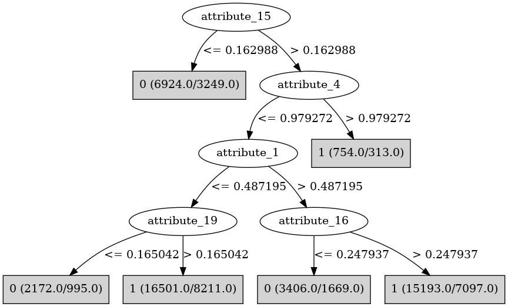

# J48

# SimpleCart Decision Tree

attribute_16 < 0.2717375

* attribute_9 < 0.26736550000000003

*   * attribute_0 < 0.5540165

*   *   * attribute_19 < 0.5271455

*   *   *   * attribute_19 < 0.068885

*   *   *   *   * attribute_13 < 0.2071325: 1(24.0/7.0)

*   *   *   *   * attribute_13 >= 0.2071325

*   *   *   *   *   * attribute_13 < 0.6943025

*   *   *   *   *   *   * attribute_1 < 0.0320415: 1(11.0/6.0)

*   *   *   *   *   *   * attribute_1 >= 0.0320415: 0(136.0/60.0)

*   *   *   *   *   * attribute_13 >= 0.6943025

*   *   *   *   *   *   * attribute_3 < 0.9688045000000001

*   *   *   *   *   *   *   * attribute_4 < 0.1372765

*   *   *   *   *   *   *   *   * attribute_4 < 0.0073345: 1(13.0/3.0)

*   *   *   *   *   *   *   *   * attribute_4 >= 0.0073345

*   *   *   *   *   *   *   *   *   * attribute_2 < 0.7729029999999999

*   *   *   *   *   *   *   *   *   *   * attribute_1 < 0.3829765

*   *   *   *   *   *   *   *   *   *   *   * attribute_2 < 0.198764

*   *   *   *   *   *   *   *   *   *   *   *   * attribute_0 < 0.061117500000000005: 1(16.0/7.0)

*   *   *   *   *   *   *   *   *   *   *   *   * attribute_0 >= 0.061117500000000005

*   *   *   *   *   *   *   *   *   *   *   *   *   * attribute_14 < 0.602957

*   *   *   *   *   *   *   *   *   *   *   *   *   *   * attribute_12 < 0.0352715

*   *   *   *   *   *   *   *   *   *   *   *   *   *   *   * attribute_3 < 0.8803525: 0(7.0/1.0)

*   *   *   *   *   *   *   *   *   *   *   *   *   *   *   * attribute_3 >= 0.8803525: 1(10.0/1.0)

*   *   *   *   *   *   *   *   *   *   *   *   *   *   * attribute_12 >= 0.0352715

*   *   *   *   *   *   *   *   *   *   *   *   *   *   *   * attribute_16 < 0.036518499999999995: 0(54.0/23.0)

*   *   *   *   *   *   *   *   *   *   *   *   *   *   *   * attribute_16 >= 0.036518499999999995: 0(25.0/1.0)

*   *   *   *   *   *   *   *   *   *   *   *   *   * attribute_14 >= 0.602957: 1(10.0/3.0)

*   *   *   *   *   *   *   *   *   *   *   * attribute_2 >= 0.198764: 1(25.0/12.0)

*   *   *   *   *   *   *   *   *   *   * attribute_1 >= 0.3829765: 0(46.0/16.0)

*   *   *   *   *   *   *   *   *   * attribute_2 >= 0.7729029999999999

*   *   *   *   *   *   *   *   *   *   * attribute_5 < 0.9207575

*   *   *   *   *   *   *   *   *   *   *   * attribute_13 < 0.8845585: 1(13.0/3.0)

*   *   *   *   *   *   *   *   *   *   *   * attribute_13 >= 0.8845585: 0(11.0/1.0)

*   *   *   *   *   *   *   *   *   *   * attribute_5 >= 0.9207575: 1(9.0/0.0)

*   *   *   *   *   *   *   * attribute_4 >= 0.1372765

*   *   *   *   *   *   *   *   * attribute_9 < 0.239958

*   *   *   *   *   *   *   *   *   * attribute_13 < 0.8607135: 1(35.0/33.0)

*   *   *   *   *   *   *   *   *   * attribute_13 >= 0.8607135: 1(57.0/20.0)

*   *   *   *   *   *   *   *   * attribute_9 >= 0.239958: 0(7.0/1.0)

*   *   *   *   *   *   * attribute_3 >= 0.9688045000000001

*   *   *   *   *   *   *   * attribute_6 < 0.6454825

*   *   *   *   *   *   *   *   * attribute_10 < 0.053128499999999995: 1(12.0/4.0)

*   *   *   *   *   *   *   *   * attribute_10 >= 0.053128499999999995: 0(39.0/24.0)

*   *   *   *   *   *   *   * attribute_6 >= 0.6454825

*   *   *   *   *   *   *   *   * attribute_20 < 0.0800765: 0(28.0/1.0)

*   *   *   *   *   *   *   *   * attribute_20 >= 0.0800765

*   *   *   *   *   *   *   *   *   * attribute_17 < 0.786314

*   *   *   *   *   *   *   *   *   *   * attribute_8 < 0.975527: 0(30.0/6.0)

*   *   *   *   *   *   *   *   *   *   * attribute_8 >= 0.975527: 1(6.0/3.0)

*   *   *   *   *   *   *   *   *   * attribute_17 >= 0.786314: 1(9.0/6.0)

*   *   *   * attribute_19 >= 0.068885

*   *   *   *   * attribute_2 < 0.994156

*   *   *   *   *   * attribute_3 < 0.8632885

*   *   *   *   *   *   * attribute_20 < 0.5033515

*   *   *   *   *   *   *   * attribute_0 < 0.029085: 1(22.0/14.0)

*   *   *   *   *   *   *   * attribute_0 >= 0.029085

*   *   *   *   *   *   *   *   * attribute_4 < 0.011641: 0(23.0/3.0)

*   *   *   *   *   *   *   *   * attribute_4 >= 0.011641

*   *   *   *   *   *   *   *   *   * attribute_14 < 0.9754895

*   *   *   *   *   *   *   *   *   *   * attribute_11 < 0.9639409999999999

*   *   *   *   *   *   *   *   *   *   *   * attribute_17 < 0.969159: 0(379.0/234.0)

*   *   *   *   *   *   *   *   *   *   *   * attribute_17 >= 0.969159: 0(21.0/3.0)

*   *   *   *   *   *   *   *   *   *   * attribute_11 >= 0.9639409999999999

*   *   *   *   *   *   *   *   *   *   *   * attribute_0 < 0.127531: 0(8.0/1.0)

*   *   *   *   *   *   *   *   *   *   *   * attribute_0 >= 0.127531: 1(18.0/5.0)

*   *   *   *   *   *   *   *   *   * attribute_14 >= 0.9754895: 0(10.0/0.0)

*   *   *   *   *   *   * attribute_20 >= 0.5033515

*   *   *   *   *   *   *   * attribute_9 < 0.19617: 0(15.0/9.0)

*   *   *   *   *   *   *   * attribute_9 >= 0.19617

*   *   *   *   *   *   *   *   * attribute_11 < 0.39116399999999996: 0(7.0/4.0)

*   *   *   *   *   *   *   *   * attribute_11 >= 0.39116399999999996: 1(20.0/3.0)

*   *   *   *   *   * attribute_3 >= 0.8632885

*   *   *   *   *   *   * attribute_14 < 0.0222705

*   *   *   *   *   *   *   * attribute_0 < 0.396618

*   *   *   *   *   *   *   *   * attribute_14 < 0.0192495: 0(23.0/6.0)

*   *   *   *   *   *   *   *   * attribute_14 >= 0.0192495: 1(8.0/3.0)

*   *   *   *   *   *   *   * attribute_0 >= 0.396618: 1(10.0/0.0)

*   *   *   *   *   *   * attribute_14 >= 0.0222705: 0(160.0/53.0)

*   *   *   *   * attribute_2 >= 0.994156: 1(9.0/1.0)

*   *   * attribute_19 >= 0.5271455

*   *   *   * attribute_12 < 0.874316

*   *   *   *   * attribute_4 < 0.213402: 1(20.0/2.0)

*   *   *   *   * attribute_4 >= 0.213402: 1(14.0/10.0)

*   *   *   * attribute_12 >= 0.874316: 0(6.0/1.0)

*   * attribute_0 >= 0.5540165

*   *   * attribute_1 < 0.041139

*   *   *   * attribute_5 < 0.5450535

*   *   *   *   * attribute_5 < 0.34039149999999996: 0(58.0/37.0)

*   *   *   *   * attribute_5 >= 0.34039149999999996: 1(21.0/6.0)

*   *   *   * attribute_5 >= 0.5450535

*   *   *   *   * attribute_7 < 0.4658065: 1(8.0/5.0)

*   *   *   *   * attribute_7 >= 0.4658065

*   *   *   *   *   * attribute_17 < 0.07786399999999999

*   *   *   *   *   *   * attribute_20 < 0.203428: 0(49.0/3.0)

*   *   *   *   *   *   * attribute_20 >= 0.203428: 0(9.0/7.0)

*   *   *   *   *   * attribute_17 >= 0.07786399999999999

*   *   *   *   *   *   * attribute_1 < 0.012272: 0(10.0/0.0)

*   *   *   *   *   *   * attribute_1 >= 0.012272: 0(20.0/18.0)

*   *   * attribute_1 >= 0.041139

*   *   *   * attribute_11 < 0.7937385

*   *   *   *   * attribute_8 < 0.9832465

*   *   *   *   *   * attribute_6 < 0.9032595

*   *   *   *   *   *   * attribute_2 < 0.0213285

*   *   *   *   *   *   *   * attribute_15 < 0.243952

*   *   *   *   *   *   *   *   * attribute_17 < 0.096975

*   *   *   *   *   *   *   *   *   * attribute_16 < 0.053818: 0(18.0/13.0)

*   *   *   *   *   *   *   *   *   * attribute_16 >= 0.053818: 0(20.0/3.0)

*   *   *   *   *   *   *   *   * attribute_17 >= 0.096975: 1(17.0/8.0)

*   *   *   *   *   *   *   * attribute_15 >= 0.243952: 1(72.0/33.0)

*   *   *   *   *   *   * attribute_2 >= 0.0213285

*   *   *   *   *   *   *   * attribute_0 < 0.593163

*   *   *   *   *   *   *   *   * attribute_4 < 0.3712395

*   *   *   *   *   *   *   *   *   * attribute_7 < 0.47945899999999997

*   *   *   *   *   *   *   *   *   *   * attribute_1 < 0.4776745: 0(9.0/9.0)

*   *   *   *   *   *   *   *   *   *   * attribute_1 >= 0.4776745: 1(18.0/1.0)

*   *   *   *   *   *   *   *   *   * attribute_7 >= 0.47945899999999997

*   *   *   *   *   *   *   *   *   *   * attribute_20 < 0.12639: 1(15.0/9.0)

*   *   *   *   *   *   *   *   *   *   * attribute_20 >= 0.12639

*   *   *   *   *   *   *   *   *   *   *   * attribute_18 < 0.6772265: 0(15.0/0.0)

*   *   *   *   *   *   *   *   *   *   *   * attribute_18 >= 0.6772265: 1(8.0/7.0)

*   *   *   *   *   *   *   *   * attribute_4 >= 0.3712395: 1(12.0/0.0)

*   *   *   *   *   *   *   * attribute_0 >= 0.593163

*   *   *   *   *   *   *   *   * attribute_15 < 0.035391

*   *   *   *   *   *   *   *   *   * attribute_10 < 0.08367050000000001

*   *   *   *   *   *   *   *   *   *   * attribute_11 < 0.118504: 1(7.0/2.0)

*   *   *   *   *   *   *   *   *   *   * attribute_11 >= 0.118504: 0(29.0/13.0)

*   *   *   *   *   *   *   *   *   * attribute_10 >= 0.08367050000000001

*   *   *   *   *   *   *   *   *   *   * attribute_3 < 0.9355709999999999: 1(41.0/8.0)

*   *   *   *   *   *   *   *   *   *   * attribute_3 >= 0.9355709999999999

*   *   *   *   *   *   *   *   *   *   *   * attribute_20 < 0.269655: 1(8.0/4.0)

*   *   *   *   *   *   *   *   *   *   *   * attribute_20 >= 0.269655: 0(7.0/0.0)

*   *   *   *   *   *   *   *   * attribute_15 >= 0.035391

*   *   *   *   *   *   *   *   *   * attribute_8 < 0.9320755000000001

*   *   *   *   *   *   *   *   *   *   * attribute_16 < 0.21308749999999999

*   *   *   *   *   *   *   *   *   *   *   * attribute_13 < 0.795051

*   *   *   *   *   *   *   *   *   *   *   *   * attribute_16 < 0.21002500000000002

*   *   *   *   *   *   *   *   *   *   *   *   *   * attribute_9 < 0.2233705

*   *   *   *   *   *   *   *   *   *   *   *   *   *   * attribute_7 < 0.41084

*   *   *   *   *   *   *   *   *   *   *   *   *   *   *   * attribute_8 < 0.4309695: 0(23.0/3.0)

*   *   *   *   *   *   *   *   *   *   *   *   *   *   *   * attribute_8 >= 0.4309695: 1(5.0/2.0)

*   *   *   *   *   *   *   *   *   *   *   *   *   *   * attribute_7 >= 0.41084

*   *   *   *   *   *   *   *   *   *   *   *   *   *   *   * attribute_6 < 0.1617115

*   *   *   *   *   *   *   *   *   *   *   *   *   *   *   *   * attribute_16 < 0.083607

*   *   *   *   *   *   *   *   *   *   *   *   *   *   *   *   *   * attribute_3 < 0.0231045: 1(6.0/1.0)

*   *   *   *   *   *   *   *   *   *   *   *   *   *   *   *   *   * attribute_3 >= 0.0231045

*   *   *   *   *   *   *   *   *   *   *   *   *   *   *   *   *   *   * attribute_4 < 0.115991

*   *   *   *   *   *   *   *   *   *   *   *   *   *   *   *   *   *   *   * attribute_14 < 0.46747099999999997: 0(25.0/7.0)

*   *   *   *   *   *   *   *   *   *   *   *   *   *   *   *   *   *   *   * attribute_14 >= 0.46747099999999997: 1(14.0/9.0)

*   *   *   *   *   *   *   *   *   *   *   *   *   *   *   *   *   *   * attribute_4 >= 0.115991

*   *   *   *   *   *   *   *   *   *   *   *   *   *   *   *   *   *   *   * attribute_11 < 0.1613415: 0(26.0/0.0)

*   *   *   *   *   *   *   *   *   *   *   *   *   *   *   *   *   *   *   * attribute_11 >= 0.1613415: 0(10.0/5.0)

*   *   *   *   *   *   *   *   *   *   *   *   *   *   *   *   * attribute_16 >= 0.083607

*   *   *   *   *   *   *   *   *   *   *   *   *   *   *   *   *   * attribute_6 < 0.10781099999999999: 1(62.0/36.0)

*   *   *   *   *   *   *   *   *   *   *   *   *   *   *   *   *   * attribute_6 >= 0.10781099999999999

*   *   *   *   *   *   *   *   *   *   *   *   *   *   *   *   *   *   * attribute_3 < 0.47860899999999995

*   *   *   *   *   *   *   *   *   *   *   *   *   *   *   *   *   *   *   * attribute_1 < 0.142702: 0(5.0/4.0)

*   *   *   *   *   *   *   *   *   *   *   *   *   *   *   *   *   *   *   * attribute_1 >= 0.142702: 0(20.0/0.0)

*   *   *   *   *   *   *   *   *   *   *   *   *   *   *   *   *   *   * attribute_3 >= 0.47860899999999995: 1(5.0/2.0)

*   *   *   *   *   *   *   *   *   *   *   *   *   *   *   * attribute_6 >= 0.1617115

*   *   *   *   *   *   *   *   *   *   *   *   *   *   *   *   * attribute_6 < 0.2390315

*   *   *   *   *   *   *   *   *   *   *   *   *   *   *   *   *   * attribute_12 < 0.8028605: 1(43.0/9.0)

*   *   *   *   *   *   *   *   *   *   *   *   *   *   *   *   *   * attribute_12 >= 0.8028605: 0(10.0/7.0)

*   *   *   *   *   *   *   *   *   *   *   *   *   *   *   *   * attribute_6 >= 0.2390315

*   *   *   *   *   *   *   *   *   *   *   *   *   *   *   *   *   * attribute_5 < 0.8374855

*   *   *   *   *   *   *   *   *   *   *   *   *   *   *   *   *   *   * attribute_11 < 0.438517

*   *   *   *   *   *   *   *   *   *   *   *   *   *   *   *   *   *   *   * attribute_8 < 0.6471

*   *   *   *   *   *   *   *   *   *   *   *   *   *   *   *   *   *   *   *   * attribute_8 < 0.429786

*   *   *   *   *   *   *   *   *   *   *   *   *   *   *   *   *   *   *   *   *   * attribute_15 < 0.19738450000000002: 1(9.0/0.0)

*   *   *   *   *   *   *   *   *   *   *   *   *   *   *   *   *   *   *   *   *   * attribute_15 >= 0.19738450000000002: 0(21.0/20.0)

*   *   *   *   *   *   *   *   *   *   *   *   *   *   *   *   *   *   *   *   * attribute_8 >= 0.429786: 0(22.0/8.0)

*   *   *   *   *   *   *   *   *   *   *   *   *   *   *   *   *   *   *   * attribute_8 >= 0.6471: 1(31.0/9.0)

*   *   *   *   *   *   *   *   *   *   *   *   *   *   *   *   *   *   * attribute_11 >= 0.438517

*   *   *   *   *   *   *   *   *   *   *   *   *   *   *   *   *   *   *   * attribute_13 < 0.459099

*   *   *   *   *   *   *   *   *   *   *   *   *   *   *   *   *   *   *   *   * attribute_5 < 0.382128

*   *   *   *   *   *   *   *   *   *   *   *   *   *   *   *   *   *   *   *   *   * attribute_1 < 0.6954119999999999

*   *   *   *   *   *   *   *   *   *   *   *   *   *   *   *   *   *   *   *   *   *   * attribute_11 < 0.6169295: 0(12.0/9.0)

*   *   *   *   *   *   *   *   *   *   *   *   *   *   *   *   *   *   *   *   *   *   * attribute_11 >= 0.6169295: 1(7.0/0.0)

*   *   *   *   *   *   *   *   *   *   *   *   *   *   *   *   *   *   *   *   *   * attribute_1 >= 0.6954119999999999: 0(9.0/1.0)

*   *   *   *   *   *   *   *   *   *   *   *   *   *   *   *   *   *   *   *   * attribute_5 >= 0.382128

*   *   *   *   *   *   *   *   *   *   *   *   *   *   *   *   *   *   *   *   *   * attribute_7 < 0.593934: 0(6.0/4.0)

*   *   *   *   *   *   *   *   *   *   *   *   *   *   *   *   *   *   *   *   *   * attribute_7 >= 0.593934: 0(21.0/0.0)

*   *   *   *   *   *   *   *   *   *   *   *   *   *   *   *   *   *   *   * attribute_13 >= 0.459099

*   *   *   *   *   *   *   *   *   *   *   *   *   *   *   *   *   *   *   *   * attribute_3 < 0.549276: 1(19.0/5.0)

*   *   *   *   *   *   *   *   *   *   *   *   *   *   *   *   *   *   *   *   * attribute_3 >= 0.549276: 0(22.0/11.0)

*   *   *   *   *   *   *   *   *   *   *   *   *   *   *   *   *   * attribute_5 >= 0.8374855: 1(19.0/5.0)

*   *   *   *   *   *   *   *   *   *   *   *   *   * attribute_9 >= 0.2233705

*   *   *   *   *   *   *   *   *   *   *   *   *   *   * attribute_5 < 0.4924865

*   *   *   *   *   *   *   *   *   *   *   *   *   *   *   * attribute_9 < 0.25123249999999997

*   *   *   *   *   *   *   *   *   *   *   *   *   *   *   *   * attribute_7 < 0.9346155: 0(32.0/1.0)

*   *   *   *   *   *   *   *   *   *   *   *   *   *   *   *   * attribute_7 >= 0.9346155: 0(4.0/4.0)

*   *   *   *   *   *   *   *   *   *   *   *   *   *   *   * attribute_9 >= 0.25123249999999997

*   *   *   *   *   *   *   *   *   *   *   *   *   *   *   *   * attribute_20 < 0.377382: 0(15.0/4.0)

*   *   *   *   *   *   *   *   *   *   *   *   *   *   *   *   * attribute_20 >= 0.377382: 1(7.0/1.0)

*   *   *   *   *   *   *   *   *   *   *   *   *   *   * attribute_5 >= 0.4924865

*   *   *   *   *   *   *   *   *   *   *   *   *   *   *   * attribute_19 < 0.16385899999999998

*   *   *   *   *   *   *   *   *   *   *   *   *   *   *   *   * attribute_3 < 0.3491605: 1(7.0/2.0)

*   *   *   *   *   *   *   *   *   *   *   *   *   *   *   *   * attribute_3 >= 0.3491605: 0(19.0/5.0)

*   *   *   *   *   *   *   *   *   *   *   *   *   *   *   * attribute_19 >= 0.16385899999999998: 1(12.0/3.0)

*   *   *   *   *   *   *   *   *   *   *   *   * attribute_16 >= 0.21002500000000002: 1(15.0/3.0)

*   *   *   *   *   *   *   *   *   *   *   * attribute_13 >= 0.795051

*   *   *   *   *   *   *   *   *   *   *   *   * attribute_8 < 0.5096255000000001

*   *   *   *   *   *   *   *   *   *   *   *   *   * attribute_18 < 0.599024

*   *   *   *   *   *   *   *   *   *   *   *   *   *   * attribute_9 < 0.23627900000000002

*   *   *   *   *   *   *   *   *   *   *   *   *   *   *   * attribute_10 < 0.049298499999999995: 0(10.0/6.0)

*   *   *   *   *   *   *   *   *   *   *   *   *   *   *   * attribute_10 >= 0.049298499999999995

*   *   *   *   *   *   *   *   *   *   *   *   *   *   *   *   * attribute_7 < 0.7964945

*   *   *   *   *   *   *   *   *   *   *   *   *   *   *   *   *   * attribute_3 < 0.7406995: 1(8.0/5.0)

*   *   *   *   *   *   *   *   *   *   *   *   *   *   *   *   *   * attribute_3 >= 0.7406995: 1(20.0/1.0)

*   *   *   *   *   *   *   *   *   *   *   *   *   *   *   *   * attribute_7 >= 0.7964945: 0(5.0/3.0)

*   *   *   *   *   *   *   *   *   *   *   *   *   *   * attribute_9 >= 0.23627900000000002: 0(8.0/1.0)

*   *   *   *   *   *   *   *   *   *   *   *   *   * attribute_18 >= 0.599024

*   *   *   *   *   *   *   *   *   *   *   *   *   *   * attribute_3 < 0.9843459999999999

*   *   *   *   *   *   *   *   *   *   *   *   *   *   *   * attribute_19 < 0.262722

*   *   *   *   *   *   *   *   *   *   *   *   *   *   *   *   * attribute_20 < 0.314014

*   *   *   *   *   *   *   *   *   *   *   *   *   *   *   *   *   * attribute_19 < 0.032270999999999994: 0(14.0/11.0)

*   *   *   *   *   *   *   *   *   *   *   *   *   *   *   *   *   * attribute_19 >= 0.032270999999999994: 0(48.0/4.0)

*   *   *   *   *   *   *   *   *   *   *   *   *   *   *   *   * attribute_20 >= 0.314014

*   *   *   *   *   *   *   *   *   *   *   *   *   *   *   *   *   * attribute_11 < 0.279073: 1(9.0/3.0)

*   *   *   *   *   *   *   *   *   *   *   *   *   *   *   *   *   * attribute_11 >= 0.279073: 0(6.0/1.0)

*   *   *   *   *   *   *   *   *   *   *   *   *   *   *   * attribute_19 >= 0.262722: 1(8.0/4.0)

*   *   *   *   *   *   *   *   *   *   *   *   *   *   * attribute_3 >= 0.9843459999999999: 1(9.0/4.0)

*   *   *   *   *   *   *   *   *   *   *   *   * attribute_8 >= 0.5096255000000001

*   *   *   *   *   *   *   *   *   *   *   *   *   * attribute_5 < 0.578451: 1(5.0/2.0)

*   *   *   *   *   *   *   *   *   *   *   *   *   * attribute_5 >= 0.578451: 0(53.0/10.0)

*   *   *   *   *   *   *   *   *   *   * attribute_16 >= 0.21308749999999999

*   *   *   *   *   *   *   *   *   *   *   * attribute_12 < 0.906026

*   *   *   *   *   *   *   *   *   *   *   *   * attribute_1 < 0.10251550000000001: 1(19.0/11.0)

*   *   *   *   *   *   *   *   *   *   *   *   * attribute_1 >= 0.10251550000000001

*   *   *   *   *   *   *   *   *   *   *   *   *   * attribute_8 < 0.012274: 1(7.0/2.0)

*   *   *   *   *   *   *   *   *   *   *   *   *   * attribute_8 >= 0.012274

*   *   *   *   *   *   *   *   *   *   *   *   *   *   * attribute_8 < 0.1167445: 0(30.0/5.0)

*   *   *   *   *   *   *   *   *   *   *   *   *   *   * attribute_8 >= 0.1167445: 0(97.0/59.0)

*   *   *   *   *   *   *   *   *   *   *   * attribute_12 >= 0.906026: 0(25.0/4.0)

*   *   *   *   *   *   *   *   *   * attribute_8 >= 0.9320755000000001: 1(11.0/3.0)

*   *   *   *   *   * attribute_6 >= 0.9032595

*   *   *   *   *   *   * attribute_19 < 0.0321195: 0(5.0/2.0)

*   *   *   *   *   *   * attribute_19 >= 0.0321195: 1(24.0/3.0)

*   *   *   *   * attribute_8 >= 0.9832465: 0(9.0/0.0)

*   *   *   * attribute_11 >= 0.7937385

*   *   *   *   * attribute_13 < 0.2691285: 1(20.0/3.0)

*   *   *   *   * attribute_13 >= 0.2691285

*   *   *   *   *   * attribute_19 < 0.384981

*   *   *   *   *   *   * attribute_11 < 0.807404: 1(15.0/3.0)

*   *   *   *   *   *   * attribute_11 >= 0.807404

*   *   *   *   *   *   *   * attribute_5 < 0.8049459999999999

*   *   *   *   *   *   *   *   * attribute_15 < 0.119724

*   *   *   *   *   *   *   *   *   * attribute_20 < 0.229074: 1(12.0/1.0)

*   *   *   *   *   *   *   *   *   * attribute_20 >= 0.229074: 0(7.0/5.0)

*   *   *   *   *   *   *   *   * attribute_15 >= 0.119724

*   *   *   *   *   *   *   *   *   * attribute_18 < 0.6129245

*   *   *   *   *   *   *   *   *   *   * attribute_10 < 0.168326

*   *   *   *   *   *   *   *   *   *   *   * attribute_13 < 0.8429105

*   *   *   *   *   *   *   *   *   *   *   *   * attribute_13 < 0.483544: 0(10.0/9.0)

*   *   *   *   *   *   *   *   *   *   *   *   * attribute_13 >= 0.483544: 0(25.0/3.0)

*   *   *   *   *   *   *   *   *   *   *   * attribute_13 >= 0.8429105: 1(5.0/2.0)

*   *   *   *   *   *   *   *   *   *   * attribute_10 >= 0.168326

*   *   *   *   *   *   *   *   *   *   *   * attribute_0 < 0.7155715: 0(8.0/6.0)

*   *   *   *   *   *   *   *   *   *   *   * attribute_0 >= 0.7155715: 1(10.0/1.0)

*   *   *   *   *   *   *   *   *   * attribute_18 >= 0.6129245: 0(18.0/1.0)

*   *   *   *   *   *   *   * attribute_5 >= 0.8049459999999999

*   *   *   *   *   *   *   *   * attribute_14 < 0.0198165: 0(6.0/1.0)

*   *   *   *   *   *   *   *   * attribute_14 >= 0.0198165

*   *   *   *   *   *   *   *   *   * attribute_9 < 0.106087: 1(22.0/4.0)

*   *   *   *   *   *   *   *   *   * attribute_9 >= 0.106087

*   *   *   *   *   *   *   *   *   *   * attribute_9 < 0.192076: 0(10.0/5.0)

*   *   *   *   *   *   *   *   *   *   * attribute_9 >= 0.192076: 1(10.0/3.0)

*   *   *   *   *   * attribute_19 >= 0.384981: 1(19.0/5.0)

* attribute_9 >= 0.26736550000000003

*   * attribute_5 < 0.037040500000000004

*   *   * attribute_18 < 0.03456: 1(10.0/0.0)

*   *   * attribute_18 >= 0.03456: 1(207.0/154.0)

*   * attribute_5 >= 0.037040500000000004

*   *   * attribute_0 < 0.856725

*   *   *   * attribute_8 < 0.2936705

*   *   *   *   * attribute_9 < 0.7460315

*   *   *   *   *   * attribute_3 < 0.9913475

*   *   *   *   *   *   * attribute_5 < 0.9801415

*   *   *   *   *   *   *   * attribute_16 < 0.0184895

*   *   *   *   *   *   *   *   * attribute_15 < 0.240495: 1(33.0/9.0)

*   *   *   *   *   *   *   *   * attribute_15 >= 0.240495

*   *   *   *   *   *   *   *   *   * attribute_11 < 0.321427

*   *   *   *   *   *   *   *   *   *   * attribute_9 < 0.4140005: 1(8.0/5.0)

*   *   *   *   *   *   *   *   *   *   * attribute_9 >= 0.4140005: 0(17.0/5.0)

*   *   *   *   *   *   *   *   *   * attribute_11 >= 0.321427: 1(8.0/2.0)

*   *   *   *   *   *   *   * attribute_16 >= 0.0184895

*   *   *   *   *   *   *   *   * attribute_16 < 0.0267475: 0(20.0/4.0)

*   *   *   *   *   *   *   *   * attribute_16 >= 0.0267475

*   *   *   *   *   *   *   *   *   * attribute_9 < 0.5684515

*   *   *   *   *   *   *   *   *   *   * attribute_1 < 0.0063315: 1(7.0/1.0)

*   *   *   *   *   *   *   *   *   *   * attribute_1 >= 0.0063315

*   *   *   *   *   *   *   *   *   *   *   * attribute_20 < 0.1830165

*   *   *   *   *   *   *   *   *   *   *   *   * attribute_9 < 0.428987

*   *   *   *   *   *   *   *   *   *   *   *   *   * attribute_3 < 0.1031475: 0(13.0/2.0)

*   *   *   *   *   *   *   *   *   *   *   *   *   * attribute_3 >= 0.1031475: 0(36.0/30.0)

*   *   *   *   *   *   *   *   *   *   *   *   * attribute_9 >= 0.428987: 0(22.0/3.0)

*   *   *   *   *   *   *   *   *   *   *   * attribute_20 >= 0.1830165

*   *   *   *   *   *   *   *   *   *   *   *   * attribute_16 < 0.2576535

*   *   *   *   *   *   *   *   *   *   *   *   *   * attribute_15 < 0.08897749999999999: 0(43.0/18.0)

*   *   *   *   *   *   *   *   *   *   *   *   *   * attribute_15 >= 0.08897749999999999

*   *   *   *   *   *   *   *   *   *   *   *   *   *   * attribute_7 < 0.157051: 0(25.0/10.0)

*   *   *   *   *   *   *   *   *   *   *   *   *   *   * attribute_7 >= 0.157051

*   *   *   *   *   *   *   *   *   *   *   *   *   *   *   * attribute_7 < 0.9598385

*   *   *   *   *   *   *   *   *   *   *   *   *   *   *   *   * attribute_18 < 0.0662585: 1(10.0/2.0)

*   *   *   *   *   *   *   *   *   *   *   *   *   *   *   *   * attribute_18 >= 0.0662585: 1(225.0/221.0)

*   *   *   *   *   *   *   *   *   *   *   *   *   *   *   * attribute_7 >= 0.9598385: 0(8.0/1.0)

*   *   *   *   *   *   *   *   *   *   *   *   * attribute_16 >= 0.2576535

*   *   *   *   *   *   *   *   *   *   *   *   *   * attribute_4 < 0.196708: 0(13.0/0.0)

*   *   *   *   *   *   *   *   *   *   *   *   *   * attribute_4 >= 0.196708

*   *   *   *   *   *   *   *   *   *   *   *   *   *   * attribute_11 < 0.10974049999999999: 0(9.0/1.0)

*   *   *   *   *   *   *   *   *   *   *   *   *   *   * attribute_11 >= 0.10974049999999999: 1(6.0/3.0)

*   *   *   *   *   *   *   *   *   * attribute_9 >= 0.5684515

*   *   *   *   *   *   *   *   *   *   * attribute_2 < 0.80627

*   *   *   *   *   *   *   *   *   *   *   * attribute_13 < 0.0963555

*   *   *   *   *   *   *   *   *   *   *   *   * attribute_4 < 0.1402335: 1(12.0/0.0)

*   *   *   *   *   *   *   *   *   *   *   *   * attribute_4 >= 0.1402335

*   *   *   *   *   *   *   *   *   *   *   *   *   * attribute_19 < 0.179943: 0(7.0/2.0)

*   *   *   *   *   *   *   *   *   *   *   *   *   * attribute_19 >= 0.179943: 1(14.0/3.0)

*   *   *   *   *   *   *   *   *   *   *   * attribute_13 >= 0.0963555

*   *   *   *   *   *   *   *   *   *   *   *   * attribute_4 < 0.08460899999999999: 0(33.0/18.0)

*   *   *   *   *   *   *   *   *   *   *   *   * attribute_4 >= 0.08460899999999999

*   *   *   *   *   *   *   *   *   *   *   *   *   * attribute_8 < 0.06082: 1(15.0/2.0)

*   *   *   *   *   *   *   *   *   *   *   *   *   * attribute_8 >= 0.06082

*   *   *   *   *   *   *   *   *   *   *   *   *   *   * attribute_0 < 0.3310575: 0(15.0/6.0)

*   *   *   *   *   *   *   *   *   *   *   *   *   *   * attribute_0 >= 0.3310575

*   *   *   *   *   *   *   *   *   *   *   *   *   *   *   * attribute_7 < 0.397912: 1(22.0/4.0)

*   *   *   *   *   *   *   *   *   *   *   *   *   *   *   * attribute_7 >= 0.397912

*   *   *   *   *   *   *   *   *   *   *   *   *   *   *   *   * attribute_7 < 0.453433: 0(11.0/1.0)

*   *   *   *   *   *   *   *   *   *   *   *   *   *   *   *   * attribute_7 >= 0.453433

*   *   *   *   *   *   *   *   *   *   *   *   *   *   *   *   *   * attribute_14 < 0.8621235

*   *   *   *   *   *   *   *   *   *   *   *   *   *   *   *   *   *   * attribute_1 < 0.276976: 0(28.0/16.0)

*   *   *   *   *   *   *   *   *   *   *   *   *   *   *   *   *   *   * attribute_1 >= 0.276976

*   *   *   *   *   *   *   *   *   *   *   *   *   *   *   *   *   *   *   * attribute_4 < 0.2003625: 1(24.0/5.0)

*   *   *   *   *   *   *   *   *   *   *   *   *   *   *   *   *   *   *   * attribute_4 >= 0.2003625

*   *   *   *   *   *   *   *   *   *   *   *   *   *   *   *   *   *   *   *   * attribute_3 < 0.26361999999999997: 0(10.0/2.0)

*   *   *   *   *   *   *   *   *   *   *   *   *   *   *   *   *   *   *   *   * attribute_3 >= 0.26361999999999997

*   *   *   *   *   *   *   *   *   *   *   *   *   *   *   *   *   *   *   *   *   * attribute_13 < 0.7093145000000001: 1(16.0/4.0)

*   *   *   *   *   *   *   *   *   *   *   *   *   *   *   *   *   *   *   *   *   * attribute_13 >= 0.7093145000000001: 0(9.0/4.0)

*   *   *   *   *   *   *   *   *   *   *   *   *   *   *   *   *   * attribute_14 >= 0.8621235: 1(7.0/0.0)

*   *   *   *   *   *   *   *   *   *   * attribute_2 >= 0.80627: 0(9.0/1.0)

*   *   *   *   *   *   * attribute_5 >= 0.9801415

*   *   *   *   *   *   *   * attribute_13 < 0.9081835: 0(7.0/6.0)

*   *   *   *   *   *   *   * attribute_13 >= 0.9081835: 0(18.0/1.0)

*   *   *   *   *   * attribute_3 >= 0.9913475: 1(10.0/1.0)

*   *   *   *   * attribute_9 >= 0.7460315

*   *   *   *   *   * attribute_17 < 0.013121999999999998: 1(8.0/1.0)

*   *   *   *   *   * attribute_17 >= 0.013121999999999998

*   *   *   *   *   *   * attribute_20 < 0.6459275: 0(58.0/18.0)

*   *   *   *   *   *   * attribute_20 >= 0.6459275

*   *   *   *   *   *   *   * attribute_14 < 0.100137

*   *   *   *   *   *   *   *   * attribute_20 < 0.8716695: 0(20.0/16.0)

*   *   *   *   *   *   *   *   * attribute_20 >= 0.8716695: 0(35.0/5.0)

*   *   *   *   *   *   *   * attribute_14 >= 0.100137

*   *   *   *   *   *   *   *   * attribute_12 < 0.5131355

*   *   *   *   *   *   *   *   *   * attribute_17 < 0.309969: 1(26.0/10.0)

*   *   *   *   *   *   *   *   *   * attribute_17 >= 0.309969: 0(39.0/35.0)

*   *   *   *   *   *   *   *   * attribute_12 >= 0.5131355

*   *   *   *   *   *   *   *   *   * attribute_17 < 0.30396: 0(24.0/4.0)

*   *   *   *   *   *   *   *   *   * attribute_17 >= 0.30396

*   *   *   *   *   *   *   *   *   *   * attribute_2 < 0.28189450000000005: 1(8.0/1.0)

*   *   *   *   *   *   *   *   *   *   * attribute_2 >= 0.28189450000000005

*   *   *   *   *   *   *   *   *   *   *   * attribute_3 < 0.246162: 0(11.0/0.0)

*   *   *   *   *   *   *   *   *   *   *   * attribute_3 >= 0.246162

*   *   *   *   *   *   *   *   *   *   *   *   * attribute_7 < 0.5160739999999999

*   *   *   *   *   *   *   *   *   *   *   *   *   * attribute_1 < 0.7634685: 0(10.0/0.0)

*   *   *   *   *   *   *   *   *   *   *   *   *   * attribute_1 >= 0.7634685: 0(6.0/4.0)

*   *   *   *   *   *   *   *   *   *   *   *   * attribute_7 >= 0.5160739999999999: 1(14.0/9.0)

*   *   *   * attribute_8 >= 0.2936705

*   *   *   *   * attribute_1 < 0.020457

*   *   *   *   *   * attribute_20 < 0.8536815

*   *   *   *   *   *   * attribute_18 < 0.0654935: 1(9.0/3.0)

*   *   *   *   *   *   * attribute_18 >= 0.0654935

*   *   *   *   *   *   *   * attribute_7 < 0.3042065

*   *   *   *   *   *   *   *   * attribute_10 < 0.285787: 0(13.0/0.0)

*   *   *   *   *   *   *   *   * attribute_10 >= 0.285787: 0(19.0/8.0)

*   *   *   *   *   *   *   * attribute_7 >= 0.3042065

*   *   *   *   *   *   *   *   * attribute_18 < 0.420072: 1(9.0/3.0)

*   *   *   *   *   *   *   *   * attribute_18 >= 0.420072: 0(27.0/15.0)

*   *   *   *   *   * attribute_20 >= 0.8536815: 0(13.0/0.0)

*   *   *   *   * attribute_1 >= 0.020457

*   *   *   *   *   * attribute_19 < 0.29571800000000004

*   *   *   *   *   *   * attribute_11 < 0.513031

*   *   *   *   *   *   *   * attribute_0 < 0.751341

*   *   *   *   *   *   *   *   * attribute_10 < 0.9152415

*   *   *   *   *   *   *   *   *   * attribute_9 < 0.9695975

*   *   *   *   *   *   *   *   *   *   * attribute_5 < 0.2425875

*   *   *   *   *   *   *   *   *   *   *   * attribute_15 < 0.0461665: 0(13.0/1.0)

*   *   *   *   *   *   *   *   *   *   *   * attribute_15 >= 0.0461665

*   *   *   *   *   *   *   *   *   *   *   *   * attribute_17 < 0.1137115: 0(16.0/3.0)

*   *   *   *   *   *   *   *   *   *   *   *   * attribute_17 >= 0.1137115

*   *   *   *   *   *   *   *   *   *   *   *   *   * attribute_10 < 0.323826: 0(28.0/11.0)

*   *   *   *   *   *   *   *   *   *   *   *   *   * attribute_10 >= 0.323826

*   *   *   *   *   *   *   *   *   *   *   *   *   *   * attribute_12 < 0.082707: 1(14.0/3.0)

*   *   *   *   *   *   *   *   *   *   *   *   *   *   * attribute_12 >= 0.082707

*   *   *   *   *   *   *   *   *   *   *   *   *   *   *   * attribute_5 < 0.0659795

*   *   *   *   *   *   *   *   *   *   *   *   *   *   *   *   * attribute_11 < 0.4280855: 0(25.0/5.0)

*   *   *   *   *   *   *   *   *   *   *   *   *   *   *   *   * attribute_11 >= 0.4280855: 1(5.0/3.0)

*   *   *   *   *   *   *   *   *   *   *   *   *   *   *   * attribute_5 >= 0.0659795: 1(101.0/90.0)

*   *   *   *   *   *   *   *   *   *   * attribute_5 >= 0.2425875

*   *   *   *   *   *   *   *   *   *   *   * attribute_3 < 0.2621175

*   *   *   *   *   *   *   *   *   *   *   *   * attribute_14 < 0.3059545: 1(61.0/16.0)

*   *   *   *   *   *   *   *   *   *   *   *   * attribute_14 >= 0.3059545

*   *   *   *   *   *   *   *   *   *   *   *   *   * attribute_7 < 0.407539

*   *   *   *   *   *   *   *   *   *   *   *   *   *   * attribute_11 < 0.4365655: 0(15.0/2.0)

*   *   *   *   *   *   *   *   *   *   *   *   *   *   * attribute_11 >= 0.4365655: 1(5.0/2.0)

*   *   *   *   *   *   *   *   *   *   *   *   *   * attribute_7 >= 0.407539

*   *   *   *   *   *   *   *   *   *   *   *   *   *   * attribute_8 < 0.650719: 1(28.0/9.0)

*   *   *   *   *   *   *   *   *   *   *   *   *   *   * attribute_8 >= 0.650719: 0(6.0/1.0)

*   *   *   *   *   *   *   *   *   *   *   * attribute_3 >= 0.2621175

*   *   *   *   *   *   *   *   *   *   *   *   * attribute_17 < 0.9113095

*   *   *   *   *   *   *   *   *   *   *   *   *   * attribute_5 < 0.9882150000000001

*   *   *   *   *   *   *   *   *   *   *   *   *   *   * attribute_14 < 0.035084000000000004

*   *   *   *   *   *   *   *   *   *   *   *   *   *   *   * attribute_5 < 0.9381455000000001: 1(58.0/22.0)

*   *   *   *   *   *   *   *   *   *   *   *   *   *   *   * attribute_5 >= 0.9381455000000001: 0(9.0/3.0)

*   *   *   *   *   *   *   *   *   *   *   *   *   *   * attribute_14 >= 0.035084000000000004

*   *   *   *   *   *   *   *   *   *   *   *   *   *   *   * attribute_19 < 0.0010825000000000001

*   *   *   *   *   *   *   *   *   *   *   *   *   *   *   *   * attribute_4 < 0.075823: 1(6.0/4.0)

*   *   *   *   *   *   *   *   *   *   *   *   *   *   *   *   * attribute_4 >= 0.075823: 0(17.0/2.0)

*   *   *   *   *   *   *   *   *   *   *   *   *   *   *   * attribute_19 >= 0.0010825000000000001

*   *   *   *   *   *   *   *   *   *   *   *   *   *   *   *   * attribute_1 < 0.3125155

*   *   *   *   *   *   *   *   *   *   *   *   *   *   *   *   *   * attribute_14 < 0.084783

*   *   *   *   *   *   *   *   *   *   *   *   *   *   *   *   *   *   * attribute_1 < 0.2760825

*   *   *   *   *   *   *   *   *   *   *   *   *   *   *   *   *   *   *   * attribute_1 < 0.12271750000000001: 1(12.0/10.0)

*   *   *   *   *   *   *   *   *   *   *   *   *   *   *   *   *   *   *   * attribute_1 >= 0.12271750000000001: 0(27.0/4.0)

*   *   *   *   *   *   *   *   *   *   *   *   *   *   *   *   *   *   * attribute_1 >= 0.2760825: 1(8.0/1.0)

*   *   *   *   *   *   *   *   *   *   *   *   *   *   *   *   *   * attribute_14 >= 0.084783: 1(203.0/134.0)

*   *   *   *   *   *   *   *   *   *   *   *   *   *   *   *   * attribute_1 >= 0.3125155

*   *   *   *   *   *   *   *   *   *   *   *   *   *   *   *   *   * attribute_0 < 0.3291675

*   *   *   *   *   *   *   *   *   *   *   *   *   *   *   *   *   *   * attribute_14 < 0.0678485: 1(29.0/18.0)

*   *   *   *   *   *   *   *   *   *   *   *   *   *   *   *   *   *   * attribute_14 >= 0.0678485

*   *   *   *   *   *   *   *   *   *   *   *   *   *   *   *   *   *   *   * attribute_2 < 0.833114

*   *   *   *   *   *   *   *   *   *   *   *   *   *   *   *   *   *   *   *   * attribute_17 < 0.6236875

*   *   *   *   *   *   *   *   *   *   *   *   *   *   *   *   *   *   *   *   *   * attribute_2 < 0.6841055

*   *   *   *   *   *   *   *   *   *   *   *   *   *   *   *   *   *   *   *   *   *   * attribute_13 < 0.842954

*   *   *   *   *   *   *   *   *   *   *   *   *   *   *   *   *   *   *   *   *   *   *   * attribute_10 < 0.779954: 0(39.0/22.0)

*   *   *   *   *   *   *   *   *   *   *   *   *   *   *   *   *   *   *   *   *   *   *   * attribute_10 >= 0.779954: 1(11.0/3.0)

*   *   *   *   *   *   *   *   *   *   *   *   *   *   *   *   *   *   *   *   *   *   * attribute_13 >= 0.842954: 0(15.0/2.0)

*   *   *   *   *   *   *   *   *   *   *   *   *   *   *   *   *   *   *   *   *   * attribute_2 >= 0.6841055: 1(15.0/4.0)

*   *   *   *   *   *   *   *   *   *   *   *   *   *   *   *   *   *   *   *   * attribute_17 >= 0.6236875: 0(81.0/22.0)

*   *   *   *   *   *   *   *   *   *   *   *   *   *   *   *   *   *   *   * attribute_2 >= 0.833114

*   *   *   *   *   *   *   *   *   *   *   *   *   *   *   *   *   *   *   *   * attribute_6 < 0.494337: 1(24.0/8.0)

*   *   *   *   *   *   *   *   *   *   *   *   *   *   *   *   *   *   *   *   * attribute_6 >= 0.494337

*   *   *   *   *   *   *   *   *   *   *   *   *   *   *   *   *   *   *   *   *   * attribute_2 < 0.8718095

*   *   *   *   *   *   *   *   *   *   *   *   *   *   *   *   *   *   *   *   *   *   * attribute_11 < 0.3583725: 1(7.0/0.0)

*   *   *   *   *   *   *   *   *   *   *   *   *   *   *   *   *   *   *   *   *   *   * attribute_11 >= 0.3583725: 0(5.0/4.0)

*   *   *   *   *   *   *   *   *   *   *   *   *   *   *   *   *   *   *   *   *   * attribute_2 >= 0.8718095: 0(25.0/7.0)

*   *   *   *   *   *   *   *   *   *   *   *   *   *   *   *   *   * attribute_0 >= 0.3291675

*   *   *   *   *   *   *   *   *   *   *   *   *   *   *   *   *   *   * attribute_16 < 0.035546: 0(15.0/4.0)

*   *   *   *   *   *   *   *   *   *   *   *   *   *   *   *   *   *   * attribute_16 >= 0.035546

*   *   *   *   *   *   *   *   *   *   *   *   *   *   *   *   *   *   *   * attribute_13 < 0.45995699999999995: 0(49.0/36.0)

*   *   *   *   *   *   *   *   *   *   *   *   *   *   *   *   *   *   *   * attribute_13 >= 0.45995699999999995

*   *   *   *   *   *   *   *   *   *   *   *   *   *   *   *   *   *   *   *   * attribute_4 < 0.18441800000000003

*   *   *   *   *   *   *   *   *   *   *   *   *   *   *   *   *   *   *   *   *   * attribute_13 < 0.5388165

*   *   *   *   *   *   *   *   *   *   *   *   *   *   *   *   *   *   *   *   *   *   * attribute_17 < 0.48060250000000004: 0(5.0/5.0)

*   *   *   *   *   *   *   *   *   *   *   *   *   *   *   *   *   *   *   *   *   *   * attribute_17 >= 0.48060250000000004: 1(14.0/0.0)

*   *   *   *   *   *   *   *   *   *   *   *   *   *   *   *   *   *   *   *   *   * attribute_13 >= 0.5388165

*   *   *   *   *   *   *   *   *   *   *   *   *   *   *   *   *   *   *   *   *   *   * attribute_1 < 0.902807

*   *   *   *   *   *   *   *   *   *   *   *   *   *   *   *   *   *   *   *   *   *   *   * attribute_3 < 0.752378

*   *   *   *   *   *   *   *   *   *   *   *   *   *   *   *   *   *   *   *   *   *   *   *   * attribute_6 < 0.5998319999999999

*   *   *   *   *   *   *   *   *   *   *   *   *   *   *   *   *   *   *   *   *   *   *   *   *   * attribute_4 < 0.036540500000000004: 1(6.0/3.0)

*   *   *   *   *   *   *   *   *   *   *   *   *   *   *   *   *   *   *   *   *   *   *   *   *   * attribute_4 >= 0.036540500000000004: 0(36.0/4.0)

*   *   *   *   *   *   *   *   *   *   *   *   *   *   *   *   *   *   *   *   *   *   *   *   * attribute_6 >= 0.5998319999999999: 1(10.0/4.0)

*   *   *   *   *   *   *   *   *   *   *   *   *   *   *   *   *   *   *   *   *   *   *   * attribute_3 >= 0.752378

*   *   *   *   *   *   *   *   *   *   *   *   *   *   *   *   *   *   *   *   *   *   *   *   * attribute_14 < 0.247222

*   *   *   *   *   *   *   *   *   *   *   *   *   *   *   *   *   *   *   *   *   *   *   *   *   * attribute_20 < 0.674948: 0(18.0/5.0)

*   *   *   *   *   *   *   *   *   *   *   *   *   *   *   *   *   *   *   *   *   *   *   *   *   * attribute_20 >= 0.674948: 1(7.0/3.0)

*   *   *   *   *   *   *   *   *   *   *   *   *   *   *   *   *   *   *   *   *   *   *   *   * attribute_14 >= 0.247222: 1(25.0/9.0)

*   *   *   *   *   *   *   *   *   *   *   *   *   *   *   *   *   *   *   *   *   *   * attribute_1 >= 0.902807: 1(11.0/1.0)

*   *   *   *   *   *   *   *   *   *   *   *   *   *   *   *   *   *   *   *   * attribute_4 >= 0.18441800000000003: 1(91.0/39.0)

*   *   *   *   *   *   *   *   *   *   *   *   *   * attribute_5 >= 0.9882150000000001: 0(18.0/5.0)

*   *   *   *   *   *   *   *   *   *   *   *   * attribute_17 >= 0.9113095

*   *   *   *   *   *   *   *   *   *   *   *   *   * attribute_8 < 0.46449450000000003

*   *   *   *   *   *   *   *   *   *   *   *   *   *   * attribute_20 < 0.863812: 1(10.0/6.0)

*   *   *   *   *   *   *   *   *   *   *   *   *   *   * attribute_20 >= 0.863812: 0(8.0/1.0)

*   *   *   *   *   *   *   *   *   *   *   *   *   * attribute_8 >= 0.46449450000000003

*   *   *   *   *   *   *   *   *   *   *   *   *   *   * attribute_14 < 0.1996225

*   *   *   *   *   *   *   *   *   *   *   *   *   *   *   * attribute_14 < 0.073967

*   *   *   *   *   *   *   *   *   *   *   *   *   *   *   *   * attribute_11 < 0.33979: 0(5.0/5.0)

*   *   *   *   *   *   *   *   *   *   *   *   *   *   *   *   * attribute_11 >= 0.33979: 1(25.0/1.0)

*   *   *   *   *   *   *   *   *   *   *   *   *   *   *   * attribute_14 >= 0.073967

*   *   *   *   *   *   *   *   *   *   *   *   *   *   *   *   * attribute_13 < 0.907195: 1(10.0/7.0)

*   *   *   *   *   *   *   *   *   *   *   *   *   *   *   *   * attribute_13 >= 0.907195: 0(9.0/0.0)

*   *   *   *   *   *   *   *   *   *   *   *   *   *   * attribute_14 >= 0.1996225: 1(29.0/2.0)

*   *   *   *   *   *   *   *   *   * attribute_9 >= 0.9695975: 1(26.0/5.0)

*   *   *   *   *   *   *   *   * attribute_10 >= 0.9152415

*   *   *   *   *   *   *   *   *   * attribute_11 < 0.17451450000000002

*   *   *   *   *   *   *   *   *   *   * attribute_11 < 0.143031

*   *   *   *   *   *   *   *   *   *   *   * attribute_13 < 0.9284935000000001

*   *   *   *   *   *   *   *   *   *   *   *   * attribute_11 < 0.1046815: 0(21.0/14.0)

*   *   *   *   *   *   *   *   *   *   *   *   * attribute_11 >= 0.1046815: 1(12.0/4.0)

*   *   *   *   *   *   *   *   *   *   *   * attribute_13 >= 0.9284935000000001: 0(15.0/1.0)

*   *   *   *   *   *   *   *   *   *   * attribute_11 >= 0.143031

*   *   *   *   *   *   *   *   *   *   *   * attribute_15 < 0.13374750000000002: 0(4.0/3.0)

*   *   *   *   *   *   *   *   *   *   *   * attribute_15 >= 0.13374750000000002: 0(21.0/0.0)

*   *   *   *   *   *   *   *   *   * attribute_11 >= 0.17451450000000002

*   *   *   *   *   *   *   *   *   *   * attribute_18 < 0.1688415

*   *   *   *   *   *   *   *   *   *   *   * attribute_16 < 0.054333: 0(5.0/2.0)

*   *   *   *   *   *   *   *   *   *   *   * attribute_16 >= 0.054333: 1(22.0/2.0)

*   *   *   *   *   *   *   *   *   *   * attribute_18 >= 0.1688415

*   *   *   *   *   *   *   *   *   *   *   * attribute_5 < 0.23213

*   *   *   *   *   *   *   *   *   *   *   *   * attribute_20 < 0.9506764999999999

*   *   *   *   *   *   *   *   *   *   *   *   *   * attribute_20 < 0.8661055: 1(12.0/2.0)

*   *   *   *   *   *   *   *   *   *   *   *   *   * attribute_20 >= 0.8661055: 0(14.0/10.0)

*   *   *   *   *   *   *   *   *   *   *   *   * attribute_20 >= 0.9506764999999999: 1(11.0/0.0)

*   *   *   *   *   *   *   *   *   *   *   * attribute_5 >= 0.23213: 0(84.0/50.0)

*   *   *   *   *   *   *   * attribute_0 >= 0.751341

*   *   *   *   *   *   *   *   * attribute_15 < 0.843451

*   *   *   *   *   *   *   *   *   * attribute_4 < 0.32837150000000004

*   *   *   *   *   *   *   *   *   *   * attribute_1 < 0.8099815

*   *   *   *   *   *   *   *   *   *   *   * attribute_8 < 0.5776535

*   *   *   *   *   *   *   *   *   *   *   *   * attribute_12 < 0.08612349999999999: 1(5.0/4.0)

*   *   *   *   *   *   *   *   *   *   *   *   * attribute_12 >= 0.08612349999999999

*   *   *   *   *   *   *   *   *   *   *   *   *   * attribute_15 < 0.650496

*   *   *   *   *   *   *   *   *   *   *   *   *   *   * attribute_0 < 0.812294: 0(36.0/0.0)

*   *   *   *   *   *   *   *   *   *   *   *   *   *   * attribute_0 >= 0.812294: 0(21.0/5.0)

*   *   *   *   *   *   *   *   *   *   *   *   *   * attribute_15 >= 0.650496: 0(7.0/6.0)

*   *   *   *   *   *   *   *   *   *   *   * attribute_8 >= 0.5776535: 0(28.0/21.0)

*   *   *   *   *   *   *   *   *   *   * attribute_1 >= 0.8099815: 1(12.0/5.0)

*   *   *   *   *   *   *   *   *   * attribute_4 >= 0.32837150000000004

*   *   *   *   *   *   *   *   *   *   * attribute_10 < 0.6000965: 1(13.0/2.0)

*   *   *   *   *   *   *   *   *   *   * attribute_10 >= 0.6000965

*   *   *   *   *   *   *   *   *   *   *   * attribute_8 < 0.536257: 1(7.0/4.0)

*   *   *   *   *   *   *   *   *   *   *   * attribute_8 >= 0.536257: 0(7.0/1.0)

*   *   *   *   *   *   *   *   * attribute_15 >= 0.843451: 1(7.0/0.0)

*   *   *   *   *   *   * attribute_11 >= 0.513031

*   *   *   *   *   *   *   * attribute_1 < 0.795891

*   *   *   *   *   *   *   *   * attribute_11 < 0.9792735

*   *   *   *   *   *   *   *   *   * attribute_2 < 0.21980850000000002

*   *   *   *   *   *   *   *   *   *   * attribute_0 < 0.1057395

*   *   *   *   *   *   *   *   *   *   *   * attribute_8 < 0.8937930000000001

*   *   *   *   *   *   *   *   *   *   *   *   * attribute_16 < 0.049857: 1(20.0/13.0)

*   *   *   *   *   *   *   *   *   *   *   *   * attribute_16 >= 0.049857: 1(30.0/0.0)

*   *   *   *   *   *   *   *   *   *   *   * attribute_8 >= 0.8937930000000001

*   *   *   *   *   *   *   *   *   *   *   *   * attribute_8 < 0.9681905: 0(10.0/1.0)

*   *   *   *   *   *   *   *   *   *   *   *   * attribute_8 >= 0.9681905: 1(5.0/3.0)

*   *   *   *   *   *   *   *   *   *   * attribute_0 >= 0.1057395

*   *   *   *   *   *   *   *   *   *   *   * attribute_6 < 0.9161435

*   *   *   *   *   *   *   *   *   *   *   *   * attribute_9 < 0.380316

*   *   *   *   *   *   *   *   *   *   *   *   *   * attribute_9 < 0.35843800000000003

*   *   *   *   *   *   *   *   *   *   *   *   *   *   * attribute_4 < 0.042453000000000005: 0(7.0/1.0)

*   *   *   *   *   *   *   *   *   *   *   *   *   *   * attribute_4 >= 0.042453000000000005: 1(19.0/12.0)

*   *   *   *   *   *   *   *   *   *   *   *   *   * attribute_9 >= 0.35843800000000003: 1(9.0/0.0)

*   *   *   *   *   *   *   *   *   *   *   *   * attribute_9 >= 0.380316

*   *   *   *   *   *   *   *   *   *   *   *   *   * attribute_9 < 0.755893

*   *   *   *   *   *   *   *   *   *   *   *   *   *   * attribute_8 < 0.539193

*   *   *   *   *   *   *   *   *   *   *   *   *   *   *   * attribute_4 < 0.1084005: 0(16.0/7.0)

*   *   *   *   *   *   *   *   *   *   *   *   *   *   *   * attribute_4 >= 0.1084005: 1(19.0/11.0)

*   *   *   *   *   *   *   *   *   *   *   *   *   *   * attribute_8 >= 0.539193

*   *   *   *   *   *   *   *   *   *   *   *   *   *   *   * attribute_7 < 0.16562900000000003: 0(10.0/9.0)

*   *   *   *   *   *   *   *   *   *   *   *   *   *   *   * attribute_7 >= 0.16562900000000003: 0(43.0/7.0)

*   *   *   *   *   *   *   *   *   *   *   *   *   * attribute_9 >= 0.755893

*   *   *   *   *   *   *   *   *   *   *   *   *   *   * attribute_15 < 0.1460255: 0(13.0/5.0)

*   *   *   *   *   *   *   *   *   *   *   *   *   *   * attribute_15 >= 0.1460255: 1(24.0/8.0)

*   *   *   *   *   *   *   *   *   *   *   * attribute_6 >= 0.9161435: 1(13.0/4.0)

*   *   *   *   *   *   *   *   *   * attribute_2 >= 0.21980850000000002

*   *   *   *   *   *   *   *   *   *   * attribute_0 < 0.1335065

*   *   *   *   *   *   *   *   *   *   *   * attribute_12 < 0.9321695

*   *   *   *   *   *   *   *   *   *   *   *   * attribute_1 < 0.7875565

*   *   *   *   *   *   *   *   *   *   *   *   *   * attribute_17 < 0.26628399999999997: 0(27.0/7.0)

*   *   *   *   *   *   *   *   *   *   *   *   *   * attribute_17 >= 0.26628399999999997

*   *   *   *   *   *   *   *   *   *   *   *   *   *   * attribute_17 < 0.34099: 1(23.0/14.0)

*   *   *   *   *   *   *   *   *   *   *   *   *   *   * attribute_17 >= 0.34099: 0(360.0/239.0)

*   *   *   *   *   *   *   *   *   *   *   *   * attribute_1 >= 0.7875565: 0(12.0/1.0)

*   *   *   *   *   *   *   *   *   *   *   * attribute_12 >= 0.9321695: 1(10.0/1.0)

*   *   *   *   *   *   *   *   *   *   * attribute_0 >= 0.1335065

*   *   *   *   *   *   *   *   *   *   *   * attribute_7 < 0.0045415: 1(7.0/0.0)

*   *   *   *   *   *   *   *   *   *   *   * attribute_7 >= 0.0045415

*   *   *   *   *   *   *   *   *   *   *   *   * attribute_9 < 0.463433

*   *   *   *   *   *   *   *   *   *   *   *   *   * attribute_10 < 0.3316675

*   *   *   *   *   *   *   *   *   *   *   *   *   *   * attribute_10 < 0.2964775

*   *   *   *   *   *   *   *   *   *   *   *   *   *   *   * attribute_11 < 0.5914915000000001: 0(23.0/7.0)

*   *   *   *   *   *   *   *   *   *   *   *   *   *   *   * attribute_11 >= 0.5914915000000001

*   *   *   *   *   *   *   *   *   *   *   *   *   *   *   *   * attribute_18 < 0.43860699999999997

*   *   *   *   *   *   *   *   *   *   *   *   *   *   *   *   *   * attribute_14 < 0.5892885

*   *   *   *   *   *   *   *   *   *   *   *   *   *   *   *   *   *   * attribute_11 < 0.813709: 0(19.0/2.0)

*   *   *   *   *   *   *   *   *   *   *   *   *   *   *   *   *   *   * attribute_11 >= 0.813709

*   *   *   *   *   *   *   *   *   *   *   *   *   *   *   *   *   *   *   * attribute_10 < 0.2233165: 1(8.0/2.0)

*   *   *   *   *   *   *   *   *   *   *   *   *   *   *   *   *   *   *   * attribute_10 >= 0.2233165: 0(8.0/2.0)

*   *   *   *   *   *   *   *   *   *   *   *   *   *   *   *   *   * attribute_14 >= 0.5892885: 1(16.0/10.0)

*   *   *   *   *   *   *   *   *   *   *   *   *   *   *   *   * attribute_18 >= 0.43860699999999997: 1(22.0/6.0)

*   *   *   *   *   *   *   *   *   *   *   *   *   *   * attribute_10 >= 0.2964775: 0(22.0/4.0)

*   *   *   *   *   *   *   *   *   *   *   *   *   * attribute_10 >= 0.3316675

*   *   *   *   *   *   *   *   *   *   *   *   *   *   * attribute_14 < 0.060838500000000004: 0(26.0/14.0)

*   *   *   *   *   *   *   *   *   *   *   *   *   *   * attribute_14 >= 0.060838500000000004

*   *   *   *   *   *   *   *   *   *   *   *   *   *   *   * attribute_6 < 0.9503109999999999

*   *   *   *   *   *   *   *   *   *   *   *   *   *   *   *   * attribute_4 < 0.189869

*   *   *   *   *   *   *   *   *   *   *   *   *   *   *   *   *   * attribute_6 < 0.630053: 1(33.0/4.0)

*   *   *   *   *   *   *   *   *   *   *   *   *   *   *   *   *   * attribute_6 >= 0.630053: 1(54.0/32.0)

*   *   *   *   *   *   *   *   *   *   *   *   *   *   *   *   * attribute_4 >= 0.189869

*   *   *   *   *   *   *   *   *   *   *   *   *   *   *   *   *   * attribute_17 < 0.6882105000000001: 0(22.0/11.0)

*   *   *   *   *   *   *   *   *   *   *   *   *   *   *   *   *   * attribute_17 >= 0.6882105000000001

*   *   *   *   *   *   *   *   *   *   *   *   *   *   *   *   *   *   * attribute_1 < 0.6944215: 1(21.0/3.0)

*   *   *   *   *   *   *   *   *   *   *   *   *   *   *   *   *   *   * attribute_1 >= 0.6944215: 0(11.0/8.0)

*   *   *   *   *   *   *   *   *   *   *   *   *   *   *   * attribute_6 >= 0.9503109999999999: 0(6.0/1.0)

*   *   *   *   *   *   *   *   *   *   *   *   * attribute_9 >= 0.463433

*   *   *   *   *   *   *   *   *   *   *   *   *   * attribute_10 < 0.1789625: 1(17.0/5.0)

*   *   *   *   *   *   *   *   *   *   *   *   *   * attribute_10 >= 0.1789625

*   *   *   *   *   *   *   *   *   *   *   *   *   *   * attribute_7 < 0.39369

*   *   *   *   *   *   *   *   *   *   *   *   *   *   *   * attribute_15 < 0.46168600000000004

*   *   *   *   *   *   *   *   *   *   *   *   *   *   *   *   * attribute_15 < 0.397699

*   *   *   *   *   *   *   *   *   *   *   *   *   *   *   *   *   * attribute_15 < 0.37137549999999997

*   *   *   *   *   *   *   *   *   *   *   *   *   *   *   *   *   *   * attribute_8 < 0.4061575

*   *   *   *   *   *   *   *   *   *   *   *   *   *   *   *   *   *   *   * attribute_0 < 0.259357: 0(5.0/3.0)

*   *   *   *   *   *   *   *   *   *   *   *   *   *   *   *   *   *   *   * attribute_0 >= 0.259357: 1(15.0/1.0)

*   *   *   *   *   *   *   *   *   *   *   *   *   *   *   *   *   *   * attribute_8 >= 0.4061575

*   *   *   *   *   *   *   *   *   *   *   *   *   *   *   *   *   *   *   * attribute_2 < 0.2902585

*   *   *   *   *   *   *   *   *   *   *   *   *   *   *   *   *   *   *   *   * attribute_9 < 0.6229775: 1(4.0/3.0)

*   *   *   *   *   *   *   *   *   *   *   *   *   *   *   *   *   *   *   *   * attribute_9 >= 0.6229775: 0(13.0/0.0)

*   *   *   *   *   *   *   *   *   *   *   *   *   *   *   *   *   *   *   * attribute_2 >= 0.2902585

*   *   *   *   *   *   *   *   *   *   *   *   *   *   *   *   *   *   *   *   * attribute_14 < 0.067356

*   *   *   *   *   *   *   *   *   *   *   *   *   *   *   *   *   *   *   *   *   * attribute_13 < 0.25302: 1(9.0/2.0)

*   *   *   *   *   *   *   *   *   *   *   *   *   *   *   *   *   *   *   *   *   * attribute_13 >= 0.25302: 0(93.0/56.0)

*   *   *   *   *   *   *   *   *   *   *   *   *   *   *   *   *   *   *   *   * attribute_14 >= 0.067356

*   *   *   *   *   *   *   *   *   *   *   *   *   *   *   *   *   *   *   *   *   * attribute_18 < 0.066332: 1(22.0/6.0)

*   *   *   *   *   *   *   *   *   *   *   *   *   *   *   *   *   *   *   *   *   * attribute_18 >= 0.066332

*   *   *   *   *   *   *   *   *   *   *   *   *   *   *   *   *   *   *   *   *   *   * attribute_6 < 0.9359

*   *   *   *   *   *   *   *   *   *   *   *   *   *   *   *   *   *   *   *   *   *   *   * attribute_12 < 0.442118

*   *   *   *   *   *   *   *   *   *   *   *   *   *   *   *   *   *   *   *   *   *   *   *   * attribute_12 < 0.31984349999999995

*   *   *   *   *   *   *   *   *   *   *   *   *   *   *   *   *   *   *   *   *   *   *   *   *   * attribute_0 < 0.1511615: 1(15.0/6.0)

*   *   *   *   *   *   *   *   *   *   *   *   *   *   *   *   *   *   *   *   *   *   *   *   *   * attribute_0 >= 0.1511615

*   *   *   *   *   *   *   *   *   *   *   *   *   *   *   *   *   *   *   *   *   *   *   *   *   *   * attribute_3 < 0.6572675: 1(33.0/25.0)

*   *   *   *   *   *   *   *   *   *   *   *   *   *   *   *   *   *   *   *   *   *   *   *   *   *   * attribute_3 >= 0.6572675: 0(49.0/21.0)

*   *   *   *   *   *   *   *   *   *   *   *   *   *   *   *   *   *   *   *   *   *   *   *   * attribute_12 >= 0.31984349999999995: 1(35.0/13.0)

*   *   *   *   *   *   *   *   *   *   *   *   *   *   *   *   *   *   *   *   *   *   *   * attribute_12 >= 0.442118

*   *   *   *   *   *   *   *   *   *   *   *   *   *   *   *   *   *   *   *   *   *   *   *   * attribute_13 < 0.850507

*   *   *   *   *   *   *   *   *   *   *   *   *   *   *   *   *   *   *   *   *   *   *   *   *   * attribute_13 < 0.7375704999999999

*   *   *   *   *   *   *   *   *   *   *   *   *   *   *   *   *   *   *   *   *   *   *   *   *   *   * attribute_19 < 0.171502

*   *   *   *   *   *   *   *   *   *   *   *   *   *   *   *   *   *   *   *   *   *   *   *   *   *   *   * attribute_4 < 0.1774465: 1(8.0/1.0)

*   *   *   *   *   *   *   *   *   *   *   *   *   *   *   *   *   *   *   *   *   *   *   *   *   *   *   * attribute_4 >= 0.1774465: 0(5.0/2.0)

*   *   *   *   *   *   *   *   *   *   *   *   *   *   *   *   *   *   *   *   *   *   *   *   *   *   * attribute_19 >= 0.171502: 0(8.0/0.0)

*   *   *   *   *   *   *   *   *   *   *   *   *   *   *   *   *   *   *   *   *   *   *   *   *   * attribute_13 >= 0.7375704999999999: 0(20.0/0.0)

*   *   *   *   *   *   *   *   *   *   *   *   *   *   *   *   *   *   *   *   *   *   *   *   * attribute_13 >= 0.850507: 1(11.0/10.0)

*   *   *   *   *   *   *   *   *   *   *   *   *   *   *   *   *   *   *   *   *   *   * attribute_6 >= 0.9359: 1(19.0/6.0)

*   *   *   *   *   *   *   *   *   *   *   *   *   *   *   *   *   * attribute_15 >= 0.37137549999999997: 0(18.0/1.0)

*   *   *   *   *   *   *   *   *   *   *   *   *   *   *   *   * attribute_15 >= 0.397699: 1(40.0/18.0)

*   *   *   *   *   *   *   *   *   *   *   *   *   *   *   * attribute_15 >= 0.46168600000000004

*   *   *   *   *   *   *   *   *   *   *   *   *   *   *   *   * attribute_2 < 0.484856

*   *   *   *   *   *   *   *   *   *   *   *   *   *   *   *   *   * attribute_6 < 0.6718725: 0(4.0/4.0)

*   *   *   *   *   *   *   *   *   *   *   *   *   *   *   *   *   * attribute_6 >= 0.6718725: 0(34.0/4.0)

*   *   *   *   *   *   *   *   *   *   *   *   *   *   *   *   * attribute_2 >= 0.484856

*   *   *   *   *   *   *   *   *   *   *   *   *   *   *   *   *   * attribute_16 < 0.180342

*   *   *   *   *   *   *   *   *   *   *   *   *   *   *   *   *   *   * attribute_17 < 0.7374965

*   *   *   *   *   *   *   *   *   *   *   *   *   *   *   *   *   *   *   * attribute_10 < 0.7711064999999999

*   *   *   *   *   *   *   *   *   *   *   *   *   *   *   *   *   *   *   *   * attribute_10 < 0.6248105: 0(7.0/7.0)

*   *   *   *   *   *   *   *   *   *   *   *   *   *   *   *   *   *   *   *   * attribute_10 >= 0.6248105: 0(7.0/0.0)

*   *   *   *   *   *   *   *   *   *   *   *   *   *   *   *   *   *   *   * attribute_10 >= 0.7711064999999999: 1(10.0/3.0)

*   *   *   *   *   *   *   *   *   *   *   *   *   *   *   *   *   *   * attribute_17 >= 0.7374965

*   *   *   *   *   *   *   *   *   *   *   *   *   *   *   *   *   *   *   * attribute_11 < 0.706046: 0(20.0/0.0)

*   *   *   *   *   *   *   *   *   *   *   *   *   *   *   *   *   *   *   * attribute_11 >= 0.706046: 0(16.0/9.0)

*   *   *   *   *   *   *   *   *   *   *   *   *   *   *   *   *   * attribute_16 >= 0.180342

*   *   *   *   *   *   *   *   *   *   *   *   *   *   *   *   *   *   * attribute_16 < 0.22239399999999998

*   *   *   *   *   *   *   *   *   *   *   *   *   *   *   *   *   *   *   * attribute_11 < 0.6710415000000001: 0(4.0/4.0)

*   *   *   *   *   *   *   *   *   *   *   *   *   *   *   *   *   *   *   * attribute_11 >= 0.6710415000000001

*   *   *   *   *   *   *   *   *   *   *   *   *   *   *   *   *   *   *   *   * attribute_6 < 0.8939165: 1(16.0/0.0)

*   *   *   *   *   *   *   *   *   *   *   *   *   *   *   *   *   *   *   *   * attribute_6 >= 0.8939165: 1(5.0/2.0)

*   *   *   *   *   *   *   *   *   *   *   *   *   *   *   *   *   *   * attribute_16 >= 0.22239399999999998: 0(19.0/9.0)

*   *   *   *   *   *   *   *   *   *   *   *   *   *   * attribute_7 >= 0.39369

*   *   *   *   *   *   *   *   *   *   *   *   *   *   *   * attribute_8 < 0.892517

*   *   *   *   *   *   *   *   *   *   *   *   *   *   *   *   * attribute_19 < 0.0605375

*   *   *   *   *   *   *   *   *   *   *   *   *   *   *   *   *   * attribute_7 < 0.45049649999999997: 0(21.0/6.0)

*   *   *   *   *   *   *   *   *   *   *   *   *   *   *   *   *   * attribute_7 >= 0.45049649999999997

*   *   *   *   *   *   *   *   *   *   *   *   *   *   *   *   *   *   * attribute_1 < 0.7332110000000001

*   *   *   *   *   *   *   *   *   *   *   *   *   *   *   *   *   *   *   * attribute_16 < 0.037470500000000004

*   *   *   *   *   *   *   *   *   *   *   *   *   *   *   *   *   *   *   *   * attribute_5 < 0.7121165: 0(11.0/1.0)

*   *   *   *   *   *   *   *   *   *   *   *   *   *   *   *   *   *   *   *   * attribute_5 >= 0.7121165: 1(8.0/4.0)

*   *   *   *   *   *   *   *   *   *   *   *   *   *   *   *   *   *   *   * attribute_16 >= 0.037470500000000004: 1(36.0/18.0)

*   *   *   *   *   *   *   *   *   *   *   *   *   *   *   *   *   *   * attribute_1 >= 0.7332110000000001: 1(17.0/1.0)

*   *   *   *   *   *   *   *   *   *   *   *   *   *   *   *   * attribute_19 >= 0.0605375

*   *   *   *   *   *   *   *   *   *   *   *   *   *   *   *   *   * attribute_6 < 0.905599

*   *   *   *   *   *   *   *   *   *   *   *   *   *   *   *   *   *   * attribute_17 < 0.4675165

*   *   *   *   *   *   *   *   *   *   *   *   *   *   *   *   *   *   *   * attribute_17 < 0.305308

*   *   *   *   *   *   *   *   *   *   *   *   *   *   *   *   *   *   *   *   * attribute_7 < 0.5844135: 1(12.0/1.0)

*   *   *   *   *   *   *   *   *   *   *   *   *   *   *   *   *   *   *   *   * attribute_7 >= 0.5844135: 0(17.0/5.0)

*   *   *   *   *   *   *   *   *   *   *   *   *   *   *   *   *   *   *   * attribute_17 >= 0.305308

*   *   *   *   *   *   *   *   *   *   *   *   *   *   *   *   *   *   *   *   * attribute_13 < 0.206585: 1(6.0/5.0)

*   *   *   *   *   *   *   *   *   *   *   *   *   *   *   *   *   *   *   *   * attribute_13 >= 0.206585

*   *   *   *   *   *   *   *   *   *   *   *   *   *   *   *   *   *   *   *   *   * attribute_16 < 0.072366: 0(6.0/5.0)

*   *   *   *   *   *   *   *   *   *   *   *   *   *   *   *   *   *   *   *   *   * attribute_16 >= 0.072366: 0(55.0/6.0)

*   *   *   *   *   *   *   *   *   *   *   *   *   *   *   *   *   *   * attribute_17 >= 0.4675165

*   *   *   *   *   *   *   *   *   *   *   *   *   *   *   *   *   *   *   * attribute_14 < 0.580872

*   *   *   *   *   *   *   *   *   *   *   *   *   *   *   *   *   *   *   *   * attribute_1 < 0.5414085

*   *   *   *   *   *   *   *   *   *   *   *   *   *   *   *   *   *   *   *   *   * attribute_0 < 0.7305625

*   *   *   *   *   *   *   *   *   *   *   *   *   *   *   *   *   *   *   *   *   *   * attribute_8 < 0.501472: 0(5.0/3.0)

*   *   *   *   *   *   *   *   *   *   *   *   *   *   *   *   *   *   *   *   *   *   * attribute_8 >= 0.501472

*   *   *   *   *   *   *   *   *   *   *   *   *   *   *   *   *   *   *   *   *   *   *   * attribute_19 < 0.10047500000000001: 0(6.0/3.0)

*   *   *   *   *   *   *   *   *   *   *   *   *   *   *   *   *   *   *   *   *   *   *   * attribute_19 >= 0.10047500000000001

*   *   *   *   *   *   *   *   *   *   *   *   *   *   *   *   *   *   *   *   *   *   *   *   * attribute_2 < 0.7487615000000001: 1(28.0/1.0)

*   *   *   *   *   *   *   *   *   *   *   *   *   *   *   *   *   *   *   *   *   *   *   *   * attribute_2 >= 0.7487615000000001: 1(6.0/4.0)

*   *   *   *   *   *   *   *   *   *   *   *   *   *   *   *   *   *   *   *   *   * attribute_0 >= 0.7305625: 0(10.0/3.0)

*   *   *   *   *   *   *   *   *   *   *   *   *   *   *   *   *   *   *   *   * attribute_1 >= 0.5414085

*   *   *   *   *   *   *   *   *   *   *   *   *   *   *   *   *   *   *   *   *   * attribute_6 < 0.391456: 1(8.0/2.0)

*   *   *   *   *   *   *   *   *   *   *   *   *   *   *   *   *   *   *   *   *   * attribute_6 >= 0.391456: 0(114.0/70.0)

*   *   *   *   *   *   *   *   *   *   *   *   *   *   *   *   *   *   *   * attribute_14 >= 0.580872: 0(44.0/15.0)

*   *   *   *   *   *   *   *   *   *   *   *   *   *   *   *   *   * attribute_6 >= 0.905599: 1(11.0/2.0)

*   *   *   *   *   *   *   *   *   *   *   *   *   *   *   * attribute_8 >= 0.892517

*   *   *   *   *   *   *   *   *   *   *   *   *   *   *   *   * attribute_12 < 0.626396

*   *   *   *   *   *   *   *   *   *   *   *   *   *   *   *   *   * attribute_9 < 0.956841: 0(77.0/16.0)

*   *   *   *   *   *   *   *   *   *   *   *   *   *   *   *   *   * attribute_9 >= 0.956841: 0(21.0/14.0)

*   *   *   *   *   *   *   *   *   *   *   *   *   *   *   *   * attribute_12 >= 0.626396

*   *   *   *   *   *   *   *   *   *   *   *   *   *   *   *   *   * attribute_15 < 0.402262: 1(7.0/0.0)

*   *   *   *   *   *   *   *   *   *   *   *   *   *   *   *   *   * attribute_15 >= 0.402262: 0(10.0/5.0)

*   *   *   *   *   *   *   *   * attribute_11 >= 0.9792735

*   *   *   *   *   *   *   *   *   * attribute_12 < 0.740191

*   *   *   *   *   *   *   *   *   *   * attribute_16 < 0.08657200000000001

*   *   *   *   *   *   *   *   *   *   *   * attribute_15 < 0.060896: 0(11.0/2.0)

*   *   *   *   *   *   *   *   *   *   *   * attribute_15 >= 0.060896

*   *   *   *   *   *   *   *   *   *   *   *   * attribute_12 < 0.27885950000000004

*   *   *   *   *   *   *   *   *   *   *   *   *   * attribute_0 < 0.13151000000000002: 1(10.0/0.0)

*   *   *   *   *   *   *   *   *   *   *   *   *   * attribute_0 >= 0.13151000000000002: 1(7.0/5.0)

*   *   *   *   *   *   *   *   *   *   *   *   * attribute_12 >= 0.27885950000000004: 0(11.0/5.0)

*   *   *   *   *   *   *   *   *   *   * attribute_16 >= 0.08657200000000001

*   *   *   *   *   *   *   *   *   *   *   * attribute_20 < 0.2206955

*   *   *   *   *   *   *   *   *   *   *   *   * attribute_3 < 0.7240495: 1(6.0/2.0)

*   *   *   *   *   *   *   *   *   *   *   *   * attribute_3 >= 0.7240495: 0(9.0/0.0)

*   *   *   *   *   *   *   *   *   *   *   * attribute_20 >= 0.2206955

*   *   *   *   *   *   *   *   *   *   *   *   * attribute_9 < 0.6006495000000001: 1(26.0/1.0)

*   *   *   *   *   *   *   *   *   *   *   *   * attribute_9 >= 0.6006495000000001

*   *   *   *   *   *   *   *   *   *   *   *   *   * attribute_18 < 0.0532995: 0(7.0/4.0)

*   *   *   *   *   *   *   *   *   *   *   *   *   * attribute_18 >= 0.0532995: 1(21.0/6.0)

*   *   *   *   *   *   *   *   *   * attribute_12 >= 0.740191: 0(11.0/3.0)

*   *   *   *   *   *   *   * attribute_1 >= 0.795891

*   *   *   *   *   *   *   *   * attribute_4 < 0.7558635: 0(1033.0/1024.0)

*   *   *   *   *   *   *   *   * attribute_4 >= 0.7558635: 0(11.0/1.0)

*   *   *   *   *   * attribute_19 >= 0.29571800000000004

*   *   *   *   *   *   * attribute_7 < 0.0687355

*   *   *   *   *   *   *   * attribute_15 < 0.5074615: 1(87.0/29.0)

*   *   *   *   *   *   *   * attribute_15 >= 0.5074615

*   *   *   *   *   *   *   *   * attribute_18 < 0.285857: 1(24.0/17.0)

*   *   *   *   *   *   *   *   * attribute_18 >= 0.285857: 0(10.0/1.0)

*   *   *   *   *   *   * attribute_7 >= 0.0687355

*   *   *   *   *   *   *   * attribute_1 < 0.97724

*   *   *   *   *   *   *   *   * attribute_12 < 0.009986499999999999

*   *   *   *   *   *   *   *   *   * attribute_1 < 0.6084005: 0(4.0/4.0)

*   *   *   *   *   *   *   *   *   * attribute_1 >= 0.6084005: 1(17.0/1.0)

*   *   *   *   *   *   *   *   * attribute_12 >= 0.009986499999999999

*   *   *   *   *   *   *   *   *   * attribute_4 < 0.5033225

*   *   *   *   *   *   *   *   *   *   * attribute_10 < 0.2916435

*   *   *   *   *   *   *   *   *   *   *   * attribute_1 < 0.8706655

*   *   *   *   *   *   *   *   *   *   *   *   * attribute_7 < 0.5448275

*   *   *   *   *   *   *   *   *   *   *   *   *   * attribute_11 < 0.3685585: 1(8.0/7.0)

*   *   *   *   *   *   *   *   *   *   *   *   *   * attribute_11 >= 0.3685585

*   *   *   *   *   *   *   *   *   *   *   *   *   *   * attribute_3 < 0.727284: 0(34.0/3.0)

*   *   *   *   *   *   *   *   *   *   *   *   *   *   * attribute_3 >= 0.727284: 0(7.0/5.0)

*   *   *   *   *   *   *   *   *   *   *   *   * attribute_7 >= 0.5448275: 0(34.0/34.0)

*   *   *   *   *   *   *   *   *   *   *   * attribute_1 >= 0.8706655: 1(10.0/3.0)

*   *   *   *   *   *   *   *   *   *   * attribute_10 >= 0.2916435

*   *   *   *   *   *   *   *   *   *   *   * attribute_4 < 0.0052655: 1(11.0/1.0)

*   *   *   *   *   *   *   *   *   *   *   * attribute_4 >= 0.0052655

*   *   *   *   *   *   *   *   *   *   *   *   * attribute_13 < 0.2429415

*   *   *   *   *   *   *   *   *   *   *   *   *   * attribute_17 < 0.22269850000000002: 0(21.0/12.0)

*   *   *   *   *   *   *   *   *   *   *   *   *   * attribute_17 >= 0.22269850000000002

*   *   *   *   *   *   *   *   *   *   *   *   *   *   * attribute_9 < 0.795516: 1(62.0/19.0)

*   *   *   *   *   *   *   *   *   *   *   *   *   *   * attribute_9 >= 0.795516

*   *   *   *   *   *   *   *   *   *   *   *   *   *   *   * attribute_3 < 0.1473555: 1(33.0/15.0)

*   *   *   *   *   *   *   *   *   *   *   *   *   *   *   * attribute_3 >= 0.1473555

*   *   *   *   *   *   *   *   *   *   *   *   *   *   *   *   * attribute_3 < 0.217587: 0(10.0/0.0)

*   *   *   *   *   *   *   *   *   *   *   *   *   *   *   *   * attribute_3 >= 0.217587: 1(4.0/3.0)

*   *   *   *   *   *   *   *   *   *   *   *   * attribute_13 >= 0.2429415

*   *   *   *   *   *   *   *   *   *   *   *   *   * attribute_6 < 0.41367149999999997

*   *   *   *   *   *   *   *   *   *   *   *   *   *   * attribute_1 < 0.9028285

*   *   *   *   *   *   *   *   *   *   *   *   *   *   *   * attribute_5 < 0.2863795: 0(18.0/14.0)

*   *   *   *   *   *   *   *   *   *   *   *   *   *   *   * attribute_5 >= 0.2863795

*   *   *   *   *   *   *   *   *   *   *   *   *   *   *   *   * attribute_8 < 0.6207119999999999

*   *   *   *   *   *   *   *   *   *   *   *   *   *   *   *   *   * attribute_9 < 0.484603

*   *   *   *   *   *   *   *   *   *   *   *   *   *   *   *   *   *   * attribute_6 < 0.25861100000000004: 1(10.0/2.0)

*   *   *   *   *   *   *   *   *   *   *   *   *   *   *   *   *   *   * attribute_6 >= 0.25861100000000004: 0(12.0/5.0)

*   *   *   *   *   *   *   *   *   *   *   *   *   *   *   *   *   * attribute_9 >= 0.484603

*   *   *   *   *   *   *   *   *   *   *   *   *   *   *   *   *   *   * attribute_1 < 0.17348249999999998: 0(7.0/5.0)

*   *   *   *   *   *   *   *   *   *   *   *   *   *   *   *   *   *   * attribute_1 >= 0.17348249999999998

*   *   *   *   *   *   *   *   *   *   *   *   *   *   *   *   *   *   *   * attribute_8 < 0.5534825: 1(60.0/6.0)

*   *   *   *   *   *   *   *   *   *   *   *   *   *   *   *   *   *   *   * attribute_8 >= 0.5534825: 1(9.0/5.0)

*   *   *   *   *   *   *   *   *   *   *   *   *   *   *   *   * attribute_8 >= 0.6207119999999999: 0(13.0/9.0)

*   *   *   *   *   *   *   *   *   *   *   *   *   *   * attribute_1 >= 0.9028285: 0(10.0/2.0)

*   *   *   *   *   *   *   *   *   *   *   *   *   * attribute_6 >= 0.41367149999999997

*   *   *   *   *   *   *   *   *   *   *   *   *   *   * attribute_11 < 0.70487

*   *   *   *   *   *   *   *   *   *   *   *   *   *   *   * attribute_19 < 0.310286: 1(34.0/18.0)

*   *   *   *   *   *   *   *   *   *   *   *   *   *   *   * attribute_19 >= 0.310286

*   *   *   *   *   *   *   *   *   *   *   *   *   *   *   *   * attribute_9 < 0.39911549999999996: 1(35.0/19.0)

*   *   *   *   *   *   *   *   *   *   *   *   *   *   *   *   * attribute_9 >= 0.39911549999999996

*   *   *   *   *   *   *   *   *   *   *   *   *   *   *   *   *   * attribute_20 < 0.93372

*   *   *   *   *   *   *   *   *   *   *   *   *   *   *   *   *   *   * attribute_9 < 0.6773485

*   *   *   *   *   *   *   *   *   *   *   *   *   *   *   *   *   *   *   * attribute_6 < 0.465569

*   *   *   *   *   *   *   *   *   *   *   *   *   *   *   *   *   *   *   *   * attribute_2 < 0.4717345: 0(15.0/0.0)

*   *   *   *   *   *   *   *   *   *   *   *   *   *   *   *   *   *   *   *   * attribute_2 >= 0.4717345: 0(9.0/5.0)

*   *   *   *   *   *   *   *   *   *   *   *   *   *   *   *   *   *   *   * attribute_6 >= 0.465569

*   *   *   *   *   *   *   *   *   *   *   *   *   *   *   *   *   *   *   *   * attribute_11 < 0.5345195: 1(37.0/20.0)

*   *   *   *   *   *   *   *   *   *   *   *   *   *   *   *   *   *   *   *   * attribute_11 >= 0.5345195

*   *   *   *   *   *   *   *   *   *   *   *   *   *   *   *   *   *   *   *   *   * attribute_0 < 0.3271545: 1(17.0/16.0)

*   *   *   *   *   *   *   *   *   *   *   *   *   *   *   *   *   *   *   *   *   * attribute_0 >= 0.3271545: 0(31.0/9.0)

*   *   *   *   *   *   *   *   *   *   *   *   *   *   *   *   *   *   * attribute_9 >= 0.6773485

*   *   *   *   *   *   *   *   *   *   *   *   *   *   *   *   *   *   *   * attribute_0 < 0.371997: 0(60.0/10.0)

*   *   *   *   *   *   *   *   *   *   *   *   *   *   *   *   *   *   *   * attribute_0 >= 0.371997

*   *   *   *   *   *   *   *   *   *   *   *   *   *   *   *   *   *   *   *   * attribute_20 < 0.691385: 0(30.0/6.0)

*   *   *   *   *   *   *   *   *   *   *   *   *   *   *   *   *   *   *   *   * attribute_20 >= 0.691385

*   *   *   *   *   *   *   *   *   *   *   *   *   *   *   *   *   *   *   *   *   * attribute_1 < 0.6111770000000001: 1(17.0/6.0)

*   *   *   *   *   *   *   *   *   *   *   *   *   *   *   *   *   *   *   *   *   * attribute_1 >= 0.6111770000000001: 0(19.0/8.0)

*   *   *   *   *   *   *   *   *   *   *   *   *   *   *   *   *   * attribute_20 >= 0.93372: 1(18.0/9.0)

*   *   *   *   *   *   *   *   *   *   *   *   *   *   * attribute_11 >= 0.70487

*   *   *   *   *   *   *   *   *   *   *   *   *   *   *   * attribute_7 < 0.6677960000000001

*   *   *   *   *   *   *   *   *   *   *   *   *   *   *   *   * attribute_6 < 0.663587

*   *   *   *   *   *   *   *   *   *   *   *   *   *   *   *   *   * attribute_1 < 0.7145665: 1(9.0/7.0)

*   *   *   *   *   *   *   *   *   *   *   *   *   *   *   *   *   * attribute_1 >= 0.7145665: 1(29.0/3.0)

*   *   *   *   *   *   *   *   *   *   *   *   *   *   *   *   * attribute_6 >= 0.663587

*   *   *   *   *   *   *   *   *   *   *   *   *   *   *   *   *   * attribute_14 < 0.1305355

*   *   *   *   *   *   *   *   *   *   *   *   *   *   *   *   *   *   * attribute_16 < 0.0778575: 0(11.0/4.0)

*   *   *   *   *   *   *   *   *   *   *   *   *   *   *   *   *   *   * attribute_16 >= 0.0778575: 1(67.0/29.0)

*   *   *   *   *   *   *   *   *   *   *   *   *   *   *   *   *   * attribute_14 >= 0.1305355

*   *   *   *   *   *   *   *   *   *   *   *   *   *   *   *   *   *   * attribute_16 < 0.205227

*   *   *   *   *   *   *   *   *   *   *   *   *   *   *   *   *   *   *   * attribute_14 < 0.588072

*   *   *   *   *   *   *   *   *   *   *   *   *   *   *   *   *   *   *   *   * attribute_14 < 0.2042655: 1(13.0/3.0)

*   *   *   *   *   *   *   *   *   *   *   *   *   *   *   *   *   *   *   *   * attribute_14 >= 0.2042655

*   *   *   *   *   *   *   *   *   *   *   *   *   *   *   *   *   *   *   *   *   * attribute_18 < 0.179339: 1(8.0/3.0)

*   *   *   *   *   *   *   *   *   *   *   *   *   *   *   *   *   *   *   *   *   * attribute_18 >= 0.179339: 0(26.0/11.0)

*   *   *   *   *   *   *   *   *   *   *   *   *   *   *   *   *   *   *   * attribute_14 >= 0.588072: 1(22.0/5.0)

*   *   *   *   *   *   *   *   *   *   *   *   *   *   *   *   *   *   * attribute_16 >= 0.205227

*   *   *   *   *   *   *   *   *   *   *   *   *   *   *   *   *   *   *   * attribute_4 < 0.11698349999999999: 0(20.0/4.0)

*   *   *   *   *   *   *   *   *   *   *   *   *   *   *   *   *   *   *   * attribute_4 >= 0.11698349999999999

*   *   *   *   *   *   *   *   *   *   *   *   *   *   *   *   *   *   *   *   * attribute_17 < 0.8583235

*   *   *   *   *   *   *   *   *   *   *   *   *   *   *   *   *   *   *   *   *   * attribute_1 < 0.7780725: 0(16.0/15.0)

*   *   *   *   *   *   *   *   *   *   *   *   *   *   *   *   *   *   *   *   *   * attribute_1 >= 0.7780725: 1(18.0/4.0)

*   *   *   *   *   *   *   *   *   *   *   *   *   *   *   *   *   *   *   *   * attribute_17 >= 0.8583235: 0(35.0/13.0)

*   *   *   *   *   *   *   *   *   *   *   *   *   *   *   * attribute_7 >= 0.6677960000000001

*   *   *   *   *   *   *   *   *   *   *   *   *   *   *   *   * attribute_12 < 0.6468035: 0(12.0/9.0)

*   *   *   *   *   *   *   *   *   *   *   *   *   *   *   *   * attribute_12 >= 0.6468035: 0(9.0/0.0)

*   *   *   *   *   *   *   *   *   * attribute_4 >= 0.5033225

*   *   *   *   *   *   *   *   *   *   * attribute_11 < 0.5527405000000001: 0(19.0/2.0)

*   *   *   *   *   *   *   *   *   *   * attribute_11 >= 0.5527405000000001: 0(20.0/18.0)

*   *   *   *   *   *   *   * attribute_1 >= 0.97724

*   *   *   *   *   *   *   *   * attribute_1 < 0.9829034999999999: 0(19.0/1.0)

*   *   *   *   *   *   *   *   * attribute_1 >= 0.9829034999999999

*   *   *   *   *   *   *   *   *   * attribute_6 < 0.9298795

*   *   *   *   *   *   *   *   *   *   * attribute_19 < 0.3841105: 1(8.0/2.0)

*   *   *   *   *   *   *   *   *   *   * attribute_19 >= 0.3841105: 0(11.0/6.0)

*   *   *   *   *   *   *   *   *   * attribute_6 >= 0.9298795: 0(9.0/0.0)

*   *   * attribute_0 >= 0.856725

*   *   *   * attribute_12 < 0.9474435

*   *   *   *   * attribute_15 < 0.371904

*   *   *   *   *   * attribute_10 < 0.34693050000000003

*   *   *   *   *   *   * attribute_5 < 0.1372565: 1(12.0/4.0)

*   *   *   *   *   *   * attribute_5 >= 0.1372565

*   *   *   *   *   *   *   * attribute_14 < 0.2017425: 0(40.0/27.0)

*   *   *   *   *   *   *   * attribute_14 >= 0.2017425: 0(27.0/3.0)

*   *   *   *   *   * attribute_10 >= 0.34693050000000003

*   *   *   *   *   *   * attribute_5 < 0.0605225: 0(11.0/1.0)

*   *   *   *   *   *   * attribute_5 >= 0.0605225

*   *   *   *   *   *   *   * attribute_8 < 0.7010099999999999

*   *   *   *   *   *   *   *   * attribute_18 < 0.934624

*   *   *   *   *   *   *   *   *   * attribute_13 < 0.2788485: 1(63.0/28.0)

*   *   *   *   *   *   *   *   *   * attribute_13 >= 0.2788485

*   *   *   *   *   *   *   *   *   *   * attribute_1 < 0.9091245

*   *   *   *   *   *   *   *   *   *   *   * attribute_7 < 0.699965

*   *   *   *   *   *   *   *   *   *   *   *   * attribute_0 < 0.941675

*   *   *   *   *   *   *   *   *   *   *   *   *   * attribute_17 < 0.465577: 1(10.0/5.0)

*   *   *   *   *   *   *   *   *   *   *   *   *   * attribute_17 >= 0.465577: 0(9.0/2.0)

*   *   *   *   *   *   *   *   *   *   *   *   * attribute_0 >= 0.941675: 0(18.0/2.0)

*   *   *   *   *   *   *   *   *   *   *   * attribute_7 >= 0.699965

*   *   *   *   *   *   *   *   *   *   *   *   * attribute_10 < 0.7699285

*   *   *   *   *   *   *   *   *   *   *   *   *   * attribute_0 < 0.9293324999999999

*   *   *   *   *   *   *   *   *   *   *   *   *   *   * attribute_0 < 0.8790119999999999: 1(9.0/4.0)

*   *   *   *   *   *   *   *   *   *   *   *   *   *   * attribute_0 >= 0.8790119999999999: 0(19.0/1.0)

*   *   *   *   *   *   *   *   *   *   *   *   *   * attribute_0 >= 0.9293324999999999

*   *   *   *   *   *   *   *   *   *   *   *   *   *   * attribute_5 < 0.7815985: 0(17.0/11.0)

*   *   *   *   *   *   *   *   *   *   *   *   *   *   * attribute_5 >= 0.7815985: 1(14.0/2.0)

*   *   *   *   *   *   *   *   *   *   *   *   * attribute_10 >= 0.7699285

*   *   *   *   *   *   *   *   *   *   *   *   *   * attribute_10 < 0.8052735: 1(15.0/0.0)

*   *   *   *   *   *   *   *   *   *   *   *   *   * attribute_10 >= 0.8052735

*   *   *   *   *   *   *   *   *   *   *   *   *   *   * attribute_5 < 0.918425: 1(29.0/17.0)

*   *   *   *   *   *   *   *   *   *   *   *   *   *   * attribute_5 >= 0.918425: 0(7.0/1.0)

*   *   *   *   *   *   *   *   *   *   * attribute_1 >= 0.9091245

*   *   *   *   *   *   *   *   *   *   *   * attribute_13 < 0.9472510000000001: 1(28.0/5.0)

*   *   *   *   *   *   *   *   *   *   *   * attribute_13 >= 0.9472510000000001: 0(5.0/2.0)

*   *   *   *   *   *   *   *   * attribute_18 >= 0.934624

*   *   *   *   *   *   *   *   *   * attribute_18 < 0.9452929999999999: 0(9.0/0.0)

*   *   *   *   *   *   *   *   *   * attribute_18 >= 0.9452929999999999: 0(20.0/16.0)

*   *   *   *   *   *   *   * attribute_8 >= 0.7010099999999999

*   *   *   *   *   *   *   *   * attribute_9 < 0.865003: 0(17.0/1.0)

*   *   *   *   *   *   *   *   * attribute_9 >= 0.865003

*   *   *   *   *   *   *   *   *   * attribute_10 < 0.873147: 1(8.0/2.0)

*   *   *   *   *   *   *   *   *   * attribute_10 >= 0.873147: 0(5.0/2.0)

*   *   *   *   * attribute_15 >= 0.371904

*   *   *   *   *   * attribute_19 < 0.4068005

*   *   *   *   *   *   * attribute_3 < 0.0363475

*   *   *   *   *   *   *   * attribute_1 < 0.094217: 1(7.0/1.0)

*   *   *   *   *   *   *   * attribute_1 >= 0.094217: 0(21.0/5.0)

*   *   *   *   *   *   * attribute_3 >= 0.0363475

*   *   *   *   *   *   *   * attribute_1 < 0.11772

*   *   *   *   *   *   *   *   * attribute_14 < 0.3313735: 1(9.0/2.0)

*   *   *   *   *   *   *   *   * attribute_14 >= 0.3313735

*   *   *   *   *   *   *   *   *   * attribute_7 < 0.938564: 0(22.0/4.0)

*   *   *   *   *   *   *   *   *   * attribute_7 >= 0.938564: 1(8.0/4.0)

*   *   *   *   *   *   *   * attribute_1 >= 0.11772

*   *   *   *   *   *   *   *   * attribute_1 < 0.153535: 1(19.0/0.0)

*   *   *   *   *   *   *   *   * attribute_1 >= 0.153535

*   *   *   *   *   *   *   *   *   * attribute_14 < 0.741663

*   *   *   *   *   *   *   *   *   *   * attribute_3 < 0.2439715

*   *   *   *   *   *   *   *   *   *   *   * attribute_13 < 0.2526245

*   *   *   *   *   *   *   *   *   *   *   *   * attribute_12 < 0.4030235: 0(10.0/8.0)

*   *   *   *   *   *   *   *   *   *   *   *   * attribute_12 >= 0.4030235: 1(19.0/4.0)

*   *   *   *   *   *   *   *   *   *   *   * attribute_13 >= 0.2526245

*   *   *   *   *   *   *   *   *   *   *   *   * attribute_11 < 0.461783: 0(11.0/0.0)

*   *   *   *   *   *   *   *   *   *   *   *   * attribute_11 >= 0.461783: 0(4.0/4.0)

*   *   *   *   *   *   *   *   *   *   * attribute_3 >= 0.2439715

*   *   *   *   *   *   *   *   *   *   *   * attribute_15 < 0.4199275

*   *   *   *   *   *   *   *   *   *   *   *   * attribute_17 < 0.6968464999999999

*   *   *   *   *   *   *   *   *   *   *   *   *   * attribute_2 < 0.515912: 0(9.0/9.0)

*   *   *   *   *   *   *   *   *   *   *   *   *   * attribute_2 >= 0.515912: 1(10.0/0.0)

*   *   *   *   *   *   *   *   *   *   *   *   * attribute_17 >= 0.6968464999999999: 0(8.0/1.0)

*   *   *   *   *   *   *   *   *   *   *   * attribute_15 >= 0.4199275

*   *   *   *   *   *   *   *   *   *   *   *   * attribute_8 < 0.0030299999999999997: 0(6.0/4.0)

*   *   *   *   *   *   *   *   *   *   *   *   * attribute_8 >= 0.0030299999999999997

*   *   *   *   *   *   *   *   *   *   *   *   *   * attribute_8 < 0.1361615

*   *   *   *   *   *   *   *   *   *   *   *   *   *   * attribute_12 < 0.2243575: 1(8.0/5.0)

*   *   *   *   *   *   *   *   *   *   *   *   *   *   * attribute_12 >= 0.2243575: 1(58.0/6.0)

*   *   *   *   *   *   *   *   *   *   *   *   *   * attribute_8 >= 0.1361615

*   *   *   *   *   *   *   *   *   *   *   *   *   *   * attribute_8 < 0.2515955: 0(14.0/11.0)

*   *   *   *   *   *   *   *   *   *   *   *   *   *   * attribute_8 >= 0.2515955: 1(69.0/20.0)

*   *   *   *   *   *   *   *   *   * attribute_14 >= 0.741663

*   *   *   *   *   *   *   *   *   *   * attribute_0 < 0.973391

*   *   *   *   *   *   *   *   *   *   *   * attribute_19 < 0.141442: 1(36.0/14.0)

*   *   *   *   *   *   *   *   *   *   *   * attribute_19 >= 0.141442: 0(17.0/13.0)

*   *   *   *   *   *   *   *   *   *   * attribute_0 >= 0.973391: 0(28.0/12.0)

*   *   *   *   *   * attribute_19 >= 0.4068005

*   *   *   *   *   *   * attribute_11 < 0.051292000000000004: 1(7.0/1.0)

*   *   *   *   *   *   * attribute_11 >= 0.051292000000000004

*   *   *   *   *   *   *   * attribute_4 < 0.15768900000000002: 0(20.0/3.0)

*   *   *   *   *   *   *   * attribute_4 >= 0.15768900000000002

*   *   *   *   *   *   *   *   * attribute_19 < 0.63209

*   *   *   *   *   *   *   *   *   * attribute_7 < 0.7024524999999999: 1(10.0/2.0)

*   *   *   *   *   *   *   *   *   * attribute_7 >= 0.7024524999999999

*   *   *   *   *   *   *   *   *   *   * attribute_3 < 0.202779: 1(11.0/7.0)

*   *   *   *   *   *   *   *   *   *   * attribute_3 >= 0.202779: 0(13.0/4.0)

*   *   *   *   *   *   *   *   * attribute_19 >= 0.63209: 0(8.0/1.0)

*   *   *   * attribute_12 >= 0.9474435: 0(22.0/8.0)

attribute_16 >= 0.2717375

* attribute_15 < 0.2565825

*   * attribute_1 < 0.851641

*   *   * attribute_10 < 0.7788065

*   *   *   * attribute_1 < 0.76407

*   *   *   *   * attribute_13 < 0.01755

*   *   *   *   *   * attribute_14 < 0.406179

*   *   *   *   *   *   * attribute_15 < 0.2046055: 1(18.0/7.0)

*   *   *   *   *   *   * attribute_15 >= 0.2046055: 0(7.0/1.0)

*   *   *   *   *   * attribute_14 >= 0.406179: 1(12.0/0.0)

*   *   *   *   * attribute_13 >= 0.01755

*   *   *   *   *   * attribute_20 < 0.33416650000000003

*   *   *   *   *   *   * attribute_13 < 0.0872565: 0(68.0/31.0)

*   *   *   *   *   *   * attribute_13 >= 0.0872565

*   *   *   *   *   *   *   * attribute_3 < 0.023964: 1(15.0/3.0)

*   *   *   *   *   *   *   * attribute_3 >= 0.023964

*   *   *   *   *   *   *   *   * attribute_20 < 0.3336845

*   *   *   *   *   *   *   *   *   * attribute_13 < 0.9284479999999999

*   *   *   *   *   *   *   *   *   *   * attribute_7 < 0.413374

*   *   *   *   *   *   *   *   *   *   *   * attribute_16 < 0.2827535: 0(12.0/1.0)

*   *   *   *   *   *   *   *   *   *   *   * attribute_16 >= 0.2827535

*   *   *   *   *   *   *   *   *   *   *   *   * attribute_0 < 0.790478

*   *   *   *   *   *   *   *   *   *   *   *   *   * attribute_0 < 0.7141299999999999

*   *   *   *   *   *   *   *   *   *   *   *   *   *   * attribute_0 < 0.6091135000000001

*   *   *   *   *   *   *   *   *   *   *   *   *   *   *   * attribute_18 < 0.431265

*   *   *   *   *   *   *   *   *   *   *   *   *   *   *   *   * attribute_16 < 0.9937575000000001

*   *   *   *   *   *   *   *   *   *   *   *   *   *   *   *   *   * attribute_10 < 0.015472: 1(11.0/2.0)

*   *   *   *   *   *   *   *   *   *   *   *   *   *   *   *   *   * attribute_10 >= 0.015472

*   *   *   *   *   *   *   *   *   *   *   *   *   *   *   *   *   *   * attribute_0 < 0.25578999999999996

*   *   *   *   *   *   *   *   *   *   *   *   *   *   *   *   *   *   *   * attribute_12 < 0.385814

*   *   *   *   *   *   *   *   *   *   *   *   *   *   *   *   *   *   *   *   * attribute_10 < 0.0539445: 1(30.0/11.0)

*   *   *   *   *   *   *   *   *   *   *   *   *   *   *   *   *   *   *   *   * attribute_10 >= 0.0539445

*   *   *   *   *   *   *   *   *   *   *   *   *   *   *   *   *   *   *   *   *   * attribute_4 < 0.8897575

*   *   *   *   *   *   *   *   *   *   *   *   *   *   *   *   *   *   *   *   *   *   * attribute_1 < 0.268208: 0(35.0/6.0)

*   *   *   *   *   *   *   *   *   *   *   *   *   *   *   *   *   *   *   *   *   *   * attribute_1 >= 0.268208

*   *   *   *   *   *   *   *   *   *   *   *   *   *   *   *   *   *   *   *   *   *   *   * attribute_2 < 0.821718

*   *   *   *   *   *   *   *   *   *   *   *   *   *   *   *   *   *   *   *   *   *   *   *   * attribute_9 < 0.4253755

*   *   *   *   *   *   *   *   *   *   *   *   *   *   *   *   *   *   *   *   *   *   *   *   *   * attribute_5 < 0.698411

*   *   *   *   *   *   *   *   *   *   *   *   *   *   *   *   *   *   *   *   *   *   *   *   *   *   * attribute_11 < 0.6187805

*   *   *   *   *   *   *   *   *   *   *   *   *   *   *   *   *   *   *   *   *   *   *   *   *   *   *   * attribute_16 < 0.43493649999999995: 1(5.0/3.0)

*   *   *   *   *   *   *   *   *   *   *   *   *   *   *   *   *   *   *   *   *   *   *   *   *   *   *   * attribute_16 >= 0.43493649999999995: 0(11.0/2.0)

*   *   *   *   *   *   *   *   *   *   *   *   *   *   *   *   *   *   *   *   *   *   *   *   *   *   * attribute_11 >= 0.6187805: 1(19.0/7.0)

*   *   *   *   *   *   *   *   *   *   *   *   *   *   *   *   *   *   *   *   *   *   *   *   *   * attribute_5 >= 0.698411: 0(23.0/5.0)

*   *   *   *   *   *   *   *   *   *   *   *   *   *   *   *   *   *   *   *   *   *   *   *   * attribute_9 >= 0.4253755

*   *   *   *   *   *   *   *   *   *   *   *   *   *   *   *   *   *   *   *   *   *   *   *   *   * attribute_4 < 0.5246375: 1(12.0/0.0)

*   *   *   *   *   *   *   *   *   *   *   *   *   *   *   *   *   *   *   *   *   *   *   *   *   * attribute_4 >= 0.5246375: 1(9.0/8.0)

*   *   *   *   *   *   *   *   *   *   *   *   *   *   *   *   *   *   *   *   *   *   *   * attribute_2 >= 0.821718: 0(14.0/2.0)

*   *   *   *   *   *   *   *   *   *   *   *   *   *   *   *   *   *   *   *   *   * attribute_4 >= 0.8897575

*   *   *   *   *   *   *   *   *   *   *   *   *   *   *   *   *   *   *   *   *   *   * attribute_1 < 0.111932: 1(14.0/0.0)

*   *   *   *   *   *   *   *   *   *   *   *   *   *   *   *   *   *   *   *   *   *   * attribute_1 >= 0.111932: 0(12.0/9.0)

*   *   *   *   *   *   *   *   *   *   *   *   *   *   *   *   *   *   *   * attribute_12 >= 0.385814: 1(36.0/11.0)

*   *   *   *   *   *   *   *   *   *   *   *   *   *   *   *   *   *   * attribute_0 >= 0.25578999999999996

*   *   *   *   *   *   *   *   *   *   *   *   *   *   *   *   *   *   *   * attribute_2 < 0.032294: 1(7.0/0.0)

*   *   *   *   *   *   *   *   *   *   *   *   *   *   *   *   *   *   *   * attribute_2 >= 0.032294

*   *   *   *   *   *   *   *   *   *   *   *   *   *   *   *   *   *   *   *   * attribute_0 < 0.28462149999999997: 0(15.0/0.0)

*   *   *   *   *   *   *   *   *   *   *   *   *   *   *   *   *   *   *   *   * attribute_0 >= 0.28462149999999997

*   *   *   *   *   *   *   *   *   *   *   *   *   *   *   *   *   *   *   *   *   * attribute_16 < 0.4158155

*   *   *   *   *   *   *   *   *   *   *   *   *   *   *   *   *   *   *   *   *   *   * attribute_6 < 0.6673365: 1(14.0/1.0)

*   *   *   *   *   *   *   *   *   *   *   *   *   *   *   *   *   *   *   *   *   *   * attribute_6 >= 0.6673365

*   *   *   *   *   *   *   *   *   *   *   *   *   *   *   *   *   *   *   *   *   *   *   * attribute_14 < 0.2071225: 0(8.0/0.0)

*   *   *   *   *   *   *   *   *   *   *   *   *   *   *   *   *   *   *   *   *   *   *   * attribute_14 >= 0.2071225: 1(7.0/2.0)

*   *   *   *   *   *   *   *   *   *   *   *   *   *   *   *   *   *   *   *   *   * attribute_16 >= 0.4158155

*   *   *   *   *   *   *   *   *   *   *   *   *   *   *   *   *   *   *   *   *   *   * attribute_4 < 0.5661670000000001

*   *   *   *   *   *   *   *   *   *   *   *   *   *   *   *   *   *   *   *   *   *   *   * attribute_5 < 0.6559014999999999: 0(19.0/1.0)

*   *   *   *   *   *   *   *   *   *   *   *   *   *   *   *   *   *   *   *   *   *   *   * attribute_5 >= 0.6559014999999999

*   *   *   *   *   *   *   *   *   *   *   *   *   *   *   *   *   *   *   *   *   *   *   *   * attribute_10 < 0.16435650000000002: 0(8.0/1.0)

*   *   *   *   *   *   *   *   *   *   *   *   *   *   *   *   *   *   *   *   *   *   *   *   * attribute_10 >= 0.16435650000000002: 1(5.0/3.0)

*   *   *   *   *   *   *   *   *   *   *   *   *   *   *   *   *   *   *   *   *   *   * attribute_4 >= 0.5661670000000001

*   *   *   *   *   *   *   *   *   *   *   *   *   *   *   *   *   *   *   *   *   *   *   * attribute_2 < 0.672093

*   *   *   *   *   *   *   *   *   *   *   *   *   *   *   *   *   *   *   *   *   *   *   *   * attribute_15 < 0.0639565: 0(16.0/2.0)

*   *   *   *   *   *   *   *   *   *   *   *   *   *   *   *   *   *   *   *   *   *   *   *   * attribute_15 >= 0.0639565: 0(34.0/28.0)

*   *   *   *   *   *   *   *   *   *   *   *   *   *   *   *   *   *   *   *   *   *   *   * attribute_2 >= 0.672093: 1(10.0/1.0)

*   *   *   *   *   *   *   *   *   *   *   *   *   *   *   *   * attribute_16 >= 0.9937575000000001

*   *   *   *   *   *   *   *   *   *   *   *   *   *   *   *   *   * attribute_4 < 0.9223105: 0(11.0/0.0)

*   *   *   *   *   *   *   *   *   *   *   *   *   *   *   *   *   * attribute_4 >= 0.9223105: 0(8.0/6.0)

*   *   *   *   *   *   *   *   *   *   *   *   *   *   *   * attribute_18 >= 0.431265

*   *   *   *   *   *   *   *   *   *   *   *   *   *   *   *   * attribute_0 < 0.5437355

*   *   *   *   *   *   *   *   *   *   *   *   *   *   *   *   *   * attribute_12 < 0.5729845

*   *   *   *   *   *   *   *   *   *   *   *   *   *   *   *   *   *   * attribute_12 < 0.2047735

*   *   *   *   *   *   *   *   *   *   *   *   *   *   *   *   *   *   *   * attribute_16 < 0.7142675: 0(27.0/13.0)

*   *   *   *   *   *   *   *   *   *   *   *   *   *   *   *   *   *   *   * attribute_16 >= 0.7142675: 1(16.0/6.0)

*   *   *   *   *   *   *   *   *   *   *   *   *   *   *   *   *   *   * attribute_12 >= 0.2047735

*   *   *   *   *   *   *   *   *   *   *   *   *   *   *   *   *   *   *   * attribute_17 < 0.6283974999999999

*   *   *   *   *   *   *   *   *   *   *   *   *   *   *   *   *   *   *   *   * attribute_9 < 0.320983: 1(31.0/9.0)

*   *   *   *   *   *   *   *   *   *   *   *   *   *   *   *   *   *   *   *   * attribute_9 >= 0.320983: 0(15.0/7.0)

*   *   *   *   *   *   *   *   *   *   *   *   *   *   *   *   *   *   *   * attribute_17 >= 0.6283974999999999: 1(15.0/0.0)

*   *   *   *   *   *   *   *   *   *   *   *   *   *   *   *   *   * attribute_12 >= 0.5729845: 0(12.0/4.0)

*   *   *   *   *   *   *   *   *   *   *   *   *   *   *   *   * attribute_0 >= 0.5437355: 1(11.0/0.0)

*   *   *   *   *   *   *   *   *   *   *   *   *   *   * attribute_0 >= 0.6091135000000001: 1(19.0/6.0)

*   *   *   *   *   *   *   *   *   *   *   *   *   * attribute_0 >= 0.7141299999999999: 0(9.0/1.0)

*   *   *   *   *   *   *   *   *   *   *   *   * attribute_0 >= 0.790478: 1(7.0/0.0)

*   *   *   *   *   *   *   *   *   *   * attribute_7 >= 0.413374

*   *   *   *   *   *   *   *   *   *   *   * attribute_3 < 0.8870135

*   *   *   *   *   *   *   *   *   *   *   *   * attribute_14 < 0.071882: 0(138.0/67.0)

*   *   *   *   *   *   *   *   *   *   *   *   * attribute_14 >= 0.071882

*   *   *   *   *   *   *   *   *   *   *   *   *   * attribute_14 < 0.1168835

*   *   *   *   *   *   *   *   *   *   *   *   *   *   * attribute_16 < 0.2983485: 0(10.0/2.0)

*   *   *   *   *   *   *   *   *   *   *   *   *   *   * attribute_16 >= 0.2983485

*   *   *   *   *   *   *   *   *   *   *   *   *   *   *   * attribute_10 < 0.3456645

*   *   *   *   *   *   *   *   *   *   *   *   *   *   *   *   * attribute_14 < 0.0821665

*   *   *   *   *   *   *   *   *   *   *   *   *   *   *   *   *   * attribute_17 < 0.4851685: 0(10.0/3.0)

*   *   *   *   *   *   *   *   *   *   *   *   *   *   *   *   *   * attribute_17 >= 0.4851685: 1(7.0/1.0)

*   *   *   *   *   *   *   *   *   *   *   *   *   *   *   *   * attribute_14 >= 0.0821665

*   *   *   *   *   *   *   *   *   *   *   *   *   *   *   *   *   * attribute_4 < 0.4466075: 1(16.0/0.0)

*   *   *   *   *   *   *   *   *   *   *   *   *   *   *   *   *   * attribute_4 >= 0.4466075: 1(31.0/13.0)

*   *   *   *   *   *   *   *   *   *   *   *   *   *   *   * attribute_10 >= 0.3456645: 0(12.0/8.0)

*   *   *   *   *   *   *   *   *   *   *   *   *   * attribute_14 >= 0.1168835

*   *   *   *   *   *   *   *   *   *   *   *   *   *   * attribute_3 < 0.789183

*   *   *   *   *   *   *   *   *   *   *   *   *   *   *   * attribute_17 < 0.8275435

*   *   *   *   *   *   *   *   *   *   *   *   *   *   *   *   * attribute_3 < 0.5508565

*   *   *   *   *   *   *   *   *   *   *   *   *   *   *   *   *   * attribute_15 < 0.221645

*   *   *   *   *   *   *   *   *   *   *   *   *   *   *   *   *   *   * attribute_15 < 0.1569235

*   *   *   *   *   *   *   *   *   *   *   *   *   *   *   *   *   *   *   * attribute_10 < 0.0224075: 1(6.0/1.0)

*   *   *   *   *   *   *   *   *   *   *   *   *   *   *   *   *   *   *   * attribute_10 >= 0.0224075

*   *   *   *   *   *   *   *   *   *   *   *   *   *   *   *   *   *   *   *   * attribute_4 < 0.326587: 1(10.0/6.0)

*   *   *   *   *   *   *   *   *   *   *   *   *   *   *   *   *   *   *   *   * attribute_4 >= 0.326587

*   *   *   *   *   *   *   *   *   *   *   *   *   *   *   *   *   *   *   *   *   * attribute_4 < 0.7408995

*   *   *   *   *   *   *   *   *   *   *   *   *   *   *   *   *   *   *   *   *   *   * attribute_15 < 0.037707: 0(4.0/4.0)

*   *   *   *   *   *   *   *   *   *   *   *   *   *   *   *   *   *   *   *   *   *   * attribute_15 >= 0.037707: 0(45.0/6.0)

*   *   *   *   *   *   *   *   *   *   *   *   *   *   *   *   *   *   *   *   *   * attribute_4 >= 0.7408995

*   *   *   *   *   *   *   *   *   *   *   *   *   *   *   *   *   *   *   *   *   *   * attribute_9 < 0.5717075: 0(26.0/13.0)

*   *   *   *   *   *   *   *   *   *   *   *   *   *   *   *   *   *   *   *   *   *   * attribute_9 >= 0.5717075: 1(6.0/1.0)

*   *   *   *   *   *   *   *   *   *   *   *   *   *   *   *   *   *   * attribute_15 >= 0.1569235

*   *   *   *   *   *   *   *   *   *   *   *   *   *   *   *   *   *   *   * attribute_20 < 0.1527985

*   *   *   *   *   *   *   *   *   *   *   *   *   *   *   *   *   *   *   *   * attribute_12 < 0.2742685: 1(11.0/4.0)

*   *   *   *   *   *   *   *   *   *   *   *   *   *   *   *   *   *   *   *   * attribute_12 >= 0.2742685: 0(27.0/8.0)

*   *   *   *   *   *   *   *   *   *   *   *   *   *   *   *   *   *   *   * attribute_20 >= 0.1527985: 1(50.0/26.0)

*   *   *   *   *   *   *   *   *   *   *   *   *   *   *   *   *   * attribute_15 >= 0.221645

*   *   *   *   *   *   *   *   *   *   *   *   *   *   *   *   *   *   * attribute_10 < 0.13845849999999998

*   *   *   *   *   *   *   *   *   *   *   *   *   *   *   *   *   *   *   * attribute_8 < 0.578009

*   *   *   *   *   *   *   *   *   *   *   *   *   *   *   *   *   *   *   *   * attribute_1 < 0.24285849999999998: 0(7.0/7.0)

*   *   *   *   *   *   *   *   *   *   *   *   *   *   *   *   *   *   *   *   * attribute_1 >= 0.24285849999999998: 0(10.0/0.0)

*   *   *   *   *   *   *   *   *   *   *   *   *   *   *   *   *   *   *   * attribute_8 >= 0.578009: 1(7.0/2.0)

*   *   *   *   *   *   *   *   *   *   *   *   *   *   *   *   *   *   * attribute_10 >= 0.13845849999999998: 0(46.0/10.0)

*   *   *   *   *   *   *   *   *   *   *   *   *   *   *   *   * attribute_3 >= 0.5508565

*   *   *   *   *   *   *   *   *   *   *   *   *   *   *   *   *   * attribute_5 < 0.1076745: 1(11.0/1.0)

*   *   *   *   *   *   *   *   *   *   *   *   *   *   *   *   *   * attribute_5 >= 0.1076745: 0(83.0/80.0)

*   *   *   *   *   *   *   *   *   *   *   *   *   *   *   * attribute_17 >= 0.8275435: 0(21.0/5.0)

*   *   *   *   *   *   *   *   *   *   *   *   *   *   * attribute_3 >= 0.789183: 0(43.0/15.0)

*   *   *   *   *   *   *   *   *   *   *   * attribute_3 >= 0.8870135

*   *   *   *   *   *   *   *   *   *   *   *   * attribute_17 < 0.0344775: 1(21.0/5.0)

*   *   *   *   *   *   *   *   *   *   *   *   * attribute_17 >= 0.0344775

*   *   *   *   *   *   *   *   *   *   *   *   *   * attribute_19 < 0.9539925

*   *   *   *   *   *   *   *   *   *   *   *   *   *   * attribute_20 < 0.1528465: 1(29.0/9.0)

*   *   *   *   *   *   *   *   *   *   *   *   *   *   * attribute_20 >= 0.1528465

*   *   *   *   *   *   *   *   *   *   *   *   *   *   *   * attribute_19 < 0.1174105: 1(7.0/0.0)

*   *   *   *   *   *   *   *   *   *   *   *   *   *   *   * attribute_19 >= 0.1174105: 0(32.0/22.0)

*   *   *   *   *   *   *   *   *   *   *   *   *   * attribute_19 >= 0.9539925: 0(20.0/7.0)

*   *   *   *   *   *   *   *   *   * attribute_13 >= 0.9284479999999999

*   *   *   *   *   *   *   *   *   *   * attribute_7 < 0.036651500000000004: 0(21.0/2.0)

*   *   *   *   *   *   *   *   *   *   * attribute_7 >= 0.036651500000000004

*   *   *   *   *   *   *   *   *   *   *   * attribute_2 < 0.8711195

*   *   *   *   *   *   *   *   *   *   *   *   * attribute_18 < 0.1516795

*   *   *   *   *   *   *   *   *   *   *   *   *   * attribute_14 < 0.0679845

*   *   *   *   *   *   *   *   *   *   *   *   *   *   * attribute_2 < 0.19542700000000002: 0(6.0/6.0)

*   *   *   *   *   *   *   *   *   *   *   *   *   *   * attribute_2 >= 0.19542700000000002: 1(14.0/1.0)

*   *   *   *   *   *   *   *   *   *   *   *   *   * attribute_14 >= 0.0679845

*   *   *   *   *   *   *   *   *   *   *   *   *   *   * attribute_17 < 0.507796: 1(6.0/3.0)

*   *   *   *   *   *   *   *   *   *   *   *   *   *   * attribute_17 >= 0.507796: 0(9.0/1.0)

*   *   *   *   *   *   *   *   *   *   *   *   * attribute_18 >= 0.1516795

*   *   *   *   *   *   *   *   *   *   *   *   *   * attribute_14 < 0.3265595

*   *   *   *   *   *   *   *   *   *   *   *   *   *   * attribute_4 < 0.9200995000000001

*   *   *   *   *   *   *   *   *   *   *   *   *   *   *   * attribute_13 < 0.939479: 1(6.0/4.0)

*   *   *   *   *   *   *   *   *   *   *   *   *   *   *   * attribute_13 >= 0.939479: 0(71.0/22.0)

*   *   *   *   *   *   *   *   *   *   *   *   *   *   * attribute_4 >= 0.9200995000000001

*   *   *   *   *   *   *   *   *   *   *   *   *   *   *   * attribute_18 < 0.31277: 1(10.0/0.0)

*   *   *   *   *   *   *   *   *   *   *   *   *   *   *   * attribute_18 >= 0.31277

*   *   *   *   *   *   *   *   *   *   *   *   *   *   *   *   * attribute_11 < 0.19986700000000002: 1(6.0/2.0)

*   *   *   *   *   *   *   *   *   *   *   *   *   *   *   *   * attribute_11 >= 0.19986700000000002: 0(13.0/1.0)

*   *   *   *   *   *   *   *   *   *   *   *   *   * attribute_14 >= 0.3265595

*   *   *   *   *   *   *   *   *   *   *   *   *   *   * attribute_4 < 0.6836234999999999: 1(11.0/1.0)

*   *   *   *   *   *   *   *   *   *   *   *   *   *   * attribute_4 >= 0.6836234999999999: 0(6.0/2.0)

*   *   *   *   *   *   *   *   *   *   *   * attribute_2 >= 0.8711195: 0(11.0/0.0)

*   *   *   *   *   *   *   *   * attribute_20 >= 0.3336845: 0(13.0/1.0)

*   *   *   *   *   * attribute_20 >= 0.33416650000000003

*   *   *   *   *   *   * attribute_20 < 0.6359585

*   *   *   *   *   *   *   * attribute_16 < 0.9879565

*   *   *   *   *   *   *   *   * attribute_8 < 0.0192305

*   *   *   *   *   *   *   *   *   * attribute_6 < 0.0625735: 1(9.0/8.0)

*   *   *   *   *   *   *   *   *   * attribute_6 >= 0.0625735: 1(22.0/3.0)

*   *   *   *   *   *   *   *   * attribute_8 >= 0.0192305

*   *   *   *   *   *   *   *   *   * attribute_14 < 0.5422265

*   *   *   *   *   *   *   *   *   *   * attribute_12 < 0.010225999999999999: 1(32.0/13.0)

*   *   *   *   *   *   *   *   *   *   * attribute_12 >= 0.010225999999999999

*   *   *   *   *   *   *   *   *   *   *   * attribute_18 < 0.3393265

*   *   *   *   *   *   *   *   *   *   *   *   * attribute_6 < 0.8437705

*   *   *   *   *   *   *   *   *   *   *   *   *   * attribute_12 < 0.1686385

*   *   *   *   *   *   *   *   *   *   *   *   *   *   * attribute_3 < 0.9740489999999999

*   *   *   *   *   *   *   *   *   *   *   *   *   *   *   * attribute_17 < 0.1607355

*   *   *   *   *   *   *   *   *   *   *   *   *   *   *   *   * attribute_5 < 0.8279734999999999: 0(14.0/0.0)

*   *   *   *   *   *   *   *   *   *   *   *   *   *   *   *   * attribute_5 >= 0.8279734999999999: 0(5.0/5.0)

*   *   *   *   *   *   *   *   *   *   *   *   *   *   *   * attribute_17 >= 0.1607355

*   *   *   *   *   *   *   *   *   *   *   *   *   *   *   *   * attribute_9 < 0.41259

*   *   *   *   *   *   *   *   *   *   *   *   *   *   *   *   *   * attribute_9 < 0.33351450000000005

*   *   *   *   *   *   *   *   *   *   *   *   *   *   *   *   *   *   * attribute_19 < 0.626747

*   *   *   *   *   *   *   *   *   *   *   *   *   *   *   *   *   *   *   * attribute_3 < 0.5865469999999999: 1(5.0/3.0)

*   *   *   *   *   *   *   *   *   *   *   *   *   *   *   *   *   *   *   * attribute_3 >= 0.5865469999999999: 0(10.0/0.0)

*   *   *   *   *   *   *   *   *   *   *   *   *   *   *   *   *   *   * attribute_19 >= 0.626747

*   *   *   *   *   *   *   *   *   *   *   *   *   *   *   *   *   *   *   * attribute_7 < 0.2560405: 1(8.0/0.0)

*   *   *   *   *   *   *   *   *   *   *   *   *   *   *   *   *   *   *   * attribute_7 >= 0.2560405: 0(6.0/6.0)

*   *   *   *   *   *   *   *   *   *   *   *   *   *   *   *   *   * attribute_9 >= 0.33351450000000005: 1(17.0/1.0)

*   *   *   *   *   *   *   *   *   *   *   *   *   *   *   *   * attribute_9 >= 0.41259

*   *   *   *   *   *   *   *   *   *   *   *   *   *   *   *   *   * attribute_5 < 0.673483

*   *   *   *   *   *   *   *   *   *   *   *   *   *   *   *   *   *   * attribute_5 < 0.531946

*   *   *   *   *   *   *   *   *   *   *   *   *   *   *   *   *   *   *   * attribute_13 < 0.6184540000000001: 0(14.0/3.0)

*   *   *   *   *   *   *   *   *   *   *   *   *   *   *   *   *   *   *   * attribute_13 >= 0.6184540000000001: 1(7.0/3.0)

*   *   *   *   *   *   *   *   *   *   *   *   *   *   *   *   *   *   * attribute_5 >= 0.531946: 1(9.0/1.0)

*   *   *   *   *   *   *   *   *   *   *   *   *   *   *   *   *   * attribute_5 >= 0.673483: 0(19.0/5.0)

*   *   *   *   *   *   *   *   *   *   *   *   *   *   * attribute_3 >= 0.9740489999999999: 1(10.0/2.0)

*   *   *   *   *   *   *   *   *   *   *   *   *   * attribute_12 >= 0.1686385

*   *   *   *   *   *   *   *   *   *   *   *   *   *   * attribute_13 < 0.958997

*   *   *   *   *   *   *   *   *   *   *   *   *   *   *   * attribute_11 < 0.8418829999999999

*   *   *   *   *   *   *   *   *   *   *   *   *   *   *   *   * attribute_8 < 0.1806825: 1(8.0/2.0)

*   *   *   *   *   *   *   *   *   *   *   *   *   *   *   *   * attribute_8 >= 0.1806825

*   *   *   *   *   *   *   *   *   *   *   *   *   *   *   *   *   * attribute_6 < 0.220877: 0(15.0/0.0)

*   *   *   *   *   *   *   *   *   *   *   *   *   *   *   *   *   * attribute_6 >= 0.220877

*   *   *   *   *   *   *   *   *   *   *   *   *   *   *   *   *   *   * attribute_3 < 0.18512699999999999: 1(8.0/3.0)

*   *   *   *   *   *   *   *   *   *   *   *   *   *   *   *   *   *   * attribute_3 >= 0.18512699999999999

*   *   *   *   *   *   *   *   *   *   *   *   *   *   *   *   *   *   *   * attribute_5 < 0.24987550000000003: 0(15.0/0.0)

*   *   *   *   *   *   *   *   *   *   *   *   *   *   *   *   *   *   *   * attribute_5 >= 0.24987550000000003

*   *   *   *   *   *   *   *   *   *   *   *   *   *   *   *   *   *   *   *   * attribute_16 < 0.5583389999999999

*   *   *   *   *   *   *   *   *   *   *   *   *   *   *   *   *   *   *   *   *   * attribute_0 < 0.070421: 1(6.0/3.0)

*   *   *   *   *   *   *   *   *   *   *   *   *   *   *   *   *   *   *   *   *   * attribute_0 >= 0.070421: 0(42.0/9.0)

*   *   *   *   *   *   *   *   *   *   *   *   *   *   *   *   *   *   *   *   * attribute_16 >= 0.5583389999999999

*   *   *   *   *   *   *   *   *   *   *   *   *   *   *   *   *   *   *   *   *   * attribute_14 < 0.2735015

*   *   *   *   *   *   *   *   *   *   *   *   *   *   *   *   *   *   *   *   *   *   * attribute_4 < 0.7092465: 1(10.0/7.0)

*   *   *   *   *   *   *   *   *   *   *   *   *   *   *   *   *   *   *   *   *   *   * attribute_4 >= 0.7092465

*   *   *   *   *   *   *   *   *   *   *   *   *   *   *   *   *   *   *   *   *   *   *   * attribute_15 < 0.13051200000000002: 0(5.0/4.0)

*   *   *   *   *   *   *   *   *   *   *   *   *   *   *   *   *   *   *   *   *   *   *   * attribute_15 >= 0.13051200000000002: 0(15.0/1.0)

*   *   *   *   *   *   *   *   *   *   *   *   *   *   *   *   *   *   *   *   *   * attribute_14 >= 0.2735015: 1(15.0/4.0)

*   *   *   *   *   *   *   *   *   *   *   *   *   *   *   * attribute_11 >= 0.8418829999999999: 1(12.0/5.0)

*   *   *   *   *   *   *   *   *   *   *   *   *   *   * attribute_13 >= 0.958997: 0(15.0/0.0)

*   *   *   *   *   *   *   *   *   *   *   *   * attribute_6 >= 0.8437705

*   *   *   *   *   *   *   *   *   *   *   *   *   * attribute_17 < 0.7256484999999999: 1(41.0/11.0)

*   *   *   *   *   *   *   *   *   *   *   *   *   * attribute_17 >= 0.7256484999999999

*   *   *   *   *   *   *   *   *   *   *   *   *   *   * attribute_18 < 0.147957: 0(28.0/8.0)

*   *   *   *   *   *   *   *   *   *   *   *   *   *   * attribute_18 >= 0.147957: 1(19.0/8.0)

*   *   *   *   *   *   *   *   *   *   *   * attribute_18 >= 0.3393265

*   *   *   *   *   *   *   *   *   *   *   *   * attribute_19 < 0.25517500000000004

*   *   *   *   *   *   *   *   *   *   *   *   *   * attribute_6 < 0.7594505

*   *   *   *   *   *   *   *   *   *   *   *   *   *   * attribute_15 < 0.2324615

*   *   *   *   *   *   *   *   *   *   *   *   *   *   *   * attribute_11 < 0.202748

*   *   *   *   *   *   *   *   *   *   *   *   *   *   *   *   * attribute_11 < 0.1550185: 1(18.0/8.0)

*   *   *   *   *   *   *   *   *   *   *   *   *   *   *   *   * attribute_11 >= 0.1550185: 0(11.0/2.0)

*   *   *   *   *   *   *   *   *   *   *   *   *   *   *   * attribute_11 >= 0.202748: 1(68.0/13.0)

*   *   *   *   *   *   *   *   *   *   *   *   *   *   * attribute_15 >= 0.2324615

*   *   *   *   *   *   *   *   *   *   *   *   *   *   *   * attribute_18 < 0.6673595000000001: 0(9.0/1.0)

*   *   *   *   *   *   *   *   *   *   *   *   *   *   *   * attribute_18 >= 0.6673595000000001: 1(5.0/2.0)

*   *   *   *   *   *   *   *   *   *   *   *   *   * attribute_6 >= 0.7594505: 0(19.0/11.0)

*   *   *   *   *   *   *   *   *   *   *   *   * attribute_19 >= 0.25517500000000004

*   *   *   *   *   *   *   *   *   *   *   *   *   * attribute_8 < 0.41236649999999997

*   *   *   *   *   *   *   *   *   *   *   *   *   *   * attribute_11 < 0.4898885

*   *   *   *   *   *   *   *   *   *   *   *   *   *   *   * attribute_8 < 0.213231

*   *   *   *   *   *   *   *   *   *   *   *   *   *   *   *   * attribute_6 < 0.052346000000000004: 0(22.0/9.0)

*   *   *   *   *   *   *   *   *   *   *   *   *   *   *   *   * attribute_6 >= 0.052346000000000004

*   *   *   *   *   *   *   *   *   *   *   *   *   *   *   *   *   * attribute_7 < 0.86616

*   *   *   *   *   *   *   *   *   *   *   *   *   *   *   *   *   *   * attribute_19 < 0.848597

*   *   *   *   *   *   *   *   *   *   *   *   *   *   *   *   *   *   *   * attribute_10 < 0.592418: 0(37.0/20.0)

*   *   *   *   *   *   *   *   *   *   *   *   *   *   *   *   *   *   *   * attribute_10 >= 0.592418: 1(13.0/4.0)

*   *   *   *   *   *   *   *   *   *   *   *   *   *   *   *   *   *   * attribute_19 >= 0.848597: 1(9.0/2.0)

*   *   *   *   *   *   *   *   *   *   *   *   *   *   *   *   *   * attribute_7 >= 0.86616

*   *   *   *   *   *   *   *   *   *   *   *   *   *   *   *   *   *   * attribute_14 < 0.1077255: 0(5.0/3.0)

*   *   *   *   *   *   *   *   *   *   *   *   *   *   *   *   *   *   * attribute_14 >= 0.1077255: 1(23.0/3.0)

*   *   *   *   *   *   *   *   *   *   *   *   *   *   *   * attribute_8 >= 0.213231

*   *   *   *   *   *   *   *   *   *   *   *   *   *   *   *   * attribute_1 < 0.699362

*   *   *   *   *   *   *   *   *   *   *   *   *   *   *   *   *   * attribute_17 < 0.481023

*   *   *   *   *   *   *   *   *   *   *   *   *   *   *   *   *   *   * attribute_1 < 0.1771305: 0(24.0/3.0)

*   *   *   *   *   *   *   *   *   *   *   *   *   *   *   *   *   *   * attribute_1 >= 0.1771305

*   *   *   *   *   *   *   *   *   *   *   *   *   *   *   *   *   *   *   * attribute_6 < 0.308951

*   *   *   *   *   *   *   *   *   *   *   *   *   *   *   *   *   *   *   *   * attribute_18 < 0.764822

*   *   *   *   *   *   *   *   *   *   *   *   *   *   *   *   *   *   *   *   *   * attribute_19 < 0.5960645: 0(20.0/3.0)

*   *   *   *   *   *   *   *   *   *   *   *   *   *   *   *   *   *   *   *   *   * attribute_19 >= 0.5960645: 1(4.0/3.0)

*   *   *   *   *   *   *   *   *   *   *   *   *   *   *   *   *   *   *   *   * attribute_18 >= 0.764822

*   *   *   *   *   *   *   *   *   *   *   *   *   *   *   *   *   *   *   *   *   * attribute_20 < 0.464726: 0(5.0/2.0)

*   *   *   *   *   *   *   *   *   *   *   *   *   *   *   *   *   *   *   *   *   * attribute_20 >= 0.464726: 1(7.0/0.0)

*   *   *   *   *   *   *   *   *   *   *   *   *   *   *   *   *   *   *   * attribute_6 >= 0.308951: 1(9.0/4.0)

*   *   *   *   *   *   *   *   *   *   *   *   *   *   *   *   *   * attribute_17 >= 0.481023: 0(35.0/5.0)

*   *   *   *   *   *   *   *   *   *   *   *   *   *   *   *   * attribute_1 >= 0.699362: 1(6.0/1.0)

*   *   *   *   *   *   *   *   *   *   *   *   *   *   * attribute_11 >= 0.4898885

*   *   *   *   *   *   *   *   *   *   *   *   *   *   *   * attribute_6 < 0.439662

*   *   *   *   *   *   *   *   *   *   *   *   *   *   *   *   * attribute_5 < 0.5290225: 0(7.0/7.0)

*   *   *   *   *   *   *   *   *   *   *   *   *   *   *   *   * attribute_5 >= 0.5290225: 1(21.0/1.0)

*   *   *   *   *   *   *   *   *   *   *   *   *   *   *   * attribute_6 >= 0.439662

*   *   *   *   *   *   *   *   *   *   *   *   *   *   *   *   * attribute_12 < 0.301504

*   *   *   *   *   *   *   *   *   *   *   *   *   *   *   *   *   * attribute_12 < 0.1718225: 0(5.0/2.0)

*   *   *   *   *   *   *   *   *   *   *   *   *   *   *   *   *   * attribute_12 >= 0.1718225: 1(7.0/0.0)

*   *   *   *   *   *   *   *   *   *   *   *   *   *   *   *   * attribute_12 >= 0.301504: 0(8.0/0.0)

*   *   *   *   *   *   *   *   *   *   *   *   *   * attribute_8 >= 0.41236649999999997

*   *   *   *   *   *   *   *   *   *   *   *   *   *   * attribute_3 < 0.0818825: 1(17.0/3.0)

*   *   *   *   *   *   *   *   *   *   *   *   *   *   * attribute_3 >= 0.0818825

*   *   *   *   *   *   *   *   *   *   *   *   *   *   *   * attribute_5 < 0.0999825

*   *   *   *   *   *   *   *   *   *   *   *   *   *   *   *   * attribute_16 < 0.5506800000000001: 0(7.0/7.0)

*   *   *   *   *   *   *   *   *   *   *   *   *   *   *   *   * attribute_16 >= 0.5506800000000001: 0(17.0/2.0)

*   *   *   *   *   *   *   *   *   *   *   *   *   *   *   * attribute_5 >= 0.0999825

*   *   *   *   *   *   *   *   *   *   *   *   *   *   *   *   * attribute_14 < 0.054347: 1(32.0/11.0)

*   *   *   *   *   *   *   *   *   *   *   *   *   *   *   *   * attribute_14 >= 0.054347

*   *   *   *   *   *   *   *   *   *   *   *   *   *   *   *   *   * attribute_3 < 0.7777594999999999

*   *   *   *   *   *   *   *   *   *   *   *   *   *   *   *   *   *   * attribute_2 < 0.716971

*   *   *   *   *   *   *   *   *   *   *   *   *   *   *   *   *   *   *   * attribute_6 < 0.7395499999999999

*   *   *   *   *   *   *   *   *   *   *   *   *   *   *   *   *   *   *   *   * attribute_11 < 0.6563695

*   *   *   *   *   *   *   *   *   *   *   *   *   *   *   *   *   *   *   *   *   * attribute_16 < 0.704271

*   *   *   *   *   *   *   *   *   *   *   *   *   *   *   *   *   *   *   *   *   *   * attribute_16 < 0.3378995: 0(7.0/3.0)

*   *   *   *   *   *   *   *   *   *   *   *   *   *   *   *   *   *   *   *   *   *   * attribute_16 >= 0.3378995

*   *   *   *   *   *   *   *   *   *   *   *   *   *   *   *   *   *   *   *   *   *   *   * attribute_7 < 0.4343895: 1(23.0/1.0)

*   *   *   *   *   *   *   *   *   *   *   *   *   *   *   *   *   *   *   *   *   *   *   * attribute_7 >= 0.4343895: 1(40.0/21.0)

*   *   *   *   *   *   *   *   *   *   *   *   *   *   *   *   *   *   *   *   *   * attribute_16 >= 0.704271: 0(18.0/14.0)

*   *   *   *   *   *   *   *   *   *   *   *   *   *   *   *   *   *   *   *   * attribute_11 >= 0.6563695: 0(13.0/5.0)

*   *   *   *   *   *   *   *   *   *   *   *   *   *   *   *   *   *   *   * attribute_6 >= 0.7395499999999999: 1(29.0/6.0)

*   *   *   *   *   *   *   *   *   *   *   *   *   *   *   *   *   *   * attribute_2 >= 0.716971

*   *   *   *   *   *   *   *   *   *   *   *   *   *   *   *   *   *   *   * attribute_4 < 0.4114565

*   *   *   *   *   *   *   *   *   *   *   *   *   *   *   *   *   *   *   *   * attribute_14 < 0.26298299999999997: 0(18.0/0.0)

*   *   *   *   *   *   *   *   *   *   *   *   *   *   *   *   *   *   *   *   * attribute_14 >= 0.26298299999999997: 1(5.0/4.0)

*   *   *   *   *   *   *   *   *   *   *   *   *   *   *   *   *   *   *   * attribute_4 >= 0.4114565

*   *   *   *   *   *   *   *   *   *   *   *   *   *   *   *   *   *   *   *   * attribute_20 < 0.410561: 1(16.0/1.0)

*   *   *   *   *   *   *   *   *   *   *   *   *   *   *   *   *   *   *   *   * attribute_20 >= 0.410561

*   *   *   *   *   *   *   *   *   *   *   *   *   *   *   *   *   *   *   *   *   * attribute_17 < 0.926693

*   *   *   *   *   *   *   *   *   *   *   *   *   *   *   *   *   *   *   *   *   *   * attribute_10 < 0.6391720000000001: 0(23.0/5.0)

*   *   *   *   *   *   *   *   *   *   *   *   *   *   *   *   *   *   *   *   *   *   * attribute_10 >= 0.6391720000000001: 1(6.0/2.0)

*   *   *   *   *   *   *   *   *   *   *   *   *   *   *   *   *   *   *   *   *   * attribute_17 >= 0.926693: 1(7.0/0.0)

*   *   *   *   *   *   *   *   *   *   *   *   *   *   *   *   *   * attribute_3 >= 0.7777594999999999

*   *   *   *   *   *   *   *   *   *   *   *   *   *   *   *   *   *   * attribute_2 < 0.7190385

*   *   *   *   *   *   *   *   *   *   *   *   *   *   *   *   *   *   *   * attribute_17 < 0.6322185

*   *   *   *   *   *   *   *   *   *   *   *   *   *   *   *   *   *   *   *   * attribute_20 < 0.5157495000000001: 0(27.0/11.0)

*   *   *   *   *   *   *   *   *   *   *   *   *   *   *   *   *   *   *   *   * attribute_20 >= 0.5157495000000001: 1(16.0/5.0)

*   *   *   *   *   *   *   *   *   *   *   *   *   *   *   *   *   *   *   * attribute_17 >= 0.6322185: 0(18.0/1.0)

*   *   *   *   *   *   *   *   *   *   *   *   *   *   *   *   *   *   * attribute_2 >= 0.7190385

*   *   *   *   *   *   *   *   *   *   *   *   *   *   *   *   *   *   *   * attribute_15 < 0.138677: 1(15.0/3.0)

*   *   *   *   *   *   *   *   *   *   *   *   *   *   *   *   *   *   *   * attribute_15 >= 0.138677: 0(11.0/6.0)

*   *   *   *   *   *   *   *   *   * attribute_14 >= 0.5422265

*   *   *   *   *   *   *   *   *   *   * attribute_6 < 0.1422905: 1(15.0/10.0)

*   *   *   *   *   *   *   *   *   *   * attribute_6 >= 0.1422905

*   *   *   *   *   *   *   *   *   *   *   * attribute_9 < 0.5427815: 0(17.0/14.0)

*   *   *   *   *   *   *   *   *   *   *   * attribute_9 >= 0.5427815: 0(34.0/5.0)

*   *   *   *   *   *   *   * attribute_16 >= 0.9879565: 1(28.0/7.0)

*   *   *   *   *   *   * attribute_20 >= 0.6359585

*   *   *   *   *   *   *   * attribute_1 < 0.31626

*   *   *   *   *   *   *   *   * attribute_18 < 0.066332: 1(11.0/0.0)

*   *   *   *   *   *   *   *   * attribute_18 >= 0.066332

*   *   *   *   *   *   *   *   *   * attribute_10 < 0.701429

*   *   *   *   *   *   *   *   *   *   * attribute_1 < 0.1365905

*   *   *   *   *   *   *   *   *   *   *   * attribute_12 < 0.332356: 1(14.0/10.0)

*   *   *   *   *   *   *   *   *   *   *   * attribute_12 >= 0.332356: 0(10.0/0.0)

*   *   *   *   *   *   *   *   *   *   * attribute_1 >= 0.1365905

*   *   *   *   *   *   *   *   *   *   *   * attribute_11 < 0.5295449999999999: 1(50.0/17.0)

*   *   *   *   *   *   *   *   *   *   *   * attribute_11 >= 0.5295449999999999: 0(10.0/7.0)

*   *   *   *   *   *   *   *   *   * attribute_10 >= 0.701429

*   *   *   *   *   *   *   *   *   *   * attribute_2 < 0.6118760000000001: 0(30.0/24.0)

*   *   *   *   *   *   *   *   *   *   * attribute_2 >= 0.6118760000000001: 0(13.0/0.0)

*   *   *   *   *   *   *   * attribute_1 >= 0.31626

*   *   *   *   *   *   *   *   * attribute_1 < 0.5094559999999999

*   *   *   *   *   *   *   *   *   * attribute_12 < 0.47159799999999996

*   *   *   *   *   *   *   *   *   *   * attribute_4 < 0.5372395000000001

*   *   *   *   *   *   *   *   *   *   *   * attribute_17 < 0.30186: 0(27.0/4.0)

*   *   *   *   *   *   *   *   *   *   *   * attribute_17 >= 0.30186: 0(39.0/29.0)

*   *   *   *   *   *   *   *   *   *   * attribute_4 >= 0.5372395000000001: 0(66.0/12.0)

*   *   *   *   *   *   *   *   *   * attribute_12 >= 0.47159799999999996

*   *   *   *   *   *   *   *   *   *   * attribute_8 < 0.679089

*   *   *   *   *   *   *   *   *   *   *   * attribute_7 < 0.9142305: 1(16.0/2.0)

*   *   *   *   *   *   *   *   *   *   *   * attribute_7 >= 0.9142305: 0(11.0/6.0)

*   *   *   *   *   *   *   *   *   *   * attribute_8 >= 0.679089: 0(13.0/4.0)

*   *   *   *   *   *   *   *   * attribute_1 >= 0.5094559999999999

*   *   *   *   *   *   *   *   *   * attribute_1 < 0.6050625000000001: 1(70.0/52.0)

*   *   *   *   *   *   *   *   *   * attribute_1 >= 0.6050625000000001

*   *   *   *   *   *   *   *   *   *   * attribute_20 < 0.6660165

*   *   *   *   *   *   *   *   *   *   *   * attribute_13 < 0.5566255

*   *   *   *   *   *   *   *   *   *   *   *   * attribute_1 < 0.7008685: 0(12.0/3.0)

*   *   *   *   *   *   *   *   *   *   *   *   * attribute_1 >= 0.7008685: 1(7.0/3.0)

*   *   *   *   *   *   *   *   *   *   *   * attribute_13 >= 0.5566255: 0(19.0/0.0)

*   *   *   *   *   *   *   *   *   *   * attribute_20 >= 0.6660165

*   *   *   *   *   *   *   *   *   *   *   * attribute_17 < 0.6794945

*   *   *   *   *   *   *   *   *   *   *   *   * attribute_2 < 0.742927

*   *   *   *   *   *   *   *   *   *   *   *   *   * attribute_10 < 0.5776030000000001: 1(23.0/13.0)

*   *   *   *   *   *   *   *   *   *   *   *   *   * attribute_10 >= 0.5776030000000001: 0(52.0/27.0)

*   *   *   *   *   *   *   *   *   *   *   *   * attribute_2 >= 0.742927: 0(18.0/2.0)

*   *   *   *   *   *   *   *   *   *   *   * attribute_17 >= 0.6794945

*   *   *   *   *   *   *   *   *   *   *   *   * attribute_6 < 0.554421: 1(21.0/4.0)

*   *   *   *   *   *   *   *   *   *   *   *   * attribute_6 >= 0.554421

*   *   *   *   *   *   *   *   *   *   *   *   *   * attribute_17 < 0.8183875: 1(21.0/13.0)

*   *   *   *   *   *   *   *   *   *   *   *   *   * attribute_17 >= 0.8183875

*   *   *   *   *   *   *   *   *   *   *   *   *   *   * attribute_3 < 0.7345705

*   *   *   *   *   *   *   *   *   *   *   *   *   *   *   * attribute_1 < 0.7266765: 1(8.0/2.0)

*   *   *   *   *   *   *   *   *   *   *   *   *   *   *   * attribute_1 >= 0.7266765: 0(9.0/1.0)

*   *   *   *   *   *   *   *   *   *   *   *   *   *   * attribute_3 >= 0.7345705: 0(12.0/0.0)

*   *   *   * attribute_1 >= 0.76407

*   *   *   *   * attribute_11 < 0.640673

*   *   *   *   *   * attribute_11 < 0.234573: 0(26.0/3.0)

*   *   *   *   *   * attribute_11 >= 0.234573

*   *   *   *   *   *   * attribute_16 < 0.9251635

*   *   *   *   *   *   *   * attribute_18 < 0.8459384999999999

*   *   *   *   *   *   *   *   * attribute_2 < 0.572452

*   *   *   *   *   *   *   *   *   * attribute_4 < 0.2651125: 1(4.0/3.0)

*   *   *   *   *   *   *   *   *   * attribute_4 >= 0.2651125: 0(34.0/1.0)

*   *   *   *   *   *   *   *   * attribute_2 >= 0.572452

*   *   *   *   *   *   *   *   *   * attribute_5 < 0.0703925: 1(9.0/2.0)

*   *   *   *   *   *   *   *   *   * attribute_5 >= 0.0703925

*   *   *   *   *   *   *   *   *   *   * attribute_6 < 0.234263: 1(7.0/3.0)

*   *   *   *   *   *   *   *   *   *   * attribute_6 >= 0.234263

*   *   *   *   *   *   *   *   *   *   *   * attribute_1 < 0.7850215: 1(13.0/11.0)

*   *   *   *   *   *   *   *   *   *   *   * attribute_1 >= 0.7850215

*   *   *   *   *   *   *   *   *   *   *   *   * attribute_15 < 0.0209605: 1(5.0/2.0)

*   *   *   *   *   *   *   *   *   *   *   *   * attribute_15 >= 0.0209605: 0(79.0/21.0)

*   *   *   *   *   *   *   * attribute_18 >= 0.8459384999999999: 1(8.0/3.0)

*   *   *   *   *   *   * attribute_16 >= 0.9251635: 1(8.0/3.0)

*   *   *   *   * attribute_11 >= 0.640673

*   *   *   *   *   * attribute_9 < 0.0323215: 0(11.0/1.0)

*   *   *   *   *   * attribute_9 >= 0.0323215

*   *   *   *   *   *   * attribute_3 < 0.2606085

*   *   *   *   *   *   *   * attribute_20 < 0.6603735: 1(18.0/2.0)

*   *   *   *   *   *   *   * attribute_20 >= 0.6603735: 0(5.0/2.0)

*   *   *   *   *   *   * attribute_3 >= 0.2606085

*   *   *   *   *   *   *   * attribute_19 < 0.145335: 1(8.0/1.0)

*   *   *   *   *   *   *   * attribute_19 >= 0.145335

*   *   *   *   *   *   *   *   * attribute_18 < 0.059549000000000005: 0(23.0/7.0)

*   *   *   *   *   *   *   *   * attribute_18 >= 0.059549000000000005

*   *   *   *   *   *   *   *   *   * attribute_0 < 0.033386: 1(10.0/2.0)

*   *   *   *   *   *   *   *   *   * attribute_0 >= 0.033386

*   *   *   *   *   *   *   *   *   *   * attribute_15 < 0.0649305: 0(27.0/10.0)

*   *   *   *   *   *   *   *   *   *   * attribute_15 >= 0.0649305

*   *   *   *   *   *   *   *   *   *   *   * attribute_20 < 0.042881: 0(9.0/1.0)

*   *   *   *   *   *   *   *   *   *   *   * attribute_20 >= 0.042881

*   *   *   *   *   *   *   *   *   *   *   *   * attribute_3 < 0.680686

*   *   *   *   *   *   *   *   *   *   *   *   *   * attribute_18 < 0.3385935

*   *   *   *   *   *   *   *   *   *   *   *   *   *   * attribute_3 < 0.6419600000000001

*   *   *   *   *   *   *   *   *   *   *   *   *   *   *   * attribute_10 < 0.335734: 1(14.0/2.0)

*   *   *   *   *   *   *   *   *   *   *   *   *   *   *   * attribute_10 >= 0.335734

*   *   *   *   *   *   *   *   *   *   *   *   *   *   *   *   * attribute_11 < 0.734781: 0(8.0/1.0)

*   *   *   *   *   *   *   *   *   *   *   *   *   *   *   *   * attribute_11 >= 0.734781: 1(9.0/3.0)

*   *   *   *   *   *   *   *   *   *   *   *   *   *   * attribute_3 >= 0.6419600000000001: 0(9.0/0.0)

*   *   *   *   *   *   *   *   *   *   *   *   *   * attribute_18 >= 0.3385935: 0(25.0/6.0)

*   *   *   *   *   *   *   *   *   *   *   *   * attribute_3 >= 0.680686

*   *   *   *   *   *   *   *   *   *   *   *   *   * attribute_10 < 0.700501

*   *   *   *   *   *   *   *   *   *   *   *   *   *   * attribute_12 < 0.183029: 1(31.0/5.0)

*   *   *   *   *   *   *   *   *   *   *   *   *   *   * attribute_12 >= 0.183029

*   *   *   *   *   *   *   *   *   *   *   *   *   *   *   * attribute_19 < 0.48880999999999997: 1(16.0/6.0)

*   *   *   *   *   *   *   *   *   *   *   *   *   *   *   * attribute_19 >= 0.48880999999999997: 0(17.0/10.0)

*   *   *   *   *   *   *   *   *   *   *   *   *   * attribute_10 >= 0.700501: 0(10.0/3.0)

*   *   * attribute_10 >= 0.7788065

*   *   *   * attribute_14 < 0.403087

*   *   *   *   * attribute_9 < 0.386408: 0(19.0/4.0)

*   *   *   *   * attribute_9 >= 0.386408

*   *   *   *   *   * attribute_16 < 0.9765809999999999

*   *   *   *   *   *   * attribute_7 < 0.9970815

*   *   *   *   *   *   *   * attribute_10 < 0.784125

*   *   *   *   *   *   *   *   * attribute_19 < 0.5050485: 1(19.0/3.0)

*   *   *   *   *   *   *   *   * attribute_19 >= 0.5050485: 0(8.0/8.0)

*   *   *   *   *   *   *   * attribute_10 >= 0.784125

*   *   *   *   *   *   *   *   * attribute_5 < 0.9740489999999999

*   *   *   *   *   *   *   *   *   * attribute_14 < 0.26237849999999996

*   *   *   *   *   *   *   *   *   *   * attribute_18 < 0.874768

*   *   *   *   *   *   *   *   *   *   *   * attribute_1 < 0.5521005

*   *   *   *   *   *   *   *   *   *   *   *   * attribute_11 < 0.356813

*   *   *   *   *   *   *   *   *   *   *   *   *   * attribute_7 < 0.1490735: 0(11.0/1.0)

*   *   *   *   *   *   *   *   *   *   *   *   *   * attribute_7 >= 0.1490735

*   *   *   *   *   *   *   *   *   *   *   *   *   *   * attribute_5 < 0.040315000000000004: 0(9.0/3.0)

*   *   *   *   *   *   *   *   *   *   *   *   *   *   * attribute_5 >= 0.040315000000000004: 1(63.0/34.0)

*   *   *   *   *   *   *   *   *   *   *   *   * attribute_11 >= 0.356813

*   *   *   *   *   *   *   *   *   *   *   *   *   * attribute_13 < 0.7068675

*   *   *   *   *   *   *   *   *   *   *   *   *   *   * attribute_3 < 0.037564: 1(7.0/4.0)

*   *   *   *   *   *   *   *   *   *   *   *   *   *   * attribute_3 >= 0.037564

*   *   *   *   *   *   *   *   *   *   *   *   *   *   *   * attribute_8 < 0.477261: 0(39.0/5.0)

*   *   *   *   *   *   *   *   *   *   *   *   *   *   *   * attribute_8 >= 0.477261

*   *   *   *   *   *   *   *   *   *   *   *   *   *   *   *   * attribute_6 < 0.9409055: 0(56.0/39.0)

*   *   *   *   *   *   *   *   *   *   *   *   *   *   *   *   * attribute_6 >= 0.9409055: 0(14.0/1.0)

*   *   *   *   *   *   *   *   *   *   *   *   *   * attribute_13 >= 0.7068675

*   *   *   *   *   *   *   *   *   *   *   *   *   *   * attribute_6 < 0.8598275

*   *   *   *   *   *   *   *   *   *   *   *   *   *   *   * attribute_9 < 0.836511

*   *   *   *   *   *   *   *   *   *   *   *   *   *   *   *   * attribute_7 < 0.1153435: 0(10.0/3.0)

*   *   *   *   *   *   *   *   *   *   *   *   *   *   *   *   * attribute_7 >= 0.1153435: 1(18.0/4.0)

*   *   *   *   *   *   *   *   *   *   *   *   *   *   *   * attribute_9 >= 0.836511: 0(19.0/6.0)

*   *   *   *   *   *   *   *   *   *   *   *   *   *   * attribute_6 >= 0.8598275: 1(14.0/3.0)

*   *   *   *   *   *   *   *   *   *   *   * attribute_1 >= 0.5521005

*   *   *   *   *   *   *   *   *   *   *   *   * attribute_1 < 0.773522

*   *   *   *   *   *   *   *   *   *   *   *   *   * attribute_14 < 0.008937500000000001: 0(9.0/2.0)

*   *   *   *   *   *   *   *   *   *   *   *   *   * attribute_14 >= 0.008937500000000001

*   *   *   *   *   *   *   *   *   *   *   *   *   *   * attribute_16 < 0.302565

*   *   *   *   *   *   *   *   *   *   *   *   *   *   *   * attribute_14 < 0.1599875: 1(21.0/1.0)

*   *   *   *   *   *   *   *   *   *   *   *   *   *   *   * attribute_14 >= 0.1599875: 1(6.0/4.0)

*   *   *   *   *   *   *   *   *   *   *   *   *   *   * attribute_16 >= 0.302565: 1(179.0/139.0)

*   *   *   *   *   *   *   *   *   *   *   *   * attribute_1 >= 0.773522

*   *   *   *   *   *   *   *   *   *   *   *   *   * attribute_20 < 0.9322275

*   *   *   *   *   *   *   *   *   *   *   *   *   *   * attribute_6 < 0.6605565: 0(35.0/6.0)

*   *   *   *   *   *   *   *   *   *   *   *   *   *   * attribute_6 >= 0.6605565

*   *   *   *   *   *   *   *   *   *   *   *   *   *   *   * attribute_12 < 0.322687

*   *   *   *   *   *   *   *   *   *   *   *   *   *   *   *   * attribute_8 < 0.7109395000000001: 1(9.0/3.0)

*   *   *   *   *   *   *   *   *   *   *   *   *   *   *   *   * attribute_8 >= 0.7109395000000001

*   *   *   *   *   *   *   *   *   *   *   *   *   *   *   *   *   * attribute_17 < 0.8139354999999999: 0(8.0/8.0)

*   *   *   *   *   *   *   *   *   *   *   *   *   *   *   *   *   * attribute_17 >= 0.8139354999999999: 0(22.0/3.0)

*   *   *   *   *   *   *   *   *   *   *   *   *   *   *   * attribute_12 >= 0.322687: 1(9.0/1.0)

*   *   *   *   *   *   *   *   *   *   *   *   *   * attribute_20 >= 0.9322275

*   *   *   *   *   *   *   *   *   *   *   *   *   *   * attribute_9 < 0.861907: 1(10.0/0.0)

*   *   *   *   *   *   *   *   *   *   *   *   *   *   * attribute_9 >= 0.861907

*   *   *   *   *   *   *   *   *   *   *   *   *   *   *   * attribute_6 < 0.6406815: 1(8.0/1.0)

*   *   *   *   *   *   *   *   *   *   *   *   *   *   *   * attribute_6 >= 0.6406815: 0(7.0/3.0)

*   *   *   *   *   *   *   *   *   *   * attribute_18 >= 0.874768: 1(58.0/29.0)

*   *   *   *   *   *   *   *   *   * attribute_14 >= 0.26237849999999996: 0(182.0/140.0)

*   *   *   *   *   *   *   *   * attribute_5 >= 0.9740489999999999

*   *   *   *   *   *   *   *   *   * attribute_4 < 0.324857: 0(8.0/4.0)

*   *   *   *   *   *   *   *   *   * attribute_4 >= 0.324857: 1(25.0/5.0)

*   *   *   *   *   *   * attribute_7 >= 0.9970815: 0(10.0/1.0)

*   *   *   *   *   * attribute_16 >= 0.9765809999999999: 0(16.0/3.0)

*   *   *   * attribute_14 >= 0.403087

*   *   *   *   * attribute_2 < 0.2181685

*   *   *   *   *   * attribute_11 < 0.28394949999999997: 0(14.0/1.0)

*   *   *   *   *   * attribute_11 >= 0.28394949999999997: 1(5.0/3.0)

*   *   *   *   * attribute_2 >= 0.2181685

*   *   *   *   *   * attribute_8 < 0.785847

*   *   *   *   *   *   * attribute_1 < 0.1198585

*   *   *   *   *   *   *   * attribute_10 < 0.92282: 0(11.0/2.0)

*   *   *   *   *   *   *   * attribute_10 >= 0.92282: 1(7.0/2.0)

*   *   *   *   *   *   * attribute_1 >= 0.1198585

*   *   *   *   *   *   *   * attribute_0 < 0.529856

*   *   *   *   *   *   *   *   * attribute_9 < 0.9076390000000001: 1(44.0/3.0)

*   *   *   *   *   *   *   *   * attribute_9 >= 0.9076390000000001: 1(13.0/8.0)

*   *   *   *   *   *   *   * attribute_0 >= 0.529856

*   *   *   *   *   *   *   *   * attribute_5 < 0.2204975: 1(21.0/2.0)

*   *   *   *   *   *   *   *   * attribute_5 >= 0.2204975

*   *   *   *   *   *   *   *   *   * attribute_1 < 0.307344: 0(7.0/0.0)

*   *   *   *   *   *   *   *   *   * attribute_1 >= 0.307344

*   *   *   *   *   *   *   *   *   *   * attribute_13 < 0.20799099999999998: 0(7.0/1.0)

*   *   *   *   *   *   *   *   *   *   * attribute_13 >= 0.20799099999999998

*   *   *   *   *   *   *   *   *   *   *   * attribute_18 < 0.5506340000000001

*   *   *   *   *   *   *   *   *   *   *   *   * attribute_13 < 0.618494: 1(6.0/1.0)

*   *   *   *   *   *   *   *   *   *   *   *   * attribute_13 >= 0.618494: 0(8.0/1.0)

*   *   *   *   *   *   *   *   *   *   *   * attribute_18 >= 0.5506340000000001: 1(19.0/3.0)

*   *   *   *   *   * attribute_8 >= 0.785847

*   *   *   *   *   *   * attribute_18 < 0.4976695: 1(23.0/13.0)

*   *   *   *   *   *   * attribute_18 >= 0.4976695

*   *   *   *   *   *   *   * attribute_0 < 0.227246: 0(11.0/0.0)

*   *   *   *   *   *   *   * attribute_0 >= 0.227246

*   *   *   *   *   *   *   *   * attribute_3 < 0.4139565: 0(10.0/3.0)

*   *   *   *   *   *   *   *   * attribute_3 >= 0.4139565: 1(7.0/1.0)

*   * attribute_1 >= 0.851641

*   *   * attribute_15 < 0.1638075

*   *   *   * attribute_15 < 0.16369

*   *   *   *   * attribute_18 < 0.003166: 1(12.0/1.0)

*   *   *   *   * attribute_18 >= 0.003166

*   *   *   *   *   * attribute_1 < 0.994874

*   *   *   *   *   *   * attribute_9 < 0.011594: 0(15.0/3.0)

*   *   *   *   *   *   * attribute_9 >= 0.011594

*   *   *   *   *   *   *   * attribute_16 < 0.9526415

*   *   *   *   *   *   *   *   * attribute_11 < 0.9675560000000001

*   *   *   *   *   *   *   *   *   * attribute_20 < 0.2789955: 0(124.0/82.0)

*   *   *   *   *   *   *   *   *   * attribute_20 >= 0.2789955

*   *   *   *   *   *   *   *   *   *   * attribute_10 < 0.9238305

*   *   *   *   *   *   *   *   *   *   *   * attribute_10 < 0.7886839999999999

*   *   *   *   *   *   *   *   *   *   *   *   * attribute_5 < 0.989474

*   *   *   *   *   *   *   *   *   *   *   *   *   * attribute_5 < 0.9751639999999999

*   *   *   *   *   *   *   *   *   *   *   *   *   *   * attribute_10 < 0.2579675: 1(26.0/11.0)

*   *   *   *   *   *   *   *   *   *   *   *   *   *   * attribute_10 >= 0.2579675

*   *   *   *   *   *   *   *   *   *   *   *   *   *   *   * attribute_15 < 0.127129

*   *   *   *   *   *   *   *   *   *   *   *   *   *   *   *   * attribute_5 < 0.9235395

*   *   *   *   *   *   *   *   *   *   *   *   *   *   *   *   *   * attribute_15 < 0.108813

*   *   *   *   *   *   *   *   *   *   *   *   *   *   *   *   *   *   * attribute_15 < 0.080817

*   *   *   *   *   *   *   *   *   *   *   *   *   *   *   *   *   *   *   * attribute_2 < 0.39342049999999995: 1(9.0/0.0)

*   *   *   *   *   *   *   *   *   *   *   *   *   *   *   *   *   *   *   * attribute_2 >= 0.39342049999999995

*   *   *   *   *   *   *   *   *   *   *   *   *   *   *   *   *   *   *   *   * attribute_10 < 0.375691: 0(12.0/3.0)

*   *   *   *   *   *   *   *   *   *   *   *   *   *   *   *   *   *   *   *   * attribute_10 >= 0.375691

*   *   *   *   *   *   *   *   *   *   *   *   *   *   *   *   *   *   *   *   *   * attribute_7 < 0.2333325

*   *   *   *   *   *   *   *   *   *   *   *   *   *   *   *   *   *   *   *   *   *   * attribute_10 < 0.689006: 1(10.0/6.0)

*   *   *   *   *   *   *   *   *   *   *   *   *   *   *   *   *   *   *   *   *   *   * attribute_10 >= 0.689006: 1(11.0/0.0)

*   *   *   *   *   *   *   *   *   *   *   *   *   *   *   *   *   *   *   *   *   * attribute_7 >= 0.2333325

*   *   *   *   *   *   *   *   *   *   *   *   *   *   *   *   *   *   *   *   *   *   * attribute_9 < 0.8121005

*   *   *   *   *   *   *   *   *   *   *   *   *   *   *   *   *   *   *   *   *   *   *   * attribute_7 < 0.421051

*   *   *   *   *   *   *   *   *   *   *   *   *   *   *   *   *   *   *   *   *   *   *   *   * attribute_1 < 0.9448865: 0(11.0/2.0)

*   *   *   *   *   *   *   *   *   *   *   *   *   *   *   *   *   *   *   *   *   *   *   *   * attribute_1 >= 0.9448865: 1(7.0/2.0)

*   *   *   *   *   *   *   *   *   *   *   *   *   *   *   *   *   *   *   *   *   *   *   * attribute_7 >= 0.421051

*   *   *   *   *   *   *   *   *   *   *   *   *   *   *   *   *   *   *   *   *   *   *   *   * attribute_4 < 0.287732: 0(6.0/4.0)

*   *   *   *   *   *   *   *   *   *   *   *   *   *   *   *   *   *   *   *   *   *   *   *   * attribute_4 >= 0.287732: 1(23.0/5.0)

*   *   *   *   *   *   *   *   *   *   *   *   *   *   *   *   *   *   *   *   *   *   * attribute_9 >= 0.8121005: 0(12.0/4.0)

*   *   *   *   *   *   *   *   *   *   *   *   *   *   *   *   *   *   * attribute_15 >= 0.080817

*   *   *   *   *   *   *   *   *   *   *   *   *   *   *   *   *   *   *   * attribute_6 < 0.34792049999999997: 1(6.0/1.0)

*   *   *   *   *   *   *   *   *   *   *   *   *   *   *   *   *   *   *   * attribute_6 >= 0.34792049999999997

*   *   *   *   *   *   *   *   *   *   *   *   *   *   *   *   *   *   *   *   * attribute_3 < 0.5604754999999999: 0(16.0/1.0)

*   *   *   *   *   *   *   *   *   *   *   *   *   *   *   *   *   *   *   *   * attribute_3 >= 0.5604754999999999

*   *   *   *   *   *   *   *   *   *   *   *   *   *   *   *   *   *   *   *   *   * attribute_2 < 0.8539995: 0(7.0/1.0)

*   *   *   *   *   *   *   *   *   *   *   *   *   *   *   *   *   *   *   *   *   * attribute_2 >= 0.8539995: 1(8.0/5.0)

*   *   *   *   *   *   *   *   *   *   *   *   *   *   *   *   *   * attribute_15 >= 0.108813

*   *   *   *   *   *   *   *   *   *   *   *   *   *   *   *   *   *   * attribute_20 < 0.855757: 1(24.0/3.0)

*   *   *   *   *   *   *   *   *   *   *   *   *   *   *   *   *   *   * attribute_20 >= 0.855757: 0(5.0/2.0)

*   *   *   *   *   *   *   *   *   *   *   *   *   *   *   *   * attribute_5 >= 0.9235395: 0(20.0/8.0)

*   *   *   *   *   *   *   *   *   *   *   *   *   *   *   * attribute_15 >= 0.127129

*   *   *   *   *   *   *   *   *   *   *   *   *   *   *   *   * attribute_16 < 0.6339845

*   *   *   *   *   *   *   *   *   *   *   *   *   *   *   *   *   * attribute_4 < 0.5411509999999999

*   *   *   *   *   *   *   *   *   *   *   *   *   *   *   *   *   *   * attribute_2 < 0.9183494999999999: 0(23.0/5.0)

*   *   *   *   *   *   *   *   *   *   *   *   *   *   *   *   *   *   * attribute_2 >= 0.9183494999999999: 1(8.0/5.0)

*   *   *   *   *   *   *   *   *   *   *   *   *   *   *   *   *   * attribute_4 >= 0.5411509999999999: 1(14.0/2.0)

*   *   *   *   *   *   *   *   *   *   *   *   *   *   *   *   * attribute_16 >= 0.6339845: 0(23.0/3.0)

*   *   *   *   *   *   *   *   *   *   *   *   *   * attribute_5 >= 0.9751639999999999: 0(16.0/2.0)

*   *   *   *   *   *   *   *   *   *   *   *   * attribute_5 >= 0.989474: 1(7.0/0.0)

*   *   *   *   *   *   *   *   *   *   *   * attribute_10 >= 0.7886839999999999

*   *   *   *   *   *   *   *   *   *   *   *   * attribute_12 < 0.077421: 0(27.0/17.0)

*   *   *   *   *   *   *   *   *   *   *   *   * attribute_12 >= 0.077421

*   *   *   *   *   *   *   *   *   *   *   *   *   * attribute_4 < 0.808432: 1(75.0/24.0)

*   *   *   *   *   *   *   *   *   *   *   *   *   * attribute_4 >= 0.808432: 0(13.0/12.0)

*   *   *   *   *   *   *   *   *   *   * attribute_10 >= 0.9238305

*   *   *   *   *   *   *   *   *   *   *   * attribute_15 < 0.025611000000000002

*   *   *   *   *   *   *   *   *   *   *   *   * attribute_4 < 0.2776345: 0(5.0/2.0)

*   *   *   *   *   *   *   *   *   *   *   *   * attribute_4 >= 0.2776345: 1(12.0/1.0)

*   *   *   *   *   *   *   *   *   *   *   * attribute_15 >= 0.025611000000000002

*   *   *   *   *   *   *   *   *   *   *   *   * attribute_1 < 0.9719595

*   *   *   *   *   *   *   *   *   *   *   *   *   * attribute_5 < 0.8511645: 0(56.0/14.0)

*   *   *   *   *   *   *   *   *   *   *   *   *   * attribute_5 >= 0.8511645

*   *   *   *   *   *   *   *   *   *   *   *   *   *   * attribute_18 < 0.2153875: 1(8.0/0.0)

*   *   *   *   *   *   *   *   *   *   *   *   *   *   * attribute_18 >= 0.2153875: 0(8.0/3.0)

*   *   *   *   *   *   *   *   *   *   *   *   * attribute_1 >= 0.9719595: 1(15.0/10.0)

*   *   *   *   *   *   *   *   * attribute_11 >= 0.9675560000000001

*   *   *   *   *   *   *   *   *   * attribute_18 < 0.21922: 1(60.0/27.0)

*   *   *   *   *   *   *   *   *   * attribute_18 >= 0.21922

*   *   *   *   *   *   *   *   *   *   * attribute_3 < 0.9265289999999999

*   *   *   *   *   *   *   *   *   *   *   * attribute_11 < 0.9722735: 1(7.0/1.0)

*   *   *   *   *   *   *   *   *   *   *   * attribute_11 >= 0.9722735

*   *   *   *   *   *   *   *   *   *   *   *   * attribute_9 < 0.719398: 1(6.0/3.0)

*   *   *   *   *   *   *   *   *   *   *   *   * attribute_9 >= 0.719398: 0(9.0/1.0)

*   *   *   *   *   *   *   *   *   *   * attribute_3 >= 0.9265289999999999: 0(8.0/1.0)

*   *   *   *   *   *   *   * attribute_16 >= 0.9526415

*   *   *   *   *   *   *   *   * attribute_8 < 0.62443: 0(12.0/10.0)

*   *   *   *   *   *   *   *   * attribute_8 >= 0.62443: 1(33.0/9.0)

*   *   *   *   *   * attribute_1 >= 0.994874

*   *   *   *   *   *   * attribute_10 < 0.6705785

*   *   *   *   *   *   *   * attribute_11 < 0.7961670000000001: 1(12.0/2.0)

*   *   *   *   *   *   *   * attribute_11 >= 0.7961670000000001: 0(11.0/3.0)

*   *   *   *   *   *   * attribute_10 >= 0.6705785: 0(28.0/3.0)

*   *   *   * attribute_15 >= 0.16369: 0(10.0/0.0)

*   *   * attribute_15 >= 0.1638075

*   *   *   * attribute_17 < 0.9334585

*   *   *   *   * attribute_20 < 0.8786395

*   *   *   *   *   * attribute_5 < 0.1164525: 0(13.0/4.0)

*   *   *   *   *   * attribute_5 >= 0.1164525

*   *   *   *   *   *   * attribute_13 < 0.2047555: 1(22.0/4.0)

*   *   *   *   *   *   * attribute_13 >= 0.2047555

*   *   *   *   *   *   *   * attribute_3 < 0.298794

*   *   *   *   *   *   *   *   * attribute_20 < 0.743618: 0(9.0/8.0)

*   *   *   *   *   *   *   *   * attribute_20 >= 0.743618: 0(14.0/1.0)

*   *   *   *   *   *   *   * attribute_3 >= 0.298794

*   *   *   *   *   *   *   *   * attribute_3 < 0.4498

*   *   *   *   *   *   *   *   *   * attribute_1 < 0.8860245: 1(7.0/4.0)

*   *   *   *   *   *   *   *   *   * attribute_1 >= 0.8860245: 1(32.0/1.0)

*   *   *   *   *   *   *   *   * attribute_3 >= 0.4498

*   *   *   *   *   *   *   *   *   * attribute_1 < 0.9402325

*   *   *   *   *   *   *   *   *   *   * attribute_3 < 0.9061939999999999

*   *   *   *   *   *   *   *   *   *   *   * attribute_7 < 0.10702: 1(14.0/2.0)

*   *   *   *   *   *   *   *   *   *   *   * attribute_7 >= 0.10702: 1(51.0/49.0)

*   *   *   *   *   *   *   *   *   *   * attribute_3 >= 0.9061939999999999: 1(25.0/6.0)

*   *   *   *   *   *   *   *   *   * attribute_1 >= 0.9402325: 0(43.0/32.0)

*   *   *   *   * attribute_20 >= 0.8786395

*   *   *   *   *   * attribute_9 < 0.8250945000000001

*   *   *   *   *   *   * attribute_2 < 0.5526295: 1(14.0/2.0)

*   *   *   *   *   *   * attribute_2 >= 0.5526295

*   *   *   *   *   *   *   * attribute_16 < 0.7902199999999999

*   *   *   *   *   *   *   *   * attribute_19 < 0.266743: 1(9.0/2.0)

*   *   *   *   *   *   *   *   * attribute_19 >= 0.266743: 0(21.0/5.0)

*   *   *   *   *   *   *   * attribute_16 >= 0.7902199999999999: 1(10.0/2.0)

*   *   *   *   *   * attribute_9 >= 0.8250945000000001: 1(61.0/13.0)

*   *   *   * attribute_17 >= 0.9334585

*   *   *   *   * attribute_0 < 0.6947205000000001

*   *   *   *   *   * attribute_4 < 0.190553: 0(15.0/3.0)

*   *   *   *   *   * attribute_4 >= 0.190553

*   *   *   *   *   *   * attribute_2 < 0.9699135000000001

*   *   *   *   *   *   *   * attribute_18 < 0.5027045

*   *   *   *   *   *   *   *   * attribute_10 < 0.0344665: 1(8.0/1.0)

*   *   *   *   *   *   *   *   * attribute_10 >= 0.0344665

*   *   *   *   *   *   *   *   *   * attribute_1 < 0.9319195

*   *   *   *   *   *   *   *   *   *   * attribute_4 < 0.35985900000000004: 1(12.0/3.0)

*   *   *   *   *   *   *   *   *   *   * attribute_4 >= 0.35985900000000004: 0(30.0/25.0)

*   *   *   *   *   *   *   *   *   * attribute_1 >= 0.9319195

*   *   *   *   *   *   *   *   *   *   * attribute_2 < 0.917849

*   *   *   *   *   *   *   *   *   *   *   * attribute_8 < 0.6621575: 1(4.0/3.0)

*   *   *   *   *   *   *   *   *   *   *   * attribute_8 >= 0.6621575: 0(25.0/3.0)

*   *   *   *   *   *   *   *   *   *   * attribute_2 >= 0.917849: 1(9.0/7.0)

*   *   *   *   *   *   *   * attribute_18 >= 0.5027045

*   *   *   *   *   *   *   *   * attribute_19 < 0.4713485: 1(12.0/1.0)

*   *   *   *   *   *   *   *   * attribute_19 >= 0.4713485: 1(7.0/6.0)

*   *   *   *   *   *   * attribute_2 >= 0.9699135000000001: 1(35.0/10.0)

*   *   *   *   * attribute_0 >= 0.6947205000000001

*   *   *   *   *   * attribute_18 < 0.799982

*   *   *   *   *   *   * attribute_5 < 0.614147: 0(15.0/3.0)

*   *   *   *   *   *   * attribute_5 >= 0.614147

*   *   *   *   *   *   *   * attribute_20 < 0.751512: 0(4.0/4.0)

*   *   *   *   *   *   *   * attribute_20 >= 0.751512: 1(7.0/0.0)

*   *   *   *   *   * attribute_18 >= 0.799982: 0(12.0/0.0)

* attribute_15 >= 0.2565825

*   * attribute_1 < 0.6380939999999999

*   *   * attribute_13 < 0.5240739999999999

*   *   *   * attribute_2 < 0.9640785000000001

*   *   *   *   * attribute_19 < 0.990341

*   *   *   *   *   * attribute_4 < 0.991554

*   *   *   *   *   *   * attribute_0 < 0.9969325

*   *   *   *   *   *   *   * attribute_20 < 0.10868900000000001

*   *   *   *   *   *   *   *   * attribute_9 < 0.1731925

*   *   *   *   *   *   *   *   *   * attribute_3 < 0.458136

*   *   *   *   *   *   *   *   *   *   * attribute_18 < 0.939443

*   *   *   *   *   *   *   *   *   *   *   * attribute_5 < 0.1793405

*   *   *   *   *   *   *   *   *   *   *   *   * attribute_9 < 0.152478

*   *   *   *   *   *   *   *   *   *   *   *   *   * attribute_10 < 0.009041: 0(22.0/8.0)

*   *   *   *   *   *   *   *   *   *   *   *   *   * attribute_10 >= 0.009041

*   *   *   *   *   *   *   *   *   *   *   *   *   *   * attribute_7 < 0.997082

*   *   *   *   *   *   *   *   *   *   *   *   *   *   *   * attribute_8 < 0.0020255: 0(9.0/2.0)

*   *   *   *   *   *   *   *   *   *   *   *   *   *   *   * attribute_8 >= 0.0020255: 1(179.0/139.0)

*   *   *   *   *   *   *   *   *   *   *   *   *   *   * attribute_7 >= 0.997082: 0(7.0/0.0)

*   *   *   *   *   *   *   *   *   *   *   *   * attribute_9 >= 0.152478: 1(28.0/7.0)

*   *   *   *   *   *   *   *   *   *   *   * attribute_5 >= 0.1793405

*   *   *   *   *   *   *   *   *   *   *   *   * attribute_6 < 0.947419

*   *   *   *   *   *   *   *   *   *   *   *   *   * attribute_10 < 0.006246: 1(14.0/5.0)

*   *   *   *   *   *   *   *   *   *   *   *   *   * attribute_10 >= 0.006246: 0(213.0/136.0)

*   *   *   *   *   *   *   *   *   *   *   *   * attribute_6 >= 0.947419: 1(7.0/0.0)

*   *   *   *   *   *   *   *   *   *   * attribute_18 >= 0.939443

*   *   *   *   *   *   *   *   *   *   *   * attribute_8 < 0.041396

*   *   *   *   *   *   *   *   *   *   *   *   * attribute_12 < 0.7130635: 0(13.0/1.0)

*   *   *   *   *   *   *   *   *   *   *   *   * attribute_12 >= 0.7130635

*   *   *   *   *   *   *   *   *   *   *   *   *   * attribute_20 < 0.062893

*   *   *   *   *   *   *   *   *   *   *   *   *   *   * attribute_11 < 0.059377: 1(9.0/0.0)

*   *   *   *   *   *   *   *   *   *   *   *   *   *   * attribute_11 >= 0.059377: 1(4.0/3.0)

*   *   *   *   *   *   *   *   *   *   *   *   *   * attribute_20 >= 0.062893: 0(8.0/3.0)

*   *   *   *   *   *   *   *   *   *   *   * attribute_8 >= 0.041396

*   *   *   *   *   *   *   *   *   *   *   *   * attribute_11 < 0.223296: 1(61.0/15.0)

*   *   *   *   *   *   *   *   *   *   *   *   * attribute_11 >= 0.223296

*   *   *   *   *   *   *   *   *   *   *   *   *   * attribute_0 < 0.900291

*   *   *   *   *   *   *   *   *   *   *   *   *   *   * attribute_6 < 0.258555: 0(8.0/0.0)

*   *   *   *   *   *   *   *   *   *   *   *   *   *   * attribute_6 >= 0.258555: 1(7.0/5.0)

*   *   *   *   *   *   *   *   *   *   *   *   *   * attribute_0 >= 0.900291: 1(10.0/2.0)

*   *   *   *   *   *   *   *   *   * attribute_3 >= 0.458136

*   *   *   *   *   *   *   *   *   *   * attribute_20 < 0.09350449999999999

*   *   *   *   *   *   *   *   *   *   *   * attribute_14 < 0.9629915

*   *   *   *   *   *   *   *   *   *   *   *   * attribute_11 < 0.861308

*   *   *   *   *   *   *   *   *   *   *   *   *   * attribute_4 < 0.7417104999999999

*   *   *   *   *   *   *   *   *   *   *   *   *   *   * attribute_4 < 0.698198: 1(41.0/13.0)

*   *   *   *   *   *   *   *   *   *   *   *   *   *   * attribute_4 >= 0.698198: 0(6.0/1.0)

*   *   *   *   *   *   *   *   *   *   *   *   *   * attribute_4 >= 0.7417104999999999

*   *   *   *   *   *   *   *   *   *   *   *   *   *   * attribute_11 < 0.0760725: 1(5.0/4.0)

*   *   *   *   *   *   *   *   *   *   *   *   *   *   * attribute_11 >= 0.0760725: 1(39.0/3.0)

*   *   *   *   *   *   *   *   *   *   *   *   * attribute_11 >= 0.861308: 0(5.0/3.0)

*   *   *   *   *   *   *   *   *   *   *   * attribute_14 >= 0.9629915

*   *   *   *   *   *   *   *   *   *   *   *   * attribute_16 < 0.7443759999999999: 1(7.0/0.0)

*   *   *   *   *   *   *   *   *   *   *   *   * attribute_16 >= 0.7443759999999999: 0(12.0/4.0)

*   *   *   *   *   *   *   *   *   *   * attribute_20 >= 0.09350449999999999: 0(15.0/5.0)

*   *   *   *   *   *   *   *   * attribute_9 >= 0.1731925

*   *   *   *   *   *   *   *   *   * attribute_19 < 0.201818

*   *   *   *   *   *   *   *   *   *   * attribute_13 < 0.38492950000000004: 0(18.0/0.0)

*   *   *   *   *   *   *   *   *   *   * attribute_13 >= 0.38492950000000004: 0(5.0/5.0)

*   *   *   *   *   *   *   *   *   * attribute_19 >= 0.201818

*   *   *   *   *   *   *   *   *   *   * attribute_1 < 0.6136315

*   *   *   *   *   *   *   *   *   *   *   * attribute_1 < 0.2027975

*   *   *   *   *   *   *   *   *   *   *   *   * attribute_2 < 0.44888799999999995

*   *   *   *   *   *   *   *   *   *   *   *   *   * attribute_10 < 0.20146599999999998: 0(161.0/110.0)

*   *   *   *   *   *   *   *   *   *   *   *   *   * attribute_10 >= 0.20146599999999998

*   *   *   *   *   *   *   *   *   *   *   *   *   *   * attribute_2 < 0.0408395: 0(9.0/0.0)

*   *   *   *   *   *   *   *   *   *   *   *   *   *   * attribute_2 >= 0.0408395

*   *   *   *   *   *   *   *   *   *   *   *   *   *   *   * attribute_0 < 0.211954

*   *   *   *   *   *   *   *   *   *   *   *   *   *   *   *   * attribute_2 < 0.26914: 0(11.0/1.0)

*   *   *   *   *   *   *   *   *   *   *   *   *   *   *   *   * attribute_2 >= 0.26914: 1(5.0/4.0)

*   *   *   *   *   *   *   *   *   *   *   *   *   *   *   * attribute_0 >= 0.211954

*   *   *   *   *   *   *   *   *   *   *   *   *   *   *   *   * attribute_9 < 0.36741650000000003

*   *   *   *   *   *   *   *   *   *   *   *   *   *   *   *   *   * attribute_14 < 0.5918730000000001: 1(21.0/5.0)

*   *   *   *   *   *   *   *   *   *   *   *   *   *   *   *   *   * attribute_14 >= 0.5918730000000001

*   *   *   *   *   *   *   *   *   *   *   *   *   *   *   *   *   *   * attribute_4 < 0.91354

*   *   *   *   *   *   *   *   *   *   *   *   *   *   *   *   *   *   *   * attribute_19 < 0.461192: 0(8.0/2.0)

*   *   *   *   *   *   *   *   *   *   *   *   *   *   *   *   *   *   *   * attribute_19 >= 0.461192

*   *   *   *   *   *   *   *   *   *   *   *   *   *   *   *   *   *   *   *   * attribute_19 < 0.590526: 1(8.0/0.0)

*   *   *   *   *   *   *   *   *   *   *   *   *   *   *   *   *   *   *   *   * attribute_19 >= 0.590526

*   *   *   *   *   *   *   *   *   *   *   *   *   *   *   *   *   *   *   *   *   * attribute_16 < 0.6876199999999999: 0(9.0/2.0)

*   *   *   *   *   *   *   *   *   *   *   *   *   *   *   *   *   *   *   *   *   * attribute_16 >= 0.6876199999999999: 1(10.0/4.0)

*   *   *   *   *   *   *   *   *   *   *   *   *   *   *   *   *   *   * attribute_4 >= 0.91354: 0(9.0/0.0)

*   *   *   *   *   *   *   *   *   *   *   *   *   *   *   *   * attribute_9 >= 0.36741650000000003

*   *   *   *   *   *   *   *   *   *   *   *   *   *   *   *   *   * attribute_15 < 0.504802: 0(5.0/4.0)

*   *   *   *   *   *   *   *   *   *   *   *   *   *   *   *   *   * attribute_15 >= 0.504802: 1(32.0/2.0)

*   *   *   *   *   *   *   *   *   *   *   *   * attribute_2 >= 0.44888799999999995

*   *   *   *   *   *   *   *   *   *   *   *   *   * attribute_2 < 0.6848449999999999: 0(57.0/12.0)

*   *   *   *   *   *   *   *   *   *   *   *   *   * attribute_2 >= 0.6848449999999999: 1(9.0/5.0)

*   *   *   *   *   *   *   *   *   *   *   * attribute_1 >= 0.2027975

*   *   *   *   *   *   *   *   *   *   *   *   * attribute_7 < 0.803944

*   *   *   *   *   *   *   *   *   *   *   *   *   * attribute_3 < 0.2048645: 1(73.0/30.0)

*   *   *   *   *   *   *   *   *   *   *   *   *   * attribute_3 >= 0.2048645

*   *   *   *   *   *   *   *   *   *   *   *   *   *   * attribute_2 < 0.425899: 0(52.0/26.0)

*   *   *   *   *   *   *   *   *   *   *   *   *   *   * attribute_2 >= 0.425899

*   *   *   *   *   *   *   *   *   *   *   *   *   *   *   * attribute_12 < 0.915834

*   *   *   *   *   *   *   *   *   *   *   *   *   *   *   *   * attribute_6 < 0.69285: 1(49.0/15.0)

*   *   *   *   *   *   *   *   *   *   *   *   *   *   *   *   * attribute_6 >= 0.69285: 0(9.0/6.0)

*   *   *   *   *   *   *   *   *   *   *   *   *   *   *   * attribute_12 >= 0.915834: 0(15.0/5.0)

*   *   *   *   *   *   *   *   *   *   *   *   * attribute_7 >= 0.803944

*   *   *   *   *   *   *   *   *   *   *   *   *   * attribute_16 < 0.5844385: 1(16.0/9.0)

*   *   *   *   *   *   *   *   *   *   *   *   *   * attribute_16 >= 0.5844385

*   *   *   *   *   *   *   *   *   *   *   *   *   *   * attribute_4 < 0.855046: 0(29.0/5.0)

*   *   *   *   *   *   *   *   *   *   *   *   *   *   * attribute_4 >= 0.855046: 0(16.0/13.0)

*   *   *   *   *   *   *   *   *   *   * attribute_1 >= 0.6136315: 0(15.0/2.0)

*   *   *   *   *   *   *   * attribute_20 >= 0.10868900000000001

*   *   *   *   *   *   *   *   * attribute_20 < 0.1150055

*   *   *   *   *   *   *   *   *   * attribute_1 < 0.272597

*   *   *   *   *   *   *   *   *   *   * attribute_11 < 0.5041585

*   *   *   *   *   *   *   *   *   *   *   * attribute_11 < 0.239352

*   *   *   *   *   *   *   *   *   *   *   *   * attribute_11 < 0.185909

*   *   *   *   *   *   *   *   *   *   *   *   *   * attribute_11 < 0.091396

*   *   *   *   *   *   *   *   *   *   *   *   *   *   * attribute_12 < 0.806794: 1(24.0/7.0)

*   *   *   *   *   *   *   *   *   *   *   *   *   *   * attribute_12 >= 0.806794

*   *   *   *   *   *   *   *   *   *   *   *   *   *   *   * attribute_17 < 0.020277: 1(7.0/1.0)

*   *   *   *   *   *   *   *   *   *   *   *   *   *   *   * attribute_17 >= 0.020277: 0(19.0/11.0)

*   *   *   *   *   *   *   *   *   *   *   *   *   * attribute_11 >= 0.091396: 1(29.0/4.0)

*   *   *   *   *   *   *   *   *   *   *   *   * attribute_11 >= 0.185909: 0(8.0/2.0)

*   *   *   *   *   *   *   *   *   *   *   * attribute_11 >= 0.239352: 1(25.0/3.0)

*   *   *   *   *   *   *   *   *   *   * attribute_11 >= 0.5041585: 0(10.0/7.0)

*   *   *   *   *   *   *   *   *   * attribute_1 >= 0.272597

*   *   *   *   *   *   *   *   *   *   * attribute_0 < 0.707543

*   *   *   *   *   *   *   *   *   *   *   * attribute_3 < 0.0967315: 0(6.0/2.0)

*   *   *   *   *   *   *   *   *   *   *   * attribute_3 >= 0.0967315

*   *   *   *   *   *   *   *   *   *   *   *   * attribute_7 < 0.38880499999999996

*   *   *   *   *   *   *   *   *   *   *   *   *   * attribute_7 < 0.230678: 1(8.0/2.0)

*   *   *   *   *   *   *   *   *   *   *   *   *   * attribute_7 >= 0.230678: 0(7.0/1.0)

*   *   *   *   *   *   *   *   *   *   *   *   * attribute_7 >= 0.38880499999999996: 1(24.0/6.0)

*   *   *   *   *   *   *   *   *   *   * attribute_0 >= 0.707543

*   *   *   *   *   *   *   *   *   *   *   * attribute_6 < 0.3258375

*   *   *   *   *   *   *   *   *   *   *   *   * attribute_3 < 0.24885600000000002: 0(11.0/3.0)

*   *   *   *   *   *   *   *   *   *   *   *   * attribute_3 >= 0.24885600000000002: 1(9.0/2.0)

*   *   *   *   *   *   *   *   *   *   *   * attribute_6 >= 0.3258375: 0(12.0/0.0)

*   *   *   *   *   *   *   *   * attribute_20 >= 0.1150055

*   *   *   *   *   *   *   *   *   * attribute_14 < 0.8540925

*   *   *   *   *   *   *   *   *   *   * attribute_8 < 0.9955375

*   *   *   *   *   *   *   *   *   *   *   * attribute_8 < 0.983757

*   *   *   *   *   *   *   *   *   *   *   *   * attribute_19 < 0.7767775

*   *   *   *   *   *   *   *   *   *   *   *   *   * attribute_19 < 0.7576309999999999

*   *   *   *   *   *   *   *   *   *   *   *   *   *   * attribute_7 < 0.678859

*   *   *   *   *   *   *   *   *   *   *   *   *   *   *   * attribute_0 < 0.3333005

*   *   *   *   *   *   *   *   *   *   *   *   *   *   *   *   * attribute_17 < 0.670769

*   *   *   *   *   *   *   *   *   *   *   *   *   *   *   *   *   * attribute_15 < 0.3434825

*   *   *   *   *   *   *   *   *   *   *   *   *   *   *   *   *   *   * attribute_4 < 0.115991: 0(8.0/1.0)

*   *   *   *   *   *   *   *   *   *   *   *   *   *   *   *   *   *   * attribute_4 >= 0.115991

*   *   *   *   *   *   *   *   *   *   *   *   *   *   *   *   *   *   *   * attribute_10 < 0.1457935: 0(8.0/3.0)

*   *   *   *   *   *   *   *   *   *   *   *   *   *   *   *   *   *   *   * attribute_10 >= 0.1457935

*   *   *   *   *   *   *   *   *   *   *   *   *   *   *   *   *   *   *   *   * attribute_15 < 0.262976: 0(7.0/2.0)

*   *   *   *   *   *   *   *   *   *   *   *   *   *   *   *   *   *   *   *   * attribute_15 >= 0.262976

*   *   *   *   *   *   *   *   *   *   *   *   *   *   *   *   *   *   *   *   *   * attribute_11 < 0.5395775

*   *   *   *   *   *   *   *   *   *   *   *   *   *   *   *   *   *   *   *   *   *   * attribute_12 < 0.6784870000000001

*   *   *   *   *   *   *   *   *   *   *   *   *   *   *   *   *   *   *   *   *   *   *   * attribute_11 < 0.0634025: 0(4.0/4.0)

*   *   *   *   *   *   *   *   *   *   *   *   *   *   *   *   *   *   *   *   *   *   *   * attribute_11 >= 0.0634025: 1(70.0/6.0)

*   *   *   *   *   *   *   *   *   *   *   *   *   *   *   *   *   *   *   *   *   *   * attribute_12 >= 0.6784870000000001: 0(5.0/4.0)

*   *   *   *   *   *   *   *   *   *   *   *   *   *   *   *   *   *   *   *   *   * attribute_11 >= 0.5395775

*   *   *   *   *   *   *   *   *   *   *   *   *   *   *   *   *   *   *   *   *   *   * attribute_11 < 0.5603834999999999: 0(7.0/1.0)

*   *   *   *   *   *   *   *   *   *   *   *   *   *   *   *   *   *   *   *   *   *   * attribute_11 >= 0.5603834999999999

*   *   *   *   *   *   *   *   *   *   *   *   *   *   *   *   *   *   *   *   *   *   *   * attribute_14 < 0.3200515

*   *   *   *   *   *   *   *   *   *   *   *   *   *   *   *   *   *   *   *   *   *   *   *   * attribute_7 < 0.1538765: 0(7.0/0.0)

*   *   *   *   *   *   *   *   *   *   *   *   *   *   *   *   *   *   *   *   *   *   *   *   * attribute_7 >= 0.1538765: 1(6.0/1.0)

*   *   *   *   *   *   *   *   *   *   *   *   *   *   *   *   *   *   *   *   *   *   *   * attribute_14 >= 0.3200515: 1(19.0/3.0)

*   *   *   *   *   *   *   *   *   *   *   *   *   *   *   *   *   * attribute_15 >= 0.3434825

*   *   *   *   *   *   *   *   *   *   *   *   *   *   *   *   *   *   * attribute_17 < 0.6413675

*   *   *   *   *   *   *   *   *   *   *   *   *   *   *   *   *   *   *   * attribute_9 < 0.5965849999999999

*   *   *   *   *   *   *   *   *   *   *   *   *   *   *   *   *   *   *   *   * attribute_10 < 0.350597

*   *   *   *   *   *   *   *   *   *   *   *   *   *   *   *   *   *   *   *   *   * attribute_10 < 0.33104049999999996

*   *   *   *   *   *   *   *   *   *   *   *   *   *   *   *   *   *   *   *   *   *   * attribute_19 < 0.264138: 0(15.0/5.0)

*   *   *   *   *   *   *   *   *   *   *   *   *   *   *   *   *   *   *   *   *   *   * attribute_19 >= 0.264138

*   *   *   *   *   *   *   *   *   *   *   *   *   *   *   *   *   *   *   *   *   *   *   * attribute_0 < 0.0577965: 1(21.0/5.0)

*   *   *   *   *   *   *   *   *   *   *   *   *   *   *   *   *   *   *   *   *   *   *   * attribute_0 >= 0.0577965

*   *   *   *   *   *   *   *   *   *   *   *   *   *   *   *   *   *   *   *   *   *   *   *   * attribute_5 < 0.409718

*   *   *   *   *   *   *   *   *   *   *   *   *   *   *   *   *   *   *   *   *   *   *   *   *   * attribute_13 < 0.1169235

*   *   *   *   *   *   *   *   *   *   *   *   *   *   *   *   *   *   *   *   *   *   *   *   *   *   * attribute_19 < 0.3279755: 1(6.0/1.0)

*   *   *   *   *   *   *   *   *   *   *   *   *   *   *   *   *   *   *   *   *   *   *   *   *   *   * attribute_19 >= 0.3279755: 0(22.0/9.0)

*   *   *   *   *   *   *   *   *   *   *   *   *   *   *   *   *   *   *   *   *   *   *   *   *   * attribute_13 >= 0.1169235: 1(96.0/57.0)

*   *   *   *   *   *   *   *   *   *   *   *   *   *   *   *   *   *   *   *   *   *   *   *   * attribute_5 >= 0.409718

*   *   *   *   *   *   *   *   *   *   *   *   *   *   *   *   *   *   *   *   *   *   *   *   *   * attribute_7 < 0.3126625: 0(35.0/13.0)

*   *   *   *   *   *   *   *   *   *   *   *   *   *   *   *   *   *   *   *   *   *   *   *   *   * attribute_7 >= 0.3126625

*   *   *   *   *   *   *   *   *   *   *   *   *   *   *   *   *   *   *   *   *   *   *   *   *   *   * attribute_20 < 0.26356199999999996: 0(15.0/10.0)

*   *   *   *   *   *   *   *   *   *   *   *   *   *   *   *   *   *   *   *   *   *   *   *   *   *   * attribute_20 >= 0.26356199999999996: 1(13.0/2.0)

*   *   *   *   *   *   *   *   *   *   *   *   *   *   *   *   *   *   *   *   *   * attribute_10 >= 0.33104049999999996

*   *   *   *   *   *   *   *   *   *   *   *   *   *   *   *   *   *   *   *   *   *   * attribute_18 < 0.08384050000000001

*   *   *   *   *   *   *   *   *   *   *   *   *   *   *   *   *   *   *   *   *   *   *   * attribute_13 < 0.253376: 1(6.0/1.0)

*   *   *   *   *   *   *   *   *   *   *   *   *   *   *   *   *   *   *   *   *   *   *   * attribute_13 >= 0.253376: 0(7.0/1.0)

*   *   *   *   *   *   *   *   *   *   *   *   *   *   *   *   *   *   *   *   *   *   * attribute_18 >= 0.08384050000000001: 0(25.0/3.0)

*   *   *   *   *   *   *   *   *   *   *   *   *   *   *   *   *   *   *   *   * attribute_10 >= 0.350597

*   *   *   *   *   *   *   *   *   *   *   *   *   *   *   *   *   *   *   *   *   * attribute_5 < 0.4802035

*   *   *   *   *   *   *   *   *   *   *   *   *   *   *   *   *   *   *   *   *   *   * attribute_12 < 0.1587675: 0(11.0/1.0)

*   *   *   *   *   *   *   *   *   *   *   *   *   *   *   *   *   *   *   *   *   *   * attribute_12 >= 0.1587675

*   *   *   *   *   *   *   *   *   *   *   *   *   *   *   *   *   *   *   *   *   *   *   * attribute_13 < 0.45641699999999996

*   *   *   *   *   *   *   *   *   *   *   *   *   *   *   *   *   *   *   *   *   *   *   *   * attribute_19 < 0.670842

*   *   *   *   *   *   *   *   *   *   *   *   *   *   *   *   *   *   *   *   *   *   *   *   *   * attribute_11 < 0.372338

*   *   *   *   *   *   *   *   *   *   *   *   *   *   *   *   *   *   *   *   *   *   *   *   *   *   * attribute_17 < 0.39753700000000003: 1(51.0/44.0)

*   *   *   *   *   *   *   *   *   *   *   *   *   *   *   *   *   *   *   *   *   *   *   *   *   *   * attribute_17 >= 0.39753700000000003: 0(36.0/12.0)

*   *   *   *   *   *   *   *   *   *   *   *   *   *   *   *   *   *   *   *   *   *   *   *   *   * attribute_11 >= 0.372338

*   *   *   *   *   *   *   *   *   *   *   *   *   *   *   *   *   *   *   *   *   *   *   *   *   *   * attribute_17 < 0.420735

*   *   *   *   *   *   *   *   *   *   *   *   *   *   *   *   *   *   *   *   *   *   *   *   *   *   *   * attribute_0 < 0.1203485: 1(19.0/7.0)

*   *   *   *   *   *   *   *   *   *   *   *   *   *   *   *   *   *   *   *   *   *   *   *   *   *   *   * attribute_0 >= 0.1203485

*   *   *   *   *   *   *   *   *   *   *   *   *   *   *   *   *   *   *   *   *   *   *   *   *   *   *   *   * attribute_11 < 0.4568145: 1(8.0/4.0)

*   *   *   *   *   *   *   *   *   *   *   *   *   *   *   *   *   *   *   *   *   *   *   *   *   *   *   *   * attribute_11 >= 0.4568145: 0(30.0/9.0)

*   *   *   *   *   *   *   *   *   *   *   *   *   *   *   *   *   *   *   *   *   *   *   *   *   *   * attribute_17 >= 0.420735

*   *   *   *   *   *   *   *   *   *   *   *   *   *   *   *   *   *   *   *   *   *   *   *   *   *   *   * attribute_7 < 0.1170475: 0(8.0/5.0)

*   *   *   *   *   *   *   *   *   *   *   *   *   *   *   *   *   *   *   *   *   *   *   *   *   *   *   * attribute_7 >= 0.1170475: 1(57.0/18.0)

*   *   *   *   *   *   *   *   *   *   *   *   *   *   *   *   *   *   *   *   *   *   *   *   * attribute_19 >= 0.670842

*   *   *   *   *   *   *   *   *   *   *   *   *   *   *   *   *   *   *   *   *   *   *   *   *   * attribute_15 < 0.7654835

*   *   *   *   *   *   *   *   *   *   *   *   *   *   *   *   *   *   *   *   *   *   *   *   *   *   * attribute_6 < 0.55482

*   *   *   *   *   *   *   *   *   *   *   *   *   *   *   *   *   *   *   *   *   *   *   *   *   *   *   * attribute_6 < 0.2554695: 1(11.0/5.0)

*   *   *   *   *   *   *   *   *   *   *   *   *   *   *   *   *   *   *   *   *   *   *   *   *   *   *   * attribute_6 >= 0.2554695: 1(28.0/0.0)

*   *   *   *   *   *   *   *   *   *   *   *   *   *   *   *   *   *   *   *   *   *   *   *   *   *   * attribute_6 >= 0.55482: 0(7.0/5.0)

*   *   *   *   *   *   *   *   *   *   *   *   *   *   *   *   *   *   *   *   *   *   *   *   *   * attribute_15 >= 0.7654835: 0(10.0/8.0)

*   *   *   *   *   *   *   *   *   *   *   *   *   *   *   *   *   *   *   *   *   *   *   * attribute_13 >= 0.45641699999999996

*   *   *   *   *   *   *   *   *   *   *   *   *   *   *   *   *   *   *   *   *   *   *   *   * attribute_5 < 0.39463000000000004: 1(19.0/0.0)

*   *   *   *   *   *   *   *   *   *   *   *   *   *   *   *   *   *   *   *   *   *   *   *   * attribute_5 >= 0.39463000000000004: 0(5.0/4.0)

*   *   *   *   *   *   *   *   *   *   *   *   *   *   *   *   *   *   *   *   *   * attribute_5 >= 0.4802035: 1(84.0/28.0)

*   *   *   *   *   *   *   *   *   *   *   *   *   *   *   *   *   *   *   * attribute_9 >= 0.5965849999999999

*   *   *   *   *   *   *   *   *   *   *   *   *   *   *   *   *   *   *   *   * attribute_3 < 0.551822

*   *   *   *   *   *   *   *   *   *   *   *   *   *   *   *   *   *   *   *   *   * attribute_9 < 0.6189184999999999

*   *   *   *   *   *   *   *   *   *   *   *   *   *   *   *   *   *   *   *   *   *   * attribute_13 < 0.39287700000000003: 0(34.0/7.0)

*   *   *   *   *   *   *   *   *   *   *   *   *   *   *   *   *   *   *   *   *   *   * attribute_13 >= 0.39287700000000003: 1(8.0/2.0)

*   *   *   *   *   *   *   *   *   *   *   *   *   *   *   *   *   *   *   *   *   * attribute_9 >= 0.6189184999999999

*   *   *   *   *   *   *   *   *   *   *   *   *   *   *   *   *   *   *   *   *   *   * attribute_12 < 0.25576: 0(18.0/6.0)

*   *   *   *   *   *   *   *   *   *   *   *   *   *   *   *   *   *   *   *   *   *   * attribute_12 >= 0.25576

*   *   *   *   *   *   *   *   *   *   *   *   *   *   *   *   *   *   *   *   *   *   *   * attribute_8 < 0.493952

*   *   *   *   *   *   *   *   *   *   *   *   *   *   *   *   *   *   *   *   *   *   *   *   * attribute_15 < 0.6999310000000001

*   *   *   *   *   *   *   *   *   *   *   *   *   *   *   *   *   *   *   *   *   *   *   *   *   * attribute_1 < 0.245467

*   *   *   *   *   *   *   *   *   *   *   *   *   *   *   *   *   *   *   *   *   *   *   *   *   *   * attribute_7 < 0.4895895: 1(29.0/0.0)

*   *   *   *   *   *   *   *   *   *   *   *   *   *   *   *   *   *   *   *   *   *   *   *   *   *   * attribute_7 >= 0.4895895: 1(4.0/3.0)

*   *   *   *   *   *   *   *   *   *   *   *   *   *   *   *   *   *   *   *   *   *   *   *   *   * attribute_1 >= 0.245467: 1(28.0/16.0)

*   *   *   *   *   *   *   *   *   *   *   *   *   *   *   *   *   *   *   *   *   *   *   *   * attribute_15 >= 0.6999310000000001: 0(18.0/14.0)

*   *   *   *   *   *   *   *   *   *   *   *   *   *   *   *   *   *   *   *   *   *   *   * attribute_8 >= 0.493952: 1(103.0/101.0)

*   *   *   *   *   *   *   *   *   *   *   *   *   *   *   *   *   *   *   *   * attribute_3 >= 0.551822

*   *   *   *   *   *   *   *   *   *   *   *   *   *   *   *   *   *   *   *   *   * attribute_13 < 0.500311: 0(36.0/7.0)

*   *   *   *   *   *   *   *   *   *   *   *   *   *   *   *   *   *   *   *   *   * attribute_13 >= 0.500311: 1(8.0/2.0)

*   *   *   *   *   *   *   *   *   *   *   *   *   *   *   *   *   *   * attribute_17 >= 0.6413675: 1(47.0/19.0)

*   *   *   *   *   *   *   *   *   *   *   *   *   *   *   *   * attribute_17 >= 0.670769

*   *   *   *   *   *   *   *   *   *   *   *   *   *   *   *   *   * attribute_17 < 0.6954775: 0(27.0/6.0)

*   *   *   *   *   *   *   *   *   *   *   *   *   *   *   *   *   * attribute_17 >= 0.6954775

*   *   *   *   *   *   *   *   *   *   *   *   *   *   *   *   *   *   * attribute_6 < 0.395237

*   *   *   *   *   *   *   *   *   *   *   *   *   *   *   *   *   *   *   * attribute_3 < 0.286728: 0(6.0/5.0)

*   *   *   *   *   *   *   *   *   *   *   *   *   *   *   *   *   *   *   * attribute_3 >= 0.286728: 0(14.0/0.0)

*   *   *   *   *   *   *   *   *   *   *   *   *   *   *   *   *   *   * attribute_6 >= 0.395237

*   *   *   *   *   *   *   *   *   *   *   *   *   *   *   *   *   *   *   * attribute_2 < 0.690287

*   *   *   *   *   *   *   *   *   *   *   *   *   *   *   *   *   *   *   *   * attribute_0 < 0.23636249999999998

*   *   *   *   *   *   *   *   *   *   *   *   *   *   *   *   *   *   *   *   *   * attribute_16 < 0.6428670000000001: 0(25.0/20.0)

*   *   *   *   *   *   *   *   *   *   *   *   *   *   *   *   *   *   *   *   *   * attribute_16 >= 0.6428670000000001: 1(14.0/2.0)

*   *   *   *   *   *   *   *   *   *   *   *   *   *   *   *   *   *   *   *   * attribute_0 >= 0.23636249999999998: 1(20.0/4.0)

*   *   *   *   *   *   *   *   *   *   *   *   *   *   *   *   *   *   *   * attribute_2 >= 0.690287

*   *   *   *   *   *   *   *   *   *   *   *   *   *   *   *   *   *   *   *   * attribute_2 < 0.7170095000000001: 0(15.0/1.0)

*   *   *   *   *   *   *   *   *   *   *   *   *   *   *   *   *   *   *   *   * attribute_2 >= 0.7170095000000001

*   *   *   *   *   *   *   *   *   *   *   *   *   *   *   *   *   *   *   *   *   * attribute_0 < 0.254814

*   *   *   *   *   *   *   *   *   *   *   *   *   *   *   *   *   *   *   *   *   *   * attribute_11 < 0.2666035: 0(10.0/2.0)

*   *   *   *   *   *   *   *   *   *   *   *   *   *   *   *   *   *   *   *   *   *   * attribute_11 >= 0.2666035

*   *   *   *   *   *   *   *   *   *   *   *   *   *   *   *   *   *   *   *   *   *   *   * attribute_0 < 0.0580895

*   *   *   *   *   *   *   *   *   *   *   *   *   *   *   *   *   *   *   *   *   *   *   *   * attribute_12 < 0.6716854999999999: 1(9.0/7.0)

*   *   *   *   *   *   *   *   *   *   *   *   *   *   *   *   *   *   *   *   *   *   *   *   * attribute_12 >= 0.6716854999999999: 0(7.0/0.0)

*   *   *   *   *   *   *   *   *   *   *   *   *   *   *   *   *   *   *   *   *   *   *   * attribute_0 >= 0.0580895

*   *   *   *   *   *   *   *   *   *   *   *   *   *   *   *   *   *   *   *   *   *   *   *   * attribute_4 < 0.2155285: 0(5.0/3.0)

*   *   *   *   *   *   *   *   *   *   *   *   *   *   *   *   *   *   *   *   *   *   *   *   * attribute_4 >= 0.2155285

*   *   *   *   *   *   *   *   *   *   *   *   *   *   *   *   *   *   *   *   *   *   *   *   *   * attribute_12 < 0.7642185: 1(32.0/4.0)

*   *   *   *   *   *   *   *   *   *   *   *   *   *   *   *   *   *   *   *   *   *   *   *   *   * attribute_12 >= 0.7642185

*   *   *   *   *   *   *   *   *   *   *   *   *   *   *   *   *   *   *   *   *   *   *   *   *   *   * attribute_11 < 0.48472550000000003: 0(6.0/2.0)

*   *   *   *   *   *   *   *   *   *   *   *   *   *   *   *   *   *   *   *   *   *   *   *   *   *   * attribute_11 >= 0.48472550000000003: 1(7.0/1.0)

*   *   *   *   *   *   *   *   *   *   *   *   *   *   *   *   *   *   *   *   *   * attribute_0 >= 0.254814

*   *   *   *   *   *   *   *   *   *   *   *   *   *   *   *   *   *   *   *   *   *   * attribute_4 < 0.6198525: 0(20.0/2.0)

*   *   *   *   *   *   *   *   *   *   *   *   *   *   *   *   *   *   *   *   *   *   * attribute_4 >= 0.6198525: 1(6.0/3.0)

*   *   *   *   *   *   *   *   *   *   *   *   *   *   *   * attribute_0 >= 0.3333005

*   *   *   *   *   *   *   *   *   *   *   *   *   *   *   *   * attribute_17 < 0.816014

*   *   *   *   *   *   *   *   *   *   *   *   *   *   *   *   *   * attribute_9 < 0.993999: 0(1347.0/1254.0)

*   *   *   *   *   *   *   *   *   *   *   *   *   *   *   *   *   * attribute_9 >= 0.993999: 0(7.0/0.0)

*   *   *   *   *   *   *   *   *   *   *   *   *   *   *   *   * attribute_17 >= 0.816014

*   *   *   *   *   *   *   *   *   *   *   *   *   *   *   *   *   * attribute_6 < 0.7349939999999999: 1(26.0/5.0)

*   *   *   *   *   *   *   *   *   *   *   *   *   *   *   *   *   * attribute_6 >= 0.7349939999999999

*   *   *   *   *   *   *   *   *   *   *   *   *   *   *   *   *   *   * attribute_16 < 0.4815205: 0(11.0/3.0)

*   *   *   *   *   *   *   *   *   *   *   *   *   *   *   *   *   *   * attribute_16 >= 0.4815205: 1(10.0/5.0)

*   *   *   *   *   *   *   *   *   *   *   *   *   *   * attribute_7 >= 0.678859

*   *   *   *   *   *   *   *   *   *   *   *   *   *   *   * attribute_12 < 0.991447

*   *   *   *   *   *   *   *   *   *   *   *   *   *   *   *   * attribute_19 < 0.37821950000000004

*   *   *   *   *   *   *   *   *   *   *   *   *   *   *   *   *   * attribute_19 < 0.3058225

*   *   *   *   *   *   *   *   *   *   *   *   *   *   *   *   *   *   * attribute_5 < 0.35074649999999996

*   *   *   *   *   *   *   *   *   *   *   *   *   *   *   *   *   *   *   * attribute_4 < 0.1039995: 0(20.0/4.0)

*   *   *   *   *   *   *   *   *   *   *   *   *   *   *   *   *   *   *   * attribute_4 >= 0.1039995

*   *   *   *   *   *   *   *   *   *   *   *   *   *   *   *   *   *   *   *   * attribute_14 < 0.7225550000000001

*   *   *   *   *   *   *   *   *   *   *   *   *   *   *   *   *   *   *   *   *   * attribute_14 < 0.5466655

*   *   *   *   *   *   *   *   *   *   *   *   *   *   *   *   *   *   *   *   *   *   * attribute_19 < 0.0684765: 1(7.0/0.0)

*   *   *   *   *   *   *   *   *   *   *   *   *   *   *   *   *   *   *   *   *   *   * attribute_19 >= 0.0684765

*   *   *   *   *   *   *   *   *   *   *   *   *   *   *   *   *   *   *   *   *   *   *   * attribute_19 < 0.2100015

*   *   *   *   *   *   *   *   *   *   *   *   *   *   *   *   *   *   *   *   *   *   *   *   * attribute_5 < 0.211138: 0(17.0/10.0)

*   *   *   *   *   *   *   *   *   *   *   *   *   *   *   *   *   *   *   *   *   *   *   *   * attribute_5 >= 0.211138: 0(18.0/0.0)

*   *   *   *   *   *   *   *   *   *   *   *   *   *   *   *   *   *   *   *   *   *   *   * attribute_19 >= 0.2100015

*   *   *   *   *   *   *   *   *   *   *   *   *   *   *   *   *   *   *   *   *   *   *   *   * attribute_16 < 0.297585: 1(11.0/2.0)

*   *   *   *   *   *   *   *   *   *   *   *   *   *   *   *   *   *   *   *   *   *   *   *   * attribute_16 >= 0.297585

*   *   *   *   *   *   *   *   *   *   *   *   *   *   *   *   *   *   *   *   *   *   *   *   *   * attribute_1 < 0.076271: 1(10.0/2.0)

*   *   *   *   *   *   *   *   *   *   *   *   *   *   *   *   *   *   *   *   *   *   *   *   *   * attribute_1 >= 0.076271

*   *   *   *   *   *   *   *   *   *   *   *   *   *   *   *   *   *   *   *   *   *   *   *   *   *   * attribute_1 < 0.5227055: 0(47.0/30.0)

*   *   *   *   *   *   *   *   *   *   *   *   *   *   *   *   *   *   *   *   *   *   *   *   *   *   * attribute_1 >= 0.5227055: 1(10.0/4.0)

*   *   *   *   *   *   *   *   *   *   *   *   *   *   *   *   *   *   *   *   *   * attribute_14 >= 0.5466655

*   *   *   *   *   *   *   *   *   *   *   *   *   *   *   *   *   *   *   *   *   *   * attribute_15 < 0.6066644999999999

*   *   *   *   *   *   *   *   *   *   *   *   *   *   *   *   *   *   *   *   *   *   *   * attribute_16 < 0.3117745

*   *   *   *   *   *   *   *   *   *   *   *   *   *   *   *   *   *   *   *   *   *   *   *   * attribute_15 < 0.4833365: 1(7.0/3.0)

*   *   *   *   *   *   *   *   *   *   *   *   *   *   *   *   *   *   *   *   *   *   *   *   * attribute_15 >= 0.4833365: 0(6.0/1.0)

*   *   *   *   *   *   *   *   *   *   *   *   *   *   *   *   *   *   *   *   *   *   *   * attribute_16 >= 0.3117745

*   *   *   *   *   *   *   *   *   *   *   *   *   *   *   *   *   *   *   *   *   *   *   *   * attribute_20 < 0.365095

*   *   *   *   *   *   *   *   *   *   *   *   *   *   *   *   *   *   *   *   *   *   *   *   *   * attribute_5 < 0.188892: 0(6.0/1.0)

*   *   *   *   *   *   *   *   *   *   *   *   *   *   *   *   *   *   *   *   *   *   *   *   *   * attribute_5 >= 0.188892: 1(9.0/0.0)

*   *   *   *   *   *   *   *   *   *   *   *   *   *   *   *   *   *   *   *   *   *   *   *   * attribute_20 >= 0.365095

*   *   *   *   *   *   *   *   *   *   *   *   *   *   *   *   *   *   *   *   *   *   *   *   *   * attribute_10 < 0.7327349999999999: 1(31.0/0.0)

*   *   *   *   *   *   *   *   *   *   *   *   *   *   *   *   *   *   *   *   *   *   *   *   *   * attribute_10 >= 0.7327349999999999: 1(9.0/3.0)

*   *   *   *   *   *   *   *   *   *   *   *   *   *   *   *   *   *   *   *   *   *   * attribute_15 >= 0.6066644999999999

*   *   *   *   *   *   *   *   *   *   *   *   *   *   *   *   *   *   *   *   *   *   *   * attribute_19 < 0.206509: 0(11.0/2.0)

*   *   *   *   *   *   *   *   *   *   *   *   *   *   *   *   *   *   *   *   *   *   *   * attribute_19 >= 0.206509

*   *   *   *   *   *   *   *   *   *   *   *   *   *   *   *   *   *   *   *   *   *   *   *   * attribute_15 < 0.6644295: 0(6.0/1.0)

*   *   *   *   *   *   *   *   *   *   *   *   *   *   *   *   *   *   *   *   *   *   *   *   * attribute_15 >= 0.6644295: 1(11.0/2.0)

*   *   *   *   *   *   *   *   *   *   *   *   *   *   *   *   *   *   *   *   * attribute_14 >= 0.7225550000000001

*   *   *   *   *   *   *   *   *   *   *   *   *   *   *   *   *   *   *   *   *   * attribute_9 < 0.7978434999999999

*   *   *   *   *   *   *   *   *   *   *   *   *   *   *   *   *   *   *   *   *   *   * attribute_11 < 0.1341635

*   *   *   *   *   *   *   *   *   *   *   *   *   *   *   *   *   *   *   *   *   *   *   * attribute_0 < 0.729244: 0(12.0/2.0)

*   *   *   *   *   *   *   *   *   *   *   *   *   *   *   *   *   *   *   *   *   *   *   * attribute_0 >= 0.729244

*   *   *   *   *   *   *   *   *   *   *   *   *   *   *   *   *   *   *   *   *   *   *   *   * attribute_12 < 0.7514514999999999: 0(4.0/3.0)

*   *   *   *   *   *   *   *   *   *   *   *   *   *   *   *   *   *   *   *   *   *   *   *   * attribute_12 >= 0.7514514999999999: 1(9.0/0.0)

*   *   *   *   *   *   *   *   *   *   *   *   *   *   *   *   *   *   *   *   *   *   * attribute_11 >= 0.1341635

*   *   *   *   *   *   *   *   *   *   *   *   *   *   *   *   *   *   *   *   *   *   *   * attribute_1 < 0.5300095: 0(34.0/3.0)

*   *   *   *   *   *   *   *   *   *   *   *   *   *   *   *   *   *   *   *   *   *   *   * attribute_1 >= 0.5300095: 0(4.0/4.0)

*   *   *   *   *   *   *   *   *   *   *   *   *   *   *   *   *   *   *   *   *   * attribute_9 >= 0.7978434999999999: 1(13.0/5.0)

*   *   *   *   *   *   *   *   *   *   *   *   *   *   *   *   *   *   * attribute_5 >= 0.35074649999999996

*   *   *   *   *   *   *   *   *   *   *   *   *   *   *   *   *   *   *   * attribute_16 < 0.4181555: 1(72.0/24.0)

*   *   *   *   *   *   *   *   *   *   *   *   *   *   *   *   *   *   *   * attribute_16 >= 0.4181555

*   *   *   *   *   *   *   *   *   *   *   *   *   *   *   *   *   *   *   *   * attribute_18 < 0.8485324999999999

*   *   *   *   *   *   *   *   *   *   *   *   *   *   *   *   *   *   *   *   *   * attribute_6 < 0.2434555: 0(17.0/3.0)

*   *   *   *   *   *   *   *   *   *   *   *   *   *   *   *   *   *   *   *   *   * attribute_6 >= 0.2434555

*   *   *   *   *   *   *   *   *   *   *   *   *   *   *   *   *   *   *   *   *   *   * attribute_1 < 0.289223: 1(9.0/2.0)

*   *   *   *   *   *   *   *   *   *   *   *   *   *   *   *   *   *   *   *   *   *   * attribute_1 >= 0.289223: 0(8.0/4.0)

*   *   *   *   *   *   *   *   *   *   *   *   *   *   *   *   *   *   *   *   * attribute_18 >= 0.8485324999999999: 1(9.0/2.0)

*   *   *   *   *   *   *   *   *   *   *   *   *   *   *   *   *   * attribute_19 >= 0.3058225: 1(258.0/141.0)

*   *   *   *   *   *   *   *   *   *   *   *   *   *   *   *   * attribute_19 >= 0.37821950000000004

*   *   *   *   *   *   *   *   *   *   *   *   *   *   *   *   *   * attribute_4 < 0.355842

*   *   *   *   *   *   *   *   *   *   *   *   *   *   *   *   *   *   * attribute_2 < 0.2109355

*   *   *   *   *   *   *   *   *   *   *   *   *   *   *   *   *   *   *   * attribute_1 < 0.0878795

*   *   *   *   *   *   *   *   *   *   *   *   *   *   *   *   *   *   *   *   * attribute_0 < 0.7498265: 1(11.0/5.0)

*   *   *   *   *   *   *   *   *   *   *   *   *   *   *   *   *   *   *   *   * attribute_0 >= 0.7498265: 0(48.0/11.0)

*   *   *   *   *   *   *   *   *   *   *   *   *   *   *   *   *   *   *   * attribute_1 >= 0.0878795

*   *   *   *   *   *   *   *   *   *   *   *   *   *   *   *   *   *   *   *   * attribute_6 < 0.0374685: 1(19.0/8.0)

*   *   *   *   *   *   *   *   *   *   *   *   *   *   *   *   *   *   *   *   * attribute_6 >= 0.0374685

*   *   *   *   *   *   *   *   *   *   *   *   *   *   *   *   *   *   *   *   *   * attribute_12 < 0.097088: 1(7.0/1.0)

*   *   *   *   *   *   *   *   *   *   *   *   *   *   *   *   *   *   *   *   *   * attribute_12 >= 0.097088

*   *   *   *   *   *   *   *   *   *   *   *   *   *   *   *   *   *   *   *   *   *   * attribute_19 < 0.5846145

*   *   *   *   *   *   *   *   *   *   *   *   *   *   *   *   *   *   *   *   *   *   *   * attribute_3 < 0.2404045

*   *   *   *   *   *   *   *   *   *   *   *   *   *   *   *   *   *   *   *   *   *   *   *   * attribute_13 < 0.30997399999999997

*   *   *   *   *   *   *   *   *   *   *   *   *   *   *   *   *   *   *   *   *   *   *   *   *   * attribute_19 < 0.5058775

*   *   *   *   *   *   *   *   *   *   *   *   *   *   *   *   *   *   *   *   *   *   *   *   *   *   * attribute_20 < 0.26495: 0(7.0/0.0)

*   *   *   *   *   *   *   *   *   *   *   *   *   *   *   *   *   *   *   *   *   *   *   *   *   *   * attribute_20 >= 0.26495: 1(21.0/20.0)

*   *   *   *   *   *   *   *   *   *   *   *   *   *   *   *   *   *   *   *   *   *   *   *   *   * attribute_19 >= 0.5058775: 0(25.0/4.0)

*   *   *   *   *   *   *   *   *   *   *   *   *   *   *   *   *   *   *   *   *   *   *   *   * attribute_13 >= 0.30997399999999997: 1(10.0/3.0)

*   *   *   *   *   *   *   *   *   *   *   *   *   *   *   *   *   *   *   *   *   *   *   * attribute_3 >= 0.2404045: 0(19.0/2.0)

*   *   *   *   *   *   *   *   *   *   *   *   *   *   *   *   *   *   *   *   *   *   * attribute_19 >= 0.5846145: 1(37.0/34.0)

*   *   *   *   *   *   *   *   *   *   *   *   *   *   *   *   *   *   * attribute_2 >= 0.2109355

*   *   *   *   *   *   *   *   *   *   *   *   *   *   *   *   *   *   *   * attribute_7 < 0.686836: 0(8.0/0.0)

*   *   *   *   *   *   *   *   *   *   *   *   *   *   *   *   *   *   *   * attribute_7 >= 0.686836

*   *   *   *   *   *   *   *   *   *   *   *   *   *   *   *   *   *   *   *   * attribute_1 < 0.011744000000000001: 1(7.0/0.0)

*   *   *   *   *   *   *   *   *   *   *   *   *   *   *   *   *   *   *   *   * attribute_1 >= 0.011744000000000001

*   *   *   *   *   *   *   *   *   *   *   *   *   *   *   *   *   *   *   *   *   * attribute_13 < 0.4225725

*   *   *   *   *   *   *   *   *   *   *   *   *   *   *   *   *   *   *   *   *   *   * attribute_13 < 0.0179585: 1(9.0/1.0)

*   *   *   *   *   *   *   *   *   *   *   *   *   *   *   *   *   *   *   *   *   *   * attribute_13 >= 0.0179585

*   *   *   *   *   *   *   *   *   *   *   *   *   *   *   *   *   *   *   *   *   *   *   * attribute_3 < 0.022602999999999998: 0(17.0/5.0)

*   *   *   *   *   *   *   *   *   *   *   *   *   *   *   *   *   *   *   *   *   *   *   * attribute_3 >= 0.022602999999999998

*   *   *   *   *   *   *   *   *   *   *   *   *   *   *   *   *   *   *   *   *   *   *   *   * attribute_3 < 0.408761

*   *   *   *   *   *   *   *   *   *   *   *   *   *   *   *   *   *   *   *   *   *   *   *   *   * attribute_11 < 0.06424250000000001: 0(24.0/12.0)

*   *   *   *   *   *   *   *   *   *   *   *   *   *   *   *   *   *   *   *   *   *   *   *   *   * attribute_11 >= 0.06424250000000001

*   *   *   *   *   *   *   *   *   *   *   *   *   *   *   *   *   *   *   *   *   *   *   *   *   *   * attribute_3 < 0.257079

*   *   *   *   *   *   *   *   *   *   *   *   *   *   *   *   *   *   *   *   *   *   *   *   *   *   *   * attribute_6 < 0.1969225

*   *   *   *   *   *   *   *   *   *   *   *   *   *   *   *   *   *   *   *   *   *   *   *   *   *   *   *   * attribute_6 < 0.050514500000000004: 0(6.0/2.0)

*   *   *   *   *   *   *   *   *   *   *   *   *   *   *   *   *   *   *   *   *   *   *   *   *   *   *   *   * attribute_6 >= 0.050514500000000004

*   *   *   *   *   *   *   *   *   *   *   *   *   *   *   *   *   *   *   *   *   *   *   *   *   *   *   *   *   * attribute_20 < 0.49434

*   *   *   *   *   *   *   *   *   *   *   *   *   *   *   *   *   *   *   *   *   *   *   *   *   *   *   *   *   *   * attribute_14 < 0.6041019999999999: 0(12.0/6.0)

*   *   *   *   *   *   *   *   *   *   *   *   *   *   *   *   *   *   *   *   *   *   *   *   *   *   *   *   *   *   * attribute_14 >= 0.6041019999999999: 1(8.0/2.0)

*   *   *   *   *   *   *   *   *   *   *   *   *   *   *   *   *   *   *   *   *   *   *   *   *   *   *   *   *   * attribute_20 >= 0.49434: 1(32.0/9.0)

*   *   *   *   *   *   *   *   *   *   *   *   *   *   *   *   *   *   *   *   *   *   *   *   *   *   *   * attribute_6 >= 0.1969225

*   *   *   *   *   *   *   *   *   *   *   *   *   *   *   *   *   *   *   *   *   *   *   *   *   *   *   *   * attribute_17 < 0.218109: 0(17.0/2.0)

*   *   *   *   *   *   *   *   *   *   *   *   *   *   *   *   *   *   *   *   *   *   *   *   *   *   *   *   * attribute_17 >= 0.218109

*   *   *   *   *   *   *   *   *   *   *   *   *   *   *   *   *   *   *   *   *   *   *   *   *   *   *   *   *   * attribute_17 < 0.25807250000000004: 1(7.0/0.0)

*   *   *   *   *   *   *   *   *   *   *   *   *   *   *   *   *   *   *   *   *   *   *   *   *   *   *   *   *   * attribute_17 >= 0.25807250000000004

*   *   *   *   *   *   *   *   *   *   *   *   *   *   *   *   *   *   *   *   *   *   *   *   *   *   *   *   *   *   * attribute_15 < 0.3463765: 1(9.0/1.0)

*   *   *   *   *   *   *   *   *   *   *   *   *   *   *   *   *   *   *   *   *   *   *   *   *   *   *   *   *   *   * attribute_15 >= 0.3463765

*   *   *   *   *   *   *   *   *   *   *   *   *   *   *   *   *   *   *   *   *   *   *   *   *   *   *   *   *   *   *   * attribute_6 < 0.244561: 0(19.0/4.0)

*   *   *   *   *   *   *   *   *   *   *   *   *   *   *   *   *   *   *   *   *   *   *   *   *   *   *   *   *   *   *   * attribute_6 >= 0.244561

*   *   *   *   *   *   *   *   *   *   *   *   *   *   *   *   *   *   *   *   *   *   *   *   *   *   *   *   *   *   *   *   * attribute_18 < 0.810981

*   *   *   *   *   *   *   *   *   *   *   *   *   *   *   *   *   *   *   *   *   *   *   *   *   *   *   *   *   *   *   *   *   * attribute_20 < 0.730524

*   *   *   *   *   *   *   *   *   *   *   *   *   *   *   *   *   *   *   *   *   *   *   *   *   *   *   *   *   *   *   *   *   *   * attribute_18 < 0.6862155: 1(11.0/4.0)

*   *   *   *   *   *   *   *   *   *   *   *   *   *   *   *   *   *   *   *   *   *   *   *   *   *   *   *   *   *   *   *   *   *   * attribute_18 >= 0.6862155: 0(11.0/4.0)

*   *   *   *   *   *   *   *   *   *   *   *   *   *   *   *   *   *   *   *   *   *   *   *   *   *   *   *   *   *   *   *   *   * attribute_20 >= 0.730524: 0(12.0/1.0)

*   *   *   *   *   *   *   *   *   *   *   *   *   *   *   *   *   *   *   *   *   *   *   *   *   *   *   *   *   *   *   *   * attribute_18 >= 0.810981: 1(20.0/9.0)

*   *   *   *   *   *   *   *   *   *   *   *   *   *   *   *   *   *   *   *   *   *   *   *   *   *   * attribute_3 >= 0.257079

*   *   *   *   *   *   *   *   *   *   *   *   *   *   *   *   *   *   *   *   *   *   *   *   *   *   *   * attribute_10 < 0.508945

*   *   *   *   *   *   *   *   *   *   *   *   *   *   *   *   *   *   *   *   *   *   *   *   *   *   *   *   * attribute_3 < 0.31247199999999997: 1(19.0/0.0)

*   *   *   *   *   *   *   *   *   *   *   *   *   *   *   *   *   *   *   *   *   *   *   *   *   *   *   *   * attribute_3 >= 0.31247199999999997: 1(13.0/8.0)

*   *   *   *   *   *   *   *   *   *   *   *   *   *   *   *   *   *   *   *   *   *   *   *   *   *   *   * attribute_10 >= 0.508945

*   *   *   *   *   *   *   *   *   *   *   *   *   *   *   *   *   *   *   *   *   *   *   *   *   *   *   *   * attribute_16 < 0.36095350000000004: 1(8.0/1.0)

*   *   *   *   *   *   *   *   *   *   *   *   *   *   *   *   *   *   *   *   *   *   *   *   *   *   *   *   * attribute_16 >= 0.36095350000000004

*   *   *   *   *   *   *   *   *   *   *   *   *   *   *   *   *   *   *   *   *   *   *   *   *   *   *   *   *   * attribute_0 < 0.655224: 1(5.0/2.0)

*   *   *   *   *   *   *   *   *   *   *   *   *   *   *   *   *   *   *   *   *   *   *   *   *   *   *   *   *   * attribute_0 >= 0.655224: 0(11.0/0.0)

*   *   *   *   *   *   *   *   *   *   *   *   *   *   *   *   *   *   *   *   *   *   *   *   * attribute_3 >= 0.408761: 0(28.0/13.0)

*   *   *   *   *   *   *   *   *   *   *   *   *   *   *   *   *   *   *   *   *   * attribute_13 >= 0.4225725

*   *   *   *   *   *   *   *   *   *   *   *   *   *   *   *   *   *   *   *   *   *   * attribute_2 < 0.5458620000000001: 1(31.0/5.0)

*   *   *   *   *   *   *   *   *   *   *   *   *   *   *   *   *   *   *   *   *   *   * attribute_2 >= 0.5458620000000001

*   *   *   *   *   *   *   *   *   *   *   *   *   *   *   *   *   *   *   *   *   *   *   * attribute_19 < 0.6001894999999999

*   *   *   *   *   *   *   *   *   *   *   *   *   *   *   *   *   *   *   *   *   *   *   *   * attribute_2 < 0.6342095: 0(7.0/2.0)

*   *   *   *   *   *   *   *   *   *   *   *   *   *   *   *   *   *   *   *   *   *   *   *   * attribute_2 >= 0.6342095: 1(10.0/0.0)

*   *   *   *   *   *   *   *   *   *   *   *   *   *   *   *   *   *   *   *   *   *   *   * attribute_19 >= 0.6001894999999999: 0(10.0/0.0)

*   *   *   *   *   *   *   *   *   *   *   *   *   *   *   *   *   * attribute_4 >= 0.355842

*   *   *   *   *   *   *   *   *   *   *   *   *   *   *   *   *   *   * attribute_2 < 0.035877

*   *   *   *   *   *   *   *   *   *   *   *   *   *   *   *   *   *   *   * attribute_0 < 0.7565265: 1(21.0/0.0)

*   *   *   *   *   *   *   *   *   *   *   *   *   *   *   *   *   *   *   * attribute_0 >= 0.7565265

*   *   *   *   *   *   *   *   *   *   *   *   *   *   *   *   *   *   *   *   * attribute_9 < 0.3463665

*   *   *   *   *   *   *   *   *   *   *   *   *   *   *   *   *   *   *   *   *   * attribute_9 < 0.1396225: 0(7.0/4.0)

*   *   *   *   *   *   *   *   *   *   *   *   *   *   *   *   *   *   *   *   *   * attribute_9 >= 0.1396225: 1(21.0/4.0)

*   *   *   *   *   *   *   *   *   *   *   *   *   *   *   *   *   *   *   *   * attribute_9 >= 0.3463665: 0(8.0/1.0)

*   *   *   *   *   *   *   *   *   *   *   *   *   *   *   *   *   *   * attribute_2 >= 0.035877

*   *   *   *   *   *   *   *   *   *   *   *   *   *   *   *   *   *   *   * attribute_1 < 0.01247

*   *   *   *   *   *   *   *   *   *   *   *   *   *   *   *   *   *   *   *   * attribute_18 < 0.9463725000000001

*   *   *   *   *   *   *   *   *   *   *   *   *   *   *   *   *   *   *   *   *   * attribute_2 < 0.210873: 0(18.0/1.0)

*   *   *   *   *   *   *   *   *   *   *   *   *   *   *   *   *   *   *   *   *   * attribute_2 >= 0.210873

*   *   *   *   *   *   *   *   *   *   *   *   *   *   *   *   *   *   *   *   *   *   * attribute_0 < 0.653673: 0(7.0/0.0)

*   *   *   *   *   *   *   *   *   *   *   *   *   *   *   *   *   *   *   *   *   *   * attribute_0 >= 0.653673: 1(6.0/2.0)

*   *   *   *   *   *   *   *   *   *   *   *   *   *   *   *   *   *   *   *   * attribute_18 >= 0.9463725000000001: 1(5.0/2.0)

*   *   *   *   *   *   *   *   *   *   *   *   *   *   *   *   *   *   *   * attribute_1 >= 0.01247

*   *   *   *   *   *   *   *   *   *   *   *   *   *   *   *   *   *   *   *   * attribute_10 < 0.8053535

*   *   *   *   *   *   *   *   *   *   *   *   *   *   *   *   *   *   *   *   *   * attribute_9 < 0.8549465

*   *   *   *   *   *   *   *   *   *   *   *   *   *   *   *   *   *   *   *   *   *   * attribute_19 < 0.4502245

*   *   *   *   *   *   *   *   *   *   *   *   *   *   *   *   *   *   *   *   *   *   *   * attribute_12 < 0.545925

*   *   *   *   *   *   *   *   *   *   *   *   *   *   *   *   *   *   *   *   *   *   *   *   * attribute_1 < 0.28114249999999996

*   *   *   *   *   *   *   *   *   *   *   *   *   *   *   *   *   *   *   *   *   *   *   *   *   * attribute_12 < 0.33945800000000004

*   *   *   *   *   *   *   *   *   *   *   *   *   *   *   *   *   *   *   *   *   *   *   *   *   *   * attribute_14 < 0.39816799999999997: 1(10.0/3.0)

*   *   *   *   *   *   *   *   *   *   *   *   *   *   *   *   *   *   *   *   *   *   *   *   *   *   * attribute_14 >= 0.39816799999999997: 0(7.0/0.0)

*   *   *   *   *   *   *   *   *   *   *   *   *   *   *   *   *   *   *   *   *   *   *   *   *   * attribute_12 >= 0.33945800000000004: 1(27.0/4.0)

*   *   *   *   *   *   *   *   *   *   *   *   *   *   *   *   *   *   *   *   *   *   *   *   * attribute_1 >= 0.28114249999999996

*   *   *   *   *   *   *   *   *   *   *   *   *   *   *   *   *   *   *   *   *   *   *   *   *   * attribute_12 < 0.2773865: 0(9.0/0.0)

*   *   *   *   *   *   *   *   *   *   *   *   *   *   *   *   *   *   *   *   *   *   *   *   *   * attribute_12 >= 0.2773865

*   *   *   *   *   *   *   *   *   *   *   *   *   *   *   *   *   *   *   *   *   *   *   *   *   *   * attribute_8 < 0.448583: 0(25.0/17.0)

*   *   *   *   *   *   *   *   *   *   *   *   *   *   *   *   *   *   *   *   *   *   *   *   *   *   * attribute_8 >= 0.448583: 1(7.0/0.0)

*   *   *   *   *   *   *   *   *   *   *   *   *   *   *   *   *   *   *   *   *   *   *   * attribute_12 >= 0.545925

*   *   *   *   *   *   *   *   *   *   *   *   *   *   *   *   *   *   *   *   *   *   *   *   * attribute_12 < 0.9461245

*   *   *   *   *   *   *   *   *   *   *   *   *   *   *   *   *   *   *   *   *   *   *   *   *   * attribute_1 < 0.19052999999999998

*   *   *   *   *   *   *   *   *   *   *   *   *   *   *   *   *   *   *   *   *   *   *   *   *   *   * attribute_3 < 0.0791495: 0(11.0/9.0)

*   *   *   *   *   *   *   *   *   *   *   *   *   *   *   *   *   *   *   *   *   *   *   *   *   *   * attribute_3 >= 0.0791495: 0(30.0/3.0)

*   *   *   *   *   *   *   *   *   *   *   *   *   *   *   *   *   *   *   *   *   *   *   *   *   * attribute_1 >= 0.19052999999999998

*   *   *   *   *   *   *   *   *   *   *   *   *   *   *   *   *   *   *   *   *   *   *   *   *   *   * attribute_16 < 0.6690515

*   *   *   *   *   *   *   *   *   *   *   *   *   *   *   *   *   *   *   *   *   *   *   *   *   *   *   * attribute_12 < 0.813474

*   *   *   *   *   *   *   *   *   *   *   *   *   *   *   *   *   *   *   *   *   *   *   *   *   *   *   *   * attribute_5 < 0.1159675: 0(17.0/3.0)

*   *   *   *   *   *   *   *   *   *   *   *   *   *   *   *   *   *   *   *   *   *   *   *   *   *   *   *   * attribute_5 >= 0.1159675

*   *   *   *   *   *   *   *   *   *   *   *   *   *   *   *   *   *   *   *   *   *   *   *   *   *   *   *   *   * attribute_19 < 0.3895225: 0(12.0/4.0)

*   *   *   *   *   *   *   *   *   *   *   *   *   *   *   *   *   *   *   *   *   *   *   *   *   *   *   *   *   * attribute_19 >= 0.3895225

*   *   *   *   *   *   *   *   *   *   *   *   *   *   *   *   *   *   *   *   *   *   *   *   *   *   *   *   *   *   * attribute_2 < 0.2473375: 1(11.0/1.0)

*   *   *   *   *   *   *   *   *   *   *   *   *   *   *   *   *   *   *   *   *   *   *   *   *   *   *   *   *   *   * attribute_2 >= 0.2473375

*   *   *   *   *   *   *   *   *   *   *   *   *   *   *   *   *   *   *   *   *   *   *   *   *   *   *   *   *   *   *   * attribute_17 < 0.370674

*   *   *   *   *   *   *   *   *   *   *   *   *   *   *   *   *   *   *   *   *   *   *   *   *   *   *   *   *   *   *   *   * attribute_13 < 0.122464: 1(5.0/3.0)

*   *   *   *   *   *   *   *   *   *   *   *   *   *   *   *   *   *   *   *   *   *   *   *   *   *   *   *   *   *   *   *   * attribute_13 >= 0.122464: 0(11.0/2.0)

*   *   *   *   *   *   *   *   *   *   *   *   *   *   *   *   *   *   *   *   *   *   *   *   *   *   *   *   *   *   *   * attribute_17 >= 0.370674: 1(11.0/5.0)

*   *   *   *   *   *   *   *   *   *   *   *   *   *   *   *   *   *   *   *   *   *   *   *   *   *   *   * attribute_12 >= 0.813474: 0(12.0/1.0)

*   *   *   *   *   *   *   *   *   *   *   *   *   *   *   *   *   *   *   *   *   *   *   *   *   *   * attribute_16 >= 0.6690515

*   *   *   *   *   *   *   *   *   *   *   *   *   *   *   *   *   *   *   *   *   *   *   *   *   *   *   * attribute_19 < 0.416943: 0(10.0/8.0)

*   *   *   *   *   *   *   *   *   *   *   *   *   *   *   *   *   *   *   *   *   *   *   *   *   *   *   * attribute_19 >= 0.416943: 1(13.0/1.0)

*   *   *   *   *   *   *   *   *   *   *   *   *   *   *   *   *   *   *   *   *   *   *   *   * attribute_12 >= 0.9461245: 1(6.0/1.0)

*   *   *   *   *   *   *   *   *   *   *   *   *   *   *   *   *   *   *   *   *   *   * attribute_19 >= 0.4502245

*   *   *   *   *   *   *   *   *   *   *   *   *   *   *   *   *   *   *   *   *   *   *   * attribute_9 < 0.838096

*   *   *   *   *   *   *   *   *   *   *   *   *   *   *   *   *   *   *   *   *   *   *   *   * attribute_17 < 0.005882: 0(9.0/1.0)

*   *   *   *   *   *   *   *   *   *   *   *   *   *   *   *   *   *   *   *   *   *   *   *   * attribute_17 >= 0.005882

*   *   *   *   *   *   *   *   *   *   *   *   *   *   *   *   *   *   *   *   *   *   *   *   *   * attribute_2 < 0.0480545: 0(19.0/8.0)

*   *   *   *   *   *   *   *   *   *   *   *   *   *   *   *   *   *   *   *   *   *   *   *   *   * attribute_2 >= 0.0480545

*   *   *   *   *   *   *   *   *   *   *   *   *   *   *   *   *   *   *   *   *   *   *   *   *   *   * attribute_13 < 0.008864: 1(12.0/1.0)

*   *   *   *   *   *   *   *   *   *   *   *   *   *   *   *   *   *   *   *   *   *   *   *   *   *   * attribute_13 >= 0.008864

*   *   *   *   *   *   *   *   *   *   *   *   *   *   *   *   *   *   *   *   *   *   *   *   *   *   *   * attribute_13 < 0.013692: 0(14.0/2.0)

*   *   *   *   *   *   *   *   *   *   *   *   *   *   *   *   *   *   *   *   *   *   *   *   *   *   *   * attribute_13 >= 0.013692

*   *   *   *   *   *   *   *   *   *   *   *   *   *   *   *   *   *   *   *   *   *   *   *   *   *   *   *   * attribute_16 < 0.962304

*   *   *   *   *   *   *   *   *   *   *   *   *   *   *   *   *   *   *   *   *   *   *   *   *   *   *   *   *   * attribute_11 < 0.0282865: 1(61.0/26.0)

*   *   *   *   *   *   *   *   *   *   *   *   *   *   *   *   *   *   *   *   *   *   *   *   *   *   *   *   *   * attribute_11 >= 0.0282865

*   *   *   *   *   *   *   *   *   *   *   *   *   *   *   *   *   *   *   *   *   *   *   *   *   *   *   *   *   *   * attribute_7 < 0.6848245: 1(16.0/2.0)

*   *   *   *   *   *   *   *   *   *   *   *   *   *   *   *   *   *   *   *   *   *   *   *   *   *   *   *   *   *   * attribute_7 >= 0.6848245

*   *   *   *   *   *   *   *   *   *   *   *   *   *   *   *   *   *   *   *   *   *   *   *   *   *   *   *   *   *   *   * attribute_13 < 0.32038750000000005

*   *   *   *   *   *   *   *   *   *   *   *   *   *   *   *   *   *   *   *   *   *   *   *   *   *   *   *   *   *   *   *   * attribute_3 < 0.41541249999999996

*   *   *   *   *   *   *   *   *   *   *   *   *   *   *   *   *   *   *   *   *   *   *   *   *   *   *   *   *   *   *   *   *   * attribute_9 < 0.486315

*   *   *   *   *   *   *   *   *   *   *   *   *   *   *   *   *   *   *   *   *   *   *   *   *   *   *   *   *   *   *   *   *   *   * attribute_18 < 0.7236855: 1(95.0/59.0)

*   *   *   *   *   *   *   *   *   *   *   *   *   *   *   *   *   *   *   *   *   *   *   *   *   *   *   *   *   *   *   *   *   *   * attribute_18 >= 0.7236855

*   *   *   *   *   *   *   *   *   *   *   *   *   *   *   *   *   *   *   *   *   *   *   *   *   *   *   *   *   *   *   *   *   *   *   * attribute_7 < 0.983025

*   *   *   *   *   *   *   *   *   *   *   *   *   *   *   *   *   *   *   *   *   *   *   *   *   *   *   *   *   *   *   *   *   *   *   *   * attribute_12 < 0.6254394999999999

*   *   *   *   *   *   *   *   *   *   *   *   *   *   *   *   *   *   *   *   *   *   *   *   *   *   *   *   *   *   *   *   *   *   *   *   *   * attribute_0 < 0.9220355

*   *   *   *   *   *   *   *   *   *   *   *   *   *   *   *   *   *   *   *   *   *   *   *   *   *   *   *   *   *   *   *   *   *   *   *   *   *   * attribute_16 < 0.6133014999999999

*   *   *   *   *   *   *   *   *   *   *   *   *   *   *   *   *   *   *   *   *   *   *   *   *   *   *   *   *   *   *   *   *   *   *   *   *   *   *   * attribute_5 < 0.253796

*   *   *   *   *   *   *   *   *   *   *   *   *   *   *   *   *   *   *   *   *   *   *   *   *   *   *   *   *   *   *   *   *   *   *   *   *   *   *   *   * attribute_1 < 0.195244: 0(8.0/4.0)

*   *   *   *   *   *   *   *   *   *   *   *   *   *   *   *   *   *   *   *   *   *   *   *   *   *   *   *   *   *   *   *   *   *   *   *   *   *   *   *   * attribute_1 >= 0.195244: 1(16.0/4.0)

*   *   *   *   *   *   *   *   *   *   *   *   *   *   *   *   *   *   *   *   *   *   *   *   *   *   *   *   *   *   *   *   *   *   *   *   *   *   *   * attribute_5 >= 0.253796: 0(12.0/4.0)

*   *   *   *   *   *   *   *   *   *   *   *   *   *   *   *   *   *   *   *   *   *   *   *   *   *   *   *   *   *   *   *   *   *   *   *   *   *   * attribute_16 >= 0.6133014999999999

*   *   *   *   *   *   *   *   *   *   *   *   *   *   *   *   *   *   *   *   *   *   *   *   *   *   *   *   *   *   *   *   *   *   *   *   *   *   *   * attribute_0 < 0.586321: 1(7.0/6.0)

*   *   *   *   *   *   *   *   *   *   *   *   *   *   *   *   *   *   *   *   *   *   *   *   *   *   *   *   *   *   *   *   *   *   *   *   *   *   *   * attribute_0 >= 0.586321: 0(52.0/11.0)

*   *   *   *   *   *   *   *   *   *   *   *   *   *   *   *   *   *   *   *   *   *   *   *   *   *   *   *   *   *   *   *   *   *   *   *   *   * attribute_0 >= 0.9220355: 1(12.0/4.0)

*   *   *   *   *   *   *   *   *   *   *   *   *   *   *   *   *   *   *   *   *   *   *   *   *   *   *   *   *   *   *   *   *   *   *   *   * attribute_12 >= 0.6254394999999999

*   *   *   *   *   *   *   *   *   *   *   *   *   *   *   *   *   *   *   *   *   *   *   *   *   *   *   *   *   *   *   *   *   *   *   *   *   * attribute_14 < 0.798864

*   *   *   *   *   *   *   *   *   *   *   *   *   *   *   *   *   *   *   *   *   *   *   *   *   *   *   *   *   *   *   *   *   *   *   *   *   *   * attribute_9 < 0.229362

*   *   *   *   *   *   *   *   *   *   *   *   *   *   *   *   *   *   *   *   *   *   *   *   *   *   *   *   *   *   *   *   *   *   *   *   *   *   *   * attribute_18 < 0.814405: 0(11.0/0.0)

*   *   *   *   *   *   *   *   *   *   *   *   *   *   *   *   *   *   *   *   *   *   *   *   *   *   *   *   *   *   *   *   *   *   *   *   *   *   *   * attribute_18 >= 0.814405

*   *   *   *   *   *   *   *   *   *   *   *   *   *   *   *   *   *   *   *   *   *   *   *   *   *   *   *   *   *   *   *   *   *   *   *   *   *   *   *   * attribute_14 < 0.6558405: 1(9.0/1.0)

*   *   *   *   *   *   *   *   *   *   *   *   *   *   *   *   *   *   *   *   *   *   *   *   *   *   *   *   *   *   *   *   *   *   *   *   *   *   *   *   * attribute_14 >= 0.6558405: 0(8.0/5.0)

*   *   *   *   *   *   *   *   *   *   *   *   *   *   *   *   *   *   *   *   *   *   *   *   *   *   *   *   *   *   *   *   *   *   *   *   *   *   * attribute_9 >= 0.229362

*   *   *   *   *   *   *   *   *   *   *   *   *   *   *   *   *   *   *   *   *   *   *   *   *   *   *   *   *   *   *   *   *   *   *   *   *   *   *   * attribute_0 < 0.7461455

*   *   *   *   *   *   *   *   *   *   *   *   *   *   *   *   *   *   *   *   *   *   *   *   *   *   *   *   *   *   *   *   *   *   *   *   *   *   *   *   * attribute_14 < 0.6114495: 1(7.0/4.0)

*   *   *   *   *   *   *   *   *   *   *   *   *   *   *   *   *   *   *   *   *   *   *   *   *   *   *   *   *   *   *   *   *   *   *   *   *   *   *   *   * attribute_14 >= 0.6114495: 1(24.0/1.0)

*   *   *   *   *   *   *   *   *   *   *   *   *   *   *   *   *   *   *   *   *   *   *   *   *   *   *   *   *   *   *   *   *   *   *   *   *   *   *   * attribute_0 >= 0.7461455

*   *   *   *   *   *   *   *   *   *   *   *   *   *   *   *   *   *   *   *   *   *   *   *   *   *   *   *   *   *   *   *   *   *   *   *   *   *   *   *   * attribute_12 < 0.816967

*   *   *   *   *   *   *   *   *   *   *   *   *   *   *   *   *   *   *   *   *   *   *   *   *   *   *   *   *   *   *   *   *   *   *   *   *   *   *   *   *   * attribute_15 < 0.738327: 1(16.0/8.0)

*   *   *   *   *   *   *   *   *   *   *   *   *   *   *   *   *   *   *   *   *   *   *   *   *   *   *   *   *   *   *   *   *   *   *   *   *   *   *   *   *   * attribute_15 >= 0.738327: 0(13.0/1.0)

*   *   *   *   *   *   *   *   *   *   *   *   *   *   *   *   *   *   *   *   *   *   *   *   *   *   *   *   *   *   *   *   *   *   *   *   *   *   *   *   * attribute_12 >= 0.816967: 1(9.0/0.0)

*   *   *   *   *   *   *   *   *   *   *   *   *   *   *   *   *   *   *   *   *   *   *   *   *   *   *   *   *   *   *   *   *   *   *   *   *   * attribute_14 >= 0.798864

*   *   *   *   *   *   *   *   *   *   *   *   *   *   *   *   *   *   *   *   *   *   *   *   *   *   *   *   *   *   *   *   *   *   *   *   *   *   * attribute_0 < 0.9007255: 0(31.0/12.0)

*   *   *   *   *   *   *   *   *   *   *   *   *   *   *   *   *   *   *   *   *   *   *   *   *   *   *   *   *   *   *   *   *   *   *   *   *   *   * attribute_0 >= 0.9007255: 1(7.0/2.0)

*   *   *   *   *   *   *   *   *   *   *   *   *   *   *   *   *   *   *   *   *   *   *   *   *   *   *   *   *   *   *   *   *   *   *   * attribute_7 >= 0.983025: 0(12.0/1.0)

*   *   *   *   *   *   *   *   *   *   *   *   *   *   *   *   *   *   *   *   *   *   *   *   *   *   *   *   *   *   *   *   *   * attribute_9 >= 0.486315

*   *   *   *   *   *   *   *   *   *   *   *   *   *   *   *   *   *   *   *   *   *   *   *   *   *   *   *   *   *   *   *   *   *   * attribute_4 < 0.8181205

*   *   *   *   *   *   *   *   *   *   *   *   *   *   *   *   *   *   *   *   *   *   *   *   *   *   *   *   *   *   *   *   *   *   *   * attribute_2 < 0.1574285: 1(33.0/7.0)

*   *   *   *   *   *   *   *   *   *   *   *   *   *   *   *   *   *   *   *   *   *   *   *   *   *   *   *   *   *   *   *   *   *   *   * attribute_2 >= 0.1574285

*   *   *   *   *   *   *   *   *   *   *   *   *   *   *   *   *   *   *   *   *   *   *   *   *   *   *   *   *   *   *   *   *   *   *   *   * attribute_14 < 0.4861615

*   *   *   *   *   *   *   *   *   *   *   *   *   *   *   *   *   *   *   *   *   *   *   *   *   *   *   *   *   *   *   *   *   *   *   *   *   * attribute_2 < 0.3768745

*   *   *   *   *   *   *   *   *   *   *   *   *   *   *   *   *   *   *   *   *   *   *   *   *   *   *   *   *   *   *   *   *   *   *   *   *   *   * attribute_3 < 0.0568535: 0(7.0/0.0)

*   *   *   *   *   *   *   *   *   *   *   *   *   *   *   *   *   *   *   *   *   *   *   *   *   *   *   *   *   *   *   *   *   *   *   *   *   *   * attribute_3 >= 0.0568535

*   *   *   *   *   *   *   *   *   *   *   *   *   *   *   *   *   *   *   *   *   *   *   *   *   *   *   *   *   *   *   *   *   *   *   *   *   *   *   * attribute_19 < 0.560219: 0(7.0/4.0)

*   *   *   *   *   *   *   *   *   *   *   *   *   *   *   *   *   *   *   *   *   *   *   *   *   *   *   *   *   *   *   *   *   *   *   *   *   *   *   * attribute_19 >= 0.560219: 1(14.0/2.0)

*   *   *   *   *   *   *   *   *   *   *   *   *   *   *   *   *   *   *   *   *   *   *   *   *   *   *   *   *   *   *   *   *   *   *   *   *   * attribute_2 >= 0.3768745: 1(31.0/2.0)

*   *   *   *   *   *   *   *   *   *   *   *   *   *   *   *   *   *   *   *   *   *   *   *   *   *   *   *   *   *   *   *   *   *   *   *   * attribute_14 >= 0.4861615

*   *   *   *   *   *   *   *   *   *   *   *   *   *   *   *   *   *   *   *   *   *   *   *   *   *   *   *   *   *   *   *   *   *   *   *   *   * attribute_8 < 0.10025999999999999: 1(15.0/2.0)

*   *   *   *   *   *   *   *   *   *   *   *   *   *   *   *   *   *   *   *   *   *   *   *   *   *   *   *   *   *   *   *   *   *   *   *   *   * attribute_8 >= 0.10025999999999999

*   *   *   *   *   *   *   *   *   *   *   *   *   *   *   *   *   *   *   *   *   *   *   *   *   *   *   *   *   *   *   *   *   *   *   *   *   *   * attribute_6 < 0.059347: 1(9.0/2.0)

*   *   *   *   *   *   *   *   *   *   *   *   *   *   *   *   *   *   *   *   *   *   *   *   *   *   *   *   *   *   *   *   *   *   *   *   *   *   * attribute_6 >= 0.059347

*   *   *   *   *   *   *   *   *   *   *   *   *   *   *   *   *   *   *   *   *   *   *   *   *   *   *   *   *   *   *   *   *   *   *   *   *   *   *   * attribute_9 < 0.548792

*   *   *   *   *   *   *   *   *   *   *   *   *   *   *   *   *   *   *   *   *   *   *   *   *   *   *   *   *   *   *   *   *   *   *   *   *   *   *   *   * attribute_14 < 0.7844915

*   *   *   *   *   *   *   *   *   *   *   *   *   *   *   *   *   *   *   *   *   *   *   *   *   *   *   *   *   *   *   *   *   *   *   *   *   *   *   *   *   * attribute_3 < 0.151217: 1(6.0/5.0)

*   *   *   *   *   *   *   *   *   *   *   *   *   *   *   *   *   *   *   *   *   *   *   *   *   *   *   *   *   *   *   *   *   *   *   *   *   *   *   *   *   * attribute_3 >= 0.151217: 1(13.0/0.0)

*   *   *   *   *   *   *   *   *   *   *   *   *   *   *   *   *   *   *   *   *   *   *   *   *   *   *   *   *   *   *   *   *   *   *   *   *   *   *   *   * attribute_14 >= 0.7844915: 0(9.0/2.0)

*   *   *   *   *   *   *   *   *   *   *   *   *   *   *   *   *   *   *   *   *   *   *   *   *   *   *   *   *   *   *   *   *   *   *   *   *   *   *   * attribute_9 >= 0.548792

*   *   *   *   *   *   *   *   *   *   *   *   *   *   *   *   *   *   *   *   *   *   *   *   *   *   *   *   *   *   *   *   *   *   *   *   *   *   *   *   * attribute_2 < 0.263107: 0(21.0/2.0)

*   *   *   *   *   *   *   *   *   *   *   *   *   *   *   *   *   *   *   *   *   *   *   *   *   *   *   *   *   *   *   *   *   *   *   *   *   *   *   *   * attribute_2 >= 0.263107

*   *   *   *   *   *   *   *   *   *   *   *   *   *   *   *   *   *   *   *   *   *   *   *   *   *   *   *   *   *   *   *   *   *   *   *   *   *   *   *   *   * attribute_5 < 0.393839

*   *   *   *   *   *   *   *   *   *   *   *   *   *   *   *   *   *   *   *   *   *   *   *   *   *   *   *   *   *   *   *   *   *   *   *   *   *   *   *   *   *   * attribute_17 < 0.4323985: 1(34.0/29.0)

*   *   *   *   *   *   *   *   *   *   *   *   *   *   *   *   *   *   *   *   *   *   *   *   *   *   *   *   *   *   *   *   *   *   *   *   *   *   *   *   *   *   * attribute_17 >= 0.4323985: 0(21.0/6.0)

*   *   *   *   *   *   *   *   *   *   *   *   *   *   *   *   *   *   *   *   *   *   *   *   *   *   *   *   *   *   *   *   *   *   *   *   *   *   *   *   *   * attribute_5 >= 0.393839: 0(9.0/0.0)

*   *   *   *   *   *   *   *   *   *   *   *   *   *   *   *   *   *   *   *   *   *   *   *   *   *   *   *   *   *   *   *   *   *   * attribute_4 >= 0.8181205: 1(53.0/17.0)

*   *   *   *   *   *   *   *   *   *   *   *   *   *   *   *   *   *   *   *   *   *   *   *   *   *   *   *   *   *   *   *   * attribute_3 >= 0.41541249999999996: 0(35.0/16.0)

*   *   *   *   *   *   *   *   *   *   *   *   *   *   *   *   *   *   *   *   *   *   *   *   *   *   *   *   *   *   *   * attribute_13 >= 0.32038750000000005

*   *   *   *   *   *   *   *   *   *   *   *   *   *   *   *   *   *   *   *   *   *   *   *   *   *   *   *   *   *   *   *   * attribute_7 < 0.812959

*   *   *   *   *   *   *   *   *   *   *   *   *   *   *   *   *   *   *   *   *   *   *   *   *   *   *   *   *   *   *   *   *   * attribute_13 < 0.379447

*   *   *   *   *   *   *   *   *   *   *   *   *   *   *   *   *   *   *   *   *   *   *   *   *   *   *   *   *   *   *   *   *   *   * attribute_13 < 0.353

*   *   *   *   *   *   *   *   *   *   *   *   *   *   *   *   *   *   *   *   *   *   *   *   *   *   *   *   *   *   *   *   *   *   *   * attribute_16 < 0.5561585: 0(9.0/1.0)

*   *   *   *   *   *   *   *   *   *   *   *   *   *   *   *   *   *   *   *   *   *   *   *   *   *   *   *   *   *   *   *   *   *   *   * attribute_16 >= 0.5561585: 1(15.0/8.0)

*   *   *   *   *   *   *   *   *   *   *   *   *   *   *   *   *   *   *   *   *   *   *   *   *   *   *   *   *   *   *   *   *   *   * attribute_13 >= 0.353

*   *   *   *   *   *   *   *   *   *   *   *   *   *   *   *   *   *   *   *   *   *   *   *   *   *   *   *   *   *   *   *   *   *   *   * attribute_4 < 0.564947: 1(7.0/5.0)

*   *   *   *   *   *   *   *   *   *   *   *   *   *   *   *   *   *   *   *   *   *   *   *   *   *   *   *   *   *   *   *   *   *   *   * attribute_4 >= 0.564947: 1(23.0/0.0)

*   *   *   *   *   *   *   *   *   *   *   *   *   *   *   *   *   *   *   *   *   *   *   *   *   *   *   *   *   *   *   *   *   * attribute_13 >= 0.379447

*   *   *   *   *   *   *   *   *   *   *   *   *   *   *   *   *   *   *   *   *   *   *   *   *   *   *   *   *   *   *   *   *   *   * attribute_6 < 0.41688749999999997

*   *   *   *   *   *   *   *   *   *   *   *   *   *   *   *   *   *   *   *   *   *   *   *   *   *   *   *   *   *   *   *   *   *   *   * attribute_2 < 0.168223: 1(9.0/3.0)

*   *   *   *   *   *   *   *   *   *   *   *   *   *   *   *   *   *   *   *   *   *   *   *   *   *   *   *   *   *   *   *   *   *   *   * attribute_2 >= 0.168223

*   *   *   *   *   *   *   *   *   *   *   *   *   *   *   *   *   *   *   *   *   *   *   *   *   *   *   *   *   *   *   *   *   *   *   *   * attribute_7 < 0.79644

*   *   *   *   *   *   *   *   *   *   *   *   *   *   *   *   *   *   *   *   *   *   *   *   *   *   *   *   *   *   *   *   *   *   *   *   *   * attribute_15 < 0.3739255: 1(6.0/1.0)

*   *   *   *   *   *   *   *   *   *   *   *   *   *   *   *   *   *   *   *   *   *   *   *   *   *   *   *   *   *   *   *   *   *   *   *   *   * attribute_15 >= 0.3739255

*   *   *   *   *   *   *   *   *   *   *   *   *   *   *   *   *   *   *   *   *   *   *   *   *   *   *   *   *   *   *   *   *   *   *   *   *   *   * attribute_14 < 0.604894: 0(22.0/4.0)

*   *   *   *   *   *   *   *   *   *   *   *   *   *   *   *   *   *   *   *   *   *   *   *   *   *   *   *   *   *   *   *   *   *   *   *   *   *   * attribute_14 >= 0.604894: 0(20.0/18.0)

*   *   *   *   *   *   *   *   *   *   *   *   *   *   *   *   *   *   *   *   *   *   *   *   *   *   *   *   *   *   *   *   *   *   *   *   * attribute_7 >= 0.79644: 0(11.0/0.0)

*   *   *   *   *   *   *   *   *   *   *   *   *   *   *   *   *   *   *   *   *   *   *   *   *   *   *   *   *   *   *   *   *   *   * attribute_6 >= 0.41688749999999997: 1(25.0/13.0)

*   *   *   *   *   *   *   *   *   *   *   *   *   *   *   *   *   *   *   *   *   *   *   *   *   *   *   *   *   *   *   *   * attribute_7 >= 0.812959: 1(122.0/52.0)

*   *   *   *   *   *   *   *   *   *   *   *   *   *   *   *   *   *   *   *   *   *   *   *   *   *   *   *   * attribute_16 >= 0.962304: 0(7.0/1.0)

*   *   *   *   *   *   *   *   *   *   *   *   *   *   *   *   *   *   *   *   *   *   *   * attribute_9 >= 0.838096: 0(13.0/3.0)

*   *   *   *   *   *   *   *   *   *   *   *   *   *   *   *   *   *   *   *   *   * attribute_9 >= 0.8549465

*   *   *   *   *   *   *   *   *   *   *   *   *   *   *   *   *   *   *   *   *   *   * attribute_4 < 0.790575

*   *   *   *   *   *   *   *   *   *   *   *   *   *   *   *   *   *   *   *   *   *   *   * attribute_18 < 0.71967: 1(18.0/2.0)

*   *   *   *   *   *   *   *   *   *   *   *   *   *   *   *   *   *   *   *   *   *   *   * attribute_18 >= 0.71967

*   *   *   *   *   *   *   *   *   *   *   *   *   *   *   *   *   *   *   *   *   *   *   *   * attribute_18 < 0.9264650000000001

*   *   *   *   *   *   *   *   *   *   *   *   *   *   *   *   *   *   *   *   *   *   *   *   *   * attribute_5 < 0.42986749999999996: 0(15.0/2.0)

*   *   *   *   *   *   *   *   *   *   *   *   *   *   *   *   *   *   *   *   *   *   *   *   *   * attribute_5 >= 0.42986749999999996: 1(8.0/3.0)

*   *   *   *   *   *   *   *   *   *   *   *   *   *   *   *   *   *   *   *   *   *   *   *   * attribute_18 >= 0.9264650000000001: 1(10.0/3.0)

*   *   *   *   *   *   *   *   *   *   *   *   *   *   *   *   *   *   *   *   *   *   * attribute_4 >= 0.790575: 1(32.0/3.0)

*   *   *   *   *   *   *   *   *   *   *   *   *   *   *   *   *   *   *   *   * attribute_10 >= 0.8053535

*   *   *   *   *   *   *   *   *   *   *   *   *   *   *   *   *   *   *   *   *   * attribute_4 < 0.8892335

*   *   *   *   *   *   *   *   *   *   *   *   *   *   *   *   *   *   *   *   *   *   * attribute_12 < 0.243598: 0(13.0/2.0)

*   *   *   *   *   *   *   *   *   *   *   *   *   *   *   *   *   *   *   *   *   *   * attribute_12 >= 0.243598

*   *   *   *   *   *   *   *   *   *   *   *   *   *   *   *   *   *   *   *   *   *   *   * attribute_14 < 0.359702: 1(19.0/7.0)

*   *   *   *   *   *   *   *   *   *   *   *   *   *   *   *   *   *   *   *   *   *   *   * attribute_14 >= 0.359702

*   *   *   *   *   *   *   *   *   *   *   *   *   *   *   *   *   *   *   *   *   *   *   *   * attribute_14 < 0.4223325: 0(16.0/3.0)

*   *   *   *   *   *   *   *   *   *   *   *   *   *   *   *   *   *   *   *   *   *   *   *   * attribute_14 >= 0.4223325

*   *   *   *   *   *   *   *   *   *   *   *   *   *   *   *   *   *   *   *   *   *   *   *   *   * attribute_4 < 0.774983

*   *   *   *   *   *   *   *   *   *   *   *   *   *   *   *   *   *   *   *   *   *   *   *   *   *   * attribute_7 < 0.9808775000000001

*   *   *   *   *   *   *   *   *   *   *   *   *   *   *   *   *   *   *   *   *   *   *   *   *   *   *   * attribute_9 < 0.7292879999999999: 0(17.0/2.0)

*   *   *   *   *   *   *   *   *   *   *   *   *   *   *   *   *   *   *   *   *   *   *   *   *   *   *   * attribute_9 >= 0.7292879999999999

*   *   *   *   *   *   *   *   *   *   *   *   *   *   *   *   *   *   *   *   *   *   *   *   *   *   *   *   * attribute_13 < 0.07439799999999999: 0(15.0/3.0)

*   *   *   *   *   *   *   *   *   *   *   *   *   *   *   *   *   *   *   *   *   *   *   *   *   *   *   *   * attribute_13 >= 0.07439799999999999

*   *   *   *   *   *   *   *   *   *   *   *   *   *   *   *   *   *   *   *   *   *   *   *   *   *   *   *   *   * attribute_13 < 0.4180425

*   *   *   *   *   *   *   *   *   *   *   *   *   *   *   *   *   *   *   *   *   *   *   *   *   *   *   *   *   *   * attribute_5 < 0.379231

*   *   *   *   *   *   *   *   *   *   *   *   *   *   *   *   *   *   *   *   *   *   *   *   *   *   *   *   *   *   *   * attribute_20 < 0.7838415: 0(9.0/4.0)

*   *   *   *   *   *   *   *   *   *   *   *   *   *   *   *   *   *   *   *   *   *   *   *   *   *   *   *   *   *   *   * attribute_20 >= 0.7838415

*   *   *   *   *   *   *   *   *   *   *   *   *   *   *   *   *   *   *   *   *   *   *   *   *   *   *   *   *   *   *   *   * attribute_9 < 0.9319554999999999

*   *   *   *   *   *   *   *   *   *   *   *   *   *   *   *   *   *   *   *   *   *   *   *   *   *   *   *   *   *   *   *   *   * attribute_20 < 0.9009585: 1(12.0/1.0)

*   *   *   *   *   *   *   *   *   *   *   *   *   *   *   *   *   *   *   *   *   *   *   *   *   *   *   *   *   *   *   *   *   * attribute_20 >= 0.9009585: 1(5.0/4.0)

*   *   *   *   *   *   *   *   *   *   *   *   *   *   *   *   *   *   *   *   *   *   *   *   *   *   *   *   *   *   *   *   * attribute_9 >= 0.9319554999999999: 0(6.0/4.0)

*   *   *   *   *   *   *   *   *   *   *   *   *   *   *   *   *   *   *   *   *   *   *   *   *   *   *   *   *   *   * attribute_5 >= 0.379231: 1(9.0/0.0)

*   *   *   *   *   *   *   *   *   *   *   *   *   *   *   *   *   *   *   *   *   *   *   *   *   *   *   *   *   * attribute_13 >= 0.4180425: 0(7.0/0.0)

*   *   *   *   *   *   *   *   *   *   *   *   *   *   *   *   *   *   *   *   *   *   *   *   *   *   * attribute_7 >= 0.9808775000000001: 1(10.0/2.0)

*   *   *   *   *   *   *   *   *   *   *   *   *   *   *   *   *   *   *   *   *   *   *   *   *   * attribute_4 >= 0.774983

*   *   *   *   *   *   *   *   *   *   *   *   *   *   *   *   *   *   *   *   *   *   *   *   *   *   * attribute_9 < 0.9247665: 1(19.0/1.0)

*   *   *   *   *   *   *   *   *   *   *   *   *   *   *   *   *   *   *   *   *   *   *   *   *   *   * attribute_9 >= 0.9247665: 0(8.0/4.0)

*   *   *   *   *   *   *   *   *   *   *   *   *   *   *   *   *   *   *   *   *   * attribute_4 >= 0.8892335: 0(17.0/3.0)

*   *   *   *   *   *   *   *   *   *   *   *   *   *   *   * attribute_12 >= 0.991447: 0(18.0/3.0)

*   *   *   *   *   *   *   *   *   *   *   *   *   * attribute_19 >= 0.7576309999999999

*   *   *   *   *   *   *   *   *   *   *   *   *   *   * attribute_11 < 0.7432755

*   *   *   *   *   *   *   *   *   *   *   *   *   *   *   * attribute_16 < 0.8105865000000001

*   *   *   *   *   *   *   *   *   *   *   *   *   *   *   *   * attribute_2 < 0.4808825: 1(45.0/20.0)

*   *   *   *   *   *   *   *   *   *   *   *   *   *   *   *   * attribute_2 >= 0.4808825: 0(15.0/7.0)

*   *   *   *   *   *   *   *   *   *   *   *   *   *   *   * attribute_16 >= 0.8105865000000001: 1(36.0/8.0)

*   *   *   *   *   *   *   *   *   *   *   *   *   *   * attribute_11 >= 0.7432755: 0(8.0/1.0)

*   *   *   *   *   *   *   *   *   *   *   *   * attribute_19 >= 0.7767775

*   *   *   *   *   *   *   *   *   *   *   *   *   * attribute_14 < 0.554778

*   *   *   *   *   *   *   *   *   *   *   *   *   *   * attribute_2 < 0.0093915: 0(13.0/1.0)

*   *   *   *   *   *   *   *   *   *   *   *   *   *   * attribute_2 >= 0.0093915: 0(428.0/347.0)

*   *   *   *   *   *   *   *   *   *   *   *   *   * attribute_14 >= 0.554778

*   *   *   *   *   *   *   *   *   *   *   *   *   *   * attribute_7 < 0.0201: 1(12.0/0.0)

*   *   *   *   *   *   *   *   *   *   *   *   *   *   * attribute_7 >= 0.0201

*   *   *   *   *   *   *   *   *   *   *   *   *   *   *   * attribute_8 < 0.950671

*   *   *   *   *   *   *   *   *   *   *   *   *   *   *   *   * attribute_19 < 0.801002

*   *   *   *   *   *   *   *   *   *   *   *   *   *   *   *   *   * attribute_12 < 0.3421475: 0(13.0/1.0)

*   *   *   *   *   *   *   *   *   *   *   *   *   *   *   *   *   * attribute_12 >= 0.3421475

*   *   *   *   *   *   *   *   *   *   *   *   *   *   *   *   *   *   * attribute_16 < 0.5807625000000001: 1(29.0/15.0)

*   *   *   *   *   *   *   *   *   *   *   *   *   *   *   *   *   *   * attribute_16 >= 0.5807625000000001

*   *   *   *   *   *   *   *   *   *   *   *   *   *   *   *   *   *   *   * attribute_16 < 0.6464384999999999: 0(17.0/2.0)

*   *   *   *   *   *   *   *   *   *   *   *   *   *   *   *   *   *   *   * attribute_16 >= 0.6464384999999999

*   *   *   *   *   *   *   *   *   *   *   *   *   *   *   *   *   *   *   *   * attribute_13 < 0.239859

*   *   *   *   *   *   *   *   *   *   *   *   *   *   *   *   *   *   *   *   *   * attribute_16 < 0.940615

*   *   *   *   *   *   *   *   *   *   *   *   *   *   *   *   *   *   *   *   *   *   * attribute_9 < 0.401629

*   *   *   *   *   *   *   *   *   *   *   *   *   *   *   *   *   *   *   *   *   *   *   * attribute_5 < 0.17792049999999998

*   *   *   *   *   *   *   *   *   *   *   *   *   *   *   *   *   *   *   *   *   *   *   *   * attribute_19 < 0.790727

*   *   *   *   *   *   *   *   *   *   *   *   *   *   *   *   *   *   *   *   *   *   *   *   *   * attribute_10 < 0.31207050000000003: 1(7.0/2.0)

*   *   *   *   *   *   *   *   *   *   *   *   *   *   *   *   *   *   *   *   *   *   *   *   *   * attribute_10 >= 0.31207050000000003: 0(7.0/2.0)

*   *   *   *   *   *   *   *   *   *   *   *   *   *   *   *   *   *   *   *   *   *   *   *   * attribute_19 >= 0.790727

*   *   *   *   *   *   *   *   *   *   *   *   *   *   *   *   *   *   *   *   *   *   *   *   *   * attribute_1 < 0.3949325: 0(13.0/0.0)

*   *   *   *   *   *   *   *   *   *   *   *   *   *   *   *   *   *   *   *   *   *   *   *   *   * attribute_1 >= 0.3949325: 0(5.0/2.0)

*   *   *   *   *   *   *   *   *   *   *   *   *   *   *   *   *   *   *   *   *   *   *   * attribute_5 >= 0.17792049999999998

*   *   *   *   *   *   *   *   *   *   *   *   *   *   *   *   *   *   *   *   *   *   *   *   * attribute_16 < 0.7924340000000001: 0(5.0/2.0)

*   *   *   *   *   *   *   *   *   *   *   *   *   *   *   *   *   *   *   *   *   *   *   *   * attribute_16 >= 0.7924340000000001: 1(9.0/0.0)

*   *   *   *   *   *   *   *   *   *   *   *   *   *   *   *   *   *   *   *   *   *   * attribute_9 >= 0.401629

*   *   *   *   *   *   *   *   *   *   *   *   *   *   *   *   *   *   *   *   *   *   *   * attribute_12 < 0.673111: 1(24.0/3.0)

*   *   *   *   *   *   *   *   *   *   *   *   *   *   *   *   *   *   *   *   *   *   *   * attribute_12 >= 0.673111

*   *   *   *   *   *   *   *   *   *   *   *   *   *   *   *   *   *   *   *   *   *   *   *   * attribute_11 < 0.09138450000000001: 1(7.0/0.0)

*   *   *   *   *   *   *   *   *   *   *   *   *   *   *   *   *   *   *   *   *   *   *   *   * attribute_11 >= 0.09138450000000001

*   *   *   *   *   *   *   *   *   *   *   *   *   *   *   *   *   *   *   *   *   *   *   *   *   * attribute_3 < 0.1032615: 0(9.0/3.0)

*   *   *   *   *   *   *   *   *   *   *   *   *   *   *   *   *   *   *   *   *   *   *   *   *   * attribute_3 >= 0.1032615

*   *   *   *   *   *   *   *   *   *   *   *   *   *   *   *   *   *   *   *   *   *   *   *   *   *   * attribute_20 < 0.7543275: 0(7.0/7.0)

*   *   *   *   *   *   *   *   *   *   *   *   *   *   *   *   *   *   *   *   *   *   *   *   *   *   * attribute_20 >= 0.7543275: 1(7.0/0.0)

*   *   *   *   *   *   *   *   *   *   *   *   *   *   *   *   *   *   *   *   *   * attribute_16 >= 0.940615: 0(8.0/0.0)

*   *   *   *   *   *   *   *   *   *   *   *   *   *   *   *   *   *   *   *   * attribute_13 >= 0.239859: 0(87.0/51.0)

*   *   *   *   *   *   *   *   *   *   *   *   *   *   *   *   * attribute_19 >= 0.801002

*   *   *   *   *   *   *   *   *   *   *   *   *   *   *   *   *   * attribute_12 < 0.5272064999999999: 1(185.0/121.0)

*   *   *   *   *   *   *   *   *   *   *   *   *   *   *   *   *   * attribute_12 >= 0.5272064999999999

*   *   *   *   *   *   *   *   *   *   *   *   *   *   *   *   *   *   * attribute_12 < 0.536932: 0(11.0/1.0)

*   *   *   *   *   *   *   *   *   *   *   *   *   *   *   *   *   *   * attribute_12 >= 0.536932

*   *   *   *   *   *   *   *   *   *   *   *   *   *   *   *   *   *   *   * attribute_1 < 0.624115: 1(699.0/678.0)

*   *   *   *   *   *   *   *   *   *   *   *   *   *   *   *   *   *   *   * attribute_1 >= 0.624115

*   *   *   *   *   *   *   *   *   *   *   *   *   *   *   *   *   *   *   *   * attribute_19 < 0.932368: 1(19.0/2.0)

*   *   *   *   *   *   *   *   *   *   *   *   *   *   *   *   *   *   *   *   * attribute_19 >= 0.932368: 0(5.0/3.0)

*   *   *   *   *   *   *   *   *   *   *   *   *   *   *   * attribute_8 >= 0.950671: 0(11.0/1.0)

*   *   *   *   *   *   *   *   *   *   *   * attribute_8 >= 0.983757: 0(22.0/8.0)

*   *   *   *   *   *   *   *   *   *   * attribute_8 >= 0.9955375

*   *   *   *   *   *   *   *   *   *   *   * attribute_17 < 0.410856: 0(7.0/4.0)

*   *   *   *   *   *   *   *   *   *   *   * attribute_17 >= 0.410856: 1(18.0/0.0)

*   *   *   *   *   *   *   *   *   * attribute_14 >= 0.8540925

*   *   *   *   *   *   *   *   *   *   * attribute_13 < 0.027341999999999998

*   *   *   *   *   *   *   *   *   *   *   * attribute_7 < 0.983827

*   *   *   *   *   *   *   *   *   *   *   *   * attribute_20 < 0.7967075

*   *   *   *   *   *   *   *   *   *   *   *   *   * attribute_4 < 0.281019: 1(10.0/2.0)

*   *   *   *   *   *   *   *   *   *   *   *   *   * attribute_4 >= 0.281019

*   *   *   *   *   *   *   *   *   *   *   *   *   *   * attribute_18 < 0.8894575

*   *   *   *   *   *   *   *   *   *   *   *   *   *   *   * attribute_17 < 0.025107499999999998

*   *   *   *   *   *   *   *   *   *   *   *   *   *   *   *   * attribute_17 < 0.016341: 0(4.0/3.0)

*   *   *   *   *   *   *   *   *   *   *   *   *   *   *   *   * attribute_17 >= 0.016341: 1(11.0/0.0)

*   *   *   *   *   *   *   *   *   *   *   *   *   *   *   * attribute_17 >= 0.025107499999999998

*   *   *   *   *   *   *   *   *   *   *   *   *   *   *   *   * attribute_3 < 0.1453105

*   *   *   *   *   *   *   *   *   *   *   *   *   *   *   *   *   * attribute_9 < 0.198068: 0(9.0/1.0)

*   *   *   *   *   *   *   *   *   *   *   *   *   *   *   *   *   * attribute_9 >= 0.198068

*   *   *   *   *   *   *   *   *   *   *   *   *   *   *   *   *   *   * attribute_15 < 0.8069225: 1(14.0/4.0)

*   *   *   *   *   *   *   *   *   *   *   *   *   *   *   *   *   *   * attribute_15 >= 0.8069225

*   *   *   *   *   *   *   *   *   *   *   *   *   *   *   *   *   *   *   * attribute_3 < 0.06006

*   *   *   *   *   *   *   *   *   *   *   *   *   *   *   *   *   *   *   *   * attribute_1 < 0.387331: 0(37.0/15.0)

*   *   *   *   *   *   *   *   *   *   *   *   *   *   *   *   *   *   *   *   * attribute_1 >= 0.387331: 1(11.0/5.0)

*   *   *   *   *   *   *   *   *   *   *   *   *   *   *   *   *   *   *   * attribute_3 >= 0.06006: 1(13.0/5.0)

*   *   *   *   *   *   *   *   *   *   *   *   *   *   *   *   * attribute_3 >= 0.1453105: 0(8.0/0.0)

*   *   *   *   *   *   *   *   *   *   *   *   *   *   * attribute_18 >= 0.8894575

*   *   *   *   *   *   *   *   *   *   *   *   *   *   *   * attribute_0 < 0.965214

*   *   *   *   *   *   *   *   *   *   *   *   *   *   *   *   * attribute_12 < 0.9103215: 0(20.0/0.0)

*   *   *   *   *   *   *   *   *   *   *   *   *   *   *   *   * attribute_12 >= 0.9103215: 0(22.0/9.0)

*   *   *   *   *   *   *   *   *   *   *   *   *   *   *   * attribute_0 >= 0.965214: 1(10.0/4.0)

*   *   *   *   *   *   *   *   *   *   *   *   * attribute_20 >= 0.7967075: 0(42.0/13.0)

*   *   *   *   *   *   *   *   *   *   *   * attribute_7 >= 0.983827: 1(35.0/18.0)

*   *   *   *   *   *   *   *   *   *   * attribute_13 >= 0.027341999999999998

*   *   *   *   *   *   *   *   *   *   *   * attribute_9 < 0.0037765000000000003: 0(11.0/2.0)

*   *   *   *   *   *   *   *   *   *   *   * attribute_9 >= 0.0037765000000000003

*   *   *   *   *   *   *   *   *   *   *   *   * attribute_10 < 0.7935145

*   *   *   *   *   *   *   *   *   *   *   *   *   * attribute_15 < 0.6351435000000001

*   *   *   *   *   *   *   *   *   *   *   *   *   *   * attribute_17 < 0.2970625

*   *   *   *   *   *   *   *   *   *   *   *   *   *   *   * attribute_14 < 0.896265

*   *   *   *   *   *   *   *   *   *   *   *   *   *   *   *   * attribute_8 < 0.157402: 0(25.0/2.0)

*   *   *   *   *   *   *   *   *   *   *   *   *   *   *   *   * attribute_8 >= 0.157402

*   *   *   *   *   *   *   *   *   *   *   *   *   *   *   *   *   * attribute_3 < 0.12621300000000002: 1(10.0/4.0)

*   *   *   *   *   *   *   *   *   *   *   *   *   *   *   *   *   * attribute_3 >= 0.12621300000000002

*   *   *   *   *   *   *   *   *   *   *   *   *   *   *   *   *   *   * attribute_20 < 0.3048305: 0(5.0/5.0)

*   *   *   *   *   *   *   *   *   *   *   *   *   *   *   *   *   *   * attribute_20 >= 0.3048305: 0(22.0/2.0)

*   *   *   *   *   *   *   *   *   *   *   *   *   *   *   * attribute_14 >= 0.896265

*   *   *   *   *   *   *   *   *   *   *   *   *   *   *   *   * attribute_17 < 0.12204399999999999

*   *   *   *   *   *   *   *   *   *   *   *   *   *   *   *   *   * attribute_13 < 0.29030849999999997

*   *   *   *   *   *   *   *   *   *   *   *   *   *   *   *   *   *   * attribute_12 < 0.7951509999999999: 1(7.0/5.0)

*   *   *   *   *   *   *   *   *   *   *   *   *   *   *   *   *   *   * attribute_12 >= 0.7951509999999999: 1(11.0/0.0)

*   *   *   *   *   *   *   *   *   *   *   *   *   *   *   *   *   * attribute_13 >= 0.29030849999999997: 0(5.0/2.0)

*   *   *   *   *   *   *   *   *   *   *   *   *   *   *   *   * attribute_17 >= 0.12204399999999999: 0(21.0/9.0)

*   *   *   *   *   *   *   *   *   *   *   *   *   *   * attribute_17 >= 0.2970625: 1(54.0/43.0)

*   *   *   *   *   *   *   *   *   *   *   *   *   * attribute_15 >= 0.6351435000000001

*   *   *   *   *   *   *   *   *   *   *   *   *   *   * attribute_0 < 0.8841025

*   *   *   *   *   *   *   *   *   *   *   *   *   *   *   * attribute_20 < 0.8929929999999999

*   *   *   *   *   *   *   *   *   *   *   *   *   *   *   *   * attribute_20 < 0.8586185

*   *   *   *   *   *   *   *   *   *   *   *   *   *   *   *   *   * attribute_3 < 0.5927485

*   *   *   *   *   *   *   *   *   *   *   *   *   *   *   *   *   *   * attribute_0 < 0.8051429999999999

*   *   *   *   *   *   *   *   *   *   *   *   *   *   *   *   *   *   *   * attribute_4 < 0.5696835

*   *   *   *   *   *   *   *   *   *   *   *   *   *   *   *   *   *   *   *   * attribute_16 < 0.6294325000000001

*   *   *   *   *   *   *   *   *   *   *   *   *   *   *   *   *   *   *   *   *   * attribute_18 < 0.889214

*   *   *   *   *   *   *   *   *   *   *   *   *   *   *   *   *   *   *   *   *   *   * attribute_12 < 0.704467

*   *   *   *   *   *   *   *   *   *   *   *   *   *   *   *   *   *   *   *   *   *   *   * attribute_1 < 0.42341300000000004

*   *   *   *   *   *   *   *   *   *   *   *   *   *   *   *   *   *   *   *   *   *   *   *   * attribute_12 < 0.6539360000000001: 1(19.0/9.0)

*   *   *   *   *   *   *   *   *   *   *   *   *   *   *   *   *   *   *   *   *   *   *   *   * attribute_12 >= 0.6539360000000001: 0(10.0/3.0)

*   *   *   *   *   *   *   *   *   *   *   *   *   *   *   *   *   *   *   *   *   *   *   * attribute_1 >= 0.42341300000000004: 0(13.0/1.0)

*   *   *   *   *   *   *   *   *   *   *   *   *   *   *   *   *   *   *   *   *   *   * attribute_12 >= 0.704467

*   *   *   *   *   *   *   *   *   *   *   *   *   *   *   *   *   *   *   *   *   *   *   * attribute_12 < 0.9326814999999999

*   *   *   *   *   *   *   *   *   *   *   *   *   *   *   *   *   *   *   *   *   *   *   *   * attribute_13 < 0.4627445

*   *   *   *   *   *   *   *   *   *   *   *   *   *   *   *   *   *   *   *   *   *   *   *   *   * attribute_13 < 0.444264

*   *   *   *   *   *   *   *   *   *   *   *   *   *   *   *   *   *   *   *   *   *   *   *   *   *   * attribute_3 < 0.27620350000000005

*   *   *   *   *   *   *   *   *   *   *   *   *   *   *   *   *   *   *   *   *   *   *   *   *   *   *   * attribute_10 < 0.117929: 0(9.0/3.0)

*   *   *   *   *   *   *   *   *   *   *   *   *   *   *   *   *   *   *   *   *   *   *   *   *   *   *   * attribute_10 >= 0.117929

*   *   *   *   *   *   *   *   *   *   *   *   *   *   *   *   *   *   *   *   *   *   *   *   *   *   *   *   * attribute_11 < 0.0662445: 0(8.0/2.0)

*   *   *   *   *   *   *   *   *   *   *   *   *   *   *   *   *   *   *   *   *   *   *   *   *   *   *   *   * attribute_11 >= 0.0662445

*   *   *   *   *   *   *   *   *   *   *   *   *   *   *   *   *   *   *   *   *   *   *   *   *   *   *   *   *   * attribute_20 < 0.451839: 1(40.0/6.0)

*   *   *   *   *   *   *   *   *   *   *   *   *   *   *   *   *   *   *   *   *   *   *   *   *   *   *   *   *   * attribute_20 >= 0.451839

*   *   *   *   *   *   *   *   *   *   *   *   *   *   *   *   *   *   *   *   *   *   *   *   *   *   *   *   *   *   * attribute_2 < 0.4497215

*   *   *   *   *   *   *   *   *   *   *   *   *   *   *   *   *   *   *   *   *   *   *   *   *   *   *   *   *   *   *   * attribute_13 < 0.1851205

*   *   *   *   *   *   *   *   *   *   *   *   *   *   *   *   *   *   *   *   *   *   *   *   *   *   *   *   *   *   *   *   * attribute_16 < 0.5480835: 1(15.0/0.0)

*   *   *   *   *   *   *   *   *   *   *   *   *   *   *   *   *   *   *   *   *   *   *   *   *   *   *   *   *   *   *   *   * attribute_16 >= 0.5480835: 0(4.0/4.0)

*   *   *   *   *   *   *   *   *   *   *   *   *   *   *   *   *   *   *   *   *   *   *   *   *   *   *   *   *   *   *   * attribute_13 >= 0.1851205: 0(9.0/6.0)

*   *   *   *   *   *   *   *   *   *   *   *   *   *   *   *   *   *   *   *   *   *   *   *   *   *   *   *   *   *   * attribute_2 >= 0.4497215: 0(8.0/1.0)

*   *   *   *   *   *   *   *   *   *   *   *   *   *   *   *   *   *   *   *   *   *   *   *   *   *   * attribute_3 >= 0.27620350000000005: 1(58.0/14.0)

*   *   *   *   *   *   *   *   *   *   *   *   *   *   *   *   *   *   *   *   *   *   *   *   *   * attribute_13 >= 0.444264: 0(7.0/1.0)

*   *   *   *   *   *   *   *   *   *   *   *   *   *   *   *   *   *   *   *   *   *   *   *   * attribute_13 >= 0.4627445: 1(15.0/0.0)

*   *   *   *   *   *   *   *   *   *   *   *   *   *   *   *   *   *   *   *   *   *   *   * attribute_12 >= 0.9326814999999999

*   *   *   *   *   *   *   *   *   *   *   *   *   *   *   *   *   *   *   *   *   *   *   *   * attribute_6 < 0.190574

*   *   *   *   *   *   *   *   *   *   *   *   *   *   *   *   *   *   *   *   *   *   *   *   *   * attribute_17 < 0.14383849999999998: 0(6.0/2.0)

*   *   *   *   *   *   *   *   *   *   *   *   *   *   *   *   *   *   *   *   *   *   *   *   *   * attribute_17 >= 0.14383849999999998: 1(19.0/2.0)

*   *   *   *   *   *   *   *   *   *   *   *   *   *   *   *   *   *   *   *   *   *   *   *   * attribute_6 >= 0.190574

*   *   *   *   *   *   *   *   *   *   *   *   *   *   *   *   *   *   *   *   *   *   *   *   *   * attribute_0 < 0.7364710000000001

*   *   *   *   *   *   *   *   *   *   *   *   *   *   *   *   *   *   *   *   *   *   *   *   *   *   * attribute_0 < 0.1577865: 0(9.0/1.0)

*   *   *   *   *   *   *   *   *   *   *   *   *   *   *   *   *   *   *   *   *   *   *   *   *   *   * attribute_0 >= 0.1577865

*   *   *   *   *   *   *   *   *   *   *   *   *   *   *   *   *   *   *   *   *   *   *   *   *   *   *   * attribute_0 < 0.3230575

*   *   *   *   *   *   *   *   *   *   *   *   *   *   *   *   *   *   *   *   *   *   *   *   *   *   *   *   * attribute_1 < 0.231138: 0(5.0/2.0)

*   *   *   *   *   *   *   *   *   *   *   *   *   *   *   *   *   *   *   *   *   *   *   *   *   *   *   *   * attribute_1 >= 0.231138: 1(15.0/0.0)

*   *   *   *   *   *   *   *   *   *   *   *   *   *   *   *   *   *   *   *   *   *   *   *   *   *   *   * attribute_0 >= 0.3230575

*   *   *   *   *   *   *   *   *   *   *   *   *   *   *   *   *   *   *   *   *   *   *   *   *   *   *   *   * attribute_7 < 0.6700375000000001: 0(21.0/7.0)

*   *   *   *   *   *   *   *   *   *   *   *   *   *   *   *   *   *   *   *   *   *   *   *   *   *   *   *   * attribute_7 >= 0.6700375000000001: 1(7.0/2.0)

*   *   *   *   *   *   *   *   *   *   *   *   *   *   *   *   *   *   *   *   *   *   *   *   *   * attribute_0 >= 0.7364710000000001: 0(8.0/0.0)

*   *   *   *   *   *   *   *   *   *   *   *   *   *   *   *   *   *   *   *   *   * attribute_18 >= 0.889214

*   *   *   *   *   *   *   *   *   *   *   *   *   *   *   *   *   *   *   *   *   *   * attribute_2 < 0.232812: 0(17.0/2.0)

*   *   *   *   *   *   *   *   *   *   *   *   *   *   *   *   *   *   *   *   *   *   * attribute_2 >= 0.232812: 0(24.0/20.0)

*   *   *   *   *   *   *   *   *   *   *   *   *   *   *   *   *   *   *   *   * attribute_16 >= 0.6294325000000001

*   *   *   *   *   *   *   *   *   *   *   *   *   *   *   *   *   *   *   *   *   * attribute_7 < 0.921008: 1(151.0/60.0)

*   *   *   *   *   *   *   *   *   *   *   *   *   *   *   *   *   *   *   *   *   * attribute_7 >= 0.921008: 0(6.0/1.0)

*   *   *   *   *   *   *   *   *   *   *   *   *   *   *   *   *   *   *   * attribute_4 >= 0.5696835

*   *   *   *   *   *   *   *   *   *   *   *   *   *   *   *   *   *   *   *   * attribute_2 < 0.0327715

*   *   *   *   *   *   *   *   *   *   *   *   *   *   *   *   *   *   *   *   *   * attribute_19 < 0.8144100000000001: 0(17.0/1.0)

*   *   *   *   *   *   *   *   *   *   *   *   *   *   *   *   *   *   *   *   *   * attribute_19 >= 0.8144100000000001: 0(7.0/7.0)

*   *   *   *   *   *   *   *   *   *   *   *   *   *   *   *   *   *   *   *   * attribute_2 >= 0.0327715

*   *   *   *   *   *   *   *   *   *   *   *   *   *   *   *   *   *   *   *   *   * attribute_11 < 0.9675560000000001

*   *   *   *   *   *   *   *   *   *   *   *   *   *   *   *   *   *   *   *   *   *   * attribute_7 < 0.971169

*   *   *   *   *   *   *   *   *   *   *   *   *   *   *   *   *   *   *   *   *   *   *   * attribute_19 < 0.498925

*   *   *   *   *   *   *   *   *   *   *   *   *   *   *   *   *   *   *   *   *   *   *   *   * attribute_13 < 0.343974

*   *   *   *   *   *   *   *   *   *   *   *   *   *   *   *   *   *   *   *   *   *   *   *   *   * attribute_9 < 0.5823035: 0(53.0/17.0)

*   *   *   *   *   *   *   *   *   *   *   *   *   *   *   *   *   *   *   *   *   *   *   *   *   * attribute_9 >= 0.5823035

*   *   *   *   *   *   *   *   *   *   *   *   *   *   *   *   *   *   *   *   *   *   *   *   *   *   * attribute_6 < 0.43921299999999996

*   *   *   *   *   *   *   *   *   *   *   *   *   *   *   *   *   *   *   *   *   *   *   *   *   *   *   * attribute_12 < 0.9083019999999999

*   *   *   *   *   *   *   *   *   *   *   *   *   *   *   *   *   *   *   *   *   *   *   *   *   *   *   *   * attribute_5 < 0.215089: 0(6.0/2.0)

*   *   *   *   *   *   *   *   *   *   *   *   *   *   *   *   *   *   *   *   *   *   *   *   *   *   *   *   * attribute_5 >= 0.215089: 1(6.0/1.0)

*   *   *   *   *   *   *   *   *   *   *   *   *   *   *   *   *   *   *   *   *   *   *   *   *   *   *   * attribute_12 >= 0.9083019999999999: 1(12.0/0.0)

*   *   *   *   *   *   *   *   *   *   *   *   *   *   *   *   *   *   *   *   *   *   *   *   *   *   * attribute_6 >= 0.43921299999999996: 0(10.0/1.0)

*   *   *   *   *   *   *   *   *   *   *   *   *   *   *   *   *   *   *   *   *   *   *   *   * attribute_13 >= 0.343974

*   *   *   *   *   *   *   *   *   *   *   *   *   *   *   *   *   *   *   *   *   *   *   *   *   * attribute_19 < 0.411991: 1(16.0/2.0)

*   *   *   *   *   *   *   *   *   *   *   *   *   *   *   *   *   *   *   *   *   *   *   *   *   * attribute_19 >= 0.411991: 0(9.0/6.0)

*   *   *   *   *   *   *   *   *   *   *   *   *   *   *   *   *   *   *   *   *   *   *   * attribute_19 >= 0.498925

*   *   *   *   *   *   *   *   *   *   *   *   *   *   *   *   *   *   *   *   *   *   *   *   * attribute_13 < 0.279613

*   *   *   *   *   *   *   *   *   *   *   *   *   *   *   *   *   *   *   *   *   *   *   *   *   * attribute_5 < 0.49412849999999997

*   *   *   *   *   *   *   *   *   *   *   *   *   *   *   *   *   *   *   *   *   *   *   *   *   *   * attribute_17 < 0.069409

*   *   *   *   *   *   *   *   *   *   *   *   *   *   *   *   *   *   *   *   *   *   *   *   *   *   *   * attribute_10 < 0.3408295

*   *   *   *   *   *   *   *   *   *   *   *   *   *   *   *   *   *   *   *   *   *   *   *   *   *   *   *   * attribute_10 < 0.1213515

*   *   *   *   *   *   *   *   *   *   *   *   *   *   *   *   *   *   *   *   *   *   *   *   *   *   *   *   *   * attribute_0 < 0.7169335

*   *   *   *   *   *   *   *   *   *   *   *   *   *   *   *   *   *   *   *   *   *   *   *   *   *   *   *   *   *   * attribute_11 < 0.1497665: 1(5.0/3.0)

*   *   *   *   *   *   *   *   *   *   *   *   *   *   *   *   *   *   *   *   *   *   *   *   *   *   *   *   *   *   * attribute_11 >= 0.1497665: 0(9.0/2.0)

*   *   *   *   *   *   *   *   *   *   *   *   *   *   *   *   *   *   *   *   *   *   *   *   *   *   *   *   *   * attribute_0 >= 0.7169335: 1(7.0/1.0)

*   *   *   *   *   *   *   *   *   *   *   *   *   *   *   *   *   *   *   *   *   *   *   *   *   *   *   *   * attribute_10 >= 0.1213515: 0(26.0/2.0)

*   *   *   *   *   *   *   *   *   *   *   *   *   *   *   *   *   *   *   *   *   *   *   *   *   *   *   * attribute_10 >= 0.3408295: 1(19.0/10.0)

*   *   *   *   *   *   *   *   *   *   *   *   *   *   *   *   *   *   *   *   *   *   *   *   *   *   * attribute_17 >= 0.069409

*   *   *   *   *   *   *   *   *   *   *   *   *   *   *   *   *   *   *   *   *   *   *   *   *   *   *   * attribute_17 < 0.4675785

*   *   *   *   *   *   *   *   *   *   *   *   *   *   *   *   *   *   *   *   *   *   *   *   *   *   *   *   * attribute_16 < 0.792482

*   *   *   *   *   *   *   *   *   *   *   *   *   *   *   *   *   *   *   *   *   *   *   *   *   *   *   *   *   * attribute_9 < 0.6773755: 1(105.0/39.0)

*   *   *   *   *   *   *   *   *   *   *   *   *   *   *   *   *   *   *   *   *   *   *   *   *   *   *   *   *   * attribute_9 >= 0.6773755: 0(12.0/7.0)

*   *   *   *   *   *   *   *   *   *   *   *   *   *   *   *   *   *   *   *   *   *   *   *   *   *   *   *   * attribute_16 >= 0.792482

*   *   *   *   *   *   *   *   *   *   *   *   *   *   *   *   *   *   *   *   *   *   *   *   *   *   *   *   *   * attribute_4 < 0.7175305000000001

*   *   *   *   *   *   *   *   *   *   *   *   *   *   *   *   *   *   *   *   *   *   *   *   *   *   *   *   *   *   * attribute_12 < 0.7237035: 1(10.0/5.0)

*   *   *   *   *   *   *   *   *   *   *   *   *   *   *   *   *   *   *   *   *   *   *   *   *   *   *   *   *   *   * attribute_12 >= 0.7237035: 0(28.0/8.0)

*   *   *   *   *   *   *   *   *   *   *   *   *   *   *   *   *   *   *   *   *   *   *   *   *   *   *   *   *   * attribute_4 >= 0.7175305000000001

*   *   *   *   *   *   *   *   *   *   *   *   *   *   *   *   *   *   *   *   *   *   *   *   *   *   *   *   *   *   * attribute_13 < 0.2087545

*   *   *   *   *   *   *   *   *   *   *   *   *   *   *   *   *   *   *   *   *   *   *   *   *   *   *   *   *   *   *   * attribute_7 < 0.20088450000000002: 0(12.0/3.0)

*   *   *   *   *   *   *   *   *   *   *   *   *   *   *   *   *   *   *   *   *   *   *   *   *   *   *   *   *   *   *   * attribute_7 >= 0.20088450000000002

*   *   *   *   *   *   *   *   *   *   *   *   *   *   *   *   *   *   *   *   *   *   *   *   *   *   *   *   *   *   *   *   * attribute_4 < 0.743557: 1(14.0/2.0)

*   *   *   *   *   *   *   *   *   *   *   *   *   *   *   *   *   *   *   *   *   *   *   *   *   *   *   *   *   *   *   *   * attribute_4 >= 0.743557

*   *   *   *   *   *   *   *   *   *   *   *   *   *   *   *   *   *   *   *   *   *   *   *   *   *   *   *   *   *   *   *   *   * attribute_0 < 0.322338: 1(36.0/15.0)

*   *   *   *   *   *   *   *   *   *   *   *   *   *   *   *   *   *   *   *   *   *   *   *   *   *   *   *   *   *   *   *   *   * attribute_0 >= 0.322338

*   *   *   *   *   *   *   *   *   *   *   *   *   *   *   *   *   *   *   *   *   *   *   *   *   *   *   *   *   *   *   *   *   *   * attribute_2 < 0.232897

*   *   *   *   *   *   *   *   *   *   *   *   *   *   *   *   *   *   *   *   *   *   *   *   *   *   *   *   *   *   *   *   *   *   *   * attribute_15 < 0.9654175

*   *   *   *   *   *   *   *   *   *   *   *   *   *   *   *   *   *   *   *   *   *   *   *   *   *   *   *   *   *   *   *   *   *   *   *   * attribute_3 < 0.093718

*   *   *   *   *   *   *   *   *   *   *   *   *   *   *   *   *   *   *   *   *   *   *   *   *   *   *   *   *   *   *   *   *   *   *   *   *   * attribute_16 < 0.8947445: 1(14.0/0.0)

*   *   *   *   *   *   *   *   *   *   *   *   *   *   *   *   *   *   *   *   *   *   *   *   *   *   *   *   *   *   *   *   *   *   *   *   *   * attribute_16 >= 0.8947445: 0(6.0/6.0)

*   *   *   *   *   *   *   *   *   *   *   *   *   *   *   *   *   *   *   *   *   *   *   *   *   *   *   *   *   *   *   *   *   *   *   *   * attribute_3 >= 0.093718

*   *   *   *   *   *   *   *   *   *   *   *   *   *   *   *   *   *   *   *   *   *   *   *   *   *   *   *   *   *   *   *   *   *   *   *   *   * attribute_5 < 0.11148949999999999: 0(8.0/0.0)

*   *   *   *   *   *   *   *   *   *   *   *   *   *   *   *   *   *   *   *   *   *   *   *   *   *   *   *   *   *   *   *   *   *   *   *   *   * attribute_5 >= 0.11148949999999999

*   *   *   *   *   *   *   *   *   *   *   *   *   *   *   *   *   *   *   *   *   *   *   *   *   *   *   *   *   *   *   *   *   *   *   *   *   *   * attribute_2 < 0.1357645: 0(11.0/3.0)

*   *   *   *   *   *   *   *   *   *   *   *   *   *   *   *   *   *   *   *   *   *   *   *   *   *   *   *   *   *   *   *   *   *   *   *   *   *   * attribute_2 >= 0.1357645: 1(15.0/5.0)

*   *   *   *   *   *   *   *   *   *   *   *   *   *   *   *   *   *   *   *   *   *   *   *   *   *   *   *   *   *   *   *   *   *   *   * attribute_15 >= 0.9654175: 1(20.0/3.0)

*   *   *   *   *   *   *   *   *   *   *   *   *   *   *   *   *   *   *   *   *   *   *   *   *   *   *   *   *   *   *   *   *   *   * attribute_2 >= 0.232897

*   *   *   *   *   *   *   *   *   *   *   *   *   *   *   *   *   *   *   *   *   *   *   *   *   *   *   *   *   *   *   *   *   *   *   * attribute_19 < 0.8803995

*   *   *   *   *   *   *   *   *   *   *   *   *   *   *   *   *   *   *   *   *   *   *   *   *   *   *   *   *   *   *   *   *   *   *   *   * attribute_19 < 0.8422615

*   *   *   *   *   *   *   *   *   *   *   *   *   *   *   *   *   *   *   *   *   *   *   *   *   *   *   *   *   *   *   *   *   *   *   *   *   * attribute_13 < 0.1600595: 1(17.0/14.0)

*   *   *   *   *   *   *   *   *   *   *   *   *   *   *   *   *   *   *   *   *   *   *   *   *   *   *   *   *   *   *   *   *   *   *   *   *   * attribute_13 >= 0.1600595: 0(11.0/1.0)

*   *   *   *   *   *   *   *   *   *   *   *   *   *   *   *   *   *   *   *   *   *   *   *   *   *   *   *   *   *   *   *   *   *   *   *   * attribute_19 >= 0.8422615: 1(17.0/3.0)

*   *   *   *   *   *   *   *   *   *   *   *   *   *   *   *   *   *   *   *   *   *   *   *   *   *   *   *   *   *   *   *   *   *   *   * attribute_19 >= 0.8803995: 0(40.0/16.0)

*   *   *   *   *   *   *   *   *   *   *   *   *   *   *   *   *   *   *   *   *   *   *   *   *   *   *   *   *   *   * attribute_13 >= 0.2087545

*   *   *   *   *   *   *   *   *   *   *   *   *   *   *   *   *   *   *   *   *   *   *   *   *   *   *   *   *   *   *   * attribute_16 < 0.899858

*   *   *   *   *   *   *   *   *   *   *   *   *   *   *   *   *   *   *   *   *   *   *   *   *   *   *   *   *   *   *   *   * attribute_9 < 0.215462: 0(9.0/2.0)

*   *   *   *   *   *   *   *   *   *   *   *   *   *   *   *   *   *   *   *   *   *   *   *   *   *   *   *   *   *   *   *   * attribute_9 >= 0.215462

*   *   *   *   *   *   *   *   *   *   *   *   *   *   *   *   *   *   *   *   *   *   *   *   *   *   *   *   *   *   *   *   *   * attribute_12 < 0.8953275: 1(9.0/8.0)

*   *   *   *   *   *   *   *   *   *   *   *   *   *   *   *   *   *   *   *   *   *   *   *   *   *   *   *   *   *   *   *   *   * attribute_12 >= 0.8953275: 1(13.0/1.0)

*   *   *   *   *   *   *   *   *   *   *   *   *   *   *   *   *   *   *   *   *   *   *   *   *   *   *   *   *   *   *   * attribute_16 >= 0.899858: 1(42.0/6.0)

*   *   *   *   *   *   *   *   *   *   *   *   *   *   *   *   *   *   *   *   *   *   *   *   *   *   *   * attribute_17 >= 0.4675785

*   *   *   *   *   *   *   *   *   *   *   *   *   *   *   *   *   *   *   *   *   *   *   *   *   *   *   *   * attribute_18 < 0.7308525

*   *   *   *   *   *   *   *   *   *   *   *   *   *   *   *   *   *   *   *   *   *   *   *   *   *   *   *   *   * attribute_18 < 0.688691

*   *   *   *   *   *   *   *   *   *   *   *   *   *   *   *   *   *   *   *   *   *   *   *   *   *   *   *   *   *   * attribute_12 < 0.7835075: 0(15.0/4.0)

*   *   *   *   *   *   *   *   *   *   *   *   *   *   *   *   *   *   *   *   *   *   *   *   *   *   *   *   *   *   * attribute_12 >= 0.7835075

*   *   *   *   *   *   *   *   *   *   *   *   *   *   *   *   *   *   *   *   *   *   *   *   *   *   *   *   *   *   *   * attribute_3 < 0.1231435

*   *   *   *   *   *   *   *   *   *   *   *   *   *   *   *   *   *   *   *   *   *   *   *   *   *   *   *   *   *   *   *   * attribute_0 < 0.27241800000000005: 1(5.0/4.0)

*   *   *   *   *   *   *   *   *   *   *   *   *   *   *   *   *   *   *   *   *   *   *   *   *   *   *   *   *   *   *   *   * attribute_0 >= 0.27241800000000005: 0(8.0/0.0)

*   *   *   *   *   *   *   *   *   *   *   *   *   *   *   *   *   *   *   *   *   *   *   *   *   *   *   *   *   *   *   * attribute_3 >= 0.1231435

*   *   *   *   *   *   *   *   *   *   *   *   *   *   *   *   *   *   *   *   *   *   *   *   *   *   *   *   *   *   *   *   * attribute_3 < 0.17557899999999999: 1(15.0/2.0)

*   *   *   *   *   *   *   *   *   *   *   *   *   *   *   *   *   *   *   *   *   *   *   *   *   *   *   *   *   *   *   *   * attribute_3 >= 0.17557899999999999

*   *   *   *   *   *   *   *   *   *   *   *   *   *   *   *   *   *   *   *   *   *   *   *   *   *   *   *   *   *   *   *   *   * attribute_9 < 0.360765: 1(23.0/8.0)

*   *   *   *   *   *   *   *   *   *   *   *   *   *   *   *   *   *   *   *   *   *   *   *   *   *   *   *   *   *   *   *   *   * attribute_9 >= 0.360765

*   *   *   *   *   *   *   *   *   *   *   *   *   *   *   *   *   *   *   *   *   *   *   *   *   *   *   *   *   *   *   *   *   *   * attribute_1 < 0.4471495: 0(11.0/0.0)

*   *   *   *   *   *   *   *   *   *   *   *   *   *   *   *   *   *   *   *   *   *   *   *   *   *   *   *   *   *   *   *   *   *   * attribute_1 >= 0.4471495: 0(4.0/4.0)

*   *   *   *   *   *   *   *   *   *   *   *   *   *   *   *   *   *   *   *   *   *   *   *   *   *   *   *   *   * attribute_18 >= 0.688691: 1(9.0/1.0)

*   *   *   *   *   *   *   *   *   *   *   *   *   *   *   *   *   *   *   *   *   *   *   *   *   *   *   *   * attribute_18 >= 0.7308525

*   *   *   *   *   *   *   *   *   *   *   *   *   *   *   *   *   *   *   *   *   *   *   *   *   *   *   *   *   * attribute_15 < 0.8749039999999999

*   *   *   *   *   *   *   *   *   *   *   *   *   *   *   *   *   *   *   *   *   *   *   *   *   *   *   *   *   *   * attribute_17 < 0.545157: 1(8.0/2.0)

*   *   *   *   *   *   *   *   *   *   *   *   *   *   *   *   *   *   *   *   *   *   *   *   *   *   *   *   *   *   * attribute_17 >= 0.545157: 0(6.0/1.0)

*   *   *   *   *   *   *   *   *   *   *   *   *   *   *   *   *   *   *   *   *   *   *   *   *   *   *   *   *   * attribute_15 >= 0.8749039999999999: 0(22.0/3.0)

*   *   *   *   *   *   *   *   *   *   *   *   *   *   *   *   *   *   *   *   *   *   *   *   *   * attribute_5 >= 0.49412849999999997: 1(23.0/5.0)

*   *   *   *   *   *   *   *   *   *   *   *   *   *   *   *   *   *   *   *   *   *   *   *   * attribute_13 >= 0.279613

*   *   *   *   *   *   *   *   *   *   *   *   *   *   *   *   *   *   *   *   *   *   *   *   *   * attribute_10 < 0.6776385

*   *   *   *   *   *   *   *   *   *   *   *   *   *   *   *   *   *   *   *   *   *   *   *   *   *   * attribute_13 < 0.3000485

*   *   *   *   *   *   *   *   *   *   *   *   *   *   *   *   *   *   *   *   *   *   *   *   *   *   *   * attribute_8 < 0.2387565: 1(6.0/3.0)

*   *   *   *   *   *   *   *   *   *   *   *   *   *   *   *   *   *   *   *   *   *   *   *   *   *   *   * attribute_8 >= 0.2387565

*   *   *   *   *   *   *   *   *   *   *   *   *   *   *   *   *   *   *   *   *   *   *   *   *   *   *   *   * attribute_2 < 0.5203245000000001: 0(28.0/2.0)

*   *   *   *   *   *   *   *   *   *   *   *   *   *   *   *   *   *   *   *   *   *   *   *   *   *   *   *   * attribute_2 >= 0.5203245000000001: 0(8.0/8.0)

*   *   *   *   *   *   *   *   *   *   *   *   *   *   *   *   *   *   *   *   *   *   *   *   *   *   * attribute_13 >= 0.3000485

*   *   *   *   *   *   *   *   *   *   *   *   *   *   *   *   *   *   *   *   *   *   *   *   *   *   *   * attribute_16 < 0.5990885: 1(17.0/5.0)

*   *   *   *   *   *   *   *   *   *   *   *   *   *   *   *   *   *   *   *   *   *   *   *   *   *   *   * attribute_16 >= 0.5990885

*   *   *   *   *   *   *   *   *   *   *   *   *   *   *   *   *   *   *   *   *   *   *   *   *   *   *   *   * attribute_4 < 0.594568: 0(11.0/1.0)

*   *   *   *   *   *   *   *   *   *   *   *   *   *   *   *   *   *   *   *   *   *   *   *   *   *   *   *   * attribute_4 >= 0.594568

*   *   *   *   *   *   *   *   *   *   *   *   *   *   *   *   *   *   *   *   *   *   *   *   *   *   *   *   *   * attribute_11 < 0.746442

*   *   *   *   *   *   *   *   *   *   *   *   *   *   *   *   *   *   *   *   *   *   *   *   *   *   *   *   *   *   * attribute_8 < 0.8504525000000001

*   *   *   *   *   *   *   *   *   *   *   *   *   *   *   *   *   *   *   *   *   *   *   *   *   *   *   *   *   *   *   * attribute_9 < 0.7269749999999999

*   *   *   *   *   *   *   *   *   *   *   *   *   *   *   *   *   *   *   *   *   *   *   *   *   *   *   *   *   *   *   *   * attribute_14 < 0.9899945

*   *   *   *   *   *   *   *   *   *   *   *   *   *   *   *   *   *   *   *   *   *   *   *   *   *   *   *   *   *   *   *   *   * attribute_11 < 0.621772

*   *   *   *   *   *   *   *   *   *   *   *   *   *   *   *   *   *   *   *   *   *   *   *   *   *   *   *   *   *   *   *   *   *   * attribute_13 < 0.3327815

*   *   *   *   *   *   *   *   *   *   *   *   *   *   *   *   *   *   *   *   *   *   *   *   *   *   *   *   *   *   *   *   *   *   *   * attribute_16 < 0.9282699999999999: 1(29.0/9.0)

*   *   *   *   *   *   *   *   *   *   *   *   *   *   *   *   *   *   *   *   *   *   *   *   *   *   *   *   *   *   *   *   *   *   *   * attribute_16 >= 0.9282699999999999: 0(9.0/1.0)

*   *   *   *   *   *   *   *   *   *   *   *   *   *   *   *   *   *   *   *   *   *   *   *   *   *   *   *   *   *   *   *   *   *   * attribute_13 >= 0.3327815

*   *   *   *   *   *   *   *   *   *   *   *   *   *   *   *   *   *   *   *   *   *   *   *   *   *   *   *   *   *   *   *   *   *   *   * attribute_8 < 0.5873314999999999

*   *   *   *   *   *   *   *   *   *   *   *   *   *   *   *   *   *   *   *   *   *   *   *   *   *   *   *   *   *   *   *   *   *   *   *   * attribute_14 < 0.874633

*   *   *   *   *   *   *   *   *   *   *   *   *   *   *   *   *   *   *   *   *   *   *   *   *   *   *   *   *   *   *   *   *   *   *   *   *   * attribute_2 < 0.182337: 0(5.0/2.0)

*   *   *   *   *   *   *   *   *   *   *   *   *   *   *   *   *   *   *   *   *   *   *   *   *   *   *   *   *   *   *   *   *   *   *   *   *   * attribute_2 >= 0.182337: 1(12.0/3.0)

*   *   *   *   *   *   *   *   *   *   *   *   *   *   *   *   *   *   *   *   *   *   *   *   *   *   *   *   *   *   *   *   *   *   *   *   * attribute_14 >= 0.874633

*   *   *   *   *   *   *   *   *   *   *   *   *   *   *   *   *   *   *   *   *   *   *   *   *   *   *   *   *   *   *   *   *   *   *   *   *   * attribute_16 < 0.905912

*   *   *   *   *   *   *   *   *   *   *   *   *   *   *   *   *   *   *   *   *   *   *   *   *   *   *   *   *   *   *   *   *   *   *   *   *   *   * attribute_10 < 0.4834305

*   *   *   *   *   *   *   *   *   *   *   *   *   *   *   *   *   *   *   *   *   *   *   *   *   *   *   *   *   *   *   *   *   *   *   *   *   *   *   * attribute_14 < 0.9514655000000001

*   *   *   *   *   *   *   *   *   *   *   *   *   *   *   *   *   *   *   *   *   *   *   *   *   *   *   *   *   *   *   *   *   *   *   *   *   *   *   *   * attribute_3 < 0.1257385: 0(4.0/3.0)

*   *   *   *   *   *   *   *   *   *   *   *   *   *   *   *   *   *   *   *   *   *   *   *   *   *   *   *   *   *   *   *   *   *   *   *   *   *   *   *   * attribute_3 >= 0.1257385: 0(46.0/3.0)

*   *   *   *   *   *   *   *   *   *   *   *   *   *   *   *   *   *   *   *   *   *   *   *   *   *   *   *   *   *   *   *   *   *   *   *   *   *   *   * attribute_14 >= 0.9514655000000001: 0(7.0/5.0)

*   *   *   *   *   *   *   *   *   *   *   *   *   *   *   *   *   *   *   *   *   *   *   *   *   *   *   *   *   *   *   *   *   *   *   *   *   *   * attribute_10 >= 0.4834305

*   *   *   *   *   *   *   *   *   *   *   *   *   *   *   *   *   *   *   *   *   *   *   *   *   *   *   *   *   *   *   *   *   *   *   *   *   *   *   * attribute_13 < 0.3808585: 0(8.0/0.0)

*   *   *   *   *   *   *   *   *   *   *   *   *   *   *   *   *   *   *   *   *   *   *   *   *   *   *   *   *   *   *   *   *   *   *   *   *   *   *   * attribute_13 >= 0.3808585: 1(11.0/2.0)

*   *   *   *   *   *   *   *   *   *   *   *   *   *   *   *   *   *   *   *   *   *   *   *   *   *   *   *   *   *   *   *   *   *   *   *   *   * attribute_16 >= 0.905912: 1(16.0/14.0)

*   *   *   *   *   *   *   *   *   *   *   *   *   *   *   *   *   *   *   *   *   *   *   *   *   *   *   *   *   *   *   *   *   *   *   * attribute_8 >= 0.5873314999999999

*   *   *   *   *   *   *   *   *   *   *   *   *   *   *   *   *   *   *   *   *   *   *   *   *   *   *   *   *   *   *   *   *   *   *   *   * attribute_19 < 0.7915099999999999: 1(15.0/4.0)

*   *   *   *   *   *   *   *   *   *   *   *   *   *   *   *   *   *   *   *   *   *   *   *   *   *   *   *   *   *   *   *   *   *   *   *   * attribute_19 >= 0.7915099999999999

*   *   *   *   *   *   *   *   *   *   *   *   *   *   *   *   *   *   *   *   *   *   *   *   *   *   *   *   *   *   *   *   *   *   *   *   *   * attribute_13 < 0.4101865: 1(8.0/3.0)

*   *   *   *   *   *   *   *   *   *   *   *   *   *   *   *   *   *   *   *   *   *   *   *   *   *   *   *   *   *   *   *   *   *   *   *   *   * attribute_13 >= 0.4101865: 0(11.0/2.0)

*   *   *   *   *   *   *   *   *   *   *   *   *   *   *   *   *   *   *   *   *   *   *   *   *   *   *   *   *   *   *   *   *   * attribute_11 >= 0.621772

*   *   *   *   *   *   *   *   *   *   *   *   *   *   *   *   *   *   *   *   *   *   *   *   *   *   *   *   *   *   *   *   *   *   * attribute_1 < 0.5493435

*   *   *   *   *   *   *   *   *   *   *   *   *   *   *   *   *   *   *   *   *   *   *   *   *   *   *   *   *   *   *   *   *   *   *   * attribute_15 < 0.9575265: 1(16.0/1.0)

*   *   *   *   *   *   *   *   *   *   *   *   *   *   *   *   *   *   *   *   *   *   *   *   *   *   *   *   *   *   *   *   *   *   *   * attribute_15 >= 0.9575265: 1(5.0/4.0)

*   *   *   *   *   *   *   *   *   *   *   *   *   *   *   *   *   *   *   *   *   *   *   *   *   *   *   *   *   *   *   *   *   *   * attribute_1 >= 0.5493435

*   *   *   *   *   *   *   *   *   *   *   *   *   *   *   *   *   *   *   *   *   *   *   *   *   *   *   *   *   *   *   *   *   *   *   * attribute_5 < 0.3804645: 1(5.0/2.0)

*   *   *   *   *   *   *   *   *   *   *   *   *   *   *   *   *   *   *   *   *   *   *   *   *   *   *   *   *   *   *   *   *   *   *   * attribute_5 >= 0.3804645: 0(6.0/1.0)

*   *   *   *   *   *   *   *   *   *   *   *   *   *   *   *   *   *   *   *   *   *   *   *   *   *   *   *   *   *   *   *   * attribute_14 >= 0.9899945: 1(19.0/5.0)

*   *   *   *   *   *   *   *   *   *   *   *   *   *   *   *   *   *   *   *   *   *   *   *   *   *   *   *   *   *   *   * attribute_9 >= 0.7269749999999999: 0(10.0/0.0)

*   *   *   *   *   *   *   *   *   *   *   *   *   *   *   *   *   *   *   *   *   *   *   *   *   *   *   *   *   *   * attribute_8 >= 0.8504525000000001: 1(13.0/2.0)

*   *   *   *   *   *   *   *   *   *   *   *   *   *   *   *   *   *   *   *   *   *   *   *   *   *   *   *   *   * attribute_11 >= 0.746442: 0(27.0/10.0)

*   *   *   *   *   *   *   *   *   *   *   *   *   *   *   *   *   *   *   *   *   *   *   *   *   * attribute_10 >= 0.6776385

*   *   *   *   *   *   *   *   *   *   *   *   *   *   *   *   *   *   *   *   *   *   *   *   *   *   * attribute_4 < 0.8639635: 1(25.0/5.0)

*   *   *   *   *   *   *   *   *   *   *   *   *   *   *   *   *   *   *   *   *   *   *   *   *   *   * attribute_4 >= 0.8639635: 0(9.0/8.0)

*   *   *   *   *   *   *   *   *   *   *   *   *   *   *   *   *   *   *   *   *   *   * attribute_7 >= 0.971169

*   *   *   *   *   *   *   *   *   *   *   *   *   *   *   *   *   *   *   *   *   *   *   * attribute_10 < 0.188312: 0(4.0/3.0)

*   *   *   *   *   *   *   *   *   *   *   *   *   *   *   *   *   *   *   *   *   *   *   * attribute_10 >= 0.188312: 1(17.0/1.0)

*   *   *   *   *   *   *   *   *   *   *   *   *   *   *   *   *   *   *   *   *   * attribute_11 >= 0.9675560000000001: 1(11.0/0.0)

*   *   *   *   *   *   *   *   *   *   *   *   *   *   *   *   *   *   * attribute_0 >= 0.8051429999999999

*   *   *   *   *   *   *   *   *   *   *   *   *   *   *   *   *   *   *   * attribute_19 < 0.9597789999999999

*   *   *   *   *   *   *   *   *   *   *   *   *   *   *   *   *   *   *   *   * attribute_17 < 0.0186855: 1(13.0/3.0)

*   *   *   *   *   *   *   *   *   *   *   *   *   *   *   *   *   *   *   *   * attribute_17 >= 0.0186855

*   *   *   *   *   *   *   *   *   *   *   *   *   *   *   *   *   *   *   *   *   * attribute_19 < 0.9501875

*   *   *   *   *   *   *   *   *   *   *   *   *   *   *   *   *   *   *   *   *   *   * attribute_18 < 0.262422: 0(7.0/0.0)

*   *   *   *   *   *   *   *   *   *   *   *   *   *   *   *   *   *   *   *   *   *   * attribute_18 >= 0.262422: 0(181.0/149.0)

*   *   *   *   *   *   *   *   *   *   *   *   *   *   *   *   *   *   *   *   *   * attribute_19 >= 0.9501875: 0(8.0/0.0)

*   *   *   *   *   *   *   *   *   *   *   *   *   *   *   *   *   *   *   * attribute_19 >= 0.9597789999999999: 1(22.0/6.0)

*   *   *   *   *   *   *   *   *   *   *   *   *   *   *   *   *   * attribute_3 >= 0.5927485

*   *   *   *   *   *   *   *   *   *   *   *   *   *   *   *   *   *   * attribute_4 < 0.8415285

*   *   *   *   *   *   *   *   *   *   *   *   *   *   *   *   *   *   *   * attribute_20 < 0.3969395

*   *   *   *   *   *   *   *   *   *   *   *   *   *   *   *   *   *   *   *   * attribute_19 < 0.601118

*   *   *   *   *   *   *   *   *   *   *   *   *   *   *   *   *   *   *   *   *   * attribute_19 < 0.5199445: 0(15.0/2.0)

*   *   *   *   *   *   *   *   *   *   *   *   *   *   *   *   *   *   *   *   *   * attribute_19 >= 0.5199445: 1(5.0/2.0)

*   *   *   *   *   *   *   *   *   *   *   *   *   *   *   *   *   *   *   *   * attribute_19 >= 0.601118: 0(28.0/1.0)

*   *   *   *   *   *   *   *   *   *   *   *   *   *   *   *   *   *   *   * attribute_20 >= 0.3969395: 0(20.0/19.0)

*   *   *   *   *   *   *   *   *   *   *   *   *   *   *   *   *   *   * attribute_4 >= 0.8415285

*   *   *   *   *   *   *   *   *   *   *   *   *   *   *   *   *   *   *   * attribute_14 < 0.9899450000000001

*   *   *   *   *   *   *   *   *   *   *   *   *   *   *   *   *   *   *   *   * attribute_13 < 0.3919845: 0(5.0/4.0)

*   *   *   *   *   *   *   *   *   *   *   *   *   *   *   *   *   *   *   *   * attribute_13 >= 0.3919845

*   *   *   *   *   *   *   *   *   *   *   *   *   *   *   *   *   *   *   *   *   * attribute_16 < 0.9306019999999999: 1(19.0/0.0)

*   *   *   *   *   *   *   *   *   *   *   *   *   *   *   *   *   *   *   *   *   * attribute_16 >= 0.9306019999999999: 1(8.0/4.0)

*   *   *   *   *   *   *   *   *   *   *   *   *   *   *   *   *   *   *   * attribute_14 >= 0.9899450000000001: 0(7.0/3.0)

*   *   *   *   *   *   *   *   *   *   *   *   *   *   *   *   * attribute_20 >= 0.8586185

*   *   *   *   *   *   *   *   *   *   *   *   *   *   *   *   *   * attribute_19 < 0.7940324999999999

*   *   *   *   *   *   *   *   *   *   *   *   *   *   *   *   *   *   * attribute_2 < 0.410446: 1(8.0/4.0)

*   *   *   *   *   *   *   *   *   *   *   *   *   *   *   *   *   *   * attribute_2 >= 0.410446: 0(9.0/2.0)

*   *   *   *   *   *   *   *   *   *   *   *   *   *   *   *   *   * attribute_19 >= 0.7940324999999999: 0(11.0/0.0)

*   *   *   *   *   *   *   *   *   *   *   *   *   *   *   * attribute_20 >= 0.8929929999999999

*   *   *   *   *   *   *   *   *   *   *   *   *   *   *   *   * attribute_19 < 0.7528035

*   *   *   *   *   *   *   *   *   *   *   *   *   *   *   *   *   * attribute_15 < 0.96503

*   *   *   *   *   *   *   *   *   *   *   *   *   *   *   *   *   *   * attribute_12 < 0.697721: 0(6.0/3.0)

*   *   *   *   *   *   *   *   *   *   *   *   *   *   *   *   *   *   * attribute_12 >= 0.697721: 1(17.0/4.0)

*   *   *   *   *   *   *   *   *   *   *   *   *   *   *   *   *   * attribute_15 >= 0.96503: 0(8.0/1.0)

*   *   *   *   *   *   *   *   *   *   *   *   *   *   *   *   * attribute_19 >= 0.7528035: 1(30.0/5.0)

*   *   *   *   *   *   *   *   *   *   *   *   *   *   * attribute_0 >= 0.8841025

*   *   *   *   *   *   *   *   *   *   *   *   *   *   *   * attribute_11 < 0.034245: 0(48.0/30.0)

*   *   *   *   *   *   *   *   *   *   *   *   *   *   *   * attribute_11 >= 0.034245

*   *   *   *   *   *   *   *   *   *   *   *   *   *   *   *   * attribute_15 < 0.8177175

*   *   *   *   *   *   *   *   *   *   *   *   *   *   *   *   *   * attribute_10 < 0.1906425: 1(27.0/2.0)

*   *   *   *   *   *   *   *   *   *   *   *   *   *   *   *   *   * attribute_10 >= 0.1906425

*   *   *   *   *   *   *   *   *   *   *   *   *   *   *   *   *   *   * attribute_13 < 0.2380335

*   *   *   *   *   *   *   *   *   *   *   *   *   *   *   *   *   *   *   * attribute_14 < 0.9500955

*   *   *   *   *   *   *   *   *   *   *   *   *   *   *   *   *   *   *   *   * attribute_13 < 0.0725505: 1(6.0/3.0)

*   *   *   *   *   *   *   *   *   *   *   *   *   *   *   *   *   *   *   *   * attribute_13 >= 0.0725505: 1(23.0/1.0)

*   *   *   *   *   *   *   *   *   *   *   *   *   *   *   *   *   *   *   * attribute_14 >= 0.9500955: 1(5.0/4.0)

*   *   *   *   *   *   *   *   *   *   *   *   *   *   *   *   *   *   * attribute_13 >= 0.2380335: 0(12.0/9.0)

*   *   *   *   *   *   *   *   *   *   *   *   *   *   *   *   * attribute_15 >= 0.8177175

*   *   *   *   *   *   *   *   *   *   *   *   *   *   *   *   *   * attribute_14 < 0.9943555

*   *   *   *   *   *   *   *   *   *   *   *   *   *   *   *   *   *   * attribute_17 < 0.4133225: 1(195.0/126.0)

*   *   *   *   *   *   *   *   *   *   *   *   *   *   *   *   *   *   * attribute_17 >= 0.4133225

*   *   *   *   *   *   *   *   *   *   *   *   *   *   *   *   *   *   *   * attribute_0 < 0.892436: 1(6.0/1.0)

*   *   *   *   *   *   *   *   *   *   *   *   *   *   *   *   *   *   *   * attribute_0 >= 0.892436: 0(29.0/14.0)

*   *   *   *   *   *   *   *   *   *   *   *   *   *   *   *   *   * attribute_14 >= 0.9943555: 1(28.0/7.0)

*   *   *   *   *   *   *   *   *   *   *   *   * attribute_10 >= 0.7935145

*   *   *   *   *   *   *   *   *   *   *   *   *   * attribute_5 < 0.07361100000000001

*   *   *   *   *   *   *   *   *   *   *   *   *   *   * attribute_1 < 0.074823: 1(16.0/4.0)

*   *   *   *   *   *   *   *   *   *   *   *   *   *   * attribute_1 >= 0.074823

*   *   *   *   *   *   *   *   *   *   *   *   *   *   *   * attribute_12 < 0.813474

*   *   *   *   *   *   *   *   *   *   *   *   *   *   *   *   * attribute_11 < 0.336221: 0(11.0/4.0)

*   *   *   *   *   *   *   *   *   *   *   *   *   *   *   *   * attribute_11 >= 0.336221

*   *   *   *   *   *   *   *   *   *   *   *   *   *   *   *   *   * attribute_3 < 0.1227315: 1(8.0/6.0)

*   *   *   *   *   *   *   *   *   *   *   *   *   *   *   *   *   * attribute_3 >= 0.1227315: 1(14.0/0.0)

*   *   *   *   *   *   *   *   *   *   *   *   *   *   *   * attribute_12 >= 0.813474

*   *   *   *   *   *   *   *   *   *   *   *   *   *   *   *   * attribute_6 < 0.47742799999999996

*   *   *   *   *   *   *   *   *   *   *   *   *   *   *   *   *   * attribute_15 < 0.967506

*   *   *   *   *   *   *   *   *   *   *   *   *   *   *   *   *   *   * attribute_10 < 0.9281625: 0(18.0/14.0)

*   *   *   *   *   *   *   *   *   *   *   *   *   *   *   *   *   *   * attribute_10 >= 0.9281625: 1(9.0/2.0)

*   *   *   *   *   *   *   *   *   *   *   *   *   *   *   *   *   * attribute_15 >= 0.967506: 0(17.0/4.0)

*   *   *   *   *   *   *   *   *   *   *   *   *   *   *   *   * attribute_6 >= 0.47742799999999996

*   *   *   *   *   *   *   *   *   *   *   *   *   *   *   *   *   * attribute_14 < 0.9424140000000001: 0(17.0/0.0)

*   *   *   *   *   *   *   *   *   *   *   *   *   *   *   *   *   * attribute_14 >= 0.9424140000000001: 0(8.0/4.0)

*   *   *   *   *   *   *   *   *   *   *   *   *   * attribute_5 >= 0.07361100000000001

*   *   *   *   *   *   *   *   *   *   *   *   *   *   * attribute_11 < 0.0494115: 1(22.0/2.0)

*   *   *   *   *   *   *   *   *   *   *   *   *   *   * attribute_11 >= 0.0494115

*   *   *   *   *   *   *   *   *   *   *   *   *   *   *   * attribute_6 < 0.3673865

*   *   *   *   *   *   *   *   *   *   *   *   *   *   *   *   * attribute_2 < 0.65776: 1(61.0/41.0)

*   *   *   *   *   *   *   *   *   *   *   *   *   *   *   *   * attribute_2 >= 0.65776: 0(12.0/2.0)

*   *   *   *   *   *   *   *   *   *   *   *   *   *   *   * attribute_6 >= 0.3673865

*   *   *   *   *   *   *   *   *   *   *   *   *   *   *   *   * attribute_0 < 0.047370499999999996: 0(8.0/5.0)

*   *   *   *   *   *   *   *   *   *   *   *   *   *   *   *   * attribute_0 >= 0.047370499999999996: 1(125.0/42.0)

*   *   *   *   *   *   * attribute_0 >= 0.9969325

*   *   *   *   *   *   *   * attribute_16 < 0.7970405

*   *   *   *   *   *   *   *   * attribute_18 < 0.8945895: 0(27.0/4.0)

*   *   *   *   *   *   *   *   * attribute_18 >= 0.8945895: 0(11.0/9.0)

*   *   *   *   *   *   *   * attribute_16 >= 0.7970405

*   *   *   *   *   *   *   *   * attribute_10 < 0.4205865: 1(13.0/2.0)

*   *   *   *   *   *   *   *   * attribute_10 >= 0.4205865: 0(6.0/1.0)

*   *   *   *   *   * attribute_4 >= 0.991554

*   *   *   *   *   *   * attribute_1 < 0.064453

*   *   *   *   *   *   *   * attribute_1 < 0.011901499999999999: 1(6.0/1.0)

*   *   *   *   *   *   *   * attribute_1 >= 0.011901499999999999: 0(20.0/6.0)

*   *   *   *   *   *   * attribute_1 >= 0.064453

*   *   *   *   *   *   *   * attribute_15 < 0.8824955

*   *   *   *   *   *   *   *   * attribute_8 < 0.17761

*   *   *   *   *   *   *   *   *   * attribute_9 < 0.24193199999999998: 0(12.0/1.0)

*   *   *   *   *   *   *   *   *   * attribute_9 >= 0.24193199999999998: 1(7.0/6.0)

*   *   *   *   *   *   *   *   * attribute_8 >= 0.17761

*   *   *   *   *   *   *   *   *   * attribute_5 < 0.4503005

*   *   *   *   *   *   *   *   *   *   * attribute_13 < 0.1242325: 0(11.0/10.0)

*   *   *   *   *   *   *   *   *   *   * attribute_13 >= 0.1242325: 1(43.0/11.0)

*   *   *   *   *   *   *   *   *   * attribute_5 >= 0.4503005

*   *   *   *   *   *   *   *   *   *   * attribute_7 < 0.6406865: 0(8.0/0.0)

*   *   *   *   *   *   *   *   *   *   * attribute_7 >= 0.6406865: 1(7.0/2.0)

*   *   *   *   *   *   *   * attribute_15 >= 0.8824955

*   *   *   *   *   *   *   *   * attribute_14 < 0.950254: 1(31.0/1.0)

*   *   *   *   *   *   *   *   * attribute_14 >= 0.950254: 1(24.0/14.0)

*   *   *   *   * attribute_19 >= 0.990341

*   *   *   *   *   * attribute_3 < 0.08472099999999999

*   *   *   *   *   *   * attribute_12 < 0.7355025: 1(12.0/3.0)

*   *   *   *   *   *   * attribute_12 >= 0.7355025

*   *   *   *   *   *   *   * attribute_3 < 0.0135645: 1(5.0/2.0)

*   *   *   *   *   *   *   * attribute_3 >= 0.0135645: 0(22.0/4.0)

*   *   *   *   *   * attribute_3 >= 0.08472099999999999

*   *   *   *   *   *   * attribute_10 < 0.1833555

*   *   *   *   *   *   *   * attribute_12 < 0.914975

*   *   *   *   *   *   *   *   * attribute_16 < 0.9836225000000001

*   *   *   *   *   *   *   *   *   * attribute_15 < 0.966742: 0(15.0/1.0)

*   *   *   *   *   *   *   *   *   * attribute_15 >= 0.966742: 1(5.0/2.0)

*   *   *   *   *   *   *   *   * attribute_16 >= 0.9836225000000001

*   *   *   *   *   *   *   *   *   * attribute_1 < 0.12522250000000001: 0(5.0/2.0)

*   *   *   *   *   *   *   *   *   * attribute_1 >= 0.12522250000000001: 1(9.0/1.0)

*   *   *   *   *   *   *   * attribute_12 >= 0.914975: 1(17.0/3.0)

*   *   *   *   *   *   * attribute_10 >= 0.1833555

*   *   *   *   *   *   *   * attribute_15 < 0.97374

*   *   *   *   *   *   *   *   * attribute_20 < 0.5031385: 1(39.0/1.0)

*   *   *   *   *   *   *   *   * attribute_20 >= 0.5031385

*   *   *   *   *   *   *   *   *   * attribute_1 < 0.2971555: 0(8.0/3.0)

*   *   *   *   *   *   *   *   *   * attribute_1 >= 0.2971555: 1(17.0/4.0)

*   *   *   *   *   *   *   * attribute_15 >= 0.97374: 0(9.0/9.0)

*   *   *   * attribute_2 >= 0.9640785000000001

*   *   *   *   * attribute_11 < 0.4777225: 0(14.0/0.0)

*   *   *   *   * attribute_11 >= 0.4777225

*   *   *   *   *   * attribute_15 < 0.8778714999999999

*   *   *   *   *   *   * attribute_18 < 0.5133049999999999: 0(6.0/4.0)

*   *   *   *   *   *   * attribute_18 >= 0.5133049999999999: 1(7.0/0.0)

*   *   *   *   *   * attribute_15 >= 0.8778714999999999: 0(11.0/1.0)

*   *   * attribute_13 >= 0.5240739999999999

*   *   *   * attribute_3 < 0.8870135

*   *   *   *   * attribute_15 < 0.9980175

*   *   *   *   *   * attribute_13 < 0.8262555

*   *   *   *   *   *   * attribute_18 < 7.3E-5: 0(8.0/0.0)

*   *   *   *   *   *   * attribute_18 >= 7.3E-5

*   *   *   *   *   *   *   * attribute_1 < 0.3253685

*   *   *   *   *   *   *   *   * attribute_20 < 0.286218

*   *   *   *   *   *   *   *   *   * attribute_8 < 0.0014915: 0(11.0/0.0)

*   *   *   *   *   *   *   *   *   * attribute_8 >= 0.0014915

*   *   *   *   *   *   *   *   *   *   * attribute_17 < 0.01897

*   *   *   *   *   *   *   *   *   *   *   * attribute_18 < 0.357311

*   *   *   *   *   *   *   *   *   *   *   *   * attribute_18 < 0.07552149999999999: 0(12.0/2.0)

*   *   *   *   *   *   *   *   *   *   *   *   * attribute_18 >= 0.07552149999999999: 1(18.0/6.0)

*   *   *   *   *   *   *   *   *   *   *   * attribute_18 >= 0.357311: 0(42.0/17.0)

*   *   *   *   *   *   *   *   *   *   * attribute_17 >= 0.01897

*   *   *   *   *   *   *   *   *   *   *   * attribute_1 < 0.31254

*   *   *   *   *   *   *   *   *   *   *   *   * attribute_12 < 0.9187645

*   *   *   *   *   *   *   *   *   *   *   *   *   * attribute_15 < 0.7125250000000001

*   *   *   *   *   *   *   *   *   *   *   *   *   *   * attribute_20 < 0.27503449999999996

*   *   *   *   *   *   *   *   *   *   *   *   *   *   *   * attribute_6 < 0.2736335

*   *   *   *   *   *   *   *   *   *   *   *   *   *   *   *   * attribute_1 < 0.050014

*   *   *   *   *   *   *   *   *   *   *   *   *   *   *   *   *   * attribute_1 < 0.032038

*   *   *   *   *   *   *   *   *   *   *   *   *   *   *   *   *   *   * attribute_3 < 0.501354: 0(7.0/2.0)

*   *   *   *   *   *   *   *   *   *   *   *   *   *   *   *   *   *   * attribute_3 >= 0.501354: 1(12.0/4.0)

*   *   *   *   *   *   *   *   *   *   *   *   *   *   *   *   *   * attribute_1 >= 0.032038: 1(14.0/0.0)

*   *   *   *   *   *   *   *   *   *   *   *   *   *   *   *   * attribute_1 >= 0.050014

*   *   *   *   *   *   *   *   *   *   *   *   *   *   *   *   *   * attribute_3 < 0.5478125

*   *   *   *   *   *   *   *   *   *   *   *   *   *   *   *   *   *   * attribute_20 < 0.220153

*   *   *   *   *   *   *   *   *   *   *   *   *   *   *   *   *   *   *   * attribute_5 < 0.6342019999999999

*   *   *   *   *   *   *   *   *   *   *   *   *   *   *   *   *   *   *   *   * attribute_16 < 0.925151: 1(28.0/6.0)

*   *   *   *   *   *   *   *   *   *   *   *   *   *   *   *   *   *   *   *   * attribute_16 >= 0.925151: 0(7.0/5.0)

*   *   *   *   *   *   *   *   *   *   *   *   *   *   *   *   *   *   *   * attribute_5 >= 0.6342019999999999

*   *   *   *   *   *   *   *   *   *   *   *   *   *   *   *   *   *   *   *   * attribute_1 < 0.2568085

*   *   *   *   *   *   *   *   *   *   *   *   *   *   *   *   *   *   *   *   *   * attribute_14 < 0.5593494999999999: 0(9.0/4.0)

*   *   *   *   *   *   *   *   *   *   *   *   *   *   *   *   *   *   *   *   *   * attribute_14 >= 0.5593494999999999: 1(7.0/1.0)

*   *   *   *   *   *   *   *   *   *   *   *   *   *   *   *   *   *   *   *   * attribute_1 >= 0.2568085: 0(7.0/0.0)

*   *   *   *   *   *   *   *   *   *   *   *   *   *   *   *   *   *   * attribute_20 >= 0.220153: 0(12.0/4.0)

*   *   *   *   *   *   *   *   *   *   *   *   *   *   *   *   *   * attribute_3 >= 0.5478125

*   *   *   *   *   *   *   *   *   *   *   *   *   *   *   *   *   *   * attribute_19 < 0.9093294999999999: 0(54.0/33.0)

*   *   *   *   *   *   *   *   *   *   *   *   *   *   *   *   *   *   * attribute_19 >= 0.9093294999999999: 0(15.0/0.0)

*   *   *   *   *   *   *   *   *   *   *   *   *   *   *   * attribute_6 >= 0.2736335

*   *   *   *   *   *   *   *   *   *   *   *   *   *   *   *   * attribute_2 < 0.3000485

*   *   *   *   *   *   *   *   *   *   *   *   *   *   *   *   *   * attribute_14 < 0.4919715

*   *   *   *   *   *   *   *   *   *   *   *   *   *   *   *   *   *   * attribute_9 < 0.0486515: 0(7.0/1.0)

*   *   *   *   *   *   *   *   *   *   *   *   *   *   *   *   *   *   * attribute_9 >= 0.0486515

*   *   *   *   *   *   *   *   *   *   *   *   *   *   *   *   *   *   *   * attribute_9 < 0.493664

*   *   *   *   *   *   *   *   *   *   *   *   *   *   *   *   *   *   *   *   * attribute_19 < 0.6092135000000001

*   *   *   *   *   *   *   *   *   *   *   *   *   *   *   *   *   *   *   *   *   * attribute_6 < 0.740231

*   *   *   *   *   *   *   *   *   *   *   *   *   *   *   *   *   *   *   *   *   *   * attribute_3 < 0.6442055: 1(9.0/5.0)

*   *   *   *   *   *   *   *   *   *   *   *   *   *   *   *   *   *   *   *   *   *   * attribute_3 >= 0.6442055: 0(8.0/1.0)

*   *   *   *   *   *   *   *   *   *   *   *   *   *   *   *   *   *   *   *   *   * attribute_6 >= 0.740231: 1(7.0/0.0)

*   *   *   *   *   *   *   *   *   *   *   *   *   *   *   *   *   *   *   *   * attribute_19 >= 0.6092135000000001

*   *   *   *   *   *   *   *   *   *   *   *   *   *   *   *   *   *   *   *   *   * attribute_4 < 0.9205415: 1(22.0/0.0)

*   *   *   *   *   *   *   *   *   *   *   *   *   *   *   *   *   *   *   *   *   * attribute_4 >= 0.9205415: 0(4.0/3.0)

*   *   *   *   *   *   *   *   *   *   *   *   *   *   *   *   *   *   *   * attribute_9 >= 0.493664: 0(8.0/2.0)

*   *   *   *   *   *   *   *   *   *   *   *   *   *   *   *   *   * attribute_14 >= 0.4919715: 1(47.0/11.0)

*   *   *   *   *   *   *   *   *   *   *   *   *   *   *   *   * attribute_2 >= 0.3000485

*   *   *   *   *   *   *   *   *   *   *   *   *   *   *   *   *   * attribute_9 < 0.4289855

*   *   *   *   *   *   *   *   *   *   *   *   *   *   *   *   *   *   * attribute_3 < 0.853527

*   *   *   *   *   *   *   *   *   *   *   *   *   *   *   *   *   *   *   * attribute_17 < 0.2031395: 0(8.0/0.0)

*   *   *   *   *   *   *   *   *   *   *   *   *   *   *   *   *   *   *   * attribute_17 >= 0.2031395

*   *   *   *   *   *   *   *   *   *   *   *   *   *   *   *   *   *   *   *   * attribute_13 < 0.5412684999999999: 1(6.0/1.0)

*   *   *   *   *   *   *   *   *   *   *   *   *   *   *   *   *   *   *   *   * attribute_13 >= 0.5412684999999999

*   *   *   *   *   *   *   *   *   *   *   *   *   *   *   *   *   *   *   *   *   * attribute_9 < 0.054291000000000006: 0(8.0/0.0)

*   *   *   *   *   *   *   *   *   *   *   *   *   *   *   *   *   *   *   *   *   * attribute_9 >= 0.054291000000000006: 0(52.0/38.0)

*   *   *   *   *   *   *   *   *   *   *   *   *   *   *   *   *   *   * attribute_3 >= 0.853527: 1(7.0/1.0)

*   *   *   *   *   *   *   *   *   *   *   *   *   *   *   *   *   * attribute_9 >= 0.4289855

*   *   *   *   *   *   *   *   *   *   *   *   *   *   *   *   *   *   * attribute_16 < 0.553898

*   *   *   *   *   *   *   *   *   *   *   *   *   *   *   *   *   *   *   * attribute_13 < 0.686051: 0(13.0/5.0)

*   *   *   *   *   *   *   *   *   *   *   *   *   *   *   *   *   *   *   * attribute_13 >= 0.686051: 1(7.0/1.0)

*   *   *   *   *   *   *   *   *   *   *   *   *   *   *   *   *   *   * attribute_16 >= 0.553898: 1(29.0/6.0)

*   *   *   *   *   *   *   *   *   *   *   *   *   *   * attribute_20 >= 0.27503449999999996: 1(25.0/3.0)

*   *   *   *   *   *   *   *   *   *   *   *   *   * attribute_15 >= 0.7125250000000001

*   *   *   *   *   *   *   *   *   *   *   *   *   *   * attribute_16 < 0.9676785

*   *   *   *   *   *   *   *   *   *   *   *   *   *   *   * attribute_0 < 0.137052: 0(14.0/0.0)

*   *   *   *   *   *   *   *   *   *   *   *   *   *   *   * attribute_0 >= 0.137052

*   *   *   *   *   *   *   *   *   *   *   *   *   *   *   *   * attribute_14 < 0.5817555

*   *   *   *   *   *   *   *   *   *   *   *   *   *   *   *   *   * attribute_18 < 0.7004735: 0(20.0/1.0)

*   *   *   *   *   *   *   *   *   *   *   *   *   *   *   *   *   * attribute_18 >= 0.7004735: 0(4.0/4.0)

*   *   *   *   *   *   *   *   *   *   *   *   *   *   *   *   * attribute_14 >= 0.5817555

*   *   *   *   *   *   *   *   *   *   *   *   *   *   *   *   *   * attribute_1 < 0.017792500000000003: 0(9.0/0.0)

*   *   *   *   *   *   *   *   *   *   *   *   *   *   *   *   *   * attribute_1 >= 0.017792500000000003: 0(106.0/102.0)

*   *   *   *   *   *   *   *   *   *   *   *   *   *   * attribute_16 >= 0.9676785: 1(26.0/13.0)

*   *   *   *   *   *   *   *   *   *   *   *   * attribute_12 >= 0.9187645

*   *   *   *   *   *   *   *   *   *   *   *   *   * attribute_18 < 0.0916875: 0(18.0/11.0)

*   *   *   *   *   *   *   *   *   *   *   *   *   * attribute_18 >= 0.0916875

*   *   *   *   *   *   *   *   *   *   *   *   *   *   * attribute_15 < 0.512931: 0(10.0/5.0)

*   *   *   *   *   *   *   *   *   *   *   *   *   *   * attribute_15 >= 0.512931

*   *   *   *   *   *   *   *   *   *   *   *   *   *   *   * attribute_20 < 0.230375

*   *   *   *   *   *   *   *   *   *   *   *   *   *   *   *   * attribute_5 < 0.1472775: 0(10.0/8.0)

*   *   *   *   *   *   *   *   *   *   *   *   *   *   *   *   * attribute_5 >= 0.1472775

*   *   *   *   *   *   *   *   *   *   *   *   *   *   *   *   *   * attribute_3 < 0.4728615: 1(23.0/13.0)

*   *   *   *   *   *   *   *   *   *   *   *   *   *   *   *   *   * attribute_3 >= 0.4728615: 1(59.0/6.0)

*   *   *   *   *   *   *   *   *   *   *   *   *   *   *   * attribute_20 >= 0.230375: 0(8.0/3.0)

*   *   *   *   *   *   *   *   *   *   *   * attribute_1 >= 0.31254: 0(38.0/19.0)

*   *   *   *   *   *   *   *   * attribute_20 >= 0.286218

*   *   *   *   *   *   *   *   *   * attribute_20 < 0.993162

*   *   *   *   *   *   *   *   *   *   * attribute_20 < 0.28825449999999997: 0(10.0/0.0)

*   *   *   *   *   *   *   *   *   *   * attribute_20 >= 0.28825449999999997

*   *   *   *   *   *   *   *   *   *   *   * attribute_4 < 0.3265855

*   *   *   *   *   *   *   *   *   *   *   *   * attribute_18 < 0.6725445

*   *   *   *   *   *   *   *   *   *   *   *   *   * attribute_4 < 0.2821895

*   *   *   *   *   *   *   *   *   *   *   *   *   *   * attribute_11 < 0.818252

*   *   *   *   *   *   *   *   *   *   *   *   *   *   *   * attribute_15 < 0.8391535000000001

*   *   *   *   *   *   *   *   *   *   *   *   *   *   *   *   * attribute_9 < 0.5236514999999999

*   *   *   *   *   *   *   *   *   *   *   *   *   *   *   *   *   * attribute_8 < 0.69162

*   *   *   *   *   *   *   *   *   *   *   *   *   *   *   *   *   *   * attribute_6 < 0.28248249999999997: 1(9.0/8.0)

*   *   *   *   *   *   *   *   *   *   *   *   *   *   *   *   *   *   * attribute_6 >= 0.28248249999999997: 0(24.0/2.0)

*   *   *   *   *   *   *   *   *   *   *   *   *   *   *   *   *   * attribute_8 >= 0.69162: 1(10.0/7.0)

*   *   *   *   *   *   *   *   *   *   *   *   *   *   *   *   * attribute_9 >= 0.5236514999999999

*   *   *   *   *   *   *   *   *   *   *   *   *   *   *   *   *   * attribute_9 < 0.7402705

*   *   *   *   *   *   *   *   *   *   *   *   *   *   *   *   *   *   * attribute_2 < 0.193558: 0(5.0/3.0)

*   *   *   *   *   *   *   *   *   *   *   *   *   *   *   *   *   *   * attribute_2 >= 0.193558: 1(20.0/4.0)

*   *   *   *   *   *   *   *   *   *   *   *   *   *   *   *   *   * attribute_9 >= 0.7402705

*   *   *   *   *   *   *   *   *   *   *   *   *   *   *   *   *   *   * attribute_11 < 0.452108: 1(10.0/6.0)

*   *   *   *   *   *   *   *   *   *   *   *   *   *   *   *   *   *   * attribute_11 >= 0.452108: 0(11.0/1.0)

*   *   *   *   *   *   *   *   *   *   *   *   *   *   *   * attribute_15 >= 0.8391535000000001: 1(11.0/1.0)

*   *   *   *   *   *   *   *   *   *   *   *   *   *   * attribute_11 >= 0.818252: 1(9.0/0.0)

*   *   *   *   *   *   *   *   *   *   *   *   *   * attribute_4 >= 0.2821895

*   *   *   *   *   *   *   *   *   *   *   *   *   *   * attribute_11 < 0.23796299999999998: 0(5.0/3.0)

*   *   *   *   *   *   *   *   *   *   *   *   *   *   * attribute_11 >= 0.23796299999999998: 1(32.0/4.0)

*   *   *   *   *   *   *   *   *   *   *   *   * attribute_18 >= 0.6725445

*   *   *   *   *   *   *   *   *   *   *   *   *   * attribute_14 < 0.384683: 0(15.0/1.0)

*   *   *   *   *   *   *   *   *   *   *   *   *   * attribute_14 >= 0.384683

*   *   *   *   *   *   *   *   *   *   *   *   *   *   * attribute_0 < 0.9271754999999999: 0(40.0/22.0)

*   *   *   *   *   *   *   *   *   *   *   *   *   *   * attribute_0 >= 0.9271754999999999: 1(9.0/3.0)

*   *   *   *   *   *   *   *   *   *   *   * attribute_4 >= 0.3265855

*   *   *   *   *   *   *   *   *   *   *   *   * attribute_16 < 0.3688825: 0(68.0/24.0)

*   *   *   *   *   *   *   *   *   *   *   *   * attribute_16 >= 0.3688825

*   *   *   *   *   *   *   *   *   *   *   *   *   * attribute_11 < 0.1740565

*   *   *   *   *   *   *   *   *   *   *   *   *   *   * attribute_10 < 0.0911595: 0(8.0/0.0)

*   *   *   *   *   *   *   *   *   *   *   *   *   *   * attribute_10 >= 0.0911595

*   *   *   *   *   *   *   *   *   *   *   *   *   *   *   * attribute_18 < 0.356332: 1(22.0/7.0)

*   *   *   *   *   *   *   *   *   *   *   *   *   *   *   * attribute_18 >= 0.356332

*   *   *   *   *   *   *   *   *   *   *   *   *   *   *   *   * attribute_8 < 0.1181905

*   *   *   *   *   *   *   *   *   *   *   *   *   *   *   *   *   * attribute_15 < 0.601057: 0(14.0/11.0)

*   *   *   *   *   *   *   *   *   *   *   *   *   *   *   *   *   * attribute_15 >= 0.601057

*   *   *   *   *   *   *   *   *   *   *   *   *   *   *   *   *   *   * attribute_11 < 0.0392955: 1(12.0/0.0)

*   *   *   *   *   *   *   *   *   *   *   *   *   *   *   *   *   *   * attribute_11 >= 0.0392955

*   *   *   *   *   *   *   *   *   *   *   *   *   *   *   *   *   *   *   * attribute_11 < 0.0748355: 0(7.0/5.0)

*   *   *   *   *   *   *   *   *   *   *   *   *   *   *   *   *   *   *   * attribute_11 >= 0.0748355

*   *   *   *   *   *   *   *   *   *   *   *   *   *   *   *   *   *   *   *   * attribute_20 < 0.572496: 1(14.0/0.0)

*   *   *   *   *   *   *   *   *   *   *   *   *   *   *   *   *   *   *   *   * attribute_20 >= 0.572496: 0(4.0/4.0)

*   *   *   *   *   *   *   *   *   *   *   *   *   *   *   *   * attribute_8 >= 0.1181905

*   *   *   *   *   *   *   *   *   *   *   *   *   *   *   *   *   * attribute_2 < 0.15286450000000001: 0(20.0/5.0)

*   *   *   *   *   *   *   *   *   *   *   *   *   *   *   *   *   * attribute_2 >= 0.15286450000000001

*   *   *   *   *   *   *   *   *   *   *   *   *   *   *   *   *   *   * attribute_10 < 0.6889965

*   *   *   *   *   *   *   *   *   *   *   *   *   *   *   *   *   *   *   * attribute_19 < 0.365821: 1(11.0/1.0)

*   *   *   *   *   *   *   *   *   *   *   *   *   *   *   *   *   *   *   * attribute_19 >= 0.365821

*   *   *   *   *   *   *   *   *   *   *   *   *   *   *   *   *   *   *   *   * attribute_5 < 0.6540684999999999

*   *   *   *   *   *   *   *   *   *   *   *   *   *   *   *   *   *   *   *   *   * attribute_7 < 0.88526

*   *   *   *   *   *   *   *   *   *   *   *   *   *   *   *   *   *   *   *   *   *   * attribute_0 < 0.7219525

*   *   *   *   *   *   *   *   *   *   *   *   *   *   *   *   *   *   *   *   *   *   *   * attribute_3 < 0.44942950000000004: 1(7.0/3.0)

*   *   *   *   *   *   *   *   *   *   *   *   *   *   *   *   *   *   *   *   *   *   *   * attribute_3 >= 0.44942950000000004

*   *   *   *   *   *   *   *   *   *   *   *   *   *   *   *   *   *   *   *   *   *   *   *   * attribute_1 < 0.20943299999999998: 0(5.0/5.0)

*   *   *   *   *   *   *   *   *   *   *   *   *   *   *   *   *   *   *   *   *   *   *   *   * attribute_1 >= 0.20943299999999998: 0(11.0/0.0)

*   *   *   *   *   *   *   *   *   *   *   *   *   *   *   *   *   *   *   *   *   *   * attribute_0 >= 0.7219525: 1(10.0/2.0)

*   *   *   *   *   *   *   *   *   *   *   *   *   *   *   *   *   *   *   *   *   * attribute_7 >= 0.88526: 0(9.0/0.0)

*   *   *   *   *   *   *   *   *   *   *   *   *   *   *   *   *   *   *   *   * attribute_5 >= 0.6540684999999999: 1(22.0/6.0)

*   *   *   *   *   *   *   *   *   *   *   *   *   *   *   *   *   *   * attribute_10 >= 0.6889965

*   *   *   *   *   *   *   *   *   *   *   *   *   *   *   *   *   *   *   * attribute_16 < 0.8175465

*   *   *   *   *   *   *   *   *   *   *   *   *   *   *   *   *   *   *   *   * attribute_19 < 0.6679645000000001: 0(20.0/8.0)

*   *   *   *   *   *   *   *   *   *   *   *   *   *   *   *   *   *   *   *   * attribute_19 >= 0.6679645000000001

*   *   *   *   *   *   *   *   *   *   *   *   *   *   *   *   *   *   *   *   *   * attribute_5 < 0.5106555: 1(8.0/0.0)

*   *   *   *   *   *   *   *   *   *   *   *   *   *   *   *   *   *   *   *   *   * attribute_5 >= 0.5106555: 0(7.0/6.0)

*   *   *   *   *   *   *   *   *   *   *   *   *   *   *   *   *   *   *   * attribute_16 >= 0.8175465: 0(13.0/1.0)

*   *   *   *   *   *   *   *   *   *   *   *   *   * attribute_11 >= 0.1740565

*   *   *   *   *   *   *   *   *   *   *   *   *   *   * attribute_9 < 0.7926314999999999

*   *   *   *   *   *   *   *   *   *   *   *   *   *   *   * attribute_11 < 0.2849415

*   *   *   *   *   *   *   *   *   *   *   *   *   *   *   *   * attribute_12 < 0.8137460000000001

*   *   *   *   *   *   *   *   *   *   *   *   *   *   *   *   *   * attribute_10 < 0.141835: 1(5.0/3.0)

*   *   *   *   *   *   *   *   *   *   *   *   *   *   *   *   *   * attribute_10 >= 0.141835

*   *   *   *   *   *   *   *   *   *   *   *   *   *   *   *   *   *   * attribute_18 < 0.5624635: 0(49.0/5.0)

*   *   *   *   *   *   *   *   *   *   *   *   *   *   *   *   *   *   * attribute_18 >= 0.5624635: 0(32.0/12.0)

*   *   *   *   *   *   *   *   *   *   *   *   *   *   *   *   * attribute_12 >= 0.8137460000000001

*   *   *   *   *   *   *   *   *   *   *   *   *   *   *   *   *   * attribute_11 < 0.2211715: 1(13.0/5.0)

*   *   *   *   *   *   *   *   *   *   *   *   *   *   *   *   *   * attribute_11 >= 0.2211715: 0(16.0/4.0)

*   *   *   *   *   *   *   *   *   *   *   *   *   *   *   * attribute_11 >= 0.2849415

*   *   *   *   *   *   *   *   *   *   *   *   *   *   *   *   * attribute_8 < 0.538284

*   *   *   *   *   *   *   *   *   *   *   *   *   *   *   *   *   * attribute_9 < 0.479459

*   *   *   *   *   *   *   *   *   *   *   *   *   *   *   *   *   *   * attribute_2 < 0.0888915: 0(15.0/7.0)

*   *   *   *   *   *   *   *   *   *   *   *   *   *   *   *   *   *   * attribute_2 >= 0.0888915

*   *   *   *   *   *   *   *   *   *   *   *   *   *   *   *   *   *   *   * attribute_13 < 0.7014104999999999: 1(53.0/23.0)

*   *   *   *   *   *   *   *   *   *   *   *   *   *   *   *   *   *   *   * attribute_13 >= 0.7014104999999999

*   *   *   *   *   *   *   *   *   *   *   *   *   *   *   *   *   *   *   *   * attribute_10 < 0.348101

*   *   *   *   *   *   *   *   *   *   *   *   *   *   *   *   *   *   *   *   *   * attribute_9 < 0.30930199999999997: 0(9.0/0.0)

*   *   *   *   *   *   *   *   *   *   *   *   *   *   *   *   *   *   *   *   *   * attribute_9 >= 0.30930199999999997: 0(6.0/4.0)

*   *   *   *   *   *   *   *   *   *   *   *   *   *   *   *   *   *   *   *   * attribute_10 >= 0.348101: 1(11.0/4.0)

*   *   *   *   *   *   *   *   *   *   *   *   *   *   *   *   *   * attribute_9 >= 0.479459

*   *   *   *   *   *   *   *   *   *   *   *   *   *   *   *   *   *   * attribute_15 < 0.4854625

*   *   *   *   *   *   *   *   *   *   *   *   *   *   *   *   *   *   *   * attribute_18 < 0.481456

*   *   *   *   *   *   *   *   *   *   *   *   *   *   *   *   *   *   *   *   * attribute_4 < 0.7652405: 0(8.0/0.0)

*   *   *   *   *   *   *   *   *   *   *   *   *   *   *   *   *   *   *   *   * attribute_4 >= 0.7652405: 1(6.0/2.0)

*   *   *   *   *   *   *   *   *   *   *   *   *   *   *   *   *   *   *   * attribute_18 >= 0.481456: 1(14.0/3.0)

*   *   *   *   *   *   *   *   *   *   *   *   *   *   *   *   *   *   * attribute_15 >= 0.4854625

*   *   *   *   *   *   *   *   *   *   *   *   *   *   *   *   *   *   *   * attribute_17 < 0.34378600000000004: 0(32.0/5.0)

*   *   *   *   *   *   *   *   *   *   *   *   *   *   *   *   *   *   *   * attribute_17 >= 0.34378600000000004

*   *   *   *   *   *   *   *   *   *   *   *   *   *   *   *   *   *   *   *   * attribute_3 < 0.6154124999999999

*   *   *   *   *   *   *   *   *   *   *   *   *   *   *   *   *   *   *   *   *   * attribute_18 < 0.6490914999999999: 0(11.0/0.0)

*   *   *   *   *   *   *   *   *   *   *   *   *   *   *   *   *   *   *   *   *   * attribute_18 >= 0.6490914999999999: 1(4.0/3.0)

*   *   *   *   *   *   *   *   *   *   *   *   *   *   *   *   *   *   *   *   * attribute_3 >= 0.6154124999999999: 1(11.0/1.0)

*   *   *   *   *   *   *   *   *   *   *   *   *   *   *   *   * attribute_8 >= 0.538284

*   *   *   *   *   *   *   *   *   *   *   *   *   *   *   *   *   * attribute_16 < 0.7847335: 0(100.0/30.0)

*   *   *   *   *   *   *   *   *   *   *   *   *   *   *   *   *   * attribute_16 >= 0.7847335

*   *   *   *   *   *   *   *   *   *   *   *   *   *   *   *   *   *   * attribute_13 < 0.5451275: 1(10.0/1.0)

*   *   *   *   *   *   *   *   *   *   *   *   *   *   *   *   *   *   * attribute_13 >= 0.5451275

*   *   *   *   *   *   *   *   *   *   *   *   *   *   *   *   *   *   *   * attribute_20 < 0.464072

*   *   *   *   *   *   *   *   *   *   *   *   *   *   *   *   *   *   *   *   * attribute_15 < 0.7652075

*   *   *   *   *   *   *   *   *   *   *   *   *   *   *   *   *   *   *   *   *   * attribute_10 < 0.596252

*   *   *   *   *   *   *   *   *   *   *   *   *   *   *   *   *   *   *   *   *   *   * attribute_8 < 0.83992: 1(20.0/1.0)

*   *   *   *   *   *   *   *   *   *   *   *   *   *   *   *   *   *   *   *   *   *   * attribute_8 >= 0.83992: 0(5.0/4.0)

*   *   *   *   *   *   *   *   *   *   *   *   *   *   *   *   *   *   *   *   *   * attribute_10 >= 0.596252: 0(6.0/2.0)

*   *   *   *   *   *   *   *   *   *   *   *   *   *   *   *   *   *   *   *   * attribute_15 >= 0.7652075: 0(20.0/12.0)

*   *   *   *   *   *   *   *   *   *   *   *   *   *   *   *   *   *   *   * attribute_20 >= 0.464072: 0(42.0/21.0)

*   *   *   *   *   *   *   *   *   *   *   *   *   *   * attribute_9 >= 0.7926314999999999

*   *   *   *   *   *   *   *   *   *   *   *   *   *   *   * attribute_4 < 0.6407735

*   *   *   *   *   *   *   *   *   *   *   *   *   *   *   *   * attribute_8 < 0.6132219999999999: 0(17.0/3.0)

*   *   *   *   *   *   *   *   *   *   *   *   *   *   *   *   * attribute_8 >= 0.6132219999999999

*   *   *   *   *   *   *   *   *   *   *   *   *   *   *   *   *   * attribute_16 < 0.45547950000000004: 0(6.0/1.0)

*   *   *   *   *   *   *   *   *   *   *   *   *   *   *   *   *   * attribute_16 >= 0.45547950000000004: 1(14.0/4.0)

*   *   *   *   *   *   *   *   *   *   *   *   *   *   *   * attribute_4 >= 0.6407735

*   *   *   *   *   *   *   *   *   *   *   *   *   *   *   *   * attribute_9 < 0.893238

*   *   *   *   *   *   *   *   *   *   *   *   *   *   *   *   *   * attribute_20 < 0.619821

*   *   *   *   *   *   *   *   *   *   *   *   *   *   *   *   *   *   * attribute_19 < 0.4728445: 1(5.0/2.0)

*   *   *   *   *   *   *   *   *   *   *   *   *   *   *   *   *   *   * attribute_19 >= 0.4728445: 0(11.0/1.0)

*   *   *   *   *   *   *   *   *   *   *   *   *   *   *   *   *   * attribute_20 >= 0.619821: 1(12.0/3.0)

*   *   *   *   *   *   *   *   *   *   *   *   *   *   *   *   * attribute_9 >= 0.893238: 1(20.0/2.0)

*   *   *   *   *   *   *   *   *   * attribute_20 >= 0.993162: 1(7.0/0.0)

*   *   *   *   *   *   *   * attribute_1 >= 0.3253685

*   *   *   *   *   *   *   *   * attribute_9 < 0.008126: 0(27.0/9.0)

*   *   *   *   *   *   *   *   * attribute_9 >= 0.008126

*   *   *   *   *   *   *   *   *   * attribute_19 < 0.9352785

*   *   *   *   *   *   *   *   *   *   * attribute_7 < 0.0123285

*   *   *   *   *   *   *   *   *   *   *   * attribute_1 < 0.540766: 1(27.0/4.0)

*   *   *   *   *   *   *   *   *   *   *   * attribute_1 >= 0.540766

*   *   *   *   *   *   *   *   *   *   *   *   * attribute_10 < 0.7370595: 0(7.0/2.0)

*   *   *   *   *   *   *   *   *   *   *   *   * attribute_10 >= 0.7370595: 1(7.0/1.0)

*   *   *   *   *   *   *   *   *   *   * attribute_7 >= 0.0123285

*   *   *   *   *   *   *   *   *   *   *   * attribute_7 < 0.0266355

*   *   *   *   *   *   *   *   *   *   *   *   * attribute_16 < 0.5555805: 0(18.0/1.0)

*   *   *   *   *   *   *   *   *   *   *   *   * attribute_16 >= 0.5555805

*   *   *   *   *   *   *   *   *   *   *   *   *   * attribute_14 < 0.47196000000000005: 0(7.0/0.0)

*   *   *   *   *   *   *   *   *   *   *   *   *   * attribute_14 >= 0.47196000000000005: 1(10.0/7.0)

*   *   *   *   *   *   *   *   *   *   *   * attribute_7 >= 0.0266355

*   *   *   *   *   *   *   *   *   *   *   *   * attribute_2 < 0.2593665

*   *   *   *   *   *   *   *   *   *   *   *   *   * attribute_3 < 0.345133

*   *   *   *   *   *   *   *   *   *   *   *   *   *   * attribute_11 < 0.477066

*   *   *   *   *   *   *   *   *   *   *   *   *   *   *   * attribute_1 < 0.4178085: 1(11.0/1.0)

*   *   *   *   *   *   *   *   *   *   *   *   *   *   *   * attribute_1 >= 0.4178085: 0(9.0/6.0)

*   *   *   *   *   *   *   *   *   *   *   *   *   *   * attribute_11 >= 0.477066: 0(23.0/6.0)

*   *   *   *   *   *   *   *   *   *   *   *   *   * attribute_3 >= 0.345133

*   *   *   *   *   *   *   *   *   *   *   *   *   *   * attribute_3 < 0.5536225: 1(79.0/22.0)

*   *   *   *   *   *   *   *   *   *   *   *   *   *   * attribute_3 >= 0.5536225

*   *   *   *   *   *   *   *   *   *   *   *   *   *   *   * attribute_4 < 0.243643: 1(15.0/2.0)

*   *   *   *   *   *   *   *   *   *   *   *   *   *   *   * attribute_4 >= 0.243643

*   *   *   *   *   *   *   *   *   *   *   *   *   *   *   *   * attribute_0 < 0.83188

*   *   *   *   *   *   *   *   *   *   *   *   *   *   *   *   *   * attribute_20 < 0.7421045

*   *   *   *   *   *   *   *   *   *   *   *   *   *   *   *   *   *   * attribute_4 < 0.7825445

*   *   *   *   *   *   *   *   *   *   *   *   *   *   *   *   *   *   *   * attribute_11 < 0.235271: 0(10.0/8.0)

*   *   *   *   *   *   *   *   *   *   *   *   *   *   *   *   *   *   *   * attribute_11 >= 0.235271: 1(39.0/9.0)

*   *   *   *   *   *   *   *   *   *   *   *   *   *   *   *   *   *   * attribute_4 >= 0.7825445

*   *   *   *   *   *   *   *   *   *   *   *   *   *   *   *   *   *   *   * attribute_18 < 0.5125284999999999: 0(8.0/0.0)

*   *   *   *   *   *   *   *   *   *   *   *   *   *   *   *   *   *   *   * attribute_18 >= 0.5125284999999999: 1(7.0/4.0)

*   *   *   *   *   *   *   *   *   *   *   *   *   *   *   *   *   * attribute_20 >= 0.7421045

*   *   *   *   *   *   *   *   *   *   *   *   *   *   *   *   *   *   * attribute_19 < 0.571555: 1(6.0/2.0)

*   *   *   *   *   *   *   *   *   *   *   *   *   *   *   *   *   *   * attribute_19 >= 0.571555: 0(13.0/2.0)

*   *   *   *   *   *   *   *   *   *   *   *   *   *   *   *   * attribute_0 >= 0.83188

*   *   *   *   *   *   *   *   *   *   *   *   *   *   *   *   *   * attribute_18 < 0.5364715: 1(11.0/7.0)

*   *   *   *   *   *   *   *   *   *   *   *   *   *   *   *   *   * attribute_18 >= 0.5364715: 0(25.0/7.0)

*   *   *   *   *   *   *   *   *   *   *   *   * attribute_2 >= 0.2593665

*   *   *   *   *   *   *   *   *   *   *   *   *   * attribute_17 < 0.9424509999999999

*   *   *   *   *   *   *   *   *   *   *   *   *   *   * attribute_4 < 0.158513

*   *   *   *   *   *   *   *   *   *   *   *   *   *   *   * attribute_14 < 0.5582294999999999: 0(42.0/12.0)

*   *   *   *   *   *   *   *   *   *   *   *   *   *   *   * attribute_14 >= 0.5582294999999999

*   *   *   *   *   *   *   *   *   *   *   *   *   *   *   *   * attribute_1 < 0.372222: 0(8.0/1.0)

*   *   *   *   *   *   *   *   *   *   *   *   *   *   *   *   * attribute_1 >= 0.372222: 1(23.0/12.0)

*   *   *   *   *   *   *   *   *   *   *   *   *   *   * attribute_4 >= 0.158513

*   *   *   *   *   *   *   *   *   *   *   *   *   *   *   * attribute_12 < 0.2388

*   *   *   *   *   *   *   *   *   *   *   *   *   *   *   *   * attribute_5 < 0.906267

*   *   *   *   *   *   *   *   *   *   *   *   *   *   *   *   *   * attribute_19 < 0.854167

*   *   *   *   *   *   *   *   *   *   *   *   *   *   *   *   *   *   * attribute_12 < 0.13275900000000002: 1(43.0/9.0)

*   *   *   *   *   *   *   *   *   *   *   *   *   *   *   *   *   *   * attribute_12 >= 0.13275900000000002

*   *   *   *   *   *   *   *   *   *   *   *   *   *   *   *   *   *   *   * attribute_13 < 0.6128994999999999

*   *   *   *   *   *   *   *   *   *   *   *   *   *   *   *   *   *   *   *   * attribute_12 < 0.2104255

*   *   *   *   *   *   *   *   *   *   *   *   *   *   *   *   *   *   *   *   *   * attribute_11 < 0.502462: 0(13.0/1.0)

*   *   *   *   *   *   *   *   *   *   *   *   *   *   *   *   *   *   *   *   *   * attribute_11 >= 0.502462

*   *   *   *   *   *   *   *   *   *   *   *   *   *   *   *   *   *   *   *   *   *   * attribute_17 < 0.523389: 1(6.0/1.0)

*   *   *   *   *   *   *   *   *   *   *   *   *   *   *   *   *   *   *   *   *   *   * attribute_17 >= 0.523389: 0(7.0/3.0)

*   *   *   *   *   *   *   *   *   *   *   *   *   *   *   *   *   *   *   *   * attribute_12 >= 0.2104255: 1(6.0/1.0)

*   *   *   *   *   *   *   *   *   *   *   *   *   *   *   *   *   *   *   * attribute_13 >= 0.6128994999999999

*   *   *   *   *   *   *   *   *   *   *   *   *   *   *   *   *   *   *   *   * attribute_17 < 0.5552555: 1(19.0/17.0)

*   *   *   *   *   *   *   *   *   *   *   *   *   *   *   *   *   *   *   *   * attribute_17 >= 0.5552555: 1(48.0/14.0)

*   *   *   *   *   *   *   *   *   *   *   *   *   *   *   *   *   * attribute_19 >= 0.854167: 0(12.0/7.0)

*   *   *   *   *   *   *   *   *   *   *   *   *   *   *   *   * attribute_5 >= 0.906267: 0(11.0/4.0)

*   *   *   *   *   *   *   *   *   *   *   *   *   *   *   * attribute_12 >= 0.2388

*   *   *   *   *   *   *   *   *   *   *   *   *   *   *   *   * attribute_3 < 0.8802755

*   *   *   *   *   *   *   *   *   *   *   *   *   *   *   *   *   * attribute_14 < 0.996344

*   *   *   *   *   *   *   *   *   *   *   *   *   *   *   *   *   *   * attribute_15 < 0.7323805

*   *   *   *   *   *   *   *   *   *   *   *   *   *   *   *   *   *   *   * attribute_8 < 0.032452999999999996: 0(10.0/0.0)

*   *   *   *   *   *   *   *   *   *   *   *   *   *   *   *   *   *   *   * attribute_8 >= 0.032452999999999996

*   *   *   *   *   *   *   *   *   *   *   *   *   *   *   *   *   *   *   *   * attribute_0 < 0.622514

*   *   *   *   *   *   *   *   *   *   *   *   *   *   *   *   *   *   *   *   *   * attribute_8 < 0.551029

*   *   *   *   *   *   *   *   *   *   *   *   *   *   *   *   *   *   *   *   *   *   * attribute_7 < 0.4568855

*   *   *   *   *   *   *   *   *   *   *   *   *   *   *   *   *   *   *   *   *   *   *   * attribute_5 < 0.451

*   *   *   *   *   *   *   *   *   *   *   *   *   *   *   *   *   *   *   *   *   *   *   *   * attribute_16 < 0.7909225

*   *   *   *   *   *   *   *   *   *   *   *   *   *   *   *   *   *   *   *   *   *   *   *   *   * attribute_3 < 0.6137135

*   *   *   *   *   *   *   *   *   *   *   *   *   *   *   *   *   *   *   *   *   *   *   *   *   *   * attribute_18 < 0.43586: 1(7.0/1.0)

*   *   *   *   *   *   *   *   *   *   *   *   *   *   *   *   *   *   *   *   *   *   *   *   *   *   * attribute_18 >= 0.43586: 0(9.0/4.0)

*   *   *   *   *   *   *   *   *   *   *   *   *   *   *   *   *   *   *   *   *   *   *   *   *   * attribute_3 >= 0.6137135: 0(9.0/0.0)

*   *   *   *   *   *   *   *   *   *   *   *   *   *   *   *   *   *   *   *   *   *   *   *   * attribute_16 >= 0.7909225: 1(8.0/1.0)

*   *   *   *   *   *   *   *   *   *   *   *   *   *   *   *   *   *   *   *   *   *   *   * attribute_5 >= 0.451

*   *   *   *   *   *   *   *   *   *   *   *   *   *   *   *   *   *   *   *   *   *   *   *   * attribute_17 < 0.2526805: 1(6.0/2.0)

*   *   *   *   *   *   *   *   *   *   *   *   *   *   *   *   *   *   *   *   *   *   *   *   * attribute_17 >= 0.2526805: 0(119.0/35.0)

*   *   *   *   *   *   *   *   *   *   *   *   *   *   *   *   *   *   *   *   *   *   * attribute_7 >= 0.4568855

*   *   *   *   *   *   *   *   *   *   *   *   *   *   *   *   *   *   *   *   *   *   *   * attribute_4 < 0.3301895

*   *   *   *   *   *   *   *   *   *   *   *   *   *   *   *   *   *   *   *   *   *   *   *   * attribute_10 < 0.705689: 1(19.0/3.0)

*   *   *   *   *   *   *   *   *   *   *   *   *   *   *   *   *   *   *   *   *   *   *   *   * attribute_10 >= 0.705689: 0(5.0/3.0)

*   *   *   *   *   *   *   *   *   *   *   *   *   *   *   *   *   *   *   *   *   *   *   * attribute_4 >= 0.3301895

*   *   *   *   *   *   *   *   *   *   *   *   *   *   *   *   *   *   *   *   *   *   *   *   * attribute_9 < 0.47746500000000003: 0(36.0/13.0)

*   *   *   *   *   *   *   *   *   *   *   *   *   *   *   *   *   *   *   *   *   *   *   *   * attribute_9 >= 0.47746500000000003: 1(44.0/35.0)

*   *   *   *   *   *   *   *   *   *   *   *   *   *   *   *   *   *   *   *   *   * attribute_8 >= 0.551029

*   *   *   *   *   *   *   *   *   *   *   *   *   *   *   *   *   *   *   *   *   *   * attribute_17 < 0.2862055: 0(11.0/2.0)

*   *   *   *   *   *   *   *   *   *   *   *   *   *   *   *   *   *   *   *   *   *   * attribute_17 >= 0.2862055

*   *   *   *   *   *   *   *   *   *   *   *   *   *   *   *   *   *   *   *   *   *   *   * attribute_12 < 0.971615

*   *   *   *   *   *   *   *   *   *   *   *   *   *   *   *   *   *   *   *   *   *   *   *   * attribute_11 < 0.254826: 0(29.0/13.0)

*   *   *   *   *   *   *   *   *   *   *   *   *   *   *   *   *   *   *   *   *   *   *   *   * attribute_11 >= 0.254826

*   *   *   *   *   *   *   *   *   *   *   *   *   *   *   *   *   *   *   *   *   *   *   *   *   * attribute_12 < 0.27544599999999997: 0(16.0/4.0)

*   *   *   *   *   *   *   *   *   *   *   *   *   *   *   *   *   *   *   *   *   *   *   *   *   * attribute_12 >= 0.27544599999999997

*   *   *   *   *   *   *   *   *   *   *   *   *   *   *   *   *   *   *   *   *   *   *   *   *   *   * attribute_19 < 0.8913154999999999

*   *   *   *   *   *   *   *   *   *   *   *   *   *   *   *   *   *   *   *   *   *   *   *   *   *   *   * attribute_12 < 0.6509469999999999

*   *   *   *   *   *   *   *   *   *   *   *   *   *   *   *   *   *   *   *   *   *   *   *   *   *   *   *   * attribute_17 < 0.8946175

*   *   *   *   *   *   *   *   *   *   *   *   *   *   *   *   *   *   *   *   *   *   *   *   *   *   *   *   *   * attribute_8 < 0.8305629999999999

*   *   *   *   *   *   *   *   *   *   *   *   *   *   *   *   *   *   *   *   *   *   *   *   *   *   *   *   *   *   * attribute_7 < 0.1904435

*   *   *   *   *   *   *   *   *   *   *   *   *   *   *   *   *   *   *   *   *   *   *   *   *   *   *   *   *   *   *   * attribute_13 < 0.655961

*   *   *   *   *   *   *   *   *   *   *   *   *   *   *   *   *   *   *   *   *   *   *   *   *   *   *   *   *   *   *   *   * attribute_2 < 0.4570415: 0(6.0/1.0)

*   *   *   *   *   *   *   *   *   *   *   *   *   *   *   *   *   *   *   *   *   *   *   *   *   *   *   *   *   *   *   *   * attribute_2 >= 0.4570415: 1(15.0/6.0)

*   *   *   *   *   *   *   *   *   *   *   *   *   *   *   *   *   *   *   *   *   *   *   *   *   *   *   *   *   *   *   * attribute_13 >= 0.655961: 0(32.0/10.0)

*   *   *   *   *   *   *   *   *   *   *   *   *   *   *   *   *   *   *   *   *   *   *   *   *   *   *   *   *   *   * attribute_7 >= 0.1904435

*   *   *   *   *   *   *   *   *   *   *   *   *   *   *   *   *   *   *   *   *   *   *   *   *   *   *   *   *   *   *   * attribute_19 < 0.27892700000000004: 1(17.0/3.0)

*   *   *   *   *   *   *   *   *   *   *   *   *   *   *   *   *   *   *   *   *   *   *   *   *   *   *   *   *   *   *   * attribute_19 >= 0.27892700000000004

*   *   *   *   *   *   *   *   *   *   *   *   *   *   *   *   *   *   *   *   *   *   *   *   *   *   *   *   *   *   *   *   * attribute_14 < 0.587979

*   *   *   *   *   *   *   *   *   *   *   *   *   *   *   *   *   *   *   *   *   *   *   *   *   *   *   *   *   *   *   *   *   * attribute_12 < 0.534401: 1(57.0/46.0)

*   *   *   *   *   *   *   *   *   *   *   *   *   *   *   *   *   *   *   *   *   *   *   *   *   *   *   *   *   *   *   *   *   * attribute_12 >= 0.534401

*   *   *   *   *   *   *   *   *   *   *   *   *   *   *   *   *   *   *   *   *   *   *   *   *   *   *   *   *   *   *   *   *   *   * attribute_9 < 0.46068699999999996: 1(11.0/4.0)

*   *   *   *   *   *   *   *   *   *   *   *   *   *   *   *   *   *   *   *   *   *   *   *   *   *   *   *   *   *   *   *   *   *   * attribute_9 >= 0.46068699999999996: 0(24.0/5.0)

*   *   *   *   *   *   *   *   *   *   *   *   *   *   *   *   *   *   *   *   *   *   *   *   *   *   *   *   *   *   *   *   * attribute_14 >= 0.587979: 1(25.0/8.0)

*   *   *   *   *   *   *   *   *   *   *   *   *   *   *   *   *   *   *   *   *   *   *   *   *   *   *   *   *   * attribute_8 >= 0.8305629999999999

*   *   *   *   *   *   *   *   *   *   *   *   *   *   *   *   *   *   *   *   *   *   *   *   *   *   *   *   *   *   * attribute_3 < 0.3871385: 0(9.0/1.0)

*   *   *   *   *   *   *   *   *   *   *   *   *   *   *   *   *   *   *   *   *   *   *   *   *   *   *   *   *   *   * attribute_3 >= 0.3871385

*   *   *   *   *   *   *   *   *   *   *   *   *   *   *   *   *   *   *   *   *   *   *   *   *   *   *   *   *   *   *   * attribute_8 < 0.8792005: 1(39.0/4.0)

*   *   *   *   *   *   *   *   *   *   *   *   *   *   *   *   *   *   *   *   *   *   *   *   *   *   *   *   *   *   *   * attribute_8 >= 0.8792005

*   *   *   *   *   *   *   *   *   *   *   *   *   *   *   *   *   *   *   *   *   *   *   *   *   *   *   *   *   *   *   *   * attribute_9 < 0.8111405

*   *   *   *   *   *   *   *   *   *   *   *   *   *   *   *   *   *   *   *   *   *   *   *   *   *   *   *   *   *   *   *   *   * attribute_12 < 0.5804285

*   *   *   *   *   *   *   *   *   *   *   *   *   *   *   *   *   *   *   *   *   *   *   *   *   *   *   *   *   *   *   *   *   *   * attribute_9 < 0.670714

*   *   *   *   *   *   *   *   *   *   *   *   *   *   *   *   *   *   *   *   *   *   *   *   *   *   *   *   *   *   *   *   *   *   *   * attribute_20 < 0.17333700000000002: 0(9.0/2.0)

*   *   *   *   *   *   *   *   *   *   *   *   *   *   *   *   *   *   *   *   *   *   *   *   *   *   *   *   *   *   *   *   *   *   *   * attribute_20 >= 0.17333700000000002: 1(21.0/14.0)

*   *   *   *   *   *   *   *   *   *   *   *   *   *   *   *   *   *   *   *   *   *   *   *   *   *   *   *   *   *   *   *   *   *   * attribute_9 >= 0.670714: 0(7.0/0.0)

*   *   *   *   *   *   *   *   *   *   *   *   *   *   *   *   *   *   *   *   *   *   *   *   *   *   *   *   *   *   *   *   *   * attribute_12 >= 0.5804285: 1(15.0/3.0)

*   *   *   *   *   *   *   *   *   *   *   *   *   *   *   *   *   *   *   *   *   *   *   *   *   *   *   *   *   *   *   *   * attribute_9 >= 0.8111405: 1(14.0/1.0)

*   *   *   *   *   *   *   *   *   *   *   *   *   *   *   *   *   *   *   *   *   *   *   *   *   *   *   *   * attribute_17 >= 0.8946175: 0(8.0/1.0)

*   *   *   *   *   *   *   *   *   *   *   *   *   *   *   *   *   *   *   *   *   *   *   *   *   *   *   * attribute_12 >= 0.6509469999999999

*   *   *   *   *   *   *   *   *   *   *   *   *   *   *   *   *   *   *   *   *   *   *   *   *   *   *   *   * attribute_11 < 0.6482479999999999

*   *   *   *   *   *   *   *   *   *   *   *   *   *   *   *   *   *   *   *   *   *   *   *   *   *   *   *   *   * attribute_20 < 0.27516949999999996: 1(16.0/3.0)

*   *   *   *   *   *   *   *   *   *   *   *   *   *   *   *   *   *   *   *   *   *   *   *   *   *   *   *   *   * attribute_20 >= 0.27516949999999996

*   *   *   *   *   *   *   *   *   *   *   *   *   *   *   *   *   *   *   *   *   *   *   *   *   *   *   *   *   *   * attribute_4 < 0.7785519999999999

*   *   *   *   *   *   *   *   *   *   *   *   *   *   *   *   *   *   *   *   *   *   *   *   *   *   *   *   *   *   *   * attribute_5 < 0.569557: 0(22.0/4.0)

*   *   *   *   *   *   *   *   *   *   *   *   *   *   *   *   *   *   *   *   *   *   *   *   *   *   *   *   *   *   *   * attribute_5 >= 0.569557: 1(13.0/11.0)

*   *   *   *   *   *   *   *   *   *   *   *   *   *   *   *   *   *   *   *   *   *   *   *   *   *   *   *   *   *   * attribute_4 >= 0.7785519999999999

*   *   *   *   *   *   *   *   *   *   *   *   *   *   *   *   *   *   *   *   *   *   *   *   *   *   *   *   *   *   *   * attribute_6 < 0.618674: 1(11.0/1.0)

*   *   *   *   *   *   *   *   *   *   *   *   *   *   *   *   *   *   *   *   *   *   *   *   *   *   *   *   *   *   *   * attribute_6 >= 0.618674

*   *   *   *   *   *   *   *   *   *   *   *   *   *   *   *   *   *   *   *   *   *   *   *   *   *   *   *   *   *   *   *   * attribute_5 < 0.5071570000000001: 1(8.0/4.0)

*   *   *   *   *   *   *   *   *   *   *   *   *   *   *   *   *   *   *   *   *   *   *   *   *   *   *   *   *   *   *   *   * attribute_5 >= 0.5071570000000001: 0(6.0/1.0)

*   *   *   *   *   *   *   *   *   *   *   *   *   *   *   *   *   *   *   *   *   *   *   *   *   *   *   *   * attribute_11 >= 0.6482479999999999

*   *   *   *   *   *   *   *   *   *   *   *   *   *   *   *   *   *   *   *   *   *   *   *   *   *   *   *   *   * attribute_17 < 0.703334: 0(42.0/11.0)

*   *   *   *   *   *   *   *   *   *   *   *   *   *   *   *   *   *   *   *   *   *   *   *   *   *   *   *   *   * attribute_17 >= 0.703334

*   *   *   *   *   *   *   *   *   *   *   *   *   *   *   *   *   *   *   *   *   *   *   *   *   *   *   *   *   *   * attribute_12 < 0.7728515

*   *   *   *   *   *   *   *   *   *   *   *   *   *   *   *   *   *   *   *   *   *   *   *   *   *   *   *   *   *   *   * attribute_14 < 0.690007: 0(17.0/3.0)

*   *   *   *   *   *   *   *   *   *   *   *   *   *   *   *   *   *   *   *   *   *   *   *   *   *   *   *   *   *   *   * attribute_14 >= 0.690007: 1(5.0/2.0)

*   *   *   *   *   *   *   *   *   *   *   *   *   *   *   *   *   *   *   *   *   *   *   *   *   *   *   *   *   *   * attribute_12 >= 0.7728515: 1(13.0/3.0)

*   *   *   *   *   *   *   *   *   *   *   *   *   *   *   *   *   *   *   *   *   *   *   *   *   *   * attribute_19 >= 0.8913154999999999: 1(17.0/4.0)

*   *   *   *   *   *   *   *   *   *   *   *   *   *   *   *   *   *   *   *   *   *   *   * attribute_12 >= 0.971615: 1(10.0/1.0)

*   *   *   *   *   *   *   *   *   *   *   *   *   *   *   *   *   *   *   *   * attribute_0 >= 0.622514

*   *   *   *   *   *   *   *   *   *   *   *   *   *   *   *   *   *   *   *   *   * attribute_17 < 0.8660650000000001

*   *   *   *   *   *   *   *   *   *   *   *   *   *   *   *   *   *   *   *   *   *   * attribute_8 < 0.866093

*   *   *   *   *   *   *   *   *   *   *   *   *   *   *   *   *   *   *   *   *   *   *   * attribute_8 < 0.1959765

*   *   *   *   *   *   *   *   *   *   *   *   *   *   *   *   *   *   *   *   *   *   *   *   * attribute_8 < 0.1637255

*   *   *   *   *   *   *   *   *   *   *   *   *   *   *   *   *   *   *   *   *   *   *   *   *   * attribute_5 < 0.373091: 1(12.0/2.0)

*   *   *   *   *   *   *   *   *   *   *   *   *   *   *   *   *   *   *   *   *   *   *   *   *   * attribute_5 >= 0.373091

*   *   *   *   *   *   *   *   *   *   *   *   *   *   *   *   *   *   *   *   *   *   *   *   *   *   * attribute_19 < 0.7353305: 1(18.0/11.0)

*   *   *   *   *   *   *   *   *   *   *   *   *   *   *   *   *   *   *   *   *   *   *   *   *   *   * attribute_19 >= 0.7353305: 0(9.0/2.0)

*   *   *   *   *   *   *   *   *   *   *   *   *   *   *   *   *   *   *   *   *   *   *   *   * attribute_8 >= 0.1637255: 1(16.0/0.0)

*   *   *   *   *   *   *   *   *   *   *   *   *   *   *   *   *   *   *   *   *   *   *   * attribute_8 >= 0.1959765

*   *   *   *   *   *   *   *   *   *   *   *   *   *   *   *   *   *   *   *   *   *   *   *   * attribute_8 < 0.206988: 0(8.0/1.0)

*   *   *   *   *   *   *   *   *   *   *   *   *   *   *   *   *   *   *   *   *   *   *   *   * attribute_8 >= 0.206988

*   *   *   *   *   *   *   *   *   *   *   *   *   *   *   *   *   *   *   *   *   *   *   *   *   * attribute_5 < 0.213883: 0(10.0/2.0)

*   *   *   *   *   *   *   *   *   *   *   *   *   *   *   *   *   *   *   *   *   *   *   *   *   * attribute_5 >= 0.213883

*   *   *   *   *   *   *   *   *   *   *   *   *   *   *   *   *   *   *   *   *   *   *   *   *   *   * attribute_17 < 0.7527345

*   *   *   *   *   *   *   *   *   *   *   *   *   *   *   *   *   *   *   *   *   *   *   *   *   *   *   * attribute_12 < 0.47945099999999996: 0(69.0/51.0)

*   *   *   *   *   *   *   *   *   *   *   *   *   *   *   *   *   *   *   *   *   *   *   *   *   *   *   * attribute_12 >= 0.47945099999999996

*   *   *   *   *   *   *   *   *   *   *   *   *   *   *   *   *   *   *   *   *   *   *   *   *   *   *   *   * attribute_20 < 0.5091300000000001

*   *   *   *   *   *   *   *   *   *   *   *   *   *   *   *   *   *   *   *   *   *   *   *   *   *   *   *   *   * attribute_14 < 0.5839909999999999: 1(43.0/11.0)

*   *   *   *   *   *   *   *   *   *   *   *   *   *   *   *   *   *   *   *   *   *   *   *   *   *   *   *   *   * attribute_14 >= 0.5839909999999999

*   *   *   *   *   *   *   *   *   *   *   *   *   *   *   *   *   *   *   *   *   *   *   *   *   *   *   *   *   *   * attribute_1 < 0.48336900000000005: 0(28.0/15.0)

*   *   *   *   *   *   *   *   *   *   *   *   *   *   *   *   *   *   *   *   *   *   *   *   *   *   *   *   *   *   * attribute_1 >= 0.48336900000000005: 1(26.0/9.0)

*   *   *   *   *   *   *   *   *   *   *   *   *   *   *   *   *   *   *   *   *   *   *   *   *   *   *   *   * attribute_20 >= 0.5091300000000001

*   *   *   *   *   *   *   *   *   *   *   *   *   *   *   *   *   *   *   *   *   *   *   *   *   *   *   *   *   * attribute_10 < 0.919387

*   *   *   *   *   *   *   *   *   *   *   *   *   *   *   *   *   *   *   *   *   *   *   *   *   *   *   *   *   *   * attribute_16 < 0.5603435

*   *   *   *   *   *   *   *   *   *   *   *   *   *   *   *   *   *   *   *   *   *   *   *   *   *   *   *   *   *   *   * attribute_8 < 0.3900315: 1(13.0/3.0)

*   *   *   *   *   *   *   *   *   *   *   *   *   *   *   *   *   *   *   *   *   *   *   *   *   *   *   *   *   *   *   * attribute_8 >= 0.3900315

*   *   *   *   *   *   *   *   *   *   *   *   *   *   *   *   *   *   *   *   *   *   *   *   *   *   *   *   *   *   *   *   * attribute_13 < 0.561158: 0(8.0/0.0)

*   *   *   *   *   *   *   *   *   *   *   *   *   *   *   *   *   *   *   *   *   *   *   *   *   *   *   *   *   *   *   *   * attribute_13 >= 0.561158: 1(18.0/16.0)

*   *   *   *   *   *   *   *   *   *   *   *   *   *   *   *   *   *   *   *   *   *   *   *   *   *   *   *   *   *   * attribute_16 >= 0.5603435

*   *   *   *   *   *   *   *   *   *   *   *   *   *   *   *   *   *   *   *   *   *   *   *   *   *   *   *   *   *   *   * attribute_19 < 0.38440450000000004: 1(5.0/2.0)

*   *   *   *   *   *   *   *   *   *   *   *   *   *   *   *   *   *   *   *   *   *   *   *   *   *   *   *   *   *   *   * attribute_19 >= 0.38440450000000004: 0(25.0/4.0)

*   *   *   *   *   *   *   *   *   *   *   *   *   *   *   *   *   *   *   *   *   *   *   *   *   *   *   *   *   * attribute_10 >= 0.919387: 1(9.0/1.0)

*   *   *   *   *   *   *   *   *   *   *   *   *   *   *   *   *   *   *   *   *   *   *   *   *   *   * attribute_17 >= 0.7527345

*   *   *   *   *   *   *   *   *   *   *   *   *   *   *   *   *   *   *   *   *   *   *   *   *   *   *   * attribute_10 < 0.7539294999999999: 1(23.0/4.0)

*   *   *   *   *   *   *   *   *   *   *   *   *   *   *   *   *   *   *   *   *   *   *   *   *   *   *   * attribute_10 >= 0.7539294999999999: 0(7.0/4.0)

*   *   *   *   *   *   *   *   *   *   *   *   *   *   *   *   *   *   *   *   *   *   * attribute_8 >= 0.866093: 1(11.0/0.0)

*   *   *   *   *   *   *   *   *   *   *   *   *   *   *   *   *   *   *   *   *   * attribute_17 >= 0.8660650000000001: 0(8.0/1.0)

*   *   *   *   *   *   *   *   *   *   *   *   *   *   *   *   *   *   * attribute_15 >= 0.7323805

*   *   *   *   *   *   *   *   *   *   *   *   *   *   *   *   *   *   *   * attribute_20 < 0.008478: 1(12.0/0.0)

*   *   *   *   *   *   *   *   *   *   *   *   *   *   *   *   *   *   *   * attribute_20 >= 0.008478

*   *   *   *   *   *   *   *   *   *   *   *   *   *   *   *   *   *   *   *   * attribute_1 < 0.631434

*   *   *   *   *   *   *   *   *   *   *   *   *   *   *   *   *   *   *   *   *   * attribute_10 < 0.9295765

*   *   *   *   *   *   *   *   *   *   *   *   *   *   *   *   *   *   *   *   *   *   * attribute_14 < 0.6547860000000001

*   *   *   *   *   *   *   *   *   *   *   *   *   *   *   *   *   *   *   *   *   *   *   * attribute_6 < 0.2048045: 0(9.0/3.0)

*   *   *   *   *   *   *   *   *   *   *   *   *   *   *   *   *   *   *   *   *   *   *   * attribute_6 >= 0.2048045

*   *   *   *   *   *   *   *   *   *   *   *   *   *   *   *   *   *   *   *   *   *   *   *   * attribute_1 < 0.3872755

*   *   *   *   *   *   *   *   *   *   *   *   *   *   *   *   *   *   *   *   *   *   *   *   *   * attribute_8 < 0.641729: 1(10.0/3.0)

*   *   *   *   *   *   *   *   *   *   *   *   *   *   *   *   *   *   *   *   *   *   *   *   *   * attribute_8 >= 0.641729: 0(10.0/2.0)

*   *   *   *   *   *   *   *   *   *   *   *   *   *   *   *   *   *   *   *   *   *   *   *   * attribute_1 >= 0.3872755

*   *   *   *   *   *   *   *   *   *   *   *   *   *   *   *   *   *   *   *   *   *   *   *   *   * attribute_8 < 0.662194

*   *   *   *   *   *   *   *   *   *   *   *   *   *   *   *   *   *   *   *   *   *   *   *   *   *   * attribute_2 < 0.414028

*   *   *   *   *   *   *   *   *   *   *   *   *   *   *   *   *   *   *   *   *   *   *   *   *   *   *   * attribute_7 < 0.5601959999999999: 1(13.0/0.0)

*   *   *   *   *   *   *   *   *   *   *   *   *   *   *   *   *   *   *   *   *   *   *   *   *   *   *   * attribute_7 >= 0.5601959999999999: 1(4.0/3.0)

*   *   *   *   *   *   *   *   *   *   *   *   *   *   *   *   *   *   *   *   *   *   *   *   *   *   * attribute_2 >= 0.414028: 1(16.0/15.0)

*   *   *   *   *   *   *   *   *   *   *   *   *   *   *   *   *   *   *   *   *   *   *   *   *   * attribute_8 >= 0.662194: 1(29.0/1.0)

*   *   *   *   *   *   *   *   *   *   *   *   *   *   *   *   *   *   *   *   *   *   * attribute_14 >= 0.6547860000000001

*   *   *   *   *   *   *   *   *   *   *   *   *   *   *   *   *   *   *   *   *   *   *   * attribute_3 < 0.3660945

*   *   *   *   *   *   *   *   *   *   *   *   *   *   *   *   *   *   *   *   *   *   *   *   * attribute_2 < 0.374321

*   *   *   *   *   *   *   *   *   *   *   *   *   *   *   *   *   *   *   *   *   *   *   *   *   * attribute_8 < 0.451233: 1(8.0/4.0)

*   *   *   *   *   *   *   *   *   *   *   *   *   *   *   *   *   *   *   *   *   *   *   *   *   * attribute_8 >= 0.451233: 0(10.0/2.0)

*   *   *   *   *   *   *   *   *   *   *   *   *   *   *   *   *   *   *   *   *   *   *   *   * attribute_2 >= 0.374321: 1(49.0/14.0)

*   *   *   *   *   *   *   *   *   *   *   *   *   *   *   *   *   *   *   *   *   *   *   * attribute_3 >= 0.3660945

*   *   *   *   *   *   *   *   *   *   *   *   *   *   *   *   *   *   *   *   *   *   *   *   * attribute_3 < 0.8390489999999999

*   *   *   *   *   *   *   *   *   *   *   *   *   *   *   *   *   *   *   *   *   *   *   *   *   * attribute_13 < 0.7930345000000001

*   *   *   *   *   *   *   *   *   *   *   *   *   *   *   *   *   *   *   *   *   *   *   *   *   *   * attribute_4 < 0.23940299999999998: 1(19.0/6.0)

*   *   *   *   *   *   *   *   *   *   *   *   *   *   *   *   *   *   *   *   *   *   *   *   *   *   * attribute_4 >= 0.23940299999999998

*   *   *   *   *   *   *   *   *   *   *   *   *   *   *   *   *   *   *   *   *   *   *   *   *   *   *   * attribute_0 < 0.2342145

*   *   *   *   *   *   *   *   *   *   *   *   *   *   *   *   *   *   *   *   *   *   *   *   *   *   *   *   * attribute_0 < 0.098752

*   *   *   *   *   *   *   *   *   *   *   *   *   *   *   *   *   *   *   *   *   *   *   *   *   *   *   *   *   * attribute_5 < 0.597116: 0(12.0/7.0)

*   *   *   *   *   *   *   *   *   *   *   *   *   *   *   *   *   *   *   *   *   *   *   *   *   *   *   *   *   * attribute_5 >= 0.597116: 1(15.0/3.0)

*   *   *   *   *   *   *   *   *   *   *   *   *   *   *   *   *   *   *   *   *   *   *   *   *   *   *   *   * attribute_0 >= 0.098752

*   *   *   *   *   *   *   *   *   *   *   *   *   *   *   *   *   *   *   *   *   *   *   *   *   *   *   *   *   * attribute_18 < 0.335646

*   *   *   *   *   *   *   *   *   *   *   *   *   *   *   *   *   *   *   *   *   *   *   *   *   *   *   *   *   *   * attribute_2 < 0.7830355

*   *   *   *   *   *   *   *   *   *   *   *   *   *   *   *   *   *   *   *   *   *   *   *   *   *   *   *   *   *   *   * attribute_14 < 0.913075

*   *   *   *   *   *   *   *   *   *   *   *   *   *   *   *   *   *   *   *   *   *   *   *   *   *   *   *   *   *   *   *   * attribute_18 < 0.1104565: 0(5.0/4.0)

*   *   *   *   *   *   *   *   *   *   *   *   *   *   *   *   *   *   *   *   *   *   *   *   *   *   *   *   *   *   *   *   * attribute_18 >= 0.1104565: 0(17.0/1.0)

*   *   *   *   *   *   *   *   *   *   *   *   *   *   *   *   *   *   *   *   *   *   *   *   *   *   *   *   *   *   *   * attribute_14 >= 0.913075: 1(6.0/3.0)

*   *   *   *   *   *   *   *   *   *   *   *   *   *   *   *   *   *   *   *   *   *   *   *   *   *   *   *   *   *   * attribute_2 >= 0.7830355: 1(11.0/2.0)

*   *   *   *   *   *   *   *   *   *   *   *   *   *   *   *   *   *   *   *   *   *   *   *   *   *   *   *   *   * attribute_18 >= 0.335646: 0(32.0/6.0)

*   *   *   *   *   *   *   *   *   *   *   *   *   *   *   *   *   *   *   *   *   *   *   *   *   *   *   * attribute_0 >= 0.2342145

*   *   *   *   *   *   *   *   *   *   *   *   *   *   *   *   *   *   *   *   *   *   *   *   *   *   *   *   * attribute_0 < 0.318878

*   *   *   *   *   *   *   *   *   *   *   *   *   *   *   *   *   *   *   *   *   *   *   *   *   *   *   *   *   * attribute_1 < 0.5052565

*   *   *   *   *   *   *   *   *   *   *   *   *   *   *   *   *   *   *   *   *   *   *   *   *   *   *   *   *   *   * attribute_12 < 0.9327705: 1(15.0/9.0)

*   *   *   *   *   *   *   *   *   *   *   *   *   *   *   *   *   *   *   *   *   *   *   *   *   *   *   *   *   *   * attribute_12 >= 0.9327705: 0(8.0/2.0)

*   *   *   *   *   *   *   *   *   *   *   *   *   *   *   *   *   *   *   *   *   *   *   *   *   *   *   *   *   * attribute_1 >= 0.5052565: 1(23.0/2.0)

*   *   *   *   *   *   *   *   *   *   *   *   *   *   *   *   *   *   *   *   *   *   *   *   *   *   *   *   * attribute_0 >= 0.318878

*   *   *   *   *   *   *   *   *   *   *   *   *   *   *   *   *   *   *   *   *   *   *   *   *   *   *   *   *   * attribute_12 < 0.555022: 0(13.0/3.0)

*   *   *   *   *   *   *   *   *   *   *   *   *   *   *   *   *   *   *   *   *   *   *   *   *   *   *   *   *   * attribute_12 >= 0.555022

*   *   *   *   *   *   *   *   *   *   *   *   *   *   *   *   *   *   *   *   *   *   *   *   *   *   *   *   *   *   * attribute_19 < 0.8984095

*   *   *   *   *   *   *   *   *   *   *   *   *   *   *   *   *   *   *   *   *   *   *   *   *   *   *   *   *   *   *   * attribute_12 < 0.6484639999999999: 1(23.0/8.0)

*   *   *   *   *   *   *   *   *   *   *   *   *   *   *   *   *   *   *   *   *   *   *   *   *   *   *   *   *   *   *   * attribute_12 >= 0.6484639999999999

*   *   *   *   *   *   *   *   *   *   *   *   *   *   *   *   *   *   *   *   *   *   *   *   *   *   *   *   *   *   *   *   * attribute_7 < 0.788434

*   *   *   *   *   *   *   *   *   *   *   *   *   *   *   *   *   *   *   *   *   *   *   *   *   *   *   *   *   *   *   *   *   * attribute_17 < 0.581172

*   *   *   *   *   *   *   *   *   *   *   *   *   *   *   *   *   *   *   *   *   *   *   *   *   *   *   *   *   *   *   *   *   *   * attribute_17 < 0.43404600000000004

*   *   *   *   *   *   *   *   *   *   *   *   *   *   *   *   *   *   *   *   *   *   *   *   *   *   *   *   *   *   *   *   *   *   *   * attribute_9 < 0.40637100000000004

*   *   *   *   *   *   *   *   *   *   *   *   *   *   *   *   *   *   *   *   *   *   *   *   *   *   *   *   *   *   *   *   *   *   *   *   * attribute_18 < 0.3984425: 0(6.0/3.0)

*   *   *   *   *   *   *   *   *   *   *   *   *   *   *   *   *   *   *   *   *   *   *   *   *   *   *   *   *   *   *   *   *   *   *   *   * attribute_18 >= 0.3984425: 1(12.0/2.0)

*   *   *   *   *   *   *   *   *   *   *   *   *   *   *   *   *   *   *   *   *   *   *   *   *   *   *   *   *   *   *   *   *   *   *   * attribute_9 >= 0.40637100000000004: 0(9.0/2.0)

*   *   *   *   *   *   *   *   *   *   *   *   *   *   *   *   *   *   *   *   *   *   *   *   *   *   *   *   *   *   *   *   *   *   * attribute_17 >= 0.43404600000000004

*   *   *   *   *   *   *   *   *   *   *   *   *   *   *   *   *   *   *   *   *   *   *   *   *   *   *   *   *   *   *   *   *   *   *   * attribute_13 < 0.567331: 1(4.0/3.0)

*   *   *   *   *   *   *   *   *   *   *   *   *   *   *   *   *   *   *   *   *   *   *   *   *   *   *   *   *   *   *   *   *   *   *   * attribute_13 >= 0.567331: 0(36.0/4.0)

*   *   *   *   *   *   *   *   *   *   *   *   *   *   *   *   *   *   *   *   *   *   *   *   *   *   *   *   *   *   *   *   *   * attribute_17 >= 0.581172

*   *   *   *   *   *   *   *   *   *   *   *   *   *   *   *   *   *   *   *   *   *   *   *   *   *   *   *   *   *   *   *   *   *   * attribute_5 < 0.425664

*   *   *   *   *   *   *   *   *   *   *   *   *   *   *   *   *   *   *   *   *   *   *   *   *   *   *   *   *   *   *   *   *   *   *   * attribute_5 < 0.2750025: 1(5.0/3.0)

*   *   *   *   *   *   *   *   *   *   *   *   *   *   *   *   *   *   *   *   *   *   *   *   *   *   *   *   *   *   *   *   *   *   *   * attribute_5 >= 0.2750025: 0(17.0/2.0)

*   *   *   *   *   *   *   *   *   *   *   *   *   *   *   *   *   *   *   *   *   *   *   *   *   *   *   *   *   *   *   *   *   *   * attribute_5 >= 0.425664

*   *   *   *   *   *   *   *   *   *   *   *   *   *   *   *   *   *   *   *   *   *   *   *   *   *   *   *   *   *   *   *   *   *   *   * attribute_13 < 0.7651245

*   *   *   *   *   *   *   *   *   *   *   *   *   *   *   *   *   *   *   *   *   *   *   *   *   *   *   *   *   *   *   *   *   *   *   *   * attribute_13 < 0.645609

*   *   *   *   *   *   *   *   *   *   *   *   *   *   *   *   *   *   *   *   *   *   *   *   *   *   *   *   *   *   *   *   *   *   *   *   *   * attribute_13 < 0.616401: 1(10.0/6.0)

*   *   *   *   *   *   *   *   *   *   *   *   *   *   *   *   *   *   *   *   *   *   *   *   *   *   *   *   *   *   *   *   *   *   *   *   *   * attribute_13 >= 0.616401: 0(8.0/0.0)

*   *   *   *   *   *   *   *   *   *   *   *   *   *   *   *   *   *   *   *   *   *   *   *   *   *   *   *   *   *   *   *   *   *   *   *   * attribute_13 >= 0.645609: 1(34.0/13.0)

*   *   *   *   *   *   *   *   *   *   *   *   *   *   *   *   *   *   *   *   *   *   *   *   *   *   *   *   *   *   *   *   *   *   *   * attribute_13 >= 0.7651245: 0(8.0/1.0)

*   *   *   *   *   *   *   *   *   *   *   *   *   *   *   *   *   *   *   *   *   *   *   *   *   *   *   *   *   *   *   *   * attribute_7 >= 0.788434

*   *   *   *   *   *   *   *   *   *   *   *   *   *   *   *   *   *   *   *   *   *   *   *   *   *   *   *   *   *   *   *   *   * attribute_12 < 0.791544: 0(10.0/5.0)

*   *   *   *   *   *   *   *   *   *   *   *   *   *   *   *   *   *   *   *   *   *   *   *   *   *   *   *   *   *   *   *   *   * attribute_12 >= 0.791544: 1(26.0/5.0)

*   *   *   *   *   *   *   *   *   *   *   *   *   *   *   *   *   *   *   *   *   *   *   *   *   *   *   *   *   *   * attribute_19 >= 0.8984095: 1(12.0/1.0)

*   *   *   *   *   *   *   *   *   *   *   *   *   *   *   *   *   *   *   *   *   *   *   *   *   * attribute_13 >= 0.7930345000000001

*   *   *   *   *   *   *   *   *   *   *   *   *   *   *   *   *   *   *   *   *   *   *   *   *   *   * attribute_1 < 0.52285

*   *   *   *   *   *   *   *   *   *   *   *   *   *   *   *   *   *   *   *   *   *   *   *   *   *   *   * attribute_20 < 0.36588149999999997: 1(5.0/4.0)

*   *   *   *   *   *   *   *   *   *   *   *   *   *   *   *   *   *   *   *   *   *   *   *   *   *   *   * attribute_20 >= 0.36588149999999997: 1(18.0/0.0)

*   *   *   *   *   *   *   *   *   *   *   *   *   *   *   *   *   *   *   *   *   *   *   *   *   *   * attribute_1 >= 0.52285: 0(8.0/6.0)

*   *   *   *   *   *   *   *   *   *   *   *   *   *   *   *   *   *   *   *   *   *   *   *   * attribute_3 >= 0.8390489999999999: 0(16.0/5.0)

*   *   *   *   *   *   *   *   *   *   *   *   *   *   *   *   *   *   *   *   *   * attribute_10 >= 0.9295765: 0(18.0/7.0)

*   *   *   *   *   *   *   *   *   *   *   *   *   *   *   *   *   *   *   *   * attribute_1 >= 0.631434: 0(18.0/6.0)

*   *   *   *   *   *   *   *   *   *   *   *   *   *   *   *   *   * attribute_14 >= 0.996344: 0(9.0/1.0)

*   *   *   *   *   *   *   *   *   *   *   *   *   *   *   *   * attribute_3 >= 0.8802755: 0(7.0/0.0)

*   *   *   *   *   *   *   *   *   *   *   *   *   * attribute_17 >= 0.9424509999999999: 1(26.0/9.0)

*   *   *   *   *   *   *   *   *   * attribute_19 >= 0.9352785

*   *   *   *   *   *   *   *   *   *   * attribute_1 < 0.371822

*   *   *   *   *   *   *   *   *   *   *   * attribute_0 < 0.152504: 0(6.0/1.0)

*   *   *   *   *   *   *   *   *   *   *   * attribute_0 >= 0.152504

*   *   *   *   *   *   *   *   *   *   *   *   * attribute_5 < 0.3497595: 0(5.0/2.0)

*   *   *   *   *   *   *   *   *   *   *   *   * attribute_5 >= 0.3497595: 1(21.0/2.0)

*   *   *   *   *   *   *   *   *   *   * attribute_1 >= 0.371822

*   *   *   *   *   *   *   *   *   *   *   * attribute_1 < 0.621188

*   *   *   *   *   *   *   *   *   *   *   *   * attribute_9 < 0.04782: 1(9.0/3.0)

*   *   *   *   *   *   *   *   *   *   *   *   * attribute_9 >= 0.04782

*   *   *   *   *   *   *   *   *   *   *   *   *   * attribute_16 < 0.9763515

*   *   *   *   *   *   *   *   *   *   *   *   *   *   * attribute_18 < 0.15761550000000002: 0(19.0/3.0)

*   *   *   *   *   *   *   *   *   *   *   *   *   *   * attribute_18 >= 0.15761550000000002

*   *   *   *   *   *   *   *   *   *   *   *   *   *   *   * attribute_0 < 0.9385699999999999

*   *   *   *   *   *   *   *   *   *   *   *   *   *   *   *   * attribute_16 < 0.951721

*   *   *   *   *   *   *   *   *   *   *   *   *   *   *   *   *   * attribute_9 < 0.7241325000000001

*   *   *   *   *   *   *   *   *   *   *   *   *   *   *   *   *   *   * attribute_9 < 0.214578: 1(15.0/13.0)

*   *   *   *   *   *   *   *   *   *   *   *   *   *   *   *   *   *   * attribute_9 >= 0.214578: 0(36.0/11.0)

*   *   *   *   *   *   *   *   *   *   *   *   *   *   *   *   *   * attribute_9 >= 0.7241325000000001: 1(6.0/2.0)

*   *   *   *   *   *   *   *   *   *   *   *   *   *   *   *   * attribute_16 >= 0.951721: 1(23.0/14.0)

*   *   *   *   *   *   *   *   *   *   *   *   *   *   *   * attribute_0 >= 0.9385699999999999: 0(7.0/0.0)

*   *   *   *   *   *   *   *   *   *   *   *   *   * attribute_16 >= 0.9763515: 0(39.0/7.0)

*   *   *   *   *   *   *   *   *   *   *   * attribute_1 >= 0.621188: 1(14.0/7.0)

*   *   *   *   *   * attribute_13 >= 0.8262555

*   *   *   *   *   *   * attribute_14 < 0.19427650000000002

*   *   *   *   *   *   *   * attribute_7 < 0.771598

*   *   *   *   *   *   *   *   * attribute_3 < 0.8361775

*   *   *   *   *   *   *   *   *   * attribute_3 < 0.753728: 0(49.0/17.0)

*   *   *   *   *   *   *   *   *   * attribute_3 >= 0.753728

*   *   *   *   *   *   *   *   *   *   * attribute_14 < 0.118341: 1(9.0/1.0)

*   *   *   *   *   *   *   *   *   *   * attribute_14 >= 0.118341: 0(7.0/1.0)

*   *   *   *   *   *   *   *   * attribute_3 >= 0.8361775: 0(17.0/1.0)

*   *   *   *   *   *   *   * attribute_7 >= 0.771598: 1(6.0/2.0)

*   *   *   *   *   *   * attribute_14 >= 0.19427650000000002

*   *   *   *   *   *   *   * attribute_11 < 0.9792735

*   *   *   *   *   *   *   *   * attribute_9 < 0.056219500000000006

*   *   *   *   *   *   *   *   *   * attribute_13 < 0.8665535: 1(25.0/5.0)

*   *   *   *   *   *   *   *   *   * attribute_13 >= 0.8665535

*   *   *   *   *   *   *   *   *   *   * attribute_19 < 0.8485615: 0(15.0/2.0)

*   *   *   *   *   *   *   *   *   *   * attribute_19 >= 0.8485615: 1(15.0/6.0)

*   *   *   *   *   *   *   *   * attribute_9 >= 0.056219500000000006

*   *   *   *   *   *   *   *   *   * attribute_9 < 0.0883065: 0(35.0/10.0)

*   *   *   *   *   *   *   *   *   * attribute_9 >= 0.0883065

*   *   *   *   *   *   *   *   *   *   * attribute_9 < 0.1022695: 1(7.0/0.0)

*   *   *   *   *   *   *   *   *   *   * attribute_9 >= 0.1022695

*   *   *   *   *   *   *   *   *   *   *   * attribute_20 < 0.0101625: 1(7.0/1.0)

*   *   *   *   *   *   *   *   *   *   *   * attribute_20 >= 0.0101625

*   *   *   *   *   *   *   *   *   *   *   *   * attribute_5 < 0.9304045000000001

*   *   *   *   *   *   *   *   *   *   *   *   *   * attribute_9 < 0.667446

*   *   *   *   *   *   *   *   *   *   *   *   *   *   * attribute_6 < 0.9020195

*   *   *   *   *   *   *   *   *   *   *   *   *   *   *   * attribute_0 < 0.046171000000000004: 0(25.0/6.0)

*   *   *   *   *   *   *   *   *   *   *   *   *   *   *   * attribute_0 >= 0.046171000000000004

*   *   *   *   *   *   *   *   *   *   *   *   *   *   *   *   * attribute_3 < 0.627532

*   *   *   *   *   *   *   *   *   *   *   *   *   *   *   *   *   * attribute_2 < 0.6391255

*   *   *   *   *   *   *   *   *   *   *   *   *   *   *   *   *   *   * attribute_2 < 0.544288

*   *   *   *   *   *   *   *   *   *   *   *   *   *   *   *   *   *   *   * attribute_11 < 0.1706995

*   *   *   *   *   *   *   *   *   *   *   *   *   *   *   *   *   *   *   *   * attribute_13 < 0.8512: 1(7.0/0.0)

*   *   *   *   *   *   *   *   *   *   *   *   *   *   *   *   *   *   *   *   * attribute_13 >= 0.8512: 0(6.0/2.0)

*   *   *   *   *   *   *   *   *   *   *   *   *   *   *   *   *   *   *   * attribute_11 >= 0.1706995: 0(43.0/14.0)

*   *   *   *   *   *   *   *   *   *   *   *   *   *   *   *   *   *   * attribute_2 >= 0.544288: 1(6.0/1.0)

*   *   *   *   *   *   *   *   *   *   *   *   *   *   *   *   *   * attribute_2 >= 0.6391255: 0(11.0/0.0)

*   *   *   *   *   *   *   *   *   *   *   *   *   *   *   *   * attribute_3 >= 0.627532

*   *   *   *   *   *   *   *   *   *   *   *   *   *   *   *   *   * attribute_0 < 0.5780989999999999

*   *   *   *   *   *   *   *   *   *   *   *   *   *   *   *   *   *   * attribute_13 < 0.8699855000000001

*   *   *   *   *   *   *   *   *   *   *   *   *   *   *   *   *   *   *   * attribute_7 < 0.423466

*   *   *   *   *   *   *   *   *   *   *   *   *   *   *   *   *   *   *   *   * attribute_7 < 0.2608255

*   *   *   *   *   *   *   *   *   *   *   *   *   *   *   *   *   *   *   *   *   * attribute_9 < 0.220846: 0(8.0/0.0)

*   *   *   *   *   *   *   *   *   *   *   *   *   *   *   *   *   *   *   *   *   * attribute_9 >= 0.220846

*   *   *   *   *   *   *   *   *   *   *   *   *   *   *   *   *   *   *   *   *   *   * attribute_8 < 0.8450075

*   *   *   *   *   *   *   *   *   *   *   *   *   *   *   *   *   *   *   *   *   *   *   * attribute_8 < 0.767592: 0(14.0/14.0)

*   *   *   *   *   *   *   *   *   *   *   *   *   *   *   *   *   *   *   *   *   *   *   * attribute_8 >= 0.767592: 1(11.0/1.0)

*   *   *   *   *   *   *   *   *   *   *   *   *   *   *   *   *   *   *   *   *   *   * attribute_8 >= 0.8450075: 0(8.0/1.0)

*   *   *   *   *   *   *   *   *   *   *   *   *   *   *   *   *   *   *   *   * attribute_7 >= 0.2608255: 0(31.0/3.0)

*   *   *   *   *   *   *   *   *   *   *   *   *   *   *   *   *   *   *   * attribute_7 >= 0.423466

*   *   *   *   *   *   *   *   *   *   *   *   *   *   *   *   *   *   *   *   * attribute_9 < 0.5823035

*   *   *   *   *   *   *   *   *   *   *   *   *   *   *   *   *   *   *   *   *   * attribute_7 < 0.8089295000000001: 1(21.0/4.0)

*   *   *   *   *   *   *   *   *   *   *   *   *   *   *   *   *   *   *   *   *   * attribute_7 >= 0.8089295000000001: 0(6.0/2.0)

*   *   *   *   *   *   *   *   *   *   *   *   *   *   *   *   *   *   *   *   * attribute_9 >= 0.5823035: 0(6.0/1.0)

*   *   *   *   *   *   *   *   *   *   *   *   *   *   *   *   *   *   * attribute_13 >= 0.8699855000000001: 1(77.0/51.0)

*   *   *   *   *   *   *   *   *   *   *   *   *   *   *   *   *   * attribute_0 >= 0.5780989999999999

*   *   *   *   *   *   *   *   *   *   *   *   *   *   *   *   *   *   * attribute_3 < 0.8088919999999999

*   *   *   *   *   *   *   *   *   *   *   *   *   *   *   *   *   *   *   * attribute_19 < 0.442944: 0(11.0/1.0)

*   *   *   *   *   *   *   *   *   *   *   *   *   *   *   *   *   *   *   * attribute_19 >= 0.442944

*   *   *   *   *   *   *   *   *   *   *   *   *   *   *   *   *   *   *   *   * attribute_14 < 0.793096

*   *   *   *   *   *   *   *   *   *   *   *   *   *   *   *   *   *   *   *   *   * attribute_17 < 0.1853455

*   *   *   *   *   *   *   *   *   *   *   *   *   *   *   *   *   *   *   *   *   *   * attribute_18 < 0.5476505: 1(6.0/1.0)

*   *   *   *   *   *   *   *   *   *   *   *   *   *   *   *   *   *   *   *   *   *   * attribute_18 >= 0.5476505: 0(8.0/2.0)

*   *   *   *   *   *   *   *   *   *   *   *   *   *   *   *   *   *   *   *   *   * attribute_17 >= 0.1853455: 1(19.0/2.0)

*   *   *   *   *   *   *   *   *   *   *   *   *   *   *   *   *   *   *   *   * attribute_14 >= 0.793096: 0(7.0/1.0)

*   *   *   *   *   *   *   *   *   *   *   *   *   *   *   *   *   *   * attribute_3 >= 0.8088919999999999

*   *   *   *   *   *   *   *   *   *   *   *   *   *   *   *   *   *   *   * attribute_9 < 0.417408: 0(19.0/9.0)

*   *   *   *   *   *   *   *   *   *   *   *   *   *   *   *   *   *   *   * attribute_9 >= 0.417408: 0(18.0/0.0)

*   *   *   *   *   *   *   *   *   *   *   *   *   *   * attribute_6 >= 0.9020195

*   *   *   *   *   *   *   *   *   *   *   *   *   *   *   * attribute_11 < 0.874856: 0(25.0/1.0)

*   *   *   *   *   *   *   *   *   *   *   *   *   *   *   * attribute_11 >= 0.874856

*   *   *   *   *   *   *   *   *   *   *   *   *   *   *   *   * attribute_16 < 0.5737140000000001: 1(6.0/2.0)

*   *   *   *   *   *   *   *   *   *   *   *   *   *   *   *   * attribute_16 >= 0.5737140000000001

*   *   *   *   *   *   *   *   *   *   *   *   *   *   *   *   *   * attribute_13 < 0.909128: 0(24.0/3.0)

*   *   *   *   *   *   *   *   *   *   *   *   *   *   *   *   *   * attribute_13 >= 0.909128: 1(5.0/3.0)

*   *   *   *   *   *   *   *   *   *   *   *   *   * attribute_9 >= 0.667446

*   *   *   *   *   *   *   *   *   *   *   *   *   *   * attribute_11 < 0.799812

*   *   *   *   *   *   *   *   *   *   *   *   *   *   *   * attribute_15 < 0.2828695: 1(8.0/1.0)

*   *   *   *   *   *   *   *   *   *   *   *   *   *   *   * attribute_15 >= 0.2828695

*   *   *   *   *   *   *   *   *   *   *   *   *   *   *   *   * attribute_17 < 0.6456545

*   *   *   *   *   *   *   *   *   *   *   *   *   *   *   *   *   * attribute_3 < 0.7076325: 1(15.0/10.0)

*   *   *   *   *   *   *   *   *   *   *   *   *   *   *   *   *   * attribute_3 >= 0.7076325

*   *   *   *   *   *   *   *   *   *   *   *   *   *   *   *   *   *   * attribute_1 < 0.2672235: 0(31.0/3.0)

*   *   *   *   *   *   *   *   *   *   *   *   *   *   *   *   *   *   * attribute_1 >= 0.2672235

*   *   *   *   *   *   *   *   *   *   *   *   *   *   *   *   *   *   *   * attribute_13 < 0.922978

*   *   *   *   *   *   *   *   *   *   *   *   *   *   *   *   *   *   *   *   * attribute_1 < 0.478595

*   *   *   *   *   *   *   *   *   *   *   *   *   *   *   *   *   *   *   *   *   * attribute_9 < 0.9468415: 0(7.0/7.0)

*   *   *   *   *   *   *   *   *   *   *   *   *   *   *   *   *   *   *   *   *   * attribute_9 >= 0.9468415: 1(7.0/0.0)

*   *   *   *   *   *   *   *   *   *   *   *   *   *   *   *   *   *   *   *   * attribute_1 >= 0.478595: 0(9.0/1.0)

*   *   *   *   *   *   *   *   *   *   *   *   *   *   *   *   *   *   *   * attribute_13 >= 0.922978: 0(11.0/0.0)

*   *   *   *   *   *   *   *   *   *   *   *   *   *   *   *   * attribute_17 >= 0.6456545

*   *   *   *   *   *   *   *   *   *   *   *   *   *   *   *   *   * attribute_10 < 0.5739529999999999: 1(11.0/0.0)

*   *   *   *   *   *   *   *   *   *   *   *   *   *   *   *   *   * attribute_10 >= 0.5739529999999999

*   *   *   *   *   *   *   *   *   *   *   *   *   *   *   *   *   *   * attribute_19 < 0.5713695

*   *   *   *   *   *   *   *   *   *   *   *   *   *   *   *   *   *   *   * attribute_16 < 0.40691350000000004: 0(10.0/6.0)

*   *   *   *   *   *   *   *   *   *   *   *   *   *   *   *   *   *   *   * attribute_16 >= 0.40691350000000004: 1(16.0/1.0)

*   *   *   *   *   *   *   *   *   *   *   *   *   *   *   *   *   *   * attribute_19 >= 0.5713695

*   *   *   *   *   *   *   *   *   *   *   *   *   *   *   *   *   *   *   * attribute_6 < 0.613497: 0(15.0/1.0)

*   *   *   *   *   *   *   *   *   *   *   *   *   *   *   *   *   *   *   * attribute_6 >= 0.613497

*   *   *   *   *   *   *   *   *   *   *   *   *   *   *   *   *   *   *   *   * attribute_13 < 0.8464965: 0(6.0/1.0)

*   *   *   *   *   *   *   *   *   *   *   *   *   *   *   *   *   *   *   *   * attribute_13 >= 0.8464965: 1(10.0/6.0)

*   *   *   *   *   *   *   *   *   *   *   *   *   *   * attribute_11 >= 0.799812: 1(27.0/6.0)

*   *   *   *   *   *   *   *   *   *   *   *   * attribute_5 >= 0.9304045000000001

*   *   *   *   *   *   *   *   *   *   *   *   *   * attribute_3 < 0.685648

*   *   *   *   *   *   *   *   *   *   *   *   *   *   * attribute_14 < 0.7364325: 1(22.0/4.0)

*   *   *   *   *   *   *   *   *   *   *   *   *   *   * attribute_14 >= 0.7364325: 0(8.0/7.0)

*   *   *   *   *   *   *   *   *   *   *   *   *   * attribute_3 >= 0.685648

*   *   *   *   *   *   *   *   *   *   *   *   *   *   * attribute_0 < 0.628744

*   *   *   *   *   *   *   *   *   *   *   *   *   *   *   * attribute_11 < 0.6974675: 1(36.0/17.0)

*   *   *   *   *   *   *   *   *   *   *   *   *   *   *   * attribute_11 >= 0.6974675: 0(28.0/18.0)

*   *   *   *   *   *   *   *   *   *   *   *   *   *   * attribute_0 >= 0.628744: 0(23.0/6.0)

*   *   *   *   *   *   *   * attribute_11 >= 0.9792735: 1(22.0/8.0)

*   *   *   *   * attribute_15 >= 0.9980175

*   *   *   *   *   * attribute_3 < 0.4517205: 0(6.0/6.0)

*   *   *   *   *   * attribute_3 >= 0.4517205: 0(21.0/1.0)

*   *   *   * attribute_3 >= 0.8870135

*   *   *   *   * attribute_5 < 0.9762005

*   *   *   *   *   * attribute_17 < 0.783825

*   *   *   *   *   *   * attribute_2 < 0.857487

*   *   *   *   *   *   *   * attribute_13 < 0.9987535000000001

*   *   *   *   *   *   *   *   * attribute_2 < 0.763356

*   *   *   *   *   *   *   *   *   * attribute_17 < 0.756602

*   *   *   *   *   *   *   *   *   *   * attribute_7 < 0.13969399999999998

*   *   *   *   *   *   *   *   *   *   *   * attribute_17 < 0.2755415

*   *   *   *   *   *   *   *   *   *   *   *   * attribute_0 < 0.20578950000000001

*   *   *   *   *   *   *   *   *   *   *   *   *   * attribute_8 < 0.604075: 0(10.0/0.0)

*   *   *   *   *   *   *   *   *   *   *   *   *   * attribute_8 >= 0.604075: 0(17.0/14.0)

*   *   *   *   *   *   *   *   *   *   *   *   * attribute_0 >= 0.20578950000000001: 1(12.0/0.0)

*   *   *   *   *   *   *   *   *   *   *   * attribute_17 >= 0.2755415: 1(78.0/30.0)

*   *   *   *   *   *   *   *   *   *   * attribute_7 >= 0.13969399999999998

*   *   *   *   *   *   *   *   *   *   *   * attribute_17 < 0.588891

*   *   *   *   *   *   *   *   *   *   *   *   * attribute_9 < 0.07782

*   *   *   *   *   *   *   *   *   *   *   *   *   * attribute_10 < 0.170893

*   *   *   *   *   *   *   *   *   *   *   *   *   *   * attribute_14 < 0.381967

*   *   *   *   *   *   *   *   *   *   *   *   *   *   *   * attribute_15 < 0.409192: 1(9.0/0.0)

*   *   *   *   *   *   *   *   *   *   *   *   *   *   *   * attribute_15 >= 0.409192: 0(4.0/3.0)

*   *   *   *   *   *   *   *   *   *   *   *   *   *   * attribute_14 >= 0.381967

*   *   *   *   *   *   *   *   *   *   *   *   *   *   *   * attribute_17 < 0.398962

*   *   *   *   *   *   *   *   *   *   *   *   *   *   *   *   * attribute_2 < 0.09933

*   *   *   *   *   *   *   *   *   *   *   *   *   *   *   *   *   * attribute_9 < 0.043641: 1(8.0/2.0)

*   *   *   *   *   *   *   *   *   *   *   *   *   *   *   *   *   * attribute_9 >= 0.043641: 0(10.0/2.0)

*   *   *   *   *   *   *   *   *   *   *   *   *   *   *   *   * attribute_2 >= 0.09933: 0(20.0/2.0)

*   *   *   *   *   *   *   *   *   *   *   *   *   *   *   * attribute_17 >= 0.398962: 1(9.0/5.0)

*   *   *   *   *   *   *   *   *   *   *   *   *   * attribute_10 >= 0.170893: 0(12.0/0.0)

*   *   *   *   *   *   *   *   *   *   *   *   * attribute_9 >= 0.07782

*   *   *   *   *   *   *   *   *   *   *   *   *   * attribute_17 < 0.562932

*   *   *   *   *   *   *   *   *   *   *   *   *   *   * attribute_18 < 0.2260385

*   *   *   *   *   *   *   *   *   *   *   *   *   *   *   * attribute_9 < 0.5208520000000001

*   *   *   *   *   *   *   *   *   *   *   *   *   *   *   *   * attribute_12 < 0.7719609999999999: 0(39.0/12.0)

*   *   *   *   *   *   *   *   *   *   *   *   *   *   *   *   * attribute_12 >= 0.7719609999999999

*   *   *   *   *   *   *   *   *   *   *   *   *   *   *   *   *   * attribute_14 < 0.9142205: 1(13.0/2.0)

*   *   *   *   *   *   *   *   *   *   *   *   *   *   *   *   *   * attribute_14 >= 0.9142205: 0(8.0/2.0)

*   *   *   *   *   *   *   *   *   *   *   *   *   *   *   * attribute_9 >= 0.5208520000000001

*   *   *   *   *   *   *   *   *   *   *   *   *   *   *   *   * attribute_1 < 0.2413715: 0(8.0/4.0)

*   *   *   *   *   *   *   *   *   *   *   *   *   *   *   *   * attribute_1 >= 0.2413715: 1(20.0/6.0)

*   *   *   *   *   *   *   *   *   *   *   *   *   *   * attribute_18 >= 0.2260385

*   *   *   *   *   *   *   *   *   *   *   *   *   *   *   * attribute_12 < 0.7293755

*   *   *   *   *   *   *   *   *   *   *   *   *   *   *   *   * attribute_14 < 0.714392

*   *   *   *   *   *   *   *   *   *   *   *   *   *   *   *   *   * attribute_17 < 0.019792499999999998: 0(16.0/5.0)

*   *   *   *   *   *   *   *   *   *   *   *   *   *   *   *   *   * attribute_17 >= 0.019792499999999998

*   *   *   *   *   *   *   *   *   *   *   *   *   *   *   *   *   *   * attribute_13 < 0.9357485000000001

*   *   *   *   *   *   *   *   *   *   *   *   *   *   *   *   *   *   *   * attribute_0 < 0.1615745: 1(12.0/1.0)

*   *   *   *   *   *   *   *   *   *   *   *   *   *   *   *   *   *   *   * attribute_0 >= 0.1615745

*   *   *   *   *   *   *   *   *   *   *   *   *   *   *   *   *   *   *   *   * attribute_18 < 0.6478145

*   *   *   *   *   *   *   *   *   *   *   *   *   *   *   *   *   *   *   *   *   * attribute_6 < 0.7395499999999999

*   *   *   *   *   *   *   *   *   *   *   *   *   *   *   *   *   *   *   *   *   *   * attribute_17 < 0.12175949999999999

*   *   *   *   *   *   *   *   *   *   *   *   *   *   *   *   *   *   *   *   *   *   *   * attribute_9 < 0.752188

*   *   *   *   *   *   *   *   *   *   *   *   *   *   *   *   *   *   *   *   *   *   *   *   * attribute_3 < 0.9355709999999999

*   *   *   *   *   *   *   *   *   *   *   *   *   *   *   *   *   *   *   *   *   *   *   *   *   * attribute_14 < 0.44489449999999997: 1(7.0/0.0)

*   *   *   *   *   *   *   *   *   *   *   *   *   *   *   *   *   *   *   *   *   *   *   *   *   * attribute_14 >= 0.44489449999999997: 0(7.0/2.0)

*   *   *   *   *   *   *   *   *   *   *   *   *   *   *   *   *   *   *   *   *   *   *   *   * attribute_3 >= 0.9355709999999999: 1(13.0/0.0)

*   *   *   *   *   *   *   *   *   *   *   *   *   *   *   *   *   *   *   *   *   *   *   * attribute_9 >= 0.752188: 0(7.0/2.0)

*   *   *   *   *   *   *   *   *   *   *   *   *   *   *   *   *   *   *   *   *   *   * attribute_17 >= 0.12175949999999999: 0(64.0/31.0)

*   *   *   *   *   *   *   *   *   *   *   *   *   *   *   *   *   *   *   *   *   * attribute_6 >= 0.7395499999999999: 1(11.0/2.0)

*   *   *   *   *   *   *   *   *   *   *   *   *   *   *   *   *   *   *   *   * attribute_18 >= 0.6478145

*   *   *   *   *   *   *   *   *   *   *   *   *   *   *   *   *   *   *   *   *   * attribute_6 < 0.052205: 0(8.0/2.0)

*   *   *   *   *   *   *   *   *   *   *   *   *   *   *   *   *   *   *   *   *   * attribute_6 >= 0.052205

*   *   *   *   *   *   *   *   *   *   *   *   *   *   *   *   *   *   *   *   *   *   * attribute_15 < 0.6040825

*   *   *   *   *   *   *   *   *   *   *   *   *   *   *   *   *   *   *   *   *   *   *   * attribute_17 < 0.1452055

*   *   *   *   *   *   *   *   *   *   *   *   *   *   *   *   *   *   *   *   *   *   *   *   * attribute_0 < 0.9096065: 0(7.0/7.0)

*   *   *   *   *   *   *   *   *   *   *   *   *   *   *   *   *   *   *   *   *   *   *   *   * attribute_0 >= 0.9096065: 1(22.0/1.0)

*   *   *   *   *   *   *   *   *   *   *   *   *   *   *   *   *   *   *   *   *   *   *   * attribute_17 >= 0.1452055

*   *   *   *   *   *   *   *   *   *   *   *   *   *   *   *   *   *   *   *   *   *   *   *   * attribute_10 < 0.689781: 0(24.0/16.0)

*   *   *   *   *   *   *   *   *   *   *   *   *   *   *   *   *   *   *   *   *   *   *   *   * attribute_10 >= 0.689781

*   *   *   *   *   *   *   *   *   *   *   *   *   *   *   *   *   *   *   *   *   *   *   *   *   * attribute_11 < 0.170738

*   *   *   *   *   *   *   *   *   *   *   *   *   *   *   *   *   *   *   *   *   *   *   *   *   *   * attribute_7 < 0.525363: 1(7.0/1.0)

*   *   *   *   *   *   *   *   *   *   *   *   *   *   *   *   *   *   *   *   *   *   *   *   *   *   * attribute_7 >= 0.525363: 0(6.0/2.0)

*   *   *   *   *   *   *   *   *   *   *   *   *   *   *   *   *   *   *   *   *   *   *   *   *   * attribute_11 >= 0.170738: 1(13.0/0.0)

*   *   *   *   *   *   *   *   *   *   *   *   *   *   *   *   *   *   *   *   *   *   * attribute_15 >= 0.6040825: 1(12.0/0.0)

*   *   *   *   *   *   *   *   *   *   *   *   *   *   *   *   *   *   * attribute_13 >= 0.9357485000000001

*   *   *   *   *   *   *   *   *   *   *   *   *   *   *   *   *   *   *   * attribute_13 < 0.945426: 1(18.0/0.0)

*   *   *   *   *   *   *   *   *   *   *   *   *   *   *   *   *   *   *   * attribute_13 >= 0.945426: 1(40.0/21.0)

*   *   *   *   *   *   *   *   *   *   *   *   *   *   *   *   * attribute_14 >= 0.714392

*   *   *   *   *   *   *   *   *   *   *   *   *   *   *   *   *   * attribute_13 < 0.953119: 1(69.0/18.0)

*   *   *   *   *   *   *   *   *   *   *   *   *   *   *   *   *   * attribute_13 >= 0.953119: 0(9.0/2.0)

*   *   *   *   *   *   *   *   *   *   *   *   *   *   *   * attribute_12 >= 0.7293755

*   *   *   *   *   *   *   *   *   *   *   *   *   *   *   *   * attribute_18 < 0.4954195

*   *   *   *   *   *   *   *   *   *   *   *   *   *   *   *   *   * attribute_10 < 0.210019: 0(14.0/12.0)

*   *   *   *   *   *   *   *   *   *   *   *   *   *   *   *   *   * attribute_10 >= 0.210019: 1(37.0/13.0)

*   *   *   *   *   *   *   *   *   *   *   *   *   *   *   *   * attribute_18 >= 0.4954195

*   *   *   *   *   *   *   *   *   *   *   *   *   *   *   *   *   * attribute_19 < 0.7340655: 0(63.0/32.0)

*   *   *   *   *   *   *   *   *   *   *   *   *   *   *   *   *   * attribute_19 >= 0.7340655

*   *   *   *   *   *   *   *   *   *   *   *   *   *   *   *   *   *   * attribute_0 < 0.8372014999999999

*   *   *   *   *   *   *   *   *   *   *   *   *   *   *   *   *   *   *   * attribute_19 < 0.9419305

*   *   *   *   *   *   *   *   *   *   *   *   *   *   *   *   *   *   *   *   * attribute_14 < 0.7883425: 0(4.0/4.0)

*   *   *   *   *   *   *   *   *   *   *   *   *   *   *   *   *   *   *   *   * attribute_14 >= 0.7883425: 1(16.0/0.0)

*   *   *   *   *   *   *   *   *   *   *   *   *   *   *   *   *   *   *   * attribute_19 >= 0.9419305: 0(8.0/7.0)

*   *   *   *   *   *   *   *   *   *   *   *   *   *   *   *   *   *   * attribute_0 >= 0.8372014999999999: 0(18.0/9.0)

*   *   *   *   *   *   *   *   *   *   *   *   *   * attribute_17 >= 0.562932: 1(16.0/4.0)

*   *   *   *   *   *   *   *   *   *   *   * attribute_17 >= 0.588891

*   *   *   *   *   *   *   *   *   *   *   *   * attribute_9 < 0.08163200000000001: 1(8.0/1.0)

*   *   *   *   *   *   *   *   *   *   *   *   * attribute_9 >= 0.08163200000000001

*   *   *   *   *   *   *   *   *   *   *   *   *   * attribute_14 < 0.578237: 0(32.0/8.0)

*   *   *   *   *   *   *   *   *   *   *   *   *   * attribute_14 >= 0.578237

*   *   *   *   *   *   *   *   *   *   *   *   *   *   * attribute_4 < 0.7644075: 1(23.0/14.0)

*   *   *   *   *   *   *   *   *   *   *   *   *   *   * attribute_4 >= 0.7644075: 0(18.0/6.0)

*   *   *   *   *   *   *   *   *   * attribute_17 >= 0.756602: 0(12.0/3.0)

*   *   *   *   *   *   *   *   * attribute_2 >= 0.763356: 1(47.0/21.0)

*   *   *   *   *   *   *   * attribute_13 >= 0.9987535000000001: 0(17.0/7.0)

*   *   *   *   *   *   * attribute_2 >= 0.857487

*   *   *   *   *   *   *   * attribute_2 < 0.917849: 0(18.0/2.0)

*   *   *   *   *   *   *   * attribute_2 >= 0.917849: 1(7.0/4.0)

*   *   *   *   *   * attribute_17 >= 0.783825

*   *   *   *   *   *   * attribute_15 < 0.7475055: 1(70.0/22.0)

*   *   *   *   *   *   * attribute_15 >= 0.7475055: 0(18.0/16.0)

*   *   *   *   * attribute_5 >= 0.9762005

*   *   *   *   *   * attribute_9 < 0.9132005000000001: 0(85.0/52.0)

*   *   *   *   *   * attribute_9 >= 0.9132005000000001: 1(8.0/1.0)

*   * attribute_1 >= 0.6380939999999999

*   *   * attribute_20 < 0.16340949999999999

*   *   *   * attribute_2 < 0.0993095: 0(28.0/10.0)

*   *   *   * attribute_2 >= 0.0993095

*   *   *   *   * attribute_7 < 0.658972

*   *   *   *   *   * attribute_7 < 0.382683

*   *   *   *   *   *   * attribute_15 < 0.363405

*   *   *   *   *   *   *   * attribute_16 < 0.35095149999999997: 0(11.0/0.0)

*   *   *   *   *   *   *   * attribute_16 >= 0.35095149999999997

*   *   *   *   *   *   *   *   * attribute_0 < 0.0192675: 0(12.0/1.0)

*   *   *   *   *   *   *   *   * attribute_0 >= 0.0192675

*   *   *   *   *   *   *   *   *   * attribute_7 < 0.214114

*   *   *   *   *   *   *   *   *   *   * attribute_20 < 0.14173249999999998: 1(23.0/8.0)

*   *   *   *   *   *   *   *   *   *   * attribute_20 >= 0.14173249999999998: 0(9.0/4.0)

*   *   *   *   *   *   *   *   *   * attribute_7 >= 0.214114

*   *   *   *   *   *   *   *   *   *   * attribute_5 < 0.625749: 0(13.0/0.0)

*   *   *   *   *   *   *   *   *   *   * attribute_5 >= 0.625749: 0(14.0/12.0)

*   *   *   *   *   *   * attribute_15 >= 0.363405

*   *   *   *   *   *   *   * attribute_20 < 0.158339

*   *   *   *   *   *   *   *   * attribute_17 < 0.39073749999999996: 0(25.0/14.0)

*   *   *   *   *   *   *   *   * attribute_17 >= 0.39073749999999996

*   *   *   *   *   *   *   *   *   * attribute_17 < 0.514239: 1(33.0/10.0)

*   *   *   *   *   *   *   *   *   * attribute_17 >= 0.514239

*   *   *   *   *   *   *   *   *   *   * attribute_10 < 0.37403699999999995

*   *   *   *   *   *   *   *   *   *   *   * attribute_9 < 0.006508: 1(14.0/3.0)

*   *   *   *   *   *   *   *   *   *   *   * attribute_9 >= 0.006508

*   *   *   *   *   *   *   *   *   *   *   *   * attribute_17 < 0.5722585

*   *   *   *   *   *   *   *   *   *   *   *   *   * attribute_20 < 0.0995785: 0(13.0/0.0)

*   *   *   *   *   *   *   *   *   *   *   *   *   * attribute_20 >= 0.0995785: 1(5.0/4.0)

*   *   *   *   *   *   *   *   *   *   *   *   * attribute_17 >= 0.5722585

*   *   *   *   *   *   *   *   *   *   *   *   *   * attribute_17 < 0.6121265: 1(14.0/3.0)

*   *   *   *   *   *   *   *   *   *   *   *   *   * attribute_17 >= 0.6121265

*   *   *   *   *   *   *   *   *   *   *   *   *   *   * attribute_14 < 0.24032599999999998: 1(11.0/2.0)

*   *   *   *   *   *   *   *   *   *   *   *   *   *   * attribute_14 >= 0.24032599999999998

*   *   *   *   *   *   *   *   *   *   *   *   *   *   *   * attribute_7 < 0.042541499999999996

*   *   *   *   *   *   *   *   *   *   *   *   *   *   *   *   * attribute_14 < 0.7869995: 0(15.0/0.0)

*   *   *   *   *   *   *   *   *   *   *   *   *   *   *   *   * attribute_14 >= 0.7869995: 1(7.0/5.0)

*   *   *   *   *   *   *   *   *   *   *   *   *   *   *   * attribute_7 >= 0.042541499999999996

*   *   *   *   *   *   *   *   *   *   *   *   *   *   *   *   * attribute_0 < 0.08619450000000001

*   *   *   *   *   *   *   *   *   *   *   *   *   *   *   *   *   * attribute_0 < 0.0614425

*   *   *   *   *   *   *   *   *   *   *   *   *   *   *   *   *   *   * attribute_5 < 0.907118

*   *   *   *   *   *   *   *   *   *   *   *   *   *   *   *   *   *   *   * attribute_13 < 0.730539: 1(14.0/7.0)

*   *   *   *   *   *   *   *   *   *   *   *   *   *   *   *   *   *   *   * attribute_13 >= 0.730539: 0(9.0/3.0)

*   *   *   *   *   *   *   *   *   *   *   *   *   *   *   *   *   *   * attribute_5 >= 0.907118: 1(8.0/0.0)

*   *   *   *   *   *   *   *   *   *   *   *   *   *   *   *   *   * attribute_0 >= 0.0614425: 1(14.0/1.0)

*   *   *   *   *   *   *   *   *   *   *   *   *   *   *   *   * attribute_0 >= 0.08619450000000001

*   *   *   *   *   *   *   *   *   *   *   *   *   *   *   *   *   * attribute_16 < 0.898933

*   *   *   *   *   *   *   *   *   *   *   *   *   *   *   *   *   *   * attribute_15 < 0.990139

*   *   *   *   *   *   *   *   *   *   *   *   *   *   *   *   *   *   *   * attribute_3 < 0.3879705

*   *   *   *   *   *   *   *   *   *   *   *   *   *   *   *   *   *   *   *   * attribute_17 < 0.93745: 0(39.0/22.0)

*   *   *   *   *   *   *   *   *   *   *   *   *   *   *   *   *   *   *   *   * attribute_17 >= 0.93745: 1(7.0/1.0)

*   *   *   *   *   *   *   *   *   *   *   *   *   *   *   *   *   *   *   * attribute_3 >= 0.3879705

*   *   *   *   *   *   *   *   *   *   *   *   *   *   *   *   *   *   *   *   * attribute_3 < 0.8104754999999999

*   *   *   *   *   *   *   *   *   *   *   *   *   *   *   *   *   *   *   *   *   * attribute_1 < 0.7430515: 1(14.0/0.0)

*   *   *   *   *   *   *   *   *   *   *   *   *   *   *   *   *   *   *   *   *   * attribute_1 >= 0.7430515

*   *   *   *   *   *   *   *   *   *   *   *   *   *   *   *   *   *   *   *   *   *   * attribute_1 < 0.91709

*   *   *   *   *   *   *   *   *   *   *   *   *   *   *   *   *   *   *   *   *   *   *   * attribute_12 < 0.8865225: 0(23.0/16.0)

*   *   *   *   *   *   *   *   *   *   *   *   *   *   *   *   *   *   *   *   *   *   *   * attribute_12 >= 0.8865225: 1(9.0/1.0)

*   *   *   *   *   *   *   *   *   *   *   *   *   *   *   *   *   *   *   *   *   *   * attribute_1 >= 0.91709: 1(26.0/5.0)

*   *   *   *   *   *   *   *   *   *   *   *   *   *   *   *   *   *   *   *   * attribute_3 >= 0.8104754999999999

*   *   *   *   *   *   *   *   *   *   *   *   *   *   *   *   *   *   *   *   *   * attribute_3 < 0.841386: 0(10.0/0.0)

*   *   *   *   *   *   *   *   *   *   *   *   *   *   *   *   *   *   *   *   *   * attribute_3 >= 0.841386: 1(17.0/15.0)

*   *   *   *   *   *   *   *   *   *   *   *   *   *   *   *   *   *   * attribute_15 >= 0.990139: 0(9.0/1.0)

*   *   *   *   *   *   *   *   *   *   *   *   *   *   *   *   *   * attribute_16 >= 0.898933

*   *   *   *   *   *   *   *   *   *   *   *   *   *   *   *   *   *   * attribute_7 < 0.346644

*   *   *   *   *   *   *   *   *   *   *   *   *   *   *   *   *   *   *   * attribute_13 < 0.8573770000000001

*   *   *   *   *   *   *   *   *   *   *   *   *   *   *   *   *   *   *   *   * attribute_1 < 0.764187: 0(5.0/5.0)

*   *   *   *   *   *   *   *   *   *   *   *   *   *   *   *   *   *   *   *   * attribute_1 >= 0.764187: 0(31.0/2.0)

*   *   *   *   *   *   *   *   *   *   *   *   *   *   *   *   *   *   *   * attribute_13 >= 0.8573770000000001: 1(8.0/5.0)

*   *   *   *   *   *   *   *   *   *   *   *   *   *   *   *   *   *   * attribute_7 >= 0.346644: 1(7.0/1.0)

*   *   *   *   *   *   *   *   *   *   * attribute_10 >= 0.37403699999999995

*   *   *   *   *   *   *   *   *   *   *   * attribute_17 < 0.780077

*   *   *   *   *   *   *   *   *   *   *   *   * attribute_12 < 0.8377144999999999: 0(12.0/5.0)

*   *   *   *   *   *   *   *   *   *   *   *   * attribute_12 >= 0.8377144999999999: 1(6.0/1.0)

*   *   *   *   *   *   *   *   *   *   *   * attribute_17 >= 0.780077: 1(42.0/9.0)

*   *   *   *   *   *   *   * attribute_20 >= 0.158339: 0(10.0/1.0)

*   *   *   *   *   * attribute_7 >= 0.382683

*   *   *   *   *   *   * attribute_5 < 0.830534

*   *   *   *   *   *   *   * attribute_19 < 0.985306

*   *   *   *   *   *   *   *   * attribute_19 < 0.4070405

*   *   *   *   *   *   *   *   *   * attribute_3 < 0.556358

*   *   *   *   *   *   *   *   *   *   * attribute_5 < 0.6547655: 1(16.0/14.0)

*   *   *   *   *   *   *   *   *   *   * attribute_5 >= 0.6547655: 1(9.0/0.0)

*   *   *   *   *   *   *   *   *   * attribute_3 >= 0.556358: 0(14.0/4.0)

*   *   *   *   *   *   *   *   * attribute_19 >= 0.4070405

*   *   *   *   *   *   *   *   *   * attribute_14 < 0.765792: 0(123.0/38.0)

*   *   *   *   *   *   *   *   *   * attribute_14 >= 0.765792

*   *   *   *   *   *   *   *   *   *   * attribute_2 < 0.5979215: 1(17.0/10.0)

*   *   *   *   *   *   *   *   *   *   * attribute_2 >= 0.5979215

*   *   *   *   *   *   *   *   *   *   *   * attribute_6 < 0.784177: 0(27.0/7.0)

*   *   *   *   *   *   *   *   *   *   *   * attribute_6 >= 0.784177

*   *   *   *   *   *   *   *   *   *   *   *   * attribute_6 < 0.9510055: 1(11.0/4.0)

*   *   *   *   *   *   *   *   *   *   *   *   * attribute_6 >= 0.9510055: 0(7.0/1.0)

*   *   *   *   *   *   *   * attribute_19 >= 0.985306: 1(10.0/4.0)

*   *   *   *   *   *   * attribute_5 >= 0.830534

*   *   *   *   *   *   *   * attribute_19 < 0.8691979999999999

*   *   *   *   *   *   *   *   * attribute_3 < 0.9609095

*   *   *   *   *   *   *   *   *   * attribute_10 < 0.12675: 0(29.0/9.0)

*   *   *   *   *   *   *   *   *   * attribute_10 >= 0.12675

*   *   *   *   *   *   *   *   *   *   * attribute_13 < 0.4990235: 0(14.0/3.0)

*   *   *   *   *   *   *   *   *   *   * attribute_13 >= 0.4990235

*   *   *   *   *   *   *   *   *   *   *   * attribute_15 < 0.609856: 0(12.0/10.0)

*   *   *   *   *   *   *   *   *   *   *   * attribute_15 >= 0.609856: 1(21.0/4.0)

*   *   *   *   *   *   *   *   * attribute_3 >= 0.9609095: 1(10.0/1.0)

*   *   *   *   *   *   *   * attribute_19 >= 0.8691979999999999: 1(15.0/1.0)

*   *   *   *   * attribute_7 >= 0.658972

*   *   *   *   *   * attribute_17 < 0.895729

*   *   *   *   *   *   * attribute_4 < 0.9406920000000001

*   *   *   *   *   *   *   * attribute_18 < 0.761424

*   *   *   *   *   *   *   *   * attribute_1 < 0.6553225: 0(7.0/2.0)

*   *   *   *   *   *   *   *   * attribute_1 >= 0.6553225

*   *   *   *   *   *   *   *   *   * attribute_7 < 0.686481: 1(13.0/0.0)

*   *   *   *   *   *   *   *   *   * attribute_7 >= 0.686481

*   *   *   *   *   *   *   *   *   *   * attribute_11 < 0.144212: 1(20.0/3.0)

*   *   *   *   *   *   *   *   *   *   * attribute_11 >= 0.144212

*   *   *   *   *   *   *   *   *   *   *   * attribute_11 < 0.231524: 0(8.0/1.0)

*   *   *   *   *   *   *   *   *   *   *   * attribute_11 >= 0.231524

*   *   *   *   *   *   *   *   *   *   *   *   * attribute_16 < 0.564774: 1(33.0/8.0)

*   *   *   *   *   *   *   *   *   *   *   *   * attribute_16 >= 0.564774

*   *   *   *   *   *   *   *   *   *   *   *   *   * attribute_18 < 0.693567

*   *   *   *   *   *   *   *   *   *   *   *   *   *   * attribute_8 < 0.11035249999999999: 1(8.0/1.0)

*   *   *   *   *   *   *   *   *   *   *   *   *   *   * attribute_8 >= 0.11035249999999999: 0(39.0/33.0)

*   *   *   *   *   *   *   *   *   *   *   *   *   * attribute_18 >= 0.693567: 1(7.0/0.0)

*   *   *   *   *   *   *   * attribute_18 >= 0.761424: 0(58.0/53.0)

*   *   *   *   *   *   * attribute_4 >= 0.9406920000000001

*   *   *   *   *   *   *   * attribute_3 < 0.4450135: 1(16.0/0.0)

*   *   *   *   *   *   *   * attribute_3 >= 0.4450135: 1(5.0/2.0)

*   *   *   *   *   * attribute_17 >= 0.895729

*   *   *   *   *   *   * attribute_8 < 0.1857475: 0(8.0/0.0)

*   *   *   *   *   *   * attribute_8 >= 0.1857475

*   *   *   *   *   *   *   * attribute_11 < 0.4313325: 1(13.0/4.0)

*   *   *   *   *   *   *   * attribute_11 >= 0.4313325

*   *   *   *   *   *   *   *   * attribute_2 < 0.9070205: 0(16.0/1.0)

*   *   *   *   *   *   *   *   * attribute_2 >= 0.9070205: 0(21.0/17.0)

*   *   * attribute_20 >= 0.16340949999999999

*   *   *   * attribute_13 < 0.9201105

*   *   *   *   * attribute_4 < 0.866052

*   *   *   *   *   * attribute_20 < 0.216165

*   *   *   *   *   *   * attribute_19 < 0.7765135000000001

*   *   *   *   *   *   *   * attribute_2 < 0.452131: 1(50.0/12.0)

*   *   *   *   *   *   *   * attribute_2 >= 0.452131

*   *   *   *   *   *   *   *   * attribute_11 < 0.9093

*   *   *   *   *   *   *   *   *   * attribute_8 < 0.9373395

*   *   *   *   *   *   *   *   *   *   * attribute_19 < 0.2135685: 1(8.0/0.0)

*   *   *   *   *   *   *   *   *   *   * attribute_19 >= 0.2135685

*   *   *   *   *   *   *   *   *   *   *   * attribute_3 < 0.6578275

*   *   *   *   *   *   *   *   *   *   *   *   * attribute_3 < 0.581062

*   *   *   *   *   *   *   *   *   *   *   *   *   * attribute_11 < 0.7042305

*   *   *   *   *   *   *   *   *   *   *   *   *   *   * attribute_17 < 0.8601065000000001

*   *   *   *   *   *   *   *   *   *   *   *   *   *   *   * attribute_1 < 0.666844: 1(8.0/2.0)

*   *   *   *   *   *   *   *   *   *   *   *   *   *   *   * attribute_1 >= 0.666844

*   *   *   *   *   *   *   *   *   *   *   *   *   *   *   *   * attribute_2 < 0.809037: 0(22.0/2.0)

*   *   *   *   *   *   *   *   *   *   *   *   *   *   *   *   * attribute_2 >= 0.809037: 1(5.0/4.0)

*   *   *   *   *   *   *   *   *   *   *   *   *   *   * attribute_17 >= 0.8601065000000001: 1(8.0/2.0)

*   *   *   *   *   *   *   *   *   *   *   *   *   * attribute_11 >= 0.7042305: 1(27.0/7.0)

*   *   *   *   *   *   *   *   *   *   *   *   * attribute_3 >= 0.581062: 0(13.0/3.0)

*   *   *   *   *   *   *   *   *   *   *   * attribute_3 >= 0.6578275

*   *   *   *   *   *   *   *   *   *   *   *   * attribute_1 < 0.8260255000000001

*   *   *   *   *   *   *   *   *   *   *   *   *   * attribute_20 < 0.180559: 1(8.0/6.0)

*   *   *   *   *   *   *   *   *   *   *   *   *   * attribute_20 >= 0.180559: 1(23.0/1.0)

*   *   *   *   *   *   *   *   *   *   *   *   * attribute_1 >= 0.8260255000000001: 0(8.0/6.0)

*   *   *   *   *   *   *   *   *   * attribute_8 >= 0.9373395: 0(9.0/3.0)

*   *   *   *   *   *   *   *   * attribute_11 >= 0.9093

*   *   *   *   *   *   *   *   *   * attribute_2 < 0.63405: 0(4.0/3.0)

*   *   *   *   *   *   *   *   *   * attribute_2 >= 0.63405: 1(32.0/4.0)

*   *   *   *   *   *   * attribute_19 >= 0.7765135000000001

*   *   *   *   *   *   *   * attribute_19 < 0.8329295

*   *   *   *   *   *   *   *   * attribute_12 < 0.4960565: 1(8.0/3.0)

*   *   *   *   *   *   *   *   * attribute_12 >= 0.4960565: 0(18.0/4.0)

*   *   *   *   *   *   *   * attribute_19 >= 0.8329295: 1(44.0/30.0)

*   *   *   *   *   * attribute_20 >= 0.216165

*   *   *   *   *   *   * attribute_0 < 0.338111

*   *   *   *   *   *   *   * attribute_19 < 0.9691055

*   *   *   *   *   *   *   *   * attribute_15 < 0.376362

*   *   *   *   *   *   *   *   *   * attribute_10 < 0.7375970000000001

*   *   *   *   *   *   *   *   *   *   * attribute_11 < 0.9722535

*   *   *   *   *   *   *   *   *   *   *   * attribute_20 < 0.9775195

*   *   *   *   *   *   *   *   *   *   *   *   * attribute_10 < 0.25828850000000003

*   *   *   *   *   *   *   *   *   *   *   *   *   * attribute_6 < 0.7681095: 0(11.0/1.0)

*   *   *   *   *   *   *   *   *   *   *   *   *   * attribute_6 >= 0.7681095: 1(11.0/6.0)

*   *   *   *   *   *   *   *   *   *   *   *   * attribute_10 >= 0.25828850000000003

*   *   *   *   *   *   *   *   *   *   *   *   *   * attribute_12 < 0.41551

*   *   *   *   *   *   *   *   *   *   *   *   *   *   * attribute_4 < 0.3800285

*   *   *   *   *   *   *   *   *   *   *   *   *   *   *   * attribute_15 < 0.2748835: 0(7.0/1.0)

*   *   *   *   *   *   *   *   *   *   *   *   *   *   *   * attribute_15 >= 0.2748835

*   *   *   *   *   *   *   *   *   *   *   *   *   *   *   *   * attribute_19 < 0.2957655: 0(7.0/6.0)

*   *   *   *   *   *   *   *   *   *   *   *   *   *   *   *   * attribute_19 >= 0.2957655

*   *   *   *   *   *   *   *   *   *   *   *   *   *   *   *   *   * attribute_11 < 0.9567745000000001

*   *   *   *   *   *   *   *   *   *   *   *   *   *   *   *   *   *   * attribute_10 < 0.687813: 1(38.0/0.0)

*   *   *   *   *   *   *   *   *   *   *   *   *   *   *   *   *   *   * attribute_10 >= 0.687813: 1(9.0/3.0)

*   *   *   *   *   *   *   *   *   *   *   *   *   *   *   *   *   * attribute_11 >= 0.9567745000000001: 1(4.0/3.0)

*   *   *   *   *   *   *   *   *   *   *   *   *   *   * attribute_4 >= 0.3800285

*   *   *   *   *   *   *   *   *   *   *   *   *   *   *   * attribute_15 < 0.362109

*   *   *   *   *   *   *   *   *   *   *   *   *   *   *   *   * attribute_10 < 0.689593

*   *   *   *   *   *   *   *   *   *   *   *   *   *   *   *   *   * attribute_13 < 0.7087844999999999

*   *   *   *   *   *   *   *   *   *   *   *   *   *   *   *   *   *   * attribute_7 < 0.243968: 0(16.0/3.0)

*   *   *   *   *   *   *   *   *   *   *   *   *   *   *   *   *   *   * attribute_7 >= 0.243968

*   *   *   *   *   *   *   *   *   *   *   *   *   *   *   *   *   *   *   * attribute_15 < 0.3032925: 0(7.0/7.0)

*   *   *   *   *   *   *   *   *   *   *   *   *   *   *   *   *   *   *   * attribute_15 >= 0.3032925: 1(15.0/2.0)

*   *   *   *   *   *   *   *   *   *   *   *   *   *   *   *   *   * attribute_13 >= 0.7087844999999999

*   *   *   *   *   *   *   *   *   *   *   *   *   *   *   *   *   *   * attribute_2 < 0.8770965: 1(22.0/2.0)

*   *   *   *   *   *   *   *   *   *   *   *   *   *   *   *   *   *   * attribute_2 >= 0.8770965: 1(5.0/4.0)

*   *   *   *   *   *   *   *   *   *   *   *   *   *   *   *   * attribute_10 >= 0.689593: 0(13.0/6.0)

*   *   *   *   *   *   *   *   *   *   *   *   *   *   *   * attribute_15 >= 0.362109: 0(8.0/1.0)

*   *   *   *   *   *   *   *   *   *   *   *   *   * attribute_12 >= 0.41551

*   *   *   *   *   *   *   *   *   *   *   *   *   *   * attribute_7 < 0.5513429999999999: 1(92.0/22.0)

*   *   *   *   *   *   *   *   *   *   *   *   *   *   * attribute_7 >= 0.5513429999999999: 0(8.0/5.0)

*   *   *   *   *   *   *   *   *   *   *   * attribute_20 >= 0.9775195: 0(6.0/1.0)

*   *   *   *   *   *   *   *   *   *   * attribute_11 >= 0.9722535

*   *   *   *   *   *   *   *   *   *   *   * attribute_7 < 0.041093000000000005: 1(6.0/1.0)

*   *   *   *   *   *   *   *   *   *   *   * attribute_7 >= 0.041093000000000005: 0(20.0/8.0)

*   *   *   *   *   *   *   *   *   * attribute_10 >= 0.7375970000000001

*   *   *   *   *   *   *   *   *   *   * attribute_7 < 0.35879700000000003

*   *   *   *   *   *   *   *   *   *   *   * attribute_14 < 0.523955

*   *   *   *   *   *   *   *   *   *   *   *   * attribute_19 < 0.2057315

*   *   *   *   *   *   *   *   *   *   *   *   *   * attribute_4 < 0.488448: 1(14.0/1.0)

*   *   *   *   *   *   *   *   *   *   *   *   *   * attribute_4 >= 0.488448: 0(5.0/2.0)

*   *   *   *   *   *   *   *   *   *   *   *   * attribute_19 >= 0.2057315

*   *   *   *   *   *   *   *   *   *   *   *   *   * attribute_20 < 0.459951: 0(9.0/0.0)

*   *   *   *   *   *   *   *   *   *   *   *   *   * attribute_20 >= 0.459951

*   *   *   *   *   *   *   *   *   *   *   *   *   *   * attribute_11 < 0.7981495000000001

*   *   *   *   *   *   *   *   *   *   *   *   *   *   *   * attribute_12 < 0.2204065: 1(28.0/11.0)

*   *   *   *   *   *   *   *   *   *   *   *   *   *   *   * attribute_12 >= 0.2204065

*   *   *   *   *   *   *   *   *   *   *   *   *   *   *   *   * attribute_8 < 0.4270295: 0(10.0/0.0)

*   *   *   *   *   *   *   *   *   *   *   *   *   *   *   *   * attribute_8 >= 0.4270295

*   *   *   *   *   *   *   *   *   *   *   *   *   *   *   *   *   * attribute_5 < 0.3232515: 1(10.0/3.0)

*   *   *   *   *   *   *   *   *   *   *   *   *   *   *   *   *   * attribute_5 >= 0.3232515: 0(38.0/23.0)

*   *   *   *   *   *   *   *   *   *   *   *   *   *   * attribute_11 >= 0.7981495000000001

*   *   *   *   *   *   *   *   *   *   *   *   *   *   *   * attribute_18 < 0.0555085

*   *   *   *   *   *   *   *   *   *   *   *   *   *   *   *   * attribute_20 < 0.868603: 1(9.0/1.0)

*   *   *   *   *   *   *   *   *   *   *   *   *   *   *   *   * attribute_20 >= 0.868603: 0(6.0/2.0)

*   *   *   *   *   *   *   *   *   *   *   *   *   *   *   * attribute_18 >= 0.0555085

*   *   *   *   *   *   *   *   *   *   *   *   *   *   *   *   * attribute_17 < 0.7621884999999999: 0(8.0/8.0)

*   *   *   *   *   *   *   *   *   *   *   *   *   *   *   *   * attribute_17 >= 0.7621884999999999

*   *   *   *   *   *   *   *   *   *   *   *   *   *   *   *   *   * attribute_7 < 0.021052500000000002: 0(5.0/4.0)

*   *   *   *   *   *   *   *   *   *   *   *   *   *   *   *   *   * attribute_7 >= 0.021052500000000002

*   *   *   *   *   *   *   *   *   *   *   *   *   *   *   *   *   *   * attribute_0 < 0.1935245: 0(27.0/1.0)

*   *   *   *   *   *   *   *   *   *   *   *   *   *   *   *   *   *   * attribute_0 >= 0.1935245: 0(15.0/6.0)

*   *   *   *   *   *   *   *   *   *   *   * attribute_14 >= 0.523955

*   *   *   *   *   *   *   *   *   *   *   *   * attribute_18 < 0.4528955: 1(29.0/7.0)

*   *   *   *   *   *   *   *   *   *   *   *   * attribute_18 >= 0.4528955: 0(8.0/2.0)

*   *   *   *   *   *   *   *   *   *   * attribute_7 >= 0.35879700000000003: 1(38.0/15.0)

*   *   *   *   *   *   *   *   * attribute_15 >= 0.376362

*   *   *   *   *   *   *   *   *   * attribute_12 < 0.9388595

*   *   *   *   *   *   *   *   *   *   * attribute_9 < 0.75274

*   *   *   *   *   *   *   *   *   *   *   * attribute_9 < 0.6897385

*   *   *   *   *   *   *   *   *   *   *   *   * attribute_9 < 0.5971145

*   *   *   *   *   *   *   *   *   *   *   *   *   * attribute_4 < 0.2821895

*   *   *   *   *   *   *   *   *   *   *   *   *   *   * attribute_9 < 0.313026: 0(32.0/18.0)

*   *   *   *   *   *   *   *   *   *   *   *   *   *   * attribute_9 >= 0.313026

*   *   *   *   *   *   *   *   *   *   *   *   *   *   *   * attribute_17 < 0.948318

*   *   *   *   *   *   *   *   *   *   *   *   *   *   *   *   * attribute_20 < 0.3175925

*   *   *   *   *   *   *   *   *   *   *   *   *   *   *   *   *   * attribute_14 < 0.6501695: 0(9.0/0.0)

*   *   *   *   *   *   *   *   *   *   *   *   *   *   *   *   *   * attribute_14 >= 0.6501695: 1(5.0/4.0)

*   *   *   *   *   *   *   *   *   *   *   *   *   *   *   *   * attribute_20 >= 0.3175925

*   *   *   *   *   *   *   *   *   *   *   *   *   *   *   *   *   * attribute_19 < 0.5647139999999999

*   *   *   *   *   *   *   *   *   *   *   *   *   *   *   *   *   *   * attribute_20 < 0.952151: 1(76.0/42.0)

*   *   *   *   *   *   *   *   *   *   *   *   *   *   *   *   *   *   * attribute_20 >= 0.952151: 0(9.0/2.0)

*   *   *   *   *   *   *   *   *   *   *   *   *   *   *   *   *   * attribute_19 >= 0.5647139999999999: 1(42.0/7.0)

*   *   *   *   *   *   *   *   *   *   *   *   *   *   *   * attribute_17 >= 0.948318: 0(15.0/4.0)

*   *   *   *   *   *   *   *   *   *   *   *   *   * attribute_4 >= 0.2821895

*   *   *   *   *   *   *   *   *   *   *   *   *   *   * attribute_20 < 0.8336695000000001

*   *   *   *   *   *   *   *   *   *   *   *   *   *   *   * attribute_13 < 0.2507235

*   *   *   *   *   *   *   *   *   *   *   *   *   *   *   *   * attribute_17 < 0.388733: 1(6.0/2.0)

*   *   *   *   *   *   *   *   *   *   *   *   *   *   *   *   * attribute_17 >= 0.388733: 0(55.0/18.0)

*   *   *   *   *   *   *   *   *   *   *   *   *   *   *   * attribute_13 >= 0.2507235

*   *   *   *   *   *   *   *   *   *   *   *   *   *   *   *   * attribute_18 < 0.46265049999999996

*   *   *   *   *   *   *   *   *   *   *   *   *   *   *   *   *   * attribute_7 < 0.41030500000000003

*   *   *   *   *   *   *   *   *   *   *   *   *   *   *   *   *   *   * attribute_14 < 0.928666

*   *   *   *   *   *   *   *   *   *   *   *   *   *   *   *   *   *   *   * attribute_0 < 0.3320265

*   *   *   *   *   *   *   *   *   *   *   *   *   *   *   *   *   *   *   *   * attribute_20 < 0.826603

*   *   *   *   *   *   *   *   *   *   *   *   *   *   *   *   *   *   *   *   *   * attribute_12 < 0.381257

*   *   *   *   *   *   *   *   *   *   *   *   *   *   *   *   *   *   *   *   *   *   * attribute_14 < 0.2368275: 1(9.0/4.0)

*   *   *   *   *   *   *   *   *   *   *   *   *   *   *   *   *   *   *   *   *   *   * attribute_14 >= 0.2368275

*   *   *   *   *   *   *   *   *   *   *   *   *   *   *   *   *   *   *   *   *   *   *   * attribute_9 < 0.564906

*   *   *   *   *   *   *   *   *   *   *   *   *   *   *   *   *   *   *   *   *   *   *   *   * attribute_18 < 0.32318

*   *   *   *   *   *   *   *   *   *   *   *   *   *   *   *   *   *   *   *   *   *   *   *   *   * attribute_1 < 0.750882

*   *   *   *   *   *   *   *   *   *   *   *   *   *   *   *   *   *   *   *   *   *   *   *   *   *   * attribute_10 < 0.46457950000000003: 0(9.0/4.0)

*   *   *   *   *   *   *   *   *   *   *   *   *   *   *   *   *   *   *   *   *   *   *   *   *   *   * attribute_10 >= 0.46457950000000003: 1(7.0/0.0)

*   *   *   *   *   *   *   *   *   *   *   *   *   *   *   *   *   *   *   *   *   *   *   *   *   * attribute_1 >= 0.750882: 0(36.0/10.0)

*   *   *   *   *   *   *   *   *   *   *   *   *   *   *   *   *   *   *   *   *   *   *   *   * attribute_18 >= 0.32318: 1(12.0/7.0)

*   *   *   *   *   *   *   *   *   *   *   *   *   *   *   *   *   *   *   *   *   *   *   * attribute_9 >= 0.564906: 0(11.0/0.0)

*   *   *   *   *   *   *   *   *   *   *   *   *   *   *   *   *   *   *   *   *   * attribute_12 >= 0.381257

*   *   *   *   *   *   *   *   *   *   *   *   *   *   *   *   *   *   *   *   *   *   * attribute_10 < 0.4443435

*   *   *   *   *   *   *   *   *   *   *   *   *   *   *   *   *   *   *   *   *   *   *   * attribute_18 < 0.3385395

*   *   *   *   *   *   *   *   *   *   *   *   *   *   *   *   *   *   *   *   *   *   *   *   * attribute_2 < 0.8784905000000001

*   *   *   *   *   *   *   *   *   *   *   *   *   *   *   *   *   *   *   *   *   *   *   *   *   * attribute_6 < 0.737541: 1(30.0/14.0)

*   *   *   *   *   *   *   *   *   *   *   *   *   *   *   *   *   *   *   *   *   *   *   *   *   * attribute_6 >= 0.737541

*   *   *   *   *   *   *   *   *   *   *   *   *   *   *   *   *   *   *   *   *   *   *   *   *   *   * attribute_3 < 0.7667795

*   *   *   *   *   *   *   *   *   *   *   *   *   *   *   *   *   *   *   *   *   *   *   *   *   *   *   * attribute_20 < 0.4573165

*   *   *   *   *   *   *   *   *   *   *   *   *   *   *   *   *   *   *   *   *   *   *   *   *   *   *   *   * attribute_20 < 0.3220285: 0(17.0/11.0)

*   *   *   *   *   *   *   *   *   *   *   *   *   *   *   *   *   *   *   *   *   *   *   *   *   *   *   *   * attribute_20 >= 0.3220285: 0(22.0/1.0)

*   *   *   *   *   *   *   *   *   *   *   *   *   *   *   *   *   *   *   *   *   *   *   *   *   *   *   * attribute_20 >= 0.4573165: 1(10.0/6.0)

*   *   *   *   *   *   *   *   *   *   *   *   *   *   *   *   *   *   *   *   *   *   *   *   *   *   * attribute_3 >= 0.7667795: 1(10.0/5.0)

*   *   *   *   *   *   *   *   *   *   *   *   *   *   *   *   *   *   *   *   *   *   *   *   * attribute_2 >= 0.8784905000000001: 1(21.0/6.0)

*   *   *   *   *   *   *   *   *   *   *   *   *   *   *   *   *   *   *   *   *   *   *   * attribute_18 >= 0.3385395: 1(32.0/5.0)

*   *   *   *   *   *   *   *   *   *   *   *   *   *   *   *   *   *   *   *   *   *   * attribute_10 >= 0.4443435

*   *   *   *   *   *   *   *   *   *   *   *   *   *   *   *   *   *   *   *   *   *   *   * attribute_0 < 0.1700255

*   *   *   *   *   *   *   *   *   *   *   *   *   *   *   *   *   *   *   *   *   *   *   *   * attribute_9 < 0.478918

*   *   *   *   *   *   *   *   *   *   *   *   *   *   *   *   *   *   *   *   *   *   *   *   *   * attribute_9 < 0.43557049999999997

*   *   *   *   *   *   *   *   *   *   *   *   *   *   *   *   *   *   *   *   *   *   *   *   *   *   * attribute_0 < 0.11546300000000001: 0(25.0/11.0)

*   *   *   *   *   *   *   *   *   *   *   *   *   *   *   *   *   *   *   *   *   *   *   *   *   *   * attribute_0 >= 0.11546300000000001: 1(14.0/5.0)

*   *   *   *   *   *   *   *   *   *   *   *   *   *   *   *   *   *   *   *   *   *   *   *   *   * attribute_9 >= 0.43557049999999997: 0(11.0/0.0)

*   *   *   *   *   *   *   *   *   *   *   *   *   *   *   *   *   *   *   *   *   *   *   *   * attribute_9 >= 0.478918

*   *   *   *   *   *   *   *   *   *   *   *   *   *   *   *   *   *   *   *   *   *   *   *   *   * attribute_7 < 0.05792: 0(11.0/8.0)

*   *   *   *   *   *   *   *   *   *   *   *   *   *   *   *   *   *   *   *   *   *   *   *   *   * attribute_7 >= 0.05792: 1(41.0/12.0)

*   *   *   *   *   *   *   *   *   *   *   *   *   *   *   *   *   *   *   *   *   *   *   * attribute_0 >= 0.1700255: 0(53.0/24.0)

*   *   *   *   *   *   *   *   *   *   *   *   *   *   *   *   *   *   *   *   * attribute_20 >= 0.826603: 1(7.0/0.0)

*   *   *   *   *   *   *   *   *   *   *   *   *   *   *   *   *   *   *   * attribute_0 >= 0.3320265: 0(8.0/0.0)

*   *   *   *   *   *   *   *   *   *   *   *   *   *   *   *   *   *   * attribute_14 >= 0.928666

*   *   *   *   *   *   *   *   *   *   *   *   *   *   *   *   *   *   *   * attribute_1 < 0.8962855000000001: 0(28.0/4.0)

*   *   *   *   *   *   *   *   *   *   *   *   *   *   *   *   *   *   *   * attribute_1 >= 0.8962855000000001: 1(7.0/4.0)

*   *   *   *   *   *   *   *   *   *   *   *   *   *   *   *   *   * attribute_7 >= 0.41030500000000003

*   *   *   *   *   *   *   *   *   *   *   *   *   *   *   *   *   *   * attribute_1 < 0.9085215

*   *   *   *   *   *   *   *   *   *   *   *   *   *   *   *   *   *   *   * attribute_14 < 0.467047: 0(6.0/1.0)

*   *   *   *   *   *   *   *   *   *   *   *   *   *   *   *   *   *   *   * attribute_14 >= 0.467047: 1(23.0/12.0)

*   *   *   *   *   *   *   *   *   *   *   *   *   *   *   *   *   *   * attribute_1 >= 0.9085215: 1(16.0/1.0)

*   *   *   *   *   *   *   *   *   *   *   *   *   *   *   *   * attribute_18 >= 0.46265049999999996

*   *   *   *   *   *   *   *   *   *   *   *   *   *   *   *   *   * attribute_7 < 0.6858575: 0(85.0/44.0)

*   *   *   *   *   *   *   *   *   *   *   *   *   *   *   *   *   * attribute_7 >= 0.6858575: 1(8.0/2.0)

*   *   *   *   *   *   *   *   *   *   *   *   *   *   * attribute_20 >= 0.8336695000000001

*   *   *   *   *   *   *   *   *   *   *   *   *   *   *   * attribute_2 < 0.8420785

*   *   *   *   *   *   *   *   *   *   *   *   *   *   *   *   * attribute_15 < 0.43939300000000003: 1(5.0/3.0)

*   *   *   *   *   *   *   *   *   *   *   *   *   *   *   *   * attribute_15 >= 0.43939300000000003: 0(57.0/10.0)

*   *   *   *   *   *   *   *   *   *   *   *   *   *   *   * attribute_2 >= 0.8420785: 1(11.0/5.0)

*   *   *   *   *   *   *   *   *   *   *   *   * attribute_9 >= 0.5971145

*   *   *   *   *   *   *   *   *   *   *   *   *   * attribute_10 < 0.601586

*   *   *   *   *   *   *   *   *   *   *   *   *   *   * attribute_7 < 0.10537099999999999: 0(27.0/8.0)

*   *   *   *   *   *   *   *   *   *   *   *   *   *   * attribute_7 >= 0.10537099999999999

*   *   *   *   *   *   *   *   *   *   *   *   *   *   *   * attribute_8 < 0.924054

*   *   *   *   *   *   *   *   *   *   *   *   *   *   *   *   * attribute_3 < 0.5927359999999999

*   *   *   *   *   *   *   *   *   *   *   *   *   *   *   *   *   * attribute_5 < 0.46579499999999996

*   *   *   *   *   *   *   *   *   *   *   *   *   *   *   *   *   *   * attribute_14 < 0.7960745

*   *   *   *   *   *   *   *   *   *   *   *   *   *   *   *   *   *   *   * attribute_14 < 0.616284: 0(4.0/3.0)

*   *   *   *   *   *   *   *   *   *   *   *   *   *   *   *   *   *   *   * attribute_14 >= 0.616284: 0(10.0/0.0)

*   *   *   *   *   *   *   *   *   *   *   *   *   *   *   *   *   *   * attribute_14 >= 0.7960745: 1(6.0/1.0)

*   *   *   *   *   *   *   *   *   *   *   *   *   *   *   *   *   * attribute_5 >= 0.46579499999999996: 1(21.0/6.0)

*   *   *   *   *   *   *   *   *   *   *   *   *   *   *   *   * attribute_3 >= 0.5927359999999999

*   *   *   *   *   *   *   *   *   *   *   *   *   *   *   *   *   * attribute_0 < 0.2573605: 0(20.0/2.0)

*   *   *   *   *   *   *   *   *   *   *   *   *   *   *   *   *   * attribute_0 >= 0.2573605: 0(10.0/9.0)

*   *   *   *   *   *   *   *   *   *   *   *   *   *   *   * attribute_8 >= 0.924054: 1(12.0/1.0)

*   *   *   *   *   *   *   *   *   *   *   *   *   * attribute_10 >= 0.601586

*   *   *   *   *   *   *   *   *   *   *   *   *   *   * attribute_4 < 0.1352185: 0(8.0/3.0)

*   *   *   *   *   *   *   *   *   *   *   *   *   *   * attribute_4 >= 0.1352185

*   *   *   *   *   *   *   *   *   *   *   *   *   *   *   * attribute_19 < 0.561288

*   *   *   *   *   *   *   *   *   *   *   *   *   *   *   *   * attribute_11 < 0.8608115000000001

*   *   *   *   *   *   *   *   *   *   *   *   *   *   *   *   *   * attribute_8 < 0.8169875

*   *   *   *   *   *   *   *   *   *   *   *   *   *   *   *   *   *   * attribute_5 < 0.3677565

*   *   *   *   *   *   *   *   *   *   *   *   *   *   *   *   *   *   *   * attribute_20 < 0.7446215: 0(9.0/2.0)

*   *   *   *   *   *   *   *   *   *   *   *   *   *   *   *   *   *   *   * attribute_20 >= 0.7446215: 1(10.0/1.0)

*   *   *   *   *   *   *   *   *   *   *   *   *   *   *   *   *   *   * attribute_5 >= 0.3677565: 1(28.0/3.0)

*   *   *   *   *   *   *   *   *   *   *   *   *   *   *   *   *   * attribute_8 >= 0.8169875: 0(14.0/7.0)

*   *   *   *   *   *   *   *   *   *   *   *   *   *   *   *   * attribute_11 >= 0.8608115000000001: 1(34.0/4.0)

*   *   *   *   *   *   *   *   *   *   *   *   *   *   *   * attribute_19 >= 0.561288

*   *   *   *   *   *   *   *   *   *   *   *   *   *   *   *   * attribute_13 < 0.4277485: 1(29.0/9.0)

*   *   *   *   *   *   *   *   *   *   *   *   *   *   *   *   * attribute_13 >= 0.4277485

*   *   *   *   *   *   *   *   *   *   *   *   *   *   *   *   *   * attribute_1 < 0.805804: 1(29.0/15.0)

*   *   *   *   *   *   *   *   *   *   *   *   *   *   *   *   *   * attribute_1 >= 0.805804

*   *   *   *   *   *   *   *   *   *   *   *   *   *   *   *   *   *   * attribute_6 < 0.7495734999999999: 0(13.0/1.0)

*   *   *   *   *   *   *   *   *   *   *   *   *   *   *   *   *   *   * attribute_6 >= 0.7495734999999999: 0(24.0/22.0)

*   *   *   *   *   *   *   *   *   *   *   * attribute_9 >= 0.6897385

*   *   *   *   *   *   *   *   *   *   *   *   * attribute_15 < 0.8213845

*   *   *   *   *   *   *   *   *   *   *   *   *   * attribute_1 < 0.6976495

*   *   *   *   *   *   *   *   *   *   *   *   *   *   * attribute_19 < 0.409288: 1(7.0/0.0)

*   *   *   *   *   *   *   *   *   *   *   *   *   *   * attribute_19 >= 0.409288: 0(15.0/11.0)

*   *   *   *   *   *   *   *   *   *   *   *   *   * attribute_1 >= 0.6976495

*   *   *   *   *   *   *   *   *   *   *   *   *   *   * attribute_14 < 0.252423: 1(6.0/1.0)

*   *   *   *   *   *   *   *   *   *   *   *   *   *   * attribute_14 >= 0.252423

*   *   *   *   *   *   *   *   *   *   *   *   *   *   *   * attribute_10 < 0.8714459999999999

*   *   *   *   *   *   *   *   *   *   *   *   *   *   *   *   * attribute_9 < 0.7336185

*   *   *   *   *   *   *   *   *   *   *   *   *   *   *   *   *   * attribute_19 < 0.359198: 0(17.0/3.0)

*   *   *   *   *   *   *   *   *   *   *   *   *   *   *   *   *   * attribute_19 >= 0.359198

*   *   *   *   *   *   *   *   *   *   *   *   *   *   *   *   *   *   * attribute_7 < 0.1877855

*   *   *   *   *   *   *   *   *   *   *   *   *   *   *   *   *   *   *   * attribute_7 < 0.0701525

*   *   *   *   *   *   *   *   *   *   *   *   *   *   *   *   *   *   *   *   * attribute_18 < 0.085631: 0(6.0/1.0)

*   *   *   *   *   *   *   *   *   *   *   *   *   *   *   *   *   *   *   *   * attribute_18 >= 0.085631: 1(10.0/2.0)

*   *   *   *   *   *   *   *   *   *   *   *   *   *   *   *   *   *   *   * attribute_7 >= 0.0701525: 0(24.0/4.0)

*   *   *   *   *   *   *   *   *   *   *   *   *   *   *   *   *   *   * attribute_7 >= 0.1877855

*   *   *   *   *   *   *   *   *   *   *   *   *   *   *   *   *   *   *   * attribute_14 < 0.41111200000000003: 0(8.0/3.0)

*   *   *   *   *   *   *   *   *   *   *   *   *   *   *   *   *   *   *   * attribute_14 >= 0.41111200000000003

*   *   *   *   *   *   *   *   *   *   *   *   *   *   *   *   *   *   *   *   * attribute_16 < 0.7880929999999999

*   *   *   *   *   *   *   *   *   *   *   *   *   *   *   *   *   *   *   *   *   * attribute_15 < 0.617326: 1(14.0/0.0)

*   *   *   *   *   *   *   *   *   *   *   *   *   *   *   *   *   *   *   *   *   * attribute_15 >= 0.617326: 1(5.0/4.0)

*   *   *   *   *   *   *   *   *   *   *   *   *   *   *   *   *   *   *   *   * attribute_16 >= 0.7880929999999999: 0(6.0/4.0)

*   *   *   *   *   *   *   *   *   *   *   *   *   *   *   *   * attribute_9 >= 0.7336185

*   *   *   *   *   *   *   *   *   *   *   *   *   *   *   *   *   * attribute_8 < 0.764126

*   *   *   *   *   *   *   *   *   *   *   *   *   *   *   *   *   *   * attribute_8 < 0.650729: 0(11.0/1.0)

*   *   *   *   *   *   *   *   *   *   *   *   *   *   *   *   *   *   * attribute_8 >= 0.650729: 1(6.0/4.0)

*   *   *   *   *   *   *   *   *   *   *   *   *   *   *   *   *   * attribute_8 >= 0.764126: 0(21.0/0.0)

*   *   *   *   *   *   *   *   *   *   *   *   *   *   *   * attribute_10 >= 0.8714459999999999: 0(20.0/1.0)

*   *   *   *   *   *   *   *   *   *   *   *   * attribute_15 >= 0.8213845

*   *   *   *   *   *   *   *   *   *   *   *   *   * attribute_18 < 0.19797: 1(14.0/1.0)

*   *   *   *   *   *   *   *   *   *   *   *   *   * attribute_18 >= 0.19797: 0(15.0/11.0)

*   *   *   *   *   *   *   *   *   *   * attribute_9 >= 0.75274

*   *   *   *   *   *   *   *   *   *   *   * attribute_11 < 0.20840550000000002: 1(19.0/4.0)

*   *   *   *   *   *   *   *   *   *   *   * attribute_11 >= 0.20840550000000002

*   *   *   *   *   *   *   *   *   *   *   *   * attribute_12 < 0.9312255

*   *   *   *   *   *   *   *   *   *   *   *   *   * attribute_20 < 0.9970645

*   *   *   *   *   *   *   *   *   *   *   *   *   *   * attribute_14 < 0.17320999999999998: 0(16.0/5.0)

*   *   *   *   *   *   *   *   *   *   *   *   *   *   * attribute_14 >= 0.17320999999999998

*   *   *   *   *   *   *   *   *   *   *   *   *   *   *   * attribute_10 < 0.994665

*   *   *   *   *   *   *   *   *   *   *   *   *   *   *   *   * attribute_12 < 0.06915: 1(15.0/2.0)

*   *   *   *   *   *   *   *   *   *   *   *   *   *   *   *   * attribute_12 >= 0.06915

*   *   *   *   *   *   *   *   *   *   *   *   *   *   *   *   *   * attribute_5 < 0.9938585

*   *   *   *   *   *   *   *   *   *   *   *   *   *   *   *   *   *   * attribute_14 < 0.7892165

*   *   *   *   *   *   *   *   *   *   *   *   *   *   *   *   *   *   *   * attribute_14 < 0.7852425

*   *   *   *   *   *   *   *   *   *   *   *   *   *   *   *   *   *   *   *   * attribute_1 < 0.9646565

*   *   *   *   *   *   *   *   *   *   *   *   *   *   *   *   *   *   *   *   *   * attribute_8 < 0.9914295: 1(232.0/222.0)

*   *   *   *   *   *   *   *   *   *   *   *   *   *   *   *   *   *   *   *   *   * attribute_8 >= 0.9914295: 0(12.0/3.0)

*   *   *   *   *   *   *   *   *   *   *   *   *   *   *   *   *   *   *   *   * attribute_1 >= 0.9646565: 1(46.0/25.0)

*   *   *   *   *   *   *   *   *   *   *   *   *   *   *   *   *   *   *   * attribute_14 >= 0.7852425: 0(9.0/1.0)

*   *   *   *   *   *   *   *   *   *   *   *   *   *   *   *   *   *   * attribute_14 >= 0.7892165

*   *   *   *   *   *   *   *   *   *   *   *   *   *   *   *   *   *   *   * attribute_4 < 0.3959285: 1(34.0/7.0)

*   *   *   *   *   *   *   *   *   *   *   *   *   *   *   *   *   *   *   * attribute_4 >= 0.3959285

*   *   *   *   *   *   *   *   *   *   *   *   *   *   *   *   *   *   *   *   * attribute_0 < 0.1132475

*   *   *   *   *   *   *   *   *   *   *   *   *   *   *   *   *   *   *   *   *   * attribute_5 < 0.5016075: 0(16.0/1.0)

*   *   *   *   *   *   *   *   *   *   *   *   *   *   *   *   *   *   *   *   *   * attribute_5 >= 0.5016075

*   *   *   *   *   *   *   *   *   *   *   *   *   *   *   *   *   *   *   *   *   *   * attribute_18 < 0.22182000000000002: 0(10.0/2.0)

*   *   *   *   *   *   *   *   *   *   *   *   *   *   *   *   *   *   *   *   *   *   * attribute_18 >= 0.22182000000000002: 1(10.0/1.0)

*   *   *   *   *   *   *   *   *   *   *   *   *   *   *   *   *   *   *   *   * attribute_0 >= 0.1132475

*   *   *   *   *   *   *   *   *   *   *   *   *   *   *   *   *   *   *   *   *   * attribute_4 < 0.781598

*   *   *   *   *   *   *   *   *   *   *   *   *   *   *   *   *   *   *   *   *   *   * attribute_11 < 0.65894: 0(9.0/9.0)

*   *   *   *   *   *   *   *   *   *   *   *   *   *   *   *   *   *   *   *   *   *   * attribute_11 >= 0.65894: 1(37.0/7.0)

*   *   *   *   *   *   *   *   *   *   *   *   *   *   *   *   *   *   *   *   *   * attribute_4 >= 0.781598

*   *   *   *   *   *   *   *   *   *   *   *   *   *   *   *   *   *   *   *   *   *   * attribute_12 < 0.8196775000000001: 0(8.0/1.0)

*   *   *   *   *   *   *   *   *   *   *   *   *   *   *   *   *   *   *   *   *   *   * attribute_12 >= 0.8196775000000001: 1(6.0/3.0)

*   *   *   *   *   *   *   *   *   *   *   *   *   *   *   *   *   * attribute_5 >= 0.9938585: 1(7.0/0.0)

*   *   *   *   *   *   *   *   *   *   *   *   *   *   *   * attribute_10 >= 0.994665

*   *   *   *   *   *   *   *   *   *   *   *   *   *   *   *   * attribute_7 < 0.0961205: 1(7.0/3.0)

*   *   *   *   *   *   *   *   *   *   *   *   *   *   *   *   * attribute_7 >= 0.0961205

*   *   *   *   *   *   *   *   *   *   *   *   *   *   *   *   *   * attribute_15 < 0.696088: 0(14.0/0.0)

*   *   *   *   *   *   *   *   *   *   *   *   *   *   *   *   *   * attribute_15 >= 0.696088: 0(7.0/5.0)

*   *   *   *   *   *   *   *   *   *   *   *   *   * attribute_20 >= 0.9970645: 1(9.0/0.0)

*   *   *   *   *   *   *   *   *   *   *   *   * attribute_12 >= 0.9312255: 0(12.0/2.0)

*   *   *   *   *   *   *   *   *   * attribute_12 >= 0.9388595: 1(108.0/65.0)

*   *   *   *   *   *   *   * attribute_19 >= 0.9691055: 1(46.0/19.0)

*   *   *   *   *   *   * attribute_0 >= 0.338111

*   *   *   *   *   *   *   * attribute_0 < 0.6337904999999999

*   *   *   *   *   *   *   *   * attribute_16 < 0.957417

*   *   *   *   *   *   *   *   *   * attribute_7 < 0.5159015

*   *   *   *   *   *   *   *   *   *   * attribute_13 < 0.8505085

*   *   *   *   *   *   *   *   *   *   *   * attribute_9 < 0.1694255

*   *   *   *   *   *   *   *   *   *   *   *   * attribute_19 < 0.8093295: 0(21.0/4.0)

*   *   *   *   *   *   *   *   *   *   *   *   * attribute_19 >= 0.8093295: 1(7.0/2.0)

*   *   *   *   *   *   *   *   *   *   *   * attribute_9 >= 0.1694255

*   *   *   *   *   *   *   *   *   *   *   *   * attribute_13 < 0.7450215

*   *   *   *   *   *   *   *   *   *   *   *   *   * attribute_0 < 0.447168

*   *   *   *   *   *   *   *   *   *   *   *   *   *   * attribute_4 < 0.2089515: 1(40.0/9.0)

*   *   *   *   *   *   *   *   *   *   *   *   *   *   * attribute_4 >= 0.2089515

*   *   *   *   *   *   *   *   *   *   *   *   *   *   *   * attribute_18 < 0.29931549999999996

*   *   *   *   *   *   *   *   *   *   *   *   *   *   *   *   * attribute_17 < 0.9334585: 1(106.0/45.0)

*   *   *   *   *   *   *   *   *   *   *   *   *   *   *   *   * attribute_17 >= 0.9334585: 0(7.0/3.0)

*   *   *   *   *   *   *   *   *   *   *   *   *   *   *   * attribute_18 >= 0.29931549999999996

*   *   *   *   *   *   *   *   *   *   *   *   *   *   *   *   * attribute_16 < 0.875992

*   *   *   *   *   *   *   *   *   *   *   *   *   *   *   *   *   * attribute_16 < 0.7653165

*   *   *   *   *   *   *   *   *   *   *   *   *   *   *   *   *   *   * attribute_6 < 0.389246: 1(12.0/2.0)

*   *   *   *   *   *   *   *   *   *   *   *   *   *   *   *   *   *   * attribute_6 >= 0.389246

*   *   *   *   *   *   *   *   *   *   *   *   *   *   *   *   *   *   *   * attribute_17 < 0.804744

*   *   *   *   *   *   *   *   *   *   *   *   *   *   *   *   *   *   *   *   * attribute_13 < 0.513382

*   *   *   *   *   *   *   *   *   *   *   *   *   *   *   *   *   *   *   *   *   * attribute_6 < 0.7426550000000001: 0(29.0/20.0)

*   *   *   *   *   *   *   *   *   *   *   *   *   *   *   *   *   *   *   *   *   * attribute_6 >= 0.7426550000000001: 1(10.0/0.0)

*   *   *   *   *   *   *   *   *   *   *   *   *   *   *   *   *   *   *   *   * attribute_13 >= 0.513382

*   *   *   *   *   *   *   *   *   *   *   *   *   *   *   *   *   *   *   *   *   * attribute_14 < 0.521046: 0(15.0/0.0)

*   *   *   *   *   *   *   *   *   *   *   *   *   *   *   *   *   *   *   *   *   * attribute_14 >= 0.521046: 0(11.0/8.0)

*   *   *   *   *   *   *   *   *   *   *   *   *   *   *   *   *   *   *   * attribute_17 >= 0.804744

*   *   *   *   *   *   *   *   *   *   *   *   *   *   *   *   *   *   *   *   * attribute_4 < 0.4339645: 1(20.0/4.0)

*   *   *   *   *   *   *   *   *   *   *   *   *   *   *   *   *   *   *   *   * attribute_4 >= 0.4339645

*   *   *   *   *   *   *   *   *   *   *   *   *   *   *   *   *   *   *   *   *   * attribute_15 < 0.870529

*   *   *   *   *   *   *   *   *   *   *   *   *   *   *   *   *   *   *   *   *   *   * attribute_15 < 0.49542149999999996

*   *   *   *   *   *   *   *   *   *   *   *   *   *   *   *   *   *   *   *   *   *   *   * attribute_16 < 0.4763835: 0(9.0/2.0)

*   *   *   *   *   *   *   *   *   *   *   *   *   *   *   *   *   *   *   *   *   *   *   * attribute_16 >= 0.4763835: 1(9.0/1.0)

*   *   *   *   *   *   *   *   *   *   *   *   *   *   *   *   *   *   *   *   *   *   * attribute_15 >= 0.49542149999999996: 0(11.0/0.0)

*   *   *   *   *   *   *   *   *   *   *   *   *   *   *   *   *   *   *   *   *   * attribute_15 >= 0.870529: 1(7.0/0.0)

*   *   *   *   *   *   *   *   *   *   *   *   *   *   *   *   *   * attribute_16 >= 0.7653165: 1(38.0/13.0)

*   *   *   *   *   *   *   *   *   *   *   *   *   *   *   *   * attribute_16 >= 0.875992: 0(9.0/1.0)

*   *   *   *   *   *   *   *   *   *   *   *   *   * attribute_0 >= 0.447168

*   *   *   *   *   *   *   *   *   *   *   *   *   *   * attribute_14 < 0.9795345

*   *   *   *   *   *   *   *   *   *   *   *   *   *   *   * attribute_12 < 0.9743660000000001

*   *   *   *   *   *   *   *   *   *   *   *   *   *   *   *   * attribute_6 < 0.5381025

*   *   *   *   *   *   *   *   *   *   *   *   *   *   *   *   *   * attribute_17 < 0.239956: 1(7.0/0.0)

*   *   *   *   *   *   *   *   *   *   *   *   *   *   *   *   *   * attribute_17 >= 0.239956

*   *   *   *   *   *   *   *   *   *   *   *   *   *   *   *   *   *   * attribute_18 < 0.6191815

*   *   *   *   *   *   *   *   *   *   *   *   *   *   *   *   *   *   *   * attribute_1 < 0.9595245: 0(79.0/75.0)

*   *   *   *   *   *   *   *   *   *   *   *   *   *   *   *   *   *   *   * attribute_1 >= 0.9595245: 0(9.0/1.0)

*   *   *   *   *   *   *   *   *   *   *   *   *   *   *   *   *   *   * attribute_18 >= 0.6191815

*   *   *   *   *   *   *   *   *   *   *   *   *   *   *   *   *   *   *   * attribute_0 < 0.5480185: 0(14.0/0.0)

*   *   *   *   *   *   *   *   *   *   *   *   *   *   *   *   *   *   *   * attribute_0 >= 0.5480185: 0(7.0/5.0)

*   *   *   *   *   *   *   *   *   *   *   *   *   *   *   *   * attribute_6 >= 0.5381025

*   *   *   *   *   *   *   *   *   *   *   *   *   *   *   *   *   * attribute_8 < 0.77242

*   *   *   *   *   *   *   *   *   *   *   *   *   *   *   *   *   *   * attribute_15 < 0.315234: 1(25.0/4.0)

*   *   *   *   *   *   *   *   *   *   *   *   *   *   *   *   *   *   * attribute_15 >= 0.315234

*   *   *   *   *   *   *   *   *   *   *   *   *   *   *   *   *   *   *   * attribute_3 < 0.29917099999999996

*   *   *   *   *   *   *   *   *   *   *   *   *   *   *   *   *   *   *   *   * attribute_13 < 0.345886: 1(35.0/19.0)

*   *   *   *   *   *   *   *   *   *   *   *   *   *   *   *   *   *   *   *   * attribute_13 >= 0.345886

*   *   *   *   *   *   *   *   *   *   *   *   *   *   *   *   *   *   *   *   *   * attribute_1 < 0.85978

*   *   *   *   *   *   *   *   *   *   *   *   *   *   *   *   *   *   *   *   *   *   * attribute_20 < 0.7598555: 0(17.0/7.0)

*   *   *   *   *   *   *   *   *   *   *   *   *   *   *   *   *   *   *   *   *   *   * attribute_20 >= 0.7598555: 1(6.0/2.0)

*   *   *   *   *   *   *   *   *   *   *   *   *   *   *   *   *   *   *   *   *   * attribute_1 >= 0.85978: 0(12.0/0.0)

*   *   *   *   *   *   *   *   *   *   *   *   *   *   *   *   *   *   *   * attribute_3 >= 0.29917099999999996

*   *   *   *   *   *   *   *   *   *   *   *   *   *   *   *   *   *   *   *   * attribute_7 < 0.28713299999999997: 1(43.0/7.0)

*   *   *   *   *   *   *   *   *   *   *   *   *   *   *   *   *   *   *   *   * attribute_7 >= 0.28713299999999997

*   *   *   *   *   *   *   *   *   *   *   *   *   *   *   *   *   *   *   *   *   * attribute_5 < 0.730408

*   *   *   *   *   *   *   *   *   *   *   *   *   *   *   *   *   *   *   *   *   *   * attribute_1 < 0.8492839999999999

*   *   *   *   *   *   *   *   *   *   *   *   *   *   *   *   *   *   *   *   *   *   *   * attribute_14 < 0.6885405

*   *   *   *   *   *   *   *   *   *   *   *   *   *   *   *   *   *   *   *   *   *   *   *   * attribute_2 < 0.710899

*   *   *   *   *   *   *   *   *   *   *   *   *   *   *   *   *   *   *   *   *   *   *   *   *   * attribute_12 < 0.5472764999999999: 1(16.0/7.0)

*   *   *   *   *   *   *   *   *   *   *   *   *   *   *   *   *   *   *   *   *   *   *   *   *   * attribute_12 >= 0.5472764999999999: 0(9.0/3.0)

*   *   *   *   *   *   *   *   *   *   *   *   *   *   *   *   *   *   *   *   *   *   *   *   * attribute_2 >= 0.710899: 1(17.0/2.0)

*   *   *   *   *   *   *   *   *   *   *   *   *   *   *   *   *   *   *   *   *   *   *   * attribute_14 >= 0.6885405

*   *   *   *   *   *   *   *   *   *   *   *   *   *   *   *   *   *   *   *   *   *   *   *   * attribute_8 < 0.5654170000000001: 1(11.0/7.0)

*   *   *   *   *   *   *   *   *   *   *   *   *   *   *   *   *   *   *   *   *   *   *   *   * attribute_8 >= 0.5654170000000001: 0(14.0/3.0)

*   *   *   *   *   *   *   *   *   *   *   *   *   *   *   *   *   *   *   *   *   *   * attribute_1 >= 0.8492839999999999: 1(32.0/7.0)

*   *   *   *   *   *   *   *   *   *   *   *   *   *   *   *   *   *   *   *   *   * attribute_5 >= 0.730408

*   *   *   *   *   *   *   *   *   *   *   *   *   *   *   *   *   *   *   *   *   *   * attribute_9 < 0.5421320000000001: 1(8.0/3.0)

*   *   *   *   *   *   *   *   *   *   *   *   *   *   *   *   *   *   *   *   *   *   * attribute_9 >= 0.5421320000000001

*   *   *   *   *   *   *   *   *   *   *   *   *   *   *   *   *   *   *   *   *   *   *   * attribute_5 < 0.926371: 0(15.0/1.0)

*   *   *   *   *   *   *   *   *   *   *   *   *   *   *   *   *   *   *   *   *   *   *   * attribute_5 >= 0.926371: 1(5.0/3.0)

*   *   *   *   *   *   *   *   *   *   *   *   *   *   *   *   *   * attribute_8 >= 0.77242

*   *   *   *   *   *   *   *   *   *   *   *   *   *   *   *   *   *   * attribute_7 < 0.3042575

*   *   *   *   *   *   *   *   *   *   *   *   *   *   *   *   *   *   *   * attribute_19 < 0.7979855: 1(38.0/19.0)

*   *   *   *   *   *   *   *   *   *   *   *   *   *   *   *   *   *   *   * attribute_19 >= 0.7979855: 0(7.0/1.0)

*   *   *   *   *   *   *   *   *   *   *   *   *   *   *   *   *   *   * attribute_7 >= 0.3042575

*   *   *   *   *   *   *   *   *   *   *   *   *   *   *   *   *   *   *   * attribute_4 < 0.7526275

*   *   *   *   *   *   *   *   *   *   *   *   *   *   *   *   *   *   *   *   * attribute_15 < 0.3987275: 0(18.0/4.0)

*   *   *   *   *   *   *   *   *   *   *   *   *   *   *   *   *   *   *   *   * attribute_15 >= 0.3987275

*   *   *   *   *   *   *   *   *   *   *   *   *   *   *   *   *   *   *   *   *   * attribute_10 < 0.482405: 0(9.0/2.0)

*   *   *   *   *   *   *   *   *   *   *   *   *   *   *   *   *   *   *   *   *   * attribute_10 >= 0.482405

*   *   *   *   *   *   *   *   *   *   *   *   *   *   *   *   *   *   *   *   *   *   * attribute_7 < 0.393183

*   *   *   *   *   *   *   *   *   *   *   *   *   *   *   *   *   *   *   *   *   *   *   * attribute_10 < 0.795357: 0(11.0/2.0)

*   *   *   *   *   *   *   *   *   *   *   *   *   *   *   *   *   *   *   *   *   *   *   * attribute_10 >= 0.795357: 1(9.0/4.0)

*   *   *   *   *   *   *   *   *   *   *   *   *   *   *   *   *   *   *   *   *   *   * attribute_7 >= 0.393183

*   *   *   *   *   *   *   *   *   *   *   *   *   *   *   *   *   *   *   *   *   *   *   * attribute_13 < 0.46419900000000003: 0(8.0/8.0)

*   *   *   *   *   *   *   *   *   *   *   *   *   *   *   *   *   *   *   *   *   *   *   * attribute_13 >= 0.46419900000000003: 1(13.0/0.0)

*   *   *   *   *   *   *   *   *   *   *   *   *   *   *   *   *   *   *   * attribute_4 >= 0.7526275: 0(12.0/0.0)

*   *   *   *   *   *   *   *   *   *   *   *   *   *   *   * attribute_12 >= 0.9743660000000001: 0(12.0/2.0)

*   *   *   *   *   *   *   *   *   *   *   *   *   *   * attribute_14 >= 0.9795345: 1(14.0/1.0)

*   *   *   *   *   *   *   *   *   *   *   *   * attribute_13 >= 0.7450215

*   *   *   *   *   *   *   *   *   *   *   *   *   * attribute_18 < 0.29439950000000004

*   *   *   *   *   *   *   *   *   *   *   *   *   *   * attribute_6 < 0.9011015

*   *   *   *   *   *   *   *   *   *   *   *   *   *   *   * attribute_17 < 0.502754: 1(7.0/4.0)

*   *   *   *   *   *   *   *   *   *   *   *   *   *   *   * attribute_17 >= 0.502754

*   *   *   *   *   *   *   *   *   *   *   *   *   *   *   *   * attribute_19 < 0.43963450000000004: 0(24.0/2.0)

*   *   *   *   *   *   *   *   *   *   *   *   *   *   *   *   * attribute_19 >= 0.43963450000000004

*   *   *   *   *   *   *   *   *   *   *   *   *   *   *   *   *   * attribute_4 < 0.4498985: 1(10.0/4.0)

*   *   *   *   *   *   *   *   *   *   *   *   *   *   *   *   *   * attribute_4 >= 0.4498985: 0(25.0/6.0)

*   *   *   *   *   *   *   *   *   *   *   *   *   *   * attribute_6 >= 0.9011015

*   *   *   *   *   *   *   *   *   *   *   *   *   *   *   * attribute_8 < 0.8451735: 1(16.0/6.0)

*   *   *   *   *   *   *   *   *   *   *   *   *   *   *   * attribute_8 >= 0.8451735: 0(8.0/3.0)

*   *   *   *   *   *   *   *   *   *   *   *   *   * attribute_18 >= 0.29439950000000004

*   *   *   *   *   *   *   *   *   *   *   *   *   *   * attribute_10 < 0.33263750000000003: 0(16.0/5.0)

*   *   *   *   *   *   *   *   *   *   *   *   *   *   * attribute_10 >= 0.33263750000000003

*   *   *   *   *   *   *   *   *   *   *   *   *   *   *   * attribute_0 < 0.4289895

*   *   *   *   *   *   *   *   *   *   *   *   *   *   *   *   * attribute_4 < 0.47554799999999997: 0(13.0/0.0)

*   *   *   *   *   *   *   *   *   *   *   *   *   *   *   *   * attribute_4 >= 0.47554799999999997

*   *   *   *   *   *   *   *   *   *   *   *   *   *   *   *   *   * attribute_0 < 0.3783275: 1(13.0/2.0)

*   *   *   *   *   *   *   *   *   *   *   *   *   *   *   *   *   * attribute_0 >= 0.3783275: 0(7.0/2.0)

*   *   *   *   *   *   *   *   *   *   *   *   *   *   *   * attribute_0 >= 0.4289895: 1(66.0/33.0)

*   *   *   *   *   *   *   *   *   *   * attribute_13 >= 0.8505085

*   *   *   *   *   *   *   *   *   *   *   * attribute_6 < 0.42467: 0(13.0/6.0)

*   *   *   *   *   *   *   *   *   *   *   * attribute_6 >= 0.42467

*   *   *   *   *   *   *   *   *   *   *   *   * attribute_3 < 0.564109

*   *   *   *   *   *   *   *   *   *   *   *   *   * attribute_12 < 0.33426500000000003: 1(8.0/2.0)

*   *   *   *   *   *   *   *   *   *   *   *   *   * attribute_12 >= 0.33426500000000003: 0(10.0/2.0)

*   *   *   *   *   *   *   *   *   *   *   *   * attribute_3 >= 0.564109

*   *   *   *   *   *   *   *   *   *   *   *   *   * attribute_4 < 0.597452: 1(68.0/12.0)

*   *   *   *   *   *   *   *   *   *   *   *   *   * attribute_4 >= 0.597452

*   *   *   *   *   *   *   *   *   *   *   *   *   *   * attribute_17 < 0.9739325: 0(14.0/14.0)

*   *   *   *   *   *   *   *   *   *   *   *   *   *   * attribute_17 >= 0.9739325: 1(7.0/0.0)

*   *   *   *   *   *   *   *   *   * attribute_7 >= 0.5159015

*   *   *   *   *   *   *   *   *   *   * attribute_5 < 0.9013735

*   *   *   *   *   *   *   *   *   *   *   * attribute_14 < 0.4823435

*   *   *   *   *   *   *   *   *   *   *   *   * attribute_5 < 0.845471

*   *   *   *   *   *   *   *   *   *   *   *   *   * attribute_8 < 0.522918

*   *   *   *   *   *   *   *   *   *   *   *   *   *   * attribute_6 < 0.2236005: 0(10.0/1.0)

*   *   *   *   *   *   *   *   *   *   *   *   *   *   * attribute_6 >= 0.2236005

*   *   *   *   *   *   *   *   *   *   *   *   *   *   *   * attribute_8 < 0.508642: 1(52.0/47.0)

*   *   *   *   *   *   *   *   *   *   *   *   *   *   *   * attribute_8 >= 0.508642: 0(9.0/1.0)

*   *   *   *   *   *   *   *   *   *   *   *   *   * attribute_8 >= 0.522918

*   *   *   *   *   *   *   *   *   *   *   *   *   *   * attribute_16 < 0.5095985000000001

*   *   *   *   *   *   *   *   *   *   *   *   *   *   *   * attribute_14 < 0.32943500000000003: 1(30.0/3.0)

*   *   *   *   *   *   *   *   *   *   *   *   *   *   *   * attribute_14 >= 0.32943500000000003

*   *   *   *   *   *   *   *   *   *   *   *   *   *   *   *   * attribute_7 < 0.656692

*   *   *   *   *   *   *   *   *   *   *   *   *   *   *   *   *   * attribute_5 < 0.299829

*   *   *   *   *   *   *   *   *   *   *   *   *   *   *   *   *   *   * attribute_5 < 0.18125249999999998: 1(7.0/1.0)

*   *   *   *   *   *   *   *   *   *   *   *   *   *   *   *   *   *   * attribute_5 >= 0.18125249999999998: 0(7.0/0.0)

*   *   *   *   *   *   *   *   *   *   *   *   *   *   *   *   *   * attribute_5 >= 0.299829: 1(18.0/2.0)

*   *   *   *   *   *   *   *   *   *   *   *   *   *   *   *   * attribute_7 >= 0.656692

*   *   *   *   *   *   *   *   *   *   *   *   *   *   *   *   *   * attribute_5 < 0.6320330000000001: 1(5.0/2.0)

*   *   *   *   *   *   *   *   *   *   *   *   *   *   *   *   *   * attribute_5 >= 0.6320330000000001: 0(8.0/0.0)

*   *   *   *   *   *   *   *   *   *   *   *   *   *   * attribute_16 >= 0.5095985000000001

*   *   *   *   *   *   *   *   *   *   *   *   *   *   *   * attribute_7 < 0.7433195

*   *   *   *   *   *   *   *   *   *   *   *   *   *   *   *   * attribute_20 < 0.8902410000000001

*   *   *   *   *   *   *   *   *   *   *   *   *   *   *   *   *   * attribute_10 < 0.660446

*   *   *   *   *   *   *   *   *   *   *   *   *   *   *   *   *   *   * attribute_3 < 0.3553835: 0(9.0/1.0)

*   *   *   *   *   *   *   *   *   *   *   *   *   *   *   *   *   *   * attribute_3 >= 0.3553835

*   *   *   *   *   *   *   *   *   *   *   *   *   *   *   *   *   *   *   * attribute_11 < 0.578112: 1(11.0/0.0)

*   *   *   *   *   *   *   *   *   *   *   *   *   *   *   *   *   *   *   * attribute_11 >= 0.578112

*   *   *   *   *   *   *   *   *   *   *   *   *   *   *   *   *   *   *   *   * attribute_8 < 0.8050185000000001: 0(8.0/3.0)

*   *   *   *   *   *   *   *   *   *   *   *   *   *   *   *   *   *   *   *   * attribute_8 >= 0.8050185000000001: 1(7.0/0.0)

*   *   *   *   *   *   *   *   *   *   *   *   *   *   *   *   *   * attribute_10 >= 0.660446

*   *   *   *   *   *   *   *   *   *   *   *   *   *   *   *   *   *   * attribute_12 < 0.42566550000000003

*   *   *   *   *   *   *   *   *   *   *   *   *   *   *   *   *   *   *   * attribute_14 < 0.3424345: 0(11.0/1.0)

*   *   *   *   *   *   *   *   *   *   *   *   *   *   *   *   *   *   *   * attribute_14 >= 0.3424345: 1(7.0/2.0)

*   *   *   *   *   *   *   *   *   *   *   *   *   *   *   *   *   *   * attribute_12 >= 0.42566550000000003: 0(13.0/0.0)

*   *   *   *   *   *   *   *   *   *   *   *   *   *   *   *   * attribute_20 >= 0.8902410000000001: 1(8.0/1.0)

*   *   *   *   *   *   *   *   *   *   *   *   *   *   *   * attribute_7 >= 0.7433195: 1(13.0/3.0)

*   *   *   *   *   *   *   *   *   *   *   *   * attribute_5 >= 0.845471: 0(11.0/1.0)

*   *   *   *   *   *   *   *   *   *   *   * attribute_14 >= 0.4823435

*   *   *   *   *   *   *   *   *   *   *   *   * attribute_8 < 0.6218045

*   *   *   *   *   *   *   *   *   *   *   *   *   * attribute_18 < 0.8415355

*   *   *   *   *   *   *   *   *   *   *   *   *   *   * attribute_10 < 0.771121

*   *   *   *   *   *   *   *   *   *   *   *   *   *   *   * attribute_19 < 0.933927: 1(196.0/107.0)

*   *   *   *   *   *   *   *   *   *   *   *   *   *   *   * attribute_19 >= 0.933927: 1(13.0/0.0)

*   *   *   *   *   *   *   *   *   *   *   *   *   *   * attribute_10 >= 0.771121: 1(88.0/20.0)

*   *   *   *   *   *   *   *   *   *   *   *   *   * attribute_18 >= 0.8415355

*   *   *   *   *   *   *   *   *   *   *   *   *   *   * attribute_18 < 0.89556: 0(16.0/5.0)

*   *   *   *   *   *   *   *   *   *   *   *   *   *   * attribute_18 >= 0.89556

*   *   *   *   *   *   *   *   *   *   *   *   *   *   *   * attribute_14 < 0.588239: 0(6.0/2.0)

*   *   *   *   *   *   *   *   *   *   *   *   *   *   *   * attribute_14 >= 0.588239: 1(18.0/5.0)

*   *   *   *   *   *   *   *   *   *   *   *   * attribute_8 >= 0.6218045

*   *   *   *   *   *   *   *   *   *   *   *   *   * attribute_0 < 0.5635665000000001

*   *   *   *   *   *   *   *   *   *   *   *   *   *   * attribute_20 < 0.34963: 0(12.0/3.0)

*   *   *   *   *   *   *   *   *   *   *   *   *   *   * attribute_20 >= 0.34963

*   *   *   *   *   *   *   *   *   *   *   *   *   *   *   * attribute_16 < 0.870209

*   *   *   *   *   *   *   *   *   *   *   *   *   *   *   *   * attribute_18 < 0.758915

*   *   *   *   *   *   *   *   *   *   *   *   *   *   *   *   *   * attribute_8 < 0.8487210000000001

*   *   *   *   *   *   *   *   *   *   *   *   *   *   *   *   *   *   * attribute_16 < 0.3552325: 1(8.0/5.0)

*   *   *   *   *   *   *   *   *   *   *   *   *   *   *   *   *   *   * attribute_16 >= 0.3552325

*   *   *   *   *   *   *   *   *   *   *   *   *   *   *   *   *   *   *   * attribute_1 < 0.6954294999999999: 0(12.0/0.0)

*   *   *   *   *   *   *   *   *   *   *   *   *   *   *   *   *   *   *   * attribute_1 >= 0.6954294999999999

*   *   *   *   *   *   *   *   *   *   *   *   *   *   *   *   *   *   *   *   * attribute_4 < 0.4515465: 0(14.0/2.0)

*   *   *   *   *   *   *   *   *   *   *   *   *   *   *   *   *   *   *   *   * attribute_4 >= 0.4515465: 0(18.0/17.0)

*   *   *   *   *   *   *   *   *   *   *   *   *   *   *   *   *   * attribute_8 >= 0.8487210000000001

*   *   *   *   *   *   *   *   *   *   *   *   *   *   *   *   *   *   * attribute_15 < 0.616078: 1(18.0/3.0)

*   *   *   *   *   *   *   *   *   *   *   *   *   *   *   *   *   *   * attribute_15 >= 0.616078

*   *   *   *   *   *   *   *   *   *   *   *   *   *   *   *   *   *   *   * attribute_15 < 0.8954085: 0(19.0/5.0)

*   *   *   *   *   *   *   *   *   *   *   *   *   *   *   *   *   *   *   * attribute_15 >= 0.8954085: 1(14.0/8.0)

*   *   *   *   *   *   *   *   *   *   *   *   *   *   *   *   * attribute_18 >= 0.758915: 1(21.0/9.0)

*   *   *   *   *   *   *   *   *   *   *   *   *   *   *   * attribute_16 >= 0.870209: 1(18.0/6.0)

*   *   *   *   *   *   *   *   *   *   *   *   *   * attribute_0 >= 0.5635665000000001: 1(51.0/20.0)

*   *   *   *   *   *   *   *   *   *   * attribute_5 >= 0.9013735: 1(52.0/12.0)

*   *   *   *   *   *   *   *   * attribute_16 >= 0.957417: 0(24.0/12.0)

*   *   *   *   *   *   *   * attribute_0 >= 0.6337904999999999

*   *   *   *   *   *   *   *   * attribute_20 < 0.223269: 0(24.0/8.0)

*   *   *   *   *   *   *   *   * attribute_20 >= 0.223269

*   *   *   *   *   *   *   *   *   * attribute_3 < 0.597228

*   *   *   *   *   *   *   *   *   *   * attribute_6 < 0.6322055

*   *   *   *   *   *   *   *   *   *   *   * attribute_8 < 0.490297

*   *   *   *   *   *   *   *   *   *   *   *   * attribute_14 < 0.31576

*   *   *   *   *   *   *   *   *   *   *   *   *   * attribute_19 < 0.2116345: 1(6.0/1.0)

*   *   *   *   *   *   *   *   *   *   *   *   *   * attribute_19 >= 0.2116345

*   *   *   *   *   *   *   *   *   *   *   *   *   *   * attribute_8 < 0.429545

*   *   *   *   *   *   *   *   *   *   *   *   *   *   *   * attribute_19 < 0.45174400000000003: 0(27.0/5.0)

*   *   *   *   *   *   *   *   *   *   *   *   *   *   *   * attribute_19 >= 0.45174400000000003

*   *   *   *   *   *   *   *   *   *   *   *   *   *   *   *   * attribute_16 < 0.513355: 1(12.0/4.0)

*   *   *   *   *   *   *   *   *   *   *   *   *   *   *   *   * attribute_16 >= 0.513355

*   *   *   *   *   *   *   *   *   *   *   *   *   *   *   *   *   * attribute_15 < 0.35779700000000003: 1(7.0/4.0)

*   *   *   *   *   *   *   *   *   *   *   *   *   *   *   *   *   * attribute_15 >= 0.35779700000000003: 0(21.0/3.0)

*   *   *   *   *   *   *   *   *   *   *   *   *   *   * attribute_8 >= 0.429545: 1(6.0/1.0)

*   *   *   *   *   *   *   *   *   *   *   *   * attribute_14 >= 0.31576

*   *   *   *   *   *   *   *   *   *   *   *   *   * attribute_5 < 0.1159335

*   *   *   *   *   *   *   *   *   *   *   *   *   *   * attribute_16 < 0.831043

*   *   *   *   *   *   *   *   *   *   *   *   *   *   *   * attribute_9 < 0.4403615

*   *   *   *   *   *   *   *   *   *   *   *   *   *   *   *   * attribute_4 < 0.396158: 0(18.0/3.0)

*   *   *   *   *   *   *   *   *   *   *   *   *   *   *   *   * attribute_4 >= 0.396158: 1(12.0/10.0)

*   *   *   *   *   *   *   *   *   *   *   *   *   *   *   * attribute_9 >= 0.4403615

*   *   *   *   *   *   *   *   *   *   *   *   *   *   *   *   * attribute_0 < 0.7276045: 0(13.0/8.0)

*   *   *   *   *   *   *   *   *   *   *   *   *   *   *   *   * attribute_0 >= 0.7276045: 1(33.0/13.0)

*   *   *   *   *   *   *   *   *   *   *   *   *   *   * attribute_16 >= 0.831043: 0(18.0/2.0)

*   *   *   *   *   *   *   *   *   *   *   *   *   * attribute_5 >= 0.1159335

*   *   *   *   *   *   *   *   *   *   *   *   *   *   * attribute_14 < 0.8908635

*   *   *   *   *   *   *   *   *   *   *   *   *   *   *   * attribute_4 < 0.332476

*   *   *   *   *   *   *   *   *   *   *   *   *   *   *   *   * attribute_19 < 0.6679645000000001

*   *   *   *   *   *   *   *   *   *   *   *   *   *   *   *   *   * attribute_6 < 0.4116215

*   *   *   *   *   *   *   *   *   *   *   *   *   *   *   *   *   *   * attribute_19 < 0.4763465

*   *   *   *   *   *   *   *   *   *   *   *   *   *   *   *   *   *   *   * attribute_17 < 0.446113

*   *   *   *   *   *   *   *   *   *   *   *   *   *   *   *   *   *   *   *   * attribute_0 < 0.8906695: 1(10.0/5.0)

*   *   *   *   *   *   *   *   *   *   *   *   *   *   *   *   *   *   *   *   * attribute_0 >= 0.8906695: 0(8.0/0.0)

*   *   *   *   *   *   *   *   *   *   *   *   *   *   *   *   *   *   *   * attribute_17 >= 0.446113

*   *   *   *   *   *   *   *   *   *   *   *   *   *   *   *   *   *   *   *   * attribute_18 < 0.5507599999999999

*   *   *   *   *   *   *   *   *   *   *   *   *   *   *   *   *   *   *   *   *   * attribute_5 < 0.49115850000000005: 0(6.0/1.0)

*   *   *   *   *   *   *   *   *   *   *   *   *   *   *   *   *   *   *   *   *   * attribute_5 >= 0.49115850000000005: 1(12.0/3.0)

*   *   *   *   *   *   *   *   *   *   *   *   *   *   *   *   *   *   *   *   * attribute_18 >= 0.5507599999999999: 1(27.0/2.0)

*   *   *   *   *   *   *   *   *   *   *   *   *   *   *   *   *   *   * attribute_19 >= 0.4763465: 1(37.0/4.0)

*   *   *   *   *   *   *   *   *   *   *   *   *   *   *   *   *   * attribute_6 >= 0.4116215

*   *   *   *   *   *   *   *   *   *   *   *   *   *   *   *   *   *   * attribute_4 < 0.279347

*   *   *   *   *   *   *   *   *   *   *   *   *   *   *   *   *   *   *   * attribute_13 < 0.3370685: 1(10.0/5.0)

*   *   *   *   *   *   *   *   *   *   *   *   *   *   *   *   *   *   *   * attribute_13 >= 0.3370685

*   *   *   *   *   *   *   *   *   *   *   *   *   *   *   *   *   *   *   *   * attribute_1 < 0.7705985: 0(11.0/0.0)

*   *   *   *   *   *   *   *   *   *   *   *   *   *   *   *   *   *   *   *   * attribute_1 >= 0.7705985: 0(5.0/5.0)

*   *   *   *   *   *   *   *   *   *   *   *   *   *   *   *   *   *   * attribute_4 >= 0.279347: 1(13.0/2.0)

*   *   *   *   *   *   *   *   *   *   *   *   *   *   *   *   * attribute_19 >= 0.6679645000000001

*   *   *   *   *   *   *   *   *   *   *   *   *   *   *   *   *   * attribute_15 < 0.603723: 1(14.0/6.0)

*   *   *   *   *   *   *   *   *   *   *   *   *   *   *   *   *   * attribute_15 >= 0.603723: 0(17.0/4.0)

*   *   *   *   *   *   *   *   *   *   *   *   *   *   *   * attribute_4 >= 0.332476

*   *   *   *   *   *   *   *   *   *   *   *   *   *   *   *   * attribute_16 < 0.3003805: 0(7.0/1.0)

*   *   *   *   *   *   *   *   *   *   *   *   *   *   *   *   * attribute_16 >= 0.3003805

*   *   *   *   *   *   *   *   *   *   *   *   *   *   *   *   *   * attribute_13 < 0.6800115: 1(253.0/226.0)

*   *   *   *   *   *   *   *   *   *   *   *   *   *   *   *   *   * attribute_13 >= 0.6800115: 1(19.0/5.0)

*   *   *   *   *   *   *   *   *   *   *   *   *   *   * attribute_14 >= 0.8908635

*   *   *   *   *   *   *   *   *   *   *   *   *   *   *   * attribute_13 < 0.079447: 0(7.0/1.0)

*   *   *   *   *   *   *   *   *   *   *   *   *   *   *   * attribute_13 >= 0.079447

*   *   *   *   *   *   *   *   *   *   *   *   *   *   *   *   * attribute_5 < 0.6353065

*   *   *   *   *   *   *   *   *   *   *   *   *   *   *   *   *   * attribute_19 < 0.6639625

*   *   *   *   *   *   *   *   *   *   *   *   *   *   *   *   *   *   * attribute_11 < 0.364008: 0(6.0/1.0)

*   *   *   *   *   *   *   *   *   *   *   *   *   *   *   *   *   *   * attribute_11 >= 0.364008: 1(14.0/2.0)

*   *   *   *   *   *   *   *   *   *   *   *   *   *   *   *   *   * attribute_19 >= 0.6639625: 1(43.0/4.0)

*   *   *   *   *   *   *   *   *   *   *   *   *   *   *   *   * attribute_5 >= 0.6353065: 1(15.0/13.0)

*   *   *   *   *   *   *   *   *   *   *   * attribute_8 >= 0.490297: 0(185.0/148.0)

*   *   *   *   *   *   *   *   *   *   * attribute_6 >= 0.6322055

*   *   *   *   *   *   *   *   *   *   *   * attribute_17 < 0.8401350000000001

*   *   *   *   *   *   *   *   *   *   *   *   * attribute_7 < 0.5851014999999999

*   *   *   *   *   *   *   *   *   *   *   *   *   * attribute_11 < 0.9818990000000001

*   *   *   *   *   *   *   *   *   *   *   *   *   *   * attribute_7 < 0.2048525: 1(8.0/0.0)

*   *   *   *   *   *   *   *   *   *   *   *   *   *   * attribute_7 >= 0.2048525

*   *   *   *   *   *   *   *   *   *   *   *   *   *   *   * attribute_4 < 0.088517: 0(8.0/0.0)

*   *   *   *   *   *   *   *   *   *   *   *   *   *   *   * attribute_4 >= 0.088517

*   *   *   *   *   *   *   *   *   *   *   *   *   *   *   *   * attribute_12 < 0.182056: 1(13.0/3.0)

*   *   *   *   *   *   *   *   *   *   *   *   *   *   *   *   * attribute_12 >= 0.182056

*   *   *   *   *   *   *   *   *   *   *   *   *   *   *   *   *   * attribute_4 < 0.1634085: 1(8.0/1.0)

*   *   *   *   *   *   *   *   *   *   *   *   *   *   *   *   *   * attribute_4 >= 0.1634085

*   *   *   *   *   *   *   *   *   *   *   *   *   *   *   *   *   *   * attribute_11 < 0.5829705000000001

*   *   *   *   *   *   *   *   *   *   *   *   *   *   *   *   *   *   *   * attribute_6 < 0.7475160000000001: 0(22.0/1.0)

*   *   *   *   *   *   *   *   *   *   *   *   *   *   *   *   *   *   *   * attribute_6 >= 0.7475160000000001

*   *   *   *   *   *   *   *   *   *   *   *   *   *   *   *   *   *   *   *   * attribute_12 < 0.58605: 0(7.0/2.0)

*   *   *   *   *   *   *   *   *   *   *   *   *   *   *   *   *   *   *   *   * attribute_12 >= 0.58605: 1(7.0/0.0)

*   *   *   *   *   *   *   *   *   *   *   *   *   *   *   *   *   *   * attribute_11 >= 0.5829705000000001

*   *   *   *   *   *   *   *   *   *   *   *   *   *   *   *   *   *   *   * attribute_6 < 0.6575515: 1(10.0/2.0)

*   *   *   *   *   *   *   *   *   *   *   *   *   *   *   *   *   *   *   * attribute_6 >= 0.6575515

*   *   *   *   *   *   *   *   *   *   *   *   *   *   *   *   *   *   *   *   * attribute_0 < 0.6753325: 0(20.0/6.0)

*   *   *   *   *   *   *   *   *   *   *   *   *   *   *   *   *   *   *   *   * attribute_0 >= 0.6753325

*   *   *   *   *   *   *   *   *   *   *   *   *   *   *   *   *   *   *   *   *   * attribute_3 < 0.09154699999999999: 1(8.0/1.0)

*   *   *   *   *   *   *   *   *   *   *   *   *   *   *   *   *   *   *   *   *   * attribute_3 >= 0.09154699999999999

*   *   *   *   *   *   *   *   *   *   *   *   *   *   *   *   *   *   *   *   *   *   * attribute_0 < 0.6978314999999999: 1(9.0/2.0)

*   *   *   *   *   *   *   *   *   *   *   *   *   *   *   *   *   *   *   *   *   *   * attribute_0 >= 0.6978314999999999: 0(55.0/44.0)

*   *   *   *   *   *   *   *   *   *   *   *   *   * attribute_11 >= 0.9818990000000001: 0(11.0/0.0)

*   *   *   *   *   *   *   *   *   *   *   *   * attribute_7 >= 0.5851014999999999

*   *   *   *   *   *   *   *   *   *   *   *   *   * attribute_1 < 0.6918930000000001: 1(28.0/4.0)

*   *   *   *   *   *   *   *   *   *   *   *   *   * attribute_1 >= 0.6918930000000001

*   *   *   *   *   *   *   *   *   *   *   *   *   *   * attribute_0 < 0.735503: 0(21.0/13.0)

*   *   *   *   *   *   *   *   *   *   *   *   *   *   * attribute_0 >= 0.735503: 1(88.0/48.0)

*   *   *   *   *   *   *   *   *   *   *   * attribute_17 >= 0.8401350000000001: 1(190.0/97.0)

*   *   *   *   *   *   *   *   *   * attribute_3 >= 0.597228

*   *   *   *   *   *   *   *   *   *   * attribute_13 < 0.7770965000000001

*   *   *   *   *   *   *   *   *   *   *   * attribute_7 < 0.84141

*   *   *   *   *   *   *   *   *   *   *   *   * attribute_15 < 0.6015945: 0(137.0/105.0)

*   *   *   *   *   *   *   *   *   *   *   *   * attribute_15 >= 0.6015945

*   *   *   *   *   *   *   *   *   *   *   *   *   * attribute_16 < 0.3678115: 0(16.0/1.0)

*   *   *   *   *   *   *   *   *   *   *   *   *   * attribute_16 >= 0.3678115: 0(81.0/39.0)

*   *   *   *   *   *   *   *   *   *   *   * attribute_7 >= 0.84141

*   *   *   *   *   *   *   *   *   *   *   *   * attribute_19 < 0.7314514999999999

*   *   *   *   *   *   *   *   *   *   *   *   *   * attribute_13 < 0.7684070000000001

*   *   *   *   *   *   *   *   *   *   *   *   *   *   * attribute_12 < 0.5889774999999999: 1(38.0/8.0)

*   *   *   *   *   *   *   *   *   *   *   *   *   *   * attribute_12 >= 0.5889774999999999

*   *   *   *   *   *   *   *   *   *   *   *   *   *   *   * attribute_12 < 0.6606795: 0(9.0/1.0)

*   *   *   *   *   *   *   *   *   *   *   *   *   *   *   * attribute_12 >= 0.6606795

*   *   *   *   *   *   *   *   *   *   *   *   *   *   *   *   * attribute_15 < 0.739843: 1(19.0/3.0)

*   *   *   *   *   *   *   *   *   *   *   *   *   *   *   *   * attribute_15 >= 0.739843: 0(6.0/5.0)

*   *   *   *   *   *   *   *   *   *   *   *   *   * attribute_13 >= 0.7684070000000001: 0(6.0/1.0)

*   *   *   *   *   *   *   *   *   *   *   *   * attribute_19 >= 0.7314514999999999: 0(19.0/9.0)

*   *   *   *   *   *   *   *   *   *   * attribute_13 >= 0.7770965000000001

*   *   *   *   *   *   *   *   *   *   *   * attribute_2 < 0.6001255000000001

*   *   *   *   *   *   *   *   *   *   *   *   * attribute_11 < 0.3055695: 0(12.0/0.0)

*   *   *   *   *   *   *   *   *   *   *   *   * attribute_11 >= 0.3055695

*   *   *   *   *   *   *   *   *   *   *   *   *   * attribute_20 < 0.8023180000000001: 1(35.0/19.0)

*   *   *   *   *   *   *   *   *   *   *   *   *   * attribute_20 >= 0.8023180000000001: 0(21.0/6.0)

*   *   *   *   *   *   *   *   *   *   *   * attribute_2 >= 0.6001255000000001

*   *   *   *   *   *   *   *   *   *   *   *   * attribute_18 < 0.1231405: 0(8.0/1.0)

*   *   *   *   *   *   *   *   *   *   *   *   * attribute_18 >= 0.1231405

*   *   *   *   *   *   *   *   *   *   *   *   *   * attribute_2 < 0.7078610000000001

*   *   *   *   *   *   *   *   *   *   *   *   *   *   * attribute_14 < 0.3289595: 0(5.0/2.0)

*   *   *   *   *   *   *   *   *   *   *   *   *   *   * attribute_14 >= 0.3289595: 1(40.0/4.0)

*   *   *   *   *   *   *   *   *   *   *   *   *   * attribute_2 >= 0.7078610000000001: 1(105.0/69.0)

*   *   *   *   * attribute_4 >= 0.866052

*   *   *   *   *   * attribute_5 < 0.117671

*   *   *   *   *   *   * attribute_2 < 0.464023: 0(35.0/14.0)

*   *   *   *   *   *   * attribute_2 >= 0.464023

*   *   *   *   *   *   *   * attribute_0 < 0.1637655

*   *   *   *   *   *   *   *   * attribute_0 < 0.0468465: 0(5.0/4.0)

*   *   *   *   *   *   *   *   * attribute_0 >= 0.0468465: 1(15.0/0.0)

*   *   *   *   *   *   *   * attribute_0 >= 0.1637655

*   *   *   *   *   *   *   *   * attribute_18 < 0.0525785: 0(8.0/0.0)

*   *   *   *   *   *   *   *   * attribute_18 >= 0.0525785

*   *   *   *   *   *   *   *   *   * attribute_0 < 0.324944: 0(10.0/2.0)

*   *   *   *   *   *   *   *   *   * attribute_0 >= 0.324944

*   *   *   *   *   *   *   *   *   *   * attribute_1 < 0.734403

*   *   *   *   *   *   *   *   *   *   *   * attribute_15 < 0.48737149999999996: 1(8.0/1.0)

*   *   *   *   *   *   *   *   *   *   *   * attribute_15 >= 0.48737149999999996: 0(18.0/3.0)

*   *   *   *   *   *   *   *   *   *   * attribute_1 >= 0.734403

*   *   *   *   *   *   *   *   *   *   *   * attribute_9 < 0.43526

*   *   *   *   *   *   *   *   *   *   *   *   * attribute_12 < 0.9167114999999999: 1(9.0/6.0)

*   *   *   *   *   *   *   *   *   *   *   *   * attribute_12 >= 0.9167114999999999: 0(8.0/0.0)

*   *   *   *   *   *   *   *   *   *   *   * attribute_9 >= 0.43526

*   *   *   *   *   *   *   *   *   *   *   *   * attribute_4 < 0.9133155

*   *   *   *   *   *   *   *   *   *   *   *   *   * attribute_9 < 0.9371205: 1(25.0/1.0)

*   *   *   *   *   *   *   *   *   *   *   *   *   * attribute_9 >= 0.9371205: 0(4.0/3.0)

*   *   *   *   *   *   *   *   *   *   *   *   * attribute_4 >= 0.9133155

*   *   *   *   *   *   *   *   *   *   *   *   *   * attribute_5 < 0.0324795: 1(11.0/2.0)

*   *   *   *   *   *   *   *   *   *   *   *   *   * attribute_5 >= 0.0324795: 0(15.0/10.0)

*   *   *   *   *   * attribute_5 >= 0.117671

*   *   *   *   *   *   * attribute_9 < 0.8304475

*   *   *   *   *   *   *   * attribute_9 < 0.49000350000000004

*   *   *   *   *   *   *   *   * attribute_5 < 0.9312400000000001

*   *   *   *   *   *   *   *   *   * attribute_3 < 0.0806355

*   *   *   *   *   *   *   *   *   *   * attribute_5 < 0.4401295: 1(18.0/0.0)

*   *   *   *   *   *   *   *   *   *   * attribute_5 >= 0.4401295: 1(6.0/4.0)

*   *   *   *   *   *   *   *   *   * attribute_3 >= 0.0806355

*   *   *   *   *   *   *   *   *   *   * attribute_3 < 0.09674050000000001: 0(7.0/2.0)

*   *   *   *   *   *   *   *   *   *   * attribute_3 >= 0.09674050000000001

*   *   *   *   *   *   *   *   *   *   *   * attribute_5 < 0.1355885: 1(11.0/0.0)

*   *   *   *   *   *   *   *   *   *   *   * attribute_5 >= 0.1355885

*   *   *   *   *   *   *   *   *   *   *   *   * attribute_4 < 0.868007: 1(10.0/0.0)

*   *   *   *   *   *   *   *   *   *   *   *   * attribute_4 >= 0.868007

*   *   *   *   *   *   *   *   *   *   *   *   *   * attribute_9 < 0.474037

*   *   *   *   *   *   *   *   *   *   *   *   *   *   * attribute_16 < 0.924132

*   *   *   *   *   *   *   *   *   *   *   *   *   *   *   * attribute_17 < 0.9472235

*   *   *   *   *   *   *   *   *   *   *   *   *   *   *   *   * attribute_0 < 0.3332945

*   *   *   *   *   *   *   *   *   *   *   *   *   *   *   *   *   * attribute_15 < 0.8623715000000001

*   *   *   *   *   *   *   *   *   *   *   *   *   *   *   *   *   *   * attribute_17 < 0.8315075000000001

*   *   *   *   *   *   *   *   *   *   *   *   *   *   *   *   *   *   *   * attribute_11 < 0.685264: 1(11.0/7.0)

*   *   *   *   *   *   *   *   *   *   *   *   *   *   *   *   *   *   *   * attribute_11 >= 0.685264

*   *   *   *   *   *   *   *   *   *   *   *   *   *   *   *   *   *   *   *   * attribute_13 < 0.7452725: 0(15.0/1.0)

*   *   *   *   *   *   *   *   *   *   *   *   *   *   *   *   *   *   *   *   * attribute_13 >= 0.7452725: 0(6.0/6.0)

*   *   *   *   *   *   *   *   *   *   *   *   *   *   *   *   *   *   * attribute_17 >= 0.8315075000000001: 1(9.0/2.0)

*   *   *   *   *   *   *   *   *   *   *   *   *   *   *   *   *   * attribute_15 >= 0.8623715000000001: 0(14.0/2.0)

*   *   *   *   *   *   *   *   *   *   *   *   *   *   *   *   * attribute_0 >= 0.3332945

*   *   *   *   *   *   *   *   *   *   *   *   *   *   *   *   *   * attribute_1 < 0.662996: 1(17.0/2.0)

*   *   *   *   *   *   *   *   *   *   *   *   *   *   *   *   *   * attribute_1 >= 0.662996

*   *   *   *   *   *   *   *   *   *   *   *   *   *   *   *   *   *   * attribute_18 < 0.5784965

*   *   *   *   *   *   *   *   *   *   *   *   *   *   *   *   *   *   *   * attribute_10 < 0.500732

*   *   *   *   *   *   *   *   *   *   *   *   *   *   *   *   *   *   *   *   * attribute_15 < 0.3813825: 0(7.0/0.0)

*   *   *   *   *   *   *   *   *   *   *   *   *   *   *   *   *   *   *   *   * attribute_15 >= 0.3813825

*   *   *   *   *   *   *   *   *   *   *   *   *   *   *   *   *   *   *   *   *   * attribute_14 < 0.7011864999999999: 1(21.0/5.0)

*   *   *   *   *   *   *   *   *   *   *   *   *   *   *   *   *   *   *   *   *   * attribute_14 >= 0.7011864999999999: 0(20.0/15.0)

*   *   *   *   *   *   *   *   *   *   *   *   *   *   *   *   *   *   *   * attribute_10 >= 0.500732

*   *   *   *   *   *   *   *   *   *   *   *   *   *   *   *   *   *   *   *   * attribute_20 < 0.602372: 1(8.0/5.0)

*   *   *   *   *   *   *   *   *   *   *   *   *   *   *   *   *   *   *   *   * attribute_20 >= 0.602372: 1(21.0/1.0)

*   *   *   *   *   *   *   *   *   *   *   *   *   *   *   *   *   *   * attribute_18 >= 0.5784965

*   *   *   *   *   *   *   *   *   *   *   *   *   *   *   *   *   *   *   * attribute_9 < 0.4185415: 0(18.0/18.0)

*   *   *   *   *   *   *   *   *   *   *   *   *   *   *   *   *   *   *   * attribute_9 >= 0.4185415: 0(10.0/0.0)

*   *   *   *   *   *   *   *   *   *   *   *   *   *   *   * attribute_17 >= 0.9472235: 1(14.0/2.0)

*   *   *   *   *   *   *   *   *   *   *   *   *   *   * attribute_16 >= 0.924132

*   *   *   *   *   *   *   *   *   *   *   *   *   *   *   * attribute_7 < 0.9476484999999999

*   *   *   *   *   *   *   *   *   *   *   *   *   *   *   *   * attribute_17 < 0.834424: 1(101.0/26.0)

*   *   *   *   *   *   *   *   *   *   *   *   *   *   *   *   * attribute_17 >= 0.834424

*   *   *   *   *   *   *   *   *   *   *   *   *   *   *   *   *   * attribute_16 < 0.94899: 1(13.0/3.0)

*   *   *   *   *   *   *   *   *   *   *   *   *   *   *   *   *   * attribute_16 >= 0.94899

*   *   *   *   *   *   *   *   *   *   *   *   *   *   *   *   *   *   * attribute_18 < 0.1329455: 1(12.0/4.0)

*   *   *   *   *   *   *   *   *   *   *   *   *   *   *   *   *   *   * attribute_18 >= 0.1329455

*   *   *   *   *   *   *   *   *   *   *   *   *   *   *   *   *   *   *   * attribute_0 < 0.1348435: 0(8.0/0.0)

*   *   *   *   *   *   *   *   *   *   *   *   *   *   *   *   *   *   *   * attribute_0 >= 0.1348435: 0(21.0/18.0)

*   *   *   *   *   *   *   *   *   *   *   *   *   *   *   * attribute_7 >= 0.9476484999999999: 0(7.0/1.0)

*   *   *   *   *   *   *   *   *   *   *   *   *   * attribute_9 >= 0.474037: 1(25.0/5.0)

*   *   *   *   *   *   *   *   * attribute_5 >= 0.9312400000000001

*   *   *   *   *   *   *   *   *   * attribute_13 < 0.8076034999999999

*   *   *   *   *   *   *   *   *   *   * attribute_13 < 0.5996845: 0(7.0/7.0)

*   *   *   *   *   *   *   *   *   *   * attribute_13 >= 0.5996845: 0(12.0/1.0)

*   *   *   *   *   *   *   *   *   * attribute_13 >= 0.8076034999999999: 1(12.0/6.0)

*   *   *   *   *   *   *   * attribute_9 >= 0.49000350000000004

*   *   *   *   *   *   *   *   * attribute_7 < 0.2051285

*   *   *   *   *   *   *   *   *   * attribute_4 < 0.9474545

*   *   *   *   *   *   *   *   *   *   * attribute_5 < 0.900411

*   *   *   *   *   *   *   *   *   *   *   * attribute_4 < 0.8874070000000001

*   *   *   *   *   *   *   *   *   *   *   *   * attribute_19 < 0.954762: 1(23.0/1.0)

*   *   *   *   *   *   *   *   *   *   *   *   * attribute_19 >= 0.954762: 1(4.0/3.0)

*   *   *   *   *   *   *   *   *   *   *   * attribute_4 >= 0.8874070000000001

*   *   *   *   *   *   *   *   *   *   *   *   * attribute_11 < 0.7137914999999999: 1(29.0/12.0)

*   *   *   *   *   *   *   *   *   *   *   *   * attribute_11 >= 0.7137914999999999

*   *   *   *   *   *   *   *   *   *   *   *   *   * attribute_9 < 0.7087235000000001: 1(17.0/16.0)

*   *   *   *   *   *   *   *   *   *   *   *   *   * attribute_9 >= 0.7087235000000001: 0(15.0/1.0)

*   *   *   *   *   *   *   *   *   *   * attribute_5 >= 0.900411: 0(15.0/3.0)

*   *   *   *   *   *   *   *   *   * attribute_4 >= 0.9474545: 1(46.0/6.0)

*   *   *   *   *   *   *   *   * attribute_7 >= 0.2051285

*   *   *   *   *   *   *   *   *   * attribute_9 < 0.514197: 0(28.0/10.0)

*   *   *   *   *   *   *   *   *   * attribute_9 >= 0.514197

*   *   *   *   *   *   *   *   *   *   * attribute_10 < 0.34584099999999995: 1(34.0/11.0)

*   *   *   *   *   *   *   *   *   *   * attribute_10 >= 0.34584099999999995

*   *   *   *   *   *   *   *   *   *   *   * attribute_2 < 0.690287

*   *   *   *   *   *   *   *   *   *   *   *   * attribute_10 < 0.5530465

*   *   *   *   *   *   *   *   *   *   *   *   *   * attribute_1 < 0.8258285000000001

*   *   *   *   *   *   *   *   *   *   *   *   *   *   * attribute_7 < 0.6652245: 1(12.0/4.0)

*   *   *   *   *   *   *   *   *   *   *   *   *   *   * attribute_7 >= 0.6652245: 0(6.0/2.0)

*   *   *   *   *   *   *   *   *   *   *   *   *   * attribute_1 >= 0.8258285000000001: 0(13.0/1.0)

*   *   *   *   *   *   *   *   *   *   *   *   * attribute_10 >= 0.5530465

*   *   *   *   *   *   *   *   *   *   *   *   *   * attribute_0 < 0.934883: 1(67.0/27.0)

*   *   *   *   *   *   *   *   *   *   *   *   *   * attribute_0 >= 0.934883: 0(8.0/2.0)

*   *   *   *   *   *   *   *   *   *   *   * attribute_2 >= 0.690287

*   *   *   *   *   *   *   *   *   *   *   *   * attribute_11 < 0.9770490000000001

*   *   *   *   *   *   *   *   *   *   *   *   *   * attribute_0 < 0.22401

*   *   *   *   *   *   *   *   *   *   *   *   *   *   * attribute_5 < 0.599691

*   *   *   *   *   *   *   *   *   *   *   *   *   *   *   * attribute_7 < 0.2783375: 1(7.0/3.0)

*   *   *   *   *   *   *   *   *   *   *   *   *   *   *   * attribute_7 >= 0.2783375: 0(10.0/2.0)

*   *   *   *   *   *   *   *   *   *   *   *   *   *   * attribute_5 >= 0.599691: 0(19.0/0.0)

*   *   *   *   *   *   *   *   *   *   *   *   *   * attribute_0 >= 0.22401

*   *   *   *   *   *   *   *   *   *   *   *   *   *   * attribute_1 < 0.9086595

*   *   *   *   *   *   *   *   *   *   *   *   *   *   *   * attribute_11 < 0.9146905000000001

*   *   *   *   *   *   *   *   *   *   *   *   *   *   *   *   * attribute_0 < 0.27180099999999996: 1(8.0/3.0)

*   *   *   *   *   *   *   *   *   *   *   *   *   *   *   *   * attribute_0 >= 0.27180099999999996

*   *   *   *   *   *   *   *   *   *   *   *   *   *   *   *   *   * attribute_18 < 0.885102

*   *   *   *   *   *   *   *   *   *   *   *   *   *   *   *   *   *   * attribute_20 < 0.596849

*   *   *   *   *   *   *   *   *   *   *   *   *   *   *   *   *   *   *   * attribute_19 < 0.7568295: 0(9.0/0.0)

*   *   *   *   *   *   *   *   *   *   *   *   *   *   *   *   *   *   *   * attribute_19 >= 0.7568295: 1(16.0/5.0)

*   *   *   *   *   *   *   *   *   *   *   *   *   *   *   *   *   *   * attribute_20 >= 0.596849

*   *   *   *   *   *   *   *   *   *   *   *   *   *   *   *   *   *   *   * attribute_15 < 0.3549785: 1(6.0/3.0)

*   *   *   *   *   *   *   *   *   *   *   *   *   *   *   *   *   *   *   * attribute_15 >= 0.3549785: 0(36.0/6.0)

*   *   *   *   *   *   *   *   *   *   *   *   *   *   *   *   *   * attribute_18 >= 0.885102: 1(8.0/2.0)

*   *   *   *   *   *   *   *   *   *   *   *   *   *   *   * attribute_11 >= 0.9146905000000001: 0(11.0/0.0)

*   *   *   *   *   *   *   *   *   *   *   *   *   *   * attribute_1 >= 0.9086595

*   *   *   *   *   *   *   *   *   *   *   *   *   *   *   * attribute_0 < 0.48129500000000003: 1(19.0/5.0)

*   *   *   *   *   *   *   *   *   *   *   *   *   *   *   * attribute_0 >= 0.48129500000000003

*   *   *   *   *   *   *   *   *   *   *   *   *   *   *   *   * attribute_8 < 0.7744685

*   *   *   *   *   *   *   *   *   *   *   *   *   *   *   *   *   * attribute_6 < 0.5813204999999999: 0(8.0/3.0)

*   *   *   *   *   *   *   *   *   *   *   *   *   *   *   *   *   * attribute_6 >= 0.5813204999999999: 1(12.0/1.0)

*   *   *   *   *   *   *   *   *   *   *   *   *   *   *   *   * attribute_8 >= 0.7744685: 0(10.0/0.0)

*   *   *   *   *   *   *   *   *   *   *   *   * attribute_11 >= 0.9770490000000001: 1(8.0/1.0)

*   *   *   *   *   *   * attribute_9 >= 0.8304475: 1(208.0/94.0)

*   *   *   * attribute_13 >= 0.9201105

*   *   *   *   * attribute_8 < 0.1063355

*   *   *   *   *   * attribute_2 < 0.557062

*   *   *   *   *   *   * attribute_11 < 0.47113000000000005: 1(10.0/2.0)

*   *   *   *   *   *   * attribute_11 >= 0.47113000000000005: 0(10.0/1.0)

*   *   *   *   *   * attribute_2 >= 0.557062: 0(21.0/2.0)

*   *   *   *   * attribute_8 >= 0.1063355

*   *   *   *   *   * attribute_1 < 0.949265

*   *   *   *   *   *   * attribute_5 < 0.5412595: 1(11.0/1.0)

*   *   *   *   *   *   * attribute_5 >= 0.5412595

*   *   *   *   *   *   *   * attribute_14 < 0.6688975

*   *   *   *   *   *   *   *   * attribute_1 < 0.761806

*   *   *   *   *   *   *   *   *   * attribute_7 < 0.856

*   *   *   *   *   *   *   *   *   *   * attribute_5 < 0.9899515000000001

*   *   *   *   *   *   *   *   *   *   *   * attribute_15 < 0.42936050000000003

*   *   *   *   *   *   *   *   *   *   *   *   * attribute_5 < 0.7089835: 0(8.0/3.0)

*   *   *   *   *   *   *   *   *   *   *   *   * attribute_5 >= 0.7089835

*   *   *   *   *   *   *   *   *   *   *   *   *   * attribute_11 < 0.7944915

*   *   *   *   *   *   *   *   *   *   *   *   *   *   * attribute_5 < 0.9207575: 1(27.0/1.0)

*   *   *   *   *   *   *   *   *   *   *   *   *   *   * attribute_5 >= 0.9207575: 1(7.0/6.0)

*   *   *   *   *   *   *   *   *   *   *   *   *   * attribute_11 >= 0.7944915: 0(9.0/7.0)

*   *   *   *   *   *   *   *   *   *   *   * attribute_15 >= 0.42936050000000003: 0(48.0/40.0)

*   *   *   *   *   *   *   *   *   *   * attribute_5 >= 0.9899515000000001: 1(9.0/0.0)

*   *   *   *   *   *   *   *   *   * attribute_7 >= 0.856: 0(7.0/0.0)

*   *   *   *   *   *   *   *   * attribute_1 >= 0.761806: 0(214.0/128.0)

*   *   *   *   *   *   *   * attribute_14 >= 0.6688975

*   *   *   *   *   *   *   *   * attribute_3 < 0.8870705

*   *   *   *   *   *   *   *   *   * attribute_16 < 0.8878785

*   *   *   *   *   *   *   *   *   *   * attribute_17 < 0.942527

*   *   *   *   *   *   *   *   *   *   *   * attribute_4 < 0.6256055: 1(12.0/1.0)

*   *   *   *   *   *   *   *   *   *   *   * attribute_4 >= 0.6256055: 0(7.0/5.0)

*   *   *   *   *   *   *   *   *   *   * attribute_17 >= 0.942527: 0(6.0/1.0)

*   *   *   *   *   *   *   *   *   * attribute_16 >= 0.8878785: 1(16.0/0.0)

*   *   *   *   *   *   *   *   * attribute_3 >= 0.8870705

*   *   *   *   *   *   *   *   *   * attribute_9 < 0.16813: 1(9.0/0.0)

*   *   *   *   *   *   *   *   *   * attribute_9 >= 0.16813: 0(73.0/64.0)

*   *   *   *   *   * attribute_1 >= 0.949265

*   *   *   *   *   *   * attribute_5 < 0.9360215000000001

*   *   *   *   *   *   *   * attribute_4 < 0.8057004999999999

*   *   *   *   *   *   *   *   * attribute_14 < 0.725779

*   *   *   *   *   *   *   *   *   * attribute_13 < 0.9391235: 1(8.0/1.0)

*   *   *   *   *   *   *   *   *   * attribute_13 >= 0.9391235

*   *   *   *   *   *   *   *   *   *   * attribute_8 < 0.8143155: 1(16.0/13.0)

*   *   *   *   *   *   *   *   *   *   * attribute_8 >= 0.8143155: 0(13.0/2.0)

*   *   *   *   *   *   *   *   * attribute_14 >= 0.725779: 0(18.0/3.0)

*   *   *   *   *   *   *   * attribute_4 >= 0.8057004999999999

*   *   *   *   *   *   *   *   * attribute_10 < 0.5980635: 0(10.0/8.0)

*   *   *   *   *   *   *   *   * attribute_10 >= 0.5980635: 1(16.0/1.0)

*   *   *   *   *   *   * attribute_5 >= 0.9360215000000001: 1(43.0/14.0)

# PART

Decision list:

conditions|predicted class
---|---
attribute_15 <= 0.157419 AND attribute_6 <= 0.185138 AND attribute_11 > 0.138902 AND attribute_15 <= 0.014232 AND attribute_6 <= 0.174045| 0 (37.0/2.0)
attribute_15 <= 0.157419 AND attribute_9 <= 0.551041| 0 (5166.0/2333.0)
attribute_16 > 0.271738 AND attribute_1 > 0.557426 AND attribute_5 > 0.111378 AND attribute_4 > 0.920306 AND attribute_13 <= 0.560062| 1 (719.0/255.0)
attribute_16 > 0.202325 AND attribute_1 > 0.695407 AND attribute_10 > 0.220159| 1 (13722.0/6375.0)
attribute_19 > 0.262789 AND attribute_13 <= 0.524074| 1 (22211.0/10688.0)
| 0 (25569.0/12441.0)

# JRip

Decision list:

conditions|predicted class
---|---
(attribute_14 <= 0.455975) and (attribute_10 <= 0.288305) and (attribute_13 >= 0.93522) and (attribute_20 <= 0.183621) and (attribute_20 >= 0.108693) and (attribute_16 >= 0.340134) and (attribute_18 >= 0.177781) and (attribute_6 <= 0.932076) and (attribute_1 >= 0.04157)|0 (47.0/0.0)
(attribute_16 <= 0.270917) and (attribute_9 <= 0.294788) and (attribute_0 <= 0.553474) and (attribute_5 >= 0.7073) and (attribute_12 >= 0.080304) and (attribute_18 <= 0.464786) and (attribute_7 >= 0.208184) and (attribute_3 >= 0.976959) and (attribute_13 >= 0.972398)|0 (26.0/0.0)
(attribute_14 <= 0.455975) and (attribute_19 <= 0.333138) and (attribute_12 <= 0.211636) and (attribute_13 >= 0.893738) and (attribute_7 >= 0.686859) and (attribute_10 <= 0.053034) and (attribute_11 >= 0.105972) and (attribute_15 >= 0.022565)|0 (30.0/0.0)
(attribute_14 <= 0.455975) and (attribute_15 <= 0.156941) and (attribute_9 <= 0.560657) and (attribute_6 <= 0.196842) and (attribute_11 >= 0.102091) and (attribute_1 >= 0.170532) and (attribute_8 <= 0.065386) and (attribute_11 <= 0.253255) and (attribute_10 <= 0.288231) and (attribute_12 <= 0.651191)|0 (42.0/0.0)
|1 (67279.0/33169.0)

# Decision Table

Non matches covered by Majority class

attribute_1|attribute_3|attribute_4|attribute_10|attribute_14|attribute_15|attribute_16|attribute_19|target
---|---|---|---|---|---|---|---|---
(-inf-0.449647]|(0.551648-inf)|(0.27598-inf)|(0.216191-inf)|(0.455978-inf)|(0.157419-inf)|(0.271738-inf)|(0.262147-inf)|0
(0.449647-inf)|(0.551648-inf)|(0.27598-inf)|(0.216191-inf)|(0.455978-inf)|(0.157419-inf)|(0.271738-inf)|(0.262147-inf)|1
(-inf-0.449647]|(-inf-0.551648]|(0.27598-inf)|(0.216191-inf)|(0.455978-inf)|(0.157419-inf)|(0.271738-inf)|(0.262147-inf)|1
(0.449647-inf)|(-inf-0.551648]|(0.27598-inf)|(0.216191-inf)|(0.455978-inf)|(0.157419-inf)|(0.271738-inf)|(0.262147-inf)|1
(-inf-0.449647]|(0.551648-inf)|(-inf-0.27598]|(0.216191-inf)|(0.455978-inf)|(0.157419-inf)|(0.271738-inf)|(0.262147-inf)|1
(0.449647-inf)|(0.551648-inf)|(-inf-0.27598]|(0.216191-inf)|(0.455978-inf)|(0.157419-inf)|(0.271738-inf)|(0.262147-inf)|1
(0.449647-inf)|(0.551648-inf)|(0.27598-inf)|(-inf-0.216191]|(0.455978-inf)|(0.157419-inf)|(0.271738-inf)|(0.262147-inf)|1
(-inf-0.449647]|(-inf-0.551648]|(-inf-0.27598]|(0.216191-inf)|(0.455978-inf)|(0.157419-inf)|(0.271738-inf)|(0.262147-inf)|1
(0.449647-inf)|(-inf-0.551648]|(-inf-0.27598]|(0.216191-inf)|(0.455978-inf)|(0.157419-inf)|(0.271738-inf)|(0.262147-inf)|1
(-inf-0.449647]|(0.551648-inf)|(0.27598-inf)|(-inf-0.216191]|(0.455978-inf)|(0.157419-inf)|(0.271738-inf)|(0.262147-inf)|0
(0.449647-inf)|(-inf-0.551648]|(0.27598-inf)|(-inf-0.216191]|(0.455978-inf)|(0.157419-inf)|(0.271738-inf)|(0.262147-inf)|1
(-inf-0.449647]|(0.551648-inf)|(0.27598-inf)|(0.216191-inf)|(-inf-0.455978]|(0.157419-inf)|(0.271738-inf)|(0.262147-inf)|0
(-inf-0.449647]|(-inf-0.551648]|(0.27598-inf)|(-inf-0.216191]|(0.455978-inf)|(0.157419-inf)|(0.271738-inf)|(0.262147-inf)|1
(0.449647-inf)|(0.551648-inf)|(0.27598-inf)|(0.216191-inf)|(-inf-0.455978]|(0.157419-inf)|(0.271738-inf)|(0.262147-inf)|1
(0.449647-inf)|(0.551648-inf)|(0.27598-inf)|(0.216191-inf)|(0.455978-inf)|(-inf-0.157419]|(0.271738-inf)|(0.262147-inf)|0
(-inf-0.449647]|(0.551648-inf)|(0.27598-inf)|(0.216191-inf)|(0.455978-inf)|(-inf-0.157419]|(0.271738-inf)|(0.262147-inf)|0
(-inf-0.449647]|(0.551648-inf)|(-inf-0.27598]|(-inf-0.216191]|(0.455978-inf)|(0.157419-inf)|(0.271738-inf)|(0.262147-inf)|0
(-inf-0.449647]|(-inf-0.551648]|(0.27598-inf)|(0.216191-inf)|(-inf-0.455978]|(0.157419-inf)|(0.271738-inf)|(0.262147-inf)|0
(0.449647-inf)|(-inf-0.551648]|(0.27598-inf)|(0.216191-inf)|(-inf-0.455978]|(0.157419-inf)|(0.271738-inf)|(0.262147-inf)|1
(0.449647-inf)|(0.551648-inf)|(-inf-0.27598]|(-inf-0.216191]|(0.455978-inf)|(0.157419-inf)|(0.271738-inf)|(0.262147-inf)|1
(0.449647-inf)|(0.551648-inf)|(0.27598-inf)|(0.216191-inf)|(0.455978-inf)|(0.157419-inf)|(-inf-0.271738]|(0.262147-inf)|1
(-inf-0.449647]|(0.551648-inf)|(0.27598-inf)|(0.216191-inf)|(0.455978-inf)|(0.157419-inf)|(-inf-0.271738]|(0.262147-inf)|0
(0.449647-inf)|(-inf-0.551648]|(0.27598-inf)|(0.216191-inf)|(0.455978-inf)|(-inf-0.157419]|(0.271738-inf)|(0.262147-inf)|1
(0.449647-inf)|(-inf-0.551648]|(-inf-0.27598]|(-inf-0.216191]|(0.455978-inf)|(0.157419-inf)|(0.271738-inf)|(0.262147-inf)|0
(-inf-0.449647]|(-inf-0.551648]|(0.27598-inf)|(0.216191-inf)|(0.455978-inf)|(-inf-0.157419]|(0.271738-inf)|(0.262147-inf)|0
(-inf-0.449647]|(0.551648-inf)|(-inf-0.27598]|(0.216191-inf)|(-inf-0.455978]|(0.157419-inf)|(0.271738-inf)|(0.262147-inf)|1
(-inf-0.449647]|(-inf-0.551648]|(-inf-0.27598]|(-inf-0.216191]|(0.455978-inf)|(0.157419-inf)|(0.271738-inf)|(0.262147-inf)|1
(0.449647-inf)|(0.551648-inf)|(-inf-0.27598]|(0.216191-inf)|(-inf-0.455978]|(0.157419-inf)|(0.271738-inf)|(0.262147-inf)|1
(0.449647-inf)|(0.551648-inf)|(-inf-0.27598]|(0.216191-inf)|(0.455978-inf)|(-inf-0.157419]|(0.271738-inf)|(0.262147-inf)|1
(0.449647-inf)|(0.551648-inf)|(0.27598-inf)|(0.216191-inf)|(0.455978-inf)|(0.157419-inf)|(0.271738-inf)|(-inf-0.262147]|1
(-inf-0.449647]|(-inf-0.551648]|(0.27598-inf)|(0.216191-inf)|(0.455978-inf)|(0.157419-inf)|(-inf-0.271738]|(0.262147-inf)|0
(0.449647-inf)|(-inf-0.551648]|(-inf-0.27598]|(0.216191-inf)|(-inf-0.455978]|(0.157419-inf)|(0.271738-inf)|(0.262147-inf)|1
(-inf-0.449647]|(-inf-0.551648]|(-inf-0.27598]|(0.216191-inf)|(-inf-0.455978]|(0.157419-inf)|(0.271738-inf)|(0.262147-inf)|1
(0.449647-inf)|(-inf-0.551648]|(0.27598-inf)|(0.216191-inf)|(0.455978-inf)|(0.157419-inf)|(-inf-0.271738]|(0.262147-inf)|0
(-inf-0.449647]|(0.551648-inf)|(0.27598-inf)|(0.216191-inf)|(0.455978-inf)|(0.157419-inf)|(0.271738-inf)|(-inf-0.262147]|0
(-inf-0.449647]|(0.551648-inf)|(0.27598-inf)|(-inf-0.216191]|(-inf-0.455978]|(0.157419-inf)|(0.271738-inf)|(0.262147-inf)|0
(0.449647-inf)|(0.551648-inf)|(0.27598-inf)|(-inf-0.216191]|(-inf-0.455978]|(0.157419-inf)|(0.271738-inf)|(0.262147-inf)|1
(-inf-0.449647]|(-inf-0.551648]|(-inf-0.27598]|(0.216191-inf)|(0.455978-inf)|(-inf-0.157419]|(0.271738-inf)|(0.262147-inf)|0
(0.449647-inf)|(-inf-0.551648]|(-inf-0.27598]|(0.216191-inf)|(0.455978-inf)|(-inf-0.157419]|(0.271738-inf)|(0.262147-inf)|1
(0.449647-inf)|(0.551648-inf)|(0.27598-inf)|(-inf-0.216191]|(0.455978-inf)|(-inf-0.157419]|(0.271738-inf)|(0.262147-inf)|0
(-inf-0.449647]|(0.551648-inf)|(0.27598-inf)|(-inf-0.216191]|(0.455978-inf)|(-inf-0.157419]|(0.271738-inf)|(0.262147-inf)|0
(-inf-0.449647]|(-inf-0.551648]|(0.27598-inf)|(0.216191-inf)|(0.455978-inf)|(0.157419-inf)|(0.271738-inf)|(-inf-0.262147]|0
(0.449647-inf)|(-inf-0.551648]|(0.27598-inf)|(0.216191-inf)|(0.455978-inf)|(0.157419-inf)|(0.271738-inf)|(-inf-0.262147]|1
(0.449647-inf)|(-inf-0.551648]|(0.27598-inf)|(-inf-0.216191]|(-inf-0.455978]|(0.157419-inf)|(0.271738-inf)|(0.262147-inf)|0
(0.449647-inf)|(0.551648-inf)|(-inf-0.27598]|(0.216191-inf)|(0.455978-inf)|(0.157419-inf)|(-inf-0.271738]|(0.262147-inf)|1
(-inf-0.449647]|(-inf-0.551648]|(0.27598-inf)|(-inf-0.216191]|(-inf-0.455978]|(0.157419-inf)|(0.271738-inf)|(0.262147-inf)|0
(-inf-0.449647]|(0.551648-inf)|(-inf-0.27598]|(0.216191-inf)|(0.455978-inf)|(0.157419-inf)|(-inf-0.271738]|(0.262147-inf)|1
(0.449647-inf)|(-inf-0.551648]|(0.27598-inf)|(-inf-0.216191]|(0.455978-inf)|(-inf-0.157419]|(0.271738-inf)|(0.262147-inf)|0
(-inf-0.449647]|(-inf-0.551648]|(0.27598-inf)|(-inf-0.216191]|(0.455978-inf)|(-inf-0.157419]|(0.271738-inf)|(0.262147-inf)|1
(0.449647-inf)|(0.551648-inf)|(-inf-0.27598]|(-inf-0.216191]|(-inf-0.455978]|(0.157419-inf)|(0.271738-inf)|(0.262147-inf)|0
(0.449647-inf)|(0.551648-inf)|(0.27598-inf)|(-inf-0.216191]|(0.455978-inf)|(0.157419-inf)|(-inf-0.271738]|(0.262147-inf)|0
(0.449647-inf)|(-inf-0.551648]|(-inf-0.27598]|(0.216191-inf)|(0.455978-inf)|(0.157419-inf)|(-inf-0.271738]|(0.262147-inf)|0
(-inf-0.449647]|(0.551648-inf)|(-inf-0.27598]|(0.216191-inf)|(0.455978-inf)|(0.157419-inf)|(0.271738-inf)|(-inf-0.262147]|1
(-inf-0.449647]|(-inf-0.551648]|(-inf-0.27598]|(0.216191-inf)|(0.455978-inf)|(0.157419-inf)|(-inf-0.271738]|(0.262147-inf)|0
(-inf-0.449647]|(0.551648-inf)|(-inf-0.27598]|(-inf-0.216191]|(-inf-0.455978]|(0.157419-inf)|(0.271738-inf)|(0.262147-inf)|1
(-inf-0.449647]|(0.551648-inf)|(0.27598-inf)|(-inf-0.216191]|(0.455978-inf)|(0.157419-inf)|(-inf-0.271738]|(0.262147-inf)|0
(-inf-0.449647]|(0.551648-inf)|(0.27598-inf)|(0.216191-inf)|(-inf-0.455978]|(-inf-0.157419]|(0.271738-inf)|(0.262147-inf)|0
(0.449647-inf)|(0.551648-inf)|(-inf-0.27598]|(0.216191-inf)|(0.455978-inf)|(0.157419-inf)|(0.271738-inf)|(-inf-0.262147]|1
(0.449647-inf)|(0.551648-inf)|(0.27598-inf)|(0.216191-inf)|(-inf-0.455978]|(-inf-0.157419]|(0.271738-inf)|(0.262147-inf)|0
(-inf-0.449647]|(-inf-0.551648]|(0.27598-inf)|(-inf-0.216191]|(0.455978-inf)|(0.157419-inf)|(-inf-0.271738]|(0.262147-inf)|0
(-inf-0.449647]|(0.551648-inf)|(0.27598-inf)|(0.216191-inf)|(-inf-0.455978]|(0.157419-inf)|(-inf-0.271738]|(0.262147-inf)|0
(0.449647-inf)|(0.551648-inf)|(0.27598-inf)|(-inf-0.216191]|(0.455978-inf)|(0.157419-inf)|(0.271738-inf)|(-inf-0.262147]|1
(0.449647-inf)|(-inf-0.551648]|(0.27598-inf)|(-inf-0.216191]|(0.455978-inf)|(0.157419-inf)|(-inf-0.271738]|(0.262147-inf)|0
(0.449647-inf)|(-inf-0.551648]|(-inf-0.27598]|(-inf-0.216191]|(-inf-0.455978]|(0.157419-inf)|(0.271738-inf)|(0.262147-inf)|0
(-inf-0.449647]|(-inf-0.551648]|(-inf-0.27598]|(-inf-0.216191]|(-inf-0.455978]|(0.157419-inf)|(0.271738-inf)|(0.262147-inf)|1
(0.449647-inf)|(0.551648-inf)|(0.27598-inf)|(0.216191-inf)|(-inf-0.455978]|(0.157419-inf)|(-inf-0.271738]|(0.262147-inf)|0
(-inf-0.449647]|(-inf-0.551648]|(0.27598-inf)|(0.216191-inf)|(-inf-0.455978]|(-inf-0.157419]|(0.271738-inf)|(0.262147-inf)|0
(0.449647-inf)|(-inf-0.551648]|(-inf-0.27598]|(0.216191-inf)|(0.455978-inf)|(0.157419-inf)|(0.271738-inf)|(-inf-0.262147]|1
(0.449647-inf)|(-inf-0.551648]|(0.27598-inf)|(0.216191-inf)|(-inf-0.455978]|(-inf-0.157419]|(0.271738-inf)|(0.262147-inf)|1
(-inf-0.449647]|(0.551648-inf)|(0.27598-inf)|(-inf-0.216191]|(0.455978-inf)|(0.157419-inf)|(0.271738-inf)|(-inf-0.262147]|0
(-inf-0.449647]|(-inf-0.551648]|(-inf-0.27598]|(0.216191-inf)|(0.455978-inf)|(0.157419-inf)|(0.271738-inf)|(-inf-0.262147]|0
(0.449647-inf)|(-inf-0.551648]|(-inf-0.27598]|(-inf-0.216191]|(0.455978-inf)|(-inf-0.157419]|(0.271738-inf)|(0.262147-inf)|0
(-inf-0.449647]|(0.551648-inf)|(-inf-0.27598]|(-inf-0.216191]|(0.455978-inf)|(0.157419-inf)|(-inf-0.271738]|(0.262147-inf)|0
(0.449647-inf)|(0.551648-inf)|(-inf-0.27598]|(-inf-0.216191]|(0.455978-inf)|(0.157419-inf)|(-inf-0.271738]|(0.262147-inf)|0
(0.449647-inf)|(-inf-0.551648]|(0.27598-inf)|(-inf-0.216191]|(0.455978-inf)|(0.157419-inf)|(0.271738-inf)|(-inf-0.262147]|0
(-inf-0.449647]|(-inf-0.551648]|(0.27598-inf)|(0.216191-inf)|(-inf-0.455978]|(0.157419-inf)|(-inf-0.271738]|(0.262147-inf)|1
(0.449647-inf)|(0.551648-inf)|(-inf-0.27598]|(0.216191-inf)|(-inf-0.455978]|(-inf-0.157419]|(0.271738-inf)|(0.262147-inf)|0
(-inf-0.449647]|(0.551648-inf)|(-inf-0.27598]|(0.216191-inf)|(-inf-0.455978]|(-inf-0.157419]|(0.271738-inf)|(0.262147-inf)|0
(0.449647-inf)|(-inf-0.551648]|(0.27598-inf)|(0.216191-inf)|(-inf-0.455978]|(0.157419-inf)|(-inf-0.271738]|(0.262147-inf)|1
(-inf-0.449647]|(0.551648-inf)|(0.27598-inf)|(0.216191-inf)|(-inf-0.455978]|(0.157419-inf)|(0.271738-inf)|(-inf-0.262147]|0
(0.449647-inf)|(0.551648-inf)|(0.27598-inf)|(0.216191-inf)|(-inf-0.455978]|(0.157419-inf)|(0.271738-inf)|(-inf-0.262147]|1
(-inf-0.449647]|(-inf-0.551648]|(0.27598-inf)|(-inf-0.216191]|(0.455978-inf)|(0.157419-inf)|(0.271738-inf)|(-inf-0.262147]|0
(-inf-0.449647]|(-inf-0.551648]|(0.27598-inf)|(0.216191-inf)|(0.455978-inf)|(-inf-0.157419]|(-inf-0.271738]|(0.262147-inf)|0
(-inf-0.449647]|(0.551648-inf)|(0.27598-inf)|(0.216191-inf)|(0.455978-inf)|(-inf-0.157419]|(0.271738-inf)|(-inf-0.262147]|1
(0.449647-inf)|(-inf-0.551648]|(-inf-0.27598]|(0.216191-inf)|(-inf-0.455978]|(-inf-0.157419]|(0.271738-inf)|(0.262147-inf)|0
(0.449647-inf)|(-inf-0.551648]|(-inf-0.27598]|(-inf-0.216191]|(0.455978-inf)|(0.157419-inf)|(-inf-0.271738]|(0.262147-inf)|0
(-inf-0.449647]|(-inf-0.551648]|(-inf-0.27598]|(-inf-0.216191]|(0.455978-inf)|(0.157419-inf)|(-inf-0.271738]|(0.262147-inf)|0
(0.449647-inf)|(0.551648-inf)|(-inf-0.27598]|(-inf-0.216191]|(0.455978-inf)|(0.157419-inf)|(0.271738-inf)|(-inf-0.262147]|0
(0.449647-inf)|(0.551648-inf)|(0.27598-inf)|(0.216191-inf)|(0.455978-inf)|(-inf-0.157419]|(0.271738-inf)|(-inf-0.262147]|0
(-inf-0.449647]|(0.551648-inf)|(-inf-0.27598]|(0.216191-inf)|(-inf-0.455978]|(0.157419-inf)|(-inf-0.271738]|(0.262147-inf)|1
(-inf-0.449647]|(0.551648-inf)|(0.27598-inf)|(-inf-0.216191]|(-inf-0.455978]|(-inf-0.157419]|(0.271738-inf)|(0.262147-inf)|0
(0.449647-inf)|(-inf-0.551648]|(0.27598-inf)|(0.216191-inf)|(-inf-0.455978]|(0.157419-inf)|(0.271738-inf)|(-inf-0.262147]|1
(-inf-0.449647]|(-inf-0.551648]|(-inf-0.27598]|(0.216191-inf)|(-inf-0.455978]|(-inf-0.157419]|(0.271738-inf)|(0.262147-inf)|1
(-inf-0.449647]|(0.551648-inf)|(-inf-0.27598]|(-inf-0.216191]|(0.455978-inf)|(0.157419-inf)|(0.271738-inf)|(-inf-0.262147]|1
(0.449647-inf)|(0.551648-inf)|(-inf-0.27598]|(0.216191-inf)|(-inf-0.455978]|(0.157419-inf)|(-inf-0.271738]|(0.262147-inf)|1
(-inf-0.449647]|(-inf-0.551648]|(0.27598-inf)|(0.216191-inf)|(-inf-0.455978]|(0.157419-inf)|(0.271738-inf)|(-inf-0.262147]|0
(0.449647-inf)|(0.551648-inf)|(0.27598-inf)|(-inf-0.216191]|(-inf-0.455978]|(-inf-0.157419]|(0.271738-inf)|(0.262147-inf)|0
(0.449647-inf)|(0.551648-inf)|(0.27598-inf)|(-inf-0.216191]|(-inf-0.455978]|(0.157419-inf)|(-inf-0.271738]|(0.262147-inf)|0
(0.449647-inf)|(-inf-0.551648]|(0.27598-inf)|(0.216191-inf)|(0.455978-inf)|(-inf-0.157419]|(0.271738-inf)|(-inf-0.262147]|1
(0.449647-inf)|(-inf-0.551648]|(-inf-0.27598]|(-inf-0.216191]|(0.455978-inf)|(0.157419-inf)|(0.271738-inf)|(-inf-0.262147]|1
(-inf-0.449647]|(-inf-0.551648]|(0.27598-inf)|(0.216191-inf)|(0.455978-inf)|(-inf-0.157419]|(0.271738-inf)|(-inf-0.262147]|0
(-inf-0.449647]|(0.551648-inf)|(0.27598-inf)|(-inf-0.216191]|(-inf-0.455978]|(0.157419-inf)|(-inf-0.271738]|(0.262147-inf)|0
(-inf-0.449647]|(-inf-0.551648]|(-inf-0.27598]|(-inf-0.216191]|(0.455978-inf)|(0.157419-inf)|(0.271738-inf)|(-inf-0.262147]|0
(-inf-0.449647]|(0.551648-inf)|(0.27598-inf)|(0.216191-inf)|(0.455978-inf)|(0.157419-inf)|(-inf-0.271738]|(-inf-0.262147]|0
(0.449647-inf)|(0.551648-inf)|(-inf-0.27598]|(0.216191-inf)|(-inf-0.455978]|(0.157419-inf)|(0.271738-inf)|(-inf-0.262147]|0
(0.449647-inf)|(0.551648-inf)|(0.27598-inf)|(0.216191-inf)|(0.455978-inf)|(0.157419-inf)|(-inf-0.271738]|(-inf-0.262147]|0
(-inf-0.449647]|(-inf-0.551648]|(-inf-0.27598]|(0.216191-inf)|(-inf-0.455978]|(0.157419-inf)|(-inf-0.271738]|(0.262147-inf)|1
(0.449647-inf)|(-inf-0.551648]|(-inf-0.27598]|(0.216191-inf)|(-inf-0.455978]|(0.157419-inf)|(-inf-0.271738]|(0.262147-inf)|0
(0.449647-inf)|(-inf-0.551648]|(0.27598-inf)|(-inf-0.216191]|(-inf-0.455978]|(-inf-0.157419]|(0.271738-inf)|(0.262147-inf)|0
(-inf-0.449647]|(-inf-0.551648]|(0.27598-inf)|(-inf-0.216191]|(-inf-0.455978]|(-inf-0.157419]|(0.271738-inf)|(0.262147-inf)|0
(-inf-0.449647]|(0.551648-inf)|(-inf-0.27598]|(0.216191-inf)|(-inf-0.455978]|(0.157419-inf)|(0.271738-inf)|(-inf-0.262147]|1
(-inf-0.449647]|(0.551648-inf)|(0.27598-inf)|(-inf-0.216191]|(0.455978-inf)|(-inf-0.157419]|(-inf-0.271738]|(0.262147-inf)|0
(-inf-0.449647]|(-inf-0.551648]|(-inf-0.27598]|(0.216191-inf)|(0.455978-inf)|(-inf-0.157419]|(-inf-0.271738]|(0.262147-inf)|0
(-inf-0.449647]|(0.551648-inf)|(-inf-0.27598]|(0.216191-inf)|(0.455978-inf)|(-inf-0.157419]|(0.271738-inf)|(-inf-0.262147]|0
(0.449647-inf)|(-inf-0.551648]|(-inf-0.27598]|(0.216191-inf)|(0.455978-inf)|(-inf-0.157419]|(-inf-0.271738]|(0.262147-inf)|0
(0.449647-inf)|(-inf-0.551648]|(0.27598-inf)|(-inf-0.216191]|(-inf-0.455978]|(0.157419-inf)|(-inf-0.271738]|(0.262147-inf)|0
(-inf-0.449647]|(0.551648-inf)|(0.27598-inf)|(-inf-0.216191]|(-inf-0.455978]|(0.157419-inf)|(0.271738-inf)|(-inf-0.262147]|0
(0.449647-inf)|(0.551648-inf)|(0.27598-inf)|(-inf-0.216191]|(-inf-0.455978]|(0.157419-inf)|(0.271738-inf)|(-inf-0.262147]|0
(-inf-0.449647]|(-inf-0.551648]|(0.27598-inf)|(-inf-0.216191]|(-inf-0.455978]|(0.157419-inf)|(-inf-0.271738]|(0.262147-inf)|0
(0.449647-inf)|(0.551648-inf)|(-inf-0.27598]|(0.216191-inf)|(0.455978-inf)|(-inf-0.157419]|(0.271738-inf)|(-inf-0.262147]|1
(0.449647-inf)|(-inf-0.551648]|(0.27598-inf)|(0.216191-inf)|(0.455978-inf)|(0.157419-inf)|(-inf-0.271738]|(-inf-0.262147]|1
(0.449647-inf)|(-inf-0.551648]|(-inf-0.27598]|(0.216191-inf)|(-inf-0.455978]|(0.157419-inf)|(0.271738-inf)|(-inf-0.262147]|1
(-inf-0.449647]|(0.551648-inf)|(-inf-0.27598]|(-inf-0.216191]|(-inf-0.455978]|(-inf-0.157419]|(0.271738-inf)|(0.262147-inf)|0
(-inf-0.449647]|(-inf-0.551648]|(0.27598-inf)|(0.216191-inf)|(0.455978-inf)|(0.157419-inf)|(-inf-0.271738]|(-inf-0.262147]|0
(-inf-0.449647]|(-inf-0.551648]|(-inf-0.27598]|(0.216191-inf)|(-inf-0.455978]|(0.157419-inf)|(0.271738-inf)|(-inf-0.262147]|0
(0.449647-inf)|(0.551648-inf)|(-inf-0.27598]|(-inf-0.216191]|(-inf-0.455978]|(-inf-0.157419]|(0.271738-inf)|(0.262147-inf)|0
(0.449647-inf)|(-inf-0.551648]|(-inf-0.27598]|(0.216191-inf)|(0.455978-inf)|(-inf-0.157419]|(0.271738-inf)|(-inf-0.262147]|0
(-inf-0.449647]|(-inf-0.551648]|(-inf-0.27598]|(0.216191-inf)|(0.455978-inf)|(-inf-0.157419]|(0.271738-inf)|(-inf-0.262147]|0
(-inf-0.449647]|(0.551648-inf)|(0.27598-inf)|(-inf-0.216191]|(0.455978-inf)|(-inf-0.157419]|(0.271738-inf)|(-inf-0.262147]|1
(-inf-0.449647]|(0.551648-inf)|(0.27598-inf)|(0.216191-inf)|(-inf-0.455978]|(-inf-0.157419]|(-inf-0.271738]|(0.262147-inf)|1
(0.449647-inf)|(-inf-0.551648]|(0.27598-inf)|(-inf-0.216191]|(-inf-0.455978]|(0.157419-inf)|(0.271738-inf)|(-inf-0.262147]|0
(0.449647-inf)|(0.551648-inf)|(0.27598-inf)|(0.216191-inf)|(-inf-0.455978]|(-inf-0.157419]|(-inf-0.271738]|(0.262147-inf)|1
(0.449647-inf)|(0.551648-inf)|(-inf-0.27598]|(-inf-0.216191]|(-inf-0.455978]|(0.157419-inf)|(-inf-0.271738]|(0.262147-inf)|0
(-inf-0.449647]|(0.551648-inf)|(-inf-0.27598]|(-inf-0.216191]|(-inf-0.455978]|(0.157419-inf)|(-inf-0.271738]|(0.262147-inf)|0
(0.449647-inf)|(-inf-0.551648]|(-inf-0.27598]|(-inf-0.216191]|(-inf-0.455978]|(-inf-0.157419]|(0.271738-inf)|(0.262147-inf)|0
(-inf-0.449647]|(-inf-0.551648]|(-inf-0.27598]|(-inf-0.216191]|(-inf-0.455978]|(-inf-0.157419]|(0.271738-inf)|(0.262147-inf)|0
(-inf-0.449647]|(-inf-0.551648]|(0.27598-inf)|(-inf-0.216191]|(-inf-0.455978]|(0.157419-inf)|(0.271738-inf)|(-inf-0.262147]|0
(0.449647-inf)|(0.551648-inf)|(-inf-0.27598]|(0.216191-inf)|(0.455978-inf)|(0.157419-inf)|(-inf-0.271738]|(-inf-0.262147]|0
(0.449647-inf)|(0.551648-inf)|(0.27598-inf)|(-inf-0.216191]|(0.455978-inf)|(-inf-0.157419]|(0.271738-inf)|(-inf-0.262147]|0
(-inf-0.449647]|(0.551648-inf)|(-inf-0.27598]|(0.216191-inf)|(0.455978-inf)|(0.157419-inf)|(-inf-0.271738]|(-inf-0.262147]|0
(0.449647-inf)|(-inf-0.551648]|(0.27598-inf)|(-inf-0.216191]|(0.455978-inf)|(-inf-0.157419]|(0.271738-inf)|(-inf-0.262147]|0
(-inf-0.449647]|(-inf-0.551648]|(0.27598-inf)|(0.216191-inf)|(-inf-0.455978]|(-inf-0.157419]|(-inf-0.271738]|(0.262147-inf)|0
(-inf-0.449647]|(0.551648-inf)|(-inf-0.27598]|(-inf-0.216191]|(0.455978-inf)|(-inf-0.157419]|(-inf-0.271738]|(0.262147-inf)|0
(-inf-0.449647]|(-inf-0.551648]|(0.27598-inf)|(-inf-0.216191]|(0.455978-inf)|(-inf-0.157419]|(0.271738-inf)|(-inf-0.262147]|0
(-inf-0.449647]|(0.551648-inf)|(-inf-0.27598]|(-inf-0.216191]|(-inf-0.455978]|(0.157419-inf)|(0.271738-inf)|(-inf-0.262147]|0
(-inf-0.449647]|(0.551648-inf)|(0.27598-inf)|(-inf-0.216191]|(0.455978-inf)|(0.157419-inf)|(-inf-0.271738]|(-inf-0.262147]|0
(0.449647-inf)|(0.551648-inf)|(-inf-0.27598]|(-inf-0.216191]|(0.455978-inf)|(-inf-0.157419]|(-inf-0.271738]|(0.262147-inf)|0
(0.449647-inf)|(0.551648-inf)|(0.27598-inf)|(-inf-0.216191]|(0.455978-inf)|(0.157419-inf)|(-inf-0.271738]|(-inf-0.262147]|0
(0.449647-inf)|(0.551648-inf)|(-inf-0.27598]|(-inf-0.216191]|(-inf-0.455978]|(0.157419-inf)|(0.271738-inf)|(-inf-0.262147]|1
(-inf-0.449647]|(0.551648-inf)|(0.27598-inf)|(0.216191-inf)|(-inf-0.455978]|(-inf-0.157419]|(0.271738-inf)|(-inf-0.262147]|0
(0.449647-inf)|(-inf-0.551648]|(0.27598-inf)|(0.216191-inf)|(-inf-0.455978]|(-inf-0.157419]|(-inf-0.271738]|(0.262147-inf)|1
(0.449647-inf)|(-inf-0.551648]|(-inf-0.27598]|(-inf-0.216191]|(-inf-0.455978]|(0.157419-inf)|(-inf-0.271738]|(0.262147-inf)|0
(0.449647-inf)|(0.551648-inf)|(0.27598-inf)|(0.216191-inf)|(-inf-0.455978]|(-inf-0.157419]|(0.271738-inf)|(-inf-0.262147]|0
(0.449647-inf)|(-inf-0.551648]|(-inf-0.27598]|(0.216191-inf)|(0.455978-inf)|(0.157419-inf)|(-inf-0.271738]|(-inf-0.262147]|0
(-inf-0.449647]|(-inf-0.551648]|(-inf-0.27598]|(-inf-0.216191]|(-inf-0.455978]|(0.157419-inf)|(-inf-0.271738]|(0.262147-inf)|0
(-inf-0.449647]|(-inf-0.551648]|(-inf-0.27598]|(0.216191-inf)|(0.455978-inf)|(0.157419-inf)|(-inf-0.271738]|(-inf-0.262147]|0
(-inf-0.449647]|(0.551648-inf)|(-inf-0.27598]|(-inf-0.216191]|(0.455978-inf)|(-inf-0.157419]|(0.271738-inf)|(-inf-0.262147]|1
(0.449647-inf)|(-inf-0.551648]|(-inf-0.27598]|(-inf-0.216191]|(-inf-0.455978]|(0.157419-inf)|(0.271738-inf)|(-inf-0.262147]|0
(-inf-0.449647]|(0.551648-inf)|(-inf-0.27598]|(0.216191-inf)|(-inf-0.455978]|(-inf-0.157419]|(-inf-0.271738]|(0.262147-inf)|0
(-inf-0.449647]|(-inf-0.551648]|(-inf-0.27598]|(-inf-0.216191]|(-inf-0.455978]|(0.157419-inf)|(0.271738-inf)|(-inf-0.262147]|1
(-inf-0.449647]|(-inf-0.551648]|(0.27598-inf)|(0.216191-inf)|(-inf-0.455978]|(-inf-0.157419]|(0.271738-inf)|(-inf-0.262147]|0
(-inf-0.449647]|(0.551648-inf)|(0.27598-inf)|(0.216191-inf)|(-inf-0.455978]|(0.157419-inf)|(-inf-0.271738]|(-inf-0.262147]|0
(0.449647-inf)|(-inf-0.551648]|(0.27598-inf)|(0.216191-inf)|(-inf-0.455978]|(-inf-0.157419]|(0.271738-inf)|(-inf-0.262147]|0
(0.449647-inf)|(0.551648-inf)|(-inf-0.27598]|(0.216191-inf)|(-inf-0.455978]|(-inf-0.157419]|(-inf-0.271738]|(0.262147-inf)|1
(0.449647-inf)|(0.551648-inf)|(0.27598-inf)|(0.216191-inf)|(-inf-0.455978]|(0.157419-inf)|(-inf-0.271738]|(-inf-0.262147]|0
(-inf-0.449647]|(-inf-0.551648]|(0.27598-inf)|(-inf-0.216191]|(0.455978-inf)|(0.157419-inf)|(-inf-0.271738]|(-inf-0.262147]|1
(0.449647-inf)|(-inf-0.551648]|(0.27598-inf)|(-inf-0.216191]|(0.455978-inf)|(0.157419-inf)|(-inf-0.271738]|(-inf-0.262147]|1
(0.449647-inf)|(0.551648-inf)|(0.27598-inf)|(0.216191-inf)|(0.455978-inf)|(-inf-0.157419]|(-inf-0.271738]|(-inf-0.262147]|0
(0.449647-inf)|(0.551648-inf)|(0.27598-inf)|(-inf-0.216191]|(-inf-0.455978]|(-inf-0.157419]|(-inf-0.271738]|(0.262147-inf)|0
(-inf-0.449647]|(0.551648-inf)|(0.27598-inf)|(-inf-0.216191]|(-inf-0.455978]|(-inf-0.157419]|(-inf-0.271738]|(0.262147-inf)|0
(-inf-0.449647]|(-inf-0.551648]|(-inf-0.27598]|(-inf-0.216191]|(0.455978-inf)|(-inf-0.157419]|(0.271738-inf)|(-inf-0.262147]|1
(0.449647-inf)|(0.551648-inf)|(-inf-0.27598]|(-inf-0.216191]|(0.455978-inf)|(0.157419-inf)|(-inf-0.271738]|(-inf-0.262147]|0
(0.449647-inf)|(0.551648-inf)|(-inf-0.27598]|(0.216191-inf)|(-inf-0.455978]|(-inf-0.157419]|(0.271738-inf)|(-inf-0.262147]|1
(-inf-0.449647]|(0.551648-inf)|(-inf-0.27598]|(0.216191-inf)|(-inf-0.455978]|(-inf-0.157419]|(0.271738-inf)|(-inf-0.262147]|1
(0.449647-inf)|(-inf-0.551648]|(0.27598-inf)|(0.216191-inf)|(-inf-0.455978]|(0.157419-inf)|(-inf-0.271738]|(-inf-0.262147]|1
(-inf-0.449647]|(-inf-0.551648]|(-inf-0.27598]|(0.216191-inf)|(-inf-0.455978]|(-inf-0.157419]|(-inf-0.271738]|(0.262147-inf)|0
(-inf-0.449647]|(0.551648-inf)|(-inf-0.27598]|(-inf-0.216191]|(0.455978-inf)|(0.157419-inf)|(-inf-0.271738]|(-inf-0.262147]|0
(-inf-0.449647]|(-inf-0.551648]|(0.27598-inf)|(0.216191-inf)|(-inf-0.455978]|(0.157419-inf)|(-inf-0.271738]|(-inf-0.262147]|0
(0.449647-inf)|(-inf-0.551648]|(-inf-0.27598]|(0.216191-inf)|(-inf-0.455978]|(-inf-0.157419]|(-inf-0.271738]|(0.262147-inf)|1
(0.449647-inf)|(-inf-0.551648]|(0.27598-inf)|(0.216191-inf)|(0.455978-inf)|(-inf-0.157419]|(-inf-0.271738]|(-inf-0.262147]|0
(0.449647-inf)|(-inf-0.551648]|(0.27598-inf)|(-inf-0.216191]|(-inf-0.455978]|(-inf-0.157419]|(-inf-0.271738]|(0.262147-inf)|0
(-inf-0.449647]|(-inf-0.551648]|(0.27598-inf)|(0.216191-inf)|(0.455978-inf)|(-inf-0.157419]|(-inf-0.271738]|(-inf-0.262147]|0
(-inf-0.449647]|(0.551648-inf)|(0.27598-inf)|(-inf-0.216191]|(-inf-0.455978]|(-inf-0.157419]|(0.271738-inf)|(-inf-0.262147]|0
(-inf-0.449647]|(-inf-0.551648]|(0.27598-inf)|(-inf-0.216191]|(-inf-0.455978]|(-inf-0.157419]|(-inf-0.271738]|(0.262147-inf)|0
(0.449647-inf)|(0.551648-inf)|(0.27598-inf)|(-inf-0.216191]|(-inf-0.455978]|(-inf-0.157419]|(0.271738-inf)|(-inf-0.262147]|0
(-inf-0.449647]|(-inf-0.551648]|(-inf-0.27598]|(0.216191-inf)|(-inf-0.455978]|(-inf-0.157419]|(0.271738-inf)|(-inf-0.262147]|0
(0.449647-inf)|(-inf-0.551648]|(-inf-0.27598]|(-inf-0.216191]|(0.455978-inf)|(0.157419-inf)|(-inf-0.271738]|(-inf-0.262147]|0
(-inf-0.449647]|(-inf-0.551648]|(-inf-0.27598]|(-inf-0.216191]|(0.455978-inf)|(0.157419-inf)|(-inf-0.271738]|(-inf-0.262147]|0
(0.449647-inf)|(-inf-0.551648]|(-inf-0.27598]|(0.216191-inf)|(-inf-0.455978]|(-inf-0.157419]|(0.271738-inf)|(-inf-0.262147]|0
(0.449647-inf)|(0.551648-inf)|(-inf-0.27598]|(0.216191-inf)|(-inf-0.455978]|(0.157419-inf)|(-inf-0.271738]|(-inf-0.262147]|0
(-inf-0.449647]|(0.551648-inf)|(-inf-0.27598]|(0.216191-inf)|(-inf-0.455978]|(0.157419-inf)|(-inf-0.271738]|(-inf-0.262147]|1
(0.449647-inf)|(0.551648-inf)|(-inf-0.27598]|(-inf-0.216191]|(-inf-0.455978]|(-inf-0.157419]|(-inf-0.271738]|(0.262147-inf)|1
(-inf-0.449647]|(0.551648-inf)|(-inf-0.27598]|(-inf-0.216191]|(-inf-0.455978]|(-inf-0.157419]|(-inf-0.271738]|(0.262147-inf)|0
(-inf-0.449647]|(-inf-0.551648]|(0.27598-inf)|(-inf-0.216191]|(-inf-0.455978]|(-inf-0.157419]|(0.271738-inf)|(-inf-0.262147]|0
(-inf-0.449647]|(0.551648-inf)|(-inf-0.27598]|(0.216191-inf)|(0.455978-inf)|(-inf-0.157419]|(-inf-0.271738]|(-inf-0.262147]|0
(0.449647-inf)|(0.551648-inf)|(0.27598-inf)|(-inf-0.216191]|(-inf-0.455978]|(0.157419-inf)|(-inf-0.271738]|(-inf-0.262147]|1
(0.449647-inf)|(-inf-0.551648]|(0.27598-inf)|(-inf-0.216191]|(-inf-0.455978]|(-inf-0.157419]|(0.271738-inf)|(-inf-0.262147]|1
(-inf-0.449647]|(0.551648-inf)|(0.27598-inf)|(-inf-0.216191]|(-inf-0.455978]|(0.157419-inf)|(-inf-0.271738]|(-inf-0.262147]|1
(0.449647-inf)|(0.551648-inf)|(-inf-0.27598]|(0.216191-inf)|(0.455978-inf)|(-inf-0.157419]|(-inf-0.271738]|(-inf-0.262147]|0
(-inf-0.449647]|(-inf-0.551648]|(-inf-0.27598]|(0.216191-inf)|(-inf-0.455978]|(0.157419-inf)|(-inf-0.271738]|(-inf-0.262147]|0
(0.449647-inf)|(-inf-0.551648]|(-inf-0.27598]|(0.216191-inf)|(-inf-0.455978]|(0.157419-inf)|(-inf-0.271738]|(-inf-0.262147]|1
(0.449647-inf)|(0.551648-inf)|(0.27598-inf)|(-inf-0.216191]|(0.455978-inf)|(-inf-0.157419]|(-inf-0.271738]|(-inf-0.262147]|0
(0.449647-inf)|(-inf-0.551648]|(-inf-0.27598]|(-inf-0.216191]|(-inf-0.455978]|(-inf-0.157419]|(-inf-0.271738]|(0.262147-inf)|0
(-inf-0.449647]|(0.551648-inf)|(-inf-0.27598]|(-inf-0.216191]|(-inf-0.455978]|(-inf-0.157419]|(0.271738-inf)|(-inf-0.262147]|0
(-inf-0.449647]|(-inf-0.551648]|(-inf-0.27598]|(0.216191-inf)|(0.455978-inf)|(-inf-0.157419]|(-inf-0.271738]|(-inf-0.262147]|0
(-inf-0.449647]|(-inf-0.551648]|(-inf-0.27598]|(-inf-0.216191]|(-inf-0.455978]|(-inf-0.157419]|(-inf-0.271738]|(0.262147-inf)|0
(0.449647-inf)|(0.551648-inf)|(-inf-0.27598]|(-inf-0.216191]|(-inf-0.455978]|(-inf-0.157419]|(0.271738-inf)|(-inf-0.262147]|0
(0.449647-inf)|(-inf-0.551648]|(-inf-0.27598]|(0.216191-inf)|(0.455978-inf)|(-inf-0.157419]|(-inf-0.271738]|(-inf-0.262147]|1
(0.449647-inf)|(-inf-0.551648]|(0.27598-inf)|(-inf-0.216191]|(-inf-0.455978]|(0.157419-inf)|(-inf-0.271738]|(-inf-0.262147]|0
(-inf-0.449647]|(-inf-0.551648]|(0.27598-inf)|(-inf-0.216191]|(-inf-0.455978]|(0.157419-inf)|(-inf-0.271738]|(-inf-0.262147]|0
(0.449647-inf)|(-inf-0.551648]|(-inf-0.27598]|(-inf-0.216191]|(-inf-0.455978]|(-inf-0.157419]|(0.271738-inf)|(-inf-0.262147]|1
(-inf-0.449647]|(-inf-0.551648]|(-inf-0.27598]|(-inf-0.216191]|(-inf-0.455978]|(-inf-0.157419]|(0.271738-inf)|(-inf-0.262147]|0
(0.449647-inf)|(0.551648-inf)|(0.27598-inf)|(0.216191-inf)|(-inf-0.455978]|(-inf-0.157419]|(-inf-0.271738]|(-inf-0.262147]|0
(-inf-0.449647]|(0.551648-inf)|(0.27598-inf)|(0.216191-inf)|(-inf-0.455978]|(-inf-0.157419]|(-inf-0.271738]|(-inf-0.262147]|0
(-inf-0.449647]|(0.551648-inf)|(-inf-0.27598]|(-inf-0.216191]|(-inf-0.455978]|(0.157419-inf)|(-inf-0.271738]|(-inf-0.262147]|0
(0.449647-inf)|(0.551648-inf)|(-inf-0.27598]|(-inf-0.216191]|(-inf-0.455978]|(0.157419-inf)|(-inf-0.271738]|(-inf-0.262147]|0
(0.449647-inf)|(0.551648-inf)|(-inf-0.27598]|(-inf-0.216191]|(0.455978-inf)|(-inf-0.157419]|(-inf-0.271738]|(-inf-0.262147]|0
(-inf-0.449647]|(0.551648-inf)|(-inf-0.27598]|(-inf-0.216191]|(0.455978-inf)|(-inf-0.157419]|(-inf-0.271738]|(-inf-0.262147]|0
(0.449647-inf)|(-inf-0.551648]|(-inf-0.27598]|(-inf-0.216191]|(-inf-0.455978]|(0.157419-inf)|(-inf-0.271738]|(-inf-0.262147]|0
(0.449647-inf)|(-inf-0.551648]|(0.27598-inf)|(0.216191-inf)|(-inf-0.455978]|(-inf-0.157419]|(-inf-0.271738]|(-inf-0.262147]|1
(-inf-0.449647]|(-inf-0.551648]|(-inf-0.27598]|(-inf-0.216191]|(-inf-0.455978]|(0.157419-inf)|(-inf-0.271738]|(-inf-0.262147]|0
(-inf-0.449647]|(-inf-0.551648]|(0.27598-inf)|(0.216191-inf)|(-inf-0.455978]|(-inf-0.157419]|(-inf-0.271738]|(-inf-0.262147]|1
(-inf-0.449647]|(-inf-0.551648]|(-inf-0.27598]|(-inf-0.216191]|(0.455978-inf)|(-inf-0.157419]|(-inf-0.271738]|(-inf-0.262147]|1
(-inf-0.449647]|(0.551648-inf)|(-inf-0.27598]|(0.216191-inf)|(-inf-0.455978]|(-inf-0.157419]|(-inf-0.271738]|(-inf-0.262147]|0
(0.449647-inf)|(0.551648-inf)|(-inf-0.27598]|(0.216191-inf)|(-inf-0.455978]|(-inf-0.157419]|(-inf-0.271738]|(-inf-0.262147]|0
(0.449647-inf)|(0.551648-inf)|(0.27598-inf)|(-inf-0.216191]|(-inf-0.455978]|(-inf-0.157419]|(-inf-0.271738]|(-inf-0.262147]|1
(-inf-0.449647]|(0.551648-inf)|(0.27598-inf)|(-inf-0.216191]|(-inf-0.455978]|(-inf-0.157419]|(-inf-0.271738]|(-inf-0.262147]|0
(0.449647-inf)|(-inf-0.551648]|(-inf-0.27598]|(0.216191-inf)|(-inf-0.455978]|(-inf-0.157419]|(-inf-0.271738]|(-inf-0.262147]|0
(-inf-0.449647]|(-inf-0.551648]|(-inf-0.27598]|(0.216191-inf)|(-inf-0.455978]|(-inf-0.157419]|(-inf-0.271738]|(-inf-0.262147]|0
(0.449647-inf)|(-inf-0.551648]|(0.27598-inf)|(-inf-0.216191]|(-inf-0.455978]|(-inf-0.157419]|(-inf-0.271738]|(-inf-0.262147]|0
(-inf-0.449647]|(-inf-0.551648]|(0.27598-inf)|(-inf-0.216191]|(-inf-0.455978]|(-inf-0.157419]|(-inf-0.271738]|(-inf-0.262147]|0
(0.449647-inf)|(0.551648-inf)|(-inf-0.27598]|(-inf-0.216191]|(-inf-0.455978]|(-inf-0.157419]|(-inf-0.271738]|(-inf-0.262147]|0
(-inf-0.449647]|(0.551648-inf)|(-inf-0.27598]|(-inf-0.216191]|(-inf-0.455978]|(-inf-0.157419]|(-inf-0.271738]|(-inf-0.262147]|0
(0.449647-inf)|(-inf-0.551648]|(-inf-0.27598]|(-inf-0.216191]|(-inf-0.455978]|(-inf-0.157419]|(-inf-0.271738]|(-inf-0.262147]|0
(-inf-0.449647]|(-inf-0.551648]|(-inf-0.27598]|(-inf-0.216191]|(-inf-0.455978]|(-inf-0.157419]|(-inf-0.271738]|(-inf-0.262147]|0

