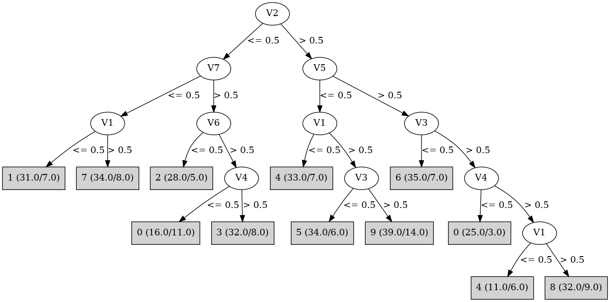

# J48

# SimpleCart Decision Tree

V2 < 0.5

* V7 < 0.5

*   * V1 < 0.5: 1(24.0/7.0)

*   * V1 >= 0.5: 7(26.0/8.0)

* V7 >= 0.5

*   * V6 < 0.5: 2(23.0/5.0)

*   * V6 >= 0.5: 3(27.0/21.0)

V2 >= 0.5

* V5 < 0.5

*   * V1 < 0.5: 4(26.0/7.0)

*   * V1 >= 0.5

*   *   * V3 < 0.5: 5(28.0/6.0)

*   *   * V3 >= 0.5: 9(25.0/14.0)

* V5 >= 0.5

*   * V3 < 0.5: 6(28.0/7.0)

*   * V3 >= 0.5

*   *   * V4 < 0.5: 0(22.0/3.0)

*   *   * V4 >= 0.5

*   *   *   * V7 < 0.5: 4(5.0/2.0)

*   *   *   * V7 >= 0.5: 8(24.0/12.0)

# PART

Decision list:

conditions|predicted class
---|---
V2 <= 0.5 AND V7 <= 0.5 AND V1 <= 0.5| 1 (31.0/7.0)
V2 <= 0.5 AND V7 <= 0.5 AND V4 <= 0.5| 7 (26.0/2.0)
V5 > 0.5 AND V6 <= 0.5 AND V2 <= 0.5| 2 (23.0/1.0)
V3 <= 0.5 AND V5 <= 0.5 AND V1 > 0.5| 5 (39.0/9.0)
V5 > 0.5 AND V3 > 0.5 AND V4 > 0.5 AND V7 > 0.5| 8 (39.0/14.0)
V5 > 0.5 AND V3 > 0.5 AND V4 <= 0.5| 0 (28.0/3.0)
V5 > 0.5 AND V3 <= 0.5| 6 (37.0/9.0)
V2 <= 0.5 AND V6 > 0.5| 3 (40.0/14.0)
V1 > 0.5 AND V2 > 0.5| 9 (41.0/16.0)
V1 <= 0.5| 4 (39.0/8.0)
| 2 (7.0/3.0)

# JRip

Decision list:

conditions|predicted class
---|---
(V7 <= 0) and (V2 <= 0) and (V1 <= 0)|1 (31.0/7.0)
(V1 <= 0) and (V7 <= 0) and (V4 >= 1)|4 (27.0/1.0)
(V6 <= 0) and (V2 <= 0) and (V5 >= 1)|2 (25.0/3.0)
(V4 <= 0) and (V5 >= 1)|0 (35.0/8.0)
(V3 <= 0) and (V5 >= 1)|6 (30.0/5.0)
(V2 >= 1) and (V5 <= 0) and (V3 >= 1)|9 (49.0/20.0)
(V2 <= 0) and (V4 >= 1) and (V3 >= 1) and (V6 >= 1) and (V5 <= 0) and (V7 >= 1)|3 (26.0/3.0)
(V5 >= 1)|8 (41.0/14.0)
(V2 >= 1)|5 (36.0/7.0)
|7 (50.0/23.0)

# Decision Table

Non matches covered by Majority class

v1|v3|v4|v5|v6|v7|target
---|---|---|---|---|---|---
(0.5-inf)|(0.5-inf)|(0.5-inf)|(0.5-inf)|(0.5-inf)|(0.5-inf)|8
(-inf-0.5]|(0.5-inf)|(0.5-inf)|(0.5-inf)|(0.5-inf)|(0.5-inf)|8
(0.5-inf)|(-inf-0.5]|(0.5-inf)|(0.5-inf)|(0.5-inf)|(0.5-inf)|6
(-inf-0.5]|(-inf-0.5]|(0.5-inf)|(0.5-inf)|(0.5-inf)|(0.5-inf)|6
(-inf-0.5]|(0.5-inf)|(-inf-0.5]|(0.5-inf)|(0.5-inf)|(0.5-inf)|0
(0.5-inf)|(0.5-inf)|(-inf-0.5]|(0.5-inf)|(0.5-inf)|(0.5-inf)|0
(0.5-inf)|(-inf-0.5]|(-inf-0.5]|(0.5-inf)|(0.5-inf)|(0.5-inf)|0
(-inf-0.5]|(0.5-inf)|(0.5-inf)|(-inf-0.5]|(0.5-inf)|(0.5-inf)|3
(0.5-inf)|(0.5-inf)|(0.5-inf)|(-inf-0.5]|(0.5-inf)|(0.5-inf)|3
(-inf-0.5]|(-inf-0.5]|(0.5-inf)|(-inf-0.5]|(0.5-inf)|(0.5-inf)|5
(-inf-0.5]|(0.5-inf)|(0.5-inf)|(0.5-inf)|(-inf-0.5]|(0.5-inf)|0
(0.5-inf)|(0.5-inf)|(0.5-inf)|(0.5-inf)|(-inf-0.5]|(0.5-inf)|2
(0.5-inf)|(-inf-0.5]|(0.5-inf)|(-inf-0.5]|(0.5-inf)|(0.5-inf)|5
(-inf-0.5]|(0.5-inf)|(-inf-0.5]|(-inf-0.5]|(0.5-inf)|(0.5-inf)|8
(0.5-inf)|(0.5-inf)|(0.5-inf)|(0.5-inf)|(0.5-inf)|(-inf-0.5]|8
(-inf-0.5]|(0.5-inf)|(0.5-inf)|(0.5-inf)|(0.5-inf)|(-inf-0.5]|4
(0.5-inf)|(0.5-inf)|(-inf-0.5]|(-inf-0.5]|(0.5-inf)|(0.5-inf)|0
(-inf-0.5]|(-inf-0.5]|(0.5-inf)|(0.5-inf)|(-inf-0.5]|(0.5-inf)|0
(0.5-inf)|(-inf-0.5]|(0.5-inf)|(0.5-inf)|(-inf-0.5]|(0.5-inf)|2
(-inf-0.5]|(-inf-0.5]|(0.5-inf)|(0.5-inf)|(0.5-inf)|(-inf-0.5]|0
(-inf-0.5]|(0.5-inf)|(-inf-0.5]|(0.5-inf)|(-inf-0.5]|(0.5-inf)|0
(0.5-inf)|(-inf-0.5]|(0.5-inf)|(0.5-inf)|(0.5-inf)|(-inf-0.5]|6
(0.5-inf)|(0.5-inf)|(-inf-0.5]|(0.5-inf)|(-inf-0.5]|(0.5-inf)|0
(0.5-inf)|(-inf-0.5]|(-inf-0.5]|(-inf-0.5]|(0.5-inf)|(0.5-inf)|5
(-inf-0.5]|(0.5-inf)|(0.5-inf)|(-inf-0.5]|(-inf-0.5]|(0.5-inf)|9
(0.5-inf)|(-inf-0.5]|(-inf-0.5]|(0.5-inf)|(-inf-0.5]|(0.5-inf)|2
(-inf-0.5]|(0.5-inf)|(-inf-0.5]|(0.5-inf)|(0.5-inf)|(-inf-0.5]|1
(0.5-inf)|(0.5-inf)|(-inf-0.5]|(0.5-inf)|(0.5-inf)|(-inf-0.5]|0
(0.5-inf)|(0.5-inf)|(0.5-inf)|(-inf-0.5]|(-inf-0.5]|(0.5-inf)|2
(0.5-inf)|(-inf-0.5]|(-inf-0.5]|(0.5-inf)|(0.5-inf)|(-inf-0.5]|0
(0.5-inf)|(-inf-0.5]|(0.5-inf)|(-inf-0.5]|(-inf-0.5]|(0.5-inf)|5
(-inf-0.5]|(0.5-inf)|(0.5-inf)|(-inf-0.5]|(0.5-inf)|(-inf-0.5]|4
(0.5-inf)|(0.5-inf)|(0.5-inf)|(-inf-0.5]|(0.5-inf)|(-inf-0.5]|7
(0.5-inf)|(-inf-0.5]|(0.5-inf)|(-inf-0.5]|(0.5-inf)|(-inf-0.5]|0
(-inf-0.5]|(-inf-0.5]|(0.5-inf)|(-inf-0.5]|(0.5-inf)|(-inf-0.5]|4
(0.5-inf)|(0.5-inf)|(0.5-inf)|(0.5-inf)|(-inf-0.5]|(-inf-0.5]|2
(0.5-inf)|(0.5-inf)|(-inf-0.5]|(-inf-0.5]|(-inf-0.5]|(0.5-inf)|0
(-inf-0.5]|(0.5-inf)|(-inf-0.5]|(-inf-0.5]|(0.5-inf)|(-inf-0.5]|1
(0.5-inf)|(0.5-inf)|(-inf-0.5]|(-inf-0.5]|(0.5-inf)|(-inf-0.5]|7
(0.5-inf)|(0.5-inf)|(-inf-0.5]|(0.5-inf)|(-inf-0.5]|(-inf-0.5]|0
(0.5-inf)|(-inf-0.5]|(-inf-0.5]|(-inf-0.5]|(0.5-inf)|(-inf-0.5]|1
(-inf-0.5]|(-inf-0.5]|(-inf-0.5]|(-inf-0.5]|(0.5-inf)|(-inf-0.5]|1
(0.5-inf)|(0.5-inf)|(0.5-inf)|(-inf-0.5]|(-inf-0.5]|(-inf-0.5]|0
(0.5-inf)|(-inf-0.5]|(-inf-0.5]|(0.5-inf)|(-inf-0.5]|(-inf-0.5]|0
(-inf-0.5]|(-inf-0.5]|(0.5-inf)|(-inf-0.5]|(-inf-0.5]|(-inf-0.5]|0
(-inf-0.5]|(0.5-inf)|(-inf-0.5]|(-inf-0.5]|(-inf-0.5]|(-inf-0.5]|1
(0.5-inf)|(0.5-inf)|(-inf-0.5]|(-inf-0.5]|(-inf-0.5]|(-inf-0.5]|0
(0.5-inf)|(-inf-0.5]|(-inf-0.5]|(-inf-0.5]|(-inf-0.5]|(-inf-0.5]|7
(-inf-0.5]|(-inf-0.5]|(-inf-0.5]|(-inf-0.5]|(-inf-0.5]|(-inf-0.5]|0

