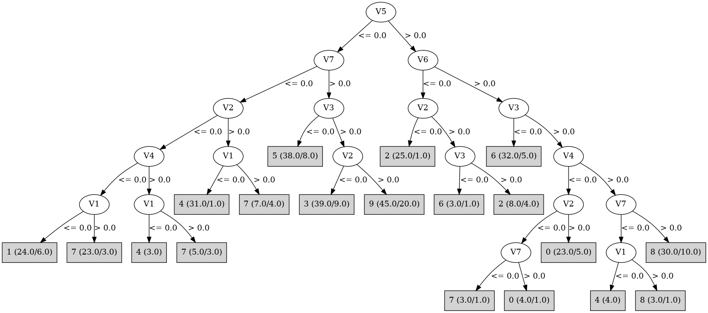

# J48

# SimpleCart Decision Tree

V5 < 0.5

* V7 < 0.5

*   * V4 < 0.5

*   *   * V1 < 0.5: 1(19.0/8.0)

*   *   * V1 >= 0.5

*   *   *   * V3 < 0.5: 7(2.0/2.0)

*   *   *   * V3 >= 0.5: 7(20.0/2.0)

*   * V4 >= 0.5

*   *   * V1 < 0.5: 4(31.0/0.0)

*   *   * V1 >= 0.5: 7(3.0/6.0)

* V7 >= 0.5

*   * V3 < 0.5

*   *   * V2 < 0.5: 5(3.0/2.0)

*   *   * V2 >= 0.5: 5(27.0/6.0)

*   * V3 >= 0.5

*   *   * V2 < 0.5

*   *   *   * V4 < 0.5: 3(2.0/6.0)

*   *   *   * V4 >= 0.5

*   *   *   *   * V6 < 0.5: 3(4.0/2.0)

*   *   *   *   * V6 >= 0.5

*   *   *   *   *   * V1 < 0.5: 3(6.0/0.0)

*   *   *   *   *   * V1 >= 0.5: 3(18.0/1.0)

*   *   * V2 >= 0.5

*   *   *   * V1 < 0.5: 4(4.0/5.0)

*   *   *   * V1 >= 0.5: 9(21.0/15.0)

V5 >= 0.5

* V6 < 0.5

*   * V2 < 0.5

*   *   * V7 < 0.5: 2(5.0/1.0)

*   *   * V7 >= 0.5: 2(19.0/0.0)

*   * V2 >= 0.5: 2(5.0/6.0)

* V6 >= 0.5

*   * V3 < 0.5

*   *   * V1 < 0.5: 6(4.0/2.0)

*   *   * V1 >= 0.5

*   *   *   * V4 < 0.5: 6(4.0/1.0)

*   *   *   * V4 >= 0.5: 6(19.0/2.0)

*   * V3 >= 0.5

*   *   * V4 < 0.5

*   *   *   * V2 < 0.5: 0(3.0/4.0)

*   *   *   * V2 >= 0.5

*   *   *   *   * V7 < 0.5: 0(4.0/0.0)

*   *   *   *   * V7 >= 0.5: 0(14.0/5.0)

*   *   * V4 >= 0.5

*   *   *   * V7 < 0.5: 4(4.0/3.0)

*   *   *   * V7 >= 0.5: 8(20.0/10.0)

# PART

Decision list:

conditions|predicted class
---|---
V5 > 0.5 AND V6 > 0.5 AND V3 > 0.5 AND V4 > 0.5| 8 (35.0/14.0)
V5 > 0.5 AND V6 <= 0.5| 2 (31.0/6.0)
V5 > 0.5 AND V3 <= 0.5| 6 (27.0/3.0)
V7 <= 0.5 AND V2 > 0.5 AND V4 > 0.5| 4 (28.0/3.0)
V7 <= 0.5 AND V2 <= 0.5 AND V1 <= 0.5| 1 (26.0/9.0)
V3 <= 0.5| 5 (35.0/8.0)
V2 <= 0.5 AND V4 > 0.5| 3 (31.0/6.0)
V2 > 0.5 AND V5 <= 0.5 AND V1 > 0.5| 9 (34.0/15.0)
V2 <= 0.5| 7 (29.0/10.0)
V5 > 0.5| 0 (20.0/5.0)
| 4 (11.0/6.0)

# JRip

Decision list:

conditions|predicted class
---|---
(V7 <= 0) and (V2 <= 0) and (V1 <= 0) and (V4 <= 0) and (V3 <= 0)|1 (5.0/0.0)
(V7 <= 0) and (V2 <= 0) and (V1 <= 0) and (V4 <= 0) and (V6 >= 1)|1 (18.0/5.0)
(V4 <= 0) and (V5 >= 1) and (V2 >= 1) and (V3 >= 1) and (V7 <= 0)|0 (4.0/0.0)
(V4 <= 0) and (V5 >= 1) and (V2 >= 1) and (V3 >= 1)|0 (20.0/5.0)
(V4 <= 0) and (V7 >= 1) and (V5 >= 1) and (V6 >= 1) and (V2 <= 0)|0 (4.0/1.0)
(V3 <= 0) and (V5 <= 0) and (V7 >= 1) and (V2 >= 1) and (V6 <= 0)|5 (4.0/0.0)
(V3 <= 0) and (V5 <= 0) and (V7 >= 1) and (V2 >= 1) and (V1 >= 1) and (V4 >= 1)|5 (22.0/4.0)
(V3 <= 0) and (V5 <= 0) and (V7 >= 1) and (V1 <= 0)|5 (5.0/1.0)
(V3 <= 0) and (V5 <= 0) and (V1 >= 1) and (V2 >= 1)|5 (6.0/1.0)
(V6 <= 0) and (V5 >= 1) and (V2 <= 0) and (V7 >= 1)|2 (19.0/0.0)
(V6 <= 0) and (V5 >= 1) and (V2 <= 0)|2 (6.0/1.0)
(V6 <= 0) and (V5 >= 1) and (V3 >= 1)|2 (7.0/3.0)
(V5 >= 1) and (V3 >= 1) and (V7 >= 1) and (V1 >= 1) and (V2 >= 1)|8 (23.0/6.0)
(V4 <= 0) and (V7 <= 0) and (V1 >= 1) and (V3 >= 1)|7 (24.0/2.0)
(V3 <= 0) and (V5 >= 1) and (V1 >= 1) and (V6 >= 1) and (V4 >= 1)|6 (21.0/2.0)
(V3 <= 0) and (V5 >= 1) and (V4 <= 0)|6 (5.0/1.0)
(V3 <= 0) and (V5 >= 1)|6 (9.0/3.0)
(V7 >= 1) and (V2 >= 1) and (V1 >= 1) and (V6 >= 1) and (V4 <= 0)|9 (5.0/2.0)
(V7 >= 1) and (V2 >= 1) and (V1 >= 1) and (V6 >= 1)|9 (28.0/11.0)
(V2 <= 0) and (V7 >= 1) and (V4 >= 1) and (V6 >= 1) and (V3 >= 1) and (V5 <= 0) and (V1 <= 0)|3 (6.0/0.0)
(V2 <= 0) and (V7 >= 1) and (V4 >= 1) and (V6 >= 1) and (V3 >= 1) and (V5 <= 0)|3 (19.0/1.0)
(V2 <= 0) and (V6 <= 0) and (V7 >= 1) and (V1 >= 1) and (V4 >= 1)|3 (5.0/1.0)
|4 (85.0/43.0)

# Decision Table

Non matches covered by Majority class

v1|v2|v3|v4|v5|v6|v7|target
---|---|---|---|---|---|---|---
(-inf-0.5]|(0.5-inf)|(0.5-inf)|(0.5-inf)|(0.5-inf)|(0.5-inf)|(0.5-inf)|8
(0.5-inf)|(0.5-inf)|(0.5-inf)|(0.5-inf)|(0.5-inf)|(0.5-inf)|(0.5-inf)|8
(0.5-inf)|(-inf-0.5]|(0.5-inf)|(0.5-inf)|(0.5-inf)|(0.5-inf)|(0.5-inf)|0
(-inf-0.5]|(0.5-inf)|(-inf-0.5]|(0.5-inf)|(0.5-inf)|(0.5-inf)|(0.5-inf)|6
(0.5-inf)|(0.5-inf)|(-inf-0.5]|(0.5-inf)|(0.5-inf)|(0.5-inf)|(0.5-inf)|6
(-inf-0.5]|(0.5-inf)|(0.5-inf)|(-inf-0.5]|(0.5-inf)|(0.5-inf)|(0.5-inf)|0
(0.5-inf)|(-inf-0.5]|(-inf-0.5]|(0.5-inf)|(0.5-inf)|(0.5-inf)|(0.5-inf)|0
(0.5-inf)|(0.5-inf)|(0.5-inf)|(-inf-0.5]|(0.5-inf)|(0.5-inf)|(0.5-inf)|0
(-inf-0.5]|(-inf-0.5]|(0.5-inf)|(-inf-0.5]|(0.5-inf)|(0.5-inf)|(0.5-inf)|0
(-inf-0.5]|(0.5-inf)|(0.5-inf)|(0.5-inf)|(-inf-0.5]|(0.5-inf)|(0.5-inf)|4
(0.5-inf)|(-inf-0.5]|(0.5-inf)|(-inf-0.5]|(0.5-inf)|(0.5-inf)|(0.5-inf)|0
(0.5-inf)|(0.5-inf)|(0.5-inf)|(0.5-inf)|(-inf-0.5]|(0.5-inf)|(0.5-inf)|9
(-inf-0.5]|(-inf-0.5]|(0.5-inf)|(0.5-inf)|(-inf-0.5]|(0.5-inf)|(0.5-inf)|3
(0.5-inf)|(-inf-0.5]|(0.5-inf)|(0.5-inf)|(-inf-0.5]|(0.5-inf)|(0.5-inf)|3
(0.5-inf)|(0.5-inf)|(0.5-inf)|(0.5-inf)|(0.5-inf)|(-inf-0.5]|(0.5-inf)|2
(0.5-inf)|(0.5-inf)|(-inf-0.5]|(-inf-0.5]|(0.5-inf)|(0.5-inf)|(0.5-inf)|6
(-inf-0.5]|(0.5-inf)|(0.5-inf)|(0.5-inf)|(0.5-inf)|(0.5-inf)|(-inf-0.5]|4
(0.5-inf)|(0.5-inf)|(0.5-inf)|(0.5-inf)|(0.5-inf)|(0.5-inf)|(-inf-0.5]|8
(-inf-0.5]|(-inf-0.5]|(0.5-inf)|(0.5-inf)|(0.5-inf)|(-inf-0.5]|(0.5-inf)|2
(0.5-inf)|(-inf-0.5]|(0.5-inf)|(0.5-inf)|(0.5-inf)|(-inf-0.5]|(0.5-inf)|2
(0.5-inf)|(0.5-inf)|(-inf-0.5]|(0.5-inf)|(-inf-0.5]|(0.5-inf)|(0.5-inf)|5
(-inf-0.5]|(0.5-inf)|(-inf-0.5]|(0.5-inf)|(-inf-0.5]|(0.5-inf)|(0.5-inf)|4
(0.5-inf)|(-inf-0.5]|(0.5-inf)|(0.5-inf)|(0.5-inf)|(0.5-inf)|(-inf-0.5]|0
(0.5-inf)|(-inf-0.5]|(-inf-0.5]|(0.5-inf)|(-inf-0.5]|(0.5-inf)|(0.5-inf)|0
(-inf-0.5]|(0.5-inf)|(0.5-inf)|(-inf-0.5]|(-inf-0.5]|(0.5-inf)|(0.5-inf)|0
(-inf-0.5]|(-inf-0.5]|(-inf-0.5]|(0.5-inf)|(-inf-0.5]|(0.5-inf)|(0.5-inf)|5
(0.5-inf)|(0.5-inf)|(0.5-inf)|(-inf-0.5]|(-inf-0.5]|(0.5-inf)|(0.5-inf)|0
(0.5-inf)|(0.5-inf)|(-inf-0.5]|(0.5-inf)|(0.5-inf)|(-inf-0.5]|(0.5-inf)|6
(0.5-inf)|(-inf-0.5]|(-inf-0.5]|(0.5-inf)|(0.5-inf)|(-inf-0.5]|(0.5-inf)|2
(0.5-inf)|(-inf-0.5]|(0.5-inf)|(-inf-0.5]|(-inf-0.5]|(0.5-inf)|(0.5-inf)|7
(-inf-0.5]|(-inf-0.5]|(0.5-inf)|(-inf-0.5]|(-inf-0.5]|(0.5-inf)|(0.5-inf)|0
(0.5-inf)|(0.5-inf)|(-inf-0.5]|(0.5-inf)|(0.5-inf)|(0.5-inf)|(-inf-0.5]|0
(0.5-inf)|(0.5-inf)|(0.5-inf)|(-inf-0.5]|(0.5-inf)|(-inf-0.5]|(0.5-inf)|0
(-inf-0.5]|(-inf-0.5]|(-inf-0.5]|(0.5-inf)|(0.5-inf)|(-inf-0.5]|(0.5-inf)|0
(0.5-inf)|(0.5-inf)|(0.5-inf)|(-inf-0.5]|(0.5-inf)|(0.5-inf)|(-inf-0.5]|0
(0.5-inf)|(-inf-0.5]|(0.5-inf)|(-inf-0.5]|(0.5-inf)|(-inf-0.5]|(0.5-inf)|0
(-inf-0.5]|(0.5-inf)|(0.5-inf)|(-inf-0.5]|(0.5-inf)|(0.5-inf)|(-inf-0.5]|0
(-inf-0.5]|(-inf-0.5]|(0.5-inf)|(-inf-0.5]|(0.5-inf)|(-inf-0.5]|(0.5-inf)|2
(0.5-inf)|(0.5-inf)|(-inf-0.5]|(-inf-0.5]|(-inf-0.5]|(0.5-inf)|(0.5-inf)|5
(-inf-0.5]|(0.5-inf)|(0.5-inf)|(0.5-inf)|(-inf-0.5]|(-inf-0.5]|(0.5-inf)|0
(0.5-inf)|(0.5-inf)|(0.5-inf)|(0.5-inf)|(-inf-0.5]|(-inf-0.5]|(0.5-inf)|2
(-inf-0.5]|(-inf-0.5]|(0.5-inf)|(0.5-inf)|(-inf-0.5]|(-inf-0.5]|(0.5-inf)|0
(0.5-inf)|(0.5-inf)|(0.5-inf)|(0.5-inf)|(-inf-0.5]|(0.5-inf)|(-inf-0.5]|7
(0.5-inf)|(-inf-0.5]|(0.5-inf)|(-inf-0.5]|(0.5-inf)|(0.5-inf)|(-inf-0.5]|7
(0.5-inf)|(-inf-0.5]|(-inf-0.5]|(-inf-0.5]|(-inf-0.5]|(0.5-inf)|(0.5-inf)|5
(-inf-0.5]|(-inf-0.5]|(0.5-inf)|(-inf-0.5]|(0.5-inf)|(0.5-inf)|(-inf-0.5]|0
(0.5-inf)|(-inf-0.5]|(0.5-inf)|(0.5-inf)|(-inf-0.5]|(-inf-0.5]|(0.5-inf)|3
(-inf-0.5]|(0.5-inf)|(0.5-inf)|(0.5-inf)|(-inf-0.5]|(0.5-inf)|(-inf-0.5]|4
(0.5-inf)|(-inf-0.5]|(-inf-0.5]|(-inf-0.5]|(0.5-inf)|(-inf-0.5]|(0.5-inf)|0
(-inf-0.5]|(-inf-0.5]|(0.5-inf)|(0.5-inf)|(-inf-0.5]|(0.5-inf)|(-inf-0.5]|4
(0.5-inf)|(-inf-0.5]|(0.5-inf)|(0.5-inf)|(-inf-0.5]|(0.5-inf)|(-inf-0.5]|1
(0.5-inf)|(0.5-inf)|(-inf-0.5]|(-inf-0.5]|(0.5-inf)|(0.5-inf)|(-inf-0.5]|0
(0.5-inf)|(0.5-inf)|(-inf-0.5]|(0.5-inf)|(-inf-0.5]|(-inf-0.5]|(0.5-inf)|5
(0.5-inf)|(0.5-inf)|(-inf-0.5]|(0.5-inf)|(-inf-0.5]|(0.5-inf)|(-inf-0.5]|0
(-inf-0.5]|(0.5-inf)|(-inf-0.5]|(0.5-inf)|(-inf-0.5]|(0.5-inf)|(-inf-0.5]|4
(-inf-0.5]|(-inf-0.5]|(0.5-inf)|(0.5-inf)|(0.5-inf)|(-inf-0.5]|(-inf-0.5]|0
(0.5-inf)|(-inf-0.5]|(0.5-inf)|(0.5-inf)|(0.5-inf)|(-inf-0.5]|(-inf-0.5]|2
(-inf-0.5]|(-inf-0.5]|(0.5-inf)|(-inf-0.5]|(-inf-0.5]|(-inf-0.5]|(0.5-inf)|0
(0.5-inf)|(-inf-0.5]|(0.5-inf)|(-inf-0.5]|(-inf-0.5]|(-inf-0.5]|(0.5-inf)|0
(0.5-inf)|(0.5-inf)|(0.5-inf)|(-inf-0.5]|(-inf-0.5]|(0.5-inf)|(-inf-0.5]|7
(-inf-0.5]|(0.5-inf)|(0.5-inf)|(-inf-0.5]|(-inf-0.5]|(0.5-inf)|(-inf-0.5]|4
(0.5-inf)|(-inf-0.5]|(0.5-inf)|(-inf-0.5]|(-inf-0.5]|(0.5-inf)|(-inf-0.5]|7
(-inf-0.5]|(-inf-0.5]|(0.5-inf)|(-inf-0.5]|(-inf-0.5]|(0.5-inf)|(-inf-0.5]|1
(0.5-inf)|(0.5-inf)|(-inf-0.5]|(-inf-0.5]|(-inf-0.5]|(0.5-inf)|(-inf-0.5]|0
(0.5-inf)|(-inf-0.5]|(0.5-inf)|(-inf-0.5]|(0.5-inf)|(-inf-0.5]|(-inf-0.5]|0
(0.5-inf)|(-inf-0.5]|(0.5-inf)|(0.5-inf)|(-inf-0.5]|(-inf-0.5]|(-inf-0.5]|0
(-inf-0.5]|(-inf-0.5]|(0.5-inf)|(0.5-inf)|(-inf-0.5]|(-inf-0.5]|(-inf-0.5]|0
(0.5-inf)|(-inf-0.5]|(-inf-0.5]|(-inf-0.5]|(-inf-0.5]|(0.5-inf)|(-inf-0.5]|0
(-inf-0.5]|(-inf-0.5]|(-inf-0.5]|(-inf-0.5]|(-inf-0.5]|(0.5-inf)|(-inf-0.5]|1
(-inf-0.5]|(0.5-inf)|(-inf-0.5]|(0.5-inf)|(-inf-0.5]|(-inf-0.5]|(-inf-0.5]|0
(-inf-0.5]|(-inf-0.5]|(0.5-inf)|(-inf-0.5]|(-inf-0.5]|(-inf-0.5]|(-inf-0.5]|3
(0.5-inf)|(-inf-0.5]|(0.5-inf)|(-inf-0.5]|(-inf-0.5]|(-inf-0.5]|(-inf-0.5]|7
(0.5-inf)|(-inf-0.5]|(-inf-0.5]|(-inf-0.5]|(-inf-0.5]|(-inf-0.5]|(-inf-0.5]|7
(-inf-0.5]|(-inf-0.5]|(-inf-0.5]|(-inf-0.5]|(-inf-0.5]|(-inf-0.5]|(-inf-0.5]|0

