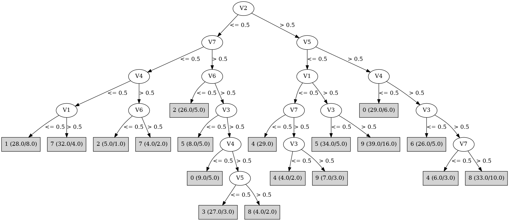

# J48

# SimpleCart Decision Tree

V2 < 0.5

* V7 < 0.5

*   * V1 < 0.5: 1(20.0/11.0)

*   * V1 >= 0.5: 7(30.0/8.0)

* V7 >= 0.5

*   * V6 < 0.5: 2(21.0/5.0)

*   * V6 >= 0.5

*   *   * V4 < 0.5: 0(4.0/9.0)

*   *   * V4 >= 0.5

*   *   *   * V3 < 0.5: 5(2.0/2.0)

*   *   *   * V3 >= 0.5

*   *   *   *   * V5 < 0.5

*   *   *   *   *   * V1 < 0.5: 3(7.0/0.0)

*   *   *   *   *   * V1 >= 0.5: 3(17.0/3.0)

*   *   *   *   * V5 >= 0.5: 8(2.0/2.0)

V2 >= 0.5

* V5 < 0.5

*   * V1 < 0.5: 4(33.0/7.0)

*   * V1 >= 0.5

*   *   * V3 < 0.5: 5(29.0/5.0)

*   *   * V3 >= 0.5

*   *   *   * V4 < 0.5: 9(4.0/4.0)

*   *   *   * V4 >= 0.5

*   *   *   *   * V6 < 0.5: 9(2.0/1.0)

*   *   *   *   * V6 >= 0.5

*   *   *   *   *   * V7 < 0.5: 4(1.0/1.0)

*   *   *   *   *   * V7 >= 0.5: 9(16.0/10.0)

* V5 >= 0.5

*   * V4 < 0.5: 0(23.0/6.0)

*   * V4 >= 0.5

*   *   * V3 < 0.5: 6(21.0/5.0)

*   *   * V3 >= 0.5: 8(25.0/14.0)

# PART

Decision list:

conditions|predicted class
---|---
V2 <= 0 AND V7 <= 0 AND V4 <= 0 AND V1 > 0 AND V5 <= 0 AND V3 > 0 AND V6 > 0| 7 (24.0/2.0)
V2 <= 0 AND V7 <= 0 AND V4 <= 0 AND V6 > 0 AND V5 <= 0 AND V3 <= 0 AND V1 <= 0| 1 (4.0)
V2 <= 0 AND V7 <= 0 AND V4 <= 0 AND V6 > 0 AND V5 <= 0 AND V1 <= 0| 1 (19.0/7.0)
V5 > 0 AND V6 <= 0 AND V2 <= 0 AND V4 > 0| 2 (18.0)
V3 <= 0 AND V5 > 0 AND V6 > 0 AND V4 > 0 AND V7 > 0 AND V1 > 0| 6 (17.0/1.0)
V3 <= 0 AND V5 <= 0 AND V1 <= 0 AND V4 > 0 AND V7 <= 0| 4 (7.0)
V3 <= 0 AND V5 <= 0 AND V2 > 0 AND V1 > 0 AND V4 > 0 AND V6 > 0 AND V7 > 0| 5 (23.0/3.0)
V5 > 0 AND V4 <= 0 AND V6 > 0 AND V2 > 0 AND V3 > 0 AND V1 > 0 AND V7 > 0| 0 (18.0/3.0)
V2 <= 0 AND V7 <= 0 AND V1 <= 0 AND V5 <= 0| 1 (3.0/2.0)
V2 <= 0 AND V7 <= 0 AND V1 > 0 AND V6 <= 0 AND V5 <= 0| 7 (4.0/1.0)
V2 <= 0 AND V7 <= 0 AND V1 <= 0| 1 (3.0)
V5 > 0 AND V4 <= 0 AND V6 > 0 AND V3 > 0 AND V1 > 0| 0 (5.0)
V3 <= 0 AND V5 <= 0 AND V2 > 0 AND V1 > 0 AND V7 > 0 AND V4 <= 0| 5 (4.0/1.0)
V3 <= 0 AND V5 <= 0 AND V4 > 0 AND V1 > 0 AND V2 > 0| 5 (5.0)
V7 <= 0 AND V1 <= 0| 4 (26.0)
V5 > 0 AND V4 <= 0 AND V7 <= 0| 7 (3.0/1.0)
V5 > 0 AND V3 > 0 AND V4 <= 0 AND V2 > 0 AND V1 <= 0| 0 (3.0/1.0)
V5 > 0 AND V4 <= 0 AND V6 <= 0 AND V2 > 0| 0 (3.0/1.0)
V5 > 0 AND V3 > 0 AND V6 > 0 AND V2 > 0 AND V1 > 0 AND V7 > 0| 8 (23.0/5.0)
V5 > 0 AND V6 <= 0 AND V3 > 0| 2 (8.0/4.0)
V3 > 0 AND V2 <= 0 AND V7 > 0 AND V4 > 0 AND V6 > 0 AND V5 <= 0 AND V1 > 0| 3 (20.0/3.0)
V3 > 0 AND V2 > 0 AND V5 > 0 AND V1 <= 0| 0 (4.0/3.0)
V3 > 0 AND V2 > 0 AND V4 > 0 AND V5 <= 0 AND V6 > 0 AND V1 > 0 AND V7 > 0| 9 (26.0/10.0)
V2 > 0 AND V3 > 0 AND V5 <= 0 AND V4 > 0 AND V6 > 0 AND V1 <= 0| 9 (5.0/2.0)
V2 > 0 AND V3 > 0 AND V5 <= 0 AND V7 > 0 AND V4 <= 0| 9 (8.0/4.0)
V5 > 0 AND V3 > 0 AND V2 <= 0| 0 (6.0/4.0)
V5 > 0 AND V6 > 0 AND V4 > 0 AND V3 <= 0 AND V1 <= 0| 6 (4.0/1.0)
V5 > 0 AND V6 > 0 AND V3 <= 0 AND V4 > 0| 6 (4.0/2.0)
V2 <= 0 AND V3 > 0 AND V6 <= 0 AND V1 > 0| 2 (6.0/2.0)
V5 > 0 AND V3 <= 0 AND V6 <= 0| 2 (3.0/1.0)
V2 <= 0 AND V3 > 0 AND V7 > 0 AND V1 <= 0 AND V6 > 0| 3 (7.0)
V5 > 0 AND V3 <= 0| 0 (2.0/1.0)
V3 <= 0 AND V4 > 0 AND V2 <= 0 AND V1 <= 0| 5 (2.0)
V2 > 0 AND V5 <= 0 AND V3 <= 0 AND V1 <= 0| 4 (4.0/2.0)
V5 <= 0 AND V2 > 0 AND V4 > 0 AND V6 <= 0| 9 (4.0/1.0)
V5 <= 0 AND V3 <= 0 AND V2 <= 0 AND V4 <= 0 AND V7 > 0| 1 (4.0/3.0)
V5 <= 0 AND V3 <= 0 AND V2 <= 0 AND V4 <= 0| 1 (2.0/1.0)
V3 <= 0| 5 (4.0/2.0)
V5 <= 0 AND V4 > 0 AND V2 <= 0| 7 (3.0)
V4 > 0 AND V5 <= 0| 4 (2.0/1.0)
V4 <= 0| 3 (8.0/5.0)
| 8 (2.0)

# JRip

Decision list:

conditions|predicted class
---|---
(V4 <= 0) and (V1 <= 0) and (V7 <= 0)|1 (30.0/10.0)
(V3 <= 0) and (V5 >= 1) and (V6 >= 1) and (V7 >= 1) and (V4 >= 1) and (V1 >= 1)|6 (17.0/1.0)
(V6 <= 0) and (V5 >= 1) and (V2 <= 0) and (V4 >= 1)|2 (18.0/0.0)
(V4 <= 0) and (V5 >= 1) and (V6 >= 1) and (V3 >= 1)|0 (27.0/4.0)
(V2 >= 1) and (V3 >= 1) and (V5 <= 0) and (V7 >= 1) and (V4 >= 1)|9 (34.0/13.0)
(V5 >= 1) and (V3 >= 1) and (V1 >= 1) and (V6 >= 1) and (V2 >= 1)|8 (25.0/5.0)
(V3 <= 0) and (V5 <= 0) and (V7 >= 1) and (V2 >= 1) and (V1 >= 1) and (V4 >= 1)|5 (26.0/3.0)
(V3 <= 0) and (V5 <= 0) and (V7 >= 1)|5 (16.0/7.0)
(V1 <= 0) and (V7 <= 0)|4 (32.0/0.0)
(V7 >= 1) and (V2 <= 0) and (V6 >= 1) and (V4 >= 1) and (V5 <= 0) and (V1 <= 0)|3 (7.0/0.0)
(V7 >= 1) and (V2 <= 0) and (V6 >= 1) and (V4 >= 1) and (V5 <= 0)|3 (20.0/3.0)
|7 (98.0/65.0)

# Decision Table

Non matches covered by IB1

v2|v3|v5|v6|v7|target
---|---|---|---|---|---
(0.5-inf)|(0.5-inf)|(0.5-inf)|(0.5-inf)|(0.5-inf)|8
(-inf-0.5]|(0.5-inf)|(0.5-inf)|(0.5-inf)|(0.5-inf)|0
(-inf-0.5]|(-inf-0.5]|(0.5-inf)|(0.5-inf)|(0.5-inf)|0
(0.5-inf)|(-inf-0.5]|(0.5-inf)|(0.5-inf)|(0.5-inf)|6
(0.5-inf)|(0.5-inf)|(-inf-0.5]|(0.5-inf)|(0.5-inf)|9
(-inf-0.5]|(0.5-inf)|(-inf-0.5]|(0.5-inf)|(0.5-inf)|3
(-inf-0.5]|(-inf-0.5]|(-inf-0.5]|(0.5-inf)|(0.5-inf)|5
(0.5-inf)|(0.5-inf)|(0.5-inf)|(-inf-0.5]|(0.5-inf)|8
(-inf-0.5]|(0.5-inf)|(0.5-inf)|(-inf-0.5]|(0.5-inf)|2
(0.5-inf)|(-inf-0.5]|(-inf-0.5]|(0.5-inf)|(0.5-inf)|5
(-inf-0.5]|(-inf-0.5]|(0.5-inf)|(-inf-0.5]|(0.5-inf)|2
(0.5-inf)|(0.5-inf)|(0.5-inf)|(0.5-inf)|(-inf-0.5]|0
(-inf-0.5]|(0.5-inf)|(0.5-inf)|(0.5-inf)|(-inf-0.5]|1
(0.5-inf)|(-inf-0.5]|(0.5-inf)|(-inf-0.5]|(0.5-inf)|2
(0.5-inf)|(0.5-inf)|(-inf-0.5]|(-inf-0.5]|(0.5-inf)|6
(0.5-inf)|(-inf-0.5]|(0.5-inf)|(0.5-inf)|(-inf-0.5]|5
(-inf-0.5]|(0.5-inf)|(-inf-0.5]|(-inf-0.5]|(0.5-inf)|2
(-inf-0.5]|(-inf-0.5]|(-inf-0.5]|(-inf-0.5]|(0.5-inf)|0
(0.5-inf)|(0.5-inf)|(-inf-0.5]|(0.5-inf)|(-inf-0.5]|4
(0.5-inf)|(-inf-0.5]|(-inf-0.5]|(-inf-0.5]|(0.5-inf)|5
(-inf-0.5]|(0.5-inf)|(-inf-0.5]|(0.5-inf)|(-inf-0.5]|7
(0.5-inf)|(0.5-inf)|(0.5-inf)|(-inf-0.5]|(-inf-0.5]|0
(-inf-0.5]|(0.5-inf)|(0.5-inf)|(-inf-0.5]|(-inf-0.5]|2
(-inf-0.5]|(-inf-0.5]|(-inf-0.5]|(0.5-inf)|(-inf-0.5]|1
(0.5-inf)|(-inf-0.5]|(-inf-0.5]|(0.5-inf)|(-inf-0.5]|4
(-inf-0.5]|(-inf-0.5]|(0.5-inf)|(-inf-0.5]|(-inf-0.5]|7
(0.5-inf)|(0.5-inf)|(-inf-0.5]|(-inf-0.5]|(-inf-0.5]|0
(-inf-0.5]|(0.5-inf)|(-inf-0.5]|(-inf-0.5]|(-inf-0.5]|7
(0.5-inf)|(-inf-0.5]|(-inf-0.5]|(-inf-0.5]|(-inf-0.5]|0
(-inf-0.5]|(-inf-0.5]|(-inf-0.5]|(-inf-0.5]|(-inf-0.5]|0

