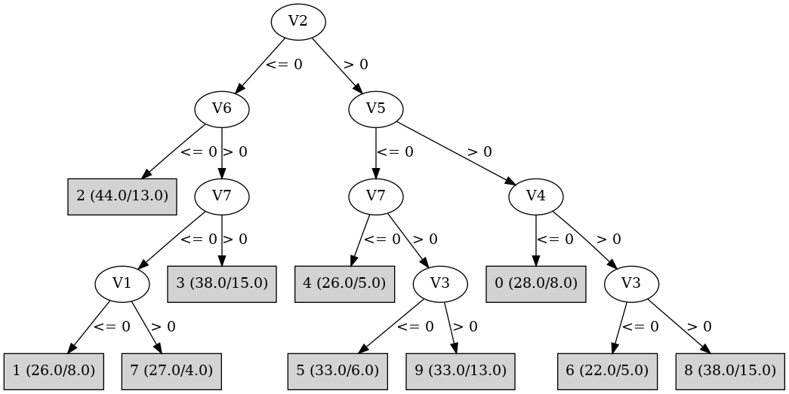

# J48

# SimpleCart Decision Tree

V2 < 0.5

* V6 < 0.5

*   * V5 < 0.5

*   *   * V1 < 0.5

*   *   *   * V4 < 0.5: 3(2.0/1.0)

*   *   *   * V4 >= 0.5: 3(1.0/2.0)

*   *   * V1 >= 0.5

*   *   *   * V4 < 0.5: 7(3.0/1.0)

*   *   *   * V4 >= 0.5: 2(4.0/2.0)

*   * V5 >= 0.5

*   *   * V4 < 0.5: 2(3.0/2.0)

*   *   * V4 >= 0.5

*   *   *   * V7 < 0.5: 2(5.0/1.0)

*   *   *   * V7 >= 0.5: 2(21.0/0.0)

* V6 >= 0.5

*   * V7 < 0.5

*   *   * V1 < 0.5: 1(19.0/8.0)

*   *   * V1 >= 0.5

*   *   *   * V4 < 0.5: 7(23.0/1.0)

*   *   *   * V4 >= 0.5: 7(3.0/3.0)

*   * V7 >= 0.5

*   *   * V4 < 0.5: 1(3.0/9.0)

*   *   * V4 >= 0.5

*   *   *   * V3 < 0.5: 5(2.0/1.0)

*   *   *   * V3 >= 0.5: 3(24.0/4.0)

V2 >= 0.5

* V5 < 0.5

*   * V3 < 0.5

*   *   * V1 < 0.5

*   *   *   * V7 < 0.5: 4(3.0/0.0)

*   *   *   * V7 >= 0.5: 4(2.0/2.0)

*   *   * V1 >= 0.5

*   *   *   * V4 < 0.5: 5(3.0/1.0)

*   *   *   * V4 >= 0.5

*   *   *   *   * V6 < 0.5: 5(3.0/0.0)

*   *   *   *   * V6 >= 0.5: 5(24.0/3.0)

*   * V3 >= 0.5

*   *   * V7 < 0.5

*   *   *   * V1 < 0.5: 4(18.0/1.0)

*   *   *   * V1 >= 0.5

*   *   *   *   * V4 < 0.5: 7(2.0/1.0)

*   *   *   *   * V4 >= 0.5: 9(2.0/1.0)

*   *   * V7 >= 0.5

*   *   *   * V1 < 0.5: 9(3.0/3.0)

*   *   *   * V1 >= 0.5

*   *   *   *   * V4 < 0.5: 9(2.0/1.0)

*   *   *   *   * V4 >= 0.5: 9(19.0/10.0)

* V5 >= 0.5

*   * V4 < 0.5

*   *   * V3 < 0.5: 6(4.0/2.0)

*   *   * V3 >= 0.5

*   *   *   * V1 < 0.5: 0(2.0/1.0)

*   *   *   * V1 >= 0.5: 0(19.0/3.0)

*   * V4 >= 0.5

*   *   * V3 < 0.5

*   *   *   * V7 < 0.5: 6(2.0/2.0)

*   *   *   * V7 >= 0.5

*   *   *   *   * V1 < 0.5: 6(3.0/2.0)

*   *   *   *   * V1 >= 0.5: 6(14.0/1.0)

*   *   * V3 >= 0.5

*   *   *   * V7 < 0.5: 4(5.0/2.0)

*   *   *   * V7 >= 0.5

*   *   *   *   * V6 < 0.5: 2(3.0/3.0)

*   *   *   *   * V6 >= 0.5

*   *   *   *   *   * V1 < 0.5: 8(3.0/2.0)

*   *   *   *   *   * V1 >= 0.5: 8(18.0/7.0)

# PART

Decision list:

conditions|predicted class
---|---
V2 <= 0.5 AND V6 <= 0.5 AND V5 > 0.5| 2 (32.0/3.0)
V2 <= 0.5 AND V7 <= 0.5 AND V4 <= 0.5 AND V1 <= 0.5| 1 (28.0/8.0)
V5 > 0.5 AND V4 <= 0.5 AND V2 > 0.5 AND V3 > 0.5| 0 (25.0/4.0)
V5 > 0.5 AND V3 > 0.5 AND V7 > 0.5| 8 (38.0/13.0)
V5 > 0.5 AND V2 > 0.5 AND V3 <= 0.5| 6 (30.0/7.0)
V7 <= 0.5 AND V1 > 0.5 AND V2 <= 0.5| 7 (34.0/5.0)
V7 <= 0.5 AND V4 > 0.5 AND V1 <= 0.5| 4 (29.0/1.0)
V3 <= 0.5| 5 (46.0/11.0)
V2 <= 0.5 AND V6 > 0.5 AND V4 > 0.5| 3 (26.0/3.0)
V2 > 0.5 AND V7 > 0.5| 9 (38.0/14.0)
V6 > 0.5 AND V4 <= 0.5| 7 (11.0/7.0)
| 2 (13.0/8.0)

# JRip

Decision list:

conditions|predicted class
---|---
(V4 <= 0) and (V5 >= 1) and (V2 >= 1) and (V3 >= 1) and (V1 >= 1)|0 (22.0/3.0)
(V4 <= 0) and (V1 <= 0) and (V7 <= 0)|1 (29.0/8.0)
(V3 <= 0) and (V5 >= 1) and (V2 >= 1) and (V7 >= 1) and (V1 >= 1) and (V4 >= 1)|6 (15.0/1.0)
(V5 >= 1) and (V3 <= 0) and (V2 >= 1) and (V6 >= 1)|6 (14.0/5.0)
(V1 <= 0) and (V7 <= 0) and (V6 >= 1)|4 (27.0/0.0)
(V5 >= 1) and (V2 >= 1) and (V6 >= 1) and (V1 >= 1)|8 (26.0/7.0)
(V2 >= 1) and (V3 >= 1) and (V5 <= 0) and (V4 >= 1)|9 (37.0/13.0)
(V3 <= 0) and (V2 >= 1) and (V1 >= 1) and (V4 >= 1)|5 (30.0/3.0)
(V5 <= 0) and (V4 >= 1) and (V3 >= 1) and (V7 >= 1) and (V6 >= 1)|3 (26.0/3.0)
(V6 <= 0) and (V5 >= 1) and (V2 <= 0) and (V7 >= 1)|2 (23.0/0.0)
(V6 <= 0) and (V5 >= 1)|2 (17.0/6.0)
|7 (84.0/49.0)

# Decision Table

Non matches covered by Majority class

v1|v2|v5|v6|v7|target
---|---|---|---|---|---
(-inf-0.5]|(0.5-inf)|(0.5-inf)|(0.5-inf)|(0.5-inf)|8
(0.5-inf)|(0.5-inf)|(0.5-inf)|(0.5-inf)|(0.5-inf)|0
(0.5-inf)|(-inf-0.5]|(0.5-inf)|(0.5-inf)|(0.5-inf)|0
(-inf-0.5]|(0.5-inf)|(-inf-0.5]|(0.5-inf)|(0.5-inf)|4
(0.5-inf)|(0.5-inf)|(-inf-0.5]|(0.5-inf)|(0.5-inf)|5
(0.5-inf)|(0.5-inf)|(0.5-inf)|(-inf-0.5]|(0.5-inf)|2
(0.5-inf)|(-inf-0.5]|(-inf-0.5]|(0.5-inf)|(0.5-inf)|3
(-inf-0.5]|(-inf-0.5]|(-inf-0.5]|(0.5-inf)|(0.5-inf)|3
(0.5-inf)|(0.5-inf)|(0.5-inf)|(0.5-inf)|(-inf-0.5]|8
(-inf-0.5]|(0.5-inf)|(0.5-inf)|(0.5-inf)|(-inf-0.5]|4
(-inf-0.5]|(-inf-0.5]|(0.5-inf)|(-inf-0.5]|(0.5-inf)|2
(0.5-inf)|(-inf-0.5]|(0.5-inf)|(-inf-0.5]|(0.5-inf)|2
(-inf-0.5]|(0.5-inf)|(-inf-0.5]|(-inf-0.5]|(0.5-inf)|0
(-inf-0.5]|(-inf-0.5]|(0.5-inf)|(0.5-inf)|(-inf-0.5]|1
(0.5-inf)|(0.5-inf)|(-inf-0.5]|(-inf-0.5]|(0.5-inf)|5
(0.5-inf)|(-inf-0.5]|(0.5-inf)|(0.5-inf)|(-inf-0.5]|7
(0.5-inf)|(0.5-inf)|(-inf-0.5]|(0.5-inf)|(-inf-0.5]|4
(-inf-0.5]|(-inf-0.5]|(-inf-0.5]|(-inf-0.5]|(0.5-inf)|7
(-inf-0.5]|(0.5-inf)|(-inf-0.5]|(0.5-inf)|(-inf-0.5]|4
(0.5-inf)|(-inf-0.5]|(-inf-0.5]|(-inf-0.5]|(0.5-inf)|2
(0.5-inf)|(0.5-inf)|(0.5-inf)|(-inf-0.5]|(-inf-0.5]|0
(0.5-inf)|(-inf-0.5]|(-inf-0.5]|(0.5-inf)|(-inf-0.5]|7
(-inf-0.5]|(-inf-0.5]|(-inf-0.5]|(0.5-inf)|(-inf-0.5]|1
(-inf-0.5]|(-inf-0.5]|(0.5-inf)|(-inf-0.5]|(-inf-0.5]|2
(0.5-inf)|(-inf-0.5]|(0.5-inf)|(-inf-0.5]|(-inf-0.5]|2
(0.5-inf)|(0.5-inf)|(-inf-0.5]|(-inf-0.5]|(-inf-0.5]|0
(-inf-0.5]|(-inf-0.5]|(-inf-0.5]|(-inf-0.5]|(-inf-0.5]|3
(0.5-inf)|(-inf-0.5]|(-inf-0.5]|(-inf-0.5]|(-inf-0.5]|7

