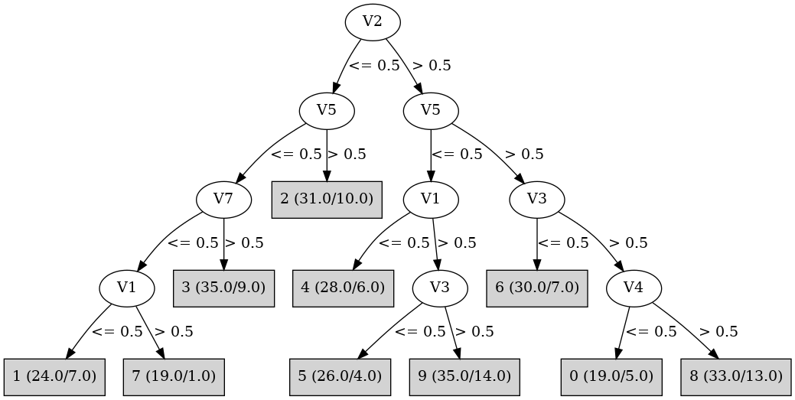

# J48

# SimpleCart Decision Tree

V2 < 0.5

* V7 < 0.5

*   * V1 < 0.5: 1(23.0/10.0)

*   * V1 >= 0.5: 7(26.0/8.0)

* V7 >= 0.5

*   * V5 < 0.5: 3(32.0/13.0)

*   * V5 >= 0.5: 2(23.0/5.0)

V2 >= 0.5

* V3 < 0.5

*   * V5 < 0.5: 5(28.0/10.0)

*   * V5 >= 0.5: 6(30.0/7.0)

* V3 >= 0.5

*   * V7 < 0.5: 4(26.0/13.0)

*   * V7 >= 0.5

*   *   * V5 < 0.5: 9(27.0/12.0)

*   *   * V5 >= 0.5

*   *   *   * V4 < 0.5: 0(14.0/5.0)

*   *   *   * V4 >= 0.5: 8(26.0/12.0)

# PART

Decision list:

conditions|predicted class
---|---
V2 <= 0.0 AND V5 > 0.0 AND V6 <= 0.0 AND V7 > 0.0| 2 (22.0)
V2 <= 0.0 AND V4 <= 0.0 AND V1 <= 0.0 AND V3 > 0.0| 1 (27.0/7.0)
V5 > 0.0 AND V3 <= 0.0 AND V6 > 0.0 AND V4 > 0.0 AND V1 > 0.0| 6 (23.0/2.0)
V5 > 0.0 AND V2 <= 0.0 AND V4 <= 0.0| 7 (7.0/3.0)
V5 > 0.0 AND V3 <= 0.0 AND V6 > 0.0 AND V1 <= 0.0| 6 (6.0/2.0)
V5 > 0.0 AND V3 <= 0.0 AND V6 > 0.0| 6 (5.0/1.0)
V5 > 0.0 AND V4 <= 0.0 AND V7 > 0.0| 0 (20.0/6.0)
V5 > 0.0 AND V7 > 0.0 AND V6 > 0.0 AND V1 > 0.0| 8 (27.0/9.0)
V7 <= 0.0 AND V1 <= 0.0 AND V4 > 0.0 AND V2 > 0.0| 4 (28.0)
V5 > 0.0 AND V4 > 0.0 AND V2 > 0.0 AND V6 <= 0.0| 8 (10.0/4.0)
V3 <= 0.0 AND V2 > 0.0 AND V4 > 0.0| 5 (28.0/2.0)
V2 <= 0.0 AND V7 > 0.0 AND V3 > 0.0 AND V6 > 0.0 AND V4 > 0.0 AND V1 > 0.0| 3 (22.0/2.0)
V2 <= 0.0 AND V4 <= 0.0 AND V1 > 0.0 AND V7 <= 0.0| 7 (23.0/3.0)
V5 > 0.0 AND V2 > 0.0 AND V4 > 0.0| 8 (7.0/2.0)
V2 > 0.0 AND V4 > 0.0 AND V7 > 0.0 AND V1 > 0.0| 9 (29.0/8.0)
V5 > 0.0 AND V2 <= 0.0| 2 (4.0/1.0)
V2 > 0.0 AND V3 > 0.0 AND V5 <= 0.0 AND V7 > 0.0 AND V1 <= 0.0| 9 (5.0/1.0)
V2 <= 0.0 AND V4 <= 0.0 AND V1 > 0.0| 3 (6.0/3.0)
V3 <= 0.0 AND V1 <= 0.0| 1 (7.0/2.0)
V3 > 0.0 AND V2 <= 0.0 AND V7 > 0.0 AND V1 > 0.0| 3 (7.0/3.0)
V3 > 0.0 AND V2 <= 0.0 AND V7 <= 0.0| 7 (6.0/3.0)
V3 > 0.0 AND V2 <= 0.0| 3 (6.0/1.0)
V3 > 0.0 AND V5 <= 0.0 AND V7 <= 0.0 AND V4 <= 0.0| 4 (6.0/3.0)
V3 <= 0.0| 5 (5.0/2.0)
V4 <= 0.0 AND V5 <= 0.0| 0 (5.0/2.0)
V4 > 0.0| 9 (5.0/2.0)
| 0 (4.0)

# JRip

Decision list:

conditions|predicted class
---|---
(V4 <= 0) and (V5 >= 1) and (V2 >= 1) and (V3 >= 1)|0 (23.0/5.0)
(V4 <= 0) and (V1 <= 0)|1 (37.0/11.0)
(V3 <= 0) and (V5 <= 0) and (V7 >= 1) and (V4 >= 1)|5 (28.0/2.0)
(V3 <= 0) and (V5 <= 0) and (V1 >= 1) and (V2 >= 1)|5 (6.0/2.0)
(V6 <= 0) and (V5 >= 1) and (V2 <= 0)|2 (25.0/1.0)
(V1 <= 0) and (V7 <= 0)|4 (31.0/0.0)
(V3 <= 0) and (V2 >= 1)|6 (37.0/7.0)
(V7 <= 0) and (V2 <= 0)|7 (30.0/5.0)
(V5 >= 1) and (V4 >= 1)|8 (42.0/13.0)
(V2 >= 1) and (V4 >= 1)|9 (39.0/11.0)
|3 (52.0/20.0)

# Decision Table

Non matches covered by Majority class

v2|v3|v5|v6|v7|target
---|---|---|---|---|---
(-inf-0.5]|(0.5-inf)|(0.5-inf)|(0.5-inf)|(0.5-inf)|0
(0.5-inf)|(0.5-inf)|(0.5-inf)|(0.5-inf)|(0.5-inf)|8
(-inf-0.5]|(-inf-0.5]|(0.5-inf)|(0.5-inf)|(0.5-inf)|0
(0.5-inf)|(-inf-0.5]|(0.5-inf)|(0.5-inf)|(0.5-inf)|6
(-inf-0.5]|(0.5-inf)|(-inf-0.5]|(0.5-inf)|(0.5-inf)|3
(0.5-inf)|(0.5-inf)|(-inf-0.5]|(0.5-inf)|(0.5-inf)|9
(-inf-0.5]|(0.5-inf)|(0.5-inf)|(-inf-0.5]|(0.5-inf)|2
(0.5-inf)|(0.5-inf)|(0.5-inf)|(-inf-0.5]|(0.5-inf)|8
(-inf-0.5]|(-inf-0.5]|(-inf-0.5]|(0.5-inf)|(0.5-inf)|1
(0.5-inf)|(-inf-0.5]|(-inf-0.5]|(0.5-inf)|(0.5-inf)|5
(0.5-inf)|(-inf-0.5]|(0.5-inf)|(-inf-0.5]|(0.5-inf)|2
(-inf-0.5]|(-inf-0.5]|(0.5-inf)|(-inf-0.5]|(0.5-inf)|2
(0.5-inf)|(0.5-inf)|(0.5-inf)|(0.5-inf)|(-inf-0.5]|4
(-inf-0.5]|(0.5-inf)|(0.5-inf)|(0.5-inf)|(-inf-0.5]|1
(0.5-inf)|(0.5-inf)|(-inf-0.5]|(-inf-0.5]|(0.5-inf)|0
(0.5-inf)|(-inf-0.5]|(0.5-inf)|(0.5-inf)|(-inf-0.5]|6
(-inf-0.5]|(0.5-inf)|(-inf-0.5]|(-inf-0.5]|(0.5-inf)|3
(-inf-0.5]|(-inf-0.5]|(-inf-0.5]|(-inf-0.5]|(0.5-inf)|0
(0.5-inf)|(-inf-0.5]|(-inf-0.5]|(-inf-0.5]|(0.5-inf)|5
(0.5-inf)|(0.5-inf)|(-inf-0.5]|(0.5-inf)|(-inf-0.5]|4
(-inf-0.5]|(0.5-inf)|(-inf-0.5]|(0.5-inf)|(-inf-0.5]|7
(-inf-0.5]|(-inf-0.5]|(-inf-0.5]|(0.5-inf)|(-inf-0.5]|1
(0.5-inf)|(-inf-0.5]|(-inf-0.5]|(0.5-inf)|(-inf-0.5]|4
(-inf-0.5]|(0.5-inf)|(0.5-inf)|(-inf-0.5]|(-inf-0.5]|2
(-inf-0.5]|(-inf-0.5]|(0.5-inf)|(-inf-0.5]|(-inf-0.5]|0
(0.5-inf)|(0.5-inf)|(-inf-0.5]|(-inf-0.5]|(-inf-0.5]|0
(-inf-0.5]|(0.5-inf)|(-inf-0.5]|(-inf-0.5]|(-inf-0.5]|1
(0.5-inf)|(-inf-0.5]|(-inf-0.5]|(-inf-0.5]|(-inf-0.5]|0
(-inf-0.5]|(-inf-0.5]|(-inf-0.5]|(-inf-0.5]|(-inf-0.5]|7

