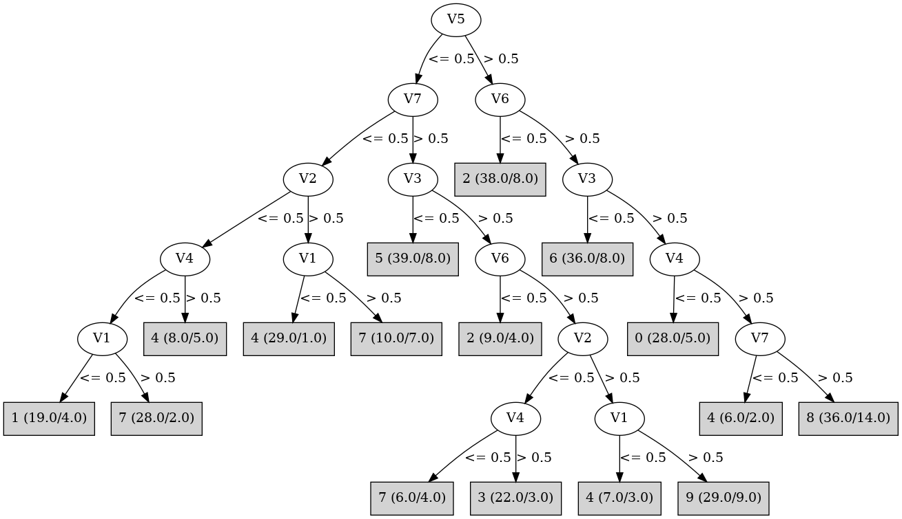

# J48

# SimpleCart Decision Tree

V5 < 0.5

* V7 < 0.5

*   * V2 < 0.5

*   *   * V1 < 0.5

*   *   *   * V4 < 0.5

*   *   *   *   * V3 < 0.5: 1(4.0/0.0)

*   *   *   *   * V3 >= 0.5: 1(11.0/4.0)

*   *   *   * V4 >= 0.5: 4(3.0/1.0)

*   *   * V1 >= 0.5: 7(27.0/5.0)

*   * V2 >= 0.5: 4(30.0/9.0)

* V7 >= 0.5

*   * V3 < 0.5: 5(31.0/8.0)

*   * V3 >= 0.5

*   *   * V2 < 0.5: 3(23.0/13.0)

*   *   * V2 >= 0.5: 9(22.0/15.0)

V5 >= 0.5

* V6 < 0.5: 2(30.0/8.0)

* V6 >= 0.5

*   * V3 < 0.5: 6(28.0/8.0)

*   * V3 >= 0.5

*   *   * V4 < 0.5: 0(23.0/5.0)

*   *   * V4 >= 0.5

*   *   *   * V7 < 0.5: 4(4.0/2.0)

*   *   *   * V7 >= 0.5: 8(22.0/14.0)

# PART

Decision list:

conditions|predicted class
---|---
V5 > 0 AND V6 <= 0 AND V2 <= 0| 2 (26.0/1.0)
V5 > 0 AND V3 <= 0| 6 (39.0/9.0)
V7 <= 0 AND V2 > 0 AND V1 <= 0| 4 (34.0/2.0)
V3 <= 0 AND V7 > 0| 5 (39.0/8.0)
V5 > 0 AND V4 <= 0 AND V2 > 0| 0 (24.0/2.0)
V4 <= 0 AND V7 <= 0 AND V1 > 0| 7 (32.0/3.0)
V2 <= 0 AND V7 <= 0 AND V4 <= 0| 1 (20.0/4.0)
V5 > 0 AND V4 > 0| 8 (46.0/19.0)
V6 <= 0 AND V1 > 0| 2 (9.0/3.0)
V2 <= 0 AND V7 > 0 AND V4 > 0| 3 (23.0/4.0)
V2 > 0 AND V1 > 0 AND V7 > 0| 9 (29.0/9.0)
V3 > 0 AND V2 > 0 AND V1 <= 0| 4 (7.0/3.0)
V3 <= 0| 5 (3.0/1.0)
V6 <= 0| 3 (2.0)
V1 <= 0 AND V4 <= 0| 0 (2.0/1.0)
V1 > 0 AND V2 <= 0| 7 (9.0/5.0)
V1 > 0| 9 (4.0/2.0)
| 4 (2.0)

# JRip

Decision list:

conditions|predicted class
---|---
(V1 <= 0) and (V4 <= 0) and (V2 <= 0) and (V7 <= 0)|1 (20.0/4.0)
(V2 <= 0) and (V4 >= 1) and (V6 >= 1) and (V7 >= 1) and (V3 >= 1) and (V5 <= 0)|3 (22.0/3.0)
(V4 <= 0) and (V5 >= 1) and (V3 >= 1) and (V2 >= 1) and (V1 >= 1)|0 (21.0/1.0)
(V5 <= 0) and (V7 >= 1) and (V3 >= 1) and (V2 >= 1) and (V1 >= 1) and (V6 >= 1)|9 (29.0/9.0)
(V3 <= 0) and (V5 >= 1) and (V2 >= 1) and (V7 >= 1) and (V1 >= 1) and (V4 >= 1)|6 (24.0/2.0)
(V3 <= 0) and (V5 >= 1) and (V6 >= 1)|6 (14.0/6.0)
(V3 <= 0) and (V7 >= 1) and (V2 >= 1) and (V4 >= 1)|5 (28.0/4.0)
(V6 <= 0) and (V5 >= 1) and (V2 <= 0) and (V4 >= 1)|2 (22.0/0.0)
(V6 <= 0) and (V5 >= 1)|2 (13.0/5.0)
(V5 >= 1) and (V1 >= 1) and (V2 >= 1)|8 (30.0/10.0)
(V4 <= 0) and (V7 <= 0) and (V2 <= 0) and (V3 >= 1)|7 (27.0/1.0)
|4 (100.0/59.0)

# Decision Table

Non matches covered by IB1

v1|v2|v3|v4|v5|target
---|---|---|---|---|---
(-inf-0.5]|(0.5-inf)|(0.5-inf)|(0.5-inf)|(0.5-inf)|4
(0.5-inf)|(0.5-inf)|(0.5-inf)|(0.5-inf)|(0.5-inf)|8
(-inf-0.5]|(-inf-0.5]|(0.5-inf)|(0.5-inf)|(0.5-inf)|2
(0.5-inf)|(-inf-0.5]|(0.5-inf)|(0.5-inf)|(0.5-inf)|2
(0.5-inf)|(0.5-inf)|(-inf-0.5]|(0.5-inf)|(0.5-inf)|6
(-inf-0.5]|(0.5-inf)|(-inf-0.5]|(0.5-inf)|(0.5-inf)|6
(-inf-0.5]|(-inf-0.5]|(-inf-0.5]|(0.5-inf)|(0.5-inf)|0
(-inf-0.5]|(0.5-inf)|(0.5-inf)|(-inf-0.5]|(0.5-inf)|0
(0.5-inf)|(-inf-0.5]|(-inf-0.5]|(0.5-inf)|(0.5-inf)|2
(0.5-inf)|(0.5-inf)|(0.5-inf)|(-inf-0.5]|(0.5-inf)|0
(-inf-0.5]|(0.5-inf)|(0.5-inf)|(0.5-inf)|(-inf-0.5]|4
(0.5-inf)|(0.5-inf)|(0.5-inf)|(0.5-inf)|(-inf-0.5]|9
(0.5-inf)|(-inf-0.5]|(0.5-inf)|(-inf-0.5]|(0.5-inf)|2
(-inf-0.5]|(-inf-0.5]|(0.5-inf)|(-inf-0.5]|(0.5-inf)|0
(0.5-inf)|(0.5-inf)|(-inf-0.5]|(-inf-0.5]|(0.5-inf)|6
(0.5-inf)|(-inf-0.5]|(0.5-inf)|(0.5-inf)|(-inf-0.5]|3
(-inf-0.5]|(-inf-0.5]|(0.5-inf)|(0.5-inf)|(-inf-0.5]|3
(0.5-inf)|(-inf-0.5]|(-inf-0.5]|(-inf-0.5]|(0.5-inf)|2
(-inf-0.5]|(0.5-inf)|(-inf-0.5]|(0.5-inf)|(-inf-0.5]|4
(0.5-inf)|(0.5-inf)|(-inf-0.5]|(0.5-inf)|(-inf-0.5]|5
(0.5-inf)|(-inf-0.5]|(-inf-0.5]|(0.5-inf)|(-inf-0.5]|6
(-inf-0.5]|(-inf-0.5]|(-inf-0.5]|(0.5-inf)|(-inf-0.5]|4
(0.5-inf)|(0.5-inf)|(0.5-inf)|(-inf-0.5]|(-inf-0.5]|7
(-inf-0.5]|(0.5-inf)|(0.5-inf)|(-inf-0.5]|(-inf-0.5]|4
(0.5-inf)|(-inf-0.5]|(0.5-inf)|(-inf-0.5]|(-inf-0.5]|7
(-inf-0.5]|(-inf-0.5]|(0.5-inf)|(-inf-0.5]|(-inf-0.5]|1
(0.5-inf)|(0.5-inf)|(-inf-0.5]|(-inf-0.5]|(-inf-0.5]|5
(-inf-0.5]|(-inf-0.5]|(-inf-0.5]|(-inf-0.5]|(-inf-0.5]|1
(0.5-inf)|(-inf-0.5]|(-inf-0.5]|(-inf-0.5]|(-inf-0.5]|1

