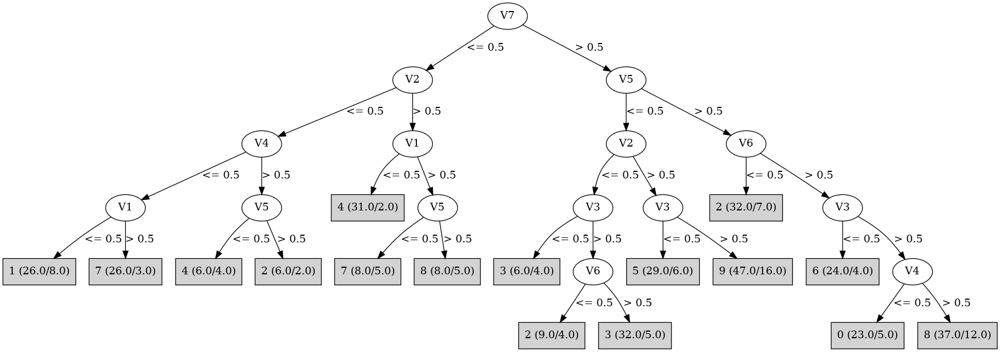

# J48

# SimpleCart Decision Tree

V2 < 0.5

* V6 < 0.5

*   * V5 < 0.5: 2(6.0/11.0)

*   * V5 >= 0.5: 2(25.0/2.0)

* V6 >= 0.5

*   * V7 < 0.5

*   *   * V1 < 0.5: 1(16.0/8.0)

*   *   * V1 >= 0.5: 7(22.0/4.0)

*   * V7 >= 0.5: 3(30.0/16.0)

V2 >= 0.5

* V5 < 0.5

*   * V7 < 0.5: 4(28.0/7.0)

*   * V7 >= 0.5

*   *   * V3 < 0.5: 5(23.0/6.0)

*   *   * V3 >= 0.5: 9(31.0/16.0)

* V5 >= 0.5

*   * V3 < 0.5: 6(23.0/6.0)

*   * V3 >= 0.5

*   *   * V4 < 0.5: 0(20.0/5.0)

*   *   * V4 >= 0.5: 8(28.0/17.0)

# PART

Decision list:

conditions|predicted class
---|---
V7 <= 0 AND V2 <= 0 AND V4 <= 0 AND V1 <= 0| 1 (26.0/8.0)
V5 > 0 AND V6 <= 0 AND V2 <= 0| 2 (27.0/2.0)
V7 <= 0 AND V1 <= 0| 4 (33.0/2.0)
V5 > 0 AND V3 > 0 AND V4 > 0| 8 (47.0/17.0)
V5 > 0 AND V3 > 0| 0 (31.0/9.0)
V5 > 0| 6 (30.0/7.0)
V7 <= 0 AND V2 <= 0| 7 (25.0/4.0)
V3 <= 0 AND V4 > 0| 5 (30.0/6.0)
V2 <= 0 AND V6 > 0 AND V4 > 0| 3 (27.0/2.0)
V2 <= 0 AND V6 <= 0| 2 (9.0/4.0)
V3 > 0 AND V4 > 0| 9 (43.0/16.0)
V3 > 0| 9 (14.0/9.0)
| 5 (8.0/5.0)

# JRip

Decision list:

conditions|predicted class
---|---
(V1 <= 0) and (V4 <= 0) and (V2 <= 0)|1 (27.0/8.0)
(V4 <= 0) and (V5 >= 1) and (V2 >= 1) and (V3 >= 1)|0 (25.0/5.0)
(V3 <= 0) and (V5 >= 1) and (V6 >= 1)|6 (28.0/5.0)
(V3 <= 0) and (V1 >= 1) and (V2 >= 1) and (V5 <= 0)|5 (29.0/5.0)
(V1 <= 0) and (V7 <= 0)|4 (34.0/3.0)
(V7 <= 0) and (V4 <= 0)|7 (29.0/4.0)
(V6 <= 0)|2 (47.0/13.0)
(V2 >= 1) and (V5 <= 0) and (V3 >= 1) and (V7 >= 1)|9 (44.0/15.0)
(V5 >= 1) and (V2 >= 1)|8 (35.0/10.0)
|3 (52.0/21.0)

# Decision Table

Non matches covered by IB1

v2|v3|v4|v5|v6|v7|target
---|---|---|---|---|---|---
(-inf-0.5]|(0.5-inf)|(0.5-inf)|(0.5-inf)|(0.5-inf)|(0.5-inf)|2
(0.5-inf)|(0.5-inf)|(0.5-inf)|(0.5-inf)|(0.5-inf)|(0.5-inf)|8
(0.5-inf)|(-inf-0.5]|(0.5-inf)|(0.5-inf)|(0.5-inf)|(0.5-inf)|6
(-inf-0.5]|(0.5-inf)|(-inf-0.5]|(0.5-inf)|(0.5-inf)|(0.5-inf)|0
(0.5-inf)|(0.5-inf)|(-inf-0.5]|(0.5-inf)|(0.5-inf)|(0.5-inf)|0
(0.5-inf)|(-inf-0.5]|(-inf-0.5]|(0.5-inf)|(0.5-inf)|(0.5-inf)|6
(-inf-0.5]|(-inf-0.5]|(-inf-0.5]|(0.5-inf)|(0.5-inf)|(0.5-inf)|5
(-inf-0.5]|(0.5-inf)|(0.5-inf)|(-inf-0.5]|(0.5-inf)|(0.5-inf)|3
(0.5-inf)|(0.5-inf)|(0.5-inf)|(-inf-0.5]|(0.5-inf)|(0.5-inf)|9
(-inf-0.5]|(-inf-0.5]|(0.5-inf)|(-inf-0.5]|(0.5-inf)|(0.5-inf)|0
(-inf-0.5]|(0.5-inf)|(0.5-inf)|(0.5-inf)|(-inf-0.5]|(0.5-inf)|2
(0.5-inf)|(-inf-0.5]|(0.5-inf)|(-inf-0.5]|(0.5-inf)|(0.5-inf)|5
(0.5-inf)|(0.5-inf)|(0.5-inf)|(0.5-inf)|(-inf-0.5]|(0.5-inf)|8
(0.5-inf)|(-inf-0.5]|(0.5-inf)|(0.5-inf)|(-inf-0.5]|(0.5-inf)|2
(-inf-0.5]|(-inf-0.5]|(0.5-inf)|(0.5-inf)|(-inf-0.5]|(0.5-inf)|2
(-inf-0.5]|(0.5-inf)|(-inf-0.5]|(-inf-0.5]|(0.5-inf)|(0.5-inf)|0
(0.5-inf)|(0.5-inf)|(-inf-0.5]|(-inf-0.5]|(0.5-inf)|(0.5-inf)|9
(0.5-inf)|(0.5-inf)|(0.5-inf)|(0.5-inf)|(0.5-inf)|(-inf-0.5]|4
(-inf-0.5]|(0.5-inf)|(0.5-inf)|(0.5-inf)|(0.5-inf)|(-inf-0.5]|0
(0.5-inf)|(-inf-0.5]|(0.5-inf)|(0.5-inf)|(0.5-inf)|(-inf-0.5]|6
(0.5-inf)|(-inf-0.5]|(-inf-0.5]|(-inf-0.5]|(0.5-inf)|(0.5-inf)|5
(0.5-inf)|(0.5-inf)|(-inf-0.5]|(0.5-inf)|(-inf-0.5]|(0.5-inf)|0
(-inf-0.5]|(0.5-inf)|(-inf-0.5]|(0.5-inf)|(-inf-0.5]|(0.5-inf)|0
(-inf-0.5]|(-inf-0.5]|(-inf-0.5]|(-inf-0.5]|(0.5-inf)|(0.5-inf)|3
(0.5-inf)|(0.5-inf)|(0.5-inf)|(-inf-0.5]|(-inf-0.5]|(0.5-inf)|6
(-inf-0.5]|(-inf-0.5]|(-inf-0.5]|(0.5-inf)|(-inf-0.5]|(0.5-inf)|0
(0.5-inf)|(-inf-0.5]|(-inf-0.5]|(0.5-inf)|(-inf-0.5]|(0.5-inf)|0
(-inf-0.5]|(0.5-inf)|(0.5-inf)|(-inf-0.5]|(-inf-0.5]|(0.5-inf)|2
(0.5-inf)|(0.5-inf)|(-inf-0.5]|(0.5-inf)|(0.5-inf)|(-inf-0.5]|0
(-inf-0.5]|(0.5-inf)|(-inf-0.5]|(0.5-inf)|(0.5-inf)|(-inf-0.5]|1
(0.5-inf)|(-inf-0.5]|(-inf-0.5]|(0.5-inf)|(0.5-inf)|(-inf-0.5]|0
(-inf-0.5]|(0.5-inf)|(0.5-inf)|(-inf-0.5]|(0.5-inf)|(-inf-0.5]|7
(0.5-inf)|(-inf-0.5]|(0.5-inf)|(-inf-0.5]|(-inf-0.5]|(0.5-inf)|5
(-inf-0.5]|(-inf-0.5]|(0.5-inf)|(-inf-0.5]|(-inf-0.5]|(0.5-inf)|0
(0.5-inf)|(0.5-inf)|(0.5-inf)|(-inf-0.5]|(0.5-inf)|(-inf-0.5]|4
(-inf-0.5]|(0.5-inf)|(-inf-0.5]|(-inf-0.5]|(-inf-0.5]|(0.5-inf)|0
(0.5-inf)|(0.5-inf)|(0.5-inf)|(0.5-inf)|(-inf-0.5]|(-inf-0.5]|0
(-inf-0.5]|(0.5-inf)|(0.5-inf)|(0.5-inf)|(-inf-0.5]|(-inf-0.5]|2
(0.5-inf)|(-inf-0.5]|(0.5-inf)|(-inf-0.5]|(0.5-inf)|(-inf-0.5]|4
(-inf-0.5]|(-inf-0.5]|(0.5-inf)|(0.5-inf)|(-inf-0.5]|(-inf-0.5]|0
(0.5-inf)|(0.5-inf)|(-inf-0.5]|(-inf-0.5]|(0.5-inf)|(-inf-0.5]|4
(-inf-0.5]|(0.5-inf)|(-inf-0.5]|(-inf-0.5]|(0.5-inf)|(-inf-0.5]|7
(0.5-inf)|(-inf-0.5]|(-inf-0.5]|(-inf-0.5]|(0.5-inf)|(-inf-0.5]|0
(-inf-0.5]|(0.5-inf)|(-inf-0.5]|(0.5-inf)|(-inf-0.5]|(-inf-0.5]|0
(-inf-0.5]|(-inf-0.5]|(-inf-0.5]|(-inf-0.5]|(0.5-inf)|(-inf-0.5]|1
(-inf-0.5]|(0.5-inf)|(0.5-inf)|(-inf-0.5]|(-inf-0.5]|(-inf-0.5]|2
(-inf-0.5]|(-inf-0.5]|(-inf-0.5]|(0.5-inf)|(-inf-0.5]|(-inf-0.5]|0
(0.5-inf)|(-inf-0.5]|(0.5-inf)|(-inf-0.5]|(-inf-0.5]|(-inf-0.5]|0
(-inf-0.5]|(0.5-inf)|(-inf-0.5]|(-inf-0.5]|(-inf-0.5]|(-inf-0.5]|1
(-inf-0.5]|(-inf-0.5]|(-inf-0.5]|(-inf-0.5]|(-inf-0.5]|(-inf-0.5]|0

