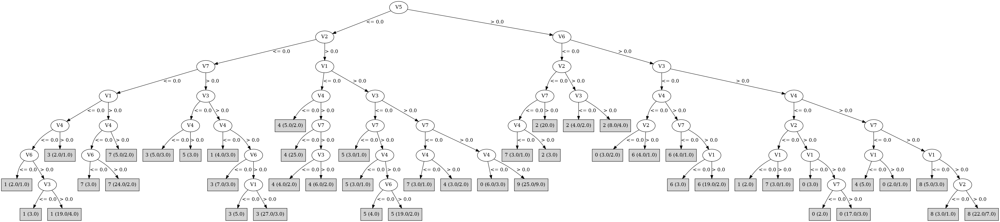

# J48

# SimpleCart Decision Tree

V2 < 0.5

* V4 < 0.5

*   * V1 < 0.5: 1(23.0/7.0)

*   * V1 >= 0.5

*   *   * V7 < 0.5: 7(28.0/3.0)

*   *   * V7 >= 0.5: 2(3.0/11.0)

* V4 >= 0.5

*   * V5 < 0.5: 3(35.0/14.0)

*   * V5 >= 0.5: 2(20.0/4.0)

V2 >= 0.5

* V1 < 0.5

*   * V7 < 0.5: 4(33.0/3.0)

*   * V7 >= 0.5

*   *   * V5 < 0.5: 4(6.0/5.0)

*   *   * V5 >= 0.5: 6(4.0/7.0)

* V1 >= 0.5

*   * V3 < 0.5

*   *   * V5 < 0.5: 5(25.0/4.0)

*   *   * V5 >= 0.5: 6(23.0/6.0)

*   * V3 >= 0.5

*   *   * V4 < 0.5

*   *   *   * V5 < 0.5: 0(3.0/6.0)

*   *   *   * V5 >= 0.5: 0(17.0/3.0)

*   *   * V4 >= 0.5

*   *   *   * V5 < 0.5: 9(17.0/11.0)

*   *   *   * V5 >= 0.5: 8(18.0/11.0)

# PART

Decision list:

conditions|predicted class
---|---
V5 > 0.0 AND V6 <= 0.0| 2 (38.0/8.0)
V2 <= 0.0 AND V7 <= 0.0 AND V1 > 0.0| 7 (34.0/5.0)
V5 > 0.0 AND V3 <= 0.0| 6 (33.0/6.0)
V7 <= 0.0 AND V2 > 0.0 AND V1 <= 0.0| 4 (35.0/2.0)
V3 <= 0.0| 5 (45.0/14.0)
V4 <= 0.0 AND V2 > 0.0| 0 (31.0/10.0)
V4 > 0.0 AND V5 <= 0.0 AND V2 <= 0.0| 3 (41.0/7.0)
V4 > 0.0 AND V5 <= 0.0| 9 (34.0/15.0)
V4 > 0.0| 8 (31.0/11.0)
| 1 (28.0/10.0)

# JRip

Decision list:

conditions|predicted class
---|---
(V1 <= 0) and (V4 <= 0) and (V2 <= 0) and (V6 >= 1)|1 (26.0/4.0)
(V4 <= 0) and (V2 >= 1) and (V5 >= 1) and (V3 >= 1)|0 (23.0/3.0)
(V5 >= 1) and (V3 >= 1) and (V2 >= 1) and (V1 >= 1) and (V6 >= 1)|8 (23.0/7.0)
(V2 >= 1) and (V3 >= 1) and (V7 >= 1) and (V5 <= 0)|9 (38.0/17.0)
(V3 <= 0) and (V5 >= 1) and (V2 >= 1)|6 (33.0/6.0)
(V3 <= 0) and (V2 >= 1) and (V1 >= 1)|5 (29.0/4.0)
(V3 <= 0) and (V7 >= 1) and (V1 <= 0)|5 (6.0/2.0)
(V6 <= 0) and (V5 >= 1)|2 (33.0/5.0)
(V4 <= 0) and (V7 <= 0) and (V1 >= 1)|7 (31.0/3.0)
(V2 >= 1) and (V7 <= 0) and (V1 <= 0)|4 (34.0/1.0)
|3 (74.0/36.0)

# Decision Table

Non matches covered by Majority class

v1|v2|v3|v4|v5|v6|target
---|---|---|---|---|---|---
(-inf-0.5]|(0.5-inf)|(0.5-inf)|(0.5-inf)|(0.5-inf)|(0.5-inf)|4
(0.5-inf)|(0.5-inf)|(0.5-inf)|(0.5-inf)|(0.5-inf)|(0.5-inf)|8
(0.5-inf)|(-inf-0.5]|(0.5-inf)|(0.5-inf)|(0.5-inf)|(0.5-inf)|8
(-inf-0.5]|(0.5-inf)|(-inf-0.5]|(0.5-inf)|(0.5-inf)|(0.5-inf)|6
(0.5-inf)|(0.5-inf)|(-inf-0.5]|(0.5-inf)|(0.5-inf)|(0.5-inf)|6
(0.5-inf)|(-inf-0.5]|(-inf-0.5]|(0.5-inf)|(0.5-inf)|(0.5-inf)|0
(0.5-inf)|(0.5-inf)|(0.5-inf)|(-inf-0.5]|(0.5-inf)|(0.5-inf)|0
(-inf-0.5]|(0.5-inf)|(0.5-inf)|(-inf-0.5]|(0.5-inf)|(0.5-inf)|0
(-inf-0.5]|(-inf-0.5]|(0.5-inf)|(-inf-0.5]|(0.5-inf)|(0.5-inf)|1
(0.5-inf)|(-inf-0.5]|(0.5-inf)|(-inf-0.5]|(0.5-inf)|(0.5-inf)|7
(-inf-0.5]|(0.5-inf)|(0.5-inf)|(0.5-inf)|(-inf-0.5]|(0.5-inf)|4
(0.5-inf)|(0.5-inf)|(0.5-inf)|(0.5-inf)|(-inf-0.5]|(0.5-inf)|9
(-inf-0.5]|(0.5-inf)|(0.5-inf)|(0.5-inf)|(0.5-inf)|(-inf-0.5]|0
(-inf-0.5]|(-inf-0.5]|(0.5-inf)|(0.5-inf)|(-inf-0.5]|(0.5-inf)|3
(0.5-inf)|(0.5-inf)|(-inf-0.5]|(-inf-0.5]|(0.5-inf)|(0.5-inf)|6
(0.5-inf)|(0.5-inf)|(0.5-inf)|(0.5-inf)|(0.5-inf)|(-inf-0.5]|2
(0.5-inf)|(-inf-0.5]|(0.5-inf)|(0.5-inf)|(-inf-0.5]|(0.5-inf)|3
(-inf-0.5]|(0.5-inf)|(-inf-0.5]|(0.5-inf)|(-inf-0.5]|(0.5-inf)|4
(0.5-inf)|(-inf-0.5]|(-inf-0.5]|(-inf-0.5]|(0.5-inf)|(0.5-inf)|0
(-inf-0.5]|(-inf-0.5]|(0.5-inf)|(0.5-inf)|(0.5-inf)|(-inf-0.5]|2
(0.5-inf)|(0.5-inf)|(-inf-0.5]|(0.5-inf)|(-inf-0.5]|(0.5-inf)|5
(0.5-inf)|(-inf-0.5]|(0.5-inf)|(0.5-inf)|(0.5-inf)|(-inf-0.5]|2
(-inf-0.5]|(-inf-0.5]|(-inf-0.5]|(0.5-inf)|(-inf-0.5]|(0.5-inf)|5
(-inf-0.5]|(0.5-inf)|(0.5-inf)|(-inf-0.5]|(-inf-0.5]|(0.5-inf)|4
(0.5-inf)|(0.5-inf)|(0.5-inf)|(-inf-0.5]|(-inf-0.5]|(0.5-inf)|0
(0.5-inf)|(0.5-inf)|(-inf-0.5]|(0.5-inf)|(0.5-inf)|(-inf-0.5]|2
(-inf-0.5]|(-inf-0.5]|(-inf-0.5]|(0.5-inf)|(0.5-inf)|(-inf-0.5]|0
(0.5-inf)|(0.5-inf)|(0.5-inf)|(-inf-0.5]|(0.5-inf)|(-inf-0.5]|0
(0.5-inf)|(-inf-0.5]|(-inf-0.5]|(0.5-inf)|(0.5-inf)|(-inf-0.5]|2
(-inf-0.5]|(-inf-0.5]|(0.5-inf)|(-inf-0.5]|(-inf-0.5]|(0.5-inf)|1
(0.5-inf)|(-inf-0.5]|(0.5-inf)|(-inf-0.5]|(-inf-0.5]|(0.5-inf)|7
(-inf-0.5]|(0.5-inf)|(0.5-inf)|(0.5-inf)|(-inf-0.5]|(-inf-0.5]|0
(0.5-inf)|(-inf-0.5]|(0.5-inf)|(-inf-0.5]|(0.5-inf)|(-inf-0.5]|2
(0.5-inf)|(0.5-inf)|(-inf-0.5]|(-inf-0.5]|(-inf-0.5]|(0.5-inf)|5
(-inf-0.5]|(-inf-0.5]|(0.5-inf)|(-inf-0.5]|(0.5-inf)|(-inf-0.5]|2
(-inf-0.5]|(-inf-0.5]|(0.5-inf)|(0.5-inf)|(-inf-0.5]|(-inf-0.5]|0
(0.5-inf)|(0.5-inf)|(-inf-0.5]|(-inf-0.5]|(0.5-inf)|(-inf-0.5]|0
(0.5-inf)|(-inf-0.5]|(-inf-0.5]|(-inf-0.5]|(-inf-0.5]|(0.5-inf)|3
(0.5-inf)|(-inf-0.5]|(0.5-inf)|(0.5-inf)|(-inf-0.5]|(-inf-0.5]|3
(-inf-0.5]|(-inf-0.5]|(-inf-0.5]|(-inf-0.5]|(-inf-0.5]|(0.5-inf)|1
(0.5-inf)|(-inf-0.5]|(-inf-0.5]|(-inf-0.5]|(0.5-inf)|(-inf-0.5]|7
(0.5-inf)|(0.5-inf)|(-inf-0.5]|(0.5-inf)|(-inf-0.5]|(-inf-0.5]|5
(-inf-0.5]|(0.5-inf)|(-inf-0.5]|(0.5-inf)|(-inf-0.5]|(-inf-0.5]|0
(0.5-inf)|(-inf-0.5]|(-inf-0.5]|(0.5-inf)|(-inf-0.5]|(-inf-0.5]|0
(-inf-0.5]|(-inf-0.5]|(0.5-inf)|(-inf-0.5]|(-inf-0.5]|(-inf-0.5]|0
(0.5-inf)|(-inf-0.5]|(0.5-inf)|(-inf-0.5]|(-inf-0.5]|(-inf-0.5]|7
(-inf-0.5]|(-inf-0.5]|(-inf-0.5]|(-inf-0.5]|(-inf-0.5]|(-inf-0.5]|0

